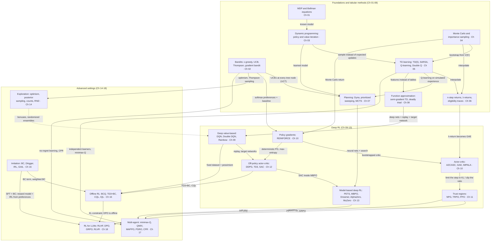
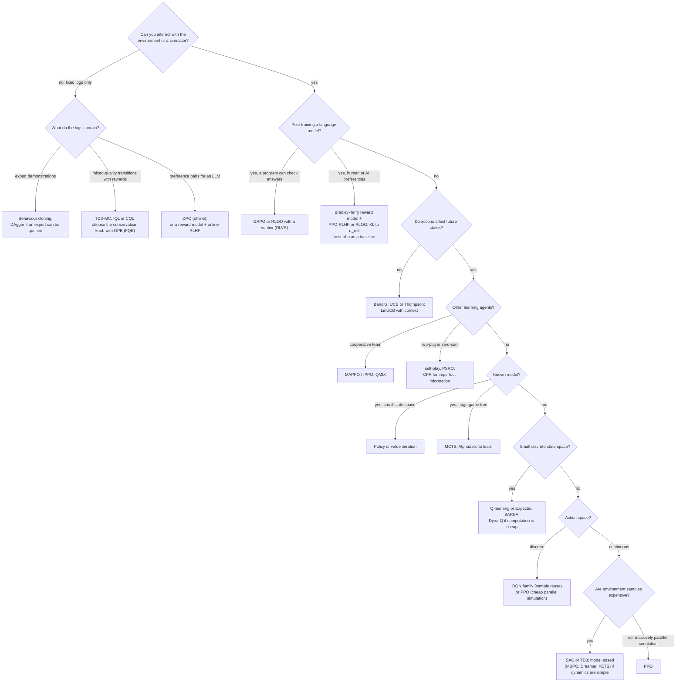

# Reinforcement Learning Cheat Sheet

A dense reference card for the whole course. It does not teach anything new: every equation, number and recommendation below comes from a chapter, and each entry links to the section that derives or measures it. The only exception is the column of published hyperparameter defaults in Section 5, which is labelled with its source paper. Use it to find the right chapter quickly, to check a formula while coding, or to pick a starting point for a new problem.

**Conventions.** Notation follows [NOTATION.md](NOTATION.md) (Sutton & Barto): the reward that follows $S_t, A_t$ is $R_{t+1}$, optimal quantities are $v_\ast, q_\ast, \pi_\ast$, $b$ is the behaviour policy and $\rho$ an importance ratio. Where a chapter follows a paper's notation, its equations are copied here in that chapter's notation. The main local departures are:

* [Ch 09](chapters/09-deep-q-learning.md): Q-network $\hat q(s,a,\mathbf w)$, target weights $\mathbf w^-$, Polyak coefficient $\tau_{\text P}$.
* [Ch 11](chapters/11-trust-regions-and-ppo.md): $\rho_t = \pi_{\boldsymbol\theta}(A_t\mid S_t)/\pi_{\boldsymbol\theta_{\text{old}}}(A_t\mid S_t)$ is the PPO/TRPO ratio and $\epsilon$ is PPO's clip range.
* [Ch 12](chapters/12-continuous-control-actor-critic.md): critic $Q_{\mathbf w}$, target weights $\bar{\mathbf w}$, deterministic actor $\mu_{\boldsymbol\theta}$, $\tau$ is the Polyak coefficient, $\alpha$ is the entropy temperature, and learning rates are $\eta$.
* [Ch 16](chapters/16-offline-rl-and-imitation.md): $\alpha$ is CQL's conservatism weight and $\tau$ is IQL's expectile.
* [Ch 18](chapters/18-rl-for-language-models.md): $x$ is the prompt, $y$ the response and $\beta$ the KL coefficient.
* Other overloaded symbols, explained in the row where they appear: $\tau$ is also a quantile level (QR-DQN), the visit-count temperature of AlphaZero's search policy, the steps since an action was last tried (Dyna-Q+) and a number of experiences (Ch 08's step-size rule); $\epsilon$ in the TRPO bound is $\max_{s,a}\lvert A_\pi(s,a)\rvert$, not the clip range; $\beta$ in AWR is an inverse temperature.

**Gymnasium rule that appears in every chapter.** Bootstrap through *truncation* (time limits) and never through *termination*. The target is $R_{t+1}$ alone only when `terminated` is true.

## Contents

1. A map of RL: family tree and taxonomy
2. Core equations, grouped by topic, each with its source section
3. Algorithm comparison table
4. Which algorithm should I use?
5. Typical starting hyperparameters (course code vs published defaults)
6. Debugging checklist

---

## 1. A map of RL

### 1.1 How the families grew from each other

Each arrow reads "this idea leads to that one". The label names what was added. Dotted arrows are cross-cutting add-ons.

### 1.2 Taxonomy

The axes come from [Ch 01 §14](chapters/01-the-rl-problem.md). Every algorithm sits somewhere on each of them.

| Axis | One side | Other side | What the choice buys or costs | Examples |
|---|---|---|---|---|
| Model | **Model-free**: learn values or policies directly from experience | **Model-based**: use a given or learned model of $p$ to plan | Models make each real transition count many times, but planners exploit model errors ([Ch 13 §1.2](chapters/13-model-based-rl.md)) | Free: TD, Q-learning, PG, PPO, SAC. Based: DP ([Ch 03](chapters/03-dynamic-programming.md)), Dyna and MCTS ([Ch 07](chapters/07-planning-and-learning-tabular.md)), PETS, MBPO, Dreamer, MuZero ([Ch 13](chapters/13-model-based-rl.md)) |
| What is learned | **Value-based**: learn $q_\ast$ and act greedily | **Policy-based**: ascend $\nabla J(\boldsymbol\theta)$; **actor-critic**: both, the critic cuts the actor's variance | Value-based needs $\max_a$ (hard for continuous actions); policy-based handles stochastic and continuous policies but has high variance ([Ch 10 §1](chapters/10-policy-gradients.md), [Ch 12 §1](chapters/12-continuous-control-actor-critic.md)) | Value: Q-learning, DQN. Policy: REINFORCE. Actor-critic: A2C, PPO, DDPG, TD3, SAC |
| Data and target policy | **On-policy**: behaviour policy = target policy | **Off-policy**: learn about $\pi$ from data of $b \ne \pi$ | Off-policy reuses old data and is usually more sample-efficient, but needs coverage, can need importance sampling, and is the third ingredient of the deadly triad ([Ch 08 §14](chapters/08-function-approximation.md)) | On: SARSA, REINFORCE, PPO. Off: Q-learning, DQN with replay, DDPG, TD3, SAC |
| Interaction | **Online**: learn while interacting, so the policy shapes its own data | **Offline (batch)**: fixed dataset, no further interaction | Offline is essential when exploration is dangerous or expensive, but overestimated actions are never corrected, so pessimism is needed ([Ch 16 §6](chapters/16-offline-rl-and-imitation.md)) | Online: everything in Ch 05-13. Offline: BC, BCQ, CQL, IQL, DPO |
| Target construction | **Bootstrap** (TD, DP): use a current estimate of the next value | **Full return** (MC): wait for the real return | Bootstrapping lowers variance and adds bias; $n$ and $\lambda$ interpolate ([Ch 06 §15](chapters/06-n-step-and-eligibility-traces.md)) | TD(0), Q-learning vs MC, REINFORCE |
| Representation | **Tabular**: one number per state or pair | **Approximate**: linear features or neural networks | Approximation generalizes but loses most guarantees ([Ch 08](chapters/08-function-approximation.md)) | Ch 02-07 vs Ch 08-13 |

---

## 2. Core equations

Each entry gives the equation in the notation of the chapter that teaches it, one line on what it means, and the section where it is derived.

### 2.1 Returns, values and Bellman equations

| Name | Equation | Meaning | Source |
|---|---|---|---|
| Return | $G_t \doteq \sum_{k=0}^{\infty}\gamma^k R_{t+k+1}$, $\quad G_t = R_{t+1} + \gamma G_{t+1}$ | Discounted sum of future rewards; the recursion is the seed of every backup. $1/(1-\gamma)$ is the effective horizon | [Ch 01 §4](chapters/01-the-rl-problem.md) (1.2)-(1.3) |
| Values | $v_\pi(s) = \mathbb{E}_\pi[G_t \mid S_t = s]$, $\quad q_\pi(s,a) = \mathbb{E}_\pi[G_t \mid S_t = s, A_t = a]$, $\quad A_\pi = q_\pi - v_\pi$ | Expected return from a state, from a state-action pair, and the advantage of an action | [Ch 01 §8](chapters/01-the-rl-problem.md) (1.11)-(1.12) |
| Bellman expectation, $v$ | $v_\pi(s) = \sum_a \pi(a \mid s)\sum_{s',r} p(s',r \mid s,a)\,[r + \gamma v_\pi(s')]$ | Value now = expected reward + discounted value next, under $\pi$; linear in $v_\pi$ | [Ch 01 §9.1](chapters/01-the-rl-problem.md) (1.15) |
| Bellman expectation, $q$ | $q_\pi(s,a) = \sum_{s',r} p(s',r \mid s,a)\,[r + \gamma \sum_{a'}\pi(a' \mid s')\, q_\pi(s',a')]$ | The same for action values | [Ch 01 §9.2](chapters/01-the-rl-problem.md) (1.16) |
| Exact solution | $\mathbf{v}_\pi = \mathbf{r}_\pi + \gamma\mathbf{P}_\pi\mathbf{v}_\pi = (\mathbf{I}-\gamma\mathbf{P}_\pi)^{-1}\mathbf{r}_\pi$ | One linear solve evaluates a policy when the model is known and $\gamma \lt 1$ | [Ch 01 §10.1](chapters/01-the-rl-problem.md) (1.17)-(1.18) |
| Bellman optimality, $v$ | $v_\ast(s) = \max_a \sum_{s',r} p(s',r \mid s,a)\,[r + \gamma v_\ast(s')]$ | The best achievable value; nonlinear because of the max | [Ch 01 §12.3](chapters/01-the-rl-problem.md) (1.23) |
| Bellman optimality, $q$ | $q_\ast(s,a) = \sum_{s',r} p(s',r \mid s,a)\,[r + \gamma \max_{a'} q_\ast(s',a')]$ | Target of Q-learning and DQN | [Ch 01 §12.3](chapters/01-the-rl-problem.md) (1.24) |
| Greedy optimal policy | $\pi_\ast(s) \in \arg\max_a q_\ast(s,a)$ | Acting greedily on $q_\ast$ is optimal and needs no model | [Ch 01 §12.4](chapters/01-the-rl-problem.md) (1.25) |
| Contraction | $\lVert\mathcal{T}u - \mathcal{T}w\rVert_\infty \le \gamma\lVert u - w\rVert_\infty$ for $\mathcal{T}^\pi$ and $\mathcal{T}^\ast$ | Unique fixed points $v_\pi$, $v_\ast$; iteration converges geometrically from anywhere | [Ch 03 §2.4](chapters/03-dynamic-programming.md) (3.8) |

### 2.2 Dynamic programming and policy improvement

| Name | Equation | Meaning | Source |
|---|---|---|---|
| Policy improvement theorem | If $\sum_a \pi'(a\mid s)\, q_\pi(s,a) \ge v_\pi(s)$ for all $s$ (i.e. $\mathcal{T}^{\pi'}v_\pi \ge v_\pi$), then $v_{\pi'} \ge v_\pi$ | Deviating to better actions everywhere at once never hurts | [Ch 03 §4.1](chapters/03-dynamic-programming.md) (3.17) |
| Greedy improvement | $\pi'(s) \in \arg\max_a\big[r(s,a) + \gamma\sum_{s'}p(s'\mid s,a)\,v_\pi(s')\big]$ | The engine of policy iteration; stops only at optimality | [Ch 03 §4.2](chapters/03-dynamic-programming.md) (3.18) |
| Value iteration | $V_{k+1} = \mathcal{T}^\ast V_k$; the policy greedy w.r.t. $V_{k+1}$ satisfies $v_\pi \ge v_\ast - \frac{2\gamma}{1-\gamma}\lVert V_{k+1} - V_k\rVert_\infty\mathbf{1}$ | Policy evaluation truncated to one sweep, with a stopping rule | [Ch 03 §6](chapters/03-dynamic-programming.md) (3.20)-(3.21) |
| Greedy loss | $\lVert v_\ast - v_\pi\rVert \le \frac{2\gamma}{1-\gamma}\lVert V - v_\ast\rVert$ for $\pi$ greedy w.r.t. $V$ | Value errors cost at most a horizon factor in policy quality | [Ch 03 §6.3](chapters/03-dynamic-programming.md) (3.22) |

### 2.3 Bandits

| Name | Equation | Meaning | Source |
|---|---|---|---|
| Incremental estimate | $Q_{n+1} = Q_n + \alpha_n[R_n - Q_n]$, $\alpha_n = 1/n$ (sample average) or constant $\alpha$ (tracks change) | The template of every value update in the course | [Ch 02 §3](chapters/02-multi-armed-bandits.md) (3.1)-(3.2) |
| UCB1 | $A_t \doteq \arg\max_a \big[Q_t(a) + \sqrt{2\ln t / N_t(a)}\big]$; general form $c\sqrt{\ln t / N_t(a)}$, untried arms first | Optimism: act on an upper confidence bound from Hoeffding; $c = \sqrt2$ is for rewards in $[0,1]$ | [Ch 02 §6.3](chapters/02-multi-armed-bandits.md) (6.4)-(6.5) |
| Thompson sampling (Beta-Bernoulli) | $\theta(a) \sim \mathrm{Beta}(\alpha_0 + S(a),\ \beta_0 + F(a))$, $\quad A_t = \arg\max_a \theta(a)$ | Probability matching: pick each arm with its posterior probability of being best | [Ch 02 §7.3](chapters/02-multi-armed-bandits.md) (7.2) |
| Gradient bandit | $\pi_t(a) = e^{H_t(a)}/\sum_b e^{H_t(b)}$, $\quad H_{t+1}(a) = H_t(a) + \alpha(R_t - \bar R_t)\big(\mathbb{1}[a = A_t] - \pi_t(a)\big)$ | Stochastic gradient ascent on expected reward with a baseline; the one-state policy gradient | [Ch 02 §8.1](chapters/02-multi-armed-bandits.md) (8.1)-(8.2) |
| Regret decomposition | $\mathbb{E}[\mathrm{Reg}(T)] = \sum_a \Delta_a\,\mathbb{E}[N_T(a)]$, $\quad \Delta_a = v_\ast - q_\ast(a)$ | Regret = gap times pulls; fixed exploration gives linear regret | [Ch 02 §11.2](chapters/02-multi-armed-bandits.md) (11.3) |
| Lai-Robbins | $\liminf_T \mathbb{E}[\mathrm{Reg}(T)]/\ln T \ge \sum_{a:\Delta_a \gt 0}\Delta_a/\mathrm{kl}(q_\ast(a), v_\ast)$ | No consistent algorithm beats logarithmic regret; KL-UCB and Thompson sampling attain it | [Ch 02 §11.4](chapters/02-multi-armed-bandits.md) (11.6) |

### 2.4 Monte Carlo and importance sampling

| Name | Equation | Meaning | Source |
|---|---|---|---|
| Constant-$\alpha$ MC | $V(S_t) \leftarrow V(S_t) + \alpha[G_t - V(S_t)]$ | Move toward the observed return; unbiased target, high variance, episodic only | [Ch 05 §1.2](chapters/05-temporal-difference.md) (5.1), [Ch 04 §2.4](chapters/04-monte-carlo.md) |
| IS ratio | $\rho_{t:h} \doteq \prod_{k=t}^{h}\frac{\pi(A_k \mid S_k)}{b(A_k \mid S_k)}$, $\quad \mathbb{E}_b[\rho_{t:T-1}\mid S_t] = 1$ | The unknown dynamics cancel; needs coverage ($b \gt 0$ wherever $\pi \gt 0$) | [Ch 04 §6.2](chapters/04-monte-carlo.md) |
| Ordinary IS | $V(s) = \dfrac{\sum_{t \in \mathcal{T}(s)} \rho_{t:T(t)-1} G_t}{\lvert\mathcal{T}(s)\rvert}$ | Unbiased; variance can be huge or infinite | [Ch 04 §6.3](chapters/04-monte-carlo.md) |
| Weighted IS | $V(s) = \dfrac{\sum_{t \in \mathcal{T}(s)} \rho_{t:T(t)-1} G_t}{\sum_{t \in \mathcal{T}(s)} \rho_{t:T(t)-1}}$; incremental: $C \leftarrow C + W$, $V \leftarrow V + \frac{W}{C}[G - V]$ | Biased but consistent and bounded; usually far better on small samples | [Ch 04 §6.3, §7](chapters/04-monte-carlo.md) |
| Per-decision IS | $\tilde G_t = \sum_{k=0}^{T-t-1}\gamma^k \rho_{t:t+k} R_{t+k+1} = \rho_t(R_{t+1} + \gamma \tilde G_{t+1})$ | Each reward is weighted only by the ratios it depends on | [Ch 04 §9.2](chapters/04-monte-carlo.md) |
| Curse of horizon | $\mathbb{E}_b[\rho_{0:H-1}^2] = \big(\sum_a \pi(a)^2/b(a)\big)^H = (1+\chi^2(\pi\Vert b))^H$ | Trajectory-ratio variance grows exponentially with horizon | [Ch 00 §2.6](chapters/00-math-toolkit.md) (2.18), [Ch 16 §12.2](chapters/16-offline-rl-and-imitation.md) (16.41) |
| Effective sample size | $n_{\text{eff}} = (\sum_i \rho_i)^2/\sum_i \rho_i^2$ | Quick diagnostic of how many samples the weights really use | [Ch 00 §2.6](chapters/00-math-toolkit.md) (2.19) |

### 2.5 Temporal-difference learning (tabular)

TD(0) prediction and the TD error ([Ch 05 §1.2, §2](chapters/05-temporal-difference.md), (5.2)-(5.3)):

$$
V(S_t) \leftarrow V(S_t) + \alpha\big[R_{t+1} + \gamma V(S_{t+1}) - V(S_t)\big], \qquad \delta_t = R_{t+1} + \gamma V(S_{t+1}) - V(S_t).
$$

The four one-step tabular control methods of Ch 05 all update $Q(S_t,A_t) \leftarrow Q(S_t,A_t) + \alpha\,[Y_t - Q(S_t,A_t)]$ and differ only in the target $Y_t$ (which is $R_{t+1}$ alone after a termination):

| Method | Target $Y_t$ | Meaning | Source |
|---|---|---|---|
| SARSA (on-policy) | $R_{t+1} + \gamma Q(S_{t+1}, A_{t+1})$ | Uses the next action actually taken; converges to $q_\ast$ under GLIE and Robbins-Monro steps | [Ch 05 §7](chapters/05-temporal-difference.md) (5.10) |
| Q-learning (off-policy) | $R_{t+1} + \gamma\max_a Q(S_{t+1}, a)$ | Learns $q_\ast$ from any sufficiently exploratory behaviour; no importance sampling because no behaviour action appears in the target | [Ch 05 §8](chapters/05-temporal-difference.md) (5.11) |
| Expected SARSA | $R_{t+1} + \gamma\sum_a \pi(a \mid S_{t+1})\, Q(S_{t+1}, a)$ | Averages over the next action: lower variance; Q-learning is the greedy-$\pi$ special case | [Ch 05 §9](chapters/05-temporal-difference.md) (5.14) |
| Double Q-learning | $R_{t+1} + \gamma Q_2\big(S_{t+1}, \arg\max_a Q_1(S_{t+1}, a)\big)$ (updating $Q_1$; a coin flip picks which table is updated) | Select with one table, evaluate with the other, removing the bias of $\mathbb{E}[\max_a Q(a)] \ge \max_a q(a)$ | [Ch 05 §11](chapters/05-temporal-difference.md) (5.16)-(5.17) |

### 2.6 n-step returns, λ-returns and eligibility traces

| Name | Equation | Meaning | Source |
|---|---|---|---|
| $n$-step return | $G_{t:t+n} = \sum_{j=0}^{n-1}\gamma^j R_{t+j+1} + \gamma^n V(S_{t+n})$ (or $G_t$ if $t+n \ge T$) | $n$ real rewards then bootstrap; $n=1$ is TD(0), $n \ge T-t$ is MC | [Ch 06 §2.1](chapters/06-n-step-and-eligibility-traces.md) (6.1) |
| $n$-step SARSA | $G_{t:t+n} = \sum_{j=0}^{n-1}\gamma^j R_{t+j+1} + \gamma^n Q(S_{t+n}, A_{t+n})$, $\quad Q(S_t,A_t) \leftarrow Q(S_t,A_t) + \alpha[G_{t:t+n} - Q(S_t,A_t)]$ | The control version; each update is made $n-1$ steps late | [Ch 06 §3.1](chapters/06-n-step-and-eligibility-traces.md) (6.5)-(6.6) |
| Off-policy $n$-step SARSA | $Q(S_t,A_t) \leftarrow Q(S_t,A_t) + \alpha\,\rho_{t+1:t+n}[G_{t:t+n} - Q(S_t,A_t)]$ | Corrects for the intermediate actions $b$ chose; variance grows geometrically in $n$ | [Ch 06 §4](chapters/06-n-step-and-eligibility-traces.md) (6.9) |
| λ-return | $G^\lambda_t = (1-\lambda)\sum_{n \ge 1}\lambda^{n-1}G_{t:t+n} = R_{t+1} + \gamma[(1-\lambda)V(S_{t+1}) + \lambda G^\lambda_{t+1}]$ | Geometric average of all $n$-step returns, mean lookahead $1/(1-\lambda)$ | [Ch 06 §8](chapters/06-n-step-and-eligibility-traces.md) (6.16), (6.18) |
| λ-return as TD errors | $G^\lambda_t - V(S_t) = \sum_{k \ge t}(\gamma\lambda)^{k-t}\delta_k$ ($V$ fixed) | The identity behind traces and GAE | [Ch 06 §8.2](chapters/06-n-step-and-eligibility-traces.md) (6.19) |
| TD(λ) | $z_t(s) = \gamma\lambda\, z_{t-1}(s) + \mathbb{1}[S_t = s]$, $\quad V_{t+1}(s) = V_t(s) + \alpha\,\delta_t\, z_t(s)$ for all $s$ | Backward view: each TD error updates recently visited states; offline it equals the λ-return algorithm exactly | [Ch 06 §9.1](chapters/06-n-step-and-eligibility-traces.md) (6.21)-(6.22) |
| Replacing / dutch traces | replacing: $z_t(S_t) = 1$; dutch: $z_t(s) = \gamma\lambda z_{t-1}(s) + (1 - \alpha\gamma\lambda\, z_{t-1}(S_t))\,\mathbb{1}[S_t = s]$ | Tolerate larger step sizes than accumulating traces | [Ch 06 §9.2](chapters/06-n-step-and-eligibility-traces.md) (6.23)-(6.24) |
| Off-policy traces, Retrace(λ) | $z_t = \gamma c_t z_{t-1} + \mathbf{e}_{S_t,A_t}$, $\quad Q \leftarrow Q + \alpha\,\delta^{\mathrm{ES}}_t z_t$, $\quad c_t = \lambda\min(1, \rho_t)$ | Safe (contraction to $q_\pi$ for any $b$), efficient near on-policy, never amplifies traces | [Ch 06 §14](chapters/06-n-step-and-eligibility-traces.md) (6.27) |

### 2.7 Function approximation

| Name | Equation | Meaning | Source |
|---|---|---|---|
| Objective | $\overline{VE}(\mathbf{w}) = \sum_s \mu(s)\big[v_\pi(s) - \hat v(s,\mathbf{w})\big]^2$ | Say which states matter through the weighting $\mu$ | [Ch 08 §2](chapters/08-function-approximation.md) |
| Gradient MC / semi-gradient TD(0) | $\mathbf{w} \leftarrow \mathbf{w} + \alpha\big[U_t - \hat v(S_t,\mathbf{w})\big]\nabla\hat v(S_t,\mathbf{w})$, $\ U_t = G_t$ (MC) or $U_t = R_{t+1} + \gamma\hat v(S_{t+1},\mathbf{w})$ (TD) | Semi-gradient: the bootstrapped target is treated as a constant (detach it); in general not the gradient of any function | [Ch 08 §3.1-3.3](chapters/08-function-approximation.md) |
| Semi-gradient SARSA | $\mathbf{w} \leftarrow \mathbf{w} + \alpha\big[R_{t+1} + \gamma\hat q(S_{t+1},A_{t+1},\mathbf{w}) - \hat q(S_t,A_t,\mathbf{w})\big]\nabla\hat q(S_t,A_t,\mathbf{w})$ | Control with features (e.g. tile coding on Mountain Car) | [Ch 08 §11.1](chapters/08-function-approximation.md) |
| Semi-gradient TD(λ) | $\mathbf{z}_t = \gamma\lambda\mathbf{z}_{t-1} + \nabla\hat v(S_t,\mathbf{w})$, $\quad \mathbf{w} \leftarrow \mathbf{w} + \alpha\delta_t\mathbf{z}_t$ | Traces over weights instead of states | [Ch 08 §3.5](chapters/08-function-approximation.md) |
| TD fixed point (linear) | $\mathbf{w}_{TD} = \mathbf{A}^{-1}\mathbf{b}$, $\ \mathbf{A} = \mathbb{E}[\mathbf{x}_t(\mathbf{x}_t - \gamma\mathbf{x}_{t+1})^\top]$, $\ \mathbf{b} = \mathbb{E}[R_{t+1}\mathbf{x}_t]$; equivalently $\mathbf{X}\mathbf{w}_{TD} = \Pi\mathcal{T}^\pi(\mathbf{X}\mathbf{w}_{TD})$ | Linear TD converges on-policy to the solution of the projected Bellman equation | [Ch 08 §4](chapters/08-function-approximation.md) |
| TD error bound | $\overline{VE}(\mathbf{w}_{TD}) \le \frac{1}{1-\gamma^2}\min_{\mathbf{w}}\overline{VE}(\mathbf{w}) \le \frac{1}{1-\gamma}\min_{\mathbf{w}}\overline{VE}(\mathbf{w})$ (on-policy) | How far the TD solution can be from the best fit | [Ch 08 §5.3](chapters/08-function-approximation.md) |
| Step-size rule | $\alpha = \big(\tau\,\mathbb{E}[\mathbf{x}^\top\mathbf{x}]\big)^{-1}$ | Learn in about $\tau$ experiences with similar features ($\tau$ is a count here); scale the step by the feature norm (e.g. "0.5/8" with 8 tilings) | [Ch 08 §7](chapters/08-function-approximation.md) |
| Deadly triad | function approximation + bootstrapping + off-policy | Together they can diverge even with exact expected updates (Baird); remove any one and linear updates are stable | [Ch 08 §14](chapters/08-function-approximation.md) |

### 2.8 Deep value-based methods

| Name | Equation | Meaning | Source |
|---|---|---|---|
| DQN loss | $\mathcal{L}(\mathbf{w}) = \mathbb{E}_{U(\mathcal{D})}\big[\ell(y - \hat q(s,a,\mathbf{w}))\big]$, $\quad y = r + \gamma(1-\mathrm{term})\max_{a'}\hat q(s',a',\mathbf{w}^-)$ | Q-learning as regression on replayed data with a frozen target network | [Ch 09 §2.1](chapters/09-deep-q-learning.md) (9.2) |
| Huber loss | $\ell_\kappa(\delta) = \tfrac12\delta^2$ if $\lvert\delta\rvert \le \kappa$, else $\kappa(\lvert\delta\rvert - \tfrac12\kappa)$; $\ \ell'_\kappa = \mathrm{clip}(\delta, -\kappa, \kappa)$ | "Error clipping" clips the gradient, not the loss | [Ch 09 §2.4](chapters/09-deep-q-learning.md) (9.5) |
| Polyak target | $\mathbf{w}^- \leftarrow \tau_{\text P}\mathbf{w} + (1-\tau_{\text P})\mathbf{w}^-$ | Soft alternative to a hard copy every $C$ steps | [Ch 09 §2.3](chapters/09-deep-q-learning.md) |
| Double DQN target | $y = r + \gamma(1-\mathrm{term})\,\hat q\big(s', \arg\max_{a'}\hat q(s',a',\mathbf{w}), \mathbf{w}^-\big)$ | Online net selects, target net evaluates; reduces (not removes) overestimation | [Ch 09 §4.3](chapters/09-deep-q-learning.md) (9.8) |
| Dueling aggregation | $\hat q(s,a,\mathbf{w}) = V(s,\mathbf{w}) + A(s,a,\mathbf{w}) - \frac{1}{\lvert\mathcal{A}\rvert}\sum_{a'}A(s,a',\mathbf{w})$ | Shared state value plus mean-subtracted advantages; the subtraction makes $V$ and $A$ identifiable | [Ch 09 §5](chapters/09-deep-q-learning.md) (9.9) |
| Prioritized replay | $P(i) = p_i^\alpha/\sum_k p_k^\alpha$, $\ p_i = \lvert\delta_i\rvert + \epsilon_p$, $\ \omega_i = (N P(i))^{-\beta}/\max_j\omega_j$ | Replay surprising transitions; IS weights $\omega_i$ undo the shift of the fixed point | [Ch 09 §6](chapters/09-deep-q-learning.md) (9.10)-(9.11) |
| $n$-step target | $y = \sum_{k=0}^{n-1}\gamma^k R_{t+k+1} + \gamma^n(1-\mathrm{term})\max_{a'}\hat q(S_{t+n},a',\mathbf{w}^-)$ | Faster value propagation at the price of off-policy bias | [Ch 09 §7](chapters/09-deep-q-learning.md) (9.13) |
| Distributional Bellman | $Z^\pi(s,a) \overset{D}{=} R + \gamma Z^\pi(S',A')$ | Learn the distribution of the return; $\mathcal{T}^\pi$ is a $\gamma$-contraction in Wasserstein distance | [Ch 09 §9.1-9.2](chapters/09-deep-q-learning.md) (9.15) |
| C51 | $m_i = \sum_j\big[1 - \lvert\mathrm{clip}(r + \gamma(1-\mathrm{term})z_j, V_{\min}, V_{\max}) - z_i\rvert/\Delta z\big]_0^1\, p_j(s',a^\ast,\mathbf{w}^-)$, $\ \mathcal{L} = -\sum_i m_i\log p_i(s,a,\mathbf{w})$ | Project the shifted target distribution onto fixed atoms, then cross-entropy; $a^\ast$ is the target network's greedy next action | [Ch 09 §9.3](chapters/09-deep-q-learning.md) (9.16)-(9.17) |
| QR-DQN | $\rho^\kappa_\tau(u) = \lvert\tau - \mathbb{1}[u \lt 0]\rvert\,\ell_\kappa(u)/\kappa$, $\ \mathcal{L} = \sum_{i=1}^N\frac1N\sum_{j=1}^N\rho^\kappa_{\hat\tau_i}\big(\hat{\mathcal{T}}\theta_j - \theta_i(s,a,\mathbf{w})\big)$, $\ \hat\tau_i = \frac{2i-1}{2N}$ | Learn quantile locations with the quantile Huber loss; $\tau$ is a quantile level and $u$ is target minus prediction | [Ch 09 §9.4](chapters/09-deep-q-learning.md) (9.18)-(9.19) |

### 2.9 Policy gradients and actor-critic

| Name | Equation | Meaning | Source |
|---|---|---|---|
| Policy gradient theorem | $\nabla J(\boldsymbol\theta) = \sum_s \eta_\gamma(s)\sum_a q_\pi(s,a)\,\nabla\pi(a\mid s)$, $\ \eta_\gamma(s) = \sum_t\gamma^t\Pr\lbrace S_t = s\rbrace$ | The gradient needs no derivative of the state distribution, so it can be estimated from experience | [Ch 10 §4.1](chapters/10-policy-gradients.md) (10.9) |
| Trajectory form | $\nabla J = \mathbb{E}\big[G_0\sum_t\nabla\log\pi(A_t\mid S_t)\big]$ | The dynamics drop out of $\nabla\log p_{\boldsymbol\theta}(\tau)$ | [Ch 10 §4.3](chapters/10-policy-gradients.md) |
| REINFORCE | $\boldsymbol\theta \leftarrow \boldsymbol\theta + \alpha\,\gamma^t G_t\,\nabla\log\pi_{\boldsymbol\theta}(A_t \mid S_t)$ | Monte Carlo policy gradient: unbiased, high variance, episodic | [Ch 10 §5.1](chapters/10-policy-gradients.md) (10.15) |
| REINFORCE with baseline | $\nabla J = \mathbb{E}\big[\sum_t\gamma^t\big(G_t - b(S_t)\big)\nabla\log\pi(A_t \mid S_t)\big]$; learned $b = \hat v(\cdot,\mathbf{w})$ with $\mathbf{w} \leftarrow \mathbf{w} + \alpha^{\mathbf{w}}(G_t - \hat v(S_t,\mathbf{w}))\nabla\hat v(S_t,\mathbf{w})$ | Any action-independent baseline leaves the gradient unbiased and cuts variance | [Ch 10 §6.1-6.2](chapters/10-policy-gradients.md) (10.16) |
| TD error as advantage | $\mathbb{E}[\delta_t \mid S_t = s, A_t = a] = A_\pi(s,a)$ if $\hat v = v_\pi$ | Why a critic can replace the return; critic errors at the next state bias the gradient | [Ch 10 §7.2](chapters/10-policy-gradients.md) (10.19) |
| One-step actor-critic | $\delta = R + \gamma\hat v(S',\mathbf{w}) - \hat v(S,\mathbf{w})$; $\ \mathbf{w} \leftarrow \mathbf{w} + \alpha^{\mathbf{w}}\delta\,\nabla\hat v(S,\mathbf{w})$; $\ \boldsymbol\theta \leftarrow \boldsymbol\theta + \alpha^{\boldsymbol\theta} I\,\delta\,\nabla\log\pi(A\mid S,\boldsymbol\theta)$, $I = \gamma^t$ | Online, incremental; the critic is semi-gradient TD(0) | [Ch 10 §7.3](chapters/10-policy-gradients.md) (Alg. 10.3) |
| GAE | $\hat A_t = \sum_{l \ge 0}(\gamma\lambda)^l\delta_{t+l} = G^\lambda_t - V(S_t)$; recursion $\hat A_t = \delta_t + \gamma\lambda(1-d_t)\hat A_{t+1}$; critic target $\hat G^\lambda_t = \hat A_t + V(S_t)$ | λ trades critic-induced bias ($\lambda = 0$: TD error) against reward-induced variance ($\lambda = 1$: MC advantage) | [Ch 10 §8](chapters/10-policy-gradients.md) (10.21)-(10.24) |
| A2C loss | $-\overline{\hat A\log\pi} + c_v\overline{(\hat v - \hat G)^2} - c_{\mathcal H}\overline{\mathcal{H}(\pi)}$ | Actor, critic and entropy terms; $\hat A$ and $\hat G$ are detached constants | [Ch 10 §9](chapters/10-policy-gradients.md) |
| Gaussian score | $\partial_\mu\log\pi = (a-\mu)/\sigma^2$, $\ \partial_{\log\sigma}\log\pi = (a-\mu)^2/\sigma^2 - 1$ | Scores grow like $1/\sigma$, amplifying noise as the policy sharpens | [Ch 10 §2.2, §11.1](chapters/10-policy-gradients.md) |

### 2.10 Natural gradient, TRPO and PPO

| Name | Equation | Meaning | Source |
|---|---|---|---|
| KL is locally quadratic | $D_{\mathrm{KL}}(\pi_{\boldsymbol\theta}\Vert\pi_{\boldsymbol\theta+\boldsymbol\Delta}) \approx \frac12\boldsymbol\Delta^\top\mathbf{F}\boldsymbol\Delta$, $\ \mathbf{F} = \mathbb{E}_{s,a}[\boldsymbol\psi\boldsymbol\psi^\top]$, $\ \boldsymbol\psi = \nabla_{\boldsymbol\theta}\log\pi_{\boldsymbol\theta}(a\mid s)$ | The Fisher matrix measures how much behaviour a parameter step changes | [Ch 11 §4](chapters/11-trust-regions-and-ppo.md) (11.17), (11.19) |
| Natural gradient | $\tilde{\mathbf{g}} = \mathbf{F}^{-1}\mathbf{g}$, $\ \mathbf{g} = \nabla_{\boldsymbol\theta}J$; step for KL budget $\delta$: $\boldsymbol\Delta^\ast = \sqrt{2\delta/(\mathbf{g}^\top\mathbf{F}^{-1}\mathbf{g})}\,\mathbf{F}^{-1}\mathbf{g}$ | Steepest ascent in distribution space; invariant to reparameterization | [Ch 11 §5.1](chapters/11-trust-regions-and-ppo.md) (11.20)-(11.21) |
| Tabular NPG | $\pi_{k+1}(a\mid s) \propto \pi_k(a\mid s)\exp\big(\eta A_{\pi_k}(s,a)/(1-\gamma)\big)$ | Exponentiated-advantage update; escapes the plateaus of vanilla PG | [Ch 11 §5.4](chapters/11-trust-regions-and-ppo.md) (11.22) |
| Surrogate | $L_\pi(\pi') = J(\pi) + \frac{1}{1-\gamma}\mathbb{E}_{s\sim d^\pi, a\sim\pi}\big[\frac{\pi'(a\mid s)}{\pi(a\mid s)}A_\pi(s,a)\big]$ | Freeze the state distribution; matches $J$ to first order | [Ch 11 §3.1](chapters/11-trust-regions-and-ppo.md) (11.7) |
| TRPO bound | $J(\pi') \ge L_\pi(\pi') - \frac{4\epsilon\gamma}{(1-\gamma)^2}\big(D^{\max}_{\mathrm{TV}}\big)^2$, $\ \epsilon = \max_{s,a}\lvert A_\pi(s,a)\rvert$, $\ D^{\max}_{\mathrm{TV}} = \max_s D_{\mathrm{TV}}(\pi(\cdot\mid s), \pi'(\cdot\mid s))$ | Maximizing the bound gives monotonic improvement (far too conservative in practice); here $\epsilon$ is not the PPO clip range | [Ch 11 §3.3](chapters/11-trust-regions-and-ppo.md) (11.11) |
| TRPO | $\max_{\boldsymbol\theta}\hat{\mathbb{E}}[\rho_t\hat A_t]$ s.t. $\hat{\mathbb{E}}[D_{\mathrm{KL}}(\pi_{\text{old}}\Vert\pi_{\boldsymbol\theta})] \le \delta$ | Solved with conjugate gradient, Fisher-vector products and a backtracking line search | [Ch 11 §6](chapters/11-trust-regions-and-ppo.md) (11.24) |
| PPO-clip | $L^{CLIP} = \hat{\mathbb{E}}_t\big[\min\big(\rho_t\hat A_t,\ \mathrm{clip}(\rho_t, 1-\epsilon, 1+\epsilon)\hat A_t\big)\big]$ | Per case: $\hat A\min(\rho, 1+\epsilon)$ if $\hat A \ge 0$, $\hat A\max(\rho, 1-\epsilon)$ if $\hat A \lt 0$; a pessimistic surrogate, not a hard trust region | [Ch 11 §7.1-7.2](chapters/11-trust-regions-and-ppo.md) (11.30)-(11.31) |
| Full PPO objective | $\hat{\mathbb{E}}_t\big[\ell^{CLIP}_t - c_1(\hat v - G^{\text{targ}})^2 + c_2\mathcal{H}(\pi_{\boldsymbol\theta}(\cdot\mid S_t))\big]$ | Clipped policy term, value regression, entropy bonus | [Ch 11 §7.6](chapters/11-trust-regions-and-ppo.md) (11.34) |
| KL estimators | $k_1 = -\log\rho$, $\ k_2 = \frac12(\log\rho)^2$, $\ k_3 = (\rho - 1) - \log\rho$ (samples from $\pi_{\text{old}}$) | Monitor $k_3$: unbiased and nonnegative | [Ch 11 §8.5](chapters/11-trust-regions-and-ppo.md) (11.35) |

### 2.11 Off-policy actor-critic for continuous actions

| Name | Equation | Meaning | Source |
|---|---|---|---|
| Deterministic policy gradient | $\nabla_{\boldsymbol\theta}J = \frac{1}{1-\gamma}\mathbb{E}_{S\sim d^\mu}\big[\nabla_{\boldsymbol\theta}\mu_{\boldsymbol\theta}(S)\,\nabla_a q_\mu(S,a)\vert_{a=\mu_{\boldsymbol\theta}(S)}\big]$ | Chain rule through the critic; integrates over states only, so no importance ratios off-policy | [Ch 12 §2.2](chapters/12-continuous-control-actor-critic.md) (12.3) |
| DDPG | critic target $y = r + \gamma(1-\text{term})\,Q_{\bar{\mathbf w}}(s', \mu_{\bar{\boldsymbol\theta}}(s'))$; actor ascends $\frac1B\sum_i Q_{\mathbf w}(s_i, \mu_{\boldsymbol\theta}(s_i))$; $\bar{\mathbf w} \leftarrow \tau\mathbf w + (1-\tau)\bar{\mathbf w}$ | DPG + replay + Polyak target networks + exploration noise | [Ch 12 §3.2-3.3](chapters/12-continuous-control-actor-critic.md) (12.5)-(12.7) |
| TD3 target | $y = r + \gamma(1-\text{term})\min_{j=1,2}Q_{\bar{\mathbf w}_j}(s', \tilde a')$, $\ \tilde a' = \mathrm{clip}\big(\mu_{\bar{\boldsymbol\theta}}(s') + \mathrm{clip}(\tilde\sigma\xi, -c, c), -1, 1\big)$, $\xi \sim \mathcal N(\mathbf 0, \mathbf I)$ | Clipped double-Q and target-policy smoothing; actor and targets updated every $d = 2$ critic steps | [Ch 12 §4.3-4.5](chapters/12-continuous-control-actor-critic.md) (12.9)-(12.10) |
| Max-entropy objective | $J_\alpha(\pi) = \mathbb{E}_\pi\big[\sum_t\gamma^t\big(R_{t+1} + \alpha\mathcal{H}(\pi(\cdot\mid S_t))\big)\big]$ | Reward plus an entropy bonus at every step | [Ch 12 §5.1](chapters/12-continuous-control-actor-critic.md) (12.11) |
| Soft values | $q^{\mathrm{soft}}_\pi = r + \gamma\mathbb{E}[v^{\mathrm{soft}}_\pi(S')]$, $\ v^{\mathrm{soft}}_\pi(s) = \mathbb{E}_{A\sim\pi}[q^{\mathrm{soft}}_\pi(s,A) - \alpha\log\pi(A\mid s)]$ | Soft policy evaluation is a $\gamma$-contraction | [Ch 12 §5.2](chapters/12-continuous-control-actor-critic.md) (12.12)-(12.13) |
| Soft optimum | $v^\ast(s) = \alpha\log\sum_a e^{q^\ast(s,a)/\alpha}$, $\ \pi^\ast(a\mid s) = e^{(q^\ast(s,a) - v^\ast(s))/\alpha}$ | Boltzmann policy; tends to the ordinary optimum as $\alpha \to 0$ | [Ch 12 §5.4-5.5](chapters/12-continuous-control-actor-critic.md) (12.20) |
| SAC soft Q target | $y = r + \gamma(1-\text{term})\big(\min_j Q_{\bar{\mathbf w}_j}(s',a') - \alpha\log\pi_{\boldsymbol\theta}(a'\mid s')\big)$, $\ a' \sim \pi_{\boldsymbol\theta}(\cdot\mid s')$ | Twin critics with a soft target; the next action comes from the *current* policy (no target actor) | [Ch 12 §6.4](chapters/12-continuous-control-actor-critic.md) (12.28) |
| SAC policy loss | $\min_{\boldsymbol\theta}\ \mathbb{E}_{s,\xi}\big[\alpha\log\pi_{\boldsymbol\theta}(f_{\boldsymbol\theta}(\xi;s)\mid s) - \min_j Q_{\mathbf w_j}(s, f_{\boldsymbol\theta}(\xi;s))\big]$ | Reparameterized KL projection onto $\exp(Q/\alpha)$ | [Ch 12 §6.2, §6.4](chapters/12-continuous-control-actor-critic.md) (12.30) |
| SAC temperature loss | $J(\alpha) = \mathbb{E}[-\alpha\log\pi(a\mid s) - \alpha\bar{\mathcal{H}}]$, $\ \partial J/\partial\alpha = \mathcal{H}(\pi) - \bar{\mathcal{H}}$, default $\bar{\mathcal{H}} = -\dim\mathcal{A}$ | Dual descent drives the entropy to its target (optimize $\log\alpha$) | [Ch 12 §6.5](chapters/12-continuous-control-actor-critic.md) (12.33) |
| tanh-Gaussian log-density | $\log\pi(a\mid s) = \log\mathcal{N}(u; m, \sigma^2) - \sum_i 2\big(\log 2 - u_i - \operatorname{softplus}(-2u_i)\big)$, $a = \tanh u$ | The change-of-variables correction; omitting it breaks entropy and $\alpha$ | [Ch 12 §6.3](chapters/12-continuous-control-actor-critic.md) (12.26)-(12.27) |

### 2.12 Planning, search and models

| Name | Equation | Meaning | Source |
|---|---|---|---|
| Dyna / Q-planning | $Q(S,A) \leftarrow Q(S,A) + \alpha\big[R + \gamma\max_a Q(S',a) - Q(S,A)\big]$, $\ (R, S') \sim \text{Model}(S,A)$ | The same update on simulated experience; $n$ planning updates per real step | [Ch 07 §2](chapters/07-planning-and-learning-tabular.md) |
| Dyna-Q+ bonus | $\tilde r = r + \kappa\sqrt{\tau(s,a)}$ ($\tau$ = steps since last tried) | Plan to re-test neglected transitions when the world may change | [Ch 07 §4.1](chapters/07-planning-and-learning-tabular.md) |
| UCT | $A = \arg\max_a\big[\frac{W(s,a)}{N(s,a)} + c\sqrt{\frac{\ln N(s)}{N(s,a)}}\big]$ | UCB1 at every tree node | [Ch 07 §11.2](chapters/07-planning-and-learning-tabular.md) |
| PUCT | $a = \arg\max_a\big[Q(s,a) + c(s)P(s,a)\frac{\sqrt{N(s)}}{1 + N(s,a)}\big]$ | Exploration guided by a learned prior $P$ (AlphaZero, MuZero) | [Ch 13 §9.3](chapters/13-model-based-rl.md) (13.15) |
| Search policy and AlphaZero loss | $\pi(a\mid s_0) \propto N(s_0,a)^{1/\tau}$; $\ (z - v)^2 - \boldsymbol\pi^\top\log\mathbf{p} + c\lVert\boldsymbol\theta\rVert^2$ | Train the policy head toward visit counts and the value head toward the game outcome: search as policy improvement; $\tau$ is a temperature | [Ch 13 §9.3](chapters/13-model-based-rl.md) (13.16)-(13.17) |
| Compounding error | $e_k \le \varepsilon_f\,(L^k - 1)/(L - 1)$ | One-step model errors grow with rollout length | [Ch 13 §2.1](chapters/13-model-based-rl.md) (13.1) |
| MPC objective | $\max_{a_{t:t+H-1}}\mathbb{E}\big[\sum_{k=0}^{H-1}\gamma^k\hat r(\hat s_{t+k}, a_{t+k})\big]$ | Re-plan at every step with the model (PETS uses CEM) | [Ch 13 §4.1](chapters/13-model-based-rl.md) (13.9) |

### 2.13 Exploration bonuses

| Name | Equation | Meaning | Source |
|---|---|---|---|
| UCBVI-style optimism | $\tilde Q_{k,h}(s,a) = \min\lbrace H-h,\ r_h(s,a) + b_k(s,a,h) + \hat P_{k,h}(\cdot\mid s,a)^\top\tilde V_{k,h+1}\rbrace$, $\ b_k = H\sqrt{L/(2n_k(s,a,h))}$ | Plan with a bonus that shrinks like $1/\sqrt{n}$; the chapter's analysis gives regret $\tilde O(\sqrt{H^3S^2AT})$ | [Ch 14 §3.3](chapters/14-exploration.md) |
| Count bonus (hashing) | $r^i = \beta/\sqrt{n(\phi(s))}$ | Counts generalized to large spaces | [Ch 14 §6](chapters/14-exploration.md) |
| RND | $r^i_{\text{RND}} = \lVert\hat f(x_{t+1};\boldsymbol\psi) - f(x_{t+1})\rVert^2$ | Predict a fixed random network: novelty without the noisy-TV trap of prediction-error curiosity | [Ch 14 §7.3](chapters/14-exploration.md) |

### 2.14 Offline RL and imitation

| Name | Equation | Meaning | Source |
|---|---|---|---|
| Behaviour cloning | $\max_{\boldsymbol\theta}\frac1N\sum_i\log\pi_{\boldsymbol\theta}(a_i\mid s_i)$; cost bound $J(\hat\pi) \le J(\pi^\ast) + T^2\epsilon$ | Supervised learning on expert pairs; errors compound quadratically in the horizon | [Ch 16 §2.1-2.3](chapters/16-offline-rl-and-imitation.md) (16.1), (16.4) |
| DAgger | $\pi_i = \beta_i\pi^\ast + (1-\beta_i)\hat\pi_i$; $\ \mathcal{D} \leftarrow \mathcal{D} \cup \lbrace(s, \pi^\ast(s)) : s \text{ visited by } \pi_i\rbrace$; $\ J(\pi) \le J(\pi^\ast) + uT\epsilon_{\text{own}}(\pi)$ | The learner drives, the expert labels; linear in $T$ for recoverable tasks | [Ch 16 §2.5](chapters/16-offline-rl-and-imitation.md) (Alg. 16.2), (16.7) |
| TD3+BC | $\max_\pi\mathbb{E}_{\mathcal{D}}\big[\lambda Q(s,\pi(s)) - \lVert\pi(s) - a\rVert^2\big]$, $\ \lambda = \alpha_{\text{BC}}/\big(\frac1N\sum\lvert Q(s_i,a_i)\rvert\big)$ | Stay near the data with one BC term; $\alpha_{\text{BC}} = 2.5$ | [Ch 16 §7.3](chapters/16-offline-rl-and-imitation.md) (16.24) |
| Expectile loss | $L^\tau_2(u) = \lvert\tau - \mathbb{1}[u \lt 0]\rvert\,u^2$ | Interpolates from the mean ($\tau = 0.5$) to the maximum ($\tau \to 1$) | [Ch 16 §9.2](chapters/16-offline-rl-and-imitation.md) (16.32) |
| IQL | $\mathcal{L}_V = \mathbb{E}_{(s,a)\sim\mathcal{D}}\big[L^\tau_2(\bar Q(s,a) - V_{\mathbf{w}_V}(s))\big]$, $\ \mathcal{L}_Q = \mathbb{E}_{\mathcal{D}}\big[(r + \gamma(1-\text{term})V_{\mathbf{w}_V}(s') - Q_{\mathbf w}(s,a))^2\big]$ | An in-sample max over logged actions only; never queries unseen actions | [Ch 16 §9.2](chapters/16-offline-rl-and-imitation.md) (16.33)-(16.34) |
| AWR policy extraction | $\pi^\ast \propto \hat b\,e^{\beta A}$; fit by $\max_{\boldsymbol\theta}\mathbb{E}_{\mathcal{D}}\big[e^{\beta A(s,a)}\log\pi_{\boldsymbol\theta}(a\mid s)\big]$ (weights clipped) | Advantage-weighted behaviour cloning; $\beta$ is an inverse temperature, $\hat b$ the estimated behaviour policy | [Ch 16 §9.3](chapters/16-offline-rl-and-imitation.md) (16.35)-(16.36) |
| Doubly robust OPE | $\frac1n\sum_i\sum_t\gamma^t\big[\rho_{0:t}(R_{t+1} - \hat Q_t) + \rho_{0:t-1}\hat V_t\big]$ | Unbiased with any model; low variance with a good one | [Ch 16 §12.4](chapters/16-offline-rl-and-imitation.md) (16.42) |

CQL(H) for discrete actions, a one-line addition to DQN ([Ch 16 §8.4](chapters/16-offline-rl-and-imitation.md), (16.31)). The regulariser pushes down a soft maximum of $Q$ and pushes up $Q$ on logged actions:

$$
\mathcal{L}(\mathbf{w}) = \alpha\,\mathbb{E}_{s\sim\mathcal{D}}\Big[\log\sum_a \exp Q_{\mathbf{w}}(s,a) - \mathbb{E}_{a\sim\mathcal{D}(\cdot\mid s)}Q_{\mathbf{w}}(s,a)\Big] + \frac{1}{2}\,\mathbb{E}_{\mathcal{D}}\Big[\big(Q_{\mathbf{w}}(s,a) - r - \gamma(1-\text{term})\max_{a'}Q_{\bar{\mathbf{w}}}(s',a')\big)^2\Big].
$$

### 2.15 RL for language models

| Name | Equation | Meaning | Source |
|---|---|---|---|
| LM as policy | $\pi_{\boldsymbol\theta}(y\mid x) = \prod_t\pi_{\boldsymbol\theta}(y_t\mid x, y_{\lt t})$ | A bandit over whole responses, or a token-level MDP with deterministic transitions | [Ch 18 §1.1-1.2](chapters/18-rl-for-language-models.md) (18.1) |
| KL-regularized objective | $J_\beta = \mathbb{E}_x\big[\mathbb{E}_{y\sim\pi}[r(x,y)] - \beta D_{\mathrm{KL}}(\pi(\cdot\mid x)\Vert\pi_{\mathrm{ref}}(\cdot\mid x))\big]$ | What almost every RLHF method optimizes | [Ch 18 §1.3](chapters/18-rl-for-language-models.md) (18.4) |
| Bradley-Terry | $\Pr\lbrace y_1 \succ y_2 \mid x\rbrace = \sigma\big(r(x,y_1) - r(x,y_2)\big)$ | Preferences depend only on reward differences | [Ch 18 §2.2](chapters/18-rl-for-language-models.md) (18.6) |
| Reward-model loss | $-\mathbb{E}\big[\log\sigma\big(r_\phi(x,y_w) - r_\phi(x,y_l)\big)\big]$ | Logistic regression on comparisons; identified only up to a per-prompt constant | [Ch 18 §2.3](chapters/18-rl-for-language-models.md) (18.7) |
| Closed-form optimum | $\pi^\ast_\beta(y\mid x) = \pi_{\mathrm{ref}}(y\mid x)\,e^{r(x,y)/\beta}/Z_\beta(x)$; $\ J_\beta(\pi) = \beta\log Z_\beta - \beta D_{\mathrm{KL}}(\pi\Vert\pi^\ast_\beta)$ | RL reweights what the reference can already do (support constraint) | [Ch 18 §3.2](chapters/18-rl-for-language-models.md) (18.9)-(18.10) |
| Per-token RLHF reward | $R_{t+1} = -\beta\log\frac{\pi_{\text{old}}(A_t\mid S_t)}{\pi_{\mathrm{ref}}(A_t\mid S_t)} + \mathbb{1}[t = L]\,r_\phi(x,y)$ | PPO-RLHF: KL penalty folded into the reward, reward-model score at the end | [Ch 18 §4.2](chapters/18-rl-for-language-models.md) (18.14) |
| RLOO baseline | $b_{ij} = \frac{1}{k-1}\sum_{l\ne j}\tilde r_{il}$ | Critic-free REINFORCE with a leave-one-out baseline; unbiased | [Ch 18 §4.3](chapters/18-rl-for-language-models.md) (18.17) |
| DPO loss | $-\mathbb{E}\Big[\log\sigma\Big(\beta\log\frac{\pi_{\boldsymbol\theta}(y_w\mid x)}{\pi_{\mathrm{ref}}(y_w\mid x)} - \beta\log\frac{\pi_{\boldsymbol\theta}(y_l\mid x)}{\pi_{\mathrm{ref}}(y_l\mid x)}\Big)\Big]$ | Invert the closed form so $Z_\beta$ cancels in Bradley-Terry; implicit reward $\beta\log(\pi_{\boldsymbol\theta}/\pi_{\mathrm{ref}})$ | [Ch 18 §5.1](chapters/18-rl-for-language-models.md) (18.19)-(18.20) |
| GRPO advantage | $\hat A_{i,t} = \dfrac{r_i - \mathrm{mean}(r_1,\dots,r_G)}{\mathrm{std}(r_1,\dots,r_G)}$ | Group-standardized reward, copied to every token of response $i$; no value model | [Ch 18 §9.2](chapters/18-rl-for-language-models.md) (18.25) |
| Best-of-$n$ KL | $D_{\mathrm{KL}}(\pi_{\mathrm{BoN}}\Vert\pi_{\mathrm{ref}}) \le \log n - \frac{n-1}{n}$ | A strong, KL-efficient baseline | [Ch 18 §8.3](chapters/18-rl-for-language-models.md) (18.24) |

The full GRPO objective to maximize ([Ch 18 §9.2](chapters/18-rl-for-language-models.md), (18.26)-(18.27)), with $\rho_{i,t} = \pi_{\boldsymbol\theta}(y_{i,t}\mid S_{i,t})/\pi_{\boldsymbol\theta_{\text{old}}}(y_{i,t}\mid S_{i,t})$ and the $k_3$ KL estimate $\hat D_{i,t} = \frac{\pi_{\mathrm{ref}}}{\pi_{\boldsymbol\theta}} - \log\frac{\pi_{\mathrm{ref}}}{\pi_{\boldsymbol\theta}} - 1$ (evaluated at token $y_{i,t}$):

$$
\mathcal{J}_{\mathrm{GRPO}}(\boldsymbol\theta) = \mathbb{E}\Bigg[\frac1G\sum_{i=1}^{G}\frac{1}{\lvert y_i\rvert}\sum_{t=1}^{\lvert y_i\rvert}\Big(\min\big(\rho_{i,t}\hat A_{i,t},\ \mathrm{clip}(\rho_{i,t}, 1-\epsilon, 1+\epsilon)\hat A_{i,t}\big) - \beta\hat D_{i,t}\Big)\Bigg].
$$

The $1/\lvert y_i\rvert$ and std normalizations re-weight samples and bias the objective (Dr. GRPO, DAPO; [Ch 18 §9.3](chapters/18-rl-for-language-models.md)).

### 2.16 Reward shaping and two workhorse lemmas

| Name | Equation | Meaning | Source |
|---|---|---|---|
| Potential-based shaping | $F(s,a,s') = \gamma\Phi(s') - \Phi(s)$, $\ \Phi(\text{terminal}) = 0$; then $q^{\mathcal{M}'}_\pi(s,a) = q^{\mathcal{M}}_\pi(s,a) - \Phi(s)$ for every $\pi$ | Shifts all values by $-\Phi(s)$, so the optimal policy cannot change; non-potential shaping can change it | [Ch 20 §2.3](chapters/20-deep-rl-in-practice.md) (20.3)-(20.4) |
| Performance difference lemma | $J(\pi') - J(\pi) = \frac{1}{1-\gamma}\mathbb{E}_{s\sim d^{\pi'}, a\sim\pi'}[A_\pi(s,a)]$, $\ d^\pi(s) = (1-\gamma)\sum_t\gamma^t\Pr\lbrace S_t = s\rbrace$ | Exact: improvement = old advantage along the new policy's states; basis of TRPO, CPI and NPG analysis | [Ch 11 §2](chapters/11-trust-regions-and-ppo.md) (11.5), [Ch 19 §4.3](chapters/19-rl-theory.md) (19.15) |
| Simulation lemma | $\lVert v_\pi^{\hat M} - v_\pi^{M}\rVert_\infty \le \frac{\varepsilon_r}{1-\gamma} + \frac{\gamma\varepsilon_P R_{\max}}{2(1-\gamma)^2}$ (rewards in $[0,R_{\max}]$, $\varepsilon_P$ = max $\ell_1$ transition error) | Reward errors cost the horizon, transition errors the horizon squared | [Ch 13 §2.2](chapters/13-model-based-rl.md) (13.4); finite-horizon form [Ch 19 §4.2](chapters/19-rl-theory.md) (19.12)-(19.13) |
| Planning in the wrong model | $v^M_{\pi_\ast} - v^M_{\hat\pi} \le 2\epsilon_V$ | The model must be accurate for both $\pi_\ast$ and the planner's own $\hat\pi$ | [Ch 13 §2.2](chapters/13-model-based-rl.md) (13.5) |
| Greedy-policy loss | $\lVert Q - q_\ast\rVert_\infty \le \epsilon \Rightarrow v_\ast - v_{\pi_Q} \le 2\epsilon/(1-\gamma)$ | Accurate values give near-optimal greedy policies | [Ch 19 §2.1](chapters/19-rl-theory.md) (19.3) |

---

## 3. Algorithm comparison table

"Bootstraps?" means the target uses a learned value estimate. "Model" is free (none), given (rules or simulator used for planning) or learned. Failure modes are the ones the chapters measured or warn about.

| Algorithm | Ch | Family | On/off-policy | Model | Actions | Bootstraps? | Key idea in one line | Main hyperparameters | Typical failure modes |
|---|---|---|---|---|---|---|---|---|---|
| UCB1 / UCB | [02](chapters/02-multi-armed-bandits.md) | bandit, optimism | on | free | discrete arms | no | Pull the arm with the highest upper confidence bound $Q + c\sqrt{\ln t/N}$ | $c$ ($\sqrt2$ for rewards in $[0,1]$) | $c$ not rescaled to the reward range; worst-case constant over-explores |
| Thompson sampling | [02](chapters/02-multi-armed-bandits.md) | bandit, Bayesian | on | free | discrete arms | no | Sample a posterior belief per arm and act greedily on it | prior (e.g. $\mathrm{Beta}(1,1)$) | misspecified (too narrow) prior is timid; a stationary posterior cannot track drift |
| Gradient bandit | [02](chapters/02-multi-armed-bandits.md) | bandit, policy | on | free | discrete arms | no | Softmax preferences updated by SGA with a reward baseline | $\alpha$ | without a baseline any positive reward reinforces the chosen arm |
| Policy iteration | [03](chapters/03-dynamic-programming.md) | DP | n/a (planning) | given | discrete | yes (expected) | Alternate full evaluation and greedy improvement; finite convergence | evaluation tolerance $\theta$ | needs the full model; curse of dimensionality; evaluation stopped at $\Delta \lt \theta$ is only $\gamma\theta/(1-\gamma)$-accurate; with $\gamma = 1$ needs proper policies |
| Value iteration | [03](chapters/03-dynamic-programming.md) | DP | n/a (planning) | given | discrete | yes (expected) | Iterate $\mathcal{T}^\ast$, a $\gamma$-contraction | stopping threshold ($\epsilon(1-\gamma)/(2\gamma)$ for an $\epsilon$-optimal policy) | iterations grow like $\frac{1}{1-\gamma}\ln\frac{R_{\max}}{\epsilon(1-\gamma)}$; curse of dimensionality |
| MC control (ES, $\varepsilon$-soft) | [04](chapters/04-monte-carlo.md) | Monte Carlo | on | free | discrete | no | Average complete returns of $Q(s,a)$; improve episode by episode | $\varepsilon$ | episodic only; high variance; $\varepsilon$-soft fixed point is the best $\varepsilon$-soft policy, not $\pi_\ast$ |
| Off-policy MC (weighted IS) | [04](chapters/04-monte-carlo.md) | Monte Carlo | off | free | discrete | no | Reweight returns by $\rho$; incremental WIS step $W/C$ | behaviour policy (coverage) | ordinary IS can have infinite variance; control learns only from episode tails |
| TD(0) | [05](chapters/05-temporal-difference.md) | TD prediction | on | free | (prediction) | yes | Move $V(S_t)$ toward $R_{t+1} + \gamma V(S_{t+1})$ every step | $\alpha$ | constant $\alpha$ leaves a noise floor; batch TD's certainty equivalence assumes a Markov state |
| SARSA / Expected SARSA | [05](chapters/05-temporal-difference.md) | TD control | on (Expected SARSA: on or off) | free | discrete | yes | Bootstrap from the next action taken (or its expectation under $\pi$) | $\alpha$, $\varepsilon$ (GLIE schedule) | with fixed $\varepsilon$ learns the best $\varepsilon$-greedy policy (cliff: safer path); decaying $\varepsilon$ per episode is not automatically GLIE |
| Q-learning | [05](chapters/05-temporal-difference.md) | TD control | off | free | discrete | yes | Bootstrap from $\max_a Q(S_{t+1},a)$ | $\alpha$, $\varepsilon$ | maximization bias (chose the bad action in up to 94% of episodes); poor online return while exploring (cliff: $-51.1$ vs $-27.8$ for SARSA); can diverge with function approximation |
| Double Q-learning | [05](chapters/05-temporal-difference.md) | TD control | off | free | discrete | yes | Select with $Q_1$, evaluate with $Q_2$ | $\alpha$, $\varepsilon$ | removes the max bias, not every bias: with $\varepsilon$-greedy behaviour and constant $\alpha$ it ended below the true value |
| $n$-step TD / SARSA | [06](chapters/06-n-step-and-eligibility-traces.md) | multi-step TD | on (off with IS) | free | discrete | yes, after $n$ steps | $n$ real rewards, then bootstrap | $n$, $\alpha$ (tune jointly) | off-by-one errors and forgetting to flush the last $n-1$ updates; uncorrected off-policy returns biased toward $q_b$ |
| TD(λ), SARSA(λ), Watkins Q(λ), Retrace | [06](chapters/06-n-step-and-eligibility-traces.md) | eligibility traces | on (Watkins, Retrace: off) | free | discrete | yes | Traces implement the λ-return online; Retrace truncates ratios at 1 | $\lambda$, $\alpha$, trace type | accumulating traces overshoot at large $\alpha$; traces not reset between episodes; naive (uncut) Q(λ) can diverge |
| Dyna-Q (+ Dyna-Q+, prioritized sweeping) | [07](chapters/07-planning-and-learning-tabular.md) | model-based tabular | off | learned (table) | discrete | yes | $n$ simulated Q-learning updates per real step; PS orders updates by $\lvert\delta\rvert$ | $n$, $\alpha$, $\varepsilon$, $\kappa$ (Dyna-Q+) | planning helps only after reward is seen; wrong model: stuck in the blocking maze; missing terminal flags in the model; PS saves updates, not always total computation |
| MCTS / UCT | [07](chapters/07-planning-and-learning-tabular.md) | decision-time search | n/a (planning) | given (simulator) | discrete | no (rollout returns) | Grow a tree with UCB1 selection, roll out beyond it, back up returns | simulations per move, $c$, rollout policy | sign errors in two-player backups (use negamax); $c$ wrong for the return range; flat rollouts give only one-step improvement |
| Semi-gradient SARSA (linear, tile coding) | [08](chapters/08-function-approximation.md) | approximate TD control | on | free | discrete | yes | TD with features; target treated as constant | $\alpha \approx 1/(\tau\mathbb{E}[\mathbf{x}^\top\mathbf{x}])$, tilings, $\lambda$, optimistic init | gradient through the target (residual-gradient, wrong values); unnormalized inputs; hash table too small; off-policy variants can diverge (deadly triad) |
| DQN | [09](chapters/09-deep-q-learning.md) | deep value-based | off (replay) | free | discrete | yes | Q-learning + replay + target network + Huber loss | lr, buffer size, batch, target period $C$, $\varepsilon$ schedule, learning starts | Q explosion when bootstrapping from the online net; ignoring terminals (score 9.2, $Q \approx 3\times10^6$); `(B,1)-(B,)` broadcast; overestimation |
| Double DQN | [09](chapters/09-deep-q-learning.md) | deep value-based | off | free | discrete | yes | Online net selects, target net evaluates | as DQN | reduces but does not remove overestimation; lower Q-values did not raise CartPole scores |
| C51 / QR-DQN | [09](chapters/09-deep-q-learning.md) | distributional | off | free | discrete | yes | Learn the return distribution (fixed atoms or quantiles) | atoms and $[V_{\min}, V_{\max}]$; quantiles $N$, $\kappa$ | C51 support too narrow clips the mean; QR $\kappa$ too large learns expectiles; sign of $u$ |
| Rainbow (Double, PER, dueling, $n$-step, distributional, noisy) | [09](chapters/09-deep-q-learning.md) | deep value-based | off | free | discrete | yes | Combine six DQN improvements; PER and multi-step mattered most | PER $\alpha$, $\beta$; $n$; atoms | PER without IS weights or refreshed priorities gives wrong values; Noisy Nets need a random warm-up; uncorrected $n$-step bias |
| REINFORCE (+ baseline) | [10](chapters/10-policy-gradients.md) | policy gradient | on | free | both | no (baseline only) | Score function times return; baseline cuts variance | $\alpha^{\boldsymbol\theta}$, $\alpha^{\mathbf{w}}$, $\gamma$ | high variance; no baseline with all-positive rewards is slow; dividing by the episode's own length changes the objective; Gaussian $\sigma$ collapse |
| A2C / A3C + GAE | [10](chapters/10-policy-gradients.md) | actor-critic | on | free | both | yes | TD-error or GAE advantages with parallel environments | $\lambda$, $\gamma$, rollout length, $c_v$, $c_{\mathcal H}$, grad clip, lr | truncation treated as termination; advantage not detached; global grad clip lets the critic starve the actor; too much entropy |
| IMPALA (V-trace) | [10](chapters/10-policy-gradients.md) | distributed actor-critic | off-policy corrected | free | both | yes | Decoupled actors and learner; truncated ratios correct policy lag | $\bar\rho$, $\bar c$, rollout length | V-trace converges to $v_{\pi_{\bar\rho}}$, not $v_\pi$; state distribution is not corrected |
| NPG / TRPO | [11](chapters/11-trust-regions-and-ppo.md) | trust-region PG | on | free | both | yes (GAE critic) | Natural-gradient step sized to a KL budget, via conjugate gradient and line search | $\delta \approx 0.01$, CG iterations, damping $\zeta$ | second-order machinery is costly; Fisher-vector products need `create_graph` and a detached old distribution |
| PPO | [11](chapters/11-trust-regions-and-ppo.md) | clipped PG | on | free | both | yes (GAE critic) | Clipped ratio surrogate, several epochs of minibatch SGD | $\epsilon$, epochs $K$, lr (annealed), $N\times T$, minibatches, $\lambda$, $c_1$, $c_2$, grad-norm clip | not a hard trust region (log the KL); recomputed "old" log-probs make $\rho \equiv 1$; truncation bug (Pendulum stuck near $-1000$); implementation details (reward scaling) |
| DDPG | [12](chapters/12-continuous-control-actor-critic.md) | off-policy actor-critic | off | free | continuous | yes | Deterministic actor climbs the critic (DPG) + replay + Polyak targets + noise | $\tau$, lrs, noise std, batch, warm-up | actor exploits critic overestimation; narrow critic peaks; divergence; tanh saturation; reward-scale sensitivity |
| TD3 | [12](chapters/12-continuous-control-actor-critic.md) | off-policy actor-critic | off | free | continuous | yes | Clipped double-Q, delayed actor updates, target smoothing | $d = 2$, $\tilde\sigma = 0.2$, $c = 0.5$, exploration std 0.1, $\tau$ | clipped double-Q is biased downward; slower early on easy tasks; local exploration fails on sparse rewards |
| SAC | [12](chapters/12-continuous-control-actor-critic.md) | max-entropy actor-critic | off | free | continuous (categorical variant exists) | yes | Soft Bellman targets, reparameterized tanh-Gaussian actor, auto-tuned $\alpha$ | target entropy $-\dim\mathcal{A}$, lrs, $\tau$, batch | missing tanh correction; unattainable target entropy makes $\alpha$ blow up; stochastic vs mean-action evaluation confused |
| PETS | [13](chapters/13-model-based-rl.md) | MPC with learned model | n/a (MPC on collected data) | learned (ensemble) | continuous | no | Probabilistic ensemble + trajectory sampling + CEM planning | horizon $H$, CEM population/elites/iterations, ensemble size | planner exploits model errors the ensemble does not see; short $H$ is myopic; planning cost every step |
| MBPO | [13](chapters/13-model-based-rl.md) | Dyna-style deep MBRL | off | learned (ensemble) | continuous | yes (SAC) | SAC trained on short $k$-step rollouts branched from real states | $k$, rollouts per step $M$, updates per step $G$, real-data fraction | long rollouts compound error; many gradient updates per environment step |
| Dreamer (V1-V3) | [13](chapters/13-model-based-rl.md) | latent world model | off (replay) | learned (latent RSSM) | both | yes (λ-returns) | Learn latent dynamics by an ELBO; train actor-critic in imagination | imagination horizon $H$ (e.g. 15), $\lambda$, $\gamma$ | objective mismatch (likelihood is not return); actor exploits model through its gradients |
| AlphaZero | [13](chapters/13-model-based-rl.md) | search + self-play | self-play | given (rules) | discrete | yes (value net at leaves) | PUCT search improves the policy; train toward visit counts and outcomes | simulations per move, $c_{\text{puct}}$, Dirichlet $\alpha_{\text D}$, $\varepsilon_{\text D}$, temperature | sign errors; no root noise leaves low-prior moves unsearched; few simulations just echo the prior |
| MuZero | [13](chapters/13-model-based-rl.md) | learned model + search | off (replay) | learned (value-equivalent) | discrete (Sampled MuZero: large/continuous) | yes ($n$-step $z$) | Unroll a learned model $K$ steps matching rewards, values and search policies | $K$, $n$, simulations | deterministic dynamics are wrong for chance events (Stochastic MuZero); model is not an observation simulator |
| Optimism (R-MAX, UCBVI, UCB-Q) | [14](chapters/14-exploration.md) | directed exploration | on (online) | learned (UCB-Q: free) | discrete | yes | Act greedily on an upper bound and plan the bonus through Bellman | bonus scale $\beta$, confidence level | theory constants far too large; bonus must persist and shrink like $1/\sqrt n$ (RiverSwim stuck 16/20 without); unplanned bonus is myopic |
| Posterior sampling (PSRL, RLSVI, bootstrapped DQN + priors) | [14](chapters/14-exploration.md) | randomized exploration | on (online) | PSRL learned; ensembles free | discrete | yes | Sample a world or value function per episode and commit to it | prior scale, ensemble size, mask probability | no prior makes ensembles overconfident; resampling every step is dithering; misspecified prior |
| Novelty bonuses (counts, RND, NGU) | [14](chapters/14-exploration.md) | intrinsic reward | add-on to any learner | free | both | yes | Reward visiting rarely seen observations | intrinsic coefficient, normalization, episodic vs non-episodic intrinsic return | prediction-error curiosity trapped by a noisy TV; running statistics starting at 0; stale bonuses in replay |
| HER | [15](chapters/15-beyond-mdps.md) | goal-conditioned replay | off (required) | free | both | yes | Relabel failed episodes with goals they actually reached | strategy ("future"), relabels $k$ | on-policy or uncorrected $n$-step learners are biased; forgetting to recompute reward and termination; optimistic in stochastic worlds |
| Behaviour cloning | [16](chapters/16-offline-rl-and-imitation.md) | imitation | offline | free | both | no | Supervised learning on expert state-action pairs | supervised-learning settings | compounding errors ($\epsilon T^2$); high validation accuracy on expert states says little |
| DAgger | [16](chapters/16-offline-rl-and-imitation.md) | interactive imitation | learner's own states | free | both | no | Expert labels the states the learner visits; aggregate and retrain | iterations $N$, mixing $\beta_i$ | needs an expert that can be queried online; labelling cost |
| GAIL / AIRL | [16](chapters/16-offline-rl-and-imitation.md) | adversarial imitation | on (TRPO/PPO inner loop) | free (needs a simulator) | both | yes (inner RL) | Discriminator matches occupancy measures | discriminator steps, inner RL settings, entropy bonus | unstable min-max; GAIL's discriminator is constant at equilibrium (not a reusable reward); survival/termination reward bias |
| BCQ / TD3+BC (policy constraint) | [16](chapters/16-offline-rl-and-imitation.md) | offline RL | offline | free | discrete (BCQ) / continuous (TD3+BC) | yes | Keep the policy's actions near the data | $\tau_{\text{BCQ}}$ (0.3), $\alpha_{\text{BC}}$ (2.5) | constraining actions but not states; on random data BCQ behaves like DQN and overestimates |
| CQL | [16](chapters/16-offline-rl-and-imitation.md) | offline RL, pessimistic value | offline | free | both | yes | Push down soft-max Q, push up logged-action Q: a lower bound | conservatism $\alpha$ | too much $\alpha$ only imitates the data; choosing $\alpha$ offline is itself an OPE problem |
| IQL (+ AWR) | [16](chapters/16-offline-rl-and-imitation.md) | offline RL, in-sample | offline | free | both | yes | Expectile of $Q$ over logged actions, then advantage-weighted BC | expectile $\tau$, inverse temperature $\beta$, weight cap | upper expectile inflates values on narrow data; greedy extraction can pick a negative-advantage action |
| Decision Transformer | [16](chapters/16-offline-rl-and-imitation.md) | sequence modelling | offline | free | both | no | Condition a sequence model on the desired return | target return, context length | cannot stitch sub-trajectories; confuses luck with skill in stochastic environments |
| VDN / QMIX | [17](chapters/17-multi-agent-rl.md) | cooperative MARL, value decomposition | off | free | discrete | yes | $Q_{tot}$ = sum (VDN) or monotone state-conditioned mix (QMIX), so greedy per-agent = joint greedy | mixer and hypernetwork size, $\varepsilon$, target period | cannot represent interdependent action rankings; training can settle on a poor monotonic fit |
| MADDPG / COMA / MAPPO / IPPO | [17](chapters/17-multi-agent-rl.md) | multi-agent PG (CTDE) | MADDPG off; COMA, MAPPO on | free | both | yes | Centralised critic, decentralised actors; COMA's counterfactual baseline | PPO settings (few epochs, small clip, value normalization) | a critic on $s$ alone is an approximation under partial observability; using training-only information at execution; unequal tuning |
| Self-play, PSRO, league | [17](chapters/17-multi-agent-rl.md) | competitive MARL | n/a | free (BR oracle can be any RL) | both | depends on oracle | Best-respond to mixtures of a growing population | meta-solver, best-response budget, population size | naive self-play cycles in intransitive games; evaluating only against training partners |
| CFR / CFR+ | [17](chapters/17-multi-agent-rl.md) | regret minimisation, extensive-form | n/a | given (game tree) | discrete | no | Minimise counterfactual regret at every information set | iterations, variant (CFR+, MCCFR, discounting) | deploying the current (cycling) strategy instead of the reach-weighted average; no guarantee beyond two-player zero-sum |
| PPO-RLHF | [18](chapters/18-rl-for-language-models.md) | LLM actor-critic | on | free | discrete (tokens) | yes (value model, GAE) | Per-token KL penalty to $\pi_{\mathrm{ref}}$, reward-model score at the end | $\beta$, $\epsilon$, $\lambda$, lr | reward over-optimization (proxy rises, true quality falls); confusing the clip with the reference KL; token off-by-one; unmasked prompt/padding tokens |
| GRPO / RLOO | [18](chapters/18-rl-for-language-models.md) | critic-free LLM PG | on (mostly) | free | discrete (tokens) | no | Group-relative or leave-one-out baselines replace the value model | group size $G$ (or $k$), $\epsilon$, $\beta$, loss normalization | length and std normalizations bias the objective; groups with identical rewards carry no signal; sharpening mistaken for new capability |
| DPO (IPO, KTO, SimPO, ORPO) | [18](chapters/18-rl-for-language-models.md) | offline preference optimization | offline | free | discrete (tokens) | no | Bradley-Terry on the implicit reward $\beta\log(\pi_{\boldsymbol\theta}/\pi_{\mathrm{ref}})$ | $\beta$, epochs | diverges on deterministic preferences; chosen-response likelihood can fall; KL drifts with epochs; no exploration |
| Lagrangian CMDP (PPO-Lagrangian), CPO | [20](chapters/20-deep-rl-in-practice.md) | safe RL | on (wraps PPO) | free | both | yes | Dual ascent on multipliers for cost constraints | dual step $\alpha_\lambda$, budgets $d_i$ | multiplier oscillates around the saddle (only the time average converges); PID Lagrangian damps it |

---

## 4. Which algorithm should I use?

Rules of thumb collected from the chapters. They are starting points, not verdicts: [Ch 20](chapters/20-deep-rl-in-practice.md) shows how much implementation details, seeds and evaluation protocol can change a conclusion.

| Situation | Start with | Why (and the main caveat) | Source |
|---|---|---|---|
| Model known, state space enumerable | Policy iteration or value iteration | Exact, few iterations; the cost is polynomial in $\lvert\mathcal{S}\rvert$, which grows exponentially with state variables | [Ch 03 §5-6, §12](chapters/03-dynamic-programming.md) |
| Model known (rules), decisions benefit from look-ahead | MCTS; AlphaZero for learned guidance | Search is a policy-improvement operator; tactical games are where it shines | [Ch 07 §11](chapters/07-planning-and-learning-tabular.md), [Ch 13 §9, §11](chapters/13-model-based-rl.md) |
| Single-step decisions (ads, recommendations, A/B-like choices) | UCB, Thompson sampling; LinUCB with context | Bandits earn while learning; A/B tests (explore-then-commit) are better for inference. Log action probabilities | [Ch 02 §13-14](chapters/02-multi-armed-bandits.md) |
| Small tabular problem, mistakes during learning are costly | SARSA or Expected SARSA | They optimize the policy they actually run (cliff walking) | [Ch 05 §10](chapters/05-temporal-difference.md) |
| Small tabular problem, want the optimal greedy policy | Q-learning (Double Q-learning when noisy estimates bias the max) | Off-policy and simple; beware maximization bias | [Ch 05 §8, §11](chapters/05-temporal-difference.md) |
| Real experience is expensive, computation is cheap (tabular) | Dyna-Q | $n = 50$ planning steps reached near-optimal behaviour in 3 episodes vs 27 for Q-learning; planning does not replace exploration | [Ch 07 §3-4](chapters/07-planning-and-learning-tabular.md) |
| Large state space, discrete actions | DQN family (Double DQN, $n$-step, PER), or PPO | DQN reuses data from replay; PPO is usually better when simulation is cheap and parallel or actions are structured | [Ch 09](chapters/09-deep-q-learning.md), [Ch 12 §7](chapters/12-continuous-control-actor-critic.md) |
| Continuous actions, samples expensive (robots, slow simulators) | SAC (least tuning with auto-$\alpha$) or TD3 | Off-policy actor-critics need about an order of magnitude fewer environment steps than PPO, at more compute per step | [Ch 12 §7](chapters/12-continuous-control-actor-critic.md) |
| Continuous actions, simulation cheap and massively parallel | PPO | Simple, first-order, parallelizes trivially, needs no replay buffer | [Ch 11 §10](chapters/11-trust-regions-and-ppo.md), [Ch 12 §7](chapters/12-continuous-control-actor-critic.md) |
| Very limited data, dynamics simpler than the policy | Model-based: PETS, MBPO, Dreamer, TD-MPC2 | PETS-lite needed about a tenth of SAC's environment steps on Pendulum but about 3x more computation per step; model bias does not average away | [Ch 13 §11](chapters/13-model-based-rl.md) |
| Maximum sample efficiency without a model | High update-to-data methods (REDQ, DroQ, CrossQ, resets, BRO, SimBa) | Normalization and plasticity proved as important as the algorithm | [Ch 12 §8](chapters/12-continuous-control-actor-critic.md), [Ch 20 §4](chapters/20-deep-rl-in-practice.md) |
| Partial observability, pixels | Frame stacking; recurrent agents (R2D2 with burn-in); latent world models | The observation is not the state; memory should be belief-like | [Ch 15 §2-3](chapters/15-beyond-mdps.md) |
| Sparse reward with explicit goals | HER on an off-policy learner (DQN, DDPG, TD3, SAC) | Relabelled one-step targets stay valid; DQN failed from 10 bits, DQN + HER solved 20 | [Ch 15 §4](chapters/15-beyond-mdps.md) |
| Sparse reward, hard exploration | Count bonuses or RND; posterior sampling (ensembles with randomized priors); Go-Explore | Dithering needs time exponential in the horizon; bonuses must be planned for | [Ch 14](chapters/14-exploration.md) |
| Dense guidance without changing the optimum | Potential-based shaping $F = \gamma\Phi(s') - \Phi(s)$ | Any other shaping can change the optimal policy | [Ch 20 §2.3](chapters/20-deep-rl-in-practice.md) |
| Expert demonstrations, no reward | BC; DAgger with a queryable expert; GAIL with a simulator; AIRL or MaxEnt IRL for a transferable reward | BC errors compound; GAIL's discriminator is not a reusable reward | [Ch 16 §2-5](chapters/16-offline-rl-and-imitation.md) |
| Fixed logged dataset with rewards | TD3+BC, IQL, CQL (not plain DQN or SAC, which can diverge offline) | Extrapolation error makes naive off-policy RL diverge; coverage, not quantity, decides | [Ch 16 §6-9](chapters/16-offline-rl-and-imitation.md) |
| Offline pre-training, then some online data | IQL or AWAC fine-tuning; RLPD (offline data mixed into online SAC) | Conservative methods stay too conservative; sudden relaxation can collapse | [Ch 16 §13](chapters/16-offline-rl-and-imitation.md) |
| Evaluate a policy from logs before deployment | FQE, doubly robust; per-decision WIS | Trajectory IS variance grows like $(1+\chi^2)^H$; FQE is often a good ranker | [Ch 16 §12-13](chapters/16-offline-rl-and-imitation.md) |
| Cooperative multi-agent team | MAPPO or IPPO as strong baselines; QMIX for value decomposition | MAPPO's strength depends on implementation details | [Ch 17 §7-8](chapters/17-multi-agent-rl.md) |
| Two-player zero-sum game | Self-play with populations (PSRO, league); CFR+ / MCCFR for imperfect information | Naive self-play cycles; deploy average strategies | [Ch 17 §9-10](chapters/17-multi-agent-rl.md) |
| LLM alignment from preferences | Reward model + PPO-RLHF or RLOO; DPO as a simpler offline option | DPO equals RLHF only in the population limit with full coverage; track quality independently of the proxy reward | [Ch 18 §4-5, §8](chapters/18-rl-for-language-models.md) |
| LLM reasoning with checkable answers | GRPO (with Dr. GRPO/DAPO fixes) or RLOO with a verifier | Monitor zero-signal groups and pass@$k$, not only pass@1 | [Ch 18 §9-10](chapters/18-rl-for-language-models.md) |
| Hard safety constraints | Constrained MDP with a Lagrangian method or CPO; shielding for hard requirements; CVaR for tail risk | A penalty term is not a constraint | [Ch 20 §11](chapters/20-deep-rl-in-practice.md) |
| Train in simulation, deploy on hardware | Domain randomization, system identification, privileged teachers | Maximize expected return over a distribution of simulators | [Ch 20 §12](chapters/20-deep-rl-in-practice.md) |

---

## 5. Typical starting hyperparameters

Two columns per algorithm. **Course code** is what the course's scripts use; those values were chosen for small CPU-sized tasks (CartPole, Pendulum) and were not tuned per variant. **Published default** is the setting reported in the original paper (or the widely used reference implementation, as stated), for the benchmark named in the column header. A dash means the source does not set it, the setting does not apply, or the published value could not be confirmed against the paper (the TD3 and SAC warm-up lengths are in this last group). Start from the published defaults for benchmark-scale problems and from the course values for small problems, then tune the few knobs that matter ([Ch 20 §5](chapters/20-deep-rl-in-practice.md)).

### 5.1 DQN

Course code: `dqn.Config` in [`code/ch09_deep_q_learning/dqn.py`](code/ch09_deep_q_learning/dqn.py) on CartPole-v1. Published: the Nature DQN on Atari (Mnih et al., 2015), as listed in [Ch 09 §2.2-2.7](chapters/09-deep-q-learning.md).

| Hyperparameter | Course code (CartPole-v1) | Published default (Nature DQN, Atari) |
|---|---|---|
| Network | MLP 4-64-64-2, ReLU | 3 conv layers (32×8×8/4, 64×4×4/2, 64×3×3/1) + 512 FC, ReLU |
| Optimizer, step size | Adam, $5\times10^{-4}$ | RMSProp, $2.5\times10^{-4}$ |
| Minibatch | 64 | 32 |
| Replay capacity | 50,000 | 1,000,000 |
| Learning starts | 1,000 steps | 50,000 transitions |
| Updates | 1 per environment step | 1 per 4 agent steps |
| Target network | hard copy every 250 env steps (Polyak optional) | every 10,000 updates (= 40,000 agent steps) |
| $\varepsilon$ schedule | 1 → 0.05 linearly over 10,000 steps; greedy evaluation | 1 → 0.1 linearly over 1M agent steps; evaluation $\varepsilon = 0.05$ |
| Loss | Huber, $\kappa = 1$ (MSE did at least as well on CartPole) | error clipping to $[-1,1]$ = Huber, $\kappa = 1$ |
| $\gamma$ | 0.99 | 0.99 |
| Training length | 50,000 env steps | 50M agent steps (200M frames) |
| Input pipeline | raw 4-d state | frame max over 2, greyscale 84×84, action repeat 4, stack 4, reward clipping, up to 30 no-ops at evaluation |
| Options | PER $\alpha = 0.6$, $\beta$ 0.4 → 1, $\epsilon_p = 10^{-3}$; $n$-step; dueling; noisy | — |

### 5.2 PPO, discrete actions

Course code: the CartPole preset of `PPOConfig` in [`code/ch11_trust_regions_and_ppo/ppo.py`](code/ch11_trust_regions_and_ppo/ppo.py), which is CleanRL's `ppo.py` defaults plus reward scaling ([Ch 11 §8.3](chapters/11-trust-regions-and-ppo.md)). Published: the PPO paper's Atari settings (Schulman et al., 2017), where $\alpha$ is annealed linearly from 1 to 0 over training.

| Hyperparameter | Course code (CartPole-v1) | Published default (PPO paper, Atari) |
|---|---|---|
| Rollout | 4 envs × 128 steps = 512 transitions | 8 actors × 128 steps |
| Epochs $K$ | 4 | 3 |
| Minibatches | 4 (size 128) | minibatch size 32 × 8 |
| Learning rate | $2.5\times10^{-4}$, annealed linearly to 0; Adam $\epsilon_{\text{Adam}} = 10^{-5}$ | $2.5\times10^{-4}\times\alpha$ |
| Clip $\epsilon$ | 0.2 | $0.1\times\alpha$ |
| $\gamma$, GAE $\lambda$ | 0.99, 0.95 | 0.99, 0.95 |
| Value coefficient $c_1$ | 0.5 on $\frac12(\hat v - G^{\text{targ}})^2$, with value clipping (range 0.2) | 1 on $(\hat v - G^{\text{targ}})^2$ |
| Entropy coefficient $c_2$ | 0.01 | 0.01 |
| Gradient-norm clip | 0.5 (global) | — |
| Advantage normalization | per minibatch | — |
| Reward scaling | on (divide by running std of the discounted return) | — |
| Networks | separate actor and critic, 64-64 tanh, orthogonal init (gains $\sqrt2$, 0.01, 1) | — |
| Training length | 150,000 steps | — |

### 5.3 PPO, continuous actions

Course code: the Pendulum-v1 preset of `PPOConfig` ([Ch 11 §8.6](chapters/11-trust-regions-and-ppo.md)). Published: the PPO paper's MuJoCo settings for its 1M-timestep benchmark.

| Hyperparameter | Course code (Pendulum-v1) | Published default (PPO paper, MuJoCo) |
|---|---|---|
| Rollout | 4 envs × 512 steps = 2,048 transitions | 1 env × horizon $T = 2048$ |
| Epochs $K$ | 10 | 10 |
| Minibatches | 16 (size 128) | minibatch size 64 |
| Learning rate | $10^{-3}$, annealed (larger than $3\times10^{-4}$ because the budget is only 200k steps) | $3\times10^{-4}$ (Adam) |
| Clip $\epsilon$ | 0.2 | 0.2 |
| $\gamma$, GAE $\lambda$ | 0.99, 0.95 | 0.99, 0.95 |
| Entropy coefficient $c_2$ | 0 | — (Ch 11 §8.2: typically 0 for continuous control) |
| Policy | diagonal Gaussian, state-independent log-std initialized to 0; store the unclipped action | Gaussian with state-independent log-std |
| Normalization | observations (clipped to $[-10, 10]$) and rewards | — (standard in reference implementations, Ch 11 §8.2) |
| Value coefficient, grad clip | 0.5, 0.5 | — |
| Training length | 200,000 steps | 1M timesteps |

### 5.4 SAC

Course code: `SACConfig` in [`code/ch12_continuous_control_actor_critic/sac.py`](code/ch12_continuous_control_actor_critic/sac.py) on Pendulum-v1 (actions rescaled to $[-1,1]$). Published: "Soft Actor-Critic Algorithms and Applications" (Haarnoja et al., 2018), the version with automatic temperature tuning.

| Hyperparameter | Course code (Pendulum-v1) | Published default (SAC with auto-$\alpha$) |
|---|---|---|
| Networks | 2 hidden layers of 128, ReLU; twin Q critics; tanh-Gaussian actor | 2 hidden layers of 256, ReLU |
| Optimizer, learning rates | Adam, $10^{-3}$ for actor, critics and $\log\alpha$ | Adam, $3\times10^{-4}$ |
| Minibatch | 256 | 256 |
| Replay capacity | 100,000 | $10^6$ |
| $\gamma$ | 0.99 | 0.99 |
| Polyak $\tau$ | 0.005 | 0.005 |
| Target entropy $\bar{\mathcal{H}}$ | $-\dim\mathcal{A}$ | $-\dim\mathcal{A}$ |
| Initial temperature $\alpha_0$ | 1.0 | — |
| Warm-up | 1,000 uniform random steps | — |
| Updates per environment step | 1 | 1 ("gradient steps"; target update interval 1) |
| Log-std clamp | $[-5, 2]$ | — |
| Evaluation | mean action $\tanh(m_{\boldsymbol\theta}(s))$ | — |

### 5.5 TD3 (and DDPG)

Course code: `TD3Config` in [`code/ch12_continuous_control_actor_critic/td3.py`](code/ch12_continuous_control_actor_critic/td3.py) on Pendulum-v1; DDPG is the same agent with the three TD3 switches off (`--algo ddpg`). Published: the TD3 paper (Fujimoto, van Hoof & Meger, 2018).

| Hyperparameter | Course code (Pendulum-v1) | Published default (TD3 paper, MuJoCo) |
|---|---|---|
| Networks | 2 hidden layers of 128, ReLU, tanh actor output | 400-300, ReLU, tanh actor output |
| Learning rates | Adam, $10^{-3}$ for actor and critics | Adam, $10^{-3}$ for actor and critics |
| Minibatch | 256 | 100 |
| Replay capacity | 100,000 | $10^6$ |
| $\gamma$ | 0.99 | 0.99 |
| Polyak $\tau$ | 0.005 | 0.005 (DDPG paper: 0.001) |
| Exploration noise | Gaussian, std 0.1 (OU optional) | $\mathcal{N}(0, 0.1)$ |
| Target policy smoothing | std 0.2, clipped to $\pm0.5$ | 0.2, clip 0.5 |
| Policy delay $d$ | 2 | 2 |
| Warm-up | 1,000 uniform random steps | — |
| Updates per environment step | 1 | — |

---

## 6. Debugging checklist

Condensed from [Ch 20 §7-8](chapters/20-deep-rl-in-practice.md), with [Ch 09 §14](chapters/09-deep-q-learning.md) and [Ch 11 §8.5](chapters/11-trust-regions-and-ppo.md). The theme: RL failures are silent, so make them loud.

### 6.1 Principles

From [Ch 20 §7.1](chapters/20-deep-rl-in-practice.md).

- [ ] Start from something that works: reproduce a reference implementation (e.g. CleanRL) on a standard task, then change one thing at a time.
- [ ] Test the pieces in isolation (value learning, credit assignment, policy improvement, termination handling) before the whole agent.
- [ ] Make the problem smaller until it must work: a 2-state problem should be solved in seconds.
- [ ] Measure more than the return; it is the last thing to move and the least informative.
- [ ] Write assertions: tensor shapes, no gradient where there should be none, $\lvert v\rvert \le r_{\max}/(1-\gamma)$, probabilities summing to 1, finite losses.
- [ ] Fix seeds while debugging; vary them while evaluating.
- [ ] Watch the agent: render episodes at several points in training.

### 6.2 Probe environments

Tiny MDPs with known answers, from [Ch 20 §7.2](chapters/20-deep-rl-in-practice.md) ($\gamma = 0.9$). Debug the first failing probe, in order.

| Probe | Setup | Correct answer | A failure points to |
|---|---|---|---|
| P1 constant | 1 action, one step, $r = +1$ | $v(0) = 1$ | value loss, optimizer, terminal mask ($v(0) = 10$ means a missing done mask) |
| P2 obs-dependent | obs $\pm1$, $r$ = obs | $v(\pm1) = \pm1$ | the network ignores its input: shapes, broadcasting, observation off by one |
| P3 discounting | two steps, $r = 0$ then $+1$ | $v(0) = \gamma$, $v(1) = 1$ | discounting, bootstrapping, done flag off by one |
| P4 action-dependent | 2 actions, $r = \pm1$ | $\pi(0\mid0) \to 1$, $q(0,\cdot) = (1, -1)$ | policy-gradient sign, advantages, $Q(s,a)$ indexing |
| P5 action and obs | correct action depends on obs | correct action in both states | policy conditioning on observations |
| P6 delayed credit | reward depends on the first action | $q(0,\cdot) = (\gamma, -\gamma)$ | credit assignment across a step |
| P7 time limit | $r = +1$ forever, truncated after 3 steps | $v(0) = 1/(1-\gamma) = 10$ | truncation treated as termination (the most common bug; only P7 catches it) |

Probes catch bugs that change the fixed point. Add static checks: the actor loss must give zero gradient in the critic, and the TD target must not require a gradient.

### 6.3 Sanity checks that take minutes

From [Ch 20 §7.3](chapters/20-deep-rl-in-practice.md).

- [ ] Beat the random policy and every constant-action policy.
- [ ] Overfit one deterministic episode: TD error near zero, or maximal return.
- [ ] Zero learning rate: entropy, values and returns must stay flat.
- [ ] Zero reward (not a constant): entropy stays near maximum, values near 0.
- [ ] Known-good hyperparameters on CartPole, Pendulum or a MinAtar game.
- [ ] Unit tests: GAE against a direct $n$-step sum, log-probs against `torch.distributions`, a Bellman target on a batch with one terminal and one truncated transition.

### 6.4 What to log and how to read it

From [Ch 20 §7.4](chapters/20-deep-rl-in-practice.md). Log every quantity against environment steps, for every run.

| Quantity | Healthy | Warning signs and usual causes |
|---|---|---|
| Return (train and eval) | rises, then plateaus | flat at random: reward, observation or termination bug; rises then collapses: step too large, value divergence, plasticity loss |
| Episode length | consistent with the task | jumps to the time limit or to 1: termination exploits |
| Policy entropy | declines gradually | early collapse: lr or advantage scale too large; stuck at maximum: no policy gradient |
| Approximate KL ($k_3$) | small, steady ($10^{-3}$ to $10^{-2}$ per PPO update) | spikes of 0.1 or more: destructive updates; exactly 0: actor not updated |
| PPO clip fraction | a few percent up to about 20% | high: too many epochs or too large lr |
| Explained variance $1 - \mathrm{Var}[G^{\text{target}} - \hat v]/\mathrm{Var}[G^{\text{target}}]$ | rises toward 1 | at or below 0: broken critic or reward scale; meaningless when targets are nearly constant |
| $Q$ or $v(s_0)$ vs discounted MC returns | tracks returns, below $r_{\max}/(1-\gamma)$ | far above: overestimation, divergence, missing terminal mask; stuck at 0: no reward signal |
| Gradient norms (actor and critic separately) | stable within an order of magnitude | explosions: lr or reward scale; decay to 0: saturation, dead units, plasticity loss |
| Action statistics | spread inside the bounds | all at the bounds: action-scaling bug or exploding mean |
| Throughput | constant | slowing: memory leak, growing buffer, logging overhead |

DQN extras ([Ch 09 §14](chapters/09-deep-q-learning.md)): mean $\max_a\hat q$ on recent states, TD-error magnitude, action gap, fraction of terminal transitions replayed, $\varepsilon$; check that a random agent fills the buffer before learning, that $n$-step targets use $\gamma^n$, that PER refreshes priorities, and that the C51 support is wide enough.

### 6.5 Bug catalogue

From [Ch 20 §8](chapters/20-deep-rl-in-practice.md). Most of these have appeared in published code.

| # | Bug | Symptom | Fix |
|---|---|---|---|
| 1 | Truncation treated as termination (or bootstrapping through termination) | values fall near time limits; the reverse error drives values toward $r/(1-\gamma)$ | mask with `terminated`; use `truncated` only to reset |
| 2 | Wrong done masking with vectorized autoreset | returns flow across episodes ($v(0) = 10$ in P1) | read the autoreset mode; store the true final observation; unit-test a boundary |
| 3 | Normalization leakage at evaluation | eval much worse than train | treat running statistics as parameters: save, load and freeze them |
| 4 | Missing detach (TD target or advantage) | wrong fixed point (residual gradient); value biased upward | `torch.no_grad()` / `.detach()`; assert `target.requires_grad == False` |
| 5 | Off-by-one rewards, flags or observations | mild on dense rewards, catastrophic on sparse ones | probes P3 and P6; unit-test returns on a segment with a boundary |
| 6 | Action scaling or log-prob of clipped action | actions saturate; Gaussian std grows without bound | store the unclipped sample; tanh needs its log-det correction; assert actions are in the space |
| 7 | `(B,1)` minus `(B,)` broadcast | values collapse to the batch mean | assert shapes; probe P2 |
| 8 | Identical seeds in parallel environments | effective batch shrinks by $N$ | print each copy's first observation |
| 9 | Stale or recomputed PPO log-probs | clip fraction near 0, KL grows with epochs | store $\log\pi_{\text{old}}$ at collection time |
| 10 | Evaluating in training mode | dropout/batch-norm active, $\varepsilon$ left on | evaluate the same checkpoint both ways |
| 11 | Precision and dtype | uint8 overflow, float16 buffers, integer division | convert before arithmetic |
| 12 | Inconsistent $\gamma$ | GAE, value target or reward filter disagree; action repeat ignored | one $\gamma$; with action repeat $k$, use $\tilde\gamma = \gamma^k$ |

### 6.6 Evaluate and report

From [Ch 20 §6](chapters/20-deep-rl-in-practice.md).

- [ ] State the protocol, training budget and tuning budget; tune and evaluate on different seeds.
- [ ] Use at least 10 runs per task, fixed in advance; 3 runs give unstable estimates and flipped rankings.
- [ ] Evaluate the final policy separately from training curves, and say whether it is deterministic or stochastic.
- [ ] Report the IQM with 95% stratified-bootstrap CIs, performance profiles and $P(X \gt Y)$, on scores normalized against references that trivial policies do not already reach.
- [ ] Re-run baselines under the same protocol; release code, configs, seeds and raw per-run scores.
