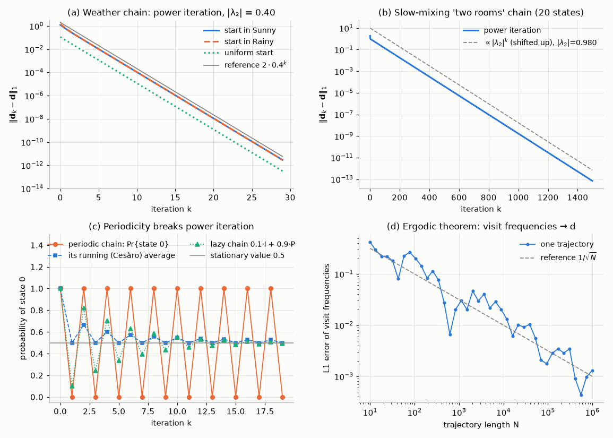
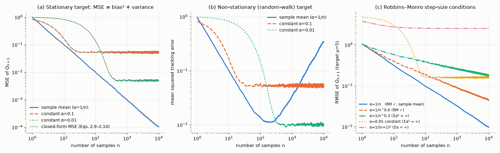
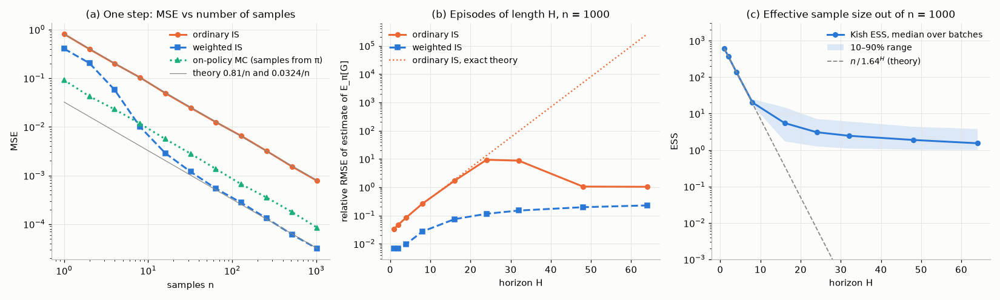
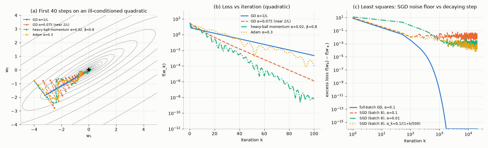
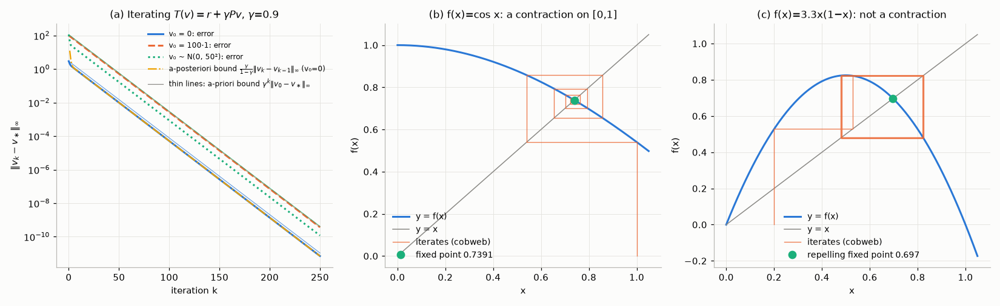
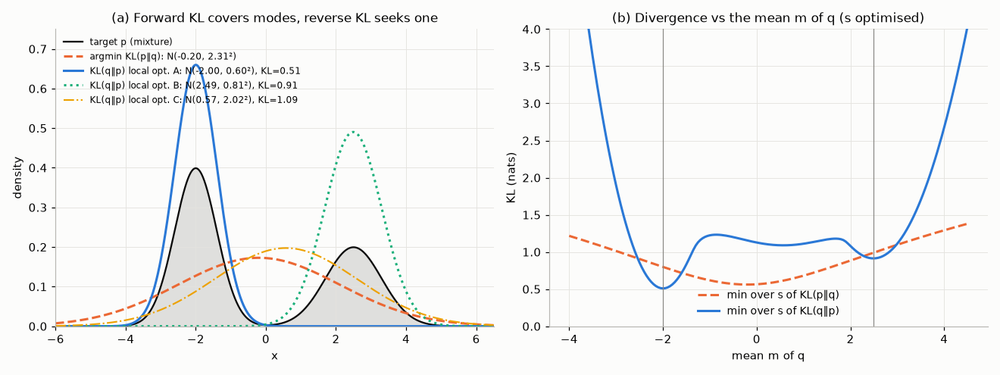
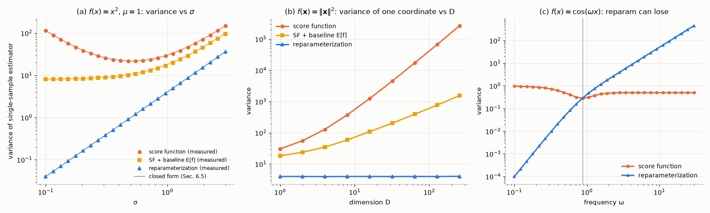
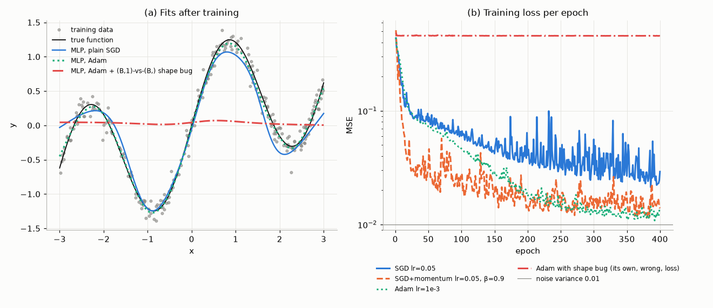
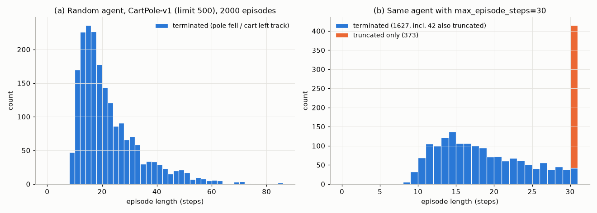

# Chapter 00 — The Mathematical and ML Toolkit for RL

[Course index](../README.md) · [Next: Chapter 01 — The Reinforcement Learning Problem and Markov Decision Processes](01-the-rl-problem.md) →

## At a glance

Reinforcement learning (RL) borrows from probability, statistics, optimization, analysis, information theory and deep learning. It does not need all of each field. It leans hard on about a dozen specific ideas, and those ideas come back in every chapter: an expectation conditioned on the first step, a running average with a step size, an importance-sampling ratio, a contraction, a KL penalty, the log-derivative trick, a `detach()` on a bootstrapped target, and a `terminated` flag that is not the same as `truncated`. This chapter collects those ideas, proves the central ones, and lets you watch each of them work (or fail) in a short script.

**Learning objectives.** After this chapter you should be able to:

* manipulate expectations, conditional expectations, the tower rule and the law of total variance, and recognise "condition on the first step" arguments;
* compute the stationary distribution of a Markov chain in three ways, and explain when and how fast the chain converges to it;
* analyse an estimator's bias, variance and mean-squared error; derive the incremental-mean update and the exponential recency weights of a constant step size;
* derive ordinary and weighted importance sampling and explain why the variance explodes with the horizon;
* explain why stochastic gradient descent works with noisy gradients, and state and interpret the Robbins–Monro step-size conditions;
* prove the Banach fixed-point theorem and show that $\mathbf v\mapsto\mathbf r+\gamma\mathbf P\mathbf v$ is a $\gamma$-contraction in the max norm;
* define entropy, cross-entropy and KL divergence, prove $D_{\mathrm{KL}}\ge 0$, and predict the different behaviour of forward and reverse KL;
* derive the score-function (REINFORCE) and reparameterization gradient estimators, compute their variances, and use baselines;
* write a correct PyTorch training loop and avoid the bugs that most often break RL code;
* use the Gymnasium API correctly, in particular the `terminated`/`truncated` distinction.

**Prerequisites.** Python programming; derivatives and partial derivatives; matrix–vector multiplication; what a probability distribution is. There is no earlier chapter to read first.

**Code you will run.** Nine short scripts in [`code/ch00_math_toolkit/`](../code/ch00_math_toolkit/), one per section (Markov chains, step sizes, importance sampling, optimisation, contractions, KL, gradient estimators, PyTorch, Gymnasium), plus numerical checks for the exercises. Each runs in under 15 s in full mode. The [index at the end of the chapter](#in-code-index-of-scripts) lists them with runtimes and headline results.

**Study time.** About 6–10 hours to read carefully and do a selection of exercises. If a section is already familiar, read its last paragraph ("where this shows up") and move on. You can come back to it when a later chapter refers to it.

**Notation.** This chapter follows [NOTATION.md](../NOTATION.md). Local choices, all flagged again where they appear: a distribution over the states of a Markov chain is a column vector $\mathbf d$ (matching $d^\pi$ in later chapters); the standard-normal noise in reparameterization is $\xi$ (because $\varepsilon$ is reserved for $\varepsilon$-greedy); $\beta,\beta_1,\beta_2$ are momentum/Adam coefficients here (later, $\beta$ is the RLHF KL coefficient); logarithms are natural (nats) unless stated. A few letters carry a second, local meaning (flagged here once). $b$ is the behaviour policy in §2.6 but a baseline in §6 (Sutton & Barto use both), and in Exercise 2 a transition probability. $\lambda$ denotes eigenvalues (§1.6, §3.2, §4), not the trace-decay parameter. $\rho$ is the importance-sampling ratio, but $\rho(\mathbf A)$ is a spectral radius (§4.1) and $\rho_{XY}$ a correlation (§6.3). $\tau$ is a trajectory in §6.2, not a temperature or Polyak coefficient. $L$ is a smoothness constant in §3 and the number of layers in §7.1. The $\delta$ in the Huber loss (7.2) is a threshold (PyTorch's `delta`), not a TD error. $\mu$ is a mean, except $\mu_{\min}$ (the smallest curvature) in §3.2.

**Where each tool is used later.**

| Tool | Main uses in the course |
|---|---|
| Conditional expectation, tower rule | Bellman equations ([Ch. 01](01-the-rl-problem.md)), every derivation thereafter |
| Markov chains, stationary distribution | on-policy distribution $d^\pi$ ([Ch. 08](08-function-approximation.md), [Ch. 10](10-policy-gradients.md)), mixing and theory ([Ch. 19](19-rl-theory.md)) |
| Incremental means, step sizes | bandits ([Ch. 02](02-multi-armed-bandits.md)), MC and TD ([Ch. 04](04-monte-carlo.md), [Ch. 05](05-temporal-difference.md)) |
| Importance sampling | off-policy MC and TD ([Ch. 04](04-monte-carlo.md), [Ch. 06](06-n-step-and-eligibility-traces.md)), PPO's ratio ([Ch. 11](11-trust-regions-and-ppo.md)), offline evaluation ([Ch. 16](16-offline-rl-and-imitation.md)) |
| SGD, Robbins–Monro | convergence of TD and Q-learning ([Ch. 05](05-temporal-difference.md), [Ch. 19](19-rl-theory.md)), all deep RL |
| Contractions, Banach | dynamic programming ([Ch. 03](03-dynamic-programming.md)), the deadly triad ([Ch. 08](08-function-approximation.md)) |
| Entropy, KL | TRPO/PPO ([Ch. 11](11-trust-regions-and-ppo.md)), SAC ([Ch. 12](12-continuous-control-actor-critic.md)), RLHF/DPO ([Ch. 18](18-rl-for-language-models.md)) |
| Score function, reparameterization | policy gradients ([Ch. 10](10-policy-gradients.md)), DDPG/TD3/SAC ([Ch. 12](12-continuous-control-actor-critic.md)) |
| PyTorch, Gymnasium | every deep-RL chapter from [Ch. 09](09-deep-q-learning.md) on |

---

## 1. Probability for RL

Almost every quantity in RL is an expectation. The value of a state is an expected return. A policy gradient is an expected gradient. A temporal-difference update is a noisy sample of an expected update. So the first tool is fluency with expectations, and especially with *conditional* expectations.

### 1.1 Random variables and expectation

A **random variable** $X$ is a numerical outcome of a random experiment. A discrete $X$ has a probability mass function $p(x)=\Pr\{X=x\}$. A continuous $X$ has a density $p(x)$ with $\Pr\{a\le X\le b\}=\int_a^b p(x)\,dx$. The **expectation** is the probability-weighted average

$$
\mathbb{E}[X] \doteq \sum_x x\,p(x) \qquad\text{or}\qquad \mathbb{E}[X] \doteq \int x\,p(x)\,dx .
\tag{1.1}
$$

To take the expectation of a function of $X$ you do not need the distribution of $f(X)$: $\mathbb{E}[f(X)]=\sum_x f(x)\,p(x)$. (This is sometimes called the "law of the unconscious statistician".) Expectation is **linear** for *any* random variables, independent or not:

$$
\mathbb{E}[aX+bY] = a\,\mathbb{E}[X] + b\,\mathbb{E}[Y].
\tag{1.2}
$$

The expectation of an indicator is a probability: $\mathbb{E}[\mathbb 1[A]]=\Pr\{A\}$.

*RL example.* The return of a three-step episode is $G=R_1+\gamma R_2+\gamma^2R_3$. The rewards are strongly dependent, because $R_2$ depends on the state reached after the first step, and so does $R_1$. Linearity still gives $\mathbb E[G]=\mathbb E[R_1]+\gamma\mathbb E[R_2]+\gamma^2\mathbb E[R_3]$ with no independence assumption. You will use this in nearly every derivation.

### 1.2 Variance, covariance and independence

The **variance** measures spread around the mean:

$$
\operatorname{Var}(X) \doteq \mathbb{E}\big[(X-\mathbb{E}[X])^2\big] = \mathbb{E}[X^2] - (\mathbb{E}[X])^2 .
\tag{1.3}
$$

The second form follows by expanding the square and using linearity: $\mathbb E[X^2-2X\mathbb E X+(\mathbb E X)^2]=\mathbb E[X^2]-2(\mathbb EX)^2+(\mathbb EX)^2$. The **covariance** is $\operatorname{Cov}(X,Y)\doteq\mathbb E[(X-\mathbb EX)(Y-\mathbb EY)]=\mathbb E[XY]-\mathbb E[X]\mathbb E[Y]$. Then $\operatorname{Var}(X+Y)=\operatorname{Var}X+\operatorname{Var}Y+2\operatorname{Cov}(X,Y)$ and $\operatorname{Var}(aX)=a^2\operatorname{Var}X$.

$X$ and $Y$ are **independent** if $\Pr\{X=x,Y=y\}=\Pr\{X=x\}\Pr\{Y=y\}$ for all $x,y$. Independence implies $\mathbb E[XY]=\mathbb E[X]\,\mathbb E[Y]$, hence zero covariance. The converse fails. Take $X$ uniform on $\{-1,0,1\}$ and $Y=X^2$: then $\operatorname{Cov}(X,Y)=\mathbb E[X^3]-0=0$, yet $Y$ is a function of $X$.

For independent and identically distributed (i.i.d.) $X_1,\dots,X_n$ with variance $\sigma^2$, the covariances vanish, so $\operatorname{Var}(\sum_i X_i)=n\sigma^2$. Section 2 builds on this one fact. In RL, consecutive samples along a trajectory are **not** independent: $S_{t+1}$ depends on $S_t$. This is why the relevant law of large numbers is the ergodic theorem of §1.6, and why DQN shuffles experience through a replay buffer ([Chapter 09](09-deep-q-learning.md)).

### 1.3 Conditional expectation and the tower rule

For discrete variables the conditional distribution is $p(x\mid y)=p(x,y)/p(y)$, and

$$
\mathbb{E}[X\mid Y=y] \doteq \sum_x x\,p(x\mid y).
\tag{1.4}
$$

This is a number for each $y$. If we plug in the random $Y$ we get a **random variable** $\mathbb E[X\mid Y]$: a function of $Y$ that gives the best guess of $X$ (in the mean-squared sense) once $Y$ is known. The single most used identity in RL is the **law of total expectation**, or **tower rule**:

$$
\mathbb{E}\big[\mathbb{E}[X\mid Y]\big] = \mathbb{E}[X].
\tag{1.5}
$$

*Proof (discrete case).*

$$
\begin{aligned}
\mathbb{E}\big[\mathbb{E}[X\mid Y]\big]
&= \sum_y p(y)\sum_x x\,p(x\mid y)
 = \sum_y\sum_x x\,p(x,y)
 = \sum_x x\sum_y p(x,y)
 = \sum_x x\,p(x) = \mathbb{E}[X]. \qquad\blacksquare
\end{aligned}
$$

Two variants are used constantly. First, with more conditioning, $\mathbb E\big[\mathbb E[X\mid Y,Z]\mid Y\big]=\mathbb E[X\mid Y]$: averaging out $Z$ leaves the coarser conditional expectation. Second, known quantities factor out: $\mathbb E[g(Y)\,X\mid Y]=g(Y)\,\mathbb E[X\mid Y]$.

*Worked example.* Roll a fair die to get $N\in\{1,\dots,6\}$, then flip $N$ fair coins and let $H$ be the number of heads. Computing the distribution of $H$ directly is tedious. Conditioning on the first stage is easy: $\mathbb E[H\mid N]=N/2$, so $\mathbb E[H]=\mathbb E[N]/2=3.5/2=1.75$.

*RL preview.* The value of a state under a policy $\pi$ is $v_\pi(s)\doteq\mathbb E_\pi[G_t\mid S_t=s]$ ([Chapter 01](01-the-rl-problem.md)). Conditioning additionally on the first action and applying the tower rule gives $v_\pi(s)=\sum_a\pi(a\mid s)\,\mathbb E_\pi[G_t\mid S_t=s,A_t=a]=\sum_a\pi(a\mid s)\,q_\pi(s,a)$. Conditioning on the next state as well gives the Bellman equation. Whenever a derivation says "condition on the first step", it is using (1.5).

The tower rule has a counterpart for variance, the **law of total variance**:

$$
\operatorname{Var}(X) = \mathbb{E}\big[\operatorname{Var}(X\mid Y)\big] + \operatorname{Var}\big(\mathbb{E}[X\mid Y]\big).
\tag{1.6}
$$

*Proof.* By (1.3) applied conditionally, $\operatorname{Var}(X\mid Y)=\mathbb E[X^2\mid Y]-(\mathbb E[X\mid Y])^2$. Take expectations and use (1.5): $\mathbb E[\operatorname{Var}(X\mid Y)]=\mathbb E[X^2]-\mathbb E[(\mathbb E[X\mid Y])^2]$. Also $\operatorname{Var}(\mathbb E[X\mid Y])=\mathbb E[(\mathbb E[X\mid Y])^2]-(\mathbb E[X])^2$, again using (1.5) for the mean. Adding the two cancels the middle terms and leaves $\mathbb E[X^2]-(\mathbb EX)^2=\operatorname{Var}X$. $\blacksquare$

Both terms are non-negative, so replacing a random quantity $X$ by its conditional expectation $\mathbb E[X\mid Y]$ keeps the mean and **never increases the variance**. This is the Rao–Blackwell idea. It explains why Expected SARSA, which averages over the next action instead of sampling it, has lower variance than SARSA ([Chapter 05](05-temporal-difference.md)). It also explains why replacing a sampled return $G_t$ by its conditional expectation $q_\pi(S_t,A_t)$ reduces the variance of policy gradients. A learned critic only approximates $q_\pi$, so in practice the variance reduction comes at the cost of some bias ([Chapter 10](10-policy-gradients.md)).

### 1.4 Markov chains and transition matrices

A sequence of random states $X_0,X_1,X_2,\dots$ taking values in a finite set $\mathcal S=\{1,\dots,n\}$ is a (time-homogeneous) **Markov chain** if the future depends on the past only through the present:

$$
\Pr\{X_{t+1}=j \mid X_t=i, X_{t-1},\dots,X_0\} = \Pr\{X_{t+1}=j\mid X_t=i\} \doteq P_{ij}.
\tag{1.7}
$$

The **transition matrix** $\mathbf P\in\mathbb R^{n\times n}$ is **row-stochastic**: $P_{ij}\ge 0$ and every row sums to one, $\mathbf P\mathbf 1=\mathbf 1$. Multi-step transitions are matrix powers (the Chapman–Kolmogorov equations):

$$
\Pr\{X_{t+k}=j\mid X_t=i\} = (\mathbf P^k)_{ij}.
\tag{1.8}
$$

Let $\mathbf d_t\in\mathbb R^n$ be the distribution of $X_t$, $d_t(i)=\Pr\{X_t=i\}$, written as a column vector. By total probability, $d_{t+1}(j)=\sum_i d_t(i)P_{ij}$, that is

$$
\mathbf d_{t+1}^\top = \mathbf d_t^\top \mathbf P, \qquad \mathbf d_t^\top = \mathbf d_0^\top\mathbf P^t .
\tag{1.9}
$$

*Why RL cares.* Fix a policy $\pi$ in a Markov decision process ([Chapter 01](01-the-rl-problem.md)). The state sequence $S_0,S_1,\dots$ is then a Markov chain with transition matrix $P_\pi(s'\mid s)=\sum_a\pi(a\mid s)\,p(s'\mid s,a)$. Everything in this section applies to "the chain induced by $\pi$".

*Running example (weather).* States Sunny, Cloudy, Rainy, with

$$
\mathbf P = \begin{pmatrix} 0.6 & 0.3 & 0.1\\ 0.3 & 0.4 & 0.3\\ 0.2 & 0.3 & 0.5\end{pmatrix}.
$$

Starting from a sunny day, $\mathbf d_0=(1,0,0)^\top$, gives $\mathbf d_1^\top=(0.6,0.3,0.1)$. Then $\mathbf d_2^\top=(0.6\cdot0.6+0.3\cdot0.3+0.1\cdot0.2,\;0.6\cdot0.3+0.3\cdot0.4+0.1\cdot0.3,\;0.6\cdot0.1+0.3\cdot0.3+0.1\cdot0.5)=(0.47,0.33,0.20)$. The sunny start is already being forgotten.

### 1.5 Irreducibility and periodicity

Two properties decide the long-run behaviour of a finite chain:

* **Irreducible:** every state can reach every other: for all $i,j$ there is a $t$ with $(\mathbf P^t)_{ij}>0$.
* **Aperiodic:** the period of state $i$, $\gcd\{t\ge 1:(\mathbf P^t)_{ii}>0\}$, equals 1. A single self-loop ($P_{ii}>0$) makes an irreducible chain aperiodic, because all states of an irreducible chain share the same period.

A finite chain that is irreducible and aperiodic is called **ergodic**. Equivalently, some power $\mathbf P^t$ has all entries positive. The chain $\begin{pmatrix}0&1\\1&0\end{pmatrix}$ is irreducible but has period 2: it deterministically alternates between its two states. An **absorbing** state has $P_{ii}=1$. The terminal state of an episodic task is modelled this way, so the chain of an episodic task is not irreducible ([Chapter 01](01-the-rl-problem.md)), and its only stationary distribution is a point mass on the terminal state. That is useless for weighting states, so RL uses one of two fixes. Either restart the chain from $d_0$ whenever it terminates (this *reset chain* is typically irreducible on the states reachable from $d_0$, and its stationary distribution restricted to non-terminal states is proportional to the expected number of visits per episode), or define the on-policy distribution directly from expected visit counts $\eta(s)$, as Sutton & Barto do ([Chapter 08](08-function-approximation.md)).

### 1.6 Stationary distributions and ergodicity

A distribution $\mathbf d$ is **stationary** if one step of the chain leaves it unchanged:

$$
\mathbf d^\top = \mathbf d^\top\mathbf P,\qquad d(i)\ge 0,\qquad \mathbf 1^\top\mathbf d = 1 .
\tag{1.10}
$$

If $X_0\sim\mathbf d$ then $X_t\sim\mathbf d$ for all $t$. Equivalently, $\mathbf d$ is a left eigenvector of $\mathbf P$ (an ordinary eigenvector of $\mathbf P^\top$) with eigenvalue 1. The key facts for finite chains (Perron–Frobenius theory; see Levin, Peres & Wilmer in Further reading) are:

1. If the chain is irreducible, there is exactly one stationary distribution, and every $d(i)>0$. In fact $d(i)=1/\mathbb E[\text{time to return to } i\mid X_0=i]$.
2. If it is also aperiodic, $\mathbf d_t\to\mathbf d$ from **every** starting distribution, geometrically fast.
3. **Ergodic theorem.** If the chain is irreducible, then for any $f:\mathcal S\to\mathbb R$, with probability one,

$$
\frac1N\sum_{t=0}^{N-1} f(X_t) \;\longrightarrow\; \sum_{i} d(i)\,f(i) \qquad (N\to\infty).
\tag{1.11}
$$

Time averages along **one** trajectory equal averages under $\mathbf d$. This is the law of large numbers for dependent samples, and it is why an agent that just keeps running can estimate on-policy quantities.

**Why convergence is geometric with rate $|\lambda_2|$.** Suppose for simplicity that $\mathbf P$ is diagonalizable, with eigenvalues $1=\lambda_1>|\lambda_2|\ge|\lambda_3|\ge\cdots$ (strictly below 1 in modulus for an ergodic chain) and left eigenvectors $\mathbf u_1=\mathbf d,\mathbf u_2,\dots$. For $k\ge 2$, $\mathbf u_k^\top\mathbf 1=0$, because $\lambda_k\mathbf u_k^\top\mathbf 1=\mathbf u_k^\top\mathbf P\mathbf 1=\mathbf u_k^\top\mathbf 1$ forces $(1-\lambda_k)\mathbf u_k^\top\mathbf 1=0$. Expand $\mathbf d_0^\top=c_1\mathbf d^\top+\sum_{k\ge2}c_k\mathbf u_k^\top$ and multiply by $\mathbf 1$: since $\mathbf d_0^\top\mathbf 1=1$ and $\mathbf d^\top\mathbf 1=1$, we get $c_1=1$. Then

$$
\mathbf d_t^\top = \mathbf d_0^\top\mathbf P^t = \mathbf d^\top + \sum_{k\ge 2} c_k\lambda_k^t\,\mathbf u_k^\top ,
$$

so the error decays like $|\lambda_2|^t$. The quantity $1-|\lambda_2|$ (the *absolute* spectral gap; for reversible chains, $1-\lambda_2$ is called the spectral gap) measures how fast the chain *mixes*. Chains with bottlenecks, such as two well-connected rooms joined by a rarely used door, have $|\lambda_2|$ close to 1 and mix slowly.

**Three ways to compute $\mathbf d$.** (i) *Power iteration*: iterate (1.9) until it stops changing. (ii) *Eigenvector*: take the eigenvector of $\mathbf P^\top$ for eigenvalue 1 and normalise it to sum to one. (iii) *Linear solve*: the $n$ equations $(\mathbf P^\top-\mathbf I)\mathbf d=\mathbf 0$ are linearly dependent (they sum to zero), so replace one of them by $\mathbf 1^\top\mathbf d=1$ and solve the resulting system, which is non-singular whenever the stationary distribution is unique (for example, $\mathbf P$ irreducible).

```text
Algorithm 1.1  Power iteration for a stationary distribution
Input: row-stochastic P (n x n), step tolerance tol > 0, max iterations K
Initialise: d <- any distribution (e.g. uniform, or a one-hot start)
for k = 1, 2, ..., K:
    d_new <- (d^T P)^T                    # one step of the chain, Eq. (1.9)
    if ||d_new - d||_1 < tol: return d_new
    d <- d_new
return d    # may not converge if the chain is periodic (Section 1.5)
# A small step is not a small error: near convergence the error of d_new is about
# |lambda_2|/(1-|lambda_2|) * ||d_new - d||_1 (compare Eq. 4.7), so for a slowly mixing
# chain use tol * (1-|lambda_2|)/|lambda_2| if |lambda_2| is known.
```

**Worked example (by hand).** For the weather chain, write $\mathbf d=(s,c,r)$. The Cloudy column of (1.10) reads $c=0.3s+0.4c+0.3r$, so $0.6c=0.3(s+r)=0.3(1-c)$, which gives $c=1/3$. The Sunny column reads $s=0.6s+0.3c+0.2r$. Substitute $c=1/3$ and $r=2/3-s$: $0.4s=0.1+0.2(2/3-s)$, so $0.6s=0.1+2/15=7/30$ and $s=7/18$. Then $r=2/3-7/18=5/18$:

$$
\mathbf d = \left(\tfrac{7}{18},\tfrac{6}{18},\tfrac{5}{18}\right) \approx (0.389, 0.333, 0.278).
$$

The eigenvalues follow from $\operatorname{tr}\mathbf P=1.5=1+\lambda_2+\lambda_3$ and $\det\mathbf P=0.04=1\cdot\lambda_2\lambda_3$. So $\lambda_{2,3}$ are the roots of $x^2-0.5x+0.04=0$, namely $0.4$ and $0.1$. Power iteration should therefore shrink its error by a factor of $0.4$ per step.

**In code.** [`markov_chain_stationary.py`](../code/ch00_math_toolkit/markov_chain_stationary.py) implements all three methods:

```python
def power_iteration(P, d0, num_iters, d_star=None):
    d = d0.copy()
    for _ in range(num_iters):
        d = d @ P                       # Eq. (1.9) on the whole distribution
    ...
def linear_solve_method(P):
    A = P.T - np.eye(n); A[-1, :] = 1.0     # replace one equation by sum(d) = 1
    b = np.zeros(n); b[-1] = 1.0
    return np.linalg.solve(A, b)
```

Actual output: for the weather chain, power iteration (50 steps), the eigenvector and the linear solve all return $(0.388889, 0.333333, 0.277778)$, agreeing to $1.7\times10^{-16}$. The printed eigenvalues are $1, 0.4, 0.1$, and the ratio of successive errors is $0.4000$. The 20-state "two rooms" chain (each state leaks probability 0.01 to the other room) has $|\lambda_2|=0.980$ and needs 684 power-iteration steps to reach $L_1$ error $10^{-6}$, against 16 for the weather chain. Algorithm 1.1 with step tolerance $10^{-6}$ stops too early on this chain: at $k=492$, with a true error of $4.8\times10^{-5}$, 48 times the tolerance. With the corrected step tolerance $10^{-6}\cdot0.02/0.98=2.0\times10^{-8}$ it stops at $k=684$ with error $1.0\times10^{-6}$. One simulated trajectory of $10^6$ steps visits the three weather states with frequencies $(0.3892, 0.3327, 0.2782)$, an $L_1$ error of $1.3\times10^{-3}$.



*Reading the figure.* (a) The error falls on a straight line in log scale with slope $\log 0.4$, whatever the starting distribution. (b) The same holds for the two-rooms chain, but with slope $\log 0.98$. (c) The periodic chain never converges under power iteration ($\Pr\{X_k=0\}$ alternates $1,0,1,0,\dots$), yet its stationary distribution $(0.5,0.5)$ exists, and both the running (Cesàro) average and a slightly "lazy" chain $0.1\mathbf I+0.9\mathbf P$ converge to it. (d) Visit frequencies along one trajectory approach $\mathbf d$ roughly like $1/\sqrt N$. This is the same rate as for i.i.d. sampling (§2.2). The correlation between consecutive states changes only the constant.

*Where this shows up.* With function approximation, the on-policy distribution $d^\pi$ decides which states the value error is measured on, and linear TD converges because it samples from it: the Bellman operator is a contraction in the norm weighted by $d^\pi$ (§4.4, [Chapter 08](08-function-approximation.md)). The policy-gradient theorem is an expectation under a state distribution ([Chapter 10](10-policy-gradients.md)). Mixing times enter sample-complexity bounds ([Chapter 19](19-rl-theory.md)).

---

## 2. Estimation: bias, variance and averaging

RL agents spend most of their time *estimating*: action values from noisy rewards, state values from sampled returns, gradients from sampled trajectories. This section introduces the vocabulary for judging an estimator and the averaging rules RL algorithms use.

### 2.1 Bias, variance and mean-squared error

Let $\theta$ be an unknown number, for example $v_\pi(s)$. An **estimator** $\hat\theta$ is any function of random data, so it is itself a random variable. Its quality is summarised by

$$
\operatorname{Bias}(\hat\theta) \doteq \mathbb E[\hat\theta]-\theta,\qquad
\operatorname{Var}(\hat\theta),\qquad
\operatorname{MSE}(\hat\theta) \doteq \mathbb E\big[(\hat\theta-\theta)^2\big].
\tag{2.1}
$$

**Bias–variance decomposition.**

$$
\operatorname{MSE}(\hat\theta) = \operatorname{Bias}(\hat\theta)^2 + \operatorname{Var}(\hat\theta).
\tag{2.2}
$$

*Proof.* Write $\hat\theta-\theta=(\hat\theta-\mathbb E\hat\theta)+(\mathbb E\hat\theta-\theta)$. Squaring gives $(\hat\theta-\mathbb E\hat\theta)^2+2(\hat\theta-\mathbb E\hat\theta)(\mathbb E\hat\theta-\theta)+(\mathbb E\hat\theta-\theta)^2$. The last factor of the cross term is a constant, and $\mathbb E[\hat\theta-\mathbb E\hat\theta]=0$, so the cross term has zero expectation. Taking expectations of the other two terms gives $\operatorname{Var}+\operatorname{Bias}^2$. $\blacksquare$

An estimator $\hat\theta_n$ built from $n$ samples is **consistent** if $\hat\theta_n\to\theta$ in probability as $n\to\infty$. Biased estimators can be consistent (the bias may vanish as $n$ grows) and can have lower MSE than unbiased ones. The bias–variance trade-off runs through the whole course: Monte Carlo targets are unbiased but noisy, bootstrapped TD targets are biased but less noisy, and $n$-step returns, $\lambda$-returns and GAE interpolate between the two ([Chapters 04](04-monte-carlo.md)–[06](06-n-step-and-eligibility-traces.md), [10](10-policy-gradients.md)).

### 2.2 The sample mean

Let $X_1,\dots,X_n$ be i.i.d. with mean $\mu$ and variance $\sigma^2$. The sample mean $\bar X_n=\frac1n\sum_{i=1}^nX_i$ satisfies

$$
\mathbb E[\bar X_n]=\mu,\qquad \operatorname{Var}(\bar X_n)=\frac{\sigma^2}{n}.
\tag{2.3}
$$

The first equation is linearity. The second follows from $\operatorname{Var}(\sum X_i)=n\sigma^2$ (§1.2) and $\operatorname{Var}(aX)=a^2\operatorname{Var}X$ with $a=1/n$. The law of large numbers gives $\bar X_n\to\mu$. The central limit theorem gives $\sqrt n(\bar X_n-\mu)\to\mathcal N(0,\sigma^2)$ in distribution. From this comes the **standard error** $\hat\sigma/\sqrt n$, where $\hat\sigma$ is the sample standard deviation, and the approximate 95% confidence interval

$$
\bar X_n \pm 1.96\,\hat\sigma/\sqrt n .
\tag{2.4}
$$

Error that shrinks like $1/\sqrt n$ means 100 times more data buys only one more significant digit. This is also why a claim like "algorithm A beats B" needs several random seeds and an interval, not a single run ([Chapter 20](20-deep-rl-in-practice.md)).

### 2.3 The incremental mean

An agent cannot store every reward it has ever seen. Fortunately the sample mean can be updated in constant memory. Let $Q_{n+1}$ be the mean of the first $n$ observations $R_1,\dots,R_n$. Then

$$
\begin{aligned}
Q_{n+1} &= \frac1n\sum_{i=1}^n R_i = \frac1n\Big(R_n+\sum_{i=1}^{n-1}R_i\Big) = \frac1n\big(R_n+(n-1)Q_n\big)\\
&= Q_n + \frac1n\big(R_n-Q_n\big).
\end{aligned}
\tag{2.5}
$$

Equation (2.5) is the first instance of the update rule that, in one form or another, appears in every chapter of this course:

$$
\textit{NewEstimate} \leftarrow \textit{OldEstimate} + \textit{StepSize}\,\big[\textit{Target}-\textit{OldEstimate}\big],
\qquad\text{i.e.}\qquad Q_{n+1}=Q_n+\alpha_n\,(R_n-Q_n).
\tag{2.6}
$$

The bracket is an *error*. Each update moves the estimate a fraction $\alpha_n$ of the way toward the latest target. Monte Carlo methods use the return $G_t$ as the target. TD learning uses $R_{t+1}+\gamma V(S_{t+1})$, and Q-learning uses $R_{t+1}+\gamma\max_aQ(S_{t+1},a)$. Only the target changes.

*Worked example.* With rewards $2,4,9$ and $\alpha_n=1/n$ (any $Q_1$, because $\alpha_1=1$ overwrites it): $Q_2=Q_1+1\cdot(2-Q_1)=2$, $Q_3=2+\tfrac12(4-2)=3$, and $Q_4=3+\tfrac13(9-3)=5$, which is indeed $(2+4+9)/3$.

```text
Algorithm 2.1  Incremental estimation of a mean
Input: stream of samples R_1, R_2, ...; step-size rule alpha_n (1/n for the sample mean)
Initialise: Q <- Q_1 (any value; irrelevant if alpha_1 = 1)
for n = 1, 2, ...:
    observe R_n
    Q <- Q + alpha_n * (R_n - Q)          # Eq. (2.6)
```

### 2.4 Constant step size: the exponential recency-weighted average

With a constant step size $\alpha\in(0,1]$, unroll the recursion $Q_{n+1}=\alpha R_n+(1-\alpha)Q_n$ one step at a time:

$$
\begin{aligned}
Q_{n+1} &= \alpha R_n + (1-\alpha)Q_n
= \alpha R_n + (1-\alpha)\alpha R_{n-1} + (1-\alpha)^2 Q_{n-1}\\
&= \cdots = (1-\alpha)^n Q_1 + \sum_{i=1}^n \alpha(1-\alpha)^{n-i} R_i .
\end{aligned}
\tag{2.7}
$$

The weight on a sample decays exponentially with its age, so this is an **exponential recency-weighted average**. The weights sum to one (a geometric series):

$$
(1-\alpha)^n + \sum_{i=1}^n\alpha(1-\alpha)^{n-i} = (1-\alpha)^n + \alpha\,\frac{1-(1-\alpha)^n}{1-(1-\alpha)} = 1 .
\tag{2.8}
$$

Now suppose the $R_i$ are i.i.d. with mean $\mu$ and variance $\sigma^2$. Taking expectations in (2.7) and using (2.8) gives the **bias**

$$
\mathbb E[Q_{n+1}]-\mu = (1-\alpha)^n\,(Q_1-\mu),
\tag{2.9}
$$

which decays geometrically but is never exactly zero for $\alpha<1$. The initial guess is never completely forgotten. The **variance** is a sum of independent terms:

$$
\operatorname{Var}(Q_{n+1}) = \sigma^2\sum_{i=1}^n\alpha^2(1-\alpha)^{2(n-i)} = \frac{\alpha^2\sigma^2\big(1-(1-\alpha)^{2n}\big)}{1-(1-\alpha)^2} = \frac{\alpha\sigma^2}{2-\alpha}\Big(1-(1-\alpha)^{2n}\Big)\;\xrightarrow{n\to\infty}\;\frac{\alpha\sigma^2}{2-\alpha}.
\tag{2.10}
$$

So a constant step size **never converges**. It keeps a variance floor of $\alpha\sigma^2/(2-\alpha)\approx\alpha\sigma^2/2$, the same as a sample mean over the last $n_{\text{eff}}=(2-\alpha)/\alpha\approx 2/\alpha$ observations. This is the price of being able to **track a target that moves**. In control, and whenever we bootstrap, RL targets do move: the policy changes, and bootstrapped targets change as the estimates they bootstrap from change. The weight on an observation $k$ steps old is $\alpha(1-\alpha)^k$, which halves every $\ln2/(-\ln(1-\alpha))\approx0.69/\alpha$ steps (about 6.6 steps for $\alpha=0.1$).

*Worked example.* With $\alpha=0.5$, $Q_1=0$ and rewards $2,4,9$: $Q_2=1$, $Q_3=2.5$, $Q_4=5.75$. Check against (2.7): the weights for $n=3$ are $(1-\alpha)^3=0.125$ on $Q_1$ and $0.125,0.25,0.5$ on $R_1,R_2,R_3$. They sum to one, and $0.125\cdot2+0.25\cdot4+0.5\cdot9=5.75$. The recent reward 9 dominates.

The same exponential average reappears as Adam's moment estimates (with exactly the bias (2.9) corrected away, §3.5) and as Polyak-averaged target networks ([Chapters 09](09-deep-q-learning.md), [12](12-continuous-control-actor-critic.md)).

**In code.** [`estimation_step_sizes.py`](../code/ch00_math_toolkit/estimation_step_sizes.py) runs (2.6) on 2000 independent streams in parallel:

```python
for n in range(1, N + 1):
    alpha = step_size_fn(n)
    Q += alpha * (samples[:, n - 1] - Q)   # NewEstimate <- Old + StepSize [Target - Old]
```

With $R\sim\mathcal N(1,1)$ and $Q_1=0$, the measured bias and variance match (2.9)–(2.10). For $\alpha=0.1$ at $n=10$ the bias is $-0.344$ (theory $-0.349$). At $n=10{,}000$ the variance is $0.0533$ (theory $0.0526$), while the sample mean's variance is $0.00010$ (theory $\sigma^2/n=0.0001$). When the true mean instead drifts as a random walk (step standard deviation 0.01), the ranking flips. The sample mean's mean-squared tracking error over the last 20% of steps is $0.318$, against $0.053$ for $\alpha=0.1$ and $0.010$ for $\alpha=0.01$.



*Reading the figure.* (a) The measured MSE (coloured) lies on top of the closed form (2.9)–(2.10) (grey). Constant step sizes first lose their initial bias and then flatten at $\alpha\sigma^2/(2-\alpha)$, while the sample mean keeps falling as $1/n$. (b) On a drifting target the sample mean's error *grows* once old data becomes stale. A constant step size settles at a level set by the balance between noise ($\propto\alpha$) and lag ($\propto1/\alpha$). Panel (c) is discussed in §3.4.

### 2.5 Monte Carlo estimation

To estimate $\mu=\mathbb E_{X\sim p}[f(X)]$ when we can sample from $p$, the **Monte Carlo estimator** is

$$
\hat\mu_n = \frac1n\sum_{i=1}^n f(X_i),\qquad X_i\overset{\text{i.i.d.}}{\sim}p,\qquad \mathbb E[\hat\mu_n]=\mu,\quad \operatorname{Var}(\hat\mu_n)=\frac{\operatorname{Var}_p(f(X))}{n}.
\tag{2.11}
$$

The $1/\sqrt n$ error rate does not depend on the dimension of $X$, only on $\operatorname{Var}_p(f)$. That is why sampling beats numerical integration for high-dimensional objects such as trajectories. Monte Carlo policy evaluation averages sampled returns ([Chapter 04](04-monte-carlo.md)), and every policy-gradient estimate is a Monte Carlo average ([Chapter 10](10-policy-gradients.md)). The two things that can go wrong are (i) you cannot sample from $p$ (next subsection) and (ii) $\operatorname{Var}_p(f)$ is huge or infinite.

### 2.6 Importance sampling

Suppose we want $\mathbb E_\pi[f(X)]$ but our samples come from a different distribution $b$. In RL, $\pi$ is the *target* policy we want to evaluate, and $b$ is the *behaviour* policy that generated the data. Multiplying and dividing by $b$ gives the **importance-sampling identity**:

$$
\mathbb E_{X\sim\pi}[f(X)] = \sum_x \pi(x)f(x) = \sum_x b(x)\frac{\pi(x)}{b(x)}f(x) = \mathbb E_{X\sim b}\big[\rho(X)\,f(X)\big],
\tag{2.12}
$$

$$
\rho(x)\doteq\frac{\pi(x)}{b(x)} .
\tag{2.13}
$$

The identity requires **coverage**: $b(x)>0$ wherever $\pi(x)f(x)\neq 0$. If $b$ never does what $\pi$ would do, no reweighting can recover it. Off-policy RL normally assumes the stronger **full coverage**, $b(x)>0$ wherever $\pi(x)>0$, and then also $\mathbb E_b[\rho]=\sum_x\pi(x)=1$. (With only partial coverage, $\mathbb E_b[\rho]=\pi(\operatorname{supp}b)<1$, which matters for WIS below.)

**Ordinary importance sampling (OIS)** is the plain Monte Carlo average of the reweighted samples:

$$
\hat V_{\text{OIS}} = \frac1n\sum_{i=1}^n \rho(X_i)\,f(X_i),\qquad X_i\sim b .
\tag{2.14}
$$

By (2.12) it is **unbiased**. Its variance is

$$
\operatorname{Var}(\hat V_{\text{OIS}})=\frac1n\Big(\mathbb E_b[\rho^2f^2]-\mu^2\Big)=\frac1n\Big(\sum_x\frac{\pi(x)^2}{b(x)}f(x)^2-\mu^2\Big),
\tag{2.15}
$$

which is large wherever $b(x)\ll\pi(x)$. Over a finite set of outcomes (2.15) is a finite sum, but it can even be infinite when $x$ ranges over an infinite set: a continuous variable, or a trajectory of unbounded length even with finitely many actions ([Chapter 04](04-monte-carlo.md), Section 6.6).

**Weighted (self-normalised) importance sampling (WIS)** divides by the sum of the weights instead of by $n$:

$$
\hat V_{\text{WIS}} = \frac{\sum_{i=1}^n\rho(X_i)f(X_i)}{\sum_{i=1}^n\rho(X_i)} .
\tag{2.16}
$$

The normalised weights $\rho_i/\sum_j\rho_j$ sum to one, so $\hat V_{\text{WIS}}$ is a convex combination of the observed $f(X_i)$. It always lies in $[\min_if(X_i),\max_if(X_i)]$ and cannot explode. It is **biased**, because it is a ratio of random variables, but **consistent under full coverage**: the numerator divided by $n$ tends to $\mu$ and the denominator divided by $n$ tends to $\mathbb E_b[\rho]=1$. Under partial coverage the denominator tends to $\pi(\operatorname{supp}b)<1$ and WIS converges to the wrong value, even when OIS is still unbiased (Exercise 5(c)). A first-order (delta-method) expansion gives its asymptotic variance

$$
\operatorname{Var}(\hat V_{\text{WIS}}) \approx \frac1n\,\mathbb E_b\big[\rho^2\,(f-\mu)^2\big].
\tag{2.17}
$$

This is (2.15) with $f$ replaced by $f-\mu$, so WIS behaves like OIS with a built-in baseline (compare §6.3).

**Products of ratios.** For a trajectory, the ratio is a product over time steps, $\rho_{0:H-1}=\prod_{t=0}^{H-1}\pi(A_t\mid S_t)/b(A_t\mid S_t)$. The unknown transition probabilities cancel between numerator and denominator ([Chapter 04](04-monte-carlo.md) derives this). In the simplest case, where the $H$ action choices are independent with the same $\pi$ and $b$ at every step, independence gives

$$
\mathbb E_b\big[\rho_{0:H-1}^2\big] = \prod_{t=0}^{H-1}\mathbb E_b\Big[\Big(\frac{\pi(A_t)}{b(A_t)}\Big)^2\Big] = \Big(\sum_a\frac{\pi(a)^2}{b(a)}\Big)^H = \big(1+\chi^2(\pi\Vert b)\big)^H ,
\tag{2.18}
$$

where $\chi^2(\pi\Vert b)=\sum_a(\pi(a)-b(a))^2/b(a)\ge 0$. The last equality holds because $\sum_a(\pi-b)^2/b=\sum_a\pi^2/b-2\sum_a\pi+\sum_ab=\sum_a\pi^2/b-1$. Unless $\pi=b$, the **variance $\mathbb E_b[\rho^2]-1$ grows exponentially with the horizon**. A common diagnostic is Kish's **effective sample size**:

$$
n_{\text{eff}} = \frac{\big(\sum_i\rho_i\big)^2}{\sum_i\rho_i^2}\in[1,n],\qquad\text{whose population analogue is } \frac{n\,(\mathbb E_b\rho)^2}{\mathbb E_b[\rho^2]}=\frac{n}{\mathbb E_b[\rho^2]} .
\tag{2.19}
$$

```text
Algorithm 2.2  Ordinary and weighted importance sampling
Input: samples X_1..X_n drawn from b; target pi; function f
num <- 0; den <- 0; sq <- 0
for i = 1..n:
    rho_i <- pi(X_i) / b(X_i)              # b(X_i) > 0 automatically; coverage is an assumption on b
    num <- num + rho_i * f(X_i)
    den <- den + rho_i
    sq  <- sq + rho_i^2
V_OIS <- num / n                           # Eq. (2.14): unbiased, high variance
V_WIS <- num / den   (define 0/0 := 0)     # Eq. (2.16): biased, consistent, bounded
ESS   <- den^2 / sq  (if sq > 0)           # Eq. (2.19): diagnostic
```

**Worked example (by hand).** Two actions, target $\pi=(0.9,0.1)$, behaviour $b=(0.5,0.5)$, reward $f=(1,0)$, so $\mu=\mathbb E_\pi[f]=0.9$. The ratios are $\rho=(1.8,0.2)$.

* *One-sample OIS* returns $1.8\cdot1=1.8$ with probability $0.5$ and $0.2\cdot0=0$ with probability $0.5$. Its mean is $0.9$ (unbiased). Its variance is $0.5\cdot1.8^2-0.9^2=1.62-0.81=0.81$, nine times the on-policy variance $0.9\cdot0.1=0.09$.
* *One-sample WIS* returns $\rho_1f_1/\rho_1=f(X_1)$: just the observed reward, with mean $\mathbb E_b[f]=0.5$. **Biased**, badly.
* *Large-$n$ WIS*: by (2.17), $n\cdot\operatorname{Var}\approx0.5\cdot1.8^2\cdot(1-0.9)^2+0.5\cdot0.2^2\cdot(0-0.9)^2=0.0162+0.0162=0.0324$. That is *smaller* than the on-policy $0.09$. It is no accident: the variance-minimising proposal for self-normalised IS is $b^\ast(x)\propto\pi(x)\,|f(x)-\mu|=(0.09,0.09)$, which is exactly our uniform $b$. Importance sampling was invented as a variance-*reduction* technique, and off-policy data is not inherently worse. In RL, though, we rarely get to choose $b$ for this purpose.

**In code.** [`importance_sampling.py`](../code/ch00_math_toolkit/importance_sampling.py) uses exactly this setting. Each "episode" consists of $H$ independent steps with return $G=\#\{\text{action }0\}$, so $\mathbb E_\pi[G]=0.9H$. Ratios are accumulated in log space to avoid overflow (condensed from the script's helper functions):

```python
log_rho = np.log(RATIO)[actions].sum(axis=2)   # rho_{0:H-1} = prod_t pi/b
rho = np.exp(log_rho)
v_ois = (rho * G).mean(axis=-1)                # Eq. (2.14)
v_wis = (rho * G).sum(axis=-1) / rho.sum(axis=-1)   # Eq. (2.16)
```

Measured results (4000 repetitions for each $n$; 600 repetitions per horizon):

| | $n=1$ | $n=16$ | $n=1024$ |
|---|---|---|---|
| OIS: bias / MSE | $0.014$ / $0.810$ | $0.005$ / $0.0493$ | $-0.0001$ / $0.00078$ |
| WIS: bias / MSE | $-0.392$ / $0.404$ | $-0.009$ / $0.0029$ | $-0.0002$ / $0.00003$ |
| on-policy MC: MSE | $0.091$ | $0.0056$ | $0.00008$ |

OIS matches $0.81/n$, and WIS matches $0.0324/n$ once $n$ is moderate. Over long horizons ($n=1000$ episodes per estimate):

| $H$ | $\mathbb E_b[\rho^2]=1.64^H$ | OIS rel. RMSE (measured / exact) | WIS rel. RMSE | median ESS |
|---|---|---|---|---|
| 1 | 1.64 | 0.034 / 0.032 | 0.007 | 611 |
| 8 | 52 | 0.26 / 0.25 | 0.027 | 20 |
| 16 | 2,740 | 1.68 / 1.82 | 0.074 | 5.5 |
| 32 | $7.5\times10^6$ | 8.7 / 95 | 0.149 | 2.5 |
| 64 | $5.6\times10^{13}$ | 1.03 / $2.6\times10^5$ | 0.227 | 1.5 |



*Reading the results honestly.* The exact relative RMSE of OIS (dotted line in panel b, computed in closed form by a change of measure) grows exponentially, but the *measured* OIS error rises and then falls back to about 1 for $H\ge 48$. OIS has not improved. At large $H$ almost every weight is astronomically small, so the estimate is almost always near 0 (relative error about 1), and the rare trajectories with enormous weights, which make the estimator unbiased, never appeared in 600 repetitions. The sample variance of $\rho$ tells the same story: at $H=64$ its median is $2.6\times10^{-7}$, while the true variance is $5.6\times10^{13}$. Heavy-tailed estimators *look* well-behaved right up until they do not. Panel (c) shows the same illusion for the effective sample size. The population value $n/1.64^H$ falls below 1 once $H\ge14$ ($1000/1.64^{14}\approx0.98$): you would need more than 1000 episodes for a single effective sample. The sample ESS cannot drop below 1 by construction, so it flattens out instead (median 5.5 at $H=16$, 1.5 at $H=64$). WIS stays bounded, but with a median ESS of 1.5 out of 1000 episodes it is essentially returning the outcome of the single best-weighted trajectory, so its 23% error is not something to rely on either. This exponential blow-up motivates per-decision importance sampling, truncated ratios (Retrace, V-trace) and PPO's clipping ([Chapters 04](04-monte-carlo.md), [06](06-n-step-and-eligibility-traces.md), [11](11-trust-regions-and-ppo.md)).

---

## 3. Optimization: gradients, SGD and stochastic approximation

Deep RL means minimising losses (or maximising objectives) with respect to millions of parameters, using gradient estimates corrupted by the randomness of the environment. Below: why gradient steps work, why noisy gradient steps also work, and which step sizes they need.

### 3.1 Gradients and the chain rule

For $f:\mathbb R^d\to\mathbb R$, the **gradient** $\nabla f(\mathbf w)=(\partial f/\partial w_1,\dots,\partial f/\partial w_d)^\top$ gives the best linear approximation

$$
f(\mathbf w+\boldsymbol\Delta) = f(\mathbf w) + \nabla f(\mathbf w)^\top\boldsymbol\Delta + o(\lVert\boldsymbol\Delta\rVert).
\tag{3.1}
$$

Among unit vectors $\mathbf u$, the directional derivative $\nabla f^\top\mathbf u$ is maximised by $\mathbf u=\nabla f/\lVert\nabla f\rVert$ (Cauchy–Schwarz). The gradient is the direction of steepest ascent, and $-\nabla f$ is the direction of steepest descent. For a vector function $\mathbf g:\mathbb R^d\to\mathbb R^k$, the Jacobian $\mathbf J_{\mathbf g}(\mathbf w)\in\mathbb R^{k\times d}$ collects all partial derivatives. The **chain rule** for a composition is

$$
\nabla_{\mathbf w}\, f\big(\mathbf g(\mathbf w)\big) = \mathbf J_{\mathbf g}(\mathbf w)^\top\,\nabla f\big(\mathbf g(\mathbf w)\big).
\tag{3.2}
$$

A neural network is a long composition, and backpropagation is (3.2) applied from the output back to the inputs, reusing the values stored during the forward pass. This *reverse-mode automatic differentiation* computes the gradient with respect to *all* parameters for a small constant multiple of the cost of one forward pass. That is what makes training networks with millions of parameters feasible.

*Worked example.* $L(w)=\frac12(\tanh(wx)-y)^2$ with $x=2$, $y=1$, $w=0.5$. By the chain rule, $\frac{dL}{dw}=(\tanh(wx)-y)\cdot(1-\tanh^2(wx))\cdot x$. With $\tanh(1)=0.761594$ this is $(-0.238406)(0.419974)(2)=-0.200249$. PyTorch's autograd returns the same $-0.200249$ (§7.3).

Gradients worth memorising: $\nabla_{\mathbf w}(\mathbf a^\top\mathbf w)=\mathbf a$; $\nabla_{\mathbf w}\frac12\mathbf w^\top\mathbf A\mathbf w=\mathbf A\mathbf w$ for symmetric $\mathbf A$; $\nabla_{\mathbf w}\frac12\lVert\mathbf X\mathbf w-\mathbf y\rVert^2=\mathbf X^\top(\mathbf X\mathbf w-\mathbf y)$; and for a softmax distribution $\pi_{\boldsymbol\theta}(a)=e^{\theta_a}/\sum_be^{\theta_b}$, $\nabla_{\boldsymbol\theta}\log\pi_{\boldsymbol\theta}(a)=\mathbf e_a-\boldsymbol\pi_{\boldsymbol\theta}$ (§6.2).

### 3.2 Gradient descent

**Gradient descent (GD)** repeats

$$
\mathbf w_{k+1} = \mathbf w_k - \alpha\,\nabla f(\mathbf w_k).
\tag{3.3}
$$

*Why it decreases $f$.* Call $f$ **$L$-smooth** if its gradient is $L$-Lipschitz, $\lVert\nabla f(\mathbf u)-\nabla f(\mathbf w)\rVert\le L\lVert\mathbf u-\mathbf w\rVert$. This implies the quadratic upper bound $f(\mathbf u)\le f(\mathbf w)+\nabla f(\mathbf w)^\top(\mathbf u-\mathbf w)+\frac L2\lVert\mathbf u-\mathbf w\rVert^2$. Plugging in $\mathbf u=\mathbf w_k-\alpha\nabla f(\mathbf w_k)$ gives the **descent lemma**

$$
f(\mathbf w_{k+1}) \le f(\mathbf w_k) - \alpha\Big(1-\frac{L\alpha}{2}\Big)\lVert\nabla f(\mathbf w_k)\rVert^2 .
\tag{3.4}
$$

Every step with $0<\alpha<2/L$ strictly decreases $f$ until the gradient vanishes, and $\alpha=1/L$ guarantees a decrease of $\lVert\nabla f\rVert^2/(2L)$.

*Quadratics, and the role of conditioning.* For $f(\mathbf w)=\frac12\mathbf w^\top\mathbf A\mathbf w$ with symmetric $\mathbf A$ whose eigenvalues lie in $[\mu_{\min},L]$, $\mu_{\min}>0$, GD is the linear iteration $\mathbf w_{k+1}=(\mathbf I-\alpha\mathbf A)\mathbf w_k$. Along an eigenvector with eigenvalue $\lambda$, the coordinate is multiplied by $1-\alpha\lambda$ at each step. Convergence requires $|1-\alpha\lambda|<1$ for every $\lambda$, that is $\alpha<2/L$. With $\alpha=1/L$, the slowest (flattest) direction shrinks by

$$
1-\frac{\mu_{\min}}{L} = 1-\frac1\kappa \quad\text{per step},\qquad \kappa\doteq\frac{L}{\mu_{\min}}\ \text{(condition number)}.
\tag{3.5}
$$

A large $\kappa$ means a long, narrow valley. The step size is limited by the steep walls ($\alpha<2/L$), so progress along the flat floor is slow. With $\alpha=1/L$ the steep coordinate is multiplied by $1-\alpha L=0$ and is removed in one step. If $\alpha$ is pushed above $1/L$ to speed up the flat direction, the steep coordinate's factor $1-\alpha L$ becomes negative, it overshoots, and the iterates zig-zag (the $\alpha=0.075$ run in §3.5). Section 4.3 will recognise GD on a quadratic as a contraction mapping.

### 3.3 Stochastic gradient descent, and why noisy gradients still work

In ML the objective is usually an average, $f(\mathbf w)=\frac1N\sum_{i=1}^N\ell_i(\mathbf w)$, or an expectation. In RL the data distribution also depends on the policy. **Stochastic gradient descent (SGD)** replaces the gradient by any *unbiased* estimate $\mathbf g_k$, for example a minibatch average:

$$
\mathbf w_{k+1} = \mathbf w_k - \alpha_k\,\mathbf g_k,\qquad \mathbb E[\mathbf g_k\mid\mathbf w_k]=\nabla f(\mathbf w_k).
\tag{3.6}
$$

Why does this work, when each individual step can point the wrong way? Assume $f$ is $L$-smooth and bounded below by $f_{\inf}$, and that the noise has bounded variance: $\mathbb E[\lVert\mathbf g_k\rVert^2\mid\mathbf w_k]\le\lVert\nabla f(\mathbf w_k)\rVert^2+\sigma^2$. Apply the quadratic upper bound to one SGD step:

$$
\begin{aligned}
f(\mathbf w_{k+1}) &\le f(\mathbf w_k) - \alpha_k\nabla f(\mathbf w_k)^\top\mathbf g_k + \tfrac{L\alpha_k^2}{2}\lVert\mathbf g_k\rVert^2,\\
\mathbb E[f(\mathbf w_{k+1})\mid\mathbf w_k] &\le f(\mathbf w_k) - \alpha_k\lVert\nabla f(\mathbf w_k)\rVert^2 + \tfrac{L\alpha_k^2}{2}\big(\lVert\nabla f(\mathbf w_k)\rVert^2+\sigma^2\big)\\
&\le f(\mathbf w_k) - \tfrac{\alpha_k}{2}\lVert\nabla f(\mathbf w_k)\rVert^2 + \tfrac{L\sigma^2}{2}\alpha_k^2 \qquad(\text{if }\alpha_k\le 1/L).
\end{aligned}
\tag{3.7}
$$

The second line uses unbiasedness: in expectation, the noise cancels from the first-order term. It survives only in the second-order term, which is proportional to $\alpha_k^2$. Now take total expectations, sum from $k=0$ to $K-1$ (the $f$ terms telescope), and use $f(\mathbf w_K)\ge f_{\inf}$:

$$
\frac12\sum_{k=0}^{K-1}\alpha_k\,\mathbb E\lVert\nabla f(\mathbf w_k)\rVert^2 \le f(\mathbf w_0)-f_{\inf} + \frac{L\sigma^2}{2}\sum_{k=0}^{K-1}\alpha_k^2
\;\;\Longrightarrow\;\;
\min_{k<K}\mathbb E\lVert\nabla f(\mathbf w_k)\rVert^2 \le \frac{2\big(f(\mathbf w_0)-f_{\inf}\big)+L\sigma^2\sum_k\alpha_k^2}{\sum_k\alpha_k}.
$$

Read the right-hand side for two schedules:

* **Constant $\alpha$:** the bound is $\frac{2(f(\mathbf w_0)-f_{\inf})}{\alpha K}+L\sigma^2\alpha$. The first term vanishes, but a **noise floor proportional to $\alpha$** remains. A smaller $\alpha$ gives a lower floor but slower progress.
* **$\sum_k\alpha_k=\infty$ and $\sum_k\alpha_k^2<\infty$:** the numerator stays bounded while the denominator diverges, so the bound tends to zero. These are exactly the Robbins–Monro conditions, discussed next.

```text
Algorithm 3.1  Minibatch stochastic gradient descent
Input: per-example losses l_i(w), i = 1..N; batch size B; step sizes alpha_k; iterations K
Initialise: w_0 (e.g. small random values)
for k = 0, 1, ..., K-1:
    sample a minibatch I_k of B indices uniformly from {1..N}
    g_k <- (1/B) * sum_{i in I_k} grad l_i(w_k)       # unbiased estimate of grad f(w_k)
    w_{k+1} <- w_k - alpha_k * g_k                    # Eq. (3.6)
```

### 3.4 Stochastic approximation and the Robbins–Monro conditions

Robbins and Monro (1951) posed a more general problem: find a root $\boldsymbol\theta^\ast$ of $h(\boldsymbol\theta)=\mathbb E[H(\boldsymbol\theta,X)]=\mathbf 0$ when we can observe only noisy values $H(\boldsymbol\theta,X)$, never $h$ itself. Their iteration is

$$
\boldsymbol\theta_{n+1} = \boldsymbol\theta_n + \alpha_n\,H(\boldsymbol\theta_n,X_n),
\tag{3.8}
$$

and the step sizes should satisfy

$$
\sum_{n=1}^\infty\alpha_n=\infty,\qquad\sum_{n=1}^\infty\alpha_n^2<\infty .
\tag{3.9}
$$

*The idea in one sentence.* In one dimension, if $h$ "points toward" $\theta^\ast$, that is $(\theta-\theta^\ast)h(\theta)<0$ for $\theta\ne\theta^\ast$, and the noise has bounded variance, then under (3.9) $\theta_n\to\theta^\ast$. Robbins and Monro proved convergence in mean square (hence in probability); Blum (1954) strengthened it to almost-sure convergence. A precise version that you can check against an algorithm:

**Theorem (Robbins–Monro, almost-sure form).** Let $\theta_{n+1}=\theta_n+\alpha_nY_n$, where, given the past $\theta_0,\dots,\theta_n$, the observation $Y_n$ has mean $h(\theta_n)$ and variance at most $\sigma^2$. Assume

1. *linear growth:* $|h(\theta)|\le C(1+|\theta-\theta^\ast|)$ for some constant $C$;
2. *uniform pull toward $\theta^\ast$:* for all $0<a<c<\infty$, $\inf\{(\theta^\ast-\theta)\,h(\theta):\ a\le|\theta-\theta^\ast|\le c\}>0$;
3. *step sizes:* $\alpha_n\ge0$ satisfy (3.9).

Then $\theta_n\to\theta^\ast$ almost surely.

*Proof idea.* Let $V_n=(\theta_n-\theta^\ast)^2$. Expand $V_{n+1}=V_n+2\alpha_n(\theta_n-\theta^\ast)Y_n+\alpha_n^2Y_n^2$, take the conditional expectation given the past, and bound $\mathbb E[Y_n^2\mid\text{past}]\le h(\theta_n)^2+\sigma^2\le2C^2(1+V_n)+\sigma^2$ using assumption 1:

$$
\mathbb E[V_{n+1}\mid\text{past}]\le(1+2C^2\alpha_n^2)\,V_n+(2C^2+\sigma^2)\,\alpha_n^2-2\alpha_n(\theta^\ast-\theta_n)h(\theta_n).
$$

The factor $(\theta^\ast-\theta_n)h(\theta_n)$ in the last term is non-negative by assumption 2, so that term can only help. Because $\sum\alpha_n^2<\infty$, the Robbins–Siegmund "almost-supermartingale" lemma (1971) gives that $V_n$ converges almost surely and that $\sum_n\alpha_n(\theta^\ast-\theta_n)h(\theta_n)<\infty$. If the limit of $V_n$ were positive, $|\theta_n-\theta^\ast|$ would eventually stay in some interval $[a,c]$ with $a>0$, so assumption 2 would make every term of that sum at least $m\,\alpha_n$ for some $m>0$, and $\sum\alpha_n=\infty$ would make the sum infinite. So $V_n\to0$. In many dimensions the same argument works with $V_n$ replaced by a suitable Lyapunov function.

The modern multivariate theory analyses (3.8) as a noisy discretisation of the ODE $\dot{\boldsymbol\theta}=h(\boldsymbol\theta)$ (the "ODE method"; Borkar, Kushner & Yin in Further reading). [Chapter 19](19-rl-theory.md) uses it to prove that TD learning and Q-learning converge.

Familiar algorithms are instances of (3.8):

* **Mean estimation.** $H(\theta,R)=R-\theta$ has mean $h(\theta)=\mu-\theta$ and root $\mu$. Then (3.8) is exactly (2.6), and $\alpha_n=1/n$ gives the sample mean.
* **SGD.** $H=-\mathbf g$, whose mean is $-\nabla f$. The roots are stationary points of $f$.
* **TD(0)** ([Chapter 05](05-temporal-difference.md)). $H=R_{t+1}+\gamma V(S_{t+1})-V(S_t)$: TD learning is stochastic approximation applied to the Bellman equation. Q-learning's convergence proof requires (3.9) to hold separately for each state–action pair.

*Why each condition.* $\sum\alpha_n=\infty$ means the iterates can travel arbitrarily far. In particular $\prod_n(1-\alpha_n)=0$, so the initial value is eventually forgotten (compare (2.9)). $\sum\alpha_n^2<\infty$ means the total injected noise variance $\sum\alpha_n^2\sigma^2$ is finite, so the noise averages out. For $\alpha_n=n^{-p}$, both hold if and only if $p\in(\tfrac12,1]$ (Exercise 7).

*What happens when a condition fails (by hand).* Take $\alpha_n=1/(n+1)^2$, so $\sum\alpha_n=\pi^2/6-1<\infty$. Then $\mathbb E[Q_{n+1}]-\mu=\prod_{k=1}^n(1-\alpha_k)\,(Q_1-\mu)$, and the product telescopes:

$$
\prod_{j=2}^{J}\Big(1-\frac1{j^2}\Big)=\prod_{j=2}^{J}\frac{(j-1)(j+1)}{j\cdot j}=\Big(\prod_{j=2}^J\frac{j-1}{j}\Big)\Big(\prod_{j=2}^J\frac{j+1}{j}\Big)=\frac1J\cdot\frac{J+1}{2}\;\longrightarrow\;\frac12 .
$$

Starting from $Q_1=0$ with true mean $\mu=5$, the estimate stalls at $\mathbb E[Q_\infty]=5-\frac12\cdot5=2.5$. It runs out of step size halfway to the target.

**In code** (panel (c) of the figure in §2.4). [`estimation_step_sizes.py`](../code/ch00_math_toolkit/estimation_step_sizes.py) estimates $\mu=5$ from $Q_1=0$ ($\sigma=1$, 2000 runs, $N=10^4$ steps):

| schedule | satisfies (3.9)? | mean $Q_N$ | RMSE at $n=100$ | RMSE at $n=10^4$ |
|---|---|---|---|---|
| $\alpha_n=1/n$ | yes | 4.9999 | 0.097 | 0.0097 |
| $\alpha_n=n^{-0.6}$ | yes | 5.0007 | 0.183 | 0.045 |
| $\alpha_n=n^{-0.3}$ | no ($\sum\alpha^2=\infty$) | 5.0045 | 0.374 | 0.174 |
| $\alpha=0.05$ constant | no ($\sum\alpha^2=\infty$) | 5.0042 | 0.160 | 0.155 |
| $\alpha_n=1/(n+1)^2$ | no ($\sum\alpha<\infty$) | **2.4995** | 2.53 | 2.51 |

Two lessons, one of them a surprise. The schedule with $\sum\alpha<\infty$ stalls at 2.50, exactly as computed above. But $n^{-0.3}$, which *violates* $\sum\alpha^2<\infty$, still converges, only slowly: its variance behaves like $\alpha_n\sigma^2/2$, which tends to 0 because $\alpha_n\to0$. **The Robbins–Monro conditions are sufficient, not necessary.** What really matters is that $\alpha_n\to0$ (so there is no noise floor) slowly enough that $\sum\alpha_n=\infty$ (so the target can be reached). The constant step size violates the first requirement and plateaus at RMSE $\approx\sqrt{\alpha/(2-\alpha)}=0.16$, as (2.10) predicts. Deep RL almost always uses constant step sizes anyway: when the target itself moves, tracking matters more than eventual exact convergence.

### 3.5 Momentum and Adam (intuition)

**Heavy-ball momentum** (Polyak, 1964) accumulates a decaying sum of past gradients:

$$
\mathbf m_{k+1} = \beta\,\mathbf m_k + \mathbf g_k,\qquad \mathbf w_{k+1}=\mathbf w_k-\alpha\,\mathbf m_{k+1}.
\tag{3.10}
$$

This is PyTorch's convention. It is equivalent to $\mathbf w_{k+1}=\mathbf w_k-\alpha\mathbf g_k+\beta(\mathbf w_k-\mathbf w_{k-1})$. Gradient components that keep the same sign accumulate, giving an effective step of up to $\alpha/(1-\beta)$. Components that flip sign, such as the zig-zag across a narrow valley, largely cancel. On quadratics, well-tuned momentum improves the per-step rate from about $1-1/\kappa$ to about $1-1/\sqrt\kappa$.

**Adam** (Kingma & Ba, 2015) keeps exponential averages of the gradient and of its elementwise square, and divides one by the square root of the other:

$$
\begin{aligned}
\mathbf m_k &= \beta_1\mathbf m_{k-1}+(1-\beta_1)\,\mathbf g_k, &
\mathbf v_k &= \beta_2\mathbf v_{k-1}+(1-\beta_2)\,\mathbf g_k\odot\mathbf g_k,\\
\mathbf w_k &= \mathbf w_{k-1}-\alpha\,\frac{\hat{\mathbf m}_k}{\sqrt{\hat{\mathbf v}_k}+\epsilon_{\text{Adam}}}, & &
\end{aligned}
\tag{3.11}
$$

$$
\hat{\mathbf m}_k = \frac{\mathbf m_k}{1-\beta_1^k},\qquad \hat{\mathbf v}_k = \frac{\mathbf v_k}{1-\beta_2^k},
\tag{3.12}
$$

with $\mathbf m_0=\mathbf v_0=\mathbf 0$, all operations elementwise, and defaults $\beta_1=0.9$, $\beta_2=0.999$, $\epsilon_{\text{Adam}}=10^{-8}$. Here $\epsilon_{\text{Adam}}$ is a small numerical constant, unrelated to $\varepsilon$-greedy or PPO's $\epsilon$.

*The bias correction (3.12) is (2.9) in disguise.* The recursion for $\mathbf m_k$ is a constant-step-size average (2.7) with step $1-\beta_1$ and initial value $\mathbf 0$. So $\mathbf m_k=(1-\beta_1)\sum_{i=1}^k\beta_1^{k-i}\mathbf g_i$. If the gradients have a common mean $\bar{\mathbf g}$, then $\mathbb E[\mathbf m_k]=(1-\beta_1^k)\bar{\mathbf g}$, which is biased toward zero for small $k$. Dividing by $1-\beta_1^k$ removes the bias exactly. The same holds for $\mathbf v_k$.

*Intuition.* Each coordinate moves by roughly $\alpha\times(\text{mean gradient})/(\text{RMS gradient})$. Rescaling the loss leaves the step essentially unchanged, and coordinates whose gradients are mostly noise (large RMS relative to the mean) take smaller steps. RL losses change scale constantly as returns and value targets grow, which is a large part of why Adam is the default optimiser in deep RL.

```text
Algorithm 3.2  Adam
Input: stochastic gradient oracle g(w); step size alpha; beta1, beta2 in [0,1); eps_Adam; iterations K
Initialise: w_0; m <- 0; v <- 0
for k = 1, ..., K:
    g <- g(w_{k-1})
    m <- beta1 * m + (1 - beta1) * g
    v <- beta2 * v + (1 - beta2) * g * g                 # elementwise square
    m_hat <- m / (1 - beta1^k);  v_hat <- v / (1 - beta2^k)   # Eq. (3.12)
    w_k <- w_{k-1} - alpha * m_hat / (sqrt(v_hat) + eps_Adam)  # Eq. (3.11)
```

**In code.** [`optimization_demo.py`](../code/ch00_math_toolkit/optimization_demo.py) implements (3.3), (3.10) and (3.11) from scratch. Panel (a) uses a 2-D quadratic with $\kappa=25$ (rotated by 30°). Panel (c) uses least-squares regression ($N=1000$, $d=10$) with minibatches of 8.



Measured: GD with $\alpha=1/L$ reduces $f$ by a factor of $0.9216$ per step between steps 50 and 100 (geometric mean, printed by the script), exactly the predicted $(1-1/\kappa)^2=0.9216$. After 100 steps $f=2.1\times10^{-3}$ for GD ($\alpha=1/L$), $1.3\times10^{-6}$ for GD with $\alpha=0.075$ (near the stability limit $2/L=0.08$, visibly zig-zagging), and $6.2\times10^{-9}$ for heavy-ball momentum ($\alpha=0.02$, $\beta=0.8$). Adam ($\alpha=0.3$) reaches only $9.1\times10^{-5}$. On a noiseless, deterministic quadratic, Adam's per-coordinate normalisation buys nothing (the valley is not axis-aligned), and with a constant $\alpha$ it keeps oscillating around the minimum. Adam is a robust default for noisy, badly scaled problems, not a universally faster optimiser. In the SGD experiment, constant $\alpha=0.1$ and $\alpha=0.01$ stall at excess losses of $1.5\times10^{-2}$ and $1.6\times10^{-3}$: a floor that scales with $\alpha$, as the bound in §3.3 predicts. The decaying schedule $\alpha_k=0.1/(1+k/500)$ reaches $4.1\times10^{-4}$ and is still improving after 20,000 steps. Full-batch GD has no noise and converges to machine precision.

---

## 4. Linear algebra and analysis: norms, linear systems, contractions

Dynamic programming, and much of RL theory, rests on one theorem: a mapping that brings points closer together has exactly one fixed point, and iterating the mapping finds it. This section builds the pieces: norms, linear systems, and the Banach fixed-point theorem.

### 4.1 Norms

A **norm** $\lVert\cdot\rVert$ on $\mathbb R^n$ satisfies $\lVert\mathbf x\rVert\ge0$ with equality only at $\mathbf 0$, $\lVert c\mathbf x\rVert=|c|\,\lVert\mathbf x\rVert$, and the triangle inequality $\lVert\mathbf x+\mathbf y\rVert\le\lVert\mathbf x\rVert+\lVert\mathbf y\rVert$. The three that matter here are

$$
\lVert\mathbf x\rVert_1=\sum_i|x_i|,\qquad \lVert\mathbf x\rVert_2=\Big(\sum_ix_i^2\Big)^{1/2},\qquad \lVert\mathbf x\rVert_\infty=\max_i|x_i| .
\tag{4.1}
$$

In finite dimensions all norms are equivalent, for example $\lVert\mathbf x\rVert_\infty\le\lVert\mathbf x\rVert_2\le\sqrt n\,\lVert\mathbf x\rVert_\infty$. So "converges" means the same thing in every norm. *Contraction factors*, however, depend on the norm, as we will see. A norm on vectors induces a norm on matrices, $\lVert\mathbf A\rVert\doteq\max_{\mathbf x\ne\mathbf 0}\lVert\mathbf A\mathbf x\rVert/\lVert\mathbf x\rVert$. For the max norm this is the largest absolute row sum:

$$
\lVert\mathbf A\rVert_\infty = \max_i\sum_j|A_{ij}|,\qquad\text{so}\qquad \lVert\mathbf P\rVert_\infty=1 \ \text{for every row-stochastic }\mathbf P.
\tag{4.2}
$$

*Proof.* $|(\mathbf A\mathbf x)_i|\le\sum_j|A_{ij}||x_j|\le\big(\sum_j|A_{ij}|\big)\lVert\mathbf x\rVert_\infty$, so $\lVert\mathbf A\rVert_\infty\le\max_i\sum_j|A_{ij}|$. Equality holds for $x_j=\operatorname{sign}(A_{i^\ast j})$, where $i^\ast$ is the maximising row. $\blacksquare$

In contrast, $\lVert\mathbf A\rVert_2$ is the largest singular value, and the spectral radius $\rho(\mathbf A)=\max|\lambda_i|$ is a lower bound for every induced norm. For value functions, i.e. vectors indexed by states, the max norm $\lVert v\rVert_\infty=\max_s|v(s)|$ is the natural choice. An expectation under $\mathbf P$ is an average of values, and an average can never exceed the maximum.

### 4.2 Linear systems and matrix inverses

A square system $\mathbf A\mathbf x=\mathbf b$ has a unique solution iff $\mathbf A$ is invertible ($\det\mathbf A\ne0$, equivalently $\mathbf A\mathbf x=\mathbf 0$ only for $\mathbf x=\mathbf 0$). In practice, solve it with an LU factorisation (`np.linalg.solve`, $O(n^3)$). Do not form $\mathbf A^{-1}$ explicitly: that is slower and less accurate. The **condition number** $\kappa(\mathbf A)=\lVert\mathbf A\rVert\,\lVert\mathbf A^{-1}\rVert$ bounds how much relative errors in $\mathbf b$ can be amplified in $\mathbf x$.

**Neumann series.** If $\lVert\mathbf M\rVert<1$ in some induced norm, then $\mathbf I-\mathbf M$ is invertible and

$$
(\mathbf I-\mathbf M)^{-1}=\sum_{k=0}^\infty\mathbf M^k,\qquad \lVert(\mathbf I-\mathbf M)^{-1}\rVert\le\frac{1}{1-\lVert\mathbf M\rVert}.
\tag{4.3}
$$

*Proof.* Let $\mathbf S_K=\sum_{k=0}^K\mathbf M^k$. Since $\lVert\mathbf M^k\rVert\le\lVert\mathbf M\rVert^k$, the series converges absolutely (its partial sums are Cauchy, and the space of matrices is complete). Telescoping gives $(\mathbf I-\mathbf M)\mathbf S_K=\mathbf I-\mathbf M^{K+1}\to\mathbf I$, so the limit is the inverse. The norm bound is the geometric series. $\blacksquare$

Apply this with $\mathbf M=\gamma\mathbf P$, where $\gamma\in[0,1)$ and $\mathbf P$ is row-stochastic, so $\lVert\gamma\mathbf P\rVert_\infty=\gamma<1$ by (4.2). The system $\mathbf v=\mathbf r+\gamma\mathbf P\mathbf v$ then has the unique solution

$$
\mathbf v=(\mathbf I-\gamma\mathbf P)^{-1}\mathbf r=\sum_{k=0}^\infty\gamma^k\mathbf P^k\mathbf r .
\tag{4.4}
$$

Read the right-hand side through (1.8): component $i$ is the *expected discounted sum of future $r$-values when the chain starts in state $i$*. This is exactly what a value function will be ([Chapter 01](01-the-rl-problem.md)), and "solve a linear system" is one way to evaluate a policy ([Chapter 03](03-dynamic-programming.md)). The matrix $(\mathbf I-\gamma\mathbf P)^{-1}$ has non-negative entries and row sums $\sum_k\gamma^k=1/(1-\gamma)$. Combined with $\lVert\mathbf I-\gamma\mathbf P\rVert_\infty\le1+\gamma$, this gives $\kappa_\infty(\mathbf I-\gamma\mathbf P)\le(1+\gamma)/(1-\gamma)$: the system becomes ill-conditioned as $\gamma\to1$.

### 4.3 Contraction mappings and the Banach fixed-point theorem

*Intuition first.* Run the same map from two different starting points. If every application shrinks the distance between the two runs by a factor $\gamma<1$, they must end up at the same point, and that point cannot move under the map. The cobweb plot of $\cos x$ in the figure at the end of §4.4 shows this happening.

Let $\mathcal X$ be a **complete metric space**: a set with a distance $d(\mathbf x,\mathbf y)$ in which every Cauchy sequence converges to a point of $\mathcal X$. In this course $\mathcal X$ is always $\mathbb R^n$ with $d(\mathbf x,\mathbf y)=\lVert\mathbf x-\mathbf y\rVert$ for some norm (complete for any norm), or a closed subset of it, such as the interval $[0,1]$ in panel (b) of that figure. We write everything with $\lVert\mathbf x-\mathbf y\rVert$; the proof below uses only the triangle inequality, so it holds verbatim for any complete metric space. A map $T:\mathcal X\to\mathcal X$ is a **$\gamma$-contraction** if for some $\gamma\in[0,1)$

$$
\lVert T(\mathbf x)-T(\mathbf y)\rVert\le\gamma\,\lVert\mathbf x-\mathbf y\rVert\qquad\text{for all }\mathbf x,\mathbf y\in\mathcal X .
\tag{4.5}
$$

A point $\mathbf x^\ast$ with $T(\mathbf x^\ast)=\mathbf x^\ast$ is a **fixed point**.

**Theorem (Banach fixed-point theorem, 1922).** Let $T$ be a $\gamma$-contraction on a complete metric space. Then

1. $T$ has exactly one fixed point $\mathbf x^\ast$;
2. for any $\mathbf x_0$, the iterates $\mathbf x_{k+1}=T(\mathbf x_k)$ converge to $\mathbf x^\ast$;
3. the errors satisfy the *a-priori* and *a-posteriori* bounds

$$
\lVert\mathbf x_k-\mathbf x^\ast\rVert\le\gamma^k\lVert\mathbf x_0-\mathbf x^\ast\rVert,\qquad
\lVert\mathbf x_k-\mathbf x^\ast\rVert\le\frac{\gamma^k}{1-\gamma}\lVert\mathbf x_1-\mathbf x_0\rVert,
\tag{4.6}
$$

$$
\lVert\mathbf x_k-\mathbf x^\ast\rVert\le\frac{\gamma}{1-\gamma}\lVert\mathbf x_k-\mathbf x_{k-1}\rVert .
\tag{4.7}
$$

*Proof.*

*Step 1: successive steps shrink geometrically.* By (4.5), $\lVert\mathbf x_{k+1}-\mathbf x_k\rVert=\lVert T(\mathbf x_k)-T(\mathbf x_{k-1})\rVert\le\gamma\lVert\mathbf x_k-\mathbf x_{k-1}\rVert$, and by induction $\lVert\mathbf x_{k+1}-\mathbf x_k\rVert\le\gamma^k\lVert\mathbf x_1-\mathbf x_0\rVert$.

*Step 2: the sequence is Cauchy.* For $m>k$, by the triangle inequality and Step 1,

$$
\lVert\mathbf x_m-\mathbf x_k\rVert\le\sum_{j=k}^{m-1}\lVert\mathbf x_{j+1}-\mathbf x_j\rVert\le\sum_{j=k}^{m-1}\gamma^j\lVert\mathbf x_1-\mathbf x_0\rVert\le\frac{\gamma^k}{1-\gamma}\lVert\mathbf x_1-\mathbf x_0\rVert ,
$$

which tends to $0$ as $k\to\infty$, uniformly in $m$.

*Step 3: the limit is a fixed point.* By completeness, $\mathbf x_k\to\mathbf x^\ast$ for some $\mathbf x^\ast$. A contraction is continuous (it is Lipschitz), so $T(\mathbf x^\ast)=T(\lim_k\mathbf x_k)=\lim_kT(\mathbf x_k)=\lim_k\mathbf x_{k+1}=\mathbf x^\ast$.

*Step 4: uniqueness.* If also $T(\mathbf y)=\mathbf y$, then $\lVert\mathbf x^\ast-\mathbf y\rVert=\lVert T(\mathbf x^\ast)-T(\mathbf y)\rVert\le\gamma\lVert\mathbf x^\ast-\mathbf y\rVert$, so $(1-\gamma)\lVert\mathbf x^\ast-\mathbf y\rVert\le0$ and $\mathbf y=\mathbf x^\ast$.

*Step 5: rates.* $\lVert\mathbf x_k-\mathbf x^\ast\rVert=\lVert T(\mathbf x_{k-1})-T(\mathbf x^\ast)\rVert\le\gamma\lVert\mathbf x_{k-1}-\mathbf x^\ast\rVert\le\dots\le\gamma^k\lVert\mathbf x_0-\mathbf x^\ast\rVert$. Letting $m\to\infty$ in Step 2 gives the second bound in (4.6). For (4.7): $\lVert\mathbf x_k-\mathbf x^\ast\rVert\le\lVert\mathbf x_k-\mathbf x_{k+1}\rVert+\lVert\mathbf x_{k+1}-\mathbf x^\ast\rVert\le\gamma\lVert\mathbf x_k-\mathbf x_{k-1}\rVert+\gamma\lVert\mathbf x_k-\mathbf x^\ast\rVert$. Move the last term to the left-hand side and divide by $1-\gamma$. $\blacksquare$

The a-posteriori bound (4.7) gives a *computable* stopping rule: you never know $\mathbf x^\ast$, but you always know the size of your last step. Reaching accuracy $\text{tol}$ from an initial error $D$ takes $k\ge\log(D/\text{tol})/\log(1/\gamma)\approx\frac{1}{1-\gamma}\log(D/\text{tol})$ iterations. Discount factors close to 1 are expensive.

```text
Algorithm 4.1  Fixed-point iteration with an a-posteriori stopping rule
Input: gamma-contraction T (gamma < 1 known), starting point x_0, tolerance tol > 0
x <- x_0
loop:
    x_new <- T(x)
    if gamma / (1 - gamma) * ||x_new - x|| < tol:     # Eq. (4.7): guarantees ||x_new - x*|| < tol
        return x_new
    x <- x_new
```

Four remarks that matter later:

* **$\gamma<1$ is essential.** A non-expansion ($\gamma=1$) need not have a fixed point ($x\mapsto x+1$ on $\mathbb R$) or need not converge to one (a rotation of the plane).
* **The norm is part of the statement.** The same map can contract in one norm and expand in another (see the code below).
* **Local version.** A continuously differentiable scalar map $f$ with $|f'(x^\ast)|<1$ is a contraction on a neighbourhood of $x^\ast$: by continuity $|f'|\le q<1$ on some interval $I$ around $x^\ast$, and by the mean-value theorem $f$ maps $I$ into itself and contracts there. So iteration converges if started close enough. If $|f'(x^\ast)|>1$ the fixed point repels.
* **GD on a quadratic is a contraction** (the promise of §3.2). For $f(\mathbf w)=\frac12\mathbf w^\top\mathbf A\mathbf w$, GD is the map $G(\mathbf w)=(\mathbf I-\alpha\mathbf A)\mathbf w$, and for symmetric $\mathbf A$ its Lipschitz constant in the 2-norm is $\lVert\mathbf I-\alpha\mathbf A\rVert_2=\max_\lambda|1-\alpha\lambda|$ over the eigenvalues $\lambda\in[\mu_{\min},L]$. This is below 1 iff $0<\alpha<2/L$, and with $\alpha=1/L$ it equals $1-1/\kappa$, the rate (3.5). Banach then gives convergence to the unique minimiser $\mathbf 0$.

### 4.4 A first Bellman-like operator is a max-norm contraction

**Proposition.** Let $\mathbf P$ be row-stochastic, $\gamma\in[0,1)$ and $T(\mathbf v)\doteq\mathbf r+\gamma\mathbf P\mathbf v$. Then

$$
\lVert T(\mathbf u)-T(\mathbf w)\rVert_\infty\le\gamma\,\lVert\mathbf u-\mathbf w\rVert_\infty .
\tag{4.8}
$$

*Proof.* $T(\mathbf u)-T(\mathbf w)=\gamma\mathbf P(\mathbf u-\mathbf w)$. For each row $i$, $\big|\sum_jP_{ij}(u_j-w_j)\big|\le\sum_jP_{ij}|u_j-w_j|\le\sum_jP_{ij}\lVert\mathbf u-\mathbf w\rVert_\infty=\lVert\mathbf u-\mathbf w\rVert_\infty$, using $P_{ij}\ge0$ and $\sum_jP_{ij}=1$. Take the maximum over $i$ and multiply by $\gamma$. $\blacksquare$

By Banach's theorem, $T$ has the unique fixed point (4.4), and iterating $T$ from *any* $\mathbf v_0$ converges to it geometrically. In [Chapter 03](03-dynamic-programming.md) this $T$ becomes the Bellman expectation operator $\mathcal T^\pi$, with $\mathbf r=\mathbf r_\pi$ and $\mathbf P=\mathbf P_\pi$, and the iteration becomes iterative policy evaluation. Nearly the same proof, plus the inequality $|\max_af(a)-\max_ag(a)|\le\max_a|f(a)-g(a)|$, shows that the Bellman *optimality* operator $\mathcal T^\ast$ is also a $\gamma$-contraction (Exercise 8). Value iteration is built on that fact.

**Worked example (by hand).** Two states, $\mathbf P=\begin{pmatrix}0.5&0.5\\0.5&0.5\end{pmatrix}$, $\mathbf r=(1,0)^\top$, $\gamma=0.5$. *Direct solve:* $\mathbf I-\gamma\mathbf P=\begin{pmatrix}0.75&-0.25\\-0.25&0.75\end{pmatrix}$ has determinant $0.5$ and inverse $\begin{pmatrix}1.5&0.5\\0.5&1.5\end{pmatrix}$ (row sums $2=1/(1-\gamma)$, as promised), so $\mathbf v^\ast=(1.5,0.5)^\top$. *Iteration from* $\mathbf v_0=\mathbf 0$: $\mathbf v_1=(1,0)$, $\mathbf v_2=(1.25,0.25)$, $\mathbf v_3=(1.375,0.375)$. The max-norm errors are $1.5,\,0.5,\,0.25,\,0.125$, halving each step from $k=1$, consistent with $\gamma^k\lVert\mathbf v_0-\mathbf v^\ast\rVert_\infty=1.5\cdot0.5^k$. The a-posteriori bound at $k=3$ is $\frac{0.5}{0.5}\lVert\mathbf v_3-\mathbf v_2\rVert_\infty=0.125$, which here equals the true error.

**In code.** [`contraction_fixed_point.py`](../code/ch00_math_toolkit/contraction_fixed_point.py) iterates $T$ for a random 8-state $\mathbf P$ (with a "hub" state that every state jumps to with probability 0.5) and $\gamma=0.9$:

```python
T = lambda v: r + gamma * P @ v
v_star = np.linalg.solve(np.eye(n) - gamma * P, r)   # Eq. (4.4), never form the inverse
...
assert np.all(err <= bounds[name] * (1 + 1e-9) + 1e-12), "a-priori bound (4.6) violated?!"
```

Results. The a-priori bound holds at every step from three very different starts, so the assertion passes. The a-posteriori rule (4.7) with tolerance $10^{-6}$ stops at $k=138$, where the true error is $9.5\times10^{-7}$. Over 20,000 random pairs, $\lVert T\mathbf u-T\mathbf w\rVert_\infty/\lVert\mathbf u-\mathbf w\rVert_\infty$ never exceeds $0.876\le\gamma$. The **Euclidean** ratio, however, reaches $1.418$ along the top singular vector, and 3.7% of random pairs are *pushed apart* in the 2-norm. $T$ is not a 2-norm contraction, even though the iteration converges because the spectral radius of $\gamma\mathbf P$ is $0.9$.

**On-policy weighting restores a 2-norm contraction.** Let $\mathbf d$ be the stationary distribution of $\mathbf P$ ($\mathbf d^\top\mathbf P=\mathbf d^\top$, §1.6) and define the weighted norm $\lVert\mathbf v\rVert_{\mathbf d}^2\doteq\sum_id(i)\,v_i^2$. Row $i$ of $\mathbf P$ is a probability distribution, and the square of a mean is at most the mean of the squares (variance is non-negative, (1.3)), so $\big(\sum_jP_{ij}v_j\big)^2\le\sum_jP_{ij}v_j^2$. Therefore

$$
\lVert\mathbf P\mathbf v\rVert_{\mathbf d}^2=\sum_id(i)\Big(\sum_jP_{ij}v_j\Big)^2\le\sum_id(i)\sum_jP_{ij}v_j^2=\sum_j(\mathbf d^\top\mathbf P)_j\,v_j^2=\lVert\mathbf v\rVert_{\mathbf d}^2 ,
\tag{4.9}
$$

and $T$ is a $\gamma$-contraction in $\lVert\cdot\rVert_{\mathbf d}$ as well. The script confirms it: in the $\mathbf d$-weighted norm the largest ratio over the same 20,000 pairs is $0.8935$, and the exact Lipschitz constant is $0.9000=\gamma$ (attained by constant vectors, which $\mathbf P$ leaves unchanged). This is the bridge to [Chapter 08](08-function-approximation.md). The least-squares projection $\Pi$ onto a linear function class, weighted by $\mathbf d$, is a non-expansion in $\lVert\cdot\rVert_{\mathbf d}$. When $\mathbf d$ is the on-policy distribution $d^\pi$, $\mathcal T^\pi$ contracts in that same norm, so $\Pi\mathcal T^\pi$ is a $\gamma$-contraction and linear TD converges (Tsitsiklis & Van Roy, 1997). With off-policy weighting the guarantee is lost: $\mathcal T^\pi$ need not contract in the norm in which $\Pi$ is a non-expansion, the composition can expand, and the iterates can diverge. That is the deadly triad of function approximation, bootstrapping and off-policy data.

Finally, as $\gamma\to1$:

| $\gamma$ | $\kappa_\infty(\mathbf I-\gamma\mathbf P)$ | iterations to $10^{-8}$ | predicted $\log(10^{-8}/\lVert\mathbf v^\ast\rVert_\infty)/\log\gamma$ |
|---|---|---|---|
| 0.5 | 3.0 | 26 | 27 |
| 0.9 | 19.0 | 182 | 186 |
| 0.99 | 199 | 2,129 | 2,134 |
| 0.999 | 1,999 | 23,682 | 23,688 |

The linear solve stays accurate (residual below $5\times10^{-14}$) even at $\gamma=0.999$, while fixed-point iteration needs about $10\times$ more iterations for each extra 9 in $\gamma$.



*Reading the figure.* (a) The errors from all three starts run parallel to their a-priori bounds $\gamma^k\lVert\mathbf v_0-\mathbf v^\ast\rVert_\infty$ (thin lines), and the computable a-posteriori bound (dash-dotted) hugs the true error. (b) $\cos x$ maps $[0,1]$ into itself with Lipschitz constant $\sin 1=0.84$, so the cobweb spirals into the unique fixed point $0.7391$. (c) The logistic map $3.3x(1-x)$ has a fixed point at $0.697$ with $|f'(x^\ast)|=1.3>1$. The iterates are repelled from it and settle into a 2-cycle, $0.479\leftrightarrow0.824$.

---

## 5. Information theory: entropy, cross-entropy and KL divergence

### 5.1 Entropy

*Example first.* A fair coin is maximally unpredictable; a coin that lands heads 99% of the time is almost predictable; a two-headed coin is not random at all. Entropy puts a number on this: the average surprise $-\log p(x)$ of an outcome. For the three coins it is $\log 2=0.693$, $0.056$ and $0$ nats.

The **entropy** of a discrete distribution measures its uncertainty:

$$
\mathcal H(p) \doteq -\sum_x p(x)\log p(x)\qquad(0\log0\doteq0).
\tag{5.1}
$$

It satisfies $0\le\mathcal H(p)\le\log|\mathcal X|$. The lower bound is attained by a deterministic distribution and the upper bound by the uniform one (Exercise 9). A fair coin has $\mathcal H=\log2=0.693$ nats $=1$ bit. For densities, the **differential entropy** $h(p)=-\int p\log p$ can be negative. For a Gaussian,

$$
h\big(\mathcal N(\mu,\sigma^2)\big) = -\mathbb E\Big[-\tfrac12\log(2\pi\sigma^2)-\tfrac{(X-\mu)^2}{2\sigma^2}\Big] = \tfrac12\log(2\pi\sigma^2)+\tfrac12 = \tfrac12\log(2\pi e\sigma^2),
\tag{5.2}
$$

which depends only on $\sigma$. In RL, entropy measures how random a policy is. Entropy bonuses keep policies exploratory (A3C/PPO, [Chapters 10](10-policy-gradients.md)–[11](11-trust-regions-and-ppo.md)), and maximum-entropy RL builds it into the objective (SAC, [Chapter 12](12-continuous-control-actor-critic.md)).

### 5.2 Cross-entropy

The **cross-entropy** of $q$ relative to $p$ is

$$
\mathcal H(p,q) \doteq -\sum_xp(x)\log q(x),
\tag{5.3}
$$

$$
\mathcal H(p,q) = \mathcal H(p) + D_{\mathrm{KL}}(p\,\Vert\,q),
\tag{5.4}
$$

which follows from $-\log q=-\log p+\log(p/q)$. If $p$ is the empirical distribution of data $x_1,\dots,x_N$, then $\mathcal H(p,q_{\boldsymbol\theta})=-\frac1N\sum_i\log q_{\boldsymbol\theta}(x_i)$ is the average negative log-likelihood. Since $\mathcal H(p)$ does not depend on $\boldsymbol\theta$, *minimising cross-entropy = maximum likelihood = minimising forward KL from the data to the model*. This is the loss behind classification, behaviour cloning ([Chapter 16](16-offline-rl-and-imitation.md)) and language-model pre-training.

### 5.3 KL divergence

The **Kullback–Leibler divergence** is the expected log-likelihood ratio under $p$:

$$
D_{\mathrm{KL}}(p\,\Vert\,q) \doteq \sum_xp(x)\log\frac{p(x)}{q(x)}.
\tag{5.5}
$$

It is $+\infty$ if $q(x)=0$ for some $x$ with $p(x)>0$. Its key property, non-negativity, follows from **Jensen's inequality**: for convex $\varphi$,

$$
\varphi\big(\mathbb E[X]\big)\le\mathbb E\big[\varphi(X)\big],
\tag{5.6}
$$

with the inequality reversed for concave $\varphi$. *Proof (differentiable $\varphi$).* Convexity means $\varphi$ lies above its tangent at $m=\mathbb E[X]$: $\varphi(x)\ge\varphi(m)+\varphi'(m)(x-m)$. Take expectations; the last term has mean zero. For strictly convex $\varphi$, equality forces $X$ to be constant. $\blacksquare$

**Gibbs' inequality.**

$$
D_{\mathrm{KL}}(p\,\Vert\,q)\ge0,\qquad\text{with equality iff }p=q .
\tag{5.7}
$$

*Proof.* Let $\mathcal X_p=\{x:p(x)>0\}$ and apply Jensen to the concave $\log$, with the random variable $q(X)/p(X)$, $X\sim p$:

$$
-D_{\mathrm{KL}}(p\Vert q)=\sum_{x\in\mathcal X_p}p(x)\log\frac{q(x)}{p(x)}\le\log\sum_{x\in\mathcal X_p}p(x)\frac{q(x)}{p(x)}=\log\sum_{x\in\mathcal X_p}q(x)\le\log1=0 .
$$

Equality in the first step requires $q(x)/p(x)$ to be constant on $\mathcal X_p$. Equality in the second requires $q$ to put all its mass on $\mathcal X_p$. Together these force $q=p$. $\blacksquare$

KL is **not a distance**: it is asymmetric and violates the triangle inequality. *Worked example:* $p=(0.5,0.5)$, $q=(0.9,0.1)$:

$$
\begin{aligned}
D_{\mathrm{KL}}(p\Vert q)&=0.5\log\tfrac{0.5}{0.9}+0.5\log\tfrac{0.5}{0.1}=0.5(-0.5878)+0.5(1.6094)=0.5108\text{ nats},\\
D_{\mathrm{KL}}(q\Vert p)&=0.9\log1.8+0.1\log0.2=0.5290-0.1609=0.3681\text{ nats},
\end{aligned}
$$

and $\mathcal H(p,q)=\log2+0.5108=1.2040$ nats, confirming (5.4). The script [`kl_divergence.py`](../code/ch00_math_toolkit/kl_divergence.py) prints exactly these values.

**KL between Gaussians.** Using $\mathbb E_p[(X-\mu_2)^2]=\sigma_1^2+(\mu_1-\mu_2)^2$ for $X\sim\mathcal N(\mu_1,\sigma_1^2)$,

$$
D_{\mathrm{KL}}\big(\mathcal N(\mu_1,\sigma_1^2)\,\Vert\,\mathcal N(\mu_2,\sigma_2^2)\big)
=\mathbb E_p\Big[\log\tfrac{\sigma_2}{\sigma_1}-\tfrac{(X-\mu_1)^2}{2\sigma_1^2}+\tfrac{(X-\mu_2)^2}{2\sigma_2^2}\Big]
=\log\frac{\sigma_2}{\sigma_1}+\frac{\sigma_1^2+(\mu_1-\mu_2)^2}{2\sigma_2^2}-\frac12 .
\tag{5.8}
$$

For diagonal multivariate Gaussians, sum (5.8) over coordinates. This closed form is what TRPO (and PPO's KL-penalty variant) evaluates for Gaussian policies ([Chapter 11](11-trust-regions-and-ppo.md)).

### 5.4 Forward vs reverse KL: mode covering vs mode seeking

Suppose we must approximate a complicated $p$, for example a multimodal distribution of expert actions, by a simple $q$, for example a single Gaussian. There are two natural objectives.

* **Forward KL**, $\min_q D_{\mathrm{KL}}(p\Vert q)=\min_q\mathbb E_p[\log p-\log q]$. Wherever $p(x)>0$ but $q(x)\approx0$, the integrand $\log(p/q)$ blows up and is weighted by $p(x)>0$. So $q$ must **cover all of $p$'s mass** ("zero-avoiding"), even if that puts mass in the gaps between modes. For a Gaussian $q=\mathcal N(m,s^2)$ the solution is **moment matching**. Since $D_{\mathrm{KL}}(p\Vert q)=-\mathcal H(p)-\mathbb E_p[\log q]$ and $-\mathbb E_p[\log q]=\frac12\log(2\pi s^2)+\mathbb E_p[(X-m)^2]/(2s^2)$,

$$
\frac{\partial}{\partial m}:\ -\frac{\mathbb E_p[X-m]}{s^2}=0\ \Rightarrow\ m=\mathbb E_p[X];\qquad
\frac{\partial}{\partial s}:\ \frac1s-\frac{\mathbb E_p[(X-m)^2]}{s^3}=0\ \Rightarrow\ s^2=\operatorname{Var}_p(X).
\tag{5.9}
$$

* **Reverse KL**, $\min_qD_{\mathrm{KL}}(q\Vert p)=\min_q\mathbb E_q[\log q-\log p]$. Now the expectation is under $q$. Wherever $p(x)\approx0$, $q$ must also be $\approx0$ ("zero-forcing"), but there is only a **weak penalty for ignoring a mode of $p$**. If $q$ matches a single, well-separated mode of weight $w$, then $p\approx w\,q$ where $q$ has its mass, so $D_{\mathrm{KL}}(q\Vert p)\approx\mathbb E_q[\log q-\log(wq)]=-\log w$: a fixed, finite price. Writing

$$
D_{\mathrm{KL}}(q\Vert p) = -h(q) - \mathbb E_q[\log p(X)]
\tag{5.10}
$$

shows the trade-off: stay where $\log p$ is high, while keeping some entropy. The result is **mode seeking**, typically with several local optima.

*Where the direction matters in RL.* Behaviour cloning by maximum likelihood minimises *forward* KL. A unimodal Gaussian policy fitted to demonstrations that go around an obstacle on the left *or* on the right averages them and drives straight into it ([Chapter 16](16-offline-rl-and-imitation.md)). The RLHF penalty $\beta D_{\mathrm{KL}}(\pi_{\boldsymbol\theta}\Vert\pi_{\mathrm{ref}})$ is a *reverse* KL, which allows the fine-tuned policy to drop modes of the reference ([Chapter 18](18-rl-for-language-models.md)). SAC's policy step minimises a reverse KL to a Boltzmann distribution over $Q$-values ([Chapter 12](12-continuous-control-actor-critic.md)). TRPO constrains, and PPO's penalty variant penalises, $D_{\mathrm{KL}}(\pi_{\text{old}}\Vert\pi_{\boldsymbol\theta})$ averaged over states; PPO-clip keeps the policies close through ratio clipping instead ([Chapter 11](11-trust-regions-and-ppo.md)).

**In code.** The script fits $q=\mathcal N(m,s^2)$ to the mixture $p=0.6\,\mathcal N(-2,0.6^2)+0.4\,\mathcal N(2.5,0.8^2)$, computing all integrals by quadrature on a fine grid. The forward-KL fit by (5.9) is $\mathcal N(-0.20,2.31^2)$, and a numerical minimiser agrees to four decimals. It puts 17.1% of its mass in $(-0.5,0.5)$, where $p$ has only 0.6%. The reverse KL has **three** local optima, found from different initial means:

| fit | $D_{\mathrm{KL}}(p\Vert q)$ | $D_{\mathrm{KL}}(q\Vert p)$ |
|---|---|---|
| forward fit $\mathcal N(-0.20,2.31^2)$ | **0.561** | 1.332 |
| reverse optimum A: $\mathcal N(-2.00,0.60^2)$ (heavier mode) | 10.43 | **0.510** |
| reverse optimum B: $\mathcal N(2.49,0.81^2)$ (lighter mode) | 8.51 | 0.913 |
| reverse optimum C: $\mathcal N(0.57,2.02^2)$ (wide, worst) | 0.653 | 1.090 |



Each fit is good under its own objective and terrible under the other (10.43 vs 0.51). The reverse-KL values of the single-mode optima match the $-\log w$ price derived above: $0.5095$ vs $-\log0.6=0.5108$ for A, and $0.9134$ vs $-\log0.4=0.9163$ for B. The third, wide local optimum C was not something we expected when writing the script. It shows up as the shallow middle basin in panel (b) and is a reminder that reverse-KL fitting is a non-convex problem.

---

## 6. Gradient estimators: the score function and reparameterization

### 6.1 The problem

Many RL objectives have the form

$$
J(\boldsymbol\theta)=\mathbb E_{x\sim p_{\boldsymbol\theta}}\big[f(x)\big],
\tag{6.1}
$$

where the parameters $\boldsymbol\theta$ shape the *distribution* of the samples, not the function $f$. In policy gradients, $x$ is a whole trajectory, $p_{\boldsymbol\theta}$ is the trajectory distribution induced by the policy $\pi_{\boldsymbol\theta}$, and $f$ is the return. We cannot differentiate a sample: "the derivative of a coin flip with respect to its bias" is not defined. There are two standard ways to turn $\nabla_{\boldsymbol\theta}J$ into an expectation that can be estimated by Monte Carlo.

### 6.2 The score-function (log-derivative, REINFORCE) estimator

The **log-derivative identity** follows from the chain rule for $\log$:

$$
\nabla_{\boldsymbol\theta}p_{\boldsymbol\theta}(x)=p_{\boldsymbol\theta}(x)\,\nabla_{\boldsymbol\theta}\log p_{\boldsymbol\theta}(x).
\tag{6.2}
$$

Then, step by step,

$$
\begin{aligned}
\nabla_{\boldsymbol\theta}J(\boldsymbol\theta)
&=\nabla_{\boldsymbol\theta}\int p_{\boldsymbol\theta}(x)f(x)\,dx
 =\int\nabla_{\boldsymbol\theta}p_{\boldsymbol\theta}(x)\,f(x)\,dx
 =\int p_{\boldsymbol\theta}(x)\,\nabla_{\boldsymbol\theta}\log p_{\boldsymbol\theta}(x)\,f(x)\,dx\\
&=\mathbb E_{x\sim p_{\boldsymbol\theta}}\big[f(x)\,\nabla_{\boldsymbol\theta}\log p_{\boldsymbol\theta}(x)\big]
\;\approx\;\frac1N\sum_{i=1}^Nf(x_i)\,\nabla_{\boldsymbol\theta}\log p_{\boldsymbol\theta}(x_i),\quad x_i\sim p_{\boldsymbol\theta}.
\end{aligned}
\tag{6.3}
$$

The second equality swaps derivative and integral. This is legitimate under mild regularity, for example dominated convergence with a support that does not depend on $\boldsymbol\theta$. Sums replace integrals for discrete $x$. The vector $\nabla_{\boldsymbol\theta}\log p_{\boldsymbol\theta}(x)$ is called the **score**. Note what is *not* required: $f$ need not be differentiable, or even continuous, and $x$ may be discrete. Only $\log p_{\boldsymbol\theta}$ must be differentiable. The score always has **mean zero**:

$$
\mathbb E_{x\sim p_{\boldsymbol\theta}}\big[\nabla_{\boldsymbol\theta}\log p_{\boldsymbol\theta}(x)\big]=\int\nabla_{\boldsymbol\theta}p_{\boldsymbol\theta}(x)\,dx=\nabla_{\boldsymbol\theta}\int p_{\boldsymbol\theta}(x)\,dx=\nabla_{\boldsymbol\theta}1=\mathbf 0 .
\tag{6.4}
$$

*Scores you will meet.* For a Gaussian $\mathcal N(\mu,\sigma^2)$: $\partial_\mu\log p=(x-\mu)/\sigma^2$ and $\partial_\sigma\log p=-1/\sigma+(x-\mu)^2/\sigma^3$. For a softmax distribution over actions, $\pi_{\boldsymbol\theta}(a)=e^{\theta_a}/\sum_be^{\theta_b}$: $\nabla_{\boldsymbol\theta}\log\pi_{\boldsymbol\theta}(a)=\mathbf e_a-\boldsymbol\pi_{\boldsymbol\theta}$ (Exercise 11).

*Why this is the key to model-free policy gradients (preview).* A trajectory $\tau=(S_0,A_0,S_1,A_1,\dots)$ has probability $p_{\boldsymbol\theta}(\tau)=d_0(S_0)\prod_t\pi_{\boldsymbol\theta}(A_t\mid S_t)\,p(S_{t+1}\mid S_t,A_t)$. Only the policy factors depend on $\boldsymbol\theta$, so

$$
\nabla_{\boldsymbol\theta}\log p_{\boldsymbol\theta}(\tau)=\sum_t\nabla_{\boldsymbol\theta}\log\pi_{\boldsymbol\theta}(A_t\mid S_t):
\tag{6.5}
$$

the unknown dynamics drop out. Combining (6.3) and (6.5) gives REINFORCE (Williams, 1992). [Chapter 10](10-policy-gradients.md) develops it properly.

### 6.3 Baselines and control variates

For any constant $b$, by (6.4),

$$
\mathbb E\big[(f(x)-b)\,\nabla_{\boldsymbol\theta}\log p_{\boldsymbol\theta}(x)\big]=\nabla_{\boldsymbol\theta}J-b\cdot\mathbf 0=\nabla_{\boldsymbol\theta}J .
\tag{6.6}
$$

Subtracting a **baseline** leaves the estimator unbiased, while changing its variance, often dramatically. The baseline may depend on anything that does not depend on the sampled $x$. In RL it may depend on the state but not on the action, and the usual choice is a learned value function ([Chapter 10](10-policy-gradients.md)). The variance-optimal constant baseline for coordinate $i$ minimises $\mathbb E[(f-b)^2s_i^2]$, where $s_i=\partial_{\theta_i}\log p_{\boldsymbol\theta}$. Setting the derivative $-2\,\mathbb E[(f-b)s_i^2]$ to zero gives

$$
b_i^\ast=\frac{\mathbb E\big[f(x)\,s_i(x)^2\big]}{\mathbb E\big[s_i(x)^2\big]},
\tag{6.7}
$$

a score-weighted average of $f$. The simpler $b=\mathbb E[f]$ is a cheap and common approximation, but it need not be close: in the example of §6.5, $b^\ast=4$ while $\mathbb E f=2$ (variances 14 vs 18, Exercise 10). It usually captures most of the gain, which is why a learned state-value baseline is the standard choice.

Baselines are an instance of a general variance-reduction device, the **control variate**. To estimate $\mathbb E[X]$, take any $Y$ with *known* mean and use $X_c=X-c\,(Y-\mathbb E Y)$. It is unbiased, and

$$
\operatorname{Var}(X_c)=\operatorname{Var}X-2c\operatorname{Cov}(X,Y)+c^2\operatorname{Var}Y,\qquad c^\ast=\frac{\operatorname{Cov}(X,Y)}{\operatorname{Var}Y}\ \Rightarrow\ \operatorname{Var}(X_c)=(1-\rho_{XY}^2)\operatorname{Var}X ,
\tag{6.8}
$$

where $\rho_{XY}$ is the correlation coefficient. The more correlated the control variate, the bigger the saving. A baseline uses the score itself as $Y$ (known mean $\mathbf 0$).

```text
Algorithm 6.1  Score-function gradient estimate with a baseline
Input: sampler for p_theta; differentiable log p_theta; function f; sample size N; baseline b
       (b must not depend on the samples it multiplies, e.g. a running mean of past f values)
g <- 0
for i = 1..N:
    x_i ~ p_theta
    g <- g + (f(x_i) - b) * grad_theta log p_theta(x_i)       # Eqs. (6.3), (6.6)
return g / N
```

### 6.4 The reparameterization (pathwise) estimator

Suppose instead that we can write the sample as a differentiable function of $\boldsymbol\theta$ and of parameter-free noise: $x=g_{\boldsymbol\theta}(\xi)$ with $\xi\sim q$. For a Gaussian, $x=\mu+\sigma\xi$ with $\xi\sim\mathcal N(0,1)$. (We write $\xi$ for this noise because $\varepsilon$ is reserved for $\varepsilon$-greedy.) If $f$ is differentiable,

$$
\nabla_{\boldsymbol\theta}J(\boldsymbol\theta)=\nabla_{\boldsymbol\theta}\,\mathbb E_{\xi\sim q}\big[f(g_{\boldsymbol\theta}(\xi))\big]=\mathbb E_{\xi\sim q}\Big[\mathbf J_{g_{\boldsymbol\theta}}(\xi)^\top\,\nabla_xf(x)\big|_{x=g_{\boldsymbol\theta}(\xi)}\Big].
\tag{6.9}
$$

The distribution of $\xi$ no longer depends on $\boldsymbol\theta$, so the gradient moves inside the expectation and the chain rule does the rest. For the Gaussian, $\partial_\mu f(\mu+\sigma\xi)=f'(x)$ and $\partial_\sigma f(\mu+\sigma\xi)=f'(x)\,\xi$. A multivariate Gaussian uses $\mathbf x=\boldsymbol\mu+\mathbf L\boldsymbol\xi$ with $\mathbf L\mathbf L^\top=\boldsymbol\Sigma$. Bounded actions use a tanh-squashed Gaussian (SAC, [Chapter 12](12-continuous-control-actor-critic.md)). Discrete $x$ cannot be reparameterized differentiably. Continuous relaxations (Gumbel-softmax/Concrete) trade a bias for lower variance. The important difference from §6.2 is that the score function uses only the *values* $f(x)$ (zeroth-order information), while the pathwise estimator uses the *derivative* $f'(x)$ (first-order information). It knows which direction improves $f$ at each sample.

```text
Algorithm 6.2  Reparameterization (pathwise) gradient estimate
Input: noise distribution q; differentiable map g_theta; differentiable f; sample size N
g <- 0
for i = 1..N:
    xi_i ~ q                                 # noise does not depend on theta
    x_i <- g_theta(xi_i)
    g <- g + J_{g_theta}(xi_i)^T grad_x f(x_i)   # chain rule, Eq. (6.9); autograd does this
return g / N
```

### 6.5 Worked example: the variances by hand

Take $f(x)=x^2$ and $x\sim\mathcal N(\mu,\sigma^2)$, written as $x=\mu+\sigma\xi$. Then $J=\mu^2+\sigma^2$ and the true gradient is $\partial_\mu J=2\mu$. We need the standard-normal moments $\mathbb E\xi^2=1$, $\mathbb E\xi^4=3$, $\mathbb E\xi^6=15$; all odd moments are 0.

*Score function.* $\hat g_{\text{SF}}=x^2\,(x-\mu)/\sigma^2=(\mu+\sigma\xi)^2\xi/\sigma=(\mu^2\xi+2\mu\sigma\xi^2+\sigma^2\xi^3)/\sigma$. Its mean is $(0+2\mu\sigma+0)/\sigma=2\mu$, so it is unbiased. Squaring and taking expectations (cross terms with odd powers vanish):

$$
\begin{aligned}
\mathbb E[\hat g_{\text{SF}}^2]&=\frac{1}{\sigma^2}\Big(\mu^4\,\mathbb E\xi^2+4\mu^2\sigma^2\,\mathbb E\xi^4+\sigma^4\,\mathbb E\xi^6+2\mu^2\sigma^2\,\mathbb E\xi^4\Big)
=\frac{\mu^4+12\mu^2\sigma^2+15\sigma^4+6\mu^2\sigma^2}{\sigma^2},\\
\operatorname{Var}(\hat g_{\text{SF}})&=\frac{\mu^4}{\sigma^2}+18\mu^2+15\sigma^2-4\mu^2=\frac{\mu^4}{\sigma^2}+14\mu^2+15\sigma^2 .
\end{aligned}
\tag{6.10}
$$

*With the baseline $b=\mathbb E[f]=\mu^2+\sigma^2$.* Now $f-b=2\mu\sigma\xi+\sigma^2(\xi^2-1)$, so $\hat g=(f-b)\xi/\sigma=2\mu\xi^2+\sigma(\xi^3-\xi)$. Then $\mathbb E[\hat g^2]=4\mu^2\cdot3+\sigma^2\,\mathbb E(\xi^3-\xi)^2=12\mu^2+\sigma^2(15-6+1)$, where the cross term $4\mu\sigma\,\mathbb E[\xi^2(\xi^3-\xi)]$ vanishes because it involves only odd moments. Hence

$$
\operatorname{Var}(\hat g_{\text{SF}+b})=8\mu^2+10\sigma^2 .
\tag{6.11}
$$

*Reparameterization.* $\hat g_{\text{RP}}=f'(x)=2x=2\mu+2\sigma\xi$, so

$$
\operatorname{Var}(\hat g_{\text{RP}})=4\sigma^2 .
\tag{6.12}
$$

At $\mu=\sigma=1$ the three variances are **30, 18 and 4**. Note also how they scale with $\sigma$. As $\sigma\to0$ the no-baseline variance (6.10) blows up like $\mu^4/\sigma^2$, because the score $(x-\mu)/\sigma^2$ becomes huge while $f(x)\approx f(\mu)\neq0$ multiplies it. With the baseline $b=\mathbb E f$, (6.11) stays bounded and tends to $8\mu^2$: the factor $f(x)-b$ shrinks like $\sigma$ and cancels the $1/\sigma$. The pathwise variance $4\sigma^2$ vanishes. Nearly deterministic policies are therefore the worst case for score-function estimators *without a baseline*, which is one more reason always to use one. (This relies on $f$ being a deterministic function of $x$. If we observe only a noisy value $f(x)+\zeta$, with $\zeta$ independent zero-mean noise of variance $\sigma_\zeta^2$, the extra term $\zeta\xi/\sigma$ adds exactly $\sigma_\zeta^2/\sigma^2$ to (6.11), and no baseline can cancel it. In RL the sampled return is such a noisy value: it scatters around $q_\pi(s,a)$ even for a fixed action. That noise is still multiplied by the $1/\sigma$ score, and only a critic or the pathwise estimator removes it; see [Chapter 10](10-policy-gradients.md), Section 11.1, and [Chapter 12](12-continuous-control-actor-critic.md), Section 2.4.)

### 6.6 Trade-offs

* **Variance and dimension.** The pathwise estimator usually has lower variance, and its per-coordinate variance often does not grow with dimension. The score function multiplies *one* scalar $f(x)$, which aggregates noise from every coordinate, by each coordinate's score, so its variance grows with the dimension (code below).
* **Applicability.** The pathwise estimator needs a differentiable $f$ and a reparameterizable distribution. In model-free RL, $f$ is a return produced by an unknown environment and is not differentiable with respect to the actions. That is why policy-gradient methods use the score function ([Chapter 10](10-policy-gradients.md)). When we *do* have a differentiable surrogate, such as a learned critic $Q(s,a)$ or a learned model, pathwise gradients take over: DDPG, TD3 and SAC ([Chapter 12](12-continuous-control-actor-critic.md)), and Dreamer-style world models ([Chapter 13](13-model-based-rl.md)).
* **Pathwise is not always better.** If $f$ is rough or oscillates quickly, $f'$ is large and erratic, while $f$ itself stays bounded. The same thing happens when backpropagating through long chaotic simulations, where pathwise gradients can explode.
* **Unbiased, under conditions.** The score function needs $\nabla$ and $\int$ to be interchangeable in (6.3). The pathwise estimator also needs $f$ to be differentiable almost everywhere and locally Lipschitz (with mild growth conditions), so that the interchange in (6.9) is valid. A step function breaks this: for $f=\mathbb 1[x>0]$, $f'=0$ almost surely, so the naive pathwise estimate is always 0, while the true gradient $\partial_\mu\Phi(\mu/\sigma)=\Phi'(\mu/\sigma)/\sigma$ ($\Phi$ the standard normal CDF) is positive. The score function stays unbiased. Both estimators improve as $1/N$ and benefit from control variates.

**In code.** [`gradient_estimators.py`](../code/ch00_math_toolkit/gradient_estimators.py) checks every claim above with $2\times10^6$ single-sample estimates:

| estimator ($f=x^2$, $\mu=\sigma=1$) | mean ± s.e. (true 2) | measured variance | theory |
|---|---|---|---|
| score function | $2.0036\pm0.0039$ | 30.09 | 30 |
| score function + baseline $\mathbb E f$ | $2.0018\pm0.0030$ | 18.07 | 18 |
| reparameterization | $2.0018\pm0.0014$ | 4.00 | 4 |

* **Dimension.** For $f(\mathbf x)=\lVert\mathbf x\rVert^2$, $\mathbf x\sim\mathcal N(\mathbf 1,\mathbf I_D)$, the variance of the first gradient coordinate at $D=1,16,256$ is 30.4 / 1264 / 268,727 (score function), 18.4 / 109 / 1561 (with baseline) and 4.00 / 4.00 / 4.05 (reparameterization). The score-function variance grows roughly like $4D^2$. The baseline reduces this to roughly linear growth, about $6D$ here.
* **Counterexample.** For $f(x)=\cos(\omega x)$, $\mu=0.3$, $\sigma=1$, the reparameterization variance grows like $\omega^2/2$ ($449.7$ measured at $\omega=30$; closed form $450.0$), while the score-function variance stays below 1. They cross at $\omega\approx0.87$.
* **Discrete actions.** For a softmax policy over five actions with rewards $1,\dots,5$, the score-function estimate is unbiased, with total variance 8.2 without a baseline and 1.14 with $b=J(\boldsymbol\theta)$. Adding 100 to every reward leaves the true gradient unchanged but raises the no-baseline variance to **8359**. With the baseline it stays at 1.14. Reward offsets are invisible to the expected gradient and fatal to the variance, so always use a baseline.



*Reading the figure.* (a) The $\sigma$ sweep for $f=x^2$, $\mu=1$; markers are measured and lines are (6.10)–(6.12). As $\sigma\to0$ the score function without a baseline blows up like $1/\sigma^2$ (113 at $\sigma=0.1$), the baseline version flattens at $8\mu^2=8$ (measured 8.0), and the pathwise variance vanishes like $4\sigma^2$ (0.040). At large $\sigma$ all three grow. (b) In $D$ dimensions the score function grows roughly like $D^2$, the baseline version roughly like $D$, and the pathwise estimator stays flat at 4. (c) For $f=\cos(\omega x)$ the curves cross at $\omega\approx0.87$. Beyond it the pathwise variance grows like $\omega^2/2$, while the score function's stays at about $0.5$, because $f$ is bounded.

In PyTorch the two estimators look like this. Note the surrogate loss for the score function: it is not a loss whose *value* means anything. It is just a scalar whose gradient equals (6.3).

```python
dist = torch.distributions.Normal(mu_t, torch.tensor(1.0))
# score function: differentiate the SURROGATE  mean( f(x) * log p(x) ), with f(x) held constant
x_sf = dist.sample((n_t,))                       # .sample() is not differentiable
surrogate = (x_sf ** 2 * dist.log_prob(x_sf)).mean()
g_sf_torch, = torch.autograd.grad(surrogate, mu_t)
# reparameterization: x = mu + sigma*xi is a differentiable function of mu
x_rp = dist.rsample((n_t,))
g_rp_torch, = torch.autograd.grad((x_rp ** 2).mean(), mu_t)
```

With 200,000 samples these return 1.9842 and 1.9935 for a true gradient of 2. The difference from 2 is consistent with the standard errors $\sqrt{30/200000}=0.012$ and $\sqrt{4/200000}=0.0045$.

---

## 7. Neural networks and a PyTorch crash course

### 7.1 Multilayer perceptrons

A **multilayer perceptron (MLP)** alternates affine maps and elementwise nonlinearities:

$$
\mathbf h_0=\mathbf x,\qquad \mathbf h_\ell=\phi\big(\mathbf W_\ell\mathbf h_{\ell-1}+\mathbf b_\ell\big)\ (\ell=1,\dots,L-1),\qquad \hat{\mathbf y}=\mathbf W_L\mathbf h_{L-1}+\mathbf b_L .
\tag{7.1}
$$

The parameters $\mathbf w$ are all the $\mathbf W_\ell,\mathbf b_\ell$, and $\phi$ is typically ReLU $\max(0,z)$ or $\tanh$. Without the nonlinearity the whole network would collapse to a single affine map. The **universal approximation theorem** (Cybenko, 1989; Hornik, Stinchcombe & White, 1989) says one hidden layer with enough units can approximate any continuous function on a compact set to any accuracy. It is an existence result. It says nothing about how many units are needed or whether gradient descent will find the weights. In RL, the input is a state (or a state–action pair), and the output is a value $\hat v(s,\mathbf w)$ (one output), a vector of action values $\hat q(s,\cdot,\mathbf w)$ (one output per action, as in DQN), policy logits for a softmax, or the mean and log-standard-deviation of a Gaussian policy. For classic-control tasks, two hidden layers of 64–256 units are typical.

### 7.2 Losses

$$
\begin{aligned}
\text{MSE:}\ \ &\tfrac12(\hat y-y)^2, \qquad
\text{Huber:}\ \ \ell_\delta(e)=\begin{cases}\tfrac12e^2 & |e|\le\delta\\ \delta(|e|-\tfrac12\delta) & |e|>\delta\end{cases}\ \ (\delta\text{ a threshold, not a TD error}),\\
\text{cross-entropy / NLL:}\ \ &-\log q_{\mathbf w}(y\mid x),\qquad
\text{policy-gradient surrogate:}\ \ -\tfrac1N\textstyle\sum_i\hat A_i\log\pi_{\boldsymbol\theta}(a_i\mid s_i).
\end{aligned}
\tag{7.2}
$$

MSE regresses value functions onto Monte Carlo or TD targets. The Huber loss grows only linearly for large errors $e$, which tames the occasional huge TD error (DQN, [Chapter 09](09-deep-q-learning.md)). Cross-entropy trains discrete classifiers and behaviour cloning. The surrogate's gradient is minus a policy-gradient estimate (§6.2), with advantage estimates $\hat A_i$ treated as constants ([Chapter 10](10-policy-gradients.md)).

### 7.3 Autograd

PyTorch records every operation on tensors with `requires_grad=True` into a computational graph. `loss.backward()` runs reverse-mode differentiation (§3.1) through that graph and **adds** each gradient into the parameter's `.grad` field. Reproducing the worked example of §3.1:

```python
w = torch.tensor(0.5, requires_grad=True)
loss = 0.5 * (torch.tanh(w * 2.0) - 1.0) ** 2
loss.backward()
print(w.grad)        # tensor(-0.2002)   (by hand: -0.200249)
```

Section (b0) of [`pytorch_regression.py`](../code/ch00_math_toolkit/pytorch_regression.py) runs exactly this and prints $-0.200249$ for both autograd and the hand formula.

The word "adds" matters: gradients **accumulate** across `backward()` calls until you zero them. The script shows `w.grad` going $3,6,9$ when $\frac{d}{dw}(3w)$ is backpropagated three times without zeroing.

### 7.4 Optimizers

`torch.optim` implements §3.3–3.5: `SGD(params, lr, momentum=...)`, `Adam(params, lr=...)` (learning rates around $3\times10^{-4}$–$10^{-3}$ are common in deep RL), and others. Each optimizer holds references to the parameters and their state (momentum buffers, Adam's $\mathbf m$ and $\mathbf v$). `opt.step()` reads `.grad` and updates the parameters in place. Gradient-norm clipping, `torch.nn.utils.clip_grad_norm_(params, max_norm)`, is a common stabiliser in RL (standard PPO implementations use it, [Chapter 11](11-trust-regions-and-ppo.md)).

### 7.5 A minimal training loop

```text
Algorithm 7.1  Minibatch training loop
Input: data {(x_i, y_i)}_{i=1..N}; model f_w; loss l; optimizer (e.g. Adam, Eq. 3.11); epochs E; batch size B
Initialise: w (framework default initialisation)
for epoch = 1..E:
    shuffle the indices 1..N
    for each consecutive minibatch I of size B:
        y_hat <- f_w(x_I)                         # forward pass, shape (B, 1)
        L <- mean_{i in I} l(y_hat_i, y_i)        # scalar loss
        set all parameter gradients to zero       # they accumulate otherwise (Sec. 7.3)
        backpropagate: compute grad_w L           # reverse-mode autodiff
        optimizer step on w using grad_w L
Evaluate with gradients disabled (torch.no_grad)
```

The core of [`pytorch_regression.py`](../code/ch00_math_toolkit/pytorch_regression.py) is that pseudocode, line for line (the script's optional shape-bug branch, used in §7.7, is omitted here):

```python
for i in range(0, n, batch_size):
    idx = perm[i:i + batch_size]
    xb, yb = x[idx], y[idx]
    pred = model(xb)                              # forward: shape (B, 1)
    loss = loss_fn(pred, yb)                      # scalar
    opt.zero_grad()                               # clear old gradients (they accumulate!)
    loss.backward()                               # reverse-mode autodiff fills p.grad
    opt.step()                                    # p <- p - lr * (something built from p.grad)
```

The script fits a 1-64-64-1 tanh MLP to 256 noisy samples of $y=\sin 2x+0.3x+\text{noise}$ (noise variance $0.01$) for 400 epochs with batch size 32. Every optimizer starts from identical initial weights and sees the same minibatch order. Measured test MSE against the clean function: SGD ($\alpha=0.05$) 0.0251, SGD with momentum ($\beta=0.9$) 0.0127, Adam ($\alpha=10^{-3}$) **0.0016**. The final training MSEs are 0.029, 0.014 and 0.013. Momentum and Adam are close to the noise floor of 0.01; plain SGD is still about 3× above it.



*Reading the figure.* (a) Plain SGD underfits: its peaks stay visibly below the true maximum of $1.25$ near $x=0.86$, and it drifts away from the curve for $x>2$. Adam's fit is hard to tell apart from the clean function. The network trained with the shape bug of §7.7 is flat at about the mean of $y$. (b) Per-epoch training loss. Plain SGD is still noisy around 0.03 after 400 epochs. Momentum gets low fastest; Adam is slower at first but ends lowest. The shape-bug run reports its own (wrong) loss, which compares every prediction with every target in the batch. Its best constant answer is the batch mean of $y$, so this loss plateaus at roughly the variance of $y$, far above the others.

### 7.6 detach and no_grad

* **`torch.no_grad()`** disables graph recording. Use it whenever you only need outputs: choosing actions during a rollout, evaluating, computing targets. In the script, an output computed inside `no_grad` has `requires_grad=False` and `grad_fn=None`.
* **`.detach()`** returns a tensor that shares data but is cut out of the graph, so gradients do not flow through it. The canonical RL use is the **bootstrapped target**: `y = r + gamma * (1 - terminated) * v(s_next).detach()`. Without `detach`, the gradient also tries to move the *target* toward the prediction (a "residual gradient"). TD methods deliberately use the **semi-gradient** that treats the target as a label ([Chapters 05](05-temporal-difference.md), [08](08-function-approximation.md)). In the script's one-parameter example, $v(s)=w\,x(s)$ with $x=1\to x'=0.5$, $r=1$, $\gamma=0.9$, $w=0.5$, the TD error is $\delta=0.725$. The semi-gradient is $-\delta x=-0.725$, while the full gradient is $-\delta(x-\gamma x')=-0.399$: a different update.
* **Target networks** ([Chapter 09](09-deep-q-learning.md)) are a separate frozen copy of the network, used only under `no_grad`.

### 7.7 Common bugs, demonstrated

Every row below is run in [`pytorch_regression.py`](../code/ch00_math_toolkit/pytorch_regression.py), with two exceptions: the memory cost of acting without `no_grad`, which the script shows only through the recorded `grad_fn` (§7.6), and indexing with float actions. Exercise 15 hides three of them, plus the truncation bug of §8.2, in one Q-learning update.

| Bug | What happens | Fix |
|---|---|---|
| Prediction shape `(B,1)` vs target shape `(B,)` in a loss | Broadcasting silently forms a `(B,B)` matrix of all pairwise differences. In the script, *perfect* predictions give MSE 2.5, and training with this bug makes the network predict the mean of $y$ everywhere (predictions in $[0.004,0.070]$, test MSE **0.475** vs 0.0016). PyTorch emits only a `UserWarning`. | Keep one convention (e.g. always `(B,)` via `.squeeze(-1)`); `assert pred.shape == target.shape` |
| Forgetting `zero_grad()` | Gradients accumulate: $3,6,9,\dots$ | Call `opt.zero_grad()` every step |
| Feeding float64 NumPy arrays to a float32 network | `RuntimeError: mat1 and mat2 must have the same dtype, but got Double and Float` | `torch.as_tensor(obs, dtype=torch.float32)` |
| Selecting $Q(s,a)$ with `q[:, a]` | Shape `(B,B)`: every row indexed by every action | `q.gather(1, a.unsqueeze(1)).squeeze(1)` (gives `[3., 4.]` in the script) |
| No `detach()` on bootstrapped targets | Residual gradient instead of semi-gradient | `.detach()` or compute targets under `no_grad` |
| Acting without `no_grad` | Graphs of the whole rollout kept in memory | Wrap action selection in `torch.no_grad()` |
| Boolean `terminated` in arithmetic, or actions as floats | `1.0 - terminated` on a bool tensor raises `NotImplementedError` ("Subtraction ... with a bool tensor is not supported"); float actions cannot index | `(1.0 - terminated.float())`; actions as `long` for indexing |
| In-place modification of a tensor needed for backward | `y = x.exp(); y += 1` then `backward()` raises `RuntimeError: one of the variables needed for gradient computation has been modified by an inplace operation` | Out of place: `y = x.exp() + 1`; avoid `+=` on tensors in the graph |

---

## 8. The Gymnasium API

[Gymnasium](https://gymnasium.farama.org) is the maintained successor of OpenAI Gym and the interface used throughout this course. Only the `classic_control` and `toy_text` environments are needed.

### 8.1 Environments, spaces, reset and step

```python
env = gym.make("CartPole-v1")
obs, info = env.reset(seed=0)
obs, reward, terminated, truncated, info = env.step(action)
```

Every environment declares an `observation_space` and an `action_space`. The common types are `Discrete(n)` (integers $0,\dots,n-1$) and `Box(low, high, shape, dtype)` (real vectors), plus `MultiDiscrete`, `Tuple` and `Dict`. Spaces can `sample()` and check membership with `contains()`. The script prints (abridged):

```text
CartPole-v1    obs Box([-4.8 -inf -0.41887903 -inf], [4.8 inf 0.41887903 inf], (4,), float32)   action Discrete(2)  limit 500
FrozenLake-v1  obs Discrete(16)                                                              action Discrete(4)  limit 100
Pendulum-v1    obs Box([-1. -1. -8.], [1. 1. 8.], (3,), float32)                             action Box(-2.0, 2.0, (1,), float32)  limit 200
```

In CartPole ([Barto, Sutton & Anderson, 1983](#historical-notes-and-key-papers)) the observation is (cart position, cart velocity, pole angle, pole angular velocity), and the two actions push the cart left or right. The reward is $+1$ per step. The episode **terminates** when the pole leans more than 12° (0.2094 rad) or the cart leaves $|x|\le2.4$, and it is **truncated** after 500 steps by a `TimeLimit` wrapper. (The observation-space bounds, $\pm4.8$ and $\pm0.419$ rad, are twice the termination thresholds.)

```text
Algorithm 8.1  The agent-environment loop (one episode)
Input: environment env; policy pi; seed
obs, info <- env.reset(seed=seed)
loop:
    action <- pi(obs)                        # under torch.no_grad() if pi is a network
    next_obs, reward, terminated, truncated, info <- env.step(action)
    learn from (obs, action, reward, next_obs, terminated)    # NOT truncated: see Eq. (8.1)
    if terminated or truncated: break        # the episode is over either way
    obs <- next_obs
```

### 8.2 Terminated vs truncated: the most important flag in this chapter

* `terminated=True`: the MDP reached a **terminal state**. Nothing follows, and the future return is $0$ by definition.
* `truncated=True`: the episode was **cut off** for a reason outside the MDP, usually a time limit. The state reached is an ordinary state with a perfectly good future. We just stopped watching.

When a learning target bootstraps from the value of the next state (TD learning, [Chapter 05](05-temporal-difference.md) onward), the flags must be treated differently:

$$
y_t = R_{t+1} + \gamma\,\big(1-\texttt{terminated}_{t+1}\big)\,\hat v(S_{t+1},\mathbf w).
\tag{8.1}
$$

Use **only** `terminated` in the mask, never `terminated or truncated`. If both flags are true (the pole fell on the very last allowed step), the state is terminal and the mask is 0. The flags returned by `env.step` at time $t$ describe $S_{t+1}$, in line with the reward index convention of [NOTATION.md](../NOTATION.md). Pardo et al. (2018) analyse this issue in detail. If the time limit is genuinely part of the task, the remaining time should be part of the observation (Gymnasium's `TimeAwareObservation` wrapper), otherwise the problem is not Markov in the observation. In that case the deadline is a genuine terminal event: treat it as terminated (no bootstrap), and the remaining time in the observation lets the value function anticipate it. Bootstrap through truncation only when the limit is an artefact of how we run experiments.

**In code** ([`gymnasium_basics.py`](../code/ch00_math_toolkit/gymnasium_basics.py)):

* A **random agent** on CartPole-v1 lasts 22.1 steps on average (median 18, maximum 86) over 2000 episodes, and **all 2000 episodes terminate**. A random agent never meets the 500-step limit, so on CartPole the bug of mishandling truncation stays invisible until the agent gets good.
* With `max_episode_steps=30`, 1627 episodes terminate, 415 are truncated, and **42 have both flags true**: the pole fell exactly at step 30. So 373 episodes (18.6%) are truncated only and must bootstrap; the other 1627 must not.
* A **hand-written controller**, `action = int(0.1x + 0.5ẋ + 3θ + θ̇ > 0)`, survives to the 500-step limit in 100 of 100 episodes: always truncated, never terminated. To measure what the truncated state is worth, the script copies its exact internal (float64) physical state, not the float32 observation, into an environment without a time limit and keeps running the controller. It survives all 2000 further steps, so the discounted return from the truncated state is $\approx 100.0=1/(1-\gamma)$ for $\gamma=0.99$. Treating truncation as termination would put $0$ instead of $\approx100$ into the target (8.1) on every final transition, a large and systematic error.



### 8.3 Seeding and reproducibility

Pass `seed` to `reset` *once* (or at the start of each evaluation episode). Later calls to `reset()` without a seed continue the environment's random stream. The action space has its own generator, so call `env.action_space.seed(s)` if you sample from it, and seed NumPy and PyTorch separately (`torch.manual_seed`). The script verifies that two rollouts with seed 123 are identical and that seeds 123 and 124 differ. Bit-for-bit reproducibility can still be broken by multithreaded or GPU nondeterminism, which is one reason the course scripts call `torch.set_num_threads(1)`.

### 8.4 Wrappers

A wrapper is an environment that contains another environment and changes some part of its behaviour. Built-ins include `TimeLimit`, `RecordEpisodeStatistics` (adds `info["episode"]={"r": return, "l": length, "t": time}` at the end of each episode), `NormalizeObservation`, `ClipAction`, `RescaleAction`, `FrameStackObservation` and `TimeAwareObservation`. To write your own, subclass `gym.ObservationWrapper`, `gym.RewardWrapper` or `gym.ActionWrapper` and override one method:

```python
class ScaledReward(gym.RewardWrapper):
    def __init__(self, env, scale):
        super().__init__(env)
        self.scale = scale
    def reward(self, reward):
        return self.scale * reward
```

**Order matters.** `gym.make` already wraps the raw environment as `TimeLimit<OrderEnforcing<PassiveEnvChecker<CartPoleEnv>>>`. Adding `ScaledReward(…, 0.1)` and then `RecordEpisodeStatistics` gives the stack the script prints, and the recorded episode return is the *scaled* one ($1.80$ for an 18-step episode). If you want raw returns for evaluation, apply `RecordEpisodeStatistics` *before* (inside) any reward-modifying wrapper: `ScaledReward(RecordEpisodeStatistics(env), 0.1)`.

### 8.5 Vectorized environments at a glance

`gym.make_vec("CartPole-v1", num_envs=4, vectorization_mode="sync")` (or `"async"` for subprocesses) steps several copies in lock-step. Observations are batched with shape `(4, 4)`, and actions come from a batched space (`MultiDiscrete([2 2 2 2])`). Finished sub-environments are reset automatically. Gymnasium 1.x defaults to **next-step autoreset**: when sub-environment $i$ finishes at step $t$, the *next* call to `step` ignores its action, resets it, and returns the first observation of the new episode with reward 0 and both flags false. That pair (last observation of the old episode → first observation of the new one) is **not a real transition** and must be masked out of training:

```python
valid = ~prev_done                     # transitions that are real experience
prev_done = terminated | truncated
```

In 1000 vector steps × 4 environments the script sees 181 completed episodes and masks exactly 181 reset steps, leaving 3819 valid transitions. The alternative `SAME_STEP` mode resets within the same call and puts the true final observation in `info["final_obs"]` (Exercise 14). Older Gym (0.2x) code uses yet another convention, so read the version before reusing code.

---

## In code: index of scripts

All scripts run from the repository root, use fixed seeds (printed at start), and accept `--quick` (smoke test, no figures). The runtimes are wall-clock times measured on the course machine with one CPU thread. See the [code README](../code/ch00_math_toolkit/README.md) for more detail.

| Script | Section | `--quick` | full | Headline result |
|---|---|---|---|---|
| [`markov_chain_stationary.py`](../code/ch00_math_toolkit/markov_chain_stationary.py) | 1.6 | 0.7 s | 3.5 s | three methods agree to $10^{-16}$; error ratio $=\lvert\lambda_2\rvert=0.4$; step-based stopping leaves $48\times$ the tolerance on a slow chain |
| [`estimation_step_sizes.py`](../code/ch00_math_toolkit/estimation_step_sizes.py) | 2.3–2.4, 3.4 | 0.6 s | 11.4 s | constant-$\alpha$ variance floor $0.0533$ vs theory $0.0526$; $\sum\alpha<\infty$ stalls at $2.50$ |
| [`importance_sampling.py`](../code/ch00_math_toolkit/importance_sampling.py) | 2.6 | 0.8 s | 5.0 s | WIS $25\times$ lower MSE than OIS at $n=1024$; ESS $1.5/1000$ at $H=64$ |
| [`optimization_demo.py`](../code/ch00_math_toolkit/optimization_demo.py) | 3.2–3.5 | 0.7 s | 2.4 s | SGD noise floor $\propto\alpha$; GD loss ratio $0.9216=(1-1/\kappa)^2$ |
| [`contraction_fixed_point.py`](../code/ch00_math_toolkit/contraction_fixed_point.py) | 4.2–4.4 | 0.7 s | 1.4 s | max-norm ratio $\le0.876$, 2-norm ratio up to $1.418$, $\mathbf d$-weighted Lipschitz constant $0.9=\gamma$ |
| [`kl_divergence.py`](../code/ch00_math_toolkit/kl_divergence.py) | 5.3–5.4 | 1.6 s | 4.5 s | forward fit $\mathcal N(-0.20,2.31^2)$; reverse fit $\mathcal N(-2.00,0.60^2)$ |
| [`gradient_estimators.py`](../code/ch00_math_toolkit/gradient_estimators.py) | 6 | 2.9 s | 7.7 s | variances 30.1 / 18.1 / 4.00 (theory 30 / 18 / 4) |
| [`pytorch_regression.py`](../code/ch00_math_toolkit/pytorch_regression.py) | 7 | 4.1 s | 10.4 s | Adam test MSE 0.0016; shape bug → 0.475 |
| [`gymnasium_basics.py`](../code/ch00_math_toolkit/gymnasium_basics.py) | 8 | 0.8 s | 2.2 s | random agent: 0/2000 truncated; controller: 100/100 truncated, residual value ≈ 100 |
| [`exercise_solutions.py`](../code/ch00_math_toolkit/exercise_solutions.py) | Exercises | 2.9 s | 3.4 s | numerical checks for Exercises 4, 5(c), 10, 12, 13, 14, 15 |

---

## Common pitfalls and misconceptions

* **"Uncorrelated" is not "independent".** Zero covariance does not license multiplying probabilities (§1.2).
* **$\mathbb E[f(X)]\ne f(\mathbb E[X])$.** By Jensen, $\mathbb E[\max_a\hat Q(a)]\ge\max_a\mathbb E[\hat Q(a)]$. The max of noisy estimates is biased upward. This is the root of maximization bias in Q-learning and the motivation for double Q-learning ([Chapters 05](05-temporal-difference.md), [09](09-deep-q-learning.md)).
* **Treating trajectory samples as i.i.d.** Correlated samples carry less information than their count suggests. Standard errors computed as if the samples were i.i.d. are too optimistic (§1.6, [Chapter 20](20-deep-rl-in-practice.md)).
* **Assuming power iteration always converges, or has converged.** Periodic chains oscillate forever, and reducible chains have many stationary distributions (§1.5–1.6). On a slowly mixing chain a small step is not a small error: stopping at step $10^{-6}$ left an error of $4.8\times10^{-5}$ in §1.6.
* **Expecting a constant step size to converge.** It keeps a variance floor of about $\alpha\sigma^2/2$ (2.10). Conversely, $1/n$ averaging fails on non-stationary targets (§2.4).
* **Over-reading the Robbins–Monro conditions.** They are sufficient, not necessary. $\alpha_n=n^{-0.3}$ converges in our experiment (§3.4), and deep RL routinely uses constant step sizes on purpose.
* **Ignoring coverage in importance sampling.** If $b(a)=0$ where $\pi(a)>0$, no amount of data fixes the estimate. OIS silently drops the uncovered outcomes, and WIS can converge to the wrong value even when OIS happens to be unbiased (Exercise 5(c)).
* **Trusting the empirical variance of importance weights.** Heavy tails make the sample variance, and even the measured MSE, wildly optimistic: $2.6\times10^{-7}$ measured vs $5.6\times10^{13}$ true at $H=64$ (§2.6).
* **Calling WIS unbiased.** It is consistent and bounded, but biased. With one sample it returns $f(X_1)$ whenever $\rho(X_1)>0$, so its mean is $\mathbb E_b\big[f\,\mathbb 1[\rho>0]\big]$ under the $0/0:=0$ convention of Algorithm 2.2. That is $\mathbb E_b[f]$ only when $\pi>0$ wherever $b>0$ (as in the worked example of §2.6), and in general it is not $\mathbb E_\pi[f]$. With a deterministic target policy, every sample on which $b$ departs from $\pi$ has $\rho=0$, and these are often the majority: only about 14% of the Blackjack episodes in [Chapter 04](04-monte-carlo.md) are usable (Sections 6.4–6.5).
* **Forgetting that Banach needs $\gamma<1$ *and* the right norm.** A non-expansion need not converge, and the same operator can contract in $\lVert\cdot\rVert_\infty$ but expand in $\lVert\cdot\rVert_2$ (§4.4). The weighting matters too: the Bellman operator contracts in the 2-norm weighted by its *own* stationary distribution, which is why on-policy linear TD is safe and off-policy linear TD is not.
* **Treating KL as a distance**, or forgetting it is infinite when the second argument assigns zero probability to an outcome the first allows: $D_{\mathrm{KL}}(\pi\Vert\pi_{\text{det}})=\infty$ for any $\pi$ that puts mass on more than one action.
* **Using a baseline that depends on the sampled action** (or on $x$ in general). That introduces bias. A baseline may depend only on what is fixed before sampling.
* **Forgetting `.detach()`** on the reward term of a score-function surrogate, or on a bootstrapped TD target (§6.6, §7.6).
* **Silent shape broadcasting** `(B,1)` vs `(B,)`; missing `zero_grad()`; float64 inputs; `q[:, a]` instead of `gather` (§7.7).
* **Bootstrapping through termination, or not bootstrapping through truncation.** The mask in (8.1) must use `terminated` only. A target masked with `done = terminated or truncated` is wrong on every time-limited episode.
* **Learning from the autoreset step** of a vector environment (§8.5).

---

## Historical notes and key papers

* **Markov chains** originate with A. A. Markov (1906). The spectral theory of positive matrices behind stationary distributions is due to Perron (1907) and Frobenius (1912). Levin, Peres & Wilmer's textbook (see Further reading) is the modern reference on mixing.
* **Monte Carlo and importance sampling.** The Monte Carlo method was named and popularised by Metropolis & Ulam ("The Monte Carlo Method", *Journal of the American Statistical Association*, 1949). Importance sampling as a variance-reduction technique appears in Kahn & Marshall, "Methods of reducing sample size in Monte Carlo computations" (*Journal of the Operations Research Society of America*, 1953). In RL, Precup, Sutton & Singh, "Eligibility traces for off-policy policy evaluation" (ICML 2000), brought importance sampling to off-policy TD, and Mahmood, van Hasselt & Sutton (NeurIPS 2014) developed weighted importance sampling with linear function approximation. Kish's effective sample size comes from survey sampling (Kish, *Survey Sampling*, 1965).
* **Stochastic approximation** began with Robbins & Monro, "A stochastic approximation method" (*Annals of Mathematical Statistics*, 1951) and the gradient-free variant of Kiefer & Wolfowitz (same journal, 1952). Blum (1954) proved almost-sure convergence, and Robbins & Siegmund (1971) gave the "almost-supermartingale" lemma used in the proof sketch of §3.4. The ODE method was developed by Ljung (1977) and Kushner & Clark (1978). Watkins & Dayan, "Q-learning" (*Machine Learning*, 1992), gave the first convergence proof of Q-learning, by a different (action-replay) argument. Jaakkola, Jordan & Singh (*Neural Computation*, 1994) and Tsitsiklis, "Asynchronous stochastic approximation and Q-learning" (*Machine Learning*, 1994), recast the convergence of Q-learning and TD($\lambda$) as stochastic approximation. Tsitsiklis & Van Roy, "An analysis of temporal-difference learning with function approximation" (*IEEE Transactions on Automatic Control*, 1997), proved convergence of on-policy linear TD using the weighted-norm contraction of §4.4.
* **Optimisation.** Heavy-ball momentum: Polyak (1964). Accelerated gradient: Nesterov (1983). Adaptive methods: AdaGrad (Duchi, Hazan & Singer, *JMLR* 2011), RMSProp (Tieleman & Hinton, 2012, Coursera lecture notes), Adam (Kingma & Ba, ICLR 2015). Backpropagation is reverse-mode automatic differentiation (Linnainmaa, 1970, master's thesis), popularised for neural networks by Rumelhart, Hinton & Williams, "Learning representations by back-propagating errors" (*Nature*, 1986).
* **Contractions.** Banach's fixed-point theorem appeared in his 1922 thesis paper in *Fundamenta Mathematicae*. Denardo, "Contraction mappings in the theory underlying dynamic programming" (*SIAM Review*, 1967), made contraction arguments the standard framework for DP.
* **Information theory.** Shannon, "A mathematical theory of communication" (*Bell System Technical Journal*, 1948). Kullback & Leibler, "On information and sufficiency" (*Annals of Mathematical Statistics*, 1951). Jensen's inequality: Jensen (*Acta Mathematica*, 1906).
* **Gradient estimators.** The likelihood-ratio (score-function) method was developed in simulation optimisation, e.g. Glynn, "Likelihood ratio gradient estimation for stochastic systems" (*Communications of the ACM*, 1990), and introduced to RL as REINFORCE by Williams, "Simple statistical gradient-following algorithms for connectionist reinforcement learning" (*Machine Learning*, 1992). Reparameterization gradients became mainstream with Kingma & Welling, "Auto-encoding variational Bayes" (ICLR 2014), and Rezende, Mohamed & Wierstra (ICML 2014). Greensmith, Bartlett & Baxter (*JMLR*, 2004) analysed baselines and variance reduction for policy gradients. Gumbel-softmax/Concrete relaxations: Jang, Gu & Poole and Maddison, Mnih & Teh (both ICLR 2017). Mohamed, Rosca, Figurnov & Mnih (*JMLR*, 2020) is the definitive survey.
* **Neural networks and software.** Universal approximation: Cybenko (*Mathematics of Control, Signals and Systems*, 1989); Hornik, Stinchcombe & White (*Neural Networks*, 1989). PyTorch: Paszke et al. (NeurIPS 2019).
* **Environments.** Pole balancing was used as a learning-control task by Michie & Chambers (BOXES, 1968). The CartPole dynamics and thresholds used by Gym and Gymnasium follow Barto, Sutton & Anderson, "Neuronlike adaptive elements that can solve difficult learning control problems" (*IEEE Transactions on Systems, Man, and Cybernetics*, 1983). OpenAI Gym: Brockman et al. (arXiv:1606.01540, 2016). Gymnasium: Towers et al., "Gymnasium: A Standard Interface for Reinforcement Learning Environments" (arXiv:2407.17032, 2024). Correct handling of time limits: Pardo, Tavakoli, Levdik & Kormushev, "Time limits in reinforcement learning" (ICML 2018).

---

## Summary

* **Condition on the first step.** The tower rule $\mathbb E[\mathbb E[X\mid Y]]=\mathbb E[X]$ turns hard expectations into easy ones. The law of total variance shows that averaging out randomness never hurts.
* **Markov chains** forget their start at rate $|\lambda_2|$ (if irreducible and aperiodic), have a unique stationary distribution $\mathbf d^\top=\mathbf d^\top\mathbf P$ (if irreducible), and time averages along one run converge to $\mathbf d$-averages (ergodic theorem).
* **MSE = bias² + variance.** Every estimator choice in RL trades one against the other.
* **The universal update** $Q\leftarrow Q+\alpha(\text{target}-Q)$ is a sample mean for $\alpha_n=1/n$, and an exponential recency-weighted average with variance floor $\alpha\sigma^2/(2-\alpha)$ for constant $\alpha$.
* **Importance sampling** reweights by $\rho=\pi/b$. OIS is unbiased but its variance grows like $(1+\chi^2)^H$; WIS is biased and bounded, and consistent under full coverage. Check the effective sample size.
* **SGD works** because unbiased noise enters the expected descent only at second order in $\alpha$. Constant $\alpha$ leaves a noise floor $\propto\alpha$. The Robbins–Monro conditions $\sum\alpha=\infty$, $\sum\alpha^2<\infty$ guarantee convergence (sufficient, not necessary).
* **Momentum** averages gradients over time; **Adam** normalises them per coordinate, and its bias correction is the constant-step-size bias (2.9) removed exactly.
* **Banach:** a $\gamma$-contraction on a complete space has a unique fixed point, found by iteration at rate $\gamma^k$. $\mathbf v\mapsto\mathbf r+\gamma\mathbf P\mathbf v$ is a $\gamma$-contraction in $\lVert\cdot\rVert_\infty$ and in the 2-norm weighted by the stationary distribution of $\mathbf P$ (but not necessarily in $\lVert\cdot\rVert_2$), with fixed point $(\mathbf I-\gamma\mathbf P)^{-1}\mathbf r$.
* **KL** is non-negative (Jensen) and asymmetric. Forward KL covers modes, reverse KL seeks a mode, and cross-entropy minimisation is forward-KL minimisation.
* **Score function vs reparameterization:** $\mathbb E[f\nabla\log p]$ works for any $f$ and discrete $x$ but is noisy (use baselines). $\mathbb E[\nabla_{\boldsymbol\theta}f(g_{\boldsymbol\theta}(\xi))]$ needs a differentiable $f$ and is usually, but not always, lower-variance.
* **PyTorch:** zero gradients, check shapes, use float32, `detach()` bootstrapped targets, act under `no_grad()`.
* **Gymnasium:** `terminated` ⇒ no bootstrap; `truncated` ⇒ bootstrap. Never learn from autoreset steps.

## Key equations

| Name | Equation |
|---|---|
| Tower rule (1.5) | $\mathbb E[\mathbb E[X\mid Y]]=\mathbb E[X]$ |
| Total variance (1.6) | $\operatorname{Var}X=\mathbb E[\operatorname{Var}(X\mid Y)]+\operatorname{Var}(\mathbb E[X\mid Y])$ |
| Chain distribution (1.9) | $\mathbf d_{t+1}^\top=\mathbf d_t^\top\mathbf P$ |
| Stationarity (1.10) | $\mathbf d^\top=\mathbf d^\top\mathbf P,\ \mathbf 1^\top\mathbf d=1$ |
| Bias–variance (2.2) | $\operatorname{MSE}=\operatorname{Bias}^2+\operatorname{Var}$ |
| Incremental update (2.6) | $Q_{n+1}=Q_n+\alpha_n(R_n-Q_n)$ |
| Recency weights (2.7) | $Q_{n+1}=(1-\alpha)^nQ_1+\sum_{i=1}^n\alpha(1-\alpha)^{n-i}R_i$ |
| Constant-$\alpha$ variance (2.10) | $\operatorname{Var}(Q_\infty)=\alpha\sigma^2/(2-\alpha)$ |
| IS identity (2.12) | $\mathbb E_\pi[f]=\mathbb E_b[\rho f],\ \rho=\pi/b$ |
| OIS / WIS (2.14), (2.16) | $\frac1n\sum\rho_if_i$ ; $\sum\rho_if_i/\sum\rho_i$ |
| Ratio second moment (2.18) | $\mathbb E_b[\rho_{0:H-1}^2]=\big(\sum_a\pi(a)^2/b(a)\big)^H$ |
| Effective sample size (2.19) | $n_{\text{eff}}=(\sum\rho_i)^2/\sum\rho_i^2$ |
| Descent lemma (3.4) | $f(\mathbf w_{k+1})\le f(\mathbf w_k)-\alpha(1-L\alpha/2)\lVert\nabla f(\mathbf w_k)\rVert^2$ |
| SGD (3.6) | $\mathbf w_{k+1}=\mathbf w_k-\alpha_k\mathbf g_k,\ \mathbb E[\mathbf g_k\mid\mathbf w_k]=\nabla f(\mathbf w_k)$ |
| Robbins–Monro (3.8), (3.9) | $\boldsymbol\theta_{n+1}=\boldsymbol\theta_n+\alpha_nH(\boldsymbol\theta_n,X_n)$ ; $\sum\alpha_n=\infty,\ \sum\alpha_n^2<\infty$ |
| Adam (3.11)–(3.12) | $\mathbf w\leftarrow\mathbf w-\alpha\,\hat{\mathbf m}/(\sqrt{\hat{\mathbf v}}+\epsilon_{\text{Adam}})$, $\hat{\mathbf m}=\mathbf m/(1-\beta_1^k)$ |
| Max-norm of stochastic $\mathbf P$ (4.2) | $\lVert\mathbf P\rVert_\infty=1$ |
| Neumann / value solution (4.3)–(4.4) | $(\mathbf I-\gamma\mathbf P)^{-1}\mathbf r=\sum_k\gamma^k\mathbf P^k\mathbf r$ |
| Contraction (4.5) | $\lVert T\mathbf x-T\mathbf y\rVert\le\gamma\lVert\mathbf x-\mathbf y\rVert,\ \gamma<1$ |
| Banach bounds (4.6)–(4.7) | $\lVert\mathbf x_k-\mathbf x^\ast\rVert\le\gamma^k\lVert\mathbf x_0-\mathbf x^\ast\rVert$ ; $\le\frac{\gamma}{1-\gamma}\lVert\mathbf x_k-\mathbf x_{k-1}\rVert$ |
| Stationary-weighted norm (4.9) | $\lVert\mathbf P\mathbf v\rVert_{\mathbf d}\le\lVert\mathbf v\rVert_{\mathbf d}$ if $\mathbf d^\top\mathbf P=\mathbf d^\top$ |
| Entropy, cross-entropy (5.1)–(5.4) | $\mathcal H(p)=-\sum p\log p$ ; $\mathcal H(p,q)=\mathcal H(p)+D_{\mathrm{KL}}(p\Vert q)$ |
| KL, Gibbs (5.5), (5.7) | $D_{\mathrm{KL}}(p\Vert q)=\sum p\log(p/q)\ge0$ |
| Gaussian KL (5.8) | $\log\frac{\sigma_2}{\sigma_1}+\frac{\sigma_1^2+(\mu_1-\mu_2)^2}{2\sigma_2^2}-\frac12$ |
| Score function (6.3) | $\nabla_{\boldsymbol\theta}\mathbb E_{p_{\boldsymbol\theta}}[f]=\mathbb E_{p_{\boldsymbol\theta}}[f\,\nabla_{\boldsymbol\theta}\log p_{\boldsymbol\theta}]$ |
| Zero-mean score, baseline (6.4), (6.6) | $\mathbb E[\nabla\log p_{\boldsymbol\theta}]=\mathbf 0$ ; $\mathbb E[(f-b)\nabla\log p_{\boldsymbol\theta}]=\nabla J$ |
| Trajectory score (6.5) | $\nabla\log p_{\boldsymbol\theta}(\tau)=\sum_t\nabla\log\pi_{\boldsymbol\theta}(A_t\mid S_t)$ |
| Reparameterization (6.9) | $\nabla_{\boldsymbol\theta}\mathbb E_\xi[f(g_{\boldsymbol\theta}(\xi))]=\mathbb E_\xi[\mathbf J_{g_{\boldsymbol\theta}}^\top\nabla_xf]$ |
| TD target with flags (8.1) | $y_t=R_{t+1}+\gamma(1-\texttt{terminated}_{t+1})\hat v(S_{t+1},\mathbf w)$ |

---

## Exercises

**1. ★ Tower rule and total variance.** Roll a fair die to get $N$, then flip $N$ fair coins and let $H$ be the number of heads. Compute $\mathbb E[H]$ and $\operatorname{Var}(H)$ using (1.5) and (1.6).

<details><summary>Solution</summary>

Given $N$, $H\sim\text{Binomial}(N,\tfrac12)$, so $\mathbb E[H\mid N]=N/2$ and $\operatorname{Var}(H\mid N)=N/4$. For a fair die, $\mathbb E[N]=3.5$ and $\operatorname{Var}(N)=\mathbb E[N^2]-3.5^2=91/6-49/4=35/12$. Hence $\mathbb E[H]=\mathbb E[N]/2=1.75$ and

$$
\operatorname{Var}(H)=\mathbb E\Big[\frac N4\Big]+\operatorname{Var}\Big(\frac N2\Big)=\frac{3.5}{4}+\frac{35/12}{4}=0.875+0.7292=1.6042 .
$$

The first term is noise *within* a given number of flips, the second is uncertainty *about* the number of flips.

</details>

**2. ★ A two-state chain.** Let $\mathbf P=\begin{pmatrix}1-a&a\\b&1-b\end{pmatrix}$ with $a,b\in[0,1]$. (a) Find the stationary distribution when $a+b>0$. (b) Find the second eigenvalue, and say how fast power iteration converges. (c) What goes wrong when $a=b=1$, and when $a=b=0$? (d) Evaluate for $a=0.1$, $b=0.3$.

<details><summary>Solution</summary>

(a) The first column of (1.10) gives $d_1=(1-a)d_1+bd_2$, i.e. $ad_1=bd_2$. With $d_1+d_2=1$: $\mathbf d=\big(\frac{b}{a+b},\frac{a}{a+b}\big)$.

(b) The trace is $2-a-b=1+\lambda_2$, so $\lambda_2=1-a-b$, and the error of power iteration shrinks by $|1-a-b|$ per step.

(c) $a=b=1$: $\lambda_2=-1$. The chain is periodic, and power iteration oscillates forever (a Cesàro average still converges to $(\tfrac12,\tfrac12)$). $a=b=0$: $\mathbf P=\mathbf I$ and $\lambda_2=1$. The chain is reducible (each state is absorbing), so *every* distribution is stationary. Power iteration never moves: it "converges" at once, but to whatever $\mathbf d_0$ it started from, so there is no unique limit. The linear system of §1.6(iii) is singular.

(d) $\mathbf d=(0.75,0.25)$ and $\lambda_2=0.6$, so about $\log(10^{-6})/\log0.6\approx27$ iterations reach $10^{-6}$ accuracy.

</details>

**3. ★ KL by hand: infinities and asymmetry.** (a) Let $p=(0.5,0.5,0)$ and $q=(0.25,0.25,0.5)$. Compute $D_{\mathrm{KL}}(p\Vert q)$ and $D_{\mathrm{KL}}(q\Vert p)$. What does this imply for a KL penalty between a stochastic policy and a deterministic one? (b) Using (5.8), compute $D_{\mathrm{KL}}(\mathcal N(0,1)\Vert\mathcal N(1,4))$ and $D_{\mathrm{KL}}(\mathcal N(1,4)\Vert\mathcal N(0,1))$. Explain the difference in terms of §5.4.

<details><summary>Solution</summary>

(a) $D_{\mathrm{KL}}(p\Vert q)=0.5\log\frac{0.5}{0.25}+0.5\log\frac{0.5}{0.25}+0=\log2=0.693$ nats. The third term is $0\log0=0$ by convention.

$D_{\mathrm{KL}}(q\Vert p)$ contains $0.5\log\frac{0.5}{0}=+\infty$.

$D_{\mathrm{KL}}(p\Vert q)$ is finite exactly when $q$ covers the support of $p$. A deterministic policy puts zero probability on all but one action. Any KL that has the deterministic policy in the *second* argument, $D_{\mathrm{KL}}(\pi_{\text{stoch}}\Vert\pi_{\text{det}})$, is infinite. This is one reason KL-regularised methods (TRPO, PPO's KL-penalty variant, SAC, RLHF) work with stochastic policies of full support.

(b) $D_{\mathrm{KL}}(\mathcal N(0,1)\Vert\mathcal N(1,4))=\log\frac21+\frac{1+1}{2\cdot4}-\frac12=0.6931+0.25-0.5=0.4431$.

$D_{\mathrm{KL}}(\mathcal N(1,4)\Vert\mathcal N(0,1))=\log\frac12+\frac{4+1}{2}-\frac12=-0.6931+2.5-0.5=1.3069$.

In the first, the wide $\mathcal N(1,4)$ is the *approximating* distribution and comfortably covers the narrow $\mathcal N(0,1)$, which is cheap under forward KL. In the second, the expectation is under the wide distribution, which puts a lot of mass in the tails where $\mathcal N(0,1)$ has very little density. Reverse KL punishes that heavily (zero-forcing).

</details>

**4. ★ Terminated or truncated?** With $\gamma=0.99$ and a value estimate $\hat v(S_{t+1},\mathbf w)=50$, compute the TD target (8.1) for (a) $R_{t+1}=1$, `terminated=False`, `truncated=True`; (b) $R_{t+1}=1$, `terminated=True`, `truncated=True`. (c) What would a target masked with `done = terminated or truncated` give in each case? (d) In a vector environment with next-step autoreset (§8.5), what does the *following* `step` return for that sub-environment, and what should the learner do with it?

<details><summary>Solution</summary>

(a) The episode was cut off, not ended, so we bootstrap: $y=1+0.99\cdot50=50.5$.

(b) `terminated` wins: the state is terminal and has no future, so $y=1$ (the `truncated` flag is irrelevant).

(c) The `done` mask gives $y=1$ in both cases. Case (b) is still right, because `terminated` is true anyway; case (a) is wrong by $49.5$, and the error is systematic: it hits the last transition of every time-limited episode.

(d) It ignores the action, resets the sub-environment and returns the first observation of a new episode, with reward 0 and both flags false. The pair (last observation of the old episode → first observation of the new one) is not a real transition, so it must be masked out of training (`valid = ~prev_done`).

[`exercise_solutions.py`](../code/ch00_math_toolkit/exercise_solutions.py) prints $50.50$ and $1.00$, and $1.00$ for both under the `done` mask.

</details>

**5. ★★ The zero-variance proposal, and coverage.** (a) Let $f\ge0$ with $\mu=\mathbb E_\pi[f]>0$. Show that the proposal $b^\ast(x)=\pi(x)f(x)/\mu$ makes *every* single-sample OIS estimate equal to $\mu$. Why is this useless in practice, but still instructive? (b) Show that if coverage fails, OIS is biased. Use $\pi=(0.5,0.5)$, $b=(1,0)$ and $f=(1,1)$. (c) Now take $f=(1,0)$ with the same $\pi$ and $b$, so that the weak coverage condition of §2.6 ($b>0$ wherever $\pi f\ne0$) holds but full coverage does not. Show that OIS is unbiased but WIS does not converge to $\mathbb E_\pi[f]$.

<details><summary>Solution</summary>

(a) $b^\ast$ is a distribution: it is non-negative and sums to $\mu/\mu=1$. Every $x$ sampled from $b^\ast$ has $b^\ast(x)>0$, so $\rho(x)f(x)=\frac{\pi(x)f(x)}{\pi(x)f(x)/\mu}=\mu$, and the variance is zero. It is useless because building $b^\ast$ requires $\mu$, the quantity we want. It is instructive because it shows what a good proposal looks like: it samples in proportion to *$\pi$ times the size of $f$*, so it oversamples the outcomes that matter. That is why IS can beat on-policy sampling. (In §2.6 it was WIS that did. Its ideal proposal is $\propto\pi|f-\mu|$, which happened to be the uniform $b$ there. The OIS-optimal proposal for that example would be $b^\ast=(1,0)$, and with the uniform $b$ OIS was 9 times *worse* than on-policy sampling.)

(b) Only $x=1$ is ever sampled, with $\rho=0.5/1=0.5$, so the OIS estimate is always $0.5\cdot1=0.5$. The true value is $\mathbb E_\pi[f]=1$. The second outcome's contribution is lost because $b$ never generates it.

(c) Again only $x=1$ is sampled, with $\rho=0.5$ and $f=1$. OIS returns $0.5\cdot1=0.5=\mathbb E_\pi[f]$ every time: unbiased (indeed zero variance), because the uncovered outcome has $f=0$ and contributes nothing. WIS returns $\rho f/\rho=1$ every time, for every $n$. The denominator $\frac1n\sum_i\rho_i$ tends to $\mathbb E_b[\rho]=\pi(\operatorname{supp}b)=0.5$, not to 1, so WIS is inconsistent. The script prints OIS $0.5000$, WIS $1.0000$ and mean ratio $0.5000$.

</details>

**6. ★★ Exponential blow-up of trajectory ratios.** Prove (2.18). Then compute $\mathbb E_b[\rho_{0:9}^2]$ and the population ESS fraction for $\pi=(0.9,0.1)$ and $b=(0.5,0.5)$ at $H=10$. Repeat for the closer behaviour policy $b=(0.8,0.2)$.

<details><summary>Solution</summary>

The per-step ratios $\rho_t=\pi(A_t)/b(A_t)$ are independent under $b$, so $\mathbb E_b[\prod_t\rho_t^2]=\prod_t\mathbb E_b[\rho_t^2]$. Each factor is $\mathbb E_b[\rho_t^2]=\sum_ab(a)\frac{\pi(a)^2}{b(a)^2}=\sum_a\frac{\pi(a)^2}{b(a)}$. That proves the first equality. The identity $\sum_a\pi^2/b=1+\sum_a(\pi-b)^2/b$ (expand the square) gives the $\chi^2$ form, and shows the base is at least 1, with equality iff $\pi=b$.

For $b=(0.5,0.5)$ the base is $2(0.81+0.01)=1.64$, so $1.64^{10}=140.7$. The ESS fraction is $1/140.7=0.0071$: about 7 effective episodes per 1000.

For $b=(0.8,0.2)$ the base is $0.81/0.8+0.01/0.2=1.0625$, so $1.0625^{10}=1.83$ and the ESS fraction is $0.55$. A behaviour policy close to the target matters exponentially in $H$.

</details>

**7. ★★ Which polynomial schedules satisfy Robbins–Monro?** For $\alpha_n=n^{-p}$ with $p>0$, show that (3.9) holds iff $p\in(\tfrac12,1]$. Does a constant $\alpha$ satisfy it? Which of the two conditions fails for $\alpha_n=n^{-0.3}$, and why did that schedule nevertheless converge in §3.4?

<details><summary>Solution</summary>

By the integral test, $\sum_nn^{-q}$ converges iff $q>1$. So $\sum\alpha_n=\sum n^{-p}=\infty$ iff $p\le1$, and $\sum\alpha_n^2=\sum n^{-2p}<\infty$ iff $p>\frac12$. Both hold iff $\frac12<p\le1$.

A constant $\alpha>0$ has $\sum\alpha=\infty$ but $\sum\alpha^2=\infty$. It fails the second condition and keeps the variance floor (2.10).

$\alpha_n=n^{-0.3}$ also fails the second condition. Still, $\alpha_n\to0$, and the variance recursion $V_{n+1}=(1-\alpha_n)^2V_n+\alpha_n^2\sigma^2$ settles near $\alpha_n\sigma^2/2\to0$. So it converges in mean square, just slowly (RMSE 0.174 after $10^4$ steps, vs 0.0097 for $1/n$). The Robbins–Monro conditions are sufficient, not necessary.

</details>

**8. ★★ A max of contractions is a contraction.** Let $\mathbf P_1,\dots,\mathbf P_m$ be row-stochastic, $\mathbf r_1,\dots,\mathbf r_m\in\mathbb R^n$, $\gamma\in[0,1)$, and $T(\mathbf v)_i\doteq\max_a\big(\mathbf r_a+\gamma\mathbf P_a\mathbf v\big)_i$. (a) Prove $|\max_ax_a-\max_ay_a|\le\max_a|x_a-y_a|$. (b) Deduce that $T$ is a $\gamma$-contraction in $\lVert\cdot\rVert_\infty$. (This is the structure of the Bellman optimality operator, [Chapter 03](03-dynamic-programming.md).)

<details><summary>Solution</summary>

(a) Without loss of generality $\max_ax_a\ge\max_ay_a$, and let $a^\ast$ attain $\max_ax_a$. Then $0\le\max_ax_a-\max_ay_a\le x_{a^\ast}-y_{a^\ast}\le\max_a|x_a-y_a|$. The other case is symmetric.

(b) For each component $i$, apply (a) with $x_a=(\mathbf r_a+\gamma\mathbf P_a\mathbf u)_i$ and $y_a=(\mathbf r_a+\gamma\mathbf P_a\mathbf w)_i$. The rewards cancel: $|T(\mathbf u)_i-T(\mathbf w)_i|\le\max_a\gamma|(\mathbf P_a(\mathbf u-\mathbf w))_i|\le\gamma\lVert\mathbf u-\mathbf w\rVert_\infty$, by the row-sum argument of (4.8). Take the max over $i$. By Banach, $T$ has a unique fixed point and iterating it converges geometrically.

</details>

**9. ★★ Entropy bounds.** Prove $0\le\mathcal H(p)\le\log|\mathcal X|$ for a distribution on a finite set $\mathcal X$, and characterise when each bound is attained.

<details><summary>Solution</summary>

*Lower bound.* Each term $-p(x)\log p(x)\ge0$ for $p(x)\in[0,1]$, and it is zero iff $p(x)\in\{0,1\}$. So $\mathcal H(p)=0$ iff $p$ is deterministic.

*Upper bound.* Let $u$ be uniform on $\mathcal X$. Then $D_{\mathrm{KL}}(p\Vert u)=\sum_xp(x)\log\big(p(x)|\mathcal X|\big)=\log|\mathcal X|-\mathcal H(p)$. Gibbs' inequality (5.7) gives $\mathcal H(p)\le\log|\mathcal X|$, with equality iff $p=u$. This is why an entropy bonus pushes a policy toward uniform action choices.

</details>

**10. ★★ The optimal constant baseline.** For the score-function estimator of $\partial_\mu\mathbb E[x^2]$, $x\sim\mathcal N(\mu,\sigma^2)$, use (6.7) to find the variance-optimal constant baseline, and compute the resulting variance. Compare with (6.10)–(6.11) at $\mu=\sigma=1$.

<details><summary>Solution</summary>

The score is $s=(x-\mu)/\sigma^2=\xi/\sigma$. By (6.7), $b^\ast=\mathbb E[x^2\xi^2]/\mathbb E[\xi^2]=\mathbb E[(\mu^2+2\mu\sigma\xi+\sigma^2\xi^2)\xi^2]=\mu^2+3\sigma^2$.

For the variance, write $c=\mu^2-b$, so $f-b=c+2\mu\sigma\xi+\sigma^2\xi^2$ and $\hat g=(c\xi+2\mu\sigma\xi^2+\sigma^2\xi^3)/\sigma$. Then

$$
\mathbb E[\hat g^2]=\frac{c^2+12\mu^2\sigma^2+15\sigma^4+6c\sigma^2}{\sigma^2}.
$$

This is minimised at $c=-3\sigma^2$ (consistent with $b^\ast$), where it equals $12\mu^2+6\sigma^2$. Subtracting $(2\mu)^2$ gives $\operatorname{Var}=8\mu^2+6\sigma^2$.

At $\mu=\sigma=1$: no baseline 30, $b=\mathbb E f$ 18, $b^\ast$ **14**. [`exercise_solutions.py`](../code/ch00_math_toolkit/exercise_solutions.py) measures 30.09, 18.07 and 14.04 with $2\times10^6$ samples. Even the best constant baseline cannot approach the pathwise estimator's 4: the score function simply uses less information.

</details>

**11. ★★ Softmax policy gradient.** For $\pi_{\boldsymbol\theta}(a)=e^{\theta_a}/\sum_be^{\theta_b}$ and $J(\boldsymbol\theta)=\sum_a\pi_{\boldsymbol\theta}(a)r(a)$, (a) derive $\nabla_{\boldsymbol\theta}\log\pi_{\boldsymbol\theta}(a)=\mathbf e_a-\boldsymbol\pi_{\boldsymbol\theta}$; (b) derive the exact gradient $\partial J/\partial\theta_k=\pi_{\boldsymbol\theta}(k)\,(r(k)-J)$; (c) show that adding a constant to all rewards leaves the gradient unchanged, and explain the 8.2 → 8359 variance jump in §6.6.

<details><summary>Solution</summary>

(a) $\log\pi_{\boldsymbol\theta}(a)=\theta_a-\log\sum_be^{\theta_b}$, so $\partial_{\theta_k}\log\pi_{\boldsymbol\theta}(a)=\mathbb 1[a=k]-e^{\theta_k}/\sum_be^{\theta_b}=\mathbb 1[a=k]-\pi_{\boldsymbol\theta}(k)$.

(b) By (6.3) in exact form, $\partial_{\theta_k}J=\sum_a\pi(a)r(a)(\mathbb 1[a=k]-\pi(k))=\pi(k)r(k)-\pi(k)\sum_a\pi(a)r(a)=\pi(k)(r(k)-J)$. Actions better than average get their logits increased.

(c) Replacing $r$ by $r+c$ replaces $J$ by $J+c$, and $\pi(k)\big((r(k)+c)-(J+c)\big)$ is unchanged. The *single-sample* estimator without a baseline is $(r(a)+c)(\mathbf e_a-\boldsymbol\pi)$, whose magnitude grows linearly in $c$, so its variance grows like $c^2$. With $c=100$ the variance went from 8.2 to 8359. The baseline $b=J$ subtracts the offset exactly, and the variance stayed at 1.14.

</details>

**12. ★★ Gradient with respect to σ (with a numerical check).** Derive the score-function and reparameterization estimators of $\partial_\sigma\mathbb E[x^2]$ for $x\sim\mathcal N(\mu,\sigma^2)$, compute their variances in closed form, and verify numerically at $\mu=\sigma=1$.

<details><summary>Solution</summary>

The true gradient is $\partial_\sigma(\mu^2+\sigma^2)=2\sigma$.

*Reparameterization:* $\partial_\sigma(\mu+\sigma\xi)^2=2x\xi=2\mu\xi+2\sigma\xi^2$. Its mean is $2\sigma$ and its second moment is $4\mu^2+12\sigma^2$, so $\operatorname{Var}=4\mu^2+8\sigma^2$.

*Score function:* $\partial_\sigma\log p=-1/\sigma+(x-\mu)^2/\sigma^3=(\xi^2-1)/\sigma$, so $\hat g=x^2(\xi^2-1)/\sigma$. Expand $x^4=\mu^4+4\mu^3\sigma\xi+6\mu^2\sigma^2\xi^2+4\mu\sigma^3\xi^3+\sigma^4\xi^4$ and multiply by $(\xi^2-1)^2=\xi^4-2\xi^2+1$. Odd moments vanish. With $\mathbb E\xi^8=105$, the three surviving terms are $\mu^4(3-2+1)$, $6\mu^2\sigma^2(15-6+1)$ and $\sigma^4(105-30+3)$, so $\mathbb E[x^4(\xi^2-1)^2]=2\mu^4+60\mu^2\sigma^2+78\sigma^4$ and

$$
\operatorname{Var}(\hat g_{\text{SF}})=\frac{2\mu^4}{\sigma^2}+60\mu^2+78\sigma^2-4\sigma^2=\frac{2\mu^4}{\sigma^2}+60\mu^2+74\sigma^2 .
$$

At $\mu=\sigma=1$: **12 vs 136**. The code (in [`exercise_solutions.py`](../code/ch00_math_toolkit/exercise_solutions.py)):

```python
xi = rng.standard_normal(M); x = mu + sigma * xi
g_rp = 2 * x * xi                      # d/dsigma f(mu + sigma*xi) = f'(x) * xi
g_sf = x ** 2 * (xi ** 2 - 1) / sigma  # f(x) * d/dsigma log N(x; mu, sigma^2)
```

With $M=2\times10^6$ it prints means $2.0011$ and $2.0061$ and variances **12.03** and **136.54**, matching the closed forms.

</details>

**13. ★★★ Mixing time of the two-rooms chain (coding).** Using the functions in `markov_chain_stationary.py`, vary the door probability $p_{\text{door}}\in\{0.1,0.03,0.01,0.003\}$ of the 20-state two-rooms chain. Measure $|\lambda_2|$ and the number of power-iteration steps needed to reach $L_1$ error $10^{-6}$, and compare with $\log(10^{-6})/\log|\lambda_2|$. Can you predict $|\lambda_2|$ without a computer?

<details><summary>Solution</summary>

`exercise_solutions.py` (function `ex13_two_rooms`) prints:

| $p_{\text{door}}$ | $\lvert\lambda_2\rvert$ | steps to $10^{-6}$ | $\log(10^{-6})/\log\lvert\lambda_2\rvert$ |
|---|---|---|---|
| 0.1 | 0.8000 | 62 | 62 |
| 0.03 | 0.9400 | 224 | 223 |
| 0.01 | 0.9800 | 684 | 684 |
| 0.003 | 0.9940 | 2296 | 2296 |

The prediction is essentially exact. Write $p=p_{\text{door}}$. In this construction $1-2p$ is *exactly* an eigenvalue. Let $\mathbf v$ be $+1$ on room A and $-1$ on room B. Every row puts total weight $1-p$ on its own room and $p$ on the other, so $(\mathbf P\mathbf v)_s=(1-p)v_s-p\,v_s=(1-2p)v_s$. Thus $\mathbf v$ is an eigenvector with eigenvalue $1-2p$: the imbalance *between* the rooms. That it is the *second-largest* eigenvalue in modulus is not proved by this argument. It holds here because mixing *within* each room is fast, so every other eigenvalue is smaller in modulus than $1-2p$; the code confirms this numerically, since the printed $|\lambda_2|$ equals $1-2p$ to four decimals. Halving the door probability roughly doubles the mixing time $1/(1-|\lambda_2|)=1/(2p)$.

</details>

**14. ★★★ Same-step autoreset (coding).** Rewrite the vector-environment loop of §8.5 for `AutoresetMode.SAME_STEP`, where a finished sub-environment is reset *within* the same `step` call and its true last observation is returned in `info["final_obs"]`. Build, for every sub-environment and every step, the correct next state for the TD target (8.1), and count terminal and truncated-only transitions.

<details><summary>Solution</summary>

```python
envs = gym.make_vec("CartPole-v1", num_envs=4, vectorization_mode="sync", max_episode_steps=30,
                    vector_kwargs={"autoreset_mode": AutoresetMode.SAME_STEP})
obs, _ = envs.reset(seed=0)
for _ in range(steps):
    next_obs, r, term, trunc, info = envs.step(envs.action_space.sample())
    s_next = next_obs.copy()                      # for finished envs this is already a NEW episode
    if "final_obs" in info:
        for i in np.where(info["_final_obs"])[0]:
            s_next[i] = info["final_obs"][i]      # the true last observation
    # every (obs, a, r, s_next, term) is a valid transition; target r + gamma*(1-term)*V(s_next)
    obs = next_obs                                # continue from the reset observation
```

In this mode there is no step to mask. Instead, the true `s_next` must be fetched from `info`, and the loop must continue from `next_obs`, not from `s_next`. With 1000 vector steps × 4 environments, the script reports 4000 transitions, of which 174 are terminal and 30 are truncated-only. Those 30 must bootstrap from `info["final_obs"]`. Using `next_obs` there would bootstrap from the *first state of the next episode*, a subtle bug that, unlike the shape bug, raises no warning at all.

</details>

**15. ★★★ Debug a Q-learning update (coding).** The update below is meant to be one semi-gradient Q-learning step (the core of DQN, [Chapter 09](09-deep-q-learning.md)) on a batch of $B$ transitions. It runs without any error or warning, yet it contains four bugs. Find and fix them, and add a check that would have caught the shape bugs.

```python
def td_update(q_net, opt, s, a, r, s_next, terminated, gamma=0.99):
    # s, s_next: (B, 4) float32; a: (B,) int64; r: (B,) float32; terminated: (B,) float32 in {0., 1.}
    q_sa = q_net(s)[:, a]
    target = r + gamma * (1.0 - terminated) * q_net(s_next).max(dim=1, keepdim=True).values
    loss = ((q_sa - target) ** 2).mean()
    opt.zero_grad(); loss.backward(); opt.step()

# the caller, with numpy flags term, trunc from env.step:
td_update(q_net, opt, s, a, r, s_next, torch.as_tensor(term | trunc, dtype=torch.float32))
```

<details><summary>Solution</summary>

1. `q_net(s)[:, a]` has shape $(B,B)$: entry $(i,j)$ is $Q(s_i,a_j)$, every row indexed by every action. Use `q_net(s).gather(1, a.unsqueeze(1)).squeeze(1)`, shape $(B,)$.
2. `keepdim=True` makes the max $(B,1)$, and `r + ...` with `r` of shape $(B,)$ broadcasts to $(B,B)$. Drop `keepdim`. Because bugs 1 and 2 both produce $(B,B)$, the subtraction raises no broadcasting warning at all, which is why they are so easy to miss.
3. The target is not detached, so the gradient also flows through $\max_aQ(s',a)$: a residual gradient, not the semi-gradient of §7.6. Compute the target under `torch.no_grad()` (or call `.detach()`).
4. The caller masks with `term | trunc`, so truncated transitions do not bootstrap. Pass `term` only (Eq. (8.1), Exercise 4).

```python
def td_update(q_net, opt, s, a, r, s_next, terminated, gamma=0.99):
    q_sa = q_net(s).gather(1, a.unsqueeze(1)).squeeze(1)                          # (B,)
    with torch.no_grad():                                                           # semi-gradient
        target = r + gamma * (1.0 - terminated) * q_net(s_next).max(dim=1).values   # (B,)
    assert q_sa.shape == target.shape == r.shape                                    # catches bugs 1-2
    loss = ((q_sa - target) ** 2).mean()
    opt.zero_grad(); loss.backward(); opt.step()

td_update(q_net, opt, s, a, r, s_next, torch.as_tensor(term, dtype=torch.float32))
```

If `terminated` arrives as a bool tensor, `1.0 - terminated` raises `NotImplementedError` (§7.7); convert it with `.float()`. [`exercise_solutions.py`](../code/ch00_math_toolkit/exercise_solutions.py) runs both versions on a batch of 5 transitions. The buggy one produces `q_sa` and `target` of shape $(5,5)$ with `target.requires_grad=True`, raises no exception and emits no warning; the fixed one gives shapes $(5,)$ and a target without gradient. In that batch the `term | trunc` mask differs from `term` on one truncated-only transition.

</details>

---

## Further reading

* **Sutton & Barto, *Reinforcement Learning: An Introduction*, 2nd ed. (MIT Press, 2018).** §2.4–2.5 for incremental and constant-step-size averages (the source of our notation), §5.5 for ordinary vs weighted importance sampling. Free online.
* **Levin, Peres & Wilmer, *Markov Chains and Mixing Times*, 2nd ed. (AMS, 2017).** Chapters 1–4 cover stationary distributions, convergence and mixing with exactly the right level of rigour.
* **Owen, *Monte Carlo Theory, Methods and Examples* (2013, online book).** The importance-sampling chapter is the best treatment of self-normalised IS, effective sample size and choosing proposals.
* **Bottou, Curtis & Nocedal, "Optimization methods for large-scale machine learning" (*SIAM Review*, 2018).** Rigorous yet readable analysis of SGD, including the noise-floor bound of §3.3.
* **Borkar, *Stochastic Approximation: A Dynamical Systems Viewpoint* (Cambridge University Press, 2008)**, and **Kushner & Yin, *Stochastic Approximation and Recursive Algorithms and Applications*, 2nd ed. (Springer, 2003).** The ODE method behind convergence proofs of TD and Q-learning. Needed for [Chapter 19](19-rl-theory.md).
* **Bertsekas & Tsitsiklis, *Neuro-Dynamic Programming* (Athena Scientific, 1996).** Contractions, stochastic approximation and their application to RL, from the people who proved many of the results.
* **Cover & Thomas, *Elements of Information Theory*, 2nd ed. (Wiley, 2006).** Chapter 2 is the standard reference for entropy, KL and Jensen.
* **Mohamed, Rosca, Figurnov & Mnih, "Monte Carlo gradient estimation in machine learning" (*JMLR*, 2020).** Everything about score-function, pathwise and measure-valued gradient estimators, with variance analyses like §6.5.
* **Goodfellow, Bengio & Courville, *Deep Learning* (MIT Press, 2016)**, Chapters 6–8. MLPs, backpropagation and optimisation. Free online.
* **The PyTorch tutorials ("Learn the Basics", "Autograd mechanics")** and **the Gymnasium documentation (gymnasium.farama.org)**, especially the pages on the `Env` API, wrappers, and vector environments and autoreset modes. These change between versions; the code in this course was tested with PyTorch 2.14 and Gymnasium 1.3.
