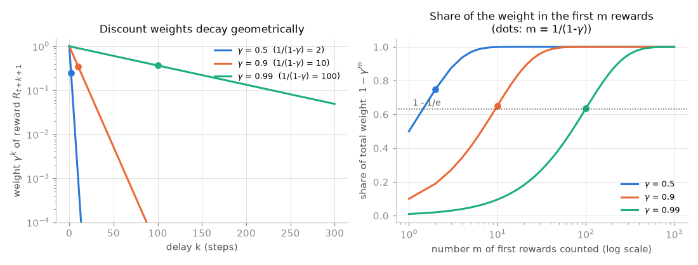
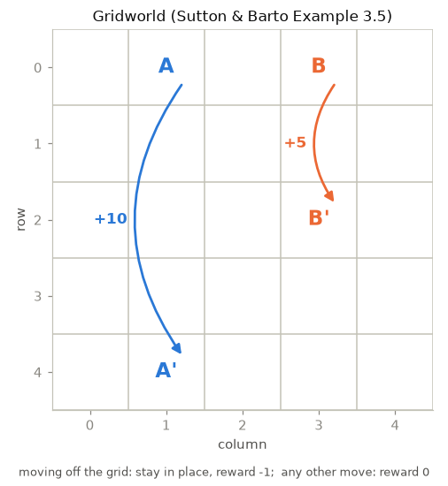
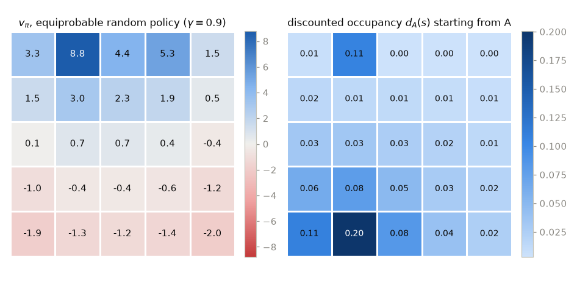
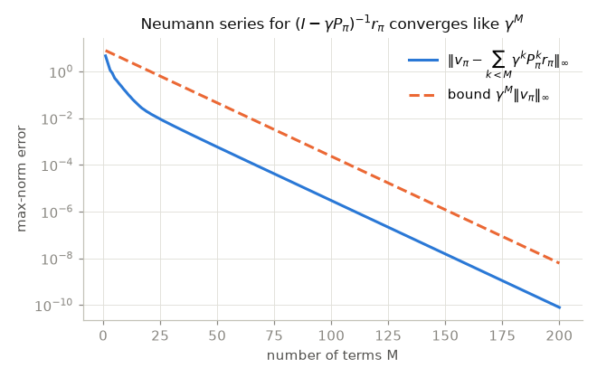
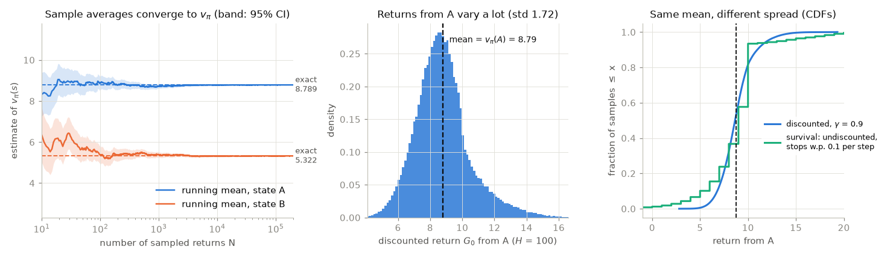
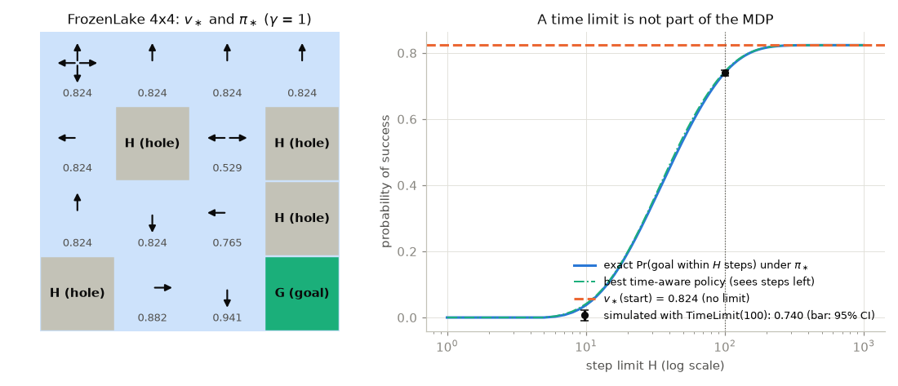
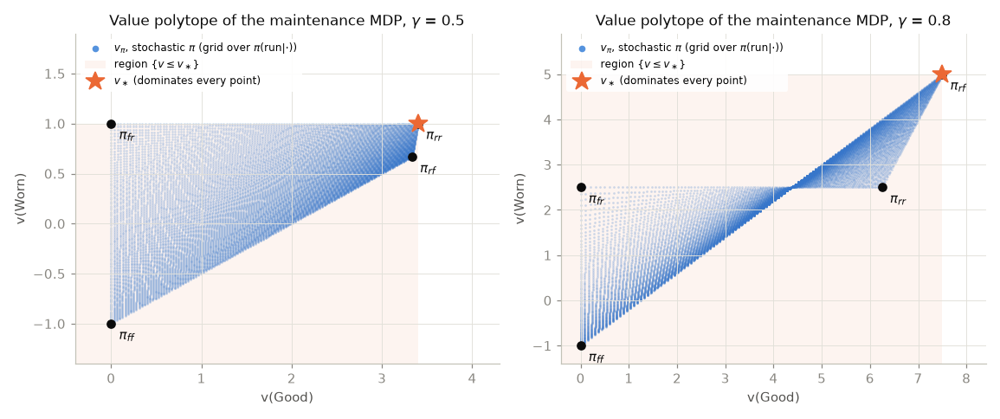
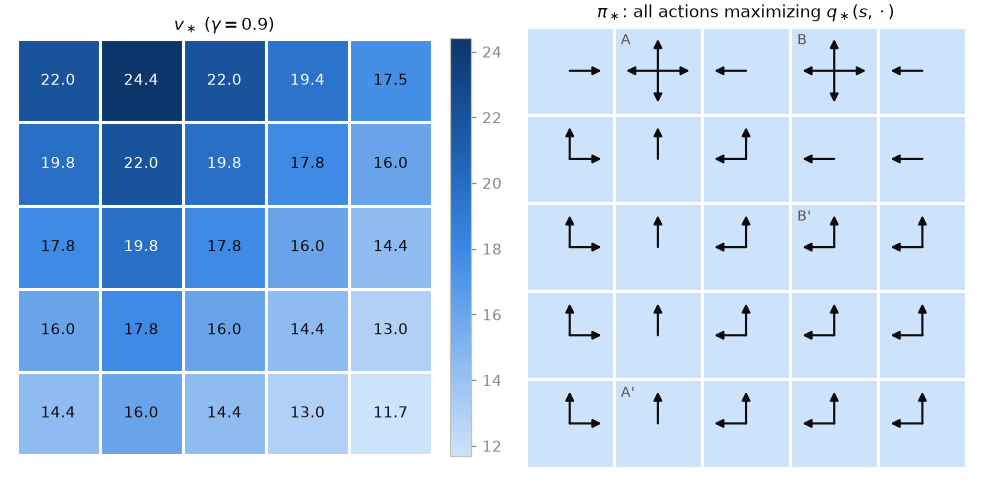
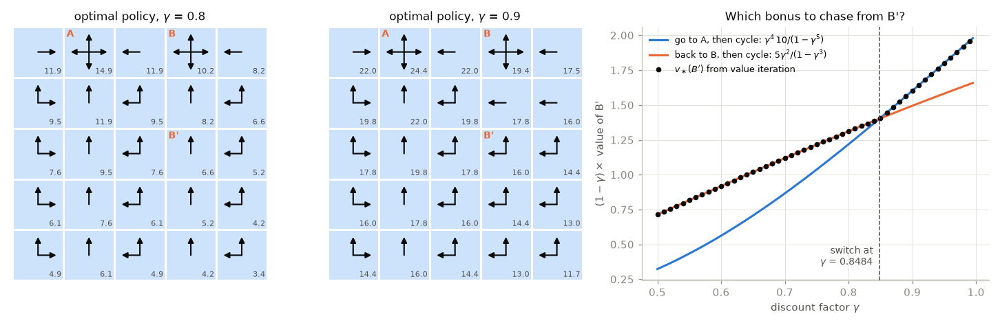

# Chapter 01 — The Reinforcement Learning Problem and Markov Decision Processes

[← Previous: The Mathematical and ML Toolkit for RL](00-math-toolkit.md) · [Course index](../README.md) · [Next: Multi-Armed Bandits](02-multi-armed-bandits.md) →

## At a glance

Every method in this course solves the same problem. An agent acts, the world responds with a new situation and a number called a reward, and the agent must learn to act so that the rewards add up to as much as possible. This chapter states that problem precisely as a **Markov decision process (MDP)**. It defines what it means to evaluate a way of behaving and what it means to behave optimally, and derives the **Bellman equations** that connect the two. Every later chapter is a way of solving these equations when they are too large, too unknown or too approximate to solve directly.

**Learning objectives.** After this chapter you should be able to:

* explain how reinforcement learning (RL) differs from supervised and unsupervised learning, and cast a new problem as states, actions and rewards;
* define returns for episodic and continuing tasks, justify discounting in three ways, and handle termination, truncation and absorbing states correctly;
* state the Markov property, recognise when a state representation violates it, and repair it;
* define a finite MDP through its four-argument dynamics $p(s', r \mid s, a)$ and derive every other quantity from it;
* define $v_\pi$ and $q_\pi$, derive the Bellman expectation equations step by step, and solve them exactly as a linear system;
* define $v_\ast$ and $q_\ast$, derive the Bellman optimality equations, and prove that a deterministic stationary optimal policy exists;
* place any RL algorithm on the map of the field (model-based or model-free, value- or policy-based, on- or off-policy, online or offline, tabular or approximate, prediction or control).

**Prerequisites.** Probability, conditional expectation and the law of total expectation; matrices, inverses, eigenvalues and norms; Python with NumPy. All of this is reviewed in [Chapter 00](00-math-toolkit.md), which also introduces the Gymnasium API.

**Code you will run** (all in [`code/ch01_the_rl_problem/`](../code/ch01_the_rl_problem/); each script takes a few seconds):

| Script | What it shows |
|---|---|
| [`mdp.py`](../code/ch01_the_rl_problem/mdp.py) | A finite-MDP library built on the four-argument dynamics, used by everything else |
| [`gridworld.py`](../code/ch01_the_rl_problem/gridworld.py) | The gridworld of Sutton & Barto's Example 3.5, as a model and as an environment |
| [`returns_and_discounting.py`](../code/ch01_the_rl_problem/returns_and_discounting.py) | Returns computed backwards, absorbing states, effective horizons |
| [`policy_evaluation_exact.py`](../code/ch01_the_rl_problem/policy_evaluation_exact.py) | $v_\pi$ of the random policy from one linear solve, checked against the book |
| [`monte_carlo_returns.py`](../code/ch01_the_rl_problem/monte_carlo_returns.py) | Averages of sampled returns converge to $v_\pi$; discounting as survival |
| [`optimal_values.py`](../code/ch01_the_rl_problem/optimal_values.py) | $v_\ast$ by value iteration and by linear programming; optimal policies; the effect of $\gamma$ |
| [`policy_ordering.py`](../code/ch01_the_rl_problem/policy_ordering.py) | Partial ordering of policies, the value polytope, brute-force checks of the existence theorem |
| [`frozenlake_exact.py`](../code/ch01_the_rl_problem/frozenlake_exact.py) | An episodic MDP read from Gymnasium, solved exactly with $\gamma = 1$ |
| [`exercise_slippery_gridworld.py`](../code/ch01_the_rl_problem/exercise_slippery_gridworld.py) | Solution to Exercise 13: a stochastic gridworld written through its four-argument dynamics |

**Study time.** About 6–8 hours for the text and code, plus 3–5 hours for the exercises.

---

## 1. What reinforcement learning is

### 1.1 Learning from interaction

Suppose you sit down at an unfamiliar video game with no manual. You press a button and your character jumps. You press another and nothing visible happens. After a minute a number in the corner goes up, and you try to work out which of the last dozen things you did caused it. Within an hour you are playing reasonably well, though nobody ever told you what the right button was in any situation. You learned from the *consequences* of your own actions.

**Reinforcement learning** is the computational study of this kind of learning. An *agent* interacts with an *environment* over time. At each step the agent sees the current situation, chooses an action, and receives a numerical *reward*. Its goal is to choose actions so that the total reward collected over the long run is as large as possible. Nobody tells the agent which action is correct. It has to find out by trying actions and seeing what happens, and the effect of an action may show up only much later.

### 1.2 What makes RL different

Four features, taken together, separate RL from the other kinds of machine learning.

**Evaluative rather than instructive feedback.** In supervised learning each example comes with the correct answer. If a classifier labels a cat "dog", the training signal says "the answer was *cat*", whatever the classifier predicted. That is *instructive* feedback. In RL the feedback *evaluates* the action that was actually taken and says nothing about the alternatives. Suppose an agent can press one of three buttons, presses button 2, and receives a reward of 0.7. Is 0.7 good? It cannot know without trying buttons 1 and 3, and if rewards are noisy it must try each of them several times. Evaluative feedback forces the agent to compare alternatives by experimenting. [Chapter 02](02-multi-armed-bandits.md) studies this problem on its own, in the simplest setting where it appears.

**Delayed consequences and credit assignment.** An action affects the immediate reward and also the *next situation*, and so all future rewards. A chess move may decide the game forty moves later, when the only reward (win, draw or loss) arrives. Deciding which of the many earlier decisions deserve credit or blame for a late reward is the *temporal credit-assignment problem*. Much of this course is about solving it efficiently.

**Exploration versus exploitation.** To collect reward the agent should *exploit* the actions it already believes are good. To find better actions it must *explore* ones it is unsure about, which may turn out to be worse. Neither pure strategy works. An agent that only exploits can lock onto a mediocre habit forever, and one that only explores never cashes in. Supervised learning, in its pure form, has no counterpart to this dilemma. [Chapters 02](02-multi-armed-bandits.md) and [14](14-exploration.md) treat it in depth.

**The data are not i.i.d., and the learner creates them.** A supervised learner usually receives independent, identically distributed samples from a fixed distribution. An RL agent's data are a trajectory of strongly correlated, consecutive situations, and *which* situations it sees depends on its own policy. When the policy improves, the agent visits different states and the training distribution shifts underneath it. This feedback loop is a major source of instability in deep RL ([Chapters 08](08-function-approximation.md) and [09](09-deep-q-learning.md)) and a main reason why learning from a fixed dataset is hard ([Chapter 16](16-offline-rl-and-imitation.md)).

A fifth difference follows from the others. The objective is not a sum of per-example losses. It is a property of whole trajectories, the cumulative reward, and the agent's choices determine which trajectories occur.

### 1.3 RL among the other kinds of learning

| | Supervised learning | Unsupervised learning | Reinforcement learning |
|---|---|---|---|
| Data | Input–label pairs | Inputs only | Interaction: states, actions, rewards |
| Feedback | Instructive: the correct output | None | Evaluative: a scalar score of the chosen action, often delayed |
| Who chooses the data | Fixed in advance | Fixed in advance | The learner, through its actions |
| Typical goal | Predict labels of new inputs | Find structure (clusters, densities, representations) | Maximise long-run cumulative reward |
| Example | Classify images | Cluster customers | Play Go, control a robot, fine-tune a language model |

There are intermediate settings. In *contextual bandits* each action is evaluated immediately but does not affect future situations ([Chapter 02](02-multi-armed-bandits.md)). In *imitation learning* an expert's actions are shown, which turns control into supervised learning, with its own problems ([Chapter 16](16-offline-rl-and-imitation.md)). RL also uses supervised and unsupervised learning as components: a value function is fitted by regression ([Chapter 08](08-function-approximation.md)), and a world model is fitted by density estimation ([Chapter 13](13-model-based-rl.md)).

### 1.4 A gallery of RL problems

The same abstraction covers very different problems. For each one, ask: what does the agent observe, what can it do, and what number says how well it is doing?

| Problem | State (what the agent sees) | Action | Reward | Episodic? |
|---|---|---|---|---|
| Board games: backgammon, chess, Go | Board position (and whose turn it is) | A legal move | $+1$ for a win, $-1$ for a loss, 0 for every other move | Yes, one game |
| Atari video games (the DQN line of work) | The last few screen frames | A joystick/button combination | Change in the game score | Yes, one game |
| Legged robot locomotion | Joint angles and velocities, body orientation | Motor torques or target joint positions | Forward speed, minus energy use, minus a penalty for falling | Usually episodic with a time limit |
| Magnetic control of a fusion plasma (Degrave et al., 2022) | Magnetic and current measurements | Voltages on the control coils | How closely the plasma tracks the target shape and current | Yes, one plasma discharge |
| Inventory management | Stock levels, orders in transit, recent demand | How much to order of each product | Sales revenue minus holding, ordering and stock-out costs | No, continuing |
| Recommendation | The user's recent history and context | Which item to show | Click, watch time, or long-run engagement | Continuing (or per session) |
| Medical treatment strategies | Patient measurements and history | Drug and dose | Health outcomes (often delayed and sparse) | Yes, a course of treatment |
| Language-model fine-tuning with human feedback | Prompt plus the tokens generated so far | The next token | A learned reward-model score at the end, minus a penalty for drifting from a reference model | Yes, one response |
| Building climate control | Temperatures, occupancy, weather, time of day | Heating and cooling set-points | Minus energy cost, minus comfort violations | No, continuing |

Notice how much design is hidden in the "reward" column. The robot's reward weighs speed against energy. The language model's reward is itself a neural network trained on human preferences ([Chapter 18](18-rl-for-language-models.md)). Section 3 returns to this.

### 1.5 The ingredients of an RL agent

Sutton and Barto identify four main ingredients of an RL system beyond the agent and environment themselves:

* A **policy** maps situations to actions (or to probabilities over actions). It *is* the agent's behaviour.
* A **reward signal** defines the goal. It is the immediate, primary measure of what is good.
* A **value function** predicts how much reward will accumulate in the future starting from a situation. Rewards are immediate and given by the environment. Values are long-run predictions that the agent must estimate. We choose actions by values, because a state with a low immediate reward can still lead to high rewards later.
* A **model** of the environment predicts what will happen next (next state and reward) given a situation and action. Methods that use one for *planning* are **model-based**, and those that learn purely by trial and error are **model-free** (Section 14).

All four become precise mathematical objects in the next few sections.

---

## 2. The agent–environment interface

The learner and decision maker is the **agent**. Everything it interacts with is the **environment**. They interact at discrete time steps $t = 0, 1, 2, \dots$. At each step $t$:

1. the agent receives a representation of the environment's **state**, $S_t \in \mathcal{S}$;
2. it selects an **action** $A_t \in \mathcal{A}(S_t)$, where $\mathcal{A}(s)$ is the set of actions available in state $s$;
3. one step later, as a consequence of its action, it receives a numerical **reward** $R_{t+1} \in \mathcal{R} \subset \mathbb{R}$ and finds itself in a new state $S_{t+1}$.

```text
        ┌─────────────────────────────── Agent ────────────────────────────────┐
        │   observes S_t, then chooses A_t ~ π( · | S_t)                       │
        └─────────▲───────────────────────▲─────────────────────┬──────────────┘
                  │ state S_t+1           │ reward R_t+1        │ action A_t
        ┌─────────┴───────────────────────┴─────────────────────▼──────────────┐
        │   Environment: draws (S_t+1, R_t+1) ~ p( · , · | S_t, A_t)           │
        └──────────────────────────────────────────────────────────────────────┘
```

The interaction produces a **trajectory**

$$
S_0, A_0, R_1, S_1, A_1, R_2, S_2, A_2, R_3, \dots
$$

**Timing convention.** The reward that follows action $A_t$ is written $R_{t+1}$, not $R_t$. It is produced together with $S_{t+1}$, as part of the environment's response. This is the convention of Sutton & Barto and of this course (see [NOTATION.md](../NOTATION.md)). Some papers write $r_t$ for the reward of $(s_t, a_t)$. The two conventions describe the same thing, but mixing them is a reliable source of off-by-one bugs. In Gymnasium the reward returned by `env.step(action)` is $R_{t+1}$, and it comes with the next observation $S_{t+1}$:

```python
import gymnasium as gym

env = gym.make("FrozenLake-v1", is_slippery=True)
policy = lambda obs: env.action_space.sample()    # placeholder: a uniformly random policy
obs, info = env.reset(seed=0)                     # S_0
done = False
while not done:
    action = policy(obs)                          # A_t ~ pi(. | S_t)
    obs, reward, terminated, truncated, info = env.step(action)   # S_{t+1}, R_{t+1}
    done = terminated or truncated                # Section 4.5: these two are different
env.close()
```

Here is a real excerpt from [`gridworld.py`](../code/ch01_the_rl_problem/gridworld.py), which runs this loop with a uniformly random policy in the gridworld of Section 6.4:

```text
  t=0: S_t=(0,2)  A_t=west  -> R_t+1=+0, S_t+1=A
  t=1: S_t=A      A_t=east  -> R_t+1=+10, S_t+1=A'
  t=2: S_t=A'     A_t=east  -> R_t+1=+0, S_t+1=(4,2)
  t=3: S_t=(4,2)  A_t=south -> R_t+1=-1, S_t+1=(4,2)
```

**Where the boundary goes.** The agent–environment boundary marks the limit of the agent's *absolute control*, not of its knowledge. A robot's motors, joints and sensors are part of the environment, because the agent cannot change them arbitrarily, only send them commands. The reward is computed *outside* the agent even when the computation physically runs on the robot's own computer: the agent must not be able to change its reward at will. (When a real agent finds a way to influence its own reward channel, we get *reward tampering*, a safety concern closely related to the reward hacking discussed in [Chapter 20](20-deep-rl-in-practice.md), Section 2.) An agent can know *everything* about how its environment works, as with a Rubik's cube, and still face a hard decision problem.

**How general this is.** Time steps need not be equal intervals of real time; they can be successive decisions. Actions can be low-level (a motor voltage) or high-level (which subgoal to pursue next; see [Chapter 15](15-beyond-mdps.md)). States can be raw sensor readings or abstract summaries. This framework is a deliberately minimal abstraction of goal-directed learning: everything is reduced to three signals passing back and forth. One signal carries the agent's choices (actions), one carries the basis for those choices (states), and one defines the goal (rewards).

---

## 3. Goals, rewards and the reward hypothesis

### 3.1 Reward says *what*, not *how*

The reward signal is how we tell the agent what we want it to achieve, not how to achieve it. Some examples of good practice:

* To make an agent escape a maze quickly, give $-1$ for every step until it escapes. Maximising the sum of rewards then means minimising the number of steps.
* To make an agent win at chess, reward winning ($+1$), not taking pieces. If we reward captures, the agent may learn to capture pieces at the expense of the game. Prior knowledge about *how* to win belongs in the initial policy or value function, not in the reward.
* To make a robot walk, reward forward progress. Rewarding a particular gait imposes our guess about how to walk.

Rewards that pay for intermediate progress can speed up learning, but they change the problem being solved unless they are designed carefully. One safe family is *potential-based shaping* (Ng, Harada & Russell, 1999), discussed in [Chapter 20](20-deep-rl-in-practice.md).

### 3.2 The reward hypothesis

The whole field rests on a bold working assumption, which Sutton and Barto (2018, §3.2) state as the **reward hypothesis**:

> That all of what we mean by goals and purposes can be well thought of as the maximization of the expected value of the cumulative sum of a received scalar signal (called reward).

It is not obvious that something as rich as "be a helpful assistant" or "run a power grid safely" reduces to maximising the expected sum of a single number. Yet the hypothesis has been remarkably productive. Every success story in the Historical notes at the end of this chapter is an instance of it.

### 3.3 The limits of the reward hypothesis

It is a hypothesis, not a theorem, and it has known limits:

* **Several objectives.** Real tasks trade off several objectives (speed, safety, cost). A scalar reward forces us to fix the trade-off, for example as weights, *before* learning. Hard constraints ("never exceed this temperature") are better expressed as constrained MDPs ([Chapter 20](20-deep-rl-in-practice.md)).
* **Risk.** Maximising the *expected* return is risk-neutral. Two policies with the same expected return can have very different spreads. In Section 11 the return from one gridworld state has mean 8.79 but standard deviation 1.72, and the mean alone hides that spread. Risk-sensitive and distributional RL ([Chapter 09](09-deep-q-learning.md)) model the whole return distribution.
* **Expressivity.** Abel et al. (2021) showed that some natural task specifications cannot be captured by *any* Markov reward function, that is, a reward that depends only on the current transition. Their examples include certain sets of acceptable behaviours and certain orderings over trajectories. Bowling et al. (2023) characterised exactly when the hypothesis holds. Roughly, the agent's preferences over outcomes must satisfy the von Neumann–Morgenstern axioms of rational choice, plus one extra axiom that relates preferences at different times.
* **Misspecification and reward hacking.** An optimiser exploits whatever the reward actually says, not what its designer meant (Goodhart's law). A famous example is a boat-racing agent that learned to circle forever collecting bonus targets instead of finishing the race (Clark & Amodei, 2016). Language models over-optimise learned reward models in the same way ([Chapter 18](18-rl-for-language-models.md)).
* **Where rewards come from.** In nature, reward is not handed to the agent. In practice it is designed by hand, learned from demonstrations (inverse RL, [Chapter 16](16-offline-rl-and-imitation.md)) or from human preferences ([Chapter 18](18-rl-for-language-models.md)), or generated by the agent itself as intrinsic motivation ([Chapter 14](14-exploration.md)). Silver, Singh, Precup and Sutton (2021) argued for the strong conjecture that "reward is enough" to drive all of intelligence. The claim is debated.

With these caveats noted, we adopt the hypothesis and make "cumulative sum" precise.

---

## 4. Returns, discounting and episodes

The agent wants to maximise the cumulative reward it receives in the long run. We call the quantity it maximises the **return**, $G_t$: a function of the reward sequence $R_{t+1}, R_{t+2}, \dots$ after time $t$. Its exact form depends on whether the interaction has a natural end.

### 4.1 Episodic tasks

In many tasks the interaction breaks into independent **episodes**: games, maze runs, conversations. Each episode ends in a special **terminal state**, followed by a reset to a starting state drawn from a fixed distribution $d_0$, independently of how the previous episode ended. Here the return is simply the sum of the remaining rewards:

$$
G_t \doteq R_{t+1} + R_{t+2} + \cdots + R_T, \tag{1.1}
$$

where $T$ is the final time step. $T$ is a random variable that can differ between episodes. We write $\mathcal{S}$ for the non-terminal states and $\mathcal{S}^+$ for all states including the terminal one.

### 4.2 Continuing tasks and discounting

Other tasks go on forever: process control, inventory management, a long-lived robot. With $T = \infty$, the sum (1.1) can diverge, so all policies could look equally (infinitely) good. The standard fix is **discounting**. With a **discount factor** $\gamma \in [0, 1]$, the **discounted return** is

$$
G_t \doteq R_{t+1} + \gamma R_{t+2} + \gamma^2 R_{t+3} + \cdots = \sum_{k=0}^{\infty} \gamma^k R_{t+k+1}. \tag{1.2}
$$

A reward received $k$ steps in the future is worth $\gamma^k$ times what it would be worth immediately. If rewards are bounded, $\lvert R_t \rvert \le R_{\max}$, and $\gamma < 1$, the series converges absolutely:

$$
\lvert G_t \rvert \le \sum_{k=0}^{\infty} \gamma^k R_{\max} = \frac{R_{\max}}{1-\gamma}.
$$

With $\gamma = 0$ the agent is **myopic** and cares only about $R_{t+1}$. As $\gamma \to 1$ it becomes more far-sighted.

**The recursive structure.** Returns at successive time steps are related by a simple identity, the seed of everything in Sections 9–12:

$$
\begin{aligned}
G_t &= R_{t+1} + \gamma R_{t+2} + \gamma^2 R_{t+3} + \gamma^3 R_{t+4} + \cdots \\
    &= R_{t+1} + \gamma \left( R_{t+2} + \gamma R_{t+3} + \gamma^2 R_{t+4} + \cdots \right) \\
    &= R_{t+1} + \gamma G_{t+1}.
\end{aligned} \tag{1.3}
$$

It holds for every $t < T$ if we define $G_T \doteq 0$. It also gives an $O(T)$ way to compute all the returns of an episode, by sweeping backwards:

```text
Algorithm: returns of one episode (backward recursion)
Input:  rewards R_1, ..., R_T of an episode; discount γ ∈ [0, 1]
G ← 0                                  # G_T = 0: nothing is collected after the end
Loop for t = T−1, T−2, ..., 0:
    G ← R_{t+1} + γ · G                # equation (1.3)
    G_t ← G
Output: G_0, G_1, ..., G_{T−1}
```

**Worked example (by hand).** Let $\gamma = 0.9$ and suppose an episode produces rewards $R_1 = 1$, $R_2 = 0$, $R_3 = -2$, $R_4 = 10$, then terminates ($T = 4$). Backwards:

$$
\begin{aligned}
G_4 &= 0, \\
G_3 &= R_4 + \gamma G_4 = 10, \\
G_2 &= R_3 + \gamma G_3 = -2 + 0.9 \times 10 = 7, \\
G_1 &= R_2 + \gamma G_2 = 0 + 0.9 \times 7 = 6.3, \\
G_0 &= R_1 + \gamma G_1 = 1 + 0.9 \times 6.3 = 6.67.
\end{aligned}
$$

Directly from (1.2): $G_0 = 1 + 0.9 \cdot 0 + 0.81 \cdot (-2) + 0.729 \cdot 10 = 1 - 1.62 + 7.29 = 6.67$. The two computations agree. [`returns_and_discounting.py`](../code/ch01_the_rl_problem/returns_and_discounting.py) runs both and prints exactly these values. A second example, worth memorising: if every reward equals a constant $c$, then $G_t = c \sum_k \gamma^k = c/(1-\gamma)$.

### 4.3 Why discount?

Discounting can look like an arbitrary hack. There are three distinct justifications, and they matter in different situations.

**1. Mathematical convenience.** With $\gamma < 1$ and bounded rewards every return is finite, every value function is well defined, and (as we will see in Section 10 and [Chapter 03](03-dynamic-programming.md)) the Bellman equations have unique solutions that simple iterative algorithms find at a geometric rate $\gamma^k$.

**2. Uncertainty about the future: discounting as survival.** Suppose that after every step the interaction may stop for good, with probability $1-\gamma$, independently of everything else. The cause could be the robot's battery dying, the customer leaving, or the world ending. Let $K$ be the number of rewards collected, so $\Pr\lbrace K > k\rbrace = \gamma^k$. Then the expected *undiscounted* sum of the rewards actually received equals the expected *discounted* return:

$$
\mathbb{E}\Big[\sum_{k=0}^{K-1} R_{t+k+1}\Big]
= \mathbb{E}\Big[\sum_{k=0}^{\infty} \mathbb{1}[K > k]\, R_{t+k+1}\Big]
= \sum_{k=0}^{\infty} \Pr\lbrace K > k\rbrace\, \mathbb{E}[R_{t+k+1}]
= \sum_{k=0}^{\infty} \gamma^k\, \mathbb{E}[R_{t+k+1}].
$$

The second equality uses the independence of $K$ from the rewards and exchanges sum and expectation, which is valid because the rewards are bounded and $\sum_k \gamma^k < \infty$. So $\gamma$ can be read as the probability that the future happens at all. Section 11 checks this by simulation in the gridworld: the two averages agree, but the survival returns are far more spread out (Exercise 7 explains why).

**3. Preference: impatience and interest.** Economists discount because a reward now can be invested. At interest rate $i$ per step, one unit today grows to $1+i$ units tomorrow, so a unit tomorrow is worth $\gamma = 1/(1+i)$ units today. A 5% rate per step gives $\gamma \approx 0.952$. A discount can also simply express a preference for sooner rewards.

**The effective horizon.** Since $\sum_{k=0}^\infty \gamma^k = 1/(1-\gamma)$, the quantity $1/(1-\gamma)$ acts as an **effective horizon**. The first $m$ rewards carry a share $1-\gamma^m$ of the total weight. At $m = 1/(1-\gamma)$ this share is always at least $1 - 1/e \approx 63\%$, because $\ln\gamma \le \gamma - 1$ gives $\gamma^{1/(1-\gamma)} = e^{\ln\gamma/(1-\gamma)} \le e^{-1}$, and it tends to $1 - 1/e$ as $\gamma \to 1$. The script prints:

| $\gamma$ | $1/(1-\gamma)$ | share of weight in the first $1/(1-\gamma)$ rewards | steps until $\gamma^k < 0.01$ |
|---|---|---|---|
| 0.5 | 2 | 0.750 | 7 |
| 0.9 | 10 | 0.651 | 44 |
| 0.99 | 100 | 0.634 | 459 |
| 0.999 | 1000 | 0.632 | 4603 |



*Left: the weight $\gamma^k$ given to the reward $k$ steps ahead decays geometrically, which is a straight line on a log axis. The dot marks $k = 1/(1-\gamma)$. Right: the share of the total weight carried by the first $m$ rewards. At least 63% of it (exactly $1-\gamma^{1/(1-\gamma)} \ge 1-1/e$) sits within the effective horizon, and the share tends to 63% as $\gamma \to 1$.*

**$\gamma$ is part of the problem, not just a hyperparameter.** Changing $\gamma$ changes which behaviour is optimal. In the gridworld of Section 12, eight states in the right-hand columns (B$'$ and the cells around it) switch from heading for B to heading for A when $\gamma$ crosses $0.8484$, and five of them change their set of optimal actions. In the two-state machine-maintenance MDP of Section 6.3, repairing a worn machine is optimal only when $\gamma \ge 4/7$. A far-sighted agent invests in repairs and a short-sighted one runs the machine into the ground. In deep RL $\gamma$ is also tuned for learnability: values grow like $1/(1-\gamma)$, the linear systems behind them become worse conditioned (Section 10.5), and their estimates get noisier. Bear in mind that this tuning trades away fidelity to the true objective.

**When $\gamma \to 1$.** For continuing tasks, $(1-\gamma)\,v_\pi(s)$ tends, as $\gamma \to 1$, to the long-run **average reward per step** obtained from $s$. This holds for any finite chain (Puterman, 1994, §8.2). For the chains in this chapter, which have a single recurrent class, the limit is the same for every state, and we write it $\bar r_\pi$. Sorting policies by average reward is an alternative to discounting, the *average-reward criterion* (Sutton & Barto, 2018, §10.3). Section 10.5 shows a striking consequence. The random policy in the gridworld has a slightly *negative* average reward ($-0.0112$ per step), so its values, which are positive in 14 of the 25 states at $\gamma = 0.9$, are all negative at $\gamma = 0.999$.

### 4.4 One notation for both: absorbing states

Episodic and continuing tasks can be treated with one formula. Think of episode termination as entering a special **absorbing state** that transitions only to itself and gives reward zero forever:

```text
  S_0 ──R_1=+1──► S_1 ──R_2=0──► S_2 ──R_3=−2──► S_3 ──R_4=+10──► ■ ⟲ (R = 0 forever)
```

Summing to infinity then gives the same return as summing to $T$, with or without discounting. The code confirms it: padding the worked example with 200 zero rewards leaves $G_0 = 6.67$ unchanged. We can therefore always write

$$
G_t \doteq \sum_{k=t+1}^{T} \gamma^{k-t-1} R_k, \tag{1.4}
$$

allowing either $T = \infty$ or $\gamma = 1$, *but not both*. Gymnasium's toy-text environments encode terminal states exactly this way. In FrozenLake, `env.unwrapped.P[5][0] == [(1.0, 5, 0, True)]`: from hole 5, every action leads back to state 5 with probability 1 and reward 0.

### 4.5 Termination is not truncation

Many environments stop episodes after a fixed number of steps, such as FrozenLake's 100-step `TimeLimit`. Such a cut-off is usually not part of the task. It is a practical device for resetting the simulator. Gymnasium therefore separates `terminated` (the MDP reached a terminal state, whose value is 0) from `truncated` (we stopped watching, and the last state still has a future). The distinction matters for learning:

* After a **termination**, the remaining return is exactly 0, so learning targets must not add a value estimate of the next state.
* After a **truncation**, the remaining return is *not* 0, so targets must still estimate the value of the next state ("bootstrap through truncation"; Pardo et al., 2018). This is the rule in [NOTATION.md](../NOTATION.md) and in every later chapter.
* If the time limit *is* genuinely part of the task, then the time remaining must be part of the state. Otherwise the same observation with 1 step left and with 100 steps left would need different values, and the state would not be Markov (Section 5).

Section 12.4 measures the effect in FrozenLake. The policy that is optimal for the untimed MDP reaches the goal with probability $0.8235$ if allowed to play forever, but only $0.7402$ within the default 100 steps. A policy that also sees the number of steps left does slightly better under the limit ($0.7442$, computed by backward induction over (state, steps left)), which illustrates the previous bullet.

---

## 5. The Markov property and state design

The state $S_t$ is the agent's basis for deciding. When is it a *good enough* basis? A **history** up to time $t$ is everything observed before the action $A_t$ is chosen,

$$
h_t \doteq (s_0, a_0, r_1, s_1, a_1, r_2, \dots, r_t, s_t).
$$

We use this one definition throughout: a history ends with the current state and does *not* include $A_t$. A state signal has the **Markov property** if the next state and reward depend on the history and the current action only through the current state and action:

$$
\Pr\lbrace S_{t+1} = s', R_{t+1} = r \mid (S_0, A_0, R_1, \dots, S_t) = h_t,\ A_t = a \rbrace = \Pr\lbrace S_{t+1} = s', R_{t+1} = r \mid S_t = s_t,\ A_t = a \rbrace \tag{1.5}
$$

for all $s'$, $r$, $a$, $t$ and every history $h_t$ (ending in $s_t$) that has positive probability. In words, the *future is independent of the past given the present*. The state is a sufficient statistic of the history for predicting what comes next.

**The Markov property belongs to the state representation, not to the world.** The same physical system can be described by a Markov or a non-Markov state signal. Using the full history $h_t$ itself as the state always gives a Markov signal, but one that grows without bound. The practical question is whether a *compact* summary of the history is Markov. Some examples:

* **A ball on a line.** Suppose a ball moves at a constant speed of $\pm 1$ cell per step and we observe only its position $x_t$. If $x_t = 5$, the next position is 4 or 6, and the current observation cannot say which, so position alone is not Markov. The previous position settles it: the pair $(x_t, x_t - x_{t-1})$, position and velocity, is Markov. This is why Gymnasium's CartPole observation includes velocities as well as positions.
* **Video games.** A single Atari frame does not show which way the ball is moving. DQN stacks the last four frames ([Chapter 09](09-deep-q-learning.md)).
* **Time limits.** If the task really ends after $H$ steps, the time remaining must be part of the state (Section 4.5).
* **Card games.** In blackjack or poker the cards already played change the odds, so a good state includes what has been seen.
* **Partial observability.** Sometimes no compact function of recent observations is Markov. The agent must then keep a memory of some kind: a belief over hidden states, or a recurrent network. That is the subject of POMDPs in [Chapter 15](15-beyond-mdps.md). Exercise 12 shows a concrete cost of a non-Markov state. When three different corridor states look identical, the best memoryless policy is *stochastic* and has value $-11.66$, while an agent that sees the true state achieves $-3$.

Why does the Markov property matter so much? It is what makes *values* well defined functions of the state and what makes the Bellman equations of Section 9 true. Every step of their derivation uses (1.5). In practice the property rarely holds exactly. RL methods are designed for Markov states and often work well when the state is approximately Markov. Choosing a good state representation is part of the craft of applying RL.

---

## 6. Markov decision processes

### 6.1 Definition

A reinforcement-learning task whose state signal has the Markov property is a **Markov decision process (MDP)**. If the state, action and reward sets are finite, it is a **finite MDP**, the setting of Chapters 01–07.

**Definition (finite MDP).** A finite MDP consists of

* a finite set of states $\mathcal{S}$ (with $\mathcal{S}^+ \supseteq \mathcal{S}$ including any terminal states), finite action sets $\mathcal{A}(s)$, and a finite set of rewards $\mathcal{R} \subset \mathbb{R}$;
* the **four-argument dynamics** $p: \mathcal{S}^+ \times \mathcal{R} \times \mathcal{S} \times \mathcal{A} \to [0, 1]$,

$$
p(s', r \mid s, a) \doteq \Pr\lbrace S_t = s', R_t = r \mid S_{t-1} = s, A_{t-1} = a \rbrace, \qquad \sum_{s' \in \mathcal{S}^+} \sum_{r \in \mathcal{R}} p(s', r \mid s, a) = 1 \ \ \text{for all } s, a; \tag{1.6}
$$

* an initial-state distribution $d_0$, and a discount factor $\gamma \in [0, 1]$ that is part of the objective.

Under the Markov property, $p$ is the *entire* description of the environment. Together with a policy (Section 7) and $d_0$ it fixes the joint distribution of every trajectory. The dynamics do not depend on $t$: the MDP is **time-homogeneous**, or stationary. Some authors bundle $\gamma$ into the tuple $(\mathcal{S}, \mathcal{A}, p, d_0, \gamma)$, and others keep it as part of the objective. Either way, $\gamma$ defines *what* we optimise (Section 4.3).

### 6.2 Derived quantities

Everything else we need follows from $p$ by marginalisation:

**State-transition probabilities** (sum out the reward):

$$
p(s' \mid s, a) \doteq \Pr\lbrace S_t = s' \mid S_{t-1} = s, A_{t-1} = a\rbrace = \sum_{r \in \mathcal{R}} p(s', r \mid s, a). \tag{1.7}
$$

**Expected reward for a state–action pair** (the mean of $R_t$):

$$
r(s, a) \doteq \mathbb{E}[R_t \mid S_{t-1} = s, A_{t-1} = a] = \sum_{r \in \mathcal{R}} r \sum_{s' \in \mathcal{S}^+} p(s', r \mid s, a). \tag{1.8}
$$

**Expected reward for a state–action–next-state triple** (condition on $S_t = s'$ as well):

$$
r(s, a, s') \doteq \mathbb{E}[R_t \mid S_{t-1} = s, A_{t-1} = a, S_t = s'] = \sum_{r \in \mathcal{R}} r \, \frac{p(s', r \mid s, a)}{p(s' \mid s, a)}, \tag{1.9}
$$

defined whenever $p(s' \mid s, a) > 0$. These are consistent with one another: $r(s,a) = \sum_{s'} p(s' \mid s,a)\, r(s,a,s')$.

Why insist on the four-argument form? It is the most general one. The reward can be random and correlated with the next state, as in the example below. Many texts define an MDP as $(\mathcal{S}, \mathcal{A}, P, R, \gamma)$ with $P = p(s' \mid s, a)$ and $R = r(s, a)$. That is equivalent for everything that depends only on *expected* returns, which covers most of this course. It discards the reward *distribution*, which matters for risk-sensitive and distributional RL. The library [`mdp.py`](../code/ch01_the_rl_problem/mdp.py) stores $p$ as a list of `(probability, next_state, reward)` outcomes for each $(s, a)$ and computes (1.7)–(1.9) on demand:

```python
def expected_reward(self) -> np.ndarray:
    """r(s, a) = sum_{s', r} r p(s', r | s, a)   (expected immediate reward; cached, read-only)."""
    ...
            R[s, a] = sum(prob * r for prob, _, r in self.outcomes[s][a])
```

### 6.3 Worked example: a machine-maintenance MDP

We will carry one tiny MDP through the rest of the chapter and do every computation by hand. A factory machine is either **Good** (G) or **Worn** (W). In each state the manager can **run** it or **fix** it:

| $s$ | $a$ | $s'$ | $r$ | $p(s', r \mid s, a)$ | Story |
|---|---|---|---|---|---|
| G | run | G | $+2$ | 0.75 | production; the machine stays good |
| G | run | W | $+2$ | 0.25 | production; the machine wears out |
| G | fix | G | $0$ | 1 | needless maintenance; no production |
| W | run | W | $+2$ | 0.5 | production with a worn machine succeeds |
| W | run | W | $-1$ | 0.5 | ...or yields defective goods that cost money |
| W | fix | G | $-1$ | 1 | repair cost; the machine is restored |

Each $(s,a)$ row group sums to 1, as (1.6) requires. Note that (W, run) has two outcomes with the *same* next state and *different* rewards, which only the four-argument form can express. The derived quantities, by hand:

* $p(\mathrm{W} \mid \mathrm{G}, \mathrm{run}) = 0.25$, $p(\mathrm{G} \mid \mathrm{G}, \mathrm{run}) = 0.75$, $p(\mathrm{W} \mid \mathrm{W}, \mathrm{run}) = 0.5 + 0.5 = 1$, and $p(\mathrm{G} \mid \mathrm{W}, \mathrm{fix}) = p(\mathrm{G} \mid \mathrm{G}, \mathrm{fix}) = 1$.
* $r(\mathrm{G}, \mathrm{run}) = 2 \cdot 0.75 + 2 \cdot 0.25 = 2$, $r(\mathrm{G}, \mathrm{fix}) = 0$, $r(\mathrm{W}, \mathrm{run}) = 2 \cdot 0.5 + (-1) \cdot 0.5 = 0.5$, and $r(\mathrm{W}, \mathrm{fix}) = -1$.
* $r(\mathrm{W}, \mathrm{run}, \mathrm{W}) = (2 \cdot 0.5 + (-1)\cdot 0.5)/1 = 0.5$ and $r(\mathrm{G}, \mathrm{run}, \mathrm{W}) = 2 \cdot 0.25 / 0.25 = 2$.

[`policy_ordering.py`](../code/ch01_the_rl_problem/policy_ordering.py) prints the same table: `r(s,a) = [[2.0, 0.0], [0.5, -1.0]]`. The trade-off is plain. Running a worn machine pays $0.5$ per step on average. Fixing it costs $1$ now but restores a machine that pays $2$ per step for a while. Whether the repair is worth it depends on how much the future matters, that is, on $\gamma$.

### 6.4 The gridworld of Example 3.5

Our second running example is the gridworld from Sutton & Barto (2018, Example 3.5). It is small enough to solve exactly, and the book prints its values, so we can check our code against them.



* **States:** the 25 cells of a $5 \times 5$ grid. We number them $s = 5\cdot\text{row} + \text{col}$, with row 0 at the top.
* **Actions:** north, south, east, west. Moves are deterministic.
* **Rewards and transitions:** a move that would leave the grid leaves the agent where it is, with reward $-1$. Every action in the special state A $=(0,1)$ yields $+10$ and teleports the agent to A$'$ $=(4,1)$. Every action in B $=(0,3)$ yields $+5$ and teleports it to B$'$ $=(2,3)$. All other moves give reward 0.
* **The task is continuing** (it never ends), with $\gamma = 0.9$.

All probabilities are 0 or 1, so the dynamics are a lookup table. In [`gridworld.py`](../code/ch01_the_rl_problem/gridworld.py) the whole environment is one function:

```python
def transition(self, s: int, a: int) -> tuple[int, float]:
    row, col = self.coords(s)
    if (row, col) == self.a_pos:
        return self.index(*self.a_prime), self.r_a          # +10 and jump to A'
    if (row, col) == self.b_pos:
        return self.index(*self.b_prime), self.r_b          # +5 and jump to B'
    dr, dc = ACTION_DELTAS[a]
    r2, c2 = row + dr, col + dc
    if not (0 <= r2 < self.size and 0 <= c2 < self.size):
        return s, self.off_grid_reward                      # bumped into the wall: stay, pay -1
    return self.index(r2, c2), 0.0
```

The script exposes this both as a model (`to_mdp()`, the dense tensor $p[s, a, s', r]$ of shape $25 \times 4 \times 25 \times 4$ over the reward set $\mathcal{R} = \lbrace -1, 0, 5, 10\rbrace$) and as an environment with a Gymnasium-style `reset`/`step`. That is exactly the distinction between what a *planning* algorithm needs and what a *model-free learning* algorithm gets (Section 14).

### 6.5 MDPs inside Gymnasium

Gymnasium's toy-text environments publish their model. For FrozenLake, `env.unwrapped.P[s][a]` is a list of `(probability, next_state, reward, terminated)` tuples, which is the four-argument dynamics plus a flag for terminal states. From [`frozenlake_exact.py`](../code/ch01_the_rl_problem/frozenlake_exact.py):

```text
env.unwrapped.P[14][2] (state 14, action 'right') = [(0.33333333333333337, 14, 0, False),
    (0.3333333333333333, 15, 1, True), (0.33333333333333337, 10, 0, False)]
```

On slippery ice the agent moves in the intended direction with probability 1/3 and in each perpendicular direction with probability 1/3. Moving into the goal (state 15) pays $+1$ and terminates. One practical detail: the list can contain *duplicate* $(s', r)$ entries (for example two separate "stay in place" outcomes in a corner). By definition $p(s', r \mid s, a)$ is their *sum*, and `mdp.py` adds them up.

---

## 7. Policies

A **policy** is a rule for choosing actions. There are several kinds:

* A **stochastic** (randomised) policy gives a probability for each action: $\pi(a \mid s) \doteq \Pr\lbrace A_t = a \mid S_t = s\rbrace$, with $\sum_{a} \pi(a \mid s) = 1$.
* A **deterministic** policy picks one action per state, $a = \pi(s)$. It is the special case where $\pi(\cdot \mid s)$ puts probability 1 on one action.
* A **stationary** policy uses the same rule at every time step. A *non-stationary* one, $\pi_t(a \mid s)$, may change with $t$. For instance, it might explore early and exploit later.
* A **Markov** policy depends only on the current state. A **history-dependent** policy, $\pi_t(a \mid h_t)$, may depend on the whole past $h_t = (s_0, a_0, r_1, \dots, s_t)$, the history of Section 5.

These classes are nested:

```text
deterministic stationary  ⊂  stochastic stationary  ⊂  Markov (time-dependent)  ⊂  history-dependent
     |A|^|S| policies          a continuum of policies
```

In a finite MDP there are $\prod_s \lvert\mathcal{A}(s)\rvert$ deterministic stationary policies, which is $\lvert\mathcal{A}\rvert^{\lvert\mathcal{S}\rvert}$ when every state has the same actions. The gridworld has $4^{25} \approx 1.13 \times 10^{15}$ of them. A central result of this chapter (Section 12) is that, for the purpose of maximising expected discounted return in an MDP, the smallest class is enough: some deterministic stationary policy is optimal among *all* policies.

**A policy turns the MDP into a Markov chain.** Fix a stationary policy $\pi$. The states then form a Markov chain with transition matrix $\mathbf{P}_\pi$, and each state has an expected one-step reward collected in the vector $\mathbf{r}_\pi$:

$$
\mathbf{P}_\pi(s, s') \doteq \sum_{a} \pi(a \mid s)\, p(s' \mid s, a), \qquad \mathbf{r}_\pi(s) \doteq \sum_{a} \pi(a \mid s)\, r(s, a). \tag{1.10}
$$

Each row of $\mathbf{P}_\pi$ is a probability distribution, so $\mathbf{P}_\pi$ is **row-stochastic**. The pair $(\mathbf{P}_\pi, \mathbf{r}_\pi)$ is called a *Markov reward process*. In code this is two `einsum`s ([`mdp.py`](../code/ch01_the_rl_problem/mdp.py)):

```python
P_pi = np.einsum("sa,sat->st", pi, P)      # P_pi[s, s'] = sum_a pi(a|s) p(s'|s,a)
r_pi = np.einsum("sa,sa->s", pi, R)        # r_pi[s]     = sum_a pi(a|s) r(s,a)
```

**The probability of a trajectory.** Under policy $\pi$ and initial distribution $d_0$, the chain rule and the Markov property (1.5) give

$$
\Pr\nolimits_\pi\lbrace S_0 = s_0, A_0 = a_0, R_1 = r_1, \dots, S_T = s_T\rbrace = d_0(s_0) \prod_{t=0}^{T-1} \pi(a_t \mid s_t)\, p(s_{t+1}, r_{t+1} \mid s_t, a_t).
$$

The policy contributes the $\pi$ factors and the environment contributes the $p$ factors. Expectations $\mathbb{E}_\pi[\cdot]$ below are taken with respect to this distribution. The factorisation is used again in policy gradients ([Chapter 10](10-policy-gradients.md)), where the $p$ factors cancel out of the gradient, and in importance sampling ([Chapter 04](04-monte-carlo.md)), where they cancel out of the ratio.

---

## 8. Value functions

A **value function** says how good it is to be in a state, or to take an action in a state, measured by the expected return that follows when acting according to a given policy.

**State-value function of $\pi$:**

$$
v_\pi(s) \doteq \mathbb{E}_\pi[G_t \mid S_t = s] = \mathbb{E}_\pi\Big[\sum_{k=0}^{\infty} \gamma^k R_{t+k+1} \,\Big\vert\, S_t = s\Big] \quad \text{for all } s \in \mathcal{S}, \tag{1.11}
$$

with $v_\pi(\text{terminal}) \doteq 0$.

**Action-value function of $\pi$:**

$$
q_\pi(s, a) \doteq \mathbb{E}_\pi[G_t \mid S_t = s, A_t = a] \quad \text{for all } s \in \mathcal{S},\ a \in \mathcal{A}(s). \tag{1.12}
$$

This is the expected return when starting in $s$, taking $a$ (whatever $\pi$ would have done), and following $\pi$ afterwards.

Three remarks:

* The expectation averages over *both* sources of randomness: the policy's choices and the environment's transitions and rewards.
* The right-hand sides do not depend on $t$. The MDP and the stationary policy are time-homogeneous, so the distribution of the future given $S_t = s$ is the same at every $t$. This is why $v_\pi$ is a function of $s$ alone. Under a non-stationary or history-dependent policy, $\mathbb{E}_\pi[G_t \mid S_t = s]$ would also depend on $t$ and on the history, so for such policies we define values only from a fresh start at time 0 (Section 12.2).
* $v_\pi$ is a vector of $\lvert\mathcal{S}\rvert$ numbers and $q_\pi$ a table of $\lvert\mathcal{S}\rvert \times \lvert\mathcal{A}\rvert$ numbers.

**$v$ in terms of $q$.** Conditioning on the first action, the law of total expectation gives

$$
v_\pi(s) = \sum_{a} \Pr\lbrace A_t = a \mid S_t = s\rbrace\, \mathbb{E}_\pi[G_t \mid S_t = s, A_t = a] = \sum_{a} \pi(a \mid s)\, q_\pi(s, a). \tag{1.13}
$$

The value of a state is the policy-weighted average of its action values.

**$q$ in terms of $v$.** Conditioning on the first transition (derived step by step in Section 9):

$$
q_\pi(s, a) = \sum_{s', r} p(s', r \mid s, a)\,\big[r + \gamma v_\pi(s')\big] = r(s, a) + \gamma \sum_{s'} p(s' \mid s, a)\, v_\pi(s'). \tag{1.14}
$$

The value of an action is its expected immediate reward plus the discounted value of where it leads. Note the asymmetry. Going from $q$ to $v$ needs only the policy. Going from $v$ to $q$ needs the *model* $p$. This asymmetry is why model-free, value-based control methods learn $q$ rather than $v$ (Section 12.4 and [Chapter 05](05-temporal-difference.md)).

The **advantage** $A_\pi(s,a) \doteq q_\pi(s,a) - v_\pi(s)$ measures how much better $a$ is than the policy's average behaviour in $s$. By (1.13), $\sum_a \pi(a \mid s) A_\pi(s,a) = 0$. Advantages are central in policy-gradient methods ([Chapters 10](10-policy-gradients.md) and [11](11-trust-regions-and-ppo.md)).

**A numerical example.** For the equiprobable random policy in the gridworld (Section 10.5), at the top-left corner $(0,0)$, [`policy_evaluation_exact.py`](../code/ch01_the_rl_problem/policy_evaluation_exact.py) prints

```text
s = (0,0)  v = +3.309 | q: north +1.978, south +1.369, east +7.910, west +1.978
                        | advantages: -1.331, -1.940, +4.601, -1.331
```

Check (1.14) for *east*, which moves to A (where $v_\pi(\mathrm{A}) = 8.789$): $q = 0 + 0.9 \times 8.789 = 7.910$. For *north*, which bumps into the wall: $q = -1 + 0.9 \times 3.309 = 1.978$. Check (1.13): $\tfrac14(1.978 + 1.369 + 7.910 + 1.978) = 3.309$. The advantages average to zero, up to rounding.

---

## 9. The Bellman expectation equations

Value functions satisfy recursive consistency conditions, the **Bellman equations**, which are the foundation of almost every algorithm in this course.

### 9.1 Derivation for v

Fix a stationary policy $\pi$ and a state $s \in \mathcal{S}$. Every step below is justified on the right.

$$
\begin{aligned}
v_\pi(s) &= \mathbb{E}_\pi[G_t \mid S_t = s] && \text{definition (1.11)} \\
&= \mathbb{E}_\pi[R_{t+1} + \gamma G_{t+1} \mid S_t = s] && \text{recursion (1.3)} \\
&= \sum_{a} \pi(a \mid s)\, \mathbb{E}_\pi[R_{t+1} + \gamma G_{t+1} \mid S_t = s, A_t = a] && \text{total expectation over } A_t \\
&= \sum_{a} \pi(a \mid s) \sum_{s', r} p(s', r \mid s, a)\, \mathbb{E}_\pi[R_{t+1} + \gamma G_{t+1} \mid S_t = s, A_t = a, S_{t+1} = s', R_{t+1} = r] && \text{total expectation over } (S_{t+1}, R_{t+1}) \\
&= \sum_{a} \pi(a \mid s) \sum_{s', r} p(s', r \mid s, a) \big[ r + \gamma\, \mathbb{E}_\pi[G_{t+1} \mid S_t = s, A_t = a, S_{t+1} = s', R_{t+1} = r] \big] && \text{linearity; } R_{t+1} = r \text{ is given} \\
&= \sum_{a} \pi(a \mid s) \sum_{s', r} p(s', r \mid s, a) \big[ r + \gamma\, \mathbb{E}_\pi[G_{t+1} \mid S_{t+1} = s'] \big] && \text{Markov property (see below)} \\
&= \sum_{a} \pi(a \mid s) \sum_{s', r} p(s', r \mid s, a) \big[ r + \gamma\, v_\pi(s') \big] && \text{time-homogeneity}
\end{aligned}
$$

So, for all $s \in \mathcal{S}$:

$$
v_\pi(s) = \sum_{a} \pi(a \mid s) \sum_{s', r} p(s', r \mid s, a) \big[ r + \gamma v_\pi(s') \big]. \tag{1.15}
$$

The two less obvious steps deserve a closer look.

* **Markov property.** $G_{t+1}$ is built from $A_{t+1}, R_{t+2}, S_{t+2}, A_{t+2}, \dots$. Each later action is drawn from $\pi(\cdot \mid S_k)$, which looks only at the current state. Each later transition is drawn from $p(\cdot,\cdot \mid S_k, A_k)$, which by (1.5) also ignores the past. So once $S_{t+1} = s'$ is known, the conditional distribution of everything after it does not depend on $(S_t, A_t, R_{t+1})$, and neither does the conditional expectation of $G_{t+1}$. This step needs *both* a Markov state and a Markov policy.
* **Time-homogeneity.** Neither $p$ nor $\pi$ depends on the time index. The process started from $S_{t+1} = s'$ is therefore distributed exactly like the process started from $S_t = s'$, so $\mathbb{E}_\pi[G_{t+1} \mid S_{t+1} = s'] = \mathbb{E}_\pi[G_t \mid S_t = s'] = v_\pi(s')$.

Reading the last line of the derivation inside out gives (1.14) along the way: the inner sum $\sum_{s', r} p(s', r \mid s, a)[r + \gamma v_\pi(s')]$ is exactly $q_\pi(s, a)$. So (1.15) is (1.13) with (1.14) substituted in.

### 9.2 The equation for q

Substituting (1.13), applied at $s'$, into (1.14) gives the Bellman equation for action values:

$$
q_\pi(s, a) = \sum_{s', r} p(s', r \mid s, a) \Big[ r + \gamma \sum_{a'} \pi(a' \mid s')\, q_\pi(s', a') \Big]. \tag{1.16}
$$

### 9.3 Backup diagrams

**Backup diagrams** draw these equations. Open circles are states, solid dots are state–action pairs, and value information flows *upward* ("is backed up") from the successors to the root:

```text
   Bellman equation for v_π                  Bellman equation for q_π

            ○  s                                     ●  (s, a)
          / | \      choose a with π(a|s)          / | \      environment: p(s', r | s, a)
         ●  ●  ●                                  ○  ○  ○     (reward r on each branch)
        /|\  ...     environment: p(s', r|s, a)  /|\  ...
       ○ ○ ○         (reward r on each branch)  ● ● ●         choose a' with π(a'|s')
      s'                                        (s', a')

   v_π(s) = average over a of                q_π(s,a) = average over (s', r) of
            average over (s', r) of                     [ r + γ · average over a' of q_π(s',a') ]
            [ r + γ v_π(s') ]
```

The averages make these *expectation* equations. In Section 12 the top-level average over actions becomes a *maximum*.

It is convenient to give the right-hand side of (1.15) a name. The **Bellman expectation operator** $\mathcal{T}^\pi$ maps any vector $v \in \mathbb{R}^{\lvert\mathcal{S}\rvert}$ to

$$
(\mathcal{T}^\pi v)(s) \doteq \sum_{a} \pi(a \mid s) \sum_{s', r} p(s', r \mid s, a)\big[r + \gamma v(s')\big],
$$

and (1.15) says that $v_\pi$ is a **fixed point**: $v_\pi = \mathcal{T}^\pi v_\pi$. [Chapter 03](03-dynamic-programming.md) shows that $\mathcal{T}^\pi$ is a $\gamma$-contraction, so repeatedly applying it from any starting vector converges to $v_\pi$. That is *iterative policy evaluation*. In this chapter we solve the fixed-point equation directly.

### 9.4 Checking the equation by hand

Equation (1.15) is a consistency condition, so we can check any candidate value function state by state. With the values of the random policy computed in Section 10.5 ($\pi(a \mid s) = 1/4$ for every action):

* **State A.** Every action gives $+10$ and leads to A$'$, so the policy average is trivial: $v_\pi(\mathrm{A}) = 10 + 0.9\, v_\pi(\mathrm{A}') = 10 + 0.9 \times (-1.3452) = 8.7893$. This matches. Note that $v_\pi(\mathrm{A}) < 10$. The jump lands the agent at the bottom edge, where random moves bump into the wall, and $v_\pi(\mathrm{A}') = -1.3452$ is negative.
* **State B.** $5 + 0.9 \times 0.3582 = 5.3224 = v_\pi(\mathrm{B})$. Here $v_\pi(\mathrm{B}) > 5$, because B$'$ is in the middle of the grid, near A and B.
* **The centre $(2,2)$.** All four moves stay on the grid and give reward 0, so $v_\pi(2,2) = \tfrac14 \cdot 0.9\,\big(v(1,2) + v(3,2) + v(2,3) + v(2,1)\big) = 0.225\,(2.250 - 0.355 + 0.358 + 0.738) = 0.6731$, matching the solved value.

---

## 10. Solving the Bellman expectation equation exactly

### 10.1 Matrix form and closed-form solution

Equation (1.15) is *linear* in the unknowns $v_\pi(s)$: one equation per state, with $\lvert\mathcal{S}\rvert$ unknowns. Split it using the derived quantities (1.7), (1.8) and (1.10):

$$
\begin{aligned}
v_\pi(s) &= \sum_a \pi(a \mid s) \sum_{s', r} p(s', r \mid s, a)\, r \;+\; \gamma \sum_a \pi(a \mid s) \sum_{s'} \Big[\sum_r p(s', r \mid s, a)\Big] v_\pi(s') \\
&= \sum_a \pi(a \mid s)\, r(s,a) \;+\; \gamma \sum_{s'} \Big[\sum_a \pi(a \mid s)\, p(s' \mid s, a)\Big] v_\pi(s') \\
&= \mathbf{r}_\pi(s) + \gamma \sum_{s'} \mathbf{P}_\pi(s, s')\, v_\pi(s').
\end{aligned}
$$

Stacking the values into a column vector $\mathbf{v}_\pi \in \mathbb{R}^{\lvert\mathcal{S}\rvert}$ gives

$$
\mathbf{v}_\pi = \mathbf{r}_\pi + \gamma \mathbf{P}_\pi \mathbf{v}_\pi
\quad\Longleftrightarrow\quad
(\mathbf{I} - \gamma \mathbf{P}_\pi)\, \mathbf{v}_\pi = \mathbf{r}_\pi, \tag{1.17}
$$

and, whenever $\mathbf{I} - \gamma\mathbf{P}_\pi$ is invertible,

$$
\mathbf{v}_\pi = (\mathbf{I} - \gamma \mathbf{P}_\pi)^{-1} \mathbf{r}_\pi. \tag{1.18}
$$

This is policy evaluation in closed form. With the model known, evaluating a policy is "just" solving a linear system, at a cost of $O(\lvert\mathcal{S}\rvert^3)$ by Gaussian elimination.

```text
Algorithm: exact policy evaluation (known model)
Input:  dynamics p(s', r | s, a); policy π(a | s); discount γ ∈ [0, 1)
        (γ = 1 is allowed in episodic tasks if π terminates with probability 1; Section 10.3)
r_π(s)     ← Σ_a π(a|s) Σ_{s',r} r · p(s', r | s, a)          for all s ∈ S⁺
P_π(s, s') ← Σ_a π(a|s) Σ_r p(s', r | s, a)                   for all s, s' ∈ S⁺
                (terminal states are absorbing with reward 0, Section 4.4)
If γ = 1: restrict r_π and P_π to the non-terminal states S (their rows and
          columns); terminal values are fixed at 0                          # Section 10.3
Solve (I − γ P_π) v = r_π  with an LU solver   (never form the inverse explicitly)
Output: v = v_π (with v(terminal) = 0), exact up to floating-point error
```

### 10.2 Why the matrix is invertible when γ < 1

**Claim.** If $\mathbf{P}$ is row-stochastic and $0 \le \gamma < 1$, then $\mathbf{I} - \gamma\mathbf{P}$ is invertible. Moreover, $(\mathbf{I} - \gamma\mathbf{P})^{-1} = \sum_{k=0}^\infty \gamma^k \mathbf{P}^k$, its entries are non-negative, and each of its rows sums to $1/(1-\gamma)$.

*Proof.* Use the max-norm $\lVert \mathbf{x} \rVert_\infty = \max_s \lvert x(s)\rvert$. Each row of $\mathbf{P}$ is a probability vector, so $\lvert(\mathbf{P}\mathbf{x})(s)\rvert = \lvert\sum_{s'} \mathbf{P}(s,s') x(s')\rvert \le \lVert\mathbf{x}\rVert_\infty$, that is, $\lVert\mathbf{P}\mathbf{x}\rVert_\infty \le \lVert\mathbf{x}\rVert_\infty$.

* *Injectivity.* If $(\mathbf{I} - \gamma\mathbf{P})\mathbf{x} = \mathbf{0}$ then $\mathbf{x} = \gamma\mathbf{P}\mathbf{x}$, so $\lVert\mathbf{x}\rVert_\infty \le \gamma\lVert\mathbf{x}\rVert_\infty$. Hence $(1-\gamma)\lVert\mathbf{x}\rVert_\infty \le 0$ and $\mathbf{x} = \mathbf{0}$. A square matrix with trivial null space is invertible.
* *Neumann series.* $\lVert\gamma^k\mathbf{P}^k\rVert_\infty \le \gamma^k$, so $\mathbf{N} \doteq \sum_{k\ge0}\gamma^k\mathbf{P}^k$ converges. The partial sums with $M$ terms telescope: $(\mathbf{I} - \gamma\mathbf{P})\sum_{k=0}^{M-1}\gamma^k\mathbf{P}^k = \mathbf{I} - \gamma^M\mathbf{P}^M \to \mathbf{I}$ as $M \to \infty$, so $\mathbf{N} = (\mathbf{I} - \gamma\mathbf{P})^{-1}$.
* *Entries and row sums.* Every $\mathbf{P}^k$ has non-negative entries and rows summing to 1, so $\mathbf{N}$ has non-negative entries and rows summing to $\sum_k\gamma^k = 1/(1-\gamma)$. In particular $\lVert(\mathbf{I} - \gamma\mathbf{P})^{-1}\rVert_\infty = 1/(1-\gamma)$. $\blacksquare$

The Neumann series has a direct probabilistic meaning. Since $(\mathbf{P}_\pi^k \mathbf{r}_\pi)(s) = \mathbb{E}_\pi[R_{t+k+1} \mid S_t = s]$,

$$
\mathbf{v}_\pi = \sum_{k=0}^{\infty} \gamma^k \mathbf{P}_\pi^k \mathbf{r}_\pi, \tag{1.19}
$$

which is just definition (1.11) with the expectation moved inside the sum. The matrix $(\mathbf{I} - \gamma\mathbf{P}_\pi)^{-1}$ counts *expected discounted visits*: its $(s, s')$ entry is $\sum_k \gamma^k \Pr_\pi\lbrace S_{t+k} = s' \mid S_t = s\rbrace$. Scaled by $1-\gamma$, each row becomes a probability distribution $d_s$, the **discounted state-occupancy distribution** from $s$. Then $v_\pi(s) = \frac{1}{1-\gamma}\sum_{s'} d_s(s')\, \mathbf{r}_\pi(s')$: a value is the average one-step reward under the discounted occupancy, times the effective horizon. The same matrix appears as the *successor representation* (Dayan, 1993) and in the policy-gradient theorem ([Chapter 10](10-policy-gradients.md)).

**Conditioning.** The identity $\lVert(\mathbf{I}-\gamma\mathbf{P})^{-1}\rVert_\infty = 1/(1-\gamma)$, together with $\lVert\mathbf{I}-\gamma\mathbf{P}\rVert_\infty \le 1+\gamma$, bounds the $\infty$-norm condition number $\kappa_\infty \doteq \lVert\mathbf{I}-\gamma\mathbf{P}\rVert_\infty \lVert(\mathbf{I}-\gamma\mathbf{P})^{-1}\rVert_\infty$ by $(1+\gamma)/(1-\gamma)$. The bound is attained whenever some state has no self-loop ($\mathbf{P}(s,s) = 0$), as in the gridworld below. Errors in $\mathbf{r}_\pi$ or $\mathbf{P}_\pi$ are amplified more as $\gamma \to 1$.

### 10.3 Episodic tasks with γ = 1

With $\gamma = 1$ the argument above fails, and indeed $\mathbf{I} - \mathbf{P}_\pi$ is always singular, because $\mathbf{P}_\pi \mathbf{1} = \mathbf{1}$, where $\mathbf{1}$ denotes the all-ones vector. For episodic tasks we instead fix $v_\pi(\text{terminal}) = 0$ and keep only the non-terminal states. Let $\tilde{\mathbf{P}}_\pi$ be $\mathbf{P}_\pi$ restricted to the non-terminal rows and columns, and $\tilde{\mathbf{r}}_\pi$ be $\mathbf{r}_\pi$ restricted to the non-terminal states. $\tilde{\mathbf{P}}_\pi$ is **substochastic**: its rows sum to at most 1, and the missing mass is the probability of terminating. Then $(\mathbf{I} - \tilde{\mathbf{P}}_\pi)\mathbf{v} = \tilde{\mathbf{r}}_\pi$ has a unique solution if and only if the spectral radius $\rho(\tilde{\mathbf{P}}_\pi)$, the largest absolute value of an eigenvalue, is less than 1. (In this chapter $\rho(\cdot)$ always means a spectral radius. It is unrelated to the importance-sampling ratio $\rho_{t:h}$ of [NOTATION.md](../NOTATION.md).) The "if" direction is Exercise 9. The "only if" direction uses the Perron–Frobenius theorem: for a matrix with non-negative entries the spectral radius is itself an eigenvalue, and since a substochastic matrix has $\rho \le 1$, failing $\rho < 1$ means $\rho = 1$, so 1 is an eigenvalue and $\mathbf{I} - \tilde{\mathbf{P}}_\pi$ is singular. (For a general matrix, $\rho \ge 1$ would not force singularity.) For a finite chain, $\rho(\tilde{\mathbf{P}}_\pi) < 1$ is equivalent to $\tilde{\mathbf{P}}_\pi^k \to \mathbf{0}$: from every state, the episode ends with probability 1. Such policies are called **proper**. In that case $(\mathbf{I} - \tilde{\mathbf{P}}_\pi)^{-1} = \sum_k \tilde{\mathbf{P}}_\pi^k$, and $(\mathbf{I} - \tilde{\mathbf{P}}_\pi)^{-1}\mathbf{1}$ is the vector of **expected episode lengths** (Exercise 9).

For FrozenLake with the equiprobable random policy and $\gamma = 1$, [`frozenlake_exact.py`](../code/ch01_the_rl_problem/frozenlake_exact.py) finds $\rho(\tilde{\mathbf{P}}_\pi) = 0.8237 < 1$. The value of the start state, which with a reward of 1 only at the goal is the *probability of ever reaching the goal*, is $v_\pi(0) = 0.0139$. The expected episode length is $7.673$ steps. A policy that can wander forever without terminating (Section 12.4) makes $\mathbf{I} - \tilde{\mathbf{P}}_\pi$ singular.

### 10.4 Worked example by hand

Take the maintenance MDP of Section 6.3 with $\gamma = 0.8$ and the policy $\pi_{rf}$: **r**un when Good, **f**ix when Worn. Order the states (G, W). From the table:

$$
\mathbf{P}_{\pi} = \begin{pmatrix} 0.75 & 0.25 \\ 1 & 0 \end{pmatrix}, \qquad
\mathbf{r}_{\pi} = \begin{pmatrix} 2 \\ -1 \end{pmatrix}, \qquad
\mathbf{I} - 0.8\,\mathbf{P}_{\pi} = \begin{pmatrix} 0.4 & -0.2 \\ -0.8 & 1 \end{pmatrix}.
$$

The determinant is $0.4 \cdot 1 - (-0.2)(-0.8) = 0.24$. Using the $2 \times 2$ inverse formula,

$$
(\mathbf{I} - 0.8\,\mathbf{P}_{\pi})^{-1} = \frac{1}{0.24}\begin{pmatrix} 1 & 0.2 \\ 0.8 & 0.4 \end{pmatrix},
\qquad
\mathbf{v}_{\pi} = \frac{1}{0.24}\begin{pmatrix} 1 \cdot 2 + 0.2 \cdot (-1) \\ 0.8 \cdot 2 + 0.4 \cdot (-1) \end{pmatrix} = \frac{1}{0.24}\begin{pmatrix} 1.8 \\ 1.2 \end{pmatrix} = \begin{pmatrix} 7.5 \\ 5 \end{pmatrix}.
$$

Check with (1.15): $v(\mathrm{G}) = 2 + 0.8\,(0.75 \cdot 7.5 + 0.25 \cdot 5) = 2 + 0.8 \cdot 6.875 = 7.5$, and $v(\mathrm{W}) = -1 + 0.8 \cdot 7.5 = 5$. Both rows of the inverse sum to $1.2/0.24 = 5 = 1/(1-0.8)$, as Section 10.2 predicts. The same computation for the equiprobable random policy ($\mathbf{P} = [[0.875, 0.125], [0.5, 0.5]]$, $\mathbf{r} = [1, -0.25]$) gives $\mathbf{v} = (0.575, 0.325)/0.14 = (4.107, 2.321)$, exactly what [`policy_ordering.py`](../code/ch01_the_rl_problem/policy_ordering.py) prints. Running the machine while it is Good and repairing it once it is Worn is clearly better than acting at random. Section 12 shows it is the best possible policy at $\gamma = 0.8$.

### 10.5 In code: the random policy in the gridworld

[`policy_evaluation_exact.py`](../code/ch01_the_rl_problem/policy_evaluation_exact.py) builds $\mathbf{P}_\pi$ and $\mathbf{r}_\pi$ for the equiprobable random policy and calls `np.linalg.solve`:

```python
def evaluate_policy_exact(mdp, pi, gamma):
    P_pi, r_pi = policy_matrices(mdp, pi)                    # equation (1.10)
    if gamma < 1.0:
        return np.linalg.solve(np.eye(n) - gamma * P_pi, r_pi)   # equation (1.17)
    ...                                                       # gamma = 1: solve on non-terminal states
```

The output, rounded to one decimal, reproduces Sutton & Barto's Figure 3.2 in all 25 cells (the largest unrounded difference is 0.050, i.e. rounding only):

```text
[[ 3.3  8.8  4.4  5.3  1.5]
 [ 1.5  3.   2.3  1.9  0.5]
 [ 0.1  0.7  0.7  0.4 -0.4]
 [-1.  -0.4 -0.4 -0.6 -1.2]
 [-1.9 -1.3 -1.2 -1.4 -2. ]]
v(A) = 8.7893, v(A') = -1.3452, v(B) = 5.3224, v(B') = 0.3582
max_s |r_pi + gamma P_pi v - v| = 4.44e-16
```



*Left: $v_\pi$ for the equiprobable random policy ($\gamma = 0.9$). States near the bottom edge are negative because random moves bump into the wall. A is worth less than its immediate $+10$ because it throws the agent to A$'$ on that edge. Right: the discounted occupancy $d_{\mathrm{A}}$ from A, one row of $(1-\gamma)(\mathbf{I}-\gamma\mathbf{P}_\pi)^{-1}$. The agent spends a 0.20 share of its discounted time at A$'$ and only 0.105 at A itself.*

The script also checks the invertibility facts of Section 10.2. The spectral radius of $\mathbf{P}_\pi$ is 1 and that of $\gamma\mathbf{P}_\pi$ is 0.9. $\lVert(\mathbf{I}-\gamma\mathbf{P}_\pi)^{-1}\rVert_\infty = 10.0000 = 1/(1-\gamma)$, and every row of $(1-\gamma)(\mathbf{I}-\gamma\mathbf{P}_\pi)^{-1}$ sums to 1. Summing the Neumann series (1.19) term by term converges like $\gamma^M$: the max-norm error is $0.134$ after $M = 10$ terms, $5.85 \times 10^{-4}$ after 50, and first drops below $10^{-6}$ at $M = 111$.



*The error of the truncated series $\sum_{k<M}\gamma^k\mathbf{P}_\pi^k\mathbf{r}_\pi$ equals $\gamma^M\mathbf{P}_\pi^M\mathbf{v}_\pi$ and so stays below the dashed bound $\gamma^M\lVert\mathbf{v}_\pi\rVert_\infty$. This geometric convergence is what iterative policy evaluation in [Chapter 03](03-dynamic-programming.md) exploits.*

Finally, a sweep over $\gamma$ shows how strongly the discount shapes values and numerical difficulty ($\kappa_\infty$ and $\kappa_2$ are the $\infty$-norm and 2-norm condition numbers of $\mathbf{I}-\gamma\mathbf{P}_\pi$):

| $\gamma$ | $v_\pi(\mathrm{A})$ | $v_\pi(\mathrm{B})$ | states with $v_\pi > 0$ | $(1-\gamma)\,v_\pi(\mathrm{A})$ | $\kappa_\infty$ | $(1+\gamma)/(1-\gamma)$ | $\kappa_2$ |
|---|---|---|---|---|---|---|---|
| 0 | 10.000 | 5.000 | 2 | 10.0000 | 1.0 | 1.0 | 1.0 |
| 0.5 | 9.759 | 5.014 | 11 | 4.8795 | 3.0 | 3.0 | 2.9 |
| 0.9 | 8.789 | 5.322 | 14 | 0.8789 | 19.0 | 19.0 | 19.1 |
| 0.99 | 7.124 | 4.752 | 12 | 0.0712 | 199.0 | 199.0 | 205.5 |
| 0.995 | 5.950 | 3.669 | 9 | 0.0297 | 399.0 | 399.0 | 413.0 |
| 0.999 | −3.070 | −5.274 | 0 | −0.0031 | 1999.0 | 1999.0 | 2073.4 |
| 0.9999 | −104.060 | −106.246 | 0 | −0.0104 | 19999.0 | 19999.0 | 20753.5 |

With $\gamma = 0$ the values are just the expected immediate rewards. The $\infty$-norm condition number attains the bound $(1+\gamma)/(1-\gamma)$ of Section 10.2 exactly. The 2-norm condition number, which that bound does not cover, is slightly larger but grows at the same $1/(1-\gamma)$ rate. The values also change sign. The script computes the random policy's long-run average reward as $\bar r_\pi = -0.0112$ per step (wall bumps slightly outweigh the A and B bonuses in the long run). Since $(1-\gamma)v_\pi \to \bar r_\pi$ as $\gamma \to 1$, every value eventually becomes negative: 14 states are positive at $\gamma = 0.9$ and none at $\gamma = 0.999$. The limit is approached slowly. At $\gamma = 0.999$, $(1-\gamma)v_\pi(\mathrm{A}) = -0.0031$ is still far from $-0.0112$, and even at $\gamma = 0.9999$ it is $-0.0104$. A short horizon makes A look great, and a very long one exposes the policy's poor long-run behaviour.

---

## 11. Checking by sampling: Monte Carlo estimates of v

Definition (1.11) says that $v_\pi(s)$ is an *expectation*, so we can estimate it without a model by averaging returns sampled from the environment. This is the core idea of Monte Carlo methods ([Chapter 04](04-monte-carlo.md)). Here we use it only to confirm that the linear-algebra answer really is the expected return. For a continuing task we truncate each rollout after $H$ steps. That introduces a bias of at most $\gamma^H R_{\max}/(1-\gamma)$, which is $0.0027$ for $H = 100$, $R_{\max} = 10$ and $\gamma = 0.9$. Throughout this chapter, $\pm$ after an estimate denotes a 95% confidence half-width, $1.96$ standard errors. Some later chapters, such as [Chapter 03](03-dynamic-programming.md), report one standard error instead, so their error bars are about half as wide for the same amount of data.

```text
Algorithm: Monte Carlo estimate of v_π(s) from independent rollouts
Input:  a simulator that can start in s; policy π; γ ∈ [0, 1); horizon H; number of rollouts N
Loop for i = 1, ..., N:
    S ← s;  G_i ← 0;  discount ← 1
    Loop for t = 0, 1, ..., H−1:
        A ← sample from π(· | S)
        Take action A; observe R, S'
        G_i ← G_i + discount · R
        discount ← γ · discount
        If S' is terminal: break
        S ← S'
V(s) ← (1/N) Σ_i G_i          standard error ← std(G_1, ..., G_N) / √N
```

[`monte_carlo_returns.py`](../code/ch01_the_rl_problem/monte_carlo_returns.py) runs all rollouts in parallel with NumPy:

```python
def discounted_returns(nxt, rew, starts, horizon, gamma, rng):
    s = starts.copy(); G = np.zeros(len(s)); disc = 1.0
    for _ in range(horizon):
        a = rng.integers(4, size=len(s))      # equiprobable random policy
        G += disc * rew[s, a]                 # discount^t * R_{t+1}
        s = nxt[s, a]
        disc *= gamma
    return G
```

Results (seed 0):

* With 5,000 returns per state, the largest error over the 25 states is 0.072, the typical standard error is 0.032, and the exact value lies inside the 95% confidence interval for **25/25** states.
* At A, the running estimate is $8.886 \pm 0.360$ after 100 returns, $8.725 \pm 0.104$ after 1,000, $8.778 \pm 0.034$ after 10,000 and $8.785 \pm 0.008$ after 200,000, against the exact $8.789$. At B, after 200,000 returns: $5.328 \pm 0.009$ against $5.322$. The confidence half-widths shrink like $1/\sqrt{N}$, a factor of about 3.2 per tenfold increase in samples.
* The return from A is far from deterministic: mean 8.785, standard deviation 1.72, 5th–95th percentile range [6.25, 12.02], extremes 2.82 and 19.33. The value is one number summarising a whole distribution ([Chapter 09](09-deep-q-learning.md) learns the distribution itself).
* Discounting as survival (Section 4.3): the undiscounted returns of 200,000 episodes from A that stop with probability 0.1 per step average $8.7865 \pm 0.0135$, against the exact discounted value $8.7893$. The episodes last $9.99$ steps on average, against the theoretical $1/(1-\gamma) = 10$. The two estimators have the same mean but not the same variance: the survival returns have standard deviation 3.09, almost twice the 1.72 of the discounted ones (Exercise 7).



*Left: running averages of sampled returns at A and B converge to the exact values (dashed) inside a shrinking 95% band. Middle: the distribution of discounted returns from A. Right: the discounted return and the "survival" return have the same mean (dashed line) but different distributions. The survival return is an undiscounted sum of rewards in $\lbrace -1, 0, 5, 10\rbrace$, so it takes only integer values (a staircase CDF). The first reward from A is always $+10$, and a large share of episodes end with a total of exactly 10, hence the big jump there. Its spread is wider.*

The same check works through the real Gymnasium API. Over 20,000 FrozenLake episodes with the random policy, the empirical success rate is $0.0151 \pm 0.0017$ against the exact $0.0139$, and the mean episode length is 7.712 against the exact 7.673. None of these episodes hit the 100-step time limit.

---

## 12. Optimal policies and optimal value functions

Evaluating a given policy is *prediction*. The goal of RL is *control*: finding a policy that collects as much reward as possible. To say what "best" means we first need to compare policies.

### 12.1 Policies are only partially ordered

Define $\pi \ge \pi'$ if and only if $v_\pi(s) \ge v_{\pi'}(s)$ **for all** $s \in \mathcal{S}$. This is a *partial* order on value functions. (On policies themselves it is only a preorder, because distinct policies can have equal values; Sutton and Barto call it a partial ordering.) Two policies can be **incomparable**, each better in some states and worse in others. In the 200 random MDPs of [`policy_ordering.py`](../code/ch01_the_rl_problem/policy_ordering.py) (5 states, 3 actions, $\gamma = 0.9$, all $3^5 = 243$ deterministic policies enumerated), on average **17.6%** of all pairs of deterministic policies are incomparable (range 8.4%–26.3% across MDPs).

It is not obvious, then, that a single "best" policy exists. A policy that is best from state 1 might be worse from state 2, and the best one from state 2 might be worse from state 1. The surprising and fundamental fact (Theorem 1.1 in Section 12.3) is that in an MDP this never happens. There is always a policy that is at least as good as every other policy *in every state simultaneously*.

### 12.2 Optimal value functions

The **optimal state-value function** and **optimal action-value function** are

$$
v_\ast(s) \doteq \sup_{\pi} v_\pi(s) \quad \text{for all } s \in \mathcal{S}, \tag{1.20}
$$

$$
q_\ast(s, a) \doteq \sup_{\pi} q_\pi(s, a) \quad \text{for all } s \in \mathcal{S},\ a \in \mathcal{A}(s), \tag{1.21}
$$

where the supremum ranges over **all** policies, including stochastic, non-stationary and history-dependent ones.

**Values of general policies.** Definitions (1.11)–(1.12) condition on $S_t = s$ at an arbitrary time $t$, which makes sense only for stationary Markov policies (Section 8). For a general policy $\pi = (\pi_0, \pi_1, \dots)$, which chooses $A_t$ with probabilities $\pi_t(\cdot \mid h_t)$ that may depend on $t$ and on the history $h_t$, we start the process afresh at time 0 with history $h_0 = s$ and define

$$
v_\pi(s) \doteq \mathbb{E}_\pi[G_0 \mid S_0 = s], \qquad q_\pi(s, a) \doteq \mathbb{E}_\pi[G_0 \mid S_0 = s, A_0 = a],
$$

where in $q_\pi$ the first action $a$ is imposed (whatever $\pi_0$ would have chosen) and $\pi$ is followed from time 1 on. For a stationary Markov policy this agrees with (1.11)–(1.12), because by time-homogeneity $\mathbb{E}_\pi[G_t \mid S_t = s]$ does not depend on $t$. The suprema in (1.20)–(1.21) and in Theorem 1.1 use this definition. Values are bounded by $R_{\max}/(1-\gamma)$, so these suprema are finite. A policy $\pi_\ast$ is **optimal** if $v_{\pi_\ast}(s) = v_\ast(s)$ for every $s$. Note the order of quantifiers: $v_\ast(s)$ is defined state by state, and it is not obvious that any one policy achieves all these suprema at once. That is the content of Theorem 1.1 below.

$q_\ast(s,a)$ is the best expected return achievable after committing to action $a$ in state $s$. Since what remains after the first transition is the problem of acting optimally from $S_{t+1}$, we expect

$$
q_\ast(s, a) = \mathbb{E}\big[R_{t+1} + \gamma v_\ast(S_{t+1}) \,\big\vert\, S_t = s, A_t = a\big] = \sum_{s', r} p(s', r \mid s, a)\big[r + \gamma v_\ast(s')\big]. \tag{1.22}
$$

This is proved at the end of the proof of part 1 of Theorem 1.1 below.

### 12.3 The Bellman optimality equations

The optimal value of a state must equal the expected return of the *best* action from that state:

$$
v_\ast(s) = \max_{a \in \mathcal{A}(s)} q_\ast(s, a) = \max_{a} \sum_{s', r} p(s', r \mid s, a)\big[r + \gamma v_\ast(s')\big], \tag{1.23}
$$

$$
q_\ast(s, a) = \sum_{s', r} p(s', r \mid s, a)\Big[r + \gamma \max_{a'} q_\ast(s', a')\Big]. \tag{1.24}
$$

These are the **Bellman optimality equations**. Equation (1.24) follows from substituting (1.23) at $s'$ into (1.22). Compared with the expectation equations (1.15)–(1.16), the policy average $\sum_a \pi(a \mid s)$ is replaced by $\max_a$. The **Bellman optimality operator** is $(\mathcal{T}^\ast v)(s) \doteq \max_a \sum_{s',r} p(s',r \mid s,a)[r + \gamma v(s')]$, and (1.23) says $v_\ast = \mathcal{T}^\ast v_\ast$. The backup diagrams gain an arc for the maximum:

```text
   Bellman optimality for v_*                Bellman optimality for q_*

            ○  s                                     ●  (s, a)
          / | \      max over a  (arc)             / | \      average over p(s', r | s, a)
         ●──●──●                                  ○  ○  ○
        /|\  ...     average over p(s', r|s,a)   /|\  ...
       ○ ○ ○                                    ●──●──●       max over a'  (arc)
```

**Theorem 1.1 (Bellman optimality and existence of a deterministic optimal policy).** Let the MDP be finite and $0 \le \gamma < 1$. Then:

1. $v_\ast$ satisfies the Bellman optimality equation (1.23).
2. Any deterministic stationary policy $\pi$ that is **greedy** with respect to $v_\ast$, meaning $\pi(s) \in \arg\max_a \sum_{s',r} p(s',r \mid s,a)[r + \gamma v_\ast(s')]$ for every $s$, satisfies $v_\pi = v_\ast$. Hence a deterministic stationary policy is optimal, from every starting state at once, among *all* policies.
3. $v_\ast$ is the *unique* solution of (1.23). (Proved in [Chapter 03](03-dynamic-programming.md) by showing that $\mathcal{T}^\ast$ is a $\gamma$-contraction.)

The proof of parts 1 and 2 needs nothing beyond this chapter. The full treatment, including uniqueness and the algorithms that exploit it, is in [Chapter 03](03-dynamic-programming.md).

*Proof of 1.* Write $B(s) \doteq \max_a \big[r(s,a) + \gamma\sum_{s'} p(s' \mid s,a)\, v_\ast(s')\big]$, the right-hand side of (1.23).

* ($v_\ast \le B$.) Take any policy $\pi = (\pi_0, \pi_1, \dots)$, possibly non-stationary and history-dependent, start it in $S_0 = s$, and condition on the first action and transition. Then $v_\pi(s) = \sum_a \pi_0(a \mid s)\sum_{s',r} p(s',r \mid s,a)\,[r + \gamma\, w(s,a,r,s')]$, where $w(s,a,r,s') \doteq \mathbb{E}_\pi[R_2 + \gamma R_3 + \cdots \mid S_0 = s, A_0 = a, R_1 = r, S_1 = s']$ is the expected discounted return from time 1 on. Given that first transition, from time 1 on the agent acts exactly like the **continuation policy** $\pi'$ defined by $\pi'_t(\cdot \mid h') \doteq \pi_{t+1}(\cdot \mid (s, a, r) \oplus h')$ for every history $h'$ that starts in $s'$: this is $\pi$ with the first transition prepended to its input, started afresh at time 0 in $s'$. By the Markov property (1.5) the environment, too, behaves from time 1 on as if started afresh in $s'$. Hence $w(s,a,r,s') = v_{\pi'}(s') \le v_\ast(s')$, by the definition of $v_\ast$ as a supremum over all policies. So $v_\pi(s) \le \sum_a \pi_0(a \mid s)\,[r(s,a) + \gamma\sum_{s'} p(s' \mid s,a)\, v_\ast(s')] \le B(s)$, because an average never exceeds the maximum. Taking the supremum over $\pi$ gives $v_\ast(s) \le B(s)$.
* ($v_\ast \ge B$.) Fix $s$, an action $a$ and $\varepsilon > 0$. For each $s'$ pick a policy $\pi_{s'}$ with $v_{\pi_{s'}}(s') \ge v_\ast(s') - \varepsilon$, which exists by the definition of a supremum. Define a history-dependent policy $\mu$: take $a$ at time 0; once $S_1 = s'$ is observed, behave from then on as $\pi_{s'}$ would from a fresh start in $s'$, feeding it only the history since time 1. Then $v_\mu(s) = r(s,a) + \gamma\sum_{s'}p(s' \mid s,a)\,v_{\pi_{s'}}(s') \ge r(s,a) + \gamma\sum_{s'} p(s' \mid s,a)\,v_\ast(s') - \gamma\varepsilon$. Since $v_\ast(s) \ge v_\mu(s)$, and $a$ and $\varepsilon$ were arbitrary, $v_\ast(s) \ge B(s)$.
* (Equation (1.22).) Repeating the first step with the first action fixed to $a$ gives $q_\pi(s,a) = \sum_{s',r} p(s',r \mid s,a)\,[r + \gamma\, w(s,a,r,s')] \le \sum_{s',r} p(s',r \mid s,a)\,[r + \gamma v_\ast(s')]$ for every $\pi$, so $q_\ast(s,a)$ is at most the right-hand side of (1.22). The policy $\mu$ of the second step takes $a$ at time 0, so $q_\ast(s,a) \ge q_\mu(s,a) = v_\mu(s) \ge$ (right-hand side of (1.22)) $- \gamma\varepsilon$ for every $\varepsilon > 0$. Hence (1.22). $\blacksquare$

*Proof of 2.* Let $\pi$ be greedy with respect to $v_\ast$. For every $s$, $\mathbf{r}_\pi(s) + \gamma(\mathbf{P}_\pi \mathbf{v}_\ast)(s) = B(s) = v_\ast(s)$, by greediness and then part 1. So $\mathbf{v}_\ast$ solves the linear system $\mathbf{v} = \mathbf{r}_\pi + \gamma\mathbf{P}_\pi\mathbf{v}$. By Section 10.2 that system has exactly one solution, $\mathbf{v}_\pi$. Therefore $\mathbf{v}_\pi = \mathbf{v}_\ast$. $\blacksquare$

**Intuition.** Three ideas are hidden in this proof.

* *No regrets about the past.* By the Markov property, the future from $s'$ looks the same however you got there. Remembering the history cannot help you predict or influence it, so the best decision in $s'$ need not depend on the path.
* *Randomising never beats the best pure choice.* A stochastic choice yields the $\pi$-average of the action values, and an average is at most the maximum. Randomisation is harmless only when it mixes between tied best actions. Otherwise it loses value (Exercise 10).
* *Different start states do not conflict.* This is Bellman's **principle of optimality**: "An optimal policy has the property that whatever the initial state and initial decision are, the remaining decisions must constitute an optimal policy with regard to the state resulting from the first decision" (Bellman, 1957). The best plan from $s$ uses the best continuation from every state it reaches. So one policy that acts greedily on $v_\ast$ everywhere is optimal from everywhere.

These conclusions need the Markov property, a single agent, and an expected-return objective. Outside that setting randomisation can pay. In POMDPs the best *memoryless* (observation-based) policy may need to be stochastic (Exercise 12), although an optimal policy over beliefs or histories can still be deterministic ([Chapter 15](15-beyond-mdps.md)). In games against an adversary the equilibrium policy may be mixed ([Chapter 17](17-multi-agent-rl.md)), and in constrained MDPs (introduced in [Chapter 20](20-deep-rl-in-practice.md), Section 11) the optimal policy may have to randomise.

**Empirical confirmation.** In all 200 random MDPs of `policy_ordering.py`, exactly one of the 243 deterministic policies attains $\max_\pi v_\pi(s)$ in every state at once, and it matches value iteration's $v_\ast$. No random stochastic policy beats it anywhere (largest $v_\pi(s) - v_\ast(s)$: $-8.8 \times 10^{-6}$), and the best policy that may remember the previous state, computed exactly on the enlarged state $(s_{t-1}, s_t)$, matches $v_\ast$ to $9 \times 10^{-12}$. Memory does not help in an MDP.

### 12.4 Acting optimally: greedy policies

Theorem 1.1 turns "find an optimal policy" into "find $v_\ast$ or $q_\ast$". Once either is known, acting optimally is a *one-step* problem. $v_\ast$ already accounts for all future consequences, so a myopic choice with respect to it is far-sighted.

**From $q_\ast$, no model is needed:**

$$
\pi_\ast(s) \in \arg\max_{a} q_\ast(s, a). \tag{1.25}
$$

**From $v_\ast$, the model is needed for a one-step lookahead:** $\pi_\ast(s) \in \arg\max_a \sum_{s',r} p(s',r \mid s,a)[r + \gamma v_\ast(s')]$.

This is why model-free control algorithms such as Q-learning ([Chapter 05](05-temporal-difference.md)) and DQN ([Chapter 09](09-deep-q-learning.md)) learn action values. $q_\ast$ caches the result of the one-step lookahead, so the agent never needs $p$.

Some facts that are easy to get wrong:

* **$v_\ast$ and $q_\ast$ are unique, optimal policies are not.** Any policy, deterministic or stochastic, that puts all its probability on maximising actions of $q_\ast$ is optimal (Exercise 10). In the gridworld below, 16 of the 25 states have tied optimal actions, and there are $262{,}144$ optimal deterministic policies, all sharing the same $v_\ast$.
* **With $\gamma = 1$, "greedy with respect to $v_\ast$" can fail.** Part 2 of the theorem relied on the linear system having a unique solution, which needs $\gamma < 1$ or a proper policy. FrozenLake shows a real failure. With $\gamma = 1$, $v_\ast$ is the maximal probability of reaching the goal, $0.824$ from every top-row state. At the start state all four actions tie, so "up in every top-row state" is greedy with respect to $v_\ast$. That policy never leaves the top row: the spectral radius of its $\tilde{\mathbf{P}}_\pi$ is exactly 1, and its probability of reaching the goal within 1,000 steps is $0.0000$. With $\gamma = 0.99$ the ties that cause the problem disappear. (One harmless tie remains: *left* and *right* in state 6, which sits between two holes, so the two actions are mirror images with the same outcome probabilities.) The greedy policy is then the same one that our tie-breaking happened to pick at $\gamma = 1$, and it reaches the goal with probability 0.8235.



*Left: $v_\ast$ (probability of eventually reaching G) and all greedy actions for slippery 4×4 FrozenLake with $\gamma = 1$. Note the four-way tie at the start state. Right: under the optimal stationary policy the probability of success within $H$ steps approaches $v_\ast(\text{start})$ only for $H$ of a few hundred. At the default `TimeLimit(100)` the exact value is the 0.7402 of Section 4.5, and 10,000 simulated Gymnasium episodes give $0.7398 \pm 0.0086$ (± is a 95% confidence half-width, about 1.96 standard errors; one standard error is 0.0044), with 10.2% of them truncated. The dash-dotted curve is the best a policy can do if it also sees the number of steps left (value iteration with $\gamma = 1$ started from 0, whose $H$-th iterate is the optimal $H$-step success probability). It lies only slightly above the solid curve (0.7442 at $H = 100$). The expected episode length under the stationary policy is 48.7 steps. The time limit is a property of the simulator, not of the MDP.*

### 12.5 Worked examples

**The maintenance MDP by hand ($\gamma = 0.8$).** Is $v = (7.5, 5)$ from Section 10.4 optimal? Check (1.23) in each state:

$$
\begin{aligned}
v_\ast(\mathrm{G}) &= \max\big\lbrace \underbrace{2 + 0.8\,(0.75 \cdot 7.5 + 0.25 \cdot 5)}_{\text{run}:\ 7.5},\ \underbrace{0 + 0.8 \cdot 7.5}_{\text{fix}:\ 6} \big\rbrace = 7.5, \\
v_\ast(\mathrm{W}) &= \max\big\lbrace \underbrace{0.5 + 0.8 \cdot 5}_{\text{run}:\ 4.5},\ \underbrace{-1 + 0.8 \cdot 7.5}_{\text{fix}:\ 5} \big\rbrace = 5.
\end{aligned}
$$

Both equations hold, so $v_\ast = (7.5, 5)$ and, with rows G, W and columns run, fix,

$$
q_\ast = \begin{pmatrix} 7.5 & 6 \\ 4.5 & 5 \end{pmatrix}.
$$

The greedy policy runs a good machine and fixes a worn one. Repairing is optimal even though it has the worst immediate reward ($-1$ against $+0.5$): an example of delayed consequences. The four deterministic policies have values $\pi_{rf} = (7.5, 5)$, $\pi_{rr} = (6.25, 2.5)$, $\pi_{fr} = (0, 2.5)$ and $\pi_{ff} = (0, -1)$, and $\pi_{rf}$ dominates the other three.

How far-sighted must the manager be for repairs to pay? Exercise 6 shows that $\pi_{rf}$ is optimal exactly when $\gamma \ge 4/7 \approx 0.5714$. Below that, "always run" is optimal. The script finds the switch between $\gamma = 0.5714$ and $0.5715$ on a fine grid. At $\gamma = 0.5$ the optimal values are $(3.4, 1.0)$, achieved by $\pi_{rr}$.

Because this MDP has only two states, we can *see* the set of all value functions. The figure plots $v_\pi$ for 14,641 stochastic policies (a grid over $\pi(\mathrm{run} \mid \mathrm{G})$ and $\pi(\mathrm{run} \mid \mathrm{W})$). The set is the *value polytope* of Dadashi et al. (2019). It can be non-convex, but its top-right corner is always a deterministic policy, and that corner dominates every point.



*Each blue point is $(v_\pi(\mathrm{G}), v_\pi(\mathrm{W}))$ for one stochastic policy, and the black dots are the four deterministic policies. Many pairs of points are incomparable (one is to the right, the other higher), yet every point lies in the shaded quadrant below and to the left of the orange star $v_\ast$. The optimal corner moves from $\pi_{rr}$ at $\gamma = 0.5$ to $\pi_{rf}$ at $\gamma = 0.8$.*

**The gridworld: $v_\ast(\mathrm{A})$ by hand.** An optimal agent at A collects $+10$, lands on A$'$, walks 4 steps north back to A, and repeats. That is one $+10$ every 5 steps, so

$$
v_\ast(\mathrm{A}) = 10 + \gamma^5\, v_\ast(\mathrm{A}) \quad\Longrightarrow\quad v_\ast(\mathrm{A}) = \frac{10}{1-\gamma^5} = \frac{10}{1 - 0.59049} = 24.419.
$$

From B: collect $+5$, land on B$'$, then walk 4 steps to A. That gives $v_\ast(\mathrm{B}) = 5 + \gamma^5 v_\ast(\mathrm{A}) = 5 + 14.419 = 19.419$. The return trip from B$'$ to B and its $+5$ (a 3-step cycle) is worse at $\gamma = 0.9$: $5/(1-\gamma^3) = 18.45 < 19.42$. [`optimal_values.py`](../code/ch01_the_rl_problem/optimal_values.py) computes $v_\ast$ in three independent ways:

* **Value iteration**, the repeated application of $\mathcal{T}^\ast$, derived and analysed in [Chapter 03](03-dynamic-programming.md), converges in 242 sweeps to a change below $10^{-10}$:

```text
Algorithm: value iteration (used here as a tool; see Chapter 03)
Input:  model p(s', r | s, a); γ ∈ [0, 1); tolerance θ > 0
Initialise V(s) ← 0 for all s ∈ S⁺
Loop:
    For each s ∈ S:   V_new(s) ← max_a Σ_{s',r} p(s', r | s, a) [ r + γ V(s') ]      # equation (1.23)
    Δ ← max_s |V_new(s) − V(s)|;   V ← V_new;   V(terminal) stays 0
until Δ < θ
Output: V ≈ v_*, and the greedy policy π(s) ∈ argmax_a Σ_{s',r} p(s', r | s, a) [ r + γ V(s') ]
```

* **Linear programming**, solved with SciPy's HiGHS: minimise $\sum_s v(s)$ subject to $v(s) \ge r(s,a) + \gamma\sum_{s'} p(s' \mid s,a)\, v(s')$ for all 100 state–action pairs (Section 13). It agrees with value iteration to $2.1 \times 10^{-10}$.
* **The closed form** above: $v_\ast(\mathrm{A}) = 24.4194$ and $v_\ast(\mathrm{B}) = 19.4194$, matching value iteration to four decimals.

```text
v_* (value iteration, rounded):
[[22.  24.4 22.  19.4 17.5]
 [19.8 22.  19.8 17.8 16. ]
 [17.8 19.8 17.8 16.  14.4]
 [16.  17.8 16.  14.4 13. ]
 [14.4 16.  14.4 13.  11.7]]

optimal actions (all maximisers of q_*), same layout:
  →    ↑↓→← ←    ↑↓→← ←
  ↑→   ↑    ↑←   ←    ←
  ↑→   ↑    ↑←   ↑←   ↑←
  ↑→   ↑    ↑←   ↑←   ↑←
  ↑→   ↑    ↑←   ↑←   ↑←
```

The values match Sutton & Barto's Figure 3.5 in all 25 cells. The greedy deterministic policy and the policy that randomises uniformly over the tied optimal actions both have exact value $v_\ast$, to $2 \times 10^{-10}$.



*$v_\ast$ and every optimal action for the gridworld at $\gamma = 0.9$. In A and B all four actions are optimal, since the teleport happens whatever the agent does. Most other cells have two equally short routes.*

A preview of [Chapter 03](03-dynamic-programming.md): acting greedily with respect to $v_\pi$ of the *random* policy already improves the value in every state ($v(\mathrm{A})$ rises from 8.79 to 24.42). That greedy policy is not yet optimal everywhere, however. Repeating "evaluate, then act greedily" is *policy iteration*.

**The discount changes what is optimal.** From B$'$, should the agent walk 4 steps to A and then circle A$\to$A$'\to$A (one $+10$ per 5 steps), or walk 2 steps back to B and circle B$\to$B$'\to$B (one $+5$ per 3 steps)? The first plan is worth $\gamma^4 \cdot 10/(1-\gamma^5)$ at B$'$ and the second $\gamma^2 \cdot 5/(1-\gamma^3)$. Setting them equal reduces to $\gamma^4 + \gamma^3 + \gamma^2 - \gamma - 1 = 0$ (Exercise 11), whose root in $(0,1)$ is $\gamma = 0.8484$. Value iteration on a grid of $\gamma$ values agrees: the optimal policy from B$'$ heads for B for $\gamma \le 0.84$ and for A for $\gamma \ge 0.85$ (grid step 0.01). B$'$ does not switch alone. Comparing $\gamma = 0.848$ with $0.849$, the script finds eight states that switch from heading for B to heading for A: B$'$, $(1,3)$, $(1,4)$, $(2,4)$, $(3,3)$, $(3,4)$, $(4,3)$ and $(4,4)$. Each of them is exactly 2 steps farther from A than from B along the shortest routes (4 against 2 for B$'$), so all of them face the same break-even equation $\gamma^2 \cdot 10/(1-\gamma^5) = 5/(1-\gamma^3)$. In five of them, B$'$, $(1,3)$, $(1,4)$, $(3,3)$ and $(4,3)$, the set of optimal actions changes. The other three keep the same set ($\uparrow\leftarrow$), but the cells those actions lead to now head elsewhere.



*Left and middle: optimal policies at $\gamma = 0.8$ (the right-hand columns head for B) and $\gamma = 0.9$ (everything eventually heads for A). Right: the value of the two plans from B$'$, multiplied by $1-\gamma$ so that they stay bounded and tend to each cycle's reward rate (2 and 5/3 per step) as $\gamma \to 1$. Value iteration's $v_\ast(\mathrm{B}')$ (black dots) follows the upper envelope, switching at $\gamma = 0.8484$.*

---

## 13. Why not just solve the Bellman optimality equation?

For the expectation equation, Section 10 gave a closed form. The optimality equation (1.23) is **nonlinear** because of the max: it is a system of $\lvert\mathcal{S}\rvert$ piecewise-linear equations with no closed-form solution. For a small finite MDP with a known model there are still exact methods:

* **Brute force.** Evaluate all $\lvert\mathcal{A}\rvert^{\lvert\mathcal{S}\rvert}$ deterministic policies (Theorem 1.1 says one of them is optimal) and keep the one that dominates. For the 25-state gridworld that is $4^{25} \approx 1.13 \times 10^{15}$ linear solves. `optimal_values.py` times a batch of exact evaluations at the order of 10–60 µs per policy, depending on the load of our shared machine. That is several hundred to a few thousand years for all $4^{25}$ policies. Enumeration only works for toy problems like the 5-state MDPs of Section 12.1.
* **Linear programming.** Any $v$ satisfying $v \ge \mathcal{T}^\ast v$ componentwise is an upper bound on $v_\ast$ (a consequence of the monotonicity of $\mathcal{T}^\ast$, proved in [Chapter 03](03-dynamic-programming.md)). So $v_\ast$ is the *smallest* such $v$:

```text
LP formulation of the Bellman optimality equation (Manne, 1960)
Variables:   v(s) for s ∈ S                       (free sign)
Minimise:    Σ_s v(s)                             (any strictly positive weights work)
Subject to:  v(s) ≥ r(s, a) + γ Σ_{s'} p(s'|s, a) v(s')     for all s ∈ S, a ∈ A(s)
Then:        v = v_*, and the optimal actions are those whose constraints are tight.
```

This runs in polynomial time and took about 3 ms for the gridworld (25 variables, 100 constraints). LP methods for MDPs remain important in theory ([Chapter 19](19-rl-theory.md)) and for constrained MDPs.
* **Dynamic programming.** Value iteration and policy iteration ([Chapter 03](03-dynamic-programming.md)) exploit the structure of $\mathcal{T}^\ast$ and are the basis for nearly all RL algorithms.

All three rely on assumptions that rarely hold in practice:

1. **We know the dynamics $p$ exactly.** Usually we can only *sample* from the environment, or not even that, if all we have is a fixed log of past interactions.
2. **We can afford computation and memory proportional to $\lvert\mathcal{S}\rvert$** (and more). Backgammon has on the order of $10^{20}$ positions (a standard estimate; see Sutton & Barto, 2018, Ch. 16) and 19×19 Go about $2.08 \times 10^{170}$ legal positions (Tromp, 2016). Storing $v_\ast$ is impossible, let alone solving for it.
3. **The state is Markov.** Real agents see observations, not states (Section 5).

Reinforcement learning, then, is the study of *approximately* solving the Bellman optimality equation when these assumptions fail. Algorithms replace expectations under $p$ with samples ([Chapters 04](04-monte-carlo.md)–[06](06-n-step-and-eligibility-traces.md)), combine sampled experience with learned models ([Chapters 07](07-planning-and-learning-tabular.md) and [13](13-model-based-rl.md)), replace tables with function approximators ([Chapters 08](08-function-approximation.md)–[12](12-continuous-control-actor-critic.md)), and add memory or belief states when the state is hidden ([Chapter 15](15-beyond-mdps.md)). The rest of the course follows this programme.

---

## 14. A map of reinforcement-learning methods

Every algorithm in this course can be located along a handful of independent axes. Learning them now will make each later chapter easier to place.

**Prediction vs control.** *Prediction* (policy evaluation) estimates $v_\pi$ or $q_\pi$ for a fixed policy, as in Sections 10–11. *Control* finds a good or optimal policy. Most control methods alternate prediction with improvement, a pattern called *generalised policy iteration* ([Chapter 03](03-dynamic-programming.md)).

**Model-based vs model-free.** *Model-based* methods use a model of $p$, either given (dynamic programming, MCTS) or learned from data (Dyna, world models, MuZero), to *plan*: to compute values or actions by simulating the future. *Model-free* methods learn values or policies directly from experience, without ever representing $p$ (Monte Carlo, TD, Q-learning, policy gradients). See [Chapters 03](03-dynamic-programming.md), [07](07-planning-and-learning-tabular.md) and [13](13-model-based-rl.md).

**Value-based vs policy-based vs actor-critic.** *Value-based* methods learn $q_\ast$ (or $q_\pi$) and act greedily with respect to it, as in equation (1.25): Q-learning and DQN ([Chapters 05](05-temporal-difference.md), [09](09-deep-q-learning.md)). *Policy-based* methods parameterise the policy $\pi_{\boldsymbol\theta}$ directly and climb the gradient of its expected return ([Chapter 10](10-policy-gradients.md)). *Actor-critic* methods do both: a learned value function (the critic) reduces the variance of the policy's (the actor's) updates ([Chapters 10](10-policy-gradients.md)–[12](12-continuous-control-actor-critic.md)).

**On-policy vs off-policy.** The *target policy* is the one being evaluated or improved. The *behaviour policy* $b$ is the one generating the data. *On-policy* methods require the two to be the same (SARSA, REINFORCE, PPO). *Off-policy* methods learn about $\pi$ from data generated by a different $b$ (Q-learning, importance-sampling Monte Carlo, DQN with replay, SAC). Off-policy learning is more flexible and can reuse old data, which often makes it more sample-efficient. It is also harder to make stable (importance-sampling variance, and the "deadly triad" with function approximation) ([Chapters 04](04-monte-carlo.md), [05](05-temporal-difference.md), [08](08-function-approximation.md)).

**Online vs offline.** *Online* agents learn while interacting, so their improving policy changes the data they collect. *Offline* (batch) agents learn from a fixed dataset with no further interaction, which is essential where exploration is dangerous or expensive, as in medicine or robotics ([Chapter 16](16-offline-rl-and-imitation.md)).

**Tabular vs approximate.** *Tabular* methods store one number per state or state–action pair ([Chapters 02](02-multi-armed-bandits.md)–[07](07-planning-and-learning-tabular.md); Chapter 02's contextual bandits already use linear models). Many of them have clean convergence guarantees (dynamic programming, TD, Q-learning), although some, such as Monte Carlo control with exploring starts, are only partly understood ([Chapter 04](04-monte-carlo.md)). *Approximate* methods use linear functions or neural networks to generalise across states, which is necessary for large problems and comes with new failure modes ([Chapters 08](08-function-approximation.md)–[13](13-model-based-rl.md)).

**Sampling and bootstrapping.** A further distinction organises the classical algorithms by how they estimate the expectation in the Bellman equation. Do they average over *all* successor outcomes using a model (an expected update) or use *one sampled* outcome (a sample update)? And do they look one step ahead and use a current estimate of the next state's value (*bootstrapping*), or wait for the full return?

```text
                        expected update (needs p)          sample update (needs only experience)
┌──────────────────────┬──────────────────────────────────┬──────────────────────────────────────┐
│ one step,            │ Dynamic programming (Ch 03):     │ Temporal-difference learning:        │
│ bootstraps           │ value / policy iteration         │ TD(0), SARSA, Q-learning (Ch 05)     │
├──────────────────────┼──────────────────────────────────┼──────────────────────────────────────┤
│ n steps / λ-return   │                                  │ n-step TD, TD(λ) (Ch 06)             │
├──────────────────────┼──────────────────────────────────┼──────────────────────────────────────┤
│ full return,         │ Exhaustive (full-width) search   │ Monte Carlo methods (Ch 04); with a  │
│ no bootstrapping     │                                  │ model: rollouts and MCTS (Ch 07, 13) │
└──────────────────────┴──────────────────────────────────┴──────────────────────────────────────┘
```

MCTS needs a model, but only as a simulator: it averages *sampled* rollouts rather than taking expectations over $p$, so it belongs in the sample column. AlphaZero- and MuZero-style search also bootstraps from a learned value network at the leaves ([Chapter 13](13-model-based-rl.md)).

**The course on one page.**

| Chapter | Prediction / control | Model | Value / policy | On / off-policy | Online / offline | Tabular / approximate |
|---|---|---|---|---|---|---|
| [02 Bandits](02-multi-armed-bandits.md) | control (one state) | free | mostly value estimates | on | online | tabular (linear for contextual bandits) |
| [03 Dynamic programming](03-dynamic-programming.md) | both | given | value | — | planning | tabular |
| [04 Monte Carlo](04-monte-carlo.md) | both | free | value | both | online | tabular |
| [05 TD, SARSA, Q-learning](05-temporal-difference.md) | both | free | value | both | online | tabular |
| [06 n-step and traces](06-n-step-and-eligibility-traces.md) | both | free | value | both | online | tabular |
| [07 Dyna, prioritised sweeping, MCTS](07-planning-and-learning-tabular.md) | control | learned / given | value | — | online | tabular |
| [08 Function approximation](08-function-approximation.md) | both | free | value | both | online | linear |
| [09 DQN family](09-deep-q-learning.md) | control | free | value | off | online (replay) | deep |
| [10 Policy gradients](10-policy-gradients.md) | control | free | policy / actor-critic | on | online | deep |
| [11 TRPO and PPO](11-trust-regions-and-ppo.md) | control | free | actor-critic | on | online | deep |
| [12 DDPG, TD3, SAC](12-continuous-control-actor-critic.md) | control | free | actor-critic | off | online (replay) | deep |
| [13 Model-based deep RL](13-model-based-rl.md) | control | learned | various | various | online | deep |
| [16 Offline RL and imitation](16-offline-rl-and-imitation.md) | control | free / learned | various | off | offline | deep |
| [18 RL for language models](18-rl-for-language-models.md) | control | free | policy (actor-critic or critic-free) | mostly on | online / offline | deep |

The remaining chapters cut across this table: exploration ([14](14-exploration.md)), partial observability, goals, hierarchy and meta-learning ([15](15-beyond-mdps.md)), multiple agents ([17](17-multi-agent-rl.md)), theory ([19](19-rl-theory.md)) and engineering practice ([20](20-deep-rl-in-practice.md)). A short history of how the field arrived here follows in the Historical notes below.

---

## In code

All scripts run from the repository root, for example `python code/ch01_the_rl_problem/optimal_values.py`. Add `--quick` for a smoke test that writes no figures. Runtimes were measured on one CPU core of a shared machine. The code excerpts and the results are in the sections listed below, and the [README](../code/ch01_the_rl_problem/README.md) of the code folder summarises the headline numbers.

| Script | Quick / full runtime | Results discussed in |
|---|---|---|
| [`mdp.py`](../code/ch01_the_rl_problem/mdp.py) | 0.2 s / 0.2 s | Sections 6.2, 7 and 10.4 (self-test: the maintenance MDP) |
| [`gridworld.py`](../code/ch01_the_rl_problem/gridworld.py) | 0.2 s / 0.7 s | Sections 2 and 6.4 |
| [`returns_and_discounting.py`](../code/ch01_the_rl_problem/returns_and_discounting.py) | 0.2 s / 1.0 s | Sections 4.2–4.4 |
| [`policy_evaluation_exact.py`](../code/ch01_the_rl_problem/policy_evaluation_exact.py) | 0.1 s / 1.1 s | Sections 8, 9.4, 10.5 and Exercise 8 |
| [`monte_carlo_returns.py`](../code/ch01_the_rl_problem/monte_carlo_returns.py) | 0.3 s / 3.0 s | Section 11 |
| [`optimal_values.py`](../code/ch01_the_rl_problem/optimal_values.py) | 0.5 s / 1.9 s | Sections 12.5 and 13, Exercises 10–11 |
| [`policy_ordering.py`](../code/ch01_the_rl_problem/policy_ordering.py) | 0.6 s / 4.5 s | Sections 6.3, 10.4, 12.1, 12.3, 12.5 and Exercise 6 |
| [`frozenlake_exact.py`](../code/ch01_the_rl_problem/frozenlake_exact.py) | 0.7 s / 5.1 s | Sections 4.4, 4.5, 6.5, 10.3, 11 and 12.4 |
| [`exercise_slippery_gridworld.py`](../code/ch01_the_rl_problem/exercise_slippery_gridworld.py) | 1.5 s / 2.0 s | Exercise 13 |

The figures are embedded in the sections they illustrate: the gridworld layout (6.4), discount weights (4.3), random-policy values and the Neumann series (10.5), Monte Carlo returns (11), FrozenLake (12.4), and the value polytope, optimal policy and $\gamma$ sweep (12.5).

---

## Common pitfalls and misconceptions

* **Confusing reward with value.** Reward is immediate and given by the environment. Value is a long-run expectation that depends on the policy. Repairing the worn machine has the *worst* reward and the *best* value (Section 12.5).
* **Off-by-one reward indexing.** The reward for $(S_t, A_t)$ is $R_{t+1}$. In Gymnasium it is returned *with* the next observation. Writing $G_t = R_t + \gamma G_{t+1}$ silently shifts every return by one step.
* **Treating truncation as termination.** A time-limit cut-off is not a terminal state. Setting the target to $R_{t+1}$ alone at a truncation teaches the agent that the world ends at step 100. Bootstrap through truncation, or put the remaining time in the state (Section 4.5).
* **Treating $\gamma$ as a pure tuning knob.** $\gamma$ is part of the objective. Changing it changes the optimal policy (Sections 4.3 and 12.5) and the scale and conditioning of values (Section 10.5).
* **Using $\gamma = 1$ in a continuing task.** Returns diverge. In episodic tasks $\gamma = 1$ is fine only if every policy you evaluate terminates with probability 1. Otherwise $\mathbf{I} - \tilde{\mathbf{P}}_\pi$ is singular and greedy policies may loop forever (FrozenLake, Section 12.4).
* **Assuming observations are Markov.** Raw sensor readings, single frames and positions without velocities usually are not. A non-Markov state breaks the Bellman equations and can make stochastic policies necessary (Section 5, Exercise 12).
* **"The optimal policy is unique."** $v_\ast$ and $q_\ast$ are unique. Optimal policies often are not (Section 12.4 and Exercise 10).
* **"Stochastic policies can beat deterministic ones."** Not in a fully observed MDP with an expected-return objective (Theorem 1.1). Outside that setting they can: the best memoryless policy of a POMDP, equilibria of games, and constrained MDPs (Section 12.3).
* **"Optimal from the start state" vs "optimal".** A policy that maximises $\mathbb{E}_{S_0 \sim d_0}[v_\pi(S_0)]$ may act arbitrarily in states that are unreachable from $d_0$. Our definition of optimality requires the best value in *every* state, and the two coincide when $d_0$ gives every state positive probability.
* **"Adding a constant to all rewards changes nothing."** That is true in continuing tasks (every value shifts by $c/(1-\gamma)$). In episodic tasks it rewards or penalises episode *length* and can change the optimal policy (Exercise 3).
* **Inverting matrices.** Use `np.linalg.solve`, not `np.linalg.inv(...) @ r`. And remember that the condition number grows like $1/(1-\gamma)$.
* **Expecting greedy-with-respect-to-$v_\ast$ to work without a model.** It needs $p$ for the lookahead. Greedy with respect to $q_\ast$ does not.

---

## Historical notes and key papers

RL grew out of two intellectual threads that developed largely independently and merged in the 1980s: learning by trial and error, from psychology and early AI, and optimal control by dynamic programming, from operations research and control theory. A third thread, temporal-difference learning, tied them together.

**Trial-and-error learning.** Thorndike's *Law of Effect* (1911) holds that actions followed by satisfaction become more likely and actions followed by discomfort less likely. That is the essence of reinforcement. Early computational work included Minsky's analysis of neural-analog reinforcement learning and his naming of the *credit-assignment problem* ("Steps toward artificial intelligence", *Proceedings of the IRE*, 1961), Michie's MENACE tic-tac-toe learner made of matchboxes, and Michie and Chambers' BOXES system for pole balancing (1968). **Arthur Samuel's checkers player** (Samuel, 1959, *IBM Journal of Research and Development* 3(3):210–229) learned an evaluation function by adjusting it toward the evaluation of positions later in the game, an early form of temporal-difference learning. **A. Harry Klopf** (1972, *Brain Function and Adaptive Systems — A Heterostatic Theory*, Air Force Cambridge Research Laboratories report; and 1982, *The Hedonistic Neuron*) argued that adaptive behaviour needs the hedonic, goal-seeking aspects of learning that supervised "error-correction" learning had dropped. His work prompted Barto and Sutton's investigations at the University of Massachusetts.

**Optimal control and dynamic programming.** Richard Bellman introduced dynamic programming, the Bellman equation and Markov decision processes in the 1950s (Bellman, 1957, *Dynamic Programming*, Princeton University Press; Bellman, 1957, "A Markovian decision process", *Journal of Mathematics and Mechanics*). Shapley's *stochastic games* (1953, *PNAS*) had already contained a value-iteration-like argument for two-player settings. Howard (1960, *Dynamic Programming and Markov Processes*, MIT Press) introduced policy iteration. Manne (1960, *Management Science* 6(3):259–267) gave the linear-programming formulation. Blackwell (1965, *Annals of Mathematical Statistics* 36:226–235) established the theory of discounted dynamic programming, including the sufficiency of stationary deterministic policies. Puterman's 1994 textbook is the standard reference.

**Temporal-difference learning and the modern synthesis.** Barto, Sutton and Anderson (1983, *IEEE Transactions on Systems, Man, and Cybernetics* 13:834–846) solved pole balancing with an actor-critic architecture. Sutton's PhD thesis (1984) developed actor-critic methods for temporal credit assignment, and his paper "Learning to predict by the methods of temporal differences" (1988, *Machine Learning* 3:9–44) introduced and analysed TD($\lambda$). Watkins' PhD thesis (1989, *Learning from Delayed Rewards*, University of Cambridge) introduced **Q-learning** and explicitly connected trial-and-error learning to dynamic programming. Watkins and Dayan (1992, *Machine Learning* 8:279–292) proved its convergence. **TD-Gammon** (Tesauro, 1992, 1994 *Neural Computation* 6(2):215–219, 1995 *Communications of the ACM* 38(3):58–68) combined TD($\lambda$) with a neural network and self-play to reach master-level backgammon, the most striking early success of RL with function approximation. Bertsekas and Tsitsiklis (1996, *Neuro-Dynamic Programming*) and Sutton and Barto (1998; 2nd ed. 2018) consolidated the theory. Schultz, Dayan and Montague (1997, *Science* 275:1593–1599) linked the TD error to the firing of dopamine neurons, creating a lasting bridge to neuroscience.

**Deep RL.** Mnih et al. (2013, NIPS Deep Learning Workshop; 2015, *Nature* 518:529–533) trained **DQN** to play dozens of Atari games from pixels with a single architecture. Silver et al. (2016, *Nature* 529:484–489) combined policy and value networks with Monte Carlo tree search in **AlphaGo**, which defeated Lee Sedol 4–1 in March 2016. AlphaGo Zero (2017, *Nature* 550:354–359) and AlphaZero (2018, *Science* 362:1140–1144) then learned from self-play alone. These systems are the subject of [Chapters 09](09-deep-q-learning.md) and [13](13-model-based-rl.md).

**RL from human feedback and verifiable rewards.** Christiano et al. (2017, NeurIPS) trained agents from human preference comparisons instead of hand-written rewards. Stiennon et al. (2020, NeurIPS) and Ouyang et al. (2022, NeurIPS, *InstructGPT*) scaled this **RLHF** recipe to language models, and it became a standard step in building assistants. More recently, RL against automatically checkable rewards, such as correct maths answers and passing unit tests, has been used to train reasoning models (for example Shao et al., 2024, which introduced GRPO; and DeepSeek-AI, 2025). See [Chapter 18](18-rl-for-language-models.md). In March 2025 Andrew Barto and Richard Sutton received the 2024 ACM A.M. Turing Award for developing the conceptual and algorithmic foundations of reinforcement learning.

**Key papers for this chapter.**

* R. Bellman (1957). *Dynamic Programming*. Princeton University Press. The principle of optimality and the functional equation.
* R. A. Howard (1960). *Dynamic Programming and Markov Processes*. MIT Press. Policy iteration.
* D. Blackwell (1965). Discounted dynamic programming. *Annals of Mathematical Statistics* 36:226–235.
* M. L. Puterman (1994). *Markov Decision Processes: Discrete Stochastic Dynamic Programming*. Wiley. The definitive treatment of the theory sketched in Sections 6–13.
* R. S. Sutton and A. G. Barto (2018). *Reinforcement Learning: An Introduction*, 2nd ed. MIT Press. Chapters 1 and 3 cover this chapter's material, and Example 3.5 is our gridworld.
* D. Abel et al. (2021). On the expressivity of Markov reward. NeurIPS (Outstanding Paper Award).
* M. Bowling, J. D. Martin, D. Abel and W. Dabney (2023). Settling the reward hypothesis. ICML.
* F. Pardo, A. Tavakoli, V. Levdik and P. Kormushev (2018). Time limits in reinforcement learning. ICML.
* R. Dadashi, A. A. Taïga, N. Le Roux, D. Schuurmans and M. G. Bellemare (2019). The value function polytope in reinforcement learning. ICML.

---

## Summary

* RL is learning to act from **evaluative, delayed** feedback, in a loop where the agent's own choices determine its data. That makes **exploration** and **credit assignment** central, and the data non-i.i.d.
* The agent–environment interface reduces a problem to states $S_t$, actions $A_t$ and rewards $R_{t+1}$. The boundary is set by what the agent controls. The **reward hypothesis** says that maximising expected cumulative reward is enough to express goals. It is powerful but has real limits: multiple objectives, risk, expressivity, and misspecification.
* The **return** is $G_t = \sum_k \gamma^k R_{t+k+1}$ and satisfies $G_t = R_{t+1} + \gamma G_{t+1}$. Discounting is justified by mathematics, by uncertainty (survival probability $\gamma$) and by preference. $1/(1-\gamma)$ is the effective horizon. Absorbing states unify episodic and continuing tasks. **Termination is not truncation.**
* The **Markov property** is a property of the state representation. A **finite MDP** is fully specified by the four-argument dynamics $p(s', r \mid s, a)$, from which $p(s' \mid s, a)$, $r(s,a)$ and $r(s,a,s')$ follow.
* A stationary policy turns the MDP into a Markov chain $(\mathbf{P}_\pi, \mathbf{r}_\pi)$. Values $v_\pi$ and $q_\pi$ are expected returns, linked by $v_\pi = \sum_a \pi\, q_\pi$ and $q_\pi = r + \gamma\sum p\, v_\pi$.
* The **Bellman expectation equation** $\mathbf{v}_\pi = \mathbf{r}_\pi + \gamma\mathbf{P}_\pi\mathbf{v}_\pi$ is linear, with unique solution $(\mathbf{I}-\gamma\mathbf{P}_\pi)^{-1}\mathbf{r}_\pi$ for $\gamma < 1$. Our code reproduces Sutton & Barto's gridworld values to the book's one-decimal precision and confirms them by Monte Carlo sampling.
* Policies are only **partially ordered**, yet **some deterministic stationary policy is optimal in every state at once** (Theorem 1.1). $v_\ast$ and $q_\ast$ satisfy the nonlinear **Bellman optimality equations**. Acting greedily on $q_\ast$ is optimal and needs no model.
* Solving the optimality equation directly needs a known model, a manageable state space and a Markov state. RL is the art of approximating its solution when these fail, and the axes model-based/free, value/policy, on/off-policy, online/offline, tabular/approximate and prediction/control map the methods that do so.

## Key equations

| | Equation |
|---|---|
| Return (1.2) | $G_t = \sum_{k=0}^{\infty} \gamma^k R_{t+k+1}$ |
| Recursion (1.3) | $G_t = R_{t+1} + \gamma G_{t+1}$ |
| Dynamics (1.6) | $p(s', r \mid s, a) = \Pr\lbrace S_t = s', R_t = r \mid S_{t-1} = s, A_{t-1} = a\rbrace$ |
| Derived (1.7)–(1.8) | $p(s' \mid s,a) = \sum_r p(s', r \mid s,a)$,  $r(s,a) = \sum_{s',r} r\, p(s',r \mid s,a)$ |
| Induced chain (1.10) | $\mathbf{P}_\pi(s,s') = \sum_a \pi(a \mid s)\, p(s' \mid s,a)$,  $\mathbf{r}_\pi(s) = \sum_a \pi(a \mid s)\, r(s,a)$ |
| Values (1.11)–(1.12) | $v_\pi(s) = \mathbb{E}_\pi[G_t \mid S_t = s]$,  $q_\pi(s,a) = \mathbb{E}_\pi[G_t \mid S_t = s, A_t = a]$ |
| v from q (1.13) | $v_\pi(s) = \sum_a \pi(a \mid s)\, q_\pi(s,a)$ |
| q from v (1.14) | $q_\pi(s,a) = \sum_{s',r} p(s',r \mid s,a)\,[r + \gamma v_\pi(s')]$ |
| Bellman expectation (1.15) | $v_\pi(s) = \sum_a \pi(a \mid s)\sum_{s',r} p(s',r \mid s,a)\,[r + \gamma v_\pi(s')]$ |
| Bellman expectation for q (1.16) | $q_\pi(s,a) = \sum_{s',r} p(s',r \mid s,a)\,[r + \gamma \sum_{a'}\pi(a' \mid s')\, q_\pi(s',a')]$ |
| Matrix form (1.17)–(1.18) | $\mathbf{v}_\pi = \mathbf{r}_\pi + \gamma\mathbf{P}_\pi\mathbf{v}_\pi = (\mathbf{I}-\gamma\mathbf{P}_\pi)^{-1}\mathbf{r}_\pi$ |
| Neumann series (1.19) | $\mathbf{v}_\pi = \sum_{k\ge 0}\gamma^k\mathbf{P}_\pi^k\mathbf{r}_\pi$ |
| Optimal values (1.20)–(1.22) | $v_\ast(s) = \sup_\pi v_\pi(s)$,  $q_\ast(s,a) = \sum_{s',r} p(s',r \mid s,a)\,[r + \gamma v_\ast(s')]$ |
| Bellman optimality (1.23) | $v_\ast(s) = \max_a \sum_{s',r} p(s',r \mid s,a)\,[r + \gamma v_\ast(s')]$ |
| Bellman optimality for q (1.24) | $q_\ast(s,a) = \sum_{s',r} p(s',r \mid s,a)\,[r + \gamma \max_{a'} q_\ast(s',a')]$ |
| Greedy policy (1.25) | $\pi_\ast(s) \in \arg\max_a q_\ast(s,a)$ |

---

## Exercises

**Exercise 1 ★ (Formulating problems).** For each task, propose states, actions and rewards, say whether it is episodic or continuing, and point out any threat to the Markov property. (a) A thermostat controlling a home's heating. (b) A robot arm learning to pick up objects from a bin. (c) A chess program.

<details><summary>Solution</summary>

(a) *State:* indoor and outdoor temperature, time of day, heater status, and perhaps occupancy and the weather forecast. *Action:* heater power level, or on/off. *Reward:* minus the energy cost, minus a penalty for deviating from the comfort band. It is *continuing*. *Markov threats:* temperature alone is not enough because the building has thermal inertia (walls keep heating up after the heater turns off). Add recent heater history or the rate of temperature change.

(b) *State:* joint angles and velocities, gripper state, and an object pose estimated from a camera (or the raw images). *Action:* joint velocity or torque commands. *Reward:* $+1$ when an object is lifted above a height, possibly with small penalties for time and collisions. It is *episodic* (one grasp attempt, usually with a time limit, which must be treated as truncation). *Markov threats:* a single image hides velocities and occluded objects, so stack frames or use memory.

(c) *State:* the board, side to move, castling and en-passant rights, and the repetition and 50-move counters (which the rules need, so they belong in the state). *Action:* a legal move. *Reward:* $+1$ for a win, $-1$ for a loss, 0 for a draw and 0 for every non-final move. It is *episodic* with $\gamma = 1$. *Markov threats:* omitting the castling rights or the repetition history makes the state non-Markov. The opponent is part of the environment, and if the opponent learns, the environment is non-stationary ([Chapter 17](17-multi-agent-rl.md)).

</details>

**Exercise 2 ★ (Returns by hand).** (a) Let $\gamma = 0.5$ and an episode give $R_1, \dots, R_5 = 2, -1, 4, 0, 8$ with $T = 5$. Compute $G_5, G_4, \dots, G_0$. (b) Let $\gamma = 0.8$, $R_1 = 3$ and $R_k = 1$ for all $k \ge 2$, forever. Compute $G_1$ and $G_0$.

<details><summary>Solution</summary>

(a) Backwards with $G_t = R_{t+1} + \gamma G_{t+1}$: $G_5 = 0$, $G_4 = 8$, $G_3 = 0 + 0.5 \cdot 8 = 4$, $G_2 = 4 + 0.5 \cdot 4 = 6$, $G_1 = -1 + 0.5 \cdot 6 = 2$, $G_0 = 2 + 0.5 \cdot 2 = 3$. Direct check: $2 - 0.5 + 0.25 \cdot 4 + 0 + 0.0625 \cdot 8 = 2 - 0.5 + 1 + 0.5 = 3$.

(b) $G_1 = \sum_{k\ge0} 0.8^k \cdot 1 = 1/(1-0.8) = 5$, and $G_0 = R_1 + \gamma G_1 = 3 + 0.8 \cdot 5 = 7$.

</details>

**Exercise 3 ★ (Shifting all rewards by a constant).** Add a constant $c$ to every reward. (a) In a continuing task with $\gamma < 1$, show that $v_\pi$ changes by the same amount in every state for every policy, so the ordering of policies is unchanged. (b) Show that in an episodic task the optimal policy can change, using a maze as an example.

<details><summary>Solution</summary>

(a) The new return is $G'_t = \sum_k \gamma^k (R_{t+k+1} + c) = G_t + c/(1-\gamma)$, so $v'_\pi(s) = v_\pi(s) + c/(1-\gamma)$ for every $s$ and $\pi$. All comparisons $v_\pi(s) \ge v_{\pi'}(s)$ are unchanged, and so are the optimal policies.

(b) Now $G'_t = G_t + c\sum_{k=0}^{T-t-1}\gamma^k$, and the added amount depends on the *remaining length* of the episode, which depends on the policy. In a maze with reward $-1$ per step ($\gamma = 1$), the optimal policy exits as fast as possible. Add $c = 2$: every step now gives $+1$, so longer episodes are better. With $\gamma < 1$, or with a hard step cap, the optimal behaviour flips to delaying the exit as long as possible (forever, if the agent can and $\gamma < 1$), and all values stay finite. With $\gamma = 1$ and no cap, a policy that never exits has return $+\infty$, so the problem stops being well posed (in the language of Section 10.3, that policy is not proper). So the sign and level of rewards carry meaning in episodic tasks.

</details>

**Exercise 4 ★ (True or false?).** Justify each answer in one or two sentences. (a) An optimal policy maximises the immediate reward in every state. (b) $v_\ast$ is unique, and so is $\pi_\ast$. (c) In a finite MDP, some stochastic policy can be strictly better than every deterministic policy. (d) The Markov property is a property of the environment. (e) $q_\pi(s,a) \ge v_\pi(s)$ for every action. (f) With $\gamma = 0$, the optimal policy maximises $r(s,a)$ in every state.

<details><summary>Solution</summary>

* (a) False. In the maintenance MDP at $\gamma = 0.8$, fixing a worn machine (immediate reward $-1$) is optimal over running it ($+0.5$).
* (b) $v_\ast$ is unique (it is defined as a supremum, and Chapter 03 shows it is the unique solution of (1.23)). $\pi_\ast$ need not be: the gridworld has many optimal deterministic policies (Exercise 10 counts them).
* (c) False. By Theorem 1.1 a deterministic stationary policy achieves $v_\ast$ in every state, so no policy can beat it anywhere. (A stochastic policy can *tie* by mixing optimal actions.)
* (d) False. It is a property of the *state signal*. The same system can be described by Markov or non-Markov states (position only, versus position and velocity).
* (e) False. $v_\pi(s)$ is the $\pi$-average of $q_\pi(s,\cdot)$, so some actions lie below it unless they all tie. In the gridworld corner, $q_\pi((0,0),\text{south}) = 1.369 < v_\pi = 3.309$.
* (f) True. With $\gamma = 0$, $q_\ast(s,a) = r(s,a)$, so the greedy policy (1.25) maximises the expected immediate reward.

</details>

**Exercise 5 ★★ (Bellman equation for q).** Starting from definition (1.12), derive (1.14) and then (1.16), justifying every step. Then derive (1.13).

<details><summary>Solution</summary>

$$
\begin{aligned}
q_\pi(s,a) &= \mathbb{E}_\pi[G_t \mid S_t = s, A_t = a] = \mathbb{E}_\pi[R_{t+1} + \gamma G_{t+1} \mid S_t = s, A_t = a] && \text{(1.12), (1.3)} \\
&= \sum_{s',r} p(s',r \mid s,a)\, \mathbb{E}_\pi[R_{t+1} + \gamma G_{t+1} \mid S_t = s, A_t = a, S_{t+1} = s', R_{t+1} = r] && \text{total expectation} \\
&= \sum_{s',r} p(s',r \mid s,a)\, \big[r + \gamma\, \mathbb{E}_\pi[G_{t+1} \mid S_{t+1} = s']\big] && \text{linearity; Markov property} \\
&= \sum_{s',r} p(s',r \mid s,a)\, [r + \gamma v_\pi(s')] && \text{time-homogeneity}
\end{aligned}
$$

This is (1.14). Splitting the sum gives $r(s,a) + \gamma\sum_{s'}p(s' \mid s,a)v_\pi(s')$ by (1.7)–(1.8). For (1.13): $v_\pi(s) = \mathbb{E}_\pi[G_t \mid S_t = s] = \sum_a \Pr\lbrace A_t = a \mid S_t = s\rbrace\, \mathbb{E}_\pi[G_t \mid S_t = s, A_t = a] = \sum_a \pi(a \mid s)\, q_\pi(s,a)$. Substituting (1.13) at $s'$ into (1.14) gives (1.16). The Markov step needs both (1.5) and the fact that $\pi$ looks only at the current state, exactly as in Section 9.1.

</details>

**Exercise 6 ★★ (When is repair worth it?).** In the maintenance MDP of Section 6.3: (a) find $v_{\pi_{rf}}$ as a function of $\gamma$; (b) show that $\pi_{rf}$ is optimal if and only if $\gamma \ge 4/7$; (c) find the optimal policy and its values for $\gamma < 4/7$, and evaluate them at $\gamma = 0.5$.

<details><summary>Solution</summary>

(a) The Bellman equations of $\pi_{rf}$ are $v_G = 2 + \gamma(0.75 v_G + 0.25 v_W)$ and $v_W = -1 + \gamma v_G$. Substituting the second into the first, $v_G(1 - 0.75\gamma - 0.25\gamma^2) = 2 - 0.25\gamma$. The bracket factors as $(1-\gamma)(1+0.25\gamma)$, so

$$
v_G = \frac{2 - 0.25\gamma}{(1-\gamma)(1+0.25\gamma)}, \qquad v_W = -1 + \gamma v_G = \frac{2.75\gamma - 1}{(1-\gamma)(1+0.25\gamma)}.
$$

At $\gamma = 0.8$: $v_G = 1.8/0.24 = 7.5$ and $v_W = 1.2/0.24 = 5$, as in Section 10.4.

(b) Check the Bellman optimality equation (1.23) at $v_{\pi_{rf}}$. In G, running gives $v_G$ and fixing gives $\gamma v_G < v_G$ (since $v_G > 0$), so running is greedy. In W, fixing gives $-1 + \gamma v_G = v_W$ and running gives $0.5 + \gamma v_W$. So fixing is greedy iff $v_W \ge 0.5 + \gamma v_W$, i.e. $v_W \ge 0.5/(1-\gamma)$, i.e. $(2.75\gamma - 1)/(1+0.25\gamma) \ge 0.5$, i.e. $2.625\gamma \ge 1.5$, i.e. $\gamma \ge 4/7$. When this holds, $v_{\pi_{rf}}$ solves (1.23), so it equals $v_\ast$ by uniqueness (Theorem 1.1, part 3), and $\pi_{rf}$ is optimal. When it fails, $v_{\pi_{rf}}$ violates (1.23) and so cannot equal $v_\ast$.

(c) For $\gamma < 4/7$ try $\pi_{rr}$: $v_W = 0.5/(1-\gamma)$ and $v_G = [2 + 0.125\gamma/(1-\gamma)]/(1 - 0.75\gamma)$. In W, running is greedy iff $v_W \ge -1 + \gamma v_G$. Multiplying out by $(1-\gamma)(1-0.75\gamma) > 0$, this reduces to $0.375\,(7\gamma^2 - 11\gamma + 4) \ge 0$, i.e. $(7\gamma - 4)(\gamma - 1) \ge 0$, i.e. $\gamma \le 4/7$. In G, running is greedy as before. So $\pi_{rr}$ is optimal for $\gamma \le 4/7$, and both policies are optimal at exactly $\gamma = 4/7$. At $\gamma = 0.5$: $v_W = 1$ and $v_G = 2.125/0.625 = 3.4$. `policy_ordering.py` finds the switch between 0.5714 and 0.5715 and $v_\ast = (3.4, 1.0)$ at $\gamma = 0.5$.

</details>

**Exercise 7 ★★ (Discounting as survival, and its variance).** Let $K$ be independent of the trajectory with $\Pr\lbrace K > k\rbrace = \gamma^k$, and let $U = \sum_{k=0}^{K-1} R_{t+k+1}$ be the undiscounted return of the interrupted episode. (a) Prove $\mathbb{E}[U \mid S_t = s] = v_\pi(s)$. (b) Prove $\mathrm{Var}(U \mid S_t = s) \ge \mathrm{Var}(G_t \mid S_t = s)$, and compare with the numbers in Section 11.

<details><summary>Solution</summary>

(a) Condition on the whole trajectory $\tau$. Since $K$ is independent of $\tau$, $\mathbb{E}[U \mid \tau] = \sum_k \Pr\lbrace K > k\rbrace R_{t+k+1} = \sum_k \gamma^k R_{t+k+1} = G_t$, where exchanging sum and expectation is justified by bounded rewards. Taking expectations given $S_t = s$ gives $\mathbb{E}[U \mid S_t = s] = \mathbb{E}_\pi[G_t \mid S_t = s] = v_\pi(s)$.

(b) By the law of total variance, $\mathrm{Var}(U) = \mathrm{Var}(\mathbb{E}[U \mid \tau]) + \mathbb{E}[\mathrm{Var}(U \mid \tau)] = \mathrm{Var}(G_t) + \mathbb{E}[\mathrm{Var}(U \mid \tau)] \ge \mathrm{Var}(G_t)$ (all conditional on $S_t = s$). The discounted return is the conditional expectation of $U$ given the trajectory: it averages out the randomness of $K$ analytically (Rao–Blackwellisation). In Section 11, the standard deviations are $3.09$ for $U$ and $1.72$ for $G_t$ from state A, with the same mean (8.79). Discounting is therefore the lower-variance way to estimate the same quantity.

</details>

**Exercise 8 ★★ (Discounted occupancy).** Let $\mathbf{D} \doteq (1-\gamma)(\mathbf{I} - \gamma\mathbf{P}_\pi)^{-1}$. (a) Show that each row $d_s$ of $\mathbf{D}$ is a probability distribution and that $d_s(s') = (1-\gamma)\sum_k \gamma^k \Pr_\pi\lbrace S_k = s' \mid S_0 = s\rbrace$. (b) Show that $v_\pi(s) = \frac{1}{1-\gamma}\sum_{s'} d_s(s')\,\mathbf{r}_\pi(s')$. (c) Compute $\mathbf{D}$ for $\pi_{rf}$ in the maintenance MDP at $\gamma = 0.8$ and check (b).

<details><summary>Solution</summary>

(a) By the Neumann series, $\mathbf{D} = (1-\gamma)\sum_k \gamma^k \mathbf{P}_\pi^k$. Since $\mathbf{P}_\pi^k(s,s') = \Pr_\pi\lbrace S_k = s' \mid S_0 = s\rbrace \ge 0$, we get $d_s(s') = (1-\gamma)\sum_k\gamma^k\Pr_\pi\lbrace S_k = s' \mid S_0 = s\rbrace \ge 0$. Each $\mathbf{P}_\pi^k$ has unit row sums, so each row of $\mathbf{D}$ sums to $(1-\gamma)\sum_k\gamma^k = 1$.

(b) $\mathbf{v}_\pi = (\mathbf{I}-\gamma\mathbf{P}_\pi)^{-1}\mathbf{r}_\pi = \frac{1}{1-\gamma}\mathbf{D}\mathbf{r}_\pi$. Read row $s$.

(c) From Section 10.4,

$$
(\mathbf{I} - 0.8\,\mathbf{P}_\pi)^{-1} = \frac{1}{0.24}\begin{pmatrix}1 & 0.2\\ 0.8 & 0.4\end{pmatrix},
\qquad
\mathbf{D} = \frac{0.2}{0.24}\begin{pmatrix}1 & 0.2\\ 0.8 & 0.4\end{pmatrix} = \begin{pmatrix} 5/6 & 1/6 \\ 2/3 & 1/3 \end{pmatrix}.
$$

The rows sum to 1. Then $v(\mathrm{G}) = 5\,(\tfrac56 \cdot 2 + \tfrac16 \cdot (-1)) = 5 \cdot 1.5 = 7.5$ and $v(\mathrm{W}) = 5\,(\tfrac23 \cdot 2 + \tfrac13 \cdot (-1)) = 5 \cdot 1 = 5$. Starting Good, the machine spends 5/6 of its discounted time Good. For the gridworld, `policy_evaluation_exact.py` prints $d_{\mathrm{A}}(\mathrm{A}') = 0.201$ and verifies (b) at A.

</details>

**Exercise 9 ★★ (Episodic tasks with γ = 1).** Let $\tilde{\mathbf{P}}$ be the transition matrix among the non-terminal states under a policy (Section 10.3). (a) Show that if $\tilde{\mathbf{P}}^k \to \mathbf{0}$ then $\mathbf{I} - \tilde{\mathbf{P}}$ is invertible with inverse $\sum_k \tilde{\mathbf{P}}^k$. (b) Show that $(\mathbf{I}-\tilde{\mathbf{P}})^{-1}\mathbf{1}$ is the vector of expected episode lengths. (c) Give a policy for which $\mathbf{I}-\tilde{\mathbf{P}}$ is singular, and explain the FrozenLake example of Section 12.4.

<details><summary>Solution</summary>

(a) If $\tilde{\mathbf{P}}\mathbf{x} = \lambda\mathbf{x}$ with $\mathbf{x} \ne \mathbf{0}$, then $\tilde{\mathbf{P}}^k\mathbf{x} = \lambda^k\mathbf{x} \to \mathbf{0}$ forces $\lvert\lambda\rvert < 1$. So 1 is not an eigenvalue and $\mathbf{I}-\tilde{\mathbf{P}}$ is invertible. Moreover $\rho(\tilde{\mathbf{P}}) < 1$, so the series $\sum_k\tilde{\mathbf{P}}^k$ converges. As in Section 10.2, $(\mathbf{I}-\tilde{\mathbf{P}})\sum_{k<M}\tilde{\mathbf{P}}^k = \mathbf{I} - \tilde{\mathbf{P}}^M \to \mathbf{I}$ as $M \to \infty$.

(b) $(\tilde{\mathbf{P}}^k\mathbf{1})(s) = \Pr\lbrace S_k \text{ non-terminal} \mid S_0 = s\rbrace = \Pr\lbrace T > k \mid S_0 = s\rbrace$. So $((\mathbf{I}-\tilde{\mathbf{P}})^{-1}\mathbf{1})(s) = \sum_{k\ge0}\Pr\lbrace T > k\rbrace = \mathbb{E}[T \mid S_0 = s]$, using the tail-sum formula for a non-negative integer random variable. FrozenLake's random policy has expected length 7.673 by this formula, against 7.712 simulated.

(c) Any policy that keeps the agent inside a set of non-terminal states forever. For example, give a state an action that leads back to itself with probability 1. Then that row of $\tilde{\mathbf{P}}$ is a unit vector on the diagonal, $(\mathbf{I}-\tilde{\mathbf{P}})$ has a zero row, and it is singular. In FrozenLake, "up" in each top-row state keeps the agent in the top row: up into the wall stays put, and the perpendicular slips move left or right along the row. The top row is therefore a closed class, the restricted $\tilde{\mathbf{P}}$ has an eigenvalue of exactly 1 (the script prints a spectral radius of 1.0000), and the goal is never reached.

</details>

**Exercise 10 ★★ (When are stochastic policies optimal?).** (a) Show that $\sum_a \pi(a \mid s)\,q_\ast(s,a) \le \max_a q_\ast(s,a)$, with equality iff $\pi(\cdot \mid s)$ puts all its mass on $\arg\max_a q_\ast(s,a)$. (b) Prove that a stationary policy is optimal if and only if, in every state, it puts all its mass on maximisers of $q_\ast(s,\cdot)$. (c) Count the optimal deterministic policies of the gridworld from the table in Section 12.5.

<details><summary>Solution</summary>

(a) Let $m = \max_a q_\ast(s,a)$. Then $\sum_a \pi(a \mid s)\,q_\ast(s,a) = m - \sum_a \pi(a \mid s)\,(m - q_\ast(s,a))$. The subtracted sum has non-negative terms, and it is zero iff every action with $\pi(a \mid s) > 0$ has $q_\ast(s,a) = m$.

(b) ($\Leftarrow$) If the support is in the argmax, then $(\mathcal{T}^\pi v_\ast)(s) = \sum_a \pi(a \mid s)\,q_\ast(s,a) = m = v_\ast(s)$, using (1.22) and (1.23). So $v_\ast$ solves the linear system of $\pi$, whose unique solution is $v_\pi$, and therefore $v_\pi = v_\ast$. ($\Rightarrow$) If $v_\pi = v_\ast$, then by (1.14) and (1.22) $q_\pi = r + \gamma\mathbf{P}v_\pi = q_\ast$, and $v_\ast(s) = v_\pi(s) = \sum_a\pi(a \mid s)\,q_\ast(s,a)$. By (a) the support must be in the argmax.

(c) The tie-set sizes, row by row, are $1,4,1,4,1$ / $2,1,2,1,1$ / $2,1,2,2,2$ (three times). Their product is $16 \cdot 4 \cdot 16^3 = 262{,}144 = 4^9$, which `optimal_values.py` also prints. There are infinitely many optimal stochastic policies: any mixture within the tie sets.

</details>

**Exercise 11 ★★ (Which bonus to chase?).** In the gridworld, an agent at B$'$ can head for A (4 steps) and then cycle A$\to$A$'\to$A, or return to B (2 steps) and cycle B$\to$B$'\to$B. (a) Write the value of each plan at B$'$. (b) Show that they are equal exactly when $\gamma^4 + \gamma^3 + \gamma^2 - \gamma - 1 = 0$, and solve it numerically. (c) Run `optimal_values.py` and confirm the switch. (d) Explain why $(1-\gamma)$ times each value tends to 2 and 5/3 respectively as $\gamma \to 1$, and what this says about short and long horizons.

<details><summary>Solution</summary>

(a) Plan A: four moves with reward 0 (for example west, west, north, north, which avoids B), then $v(\mathrm{A}) = 10/(1-\gamma^5)$ from the 5-step cycle. Value: $\gamma^4\cdot 10/(1-\gamma^5)$. Plan B: two moves north to B, then the 3-step cycle worth $5/(1-\gamma^3)$ at B. Value: $\gamma^2 \cdot 5/(1-\gamma^3)$.

(b) Equating and multiplying out: $2\gamma^2(1-\gamma^3) = 1-\gamma^5$, i.e. $\gamma^5 - 2\gamma^2 + 1 = 0$, which factors as $(\gamma - 1)(\gamma^4 + \gamma^3 + \gamma^2 - \gamma - 1) = 0$. Check by expanding: $\gamma^5 + \gamma^4 + \gamma^3 - \gamma^2 - \gamma - \gamma^4 - \gamma^3 - \gamma^2 + \gamma + 1 = \gamma^5 - 2\gamma^2 + 1$. Let $f(\gamma) = \gamma^4+\gamma^3+\gamma^2-\gamma-1$. Then $f(0.84) \approx -0.044$ and $f(0.85) \approx +0.009$, and bisection or `np.roots` gives $\gamma \approx 0.8484$.

(c) The script prints `analytic switch point ... 0.8484` and finds, on a grid of step 0.01, that B$'$ heads for B up to $\gamma = 0.84$ and for A from $\gamma = 0.85$. The right panel of the $\gamma$-sweep figure shows $v_\ast(\mathrm{B}')$ from value iteration on the upper envelope of the two curves. That is consistent with these two plans being the only real contenders: any other route wastes steps or bumps into walls.

(d) $(1-\gamma)\gamma^4\cdot10/(1-\gamma^5) = \gamma^4 \cdot 10/(1+\gamma+\gamma^2+\gamma^3+\gamma^4) \to 10/5 = 2$, and similarly $(1-\gamma)\gamma^2\cdot5/(1-\gamma^3) \to 5/3$. These are the long-run reward rates of the two cycles. Plan A wins in the long run (2 > 5/3 per step), but its rewards start 4 steps away instead of 2. A short effective horizon favours the nearer, smaller reward. This is the "preference" reading of $\gamma$ from Section 4.3.

</details>

**Exercise 12 ★★★ (The price of a non-Markov state).** A corridor has non-terminal states 0, 1, 2 and a terminal state to the right of state 2. Every step gives reward $-1$, and $\gamma = 1$. In states 0 and 2, *right* moves right and *left* moves left (from state 0, *left* stays put). In state 1 the actions are *reversed*. (a) What is $v_\ast$ if the agent observes the state? (b) Now suppose all three states look identical, so the agent must choose *right* with the same probability $p$ everywhere. Find the value of the start state 0 as a function of $p$, the best $p$, and the value of each deterministic choice. (c) Verify with `mdp.py`.

<details><summary>Solution</summary>

(a) From 0: right (to 1), left (reversed, so to 2), right (to the goal). That takes 3 steps, so $v_\ast = (-3, -2, -1)$.

(b) The Bellman equations of the aliased policy are

$$
v_0 = -1 + p\,v_1 + (1-p)\,v_0, \qquad v_1 = -1 + p\,v_0 + (1-p)\,v_2, \qquad v_2 = -1 + (1-p)\,v_1 .
$$

The first gives $v_0 = v_1 - 1/p$. Substituting this and $v_2$ into the second: $v_1 = -1 + p v_1 - 1 - (1-p) + (1-p)^2 v_1$, so $v_1\,p(1-p) = -(3-p)$ and $v_1 = -(3-p)/(p(1-p))$. Then

$$
v_0(p) = -\frac{3-p}{p(1-p)} - \frac{1}{p} = -\frac{2(2-p)}{p(1-p)} .
$$

Setting the derivative of $(2-p)/(p - p^2)$ to zero gives $p^2 - 4p + 2 = 0$, so $p^\ast = 2 - \sqrt2 \approx 0.586$ and $v_0(p^\ast) = -(6 + 4\sqrt2) \approx -11.657$. Both deterministic choices are infinitely bad. With $p = 1$ the agent bounces between states 0 and 1 forever, and with $p = 0$ it stays at state 0 forever, so $v_0 \to -\infty$ at both ends. Aliasing costs about 8.7 steps relative to $v_\ast(0) = -3$, and the best memoryless policy is *stochastic*. Neither would happen with a Markov state (Theorem 1.1). This is Example 13.1 of Sutton & Barto (2018), which motivates policy-gradient methods ([Chapter 10](10-policy-gradients.md)) and memory-based agents ([Chapter 15](15-beyond-mdps.md)).

(c) Run from the repository root:

```python
import sys
import numpy as np
sys.path.insert(0, "code/ch01_the_rl_problem")
from mdp import FiniteMDP, evaluate_policy_exact, value_iteration

# states 0, 1 (actions reversed), 2, and 3 = terminal; actions 0 = left, 1 = right
moves = {0: {0: 0, 1: 1}, 1: {0: 2, 1: 0}, 2: {0: 1, 1: 3}}
outcomes = [[[(1.0, moves[s][a], -1.0)] for a in (0, 1)] for s in range(3)]
outcomes.append([[(1.0, 3, 0.0)], [(1.0, 3, 0.0)]])          # absorbing terminal state
mdp = FiniteMDP(4, 2, outcomes, terminal=np.array([False, False, False, True]))

ps = np.linspace(0.01, 0.99, 9801)          # p = Pr(right), the same in every state
v0 = [evaluate_policy_exact(mdp, np.tile([1 - p, p], (4, 1)), 1.0)[0] for p in ps]
best = int(np.argmax(v0))
print(f"aliased agent: best p = {ps[best]:.4f}, v(start) = {v0[best]:.4f}")
v_star, _ = value_iteration(mdp, 1.0)
print("agent that sees the state: v_* =", v_star[:3])
```

Output:

```text
aliased agent: best p = 0.5858, v(start) = -11.6569
agent that sees the state: v_* = [-3. -2. -1.]
```

</details>

**Exercise 13 ★★★ (A slippery gridworld).** Make the gridworld of Section 6.4 slippery: the intended move happens with probability 0.8, and each of the two perpendicular moves with probability 0.1. The usual rules apply to whichever move happens (a move off the grid stays put and pays $-1$; in A and B every action teleports). (a) Write its four-argument dynamics as a `FiniteMDP` from `mdp.py`. (b) Recompute $v_\pi$ for the equiprobable random policy at $\gamma = 0.9$, and explain the result. (c) Compute $v_\ast$ and the optimal actions at $\gamma = 0.9$, and compare with Section 12.5. (d) Find the discount factor at which the optimal behaviour from B$'$ switches from chasing B to chasing A (0.8484 without slipping, Exercise 11), and explain why it moves.

<details><summary>Solution</summary>

[`exercise_slippery_gridworld.py`](../code/ch01_the_rl_problem/exercise_slippery_gridworld.py) is a complete solution. All numbers below are its output.

(a) Reuse the deterministic rule `world.transition(s, d)` for each direction $d$ that can actually happen, so walls and teleports are handled automatically:

```python
PERPENDICULAR = {NORTH: (EAST, WEST), SOUTH: (EAST, WEST), EAST: (NORTH, SOUTH), WEST: (NORTH, SOUTH)}

def slippery_mdp(world, p_intended=0.8):
    p_side = (1.0 - p_intended) / 2.0
    outcomes = []
    for s in range(world.n_states):
        row = []
        for a in range(world.n_actions):
            outs = [(p_intended, *world.transition(s, a))]                         # intended move
            outs += [(p_side, *world.transition(s, d)) for d in PERPENDICULAR[a]]  # slips
            row.append(outs)
        outcomes.append(row)
    return FiniteMDP(world.n_states, world.n_actions, outcomes)   # duplicate (s', r) pairs are summed
```

For example, (s = (1,3), north) has outcomes $(0.8, \mathrm{B}, 0)$, $(0.1, (1,4), 0)$ and $(0.1, (1,2), 0)$. In a corner both a slip and the intended move can bump into a wall, and `FiniteMDP` adds the duplicate $(s, -1)$ entries, as the definition of $p$ requires (Section 6.5).

(b) Nothing changes: $v_\pi(\mathrm{A}) = 8.7893$ and $\max_s \lvert v_\pi^{\text{slip}}(s) - v_\pi^{\text{det}}(s)\rvert = 0$. Under the equiprobable policy each direction is actually taken with probability $\tfrac14 \cdot 0.8 + 2 \cdot \tfrac14 \cdot 0.1 = \tfrac14$, because it is intended by one action and is a perpendicular slip of two others. So $\mathbf{P}_\pi$ and $\mathbf{r}_\pi$ are identical (the script checks $\mathbf{P}_\pi$ entrywise). Uniformly random behaviour cannot be made any more random.

(c) Value iteration (245 sweeps) gives

```text
[[17.08 19.84 17.08 16.03 13.79]
 [15.08 17.   15.09 14.01 12.3 ]
 [13.27 14.63 13.28 12.25 10.83]
 [11.64 12.63 11.66 10.73  9.52]
 [10.18 10.93 10.23  9.4   8.35]]
optimal actions:
  →    ↑↓→← ←    ↑↓→← ←
  ↑    ↑    ↑    ↑    ←
  ↑    ↑    ↑    ↑    ↑
  ↑    ↑    ↑    ↑    ↑
  ↑    ↑    ↑    ↑    ↑
```

Every value drops, because slips waste steps and cause wall bumps: $v_\ast(\mathrm{A}) = 19.837$ (deterministic 24.419), $v_\ast(\mathrm{B}) = 16.029$ (19.419), $v_\ast(\mathrm{B}') = 12.254$ (16.022). All ties disappear except in A and B, where every action teleports. Two routes that were equally short are no longer equally exposed to slips. Moving north, for example, can only slip sideways, while moving west along the bottom row can slip south into the wall. Most strikingly, at $\gamma = 0.9$ the right-hand columns head for B again: from B$'$ the optimal action is north, and under the optimal policy the probability of collecting A's bonus before B's, starting from B$'$, is only 0.173 (slips that happen to carry the agent west), against 1.000 without slipping.

(d) Bisection on $\gamma$, using that probability as the indicator, reproduces the deterministic switch at $0.84837$ and puts the slippery one at $\gamma = 0.98199$. The probability jumps from 0.173 at $\gamma = 0.981$ to 0.879 at $\gamma = 0.983$. To see why, the script switches off one bonus at a time and solves for the best behaviour near $\gamma = 1$:

| | reward per step | expected steps from B$'$ to the bonus | expected cycle length |
|---|---|---|---|
| A only, deterministic | 2.0000 | 4.000 | 5.000 |
| A only, slippery | 1.4503 | 5.285 | 6.791 |
| B only, deterministic | 1.6667 | 2.000 | 3.000 |
| B only, slippery | 1.2365 | 2.996 | 3.996 |

Two effects push the switch toward 1. A's long-run advantage shrinks, from $2/1.6667 = 1.200$ to $1.4503/1.2365 = 1.173$ times B's reward rate, because slips lengthen A's longer cycle by more steps (1.79 extra steps against 1.00 for B's) and add wall penalties. And the extra delay before A's stream starts grows from 2 to $5.285 - 2.996 = 2.29$ steps. A smaller long-run gain that starts later is worth chasing only with a longer effective horizon, which is the trade-off of Exercise 11(d) again.

</details>

**Exercise 14 ★ (Placing algorithms on the map).** Place each of Q-learning, REINFORCE, PPO, DQN, AlphaZero and CQL (conservative Q-learning) on the six axes of Section 14: prediction or control; model-based or model-free; value-based, policy-based or actor-critic; on- or off-policy; online or offline; tabular or approximate. Use the course table in Section 14 and the chapter titles as hints. You will meet each algorithm later; the point is to practise asking the six questions.

<details><summary>Solution</summary>

| Algorithm | Prediction / control | Model | Value / policy | On / off-policy | Online / offline | Tabular / approximate |
|---|---|---|---|---|---|---|
| Q-learning ([Ch 05](05-temporal-difference.md)) | control | model-free | value-based | off-policy (learns $q_\ast$ while behaving $\varepsilon$-greedily) | online | tabular in its classic form |
| REINFORCE ([Ch 10](10-policy-gradients.md)) | control | model-free | policy-based (a baseline, if any, is not bootstrapped) | on-policy | online | approximate (a parameterised policy) |
| PPO ([Ch 11](11-trust-regions-and-ppo.md)) | control | model-free | actor-critic | on-policy (each batch is reused for a few epochs, kept close by clipping) | online | approximate (deep) |
| DQN ([Ch 09](09-deep-q-learning.md)) | control | model-free | value-based | off-policy (replay buffer of old experience) | online | approximate (deep) |
| AlphaZero ([Ch 13](13-model-based-rl.md)) | control | model-based (the game rules serve as a perfect simulator for MCTS) | policy and value networks guide search, so actor-critic-like | trained on its own self-play data, so close to on-policy | online (self-play) | approximate (deep) |
| CQL ([Ch 16](16-offline-rl-and-imitation.md)) | control | model-free | value-based (often paired with an actor for continuous actions) | off-policy | offline (a fixed dataset) | approximate (deep) |

Some cells are judgement calls, which is itself a lesson: the axes describe design choices, and real systems mix them. The cleanest separations are model-free vs model-based (does the algorithm ever query $p$ or a learned model?) and online vs offline (can it collect new data?).

</details>

---

## Further reading

* **Sutton, R. S. & Barto, A. G. (2018). *Reinforcement Learning: An Introduction*, 2nd ed., MIT Press** (free online). Chapter 1 gives the big picture and the history. Chapter 3 is the standard introduction to finite MDPs and the source of our gridworld. Read it next to this chapter.
* **Puterman, M. L. (1994). *Markov Decision Processes: Discrete Stochastic Dynamic Programming*, Wiley.** The rigorous reference for everything in Sections 6–13: policy classes, the existence of deterministic optimal policies under several criteria, the LP formulation and the average-reward criterion.
* **Szepesvári, C. (2010). *Algorithms for Reinforcement Learning*, Morgan & Claypool.** A short, mathematically tight overview. Its first chapter covers MDPs and value functions concisely and rigorously.
* **Agarwal, A., Jiang, N., Kakade, S. M. & Sun, W. *Reinforcement Learning: Theory and Algorithms*** (monograph, freely available). Chapter 1 proves the facts of this chapter with modern notation and leads directly into sample-complexity theory ([Chapter 19](19-rl-theory.md)).
* **Bertsekas, D. P. *Dynamic Programming and Optimal Control*, Athena Scientific.** The control-theory perspective: finite-horizon problems, stochastic shortest paths (the right setting for $\gamma = 1$ episodic tasks) and approximate DP.
* **Kochenderfer, M. J., Wheeler, T. A. & Wray, K. H. (2022). *Algorithms for Decision Making*, MIT Press** (free online). A broad, code-oriented survey of sequential decision making, including MDPs, POMDPs and multi-agent settings.
* **Abel et al. (2021), "On the expressivity of Markov reward", and Bowling et al. (2023), "Settling the reward hypothesis".** The two best entry points into *what reward can and cannot express*.
* **Silver, D., Singh, S., Precup, D. & Sutton, R. S. (2021). "Reward is enough", *Artificial Intelligence*.** A provocative position paper that pushes the reward hypothesis to its limit. Read it with the two papers above as counterweight.
* **Pardo, F. et al. (2018). "Time limits in reinforcement learning", ICML.** A short, practical paper on time limits, the source of the "bootstrap through truncation" rule.
* **Dadashi, R. et al. (2019). "The value function polytope in reinforcement learning", ICML.** The geometry behind our value-polytope figure: what the set of all value functions looks like, why it can be non-convex, and where deterministic policies sit on it.
* **Gymnasium documentation, "Toy Text" environments.** How FrozenLake, Taxi, CliffWalking and Blackjack expose their transition tables (`env.unwrapped.P`), which makes them ideal for checking tabular algorithms against exact solutions.
