# Chapter 02 — Multi-Armed Bandits: Exploration vs Exploitation

[← Previous: The Reinforcement Learning Problem and Markov Decision Processes](01-the-rl-problem.md) · [Course index](../README.md) · [Next: Dynamic Programming](03-dynamic-programming.md) →

## At a glance

A multi-armed bandit is reinforcement learning with the hard parts about time removed. There is one situation, which repeats forever. You choose one of $k$ actions, you get a noisy reward, and nothing you do changes what happens next. What is left is the problem that makes RL different from supervised learning: **feedback is evaluative**. You only learn about the action you took, so to find the best action you have to try actions you believe are worse. This is the **exploration–exploitation dilemma**, and bandits are where it can be studied cleanly and where it has an exact mathematical theory.

This chapter builds that theory from the ground up. It starts with the practical algorithms of Sutton & Barto's Chapter 2 (ε-greedy, optimistic initial values, upper confidence bounds and gradient bandits) and adds Thompson sampling. It then turns to the language researchers use to compare exploration strategies: **regret**, its decomposition, the logarithmic lower bound of Lai and Robbins, the UCB1 upper bound and the $\sqrt{kT}$ minimax rate. The chapter ends with adversarial bandits (EXP3), contextual bandits (LinUCB), the connection to full RL, practical uses, and best-arm identification.

**Learning objectives.** After this chapter you should be able to:

* define the $k$-armed bandit problem, its action values $q_\ast(a)$ and the estimates $Q_t(a)$, and explain how it is a one-state special case of an MDP;
* implement sample-average and constant-step-size estimates incrementally, and say when each is right;
* implement and compare ε-greedy, optimistic initialisation, UCB, Thompson sampling (Beta–Bernoulli and Gaussian), gradient bandits and Boltzmann exploration, and explain *why* each one explores;
* derive the UCB1 index from Hoeffding's inequality, the Beta and Gaussian posteriors, and the gradient-bandit update as stochastic gradient ascent, including the role of the baseline;
* define regret, prove the regret decomposition lemma, explain linear versus logarithmic regret, state the Lai–Robbins and minimax lower bounds, and sketch the proof of the UCB1 upper bound;
* explain what changes in adversarial and contextual bandits, implement EXP3 and LinUCB, and place contextual bandits between bandits and full RL;
* recognise bandit problems in practice (A/B tests, recommendation) and distinguish regret minimisation from best-arm identification.

**Prerequisites.** [Chapter 01](01-the-rl-problem.md), §1.2 (evaluative feedback) and §6 (MDPs). From [Chapter 00](00-math-toolkit.md): expectations and the tower rule (§1.3), the incremental mean and constant step sizes (§2.3–2.4), importance sampling (§2.6), the Robbins–Monro conditions (§3.4), KL divergence (§5.3), and the score-function gradient with baselines (§6.2–6.3).

**Notation.** This chapter follows [NOTATION.md](../NOTATION.md), with these local conventions, each flagged again where it first appears:

* **Reward index.** In a bandit there is no next state, so, like Sutton & Barto's Chapter 2, we write $R_t$ for the reward that follows action $A_t$. The MDP chapters write $R_{t+1}$.
* $v_\ast \doteq \max_a q_\ast(a)$ is the best mean reward. It is the value of the bandit's single state, which explains the name. The bandit literature usually writes $\mu^\ast$. The **gap** of arm $a$ is $\Delta_a \doteq v_\ast - q_\ast(a)$.
* $\mathcal F_{t-1} \doteq (A_1, R_1, \dots, A_{t-1}, R_{t-1})$ is the **history** before step $t$. $H_t(a)$ are the gradient-bandit preferences (S&B notation), not the history and not the policy parameters $\boldsymbol\theta$ of later chapters. $H_1$ in §15 is the best-arm-identification complexity.
* $\tau$ is a softmax **temperature** in this chapter.
* $\alpha_0, \beta_0$ are the parameters of a Beta prior. They have nothing to do with the step size $\alpha$, the step size $\beta_n$ of (4.4), or the RLHF coefficient $\beta$.
* $\theta$ (plain, not bold) is a sampled mean reward in Thompson sampling. In §13, $\boldsymbol\theta_a$ is a linear reward model, $\boldsymbol\xi$ is a noise vector and $\alpha$ is LinUCB's exploration coefficient.
* $u$ is a deviation in concentration inequalities (§6.2), written $u$ rather than $\epsilon$ so that it cannot be confused with the exploration rate $\varepsilon$. $\delta$ is a failure probability (§6.3, §15), not a TD error.
* $c$ is UCB's exploration constant. Other constants carry a mark: $c_\varepsilon$ in the $\varepsilon_t$ schedule (§11.3), $c'$ in KL-UCB (§11.4), $c_0$ in the minimax bound (§11.7). The exponent in the definition of consistency (11.5) is $\kappa$.
* $\gamma$ is the MDP discount factor only (§1.3, §13.2). EXP3's uniform-mixing rate is $\gamma_{\mathrm{mix}}$ (Exercise 2.11) and the forgetting factor of discounted Thompson sampling is $\gamma_{\mathrm f}$ (Exercise 2.14).
* $\mathrm{kl}(p, q) \doteq D_{\mathrm{KL}}(\mathrm{Bernoulli}(p)\,\Vert\,\mathrm{Bernoulli}(q))$ is the KL divergence between two Bernoulli distributions.
* In §11–15, $N_T(a)$ counts pulls of $a$ in the first $T$ steps (see §11.1).
* "S&B Ex. 2.x" is an exercise in Sutton & Barto's Chapter 2. "Exercise 2.x" is one of this chapter's exercises (at the end).

**Code you will run.** Fourteen scripts in [`code/ch02_multi_armed_bandits/`](../code/ch02_multi_armed_bandits/), listed with runtimes in [In code](#in-code): a vectorized bandit library ([`bandits.py`](../code/ch02_multi_armed_bandits/bandits.py)); 10-armed-testbed experiments in the style of Sutton & Barto's Figures 2.2–2.6 (greedy vs ε-greedy, optimism, UCB, gradient bandits with and without baseline, Thompson sampling, a parameter study); a drifting bandit; regret curves on Bernoulli bandits with the Lai–Robbins bound; regret as a function of the gap; EXP3 against an adversary; LinUCB on a contextual bandit; best-arm identification; and the coding exercises. Every script has a `--quick` smoke test, and each full run takes between 2 seconds and 2 minutes on one core.

**Study time.** About 8–10 hours for the text and code, plus 4–6 hours for the exercises. Sections 11–15 are more advanced; on a first pass you can read §11.1–11.3 and skim the rest.

---

## 1. The k-armed bandit problem

### 1.1 A repeated choice under uncertainty

You run a website and have written four versions of the headline for tomorrow's main story. Each visitor sees one version and either clicks or does not. You do not know the click rates. Every visitor you show a weak headline is a click lost, but if you only ever show the version that looks best so far, you may never discover that another one is better.

The name comes from slot machines, which used to be called "one-armed bandits": imagine a row of $k$ machines, each paying out according to its own unknown distribution. The same structure appears in adaptive clinical trials (treatments are arms, patient outcomes are rewards), ad and recommendation systems (items are arms, clicks or watch time are rewards), choosing a configuration by repeated trials, and, as [Chapter 07](07-planning-and-learning-tabular.md) shows, in the tree search used by game-playing programs.

### 1.2 Formal definition

A **stochastic $k$-armed bandit** consists of $k$ actions (arms) $\mathcal A = \{1, \dots, k\}$, each with an unknown reward distribution $P_a$. At each step $t = 1, 2, \dots, T$ the agent chooses an action $A_t \in \mathcal A$ and then receives a reward $R_t \sim P_{A_t}$, drawn independently of everything that happened before given $A_t$. *(Notation: we write $R_t$, not $R_{t+1}$, for the reward that follows $A_t$, as Sutton & Barto do in their Chapter 2. There is no next state to synchronise with.)*

The **value** of an action is its mean reward:

$$
q_\ast(a) \doteq \mathbb E[R_t \mid A_t = a], \qquad a \in \mathcal A .
\tag{1.1}
$$

The best mean reward and the **gap** of each arm are

$$
v_\ast \doteq \max_{a} q_\ast(a), \qquad \Delta_a \doteq v_\ast - q_\ast(a) \ge 0 .
\tag{1.2}
$$

An optimal arm $a^\ast$ has $\Delta_{a^\ast} = 0$. The agent's behaviour is a **policy**: a rule that maps the history $\mathcal F_{t-1} = (A_1, R_1, \dots, A_{t-1}, R_{t-1})$ to a distribution over the next action. The goal is to maximise the expected total reward $\mathbb E\big[\sum_{t=1}^T R_t\big]$. Equivalently, it is to lose as little as possible compared with someone who knew $a^\ast$ from the start. That loss, the **regret**, is the subject of §11.

Two more pieces of notation (both from NOTATION.md): $N_t(a)$ is the number of times arm $a$ was chosen **before** step $t$, and $Q_t(a)$ is the agent's estimate of $q_\ast(a)$ **before** step $t$.

### 1.3 Bandits as the simplest RL problem

In the language of [Chapter 01](01-the-rl-problem.md), a bandit is an MDP with a **single state** $s$: $p(s, r \mid s, a) = P_a(r)$. Because the state never changes, actions have no delayed consequences. With $\gamma = 0$ (equivalently, treating each pull as a one-step episode), the MDP's $q_\ast(s, a)$ is the bandit's $q_\ast(a)$, and $v_\ast(s) = \max_a q_\ast(a)$ is exactly the $v_\ast$ of (1.2). For $\gamma > 0$ the MDP values become $q_\ast(s, a) = q_\ast(a) + \gamma v_\ast(s)$, with $v_\ast(s) = \max_a q_\ast(a)/(1-\gamma)$. The optimal action is the same, though, so the discount does not change which policy is optimal: always pick an arm in $\arg\max_a q_\ast(a)$.

| | Supervised learning | Bandits | Contextual bandits (§13) | Full RL |
|---|---|---|---|---|
| Feedback | correct answer (instructive) | reward of the chosen action (evaluative) | evaluative | evaluative |
| Situations | many inputs | one | many contexts, not affected by actions | many states, **affected by actions** |
| Credit assignment over time | no | no | no | yes |
| Exploration needed | no | yes | yes | yes |

So bandits isolate *exploration*. Everything we learn here comes back in [Chapter 14](14-exploration.md), where exploration has to be carried out over long sequences of states.

### 1.4 The dilemma, and the many kinds of bandit

At each step the action with the highest estimate is the **greedy** action. Choosing it is **exploiting** current knowledge. Choosing any other action is **exploring**, which lowers the expected immediate reward but improves the estimate of a non-greedy action, which may pay off later. Whether exploring is worth it depends on how uncertain the estimates are, how many steps remain, and how many arms there are. No single action can both collect the best known reward and test an alternative. This conflict is the exploration–exploitation dilemma.

The phrase "bandit problem" covers several related settings, and much confusion comes from mixing them up:

* **Stochastic vs adversarial.** Are the rewards drawn i.i.d. from fixed distributions (§2–11), or chosen by an adversary (§12)?
* **Stationary vs nonstationary.** Do the $q_\ast(a)$ stay fixed, or drift (§4)?
* **Context-free vs contextual.** Does the agent see side information before acting (§13)?
* **Regret minimisation vs pure exploration.** Is every reward counted (most of this chapter), or only the final recommendation (§15)?
* **Frequentist vs Bayesian.** Are the means unknown constants, or random variables with a prior (§7)?

### 1.5 The 10-armed testbed

To compare methods empirically we use Sutton & Barto's **10-armed testbed**. It is a set of 2000 randomly generated bandit problems. In each problem the true values $q_\ast(a)$, $a = 1, \dots, 10$, are drawn independently from $\mathcal N(0, 1)$, and a pull of arm $a$ returns $R_t \sim \mathcal N(q_\ast(a), 1)$. A learning method is run for 1000 steps on each problem (one **run**), and we average the reward and the fraction of optimal actions at each step over the 2000 runs. In our code every method faces *the same* 2000 problems. Using common random numbers removes problem-to-problem variation from the comparison. Each script uses its own random stream for the agents' choices and rewards, so the same configuration can differ by about one percentage point between the tables of different sections (ε-greedy with ε = 0.1 reaches 79.1% optimal in §2.3 and 80.2% in §7.5). That is Monte Carlo noise.

All agents in [`bandits.py`](../code/ch02_multi_armed_bandits/bandits.py) simulate all runs in parallel. Row $r$ of every array belongs to run $r$, and the per-row logic is the sequential pseudocode. The agents share one interface that mirrors the pseudocode boxes:

```python
agent.reset(runs, rng)      # initialise Q, N (or preferences, or posteriors)
a = agent.act(t)            # choose A_t in every run
agent.update(a, r)          # learn from (A_t, R_t)
```

---

## 2. Action-value methods

### 2.1 Estimating action values by averaging

The obvious estimate of $q_\ast(a)$ is the average of the rewards received from $a$ so far:

$$
Q_t(a) \doteq \frac{\sum_{i=1}^{t-1} R_i\,\mathbb 1[A_i = a]}{\sum_{i=1}^{t-1}\mathbb 1[A_i = a]} = \frac{\text{sum of rewards from } a \text{ before } t}{N_t(a)},
\tag{2.1}
$$

with some default value (often 0) when $N_t(a) = 0$. By the law of large numbers, $Q_t(a) \to q_\ast(a)$ as $N_t(a) \to \infty$. This is the **sample-average** method. Methods that act on such estimates are called **action-value methods**.

### 2.2 Greedy and ε-greedy action selection

The **greedy** rule picks an action with the highest estimate, breaking ties at random:

$$
A_t \doteq \arg\max_a Q_t(a).
\tag{2.2}
$$

Greedy never samples an action that currently looks worse, so it can lock onto a mediocre arm forever. A bad first impression is never corrected. The simplest fix is **ε-greedy**. With probability $1-\varepsilon$ it acts greedily, and with probability $\varepsilon$ it picks an action uniformly at random, *whatever the estimates are*. The probability of selecting each action is then

$$
\Pr\{A_t = a\} = \begin{cases} 1 - \varepsilon + \varepsilon/k & a \text{ greedy (unique)},\\ \varepsilon/k & \text{otherwise.}\end{cases}
\tag{2.3}
$$

Because every arm is chosen with probability at least $\varepsilon/k$ at every step, every $N_t(a) \to \infty$ and every $Q_t(a) \to q_\ast(a)$ with probability one. Asymptotically, then, ε-greedy picks the optimal action with probability $1 - \varepsilon + \varepsilon/k$. With $\varepsilon = 0.1$ and $k = 10$ that is 91%. Guaranteed convergence of the estimates does **not** mean good behaviour: a fixed ε keeps paying for exploration forever. §11 makes this precise as *linear regret*.

### 2.3 Greedy vs ε-greedy on the testbed

[`testbed_greedy_vs_epsilon.py`](../code/ch02_multi_armed_bandits/testbed_greedy_vs_epsilon.py) reproduces the comparison of Sutton & Barto's Figure 2.2, and also runs a longer horizon.

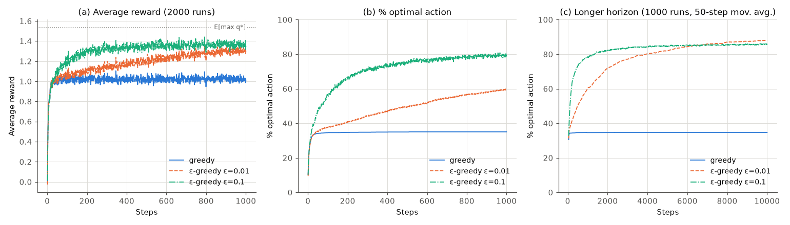

Measured results (2000 runs × 1000 steps; long run 1000 runs × 10,000 steps; seed 0):

| agent | avg reward, steps 1–1000 | avg reward, steps 901–1000 | % optimal, steps 901–1000 | % optimal, last 1000 of 10,000 |
|---|---|---|---|---|
| greedy | 1.015 | 1.023 | 35.0% | 34.7% |
| ε = 0.01 | 1.184 | 1.303 | 58.8% | 87.7% |
| ε = 0.1 | 1.307 | 1.364 | 79.1% | 85.7% |

The best possible average reward is $\mathbb E[\max_a q_\ast(a)] = 1.535$ on the 2000 short-run problems. The long run uses a different set of 1000 problems, whose ceiling is $\mathbb E[\max_a q_\ast(a)] = 1.568$. Three things stand out.

* **Greedy gets stuck.** Its reward rises quickly and then flattens at about 1.0. In 65.0% of the runs, the arm greedy pulled most was not the best one. Typically one arm returned a decent first reward and greedy never looked elsewhere.
* **ε = 0.1 learns fastest but is capped.** It finds the best arm sooner but can never exceed $1 - 0.1 + 0.01 = 91\%$ optimal.
* **ε = 0.01 is slower but wins in the end.** The script finds ε = 0.01 overtaking ε = 0.1 in % optimal around step 6,665, using a 500-step moving average. Panel (c) shows the same curves with a 50-step average. Over the last 1000 of 10,000 steps it averages a reward of 1.537 against 1.412 for ε = 0.1. *The right amount of exploration depends on the horizon.* No fixed ε is best for both short and long runs, which already suggests that exploration should decrease over time.

The value of exploring also depends on the noise. With deterministic rewards, a greedy agent that has tried every arm once knows every $q_\ast(a)$ exactly, so further exploration is wasted. With noisier rewards (variance 10 instead of 1, say), more samples are needed to rank the arms, so we would expect exploration to matter even more. That is a prediction you can test by changing `reward_std` in `GaussianBandit`; we did not run it.

---

## 3. Incremental implementation

Computing (2.1) from scratch stores every reward. As [Chapter 00 §2.3](00-math-toolkit.md) showed, the mean can be updated in constant memory. Focus on one arm. Let $R_i$ be the $i$-th reward received from it and $Q_n$ the average of its first $n-1$ rewards. Then

$$
\begin{aligned}
Q_{n+1} &= \frac1n\sum_{i=1}^n R_i = \frac1n\Big(R_n + (n-1)\,\frac{1}{n-1}\sum_{i=1}^{n-1}R_i\Big) = \frac1n\big(R_n + (n-1)Q_n\big) \\
&= Q_n + \frac1n\big[R_n - Q_n\big].
\end{aligned}
\tag{3.1}
$$

This is the first instance of the update that runs through the whole course:

$$
\textit{NewEstimate} \leftarrow \textit{OldEstimate} + \textit{StepSize}\,\big[\textit{Target} - \textit{OldEstimate}\big].
\tag{3.2}
$$

The bracket is an **error**, and the step size says how far to move toward the target. In (3.1) the step size is $1/n$, and it changes with every update. We write it $\alpha_n$, or $\alpha_t(a)$ when we need the arm and time explicitly.

```text
Algorithm 2.1  A simple bandit algorithm (ε-greedy, incremental sample averages)
Input: number of arms k; exploration rate ε ∈ [0, 1]; step-size rule (1/n, or constant α)
Initialise, for a = 1..k:
    Q(a) <- 0          # initial estimate Q_1(a); §5 changes this
    N(a) <- 0
Loop for t = 1, 2, ..., T:
    with probability 1 - ε:  A <- argmax_a Q(a)          # ties broken uniformly at random
    otherwise:              A <- an action drawn uniformly from {1..k}
    R <- bandit(A)                                        # pull the arm, observe the reward
    N(A) <- N(A) + 1
    Q(A) <- Q(A) + (1 / N(A)) * (R - Q(A))                # Eq. (3.1); use α instead of 1/N(A) for (4.1)
```

`simple_bandit_loop` in [`bandits.py`](../code/ch02_multi_armed_bandits/bandits.py) is this box written line for line as plain Python. Its self-test compares it with the vectorized agent: over 400 runs × 500 steps with ε = 0.1, the average reward is 1.255 for the loop and 1.258 for the vectorized version. The incremental update itself reproduces `np.mean` to $10^{-17}$.

**Worked example (by hand).** Take $k = 3$, ε = 0.1, sample averages and $Q_1 = (0,0,0)$. At each step the agent draws a uniform random number in $[0, 1)$ and explores if it is below 0.1.

| $t$ | $Q_t$ before | uniform draw | action | $R_t$ | update |
|---|---|---|---|---|---|
| 1 | $(0, 0, 0)$ | 0.62 | greedy; three-way tie, broken at random → arm 2 | 1.2 | $N(2)=1$, $Q(2) = 0 + \tfrac11(1.2-0) = 1.2$ |
| 2 | $(0, 1.2, 0)$ | 0.85 | greedy → arm 2 | 0.4 | $N(2)=2$, $Q(2) = 1.2 + \tfrac12(0.4 - 1.2) = 0.8$ |
| 3 | $(0, 0.8, 0)$ | 0.07 | **explore**, uniform draw → arm 3 | 1.9 | $N(3)=1$, $Q(3) = 1.9$ |
| 4 | $(0, 0.8, 1.9)$ | 0.33 | greedy → arm 3 | 0.9 | $N(3)=2$, $Q(3) = 1.9 + \tfrac12(0.9-1.9) = 1.4$ |
| 5 | $(0, 0.8, 1.4)$ | 0.51 | greedy → arm 3 | 2.0 | $N(3)=3$, $Q(3) = 1.4 + \tfrac13(2.0 - 1.4) = 1.6$ |

After five steps $Q = (0, 0.8, 1.6)$ and $N = (0, 2, 3)$. Check: arm 3's rewards average to $(1.9+0.9+2.0)/3 = 1.6$. Arm 1 has never been tried. Its estimate of 0 is the default, not knowledge, and only exploration will ever change it. With a constant step size $\alpha = 0.5$ instead (§4), arm 3's estimate would have gone $0 \to 0.95 \to 0.925 \to 1.4625$. The first reward is *not* fully trusted, because $\alpha_1 = 0.5 \ne 1$ leaves half the weight on the initial guess, and the latest reward counts most.

---

## 4. Nonstationary problems and constant step sizes

### 4.1 Recency weighting

If the $q_\ast(a)$ change over time, old rewards describe an arm that no longer exists, and averaging them in with equal weight is wrong. The standard fix is a **constant step size** $\alpha \in (0, 1]$:

$$
Q_{n+1} = Q_n + \alpha\big[R_n - Q_n\big].
\tag{4.1}
$$

Unrolling the recursion ([Chapter 00, Eq. (2.7)](00-math-toolkit.md) does it step by step) gives

$$
Q_{n+1} = (1-\alpha)^n Q_1 + \sum_{i=1}^n \alpha(1-\alpha)^{n-i} R_i ,
\tag{4.2}
$$

a weighted average (the weights sum to one) in which the weight on a reward decays exponentially with its age. This is an **exponential recency-weighted average**. Chapter 00 derived its two key properties for i.i.d. rewards with mean $q$ and variance $\sigma^2$. It is *biased* by $(1-\alpha)^n (Q_1 - q)$, so the initial value is never entirely forgotten. Its variance does *not* go to zero but levels off at $\alpha\sigma^2/(2-\alpha)$, which is about the noise of an average over the last $2/\alpha$ rewards. That variance floor is the price of being able to follow a moving target.

### 4.2 When do estimates converge?

Stochastic approximation theory ([Chapter 00 §3.4](00-math-toolkit.md)) gives sufficient conditions for a step-size sequence $\{\alpha_n\}$ to make $Q_n$ converge to the true mean with probability one:

$$
\sum_{n=1}^\infty \alpha_n = \infty \qquad\text{and}\qquad \sum_{n=1}^\infty \alpha_n^2 < \infty .
\tag{4.3}
$$

The first condition makes the steps large enough to overcome the initial value and any fluctuations. The second makes them eventually small enough to average the noise away. The sample average $\alpha_n = 1/n$ satisfies both. A constant $\alpha$ violates the second, so the estimate keeps fluctuating, and that is exactly what we want when the target moves. Step sizes that satisfy (4.3) often converge slowly or need careful tuning, so they are used mainly in theory.

### 4.3 Removing the initial bias

The constant step size keeps a bias toward $Q_1$. S&B Ex. 2.7 shows a neat way to remove it while keeping recency weighting. Use the step size

$$
\beta_n \doteq \frac{\alpha}{\bar o_n}, \qquad \bar o_n \doteq \bar o_{n-1} + \alpha(1 - \bar o_{n-1}), \quad \bar o_0 \doteq 0 .
\tag{4.4}
$$

Then $\bar o_1 = \alpha$ and $\beta_1 = 1$, so the first reward overwrites $Q_1$ completely. As $n$ grows, $\bar o_n = 1 - (1-\alpha)^n \to 1$ and $\beta_n \to \alpha$. *(Local notation: $\beta_n$ is a step size, unrelated to the Beta-prior parameter $\beta_0$ of §7.)* Exercise 2.5 below asks you to prove that the resulting estimate is an exponential recency-weighted average of the rewards alone, with no $Q_1$ term.

### 4.4 Experiment: a drifting bandit

[`nonstationary.py`](../code/ch02_multi_armed_bandits/nonstationary.py) runs the experiment of S&B Ex. 2.5. All ten $q_\ast(a)$ start at 0, and after every step each takes an independent $\mathcal N(0, 0.01^2)$ random-walk step. All agents use ε = 0.1 unless stated otherwise. The run is 2000 runs × 10,000 steps.

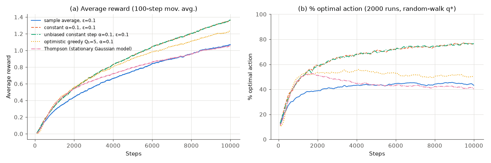

| agent (second half of the run, steps 5001–10,000) | avg reward | % optimal | regret per step |
|---|---|---|---|
| sample average, ε = 0.1 | 0.929 | 44.3% | 0.403 |
| constant α = 0.1, ε = 0.1 | 1.166 | 73.9% | 0.166 |
| unbiased constant step (4.4), α = 0.1, ε = 0.1 | 1.166 | 74.0% | 0.165 |
| optimistic greedy, $Q_1 = 5$, α = 0.1 (§5) | 1.079 | 51.2% | 0.252 |
| Thompson sampling with a *stationary* Gaussian model (§7) | 0.935 | 42.3% | 0.397 |

The average rewards rise throughout because the best arm drifts upward. At step 10,000 the mean of $\max_a q_\ast(a)$ is 1.545, against a prediction of $0.01\sqrt{10^4}\times\mathbb E[\max \text{ of 10 } \mathcal N(0,1)] \approx 1.54$. The constant step size cuts the per-step regret by a factor of 2.4 compared with sample averages. The sample-average agent's estimates are dominated by the distant past, so it keeps choosing arms that *used to* be best.

Removing the initial bias makes no measurable difference here, mainly because there is almost no initial bias to remove: $Q_1 = 0$ equals the true starting values $q_\ast(a) = 0$. Whatever bias appears decays like $0.9^n$. The trick matters when $Q_1$ is far from the truth and an arm has been pulled only a handful of times. Part 2 of the script shows this. The means drift as before but *start* at $q_\ast(a) \sim \mathcal N(0,1)$ or $\mathcal N(4,1)$, with $Q_1 = 0$ (2000 runs × 1000 steps, ε = 0.1, α = 0.1):

| starting $q_\ast(a)$ | step size | avg reward, steps 1–1000 | % optimal, steps 1–100 | % optimal, steps 901–1000 |
|---|---|---|---|---|
| $\mathcal N(0, 1)$ | constant α | 1.296 | 38.2% | 72.8% |
| $\mathcal N(0, 1)$ | unbiased $\beta_n$ (4.4) | 1.359 | 44.3% | 76.6% |
| $\mathcal N(4, 1)$ | constant α | 4.504 | 10.1% | 36.4% |
| $\mathcal N(4, 1)$ | unbiased $\beta_n$ (4.4) | 5.321 | 31.6% | 76.7% |

With means around 4, an arm pulled once has the biased estimate $0.1R \approx 0.4$, and one pulled ten times about $(1 - 0.9^{10}) \times 4 \approx 2.6$. The ranking is then decided mostly by *how often* an arm was pulled rather than by how good it is, so the agent keeps exploiting whichever arms it happened to try first. The unbiased step trusts the first reward fully and is immune to the offset.

The last two rows of the first table are a warning that applies well beyond this experiment. **Every method in this chapter has a stationarity assumption built in somewhere.** Optimistic initialisation explores only at the start, and once the optimism is used up it never looks again (§5). Thompson sampling with a stationary model becomes ever more confident in an outdated posterior, and it performs no better than sample averages here. Methods designed for change discount or window their statistics. Exercise 2.14 below builds a discounted Thompson sampler that matches constant-α ε-greedy with a tuned ε on this problem.

---

## 5. Optimistic initial values

All methods so far depend on the initial estimates $Q_1(a)$. That dependence can be used to make the agent explore. Set $Q_1(a) = +5$ on the testbed, which is far above any plausible $q_\ast(a)$, since those are drawn from $\mathcal N(0, 1)$. Act **greedily**, with constant α = 0.1. Whatever arm is pulled, its reward "disappoints" (it is much lower than 5), its estimate falls, and the greedy rule moves on to an arm that is still optimistic. Every arm gets tried several times before the estimates settle, even though the agent never takes a deliberately random action.

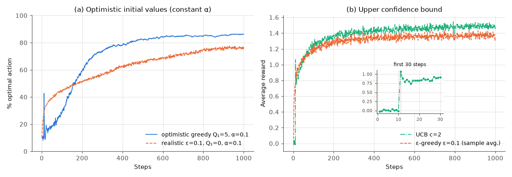

[`testbed_optimistic_ucb.py`](../code/ch02_multi_armed_bandits/testbed_optimistic_ucb.py), panel (a), 2000 runs × 1000 steps:

| agent | avg reward, steps 1–1000 | % optimal, steps 901–1000 |
|---|---|---|
| optimistic greedy, $Q_1 = 5$, ε = 0, α = 0.1 | 1.294 | 85.9% |
| realistic ε-greedy, $Q_1 = 0$, ε = 0.1, α = 0.1 | 1.252 | 76.2% |

The optimistic agent is worse at first, because it explores hard, and better later, because it explores much less once its optimism is gone. Note the **spike at step 11**. Because $Q_1 = 5$ exceeds every plausible reward, the first ten steps pull each arm exactly once (the script confirms this in 99.6% of runs; a run can deviate only if some reward exceeds 5, which keeps that arm's estimate above the untried arms' 5). At step 11 every arm has been pulled once and has estimate $Q = 5 + 0.1(R - 5) = 4.5 + 0.1R$. The greedy choice is therefore the arm whose *single* reward was highest, and that arm is the best arm 42.6% of the time (an independent check gives 41.8%). At step 12 that arm's estimate has dropped a second time while the others have dropped only once, so the agent switches away and the % optimal falls back to 25.8%.

Optimistic initialisation is a simple, useful trick, especially for deterministic or nearly deterministic problems, but it has clear limits:

* **It explores only at the beginning.** In a nonstationary problem the drive to explore does not come back. In §4.4 it reached only 51% optimal.
* **It needs the reward scale.** "Optimistic" means "above any plausible value". With an unknown or unbounded reward scale there is no safe choice.
* **With sample averages it is almost useless.** With $\alpha_n = 1/n$ the first step size is $\alpha_1 = 1$, so the first reward *overwrites* $Q_1$. Optimism then only guarantees that each arm is tried once. That is why Sutton & Barto, and our experiment, use a constant α.

The principle behind it, **optimism in the face of uncertainty**, is much more general than the trick. The next section turns it into a method with guarantees. In [Chapter 14](14-exploration.md) it reappears as optimistic value initialisation, R-MAX and exploration bonuses.

---

## 6. Upper confidence bounds

### 6.1 Optimism in the face of uncertainty

ε-greedy explores *indiscriminately*. When it explores, a clearly hopeless arm is as likely to be chosen as an arm that is nearly tied with the leader and barely tested. It would be better to explore arms in proportion to how *plausible* it is that they are actually the best. The **upper confidence bound** (UCB) idea makes this concrete. For each arm, compute an optimistic estimate: the largest mean that is still statistically consistent with the data. Then act greedily with respect to these optimistic estimates.

This rule corrects itself. If the arm with the highest upper bound really is good, pulling it earns a good reward. If it is not, pulling it shrinks its confidence interval and its upper bound falls below the others. Either way the agent gains, either reward or information. To make "statistically consistent with the data" precise we need a **concentration inequality**, which bounds how far a sample mean can stray from the true mean.

### 6.2 Hoeffding's inequality

**Theorem (Hoeffding, 1963).** Let $X_1, \dots, X_n$ be independent random variables with values in $[0, 1]$ and common mean $\mu$, and let $\bar X_n = \frac1n\sum_i X_i$. For every deviation $u > 0$ *(local notation: $u$ rather than the usual $\epsilon$, to avoid confusion with the exploration rate $\varepsilon$)*,

$$
\Pr\{\bar X_n - \mu \ge u\} \le e^{-2n u^2}
\qquad\text{and}\qquad
\Pr\{\mu - \bar X_n \ge u\} \le e^{-2n u^2}.
\tag{6.1}
$$

*Proof sketch.* There are three steps.

**(i) Chernoff's trick.** For any $\lambda > 0$, the map $x \mapsto e^{\lambda x}$ is increasing, so by Markov's inequality $\Pr\{Y \ge c\} \le \mathbb E[Y]/c$ for $Y \ge 0$:

$$
\Pr\{\bar X_n - \mu \ge u\} = \Pr\Big\{e^{\lambda\sum_i (X_i - \mu)} \ge e^{\lambda n u}\Big\} \le e^{-\lambda n u}\,\mathbb E\Big[e^{\lambda\sum_i (X_i-\mu)}\Big] = e^{-\lambda n u}\prod_{i=1}^n \mathbb E\big[e^{\lambda (X_i-\mu)}\big],
$$

where the last step uses independence.

**(ii) Hoeffding's lemma.** If $Y \in [a, b]$ and $\mathbb E[Y] = 0$, then

$$
\mathbb E\big[e^{\lambda Y}\big] \le e^{\lambda^2 (b-a)^2/8}.
\tag{6.2}
$$

To prove it, note that by convexity $e^{\lambda y} \le \frac{b-y}{b-a}e^{\lambda a} + \frac{y-a}{b-a}e^{\lambda b}$ on $[a,b]$. Take expectations using $\mathbb E Y = 0$, write the logarithm of the right-hand side as a function $L(h)$ of $h = \lambda(b-a)$, and check that $L(0) = L'(0) = 0$ and $L''(h) \le 1/4$. Taylor's theorem then gives $L(h) \le h^2/8$.

**(iii) Optimise.** Each $X_i - \mu$ lies in an interval of length 1, so step (i) and (6.2) give $\Pr\{\bar X_n - \mu\ge u\} \le \exp(-\lambda n u + n\lambda^2/8)$ for every $\lambda>0$. The exponent is minimised at $\lambda = 4 u$, where it equals $-4n u^2 + 2n u^2 = -2n u^2$. The lower tail follows by applying the same argument to $1 - X_i$. $\square$

Hoeffding uses nothing but boundedness. That makes it universal, and it also makes it loose when the variance is small. [`concentration.py`](../code/ch02_multi_armed_bandits/concentration.py) compares it with the exact binomial tail (computed exactly, without simulation) for $n = 50$ Bernoulli rewards:

| $p$ | $u$ | exact $\Pr\{\bar X_n - p \ge u\}$ | Hoeffding $e^{-2n u^2}$ | Chernoff–KL $e^{-n\,\mathrm{kl}(p+u,\,p)}$ | Hoeffding / exact |
|---|---|---|---|---|---|
| 0.5 | 0.05 | $2.4\times10^{-1}$ | $7.8\times10^{-1}$ | $7.8\times10^{-1}$ | 3.2 |
| 0.5 | 0.1 | $1.0\times10^{-1}$ | $3.7\times10^{-1}$ | $3.7\times10^{-1}$ | 3.6 |
| 0.5 | 0.2 | $3.3\times10^{-3}$ | $1.8\times10^{-2}$ | $1.6\times10^{-2}$ | 5.5 |
| 0.5 | 0.3 | $1.2\times10^{-5}$ | $1.2\times10^{-4}$ | $6.5\times10^{-5}$ | 10.3 |
| 0.05 | 0.05 | $1.0\times10^{-1}$ | $7.8\times10^{-1}$ | $3.6\times10^{-1}$ | 7.5 |
| 0.05 | 0.1 | $3.2\times10^{-3}$ | $3.7\times10^{-1}$ | $3.0\times10^{-2}$ | 115 |
| 0.05 | 0.2 | $7.5\times10^{-7}$ | $1.8\times10^{-2}$ | $1.3\times10^{-5}$ | $2.4\times10^{4}$ |
| 0.05 | 0.3 | $1.5\times10^{-11}$ | $1.2\times10^{-4}$ | $3.7\times10^{-10}$ | $8.4\times10^{6}$ |

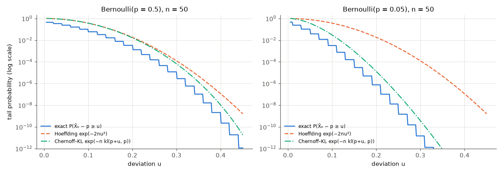

For $p = 0.5$, the maximum-variance case, Hoeffding is off by a factor of 3–10. For $p = 0.05$ it is off by up to a factor of $8.4\times10^6$ (at $u = 0.3$). The **Chernoff–KL bound**, $\Pr\{\bar X_n - p \ge u\} \le e^{-n\,\mathrm{kl}(p+u, p)}$ for Bernoulli rewards, follows from step (i) with the exact Bernoulli moment-generating function instead of (6.2). It is much tighter, and it leads to KL-UCB in §11.4.

### 6.3 From Hoeffding to the UCB1 index

Fix an arm with $n$ observed rewards and sample mean $Q$. Set the right-hand side of (6.1) to a target failure probability $\delta$ and solve for the deviation:

$$
e^{-2n u^2} = \delta \iff u = \sqrt{\frac{\ln(1/\delta)}{2n}},
\qquad\text{so}\qquad
\Pr\Big\{q_\ast(a) > Q + \sqrt{\tfrac{\ln(1/\delta)}{2n}}\Big\} \le \delta .
\tag{6.3}
$$

The script checks this exactly over 18 combinations of $p$, $n$ and $\delta$. The worst exact ratio $\Pr\{\text{bound} < p\}/\delta$ is 0.18, comfortably below 1.

What should $\delta$ be? If $\delta$ is fixed, the optimal arm has a constant chance of being underestimated, and if that happens the agent can abandon it forever. So the confidence level must increase over time. Auer, Cesa-Bianchi and Fischer (2002) chose $\delta = t^{-4}$. Then $\ln(1/\delta) = 4\ln t$, and with $n = N_t(a)$ the radius becomes $\sqrt{2\ln t/N_t(a)}$. This gives the **UCB1** rule:

$$
A_t \doteq \arg\max_a \left[ Q_t(a) + \sqrt{\frac{2\ln t}{N_t(a)}}\right], \qquad \text{arms with } N_t(a) = 0 \text{ first.}
\tag{6.4}
$$

Sutton & Barto write the more general form

$$
A_t \doteq \arg\max_a \left[ Q_t(a) + c\sqrt{\frac{\ln t}{N_t(a)}}\right],
\tag{6.5}
$$

with $c > 0$ controlling the degree of exploration. UCB1 is $c = \sqrt2$ for rewards in $[0,1]$. For rewards with a different range or noise level, $c$ has to be rescaled. For $\sigma$-sub-Gaussian rewards (Gaussian noise with standard deviation $\sigma$, for example) the same derivation gives the radius $\sqrt{2\sigma^2\ln(1/\delta)/n}$, which is $c = 2\sqrt2\,\sigma$ for $\delta = t^{-4}$. On the testbed ($\sigma = 1$) smaller values work better in practice ($c = 1/2$ to $1$ is best in §10, and Sutton & Barto use $c = 2$), because the worst-case constant over-explores.

Two features of (6.5) explain how it behaves. The bonus of an arm that is *not* pulled grows like $\sqrt{\ln t}$: slowly, but without limit. Every arm is therefore tried again eventually, and the agent cannot permanently abandon the true best arm. The bonus of an arm that *is* pulled shrinks like $1/\sqrt{N}$. A clearly inferior arm is therefore pulled only about as often as needed to push its upper bound below $v_\ast$, which turns out to be $O(\ln t/\Delta_a^2)$ times. Exploration concentrates on the arms that matter.

```text
Algorithm 6.1  UCB (UCB1 when c = sqrt(2) and rewards lie in [0, 1])
Input: k; exploration constant c > 0
Initialise, for a = 1..k:  Q(a) <- 0, N(a) <- 0
Loop for t = 1, 2, ..., T:
    if some arm has N(a) = 0:  A <- one such arm (at random)        # play every arm once first
    else:                      A <- argmax_a [ Q(a) + c * sqrt( ln t / N(a) ) ]   # Eq. (6.5), ties at random
    R <- bandit(A)
    N(A) <- N(A) + 1
    Q(A) <- Q(A) + (R - Q(A)) / N(A)
```

**Worked example (by hand).** At $t = 10$ a 3-armed agent has $N = (5, 3, 1)$ and $Q = (0.6, 0.7, 0.2)$. With UCB1, $\ln 10 = 2.3026$, and the bonuses are $\sqrt{2(2.3026)/5} = 0.960$, $\sqrt{2(2.3026)/3} = 1.239$ and $\sqrt{2(2.3026)/1} = 2.146$. The indices are $1.560$, $1.939$ and $2.346$, so UCB1 pulls **arm 3**, the arm with the *lowest* estimate. One reward is too little evidence to rule it out. If its next reward is 0, then at $t = 11$ its index is $0.1 + \sqrt{2\ln 11/2} = 0.1 + 1.549 = 1.649$. That is below arm 2's $0.7 + \sqrt{2 \ln 11/3} = 0.7 + 1.264 = 1.964$ (and arm 1's 1.579), so the agent moves on to arm 2.

### 6.4 UCB on the testbed

Panel (b) of the figure in §5 compares UCB ($c = 2$) with ε-greedy (ε = 0.1). Over 1000 steps UCB averages a reward of 1.387 against 1.304, and in the last 100 steps it picks the optimal action 86.0% of the time against 80.6%. UCB also has a **spike at step 11**: average reward jumps from $-0.02$ at step 10 to 1.06 at step 11, and drops back to 0.88 at step 12. The reason is the same as for optimistic initialisation. After ten steps each arm has been pulled once, every bonus is equal to $2\sqrt{\ln 11}$, and so step 11 picks the arm with the highest single reward, which is the best arm 41.5% of the time. At step 12 that arm has $N = 2$ and therefore a smaller bonus than the others, so UCB tries a different arm.

UCB is more than a heuristic: §11.5 proves it has logarithmic regret. It is also harder to extend beyond bandits than ε-greedy. Nonstationary rewards break the logic of shrinking confidence intervals. With large state spaces there is no count $N_t(s,a)$ to divide by, and function approximation makes confidence intervals hard to compute. [Chapter 14](14-exploration.md) discusses how count-based bonuses, pseudo-counts and ensembles recover the idea at scale. The idea survives directly in Monte Carlo tree search: UCT runs a UCB1 bandit at every node of the search tree ([Chapter 07](07-planning-and-learning-tabular.md), [Chapter 13](13-model-based-rl.md)).

---

## 7. Thompson sampling and the Bayesian view

### 7.1 A Bayesian bandit

UCB treats $q_\ast(a)$ as an unknown constant and reasons about confidence intervals. The **Bayesian** view treats it as a random variable with a **prior** distribution and updates that distribution by Bayes' rule as rewards arrive. After history $\mathcal F_{t-1}$, everything the agent knows is in the **posterior** $p(q_\ast \mid \mathcal F_{t-1})$.

There *is* an optimal Bayesian policy: the one that maximises expected total reward averaged over the prior. In principle it can be computed by dynamic programming over posteriors. The posterior acts as the "state" of a belief MDP, the construction [Chapter 15](15-beyond-mdps.md) studies for POMDPs. But the belief space is huge. In one celebrated case the solution is simple. For discounted, infinite-horizon problems with independent arms, Gittins (1979; Gittins & Jones, 1974) proved that the optimal policy pulls the arm with the highest **Gittins index**, which is computed from that arm's posterior alone. For finite horizons, correlated arms, or anything beyond simple bandits, exact Bayes-optimal exploration is intractable, and we use cheaper approximations.

### 7.2 Thompson sampling is probability matching

**Thompson sampling** (Thompson, 1933) is the simplest practical Bayesian heuristic. It does not try to solve the belief MDP: it ignores the horizon and the value of information, and it can be far from Bayes-optimal. Instead it chooses each arm with the posterior probability that this arm is optimal:

$$
\Pr\{A_t = a \mid \mathcal F_{t-1}\} = \Pr\big\{a = \arg\max_b q_\ast(b) \,\big|\, \mathcal F_{t-1}\big\}.
\tag{7.1}
$$

It looks as if computing the right-hand side would require integrals. It does not. **Draw one sample $\theta_a$ of each arm's mean from the posterior, and act greedily on the samples.** The chosen arm $\arg\max_a \theta_a$ is then distributed exactly as the identity of the best arm under the posterior, which is (7.1).

Thompson sampling explores for a good reason. An arm with a wide posterior sometimes produces a large sample and gets tried. An arm whose posterior is narrow and clearly below the leader almost never does. As evidence accumulates, the probability of choosing a bad arm vanishes, without any schedule to tune.

### 7.3 Beta–Bernoulli Thompson sampling

For rewards in $\{0, 1\}$ (click or no click), let arm $a$ have unknown success probability $\theta$. Put a $\mathrm{Beta}(\alpha_0, \beta_0)$ prior on $\theta$, with density $p(\theta) \propto \theta^{\alpha_0 - 1}(1-\theta)^{\beta_0 - 1}$ on $[0,1]$. *(Local notation: $\alpha_0, \beta_0$ are prior parameters, not step sizes.)* $\mathrm{Beta}(1,1)$ is the uniform prior. After $S$ successes and $F$ failures from this arm, the likelihood is $\theta^S(1-\theta)^F$, and Bayes' rule gives

$$
p(\theta \mid \text{data}) \propto \underbrace{\theta^S(1-\theta)^F}_{\text{likelihood}}\;\underbrace{\theta^{\alpha_0-1}(1-\theta)^{\beta_0-1}}_{\text{prior}} = \theta^{\alpha_0 + S - 1}(1-\theta)^{\beta_0 + F - 1}
\quad\Longrightarrow\quad
\theta \mid \text{data} \sim \mathrm{Beta}(\alpha_0 + S,\ \beta_0 + F).
\tag{7.2}
$$

The posterior is again a Beta distribution, so the prior is **conjugate**. Updating it means incrementing a count. Its mean is $(\alpha_0+S)/(\alpha_0+\beta_0+S+F)$, and its variance shrinks like $1/(S+F)$.

```text
Algorithm 7.1  Beta–Bernoulli Thompson sampling
Input: k; prior parameters α0, β0 > 0 (α0 = β0 = 1: uniform prior)
Initialise, for a = 1..k:  S(a) <- 0, F(a) <- 0
Loop for t = 1, 2, ..., T:
    for a = 1..k:  θ(a) <- sample from Beta(α0 + S(a), β0 + F(a))     # one posterior sample per arm
    A <- argmax_a θ(a)
    R <- bandit(A)                                                     # R ∈ {0, 1}
    S(A) <- S(A) + R
    F(A) <- F(A) + 1 - R
```

**Worked example (by hand).** Two arms, uniform priors. Arm 1 is pulled once and succeeds, so its posterior is $\mathrm{Beta}(2,1)$ with density $2x$. Arm 2 is pulled once and fails, so its posterior is $\mathrm{Beta}(1,2)$ with density $2(1-y)$. A greedy agent would now pull arm 1 with certainty. Thompson sampling pulls arm 1 with probability

$$
\Pr\{\theta_1 > \theta_2\} = \int_0^1 2x \int_0^x 2(1-y)\,dy\,dx = \int_0^1 2x\,(2x - x^2)\,dx = \tfrac43 - \tfrac12 = \tfrac56 ,
$$

and arm 2 with probability $1/6$. If arm 1 then fails, its posterior becomes $\mathrm{Beta}(2,2)$ with density $6x(1-x)$, and $\Pr\{\theta_1 > \theta_2\} = \int_0^1 6x(1-x)(2x - x^2)\,dx = 6\big(\tfrac23 - \tfrac34 + \tfrac15\big) = 0.7$. The exploration probability adjusts itself to the evidence.

[`thompson_sampling.py`](../code/ch02_multi_armed_bandits/thompson_sampling.py) shows one run on three arms with $q_\ast = (0.45, 0.55, 0.60)$:

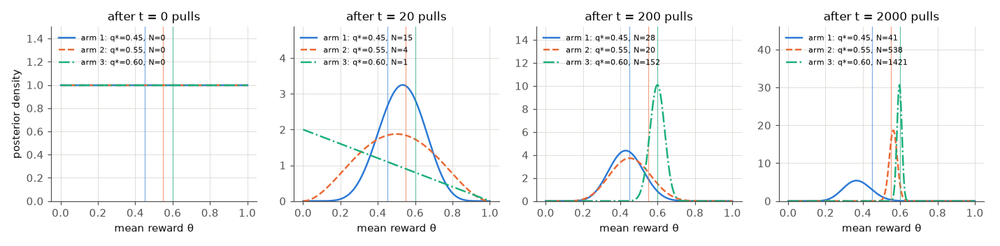

| after $t$ pulls | pulls $N$ | posterior means | $\Pr\{\text{arm optimal}\}$ = TS's choice probabilities |
|---|---|---|---|
| 20 | (15, 4, 1) | (0.53, 0.50, 0.33) | (0.44, 0.39, 0.17) |
| 200 | (28, 20, 152) | (0.43, 0.46, 0.60) | (0.04, 0.10, 0.86) |
| 2000 | (41, 538, 1421) | (0.37, 0.56, 0.60) | (0.002, 0.09, 0.91) |

Early on, arm 1 got lucky (8 successes in its first 15 pulls) and was played most. By $t = 200$ the posteriors had sorted the arms. The clearly worst arm then received only 13 more pulls in the next 1800 steps. The close competitor (gap 0.05) still received over a quarter of the pulls, because 2000 samples are not enough to separate 0.55 from 0.60 with confidence. That is not waste. §11.4 shows that *every* consistent algorithm must keep sampling a close competitor on the order of $\ln T/\mathrm{kl}$ times, and with a gap of 0.05 that number is large.

### 7.4 Gaussian Thompson sampling

For real-valued rewards, model $R \mid \theta \sim \mathcal N(\theta, \sigma^2)$ with **known** noise variance $\sigma^2$ and prior $\theta \sim \mathcal N(m_0, s_0^2)$. After $n$ rewards $r_1,\dots,r_n$ from the arm, with sum $S = \sum_i r_i$, the log-posterior is, up to a constant,

$$
\begin{aligned}
\ln p(\theta \mid r_{1:n}) &= -\frac{(\theta - m_0)^2}{2 s_0^2} - \sum_{i=1}^n\frac{(r_i - \theta)^2}{2\sigma^2} + \text{const}\\
&= -\frac12\Big(\underbrace{\frac{1}{s_0^2} + \frac{n}{\sigma^2}}_{\doteq\ \rho_n}\Big)\theta^2 + \Big(\frac{m_0}{s_0^2} + \frac{S}{\sigma^2}\Big)\theta + \text{const}
= -\frac{\rho_n}{2}\big(\theta - m_n\big)^2 + \text{const},
\end{aligned}
$$

so, completing the square,

$$
\theta \mid r_{1:n} \sim \mathcal N\big(m_n,\ 1/\rho_n\big), \qquad \rho_n = \frac1{s_0^2} + \frac{n}{\sigma^2}, \qquad m_n = \frac{m_0/s_0^2 + S/\sigma^2}{\rho_n}.
\tag{7.3}
$$

Precisions (inverse variances) add, and the posterior mean is a precision-weighted average of the prior mean and the sample mean $S/n$. For example, with prior $\mathcal N(0,1)$, $\sigma = 1$ and rewards $1.5$ and $0.5$, we get $\rho_2 = 3$, $m_2 = 2/3$ and posterior standard deviation $1/\sqrt3 = 0.577$. The sample mean of 1.0 is shrunk toward the prior mean.

```text
Algorithm 7.2  Gaussian Thompson sampling (known noise σ)
Input: k; prior mean m0 and standard deviation s0; noise standard deviation σ
Initialise, for a = 1..k:  N(a) <- 0, S(a) <- 0                      # count and reward sum
Loop for t = 1, 2, ..., T:
    for a = 1..k:
        ρ <- 1/s0² + N(a)/σ² ;  m <- (m0/s0² + S(a)/σ²) / ρ           # Eq. (7.3)
        θ(a) <- m + z / sqrt(ρ),  z ~ N(0, 1)
    A <- argmax_a θ(a);  R <- bandit(A)
    N(A) <- N(A) + 1;  S(A) <- S(A) + R
```

### 7.5 What is known about Thompson sampling, and its limits

Thompson sampling went largely unnoticed by the machine-learning community until Chapelle and Li (2011) showed it was highly competitive in display advertising and news recommendation. Theory followed quickly. Agrawal and Goyal (2012) proved logarithmic regret for Bernoulli bandits. Kaufmann, Korda and Munos (2012) proved that Beta–Bernoulli Thompson sampling is **asymptotically optimal**: its regret constant matches the Lai–Robbins lower bound of §11.4. Problem-independent bounds of order $\sqrt{kT\ln T}$ are also known (Agrawal & Goyal, 2013), and Russo and Van Roy (2014) gave Bayesian-regret bounds that apply far beyond bandits.

The figure below puts all the methods side by side on the 10-armed testbed. Gaussian Thompson sampling uses prior $\mathcal N(0,1)$ and $\sigma = 1$.

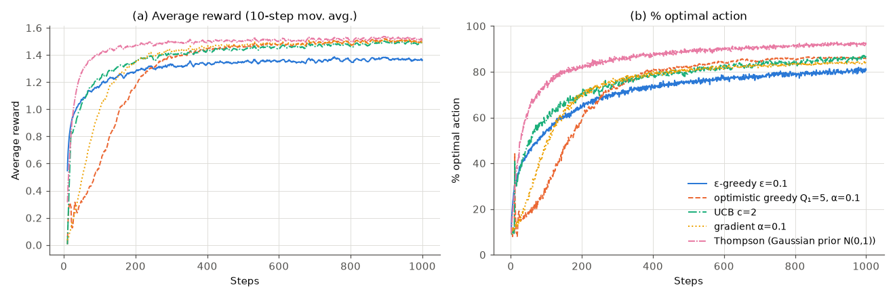

| agent (2000 runs × 1000 steps) | avg reward, steps 1–1000 | % optimal, steps 901–1000 |
|---|---|---|
| ε-greedy, ε = 0.1 | 1.305 | 80.2% |
| optimistic greedy, $Q_1 = 5$, α = 0.1 | 1.294 | 86.1% |
| UCB, $c = 2$ | 1.387 | 85.8% |
| gradient bandit, α = 0.1 | 1.353 | 83.9% |
| Thompson sampling (Gaussian) | **1.466** | **92.1%** |

Thompson sampling is best on both measures, but the comparison is **not fair**. Its prior $\mathcal N(0,1)$ and noise $\sigma = 1$ are *exactly* how the testbed generates problems, so it is the Bayes-correct model. The parameter study (§10) shows what happens when the prior scale is wrong. It also shows that tuned UCB is as good on this testbed (slightly better, by 0.009 in average reward).

The weaknesses of the Bayesian view are the flip side of its strengths:

* **Model misspecification.** The posterior is only as good as the likelihood and the prior. A prior that is too narrow ($s_0 = 1/16$ in §10) makes Thompson sampling too timid.
* **Stationarity.** A standard posterior assumes the parameters never change, so it keeps concentrating. In the drifting bandit of §4.4 that left it no better than sample averages.
* **Computation.** Conjugate models are trivial. Neural-network reward models need approximate posteriors (bootstrapped ensembles, Laplace approximations), which [Chapter 14](14-exploration.md) discusses. Posterior sampling also extends to full MDPs as **PSRL** (posterior sampling for RL).

---

## 8. Gradient bandit algorithms

### 8.1 Learning preferences instead of values

All methods so far estimate action values and derive a policy from them. A different approach is to learn a **policy directly**. Give each action a numerical **preference** $H_t(a) \in \mathbb R$ and choose actions by a softmax (Gibbs, Boltzmann) distribution:

$$
\pi_t(a) \doteq \Pr\{A_t = a\} = \frac{e^{H_t(a)}}{\sum_{b=1}^k e^{H_t(b)}} .
\tag{8.1}
$$

Only *differences* between preferences matter: adding a constant to every $H_t(a)$ leaves $\pi_t$ unchanged. Preferences are not estimates of reward. They are free parameters, adjusted so that good actions become more likely. Initially $H_1(a) = 0$ for all $a$, which gives the uniform policy. The **gradient bandit algorithm** updates, after receiving $R_t$ for action $A_t$:

$$
\begin{aligned}
H_{t+1}(A_t) &= H_t(A_t) + \alpha\,(R_t - \bar R_t)\,\big(1 - \pi_t(A_t)\big), \\
H_{t+1}(a) &= H_t(a) - \alpha\,(R_t - \bar R_t)\,\pi_t(a) \qquad \text{for all } a \ne A_t,
\end{aligned}
\qquad\text{i.e.}\qquad
H_{t+1}(a) = H_t(a) + \alpha\,(R_t - \bar R_t)\big(\mathbb 1[a = A_t] - \pi_t(a)\big),
\tag{8.2}
$$

where $\alpha > 0$ is a step size and $\bar R_t$ is a **baseline**: the average of the rewards *before* step $t$, $R_1, \dots, R_{t-1}$. At $t = 1$ there are no earlier rewards, and Sutton & Barto's convention $\bar R_1 = R_1$ makes the first update exactly zero: one sample is wasted, and strictly speaking this baseline depends on $A_1$. From $t = 2$ on the baseline uses only $R_1, \dots, R_{t-1}$ and so does not depend on $A_t$, as §8.2 requires. If the reward beats the baseline, the chosen action's probability goes up and every other action's goes down. If it falls short, the reverse happens.

```text
Algorithm 8.1  Gradient bandit (softmax preferences with an average-reward baseline)
Input: k; step size α > 0
Initialise: H(a) <- 0 for a = 1..k;  R̄ <- 0;  n <- 0
Loop for t = 1, 2, ..., T:
    π(a) <- exp(H(a)) / Σ_b exp(H(b))  for all a                  # Eq. (8.1); subtract max H for stability
    A <- sample from π;  R <- bandit(A)
    baseline <- R if t = 1 else R̄      # R̄_1 = R_1 (S&B convention) makes the t = 1 update exactly zero;
                                        # for t ≥ 2 R̄ uses only R_1..R_{t-1}, so it does not depend on A_t (§8.3)
    for all a:  H(a) <- H(a) + α (R - baseline) (1[a = A] - π(a))   # Eq. (8.2)
    n <- n + 1;  R̄ <- R̄ + (R - R̄) / n                             # update the average AFTER using it
```

**Worked example (by hand).** Three arms, $H = (0,0,0)$, so $\pi = (\frac13,\frac13,\frac13)$. Arm 1 is chosen, $R_t = 2$, $\bar R_t = 1$, $\alpha = 0.3$. Then $H(1)$ increases by $0.3(2-1)(1-\frac13) = 0.2$, and $H(2) = H(3) = 0 - 0.3(1)(\frac13) = -0.1$. The new probabilities are $e^{0.2}/(e^{0.2} + 2e^{-0.1}) = 1.2214/3.0311 = 0.403$ for arm 1 and $0.299$ for each of the others. Had the reward been $R_t = 0.5 < \bar R_t$, arm 1's preference would have *dropped* by $0.1$. Without a baseline ($\bar R_t \equiv 0$), any positive reward, however poor, makes the chosen action more likely.

### 8.2 The update is stochastic gradient ascent

Why (8.2)? Gradient ascent on the expected reward would update

$$
H_{t+1}(a) = H_t(a) + \alpha\,\frac{\partial J(H_t)}{\partial H_t(a)}, \qquad J(H_t) \doteq \sum_x \pi_t(x)\, q_\ast(x) = \mathbb E[R_t \mid H_t],
\tag{8.3}
$$

where $J(H_t)$ is the expected reward of the current softmax policy. We cannot compute this gradient, because we do not know $q_\ast$. We will show that (8.2) equals it *in expectation*, which makes it an instance of **stochastic gradient ascent** ([Chapter 00 §3.3](00-math-toolkit.md)).

*Step 1: the softmax derivative.* Write $\pi(x) = e^{H(x)}/Z$ with $Z = \sum_b e^{H(b)}$, so $\partial Z/\partial H(a) = e^{H(a)}$. By the quotient rule,

$$
\frac{\partial \pi(x)}{\partial H(a)} = \frac{\mathbb 1[a=x]\,e^{H(x)} Z - e^{H(x)} e^{H(a)}}{Z^2} = \mathbb 1[a=x]\,\pi(x) - \pi(x)\pi(a) = \pi(x)\big(\mathbb 1[a=x] - \pi(a)\big).
\tag{8.4}
$$

*Step 2: insert a baseline.* Because $\sum_x \pi(x) = 1$ for every $H$, $\sum_x \partial \pi(x)/\partial H(a) = 0$. So for any scalar $B_t$ that does not depend on $x$,

$$
\frac{\partial J}{\partial H(a)} = \sum_x q_\ast(x)\,\frac{\partial \pi(x)}{\partial H(a)} = \sum_x \big(q_\ast(x) - B_t\big)\frac{\partial \pi(x)}{\partial H(a)} .
$$

*Step 3: turn the sum into an expectation.* Multiply and divide by $\pi(x)$:

$$
\frac{\partial J}{\partial H(a)} = \sum_x \pi(x)\,\big(q_\ast(x) - B_t\big)\frac{\partial \pi(x)/\partial H(a)}{\pi(x)} = \mathbb E\left[\big(q_\ast(A_t) - B_t\big)\frac{\partial \pi(A_t)/\partial H(a)}{\pi(A_t)}\right],
$$

with $A_t \sim \pi_t$. *Step 4: replace $q_\ast(A_t)$ by $R_t$.* Since $\mathbb E[R_t \mid A_t] = q_\ast(A_t)$, the tower rule ([Chapter 00 §1.3](00-math-toolkit.md)) allows the substitution inside the expectation, **provided $B_t$ does not depend on $A_t$ or $R_t$**. Then substitute (8.4):

$$
\frac{\partial J}{\partial H(a)} = \mathbb E\Big[\big(R_t - B_t\big)\big(\mathbb 1[a = A_t] - \pi_t(a)\big)\Big].
\tag{8.5}
$$

The quantity inside the expectation,

$$
\hat g_t(a) \doteq \big(R_t - B_t\big)\big(\mathbb 1[a = A_t] - \pi_t(a)\big),
\tag{8.6}
$$

is therefore an unbiased single-sample estimate of the gradient, and (8.2) is $H_{t+1}(a) = H_t(a) + \alpha\,\hat g_t(a)$ with $B_t = \bar R_t$. Evaluating (8.5) exactly, using $\mathbb E[R_t\mathbb 1[A_t = a]] = \pi(a)q_\ast(a)$ and $\mathbb E[R_t] = J$, gives the compact form

$$
\frac{\partial J}{\partial H(a)} = \pi_t(a)\big(q_\ast(a) - J(H_t)\big).
\tag{8.7}
$$

Actions better than the current average are pushed up, in proportion to how often they are already played. This is the same score-function (log-derivative, REINFORCE) identity as in [Chapter 00 §6.2](00-math-toolkit.md), since $\nabla_H \ln\pi(A) = \mathbf e_{A} - \boldsymbol\pi$. A gradient bandit is REINFORCE with one-step episodes, and [Chapter 10](10-policy-gradients.md) extends it to sequential decisions. Equation (8.7) also shows a weakness: when the policy is nearly deterministic, $\pi_t(a) \approx 0$ for every other arm, so their gradients vanish and the policy is slow to change its mind. Exercise 2.13 shows this hurting on a drifting bandit.

### 8.3 The role of the baseline

Step 2 shows that **the baseline does not change the expected update**. Any $B_t$ independent of $A_t$ gives the same expected update. What it changes is the **variance**. [`gradient_bandit.py`](../code/ch02_multi_armed_bandits/gradient_bandit.py) checks this directly. It fixes one testbed problem with $q_\ast(a) \sim \mathcal N(4, 1)$ (so $J = 3.888$) and non-uniform preferences, draws 2,000,000 pairs $(A_t, R_t)$, and compares the average of $\hat g_t$ with the exact gradient (8.7):

| baseline $B$ | projection on $\nabla J$ | $\lVert\bar{\hat g}\rVert / \lVert\nabla J\rVert$ | cosine with $\nabla J$ | total variance of $\hat g$ |
|---|---|---|---|---|
| $0$ (no baseline) | 0.997 | 0.997 | 1.000 | 15.11 |
| $4$ (a rough guess) | 1.001 | 1.001 | 1.000 | 1.349 |
| variance-minimising constant $b^\ast = 3.949$ | 1.001 | 1.001 | 1.000 | 1.347 |
| average that *includes* $R_t$ ($t = 5$) | **0.800** | 0.800 | 1.000 | 0.864 |
| $q_\ast(A_t)$ (action-dependent) | **0.001** | 0.001 | — | 0.883 |
| $Q(A_t)$ with $Q = q_\ast + \mathcal N(0, 0.5^2)$ errors | **−0.024** | 0.471 | **−0.051** | 1.112 |

The "projection" column is $\langle\bar{\hat g}, \nabla J\rangle/\lVert\nabla J\rVert^2$, where $\bar{\hat g}$ is the Monte Carlo mean of $\hat g_t$. It equals 1 for an unbiased estimator. Every baseline that does not depend on $A_t$ is unbiased: the largest componentwise deviation of $\bar{\hat g}$ from (8.7) is 0.0017, within Monte Carlo error ($B = J$ gives the same as $B = 4$). A baseline near the mean reward cuts the variance by a factor of 11, and fine-tuning the constant ($b^\ast = \mathbb E[R\,\lVert\mathbf e_A - \boldsymbol\pi\rVert^2]/\mathbb E[\lVert\mathbf e_A - \boldsymbol\pi\rVert^2]$) adds almost nothing. The last three rows depend on the current action or reward. Including $R_t$ in the average only scales the update by $1 - 1/t$ (Exercise 2.8 below), a harmless shrinkage of the step size. The two genuinely action-dependent baselines are not harmless. With $B = q_\ast(A_t)$ the expected update is zero, so the gradient is destroyed. With a noisy estimate $Q(A_t)$ the expected update still has about half the gradient's length, but it is almost orthogonal to it (cosine −0.05): it follows the estimation errors, not the arms' values.

On the learning problem the variance matters a great deal:

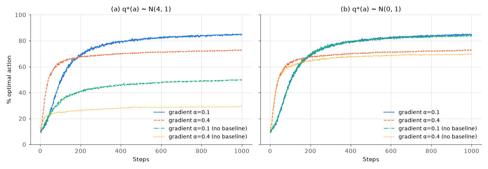

| agent (% optimal, steps 901–1000) | $q_\ast \sim \mathcal N(4,1)$ | $q_\ast \sim \mathcal N(0,1)$ |
|---|---|---|
| α = 0.1, with baseline | 84.6% | 84.6% |
| α = 0.4, with baseline | 72.5% | 72.5% |
| α = 0.1, no baseline | 49.6% | 83.7% |
| α = 0.4, no baseline | 29.0% | 69.5% |

On the "+4" testbed (Sutton & Barto's Figure 2.5 setting) every reward is around 4. Without a baseline the chosen action is always reinforced and all the others are always suppressed, so learning depends on *which arm happened to be sampled* more than on how good it was, and performance collapses. With a baseline, the numbers for the $\mathcal N(4,1)$ and $\mathcal N(0,1)$ testbeds are **identical**, digit for digit. This is not a coincidence. The two experiments use the same random numbers, and with a baseline the update (8.2) depends only on $R_t - \bar R_t$, which is unchanged when every reward is shifted by 4. The baseline makes the algorithm invariant to reward offsets. Without the offset, the baseline still helps a little (83.7% vs 84.6% at α = 0.1).

---

## 9. Boltzmann (softmax) exploration

The softmax can also be applied to **action-value estimates**. **Boltzmann exploration** chooses

$$
\pi_t(a) = \frac{e^{Q_t(a)/\tau}}{\sum_b e^{Q_t(b)/\tau}},
\tag{9.1}
$$

where $\tau > 0$ is a **temperature**. *(Notation: $\tau$ is a temperature in this chapter; in the deep-RL chapters it is a Polyak averaging coefficient.)* As $\tau \to 0$ this becomes greedy, and as $\tau \to \infty$ it becomes uniform. Unlike ε-greedy, Boltzmann exploration explores *graded* by value: a nearly tied arm is chosen often and a terrible arm almost never.

```text
Algorithm 9.1  Boltzmann (softmax) exploration on action values
Input: k; temperature τ > 0; step-size rule (1/n or α)
Initialise, for a = 1..k:  Q(a) <- 0, N(a) <- 0
Loop for t = 1, 2, ..., T:
    π(a) <- exp(Q(a)/τ) / Σ_b exp(Q(b)/τ)        # Eq. (9.1), computed with Q - max Q for stability
    A <- sample from π;  R <- bandit(A)
    N(A) <- N(A) + 1;  Q(A) <- Q(A) + (R - Q(A)) / N(A)
```

Equations (9.1) and (8.1) look the same, but they mean different things. In (8.1) the preferences are *trained* by gradient ascent to maximise reward. In (9.1) the probabilities are a *fixed function* of value estimates, and $\tau$ sets how much the policy explores. Three caveats:

* **Scale dependence.** $\tau$ is measured in reward units. Multiplying all rewards by 10 is equivalent to dividing $\tau$ by 10, so $\tau$ must be retuned for every problem. The parameter study (§10) shows that Boltzmann exploration is very sensitive to $\tau$.
* **Fixed temperature means linear regret.** Like fixed ε, a constant $\tau$ keeps choosing suboptimal arms with fixed positive probability forever.
* **Decaying the temperature is subtle.** Cesa-Bianchi, Gentile, Lugosi and Neu (2017) showed that Boltzmann exploration with *any* monotone temperature schedule has suboptimal regret. They proposed Boltzmann–Gumbel exploration, which uses per-arm temperatures and achieves near-optimal regret.

There is another way to see the softmax, which comes back in [Chapter 12](12-continuous-control-actor-critic.md) (SAC) and [Chapter 18](18-rl-for-language-models.md) (RLHF). It is the policy that maximises *expected value plus entropy* over the probability simplex $\Delta_k$:

$$
\pi^\tau = \arg\max_{\pi \in \Delta_k}\ \Big[\sum_a \pi(a)Q(a) + \tau\,\mathcal H(\pi)\Big].
\tag{9.2}
$$

To see this, write the Lagrangian $\sum_a \pi(a)Q(a) - \tau\sum_a\pi(a)\ln\pi(a) + \lambda(1 - \sum_a\pi(a))$ and set its derivative with respect to $\pi(a)$ to zero: $Q(a) - \tau(\ln\pi(a) + 1) - \lambda = 0$. This gives $\pi(a) \propto e^{Q(a)/\tau}$. The objective is strictly concave, so this stationary point is the maximiser. The temperature prices randomness in reward units.

---

## 10. Comparing the methods: a parameter study

Each method has a parameter, and a single learning curve shows only one setting. Sutton & Barto's Figure 2.6 summarises each run by its **average reward over the first 1000 steps** and plots that against the parameter on a log scale. [`parameter_study.py`](../code/ch02_multi_armed_bandits/parameter_study.py) reproduces their four methods and adds Boltzmann exploration and Gaussian Thompson sampling, varying the prior standard deviation $s_0$ (the truth is $s_0 = 1$). Each point is 2000 runs, all on the same problems.

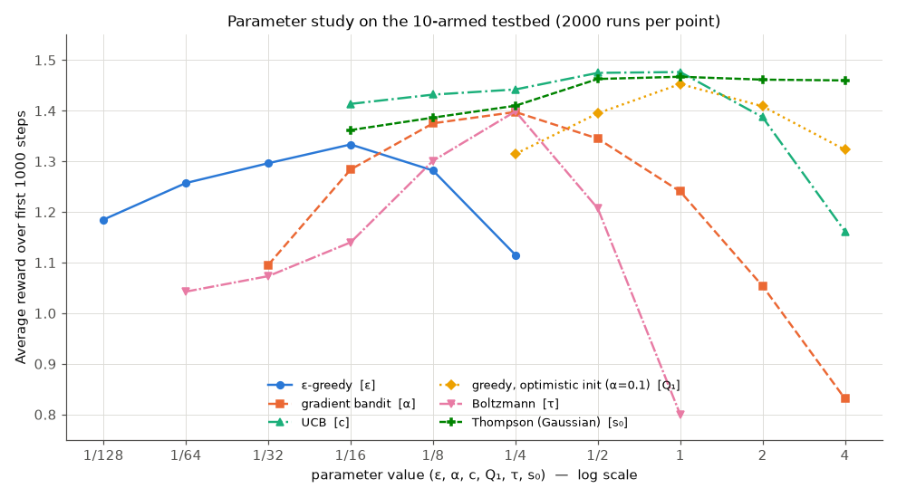

| method | best parameter | best avg reward | range over the grid |
|---|---|---|---|
| UCB | $c \in [1/2, 1]$ (tied: 1.475, 1.476) | 1.476 | 1.162 – 1.476 |
| Thompson (Gaussian) | $s_0 = 1$ | 1.467 | 1.362 – 1.467 |
| greedy, optimistic init, α = 0.1 | $Q_1 = 1$ | 1.453 | 1.315 – 1.453 |
| Boltzmann | $\tau = 1/4$ | 1.399 | 0.800 – 1.399 |
| gradient bandit | α = 1/4 | 1.398 | 0.831 – 1.398 |
| ε-greedy | ε = 1/16 | 1.333 | 1.115 – 1.333 |

How precise are these numbers? A single point has a standard error of about 0.013, mostly because the 2000 problems differ from each other. All methods face the *same* problems, though, so differences between points are much more precise. The script computes paired standard errors from the per-run rewards. UCB at $c = 1$ minus UCB at $c = 1/2$ is $+0.0017 \pm 0.0027$, a tie. Between the best settings of different methods: UCB − Thompson $= +0.0094 \pm 0.0009$, Thompson − optimistic greedy $= +0.0143 \pm 0.0024$, UCB − optimistic greedy $= +0.0237 \pm 0.0024$, and optimistic greedy − ε-greedy $= +0.119 \pm 0.004$. Each difference is at least 6 paired standard errors, so UCB, Thompson sampling and optimistic greedy are close but distinguishable on this testbed, and all three clearly beat ε-greedy.

How to read this figure:

* **Every curve is an inverted U.** Too little exploration locks in early mistakes; too much wastes pulls. Every method needs its parameter tuned.
* **Sensitivity differs widely.** Thompson sampling degrades gracefully when its prior is too *wide* (1.460 at $s_0 = 4$) but more when it is too narrow (1.362 at $s_0 = 1/16$): an overconfident prior explores too little. Boltzmann and the gradient bandit are the most sensitive, losing about 0.6 reward units across their grids.
* **Which method wins depends on the horizon and the problem.** Over 1000 steps on Gaussian arms, methods that explore *systematically* (UCB, Thompson, optimism) beat ε-greedy. With longer horizons or other reward distributions the ordering can change, which is why the next section develops a theory that does not depend on one testbed.

---

## 11. Regret: measuring the cost of exploration

### 11.1 Definitions

Average-reward curves depend on the testbed. **Regret** gives a problem-independent yardstick: the reward lost by not always playing an optimal arm. For a stochastic bandit and a horizon $T$, the **realized regret** is

$$
\widehat{\mathrm{Reg}}(T) \doteq T\,v_\ast - \sum_{t=1}^{T} R_t ,
\tag{11.1}
$$

and the **pseudo-regret**, which removes the reward noise by using the true means, is

$$
\mathrm{Reg}(T) \doteq \sum_{t=1}^{T}\big(v_\ast - q_\ast(A_t)\big) = \sum_{t=1}^T \Delta_{A_t} .
\tag{11.2}
$$

Both are random because the actions are. Following NOTATION.md, "regret" in this course means the pseudo-regret $\mathrm{Reg}(T)$, and theorems bound its expectation $\mathbb E[\mathrm{Reg}(T)]$, which equals $\mathbb E[\widehat{\mathrm{Reg}}(T)]$ by the lemma below. *(Local notation: in §11–15, $N_T(a) \doteq \sum_{t=1}^T \mathbb 1[A_t = a]$ is the number of pulls of $a$ in the first $T$ steps. That is $N_{T+1}(a)$ in the "before step $t$" convention, and we drop the $+1$ to keep formulas readable.)*

### 11.2 The regret decomposition lemma

**Lemma.** For any policy on a stochastic bandit,

$$
\mathbb E\big[\widehat{\mathrm{Reg}}(T)\big] = \mathbb E\big[\mathrm{Reg}(T)\big] = \sum_{a=1}^k \Delta_a\, \mathbb E\big[N_T(a)\big].
\tag{11.3}
$$

*Proof.* In a stochastic bandit the reward depends on the past only through the chosen arm: $\mathbb E[R_t \mid \mathcal F_{t-1}, A_t] = q_\ast(A_t)$. By the tower rule, $\mathbb E[R_t] = \mathbb E[q_\ast(A_t)]$. Write $q_\ast(A_t) = \sum_a q_\ast(a)\mathbb 1[A_t = a]$ and sum over $t$:

$$
\mathbb E\Big[\sum_{t=1}^T R_t\Big] = \sum_{t=1}^T \mathbb E\Big[\sum_a q_\ast(a)\mathbb 1[A_t = a]\Big] = \sum_a q_\ast(a)\,\mathbb E\big[N_T(a)\big].
$$

Because $\sum_a N_T(a) = T$, we also have $T v_\ast = \sum_a v_\ast\,\mathbb E[N_T(a)]$. Subtracting gives $\mathbb E[\widehat{\mathrm{Reg}}(T)] = \sum_a (v_\ast - q_\ast(a))\mathbb E[N_T(a)]$. For the pseudo-regret the identity $\mathrm{Reg}(T) = \sum_t \Delta_{A_t} = \sum_a \Delta_a N_T(a)$ holds on every sample path, before taking expectations. $\square$

The lemma turns the design of a bandit algorithm into a counting problem: **pull each suboptimal arm as few times as possible.** Arms with large gaps are expensive per pull but easy to rule out. Arms with small gaps are cheap per pull but hard to rule out. [`regret_bernoulli.py`](../code/ch02_multi_armed_bandits/regret_bernoulli.py) checks (11.3) on a 5-armed Bernoulli bandit with $q_\ast = (0.7, 0.6, 0.5, 0.4, 0.3)$, $T = 20{,}000$ and 1000 runs, using *realized* rewards. For Thompson sampling, $\widehat{\mathrm{Reg}} = 50.2 \pm 2.1$ and $\sum_a\Delta_a\,\overline{N_T(a)} = 50.1$. For ε-greedy the two are $434.2 \pm 3.0$ and $434.9$. All seven algorithms agree to within about 2.5 standard errors of the reward noise.

### 11.3 Linear versus logarithmic regret

Regret can grow at most linearly, since $\mathrm{Reg}(T) \le T\max_a\Delta_a$. The question is how much slower a good algorithm can do.

**Fixed-ε exploration has linear regret.** At every step, with probability ε, the arm is uniform, which costs $\frac1k\sum_a\Delta_a$ in expectation. So

$$
\mathbb E[\mathrm{Reg}(T)] \ \ge\ \varepsilon\, T\,\frac{1}{k}\sum_a \Delta_a .
\tag{11.4}
$$

For our instance, ε = 0.1 gives a lower bound of $0.1 \times 20{,}000 \times 1.0/5 = 400$. The measured regret is 434.9, so the bound accounts for almost all of it. **Greedy has linear regret** for a different reason: with positive probability the best arm's early rewards are unlucky and it is never chosen again. Measured: 3230, and the regret grows by a factor of exactly 10.00 between $T/10$ and $T$.

**Sublinear regret requires exploration that fades.** A schedule such as $\varepsilon_t = \min\{1, c_\varepsilon k/(d^2t)\}$, where $0 < d \le \min_{a:\Delta_a>0}\Delta_a$, gives logarithmic regret when $c_\varepsilon$ is large enough (Auer, Cesa-Bianchi & Fischer, 2002, analyse this "$\varepsilon_n$-greedy"). But it needs a lower bound $d$ on the gaps. The theory-safe setting is very conservative, while the aggressive schedule we ran, $\varepsilon_t = \min(1, 5k/t)$, is not covered by the theorem and is fragile. Its mean regret of 172.9 has a large standard error (14.6) because some runs lock onto the wrong arm once exploration dies out. "Logarithmic regret" means that each suboptimal arm is pulled $O(\ln T)$ times. UCB, KL-UCB and Thompson sampling achieve this *without* knowing the gaps.

```text
Algorithm 11.2  ε_t-greedy (decaying exploration; Auer, Cesa-Bianchi & Fischer 2002)
Input: k; constant c_ε > 0; gap lower bound d ∈ (0, 1]   (our experiment: c_ε/d² = 5)
Initialise, for a = 1..k:  Q(a) <- 0, N(a) <- 0
Loop for t = 1, 2, ..., T:
    ε_t <- min{1, c_ε k / (d² t)}
    with probability 1 - ε_t:  A <- argmax_a Q(a)  (ties at random)
    otherwise:                 A <- an action drawn uniformly from {1..k}
    R <- bandit(A);  N(A) <- N(A) + 1;  Q(A) <- Q(A) + (R - Q(A)) / N(A)
```

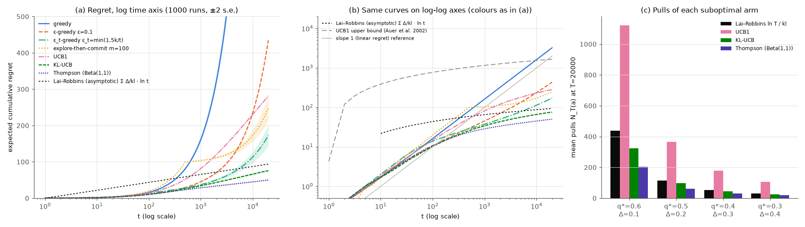

| algorithm ($T = 20{,}000$, 1000 runs) | $\mathbb E[\mathrm{Reg}(T)]$ | growth from $t = T/10$ to $T$ |
|---|---|---|
| greedy | 3230 ± 86 | ×10.00 (linear) |
| ε-greedy, ε = 0.1 | 434.9 ± 2.3 | ×6.15 |
| $\varepsilon_t$-greedy, $\varepsilon_t = \min(1, 5k/t)$ | 172.9 ± 14.6 | ×3.44 |
| explore-then-commit, $m = 100$ (§11.6) | 248.2 ± 16.6 (expectation 237 ± 1) | ×2.23 (expectation ×2.15) |
| UCB1 | 281.5 ± 1.1 | ×2.34 |
| KL-UCB | 75.8 ± 0.6 | ×1.75 |
| Thompson sampling, Beta(1,1) | **50.1 ± 0.6** | ×1.49 |
| Lai–Robbins asymptotic lower bound $9.46\ln T$ | 93.7 | ×1.30 |

Panel (a) uses a logarithmic time axis, so logarithmic regret appears as a straight line and linear regret as an exponential curve. Panel (b) uses log–log axes, where linear regret has slope 1.

### 11.4 The Lai–Robbins lower bound

How small can regret be? Call a policy **consistent** on a class of bandits if, on every instance in the class,

$$
\mathbb E[\mathrm{Reg}(T)] = o(T^\kappa) \quad\text{for every } \kappa > 0 .
\tag{11.5}
$$

*(The exponent is written $\kappa$ because $p$ already denotes a probability in this chapter.)* This excludes trivial policies such as "always pull arm 1", which is perfect on some instances and terrible on others.

**Theorem (Lai & Robbins, 1985).** For a consistent policy on Bernoulli bandits (more generally, on any one-parameter exponential family), every suboptimal arm $a$ satisfies $\liminf_{T\to\infty} \mathbb E[N_T(a)]/\ln T \ge 1/\mathrm{kl}(q_\ast(a), v_\ast)$. Hence

$$
\liminf_{T\to\infty}\ \frac{\mathbb E[\mathrm{Reg}(T)]}{\ln T}\ \ge \sum_{a:\,\Delta_a > 0} \frac{\Delta_a}{\mathrm{kl}\big(q_\ast(a),\, v_\ast\big)} .
\tag{11.6}
$$

For Gaussian arms with known variance $\sigma^2$, the KL is $\Delta_a^2/(2\sigma^2)$, and the constant becomes $\sum_a 2\sigma^2/\Delta_a$. Burnetas and Katehakis (1996) extended the bound to general families of distributions.

*Proof sketch (change of measure).* Fix an instance $\nu$ and a suboptimal arm $a$. Build a second instance $\nu'$ that is identical except that arm $a$'s mean is raised to slightly above $v_\ast$, so that $a$ is the unique optimal arm in $\nu'$.

1. *Divergence decomposition.* The two instances differ only in arm $a$, so the KL divergence between the distributions of the whole history under $\nu$ and $\nu'$ is $\mathbb E_\nu[N_T(a)]\cdot D_{\mathrm{KL}}(P_a \Vert P'_a)$. Each pull of arm $a$ contributes one sample's worth of information, and nothing else does.
2. *Bretagnolle–Huber inequality.* For any event $E$, $\Pr_\nu(E) + \Pr_{\nu'}(E^c) \ge \tfrac12\exp\big(-D_{\mathrm{KL}}(\Pr_\nu \Vert \Pr_{\nu'})\big)$.
3. *Consistency forces the probabilities down.* Take $E = \{N_T(a) > T/2\}$. Under $\nu$, the event $E$ forces regret $\ge T\Delta_a/2$. Under $\nu'$, the event $E^c$ means the optimal arm was pulled at most $T/2$ times, which also forces linear regret. By Markov's inequality and consistency, both probabilities are $o(T^{\kappa-1})$ for every $\kappa > 0$. So $\tfrac12 \exp\big(-\mathbb E_\nu[N_T(a)]\,D_{\mathrm{KL}}(P_a\Vert P'_a)\big) \le o(T^{\kappa-1})$, that is, $\mathbb E_\nu[N_T(a)]\,D_{\mathrm{KL}}(P_a\Vert P'_a) \ge (1-\kappa)\ln T - O(1)$.

Let $\kappa \to 0$ and let arm $a$'s mean under $\nu'$ decrease to $v_\ast$, so that $D_{\mathrm{KL}}(P_a\Vert P'_a) \to \mathrm{kl}(q_\ast(a), v_\ast)$. $\square$

The intuition is that to be confident, at level about $1/T$, that arm $a$ is *not* secretly the best, you need about $\ln T/\mathrm{kl}$ samples of it. By Pinsker's inequality $\mathrm{kl}(p,q) \ge 2(p-q)^2$, so the constant is at most $\sum_a 1/(2\Delta_a)$.

**Matching the bound.** UCB1's Hoeffding radius ignores the variance (§6.2). **KL-UCB** (Garivier & Cappé, 2011) replaces it with the KL ball that the Chernoff–KL bound suggests:

$$
U_t(a) \doteq \max\Big\{ q \in [Q_t(a), 1] :\ N_t(a)\,\mathrm{kl}\big(Q_t(a), q\big) \le \ln t + c'\ln\ln t \Big\}.
\tag{11.7}
$$

The analysis uses $c' = 3$. Our code uses $c' = 0$, as Garivier and Cappé did in their experiments, and computes the maximum by bisection, since $\mathrm{kl}(Q, q)$ increases in $q \ge Q$:

```text
Algorithm 11.3  KL-UCB for rewards in [0, 1] (Garivier & Cappé 2011)
Input: k; constant c' ≥ 0 (theory: c' = 3; our code: c' = 0)
Initialise, for a = 1..k:  Q(a) <- 0, N(a) <- 0
Loop for t = 1, 2, ..., T:
    if some arm has N(a) = 0:  A <- one such arm (at random)               # play every arm once first
    else:
        for a = 1..k:          # U(a) = largest q in [Q(a), 1] with N(a) kl(Q(a), q) ≤ ln t + c' ln ln t
            lo <- Q(a);  hi <- 1
            repeat 16 times:   # bisection; valid because kl(Q(a), ·) increases on [Q(a), 1]
                mid <- (lo + hi)/2
                if N(a) kl(Q(a), mid) ≤ ln t + c' ln ln t:  lo <- mid  else:  hi <- mid
            U(a) <- lo
        A <- argmax_a U(a)  (ties at random)                                # Eq. (11.7)
    R <- bandit(A);  N(A) <- N(A) + 1;  Q(A) <- Q(A) + (R - Q(A)) / N(A)
```

KL-UCB and Beta–Bernoulli Thompson sampling are both **asymptotically optimal**: they attain the constant in (11.6). Panel (c) of the figure compares pull counts with the Lai–Robbins rate $\ln T/\mathrm{kl}$:

| suboptimal arm | $q_\ast = 0.6$ | $0.5$ | $0.4$ | $0.3$ |
|---|---|---|---|---|
| Lai–Robbins $\ln T/\mathrm{kl}$ | 439 | 114 | 52 | 29 |
| UCB1 | 1123 | 366 | 178 | 107 |
| KL-UCB | 323 | 98 | 46 | 26 |
| Thompson sampling | 204 | 62 | 31 | 20 |

KL-UCB and Thompson sampling pull *fewer* times than $\ln T/\mathrm{kl}$, and their regrets (75.8 and 50.1) are *below* the line $9.46\ln T = 93.7$. **This does not contradict the theorem.** Equation (11.6) is a statement about $\liminf_{T\to\infty}$. It allows lower-order terms such as $-C\ln\ln T$, and at $T = 20{,}000$, $\ln T$ is only 9.9. The asymptotic bound describes the *growth rate*: from $T/10$ to $T$, Thompson sampling's regret grows by ×1.49 and KL-UCB's by ×1.75, while $\ln T$ grows by ×1.30. Both are still approaching their asymptotic slopes. UCB1 pulls the closest arm about 2.6 times as often as Lai–Robbins requires. A heuristic count shows why: UCB1 keeps pulling arm $a$ until $\sqrt{2\ln t/N} \approx \Delta_a$, that is, about $2\ln T/\Delta_a^2 \approx 1980$ times for $\Delta_a = 0.1$. By Pinsker, Lai–Robbins asks for at most $\ln T/(2\Delta_a^2) \approx 495$ (the exact value is 439), a factor of 4 fewer. Hoeffding's variance-free radius is the cause.

### 11.5 The UCB1 upper bound

**Theorem (Auer, Cesa-Bianchi & Fischer, 2002, Theorem 1).** For rewards in $[0,1]$, UCB1 (Algorithm 6.1 with $c = \sqrt2$) satisfies, for every $T$,

$$
\mathbb E[\mathrm{Reg}(T)] \ \le\ 8\sum_{a:\,\Delta_a>0}\frac{\ln T}{\Delta_a} \;+\; \Big(1 + \frac{\pi^2}{3}\Big)\sum_{a=1}^k \Delta_a .
\tag{11.8}
$$

*Proof sketch.* By (11.3) it suffices to bound $\mathbb E[N_T(a)]$ for each suboptimal $a$. Let $c_{t,s} = \sqrt{2\ln t/s}$ be the radius after $s$ pulls, and let $\ell = \lceil 8\ln T/\Delta_a^2\rceil$. After arm $a$ has been pulled $\ell$ times, it can only be pulled again at step $t$ if its index beats the optimal arm's: $Q(a) + c_{t,N(a)} \ge Q(a^\ast) + c_{t,N(a^\ast)}$. This requires **at least one** of three events:

* (A) the optimal arm is badly underestimated: $Q(a^\ast) \le v_\ast - c_{t,N(a^\ast)}$;
* (B) arm $a$ is badly overestimated: $Q(a) \ge q_\ast(a) + c_{t,N(a)}$;
* (C) arm $a$'s radius is still wide: $v_\ast < q_\ast(a) + 2c_{t,N(a)}$.

If none holds, then $Q(a^\ast) + c_{t,N(a^\ast)} > v_\ast \ge q_\ast(a) + 2c_{t,N(a)} > Q(a) + c_{t,N(a)}$, and arm $a$ is not chosen. Event (C) is impossible once $N(a) \ge \ell$, because then $2c_{t,N(a)} \le 2\sqrt{2\ln T/\ell} \le \Delta_a$. By Hoeffding (6.1) with $u = c_{t,s}$, events (A) and (B) each have probability at most $e^{-2s \cdot 2\ln t/s} = t^{-4}$ for a fixed number of pulls $s$. A union bound over the possible pull counts $s, s' \le t$ gives at most $2t^2\cdot t^{-4} = 2t^{-2}$ per step. Summing, $\mathbb E[N_T(a)] \le \ell + \sum_{t\ge1} 2t^{-2} \le 8\ln T/\Delta_a^2 + 1 + \pi^2/3$. Multiply by $\Delta_a$ and sum over arms. $\square$

The bound is correct but loose. For our instance it evaluates to 1655 at $T = 20{,}000$, while UCB1's measured regret is 281.5. The factor 8 comes from slack in the proof, and the $\ln T/\Delta_a$ form hides the variance. Tighter analyses (e.g., Lattimore & Szepesvári, 2020, Ch. 7–8) reduce the constant.

### 11.6 Explore-then-commit: the A/B test as a bandit algorithm

A classical **A/B/n test** pulls each arm a fixed number of times $m$, then deploys the winner forever. As a bandit algorithm it is **explore-then-commit** (ETC):

```text
Algorithm 11.1  Explore-then-commit
Input: k; exploration length m per arm; horizon T ≥ m k
Initialise, for a = 1..k:  Q(a) <- 0, N(a) <- 0
for t = 1..m k:                 # exploration phase: round robin
    A <- ((t - 1) mod k) + 1;  R <- bandit(A);  N(A) <- N(A) + 1;  Q(A) <- Q(A) + (R - Q(A))/N(A)
 <- argmax_a Q(a)              # commit (ties at random)
for t = m k + 1..T:  pull Â
```

For two arms with rewards in $[0,1]$ and gap $\Delta$, exploration costs $m\Delta$. The commitment is wrong if the bad arm's sample mean is at least the good arm's. The paired differences $Y_i = X_{1,i} - X_{2,i}$ lie in $[-1, 1]$ (a range of 2) and have mean $\Delta$, so Hoeffding gives $\Pr\{\bar Y_m \le 0\} \le \exp(-2m\Delta^2/2^2) = e^{-m\Delta^2/2}$. Hence

$$
\mathbb E[\mathrm{Reg}(T)] \ \le\ m\Delta + (T - 2m)\,\Delta\, e^{-m\Delta^2/2}.
\tag{11.9}
$$

Minimising over $m$ (Exercise 2.9) gives $m^\ast \approx \frac{2}{\Delta^2}\ln\frac{T\Delta^2}{2}$ and regret $O(\ln T/\Delta)$, which is logarithmic, but **only if you know $\Delta$ (and $T$) in advance**. In the 5-arm experiment of §11.3, ETC with $m = 100$ reached a regret of $248 \pm 17$, slightly below UCB1's $281.5 \pm 1.1$ on this instance (about two standard errors), but its curve keeps rising after the exploration phase ends at $t = 500$ (×2.2 from $T/10$ to $T$). In 7.5% of the runs it committed to a suboptimal arm, almost always the 0.6 arm, and from then on it pays $\Delta = 0.1$ per step forever. Because each run either commits correctly or pays for about $T$ steps, the simulated mean is noisy, so the script also computes the expectation almost exactly. Exploration costs $m\sum_a\Delta_a = 100$. Over 200,000 simulated exploration phases the commitment is wrong with probability 0.069, which adds $19{,}500 \times \sum_a \Pr\{\hat A = a\}\Delta_a = 137$, for $\mathbb E[\mathrm{Reg}(20{,}000)] \approx 237 \pm 1$. More than half of ETC's regret is this linear term, and it keeps growing with $T$. The next subsection shows that no single $m$ works for all gaps. In practice, bandit algorithms *adapt* the amount of exploration to the observed gaps, and this is their advantage over fixed-horizon A/B tests when the goal is reward rather than inference (§14).

### 11.7 The minimax view: what the logarithm hides

Bounds of the form $\sum_a \ln T/\Delta_a$ look excellent, but they blow up as gaps shrink. Of course regret can never exceed $T\Delta$. So for a fixed $T$, what is the **worst case over instances**?

*Gap-free upper bound.* Split the arms at a threshold $\Delta$. Arms with $\Delta_a \le \Delta$ cost at most $T\Delta$ in total. By (11.8), arms with $\Delta_a > \Delta$ cost at most $8k\ln T/\Delta + O(k)$. Choosing $\Delta = \sqrt{8k\ln T/T}$ (Exercise 2.15) gives

$$
\mathbb E[\mathrm{Reg}(T)] \le \sqrt{32\,kT\ln T} + O(k) \qquad\text{for UCB1, on every instance.}
\tag{11.10}
$$

*Minimax lower bound.* For every algorithm and every $T \ge k$, there is an instance on which

$$
\mathbb E[\mathrm{Reg}(T)] \ \ge\ c_0\sqrt{kT}
\tag{11.11}
$$

for a universal constant $c_0 > 0$ (Auer, Cesa-Bianchi, Freund & Schapire, 2002). The intuition is a needle in a haystack. Make all arms Bernoulli(1/2) except one random arm with mean $1/2 + \Delta$. Telling that arm apart needs about $1/\Delta^2$ pulls *of it*, so finding it needs about $k/\Delta^2$ pulls in total. If $T \lesssim k/\Delta^2$ the algorithm cannot find it in time and loses about $\Delta$ per step, for a regret of about $T\Delta$. The worst gap is the largest one that still cannot be found in time, $\Delta \approx \sqrt{k/T}$, which gives regret of about $\sqrt{kT}$. The formal proof is the KL argument of §11.4: some arm is pulled at most $T/k$ times in expectation, and a perturbation of size $\Delta$ on it carries only $(T/k)\cdot O(\Delta^2) = O(1)$ nats of information.

So UCB1 is minimax-optimal up to $\sqrt{\ln T}$. MOSS (Audibert & Bubeck, 2009) removes the logarithm, and Thompson sampling is within logarithmic factors as well. [`regret_vs_gap.py`](../code/ch02_multi_armed_bandits/regret_vs_gap.py) shows the two regimes on two Bernoulli arms $(0.5, 0.5-\Delta)$, sweeping $\Delta$ over 19 values from 0.002 to 0.5 (200 runs per point). For ETC it also computes the exact expected regret from binomial distributions (the formula of Exercise 2.9), because ETC's simulated points are very noisy:

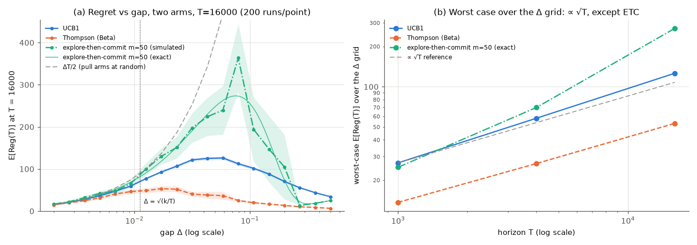

| algorithm | worst-case $\mathbb E[\mathrm{Reg}]$ over the grid at $T$ = 1000 / 4000 / 16,000 | worst gap at $T = 16{,}000$ | worst / $\sqrt{T}$ |
|---|---|---|---|
| UCB1 (simulated, ± s.e.) | 26.9 ± 0.6 / 58.1 ± 1.0 / 126.0 ± 2.0 | 0.058 | 0.85 → 0.92 → 1.00 |
| Thompson sampling (simulated, ± s.e.) | 13.7 ± 0.9 / 26.7 ± 1.4 / 53.2 ± 3.4 | 0.017 | 0.43 → 0.42 → 0.42 |
| explore-then-commit, $m = 50$ (exact) | 25.0\* / 70.0 / 273.0 | 0.079 | 0.79\* → 1.11 → 2.16 |

\*At $T = 1000$ ETC's maximum over the grid sits at its edge, $\Delta = 0.5$, where the regret is just the exploration cost $m\Delta = 25$. Its interior peak, computed exactly on a fine grid, is 19.3 at $\Delta \approx 0.089$.

Each curve in panel (a) rises along the "never learns" line $\Delta T/2$ for tiny gaps, peaks, and then falls like $\ln T/\Delta$. ETC's curve rises again at large gaps, where its fixed exploration cost $m\Delta$ dominates. For Thompson sampling the peak is at $\Delta = 0.017$, close to $\sqrt{k/T} = 0.011$. Its worst-case regret doubles each time $T$ is multiplied by 4 (×1.95, ×2.00), consistent with the $\sqrt{T}$ law within noise. (The maximum of 19 noisy points is biased upward, and each value is uncertain by 2–7%.) UCB1 grows slightly faster (×2.16, ×2.17), consistent with its extra $\sqrt{\ln T}$, which predicts ×2.19 and ×2.16. Its worst gap is larger than $\sqrt{k/T}$ because its constants make it over-explore. ETC with a fixed $m$ behaves differently. Its exact interior peak grows ×3.62 and then ×3.91 per quadrupling of $T$, close to the ×4 of linear regret: a fixed exploration budget cannot cope with gaps that are too small for it. The simulated ETC points scatter widely around the exact curve (at the $T = 16{,}000$ peak, $363.6 \pm 40.4$ simulated against 273.0 exact), because a run either commits correctly or pays $\Delta$ for about $T$ steps.

---

## 12. Adversarial bandits and EXP3

### 12.1 When rewards are not random

Everything so far assumed i.i.d. rewards. What if they are chosen by an adversary, or are simply too nonstationary to model? In the **adversarial bandit**, before (or during) the game an adversary fixes rewards $x_t(a) \in [0,1]$ for every step and arm. The agent sees only $x_t(A_t)$. With no distribution to learn, we compare with the **best fixed arm in hindsight**:

$$
\mathrm{Reg}(T) \doteq \max_{a}\sum_{t=1}^T x_t(a) \;-\; \mathbb E\Big[\sum_{t=1}^T x_t(A_t)\Big],
\tag{12.1}
$$

where the expectation is over the agent's own randomisation. An **oblivious** adversary fixes the whole table in advance, so the benchmark $\max_a\sum_t x_t(a)$ is a fixed number and (12.1) is well defined. An **adaptive** adversary can react to the agent's past actions. Then the table itself depends on the agent's coin flips, and one bounds either $\mathbb E\big[\max_a\sum_t x_t(a) - \sum_t x_t(A_t)\big]$ or the pseudo-regret $\max_a\mathbb E\big[\sum_t x_t(a) - \sum_t x_t(A_t)\big]$. All results below are for oblivious adversaries.

**Deterministic algorithms fail.** If the agent is a deterministic function of the history, as UCB1 is with a fixed tie-breaking rule, the adversary can simulate it. At each step it sets $x_t(A_t) = 0$ for the arm the agent is about to pull and $x_t(a) = 1$ for every other arm. The agent earns nothing, and the arms' totals add up to $(k-1)T$, so the best fixed arm earns at least $(k-1)T/k$. The regret is at least $T(1 - 1/k)$, which is linear. Even though the table is fixed before the game starts, it defeats the algorithm. The only defence is **randomisation**: an adversary can predict your *distribution* but not your coin flips.

### 12.2 EXP3: exponential weights with importance weighting

With full information, where every arm's reward is revealed each step, the classic solution is **exponential weights** (Hedge): play arm $a$ with probability proportional to $\exp(\eta\sum_{s<t}x_s(a))$. Its regret is $O(\sqrt{T\ln k})$ (Littlestone & Warmuth, 1994; Freund & Schapire, 1997). With bandit feedback we see only one arm's reward, so we **estimate** the others by **importance weighting**. Work with losses $\ell_t(a) = 1 - x_t(a)$ and let $P_t$ be the distribution the agent samples from:

$$
\hat\ell_t(a) \doteq \frac{\ell_t(a)\,\mathbb 1[A_t = a]}{P_t(a)},
\qquad
\mathbb E_t\big[\hat\ell_t(a)\big] = P_t(a)\cdot\frac{\ell_t(a)}{P_t(a)} + (1 - P_t(a))\cdot 0 = \ell_t(a),
\tag{12.2}
$$

where $\mathbb E_t$ conditions on the history. The estimate is unbiased for *every* arm, observed or not. Its second moment, $\mathbb E_t[\hat\ell_t(a)^2] = \ell_t(a)^2/P_t(a)$, is large for rarely played arms. This is the same importance-sampling trade-off as in [Chapter 00 §2.6](00-math-toolkit.md), which returns for off-policy learning in [Chapter 04](04-monte-carlo.md). **EXP3** ("exponential-weight algorithm for exploration and exploitation") plays

$$
P_t(a) = \frac{\exp\big(-\eta\,\hat L_{t-1}(a)\big)}{\sum_b \exp\big(-\eta\,\hat L_{t-1}(b)\big)}, \qquad \hat L_{t}(a) \doteq \sum_{s=1}^{t}\hat\ell_s(a).
\tag{12.3}
$$

```text
Algorithm 12.1  EXP3 (loss-based form, rewards x ∈ [0, 1])
Input: k; horizon T; learning rate η > 0 (default η = sqrt(2 ln k / (T k)))
Initialise: L̂(a) <- 0 for a = 1..k
Loop for t = 1..T:
    P(a) <- exp(-η L̂(a)) / Σ_b exp(-η L̂(b))  for all a       # Eq. (12.3), shift by min L̂ for stability
    A <- sample from P;  observe x <- x_t(A)
    L̂(A) <- L̂(A) + (1 - x) / P(A)                            # importance-weighted loss, Eq. (12.2)
```

**Worked example.** $k = 2$, $\eta = 0.1$, $\hat L = (0, 0)$, so $P = (0.5, 0.5)$. Arm 1 is pulled and pays $x = 0$ (loss 1), so $\hat L(1) = 1/0.5 = 2$. Next step: $P(1) = e^{-0.2}/(e^{-0.2} + 1) = 0.8187/1.8187 = 0.450$. Arm 2's unobserved loss is estimated as 0, and that is unbiased, because on the steps when arm 2 is pulled its loss is divided by its probability.

**Theorem** (Bubeck & Cesa-Bianchi, 2012, Theorem 3.1, for this form of the algorithm; Auer et al., 2002, analysed the original version with explicit uniform mixing). Against any oblivious adversary, EXP3 with $\eta = \sqrt{2\ln k/(Tk)}$ satisfies

$$
\mathrm{Reg}(T) \le \sqrt{2\,T k \ln k}.
\tag{12.4}
$$

*Proof sketch.* Let $W_t = \sum_a e^{-\eta\hat L_t(a)}$, so $W_0 = k$.

* *Upper bound on the growth of $\ln W_t$.* Using $e^{-y} \le 1 - y + y^2/2$ for $y \ge 0$ and $\ln(1+z) \le z$: $\ln(W_t/W_{t-1}) = \ln\sum_a P_t(a)e^{-\eta\hat\ell_t(a)} \le -\eta\sum_a P_t(a)\hat\ell_t(a) + \frac{\eta^2}{2}\sum_a P_t(a)\hat\ell_t(a)^2$.
* *Lower bound.* For any arm $j$, $\ln(W_T/W_0) \ge -\eta\hat L_T(j) - \ln k$.
* *Combine and take expectations.* $\mathbb E_t[\sum_a P_t(a)\hat\ell_t(a)] = \sum_a P_t(a)\ell_t(a) = \mathbb E_t[\ell_t(A_t)]$, $\mathbb E[\hat L_T(j)] = L_T(j)$, and $\mathbb E_t[\sum_a P_t(a)\hat\ell_t(a)^2] = \sum_a\ell_t(a)^2 \le k$. This gives $\mathbb E[\sum_t\ell_t(A_t)] - L_T(j) \le \frac{\ln k}{\eta} + \frac{\eta T k}{2}$. Since losses are $1 - $ rewards, the left side is exactly the regret against arm $j$. Optimising over $\eta$ gives (12.4). $\square$

Using losses rather than rewards matters in the first step: it keeps $\hat\ell \ge 0$, so the second-order inequality applies. With the $\sqrt{kT}$ lower bound (11.11), which also holds for adversaries, EXP3 is minimax-optimal up to $\sqrt{\ln k}$.

### 12.3 Experiments

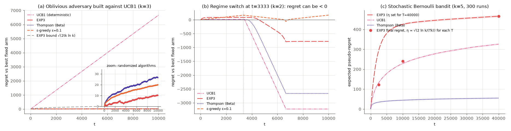

[`exp3_adversarial.py`](../code/ch02_multi_armed_bandits/exp3_adversarial.py), with $T = 10{,}000$ and 300 runs per randomised algorithm:

* **(a) An oblivious adversary built against UCB1** ($k = 3$). On the simulated table UCB1 round-robins and earns nothing: regret 6667 $= 0.667T$. On the *same* table EXP3's regret is $10.3 \pm 2.7$, Thompson sampling's $26.5 \pm 2.2$ and ε-greedy's $20.0 \pm 0.9$ (see the inset), all far below the EXP3 bound of 256.7. Escaping is not automatic for every randomised algorithm (one whose coin flips rarely change its actions is almost as predictable as UCB1, and a table built against it would defeat it), but EXP3's guarantee holds for *every* oblivious table.
* **(b) A regime switch** ($k = 2$). Arm 1 pays 1 for $t \le 3333$ and 0 afterwards, and arm 2 the opposite. The best fixed arm earns 6667, but a policy that switches at the right moment earns 10,000, so regret against the best fixed arm can be **negative**. UCB1 reaches $-3224$ and Thompson sampling $-2661$, because both switch soon after the change. EXP3 reaches only $-781$: its weights follow *cumulative* estimated losses, which cross only at $t = 6667$ (noisy estimates let some runs switch earlier). ε-greedy with sample averages is slowest ($+169$). The guarantee (12.4) is relative to a **weak benchmark**. When the best arm changes over time you want *tracking* algorithms: EXP3.S (Auer et al., 2002), or discounted and sliding-window UCB (Garivier & Moulines, 2011).
* **(c) The price of robustness** on the stochastic 5-arm instance of §11, with EXP3's $\eta$ set to the theoretical value $\sqrt{2\ln k/(Tk)}$ for each horizon $T$ (which requires knowing $T$):

| $T$ | EXP3 | UCB1 | Thompson | EXP3 bound $\sqrt{2Tk\ln k}$ |
|---|---|---|---|---|
| 2,500 | 122.1 | 131.9 | 34.9 | 200.6 |
| 10,000 | 240.3 | 228.5 | 44.8 | 401.2 |
| 40,000 | 466.3 | 325.9 | 55.3 | 802.4 |

EXP3's regret almost exactly doubles every time $T$ quadruples (×1.97, ×1.94), the $\sqrt T$ rate, while Thompson sampling grows ×1.28 and ×1.24, close to the logarithmic ×1.18 and ×1.15. UCB1 has a large constant but a slowing growth rate (×1.73, ×1.43). Robustness to adversaries costs the logarithmic rates on benign problems. *Best-of-both-worlds* algorithms such as Tsallis-INF (Zimmert & Seldin, 2021) get near-optimal regret in both regimes without knowing which one they are in.

EXP3 is also a bridge to later chapters. It is online mirror descent with an entropy regulariser, the same mathematics as KL-regularised policy updates ([Chapter 11](11-trust-regions-and-ppo.md), [Chapter 18](18-rl-for-language-models.md)). When every player in a game runs a no-regret algorithm like it, the empirical distribution of play converges to a coarse correlated equilibrium, and in two-player zero-sum games the time-averaged strategies converge to a Nash equilibrium ([Chapter 17](17-multi-agent-rl.md)).

---

## 13. Contextual bandits and associative search

### 13.1 From one situation to many

The bandits so far are **nonassociative**: there is one situation, and the task is to find the single best action. In most applications, the right action depends on the situation. The best headline may differ for sports fans and for finance readers. Sutton & Barto call this **associative search**: you must *search* (try actions) and *associate* actions with the situations in which they are best.

In a **contextual bandit**, at each step $t$:

1. the environment reveals a context $X_t$, drawn i.i.d. from some distribution;
2. the agent chooses $A_t$;
3. it receives $R_t$ with $\mathbb E[R_t \mid X_t = x, A_t = a] = r(x, a)$, and *only for the chosen action*.

The next context does not depend on the action. A policy maps contexts to actions, and regret compares with the best context-dependent choice:

$$
\mathrm{Reg}(T) \doteq \sum_{t=1}^T \Big(\max_a r(X_t, a) - r(X_t, A_t)\Big).
\tag{13.1}
$$

A context-free algorithm that ignores $X_t$ can at best find the single arm that is best *on average*. Unless a single arm is best in every context, it pays a constant regret per step against (13.1), which is linear regret.

### 13.2 Where contextual bandits sit relative to full RL

A contextual bandit is an MDP whose transitions ignore the action: $p(s' \mid s, a) = d(s')$, where the context distribution $d$ plays the role of the state distribution. The Bellman optimality equation of [Chapter 01](01-the-rl-problem.md) then reads

$$
q_\ast(s,a) = r(s,a) + \gamma\sum_{s'} d(s')\,v_\ast(s') = r(s,a) + \text{const}(\gamma),
$$

so $\arg\max_a q_\ast(s,a) = \arg\max_a r(s,a)$ **for every $\gamma$**. The greedy-in-immediate-reward policy is optimal, and there is no temporal credit assignment to do. Full RL is a contextual bandit plus the fact that actions change the next state. Two practical consequences follow. Many "RL" deployments, such as recommendation without long-term effects, ad selection, and single-turn RLHF where the context is a prompt and the action is a whole response ([Chapter 18](18-rl-for-language-models.md)), are really contextual bandits. And when a problem is *nearly* a contextual bandit, $\gamma = 0$ methods are much simpler and lower-variance than full RL.

### 13.3 LinUCB: optimism with linear models

Assume each arm's expected reward is linear in a $d$-dimensional feature vector $\mathbf x$ (the context, possibly transformed): $r(\mathbf x, a) = \mathbf x^\top\boldsymbol\theta_a$, with an unknown $\boldsymbol\theta_a \in \mathbb R^d$ per arm. This is the "disjoint" model of Li, Chu, Langford and Schapire (2010). Suppose arm $a$ has been played on contexts stacked as the rows of $\mathbf X_a$, with rewards $\mathbf y_a = \mathbf X_a\boldsymbol\theta_a + \boldsymbol\xi$, where the noise vector $\boldsymbol\xi$ has independent entries with variance $\sigma^2$. The **ridge-regression** estimate is

$$
\hat{\boldsymbol\theta}_a = \mathbf A_a^{-1}\mathbf b_a, \qquad \mathbf A_a \doteq \lambda\mathbf I + \mathbf X_a^\top\mathbf X_a, \qquad \mathbf b_a \doteq \mathbf X_a^\top\mathbf y_a .
\tag{13.2}
$$

How wrong can the prediction $\mathbf x^\top\hat{\boldsymbol\theta}_a$ be for a new context $\mathbf x$? Substitute $\mathbf y_a$ and use $\mathbf X_a^\top\mathbf X_a = \mathbf A_a - \lambda\mathbf I$:

$$
\mathbf x^\top\hat{\boldsymbol\theta}_a - \mathbf x^\top\boldsymbol\theta_a
= \underbrace{\mathbf x^\top\mathbf A_a^{-1}\mathbf X_a^\top\boldsymbol\xi}_{\text{noise}}\; \underbrace{-\;\lambda\,\mathbf x^\top\mathbf A_a^{-1}\boldsymbol\theta_a}_{\text{regularisation bias}} .
\tag{13.3}
$$

The noise term has variance $\sigma^2\,\mathbf x^\top\mathbf A_a^{-1}\mathbf X_a^\top\mathbf X_a\mathbf A_a^{-1}\mathbf x = \sigma^2\,\mathbf x^\top(\mathbf A_a^{-1} - \lambda\mathbf A_a^{-2})\mathbf x \le \sigma^2\,\mathbf x^\top\mathbf A_a^{-1}\mathbf x$. (This calculation treats the design $\mathbf X_a$ as fixed. In a bandit the contexts at which arm $a$ was played depend on past noise, so it is only a heuristic; the self-normalised martingale bound of Abbasi-Yadkori et al., cited below, makes it rigorous.) By Cauchy–Schwarz in the $\mathbf A_a^{-1}$ inner product and $\mathbf A_a \succeq \lambda\mathbf I$, the bias satisfies $|\lambda\mathbf x^\top\mathbf A_a^{-1}\boldsymbol\theta_a| \le \sqrt\lambda\,\lVert\boldsymbol\theta_a\rVert\,\sqrt{\mathbf x^\top\mathbf A_a^{-1}\mathbf x}$. **Both terms scale with**

$$
\lVert\mathbf x\rVert_{\mathbf A_a^{-1}} \doteq \sqrt{\mathbf x^\top\mathbf A_a^{-1}\mathbf x},
\tag{13.4}
$$

which is large in directions of feature space the arm has rarely been tried in and shrinks as data accumulate there. It plays the role of $1/\sqrt{N_t(a)}$. The **LinUCB** rule is optimism with this width:

$$
A_t \doteq \arg\max_a\Big[\mathbf x_t^\top\hat{\boldsymbol\theta}_a + \alpha\,\lVert\mathbf x_t\rVert_{\mathbf A_a^{-1}}\Big].
\tag{13.5}
$$

*(Local notation: $\alpha$ here is LinUCB's exploration coefficient, following Li et al., not a step size.)* Abbasi-Yadkori, Pál and Szepesvári (2011) showed how to choose the width so that the confidence ellipsoids hold uniformly over time, and proved $\tilde O(d\sqrt T)$ regret for the shared-parameter linear bandit (their algorithm, OFUL). In practice $\alpha$ is tuned. To avoid inverting $\mathbf A_a$ every step, update its inverse with the **Sherman–Morrison** formula:

$$
(\mathbf A + \mathbf x\mathbf x^\top)^{-1} = \mathbf A^{-1} - \frac{\mathbf A^{-1}\mathbf x\,\mathbf x^\top\mathbf A^{-1}}{1 + \mathbf x^\top\mathbf A^{-1}\mathbf x}.
\tag{13.6}
$$

```text
Algorithm 13.1  LinUCB (disjoint linear models)
Input: k arms; feature dimension d; exploration coefficient α ≥ 0; ridge parameter λ > 0
Initialise, for a = 1..k:  A_inv(a) <- I_d / λ;  b(a) <- 0_d
Loop for t = 1, 2, ..., T:
    observe context x_t ∈ R^d
    for a = 1..k:
        θ̂(a) <- A_inv(a) b(a)                                                # Eq. (13.2)
        p(a) <- x_tᵀ θ̂(a) + α sqrt( x_tᵀ A_inv(a) x_t )                      # Eq. (13.5)
    A <- argmax_a p(a)  (ties at random);  R <- reward(x_t, A)
    A_inv(A) <- A_inv(A) - (A_inv(A) x_t)(A_inv(A) x_t)ᵀ / (1 + x_tᵀ A_inv(A) x_t)   # Eq. (13.6)
    b(A) <- b(A) + R x_t
```

**Linear Thompson sampling** (Agrawal & Goyal, 2013) replaces the bonus by a posterior sample, $\tilde{\boldsymbol\theta}_a \sim \mathcal N(\hat{\boldsymbol\theta}_a, v^2\mathbf A_a^{-1})$, followed by a greedy choice. The ridge estimate is the posterior mean under a Gaussian prior, which is the multivariate analogue of (7.3).

```text
Algorithm 13.2  Linear Thompson sampling (disjoint linear models)
Input: k arms; feature dimension d; posterior scale v > 0; ridge parameter λ > 0
Initialise, for a = 1..k:  A_inv(a) <- I_d / λ;  b(a) <- 0_d
Loop for t = 1, 2, ..., T:
    observe context x_t ∈ R^d
    for a = 1..k:
        θ̂(a) <- A_inv(a) b(a)
        θ̃(a) <- θ̂(a) + v L(a) z,  z ~ N(0, I_d),  where L(a) L(a)ᵀ = A_inv(a)   # sample N(θ̂, v² A⁻¹)
    A <- argmax_a x_tᵀ θ̃(a);  R <- reward(x_t, A)
    A_inv(A) <- A_inv(A) - (A_inv(A) x_t)(A_inv(A) x_t)ᵀ / (1 + x_tᵀ A_inv(A) x_t)   # Eq. (13.6)
    b(A) <- b(A) + R x_t
```

### 13.4 Experiment

[`linucb_contextual.py`](../code/ch02_multi_armed_bandits/linucb_contextual.py) generates $k = 5$ arms with $\boldsymbol\theta_a \sim \mathcal N(\mathbf 0, \mathbf I_6/6)$. Each context is a constant feature 1 followed by a uniform point on the unit sphere in $\mathbb R^5$, and the noise standard deviation is 0.5. There are 100 runs × 5000 steps, with $\lambda = 1$.

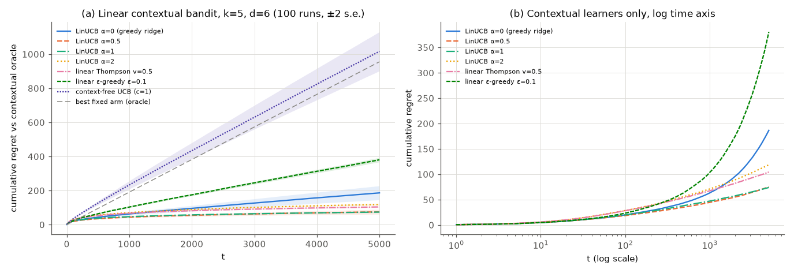

| learner | $\mathrm{Reg}(5000)$ | regret per step, second half |
|---|---|---|
| LinUCB, α = 1 | **73.9 ± 1.9** | 0.0051 |
| LinUCB, α = 0.5 | 75.2 ± 7.0 | 0.0064 |
| linear Thompson sampling, $v = 0.5$ | 104.3 ± 1.9 | 0.0067 |
| LinUCB, α = 2 | 118.5 ± 2.6 | 0.0091 |
| LinUCB, α = 0 (greedy ridge regression) | 186.5 ± 20.5 | 0.0300 |
| linear ε-greedy, ε = 0.1 | 380.7 ± 6.5 | 0.0680 |
| context-free UCB (ignores $\mathbf x$) | 1016.4 ± 57.4 | 0.1936 |

The best single arm loses 0.191 per step against the contextual oracle, or 956 over the horizon. The context-free learner essentially finds that arm and pays this linear regret (0.194 per step). Every contextual learner does far better. LinUCB with α around 0.5–1 is best. Greedy ridge regression does surprisingly well on average but has a ten times larger standard error. In most runs, the variety of contexts provides "free" exploration (each arm is tried in different directions just because the contexts differ), but in some runs an arm is starved early and never recovers. Kannan et al. (2018) and Bastani, Bayati and Khosravi (2021) study when greedy is enough. Fixed ε-greedy keeps paying for its random exploration on every step (0.068 per step in the second half, 13 times LinUCB's).

Beyond linear models, the same ideas power neural contextual bandits, which use ensembles or last-layer posteriors for uncertainty ([Chapter 14](14-exploration.md)). EXP4 (Auer et al., 2002) competes with a finite class of policies in the adversarial setting, and Epoch-Greedy (Langford & Zhang, 2007) is a simple explore-first approach for general policy classes.

---

## 14. Bandits in practice

**A/B testing vs bandits.** A fixed-horizon A/B test is explore-then-commit (§11.6). It wastes traffic on the losing variant during the test, and its sample size is chosen for *statistical power*, not for reward. Bandits shift traffic toward the winner as evidence arrives, which pays off when there are many variants, when content is short-lived (news headlines, promotions), or when every conversion counts. A/B tests remain the right tool when the goal is **inference**: an unbiased estimate of the effect size with a valid confidence interval, monitoring of guardrail metrics, or detection of novelty effects. Adaptive allocation makes classical statistical estimates biased, and bandits that converge quickly leave little data on the losing arms. A common compromise is Thompson sampling with a floor on each arm's traffic share. Kohavi, Tang and Xu (2020) is the practitioner's reference on online experiments, and Scott (2010) argues the Bayesian bandit case.

**Recommendation and advertising.** Li et al. (2010) applied LinUCB to news recommendation on the Yahoo! Front Page Today Module. Evaluated offline on more than 33 million logged user visits, it gave a 12.5% click lift over a standard context-free bandit. Chapelle and Li (2011) found Thompson sampling highly competitive in display advertising.

**Engineering realities** that the textbook model leaves out:

* **Delayed and batched feedback.** Rewards arrive minutes or days later, and policies are updated in batches. Thompson sampling copes well because its randomisation spreads a batch over plausible arms. A deterministic UCB policy sends the whole batch to one arm.
* **Nonstationarity.** User tastes drift and content ages. Use discounted or windowed statistics (§4, Exercise 2.14).
* **Logging for off-policy evaluation.** If you log the probability $P_t(A_t)$ with which each action was taken, you can later evaluate a *different* policy on the logged data by importance weighting, as in (12.2) (Li, Chu, Langford & Wang, 2011; Dudík, Langford & Li, 2011). A deterministic policy logs probabilities of 0 and 1, which makes this impossible. [Chapter 16](16-offline-rl-and-imitation.md) develops off-policy evaluation.
* **Reward design.** Clicks are a proxy, and optimising them can hurt long-term satisfaction. That long-term effect is exactly the dependence on future states that a contextual bandit ignores and full RL models.

**Other uses.** Hyperparameter search uses bandit allocation: successive halving (Jamieson & Talwalkar, 2016) and Hyperband (Li et al., 2018) apply the sequential-halving idea of §15 to training runs of candidate configurations. Adaptive clinical trials use response-adaptive randomisation. Monte Carlo tree search runs UCB1 at every node (UCT, Kocsis & Szepesvári, 2006). Game solvers based on no-regret dynamics, such as counterfactual regret minimisation ([Chapter 17](17-multi-agent-rl.md)), run a no-regret learner (regret matching) at every information set.

---

## 15. Best-arm identification

Sometimes the reward during learning does not matter, only the decision at the end: which drug to take to phase III, which configuration to ship. This is **pure exploration** or **best-arm identification** (BAI). There are two formulations:

* **Fixed confidence** ($\delta$-PAC): stop as soon as possible and output an arm that is optimal with probability at least $1-\delta$. The cost is the number of samples.
* **Fixed budget:** after exactly $n$ pulls, recommend an arm $\hat a$. The cost is the error probability $\Pr\{\hat a \ne a^\ast\}$, or the **simple regret** $\mathbb E[\Delta_{\hat a}]$.

The difficulty of an instance is captured by

$$
H_1 \doteq \sum_{a \ne a^\ast} \frac{1}{\Delta_a^2},
\tag{15.1}
$$

(the subscript follows Audibert, Bubeck & Munos, 2010, and keeps it apart from the preferences $H_t(a)$ of §8), and the sample complexity of fixed-confidence identification scales like $H_1\ln(1/\delta)$, up to logarithmic factors in $k$ and the gaps (lower bound: Mannor & Tsitsiklis, 2004). Two classical algorithms:

```text
Algorithm 15.1  Successive elimination (fixed confidence; Even-Dar, Mannor & Mansour 2006)
Input: k; confidence δ ∈ (0, 1); rewards in [0, 1]
Assumes a unique best arm (all gaps Δ_a > 0); otherwise the loop never ends. In practice add a stopping
rule such as "stop when radius < ε/2 and return any arm in S" (ε-best-arm identification).
Initialise: active set S <- {1..k}; Q(a) <- 0 for all a
for round n = 1, 2, ...:
    pull every arm in S once; update its sample mean Q(a) (each active arm now has n samples)
    radius <- sqrt( ln(4 k n² / δ) / (2 n) )                      # Hoeffding + union bound over arms and rounds
    remove from S every arm a with Q(a) + radius < max_{b∈S} Q(b) - radius
    if |S| = 1: return the remaining arm
```

```text
Algorithm 15.2  Sequential halving (fixed budget n; Karnin, Koren & Somekh 2013)
Input: k; budget n
Initialise: S <- {1..k};  L <- ceil(log2 k)
for round r = 1..L:
    t_r <- floor( n / (|S| L) )
    pull every arm in S t_r times; compute its mean over THIS round's samples
    S <- the ceil(|S|/2) arms of S with the highest means
return the single arm in S
```

The union bound in Algorithm 15.1 works as follows. Each one-sided Hoeffding failure has probability $\delta/(4kn^2)$. There are two sides and $k$ arms in round $n$, so summing over all rounds gives a total failure probability of $\sum_n \delta/(2n^2) = \delta\pi^2/12 < \delta$. Sequential halving is also the core of successive halving and Hyperband for hyperparameter search (§14), where the "arms" are configurations and a "pull" is more training.

[`best_arm_identification.py`](../code/ch02_multi_armed_bandits/best_arm_identification.py) uses 10 Bernoulli arms $q_\ast = (0.6, 0.55, 0.5, 0.5, 0.45, 0.45, 0.4, 0.4, 0.35, 0.3)$, for which $H_1 = 766$, with 1000 runs per budget:

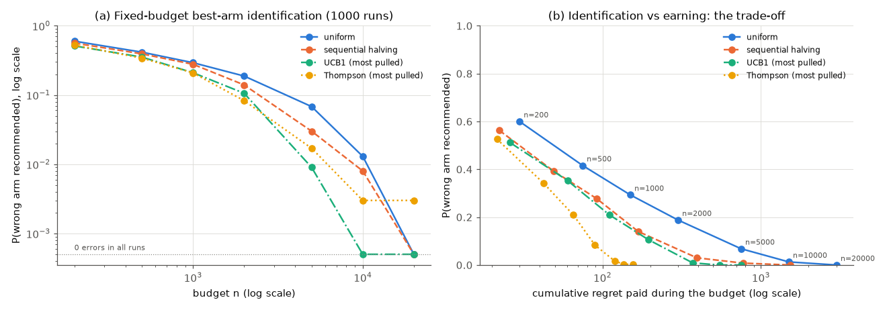

| budget $n$ | uniform | sequential halving | UCB1 (most pulled arm) | Thompson (most pulled arm) |
|---|---|---|---|---|
| 1,000 | 0.293 | 0.278 | 0.210 | 0.209 |
| 2,000 | 0.188 | 0.140 | 0.106 | 0.083 |
| 5,000 | 0.068 | 0.030 | 0.009 | 0.017 |
| 20,000 | 0.000 | 0.000 | 0.000 | 0.003 |
| *cumulative regret at $n = 20{,}000$* | 3000 | 1529 | 749 | 157 |

The table shows the probability of recommending the wrong arm (standard errors at most 0.016). Ties between empirical means are common with binomial counts, so every method breaks them at random. Four lessons:

* **Sequential halving beats uniform allocation**, clearly from $n = 2000$ on (0.140 vs 0.188; 0.030 vs 0.068 at $n = 5000$). At $n \le 1000$ the two are within noise.
* **Theory does not promise that dedicated BAI algorithms win at every finite budget.** Here the most-pulled arm of UCB1 or Thompson sampling is a better recommendation than either fixed-budget method at every budget up to 10,000. UCB1's large exploration constant makes it behave like an adaptive racing algorithm.
* **Earning and identifying conflict at the extremes.** Thompson sampling pays by far the least cumulative regret (157) but has the slowest-decaying error (0.003 at $n = 20{,}000$, where the others make no errors in 1000 runs): it gives the runner-up only about $\ln n/\mathrm{kl}$ samples, right for regret and too few to rule it out confidently. Bubeck, Munos and Stoltz (2009) proved this tension is fundamental. Panel (b) plots error against cumulative regret.
* **Fixed-confidence guarantees are conservative.** Successive elimination with $\delta = 0.05$ made no errors in 200 runs but used about 58,000 samples on average, while UCB1 reached 1% error with 5,000 samples and sequential halving with 10,000.

---

## 16. From bandits to full reinforcement learning

Bandits contain the exploration half of RL in pure form. Full RL adds states, and with them the problem that an action's value depends on everything that comes after it. The rest of the course needs new machinery for that:

* **Values of states, not just actions.** The single number $v_\ast$ becomes a function $v_\ast(s)$ that satisfies the Bellman equations of [Chapter 01](01-the-rl-problem.md). With a model they can be solved by dynamic programming ([Chapter 03](03-dynamic-programming.md)). Without one they are estimated from experience using exactly the incremental update (3.2), with targets that are returns ([Chapter 04](04-monte-carlo.md)) or bootstrapped estimates ([Chapter 05](05-temporal-difference.md)).
* **ε-greedy and softmax policies** return almost unchanged as the default exploration schemes of SARSA, Q-learning and DQN ([Chapters 05](05-temporal-difference.md) and [09](09-deep-q-learning.md)). The gradient bandit becomes REINFORCE and actor-critic ([Chapter 10](10-policy-gradients.md)).
* **Deep exploration.** In an MDP, a good exploratory action may pay off only after a long sequence of further actions, so per-step dithering (ε-greedy) can need exponentially many episodes. Optimism (UCRL2, R-MAX, count bonuses) and posterior sampling (PSRL, randomised value functions) carry the ideas of §6–7 to MDPs, with regret bounds that generalise those of §11 ([Chapter 14](14-exploration.md), [Chapter 19](19-rl-theory.md)).
* **Bandits inside planners.** UCT and AlphaZero's PUCT select moves in the search tree with bandit rules ([Chapter 07](07-planning-and-learning-tabular.md), [Chapter 13](13-model-based-rl.md)).

---

## In code

All scripts run from the repository root, accept `--quick` (a smoke test that writes no figures), fix their seeds, and print their settings and a results summary. Runtimes were measured on one CPU core of a shared machine.

| Script | Demonstrates | Quick / full | Results reported in |
|---|---|---|---|
| [`bandits.py`](../code/ch02_multi_armed_bandits/bandits.py) | library + self-test, incl. a check that ETC really commits | 1.3 s / 2.9 s | §3 (loop vs vectorized ε-greedy: 1.255 vs 1.258) |
| [`testbed_greedy_vs_epsilon.py`](../code/ch02_multi_armed_bandits/testbed_greedy_vs_epsilon.py) | greedy vs ε-greedy | 1.0 s / 12 s | §2.3 |
| [`nonstationary.py`](../code/ch02_multi_armed_bandits/nonstationary.py) | constant step size on a drifting bandit; initial bias | 1.6 s / 54 s | §4.4 |
| [`testbed_optimistic_ucb.py`](../code/ch02_multi_armed_bandits/testbed_optimistic_ucb.py) | optimism, UCB, the step-11 spike | 0.7 s / 4.5 s | §5, §6.4 |
| [`concentration.py`](../code/ch02_multi_armed_bandits/concentration.py) | Hoeffding vs exact tails | 1.0 s / 1.8 s | §6.2–6.3 |
| [`thompson_sampling.py`](../code/ch02_multi_armed_bandits/thompson_sampling.py) | Beta posteriors; all methods | 1.9 s / 7.7 s | §7.3, §7.5 |
| [`gradient_bandit.py`](../code/ch02_multi_armed_bandits/gradient_bandit.py) | gradient check; baselines | 1.9 s / 14 s | §8.3 |
| [`parameter_study.py`](../code/ch02_multi_armed_bandits/parameter_study.py) | Figure 2.6 extended; paired s.e. | 1.9 s / 35 s | §10 |
| [`regret_bernoulli.py`](../code/ch02_multi_armed_bandits/regret_bernoulli.py) | regret, Lai–Robbins, decomposition, ETC expectation | 2.6 s / 84 s | §11.2–11.6 |
| [`regret_vs_gap.py`](../code/ch02_multi_armed_bandits/regret_vs_gap.py) | minimax $\sqrt{T}$; exact ETC | 2.9 s / 50 s | §11.7 |
| [`exp3_adversarial.py`](../code/ch02_multi_armed_bandits/exp3_adversarial.py) | adversarial bandits, EXP3 | 1.2 s / 29 s | §12.3 |
| [`linucb_contextual.py`](../code/ch02_multi_armed_bandits/linucb_contextual.py) | LinUCB, linear TS | 0.9 s / 8 s | §13.4 |
| [`best_arm_identification.py`](../code/ch02_multi_armed_bandits/best_arm_identification.py) | pure exploration | 0.7 s / 48 s | §15 |
| [`exercise_solutions.py`](../code/ch02_multi_armed_bandits/exercise_solutions.py) | Exercises 2.9, 2.13, 2.14 | 9.1 s / 108 s | the solutions |

Three implementation patterns are worth copying.

**Vectorize over independent runs, not over time.** Bandit experiments need thousands of runs to average out noise. Each agent keeps arrays of shape `[runs, k]` and updates all runs at once with fancy indexing. The per-run logic is unchanged, and `bandits.py` checks it against a plain loop:

```python
def update(self, a, r):                       # ActionValueAgent, Eq. (3.1) / (4.1)
    rows = self.rows                           # np.arange(runs)
    self.N[rows, a] += 1
    step = 1.0 / self.N[rows, a] if self.alpha is None else self.alpha
    self.Q[rows, a] += step * (r - self.Q[rows, a])
```

**Break ties at random.** `np.argmax` returns the *first* maximum. With $Q_1 = 0$ for every arm, a greedy agent using it would always start with arm 0 and keep it as long as its estimate stays $\ge 0$; it would then move to arm 1, and so on, in index order rather than at random. An optimistic agent would likewise sweep the arms in index order:

```python
def argmax_random_ties(X, rng):
    is_max = X == X.max(axis=1, keepdims=True)
    return np.argmax(np.where(is_max, rng.random(X.shape), -1.0), axis=1)
```

**Use common random numbers and report uncertainty.** Every method in a comparison sees the same problems (`GaussianBandit.testbed(runs, 10, np.random.default_rng(seed))`). The scripts report standard errors, and §10 shows why *paired* standard errors (0.001–0.004 there) are the right yardstick for differences between methods, not the 0.013 of a single point.

The UCB and gradient-bandit agents are a few lines each:

```python
# UCB.act, Eq. (6.5): untried arms first, then the optimistic index
bonus = self.c * np.sqrt(np.log(t) / np.maximum(self.N, 1))
index = np.where(self.N == 0, np.inf, self.Q + bonus)
return argmax_random_ties(index, self.rng)

# GradientBandit.update, Eq. (8.2): the baseline uses rewards BEFORE R_t
b = r if self.t == 1 else self.Rbar          # at t = 1 this makes the update zero (S&B convention)
self.H += self.alpha * (r - b)[:, None] * (onehot - self.pi)
self.Rbar += (r - self.Rbar) / self.t
```

---

## Common pitfalls and misconceptions

* **"ε-greedy converges, so it is fine."** Its *estimates* converge, but a fixed ε pays $\varepsilon\,T\sum_a\Delta_a/k$ regret forever (11.4). Decay exploration, or use a method whose exploration fades on its own.
* **Deterministic tie-breaking.** `np.argmax` on equal values always returns the first index. A greedy agent then always starts with arm 0 and abandons it only when its estimate drops below 0, sweeping the arms in index order, and optimistic and UCB agents are distorted in their first steps. It also biases evaluations: in §15, recommending `argmax` of binomial means favours whichever arm has the lowest index.
* **Explore-then-commit that does not commit.** If an ETC implementation keeps taking $\arg\max_a Q(a)$ after the exploration phase while $Q$ is still updated, it becomes "explore first, then greedy", which can undo a wrong commitment. That is a different algorithm from Algorithm 11.1 and from an A/B test that deploys the winner. Fix $\hat A$ once.
* **Optimistic initial values with sample averages.** With $\alpha_n = 1/n$ the first reward overwrites $Q_1$, so the optimism lasts exactly one pull per arm. Use a constant step size, or use UCB.
* **UCB constants out of context.** UCB1's $\sqrt{2\ln t/N}$ assumes rewards in $[0,1]$. For other scales or noise levels, $c$ must be rescaled. On the testbed, $c = 1/2$ to $1$ worked best, $c = 2$ was fine, and $c = 4$ was clearly worse (§10).
* **The wrong likelihood in Thompson sampling.** Beta–Bernoulli Thompson sampling needs rewards in $\{0, 1\}$. Our first self-test crashed (a Beta parameter went negative) when it fed Gaussian rewards to the Beta agent. Use a Gaussian model for real-valued rewards. For rewards in $[0,1]$, Agrawal and Goyal's trick is to replace each reward $r$ by a Bernoulli($r$) sample.
* **A baseline that depends on the current action.** In the gradient bandit, the baseline must not use $A_t$ or $R_t$. Including $R_t$ in the average only scaled the expected update by $1 - 1/t$ in our test (0.800 at $t = 5$), but $B = q_\ast(A_t)$ destroyed the gradient and a noisy $Q(A_t)$ turned it almost orthogonal to the true one (§8.3).
* **Reading Lai–Robbins as a finite-time bound.** It is asymptotic. Good algorithms can sit *below* $C\ln T$ at practical horizons, as KL-UCB and TS did, without contradicting it.
* **"Logarithmic regret" as a worst-case guarantee.** The constant contains $1/\Delta_a$. For a fixed horizon, the worst instance has $\Delta \approx \sqrt{k/T}$, and the worst-case regret is $\Theta(\sqrt{kT})$ (§11.7).
* **% optimal action as the only metric.** It ignores how bad the non-optimal choices are. Regret, which weights each mistake by its gap, is the principled measure.
* **Forgetting stationarity assumptions.** Sample averages, Beta/Gaussian posteriors and UCB counts all assume fixed $q_\ast$. Under drift they become overconfident (§4.4).
* **Treating bandit data as an i.i.d. sample.** Adaptively collected data give biased naive estimates of arm means and effect sizes. Use designs made for inference (A/B tests, randomisation floors), or estimators that correct for the adaptivity.
* **Logging only the chosen action.** Off-policy evaluation needs the *probability* with which each action was chosen. Deterministic policies such as greedy or UCB log probabilities of 0 and 1, which makes their data useless for evaluating other policies.
* **Mixing up benchmarks.** Adversarial regret compares with the best *fixed* arm, contextual regret with the best *context-dependent* action, and nonstationary ("dynamic") regret with the best arm *at each time*. A small regret against one benchmark says little about the others (§12.3 b).

---

## Historical notes and key papers

* **Origins.** Thompson (1933, *Biometrika*) proposed sampling treatments according to the posterior probability that each is better. This is arguably the first bandit algorithm, and it was motivated by clinical trials. Robbins (1952, *Bulletin of the AMS*, "Some aspects of the sequential design of experiments") formulated the multi-armed bandit as a problem of sequential design. Bush and Mosteller's *Stochastic Models for Learning* (1955) and the learning-automata literature (Narendra & Thathachar, *Learning Automata: An Introduction*, 1989) studied related learning rules.
* **Bayes-optimal indices.** Gittins and Jones (1974) and Gittins (1979, *Journal of the Royal Statistical Society B*) proved the index theorem for discounted Bayesian bandits.
* **Lower bounds and asymptotic optimality.** Lai and Robbins (1985, *Advances in Applied Mathematics*, "Asymptotically efficient adaptive allocation rules") proved the $\ln T$ lower bound and gave the first asymptotically optimal UCB-style rules. Agrawal (1995, *Advances in Applied Probability*) introduced simpler sample-mean-based index policies. Burnetas and Katehakis (1996, *Advances in Applied Mathematics*) generalised the bound.
* **Finite-time analysis.** Auer, Cesa-Bianchi and Fischer (2002, *Machine Learning*, "Finite-time analysis of the multiarmed bandit problem") introduced UCB1 and $\varepsilon_n$-greedy and proved bounds that hold at every $T$. Garivier and Cappé (2011, COLT) introduced KL-UCB. Audibert and Bubeck (2009, COLT) gave MOSS, which is minimax-optimal.
* **Adversarial bandits.** Auer, Cesa-Bianchi, Freund and Schapire introduced EXP3 and EXP4 (FOCS 1995, "Gambling in a rigged casino"; journal version *SIAM Journal on Computing*, 2002, "The nonstochastic multiarmed bandit problem"), together with the $\sqrt{kT}$ lower bound. The full-information ancestors are the weighted majority algorithm (Littlestone & Warmuth, 1994, *Information and Computation*) and Hedge (Freund & Schapire, 1997, *Journal of Computer and System Sciences*). Zimmert and Seldin (2021, *JMLR*) gave Tsallis-INF, which is optimal in both regimes.
* **Thompson sampling revived.** Chapelle and Li (2011, NIPS, "An empirical evaluation of Thompson sampling") showed its practical strength. Agrawal and Goyal (2012, COLT) and Kaufmann, Korda and Munos (2012, ALT) proved logarithmic regret and asymptotic optimality. Russo and Van Roy (2014, *Mathematics of Operations Research*, "Learning to optimize via posterior sampling") bounded Thompson sampling's Bayesian regret via a connection to UCB algorithms and the eluder dimension, and later (2016, *JMLR*, "An information-theoretic analysis of Thompson sampling") gave an information-theoretic analysis.
* **Contextual bandits.** Langford and Zhang (2007, NIPS) introduced Epoch-Greedy. Li, Chu, Langford and Schapire (2010, WWW) introduced LinUCB and applied it to Yahoo! news. Chu, Li, Reyzin and Schapire (2011, AISTATS) and Abbasi-Yadkori, Pál and Szepesvári (2011, NIPS) analysed linear UCB algorithms. Agrawal and Goyal (2013, ICML) analysed linear Thompson sampling. Li, Chu, Langford and Wang (2011, WSDM) introduced offline replay evaluation.
* **Pure exploration.** Even-Dar, Mannor and Mansour (COLT 2002; *JMLR* 2006) introduced successive elimination, and Mannor and Tsitsiklis (2004, *JMLR*) proved the matching lower bound. Bubeck, Munos and Stoltz (2009, ALT) introduced simple regret and its trade-off with cumulative regret. Audibert, Bubeck and Munos (2010, COLT) and Karnin, Koren and Somekh (2013, ICML) gave fixed-budget algorithms (successive rejects, sequential halving). Jamieson and Talwalkar (2016, AISTATS) and Li, Jamieson, DeSalvo, Rostamizadeh and Talwalkar (2018, *JMLR*, Hyperband) carried these ideas to hyperparameter optimisation.
* **Bandits in search.** Kocsis and Szepesvári (2006, ECML, "Bandit based Monte-Carlo planning") introduced UCT, the UCB1-in-a-tree rule behind modern Monte Carlo tree search.
* **The textbook treatment.** Sutton and Barto (1998; 2nd ed. 2018, *Reinforcement Learning: An Introduction*, Ch. 2) introduced the 10-armed testbed; the 2nd edition added the gradient bandit and the parameter-study plot used here. The gradient bandit is a special case of Williams's REINFORCE (1992, *Machine Learning*) and descends from the reinforcement-comparison methods of Sutton's PhD thesis (1984). The softmax rule has a long history: as a model of choice it goes back to Luce's *Individual Choice Behavior* (1959), and the name "softmax" was coined by Bridle (1990). Cesa-Bianchi, Gentile, Lugosi and Neu (2017, NIPS, "Boltzmann exploration done right") proved that Boltzmann exploration with any monotone temperature schedule is suboptimal and proposed Boltzmann–Gumbel exploration.

---

## Summary

* A bandit is RL with a single state: actions have immediate, noisy, **evaluative** feedback and no effect on the future. It isolates the **exploration–exploitation** dilemma.
* Action values are estimated incrementally with $Q \leftarrow Q + \alpha_n[R - Q]$. Use $\alpha_n = 1/n$ (sample average: unbiased for a fixed number of i.i.d. samples, and convergent) for stationary problems, and a constant $\alpha$ (recency-weighted, tracks change, never converges) for nonstationary ones.
* Exploration strategies, from crude to principled: **ε-greedy** (uniform random exploration), **optimistic initialisation** (exploration that wears off), **Boltzmann** (graded by value, scale-sensitive), **UCB** (optimism with confidence bounds from Hoeffding), **Thompson sampling** (probability matching on a posterior), and the **gradient bandit** (stochastic gradient ascent on expected reward, with a baseline for variance reduction).
* **Regret** $= \sum_a \Delta_a\,\mathbb E[N_T(a)]$. Fixed exploration gives linear regret. UCB, KL-UCB and Thompson sampling get logarithmic regret. Lai–Robbins says no consistent algorithm can do better than $\sum_a \Delta_a\ln T/\mathrm{kl}(q_\ast(a), v_\ast)$ asymptotically, and KL-UCB and TS attain it. The worst case over instances is $\Theta(\sqrt{kT})$.
* **Adversarial** bandits require randomisation. EXP3 (exponential weights with importance-weighted estimates) achieves $\sqrt{2Tk\ln k}$ against the best fixed arm, at the price of $\sqrt T$ rather than $\ln T$ rates on easy stochastic problems.
* **Contextual** bandits sit between bandits and full RL: actions depend on a context but do not affect future contexts. LinUCB applies optimism to ridge-regression estimates with width $\lVert\mathbf x\rVert_{\mathbf A^{-1}}$.
* In practice: A/B tests are explore-then-commit and are best for inference. Bandits are best for earning while learning. Log action probabilities. Watch out for nonstationarity and delayed feedback.
* **Best-arm identification** optimises the final decision, not the reward along the way. Methods that minimise cumulative regret identify the best arm more slowly in the limit.

## Key equations

| Name | Equation |
|---|---|
| Action value, gap (1.1–1.2) | $q_\ast(a) = \mathbb E[R_t \mid A_t = a]$, $v_\ast = \max_a q_\ast(a)$, $\Delta_a = v_\ast - q_\ast(a)$ |
| ε-greedy probabilities (2.3) | $1 - \varepsilon + \varepsilon/k$ for the greedy arm, $\varepsilon/k$ for each other arm |
| Incremental update (3.1)–(3.2) | $Q_{n+1} = Q_n + \alpha_n[R_n - Q_n]$, with $\alpha_n = 1/n$ for the sample average |
| Recency weighting (4.2) | $Q_{n+1} = (1-\alpha)^nQ_1 + \sum_{i=1}^n\alpha(1-\alpha)^{n-i}R_i$ |
| Robbins–Monro (4.3) | $\sum_n\alpha_n = \infty$, $\sum_n\alpha_n^2 < \infty$ |
| Unbiased constant step (4.4) | $\beta_n = \alpha/\bar o_n$, $\bar o_n = \bar o_{n-1} + \alpha(1 - \bar o_{n-1})$, $\bar o_0 = 0$ |
| Hoeffding (6.1) | $\Pr\{\bar X_n - \mu \ge u\} \le e^{-2n u^2}$ for $X_i \in [0,1]$ |
| UCB (6.4)–(6.5) | $A_t = \arg\max_a[Q_t(a) + c\sqrt{\ln t/N_t(a)}]$; UCB1: $c = \sqrt2$ |
| Probability matching (7.1) | $\Pr\{A_t = a \mid \mathcal F_{t-1}\} = \Pr\{a = \arg\max_b q_\ast(b) \mid \mathcal F_{t-1}\}$ |
| Beta posterior (7.2) | $\mathrm{Beta}(\alpha_0 + S, \beta_0 + F)$ |
| Gaussian posterior (7.3) | $\rho_n = 1/s_0^2 + n/\sigma^2$, $m_n = (m_0/s_0^2 + S/\sigma^2)/\rho_n$ |
| Softmax policy (8.1) | $\pi_t(a) = e^{H_t(a)}/\sum_b e^{H_t(b)}$ |
| Gradient bandit (8.2) | $H_{t+1}(a) = H_t(a) + \alpha(R_t - \bar R_t)(\mathbb 1[a = A_t] - \pi_t(a))$ |
| Exact gradient (8.7) | $\partial J/\partial H(a) = \pi(a)(q_\ast(a) - J)$, $J = \sum_x\pi(x)q_\ast(x)$ |
| Boltzmann (9.1)–(9.2) | $\pi(a) \propto e^{Q(a)/\tau}$, the maximiser of $\sum_a\pi(a)Q(a) + \tau\mathcal H(\pi)$ |
| Regret decomposition (11.3) | $\mathbb E[\mathrm{Reg}(T)] = \sum_a\Delta_a\,\mathbb E[N_T(a)]$ |
| Lai–Robbins (11.6) | $\liminf_T \mathbb E[\mathrm{Reg}(T)]/\ln T \ge \sum_{a:\Delta_a>0}\Delta_a/\mathrm{kl}(q_\ast(a), v_\ast)$ |
| UCB1 bound (11.8) | $\mathbb E[\mathrm{Reg}(T)] \le 8\sum_{a:\Delta_a>0}\ln T/\Delta_a + (1 + \pi^2/3)\sum_a\Delta_a$ |
| Explore-then-commit (11.9) | $\mathbb E[\mathrm{Reg}(T)] \le m\Delta + (T-2m)\Delta e^{-m\Delta^2/2}$ (two arms) |
| Minimax (11.10)–(11.11) | $c_0\sqrt{kT} \le \text{worst-case }\mathbb E[\mathrm{Reg}(T)]$; UCB1 $\le \sqrt{32kT\ln T} + O(k)$ |
| EXP3 (12.2)–(12.4) | $\hat\ell_t(a) = \ell_t(a)\mathbb 1[A_t=a]/P_t(a)$; $P_t(a) \propto e^{-\eta\hat L_{t-1}(a)}$; $\mathrm{Reg}(T) \le \sqrt{2Tk\ln k}$ |
| LinUCB (13.2), (13.5) | $\hat{\boldsymbol\theta}_a = \mathbf A_a^{-1}\mathbf b_a$; $A_t = \arg\max_a[\mathbf x_t^\top\hat{\boldsymbol\theta}_a + \alpha\lVert\mathbf x_t\rVert_{\mathbf A_a^{-1}}]$ |
| Sherman–Morrison (13.6) | $(\mathbf A + \mathbf x\mathbf x^\top)^{-1} = \mathbf A^{-1} - \mathbf A^{-1}\mathbf x\mathbf x^\top\mathbf A^{-1}/(1 + \mathbf x^\top\mathbf A^{-1}\mathbf x)$ |
| BAI complexity (15.1) | $H_1 = \sum_{a\ne a^\ast}\Delta_a^{-2}$ |

---

## Exercises

**Exercise 2.1 ★ (ε-greedy probabilities).** In ε-greedy action selection with two actions and ε = 0.5, what is the probability that the greedy action is selected? Generalise to $k$ actions, and then to the case where $m$ actions are tied for the maximum and ties are broken uniformly at random.

<details><summary>Solution</summary>

With probability $1 - \varepsilon = 0.5$ the agent acts greedily. With probability $0.5$ it picks uniformly among the two actions, which selects the greedy action half the time. Total: $0.5 + 0.5 \times 0.5 = 0.75$. With $k$ actions this is $1 - \varepsilon + \varepsilon/k$, as in (2.3).

With $m$ tied maximisers, the greedy branch spreads its probability $1-\varepsilon$ evenly over the $m$ tied actions. Each tied action is chosen with probability $(1-\varepsilon)/m + \varepsilon/k$, and each other action with probability $\varepsilon/k$. Check: $m[(1-\varepsilon)/m + \varepsilon/k] + (k-m)\varepsilon/k = 1$.

</details>

**Exercise 2.2 ★ (which steps explored?).** A 3-armed ε-greedy agent uses sample averages with $Q_1 = 0$ and breaks ties at random. It produces $A_1 = 1, R_1 = 1$; $A_2 = 2, R_2 = -1$; $A_3 = 1, R_3 = 0$; $A_4 = 3, R_4 = 2$; $A_5 = 1, R_5 = 1$. On which steps did the ε case *definitely* occur? On which could it have occurred?

<details><summary>Solution</summary>

Track $Q$ before each step:

* $t=1$: $Q = (0,0,0)$, a three-way tie, so any action is greedy. Afterwards $Q_1 = 1$.
* $t=2$: $Q = (1,0,0)$, so the greedy action is 1. $A_2 = 2$ is **definitely** exploration. Afterwards $Q_2 = -1$.
* $t=3$: $Q = (1,-1,0)$, so the greedy action is 1, and $A_3 = 1$ is consistent with greedy. Afterwards $Q_1 = (1+0)/2 = 0.5$.
* $t=4$: $Q = (0.5,-1,0)$, so the greedy action is 1. $A_4 = 3$ is **definitely** exploration. Afterwards $Q_3 = 2$.
* $t=5$: $Q = (0.5,-1,2)$, so the greedy action is 3. $A_5 = 1$ is **definitely** exploration.

Exploration definitely occurred at $t = 2, 4, 5$. It *could* have occurred at every step, including $t = 1$ and $t = 3$, because the uniform random choice can land on the greedy action.

</details>

**Exercise 2.3 ★ (optimism and sample averages).** Suppose the testbed's optimistic agent ($Q_1 = 5$, ε = 0) used sample averages instead of α = 0.1. Describe its behaviour precisely. What fraction of runs would choose the optimal action at step 11, and what happens afterwards?

<details><summary>Solution</summary>

With $\alpha_n = 1/n$ the first update is $Q \leftarrow Q + 1\cdot(R - Q) = R$, so the optimistic value is erased after one pull. Untried arms keep $Q = 5$, which exceeds any realistic reward, so the agent tries each arm exactly once in steps 1–10. Its estimates are then the ten single rewards. At step 11 it picks the arm with the highest single reward, which is the best arm about 42% of the time (the script measured 41.8% for this probability on the testbed's problems). From then on it is a pure greedy sample-average agent. It keeps pulling the leader until that arm's mean falls below some other arm's *single* reward. Arms that drew an unlucky first reward are never revisited, so it inherits greedy's tendency to lock in. Optimism with a constant step size works better because the optimism decays over several pulls of each arm instead of one.

</details>

**Exercise 2.4 ★ (the UCB spike).** For UCB with $c = 2$ on the testbed, show that step 11 selects the arm with the highest first reward. At step 12, by how much must that arm's estimate exceed every other arm's estimate for it to be chosen again? Use this to explain why the spike collapses.

<details><summary>Solution</summary>

After steps 1–10 every arm has $N = 1$, because untried arms are chosen first and each step tries a new one. At $t = 11$ every bonus equals $2\sqrt{\ln 11/1}$, so the argmax of $Q + \text{bonus}$ is the argmax of $Q$, the single rewards. At $t = 12$ the chosen arm has $N = 2$ and bonus $2\sqrt{\ln 12/2} = 2(1.1147) = 2.229$. Every other arm has bonus $2\sqrt{\ln 12} = 3.153$. To be chosen again, the arm's estimate must exceed every other arm's by $0.923$. Its estimate is now the average of two rewards, and the rewards have standard deviation 1, so this often fails: some other arm's single reward plus the larger bonus wins. The measured average reward drops from 1.06 to 0.88.

</details>

**Exercise 2.5 ★★ (the unbiased constant step size).** Prove that with step size (4.4) the estimate satisfies $Q_{n+1} = \frac{1}{\bar o_n}\sum_{i=1}^n\alpha(1-\alpha)^{n-i}R_i$. That is, it is an exponential recency-weighted average with no dependence on $Q_1$.

<details><summary>Solution</summary>

First, $1 - \bar o_n = 1 - \bar o_{n-1} - \alpha(1 - \bar o_{n-1}) = (1-\alpha)(1 - \bar o_{n-1})$, so $1 - \bar o_n = (1-\alpha)^n$ and $\bar o_n = 1 - (1-\alpha)^n = \alpha\sum_{i=1}^n(1-\alpha)^{n-i}$. The proposed weights therefore sum to one.

Now use induction. For $n = 1$: $\beta_1 = \alpha/\alpha = 1$, so $Q_2 = R_1$, which matches the formula. For the step, note

$$
1 - \beta_n = \frac{\bar o_n - \alpha}{\bar o_n} = \frac{\bar o_{n-1} + \alpha - \alpha\bar o_{n-1} - \alpha}{\bar o_n} = \frac{(1-\alpha)\bar o_{n-1}}{\bar o_n}.
$$

Then

$$
\begin{aligned}
Q_{n+1} &= (1-\beta_n)Q_n + \beta_nR_n = \frac{(1-\alpha)\bar o_{n-1}}{\bar o_n}\cdot\frac{1}{\bar o_{n-1}}\sum_{i=1}^{n-1}\alpha(1-\alpha)^{n-1-i}R_i + \frac{\alpha}{\bar o_n}R_n \\
&= \frac{1}{\bar o_n}\Big[\sum_{i=1}^{n-1}\alpha(1-\alpha)^{n-i}R_i + \alpha R_n\Big] = \frac{1}{\bar o_n}\sum_{i=1}^{n}\alpha(1-\alpha)^{n-i}R_i .
\end{aligned}
$$

There is no $Q_1$ term, so the estimate is unbiased for i.i.d. rewards. The relative weights $(1-\alpha)^{n-i}$ are those of the constant step size, so it still tracks change.

</details>

**Exercise 2.6 ★★ (Gaussian posterior, one observation at a time).** Starting from prior $\mathcal N(m_0, s_0^2)$ and known noise $\sigma^2$, derive the posterior after a *single* observation $r$. Show that applying this update $n$ times gives (7.3). What happens as $s_0 \to \infty$?

<details><summary>Solution</summary>

For one observation, $\ln p(\theta\mid r) = -\frac{(\theta-m_0)^2}{2s_0^2} - \frac{(r-\theta)^2}{2\sigma^2} + \text{const}$. The coefficient of $-\theta^2/2$ is $\rho_1 = 1/s_0^2 + 1/\sigma^2$, and the coefficient of $\theta$ is $m_0/s_0^2 + r/\sigma^2$. Completing the square gives $\mathcal N(m_1, 1/\rho_1)$ with $m_1 = (m_0/s_0^2 + r/\sigma^2)/\rho_1$. In words: precision adds $1/\sigma^2$, and the precision-weighted sum adds $r/\sigma^2$.

Applying this $n$ times, each time using the previous posterior as the prior, the precision becomes $1/s_0^2 + n/\sigma^2 = \rho_n$ and the precision-weighted sum becomes $m_0/s_0^2 + S/\sigma^2$. Dividing gives $m_n$, which is (7.3). The order of the observations does not matter, as it must not for i.i.d. data.

As $s_0 \to \infty$ (a flat prior), $\rho_n \to n/\sigma^2$ and $m_n \to S/n$. The posterior becomes $\mathcal N(\bar r, \sigma^2/n)$, the sampling distribution of the sample mean. Gaussian Thompson sampling with a flat prior then samples from $\mathcal N(Q_t(a), \sigma^2/N_t(a))$, a randomised analogue of UCB's $1/\sqrt{N}$ width. Untried arms have infinite variance and are tried first.

</details>

**Exercise 2.7 ★★ (two-armed softmax is logistic).** Show that with two actions the softmax (8.1) is the logistic function of the preference difference $D = H(1) - H(2)$. Write the gradient-bandit update (8.2) as an update of $D$, and interpret it.

<details><summary>Solution</summary>

$\pi(1) = e^{H(1)}/(e^{H(1)} + e^{H(2)}) = 1/(1 + e^{-(H(1)-H(2))}) = \sigma(D)$, where $\sigma$ is the logistic sigmoid. Write $\tilde R_t \doteq R_t - \bar R_t$ (the centred reward). If $A_t = 1$: $H(1)$ increases by $\alpha\tilde R_t(1-\pi(1))$ and $H(2)$ decreases by $\alpha\tilde R_t\pi(2) = \alpha\tilde R_t(1-\pi(1))$, so $D$ increases by $2\alpha\tilde R_t(1 - \pi(1))$. If $A_t = 2$: $H(1)$ decreases by $\alpha\tilde R_t\pi(1)$ and $H(2)$ increases by $\alpha\tilde R_t(1 - \pi(2)) = \alpha\tilde R_t\pi(1)$, so $D$ decreases by $2\alpha\tilde R_t\pi(1)$. Both cases combine to

$$
D \leftarrow D + 2\alpha\,(R_t - \bar R_t)\,\big(\mathbb 1[A_t = 1] - \sigma(D)\big).
$$

This is the stochastic-gradient step of logistic regression with "label" $\mathbb 1[A_t = 1]$, weighted by how much better than average the outcome was. The agent imitates its own actions in proportion to their advantage. This view returns in policy gradients ([Chapter 10](10-policy-gradients.md)) and in RLHF ([Chapter 18](18-rl-for-language-models.md)).

</details>

**Exercise 2.8 ★★ (a baseline that includes the current reward).** Suppose the gradient bandit uses $B_t = \frac{(t-1)\bar R + R_t}{t}$, where $\bar R$ is the average of $R_1,\dots,R_{t-1}$ and is independent of $A_t$ given the past. Show that the expected update is $(1 - 1/t)$ times the true gradient. Give an example of an action-dependent baseline that destroys the gradient entirely.

<details><summary>Solution</summary>

$R_t - B_t = R_t - \frac{t-1}{t}\bar R - \frac1t R_t = \frac{t-1}{t}(R_t - \bar R)$. So the update equals $(1 - 1/t)$ times the update with baseline $\bar R$, which is unbiased by (8.5). Its expectation is $(1-1/t)\,\partial J/\partial H(a)$. `gradient_bandit.py` measured a projection ratio of 0.800 at $t = 5$, against a prediction of $1 - 1/5 = 0.8$. Here the dependence on $A_t$ only shrinks the step.

Genuinely action-dependent baselines change the expected update itself. The extreme example is $B_t = R_t$: every update is zero, whatever the rewards. Less obviously, $B_t = q_\ast(A_t)$ also has expected update exactly zero, because $\mathbb E[R_t - q_\ast(A_t) \mid A_t] = 0$ (§8.3 measured a mean update of 0.001 times the gradient's length). With an estimate, $B_t = Q_t(A_t)$, the expected update is

$$
\mathbb E\big[(R_t - Q_t(A_t))(\mathbb 1[a = A_t] - \pi_t(a))\big] = \pi_t(a)\Big[\big(q_\ast(a) - Q_t(a)\big) - \sum_x \pi_t(x)\big(q_\ast(x) - Q_t(x)\big)\Big].
$$

It responds only to the estimation errors, not to $q_\ast(a) - J$. With perfect estimates it is exactly zero for every policy, so the gradient is destroyed; with imperfect ones it points in an essentially arbitrary direction (cosine $-0.05$ with the true gradient in §8.3).

</details>

**Exercise 2.9 ★★ (explore-then-commit; code).** (a) Derive (11.9) and show that it is minimised near $m^\ast = \frac{2}{\Delta^2}\ln\frac{T\Delta^2}{2}$. (b) For $q_\ast = (0.6, 0.5)$ and $T = 10{,}000$, compute the exact expected regret of ETC as a function of $m$ (no simulation needed) and compare it with the bound. (c) What goes wrong when $\Delta$ is unknown?

<details><summary>Solution</summary>

(a) Exploration pulls the bad arm $m$ times, which costs $m\Delta$. After exploration, the remaining $T - 2m$ steps cost $\Delta$ each if the commitment is wrong, and by Hoeffding on the paired differences (§11.6) that happens with probability at most $e^{-m\Delta^2/2}$. This gives (11.9). Approximate $T - 2m \approx T$ and differentiate: $\Delta - T\Delta\frac{\Delta^2}{2}e^{-m\Delta^2/2} = 0$, so $e^{-m\Delta^2/2} = 2/(T\Delta^2)$ and $m^\ast = \frac{2}{\Delta^2}\ln\frac{T\Delta^2}{2}$. The bound at $m^\ast$ is about $\frac{2}{\Delta}\big(1 + \ln\frac{T\Delta^2}{2}\big)$, which is logarithmic in $T$.

(b) `exercise_solutions.py` computes $\Pr\{\text{commit wrong}\} = \Pr\{S_2 > S_1\} + \frac12\Pr\{S_1 = S_2\}$ exactly from binomial distributions, with $S_i \sim \mathrm{Bin}(m, q_\ast(i))$:

| $m$ | 10 | 50 | 100 | 300 | 1000 |
|---|---|---|---|---|---|
| exact regret | 328.5 | 160.9 | 85.8 | 36.4 | 100.0 |
| bound (11.9) | 950.3 | 776.0 | 604.4 | 239.7 | 105.4 |

The exact optimum is $m = 276$, with regret 36.1. The closed-form $m^\ast \approx 783$ from (a) gives exact regret 78.3 (bound value 95.1). It is only approximate, because (a) replaced $T - 2m$ by $T$: the exact minimiser of (11.9) is $m = 759$ (bound value 94.97, exact regret 75.9). The bound is loose because Hoeffding ignores the variance of the differences: here $\mathrm{Var}(Y) = 0.24 + 0.25 = 0.49$, while Hoeffding effectively assumes the worst case $1$ for a variable with range 2. Following the bound over-explores by a factor of about 3 and roughly doubles the regret.

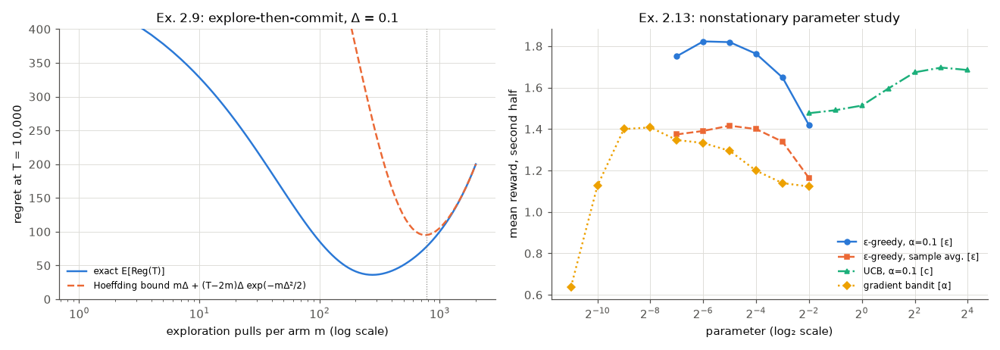

(c) $m^\ast$ depends on $\Delta$. If you design for $\Delta = 0.1$ but the true gap is $0.02$, the test is far too short and commits wrongly often, giving linear regret. If the true gap is $0.5$, you waste $m\Delta$ on exploration. Tuning $m$ for the worst case gives regret of order $T^{2/3}$ (balance $mk$ against $T\sqrt{1/m}$), worse than the $\sqrt{kT}$ of adaptive algorithms. This is the quantitative case for adaptive allocation (§11.7).

</details>

**Exercise 2.10 ★★ (greedy has linear regret).** A greedy agent with sample averages, $Q_1 = 0$ and random tie-breaking plays a two-armed Bernoulli bandit with $q_\ast = (0.6, 0.4)$. Show that $\mathbb E[\mathrm{Reg}(T)] \ge 0.04\,(T-1)$.

<details><summary>Solution</summary>

At $t = 1$ both estimates are 0, so the tie is broken at random and arm 2 is chosen with probability $1/2$. With probability $0.4$ it pays 1, so $Q(2) = 1$. From then on $Q(2)$ is the sample mean of arm 2's rewards, which include at least one 1, so $Q(2) \ge 1/N > 0 = Q(1)$ forever. Arm 1 is never pulled again. This event has probability $0.5 \times 0.4 = 0.2$, and on it the regret is $\Delta(T-1) + \Delta = 0.2T$. Hence $\mathbb E[\mathrm{Reg}(T)] \ge 0.2 \times 0.2 \times T \ge 0.04(T-1)$, which is linear. Exploration that never fades completely is necessary. The same lock-in produced greedy's measured regret of 3230 at $T = 20{,}000$ in §11.3.

</details>

**Exercise 2.11 ★★ (importance-weighted estimates in EXP3).** (a) Show that the reward estimate $\hat x_t(a) = x_t(a)\mathbb 1[A_t = a]/P_t(a)$ is unbiased, and compute its conditional variance. (b) The original EXP3 used rewards and mixed in uniform exploration, $P_t = (1-\gamma_{\mathrm{mix}})\,\text{softmax} + \gamma_{\mathrm{mix}}/k$, with a mixing rate $\gamma_{\mathrm{mix}} \in (0, 1]$ (not a discount factor). Explain why that version needs the mixing while the loss-based version of §12.2 does not.

<details><summary>Solution</summary>

(a) Conditionally on the history, $\mathbb E_t[\hat x_t(a)] = P_t(a)\cdot x_t(a)/P_t(a) = x_t(a)$. Also $\mathbb E_t[\hat x_t(a)^2] = x_t(a)^2/P_t(a)$, so $\mathrm{Var}_t(\hat x_t(a)) = x_t(a)^2(1/P_t(a) - 1)$, which is unbounded as $P_t(a) \to 0$.

(b) With rewards, the potential argument needs $\ln\sum_aP_t(a)e^{\eta\hat x_t(a)} \le \eta\sum_aP_t(a)\hat x_t(a) + (e-2)\eta^2\sum_aP_t(a)\hat x_t(a)^2$. This uses $e^y \le 1 + y + (e-2)y^2$, which holds only for $y \le 1$. That requires $\eta\hat x_t(a) \le \eta/P_t(a) \le 1$, so every probability must stay at least $\eta$, and the uniform mixing $\gamma_{\mathrm{mix}}/k$ enforces it. With losses, the exponent $-\eta\hat\ell_t(a)$ is *non-positive*, and $e^{-y} \le 1 - y + y^2/2$ holds for all $y \ge 0$ with no condition on $P_t$. Large estimates then only shrink a weight toward 0, instead of blowing it up.

</details>

**Exercise 2.12 ★★ (LinUCB with one-hot contexts).** Suppose there are $d$ discrete contexts encoded as one-hot vectors $\mathbf x = \mathbf e_j$. Show that disjoint LinUCB reduces to a separate bandit per context, with estimates and bonuses computed from per-(context, arm) counts. What is missing compared with UCB1?

<details><summary>Solution</summary>

With one-hot contexts, $\mathbf X_a^\top\mathbf X_a = \mathrm{diag}(n_{a,1}, \dots, n_{a,d})$, where $n_{a,j}$ counts the pulls of arm $a$ in context $j$. So $\mathbf A_a = \mathrm{diag}(\lambda + n_{a,j})$ and $\mathbf b_a$ has entries $S_{a,j}$, the reward sums. For context $j$, $\mathbf e_j^\top\hat{\boldsymbol\theta}_a = S_{a,j}/(\lambda + n_{a,j})$, a sample mean shrunk toward 0, and $\lVert\mathbf e_j\rVert_{\mathbf A_a^{-1}} = 1/\sqrt{\lambda + n_{a,j}}$. LinUCB therefore runs an independent UCB-style bandit in every context, with index $S_{a,j}/(\lambda+n_{a,j}) + \alpha/\sqrt{\lambda + n_{a,j}}$: the *tabular* contextual bandit.

What is missing is the $\sqrt{\ln t}$ growth of the bonus. With a fixed α, the width corresponds to a fixed confidence level. As discussed in §6.3, the agent can then abandon the best arm after an unlucky start, with probability that does not shrink. OFUL (Abbasi-Yadkori et al., 2011) multiplies the width by $\beta_t \approx \sigma\sqrt{d\ln(1 + t/(\lambda d)) + 2\ln(1/\delta)} + \sqrt\lambda\,\lVert\boldsymbol\theta\rVert$ (for contexts of norm at most 1), which grows like $\sqrt{\ln t}$, the analogue of UCB1's $\sqrt{\ln t}$. The example also shows what the linear model buys: with non-orthogonal features, information from one context transfers to others.

</details>

**Exercise 2.13 ★★★ (nonstationary parameter study; code).** Repeat the parameter study of §10 on the drifting bandit of §4.4, in the spirit of S&B Ex. 2.11. Use 20,000 steps and score each setting by its average reward over the last 10,000 steps. Include ε-greedy with α = 0.1 and with sample averages, UCB with α = 0.1, and the gradient bandit. What changes compared with the stationary study?

<details><summary>Solution</summary>

`exercise_solutions.py` (150 runs per point, all seeing the same drifting problems):

| method | best parameter | best score | worst on the grid |
|---|---|---|---|
| ε-greedy, constant α = 0.1 | ε = 1/64 | **1.823** | 1.418 (ε = 1/4) |
| UCB, constant α = 0.1 | $c = 8$ | 1.696 | 1.476 ($c = 1/4$) |
| ε-greedy, sample averages | ε = 1/32 | 1.416 | 1.163 (ε = 1/4) |
| gradient bandit | α = 1/256 | 1.408 | 0.638 (α = 1/2048) |

(The score is measured against rewards that drift upward, so only comparisons within this table are meaningful.)

Three things change compared with §10. First, the **constant step size matters more than the exploration rule**: the best constant-α ε-greedy beats the best sample-average ε-greedy by 0.41. Second, **UCB is no longer the winner, and its best $c$ is 8 times larger** than on the stationary testbed. Its counts $N_t(a)$ only grow, so its bonuses shrink as if the data were still relevant, and a large $c$ compensates by re-exploring more. Third, **the gradient bandit prefers a tiny step size**, and its curve has an interior peak: a step size that is too small (1/2048) does not learn at all within the horizon. With larger α its softmax becomes nearly deterministic, and by (8.7) the gradient for a now-better arm with $\pi(a) \approx 0$ vanishes, so the policy cannot follow the drift. Its baseline is also a stationary average. A constant-α baseline is a natural fix to try.

</details>

**Exercise 2.14 ★★★ (forgetting for Thompson sampling; code).** Make Gaussian Thompson sampling suitable for the drifting bandit by discounting its sufficient statistics: at every step, before the update, multiply every arm's $N$ and $S$ by a forgetting factor $\gamma_{\mathrm f} < 1$. Compare several values of $\gamma_{\mathrm f}$ with constant-α ε-greedy and stationary Thompson sampling on the problem of §4.4 (10,000 steps, second-half averages). Make the comparison fair.

<details><summary>Solution</summary>

The discounted statistics $N(a) \leftarrow \gamma_{\mathrm f} N(a) + \mathbb 1[A_t = a]$ and $S(a) \leftarrow \gamma_{\mathrm f} S(a) + R_t\mathbb 1[A_t = a]$ make the posterior (7.3) reflect about $1/(1-\gamma_{\mathrm f})$ recent steps. The posterior can no longer become arbitrarily confident, and an arm that has not been pulled for a while becomes uncertain again and gets re-explored.

```text
Algorithm E2.14  Discounted Gaussian Thompson sampling (known noise σ)
Input: k; prior mean m0 and standard deviation s0; noise σ; forgetting factor γ_f ∈ (0, 1)
Initialise, for a = 1..k:  N(a) <- 0, S(a) <- 0                     # discounted count and reward sum
Loop for t = 1, 2, ..., T:
    for a = 1..k:
        ρ <- 1/s0² + N(a)/σ² ;  m <- (m0/s0² + S(a)/σ²) / ρ          # Eq. (7.3) with discounted statistics
        θ(a) <- m + z / sqrt(ρ),  z ~ N(0, 1)
    A <- argmax_a θ(a);  R <- bandit(A)
    for a = 1..k:  N(a) <- γ_f N(a);  S(a) <- γ_f S(a)              # forget, for EVERY arm
    N(A) <- N(A) + 1;  S(A) <- S(A) + R
```

A fair comparison tunes both sides. Exercise 2.13 found small ε best for constant-α ε-greedy on this drift, so the script also runs ε = 1/32 and 1/16. Results from `exercise_solutions.py` (500 runs; the environment's random stream does not depend on the actions, so all agents see the same drift and noise, and paired differences are precise):

| agent | avg reward, 2nd half (± s.e.) | % optimal, 2nd half |
|---|---|---|
| ε-greedy, ε = 0.1, α = 0.1 | 1.171 ± 0.020 | 74.1% |
| ε-greedy, ε = 1/32, α = 0.1 | 1.242 ± 0.021 | 74.6% |
| ε-greedy, ε = 1/16, α = 0.1 | 1.218 ± 0.020 | 76.2% |
| Thompson, stationary | 0.957 ± 0.025 | 41.9% |
| discounted Thompson, $\gamma_{\mathrm f} = 0.99$ | 1.114 ± 0.023 | 66.4% |
| discounted Thompson, $\gamma_{\mathrm f} = 0.995$ | 1.186 ± 0.022 | 72.8% |
| discounted Thompson, $\gamma_{\mathrm f} = 0.998$ | 1.243 ± 0.022 | **76.8%** |
| discounted Thompson, $\gamma_{\mathrm f} = 0.999$ | **1.251** ± 0.021 | 74.7% |
| discounted Thompson, $\gamma_{\mathrm f} = 0.9995$ | 1.214 ± 0.021 | 67.7% |

Discounting lifts Thompson sampling from the worst method to roughly the level of a tuned constant-α ε-greedy. The best discounted sampler ($\gamma_{\mathrm f} = 0.999$) beats ε = 0.1 clearly (paired difference $+0.080 \pm 0.003$), but beats the tuned ε = 1/32 only by $+0.009 \pm 0.003$: detectable, but small. It also needs a long enough memory. With $\gamma_{\mathrm f} = 0.99$ the effective memory, about 100 steps, is shared among 10 arms, so each arm keeps only a handful of effective samples and the posteriors stay too wide to exploit. (In a first attempt with $\gamma_{\mathrm f} \le 0.99$ we saw exactly this and extended the grid.) With $\gamma_{\mathrm f} = 0.9995$ the agent forgets too slowly to track the drift. The best memory, a few hundred to a thousand steps, balances reward noise (σ = 1) against drift (0.01 per step). This bias–variance trade-off over the memory length is the same one that sets the best constant α.

</details>

**Exercise 2.15 ★★ (a gap-free bound for UCB1).** Starting from (11.3) and the per-arm bound $\mathbb E[N_T(a)] \le 8\ln T/\Delta_a^2 + 1 + \pi^2/3$ from §11.5, prove (11.10): $\mathbb E[\mathrm{Reg}(T)] \le \sqrt{32kT\ln T} + O(k)$ on every instance with rewards in $[0,1]$.

<details><summary>Solution</summary>

Fix any threshold $\Delta > 0$ and split the arms. For arms with $\Delta_a \le \Delta$, $\sum_a\Delta_a\mathbb E[N_T(a)] \le \Delta\sum_a\mathbb E[N_T(a)] \le \Delta T$. For arms with $\Delta_a > \Delta$,

$$
\Delta_a\,\mathbb E[N_T(a)] \le \frac{8\ln T}{\Delta_a} + \Big(1 + \frac{\pi^2}{3}\Big)\Delta_a \le \frac{8\ln T}{\Delta} + \Big(1+\frac{\pi^2}{3}\Big).
$$

Summing over at most $k$ such arms gives $\mathbb E[\mathrm{Reg}(T)] \le \Delta T + \frac{8k\ln T}{\Delta} + (1 + \frac{\pi^2}{3})k$. The first two terms are minimised at $\Delta = \sqrt{8k\ln T/T}$, where each equals $\sqrt{8kT\ln T}$. Their sum is $2\sqrt{8kT\ln T} = \sqrt{32kT\ln T}$, and the constant term is $O(k)$. $\square$

The bound holds simultaneously for every instance, so it bounds the worst case. Compared with the minimax lower bound $c\sqrt{kT}$ it is off only by $\sqrt{\ln T}$, which is the extra growth we measured for UCB1 in §11.7 (×2.17 instead of ×2 per quadrupling of $T$).

</details>

---

## Further reading

* **Sutton & Barto (2018), *Reinforcement Learning: An Introduction*, 2nd ed., Chapter 2.** The source of the testbed, the gradient bandit and the parameter-study methodology. Short and very readable. Its exercises complement ours.
* **Lattimore & Szepesvári (2020), *Bandit Algorithms*, Cambridge University Press** (a free version is on the authors' website). The definitive modern reference: concentration, UCB and its optimality, lower bounds (Ch. 13–16), adversarial bandits, linear and contextual bandits, pure exploration and Bayesian methods, all with complete proofs. Read Ch. 7–8 after §11.5, and Ch. 15–16 after §11.4–11.7.
* **Slivkins (2019), "Introduction to Multi-Armed Bandits", *Foundations and Trends in Machine Learning*.** A shorter, gentler textbook with excellent chapters on lower bounds and on bandits with economic constraints.
* **Bubeck & Cesa-Bianchi (2012), "Regret Analysis of Stochastic and Nonstochastic Multi-armed Bandit Problems", *Foundations and Trends in Machine Learning*.** A compact survey of the regret theory, including the clean EXP3 proof used in §12.2.
* **Russo, Van Roy, Kazerouni, Osband & Wen (2018), "A Tutorial on Thompson Sampling", *Foundations and Trends in Machine Learning*.** Thompson sampling from Bernoulli bandits to shortest paths and reinforcement learning, with practical advice on approximate posteriors.
* **Cesa-Bianchi & Lugosi (2006), *Prediction, Learning, and Games*, Cambridge University Press.** The theory of online learning against adversaries, of which EXP3 is the bandit special case. It links to the game-theoretic material of [Chapter 17](17-multi-agent-rl.md).
* **Gittins, Glazebrook & Weber (2011), *Multi-armed Bandit Allocation Indices*, 2nd ed., Wiley.** For the Bayesian-optimal side: Gittins indices, their proofs and extensions.
* **Li, Chu, Langford & Schapire (2010)** and **Chapelle & Li (2011).** Two short papers that brought contextual bandits and Thompson sampling into industry. Read them to see how the algorithms of §7 and §13 behave on real traffic, and how they were evaluated offline.
* **Kohavi, Tang & Xu (2020), *Trustworthy Online Controlled Experiments*, Cambridge University Press.** The practitioner's view of A/B testing. It is the necessary counterweight to "always use a bandit".
* Next in this course: **[Chapter 03](03-dynamic-programming.md)** adds states and solves the Bellman equations when the model is known. **[Chapter 14](14-exploration.md)** returns to exploration once those states exist.
