# Chapter 03 — Dynamic Programming: Planning with a Known Model

[← Previous: Multi-Armed Bandits](02-multi-armed-bandits.md) · [Course index](../README.md) · [Next: Monte Carlo Methods](04-monte-carlo.md) →

## At a glance

[Chapter 01](01-the-rl-problem.md) defined what it means to act optimally in a Markov decision process and wrote down the Bellman equations. It solved the *linear* Bellman equation of a single policy with a matrix inverse. This chapter answers the question it left open: **given a complete model of the environment, how do we compute optimal behaviour, and why do the algorithms work?** The answer is **dynamic programming (DP)**. DP means turning the Bellman equations into update rules and applying them over and over. Two simple facts make this work: the Bellman operators are *contractions*, and acting greedily with respect to a policy's own value function never makes things worse.

Real problems rarely come with a perfect model, but DP still matters for two reasons. First, the theory is reused everywhere. Every algorithm in the rest of this course, from Q-learning to PPO to AlphaZero, can be read as an approximation of a DP algorithm in which expected updates are replaced by samples, tables by function approximators, or exhaustive sweeps by focused search. Second, when a model *is* available (games with known rules, inventory and queueing problems, a simulator whose transition table you can read), DP gives exact answers that you can use to check everything else.

**Learning objectives.** After this chapter you should be able to:

- define the Bellman operators $\mathcal{T}^\pi$ and $\mathcal{T}^\ast$ on state values and on action values, prove that they are monotone $\gamma$-contractions in the max norm, and derive the a-priori, a-posteriori and residual error bounds that follow;
- finish the proof, begun in Chapter 01, that $v_\ast$ is the *unique* solution of the Bellman optimality equation and that a deterministic stationary policy is optimal among *all* policies;
- implement iterative policy evaluation (two-array and in-place), and say exactly what its stopping rule guarantees;
- state and prove the policy improvement theorem, implement policy iteration, and prove that it terminates in finitely many iterations with an optimal policy;
- implement value iteration, choose a threshold that guarantees an $\epsilon$-optimal greedy policy, prove the $2\gamma/(1-\gamma)$ bound behind it, and explain why it often converges faster than $\gamma^k$;
- explain modified policy iteration and asynchronous DP as points on one spectrum, and prove that asynchronous value iteration converges;
- recognise **generalized policy iteration** (GPI), the pattern that organises the whole course;
- write an MDP as a linear program, derive its dual, and interpret the dual variables as discounted state–action occupancy measures;
- solve finite-horizon problems by backward induction and explain why their optimal policies depend on time;
- estimate the cost of each method and explain the curse of dimensionality.

**Prerequisites.** [Chapter 01](01-the-rl-problem.md): MDPs, $v_\pi$, $q_\pi$, $v_\ast$, $q_\ast$, the Bellman equations (1.15), (1.23), their matrix form (1.17)–(1.19), and Theorem 1.1. [Chapter 00](00-math-toolkit.md), Section 4: norms and the Banach fixed-point theorem. Section 10 uses basic linear-programming duality, which is recalled there. [Chapter 02](02-multi-armed-bandits.md) is not needed here.

**Code you will run** (all in [`code/ch03_dynamic_programming/`](../code/ch03_dynamic_programming/)): a reproduction of Sutton & Barto's gridworld Figure 4.1; policy and value iteration on Gymnasium's FrozenLake, read straight from `env.unwrapped.P`, with convergence plots and a simulation check; the gambler's problem; the LP solution and its dual with `scipy.optimize.linprog`; asynchronous backup orders; backward induction under Gymnasium's 100-step time limit; timing comparisons of PI, VI and modified PI; and a script that reproduces every hand calculation in the text. Everything runs in about two minutes on one core.

**Study time.** About 6–8 hours for the text and 4–5 hours for the exercises.

**Notation** follows [NOTATION.md](../NOTATION.md). Some conventions are specific to this chapter. (i) We identify a function $v:\mathcal{S}\to\mathbb{R}$ with the column vector $(v(s))_{s\in\mathcal{S}}$ and write it in plain type ($v$, $V$), although NOTATION.md bolds vectors. As in Chapter 01, the matrices $\mathbf{P}_\pi$ and the reward vector $\mathbf{r}_\pi$ are bold. (ii) For vectors, $u \le w$ means $u(s) \le w(s)$ for every $s$, and $\mathbf{1}$ is the all-ones vector. (iii) $\epsilon$ is an accuracy target. It is not the exploration rate $\varepsilon$ of $\varepsilon$-greedy (NOTATION.md reserves $\epsilon$ for PPO's clip range; we borrow it here). (iv) In Section 10, $\mu$ is a strictly positive weight vector over states (often the initial distribution, $d_0$ in NOTATION.md), and $d^\pi_\mu$ is the *unnormalised* discounted state occupancy, with total mass $1/(1-\gamma)$ when no episode terminates; NOTATION.md's normalised $d^\pi$ is then $(1-\gamma)d^\pi_\mu$. (v) In Sections 5.2 and 12, $n = \lvert\mathcal{S}\rvert$. (vi) $\beta$ in Section 2.4 and Exercise 5 is a termination probability, unrelated to the KL coefficient of Chapter 18. "S&B" means Sutton & Barto (2018), Chapter 4, which this chapter follows and extends. Sections marked \* contain proofs that can be skimmed on a first reading; their statements are used later.

---

## 1. Planning with a known model

### 1.1 What "dynamic programming" means in RL

Richard Bellman coined the term *dynamic programming* in the 1950s for solving multi-stage decision problems by breaking them into overlapping subproblems linked by a recursive equation. In reinforcement learning the term has a narrower meaning. **DP is the family of algorithms that compute value functions and optimal policies of a finite MDP from a perfect model, using the Bellman equations as update rules.** Each update is an *expected* update: it averages over all possible successor states with their exact probabilities, rather than over sampled ones.

DP addresses two problems:

* **Prediction (policy evaluation):** given a policy $\pi$, compute $v_\pi$ (or $q_\pi$).
* **Control:** find an optimal policy $\pi_\ast$, and $v_\ast$ or $q_\ast$ along the way.

Throughout this chapter we assume a **finite** MDP ($\mathcal{S}$ and every $\mathcal{A}(s)$ finite) whose dynamics are known. For expected returns we never need the full four-argument $p(s', r \mid s, a)$. The expected reward $r(s,a)$ (1.8) and the transition probabilities $p(s' \mid s,a)$ (1.7) are enough. Unless stated otherwise $0 \le \gamma < 1$. Section 2.8 says what changes for episodic tasks with $\gamma = 1$.

### 1.2 What we already know

From [Chapter 01](01-the-rl-problem.md):

* For a stationary policy $\pi$, $v_\pi$ satisfies the **Bellman expectation equation** (1.15), which in matrix form (1.17) reads $v_\pi = \mathbf{r}_\pi + \gamma \mathbf{P}_\pi v_\pi$. Here $\mathbf{r}_\pi(s) = \sum_a \pi(a\mid s)\, r(s,a)$ and $\mathbf{P}_\pi(s,s') = \sum_a \pi(a \mid s)\, p(s' \mid s,a)$. Its unique solution is $v_\pi = (\mathbf{I} - \gamma\mathbf{P}_\pi)^{-1}\mathbf{r}_\pi$ (1.18), and $\lVert(\mathbf{I}-\gamma\mathbf{P}_\pi)^{-1}\rVert_\infty \le 1/(1-\gamma)$, with equality when every row of $\mathbf{P}_\pi$ sums to 1 (under the termination convention of Section 1.3 it can be smaller).
* $v_\ast(s) = \sup_\pi v_\pi(s)$, with the supremum taken over *all* policies, including history-dependent and randomised ones. Theorem 1.1 proved two things: $v_\ast$ satisfies the **Bellman optimality equation** (1.23), and any policy that is greedy with respect to $v_\ast$ is optimal. The *uniqueness* of the solution of (1.23) was deferred to this chapter.

If $v_\pi$ is a linear solve, why iterate? There are three reasons. (i) A dense solve costs $O(\lvert\mathcal{S}\rvert^3)$. One sweep of iterative evaluation costs $O(\lvert\mathcal{S}\rvert^2)$, and only $O(\lvert\mathcal{S}\rvert b)$ when each state has at most $b$ successors. For large sparse problems many cheap sweeps win (Section 12 measures where). (ii) The optimality equation contains a $\max$, so it is *nonlinear* and has no closed form. (iii) Iterative updates are the template for learning. Replace the expectation in an update by a sample and you get the TD methods of [Chapter 05](05-temporal-difference.md).

### 1.3 The one-step lookahead, and how terminal states are handled

Almost every formula in this chapter is built from one quantity. For any vector $V \in \mathbb{R}^{\mathcal{S}}$, the **one-step lookahead** of $V$ is

$$
q_V(s,a) \doteq \sum_{s',r} p(s',r \mid s,a)\big[r + \gamma V(s')\big] = r(s,a) + \gamma \sum_{s'} p(s' \mid s,a)\, V(s'). \tag{3.1}
$$

It is the expected return of taking $a$ in $s$, receiving the reward, and then being paid $V(S_{t+1})$ instead of continuing. By (1.14) and (1.22), $q_{v_\pi} = q_\pi$ and $q_{v_\ast} = q_\ast$.

**Terminal states** have value 0 by definition. Chapter 01 modelled them as absorbing states that loop to themselves with reward 0. In code it is simpler, and equivalent, to **drop the probability of every transition that ends the episode**. The reward of a terminating transition still counts in $r(s,a)$, but its probability is left out of $p(s' \mid s, a)$. Each row $p(\cdot \mid s,a)$ then sums to *at most* 1 (it is *substochastic*), and the missing mass is the probability of terminating. With this convention (3.1) is automatically correct, because nothing is added after termination. It is the model-based form of the rule in NOTATION.md: bootstrap through truncation, never through termination. For FrozenLake, [`mdps.py`](../code/ch03_dynamic_programming/mdps.py) builds the model from Gymnasium's own table like this:

```python
for s in range(S):
    for a in range(A):
        for prob, s2, r, done in env.unwrapped.P[s][a]:   # Gymnasium's transition table
            R[s, a] += prob * r                            # reward counts even if the episode ends
            if not done:
                P[s, a, s2] += prob                        # ...but a terminated episode has no future
```

Almost every result below holds unchanged for substochastic rows. The few that need rows summing to 1, such as MacQueen's bounds in Section 6.3, say so. If *every* action terminates with positive probability, the operators even contract faster (Exercise 5), although typical episodic tasks do not satisfy that condition (Section 6.5).

### 1.4 Running examples

We use four MDPs, from tiny to medium.

1. **The maintenance MDP** of Chapter 01, Section 6.3. It has two states, Good (G) and Worn (W), and two actions, *run* and *fix*: $r(\mathrm{G},\text{run}) = 2$ with $p(\mathrm{G}\mid\mathrm{G},\text{run}) = 0.75$ and $p(\mathrm{W} \mid \mathrm{G}, \text{run}) = 0.25$; $r(\mathrm{G},\text{fix}) = 0$ with $p(\mathrm{G} \mid \mathrm{G},\text{fix}) = 1$; $r(\mathrm{W},\text{run}) = 0.5$ with $p(\mathrm{W}\mid\mathrm{W},\text{run}) = 1$; $r(\mathrm{W},\text{fix}) = -1$ with $p(\mathrm{G}\mid\mathrm{W},\text{fix}) = 1$. With $\gamma = 0.8$, Chapter 01 found $v_\ast = (7.5, 5)$, attained by "run when Good, fix when Worn". We redo everything by hand on this MDP.
2. **The 4×4 gridworld** of S&B Example 4.1. There are 14 non-terminal cells, and the two shaded corners form one terminal state. The actions are up, down, right and left, and moves off the grid leave the state unchanged. Every transition gives reward $-1$, and $\gamma = 1$.
3. **FrozenLake-v1** (4×4 and 8×8, slippery). The agent moves in the intended direction with probability 1/3 and in each of the two perpendicular directions with probability 1/3. Holes end the episode with reward 0 and the goal ends it with reward 1. We use $\gamma = 0.99$ unless stated.
4. **The gambler's problem** of S&B Example 4.3. The state is the capital $s \in \lbrace 1, \dots, 99\rbrace$ and the action is a stake $a \in \lbrace 1, \dots, \min(s, 100-s)\rbrace$. The coin comes up heads with probability $p_h$, and the gambler wins her stake on heads and loses it on tails. Reaching 100 pays $+1$, reaching 0 pays nothing, and $\gamma = 1$. (S&B also allow a stake of 0; we exclude it, for reasons explained in Section 2.8.)

---

## 2. Bellman operators and the contraction property

### 2.1 A first experiment: two starts, one destination

Before any theory, take the maintenance MDP ($\gamma = 0.8$) and turn the Bellman optimality equation (1.23) into an assignment: replace every $V(s)$ by $\max_a\big[r(s,a) + \gamma\sum_{s'}p(s'\mid s,a)V(s')\big]$. Run it from two very different starts, $U_0 = (0, 0)$ and $W_0 = (12, 1)$, with values listed as (G, W).

* From $U_0$: $U_1(\mathrm{G}) = \max(2 + 0,\ 0 + 0) = 2$ and $U_1(\mathrm{W}) = \max(0.5,\ -1) = 0.5$. One more sweep gives $U_2 = (3.3, 0.9)$ (Section 6.4 does it in detail).
* From $W_0$: in G, *run* gives $2 + 0.8(0.75\cdot 12 + 0.25\cdot 1) = 9.4$ and *fix* gives $0.8\cdot 12 = 9.6$; in W, *run* gives $0.5 + 0.8\cdot 1 = 1.3$ and *fix* gives $-1 + 0.8\cdot 12 = 8.6$. So $W_1 = (9.6, 8.6)$. The next sweep gives $W_2(\mathrm{G}) = \max\big(2 + 0.8(0.75\cdot 9.6 + 0.25\cdot 8.6),\ 0.8\cdot 9.6\big) = \max(9.48, 7.68) = 9.48$ and $W_2(\mathrm{W}) = \max(0.5 + 0.8\cdot 8.6,\ -1 + 0.8\cdot 9.6) = \max(7.38, 6.68) = 7.38$.

The largest gap between the two runs is $\lVert U_0 - W_0\rVert_\infty = 12$, then $8.1$, then $6.48$. It shrank by a factor of $0.675$ and then by exactly $0.8 = \gamma$. Both runs head for the same point, $v_\ast = (7.5, 5)$: their distances to it go $7.5 \to 5.5 \to 4.2$ and $4.5 \to 3.6 \to 2.38$. Whatever you start from, each sweep multiplies the distance between any two candidate value functions by at most $\gamma$, so all runs are squeezed onto one point, the solution of the Bellman equation. That is the whole content of the contraction theorem; the rest of this section makes it precise. [`maintenance_by_hand.py`](../code/ch03_dynamic_programming/maintenance_by_hand.py) prints these numbers, and the left panel below draws value iteration from four starts:

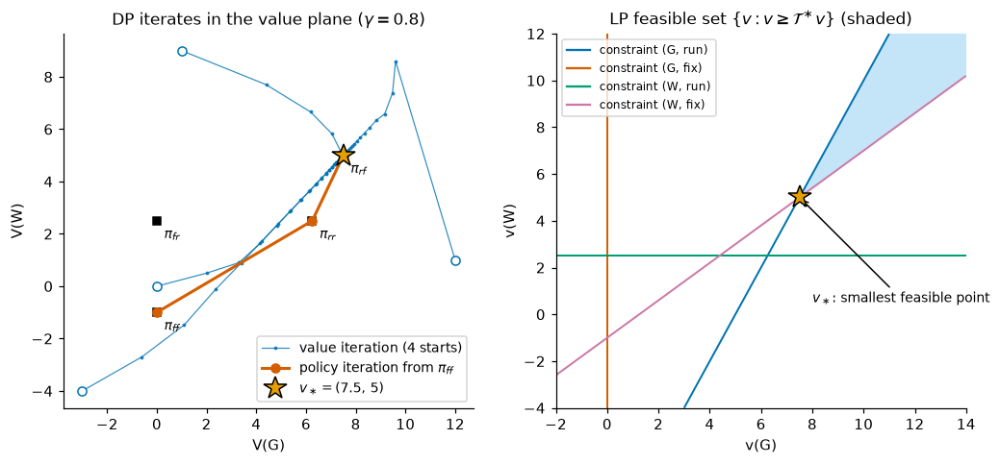

*Contraction in pictures. Left: value iteration (blue) from four starting points, including $(0,0)$ and $(12,1)$ above, converges geometrically to $v_\ast$ (star). Its iterates are generally not the value of any policy. The orange path is policy iteration, which jumps between the values of deterministic policies (black squares); Section 5.3 explains it. Right: the feasible set $\lbrace v : v \ge \mathcal{T}^\ast v\rbrace$ of the linear program of Section 10, with $v_\ast$ as its lowest corner.*

### 2.2 Two operators

Give the right-hand sides of the Bellman equations names. For any $V \in \mathbb{R}^{\mathcal{S}}$ and any stationary policy $\pi$, define the **Bellman expectation operator** and the **Bellman optimality operator**:

$$
(\mathcal{T}^\pi V)(s) \doteq \sum_a \pi(a \mid s)\, q_V(s,a), \qquad\text{in vector form}\qquad \mathcal{T}^\pi V = \mathbf{r}_\pi + \gamma\mathbf{P}_\pi V, \tag{3.2}
$$

$$
(\mathcal{T}^\ast V)(s) \doteq \max_{a \in \mathcal{A}(s)} q_V(s,a). \tag{3.3}
$$

Each is a *backup*. It looks one step ahead, averages (or maximises) over actions and successor states, and pays $V$ at the leaves. These are exactly the backup diagrams of Chapter 01, Section 9.3. In this language, Chapter 01 proved $v_\pi = \mathcal{T}^\pi v_\pi$ in (1.15) and $v_\ast = \mathcal{T}^\ast v_\ast$ in Theorem 1.1, part 1.

A deterministic policy $\pi$ is **greedy with respect to $V$** if $\pi(s) \in \arg\max_a q_V(s,a)$ for every $s$. Because an average never exceeds a maximum, every stationary policy $\pi$ satisfies

$$
\mathcal{T}^\pi V \le \mathcal{T}^\ast V, \qquad\text{with equality if and only if } \pi(\cdot\mid s) \text{ puts all its mass on } \arg\max_a q_V(s,a) \text{ for every } s. \tag{3.4}
$$

In particular, $\pi$ is greedy with respect to $V$ exactly when $\mathcal{T}^\pi V = \mathcal{T}^\ast V$.

### 2.3 Monotonicity and the constant shift

**Lemma 3.1.** Let $u, w \in \mathbb{R}^{\mathcal{S}}$, $c \ge 0$, let $\pi$ be stationary, and let $\mathcal{T}$ be either $\mathcal{T}^\pi$ or $\mathcal{T}^\ast$.

(a) *Monotonicity:*

$$
u \le w \;\Longrightarrow\; \mathcal{T}u \le \mathcal{T}w. \tag{3.5}
$$

(b) *Constant shift:*

$$
\mathcal{T}(u + c\mathbf{1}) \le \mathcal{T}u + \gamma c\mathbf{1}, \qquad \mathcal{T}(u - c\mathbf{1}) \ge \mathcal{T}u - \gamma c\mathbf{1}, \tag{3.6}
$$

with equality when no transition terminates, that is, when all rows of $p$ sum to 1.

(c) For any two real functions $f, g$ on a finite set,

$$
\Big\lvert \max_a f(a) - \max_a g(a)\Big\rvert \le \max_a \lvert f(a) - g(a)\rvert. \tag{3.7}
$$

*Proof.* (a) By (3.1), $q_u(s,a) - q_w(s,a) = \gamma\sum_{s'} p(s'\mid s,a)\,(u(s') - w(s')) \le 0$, because the probabilities are nonnegative. So $q_u \le q_w$ entrywise. Averaging with the nonnegative weights $\pi(a\mid s)$ preserves the inequality. So does taking the maximum over $a$: if $q_u(s,a) \le q_w(s,a)$ for all $a$, then $\max_a q_u(s,a) \le \max_a q_w(s,a)$.

(b) $q_{u+c\mathbf{1}}(s,a) = q_u(s,a) + \gamma c\,\kappa(s,a)$, where $\kappa(s,a) \doteq \sum_{s'} p(s'\mid s,a) \in [0,1]$ is the probability of *not* terminating (continuing). Hence $q_u(s,a) \le q_{u+c\mathbf{1}}(s,a) \le q_u(s,a) + \gamma c$, and averaging or maximising over $a$ gives the first inequality. The second is the same argument with $-c$. If every $\kappa(s,a) = 1$, both are equalities.

(c) Let $a_1 \in \arg\max_a f(a)$. Then $\max_a f - \max_a g \le f(a_1) - g(a_1) \le \max_a \lvert f(a) - g(a)\rvert$. Exchanging $f$ and $g$ bounds the difference from the other side. $\blacksquare$

### 2.4 The contraction theorem

**Theorem 3.1 (Bellman operators are $\gamma$-contractions).** For $0 \le \gamma < 1$, every stationary $\pi$, and all $u, w \in \mathbb{R}^{\mathcal{S}}$,

$$
\lVert \mathcal{T}^\pi u - \mathcal{T}^\pi w\rVert_\infty \le \gamma\lVert u - w\rVert_\infty, \qquad \lVert \mathcal{T}^\ast u - \mathcal{T}^\ast w\rVert_\infty \le \gamma\lVert u - w\rVert_\infty. \tag{3.8}
$$

*Proof 1 (direct).* Fix $s$. For $\mathcal{T}^\ast$, inequality (3.7) followed by the triangle inequality gives

$$
\begin{aligned}
\big\lvert(\mathcal{T}^\ast u)(s) - (\mathcal{T}^\ast w)(s)\big\rvert
&= \Big\lvert \max_a q_u(s,a) - \max_a q_w(s,a)\Big\rvert && \text{definition (3.3)}\\
&\le \max_a \big\lvert q_u(s,a) - q_w(s,a)\big\rvert && \text{by (3.7)}\\
&= \max_a\, \gamma\,\Big\lvert \sum_{s'} p(s'\mid s,a)\big(u(s') - w(s')\big)\Big\rvert && \text{rewards cancel in (3.1)}\\
&\le \gamma\max_a \sum_{s'} p(s' \mid s,a)\,\big\lvert u(s') - w(s')\big\rvert && \text{triangle inequality, } p \ge 0\\
&\le \gamma \max_a \sum_{s'} p(s'\mid s,a)\,\lVert u - w\rVert_\infty \;\le\; \gamma\lVert u - w\rVert_\infty && \textstyle\sum_{s'} p(s'\mid s,a) \le 1.
\end{aligned}
$$

Taking the maximum over $s$ proves the claim for $\mathcal{T}^\ast$. For $\mathcal{T}^\pi$, replace the first two lines by $\lvert\sum_a \pi(a\mid s)(q_u(s,a) - q_w(s,a))\rvert \le \sum_a \pi(a\mid s)\lvert q_u(s,a) - q_w(s,a)\rvert \le \max_a\lvert q_u(s,a) - q_w(s,a)\rvert$.

*Proof 2 (using only order).* Let $c = \lVert u - w\rVert_\infty$, so that $w - c\mathbf{1} \le u \le w + c\mathbf{1}$. Apply monotonicity (3.5) and then the shift property (3.6):

$$
\mathcal{T}w - \gamma c\mathbf{1} \;\le\; \mathcal{T}(w - c\mathbf{1}) \;\le\; \mathcal{T}u \;\le\; \mathcal{T}(w + c\mathbf{1}) \;\le\; \mathcal{T}w + \gamma c \mathbf{1}.
$$

So $\lvert(\mathcal{T}u)(s) - (\mathcal{T}w)(s)\rvert \le \gamma c$ for every $s$. $\blacksquare$

Proof 2 uses nothing but monotonicity and the shift property. These are **Blackwell's sufficient conditions** (Blackwell, 1965): any monotone operator that satisfies (3.6) is a $\gamma$-contraction in the max norm. This is how you will recognise contractions later. One example is the "soft" Bellman operator of maximum-entropy RL, which replaces the max by a log-sum-exp ([Chapter 12](12-continuous-control-actor-critic.md)).

Three remarks.

* **The factor $\gamma$ is tight.** If no transition terminates and $w = u + c\mathbf{1}$, then $\mathcal{T}w = \mathcal{T}u + \gamma c\mathbf{1}$ exactly. [`maintenance_by_hand.py`](../code/ch03_dynamic_programming/maintenance_by_hand.py) checks the theorem on random 30-state MDPs with 5,000 random pairs $(u,w)$ each. At $\gamma = 0.9$ the largest observed ratio $\lVert\mathcal{T}u - \mathcal{T}w\rVert_\infty/\lVert u - w\rVert_\infty$ is 0.685 for $\mathcal{T}^\pi$ and 0.836 for $\mathcal{T}^\ast$, and the constant shift gives exactly 0.900000. There were no violations of monotonicity.
* **Termination can help, but only if it is uniform.** If every state–action pair terminates with probability at least $\beta$, the factor improves to $\gamma(1-\beta)$ (Exercise 5). FrozenLake does not satisfy this. Most of its state–action pairs cannot end the episode in one step, and the policy "always up" never terminates from the top row. So $\mathcal{T}^\ast$ is no better than a $\gamma$-contraction there. Value iteration on FrozenLake still converges much faster than $\gamma^k$ predicts, for a different reason (Section 6.5).
* **The norm is part of the statement.** $\mathcal{T}^\pi$ is generally *not* a contraction in the plain Euclidean norm. [Chapter 00](00-math-toolkit.md), Section 4.4, measured a ratio of 1.418 for a $\gamma = 0.9$ example. It *is* a $\gamma$-contraction in the Euclidean norm weighted by the on-policy distribution of $\pi$. When least squares weights states by a different (off-policy) distribution, projection and backup can amplify each other's errors. This is the root of the deadly triad ([Chapter 08](08-function-approximation.md)).

### 2.5 Consequences: unique fixed points, geometric convergence, error bounds

$\mathbb{R}^{\mathcal{S}}$ with $\lVert\cdot\rVert_\infty$ is complete. So the Banach fixed-point theorem ([Chapter 00](00-math-toolkit.md), Section 4.3) applies to both operators.

**Corollary 3.1.** Let $\mathcal{T} \in \lbrace\mathcal{T}^\pi, \mathcal{T}^\ast\rbrace$ with $\gamma < 1$. Then $\mathcal{T}$ has exactly one fixed point $v_{\mathcal{T}}$: $v_{\mathcal{T}^\pi} = v_\pi$, and $v_{\mathcal{T}^\ast}$ is shown to equal $v_\ast$ in Theorem 3.2. For any starting vector $V_0$ the iterates $V_k \doteq \mathcal{T}^k V_0$ converge to $v_{\mathcal{T}}$, and

$$
\lVert V_k - v_{\mathcal{T}}\rVert_\infty \le \gamma^k\,\lVert V_0 - v_{\mathcal{T}}\rVert_\infty \qquad\text{(a-priori bound)}, \tag{3.9}
$$

$$
\lVert V_k - v_{\mathcal{T}}\rVert_\infty \le \frac{\gamma}{1-\gamma}\,\lVert V_k - V_{k-1}\rVert_\infty \qquad\text{(a-posteriori bound)}, \tag{3.10}
$$

$$
\lVert V - v_{\mathcal{T}}\rVert_\infty \le \frac{1}{1-\gamma}\,\lVert \mathcal{T}V - V\rVert_\infty \quad\text{for every } V \qquad\text{(residual bound)}. \tag{3.11}
$$

*Proof.* Existence, uniqueness and convergence are Banach's theorem. For (3.9), $\lVert V_k - v_{\mathcal{T}}\rVert = \lVert\mathcal{T}V_{k-1} - \mathcal{T}v_{\mathcal{T}}\rVert \le \gamma\lVert V_{k-1} - v_{\mathcal{T}}\rVert$, then induct. For (3.11), $\lVert V - v_{\mathcal{T}}\rVert \le \lVert V - \mathcal{T}V\rVert + \lVert \mathcal{T}V - \mathcal{T}v_{\mathcal{T}}\rVert \le \lVert\mathcal{T}V - V\rVert + \gamma\lVert V - v_{\mathcal{T}}\rVert$, then rearrange. For (3.10), apply (3.11) to $V_{k-1}$: $\lVert V_k - v_{\mathcal{T}}\rVert \le \gamma\lVert V_{k-1} - v_{\mathcal{T}}\rVert \le \frac{\gamma}{1-\gamma}\lVert \mathcal{T}V_{k-1} - V_{k-1}\rVert = \frac{\gamma}{1-\gamma}\lVert V_k - V_{k-1}\rVert$. $\blacksquare$

The a-priori bound tells you **how many iterations to budget**. If $\lvert r(s,a)\rvert \le R_{\max}$, then $\lVert v_{\mathcal{T}}\rVert_\infty \le R_{\max}/(1-\gamma)$. Starting from $V_0 = 0$, the guarantee $\lVert V_k - v_{\mathcal{T}}\rVert_\infty \le \epsilon$ therefore holds once

$$
k \;\ge\; \frac{\ln\!\big(R_{\max}/(\epsilon(1-\gamma))\big)}{\ln(1/\gamma)} \;\approx\; \frac{1}{1-\gamma}\,\ln\frac{R_{\max}}{\epsilon(1-\gamma)}. \tag{3.12}
$$

The **effective horizon** $1/(1-\gamma)$ sets the cost: each extra "9" in $\gamma$ multiplies the iteration count by about ten. The a-posteriori and residual bounds tell you **when to stop**. You never know $v_{\mathcal{T}}$, but you always know the size of your last step.

Monotonicity gives a second useful consequence, a one-sided test. If $V \ge \mathcal{T}V$, then applying $\mathcal{T}$ repeatedly and using (3.5) gives $V \ge \mathcal{T}V \ge \mathcal{T}^2V \ge \dots \to v_{\mathcal{T}}$. Hence

$$
V \ge \mathcal{T}V \;\Longrightarrow\; V \ge v_{\mathcal{T}}, \qquad\qquad V \le \mathcal{T}V \;\Longrightarrow\; V \le v_{\mathcal{T}}. \tag{3.13}
$$

With $\mathcal{T} = \mathcal{T}^\ast$, the left implication is the foundation of the linear-programming method (Section 10).

### 2.6 Operators on action values

[Chapters 04](04-monte-carlo.md) and [05](05-temporal-difference.md) learn action values $Q(s,a)$ rather than state values, because of the improvement step. Being greedy with respect to a state-value vector $V$ means maximising $q_V(s,a) = r(s,a) + \gamma\sum_{s'}p(s'\mid s,a)V(s')$, which needs the model. Being greedy with respect to a table $Q$ is just $\arg\max_a Q(s,a)$, with no model at all. So we also need the Bellman operators on $Q \in \mathbb{R}^{\mathcal{S}\times\mathcal{A}}$:

$$
(\mathcal{T}^\pi Q)(s,a) \doteq r(s,a) + \gamma\sum_{s'}p(s'\mid s,a)\sum_{a'}\pi(a'\mid s')\,Q(s',a'), \tag{3.13a}
$$

$$
(\mathcal{T}^\ast Q)(s,a) \doteq r(s,a) + \gamma\sum_{s'}p(s'\mid s,a)\max_{a'}Q(s',a'). \tag{3.13b}
$$

We reuse the symbols $\mathcal{T}^\pi$ and $\mathcal{T}^\ast$; the argument says which version is meant. These are the backup diagrams for $q_\pi$ and $q_\ast$ of Chapter 01: the average or maximum over actions now happens at the *next* state.

**Contraction.** Fix $(s,a)$. The rewards cancel, and (3.7) bounds the difference of the maxima:

$$
\begin{aligned}
\big\lvert(\mathcal{T}^\ast Q)(s,a) - (\mathcal{T}^\ast Q')(s,a)\big\rvert
&= \gamma\,\Big\lvert\sum_{s'}p(s'\mid s,a)\Big(\max_{a'}Q(s',a') - \max_{a'}Q'(s',a')\Big)\Big\rvert\\
&\le \gamma\sum_{s'}p(s'\mid s,a)\max_{a'}\big\lvert Q(s',a') - Q'(s',a')\big\rvert \;\le\; \gamma\,\lVert Q - Q'\rVert_\infty .
\end{aligned}
$$

For $\mathcal{T}^\pi$, replace the maxima by $\pi$-averages, as in Theorem 3.1. Both operators are also monotone and satisfy the constant-shift property. So everything in Section 2.5 carries over with $\mathbb{R}^{\mathcal{S}\times\mathcal{A}}$ in place of $\mathbb{R}^{\mathcal{S}}$: unique fixed points, geometric convergence at rate $\gamma$, and the bounds (3.9)–(3.11).

**Fixed points, and the link to state values.** The fixed point of $\mathcal{T}^\pi$ is $q_\pi$; that is the Bellman equation (1.16). For $\mathcal{T}^\ast$, one line links the two views: for any $V$,

$$
(\mathcal{T}^\ast q_V)(s,a) = r(s,a) + \gamma\sum_{s'}p(s'\mid s,a)\,(\mathcal{T}^\ast V)(s') = q_{\mathcal{T}^\ast V}(s,a).
$$

So if $\hat v$ is the fixed point of $\mathcal{T}^\ast$ on state values, $q_{\hat v}$ is its fixed point on action values, and Theorem 3.2 below shows that this is $q_\ast$. **Q-value iteration**, $Q_{k+1} = \mathcal{T}^\ast Q_k$, is value iteration in disguise. From $Q_0 = \mathbf{0}$ it gives $Q_1 = r = q_{\mathbf{0}}$, and then $Q_{k+1} = q_{V_k}$, where $V_k$ are the value-iteration iterates from $V_0 = \mathbf{0}$, so $\max_a Q_{k+1}(s,a) = V_{k+1}(s)$. A sweep costs the same as a VI sweep and stores $\lvert\mathcal{A}\rvert$ times as many numbers. In return the greedy policy is one $\arg\max$ away. On FrozenLake 8×8, [`frozenlake_pi_vi.py`](../code/ch03_dynamic_programming/frozenlake_pi_vi.py) runs `dp.q_value_iteration` with the stopping threshold of Section 6.5. It stops after the same 538 sweeps as VI, with $\max_s\lvert\max_a Q(s,a) - v_\ast(s)\rvert = 1.5\times10^{-7}$.

This is the form in which DP reaches the model-free chapters. Monte Carlo control and SARSA are sampled generalized policy iteration on $Q$ (Section 9). Q-learning replaces the expectation in $Q \leftarrow \mathcal{T}^\ast Q$ by one sampled transition and updates one pair at a time ([Chapter 05](05-temporal-difference.md)), and its convergence proof uses exactly the contraction just shown. Exercise 14 writes policy iteration and value iteration in terms of $Q$.

### 2.7\* Completing the existence theorem

Theorem 1.1 of Chapter 01 has three parts: $v_\ast$ satisfies the optimality equation, greedy policies with respect to $v_\ast$ are optimal, and $v_\ast$ is the unique solution. We now prove all three in one sweep, independently of Chapter 01. The proof shows directly that the fixed point of $\mathcal{T}^\ast$ dominates the value of *every* policy, history-dependent and randomised ones included.

**Theorem 3.2 (optimality of the fixed point; deterministic optimal policies).** Let the MDP be finite, $0 \le \gamma < 1$, and let $\hat v$ be the unique fixed point of $\mathcal{T}^\ast$. Then:

1. $v_\pi \le \hat v$ for **every** policy $\pi$, including non-stationary, history-dependent and randomised policies.
2. Every deterministic stationary policy $\hat\pi$ that is greedy with respect to $\hat v$ satisfies $v_{\hat\pi} = \hat v$.

Consequently $v_\ast = \hat v$. The supremum in the definition of $v_\ast$ is attained, in every state at once, by a deterministic stationary policy. $v_\ast$ is the unique solution of the Bellman optimality equation (1.23), and $q_\ast = q_{v_\ast}$.

*Proof.* **Step 1 (a finite-horizon lemma).** Let $R_{\max} = \max_{s,a}\lvert r(s,a)\rvert$. We claim that for every policy $\pi$, every $s$ and every $k \ge 0$,

$$
\mathbb{E}_\pi\Big[\sum_{t=0}^{k-1}\gamma^t R_{t+1} \,\Big\vert\, S_0 = s\Big] \;\le\; \big((\mathcal{T}^\ast)^k\, \mathbf{0}\big)(s). \tag{3.14}
$$

We argue by induction on $k$, and the induction hypothesis is assumed for *all* policies at once. For $k = 0$ both sides are 0. Suppose the claim holds for $k-1$. Condition on the first action and transition $(A_0, R_1, S_1) = (a, r, s')$. Given this prefix, the rest of the trajectory is generated by the "continuation" of $\pi$: the policy that behaves like $\pi$ with $(s, a, r)$ prepended to its history. That is again a (history-dependent) policy, started in $s'$. By the induction hypothesis, its expected discounted reward over the next $k-1$ steps is at most $((\mathcal{T}^\ast)^{k-1}\mathbf{0})(s')$. The environment draws $(r, s')$ from $p(\cdot,\cdot\mid s,a)$ whatever the policy is. So, writing $W_{k-1} \doteq (\mathcal{T}^\ast)^{k-1}\mathbf{0}$,

$$
\begin{aligned}
\mathbb{E}_\pi\Big[\sum_{t=0}^{k-1}\gamma^t R_{t+1} \,\Big\vert\, S_0 = s\Big]
&= \sum_a \pi(a \mid s)\sum_{s',r} p(s',r\mid s,a)\Big[r + \gamma\,\mathbb{E}_\pi\Big[\sum_{t=1}^{k-1}\gamma^{t-1}R_{t+1}\,\Big\vert\, s, a, r, s'\Big]\Big]\\
&\le \sum_a \pi(a\mid s)\sum_{s',r} p(s',r\mid s,a)\big[r + \gamma\, W_{k-1}(s')\big] \;=\; \sum_a \pi(a\mid s)\, q_{W_{k-1}}(s,a)\\
&\le \max_a q_{W_{k-1}}(s,a) \;=\; (\mathcal{T}^\ast W_{k-1})(s) = \big((\mathcal{T}^\ast)^k\mathbf{0}\big)(s).
\end{aligned}
$$

**Step 2 (part 1).** Split the return at time $k$. The tail is bounded by $\sum_{t\ge k}\gamma^t R_{\max} = \gamma^k R_{\max}/(1-\gamma)$, so by (3.14)

$$
v_\pi(s) \le \big((\mathcal{T}^\ast)^k\mathbf{0}\big)(s) + \frac{\gamma^k R_{\max}}{1-\gamma}.
$$

As $k\to\infty$, $(\mathcal{T}^\ast)^k\mathbf{0} \to \hat v$ (Corollary 3.1) and the tail vanishes. Hence $v_\pi \le \hat v$.

**Step 3 (part 2).** Greediness means $\mathcal{T}^{\hat\pi}\hat v = \mathcal{T}^\ast\hat v$ by (3.4), and $\mathcal{T}^\ast \hat v = \hat v$. So $\hat v$ is a fixed point of $\mathcal{T}^{\hat\pi}$. That operator has exactly one fixed point, $v_{\hat\pi}$, so $v_{\hat\pi} = \hat v$.

**Conclusion.** $\hat v \ge \sup_\pi v_\pi = v_\ast \ge v_{\hat\pi} = \hat v$, so all are equal. Any solution of (1.23) is a fixed point of $\mathcal{T}^\ast$ and hence equals $\hat v = v_\ast$. Finally, $q_\pi(s,a) \le q_{v_\ast}(s,a)$ for every $\pi$ by the same conditioning argument, and $\hat\pi$ attains it. So $q_\ast = q_{v_\ast}$. $\blacksquare$

Read the proof backwards and it says something useful. Step 1 shows that $(\mathcal{T}^\ast)^k\mathbf{0}$ bounds the expected discounted reward of every policy over $k$ steps, and Theorem 3.9 shows that the bound is attained. So *value iteration from zero computes optimal finite-horizon values* (Section 11). Section 10.2 gives an independent proof of part 1 by LP duality, and policy iteration (Section 5) constructs a deterministic optimal policy (relying on part 1 for optimality against history-dependent policies).

### 2.8\* Episodic tasks with γ = 1

With $\gamma = 1$ the max-norm argument breaks down. Lemma 3.1(b) then only gives a factor of 1. Termination must do the work that discounting did.

* **One policy.** Call $\pi$ **proper** if, from every state, the episode terminates with probability 1. For a proper policy the substochastic matrix $\mathbf{P}_\pi$ satisfies $\mathbf{P}_\pi^k \to 0$, so its spectral radius is below 1 (Chapter 01, Section 10.3). Then $(\mathcal{T}^\pi)^k V - v_\pi = \mathbf{P}_\pi^k(V - v_\pi) \to 0$ geometrically from any $V$, and $\mathcal{T}^\pi$ is a contraction in a suitably *weighted* max norm $\lVert v\rVert_\xi = \max_s \lvert v(s)\rvert/\xi(s)$ (Bertsekas & Tsitsiklis, 1996). Iterative policy evaluation works for proper policies and fails for improper ones.
* **Optimal control: stochastic shortest-path (SSP) problems.** Bertsekas & Tsitsiklis (1991) analysed control with $\gamma = 1$ under two assumptions: (i) at least one proper policy exists, and (ii) every improper policy has value $-\infty$ from some state (in cost language, it accumulates unbounded cost). Under these assumptions $v_\ast$ is the unique fixed point of $\mathcal{T}^\ast$ among real-valued vectors, value iteration converges from any start, and policy iteration works if it is started from a proper policy. If *every* policy is proper, $\mathcal{T}^\ast$ is a weighted max-norm contraction.

Our examples sit on both sides of this line. The gridworld satisfies (i) and (ii), because a policy that never terminates collects $-1$ forever. In the gambler's problem with stakes $a \ge 1$, *every* policy is proper: losing every toss reaches 0 in at most 99 steps, which has positive probability. S&B also allow a stake of **zero**. "Always stake 0" is then improper with value $0$, not $-\infty$, so (ii) fails, and the theory fails with it. The optimality equation acquires a spurious solution ($V = 1$ on every non-terminal state), value iteration started there stops at once, and a greedy policy with respect to $v_\ast$ can bet nothing forever. Exercise 10 works through this with the numbers from [`gamblers_problem.py`](../code/ch03_dynamic_programming/gamblers_problem.py). Chapter 01 (Section 12.4) found the same pathology in FrozenLake with $\gamma = 1$. **With $\gamma = 1$, uniqueness of the fixed point and optimality of greedy policies need termination arguments, not just the Bellman equation.**

---

## 3. Policy evaluation

### 3.1 From an equation to an update

To evaluate a policy, turn the Bellman expectation equation into an assignment. Start from any $V_0$ (usually $\mathbf{0}$, with terminal states fixed at 0) and repeat

$$
V_{k+1}(s) \;\leftarrow\; \sum_a \pi(a\mid s)\sum_{s',r} p(s',r\mid s,a)\big[r + \gamma V_k(s')\big] \;=\; (\mathcal{T}^\pi V_k)(s) \qquad\text{for all } s \in \mathcal{S}. \tag{3.15}
$$

This is an **expected update**. It replaces the old value of $s$ with a new one computed from the old values of *all* possible successors, weighted by their exact probabilities. One pass over the state space is a **sweep**. Corollary 3.1 says that $V_k \to v_\pi$ geometrically from any start when $\gamma < 1$. Section 2.8 extends this to proper policies when $\gamma = 1$.

```text
Algorithm 3.1  Iterative policy evaluation, for estimating V ≈ v_π
Input:  the policy π to be evaluated; the model r(s,a), p(s'|s,a); discount γ ∈ [0, 1]
        (γ = 1 only if π terminates with probability 1 from every state)
Parameter: a small threshold θ > 0
Initialise V(s) arbitrarily for all s ∈ S (e.g. 0); V(terminal) = 0 always
Loop:
    Δ ← 0
    For each s ∈ S:                                   # one sweep, in some fixed order
        v ← V(s)
        V(s) ← Σ_a π(a|s) [ r(s,a) + γ Σ_{s'} p(s'|s,a) V(s') ]         # eq. (3.15), in place
        Δ ← max(Δ, |v − V(s)|)
until Δ < θ
Output V
Two-array variant: compute V_new(s) for every s from the OLD array V, then set V ← V_new.
```

### 3.2 Two arrays or one?

The **two-array** (synchronous, or *Jacobi*) version computes every new value from the old array, so one sweep is exactly $V \leftarrow \mathcal{T}^\pi V$. The **in-place** (*Gauss–Seidel*) version overwrites $V(s)$ immediately, so states later in the sweep already see the new values of earlier ones. It uses half the memory, and new information propagates within a sweep instead of one step per sweep. Does it still converge to $v_\pi$?

**Proposition 3.1.** For $\gamma < 1$ and any fixed state ordering, the in-place sweep map $\mathcal{G}^\pi$ ("apply one in-place sweep to the array $V$") satisfies $\lVert\mathcal{G}^\pi u - \mathcal{G}^\pi w\rVert_\infty \le \gamma\lVert u - w\rVert_\infty$, and its unique fixed point is $v_\pi$.

*Proof.* Order the states $s_1, \dots, s_n$ and let $e = \lVert u - w\rVert_\infty$. During the sweep, $s_i$ is updated using the array $\tilde u_i$ whose entries are already updated for $j < i$ and still old for $j \ge i$ (similarly $\tilde w_i$). We show by induction on $i$ that $\lvert(\mathcal{G}^\pi u)(s_i) - (\mathcal{G}^\pi w)(s_i)\rvert \le \gamma e$. Suppose this holds for all $j < i$. Then every entry of $\tilde u_i - \tilde w_i$ is at most $\max(\gamma e, e) = e$ in absolute value. The update of $s_i$ is one component of $\mathcal{T}^\pi$ applied to $\tilde u_i$ (or $\tilde w_i$), so by Theorem 3.1 it differs by at most $\gamma\lVert\tilde u_i - \tilde w_i\rVert_\infty \le \gamma e$. Finally, $v_\pi$ is a fixed point: if the array already equals $v_\pi$, each update returns $(\mathcal{T}^\pi v_\pi)(s_i) = v_\pi(s_i)$ and nothing changes. A contraction has only one fixed point. $\blacksquare$

So both variants converge geometrically, and the stopping rule means the same thing for both. When the sweep's largest change is $\Delta$, the a-posteriori bound (3.10) applied to $\mathcal{T}^\pi$ or to $\mathcal{G}^\pi$ gives

$$
\Delta < \theta \quad\Longrightarrow\quad \lVert V - v_\pi\rVert_\infty < \frac{\gamma\,\theta}{1-\gamma} \qquad (\gamma < 1). \tag{3.16}
$$

Note the factor. With $\gamma = 0.99$, "$\Delta < 10^{-4}$" only guarantees an error below $10^{-2}$. With $\gamma = 1$ there is no such guarantee at all, as the next example shows.

### 3.3 Worked example: the 4×4 gridworld (S&B Figure 4.1)

Let us evaluate the equiprobable random policy, $\pi(a\mid s) = 1/4$, by hand. Number the cells 0–15 row by row, with 0 and 15 terminal. Start from $V_0 = 0$.

* **Sweep 1.** Every non-terminal state gets $-1 + \frac14\cdot 0\cdot 4 = -1$.
* **Sweep 2, state 1** (top row, second cell). *Up* bumps into the wall and stays in 1, *down* goes to 5, *right* to 2, and *left* to the terminal cell 0. So $V_2(1) = -1 + \frac14\big(V_1(1) + V_1(5) + V_1(2) + 0\big) = -1 + \frac14(-3) = -1.75$. **State 5** has four non-terminal neighbours, so $V_2(5) = -1 + \frac14(-4) = -2$.
* **Sweep 3, state 1.** $V_3(1) = -1 + \frac14\big(-1.75 - 2 - 2 + 0\big) = -2.4375$.

(S&B's figure shows $-1.75$ as $-1.7$; ours rounds it to $-1.8$.) [`gridworld_policy_evaluation.py`](../code/ch03_dynamic_programming/gridworld_policy_evaluation.py) runs the two-array version and reproduces every number of their Figure 4.1:

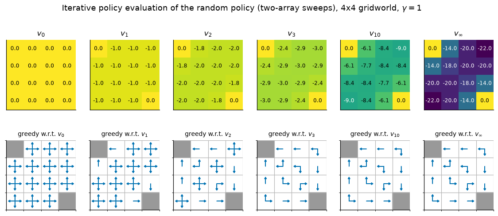

*Top: $v_k$ for $k = 0, 1, 2, 3, 10$ and the fixed point $v_\pi$ ($-14, -20, -22$ along the top row). Bottom: all actions that are greedy with respect to $v_k$. The greedy policy settles quickly. At $k = 3$ it is already an optimal policy (and it stays the same at $k = 10$ and $\infty$), even though $v_3$ is still far from $v_\pi$ (and $v_\pi$ is not $v_\ast$, whose top row is $0, -1, -2, -3$).*

The script confirms that the greedy policy with respect to $v_k$ (ties broken toward the first action) has value exactly $v_\ast$ for $k = 3, 4, 5$, and the printed sets of greedy actions at $k = 3$, $10$ and $\infty$ are identical. For $k \le 2$ the greedy set contains ties, and breaking them toward "up" produces a policy that walks into the top wall forever. That policy is improper and its value is $-\infty$. Ties matter when $\gamma = 1$.

**Two arrays or one, measured.** With $\gamma = 1$ we cannot use (3.16), so the script also reports the *true* error at the moment the stopping rule fires:

| threshold $\theta$ | two-array: sweeps | true error | in-place (order 0..15): sweeps | true error |
|---|---|---|---|---|
| $10^{-2}$ | 89 | $1.7\times10^{-1}$ | 62 | $1.0\times10^{-1}$ |
| $10^{-4}$ | 173 | $1.8\times10^{-3}$ | 114 | $1.1\times10^{-3}$ |
| $10^{-6}$ | 258 | $1.7\times10^{-5}$ | 167 | $1.1\times10^{-5}$ |
| $10^{-8}$ | 342 | $1.7\times10^{-7}$ | 220 | $1.0\times10^{-7}$ |

In-place needs about a third fewer sweeps. On this small grid a random but fixed order does almost exactly as well (115 sweeps at $10^{-4}$). The true error at stopping is **about 17 times $\theta$** (two-array) or 11 times (in-place). With $\gamma = 1$, termination rather than discounting makes the iteration contract, and the rates can be computed exactly. Two-array sweeps satisfy $V_{k+1} - v_\pi = \mathbf{P}_\pi(V_k - v_\pi)$, so the error shrinks asymptotically by the spectral radius $\rho(\mathbf{P}_\pi) = 0.947$ per sweep, the largest eigenvalue modulus of the random policy's substochastic transition matrix (Section 2.8). An in-place sweep in a fixed order multiplies the error by $(\mathbf{I} - \mathbf{L})^{-1}\mathbf{U}$, where $\mathbf{L}$ is the strictly lower-triangular part of $\mathbf{P}_\pi$ written in sweep order (the entries already updated) and $\mathbf{U} = \mathbf{P}_\pi - \mathbf{L}$. Its spectral radius is 0.916, for both orders. The table agrees: each factor of 100 in $\theta$ costs about 85 two-array sweeps, and $0.947^{85} \approx 0.01$; it costs 53 in-place sweeps, and $0.916^{53} \approx 0.01$. Putting these rates into (3.16) in place of $\gamma$ gives $0.947/0.053 \approx 17.8$ and $0.916/0.084 \approx 10.9$, the observed ratios. The script prints all of these spectral radii.

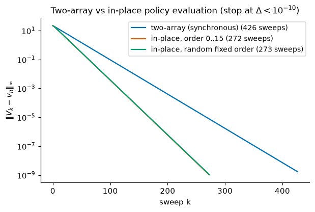

*Max-norm error to $v_\pi$ against sweeps for two-array evaluation (blue), in-place sweeps in the order 0..15 (orange), and in-place sweeps in a random fixed order (green), which nearly coincides with the orange curve. All converge geometrically. The in-place slope is steeper because information propagates within a sweep.*

---

## 4. Policy improvement

### 4.1 The policy improvement theorem

We evaluate a policy in order to improve it. Suppose we know $v_\pi$ and consider deviating from $\pi$ in state $s$: take action $a$ once and follow $\pi$ afterwards. That is worth $q_\pi(s,a)$. If $q_\pi(s,a) > v_\pi(s)$, the deviation is better *for one step*. The policy improvement theorem says that making such deviations *permanently, everywhere at once,* is also better.

**Theorem 3.3 (policy improvement).** Let $\gamma < 1$ and let $\pi, \pi'$ be stationary policies ($\pi'$ may be stochastic). If

$$
\sum_a \pi'(a\mid s)\, q_\pi(s,a) \;\ge\; v_\pi(s) \quad\text{for all } s \in \mathcal{S}, \qquad\text{that is,}\qquad \mathcal{T}^{\pi'} v_\pi \ge v_\pi, \tag{3.17}
$$

then $v_{\pi'} \ge v_\pi$. Moreover, if the inequality in (3.17) is strict at some state $s$, then $v_{\pi'}(s) > v_\pi(s)$.

*Proof A (operators).* The hypothesis is $\mathcal{T}^{\pi'}v_\pi \ge v_\pi$. Applying the monotone operator $\mathcal{T}^{\pi'}$ to both sides gives $(\mathcal{T}^{\pi'})^2 v_\pi \ge \mathcal{T}^{\pi'}v_\pi$. Repeating,

$$
(\mathcal{T}^{\pi'})^k v_\pi \;\ge\; (\mathcal{T}^{\pi'})^{k-1} v_\pi \;\ge\; \dots \;\ge\; \mathcal{T}^{\pi'} v_\pi \;\ge\; v_\pi \qquad\text{for every } k.
$$

As $k\to\infty$ the left side converges to $v_{\pi'}$ (Corollary 3.1), so $v_{\pi'} \ge \mathcal{T}^{\pi'}v_\pi \ge v_\pi$. If (3.17) is strict at $s$, then $v_{\pi'}(s) \ge (\mathcal{T}^{\pi'}v_\pi)(s) > v_\pi(s)$. $\blacksquare$

*Proof B (unrolling, as in S&B)* is the same argument written along trajectories of $\pi'$. The hypothesis says $v_\pi(s) \le \mathbb{E}_{\pi'}[R_{t+1} + \gamma v_\pi(S_{t+1}) \mid S_t = s]$. Apply it again inside the expectation at $S_{t+1}$, $S_{t+2}, \dots$ (monotonicity of conditional expectation, then the tower property) to get $v_\pi(s) \le \mathbb{E}_{\pi'}\big[\sum_{j=0}^{n-1}\gamma^j R_{t+j+1} + \gamma^n v_\pi(S_{t+n}) \mid S_t = s\big]$, which tends to $v_{\pi'}(s)$ because $\lvert\gamma^n v_\pi(S_{t+n})\rvert \le \gamma^n\lVert v_\pi\rVert_\infty \to 0$. [Chapter 04](04-monte-carlo.md), Section 5.2, writes the chain out for $\varepsilon$-greedy policies. $\blacksquare$

**With $\gamma = 1$** both proofs need $(\mathcal{T}^{\pi'})^k v_\pi \to v_{\pi'}$, which holds when $\pi'$ is proper. Without it the theorem is false. Exercise 11 gives a one-state counterexample in which an improper $\pi'$ satisfies (3.17) and is strictly worse.

### 4.2 Greedy improvement

The natural way to satisfy (3.17) is to be greedy with respect to $q_\pi$:

$$
\pi'(s) \in \arg\max_a q_\pi(s,a) = \arg\max_a\Big[r(s,a) + \gamma\sum_{s'}p(s'\mid s,a)\,v_\pi(s')\Big]. \tag{3.18}
$$

Then $\sum_a \pi'(a\mid s)q_\pi(s,a) = \max_a q_\pi(s,a) \ge \sum_a \pi(a\mid s) q_\pi(s,a) = v_\pi(s)$, so Theorem 3.3 gives $v_{\pi'} \ge v_\pi$. The same holds for any stochastic $\pi'$ that puts all its probability on maximisers. Two observations make this the engine of policy iteration.

* **Improvement stops only at optimality.** If the greedy step cannot improve anywhere, that is $\max_a q_\pi(s,a) = v_\pi(s)$ for all $s$, then $\mathcal{T}^\ast v_\pi = v_\pi$. By Theorem 3.2, $v_\pi = v_\ast$ and $\pi$ is optimal. Otherwise (3.17) is strict somewhere and $\pi'$ is strictly better there.
* **States do not compete.** The greedy step changes actions in many states simultaneously, and the theorem guarantees that these changes never interfere. This is the principle of optimality at work (Chapter 01, Section 12.3).

One caution: **greedy with respect to the wrong values guarantees nothing.** The theorem needs $v_\pi$ for the *current* policy. Acting greedily on an arbitrary $V$ can produce a worse policy (Exercise 4). Its loss is bounded only through $\lVert V - v_\ast\rVert_\infty$, as (3.22) will show.

### 4.3 Worked example: one improvement step by hand

Take the maintenance MDP with $\gamma = 0.8$ and the poor policy $\pi_{ff}$, "always fix". Its value solves $v(\mathrm{G}) = 0 + 0.8\,v(\mathrm{G})$ and $v(\mathrm{W}) = -1 + 0.8\, v(\mathrm{G})$, so $v_{\pi_{ff}} = (0, -1)$. The one-step lookaheads (3.1) are

$$
\begin{aligned}
q(\mathrm{G},\text{run}) &= 2 + 0.8\,(0.75\cdot 0 + 0.25\cdot(-1)) = 1.8, & q(\mathrm{G},\text{fix}) &= 0 + 0.8\cdot 0 = 0,\\
q(\mathrm{W},\text{run}) &= 0.5 + 0.8\cdot(-1) = -0.3, & q(\mathrm{W},\text{fix}) &= -1 + 0.8\cdot 0 = -1.
\end{aligned}
$$

The greedy policy is "always run", $\pi_{rr}$, and it is better in both states at once: $v_{\pi_{rr}} = (6.25, 2.5) \ge (0, -1)$. The hypothesis (3.17) is strict in both states ($1.8 > 0$ and $-0.3 > -1$), so the improvement is strict in both. [`maintenance_by_hand.py`](../code/ch03_dynamic_programming/maintenance_by_hand.py) also checks the theorem on all 16 ordered pairs of deterministic policies. The hypothesis holds for 9 pairs, and the conclusion holds in all 9.

---

## 5. Policy iteration

### 5.1 The algorithm

Alternate complete evaluation with greedy improvement:

$$
\pi_0 \xrightarrow{\ \mathrm{E}\ } v_{\pi_0} \xrightarrow{\ \mathrm{I}\ } \pi_1 \xrightarrow{\ \mathrm{E}\ } v_{\pi_1} \xrightarrow{\ \mathrm{I}\ } \pi_2 \xrightarrow{\ \mathrm{E}\ } \cdots \xrightarrow{\ \mathrm{I}\ } \pi_\ast \xrightarrow{\ \mathrm{E}\ } v_\ast .
$$

```text
Algorithm 3.2  Policy iteration (Howard), for estimating π ≈ π_*
Input:  model r(s,a), p(s'|s,a); γ ∈ [0, 1)  (γ = 1 only if every policy visited is proper)
Parameter: tie tolerance tol ≥ 0 (tiny, e.g. 1e-9 relative, to absorb round-off)
1. Initialisation
     π(s) ∈ A(s) arbitrarily for all s ∈ S      (a stochastic π_0 also works: evaluate it, then improve)
2. Policy evaluation
     V ← v_π  by solving (I − γ P_π) V = r_π     (or run Algorithm 3.1 with a small θ)
3. Policy improvement
     policy-stable ← true
     For each s ∈ S:
         old ← π(s)
         best ← max_a q_V(s,a),   where q_V(s,a) = r(s,a) + γ Σ_{s'} p(s'|s,a) V(s')   # eq. (3.1)
         If q_V(s, old) < best − tol:            # change only for a STRICT improvement
             π(s) ← some a with q_V(s,a) = best
             policy-stable ← false
     If policy-stable: stop and return V = v_*, π = π_*;   else go to 2
```

The comment "change only for a strict improvement" matters. S&B's original box changes $\pi(s)$ to *any* maximiser. If two actions tie, the algorithm can then switch back and forth between equally good policies forever (S&B Exercise 4.4; our Exercise 2). Keeping the old action on ties fixes this.

### 5.2 Finite convergence

**Theorem 3.4 (policy iteration terminates with an optimal policy).** With $\gamma < 1$, exact evaluation, and the strict-improvement rule (tol $= 0$ in exact arithmetic), policy iteration stops after at most $\prod_{s}\lvert\mathcal{A}(s)\rvert$ iterations, and the policy it returns is optimal.

*Proof.* Let $\pi_k$ be the $k$-th policy. In every state, $\pi_{k+1}(s)$ either equals $\pi_k(s)$ or satisfies $q_{\pi_k}(s,\pi_{k+1}(s)) = \max_a q_{\pi_k}(s,a) > v_{\pi_k}(s)$. So (3.17) holds, strictly in every state where the action changed. If $\pi_{k+1} \ne \pi_k$, Theorem 3.3 gives $v_{\pi_{k+1}} \ge v_{\pi_k}$ with strict inequality in at least one state. The value functions $v_{\pi_0} \le v_{\pi_1} \le \dots$ therefore strictly increase in this partial order, so no policy can occur twice. If $\pi_j = \pi_k$ with $j < k$, then $v_{\pi_j} = v_{\pi_k}$, contradicting the strict increase from $j$ to $j+1$. There are only $\prod_s\lvert\mathcal{A}(s)\rvert$ deterministic policies, so the algorithm stops. It stops only when no state can be strictly improved, that is, when $\max_a q_{\pi}(s,a) = v_\pi(s)$ for all $s$. Then $v_\pi = \mathcal{T}^\ast v_\pi$, and $\pi$ is optimal by Theorem 3.2. $\blacksquare$

Policy iteration is also never slower than value iteration, measured in iterations:

**Proposition 3.2.** For policy iteration, $v_{\pi_{k+1}} \ge \mathcal{T}^\ast v_{\pi_k}$. Consequently $v_{\pi_k} \ge (\mathcal{T}^\ast)^k v_{\pi_0}$ and $\lVert v_\ast - v_{\pi_k}\rVert_\infty \le \gamma^k\lVert v_\ast - v_{\pi_0}\rVert_\infty$.

*Proof.* Proof A of Theorem 3.3 showed $v_{\pi'} \ge \mathcal{T}^{\pi'}v_\pi$. With $\pi' = \pi_{k+1}$ greedy with respect to $v_{\pi_k}$, (3.4) gives

$$
v_{\pi_{k+1}} \;\ge\; \mathcal{T}^{\pi_{k+1}}v_{\pi_k} = \mathcal{T}^\ast v_{\pi_k}. \tag{3.19}
$$

By induction and monotonicity, $v_{\pi_k} \ge (\mathcal{T}^\ast)^k v_{\pi_0}$. Since also $v_{\pi_k} \le v_\ast$, we get $0 \le v_\ast - v_{\pi_k} \le v_\ast - (\mathcal{T}^\ast)^kv_{\pi_0}$, and (3.9) finishes the proof. $\blacksquare$

Theorem 3.4's bound, the number of policies, is astronomically pessimistic. In practice PI usually needs only a handful of iterations. One way to see why: Puterman & Brumelle (1979) showed that policy iteration is **Newton's method** applied to the equation $\mathcal{T}^\ast v - v = 0$. For a finite MDP this function is piecewise affine, with one affine piece per deterministic policy (the region where that policy is greedy). Each Newton step solves the linear equation of the current piece exactly and jumps to another piece, so the steps stop after finitely many pieces, and in practice after few. Worst-case guarantees are a separate matter. For a fixed discount factor, Ye (2011) proved that policy iteration is *strongly polynomial*: its number of iterations is bounded by a polynomial in the numbers of states and actions alone, independent of the reward values. Hansen, Miltersen & Zwick (2013) sharpened this to $O\big(\frac{N_{sa}}{1-\gamma}\log\frac{n}{1-\gamma}\big)$ iterations, where $n = \lvert\mathcal{S}\rvert$ and $N_{sa} = \sum_s\lvert\mathcal{A}(s)\rvert$ is the total number of state–action pairs.

### 5.3 Worked example: policy iteration by hand

Continue from Section 4.3 (maintenance MDP, $\gamma = 0.8$, $\pi_0 = \pi_{ff}$).

* **Iteration 1.** $v_{\pi_{ff}} = (0, -1)$. The greedy step gives $\pi_1 = \pi_{rr}$, as computed above.
* **Iteration 2.** Evaluate $\pi_{rr}$. From $v(\mathrm{W}) = 0.5 + 0.8\,v(\mathrm{W})$ we get $v(\mathrm{W}) = 2.5$. Then $v(\mathrm{G}) = 2 + 0.8(0.75\,v(\mathrm{G}) + 0.25\cdot 2.5)$, which gives $0.4\,v(\mathrm{G}) = 2.5$ and $v(\mathrm{G}) = 6.25$. The lookaheads are $q(\mathrm{G},\text{run}) = 6.25$, $q(\mathrm{G},\text{fix}) = 0.8\cdot 6.25 = 5$, $q(\mathrm{W},\text{run}) = 0.5 + 0.8\cdot 2.5 = 2.5$ and $q(\mathrm{W},\text{fix}) = -1 + 0.8\cdot 6.25 = 4$. The greedy policy is $\pi_2 = \pi_{rf}$: run when Good, fix when Worn.
* **Iteration 3.** $v_{\pi_{rf}} = (7.5, 5)$, computed in Chapter 01, Section 10.4. The lookaheads are $q(\mathrm{G}, \cdot) = (7.5, 6)$ and $q(\mathrm{W},\cdot) = (4.5, 5)$. No action changes, so $\pi_{rf}$ is optimal and $v_\ast = (7.5, 5)$.

Three evaluations suffice. Note that the action in W went *fix → run → fix*. Policy iteration is monotone in values, not in actions. The orange path in the left panel of the value-plane figure (Section 2.1) draws the three value functions $(0, -1) \to (6.25, 2.5) \to (7.5, 5)$ in the plane $(V(\mathrm{G}), V(\mathrm{W}))$. PI jumps between the values of deterministic policies and reaches $v_\ast$ in two improvements, while value iteration approaches it along many small steps.

### 5.4 Policy iteration on FrozenLake

[`frozenlake_pi_vi.py`](../code/ch03_dynamic_programming/frozenlake_pi_vi.py) builds both FrozenLake maps from `env.unwrapped.P` and runs policy iteration from the uniform random policy with $\gamma = 0.99$:

| map | iteration | $v_\pi(\text{start})$ | $\lVert v_\pi - v_\ast\rVert_\infty$ | actions changed by the next improvement |
|---|---|---|---|---|
| 4×4 | 0 (random) | 0.0124 | 0.571 | 16 (all) |
| | 1 | 0.5325 | 0.090 | 1 |
| | 2 | 0.5420 | 0 | 0 (stable) |
| 8×8 | 0 (random) | 0.0011 | 0.624 | 64 (all) |
| | 1 | 0.3776 | 0.040 | 6 |
| | 2 | 0.4146 | 0 | 0 (stable) |

Three evaluations solve both maps. The first improvement does almost all the work. Started instead from "always move left", PI needs 10 to 13 evaluations on the 8×8 map, depending on $\gamma$ (Section 7).

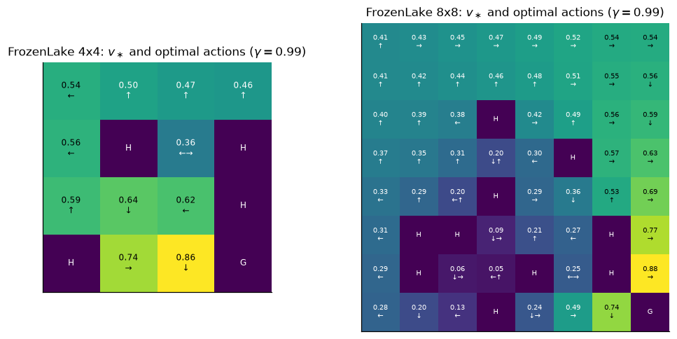

*$v_\ast$ and every optimal action for $\gamma = 0.99$. A chosen action is carried out with probability 1/3, and with probability 1/3 each the agent slips to one of the two perpendicular directions. So the optimal action often points into a wall or away from a hole, which minimises the chance that any of the three possible moves ends in a hole. In the cell between the two holes of the 4×4 map's second row, "left" and "right" tie exactly, by symmetry.*

**Does the DP answer hold up in the real environment?** The value $v_\ast(\text{start}) = 0.5420$ (4×4) is a *discounted* quantity. To compare with simulation, the script evaluates the same policy with $\gamma = 1$, which gives the probability of ever reaching G, and runs it in Gymnasium:

| map | exact P(reach G), no time limit | simulated (5,000 episodes) | exact P(reach G within Gymnasium's 100 steps) | simulated with the default `TimeLimit` |
|---|---|---|---|---|
| 4×4 | 0.8235 | 0.8246 ± 0.0054 | 0.7402 | 0.7466 ± 0.0062 |
| 8×8 | 0.8938 | 0.8972 ± 0.0043 | 0.6317 | 0.6348 ± 0.0068 |

The ± values are one standard error, and every simulated number lies within about one standard error of the exact one. `gym.make("FrozenLake-v1", map_name="8x8")` keeps FrozenLake-v1's 100-step `TimeLimit` (the separately registered `FrozenLake8x8-v1` uses 200 steps, a different task); we use the former throughout. That limit truncates 28.8% of the 8×8 episodes and costs almost 30% of the success probability ($0.894 \to 0.632$). The time limit is not part of the MDP that DP solved. Section 11 solves the time-limited problem itself.

**$\gamma$ is part of the problem.** The 0.8938 in the first column is the success probability of the policy that is optimal for $\gamma = 0.99$, not the best possible. The policy that is optimal for $\gamma = 1$ (the maximal probability of *ever* reaching G) reaches G with probability 1.0000 on the 8×8 map, but its exact expected episode length is 117.0 steps against 85.9. Discounting trades certainty for speed. (On 4×4 the two policies have the same success probability, 0.8235, and the same exact mean episode length, 48.7 steps.) Section 11.3 shows what this trade-off costs under a time limit.

---

## 6. Value iteration

### 6.1 Truncating evaluation to a single sweep

Policy iteration evaluates each policy to convergence, which is often wasteful. In the gridworld the greedy policy was already optimal after three evaluation sweeps. At the other extreme, do *one* sweep of evaluation and then improve. One sweep of $\mathcal{T}^{\pi'}$ with $\pi'$ greedy with respect to $V$ is exactly one sweep of $\mathcal{T}^\ast$, by (3.4). The policy disappears from the algorithm, and we are left with the Bellman optimality equation turned into an update:

$$
V_{k+1}(s) \;\leftarrow\; \max_a \sum_{s',r}p(s',r\mid s,a)\big[r + \gamma V_k(s')\big] = (\mathcal{T}^\ast V_k)(s). \tag{3.20}
$$

This is **value iteration** (VI), which Bellman called the method of successive approximations.

```text
Algorithm 3.3  Value iteration, for estimating π ≈ π_*
Input:  model r(s,a), p(s'|s,a); γ ∈ [0, 1)
Parameter: ϵ > 0, the loss you are willing to accept;  set θ ← ϵ (1 − γ) / (2γ)       # eq. (3.21)
Initialise V(s) arbitrarily for all s ∈ S (e.g. 0); V(terminal) = 0 always
Loop:
    For each s ∈ S:
        V_new(s) ← max_{a ∈ A(s)} [ r(s,a) + γ Σ_{s'} p(s'|s,a) V(s') ]               # eq. (3.20)
    Δ ← max_s |V_new(s) − V(s)|
    V ← V_new
until Δ < θ
Output V, and a deterministic policy π(s) ∈ argmax_a [ r(s,a) + γ Σ_{s'} p(s'|s,a) V(s') ]
Guarantee: v_π(s) ≥ v_*(s) − ϵ for every s (Theorem 3.5).
In-place variant (S&B's box): overwrite V(s) immediately. It converges too (the proof of
Proposition 3.1 works verbatim for T*; see also Section 8), and Δ < θ still gives
||V − v_*|| < γθ/(1−γ). Certifying the policy then needs one extra synchronous sweep
to measure ||T*V − V||, followed by the argument of Theorem 3.5.
```

### 6.2 Convergence, and what the iterates mean

By Corollary 3.1, $V_k \to v_\ast$ geometrically from any $V_0$, with the bounds (3.9)–(3.11). The intermediate iterates also have a meaning of their own. Step 1 of the proof of Theorem 3.2 (an upper bound) and Theorem 3.9 (attainment) together show that $(\mathcal{T}^\ast)^k\mathbf{0}$ is the **optimal expected discounted reward over the next $k$ steps**. More generally, $V_k = (\mathcal{T}^\ast)^k V_0$ is the optimal value of the $k$-step problem with terminal payoff $V_0$ (Section 11). By contrast, $V_k$ is in general *not* the value of any policy. In the left panel of the value-plane figure (Section 2.1), the blue iterates wander through regions that no policy reaches.

### 6.3 When to stop: from small updates to good policies

What we want from VI is a good *policy*. The next theorem turns a small last update into a guarantee on the greedy policy.

**Theorem 3.5 (stopping rule for value iteration).** Let $\gamma < 1$, $V_{k+1} = \mathcal{T}^\ast V_k$, $\Delta = \lVert V_{k+1} - V_k\rVert_\infty$, and let $\pi$ be greedy with respect to $V_{k+1}$. Then

$$
\lVert V_{k+1} - v_\ast\rVert_\infty \le \frac{\gamma\Delta}{1-\gamma}, \qquad \lVert V_{k+1} - v_\pi\rVert_\infty \le \frac{\gamma\Delta}{1-\gamma}, \qquad v_\ast - \frac{2\gamma\Delta}{1-\gamma}\mathbf{1} \;\le\; v_\pi \;\le\; v_\ast. \tag{3.21}
$$

So stopping at $\Delta < \epsilon(1-\gamma)/(2\gamma)$ guarantees an $\epsilon$-optimal policy.

*Proof.* The first inequality is (3.10). For the second, apply the residual bound (3.11) to the operator $\mathcal{T}^\pi$, whose fixed point is $v_\pi$, at the point $V_{k+1}$. Use that $\pi$ is greedy, $\mathcal{T}^\pi V_{k+1} = \mathcal{T}^\ast V_{k+1}$ by (3.4), and then the contraction of $\mathcal{T}^\ast$:

$$
\lVert V_{k+1} - v_\pi\rVert_\infty \le \frac{\lVert\mathcal{T}^\pi V_{k+1} - V_{k+1}\rVert_\infty}{1-\gamma} = \frac{\lVert\mathcal{T}^\ast V_{k+1} - \mathcal{T}^\ast V_k\rVert_\infty}{1-\gamma} \le \frac{\gamma\Delta}{1-\gamma}.
$$

For the third, combine the first two with the triangle inequality, and use $v_\pi \le v_\ast$ from Theorem 3.2. $\blacksquare$

The same argument applies to any value estimate, however it was obtained:

**Corollary 3.2 (Singh & Yee, 1994).** If $\lVert V - v_\ast\rVert_\infty \le \epsilon$ and $\pi$ is greedy with respect to $V$, then

$$
\lVert v_\ast - v_\pi\rVert_\infty \le \frac{2\gamma\epsilon}{1-\gamma}. \tag{3.22}
$$

*Proof.* $\lVert v_\ast - v_\pi\rVert \le \lVert\mathcal{T}^\ast v_\ast - \mathcal{T}^\pi V\rVert + \lVert\mathcal{T}^\pi V - \mathcal{T}^\pi v_\pi\rVert$. Since $\mathcal{T}^\pi V = \mathcal{T}^\ast V$, this is at most $\gamma\epsilon + \gamma(\epsilon + \lVert v_\ast - v_\pi\rVert)$. Rearrange. $\blacksquare$

Williams & Baird (1993) showed that bounds of this form are tight in the worst case. Note the factor $1/(1-\gamma)$. A value error of 0.01 at $\gamma = 0.99$ only guarantees a policy loss below 1.98, and the guarantee depends on the error in the *worst* state, not on the average error. This bound reappears in [Chapter 07](07-planning-and-learning-tabular.md) to explain why deeper search helps.

**Tighter bounds when no transition terminates (MacQueen, 1966).** Let $\delta_{\min} = \min_s(V_{k+1} - V_k)(s)$ and $\delta_{\max} = \max_s(V_{k+1}-V_k)(s)$. If all rows of $p$ sum to 1, then

$$
V_{k+1} + \frac{\gamma\,\delta_{\min}}{1-\gamma}\mathbf{1} \;\le\; v_\ast \;\le\; V_{k+1} + \frac{\gamma\,\delta_{\max}}{1-\gamma}\mathbf{1}. \tag{3.23}
$$

*Proof of the upper bound.* Since $V_{k+1} \le V_k + \delta_{\max}\mathbf{1}$, monotonicity and the (exact) shift give $\mathcal{T}^\ast V_{k+1} \le \mathcal{T}^\ast V_k + \gamma\delta_{\max}\mathbf{1} = V_{k+1} + \gamma\delta_{\max}\mathbf{1}$. Let $W = V_{k+1} + c\mathbf{1}$ with $c = \gamma\delta_{\max}/(1-\gamma)$. Then $\mathcal{T}^\ast W = \mathcal{T}^\ast V_{k+1} + \gamma c\mathbf{1} \le V_{k+1} + (\gamma\delta_{\max} + \gamma c)\mathbf{1} = W$, because $\gamma\delta_{\max} + \gamma c = c$. By (3.13), $v_\ast \le W$. The lower bound is Exercise 7. $\blacksquare$

The width of this interval depends on the *spread* $\delta_{\max} - \delta_{\min}$, not on $\max(\lvert\delta_{\min}\rvert, \lvert\delta_{\max}\rvert)$. When all values rise at nearly the same rate, it is much tighter than (3.10). If the upper bound on $q_\ast(s,a)$ falls below the lower bound on $v_\ast(s)$, action $a$ can be eliminated permanently. On 50 random 40-state MDPs ($\gamma = 0.9$, random $V_0$), [`maintenance_by_hand.py`](../code/ch03_dynamic_programming/maintenance_by_hand.py) checked all three bounds at every iteration (12,485 checks, no violations). The true greedy loss never exceeded **0.089** times its bound $2\gamma\Delta/(1-\gamma)$, while $\lVert V_{k+1} - v_\ast\rVert$ reached its bound (3.10) to six decimals late in the iteration, when $V_k - v_\ast$ is nearly a constant vector. The greedy policy was optimal after a median of **9** sweeps; reaching $\Delta < 10^{-12}$ took a median of **252**.

### 6.4 Worked example: value iteration by hand

Maintenance MDP, $\gamma = 0.8$, $V_0 = (0,0)$:

* $V_1(\mathrm{G}) = \max(2 + 0,\ 0 + 0) = 2$ and $V_1(\mathrm{W}) = \max(0.5,\ -1) = 0.5$.
* $V_2(\mathrm{G}) = \max\big(2 + 0.8(0.75\cdot 2 + 0.25\cdot 0.5),\ 0.8\cdot 2\big) = \max(3.3, 1.6) = 3.3$ and $V_2(\mathrm{W}) = \max(0.5 + 0.8\cdot 0.5,\ -1 + 0.8\cdot 2) = \max(0.9, 0.6) = 0.9$.
* $V_3(\mathrm{G}) = \max\big(2 + 0.8(0.75\cdot 3.3 + 0.25\cdot 0.9),\ 0.8\cdot 3.3\big) = \max(4.16, 2.64) = 4.16$ and $V_3(\mathrm{W}) = \max(0.5 + 0.8\cdot 0.9,\ -1 + 0.8\cdot 3.3) = \max(1.22, 1.64) = 1.64$.

The script continues the table and adds the bounds of Corollary 3.1, with $v_\ast = (7.5, 5)$:

| $k$ | $V_k(\mathrm{G})$ | $V_k(\mathrm{W})$ | greedy policy | $\lVert V_k - v_\ast\rVert_\infty$ | a-priori $0.8^k\cdot 7.5$ | a-posteriori $4\,\lVert V_k - V_{k-1}\rVert_\infty$ |
|---|---|---|---|---|---|---|
| 0 | 0 | 0 | (run, run) | 7.5 | 7.5 | — |
| 1 | 2 | 0.5 | (run, run) | 5.5 | 6.0 | 8.0 |
| 2 | 3.3 | 0.9 | (run, fix) | 4.2 | 4.8 | 5.2 |
| 3 | 4.16 | 1.64 | (run, fix) | 3.36 | 3.84 | 3.44 |
| 4 | 4.824 | 2.328 | (run, fix) | 2.676 | 3.072 | 2.752 |
| 6 | 5.7878 | 3.2880 | (run, fix) | 1.712 | 1.966 | 1.715 |

From $k = 3$ on, the error shrinks by almost exactly $\gamma = 0.8$ per step. The greedy policy is already optimal at $k = 2$, when the values are still 4.2 away from $v_\ast$. In W, fixing is worth $-1 + 0.8\cdot 3.3 = 1.64$ against $0.5 + 0.8\cdot 0.9 = 1.22$ for running. The bound (3.21), however, is $2\gamma\Delta/(1-\gamma) = 8\,\Delta = 10.4$ at $k = 2$, far too weak to certify anything. Bounds certify optimality much later than optimality is actually reached.

### 6.5 Value iteration on FrozenLake

With $\gamma = 0.99$ and $\epsilon = 10^{-6}$, Algorithm 3.3 stops at $\Delta < \theta = 5.05\times10^{-9}$:

| map | sweeps to stop | $\lVert V - v_\ast\rVert_\infty$ at stop (bound) | greedy policy first optimal at sweep | $\lVert V_k - v_\ast\rVert$ then | the bound (3.21) first certifies a loss $\le 0.01$ at sweep |
|---|---|---|---|---|---|
| 4×4 | 458 | $1.4\times10^{-7}$ ($4.8\times10^{-7}$) | 45 | 0.177 | 191 |
| 8×8 | 538 | $1.5\times10^{-7}$ ($4.9\times10^{-7}$) | 127 | 0.046 | 244 |

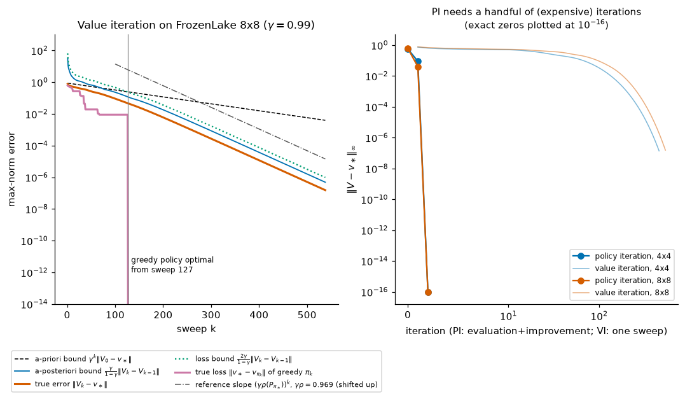

*Left (8×8): the true error (orange) always lies below both the a-priori bound (black dashed) and the a-posteriori bound (blue). The true loss of the greedy policy (pink) drops to exactly zero at sweep 127, long before its bound (green dotted) says so. The a-priori bound $\gamma^k\lVert V_0 - v_\ast\rVert$ is very loose here: the error shrinks at the rate $\gamma\rho(\mathbf{P}_{\pi_\ast}) \approx 0.969$ of the optimal policy (dash-dotted reference slope), not at $\gamma = 0.99$, because the optimal policy terminates (see the text below). Right: policy iteration (dots) reaches $v_\ast$ exactly in two improvements, while value iteration needs hundreds of sweeps to reach $10^{-7}$.*

**Why does VI beat the a-priori bound here?** Not because $\mathcal{T}^\ast$ contracts faster. [`frozenlake_pi_vi.py`](../code/ch03_dynamic_programming/frozenlake_pi_vi.py) finds that 125 of the 212 non-terminal state–action pairs of the 8×8 map (59%; 16 of 44 on 4×4) cannot end the episode in one step. In 27 of its states no action can, so there $\mathcal{T}^\ast(u + c\mathbf{1}) = \mathcal{T}^\ast u + \gamma c$ exactly, and the modulus of $\mathcal{T}^\ast$ is exactly $\gamma$. There is even an improper policy: "always up" never terminates from the top row, and its matrix has spectral radius $\rho(\mathbf{P}_{\text{up}}) = 1$. The cause is that the *optimal* policy terminates. Start from $V_0 = \mathbf{0} \le v_\ast$ (all rewards are nonnegative). By monotonicity $V_k \le v_\ast$ for all $k$. Let $\pi_\ast$ be greedy with respect to $v_\ast$, so that $v_\ast = \mathcal{T}^{\pi_\ast}v_\ast$, and use $\mathcal{T}^\ast V_{k-1} \ge \mathcal{T}^{\pi_\ast}V_{k-1}$ from (3.4):

$$
0 \;\le\; v_\ast - V_k = \mathcal{T}^{\pi_\ast}v_\ast - \mathcal{T}^\ast V_{k-1} \;\le\; \mathcal{T}^{\pi_\ast}v_\ast - \mathcal{T}^{\pi_\ast}V_{k-1} = \gamma\mathbf{P}_{\pi_\ast}(v_\ast - V_{k-1}).
$$

Because $\mathbf{P}_{\pi_\ast}$ has nonnegative entries, induction gives

$$
0 \;\le\; v_\ast - V_k \;\le\; \gamma^k\mathbf{P}_{\pi_\ast}^k(v_\ast - V_0).
$$

The error is governed by the optimal policy's own transition matrix. That policy reaches a hole or the goal with probability 1, and $\rho(\mathbf{P}_{\pi_\ast}) = 0.9788$ (0.9757 on 4×4), so the error shrinks by about $\gamma\rho = 0.969$ per sweep instead of 0.99. Once the greedy policy $\pi_k$ is optimal (from sweep 127), the inequality becomes an equality, $V_{k+1} - v_\ast = \mathcal{T}^{\pi_k}V_k - \mathcal{T}^{\pi_k}v_\ast = \gamma\mathbf{P}_{\pi_k}(V_k - v_\ast)$. The measured error ratio per sweep, from sweep 250 to the last sweep, is 0.96910 against $\gamma\rho = 0.96901$ (4×4: 0.96598 and 0.96598), and the script checks the bound at every sweep. A uniform termination probability in *every* state–action pair would improve the modulus of the operator itself (Exercise 5), but FrozenLake is far from that.

The practical lesson: **policies converge long before values do.** VI with a tight threshold spends most of its effort polishing digits of $V$ that cannot change the greedy action. This observation motivates modified policy iteration (Section 7) and, much later, the use of approximate values in deep RL.

### 6.6 The gambler's problem

A gambler with capital $s$ bets an integer stake $a \le \min(s, 100-s)$ on a coin that comes up heads with probability $p_h$. She wins when she reaches 100, which pays reward 1 and ends the episode, and loses when she reaches 0. With $\gamma = 1$, $v_\ast(s)$ is the maximal probability of reaching 100 from $s$. With stakes $\ge 1$ every policy is proper (Section 2.8), so VI converges. [`gamblers_problem.py`](../code/ch03_dynamic_programming/gamblers_problem.py) stops at $\Delta < 10^{-13}$. For $p_h = 0.4$ this takes 23 in-place sweeps or 42 synchronous ones.

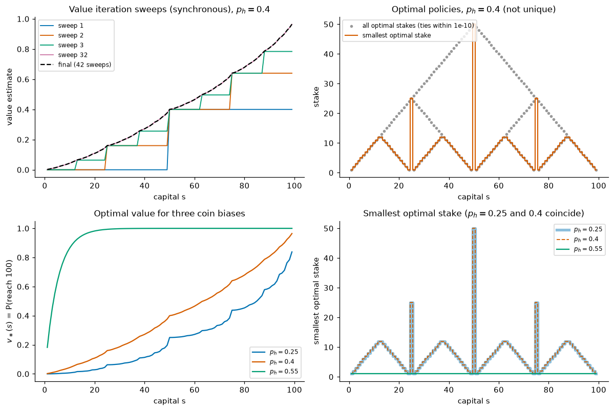

*Top left: synchronous VI sweeps for $p_h = 0.4$ (S&B Figure 4.3, top). After sweep 1 only $s \ge 50$ has value (bet everything once). Each sweep adds one more round of possible bets. Top right: all optimal stakes (grey) and the smallest one (orange, S&B's plotted policy). Bottom: $v_\ast$ and the smallest optimal stake for three coin biases.*

Things to notice:

* **Exact values.** $v_\ast(50) = 0.4 = p_h$ (bet everything once), $v_\ast(25) = 0.16 = p_h^2$, and $v_\ast(75) = 0.64 = p_h + (1-p_h)p_h$.
* **Optimal policies are far from unique.** 72 of the 99 states have more than one optimal stake (ties within $10^{-10}$, after polishing $v_\ast$ with one exact evaluation). The famous spiky policy in S&B's figure is just "the smallest optimal stake". *Bold play*, always staking $\min(s, 100-s)$, is also optimal, with $\lVert v_{\text{bold}} - v_\ast\rVert_\infty = 1.1\times10^{-16}$. This agrees with the classical result of Dubins & Savage (1965) that bold play is optimal in a sub-fair casino. If you plot an "optimal policy" from VI, plot all maximisers. Otherwise round-off decides which one you see.
* **The coin's bias flips the strategy.** With $p_h = 0.25$ the smallest optimal stakes are identical to those for $p_h = 0.4$. With $p_h = 0.55$ the unique optimal policy is *timid play*, always staking 1. Value iteration, which knows nothing about timid play, agrees with timid play's exact value to $9.0\times10^{-12}$, and that value matches the gambler's-ruin formula $v(s) = \frac{1 - (q/p)^s}{1 - (q/p)^{100}}$, with $p = 0.55$ and $q = 0.45$, to $5\times10^{-15}$. Convergence is slow: 4,757 synchronous sweeps. Timid play makes episodes long, and with $\gamma = 1$ only termination makes the iteration contract.

---

## 7. Modified policy iteration

### 7.1 A whole spectrum between PI and VI

Policy iteration evaluates each policy completely. Value iteration evaluates it for one sweep. **Modified (or truncated) policy iteration** (MPI; Puterman & Shin, 1978) does $m$ sweeps:

$$
\pi_{k+1} \text{ greedy with respect to } V_k, \qquad V_{k+1} = (\mathcal{T}^{\pi_{k+1}})^m V_k. \tag{3.24}
$$

With $m = 1$ this is exactly value iteration, because $\mathcal{T}^{\pi_{k+1}}V_k = \mathcal{T}^\ast V_k$. As $m \to\infty$ it becomes policy iteration. Why bother with the middle? The first application of $\mathcal{T}^{\pi_{k+1}}$ costs as much as a $\mathcal{T}^\ast$ sweep, $O(\lvert\mathcal{S}\rvert^2\lvert\mathcal{A}\rvert)$ for a dense model, because computing the greedy action requires all $q_V(s,a)$. The other $m-1$ sweeps apply a *fixed* policy and cost $O(\lvert\mathcal{S}\rvert^2)$, a factor $\lvert\mathcal{A}\rvert$ less. They also warm-start from the previous values, so they do not waste the work already done.

```text
Algorithm 3.4  Modified policy iteration
Input:  model r(s,a), p(s'|s,a); γ ∈ [0, 1); m ≥ 1 sweeps per improvement; tolerance tol > 0
Initialise V(s) arbitrarily (e.g. 0). For monotone convergence (Theorem 3.6) use
           V(s) = min_{s,a} r(s,a)/(1−γ), valid when no transition terminates or min r ≤ 0.
           π(s) ∈ A(s) arbitrarily.
Loop:
    For each s, a ∈ A(s):  Q(s,a) ← r(s,a) + γ Σ_{s'} p(s'|s,a) V(s')
    If max_s | max_a Q(s,a) − V(s) | < (1 − γ)·tol:                 # residual bound (3.11): ||V − v_*|| < tol
        π(s) ← argmax_a Q(s,a) for all s (keep the old action on ties);  stop
    π(s) ← argmax_a Q(s,a) for all s  (keep the old action on ties)   # improvement
    V(s) ← max_a Q(s,a) for all s                                     # the 1st evaluation sweep = T* V
    Repeat m − 1 times:  V ← r_π + γ P_π V                            # partial evaluation, warm-started
Output V and π (greedy with respect to the final V)
Guarantee: ||V − v_*|| < tol, and v_π ≥ v_* − 2γ·tol (apply (3.11) to T^π and T*, as in Theorem 3.5).
```

### 7.2 Convergence

**Theorem 3.6 (MPI, monotone case).** Let $\gamma < 1$ and suppose $\mathcal{T}^\ast V_0 \ge V_0$. Then the MPI iterates satisfy $(\mathcal{T}^\ast)^k V_0 \le V_k \le V_{k+1} \le v_\ast$ for all $k$. In particular $V_k \to v_\ast$ at least as fast as value iteration started from the same $V_0$.

*Proof.* We show by induction that $\mathcal{T}^\ast V_k \ge V_k$, that $V_{k+1} \ge \mathcal{T}^\ast V_k$, and that $V_{k+1} \le v_\ast$. Write $\pi = \pi_{k+1}$, so $\mathcal{T}^\pi V_k = \mathcal{T}^\ast V_k \ge V_k$. By monotonicity of $\mathcal{T}^\pi$ the sequence $(\mathcal{T}^\pi)^j V_k$ is non-decreasing in $j$ and converges to $v_\pi$. Hence $V_{k+1} = (\mathcal{T}^\pi)^m V_k \ge \mathcal{T}^\pi V_k = \mathcal{T}^\ast V_k \ge V_k$, and $V_{k+1} \le v_\pi \le v_\ast$. The invariant is preserved: $\mathcal{T}^\ast V_{k+1} \ge \mathcal{T}^\pi V_{k+1} = (\mathcal{T}^\pi)^{m+1}V_k \ge (\mathcal{T}^\pi)^m V_k = V_{k+1}$. Finally $V_{k+1} \ge \mathcal{T}^\ast V_k \ge \mathcal{T}^\ast\big((\mathcal{T}^\ast)^kV_0\big)$ by the induction hypothesis and monotonicity. $\blacksquare$

The starting condition is easy to meet. If no transition terminates, or if $\min_{s,a}r(s,a) \le 0$, then $V_0 = \frac{\min_{s,a}r(s,a)}{1-\gamma}\mathbf{1}$ works. MPI also converges from arbitrary starts when $\gamma < 1$, although the iterates then need not be monotone (Puterman, 1994, Chapter 6). Error bounds for approximate MPI, where each step may be inexact, are a starting point for the theory of approximate DP (Scherrer et al., 2015).

### 7.3 Measurements

[`timing_comparison.py`](../code/ch03_dynamic_programming/timing_comparison.py) runs VI ($m = 1$), MPI with $m \in \lbrace 2, 5, 10, 20, 50, 100\rbrace$, and PI. Every method is run to the *same* guarantee, $\lVert V - v_\ast\rVert_\infty < 10^{-6}$ by the residual bound. Timings are the minimum of 5 repetitions on one thread. The machine is shared, so timings can differ by a factor of 2–3 between runs; the iteration counts are exact. Results for a random MDP with 200 states, 5 actions and 10 random successors per state–action pair:

| method | $\gamma = 0.9$ | $\gamma = 0.99$ | $\gamma = 0.999$ |
|---|---|---|---|
| VI (sweeps / time) | 153 / 12.7 ms | 1,816 / 151 ms | 20,535 / 1,710 ms |
| MPI $m=5$ (improvements + extra sweeps / time) | 32 + 124 / 4.6 ms | 364 + 1,452 / 52 ms | 4,108 + 16,428 / 586 ms |
| MPI $m=20$ | 9 + 152 / 2.0 ms | 92 + 1,729 / 22 ms | 1,028 + 19,513 / 246 ms |
| MPI $m=100$ | 4 + 297 / 2.4 ms | 20 + 1,881 / 16 ms | 207 + 20,394 / 145 ms |
| PI (iterations / time) | 5 / 4.5 ms | 5 / 3.1 ms | 5 / 2.9 ms |

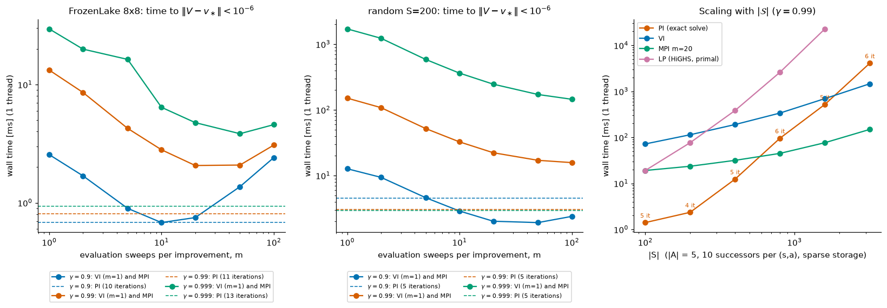

*Left and middle: wall time to reach $\lVert V - v_\ast\rVert < 10^{-6}$ as a function of $m$ (solid; $m = 1$ is VI), with PI as dashed lines, for FrozenLake 8×8 and the 200-state random MDP. Right: scaling with the number of states (Section 12).*

What the numbers say:

* **VI's sweep count follows (3.12).** The worst-case prediction with $R_{\max} \approx 1$ and $\epsilon = 10^{-6}$ is 153, 1,833 and 20,713 sweeps; the measured counts are 153, 1,816 and 20,535. Ten times the horizon costs about twelve times the sweeps (the logarithm adds the extra factor).
* **MPI does not reduce the number of sweeps, it makes them cheaper.** Improvements plus extra sweeps add up to roughly VI's count ($1{,}028 + 19{,}513 \approx 20{,}535$), but most are fixed-policy sweeps, a factor $\lvert\mathcal{A}\rvert$ cheaper. So MPI with $m = 100$ is about 12 times faster than VI at $\gamma = 0.999$. There is a sweet spot around $m = 10$–$50$: very large $m$ wastes sweeps on a policy that is about to change (FrozenLake 8×8, $\gamma = 0.9$: 2.4 ms for $m = 100$ against 0.75 ms for $m = 20$).
* **PI's cost hardly depends on $\gamma$.** It needed 5 iterations at every $\gamma$, each a 200×200 linear solve, and it was the fastest method at $\gamma = 0.99$ and $0.999$. At $\gamma = 0.9$, MPI with $m = 20$–$50$ was faster in this run, but at the scale of a few milliseconds the timings are noisy. On FrozenLake 8×8 at $\gamma = 0.99$, PI takes 11 iterations and 0.8 ms, VI 516 sweeps and 13 ms, and MPI ($m = 20$) 29 improvements plus 532 sweeps and 2.1 ms. (Here PI starts from "always move left", and VI and MPI stop by the residual test $\lVert\mathcal{T}^\ast V - V\rVert < (1-\gamma)10^{-6}$, so the counts differ from Sections 5.4 and 6.5.) The right panel of the figure shows when PI stops winning.

---

## 8. Asynchronous dynamic programming

### 8.1 Updating states in any order

The algorithms so far sweep the whole state space and treat every state alike. Nothing requires this. **Asynchronous DP** applies the backup to *one state at a time*, in any order, using whatever values are currently stored:

```text
Algorithm 3.5  Asynchronous value iteration
Input:  model r(s,a), p(s'|s,a); γ ∈ [0, 1); a rule for choosing the next state s_n
        (any rule, deterministic or random, provided every state is chosen infinitely often)
Parameter: threshold θ > 0
Initialise V(s) arbitrarily for all s ∈ S; V(terminal) = 0
For n = 0, 1, 2, ...:
    choose s_n
    V(s_n) ← max_a [ r(s_n,a) + γ Σ_{s'} p(s'|s_n,a) V(s') ]      # in place; every other entry is unchanged
    Every |S| backups (e.g. after each full cycle through the states):
        Δ ← max_s |(T* V)(s) − V(s)|      # one synchronous check that does not change V
        If Δ < θ: stop
Output V and π(s) ∈ argmax_a q_V(s,a). By (3.11), ||V − v_*|| ≤ Δ/(1−γ), and v_π ≥ v_* − 2γΔ/(1−γ).
```

In-place sweeps (Gauss–Seidel) are the special case of cyclic order. Other orders include random states, the states an agent actually visits (real-time DP, [Chapter 07](07-planning-and-learning-tabular.md)), states with large Bellman error (prioritized sweeping, [Chapter 07](07-planning-and-learning-tabular.md)), and many processors updating different states with possibly stale copies of $V$ (Bertsekas, 1982).

**Theorem 3.7 (asynchronous VI converges).** If $\gamma < 1$ and every state is selected infinitely often, then $V_n \to v_\ast$ from any $V_0$.

*Proof.* Let $e_n = \lVert V_n - v_\ast\rVert_\infty$. A backup of state $s_n$ gives $\lvert V_{n+1}(s_n) - v_\ast(s_n)\rvert = \lvert(\mathcal{T}^\ast V_n)(s_n) - (\mathcal{T}^\ast v_\ast)(s_n)\rvert \le \gamma e_n$ by Theorem 3.1, and leaves every other entry unchanged. Hence $e_{n+1} \le e_n$: the error never grows. Define times $n_0 = 0 < n_1 < n_2 < \dots$, where $n_{j+1}$ is the first time by which every state has been backed up at least once after $n_j$. Each $n_{j+1}$ is finite because every state is selected infinitely often. Take any state $s$. Its last backup in $[n_j, n_{j+1})$ happens at some time $n' \ge n_j$ and leaves it with error at most $\gamma e_{n'} \le \gamma e_{n_j}$, and $s$ is not touched again before $n_{j+1}$. So $e_{n_{j+1}} \le \gamma e_{n_j}$, and $e_{n_j} \le \gamma^j e_0 \to 0$. Since $e_n$ is non-increasing, $e_n \to 0$. $\blacksquare$

The same argument works for asynchronous policy evaluation with $\mathcal{T}^\pi$. Mixing asynchronous evaluation and improvement steps in arbitrary interleavings is more delicate, and convergence then needs extra conditions (Bertsekas & Tsitsiklis, 1996).

Asynchrony does not reduce the *total* work needed for convergence in the worst case. What it buys is **freedom**. You can interleave computation with real interaction, focus on the states that matter, and send value information where it is needed first.

### 8.2 Does the order matter? Measured

[`async_dp.py`](../code/ch03_dynamic_programming/async_dp.py) counts single-state backups until $\lVert V - v_\ast\rVert_\infty < 10^{-6}$ on FrozenLake 8×8 with $\gamma = 0.99$. The start is the top-left cell (state 0) and the goal is the bottom-right cell (state 63):

| backup order | slippery: backups (sweeps) | deterministic (`is_slippery=False`): backups (sweeps) |
|---|---|---|
| synchronous (Jacobi) | 30,656 (479.0) | 896 (14.0) |
| Gauss–Seidel, order 0..63 (start → goal) | 20,089 (313.9) | 833 (13.0) |
| Gauss–Seidel, order 63..0 (goal → start) | 19,656 (307.1) | 152 (2.4) |
| uniformly random state | 31,517 (492.5) | 765 (12.0) |
| largest Bellman error first | 14,978 (234.0) | **53 (0.8)** |

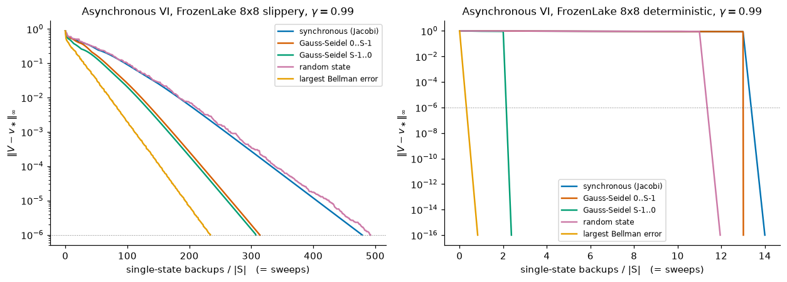

*Error against the number of single-state backups divided by $\lvert\mathcal{S}\rvert$. All five orders converge, as Theorem 3.7 promises. In the deterministic lake (right), value information has to travel 14 steps from the goal to the start, so synchronous sweeps need 14 sweeps, while backing states up in the right order needs one backup per state.*

In the **deterministic** lake the shortest path to the goal has 14 steps, so $v_\ast(\text{start}) = 0.99^{13} = 0.8775$. Jacobi sweeps move information one step per sweep and need exactly 14 sweeps. A Gauss–Seidel sweep that runs *from the goal backwards* carries the information to the start, and to most other states, in a single pass. The states whose optimal path must first detour up or left around a hole are still wrong after that pass and need parts of two more, 2.4 sweeps in total. "Largest Bellman error first" orders the backups like Dijkstra's algorithm: 53 backups, one for each of the 53 non-terminal states. (The prioritised run recomputed all Bellman errors after every backup. We count backups, not that bookkeeping, which [Chapter 07](07-planning-and-learning-tabular.md) makes efficient with a priority queue.) In the **slippery** lake, value flows in every direction at once, so no ordering can finish in one pass. Good orders still save a factor of 1.5–2. Random order is no better than synchronous sweeps.

---

## 9. Generalized policy iteration

Step back and look at the algorithms of Sections 3–8. All of them maintain two things, a policy and a value function, and run two processes that interact:

* **evaluation** makes the value function consistent with the current policy ($V \to v_\pi$);
* **improvement** makes the policy greedy with respect to the current value function ($\pi \to \text{greedy}(V)$).

Sutton & Barto call this pattern **generalized policy iteration (GPI)**. The algorithms differ only in *how much* of each process they run before switching and *where* in the state space they run it. Policy iteration runs evaluation to completion. Modified PI runs it for $m$ sweeps. Value iteration runs one sweep. Asynchronous DP interleaves the two processes state by state.

```text
                   evaluation:  V → v_π
          ┌───────────────────────────────────────┐
          │                                       ▼
        π, V                                    π, V          ...  →   π_*, v_*
          ▲                                       │
          └───────────────────────────────────────┘
                 improvement:  π → greedy(V)

  Each process pulls toward its own goal: evaluation toward V = v_π,
  improvement toward π = greedy(V). The goals conflict (a greedy change makes
  V stale; a new V makes π non-greedy), and both hold at once only where the
  Bellman optimality equation holds: V = v_* and π = π_*.
```

Why does GPI converge? For policy iteration, improvement with respect to the exact $v_\pi$ is never harmful (Theorem 3.3). For VI, MPI and asynchronous DP, the improvement step uses an inexact $V$, so Theorem 3.3 does not apply; their convergence comes instead from the contraction and monotonicity of the operators (Theorems 3.1, 3.6 and 3.7). In every case the only joint fixed point, a policy greedy with respect to its own value, is optimal (Theorem 3.2). Formal guarantees exist for the exact methods of this chapter. For the approximate versions that follow, convergence is often not guaranteed, but the GPI picture still explains what each algorithm is trying to do.

**GPI is the organising idea of this course.** Almost every method you will meet is GPI with one or both processes replaced by an approximation:

| chapter | evaluation process | improvement process |
|---|---|---|
| [04 Monte Carlo](04-monte-carlo.md) | average sampled returns | $\varepsilon$-greedy with respect to $Q$ |
| [05 TD learning](05-temporal-difference.md) | one sampled backup per step (SARSA, Q-learning) | $\varepsilon$-greedy with respect to $Q$ after every step |
| [07 Planning and learning](07-planning-and-learning-tabular.md) | expected or sample backups on a learned model (Dyna) | greedy, or search at decision time (MCTS) |
| [09 DQN](09-deep-q-learning.md) | regression toward targets from a frozen network | greedy with respect to the network |
| [10 Policy gradients](10-policy-gradients.md) | a critic estimates $v_\pi$ or the advantage | a *gradient step* on the policy instead of a greedy jump |
| [11 TRPO/PPO](11-trust-regions-and-ppo.md) | advantage estimation (GAE) | an improvement step constrained to a trust region |
| [12 SAC](12-continuous-control-actor-critic.md) | soft (entropy-regularised) policy evaluation | soft greedy step: a Boltzmann policy |
| [13 AlphaZero](13-model-based-rl.md) | a value network trained on game outcomes | MCTS as a policy-improvement operator |

Keep this table in mind. When a new algorithm appears, ask what its evaluation step is, what its improvement step is, and how often it switches between them.

---

## 10. Linear programming: values in the primal, occupancy measures in the dual

### 10.1 The primal LP

Chapter 01 (Section 13) previewed one more exact method: $v_\ast$ is the smallest $v$ satisfying $v \ge \mathcal{T}^\ast v$. Now we can prove it. The condition $v(s) \ge \max_a q_v(s,a)$ is the same as $v(s) \ge q_v(s,a)$ for every $a$, which is a set of *linear* inequalities. Fix weights $\mu(s) > 0$ (for example an initial-state distribution with full support; $\mu$ plays the role of $d_0$ in NOTATION.md) and solve the **primal LP** (Manne, 1960; d'Epenoux, 1963):

$$
\begin{aligned}
\min_{v \in \mathbb{R}^{\mathcal{S}}}\ \ & \sum_s \mu(s)\, v(s)\\
\text{s.t.}\ \ & v(s) \ge r(s,a) + \gamma\sum_{s'}p(s'\mid s,a)\, v(s') \qquad\text{for all } s \in\mathcal{S},\ a\in\mathcal{A}(s).
\end{aligned} \tag{3.25}
$$

**Theorem 3.8(a).** For $\gamma < 1$ and $\mu > 0$, the unique optimal solution of (3.25) is $v_\ast$.

*Proof.* $v_\ast$ is feasible, since $v_\ast = \mathcal{T}^\ast v_\ast \ge q_{v_\ast}(\cdot, a)$ for every $a$. Any feasible $v$ satisfies $v \ge \mathcal{T}^\ast v$, hence $v \ge v_\ast$ by (3.13). So $\mu^\top v \ge \mu^\top v_\ast$, with equality only if $v = v_\ast$ because every $\mu(s) > 0$. $\blacksquare$

The LP has $\lvert\mathcal{S}\rvert$ variables and one constraint per state–action pair. The right panel of the value-plane figure in Section 5.3 draws its feasible set for the maintenance MDP: four half-planes whose intersection is a wedge with $v_\ast$ at the tip.

### 10.2 The dual LP and occupancy measures

LP duality says that for a primal $\min_v c^\top v$ subject to $\mathbf{A}v \ge b$ with $v$ free, the dual is $\max_x b^\top x$ subject to $\mathbf{A}^\top x = c$ and $x \ge 0$, and the two optimal values are equal (strong duality). In (3.25), the row of $\mathbf{A}$ for the pair $(s,a)$ is $e_s^\top - \gamma\, p(\cdot\mid s,a)^\top$, where $e_s$ is the indicator vector of $s$. The right-hand side is $b_{(s,a)} = r(s,a)$ and $c = \mu$. With one dual variable $x(s,a) \ge 0$ per constraint, the **dual LP** is

$$
\begin{aligned}
\max_{x \ge 0}\ \ & \sum_{s,a} x(s,a)\, r(s,a)\\
\text{s.t.}\ \ & \sum_a x(s',a) - \gamma\sum_{s,a} p(s'\mid s,a)\, x(s,a) = \mu(s') \qquad\text{for all } s' \in \mathcal{S}.
\end{aligned} \tag{3.26}
$$

The constraint is a **flow-conservation** equation. The discounted flow out of $s'$ equals the initial mass in $s'$ plus the discounted flow into $s'$. Its solutions are exactly the discounted **state–action occupancy measures**

$$
x_\pi(s,a) \doteq \sum_{t=0}^\infty \gamma^t \Pr\nolimits_\pi\lbrace S_t = s, A_t = a \mid S_0 \sim \mu\rbrace, \qquad\text{which for stationary } \pi \text{ equals}\qquad d^\pi_\mu(s)\,\pi(a\mid s), \quad d^\pi_\mu(s) \doteq \sum_{t=0}^\infty\gamma^t\Pr\nolimits_\pi\lbrace S_t = s \mid S_0\sim\mu\rbrace, \tag{3.27}
$$

as the next result shows. Note that $d^\pi_\mu$ is *unnormalised*: when no episode terminates, $\sum_s d^\pi_\mu(s) = 1/(1-\gamma)$. [Chapter 10](10-policy-gradients.md) calls this quantity $\eta_\gamma$ and normalises it to sum to 1, and [Chapter 16](16-offline-rl-and-imitation.md) uses $(1-\gamma)d^\pi_\mu$.

**Theorem 3.8(b)–(d).** Let $\gamma < 1$ and $\mu > 0$.

(b) *Feasible points are occupancy measures.* For every policy $\pi$, including non-stationary and history-dependent ones, $x_\pi$ is feasible for (3.26), and its objective value is $\sum_{s,a}x_\pi(s,a)r(s,a) = \mu^\top v_\pi$. Conversely, every feasible $x$ equals $x_{\pi_x}$ for the stationary policy $\pi_x(a\mid s) = x(s,a)/\sum_{a'}x(s,a')$.

(c) *Strong duality and complementary slackness.* The dual optimum equals $\mu^\top v_\ast$. If $x$ is dual-optimal, then $x(s,a) > 0$ implies that the primal constraint for $(s,a)$ is tight, $v_\ast(s) = q_\ast(s,a)$: the policy $\pi_x$ uses only optimal actions.

(d) *Vertices are deterministic policies.* Every basic feasible solution (vertex) of (3.26) has exactly one positive $x(s,\cdot)$ in each state, so it is the occupancy measure of a deterministic policy.

*Proof.* (b) *Every policy gives a feasible point.* Let $p_t(s,a) \doteq \Pr_\pi\lbrace S_t = s, A_t = a\rbrace$ with $S_0 \sim \mu$. Whatever the policy, the environment moves from $(S_t, A_t)$ to $S_{t+1}$ according to $p(\cdot\mid S_t, A_t)$, so $\sum_a p_{t+1}(s',a) = \Pr_\pi\lbrace S_{t+1} = s'\rbrace = \sum_{s,a}p(s'\mid s,a)\,p_t(s,a)$ (with our convention, the missing mass is the probability of having terminated), and $\sum_a p_0(s',a) = \mu(s')$. Multiply by $\gamma^{t+1}$ and sum over $t \ge 0$:

$$
\sum_a x_\pi(s',a) = \mu(s') + \gamma\sum_{s,a}p(s'\mid s,a)\,x_\pi(s,a),
$$

which is the constraint of (3.26). Only the state–action marginals enter, never the history. The objective is $\sum_t\gamma^t\sum_{s,a}p_t(s,a)\,r(s,a) = \sum_t\gamma^t\,\mathbb{E}_\pi[R_{t+1}] = \mu^\top v_\pi$. *Every feasible point is a stationary policy's occupancy.* Write $x(s) \doteq \sum_a x(s,a)$. From the constraint, $x(s') = \mu(s') + \gamma\sum_{s,a}p(s'\mid s,a)x(s,a) \ge \mu(s') > 0$, so $\pi_x$ is well defined. Substituting $x(s,a) = x(s)\pi_x(a\mid s)$ turns the inflow term into $\sum_s x(s)\sum_a\pi_x(a\mid s)p(s'\mid s,a) = \sum_s x(s)\,\mathbf{P}_{\pi_x}(s,s')$. In row-vector form the constraint reads $x^\top(\mathbf{I} - \gamma\mathbf{P}_{\pi_x}) = \mu^\top$, so

$$
x^\top = \mu^\top(\mathbf{I}-\gamma\mathbf{P}_{\pi_x})^{-1} = \sum_{t\ge0}\gamma^t\mu^\top\mathbf{P}_{\pi_x}^t,
$$

which is $d^{\pi_x}_\mu$ (the $t$-th term is the distribution of $S_t$ under $\pi_x$). Hence $x(s,a) = d^{\pi_x}_\mu(s)\pi_x(a\mid s) = x_{\pi_x}(s,a)$.

(c) Strong duality holds because the primal has an optimal solution. Complementary slackness is the standard LP fact that a positive dual variable forces its primal constraint to be tight. We can also check weak duality directly. For primal-feasible $v$ and dual-feasible $x$,

$$
\sum_{s,a}x(s,a)\,r(s,a) \le \sum_{s,a}x(s,a)\Big[v(s) - \gamma\sum_{s'}p(s'\mid s,a)v(s')\Big] = \sum_{s'}v(s')\Big[\sum_a x(s',a) - \gamma\sum_{s,a}p(s'\mid s,a)x(s,a)\Big] = \mu^\top v,
$$

where the inequality uses $x \ge 0$ and primal feasibility, and the first equality regroups the sum by $s'$. This computation uses only $x \ge 0$ and the flow constraint, so it holds for any $\mu \ge 0$.

(d) The dual has $\lvert\mathcal{S}\rvert$ equality constraints, so a vertex has at most $\lvert\mathcal{S}\rvert$ positive entries. By (b) each state needs at least one, so each state has exactly one. $\blacksquare$

**An independent proof of Theorem 3.2, part 1.** Take any policy $\pi$ (history-dependent or not), $\mu = e_s$, and the fixed point $\hat v$ of $\mathcal{T}^\ast$, which is primal-feasible because $\hat v = \mathcal{T}^\ast\hat v \ge q_{\hat v}(\cdot, a)$ for every $a$. The first half of (b), whose proof did not use $\mu > 0$, says that $x_\pi$ satisfies the flow constraint. So weak duality gives $v_\pi(s) = \sum_{s,a}x_\pi(s,a)r(s,a) \le e_s^\top\hat v = \hat v(s)$. That is part 1 of Theorem 3.2 without the induction of Step 1. Part (d) then supplies a deterministic optimal policy, because an LP that has an optimum has an optimal vertex.

Part (d) also explains the link between LP algorithms and policy iteration. A simplex pivot in the dual swaps one action in one state. Policy iteration that changes only the single most-improving state is the simplex method with Dantzig's pivoting rule, which Ye (2011) showed to be strongly polynomial for fixed $\gamma$. Howard's policy iteration changes many states at once, like a block pivot. On 20 random 50-state MDPs, our Exercise 13 measures a mean of 4.5 evaluations for Howard's PI against 45.2 for the one-switch variant.

### 10.3 Worked example: the maintenance MDP

Take $\gamma = 0.8$, $\mu = (0.5, 0.5)$, and the optimal policy $\pi_{rf}$, whose transition matrix is

$$
\mathbf{P}_{\pi_{rf}} = \begin{pmatrix}0.75 & 0.25\\ 1 & 0\end{pmatrix}.
$$

Chapter 01, Section 10.4, computed

$$
(\mathbf{I} - 0.8\,\mathbf{P}_{\pi_{rf}})^{-1} = \frac{1}{0.24}\begin{pmatrix}1 & 0.2\\ 0.8 & 0.4\end{pmatrix}.
$$

So $x^\top = \mu^\top(\mathbf{I}-0.8\mathbf{P})^{-1} = 0.5\,(1.8,\ 0.6)/0.24 = (3.75,\ 1.25)$, that is $x(\mathrm{G},\text{run}) = 3.75$, $x(\mathrm{W},\text{fix}) = 1.25$, and $x = 0$ for the other two pairs. Check: the occupancies sum to $5 = 1/(1-\gamma)$, the effective horizon. A machine that starts in a random state spends a discounted 3.75 of its 5 "effective periods" in G. The dual objective is $3.75\cdot 2 + 1.25\cdot(-1) = 6.25$, which equals the primal objective $\mu^\top v_\ast = 0.5\cdot 7.5 + 0.5\cdot 5 = 6.25$. [`lp_solution.py`](../code/ch03_dynamic_programming/lp_solution.py) solves both LPs with HiGHS and prints `x = [[3.75, 0.0], [0.0, 1.25]]` and equal objectives to $9\times10^{-16}$.

On larger problems the script confirms every part of Theorem 3.8:

| MDP | max $\lvert v_{\text{LP}} - v_\ast\rvert$ | primal − dual objective | states with exactly one positive $x(s,\cdot)$ | max $\lvert x - \mu^\top(\mathbf{I}-\gamma\mathbf{P}_{\pi_x})^{-1}\rvert$ | LP time (primal) | PI time |
|---|---|---|---|---|---|---|
| FrozenLake 8×8, $\gamma=0.99$ | $3.0\times10^{-15}$ | $2.1\times10^{-15}$ | 64 / 64 | $8\times10^{-15}$ | 4.4 ms | 1.2 ms |
| gambler, $p_h = 0.4$, $\gamma = 1$ | $4.3\times10^{-15}$ | 0 | 101 / 101 | $3.5\times10^{-17}$ | 22 ms | (VI: 7.0 ms) |
| random, 200 states, $\gamma=0.95$ | $5.0\times10^{-11}$ | $6.3\times10^{-13}$ | 200 / 200 | $5.1\times10^{-14}$ | 70 ms | 3.8 ms |

(Timings are single runs and can differ by a factor of 2–3 between runs on this shared machine; the accuracy columns are reproducible.) The LP even works for the gambler's problem with $\gamma = 1$, because every policy there is proper, so all the occupancy measures are finite. Two further observations from the script:

* **The dual optimum need not be unique.** In the gambler's problem, HiGHS's dual multipliers for the primal differ from the dual LP's own solution by up to 0.25. Both are optimal (same objective, feasible to $3\times10^{-17}$); they are the occupancies of different optimal policies, because so many stakes tie.
* **$\mu$ must be strictly positive everywhere.** With $\mu = \delta_{\text{start}}$ on FrozenLake 8×8, three non-terminal states (33, 34 and 60) are never visited under $\pi_\ast$. Their occupancies are zero, so the dual says nothing about the action there, and the primal does not pin down their values either: $v_\ast + c\,\mathbf{1}_U$ with $c = 0.0015$ on those states is feasible with the same objective. HiGHS happened to return $v_\ast$, but nothing guaranteed it.

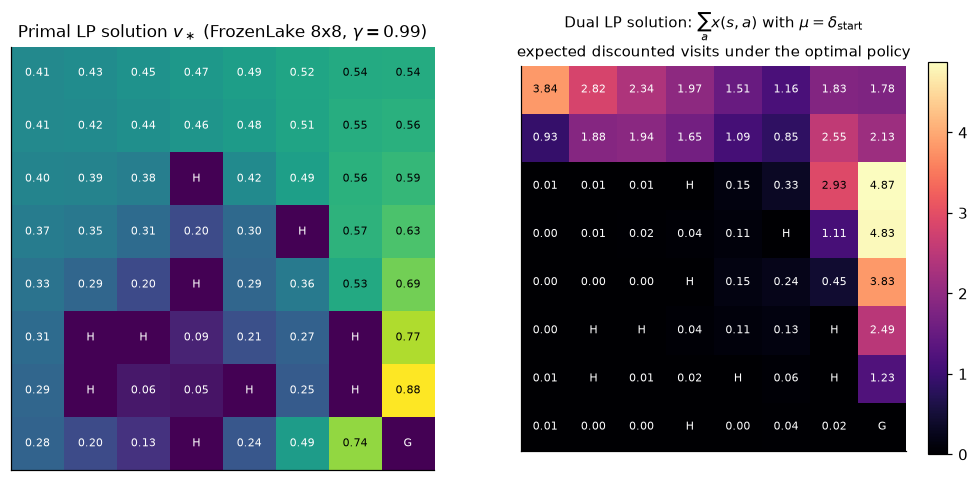

*Left: the primal solution $v_\ast$. Right: the dual solution $\sum_a x(s,a)$ with $\mu = \delta_{\text{start}}$, the expected discounted number of visits to each state under the optimal policy. The optimal agent hugs the top rows and then the right-hand edge.*

Why learn the LP view if PI is faster here? There are three reasons. (1) It settles the *theory*: MDPs can be solved in polynomial time (Section 12). (2) **Constraints are easy.** Adding a budget $\sum_{s,a}x(s,a)c(s,a) \le B$ on an expected discounted cost gives a *constrained MDP* (Altman, 1999), whose optimal policy may need to randomise. A plain Bellman optimality recursion does not find it directly (Lagrangian methods, which solve a Bellman equation for $r - \lambda c$, do so indirectly). In the dual it is one extra linear constraint ([Chapter 20](20-deep-rl-in-practice.md)). (3) **Occupancy measures are everywhere.** The state distribution $d^\pi$ weights the policy-gradient theorem ([Chapter 10](10-policy-gradients.md)). Imitation learning and inverse RL match occupancy measures, and off-policy evaluation estimates their ratios ([Chapter 16](16-offline-rl-and-imitation.md)). Approximate linear programming replaces $v$ by features (de Farias & Van Roy, 2003).

---

## 11. Finite-horizon problems and backward induction

### 11.1 The problem and the algorithm

Many tasks stop after a fixed number of steps $H$: a game with a move limit, a trading day, a Gymnasium `TimeLimit` that is part of the task. The objective is

$$
\mathbb{E}\Big[\sum_{t=0}^{H-1}\gamma^t R_{t+1} + \gamma^H h(S_H)\Big],
$$

with a terminal payoff $h$ (often 0) and any $\gamma \in [0,1]$, including $\gamma = 1$. Because the time left matters, policies may depend on $t$: $\pi = (\pi_0, \dots, \pi_{H-1})$. Define the **optimal value-to-go** $V^\ast_t(s)$ as the best expected remaining reward from state $s$ at time $t$. It satisfies the recursion of **backward induction**:

$$
V^\ast_H = h, \qquad V^\ast_t(s) = \max_a\Big[r(s,a) + \gamma\sum_{s'}p(s'\mid s,a)\,V^\ast_{t+1}(s')\Big] = (\mathcal{T}^\ast V^\ast_{t+1})(s), \qquad \pi^\ast_t(s) \in \arg\max_a q_{V^\ast_{t+1}}(s,a). \tag{3.28}
$$

```text
Algorithm 3.6  Backward induction (finite-horizon DP)
Input:  model r(s,a), p(s'|s,a); horizon H; γ ∈ [0, 1]; terminal payoff h(s) (often 0)
V_H(s) ← h(s) for all s ∈ S;  V(terminal) = 0 at every t
For t = H−1, H−2, ..., 0:
    For each s ∈ S:
        Q_t(s,a) ← r(s,a) + γ Σ_{s'} p(s'|s,a) V_{t+1}(s')     for all a ∈ A(s)
        V_t(s)  ← max_a Q_t(s,a);    π_t(s) ← argmax_a Q_t(s,a)
Output: V_0 (optimal expected return) and the non-stationary policy (π_0, ..., π_{H−1})
To act: at time t in state s, take π_t(s), i.e. use the policy indexed by H − t steps to go.
```

**Theorem 3.9 (backward induction is optimal).** For every policy $\pi$, including history-dependent ones, and every $t$ and $s$, the expected remaining reward from $(t, s)$ is at most $V^\ast_t(s)$, and the deterministic Markov policy $(\pi^\ast_t)$ attains $V^\ast_t$.

*Proof.* Induct backwards from $t = H$, where both sides equal $h$. The inductive step is exactly Step 1 of the proof of Theorem 3.2. Condition on the first action and transition, bound the continuation by $V^\ast_{t+1}$, and note that an average over actions is at most the maximum. The greedy choice $\pi^\ast_t$ turns every inequality into an equality. $\blacksquare$

No contraction and no convergence test are needed. The algorithm is exact after $H$ backward sweeps, at a cost of $O(H\lvert\mathcal{S}\rvert^2\lvert\mathcal{A}\rvert)$, and $\gamma = 1$ is fine.

### 11.2 Value iteration is backward induction run forever

Compare (3.28) with (3.20). They are the same update, read in different directions. $V^\ast_t = (\mathcal{T}^\ast)^{H-t}h$, so **the $k$-th value-iteration iterate $V_k = (\mathcal{T}^\ast)^kV_0$ is the optimal value of the $k$-step problem with terminal payoff $V_0$**, and the greedy policy with respect to $V_k$ is the optimal first action of the $(k{+}1)$-step problem. [`finite_horizon.py`](../code/ch03_dynamic_programming/finite_horizon.py) checks this on FrozenLake 8×8 with $\gamma = 0.99$ for $k = 1, \dots, 100$. VI's iterates and backward induction's values agree exactly (difference 0.0), but that is true by construction, since in code the two perform identical floating-point operations. The informative check is attainment (Theorem 3.9). The script evaluates the greedy non-stationary policy over $k$ steps through its own Markov chain, $v \leftarrow \mathbf{r}_{\pi_t} + \gamma\mathbf{P}_{\pi_t}v$, with no maximisation, and recovers $(\mathcal{T}^\ast)^k\mathbf{0}$ (again with difference 0.0). In the same sense, the infinite-horizon discounted problem is the limit $H\to\infty$. Its optimal policy is stationary because "infinitely many steps to go" is the same at every time. Discounting acts like a *soft* horizon of about $1/(1-\gamma)$ steps.

For the maintenance MDP ($\gamma = 0.8$, $h = 0$), the table of Section 6.4 *is* the backward-induction table. With 1 or 2 steps to go it is optimal to **run** a worn machine ($0.5 > -1$ and $0.9 > 0.6$), since a repair pays off only later. With 3 or more steps to go it is optimal to **fix** it. This is a non-stationary optimal policy (Exercise 9).

### 11.3 FrozenLake under Gymnasium's time limit

`gym.make("FrozenLake-v1", ...)` wraps either map in a 100-step `TimeLimit` (the separately registered `FrozenLake8x8-v1` uses 200 steps, a different task; we use the former throughout). If the time limit is *part of the task*, the task "reach G within 100 steps" is a finite-horizon problem with $\gamma = 1$, a reward of 1 at G, and $H = 100$. If you only care about reaching G eventually, the limit is a simulation artefact, and you should bootstrap through the truncation as NOTATION.md prescribes. Here we take the first view, to see what it changes.

| map | backward induction: max P(reach G within 100) | stationary policy optimal for $\gamma = 0.99$ | stationary policy optimal for $\gamma = 1$ (no limit) |
|---|---|---|---|
| 4×4 | **0.7442** | 0.7402 | 0.7402 |
| 8×8 | **0.6407** | 0.6317 | 0.5143 |

Simulating 10,000 episodes in the real environment gives 0.6383 ± 0.0048 for the non-stationary policy on 8×8, against 0.6297 ± 0.0048 for the stationary one, both consistent with the exact values. On 4×4 the simulations give 0.7525 ± 0.0043 and 0.7476 ± 0.0043, which are 1.9 and 1.7 standard errors above their exact values. The two runs use the same random-number stream, so their errors are correlated.

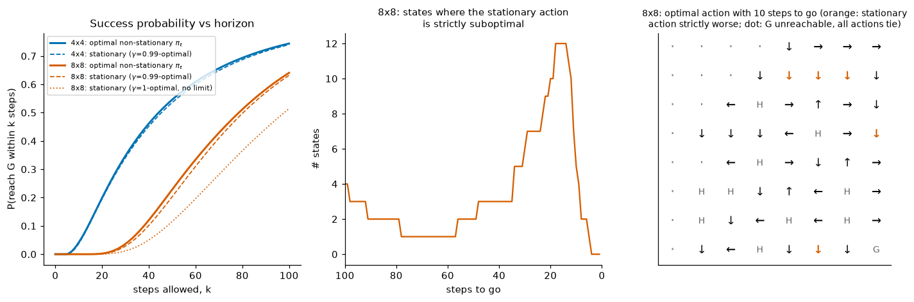

*Left: probability of reaching G within $k$ steps for the optimal non-stationary policy (solid) and for stationary policies (dashed: optimal for $\gamma = 0.99$; dotted, 8×8 only: optimal for $\gamma = 1$, the "eventually reach G" policy). Middle: in how many 8×8 states the $\gamma = 0.99$ stationary action is strictly suboptimal, as a function of steps to go. Most differences occur with 10–30 steps left. Right: the optimal action with 10 steps to go. Orange arrows differ strictly from the stationary policy. Dots mark states from which G is unreachable in 10 steps, so every action ties.*

Three lessons. (1) The optimal policy for a time-limited task **depends on the time left**. In 8×8, the $\gamma = 0.99$ stationary action is strictly worse in 353 of the 5,300 (time, non-terminal state) pairs. These are states where the balance between a safe detour and a quick approach to G shifts as the deadline nears. (2) The gain from non-stationarity is modest here (0.6407 vs 0.6317). The **$\gamma = 1$ policy, however, is badly wrong for the time-limited task** (0.5143). It is so careful that it often runs out of time: it reaches G with probability 1 eventually, but takes 117 steps on average (Section 5.4). A discount slightly below 1 is a reasonable stand-in for an unknown deadline. (3) If the time limit is part of the task, the state must include the time left, or the problem is no longer Markov. Pardo et al. (2018) discuss both cases for deep RL.

---

## 12. Computational complexity and the curse of dimensionality

### 12.1 What each method costs

Let $n = \lvert\mathcal{S}\rvert$, write $\lvert\mathcal{A}\rvert$ for the number of actions per state, and let $b \le n$ bound the number of successors of any state–action pair ($b = n$ for a dense model).

| method | cost per iteration | number of iterations | comments |
|---|---|---|---|
| exact evaluation (linear solve) | $O(n^3)$ dense | 1 | no dependence on $\gamma$; fill-in hurts sparse solvers |
| iterative evaluation (Alg. 3.1) | $O(nb)$ per sweep | $O\big(\frac{1}{1-\gamma}\log\frac{R_{\max}}{\epsilon(1-\gamma)}\big)$ | (3.12) |
| value iteration (Alg. 3.3) | $O(n\lvert\mathcal{A}\rvert b)$ per sweep | same as above | not strongly polynomial (Feinberg & Huang, 2014) |
| policy iteration (Alg. 3.2) | $O(n^3 + n\lvert\mathcal{A}\rvert b)$ | at most $\lvert\mathcal{A}\rvert^n$; $O\big(\frac{n\lvert\mathcal{A}\rvert}{1-\gamma}\log\frac{n}{1-\gamma}\big)$ (Hansen et al., 2013); usually a handful | Newton's method (Puterman & Brumelle, 1979) |
| modified PI, $m$ sweeps (Alg. 3.4) | $O(n\lvert\mathcal{A}\rvert b + (m-1)\,nb)$ | between VI and PI | often the fastest in practice |
| linear programming | polynomial in the input bit size | — | the basis of the complexity theory |
| backward induction, horizon $H$ (Alg. 3.6) | $O(n\lvert\mathcal{A}\rvert b)$ per stage | exactly $H$ | exact, any $\gamma \in [0,1]$ |

Some landmarks from complexity theory, stated carefully:

* Solving an MDP is **P-complete** (Papadimitriou & Tsitsiklis, 1987). It can be done in polynomial time, via linear programming, but probably cannot be parallelised to polylogarithmic time.
* For a **fixed** discount factor, policy iteration and the simplex method with Dantzig's rule are **strongly polynomial** (Ye, 2011; Hansen, Miltersen & Zwick, 2013). Value iteration is not. Feinberg & Huang (2014) built examples in which the number of VI iterations needed to find an optimal policy grows without bound with the problem data, even with exact arithmetic.
* Without discounting the picture changes. Fearnley (2010) gave MDPs with total-reward and average-reward criteria on which Howard's policy iteration takes exponentially many iterations.
* Littman, Dean & Kaelbling (1995) survey these questions and argue that the practical issue is not polynomial-time solvability, but solving *large* problems quickly.

### 12.2 Measured scaling

Part B of [`timing_comparison.py`](../code/ch03_dynamic_programming/timing_comparison.py) grows random sparse MDPs (5 actions, 10 successors per pair, $\gamma = 0.99$) from 100 to 3,200 states. VI and MPI use sparse matrices, so a sweep costs $O(n\lvert\mathcal{A}\rvert b)$. PI uses a dense LU solve, and the LP uses HiGHS with a sparse constraint matrix (one core, same caveat on timings as in Section 7.3):

| $\lvert\mathcal{S}\rvert$ | PI iterations | PI | VI (1,817–1,818 sweeps) | MPI $m=20$ | LP (primal) |
|---|---|---|---|---|---|
| 100 | 5 | 1.4 ms | 72 ms | 19 ms | 19 ms |
| 400 | 5 | 12 ms | 190 ms | 32 ms | 384 ms |
| 800 | 6 | 96 ms | 338 ms | 45 ms | 2,603 ms |
| 1,600 | 5 | 520 ms | 696 ms | 77 ms | 22,797 ms |
| 3,200 | 6 | 4,097 ms | 1,464 ms | 149 ms | (not run) |

* **PI's iteration count does not grow** (4–6 while the problem grows 32-fold), but each iteration's dense solve is cubic, about 8× per doubling at the larger sizes. VI's sweep count is fixed by $\gamma$ and the tolerance, so its time grows roughly linearly.
* **The winner changes with size.** Up to 400 states PI is the fastest method. At 800 states MPI already beats it (45 ms against 96 ms), and at 3,200 states PI is 27 times slower than MPI and slower than plain VI. An iterative linear solver for PI's evaluation step (a Krylov method instead of LU) would change the large-$n$ picture, and MPI is essentially such a method.
* **The general-purpose LP solver is the slowest** at these sizes: 23 s at 1,600 states, so the script skips 3,200. All methods agree with PI's $v_\ast$ to within their tolerance: VI and MPI stop at $\lVert V - v_\ast\rVert < 10^{-6}$ by construction, and the LP agrees to $1.5\times10^{-9}$ or better.

### 12.3 The curse of dimensionality

For a fixed discount factor and accuracy, all of these methods are *polynomial* in the number of states and actions (the LP is polynomial in the input bit size in general). That is vastly better than enumerating the $\lvert\mathcal{A}\rvert^n$ deterministic policies; for the 25-state gridworld of Chapter 01 there are $4^{25} \approx 1.1\times10^{15}$ of them. The trouble is the number of states itself. A state described by $d$ variables, each with $\ell$ possible values, gives $n = \ell^d$ states, and Bellman called this exponential growth the **curse of dimensionality** (Bellman, 1957). Ten bins for each of 6 continuous variables, say the angles and velocities of a three-joint arm, already give $10^6$ states. A dense transition table with 10 actions would then have $10^{13}$ entries. Backgammon has on the order of $10^{20}$ states and Go about $10^{170}$ (Chapter 01, Section 13). DP needs at least one backup per state per sweep, and a table entry per state, so for such problems it is out of the question.

The rest of the course is largely about getting around the curse while keeping the structure of DP:

* **Sample instead of sweep.** Back up only states that experience visits, with sampled rather than expected updates. This removes the need for a model and for full sweeps ([Chapters 04](04-monte-carlo.md)–[06](06-n-step-and-eligibility-traces.md)).
* **Focus.** Plan only from the current state, as in real-time DP and Monte Carlo tree search ([Chapter 07](07-planning-and-learning-tabular.md)).
* **Generalise.** Replace the table by a parameterised function, so that one update affects many states ([Chapters 08](08-function-approximation.md)–[12](12-continuous-control-actor-critic.md)). The max-norm contraction is then lost, and much of [Chapter 08](08-function-approximation.md) is about what that costs.

---

## In code

All scripts are in [`code/ch03_dynamic_programming/`](../code/ch03_dynamic_programming/) and run from the repository root. Each accepts `--quick` (a smoke test of a few seconds that writes no figures). The [README](../code/ch03_dynamic_programming/README.md) lists runtimes and headline results. Results are reported in the sections where they are discussed. This is the map:

| script | what it shows | where in the text | full run |
|---|---|---|---|
| [`dp.py`](../code/ch03_dynamic_programming/dp.py), [`mdps.py`](../code/ch03_dynamic_programming/mdps.py) | the algorithms (Alg. 3.1–3.4, 3.6), the operators on action values and Q-value iteration, and the four MDPs | throughout | library |
| [`maintenance_by_hand.py`](../code/ch03_dynamic_programming/maintenance_by_hand.py) | every hand calculation; contraction, monotonicity, stopping and MacQueen bounds on random MDPs | 2.1, 2.4, 4.3, 5.3, 6.3, 6.4 | 3.6 s |
| [`gridworld_policy_evaluation.py`](../code/ch03_dynamic_programming/gridworld_policy_evaluation.py) | S&B Figure 4.1; two-array vs in-place, with the spectral radii that set their rates | 3.3 | 1.4 s |
| [`frozenlake_pi_vi.py`](../code/ch03_dynamic_programming/frozenlake_pi_vi.py) | PI, VI and Q-value iteration on FrozenLake from `env.unwrapped.P`; bounds; why VI beats $\gamma^k$; simulation check; the $\gamma = 1$ policy | 2.6, 5.4, 6.5 | 9.4 s |
| [`gamblers_problem.py`](../code/ch03_dynamic_programming/gamblers_problem.py) | S&B Example 4.3; ties; timid play vs the closed form; the zero-stake pitfall | 2.8, 6.6, Ex. 10 | 4.5 s |
| [`timing_comparison.py`](../code/ch03_dynamic_programming/timing_comparison.py) | PI vs VI vs MPI for three discounts; scaling to 3,200 states; LP timing up to 1,600 states (`--lp-max`) | 7.3, 12.2 | 64 s |
| [`async_dp.py`](../code/ch03_dynamic_programming/async_dp.py) | five backup orders for asynchronous VI | 8.2 | 2.6 s |
| [`lp_solution.py`](../code/ch03_dynamic_programming/lp_solution.py) | primal and dual LPs with HiGHS; occupancy measures | 10.3 | 1.7 s |
| [`finite_horizon.py`](../code/ch03_dynamic_programming/finite_horizon.py) | backward induction for FrozenLake's 100-step limit; attainment check | 11.2, 11.3 | 15.7 s |
| [`exercise_solutions.py`](../code/ch03_dynamic_programming/exercise_solutions.py) | numerical checks for the exercises; Jack's car rental; one-switch PI; PI and VI on $Q$ | Exercises | 1.2 s |

The core of the library is short. Every backup is one matrix–vector product with the model reshaped to $(\lvert\mathcal{S}\rvert\lvert\mathcal{A}\rvert) \times \lvert\mathcal{S}\rvert$. Invalid actions are masked with $-\infty$, so that a `max` can never pick them:

```python
def q_from_v(mdp, V, mask=True):
    """One-step lookahead: Q[s, a] = r(s,a) + gamma * sum_s' p(s'|s,a) V(s')    (eq. 3.1)."""
    Q = mdp.R + mdp.gamma * (mdp._flatP @ V).reshape(mdp.S, mdp.A)
    if mask:
        Q = np.where(mdp.valid, Q, -np.inf)    # actions not in A(s) can never be chosen
    return Q
```

Modified policy iteration reuses the $Q$ it needed for the stopping test:

```python
def modified_policy_iteration(mdp, m, tol=1e-6, V0=None, max_iter=10_000_000):
    ...
        Q = q_from_v(mdp, V)
        TV = Q.max(axis=1)                                   # T* V  (one full backup)
        if np.max(np.abs(TV - V)) / (1 - g) < tol:           # residual bound (3.11)
            return V, greedy_from_q(Q, actions), it, n_eval
        actions = greedy_from_q(Q, actions)                  # pi_{k+1} greedy w.r.t. V_k
        V = TV                                               # first T^pi application = T* V
        if m > 1:
            r_pi, P_pi = policy_model(mdp, actions)
            for _ in range(m - 1):                           # m - 1 more cheap T^pi sweeps
                V = r_pi + g * (P_pi @ V)
            n_eval += m - 1
```

---

## Common pitfalls and misconceptions

* **Bootstrapping through termination.** A terminal state's value is 0. When you build a model from Gymnasium's `env.unwrapped.P`, a transition flagged `terminated` must not add $\gamma V(s')$, even though FrozenLake lists the hole or goal as $s'$. Gymnasium's `TimeLimit` is not part of the MDP. Either bootstrap through truncation, or, if the limit is part of the task, solve the finite-horizon problem (Section 11).
* **"Δ < θ means my values are accurate to θ."** No. They are accurate to $\gamma\theta/(1-\gamma)$ by (3.16), which is $99\theta$ at $\gamma = 0.99$. With $\gamma = 1$ there is no general bound: in the gridworld the true error was about $17\theta$.
* **"Episodes end, so the effective discount is smaller than $\gamma$."** Only if *every* state–action pair can terminate (Exercise 5). In FrozenLake most cannot, and an improper policy exists. VI still beat the $\gamma^k$ bound there, because the *optimal* policy terminates (Section 6.5). In a task where the optimal policy rarely ends the episode, expect the full $\gamma^k$.
* **Waiting for the values to converge before reading off the policy.** The greedy policy was optimal after 127 of 538 sweeps on FrozenLake 8×8, and after a median of 9 of 252 on random MDPs. If you need the policy, use the bound (3.21) or simply check whether the greedy policy has stopped changing and evaluate it once.
* **Reporting the VI iterate as the value of the greedy policy.** $V_k$ is generally not the value of any policy. Evaluate the policy you return.
* **Policy iteration that never stops.** If ties are broken arbitrarily, or round-off makes two equal $q$-values look different, PI can cycle between equally good policies. Change an action only for a strict improvement (beyond a small tolerance).
* **Greedy with respect to the wrong values.** The policy improvement theorem needs $v_\pi$ for the current $\pi$. Greedy on an arbitrary $V$ can be worse than what you had, and its loss is only bounded by $2\gamma\lVert V - v_\ast\rVert/(1-\gamma)$.
* **Using $\gamma = 1$ without checking termination.** With improper policies the Bellman optimality equation can have several solutions (the gambler with a zero stake), VI can stop at the wrong one, and greedy policies with respect to $v_\ast$ can loop forever (Chapter 01's FrozenLake, the zero-stake gambler).
* **Believing optimal policies are unique.** $v_\ast$ is unique, but $\pi_\ast$ often is not: 72 of 99 gambler states have ties. When you plot "the" optimal policy, either plot every maximiser or say how ties were broken.
* **Taking `argmax` over invalid actions.** If $\mathcal{A}(s)$ varies by state, mask invalid actions with $-\infty$ before maximising. A zero-filled $Q$ can silently select an action that does not exist.
* **"In-place is always better."** It usually is, by about a third in our gridworld, but the order matters. In the deterministic FrozenLake, a start-to-goal sweep took 13 sweeps and a goal-to-start sweep took 2.4. A bad order can make Gauss–Seidel no better than Jacobi.
* **Counting iterations instead of work.** PI's 5 iterations each cost a cubic solve, and VI's thousands of sweeps each cost one sparse product. Which is faster depends on the size, the sparsity and $\gamma$ (Section 12.2).
* **An LP weight vector with zeros.** The primal LP determines $v_\ast(s)$ only where the occupancy is positive. Use $\mu > 0$ everywhere if you want the whole value function and policy.
* **Using a stationary policy for a time-limited task.** Under a hard deadline the optimal policy depends on the time left, and a stationary policy can be noticeably worse. The $\gamma = 1$ stationary policy lost 12.6 percentage points on FrozenLake 8×8.

---

## Historical notes and key papers

* **Origins.** Richard Bellman developed dynamic programming at the RAND Corporation in the early 1950s. He introduced the principle of optimality and the functional equation that now bears his name in papers from 1952 on (for example "On the theory of dynamic programming", *PNAS*, 1952). His book *Dynamic Programming* (Princeton University Press, 1957) systematised them, together with the method of successive approximations (value iteration) and the phrase "curse of dimensionality". The same year he formulated Markovian decision processes in "A Markovian decision process" (*Journal of Mathematics and Mechanics*, 1957). Shapley's "Stochastic games" (*PNAS*, 1953) had already solved two-player stochastic games with a positive stopping probability at every stage (which plays the role of discounting) by successive approximations, an early contraction argument of exactly this kind.
* **Policy iteration.** Ronald Howard introduced policy iteration in *Dynamic Programming and Markov Processes* (Technology Press of MIT and Wiley, 1960), based on his 1958 MIT doctoral thesis. Puterman & Brumelle (*Mathematics of Operations Research*, 1979) formalised and analysed it as Newton's method applied to the Bellman equation.
* **Linear programming.** Manne ("Linear programming and sequential decisions", *Management Science*, 1960) wrote MDPs as linear programs. d'Epenoux (*Management Science*, 1963) treated the discounted case and linked DP and LP.
* **Foundations.** Blackwell ("Discounted dynamic programming", *Annals of Mathematical Statistics*, 1965) and Denardo ("Contraction mappings in the theory underlying dynamic programming", *SIAM Review*, 1967) put the theory on the contraction-mapping footing used in this chapter. MacQueen ("A modified dynamic programming method for Markovian decision problems", *Journal of Mathematical Analysis and Applications*, 1966) gave the bounds (3.23). Puterman (1994, Chapter 6) describes how bounds of this kind are used to eliminate suboptimal actions.
* **Modified PI and asynchronous DP.** Puterman & Shin ("Modified policy iteration algorithms for discounted Markov decision problems", *Management Science*, 1978) introduced MPI. Scherrer, Ghavamzadeh, Gabillon, Lesner & Geist ("Approximate modified policy iteration and its application to the game of Tetris", *JMLR*, 2015) analysed its approximate version. Bertsekas ("Distributed dynamic programming", *IEEE Transactions on Automatic Control*, 1982) proved convergence of asynchronous, distributed value iteration. Bertsekas & Tsitsiklis developed the theory further in *Parallel and Distributed Computation* (1989), "An analysis of stochastic shortest path problems" (*Mathematics of Operations Research*, 1991) and *Neuro-Dynamic Programming* (1996).
* **Bounds on greedy policies.** Williams & Baird ("Tight performance bounds on greedy policies based on imperfect value functions", Northeastern University technical report NU-CCS-93-14, 1993) and Singh & Yee ("An upper bound on the loss from approximate optimal-value functions", *Machine Learning*, 1994) gave the bounds of Section 6.3. They became central once value functions were approximated.
* **Complexity.** Papadimitriou & Tsitsiklis ("The complexity of Markov decision processes", *Mathematics of Operations Research*, 1987) showed that MDPs are P-complete. Littman, Dean & Kaelbling (UAI, 1995) surveyed the running times of MDP algorithms. Ye (*Mathematics of Operations Research*, 2011) proved policy iteration and Dantzig's simplex method strongly polynomial for a fixed discount factor. Hansen, Miltersen & Zwick (*Journal of the ACM*, 2013) improved the bound and extended it to two-player turn-based stochastic games. Fearnley (ICALP, 2010) gave exponential lower bounds for policy iteration under total- and average-reward criteria. Feinberg & Huang (*Operations Research Letters*, 2014) showed that value iteration is not strongly polynomial.
* **In RL.** Sutton & Barto's Chapter 4 (1998; 2nd ed. 2018) made DP the conceptual base of reinforcement learning and popularised the term generalized policy iteration. Barto, Bradtke & Singh (1995) connected asynchronous DP to learning through real-time DP ([Chapter 07](07-planning-and-learning-tabular.md)).

---

## Summary

* **DP** turns Bellman equations into updates and needs a model. It is the exact version of almost everything else in RL.
* $\mathcal{T}^\pi$ and $\mathcal{T}^\ast$ are **monotone** and satisfy the **constant-shift** property, so they are **$\gamma$-contractions in the max norm** (Blackwell's conditions). They have unique fixed points, $v_\pi$ and $v_\ast$, and iteration converges from anywhere at rate $\gamma^k$, with computable a-posteriori and residual bounds. The same holds on action values, with fixed points $q_\pi$ and $q_\ast$; greedy improvement from $Q$ needs no model, which is why the model-free chapters learn $Q$.
* $v_\ast$ is the unique solution of the Bellman optimality equation, and **a deterministic stationary policy is optimal among all policies**. Theorem 1.1 is now complete. LP duality gives an independent proof of the key inequality, and both PI and the LP's vertices construct a deterministic optimal policy.
* **Policy evaluation** iterates $\mathcal{T}^\pi$. In-place sweeps also converge and are usually faster. $\Delta < \theta$ guarantees only $\gamma\theta/(1-\gamma)$ accuracy.
* **Policy improvement**: being greedy with respect to $v_\pi$ never hurts, and helps strictly unless $\pi$ is already optimal.
* **Policy iteration** terminates after finitely many iterations, usually very few. It is Newton's method on the Bellman equation, and strongly polynomial for fixed $\gamma$.
* **Value iteration** iterates $\mathcal{T}^\ast$. Stopping at $\Delta < \epsilon(1-\gamma)/(2\gamma)$ guarantees an $\epsilon$-optimal greedy policy. In practice the policy is optimal much earlier. From $V_0 \le v_\ast$ the error obeys $v_\ast - V_k \le \gamma^k\mathbf{P}_{\pi_\ast}^k(v_\ast - V_0)$, so it shrinks at $\gamma\rho(\mathbf{P}_{\pi_\ast})$ when the optimal policy terminates, even if the operator's modulus is $\gamma$.
* **Modified PI** ($m$ cheap evaluation sweeps per improvement) and **asynchronous DP** (any order, as long as every state keeps being updated) fill the space between PI and VI. Good orders can save a great deal in deterministic problems.
* **Generalized policy iteration**, the interplay of evaluation and improvement, is the template for the rest of the course.
* The **LP view**: $v_\ast$ is the smallest $v$ with $v \ge \mathcal{T}^\ast v$. The dual variables are **discounted occupancy measures**, and vertices are deterministic policies.
* **Finite horizon**: backward induction is exact in $H$ sweeps, and optimal policies depend on the time left. VI's $k$-th iterate is the optimal $k$-step value.
* For fixed $\gamma$ and accuracy, everything is polynomial in $\lvert\mathcal{S}\rvert$ and $\lvert\mathcal{A}\rvert$, but $\lvert\mathcal{S}\rvert$ grows exponentially with the number of state variables: the **curse of dimensionality**. Sampling, focusing and generalisation, the subjects of the coming chapters, are the ways around it.

## Key equations

| | equation |
|---|---|
| one-step lookahead | $q_V(s,a) = r(s,a) + \gamma\sum_{s'}p(s'\mid s,a)V(s')$ (3.1) |
| Bellman operators | $\mathcal{T}^\pi V = \mathbf{r}_\pi + \gamma\mathbf{P}_\pi V$; $(\mathcal{T}^\ast V)(s) = \max_a q_V(s,a)$ (3.2), (3.3) |
| contraction | $\lVert\mathcal{T}u - \mathcal{T}w\rVert_\infty \le \gamma\lVert u - w\rVert_\infty$ (3.8) |
| error bounds | $\lVert V_k - v\rVert \le \gamma^k\lVert V_0 - v\rVert$; $\lVert V_k - v\rVert \le \frac{\gamma}{1-\gamma}\lVert V_k - V_{k-1}\rVert$; $\lVert V - v\rVert \le \frac{\lVert\mathcal{T}V - V\rVert}{1-\gamma}$ (3.9)–(3.11) |
| iterations needed | $k \approx \frac{1}{1-\gamma}\ln\frac{R_{\max}}{\epsilon(1-\gamma)}$ (3.12) |
| one-sided test | $V \ge \mathcal{T}^\ast V \Rightarrow V \ge v_\ast$ (3.13) |
| operators on action values | $(\mathcal{T}^\pi Q)(s,a) = r(s,a) + \gamma\sum_{s'}p(s'\mid s,a)\sum_{a'}\pi(a'\mid s')Q(s',a')$; $(\mathcal{T}^\ast Q)(s,a) = r(s,a) + \gamma\sum_{s'}p(s'\mid s,a)\max_{a'}Q(s',a')$ (3.13a), (3.13b) |
| policy improvement | $\mathcal{T}^{\pi'}v_\pi \ge v_\pi \Rightarrow v_{\pi'} \ge \mathcal{T}^{\pi'}v_\pi \ge v_\pi$ (3.17) |
| PI vs VI | $v_{\pi_{k+1}} \ge \mathcal{T}^\ast v_{\pi_k}$ (3.19) |
| value iteration | $V_{k+1} = \mathcal{T}^\ast V_k$ (3.20) |
| VI stopping rule | $v_\pi \ge v_\ast - \frac{2\gamma}{1-\gamma}\lVert V_{k+1} - V_k\rVert_\infty\mathbf{1}$ for $\pi$ greedy w.r.t. $V_{k+1}$ (3.21) |
| VI error via the optimal policy | $0 \le v_\ast - V_k \le \gamma^k\mathbf{P}_{\pi_\ast}^k(v_\ast - V_0)$ if $V_0 \le v_\ast$ (Section 6.5) |
| greedy loss | $\lVert v_\ast - v_\pi\rVert \le \frac{2\gamma}{1-\gamma}\lVert V - v_\ast\rVert$ (3.22) |
| MacQueen bounds | $V_{k+1} + \frac{\gamma\delta_{\min}}{1-\gamma}\mathbf{1} \le v_\ast \le V_{k+1} + \frac{\gamma\delta_{\max}}{1-\gamma}\mathbf{1}$ (3.23) |
| modified PI | $V_{k+1} = (\mathcal{T}^{\pi_{k+1}})^m V_k$, $\pi_{k+1}$ greedy w.r.t. $V_k$ (3.24) |
| LP primal / dual | $\min \mu^\top v$ s.t. $v(s) \ge q_v(s,a)$; $\max\sum x\,r$ s.t. $\sum_a x(s',a) - \gamma\sum_{s,a}p(s'\mid s,a)x(s,a) = \mu(s')$ (3.25), (3.26) |
| occupancy measure | $x_\pi(s,a) = \sum_t\gamma^t\Pr_\pi\lbrace S_t = s, A_t = a\rbrace$ (unnormalised), $\sum_{s,a}x_\pi(s,a)r(s,a) = \mu^\top v_\pi$ (3.27) |
| backward induction | $V^\ast_H = h$, $V^\ast_t = \mathcal{T}^\ast V^\ast_{t+1}$ (3.28) |

---

## Exercises

**1. ★ One in-place sweep by hand.** On the 4×4 gridworld with the equiprobable random policy, $\gamma = 1$ and $V_0 = 0$, perform the *first* in-place sweep in the order $0, 1, \dots, 15$. What are $V(1), \dots, V(5)$ afterwards? Compare with the two-array sweep.

<details><summary>Solution</summary>

In-place updates use new values as soon as they exist. When state $s$ is updated, its own entry still holds its old value.

* $V(1) = -1 + \frac14\big(V(1) + V(5) + V(2) + 0\big) = -1 + \frac14(0+0+0+0) = -1$. (Moving up bumps into the wall and stays in 1; moving left enters the terminal state.)
* $V(2) = -1 + \frac14\big(V(2) + V(6) + V(3) + V(1)\big) = -1 + \frac14(0 + 0 + 0 - 1) = -1.25$.
* $V(3) = -1 + \frac14\big(V(3) + V(7) + V(3) + V(2)\big) = -1 + \frac14(0 + 0 + 0 - 1.25) = -1.3125$. (Up and right both bump into walls.)
* $V(4) = -1 + \frac14\big(0 + V(8) + V(5) + V(4)\big) = -1$. (Up enters the terminal state; left bumps into the wall.)
* $V(5) = -1 + \frac14\big(V(1) + V(9) + V(6) + V(4)\big) = -1 + \frac14(-1 + 0 + 0 - 1) = -1.5$.

The two-array sweep gives $-1$ in every non-terminal state. The in-place sweep has already moved states 2, 3 and 5 toward their final values ($-20, -22, -18$). `exercise_solutions.py` prints `[-1.0, -1.25, -1.3125, -1.0, -1.5]`.

</details>

**2. ★ A policy-iteration bug.** S&B's original pseudocode sets $\pi(s) \leftarrow \arg\max_a q_V(s,a)$ and declares the policy stable when no action changes. Describe how this can loop forever, and give two fixes.

<details><summary>Solution</summary>

If two actions tie, for example two actions with identical transition and reward distributions, the arg max is a set. An implementation that picks among ties randomly, or that sees two mathematically equal $q$-values differ in the last bit of round-off (which happens because $V$ changes slightly from one evaluation to the next), can alternate between the tied actions forever. The values no longer change, but "no action changed" never becomes true. Fix 1, used in Algorithm 3.2: change $\pi(s)$ only if the new action is better by more than a small tolerance, so ties keep the current action. Then Theorem 3.4 applies: every change is a strict improvement, and no policy repeats. Fix 2: stop when the *value* stops changing, $v_{\pi_{k+1}} = v_{\pi_k}$ (within tolerance). The policy is then optimal: by (3.19) and (3.4), $v_{\pi_k} = v_{\pi_{k+1}} \ge \mathcal{T}^\ast v_{\pi_k} \ge \mathcal{T}^{\pi_k}v_{\pi_k} = v_{\pi_k}$, so $\mathcal{T}^\ast v_{\pi_k} = v_{\pi_k}$ and $\pi_k$ is optimal by Theorem 3.2.

</details>

**3. ★ Budgeting value iteration.** With rewards in $[0,1]$, $V_0 = 0$ and target accuracy $\epsilon = 10^{-6}$, use (3.12) to predict how many VI sweeps are needed for $\gamma = 0.9, 0.99, 0.999$. Compare with the measured 153, 1,816 and 20,535 sweeps of Section 7.3.

<details><summary>Solution</summary>

$k \ge \ln\big(1/(\epsilon(1-\gamma))\big)/\ln(1/\gamma)$ gives 153, 1,833 and 20,713. The approximation $\frac{1}{1-\gamma}\ln\frac{1}{\epsilon(1-\gamma)}$ gives 161, 1,842 and 20,723. The script stops when the residual satisfies $\lVert\mathcal{T}^\ast V_k - V_k\rVert_\infty < (1-\gamma)\epsilon$. The residual starts at $\max_{s,a} r(s,a) = 0.998$ and is multiplied by at most $\gamma$ per sweep, because $\lVert\mathcal{T}^\ast V_{k+1} - V_{k+1}\rVert_\infty \le \gamma\lVert\mathcal{T}^\ast V_k - V_k\rVert_\infty$. It shrinks at least geometrically, so residual$_k \le 0.998\,\gamma^k$ and (3.12) is the worst case. The measured counts are slightly smaller because the residual contracts a little faster than $\gamma$ in early sweeps. The lesson is in the scaling: about 12 times more sweeps for each factor of 10 in the effective horizon.

</details>

**4. ★ Greedy on bad values.** On the maintenance MDP ($\gamma = 0.8$) you hold the optimal policy $\pi_{rf}$, but a buggy evaluator returns $V = (0, 10)$ instead of $v_{\pi_{rf}} = (7.5, 5)$. Compute $q_V$, the "improved" greedy policy, its true value, and its loss relative to $v_\ast = (7.5, 5)$. Is the new policy better or worse than the one you had? Compare the loss with the bound (3.22).

<details><summary>Solution</summary>

$q_V(\mathrm{G},\text{run}) = 2 + 0.8(0.75\cdot 0 + 0.25\cdot 10) = 4$, $q_V(\mathrm{G},\text{fix}) = 0$, $q_V(\mathrm{W},\text{run}) = 0.5 + 0.8\cdot 10 = 8.5$ and $q_V(\mathrm{W},\text{fix}) = -1 + 0.8\cdot 0 = -1$. The greedy policy is "always run", $\pi_{rr}$, with value $(6.25, 2.5)$. It is strictly *worse* than the policy you had in both states, $(6.25, 2.5) < (7.5, 5)$, so the "improvement" step made things worse. Its loss is $\max(7.5 - 6.25, 5 - 2.5) = 2.5$. Here $\epsilon = \lVert V - v_\ast\rVert_\infty = 7.5$, so (3.22) gives $2\cdot 0.8\cdot 7.5/0.2 = 60$. The bound holds but is very loose. The point: $V$ wrongly says that a worn machine is valuable, so the greedy policy never repairs it. Greedy improvement guarantees progress only when $V = v_\pi$ for the current $\pi$ (Theorem 3.3).

</details>

**5. ★★ Termination speeds up contraction.** Suppose every state–action pair terminates with probability at least $\beta$, that is $\sum_{s'}p(s'\mid s,a) \le 1 - \beta$. Show that $\mathcal{T}^\pi$ and $\mathcal{T}^\ast$ are $\gamma(1-\beta)$-contractions in the max norm, and that this factor is attained when every pair terminates with probability exactly $\beta$.

<details><summary>Solution</summary>

In Proof 1 of Theorem 3.1 the last step used $\sum_{s'}p(s'\mid s,a)\lVert u-w\rVert_\infty \le \lVert u - w\rVert_\infty$. Now $\sum_{s'}p(s'\mid s,a) \le 1-\beta$, so the bound becomes $\gamma(1-\beta)\lVert u-w\rVert_\infty$. If every row sums to exactly $1 - \beta$, then $w = u + c\mathbf{1}$ gives $q_w(s,a) = q_u(s,a) + \gamma(1-\beta)c$ for every pair, so $\mathcal{T}w = \mathcal{T}u + \gamma(1-\beta)c\mathbf{1}$ and the ratio is exactly $\gamma(1-\beta)$. `exercise_solutions.py` scales a random MDP's transition matrix by $1-\beta = 0.7$ with $\gamma = 0.9$. The largest ratio over random pairs is 0.617, and the constant shift gives exactly $0.63$. This uniform condition fails in FrozenLake, where most state–action pairs cannot terminate in one step and an improper policy exists, so the fast convergence of VI there has a different cause (Section 6.5).

</details>

**6. ★★ Monotone value iteration and a safe start.** (a) Show that if $\mathcal{T}^\ast V_0 \ge V_0$, the VI iterates increase monotonically to $v_\ast$, and each $V_k$ is a lower bound on $v_\ast$. (b) For an MDP without termination, show that $V_0 = \frac{\min_{s,a}r(s,a)}{1-\gamma}\mathbf{1}$ satisfies the condition. (c) Give the analogous start from above.

<details><summary>Solution</summary>

(a) $V_1 = \mathcal{T}^\ast V_0 \ge V_0$. Applying the monotone $\mathcal{T}^\ast$ repeatedly gives $V_{k+1} \ge V_k$ for all $k$. Each $V_k$ satisfies $V_k \le V_{k+1} = \mathcal{T}^\ast V_k$, hence $V_k \le v_\ast$ by (3.13). Convergence is Corollary 3.1. (b) Let $\underline r = \min_{s,a}r(s,a)$. With rows summing to 1, $(\mathcal{T}^\ast V_0)(s) = \max_a\big[r(s,a) + \gamma\underline r/(1-\gamma)\big] \ge \underline r + \gamma\underline r/(1-\gamma) = \underline r/(1-\gamma) = V_0(s)$. (c) $V_0 = \frac{\max_{s,a}r(s,a)}{1-\gamma}\mathbf{1}$ satisfies $\mathcal{T}^\ast V_0 \le V_0$, so the iterates decrease to $v_\ast$ and are upper bounds. Running both gives a computable interval around $v_\ast$ at every iteration. This is the starting condition of Theorem 3.6 for modified PI.

</details>

**7. ★★ MacQueen's lower bound.** Prove the lower bound in (3.23). Then show that the interval it gives is never wider than the one from (3.10) and is often much narrower.

<details><summary>Solution</summary>

From $V_{k+1} \ge V_k + \delta_{\min}\mathbf{1}$, monotonicity and the exact shift (rows sum to 1) give $\mathcal{T}^\ast V_{k+1} \ge \mathcal{T}^\ast V_k + \gamma\delta_{\min}\mathbf{1} = V_{k+1} + \gamma\delta_{\min}\mathbf{1}$. Let $W = V_{k+1} + c\mathbf{1}$ with $c = \gamma\delta_{\min}/(1-\gamma)$. Then $\mathcal{T}^\ast W = \mathcal{T}^\ast V_{k+1} + \gamma c\mathbf{1} \ge V_{k+1} + (\gamma\delta_{\min} + \gamma c)\mathbf{1} = W$, since $\gamma\delta_{\min} + \gamma c = c$. By (3.13), $W \le v_\ast$.

Width: MacQueen's interval has width $\frac{\gamma}{1-\gamma}(\delta_{\max} - \delta_{\min})$. The interval $V_{k+1} \pm \frac{\gamma\Delta}{1-\gamma}\mathbf{1}$ from (3.10) has width $\frac{2\gamma\Delta}{1-\gamma}$. Since $-\Delta \le \delta_{\min} \le \delta_{\max} \le \Delta$, each MacQueen bound lies inside the corresponding (3.10) bound. When all states change by about the same amount, as happens late in VI on a well-mixing MDP where $V_k - v_\ast$ approaches a constant vector, $\delta_{\max} - \delta_{\min} \ll 2\Delta$ and the interval is much tighter. `maintenance_by_hand.py` verified both bounds in all 12,485 checks.

</details>

**8. ★★ The dual LP by hand.** For the maintenance MDP ($\gamma = 0.8$) with $\mu = (1, 0)$ (the machine starts Good), compute the optimal occupancy measure $x$, check that the dual objective equals $v_\ast(\mathrm{G})$, and interpret $x$.

<details><summary>Solution</summary>

Note that $\mu(\mathrm{W}) = 0$ violates the hypothesis $\mu > 0$ of Theorem 3.8. The dual still identifies the optimal action in both states, because W is visited under $\pi_{rf}$, so $x(\mathrm{W},\text{fix}) > 0$. The optimal policy is $\pi_{rf}$, and $x^\top = \mu^\top(\mathbf{I} - 0.8\mathbf{P}_{\pi_{rf}})^{-1}$ is the first row of

$$
(\mathbf{I} - 0.8\,\mathbf{P}_{\pi_{rf}})^{-1} = \frac{1}{0.24}\begin{pmatrix}1 & 0.2\\ 0.8 & 0.4\end{pmatrix},
$$

namely $(4.1667, 0.8333)$. So $x(\mathrm{G},\text{run}) = 4.1667$, $x(\mathrm{W},\text{fix}) = 0.8333$, and $x = 0$ for the other two pairs. Objective: $4.1667\cdot 2 + 0.8333\cdot(-1) = 7.5 = v_\ast(\mathrm{G})$. The total is $5 = 1/(1-\gamma)$. Interpretation: a machine that starts Good spends $\frac{4.17}{5} = 83\%$ of its discounted time Good and $17\%$ Worn under the optimal policy. Feasibility of the flow equation for W: outflow $0.8333$ equals inflow $0.8\cdot 0.25\cdot 4.1667 = 0.8333$ (with $\mu(\mathrm{W}) = 0$).

</details>

**9. ★★ A non-stationary optimal policy.** Solve the maintenance MDP ($\gamma = 0.8$) over a finite horizon $H = 4$ with terminal payoff $h = 0$ by backward induction. For which numbers of steps to go is it optimal to fix a worn machine? Relate your table to Section 6.4.

<details><summary>Solution</summary>

With $k$ steps to go, $V^{(k)} = \mathcal{T}^\ast V^{(k-1)}$ and $V^{(0)} = 0$:

| steps to go | $V(\mathrm{G})$ | $V(\mathrm{W})$ | action in W (run vs fix) |
|---|---|---|---|
| 1 | 2 | 0.5 | run ($0.5 > -1$) |
| 2 | 3.3 | 0.9 | run ($0.9 > 0.6$) |
| 3 | 4.16 | 1.64 | fix ($1.64 > 1.22$) |
| 4 | 4.824 | 2.328 | fix ($2.328 > 1.812$) |

In G it is always optimal to run. In W it is optimal to fix only with at least 3 steps to go, because a repair costs $-1$ now and pays off only through several later periods of good production. These are exactly the VI iterates $V_1, \dots, V_4$ of Section 6.4: VI from 0 *is* backward induction (Section 11.2). `exercise_solutions.py` prints the same table.

</details>

**10. ★★ The zero-stake gambler.** Allow a stake of 0 in the gambler's problem ($p_h = 0.4$, $\gamma = 1$). (a) Show that $V$ with $V(s) = 1$ for $1 \le s \le 99$ (and 0 at the terminal states) is a fixed point of $\mathcal{T}^\ast$. (b) Why does this not contradict the uniqueness in Theorem 3.2? (c) Why does VI from $V_0 = 0$ still find $v_\ast$? (d) Show that the zero stake is greedy with respect to $v_\ast$ in every state. What does a greedy policy that breaks ties toward the smallest stake do?

<details><summary>Solution</summary>

(a) $q_V(s, 0) = V(s) = 1$. For a stake $a \ge 1$, $q_V(s,a) = p_h\cdot[\text{1 if } s+a = 100 \text{, else } V(s+a) = 1] + (1-p_h)\cdot[\text{0 if } s - a = 0 \text{, else } 1] \le 1$. So $\max_a q_V(s,a) = 1 = V(s)$.

(b) Theorem 3.2 needs $\gamma < 1$. For $\gamma = 1$ the SSP theory of Section 2.8 requires every improper policy to have value $-\infty$ somewhere. "Always stake 0" is improper but has value 0, so the assumption fails, and with it uniqueness. [`gamblers_problem.py`](../code/ch03_dynamic_programming/gamblers_problem.py) finds that VI started at $V = 1$ stops after one sweep, with $\lVert\mathcal{T}^\ast V - V\rVert_\infty = 0$ and an error of 0.998.

(c) By Step 1 of Theorem 3.2's proof (upper bound) and Theorem 3.9 (attainment), neither of which needs $\gamma < 1$ for a finite $k$, $(\mathcal{T}^\ast)^k\mathbf{0}(s)$ is the maximal probability of reaching 100 within $k$ steps. This is non-decreasing in $k$ and converges to the maximal probability of ever reaching 100, which is $v_\ast$. The script confirms convergence in 42 sweeps to the same $v_\ast$ as without the zero stake.

(d) A zero stake leaves the state unchanged and pays nothing, so $q_V(s, 0) = V(s)$ for every $V$. At $V = v_\ast$, $\max_a q_{v_\ast}(s,a) = v_\ast(s) = q_{v_\ast}(s, 0)$, so stake 0 is a maximiser in all 99 states (the script confirms 99 of 99). The greedy policy that breaks ties toward the smallest stake never bets, never terminates, and has value 0, although $v_\ast(50) = 0.4$.

</details>

**11. ★★ Policy improvement can fail when γ = 1.** Construct an MDP with $\gamma = 1$ and two policies such that $\mathcal{T}^{\pi'}v_\pi \ge v_\pi$, yet $v_{\pi'} < v_\pi$. Which step of Proof A breaks?

<details><summary>Solution</summary>

Take one non-terminal state $s$ with two actions. *Exit* pays $+1$ and terminates. *Stay* pays 0 and returns to $s$. Let $\pi$ = exit, so $v_\pi(s) = 1$. Then $q_\pi(s,\text{stay}) = 0 + 1\cdot v_\pi(s) = 1 \ge v_\pi(s)$, so $\pi'$ = stay satisfies (3.17) with equality. But $\pi'$ never terminates and collects 0 forever: $v_{\pi'}(s) = 0 < 1$. In Proof A, $(\mathcal{T}^{\pi'})^k v_\pi = v_\pi$ for every $k$ (stay just copies the current value), so the sequence does not converge to $v_{\pi'}$. The step "$(\mathcal{T}^{\pi'})^k v_\pi \to v_{\pi'}$" needs $\pi'$ to be proper. Policy iteration with the strict-improvement rule would not make this switch, because it is a tie.

</details>

**12. ★★★ Jack's car rental (S&B Example 4.2).** Jack manages two locations with at most 20 cars each. Each day, rental requests at the two locations are Poisson with means 3 and 4, and returns are Poisson with means 3 and 2. Returned cars become available the next day, and cars beyond 20 are sent away. Each rental earns \$10. Overnight he can move up to 5 cars between the locations at \$2 per car. With $\gamma = 0.9$, find the optimal policy by policy iteration, starting from "never move a car". How many improvements are needed?

<details><summary>Solution</summary>

*Model.* State $(n_1, n_2)$ = cars at each location at the end of the day, so 441 states. Action $a \in \lbrace -5,\dots,5\rbrace$ = net cars moved from location 1 to 2, valid only if $a \le n_1$ and $-a \le n_2$. Morning counts are $m_1 = \min(n_1 - a, 20)$ and $m_2 = \min(n_2 + a, 20)$. The two locations then evolve independently. For each $m$, precompute the expected rentals $\mathbb{E}[\min(\text{req}, m)]$ and the distribution of the evening count $\min(m - \text{rented} + \text{returned}, 20)$, truncating each Poisson at 30 and folding the tail mass into the last bin. Then $r(s,a) = 10\,(\mathbb{E}_1[\cdot] + \mathbb{E}_2[\cdot]) - 2\lvert a\rvert$ and $p\big((n_1', n_2')\mid s, a\big) = P_1(n_1'\mid m_1)\,P_2(n_2'\mid m_2)$. The function `jacks_car_rental()` in [`exercise_solutions.py`](../code/ch03_dynamic_programming/exercise_solutions.py) builds this as a `TabularMDP`, and `dp.policy_iteration` solves it.

*Results.* PI needs **4 improvements** (5 evaluations), the same number as the sequence $\pi_0,\dots,\pi_4$ in S&B's Figure 4.2. The numbers of actions changed are 318, 272, 79 and 8. The optimal policy moves cars from location 1 to location 2 when 1 is much fuller (up to 5 cars when $n_2$ is small and $n_1 \ge 11$). It moves cars the other way, at most 4, when location 1 is nearly empty and location 2 is full. Location 2 has more demand and fewer returns, which explains the asymmetry. The values range from 421.4 to 637.0, with $v_\ast(10,10) = 574.9$. The truncation is harmless: truncating the Poisson tails at 12 instead of 30 terms changes $v_\ast$ by at most 0.037 and the optimal action in 2 of 441 states. The policy has the same shape as S&B's figure; we have not compared their value surface number by number. The whole run takes about 0.1 s.

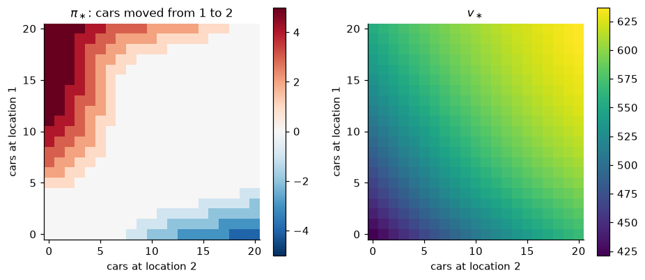

*Left: $\pi_\ast$, the number of cars moved overnight from location 1 to location 2 (negative: from 2 to 1). Right: $v_\ast$.*

</details>

**13. ★★★ Howard's PI vs one-switch PI.** Implement "simple" policy iteration, which after each evaluation changes the action only in the *single* state with the largest improvement $\max_a q_\pi(s,a) - v_\pi(s)$. Compare the number of evaluations with Howard's PI (Algorithm 3.2) on random MDPs. Discuss the connection to the simplex method, and how to make each simple-PI iteration cheaper.

<details><summary>Solution</summary>

`simple_pi()` in [`exercise_solutions.py`](../code/ch03_dynamic_programming/exercise_solutions.py) does this. On 20 random MDPs (50 states, 5 actions, 5 successors, $\gamma = 0.9$), both methods reach the same $v_\ast$ to $10^{-8}$. Howard's PI needed a mean of **4.5** evaluations (max 5), and one-switch PI a mean of **45.2** (max 52). That is a little more than the 39.7 states, on average, whose optimal action differs from the initial one, because some states are switched more than once. One-switch PI is the simplex method on the dual LP (3.26) with Dantzig's largest-coefficient rule. Each pivot exchanges one state's action, and the reduced costs are the advantages $q_\pi(s,a) - v_\pi(s)$. Howard's PI pivots on every improvable state at once, a "block pivot". Both are strongly polynomial for fixed $\gamma$ (Ye, 2011). Howard's typically needs far fewer iterations. One-switch iterations can be made much cheaper. Changing one row of $\mathbf{P}_\pi$ is a rank-one update of $\mathbf{I} - \gamma\mathbf{P}_\pi$, so the new values follow from the old ones by the Sherman–Morrison formula in $O(\lvert\mathcal{S}\rvert^2)$ instead of $O(\lvert\mathcal{S}\rvert^3)$. That is exactly what a simplex implementation does with its basis factorisation.

</details>

**14. ★★ Policy and value iteration on action values (S&B Exercises 4.5 and 4.10).** (a) Write policy iteration (Algorithm 3.2) in terms of $q_\pi$ instead of $v_\pi$, so that the improvement step needs no model. Which linear system does exact evaluation solve, and how large is it? (b) Write the value-iteration update and stopping rule for $Q$. (c) Show that, from the same initial policy and with the same tie-breaking, the $q$-version of policy iteration visits exactly the same policies as Algorithm 3.2.

<details><summary>Solution</summary>

(a) Evaluation solves the Bellman equation (1.16), $q = \mathcal{T}^\pi q$ from (3.13a). For a deterministic $\pi$ this is the linear system $q(s,a) - \gamma\sum_{s'}p(s'\mid s,a)\,q(s',\pi(s')) = r(s,a)$, of size $\lvert\mathcal{S}\rvert\lvert\mathcal{A}\rvert$ instead of $\lvert\mathcal{S}\rvert$. (A cheaper route solves for $v_\pi$ and sets $q_\pi = q_{v_\pi}$ by (1.14), but that step uses the model.)

```text
Policy iteration on action values
Input: model r(s,a), p(s'|s,a); γ ∈ [0, 1); tie tolerance tol ≥ 0
1. Initialise π(s) ∈ A(s) arbitrarily
2. Evaluation:  solve  q(s,a) = r(s,a) + γ Σ_{s'} p(s'|s,a) q(s', π(s'))   for all (s, a)
3. Improvement: policy-stable ← true
   For each s:  if q(s, π(s)) < max_a q(s,a) − tol:  π(s) ← argmax_a q(s,a);  policy-stable ← false
   If policy-stable: stop and return q = q_*, π = π_*;   else go to 2
```

(b) $Q_{k+1}(s,a) \leftarrow r(s,a) + \gamma\sum_{s'}p(s'\mid s,a)\max_{a'}Q_k(s',a')$, which is (3.13b). Stop when $\max_{s,a}\lvert Q_{k+1}(s,a) - Q_k(s,a)\rvert < \theta$, and output $\pi(s) \in \arg\max_a Q(s,a)$. The bounds (3.9)–(3.11) and Theorem 3.5 hold verbatim on $\mathbb{R}^{\mathcal{S}\times\mathcal{A}}$.

(c) By (1.14), $q_\pi(s,a) = q_{v_\pi}(s,a)$, which is exactly the quantity that Algorithm 3.2 maximises in its improvement step. With the same tie rule the two algorithms make the same choice in every state, so by induction they produce the same sequence of policies. `q_policy_iteration()` in [`exercise_solutions.py`](../code/ch03_dynamic_programming/exercise_solutions.py) solves the $256 \times 256$ system on FrozenLake 8×8. Started from "always left", it needs 11 evaluations, the same as Algorithm 3.2, returns the same policy, and $\max_s\lvert\max_a q(s,a) - v_\ast(s)\rvert = 4.4\times10^{-16}$. On the maintenance MDP it returns $q_\ast(\mathrm{G},\cdot) = (7.5, 6)$ and $q_\ast(\mathrm{W},\cdot) = (4.5, 5)$, the lookaheads of Section 5.3. Q-value iteration with $\theta = 10^{-12}$ reaches $q_\ast$ to $3.0\times10^{-11}$ on FrozenLake in 809 sweeps.

</details>

---

## Further reading

* **Sutton, R. S. & Barto, A. G. (2018). *Reinforcement Learning: An Introduction*, 2nd ed., Chapter 4.** The standard introduction to DP for RL, with the gridworld, Jack's car rental and the gambler's problem. It is short, and our Sections 3–9 follow and extend it.
* **Puterman, M. L. (1994). *Markov Decision Processes: Discrete Stochastic Dynamic Programming*. Wiley.** The reference for everything in this chapter, with full proofs: finite horizon (Ch. 4), discounted VI, PI, MPI, LP and action elimination (Ch. 6). Read Chapter 6 if you want every theorem in its most general form.
* **Bertsekas, D. P. *Dynamic Programming and Optimal Control*, Vols. I–II (Athena Scientific),** and **Bertsekas, D. P. & Tsitsiklis, J. N. (1996). *Neuro-Dynamic Programming*. Athena Scientific.** The best treatment of stochastic shortest paths, asynchronous and distributed DP, and of how DP turns into approximate DP and RL.
* **Szepesvári, Cs. (2010). *Algorithms for Reinforcement Learning*. Morgan & Claypool.** A compact, rigorous account of the operator view (contractions, fixed points) that the rest of RL theory builds on.
* **Agarwal, A., Jiang, N., Kakade, S. M. & Sun, W. *Reinforcement Learning: Theory and Algorithms* (monograph, freely available online), Chapter 1.** Modern proofs of the iteration complexity of VI and PI and of the LP/occupancy-measure view. A good bridge to [Chapter 19](19-rl-theory.md).
* **Littman, M. L., Dean, T. L. & Kaelbling, L. P. (1995). "On the complexity of solving Markov decision problems." UAI.** A readable survey of what is known about the running time of MDP algorithms. Follow it with **Ye (2011)** and **Hansen, Miltersen & Zwick (2013)** for the strongly polynomial bounds on PI.
* **Altman, E. (1999). *Constrained Markov Decision Processes*. Chapman & Hall/CRC.** Develops the occupancy-measure LP of Section 10 into the theory of constrained MDPs, the basis of much safe-RL work ([Chapter 20](20-deep-rl-in-practice.md)).
* **de Farias, D. P. & Van Roy, B. (2003). "The linear programming approach to approximate dynamic programming." *Operations Research*.** What happens to the primal LP when $v$ is restricted to a linear function class. An early link between DP and function approximation ([Chapter 08](08-function-approximation.md)).
* **Pardo, F., Tavakoli, A., Levdik, V. & Kormushev, P. (2018). "Time limits in reinforcement learning." ICML.** Why time limits must be treated either as part of the state (Section 11) or as truncation (bootstrap through them), with deep-RL experiments.

---

[← Previous: Multi-Armed Bandits](02-multi-armed-bandits.md) · [Course index](../README.md) · [Next: Monte Carlo Methods](04-monte-carlo.md) →
