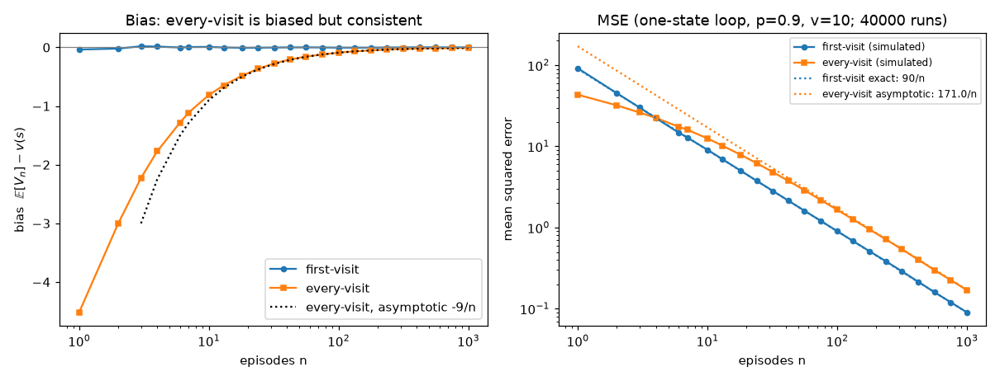
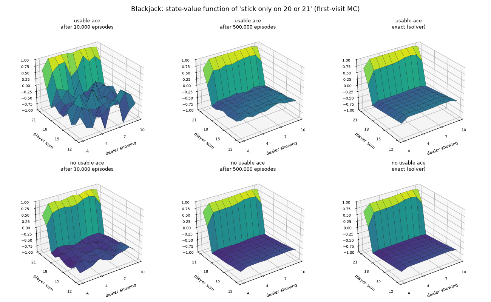
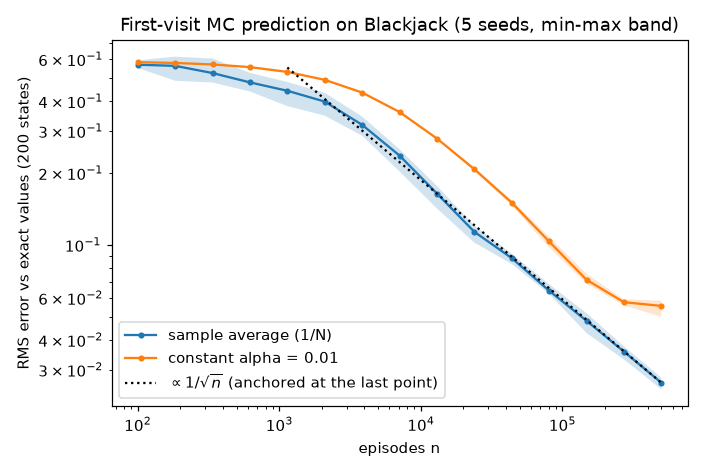
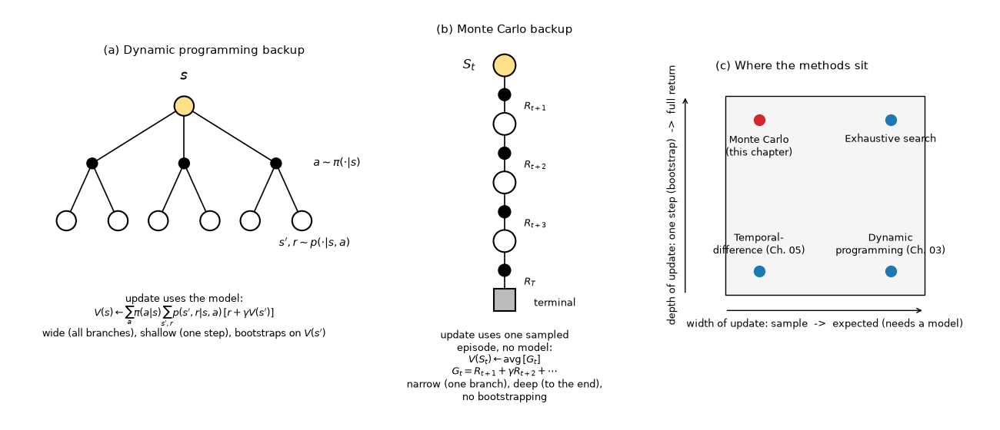
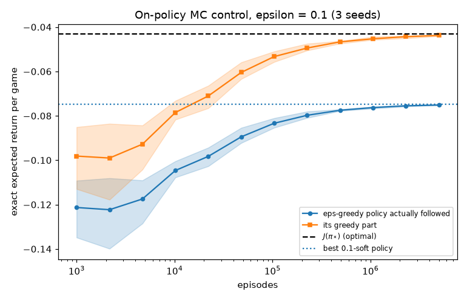
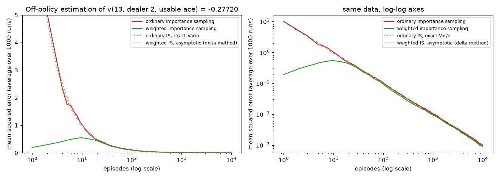
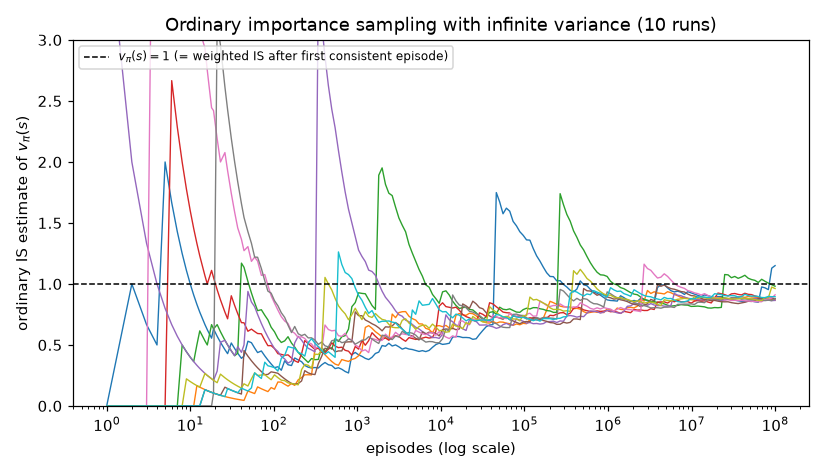
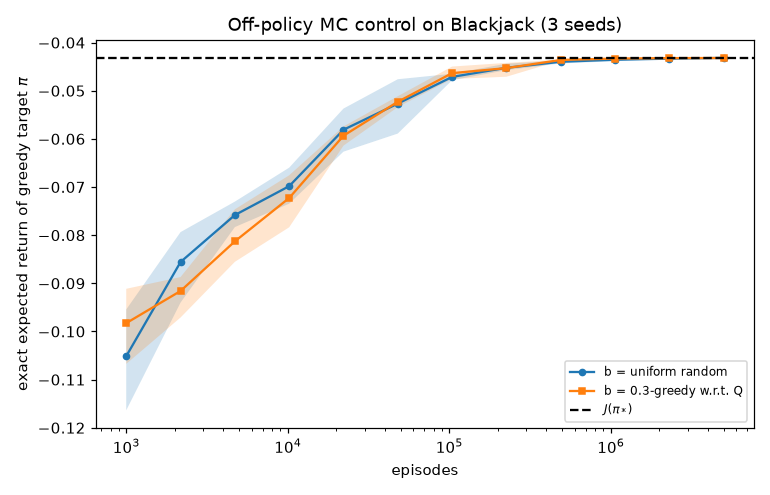
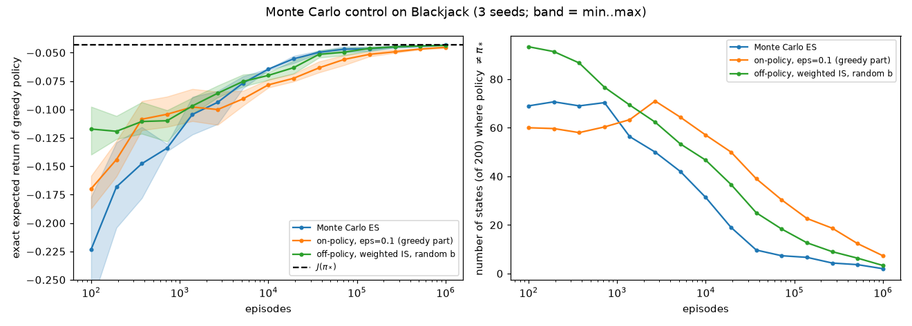
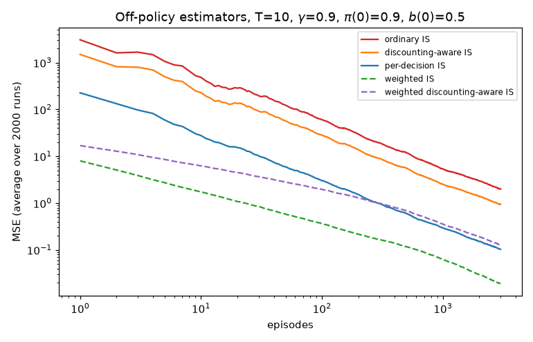

# Chapter 04 — Monte Carlo Methods: Learning from Complete Episodes

[← Previous: Dynamic Programming](03-dynamic-programming.md) · [Course index](../README.md) · [Next: Temporal-Difference Learning](05-temporal-difference.md) →

## At a glance

Dynamic programming (DP) finds optimal policies, but only if you can write down the environment's transition probabilities. This chapter removes that requirement. Monte Carlo (MC) methods learn value functions and good policies from **sample episodes alone**: play the game, record what happened, and average the returns. The idea is very simple. Making it work for *control* turns out to be more subtle. You have to keep exploring, and if you want to learn about one policy while following another, you need importance sampling. Importance sampling brings bias–variance trade-offs of its own, including an estimator with infinite variance.

**Learning objectives.** After this chapter you should be able to:

- explain why model-free control needs action values, and how MC estimates them by averaging returns;
- implement first-visit and every-visit MC prediction, prove that first-visit MC is unbiased and consistent, and prove that every-visit MC is biased but consistent;
- explain the exploration problem; implement Monte Carlo with exploring starts and on-policy MC control with $\varepsilon$-soft policies; prove that $\varepsilon$-greedy improvement works within the $\varepsilon$-soft class and that its fixed point is the best $\varepsilon$-soft policy;
- derive the importance-sampling ratio and the ordinary and weighted IS estimators, analyse their bias and variance, and recognise when the variance is infinite;
- implement weighted IS incrementally and use it for off-policy MC control;
- describe discounting-aware and per-decision importance sampling and say when they help;
- compare MC and DP: their backup diagrams, bootstrapping versus sampling, and dependence on the Markov property.

**Prerequisites.** [Chapter 01](01-the-rl-problem.md) (MDPs, returns, $v_\pi$, $q_\pi$, Bellman equations), [Chapter 03](03-dynamic-programming.md) (policy evaluation, the policy improvement theorem, generalized policy iteration), [Chapter 02](02-multi-armed-bandits.md) ($\varepsilon$-greedy exploration and incremental averages), and the probability parts of [Chapter 00](00-math-toolkit.md) (law of large numbers, central limit theorem, importance sampling).

**Code you will run** (all in [`code/ch04_monte_carlo/`](../code/ch04_monte_carlo/)): a Blackjack simulator with an **exact solver**, so every MC estimate can be checked against the true value. Also MC prediction (S&B Figure 5.1), Monte Carlo ES (Figure 5.2), on- and off-policy MC control, ordinary vs weighted importance sampling (Example 5.4), the infinite-variance example (Example 5.5), an exact-variance comparison of per-decision IS and discounting-aware IS, and a first-visit vs every-visit bias study. The full set runs in about 7–8 minutes on one core.

**Study time.** About 6–8 hours for the text and 3–4 hours for the exercises.

Notation follows [NOTATION.md](../NOTATION.md) (Sutton & Barto, 2nd ed.). Where we cite "S&B" we mean Sutton & Barto (2018), Chapter 5, which this chapter follows closely and extends with exact computations.

---

## 1. Learning without a model

### 1.1 What dynamic programming needed

In [Chapter 03](03-dynamic-programming.md) we computed $v_\pi$ by sweeping the Bellman expectation backup

$$
v_{k+1}(s) = \sum_a \pi(a \mid s) \sum_{s', r} p(s', r \mid s, a)\,\big[r + \gamma v_k(s')\big],
$$

and found optimal policies by alternating that evaluation with greedy improvement. Every step used the **distribution model** $p(s', r \mid s, a)$. Often that model is unavailable. Sometimes it exists but is miserable to write down. Consider Blackjack. Writing $p(s', r \mid s, \text{stick})$ requires the full probability distribution of the dealer's final total given his up-card, which means summing over every sequence of cards he might draw. Writing a **sample model**, a simulator that deals cards and plays the game, takes twenty lines. In robotics, finance or medicine we may not even have a simulator, only the stream of experience produced by acting in the world.

Monte Carlo methods need only **experience**: sequences of states, actions and rewards, real or simulated. That is the first and most important difference from DP.

### 1.2 The Monte Carlo idea

Recall from [Chapter 01](01-the-rl-problem.md) that the value of a state is an expectation:

$$
v_\pi(s) \doteq \mathbb{E}_\pi\left[G_t \mid S_t = s\right], \qquad G_t \doteq R_{t+1} + \gamma R_{t+2} + \gamma^2 R_{t+3} + \cdots + \gamma^{T-t-1} R_T .
$$

The most direct way to estimate an expectation is to average samples of it (the law of large numbers, [Chapter 00](00-math-toolkit.md)). So follow $\pi$, record the return that followed each visit to $s$, and average those returns. As more returns are observed, the average converges to $v_\pi(s)$. That is all "Monte Carlo" means here. The term is used broadly for any estimation by repeated random sampling. In RL it refers specifically to methods that **average complete returns**.

To have complete returns we need episodes that end, so throughout this chapter we assume:

- **Episodic tasks.** Every episode terminates with probability 1, whatever the policy. The return $G_t$ is then a finite sum.
- **Independent episodes.** Each episode starts from a state drawn from $d_0$ (or chosen by us, as in Section 4). Episodes are independent of one another.

Values and policies change only **between** episodes. MC is incremental episode by episode, not step by step. That is the second major difference from the temporal-difference methods of [Chapter 05](05-temporal-difference.md).

### 1.3 Running example: Blackjack

We use the Blackjack task of S&B Example 5.1 throughout. The rules are the same as gymnasium's `Blackjack-v1(sab=True)`.

- Cards come from an **infinite deck**, drawn with replacement. Ace counts 1 (or 11, see below), 2–9 count face value, and ten, J, Q, K count 10. So $\Pr\lbrace 10\rbrace = 4/13$ and every other value has probability $1/13$.
- The player and the dealer each get two cards. One dealer card is face up (the **showing** card).
- An ace is **usable** if it can count as 11 without the hand exceeding 21.
- The player **hits** (takes a card) or **sticks** (stops). Going over 21 is a **bust** and gives reward $-1$. After the player sticks, the dealer hits until his sum is at least 17 (he sticks on a soft 17). Then the higher sum wins: reward $+1$, $0$ or $-1$.
- A **natural** (ace plus ten-card as the first two cards) wins $+1$ unless the dealer also has one, in which case the game is a draw.
- All other rewards are 0 and $\gamma = 1$, so the return is just the final outcome.

One representational detail matters later. As in gymnasium, a natural is presented to the player as the ordinary state (21, dealer card, usable ace), and the player may act on it: hitting turns it into an ordinary soft hand. S&B's text settles naturals at the deal, before the player acts. The difference matters only for policies that would hit on 21, such as a random behaviour policy, and it makes the observation (21, $d$, usable ace) slightly non-Markov (Section 10.1).

A player with a sum below 12 should always hit, because one more card cannot bust him. So decisions only arise in the **200 states**

$$
s = (\text{player sum} \in \lbrace 12,\dots,21\rbrace,\ \text{dealer showing} \in \lbrace \mathrm{A},2,\dots,10\rbrace,\ \text{usable ace} \in \lbrace 0, 1\rbrace).
$$

Our simulator ([`blackjack.py`](../code/ch04_monte_carlo/blackjack.py)) implements these rules. It is checked against gymnasium for three policies (stick only on 20 or 21, the optimal policy, and uniform random), in two ways:

- **Game by game.** Gymnasium's card generator is replaced by ours, and both simulators receive the same card stream and the same random actions. Rewards and numbers of decisions then agree in all 100,000 games for each policy. Both simulators draw cards in the same order, so this shows that the rules themselves are implemented identically, including rare cases such as naturals and dealer naturals.
- **Statistically, with independent random streams** (200,000 games per simulator and policy), against the exact values of the solver described below. For "stick only on 20 or 21", the exact expected return is $-0.35011$. Our simulator gives $-0.34924 \pm 0.00203$ and gymnasium $-0.35283 \pm 0.00203$. All six means are within 1.7 standard errors of the exact values. Chi-square goodness-of-fit tests of the win/draw/loss counts against the exact outcome probabilities give p-values between 0.028 and 0.70. The smallest (our simulator, random policy) is unremarkable among six tests.

Our simulator is about 25 times faster (about 3 µs vs 60–75 µs per game). It also lets us force the initial state, which Section 4 needs and gymnasium does not support.

For a policy $\pi$ we write $J(\pi) \doteq \mathbb{E}_\pi[G_0]$ for the expected return of one complete game from the deal, that is, from the initial-state distribution $d_0$. In Blackjack this is the player's expected winnings per game. NOTATION.md has no symbol for this quantity. We use $J$, as [Chapter 10](10-policy-gradients.md) does for the policy objective.

**An exact solver as ground truth.** Blackjack with an infinite deck has special structure. The dealer's play does not depend on the player, and the player's hand only grows. So `blackjack.solve()` can compute $v_\pi$, $q_\pi$, $q_\ast$, $\pi_\ast$ and the exact expected return $J(\pi)$ of a whole game for any policy, by a short backward recursion over the player's hand (`blackjack.outcome_probs()` runs the same recursion for the win/draw/loss probabilities). This is a specialised DP that exploits the structure. S&B estimated the value of their Example 5.4 state by averaging $10^8$ simulated games; with the solver we can compute it, and every other value, exactly. We will use the solver to measure exactly how far every MC estimate in this chapter is from the truth. It is a luxury you will almost never have in practice, but it makes the behaviour of the estimators visible.

---

## 2. Monte Carlo prediction

**Prediction** (policy evaluation) means estimating $v_\pi$ for a fixed policy $\pi$ from episodes generated by following $\pi$.

### 2.1 First-visit and every-visit MC

Each occurrence of state $s$ in an episode is a **visit** to $s$. A state may be visited several times in one episode. The first time is the **first visit**.

- **First-visit MC** estimates $v_\pi(s)$ as the average of the returns that follow *first* visits to $s$.
- **Every-visit MC** averages the returns that follow *all* visits to $s$.

In both, the returns are computed most cheaply by walking **backwards** through the episode with $G \leftarrow \gamma G + R_{t+1}$:

```
First-visit MC prediction, for estimating V ≈ v_π

Input: a policy π to be evaluated; discount γ ∈ [0, 1]
Initialize:
    V(s) ∈ ℝ arbitrarily, for all s ∈ S          (terminal states are never updated)
    N(s) ← 0, for all s ∈ S                      (number of returns averaged so far)

Loop forever (for each episode):
    Generate an episode following π: S0, A0, R1, S1, A1, R2, ..., S_{T-1}, A_{T-1}, R_T
        (the episode ends when S_T is terminal)
    G ← 0
    Loop for each step of episode, t = T-1, T-2, ..., 0:
        G ← γ G + R_{t+1}                        (now G = G_t)
        Unless S_t appears in S0, S1, ..., S_{t-1}:   (first-visit check)
            N(S_t) ← N(S_t) + 1
            V(S_t) ← V(S_t) + [G − V(S_t)] / N(S_t)    (running average, Sec. 2.4)
```

Every-visit MC is the same algorithm without the "Unless" line. S&B's version stores lists `Returns(s)` and averages them. The running average above gives exactly the same numbers in constant memory (Section 2.4).

Note what is *not* used: no $p(s', r \mid s, a)$, and no estimate of any other state's value. The estimate for $s$ depends only on returns observed from $s$.

### 2.2 A worked example by hand

Take a process with two non-terminal states $A$ and $B$, $\gamma = 1$, and three observed episodes. We write each episode as $S_0, R_1, S_1, R_2, \dots$:

| Episode | Trajectory | Returns (computed backwards) |
|---|---|---|
| 1 | $A, +3, B, -1, A, +3, \text{end}$ | $G_2 = 3$ (at $A$), $G_1 = -1 + 3 = 2$ (at $B$), $G_0 = 3 + 2 = 5$ (at $A$) |
| 2 | $B, +1, A, +1, A, 0, \text{end}$ | $G_2 = 0$ (at $A$), $G_1 = 1 + 0 = 1$ (at $A$), $G_0 = 1 + 1 = 2$ (at $B$) |
| 3 | $A, -2, \text{end}$ | $G_0 = -2$ (at $A$) |

**First-visit.** State $A$ is first visited at $t=0$ in episode 1 (return 5), at $t=1$ in episode 2 (return 1), and at $t=0$ in episode 3 (return $-2$). So

$$
V(A) = \frac{5 + 1 - 2}{3} = \frac{4}{3} \approx 1.333, \qquad V(B) = \frac{2 + 2}{2} = 2 .
$$

**Every-visit.** State $A$ has five visits, with returns $5, 3, 1, 0, -2$. So

$$
V(A) = \frac{5 + 3 + 1 + 0 - 2}{5} = \frac{7}{5} = 1.4, \qquad V(B) = 2 \text{ (each episode visits } B \text{ once)}.
$$

**Incrementally.** First-visit $V(A)$ goes $5 \to 5 + \tfrac12(1-5) = 3 \to 3 + \tfrac13(-2-3) = \tfrac43$. This matches the batch average, as it must.

The two methods disagree only for states that recur within an episode. Which one is "right"? Both converge to $v_\pi(A)$, but they behave differently along the way (Section 2.3).

### 2.3 Statistical properties: bias, variance, consistency

Fix a state $s$ that is visited with positive probability. Assume the returns have finite variance. Bounded rewards plus an episode length with finite variance are enough, and that holds for any policy in a finite MDP whose episodes terminate with probability 1, since episode lengths then have geometric tails.

**Theorem 2.1 (first-visit MC).** Let $G^{(1)}, G^{(2)}, \dots$ be the first-visit returns from successive episodes that visit $s$, and let $V_n(s)$ be their average after $n$ of them. Then

1. the $G^{(i)}$ are i.i.d. with mean $v_\pi(s)$ and some variance $\sigma^2(s)$;
2. $V_n(s)$ is **unbiased**: $\mathbb{E}[V_n(s)] = v_\pi(s)$;
3. $\mathrm{Var}[V_n(s)] = \sigma^2(s)/n$, so the standard error falls as $1/\sqrt{n}$;
4. $V_n(s) \to v_\pi(s)$ with probability 1 (strong law of large numbers), and $\sqrt{n}\,(V_n(s) - v_\pi(s))$ is asymptotically $\mathcal{N}(0, \sigma^2(s))$ (central limit theorem).

*Proof.* Only part 1 needs an argument; parts 2–4 are then standard facts about averages of i.i.d. variables. Independence across episodes holds by assumption. For the mean, let $T_s$ be the time of the first visit to $s$ in an episode ($T_s = \infty$ if there is none). Whether $T_s = t$ is decided by $S_0, \dots, S_t$, so $T_s$ is a *stopping time*. Let $H_t$ be the history up to and including $S_t$. By the Markov property of the MDP and of $\pi$, the conditional distribution of everything after time $t$ given $H_t$ depends only on $S_t$. Hence $\mathbb{E}[G_t \mid H_t] = v_\pi(S_t)$. Therefore

$$
\begin{aligned}
\mathbb{E}\big[G_{T_s}\, \mathbb{1}[T_s < \infty]\big]
&= \sum_{t=0}^{\infty} \mathbb{E}\big[\mathbb{1}[T_s = t]\; G_t\big]
 = \sum_{t=0}^{\infty} \mathbb{E}\big[\mathbb{1}[T_s = t]\; \mathbb{E}[G_t \mid H_t]\big] \\
&= \sum_{t=0}^{\infty} \mathbb{E}\big[\mathbb{1}[T_s = t]\; v_\pi(s)\big]
 = v_\pi(s)\,\Pr\lbrace T_s < \infty\rbrace ,
\end{aligned}
$$

where the second equality uses that $\mathbb{1}[T_s = t]$ is a function of $H_t$ (tower property), and the third uses $S_{T_s} = s$. Dividing by $\Pr\lbrace T_s<\infty\rbrace$ gives $\mathbb{E}[G^{(i)}] = v_\pi(s)$. $\blacksquare$

**Every-visit MC is a ratio estimator.** Suppose episode $i$ visits $s$ at $K_i \ge 0$ time steps, and let $Y_i \doteq \sum_{t:\,S_t = s} G_t$ be the sum of the returns observed from those visits. After $n$ episodes the every-visit estimate is

$$
V_n^{\text{EV}}(s) = \frac{\sum_{i=1}^{n} Y_i}{\sum_{i=1}^{n} K_i},
$$

with the convention that $V_n^{\text{EV}}(s)$ keeps its initial value $V_0(s)$ while $\sum_i K_i = 0$. The returns within one episode overlap, and the number of terms $K_i$ is random and correlated with them. So this is *not* an average of i.i.d. samples of $v_\pi(s)$.

**Theorem 2.2 (every-visit MC).** (a) $V_n^{\text{EV}}(s) \to v_\pi(s)$ with probability 1: every-visit MC is **consistent**. (b) It is **biased** in general: there are processes in which $\mathbb{E}\big[V_n^{\text{EV}}(s) \,\big|\, \textstyle\sum_i K_i > 0\big] \neq v_\pi(s)$.

*Proof of (a).* The pairs $(Y_i, K_i)$ are i.i.d. across episodes. By the strong law of large numbers applied to numerator and denominator (each divided by $n$), $V_n^{\text{EV}} \to \mathbb{E}[Y]/\mathbb{E}[K]$. Now compute $\mathbb{E}[Y]$ using the same tower-property step as before, at every visit instead of the first:

$$
\mathbb{E}[Y] = \sum_{t} \mathbb{E}\big[\mathbb{1}[S_t = s]\, G_t\big] = \sum_t \mathbb{E}\big[\mathbb{1}[S_t = s]\, \mathbb{E}[G_t \mid H_t]\big] = v_\pi(s) \sum_t \Pr\lbrace S_t = s\rbrace = v_\pi(s)\, \mathbb{E}[K].
$$

So the limit is $v_\pi(s)$. *Proof of (b).* The one-state example below has $\mathbb{E}[V_1^{\text{EV}}(s)] = (v_\pi(s)+1)/2 \neq v_\pi(s)$, and every episode visits $s$. $\blacksquare$

*(c) How large is the bias? (Sketch.)* A ratio of averages is not the average of a ratio. Condition on $\sum_i K_i > 0$ and assume $Y$ and $K$ have finite fourth moments. A second-order Taylor expansion of $\bar Y / \bar K$ around $(\mathbb{E}Y, \mathbb{E}K)$ (the delta method) then suggests

$$
\mathbb{E}\big[V_n^{\text{EV}}\big] - v_\pi(s) = \frac{v_\pi(s)\,\mathrm{Var}(K) - \mathrm{Cov}(Y, K)}{n\, (\mathbb{E}K)^2} + o(1/n),
$$

which is generally nonzero. We do not state the regularity conditions that make this expansion rigorous; a ratio estimator's expectation need not even exist without extra assumptions. Treat the formula as a guide to the order of magnitude. The simulation below agrees with it.

**A case we can solve exactly.** Take one non-terminal state $s$. Every step gives reward $+1$. With probability $p$ the process returns to $s$, otherwise it terminates. Let $\gamma = 1$. An episode lasts $L$ steps, where $\Pr\lbrace L = l\rbrace = p^{l-1}(1-p)$ for $l \ge 1$. It visits $s$ at $t = 0, \dots, L-1$, and the returns are $L, L-1, \dots, 1$. Hence

$$
v_\pi(s) = \mathbb{E}[L] = \frac{1}{1-p}, \qquad \mathrm{Var}(L) = \frac{p}{(1-p)^2}.
$$

From one episode, first-visit MC returns $L$, which is unbiased with MSE $\mathrm{Var}(L)$. Every-visit MC returns the average of $L, \dots, 1$, which is $(L+1)/2$, with expectation $(v+1)/2 \neq v$. With $p = 0.9$ we get $v = 10$, and:

- first-visit, one episode: bias 0, MSE $= \mathrm{Var}(L) = 90$;
- every-visit, one episode: bias $(10+1)/2 - 10 = -4.5$, variance $\mathrm{Var}(L)/4 = 22.5$, so MSE $= 4.5^2 + 22.5 = 42.75$.

**Every-visit is better after one episode**, despite its bias. Asymptotically the situation reverses. Using the delta method and the moments of the geometric distribution ($\mathbb{E}L = 10$, $\mathbb{E}L^2 = 190$, $\mathbb{E}L^3 = 5410$, $\mathbb{E}L^4 = 205390$), the every-visit estimator has

$$
n \cdot \mathrm{MSE} \;\to\; \frac{\mathrm{Var}(Y - vK)}{(\mathbb{E}K)^2} = \frac{\mathbb{E}\big[(L^2 - 19L)^2\big]/4}{100} = \frac{(205390 - 38\cdot 5410 + 361 \cdot 190)/4}{100} = 171,
$$

here with $Y = L(L+1)/2$ and $K = L$, so $Y - vK = (L^2 - 19L)/2$. First-visit has $n\cdot\mathrm{MSE} = 90$ exactly. The bias formula of part (c) gives $-9/n$ for every-visit, since $v\,\mathrm{Var}(K) - \mathrm{Cov}(Y,K) = 900 - 1800$.

[`first_vs_every_visit.py`](../code/ch04_monte_carlo/first_vs_every_visit.py) measures this over 40,000 independent replications:

| episodes $n$ | bias FV | bias EV | MSE FV | MSE EV |
|---|---|---|---|---|
| 1 | $-0.04$ | $-4.52$ | 91.6 | 43.3 |
| 2 | $-0.02$ | $-3.00$ | 45.2 | 32.0 |
| 3 | $+0.02$ | $-2.23$ | 30.0 | 26.1 |
| 4 | $+0.01$ | $-1.77$ | 22.3 | 22.4 |
| 10 | $+0.01$ | $-0.81$ | 9.06 | 12.5 |
| 100 | $-0.00$ | $-0.09$ | 0.902 | 1.65 |
| 1000 | $+0.00$ | $-0.008$ | 0.090 | 0.169 |



The simulation matches the analysis. Every-visit wins for $n \le 3$. The two are tied at $n = 4$ (22.3 vs 22.4, which is within the Monte Carlo error of $\pm 0.2$). Afterwards first-visit wins, and the ratio of the MSEs approaches $171/90 = 1.9$. The every-visit bias falls like $1/n$ and is well described by $-9/n$ once $n \gtrsim 20$. Singh and Sutton (1996) proved general versions of these facts for undiscounted absorbing Markov chains: first-visit MC is unbiased, every-visit MC is biased, and first-visit MC has the lower MSE in the long run. Our one-state example shows concretely, in closed form, that the ordering can be reversed on very small samples.

### 2.4 Incremental implementation

Storing every return and re-averaging is wasteful. If $V_n$ is the average of the first $n-1$ returns $G_1, \dots, G_{n-1}$ observed from $s$, then

$$
\begin{aligned}
V_{n+1} &= \frac{1}{n}\sum_{k=1}^{n} G_k = \frac{1}{n}\Big(G_n + (n-1)\, V_n\Big) \\
&= V_n + \frac{1}{n}\big(G_n - V_n\big).
\end{aligned}
$$

This is the same "NewEstimate ← OldEstimate + StepSize × (Target − OldEstimate)" rule as for bandits ([Chapter 02](02-multi-armed-bandits.md)). Here the target is the return $G_t$. The pseudocode in Section 2.1 uses this rule with a per-state counter $N(s)$.

Replacing $1/n$ by a **constant step size** $\alpha \in (0, 1]$ gives **constant-$\alpha$ MC**:

$$
V(S_t) \leftarrow V(S_t) + \alpha\,\big[G_t - V(S_t)\big].
$$

This is an exponential recency-weighted average. It tracks a changing target, which is useful when the policy keeps changing (as in control) or the environment is non-stationary. The price is that its variance never goes to zero, so the error plateaus. Constant-$\alpha$ MC is the starting point of [Chapter 05](05-temporal-difference.md): TD(0) replaces the target $G_t$ with $R_{t+1} + \gamma V(S_{t+1})$.

### 2.5 Results on Blackjack

We evaluate S&B's policy "stick only on 20 or 21" with first-visit MC ([`mc_prediction_blackjack.py`](../code/ch04_monte_carlo/mc_prediction_blackjack.py), seed 0). The figure reproduces S&B Figure 5.1 and adds a third column with the exact values from our solver.



The value is high only when the player holds 20 or 21. Below 20 the policy keeps hitting and often busts, so the values are negative. They average about $-0.65$ without a usable ace and $-0.35$ with one, because a usable ace cannot bust on the next card. The surface dips in the left column, where the dealer shows an ace, his strongest up-card. At 20, for example, the exact value is $0.15$ against an ace and between $0.64$ and $0.79$ against a 2–9. After 10,000 episodes the usable-ace surface is visibly ragged. After 500,000 episodes it is close to the exact surface. Measured against the exact values:

| episodes | RMS error, all 200 states | usable ace | no usable ace |
|---|---|---|---|
| 10,000 | 0.181 | 0.246 | 0.071 |
| 500,000 | 0.025 | 0.034 | 0.009 |

The usable-ace states are noisier because they are rarer. Only 13.3% of state visits have a usable ace, and the least-visited state (player A+A, dealer ace) occurs in only 0.046% of games.

One caveat about "exact". Because of the way naturals are represented (Section 1.3), the observation (21, $d$, usable ace) lumps naturals together with other soft 21s, so it is not quite Markov. First-visit MC converges there to the visit-weighted mixture of the two values, and that mixture is the exact target we compare against (Section 10.1 gives the numbers). The other 190 states are Markov.



The RMS error falls with slope $-0.49$ on log-log axes ($-0.488$ fitted over $n \ge 10^3$, $-0.493$ over $n \ge 10^4$), close to the $-1/2$ that Theorem 2.1 predicts. Below about $10^3$ episodes the curve is flatter, because there the error is dominated by rarely visited states that still hold their initial value 0. The constant-$\alpha$ version ($\alpha = 0.01$) starts more slowly, because each update moves only 1% of the way to the target, and then stalls at an RMS error of about 0.056 after 500,000 episodes. That is the variance floor of a fixed step size.

One more check: the script runs first-visit and every-visit MC on the same 20,000 episodes and gets **identical** estimates (maximum difference 0). In Blackjack a state can never recur within an episode. Exercise 1 asks you to explain why.

### 2.6 Backup diagrams: Monte Carlo vs dynamic programming

A **backup diagram** shows which states and transitions an update draws information from. Open circles are states, filled dots are actions, and the grey square is a terminal state.



The two diagrams differ in three ways, and each has consequences:

1. **Width.** DP takes an *expected* update over all actions and all successors, weighted by $\pi$ and $p$. MC uses *one sampled* trajectory. Sampling is why MC needs no model. It is also why MC is noisy.
2. **Depth.** DP looks one step ahead and then **bootstraps**: it plugs in its current estimate $V(s')$. MC follows the trajectory to the end and uses the actual return. MC therefore never builds estimates on top of other estimates: the estimate for $s$ is computed only from returns observed after visits to $s$, never from $V$ of any other state, so an error in $V(s')$ cannot leak into $V(s)$. The estimates are *not* statistically independent, though. States visited in the same episode share rewards: $G_t$ and $G_{t+k}$ both contain $R_{t+k+1}, \dots, R_T$. In Blackjack every state on a hand shares the same final outcome, so the errors of different states' estimates are correlated. Keep this in mind before adding per-state standard errors as if they were independent.
3. **Cost per state.** Because no estimate is computed from another state's estimate, the cost of estimating one state's value does not depend on how many states there are. If you care about only a few states, start episodes from those states and ignore the rest. Section 6.5 does exactly this for one Blackjack state.

Panel (c) previews the rest of the course. Temporal-difference learning ([Chapter 05](05-temporal-difference.md)) samples like MC but bootstraps like DP. $n$-step methods and eligibility traces ([Chapter 06](06-n-step-and-eligibility-traces.md)) fill in the vertical axis between them.

---

## 3. Monte Carlo estimation of action values

### 3.1 Why state values are not enough

With a model, $v_\pi$ is enough to improve a policy. Look one step ahead and pick the action with the best $\sum_{s',r} p(s', r \mid s, a)[r + \gamma v_\pi(s')]$. Without a model that one-step look-ahead is impossible. So for model-free control we estimate **action values** directly:

$$
q_\pi(s, a) \doteq \mathbb{E}_\pi\left[G_t \mid S_t = s, A_t = a\right].
$$

Policy improvement then becomes a simple argmax, $\pi'(s) = \arg\max_a q_\pi(s, a)$. The MC methods carry over unchanged. A visit is now a visit to the *pair* $(s, a)$. First-visit MC averages the returns after the first time action $a$ was taken in state $s$, and the same unbiasedness and consistency results hold.

### 3.2 The exploration problem

Now there is a catch. If $\pi$ is deterministic, following $\pi$ produces returns only for the pairs $(s, \pi(s))$. The other actions are never tried, their estimates never improve, and we cannot tell whether they are better. To compare alternatives we must estimate the value of **every** action in every state we care about. This is the exploration–exploitation dilemma of [Chapter 02](02-multi-armed-bandits.md), now with states.

There are three standard ways to **maintain exploration**:

1. **Exploring starts (ES).** Begin each episode in a randomly chosen state–action pair, with every pair having positive probability. Then every pair is visited infinitely often in the limit. This is convenient in simulation (Section 4) and usually impossible in the real world, where you cannot place a robot in an arbitrary state.
2. **On-policy soft policies.** Only consider policies that try every action with some positive probability, such as $\varepsilon$-greedy policies (Section 5).
3. **Off-policy learning.** Follow an exploratory *behaviour* policy and learn about a different *target* policy (Sections 6–8).

---

## 4. Monte Carlo control

### 4.1 Monte Carlo policy iteration

[Chapter 03](03-dynamic-programming.md) introduced **generalized policy iteration** (GPI): keep an approximate policy and an approximate value function, and repeatedly make the value more like the policy's true value (evaluation) and the policy greedy with respect to the value (improvement). Monte Carlo GPI alternates

$$
\pi_0 \xrightarrow{\ \text{E}\ } q_{\pi_0} \xrightarrow{\ \text{I}\ } \pi_1 \xrightarrow{\ \text{E}\ } q_{\pi_1} \xrightarrow{\ \text{I}\ } \pi_2 \xrightarrow{\ \text{E}\ } \cdots \xrightarrow{\ \text{I}\ } \pi_\ast \xrightarrow{\ \text{E}\ } q_\ast ,
$$

where E is MC evaluation of action values and I is greedy improvement, $\pi_{k+1}(s) \doteq \arg\max_a q_{\pi_k}(s, a)$. The policy improvement theorem applies directly. For every $s$,

$$
q_{\pi_k}\big(s, \pi_{k+1}(s)\big) = \max_a q_{\pi_k}(s, a) \;\ge\; q_{\pi_k}\big(s, \pi_k(s)\big) = v_{\pi_k}(s),
$$

so $\pi_{k+1} \ge \pi_k$. If no strict improvement is possible, $\pi_k$ satisfies the Bellman optimality equation and is optimal.

This idealised version rests on two unrealistic assumptions: exploring starts, and **infinitely many episodes per evaluation step**. To drop the second, do what value iteration does in DP: stop evaluation early. The extreme form is to update $Q$ from one episode and immediately make the policy greedy in the states that episode visited. Evaluation then never finishes. The value function chases a moving policy.

### 4.2 Monte Carlo with Exploring Starts

```
Monte Carlo ES (Exploring Starts), for estimating π ≈ π_*

Initialize:
    π(s) ∈ A(s) arbitrarily, for all s ∈ S
    Q(s, a) ∈ ℝ arbitrarily, N(s, a) ← 0, for all s ∈ S, a ∈ A(s)

Loop forever (for each episode):
    Choose S0 ∈ S and A0 ∈ A(S0) randomly so that every pair has probability > 0
    Generate an episode from S0, A0 following π: S0, A0, R1, ..., S_{T-1}, A_{T-1}, R_T
    G ← 0
    Loop for each step of episode, t = T-1, T-2, ..., 0:
        G ← γ G + R_{t+1}
        Unless the pair (S_t, A_t) appears in (S0, A0), ..., (S_{t-1}, A_{t-1}):
            N(S_t, A_t) ← N(S_t, A_t) + 1
            Q(S_t, A_t) ← Q(S_t, A_t) + [G − Q(S_t, A_t)] / N(S_t, A_t)
            π(S_t) ← argmax_a Q(S_t, a)       (ties: keep the current action)
```

**Why it should work.** Suppose the algorithm settles down, so that $\pi$ and $Q$ stop changing. Then $Q$ must be the action-value function of $\pi$, because it averages $\pi$'s returns. And $\pi$ must be greedy with respect to $Q$. A policy that is greedy with respect to its own action values satisfies the Bellman optimality equation, so it is optimal. No suboptimal policy can be a stable fixed point.

**Whether it always settles down is subtle.** The returns averaged into $Q(s,a)$ come from a sequence of *different* policies. S&B describe the convergence of MC ES as one of the most fundamental open theoretical questions in reinforcement learning. Partial answers now exist. Tsitsiklis (2002) proved convergence for special cases of this optimistic policy iteration scheme. Liu (2021) studied the undiscounted (stochastic shortest path) setting. Wang, Yuan, Shao and Ross (2022) proved convergence of MC ES for **optimal policy feed-forward** MDPs, those in which no state is revisited within an episode under an optimal policy. Blackjack qualifies, since no state is ever revisited under *any* policy.

### 4.3 Monte Carlo ES on Blackjack

In [`mc_es_blackjack.py`](../code/ch04_monte_carlo/mc_es_blackjack.py) each episode starts in one of the 200 states and one of the 2 actions, chosen uniformly. It then follows the greedy policy. As in S&B, the initial policy is "stick on 20 or 21" and $Q_0 = 0$. We run 5 million episodes for each of three seeds.


The learned policy (seed 0) **coincides with the exact optimal policy in all 200 states**. That optimal policy is the one in S&B Figure 5.2, which is also the hit/stick part of the classic casino "basic strategy":

- **With a usable ace:** hit on 17 or less. On 18, stick unless the dealer shows 9, 10 or A. Always stick on 19 or more.
- **Without a usable ace:** stick on 17 or more. On 13–16, stick against a dealer 2–6 and hit otherwise. On 12, stick only against 4–6.

Across the three seeds, the final greedy policies differ from $\pi_\ast$ in 0, 2 and 0 states. The exact expected returns are $-0.04311$, $-0.04327$ and $-0.04311$ per game, against the optimum $J^\ast = -0.04311$. Seed 1's two mistakes are instructive:

| state (no usable ace) | learned | exact $q_\ast(s,\text{hit}) - q_\ast(s,\text{stick})$ | estimated difference |
|---|---|---|---|
| sum 12, dealer 4 | hit | $-0.0025$ | $+0.0132$ |
| sum 13, dealer 2 | hit | $-0.0150$ | $+0.0016$ |

These are two of the closest decisions in the game. The exact solver lists the six smallest action gaps as 0.0025, 0.0065, 0.0150, 0.0168, 0.0186 and 0.0261. A back-of-envelope calculation shows why such gaps are hard. Each $(s,a)$ pair was averaged over about $N \approx 12{,}800$ returns, and a return in $\lbrace -1, 0, 1\rbrace$ has standard deviation at most 1. So each estimate has standard error at most $1/\sqrt{12{,}800} \approx 0.009$, and the difference of two estimates has standard error about 0.013. Resolving a gap of 0.0025 at two standard errors needs $2\sqrt{2/N} \le 0.0025$, that is $N \gtrsim 1.3$ million returns *per pair*. That is about 500 million episodes for MC ES. Fortunately, getting such a decision wrong costs almost nothing. Seed 1's policy loses only 0.00016 per game relative to the optimum.

The learning curve, averaged over the three seeds, shows how quickly the gross errors disappear:

| episodes | 1,000 | 10,205 | 104,141 | 1,062,747 | 5,000,000 |
|---|---|---|---|---|---|
| states where $\pi \ne \pi_\ast$ | 63.0 | 29.0 | 5.3 | 2.3 | 0.7 |
| exact $J(\pi)$ | $-0.1299$ | $-0.0619$ | $-0.0464$ | $-0.0434$ | $-0.0432$ |

---

## 5. On-policy control without exploring starts

### 5.1 Soft and ε-greedy policies

To avoid exploring starts, the agent must keep trying all actions itself. A policy is **soft** if $\pi(a \mid s) > 0$ for all $s, a$. It is **$\varepsilon$-soft** if $\pi(a \mid s) \ge \varepsilon / \lvert\mathcal{A}(s)\rvert$ for all $s, a$, for some $\varepsilon > 0$. The most important $\varepsilon$-soft policies are the **$\varepsilon$-greedy** ones ([Chapter 02](02-multi-armed-bandits.md)). Given action values $Q$, with $A^\ast = \arg\max_a Q(s,a)$,

$$
\pi(a \mid s) =
\begin{cases}
1 - \varepsilon + \dfrac{\varepsilon}{\lvert\mathcal{A}(s)\rvert} & \text{if } a = A^\ast,\\[2mm]
\dfrac{\varepsilon}{\lvert\mathcal{A}(s)\rvert} & \text{otherwise.}
\end{cases}
$$

Among $\varepsilon$-soft policies, $\varepsilon$-greedy ones are the closest to greedy. **On-policy** control evaluates and improves the same policy that is used to act. The plan is to run GPI inside the class of $\varepsilon$-soft policies, improving towards $\varepsilon$-greedy rather than greedy policies.

### 5.2 ε-greedy policy improvement works within the ε-soft class

**Theorem 5.1.** Assume $\gamma < 1$, or $\gamma = 1$ with every policy terminating with probability 1 as in Section 1.2 (so that $\pi'$ below is proper). Let $\pi$ be any $\varepsilon$-soft policy with $0 < \varepsilon < 1$, and let $\pi'$ be $\varepsilon$-greedy with respect to $q_\pi$. Then $v_{\pi'}(s) \ge v_\pi(s)$ for all $s \in \mathcal{S}$.

*Proof.* Write $m \doteq \lvert\mathcal{A}(s)\rvert$. The expected action value under $\pi'$ is

$$
\begin{aligned}
\sum_a \pi'(a \mid s)\, q_\pi(s, a)
&= \frac{\varepsilon}{m} \sum_a q_\pi(s, a) + (1 - \varepsilon) \max_a q_\pi(s, a) \\
&\ge \frac{\varepsilon}{m} \sum_a q_\pi(s, a) + (1 - \varepsilon) \sum_a \frac{\pi(a \mid s) - \frac{\varepsilon}{m}}{1 - \varepsilon}\, q_\pi(s, a) \\
&= \frac{\varepsilon}{m} \sum_a q_\pi(s, a) - \frac{\varepsilon}{m} \sum_a q_\pi(s, a) + \sum_a \pi(a \mid s)\, q_\pi(s, a) \\
&= v_\pi(s).
\end{aligned}
$$

The first line splits $\pi'$ into its uniform part, of total mass $\varepsilon$, and its greedy part, of mass $1-\varepsilon$. The inequality on the second line holds because the weights $w_a \doteq (\pi(a \mid s) - \varepsilon/m)/(1-\varepsilon)$ are **nonnegative**, since $\pi$ is $\varepsilon$-soft. They also **sum to one**, because $\sum_a \pi(a\mid s) = 1$ gives $\sum_a (\pi(a \mid s) - \varepsilon/m) = 1 - \varepsilon$. A weighted average can never exceed the maximum. The last line is the definition of $v_\pi(s)$.

So $\sum_a \pi'(a \mid s) q_\pi(s, a) \ge v_\pi(s)$ for every $s$. This is hypothesis (3.17) of the policy improvement theorem for stochastic policies (Theorem 3.3 in [Chapter 03](03-dynamic-programming.md)). That theorem is stated for $\gamma < 1$; with $\gamma = 1$ it still applies because $\pi'$ is proper (the Section 1.2 assumption), and Chapter 03 shows that it can fail without properness. Its proof expands the inequality one step at a time:

$$
v_\pi(s) \le \mathbb{E}_{\pi'}\big[R_{t+1} + \gamma v_\pi(S_{t+1}) \mid S_t = s\big] \le \mathbb{E}_{\pi'}\big[R_{t+1} + \gamma R_{t+2} + \gamma^2 v_\pi(S_{t+2}) \mid S_t = s\big] \le \cdots \le v_{\pi'}(s).
$$

The last step needs the leftover term $\gamma^n\,\mathbb{E}_{\pi'}[v_\pi(S_{t+n})]$ to vanish as $n \to \infty$, with $v_\pi = 0$ at terminal states. That holds if $\gamma < 1$, or if $\pi'$ terminates with probability 1 (bounded values, finite state space). This completes the proof. $\blacksquare$

### 5.3 The fixed point is the best ε-soft policy

When does improvement stop? We show that **if $v_{\pi'} = v_\pi$ then $\pi$ is optimal among all $\varepsilon$-soft policies**. The trick, as presented by S&B, is to move the randomness into the environment.

Define a new environment $\tilde{\mathcal{E}}$ with the same states and actions. When the agent chooses $a$ in $s$, the environment executes $a$ with probability $1-\varepsilon$. With probability $\varepsilon$ it ignores the choice and executes an action drawn uniformly from $\mathcal{A}(s)$. Then it transitions according to the original $p$. Choosing action $a$ in $\tilde{\mathcal{E}}$ is exactly the same as following, in the original environment, the $\varepsilon$-soft policy that puts $1-\varepsilon+\varepsilon/m$ on $a$. More generally, every policy in $\tilde{\mathcal{E}}$ corresponds to an $\varepsilon$-soft policy in the original environment and vice versa. So the best value achievable by $\varepsilon$-soft policies in the original environment equals the optimal value $\tilde v_\ast$ of $\tilde{\mathcal{E}}$.

The Bellman optimality equation of $\tilde{\mathcal{E}}$ is

$$
\tilde v_\ast(s) = (1-\varepsilon) \max_a \tilde q_\ast(s, a) + \frac{\varepsilon}{m}\sum_a \tilde q_\ast(s, a), \qquad \tilde q_\ast(s,a) \doteq \sum_{s', r} p(s', r \mid s, a)\big[r + \gamma \tilde v_\ast(s')\big].
$$

It has a unique solution: the right-hand side is a $\gamma$-contraction for $\gamma<1$, or the episodic analogue holds for proper policies ([Chapter 03](03-dynamic-programming.md)). Now suppose $v_{\pi'} = v_\pi$. Then $q_{\pi'} = q_\pi$ as well, because action values are determined by state values through $q(s,a) = \sum_{s',r} p(s',r\mid s,a)[r + \gamma v(s')]$. Since $\pi'$ is $\varepsilon$-greedy with respect to $q_\pi$,

$$
v_\pi(s) = v_{\pi'}(s) = \sum_a \pi'(a \mid s)\, q_{\pi'}(s,a) = (1-\varepsilon)\max_a q_\pi(s,a) + \frac{\varepsilon}{m}\sum_a q_\pi(s,a).
$$

This is the same equation, so $v_\pi = \tilde v_\ast$ by uniqueness. $\blacksquare$

Put differently, on-policy MC control with a fixed $\varepsilon$ can at best find **the best $\varepsilon$-soft policy**, not $\pi_\ast$. The best $\varepsilon$-soft policy is *not* simply "$\pi_\ast$ with $\varepsilon$ noise added". Its greedy part can differ from $\pi_\ast$, because a policy that knows it will act randomly later prefers actions that leave less room for later mistakes. Our Blackjack solver computes $\tilde v_\ast$ exactly (`solve(mode="eps")`), and for $\varepsilon = 0.1$ it finds:

- best $0.1$-soft policy: $J = -0.07491$ per game;
- $\pi_\ast$ with 0.1-greedy noise: $J = -0.07535$, which is worse;
- the greedy part of the best 0.1-soft policy **sticks** on hard 12 against a dealer 3 and on hard 16 against a dealer 10, where $\pi_\ast$ hits. Sticking ends the game. Hitting means continuing to play, and in that future the noisy policy will sometimes stick or hit wrongly.

### 5.4 The algorithm

```
On-policy first-visit MC control (for ε-soft policies), estimates π ≈ π_*  (best ε-soft)

Algorithm parameter: small ε > 0
Initialize:
    π ← an arbitrary ε-soft policy
    Q(s, a) ∈ ℝ arbitrarily, N(s, a) ← 0, for all s ∈ S, a ∈ A(s)

Loop forever (for each episode):
    Generate an episode following π: S0, A0, R1, ..., S_{T-1}, A_{T-1}, R_T
    G ← 0
    Loop for each step of episode, t = T-1, T-2, ..., 0:
        G ← γ G + R_{t+1}
        Unless the pair (S_t, A_t) appears in (S0, A0), ..., (S_{t-1}, A_{t-1}):
            N(S_t, A_t) ← N(S_t, A_t) + 1
            Q(S_t, A_t) ← Q(S_t, A_t) + [G − Q(S_t, A_t)] / N(S_t, A_t)
            A* ← argmax_a Q(S_t, a)                        (ties broken arbitrarily)
            For all a ∈ A(S_t):
                π(a | S_t) ← 1 − ε + ε/|A(S_t)|   if a = A*
                              ε/|A(S_t)|          if a ≠ A*
```

In code there is no need to store $\pi(a \mid s)$. Store the greedy action $A^\ast(s)$ and sample: with probability $\varepsilon$ pick a uniformly random action, otherwise pick $A^\ast(s)$.

### 5.5 Results on Blackjack

[`on_policy_mc_control.py`](../code/ch04_monte_carlo/on_policy_mc_control.py) runs this algorithm with $\varepsilon = 0.1$, normal deals (no exploring starts), and 5 million episodes for each of three seeds. At checkpoints it computes the exact value of both the $\varepsilon$-greedy policy being followed and its greedy part.



| seed | $J$($\varepsilon$-greedy policy followed) | $J$(its greedy part) | greedy part $\ne \pi_\ast$ | greedy part $\ne$ greedy part of best $\varepsilon$-soft |
|---|---|---|---|---|
| 0 | $-0.07520$ | $-0.04407$ | 3 states | 3 states |
| 1 | $-0.07526$ | $-0.04371$ | 5 states | 3 states |
| 2 | $-0.07491$ | $-0.04354$ | 2 states | 0 states |
| *exact reference* | *best 0.1-soft: $-0.07491$* | *$J^\ast = -0.04311$* | | |

The runs behave as the fixed-point analysis of Section 5.3 suggests. The value of the policy that is actually followed approaches the best 0.1-soft value. Seed 2 reaches it to five decimals, and its greedy part is *exactly* the greedy part of the best 0.1-soft policy, including the two "wrong" sticks at hard 12 vs 3 and hard 16 vs 10. The cost of exploring is real: the agent plays at about $-0.075$ per game instead of $-0.043$. In practice you therefore either act greedily once learning is done, or let $\varepsilon$ decay over time.

**What is and is not proved.** Section 5.3 identifies the fixed point: if on-policy control settles down, it settles at the best $\varepsilon$-soft policy. It does not prove that first-visit MC control with sample averages *does* settle down. The returns averaged into $Q$ come from a sequence of different policies, which is the same difficulty that makes MC ES hard to analyse (Section 4.2). That our Blackjack runs approach it is an empirical observation, not a consequence of the theorem.

**Decaying ε.** If $\varepsilon_k \to 0$ slowly enough that every pair is still tried infinitely often, the policies are *greedy in the limit with infinite exploration* (GLIE; Singh, Jaakkola, Littman and Szepesvári, 2000), and the fixed-point argument above then points to $\pi_\ast$ itself. Singh et al. proved convergence for the one-step TD analogue (Sarsa, [Chapter 05](05-temporal-difference.md)). The analogous statement for MC control is often stated without proof, for example in lecture notes. We are not aware of a general published proof for sample-average MC control with a changing policy; like MC ES, treat it as plausible but not established in general. Exercise 12 tries $\varepsilon_k = k_0/(k_0+k)$ on Blackjack, where $k_0$ is the episode at which $\varepsilon$ has halved.

---

## 6. Off-policy prediction via importance sampling

### 6.1 Target and behaviour policies

On-policy methods compromise. They learn about a near-optimal policy that still explores, and that policy is not optimal. A more direct approach uses two policies:

- the **target policy** $\pi$, the policy we want to learn about (for control, usually the deterministic greedy policy);
- the **behaviour policy** $b$, the policy that generates the data (exploratory, or simply whatever produced a log).

Learning about $\pi$ from data generated by $b \ne \pi$ is **off-policy** learning. It does far more than solve exploration. It lets us learn from human demonstrations or old logs, evaluate a new policy before deploying it, and learn about many policies from one stream of experience. These uses recur in [Chapter 09](09-deep-q-learning.md) (replay buffers), [Chapter 12](12-continuous-control-actor-critic.md) and [Chapter 16](16-offline-rl-and-imitation.md) (offline RL and off-policy evaluation).

The one hard requirement is **coverage**: every action that $\pi$ might take must sometimes be taken by $b$:

$$
\pi(a \mid s) > 0 \;\Longrightarrow\; b(a \mid s) > 0 \qquad \text{for all } s, a .
$$

If $b$ never takes an action, the data contain no information about what happens after it. No reweighting can fix that.

### 6.2 The importance-sampling ratio

Starting from $S_t$, the probability of the rest of a trajectory under policy $\pi$ is

$$
\Pr\lbrace A_t, S_{t+1}, A_{t+1}, \dots, S_T \mid S_t,\ A_{t:T-1} \sim \pi\rbrace = \prod_{k=t}^{T-1} \pi(A_k \mid S_k)\, p(S_{k+1} \mid S_k, A_k).
$$

The same expression with $b$ in place of $\pi$ gives the probability under $b$. Their ratio is the **importance-sampling ratio**:

$$
\rho_{t:T-1} \doteq \frac{\prod_{k=t}^{T-1} \pi(A_k \mid S_k)\, p(S_{k+1} \mid S_k, A_k)}{\prod_{k=t}^{T-1} b(A_k \mid S_k)\, p(S_{k+1} \mid S_k, A_k)} = \prod_{k=t}^{T-1} \frac{\pi(A_k \mid S_k)}{b(A_k \mid S_k)} .
$$

**The unknown dynamics cancel.** The ratio depends only on the two policies, which we know. The same happens to reward probabilities if you write the trajectory with $p(s', r \mid s, a)$.

**Proposition 6.1.** Assume coverage, and that both $\pi$ and $b$ terminate with probability 1 (the standing assumption of Section 1.2). Then $\mathbb{E}_b\left[\rho_{t:T-1} G_t \mid S_t = s\right] = v_\pi(s)$ and $\mathbb{E}_b\left[\rho_{t:T-1} \mid S_t = s\right] = 1$.

*Proof.* Let $\tau$ range over the possible *finite* continuations of the trajectory from $s$, each ending in a terminal state, with probabilities $P_\pi(\tau)$ and $P_b(\tau)$. (In this chapter $\tau$ denotes a trajectory. It is not the temperature or Polyak coefficient that NOTATION.md assigns to $\tau$.) Because $b$ terminates with probability 1, these finite trajectories carry all of $b$'s probability, so $\mathbb{E}_b$ is a sum over them. By construction $\rho(\tau) = P_\pi(\tau)/P_b(\tau)$ whenever $P_b(\tau) > 0$. Coverage guarantees that $P_\pi(\tau) > 0 \Rightarrow P_b(\tau) > 0$, so

$$
\mathbb{E}_b[\rho\, G \mid S_t = s] = \sum_{\tau:\,P_b(\tau) > 0} P_b(\tau)\,\frac{P_\pi(\tau)}{P_b(\tau)}\, G(\tau) = \sum_{\tau:\,P_\pi(\tau) > 0} P_\pi(\tau)\, G(\tau) = v_\pi(s).
$$

The last equality uses that $\pi$ also terminates with probability 1, so that its finite trajectories carry all of *its* probability too. Setting $G \equiv 1$ gives $\mathbb{E}_b[\rho \mid S_t = s] = \sum_\tau P_\pi(\tau) = \Pr_\pi\lbrace T < \infty \mid S_t = s\rbrace = 1$. $\blacksquare$

The termination assumption on $\pi$ is not a technicality. If $\pi$ looped forever with probability 1 while $b$ always terminates, every terminating trajectory would contain an action that $\pi$ never takes, so $\rho = 0$ on every episode and $\mathbb{E}_b[\rho] = 0$. In general $\mathbb{E}_b[\rho_{t:T-1} \mid S_t = s] = \Pr_\pi\lbrace T < \infty \mid S_t = s\rbrace$. Exercise 5 proves the identity step by step, one action at a time.

This is ordinary importance sampling from statistics ([Chapter 00](00-math-toolkit.md)), $\mathbb{E}_q[f(X)\,p(X)/q(X)] = \mathbb{E}_p[f(X)]$, applied to whole trajectories.

### 6.3 Ordinary and weighted importance sampling

To write estimators that pool several episodes, follow S&B and number the time steps consecutively *across* episodes. If the first episode ends at time 100, the next begins at time 101. Let $\mathcal{T}(s)$ be the set of time steps at which $s$ is visited (only first visits, for a first-visit method). This $\mathcal{T}(s)$ follows S&B; it is unrelated to the Bellman operators $\mathcal{T}^\pi$, $\mathcal{T}^\ast$ of NOTATION.md. Let $T(t)$ be the termination time of the episode containing $t$. The two estimators are

$$
V^{\text{OIS}}(s) \doteq \frac{\sum_{t \in \mathcal{T}(s)} \rho_{t:T(t)-1}\, G_t}{\lvert\mathcal{T}(s)\rvert}, \qquad
V^{\text{WIS}}(s) \doteq \frac{\sum_{t \in \mathcal{T}(s)} \rho_{t:T(t)-1}\, G_t}{\sum_{t \in \mathcal{T}(s)} \rho_{t:T(t)-1}},
$$

with $V^{\text{WIS}}(s) \doteq 0$ while the denominator is zero. **Ordinary IS** (OIS) averages the reweighted returns. **Weighted IS** (WIS) takes a weighted average of the returns, with the ratios as weights.

**A worked example by hand.** Consider the state of S&B Example 5.4. The player holds an ace and a deuce (sum 13, usable ace) and the dealer shows a deuce. The target policy $\pi$ sticks only on 20 or 21. The behaviour policy $b$ hits or sticks with probability $1/2$ each. Because $\pi$ is deterministic, each action contributes a factor $\pi/b = 1/0.5 = 2$ if it agrees with $\pi$ and $0$ if it does not. So $\rho = 2^{D}$ when all $D$ actions of the episode agree, and $\rho = 0$ otherwise. Four episodes:

| # | what $b$ did | agrees with $\pi$? | $\rho$ | $G$ | OIS after this episode | WIS after this episode |
|---|---|---|---|---|---|---|
| 1 | hit (drew 3, now soft 16), **stick** | no: $\pi$ would hit on 16 | 0 | $+1$ | $0/1 = 0$ | no data yet: 0 |
| 2 | hit (soft 18), hit (soft 20), stick; dealer ends on 19 | yes, 3 actions | 8 | $+1$ | $8/2 = 4$ | $8/8 = 1$ |
| 3 | hit (drew 10: hard 13), hit (drew 9): bust | yes, 2 actions | 4 | $-1$ | $(8-4)/3 = 1.33$ | $(8-4)/12 = 0.33$ |
| 4 | **stick** on 13 | no | 0 | $-1$ | $4/4 = 1$ | $4/12 = 0.33$ |

The true value is $-0.2772$. After episode 2, OIS claims the value is $4$, which is impossible because returns lie in $[-1, 1]$. WIS can never leave the range of the observed returns. On the other hand, WIS's first nonzero estimate is just the first usable return, which is $+1$ here, whatever its ratio was.

### 6.4 Bias and variance

**Ordinary IS.** The first-visit OIS estimate is an average of i.i.d. terms $\rho_{t:T(t)-1} G_t$ whose mean is $v_\pi(s)$ by Proposition 6.1. So it is **unbiased** and consistent. Its variance per episode is

$$
\mathrm{Var}_b\big[\rho\, G\big] = \mathbb{E}_b\big[\rho^2 G^2\big] - v_\pi(s)^2,
$$

and this can be enormous. The second moment of a product of ratios typically grows **exponentially** with the number of factors ([Chapter 00](00-math-toolkit.md), eq. 2.18). For example, if every step contributes an independent factor with $\mathbb{E}_b[(\pi/b)^2] = 1.64$, then an episode of $T = 10$ steps has $\mathbb{E}_b[\rho^2] = 1.64^{10} \approx 141$ (Section 9). It can even be infinite (Section 6.6).

**Weighted IS.** Conditioned on the single episode having $\rho > 0$, WIS outputs $G$ itself, because the ratio cancels. Its conditional expectation is $\mathbb{E}_b[G_t \mid S_t = s,\ \rho_{t:T-1} > 0]$, the average return of $\pi$-consistent trajectories *weighted by how likely $b$ makes them*. That is generally not $v_\pi(s)$. Unconditionally, with the convention "0 until the first usable episode", the one-episode expectation is $\Pr_b\lbrace\rho > 0\rbrace\,\mathbb{E}_b[G_t \mid S_t = s,\ \rho > 0]$. Either way WIS is **biased**.

WIS is a self-normalised estimator, so the general results of [Chapter 00](00-math-toolkit.md) (eqs. 2.16–2.17) apply: it is consistent; it is bounded, because it is a convex combination of observed returns; and when second moments are finite its bias is $O(1/n)$ and $n \cdot \mathrm{MSE} \to \mathbb{E}_b[\rho^2 (G - v_\pi(s))^2]$ (delta method). Three points are specific to returns and trajectories:

- *Finite first moments suffice for consistency.* The strong law of large numbers, applied separately to numerator and denominator (each divided by the number of episodes), gives

$$
V^{\text{WIS}}_n(s) \;\longrightarrow\; \frac{\mathbb{E}_b[\rho\, G]}{\mathbb{E}_b[\rho]} = \frac{v_\pi(s)}{1} = v_\pi(s) \quad \text{with probability 1,}
$$

This uses Proposition 6.1 for both expectations.

- *Bounded MSE even when the ratios have infinite variance.* If returns are bounded, $\min G \le V^{\text{WIS}} \le \max G$, and almost-sure convergence plus this bound gives MSE $\to 0$ by the bounded convergence theorem. No second moment of $\rho$ is needed (Section 6.6 is such a case).
- *The convention matters early.* Until the first episode with $\rho > 0$ arrives, WIS has no data and reports its initial value. With a deterministic target policy that can take many episodes, and the convention shapes the early error curve (Section 6.5).

Neither estimator dominates the other asymptotically. Compare $\mathbb{E}_b[\rho^2 (G-v)^2]$ with $\mathbb{E}_b[\rho^2 G^2] - v^2$; Exercise 13 gives a case where OIS wins. In practice, though, WIS's dramatically lower variance on small samples makes it the usual choice for tabular methods. OIS is easier to combine with function approximation ([Chapter 08](08-function-approximation.md)).

For **every-visit** versions, both OIS and WIS are biased, and the bias vanishes as the number of samples grows.

### 6.5 Example 5.4: evaluating one Blackjack state off-policy

[`off_policy_is_blackjack.py`](../code/ch04_monte_carlo/off_policy_is_blackjack.py) reproduces S&B's experiment. Every episode starts in the Example 5.4 state and follows the random behaviour policy. We estimate $v_\pi$ for the stick-on-20 policy. This is the "focus on a state of interest" advantage in action: no other state's value is needed. S&B quote $v_\pi \approx -0.27726$ from $10^8$ episodes. Our solver gives the exact value **$-0.277204$**.

The solver can also compute exact per-episode moments. Under the uniform $b$, $\rho = 2^D$ on $\pi$-consistent trajectories, where $D$ is the number of decisions in the episode, and $P_b(\tau) = P_\pi(\tau)/\rho(\tau)$ on those trajectories. So for any power $j \ge 0$,

$$
\mathbb{E}_b\big[\rho^j f(G)\,\mathbb{1}[\rho > 0]\big] = \sum_{\tau:\,\rho(\tau)>0} P_b(\tau)\,\rho(\tau)^j f(G(\tau)) = \sum_{\tau:\,\rho(\tau)>0} P_\pi(\tau)\,\rho(\tau)^{j-1} f(G(\tau)) = \mathbb{E}_\pi\big[2^{(j-1)D} f(G)\big],
$$

and a recursion over hands evaluates the right side exactly. With $j = 2$ the script gets $\mathrm{Var}_b[\rho G] = 10.156$, so OIS has MSE exactly $10.156/n$, and the asymptotic WIS constant $\mathbb{E}_b[\rho^2(G-v)^2] = 9.578$. With $j = 0$ it gets $\Pr_b\lbrace\rho > 0\rbrace = 0.1415$ and the exact MSE of WIS after one episode, $0.192$. We ran 1,000 independent runs of 10,000 episodes each (S&B used 100 runs). The card shoe and the behaviour policy draw from two separate random streams spawned from one seed, so the runs are genuinely independent. In the simulation 14.17% of the episodes have $\rho > 0$.



| episodes | 1 | 2 | 5 | 10 | 20 | 100 | 1,000 | 10,000 |
|---|---|---|---|---|---|---|---|---|
| OIS, simulated | 10.13 | 5.03 | 1.76 | 1.025 | 0.471 | 0.104 | 0.0104 | 0.0010 |
| OIS, exact $10.156/n$ | 10.16 | 5.08 | 2.03 | 1.016 | 0.508 | 0.102 | 0.0102 | 0.0010 |
| WIS, simulated | 0.192 | 0.294 | 0.456 | 0.543 | 0.434 | 0.095 | 0.0095 | 0.0009 |

Three things to note.

1. **Weighted IS is far better early.** After one episode its exact MSE is $0.192$ against $10.16$ for OIS, about 50 times smaller. After 5 episodes it is about 4 times smaller. From about 20 episodes on, the two curves are within about 10% of each other. That is expected here, because the asymptotic constants are close: $10.16/9.58 \approx 1.06$.
2. **The WIS curve is non-monotone.** It rises from 0.19 to a peak of 0.54 around $n = 10$ before falling. The early low values are partly an artefact of the convention "estimate 0 until a usable episode arrives". With probability $1 - 0.1415 \approx 0.86$ the first episode has $\rho = 0$, and $0$ happens to lie only $0.28$ from the true value. Once a few usable episodes arrive, the estimate is a weighted average of a handful of returns in $\lbrace -1, 0, 1\rbrace$, which is noisy.
3. **Even 1,000 runs give a noisy MSE estimate when the errors are heavy-tailed.** At $n = 1$ the simulated OIS MSE is $10.13$, close to the exact $10.16$, but that closeness is partly luck. The squared error $(\rho G - v)^2$ has a huge variance: the script computes $\mathbb{E}_b[(\rho G - v)^4] = 12{,}830$ exactly, so the standard error of a 1,000-run average is $\sqrt{(12830 - 10.16^2)/1000} \approx 3.6$, a third of the value. The standard error estimated from the 1,000 runs themselves is only 1.7. For heavy-tailed quantities the sample standard deviation also falls short, because the rare enormous values that dominate it (up to $2^{D}$) are under-represented in a finite sample. Error bars computed from the runs would be misleadingly tight here.

### 6.6 Example 5.5: infinite variance

S&B's Example 5.5 shows how badly ordinary IS can fail. There is one non-terminal state $s$ and two actions:

- **right**: terminate, reward $0$;
- **left**: with probability $0.9$ return to $s$ with reward 0; with probability $0.1$ terminate with reward $+1$.

The target policy always goes left, so $v_\pi(s) = 1$ ($\gamma = 1$). The behaviour policy picks left and right with probability $1/2$ each. Only all-left episodes have nonzero ratio. If such an episode has $k+1$ steps (it returns to $s$ $k$ times and then terminates), its probability under $b$ is $(\tfrac12)^{k+1}(0.9)^k(0.1)$, its ratio is $2^{k+1}$, and $G = 1$. Therefore

$$
\begin{aligned}
\mathbb{E}_b[\rho G] &= \sum_{k=0}^{\infty} \Big(\tfrac12\Big)^{k+1} 0.9^k\, 0.1 \cdot 2^{k+1} = 0.1 \sum_{k=0}^\infty 0.9^k = 1, \\
\mathbb{E}_b\big[(\rho G)^2\big] &= \sum_{k=0}^{\infty} \Big(\tfrac12\Big)^{k+1} 0.9^k\, 0.1 \cdot 4^{k+1} = 0.2 \sum_{k=0}^\infty 1.8^k = \infty .
\end{aligned}
$$

The mean is right but the variance is infinite. The law of large numbers still applies, since the mean is finite, so OIS converges to 1 with probability 1. The central limit theorem does not apply, and convergence is extremely slow. [`infinite_variance.py`](../code/ch04_monte_carlo/infinite_variance.py) runs 10 independent streams of $10^8$ episodes each. It first validates its fast vectorized sampler against a literal step-by-step simulation of the MDP. For example, $\Pr\lbrace\rho G = 2\rbrace$ is $0.05020$ (literal) vs $0.04963$ (vectorized) vs $0.05$ (exact).



| episodes | min over 10 runs | median | max |
|---|---|---|---|
| $10^3$ | 0.412 | 0.631 | 1.277 |
| $10^5$ | 0.674 | 0.719 | 1.361 |
| $10^7$ | 0.817 | 0.878 | 0.927 |
| $10^8$ | 0.865 | 0.887 | 1.150 |

Most runs sit **below** 1 most of the time and then jump up sharply. The mean of $\rho G$ is carried by rare, enormous values, $2^k$ for long all-left episodes. A typical batch of samples contains too few of them, so it underestimates the mean. When one finally arrives, the estimate jumps and then decays like $1/n$. We can quantify this. $\Pr\lbrace\rho G \ge 2^k\rbrace \propto 0.45^k$, so the tail behaves like $x^{-\alpha}$ with $\alpha = \log(1/0.45)/\log 2 \approx 1.15$. By the generalized central limit theorem, the error of a sample mean of such a variable shrinks only like $n^{1/\alpha - 1} \approx n^{-0.13}$, compared with $n^{-1/2}$ for finite variance. Multiplying the number of episodes by 10 reduces the typical error by a factor of only about $10^{0.13} \approx 1.35$.

Weighted IS, by contrast, is **exactly 1 after the first $\pi$-consistent episode**. That episode arrived within the first 19 episodes in every run. Every consistent episode has $G = 1$, so the weighted average of returns is always 1.

---

## 7. Incremental implementation of weighted importance sampling

Suppose we observe returns $G_1, G_2, \dots$ from a state, with weights $W_k \doteq \rho_{t_k:T(t_k)-1}$, and want the running WIS estimate

$$
V_{n} \doteq \frac{\sum_{k=1}^{n-1} W_k G_k}{\sum_{k=1}^{n-1} W_k}, \qquad n \ge 2 .
$$

Keep the cumulative weight $C_n \doteq \sum_{k=1}^{n} W_k$, with $C_0 = 0$. Then

$$
\begin{aligned}
V_{n+1} &= \frac{\sum_{k=1}^{n-1} W_k G_k + W_n G_n}{C_n} = \frac{C_{n-1} V_n + W_n G_n}{C_n} = \frac{(C_n - W_n)\, V_n + W_n G_n}{C_n} \\
&= V_n + \frac{W_n}{C_n}\big[G_n - V_n\big],
\end{aligned}
$$

with $C_{n} = C_{n-1} + W_n$. This is again "estimate += step size × error", now with the data-dependent step size $W_n/C_n$. Two details matter. The initial value $V_1$ is irrelevant: if $n$ is the first index with $W_n > 0$, then $C_{n-1} = 0$ and $C_n = W_n$, so the step size $W_n/C_n = 1$ overwrites $V$ with $G_n$. And returns with $W_n = 0$ leave both $C$ and $V$ unchanged. They must be skipped rather than "updated" while $C$ is still 0, since the step size would be $0/0$.

Putting the pieces together for state values, with both estimators side by side:

```
Off-policy first-visit MC prediction, for estimating V ≈ v_π  (ordinary and weighted IS)

Input: a target policy π; a behaviour policy b with coverage of π (π(a|s) > 0 ⇒ b(a|s) > 0)
Initialize, for all s ∈ S:
    V_OIS(s) ← 0,  N(s) ← 0        (ordinary IS: running average of ρG over first visits)
    V_WIS(s) ← 0,  C(s) ← 0        (weighted IS: 0 until data; C = cumulative weight)

Loop forever (for each episode):
    Generate an episode following b: S0, A0, R1, ..., S_{T-1}, A_{T-1}, R_T
    G ← 0
    W ← 1
    Loop for each step of episode, t = T-1, T-2, ..., 0:
        G ← γ G + R_{t+1}                            (now G = G_t)
        W ← W · π(A_t | S_t) / b(A_t | S_t)          (now W = ρ_{t:T-1}, including A_t)
        Unless S_t appears in S0, S1, ..., S_{t-1}:   (first-visit check)
            N(S_t) ← N(S_t) + 1
            V_OIS(S_t) ← V_OIS(S_t) + [W·G − V_OIS(S_t)] / N(S_t)
            If W > 0:
                C(S_t) ← C(S_t) + W
                V_WIS(S_t) ← V_WIS(S_t) + (W / C(S_t)) [G − V_WIS(S_t)]
```

Two details distinguish this from the action-value version below. For state values the ratio includes the factor for $A_t$ itself, so $W$ is multiplied *before* the update. And ordinary IS must keep looping after $W$ hits 0. A zero-weight return still counts in its denominator $N(s)$, and that is exactly what makes OIS unbiased. Weighted IS alone could exit the loop as soon as $W = 0$, because once $W$ is 0 it stays 0 for all earlier steps.

For **action values**, the ratio for $Q(S_t, A_t)$ starts one step later, at $t+1$. We condition on $A_t$ having been taken, so its probability under either policy is irrelevant: $q_\pi(s,a) = \mathbb{E}_b[\rho_{t+1:T-1} G_t \mid S_t = s, A_t = a]$. In the backward loop this means updating $Q(S_t, A_t)$ *before* multiplying $W$ by $\pi(A_t \mid S_t)/b(A_t \mid S_t)$:

```
Off-policy MC prediction (policy evaluation) for estimating Q ≈ q_π  (every-visit weighted IS)

Input: an arbitrary target policy π
Initialize, for all s ∈ S, a ∈ A(s):
    Q(s, a) ∈ ℝ arbitrarily
    C(s, a) ← 0

Loop forever (for each episode):
    b ← any policy with coverage of π
    Generate an episode following b: S0, A0, R1, ..., S_{T-1}, A_{T-1}, R_T
    G ← 0
    W ← 1
    Loop for each step of episode, t = T-1, T-2, ..., 0, while W ≠ 0:
        G ← γ G + R_{t+1}
        C(S_t, A_t) ← C(S_t, A_t) + W
        Q(S_t, A_t) ← Q(S_t, A_t) + (W / C(S_t, A_t)) [G − Q(S_t, A_t)]
        W ← W · π(A_t | S_t) / b(A_t | S_t)
```

Setting $b = \pi$ makes every $W = 1$. The algorithm then reduces to every-visit on-policy MC with sample averages. For *ordinary* IS the incremental form is the plain running average of $\rho G$, as in the state-value box.

---

## 8. Off-policy Monte Carlo control

Combining GPI with incremental weighted IS gives off-policy MC control. The target policy is greedy with respect to $Q$. The behaviour policy is any soft policy, possibly a different one for each episode, but fixed *within* an episode, and its action probabilities must be recorded.

```
Off-policy MC control, for estimating π ≈ π_*

Initialize, for all s ∈ S, a ∈ A(s):
    Q(s, a) ∈ ℝ arbitrarily
    C(s, a) ← 0
    π(s) ← argmax_a Q(s, a)            (with ties broken consistently)

Loop forever (for each episode):
    b ← any soft policy
    Generate an episode using b: S0, A0, R1, ..., S_{T-1}, A_{T-1}, R_T   (store b(A_t|S_t))
    G ← 0
    W ← 1
    Loop for each step of episode, t = T-1, T-2, ..., 0:
        G ← γ G + R_{t+1}
        C(S_t, A_t) ← C(S_t, A_t) + W
        Q(S_t, A_t) ← Q(S_t, A_t) + (W / C(S_t, A_t)) [G − Q(S_t, A_t)]
        π(S_t) ← argmax_a Q(S_t, a)       (with ties broken consistently)
        If A_t ≠ π(S_t) then exit inner Loop (proceed to next episode)
        W ← W · 1 / b(A_t | S_t)
```

Two lines deserve comment. Since $\pi$ is deterministic and greedy, $\pi(A_t \mid S_t)$ is 1 if $A_t = \pi(S_t)$ and 0 otherwise. The ratio update therefore becomes $W \leftarrow W / b(A_t \mid S_t)$ in the first case and "stop" in the second, because every earlier step would get weight 0. The check uses the policy *after* updating $Q(S_t, \cdot)$, following S&B: earlier steps are credited to the target policy as it now stands. Because the target policy keeps changing, even within one backward pass, this is a reasonable convention rather than an exact importance-sampling identity. No choice of check makes the update an unbiased estimate for a single fixed policy.

**The weakness: learning only from tails.** Each episode updates only its tail: the steps after the *last* non-greedy action, plus $Q$ of that non-greedy action itself. With a uniformly random $b$ over two actions and an episode of $T$ steps, the update reaches back $k$ steps beyond the final one with probability $2^{-k}$ (the last $k$ actions must all agree with $\pi$). So the expected number of updated steps is $\sum_{k=0}^{T-1} 2^{-k} = 2 - 2^{-(T-1)} < 2$, however long the episode (Exercise 11 makes this concrete). In long episodes the early states are updated very rarely. That is one motivation for the TD methods of [Chapter 05](05-temporal-difference.md), which learn from every transition, and for the off-policy trace methods of [Chapter 06](06-n-step-and-eligibility-traces.md).

**Blackjack results.** Blackjack episodes are short, so tails are not a problem here. [`off_policy_mc_control.py`](../code/ch04_monte_carlo/off_policy_mc_control.py) uses two behaviour policies: uniform random, and $0.3$-greedy with respect to the current $Q$. Each is run with 5 million normal deals and three seeds:

| behaviour $b$ | exact $J(\pi)$ after 5M episodes (3 seeds) | states $\ne \pi_\ast$ | steps that updated $Q$ | episodes whose update reached $S_0$ |
|---|---|---|---|---|
| uniform random | $-0.04313,\ -0.04321,\ -0.04317$ | 1, 2, 1 | 88.1% | 87.0% |
| 0.3-greedy w.r.t. $Q$ | $-0.04317,\ -0.04330,\ -0.04311$ | 1, 2, 0 | 96.0% | 95.7% |

Under either behaviour policy an episode has only about 1.3 decisions on average (1.29 with the random $b$). The few errors are of two kinds. Some are near-ties: hard 12 vs 4 (exact gap 0.0025) and hard 12 vs 3 (gap 0.019). The others are in rarely visited usable-ace states with little accumulated weight: soft 18 vs ace (gap 0.039) and soft 18 vs 5 (gap 0.052). Those gaps are not especially small, but there $C(s,a)$ is only about 3,000 per action with the random $b$, and 1,200 for *hit* at soft 18 vs ace with the 0.3-greedy $b$, compared with about 22,000 per action for hard 12 vs 4 with the random $b$.



**All three control methods with the same budget.** [`compare_mc_control.py`](../code/ch04_monte_carlo/compare_mc_control.py) runs MC ES, on-policy ($\varepsilon=0.1$, reporting the greedy part) and off-policy (random $b$) control for 1 million episodes each, three seeds, and evaluates every greedy policy exactly.



| episodes | MC ES | on-policy, greedy part | off-policy, random $b$ |
|---|---|---|---|
| 10,000 | $-0.0645$ (31.3 wrong) | $-0.0783$ (57.0) | $-0.0700$ (46.7) |
| 1,000,000 | $-0.0433$ (2.0) | $-0.0453$ (7.3) | $-0.0436$ (3.3) |

From about 10,000 episodes on, MC ES learns fastest here: it has the fewest wrong states at every checkpoint and the highest value at most of them. Off-policy control is close behind in value, and between 139,000 and 518,000 episodes it matches or slightly exceeds MC ES (for example $-0.0462$ vs $-0.0466$ at 139,000). A likely reason for MC ES's lead in wrong states, which we did not test separately, is that exploring starts give the rare usable-ace states as many episodes as the common ones. On-policy control is slowest. It explores only with probability $\varepsilon$. Its returns are those of the $\varepsilon$-soft policy, and that policy's greedy part converges to the best $\varepsilon$-soft one, which differs from $\pi_\ast$ in two states. Off-policy control with a random $b$ sits in between. Below a few thousand episodes the ranking changes from checkpoint to checkpoint and mostly reflects the different initial policies. Between 1,400 and 5,200 episodes, for example, off-policy control has the highest value of the three. Off-policy control starts from "always stick", because that is greedy with respect to $Q = 0$ with ties going to stick. The other two start from "stick on 20 or 21". These rankings belong to this task and these settings. They are not general laws. Without a simulator that can be reset to arbitrary states, MC ES is not even an option.

---

## 9. Reducing variance further: discounting-aware and per-decision importance sampling

Ordinary IS weights the *whole* return $G_t$ by the *whole* ratio $\rho_{t:T-1}$. That is wasteful when the return has internal structure. Two refinements, presented in S&B Sections 5.8–5.9, exploit it. Here we derive them and compute their exact variances on a small problem.

### 9.1 Discounting-aware importance sampling

Suppose $\gamma = 0$ and episodes last 100 steps. Then $G_0 = R_1$ is decided after the first action, yet ordinary IS multiplies it by 100 ratio factors. The other 99 add variance and no information. The fix is to view discounting as a *probability of termination*. Define the **flat partial return** $\bar G_{t:h} \doteq R_{t+1} + R_{t+2} + \cdots + R_h$ (undiscounted, ending at horizon $h$). Then

$$
G_t = (1-\gamma) \sum_{h=t+1}^{T-1} \gamma^{h-t-1}\, \bar G_{t:h} \;+\; \gamma^{T-t-1}\, \bar G_{t:T}.
$$

*Check.* The coefficient of $R_{t+k}$ ($1 \le k \le T - t$) on the right is $(1-\gamma)(\gamma^{k-1} + \gamma^k + \cdots + \gamma^{T-t-2}) + \gamma^{T-t-1} = \gamma^{k-1} - \gamma^{T-t-1} + \gamma^{T-t-1} = \gamma^{k-1}$, which is its coefficient in $G_t$. So $G_t$ is an average of flat returns truncated at horizon $h$, with weight $(1-\gamma)\gamma^{h-t-1}$ on $h$. Each $\bar G_{t:h}$ depends only on the actions up to $h-1$, so it needs only the ratio $\rho_{t:h-1}$. The **discounting-aware** ordinary estimator is

$$
V(s) \doteq \frac{\sum_{t \in \mathcal{T}(s)} \Big[(1-\gamma) \sum_{h=t+1}^{T(t)-1} \gamma^{h-t-1} \rho_{t:h-1}\, \bar G_{t:h} + \gamma^{T(t)-t-1} \rho_{t:T(t)-1}\, \bar G_{t:T(t)}\Big]}{\lvert\mathcal{T}(s)\rvert}.
$$

The weighted version divides instead by $\sum_{t} \big[(1-\gamma)\sum_h \gamma^{h-t-1}\rho_{t:h-1} + \gamma^{T(t)-t-1}\rho_{t:T(t)-1}\big]$. Each term is unbiased for the corresponding term of $v_\pi(s)$, so the ordinary version is unbiased. For $\gamma = 1$ it reduces to ordinary IS.

### 9.2 Per-decision importance sampling

Even without discounting there is structure to exploit. Expand $\rho_{t:T-1} G_t$ into one term per reward. The term for $R_{t+k+1}$ is $\gamma^k\, \rho_{t:T-1} R_{t+k+1}$, and its ratio includes factors for actions taken *after* that reward was received. Those factors have conditional mean 1:

$$
\mathbb{E}_b\left[\frac{\pi(A_j \mid S_j)}{b(A_j \mid S_j)} \;\middle|\; S_j\right] = \sum_a b(a \mid S_j)\,\frac{\pi(a \mid S_j)}{b(a \mid S_j)} = \sum_a \pi(a \mid S_j) = 1 .
$$

Condition on the history up to $S_{t+k+1}$. The product of all the later factors, $\rho_{t+k+1:T-1}$, then has conditional mean 1. Because $T$ is random and unbounded, this needs a little care: Exercise 5 proves it by truncating the episode at a fixed horizon, peeling off factors one at a time, and letting the horizon grow, which uses that $\pi$ terminates with probability 1. Hence

$$
\mathbb{E}_b\big[\rho_{t:T-1} R_{t+k+1}\big] = \mathbb{E}_b\big[\rho_{t:t+k} R_{t+k+1}\big].
$$

Summing over $k$ gives an unbiased estimator that weights each reward only by the ratios of the actions that preceded it:

$$
\tilde G_t \doteq \rho_{t:t} R_{t+1} + \gamma \rho_{t:t+1} R_{t+2} + \gamma^2 \rho_{t:t+2} R_{t+3} + \cdots + \gamma^{T-t-1} \rho_{t:T-1} R_T, \qquad
V(s) \doteq \frac{\sum_{t \in \mathcal{T}(s)} \tilde G_t}{\lvert\mathcal{T}(s)\rvert}.
$$

In a backward pass it is computed by the recursion

$$
\tilde G_t = \rho_t \big(R_{t+1} + \gamma \tilde G_{t+1}\big), \qquad \tilde G_T = 0, \qquad \rho_t \doteq \rho_{t:t} = \frac{\pi(A_t \mid S_t)}{b(A_t \mid S_t)},
$$

which differs from the ordinary return recursion $G_t = R_{t+1} + \gamma G_{t+1}$ only by the factor $\rho_t$ in front. (Unroll it to check: $\tilde G_t = \rho_t R_{t+1} + \gamma \rho_t \rho_{t+1} R_{t+2} + \cdots$.) This is **per-decision importance sampling** (Precup, Sutton and Singh, 2000). Per-decision weighting is the natural fit for incremental, step-by-step methods, and it is the form used by off-policy $n$-step and trace methods ([Chapter 06](06-n-step-and-eligibility-traces.md)). S&B (Section 5.9) caution that weighted (normalized) per-decision variants are more delicate. They note that the versions they know of are not consistent.

### 9.3 Exact variances on a small problem

[`per_decision_is.py`](../code/ch04_monte_carlo/per_decision_is.py) uses an episodic task in which every episode has exactly $T = 10$ decisions. The state is the time step, there are two actions, and the reward is $R_{t+1} = 1$ if $A_t = 0$ and 0 otherwise. The target policy is $\pi(0 \mid s) = 0.9$ and the behaviour policy is $b(0 \mid s) = 0.5$. There are only $2^{10} = 1024$ action sequences, so the script enumerates them all. This gives the **exact** mean and variance of each single-episode estimator. All three are verified to be unbiased, to $10^{-9}$.

| $\gamma$ | $v_\pi(s_0)$ | ordinary IS | discounting-aware IS | per-decision IS |
|---|---|---|---|---|
| 0.0 | 0.900 | 138.2 | 0.810 | 0.810 |
| 0.5 | 1.798 | 547.3 | 9.15 | 4.43 |
| 0.9 | 5.862 | 5799.5 | 2723.1 | 305.8 |
| 1.0 | 9.000 | 13669.4 | 13669.4 | 1222.0 |

With $\gamma = 0$ both refinements cut the variance by a factor of about 170. They are then the same estimator, $\rho_{0:0}R_1$. Per-decision IS helps at every $\gamma$, by a factor of about 11 even at $\gamma = 1$. Discounting-aware IS helps less as $\gamma \to 1$ and coincides with ordinary IS at $\gamma = 1$. The script also simulates 2,000 runs at $\gamma = 0.9$ and adds the weighted versions:

| episodes | ordinary | discounting-aware | per-decision | weighted | weighted discounting-aware |
|---|---|---|---|---|---|
| 10 | 483 | 228 | 27.6 | 1.73 | 6.27 |
| 100 | 60.5 | 28.2 | 3.03 | 0.365 | 1.96 |
| 3,000 | 2.01 | 0.943 | 0.104 | 0.019 | 0.129 |



The simulated MSEs at $n = 3000$ agree with the exact variances divided by $n$: $2.01$ vs $5799/3000 = 1.93$, $0.943$ vs $0.908$, and $0.104$ vs $0.102$. On this task plain **weighted** IS has the lowest error of all. It can never leave the range of returns, here $[0, 6.51]$, while the unnormalized estimators multiply returns by ratios as large as $1.8^{10} \approx 357$. Variance reduction by restructuring the ratio (per-decision) and by normalization (weighted) are complementary ideas. Modern off-policy evaluation, such as doubly robust estimators ([Chapter 16](16-offline-rl-and-imitation.md)), combines both with learned value functions.

---

## 10. Monte Carlo in perspective

### 10.1 Advantages

1. **No model needed.** MC learns from actual experience, or from a *sample model* (a simulator), which is often far easier to build than the distribution model DP needs.
2. **You can focus on the states you care about.** No state's estimate is computed from another state's estimate, and the cost does not grow with the size of the state space. (The estimates are still statistically correlated when states share episodes; see Section 2.6.) Start episodes where you need answers, as in Section 6.5.
3. **No bootstrapping, so MC is less harmed by violations of the Markov property.** MC estimates $\mathbb{E}[G_t \mid S_t = s]$ by averaging actual returns. If "$s$" is really a coarse observation that lumps together situations with different futures, MC still converges to a sensible quantity: the average return from that observation under the policy's own distribution of situations. A bootstrapping method uses $V(s')$ as a stand-in for the future. If $s'$ is not Markov, that stand-in is wrong for some of the situations it covers, and the error propagates backwards.

Blackjack contains a small, real instance of point 3. It comes from the gymnasium-style representation of Section 1.3, in which a natural is shown to the player as an ordinary decision state; under S&B's rules as written, naturals are settled at the deal and the aliasing would not arise. The observation (21, dealer $d$, usable ace) then lumps together **naturals**, which are two-card 21s, and non-natural 21s such as A+5+5. They have different values. For the stick-on-20 policy, `blackjack.py` computes:

| dealer shows | $v$(non-natural 21) | $v$(natural) | share of visits that are naturals | first-visit MC converges to |
|---|---|---|---|---|
| A | 0.6384 | 0.6923 | 78.2% | 0.6806 |
| 2 | 0.8820 | 1.0000 | 78.2% | 0.9743 |
| 10 | 0.8886 | 0.9231 | 78.2% | 0.9156 |

MC converges to the visit-weighted mixture, which is the right answer to the question it is asked. The exact targets in Section 2.5 already account for this. A method that bootstraps from $V(21, d, 1)$ when hitting into 21 would use the mixture value, which is up to $0.09$ too high for non-natural 21s. It would therefore over-value the states that lead there.

[Chapter 15](15-beyond-mdps.md) returns to partial observability in earnest.

### 10.2 Limitations

1. **Episodes must end.** The methods in this chapter need complete returns, so they do not apply directly to continuing tasks. Time limits are a related trap. If an episode is cut off by a time limit (`truncated` in Gymnasium) rather than reaching a terminal state, the observed "return" is incomplete. Treating it as complete biases the estimates. You must either include time in the state, or bootstrap from an estimate at the cut-off. Bootstrapping is no longer pure MC; it is the $n$-step idea of [Chapter 06](06-n-step-and-eligibility-traces.md).
2. **Learning happens only at the end of episodes.** A mistake made early in a long episode is not corrected until the episode ends.
3. **High variance.** A return sums many random rewards, and off-policy ratios multiply many random factors, so the variance can grow exponentially with the horizon.
4. **Off-policy control learns only from tails** (Section 8).

### 10.3 Monte Carlo vs dynamic programming at a glance

| | Dynamic programming (Ch. 03) | Monte Carlo (this chapter) |
|---|---|---|
| Needs a model? | Yes: $p(s', r \mid s, a)$ | No: experience or a simulator |
| Update | Expected, one step, all successors | Sampled, one trajectory, to termination |
| Bootstraps? | Yes, uses $V(s')$ | No, uses actual returns |
| When updated | Sweeps over all states | After each episode, visited states only |
| Error source | Iteration (no sampling noise) | Sampling noise; unbiased (first-visit) but high variance |
| Relies on Markov states? | Yes | Much less |
| Cost to evaluate one state | Involves all states | Independent of number of states |
| Task types | Episodic and continuing | Episodic |

[Chapter 05](05-temporal-difference.md) combines the two columns. Temporal-difference learning samples like MC, needing no model, and bootstraps like DP, so it updates after every step. That trades MC's variance for some bias.

---

## In code

All results above come from the scripts in [`code/ch04_monte_carlo/`](../code/ch04_monte_carlo/). Its [README](../code/ch04_monte_carlo/README.md) lists the runtimes. Run each script from the repository root, for example `python code/ch04_monte_carlo/mc_es_blackjack.py`. Add `--quick` for a few-second smoke test that writes no figures.

| Script | Section | What it shows |
|---|---|---|
| [`blackjack.py`](../code/ch04_monte_carlo/blackjack.py) | 1.3, 10.1 | Simulator, exact solver (values and win/draw/loss probabilities), game-by-game and statistical checks against gymnasium, natural-vs-non-natural values |
| [`first_vs_every_visit.py`](../code/ch04_monte_carlo/first_vs_every_visit.py) | 2.3 | Bias and MSE of first- vs every-visit MC, simulated and exact |
| [`mc_prediction_blackjack.py`](../code/ch04_monte_carlo/mc_prediction_blackjack.py) | 2.4–2.5 | S&B Figure 5.1 plus exact RMS error curves; constant-$\alpha$ floor |
| [`backup_diagrams.py`](../code/ch04_monte_carlo/backup_diagrams.py) | 2.6 | DP vs MC backup diagrams |
| [`mc_es_blackjack.py`](../code/ch04_monte_carlo/mc_es_blackjack.py) | 4.3 | Monte Carlo ES, S&B Figure 5.2, comparison with exact $\pi_\ast$ |
| [`on_policy_mc_control.py`](../code/ch04_monte_carlo/on_policy_mc_control.py) | 5.5 | $\varepsilon$-soft control approaching the best $\varepsilon$-soft policy; `--glie k0` for Exercise 12 |
| [`off_policy_is_blackjack.py`](../code/ch04_monte_carlo/off_policy_is_blackjack.py) | 6.5 | S&B Example 5.4: ordinary vs weighted IS with exact variance |
| [`infinite_variance.py`](../code/ch04_monte_carlo/infinite_variance.py) | 6.6 | S&B Example 5.5 over $10^8$ episodes |
| [`off_policy_mc_control.py`](../code/ch04_monte_carlo/off_policy_mc_control.py) | 8 | Off-policy MC control with incremental weighted IS; tail statistics |
| [`compare_mc_control.py`](../code/ch04_monte_carlo/compare_mc_control.py) | 8 | The three control methods with the same budget |
| [`per_decision_is.py`](../code/ch04_monte_carlo/per_decision_is.py) | 9 | Exact variances of ordinary, discounting-aware and per-decision IS |

The core of first-visit MC prediction ([`mc_prediction_blackjack.py`](../code/ch04_monte_carlo/mc_prediction_blackjack.py), abridged) is a direct transcription of the pseudocode in Section 2.1:

```python
        # 1. Generate an episode S0, A0, R1, ..., S_{T-1}, A_{T-1}, R_T following pi.
        states, rewards = [], []
        obs, done = env.reset(), False
        while not done:
            states.append(flat_index(obs))
            obs, r, done = env.step(policy(obs))
            rewards.append(r)
        # 2. Walk backwards accumulating the return G_t = R_{t+1} + gamma G_{t+1}.
        G = 0.0
        for t in range(len(states) - 1, -1, -1):
            G = GAMMA * G + rewards[t]
            s = states[t]
            if first_visit and s in states[:t]:      # only the first visit to s counts
                continue
            N[s] += 1
            V[s] += ((1.0 / N[s]) if alpha is None else alpha) * (G - V[s])
```

Note that `rewards[t]` holds $R_{t+1}$, the reward that *followed* the action in `states[t]`. The inner loop of off-policy control ([`off_policy_mc_control.py`](../code/ch04_monte_carlo/off_policy_mc_control.py), abridged) shows the order of operations from Section 8: update $C$ and $Q$, make the policy greedy, exit if the action was not greedy, and only then grow the weight.

```python
        G, W = 0.0, 1.0
        for t in range(len(traj) - 1, -1, -1):
            si, a, r, b_prob = traj[t]          # b_prob = b(A_t|S_t), recorded when acting
            G = G + r                           # gamma = 1
            C[si][a] += W
            Q[si][a] += (W / C[si][a]) * (G - Q[si][a])
            pi[si] = HIT if Q[si][HIT] > Q[si][STICK] else STICK
            if a != pi[si]:                     # pi(A_t|S_t) = 0: earlier steps get weight 0
                break
            W = W / b_prob                      # pi(A_t|S_t) = 1 for the greedy action
```

Three engineering choices are worth copying. First, **ground truth whenever you can get it.** Exact values (here from `blackjack.solve`) turn "the plot looks like the book's" into "the error is 0.025 and falls as $n^{-0.49}$". Second, **vectorize the statistics and keep the algorithm literal.** The $10^8$-episode runs of Example 5.5 use a vectorized sampler of $\rho G$, and the script checks it against a literal step-by-step simulation before trusting it. Third, **give independent random processes independent streams.** NumPy generators created from the same integer seed emit the same raw numbers, so seeding the card shoe and the behaviour policy with one integer would quietly correlate cards with actions. `off_policy_is_blackjack.py` therefore spawns two streams from one seed:

```python
env_ss, b_ss = np.random.SeedSequence(args.seed).spawn(2)
env = Blackjack(env_ss)               # cards
rng = np.random.default_rng(b_ss)     # behaviour policy's coin flips
```

The same idea, run in reverse, gives a strong simulator test: `blackjack.py` feeds *one* card stream and *one* action stream to both our simulator and gymnasium's, and requires every game to come out identical (Section 1.3).

---

## Common pitfalls and misconceptions

- **Off-by-one rewards.** $R_{t+1}$ is the reward that follows $(S_t, A_t)$. When you store an episode as lists, keep `rewards[t]` aligned with `states[t]`, then accumulate backwards with `G = gamma * G + rewards[t]`.
- **A first-visit check that keeps the *last* visit.** A common bug in the backward pass is to keep a set of "already updated" states. That updates the *latest* occurrence and skips the earlier ones, which is the opposite of first-visit. The check must ask whether $S_t$ occurs at an *earlier* time $0..t-1$.
- **"Every-visit MC is wrong."** It is biased but consistent, and on small samples it can have *lower* MSE than first-visit (42.75 vs 90 after one episode in Section 2.3). The two only differ when states recur within episodes.
- **Exploring starts where you cannot choose the start.** ES needs the ability to start in any state–action pair. Gymnasium's `Blackjack-v1` cannot be reset to a chosen state, which is one reason we wrote our own simulator. A physical system almost never can be.
- **Expecting fixed-$\varepsilon$ on-policy control to find $\pi_\ast$.** At best it settles at the best $\varepsilon$-soft policy (the fixed point of Section 5.3), whose greedy part can differ from $\pi_\ast$. Decaying $\varepsilon$ has its own traps. In Exercise 12, two GLIE schedules finished *worse* than a constant $\varepsilon$ after 5 million episodes.
- **Including the ratio for $A_t$ when estimating $q(S_t, A_t)$.** The ratio for action values starts at $t+1$. In the backward loop, update $Q(S_t, A_t)$ *before* multiplying $W$ by $\pi(A_t \mid S_t)/b(A_t \mid S_t)$.
- **Coverage violations and tiny behaviour probabilities.** If $b(a \mid s) = 0$ for an action $\pi$ may take, IS is silently biased. If $b(a \mid s)$ is tiny, the ratios explode. Logged data from a deterministic policy cannot evaluate a different policy without further assumptions ([Chapter 16](16-offline-rl-and-imitation.md)).
- **Using the wrong behaviour probabilities.** The ratio needs $b(A_t \mid S_t)$ *as it was when the action was taken*. If $b$ is $\varepsilon$-greedy with respect to a $Q$ that has changed since, record the probabilities at acting time.
- **Trusting sample variances and confidence intervals from ordinary IS.** When the true variance is infinite (Section 6.6), the sample variance is meaningless and the running mean looks deceptively stable between jumps. Even when it is finite, heavy tails make run-based error bars too tight: in Section 6.5 the standard error estimated from 1,000 runs was 1.7, against an exact 3.6.
- **Treating MC estimates of different states as independent.** No estimate is built from another, but states on the same trajectory share rewards, so their errors are correlated (Section 2.6). Standard errors of sums or differences of state values must account for that.
- **Forgetting the conventions of weighted IS.** "0 until the first usable episode" is an arbitrary convention, and it shapes the early error curve (Section 6.5).
- **Treating time-limit truncation as termination.** A truncated episode does not produce a complete return. Pure MC needs real terminations, or a state that includes the time remaining.
- **Sloppy tie-breaking.** With $Q$ initialised to zeros, `argmax` with "first index wins" silently prefers one action in unvisited states. In off-policy control, the greedy action used in the exit test must be computed with the same rule that defines $\pi$.

---

## Historical notes and key papers

- **The name.** "Monte Carlo" was coined at Los Alamos in the 1940s for methods that estimate quantities by repeated random sampling. Metropolis and Ulam's *The Monte Carlo Method* (Journal of the American Statistical Association, 1949) is the usual reference for the name. Using sample paths of a Markov chain to solve linear systems is also an old idea. Barto and Duff (*Monte Carlo Matrix Inversion and Reinforcement Learning*, NIPS 6, 1994) connected those classical methods to RL policy evaluation.
- **First-visit vs every-visit.** Singh and Sutton (*Reinforcement Learning with Replacing Eligibility Traces*, Machine Learning, 1996) distinguished the two methods and analysed them for undiscounted absorbing Markov chains. They showed that every-visit MC is biased and first-visit MC is unbiased, and that first-visit has lower MSE in the long run. They also related the two methods to accumulating and replacing eligibility traces ([Chapter 06](06-n-step-and-eligibility-traces.md)).
- **Blackjack.** S&B's Blackjack example is based on Widrow, Gupta and Maitra (*Punish/Reward: Learning with a Critic in Adaptive Threshold Systems*, IEEE Transactions on Systems, Man, and Cybernetics, 1973). That paper described its reward-and-punishment rule as learning "with a critic" rather than "with a teacher". The optimal "basic strategy" for casino blackjack was first computed by Baldwin, Cantey, Maisel and McDermott (*The Optimum Strategy in Blackjack*, JASA, 1956) and popularised by Thorp's *Beat the Dealer* (1962).
- **Convergence of MC ES.** This was open for a long time. Tsitsiklis (*On the Convergence of Optimistic Policy Iteration*, JMLR, 2002) proved convergence for special cases of MC-based optimistic policy iteration. Liu (*On the Convergence of Reinforcement Learning with Monte Carlo Exploring Starts*, Automatica, 2021) treated the undiscounted case. Wang, Yuan, Shao and Ross (*On the Convergence of the Monte Carlo Exploring Starts Algorithm for Reinforcement Learning*, ICLR 2022) proved convergence for optimal-policy-feed-forward MDPs.
- **GLIE.** Singh, Jaakkola, Littman and Szepesvári (*Convergence Results for Single-Step On-Policy Reinforcement-Learning Algorithms*, Machine Learning, 2000) formalised "greedy in the limit with infinite exploration".
- **Importance sampling.** The idea comes from the variance-reduction literature of the early Monte Carlo era, for example Kahn and Marshall (*Methods of Reducing Sample Size in Monte Carlo Computations*, Journal of the Operations Research Society of America, 1953). Rubinstein's *Simulation and the Monte Carlo Method* (Wiley, 1981) is a textbook treatment. In RL, Precup, Sutton and Singh (*Eligibility Traces for Off-Policy Policy Evaluation*, ICML 2000) introduced per-decision importance sampling and connected IS to eligibility traces. Mahmood, van Hasselt and Sutton (*Weighted Importance Sampling for Off-Policy Learning with Linear Function Approximation*, NeurIPS 2014) extended weighted IS to function approximation. Discounting-aware IS is presented in S&B (2018, Section 5.8). S&B's bibliographical remarks base it on the analysis of Sutton, Mahmood, Precup and van Hasselt (*A New Q(λ) with Interim Forward View and Monte Carlo Equivalence*, ICML 2014), developed further by Mahmood, van Hasselt and Sutton (2014, above).

---

## Summary

- **Monte Carlo methods learn from complete episodes.** Values are estimated by averaging observed returns. No model and no bootstrapping are needed, but tasks must be episodic and updates happen only at episode ends.
- **First-visit MC** is unbiased, with variance $\sigma^2/n$, so its error falls like $1/\sqrt{n}$ (slope $-0.49$ measured on Blackjack). **Every-visit MC** is a ratio estimator: biased (by a delta-method sketch, the bias is of order $1/n$) but consistent, and sometimes better on small samples.
- Without a model, control needs **action values**, and that creates the **exploration problem**. It can be handled with **exploring starts**, **$\varepsilon$-soft policies**, or **off-policy** learning.
- **Monte Carlo ES** is GPI with episode-by-episode improvement. On Blackjack it recovers the exact optimal policy, apart from occasional mistakes on decisions whose action gap is at most about 0.015.
- **$\varepsilon$-greedy improvement is guaranteed within the $\varepsilon$-soft class**, and its fixed point is the **best $\varepsilon$-soft policy**. That is not $\pi_\ast$ plus noise. On Blackjack with $\varepsilon = 0.1$, its greedy part differs from $\pi_\ast$ in 2 states.
- **Importance sampling** reweights returns by $\rho_{t:T-1} = \prod_k \pi(A_k \mid S_k)/b(A_k \mid S_k)$, in which the dynamics cancel. **Ordinary IS** is unbiased but can have huge, even infinite, variance. **Weighted IS** is biased but consistent and bounded, and it is usually far better on small samples.
- **Incremental weighted IS** uses the step size $W/C$. **Off-policy MC control** learns a greedy target policy from a soft behaviour policy, but only from the tails of episodes.
- **Discounting-aware** and **per-decision** IS cut variance by matching each reward to the ratios it actually depends on.
- MC is robust to non-Markov observations (it averages real returns) and can focus on chosen states. Its weaknesses, which are variance, waiting for episode ends, and tail-only off-policy learning, motivate **temporal-difference learning** in [Chapter 05](05-temporal-difference.md).

## Key equations

| Quantity | Equation |
|---|---|
| Return (backwards) | $G_t = R_{t+1} + \gamma G_{t+1}$, $G_T = 0$ |
| MC target | $v_\pi(s) = \mathbb{E}_\pi[G_t \mid S_t = s]$, $q_\pi(s,a) = \mathbb{E}_\pi[G_t \mid S_t = s, A_t = a]$ |
| Incremental average | $V \leftarrow V + \frac{1}{N(s)}\,[G_t - V]$; constant-$\alpha$: $V \leftarrow V + \alpha[G_t - V]$ |
| First-visit MC error | $\mathbb{E}[V_n] = v_\pi$, $\mathrm{Var}[V_n] = \sigma^2/n$ |
| Every-visit limit | $\sum_i Y_i / \sum_i K_i \to \mathbb{E}[Y]/\mathbb{E}[K] = v_\pi(s)$ |
| $\varepsilon$-greedy | $\pi(a \mid s) = 1 - \varepsilon + \varepsilon/\lvert\mathcal{A}(s)\rvert$ for $a = \arg\max Q$, else $\varepsilon/\lvert\mathcal{A}(s)\rvert$ |
| Best $\varepsilon$-soft value | $\tilde v_\ast(s) = (1-\varepsilon)\max_a \tilde q_\ast(s,a) + \frac{\varepsilon}{\lvert\mathcal{A}(s)\rvert}\sum_a \tilde q_\ast(s,a)$ |
| IS ratio | $\rho_{t:h} = \prod_{k=t}^{h} \pi(A_k \mid S_k)/b(A_k \mid S_k)$; $\mathbb{E}_b[\rho_{t:T-1} \mid S_t] = 1$ (coverage, $\pi$ terminates) |
| Ordinary IS | $V(s) = \sum_{t \in \mathcal{T}(s)} \rho_{t:T(t)-1} G_t \,/\, \lvert\mathcal{T}(s)\rvert$ |
| Weighted IS | $V(s) = \sum_{t \in \mathcal{T}(s)} \rho_{t:T(t)-1} G_t \,/\, \sum_{t \in \mathcal{T}(s)} \rho_{t:T(t)-1}$ |
| Incremental WIS | $C \leftarrow C + W$, $V \leftarrow V + \frac{W}{C}[G - V]$ |
| Action-value ratio | $q_\pi(s,a) = \mathbb{E}_b[\rho_{t+1:T-1} G_t \mid S_t = s, A_t = a]$ |
| Discounting-aware split | $G_t = (1-\gamma)\sum_{h=t+1}^{T-1}\gamma^{h-t-1}\bar G_{t:h} + \gamma^{T-t-1}\bar G_{t:T}$ |
| Per-decision return | $\tilde G_t = \sum_{k=0}^{T-t-1} \gamma^k \rho_{t:t+k} R_{t+k+1} = \rho_t(R_{t+1} + \gamma \tilde G_{t+1})$ |

---

## Exercises

**1. ★ Why are first- and every-visit MC identical on Blackjack?** In Section 2.5 the two methods produced identical estimates. Explain why no Blackjack state can occur twice in one episode.

<details><summary>Solution</summary>

A state is (player sum, dealer card, usable ace). The dealer card never changes. Hitting adds a card worth at least 1 to the raw total. If the hand has a usable ace and the new card $c$ would push it past 21, the ace switches to counting 1. The sum then changes by $c - 10$, which may be negative, and the usable-ace flag changes from 1 to 0. Once there is no usable ace with a sum of 12 or more, it can never become usable again, because counting an ace as 11 would add 10 to a sum that is already at least 12. So along an episode the pair (usable flag, sum) either keeps the flag and strictly increases the sum, or flips the flag from 1 to 0. No state can repeat. Every visit is a first visit, so the two methods coincide exactly. The script confirms this: the maximum difference is 0.

</details>

**2. ★ Hand computation with discounting.** Redo the worked example of Section 2.2 with $\gamma = 0.5$. Give the first-visit and every-visit estimates of $V(A)$ and $V(B)$.

<details><summary>Solution</summary>

Compute backwards with $G \leftarrow 0.5\,G + R$.

Episode 1 ($A,+3,B,-1,A,+3$): $G_2 = 3$ ($A$), $G_1 = -1 + 0.5\cdot 3 = 0.5$ ($B$), $G_0 = 3 + 0.5\cdot 0.5 = 3.25$ ($A$).

Episode 2 ($B,+1,A,+1,A,0$): $G_2 = 0$ ($A$), $G_1 = 1 + 0 = 1$ ($A$), $G_0 = 1 + 0.5\cdot 1 = 1.5$ ($B$).

Episode 3: $G_0 = -2$ ($A$).

First-visit: $V(A) = (3.25 + 1 - 2)/3 = 0.75$ and $V(B) = (0.5 + 1.5)/2 = 1.0$.
Every-visit: $V(A) = (3.25 + 3 + 1 + 0 - 2)/5 = 1.05$ and $V(B) = 1.0$.

</details>

**3. ★ Checking the ε-greedy improvement inequality.** A state has four actions with $q_\pi = (1, 2, 3, 0)$. The current policy is $\pi = (0.1, 0.6, 0.2, 0.1)$. (a) Is $\pi$ 0.2-soft? (b) Write down the 0.2-greedy policy $\pi'$ with respect to $q_\pi$. (c) Verify $\sum_a \pi'(a\mid s) q_\pi(s,a) \ge v_\pi(s)$, and compute the weights $w_a$ used in the proof of Theorem 5.1.

<details><summary>Solution</summary>

(a) 0.2-soft requires $\pi(a\mid s) \ge 0.2/4 = 0.05$. The smallest probability is 0.1, so yes.

(b) The greedy action is $a_3$ (value 3). So $\pi' = (0.05, 0.05, 0.85, 0.05)$, since $1 - 0.2 + 0.05 = 0.85$.

(c) $v_\pi(s) = 0.1\cdot 1 + 0.6 \cdot 2 + 0.2 \cdot 3 + 0.1 \cdot 0 = 1.9$, and $\sum_a \pi'(a\mid s) q = 0.05\cdot(1+2+0) + 0.85\cdot 3 = 2.7 \ge 1.9$. The weights are $w_a = (\pi(a\mid s) - 0.05)/0.8 = (0.0625, 0.6875, 0.1875, 0.0625)$. They are nonnegative and sum to 1. The weighted average $\sum_a w_a q_a = 0.0625 + 1.375 + 0.5625 + 0 = 2.0 \le \max_a q_a = 3$. Indeed $0.2\cdot\frac{1}{4}\cdot 6 + 0.8 \cdot 2.0 = 0.3 + 1.6 = 1.9 = v_\pi(s)$, exactly as in the proof.

</details>

**4. ★★ Every-visit bias in general.** For the one-state loop of Section 2.3 with general continuation probability $p$, compute the bias and MSE of every-visit MC after one episode, and the ratio of its MSE to that of first-visit MC.

<details><summary>Solution</summary>

$L$ is geometric with $\mathbb{E}L = v = 1/(1-p)$ and $\mathrm{Var}(L) = p/(1-p)^2$. The every-visit estimate is $(L+1)/2$. Its bias is $(v+1)/2 - v = (1 - v)/2 = -\frac{p}{2(1-p)}$, and its variance is $\mathrm{Var}(L)/4$. So

$$
\mathrm{MSE}_{\text{EV}} = \frac{p^2}{4(1-p)^2} + \frac{p}{4(1-p)^2} = \frac{p(1+p)}{4(1-p)^2}, \qquad \mathrm{MSE}_{\text{FV}} = \frac{p}{(1-p)^2},
$$

and the ratio is $(1+p)/4 \le 1/2$. After one episode, every-visit always has at most half the MSE of first-visit on this problem, whatever $p$ is. For $p = 0.9$ the ratio is $0.475$ (42.75/90), and the simulation measured $0.473$.

</details>

**5. ★★ Why weighted IS is consistent and well behaved.** Assume coverage, and that $\pi$ and $b$ both terminate with probability 1 (Section 1.2). Prove $\mathbb{E}_b[\rho_{t:T-1} \mid S_t = s] = 1$ step by step, without enumerating trajectories, by conditioning on one action at a time. Where exactly is termination of $\pi$ needed? Then show that first-visit WIS converges to $v_\pi(s)$ with probability 1, and that its MSE tends to 0 when $\lvert G\rvert \le G_{\max}$, even if $\mathrm{Var}_b(\rho) = \infty$.

<details><summary>Solution</summary>

Let $H_k$ be the history up to $S_k$. After termination nothing changes, so $H_k = H_T$ for $k \ge T$, and the ratio factor of any step $k \ge T$ is taken to be 1.

*Step 1: one factor.* On the event $T > k$,

$$
\mathbb{E}_b\left[\frac{\pi(A_k\mid S_k)}{b(A_k\mid S_k)} \,\middle|\, H_k\right] = \sum_{a:\, b(a\mid S_k)>0} b(a\mid S_k)\frac{\pi(a\mid S_k)}{b(a\mid S_k)} = \sum_a \pi(a\mid S_k) = 1,
$$

where coverage ensures that dropping the actions with $b = 0$ loses no $\pi$-mass.

*Step 2: a fixed horizon.* For $n \ge t$ let $M_n \doteq \rho_{t:(T\wedge n)-1}$, the product of the factors of the steps $t, \dots, n-1$ that occur before termination. Here $T \wedge n \doteq \min(T, n)$, and an empty product is 1. We show slightly more than needed: for every bounded function $f$ of the history,

$$
\mathbb{E}_b\big[M_n f(H_n) \mid H_t\big] = \mathbb{E}_\pi\big[f(H_n) \mid H_t\big]. \tag{A}
$$

Peel off the last factor. If the episode has ended by time $n-1$, then $M_n = M_{n-1}$ and $H_n = H_{n-1}$. Otherwise the Step 1 computation, with $f$ inside, gives

$$
\mathbb{E}_b\left[\frac{\pi(A_{n-1}\mid S_{n-1})}{b(A_{n-1}\mid S_{n-1})}\, f(H_n) \,\middle|\, H_{n-1}\right] = \sum_a \pi(a \mid S_{n-1}) \sum_{s', r} p(s', r \mid S_{n-1}, a)\, f(H_{n-1}, a, r, s') = \mathbb{E}_\pi\big[f(H_n) \mid H_{n-1}\big].
$$

In both cases $\mathbb{E}_b[M_n f(H_n) \mid H_{n-1}] = M_{n-1}\, g(H_{n-1})$ with $g(H_{n-1}) \doteq \mathbb{E}_\pi[f(H_n)\mid H_{n-1}]$. Repeat with $g$ in place of $f$, down to $M_t = 1$, and (A) follows by the tower property under $\pi$. With $f \equiv 1$, $\mathbb{E}_b[M_n \mid H_t] = 1$ for every $n$. (In probabilistic language, $M_n$ is the likelihood ratio of the first $n$ steps, a nonnegative martingale with mean 1.)

*Step 3: let the horizon grow.* We cannot simply peel off factors "from the end" of the whole episode: $T$ is random and unbounded, so there is no last factor to start from. Instead, split

$$
1 = \mathbb{E}_b[M_n \mid H_t] = \mathbb{E}_b\big[\rho_{t:T-1}\,\mathbb{1}[T \le n] \mid H_t\big] + \mathbb{E}_b\big[M_n\,\mathbb{1}[T > n] \mid H_t\big].
$$

By (A) with $f = \mathbb{1}[T > n]$, which is a function of $H_n$, the second term equals $\Pr_\pi\lbrace T > n \mid H_t\rbrace$. Hence $\mathbb{E}_b[\rho_{t:T-1}\,\mathbb{1}[T\le n] \mid H_t] = \Pr_\pi\lbrace T \le n \mid H_t\rbrace$ for every $n$. Now let $n \to \infty$. On the left the integrand is nonnegative and increases to $\rho_{t:T-1}\mathbb{1}[T<\infty]$, which equals $\rho_{t:T-1}$ because $b$ terminates with probability 1. Monotone convergence gives

$$
\mathbb{E}_b[\rho_{t:T-1} \mid H_t] = \Pr_\pi\lbrace T < \infty \mid H_t\rbrace = 1 .
$$

The last equality is exactly where we use that $\pi$ terminates with probability 1. Without it, the identity says that $\mathbb{E}_b[\rho_{t:T-1} \mid H_t]$ equals $\pi$'s termination probability, which can be less than 1 (the remark after Proposition 6.1 gives an example with $\mathbb{E}_b[\rho] = 0$). By the Markov property the answer depends on $H_t$ only through $S_t$, which gives the statement conditioned on $S_t = s$.

Consistency: the pairs $(\rho^{(i)}G^{(i)}, \rho^{(i)})$ from different episodes are i.i.d. with finite means $v_\pi(s)$ and 1. By the strong law of large numbers, $\frac1n\sum\rho^{(i)}G^{(i)} \to v_\pi(s)$ and $\frac1n\sum\rho^{(i)} \to 1$ almost surely, so their ratio converges to $v_\pi(s)$. No second moments are needed.

MSE: $V^{\text{WIS}}_n$ is a convex combination of returns, so $\lvert V^{\text{WIS}}_n - v_\pi\rvert \le 2G_{\max}$. Almost-sure convergence plus a uniform bound gives $\mathbb{E}[(V^{\text{WIS}}_n - v_\pi)^2] \to 0$ by the bounded convergence theorem.

</details>

**6. ★★ Incremental weighted IS.** Derive $V_{n+1} = V_n + \frac{W_n}{C_n}(G_n - V_n)$ (Section 7). Explain why the initial value $V_1$ does not matter, and what goes wrong if you update with $W_n = 0$ while $C_n = 0$.

<details><summary>Solution</summary>

The derivation is in Section 7: write $V_{n+1} = (C_{n-1}V_n + W_nG_n)/C_n$, then substitute $C_{n-1} = C_n - W_n$. For the first return with positive weight, $C$ goes from 0 to $W$, so the step size is $W/C = 1$ and $V$ becomes exactly $G$. The arbitrary initial value is overwritten. If a return has $W_n = 0$ while $C$ is still 0, the step size is $0/0$, which is undefined (NaN in floating point). That is why the pseudocode stops as soon as $W = 0$, and why WIS needs a convention ("0") until the first positive weight arrives.

</details>

**7. ★★ The best ε-soft policy is not "π\* plus noise".** States $s_1$ (start) and $s_2$, $\gamma = 1$. In $s_1$: *safe* terminates with reward 0; *risky* moves to $s_2$ with reward 0. In $s_2$: *a* terminates with $+1$; *b* terminates with $-10$. (a) Find $\pi_\ast$. (b) With $\varepsilon = 0.2$, find the best $\varepsilon$-soft policy and its value at $s_1$. Compare it with the $\varepsilon$-greedy version of $\pi_\ast$. (c) For which $\varepsilon$ does the greedy part of the best $\varepsilon$-soft policy differ from $\pi_\ast$?

<details><summary>Solution</summary>

(a) $\pi_\ast$: risky, then $a$, with $v_\ast(s_1) = 1$.

(b) Use the Bellman equation of Section 5.3 with 2 actions, so an $\varepsilon$-greedy policy puts $1-\varepsilon/2 = 0.9$ on the greedy action and $0.1$ on the other. At $s_2$: $\tilde v(s_2) = 0.9\cdot 1 + 0.1\cdot(-10) = -0.1$. At $s_1$: $\tilde q(s_1,\text{safe}) = 0$ and $\tilde q(s_1, \text{risky}) = -0.1$, so the greedy choice is *safe* and $\tilde v_\ast(s_1) = 0.9\cdot 0 + 0.1\cdot(-0.1) = -0.01$. The $\varepsilon$-greedy version of $\pi_\ast$ prefers risky: $0.9\cdot(-0.1) + 0.1 \cdot 0 = -0.09 < -0.01$.

(c) Risky is $\varepsilon$-greedy-preferred iff $\tilde v(s_2) = (1-\varepsilon/2) - 10\,\varepsilon/2 = 1 - 5.5\varepsilon > 0$, that is $\varepsilon < 2/11 \approx 0.18$. For larger $\varepsilon$ the best $\varepsilon$-soft policy avoids the cliff state altogether. Blackjack shows the same effect in milder form (Section 5.3).

</details>

**8. ★ Ratios for action values.** (a) Why does the off-policy estimate of $q_\pi(S_t, A_t)$ use $\rho_{t+1:T-1}$ rather than $\rho_{t:T-1}$? (b) A colleague wants to evaluate a new policy $\pi$ from logs of a *deterministic* production policy $b$. What can importance sampling tell them?

<details><summary>Solution</summary>

(a) $q_\pi(s,a)$ conditions on $A_t = a$. The first action is given, not chosen by either policy, so only the actions from $t+1$ onward must be reweighted. Including $\pi(A_t\mid S_t)/b(A_t\mid S_t)$ would wrongly scale each return by how likely $b$ was to take an action we are conditioning on.

(b) Very little. Coverage requires $b(a\mid s) > 0$ wherever $\pi(a \mid s) > 0$. A deterministic $b$ covers only policies that agree with it everywhere $\pi$ has support. For any state where $\pi$ would take a different action, the logs contain no information about what follows. IS ratios are 0 there, and the estimate is undefined or biased. Off-policy evaluation from such data needs extra assumptions, such as models or function approximation ([Chapter 16](16-offline-rl-and-imitation.md)).

</details>

**9. ★★ When is the variance finite?** In Example 5.5, let the behaviour policy go left with probability $\beta$ and let the left action return to $s$ with probability $p$ (terminating with $+1$ otherwise). Here $\beta$ is just a local name for this probability, not the KL coefficient of NOTATION.md. Find $\mathbb{E}_b[\rho G]$ and the condition on $\beta$ and $p$ for $\mathbb{E}_b[(\rho G)^2] < \infty$. What is the variance when it is finite?

<details><summary>Solution</summary>

An all-left episode with $k$ returns has probability $\beta^{k+1}p^k(1-p)$ under $b$, ratio $\beta^{-(k+1)}$ and $G = 1$. So

$$
\mathbb{E}_b[\rho G] = \sum_{k\ge0} \beta^{k+1} p^k (1-p)\,\beta^{-(k+1)} = 1, \qquad
\mathbb{E}_b[(\rho G)^2] = \sum_{k\ge 0}\beta^{-(k+1)}p^k(1-p) = \frac{1-p}{\beta}\sum_{k\ge0}\Big(\frac{p}{\beta}\Big)^k .
$$

The second moment is finite iff $p < \beta$. Then it equals $\frac{1-p}{\beta - p}$, and the variance is $\frac{1-p}{\beta-p} - 1 = \frac{1-\beta}{\beta - p}$. With $p = 0.9$ the behaviour policy must go left more than 90% of the time. For example, $\beta = 0.95$ gives variance 1. For $\beta \le p$, the chance of surviving $k$ more steps under $b$ falls too slowly to offset the growth of $\rho^2 = \beta^{-2(k+1)}$.

</details>

**10. ★★ Per-decision IS is unbiased.** Prove $\mathbb{E}_b[\rho_{t:T-1}R_{t+k+1} \mid S_t = s] = \mathbb{E}_b[\rho_{t:t+k}R_{t+k+1} \mid S_t = s]$, and conclude that $\mathbb{E}_b[\tilde G_t \mid S_t = s] = v_\pi(s)$.

<details><summary>Solution</summary>

Use the conventions of Exercise 5: $R_{j} = 0$ and the ratio factor is 1 for steps after termination. $R_{t+k+1}$ and $\rho_{t:t+k}$ are functions of the history up to $S_{t+k+1}$, call it $H_{t+k+1}$. By the tower property,

$$
\mathbb{E}_b[\rho_{t:T-1}R_{t+k+1}] = \mathbb{E}_b\big[\rho_{t:t+k}R_{t+k+1}\;\mathbb{E}_b[\rho_{t+k+1:T-1}\mid H_{t+k+1}]\big] = \mathbb{E}_b[\rho_{t:t+k}R_{t+k+1}].
$$

The inner expectation is 1 by Exercise 5, applied from time $t+k+1$ instead of $t$: its truncation argument handles the random, unbounded $T$, and it uses that $\pi$ terminates with probability 1. Multiply by $\gamma^k$ and sum over $k$. Exchanging the infinite sum over $k$ with the expectation is justified because the terms are absolutely summable: with $\lvert R\rvert \le R_{\max}$, (A) of Exercise 5 gives $\mathbb{E}_b[\rho_{t:t+k}\lvert R_{t+k+1}\rvert] \le R_{\max}\Pr_\pi\lbrace T > t+k\rbrace$, whose sum over $k$ is $R_{\max}\,\mathbb{E}_\pi[T - t] < \infty$ (episode lengths have geometric tails in a finite MDP, Section 2.3). Then $\mathbb{E}_b[\tilde G_t] = \mathbb{E}_b[\rho_{t:T-1}G_t] = v_\pi(s)$ by Proposition 6.1. All expectations are conditional on $S_t = s$.

</details>

**11. ★★★ Learning only from tails.** A corridor has states $0, \dots, N-1$. In each state, *continue* moves to the next state with reward 0, or from $N-1$ terminates with $+1$; *quit* terminates with 0. The target policy always continues. The behaviour policy is uniformly random. (a) What fraction of episodes give a nonzero-weight update to $Q(0, \textit{continue})$ under off-policy MC prediction (Section 7)? (b) Check by simulation for $N = 10$. (c) How many episodes would you need for about 100 such updates when $N = 20$?

<details><summary>Solution</summary>

(a) The update to $(0, \textit{continue})$ has weight $\rho_{1:T-1}$, which is nonzero only if every later action is *continue*. The episode must also have started with *continue*. So all $N$ actions must be *continue*, with probability $2^{-N}$. Its weight is then $2^{N-1}$.

(b) A literal implementation of the Section 7 pseudocode, with 200,000 episodes and seed 0, gave 201 such updates, a fraction of $0.00101$ against $2^{-10} = 0.00098$. The estimate $Q(0,\textit{continue})$ was exactly 1.000. Every contributing episode has return 1, so WIS is exact here, just rare.

```python
import random
N, M = 10, 200_000
rng = random.Random(0)
CONT, QUIT = 0, 1
Q = [[0.0, 0.0] for _ in range(N)]; C = [[0.0, 0.0] for _ in range(N)]
updates_start = 0
for ep in range(M):
    traj, s = [], 0
    while True:                                   # behaviour b: uniform random
        a = CONT if rng.random() < 0.5 else QUIT
        if a == QUIT:
            traj.append((s, a, 0.0)); break
        if s == N - 1:
            traj.append((s, a, 1.0)); break
        traj.append((s, a, 0.0)); s += 1
    G, W = 0.0, 1.0
    for t in range(len(traj) - 1, -1, -1):        # off-policy MC prediction (weighted IS)
        st, a, r = traj[t]
        G += r
        C[st][a] += W
        Q[st][a] += W / C[st][a] * (G - Q[st][a])
        if st == 0 and a == CONT:
            updates_start += 1
        W *= (1.0 if a == CONT else 0.0) / 0.5     # pi = always continue
        if W == 0.0:
            break
print(updates_start / M, 2 ** -N, Q[0][CONT])
```

(c) About $100 \cdot 2^{20} \approx 10^8$ episodes. The amount of usable data falls exponentially with the distance from the end of the episode. TD methods ([Chapter 05](05-temporal-difference.md)) propagate information backwards one step at a time instead.

</details>

**12. ★★★ Decaying ε (GLIE) on Blackjack.** Run on-policy MC control with $\varepsilon_k = k_0/(k_0+k)$ in episode $k$, for $k_0 = 10^4$ and $k_0 = 2\times 10^5$, with 5 million episodes and seeds 0–2 (`python code/ch04_monte_carlo/on_policy_mc_control.py --glie 10000`, about 50 s). Compare the exact value of the final greedy policy with the constant-$\varepsilon = 0.1$ run of Section 5.5, and explain the result.

<details><summary>Solution</summary>

Our runs (exact $J$ of the final greedy policy; $J^\ast = -0.04311$):

| schedule | final $\varepsilon$ | $J$(greedy), seeds 0/1/2 | states $\ne \pi_\ast$ |
|---|---|---|---|
| constant $\varepsilon = 0.1$ | 0.1 | $-0.04407 / -0.04371 / -0.04354$ | 3 / 5 / 2 |
| $k_0 = 10^4$ | 0.002 | $-0.04753 / -0.04749 / -0.04837$ | 10 / 11 / 12 |
| $k_0 = 2\times10^5$ | 0.038 | $-0.04680 / -0.04686 / -0.04730$ | 9 / 10 / 10 |

Both GLIE schedules did **worse** than a constant $\varepsilon$ after 5 million episodes. The errors are systematic. With $k_0 = 2\times 10^5$, all 29 wrong decisions across the three seeds are *stick where hitting is optimal*. With $k_0 = 10^4$, 29 of 33 are. That consistent direction points to two effects. We did not isolate them in separate experiments.

1. **Sample averages remember old policies.** $Q$ averages every return since the start with weight $1/N$. Early episodes are played with $\varepsilon \approx 1$, so after a *hit* the rest of the hand is played almost at random, which is bad. Those returns make hitting look worse than it is, and the $1/N$ average never forgets them. Sticking ends the game immediately, so its returns are not contaminated in the same way. That is why the bias always favours sticking.
2. **Too-fast decay starves exploration.** With $k_0 = 10^4$, $\varepsilon$ is below 0.01 after a million episodes. Some non-greedy actions then end up with only a few dozen samples in total. For example, hitting on soft 17 against a dealer 4 was tried only 44 times in seed 0, even though its exact advantage over sticking is $0.14$.

GLIE is an asymptotic guarantee about infinitely many episodes. It says nothing about which schedule works in finite time. Practical remedies include a constant step size $\alpha$, so that old returns are forgotten; a smaller initial $\varepsilon$; or a decay tied to per-state visit counts.

</details>

**13. ★★★ Designing the behaviour policy.** In Example 5.4, let the behaviour policy hit with probability $\beta_h$ in every state, instead of $1/2$ ($\beta_h$ is a local name, not NOTATION.md's KL coefficient). Using the exact-moment recursion of Section 6.5 (now each $\pi$-consistent decision contributes the factor $1/b(A_k\mid S_k)$), compute the per-episode variance of ordinary IS and the asymptotic WIS constant $\mathbb{E}_b[\rho^2 (G - v)^2]$ for $\beta_h \in \lbrace 0.5, 0.6, 0.7, 0.8, 0.9\rbrace$. Which $\beta_h$ is best, and why is there an optimum?

<details><summary>Solution</summary>

Generalise $\mathbb{E}_b[\rho^2 f(G)] = \mathbb{E}_\pi[\rho f(G)]$, where along a $\pi$-consistent trajectory $\rho = \prod_k 1/b(A_k\mid S_k)$. Run from the repository root:

```python
import sys; sys.path.insert(0, "code/ch04_monte_carlo")
from blackjack import CARD_VALUES, CARD_PROBS, hand_value, solve, stick_on_20_policy
from off_policy_is_blackjack import stick_outcomes

def moment(f, bh, raw=3, ace=True, showing=2):
    """E_b[rho^2 f(G)] = E_pi[prod_k 1/b(A_k|S_k) f(G)] from the Example 5.4 state."""
    s, _ = hand_value(raw, ace)
    if s >= 20:                                   # pi sticks: factor 1/b(stick)
        w, d, l = stick_outcomes(s, showing)
        return (w * f(1) + d * f(0) + l * f(-1)) / (1 - bh)
    tot = sum(p * (f(-1) if raw + c > 21 else moment(f, bh, raw + c, ace or c == 1, showing))
              for c, p in zip(CARD_VALUES.tolist(), CARD_PROBS.tolist()))
    return tot / bh                               # pi hits: factor 1/b(hit)

v = solve(stick_on_20_policy())["V"][1, 1, 1]
for bh in (0.5, 0.6, 0.7, 0.8, 0.9):
    print(bh, moment(lambda g: g * g, bh) - v * v, moment(lambda g: (g - v) ** 2, bh))
```

Output:

| $\beta_h$ | 0.5 | 0.6 | 0.7 | 0.8 | 0.9 |
|---|---|---|---|---|---|
| $\mathrm{Var}_b[\rho G]$ (OIS, per episode) | 10.16 | 6.12 | 4.48 | **4.05** | 5.25 |
| $\mathbb{E}_b[\rho^2(G-v)^2]$ (WIS, asymptotic) | 9.58 | 6.38 | **5.19** | 5.22 | 7.49 |

From this state $\pi$ hits several times and then sticks once. A behaviour policy that hits more often makes $\pi$'s trajectories more likely, so the ratios stay small. But the final *stick* has ratio $1/(1-\beta_h)$, which explodes as $\beta_h \to 1$. The best compromise is near $\beta_h \approx 0.8$ for OIS and $0.7$–$0.8$ for WIS. This also illustrates Section 6.4: for $\beta_h \ge 0.6$, *ordinary* IS has the smaller asymptotic variance. WIS's advantage is mainly on small samples. The variance-minimising proposal for ordinary IS samples trajectories in proportion to $P_\pi(\tau)\lvert G(\tau)\rvert$. It would have zero variance only if $G$ never changed sign, which it does here ($G \in \lbrace -1, 0, 1\rbrace$). For weighted IS the variance-minimising proposal is proportional to $P_\pi(\tau)\lvert G(\tau) - v\rvert$ ([Chapter 00](00-math-toolkit.md), Section 2.6). A behaviour policy can only approximate either, because it controls the actions but not the dynamics, and both ideal proposals require knowing the answer anyway.

</details>

---

## Further reading

- **Sutton & Barto, *Reinforcement Learning: An Introduction* (2nd ed., 2018), Chapter 5.** The primary source for this chapter. Its exercises include the Racetrack (Exercise 5.12), a good next project for off-policy MC control on a task with longer episodes.
- **Singh & Sutton (1996), *Reinforcement Learning with Replacing Eligibility Traces*.** The analysis of first-visit vs every-visit MC, and their equivalence to replacing vs accumulating traces. Read it after [Chapter 06](06-n-step-and-eligibility-traces.md).
- **Precup, Sutton & Singh (2000), *Eligibility Traces for Off-Policy Policy Evaluation*.** Per-decision importance sampling and the bridge from IS to off-policy temporal-difference methods.
- **Owen, *Monte Carlo Theory, Methods and Examples* (2013, freely available online).** The chapters on importance sampling cover self-normalised (weighted) estimators, effective sample size and heavy tails with statistical rigour.
- **Wang, Yuan, Shao & Ross (2022), *On the Convergence of the Monte Carlo Exploring Starts Algorithm*.** A readable modern account of what is and is not known about MC ES.
- **Jiang & Li (2016), *Doubly Robust Off-Policy Value Evaluation for Reinforcement Learning* (ICML)**, and **Thomas & Brunskill (2016), *Data-Efficient Off-Policy Policy Evaluation for Reinforcement Learning* (ICML).** How modern off-policy evaluation combines importance sampling with learned models to reduce variance. Background for [Chapter 16](16-offline-rl-and-imitation.md).
- **Liu, Li, Tang & Zhou (2018), *Breaking the Curse of Horizon: Infinite-Horizon Off-Policy Estimation* (NeurIPS).** Replaces products of per-step ratios with ratios of state distributions, attacking the exponential variance growth seen in Section 9.

[← Previous: Dynamic Programming](03-dynamic-programming.md) · [Course index](../README.md) · [Next: Temporal-Difference Learning](05-temporal-difference.md) →
