# Chapter 05 — Temporal-Difference Learning: SARSA, Q-Learning and Friends

[← Previous: Monte Carlo Methods: Learning from Complete Episodes](04-monte-carlo.md) · [Course index](../README.md) · [Next: n-Step Bootstrapping and Eligibility Traces](06-n-step-and-eligibility-traces.md) →

## At a glance

If one idea is "central and novel" to reinforcement learning, Sutton and Barto argue, it is **temporal-difference (TD) learning**: updating a guess using a later guess. Like Monte Carlo methods, TD methods learn directly from raw experience, with no model of the environment; like dynamic programming, they *bootstrap*, updating estimates from other estimates instead of waiting for a final outcome. Most of the algorithms in the rest of this course, from DQN's targets to the advantage estimates used by PPO to MuZero's bootstrapped value targets, are built from the TD error defined in this chapter.

**Learning objectives.** After this chapter you should be able to:

- derive the TD(0) update from the Bellman equation and explain what *sampling* and *bootstrapping* each contribute;
- prove that the Monte Carlo error is a discounted sum of TD errors, and use it to compare MC and TD;
- explain why batch TD(0) converges to the **certainty-equivalence** estimate and batch MC to the **minimum-training-error** estimate, and compute both by hand;
- state the convergence theorems for tabular TD(0), SARSA (with GLIE exploration) and Q-learning, including the Robbins–Monro step-size conditions, and sketch their proofs with a single stochastic-approximation lemma;
- implement SARSA, Q-learning, Expected SARSA and Double Q-learning from scratch and say *exactly* why Q-learning and Expected SARSA need no importance sampling;
- explain the gap between **online performance** and **learned policy** (cliff walking), **maximization bias** and its cure, and **afterstates**;
- write a correct Gymnasium training loop that bootstraps through *truncation* but not through *termination*;
- relate the TD error to the reward-prediction-error account of dopamine, derive blocking from the Rescorla–Wagner rule, and explain what the TD model of conditioning and the two-step task say about model-free versus model-based control.

**Prerequisites.** Markov decision processes, returns and Bellman equations ([Chapter 01](01-the-rl-problem.md)); policy evaluation, value iteration, generalized policy iteration (GPI) and the contraction property of Bellman operators ([Chapter 03](03-dynamic-programming.md)); constant-$\alpha$ Monte Carlo, $\varepsilon$-soft policies and importance sampling ([Chapter 04](04-monte-carlo.md)); $\varepsilon$-greedy exploration and incremental averaging ([Chapter 02](02-multi-armed-bandits.md)); conditional expectation and the Robbins–Monro conditions ([Chapter 00](00-math-toolkit.md)). The few further probability tools used in the convergence proofs (filtrations, martingale-difference noise, the Borel–Cantelli lemmas) are stated in a toolbox in Section 5.1.

**Code you will run.** Nine scripts in [`code/ch05_temporal_difference/`](../code/ch05_temporal_difference/): TD(0) vs Monte Carlo on the random walk, batch TD vs batch MC, cliff walking (plus a step-size sweep), maximization bias and Double Q-learning, Q-learning on Gymnasium's Taxi-v4, Robbins–Monro step sizes for Q-learning, classical conditioning and the two-step task, and the coding-exercise solutions. Each runs in seconds to about two minutes on one CPU core; the table in [In code](#in-code) lists them with runtimes and headline results.

**Study time.** About 6–8 hours for the text and derivations, plus 2–4 hours for the code and exercises.

---

## 1. The core idea: learning a guess from a guess

### 1.1 A motivating example: the journey home

You leave the office and estimate that getting home will take 30 minutes. Ten minutes later you reach the station and learn your train is late: you revise the estimate of the *remaining* time to 25 minutes. You board ten minutes later and expect 15 more minutes. Ten minutes after that the train stops for a signal failure; you still expect 15 more minutes from there. Twenty minutes later you reach your home station (5 minutes' walk left), and you arrive home 5 minutes after that, after 55 minutes in total.

Let the "reward" of each leg be the number of minutes it took, let $\gamma = 1$, and let the value of a situation be the expected number of minutes still to go. The table lists the predictions $V(S_t)$, the actual remaining time $G_t$, and two kinds of error.

| $t$ | Situation $S_t$ | Leg $R_{t+1}$ | Prediction $V(S_t)$ | Actual $G_t$ | MC error $G_t - V(S_t)$ | TD error $R_{t+1} + V(S_{t+1}) - V(S_t)$ |
|---|---|---|---|---|---|---|
| 0 | leaving office | 10 | 30 | 55 | 25 | $10 + 25 - 30 = 5$ |
| 1 | at station, train late | 10 | 25 | 45 | 20 | $10 + 15 - 25 = 0$ |
| 2 | on board | 10 | 15 | 35 | 20 | $10 + 15 - 15 = 10$ |
| 3 | train stopped | 20 | 15 | 25 | 10 | $20 + 5 - 15 = 10$ |
| 4 | home station | 5 | 5 | 5 | 0 | $5 + 0 - 5 = 0$ |
| 5 | home (terminal) | — | 0 | 0 | — | — |

A **Monte Carlo** learner must wait until you are home to compute any error: every prediction is pushed towards the *final* outcome. A **TD** learner updates each prediction as soon as the *next* prediction is available: when the train stops, the TD learner already knows that the "on board" estimate of 15 minutes was too optimistic by 10 minutes. It does not need to know how the journey ends.

Two facts in the table are worth noticing now and proving shortly. First, each MC error is the sum of the TD errors from that point on: for example, $25 = 5 + 0 + 10 + 10 + 0$ and $20 = 10 + 10 + 0$. Second, the TD errors are *local*: each one involves one leg and two adjacent predictions.

### 1.2 From Monte Carlo to TD

The simplest Monte Carlo prediction method of [Chapter 04](04-monte-carlo.md) is **constant-$\alpha$ MC**:

$$
V(S_t) \leftarrow V(S_t) + \alpha \big[ G_t - V(S_t) \big]. \tag{5.1}
$$

The target $G_t$ is known only at the end of the episode. Where else could a target come from? Write the definition of the value function and peel off one step:

$$
\begin{aligned}
v_\pi(s) &\doteq \mathbb{E}_\pi\left[ G_t \mid S_t = s \right] \\
&= \mathbb{E}_\pi\left[ R_{t+1} + \gamma G_{t+1} \mid S_t = s \right] && \text{(since } G_t = R_{t+1} + \gamma G_{t+1}\text{)}\\
&= \mathbb{E}_\pi\left[ R_{t+1} \mid S_t = s \right] + \gamma\, \mathbb{E}_\pi\big[ \mathbb{E}_\pi[ G_{t+1} \mid S_{t+1} ] \,\big|\, S_t = s \big] && \text{(tower rule + Markov property)}\\
&= \mathbb{E}_\pi\left[ R_{t+1} + \gamma v_\pi(S_{t+1}) \mid S_t = s \right]. && \text{(definition of } v_\pi(S_{t+1})\text{)}
\end{aligned}
$$

In the third line the Markov property says that, given $S_{t+1}$, the future return $G_{t+1}$ does not depend on $S_t$, so $\mathbb{E}_\pi[G_{t+1} \mid S_{t+1}, S_t] = \mathbb{E}_\pi[G_{t+1} \mid S_{t+1}] = v_\pi(S_{t+1})$.

The first and last lines give three different targets for estimating $v_\pi(s)$:

- **Monte Carlo** uses a *sample* of the first line, $G_t$.
- **Dynamic programming** uses the last line, computing the expectation exactly with the model $p$, and substitutes the current estimate $V$ for the unknown $v_\pi$: the target is $\sum_a \pi(a\mid s)\sum_{s',r} p(s',r\mid s,a)[r + \gamma V(s')]$.
- **TD** does both approximations at once: it *samples* the last line (one observed $R_{t+1}, S_{t+1}$ instead of the expectation) and it *bootstraps* (uses $V(S_{t+1})$ instead of $v_\pi(S_{t+1})$).

The resulting update is **TD(0)**, also called one-step TD:

$$
V(S_t) \leftarrow V(S_t) + \alpha \big[ R_{t+1} + \gamma V(S_{t+1}) - V(S_t) \big], \tag{5.2}
$$

with the convention that $V(\text{terminal}) = 0$. The bracketed quantity is so important that it gets its own name and symbol, the **TD error**:

$$
\delta_t \doteq R_{t+1} + \gamma V(S_{t+1}) - V(S_t). \tag{5.3}
$$

The quantity $R_{t+1} + \gamma V(S_{t+1})$ is the **TD target**. The "0" in TD(0) refers to the trace-decay parameter $\lambda = 0$ of TD($\lambda$), the multi-step generalisation of [Chapter 06](06-n-step-and-eligibility-traces.md).

> **Sampling and bootstrapping are independent ideas.** DP bootstraps but does not sample. MC samples but does not bootstrap. TD samples *and* bootstraps. Exhaustive tree search would do neither. Chapter 06 shows that $n$-step returns and $\lambda$-returns interpolate continuously between TD(0) and MC.

### 1.3 The Monte Carlo error is a sum of TD errors

Suppose $V$ is held fixed during an episode (as in MC, which only updates at the end). Then, for any $t < T$,

$$
\begin{aligned}
G_t - V(S_t) &= R_{t+1} + \gamma G_{t+1} - V(S_t) + \gamma V(S_{t+1}) - \gamma V(S_{t+1}) && \text{(add and subtract } \gamma V(S_{t+1})\text{)}\\
&= \delta_t + \gamma\big( G_{t+1} - V(S_{t+1}) \big) \\
&= \delta_t + \gamma \delta_{t+1} + \gamma^2 \big( G_{t+2} - V(S_{t+2}) \big) \\
&\;\;\vdots \\
&= \sum_{k=t}^{T-1} \gamma^{k-t}\, \delta_k + \gamma^{T-t}\big( G_T - V(S_T) \big)
= \sum_{k=t}^{T-1} \gamma^{k-t}\, \delta_k, 
\end{aligned} \tag{5.4}
$$

because $G_T = 0$ and $V(S_T) = V(\text{terminal}) = 0$. This is exactly the pattern in the commute table. The MC error is therefore the current TD error plus all future TD errors, discounted. TD(0) uses only the first term; TD($\lambda$) in Chapter 06 uses all of them with weights $(\gamma\lambda)^{k-t}$. If $V$ changes during the episode, as it does in TD(0), the identity picks up correction terms proportional to $\alpha$ (Exercise 5.3).

### 1.4 A map of the methods

| | Needs a model $p$? | Bootstraps? | Samples? | When can it update? | Target for $V(S_t)$ |
|---|---|---|---|---|---|
| Dynamic programming | yes | yes | no (full expectation) | any time (sweeps) | $\mathbb{E}_\pi[R_{t+1} + \gamma V(S_{t+1}) \mid S_t]$ |
| Monte Carlo | no | no | yes | end of episode | $G_t$ |
| TD(0) | no | yes | yes | after every step | $R_{t+1} + \gamma V(S_{t+1})$ |

Sutton and Barto draw the same distinctions as **backup diagrams**: DP backs up from *all* possible successors one level deep; MC backs up a *single* trajectory all the way to termination; TD(0) backs up a *single* successor one level deep. Updates based on one sampled successor are called **sample updates**; updates that average over all successors are **expected updates**. Section 9.1 draws the backup diagrams of TD(0) and the three TD control methods side by side.

---

## 2. TD(0) prediction

### 2.1 The algorithm

```text
Tabular TD(0) for estimating v_π
──────────────────────────────────────────────────────────────────────
Input:      the policy π to be evaluated
Parameter:  step size α ∈ (0, 1]
Initialise: V(s) arbitrarily for all s ∈ S, except V(terminal) = 0

Loop for each episode:
    Initialise S                                  # S ~ d_0
    Loop for each step of the episode:
        A ← action given by π for S
        Take action A; observe R, S'
        δ ← R + γ·V(S') − V(S)                    # V(S') = 0 if S' is terminal
        V(S) ← V(S) + α·δ
        S ← S'
    until S is terminal
```

In a continuing task there is no outer loop: the inner loop runs forever. Each update costs $O(1)$ time and the method needs only $O(|\mathcal{S}|)$ memory: no episode buffer, no model.

### 2.2 A worked example by hand

Consider the **random walk** of Sutton and Barto's Example 6.2, which we use throughout the first half of the chapter:

```text
   [T_left] ← A ⇄ B ⇄ C ⇄ D ⇄ E → [T_right]
     r = 0                            r = +1
```

Every episode starts in C. Each step moves left or right with probability $1/2$. All rewards are 0 except $+1$ for entering the right terminal state; $\gamma = 1$. Then $v_\pi(s)$ is the probability of finishing on the right, which is $1/6, 2/6, 3/6, 4/6, 5/6$ for A–E (a gambler's-ruin calculation: $v(s)$ is linear in position because $v(s) = \tfrac12 v(s-1) + \tfrac12 v(s+1)$, with boundary values $0$ and $1$).

Start with $V(s) = 0.5$ for every non-terminal state and $\alpha = 0.1$. Suppose the first episode is $C \to D \to E \to T_{\text{right}}$:

| step | transition | $R$ | TD error $\delta$ | update |
|---|---|---|---|---|
| 1 | C → D | 0 | $0 + 0.5 - 0.5 = 0$ | no change |
| 2 | D → E | 0 | $0 + 0.5 - 0.5 = 0$ | no change |
| 3 | E → $T_{\text{right}}$ | 1 | $1 + 0 - 0.5 = 0.5$ | $V(E) = 0.5 + 0.1 \times 0.5 = 0.55$ |

Only $V(E)$ changes. Constant-$\alpha$ MC with $\alpha = 0.1$ on the same episode would move all three visited states towards the return $G = 1$: $V(C) = V(D) = V(E) = 0.55$.

Now a second, identical episode:

| step | transition | $R$ | TD error $\delta$ | update |
|---|---|---|---|---|
| 1 | C → D | 0 | $0 + 0.5 - 0.5 = 0$ | no change |
| 2 | D → E | 0 | $0 + 0.55 - 0.5 = 0.05$ | $V(D) = 0.505$ |
| 3 | E → $T_{\text{right}}$ | 1 | $1 + 0 - 0.55 = 0.45$ | $V(E) = 0.595$ |

The reward's information first reaches only the state that precedes it. After that it creeps backwards roughly one state per visit of the preceding state, which on the random walk is typically about **one state per episode**. (It can travel further when the walk backtracks. Once $V(E)$ has improved, a later episode containing D → E → D → C → D first updates $V(D)$ from the new $V(E)$ and then lets C see the new $V(D)$: two states in one episode.) That slow propagation is the main weakness of one-step TD and the motivation for $n$-step methods and eligibility traces ([Chapter 06](06-n-step-and-eligibility-traces.md)). In our own experiment (Section 3) the first episode happened to end on the *left*, so after one episode only $V(A)$ had changed, to $0.5 + 0.1(0 + 0 - 0.5) = 0.45$.

### 2.3 What is the TD target an estimate of?

Define the Bellman expectation operator for a fixed policy ([Chapter 03](03-dynamic-programming.md)):

$$
(\mathcal{T}^\pi V)(s) \doteq \sum_a \pi(a \mid s) \sum_{s', r} p(s', r \mid s, a) \big[ r + \gamma V(s') \big] = \mathbb{E}_\pi\left[ R_{t+1} + \gamma V(S_{t+1}) \mid S_t = s \right].
$$

The TD target is an unbiased sample of $(\mathcal{T}^\pi V)(S_t)$, **not** of $v_\pi(S_t)$, unless $V = v_\pi$. Writing the target as its conditional mean plus a zero-mean noise term $\xi_t$,

$$
V(S_t) \leftarrow V(S_t) + \alpha \Big[ (\mathcal{T}^\pi V)(S_t) - V(S_t) + \xi_t \Big], \qquad \mathbb{E}[\xi_t \mid S_t, V] = 0, \tag{5.5}
$$

shows that TD(0) is a noisy, one-state-at-a-time ("asynchronous") version of the iterative policy-evaluation sweep $V \leftarrow \mathcal{T}^\pi V$. What does the *expected* update do? It moves $V(s)$ towards $(\mathcal{T}^\pi V)(s)$, which is not necessarily towards $v_\pi(s)$: if $V(s)$ already equals $v_\pi(s)$ but its successors' values are wrong, the expected update moves $V(s)$ away. What does hold, when $\mathcal{T}^\pi$ is a $\gamma$-contraction in the max norm ($\gamma < 1$; [Chapter 03](03-dynamic-programming.md)), is that the max-norm error can never grow. Write $V'(s) = V(s) + \alpha[(\mathcal{T}^\pi V)(s) - V(s)]$ with $0 \le \alpha \le 1$, and use $v_\pi = \mathcal{T}^\pi v_\pi$:

$$
\big|V'(s) - v_\pi(s)\big| \le (1-\alpha)\big|V(s) - v_\pi(s)\big| + \alpha\big|(\mathcal{T}^\pi V)(s) - (\mathcal{T}^\pi v_\pi)(s)\big| \le (1-\alpha)\lVert V - v_\pi\rVert_\infty + \alpha\gamma\lVert V - v_\pi\rVert_\infty.
$$

So an expected update never increases $\lVert V - v_\pi \rVert_\infty$, and a full synchronous sweep shrinks it by the factor $1 - \alpha(1-\gamma)$. (For episodic tasks with $\gamma = 1$, such as the random walk, the same holds in a *weighted* max norm, provided the policy terminates with probability 1; see Section 5.1.) This view is what the convergence proofs in Sections 5 and 8 make rigorous.

---

## 3. Advantages of TD prediction, and the random-walk experiment

What does TD buy us?

1. **Over DP:** no model of the environment's rewards and transition probabilities is needed.
2. **Over MC:** TD is *online* and *fully incremental*. It can learn from incomplete episodes, from continuing tasks with no episodes at all, and from tasks whose episodes are so long that waiting is impractical. Off-policy MC control ([Chapter 04](04-monte-carlo.md)) can only learn from the tail of an episode after the last non-greedy action; TD learns from every transition regardless of what happens later.
3. **Lower-variance targets.** The TD target depends on one reward and one transition; the MC target depends on all of them (Section 6).
4. **Faster learning in practice.** There is no general theorem that TD converges faster than MC (this is still an open question, as Sutton and Barto note), but on stochastic tasks TD has usually been faster. The random walk is the classic demonstration.

**Experiment** ([`random_walk_td_vs_mc.py`](../code/ch05_temporal_difference/random_walk_td_vs_mc.py)). On the random walk we run TD(0) and constant-$\alpha$ every-visit MC from $V = 0.5$, for 100 episodes, averaged over 500 independent runs (S&B use 100; we used more for smoother curves). The error measure is the root-mean-square error over the five states, $\sqrt{\tfrac15\sum_s (V(s) - v_\pi(s))^2}$, averaged over runs.

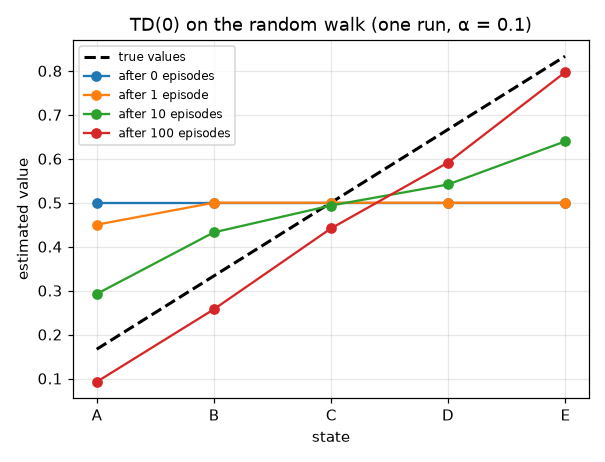

The first figure shows one run of TD(0) with $\alpha = 0.1$. After 100 episodes the estimates are $0.092, 0.257, 0.441, 0.591, 0.797$ against the true $0.167, 0.333, 0.500, 0.667, 0.833$: close, but still jittering. With a constant step size the most recent episodes always weigh heavily.

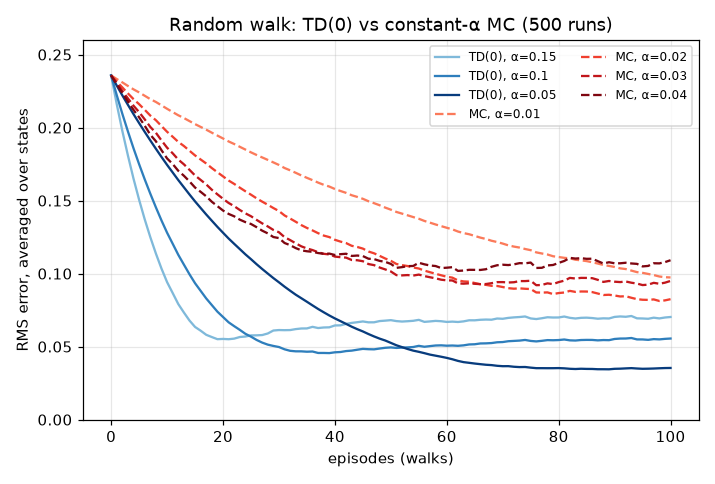

The measured RMS errors:

| method | $\alpha$ | episode 10 | episode 25 | episode 50 | episode 100 | minimum (episode) |
|---|---|---|---|---|---|---|
| TD(0) | 0.15 | 0.094 | 0.058 | 0.068 | 0.070 | 0.055 (21) |
| TD(0) | 0.10 | 0.128 | 0.057 | 0.049 | 0.056 | 0.046 (39) |
| TD(0) | 0.05 | 0.174 | 0.110 | 0.053 | 0.035 | 0.034 (89) |
| MC | 0.01 | 0.213 | 0.183 | 0.144 | 0.097 | 0.097 (100) |
| MC | 0.02 | 0.197 | 0.154 | 0.109 | 0.082 | 0.081 (98) |
| MC | 0.03 | 0.186 | 0.139 | 0.101 | 0.095 | 0.092 (76) |
| MC | 0.04 | 0.179 | 0.134 | 0.107 | 0.109 | 0.102 (62) |

For every step size we tried, TD(0) ends below every MC curve: the best TD error after 100 episodes is 0.035 ($\alpha = 0.05$) and the best MC error is 0.082 ($\alpha = 0.02$). Two further features deserve explanation.

- **Speed vs. floor.** Larger $\alpha$ learns faster but settles at a higher error, because a constant step size never stops reacting to the noise in the targets. The asymptotic fluctuation of the estimate grows with $\alpha$. This is the constant-step-size trade-off from bandits ([Chapter 02](02-multi-armed-bandits.md)), now with bootstrapped targets.
- **The dip.** With $\alpha = 0.15$ the error bottoms out at 0.055 around episode 21 and then *rises* to about 0.07. The cause is the flat initial value function. When every $V(s) = 0.5$, the TD target $R + V(S')$ of an interior state is the same whichever neighbour comes next, so early updates are almost noise-free. The noise grows as $V$ fans out towards the true slope. The script checks this explanation (Exercise 5.9): starting instead from $V = v_\pi$ (the error then simply rises to the floor) or from $V = 0$ (it simply falls to it) removes the dip.

---

## 4. Optimality of TD(0): batch TD versus batch Monte Carlo

### 4.1 Batch updating

Suppose we have only a finite amount of experience, say 10 episodes, and we may present it to the learner over and over. In **batch updating**, we compute the TD (or MC) increment for every time step in the data set, but change $V$ only once per sweep, by the sum of all the increments. We then sweep again with the new $V$, until $V$ stops changing. For small enough $\alpha$ this converges, and, remarkably, the answer does not depend on $\alpha$. So batch TD and batch MC each converge to a single, well-defined answer that depends only on the data. *Which* answers they converge to says a lot about the two methods.

```text
Batch TD(0) / batch MC on a fixed data set
──────────────────────────────────────────────────────────────────────
Input:      data D = a finite set of episodes S_0, R_1, S_1, ..., R_T, S_T
Parameters: step size α > 0 small enough; tolerance tol
Initialise: V(s) arbitrarily; V(terminal) = 0
Precompute (MC only): the return G_t of every time step in D

Repeat:
    Δ(s) ← 0 for all s
    For every time step t of every episode in D:
        TD:  Δ(S_t) ← Δ(S_t) + R_{t+1} + γ·V(S_{t+1}) − V(S_t)
        MC:  Δ(S_t) ← Δ(S_t) + G_t − V(S_t)
    V(s) ← V(s) + α·Δ(s)   for all s           # one change per sweep
until max_s |α·Δ(s)| < tol
```

### 4.2 "You are the predictor"

Sutton and Barto's Example 6.4 is the cleanest illustration. You observe eight episodes of an unknown Markov reward process:

```text
A, 0, B, 0        B, 1        B, 1        B, 1
B, 1              B, 1        B, 1        B, 0
```

(The first episode starts in A, gets reward 0, moves to B, gets reward 0 and terminates. The other seven start in B and terminate immediately.) What are the best estimates of $V(A)$ and $V(B)$?

Everybody agrees that $V(B) = 6/8 = 0.75$: B was seen eight times and six of those ended with reward 1.

For $V(A)$ there are two reasonable answers.

- **Batch MC.** A was visited once and its return was $0 + 0 = 0$, so $V(A) = 0$.
- **Batch TD.** Every time A was seen (once), the process went to B with reward 0. So model the process as "A → B with probability 1, reward 0" and conclude $V(A) = 0 + V(B) = 0.75$.

Our script reproduces both answers by actually running the batch iterations: batch TD gives $V(A) = 0.7500$, $V(B) = 0.7500$; batch MC gives $V(A) = 0.0000$, $V(B) = 0.7500$. On the training data, the MC answer has *lower* error: the mean squared difference between each observed return and the prediction is $0.1667$ for MC and $0.2292$ for TD. (Check by hand: the nine (state, return) pairs are (A, 0), (B, 0), six times (B, 1) and (B, 0). MC gives $\tfrac19[0 + 2(0.75)^2 + 6(0.25)^2] = 1.5/9$; TD adds $(0.75)^2$ for A, giving $2.0625/9$.) Yet if the process really is Markov, TD's answer is the one we expect to generalise better to future data.

### 4.3 What batch MC and batch TD converge to

Fix a data set and define, for every state $s$ visited in it, the set of time steps $\mathcal{K}(s) \doteq \lbrace (\text{episode}, t) : S_t = s \rbrace$, the visit count $n(s) = |\mathcal{K}(s)|$, and the transition counts $n(s, s')$, the number of those visits followed by $S_{t+1} = s'$.

**Batch MC.** The sweep stops changing $V(s)$ exactly when the summed increment vanishes:

$$
\sum_{t \in \mathcal{K}(s)} \big( G_t - V(s) \big) = 0 \quad\Longleftrightarrow\quad V(s) = \frac{1}{n(s)} \sum_{t \in \mathcal{K}(s)} G_t. \tag{5.6}
$$

This is the sample average of the returns that followed $s$ (every-visit), and it is the unique minimiser of the training error $\sum_{\text{all } t} (G_t - V(S_t))^2$. Setting the derivative with respect to $V(s)$, $-2\sum_{t\in\mathcal{K}(s)}(G_t - V(s))$, to zero gives the same equation. Batch MC is least-squares regression of returns on states.

**Batch TD(0).** The fixed point requires, for every visited $s$,

$$
\begin{aligned}
0 &= \sum_{t \in \mathcal{K}(s)} \big( R_{t+1} + \gamma V(S_{t+1}) - V(s) \big) \\
\Longleftrightarrow\quad V(s) &= \underbrace{\frac{1}{n(s)}\sum_{t \in \mathcal{K}(s)} R_{t+1}}_{\hat r(s)} \; + \; \gamma \sum_{s'} \underbrace{\frac{n(s, s')}{n(s)}}_{\hat P(s' \mid s)} V(s'), \qquad V(\text{terminal}) = 0.
\end{aligned} \tag{5.7}
$$

To get the second line we divided by $n(s)$ and grouped the visits by their successor state. These are the **Bellman equations of the Markov reward process $(\hat P, \hat r)$**, and $(\hat P, \hat r)$ is the **maximum-likelihood model** of the data. The MLE of a categorical distribution from counts is the empirical frequency $n(s,s')/n(s)$, and the MLE of a mean is the sample mean. Hence:

> **Batch TD(0) converges to the certainty-equivalence estimate**: the value function that would be exactly correct if the maximum-likelihood model of the process were exactly correct. Batch MC converges to the estimate that minimises mean-squared error on the training returns.

In matrix form, with $\hat{\mathbf{P}}$ the matrix of the $\hat P(s' \mid s)$ restricted to non-terminal states, $\hat{\mathbf{r}}$ the vector of $\hat r(s)$, $\mathbf{V}$ the vector of the $V(s)$ (bold capital here only to keep the letter $V$) and $\mathbf{I}$ the identity, (5.7) reads $\mathbf{V} = \hat{\mathbf{r}} + \gamma\hat{\mathbf{P}}\mathbf{V}$. When every visited state reaches termination in the data (or $\gamma < 1$), $\gamma\hat{\mathbf{P}}$ has spectral radius $\rho(\gamma\hat{\mathbf{P}}) < 1$, so $\mathbf{I} - \gamma\hat{\mathbf{P}}$ is invertible and the solution of (5.7) is unique. Why does the batch iteration converge to it? Take the per-state step $\alpha_s = \eta/n(s)$ with $0 < \eta \le 1$ that our script uses. Then one sweep is $\mathbf{V} \leftarrow (1-\eta)\mathbf{V} + \eta(\hat{\mathbf{r}} + \gamma\hat{\mathbf{P}}\mathbf{V})$, whose iteration matrix $(1-\eta)\mathbf{I} + \eta\gamma\hat{\mathbf{P}}$ has eigenvalues $(1-\eta) + \eta\gamma\lambda$ for the eigenvalues $\lambda$ of $\hat{\mathbf{P}}$. Each has modulus at most $(1-\eta) + \eta\,\rho(\gamma\hat{\mathbf{P}}) < 1$, so the iteration converges geometrically. (With one global small $\alpha$ the same conclusion holds, with a little more linear algebra.) In the predictor example $\hat P(B \mid A) = 1$ and $\hat r(A) = 0$, so (5.7) gives $V(A) = 0 + V(B) = 0.75$.

Our script checks the theory numerically on 20 random batches of random-walk episodes. The largest difference between the iterated batch-TD answer and the closed-form certainty-equivalence solution $(\mathbf{I} - \gamma \hat{\mathbf{P}})^{-1}\hat{\mathbf{r}}$ was $1.9 \times 10^{-9}$. The largest difference between batch MC and the per-state sample means was $9.8 \times 10^{-11}$ (both are just the convergence tolerance).

*Implementation note.* The per-state step $\alpha_s = \eta/n(s)$ ($\eta = 0.5$) needs far fewer sweeps than one global tiny $\alpha$. It scales each state's equation by a positive constant, which does not change the solutions of (5.6) and (5.7); the check above confirms it.

Why is certainty equivalence a big deal? Computing it directly requires estimating $\hat P$, which takes $O(|\mathcal{S}|^2)$ memory, and solving a linear system, which takes $O(|\mathcal{S}|^3)$ time. TD(0) heads towards the same answer with $O(|\mathcal{S}|)$ memory and $O(1)$ computation per step. In large problems TD may be the only feasible way to approximate the certainty-equivalence solution. (Model-based methods that *do* build $\hat P$ are the subject of [Chapter 07](07-planning-and-learning-tabular.md).)

### 4.4 Batch learning on the random walk

The same comparison on the random walk (S&B Figure 6.2): after each new episode, both methods are trained to convergence on all episodes seen so far, and the RMS error is recorded (200 runs).

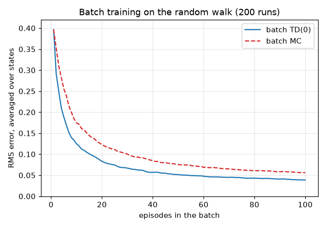

| episodes in batch | 1 | 5 | 10 | 25 | 50 | 100 |
|---|---|---|---|---|---|---|
| batch TD(0) RMS | 0.396 | 0.188 | 0.125 | 0.074 | 0.051 | 0.039 |
| batch MC RMS | 0.396 | 0.255 | 0.175 | 0.111 | 0.076 | 0.056 |

With one episode the two coincide: every visited state has the same return, and states not yet visited keep their initial 0.5. From two episodes on, batch TD is lower at every one of the 99 batch sizes. Since the random walk *is* a Markov process, the maximum-likelihood model is the right thing to believe. If the Markov assumption is badly violated (for instance, if we merged several states into one observation), the certainty-equivalence estimate can be worse than MC's (Exercise 5.14 and [Chapter 15](15-beyond-mdps.md)).

---

## 5. Convergence of TD(0)

The results in Section 4 concern repeated sweeps over a fixed batch. What about the normal *online* algorithm, which sees each transition once?

**Theorem 5.1 (tabular TD(0)).** Let $\pi$ be a fixed policy in a finite MDP. Assume either $\gamma < 1$, or $\gamma = 1$ and every episode terminates with probability 1. Assume the rewards have finite variance. Let $\alpha_t(s) \in [0, 1]$ be the step size used at time $t$, with $\alpha_t(s) = 0$ unless $s = S_t$. If, with probability 1, for every state $s$

$$
\sum_{t=0}^{\infty} \alpha_t(s) = \infty \qquad\text{and}\qquad \sum_{t=0}^{\infty} \alpha_t(s)^2 < \infty, \tag{5.8}
$$

then $V_t(s) \to v_\pi(s)$ for all $s$ with probability 1. With a *constant* step size the guarantee is weaker: as Sutton and Barto (2018, §6.2) summarise the literature, TD(0) converges *in the mean* if $\alpha$ is sufficiently small, while $V_t$ itself keeps fluctuating, with a variance that shrinks as $\alpha$ does.

The conditions (5.8) are the **Robbins–Monro conditions** (Robbins and Monro, 1951; [Chapter 00](00-math-toolkit.md)). The first ensures the steps can carry the estimate any distance, so the initial condition is forgotten. It also implies that every state is visited infinitely often, because $\alpha_t(s) > 0$ only on visits. The second ensures the accumulated noise has finite variance, so it averages out. The sample-average schedule $\alpha_n = 1/n$ (on the $n$-th visit) satisfies both; a constant $\alpha$ violates the second.

**History of the result.** Sutton (1988) proved convergence in the mean for TD(0) (in the more general linear setting, under conditions). Dayan (1992) extended this to TD($\lambda$). Convergence with probability 1 was proved by Jaakkola, Jordan and Singh (1994) and by Tsitsiklis (1994) via stochastic approximation, and Tsitsiklis and Van Roy (1997) proved it for linear function approximation ([Chapter 08](08-function-approximation.md)). Rigorous treatments are in Bertsekas and Tsitsiklis (1996) and in [Chapter 19](19-rl-theory.md).

### 5.1 One lemma to prove them all

All the tabular convergence proofs in this chapter use the same stochastic-approximation lemma. It, and the GLIE arguments of Section 7.3, use three probability tools that [Chapter 00](00-math-toolkit.md) does not cover. Plain statements suffice for this chapter.

> **Toolbox.**
>
> - **$\sigma$-field of the history.** $\mathcal{F}_t$ stands for "the information in the history up to time $t$": everything observed so far ($S_0, A_0, R_1, \dots, S_t$, possibly $A_t$) and the step sizes chosen from it. "$X$ is $\mathcal{F}_t$-measurable" means $X$ is determined by that history, and $\mathbb{E}[X \mid \mathcal{F}_t]$ is the expectation given the history. An increasing sequence $\mathcal{F}_0 \subseteq \mathcal{F}_1 \subseteq \cdots$ is a *filtration*.
> - **Martingale-difference noise.** A sequence $\xi_t$ with $\mathbb{E}[\xi_t \mid \mathcal{F}_t] = 0$: noise that cannot be predicted from the past, like $\xi_t$ in (5.5). If its conditional variances are bounded and $\sum_t \alpha_t^2 < \infty$, the weighted sum $\sum_t \alpha_t \xi_t$ converges with probability 1 (a consequence of the martingale convergence theorem). This is why the second Robbins–Monro condition makes the noise average out.
> - **Borel–Cantelli lemmas.** For events $E_1, E_2, \dots$: (first lemma) if $\sum_n \Pr\lbrace E_n\rbrace < \infty$, then with probability 1 only finitely many $E_n$ occur. (Conditional second lemma, due to Lévy) if each $E_n$ is determined by $\mathcal{F}_{n+1}$, then with probability 1 infinitely many $E_n$ occur *exactly when* $\sum_n \Pr\lbrace E_n \mid \mathcal{F}_n\rbrace = \infty$. For exploration, take $E_n$ = "the $n$-th visit to $s$ tries action $a$": it happens infinitely often if and only if the probabilities of trying $a$, summed over the visits to $s$, diverge.

Here is the lemma, in the form given by Singh, Jaakkola, Littman and Szepesvári (2000, Lemma 1), which extends Jaakkola, Jordan and Singh (1994, Theorem 1).

**Lemma 5.2.** Consider a random process $(\alpha_t, \Delta_t, F_t)$, $t \ge 0$, where $\alpha_t, \Delta_t, F_t : \mathcal{X} \to \mathbb{R}$ satisfy

$$
\Delta_{t+1}(x) = \big(1 - \alpha_t(x)\big)\Delta_t(x) + \alpha_t(x) F_t(x), \qquad x \in \mathcal{X}.
$$

Let $\mathcal{F}_t$ be an increasing sequence of $\sigma$-fields (the history) such that $\alpha_0, \Delta_0$ are $\mathcal{F}_0$-measurable and $\alpha_t, \Delta_t, F_{t-1}$ are $\mathcal{F}_t$-measurable. Then $\Delta_t \to 0$ with probability 1 if

1. $\mathcal{X}$ is finite;
2. $0 \le \alpha_t(x) \le 1$, $\sum_t \alpha_t(x) = \infty$ and $\sum_t \alpha_t(x)^2 < \infty$ with probability 1;
3. $\lVert \mathbb{E}[F_t \mid \mathcal{F}_t] \rVert_W \le \kappa \lVert \Delta_t \rVert_W + c_t$, where $\kappa \in [0, 1)$ and $c_t \to 0$ with probability 1;
4. $\mathrm{Var}[F_t(x) \mid \mathcal{F}_t] \le K (1 + \lVert \Delta_t \rVert_W)^2$ for some constant $K$;

where $\lVert \cdot \rVert_W$ is a weighted maximum norm.

Read it as: "a noisy, asynchronous iteration whose *expected* update is a contraction (condition 3) converges, provided the noise is not too large (condition 4) and the step sizes satisfy Robbins–Monro (condition 2)." The proof splits $F_t$ into its conditional mean and a martingale-difference noise term. The noise is averaged away because $\sum \alpha^2 < \infty$, and the contraction shrinks the rest; we do not reproduce it here.

**Applying it to TD(0)** (for $\gamma < 1$). Let $\mathcal{X} = \mathcal{S}$, $\Delta_t = V_t - v_\pi$, and subtract $v_\pi(s)$ from both sides of the update at $s = S_t$:

$$
\Delta_{t+1}(s) = (1 - \alpha_t(s))\Delta_t(s) + \alpha_t(s) \underbrace{\big[ R_{t+1} + \gamma V_t(S_{t+1}) - v_\pi(s) \big]}_{F_t(s)}.
$$

Two technical points make this fit the lemma. The history $\mathcal{F}_t$ includes $S_t$ (so $\alpha_t$ is $\mathcal{F}_t$-measurable), and the expectation is over the transition $(R_{t+1}, S_{t+1})$ that is sampled afterwards. And the lemma needs $F_t(x)$ for *every* $x$, not only the visited one. For $s \ne S_t$ we have $\alpha_t(s) = 0$, so the value of $F_t(s)$ does not matter; define it as $(\mathcal{T}^\pi V_t)(s) - v_\pi(s)$, a function of the history, so that conditions 3 and 4 hold there trivially. At the visited state, $\mathbb{E}[F_t(s) \mid \mathcal{F}_t] = (\mathcal{T}^\pi V_t)(s) - (\mathcal{T}^\pi v_\pi)(s)$, because $v_\pi = \mathcal{T}^\pi v_\pi$. Its absolute value is at most $\gamma \lVert V_t - v_\pi \rVert_\infty$ by the contraction property of $\mathcal{T}^\pi$ ([Chapter 03](03-dynamic-programming.md)). The variance is bounded by a constant times $(1 + \lVert \Delta_t\rVert_\infty)^2$ because rewards have finite variance and $|V_t(s')| \le \lVert v_\pi \rVert_\infty + \lVert \Delta_t \rVert_\infty$. All four conditions hold with $\kappa = \gamma$ and $c_t = 0$. For episodic tasks with $\gamma = 1$, $\mathcal{T}^\pi$ is a contraction in a suitably *weighted* max norm when the policy is proper (Bertsekas and Tsitsiklis, 1996), which is why the lemma is stated with $\lVert\cdot\rVert_W$.

---

## 6. Bias and variance of bootstrapping

Compare the two targets for $v_\pi(S_t)$.

**The MC target $G_t$** is unbiased, since $\mathbb{E}_\pi[G_t \mid S_t = s] = v_\pi(s)$ by definition. But its variance accumulates the randomness of *every* future action, transition and reward until the episode ends.

**The TD target $R_{t+1} + \gamma V(S_{t+1})$** has conditional mean $(\mathcal{T}^\pi V)(s)$, so its bias is

$$
\mathbb{E}_\pi\left[ R_{t+1} + \gamma V(S_{t+1}) \mid S_t = s \right] - v_\pi(s) = \gamma\, \mathbb{E}_\pi\left[ V(S_{t+1}) - v_\pi(S_{t+1}) \mid S_t = s \right], \tag{5.9}
$$

the discounted average error of the current estimates at the successor states. Its variance comes from only one action, one transition and one reward.

**Worked example (random walk, $V = v_\pi$).** From state C the MC target is 1 or 0 with probability $1/2$ each: variance $1/4 = 0.25$. The TD target is $0 + v_\pi(B) = 1/3$ or $0 + v_\pi(D) = 2/3$ with probability $1/2$ each: variance $(1/6)^2 = 1/36 \approx 0.028$, nine times smaller. From state E, the MC target is Bernoulli($5/6$), with variance $5/36 \approx 0.139$. The TD target is $1 + 0 = 1$ or $0 + 2/3$ with probability $1/2$ each, with mean $5/6$ and variance $1/36 \approx 0.028$. In longer tasks the gap is usually much larger, because the MC variance grows with the horizon while the TD variance does not.

Three remarks put this in perspective.

- **The bias is transient in the tabular case.** It vanishes as $V \to v_\pi$, and Theorem 5.1 shows TD converges anyway. Bootstrapping trades a bias that shrinks over time for a large, permanent reduction in variance. Kearns and Singh (2000) derived upper bounds on the error of (phased) TD($\lambda$) updates that make this bias–variance trade-off quantitative.
- **The bias propagates.** Because TD's target uses the estimate at $S_{t+1}$, errors flow backwards along trajectories, and good information also propagates only one step per update (Section 2.2).
- **The bias can be dangerous.** With function approximation and off-policy data, bootstrapping is one leg of the **deadly triad** that can make TD diverge ([Chapter 08](08-function-approximation.md)). Multi-step returns ([Chapter 06](06-n-step-and-eligibility-traces.md)) let us choose any point on the bias–variance spectrum between TD(0) and MC.

---

## 7. SARSA: on-policy TD control

### 7.1 From prediction to control

Control follows the generalized-policy-iteration recipe of [Chapter 03](03-dynamic-programming.md) and [Chapter 04](04-monte-carlo.md): evaluate the current policy a little, improve it a little, repeat. Without a model we cannot improve a policy from state values (that would need $\sum_{s',r} p(s',r\mid s,a)[r + \gamma v(s')]$), so we learn **action values** $Q(s,a) \approx q_\pi(s,a)$ and act $\varepsilon$-greedily with respect to them.

Apply TD(0) to the Markov chain of state–action pairs. The Bellman equation $q_\pi(s,a) = \mathbb{E}_\pi[R_{t+1} + \gamma q_\pi(S_{t+1}, A_{t+1}) \mid S_t = s, A_t = a]$ gives the sample update

$$
Q(S_t, A_t) \leftarrow Q(S_t, A_t) + \alpha \big[ R_{t+1} + \gamma Q(S_{t+1}, A_{t+1}) - Q(S_t, A_t) \big], \tag{5.10}
$$

with $Q(\text{terminal}, \cdot) \doteq 0$. The update uses the quintuple $(S_t, A_t, R_{t+1}, S_{t+1}, A_{t+1})$, hence the name **SARSA** (or Sarsa). It is **on-policy**: $A_{t+1}$ is the action the agent *will actually take* next, so $Q$ estimates the value of the behaviour policy itself, exploration included.

### 7.2 The algorithm

```text
SARSA (on-policy TD control) for estimating Q ≈ q_*
──────────────────────────────────────────────────────────────────────
Parameters: step size α ∈ (0, 1]; exploration ε > 0 (or a GLIE schedule ε_k)
Initialise: Q(s, a) arbitrarily for all s ∈ S, a ∈ A(s); Q(terminal, ·) = 0

Loop for each episode:
    Initialise S
    Choose A from S using the policy derived from Q (e.g. ε-greedy)
    Loop for each step of the episode:
        Take action A; observe R, S'
        If S' is terminal:
            Q(S, A) ← Q(S, A) + α·[R − Q(S, A)]
            break
        Choose A' from S' using the policy derived from Q (e.g. ε-greedy)
        Q(S, A) ← Q(S, A) + α·[R + γ·Q(S', A') − Q(S, A)]
        S ← S';  A ← A'                      # A' is the action actually executed next
```

Two implementation details matter. The action $A'$ used in the update must be the action that is then *executed*; choosing a fresh action for execution turns SARSA into something else. And ties in the $\varepsilon$-greedy argmax should be broken at random: with all-zero initial values a deterministic `argmax` always picks action 0, which can stall exploration badly.

### 7.3 Convergence: GLIE

A policy sequence is **GLIE** (greedy in the limit with infinite exploration) if

1. every action is taken infinitely often in every state that is visited infinitely often, with probability 1; and
2. the policy converges to the greedy policy with respect to $Q$, with probability 1: $\lim_{k \to \infty} \pi_k(a \mid s) = \mathbb{1}[a = \arg\max_{a'} Q_k(s, a')]$.

A standard example is $\varepsilon$-greedy with $\varepsilon_t(s) = c / n_t(s)$, where $n_t(s)$ is the number of visits to $s$ so far and $0 < c \le 1$. On the $n$-th visit to $s$, any particular action is chosen with probability at least $c / (n|\mathcal{A}|)$. Since $\sum_n c / (n|\mathcal{A}|) = \infty$, the conditional second Borel–Cantelli lemma (Toolbox, Section 5.1) says that every action is tried infinitely often in every state visited infinitely often. And $\varepsilon_t(s) \to 0$ makes the policy greedy in the limit. A constant $\varepsilon$ is **not** GLIE (it never becomes greedy). $\varepsilon_t(s) = 1/n_t(s)^2$ is **not guaranteed** to be GLIE: exploratory choices then happen only finitely often, and nothing forces every action to keep being tried (Exercise 5.11).

Note that both conditions are *per state*: the exploration probabilities must sum to infinity over each state's *own* visits. A schedule that decays $\varepsilon$ with the episode number, $\varepsilon_k \approx c/k$, sums to infinity over episodes, but a state that is reached only through an exploratory move gets $\varepsilon_k$ only with probability $O(\varepsilon_k)$ per episode. Its non-greedy actions are then tried with probability $O(\varepsilon_k^2)$ per episode, a summable sequence, so (first Borel–Cantelli lemma) only finitely often if its greedy action settles. Exercise 5.12 shows what this does on cliff walking.

**Theorem 5.3 (SARSA; Singh, Jaakkola, Littman and Szepesvári, 2000).** In a finite MDP with $\gamma < 1$ and rewards of bounded variance, tabular one-step SARSA converges with probability 1 to $q_\ast$, and its policy to an optimal policy, provided (i) the step sizes satisfy the Robbins–Monro conditions (5.8) for every state–action pair and (ii) the behaviour policy is GLIE (plus mild measurability conditions on how the policy is computed from the history).

The proof builds on the Q-learning argument, so we give its sketch at the end of Section 8.4. Expected SARSA (Section 9) converges under the same conditions (van Seijen, van Hasselt, Whiteson and Wiering, 2009).

---

## 8. Q-learning: off-policy TD control

### 8.1 The update

Watkins (1989) proposed

$$
Q(S_t, A_t) \leftarrow Q(S_t, A_t) + \alpha \Big[ R_{t+1} + \gamma \max_{a} Q(S_{t+1}, a) - Q(S_t, A_t) \Big]. \tag{5.11}
$$

The target is a sample of the right-hand side of the **Bellman optimality equation** $q_\ast(s,a) = \mathbb{E}[R_{t+1} + \gamma \max_{a'} q_\ast(S_{t+1}, a') \mid S_t = s, A_t = a]$. Q-learning therefore estimates $q_\ast$ directly, *whatever* policy generates the data: the behaviour policy only decides which pairs get updated. In the language of [Chapter 04](04-monte-carlo.md), the **target policy** is greedy with respect to $Q$ and the **behaviour policy** $b$ is anything that keeps visiting every pair, typically $\varepsilon$-greedy.

```text
Q-learning (off-policy TD control) for estimating π ≈ π_*
──────────────────────────────────────────────────────────────────────
Parameters: step size α ∈ (0, 1]; exploration ε > 0
Initialise: Q(s, a) arbitrarily for all s ∈ S, a ∈ A(s); Q(terminal, ·) = 0

Loop for each episode:
    Initialise S
    Loop for each step of the episode:
        Choose A from S using the behaviour policy (e.g. ε-greedy w.r.t. Q)
        Take action A; observe R, S'
        If S' is terminal:  target ← R
        else:               target ← R + γ·max_a Q(S', a)
        Q(S, A) ← Q(S, A) + α·[target − Q(S, A)]
        S ← S'
    until S is terminal
Output: greedy policy π(s) = argmax_a Q(s, a)
```

Q-learning is sampled, asynchronous **value iteration**: replace the expectation over $(R, S')$ in $Q \leftarrow \mathcal{T}^\ast Q$ by one sample, update one pair at a time, and move only a fraction $\alpha$ of the way.

### 8.2 Why Q-learning needs no importance sampling

Off-policy Monte Carlo needed the importance-sampling ratio $\rho_{t+1:T-1} = \prod_{k=t+1}^{T-1} \pi(A_k\mid S_k)/b(A_k\mid S_k)$ ([Chapter 04](04-monte-carlo.md)), because the return $G_t$ depends on the actions $A_{t+1}, A_{t+2}, \dots$ that $b$ chose. Their distribution under $b$ differs from their distribution under $\pi$. Look at what the Q-learning target depends on:

$$
\mathbb{E}\Big[ R_{t+1} + \gamma \max_{a} Q(S_{t+1}, a) \,\Big|\, S_t = s, A_t = a_0 \Big] = \sum_{s', r} p(s', r \mid s, a_0) \Big[ r + \gamma \max_{a} Q(s', a) \Big] = (\mathcal{T}^\ast Q)(s, a_0). \tag{5.12}
$$

- **The current action $A_t$** was chosen by $b$, but we *condition* on it. $q(s,a_0)$ is by definition the value of taking $a_0$ in $s$, so how often $b$ chooses $a_0$ affects only *how often* we update this entry, not *what* the update estimates.
- **The next state and reward** are drawn by the environment from $p(\cdot \mid s, a_0)$, which is the same under any policy.
- **The next action** is never sampled. The target policy is greedy, and its "expectation" over the next action, $\sum_{a} \pi(a \mid S_{t+1}) Q(S_{t+1}, a) = \max_a Q(S_{t+1}, a)$, is computed *exactly* from the table.

No quantity in the target depends on $b$, so there is nothing to reweight. This is why one-step methods whose target *averages* the next action under the target policy (Q-learning, and Expected SARSA in Section 9) can be off-policy for free. One-step SARSA cannot: its target samples $A_{t+1}$ from $b$, so used off-policy it would need the ratio $\rho_{t+1} = \pi(A_{t+1} \mid S_{t+1})/b(A_{t+1} \mid S_{t+1})$. With $n$-step returns, the intermediate actions $A_{t+1}, \dots, A_{t+n-1}$ *are* sampled from $b$, and importance sampling (or tree backups) reappears ([Chapter 06](06-n-step-and-eligibility-traces.md)).

### 8.3 What the behaviour policy must do

For the theory, only that every state–action pair keeps being updated with Robbins–Monro step sizes. In practice, behaviour matters a great deal for *speed* (exploration is the topic of [Chapter 14](14-exploration.md)) and, as cliff walking will show, for the reward collected *while learning*.

### 8.4 The tabular Q-learning convergence theorem

**Theorem 5.4 (Watkins and Dayan, 1992; Jaakkola, Jordan and Singh, 1994; Tsitsiklis, 1994).** Consider a finite MDP with $\gamma < 1$ and bounded rewards. Let Q-learning update the pair $(S_t, A_t)$ with step size $\alpha_t(S_t, A_t) \in [0,1]$, with $\alpha_t(s,a) = 0$ for all other pairs. If, with probability 1, for every $(s,a)$

$$
\sum_{t} \alpha_t(s,a) = \infty \qquad\text{and}\qquad \sum_t \alpha_t(s,a)^2 < \infty, \tag{5.13}
$$

then $Q_t(s,a) \to q_\ast(s,a)$ for all $(s,a)$ with probability 1. The first condition implies that **every pair is visited infinitely often**; nothing else is required of the behaviour policy. (Tsitsiklis (1994) also covers undiscounted problems in which all policies are proper.)

*Proof (via Lemma 5.2).* Take $\mathcal{X} = \mathcal{S} \times \mathcal{A}$ and $\Delta_t = Q_t - q_\ast$. Subtracting $q_\ast(s,a)$ from both sides of (5.11) at $(s,a) = (S_t, A_t)$ gives

$$
\Delta_{t+1}(s,a) = (1 - \alpha_t(s,a))\Delta_t(s,a) + \alpha_t(s,a) F_t(s,a), \qquad F_t(s,a) \doteq R_{t+1} + \gamma \max_{a'} Q_t(S_{t+1}, a') - q_\ast(s,a).
$$

As for TD(0), $\mathcal{F}_t$ contains $S_t, A_t$ and the expectation below is over $(R_{t+1}, S_{t+1})$. For the pairs $x \ne (S_t, A_t)$, where $\alpha_t(x) = 0$, set $F_t(x) \doteq (\mathcal{T}^\ast Q_t)(x) - q_\ast(x)$, so that conditions 3 and 4 hold for every $x$.

*Condition 3 (contraction).* Using (5.12) and $q_\ast = \mathcal{T}^\ast q_\ast$,

$$
\begin{aligned}
\big| \mathbb{E}[F_t(s,a) \mid \mathcal{F}_t] \big| &= \big| (\mathcal{T}^\ast Q_t)(s,a) - (\mathcal{T}^\ast q_\ast)(s,a) \big| \\
&= \gamma \Big| \sum_{s'} p(s' \mid s,a) \Big[ \max_{a'} Q_t(s',a') - \max_{a'} q_\ast(s',a') \Big] \Big| \\
&\le \gamma \sum_{s'} p(s' \mid s,a) \max_{a'} \big| Q_t(s',a') - q_\ast(s',a') \big| \\
&\le \gamma \lVert Q_t - q_\ast \rVert_\infty = \gamma \lVert \Delta_t \rVert_\infty.
\end{aligned}
$$

The third line uses $|\max_a f(a) - \max_a g(a)| \le \max_a |f(a) - g(a)|$. To see this, let $a_1 = \arg\max f$; then $\max f - \max g \le f(a_1) - g(a_1) \le \max_a|f(a) - g(a)|$, and the same argument with $f$ and $g$ swapped bounds $\max g - \max f$. So condition 3 holds with $\kappa = \gamma < 1$ and $c_t = 0$.

*Condition 4 (noise).* $\mathrm{Var}[F_t \mid \mathcal{F}_t] \le 2\mathrm{Var}[R_{t+1} \mid \cdot] + 2\gamma^2 \mathbb{E}[(\max_{a'} Q_t(S_{t+1},a'))^2 \mid \cdot]$. Rewards are bounded and $|\max_{a'}Q_t(s',a')| \le \lVert q_\ast\rVert_\infty + \lVert \Delta_t \rVert_\infty$, so the variance is at most $K(1 + \lVert\Delta_t\rVert_\infty)^2$.

Conditions 1 and 2 are the finiteness of the MDP and assumption (5.13). Hence $\Delta_t \to 0$ with probability 1. $\square$

Watkins and Dayan's original proof used a different construction (an "action-replay process"); the stochastic-approximation route above is the one that generalises to SARSA, Expected SARSA, Double Q-learning and many later algorithms.

*Proof sketch for SARSA (Theorem 5.3).* Let $\Delta_t = Q_t - q_\ast$ and split the SARSA target:

$$
F_t(s,a) = \underbrace{R_{t+1} + \gamma \max_{a'} Q_t(S_{t+1}, a') - q_\ast(s,a)}_{\text{exactly as in Q-learning}} \; + \; \gamma\underbrace{\big[ Q_t(S_{t+1}, A_{t+1}) - \max_{a'} Q_t(S_{t+1}, a') \big]}_{\le 0;\ \text{its conditional mean} \to 0 \text{ under GLIE}}.
$$

The first part satisfies condition 3 of Lemma 5.2 with $\kappa = \gamma$, $c_t = 0$, as just shown. The conditional expectation of the second part is $\gamma \sum_{a'} \pi_t(a' \mid S_{t+1}) [Q_t(S_{t+1}, a') - \max Q_t(S_{t+1},\cdot)]$. It goes to 0 because the policy becomes greedy and $Q_t$ stays bounded, so it plays the role of $c_t$. The variance condition holds as before. Infinite exploration (GLIE condition 1) is what makes every pair's step sizes sum to infinity. $\square$

**How fast?** The theorem says nothing about speed, and the step-size schedule matters enormously. Szepesvári (1997) showed that with $\alpha = 1/n$, $\gamma > 1/2$ and state–action pairs sampled from a fixed distribution, the asymptotic rate can be as slow as $O\big(1/t^{(1-\gamma)p_{\min}/p_{\max}}\big)$, where $p_{\min}/p_{\max}$ is the ratio of the smallest to the largest state–action sampling frequency. Even-Dar and Mansour (2003) showed that polynomial step sizes $1/n^\omega$ with $\omega \in (1/2, 1)$ give convergence times polynomial in $1/(1-\gamma)$, whereas the linear rate $1/n$ can need time exponential in $1/(1-\gamma)$. Modern finite-sample analyses are covered in [Chapter 19](19-rl-theory.md).

**Experiment** ([`q_learning_step_sizes.py`](../code/ch05_temporal_difference/q_learning_step_sizes.py)). We built a random MDP with 6 states, 2 actions, $\gamma = 0.9$, Dirichlet transition probabilities and Gaussian reward noise of standard deviation 1, and computed $q_\ast$ by value iteration. We then ran Q-learning with a uniformly random behaviour policy along one continuing trajectory (20 runs) and measured $\lVert Q_t - q_\ast \rVert_\infty$:

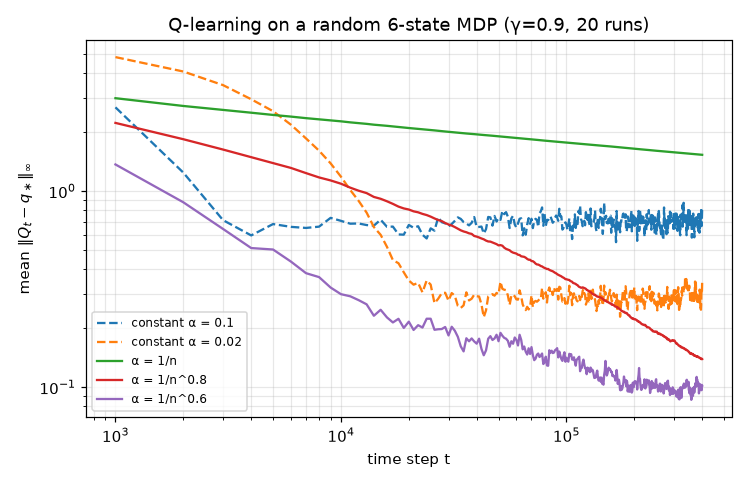

| step size ($n$ = updates of that pair) | $t = 10^4$ | $t = 10^5$ | $t = 2 \times 10^5$ | $t = 4 \times 10^5$ |
|---|---|---|---|---|
| constant $\alpha = 0.1$ | 0.707 | 0.677 | 0.688 | 0.819 |
| constant $\alpha = 0.02$ | 1.187 | 0.277 | 0.323 | 0.345 |
| $\alpha = 1/n$ | 2.271 | 1.770 | 1.648 | 1.533 |
| $\alpha = 1/n^{0.8}$ | 1.092 | 0.356 | 0.223 | 0.139 |
| $\alpha = 1/n^{0.6}$ | 0.299 | 0.142 | 0.106 | 0.102 |

The constant step sizes plateau at a noise floor, lower for smaller $\alpha$ but reached later. That is what we should expect, since a constant $\alpha$ violates the second Robbins–Monro condition and the theorem no longer applies. Among the decaying schedules, $1/n^{0.8}$ is still improving clearly; $1/n^{0.6}$ has almost reached a slowly shrinking noise floor (0.106 → 0.102 over the last doubling of $t$, which 20 runs barely resolve); and $1/n$ improves slowest of all. The textbook $1/n$ satisfies Robbins–Monro but is painfully slow: after 400,000 steps its error is still 1.5, more than ten times that of $1/n^{0.6}$. Early updates with $\alpha = 1/n$ are averaged with equal weight forever, and those early targets bootstrapped from terrible estimates. Polynomial rates forget the past faster.

---

## 9. Expected SARSA

Replace SARSA's sampled next action by an expectation over the target policy $\pi$:

$$
Q(S_t, A_t) \leftarrow Q(S_t, A_t) + \alpha \Big[ R_{t+1} + \gamma \sum_{a} \pi(a \mid S_{t+1})\, Q(S_{t+1}, a) - Q(S_t, A_t) \Big]. \tag{5.14}
$$

```text
Expected SARSA for estimating Q ≈ q_π (or q_* when π is greedy)
──────────────────────────────────────────────────────────────────────
Parameters: step size α ∈ (0, 1]; target policy π derived from Q (e.g. ε-greedy);
            behaviour policy b derived from Q (on-policy: b = π)
Initialise: Q(s, a) arbitrarily for all s ∈ S, a ∈ A(s); Q(terminal, ·) = 0

Loop for each episode:
    Initialise S
    Loop for each step of the episode:
        Choose A from S using b
        Take action A; observe R, S'
        If S' is terminal:  target ← R
        else:               target ← R + γ·Σ_a π(a|S')·Q(S', a)
        Q(S, A) ← Q(S, A) + α·[target − Q(S, A)]
        S ← S'
    until S is terminal
```

For an $\varepsilon$-greedy $\pi$ with greedy set $\mathcal{G}(s') = \arg\max_a Q(s',a)$ (ties shared), $\pi(a\mid s') = \varepsilon/|\mathcal{A}| + (1-\varepsilon)\mathbb{1}[a \in \mathcal{G}(s')]/|\mathcal{G}(s')|$. The update costs $O(|\mathcal{A}|)$ instead of $O(1)$.

**Relation to SARSA.** If the behaviour policy is $\pi$, SARSA's target $Z = R_{t+1} + \gamma Q(S_{t+1}, A_{t+1})$ with $A_{t+1} \sim \pi(\cdot \mid S_{t+1})$ has conditional mean $\bar Z = \mathbb{E}[Z \mid S_t, A_t, R_{t+1}, S_{t+1}] = R_{t+1} + \gamma\sum_a \pi(a\mid S_{t+1})Q(S_{t+1},a)$, which is exactly the Expected SARSA target. Both targets have the same expectation given $(S_t, A_t)$, and the law of total variance, applied conditionally on $(S_t, A_t)$, gives

$$
\begin{aligned}
\mathrm{Var}[Z \mid S_t, A_t] &= \mathbb{E}\big[\mathrm{Var}(Z \mid S_t, A_t, R_{t+1}, S_{t+1}) \,\big|\, S_t, A_t\big] + \mathrm{Var}\big[\bar Z \mid S_t, A_t\big] \\
&= \gamma^2\, \mathbb{E}\Big[ \mathrm{Var}_{A' \sim \pi(\cdot\mid S_{t+1})} \big(Q(S_{t+1}, A')\big) \,\Big|\, S_t, A_t \Big] + \mathrm{Var}\big[\bar Z \mid S_t, A_t\big] \;\ge\; \mathrm{Var}\big[\bar Z \mid S_t, A_t\big].
\end{aligned} \tag{5.15}
$$

So Expected SARSA removes the variance due to the random choice of $A_{t+1}$. In a **deterministic** environment the Expected SARSA target for a given $(S_t, A_t)$ has *zero* variance (given the current table), so a step size as large as $\alpha = 1$ is reasonable, while SARSA with $\alpha = 1$ copies a single random sample.

**Relation to Q-learning.** Expected SARSA can be used **off-policy**: the target policy $\pi$ in (5.14) need not equal $b$, and the argument of Section 8.2 applies unchanged, since no sampled action from $b$ enters the target. If $\pi$ is greedy, $\sum_a \pi(a\mid S_{t+1})Q(S_{t+1},a) = \max_a Q(S_{t+1},a)$ and **Expected SARSA is Q-learning**. Expected SARSA therefore generalises Q-learning while (on-policy) reducing SARSA's variance, at the cost of a sum over actions.

### 9.1 Backup diagrams side by side

In Sutton and Barto's backup diagrams an open circle ○ is a state, a solid dot ● is a state–action pair, and the update flows from the bottom of the diagram up to its root. The four one-step TD methods differ only in what happens at the next state; the bottom line gives each target:

```text
    TD(0)               SARSA                 Q-learning              Expected SARSA

      ○  S_t              ●  S_t, A_t           ●  S_t, A_t             ●  S_t, A_t
      │                   │  R_{t+1}            │  R_{t+1}              │  R_{t+1}
      ●  A_t ~ π          ○  S_{t+1}            ○  S_{t+1}              ○  S_{t+1}
      │  R_{t+1}          │                   ╱ │ ╲                   ╱ │ ╲
      ○  S_{t+1}          ●  A_{t+1}         ●  ●  ●                 ●  ●  ●
                             (sampled)       ╰─max─╯                 ╰─Σ π─╯

   R + γV(S')          R + γQ(S',A')         R + γ max Q(S',·)       R + γ Σ π(·|S')Q(S',·)
```

TD(0) and SARSA follow one sampled path. Q-learning and Expected SARSA sample the environment's step $(R_{t+1}, S_{t+1})$ but then look at *all* next actions, through a max or a $\pi$-weighted average. That is the whole of Section 8.2 in one picture: the branches at the bottom are computed from the table, not sampled from the behaviour policy.

---

## 10. Cliff walking: online performance versus learned policy

### 10.1 The task

Sutton and Barto's Example 6.6: a $4 \times 12$ grid with start S at the bottom-left and goal G at the bottom-right. The ten cells between them form a **cliff**. Each step costs $-1$; stepping into the cliff costs $-100$ and sends the agent back to S (the episode continues); reaching G ends the episode; $\gamma = 1$. Actions are up/right/down/left; moving into a wall leaves the agent in place. The optimal path walks along the cliff edge in 13 steps (return $-13$).

```text
row 0   .  .  .  .  .  .  .  .  .  .  .  .
row 1   .  .  .  .  .  .  .  .  .  .  .  .
row 2   .  .  .  .  .  .  .  .  .  .  .  .     ← optimal path runs along row 2
row 3   S  C  C  C  C  C  C  C  C  C  C  G
```

[`cliff_walking.py`](../code/ch05_temporal_difference/cliff_walking.py) implements this MDP directly (it is the same MDP as Gymnasium's `CliffWalking-v1` with `is_slippery=False`) and runs SARSA, Q-learning and Expected SARSA, all with $\varepsilon$-greedy behaviour, $\varepsilon = 0.1$ held constant, $\alpha = 0.5$, 500 episodes and 100 independent runs.

### 10.2 Results

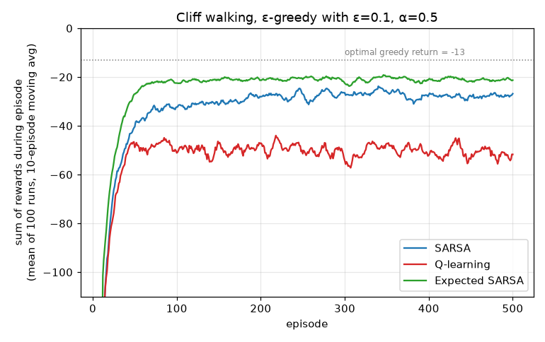

| method | mean reward per episode, episodes 1–100 | mean reward per episode, episodes 401–500 |
|---|---|---|
| SARSA | −72.2 | −27.8 |
| Q-learning | −81.2 | −51.1 |
| Expected SARSA | −56.0 | −21.1 |

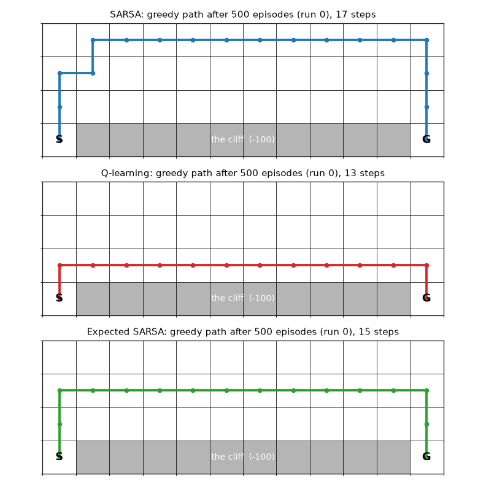

What did they *learn*? After training we followed the greedy policy $\arg\max_a Q(s,a)$ from S, with no exploration. (This read-out is deterministic and breaks ties by the lowest action index; the agents themselves break ties at random while learning.)

| method | runs whose greedy policy reaches G | greedy return | route through the middle of the grid |
|---|---|---|---|
| Q-learning | 100 / 100 | −13.0 (optimal) | row 2, the cliff edge, in all 100 runs |
| Expected SARSA | 100 / 100 | −15.0 | row 1 in all 100 runs |
| SARSA | 84 / 100 | −17.1 (mean over the 84) | row 0 (farthest from the cliff) in 80 runs, row 1 in 3, row 2 in 1 |

What should SARSA and Expected SARSA learn here? With $\varepsilon = 0.1$ held fixed, both evaluate the $\varepsilon$-greedy policy they follow, and they share one fixed point: the $Q$ that satisfies $Q(s,a) = r + \sum_{a'} \pi_\varepsilon(a' \mid s')\, Q(s',a')$, where $\pi_\varepsilon$ is $\varepsilon$-greedy with respect to that same $Q$. (Expected SARSA's expected update is exactly this backup, and SARSA's target has the same conditional mean, Section 9.) Its solution gives the action values of the best $\varepsilon$-soft policy of [Chapter 04](04-monte-carlo.md), Section 5.3, the optimal policy of the modified environment that overrides the agent's choice with probability $\varepsilon$. That policy is itself $\varepsilon$-greedy, so we call it the **best $\varepsilon$-greedy policy** below. `cliff_walking.py` computes it exactly by "$\varepsilon$-soft value iteration" (value iteration in that modified environment), using the known model for analysis only:

| policy (all executed $\varepsilon$-greedily, $\varepsilon = 0.1$) | exact expected return from S |
|---|---|
| best $\varepsilon$-greedy policy: greedy route along **row 1** (15 steps) | **−20.71** |
| best $\varepsilon$-greedy policy whose greedy route is row 0 | −21.61 |
| best $\varepsilon$-greedy policy whose greedy route is row 2 (the edge) | −45.71 |
| $\varepsilon$-greedy with respect to $q_\ast$ (the edge route, Q-learning's behaviour in the limit) | −50.80 |

So one row of margin is enough: from row 1 an exploratory step down lands on the edge, not in the cliff. With these numbers the central lesson of the example reads as follows.

- **Q-learning learns the optimal policy but performs worst online.** It learns $q_\ast$, whose greedy policy hugs the cliff. But the agent actually *behaves* $\varepsilon$-greedily, and on the edge a random step down (probability $\varepsilon/4 = 2.5\%$ per step) costs $-100$. Its online return, $-51.1$ per episode, matches the exact $-50.8$ of $\varepsilon$-greedy behaviour around $q_\ast$.
- **Expected SARSA learns the best $\varepsilon$-greedy policy.** It found the row-1 route in 100 of 100 runs, and its online return ($-21.1$) is essentially the exact optimum $-20.7$. Because the environment is deterministic, its target has no sampling noise given the table, so even $\alpha = 0.5$ lets it settle.
- **SARSA has the same fixed point, but with $\alpha = 0.5$ it does not settle there.** It mostly chose the even safer row 0 and earned only $-27.8$ online, less than even the best row-0 policy ($-21.6$). That is a *step-size effect*, not a property of $q_\pi$. SARSA's target contains the sampled $A_{t+1}$; one sampled exploratory step into the cliff gives a target of $-100$ or worse and moves an estimate by tens of units at $\alpha = 0.5$. The greedy actions, and with them the policy being evaluated, keep changing. The exact $\varepsilon$-greedy value of SARSA's *final* tables, frozen, has median $-22.5$ over the 100 runs; the extra loss online comes from the fluctuations. With smaller steps and longer training SARSA moves to row 1 as well (table below).
- **Decaying $\varepsilon$** changes the target itself: as $\varepsilon \to 0$ the best $\varepsilon$-greedy policy becomes the optimal edge path. With a GLIE schedule and Robbins–Monro step sizes, SARSA and Expected SARSA converge to $q_\ast$ in the limit (Theorem 5.3). Exercise 5.12 shows that merely decaying $\varepsilon$ per episode is not enough, and that even a genuinely GLIE schedule had not found the edge path after 50,000 episodes.

SARSA's greedy route as the step size shrinks (20 seeds each, $\varepsilon = 0.1$; Expected SARSA chose row 1 in all 20 seeds in every one of these settings):

| SARSA setting | greedy route | stuck read-outs | online return, last 100 episodes |
|---|---|---|---|
| $\alpha = 0.5$, 500 episodes | row 0 in 19, stuck in 1 | 1 | −30.4 |
| $\alpha = 0.1$, 5,000 episodes | row 0 in 10, row 1 in 10 | 0 | −21.7 |
| $\alpha = 0.05$, 10,000 episodes | row 0 in 2, row 1 in 18 | 0 | −20.8 |

At $\alpha = 0.05$ SARSA's online return, $-20.8$, is essentially the exact optimum $-20.7$ of the $\varepsilon$-greedy problem.

(Sutton and Barto describe SARSA as taking "the longer but safer path through the upper part of the grid". The exact computation shows that the *safest* route is not what an on-policy method converges to; it is what SARSA with a large step size happens to settle on.)

**An honest wrinkle: SARSA's greedy read-out got stuck in 16 of 100 runs.** In 9 of them the greedy action in some cell walks into a wall forever. For example, in run 12 the four action values at cell (row 1, column 0) were $(-25.8, -25.6, -25.9, -25.5)$ for (up, right, down, left), and the greedy action "left" kept the agent in place. In the other 7 the read-out oscillates between two neighbouring cells; in run 92, for example, cell (0, 4) prefers "down" and cell (1, 4) prefers "up". `cliff_walking.py` prints every such loop with its Q-values. This is not a bug. Under the $\varepsilon$-greedy policy, a wall bump or a detour costs only one or two extra steps, so the true action values differ by little more than that. With $\alpha = 0.5$ and noisy targets, SARSA's estimates fluctuate by more. The $\varepsilon$-greedy behaviour still reaches the goal; only the *greedy read-out* of a noisy $Q$ fails. With smaller step sizes and longer training none of the 40 SARSA runs above got stuck, and Expected SARSA's read-out never did.

### 10.3 Sensitivity to the step size

[`cliff_alpha_sweep.py`](../code/ch05_temporal_difference/cliff_alpha_sweep.py) repeats the experiment for $\alpha \in \lbrace 0.1, \dots, 1.0 \rbrace$, in the spirit of S&B Figure 6.3. It records "interim" performance (mean over the first 100 episodes, 50 runs) and "long-run" performance (mean over the first 5,000 episodes, 5 runs). S&B use 100,000 episodes for their asymptotic curve; ours is a cheaper approximation.

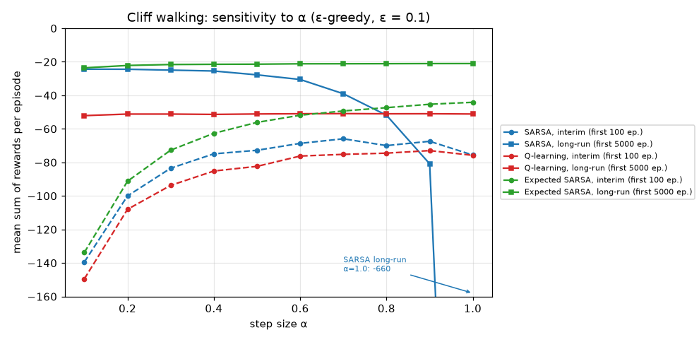

| $\alpha$ | 0.1 | 0.3 | 0.5 | 0.7 | 0.9 | 1.0 |
|---|---|---|---|---|---|---|
| SARSA, interim | −139.4 | −83.5 | −72.8 | −65.9 | −67.4 | −75.6 |
| SARSA, long-run | −24.4 | −25.0 | −27.8 | −39.1 | −80.9 | −660.5 |
| Q-learning, interim | −149.4 | −93.7 | −82.4 | −75.2 | −73.0 | −75.8 |
| Q-learning, long-run | −52.1 | −51.2 | −51.1 | −50.9 | −51.0 | −51.1 |
| Expected SARSA, interim | −133.7 | −72.7 | −56.2 | −49.3 | −45.3 | −44.2 |
| Expected SARSA, long-run | −23.6 | −21.6 | −21.4 | −21.2 | −21.1 | −21.1 |

Because the environment is deterministic, Expected SARSA's target for a given $(S_t, A_t)$ is a deterministic function of the current table: there is no sampling noise to average out. Its long-run performance is nearly flat in $\alpha$, and its interim performance keeps improving all the way to $\alpha = 1$. SARSA's target contains the randomly chosen $A_{t+1}$, and at $\alpha = 1$ the table simply copies the latest sample. Its long-run performance collapses to $-660.5$ per episode, with some episodes lasting thousands of steps (one episode hit our 10,000-step safety cap). Q-learning's long-run online performance is pinned at about $-51$ for every $\alpha$ (the exact value for $\varepsilon$-greedy behaviour around $q_\ast$ is $-50.8$, Section 10.2), the price of exploring next to the cliff.

---

## 11. Maximization bias and Double Q-learning

### 11.1 Why the max of estimates is biased upwards

All our control algorithms build their targets by maximising over estimated values, either explicitly (Q-learning) or implicitly through a greedy or $\varepsilon$-greedy policy. Suppose the true values $q(a)$ of the actions in some state are all 0, but our estimates $Q(a)$ are noisy and unbiased. Then $\max_a q(a) = 0$, but $\max_a Q(a)$ is positive in expectation. In general, for unbiased estimates $\mathbb{E}[Q(a)] = q(a)$,

$$
\mathbb{E}\Big[ \max_a Q(a) \Big] \;\ge\; \max_a \mathbb{E}[Q(a)] = \max_a q(a), \tag{5.16}
$$

because for the truly best action $a^\circ$ we have $\max_a Q(a) \ge Q(a^\circ)$ pointwise; take expectations. (Equivalently, it is Jensen's inequality for the convex function $\max$.) The inequality is strict whenever there is noise and more than one action can be the argmax. This positive bias is the **maximization bias**, also called the optimizer's curse (Smith and Winkler, 2006).

**How large?** For two estimates that are independent $\mathcal{N}(\mu, \sigma^2)$, write $\max(X_1, X_2) = \tfrac12(X_1 + X_2) + \tfrac12|X_1 - X_2|$. Since $X_1 - X_2 \sim \mathcal{N}(0, 2\sigma^2)$ and $\mathbb{E}|Z| = \sigma_Z\sqrt{2/\pi}$ for a centred normal $Z$,

$$
\mathbb{E}[\max(X_1,X_2)] = \mu + \tfrac12 \sqrt{2}\,\sigma \sqrt{2/\pi} = \mu + \sigma/\sqrt{\pi} \approx \mu + 0.564\,\sigma.
$$

For ten independent $\mathcal{N}(\mu, \sigma^2)$ estimates, numerical integration gives $\mathbb{E}[\max] \approx \mu + 1.539\,\sigma$, and for fifty, $\mu + 2.249\,\sigma$. More noisy actions means more bias.

### 11.2 The example MDP

Sutton and Barto's Example 6.7 makes this concrete (drawn as in their Figure 6.5, with B on the left):

```text
   terminal ←── any of the actions in B ── [B] ←── left (r = 0) ── [A] ── right (r = 0) ──→ terminal
               r ~ N(−0.1, 1)
```

Every episode starts in A. Going right ends the episode with reward 0. Going left leads (with reward 0) to B, where every action ends the episode with a reward drawn from $\mathcal{N}(-0.1, 1)$. Sutton and Barto only say that B has "many" actions; we use 10 (a common choice in reproductions of the example) and vary the number in Section 11.4. So $q_\ast(A, \text{left}) = -0.1 < q_\ast(A, \text{right}) = 0$: left is a mistake. But $\max_b Q(B, b)$ over ten noisy estimates is positive for a long time, and Q-learning's estimate of $Q(A, \text{left}) \leftarrow \dots + \alpha[\,0 + \max_b Q(B,b) - Q(A,\text{left})\,]$ inherits that optimism. With $\varepsilon$-greedy behaviour ($\varepsilon = 0.1$), the best achievable frequency of "left" is $\varepsilon/2 = 5\%$.

### 11.3 Double learning

The bias arises because the *same* noisy estimates are used both to **select** the maximising action and to **evaluate** it. Selection favours actions whose noise happened to be positive, and evaluation then reports that positive noise. The cure is to decouple the two. Keep two independent estimates $Q_1, Q_2$ (trained on disjoint subsets of the data). Use $Q_1$ to select $A^\ast = \arg\max_a Q_1(a)$ and $Q_2$ to evaluate it, $Q_2(A^\ast)$. Then, because $Q_2$ is independent of $Q_1$ and hence of $A^\ast$,

$$
\mathbb{E}\big[ Q_2(A^\ast) \big] = \sum_a \Pr\lbrace A^\ast = a\rbrace\, \mathbb{E}\big[ Q_2(a) \mid A^\ast = a \big] = \sum_a \Pr\lbrace A^\ast = a\rbrace\, q(a) = \mathbb{E}\big[ q(A^\ast) \big] \;\le\; \max_a q(a). \tag{5.17}
$$

The double estimator is an unbiased estimate of the value of the *selected* action. It can therefore *underestimate* $\max_a q(a)$, when $Q_1$ selects a suboptimal action, but it does not systematically overestimate.

(5.17) is exact for the static double estimator, with two genuinely independent sets of samples. Inside Double Q-learning below, the two tables are only approximately independent: each bootstraps from the other, and both are trained on experience chosen by one shared behaviour policy that looks at $Q_1 + Q_2$. So (5.17) describes the idea, not an exact property of the algorithm. The shared behaviour policy matters in practice. In Example 6.7 below, every action in B has the same true value, so $\mathbb{E}[q(A^\ast)] = \max_b q(B,b)$ and the static double estimator is *exactly* unbiased. Yet Double Q-learning with $\varepsilon$-greedy behaviour and a constant step size drifts to about $-0.34$ after 20,000 episodes, against the true $-0.1$. Section 11.5 shows that this undershoot is not the selection effect of (5.17). It comes from the behaviour policy combined with the constant step size: with uniformly random behaviour, the same algorithm stays at $-0.10$.

**Double Q-learning** (van Hasselt, 2010) applies this inside Q-learning. At every step a coin flip decides which table is updated, and the *other* table evaluates the action selected by the updated one:

```text
Double Q-learning for estimating Q1 ≈ Q2 ≈ q_*
──────────────────────────────────────────────────────────────────────
Parameters: step size α ∈ (0, 1]; exploration ε > 0
Initialise: Q1(s, a), Q2(s, a) arbitrarily for all s, a; Q1(terminal, ·) = Q2(terminal, ·) = 0

Loop for each episode:
    Initialise S
    Loop for each step of the episode:
        Choose A from S using the policy ε-greedy in Q1 + Q2
        Take action A; observe R, S'
        With probability 0.5:
            A* ← argmax_a Q1(S', a)                                   # select with Q1
            Q1(S, A) ← Q1(S, A) + α·[R + γ·Q2(S', A*) − Q1(S, A)]     # evaluate with Q2
        else:
            A* ← argmax_a Q2(S', a)
            Q2(S, A) ← Q2(S, A) + α·[R + γ·Q1(S', A*) − Q2(S, A)]
        (if S' is terminal the bracket is R − Q_i(S, A))
        S ← S'
    until S is terminal
```

Memory doubles, but computation per step does not, because each step updates only one table. Van Hasselt (2010) proved that Double Q-learning also converges to $q_\ast$ under conditions like those of Theorem 5.4. The same select/evaluate split, with the online network selecting and the target network evaluating, is **Double DQN** ([Chapter 09](09-deep-q-learning.md)), and **TD3**'s clipped double-Q trick ([Chapter 12](12-continuous-control-actor-critic.md)) is a pessimistic cousin.

### 11.4 Results

[`maximization_bias.py`](../code/ch05_temporal_difference/maximization_bias.py) runs 10,000 independent learners for 300 episodes ($\alpha = 0.1$, $\varepsilon = 0.1$, $Q \equiv 0$ initially, 10 actions in B), simulated in parallel with numpy. Besides the two methods of S&B Figure 6.5 we also ran SARSA and Expected SARSA, because they suffer from the same effect for a less obvious reason.

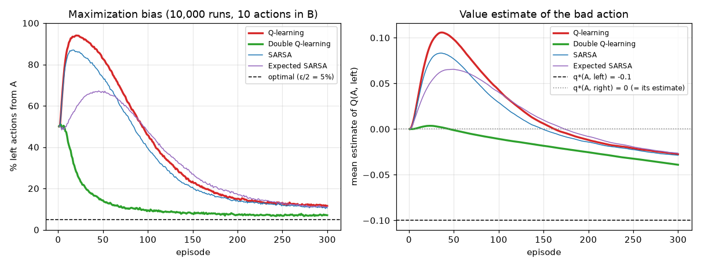

| % "left" from A | ep. 1 | ep. 10 | ep. 25 | ep. 50 | ep. 100 | ep. 300 | peak (episode) |
|---|---|---|---|---|---|---|---|
| Q-learning | 50.0 | 87.3 | 93.2 | 82.7 | 45.8 | 11.6 | 94.0 (20) |
| Double Q-learning | 50.0 | 45.2 | 23.3 | 14.3 | 9.5 | 7.1 | 50.9 (3) |
| SARSA | 50.0 | 83.2 | 85.3 | 73.6 | 39.5 | 10.6 | 87.0 (17) |
| Expected SARSA | 50.0 | 51.4 | 62.0 | 66.8 | 47.5 | 11.1 | 67.2 (45) |

(Episode 1 is 50% for everyone because all values start tied at 0 and ties are broken at random.)

- **Q-learning** is lured left in up to 94% of episodes. Its mean estimate of $Q(A,\text{left})$ peaks at $+0.106$ (episode 37; right panel), above $Q(A,\text{right}) \approx 0$, although the truth is $-0.1$.
- **Double Q-learning** is never lured: its frequency of "left" never rises meaningfully above the initial coin-flip 50% (the peak of 50.9% at episode 3 is tie-breaking noise), and it falls steadily to 7.1% by episode 300, close to the 5% floor. Its mean estimate of $Q(A,\text{left})$ never exceeds $+0.004$ (peak $+0.0036$ at episode 24).
- **SARSA and Expected SARSA are also biased.** SARSA's target $Q(B, A')$ uses an $A'$ that is mostly the argmax of the *same* noisy $Q(B,\cdot)$, so selection and evaluation are again coupled. Expected SARSA puts weight $1 - \varepsilon + \varepsilon/10$ on the max and is biased somewhat less.
- At episode 300 every method's estimate of $Q(A,\text{left})$ is still above $-0.1$ ($-0.028$ for Q-learning, $-0.039$ for Double Q-learning). Why? The script counts the updates. With $\alpha = 0.1$, an estimate updated $n$ times keeps a weight $0.9^n$ on its initial value 0. By episode 300 an average Q-learning run has updated $Q(A,\text{left})$ 113 times (SARSA and Expected SARSA about 101–102), and the mean remaining weight is about $10^{-3}$: its own initialisation is forgotten. Its *target* is not. Each of the ten $Q(B,b)$ has been updated only about 11 times, unevenly (the greedy entries far more often), and on average still keeps a weight of about 0.45 on its initial 0. The max picks out the entries that are currently highest, which tend to be the least-corrected ones. The mean target $\max_b Q(B,b)$ is $-0.040$. This is initial optimism amplified by the max, so it cannot be separated from maximization bias.
- For Double Q-learning the initial values matter mostly through the *evaluating* table. Each table's $Q(A,\text{left})$ has been updated only about 17.5 times, leaving a mean weight of 0.24 on its initial 0. Had every target been the true $-0.1$, the estimate would be $-(1 - 0.24) \times 0.1 = -0.076$. The actual $-0.039$ is closer to 0 because the targets were. Each table's $Q_i(B,b)$ has had only about 1.7 updates by episode 300 and on average keeps a weight of 0.87 on its initial 0. So the bootstrap targets $Q_j(B, \arg\max_b Q_i(B,b))$ actually used averaged $+0.016$ over episodes 1–50, $-0.005$ over 51–100, $-0.027$ over 101–200 and $-0.045$ over 201–300.
- Run longer, both estimates fall *below* the truth (Section 11.5).

The bias grows with the number of noisy actions in B, as Section 11.1 predicts. Mean percentage of "left" over episodes 1–100:

| actions in B | 1 | 2 | 10 | 50 |
|---|---|---|---|---|
| Q-learning | 15.4% | 25.5% | 74.9% | 92.1% |
| Double Q-learning | 18.5% | 16.6% | 19.6% | 21.6% |

With a single action in B there is nothing to maximise over, and Q-learning is slightly *better* than Double Q-learning (15.4% vs 18.5%). Each of Double Q's two tables sees only half of the updates, so it learns more slowly. Double learning is a remedy for overestimation, not a free lunch.

### 11.5 The long run: behaviour policy and constant step size

Over 300 episodes Double Q-learning behaved as Section 11.3 promised: it was never lured left. What happens later? The script runs Q-learning and Double Q-learning for 20,000 episodes (1,000 runs, a separate seed). It also repeats the runs with three other **behaviour** policies. The update rules stay the same; only the way actions are *chosen*, in A and in B, switches from $\varepsilon$-greedy to uniformly random.

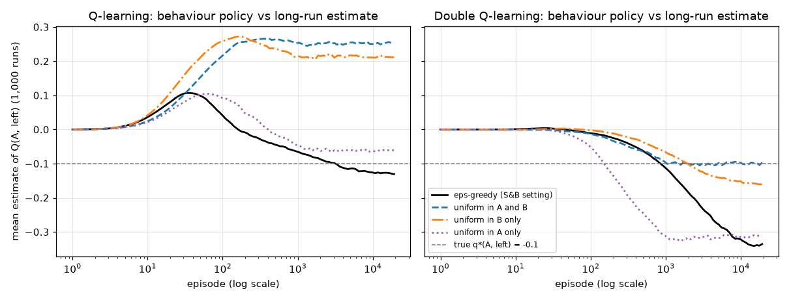

Mean estimate of $Q(A,\text{left})$ (true value $-0.1$). The standard errors at episode 20,000 are at most 0.006.

| behaviour in A / in B | method | ep. 300 | ep. 1,000 | ep. 3,000 | ep. 10,000 | ep. 20,000 | % "left", last 1,000 ep. |
|---|---|---|---|---|---|---|---|
| ε-greedy / ε-greedy (S&B) | Q-learning | −0.026 | −0.064 | −0.097 | −0.125 | −0.132 | 7.0 |
| | Double Q-learning | −0.039 | −0.113 | −0.229 | −0.324 | −0.336 | 5.2 |
| uniform / uniform | Q-learning | +0.265 | +0.253 | +0.254 | +0.249 | +0.257 | 50.0 |
| | Double Q-learning | −0.048 | −0.097 | −0.094 | −0.101 | −0.102 | 50.1 |
| ε-greedy / uniform | Q-learning | +0.253 | +0.216 | +0.211 | +0.211 | +0.212 | 81.4 |
| | Double Q-learning | −0.021 | −0.066 | −0.123 | −0.152 | −0.159 | 6.4 |
| uniform / ε-greedy | Q-learning | +0.025 | −0.048 | −0.061 | −0.067 | −0.062 | 50.0 |
| | Double Q-learning | −0.189 | −0.311 | −0.312 | −0.312 | −0.314 | 50.1 |

- **In S&B's setting, both methods end below the truth.** Q-learning is at $-0.097$ at episode 3,000, close to the truth, but it keeps falling, to $-0.132$ at 20,000. Its passage through $-0.1$ is a crossing point, where an upward bias and a downward one happen to cancel, not convergence. Double Q-learning falls further, to $-0.336$. Neither error changes the decision: both methods go left little more than exploration forces them to (7.0% and 5.2% of episodes, against the 5% floor).
- **Uniform behaviour isolates the estimators.** When actions are chosen uniformly at random, how often an estimate is updated no longer depends on its value. Double Q-learning then stays at $-0.10$, unbiased, as (5.17) predicts for this MDP. Q-learning settles at about $+0.25$, its pure maximization bias. That number can be predicted. With a constant step size, each $Q(B,b)$ is an exponentially weighted average of its rewards, $Q = \sum_{k \ge 0} \alpha(1-\alpha)^k R_{(k)}$, where $R_{(k)}$ is the $k$-th most recent reward (the weight left on the initial value vanishes). With independent rewards of variance $\sigma^2$, its long-run variance is $\alpha^2\sigma^2 \sum_{k \ge 0} (1-\alpha)^{2k} = \alpha^2\sigma^2 / (1 - (1-\alpha)^2) = \alpha\sigma^2/(2 - \alpha)$. With $\sigma = 1$ and $\alpha = 0.1$ the standard deviation is $\sqrt{0.1/1.9} \approx 0.23$. The ten estimates use disjoint rewards, so treat them as independent. By Section 11.1 their max then exceeds their mean by about $1.539 \times 0.23 \approx 0.35$, which gives $\max_b Q(B,b) \approx -0.1 + 0.35 = +0.25$.
- **Why $\varepsilon$-greedy behaviour pushes estimates down.** A constant step size never lets an estimate settle: it keeps fluctuating, here with a standard deviation of about 0.23. Under $\varepsilon$-greedy behaviour, *how often* an estimate is updated depends on its current value. An action in B whose estimate happens to be high becomes greedy, is chosen on 91% of visits to B, and is quickly pulled back. An action whose estimate happens to be low is chosen only by exploration (1% of visits to B), so it stays low for a long time. Roughly: if an estimate sitting at value $x$ is updated with probability $p(x)$ per visit, it waits about $1/p(x)$ visits there, so the fraction of time it spends near $x$ is proportional to the distribution it would have under value-independent sampling, divided by $p(x)$. When $p$ is larger for larger $x$, the time-averaged distribution is pulled down. The script confirms this. At episode 20,000 the mean of all ten $Q(B,b)$ is $-0.10$ under uniform behaviour, but $-0.46$ for Q-learning and $-0.30$ for Double Q-learning under $\varepsilon$-greedy behaviour.
- **Q-learning partly escapes this; Double Q-learning falls into a trap.** Q-learning's max ignores the low entries and picks the highest one, usually the greedy, frequently corrected one. So with $\varepsilon$-greedy behaviour in B alone (uniform in A), its estimate is still slightly optimistic ($-0.06$). Double Q-learning is caught by its own select/evaluate split. $Q_1$ selects the action whose $Q_1$ is highest. If $Q_2$ of that action happens to be low, $Q_1 + Q_2$ is not maximal there, so the behaviour rarely chooses it and neither estimate is corrected. The target $Q_2(B, \arg\max_b Q_1(B,b))$ then stays low. At episode 20,000 in S&B's setting, $Q_1$'s choice is also the behaviour's greedy action in 49% of runs, and there $Q_2$ rates it $-0.097$ on average, essentially unbiased. In the other 51% of runs, $Q_2$ rates it $-0.557$. Under uniform behaviour the same split gives $+0.055$ and $-0.228$, which average to $-0.10$: that is only the selection noise that (5.17) averages out. With $\varepsilon$-greedy behaviour in B alone, Double Q-learning settles at $-0.31$.
- **The same effect operates one level up, in A.** "Left" is chosen greedily only while $Q(A,\text{left}) > Q(A,\text{right}) \approx 0$. A run whose estimates favour left goes left often, and its estimates are corrected. A run whose estimates are low goes left only by exploration, so $Q(A,\text{left})$ and the $Q(B,b)$ behind it are rarely updated and stay low. On its own ($\varepsilon$-greedy in A, uniform in B) this moves Q-learning from about $+0.25$ to $+0.21$ and Double Q-learning from $-0.10$ to $-0.16$. Together with the effect in B, it produces the $-0.13$ and $-0.34$ of S&B's setting.
- **These are constant-step-size effects.** The skew feeds on fluctuations that a constant $\alpha$ keeps alive. With Robbins–Monro step sizes (5.8) and $\varepsilon > 0$, every $Q(B,b)$ is updated infinitely often and is a stochastic-approximation average of its own rewards, so it converges to $-0.1$ with probability 1. Then the targets of $Q(A,\text{left})$ converge too, under either method and any of these behaviours. This is Theorem 5.4's conclusion; $\gamma = 1$ causes no trouble because every episode ends within two steps. We did not run that variant here.

The lesson: Double Q-learning removes the bias of the max, not every bias. Under a greedy-ish behaviour policy with a constant step size, the estimates of actions that are rarely chosen can become pessimistic, and Double Q-learning's evaluating table is exactly where such estimates get used.

---

## 12. Games, afterstates and other special cases

Sometimes the agent knows part of the dynamics: the *immediate* effect of its action is deterministic and known, and only the subsequent response of the environment is uncertain. In tic-tac-toe you know exactly what the board looks like after you place your mark; you do not know how the opponent will reply. The position right after the agent's move is an **afterstate** (or post-decision state), and it is often better to learn values of afterstates than of state–action pairs.

**Why?** Many different (position, move) pairs lead to the *same* afterstate. For example, in tic-tac-toe, take position 1 with X in the top-left corner and O in the bottom-right corner, where X now plays the centre; and position 2 with X in the centre and O in the bottom-right corner, where X now plays the top-left corner. Both produce the same board: X in the top-left corner and the centre, O in the bottom-right corner. Their action values must be identical, because what happens next depends only on the resulting board. An action-value table would learn the two entries separately; an afterstate table has one entry, so whatever is learned about one pair transfers immediately to the other.

**Formally.** Suppose taking $a$ in $s$ deterministically produces the afterstate $y = f(s,a)$, with $f$ known to the agent, after which the environment produces $(R_{t+1}, S_{t+1})$ with a distribution that depends only on $y$. Write $U$ for the afterstate value function (a symbol we introduce here; S&B do not name it). Then

$$
q_\pi(s,a) = u_\pi(f(s,a)), \qquad u_\ast(y) = \mathbb{E}\Big[ R_{t+1} + \gamma \max_{a'} u_\ast\big(f(S_{t+1}, a')\big) \,\Big|\, Y_t = y \Big], \tag{5.18}
$$

and the Q-learning-style afterstate update is

$$
U(Y_t) \leftarrow U(Y_t) + \alpha\Big[ R_{t+1} + \gamma \max_{a'} U\big(f(S_{t+1}, a')\big) - U(Y_t) \Big]. \tag{5.19}
$$

```text
Q-learning on afterstates (known deterministic effect y = f(s, a))
──────────────────────────────────────────────────────────────────────
Parameters: step size α ∈ (0, 1]; exploration ε > 0
Initialise: U(y) arbitrarily for every afterstate; U(y) = 0 if y is terminal

Loop for each episode:
    Initialise S
    Loop for each step of the episode:
        Choose A ε-greedily w.r.t. the scores U(f(S, a)), a ∈ A(S)
        Y ← f(S, A)                                # known, deterministic
        Environment responds: observe R, S'
        If S' is terminal:  U(Y) ← U(Y) + α·[R − U(Y)]
        else:               U(Y) ← U(Y) + α·[R + γ·max_a' U(f(S', a')) − U(Y)]
        S ← S'
    until S is terminal
```

**A worked example: a tiny shop.** A shop holds $s \in \lbrace 0, 1, 2\rbrace$ units of stock (capacity 2). Each morning it orders $a \in \lbrace 0, \dots, 2 - s\rbrace$ units, which arrive at once; then a random demand $D \in \lbrace 0, 1\rbrace$ arrives, each value with probability $1/2$. The shop sells $\min(y, D)$ units, earning 3 per unit sold, and pays 1 per unit left on the shelf. The afterstate is the stock after ordering, $y = f(s,a) = s + a$. The reward $R = 3\min(y, D) - (y - \min(y, D))$ and the next state $S' = y - \min(y, D)$ depend on $(s,a)$ only through $y$. There are six state–action pairs but only three afterstates:

| afterstate $y$ | state–action pairs $(s, a)$ that produce it |
|---|---|
| 0 | (0, 0) |
| 1 | (0, 1), (1, 0) |
| 2 | (0, 2), (1, 1), (2, 0) |

Two updates of (5.19) by hand, with $\gamma = 0.9$, $\alpha = 0.5$ and $U \equiv 0$:

1. In $s = 0$ the shop orders $a = 1$, so $Y = 1$. Demand is $D = 1$: one unit sold, $R = 3$, $S' = 0$. Target $= 3 + 0.9\max\lbrace U(0), U(1), U(2)\rbrace = 3$, so $U(1) \leftarrow 0 + 0.5(3 - 0) = 1.5$.
2. In $S' = 0$ the scores are $U(0) = 0$, $U(1) = 1.5$, $U(2) = 0$, so the greedy order is again $a = 1$ and $Y = 1$. Now $D = 0$: nothing sold, one unit held, $R = -1$, $S' = 1$. In $s = 1$ the possible orders lead to $y = 1$ or $y = 2$, so the target is $-1 + 0.9\max\lbrace U(1), U(2)\rbrace = -1 + 0.9 \times 1.5 = 0.35$, and $U(1) \leftarrow 1.5 + 0.5(0.35 - 1.5) = 0.925$.

In step 2 the target already used a value for "hold one unit and order nothing", the pair $(1, 0)$, which the shop had never tried. It came from $U(1)$, learned from the pair $(0, 1)$. An action-value table would still have $Q(1, 0) = 0$.

There are never more afterstates than state–action pairs, and often far fewer. Afterstates appear naturally in board games (TD-Gammon evaluated the positions reachable by its candidate moves; Tesauro, 1995), in queueing and inventory control (the state after you place an order but before random demand arrives), and in operations research, where they are called post-decision states (Powell, 2011). The idea is not a new algorithm. It is a reminder that a well-chosen representation of what must be learned can matter more than the learning rule.

---

## 13. A real Gymnasium loop: Q-learning on Taxi-v4

### 13.1 Terminated versus truncated

Gymnasium's `env.step` returns `obs, reward, terminated, truncated, info`. The two flags mean different things:

- `terminated=True`: the MDP reached a **terminal state**, a real end of the task (the passenger was delivered, the agent fell in a hole). There is no future: the TD target is just $R_{t+1}$.
- `truncated=True`: the episode was **cut off** for an external reason, usually a time limit added by the `TimeLimit` wrapper. The state $S_{t+1}$ is an ordinary state with a perfectly good future, so the target must still bootstrap: $R_{t+1} + \gamma \max_a Q(S_{t+1}, a)$.

**Bootstrap through truncation, never through termination.** Treating a time-out as termination tells the agent that the world ends wherever the clock ran out. That is false, and with a time-unaware state it is also inconsistent: the same state is sometimes "terminal" and sometimes not. Pardo, Tavakoli, Levdik and Kormushev (2018) analyse this in detail. (If the time limit is genuinely part of the task, the remaining time must be part of the state.)

The core of [`taxi_q_learning.py`](../code/ch05_temporal_difference/taxi_q_learning.py):

```python
obs, info = env.reset(seed=seed if ep == 0 else None)
while True:
    a = epsilon_greedy(Q[obs], eps, rng)
    next_obs, r, terminated, truncated, info = env.step(a)
    if terminated:                                   # true end of the task: no future
        target = r
    else:                                            # includes truncated=True (time-out)
        target = r + gamma * Q[next_obs].max()
    Q[obs, a] += alpha * (target - Q[obs, a])
    if terminated or truncated:
        break
    obs = next_obs
```

### 13.2 Results on Taxi-v4

Taxi-v4 (default settings) is a deterministic MDP with 500 states, 6 actions, reward $-1$ per step, $+20$ for a correct drop-off (which terminates the episode) and $-10$ for an illegal pick-up or drop-off. `gym.make` wraps it in a 200-step `TimeLimit`. We trained Q-learning with $\alpha = 0.1$, $\gamma = 0.99$, $\varepsilon = 0.1$ for 5,000 episodes (5 seeds).

To know what "good" means, we computed $q_\ast$ exactly by value iteration on the environment's own transition table `env.unwrapped.P` ([Chapter 03](03-dynamic-programming.md)). The optimal greedy policy, run from each of the 300 possible start states with the 200-step limit, has a mean undiscounted return of **7.93**. The model is used only for this evaluation, never by the learner.

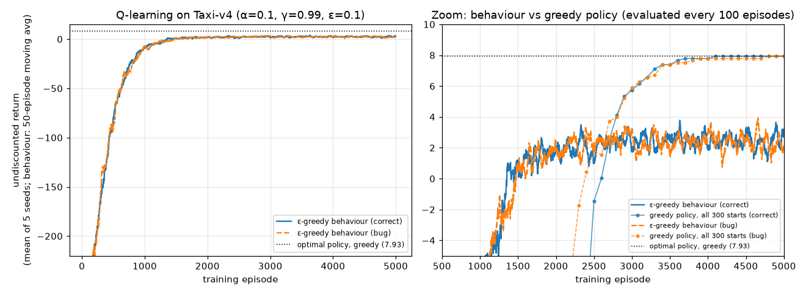

- **The learned greedy policy is optimal, or within a hair of it.** Evaluated from all 300 start states, it reached a mean return of 7.93 in four of the five seeds and 7.92 in the remaining one. Averaged over seeds, it achieved exactly the optimal return from 99.9% of the start states; all the shortfalls were in that one seed.
- **The left panel plots the $\varepsilon$-greedy behaviour**, which plateaus at a return of about 2.45 (mean over the last 100 episodes). The gap between 2.45 and 7.93 is the cost of exploring with $\varepsilon = 0.1$. When you report results, say whether they come from the behaviour policy or the greedy policy.
- **A flat behaviour curve does not mean learning has finished.** The right panel zooms in and adds the greedy policy, evaluated from all 300 start states every 100 episodes. The behaviour curve is flat from about episode 1,500, but the greedy policy's mean return (mean of the 5 seeds) was −130.6 at episode 1,000, −20.4 at 2,000, 5.75 at 3,000, and reached 7.93 only by episode 5,000. Early on, the deterministic greedy read-out (ties to the lowest action index) runs into the 200-step limit from many start states, while the $\varepsilon$-greedy behaviour escapes such loops through its random moves.

### 13.3 How much does the truncation bug matter?

We trained the same agent with the bug (target $= R_{t+1}$ whenever `truncated` is true). On Taxi it made **no measurable difference**: the buggy agent's greedy policy also scored 7.93 and was optimal from 100% of start states. The reason is visible in the log. Only about 165 of 5,000 episodes were truncated, and in each seed at most 2 of those came after episode 500. Once the agent can deliver the passenger, time-outs stop happening, and the few early wrong targets are overwritten.

That a bug can be invisible in one environment is precisely what makes it dangerous. The script's second experiment is a tiny custom Gymnasium environment, *stay-or-quit*, wrapped in `TimeLimit(max_episode_steps=10)`. There is one state and two actions. "Stay" gives $+1$ and the task continues forever; "quit" gives $+6$ and terminates. With $\gamma = 0.9$, $q_\ast(\text{stay}) = 1/(1 - 0.9) = 10 > q_\ast(\text{quit}) = 6$, so staying is optimal. Q-learning ($\alpha = 0.05$, $\varepsilon = 0.1$, 3,000 episodes, 5 seeds) gives:

| variant | $Q(\text{stay})$ | $Q(\text{quit})$ | greedy action (all 5 seeds) |
|---|---|---|---|
| correct: bootstrap on truncation | 10.000 | 6.000 | stay |
| bug: truncation treated as termination | 5.935 | 6.000 | **quit** |

The bug flips the learned policy. A committed "stayer" under the bug sees nine targets of the form $1 + \gamma Q$ and one target of $1$ in every 10-step episode. Its fixed point solves $10Q = 9(1 + \gamma Q) + 1$, so $Q = 10/(10 - 9\gamma) = 5.26 < 6$. Staying *looks* worse than quitting, and the agent quits. With truncation-as-termination, $Q(\text{stay})$ hovers just below 6: whenever it creeps above 6 the agent starts staying, runs into the time limit, and is told again that staying is worth little. Exercise 5.8 asks how long the time limit must be before the bug stops changing the answer.

---

## 14. TD learning in the brain

TD learning has roots in animal-learning psychology and describes a signal the brain computes. The simulations of this section are in [`conditioning_td.py`](../code/ch05_temporal_difference/conditioning_td.py) (about 2 seconds).

### 14.1 Dopamine neurons signal a reward-prediction error

In the 1990s it was discovered that the TD error is not only an engineering device; it seems to be computed by the brain. Schultz and colleagues recorded midbrain dopamine neurons in monkeys learning that a cue (a light or tone) predicts juice. Three observations stand out (Schultz, Dayan and Montague, 1997):

1. **Before learning,** the neurons burst when the unexpected juice arrives: a positive prediction error, $\delta > 0$ at the reward.
2. **After learning,** the burst moves to the *cue*, the earliest reliable predictor of reward. The juice itself, now fully predicted, no longer causes a response: $\delta \approx 0$ at the reward because $V$ (cue state) already anticipates it.
3. **If the predicted juice is omitted,** activity *dips* below baseline at exactly the time the reward was expected: $\delta < 0$.

This is the signature of $\delta_t = R_{t+1} + \gamma V(S_{t+1}) - V(S_t)$ in a TD model whose states encode time since the cue, as Montague, Dayan and Sejnowski (1996) had proposed; Section 14.2 builds such a model. The **reward-prediction-error hypothesis of dopamine** has become one of the most successful bridges between computational theory and neuroscience (Glimcher, 2011, gives an accessible review). It is a hypothesis, not a settled fact: dopamine also responds to novelty and salience, and later work suggests that different dopamine neurons may encode a *distribution* of prediction errors, like distributional RL agents (Dabney et al., 2020). Sutton and Barto devote two chapters to these connections, Chapter 14 (psychology) and Chapter 15 (neuroscience).

### 14.2 Classical conditioning: Rescorla–Wagner and the TD model

In **classical (Pavlovian) conditioning** (Pavlov, 1927), a neutral *conditioned stimulus* (CS, such as a tone) is repeatedly followed by an *unconditioned stimulus* (US, such as food), and the animal comes to respond to the CS as if it anticipated the US. Nothing the animal does changes what happens: this is a prediction problem.

The **Rescorla–Wagner model** (Rescorla and Wagner, 1972) gives each CS $i$ an associative strength $w_i$. On a trial on which the set $\mathcal{P}$ of stimuli is present and the US has magnitude $R$ ($R = 0$ if it is omitted),

$$
w_i \leftarrow w_i + \alpha_i\Big(R - \sum_{j \in \mathcal{P}} w_j\Big) \qquad \text{for every } i \in \mathcal{P}. \tag{5.20}
$$

(Rescorla and Wagner wrote $\lambda$ for $R$, a symbol we keep for the trace parameter of [Chapter 06](06-n-step-and-eligibility-traces.md).) With a binary vector $\mathbf{x}$ marking the stimuli present and equal step sizes, (5.20) is $\mathbf{w} \leftarrow \mathbf{w} + \alpha(R - \mathbf{w}^\top\mathbf{x})\,\mathbf{x}$, the least-mean-squares rule of Widrow and Hoff (1960): gradient Monte Carlo ([Chapter 08](08-function-approximation.md)) with the US as the target.

Because **all the stimuli present share one error**, the model explains **blocking** (Kamin, 1969). Train A → US until $w_A \approx R$, then train the compound AX → US. The error $R - w_A - w_X$ is already near zero, so X learns almost nothing, although it is paired with the US as often as in a control group whose first phase used an unrelated stimulus B (there A and X split the error, $R/2$ each). `conditioning_td.py` gives $w_X = 0.000$ after blocking against $0.500$ in the control group (200 + 100 trials, $\alpha = 0.1$; Exercise 5.15). Pairing is not enough for learning; the US must be *surprising*.

Rescorla–Wagner works with whole trials, so it cannot say *when* the US is expected, nor produce **second-order conditioning**: a stimulus B followed by a trained A, never by the US, coming to predict the US (Exercise 5.16).

The **TD model of classical conditioning** (Sutton and Barto, 1987, 1990) runs TD(0) in real time inside the trial, with a linear value $V_t = \mathbf{w}^\top\mathbf{x}_t$. In the **complete serial compound** (CSC) representation each stimulus has one feature per time step since its onset: $x_{i,k}(t) = 1$ if stimulus $i$ came on $k$ steps ago and is still present. Steps with no stimulus have $\mathbf{x}_t = \mathbf{0}$. The update is linear TD(0):

$$
\delta_t = R_{t+1} + \gamma\,\mathbf{w}^\top\mathbf{x}_{t+1} - \mathbf{w}^\top\mathbf{x}_t, \qquad \mathbf{w} \leftarrow \mathbf{w} + \alpha\,\delta_t\,\mathbf{x}_t. \tag{5.21}
$$

A trial with a single time step ($\mathbf{x}_{t+1} = \mathbf{0}$) gives back Rescorla–Wagner, so the TD model inherits blocking: in our simulation X ends with value 0.000, against 0.387 in the control group (half of a trained CS's 0.774). It also adds timing. Below, a CS comes on at step 6 and the US arrives 6 steps later ($\gamma = 0.95$, $\alpha = 0.1$):

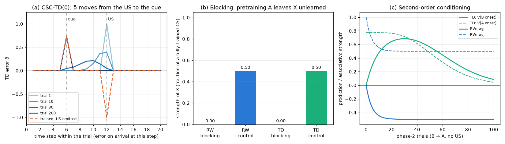

On trial 1, $\delta = 1$ when the US arrives and 0 elsewhere. After 200 trials, $\delta = 0.735 = \gamma^6$ at the cue and $0.000$ at the US. Withholding the US once then gives $\delta = -1.000$ exactly at the step at which it was due: the CSC lets the model learn *when* reward is expected. These are the three observations of Section 14.1.

With TD(0) and a CSC the error travels backwards one feature at a time (the bumps on trials 10 and 30); the cue response reached 90% of its final size only on trial 92. Whether dopamine does this is debated: Pan, Schmidt, Wickens and Hyland (2005) saw cue responses appear at their final latency while reward responses persisted, which a TD($\lambda$) model with long eligibility traces ([Chapter 06](06-n-step-and-eligibility-traces.md)) reproduced, while Amo et al. (2022) found a gradual backward shift in mice. The CSC is itself an idealisation (Ludvig, Sutton and Kehoe, 2008, replace it with "microstimuli").

### 14.3 Habits and goals: model-free versus model-based control

In **instrumental** conditioning, actions matter. Thorndike's *law of effect* (1911; [Chapter 01](01-the-rl-problem.md)) is trial-and-error learning in a sentence, and Skinner's **shaping**, rewarding successive approximations to a target behaviour (Peterson, 2004), is the ancestor of reward shaping ([Chapter 20](20-deep-rl-in-practice.md), Section 2.3).

Is an action chosen for what it leads to, or because it was reinforced? **Outcome devaluation** tells. Rats learn to press a lever for a food; the food is then devalued away from the lever, for example by pairing it with illness; finally the lever is tested *in extinction*, with no food, so no new prediction error about pressing can arise. After moderate training, rats whose food had been devalued pressed less than controls (Adams and Dickinson, 1981): their choice consulted the outcome's current value, so it was **goal-directed**. After extended training, devaluation had little effect (Adams, 1982): the response had become a **habit**.

This is the distinction between **model-based** control, which plans with a model of what actions lead to and of what outcomes are now worth ([Chapter 07](07-planning-and-learning-tabular.md)) and adapts to devaluation at once, and **model-free** control, which acts on cached values like every method in this chapter. A cached $Q(s, \text{press})$ changes only through a prediction error about pressing, which an extinction test never provides. Daw, Niv and Dayan (2005) proposed that the brain arbitrates between them by uncertainty: planning uses information efficiently but is noisy when the search is approximate, cached values are cheap but slow to absorb new information, so control passes to habits as training accumulates.

The **two-step task** (Daw, Gershman, Seymour, Dayan and Dolan, 2011) separates the two in humans. A first-stage choice leads to one of two second-stage states, with probability 0.7 to one ("common") and 0.3 to the other ("rare"); there a second choice pays off with a slowly drifting probability. After a reward that followed a *rare* transition, a model-free learner repeats its first-stage action, while a model-based learner switches, because the *other* action is the likely route to the state just rewarded. `conditioning_td.py` simulates 2,000 agents of each kind for 201 trials ($\alpha = 0.5$, softmax inverse temperature 5). The model-free agent uses TD with an eligibility trace $\lambda = 1$, so its first-stage value moves towards the reward itself; the model-based agent computes $Q_{\text{MB}}(a) = \sum_{s} P(s \mid a)\max_b Q_2(s,b)$ from the known transition probabilities; the hybrid uses $\tfrac12 Q_{\text{MB}} + \tfrac12 Q_{\text{MF}}$.

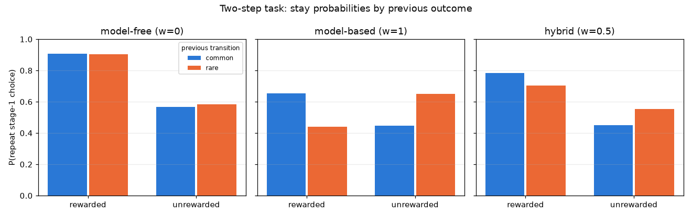

| agent | rewarded, common | rewarded, rare | unrewarded, common | unrewarded, rare | reward effect | reward × transition |
|---|---|---|---|---|---|---|
| model-free | 0.908 | 0.904 | 0.567 | 0.582 | +0.331 | +0.019 |
| model-based | 0.654 | 0.441 | 0.446 | 0.652 | −0.001 | +0.420 |
| hybrid | 0.783 | 0.702 | 0.451 | 0.554 | +0.240 | +0.184 |

Entries are probabilities of repeating the previous first-stage choice (between-agent standard errors at most 0.0022). The reward effect averages the two rewarded − unrewarded differences; the interaction is the difference between them. Model-free choice shows essentially only a reward effect (its small interaction, +0.015 to +0.019 over four seeds, comes from correlations between the outcome cells and the agent's existing preferences); model-based choice shows only the interaction. Daw et al.'s participants showed both, like the hybrid, and their striatal prediction errors mixed both kinds of prediction. Dyna ([Chapter 07](07-planning-and-learning-tabular.md)) is one architecture in which the two coexist.

### 14.4 Beyond phasic dopamine

- **Actor and critic in the striatum.** Prediction-error activity appeared in the ventral striatum in both Pavlovian and instrumental tasks, but in the dorsal striatum only when actions had to be chosen (O'Doherty et al., 2004): a critic and an actor ([Chapter 10](10-policy-gradients.md), Section 7.3).
- **Tonic dopamine and average reward.** Slowly varying dopamine may report the average reward rate, the opportunity cost of time, and so set response vigour (Niv, Daw, Joel and Dayan, 2007; the average-reward setting of [Chapter 08](08-function-approximation.md), Section 12).
- **Distributional dopamine.** Neurons differ in how they scale positive versus negative errors, as distributional RL agents do (Dabney et al., 2020; [Chapter 09](09-deep-q-learning.md), Section 9).
- **The hippocampus as a predictive map.** Place-cell activity resembles the successor representation (Stachenfeld, Botvinick and Gershman, 2017; [Chapter 15](15-beyond-mdps.md), Section 6.1).
- **Replay as prioritized backups.** Which memories the hippocampus replays is predicted by the value of the corresponding backups (Mattar and Daw, 2018), close to prioritized sweeping ([Chapter 07](07-planning-and-learning-tabular.md), Section 5).
- **Prefrontal cortex as a meta-learner.** Dopamine-driven RL may train recurrent prefrontal dynamics that implement a fast learning algorithm themselves (Wang et al., 2018), as in RL² ([Chapter 15](15-beyond-mdps.md), Section 7.3).

Niv (2009) reviews this area for readers who know RL.

---

## In code

All scripts run from the repository root, take `--quick` (a smoke test of at most about 10 s that writes no figures), fix their seeds, and print their settings and a summary. Runtimes were measured on one CPU core of a shared machine; expect them to vary by up to about ±50%.

| Script | Demonstrates | Quick / full | Headline result (full mode) |
|---|---|---|---|
| [`random_walk_td_vs_mc.py`](../code/ch05_temporal_difference/random_walk_td_vs_mc.py) | TD(0) vs constant-$\alpha$ MC (Sections 2–3); the dip (Exercise 5.9) | 0.6 s / 9 s | best RMS after 100 episodes: TD 0.035 vs MC 0.082 |
| [`batch_td_vs_mc.py`](../code/ch05_temporal_difference/batch_td_vs_mc.py) | batch updating, certainty equivalence (Section 4) | 0.8 s / 43 s | predictor: TD $V(A) = 0.75$, MC $V(A) = 0$; batch TD lower RMS at 99/99 batch sizes |
| [`cliff_walking.py`](../code/ch05_temporal_difference/cliff_walking.py) | SARSA vs Q-learning vs Expected SARSA; exact fixed point by $\varepsilon$-soft value iteration; SARSA's route vs $\alpha$ (Section 10) | 0.5 s / 22 s | online (last 100 ep.): −27.8 / −51.1 / −21.1; best $\varepsilon$-greedy policy: row 1, −20.71; SARSA reaches row 1 in 18/20 seeds at $\alpha = 0.05$ |
| [`cliff_alpha_sweep.py`](../code/ch05_temporal_difference/cliff_alpha_sweep.py) | step-size sensitivity (Section 10.3) | 0.7 s / 34 s | Expected SARSA best at all $\alpha$; SARSA collapses at $\alpha = 1$ |
| [`maximization_bias.py`](../code/ch05_temporal_difference/maximization_bias.py) | maximization bias, Double Q-learning, update counts; 20,000-episode runs under four behaviour policies (Section 11) | 2 s / 110 s | peak % left: Q-learning 94.0%, Double Q 50.9% (= initial tie); $Q(A,\text{left})$ at 20,000 episodes: −0.132 vs −0.336 with ε-greedy behaviour, +0.257 vs −0.102 with uniform behaviour (true −0.1) |
| [`taxi_q_learning.py`](../code/ch05_temporal_difference/taxi_q_learning.py) | Gymnasium loop, terminated vs truncated; behaviour vs greedy curves (Section 13) | 8 s / 52 s | greedy return 7.93 (optimal); truncation bug flips stay-or-quit policy |
| [`q_learning_step_sizes.py`](../code/ch05_temporal_difference/q_learning_step_sizes.py) | Robbins–Monro conditions (Section 8.4) | 3 s / 65 s | $\lVert Q - q_\ast\rVert_\infty$ at $4\times10^5$ steps: $1/n^{0.6}$: 0.10, $1/n$: 1.53, const 0.1: 0.82 |
| [`conditioning_td.py`](../code/ch05_temporal_difference/conditioning_td.py) | Rescorla–Wagner vs the CSC TD model: blocking, dopamine-like errors, second-order conditioning; two-step task (Section 14) | 0.2 s / 2 s | blocked $w_X$ 0.000 vs control 0.500; $\delta$ at cue $0.735 = \gamma^6$, $-1$ on omission; stay-probability interaction MF +0.019, MB +0.420 |
| [`exercise_solutions.py`](../code/ch05_temporal_difference/exercise_solutions.py) | Exercises 5.12 and 5.13 | 9 s / 142 s | see the solutions |

Four implementation patterns recur and are worth copying.

**Random tie-breaking.** All agents break argmax ties uniformly at random while learning, for example in `cliff_walking.py`. (The greedy *read-outs* used for evaluation after training are deterministic and break ties by the lowest action index; exact ties are rare in a trained table.)

```python
def epsilon_greedy(q_s, eps, rng):
    if rng.random() < eps:
        return rng.randrange(N_ACTIONS)
    m = max(q_s)
    return rng.choice([a for a, v in enumerate(q_s) if v == m])
```

**Terminal handling inside the update** rather than storing values for terminal states. From the Q-learning episode in `cliff_walking.py`:

```python
s2, r, terminated = NEXT[s][a]
target = r if terminated else r + gamma * max(Q[s2])     # Q(terminal, .) = 0 implicitly
Q[s][a] += alpha * (target - Q[s][a])
```

**Vectorising independent runs** to get smooth curves cheaply. `maximization_bias.py` keeps one row per run in every array, so 10,000 learners advance in lock-step with a handful of numpy operations per episode. The Double Q-learning update for the runs that went left (update counters omitted):

```python
l1, l2 = L[coin[L]], L[~coin[L]]                      # runs updating Q1 / Q2 this step
a1 = argmax_random_ties(QB1[l1], rng)                 # select with Q1 ...
QA1[l1, LEFT] += alpha * (QB2[l1, a1] - QA1[l1, LEFT])  # ... evaluate with Q2
a2 = argmax_random_ties(QB2[l2], rng)
QA2[l2, LEFT] += alpha * (QB1[l2, a2] - QA2[l2, LEFT])
```

**Checking a learner against an exact answer.** Whenever the model is small and known, compute what the learner *should* converge to and compare. `taxi_q_learning.py` and `q_learning_step_sizes.py` do this with value iteration; `cliff_walking.py` solves the fixed point that SARSA and Expected SARSA share (Section 10.2) by $\varepsilon$-soft value iteration:

```python
while True:
    greedy = Q.argmax(axis=1)                       # (some cells can be pinned to a route)
    v = (1 - eps) * Q[rows, greedy] + eps / N_ACTIONS * Q.sum(axis=1)   # sum_a pi_eps(a|s) Q(s,a)
    Q_new = _backup(v)                              # q(s,a) = r + v(s'), with v(terminal) = 0
    if np.max(np.abs(Q_new - Q)) < tol:
        return Q_new, v
    Q = Q_new
```

---

## Common pitfalls and misconceptions

1. **Bootstrapping through termination, or not bootstrapping through truncation.** The target is $R$ alone only when `terminated` is true. A time-out is not the end of the world (Section 13.3). The reverse bug, bootstrapping from a terminal state, is masked in tabular code when terminal entries happen to stay at 0, but it bites with optimistic initialisation or function approximation.
2. **"Q-learning is better than SARSA because it learns the optimal policy."** It learns the optimal *greedy* policy; its *online* performance under exploration can be worse (cliff walking: −51.1 vs −27.8 per episode). Which one you want depends on whether mistakes during learning are costly.
3. **SARSA with mismatched actions.** In SARSA the $A'$ in the target must be the action you then execute. Choosing a second, independent action for execution gives an algorithm that is neither SARSA nor Expected SARSA.
4. **Deterministic argmax tie-breaking.** With zero-initialised $Q$, `np.argmax` always returns action 0. This can stall exploration and bias results. Break ties randomly.
5. **"The TD target is unbiased."** It is unbiased for $(\mathcal{T}^\pi V)(S_t)$, not for $v_\pi(S_t)$ (equation 5.9). TD converges *despite* this bias, in the tabular case.
6. **Expecting convergence with a constant step size.** With noisy targets (stochastic rewards or transitions, or a sampled next action as in SARSA), a constant $\alpha$ gives tracking and a noise floor, not convergence (Section 8.4). With deterministic dynamics and expected targets (Q-learning, Expected SARSA) it is just a relaxed Bellman backup and does converge (Section 10.3, Exercise 5.13). Conversely, $\alpha = 1/n$ satisfies Robbins–Monro but can be extremely slow for bootstrapped targets. Polynomial rates $1/n^{\omega}$, $\omega \in (1/2, 1)$, are a better default when you need decay.
7. **"Off-policy Q-learning needs importance sampling."** One-step Q-learning and Expected SARSA do not (Section 8.2). Multi-step off-policy methods must correct for the intermediate actions that $b$ chose: with importance sampling, or with ratio-free corrections such as Tree Backup and Watkins's trace cutting ([Chapter 06](06-n-step-and-eligibility-traces.md), Sections 4–6 and 13). And "off-policy for free" is a tabular statement: with function approximation, off-policy bootstrapping can diverge ([Chapter 08](08-function-approximation.md)).
8. **Thinking maximization bias is a Q-learning problem only, or that Double Q-learning makes estimates unbiased.** Any method whose target evaluates an action selected by the same noisy estimates is affected, including SARSA and Expected SARSA with $\varepsilon$-greedy policies (Section 11.4). Conversely, Double Q-learning removes the bias of the max, not every bias: with $\varepsilon$-greedy behaviour and a constant step size it ended well below the true value on Example 6.7 (Section 11.5).
9. **Confusing behaviour performance with greedy performance.** On Taxi, the $\varepsilon$-greedy return plateaued around 2.45 while the greedy policy was optimal at 7.93. Always say which one you report.
10. **Reading a greedy policy off a noisy $Q$.** With large constant $\alpha$ the estimates of near-equal actions fluctuate, and the greedy read-out can be absurd (SARSA's greedy read-out got stuck in a loop in 16 of 100 cliff runs: 9 wall bumps and 7 two-cell oscillations) even when the behaviour is fine.
11. **Forgetting that "batch TD is better" assumes the Markov property.** Certainty equivalence trusts the maximum-likelihood *Markov* model. With aliased or partially observed states, MC's answer can be better.
12. **Assuming any decaying $\varepsilon$ is GLIE, or that GLIE means fast.** A decaying $\varepsilon$ whose sum diverges over *episodes* is not automatically GLIE: rarely visited states need $\sum \varepsilon = \infty$ over their *own* visits. With $\varepsilon_k \approx 10/k$ per episode and constant $\alpha$, SARSA stopped exploring the cliff edge and never corrected its stale edge values. And even a genuinely GLIE schedule with Robbins–Monro steps had not found the optimal path after 50,000 episodes (Exercise 5.12).

---

## Historical notes and key papers

- **Early bootstrapping.** Samuel's checkers player (Samuel, 1959) adjusted its evaluation of a position towards the evaluation of later positions: an early form of the TD idea. Sutton and Barto credit Witten (1977), an adaptive controller for discrete-time Markov environments, as perhaps the earliest publication of a TD learning rule (essentially tabular TD(0)). Barto, Sutton and Anderson (1983) used a TD-style "adaptive critic" in their actor–critic pole-balancing system.
- **TD as a general method.** Sutton (1988), *Learning to predict by the methods of temporal differences* (Machine Learning 3:9–44), introduced TD($\lambda$) as a general prediction method, compared it with supervised (MC-like) learning, and proved convergence in the mean for TD(0). The random walk and the batch-updating comparisons come from this line of work.
- **Q-learning.** Watkins introduced Q-learning in his 1989 Cambridge PhD thesis, *Learning from Delayed Rewards*. Watkins and Dayan (1992), *Q-learning* (Machine Learning 8:279–292), gave the convergence proof. Stochastic-approximation proofs followed in Jaakkola, Jordan and Singh (1994, Neural Computation) and Tsitsiklis (1994, Machine Learning). Dayan (1992) proved convergence of TD($\lambda$) for general $\lambda$.
- **SARSA.** Rummery and Niranjan (1994) introduced the method as "modified connectionist Q-learning" in a Cambridge University Engineering Department technical report. The name Sarsa was suggested by Sutton. Singh, Jaakkola, Littman and Szepesvári (2000, Machine Learning 38:287–308) proved convergence of SARSA(0) and introduced the GLIE terminology.
- **Expected SARSA.** An Expected-SARSA-like update appears in John (1994, AAAI). Van Seijen, van Hasselt, Whiteson and Wiering (2009, IEEE ADPRL) analysed Expected Sarsa, proving convergence under the same conditions as SARSA and showing, theoretically and empirically, its lower variance and better performance.
- **Overestimation and Double Q-learning.** Thrun and Schwartz (1993) identified systematic overestimation in Q-learning with function approximation. Smith and Winkler (2006) analysed the "optimizer's curse" in decision analysis. Van Hasselt (2010, NeurIPS) proposed Double Q-learning; van Hasselt, Guez and Silver (2016, AAAI) carried it to deep RL as Double DQN.
- **Learning rates.** Robbins and Monro (1951) introduced stochastic approximation. Szepesvári (1997, NeurIPS) analysed the asymptotic rate of Q-learning; Even-Dar and Mansour (2003, JMLR) showed the advantage of polynomial over linear learning rates.
- **Applications.** Tesauro's TD-Gammon (Tesauro, 1995, Communications of the ACM) learned backgammon at near world-champion level with TD($\lambda$) and a neural network. It remains the classic demonstration that TD self-play can work.
- **Psychology.** Rescorla and Wagner (1972, in *Classical Conditioning II*) explained Kamin's (1969) blocking with a shared prediction error. Sutton and Barto's TD model of classical conditioning (1987, Cognitive Science Society; 1990, in *Learning and Computational Neuroscience*) introduced the complete serial compound. Adams and Dickinson (1981) and Adams (1982) separated goal-directed actions from habits by outcome devaluation.
- **Neuroscience.** Montague, Dayan and Sejnowski (1996, Journal of Neuroscience) proposed that dopamine signals a TD error. Schultz, Dayan and Montague (1997, Science 275:1593–1599) presented the neural recordings and the TD interpretation side by side. Daw, Niv and Dayan (2005, Nature Neuroscience) proposed uncertainty-based arbitration between model-based and model-free controllers, and Daw, Gershman, Seymour, Dayan and Dolan (2011, Neuron) introduced the two-step task.
- **Time limits.** Pardo, Tavakoli, Levdik and Kormushev (2018, ICML) analysed time limits in RL and introduced partial-episode bootstrapping.
- **Textbook.** Sutton and Barto (2018), Chapter 6, is the primary source for the examples in this chapter (random walk, "you are the predictor", cliff walking, the maximization-bias MDP, afterstates).

---

## Summary

- **TD learning = sampling + bootstrapping.** TD(0) updates $V(S_t)$ towards $R_{t+1} + \gamma V(S_{t+1})$ after every step, without a model and without waiting for the episode to end.
- The **TD error** $\delta_t = R_{t+1} + \gamma V(S_{t+1}) - V(S_t)$ is the central quantity of modern RL. With $V$ fixed, the MC error is $\sum_k \gamma^{k-t}\delta_k$.
- The TD target is a low-variance but biased sample of $\mathcal{T}^\pi V$. TD(0) is stochastic, asynchronous policy evaluation, and it converges to $v_\pi$ under Robbins–Monro step sizes.
- On the random walk TD(0) beat constant-$\alpha$ MC at every step size we tried (best RMS 0.035 vs 0.082 after 100 episodes).
- **Batch MC** converges to per-state sample means (minimum training MSE). **Batch TD(0)** converges to the **certainty-equivalence** estimate, the exact values of the maximum-likelihood Markov model. In "you are the predictor": $V(A) = 0$ vs $0.75$.
- **SARSA** is on-policy TD control and converges to $q_\ast$ under GLIE exploration and Robbins–Monro step sizes. **Q-learning** is off-policy, estimates $q_\ast$ directly from any sufficiently exploratory behaviour, and needs no importance sampling because its target contains no action sampled from the behaviour policy. **Expected SARSA** averages over the next action, has lower variance, and includes Q-learning as the special case of a greedy target policy.
- **Cliff walking:** Q-learning learned the optimal edge path (greedy return −13) but earned −51 per episode while exploring. With $\varepsilon = 0.1$ fixed, SARSA and Expected SARSA share one fixed point, the best $\varepsilon$-greedy policy, which keeps one row from the edge (exact online return −20.7). Expected SARSA found it (−21.1); SARSA with $\alpha = 0.5$ settled on the even safer top row (−27.8), a step-size effect that largely disappeared with smaller $\alpha$ and longer training (row 1 in 18 of 20 seeds at $\alpha = 0.05$).
- **Maximization bias:** $\mathbb{E}[\max Q] \ge \max \mathbb{E}[Q]$. Q-learning chose the bad action in up to 94% of episodes; Double Q-learning, which selects with one table and evaluates with the other, was never lured (its "left" rate only fell from the initial 50%). With uniformly random behaviour Double Q-learning's long-run estimate is unbiased; with $\varepsilon$-greedy behaviour and a constant step size, both methods end *below* the true value, because estimates that happen to be low are rarely revisited.
- **Afterstates** exploit known deterministic parts of the dynamics to share values across state–action pairs.
- In Gymnasium, **bootstrap through truncation, never through termination**. The bug was harmless on Taxi but flipped the optimal policy in a simple time-limited task.
- The TD error closely matches the phasic firing of **dopamine** neurons, the reward-prediction-error hypothesis.
- The **Rescorla–Wagner** rule is the LMS rule with one error shared by all stimuli present, which explains **blocking**. The **TD model of conditioning** is the multi-step generalization: with a complete serial compound it adds timing (the error moves from US to cue, and dips at an omitted US) and second-order conditioning.
- Goal-directed actions and **habits** (outcome devaluation) correspond to **model-based** and **model-free** control. In the two-step task, model-free agents show a main effect of reward on repeating a choice and model-based agents a reward × transition interaction; humans show both.

## Key equations

| Name | Equation |
|---|---|
| Constant-$\alpha$ MC (5.1) | $V(S_t) \leftarrow V(S_t) + \alpha[G_t - V(S_t)]$ |
| TD(0) (5.2) | $V(S_t) \leftarrow V(S_t) + \alpha[R_{t+1} + \gamma V(S_{t+1}) - V(S_t)]$ |
| TD error (5.3) | $\delta_t = R_{t+1} + \gamma V(S_{t+1}) - V(S_t)$ |
| MC error as TD errors (5.4) | $G_t - V(S_t) = \sum_{k=t}^{T-1}\gamma^{k-t}\delta_k$ (fixed $V$) |
| Batch MC fixed point (5.6) | $V(s) = \frac{1}{n(s)}\sum_{t: S_t = s} G_t$ |
| Batch TD fixed point (5.7) | $V(s) = \hat r(s) + \gamma\sum_{s'}\hat P(s' \mid s)V(s')$ |
| Robbins–Monro (5.8) | $\sum_t \alpha_t = \infty$, $\sum_t \alpha_t^2 < \infty$ |
| TD target bias (5.9) | $\gamma\,\mathbb{E}_\pi[V(S_{t+1}) - v_\pi(S_{t+1}) \mid S_t = s]$ |
| SARSA (5.10) | $Q(S_t,A_t) \leftarrow Q(S_t,A_t) + \alpha[R_{t+1} + \gamma Q(S_{t+1},A_{t+1}) - Q(S_t,A_t)]$ |
| Q-learning (5.11) | $Q(S_t,A_t) \leftarrow Q(S_t,A_t) + \alpha[R_{t+1} + \gamma \max_a Q(S_{t+1},a) - Q(S_t,A_t)]$ |
| Expected SARSA (5.14) | $Q(S_t,A_t) \leftarrow Q(S_t,A_t) + \alpha[R_{t+1} + \gamma\sum_a \pi(a \mid S_{t+1})Q(S_{t+1},a) - Q(S_t,A_t)]$ |
| Maximization bias (5.16) | $\mathbb{E}[\max_a Q(a)] \ge \max_a q(a)$ |
| Double estimator (5.17) | $\mathbb{E}[Q_2(\arg\max_a Q_1(a))] = \mathbb{E}[q(A^\ast)] \le \max_a q(a)$ |
| Double Q-learning | $Q_1(S_t,A_t) \leftarrow Q_1(S_t,A_t) + \alpha[R_{t+1} + \gamma Q_2(S_{t+1}, \arg\max_a Q_1(S_{t+1},a)) - Q_1(S_t,A_t)]$ |
| Afterstate update (5.19) | $U(Y_t) \leftarrow U(Y_t) + \alpha[R_{t+1} + \gamma\max_{a'}U(f(S_{t+1},a')) - U(Y_t)]$ |
| Rescorla–Wagner (5.20) | $w_i \leftarrow w_i + \alpha_i\big(R - \sum_{j \in \mathcal{P}} w_j\big)$ for $i \in \mathcal{P}$ |
| TD model of conditioning (5.21) | $\delta_t = R_{t+1} + \gamma\,\mathbf{w}^\top\mathbf{x}_{t+1} - \mathbf{w}^\top\mathbf{x}_t$, $\mathbf{w} \leftarrow \mathbf{w} + \alpha\,\delta_t\,\mathbf{x}_t$ |

---

## Exercises

**Exercise 5.1 ★ (first episode of the random walk).** In our run of TD(0) on the random walk ($V \equiv 0.5$ initially, $\alpha = 0.1$), only $V(A)$ changed after the first episode, from 0.5 to 0.45. What does this tell you about how the episode ended? Why did no other value change? What would constant-$\alpha$ MC with the same $\alpha$ have done on the same episode?

<details><summary>Solution</summary>

The episode ended on the **left**. Every transition between two non-terminal states has $\delta = 0 + 0.5 - 0.5 = 0$, because rewards are 0 and all estimates are equal, so nothing changes. Only the last transition, from A into the left terminal state, has a non-zero TD error: $\delta = 0 + 0 - 0.5 = -0.5$, giving $V(A) = 0.5 + 0.1 \times (-0.5) = 0.45$. Had the episode ended on the right, the change would have been to $V(E)$, from 0.5 to 0.55.

Constant-$\alpha$ MC would have moved *every* state visited in the episode towards the return $G = 0$: each visit of a state $s$ applies $V(s) \leftarrow V(s) + 0.1(0 - V(s))$. A state visited once would go to 0.45, a state visited twice to $0.45 \times 0.9 = 0.405$, and so on. MC spreads the information over the whole trajectory at once; TD moves it one step per episode.

</details>

**Exercise 5.2 ★ (classification).** For DP policy evaluation, constant-$\alpha$ MC, TD(0), SARSA, Q-learning and Expected SARSA, state whether each (a) needs a model, (b) bootstraps, (c) samples, (d) is on- or off-policy (for the control methods), and (e) can learn online in a continuing task with no episodes.

<details><summary>Solution</summary>

| method | model? | bootstraps? | samples? | on/off-policy | continuing, online? |
|---|---|---|---|---|---|
| DP policy evaluation | yes | yes | no | (planning) | not applicable: it sweeps a model, no experience |
| constant-$\alpha$ MC | no | no | yes | (prediction) | no: needs $G_t$, i.e. episode ends |
| TD(0) | no | yes | yes | (prediction) | yes |
| SARSA | no | yes | yes | on-policy | yes |
| Q-learning | no | yes | yes | off-policy | yes |
| Expected SARSA | no | yes | yes | on-policy if $\pi = b$; off-policy otherwise | yes |

(Expected SARSA's target computes an expectation over the *next action* from the table, but it still samples the environment's $R_{t+1}, S_{t+1}$.)

</details>

**Exercise 5.3 ★★ (the TD-error identity when $V$ changes).** Let $V_t$ denote the value table used at time $t$, so $\delta_t = R_{t+1} + \gamma V_t(S_{t+1}) - V_t(S_t)$ and TD(0) sets $V_{t+1}(S_t) = V_t(S_t) + \alpha\delta_t$, leaving the other entries unchanged. Derive an exact expression for $G_t - V_t(S_t)$ in terms of TD errors, generalising (5.4).

<details><summary>Solution</summary>

Add and subtract $\gamma V_{t+1}(S_{t+1})$ and $\gamma V_t(S_{t+1})$:

$$
\begin{aligned}
G_t - V_t(S_t) &= R_{t+1} + \gamma G_{t+1} - V_t(S_t) \\
&= \underbrace{R_{t+1} + \gamma V_t(S_{t+1}) - V_t(S_t)}_{\delta_t} + \gamma\big(G_{t+1} - V_{t+1}(S_{t+1})\big) + \gamma\big(V_{t+1}(S_{t+1}) - V_t(S_{t+1})\big).
\end{aligned}
$$

Recursing on $G_{t+1} - V_{t+1}(S_{t+1})$ down to $G_T - V_T(S_T) = 0$ gives

$$
G_t - V_t(S_t) = \sum_{k=t}^{T-1}\gamma^{k-t}\delta_k + \sum_{k=t}^{T-1}\gamma^{k-t+1}\big(V_{k+1}(S_{k+1}) - V_k(S_{k+1})\big).
$$

In TD(0), $V_{k+1}$ differs from $V_k$ only at $S_k$, by $\alpha\delta_k$. Hence $V_{k+1}(S_{k+1}) - V_k(S_{k+1}) = \alpha\delta_k\,\mathbb{1}[S_{k+1} = S_k]$, and

$$
G_t - V_t(S_t) = \sum_{k=t}^{T-1}\gamma^{k-t}\delta_k\Big(1 + \gamma\alpha\,\mathbb{1}[S_{k+1} = S_k]\Big).
$$

(The terminal state is never updated, so $k = T-1$ contributes no correction.) The correction is non-zero only on self-transitions and is proportional to $\alpha$, so (5.4) holds approximately for small $\alpha$ and exactly when there are no self-loops.

</details>

**Exercise 5.4 ★★ (batch TD vs batch MC by hand).** You observe three episodes ($\gamma = 1$): $A \xrightarrow{0} B \xrightarrow{1} T$; $A \xrightarrow{2} T$; $B \xrightarrow{0} T$. Compute the batch-MC and batch-TD(0) estimates of $V(A)$ and $V(B)$, and the training-set MSE of each answer over the four (state, return) pairs.

<details><summary>Solution</summary>

**Batch MC** (sample means of returns). Returns from A: $0 + 1 = 1$ and $2$, so $V(A) = 1.5$. Returns from B: $1$ and $0$, so $V(B) = 0.5$.

**Batch TD** (certainty equivalence). Model from counts: from A, half the time reward 0 and go to B, half the time reward 2 and terminate, so $\hat r(A) = 1$, $\hat P(B \mid A) = 1/2$. From B, reward 1 or 0, then terminate: $\hat r(B) = 0.5$. Solve: $V(B) = 0.5$, $V(A) = 1 + \tfrac12 \times 0.5 = 1.25$.

(Running `batch_td0` and `batch_mc` from `batch_td_vs_mc.py` on these episodes returns exactly $1.25, 0.5$ and $1.5, 0.5$.)

**Training MSE** over the pairs (A, 1), (A, 2), (B, 1), (B, 0):
MC: $\tfrac14[(1-1.5)^2 + (2-1.5)^2 + (1-0.5)^2 + (0-0.5)^2] = \tfrac14 \times 1 = 0.25$.
TD: $\tfrac14[(1-1.25)^2 + (2-1.25)^2 + 0.25 + 0.25] = \tfrac14 \times 1.125 \approx 0.281$.

MC fits the training returns better, as it must. TD's answer pools the information about B from *both* visits of B when valuing A. If the process is Markov, that pooling is justified and TD's estimate of $V(A)$ has lower variance.

</details>

**Exercise 5.5 ★ (when does off-policy need importance sampling?).** (a) Explain in two sentences why one-step Q-learning needs no importance sampling. (b) Consider the "two-step Q-learning" target $R_{t+1} + \gamma R_{t+2} + \gamma^2\max_a Q(S_{t+2}, a)$ with $\varepsilon$-greedy behaviour. Does the expectation of this target depend on the behaviour policy? What would you need to change so that it estimates the value of the greedy target policy?

<details><summary>Solution</summary>

(a) The target $R_{t+1} + \gamma\max_a Q(S_{t+1},a)$ depends on the action $A_t$ (which we condition on, because we are estimating $q(S_t, A_t)$) and on the environment's response, whose distribution does not depend on the policy. The next action is not sampled at all: the greedy target policy's expectation over it is the max, computed exactly from the table.

(b) Yes. $R_{t+2}$ and $S_{t+2}$ depend on $A_{t+1}$, which was chosen by the $\varepsilon$-greedy behaviour policy rather than by the greedy target policy. With probability about $\varepsilon$ the target follows a non-greedy action, so its expectation is pulled towards the value of the behaviour policy. Fixes: weight the update by the importance ratio $\rho_{t+1} = \pi(A_{t+1}\mid S_{t+1})/b(A_{t+1}\mid S_{t+1})$, which for a greedy $\pi$ is 0 for non-greedy actions (cut the trace) and $1/b(A_{t+1}\mid S_{t+1})$ for the greedy one. Alternatively, use a **tree-backup** target that only follows sampled actions to the extent that $\pi$ would take them ([Chapter 06](06-n-step-and-eligibility-traces.md)). Many deep-RL systems simply ignore the correction for small $n$ and accept the bias ([Chapter 09](09-deep-q-learning.md)).

</details>

**Exercise 5.6 ★★ (SARSA vs Expected SARSA variance).** In state $s'$ there are two actions with $Q(s', a_0) = 0$ and $Q(s', a_1) = -10$. The policy is $\varepsilon$-greedy with $\varepsilon = 0.2$. Suppose a transition into $s'$ has deterministic reward 0 and $\gamma = 1$. Compute the mean and variance of the SARSA, Expected SARSA and Q-learning targets. Which policy's value does each estimate?

<details><summary>Solution</summary>

$\pi(a_0 \mid s') = 1 - 0.2 + 0.2/2 = 0.9$ and $\pi(a_1\mid s') = 0.1$.

- SARSA: target is $0$ with probability 0.9 and $-10$ with probability 0.1. Mean $= -1$; $\mathbb{E}[Z^2] = 0.1 \times 100 = 10$; variance $= 10 - 1 = 9$.
- Expected SARSA: target $= 0.9 \times 0 + 0.1 \times (-10) = -1$ always. Mean $-1$, variance 0.
- Q-learning: target $= \max(0, -10) = 0$ always. Mean 0, variance 0.

SARSA and Expected SARSA both estimate the value of the $\varepsilon$-greedy policy (same mean, $-1$). Expected SARSA removes the variance $\gamma^2\mathrm{Var}_{A'}[Q(s',A')] = 9$, exactly as (5.15) says. Q-learning estimates the greedy policy's value (0), which is why it ignores the risk of the occasional bad exploratory action, as on the cliff.

</details>

**Exercise 5.7 ★★ (single vs double estimator).** Two actions have true values $q(a_1) = 0$, $q(a_2) = -1$. Their estimates are independent: $Q_1(a_i) \sim \mathcal{N}(q(a_i), 1)$, and $Q_2$ is an independent copy of $Q_1$. Compute (a) $\mathbb{E}[\max_a Q_1(a)]$ and (b) $\mathbb{E}[Q_2(\arg\max_a Q_1(a))]$. Compare both with $\max_a q(a) = 0$.

<details><summary>Solution</summary>

Let $D = Q_1(a_1) - Q_1(a_2) \sim \mathcal{N}(1, 2)$, so with $s = \sqrt2$ and $d = 1$, $\Pr\lbrace D < 0\rbrace = \Phi(-d/s) = \Phi(-0.7071) \approx 0.2398$.

(a) For two independent normals, $\mathbb{E}[\max(X_1, X_2)] = \mu_1\Phi(d/s) + \mu_2\Phi(-d/s) + s\,\varphi(d/s)$, where $d = \mu_1 - \mu_2$ and $s = \sqrt{\sigma_1^2 + \sigma_2^2}$. This follows from $\max(X_1,X_2) = X_2 + (X_1 - X_2)^+$ and the formula for the mean of a positive part of a normal. Here $\mathbb{E}[\max] = 0 - 0.2398 + 1.4142 \times 0.3107 \approx +0.200$: an **overestimate** by 0.2.

(b) $A^\ast = a_2$ exactly when $D < 0$. By independence, $\mathbb{E}[Q_2(A^\ast)] = \Pr\lbrace A^\ast = a_1\rbrace\cdot 0 + \Pr\lbrace A^\ast = a_2\rbrace\cdot(-1) \approx -0.240$: an **underestimate**, because a quarter of the time $Q_1$ selects the worse action and $Q_2$ honestly reports its value.

The double estimator's error comes only from selection mistakes, and its sign is always $\le 0$; the single estimator's error comes from selecting *and* reporting the same lucky noise.

</details>

**Exercise 5.8 ★★ (how long must the time limit be?).** In the stay-or-quit task of Section 13.3 ($+1$ per "stay", $+6$ for "quit", $\gamma = 0.9$), consider an agent that always stays and treats truncation at horizon $H$ as termination. (a) Show that the fixed point of its TD updates is $Q(\text{stay}) = H / (H - (H-1)\gamma)$. (b) What is the smallest $H$ for which this agent still believes staying beats quitting? (c) What is the correct value, and why doesn't it depend on $H$?

<details><summary>Solution</summary>

(a) Each episode has $H$ "stay" transitions. The first $H-1$ have target $1 + \gamma Q(\text{stay})$ (the agent keeps staying, so the max is $Q(\text{stay})$, assuming it exceeds 6). The last has target $1$. At the fixed point the increments sum to zero: $(H-1)(1 + \gamma Q - Q) + (1 - Q) = 0$, so $H = Q(H - (H-1)\gamma)$, i.e. $Q = H/(H - (H-1)\gamma)$.

(b) We need $H / (H - 0.9(H-1)) > 6$, i.e. $H > 6(0.1H + 0.9) = 0.6H + 5.4$, so $0.4H > 5.4$ and $H > 13.5$. The smallest such horizon is $H = 14$: check $14/(14 - 11.7) = 6.09 > 6$, while $H = 13$ gives $13/2.2 = 5.91 < 6$. With $H = 10$ (our experiment) the fixed point is $10/1.9 = 5.26$.

(c) The correct value is $q_\ast(\text{stay}) = 1/(1-\gamma) = 10$ for every $H$. The task itself never ends when you stay, so the time limit is not part of the MDP; bootstrapping at truncation recovers the true value, as our correct agent did ($Q(\text{stay}) = 10.000$). As $H \to \infty$ the buggy fixed point $Q_H = 1/\big((1-\gamma) + \gamma/H\big)$ does tend to 10, but slowly: for large $H$ its bias is approximately $\gamma/((1-\gamma)^2 H) = 90/H$.

</details>

**Exercise 5.9 ★★ (the dip in the TD learning curve).** In Section 3, TD(0) with $\alpha = 0.15$ reaches its lowest RMS error (0.055) around episode 21 and then rises to about 0.07. Explain why, and design a check. (This is the analogue of S&B Exercise 6.5.)

<details><summary>Solution</summary>

A scalar estimate with a constant step size has a mean-squared error that moves *monotonically* from its initial squared bias to its stationary noise level. So the dip must come from the way TD's noise depends on the estimates themselves. The TD target of an interior state is $R + V(S')$ with $S'$ one of its two neighbours. When $V$ is flat (all 0.5), both neighbours give the same target, so early updates are nearly noise-free. Meanwhile $V(C) = 0.5$ is already exactly right. As learning fans $V$ out towards the true slope, the neighbours' values differ by about $1/6$, the targets become noisy, and the error rises to the noise floor set by $\alpha$.

**Check** (part of `random_walk_td_vs_mc.py`; a separate set of 500 runs, so the numbers differ slightly from Section 3). Start TD(0) with $\alpha = 0.15$ from three initial value functions:

| initial $V$ | min mean-RMS (episode) | mean-RMS at ep. 100 | per-state MSE at episode 20 (A–E) |
|---|---|---|---|
| 0.5 (flat) | 0.0570 (20) | 0.0707 | 0.0029, 0.0046, 0.0047, 0.0046, 0.0034 |
| $v_\pi$ (exact) | 0 (at start) | 0.0707 | 0.0034, 0.0054, 0.0057, 0.0057, 0.0035 |
| 0.0 | 0.0707 (92) | 0.0716 | 0.0230, 0.0704, 0.1021, 0.0960, 0.0442 |

Starting from the *exact* values, the error at episode 20 is *larger* than starting from the flat 0.5. The noise really is smaller while $V$ is flat. Starting from 0 there is no dip: the error decreases essentially monotonically to the same floor of about 0.07.

</details>

**Exercise 5.10 ★★ (afterstate Bellman equation).** Assume $f(s,a)$ is a known deterministic afterstate and that $(R_{t+1}, S_{t+1})$ depends on $(S_t, A_t)$ only through $Y_t = f(S_t, A_t)$. Define $u_\pi(y) \doteq \mathbb{E}_\pi[G_t \mid Y_t = y]$. Prove $q_\pi(s,a) = u_\pi(f(s,a))$ and derive the Bellman optimality equation for $u_\ast$ in (5.18).

<details><summary>Solution</summary>

Given $S_t = s, A_t = a$, the afterstate is $y = f(s,a)$ with certainty, and by assumption the future $(R_{t+1}, S_{t+1}, A_{t+1}, \dots)$ under $\pi$ is conditionally independent of $(s,a)$ given $y$. Hence $q_\pi(s,a) = \mathbb{E}_\pi[G_t \mid S_t = s, A_t = a] = \mathbb{E}_\pi[G_t \mid Y_t = f(s,a)] = u_\pi(f(s,a))$.

For the optimality equation start from $q_\ast(s,a) = \mathbb{E}[R_{t+1} + \gamma\max_{a'} q_\ast(S_{t+1}, a') \mid S_t = s, A_t = a]$. Substitute $q_\ast(s,a) = u_\ast(f(s,a))$ on both sides, and use that the conditional distribution of $(R_{t+1}, S_{t+1})$ depends only on $y$:

$$
u_\ast(y) = \mathbb{E}\Big[R_{t+1} + \gamma\max_{a'} u_\ast\big(f(S_{t+1}, a')\big) \,\Big|\, Y_t = y\Big].
$$

The afterstate update (5.19) is the sample version of this, exactly as Q-learning is the sample version of the Bellman optimality equation for $q_\ast$.

</details>

**Exercise 5.11 ★★ (which schedules are GLIE?).** For $\varepsilon$-greedy exploration, decide whether each schedule is GLIE, assuming every state is visited infinitely often: (a) $\varepsilon = 0.1$ constant; (b) $\varepsilon_t(s) = 1/n_t(s)$; (c) $\varepsilon_t(s) = 1/n_t(s)^2$; (d) $\varepsilon_t(s) = 1/\sqrt{n_t(s)}$.

<details><summary>Solution</summary>

On the $n$-th visit to $s$, each action is chosen with probability at least $\varepsilon_n/|\mathcal{A}|$. These exploratory choices are made with fresh randomness given the past, so by the conditional (Lévy) extension of the Borel–Cantelli lemmas, exploration happens infinitely often (and then every action is tried infinitely often) if and only if $\sum_n \varepsilon_n = \infty$.

- (a) Explores forever, but never becomes greedy: **not GLIE**. SARSA then converges, at best, to near the best $\varepsilon$-greedy policy (Section 10.2).
- (b) $\sum 1/n = \infty$ and $\varepsilon \to 0$: **GLIE**.
- (c) $\sum 1/n^2 < \infty$, so by the first Borel–Cantelli lemma exploratory actions occur only finitely often. Nothing then forces every action to be tried infinitely often (an action could still be tried as the *greedy* action if the argmax keeps switching), so the schedule is **not guaranteed to be GLIE**, and in typical runs it is not.
- (d) $\sum 1/\sqrt n = \infty$ and $\varepsilon \to 0$: **GLIE**, and it explores much more than (b) for the same number of visits.

</details>

**Exercise 5.12 ★★★ (coding: does decaying $\varepsilon$ make SARSA find the optimal path?).** On cliff walking, run SARSA for 20 seeds × 5,000 episodes with three schedules: (i) constant $\varepsilon = 0.1$ and $\alpha = 0.5$; (ii) $\varepsilon_k = 0.1 \times 100/(100 + k)$ in episode $k$, $\alpha = 0.5$; (iii) the per-state schedule $\varepsilon_t(s) = 1/\sqrt{n_t(s)}$ with $\alpha = 1/n^{0.6}$ on the $n$-th update of each pair. (a) Which schedules satisfy the hypotheses of Theorem 5.3? (b) Compare the online return and the greedy return. Does SARSA find the optimal 13-step path? (c) Explain, using the number of visits to the cliff-edge cells.

<details><summary>Solution</summary>

**(a)** Schedule (i) is not GLIE (it never becomes greedy), and constant $\alpha$ violates the second Robbins–Monro condition. Schedule (ii) also has a constant $\alpha$, and decaying $\varepsilon$ per *episode* is not guaranteed to be GLIE (Section 7.3). Take cell (2, 1), on the cliff edge next to the start. When the greedy route does not pass through (2, 1), the agent enters it only through an exploratory move, with probability $O(\varepsilon_k)$ per episode. There, if the greedy action is "up", "right" is chosen with probability $\varepsilon_k/4$. So "right" at (2, 1) is tried with probability $O(\varepsilon_k^2)$ per episode, and since $\sum_k \varepsilon_k^2 < \infty$, the first Borel–Cantelli lemma says it is tried only finitely often. The interior edge cells (2, 2)…(2, 9) need two exploratory moves from a row-0 route, with the same conclusion. Schedule (iii) is GLIE (Exercise 5.11(d): $\sum_n 1/\sqrt n = \infty$ over each state's own visits, and $\varepsilon \to 0$), and $\sum_n n^{-0.6} = \infty$, $\sum_n n^{-1.2} < \infty$. Its one gap is that Theorem 5.3 is stated for $\gamma < 1$ while cliff walking has $\gamma = 1$, so we also ran (iii) with $\gamma = 0.99$, which satisfies every hypothesis literally (the 13-step path is still optimal).

The schedules take a few lines (abridged from `exercise_solutions.py`):

```python
def choose(s, k):                         # epsilon-greedy in state s, episode k
    n_s[s] += 1
    if eps_mode == "const":
        eps = 0.1
    elif eps_mode == "episode":
        eps = 0.1 * 100 / (100 + k)          # per-episode decay: not GLIE per state
    else:
        eps = 1.0 / math.sqrt(n_s[s])        # per-state GLIE
    return epsilon_greedy(Q[s], eps, rng)

def step_size(s, a):
    n_sa[s][a] += 1
    return 0.5 if alpha_mode == "const" else n_sa[s][a] ** -0.6    # Robbins–Monro
```

**(b)** Measured (20 seeds × 5,000 episodes; "edge visits" counts visits to (2, 2)…(2, 9); the last two columns are medians over seeds):

| schedule | online return, last 100 episodes | greedy return per run | edge visits by episode 1,000 / 5,000 | "right" tried at (2, 1) by episode 1,000 / 5,000 |
|---|---|---|---|---|
| (i) constant $\varepsilon = 0.1$, $\alpha = 0.5$ | −27.42 | −17 in 15, −19 and −21 in one each, stuck in a loop in 3 | 692 / 1,428 | 52 / 120 |
| (ii) per-episode $\varepsilon_k$, $\alpha = 0.5$ | −17.04 | −17 in all 20 | 531 / 584 | 23 / 28 |
| (iii) $1/\sqrt{n_t(s)}$, $\alpha = 1/n^{0.6}$ | −17.57 | −17 in 19, −15 in 1 | 292 / 317 | 12 / 16 |
| (iii) with $\gamma = 0.99$ | −17.47 | −17 in 19, −15 in 1 | 265 / 280 | 16 / 18 |

In (i) the three stuck read-outs are two wall bumps (seeds 6 and 14) and one two-cell cycle between (0, 0) and (0, 1) (seed 5), the same phenomenon as in Section 10.2. Decaying $\varepsilon$ in either way helps a lot online (from −27.4 to −17.0 and −17.6) and makes the greedy read-out reliable. But **no run found the 13-step path**, not even under (iii). Training 10 seeds for 50,000 episodes did not change that: (ii) gave −17 in all 10 seeds, (iii) −17 in 9 and −15 in 1.

**(c)** The visit counts show two different failures.

- *Schedule (ii) stops exploring the edge.* Between episodes 5,000 and 50,000, seven of the ten seeds added at most 63 visits to the edge cells (for example 409 → 409 and 672 → 674), and in eight seeds "right" at (2, 1) was tried at most twice more. The other three seeds added thousands of visits, but that is far more than the 389 random actions (median over seeds) that the schedule is expected to take over that whole period in *all* cells together, so these were greedy moves: for long stretches the greedy route itself ran a cell or two along row 2 next to the start (seeds 3 and 6, cells (2, 2) and (2, 3)) or next to the goal (seed 9, cell (2, 9)), equally short variants of the row-0 route. Meanwhile seed 0's estimate of $Q((2,1), \text{right})$ is still −18.0 (median over seeds −19.5), against the true $q_\ast = -11$. That entry was learned while $\varepsilon$ was large, when walking along the edge really was dangerous, and finite exploration never corrects it. This is exactly what the $O(\varepsilon_k^2)$ argument of part (a) predicts; it is not a slow-convergence effect, since Theorem 5.3 does not apply.
- *Schedule (iii) keeps exploring, but very slowly.* GLIE guarantees infinitely many visits, and the counts do keep growing: between episodes 5,000 and 50,000 every seed added edge visits (from 13 to 662 per seed, median about 50, i.e. a handful per edge cell). On the route the agent actually uses, each cell is visited about once per episode, so its $\varepsilon$ is near $1/\sqrt{k}$, about 0.005 by episode 50,000. To reach the middle of the edge from row 0 takes two exploratory steps in a row. Correcting the ten edge values, each from the next one (Section 2.2), with $\alpha = 1/n^{0.6}$ still averaging in the pessimistic early targets, needs far more visits than that. After 50,000 episodes the median estimate of $Q((2,1), \text{right})$ was −18.8. Only seed 3, which visited the edge more than the others (815 → 1,477), had moved to the 15-step row-1 route.

GLIE and Robbins–Monro step sizes guarantee convergence in the limit; they do not say when, and here the limit is far away. A schedule that merely decays $\varepsilon$ per episode does not even have the guarantee. In practice, decay $\varepsilon$ per state and slowly, use optimistic initial values, or learn the greedy policy off-policy (Q-learning, or Expected SARSA with a greedy target) while behaving safely.

</details>

**Exercise 5.13 ★★★ (coding: $\alpha = 1$ in a deterministic environment).** Taxi-v4 is deterministic. Predict which of Q-learning, Expected SARSA ($\varepsilon$-greedy target) and SARSA can use $\alpha = 1$. Then train each with $\alpha = 1$ and $\alpha = 0.1$ ($\varepsilon = 0.1$, $\gamma = 0.99$, 2,000 episodes, 5 seeds) and evaluate the greedy policy from all 300 start states.

<details><summary>Solution</summary>

**Prediction.** With deterministic dynamics, the Q-learning target $r + \gamma\max_a Q(s',a)$ and the Expected SARSA target $r + \gamma\sum_a\pi(a\mid s')Q(s',a)$ are deterministic functions of the table for a given $(s,a)$. Setting $\alpha = 1$ just performs an exact asynchronous Bellman backup, so both should work well. SARSA's target contains the random next action $A'$, so with $\alpha = 1$ the table copies single noisy samples, for example the value of an exploratory illegal drop-off. It should be erratic.

**Measured** (`exercise_solutions.py`; optimal mean greedy return 7.93):

| $\alpha$ | method | greedy mean return | start states with optimal return |
|---|---|---|---|
| 1.0 | Q-learning | 7.70 | 95.3% |
| 1.0 | Expected SARSA | 7.73 | 96.8% |
| 1.0 | SARSA | −429.84 | 13.6% |
| 0.1 | Q-learning | −20.39 | 88.3% |
| 0.1 | Expected SARSA | −56.73 | 75.1% |
| 0.1 | SARSA | −52.39 | 78.5% |

The prediction holds. After only 2,000 episodes, $\alpha = 1$ makes Q-learning and Expected SARSA nearly optimal. The remaining non-optimal start states presumably involve state–action pairs that were visited too rarely. SARSA with $\alpha = 1$ fails badly. With $\alpha = 0.1$ all three are still learning after 2,000 episodes; a few start states whose greedy policy times out (return of −200 or less) drag the means down. (Q-learning's −20.39 here is the same number as the greedy curve of Section 13.2 at episode 2,000, which uses the same seeds; by episode 5,000 that policy is optimal.) The small difference between Q-learning and Expected SARSA at $\alpha = 1$ (7.70 vs 7.73) is not meaningful with five seeds.

An implementation detail matters for matching the pseudocode. Q-learning and Expected SARSA choose the next action at the top of the loop, *after* the update; SARSA must choose $A'$ *before* the update, because its target needs it. The two orders differ on self-transitions ($S' = S$), which are common in Taxi (bumping into a wall, an illegal pick-up or drop-off), so `exercise_solutions.py` uses each method's own order.

</details>

**Exercise 5.14 ★★★ (open-ended: when certainty equivalence is wrong).** Batch TD beat batch MC on the random walk because the process is Markov. Design a small data set from a process that is *not* Markov in the observed states, on which batch MC gives the right answer and batch TD the wrong one. Explain what goes wrong, and how you would detect such a situation in practice.

<details><summary>Solution</summary>

A minimal design: two start observations X and Y, both followed by an observation B, and then termination. Hidden from the agent, B "remembers" where it came from: after X the final reward is $+1$, after Y it is 0. Data: $n$ episodes $X \xrightarrow{0} B \xrightarrow{1} T$ and $n$ episodes $Y \xrightarrow{0} B \xrightarrow{0} T$.

- **Batch MC:** $V(X) = 1$, $V(Y) = 0$, which is correct for predicting returns from X and from Y. $V(B) = 0.5$.
- **Batch TD (certainty equivalence):** the ML model says X → B and Y → B with reward 0, and $\hat r(B) = 0.5$. So $V(B) = 0.5$ and $V(X) = V(Y) = 0.5$, wrong by 0.5 for both start states.

TD assumes that the future after B is independent of the past given B (the Markov property). Here the observation B *aliases* two different underlying states, and the certainty-equivalence model averages them. MC makes no Markov assumption, so it gets the start-state values right.

To detect this in practice, compare TD and MC estimates (or $n$-step estimates for several $n$) on held-out data: systematic disagreement that does not shrink with more data signals non-Markov observations. The fix is a better state representation (history, recurrent networks, belief states; [Chapter 15](15-beyond-mdps.md)) or targets with less bootstrapping ($n$-step or $\lambda$-returns; [Chapter 06](06-n-step-and-eligibility-traces.md)).

</details>

**Exercise 5.15 ★ (blocking from Rescorla–Wagner).** Use the Rescorla–Wagner rule (5.20) with US magnitude $R$ and equal step sizes $\alpha_A = \alpha_X = \alpha \in (0, 1)$. The blocking group gets $n_1$ trials of A → US and then $n_2$ trials of AX → US. The control group gets $n_1$ trials of B → US, with an unrelated stimulus B, and then the same $n_2$ AX trials. All strengths start at 0. (a) Find $w_A$ after phase 1 in the blocking group. (b) Find $w_X$ at the end of phase 2 in both groups, and evaluate it for $R = 1$, $\alpha = 0.1$, $n_1 = 200$, $n_2 = 100$. (c) In the control group, what does $w_X$ converge to if $\alpha_A \ne \alpha_X$?

<details><summary>Solution</summary>

(a) Each phase-1 trial multiplies the error by $1 - \alpha$: $R - w_A \leftarrow (1-\alpha)(R - w_A)$. After $n_1$ trials, $w_A = R\,[1 - (1-\alpha)^{n_1}]$.

(b) In phase 2 both strengths move by $\alpha e$, where $e = R - w_A - w_X$ is the shared error. So $e \leftarrow (1-2\alpha)e$, $e_k = (1-2\alpha)^k e_0$, and summing X's increments gives

$$
w_X = \alpha\sum_{k=0}^{n_2-1} e_k = \frac{e_0}{2}\big[1 - (1-2\alpha)^{n_2}\big].
$$

Blocking: $e_0 = R(1-\alpha)^{n_1}$, the error A left over. Control: $e_0 = R$ (B is absent in phase 2). Numerically, $w_X = \tfrac12\, 0.9^{200}(1 - 0.8^{100}) \approx 3.5\times10^{-10}$ versus $\tfrac12(1 - 0.8^{100}) = 0.500$, as `conditioning_td.py` printed. X never gains more than half the error A leaves unexplained.

(c) Both start at 0 and move in proportion to their step sizes, so $w_X / w_A = \alpha_X / \alpha_A$ throughout, while $e \leftarrow (1 - \alpha_A - \alpha_X)e \to 0$ for $0 < \alpha_A + \alpha_X < 2$. Hence $w_X \to R\,\alpha_X/(\alpha_A + \alpha_X)$: the more salient stimulus takes the larger share (**overshadowing**).

</details>

**Exercise 5.16 ★★ (second-order conditioning: the TD model can, Rescorla–Wagner cannot).** Phase 1 trains A → US to asymptote. Phase 2 presents B immediately followed by A, with no US; B is never paired with the US. (a) Rescorla–Wagner treats a phase-2 trial as the compound {B, A} with $R = 0$. Starting from $w_A = w_A^0 > 0$ and $w_B = 0$, show that $w_B < 0$ after every phase-2 trial, for any step sizes with $0 < \alpha_A + \alpha_B < 2$. (b) In the TD model (5.21) with CSC features, A is on for the ISI steps before the US, so after phase 1 the prediction $k$ steps after A's onset is $\gamma^{\text{ISI}-1-k}$. B occupies the single step just before A's onset. Compute the TD errors of the first phase-2 trial and the resulting change in B's weight. (c) How do the values of B and A evolve over many phase-2 trials? What does the model predict if, after B has been trained, A is extinguished on its own (A alone, no US)? Check (b) and (c) against Part D of `conditioning_td.py` ($\gamma = 0.95$, $\alpha = 0.1$, ISI = 6).

<details><summary>Solution</summary>

(a) Let $S = w_A + w_B$. A phase-2 trial changes $w_A$ by $-\alpha_A S$ and $w_B$ by $-\alpha_B S$, so $S \leftarrow rS$ with $r = 1 - \alpha_A - \alpha_B \in (-1, 1)$. After $n \ge 1$ trials

$$
w_B = -\alpha_B\, w_A^0 \sum_{k=0}^{n-1} r^k = -\alpha_B\, w_A^0\, \frac{1 - r^n}{1 - r} < 0,
$$

because $1 - r^n > 0$ and $1 - r = \alpha_A + \alpha_B > 0$. B becomes a conditioned *inhibitor*, converging to $-\alpha_B w_A^0/(\alpha_A + \alpha_B)$ ($-0.5$ in the script). (Presented alone, B would not change at all.) The only teaching signal in Rescorla–Wagner is the US, and phase 2 has none.

(b) Let B be on at step $c-1$ and A from step $c$ to $u-1$, with the US due on arrival at step $u = c + \text{ISI}$. Before the trial $V_{c-1} = w_B = 0$, $V_{c+k} = \gamma^{\text{ISI}-1-k}$, and $V = 0$ on steps with no stimulus.

- Arrival at B, from an empty step: the active features are all zero, so no weight changes.
- From B to A: $\delta_{c-1} = 0 + \gamma V_c - V_{c-1} = \gamma \cdot \gamma^{\text{ISI}-1} - 0 = \gamma^{\text{ISI}} > 0$. The active feature is B's, so $w_B$ becomes $\alpha\gamma^{\text{ISI}} = 0.1 \times 0.95^6 = 0.0735$.
- Within A: $\delta_t = \gamma V_{t+1} - V_t = 0$.
- At the expected US time: $\delta_{u-1} = 0 + 0 - V_{u-1} = -1$, which lowers the weight of A's last feature by $\alpha$.

After one trial B already predicts the US, although it was never paired with it: its TD target contains $\gamma V$ of the next step, where A predicts the US, whereas the Rescorla–Wagner target is the US alone. The script printed $V(\text{B onset}) = 0.0735$ after trial 1 and $0.1397 = 0.0735 + 0.1\,(0.735 - 0.0735)$ after trial 2.

(c) While A's onset value is intact, $w_B$ approaches $\gamma V_c = 0.735$ geometrically. But the omission error extinguishes A's features from the last one backwards, and once this reaches A's onset ($V(\text{A onset}) = 0.765$ after 20 phase-2 trials, 0.477 after 50), B's target falls too: $V(\text{B onset})$ peaked at 0.685 after 30 trials and was 0.086 after 100. If instead A is extinguished on *separate* A-alone trials after B has been trained, B's weight does not change, because (5.21) updates only features of stimuli that are present: B carries a cached value, not a pointer to A. This agrees with Rizley and Rescorla (1972, *Journal of Comparative and Physiological Psychology*), who found second-order responding unaffected by extinction of the first-order stimulus: a model-free signature in the sense of Section 14.3.

</details>

---

## Further reading

- **Sutton, R. S., and Barto, A. G. (2018).** *Reinforcement Learning: An Introduction*, 2nd ed., MIT Press, Chapter 6. The primary source for this chapter; read it alongside. Its exercises on the random walk and the driving-home example are excellent.
- **Sutton, R. S. (1988).** Learning to predict by the methods of temporal differences. *Machine Learning* 3:9–44. The founding paper: clear, short, and still worth reading for its argument that prediction learning is a problem in its own right.
- **Watkins, C. J. C. H., and Dayan, P. (1992).** Q-learning. *Machine Learning* 8:279–292. The convergence proof, by the action-replay construction.
- **Jaakkola, T., Jordan, M. I., and Singh, S. P. (1994).** On the convergence of stochastic iterative dynamic programming algorithms. *Neural Computation* 6(6):1185–1201; and **Tsitsiklis, J. N. (1994).** Asynchronous stochastic approximation and Q-learning. *Machine Learning* 16:185–202. The stochastic-approximation view used in Sections 5 and 8.
- **Singh, S., Jaakkola, T., Littman, M. L., and Szepesvári, C. (2000).** Convergence results for single-step on-policy reinforcement-learning algorithms. *Machine Learning* 38:287–308. SARSA's convergence, GLIE, and the lemma we used.
- **Bertsekas, D. P., and Tsitsiklis, J. N. (1996).** *Neuro-Dynamic Programming*. Athena Scientific. The rigorous reference for stochastic approximation in RL, including the undiscounted case.
- **van Seijen, H., van Hasselt, H., Whiteson, S., and Wiering, M. (2009).** A theoretical and empirical analysis of Expected Sarsa. *IEEE ADPRL*. Why averaging over the next action helps, with the cliff-walking step-size study.
- **van Hasselt, H. (2010).** Double Q-learning. *Advances in Neural Information Processing Systems 23*. Short and readable; the double estimator and its convergence.
- **Even-Dar, E., and Mansour, Y. (2003).** Learning rates for Q-learning. *Journal of Machine Learning Research* 5:1–25. Why $1/n$ is a bad step size for Q-learning and $1/n^\omega$ is better.
- **Pardo, F., Tavakoli, A., Levdik, V., and Kormushev, P. (2018).** Time limits in reinforcement learning. *ICML*. The terminated-vs-truncated distinction, with experiments.
- **Schultz, W., Dayan, P., and Montague, P. R. (1997).** A neural substrate of prediction and reward. *Science* 275:1593–1599. The dopamine–TD-error connection; pair it with S&B Chapter 15 and Glimcher (2011, *PNAS*) for a broader view.
- **Sutton, R. S., and Barto, A. G. (1990).** Time-derivative models of Pavlovian reinforcement. In M. Gabriel and J. Moore (eds.), *Learning and Computational Neuroscience: Foundations of Adaptive Networks*, MIT Press, 497–537. The TD model of classical conditioning; S&B Chapter 14 is the textbook version.
- **Niv, Y. (2009).** Reinforcement learning in the brain. *Journal of Mathematical Psychology* 53(3):139–154. Conditioning, dopamine, actor–critic and model-based versus model-free control, for readers who know RL.
- **Tesauro, G. (1995).** Temporal difference learning and TD-Gammon. *Communications of the ACM* 38(3):58–68. TD learning's first spectacular success, and a nice example of afterstate values.

---

[← Previous: Monte Carlo Methods](04-monte-carlo.md) · [Course index](../README.md) · [Next: n-Step Bootstrapping and Eligibility Traces](06-n-step-and-eligibility-traces.md) →
