# Chapter 06 — n-Step Bootstrapping and Eligibility Traces

[← Previous: Temporal-Difference Learning: SARSA, Q-Learning and Friends](05-temporal-difference.md) · [Course index](../README.md) · [Next: Planning and Learning with Tabular Models](07-planning-and-learning-tabular.md) →

## At a glance

One-step TD learning ([Chapter 05](05-temporal-difference.md)) updates a prediction from the very next prediction. Monte Carlo ([Chapter 04](04-monte-carlo.md)) waits for the final outcome. Neither extreme is usually best. This chapter fills in everything between them. **n-step methods** look $n$ rewards ahead and then bootstrap. **λ-returns** average over all $n$ at once. **Eligibility traces** compute those averages incrementally, one step at a time, at the cost of one extra vector. Along the way we meet the off-policy versions of these ideas: importance sampling, control variates, Tree Backup, $Q(\sigma)$, Retrace(λ) and V-trace. These are the multi-step machinery inside modern agents, from the 3-step returns of Rainbow to the V-trace targets of IMPALA and the λ-returns of GAE in PPO.

**Learning objectives.** After this chapter you should be able to:

- define the $n$-step return, implement $n$-step TD, $n$-step SARSA and $n$-step Expected SARSA with correct timing and terminal handling, and prove the **error-reduction property**;
- correct $n$-step returns for off-policy data with **importance sampling**, reduce the variance with **per-decision control variates**, and avoid ratios altogether with **Tree Backup**; see the per-decision methods (control variates, Tree Backup, $Q(\sigma)$) as one recursion with a per-step coefficient $c$, and explain why plain importance sampling and the uncorrected return are not in that family;
- define the **λ-return**, derive its recursive form and its expression as a sum of TD errors, and run the **offline λ-return algorithm**;
- implement **TD(λ)** with accumulating, replacing and dutch traces, and **prove the forward–backward equivalence** for offline updating;
- explain the **truncated λ-return**, the **online λ-return algorithm** and **true online TD(λ)**, and derive the dutch trace from the online λ-return;
- use traces for control (**SARSA(λ)**, **Watkins's Q(λ)**), explain why Watkins's method cuts its traces, and say what goes wrong when it does not;
- state and prove the γ-contraction property of **Retrace(λ)**, explain "safe and efficient", and compute the fixed point of **V-trace**;
- explain how $n$ and $\lambda$ trade bias for variance, with Monte Carlo and TD(0) as the two ends of one spectrum.

**Prerequisites.** Returns, Bellman equations and the MDP notation ([Chapter 01](01-the-rl-problem.md)); importance sampling and per-decision importance sampling ([Chapter 04](04-monte-carlo.md), Sections 6 and 9); TD(0), SARSA, Q-learning and Expected SARSA, and the identity "MC error = sum of TD errors" ([Chapter 05](05-temporal-difference.md), Sections 1–2 and 7–9). Contractions ([Chapter 03](03-dynamic-programming.md)) are used in Sections 14 and 15. Sections 9.1 and 12 use linear features, $\hat v(s,\mathbf{w}) = \mathbf{w}^\top\mathbf{x}(s)$, with only the linear algebra of [Chapter 00](00-math-toolkit.md); tabular readers can read $\mathbf{x}_t = \mathbf{e}_{S_t}$ (a one-hot vector) throughout, and [Chapter 08](08-function-approximation.md) develops the general case.

**Code you will run** (all in [`code/ch06_n_step_and_eligibility_traces/`](../code/ch06_n_step_and_eligibility_traces/); full-mode runtimes on one CPU core):

| Script | What it shows | Full run |
|---|---|---|
| [`backup_diagrams.py`](../code/ch06_n_step_and_eligibility_traces/backup_diagrams.py) | Backup diagrams of $n$-step methods and the weights of the λ-return (schematic) | 1 s |
| [`n_step_td_random_walk.py`](../code/ch06_n_step_and_eligibility_traces/n_step_td_random_walk.py) | $n$-step TD on the 19-state random walk (S&B Figure 7.2) | 5 s |
| [`return_bias_variance.py`](../code/ch06_n_step_and_eligibility_traces/return_bias_variance.py) | Exact error reduction; bias² and variance of $n$-step and λ-return targets | 9 s |
| [`lambda_methods_random_walk.py`](../code/ch06_n_step_and_eligibility_traces/lambda_methods_random_walk.py) | Offline λ-return vs TD(λ) (accumulating, replacing) vs true online TD(λ) vs TTD(λ) | 12 s |
| [`equivalence_checks.py`](../code/ch06_n_step_and_eligibility_traces/equivalence_checks.py) | Machine-precision checks of every exact identity in the chapter | 2 s |
| [`trace_visualization.py`](../code/ch06_n_step_and_eligibility_traces/trace_visualization.py) | Accumulating, replacing and dutch traces over one episode | 1 s |
| [`sarsa_lambda_gridworld.py`](../code/ch06_n_step_and_eligibility_traces/sarsa_lambda_gridworld.py) | Credit assignment: SARSA, $n$-step SARSA, SARSA(λ), true online SARSA(λ), Watkins's Q(λ) | 31 s |
| [`off_policy_traces.py`](../code/ch06_n_step_and_eligibility_traces/off_policy_traces.py) | Naive, IS, $c = 1$, control variates, Tree Backup, $Q(\sigma)$; $Q^\pi(\lambda)$, IS(λ), TB(λ), Retrace(λ) | 75 s |
| [`vtrace_fixed_point.py`](../code/ch06_n_step_and_eligibility_traces/vtrace_fixed_point.py) | What V-trace converges to | 12 s |
| [`exercise_solutions.py`](../code/ch06_n_step_and_eligibility_traces/exercise_solutions.py) | Reference solutions of the coding exercises | 70 s |

**Study time.** About 8–10 hours for the text and derivations, plus 3–4 hours for the code and exercises. Sections 1–3 and 8–10 are the core; Sections 4–7 and 14 cover off-policy learning; Sections 11–12 can be skimmed on a first pass.

**Notation.** We follow [NOTATION.md](../NOTATION.md). Additions in this chapter: $h$ is a *horizon* (the time at which a return is truncated), $K$ a truncation length, $c_t$ a per-step *trace coefficient*, and $\bar V(s) \doteq \sum_a \pi(a\mid s)Q(s,a)$ the expected action value under the target policy. In the $n$-step algorithms, $\tau$ denotes the time step whose estimate is being updated (Sutton and Barto's convention), not a temperature or a Polyak coefficient. One deliberate departure: when an episode ends before $h$, the importance-sampling ratio $\rho_{t:h}$ stops at $T-1$ (Section 4.1). The Retrace and IMPALA papers write $\mu$ for the behaviour policy; we keep the course's $b$. Munos et al. call their operator $\mathcal{R}$, a letter NOTATION.md reserves for the reward set, so we write $\mathcal{T}_c$ (Section 14.2), and $\epsilon_{\pi b} \doteq \max_s\lVert\pi(\cdot\mid s) - b(\cdot\mid s)\rVert_1$ for the distance between the two policies (not the exploration rate $\varepsilon$). The V-trace truncation levels are $\bar\rho$ and $\bar c$.

---

## 1. From one step to many: credit assignment in time

### 1.1 The problem with one step

In [Chapter 05](05-temporal-difference.md) we saw that one-step TD propagates information backwards by **one state per visit**. Picture a gridworld where the only reward is $+1$ at the goal and every value starts at $0$. The first episode is a long random wander that eventually stumbles into the goal. One-step SARSA then updates exactly *one* action value, the last one. From there the information creeps back one step per visit, so many more episodes pass before the actions near the start learn anything.

Monte Carlo has the opposite profile. After that first episode every visited state is pushed towards the observed return, so credit reaches the start immediately. But the return of a long random walk is a single noisy sample, and Monte Carlo cannot use the next state's estimate to reduce that noise.

We ran exactly this experiment ([`sarsa_lambda_gridworld.py`](../code/ch06_n_step_and_eligibility_traces/sarsa_lambda_gridworld.py), Section 13). The first episode took 104 random steps. One-step SARSA changed 1 action value, 10-step SARSA changed 7, and SARSA(λ) with $\lambda = 0.9$ changed all 73 state–action pairs on the path.

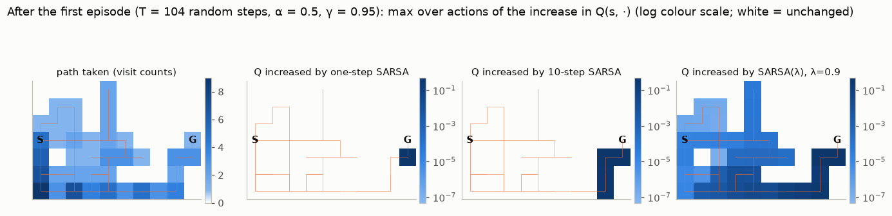

*Figure 6.1. The same random first episode (104 steps, α = 0.5, γ = 0.95) processed by three methods. Colour shows the largest increase of $Q(s,\cdot)$ in each cell, on a log scale from $5\times 10^{-8}$ (the smallest credit SARSA(λ) gives, to the first step of the path) to 0.5; white = unchanged. One-step SARSA credits only the final step; 10-step SARSA credits the last 10 steps; SARSA(λ) credits every step of the path, with weight decaying geometrically in $(\gamma\lambda)^k$ into the past.*

### 1.2 Two axes, three views

Two questions organize the chapter.

1. **How far ahead do we look before bootstrapping?** The $n$-step return looks $n$ rewards ahead. The λ-return averages all $n$ with geometric weights. Both are *forward views*: the target for the state at time $t$ uses rewards from after $t$.
2. **How do we compute it?** The forward view needs future data, so updates are delayed. **Eligibility traces** give a *backward view*. Each new TD error is broadcast to recently visited states in proportion to a short-term memory, the trace. The backward view needs no delay and costs one vector per step.

| | One step | Intermediate | Full return |
|---|---|---|---|
| fixed horizon | TD(0), $n = 1$ | $n$-step TD (Sections 2–7) | MC, $n \geq T - t$ |
| geometric average | TD(0), $\lambda = 0$ | λ-return, TD(λ) (Sections 8–14) | MC, $\lambda = 1$ |

Monte Carlo and TD(0) are the two ends of each row (Section 15).

---

## 2. n-step TD prediction

### 2.1 The n-step return

We evaluate a fixed policy $\pi$ from episodes $S_0, A_0, R_1, S_1, A_1, R_2, \ldots, S_T$. Recall that the Monte Carlo target is the full return $G_t = R_{t+1} + \gamma R_{t+2} + \cdots + \gamma^{T-t-1}R_T$, and the TD(0) target is $R_{t+1} + \gamma V(S_{t+1})$, which bootstraps after one step. The **$n$-step return** keeps $n$ actual rewards and then bootstraps:

$$
G_{t:t+n} \doteq R_{t+1} + \gamma R_{t+2} + \cdots + \gamma^{n-1}R_{t+n} + \gamma^n V_{t+n-1}(S_{t+n}), \qquad n \geq 1,\; 0 \leq t < T-n. \tag{6.1}
$$

The subscript $t:t+n$ says the return starts at $t$ and is truncated at $t+n$. $V_{t+n-1}$ is the estimate available when $R_{t+n}$ and $S_{t+n}$ arrive. If the episode ends first ($t + n \geq T$), the missing terms are zero and $G_{t:t+n} \doteq G_t$, the full return. So $G_{t:t+1}$ is the TD(0) target and $G_{t:T}$ is the MC target.

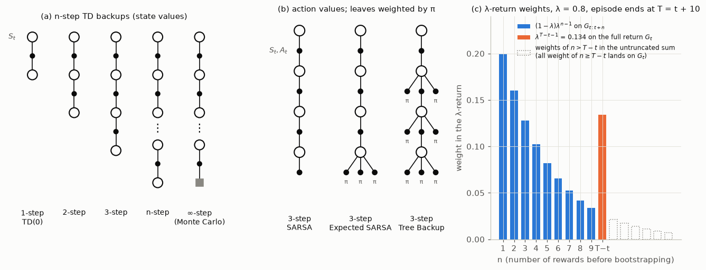

*Figure 6.2. (a) Backup diagrams of $n$-step TD: open circles are states, dots are actions, the grey square is a terminal state. The bottom state of each diagram is the one whose estimate is bootstrapped from; Monte Carlo has none. (b) Three-step backups for action values (Section 3 and Section 6.1): SARSA bootstraps from the sampled last action, Expected SARSA from all actions weighted by $\pi$, and Tree Backup weights every action not taken by $\pi$ along the whole path. (c) The weights the λ-return (Section 8.1, Eq. 6.17) puts on each $n$-step return when the episode ends 10 steps after $t$, for λ = 0.8; the weight of all longer returns lands on the full return $G_t$. From [`backup_diagrams.py`](../code/ch06_n_step_and_eligibility_traces/backup_diagrams.py).*

The **$n$-step TD** update changes only the state visited $n$ steps ago:

$$
V_{t+n}(S_t) \doteq V_{t+n-1}(S_t) + \alpha\left[G_{t:t+n} - V_{t+n-1}(S_t)\right], \qquad 0 \leq t < T, \tag{6.2}
$$

with all other values unchanged, $V_{t+n}(s) = V_{t+n-1}(s)$ for $s \neq S_t$.

**The n-step error is a sum of TD errors.** Let $\delta_k \doteq R_{k+1} + \gamma V(S_{k+1}) - V(S_k)$ with $V$ held fixed and $V(\text{terminal}) = 0$. Adding and subtracting $\gamma^j V(S_{t+j})$ for $j = 1, \ldots, n-1$ gives

$$
\begin{aligned}
G_{t:t+n} - V(S_t) &= \sum_{j=0}^{n-1}\gamma^j R_{t+j+1} + \gamma^n V(S_{t+n}) - V(S_t) \\
&= \sum_{j=0}^{n-1}\gamma^j\left[R_{t+j+1} + \gamma V(S_{t+j+1}) - V(S_{t+j})\right] \\
&= \sum_{k=t}^{\min(t+n,T)-1}\gamma^{k-t}\delta_k .
\end{aligned} \tag{6.3}
$$

The second line telescopes back to the first: the $+\gamma^{j+1}V(S_{t+j+1})$ of term $j$ cancels the $-\gamma^{j+1}V(S_{t+j+1})$ of term $j+1$. With $n \geq T - t$ this is the identity "MC error = sum of TD errors" from [Chapter 05](05-temporal-difference.md) (Section 1.3). If $V$ changes during the episode, as it does in $n$-step TD, (6.3) picks up correction terms of order $\alpha$ (Exercise 2). The script [`equivalence_checks.py`](../code/ch06_n_step_and_eligibility_traces/equivalence_checks.py) checks (6.3) on random episodes; the largest discrepancy is $1.8\times 10^{-15}$, which is rounding error.

### 2.2 The algorithm

At time $t$ we have just observed $R_{t+1}$ and $S_{t+1}$. The state whose $n$-step return just became complete is $S_\tau$ with $\tau = t - n + 1$. Nothing is updated during the first $n-1$ steps. After the episode ends, the last $n-1$ states still need their (now shorter) returns, so the loop continues without new data until $\tau = T-1$.

```text
n-step TD for estimating V ≈ v_π
Input: a policy π
Parameters: step size α ∈ (0, 1], integer n ≥ 1
Initialize V(s) arbitrarily for all s ∈ S, with V(terminal) = 0
(S_t and R_t can be stored with index taken mod n+1)

Loop for each episode:
    Initialize and store S_0 ≠ terminal
    T ← ∞
    Loop for t = 0, 1, 2, ...:
        If t < T:
            Take an action according to π(·|S_t)
            Observe and store the next reward as R_{t+1} and the next state as S_{t+1}
            If S_{t+1} is terminal: T ← t + 1
        τ ← t − n + 1                      (τ is the time whose estimate is being updated)
        If τ ≥ 0:
            G ← Σ_{i=τ+1}^{min(τ+n, T)} γ^{i−τ−1} R_i
            If τ + n < T: G ← G + γ^n V(S_{τ+n})          (bootstrap only from a non-terminal state)
            V(S_τ) ← V(S_τ) + α [G − V(S_τ)]
    until τ = T − 1
```

Three points about the code:

- **Memory.** Only the last $n+1$ states and rewards are needed.
- **Delay.** Every estimate is updated $n-1$ steps after its state was visited, and the first $n-1$ steps of an episode produce no learning at all.
- **Time limits.** With Gymnasium, a *truncated* episode (time limit) is not a terminal state. The returns of the last $n$ states must bootstrap from $V(S_T)$ instead of stopping at $R_T$ ([Chapter 05](05-temporal-difference.md), Section 13). In code: set $T$ at truncation but keep the bootstrap term, as `sarsa_lambda_gridworld.py` does for its time limit.

### 2.3 The error-reduction property

Why should $n$-step returns be better targets? Because, in expectation, they are closer to the truth than the estimate they bootstrap from, by at least a factor $\gamma^n$.

**Theorem (error reduction).** For any value function $V$ and any $n \geq 1$,

$$
\max_s \left|\mathbb{E}_\pi\left[G_{t:t+n} \mid S_t = s\right] - v_\pi(s)\right| \;\leq\; \gamma^n \max_s \left|V(s) - v_\pi(s)\right|, \tag{6.4}
$$

where $G_{t:t+n}$ bootstraps from $V$ (and $V(\text{terminal}) = v_\pi(\text{terminal}) = 0$).

*Proof.* Write $p_n(s' \mid s) \doteq \Pr_\pi\{S_{t+n} = s', \text{no termination before } t+n \mid S_t = s\}$. The return $G_t$ satisfies the same decomposition as $G_{t:t+n}$, with $v_\pi$ in place of $V$:

$$
v_\pi(s) = \mathbb{E}_\pi\Big[\sum_{j=0}^{n-1}\gamma^j R_{t+j+1} \,\Big|\, S_t = s\Big] + \gamma^n\sum_{s'} p_n(s'\mid s)\, v_\pi(s'),
$$

because $\mathbb{E}_\pi[G_{t+n} \mid S_{t+n} = s'] = v_\pi(s')$ by the Markov property, and terminated paths contribute no further reward. The expected $n$-step return has the same first term with $V$ in the second. Subtracting,

$$
\mathbb{E}_\pi[G_{t:t+n}\mid S_t = s] - v_\pi(s) = \gamma^n\sum_{s'}p_n(s'\mid s)\left[V(s') - v_\pi(s')\right],
$$

and since $\sum_{s'}p_n(s'\mid s) \leq 1$, the absolute value is at most $\gamma^n \max_{s'}|V(s') - v_\pi(s')|$. $\square$

The proof gives a sharper statement for episodic tasks: the factor is $\gamma^n \max_s \Pr\{T > t+n \mid S_t = s\}$, because paths that have already terminated contribute no error. With $\gamma = 1$ the plain bound (6.4) says only that the error does not grow. The sharper one says it shrinks as soon as every state has a positive probability of terminating within $n$ steps. On the 19-state walk that needs $n \geq 10$, since from the centre no episode can end in fewer than 10 steps; the survival bound is exactly 1 for $n \leq 8$ in Figure 6.3. At small $n$ the reduction seen in the figure comes from averaging: $P^n$ mixes the errors of $V$ over the states reachable in $n$ steps, which are not all at their maximum (and may have opposite signs). Neither bound uses this. The script [`return_bias_variance.py`](../code/ch06_n_step_and_eligibility_traces/return_bias_variance.py) computes both sides exactly for the 19-state random walk, using the walk's transition matrix $P$ among non-terminal states: $\mathbb{E}[G_{t:t+n}] - v_\pi = P^n(V - v_\pi)$.

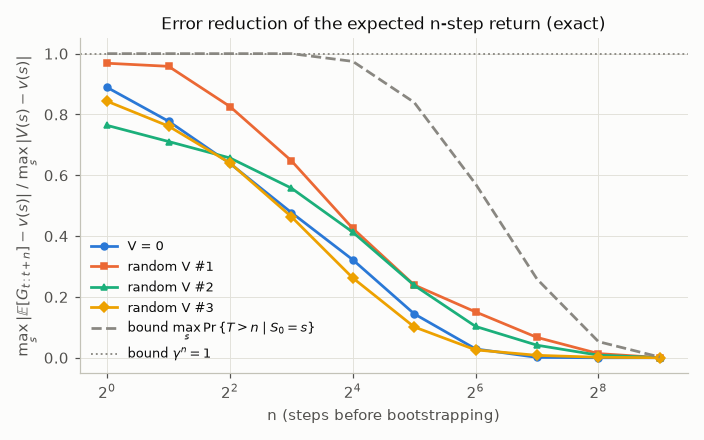

*Figure 6.3. Ratio of the worst-case error of the expected $n$-step return to the worst-case error of $V$, for $V = 0$ and three random $V$, on the 19-state random walk ($\gamma = 1$). Every curve lies at or below the survival-probability bound (dashed), which equals 1 for $n \leq 8$ and falls below the $\gamma^n = 1$ bound afterwards.*

For $V = 0$ the ratio is $0.889$ at $n = 1$, $0.477$ at $n = 8$, $0.029$ at $n = 64$ and $0.001$ at $n = 128$. Exercise 3 explains the $0.889 = 8/9$ by hand. The theorem is about *expectations*. It says nothing about variance, and variance is what eventually makes large $n$ worse (Section 15).

### 2.4 A worked example by hand

Take the 5-state random walk of [Chapter 05](05-temporal-difference.md): states A–E, terminal states on both sides, reward $+1$ only on exiting to the right, $\gamma = 1$, all estimates initialized to $V = 0.5$, and $\alpha = 0.1$. Suppose the episode is C → D → E → right terminal, so $R_1 = R_2 = 0$, $R_3 = 1$ and $T = 3$.

| $t$ | observed | $n = 1$: update | $n = 2$: update | $n = 3$: update |
|---|---|---|---|---|
| 0 | $R_1 = 0$, $S_1 = $ D | $\tau = 0$: $G_{0:1} = 0 + V(\text{D}) = 0.5$; $V(\text{C})$ unchanged | — | — |
| 1 | $R_2 = 0$, $S_2 = $ E | $\tau = 1$: $G_{1:2} = 0.5$; $V(\text{D})$ unchanged | $\tau = 0$: $G_{0:2} = 0 + 0 + V(\text{E}) = 0.5$; unchanged | — |
| 2 | $R_3 = 1$, terminal, $T = 3$ | $\tau = 2$: $G_{2:3} = 1$; $V(\text{E}) \to 0.55$ | $\tau = 1$: $G_{1:3} = 0 + 1 = 1$; $V(\text{D}) \to 0.55$ | $\tau = 0$: $G_{0:3} = 1$; $V(\text{C}) \to 0.55$ |
| 3 | (no data) | — | $\tau = 2$: $G_{2:3} = 1$; $V(\text{E}) \to 0.55$ | $\tau = 1$: $V(\text{D}) \to 0.55$ |
| 4 | (no data) | — | — | $\tau = 2$: $V(\text{E}) \to 0.55$ |

One-step TD moves one estimate. Two-step TD moves the last two. Three-step TD, which is Monte Carlo for this episode, moves all three. The table also shows the delay: with $n = 3$ the first update happens only once the episode is over, and updates continue for two steps after termination.

### 2.5 Results on the 19-state random walk

Sutton and Barto's Figure 7.2 uses a bigger walk, so that the difference between short and long backups shows. It has 19 states, starts in the centre, and gives reward $-1$ on the left exit and $+1$ on the right exit, so $v_\pi(s) = (s-10)/10$. We ran $n$-step TD from $V = 0$ for 10 episodes, for $n \in \{1, 2, 4, \ldots, 512\}$ and 25 step sizes, and averaged the RMS error over the 19 states, the 10 episodes and 100 runs. All $(n, \alpha)$ pairs see the same 1,000 episodes.

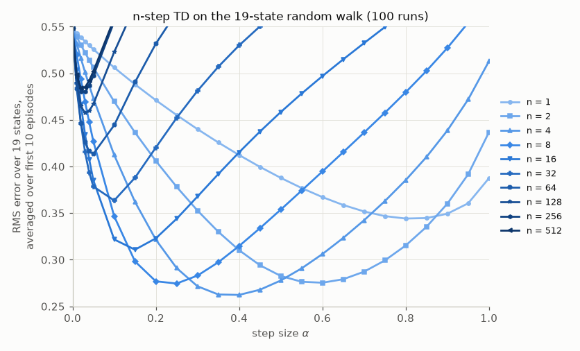

*Figure 6.4. Our reproduction of S&B Figure 7.2. RMS error is averaged over the first 10 episodes and 100 runs. Intermediate $n$ is best.*

| $n$ | 1 | 2 | **4** | 8 | 16 | 32 | 64 | 512 |
|---|---|---|---|---|---|---|---|---|
| best $\alpha$ | 0.80 | 0.60 | **0.40** | 0.25 | 0.15 | 0.10 | 0.05 | 0.02 |
| RMS error | 0.344 | 0.275 | **0.262** | 0.275 | 0.311 | 0.364 | 0.414 | 0.485 |

Not learning at all ($\alpha = 0$) gives RMS error $0.548$. The best method is 4-step TD at $\alpha = 0.4$. It beats TD(0) (0.344) and is far better than $n = 512$, which is constant-α Monte Carlo for almost every episode (0.485). Two regularities are worth remembering. First, **larger $n$ needs smaller $\alpha$**: a longer return is a noisier target, so it must be averaged more slowly. Second, the curves for large $n$ rise steeply with $\alpha$: the random walk revisits states many times per episode, and every revisit moves the estimate towards the same noisy outcome.

---

## 3. n-step SARSA and n-step Expected SARSA

### 3.1 n-step SARSA

For control we switch to action values, exactly as in [Chapter 05](05-temporal-difference.md). The $n$-step return bootstraps from the action actually taken $n$ steps later:

$$
G_{t:t+n} \doteq R_{t+1} + \gamma R_{t+2} + \cdots + \gamma^{n-1}R_{t+n} + \gamma^n Q_{t+n-1}(S_{t+n}, A_{t+n}), \qquad t + n < T, \tag{6.5}
$$

with $G_{t:t+n} \doteq G_t$ if $t + n \geq T$. The update is

$$
Q_{t+n}(S_t, A_t) \doteq Q_{t+n-1}(S_t, A_t) + \alpha\left[G_{t:t+n} - Q_{t+n-1}(S_t, A_t)\right]. \tag{6.6}
$$

```text
n-step SARSA for estimating Q ≈ q_* or q_π
Parameters: step size α ∈ (0, 1], small ε > 0, integer n ≥ 1
Initialize Q(s, a) arbitrarily for all s ∈ S, a ∈ A, with Q(terminal, ·) = 0
Let π be ε-greedy with respect to Q (or a fixed policy, for prediction)

Loop for each episode:
    Initialize and store S_0 ≠ terminal
    Select and store A_0 ~ π(·|S_0)
    T ← ∞
    Loop for t = 0, 1, 2, ...:
        If t < T:
            Take action A_t; observe and store R_{t+1} and S_{t+1}
            If S_{t+1} is terminal: T ← t + 1
            else: select and store A_{t+1} ~ π(·|S_{t+1})
        τ ← t − n + 1
        If τ ≥ 0:
            G ← Σ_{i=τ+1}^{min(τ+n, T)} γ^{i−τ−1} R_i
            If τ + n < T: G ← G + γ^n Q(S_{τ+n}, A_{τ+n})
            Q(S_τ, A_τ) ← Q(S_τ, A_τ) + α [G − Q(S_τ, A_τ)]
            (if learning π, make π ε-greedy with respect to Q)
    until τ = T − 1
```

Figure 6.1 shows what this buys. With a reward only at the goal, one-step SARSA strengthens only the last action of the first episode. $n$-step SARSA strengthens the last $n$.

### 3.2 n-step Expected SARSA

Expected SARSA replaces the sampled last action by an expectation under the target policy. The $n$-step version does this only at the last step:

$$
G_{t:t+n} \doteq R_{t+1} + \cdots + \gamma^{n-1}R_{t+n} + \gamma^n \bar V_{t+n-1}(S_{t+n}), \qquad \bar V(s) \doteq \sum_a \pi(a\mid s)\,Q(s,a), \tag{6.7}
$$

with $\bar V(\text{terminal}) = 0$. Its last step has lower variance than SARSA's, and in the off-policy setting it needs one fewer importance ratio (Section 4). The algorithm is $n$-step SARSA with a different bootstrap line:

```text
n-step Expected SARSA for estimating Q ≈ q_π (or q_*, with π ε-greedy w.r.t. Q)
Input: a policy π (fixed, or ε-greedy with respect to Q for control)
Parameters: step size α ∈ (0, 1], integer n ≥ 1
Initialize Q(s, a) arbitrarily for all s ∈ S, a ∈ A, with Q(terminal, ·) = 0
Define V̄(s) = Σ_a π(a|s) Q(s, a) for non-terminal s, and V̄(terminal) = 0

Loop for each episode:
    Initialize and store S_0 ≠ terminal;  select and store A_0 ~ π(·|S_0)
    T ← ∞
    Loop for t = 0, 1, 2, ...:
        If t < T:
            Take action A_t; observe and store R_{t+1} and S_{t+1}
            If S_{t+1} is terminal: T ← t + 1
            else: select and store A_{t+1} ~ π(·|S_{t+1})
        τ ← t − n + 1
        If τ ≥ 0:
            G ← Σ_{i=τ+1}^{min(τ+n, T)} γ^{i−τ−1} R_i
            If τ + n < T: G ← G + γ^n V̄(S_{τ+n})                  (expectation over the last action)
            Q(S_τ, A_τ) ← Q(S_τ, A_τ) + α [G − Q(S_τ, A_τ)]
            (if learning π, make π ε-greedy with respect to Q)
    until τ = T − 1
```

Our gridworld results for $n$-step SARSA appear alongside SARSA(λ) in Section 13.3. In short: over the first 50 episodes, one-step SARSA averaged 60.5 steps per episode, 4-step SARSA 30.8 and 16-step SARSA 28.1.

---

## 4. Off-policy n-step learning with importance sampling

### 4.1 Why one-step methods were off-policy for free and n-step methods are not

One-step Q-learning and Expected SARSA need no importance sampling ([Chapter 05](05-temporal-difference.md), Section 8.2). Their target $R_{t+1} + \gamma\sum_a \pi(a\mid S_{t+1})Q(S_{t+1},a)$ conditions on $(S_t, A_t)$, and nothing after that depends on the behaviour policy $b$. An $n$-step target is different. The rewards $R_{t+2}, \ldots, R_{t+n}$ and the bootstrap state $S_{t+n}$ depend on the actions $A_{t+1}, \ldots, A_{t+n-1}$, and those were chosen by $b$. To estimate values for the target policy $\pi$, we must correct for this, most directly by reweighting with the importance-sampling ratio of [Chapter 04](04-monte-carlo.md) (Sections 5–7 of this chapter give alternatives):

$$
\rho_{t:h} \doteq \prod_{k=t}^{\min(h,\,T-1)}\frac{\pi(A_k\mid S_k)}{b(A_k\mid S_k)},
$$

assuming **coverage** ($\pi(a\mid s) > 0 \Rightarrow b(a\mid s) > 0$). The upper limit $\min(h, T-1)$ is our only departure from NOTATION.md's $\rho_{t:h}$: there are no actions after the episode ends.

**State values.** The $n$-step return from $S_t$ depends on $A_t, \ldots, A_{t+n-1}$, so

$$
V_{t+n}(S_t) \doteq V_{t+n-1}(S_t) + \alpha\,\rho_{t:t+n-1}\left[G_{t:t+n} - V_{t+n-1}(S_t)\right]. \tag{6.8}
$$

The reason this works is the standard importance-sampling identity. Given $S_t$, the probability of the segment $A_t, S_{t+1}, \ldots, S_{t+n}$ under $\pi$, divided by its probability under $b$, is exactly $\rho_{t:t+n-1}$; the transition probabilities cancel. Hence $\mathbb{E}_b[\rho_{t:t+n-1}G_{t:t+n}\mid S_t] = \mathbb{E}_\pi[G_{t:t+n}\mid S_t]$ for a fixed bootstrap function. The bootstrap $V(S_{t+n})$ needs no correction, because it already estimates the value of $\pi$ from $S_{t+n}$.

**Action values.** To estimate $q_\pi(S_t, A_t)$ we condition on $A_t$, so the first action needs no ratio. For the $n$-step SARSA return (6.5), which bootstraps from the sampled $A_{t+n}$, that last action does need one:

$$
Q_{t+n}(S_t,A_t) \doteq Q_{t+n-1}(S_t,A_t) + \alpha\,\rho_{t+1:t+n}\left[G_{t:t+n} - Q_{t+n-1}(S_t,A_t)\right]. \tag{6.9}
$$

For the $n$-step Expected SARSA return (6.7), the last step is already an expectation under $\pi$, so one ratio fewer is needed:

$$
Q_{t+n}(S_t,A_t) \doteq Q_{t+n-1}(S_t,A_t) + \alpha\,\rho_{t+1:t+n-1}\left[G_{t:t+n} - Q_{t+n-1}(S_t,A_t)\right]. \tag{6.10}
$$

With $n = 1$ the product in (6.10) is empty and we recover one-step Expected SARSA (and Q-learning, when $\pi$ is greedy).

```text
Off-policy n-step SARSA for estimating Q ≈ q_* or q_π
Input: an arbitrary behaviour policy b with b(a|s) > 0 for all s ∈ S, a ∈ A
Parameters: step size α ∈ (0, 1], integer n ≥ 1
Initialize Q(s, a) arbitrarily, with Q(terminal, ·) = 0
Initialize π to be greedy with respect to Q, or a fixed given policy

Loop for each episode:
    Initialize and store S_0 ≠ terminal; select and store A_0 ~ b(·|S_0)
    T ← ∞
    Loop for t = 0, 1, 2, ...:
        If t < T:
            Take action A_t; observe and store R_{t+1}, S_{t+1}
            If S_{t+1} is terminal: T ← t + 1
            else: select and store A_{t+1} ~ b(·|S_{t+1})
        τ ← t − n + 1
        If τ ≥ 0:
            ρ ← Π_{i=τ+1}^{min(τ+n, T−1)} π(A_i|S_i) / b(A_i|S_i)
            G ← Σ_{i=τ+1}^{min(τ+n, T)} γ^{i−τ−1} R_i
            If τ + n < T: G ← G + γ^n Q(S_{τ+n}, A_{τ+n})
            Q(S_τ, A_τ) ← Q(S_τ, A_τ) + α ρ [G − Q(S_τ, A_τ)]
            (if learning a greedy π, make π greedy with respect to Q at S_τ)
    until τ = T − 1
```

### 4.2 The price: variance that grows geometrically in n

Each ratio has mean one under $b$: $\mathbb{E}_b[\rho_k\mid S_k] = \sum_a b(a\mid S_k)\,\pi(a\mid S_k)/b(a\mid S_k) = 1$. Its second moment, however, is

$$
\mathbb{E}_b[\rho_k^2\mid S_k] = \sum_a \frac{\pi(a\mid S_k)^2}{b(a\mid S_k)} \geq 1,
$$

with equality only when $\pi = b$ (by the Cauchy–Schwarz inequality). If $\mathbb{E}_b[\rho_k^2\mid S_k] = \kappa$ in every state, as on the chain task below, the tower property (condition on $S_{t+n-1}$ first, then work backwards) gives $\mathbb{E}_b[\rho_{t:t+n-1}^2\mid S_t] = \kappa^n$ exactly, so the variance of the product is $\kappa^n - 1$. In general $\kappa$ varies with the state and the second moment is an expectation of a product along the trajectory, but it still grows geometrically with $n$. On the chain ($\pi$ goes right with probability 0.9, $b$ with probability 0.5), $\kappa = 0.5\cdot 1.8^2 + 0.5\cdot 0.2^2 = 1.64$, so $1.64^8 \approx 52$ and $1.64^{16} \approx 2{,}700$. A noisier target forces a smaller step size, and learning slows to a crawl. Sections 5–7 reduce this variance; Section 14 bounds it.

---

## 5. Per-decision methods with control variates

### 5.1 State values

Write the on-policy $n$-step return recursively: $G_{t:h} = R_{t+1} + \gamma G_{t+1:h}$ with horizon $h = t + n$ and $G_{h:h} = V(S_h)$. Per-decision importance sampling ([Chapter 04](04-monte-carlo.md), Section 9.2) weights each step only by the ratios of the actions that actually influenced it. Applied to the recursion, it gives $\rho_t(R_{t+1} + \gamma G_{t+1:h})$. This has the right expectation but a bad failure mode. If $\pi$ would never take $A_t$ ($\rho_t = 0$), the target is $0$, and the update drags $V(S_t)$ towards zero for no reason. The fix is to add a term with zero mean:

$$
G_{t:h} \doteq \rho_t\left(R_{t+1} + \gamma G_{t+1:h}\right) + (1 - \rho_t)\,V_{h-1}(S_t), \qquad t < h \leq T, \tag{6.11}
$$

with $G_{h:h} \doteq V_{h-1}(S_h)$ if $h < T$ and $G_{T:T} \doteq 0$. At the end of an episode the last step still carries its ratio, $G_{T-1:T} = \rho_{T-1}R_T + (1-\rho_{T-1})V(S_{T-1})$, because $R_T$ depends on the action $A_{T-1}$. Since $\mathbb{E}_b[1 - \rho_t \mid S_t] = 0$ and $V(S_t)$ is fixed given $S_t$, the added term $(1-\rho_t)V(S_t)$ has zero mean. It is a **control variate**: a zero-mean quantity that is correlated with the noise and so cancels part of it. Now if $\rho_t = 0$ the target is $V(S_t)$ and the update does nothing, which is exactly right. The update itself is the plain $V(S_t) \leftarrow V(S_t) + \alpha[G_{t:h} - V(S_t)]$, with no outer ratio.

### 5.2 Action values

For action values the first action is given, and the control variate enters at the next state:

$$
G_{t:h} \doteq R_{t+1} + \gamma\Big(\rho_{t+1}\left[G_{t+1:h} - Q_{h-1}(S_{t+1},A_{t+1})\right] + \bar V_{h-1}(S_{t+1})\Big), \qquad t < h \leq T, \tag{6.12}
$$

with $G_{h:h} \doteq Q_{h-1}(S_h, A_h)$ if $h < T$ and $G_{T-1:h} \doteq R_T$ if $h = T$. Unrolling once at the horizon, $G_{h-1:h} = R_h + \gamma\bar V(S_h)$, so the recursion ends with an Expected SARSA step. The zero-mean term is $\gamma(\bar V(S_{t+1}) - \rho_{t+1}Q(S_{t+1},A_{t+1}))$:

$$
\mathbb{E}_b\left[\rho_{t+1}Q(S_{t+1},A_{t+1}) \mid S_{t+1}\right] = \sum_a b(a\mid S_{t+1})\frac{\pi(a\mid S_{t+1})}{b(a\mid S_{t+1})}Q(S_{t+1},a) = \bar V(S_{t+1}).
$$

By induction on $h - t$, $\mathbb{E}_b[G_{t:h}\mid S_t, A_t]$ equals the expected on-policy $n$-step Expected SARSA return (6.7) of $\pi$, for fixed $Q$ (Exercise 7 does the state-value case). The update is $Q(S_t,A_t) \leftarrow Q(S_t,A_t) + \alpha[G_{t:h} - Q(S_t,A_t)]$.

Control variates help a lot when $Q$ is accurate, because then $G_{t+1:h} - Q(S_{t+1},A_{t+1})$ is small and the large ratio multiplies a small number. They do not remove the ratio products: in (6.12), a reward $k$ steps ahead is still multiplied by $\rho_{t+1}\cdots\rho_{t+k}$.

---

## 6. Learning without importance sampling: n-step Tree Backup

### 6.1 The tree-backup return

Is off-policy multi-step learning possible without ratios? Yes, if we know $\pi$. Picture the backup diagram as a tree. At each state along the sampled path, the actions that were *not* taken are "leaves": we cannot follow them, but we have estimates $Q(s,a)$ for them. The action that *was* taken leads further down the path. The **tree-backup return** weights each leaf by its probability under $\pi$, and weights the continuation of the path by the probability $\pi(A_{t+1}\mid S_{t+1})$ of the action actually taken:

$$
G_{t:t+n} \doteq R_{t+1} + \gamma\sum_{a\neq A_{t+1}}\pi(a\mid S_{t+1})\,Q_{t+n-1}(S_{t+1},a) + \gamma\,\pi(A_{t+1}\mid S_{t+1})\,G_{t+1:t+n}, \tag{6.13}
$$

for $t < T-1$ and $n \geq 2$. The base cases are $G_{t:t+1} \doteq R_{t+1} + \gamma\sum_a\pi(a\mid S_{t+1})Q(S_{t+1},a)$ (Expected SARSA) and $G_{T-1:t+n} \doteq R_T$. No probability of $b$ appears anywhere. The sampled actions are used only to decide which branch to follow, and each branch is weighted by $\pi$. As a result $q_\pi$ is a fixed point of the expected update for *any* behaviour policy (Exercise 8). Away from that fixed point the expected target does depend on $b$. So Tree Backup's expected target equals that of the on-policy $n$-step return only at $Q = q_\pi$: it has the right fixed point, but elsewhere it is not an unbiased estimate of the on-policy $n$-step return.

### 6.2 One recursion for all of them

Since $\sum_{a\neq A}\pi(a\mid s)Q(s,a) = \bar V(s) - \pi(A\mid s)Q(s,A)$, (6.13) can be rewritten as

$$
G_{t:h} = R_{t+1} + \gamma\Big(\bar V(S_{t+1}) + c_{t+1}\left[G_{t+1:h} - Q(S_{t+1},A_{t+1})\right]\Big), \qquad G_{h-1:h} = R_h + \gamma\bar V(S_h), \tag{6.14}
$$

with $c_{t+1} = \pi(A_{t+1}\mid S_{t+1})$ (and $\bar V(\text{terminal}) = 0$). This is the control-variate return (6.12) with $\rho$ replaced by $\pi$. Every per-decision method in this part of the chapter (control variates, Tree Backup, $Q(\sigma)$) is the recursion (6.14) with a different **per-step coefficient** $c$:

| method | $c_k$ | needs $b$? | notes |
|---|---|---|---|
| one-step Expected SARSA | $0$ | no | no multi-step information at all |
| per-decision control variates (6.12) | $\rho_k = \pi(A_k\mid S_k)/b(A_k\mid S_k)$ | yes | unbiased; variance grows with products of $\rho$ |
| Tree Backup (6.13) | $\pi(A_k\mid S_k)$ | no | $c \leq 1$: low variance; but $c < 1$ even on-policy |
| $Q(\sigma)$ (Section 7) | $\sigma_k\rho_k + (1-\sigma_k)\pi(A_k\mid S_k)$ | if $\sigma > 0$ | interpolates the two rows above |
| Q-corrected, no ratios ($Q^\pi$-style; Harutyunyan et al., 2016) | $1$ | no | $q_\pi$ is still a fixed point (Exercise 8a); contraction guaranteed only if $\pi \approx b$ (Section 14.2) |
| Retrace-style | $\min(1, \rho_k)$ | yes | Section 14 |

Two methods of Sections 4 and 7 are *not* in this family. The plain-IS update (6.8)–(6.10) multiplies the whole error by one ratio product instead of correcting step by step. And the naive uncorrected return $\sum_{j<n}\gamma^jR_{t+j+1} + \gamma^n\bar V(S_{t+n})$ of Sections 7.2–7.3 is **not** the $c \equiv 1$ row. Unrolling (6.14) with $c \equiv 1$ gives

$$
G_{t:h} = \sum_{j=0}^{h-t-1}\gamma^jR_{t+j+1} + \gamma^{h-t}\bar V(S_h) + \sum_{k=t+1}^{h-1}\gamma^{k-t}\left[\bar V(S_k) - Q(S_k,A_k)\right],
$$

so the naive return is the $c \equiv 1$ return minus the correction terms $\gamma^{k-t}[\bar V(S_k) - Q(S_k,A_k)]$. Each of them has mean zero when the actions are drawn from $\pi$, but not when they are drawn from $b$. Dropping them is what biases the naive return towards $q_b$ (Section 7.3 measures both).

Unrolling (6.14) with $Q$ held fixed gives the sum-of-TD-errors form, which we will need for traces. Let $\delta^{\mathrm{ES}}_k \doteq R_{k+1} + \gamma\bar V(S_{k+1}) - Q(S_k,A_k)$ be the Expected SARSA TD error. Then

$$
G_{t:h} - Q(S_t,A_t) = \sum_{k=t}^{h-1}\gamma^{k-t}\Big(\prod_{i=t+1}^{k}c_i\Big)\,\delta^{\mathrm{ES}}_k .
$$

To see this, subtract $Q(S_t,A_t)$ from (6.14). This gives $G_{t:h} - Q(S_t,A_t) = \delta^{\mathrm{ES}}_t + \gamma c_{t+1}[G_{t+1:h} - Q(S_{t+1},A_{t+1})]$, and induction does the rest.

**Why not use Tree Backup everywhere?** Because the coefficients $c_k = \pi(A_k\mid S_k)$ shrink the influence of later rewards even when no correction is needed. If $\pi$ is uniform over 4 actions, each step multiplies by $1/4$, *even if $b = \pi$*: Tree Backup then behaves almost like a one-step method. For a greedy $\pi$, $c_k$ is 1 while the behaviour acts greedily and 0 at the first exploratory action, so the backup stops there. This is the cutting rule of Watkins's Q(λ) (Section 13).

```text
n-step off-policy learning with a per-step coefficient c
(Tree Backup: c = π(A|S);  Q(σ): c = σρ + (1−σ)π(A|S);  control variates: c = ρ)
Input: behaviour b (for c = ρ or σ > 0, b(a|s) > 0 wherever π(a|s) > 0), target π
Parameters: step size α ∈ (0, 1], integer n ≥ 1
Initialize Q(s, a) arbitrarily, Q(terminal, ·) = 0;  define V̄(s) = Σ_a π(a|s) Q(s, a), V̄(terminal) = 0

Loop for each episode:
    Initialize and store S_0 ≠ terminal; select and store A_0 ~ b(·|S_0)
    T ← ∞
    Loop for t = 0, 1, 2, ...:
        If t < T:
            Take action A_t; observe and store R_{t+1}, S_{t+1}
            If S_{t+1} is terminal: T ← t + 1
            else: select and store A_{t+1} ~ b(·|S_{t+1}); store b(A_{t+1}|S_{t+1}) and σ_{t+1}
        τ ← t − n + 1
        If τ ≥ 0:
            h ← min(τ + n, T)
            G ← R_h + γ V̄(S_h)                                  (V̄(S_T) = 0)
            Loop for k = h − 2 down to τ:
                c ← c_{k+1}, computed now from the current π     (e.g. Q(σ): σ_{k+1} π(A_{k+1}|S_{k+1}) / b(A_{k+1}|S_{k+1})
                                                                   + (1 − σ_{k+1}) π(A_{k+1}|S_{k+1}))
                G ← R_{k+1} + γ [ V̄(S_{k+1}) + c (G − Q(S_{k+1}, A_{k+1})) ]
            Q(S_τ, A_τ) ← Q(S_τ, A_τ) + α [G − Q(S_τ, A_τ)]
            (for control: make π greedy, or ε-greedy, with respect to Q)
    until τ = T − 1
```

This box is what [`off_policy_traces.py`](../code/ch06_n_step_and_eligibility_traces/off_policy_traces.py) implements (function `n_step_episode`). Note that $\bar V$, $Q$ and the coefficients $c$ are evaluated with the current estimates and the current $\pi$ when the return is computed, as in $n$-step SARSA. For control, $\pi$ changes with $Q$ between the step at which $A_{k+1}$ was chosen and the update, so a $c$ stored at action time would be stale. For a fixed target policy, as in our prediction experiments, the two coincide and the code computes $c$ once per episode.

---

## 7. A unifying algorithm: n-step Q(σ)

### 7.1 Sampling versus expectation, one step at a time

At each step along the path, an off-policy multi-step method makes a choice. It can **sample**: follow the action that was taken and correct with $\rho$. Or it can take an **expectation**: average over all actions with $\pi$, cutting the path by $\pi(A\mid S)$. De Asis, Hernandez-Garcia, Holland and Sutton (2018) proposed to make this choice with a degree of sampling $\sigma_k \in [0,1]$ at every step:

$$
c_k = \sigma_k\,\rho_k + (1 - \sigma_k)\,\pi(A_k\mid S_k). \tag{6.15}
$$

Plugging (6.15) into the recursion (6.14) gives **$n$-step $Q(\sigma)$**. With $\sigma \equiv 1$ it is the control-variate return (6.12): full sampling, which on-policy has the same expectation as the $n$-step SARSA return. With $\sigma \equiv 0$ it is Tree Backup. With $n = 1$ every $\sigma$ gives one-step Expected SARSA, since the last step is always an expectation. This is Sutton and Barto's (2018, Eq. 7.17) control-variate form of $Q(\sigma)$, which we use throughout. In De Asis et al.'s original formulation $\sigma$ also governs the final bootstrap, so one-step $Q(1)$ is SARSA and one-step $Q(0)$ is Expected SARSA: that is the "unification" in their title. Intermediate values trade the variance of the ratios against the shortening of Tree Backup. $\sigma$ may also depend on the state or the time. De Asis et al. report that, on some of their tasks, an intermediate $\sigma$ beat both extremes, and that a $\sigma$ decayed from 1 towards 0 over training beat every fixed value. Their reasoning: sample early, when long backups help most, and take expectations later, when low variance matters most.

### 7.2 A worked example: one trajectory, six targets

Let $\gamma = 0.9$ and two actions, left and right. The target policy goes right with probability $0.9$; the behaviour policy is uniform. From $(S_t, A_t)$ the agent receives $R_{t+1} = 0$ and reaches $S_{t+1}$, where the current estimates are $Q(S_{t+1},\text{left}) = 0.2$ and $Q(S_{t+1},\text{right}) = 0.6$. The behaviour takes **left** ($\rho_{t+1} = 0.1/0.5 = 0.2$, $\pi(\text{left}\mid S_{t+1}) = 0.1$), receives $R_{t+2} = 1$ and the episode ends. We compute the two-step targets for $Q(S_t,A_t)$, whose current value is $0.5$.

First, $\bar V(S_{t+1}) = 0.1\cdot 0.2 + 0.9\cdot 0.6 = 0.56$, and the remaining return after $S_{t+1}$ is $G_{t+1:t+2} = R_{t+2} = 1$.

| method | computation | target |
|---|---|---|
| one-step Expected SARSA | $0 + 0.9 \cdot 0.56$ | $0.504$ |
| naive 2-step (no correction) | $0 + 0.9\cdot 1$ | $0.900$ |
| $c = 1$ (Q-corrected, no ratio) | $0.9\,[0.56 + 1\cdot(1 - 0.2)]$ | $1.224$ |
| 2-step IS, (6.10) | with $\alpha = 1$ the update is $0.5 + \rho_{t+1}(0.9 - 0.5) = 0.5 + 0.2\cdot 0.4$, i.e. an effective target $Q + \rho(G - Q)$ of | $0.580$ |
| control variates, $c = \rho = 0.2$ | $0.9\,[0.56 + 0.2\,(1 - 0.2)]$ | $0.648$ |
| $Q(\sigma = 0.5)$, $c = 0.5\cdot 0.2 + 0.5\cdot 0.1 = 0.15$ | $0.9\,[0.56 + 0.15\,(1 - 0.2)]$ | $0.612$ |
| Tree Backup, $c = \pi(\text{left}) = 0.1$ | $0.9\,[0.56 + 0.1\,(1 - 0.2)]$ | $0.576$ |

The naive target $0.9$ treats the exploratory "left" as if $\pi$ would have taken it, so it credits $\pi$ with a reward it would rarely see. The ratio-weighted targets (IS, control variates, $Q(\sigma)$, Tree Backup) stay close to the Expected SARSA value $0.504$ and move only part of the way towards the observed outcome. How far they move is decided by $c$. The $c = 1$ target, $1.224$, moves *further* than the naive one. It adds the full surprise $G_{t+1:t+2} - Q(S_{t+1},\text{left}) = 0.8$ to $\bar V(S_{t+1})$ without discounting it by how unlikely "left" is under $\pi$. But the term that separates it from the naive target, $\gamma[\bar V(S_{t+1}) - Q(S_{t+1},A_{t+1})] = 0.9\,(0.56 - 0.2) = 0.324$, is large and positive because $b$ chose an action whose estimate lies below $\bar V(S_{t+1})$; it would be $0.9\,(0.56 - 0.6) = -0.036$ had $b$ chosen "right". Averaged over $b$'s choices the correction is $\gamma\sum_a[\pi(a\mid S_{t+1}) - b(a\mid S_{t+1})]\,Q(S_{t+1},a)$: it swaps the $b$-weighted average of the continuation values for the $\pi$-weighted one. That is why $q_\pi$ remains the fixed point for any $b$ (Exercise 8a), which is not true of the naive target. The price is that nothing damps the variance of these terms when $\pi$ and $b$ differ.

### 7.3 Experiment: off-policy n-step methods on a slippery chain

To see these differences in learning, we need a task where multi-step returns matter and where the off-policy correction matters. [`chain_mdp.py`](../code/ch06_n_step_and_eligibility_traces/chain_mdp.py) defines a chain of 15 non-terminal states. There are two actions; a move goes the intended way with probability 0.85 and the opposite way with probability 0.15. Exiting on the right gives $+1$, exiting on the left gives $-1$, $\gamma = 0.95$, and episodes start in a uniformly random state. The target policy goes right with probability 0.9 and the behaviour is uniform. Behaviour episodes last 44.8 steps on average. Each method estimates $q_\pi$ from $Q = 0$. We measure the RMS error over the 30 state–action pairs against the exact $q_\pi$, obtained by solving the Bellman equations. The script runs 30 runs of 50 episodes and 9 step sizes, all on shared episodes. For each method and $n$ we report the step size with the smallest error averaged over the 50 episodes. "Naive" is the $n$-step Expected SARSA return (6.7) with no ratio; "IS" is the same return with its update weighted by $\rho_{t+1:t+n-1}$, as in (6.10); "$c = 1$" is the recursion (6.14) with $c \equiv 1$.

| method | $n=1$ | $n=2$ | $n=4$ | $n=8$ | $n=16$ |
|---|---|---|---|---|---|
| naive (no correction) | 0.227 | 0.326 | 0.422 | 0.475 | 0.498 |
| IS, (6.10) | 0.227 | 0.213 | 0.236 | 0.396 | 0.490 |
| $c = 1$ (Q-corrected, no ratios) | 0.227 | 0.204 | 0.208 | 0.224 | 0.242 |
| per-decision control variates | 0.227 | 0.215 | 0.210 | 0.305 | 0.458 |
| Tree Backup | 0.227 | 0.200 | 0.188 | 0.184 | 0.184 |
| $Q(\sigma = 0.5)$ | 0.227 | 0.200 | 0.188 | **0.181** | 0.183 |

*Mean RMS error over 50 episodes at the best step size (standard errors 0.004–0.017; full output in the script). For reference, the RMS of $q_\pi$ itself, the error of $Q = 0$, is 0.583.*

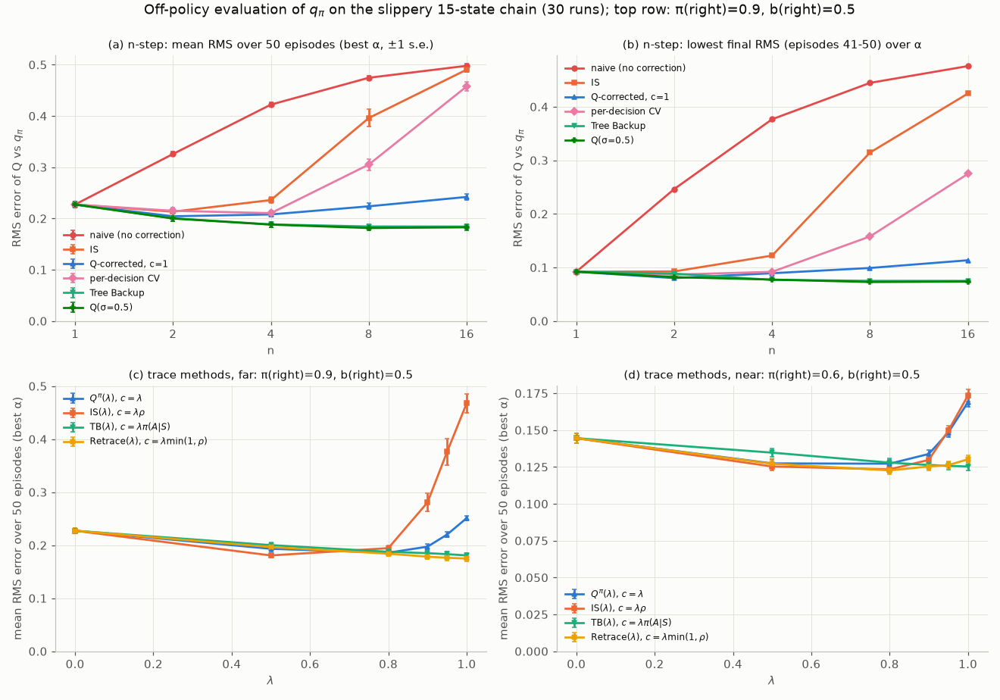

*Figure 6.5. Off-policy evaluation on the slippery 15-state chain. Top row: $n$-step methods with π(right) = 0.9, b(right) = 0.5. (a) Mean RMS error over 50 episodes at the best α. (b) The lowest final error (episodes 41–50) over α. Bottom row: the trace methods of Section 14 in the "far" setting (c) and the "near" setting (d). Colours mark method families across the rows: $c = 1$ and $Q^\pi(\lambda)$ share blue, IS and IS(λ) orange, Tree Backup and TB(λ) teal.*

The table tells the story of Sections 4–7:

- **No correction means bias.** The naive return converges to the wrong values. Its best final error grows from 0.09 ($n = 1$) to 0.48 ($n = 16$), close to the distance between $q_\pi$ and the behaviour's own $q_b$ (0.50).
- **The Q-function corrections alone remove that bias.** The $c = 1$ return uses no ratios either, but it keeps the zero-mean terms that the naive return drops. Its best final error stays between 0.08 and 0.11 for every $n$ (Tree Backup: 0.075–0.089). Its mean error does grow slowly with $n$ (0.204 at $n = 2$, 0.242 at $n = 16$), because uncut corrections accumulate variance. This is the $n$-step version of $Q^\pi(\lambda)$ in Section 14, whose guarantee does not cover this far-from-on-policy setting, although it worked here.
- **Importance sampling is unbiased but explodes.** IS is fine at $n = 2$, but at $n = 8$ and $n = 16$ the best step sizes drop to 0.05 and 0.01, and learning barely moves in 50 episodes.
- **Control variates help but do not cure.** They beat plain IS at every $n \geq 4$ (for example $0.305$ vs $0.396$ at $n = 8$), but the ratio products remain.
- **Tree Backup and Q(σ) are stable for every n.** They improve up to $n = 8$ and then plateau. For TB this is expected: with $\mathbb{E}_b[c] = 0.5$ per step, contributions beyond a few steps are negligible. $Q(\sigma = 0.5)$ has $c = 1.35$ after a "right" and $0.15$ after a "left" ($\mathbb{E}_b[c] = 0.75$), so it looks further ahead than TB without IS's variance. It was marginally the best method here; the gap to TB is within about one standard error.

---

## 8. The λ-return and the forward view

### 8.1 Averaging n-step returns

Any average of $n$-step returns with nonnegative weights that sum to one is a valid target. It inherits the error-reduction property (6.4), since an average of targets that are each closer to $v_\pi$ is itself closer. Such a target is called a *compound* return. One average is special. Give the $n$-step return weight proportional to $\lambda^{n-1}$, for a **trace-decay parameter** $\lambda \in [0,1]$:

$$
G_t^\lambda \doteq (1-\lambda)\sum_{n=1}^{\infty}\lambda^{n-1}G_{t:t+n}. \tag{6.16}
$$

The factor $(1-\lambda)$ makes the weights sum to one: $(1-\lambda)\sum_{n\geq 1}\lambda^{n-1} = 1$. In an episode that ends at $T$, every $G_{t:t+n}$ with $n \geq T-t$ equals the full return $G_t$. Their weights add up to $(1-\lambda)\sum_{n\geq T-t}\lambda^{n-1} = \lambda^{T-t-1}$, so

$$
G_t^\lambda = (1-\lambda)\sum_{n=1}^{T-t-1}\lambda^{n-1}G_{t:t+n} + \lambda^{T-t-1}G_t . \tag{6.17}
$$

Two special cases anchor the definition. $\lambda = 0$ puts all weight on $G_{t:t+1}$, the TD(0) target. $\lambda = 1$ puts all weight on $G_t$, the Monte Carlo target. The weights form a geometric distribution over $n$, with mean $\sum_n n(1-\lambda)\lambda^{n-1} = 1/(1-\lambda)$. So $\lambda = 0.9$ looks "10 steps ahead on average", and $\lambda = 0.99$ looks 100 steps ahead. The weight halves every $\ln 2/\ln(1/\lambda)$ steps, about 6.6 steps for $\lambda = 0.9$; with discounting the effective rate is $\gamma\lambda$ (Exercise 4).

### 8.2 The recursive form and the TD-error form

Hold $V$ fixed. Using $G_{t:t+1} = R_{t+1} + \gamma V(S_{t+1})$ and $G_{t:t+n} = R_{t+1} + \gamma G_{t+1:t+n}$ for $n \geq 2$,

$$
\begin{aligned}
G_t^\lambda &= (1-\lambda)\left[R_{t+1} + \gamma V(S_{t+1})\right] + (1-\lambda)\sum_{n=2}^{\infty}\lambda^{n-1}\left[R_{t+1} + \gamma G_{t+1:t+n}\right] \\
&= R_{t+1}\,(1-\lambda)\sum_{n=1}^{\infty}\lambda^{n-1} + \gamma(1-\lambda)V(S_{t+1}) + \gamma\lambda\,(1-\lambda)\sum_{m=1}^{\infty}\lambda^{m-1}G_{t+1:t+1+m} \\
&= R_{t+1} + \gamma\left[(1-\lambda)V(S_{t+1}) + \lambda G_{t+1}^\lambda\right].
\end{aligned} \tag{6.18}
$$

The second line substitutes $m = n - 1$. With $G^\lambda_T \doteq 0$ and $V(\text{terminal}) = 0$, the recursion (6.18) computes every λ-return of an episode in one backward pass. This is what our offline implementation does. Read (6.18) as: take one real step, then continue by *bootstrapping with probability $1-\lambda$* or *following the actual trajectory with probability $\lambda$*.

Now subtract $V(S_t)$ and add and subtract $\gamma\lambda V(S_{t+1})$:

$$
G_t^\lambda - V(S_t) = \underbrace{R_{t+1} + \gamma V(S_{t+1}) - V(S_t)}_{\delta_t} + \gamma\lambda\left[G_{t+1}^\lambda - V(S_{t+1})\right].
$$

Unrolling to the end of the episode gives the identity that makes eligibility traces possible:

$$
G_t^\lambda - V(S_t) = \sum_{k=t}^{T-1}(\gamma\lambda)^{k-t}\,\delta_k \qquad (V \text{ fixed}). \tag{6.19}
$$

With $\lambda = 1$ this is "MC error = sum of discounted TD errors" from [Chapter 05](05-temporal-difference.md). With $\lambda = 0$ it is $\delta_t$ alone. Our check of (6.19) on random episodes gave a largest discrepancy of $3.6\times 10^{-15}$.

### 8.3 The offline λ-return algorithm

The λ-return is known only at the end of an episode. The simplest algorithm that uses it waits:

$$
V(S_t) \leftarrow V(S_t) + \alpha\left[G_t^\lambda - V(S_t)\right], \qquad t = 0, 1, \ldots, T-1, \text{ applied after the episode}. \tag{6.20}
$$

```text
Offline λ-return algorithm for estimating V ≈ v_π
Parameters: step size α ∈ (0, 1], λ ∈ [0, 1]
Initialize V(s) arbitrarily, V(terminal) = 0

Loop for each episode:
    Generate an episode S_0, R_1, S_1, ..., R_T, S_T following π  (V is not changed meanwhile)
    G ← 0;  V_0 ← V                                   (V_0: the values in force during the episode)
    Loop for t = T − 1 down to 0:                     (backward pass, Eq. 6.18)
        G ← R_{t+1} + γ [ (1 − λ) V_0(S_{t+1}) + λ G ]
        target_t ← G
    Loop for t = 0, 1, ..., T − 1:
        V(S_t) ← V(S_t) + α [ target_t − V(S_t) ]
```

There are two ways to "apply the updates after the episode", and they differ when a state is visited more than once. The box follows Sutton and Barto (2018, Eq. 12.4): the targets come from the frozen $V_0$, but each error term uses the current $V(S_t)$, already changed by earlier updates in the sweep. The classical analysis (Section 10) instead computes every increment with $V_0$ and adds them all up. The two versions differ by $O(\alpha^2)$. For a tabular 6-state problem with $\lambda = 0.8$ we measured a difference between $10.1\alpha^2$ and $11.8\alpha^2$ (green curve of Figure 6.8; check (7) of `equivalence_checks.py`). We use the box version in experiments and the summed version in proofs.

On the 19-state random walk (Figure 6.7, first panel), the offline λ-return algorithm reached its lowest error, 0.258, at $\lambda = 0.8$ and $\alpha = 0.4$. That is about as good as the best $n$-step method (0.262 at $n = 4$). At $\lambda = 0$ it reaches only 0.365, worse than TD(0)'s 0.344, because the offline version postpones every update to the end of the episode.

---

## 9. TD(λ): eligibility traces and the backward view

### 9.1 The mechanism

Equation (6.19) says the λ-return error of $S_k$ is a weighted sum of *future* TD errors, with weight $(\gamma\lambda)^{t-k}$ on $\delta_t$. Turn this around. When $\delta_t$ arrives, every earlier state $S_k$ should receive $(\gamma\lambda)^{t-k}\delta_t$. To do that without storing the past, keep a decaying memory of visits, the **eligibility trace**:

$$
z_{-1}(s) \doteq 0, \qquad z_t(s) \doteq \gamma\lambda\, z_{t-1}(s) + \mathbb{1}[S_t = s] \quad\text{for all } s. \tag{6.21}
$$

Then broadcast each TD error to all states in proportion to their traces:

$$
\delta_t \doteq R_{t+1} + \gamma V_t(S_{t+1}) - V_t(S_t), \qquad V_{t+1}(s) \doteq V_t(s) + \alpha\,\delta_t\,z_t(s)\quad\text{for all } s. \tag{6.22}
$$

Unrolling (6.21) gives $z_t(s) = \sum_{k\leq t,\,S_k = s}(\gamma\lambda)^{t-k}$. A state's eligibility combines how **recently** it was visited (through the decay) and how **frequently** (through the sum). This is the "recency and frequency" heuristic for credit assignment.

This is the **backward view**: instead of looking forward from each state to compute its target, we look backward from each TD error to the states that deserve credit for it. It is online, since every step updates immediately, and causal, and it costs $O(|\mathcal{S}|)$ per step in a tabular implementation (Section 10.3 shows how to do better). With linear function approximation $\hat v(s,\mathbf{w}) = \mathbf{w}^\top\mathbf{x}(s)$, the trace becomes a vector over weights, $\mathbf{z}_t = \gamma\lambda\mathbf{z}_{t-1} + \nabla\hat v(S_t,\mathbf{w}_t) = \gamma\lambda\mathbf{z}_{t-1} + \mathbf{x}(S_t)$, and $\mathbf{w}_{t+1} = \mathbf{w}_t + \alpha\delta_t\mathbf{z}_t$. The tabular case is the special case of one-hot features. We develop that setting in [Chapter 08](08-function-approximation.md).

```text
Tabular TD(λ) for estimating V ≈ v_π
Input: the policy π to be evaluated
Parameters: step size α > 0, trace decay λ ∈ [0, 1]
Initialize V(s) arbitrarily, V(terminal) = 0

Loop for each episode:
    Initialize S;  z(s) ← 0 for all s                  (traces never carry over between episodes)
    Loop for each step of episode:
        A ← action given by π for S
        Take action A, observe R, S'
        δ ← R + γ V(S') − V(S)                          (V(S') = 0 if S' is terminal)
        z(s) ← γλ z(s) for all s;  z(S) ← z(S) + 1      (accumulating trace;  replacing: z(S) ← 1)
        V(s) ← V(s) + α δ z(s) for all s
        S ← S'
    until S is terminal
```

**The two ends.** With $\lambda = 0$ only the current state is eligible, $z_t = \mathbf{e}_{S_t}$, and TD(λ) is TD(0). With $\lambda = 1$ the trace decays only by $\gamma$ per step (not at all if $\gamma = 1$). Every earlier visit then receives the ($\gamma$-discounted) sum of all later TD errors, which by (6.19) is the Monte Carlo error when $V$ is held fixed, and approximately so online. This "TD(1)" is an incremental version of Monte Carlo that, with $\gamma < 1$, also applies to continuing tasks.

### 9.2 Replacing and dutch traces

An accumulating trace can grow above 1 when a state is revisited quickly, up to $1/(1-\gamma\lambda)$. That is 10 for $\lambda = 0.9$ and $\gamma = 1$. A large trace multiplies the step size, and once $\alpha z > 1$ an update overshoots its own target. Two alternatives are common:

$$
\text{replacing:}\quad z_t(s) \doteq \begin{cases}1 & s = S_t\\ \gamma\lambda z_{t-1}(s) & s \neq S_t\end{cases} \tag{6.23}
$$

$$
\text{dutch:}\quad z_t(s) \doteq \gamma\lambda z_{t-1}(s) + \left(1 - \alpha\gamma\lambda\, z_{t-1}(S_t)\right)\mathbb{1}[S_t = s]. \tag{6.24}
$$

Replacing traces (Singh and Sutton, 1996) cap the trace at 1. The dutch trace (van Seijen and Sutton, 2014) is the trace of **true online TD(λ)**. Combined with the modified weight update (6.26), *not* the plain update (6.22), it reproduces the online λ-return algorithm exactly (Section 12). For the current state it is $z_t(S_t) = 1 + (1-\alpha)\gamma\lambda z_{t-1}(S_t)$. It equals the accumulating trace as $\alpha \to 0$ and the replacing trace at $\alpha = 1$, and it is bounded by $1/(1-(1-\alpha)\gamma\lambda)$ (Exercise 6). With function approximation, replacing traces are defined only for binary features. Dutch traces work for any features: $\mathbf{z}_t = \gamma\lambda\mathbf{z}_{t-1} + (1 - \alpha\gamma\lambda\,\mathbf{z}_{t-1}^\top\mathbf{x}_t)\mathbf{x}_t$.

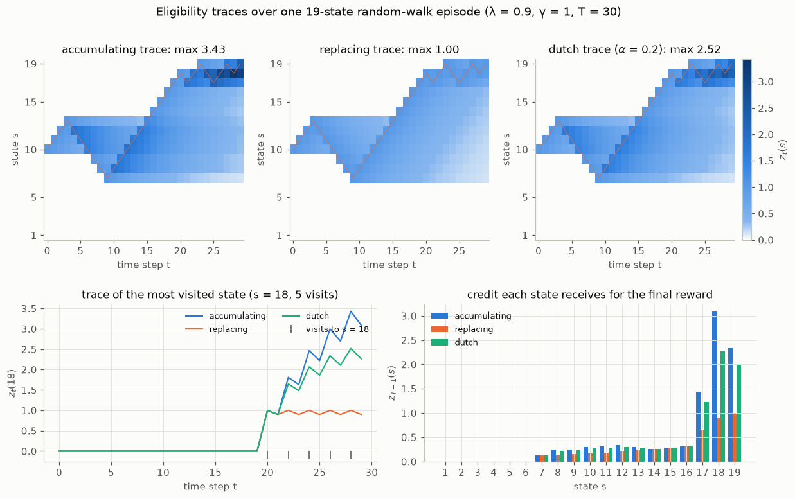

*Figure 6.6. Traces over one 30-step episode of the 19-state random walk ($\lambda = 0.9$, $\gamma = 1$, dutch with $\alpha = 0.2$), from [`trace_visualization.py`](../code/ch06_n_step_and_eligibility_traces/trace_visualization.py). Top: $z_t(s)$ for every state and time; the orange line is the path. Bottom left: the trace of the most-visited state, $s = 18$, visited 5 times. Bottom right: the trace at the final step, which is the credit each state receives for the final $+1$.*

In this episode, state 18 was visited at $t = 20, 22, 24, 26, 28$. Its accumulating trace climbed to 3.43, its dutch trace to 2.52 (bound 3.57), and its replacing trace stayed at or below 1. At the final step, accumulating traces gave the three states next to the exit credits 1.44, 3.09 and 2.34; replacing gave 0.66, 0.90 and 1.00. The accumulating traces sum to $\sum_{k=0}^{29}0.9^k = 9.58$ over all states. That total is fixed by the episode length, and it is shared out according to how often each state was visited. Replacing traces give a total of 4.60, because each state's credit counts its last visit only.

### 9.3 A worked example by hand

Two states, A and B. One episode: A → B → A → terminal, with rewards $R_1 = 0$, $R_2 = 0$, $R_3 = 1$. Take $\gamma = 1$, $\lambda = 0.5$, $\alpha = 0.1$ and $V(\text{A}) = V(\text{B}) = 0$, and hold $V$ fixed during the episode (offline).

*TD errors.* $\delta_0 = 0 + V(\text{B}) - V(\text{A}) = 0$, $\delta_1 = 0 + V(\text{A}) - V(\text{B}) = 0$, $\delta_2 = 1 + 0 - V(\text{A}) = 1$.

*Accumulating traces.* $z_0 = (\text{A}{:}\,1,\ \text{B}{:}\,0)$, $z_1 = 0.5z_0 + \mathbf{e}_\text{B} = (0.5,\ 1)$, $z_2 = 0.5z_1 + \mathbf{e}_\text{A} = (1.25,\ 0.5)$. Only $\delta_2 \neq 0$, so the total increments are $\alpha\delta_2 z_2 = (0.125,\ 0.05)$.

*Replacing traces.* $z_2 = (1,\ 0.5)$, so the increments are $(0.1,\ 0.05)$.

*λ-returns* from (6.18), backwards: $G^\lambda_2 = R_3 = 1$; $G^\lambda_1 = 0 + [0.5\cdot V(\text{A}) + 0.5\cdot 1] = 0.5$; $G^\lambda_0 = 0 + [0.5\cdot V(\text{B}) + 0.5\cdot 0.5] = 0.25$. Summed offline λ-return increments: A, visited at $t = 0$ and $t = 2$, gets $\alpha[(0.25 - 0) + (1 - 0)] = 0.125$; B gets $\alpha(0.5 - 0) = 0.05$.

The accumulating trace reproduces the λ-return increments exactly, $(0.125, 0.05)$. The replacing trace does not, because it drops the $0.025$ that A earns for its first visit. That is the content of the next theorem. (Here the online and offline versions coincide, because $V$ does not change until the last step.)

### 9.4 Results on the random walk

The second and third panels of Figure 6.7 show online TD(λ) with accumulating and replacing traces.

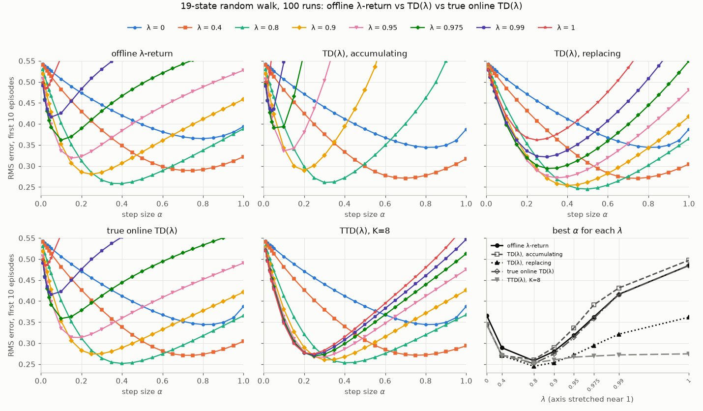

*Figure 6.7. Offline λ-return, TD(λ) with accumulating and replacing traces, true online TD(λ) and TTD(λ) with $K = 8$ on the 19-state random walk (S&B Figures 12.3, 12.6 and 12.8). RMS error over the 19 states, averaged over the first 10 episodes and 100 runs; all methods see the same episodes, which are also those of Figure 6.4. The last panel shows each method's best α for each λ.*

| λ | offline λ-return | TD(λ) accumulating | TD(λ) replacing | true online TD(λ) | TTD(λ), $K = 8$ |
|---|---|---|---|---|---|
| 0 | 0.365 (α 0.80) | 0.344 (0.80) | 0.344 (0.80) | 0.344 (0.80) | 0.344 (0.80) |
| 0.4 | 0.289 (0.75) | 0.271 (0.70) | 0.271 (0.75) | 0.271 (0.75) | 0.271 (0.75) |
| **0.8** | **0.258** (0.40) | **0.261** (0.30) | **0.245** (0.50) | **0.252** (0.40) | **0.253** (0.40) |
| 0.9 | 0.280 (0.25) | 0.290 (0.20) | 0.254 (0.40) | 0.274 (0.25) | 0.260 (0.30) |
| 0.95 | 0.319 (0.15) | 0.336 (0.10) | 0.272 (0.35) | 0.313 (0.20) | 0.267 (0.30) |
| 0.99 | 0.416 (0.05) | 0.431 (0.04) | 0.321 (0.30) | 0.416 (0.05) | 0.272 (0.25) |
| 1 | 0.485 (0.02) | 0.497 (0.02) | 0.362 (0.25) | 0.485 (0.02) | 0.275 (0.25) |

*Best RMS error (and its step size) for each λ.*

Several patterns stand out:

- **Every method is best at λ = 0.8**, with error between 0.245 and 0.261. That is as good as or better than the best $n$-step TD (0.262). As with $n$, intermediate values win.
- **Accumulating traces are fragile at large λα.** At λ = 0.95 accumulating TD(λ) keeps its error below 0.55 only for $\alpha \leq 0.30$, and at λ = 0.99 only for $\alpha \leq 0.10$. The replacing version is usable up to $\alpha = 1.0$ and $0.85$. Revisits push the accumulating trace far above 1, and the effective step size $\alpha z$ overshoots.
- **Replacing traces were the best method on this task** (0.245), and much the best at large λ. With γ = λ = 1 and offline updating, replacing-trace TD(1) is exactly first-visit Monte Carlo (Section 10.1), which moves each state once per episode however often it was visited. Our runs update online, where the correspondence is a close approximation. Accumulating traces instead move a frequently visited state many times towards the same noisy outcome. That is a property of this task, with its many revisits, not a general ranking.
- **λ = 0 rows agree exactly** (0.344) for the online methods: all of them reduce to TD(0). The offline λ-return differs because it delays its updates.

---

## 10. The forward–backward equivalence

### 10.1 Offline equivalence

**Theorem (forward–backward equivalence; Sutton and Barto 1998, Section 7.4; the λ = 1 case goes back to Sutton 1988).** Suppose $V$ is held fixed during an episode, and the TD(λ) increments (6.22), computed with accumulating traces, are summed and applied at the end. Then for every state $s$,

$$
\sum_{t=0}^{T-1}\alpha\,\delta_t\,z_t(s) \;=\; \sum_{t=0}^{T-1}\alpha\left[G_t^\lambda - V(S_t)\right]\mathbb{1}[S_t = s].
$$

In words: offline TD(λ) and the offline λ-return algorithm make exactly the same total change.

*Proof.* Substitute $z_t(s) = \sum_{k=0}^{t}(\gamma\lambda)^{t-k}\mathbb{1}[S_k = s]$ and exchange the order of summation over the triangle $0 \leq k \leq t \leq T-1$:

$$
\begin{aligned}
\sum_{t=0}^{T-1}\delta_t\sum_{k=0}^{t}(\gamma\lambda)^{t-k}\mathbb{1}[S_k = s]
&= \sum_{k=0}^{T-1}\mathbb{1}[S_k = s]\sum_{t=k}^{T-1}(\gamma\lambda)^{t-k}\delta_t \\
&= \sum_{k=0}^{T-1}\mathbb{1}[S_k = s]\left[G_k^\lambda - V(S_k)\right],
\end{aligned}
$$

where the last step is (6.19). Multiply by $\alpha$. $\square$

Three corollaries:

1. **TD(1) is Monte Carlo.** With $\lambda = 1$, offline TD(1) makes exactly the summed every-visit constant-α Monte Carlo update. Accumulating traces correspond to every-visit MC.
2. **Replacing traces and first-visit MC.** With $\gamma = \lambda = 1$, a replacing trace stays at 1 from a state's first visit onwards. The summed increments then telescope to $\alpha[G_{k_1} - V(s)]$, where $k_1$ is the time of the first visit: offline TD(1) with replacing traces *is* first-visit MC. Online, the correspondence is approximate. This is the connection Singh and Sutton (1996) exploited, and it helps explain the replacing-trace advantage in Section 9.4.
3. **Replacing traces are not equivalent to the λ-return** when states repeat. The worked example of Section 9.3 is a counterexample.

**When does TD(λ) converge?** The equivalence says what TD(λ) does in one episode; convergence is about what happens over many. *Theorem (Dayan and Sejnowski, 1994; Jaakkola, Jordan and Singh, 1994).* For a finite episodic or discounted Markov reward process sampled on-policy, tabular TD(λ) with accumulating traces converges to $v_\pi$ with probability 1, for any $\lambda \in [0,1]$, if every state is visited infinitely often and the step sizes satisfy the Robbins–Monro conditions $\sum_t\alpha_t = \infty$, $\sum_t\alpha_t^2 < \infty$. (The two papers differ in the details of how step sizes are assigned to states and updates are scheduled; see them for the exact statements.) Dayan (1992) had earlier shown convergence in the mean. With a constant α, as in every experiment of this chapter, the estimates do not converge: they keep fluctuating around $v_\pi$, with a spread that shrinks as α does. For control the picture is less complete. Convergence of one-step SARSA with GLIE exploration is covered in [Chapter 05](05-temporal-difference.md); for Watkins's Q(λ), a proof came only with Retrace (Section 14.2), and we state no general result for SARSA(λ) with $\lambda > 0$.

[`equivalence_checks.py`](../code/ch06_n_step_and_eligibility_traces/equivalence_checks.py) tests the theorem on 800 random episodes from 20 random 6-state reward processes ($\gamma = 0.9$, random λ and α, both one-hot and random linear features). The largest discrepancies were $2.7\times 10^{-15}$ for the theorem and $2.6\times 10^{-15}$ for the TD(1) = MC case, while replacing traces were off by up to 3.2.

### 10.2 Online: only approximate

In the real algorithm $V$ changes at every step. The TD error $\delta_t$ then uses $V_t$, while the λ-return of an earlier state would have bootstrapped from the values at *its* time. The equivalence becomes approximate, with an error of order $\alpha^2$ per episode. We measured it directly against the *online λ-return algorithm* of Section 12, the exact forward-view target of online learning (6-state tabular problem, $\lambda = 0.8$, 10 episodes):

| α | 0.2 | 0.1 | 0.05 | 0.025 | 0.0125 | 0.00625 |
|---|---|---|---|---|---|---|
| online TD(λ) vs online λ-return | 0.415 | 0.105 | 0.026 | 0.0066 | 0.0016 | 0.00041 |
| ratio to $\alpha^2$ | 10.38 | 10.46 | 10.48 | 10.49 | 10.49 | 10.49 |
| true online TD(λ) vs online λ-return | 3.3e-16 | 2.2e-16 | 2.2e-16 | 2.2e-16 | 3.3e-16 | 3.3e-16 |

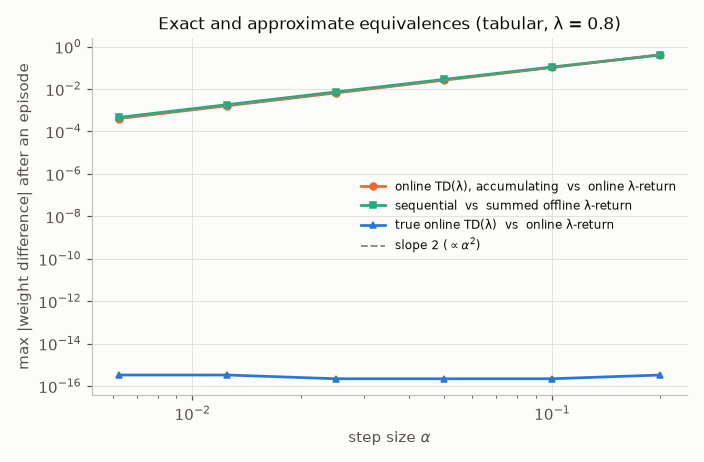

*Figure 6.8. Largest weight difference after an episode, as a function of α. Accumulating TD(λ) differs from the online λ-return by a constant times $\alpha^2$ (slope 2 on log–log axes). So does the sequential offline λ-return from the summed version. True online TD(λ) matches the online λ-return to machine precision.*

For small α the backward view is an excellent approximation; for large α it is not, which is what Figure 6.7 shows at large λα. Section 12 removes the approximation altogether.

### 10.3 Cost

A tabular trace touches every state at every step. Since $z_t(s)$ decays like $(\gamma\lambda)^{t-k}$, a trace that has fallen below a threshold (say $10^{-4}$) can be dropped. Keeping a list of the states with non-negligible traces costs $O(\log(\text{threshold})/\log(\gamma\lambda))$ per step, and it does not grow with $|\mathcal{S}|$. With linear function approximation the trace is a vector the size of $\mathbf{w}$, which doubles the memory and roughly doubles the computation of a semi-gradient TD step. With deep networks, per-parameter backward traces fit poorly with experience replay and minibatch optimizers. That is one reason deep RL usually computes λ-returns *forward*, over a stored trajectory segment, rather than with backward traces ([Chapter 10](10-policy-gradients.md), GAE).

---

## 11. Truncated λ-returns

The λ-return needs the whole future. The **truncated λ-return** stops at a horizon $h$ and gives all the remaining weight to the longest available $n$-step return:

$$
G^\lambda_{t:h} \doteq (1-\lambda)\sum_{n=1}^{h-t-1}\lambda^{n-1}G_{t:t+n} + \lambda^{h-t-1}G_{t:h}, \qquad 0 \leq t < h \leq T. \tag{6.25}
$$

This is (6.17) with the episode end $T$ replaced by $h$, and it obeys the same recursion (6.18) with base case $G^\lambda_{h-1:h} = R_h + \gamma V(S_h)$. With $h = T$ it is the λ-return. With $\lambda = 1$ it is the $n$-step return $G_{t:h}$.

**Truncated TD(λ)**, or TTD(λ) (Cichosz, 1995), is $n$-step TD with $G_{t:t+n}$ replaced by $G^\lambda_{t:t+K}$. The state $S_t$ is updated $K - 1$ steps after it was visited, and the last $K - 1$ updates are flushed after termination, exactly as in Section 2.2:

```text
Truncated TD(λ), TTD(λ), for estimating V ≈ v_π
Input: the policy π to be evaluated
Parameters: step size α ∈ (0, 1], λ ∈ [0, 1], truncation length K ≥ 1
Initialize V(s) arbitrarily for all s ∈ S, with V(terminal) = 0

Loop for each episode:
    Initialize and store S_0;  T ← ∞
    Loop for t = 0, 1, 2, ...:
        If t < T: take an action by π; store R_{t+1}, S_{t+1}; if S_{t+1} terminal: T ← t + 1
        τ ← t − K + 1
        If τ ≥ 0:
            h ← min(τ + K, T)
            G ← R_h + γ V(S_h)                          (V(S_T) = 0)
            Loop for k = h − 2 down to τ:  G ← R_{k+1} + γ [ (1 − λ) V(S_{k+1}) + λ G ]
            V(S_τ) ← V(S_τ) + α [G − V(S_τ)]
    until τ = T − 1
```

The inner loop costs $O(K)$ per step. Sutton and Barto (2018, Section 12.3) write the truncated λ-return as the current estimate plus a $(\gamma\lambda)$-discounted sum of TD errors, which allows a cheaper incremental implementation. In deep RL the truncated λ-return over a fixed-length trajectory segment is the standard construction. GAE's advantage estimate over a rollout of length $K$ is $G^\lambda_{t:h} - V(S_t)$ written as a sum of TD errors, and V-trace targets (Section 14.4) are truncated at the end of each segment in the same way.

On the random walk, TTD(λ) with $K = 8$ (fifth panel of Figure 6.7) was best at λ = 0.8 (0.253, α = 0.4). At λ = 1 it is 8-step TD, and indeed its error, 0.2745, equals the $n = 8$ entry of Figure 6.4 to four decimals; the two scripts share their episodes. It was also the most robust method at large λ, since truncation caps the variance of the target. Exercise 15 varies $K$.

---

## 12. True online TD(λ)

### 12.1 The online λ-return algorithm

What would the *ideal* online forward view be? At every time $h$ we have the data up to $h$, so the best target for each earlier state is the truncated λ-return with horizon $h$. The **online λ-return algorithm** therefore *redoes the whole episode so far* at each step. Start from the episode's initial weights $\mathbf{w}_0$ and apply, for $t = 0, \ldots, h-1$,

$$
\mathbf{w}^h_{t+1} \doteq \mathbf{w}^h_t + \alpha\left[G^\lambda_{t:h} - \hat v(S_t,\mathbf{w}^h_t)\right]\nabla\hat v(S_t,\mathbf{w}^h_t), \qquad \mathbf{w}^h_0 \doteq \mathbf{w}_0,
$$

and keep $\mathbf{w}_h \doteq \mathbf{w}^h_h$. Inside $G^\lambda_{t:h}$, the bootstrap value of each state $S_k$ is computed with $\mathbf{w}_{k-1}$, the weights in force at time $k$ when $S_k$ was observed (the final weights of horizon $k-1$). This algorithm is the natural online target, but it costs $O(h)$ updates at step $h$, so $O(T^2)$ per episode.

### 12.2 The algorithm

Van Seijen and Sutton (2014) found an $O(d)$-per-step algorithm, for $d$ features, that produces **exactly** the same weights $\mathbf{w}_h$ for linear $\hat v(s,\mathbf{w}) = \mathbf{w}^\top\mathbf{x}(s)$. Write $\mathbf{x}_t = \mathbf{x}(S_t)$, with $\mathbf{x}(\text{terminal}) = \mathbf{0}$. Then

$$
\begin{aligned}
\mathbf{z}_t &= \gamma\lambda\mathbf{z}_{t-1} + \left(1 - \alpha\gamma\lambda\,\mathbf{z}_{t-1}^\top\mathbf{x}_t\right)\mathbf{x}_t, \\
\mathbf{w}_{t+1} &= \mathbf{w}_t + \alpha\left(\delta_t + \mathbf{w}_t^\top\mathbf{x}_t - \mathbf{w}_{t-1}^\top\mathbf{x}_t\right)\mathbf{z}_t - \alpha\left(\mathbf{w}_t^\top\mathbf{x}_t - \mathbf{w}_{t-1}^\top\mathbf{x}_t\right)\mathbf{x}_t,
\end{aligned} \tag{6.26}
$$

with $\delta_t = R_{t+1} + \gamma\mathbf{w}_t^\top\mathbf{x}_{t+1} - \mathbf{w}_t^\top\mathbf{x}_t$. In the tabular case ($\mathbf{x}_t = \mathbf{e}_{S_t}$) the trace is the dutch trace (6.24).

```text
True online TD(λ) for estimating w^T x ≈ v_π
Input: the policy π; features x: S+ → R^d with x(terminal) = 0
Parameters: step size α > 0, trace decay λ ∈ [0, 1]
Initialize w ∈ R^d (e.g. w = 0)

Loop for each episode:
    Initialize state and obtain initial feature vector x
    z ← 0;  V_old ← 0
    Loop for each step of episode:
        Choose A ~ π(·|S); take action A, observe R and the next feature vector x'
        V ← w^T x;  V' ← w^T x'
        δ ← R + γ V' − V
        z ← γλ z + (1 − αγλ z^T x) x                       (dutch trace)
        w ← w + α (δ + V − V_old) z − α (V − V_old) x
        V_old ← V';  x ← x'
    until x' = 0 (terminal)
```

$V_{\text{old}}$ holds $\mathbf{w}_{t-1}^\top\mathbf{x}_t$, the value of the current state as estimated one step earlier. Its initial value does not matter: at the first step $\mathbf{z} = \mathbf{x}$, so the two correction terms cancel.

### 12.3 Where the dutch trace comes from

The derivation is short enough to give in full. Write $F_t \doteq \mathbf{I} - \alpha\mathbf{x}_t\mathbf{x}_t^\top$, so that one linear update is $\mathbf{w}^h_{t+1} = F_t\mathbf{w}^h_t + \alpha\mathbf{x}_tG^\lambda_{t:h}$. (For one-hot features, $F_t$ simply multiplies entry $S_t$ by $1 - \alpha$ and leaves the others alone.) Unrolling from $\mathbf{w}_0$,

$$
\mathbf{w}_h = F_{h-1}\cdots F_0\,\mathbf{w}_0 + \alpha\sum_{t=0}^{h-1}F_{h-1}\cdots F_{t+1}\,\mathbf{x}_t\,G^\lambda_{t:h}.
$$

*Step 1: how a truncated λ-return changes when the horizon grows.* Let $u_k \doteq \mathbf{w}_{k-1}^\top\mathbf{x}_k$ be the bootstrap values. From the recursion (6.18) truncated at $h$, the difference $D_t \doteq G^\lambda_{t:h+1} - G^\lambda_{t:h}$ satisfies $D_t = \gamma\lambda D_{t+1}$ for $t \leq h-2$. At the last step,

$$
D_{h-1} = \gamma\left[(1-\lambda)u_h + \lambda G^\lambda_{h:h+1}\right] - \gamma u_h = \gamma\lambda\left(R_{h+1} + \gamma u_{h+1} - u_h\right).
$$

Hence $G^\lambda_{t:h+1} = G^\lambda_{t:h} + (\gamma\lambda)^{h-t}\delta'_h$ with $\delta'_h \doteq R_{h+1} + \gamma\mathbf{w}_h^\top\mathbf{x}_{h+1} - \mathbf{w}_{h-1}^\top\mathbf{x}_h$.

*Step 2: the trace.* Define $\mathbf{z}_h \doteq \sum_{t=0}^{h}(\gamma\lambda)^{h-t}F_h\cdots F_{t+1}\mathbf{x}_t$. Splitting off the $t = h$ term gives the recursion $\mathbf{z}_h = \gamma\lambda F_h\mathbf{z}_{h-1} + \mathbf{x}_h$. Expanding $F_h$ turns it into $\gamma\lambda\mathbf{z}_{h-1} + (1 - \alpha\gamma\lambda\,\mathbf{z}_{h-1}^\top\mathbf{x}_h)\mathbf{x}_h$, which is the dutch trace.

*Step 3: the weights.* Write $\mathbf{w}_{h+1}$ with the unrolled formula, split off the $t = h$ term, and use Step 1 for $t < h$:

$$
\begin{aligned}
\mathbf{w}_{h+1} &= F_h\Big[F_{h-1}\cdots F_0\mathbf{w}_0 + \alpha\sum_{t<h}F_{h-1}\cdots F_{t+1}\mathbf{x}_tG^\lambda_{t:h}\Big] + \alpha\delta'_h\,\gamma\lambda F_h\mathbf{z}_{h-1} + \alpha\mathbf{x}_hG^\lambda_{h:h+1} \\
&= F_h\mathbf{w}_h + \alpha\delta'_h\left(\mathbf{z}_h - \mathbf{x}_h\right) + \alpha\mathbf{x}_h\left(R_{h+1} + \gamma\mathbf{w}_h^\top\mathbf{x}_{h+1}\right) \\
&= \mathbf{w}_h + \alpha\delta_h\mathbf{x}_h + \alpha\delta'_h\left(\mathbf{z}_h - \mathbf{x}_h\right).
\end{aligned}
$$

The last line uses $F_h\mathbf{w}_h = \mathbf{w}_h - \alpha\mathbf{x}_h\mathbf{x}_h^\top\mathbf{w}_h$ and the definition of $\delta_h$. Finally, substitute $\delta'_h = \delta_h + \mathbf{w}_h^\top\mathbf{x}_h - \mathbf{w}_{h-1}^\top\mathbf{x}_h$. This gives $\mathbf{w}_{h+1} = \mathbf{w}_h + \alpha\delta'_h\mathbf{z}_h + \alpha(\delta_h - \delta'_h)\mathbf{x}_h$, which is (6.26). $\square$

So the dutch trace is not a heuristic. It is what remains of the online λ-return algorithm after the redundant computation is removed. The same trace appears even without bootstrapping: van Hasselt and Sutton (2015) derive it from online Monte Carlo learning with linear features, as the way to make the final MC solution computable with constant per-step cost.

### 12.4 Checks and results

[`equivalence_checks.py`](../code/ch06_n_step_and_eligibility_traces/equivalence_checks.py) implements the $O(T^2)$ online λ-return algorithm literally and compares it with (6.26) after every step of 400 tabular and 400 linear-feature episodes. The largest differences were $1.3\times 10^{-15}$ (tabular) and $2.2\times 10^{-15}$ (random linear features). With $\lambda = 1$, $\mathbf{w}_T$ equals the result of applying constant-α Monte Carlo updates in time order at the end of the episode, to $1.8\times 10^{-15}$. True online TD(1) is "Monte Carlo, computed online".

On the random walk (Figure 6.7, fourth panel), true online TD(λ) reached 0.252 at λ = 0.8. Compared with accumulating traces it is more robust: at λ = 0.95 it still learns at α = 1 (error below 0.55), where accumulating TD(λ) stops working above α = 0.30. At λ = 1 its error is 0.4848, identical to the offline λ-return algorithm. That is the corollary above: both perform forward-order Monte Carlo at every episode boundary, where the error is measured. True online TD(λ) is the right *online* version of the λ-return. That does not make the λ-return the best possible target: on this task replacing traces, which are not equivalent to any λ-return, did better.

The same construction gives **true online SARSA(λ)** for control, which we use in Section 13.

---

## 13. Control with eligibility traces: SARSA(λ) and Watkins's Q(λ)

### 13.1 SARSA(λ)

For control, traces live on state–action pairs. Each pair visited recently is eligible for the credit or blame carried by the current SARSA TD error:

```text
Tabular SARSA(λ) for estimating Q ≈ q_π or q_*
Parameters: step size α > 0, trace decay λ ∈ [0, 1], small ε > 0
Initialize Q(s, a) arbitrarily, Q(terminal, ·) = 0

Loop for each episode:
    z(s, a) ← 0 for all s, a
    Initialize S;  choose A ~ ε-greedy(Q)(S)
    Loop for each step of episode:
        Take action A, observe R, S'
        z(S, A) ← z(S, A) + 1            (accumulating)   or   z(S, A) ← 1   (replacing)
        If S' is terminal:
            δ ← R − Q(S, A);  Q ← Q + α δ z;  go to next episode
        Choose A' ~ ε-greedy(Q)(S')
        δ ← R + γ Q(S', A') − Q(S, A)
        Q(s, a) ← Q(s, a) + α δ z(s, a)  for all s, a
        z(s, a) ← γλ z(s, a)             for all s, a
        S ← S';  A ← A'
```

The trace is incremented before the update and decayed after it, which is equivalent to "decay, then increment" at the start of the next step. A variant of replacing traces also clears the traces of the *other* actions in $S$ when $S$ is revisited, so that only the action taken last gets credit (Sutton and Barto, 1998). **True online SARSA(λ)** is (6.26) with $\mathbf{x}_t = \mathbf{x}(S_t, A_t)$ and $\mathbf{w}^\top\mathbf{x}(S_{t+1}, A_{t+1})$ as the bootstrap (Sutton and Barto, 2018, Section 12.7). In tabular form, with $\mathbf{x}(s,a) = \mathbf{e}_{s,a}$:

```text
True online SARSA(λ) (tabular) for estimating Q ≈ q_π or q_*
Parameters: step size α > 0, trace decay λ ∈ [0, 1], small ε > 0
Initialize Q(s, a) arbitrarily, Q(terminal, ·) = 0

Loop for each episode:
    z(s, a) ← 0 for all s, a;  Q_old ← 0
    Initialize S;  choose A ~ ε-greedy(Q)(S)
    Loop for each step of episode:
        Take action A, observe R, S'
        If S' is terminal: Q' ← 0
        else: choose A' ~ ε-greedy(Q)(S');  Q' ← Q(S', A')
        q ← Q(S, A)
        δ ← R + γ Q' − q
        z ← γλ z;  z(S, A) ← z(S, A) + 1 − αγλ z_old(S, A)     (dutch trace; z_old(S, A) = value before decay)
        Q(s, a) ← Q(s, a) + α (δ + q − Q_old) z(s, a)  for all s, a
        Q(S, A) ← Q(S, A) − α (q − Q_old)
        Q_old ← Q'
        If S' is terminal: go to next episode
        S ← S';  A ← A'
```

The implementations in [`sarsa_lambda_gridworld.py`](../code/ch06_n_step_and_eligibility_traces/sarsa_lambda_gridworld.py) follow these boxes line by line.

### 13.2 Watkins's Q(λ) and cutting traces

Q-learning learns about the greedy policy while behaving ε-greedily. A multi-step target for the greedy policy may follow the actual trajectory only as long as the actions taken *are* greedy. After the first exploratory action, the rest of the trajectory is irrelevant to $\pi$. **Watkins's Q(λ)** (Watkins, 1989) therefore uses the max-based TD error and **cuts all traces to zero** whenever a non-greedy action is taken:

```text
Watkins's Q(λ) (tabular)
Parameters: α > 0, λ ∈ [0, 1], ε > 0;  initialize Q(s, a) arbitrarily, Q(terminal, ·) = 0
Loop for each episode:
    z ← 0;  initialize S;  choose A ~ ε-greedy(Q)(S)
    Loop for each step of episode:
        Take action A, observe R, S';  z(S, A) ← 1          (replacing; or z(S, A) + 1)
        If S' is terminal: Q ← Q + α (R − Q(S, A)) z;  go to next episode
        Choose A' ~ ε-greedy(Q)(S')
        greedy ← [Q(S', A') = max_a Q(S', a)]              (ties count as greedy)
        δ ← R + γ max_a Q(S', a) − Q(S, A)
        Q ← Q + α δ z
        If greedy: z ← γλ z   else: z ← 0                    (cut the trace after exploration)
        S ← S';  A ← A'
```

The cutting rule is Tree Backup's $c = \lambda\pi(A\mid S)$ with a greedy $\pi$: $c = \lambda$ for greedy actions and $0$ otherwise. Its cost is that traces are short whenever exploration is frequent. With ε-greedy behaviour over $|\mathcal{A}|$ actions, a non-greedy action occurs with probability $p = \varepsilon(|\mathcal{A}|-1)/|\mathcal{A}|$ per step, so an uncut trace survives $1/p$ steps on average. That is 13.3 steps for $\varepsilon = 0.1$ and 4 actions, but only 4.4 steps for $\varepsilon = 0.3$.

Two older alternatives do not cut, and they fail in different ways. **Peng's Q(λ)** (Peng and Williams, 1996) mixes backups that use the actions actually taken with max-based backups: its target is the λ-return along the sampled path with $\max_a Q$ as every bootstrap. Because the sampled continuation follows $b$, its target blends the behaviour policy's values into the estimate, and its fixed point is in general not $q_\ast$. Kozuno et al. (2021) show convergence to $q_\ast$ only under conservative policy updates, with the behaviour policy moving slowly towards the greedy one. **"Naive" Q(λ)** never cuts and uses max-based TD errors. It is $Q^\ast(\lambda)$ of Harutyunyan et al. (2016): the $c = \lambda$ row of Section 14.1 with a greedy target. Every TD error $R_{k+1} + \gamma\max_a q_\ast(S_{k+1},a) - q_\ast(S_k,A_k)$ has mean zero given $(S_k,A_k)$, whatever the action, so $q_\ast$ is still a fixed point of its expected update. What fails is the contraction. Section 14.2 shows that uncut traces give exploratory actions *negative* weights, and the expected update is guaranteed to contract only for $\lambda < (1-\gamma)/(\gamma\,\epsilon_{\pi b})$. For ε-greedy behaviour over 4 actions and a greedy target, $\epsilon_{\pi b} = 1.5\varepsilon$; with γ = 0.95 the bound is λ < 0.35 at ε = 0.1 and λ < 0.12 at ε = 0.3. Our λ = 0.9 is far outside both. On the gridworld below, the true action values lie in $[0, 1]$. In Exercise 14, naive Q(λ) produced values up to 5.5 with $\varepsilon = 0.1$. With $\varepsilon = 0.3$ it *diverged* (values overflowed) in 6, 8, 13 and 15 of 20 runs at $\alpha = 0.4, 0.6, 0.8, 1.0$. Under the same conditions, Watkins's Q(λ) and SARSA(λ) never produced a value with $\lvert Q\rvert > 1$.

### 13.3 Results on a sparse-reward gridworld

The gridworld is 10 × 7 with the start at the left edge and the goal 9 cells to the right. The reward is $+1$ at the goal and 0 elsewhere, $\gamma = 0.95$, $\varepsilon = 0.1$, ties are broken at random, and $Q = 0$ initially. We ran 30 runs of 50 episodes for each method and 8 step sizes, and measured the mean number of steps per episode (lower is better). λ = 0.9 for all trace methods.

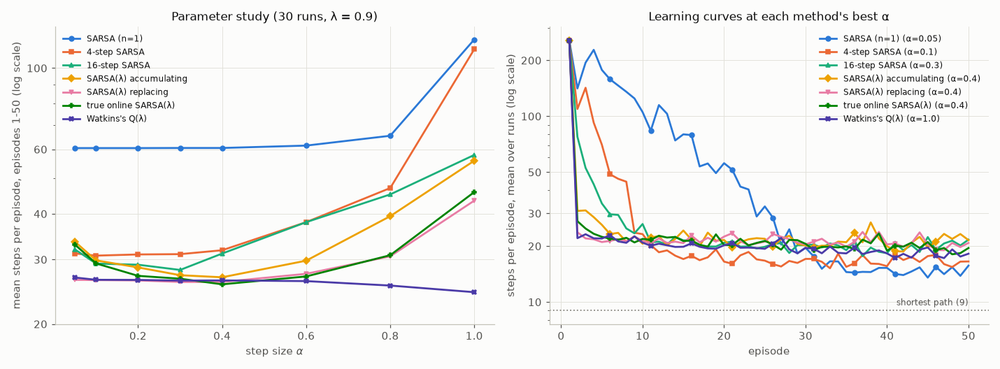

*Figure 6.9. Left: steps per episode averaged over episodes 1–50, as a function of α (log-scaled y-axis). Right: learning curves at each method's best α (log-scaled y-axis). The shortest path takes 9 steps.*

| method | best α | mean steps, eps 1–50 | eps 2–10 | eps 41–50 | greedy path after 50 eps | (s,a) pairs tried (of 280) |
|---|---|---|---|---|---|---|
| SARSA ($n = 1$) | 0.05 | 60.5 | 156.8 | **14.6** | **12.0** | 257 |
| 4-step SARSA | 0.1 | 30.8 | 66.7 | 16.9 | 13.7 | 223 |
| 16-step SARSA | 0.3 | 28.1 | 37.9 | 20.4 | 28.1 | 192 |
| SARSA(λ), accumulating | 0.4 | 26.8 | 25.3 | 21.1 | 21.7 | 160 |
| SARSA(λ), replacing | 0.4 | 26.1 | 21.9 | 20.5 | 16.6 | 159 |
| true online SARSA(λ) | 0.4 | 25.7 | 22.9 | 19.6 | 15.9 | 156 |
| Watkins's Q(λ) | 1.0 | **24.4** | 22.0 | 18.2 | 14.9 | 160 |

*The first episode is the same random walk for every method (256 steps on average). Standard errors of the 50-episode means are 0.7–2.2 steps.*

The multi-step methods learn far faster at first. Over episodes 2–10, one-step SARSA needed 157 steps per episode, 4-step SARSA 67, 16-step SARSA 38, and the trace methods 22–25. All the trace methods are nearly tied overall, with Watkins's Q(λ) best at 24.4 steps per episode. Two further observations are worth a careful look.

1. **One-step SARSA is flat in α.** It gives 60.5 for every $\alpha \leq 0.4$. The script checks why: its 30 runs are step-for-step identical (every episode length) for every $\alpha \leq 0.2$ in our grid. At α = 0.3 two of the 30 runs differ, and at α = 0.4 four do, but the mean still rounds to 60.5 (60.52 against 60.47). Behaviour here depends only on *which* action values are positive and on how they are ordered. For small enough α that ordering is set by the lowest power of α in each value, so it does not change with α. The trace methods are sensitive: accumulating traces degrade sharply at large α (55.9 at α = 1), and replacing and true online traces somewhat less (43.5 and 45.9).
2. **The fast learners end up slightly worse.** By episodes 41–50, one-step SARSA was the best (14.6 steps), and its greedy path was the shortest (12.0, against 13.7–28.1 for the others). The last column shows why. The trace methods tried only about 160 of the 280 state–action pairs, while one-step SARSA, which wandered for many more episodes, tried 257. Fast credit assignment made the agents commit to the first route that worked. With zero-initialized values and a positive goal reward, untried actions look *worse* than tried ones, so exploration then relies only on ε. This is not a defect of traces. It is a reminder that credit assignment and exploration interact ([Chapter 14](14-exploration.md)): faster propagation of value makes a greedy agent exploit sooner.

---

## 14. Off-policy traces: from importance sampling to Retrace(λ) and V-trace

### 14.1 Traces from the per-decision recursion

Section 6.2 showed that every per-decision off-policy $n$-step return is a sum of Expected SARSA TD errors weighted by products of coefficients $c$. Let the horizon go to the end of the episode and put $\lambda$ inside $c$. Then the same identity defines an off-policy λ-return, and the derivation of Section 10.1 (exchanging the order of summation) turns it into a backward view:

$$
\delta^{\mathrm{ES}}_t = R_{t+1} + \gamma\bar V(S_{t+1}) - Q(S_t,A_t), \qquad z_t = \gamma c_t z_{t-1} + \mathbf{e}_{S_t,A_t}, \qquad Q \leftarrow Q + \alpha\,\delta^{\mathrm{ES}}_t z_t . \tag{6.27}
$$

Here $\mathbf{e}_{s,a}$ is the indicator of the pair $(s,a)$, $z_{-1} = 0$, and $c_t$ depends on $(S_t, A_t)$. With offline updating, the summed backward-view increments equal the forward-view ones exactly; our check (8) in [`equivalence_checks.py`](../code/ch06_n_step_and_eligibility_traces/equivalence_checks.py) agrees to $2\times 10^{-16}$ for three choices of $c$. The whole family of off-policy trace methods is (6.27) with different $c$:

| method | trace coefficient $c_t$ | safe for any $b$? | efficient (no cutting when $\pi \approx b$)? | variance |
|---|---|---|---|---|
| per-decision IS(λ) (Precup et al., 2000) | $\lambda\,\rho_t$ | yes | yes | high: products of ratios |
| Tree Backup TB(λ) (Precup et al., 2000) | $\lambda\,\pi(A_t\mid S_t)$ | yes | **no**: $c < \lambda$ even on-policy | low |
| $Q^\pi(\lambda)$ (Harutyunyan et al., 2016) | $\lambda$ | **no**: needs $\pi$ close to $b$ | yes | low |
| **Retrace(λ)** (Munos et al., 2016) | $\lambda\min(1, \rho_t)$ | yes | yes | low: $c \leq \lambda$ |
| Watkins's Q(λ) | $\lambda\,\mathbb{1}[A_t \text{ greedy}]$ | yes | — (target is greedy) | low |
| naive Q(λ) $= Q^\ast(\lambda)$ (Harutyunyan et al., 2016) | $\lambda$, with greedy $\pi$ | **no** (Section 13.2) | — (target is greedy) | low |

Retrace(λ) truncates the importance weight at 1. When the behaviour took an action that $\pi$ likes *more* than $b$ does ($\rho > 1$), Retrace does not amplify the trace. When $\pi$ likes it *less* ($\rho < 1$), Retrace cuts the trace in proportion. Near on-policy, $\rho \approx 1$ and the trace is $\approx \lambda$: nothing is wasted. For a greedy target policy, $\min(1, \rho) = \min(1, 1/b(A\mid S)) = 1$ for greedy actions and 0 otherwise. So **Retrace, TB(λ) and Watkins's Q(λ) coincide when π is greedy** (Exercise 9).

```text
Off-policy traces for estimating Q ≈ q_π: Q^π(λ), IS(λ), TB(λ), Retrace(λ)  (Eq. 6.27)
Input: target policy π; behaviour policy b with b(a|s) > 0 wherever π(a|s) > 0
       trace coefficient c(s, a):  Retrace λ min(1, π(a|s)/b(a|s));  TB λ π(a|s);
                                   IS λ π(a|s)/b(a|s);  Q^π(λ) λ
Parameters: step size α ∈ (0, 1], trace decay λ ∈ [0, 1]
Initialize Q(s, a) arbitrarily, with Q(terminal, ·) = 0

Loop for each episode:
    z(s, a) ← 0 for all s, a                              (traces never carry over between episodes)
    Initialize S;  choose A ~ b(·|S)
    Loop for each step of episode:
        Take action A, observe R, S'
        δ ← R − Q(S, A)
        If S' is not terminal: δ ← δ + γ Σ_a π(a|S') Q(S', a)     (expected value under π; 0 at terminal)
        z ← γ c(S, A) z;  z(S, A) ← z(S, A) + 1                  (decay by the current pair's c, then mark it)
        Q(s, a) ← Q(s, a) + α δ z(s, a)  for all s, a
        If S' is terminal: go to next episode
        Choose A' ~ b(·|S');  S ← S';  A ← A'
    (for control, π is greedy or ε-greedy with respect to the current Q, and c uses the current π)
```

The trace is decayed by $c_t = c(S_t, A_t)$, the coefficient of the pair just visited, before that pair is marked. This matches (6.27) and the per-decision recursion: $c_t$ multiplies the credit that *earlier* pairs receive for TD errors from time $t$ on. [`off_policy_traces.py`](../code/ch06_n_step_and_eligibility_traces/off_policy_traces.py) (function `trace_episode`) implements this box.

### 14.2 The Retrace operator and why it is safe

To analyse these methods, consider the expected update as an operator on action-value functions. For any trace coefficients $c_i = c(S_i, A_i)$, define

$$
(\mathcal{T}_cQ)(s,a) \doteq Q(s,a) + \mathbb{E}_b\Big[\sum_{t\geq 0}\gamma^t\Big(\prod_{i=1}^{t}c_i\Big)\,\delta^{\mathrm{ES}}_t \,\Big|\, S_0 = s, A_0 = a\Big], \tag{6.28}
$$

where actions $A_1, A_2, \ldots$ are drawn from $b$ and the empty product is 1. The trace algorithm (6.27) is a stochastic approximation of $Q \leftarrow Q + \alpha(\mathcal{T}_cQ - Q)$.

**Theorem (Munos, Stepleton, Harutyunyan and Bellemare, 2016).** $q_\pi$ is a fixed point of $\mathcal{T}_c$ for any $c$. If moreover $0 \leq c_i \leq \pi(A_i\mid S_i)/b(A_i\mid S_i)$ for all $i$, then for every $Q$,

$$
\lVert\mathcal{T}_cQ - q_\pi\rVert_\infty \leq \gamma\,\lVert Q - q_\pi\rVert_\infty .
$$

*Proof.* Fixed point: when $Q = q_\pi$, $\mathbb{E}_b[\delta^{\mathrm{ES}}_t \mid S_t, A_t] = r(S_t,A_t) + \gamma\,\mathbb{E}[\bar V_{q_\pi}(S_{t+1})\mid S_t, A_t] - q_\pi(S_t,A_t) = 0$ by the Bellman equation for $q_\pi$. The product $\prod_{i\le t}c_i$ is known given $(S_t, A_t)$ and the past, so every term in (6.28) has mean zero by the tower property.

Contraction: let $\Delta \doteq Q - q_\pi$. Since $\mathcal{T}_c$ is affine and fixes $q_\pi$, $\mathcal{T}_cQ - q_\pi$ is (6.28) applied to $\Delta$ with the rewards removed:

$$
(\mathcal{T}_cQ - q_\pi)(s,a) = \Delta(s,a) + \mathbb{E}_b\Big[\sum_{t\geq 0}\gamma^t C_t\big(\gamma\textstyle\sum_{a'}\pi(a'\mid S_{t+1})\Delta(S_{t+1},a') - \Delta(S_t,A_t)\big)\Big], \qquad C_t \doteq \prod_{i=1}^{t}c_i .
$$

Collect the terms by time index. The $-\Delta(S_0,A_0)$ at $t = 0$ cancels the leading $\Delta(s,a)$. Each $\Delta(S_t,\cdot)$ with $t \geq 1$ appears twice, once from step $t-1$ and once from step $t$:

$$
(\mathcal{T}_cQ - q_\pi)(s,a) = \mathbb{E}_b\Big[\sum_{t\geq 1}\gamma^t C_{t-1}\Big(\sum_{a'}\pi(a'\mid S_t)\Delta(S_t,a') - c_t\,\Delta(S_t,A_t)\Big)\Big].
$$

Now average over $A_t \sim b(\cdot\mid S_t)$ inside the expectation. The bracket becomes $\sum_{a'}\left[\pi(a'\mid S_t) - b(a'\mid S_t)\,c(S_t,a')\right]\Delta(S_t,a')$. Under the condition $c \leq \pi/b$ every coefficient $\pi - bc$ is **nonnegative**. So $\mathcal{T}_cQ - q_\pi$ is a nonnegative combination of values of $\Delta$, and its absolute value is at most $\lVert\Delta\rVert_\infty$ times the total weight:

$$
\eta(s,a) \doteq \mathbb{E}_b\Big[\sum_{t\geq 1}\gamma^tC_{t-1}\left(1 - c_t\right)\Big] = \gamma - (1-\gamma)\,\mathbb{E}_b\Big[\sum_{t\geq 1}\gamma^tC_t\Big] \leq \gamma .
$$

To get the middle expression, expand $C_{t-1}(1 - c_t) = C_{t-1} - C_t$ and sum: $\sum_{t\geq 1}\gamma^tC_{t-1} = \gamma + \gamma\sum_{t\geq 1}\gamma^tC_t$. $\square$

The proof shows exactly what each property costs.

- **Safety** is the nonnegativity of $\pi - bc$, which is the condition $c \leq \pi/b$. $Q^\pi(\lambda)$ ($c = \lambda$) violates it whenever $\pi(a\mid s) < \lambda\,b(a\mid s)$. Then some weights are negative and the contraction can fail. Harutyunyan et al. (2016) prove convergence only for $\lambda < (1-\gamma)/(\gamma\,\epsilon_{\pi b})$ with $\epsilon_{\pi b} \doteq \max_s\lVert\pi(\cdot\mid s) - b(\cdot\mid s)\rVert_1$. With a greedy $\pi$ this is naive Q(λ), and every exploratory action $a$ gets the weight $\pi(a\mid s) - \lambda b(a\mid s) = -\lambda b(a\mid s) < 0$ (Section 13.2).
- **Efficiency** is a small $\eta$. Larger traces make $\eta$ smaller, so the operator contracts faster. IS ($c = \rho$) gives $\pi - b\rho = 0$, so $\eta = 0$: one application is exact. But its variance can grow geometrically with the horizon (and be infinite in infinite-horizon problems). Tree Backup's $c = \lambda\pi$ is always safe, but it makes $\eta$ needlessly large near on-policy.
- **Low variance** comes from $c \leq 1$ (more precisely $\leq \lambda$), which keeps every product of coefficients at most 1. Retrace chooses $c = \lambda\min(1,\rho)$: λ times the largest coefficient that is both safe ($\leq \pi/b$) and at most 1. Other safe choices exist, such as $\min(\lambda, \rho)$, which is never smaller.

For control, Munos et al. prove that the Retrace iteration converges to $q_\ast$ under additional conditions. Their control result assumes target policies $\pi_k$ that are increasingly greedy with respect to the current estimates $Q_k$, Markovian trace coefficients with $0 \leq c \leq \pi_k/b_k$ (the behaviour policies $b_k$ may change too), and an initial $Q_0$ with $\mathcal{T}^{\pi_0}Q_0 \geq Q_0$, which a sufficiently pessimistic initialisation guarantees. The sample-based online version also needs Robbins–Monro step sizes. As a corollary they gave the first convergence proof of Watkins's Q(λ), which had been open since 1989.

### 14.3 Experiments

The bottom row of Figure 6.5 runs the four trace methods (6.27) on the slippery chain of Section 7.3, with the same 30 runs × 50 episodes and the best of 9 step sizes. There are two settings. In the **far** setting, $\pi$(right) = 0.9 and $b$(right) = 0.5, so $\epsilon_{\pi b} = 0.8$ and the $Q^\pi(\lambda)$ guarantee needs $\lambda < 0.066$. In the **near** setting, $\pi$(right) = 0.6 and $b$(right) = 0.5, so $\epsilon_{\pi b} = 0.2$ and the guarantee needs $\lambda < 0.26$. The expected trace coefficients per step, $\mathbb{E}_b[c]/\lambda$, are 1 for $Q^\pi$ and IS. They are 0.5 for TB in both settings, and 0.6 (far) and 0.9 (near) for Retrace.

| mean RMS error over 50 episodes | λ = 0 | 0.5 | 0.8 | 0.9 | 0.95 | 1 |
|---|---|---|---|---|---|---|
| far: $Q^\pi(\lambda)$ | 0.227 | 0.193 | 0.186 | 0.197 | 0.220 | 0.251 |
| far: IS(λ) | 0.227 | **0.181** | 0.194 | 0.281 | 0.376 | 0.468 |
| far: TB(λ) | 0.227 | 0.200 | 0.188 | 0.185 | 0.183 | 0.181 |
| far: Retrace(λ) | 0.227 | 0.197 | 0.184 | 0.178 | 0.176 | **0.175** |
| near: $Q^\pi(\lambda)$ | 0.145 | 0.127 | 0.127 | 0.134 | 0.148 | 0.169 |
| near: IS(λ) | 0.145 | 0.125 | 0.123 | 0.130 | 0.150 | 0.173 |
| near: TB(λ) | 0.145 | 0.135 | 0.128 | 0.126 | 0.126 | 0.125 |
| near: Retrace(λ) | 0.145 | 0.127 | **0.123** | 0.125 | 0.126 | 0.130 |

*Standard errors are about 0.005 (far) and 0.003 (near), larger for IS(λ) at λ ≥ 0.9 (up to 0.025).*

What we see:

- **IS(λ) blows up with λ in the far setting**, from 0.181 at λ = 0.5 to 0.468 at λ = 1. Long ratio products force step sizes as small as 0.02.
- **Retrace(λ) and TB(λ) improve steadily with λ** in the far setting, and Retrace is best at every λ ≥ 0.8. The margin over TB is small (0.175 vs 0.181 at λ = 1), consistent with their similar trace lengths here (0.6λ vs 0.5λ per step).
- **$Q^\pi(\lambda)$ did not diverge** at any λ or step size we tried, even though λ = 0.5–1 is far outside its guarantee. Its error does grow with λ, from 0.186 at λ = 0.8 to 0.251 at λ = 1, and it needs smaller step sizes. The guarantee is sufficient, not necessary. "Unsafe" means *no guarantee*, not *certain failure*.
- **Near on-policy, everything works and TB is the laggard.** At λ = 0.5, TB's error (0.135) is clearly above the other three (0.125–0.127). TB needs λ = 1 to catch up, because it cuts every trace by $\pi(A\mid S) \approx 0.5$ per step even though almost no correction is needed. Retrace and IS(λ) are best (0.123 at λ = 0.8). The differences at the best λ are within one or two standard errors.

On this small problem the differences are modest. They grow with the number of actions, the distance between $\pi$ and $b$, and the horizon, which is the regime of deep RL with replay. There, ACER (Wang et al., 2017) and Reactor (Gruslys et al., 2018) used Retrace.

### 14.4 V-trace: a preview of IMPALA

IMPALA (Espeholt et al., 2018) trains an actor-critic from trajectories generated by many actors whose policies $b$ lag behind the learner's $\pi$. Its critic target for state values is **V-trace**. Along a trajectory segment, with $V$ fixed,

$$
v_t \doteq V(S_t) + \sum_{k=t}^{t+K-1}\gamma^{k-t}\Big(\prod_{i=t}^{k-1}c_i\Big)\rho_k\,\delta_k, \qquad \delta_k = R_{k+1} + \gamma V(S_{k+1}) - V(S_k), \tag{6.29}
$$

with **truncated ratios** $\rho_t = \min(\bar\rho, \pi(A_t\mid S_t)/b(A_t\mid S_t))$ and $c_i = \min(\bar c, \pi(A_i\mid S_i)/b(A_i\mid S_i))$, and $\bar\rho \geq \bar c$. Recursively, $v_t = V(S_t) + \rho_t\delta_t + \gamma c_t(v_{t+1} - V(S_{t+1}))$; the critic moves $V(S_t)$ towards $v_t$. The two truncation levels play different roles:

- $\bar c$ controls how far back credit flows. Like Retrace's coefficients, it affects the *speed* of contraction and the variance, not the fixed point.
- $\bar\rho$ decides *what* is learned. With $\bar\rho = \infty$ the fixed point is $v_\pi$. With $\bar\rho < \max\pi/b$ it is $v_{\pi_{\bar\rho}}$, the value of the policy

$$
\pi_{\bar\rho}(a\mid s) = \frac{\min\left(\bar\rho\, b(a\mid s),\, \pi(a\mid s)\right)}{\sum_{a'}\min\left(\bar\rho\, b(a'\mid s),\, \pi(a'\mid s)\right)},
$$

which interpolates informally between $b$ and $\pi$. For two actions it lies literally between them; with more actions it need not be a mixture of the two (for $b$ uniform over three actions, $\pi = (0.6, 0.4, 0)$ and $\bar\rho = 1$, it is $(0.5, 0.5, 0)$). At the extremes, $\pi_{\bar\rho} = b$ when $\bar\rho \leq \min_a\pi(a\mid s)/b(a\mid s)$ and $\pi_{\bar\rho} = \pi$ when $\bar\rho \geq \max_a\pi(a\mid s)/b(a\mid s)$.

*Why.* At a fixed point the expected correction must vanish. Sufficient for that is $\mathbb{E}_b[\rho_t\delta_t\mid S_t = s] = 0$ for every $s$. Writing $\delta_t$'s conditional mean as $q_V(s,a) - V(s)$, with $q_V(s,a) = r(s,a) + \gamma\sum_{s'}p(s'\mid s,a)V(s')$, the condition is $\sum_a b(a\mid s)\min(\bar\rho, \pi/b)\,[q_V(s,a) - V(s)] = 0$. Since $b\min(\bar\rho,\pi/b) = \min(\bar\rho b, \pi)$, this says $V(s) = \sum_a\pi_{\bar\rho}(a\mid s)\,q_V(s,a)$, which is the Bellman equation of $\pi_{\bar\rho}$. Espeholt et al. show that the V-trace operator is a contraction, so this fixed point is unique.

[`vtrace_fixed_point.py`](../code/ch06_n_step_and_eligibility_traces/vtrace_fixed_point.py) checks this on the slippery chain ($\pi$(right) = 0.9, $b$ uniform, so $\max\pi/b = 1.8$). It applies tabular V-trace over whole episodes (α = 0.02, 6,000 episodes, the last 3,000 iterates averaged, 3 runs):

| $\bar\rho$ | $\bar c$ | $\pi_{\bar\rho}$(right) | RMS to $v_\pi$ | RMS to $v_{\pi_{\bar\rho}}$ | RMS to $v_b$ |
|---|---|---|---|---|---|
| 2.0 | 1.0 | 0.900 | **0.0015** | **0.0015** | 0.549 |
| 1.0 | 1.0 | 0.833 | 0.063 | **0.0031** | 0.489 |
| 1.0 | 0.5 | 0.833 | 0.066 | **0.0011** | 0.486 |
| 0.5 | 0.5 | 0.714 | 0.212 | **0.0031** | 0.343 |

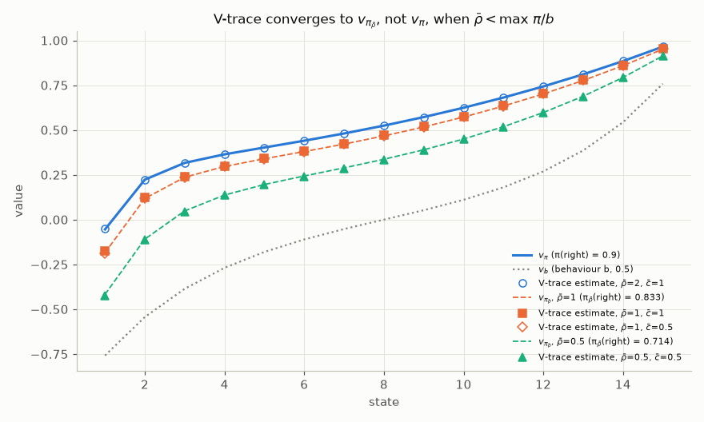

*Figure 6.10. V-trace estimates (markers) against $v_\pi$ (solid), $v_b$ (dotted) and $v_{\pi_{\bar\rho}}$ (dashed). With $\bar\rho = \bar c = 1$, V-trace learns the value of a policy that goes right 83.3% of the time, not 90%. Changing $\bar c$ from 1 to 0.5 does not move the fixed point.*

In IMPALA this bias is a deliberate trade. The actors' policies lag the learner's by only a few updates, so $\pi/b$ is typically close to 1 and the bias is small, while truncation keeps the variance of the targets bounded. The policy-gradient half of IMPALA uses the same truncated ratios. IMPALA and V-trace are treated in full in [Chapter 10](10-policy-gradients.md), Section 14, whose [`vtrace_tabular.py`](../code/ch10_policy_gradients/vtrace_tabular.py) makes the same fixed-point check on a random 5-state MDP in the actor-critic setting; this section is the preview.

---

## 15. How n and λ trade bias for variance

### 15.1 Bias and variance of the targets

A target is good if its mean squared error about the true value is small, and that error splits into bias² plus variance. [`return_bias_variance.py`](../code/ch06_n_step_and_eligibility_traces/return_bias_variance.py) measures both exactly where possible and by simulation otherwise. It uses 4,000 walks from each of the 19 states of the random walk and two fixed estimates: $V = 0$ (where every experiment in this chapter starts) and a "half-learned" $V = v_\pi + $ noise with standard deviation 0.15.

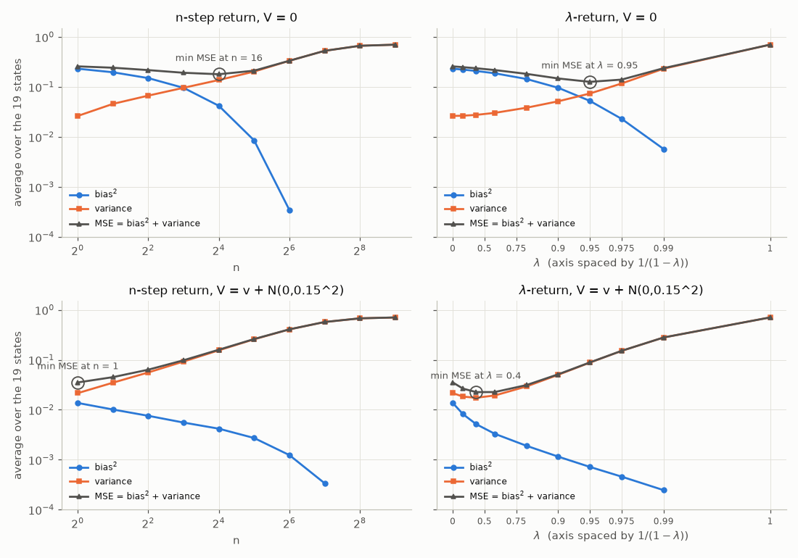

*Figure 6.11. Bias², variance and MSE of the $n$-step return (left) and λ-return (right), averaged over the 19 states, for $V = 0$ (top) and a noisy but nearly correct $V$ (bottom). The λ axis is spaced by $1/(1-\lambda)$, the mean lookahead, so the two columns are comparable. Circles mark the minimum MSE.*

| target | $V = 0$: bias² | variance | MSE | noisy $V$: MSE |
|---|---|---|---|---|
| $n = 1$ (TD(0)) | 0.232 | 0.026 | 0.258 | **0.035** |
| $n = 4$ | 0.150 | 0.067 | 0.217 | 0.064 |
| $n = 16$ | 0.042 | 0.138 | **0.180** | 0.159 |
| $n = 64$ | 0.0003 | 0.334 | 0.335 | 0.407 |
| $\lambda = 0.4$ | 0.209 | 0.028 | 0.237 | **0.023** |
| $\lambda = 0.8$ | 0.144 | 0.038 | 0.183 | 0.031 |
| $\lambda = 0.95$ | 0.053 | 0.074 | **0.127** | 0.089 |
| $\lambda = 1$ (MC) | 0.000 | 0.702 | 0.702 | 0.705 |

The pattern is the one the theory predicts:

- **Bias falls with lookahead** (error reduction, Section 2.3). The error inherited from $V$ is weighted by $\gamma^n$ times the probability that the episode is still running after $n$ steps.
- **Variance rises with lookahead.** The full return of the random walk is $\pm 1$, with variance $1 - v_\pi(s)^2$, which averages $0.70$ over the 19 states. Bootstrapping replaces that noise by the much smaller variation of $V$ across nearby states.
- **The best lookahead depends on how good V is.** With $V = 0$, bias dominates and the best targets look far ahead ($n = 16$, λ = 0.95). With a nearly correct $V$, bootstrapping is cheap and the best targets look one or a few steps ahead ($n = 1$, λ = 0.4–0.6). During learning $V$ moves from the first regime to the second. Intermediate values, $n = 4$ or λ = 0.8 in Figures 6.4 and 6.7, are a compromise across the whole run.
- **The best λ-return beats the best $n$-step return.** With $V = 0$ the best MSEs are 0.127 against 0.180, and with the noisy $V$ they are 0.023 against 0.035. Averaging over many horizons averages away part of the variance.

### 15.2 The contraction view

The expected λ-return defines an operator, $(\mathcal{T}^\lambda V)(s) = \mathbb{E}_\pi[G^\lambda_t\mid S_t = s]$, which is the geometric mixture $(1-\lambda)\sum_n\lambda^{n-1}(\mathcal{T}^\pi)^n$ of the $n$-step Bellman operators. Each $(\mathcal{T}^\pi)^n$ is a $\gamma^n$-contraction (Section 2.3), so

$$
\lVert\mathcal{T}^\lambda V - \mathcal{T}^\lambda V'\rVert_\infty \leq (1-\lambda)\sum_{n\geq 1}\lambda^{n-1}\gamma^n\,\lVert V - V'\rVert_\infty = \frac{\gamma(1-\lambda)}{1-\gamma\lambda}\,\lVert V - V'\rVert_\infty. \tag{6.30}
$$

The modulus falls from $\gamma$ at λ = 0 to 0 at λ = 1, where one application gives $v_\pi$ exactly: that is Monte Carlo. Larger λ means fewer "iterations" are needed for errors in $V$ to wash out, but each sampled iteration is noisier. This is the bias–variance trade-off in operator language.

### 15.3 Other reasons to prefer λ < 1 (or > 0)

- **Function approximation.** For linear TD(λ), Tsitsiklis and Van Roy (1997) bound the error of the fixed point, in the norm weighted by the on-policy state distribution, by $(1-\gamma\lambda)/(1-\gamma)$ times the best achievable error. The bound degrades as λ falls ([Chapter 08](08-function-approximation.md)). Monte Carlo targets are immune to bootstrapping from poor approximations.
- **Partial observability.** If the "state" is an observation that does not satisfy the Markov property, one-step bootstrapping propagates values of aliased states, while long returns do not depend on the Markov assumption ([Chapter 15](15-beyond-mdps.md)). Larger λ is more robust.
- **Credit assignment speed.** As Figure 6.1 shows, larger $n$ or λ spreads a sparse reward along the whole path at once.
- **Variance and off-policy correction.** Smaller $n$ or λ keeps variance and importance-weight products under control.

### 15.4 Monte Carlo and TD as the two ends of a spectrum

| | TD(0): $n = 1$, λ = 0 | intermediate $n$, λ | MC: $n = \infty$, λ = 1 |
|---|---|---|---|
| target | $R_{t+1} + \gamma V(S_{t+1})$ | $G_{t:t+n}$, $G^\lambda_t$ | $G_t$ |
| bias from $V$ | largest (factor $\gamma$) | factor $\gamma^n$; $\gamma(1-\lambda)/(1-\gamma\lambda)$ | none |
| variance | lowest | intermediate | highest |
| delay / memory | none | $n-1$ steps, or one trace vector | whole episode, or one trace vector (TD(1)) |
| Markov assumption | relied on | partly | not needed |
| off-policy correction | none for action values | products of up to $n$ ratios, or $c$'s | products over the whole episode |

In practice, $n$ and λ are hyperparameters, and the defaults of well-known agents sit in the middle. Rainbow (Hessel et al., 2018) uses 3-step returns. A3C (Mnih et al., 2016) uses up to 5-step returns. PPO (Schulman et al., 2017) uses GAE with λ = 0.95, and IMPALA uses V-trace over segments of the trajectory. [Chapter 09](09-deep-q-learning.md) discusses the uncorrected $n$-step returns used with replay, which are biased in exactly the way the "naive" row of Section 7.3 shows. [Chapter 10](10-policy-gradients.md) derives GAE, which is (6.19) applied to advantages.

---

## In code

All scripts live in [`code/ch06_n_step_and_eligibility_traces/`](../code/ch06_n_step_and_eligibility_traces/). They run from the repository root, use only NumPy and Matplotlib, print their seed and settings, and accept `--quick` (a smoke test of 0.2–1.5 s that writes no figures). Two small modules are shared. [`random_walk19.py`](../code/ch06_n_step_and_eligibility_traces/random_walk19.py) has the 19-state walk, its exact values and its transition matrix. [`chain_mdp.py`](../code/ch06_n_step_and_eligibility_traces/chain_mdp.py) has the slippery chain, policies and exact $q_\pi$ by linear solve. Because prediction episodes do not depend on the estimates, the prediction scripts generate episodes once and run all step sizes (and λ's) *in parallel* as NumPy arrays, which makes 100-run sweeps take seconds. The update order is still exactly that of the online algorithms.

| Script | Section | Full run | Headline result (seed 0) |
|---|---|---|---|
| [`backup_diagrams.py`](../code/ch06_n_step_and_eligibility_traces/backup_diagrams.py) | 2.1, 3, 6.1, 8.1 | 1 s | Figure 6.2; λ-return weights for λ = 0.8, $T - t = 10$: 0.200, 0.160, …, 0.034 and 0.134 on $G_t$ (sum 1) |
| [`n_step_td_random_walk.py`](../code/ch06_n_step_and_eligibility_traces/n_step_td_random_walk.py) | 2.5 | 5 s | best $n = 4$, α = 0.4: RMS 0.262; TD(0) 0.344; $n = 512$ 0.485 |
| [`return_bias_variance.py`](../code/ch06_n_step_and_eligibility_traces/return_bias_variance.py) | 2.3, 15.1 | 9 s | error ratios at or below the survival bound (which is 1 for $n \leq 8$); best target $n = 16$ / λ = 0.95 for $V = 0$, $n = 1$ / λ = 0.4 for a good $V$ |
| [`lambda_methods_random_walk.py`](../code/ch06_n_step_and_eligibility_traces/lambda_methods_random_walk.py) | 8.3, 9.4, 11, 12.4 | 12 s | all best at λ = 0.8: replacing 0.245, true online 0.252, TTD 0.253, offline λ-return 0.258, accumulating 0.261 |
| [`equivalence_checks.py`](../code/ch06_n_step_and_eligibility_traces/equivalence_checks.py) | 2.1, 8.2, 10, 12, 14.1 | 2 s | all exact identities hold to $< 4\times 10^{-15}$; online TD(λ) deviates by $10.5\,\alpha^2$ |
| [`trace_visualization.py`](../code/ch06_n_step_and_eligibility_traces/trace_visualization.py) | 9.2 | 1 s | max traces 3.43 (accumulating), 1 (replacing), 2.52 (dutch) |
| [`sarsa_lambda_gridworld.py`](../code/ch06_n_step_and_eligibility_traces/sarsa_lambda_gridworld.py) | 1.1, 13.3 | 31 s | steps/episode over 50 episodes: SARSA 60.5, 4-step 30.8, 16-step 28.1, SARSA(λ) 25.7–26.8, Watkins's Q(λ) 24.4; one-step SARSA's runs identical for α ≤ 0.2 |
| [`off_policy_traces.py`](../code/ch06_n_step_and_eligibility_traces/off_policy_traces.py) | 7.3, 14.3 | 75 s | naive return biased (final 0.48 at $n = 16$) but $c = 1$ not (0.08–0.11); IS degrades at $n \geq 8$ / λ ≥ 0.9; TB and $Q(\sigma)$ stable; Retrace best at λ ≥ 0.8 (far) |
| [`vtrace_fixed_point.py`](../code/ch06_n_step_and_eligibility_traces/vtrace_fixed_point.py) | 14.4 | 12 s | with $\bar\rho = 1$: RMS 0.003 to $v_{\pi_{\bar\rho}}$ but 0.063 to $v_\pi$ |
| [`exercise_solutions.py`](../code/ch06_n_step_and_eligibility_traces/exercise_solutions.py) | Exercises 14–15 | 70 s | naive Q(λ) diverges (λ = 0.9 is far above its contraction bound 0.12–0.35); TTD(λ) with $K = 4$ beats the full λ-return |

The heart of tabular TD(λ) is three lines. The trace does not depend on α, so one trace serves all step sizes (`lambda_methods_random_walk.py`):

```python
delta = rewards[t] + gamma * V[..., s1] - V[..., s]    # TD error (Eq. 6.22), one per (lambda, alpha)
z *= gamma * lam                                         # decay every trace
z[:, s] += 1.0                                           # accumulating (replacing: z[:, s] = 1.0)
V += (alphas * delta)[..., None] * z[:, None, :]
```

True online TD(λ) in tabular form, a line-by-line transcription of (6.26) with one-hot features:

```python
v, v1 = V[..., s].copy(), V[..., s1].copy()
delta = rewards[t] + gamma * v1 - v
zs = z[..., s].copy()
z *= gl[..., None]                                       # gl = gamma * lambda
z[..., s] += 1.0 - alphas * gl * zs                      # dutch trace (Eq. 6.24)
V += (alphas * (delta + v - v_old))[..., None] * z
V[..., s] -= alphas * (v - v_old)
v_old = v1
```

And the single recursion (6.14) behind control variates, Tree Backup, $Q(\sigma)$ and the $c = 1$ return (`off_policy_traces.py`):

```python
G = R[h - 1] + GAMMA * vbar(Q, pi, S[h])                 # G_{h-1:h}; Vbar(terminal) = 0
for k in range(h - 2, tau - 1, -1):                      # G_{k:h} from G_{k+1:h}
    s1, a1 = S[k + 1], A[k + 1]
    G = R[k] + GAMMA * (vbar(Q, pi, s1) + c[k + 1] * (G - Q[:, s1, a1]))
Q[:, s, a] += alphas * (G - Q[:, s, a])
```

The figures embedded above are written by the full runs: `backup_diagrams.png`, `n_step_td_random_walk.png`, `error_reduction.png`, `return_bias_variance.png`, `lambda_methods_random_walk.png`, `online_equivalence.png`, `eligibility_traces.png`, `gridworld_first_episode.png`, `gridworld_learning.png`, `off_policy_traces.png` and `vtrace_fixed_point.png`. The folder's [README](../code/ch06_n_step_and_eligibility_traces/README.md) lists commands, runtimes and results.

---

## Common pitfalls and misconceptions

1. **Off-by-one errors in n-step returns.** The return of $S_\tau$ uses $R_{\tau+1}, \ldots, R_{\tau+n}$ and bootstraps from $S_{\tau+n}$; the update happens at time $t = \tau + n - 1$. Forgetting to *flush* the last $n - 1$ updates after termination silently drops the most informative updates of every episode. Test with $n = 1$ (must equal TD(0)) and $n \geq T$ (must equal forward-order MC).
2. **Bootstrapping from a terminal state, or not bootstrapping at a time limit.** $V(\text{terminal})$ must be 0 and never updated. A time-limit *truncation* is not termination: the $n$-step and λ-returns must bootstrap from the last state ([Chapter 05](05-temporal-difference.md), Section 13).
3. **Not resetting traces between episodes.** Traces left over from the previous episode credit its states for the next episode's TD errors.
4. **"TD(λ) is the λ-return algorithm."** Only offline, and only with accumulating traces (Section 10.1). Online, the two differ by $O(\alpha^2)$ per episode, which is large at large α (Section 10.2). True online TD(λ) is the exact online equivalent.
5. **Accumulating traces with a large step size.** With frequent revisits the trace approaches $1/(1-\gamma\lambda)$, and $\alpha z > 1$ overshoots. In Figure 6.7, accumulating TD(λ) with λ = 0.99 failed for α > 0.1, while replacing and dutch traces tolerated much larger α. Use replacing or dutch traces, or scale α down by roughly $1 - \gamma\lambda$.
6. **Using traces with Q-learning without cutting them.** "Naive" Q(λ) has no convergence guarantee unless λ is small. $q_\ast$ is still a fixed point of its expected update, but with uncut traces that update is not a contraction: exploratory actions get negative weights $-\lambda b(a\mid s)$ (Section 14.2), and in Exercise 14 it diverged. Cut traces (Watkins), correct them (Retrace), or stay on-policy (SARSA(λ)).
7. **Ignoring the off-policy correction in n-step returns.** Uncorrected $n$-step returns from replayed or exploratory data are biased towards the behaviour policy's values. On the chain the error grew from 0.09 ($n = 1$) to 0.48 ($n = 16$). Do not confuse this return with the $c = 1$ recursion of Section 6.2: that one also uses no ratios, but its Q-function corrections remove the bias (final errors 0.08–0.11 on the same chain). Deep-RL agents accept this bias for small $n$ (Rainbow uses $n = 3$), but it is a real bias, not a free lunch.
8. **Importance sampling with long horizons.** Ratio products have variance growing geometrically in $n$ (exactly $\kappa^n - 1$ when $\mathbb{E}_b[\rho^2\mid S] = \kappa$ in every state, Section 4.2). Long IS returns need tiny step sizes and learn slowly (IS at $n = 16$ needed α = 0.01). Prefer per-decision control variates, Tree Backup, $Q(\sigma)$ or Retrace.
9. **Assuming Tree Backup is always the safe default.** It is safe, but it cuts the trace by $\pi(A\mid S)$ at every step *even on-policy*. With a stochastic target policy this wastes much of the multi-step information (Section 14.3, near setting).
10. **Expecting V-trace to learn $v_\pi$.** With $\bar\rho < \max\pi/b$ it learns $v_{\pi_{\bar\rho}}$ (Section 14.4). The bias is usually small in IMPALA's regime, but it is there.
11. **Equating $n$ and λ.** A λ-return with mean lookahead $1/(1-\lambda) = n$ is not the $n$-step return. It spreads its weight over all horizons, which often lowers variance (Section 15.1). The best $n$ and the best λ are task- and α-dependent: tune them jointly with the step size.
12. **"Larger λ is always closer to MC, hence unbiased, hence better."** With a decent $V$ the bootstrap bias is small and the extra variance of long returns dominates: our best λ was 0.4 for a nearly correct $V$ (Section 15.1).

---

## Historical notes and key papers

- **Eligibility traces before TD.** The idea of a decaying "eligibility" for credit goes back to Klopf's work on the hedonistic neuron in the 1970s (A. H. Klopf, *The Hedonistic Neuron*, 1982). Barto, Sutton and Anderson used eligibility traces in their actor-critic pole balancer (*Neuronlike Adaptive Elements That Can Solve Difficult Learning Control Problems*, IEEE Transactions on Systems, Man, and Cybernetics, 1983).
- **TD(λ).** Sutton introduced the TD(λ) family and analysed the λ = 1 (Widrow–Hoff) equivalence (*Learning to Predict by the Methods of Temporal Differences*, Machine Learning, 1988).
- **n-step returns, the λ-return and Q(λ).** Watkins's PhD thesis (*Learning from Delayed Rewards*, University of Cambridge, 1989) introduced Q-learning, discussed $n$-step returns and the λ-return as a forward view, and proposed Watkins's Q(λ). Sutton and Barto (2018) credit Watkins (1989) with the notion of $n$-step returns and with first discussing their error-reduction property (Section 2.3). Peng and Williams gave a different multi-step Q-learning (*Incremental Multi-Step Q-Learning*, Machine Learning, 1996). Kozuno, Tang, Rowland, Munos, Kapturowski, Dabney, Valko and Abel (*Revisiting Peng's Q(λ) for Modern Reinforcement Learning*, ICML 2021) analysed Peng's Q(λ) and showed that it converges to $q_\ast$ under conservative policy updates. Rummery and Niranjan's technical report on on-line Q-learning with connectionist systems (Cambridge University, 1994) introduced what became SARSA, with eligibility traces.
- **Convergence.** Dayan proved convergence of TD(λ) in the mean for general λ (*The Convergence of TD(λ) for General λ*, Machine Learning, 1992). Dayan and Sejnowski (Machine Learning, 1994) and Jaakkola, Jordan and Singh (Neural Computation, 1994) proved convergence with probability 1. Tsitsiklis and Van Roy analysed linear TD(λ) and gave the $(1-\gamma\lambda)/(1-\gamma)$ error bound (*An Analysis of Temporal-Difference Learning with Function Approximation*, IEEE Transactions on Automatic Control, 1997).
- **Replacing traces.** Singh and Sutton (*Reinforcement Learning with Replacing Eligibility Traces*, Machine Learning, 1996) introduced replacing traces and related accumulating and replacing traces to every-visit and first-visit Monte Carlo.
- **Truncated TD.** Cichosz (*Truncating Temporal Differences: On the Efficient Implementation of TD(λ) for Reinforcement Learning*, Journal of Artificial Intelligence Research, 1995) proposed TTD(λ).
- **The textbook treatment.** The forward and backward views and their offline equivalence are presented in Sutton and Barto's first edition (1998, Chapter 7). The second edition (2018, Chapters 7 and 12) adds $n$-step off-policy methods with control variates, Tree Backup, $Q(\sigma)$, the online λ-return algorithm and true online methods.
- **Off-policy traces.** Precup, Sutton and Singh (*Eligibility Traces for Off-Policy Policy Evaluation*, ICML 2000) introduced per-decision importance sampling and the Tree Backup algorithm.
- **True online TD(λ).** Van Seijen and Sutton (*True Online TD(λ)*, ICML 2014) found the dutch-trace algorithm that exactly reproduces the online λ-return. Van Hasselt, Mahmood and Sutton (*Off-Policy TD(λ) with a True Online Equivalence*, UAI 2014) extended the idea off-policy. Van Seijen, Mahmood, Pilarski, Machado and Sutton (*True Online Temporal-Difference Learning*, JMLR, 2016) gave the full treatment and an empirical evaluation. Van Hasselt and Sutton (*Learning to Predict Independent of Span*, arXiv, 2015) showed that dutch traces arise in Monte Carlo learning too.
- **Q(σ).** De Asis, Hernandez-Garcia, Holland and Sutton (*Multi-Step Reinforcement Learning: A Unifying Algorithm*, AAAI 2018).
- **Retrace and friends.** Harutyunyan, Bellemare, Stepleton and Munos (*Q(λ) with Off-Policy Corrections*, ALT 2016) analysed off-policy traces that are corrected with Q-functions instead of ratios: $Q^\pi(\lambda)$ for evaluation and $Q^\ast(\lambda)$, which is naive Q(λ), for control. Munos, Stepleton, Harutyunyan and Bellemare (*Safe and Efficient Off-Policy Reinforcement Learning*, NeurIPS 2016) introduced Retrace(λ), proved its contraction property and, as a corollary, the convergence of Watkins's Q(λ). Espeholt et al. (*IMPALA: Scalable Distributed Deep-RL with Importance Weighted Actor-Learner Architectures*, ICML 2018) introduced V-trace.
- **Multi-step returns in deep RL.** A3C (Mnih et al., ICML 2016) used $n$-step returns; GAE (Schulman, Moritz, Levine, Jordan and Abbeel, ICLR 2016) brought λ-returns to policy gradients; Rainbow (Hessel et al., AAAI 2018) showed multi-step returns to be one of its most important components; ACER (Wang et al., ICLR 2017) and Reactor (Gruslys et al., ICLR 2018) used Retrace.

---

## Summary

- The **$n$-step return** $G_{t:t+n}$ uses $n$ real rewards, then bootstraps. $n = 1$ is TD(0) and $n \geq T - t$ is Monte Carlo. Its expectation is closer to $v_\pi$ than $V$ by a factor $\gamma^n$ (**error reduction**), or by the survival probability in episodic tasks.
- $n$-step TD and $n$-step SARSA update each state $n - 1$ steps late, need $n + 1$ steps of memory, and must flush the remaining updates at the end of an episode. On the 19-state walk, $n = 4$ was best.
- **Off-policy $n$-step learning** must correct for the intermediate actions, which $b$ chose. The most direct correction is importance sampling, whose ratio products have variance growing geometrically in $n$. **Control variates** remove part of the variance. **Tree Backup** removes the ratios at the cost of cutting the backup by $\pi(A\mid S)$. **$Q(\sigma)$** interpolates per step. These per-decision methods are one recursion with a coefficient $c$. The uncorrected return is *not* the $c = 1$ member: it drops zero-mean Q-function corrections, and that is what biases it towards $q_b$.
- The **λ-return** is a geometric average of $n$-step returns, with mean lookahead $1/(1-\lambda)$. It satisfies $G^\lambda_t = R_{t+1} + \gamma[(1-\lambda)V(S_{t+1}) + \lambda G^\lambda_{t+1}]$, and its error is a $(\gamma\lambda)$-discounted sum of TD errors.
- **TD(λ)** computes the λ-return update backwards with **eligibility traces**: accumulating, replacing or dutch. Offline, accumulating TD(λ) equals the λ-return algorithm exactly; online, they differ by $O(\alpha^2)$.
- The **truncated λ-return** (TTD(λ)) and the **online λ-return algorithm** make the forward view practical. **True online TD(λ)** reproduces the online λ-return exactly at $O(d)$ cost, and the dutch trace falls out of the derivation.
- For control, **SARSA(λ)** spreads credit along the whole path at once. On our gridworld the trace methods averaged 24–27 steps per episode over 50 episodes, against 60.5 for one-step SARSA. **Watkins's Q(λ)** must cut traces after exploratory actions; without cutting (naive Q(λ)) $q_\ast$ is still the fixed point, but the update need not contract and can diverge. Faster credit assignment can also mean faster commitment and less exploration.
- **Retrace(λ)** uses $c = \lambda\min(1, \rho)$. It is a γ-contraction to $q_\pi$ for any behaviour (**safe**), it does not cut traces near on-policy (**efficient**), and it never amplifies them (**low variance**). **V-trace** truncates ratios similarly for state values. With $\bar\rho < \max\pi/b$ it converges to the value of $\pi_{\bar\rho} \propto \min(\bar\rho b, \pi)$, a policy that interpolates (informally) between $b$ and $\pi$.
- $n$ and λ trade **bias** (from bootstrapping on wrong estimates) for **variance** (from long sampled returns). The best setting depends on how good $V$ is. Intermediate values usually win, and Monte Carlo and TD(0) are the two ends of the spectrum.

## Key equations

| Concept | Equation |
|---|---|
| $n$-step return | $G_{t:t+n} = \sum_{j=0}^{n-1}\gamma^jR_{t+j+1} + \gamma^nV(S_{t+n})$ (or $G_t$ if $t+n \geq T$) |
| $n$-step TD | $V(S_t) \leftarrow V(S_t) + \alpha[G_{t:t+n} - V(S_t)]$ at time $t+n-1$ |
| $n$-step error as TD errors | $G_{t:t+n} - V(S_t) = \sum_{k=t}^{\min(t+n,T)-1}\gamma^{k-t}\delta_k$ ($V$ fixed) |
| Error reduction | $\max_s\lvert\mathbb{E}_\pi[G_{t:t+n}\mid S_t=s] - v_\pi(s)\rvert \leq \gamma^n\max_s\lvert V(s) - v_\pi(s)\rvert$ |
| Off-policy $n$-step SARSA | $Q(S_t,A_t) \leftarrow Q(S_t,A_t) + \alpha\rho_{t+1:t+n}[G_{t:t+n} - Q(S_t,A_t)]$ |
| Per-decision, control variates (state values) | $G_{t:h} = \rho_t(R_{t+1} + \gamma G_{t+1:h}) + (1-\rho_t)V(S_t)$ |
| Unifying recursion (per-decision methods) | $G_{t:h} = R_{t+1} + \gamma[\bar V(S_{t+1}) + c_{t+1}(G_{t+1:h} - Q(S_{t+1},A_{t+1}))]$; $c = \rho$ (CV), $\pi(A\mid S)$ (TB), $\sigma\rho + (1-\sigma)\pi$ ($Q(\sigma)$), $1$ (Q-corrected, no ratios) |
| λ-return | $G^\lambda_t = (1-\lambda)\sum_{n\geq 1}\lambda^{n-1}G_{t:t+n} = R_{t+1} + \gamma[(1-\lambda)V(S_{t+1}) + \lambda G^\lambda_{t+1}]$ |
| λ-return error | $G^\lambda_t - V(S_t) = \sum_{k\geq t}(\gamma\lambda)^{k-t}\delta_k$ ($V$ fixed) |
| Accumulating / replacing / dutch traces | $z_t = \gamma\lambda z_{t-1} + \mathbf{e}_{S_t}$; $z_t(S_t) = 1$; $z_t = \gamma\lambda z_{t-1} + (1 - \alpha\gamma\lambda z_{t-1}(S_t))\mathbf{e}_{S_t}$ |
| TD(λ) | $\delta_t = R_{t+1} + \gamma V(S_{t+1}) - V(S_t)$, $V \leftarrow V + \alpha\delta_tz_t$ |
| Truncated λ-return | $G^\lambda_{t:h} = (1-\lambda)\sum_{n=1}^{h-t-1}\lambda^{n-1}G_{t:t+n} + \lambda^{h-t-1}G_{t:h}$ |
| True online TD(λ) | $\mathbf{w} \leftarrow \mathbf{w} + \alpha(\delta + V - V_{\text{old}})\mathbf{z} - \alpha(V - V_{\text{old}})\mathbf{x}$ |
| Off-policy traces | $z_t = \gamma c_tz_{t-1} + \mathbf{e}_{S_t,A_t}$, $Q \leftarrow Q + \alpha\delta^{\mathrm{ES}}_tz_t$; Retrace $c_t = \lambda\min(1,\rho_t)$ |
| Retrace contraction | $\lVert\mathcal{T}_cQ - q_\pi\rVert_\infty \leq \gamma\lVert Q - q_\pi\rVert_\infty$ if $0 \leq c \leq \pi/b$ |
| V-trace | $v_t = V(S_t) + \rho_t\delta_t + \gamma c_t(v_{t+1} - V(S_{t+1}))$, fixed point $v_{\pi_{\bar\rho}}$ |
| λ-operator modulus | $\gamma(1-\lambda)/(1-\gamma\lambda)$ |

---

## Exercises

**1. ★ n-step bookkeeping.** Consider an episode with $T = 5$ and $n$-step TD with $n = 3$.
(a) At which time step $t$ is each of $S_0, \ldots, S_4$ updated, and which rewards and which bootstrap value does its target use?
(b) How many updates happen after the terminal state has been observed?
(c) Show that $n = 1$ gives TD(0), and that $n \geq T$ gives every-visit constant-α Monte Carlo applied in time order at the end of the episode.

<details><summary>Solution</summary>

(a) The update at time $t$ is for $\tau = t - 2$. At $t = 2$, $S_0$ gets $R_1 + \gamma R_2 + \gamma^2R_3 + \gamma^3V(S_3)$. At $t = 3$, $S_1$ gets $R_2 + \gamma R_3 + \gamma^2R_4 + \gamma^3V(S_4)$. At $t = 4$, $S_2$ gets $R_3 + \gamma R_4 + \gamma^2R_5$; there is no bootstrap, because $\tau + n = 5 = T$. At $t = 5$, $S_3$ gets $R_4 + \gamma R_5$. At $t = 6$, $S_4$ gets $R_5$.

(b) The terminal state is observed at $t = 4$ (when $T$ is set to $5$). The updates at $t = 5$ and $t = 6$ use no new data, so there are $n - 1 = 2$ of them.

(c) With $n = 1$, $\tau = t$: the state just left is updated at once with $R_{t+1} + \gamma V(S_{t+1})$, which is TD(0). With $n \geq T$, the first update ($\tau = 0$) happens at $t = n - 1 \geq T - 1$, after the last transition. Every target has $\tau + n \geq T$ and is therefore the full return $G_\tau$, and the updates are applied for $\tau = 0, 1, \ldots, T-1$ in order. That is every-visit constant-α MC in time order. The order matters only for states visited more than once.

</details>

**2. ★★ The n-step error when V changes.** (a) Prove (6.3). (b) In $n$-step TD the estimates change while a return is being collected. Let $V_k$ be the estimate in force at time $k$, and $\delta_k \doteq R_{k+1} + \gamma V_k(S_{k+1}) - V_k(S_k)$ the TD error computed at that time. Show that

$$
G_{t:t+n} - V_{t+n-1}(S_t) = \sum_{k=t}^{t+n-1}\gamma^{k-t}\left[\delta_k + \gamma\,\Delta V_k(S_{k+1}) - \Delta V_k(S_k)\right], \qquad \Delta V_k \doteq V_{t+n-1} - V_k ,
$$

for $t + n < T$, where $G_{t:t+n}$ bootstraps from $V_{t+n-1}$. (c) If every update changes an estimate by at most $\alpha M$, bound the correction terms.

<details><summary>Solution</summary>

(a) See the derivation under (6.3). Write each reward as $R_{j+1} = [R_{j+1} + \gamma V(S_{j+1}) - V(S_j)] - \gamma V(S_{j+1}) + V(S_j)$, multiply by $\gamma^{j-t}$ and sum. The $V$ terms telescope to $-\gamma^nV(S_{t+n}) + V(S_t)$, which cancels the bootstrap term and the subtracted $V(S_t)$.

(b) Apply (a) with the fixed function $V_{t+n-1}$:

$$
G_{t:t+n} - V_{t+n-1}(S_t) = \sum_k\gamma^{k-t}\left[R_{k+1} + \gamma V_{t+n-1}(S_{k+1}) - V_{t+n-1}(S_k)\right].
$$

Then write $V_{t+n-1} = V_k + \Delta V_k$ inside each bracket.

(c) Between times $k$ and $t+n-1$ at most $n-1$ updates happen, so $\lvert \Delta V_k(s)\rvert \leq (n-1)\alpha M$. Each bracket's correction is at most $(1+\gamma)(n-1)\alpha M$, and the total is at most $\sum_k\gamma^{k-t}(1+\gamma)(n-1)\alpha M \leq 2n(n-1)\alpha M$. The identity is exact up to $O(\alpha)$, with a constant that grows with $n$.

</details>

**3. ★★ Where does 8/9 come from?** For the 19-state random walk with $V \equiv 0$, compute $\max_s\lvert\mathbb{E}[G_{t:t+1}\mid S_t = s] - v_\pi(s)\rvert$ by hand, find the states that attain it, and confirm the ratio $8/9$ of Figure 6.3. Then compute the ratio for $n = 2$.

<details><summary>Solution</summary>

With $V \equiv 0$, $\mathbb{E}[G_{t:t+1}\mid s]$ is the expected immediate reward: $-0.5$ in state 1, $+0.5$ in state 19 and $0$ elsewhere. The errors are $\lvert -0.5 + 0.9\rvert = 0.4$ in states 1 and 19, and $\lvert v_\pi(s)\rvert$ in states 2–18. The latter is largest in states 2 and 18, where it is $0.8$. Since $\max_s\lvert V - v_\pi\rvert = 0.9$ (states 1 and 19), the ratio is $0.8/0.9 = 8/9 \approx 0.889$.

For $n = 2$: state 1 exits left at step 1 with probability $1/2$ and cannot exit at step 2 otherwise, so $\mathbb{E}[G] = -0.5$ and the error is 0.4. State 2 exits within two steps only via 2 → 1 → 0, with probability $1/4$, so $\mathbb{E}[G] = -0.25$ and the error is $0.55$. State 3 cannot exit within two steps, so the error is $\lvert v_\pi(3)\rvert = 0.7$. The maximum is $0.7$ (states 3 and 17), and the ratio is $0.7/0.9 = 0.778$, matching the script's 0.7778.

</details>

**4. ★ The shape of the λ weights.** (a) Show that the weights $(1-\lambda)\lambda^{n-1}$ sum to one and have mean $1/(1-\lambda)$. (b) In (6.19) the TD error $k$ steps ahead has weight $(\gamma\lambda)^k$. Find the half-life $t_{1/2}$, the number of steps after which the weight has halved, for γ = 1, λ = 0.9 and for γ = 0.99, λ = 0.95. (c) Which λ has the same mean lookahead as $n = 4$? Is the resulting λ-return the 4-step return?

<details><summary>Solution</summary>

(a) $\sum_{n\geq 1}(1-\lambda)\lambda^{n-1} = (1-\lambda)/(1-\lambda) = 1$. Also $\sum_n n(1-\lambda)\lambda^{n-1} = (1-\lambda)\cdot\frac{1}{(1-\lambda)^2} = \frac{1}{1-\lambda}$, using $\sum_n n x^{n-1} = 1/(1-x)^2$.

(b) $t_{1/2} = \ln 2/\ln(1/(\gamma\lambda))$. For $\gamma\lambda = 0.9$: $t_{1/2} = 0.693/0.105 = 6.6$ steps. For $\gamma\lambda = 0.9405$: $t_{1/2} = 0.693/0.0613 = 11.3$ steps.

(c) $1/(1-\lambda) = 4$ gives $\lambda = 0.75$. No: that λ-return still puts weight $0.25$ on the 1-step return, $0.19$ on the 2-step return, and so on, with a long tail of weight on long returns. Only the *mean* horizon matches. Section 15.1 shows that this spreading usually reduces variance.

</details>

**5. ★★ TD(λ) online by hand.** Repeat the worked example of Section 9.3 (A → B → A → terminal, rewards 0, 0, 1, $\gamma = 1$, $\lambda = 0.5$, $\alpha = 0.1$, accumulating traces), but start from $V(\text{A}) = 0.5$, $V(\text{B}) = 0$. (a) Run TD(λ) *online*. (b) Compute the offline TD(λ) increments and the offline λ-return increments and check that they agree. (c) How large is the online–offline difference compared with $\alpha^2$?

<details><summary>Solution</summary>

(a) Online:
- $t = 0$: $\delta_0 = 0 + 0 - 0.5 = -0.5$ and $z = (1, 0)$, so $V(\text{A}) = 0.45$.
- $t = 1$: $\delta_1 = 0 + 0.45 - 0 = 0.45$ and $z = (0.5, 1)$, so $V(\text{A}) = 0.45 + 0.0225 = 0.4725$ and $V(\text{B}) = 0.045$.
- $t = 2$: $\delta_2 = 1 - 0.4725 = 0.5275$ and $z = (1.25, 0.5)$, so $V(\text{A}) = 0.4725 + 0.0659 = 0.5384$ and $V(\text{B}) = 0.045 + 0.0264 = 0.0714$.

(b) Offline, with $V$ fixed at $(0.5, 0)$: $\delta = (-0.5,\ 0.5,\ 0.5)$, and the traces are as above. The A increment is $0.1(-0.5\cdot 1 + 0.5\cdot 0.5 + 0.5\cdot 1.25) = 0.0375$, and the B increment is $0.1(0.5\cdot 1 + 0.5\cdot 0.5) = 0.075$. λ-returns: $G^\lambda_2 = 1$, $G^\lambda_1 = 0 + 0.5\cdot 0.5 + 0.5\cdot 1 = 0.75$ and $G^\lambda_0 = 0 + 0.5\cdot 0 + 0.5\cdot 0.75 = 0.375$. The A increment is $0.1[(0.375 - 0.5) + (1 - 0.5)] = 0.0375$ and the B increment is $0.1(0.75 - 0) = 0.075$. They agree, as the theorem of Section 10.1 says they must. The final offline values are $(0.5375,\ 0.075)$.

(c) Online minus offline is $(+0.0009,\ -0.0036)$, between $0.09\alpha^2$ and $0.36\alpha^2$ in size, consistent with the $O(\alpha^2)$ analysis.

</details>

**6. ★★ Trace bounds and the dutch interpolation.** In the tabular case: (a) show that an accumulating trace never exceeds $1/(1-\gamma\lambda)$; (b) show that for $0 < \alpha \leq 1$ a dutch trace never exceeds $1/(1-(1-\alpha)\gamma\lambda)$; (c) show that the dutch trace becomes the replacing trace at $\alpha = 1$ and the accumulating trace as $\alpha \to 0$; (d) evaluate the bounds for Figure 6.6 (λ = 0.9, γ = 1, α = 0.2).

<details><summary>Solution</summary>

(a) $z_t(s) = \sum_{k\leq t,\,S_k = s}(\gamma\lambda)^{t-k} \leq \sum_{j\geq 0}(\gamma\lambda)^j = 1/(1-\gamma\lambda)$.

(b) Let $B = 1/(1-(1-\alpha)\gamma\lambda)$, so that $B = 1 + (1-\alpha)\gamma\lambda B$. We use induction on $t$. If all $z_{t-1}(s) \in [0, B]$, then the visited state gets $z_t(S_t) = 1 + (1-\alpha)\gamma\lambda z_{t-1}(S_t) \in [1, B]$, and every other state gets $\gamma\lambda z_{t-1}(s) \in [0, \gamma\lambda B] \subseteq [0, B]$. The base case is $z_{-1} = 0$.

(c) At $\alpha = 1$: $z_t(S_t) = 1 + 0 = 1$, which is replacing. As $\alpha \to 0$: $z_t(S_t) \to 1 + \gamma\lambda z_{t-1}(S_t)$, which is accumulating.

(d) The accumulating bound is $1/(1 - 0.9) = 10$, and the observed maximum was 3.43. The dutch bound is $1/(1 - 0.8\cdot 0.9) = 3.57$, and the observed maximum was 2.52. The replacing trace is at most 1.

</details>

**7. ★★ Control variates.** (a) Show that the control variate in (6.11) has zero mean given $S_t$. (b) Show by induction on $h - t$ that, for fixed $V$, $\mathbb{E}_b[G_{t:h}\mid S_t]$ for (6.11) equals the expected on-policy truncated return $\mathbb{E}_\pi[R_{t+1} + \cdots + \gamma^{h-t-1}R_h + \gamma^{h-t}V(S_h)\mid S_t]$ (with the usual convention at termination). (c) Compare the targets of plain per-decision IS, $\rho_t(R_{t+1} + \gamma G_{t+1:h})$, and of (6.11) when $\rho_t = 0$.

<details><summary>Solution</summary>

(a) $\mathbb{E}_b[\rho_t\mid S_t] = \sum_a b(a\mid S_t)\,\pi(a\mid S_t)/b(a\mid S_t) = 1$. So $\mathbb{E}_b[(1-\rho_t)V(S_t)\mid S_t] = V(S_t)(1 - 1) = 0$.

(b) The base case $h = t$ holds because both sides equal $V(S_h)$. For the step, condition on $S_t$:

$$
\mathbb{E}_b[\rho_t(R_{t+1} + \gamma G_{t+1:h})\mid S_t] = \sum_a\pi(a\mid S_t)\,\mathbb{E}\left[R_{t+1} + \gamma\,\mathbb{E}_b[G_{t+1:h}\mid S_{t+1}]\mid S_t, a\right].
$$

By the induction hypothesis the inner expectation is the on-policy one, so the whole expression is $\mathbb{E}_\pi[R_{t+1} + \gamma(\ldots)\mid S_t]$. The control-variate term adds zero by (a).

(c) With $\rho_t = 0$, plain per-decision IS gives target 0, so the update pulls $V(S_t)$ towards 0 for no reason. Equation (6.11) gives target $V(S_t)$, so there is no update. That is right, because a trajectory that $\pi$ would never generate carries no information about $v_\pi(S_t)$.

</details>

**8. ★★ What does Tree Backup converge to?** (a) Show that, for any coefficients $c$ that depend only on $(S, A)$, $q_\pi$ is a fixed point of the expected update of the recursion (6.14): $\mathbb{E}_b[G_{t:h}\mid S_t, A_t] = q_\pi(S_t,A_t)$ when $Q = q_\pi$. (b) Show that when $Q \neq q_\pi$, the expected tree-backup return generally depends on $b$, unlike the control-variate return. (c) Check that $c = \pi(A\mid S)$ satisfies the Retrace safety condition $c \leq \pi/b$.

<details><summary>Solution</summary>

(a) Induction on $h - k$. Base case: $\mathbb{E}[R_h + \gamma\bar V_{q_\pi}(S_h)\mid S_{h-1}, A_{h-1}] = q_\pi(S_{h-1}, A_{h-1})$ by the Bellman equation for $q_\pi$. Step:

$$
\mathbb{E}[G_{k:h}\mid S_k,A_k] = r(S_k,A_k) + \gamma\,\mathbb{E}\big[\bar V_{q_\pi}(S_{k+1}) + c_{k+1}\big(\mathbb{E}[G_{k+1:h}\mid S_{k+1},A_{k+1}] - q_\pi(S_{k+1},A_{k+1})\big)\big].
$$

By the hypothesis the bracket in parentheses is 0, which leaves the Bellman equation again.

(b) One step of the recursion contributes $\gamma\sum_a b(a\mid s')\pi(a\mid s')\big(\mathbb{E}[G'\mid s',a] - Q(s',a)\big)$. The weights $b(a\mid s')\pi(a\mid s')$ depend on $b$. With $c = \rho$ they would be $b\cdot\pi/b = \pi$, independent of $b$. So Tree Backup's expected target, away from the fixed point, mixes in the behaviour policy. That is harmless for the fixed point, but it means TB is not an unbiased estimator of the on-policy $n$-step return.

(c) $\pi(a\mid s) \leq \pi(a\mid s)/b(a\mid s)$ because $b(a\mid s) \leq 1$.

</details>

**9. ★★ Greedy targets and the length of Watkins's traces.** (a) Show that for a greedy target policy the coefficients of TB(λ), Retrace(λ) and Watkins's Q(λ) coincide, and that $\delta^{\mathrm{ES}}$ becomes the Q-learning TD error. (b) The behaviour is ε-greedy over $\lvert\mathcal{A}\rvert$ actions with a unique greedy action. What is the distribution of the number of steps until Watkins's trace is cut, and its mean for ε = 0.1 and ε = 0.3 with 4 actions? (c) What does this suggest about using Watkins's Q(λ) with heavy exploration?

<details><summary>Solution</summary>

(a) With $\pi(a^\ast\mid s) = 1$ for the greedy action: TB gives $c = \lambda\pi(A\mid S) = \lambda\mathbb{1}[A = a^\ast]$. Retrace gives $c = \lambda\min(1, \pi/b)$, which is $\lambda\min(1, 1/b(a^\ast\mid S)) = \lambda$ for $A = a^\ast$ and $0$ otherwise. Watkins's rule is the same. Also $\bar V(s) = Q(s, a^\ast) = \max_aQ(s,a)$, so $\delta^{\mathrm{ES}}$ is the Q-learning TD error.

(b) Each step independently takes a non-greedy action with probability $p = \varepsilon(\lvert\mathcal{A}\rvert - 1)/\lvert\mathcal{A}\rvert$, so the waiting time is geometric with mean $1/p$. For ε = 0.1 and 4 actions, $p = 0.075$ and the mean is 13.3 steps. For ε = 0.3, $p = 0.225$ and the mean is 4.4 steps.

(c) With heavy exploration Watkins's Q(λ) degenerates towards one-step Q-learning. Remedies are to decay ε, to evaluate a softer target policy (for example ε-greedy with a small ε) with Retrace, which then does not cut traces after mildly exploratory actions, or to accept Peng's Q(λ), whose fixed point is biased towards the behaviour's values, or naive Q(λ), whose update need not contract for large λ (Exercise 14 shows the risk).

</details>

**10. ★★ Signs of the Retrace weights.** One state, two actions, $b(a_1\mid s) = b(a_2\mid s) = 1/2$, $\pi(a_1\mid s) = 1$, $\pi(a_2\mid s) = 0$, and λ = 1. For $Q^\pi(\lambda)$ ($c = \lambda$), TB ($c = \lambda\pi$), Retrace ($c = \lambda\min(1, \pi/b)$) and IS ($c = \lambda\pi/b$), compute the weights $\pi(a) - b(a)c(a)$ from the proof of Section 14.2. Which methods are covered by the theorem? For which is one application of $\mathcal{T}_c$ exact? Why does a zero *sum* of weights not save $Q^\pi(\lambda)$?

<details><summary>Solution</summary>

| | $c(a_1)$ | $c(a_2)$ | weight $a_1$ | weight $a_2$ | sum $= 1 - \mathbb{E}_b[c]$ |
|---|---|---|---|---|---|
| $Q^\pi(1)$ | 1 | 1 | $0.5$ | $-0.5$ | 0 |
| TB | 1 | 0 | $0.5$ | 0 | 0.5 |
| Retrace | $\min(1, 2) = 1$ | $\min(1, 0) = 0$ | $0.5$ | 0 | 0.5 |
| IS | 2 | 0 | 0 | 0 | 0 |

TB, Retrace and IS have nonnegative weights and are covered by the theorem. TB and Retrace coincide here because $\pi$ is greedy. IS has all weights zero, so in expectation one application is exact. The price is that its coefficient 2 doubles the trace on every greedy step, so the variance explodes over long horizons. $Q^\pi(1)$ has a weight of $-0.5$. The proof bounds $\lvert\mathcal{T}_cQ - q_\pi\rvert$ by the sum of the *absolute* weights, which for $Q^\pi(1)$ is $1$ at every step. That gives the useless bound $\sum_t\gamma^t = \gamma/(1-\gamma)$, which exceeds 1 for γ > 1/2. A zero signed sum only means that errors of opposite sign can cancel; it gives no contraction. Here $\epsilon_{\pi b} = \lVert\pi - b\rVert_1 = 1$, so the Harutyunyan et al. condition requires $\lambda < (1-\gamma)/\gamma$.

</details>

**11. ★★ V-trace fixed points.** For the chain of Section 14.4 ($\pi$(right) = 0.9, $b$(right) = 0.5): (a) compute $\pi_{\bar\rho}$(right) for $\bar\rho \in \{0.25, 0.5, 1, 1.8, 2\}$; (b) show that $\pi_{\bar\rho} = b$ exactly for all $\bar\rho \leq \min_a\pi(a\mid s)/b(a\mid s)$; (c) explain why $\bar c$ does not affect the fixed point, and what it does affect; (d) why might IMPALA prefer $\bar\rho = 1$ to $\bar\rho = \infty$?

<details><summary>Solution</summary>

(a) $\pi_{\bar\rho}(\text{right}) = \min(0.5\bar\rho, 0.9)/[\min(0.5\bar\rho, 0.9) + \min(0.5\bar\rho, 0.1)]$. This gives $0.125/0.225 = 0.556$ for $\bar\rho = 0.25$, $0.25/0.35 = 0.714$ for 0.5, $0.5/0.6 = 0.833$ for 1, and $0.9/1.0 = 0.9$ for both 1.8 and 2. The values 0.714, 0.833 and 0.9 are the ones the script confirms.

(b) If $\bar\rho\,b(a\mid s) \leq \pi(a\mid s)$ for every $a$, every minimum equals $\bar\rho\,b(a\mid s)$ and normalizing gives $b$. Here $\min_a\pi/b = 0.2$, so for $\bar\rho \leq 0.2$ V-trace learns $v_b$.

(c) The fixed-point condition is $\mathbb{E}_b[\rho_t\delta_t\mid S_t] = 0$ for every state, and it involves only $\rho$. The $c$'s multiply future terms, each of which has zero conditional mean at the fixed point, whatever $c$ is. $\bar c$ changes how far back corrections flow, which is the contraction speed, and the variance. In our run, $\bar c = 0.5$ and $\bar c = 1$ both reached $v_{\pi_{\bar\rho}}$ to within 0.003.

(d) With stale actors, $\pi/b$ can be large, and untruncated products make the critic's targets heavy-tailed. Truncating at 1 bounds every weight. The resulting bias is small when $\pi \approx b$, which is the normal regime of IMPALA.

</details>

**12. ★ Which off-policy method needs what?** For each method below, answer: (a) does it need the behaviour probabilities $b(a\mid s)$? (b) What does it reduce to with $n = 1$ (or λ = 0)? (c) Is $q_\pi$ a fixed point of its expected update for *every* behaviour policy? Methods: $n$-step IS (6.10); per-decision control variates (6.12); Tree Backup; $Q(\sigma)$ with $0 < \sigma < 1$ in the form (6.15); the $c = 1$ recursion; Retrace(λ); the naive uncorrected $n$-step return.

<details><summary>Solution</summary>

| method | needs $b(a\mid s)$? | $n = 1$ (λ = 0) | $q_\pi$ a fixed point for any $b$? |
|---|---|---|---|
| $n$-step IS (6.10) | yes, in $\rho$ | Expected SARSA (empty product) | yes |
| control variates (6.12) | yes, in $\rho$ | Expected SARSA | yes |
| Tree Backup | no | Expected SARSA | yes |
| $Q(\sigma)$, $0 < \sigma < 1$ | yes, in the $\sigma\rho$ part | Expected SARSA | yes |
| $c = 1$ recursion | no | Expected SARSA | yes (but contraction is guaranteed only if $\pi \approx b$) |
| Retrace(λ) | yes, in $\min(1, \rho)$ | Expected SARSA | yes, and a γ-contraction |
| naive return | no | Expected SARSA | no for $n \geq 2$: biased towards $q_b$ |

Every method uses $\pi(a\mid s)$ for all actions somewhere (at least in $\bar V$). They all agree at $n = 1$, because one-step Expected SARSA needs no correction at all (Section 4.1). In De Asis et al.'s original form of $Q(\sigma)$, the one-step case would instead mix SARSA and Expected SARSA (Section 7.1). The fixed-point column follows from Exercise 8(a) for the recursion (6.14), from the importance-sampling identity for (6.10), and from Section 6.2 for the naive return, which drops the zero-mean (under $\pi$) correction terms.

</details>

**13. ★ Reading eligibility traces.** (a) Tabular TD(λ) with γ = 1 and λ = 0.5 visits state $s$ at $t = 0$ and $t = 1$ and never again. What is $z_t(s)$ for $t = 0, 1, 2, 3$ with accumulating traces, and with replacing traces? (b) True or false: "TD(λ) with dutch traces and the ordinary update $V \leftarrow V + \alpha\delta z$ is exactly the online λ-return algorithm." (c) True or false: "Watkins's Q(λ) sets all traces to zero at the start of every episode and after every exploratory action; SARSA(λ) only at the start of every episode." (d) Why must traces be reset between episodes?

<details><summary>Solution</summary>

(a) Accumulating: $z_0 = 1$, $z_1 = 0.5\cdot 1 + 1 = 1.5$, $z_2 = 0.75$, $z_3 = 0.375$. Replacing: $z_0 = 1$, $z_1 = 1$, $z_2 = 0.5$, $z_3 = 0.25$.

(b) False. The dutch trace reproduces the online λ-return only together with the modified weight update (6.26), $\mathbf{w} \leftarrow \mathbf{w} + \alpha\delta\mathbf{z} + \alpha(V - V_{\text{old}})(\mathbf{z} - \mathbf{x})$. The extra term is nonzero whenever the current state's value has changed since it was last used as a bootstrap value ($V \neq V_{\text{old}}$) and the trace is not just $\mathbf{x}$ (Section 9.2).

(c) True. SARSA(λ) is on-policy: every action it takes is an action of the policy it evaluates, so nothing needs cutting.

(d) Traces encode "which states led to the current TD error". A trace left over from the previous episode would credit that episode's states for TD errors they did not cause, and the forward–backward equivalence of Section 10.1, which sums over one episode, would no longer hold.

</details>

**14. ★★★ Coding: why Watkins cuts traces.** On the gridworld of Section 13.3, implement "naive" Q(λ), which uses the Q-learning TD error with replacing traces that are never cut. Compare it with Watkins's Q(λ) and SARSA(λ) (replacing traces, λ = 0.9) for ε ∈ {0.1, 0.3}: 20 runs of 50 episodes, α ∈ {0.1, 0.2, 0.4, 0.6, 0.8, 1.0}. Report the mean steps per episode at the best α, the greedy path length after learning and the largest $\lvert Q\rvert$. Explain the results. Hint: true action values here lie in $[0, 1]$.

<details><summary>Solution</summary>

`python code/ch06_n_step_and_eligibility_traces/exercise_solutions.py` (about 70 s) gives:

| ε | method | best α | steps/episode | greedy path | max $\lvert Q\rvert$ |
|---|---|---|---|---|---|
| 0.1 | SARSA(λ) | 0.4 | 25.8 | 16.9 | 1.0 |
| 0.1 | Watkins's Q(λ) | 1.0 | 24.2 | 14.9 | 1.0 |
| 0.1 | naive Q(λ) | 0.1 | 26.6 | 18.2 | **5.5** |
| 0.3 | SARSA(λ) | 0.4 | 33.6 | 42.0 | 1.0 |
| 0.3 | Watkins's Q(λ) | 1.0 | 29.6 | **12.2** | 1.0 |
| 0.3 | naive Q(λ) | 0.1 | 35.6 | 26.1 | **$1.6\times 10^{304}$** |

With ε = 0.3, naive Q(λ) overflowed (diverged) in 6, 8, 13 and 15 of the 20 runs at α = 0.4, 0.6, 0.8 and 1.0. The script also prints the Harutyunyan et al. contraction bound for naive Q(λ) $= Q^\ast(\lambda)$ with γ = 0.95 and 4 actions: λ < 0.351 at ε = 0.1 and λ < 0.117 at ε = 0.3.

*Why.* Let $M_k = \max_aQ(S_k,a)$ and $Q_k = Q(S_k,A_k)$. Naive Q(λ) moves $Q(S_t,A_t)$ towards $Q_t + \sum_{k\geq t}(\gamma\lambda)^{k-t}\delta_k$ with $\delta_k = R_{k+1} + \gamma M_{k+1} - Q_k$. Define $G_t = R_{t+1} + \gamma[(1-\lambda)M_{t+1} + \lambda G_{t+1}]$, the λ-return along the sampled path with max-bootstraps. A short induction gives

$$
\sum_{k\geq t}(\gamma\lambda)^{k-t}\delta_k = \left(G_t - Q_t\right) + \sum_{k > t}(\gamma\lambda)^{k-t}\left(M_k - Q_k\right).
$$

Sample by sample, the naive target therefore exceeds Peng's by the gap terms: every exploratory step adds a nonnegative "action gap" $M_k - Q_k$. That is not a fixed bias. At $Q = q_\ast$ every naive TD error has conditional mean zero, so the gaps are cancelled in expectation by $\mathbb{E}[G_t - Q_t] < 0$: Peng's target is pessimistic at $q_\ast$, which is why Peng's fixed point is not $q_\ast$, while $q_\ast$ *is* a fixed point of naive Q(λ), the $Q^\ast(\lambda)$ of Section 14. Away from $q_\ast$, an overestimated maximum creates large gaps, and the uncut traces credit them back to all earlier pairs, which can raise other maxima in turn. This positive feedback is the failure of contraction of Section 14.2: λ = 0.9 is far above the bounds 0.35 (ε = 0.1) and 0.12 (ε = 0.3). Large step sizes turn it into divergence. Even at ε = 0.1, values reached 5.5, far outside the feasible range $[0, 1]$. Watkins's Q(λ) removes the gap terms by cutting the trace, and its values stayed in range. At ε = 0.3 it also learned the best greedy policy (12.2 steps, close to the optimum of 9), because it estimates $q_\ast$ whatever the behaviour. SARSA(λ) estimates the values of the ε = 0.3-greedy policy itself, not of the greedy policy we roll out at the end. Its greedy rollouts averaged 42.0 steps, which (since typical paths take 12–20 steps) means that some of them wander for a long time or loop until the 200-step cap.

</details>

**15. ★★★ Coding: how long must the truncation be?** Using the functions in `lambda_methods_random_walk.py`, run TTD(λ = 0.9) on the 19-state random walk for $K \in \{1, 2, 4, 8, 16, 32\}$ (50 runs, 10 episodes, best α from a grid), and compare with the offline λ-return algorithm and true online TD(λ). Explain the shape of the result.

<details><summary>Solution</summary>

From `exercise_solutions.py`:

| method | best RMS | best α |
|---|---|---|
| TTD(λ), $K = 1$ | 0.342 | 0.80 |
| $K = 2$ | 0.268 | 0.60 |
| $K = 4$ | **0.253** | 0.45 |
| $K = 8$ | 0.255 | 0.30 |
| $K = 16$ | 0.265 | 0.25 |
| $K = 32$ | 0.272 | 0.25 |
| offline λ-return | 0.274 | 0.25 |
| true online TD(λ) | 0.268 | 0.30 |

$K = 1$ is TD(0). Its error, 0.342, is consistent with Figure 6.4's 0.344, which used 100 runs. As $K$ grows, TTD(λ) approaches the untruncated λ-return methods. But the best $K$ is small, about 4–8, and it *beats* the full λ-return. The reason is the bias–variance analysis of Section 15.1. Truncation moves the weight of all horizons beyond $K$ onto the $K$-step return, which caps the variance contributed by long, noisy random-walk returns. Early in learning that matters more than the bias it adds. Truncation is therefore not only a computational convenience. It is a third knob, alongside $n$ and λ, on the same trade-off. This is one reason fixed-length segments with bootstrapping at the end (GAE, V-trace) work well in practice.

</details>

---

## Further reading

- **Sutton & Barto (2018), *Reinforcement Learning: An Introduction*, 2nd ed., Chapters 7 and 12.** The standard treatment of everything in this chapter, including the online λ-return algorithm, true online methods, variable λ and γ, and off-policy traces with function approximation. Read Sections 12.9–12.11 after [Chapter 08](08-function-approximation.md).
- **Sutton (1988), *Learning to Predict by the Methods of Temporal Differences*.** The original TD(λ) paper. It is still the clearest argument for why bootstrapping helps prediction.
- **Singh & Sutton (1996), *Reinforcement Learning with Replacing Eligibility Traces*.** Replacing traces, and the connection between trace type and first-visit versus every-visit Monte Carlo.
- **Kearns & Singh (2000), *Bias-Variance Error Bounds for Temporal Difference Updates* (COLT).** A finite-sample analysis of how $n$ and λ trade bias for variance, the theme of Section 15.
- **Precup, Sutton & Singh (2000), *Eligibility Traces for Off-Policy Policy Evaluation*.** Per-decision importance sampling and Tree Backup: the start of off-policy traces.
- **van Seijen, Mahmood, Pilarski, Machado & Sutton (2016), *True Online Temporal-Difference Learning* (JMLR).** The derivation of true online TD(λ) and true online SARSA(λ) in full generality, with an extensive empirical comparison against accumulating and replacing traces.
- **De Asis, Hernandez-Garcia, Holland & Sutton (2018), *Multi-Step Reinforcement Learning: A Unifying Algorithm*.** $Q(\sigma)$, with experiments on fixed and dynamic σ.
- **Munos, Stepleton, Harutyunyan & Bellemare (2016), *Safe and Efficient Off-Policy Reinforcement Learning*.** Retrace(λ): the operator view, the contraction proof of Section 14.2, the control case, and Atari experiments.
- **Espeholt et al. (2018), *IMPALA*.** V-trace and its fixed point, in the setting where it matters: a distributed actor-critic with stale actors. Read together with [Chapter 10](10-policy-gradients.md).
- **Hernandez-Garcia & Sutton (2019), *Understanding Multi-Step Deep Reinforcement Learning: A Systematic Study of the DQN Target* (arXiv).** What uncorrected $n$-step returns do inside DQN, connecting Section 7.3's "naive" row to [Chapter 09](09-deep-q-learning.md).
- **Schulman, Moritz, Levine, Jordan & Abbeel (2016), *High-Dimensional Continuous Control Using Generalized Advantage Estimation*.** The λ-return applied to advantages; read it with [Chapter 10](10-policy-gradients.md).

[← Previous: Temporal-Difference Learning](05-temporal-difference.md) · [Course index](../README.md) · [Next: Planning and Learning with Tabular Models](07-planning-and-learning-tabular.md) →
