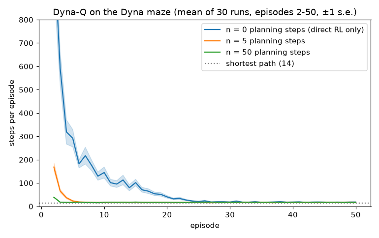
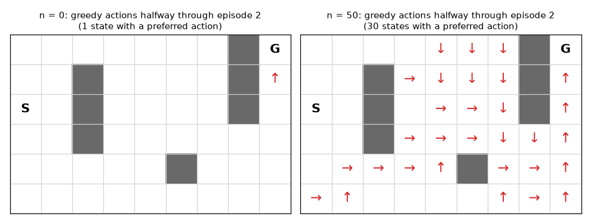
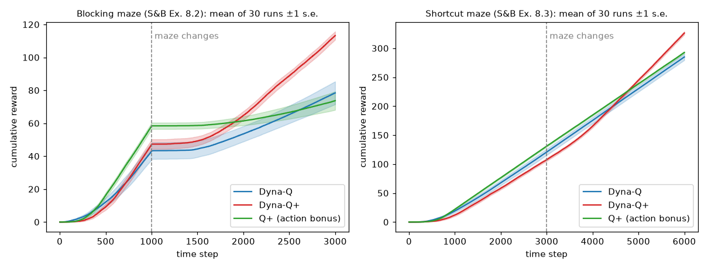
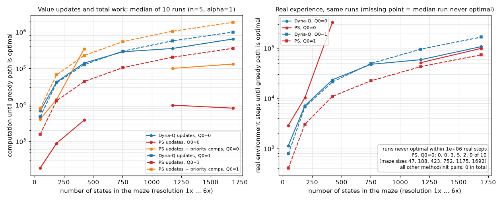
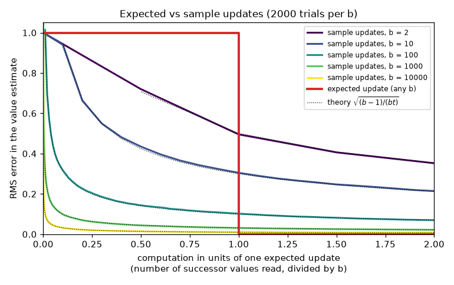
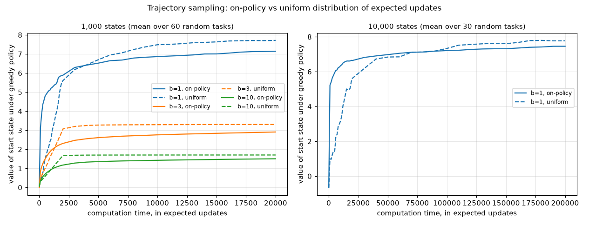
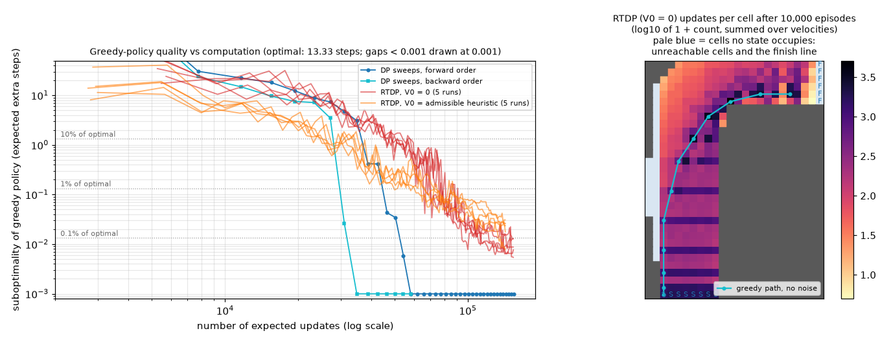
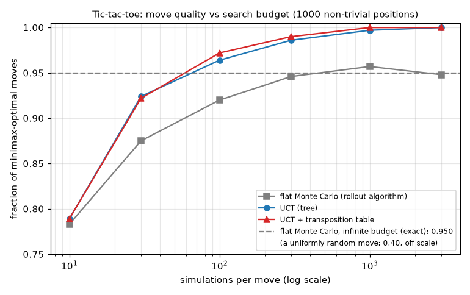

# Chapter 07 — Planning and Learning with Tabular Models (Dyna, Prioritized Sweeping, MCTS)

[← Previous: n-Step Bootstrapping and Eligibility Traces](06-n-step-and-eligibility-traces.md) · [Course index](../README.md) · [Next: Value Function Approximation](08-function-approximation.md) →

## At a glance

So far the course has had two families of methods. **Dynamic programming** ([Chapter 03](03-dynamic-programming.md)) plans: it needs a model of the environment, and it computes values by sweeping Bellman updates over that model without acting. **Monte Carlo and temporal-difference learning** ([Chapters 04](04-monte-carlo.md)–[06](06-n-step-and-eligibility-traces.md)) learn: they need no model, only experience. This chapter shows that the two are the same computation applied to different sources of experience: simulated versus real. Once you see that, you can mix them freely. You can learn a model from real experience and plan with it in the background (Dyna). You can decide *which* states to plan about (prioritized sweeping, trajectory sampling, RTDP). You can also plan only at the moment a decision is needed, searching forward from the current state (heuristic search, rollouts, Monte Carlo Tree Search).

**Learning objectives.** After this chapter you should be able to:

1. Distinguish distribution models from sample models, and expected updates from sample updates, and explain which pairs go together.
2. Implement Dyna-Q and explain, with numbers, why a few planning steps per real step can speed up learning by up to an order of magnitude.
3. Explain what goes wrong when the model is wrong, and how an exploration bonus in planning (Dyna-Q+) fixes it.
4. Implement prioritized sweeping, and say exactly what it saves and what it does not, counting value updates, total computation and real experience separately.
5. Derive the error of $t$ sample updates for a branching factor $b$, $\sqrt{(b-1)/(bt)}$, and use it to argue when sample updates beat expected updates.
6. Explain trajectory sampling and real-time dynamic programming (RTDP), and state the conditions under which RTDP converges without visiting every state.
7. Describe decision-time planning: heuristic search, rollout algorithms, and Monte Carlo Tree Search (MCTS). Implement UCT with negamax backups and transpositions for a two-player game, and verify it against an exact minimax solver.
8. Place every method in the course so far on the "dimensions of RL methods" map.

**Prerequisites.** MDPs and Bellman equations ([Chapter 01](01-the-rl-problem.md)); value iteration, asynchronous DP and the greedy-policy loss bound ([Chapter 03](03-dynamic-programming.md)); Monte Carlo control ([Chapter 04](04-monte-carlo.md)), on which rollout algorithms and MCTS build; Q-learning ([Chapter 05](05-temporal-difference.md)); $n$-step methods ([Chapter 06](06-n-step-and-eligibility-traces.md)), which reappear in the dimensions map of Section 13; the UCB1 bandit algorithm ([Chapter 02](02-multi-armed-bandits.md)), which MCTS reuses at every tree node.

**Code you will run** (all in [`code/ch07_planning_and_learning_tabular/`](../code/ch07_planning_and_learning_tabular/); pure Python + NumPy, plus SciPy for one sparse linear solve; each default full run takes from about 2 to about 110 seconds on one CPU core):

| Script | What it shows |
|---|---|
| [`dyna_maze.py`](../code/ch07_planning_and_learning_tabular/dyna_maze.py) | Dyna-Q with $n = 0, 5, 50$ planning steps on the Dyna maze |
| [`changing_mazes.py`](../code/ch07_planning_and_learning_tabular/changing_mazes.py) | Blocking and shortcut mazes: Dyna-Q vs Dyna-Q+ vs an action-bonus variant |
| [`prioritized_sweeping.py`](../code/ch07_planning_and_learning_tabular/prioritized_sweeping.py) | Updates and real steps until an optimal path, prioritized sweeping vs Dyna-Q, mazes up to 1,692 states |
| [`expected_vs_sample.py`](../code/ch07_planning_and_learning_tabular/expected_vs_sample.py) | Error vs computation for expected and sample updates, checked against theory |
| [`trajectory_sampling.py`](../code/ch07_planning_and_learning_tabular/trajectory_sampling.py) | On-policy vs uniform distribution of updates on random MDPs |
| [`rtdp_racetrack.py`](../code/ch07_planning_and_learning_tabular/rtdp_racetrack.py) | RTDP vs value iteration on a racetrack with 3,877 reachable states |
| [`mcts_tictactoe.py`](../code/ch07_planning_and_learning_tabular/mcts_tictactoe.py) | Exact minimax solver, flat Monte Carlo, UCT with and without transpositions, verified games |
| [`exercise_solutions.py`](../code/ch07_planning_and_learning_tabular/exercise_solutions.py) | Numerical checks for the exercises; symmetric transpositions and PUCT with priors |

**Study time.** About 8–10 hours: 4–5 for the text and derivations, 1–2 to run and modify the code, 3 for the exercises.

**Notation.** We follow [NOTATION.md](../NOTATION.md). Departures, all local to this chapter: $b$ is a **branching factor** (number of possible next states), not a behaviour policy; $\tau(s,a)$ in Dyna-Q+ is **the number of time steps since $(s,a)$ was last tried**, not a temperature or a Polyak coefficient; $\theta$ (not bold) is the **priority threshold** of prioritized sweeping, not a policy parameter vector; $\mathrm{Pri}(s,a)$ is the **priority** of a pair in prioritized sweeping, while $P(s,a)$ in Section 11.4 is a **prior probability** (PUCT); in MCTS, $N(s)$, $N(s,a)$ are visit counts, $W(s,a)$ is a sum of simulation returns and $c$ is the exploration constant (so the children in our worked examples are called $x, y, z$, never $b$ or $c$).

---

## 1. Models and planning

### 1.1 What is a model?

A **model** of the environment is anything an agent can use to predict how the environment will respond to its actions: given a state and an action, it predicts the next state and reward. Models come in two kinds.

- A **distribution model** gives the full probabilities $p(s', r \mid s, a)$ of every outcome. The MDP dynamics of [Chapter 01](01-the-rl-problem.md), and the inputs to dynamic programming, are distribution models.
- A **sample model** produces *one* outcome, drawn with the right probabilities: you give it $(s, a)$ and it returns a random pair $(S', R) \sim p(\cdot, \cdot \mid s, a)$. A simulator is a sample model.

A standard example is rolling a dozen dice. A distribution model would list the probability of every possible sum from 12 to 72; a sample model just rolls the dice and reports one sum. The sample model is often far easier to obtain: writing a blackjack simulator is easy, while writing down the probability of every hand is tedious. Every distribution model can serve as a sample model (just sample from it); the converse needs many samples to estimate probabilities.

A model lets you **simulate experience**. From a starting state and a policy, a sample model can produce a whole episode, and a distribution model can produce all possible episodes with their probabilities. Simulated experience is the raw material of planning.

### 1.2 Planning is learning from simulated experience

**Planning** here means any computation that takes a model as input and produces or improves a policy. (This is *state-space planning*, a search through states for a good policy. AI also has *plan-space planning*, which searches over partial plans; we do not cover it.) The state-space planning methods of this course all share one structure:

```
model --> simulated experience --(updates/backups)--> values --> policy
```

Value iteration ([Chapter 03](03-dynamic-programming.md)) fits it exactly. Its "simulated experience" is the set of all possible transitions of each state, read off the distribution model, and its update is the expected Bellman optimality update. Learning methods have the *same* last two arrows; only the first arrow differs, because their experience is real. So we can take any learning algorithm and turn it into a planning algorithm by feeding it simulated experience. The simplest example, called **random-sample one-step tabular Q-planning**, is Q-learning ([Chapter 05](05-temporal-difference.md)) run on transitions produced by a sample model:

```
Random-sample one-step tabular Q-planning
Input: a sample model; discount gamma; step sizes alpha_t(S, A) in (0, 1]
       (Robbins-Monro for convergence; a constant alpha is fine for a deterministic model)
Initialise Q(s, a) arbitrarily for all s, a  (Q(terminal, .) = 0)
Loop forever:
    1. Select a state S in S and an action A in A(S) at random
    2. Send S, A to the sample model; obtain a sample next reward R and next state S'
    3. Apply one-step tabular Q-learning to S, A, R, S':
         Q(S, A) <- Q(S, A) + alpha_t(S, A) [ R + gamma max_a Q(S', a) - Q(S, A) ]
         (target R alone if S' is terminal)
```

Because this is just Q-learning, it converges to the optimal action values **of the model** under the same conditions as Q-learning: every pair is selected infinitely often and the step sizes satisfy the Robbins–Monro conditions ([Chapter 05](05-temporal-difference.md)). With a constant $\alpha$ and a *stochastic* sample model the estimates do not converge; they keep fluctuating at a noise floor proportional to $\alpha$ (Exercise 5). With a deterministic model, every sample is the expected outcome, and a constant $\alpha$ (even $\alpha = 1$) converges. Note the emphasis: a planner can only be as good as its model. Section 4 shows what happens when the model is wrong.

There is a second, quieter benefit of the incremental view. Each planning step is tiny: one update. So planning can be interrupted at any time, interleaved with acting, and redirected (for example, toward the current state) as the situation changes. The rest of the chapter exploits this.

---

## 2. Dyna: integrating planning, acting and learning

When planning happens *online*, while the agent interacts with the world, new experience can do two things: improve the value function and policy directly (**direct RL**), or improve the model, which then improves the values through planning (**model learning** followed by **indirect RL**). Sutton's **Dyna** architecture (Sutton, 1990) does both, continually:

```
              +------------------- acting -------------------+
              |                                               v
        value/policy  <--- direct RL ---  real experience  <-- environment
              ^                                 |
              |                          model learning
         planning (indirect RL)                 |
              |                                 v
     simulated experience  <---- search control ----  model
```

Direct and indirect RL each have a case. Indirect methods squeeze more out of every real transition, because a remembered transition can be replayed many times. Direct methods are simpler and do not suffer from biases in the design of the model. Dyna takes a pragmatic view: do both, with the *same* update.

**Search control** is the process that picks the starting states and actions for simulated experience. In the simplest Dyna it picks uniformly at random among previously experienced pairs. Better search control is the subject of Sections 5–8.

### 2.1 Tabular Dyna-Q

In Dyna-Q the direct-RL step is one-step Q-learning, the model is a table, and the planning step is random-sample one-step Q-planning on the learned table. For a deterministic environment the model just remembers the last $(R, S')$ seen after each $(S, A)$.

```
Tabular Dyna-Q
Input: step size alpha in (0, 1]; discount gamma; exploration eps > 0; planning steps n >= 0
Initialise Q(s, a) = 0 and Model(s, a) = empty, for all s in S, a in A(s)
Loop for each episode:
    S <- start state
    Loop for each step of the episode, until S is terminal:
        (a) (S is the current, non-terminal state)
        (b) A <- eps-greedy(S, Q)                        # random tie-breaking
        (c) Take action A; observe R, S', and whether S' is terminal
        (d) Q(S, A) <- Q(S, A) + alpha [ R + gamma max_a Q(S', a) - Q(S, A) ]
                (use target R alone if S' is terminal)
        (e) Model(S, A) <- (R, S', terminal?)            # deterministic world
        (f) Loop repeat n times:                         # planning
                S~ <- random previously observed state
                A~ <- random action previously taken in S~
                (R~, S~', term~) <- Model(S~, A~)
                Q(S~, A~) <- Q(S~, A~) + alpha [ R~ + gamma max_a Q(S~', a) - Q(S~, A~) ]
                (target R~ alone if term~)
        S <- S'
```

Two details matter in practice. First, **terminal handling**: the model must remember whether a transition terminated, so that simulated updates do not bootstrap from a terminal state. Second, the planning loop draws a *state* uniformly among observed states and then an *action* among those tried there, as in Sutton & Barto's box. That is a slightly different distribution from "uniform over observed pairs"; either works.

For **stochastic** environments, the table model is replaced by counts: store how often each $(S', R)$ followed each $(S, A)$ and sample from the empirical distribution (a maximum-likelihood model). The normalised counts are also a *distribution* model. Prioritized sweeping in stochastic worlds uses them with expected updates (Section 5; our experiment there is deterministic). RTDP (Section 8) needs a distribution model, either given, as in our racetrack, or learned from counts in this way (Barto, Bradtke & Singh's *Adaptive RTDP*).

### 2.2 A worked example by hand: one episode is enough

Take a corridor $A \to B \to C \to G$ with a single action "right", reward $+1$ for entering the terminal state $G$, $\gamma = 0.9$, $\alpha = 0.5$, and $Q \equiv 0$ initially.

**Direct RL only ($n=0$).** During episode 1 the agent updates $Q(A,\text{r})$ and $Q(B,\text{r})$ towards $0 + 0.9 \cdot 0 = 0$, then $Q(C,\text{r}) \leftarrow 0 + 0.5(1 - 0) = 0.5$. After the episode, only $C$ knows anything. Episode 2 gives $Q(A,\text{r}) \leftarrow 0$ (because $B$ was still worth 0 when $A$ was updated), $Q(B,\text{r}) \leftarrow 0.5 \cdot (0.9 \cdot 0.5) = 0.225$, and $Q(C,\text{r}) \leftarrow 0.5 + 0.5(1 - 0.5) = 0.75$. One-step Q-learning moves information back **one state per episode**. In a maze whose shortest path is 14 steps, that takes many episodes.

**Dyna-Q.** At the end of episode 1 the model holds the three transitions. Suppose the planning loop happens to pick $(B,\text{r})$ and then $(A,\text{r})$:

$$
\begin{aligned}
Q(B,\text{r}) &\leftarrow 0 + 0.5\,\bigl(0 + 0.9 \cdot Q(C,\text{r}) - 0\bigr) = 0.5 \cdot 0.45 = 0.225,\\
Q(A,\text{r}) &\leftarrow 0 + 0.5\,\bigl(0 + 0.9 \cdot Q(B,\text{r}) - 0\bigr) = 0.5 \cdot 0.2025 = 0.10125.
\end{aligned}
$$

Two planning updates and no extra real experience, and the start state already has a positive value. If the planner had picked $(A,\text{r})$ *before* $(B,\text{r})$, the first update would have been wasted (target $0$). Uniform search control wastes many updates this way, which is the motivation for prioritized sweeping (Section 5). With $n=50$ updates per real step, enough lucky orders happen anyway.

---

## 3. Dyna-Q in action: the Dyna maze

The **Dyna maze** (Sutton & Barto 2018, Example 8.1) is a $6\times 9$ grid with seven wall cells. The agent starts at S and must reach G; the shortest path has **14 steps**. Actions are up/down/left/right; moving into a wall or the edge leaves the agent in place. The reward is $0$ everywhere except $+1$ on reaching G, which ends the episode, and $\gamma = 0.95$. We use $\alpha = 0.1$ and $\varepsilon = 0.1$, as in the book, and average 30 runs of 50 episodes each.

```
. . . . . . . # G
. . # . . . . # .
S . # . . . . # .
. . # . . . . . .
. . . . . # . . .
. . . . . . . . .
```

**The first episode is a random walk, whatever $n$ is.** Until the goal is reached every reward is $0$, so every update (real or simulated) has target $0$ and $Q$ stays identically zero. With random tie-breaking the $\varepsilon$-greedy agent is then a *uniform random walk*. Its expected hitting time $h(s)$ solves the linear system

$$
h(s) = 1 + \frac{1}{4}\sum_{a} h\bigl(\text{next}(s,a)\bigr), \qquad h(\mathrm{G}) = 0,
$$

which [`dyna_maze.py`](../code/ch07_planning_and_learning_tabular/dyna_maze.py) solves exactly: $h(\mathrm{S}) = 868.7$ steps. The empirical mean length of episode 1, pooled over all 90 runs (30 runs × 3 values of $n$), is $869.4$ (standard error $94.3$). Planning cannot help before there is anything to plan *about*.

**From episode 2 on, planning dominates.** Measured results (mean over 30 runs):

| planning steps $n$ | ep. 1 | ep. 2 | ep. 3 | ep. 10 | mean of eps 41–50 | first episode within 10% of that | real steps per run |
|---|---|---|---|---|---|---|---|
| 0 (Q-learning) | 925.8 | 1125.9 | 592.1 | 144.9 | 18.1 | 27 | 5,484 |
| 5 | 867.2 | 168.4 | 65.8 | 16.4 | 16.9 | 7 | 1,920 |
| 50 | 815.2 | 39.1 | 17.7 | 17.3 | 17.1 | 3 | 1,675 |

The plateau is about 17 steps rather than 14 because the policy remains $\varepsilon$-greedy. (The $n=0$ value for episode 2 exceeding episode 1 is noise. Random-walk lengths are highly variable and right-skewed: approximately exponential, with a standard deviation of about 895 steps, close to the mean. So the standard error of a 30-run mean is about 160 steps here; see Exercise 2.)



The $n=50$ agent essentially solves the maze by its third episode; the $n=0$ agent (plain Q-learning) needs about 27. In real-world terms, the $n = 50$ agent used about 3.3 times fewer real steps in total (1,675 vs 5,484) and paid for it with 50 times more computation per step. Whenever real experience is expensive and computation is cheap, that is an excellent trade.

The policies halfway through episode 2 show why. Below, an arrow marks every state whose greedy action has positive value (one run, same seed for both agents):



Without planning, only the state next to the goal has learned anything (1 of 46 states). With $n = 50$, value has spread back over 30 of the 46 states during the first part of episode 2. That episode then took 41 steps, against 588 for $n = 0$ in the same run. Planning turned one successful episode into a policy for most of the maze.

```python
# dyna_maze.py, the planning loop (step (f) of the box)
for _ in range(n_planning):
    ps = seen_states[rng.randrange(len(seen_states))]     # random observed state
    acts = seen_actions[ps]
    pa = acts[rng.randrange(len(acts))]                   # random action tried there
    pr, ps2, pterm = model[ps * N_ACTIONS + pa]           # deterministic model lookup
    ptarget = pr if pterm else pr + gamma * max(Q[ps2])   # no bootstrap at termination
    Q[ps][pa] += alpha * (ptarget - Q[ps][pa])
```

---

## 4. When the model is wrong

A learned model can be wrong. Early on it is incomplete, the environment may be stochastic and only partly sampled, and the environment can **change**. Planning with a wrong model usually gives a suboptimal policy. When the model is *optimistic* (it predicts more reward than the world gives), the error tends to correct itself: the agent tries to exploit the promised reward, fails, and the model is fixed by the real transition. When the model is *pessimistic*, there is no such automatic correction. If the world has improved, nothing tells the agent to go and look.

Two mazes from Sutton & Barto (Examples 8.2 and 8.3) show the two cases. In both, a long wall separates the start (bottom) from the goal (top right).

- **Blocking maze.** At first the gap is on the right (shortest path 10). At $t = 1000$ the right gap closes and a gap opens on the left (shortest path 16). The model is now wrong in *two* ways. It is *optimistic* about the right gap, and that error is corrected as soon as the agent bumps into the new wall. It is also *pessimistic* about the left gap, which the model has never seen open, or remembers as a wall.
- **Shortcut maze.** At first the gap is on the left (shortest path 16). At $t = 3000$ a gap opens on the right (shortest path 10), and the left one stays open. The model becomes purely *pessimistic*: it does not know about the shortcut.

### 4.1 Dyna-Q+: exploration bonus inside planning

Dyna-Q+ keeps, for each state–action pair, the number of time steps $\tau(s,a)$ since the pair was last tried **in the real environment**. During planning, a modelled transition with reward $r$ is treated as if its reward were

$$
r + \kappa \sqrt{\tau(s,a)},
$$

for a small $\kappa > 0$. In addition, actions never tried from a visited state may be planned with: their initial model is "stay in the same state with reward $0$". The bonus is used **only in planning**; real updates use the real reward. The effect is that long-untested pairs gradually look attractive *in the model*, and planning then propagates that attraction backwards. The agent therefore *plans* multi-step trips to go and re-test them. This is exploration through planning.

Relative to the Dyna-Q box of Section 2.1, only three lines change:

```
Dyna-Q+ (changes to the Tabular Dyna-Q box)
Extra input: bonus scale kappa > 0.  Extra memory: last(s, a) = real time step at which (s, a) was last tried
    (c') after taking A at real time t:  last(S, A) <- t
    (e') when a state S is visited for the first time, for every action a' never tried in S:
             Model(S, a') <- (0, S, not terminal)         # "stay put, reward 0"
         and let the planning loop draw any action of S, not only tried ones
    (f') in the planning loop, with tau = t - last(S~, A~):
             Q(S~, A~) <- Q(S~, A~) + alpha [ R~ + kappa sqrt(tau) + gamma max_a Q(S~', a) - Q(S~, A~) ]
             (target R~ + kappa sqrt(tau) alone if term~; the direct-RL update (d) gets NO bonus)
```

**How big is the bonus? A calculation by hand.** Consider a state $s$ whose best action has value $V$ and an untried action $a$ planned with the "stay put, reward 0" model. Its planning target is $\kappa\sqrt{\tau} + \gamma\max_{a'}Q(s,a')$. If $a$ is to become greedy, its fixed point must exceed $V$:

$$
\kappa\sqrt{\tau} + \gamma V > V \quad\Longleftrightarrow\quad \tau > \left(\frac{(1-\gamma)V}{\kappa}\right)^2 .
$$

With our $\kappa = 10^{-3}$, $\gamma = 0.95$ and a typical value $V \approx 0.95^{10} \approx 0.6$, this gives $\tau > (0.03/0.001)^2 = 900$ steps. Neglected actions are re-tested on a time scale of about a thousand steps. That is roughly when the blocking maze changes, and fast compared with the 3,000 steps that remain after the shortcut opens (which plain Dyna-Q never uses). Since $\tau$ restarts from 0 after every real try, this re-testing goes on periodically for ever (Exercise 4).

**An alternative (Sutton & Barto, Exercise 8.4).** Use the bonus only in *action selection*, choosing $\arg\max_a\,[Q(S,a) + \kappa\sqrt{\tau(S,a)}]$, and never let it into the values. This is cheaper and leaves $Q$ unbiased, but the bonus now acts only on the current state. Nothing plans a route *towards* neglected regions.

### 4.2 Results

[`changing_mazes.py`](../code/ch07_planning_and_learning_tabular/changing_mazes.py) runs all three agents with $n = 10$, $\alpha = 0.5$, $\varepsilon = 0.1$, $\gamma = 0.95$, $\kappa = 10^{-3}$, 30 runs each. The performance measure is cumulative reward, i.e. the number of times the goal has been reached. (If the agent happens to stand on a cell that becomes a wall when the maze changes, the script moves it back to the start.)



| | blocking: goals before change | blocking: goals after change | blocking: runs with 0 goals in last 1000 steps | shortcut: goals before change | shortcut: goals after change | shortcut: goals in last 1000 steps (min–max) |
|---|---|---|---|---|---|---|
| Dyna-Q | 43.0 | 35.4 ± 7.1 | 15/30 | 120.7 | 164.3 ± 0.6 | 54.8 (50–57) |
| Dyna-Q+ | 47.1 | 66.2 ± 2.1 | 0/30 | 107.5 | 218.7 ± 1.6 | 81.4 (77–85) |
| action bonus only | 58.2 | 15.5 ± 4.9 | 20/30 | 130.9 | 161.8 ± 0.6 | 54.0 (52–56) |

(± is one standard error over the 30 runs.)

The script also computes an exact reference: an $\varepsilon$-greedy agent ($\varepsilon = 0.1$) whose greedy policy is optimal needs 17.9 steps per episode on the 16-step route and 11.3 on the 10-step route, i.e. **55.8** and **88.8** goals per 1000 steps. Without exploration the 10-step route would allow at most 100.

What the numbers say:

- **Shortcut maze.** Plain Dyna-Q *never* found the shortcut: in the last 1000 steps every one of its runs reached the goal 50–57 times, consistent with the 55.8 of an $\varepsilon$-greedy agent on the old route. Every Dyna-Q+ run found it (77–85 goals). It stays below the reference 88.8 because Dyna-Q+ keeps re-testing neglected actions for ever (Exercise 4). The price of that exploration also shows before the change: 107.5 goals against 120.7 for Dyna-Q.
- **Blocking maze.** Dyna-Q+ recovered in every run. Plain Dyna-Q was *still stuck* in 15 of 30 runs, with no goal in the last 1000 steps. Only the optimistic half of the model error corrected itself: the agent bumped into the closed right gap, and the model learned that. Finding the new left gap is a *pessimistic*-model problem. The only way into the gap is the action "up" from the leftmost cell just below the wall, which the model either has never seen or remembers as a bump into a wall. In the model the lower region now has no exit at all, so planning drives its values towards zero. The greedy policy keeps following whatever small differences remain between those values, and nothing in the model makes the agent go to that corner and try "up" deliberately. Discovery therefore waits for $\varepsilon$-exploration to do it by chance. With `--n-planning 50`, plain Dyna-Q is stuck in even more runs (Exercise 7). Readers comparing with Sutton & Barto's Figure 8.4, where Dyna-Q's average curve rises again after a flat stretch, should note that our average rises too (35.4 goals after the change); the average hides that about half the runs recovered and half never did.
- **The action-bonus variant** learned fastest at the very start (its systematic local exploration helps find the goal), but at $n = 10$ it failed both tests. Its bonus cannot plan multi-step detours, which is exactly what the shortcut requires. (In the blocking maze its fate depends on the planning budget and the step size; see below and Exercise 7.)

**Sensitivity to the step size.** Section 3 used the book's $\alpha = 0.1$; here we use $\alpha = 0.5$, and the Dyna-Q+ results depend on that choice. With `--alpha 0.1`, Dyna-Q+ reached the goal only 11.1 times before the blocking change (Dyna-Q: 42.5) and was itself stuck in 10/30 blocking runs (Dyna-Q: 22/30). Plausibly, the learned values grow so slowly at $\alpha = 0.1$ that the fixed-size bonus dominates them and Dyna-Q+ spends most of its time re-testing. With `--alpha 1.0` the conclusions are unchanged: Dyna-Q stuck in 15/30 runs, Dyna-Q+ in 0/30 (79.5 goals after the change). The action-bonus variant was stuck in 20/30 blocking runs at $\alpha = 0.5$ but only 2/30 at $\alpha = 1$. A bonus with a fixed scale $\kappa$ has to be tuned together with everything that sets the scale of the values.

The general lesson is the exploration–exploitation conflict ([Chapter 02](02-multi-armed-bandits.md)) in a planning context. Exploration means acting to improve the model; exploitation means acting optimally given the current model. Dyna-Q+ is a heuristic answer. [Chapter 14](14-exploration.md) gives principled ones (optimism in the face of uncertainty, posterior sampling), and they share the same insight: *put the uncertainty into the planning*.

---

## 5. Prioritized sweeping

In the Dyna maze, the planner of Section 3 picks pairs uniformly at random. At the start of episode 2 almost all of them have value 0 and successors of value 0, so almost every planning update changes nothing. Only updates *next to* a state whose value just changed can do anything useful. The worked example of Section 2.2 makes the point concretely: the backward order $(C, B, A)$ propagated the goal value in three updates, and any other order wasted some.

This suggests **backward focusing**. When a state's value changes, the values of its *predecessors* (the state–action pairs that the model says lead to it) are the ones likely to change next. Not all of them are equally urgent, so we keep a **priority queue** of pairs keyed by how much their value would change, the magnitude of their TD error:

$$
\mathrm{Pri}(s,a) \doteq \Bigl|\, r(s,a) + \gamma \max_{a'} Q(s', a') - Q(s, a) \Bigr| \quad\text{(deterministic model)}.
$$

At each step we update the most urgent pair, then recompute the priorities of its predecessors. This is **prioritized sweeping** (Moore & Atkeson, 1993; Peng & Williams, 1993):

```
Prioritized sweeping for a deterministic environment
Input: step size alpha; discount gamma; exploration eps; planning steps n; threshold theta > 0
Initialise Q(s, a) for all s, a (Q(terminal, .) = 0); Model(s, a) <- empty; PQueue <- empty
Loop forever:
    (a) S <- current (non-terminal) state
    (b) A <- eps-greedy(S, Q)
    (c) Take action A; observe R, S' (and whether S' is terminal)
    (d) Model(S, A) <- (R, S', terminal?);  record (S, A) as a predecessor of S'
    (e) Pri <- | R + gamma max_a Q(S', a) - Q(S, A) |        (R alone if terminal)
    (f) if Pri > theta: insert (S, A) into PQueue with priority Pri
           (if already present, keep the larger priority)
    (g) Loop repeat n times, while PQueue is not empty:
            (S~, A~) <- pop the highest-priority pair
            (R~, S~', term~) <- Model(S~, A~)
            Q(S~, A~) <- Q(S~, A~) + alpha [ R~ + gamma max_a Q(S~', a) - Q(S~, A~) ]
                (target R~ alone if term~)
            Loop for all (S-, A-) predicted to lead to S~:
                R- <- predicted reward for (S-, A-, S~)
                Pri <- | R- + gamma max_a Q(S~, a) - Q(S-, A-) |
                if Pri > theta: insert (S-, A-) into PQueue with priority Pri
        S <- S' (or a start state if S' was terminal)
```

Note that step (d) does **not** update $Q$. Real experience only enters the queue, and all value changes happen in step (g). Also note what the box *computes*: every real step costs one priority computation in (e), and every planning update costs one more per predecessor in the inner loop of (g). Each priority computation is a TD-error evaluation, about as costly as an update, plus a heap insertion when it exceeds $\theta$. Section 5.1 counts both. In a **stochastic** environment the model keeps counts, the update in (g) becomes an *expected* update over all observed next states, and the priority uses the expected TD error. That spends computation on low-probability outcomes; a sample-update variant addresses this (Section 6 explains the trade-off), and van Seijen & Sutton (2013) give a cheaper "small backup" formulation.

Our implementation, [`prioritized_sweeping.py`](../code/ch07_planning_and_learning_tabular/prioritized_sweeping.py), uses a binary heap with *lazy deletion*. Re-inserting a pair pushes a new heap entry and records its current priority in a dictionary; stale heap entries are skipped when popped.

**A pitfall in the box above, and why we use $\alpha = 1$.** The pair just updated in (g) is not re-inserted, even if it still has a residual error. With $\alpha = 1$ and a deterministic model the update is exact, so there is no residual. With $\alpha < 1$ a fraction $(1-\alpha)$ of the error stays behind, and nothing re-queues it until some successor's value changes or the pair is visited for real (Exercise 6). This failure mode is real, but in our experiment it was not the main one. With $\alpha = 0.5$ and $Q_0 = 0$ (`--alpha 0.5`, about 4 minutes), 5 of the 60 PS runs never became optimal. One stalled because of the un-requeued residual: its greedy path had 46 moves although its learned model already contained a 44-move path. The other four stalled because of the exploration problem described in finding 4 of Section 5.1 below: their greedy path was the shortest path in an incomplete model. With $\alpha = 1$, 10 of 60 runs stalled, all of the exploration kind. So $\alpha = 1$ removes the residual problem, not the exploration problem. It also changes the headline a great deal: with $\alpha = 0.5$ and $Q_0 = 0$ the ratios of median updates (Dyna-Q / PS) were 7.8, 1.8, 2.5, 1.8, 3.9 and 4.7, against 36–79 with $\alpha = 1$, because with $\alpha = 1$ each deterministic update is exact and a single backward sweep suffices. (Counting priority computations too, PS at $\alpha = 0.5$ did *more* total work than Dyna-Q at five of the six sizes.) All results below use $\alpha = 1$ for **both** methods. For a deterministic model, a sample update with $\alpha = 1$ *is* the expected update.

### 5.1 Experiment: computation and experience until an optimal path

In the spirit of Peng & Williams' experiment (Sutton & Barto's Example 8.4, which reports that prioritized sweeping typically needs 5 to 10 times fewer updates than Dyna-Q to find an optimal solution), we refine the Dyna maze by our own scheme: each cell becomes a $k \times k$ block, $k = 1$–6. That gives mazes of 47 to 1,692 states with shortest paths of 14 to 89 steps. Both methods use $n = 5$ planning updates per real step, $\varepsilon = 0.1$, $\gamma = 0.95$, $\theta = 10^{-4}$, $\alpha = 1$. After every real step we follow the greedy policy from the start. A run counts as solved at the first step where that path reaches the goal in exactly the optimal number of moves (computed by breadth-first search). Up to that moment we count three things: all $Q$-value updates (real plus simulated; Dyna-Q makes $1 + n = 6$ per real step), prioritized sweeping's priority computations, and the real environment steps. Each setting has 10 runs; a run that is not solved within $10^6$ real steps counts as $+\infty$, so it pushes the median up instead of disappearing.

We ran two initialisations. $Q_0 = 0$ is what the textbook boxes use. $Q_0 = 1$ is optimistic: no return in this task can exceed 1, so every untried action looks at least as good as anything real, which drives systematic exploration ([Chapter 02](02-multi-armed-bandits.md)).

**$Q_0 = 0$** (medians over 10 runs; a ratio is Dyna-Q's median divided by PS's, so above 1 favours PS):

| states | shortest path | Dyna-Q updates | PS updates (ratio) | PS total work = updates + priority computations (ratio) | real steps Dyna-Q / PS | PS runs never optimal |
|---|---|---|---|---|---|---|
| 47 | 14 | 6,855 | 184 (37) | 4,044 (1.7) | 1,142 / 2,891 | 0/10 |
| 188 | 29 | 42,639 | 887 (48) | 14,122 (3.0) | 7,106 / 10,208 | 0/10 |
| 423 | 44 | 140,466 | 3,823 (37) | 344,040 (0.41) | 23,411 / 326,902 | 3/10 |
| 752 | 59 | 285,849 | median run never optimal | — | 47,642 / — | 5/10 |
| 1,175 | 74 | 352,206 | 9,836 (36) | 100,248 (3.5) | 58,701 / 51,308 | 2/10 |
| 1,692 | 89 | 642,510 | 8,132 (79) | 131,680 (4.9) | 107,085 / 98,945 | 0/10 |

**$Q_0 = 1$** (every run of both methods was solved):

| states | Dyna-Q updates | PS updates (ratio) | PS total work (ratio) | real steps Dyna-Q / PS (ratio) | PS updates per real step |
|---|---|---|---|---|---|
| 47 | 4,680 | 1,542 (3.0) | 7,744 (0.60) | 780 / 406 (1.9) | 3.80 |
| 188 | 40,305 | 12,994 (3.1) | 66,866 (0.60) | 6,718 / 3,044 (2.2) | 4.27 |
| 423 | 126,654 | 43,731 (2.9) | 226,588 (0.56) | 21,109 / 10,927 (1.9) | 4.02 |
| 752 | 297,024 | 104,936 (2.8) | 540,490 (0.55) | 49,504 / 22,342 (2.2) | 4.72 |
| 1,175 | 571,182 | 202,400 (2.8) | 1,044,386 (0.55) | 95,197 / 42,630 (2.2) | 4.77 |
| 1,692 | 995,205 | 356,566 (2.8) | 1,842,740 (0.54) | 165,868 / 73,726 (2.2) | 4.84 |



There are four findings, and they depend on what you count.

1. **Value updates.** Prioritized sweeping (PS) made far fewer $Q$-value updates whenever it finished. With $Q_0 = 0$ the ratio of medians was 36–79 (37, 48, 37, 36, 79) at every size where the median PS run was solved (all but 752 states). With $Q_0 = 0$ its queue was empty most of the time: the median run made only 0.04–0.20 updates per real step. With $Q_0 = 1$ the queue is rarely empty, because falling optimistic values keep having to be propagated, so PS used most of its budget: 3.8–4.8 updates per real step (medians), against Dyna-Q's fixed 6. Even so, it needed 2.8–3.1 times fewer updates than Dyna-Q, and it made fewer updates in every one of the 60 runs.
2. **Total work.** Updates are not PS's only computation. Every real step costs one priority computation in step (e), even when the queue is empty, and every update costs one more per predecessor. A priority computation is a TD-error evaluation, about as costly as an update, plus a heap insertion when it exceeds $\theta$. Counting both, PS's median work with $Q_0 = 0$ was 1.7–4.9 times *lower* than Dyna-Q's where the median run was solved, except at 423 states, where slow runs dominate and PS did 2.4 times *more* work. With $Q_0 = 1$, PS made about 4 priority computations per update, and its total work was 1.65–1.85 times *higher* than Dyna-Q's in the medians (and higher in 59 of 60 runs). So with optimism, PS's genuine saving is in real experience: 1.9–2.2 times fewer real steps, and fewer in 59 of 60 runs. (Wall-clock time tells a milder story. In our code a predecessor's priority reuses $\max_a Q(\tilde S, a)$, which is computed once per update, so it is cheaper than an update, and the script's timings also include acting and the greedy-path checks. For the ten $Q_0 = 1$ runs at 1,692 states, PS took 12.0 s against Dyna-Q's 12.2 s. Operation counts are the cleaner comparison; neither is free.)
3. **Optimism removes the variance.** With $Q_0 = 1$ both methods solved every run, with tightly clustered counts.
4. **The surprise: prioritized sweeping can make an $\varepsilon$-greedy agent *worse* at exploring.** With $Q_0 = 0$, 10 of the 60 PS runs were still not optimal after a million real steps. The script diagnoses each stalled run, and all ten look the same. The greedy path is two moves longer than optimal. It is *exactly* the shortest path inside the learned model, which is missing some transitions (for example, 607–671 of 1,688 pairs untried at size 423). The queue was empty on more than 99% of steps. PS had solved its model perfectly, so the greedy policy is fixed and confident, and finding the missing transition requires a lucky sequence of $\varepsilon$-moves. Dyna-Q's slow, noisy value propagation keeps its greedy policy wandering for longer, which explores "by accident". The script measures this: at the real step at which Dyna-Q's greedy path became optimal, Dyna-Q had tried more distinct state–action pairs than PS had after the same number of real steps in 31 of 35 comparable runs (median 1,528 vs 1,113 pairs at 423 states; runs in which PS had already finished are excluded). In real experience, PS with $Q_0 = 0$ was worse in the median at the four smaller sizes: 2.5 and 1.4 times more real steps at 47 and 188 states, 14 times more at 423 states, and no median at all at 752. At the two largest sizes its median run needed slightly *fewer* real steps (51,308 vs 58,701 and 98,945 vs 107,085), although 2 of the 10 runs at 1,175 states never finished.

**Why our ratios differ from the book's "5 to 10".** Several of our choices favour large update ratios with $Q_0 = 0$. With $\alpha = 1$ each deterministic update is exact, so a single backward sweep makes PS's values exact (Exercise 6), while Dyna-Q keeps spending 6 updates per real step, most of them on pairs whose values cannot change. Counting conventions matter too: we count every update, including the direct one on each real step, and treat unsolved runs as $+\infty$. With optimism ($Q_0 = 1$) the update ratio is about 3, and with $\alpha = 0.5$ and $Q_0 = 0$ (the pitfall paragraph above) it is 1.8–7.8, close to the book's range. Our maze refinement also differs from the original experiment's.

The lesson generalises. **Prioritized sweeping buys planning efficiency, not exploration.** Better planning makes you exploit your model sooner; if the model is incomplete, you need an explicit exploration mechanism (optimistic initial values here, Dyna-Q+ in Section 4, Chapter 14 in general).

---

## 6. Expected vs sample updates

We now have two ways to update a value from a model. An **expected update** averages over all possible next states using a distribution model. A **sample update** uses one sampled next state. Crossing this with *what* is updated ($v$ or $q$, for $\pi$ or optimal) gives the seven one-step updates of the course so far:

| value | expected update (needs a distribution model) | sample update (works with a sample model or real experience) |
|---|---|---|
| $v_\pi$ | policy evaluation (Ch. 03): $V(s) \leftarrow \sum_a \pi(a\mid s)\sum_{s',r}p(s',r\mid s,a)[r + \gamma V(s')]$ | TD(0) (Ch. 05): $V(s) \leftarrow V(s) + \alpha[R + \gamma V(S') - V(s)]$ |
| $v_\ast$ | value iteration (Ch. 03): $V(s) \leftarrow \max_a \sum_{s',r}p(s',r\mid s,a)[r + \gamma V(s')]$ | (none: the max over actions needs the model) |
| $q_\pi$ | $Q(s,a) \leftarrow \sum_{s',r}p(s',r\mid s,a)[r + \gamma \sum_{a'}\pi(a'\mid s')Q(s',a')]$ | Sarsa (Ch. 05): $Q \leftarrow Q + \alpha[R + \gamma Q(S',A') - Q]$ |
| $q_\ast$ | Q-value iteration: $Q(s,a) \leftarrow \sum_{s',r}p(s',r\mid s,a)[r + \gamma \max_{a'}Q(s',a')]$ | Q-learning (Ch. 05): $Q \leftarrow Q + \alpha[R + \gamma \max_{a'}Q(S',a') - Q]$ |

An expected update has no sampling error, but it costs time proportional to the **branching factor** $b$, the number of possible next states. If we have only a limited amount of computation, is one expected update better than $b$ sample updates spread over $b$ different pairs? The following analysis, Sutton & Barto's Section 8.5 worked out in full, answers this.

### 6.1 Derivation: the error of t sample updates

Consider one pair $(s,a)$ with $b$ equally likely successor states whose values $v_1,\dots,v_b$ we treat as exact (fold the rewards into them). The correct value is their mean $\mu = \frac{1}{b}\sum_{j=1}^b v_j$. An expected update reads all $b$ values and lands on $\mu$ exactly: error $0$ after $b$ units of computation, and no improvement at all before that.

Sample updates use the averaging step size $\alpha_t = 1/t$: $Q_t = Q_{t-1} + \frac{1}{t}\bigl(v_{J_t} - Q_{t-1}\bigr)$ with $J_1, J_2, \dots$ i.i.d. uniform on $\{1,\dots,b\}$.

**Step 1: the estimate is a sample mean.** Since $\alpha_1 = 1$, $Q_1 = v_{J_1}$, whatever the initial estimate was. Suppose $Q_{t-1} = \frac{1}{t-1}\sum_{k=1}^{t-1} v_{J_k}$. Then

$$
Q_t = \Bigl(1-\frac{1}{t}\Bigr)Q_{t-1} + \frac{1}{t}v_{J_t} = \frac{t-1}{t}\cdot\frac{1}{t-1}\sum_{k=1}^{t-1}v_{J_k} + \frac{1}{t}v_{J_t} = \frac{1}{t}\sum_{k=1}^{t}v_{J_k},
$$

so by induction $Q_t$ is the mean of $t$ draws with replacement.

**Step 2: its conditional mean squared error.** Write $Q_t - \mu = \frac{1}{t}\sum_{k=1}^t (v_{J_k} - \mu)$. The terms are i.i.d. given the $v$'s, with mean $\mathbb{E}[v_J - \mu] = \frac{1}{b}\sum_j v_j - \mu = 0$ and variance $\sigma_b^2 \doteq \frac{1}{b}\sum_{j=1}^b (v_j - \mu)^2$. The variance of a mean of $t$ i.i.d. terms is the variance divided by $t$:

$$
\mathbb{E}\bigl[(Q_t - \mu)^2 \,\big|\, v_1,\dots,v_b\bigr] = \frac{\sigma_b^2}{t}.
$$

**Step 3: average over the successor values.** Suppose the $v_j$ are themselves i.i.d. with variance $\sigma^2$, which models "$b$ different successors with different values". Expand $\sum_j (v_j - \mu)^2 = \sum_j v_j^2 - b\mu^2$ and use $\mathbb{E}[v_j^2] = \sigma^2 + m^2$ (with $m$ the common mean) and $\mathbb{E}[\mu^2] = \sigma^2/b + m^2$:

$$
\mathbb{E}\Bigl[\sum_{j=1}^b (v_j-\mu)^2\Bigr] = b(\sigma^2 + m^2) - b\Bigl(\frac{\sigma^2}{b} + m^2\Bigr) = (b-1)\,\sigma^2 .
$$

Hence $\mathbb{E}[\sigma_b^2] = \frac{b-1}{b}\sigma^2$, and with the scale fixed by $\sigma = 1$ (initial errors of order 1):

$$
\text{RMS error after } t \text{ sample updates} = \sqrt{\frac{b-1}{b\,t}} .
$$

**What it means.** Measure computation in units of one expected update, $x = t/b$. Then the error is $\sqrt{(b-1)/b^2}\cdot x^{-1/2} \approx 1/\sqrt{b x}$. For large $b$, a small fraction of an expected update's cost already removes most of the error. With $b = 1000$, $t = 100$ sample updates (10% of the cost) leave an error of about $0.1$. With $b = 2$ the picture reverses: after spending the cost of one expected update ($t = 2$), sample updates still have error $0.5$, while the expected update has error $0$. [`expected_vs_sample.py`](../code/ch07_planning_and_learning_tabular/expected_vs_sample.py) checks the formula with 2,000 simulated trials per $b$ (successor values $\sim\mathcal{N}(0,1)$):

| $b$ | $t = 1$ | $t = b/10$ | $t = b$ | $t = 2b$ |
|---|---|---|---|---|
| 2 | 0.720 / 0.707 | — ($b/10 < 1$) | 0.495 / 0.500 | 0.352 / 0.354 |
| 10 | 0.940 / 0.949 | — ($b/10 = 1$) | 0.305 / 0.300 | 0.214 / 0.212 |
| 100 | 1.015 / 0.995 | 0.318 / 0.315 | 0.102 / 0.099 | 0.070 / 0.070 |
| 1000 | 1.057 / 0.999 | 0.099 / 0.100 | 0.031 / 0.032 | 0.022 / 0.022 |
| 10000 | 0.977 / 1.000 | 0.033 / 0.032 | 0.010 / 0.010 | 0.007 / 0.007 |

(simulated / theoretical RMS error)



Two caveats push in opposite directions. In real planning the successor values are themselves estimates that improve over time. Many cheap sample updates spread over many pairs make the successors more accurate sooner, which favours sample updates even more than this analysis suggests. On the other hand, when $b$ is small, or when $p(s'\mid s,a)$ is concentrated on a few outcomes, an expected update costs little and removes the sampling noise completely. The practical rule: **expected updates for small, known branching; sample updates for large or unknown branching.**

---

## 7. Trajectory sampling

The next question is *where* to spend updates. Classical DP sweeps the whole state (or state–action) space, giving each state equal attention. That is hopeless for large problems and wasteful when most states are irrelevant. An alternative is to distribute updates according to the **on-policy distribution**, i.e. the distribution of states and actions encountered when following the current policy. It is easy to generate: simulate episodes with the model and update the pairs you encounter. This is called **trajectory sampling**. It ignores large uninteresting regions of the space, but it may also keep updating the same well-known states.

[`trajectory_sampling.py`](../code/ch07_planning_and_learning_tabular/trajectory_sampling.py) repeats Sutton & Barto's experiment (Section 8.6) on randomly generated episodic tasks. Each task has $|\mathcal{S}|$ states and 2 actions per state. Each $(s,a)$ leads to one of $b$ fixed random successors with equal probability, and with probability $0.1$ to termination. Each successor transition has its own reward drawn from $\mathcal{N}(0,1)$, termination gives reward $0$, and there is no discounting. Both planners apply the *same* expected update,

$$
Q(s,a) \leftarrow 0.9 \cdot \frac{1}{b}\sum_{j=1}^{b}\Bigl[r(s,a,j) + \max_{a'}Q(s_j, a')\Bigr],
$$

and differ only in which $(s,a)$ they update. **Uniform** cycles through all pairs. **On-policy** simulates episodes from the start state with an $\varepsilon$-greedy policy ($\varepsilon = 0.1$) and updates each pair encountered:

```
Trajectory sampling (on-policy distribution of expected updates)
Input: a distribution model p(s', r | s, a); start-state distribution d0; exploration eps;
       discount gamma; budget of U updates
Initialise Q(s, a) = 0 for all s, a  (Q(terminal, .) = 0)
S <- sample from d0
Repeat U times:
    A <- eps-greedy(S, Q)                                   # the CURRENT policy
    Q(S, A) <- sum_{s', r} p(s', r | S, A) [ r + gamma max_a Q(s', a) ]     # expected update
    S' <- sample from p(. | S, A)                           # simulated step: no real experience
    S <- S' if S' is non-terminal, else a new sample from d0
Uniform variant: replace the eps-greedy choice and the simulated step by
    "(S, A) <- the next pair in a fixed cyclic order over all pairs".
```

(In our tasks there is no discounting, $\gamma = 1$; the factor 0.9 in the displayed update is the probability of not terminating.) Performance is the value of the start state under the greedy policy, computed by iterative policy evaluation at about 40 points per run (more densely early on). We used 60 random tasks for the 1,000-state settings and 30 for the 10,000-state setting.

| task | updates → | 1,000 | 2,000 | 5,000 | 10,000 | 20,000 | uniform ahead from |
|---|---|---|---|---|---|---|---|
| $\lvert\mathcal{S}\rvert = 1000$, $b=1$ | on-policy | 5.21 | 5.88 | 6.52 | 6.86 | 7.14 | |
| | uniform | 2.54 | 5.60 | 6.70 | 7.48 | 7.71 | 4,000 updates |
| $\lvert\mathcal{S}\rvert = 1000$, $b=3$ | on-policy | 1.94 | 2.31 | 2.61 | 2.76 | 2.91 | |
| | uniform | 1.70 | 3.06 | 3.27 | 3.29 | 3.30 | 1,300 updates |
| $\lvert\mathcal{S}\rvert = 1000$, $b=10$ | on-policy | 0.94 | 1.17 | 1.36 | 1.42 | 1.50 | |
| | uniform | 0.95 | 1.67 | 1.70 | 1.70 | 1.70 | 1,000 updates |

For $\lvert\mathcal{S}\rvert = 10{,}000$, $b = 1$, after 10k / 20k / 50k / 100k / 200k updates: on-policy 6.34 / 6.64 / 6.98 / 7.21 / 7.46, uniform 3.18 / 5.62 / 6.84 / 7.33 / 7.77, and uniform is ahead at every evaluation from 70,000 updates on. ("Uniform ahead from" is the first evaluation after which uniform stays ahead at every later evaluation.) The standard errors of each method's mean are 0.03–0.06 for $b = 3, 10$ and 0.20–0.45 for $b = 1$ (largest early on, for the 10,000-state task). Both methods are run on the *same* random tasks, so the comparison is paired, and the script also reports the standard error of the per-task difference. For $b = 3$ and $10$ it is tiny (at most 0.04; for example, uniform leads by $0.39 \pm 0.01$ for $b = 3$ after 20,000 updates), so those crossovers are solid. For $b = 1$ it is mostly about as large as the per-method errors (0.06–0.48): with 1,000 states the difference was $+0.18 \pm 0.23$ at 5,000 updates but $+0.62 \pm 0.16$ and $+0.57 \pm 0.14$ at 10,000 and 20,000; with 10,000 states it was $+0.12 \pm 0.15$ at 100,000 updates and $+0.31 \pm 0.06$ at 200,000. So for $b = 1$ the exact crossover points are uncertain, while uniform's lead at the end of the runs is clear.



The pattern matches Sutton & Barto's description. **On-policy sampling plans faster initially and worse in the long run.** The early advantage is larger and lasts longer when the branching factor is small and the state space is large. One uniform sweep is $2|\mathcal{S}|$ updates: uniform overtook after about 2 sweeps for $b = 1$ with 1,000 states, about 0.5–0.65 of a sweep for $b = 3$ and $10$, and about 3.5 sweeps for 10,000 states. With large $b$ the on-policy distribution spreads over most of the state space within a few steps anyway, so focusing buys little.

Two mechanisms plausibly contribute to the long-run deficit (2.91 vs 3.30 for $b = 3$ after 20,000 updates); our script does not separate them. First, Sutton & Barto's explanation: once the frequently visited states have accurate values, further on-policy updates there are largely wasted, while uniform updates keep doing useful work elsewhere. Second, we conjecture, alternatives that look bad only because they are under-updated rarely get corrected, so the greedy policy can stay on a slightly worse branch. That would be the same lock-in we saw in the stalled prioritized-sweeping runs of Section 5. For large problems, where a complete sweep is out of the question, on-policy focusing is often the only option. It is the idea behind RTDP, which we look at next, and, with function approximation, behind the on-policy distribution weighting of [Chapter 08](08-function-approximation.md).

---

## 8. Real-time dynamic programming

**Real-time dynamic programming** (RTDP; Barto, Bradtke & Singh, 1995) is on-policy trajectory sampling applied to value iteration. It runs episodes ("trials") from start states, acting greedily with respect to the current $V$. At every state it visits, it applies the expected value-iteration update. Because DP updates may be applied to states in any order, as long as every state keeps being updated ([Chapter 03](03-dynamic-programming.md), asynchronous DP), RTDP is a form of asynchronous value iteration whose order is chosen by the trajectories.

```
Real-time dynamic programming (trial-based)
Input: a distribution model p(s', r | s, a); a start-state distribution d0;
       gamma = 1 (the undiscounted stochastic shortest-path setting of the theorem below)
Initialise V(s) for all non-terminal s (see the convergence conditions); V(terminal) = 0
Loop for each trial:
    S <- sample from d0
    Loop until S is terminal:
        For each a in A(S):  q(a) <- sum_{s', r} p(s', r | S, a) [ r + gamma V(s') ]
        V(S) <- max_a q(a)                         # expected update at the current state
        A <- an action attaining the max            # greedy action
        S <- sample from p(. | S, A)                # simulated (or real) transition
```

Ordinary asynchronous DP converges only if *all* states are updated infinitely often. RTDP's interesting property is that it can converge to an optimal policy **without ever visiting some states**. Call a state **relevant** if some optimal policy reaches it from some start state with positive probability. Then (Barto, Bradtke & Singh, 1995; stated as in Sutton & Barto, Section 8.7):

> **Theorem (RTDP convergence).** Consider an undiscounted episodic task with absorbing goal states, i.e. a stochastic optimal path problem. Assume (i) the initial value of every goal state is zero, (ii) there is at least one policy that reaches a goal state with probability one from any start state, (iii) all rewards for transitions from non-goal states are strictly negative, (iv) the initial values of all non-goal states are greater than or equal to their optimal values, and (v) trials start from states drawn from $d_0$, so that every start state begins infinitely many trials. Then, with probability one, RTDP converges to a policy that is optimal on all relevant states.

Condition (iv) is *optimism*: unvisited states look at least as good as they really are, so the greedy policy is drawn to them until their values are corrected. With negative rewards, $V_0 \equiv 0$ satisfies it. A better choice is any **admissible heuristic**, an estimate that never underestimates the value (never overestimates the remaining cost). RTDP is the stochastic generalisation of Korf's (1990) Learning Real-Time A\* (LRTA\*), and this is where heuristic search and RL meet.

### 8.1 The racetrack

[`rtdp_racetrack.py`](../code/ch07_planning_and_learning_tabular/rtdp_racetrack.py) builds a racetrack in the style of Sutton & Barto's Example 8.6. The track is our own; the dynamics are those of their Exercise 5.12.

- **State** $(\text{row}, \text{col}, v_y, v_x)$, with velocities $0 \le v_y, v_x \le 4$ (upward and rightward), not both zero except on the start line.
- **Actions**: increment each velocity component by $-1$, $0$ or $+1$ (9 actions, restricted to legal velocities).
- **Noise**: with probability 0.1 both increments are zero, whatever the action.
- **Movement**: we check the cells along the straight path. Entering a finish cell ends the episode. Leaving the track first is a crash: the car returns to a random start cell with zero velocity and the episode continues.
- **Reward** $-1$ per step, so $-v_\ast(s)$ is the expected number of steps to finish.

The track has 372 cells, and 3,877 states are reachable from the start line under some policy. The optimal expected time from the start line is **13.331 steps**. Under one optimal policy (the greedy policy of $v_\ast$, ties broken by action index), 1,946 states (50.2%) are visited with positive probability. The relevant set, the union over all optimal policies, is at least this large. We compare in-place value iteration in two sweep orders with RTDP. The first order is breadth-first from the start line; the second is its reverse, which visits states near the finish first. RTDP starts either from $V_0 \equiv 0$ or from the admissible heuristic $H(s) = -\lceil \max(\text{columns still to cover}, \text{rows still to climb}) / 4 \rceil$ (columns to the finish line, rows up to the top straight), valid because the car moves at most 4 cells per step along each axis; the script also asserts $H \ge v_\ast$. The table reports **expected updates until the greedy policy's exact expected time (computed by solving its linear Bellman equation) is within x% of optimal**. RTDP numbers are means over 5 runs of 10,000 trials.

| method | within 10% | within 1% | within 0.1% | exactly optimal | stopping rule (max change $< 10^{-4}$) |
|---|---|---|---|---|---|
| value iteration, forward (BFS) order | 38,770 | 46,524 | 54,278 | 58,155 | 40 sweeps = 155,080 |
| value iteration, backward order | 31,016 | 31,016 | 34,893 | 34,893 | 15 sweeps = 58,155 |
| RTDP, $V_0 = 0$ | 47,275 | 73,541 | 116,987 | not reached (0/5) | — |
| RTDP, $V_0 = H$ (admissible) | 25,456 | 61,545 | reached in 1/5 runs | not reached (0/5) | — |

When RTDP first came within 1% of optimal (about 4,000 trials), the per-state update counts were as follows. With $V_0 = 0$: 1.3% of all reachable states never updated, 77.4% updated at most 10 times, 97.3% at most 100 times. With $V_0 = H$: 14.6% never updated, 86.7% at most 10 times, 97.6% at most 100 times.



The heuristic helps early but not in the tail: from $V_0 = H$ only 1 of 5 runs got within 0.1% in 10,000 trials, against 5 of 5 from $V_0 = 0$. The script's diagnostics point to the reason. Restricting attention to the 1,946 states that the optimal policy visits, after all 10,000 trials the median such state had been updated 9 times from $V_0 = 0$ but only 4 times from $V_0 = H$; 8.2% of them were never updated at all from $V_0 = H$, against 0.0% from $V_0 = 0$ (means over the 5 runs). The tighter optimistic start makes the trajectories more focused, so states that are reached only through noise or crashes, which an optimal policy must still handle, are updated even more rarely.

How to read this honestly:

- **Against forward-order DP's stopping rule, RTDP looks very good.** It came within 1% of optimal after 73,541 updates, less than half the 155,080 that forward-order value iteration needs to meet $\max|\Delta V| < 10^{-4}$. This is the kind of comparison made in Sutton & Barto's racetrack example, where DP is run to a convergence threshold. But with backward sweeps, even DP's stopping rule is met after only 58,155 updates, before RTDP gets within 1%.
- **Against DP's *greedy policy*, it does not look good either.** Value iteration's greedy policy was exactly optimal long before its values converged: 58,155 updates in forward order, 34,893 in backward order. Sweep order matters a lot. The backward order lets values flow from the finish towards the start within a single sweep, which is the same idea that makes prioritized sweeping work.
- **RTDP's last fraction of a step is slow.** Some relevant states are reached only after unlikely noise events or crashes. They are updated rarely, so the greedy policy stays a few hundredths of a step from optimal for many thousands of trials. RTDP's convergence guarantee is asymptotic.
- **RTDP's focus is visible.** Most states are updated a handful of times; the heat map shows the effort concentrated along the racing line and the start area. With an admissible heuristic, 14.6% of states had never been updated when the 1% level was first reached, and the 10% level was reached about twice as fast. On this track at least half the reachable states are relevant, so there is only modest room for savings. RTDP's advantage grows with the fraction of the state space that good policies never visit, which in large problems is typically most of it.

A practical bonus of RTDP: because its policy is always greedy with respect to the current values, an agent running it in the real world improves *while acting*, which is the "real-time" in its name.

---

## 9. Planning at decision time and heuristic search

Everything so far is **background planning**. Planning gradually improves a value function or policy for *all* states, and when a state is encountered the agent just looks up its action. The alternative is **decision-time planning**. When the agent reaches a state $S_t$, it starts a computation whose only output is the action $A_t$, uses simulated experience starting *from $S_t$*, and then (usually) throws most of the computation away. The two can be mixed: decision-time planning typically uses a value function learned or planned in the background.

Which is better depends on timing. If an action is needed within milliseconds (controlling a robot), background planning is the natural choice. If there is time to think (a move in chess or Go), decision-time planning can spend all its effort on the one state that matters right now. That is the most extreme form of focusing.

### 9.1 Heuristic search

The classical decision-time planner of AI is **heuristic search**. From the current state, build a tree of possible continuations to some depth. At the leaves, apply an approximate value function, the **heuristic evaluation** $V$. Back the values up to the root: maximise over the agent's actions, take expectations over chance outcomes, and minimise over an opponent's moves. Then act greedily at the root. In RL terms, the tree computes a $d$-step expected (full-width) update rooted at $S_t$, done from the leaves upwards; the backed-up values are usually discarded.

```
Depth-limited heuristic search (expectimax; minimax for games)
Input: current state s0; distribution model p(s', r | s, a); heuristic evaluation V(s);
       depth d >= 1; discount gamma; (for a game: which player moves in each state)
function search(s, k):                          # value of s with k levels of lookahead left
    if s is terminal: return 0                  # rewards (including a game's result) arrive on transitions
    if k = 0: return V(s)                       # leaf: heuristic evaluation
    for each a in A(s):
        q(a) <- sum_{s', r} p(s', r | s, a) [ r + gamma * search(s', k - 1) ]    # chance: expectation
    if the agent moves in s:    return max_a q(a)
    if an opponent moves in s:  return min_a q(a)                 # or negamax, Section 12.1
At the root:
    for each a in A(s0): q(a) <- sum_{s', r} p(s', r | s0, a) [ r + gamma * search(s', d - 1) ]
    return argmax_a q(a)                        # act; discard the tree
```

**A small example by hand.** Let $\gamma = 0.9$. From the root $s_0$, action L gives reward 0 and leads to state $A$; action R gives reward 2 and leads to state $B$. In $A$ there are two actions: $x$ (reward 0, to a state with $V = 8$) and $y$ (reward 1, to a state with $V = 5$). In $B$ one action (reward 0) leads with probability ½ each to states with $V = 10$ and $V = 0$. The heuristic says $V(A) = 4$, $V(B) = 6$.

- *Depth 1* uses $V(A)$ and $V(B)$ directly: $q(\mathrm{L}) = 0 + 0.9 \cdot 4 = 3.6$ and $q(\mathrm{R}) = 2 + 0.9 \cdot 6 = 7.4$. Choose R.
- *Depth 2* backs up one more level: $\text{search}(A, 1) = \max(0 + 0.9 \cdot 8,\ 1 + 0.9 \cdot 5) = \max(7.2, 5.5) = 7.2$, and $\text{search}(B, 1) = 0 + 0.9\,(\tfrac12 \cdot 10 + \tfrac12 \cdot 0) = 4.5$. So $q(\mathrm{L}) = 0 + 0.9 \cdot 7.2 = 6.48$ and $q(\mathrm{R}) = 2 + 0.9 \cdot 4.5 = 6.05$. Choose L.

The heuristic overvalued $B$ and undervalued $A$; one more level of lookahead pushed those errors further from the root and reversed the decision.

**Why search deeper? A loss bound.** Let $\mathcal{T}^\ast$ be the Bellman optimality operator ([Chapter 03](03-dynamic-programming.md)), a $\gamma$-contraction in $\lVert\cdot\rVert_\infty$ with fixed point $v_\ast$, and suppose the evaluation function has error $\lVert V - v_\ast\rVert_\infty \le \eta$. By Chapter 03's greedy-policy bound (Corollary 3.2, eq. 3.22; Singh & Yee, 1994; Williams & Baird, 1993, showed that bounds of this form are tight), any policy $\pi$ that is greedy with respect to a function $U$ satisfies

$$
\lVert v_\ast - v_\pi\rVert_\infty \le \frac{2\gamma}{1-\gamma}\,\lVert U - v_\ast\rVert_\infty .
$$

The only new step is to identify $U$ for a search. A depth-$d$ full-width search that evaluates leaves with $V$ chooses its root action greedily with respect to $U = (\mathcal{T}^\ast)^{d-1}V$: the children of the root are backed up through $d-1$ more levels (in the box, $\text{search}(s, k) = ((\mathcal{T}^\ast)^k V)(s)$ for a single agent). Applying the contraction $d-1$ times, $\lVert U - v_\ast\rVert_\infty = \lVert (\mathcal{T}^\ast)^{d-1}V - (\mathcal{T}^\ast)^{d-1}v_\ast\rVert_\infty \le \gamma^{d-1}\eta$, so

$$
\lVert v_\ast - v_{\pi_d}\rVert_\infty \le \frac{2\gamma^{d}}{1-\gamma}\,\eta .
$$

Every extra level of search shrinks the worst-case loss due to evaluation errors by a factor of $\gamma$. (In undiscounted games there is no such guarantee. In some game-tree models, deeper minimax search with a noisy evaluation can even make decisions *worse*, the phenomenon of **search pathology** studied by Beal (1980) and Nau (1982). In practical games, deeper search almost always helps.) The price is that the tree has about $(|\mathcal{A}|\,b)^d$ leaves, exponential in $d$. Hence the central question of search: **how to spend a fixed budget on the most relevant parts of the tree**. Alpha–beta pruning, best-first methods like A\* (Hart, Nilsson & Raphael, 1968), and selective search all answer it in different ways. Monte Carlo methods answer it with sampling.

---

## 10. Rollout algorithms

A **rollout algorithm** is decision-time planning by Monte Carlo control ([Chapter 04](04-monte-carlo.md)) applied *only to the current state*. Given a fixed **rollout policy** $\pi$ (also called the base or default policy), the algorithm does the following at state $s$:

1. For each action $a$, run many simulated trajectories that start with $a$ and then follow $\pi$, and average their returns. This gives a Monte Carlo estimate $\hat q_\pi(s,a)$.
2. Take $\arg\max_a \hat q_\pi(s,a)$; discard the estimates.

```
Rollout algorithm (flat Monte Carlo), called at every decision
Input: current state s; a sample model; rollout policy pi; discount gamma;
       m trajectories per action; optional truncation depth H with a value estimate V
For each a in A(s):
    total <- 0
    Repeat m times:
        G <- 0;  discount <- 1;  S <- s;  A <- a;  k <- 0
        Loop:
            (R, S') <- sample model(S, A)
            G <- G + discount * R;  discount <- gamma * discount;  k <- k + 1
            If S' is terminal: break                      # nothing after termination (G gets 0 more)
            If k = H: G <- G + discount * V(S'); break     # truncated rollout: bootstrap from V
            S <- S';  A <- sample from pi(. | S)
        total <- total + G
    q_hat(a) <- total / m
Return argmax_a q_hat(a)                                  # act, then discard q_hat
```

In a two-player game the "sample model" includes the opponent's replies (in our tic-tac-toe experiment, both sides play the random rollout policy), and $G$ is the final result for the player to move at $s$.

**Why it works.** If the estimates were exact, the action taken in every state would be $\pi'(s) = \arg\max_a q_\pi(s,a)$. By the policy improvement theorem ([Chapter 03](03-dynamic-programming.md)), $q_\pi(s, \pi'(s)) \ge v_\pi(s)$ for all $s$ implies $v_{\pi'} \ge v_\pi$. So **a rollout algorithm is at least as good as its rollout policy** (up to estimation error). It is one step of policy iteration, performed lazily, only at the states actually encountered. It is *not* in general optimal: it improves $\pi$ once rather than iterating to $\pi_\ast$.

Rollout algorithms are simple, need only a sample model and a base policy, and are trivially parallel: every trajectory is independent. Their quality depends on the base policy and on the number of trajectories. A common speed-up truncates trajectories and adds a value-function estimate at the cut. Tesauro & Galperin (1997) used Monte Carlo rollouts on-line to improve backgammon programs; Bertsekas, Tsitsiklis & Wu (1997) developed rollout algorithms for combinatorial optimisation.

**Measured: a rollout algorithm in tic-tac-toe.** [`mcts_tictactoe.py`](../code/ch07_planning_and_learning_tabular/mcts_tictactoe.py) implements "flat Monte Carlo": split the simulation budget evenly over the legal moves, estimate each by uniformly random play (by both sides) to the end, and pick the best. We use 1,000 random positions from the 3,191 non-trivial positions of the game, those in which at least one legal move is a mistake. On these, a uniformly random move is minimax-optimal 40% of the time. Flat Monte Carlo reaches 92.0% optimal moves with 100 simulations and then plateaus: 94.6%, 95.7% and 94.8% at 300, 1,000 and 3,000 simulations. The plateau is *not* noise. The script also computes the infinite-budget limit exactly, by evaluating every position's expected outcome under random play (an "expectimax" recursion): flat Monte Carlo with infinitely many rollouts picks an optimal move in only **95.0%** of these positions (95.2% over all 3,191). Improving on a random policy by one step of policy improvement is a large gain, but it is not optimal play.

---

## 11. Monte Carlo Tree Search

**Monte Carlo Tree Search** (MCTS; the name is Coulom's, 2006) fixes the weakness of rollout algorithms by *remembering*. It keeps a tree of the states visited by its simulations, with statistics on each edge. It uses those statistics to make the early part of each simulation smarter (the **tree policy**), and plays the rest with the cheap **rollout policy** (or default policy). Each simulation adds a node to the tree, so the tree grows towards the most promising lines. Over many simulations, the in-tree part of the policy improves and the values back up towards the minimax (or optimal) values. MCTS drove the rise of computer Go from the mid-2000s on and, combined with learned networks, is the search inside AlphaGo and AlphaZero.

### 11.1 The four steps

Each iteration (one **simulation**) of MCTS from the root state $S_t$ does:

1. **Selection.** Starting at the root, descend the tree using the tree policy, which picks a child according to the statistics stored in the tree, until reaching a node that has unexpanded children (or a terminal state).
2. **Expansion.** Add one (or more) child nodes for unexplored actions.
3. **Simulation.** From the new node, play the rollout policy to the end of the episode (or to a cut-off, where a value estimate is used).
4. **Backup.** Propagate the simulated return back up the path just traversed, updating each node's visit count and value sum. Nothing outside the tree stores values: the rollout's states are not kept.

After the budget is spent, the agent picks an action at the root. A common choice is the **most visited child** ("robust child"). It is more stable than the highest-valued child, which might rest on few visits. Then the agent acts, observes the next state, and (optionally) reuses the subtree below the chosen action as the next search tree.

In an MDP (one agent, stochastic transitions), the backup of step 4 uses returns. If the path's rewards are $R_1, \dots, R_k$ and the rollout return is $G_{\text{roll}}$, edge $i$ is credited with $G_i = R_{i} + \gamma R_{i+1} + \dots + \gamma^{k-i}R_k + \gamma^{k-i+1}G_{\text{roll}}$, and the tree needs a sample model to generate transitions.

**Stochastic transitions need chance nodes.** In a deterministic game, the child reached by an action is a single state, which is what the pseudocode of Section 11.3 assumes. In a stochastic MDP it is not. Each edge $(s,a)$ then leads to a **chance node** whose children are the next states sampled so far. During selection, sample $S' \sim p(\cdot \mid s, a)$ from the model and descend into the child for $S'$, creating it if it is new. The edge statistics $W(s,a)/N(s,a)$ then average the discounted returns $G_i$ over the sampled outcomes. This is *closed-loop* search: the tree branches on what actually happened. Without chance nodes, the tree branches on action sequences only (*open-loop* search), and its values are biased for stochastic environments, because a single node mixes different states whose best continuations differ. Progressive widening (Section 11.4) limits how many outcomes a chance node keeps when the outcome space is large.

### 11.2 The tree policy: UCB1 at every node (UCT)

Selection is an exploration–exploitation problem at every node. We want to spend simulations mostly on the moves that look best, but not abandon others whose estimate may be wrong. Kocsis & Szepesvári (2006) proposed treating each node as a **multi-armed bandit** ([Chapter 02](02-multi-armed-bandits.md)) and using UCB1 (Auer, Cesa-Bianchi & Fischer, 2002). Recall that UCB1, for rewards in $[0,1]$, plays the arm maximising $\bar X_i + \sqrt{2\ln n / n_i}$. The resulting algorithm, **UCT** (Upper Confidence bounds applied to Trees), selects

$$
A = \arg\max_{a}\ \Bigl[\,\underbrace{\frac{W(s,a)}{N(s,a)}}_{Q(s,a)} \;+\; c\,\sqrt{\frac{\ln N(s)}{N(s,a)}}\,\Bigr],
$$

where $N(s,a)$ is the number of simulations that took $a$ in $s$, $W(s,a)$ the sum of their returns, $N(s) = \sum_a N(s,a)$, and unvisited actions are tried first. With returns in $[0,1]$, $c = \sqrt{2}$ recovers UCB1 exactly. If returns lie in $[-1,1]$, the same behaviour needs $c = 2\sqrt{2}$, because the constant must scale with the range of the returns. In practice $c$ is tuned.

UCT is subtle because the "arms" at an inner node are **not stationary**. The return distribution of a child changes as the subtree below it learns. Kocsis & Szepesvári handle this with drift conditions. Their main result, for finite-horizon problems with returns in $[0,1]$ and the exploration term scaled appropriately with the horizon, has two parts. The bias of the root value estimate after $n$ simulations is $O(\log n / n)$. The probability that UCT selects a suboptimal action at the root converges to zero as $n \to \infty$. In other words, UCT is **consistent**: unlike flat Monte Carlo, it converges to optimal (minimax) decisions. Consistency says nothing about speed, however. Coquelin & Munos (2007) showed that UCT is "over-optimistic" in a sense and that its worst-case behaviour on specially constructed trees can be extremely poor. In practice its strength comes from how quickly the visit counts concentrate on good lines.

**Worked example (by hand).** A node has been visited $N(s) = 20$ times. Its children, with returns in $[0,1]$, have statistics $x: (W, N) = (6.0, 10)$, $y: (4.2, 6)$, $z: (1.6, 4)$, and $\ln 20 = 2.9957$. With $c = \sqrt{2}$:

| child | $Q = W/N$ | bonus $\sqrt{2}\sqrt{2.9957/N}$ | UCB score |
|---|---|---|---|
| $x$ | 0.600 | $\sqrt{2}\times 0.5473 = 0.7740$ | 1.374 |
| $y$ | 0.700 | $\sqrt{2}\times 0.7066 = 0.9993$ | **1.699** |
| $z$ | 0.400 | $\sqrt{2}\times 0.8654 = 1.2239$ | 1.624 |

UCT descends into $y$. Child $z$ has the lowest mean but, thanks to its small count, is close behind. After this simulation through $y$, the larger $N(y)$ shrinks $y$'s bonus and the larger $N(s)$ grows everyone's, which is enough to send the next simulation to $z$ unless $y$'s mean rises (Exercise 9).

### 11.3 Pseudocode

```
UCT for two-player, zero-sum, alternating-move games (negamax backups)
Input: root position s0; number of simulations M; exploration constant c
       (c = sqrt(2) when each game result is scored 1 / 0.5 / 0 for win / draw / loss)
Each node stores: N (visit count); W (total reward FOR THE PLAYER WHO MOVED INTO THE NODE);
                  its children; its untried moves (in random order)
root <- new node for s0
Repeat M times:
    node <- root;  path <- [root]
    # 1. SELECTION: descend through fully expanded, non-terminal nodes
    While node is non-terminal and node has no untried moves:
        node <- argmax over children ch of [ W(ch)/N(ch) + c * sqrt( ln N(node) / N(ch) ) ]
        append node to path
    # 2. EXPANSION: one new child
    If node is non-terminal:
        m <- pop an untried move of node
        node <- new child of node reached by m;  append node to path
    # 3. SIMULATION: rollout policy (here uniformly random moves) until the game ends
    z <- final result (which player won, or draw)
    # 4. BACKUP (negamax): each node is scored from its mover's point of view
    For each n in path:
        N(n) <- N(n) + 1
        W(n) <- W(n) + score of z for the player who made the move into n    # 1, 0.5 or 0
Return the move leading to the root child with the largest N
```

Note that the **selection rule uses the child's own statistics**. Because each child stores $W$ for the player who moved into it, which is the player to move at the parent, the parent always *maximises*, whoever is to move. That is the negamax trick, discussed next.

### 11.4 Beyond UCT: PUCT and learned guidance (preview of Chapter 13)

Pure UCT with random rollouts is weak in games like Go, where random play is a poor predictor of who is winning. Three classical improvements are domain-knowledge rollout policies, the **RAVE**/all-moves-as-first heuristic, which shares statistics between moves played at different times (Gelly & Silver, 2007), and **progressive widening** for very large action sets. The modern answer is learned guidance. AlphaGo (Silver et al., 2016) mixed rollouts with a learned value network and used a policy network as a prior; AlphaGo Zero (2017) and AlphaZero (2018) dropped rollouts altogether. A value network $\hat v(s, \mathbf{w})$ evaluates new leaves instead of a rollout, and a policy network supplies prior probabilities $P(s,a)$ (not the priority of Section 5) that steer exploration through the **PUCT** rule

$$
A = \arg\max_a \Bigl[\, Q(s,a) + c_{\text{puct}}\,P(s,a)\,\frac{\sqrt{N(s)}}{1 + N(s,a)} \,\Bigr].
$$

PUCT descends from Rosin's (2011) PUCB bandit algorithm, though the exact formula differs. Compared with UCT, its bonus grows like $\sqrt{N(s)}$ rather than $\sqrt{\ln N(s)}$, decays like $1/N(s,a)$ rather than $1/\sqrt{N(s,a)}$, and is scaled by the prior, so moves the network considers implausible are explored very little. The search in turn produces visit-count distributions that serve as improved policy targets for training the network: *search as policy improvement*. [Chapter 13](13-model-based-rl.md) develops AlphaZero and MuZero in full.

---

## 12. MCTS for two-player games: negamax, transpositions, and a verified player

### 12.1 Minimax and negamax

In a two-player zero-sum game with perfect information, the value of a position under perfect play is its **minimax value**. Score the game $+1/0/-1$ for a win/draw/loss *for the player to move*, and let $v(s)$ be the value for that player. If $s$ is terminal, its value is fixed by the rules. Otherwise the mover picks the move that is best for them, and a child's value is from the *opponent's* point of view, so

$$
v(s) = \max_{a \in \mathcal{A}(s)} \bigl(-v(\text{child}(s,a))\bigr).
$$

This is **negamax**, a compact form of minimax based on $\min(x,y) = -\max(-x,-y)$: instead of alternating max and min levels, every level maximises the negated values of its children. With scores in $[0,1]$ (1, ½, 0), the "negation" is $x \mapsto 1-x$. Our exact solver is ten lines of memoised negamax. Its results agree with the well-known counts for tic-tac-toe, which serves as a check: **5,478** positions are reachable from the empty board and there are **255,168** complete games (131,184 won by X, 77,904 by O, 46,080 drawn). The value of the empty board is **0: a draw**.

**Negamax backups in MCTS.** Store at every node the total reward *for the player who moved into it*, i.e. for the player to move at its parent. Then at every node the selection rule maximises $W(\text{child})/N(\text{child})$ plus the bonus, and the backup gives each node on the path the score of the final result from its mover's perspective. A common bug is to store all values from one fixed player's viewpoint and still maximise at every level. The agent then helps its opponent half the time.

**Why should this converge to minimax? (Intuition; the rigorous argument is Kocsis & Szepesvári's, which handles the drifting child means.)** Take a non-terminal node $s$ in a plain tree (no transpositions) where some player, call them the **mover**, is to move, so $W(s)$ is accumulated for the opponent, who moved into $s$. Every simulation through $s$ either continued into a child, whose $W$ is accumulated for the mover, or was the single rollout made when $s$ was expanded; let $z_0$ be the mover's score in that rollout. The two players' scores sum to 1 (win/loss 1/0, draw ½/½), and $N(s) = 1 + \sum_{\text{ch}} N(\text{ch})$, so

$$
\frac{W(s)}{N(s)} = 1 - \frac{\sum_{\text{ch}} W(\text{ch}) + z_0}{N(s)} = 1 - \sum_{\text{ch}} \frac{N(\text{ch})}{N(s)}\,\frac{W(\text{ch})}{N(\text{ch})} - \frac{z_0}{N(s)} .
$$

So $s$'s mean is one minus a visit-weighted average of its children's means (each from the mover's perspective), plus a term that vanishes as $N(s)$ grows. UCB1 at $s$ gives each suboptimal child a vanishing fraction of the visits (logarithmically many, if the child means were stationary), so the weights concentrate on the best child and $W(s)/N(s)$ approaches $1 - \max_{\text{ch}} v(\text{ch})$. Seen from the opponent, that is the *min* over the mover's replies of the opponent's score. Applied from the leaves upwards, this is the negamax recursion. What the intuition skips is that the child means drift while the subtrees below them are still learning, and that every child must still be visited infinitely often for its own estimate to converge. Kocsis & Szepesvári's drift conditions and bias bounds deal with exactly these points.

**Worked backup (by hand).** Path: root (X to move) → $n_1$ (X has moved; O to move) → $n_2$ (O has moved) → $n_3$ (the new leaf; X has moved). The rollout from $n_3$ ends in a **win for X**. Every node on the path gets $N \leftarrow N + 1$. $W$ increases by **1** for $n_1$ and $n_3$ (moved into by X) and by **0** for $n_2$ (moved into by O); the root's $W$ is never used. Had the rollout been drawn, every node would get $+\tfrac12$.

### 12.2 Transpositions

In many games the same position arises from different move orders. In tic-tac-toe, X: corner, O: centre, X: opposite corner reaches the same board as the same moves with X's two moves swapped. A plain tree stores such positions twice and learns about them twice. A **transposition table** keys nodes by position, so the search graph becomes a directed acyclic graph (DAG) in which statistics are shared across paths. Three design questions arise (Childs, Brodeur & Kocsis, 2008, compare several answers):

- *Whose counts go in the UCB formula?* We use the child's own $N$ and $W$, which now include visits arriving from other parents, and the parent's own $N$ in the logarithm.
- *What to back up?* We update only the nodes on the path actually traversed, as before.
- *What is a "new leaf"?* If expansion reaches a position already in the table, it is *not* new. We continue selecting from it instead of starting a rollout.

Games with repetitions (chess, Go) also need cycle handling, and node keys must include everything that determines the future (side to move, castling rights, ko). In tic-tac-toe the board determines the side to move, so the board alone is a valid key.

### 12.3 Results: a verified tic-tac-toe player

[`mcts_tictactoe.py`](../code/ch07_planning_and_learning_tabular/mcts_tictactoe.py) runs about 55,000 UCT simulations per second in pure Python. Rewards are $1/\tfrac12/0$, $c = \sqrt{2}$, and the final move is the most-visited root child. Every claim below is checked against the exact solver.

**Move quality vs budget** (1,000 random non-trivial positions; the fraction of moves that are minimax-optimal):

| simulations per move | 10 | 30 | 100 | 300 | 1000 | 3000 |
|---|---|---|---|---|---|---|
| flat Monte Carlo (rollout algorithm) | 0.783 | 0.875 | 0.920 | 0.946 | 0.957 | 0.948 |
| UCT (tree) | 0.789 | 0.924 | 0.964 | 0.986 | 0.997 | **1.000** |
| UCT + transposition table | 0.789 | 0.922 | 0.972 | 0.990 | **1.000** | **1.000** |

Flat Monte Carlo's infinite-budget limit, computed exactly, is 0.950.



UCT and flat Monte Carlo are nearly equal at 10 simulations, where UCT has barely more than the root's children. From 30 simulations on, UCT pulls ahead, and from 1,000 simulations it makes essentially no mistakes. Flat Monte Carlo stays at its 95% ceiling. The transposition table scored slightly higher at 100–1,000 simulations (0.972 vs 0.964, 0.990 vs 0.986, 1.000 vs 0.997), but at these accuracies the standard error of a 1,000-position estimate is about 0.005. The evidence that transpositions help here is therefore weak. That is not surprising: transpositions first occur three plies below the root, and the tree reaches that depth in many branches only at larger budgets. In games with more transpositions and deeper searches (chess, Go), sharing statistics matters much more.

**A hard position.** After X opens in a corner, O has exactly one non-losing reply, the centre. Out of 50 independent searches, UCT found it in 36% of searches at 100 simulations, 62% at 300, 92% at 1,000 and 100% at 3,000. Average accuracy hides such cases, which is why we play games with 3,000 simulations per move.

**Games** (3,000 simulations per UCT move):

| match | X wins | O wins | draws |
|---|---|---|---|
| UCT (X) vs uniformly random (O), 200 games | 197 | 0 | 3 |
| uniformly random (X) vs UCT (O), 200 games | 0 | 187 | 13 |
| UCT (X) vs perfect minimax player (O), 50 games | 0 | 0 | 50 |
| perfect minimax player (X) vs UCT (O), 50 games | 0 | 0 | 50 |
| UCT (X) vs UCT (O), 50 games | 0 | 0 | 50 |

UCT **never lost** (0 losses in 500 games against the random and perfect players) and **every UCT-vs-UCT game was a draw**, as the solver says perfect play must be. The perfect player picks uniformly among minimax-optimal moves, so it tests many different lines. Beyond the outcomes, all **2,192** moves UCT made in these games were minimax-optimal.

---

## 13. Summary of the dimensions of RL methods

All the methods of Part I share three ideas: they estimate value functions, they update those estimates by backing up values along actual or possible trajectories, and they follow generalised policy iteration ([Chapter 03](03-dynamic-programming.md)). They differ along a few dimensions. The two most important define a plane (Sutton & Barto, Section 8.13):

```
                              WIDTH of the update
             sample updates  <------------------------>  expected updates
            +----------------------------------------------------------+
  DEPTH     |  Temporal-difference learning     Dynamic programming     |
  (one-step |  (Ch. 05: TD(0), Sarsa,           (Ch. 03: policy eval.,  |
  bootstrap)|   Q-learning; Dyna planning)       value iteration; RTDP) |
     |      |          |                                  |             |
     |      |   n-step methods, TD(lambda)       heuristic search,      |
     |      |   (Ch. 06)                         depth-limited lookahead|
     v      |          |                                  |             |
  (full     |  Monte Carlo (Ch. 04);            exhaustive search       |
   return)  |  rollouts; MCTS simulations       (full-width minimax)    |
            +----------------------------------------------------------+
```

- **Width**: sample updates (one sampled successor, needs only a sample model or real experience) vs expected updates (all successors, needs a distribution model). Section 6 quantified the trade-off.
- **Depth**: how far the update looks before bootstrapping, from one step (TD, DP) to the end of the episode (Monte Carlo, exhaustive search). [Chapter 06](06-n-step-and-eligibility-traces.md) filled in the middle.
- A third axis: **on-policy vs off-policy**, i.e. whether we learn about the policy we follow ([Chapter 04](04-monte-carlo.md), [Chapter 05](05-temporal-difference.md)).

Other dimensions this chapter made concrete:

| dimension | choices | where in the course |
|---|---|---|
| definition of return | episodic or continuing; discounted or undiscounted | Ch. 01; RTDP's stochastic shortest-path setting (Sec. 8) |
| what is estimated | state values, action values, afterstates | Ch. 03–05 |
| action selection / exploration | $\varepsilon$-greedy, optimism, UCB, bonuses | Ch. 02; Dyna-Q+ (Sec. 4); $Q_0 = 1$ (Sec. 5); UCT (Sec. 11) |
| synchronous vs asynchronous | full sweeps vs any order | Ch. 03; Secs. 5, 7, 8 |
| real vs simulated experience | learning vs planning | Secs. 1–2 |
| location of updates | which states/pairs get updated: uniform, prioritized, on-policy, current state only | Secs. 5, 7, 8, 9–12 |
| timing of updates | background (Dyna, PS) vs decision time (search, rollouts, MCTS) | Sec. 9 |
| memory of updates | kept (Dyna, RTDP) vs discarded after the decision (heuristic search, MCTS) | Secs. 9–12 |

The most important dimension of all is not on this list: **function approximation**. Every method of this chapter used a table. From [Chapter 08](08-function-approximation.md) on, values and models become parameterised functions. The ideas carry over (Dyna becomes experience replay and model-based deep RL, prioritized sweeping becomes prioritized replay, MCTS gets value and policy networks), but the guarantees change, sometimes dramatically.

---

## In code

All scripts run from the repository root, print their seed and settings first, and finish with a results summary. Full runs write their figures to `code/ch07_planning_and_learning_tabular/figures/`; `--quick` runs a smoke test that writes no figures. Runtimes are measured on one core of the course machine while other jobs were running; a range means two measurements differed.

| script | command | quick | full | headline result (full run) |
|---|---|---|---|---|
| `dyna_maze.py` | `python code/ch07_planning_and_learning_tabular/dyna_maze.py` | 0.4 s | 3.4 s | episodes to near-plateau: 27 ($n=0$), 7 ($n=5$), 3 ($n=50$); episode 1 = random walk, exact mean 868.7 steps |
| `changing_mazes.py` | `... changing_mazes.py` (options `--n-planning`, `--alpha`, `--no-figures`) | 0.5 s | 9–14 s | only Dyna-Q+ finds the shortcut (81.4 vs 54.8 goals in the last 1000 steps; optimal $\varepsilon$-greedy reference 88.8); Dyna-Q stuck in 15/30 blocking runs |
| `prioritized_sweeping.py` | `... prioritized_sweeping.py` (options `--alpha`, `--no-figures`) | 2.3 s | 104–111 s (238 s with `--alpha 0.5`) | $Q_0=0$: 36–79x fewer updates than Dyna-Q but only 1.7–4.9x less total work (updates + priority computations) where solved, and 10/60 runs stall; $Q_0=1$: 2.8–3.1x fewer updates, 1.65–1.85x *more* total work, 1.9–2.2x fewer real steps |
| `expected_vs_sample.py` | `... expected_vs_sample.py` | 0.2 s | 1.8 s | simulated error matches $\sqrt{(b-1)/(bt)}$ to within a few percent |
| `trajectory_sampling.py` | `... trajectory_sampling.py` | 5.2 s | 66–77 s | on-policy faster early, uniform better late; crossover after 0.5–3.5 sweeps (paired differences reported) |
| `rtdp_racetrack.py` | `... rtdp_racetrack.py` | 3.1 s | 30 s | RTDP came within 1% of optimal after 73.5k updates; DP's stopping rule needed 155k updates in forward sweep order but only 58k in backward order, and DP's greedy policy was exactly optimal after 35k–58k |
| `mcts_tictactoe.py` | `... mcts_tictactoe.py` | 2.1 s | 91 s | UCT: 0 losses in 500 games, 50/50 self-play draws, 2,192/2,192 moves minimax-optimal; flat MC capped at 95% optimal |
| `exercise_solutions.py` | `... exercise_solutions.py` | 1.6 s | 8 s | closed forms of Exercises 3 and 5 confirmed; 765 positions up to symmetry; PUCT with a misleading prior: 0.800 optimal moves at 100 simulations |

`maze_env.py` is a shared module (the three mazes and the refinement used by prioritized sweeping) and is not run directly. Implementation notes worth reading in the code:

- The Dyna inner loops use plain Python lists instead of NumPy arrays. For millions of scalar lookups this is several times faster, and the scripts stay readable.
- `prioritized_sweeping.py` re-checks the greedy path only when an update has touched a state on the previously examined path. The result cannot change otherwise, so this is an exact speed-up. The script also prints a diagnosis of every stalled run.
- `trajectory_sampling.py` simulates all random tasks in parallel as a batch of NumPy arrays, the only place in this chapter where vectorisation matters.
- `rtdp_racetrack.py` evaluates policies *exactly*. It first checks properness with a graph search (can every reachable state reach the finish?), then solves the linear Bellman equation with a sparse LU factorisation.
- `mcts_tictactoe.py` checks every claim against the exact solver: the move-accuracy curves, the corner-opening probe, and every move UCT makes in the verification games.

**Key excerpts.** The Dyna planning loop was shown in Section 3. Three more places where the details matter:

```python
# changing_mazes.py, Dyna-Q+ planning step (Section 4.1): the bonus enters ONLY the planning target
pr, ps2, pterm = model[pkey]
if plus:
    pr = pr + kappa * math.sqrt(t - last_tried[pkey])   # tau = real steps since (s, a) was last tried
ptarget = pr if pterm else pr + gamma * max(Q[ps2])
Q[ps][pa] += alpha * (ptarget - Q[ps][pa])
```

```python
# prioritized_sweeping.py, the priority queue with lazy deletion (Section 5)
def insert(key, p):
    if in_queue.get(key, -1.0) >= p:      # already queued with >= priority: keep the larger
        return
    in_queue[key] = p                     # the priority currently valid for key
    heapq.heappush(heap, (-p, counter, key))   # (counter breaks ties; incremented in the real code)
...
negp, _, k = heapq.heappop(heap)
if in_queue.get(k) != -negp:
    continue                              # stale entry: the pair was re-inserted with a higher priority
del in_queue[k]
```

```python
# mcts_tictactoe.py, UCT backup (Section 11.3): negamax bookkeeping
for n in path:
    n.N += 1
    n.W += reward_for(result, -n.player)  # credit the player who MOVED INTO n (n.player is to move at n)
```

---

## Common pitfalls and misconceptions

1. **"Planning helps from the first step."** It does not. Until a reward has been experienced, the model contains nothing worth propagating; in the Dyna maze, episode 1 is a pure random walk for every $n$ (868.7 expected steps).
2. **Forgetting terminal flags in the model.** A simulated transition into a terminal state must use target $R$, not $R + \gamma\max_a Q(S',a)$. The model has to remember *whether* the transition terminated, not just where it went.
3. **Deterministic tie-breaking with zero-initialised values.** With $Q \equiv 0$ and "first max wins", the greedy action is the same everywhere, so the agent mostly bumps into one wall and only its $\varepsilon$-moves get it anywhere. Always break ties randomly.
4. **Assuming more planning is always better.** More planning makes the agent better at exploiting its *model*. With a wrong model it exploits the wrong thing more efficiently: plain Dyna-Q in the blocking maze was stuck in more runs with $n=50$ than with $n=10$ (25/30 vs 15/30; Exercise 7). Planning does not replace exploration.
5. **Confusing what a method saves.** Prioritized sweeping saves *value updates*, but each update also costs priority computations. With $Q_0 = 0$ it cut updates by 36–79x and total computation by only 1.7–4.9x where it finished; with $Q_0 = 1$ it made 3x fewer updates but about 1.8x *more* total computation, and its real saving was 2x fewer real steps. With $\varepsilon$-greedy exploration and $Q_0 = 0$ it did not reliably save real experience: it needed more real steps at four of six maze sizes and never became optimal in 10 of 60 runs (it was slightly ahead at the two largest sizes). Always ask which resource you are counting: updates, all operations, real steps, wall-clock time, or memory.
6. **Running the textbook prioritized-sweeping box with $\alpha < 1$.** The pair just updated is never re-queued, so a residual $(1-\alpha)$ fraction of its error is left behind; in one of our $\alpha = 0.5$ runs this left the greedy path two moves too long although the model contained an optimal path. In deterministic worlds use $\alpha = 1$; otherwise re-insert the pair with its remaining error (Exercise 6). But do not expect $\alpha = 1$ to fix stalls caused by an incomplete model: those need exploration.
7. **Picking expected vs sample updates by habit.** With a large branching factor, an expected update is mostly wasted computation; with a tiny one, sample updates add noise for nothing.
8. **Believing on-policy focusing is free.** It speeds up early planning but neglects states the current policy avoids. In the long run it can be worse than uniform sweeps (Section 7), and a related lock-in on under-explored alternatives plausibly contributes there, as it did for the stalled prioritized-sweeping runs.
9. **Running RTDP from pessimistic initial values.** The convergence theorem needs initial values at least as large as the optimal ones (with negative rewards, $V_0 = 0$ or an admissible heuristic). From pessimistic values, the greedy policy can lock onto a suboptimal route, because states it never visits never get corrected.
10. **Comparing against an unfair baseline.** "RTDP needs half the updates of DP" depends on DP's stopping rule and sweep order. With backward sweeps, DP met its own stopping rule (58,155 updates) before RTDP came within 1% of optimal (73,541), and DP's greedy policy was exactly optimal after 34,893.
11. **Sign errors in two-player MCTS.** Every node must store values from the perspective of the player who moved into it, and selection always maximises. Storing everything from one player's viewpoint and maximising everywhere makes the agent play for its opponent at alternate levels.
12. **The wrong exploration constant for the reward range.** UCB1's $c = \sqrt{2}$ assumes returns in $[0,1]$. With $\pm 1$ results the same behaviour needs $2\sqrt{2}$.
13. **Treating a transposition as a new leaf.** In a DAG, reaching an existing node is not an expansion. Starting a rollout there throws away what the tree already knows below that node: the crude rollout policy is used where the tree policy has better statistics.
14. **Trusting average move accuracy.** UCT made 99.7% optimal moves at 1,000 simulations, yet in the one critical position after a corner opening it found the only drawing reply in just 92% of searches. Evaluate on the positions that matter, not just on averages.
15. **Expecting a rollout algorithm to become optimal with more rollouts.** Flat Monte Carlo converges to *one step of policy improvement* over its rollout policy (95% optimal in tic-tac-toe), not to optimal play. MCTS's tree is what makes it consistent.

---

## Historical notes and key papers

- **Dyna.** Sutton introduced the Dyna architecture in "Integrated architectures for learning, planning, and reacting based on approximating dynamic programming" (ICML 1990), and summarised it in "Dyna, an integrated architecture for learning, planning, and reacting" (*SIGART Bulletin*, 1991). The Dyna-Q+ exploration bonus and the blocking/shortcut tasks come from these early Dyna papers (1990–1991). The idea that planning and learning share their updates goes back further: Samuel's checkers player (1959) combined lookahead search with a learned evaluation function. The maze examples of this chapter are from Sutton & Barto, *Reinforcement Learning: An Introduction* (2nd ed., 2018), Chapter 8.
- **Prioritized sweeping** was developed independently and simultaneously by Moore & Atkeson ("Prioritized sweeping: Reinforcement learning with less data and less time", *Machine Learning* 13, 1993), who also used the model to guide exploration, and by Peng & Williams ("Efficient learning and planning within the Dyna framework", *Adaptive Behavior* 1(4), 1993). Van Seijen & Sutton (ICML 2013) gave a cheaper "small backups" variant.
- **Expected vs sample updates and trajectory sampling** are analysed in Sutton & Barto (2018), Sections 8.5–8.6, from which our experiments are adapted.
- **RTDP** is due to Barto, Bradtke & Singh ("Learning to act using real-time dynamic programming", *Artificial Intelligence* 72, 1995). It generalises Korf's Learning Real-Time A\* ("Real-time heuristic search", *Artificial Intelligence* 42, 1990) to stochastic problems.
- **Heuristic search.** Shannon's 1950 paper on programming a computer to play chess and Samuel's checkers work established depth-limited lookahead with an evaluation function; A\* is due to Hart, Nilsson & Raphael (1968). The greedy-policy loss bound used in Section 9 is from Singh & Yee ("An upper bound on the loss from approximate optimal-value functions", *Machine Learning*, 1994), with tightness shown by Williams & Baird (1993); [Chapter 03](03-dynamic-programming.md) proves it. Beal (1980) and Nau (1982) identified search pathology, game-tree models in which deeper minimax search makes decisions worse.
- **Rollout algorithms.** Abramson (1990) proposed evaluating game positions by the expected outcome of random play. Tesauro & Galperin ("On-line policy improvement using Monte-Carlo search", NIPS 1996, published 1997) used rollouts to improve backgammon programs. Bertsekas, Tsitsiklis & Wu ("Rollout algorithms for combinatorial optimization", *Journal of Heuristics*, 1997) studied them in optimisation. Kearns, Mansour & Ng (*Machine Learning*, 2002) showed that sparse sampling can plan near-optimally with a per-decision cost independent of the number of states.
- **MCTS.** Brügmann (1993) applied random-playout evaluation to Go. Coulom coined "Monte-Carlo tree search" ("Efficient selectivity and backup operators in Monte-Carlo tree search", Computers and Games 2006). Kocsis & Szepesvári introduced UCT and proved its consistency ("Bandit based Monte-Carlo planning", ECML 2006), building on UCB1 (Auer, Cesa-Bianchi & Fischer, *Machine Learning*, 2002). Coquelin & Munos ("Bandit algorithms for tree search", UAI 2007) analysed its worst case. Gelly & Silver (ICML 2007) introduced RAVE in the Go program MoGo. Childs, Brodeur & Kocsis ("Transpositions and move groups in Monte Carlo tree search", IEEE CIG 2008) studied transpositions. Rosin ("Multi-armed bandits with episode context", *Annals of Mathematics and Artificial Intelligence*, 2011) proposed PUCB, the ancestor of PUCT. Browne et al. ("A survey of Monte Carlo tree search methods", *IEEE Trans. on Computational Intelligence and AI in Games*, 2012) survey the field. Silver et al.'s AlphaGo (*Nature*, 2016), AlphaGo Zero (*Nature*, 2017) and AlphaZero (*Science*, 2018) combined MCTS with deep networks (Chapter 13).

---

## Summary

- A **model** predicts the environment's response. Distribution models give probabilities and support **expected updates**; sample models give one outcome and support **sample updates**.
- **Planning and learning are the same computation** on different experience. Any learning update becomes a planning update when fed simulated transitions.
- **Dyna-Q** interleaves acting, direct RL, model learning and $n$ planning updates per step. On the Dyna maze, $n = 50$ reached near-optimal behaviour in 3 episodes vs 27 for Q-learning.
- **Wrong models**: optimistic errors correct themselves when the agent acts on them, pessimistic ones do not. The blocking maze has both: the closed gap is learned at once, but the new gap stays unknown, so plain Dyna-Q stayed stuck in half the runs. **Dyna-Q+**'s bonus $\kappa\sqrt{\tau}$ in planning makes the agent *plan* to re-test neglected transitions, periodically and for ever; it alone found the shortcut and recovered in every blocking run (at $\alpha = 0.5$ and $1$; at $\alpha = 0.1$ the bonus swamped the values).
- **Prioritized sweeping** orders updates by $|\delta|$ and works backwards through predecessors. With $Q_0 = 0$ it cut $Q$-value updates by 36–79x, but counting its priority computations the saving in total computation was about 2–5x, where it finished at all. With optimistic $Q_0 = 1$ it made 3x fewer updates and needed 2x fewer real steps, at the price of about 1.8x more total computation. Better planning is not better exploration: with $Q_0 = 0$, 10 of 60 runs locked onto the best path of an incomplete model.
- **Expected vs sample updates**: after $t$ sample updates the RMS error is $\sqrt{(b-1)/(bt)}$, so for large branching factors a fraction of an expected update's cost gets most of its benefit.
- **Trajectory sampling** (on-policy distribution of updates) plans faster early and worse late; the effect is strongest for small branching factors and large state spaces.
- **RTDP** is value iteration along greedy trajectories. With optimistic initial values it converges to an optimal policy on the relevant states without sweeping the rest. Whether it beats DP depends on the comparison (stopping rule, sweep order).
- **Decision-time planning** spends computation on the current state. Deeper full-width search reduces the effect of evaluation errors by $\gamma^d$ but costs exponentially more.
- **Rollout algorithms** improve their rollout policy by one step of policy improvement; they are not optimal.
- **MCTS/UCT** keeps a growing tree, picks actions in it with UCB1, rolls out beyond it, and backs up returns. In two-player games, **negamax backups** keep every node's value from its mover's perspective. UCT is consistent; our tic-tac-toe UCT, verified against an exact solver, never lost and always drew against itself.
- Every method so far sits in a space of **update width** (sample–expected) × **update depth** (bootstrap–full return), plus on/off-policy, plus *where* and *when* updates are made.

## Key equations

$$
\text{Q-planning / Dyna update:}\qquad Q(S,A) \leftarrow Q(S,A) + \alpha\bigl[R + \gamma\max_a Q(S',a) - Q(S,A)\bigr],\quad (R,S') \sim \text{Model}(S,A)
$$

$$
\text{Dyna-Q+ planning reward:}\qquad \tilde r = r + \kappa\sqrt{\tau(s,a)}
$$

$$
\text{Prioritized sweeping priority:}\qquad \mathrm{Pri}(s,a) = \Bigl|\,r(s,a) + \gamma\max_{a'}Q(s',a') - Q(s,a)\Bigr|
$$

$$
\text{Expected update } (q_\ast):\qquad Q(s,a) \leftarrow \sum_{s',r}p(s',r\mid s,a)\bigl[r + \gamma\max_{a'}Q(s',a')\bigr]
$$

$$
\text{Sample-update error:}\qquad \mathbb{E}\bigl[(Q_t-\mu)^2\bigr] = \frac{b-1}{b}\cdot\frac{\sigma^2}{t}
$$

$$
\text{RTDP update at the visited state:}\qquad V(S) \leftarrow \max_a \sum_{s',r}p(s',r\mid S,a)\bigl[r + \gamma V(s')\bigr]
$$

$$
\text{Depth-}d\text{ lookahead loss:}\qquad \lVert v_\ast - v_{\pi_d}\rVert_\infty \le \frac{2\gamma^d}{1-\gamma}\lVert V - v_\ast\rVert_\infty
$$

$$
\text{UCT selection:}\qquad A = \arg\max_a\Bigl[\frac{W(s,a)}{N(s,a)} + c\sqrt{\frac{\ln N(s)}{N(s,a)}}\Bigr]
$$

$$
\text{PUCT selection (Ch. 13):}\qquad A = \arg\max_a\Bigl[Q(s,a) + c_{\text{puct}}P(s,a)\frac{\sqrt{N(s)}}{1+N(s,a)}\Bigr]
$$

$$
\text{Negamax:}\qquad v(s) = \max_a\bigl(-v(\text{child}(s,a))\bigr)\quad(\text{or } \max_a(1 - v(\cdot)) \text{ for scores in } [0,1])
$$

---

## Exercises

Numerical checks for Exercises 3, 5, 12 and 13 are in [`exercise_solutions.py`](../code/ch07_planning_and_learning_tabular/exercise_solutions.py) (8 s full run, 1.6 s with `--quick`).

**Exercise 1 ★ (models).** (a) Which kinds of update can you perform with a sample model, and which with a distribution model? (b) How would you turn a distribution model into a sample model, and a sample model into a distribution model? What does each conversion cost? (c) Is an experience-replay buffer (a list of past transitions) a model? Of which kind?

<details><summary>Solution</summary>

(a) A sample model supports only **sample updates** (TD(0), Sarsa, Q-learning-style planning). You can approximate an expected update by averaging many samples, but then you are really doing many sample updates. A distribution model supports **both**: expected updates directly, and sample updates by first sampling from it.

(b) Distribution → sample: draw an outcome from $p(\cdot,\cdot\mid s,a)$, e.g. by inverse-CDF sampling, which costs $O(\log b)$ per draw after an $O(b)$ setup. Sample → distribution: call the sample model $m$ times and use empirical frequencies. Each estimated probability then has standard error of order $\sqrt{p(1-p)/m}$, and the cost is $m$ calls per $(s,a)$ pair, with no exact answer at any finite $m$.

(c) Yes: it is a **nonparametric sample model**. Sampling a stored transition $(S,A,R,S')$ uniformly is very close to Dyna's planning step (state, then action, then outcome), except that the buffer can only replay $(s,a)$ pairs that actually occurred, with their empirical outcome frequencies, and cannot be queried at an arbitrary $(s,a)$. In a deterministic tabular world, a replay buffer and Dyna-Q's table model give the same planning updates (up to the sampling distribution over pairs). This is the bridge to experience replay in DQN ([Chapter 09](09-deep-q-learning.md)).

</details>

**Exercise 2 ★ (the first episode).** In Section 3, (a) why is the length of episode 1 identically distributed for $n = 0, 5, 50$? (b) The three measured means were 925.8, 867.2 and 815.2. Is that evidence against (a)? (c) What would happen with "first maximum wins" tie-breaking instead of random tie-breaking?

<details><summary>Solution</summary>

(a) Before the goal is reached every reward is 0, so every real and simulated target is $0 + \gamma\cdot 0 = 0$, and $Q$ stays identically 0. The policy is then $\varepsilon$-greedy over all-equal values with random tie-breaking, i.e. uniformly random, regardless of $n$. Planning only changes *how many random numbers are consumed*, not the distribution of the walk.

(b) No. Hitting times of a random walk on a finite maze are highly variable and right-skewed. Their tails decay geometrically, so they are not heavy-tailed, but they are approximately exponential, with a standard deviation about equal to the mean. From the pooled standard error (94.3 over 90 runs) the standard deviation of a single episode is about $94.3\sqrt{90} \approx 895$ steps, so a 30-run mean has standard error about $895/\sqrt{30} \approx 163$. All three means are within about 0.35 standard errors of the exact expectation 868.7, and the pooled mean is 869.4.

(c) With $Q \equiv 0$ the greedy action would always be action 0 ("up"). The agent would walk to the top wall and bump into it on every greedy step; only the $\varepsilon = 0.1$ random moves would move it elsewhere. The episode still ends with probability one (the random moves make every state reachable), but it becomes enormously longer than a uniform random walk. Random tie-breaking matters whenever values start out equal.

</details>

**Exercise 3 ★★ (why first episodes are long).** A corridor has $L$ cells in a row (one cell tall). The agent starts in the leftmost cell, the goal is just to the right of the rightmost cell, and the agent picks uniformly among 4 actions: up and down bump into walls, left bumps at the left end. Show that the expected number of steps to the goal is $h(0) = 2L(L+1)$. What does this say about the first episode on the refined mazes of Section 5?

<details><summary>Solution</summary>

Let $h(i)$ be the expected time to the goal from cell $i \in \{0,\dots,L-1\}$, with $h(L) = 0$ for the goal. Each step moves right with probability $\tfrac14$, left with probability $\tfrac14$, and stays (up/down bump) with probability $\tfrac12$. For $1 \le i \le L-1$:

$$
h(i) = 1 + \tfrac14 h(i-1) + \tfrac14 h(i+1) + \tfrac12 h(i) \;\Longrightarrow\; h(i) = 2 + \tfrac12 h(i-1) + \tfrac12 h(i+1).
$$

At the left end, "left" also bumps: $h(0) = 1 + \tfrac34 h(0) + \tfrac14 h(1)$, i.e. $h(0) = 4 + h(1)$. Try $h(i) = 2\bigl(L(L+1) - i(i+1)\bigr)$. It satisfies $h(L) = 0$. In the interior,

$$
2 + \tfrac12\cdot 2\bigl[(L(L+1) - (i-1)i) + (L(L+1) - (i+1)(i+2))\bigr] = 2 + 2L(L+1) - (2i^2 + 2i + 2) = 2\bigl(L(L+1) - i(i+1)\bigr).
$$

At the left end, $h(0) - h(1) = 2\cdot 2 = 4$. Since the linear system has a unique solution, $h(0) = 2L(L+1)$. The script confirms this by a linear solve (e.g. 180 steps for $L = 9$, 840 for $L = 20$).

The expected time grows **quadratically** with the distance to the goal. Refining the maze by a factor $k$ multiplies path lengths by about $k$ and the first random-walk episode by roughly $k^2$ (in two dimensions, where the walk also wanders sideways, the hitting time of a single cell picks up an extra logarithmic factor). That is why the real-step counts in Section 5 grow so quickly, and it is a reason to explore systematically (optimistic values) rather than randomly.

</details>

**Exercise 4 ★★ (Dyna-Q+ time scales).** (a) With $\kappa = 10^{-3}$ and $\gamma = 0.95$, after how many steps does an untried action (modelled as "stay put, reward 0") become greedy in planning at a state whose best value is $V = 0.6$? At $V = 0.3$? (b) Once that action has become greedy *in planning*, what value does its $Q$ converge to if $\tau$ were frozen? (c) Does the bonus keep the agent re-testing that action forever? At what rate?

<details><summary>Solution</summary>

(a) From Section 4.1 the untried action wins when $\kappa\sqrt{\tau} > (1-\gamma)V$, i.e. $\tau > \bigl((1-\gamma)V/\kappa\bigr)^2$. For $V=0.6$: $(0.05\cdot 0.6/0.001)^2 = 30^2 = 900$ steps. For $V = 0.3$: $15^2 = 225$ steps. Exploration happens *sooner* where less is at stake, far from the goal, which is a sensible property.

(b) If $a$ is the greedy action, its planning target is $\kappa\sqrt{\tau} + \gamma Q(s,a)$, whose fixed point is $Q(s,a) = \kappa\sqrt{\tau}/(1-\gamma)$; at $\tau = 900$ that is $0.03/0.05 = 0.6$. The self-loop makes the bonus "compound". This is also why the state's predecessors start to look attractive, and why the agent *plans a route* to $s$.

(c) Yes, periodically. When the agent takes $a$ for real, $\tau(s,a)$ resets to 0, the model is overwritten with the real outcome, and the inflated value decays through ordinary planning updates. Then $\tau$ grows again linearly with time, so the action becomes greedy in planning again once $\tau$ exceeds $\tau^\ast = \bigl((1-\gamma)V/\kappa\bigr)^2$, about 900 steps here (225 at $V = 0.3$), every time. Each neglected pair is therefore re-tested roughly once every $\tau^\ast$ steps (plus the time to travel there), for ever. The $\sqrt{\tau}$ shape only sets how long $\tau^\ast$ is; it does not make re-tests rarer over time. This constant exploration overhead is the price of tracking a changing world, and it is visible in Section 4.2: 107.5 goals against Dyna-Q's 120.7 before the shortcut opens, and 81.4 goals per 1000 steps on the shortcut against 88.8 for an $\varepsilon$-greedy agent that simply follows it. To make re-tests rarer, $\kappa$ must shrink, or the bonus must be tied to model *uncertainty* rather than elapsed time ([Chapter 14](14-exploration.md)).

</details>

**Exercise 5 ★★ (constant step size).** Repeat the analysis of Section 6.1 with a constant step size $\alpha$ instead of $1/t$. Show that the mean squared error of the sample-update estimate converges to $\frac{\alpha}{2-\alpha}\sigma_b^2$ rather than to 0, and give the full transient.

<details><summary>Solution</summary>

Let $e_t = Q_t - \mu$ and $\xi_t = v_{J_t} - \mu$, which is i.i.d. with mean 0 and variance $\sigma_b^2$ (given the $v$'s). Then

$$
e_t = Q_{t-1} + \alpha(v_{J_t} - Q_{t-1}) - \mu = (1-\alpha)e_{t-1} + \alpha\,\xi_t .
$$

Because $\xi_t$ is independent of $e_{t-1}$ and has mean 0, the cross term vanishes:

$$
\mathbb{E}[e_t^2] = (1-\alpha)^2\,\mathbb{E}[e_{t-1}^2] + \alpha^2\sigma_b^2 .
$$

Unrolling with $\rho = (1-\alpha)^2$:

$$
\mathbb{E}[e_t^2] = \rho^t e_0^2 + \alpha^2\sigma_b^2\,\frac{1-\rho^t}{1-\rho}, \qquad 1 - \rho = \alpha(2-\alpha),
$$

so $\mathbb{E}[e_t^2] \to \frac{\alpha^2\sigma_b^2}{\alpha(2-\alpha)} = \frac{\alpha}{2-\alpha}\sigma_b^2$. With $\alpha = 0.1$ the noise floor is $0.0526\,\sigma_b^2$, an RMS error of about $0.23\,\sigma_b$ that never goes away. The script checks this ($b = 10$, 2000 steps, 20,000 trials): simulated $0.3005, 0.0463, 0.0090$ against predicted $0.3010, 0.0471, 0.0091$ for $\alpha = 0.5, 0.1, 0.02$. A constant step size trades this residual error for the ability to track a changing target, which matters when successor values are still being learned or the world changes (Section 4).

</details>

**Exercise 6 ★★ (prioritized sweeping with α < 1).** (a) Explain precisely why the prioritized-sweeping box can stop improving when $\alpha < 1$. (b) Propose a fix. (c) In a deterministic chain $s_0 \to s_1 \to \dots \to s_{L-1} \to \text{goal}$ with a single action, reward $+1$ on entering the goal and 0 otherwise, $Q_0 = 0$, and threshold $\theta < \gamma^{L-1}$, suppose every transition is already in the model when the goal is first reached. Show that with $\alpha = 1$ prioritized sweeping makes $Q$ exact with exactly $L$ planning updates, and that no method can use fewer. What happens if $\theta \ge \gamma^{L-1}$?

<details><summary>Solution</summary>

(a) After popping $(S,A)$ and updating it, a residual error $(1-\alpha)\delta$ remains, but $(S,A)$ is not re-inserted. It re-enters the queue only if (i) it is taken again in the real world (step (e)), or (ii) the value of its successor $S'$ changes, so that the predecessor loop of some later update recomputes its priority. If $S'$ is terminal (never updated) or already settled, only (i) helps. So errors persist, the greedy policy may compare inaccurate values, and progress depends on real visits: the queue empties while the policy is still suboptimal. This happened in one of our $\alpha = 0.5$ runs (Section 5): its greedy path was two moves too long although its model already contained an optimal path. The other $\alpha = 0.5$ stalls had a different cause, an incomplete model, which $\alpha = 1$ does not fix.

(b) After the update, recompute $P = |R + \gamma\max_a Q(S',a) - Q(S,A)|$, which equals $(1-\alpha)|\delta|$ for a deterministic model, and re-insert $(S,A)$ if $P > \theta$. In deterministic worlds, simply use $\alpha = 1$, which makes each update exact. In stochastic worlds, use expected updates over the learned distribution model, for which $\alpha = 1$ is again appropriate.

(c) When the goal transition is first taken, $(s_{L-1}, \cdot)$ enters with priority $|1 - 0| = 1$. Popping it sets $Q(s_{L-1}) = 1$ exactly; its predecessor $(s_{L-2},\cdot)$ is inserted with priority $|0 + \gamma \cdot 1 - 0| = \gamma$. Popping that sets $Q(s_{L-2}) = \gamma$, and so on: the $k$-th pop sets $Q(s_{L-k}) = \gamma^{k-1}$, which is exact, and queues the next predecessor with priority $\gamma^{k}$. After $L$ pops every value is exact and the queue is empty (all residuals are 0). All $L$ are planning updates, since the box makes no direct update in step (d); they may be spread over several real steps if $n < L$. No method can do better, because each of the $L$ values starts at 0 and must be changed by at least one update.

The threshold matters: the $k$-th predecessor is queued only if its priority $\gamma^{k-1}$ exceeds $\theta$. If $\gamma^{L-1} \le \theta$ (for example $\gamma = 0.95$, $\theta = 10^{-4}$ and $L > 180$), the sweep stops early, and the states more than about $\log\theta / \log\gamma$ steps from the goal keep their initial value 0 until real experience re-queues them.

</details>

**Exercise 7 ★★★ (more planning in the blocking maze).** Run `python code/ch07_planning_and_learning_tabular/changing_mazes.py --n-planning 50 --no-figures`. Compare with the $n = 10$ results of Section 4.2 and explain each difference.

<details><summary>Solution</summary>

Our run gave (30 runs, everything else as in Section 4.2):

| $n = 50$ | blocking: goals after change | blocking: runs with 0 goals in last 1000 | shortcut: goals in last 1000 (min–max) |
|---|---|---|---|
| Dyna-Q | 13.1 ± 5.4 (was 35.4 at $n=10$) | 25/30 (was 15/30) | 55.1 (52–57) |
| Dyna-Q+ | 85.9 ± 0.6 (was 66.2) | 0/30 | 80.7 (77–85) |
| action bonus only | 67.7 ± 3.3 (was 15.5) | 0/30 (was 20/30) | 54.4 (48–56) |

- **Dyna-Q got worse with more planning.** After the right gap closes, the region below the wall has no exit *in the model*, so planning drives its values towards 0, and the greedy policy follows whatever small differences remain. The only way out is an $\varepsilon$-move "up" from the leftmost cell just below the wall, the one action the model says is useless. Why more planning makes this rarer we can only conjecture. With $n = 50$ the values are a more faithful solution of the misleading model, so behaviour is driven more consistently by that model. With $n = 10$ the noisier values send the agent to more places, occasionally including the left end. (This is an interpretation of the counts, not a proof.)
- **Dyna-Q+ got better.** Its bonus acts through planning, so more planning propagates the attraction of long-untested pairs further and faster.
- **The action-bonus variant recovered in the blocking maze but still missed the shortcut.** In the blocking maze the values below the wall decay towards 0, and faster with more planning. Once the differences between them fall below the bonus $\kappa\sqrt{\tau}$ (about 0.03 after 1000 steps), the bonus decides the action, and the agent effectively explores the least-recently-tried actions until it finds the gap. In the shortcut maze the old path keeps its value, the bonus never dominates, and the shortcut stays undiscovered. The variant explores only where values are already nearly flat, and planning more is what flattened them.

The general point: whether "more planning" helps depends on whether exploration is *inside* the planning (Dyna-Q+) or outside it.

</details>

**Exercise 8 ★★ (rollout algorithms).** (a) Prove that a rollout algorithm with exact action-value estimates performs at least as well as its rollout policy. (b) In tic-tac-toe, flat Monte Carlo with infinitely many random rollouts picks a minimax-optimal move in only 95% of non-trivial positions. Explain how random-play evaluation can prefer a losing move. (c) What happens if you use a rollout algorithm as the rollout policy of another rollout algorithm?

<details><summary>Solution</summary>

(a) Let $\pi$ be the rollout policy and $\pi'(s) = \arg\max_a q_\pi(s,a)$ the policy the rollout algorithm executes. For every $s$, $q_\pi(s,\pi'(s)) \ge q_\pi(s, \pi(s))$ when $\pi$ is deterministic, and $q_\pi(s,\pi'(s)) \ge \sum_a \pi(a\mid s)q_\pi(s,a) = v_\pi(s)$ in general. By the policy improvement theorem ([Chapter 03](03-dynamic-programming.md)),

$$
v_\pi(s) \le q_\pi(s,\pi'(s)) = \mathbb{E}_{\pi'}[R_{t+1} + \gamma v_\pi(S_{t+1}) \mid S_t = s] \le \mathbb{E}_{\pi'}[R_{t+1} + \gamma q_\pi(S_{t+1},\pi'(S_{t+1})) \mid S_t = s] \le \cdots \le v_{\pi'}(s).
$$

In a two-player game, "the environment" includes the opponent, so the guarantee holds against the opponent model used in the rollouts (here: a random opponent), not against a strong opponent.

(b) Random-play evaluation averages over the opponent's replies instead of assuming the best one. Suppose move $m_1$ leaves the opponent one winning reply among six, and otherwise leads to positions that are good for us. Under random play the refutation is chosen only $1/6$ of the time, so $m_1$ can score higher than a safe move $m_2$ that draws against every reply but rarely wins. A competent opponent always finds the refutation, so $m_1$ loses. Minimax takes the *worst case* over replies; random rollouts take the *average*.

(c) It performs (approximately) a second step of policy improvement: the inner rollout algorithm $\pi'$ improves on $\pi$, and the outer one improves on $\pi'$. Repeating this approaches policy iteration, but the cost multiplies at every level. A one-level decision simulates $|\mathcal{A}|\,m$ trajectories of length about $T$, i.e. about $|\mathcal{A}|\,m\,T$ simulated steps. A two-level decision runs a full one-level decision at *every step* of each of its $|\mathcal{A}|\,m$ outer trajectories, so it costs about $(|\mathcal{A}|\,m\,T)^2$ simulated steps: $|\mathcal{A}|\,m\,T$ times more than one level, and $k$ levels cost about $(|\mathcal{A}|\,m\,T)^k$. Nested Monte Carlo search (Cazenave, 2009) builds on this idea. MCTS gets a similar effect more cheaply by *remembering* the improved in-tree policy across simulations.

</details>

**Exercise 9 ★ (UCT by hand).** Continue the worked example of Section 11.2. (a) The simulation that went through $y$ ended in a *loss* for the player who moved into $y$. Update the statistics and decide which child UCT selects next. (b) Is there any exploration constant $c \ge 0$ for which UCT would select $x$ in the original situation? (c) The path for that simulation was root (X to move) → $y$ → $y'$ (new leaf), and the result was a loss for the player who moved into $y$. Which nodes' $W$ increase, and by how much?

<details><summary>Solution</summary>

(a) Now $N(s) = 21$ ($\ln 21 = 3.0445$), $y = (4.2, 7)$, while $x = (6.0, 10)$ and $z = (1.6, 4)$ are unchanged.

| child | $Q$ | bonus $\sqrt{2}\sqrt{3.0445/N}$ | score |
|---|---|---|---|
| $x$ | 0.600 | 0.7803 | 1.380 |
| $y$ | 0.600 | 0.9327 | 1.533 |
| $z$ | 0.400 | 1.2338 | **1.634** |

UCT now selects $z$. One bad result lowered $y$'s mean, and the extra parent visit raised every bonus slightly, most of all for the rarely tried $z$.

(b) No. Child $x$ has a lower mean than $y$ ($0.6 < 0.7$) *and* more visits ($10 > 6$), hence a smaller bonus for every $c$. Its score $0.6 + 0.547c$ is below $y$'s $0.7 + 0.707c$ for all $c \ge 0$. A child that is both worse and better explored than a sibling is never selected until the statistics change.

(c) The player who moved into $y$ is X (X was to move at the root), so X lost and O won. Every node on the path gets $N \leftarrow N + 1$. $W(y)$ increases by **0** (moved into by X, who lost) and $W(y')$ increases by **1** (moved into by O, who won). The root's $W$ is not used.

</details>

**Exercise 10 ★★ (negamax).** (a) Prove that negamax, $v(s) = \max_a(-v(\text{child}))$ with $v$ measured for the player to move, computes the minimax value. (b) What does MCTS converge to if all nodes store values from X's point of view and selection *maximises* at every node? (c) Show that with scores in $[0,1]$ the negation becomes $x \mapsto 1 - x$, and that UCB1's constant must double when scores are in $[-1,1]$.

<details><summary>Solution</summary>

(a) Let $m(s)$ be the minimax value from X's viewpoint: a max over children at X-to-move nodes, a min at O-to-move nodes, and the game result at terminals. Define $v(s) = m(s)$ if X is to move and $v(s) = -m(s)$ if O is to move. If X is to move, the children have O to move, so $v(\text{child}) = -m(\text{child})$ and $\max_a(-v(\text{child})) = \max_a m(\text{child}) = m(s) = v(s)$. If O is to move, the children have X to move, so $v(\text{child}) = m(\text{child})$ and $\max_a(-v(\text{child})) = -\min_a m(\text{child}) = -m(s) = v(s)$. Terminals agree by definition. Induction on the depth to the end of the game completes the proof.

(b) At O-to-move nodes, O would choose the moves that are best for *X*. The search then models a cooperative opponent and converges to the "max-max" value: the best result X can get if O helps. That overestimates X's position, and X will happily play into lines that a real opponent refutes.

(c) Map $v \in \{-1, 0, 1\}$ to $x = (1+v)/2 \in \{0, \tfrac12, 1\}$. Then $-v$ maps to $(1-v)/2 = 1 - x$. UCB1's bonus is derived from Hoeffding's inequality for rewards in an interval of width 1. Rescaling rewards by a factor 2 (to width 2) rescales all mean differences by 2, so the bonus must be scaled by 2 as well, giving $c = 2\sqrt{2}$ in place of $\sqrt 2$, to keep the same selections.

</details>

**Exercise 11 ★★ (how deep to search).** (a) Evaluate the bound $\frac{2\gamma^d}{1-\gamma}\eta$ of Section 9 for $\gamma = 0.9$, $\eta = 1$ and $d = 1, 5, 10, 20$. (b) Why does this not imply that one should always search as deep as possible? (c) Why can sample-based search (MCTS) reach "depth" far more cheaply than full-width search?

<details><summary>Solution</summary>

(a) $d = 1$: $2\cdot 0.9/0.1 = 18$. $d=5$: $2\cdot 0.9^5/0.1 = 11.81$. $d=10$: $6.97$. $d=20$: $2.43$. Each level of search multiplies the bound by $0.9$.

(b) The bound improves geometrically, while the cost of full-width search grows geometrically too, as $(|\mathcal{A}|\,b)^d$ leaves. With $|\mathcal{A}| b = 10$, going from $d = 10$ to $d = 20$ costs $10^{10}$ times more and only shrinks the bound by $0.9^{10} \approx 0.35$. The bound is also a worst case; actual losses depend on *where* the errors are. Under a time budget, the right depth balances evaluation error against search effort, which is why selective (non-full-width) search exists.

(c) MCTS samples. Each simulation follows a single path whose length is the depth of the tree plus the rollout, so the cost per simulation is linear in depth. The tree grows only where the statistics say it matters (as in Section 6, sample updates win when the branching factor is large). The price is sampling error and the need for many simulations; UCT's consistency guarantees that enough simulations recover the minimax value.

</details>

**Exercise 12 ★★★ (symmetry-aware transpositions).** Tic-tac-toe has 8 board symmetries (4 rotations × optional reflection). (a) Write a function that maps a board to a canonical representative and count the reachable positions up to symmetry. (b) Modify the UCT transposition table so that symmetric positions share one node. What subtlety arises with *moves*? (c) Compare its move accuracy with plain UCT.

<details><summary>Solution</summary>

(a) Represent each symmetry as a permutation of the 9 squares and take the lexicographically smallest image:

```python
def _symmetries():
    perms, grid = [], [[3 * r + c for c in range(3)] for r in range(3)]
    for _ in range(4):
        for flip in (False, True):
            g = [row[::-1] for row in grid] if flip else grid
            perms.append(tuple(v for row in g for v in row))
        grid = [list(row) for row in zip(*grid[::-1])]      # rotate by 90 degrees
    return perms

PERMS = _symmetries()

def canonical(board):
    return min(tuple(board[p[i]] for i in range(9)) for p in PERMS)
```

[`exercise_solutions.py`](../code/ch07_planning_and_learning_tabular/exercise_solutions.py) finds that the 5,478 reachable positions fall into **765** classes. A symmetry-aware solver or search therefore needs about 7 times fewer nodes.

(b) Key the table by `canonical(board)` and store the canonical board in each node:

```python
class SymmetricUCT(UCT):
    def __init__(self, n_simulations, **kw):
        super().__init__(n_simulations, transpositions=True, **kw)

    def _child(self, node, move):
        key = canonical(play(node.board, move))
        child = self.table.get(key)
        if child is None:
            child = self.table[key] = Node(key, self.rng)
        node.children[move] = child          # symmetric root moves may share a child
        return child
```

The subtlety is that **moves live in a node's own coordinates**. Below the root every node holds a canonical board, and its moves refer to that board, so the tree is self-consistent. At the root, however, the agent must output a move on the *real* board. Here the root is kept un-canonicalised, so root moves are real moves. If you canonicalise the root too, you must map the chosen move back through the inverse of the symmetry that canonicalised it. A second effect: symmetric root moves (e.g. the four corners of the empty board) now point to the *same* child, so they share statistics. This is a "move group", which can help, but the arms' visit counts no longer add up to $N(s)$, because the shared child's count appears under several moves.

(c) On 500 random non-trivial positions, our run measured the fraction of optimal moves:

| simulations | 100 | 300 |
|---|---|---|
| UCT (tree) | 0.976 | 0.988 |
| UCT + symmetric transpositions | 0.974 | 0.998 |

The difference at 100 simulations is within noise. At 300 the symmetric table is ahead by 0.010, about two standard errors (≈0.005 at these accuracies with 500 positions): suggestive, not conclusive. Remember that the effect of transpositions depends on the depth the tree reaches (Section 12.3).

</details>

**Exercise 13 ★★★ (PUCT and priors).** Implement AlphaZero-style selection, $\arg\max_a\bigl[Q(s,a) + c_{\text{puct}}P(s,a)\sqrt{N(s)}/(1+N(s,a))\bigr]$, with all children expanded at once with prior probabilities, edge statistics stored at the parent, and leaves evaluated by a random rollout. Compare a uniform prior, a good prior (90% of the mass on minimax-optimal moves) and a misleading prior (10% on optimal moves). What do you conclude about the role of the policy network in AlphaZero?

<details><summary>Solution</summary>

The reference implementation is `puct_search` in [`exercise_solutions.py`](../code/ch07_planning_and_learning_tabular/exercise_solutions.py). Its core is:

```python
while node.P is not None and node.terminal is None:          # descend expanded nodes
    n_s = sum(node.N.values())
    def score(m):
        q = node.W[m] / node.N[m] if node.N[m] else 0.5       # unvisited edge: neutral value
        return q + c_puct * node.P[m] * math.sqrt(n_s + 1) / (1 + node.N[m])
    m = max(node.P, key=score)
    ...
if node.terminal is None:                                     # expand ALL moves, with priors
    node.P = prior_fn(node.board)
    node.N = {m: 0 for m in node.P}; node.W = {m: 0.0 for m in node.P}
    result = random_rollout(node.board, rng)                  # AlphaZero: value network
```

We used $\sqrt{N(s)+1}$ so that the prior decides the very first selection at a node; implementations differ on such details. Results on 500 random non-trivial positions ($c_{\text{puct}} = 1.5$):

| simulations | 100 | 300 |
|---|---|---|
| UCT (tree), for reference | 0.976 | 0.988 |
| PUCT, uniform prior | 0.988 | 0.998 |
| PUCT, prior 90% on optimal moves | 1.000 | 1.000 |
| PUCT, prior 10% on optimal moves | 0.800 | 0.918 |

Conclusions. (1) With an uninformative prior, PUCT behaved about like UCT here (slightly better on this sample). (2) A good prior makes search almost free: the search spends its simulations confirming good moves instead of refuting bad ones. (3) A misleading prior hurts a lot at small budgets. Because the exploration bonus decays like $1/N(s,a)$ and is scaled by $P(s,a)$, moves the prior dislikes are visited rarely, and recovery needs many more simulations, although it does happen (0.800 → 0.918 from 100 to 300 simulations, since the bonus still grows with $\sqrt{N(s)}$). In AlphaZero the policy network is the prior. Search is only as efficient as that prior is good, which is why AlphaZero trains the network to imitate the search's own visit counts: search improves the prior, and the prior makes search cheaper ([Chapter 13](13-model-based-rl.md)).

</details>

---

## Further reading

- **Sutton & Barto, *Reinforcement Learning: An Introduction*, 2nd ed. (2018), Chapter 8.** The primary source for most of this chapter: Dyna, prioritized sweeping, expected vs sample updates, trajectory sampling, RTDP, decision-time planning, MCTS, and the dimensions summary. Read it alongside this chapter; our experiments are re-runs and extensions of its examples.
- **Moore & Atkeson, "Prioritized sweeping" (*Machine Learning*, 1993)** and **Peng & Williams, "Efficient learning and planning within the Dyna framework" (*Adaptive Behavior*, 1993).** The two original prioritized-sweeping papers. Moore & Atkeson's also uses the model to direct exploration, which addresses the stall we observed in Section 5.
- **Barto, Bradtke & Singh, "Learning to act using real-time dynamic programming" (*Artificial Intelligence*, 1995).** The RTDP paper. A long and careful treatment of asynchronous DP, its relation to heuristic search (LRTA\*), and the convergence results quoted in Section 8.
- **Kocsis & Szepesvári, "Bandit based Monte-Carlo planning" (ECML 2006).** Short and readable; introduces UCT and its consistency analysis. Pair it with Auer, Cesa-Bianchi & Fischer (2002) for UCB1 ([Chapter 02](02-multi-armed-bandits.md)).
- **Browne et al., "A survey of Monte Carlo tree search methods" (*IEEE TCIAIG*, 2012).** The standard map of MCTS variants (RAVE, progressive widening, parallelisation, transpositions, and many applications). Use it as a reference rather than reading it cover to cover.
- **Bertsekas, *Rollout, Policy Iteration, and Distributed Reinforcement Learning* (Athena Scientific, 2020).** Rollout algorithms and their connection to policy iteration from the optimal-control perspective; good for seeing "decision-time planning" as approximate DP.
- **Russell & Norvig, *Artificial Intelligence: A Modern Approach* (4th ed., 2020), chapters on search and adversarial search.** Background on A\*, minimax, alpha–beta and the heuristic-search tradition that RTDP and MCTS grew out of.
- **Moerland, Broekens, Plaat & Jonker, "Model-based reinforcement learning: A survey" (*Foundations and Trends in Machine Learning*, 2023).** Organises model-based RL along the dimensions of this chapter (what model, how to plan, where to plan, how to integrate planning and learning), and connects the tabular ideas to deep model-based RL.
- **Silver et al., "A general reinforcement learning algorithm that masters chess, shogi, and Go through self-play" (*Science*, 2018).** AlphaZero: what MCTS becomes with learned value and policy networks. Read it after this chapter and before [Chapter 13](13-model-based-rl.md).
