# Chapter 08 — Value Function Approximation: Linear Methods, Features, and the Deadly Triad

[← Previous: Planning and Learning with Tabular Models (Dyna, Prioritized Sweeping, MCTS)](07-planning-and-learning-tabular.md) · [Course index](../README.md) · [Next: Deep Q-Networks and Value-Based Deep RL](09-deep-q-learning.md) →

## At a glance

Every method so far stored one number per state (or state–action pair). That stops working the moment the state space is large or continuous: a table has no way to say that two states it has never distinguished should have similar values. This chapter replaces the table by a parameterised function $\hat v(s,\mathbf{w})$ with far fewer parameters than states. The change looks innocent, but it reshapes the theory. Updates at one state now move the values of other states, the objective has to say which states matter, TD learning stops being a gradient method, and off-policy bootstrapping can make the weights diverge to infinity even with exact expected updates.

**Learning objectives.** After this chapter you should be able to:

1. State the prediction objective $\overline{VE}$ and explain why it is weighted by the on-policy distribution.
2. Derive gradient Monte Carlo and semi-gradient TD (one-step and TD($\lambda$) with a trace vector) from stochastic gradient descent, and explain precisely why semi-gradient TD is *not* a gradient method.
3. Derive the linear TD fixed point $\mathbf{w}_{TD} = \mathbf{A}^{-1}\mathbf{b}$, its projected-Bellman-equation form, the positive definiteness of $\mathbf{A}$ on-policy, and the error bound $\overline{VE}(\mathbf{w}_{TD}) \le \frac{1}{1-\gamma}\min_{\mathbf{w}}\overline{VE}(\mathbf{w})$.
4. Build features (state aggregation, polynomials, Fourier basis, coarse coding, tile coding with hashing, RBFs) and choose step sizes for them.
5. Implement LSTD, semi-gradient SARSA with tile coding (Mountain Car) and differential semi-gradient SARSA (average reward); implement the batch methods fitted Q-iteration and LSPI, and explain why FQI with an averager always converges while FQI with least squares need not.
6. Explain the deadly triad, reproduce Baird's counterexample, distinguish the Bellman error from the projected Bellman error, and derive the gradient-TD methods GTD2 and TDC.

**Prerequisites.** Gradients, SGD, norms and eigenvalues from [Chapter 00](00-math-toolkit.md); MDPs and Bellman equations from [Chapter 01](01-the-rl-problem.md) and [Chapter 03](03-dynamic-programming.md); Monte Carlo prediction and importance sampling ([Chapter 04](04-monte-carlo.md)); TD(0), SARSA and Q-learning ([Chapter 05](05-temporal-difference.md)); $n$-step returns and off-policy $n$-step methods ([Chapter 06](06-n-step-and-eligibility-traces.md)).

**Code you will run** (all in [`code/ch08_function_approximation/`](../code/ch08_function_approximation/)):

| Script | What it shows |
|---|---|
| `random_walk_aggregation.py` | gradient MC vs semi-gradient TD with state aggregation on the 1000-state random walk; $n$-step sweep |
| `basis_comparison.py` | polynomial vs Fourier basis vs tile coding (gradient MC) |
| `feature_gallery.py` | basis functions, tile-offset artefacts, coarse-coding widths, step-size rule |
| `tiles.py` | tile coding from scratch, with hashing |
| `mountain_car_sarsa.py` | semi-gradient SARSA + tile coding on Gymnasium `MountainCar-v0` |
| `nstep_sarsa_mountain_car.py` | $n$-step semi-gradient SARSA on Mountain Car (Exercise 12) |
| `fqi_lspi_mountaincar.py` | batch control on Mountain Car: fitted Q-iteration with a $K$-NN averager and with least squares on tiles, and LSPI |
| `linear_td_theory.py` | exact checks of the TD fixed point, its bound, positive definiteness, the futility of discounting, the unlearnability of the Bellman error; the VE/BE/PBE geometry figure |
| `lstd_vs_td.py` | LSTD vs TD(0) and TD($\lambda$); what each objective converges to; $O(d)$ vs $O(d^2)$ cost |
| `nonlinear_and_kernel.py` | an MLP with semi-gradient TD (PyTorch); kernel regression |
| `access_control_differential_sarsa.py` | average-reward control with differential semi-gradient SARSA |
| `baird_counterexample.py` | divergence of off-policy semi-gradient TD; TDC, GTD2, emphatic TD; the deadly triad |

**Study time.** About 10–14 hours: 6–8 for the text and derivations, 2–3 for the code, 2–3 for the exercises.

---

## 1. Why function approximation?

Consider three problems:

* **Backgammon** has on the order of $10^{20}$ positions. Even if you could store a table that large, you would never visit more than a vanishing fraction of the entries.
* **Mountain Car** (Section 11) has a continuous state (position, velocity). Two states that differ in the tenth decimal place are different table entries, and you will essentially never see the same state twice.
* **A robot with a camera** observes images; the "state" is a vector of thousands of pixel intensities.

In all three, the core problem is not memory but **generalization**: experience with a limited subset of states must produce good values for states that were never (or rarely) visited. Supervised learning has studied exactly this problem for decades, so the idea is to reuse its tools. We represent the value function by a parameterised function

$$
\hat v(s,\mathbf{w}) \approx v_\pi(s), \qquad \mathbf{w}\in\mathbb{R}^d,\quad d \ll |\mathcal{S}|,
$$

which might be a linear function of features of $s$ (Sections 4–7), a neural network (Section 8; [Chapter 09](09-deep-q-learning.md)), or a non-parametric memory of past experience (Section 10).

Every prediction method we have met can be read as a stream of **update examples** $S_t \mapsto U_t$: "the value of $S_t$ should move toward the target $U_t$". Monte Carlo uses $U_t = G_t$, TD(0) uses $U_t = R_{t+1} + \gamma\hat v(S_{t+1},\mathbf{w}_t)$, $n$-step TD uses $G_{t:t+n}$, DP uses an expected backup. In the tabular case the update only touches the entry for $S_t$. With function approximation we instead hand the pair $(S_t, U_t)$ to a learning algorithm that adjusts $\mathbf{w}$, and that adjustment changes $\hat v$ everywhere. This is both the blessing (generalization) and the curse (interference: making one state right can make others wrong).

RL also asks more of the function approximator than a typical supervised setting does:

* **Online, incremental learning**: examples arrive one at a time from an agent interacting with the world, and we want to learn as they arrive.
* **Non-stationary targets**: bootstrapped targets $U_t$ depend on $\mathbf{w}$ itself, and in control the policy, hence the data distribution, keeps changing.
* **Correlated data**: consecutive states of a trajectory are far from i.i.d.

Methods that need a fixed training set and many passes over it (e.g. classic batch regression) fit awkwardly; methods that learn from a stream (SGD, recursive least squares) fit naturally.

> **One consequence to keep in mind.** With $d \ll |\mathcal{S}|$ we cannot get every state exactly right; increasing the accuracy at one state usually decreases it at others. So we must say *which states we care about*. That is the job of the objective in the next section.

## 2. The prediction objective

### 2.1 Mean squared value error

We specify a state weighting $\mu(s) \ge 0$, $\sum_s \mu(s) = 1$, and measure the error of $\hat v$ by the **mean squared value error**

$$
\overline{VE}(\mathbf{w}) \doteq \sum_{s\in\mathcal{S}} \mu(s)\,\big[v_\pi(s) - \hat v(s,\mathbf{w})\big]^2 .
$$

It will be handy to write this as a weighted norm. For a function $f:\mathcal{S}\to\mathbb{R}$ (a vector in $\mathbb{R}^{|\mathcal{S}|}$) define

$$
\lVert f\rVert_\mu^2 \doteq \sum_s \mu(s) f(s)^2 = f^\top \mathbf{D} f, \qquad \mathbf{D} \doteq \operatorname{diag}(\mu),
$$

so that $\overline{VE}(\mathbf{w}) = \lVert v_\pi - \hat v_{\mathbf{w}}\rVert_\mu^2$, where $\hat v_{\mathbf{w}}$ is the vector of approximate values. Its square root, $\sqrt{\overline{VE}}$, is a root-mean-square error in the units of value; that is what our plots show.

### 2.2 The on-policy distribution

The usual choice of $\mu$ is the fraction of time spent in each state while following $\pi$, the **on-policy distribution**. It is the natural choice for two reasons: those are the states the agent will actually encounter, and (as we will see in Section 5) it is the distribution under which semi-gradient TD is guaranteed to be stable.

* **Continuing tasks.** $\mu$ is the stationary distribution of the Markov chain induced by $\pi$:

$$
\mu(s) = \sum_{\bar s}\mu(\bar s)\sum_a \pi(a\mid\bar s)\,p(s\mid\bar s,a) \quad\Longleftrightarrow\quad \mu^\top \mathbf{P}_\pi = \mu^\top ,
$$

  where $\mathbf{P}_\pi(\bar s, s) \doteq \sum_a \pi(a\mid\bar s)p(s\mid\bar s,a)$.

* **Episodic tasks.** Let $h(s)$ be the probability that an episode starts in $s$ ($h = d_0$ in [Chapter 01](01-the-rl-problem.md) notation) and $\eta(s)$ the expected number of time steps spent in $s$ per episode. A visit to $s$ happens either because the episode starts there or because we arrive from some $\bar s$:

$$
\eta(s) = h(s) + \sum_{\bar s}\eta(\bar s)\sum_a\pi(a\mid\bar s)\,p(s\mid\bar s,a), \qquad
\mu(s) = \frac{\eta(s)}{\sum_{s'}\eta(s')} .
$$

  In matrix form $\boldsymbol\eta = \mathbf{h} + \mathbf{P}_\pi^\top\boldsymbol\eta$, where $\mathbf{P}_\pi$ is now *substochastic* (rows sum to one minus the termination probability), so $\boldsymbol\eta = (\mathbf{I}-\mathbf{P}_\pi^\top)^{-1}\mathbf{h}$. (If there is discounting, S&B put a factor $\gamma$ in front of the sum, treating discounting as a form of termination; we will only need $\gamma = 1$ in the episodic examples.)

*Notation.* Following Sutton & Barto, we write $\mu$ for the on-policy distribution (the $d^\pi$ of [`NOTATION.md`](../NOTATION.md) and [Chapter 00](00-math-toolkit.md)), $d_b$ for the state distribution generated by a behaviour policy $b$, and $\mathbf{D} = \operatorname{diag}(\mu)$ (or $\mathbf{D}_b = \operatorname{diag}(d_b)$).

**Running example: the 1000-state random walk.** States are numbered $1,\dots,1000$ and every episode starts in state 500. On each step the agent jumps to one of the 100 states to its left or one of the 100 states to its right, uniformly at random. A jump past the left edge terminates with reward $-1$, past the right edge with $+1$; all other rewards are 0, and $\gamma = 1$. (Near an edge, the probability of the missing neighbours goes into terminating on that side.) This is Sutton & Barto's Example 9.1; our implementation is in [`rw1000.py`](../code/ch08_function_approximation/rw1000.py), which computes $v_\pi$ and $\mu$ exactly by solving the two linear systems above. It reports an expected episode length of $\sum_s\eta(s) = 83.15$ steps, and an on-policy distribution with a sharp spike at the start state: $\mu(500) = 0.0137$, against $0.0017$ for its neighbours 499 and 501, because every episode contributes one guaranteed visit to state 500. The true value function is nearly linear, from $v_\pi(1) = -0.922$ to $v_\pi(1000) = +0.922$. Keep the spike in mind; it explains a visible asymmetry in Section 3.4.

### 2.3 Is the value error the right objective?

Not necessarily. Our ultimate goal is a good *policy*, and the value function that gives the best policy need not minimise $\overline{VE}$. But $\overline{VE}$ is clear, measurable in experiments, and it is the objective whose minimiser we will compare everything else against. In Section 15 we meet alternatives (the Bellman error, the projected Bellman error, the TD error) and see that they have genuinely different minimisers.

Note also that for nonlinear $\hat v$ (neural networks), $\overline{VE}$ is non-convex: the best we can usually hope for is a local optimum. For linear $\hat v$ it is a convex quadratic, with a unique global minimum if $\mathbf{X}^\top\mathbf{D}\mathbf{X}$ is invertible, i.e. if the features are linearly independent on the states with $\mu(s)>0$ (Section 4.1 introduces this matrix notation).

## 3. Stochastic-gradient and semi-gradient methods

### 3.1 SGD on the value error and gradient Monte Carlo

Assume for a moment an oracle that, at each step, shows us a state $S_t\sim\mu$ together with its true value $v_\pi(S_t)$. Stochastic gradient descent ([Chapter 00](00-math-toolkit.md)) on the squared error of that one example gives

$$
\begin{aligned}
\mathbf{w}_{t+1} &= \mathbf{w}_t - \tfrac{1}{2}\alpha\,\nabla\big[v_\pi(S_t) - \hat v(S_t,\mathbf{w}_t)\big]^2 \\
&= \mathbf{w}_t + \alpha\big[v_\pi(S_t) - \hat v(S_t,\mathbf{w}_t)\big]\nabla\hat v(S_t,\mathbf{w}_t),
\end{aligned}
$$

where $\nabla\hat v(s,\mathbf{w})$ is the column vector of partial derivatives with respect to the components of $\mathbf{w}$, and the second line uses the chain rule, $\nabla[v_\pi(S_t)-\hat v(S_t,\mathbf{w})]^2 = -2[v_\pi(S_t)-\hat v(S_t,\mathbf{w})]\nabla\hat v(S_t,\mathbf{w})$. Why is this a sensible thing to do? Because $S_t$ is drawn from $\mu$, the expected update is exactly a gradient step on the objective:

$$
\mathbb{E}\big[\mathbf{w}_{t+1}-\mathbf{w}_t \,\big|\, \mathbf{w}_t\big]
= \alpha\sum_s\mu(s)\big[v_\pi(s)-\hat v(s,\mathbf{w}_t)\big]\nabla\hat v(s,\mathbf{w}_t)
= -\tfrac{\alpha}{2}\nabla\overline{VE}(\mathbf{w}_t).
$$

*This is the first place where the on-policy distribution earns its keep*: if states were sampled from some other distribution, the same update would descend a differently weighted error.

Of course we do not know $v_\pi(S_t)$. Replace it by a **target** $U_t$:

$$
\mathbf{w}_{t+1} = \mathbf{w}_t + \alpha\big[U_t - \hat v(S_t,\mathbf{w}_t)\big]\nabla\hat v(S_t,\mathbf{w}_t).
$$

If $U_t$ is an **unbiased** estimate, $\mathbb{E}[U_t\mid S_t = s] = v_\pi(s)$, and does not depend on $\mathbf{w}_t$, the expected update is unchanged and the standard stochastic-approximation results apply: with step sizes satisfying $\sum_t\alpha_t = \infty$, $\sum_t\alpha_t^2<\infty$, $\mathbf{w}_t$ converges to a local optimum of $\overline{VE}$. The Monte Carlo return $G_t$ is such a target. That gives

```text
Gradient Monte Carlo for estimating v̂ ≈ v_π
------------------------------------------------------------------
Input:  the policy π to be evaluated
Input:  a differentiable function v̂ : S × R^d → R
Parameter: step size α > 0
Initialise w ∈ R^d arbitrarily (e.g. w = 0)

Loop forever (for each episode):
    Generate an episode S_0, A_0, R_1, S_1, ..., R_T, S_T following π
    G ← 0
    Loop for t = T-1, T-2, ..., 0:            # backward makes G_t cheap; any order is valid SGD
        G ← γ G + R_{t+1}
        w ← w + α [G − v̂(S_t, w)] ∇v̂(S_t, w)
```

### 3.2 Semi-gradient TD

Bootstrapped targets such as $U_t = R_{t+1}+\gamma\hat v(S_{t+1},\mathbf{w}_t)$ break both assumptions: they are biased (their expectation is the Bellman backup of the *current* estimate, not $v_\pi$), and they depend on $\mathbf{w}_t$. If we plug them in anyway, but differentiate only the prediction $\hat v(S_t,\mathbf{w})$ and treat the target as a constant, we get a **semi-gradient** method:

```text
Semi-gradient TD(0) for estimating v̂ ≈ v_π
------------------------------------------------------------------
Input:  the policy π to be evaluated
Input:  a differentiable function v̂ : S+ × R^d → R with v̂(terminal, ·) = 0
Parameter: step size α > 0
Initialise w ∈ R^d arbitrarily (e.g. w = 0)

Loop for each episode:
    Initialise S
    Loop for each step of the episode:
        Choose A ~ π(·|S); take A, observe R, S'
        δ ← R + γ v̂(S', w) − v̂(S, w)          # v̂(S', w) = 0 if S' is terminal
        w ← w + α δ ∇v̂(S, w)                   # gradient of the prediction only
        S ← S'
    until S is terminal
```

The $n$-step generalisation (see [Chapter 06](06-n-step-and-eligibility-traces.md) for the tabular version) uses the target $G_{t:t+n} = R_{t+1}+\gamma R_{t+2}+\dots+\gamma^{n-1}R_{t+n}+\gamma^n\hat v(S_{t+n},\mathbf{w}_{t+n-1})$ and updates the weights once the return is available:

```text
n-step semi-gradient TD for estimating v̂ ≈ v_π
------------------------------------------------------------------
Input: π; differentiable v̂ with v̂(terminal,·) = 0.  Parameters: α > 0, n ≥ 1
Initialise w arbitrarily.  All indices are taken mod n+1 for storage.
Loop for each episode:
    Initialise and store S_0 ≠ terminal;  T ← ∞
    Loop for t = 0, 1, 2, ...:
        If t < T:
            Take A_t ~ π(·|S_t); observe and store R_{t+1}, S_{t+1}
            If S_{t+1} is terminal: T ← t + 1
        τ ← t − n + 1                             # time whose estimate is updated
        If τ ≥ 0:
            G ← Σ_{i=τ+1}^{min(τ+n, T)} γ^{i−τ−1} R_i
            If τ + n < T: G ← G + γ^n v̂(S_{τ+n}, w)
            w ← w + α [G − v̂(S_τ, w)] ∇v̂(S_τ, w)
    until τ = T − 1
```

Semi-gradient methods do not enjoy the robust convergence of true SGD, but they have big practical advantages: they learn online without waiting for the end of an episode, they handle continuing tasks, and they usually learn much faster (Chapter 05's arguments carry over). For linear $\hat v$ they converge reliably when trained on-policy (Section 5).

### 3.3 Why semi-gradient TD is not a gradient method

It is tempting to think of TD as "SGD on some loss". Here are three ways to see that it is not.

**(a) It ignores part of the derivative.** The squared TD error of one transition is $\tfrac12\delta_t^2$ with $\delta_t = R_{t+1}+\gamma\hat v(S_{t+1},\mathbf{w})-\hat v(S_t,\mathbf{w})$. Its full gradient is

$$
\nabla\big(\tfrac12\delta_t^2\big) = \delta_t\big(\gamma\nabla\hat v(S_{t+1},\mathbf{w}) - \nabla\hat v(S_t,\mathbf{w})\big),
$$

whereas semi-gradient TD uses only $-\delta_t\nabla\hat v(S_t,\mathbf{w})$. The term $\gamma\delta_t\nabla\hat v(S_{t+1},\mathbf{w})$, which accounts for the effect of changing $\mathbf{w}$ on the target, is dropped.

**(b) Following the full gradient gives the wrong answer.** Descending the full gradient, $\mathbf{w}\leftarrow\mathbf{w}+\alpha\delta_t(\nabla\hat v(S_t,\mathbf{w})-\gamma\nabla\hat v(S_{t+1},\mathbf{w}))$, is a genuine SGD method, the **naive residual-gradient algorithm**. It converges robustly, but to the minimiser of the **mean squared TD error** $\overline{TDE}(\mathbf{w}) = \mathbb{E}[\delta_t^2]$, and

$$
\mathbb{E}\big[\delta_t^2\mid S_t = s\big] = \big(\mathbb{E}[\delta_t\mid S_t=s]\big)^2 + \operatorname{Var}[\delta_t\mid S_t = s],
$$

so it also penalises the *variance* of the TD error, which depends on $\mathbf{w}$ through $\hat v(S_{t+1},\mathbf{w})$. On a stochastic task it pays to flatten the value function to reduce that variance, at the cost of wrong values. On the random walk (computed exactly in [`lstd_vs_td.py`](../code/ch08_function_approximation/lstd_vs_td.py), Part 1) with a 6-feature Fourier basis, the $\overline{TDE}$ minimiser has $\sqrt{\overline{VE}} = 0.235$ while the TD fixed point has $0.008$. With a neural network (Section 8) the same thing happens: $0.25$ for the full-gradient loss versus about $0.04$ for semi-gradient TD.

**(c) The expected TD update is (in general) not the gradient of anything.** For linear $\hat v$, we will show in Section 4 that the expected semi-gradient TD update is $\mathbf{b}-\mathbf{A}\mathbf{w}$ for a matrix $\mathbf{A}$ and vector $\mathbf{b}$. If it were $-\nabla J(\mathbf{w})$ for some twice-differentiable $J$, its Jacobian $-\mathbf{A}$ would equal $-\nabla^2 J$, which is symmetric. But $\mathbf{A} = \mathbf{X}^\top\mathbf{D}(\mathbf{I}-\gamma\mathbf{P}_\pi)\mathbf{X}$ is not symmetric in general (its antisymmetric part is $\tfrac{\gamma}{2}(\mathbf{X}^\top\mathbf{P}_\pi^\top\mathbf{D}\mathbf{X}-\mathbf{X}^\top\mathbf{D}\mathbf{P}_\pi\mathbf{X})$). For a random 30-state Markov chain with 4 features, [`linear_td_theory.py`](../code/ch08_function_approximation/linear_td_theory.py) measures $\lVert\mathbf{A}-\mathbf{A}^\top\rVert_F/\lVert\mathbf{A}\rVert_F = 0.45$. In general, then, there is no loss whose gradient TD follows. (The exception is a *reversible* chain, $\mu(s)\mathbf{P}_\pi(s,s') = \mu(s')\mathbf{P}_\pi(s',s)$: then $\mathbf{D}\mathbf{P}_\pi$ is symmetric, so $\mathbf{A}$ is too, and expected TD descends $J(\mathbf{w}) = \tfrac12\mathbf{w}^\top\mathbf{A}\mathbf{w}-\mathbf{b}^\top\mathbf{w}$; see Ollivier, 2018, arXiv, "Approximate temporal difference learning is a gradient descent for reversible policies".) This is why its convergence proofs use stability arguments (Section 5) rather than descent arguments, and why the "TD loss" printed by deep-RL code is not something that must decrease.

### 3.4 State aggregation on the 1000-state random walk

**State aggregation** is the simplest function approximator: partition the states into groups, give each group one weight, and let $\hat v(s,\mathbf{w}) = w_{g(s)}$ where $g(s)$ is the group of $s$. Then $\nabla\hat v(s,\mathbf{w})$ is the one-hot vector of group $g(s)$, so an update touches exactly one weight: $w_{g(S_t)}\leftarrow w_{g(S_t)}+\alpha[U_t - w_{g(S_t)}]$. It is the tabular method run on the coarser "group" state.

[`random_walk_aggregation.py`](../code/ch08_function_approximation/random_walk_aggregation.py) uses 10 groups of 100 states, runs 100,000 episodes of gradient MC ($\alpha = 2\times10^{-5}$) and of semi-gradient TD(0) ($\alpha = 10^{-4}$), and compares the learned weights with exact solutions computed by linear algebra (Section 4):

```python
def semi_gradient_td0_aggregation(n_groups, alpha, n_episodes, rng):
    size = rw.N_STATES // n_groups
    w = [0.0] * n_groups
    for _ in range(n_episodes):
        states, R_T = rw.generate_episode(rng)
        T = len(states)
        for t in range(T):
            g = (states[t] - 1) // size
            target = w[(states[t + 1] - 1) // size] if t + 1 < T else R_T   # reward 0 until the end
            w[g] += alpha * (target - w[g])
```

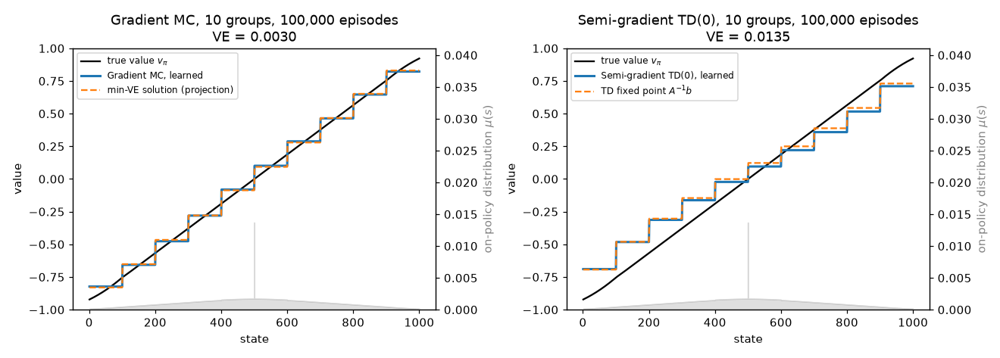

| | learned $\overline{VE}$ | exact solution's $\overline{VE}$ |
|---|---|---|
| gradient MC | 0.00300 | $\min_{\mathbf{w}}\overline{VE} = 0.00296$ (projection) |
| semi-gradient TD(0) | 0.01348 | $\overline{VE}(\mathbf{w}_{TD}) = 0.01363$ (TD fixed point) |

What to notice:

* **Gradient MC finds the best staircase.** Within each group the MC weight converges to the $\mu$-weighted average of $v_\pi$ over the group (Exercise 2). Because $\mu$ increases toward the centre, every step sits a little closer to its inner end than the plain average would (group 1: $-0.830$, against an unweighted mean of $-0.846$).
* **TD finds a different, worse staircase.** The TD solution is visibly "compressed" toward zero: group 1 at $-0.69$ instead of $-0.83$, group 10 at $0.73$ instead of $0.83$. Bootstrapping lets the approximation error of neighbouring groups leak into each group's target. Its $\overline{VE}$ is $4.6$ times the minimum. Section 5.3 bounds this ratio by $1/(1-\gamma^2)$ for discounted continuing tasks under the stationary distribution; for this undiscounted episodic task that bound is vacuous ($\gamma = 1$), so the modest factor 4.6 is an empirical fact, not a guarantee. (Sections 3.5 and 4.5 show how TD($\lambda$) closes the gap.)
* **The start state causes the asymmetry** of the TD staircase (group 5, states 401–500, sits at $-0.001$ while group 6 sits at $+0.122$). State 500 belongs to group 5 and gets one extra visit per episode. Its TD target averages groups 5 and 6 almost equally, which pulls group 5 up, and bootstrapping passes that shift on to the other groups. Re-solving with the start split 50/50 between states 500 and 501 (which makes $\mu$ symmetric) gives an exactly antisymmetric TD staircase, $\pm0.062$ for the two middle groups. Gradient MC barely notices the start state ($-0.087$ vs $+0.093$), because its targets do not pass errors between groups.
* **Constant step sizes leave a noise floor.** The learned TD weights fluctuate around the exact fixed point by up to 0.03 (e.g. group 5: $-0.023$ learned vs $-0.001$ exact). A decaying step size would remove this (Section 7).

The script also reproduces the $n$-step experiment of S&B Fig. 9.2 (right): 20 groups, RMS error over the 1000 states (unweighted, as in the book) averaged over the first 10 episodes and 100 runs, for $n\in\lbrace 1,2,4,\dots,512\rbrace$ and $\alpha\in[0,1]$:

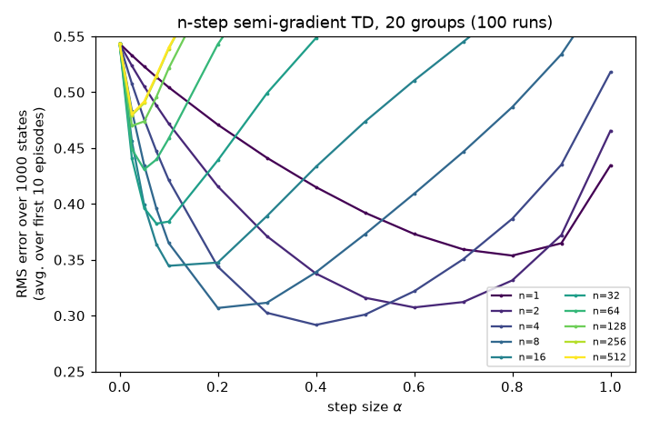

The best setting was $n = 4$, $\alpha = 0.4$ (error 0.292). One-step TD reached at best 0.354 ($\alpha = 0.8$), and the Monte-Carlo-like $n = 512$ at best 0.480 ($\alpha = 0.025$). As in the tabular case ([Chapter 06](06-n-step-and-eligibility-traces.md)), an intermediate amount of bootstrapping learns fastest.

### 3.5 Semi-gradient TD(λ) with a trace vector

[Chapter 06](06-n-step-and-eligibility-traces.md) (Section 9) introduced eligibility traces for tables and promised the function-approximation version. Here it is. With a table, each *state* has a trace. With a parameterised $\hat v$, each *weight* has one: the trace vector $\mathbf{z}_t\in\mathbb{R}^d$ accumulates recent gradients and fades by $\gamma\lambda$ per step,

$$
\mathbf{z}_t = \gamma\lambda\,\mathbf{z}_{t-1} + \nabla\hat v(S_t,\mathbf{w}_t)\quad(\mathbf{z}_{-1} = \mathbf{0}),
\qquad
\mathbf{w}_{t+1} = \mathbf{w}_t + \alpha\,\delta_t\,\mathbf{z}_t ,
$$

with the one-step TD error $\delta_t = R_{t+1}+\gamma\hat v(S_{t+1},\mathbf{w}_t)-\hat v(S_t,\mathbf{w}_t)$. For linear $\hat v$ (Section 4), $\nabla\hat v(S_t,\mathbf{w}) = \mathbf{x}(S_t)$, so within an episode $\mathbf{z}_t = \sum_{k\le t}(\gamma\lambda)^{t-k}\mathbf{x}(S_k)$. Each TD error is credited to every recently active feature, in proportion to how recently and how strongly it was active. With one-hot features this is exactly the tabular accumulating trace.

```text
Semi-gradient TD(λ) for estimating v̂ ≈ v_π
------------------------------------------------------------------
Input:  the policy π to be evaluated
Input:  a differentiable v̂ : S+ × R^d → R with v̂(terminal, ·) = 0
Parameters: step size α > 0, trace decay λ ∈ [0, 1]
Initialise w ∈ R^d arbitrarily (e.g. w = 0)

Loop for each episode:
    Initialise S
    z ← 0                                       # d-dimensional trace, reset every episode
    Loop for each step of the episode:
        Choose A ~ π(·|S); take A, observe R, S'
        z ← γλ z + ∇v̂(S, w)                     # = x(S) for linear v̂
        δ ← R + γ v̂(S', w) − v̂(S, w)            # v̂(S', w) = 0 if S' is terminal
        w ← w + α δ z
        S ← S'
    until S is terminal
```

(For a continuing task, initialise $\mathbf{z}$ once and never reset it.) Three remarks:

* $\lambda = 0$ gives $\mathbf{z}_t = \nabla\hat v(S_t,\mathbf{w}_t)$, i.e. semi-gradient TD(0).
* $\lambda = 1$ (with $\gamma = 1$, episodic): if the weights were frozen during the episode and the updates summed at its end, the total update would equal gradient MC's, by the forward–backward equivalence of [Chapter 06](06-n-step-and-eligibility-traces.md) (Section 10). Online the two differ slightly because $\mathbf{w}$ moves within the episode. *True online* TD($\lambda$) with dutch traces ([Chapter 06](06-n-step-and-eligibility-traces.md), Section 12) removes the discrepancy for linear features and is the recommended linear version in practice.
* The cost is $O(d)$ per step, like TD(0). Traces enlarge the effective step size (a feature active on consecutive steps gets credit up to $1/(1-\gamma\lambda)$ times), so larger $\lambda$ needs smaller $\alpha$.

Where TD($\lambda$) converges, and how the fixed point moves from the TD(0) solution toward the MC solution as $\lambda\to1$, is derived in Section 4.5 once we have the matrix notation.

## 4. Linear methods and the TD fixed point

### 4.1 Linear value functions

In a **linear** method each state $s$ is described by a **feature vector** $\mathbf{x}(s) = (x_1(s),\dots,x_d(s))^\top$, and

$$
\hat v(s,\mathbf{w}) \doteq \mathbf{w}^\top\mathbf{x}(s) = \sum_{i=1}^d w_i x_i(s), \qquad \nabla\hat v(s,\mathbf{w}) = \mathbf{x}(s).
$$

The features can be arbitrarily nonlinear functions of the state; "linear" refers to the dependence on $\mathbf{w}$. The general SGD update becomes

$$
\mathbf{w}_{t+1} = \mathbf{w}_t + \alpha\big[U_t - \mathbf{w}_t^\top\mathbf{x}(S_t)\big]\mathbf{x}(S_t).
$$

Stack the feature vectors as the rows of the $|\mathcal{S}|\times d$ matrix $\mathbf{X}$, so $\hat v_{\mathbf{w}} = \mathbf{X}\mathbf{w}$. Then $\overline{VE}(\mathbf{w}) = (v_\pi-\mathbf{X}\mathbf{w})^\top\mathbf{D}(v_\pi-\mathbf{X}\mathbf{w})$ is a convex quadratic. Setting its gradient $-2\mathbf{X}^\top\mathbf{D}(v_\pi-\mathbf{X}\mathbf{w})$ to zero gives the normal equations and the unique minimiser (assuming $\mathbf{X}$ has full column rank and $\mu(s)>0$ for all $s$):

$$
\mathbf{w}_{MC} = (\mathbf{X}^\top\mathbf{D}\mathbf{X})^{-1}\mathbf{X}^\top\mathbf{D}v_\pi, \qquad \mathbf{X}\mathbf{w}_{MC} = \Pi v_\pi,\quad \Pi \doteq \mathbf{X}(\mathbf{X}^\top\mathbf{D}\mathbf{X})^{-1}\mathbf{X}^\top\mathbf{D}.
$$

$\Pi$ is the **projection** onto the representable subspace $\lbrace\mathbf{X}\mathbf{w}\rbrace$ that is orthogonal with respect to the inner product $\langle f,g\rangle_\mu = f^\top\mathbf{D}g$. Gradient MC with linear features converges to this global optimum.

### 4.2 Deriving the TD fixed point

Write $\mathbf{x}_t \doteq \mathbf{x}(S_t)$. Linear semi-gradient TD(0) is

$$
\begin{aligned}
\mathbf{w}_{t+1} &= \mathbf{w}_t + \alpha\big(R_{t+1}+\gamma\mathbf{w}_t^\top\mathbf{x}_{t+1}-\mathbf{w}_t^\top\mathbf{x}_t\big)\mathbf{x}_t \\
&= \mathbf{w}_t + \alpha\big(R_{t+1}\mathbf{x}_t - \mathbf{x}_t(\mathbf{x}_t-\gamma\mathbf{x}_{t+1})^\top\mathbf{w}_t\big),
\end{aligned}
$$

where the second line uses $\mathbf{w}^\top\mathbf{x} = \mathbf{x}^\top\mathbf{w}$ to pull the scalar to the right of $\mathbf{x}_t$. Suppose the system is in its steady state: $S_t\sim\mu$ and the transition is generated by $\pi$. Taking the expectation of the update for a given $\mathbf{w}_t$,

$$
\mathbb{E}\big[\mathbf{w}_{t+1}\mid\mathbf{w}_t\big] = \mathbf{w}_t + \alpha\big(\mathbf{b}-\mathbf{A}\mathbf{w}_t\big),
\qquad
\mathbf{b}\doteq\mathbb{E}\big[R_{t+1}\mathbf{x}_t\big]\in\mathbb{R}^d,
\quad
\mathbf{A}\doteq\mathbb{E}\big[\mathbf{x}_t(\mathbf{x}_t-\gamma\mathbf{x}_{t+1})^\top\big]\in\mathbb{R}^{d\times d}.
$$

If the iteration converges, it must converge to a point where the expected update is zero, $\mathbf{b}-\mathbf{A}\mathbf{w}_{TD} = \mathbf{0}$, i.e.

$$
\boxed{\;\mathbf{w}_{TD} = \mathbf{A}^{-1}\mathbf{b}\;}
$$

(assuming $\mathbf{A}$ is invertible, which Section 5 guarantees on-policy). This is the **TD fixed point**. Note the logic: we have not yet shown that TD converges, only where it must go if it does.

### 4.3 Matrix form and the projected Bellman equation

Let $r_\pi(s)\doteq\sum_a\pi(a\mid s)\sum_{s',r}p(s',r\mid s,a)\,r$ be the expected one-step reward. Writing the expectations as sums over $s\sim\mu$, then the action and the next state,

$$
\begin{aligned}
\mathbf{A} &= \sum_s\mu(s)\,\mathbf{x}(s)\Big(\mathbf{x}(s)-\gamma\sum_{s'}\mathbf{P}_\pi(s,s')\mathbf{x}(s')\Big)^\top
= \mathbf{X}^\top\mathbf{D}\big(\mathbf{X}-\gamma\mathbf{P}_\pi\mathbf{X}\big)
= \mathbf{X}^\top\mathbf{D}(\mathbf{I}-\gamma\mathbf{P}_\pi)\mathbf{X},\\
\mathbf{b} &= \sum_s\mu(s)\,\mathbf{x}(s)\,r_\pi(s) = \mathbf{X}^\top\mathbf{D}\,r_\pi .
\end{aligned}
$$

(The first equality in each line uses that $\mathbf{x}(s)$ depends only on $s$, so the expectation over the transition can be pushed inside; row $s$ of $\mathbf{P}_\pi\mathbf{X}$ is the expected next feature vector.) In the episodic case the same formulas hold with the episodic $\mu$ and the substochastic $\mathbf{P}_\pi$, and terminal states have $\mathbf{x} = \mathbf{0}$.

With the Bellman operator $\mathcal{T}^\pi v \doteq r_\pi + \gamma\mathbf{P}_\pi v$ ([Chapter 03](03-dynamic-programming.md)), the TD fixed point has a beautiful geometric characterisation.

**Claim.** $\mathbf{A}\mathbf{w} = \mathbf{b}$ if and only if $\mathbf{X}\mathbf{w} = \Pi\,\mathcal{T}^\pi(\mathbf{X}\mathbf{w})$.

*Proof.* ($\Leftarrow$) Multiply $\mathbf{X}\mathbf{w}=\Pi\mathcal{T}^\pi(\mathbf{X}\mathbf{w})$ on the left by $\mathbf{X}^\top\mathbf{D}$. Since $\mathbf{X}^\top\mathbf{D}\Pi = \mathbf{X}^\top\mathbf{D}\mathbf{X}(\mathbf{X}^\top\mathbf{D}\mathbf{X})^{-1}\mathbf{X}^\top\mathbf{D} = \mathbf{X}^\top\mathbf{D}$, we get $\mathbf{X}^\top\mathbf{D}\mathbf{X}\mathbf{w} = \mathbf{X}^\top\mathbf{D}(r_\pi+\gamma\mathbf{P}_\pi\mathbf{X}\mathbf{w})$, i.e. $\mathbf{X}^\top\mathbf{D}(\mathbf{I}-\gamma\mathbf{P}_\pi)\mathbf{X}\mathbf{w} = \mathbf{X}^\top\mathbf{D}r_\pi$, which is $\mathbf{A}\mathbf{w}=\mathbf{b}$.
($\Rightarrow$) If $\mathbf{X}^\top\mathbf{D}\mathcal{T}^\pi(\mathbf{X}\mathbf{w}) = \mathbf{X}^\top\mathbf{D}\mathbf{X}\mathbf{w}$, then $\Pi\mathcal{T}^\pi(\mathbf{X}\mathbf{w}) = \mathbf{X}(\mathbf{X}^\top\mathbf{D}\mathbf{X})^{-1}\mathbf{X}^\top\mathbf{D}\mathbf{X}\mathbf{w} = \mathbf{X}\mathbf{w}$. $\square$

So TD does **not** look for the representable function closest to $v_\pi$ (that is $\Pi v_\pi$, the MC solution). It looks for the representable function that is unchanged by "do a Bellman backup, then project back onto the subspace". Section 15 develops this geometry further.

### 4.4 A worked example by hand

Take a continuing two-state chain: state 1 always moves to state 2 with reward 0, state 2 always moves back to state 1 with reward 1, and $\gamma = 0.9$. One feature: $x(1) = 1$, $x(2) = 2$, so $\hat v = (w, 2w)$.

*True values.* $v(1) = 0.9\,v(2)$ and $v(2) = 1 + 0.9\,v(1)$ give $v(2) = 1/(1-0.81) = 5.263$ and $v(1) = 4.737$.

*On-policy distribution.* The chain alternates, so $\mu = (\tfrac12,\tfrac12)$.

*TD fixed point.* $A = \sum_s\mu(s)x(s)(x(s)-\gamma x(s'))$, with $s'$ the successor of $s$:

$$
A = \tfrac12\cdot 1\cdot(1 - 0.9\cdot 2) + \tfrac12\cdot 2\cdot(2-0.9\cdot 1) = -0.4 + 1.1 = 0.7,\qquad
b = \tfrac12\cdot1\cdot0 + \tfrac12\cdot2\cdot1 = 1 .
$$

So $w_{TD} = 1/0.7 = 1.4286$ and $\hat v_{TD} = (1.429, 2.857)$.

*Best fit.* $w_{MC} = \frac{\sum_s\mu(s)x(s)v(s)}{\sum_s\mu(s)x(s)^2} = \frac{0.5\cdot4.737+0.5\cdot2\cdot5.263}{0.5\cdot1+0.5\cdot4} = \frac{7.632}{2.5} = 3.053$, giving $\hat v_{MC} = (3.053, 6.105)$.

*Errors.* $\overline{VE}(w_{MC}) = \tfrac12(1.684^2+0.842^2) = 1.773$ and $\overline{VE}(w_{TD}) = \tfrac12(3.308^2+2.406^2) = 8.367$. The ratio $8.367/1.773 = 4.72$ is below the bound $1/(1-\gamma^2) = 5.26$ derived next, and well below S&B's looser $1/(1-\gamma) = 10$.

Notice that the contribution of state 1 to $A$ is *negative* ($-0.4$): on its own, the transition $1\to2$ would push $|w|$ away from zero without limit (its target $0.9\cdot 2w = 1.8w$ has the same sign as the estimate $w$ and a larger magnitude). It is the transitions out of state 2, visited equally often on-policy, that make $A$ positive. Hold on to that thought for Section 13.

### 4.5 The TD(λ) fixed point

Section 3.5's algorithm has a fixed point of the same kind. Fix $\mathbf{w}$ and consider the steady state ($S_t\sim\mu$, and the trace has forgotten its initialisation). Unrolling the trace gives $\mathbb{E}[\delta_t\mathbf{z}_t] = \sum_{k\ge0}(\gamma\lambda)^k\,\mathbb{E}[\mathbf{x}_{t-k}\delta_t]$. Two facts evaluate each term. By stationarity, $\mathbb{E}[\mathbf{x}(S_{t-k})f(S_t)] = \sum_s\mu(s)\mathbf{x}(s)\sum_{s'}\mathbf{P}_\pi^k(s,s')f(s') = \mathbf{X}^\top\mathbf{D}\mathbf{P}_\pi^kf$ for any function $f$. By the Markov property, the expected TD error given the past is the Bellman error at $S_t$, $f = \mathcal{T}^\pi v_{\mathbf{w}}-v_{\mathbf{w}} = r_\pi+\gamma\mathbf{P}_\pi\mathbf{X}\mathbf{w}-\mathbf{X}\mathbf{w}$. Hence

$$
\begin{aligned}
\mathbb{E}[\delta_t\mathbf{z}_t]
&= \sum_{k\ge0}(\gamma\lambda)^k\,\mathbf{X}^\top\mathbf{D}\mathbf{P}_\pi^k\big(r_\pi-(\mathbf{I}-\gamma\mathbf{P}_\pi)\mathbf{X}\mathbf{w}\big)
= \mathbf{X}^\top\mathbf{D}(\mathbf{I}-\gamma\lambda\mathbf{P}_\pi)^{-1}\big(r_\pi-(\mathbf{I}-\gamma\mathbf{P}_\pi)\mathbf{X}\mathbf{w}\big)\\
&= \mathbf{b}_\lambda-\mathbf{A}_\lambda\mathbf{w},
\qquad
\mathbf{A}_\lambda\doteq\mathbf{X}^\top\mathbf{D}(\mathbf{I}-\gamma\lambda\mathbf{P}_\pi)^{-1}(\mathbf{I}-\gamma\mathbf{P}_\pi)\mathbf{X},
\quad
\mathbf{b}_\lambda\doteq\mathbf{X}^\top\mathbf{D}(\mathbf{I}-\gamma\lambda\mathbf{P}_\pi)^{-1}r_\pi ,
\end{aligned}
$$

using the Neumann series $\sum_{k\ge0}(\gamma\lambda\mathbf{P}_\pi)^k = (\mathbf{I}-\gamma\lambda\mathbf{P}_\pi)^{-1}$. (In the episodic case the trace is reset at every episode start. The substochastic $\mathbf{P}_\pi^k$ counts only paths that have not terminated, so the formula is unchanged.) At $\lambda = 0$ these are the $\mathbf{A}$ and $\mathbf{b}$ of Section 4.3, and the TD($\lambda$) fixed point is $\mathbf{w}_{TD(\lambda)} = \mathbf{A}_\lambda^{-1}\mathbf{b}_\lambda$. Two checks connect it to familiar objects:

* **It solves a projected Bellman equation.** Let $\mathcal{T}^\lambda v\doteq(1-\lambda)\sum_{m\ge0}\lambda^m(\mathcal{T}^\pi)^{m+1}v$ be the expected $\lambda$-return written as an operator ([Chapter 06](06-n-step-and-eligibility-traces.md), Section 15.2). Write $(\mathcal{T}^\pi)^{m+1}v = \sum_{k=0}^{m}(\gamma\mathbf{P}_\pi)^kr_\pi+(\gamma\mathbf{P}_\pi)^{m+1}v$ and sum the geometric series over $m$. The result is $\mathcal{T}^\lambda v = (\mathbf{I}-\gamma\lambda\mathbf{P}_\pi)^{-1}\big(r_\pi+\gamma(1-\lambda)\mathbf{P}_\pi v\big)$, hence $v-\mathcal{T}^\lambda v = (\mathbf{I}-\gamma\lambda\mathbf{P}_\pi)^{-1}\big((\mathbf{I}-\gamma\mathbf{P}_\pi)v-r_\pi\big)$. So $\mathbf{b}_\lambda-\mathbf{A}_\lambda\mathbf{w} = \mathbf{X}^\top\mathbf{D}(\mathcal{T}^\lambda v_{\mathbf{w}}-v_{\mathbf{w}})$, and the proof of Section 4.3 shows $\mathbf{A}_\lambda\mathbf{w} = \mathbf{b}_\lambda\iff\mathbf{X}\mathbf{w} = \Pi\mathcal{T}^\lambda\mathbf{X}\mathbf{w}$.
* **At $\lambda = 1$ it is the Monte Carlo solution.** Then $(\mathbf{I}-\gamma\mathbf{P}_\pi)^{-1}(\mathbf{I}-\gamma\mathbf{P}_\pi) = \mathbf{I}$, so $\mathbf{A}_1 = \mathbf{X}^\top\mathbf{D}\mathbf{X}$ and $\mathbf{b}_1 = \mathbf{X}^\top\mathbf{D}(\mathbf{I}-\gamma\mathbf{P}_\pi)^{-1}r_\pi = \mathbf{X}^\top\mathbf{D}v_\pi$: $\mathbf{w}_{TD(1)} = \mathbf{w}_{MC}$. (With $\gamma = 1$ this needs termination to be certain, so that $\mathbf{I}-\mathbf{P}_\pi$ is invertible.)

**On the random walk.** [`lstd_vs_td.py`](../code/ch08_function_approximation/lstd_vs_td.py) (Part 1b) solves $\mathbf{A}_\lambda\mathbf{w} = \mathbf{b}_\lambda$ exactly and reports $\sqrt{\overline{VE}}$ at the fixed point:

| features | $\lambda = 0$ | 0.5 | 0.8 | 0.9 | 0.95 | 0.99 | 1 (MC) |
|---|---|---|---|---|---|---|---|
| aggregation, 10 groups | 0.1167 | 0.0798 | 0.0600 | 0.0559 | 0.0548 | 0.0544 | 0.0544 |
| aggregation, 20 groups | 0.0482 | 0.0342 | 0.0286 | 0.0277 | 0.0274 | 0.0273 | 0.0273 |
| Fourier, order 5 | 0.0080 | 0.0079 | 0.0079 | 0.0079 | 0.0079 | 0.0079 | 0.0079 |

With coarse aggregation most of the gap to the best fit closes by $\lambda\approx0.8$–$0.9$. With features that already fit well, $\lambda$ hardly matters. The fixed point is only half the story, though. The same script also runs the box of Section 3.5 (20 groups, 30 runs of 300 episodes, the best $\alpha$ from $\lbrace0.003, 0.01, 0.03, 0.1\rbrace$ for each $\lambda$). After 300 episodes TD(0) ($\alpha = 0.1$), TD(0.5) ($\alpha = 0.03$) and TD(0.9) ($\alpha = 0.01$) reached $\sqrt{\overline{VE}}$ = 0.067, 0.063 and 0.068. All three are well above their fixed points (0.048, 0.034, 0.028) and nearly equal. At this amount of data and with a constant step size, the noise floor sets the error, not the fixed point. Larger $\lambda$ also needed a smaller $\alpha$ to keep its higher-variance updates in check (top-left panel of the figure in Section 9).

## 5. Convergence of linear TD on-policy

### 5.1 Stability of the expected update

The expected update $\mathbf{w}_{t+1} = \mathbf{w}_t+\alpha(\mathbf{b}-\mathbf{A}\mathbf{w}_t)$ can be rewritten in terms of the error $\mathbf{e}_t = \mathbf{w}_t-\mathbf{w}_{TD}$ as $\mathbf{e}_{t+1} = (\mathbf{I}-\alpha\mathbf{A})\mathbf{e}_t$. It converges for all starting points iff every eigenvalue of $\mathbf{I}-\alpha\mathbf{A}$ has modulus below 1. If $\kappa$ is an eigenvalue of $\mathbf{A}$ (we write $\kappa$ for eigenvalues because $\lambda$ is reserved for the trace-decay parameter), then $1-\alpha\kappa$ is an eigenvalue of $\mathbf{I}-\alpha\mathbf{A}$ and

$$
|1-\alpha\kappa|^2 = 1 - 2\alpha\operatorname{Re}\kappa + \alpha^2|\kappa|^2 < 1 \iff 0<\alpha<\frac{2\operatorname{Re}\kappa}{|\kappa|^2}.
$$

So **if every eigenvalue of $\mathbf{A}$ has positive real part, the expected update converges for small enough $\alpha$; if some eigenvalue has negative real part, it diverges for every $\alpha>0$ from almost every starting point** (all except those whose initial error has no component along the unstable eigenvectors). A convenient sufficient condition is that $\mathbf{A}$ be **positive definite**, $\mathbf{y}^\top\mathbf{A}\mathbf{y}>0$ for all $\mathbf{y}\ne\mathbf{0}$ (no symmetry required): for an eigenpair $\mathbf{A}\mathbf{y} = \kappa\mathbf{y}$ with complex eigenvector $\mathbf{y} = \mathbf{y}_R+i\mathbf{y}_I$, the real part of $\bar{\mathbf{y}}^\top\mathbf{A}\mathbf{y}$ is $\mathbf{y}_R^\top\mathbf{A}\mathbf{y}_R+\mathbf{y}_I^\top\mathbf{A}\mathbf{y}_I>0$, and it equals $\operatorname{Re}\kappa\,\lVert\mathbf{y}\rVert^2$.

### 5.2 On-policy, A is positive definite

**Lemma (non-expansion).** If $\mu$ is the stationary distribution of $\mathbf{P}_\pi$, then $\lVert\mathbf{P}_\pi v\rVert_\mu\le\lVert v\rVert_\mu$ for every $v$.

*Proof.* Each row of $\mathbf{P}_\pi$ is a probability distribution, so by Jensen's inequality $(\sum_{s'}\mathbf{P}_\pi(s,s')v(s'))^2\le\sum_{s'}\mathbf{P}_\pi(s,s')v(s')^2$. Hence

$$
\lVert\mathbf{P}_\pi v\rVert_\mu^2 = \sum_s\mu(s)\Big(\sum_{s'}\mathbf{P}_\pi(s,s')v(s')\Big)^2
\le \sum_{s'}\Big(\sum_s\mu(s)\mathbf{P}_\pi(s,s')\Big)v(s')^2 = \sum_{s'}\mu(s')v(s')^2 = \lVert v\rVert_\mu^2,
$$

where the second-to-last step is stationarity, $\mu^\top\mathbf{P}_\pi = \mu^\top$. $\square$

**Theorem.** If $\mu$ is the stationary distribution with $\mu(s)>0$ for all $s$, $\gamma<1$, and $\mathbf{X}$ has linearly independent columns, then $\mathbf{A} = \mathbf{X}^\top\mathbf{D}(\mathbf{I}-\gamma\mathbf{P}_\pi)\mathbf{X}$ is positive definite.

*Proof.* Let $\mathbf{y}\neq\mathbf{0}$ and $v = \mathbf{X}\mathbf{y}\neq\mathbf{0}$ (independent columns). Using Cauchy–Schwarz in the $\mu$-inner product and the lemma,

$$
\mathbf{y}^\top\mathbf{A}\mathbf{y} = v^\top\mathbf{D}v - \gamma\,v^\top\mathbf{D}\mathbf{P}_\pi v
\ge \lVert v\rVert_\mu^2 - \gamma\lVert v\rVert_\mu\lVert\mathbf{P}_\pi v\rVert_\mu
\ge (1-\gamma)\lVert v\rVert_\mu^2 > 0.\qquad\square
$$

Sutton & Barto give an equivalent argument through the "key matrix" $\mathbf{D}(\mathbf{I}-\gamma\mathbf{P}_\pi)$: its diagonal is positive, its off-diagonal entries are non-positive, its row sums are $(1-\gamma)\mu$ and, *because of stationarity*, its column sums $\mathbf{1}^\top\mathbf{D}(\mathbf{I}-\gamma\mathbf{P}_\pi) = \mu^\top-\gamma\mu^\top\mathbf{P}_\pi = (1-\gamma)\mu^\top$ are positive too; so the symmetric part is strictly diagonally dominant with a positive diagonal, hence positive definite.

**The on-policy distribution is doing real work.** If states are weighted by some other distribution $d$ (off-policy training), the lemma fails, $\mathbf{A}$ can have eigenvalues with negative real part, and the iteration can diverge. That is the root of everything in Sections 13–17.

For **episodic** tasks with $\gamma = 1$, the analogous result holds when termination is eventually certain from every state; then $\mathbf{P}_\pi$ is substochastic with $\mathbf{P}_\pi^k\to0$. For the random walk, [`random_walk_aggregation.py`](../code/ch08_function_approximation/random_walk_aggregation.py) prints the smallest eigenvalue of the symmetric part of $\mathbf{A}$: $1.1\times10^{-3}$ for 10-group aggregation and $1.1\times10^{-2}$ for the order-5 Fourier basis, both positive as they must be.

### 5.3 How good is the TD fixed point?

The TD fixed point is not the best fit, but it is never terribly far from it on-policy.

**Theorem.** Under the conditions of Section 5.2,

$$
\overline{VE}(\mathbf{w}_{TD}) \;\le\; \frac{1}{1-\gamma^2}\,\min_{\mathbf{w}}\overline{VE}(\mathbf{w}) \;\le\; \frac{1}{1-\gamma}\,\min_{\mathbf{w}}\overline{VE}(\mathbf{w}).
$$

*Proof.* Write $v = v_\pi$ and $\hat v = \mathbf{X}\mathbf{w}_{TD}$, so that $\hat v = \Pi\mathcal{T}^\pi\hat v$ (Section 4.3), while $v = \mathcal{T}^\pi v$ (Bellman equation) and hence $\Pi v = \Pi\mathcal{T}^\pi v$.

*Step 1 (Pythagoras).* $\hat v-\Pi v$ lies in the subspace, and $\Pi v-v$ is $\mu$-orthogonal to the subspace (that is what an orthogonal projection does). So

$$
\lVert\hat v-v\rVert_\mu^2 = \lVert\hat v-\Pi v\rVert_\mu^2 + \lVert\Pi v-v\rVert_\mu^2 .
$$

*Step 2 (contraction).* $\Pi$ is an orthogonal projection, hence non-expansive in $\lVert\cdot\rVert_\mu$, and $\mathcal{T}^\pi\hat v-\mathcal{T}^\pi v = \gamma\mathbf{P}_\pi(\hat v-v)$. With the lemma,

$$
\lVert\hat v-\Pi v\rVert_\mu = \lVert\Pi\mathcal{T}^\pi\hat v-\Pi\mathcal{T}^\pi v\rVert_\mu \le \gamma\lVert\mathbf{P}_\pi(\hat v-v)\rVert_\mu \le \gamma\lVert\hat v-v\rVert_\mu .
$$

*Step 3 (combine).* $\lVert\hat v-v\rVert_\mu^2\le\gamma^2\lVert\hat v-v\rVert_\mu^2+\lVert\Pi v-v\rVert_\mu^2$, so $(1-\gamma^2)\,\overline{VE}(\mathbf{w}_{TD})\le\lVert\Pi v-v\rVert_\mu^2 = \min_{\mathbf{w}}\overline{VE}(\mathbf{w})$. Finally, $1-\gamma^2 = (1-\gamma)(1+\gamma)\ge1-\gamma$. $\square$

Step 2 also shows that $\Pi\mathcal{T}^\pi$ is a $\gamma$-contraction in $\lVert\cdot\rVert_\mu$, which gives a second proof that the fixed point exists and is unique. The looser constant $\frac{1}{1-\gamma}$ is the form stated in S&B (eq. 9.14); Tsitsiklis & Van Roy's original norm bound is $\lVert\hat v - v\rVert_\mu\le\frac{1}{1-\gamma}\lVert\Pi v-v\rVert_\mu$ for TD(0), which after squaring is weaker still. The sharper $\frac{1}{1-\gamma^2}$ form appears in later treatments, e.g. Bertsekas's *Dynamic Programming and Optimal Control*.

**Interpretation.** With $\gamma$ close to 1, the bound allows the TD solution to be much worse than the best fit. In exchange TD has lower variance and learns faster. For TD($\lambda$) (Sections 3.5 and 4.5) the constant improves as $\lambda\to1$ (Tsitsiklis & Van Roy's bound is $\frac{1-\gamma\lambda}{1-\gamma}$ in norm), recovering the MC solution at $\lambda = 1$: this is the bias–variance knob of [Chapter 06](06-n-step-and-eligibility-traces.md).

### 5.4 The stochastic convergence theorem

The expected-update argument is the heart of the matter, but the actual algorithm is stochastic. The precise result is:

> **Theorem (Tsitsiklis & Van Roy, 1997, simplified to finite chains).** Let the states be generated by an irreducible, aperiodic, finite Markov chain under $\pi$ with stationary distribution $\mu$ (so $\mu(s)>0$), let the features be linearly independent, let $\gamma\in[0,1)$ and $\lambda\in[0,1]$, and let the step sizes $\alpha_t$ be positive, nonincreasing, with $\sum_t\alpha_t=\infty$, $\sum_t\alpha_t^2<\infty$. Then linear TD($\lambda$) (Section 3.5) converges with probability 1 to the unique $\mathbf{w}_{TD(\lambda)}$ solving $\mathbf{X}\mathbf{w} = \Pi\mathcal{T}^{\lambda}\mathbf{X}\mathbf{w}$, where $\mathcal{T}^{\lambda}v \doteq (1-\lambda)\sum_{m\ge0}\lambda^m(\mathcal{T}^\pi)^{m+1}v$ is the $\lambda$-return Bellman operator ([Chapter 06](06-n-step-and-eligibility-traces.md), Section 15.2), and $\lVert\mathbf{X}\mathbf{w}_{TD(\lambda)}-v_\pi\rVert_\mu\le\frac{1-\gamma\lambda}{1-\gamma}\lVert\Pi v_\pi - v_\pi\rVert_\mu$.

The proof uses the ODE method of stochastic approximation: the noisy iterates track the solution of $\dot{\mathbf{w}} = \mathbf{b}_\lambda-\mathbf{A}_\lambda\mathbf{w}$ (Section 4.5; $\mathbf{A}_0 = \mathbf{A}$). (The ODE method, and a Lyapunov proof that this ODE is stable for TD(0), are developed in [Chapter 19](19-rl-theory.md), Sections 3.2–3.3.) Its stability follows as in Section 5.2: by the lemma, the linear part $\gamma(1-\lambda)(\mathbf{I}-\gamma\lambda\mathbf{P}_\pi)^{-1}\mathbf{P}_\pi$ of $\mathcal{T}^\lambda$ has $\mu$-norm at most $\sum_{k\ge0}(1-\lambda)\lambda^k\gamma^{k+1} = \frac{\gamma(1-\lambda)}{1-\gamma\lambda}<1$, so $\mathbf{y}^\top\mathbf{A}_\lambda\mathbf{y}\ge\big(1-\frac{\gamma(1-\lambda)}{1-\gamma\lambda}\big)\lVert\mathbf{X}\mathbf{y}\rVert_\mu^2>0$. (Their paper also covers infinite state spaces and gives a counterexample in which TD with a *nonlinear* approximator diverges even on-policy.)

### 5.5 Checking the theory numerically, on- and off-policy

[`linear_td_theory.py`](../code/ch08_function_approximation/linear_td_theory.py) draws 300 random 30-state Markov reward processes per $\gamma$ (each state moves to 2 random successors, mixed with 5% uniform jumps so the chain is ergodic), with 4 random Gaussian features, and computes everything exactly. Under the stationary weighting $\mu$ it reports $\overline{VE}(\mathbf{w}_{TD})/\min\overline{VE}$. As a stress test it then repeats the computation under a random, skewed weighting $d\sim\text{Dirichlet}(0.1)$, which stands in for an off-policy state distribution. (These MRPs have no actions, so $d$ need not be the state distribution of any actual behaviour policy.) Off-policy it also reports how often $\mathbf{A}$ fails to be positive definite and how often it has an eigenvalue with negative real part, in which case expected TD diverges and its fixed point is never reached. The off-policy ratios are therefore split into instances where expected TD converges and all instances:

| $\gamma$ | $\frac{1}{1-\gamma^2}$ | on-policy: max ratio | violations | off: A not PD | off: expected TD diverges | off, TD converges: max ratio | off, TD converges: ratio $>\frac{1}{1-\gamma}$ | off: max ratio (all instances, incl. divergent) |
|---|---|---|---|---|---|---|---|---|
| 0.50 | 1.33 | 1.124 | 0 / 300 | 30 | 1 | $1.2\times10^3$ | 89 | $1.9\times10^6$ |
| 0.80 | 2.78 | 1.748 | 0 / 300 | 108 | 21 | $2.6\times10^3$ | 71 | $2.6\times10^3$ |
| 0.90 | 5.26 | 2.076 | 0 / 300 | 111 | 29 | $3.1\times10^4$ | 37 | $3.7\times10^4$ |
| 0.95 | 10.26 | 3.440 | 0 / 300 | 116 | 23 | $7.7\times10^3$ | 20 | $7.7\times10^3$ |
| 0.99 | 50.25 | 4.141 | 0 / 300 | 137 | 32 | 148 | 1 | 311 |

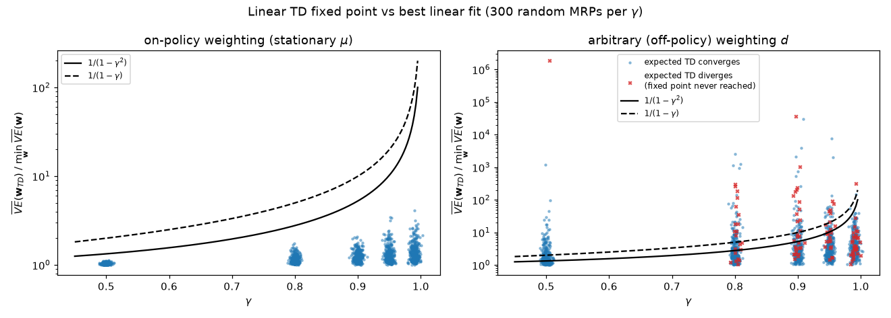

On-policy, positive definiteness and the bound held in all 1,500 instances, and typical ratios sit far below the worst case. With an arbitrary weighting, $\mathbf{A}$ was not positive definite in up to 46% of instances and expected TD diverged in up to 11% (red crosses in the right panel). The fixed point can also be far worse than the best fit: among instances where expected TD converges, the worst ratio was $3.1\times10^4$ ($\gamma = 0.9$), and up to 30% of them exceeded the factor $\frac{1}{1-\gamma}$. The $1.9\times10^6$ at $\gamma = 0.5$ comes from the single instance at that $\gamma$ where expected TD diverges, so that fixed point is never reached.

With dense random chains (`--dense`: every row of $\mathbf{P}_\pi$ is a Dirichlet(0.5) draw over all 30 states), failures were rarer but did not disappear. $\mathbf{A}$ was not positive definite in 2–11 of 300 instances per $\gamma$, expected TD diverged in 1 of 1,500, and the fixed point exceeded $\frac{1}{1-\gamma}$ times the best fit in 22, 26, 17, 9 and 0 instances. Why the difference? It is *not* that $\mathbf{P}_\pi$ becomes non-expansive in $\lVert\cdot\rVert_d$: for these skewed weightings it essentially never is ($\lVert\mathbf{D}^{1/2}\mathbf{P}_\pi\mathbf{D}^{-1/2}\rVert_2>1$ in all 3,000 sparse and dense instances, with a median of order $10^7$). Non-expansion on all of $\mathbb{R}^{|\mathcal{S}|}$ is only sufficient. Positive definiteness concerns only the vectors $v = \mathbf{X}\mathbf{y}$, and the proof of Section 5.2 goes through whenever $\gamma c<1$, where $c \doteq \max_{\mathbf{y}}\lVert\mathbf{P}_\pi\mathbf{X}\mathbf{y}\rVert_d/\lVert\mathbf{X}\mathbf{y}\rVert_d$ is the gain of $\mathbf{P}_\pi$ on the 4-dimensional feature subspace. The script measures this gain directly. For dense chains its median is about 0.85, and $\gamma c<1$ held in 185–285 of 300 instances per $\gamma$. For sparse chains the median is about 2.1, and $\gamma c<1$ held in only 4–137 instances. A dense chain averages each value over many successors, which rarely amplifies a feature-space function. A sparse chain can carry the value of a lightly weighted state straight onto a heavily weighted one, the mechanism of Exercise 5.

## 6. Feature construction for linear methods

A linear method can only represent what its features let it represent, and it generalises exactly along the lines its features draw. Choosing features is where domain knowledge enters. A linear method cannot represent *interactions* unless a feature encodes them: with features "pole angle" and "angular velocity" alone, it cannot express "a large angle is bad *unless* the velocity is bringing the pole back". The standard constructions below all address this in different ways.

Throughout, normalise each state variable to $[0,1]$ (or $[-1,1]$) first. Polynomial and Fourier features assume it, and unscaled inputs wreck the conditioning of the problem.

### 6.1 State aggregation

Already met in Section 3.4: a partition of the state space, one-hot group features, piecewise-constant values. It is the special case of tile coding with a single tiling.

### 6.2 Polynomials

For a $k$-dimensional state $\mathbf{s} = (s_1,\dots,s_k)$, an order-$n$ polynomial basis has features

$$
x_i(\mathbf{s}) = \prod_{j=1}^k s_j^{c_{i,j}}, \qquad c_{i,j}\in\lbrace 0,1,\dots,n\rbrace ,
$$

one for each of the $(n+1)^k$ exponent vectors $\mathbf{c}_i$. For $k=2$, $n=2$ this includes $1, s_1, s_2, s_1s_2, s_1^2, s_1^2s_2,\dots, s_1^2s_2^2$: the product terms provide the interactions. Polynomials are a classic in regression but work poorly for online RL: the number of features explodes with $k$, and the features are highly correlated ($s^4$ and $s^5$ look almost alike on $[0,1]$), which makes the problem badly conditioned (Section 7).

### 6.3 The Fourier basis

On $[0,1]$, the order-$n$ **Fourier cosine basis** is $x_i(s) = \cos(i\pi s)$, $i = 0,\dots,n$. Why only cosines? A function on $[0,1]$ can be extended to an even function on $[-1,1]$, and an even periodic function has a pure cosine series. For $k$ dimensions,

$$
x_i(\mathbf{s}) = \cos\big(\pi\,\mathbf{s}^\top\mathbf{c}^i\big), \qquad \mathbf{c}^i\in\lbrace 0,\dots,n\rbrace^k ,
$$

giving $(n+1)^k$ features. Each $\mathbf{c}^i$ sets a frequency along each dimension; a zero component means "constant along that dimension", so $\mathbf{c} = (0,1)$ varies only with $s_2$, and $\mathbf{c} = (1,1)$ varies along the diagonal. Fourier features are easy to use, perform well across many problems (Konidaris, Osentoski & Thomas, 2011), and are nearly orthogonal. Konidaris et al. suggest per-feature step sizes $\alpha_i = \alpha/\lVert\mathbf{c}^i\rVert_2$ (with $\alpha_0 = \alpha$ for the constant feature) so that high-frequency features move more slowly. Their weakness is the lack of locality: every feature is global, so they handle discontinuities poorly (ringing), and the exponential count in $k$ forces you to drop interactions in high dimensions.

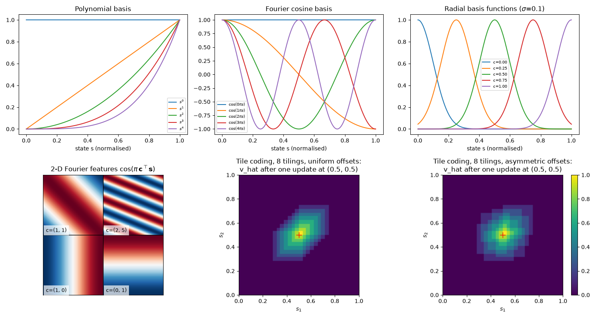

*Top row: 1-D polynomial, Fourier and RBF features. Bottom left: four 2-D Fourier features. Bottom middle and right: tile coding generalisation, discussed in Section 6.5.*

### 6.4 Coarse coding

Cover the state space with overlapping regions ("receptive fields", e.g. circles in 2-D) and let feature $i$ be 1 if the state lies inside region $i$, else 0. A state is then represented by the set of regions containing it, and an update at one state changes the value of every state sharing a region with it: the more shared regions, the stronger the generalisation. The size and shape of the regions control the *breadth* and *direction* of generalisation; their density controls the *acuity*, the finest distinction the approximator can eventually make.

[`feature_gallery.py`](../code/ch08_function_approximation/feature_gallery.py) reproduces the spirit of S&B Fig. 9.8: learn a square pulse on $[0,1]$ by linear SGD ($\alpha = 0.2/n_{\text{active}}$) with 100 interval features of width 0.04, 0.12 or 0.36.

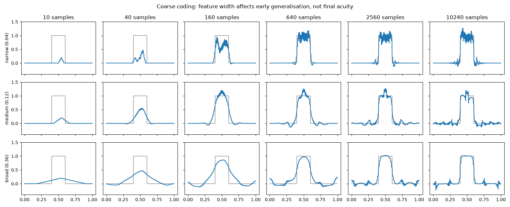

| width | RMS error after 10 / 160 / 640 / 10,240 samples |
|---|---|
| narrow (0.04) | 0.430 / 0.165 / 0.088 / 0.078 |
| medium (0.12) | 0.403 / 0.135 / 0.110 / 0.078 |
| broad (0.36) | 0.377 / 0.211 / 0.149 / 0.082 |

Broad features generalise far early on (their curves after 10 samples are wide bumps), narrow ones barely generalise. But after 10,240 samples all three reach almost the same error, because the final acuity is set by the number and density of the features, not by their width.

### 6.5 Tile coding

**Tile coding** is coarse coding with a computationally convenient structure. Each **tiling** is a partition of the state space into a grid of tiles; we use $n$ tilings, each offset from the others by a fraction of a tile width. A state activates exactly one tile per tiling, so $\mathbf{x}(s)$ is a binary vector with exactly $n$ ones. Consequences:

* $\hat v(s,\mathbf{w})$ is the sum of $n$ weights: no multiplications.
* $\mathbf{x}(s)^\top\mathbf{x}(s) = n$ for every state, which makes the step-size rule of Section 7 exact: $\alpha = \frac{1}{\tau n}$.
* The tile width sets the breadth of generalisation and the number of tilings sets the resolution: $n$ tilings of width $h$ distinguish states $h/n$ apart.

**Offsets matter.** If tiling $j$ is shifted by $j\cdot(1,1,\dots)\cdot h/n$ (uniform offsets), all tilings slide along the diagonal and generalisation is elongated along it. Miller & Glanz (1996) recommend shifting tiling $j$ by $j\cdot(1,3,5,\dots,2k-1)\cdot h/n$ (asymmetric offsets), with $n$ a power of 2 and $n\ge 4k$. The bottom-middle and bottom-right panels of the gallery show $\hat v$ after a *single* update at $(0.5,0.5)$ with 8 tilings of $4\times4$ tiles: with uniform offsets the generalisation is a diagonal streak; with asymmetric offsets it is a compact, roughly symmetric blob.

Tiles need not be square grids: stripes (tiling one dimension only) ignore the others; log-spaced tiles give finer resolution where it is needed; different tilings can use different subsets of dimensions, which is how tile coding copes with many dimensions.

**Hashing.** A tiling of a $k$-dimensional space with $m$ tiles per dimension has $m^k$ tiles, most of which are never visited. **Hashing** maps each (tiling, tile coordinates) tuple pseudo-randomly into a table of size $H$. Distant tiles then occasionally share a weight (a collision), which is harmless when $H$ is much larger than the number of tiles actually visited. Sutton's `tiles3` software uses an *index hash table* that hands out fresh indices on first visit and only starts colliding when the table is full. Our implementation provides both schemes:

```text
Tile-coding feature indices (asymmetric offsets, optional hashing)
------------------------------------------------------------------
Input: state s ∈ R^k in the box [low, high]; n tilings; m tiles per dimension;
       optional hash table size H (and action a to fold into the hash)
Dimensions are indexed j = 0, ..., k−1.
scale_j ← m / (high_j − low_j);   offset_{i,j} ← (i·(2j+1)/n) mod 1     # tile units
For each tiling i = 0, ..., n−1:
    c_j ← floor((s_j − low_j)·scale_j + offset_{i,j}),  clipped to {0, ..., m}   # m+1 tiles per dim
    index_i ← i·(m+1)^k + Σ_j c_j·(m+1)^j                # unique flat index
    If hashing: index_i ← hash(index_i [, a]) mod H
Return (index_0, ..., index_{n−1})                       # the n active binary features
```

The core of [`tiles.py`](../code/ch08_function_approximation/tiles.py) is three lines of numpy:

```python
u = (np.asarray(s, dtype=float) - self.lows) * self.scale       # state in tile units
coords = np.floor(u + self.offsets).astype(np.int64)            # (n_tilings, k) tile coordinates
np.clip(coords, 0, self.dmax, out=coords)                       # guard the box edges
return self.base + coords @ self.strides                        # one flat index per tiling
```

### 6.6 Radial basis functions

RBFs are the continuous-valued generalisation of coarse coding: $x_i(\mathbf{s}) = \exp\big(-\lVert\mathbf{s}-\mathbf{c}_i\rVert^2/(2\sigma_i^2)\big)$ with centre $\mathbf{c}_i$ and width $\sigma_i$ (top-right of the gallery). They produce smooth, differentiable approximations, but in practice they rarely beat tile coding by much, cost more computation, and are sensitive to the choice of widths in many dimensions. If the centres and widths are *learned* as well, the result is an RBF network, a nonlinear approximator (Section 8).

### 6.7 Comparing bases on the random walk

[`basis_comparison.py`](../code/ch08_function_approximation/basis_comparison.py) runs gradient MC for 5,000 episodes, 30 runs, with polynomial ($\alpha = 10^{-4}$) and Fourier ($\alpha = 5\times10^{-5}$) bases of order 5, 10 and 20, and with tile coding (one tiling of 200-state tiles, $\alpha = 10^{-4}$; or 50 tilings offset by 4 states, $\alpha = 10^{-4}/50$). All configurations see identical trajectories. The "best possible" column is the exact $\sqrt{\min_{\mathbf{w}}\overline{VE}}$ for that basis, and "cond" is the condition number of $\mathbb{E}_\mu[\mathbf{x}\mathbf{x}^\top]$ (over its non-negligible eigenvalues; see Section 7). The "noise-free" column is computed exactly: it is the $\sqrt{\overline{VE}}$ that the *expected* update $\mathbf{w}\leftarrow\mathbf{w}+\alpha(\mathbf{g}-\mathbf{C}\mathbf{w})$ of Section 7 would reach from $\mathbf{w} = \mathbf{0}$ after the same number of updates (about 415,000). It separates slow learning from sampling noise:

| features | $d$ | cond | $\sqrt{\overline{VE}}$ after 100 eps | after 5,000 eps | noise-free, after 5,000 eps | best possible |
|---|---|---|---|---|---|---|
| polynomial, order 5 | 6 | $2.5\times10^{7}$ | 0.371 | 0.132 | 0.100 | 0.0010 |
| polynomial, order 10 | 11 | $3.2\times10^{10}$ | 0.363 | 0.126 | 0.091 | 0.0004 |
| polynomial, order 20 | 21 | $7.4\times10^{10}$ | 0.360 | 0.122 | 0.085 | 0.0003 |
| Fourier, order 5 | 6 | 7.5 | 0.351 | 0.057 | 0.012 | 0.0079 |
| Fourier, order 10 | 11 | 9.8 | 0.350 | 0.058 | 0.014 | 0.0028 |
| Fourier, order 20 | 21 | 12.4 | 0.351 | 0.059 | 0.016 | 0.0008 |
| tile coding, 1 tiling | 6 | 3.7 | 0.363 | 0.112 | 0.105 | 0.1049 |
| tile coding, 50 tilings | 300 | $8.6\times10^{4}$ | 0.363 | 0.068 | 0.056 | 0.0021 |

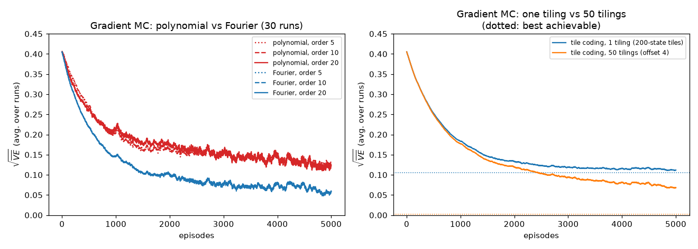

Lessons, some of them not the ones you might expect:

* **Representational power is not the bottleneck.** Every polynomial and Fourier basis *can* represent $v_\pi$ to within 0.008, yet after 5,000 episodes each is at least 7 times worse than its best possible error. Learning speed decides the outcome.
* **Fourier beats polynomial by a factor of about 2** at the same order, because the polynomial features are nearly collinear (condition numbers of $10^7$ to $10^{11}$ against about 10): SGD crawls along the poorly-conditioned directions. The noise-free column confirms it. Even without any sampling noise, the polynomial runs would still be at 0.085–0.100, while the Fourier runs would be at 0.012–0.016. Their measured 0.057–0.059 is mostly noise from the constant step size.
* **The condition number is only a worst case.** The 50-tiling coder has a condition number of $8.6\times10^4$, yet its measured error (0.068) is close to Fourier's. What matters is how much of the initial error lies along the slow directions and how long you train. Noise-free, the tile coder is at 0.056: clearly slower than Fourier (0.012), clearly faster than the polynomials. Its measured error is mostly slow learning, while Fourier's is mostly noise, and the two happen to land close together.
* **The order barely mattered here.** In our runs the three orders gave nearly indistinguishable curves (order 20 even ended marginally *worse* than order 5 for Fourier: more features, more noise at a constant step size). The value function is so smooth that low-order terms carry almost all of it. On a more irregular target the higher orders would earn their keep.
* **Many tilings beat one tiling.** A single tiling is just 5 groups of 200 states (its best possible error is 0.105, and it gets close to that), while 50 offset tilings resolve 4-state differences with comparable learning speed. The step size $10^{-4}/50$ keeps $\alpha\,\mathbf{x}^\top\mathbf{x}$ equal in both cases.

## 7. Choosing the step size for linear methods

In the tabular case $\alpha = 1/\tau$ means: the estimate approximately averages the last $\tau$ targets, and $\alpha = 1$ means one-shot learning. With features, what does one update do to the estimate at the updated state? From $\mathbf{w}' = \mathbf{w}+\alpha\delta\,\mathbf{x}(s)$,

$$
\hat v(s,\mathbf{w}') - \hat v(s,\mathbf{w}) = \alpha\,\delta\,\mathbf{x}(s)^\top\mathbf{x}(s).
$$

So to move the estimate a fraction $1/\tau$ of the way to the target we need $\alpha = 1/(\tau\,\mathbf{x}^\top\mathbf{x})$. Since the feature norm can vary, the rule of thumb (S&B eq. 9.19) is

$$
\alpha \doteq \Big(\tau\;\mathbb{E}\big[\mathbf{x}^\top\mathbf{x}\big]\Big)^{-1},
$$

meaning "learn in about $\tau$ experiences with substantially the same feature vector". (Here $\tau$ is a number of experiences, S&B's notation, not the temperature or Polyak coefficient of [`NOTATION.md`](../NOTATION.md).) For tile coding $\mathbf{x}^\top\mathbf{x} = n$ exactly, which is why we write step sizes like "$0.5/8$" for 8 tilings. `feature_gallery.py` confirms it: with 8 tilings, a single update with $\alpha = 1/8$ moves $\hat v(s)$ from 0 to exactly the target 1.0, and with $\alpha = 1/80$ to 0.1000.

Three further considerations:

* **Stability.** For linear SGD with an unbiased target the expected update is $\mathbf{w}\leftarrow\mathbf{w}+\alpha(\mathbf{g}-\mathbf{C}\mathbf{w})$ with $\mathbf{C} = \mathbb{E}[\mathbf{x}\mathbf{x}^\top]$ and $\mathbf{g} = \mathbb{E}[U_t\mathbf{x}_t]$. $\mathbf{C}$ is symmetric, so by Section 5.1 this is stable iff $\alpha<2/\kappa_{\max}(\mathbf{C})$, where $\kappa_{\max}$ is the largest eigenvalue. Since $\kappa_{\max}(\mathbf{C})\le\operatorname{tr}\mathbf{C} = \mathbb{E}[\mathbf{x}^\top\mathbf{x}]$, the rule above with $\tau\ge1$ is always stable. For TD the matrix is $\mathbf{A}$, which is not symmetric. By Section 5.1 the expected update is stable iff $0<\alpha<2\operatorname{Re}\kappa_i/|\kappa_i|^2$ for every eigenvalue $\kappa_i$ of $\mathbf{A}$. That can be far below $2/|\kappa|_{\max}$ when an eigenvalue has a large imaginary part and a small real part. On-policy, $\operatorname{Re}\kappa_i\ge(1-\gamma)\kappa_{\min}(\mathbf{C})$ (from $\mathbf{y}^\top\mathbf{A}\mathbf{y}\ge(1-\gamma)\mathbf{y}^\top\mathbf{C}\mathbf{y}$, Section 5.2), so the $\tau$-rule is a good heuristic for TD but not a guarantee.
* **Conditioning.** The error along the eigenvector of $\mathbf{C}$ with eigenvalue $\kappa_i$ shrinks like $(1-\alpha\kappa_i)^t$. Stability forces $\alpha\lesssim 1/\kappa_{\max}$, so the slowest direction needs about $\kappa_{\max}/\kappa_{\min}$ (the condition number) steps. This is the quantitative reason the polynomial basis lagged in Section 6.7, and the reason to normalise inputs and prefer near-orthogonal features.
* **Adaptivity.** Normalised LMS, $\alpha_t = \alpha_0/(\epsilon+\lVert\mathbf{x}_t\rVert^2)$, applies the rule per sample. Per-feature step sizes (the Fourier scaling above) and meta-learned step sizes (IDBD, Sutton 1992; Autostep, Mahmood et al. 2012) go further; for neural networks, Adam-style optimisers play this role ([Chapter 09](09-deep-q-learning.md), [Chapter 20](20-deep-rl-in-practice.md)). Finally, remember the noise floor: with a constant $\alpha$, weights keep fluctuating around the fixed point (Section 3.4); a Robbins–Monro schedule removes it at the cost of tracking ability.

## 8. Nonlinear function approximation: neural networks

Replace the linear $\mathbf{w}^\top\mathbf{x}(s)$ by a neural network: for example, $\hat v(s,\mathbf{w}) = \mathbf{w}_3^\top\tanh(\mathbf{W}_2\tanh(\mathbf{W}_1 s+\mathbf{b}_1)+\mathbf{b}_2)+b_3$, with $\mathbf{w}$ collecting all weights and biases. Everything in Section 3 carries over verbatim. The gradient $\nabla\hat v(S_t,\mathbf{w})$ is computed by backpropagation, and the hidden layers *learn* the features that we hand-designed in Section 6. In an autodiff framework, "semi-gradient" means **stopping the gradient through the target**:

```python
v = net(x[i]).squeeze(1)                              # v_hat(S_t, w), keeps its graph
v_next = net(x2[i]).squeeze(1) * (1 - term[i])        # v_hat(S_{t+1}, w); 0 at terminal states
target = (r[i] + v_next).detach()                     # gamma = 1 here; semi-gradient: target is a constant
loss = 0.5 * ((target - v) ** 2).mean()               # its gradient is -(target - v) * grad v
```

Without the `.detach()` the same code minimises the mean squared TD error, i.e. it becomes the naive residual-gradient method of Section 3.3.

**What we lose.** None of the guarantees of Section 5 survive. Tsitsiklis & Van Roy (1997) constructed a simple nonlinear approximator for which on-policy TD(0) diverges. $\overline{VE}$ is non-convex, so even gradient MC only finds local optima. In practice, deep value learning is made to work by a collection of stabilising tricks (experience replay to decorrelate samples, target networks to freeze the bootstrap target, careful optimisers), which are the subject of [Chapter 09](09-deep-q-learning.md).

**Experiment.** [`nonlinear_and_kernel.py`](../code/ch08_function_approximation/nonlinear_and_kernel.py) collects a dataset of 1,000 random-walk episodes (about 83,000 transitions) and trains a 1-32-32-1 tanh MLP on it with minibatches of 256, Adam with the learning rate decayed linearly from $10^{-3}$ to 0 over 20,000 updates, with three losses: gradient MC (target $G_t$), semi-gradient TD(0), and the full-gradient TD loss. This "train on a fixed set of transitions" setting is exactly the one used by replay-based deep RL and offline RL ([Chapter 16](16-offline-rl-and-imitation.md)). Results (3 seeds, each with its own dataset):

| loss | final $\sqrt{\overline{VE}}$ per seed | mean of finals | mean over the last 20% of evaluations |
|---|---|---|---|
| gradient MC | 0.039, 0.053, 0.028 | 0.040 | 0.042 |
| semi-gradient TD(0) | 0.016, 0.090, 0.011 | 0.039 | 0.043 |
| naive residual gradient (TD error through the target) | 0.246, 0.254, 0.246 | 0.249 | 0.248 |

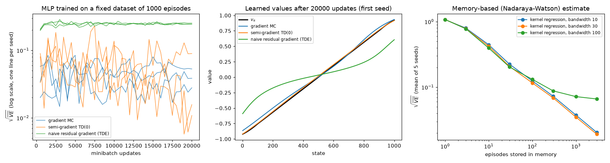

* **Semi-gradient TD works with a network, about as well as gradient MC here.** The final snapshots vary a lot (TD: 0.016, 0.090, 0.011; MC: 0.039, 0.053, 0.028), but single end-of-training snapshots are noisy: TD's curves (left panel) range up to about 0.2 during training and still swing by an order of magnitude between evaluations near the end (roughly 0.006 to 0.1). Averaged over the last 20% of evaluations, MC and TD are at 0.042 and 0.043, indistinguishable with 3 seeds. TD's curves are much bumpier than MC's because the bootstrapped target moves whenever the network does.
* **Backpropagating through the target is a disaster in exactly the predicted way:** all three seeds converge to the same flattened function (middle panel) with $\sqrt{\overline{VE}}\approx0.25$, close to the linear $\overline{TDE}$ minimisers in the table of Section 15.1 (0.235–0.272). It is stable, consistent and wrong.

## 9. Least-squares TD (LSTD)

Semi-gradient TD *iterates* toward $\mathbf{w}_{TD} = \mathbf{A}^{-1}\mathbf{b}$ using one sample at a time. Why not estimate $\mathbf{A}$ and $\mathbf{b}$ from all the data so far and solve directly? With $\mathbf{x}_t = \mathbf{x}(S_t)$ (and $\mathbf{x} = \mathbf{0}$ at terminal states),

$$
\widehat{\mathbf{A}}_t \doteq \sum_{k=0}^{t-1}\mathbf{x}_k(\mathbf{x}_k-\gamma\mathbf{x}_{k+1})^\top + \varepsilon\mathbf{I},
\qquad
\widehat{\mathbf{b}}_t \doteq \sum_{k=0}^{t-1}R_{k+1}\mathbf{x}_k,
\qquad
\mathbf{w}_t \doteq \widehat{\mathbf{A}}_t^{-1}\widehat{\mathbf{b}}_t .
$$

(The averages would carry a factor $1/t$, which cancels in $\widehat{\mathbf{A}}_t^{-1}\widehat{\mathbf{b}}_t$. The small $\varepsilon\mathbf{I}$ keeps $\widehat{\mathbf{A}}_t$ invertible early on; this $\varepsilon$ is S&B's regulariser and has nothing to do with $\varepsilon$-greedy exploration.) This is **LSTD** (Bradtke & Barto, 1996; Boyan, 2002). It converges to the same $\mathbf{w}_{TD}$, needs no step size, and is the most data-efficient form of linear TD(0).

**Cost.** Inverting a $d\times d$ matrix at every step costs $O(d^3)$. Because $\widehat{\mathbf{A}}_t$ changes by a rank-one outer product, the **Sherman–Morrison** formula $(\mathbf{B}+\mathbf{p}\mathbf{q}^\top)^{-1} = \mathbf{B}^{-1}-\frac{\mathbf{B}^{-1}\mathbf{p}\mathbf{q}^\top\mathbf{B}^{-1}}{1+\mathbf{q}^\top\mathbf{B}^{-1}\mathbf{p}}$ with $\mathbf{p} = \mathbf{x}_t$ and $\mathbf{q} = \mathbf{x}_t-\gamma\mathbf{x}_{t+1}$ maintains the inverse in $O(d^2)$:

$$
\widehat{\mathbf{A}}_{t+1}^{-1} = \widehat{\mathbf{A}}_t^{-1} - \frac{\big(\widehat{\mathbf{A}}_t^{-1}\mathbf{x}_t\big)\big(\mathbf{x}_t-\gamma\mathbf{x}_{t+1}\big)^\top\widehat{\mathbf{A}}_t^{-1}}{1+(\mathbf{x}_t-\gamma\mathbf{x}_{t+1})^\top\widehat{\mathbf{A}}_t^{-1}\mathbf{x}_t}.
$$

```text
LSTD for estimating v̂ = wᵀx(·) ≈ v_π   (O(d²) per step)
------------------------------------------------------------------
Input: the policy π; features x : S+ → R^d with x(terminal) = 0
Parameter: small ε > 0 (a regulariser, not an exploration rate)
Â⁻¹ ← ε⁻¹ I          (d × d)
b̂ ← 0               (d)
Loop for each episode:
    Initialise S;  x ← x(S)
    Loop for each step of the episode:
        Choose A ~ π(·|S); take A, observe R, S';  x' ← x(S')      # x' = 0 if S' is terminal
        y ← (Â⁻¹)ᵀ (x − γx')                    # temporary vector
        Â⁻¹ ← Â⁻¹ − (Â⁻¹ x) yᵀ / (1 + yᵀ x)      # Sherman–Morrison
        b̂ ← b̂ + R x
        w ← Â⁻¹ b̂
        S ← S';  x ← x'
    until S is terminal
```

[`lstd_vs_td.py`](../code/ch08_function_approximation/lstd_vs_td.py) runs LSTD and TD(0) (and the TD($\lambda$) of Section 4.5) on the random walk, 30 runs of 300 episodes, with two feature sets: 20-group aggregation (well conditioned) and order-5 polynomials (condition number $2.5\times10^7$).

| features | method | $\sqrt{\overline{VE}}$ after 10 / 100 / 300 episodes |
|---|---|---|
| aggregation, 20 groups | LSTD, $\varepsilon = 0.01$ | 0.298 / 0.096 / 0.058 |
| | LSTD, $\varepsilon = 1$ | 0.222 / 0.098 / 0.062 |
| | TD(0), $\alpha = 0.1$ (best of 0.01, 0.03, 0.1) | 0.376 / 0.118 / 0.067 |
| | exact $\sqrt{\overline{VE}(\mathbf{w}_{TD})}$ | 0.048 |
| polynomial, order 5 | LSTD, $\varepsilon = 0.01$ | 0.310 / 0.087 / 0.043 |
| | LSTD, $\varepsilon = 1$ | 0.296 / 0.089 / 0.042 |
| | TD(0), $\alpha = 0.03$ (best of 0.01, 0.03, 0.1) | 0.346 / 0.224 / 0.175 |
| | exact $\sqrt{\overline{VE}(\mathbf{w}_{TD})}$ | 0.0010 |

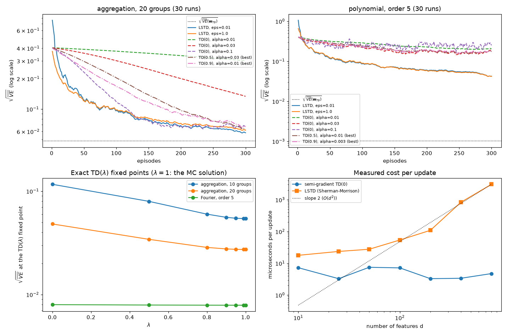

*Top: learning curves for the two feature sets (solid: LSTD; dashed: TD(0) at three step sizes; dash-dotted: TD($\lambda$) at its best step size, Section 4.5). Bottom left: $\sqrt{\overline{VE}}$ at the exact TD($\lambda$) fixed point as a function of $\lambda$. Bottom right: measured cost per update.*

* With well-conditioned features, a well-tuned TD(0) catches up with LSTD after a few hundred episodes. With badly conditioned features, LSTD is **4 times more accurate** after 300 episodes. Apart from the small $\varepsilon\mathbf{I}$ regulariser, LSTD's value estimate does not depend on how the features are linearly parameterised: replacing $\mathbf{x}$ by $\mathbf{M}\mathbf{x}$ for an invertible $\mathbf{M}$ gives the same $\hat v$ as $\varepsilon\to0$. So it is essentially insensitive to their conditioning, while TD's progress is limited by its slowest direction. (Early on, $\varepsilon\mathbf{I}$ penalises directions differently depending on feature scale, which is why $\varepsilon$ matters in the first rows of the table.)
* LSTD's remaining error is statistical (estimating $\mathbf{A}$ and $\mathbf{b}$ from finite data), so it shrinks only slowly as data accumulate: visible as the slow downward drift of the LSTD curves in the log plot.
* The measured cost per update grows as expected (bottom-right panel; slope 2 on the log–log plot for large $d$). At $d = 800$ LSTD took about 2–3 ms per update against about 4–5 µs for TD, i.e. roughly 600 times slower; two of our runs measured factors of 590 and 646. Wall-clock timings depend on the machine and its load, so only the trend should be trusted. Memory is $O(d^2)$ too. With the millions of features of a tile coder or the parameters of a network, LSTD is out of reach.

**Other trade-offs.** LSTD never forgets: $\widehat{\mathbf{A}}$ and $\widehat{\mathbf{b}}$ weigh old and new data equally, which is perfect for evaluating a fixed policy but wrong when the policy changes (control) unless you add a forgetting factor. Its control counterpart, least-squares policy iteration (LSPI; Lagoudakis & Parr, 2003), re-solves for $q$ after each policy change, reusing one batch of data; Section 11.4 develops it alongside fitted Q-iteration and runs both on Mountain Car. The choice of $\varepsilon$ matters a little early on (see the table) and not at all later. There is also an LSTD($\lambda$) version (Boyan, 2002).

## 10. Memory-based and kernel-based approximation

Everything so far is **parametric**: experience is compressed into $\mathbf{w}$ and then discarded. **Memory-based** (non-parametric, "lazy") methods instead store the examples $(s_i, g_i)$ themselves and compute a value only when asked. Typical examples:

* **Nearest neighbour**: $\hat v(s)$ = the stored target of the closest stored state.
* **Weighted average** (Nadaraya–Watson **kernel regression**): $\hat v(s) = \sum_i k(s,s_i)\,g_i\big/\sum_i k(s,s_i)$, with a kernel $k$ that decreases with distance, e.g. a Gaussian of bandwidth $\sigma$.
* **Locally weighted regression**: fit a small parametric model around the query, weighting stored points by $k$ (Atkeson, Moore & Schaal, 1997).

The kernel $k(s,s')$ plays the role of a generalisation pattern: it says how much the target observed at $s'$ should affect the estimate at $s$. Linear methods are a special case of this view, since a linear method with features $\mathbf{x}$ generalises according to the kernel $k(s,s') = \mathbf{x}(s)^\top\mathbf{x}(s')$; conversely, the **kernel trick** lets one work with the (possibly infinite-dimensional) feature space implied by a kernel without ever forming the features. Kernel-based RL has a solid theory (e.g. Ormoneit & Sen, 2002).

Advantages: no fixed functional form, so accuracy keeps improving as data accumulate; local updates; trajectory sampling focuses memory on the states that matter. Disadvantages: memory and query cost grow with the data (kd-trees and related structures help), and the curse of dimensionality hits kernels hard.

On the random walk, kernel regression of MC returns (right panel of the figure in Section 8; mean of 5 seeds) gives:

| bandwidth (states) | $\sqrt{\overline{VE}}$ after 10 / 100 / 1,000 / 3,000 episodes |
|---|---|
| 10 | 0.445 / 0.125 / 0.038 / 0.021 |
| 30 | 0.422 / 0.116 / 0.035 / 0.019 |
| 100 | 0.396 / 0.132 / 0.072 / 0.066 |

The narrow kernels keep improving as data arrive (0.019 after 3,000 episodes, better than any gradient-MC run in Section 6.7), while the wide one plateaus at the bias of over-smoothing. The price is the memory: 251,353 stored samples after 3,000 episodes. (Our implementation cheats a little: because the states are discrete it stores per-state counts and sums instead of every sample, which is equivalent.)

## 11. Control: episodic semi-gradient SARSA and Mountain Car

### 11.1 From state values to action values

For control we approximate action values, $\hat q(s,a,\mathbf{w})\approx q_\ast(s,a)$, and the update examples become $S_t,A_t\mapsto U_t$:

$$
\mathbf{w}_{t+1} = \mathbf{w}_t + \alpha\big[U_t - \hat q(S_t,A_t,\mathbf{w}_t)\big]\nabla\hat q(S_t,A_t,\mathbf{w}_t),
\qquad U_t = R_{t+1}+\gamma\,\hat q(S_{t+1},A_{t+1},\mathbf{w}_t)\ \text{(SARSA)}.
$$

With a small, discrete action set the usual linear construction keeps one weight vector per action ("stacking"): $\mathbf{x}(s,a)$ is $\mathbf{x}(s)$ placed in the block of action $a$ and zeros elsewhere, so $\hat q(s,a,\mathbf{w}) = \mathbf{w}_a^\top\mathbf{x}(s)$. Alternatives are to hash the action into the tile index or, for neural networks, to output one value per action ([Chapter 09](09-deep-q-learning.md)). Policy improvement is done implicitly by acting $\varepsilon$-greedily with respect to $\hat q$, exactly as in [Chapter 05](05-temporal-difference.md).

```text
Episodic semi-gradient SARSA for estimating q̂ ≈ q_*
------------------------------------------------------------------
Input: a differentiable q̂ : S × A × R^d → R
Parameters: step size α > 0, small ε ≥ 0
Initialise w ∈ R^d arbitrarily (e.g. w = 0)

Loop for each episode:
    S, A ← initial state and ε-greedy action w.r.t. q̂(S, ·, w)
    Loop for each step of the episode:
        Take A, observe R, S', and the flags terminated / truncated
        If terminated:                                   # true end of the task
            w ← w + α [R − q̂(S, A, w)] ∇q̂(S, A, w)
            go to next episode
        A' ← ε-greedy action w.r.t. q̂(S', ·, w)
        w ← w + α [R + γ q̂(S', A', w) − q̂(S, A, w)] ∇q̂(S, A, w)
        If truncated: go to next episode                 # time limit: we DID bootstrap
        S ← S';  A ← A'
```

The $n$-step version (S&B §10.2) replaces the target by the $n$-step return, exactly as in Section 3.2; it is Exercise 12.

### 11.2 Termination versus truncation

Gymnasium separates two ways an episode can end ([Chapter 05](05-temporal-difference.md), Section 13.1, introduced the distinction). `terminated` means the MDP reached a terminal state, whose value is 0 by definition, so the target is $R$ alone. `truncated` means an external time limit stopped the episode: the state reached is an ordinary state with a perfectly good value, so the correct target still bootstraps, $R+\gamma\hat q(S',A',\mathbf{w})$. The box above does exactly that. Treating truncation as termination teaches the agent that states visited at the time limit are worth only the final reward. That is a bias, and the next section reports how much it mattered in our runs.

### 11.3 Mountain Car

**The task** (Moore, 1990; S&B Example 10.1). An under-powered car must reach the top of the right hill (position $\ge 0.5$), but gravity is stronger than its engine. The only way up is to first back up the left slope and use the momentum. The state is (position $\in[-1.2, 0.6]$, velocity $\in[-0.07, 0.07]$). There are three actions (full throttle left, zero, right), $A_t\in\lbrace -1,0,+1\rbrace$, and the dynamics are

$$
\dot x_{t+1} = \operatorname{clip}\big[\dot x_t + 0.001A_t - 0.0025\cos(3x_t)\big],
\qquad
x_{t+1} = \operatorname{clip}\big[x_t + \dot x_{t+1}\big],
$$

with the velocity reset to 0 if the car hits the left wall. Every step costs $-1$ until the goal is reached, so the return is minus the number of steps. Episodes start at a random position in $[-0.6,-0.4]$ with zero velocity. Gymnasium's `MountainCar-v0` implements these dynamics (its position bound is 0.6, but the episode terminates as soon as $x\ge0.5$) and adds a 200-step time limit.

**The agent** ([`mountain_car_sarsa.py`](../code/ch08_function_approximation/mountain_car_sarsa.py)): 8 tilings of $8\times8$ tiles (asymmetric offsets; $9\times9 = 81$ tiles per tiling to cover the offsets, so 648 features per action), one weight vector per action, $\varepsilon = 0$, $\gamma = 1$, $\mathbf{w}_0 = \mathbf{0}$. Note $\varepsilon = 0$: no random exploration at all. Because every reward is $-1$, the initial estimate $\hat q = 0$ is wildly optimistic; whatever the agent tries looks worse afterwards, so it keeps trying something else. This is optimistic initialisation ([Chapter 02](02-multi-armed-bandits.md)) doing systematic exploration. One practical detail: with all values tied at 0, `argmax` always returns action 0 ("push left") unless ties are broken randomly, which our agent does.

```python
def update(self, idx, a, target):
    # grad q_hat(S,A,w) is 1 on the 8 active tiles of action a and 0 elsewhere
    delta = target - self.w[a, idx].sum()
    self.w[a, idx] += self.alpha * delta          # self.alpha = alpha / 8 (Section 7)
```

**(a) Step sizes.** With the time limit raised to 10,000 steps, so that early episodes are not cut off (as in S&B), and 10 runs of 300 episodes:

| $\alpha$ (per tile: $\alpha/8$) | episode 1 | mean of episodes 1–10 | episodes 91–100 | last 50 episodes |
|---|---|---|---|---|
| 0.1/8 | 3508 | 1320 | 200.6 | 147.2 |
| 0.2/8 | 2486 | 886 | 170.6 | 137.4 |
| 0.5/8 | 1571 | 592 | 142.6 | 117.2 |

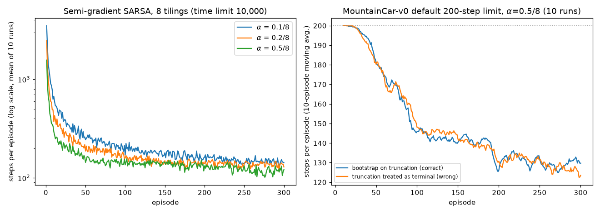

Larger step sizes learn faster here throughout the 300 episodes (left panel, log scale). The first episode is long, 1,500–3,500 steps, because the agent has to discover by elimination that rocking back and forth is the way out.

**(b) What is learned.** The cost-to-go $-\max_a\hat q(s,a,\mathbf{w})$ from one run with $\alpha = 0.5/8$ (episode 1 took 1,924 steps):

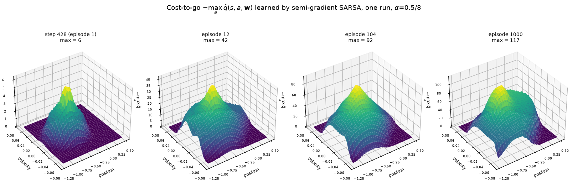

At step 428 only the region around the start has been visited; everything else is still at the optimistic 0 (the flat floor of the plot). By episode 12 the estimates have spread along the spiral trajectories the car follows in phase space. By episode 1,000 the surface is a mountain whose peak, 116.9 steps-to-go, is at position $-0.57$ with velocity $\approx0$: at rest near the bottom of the valley, the hardest place to start. About 7% of the plotted grid still has at least one action at its initial value (states the car never reaches). The mean episode length over the last 100 of those 1,000 episodes was 114.9 steps. The greedy policy after 1,000 episodes shows the expected structure: mostly, push in the direction you are already moving.

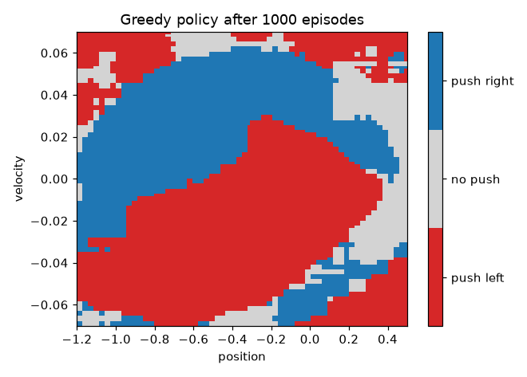

**(c) Truncation handling, honestly reported.** Under Gymnasium's default 200-step limit (10 runs of 300 episodes, $\alpha = 0.5/8$), bootstrapping on truncation and wrongly treating truncation as termination gave practically identical results (right panel of the learning-curve figure). The correct version averaged 130.4 steps over the last 100 episodes and the wrong one 129.1; both reached the goal in 84% of all episodes. The learned cost-to-go from start states ($x_0\in\lbrace -0.6,-0.5,-0.4\rbrace$, zero velocity) was 105.4 vs 105.6 steps, against actual greedy episode lengths of 120.0 and 110.0. Why no difference? About 16% of episodes were truncated (44–52 of 300 per run with correct handling). They are front-loaded but not confined to the start: 467 of the 473 truncations happened in episodes 1–100, and the last truncated episode of a run fell anywhere between episode 71 and episode 240. Each truncation corrupts a single target, though. With $\gamma = 1$ and most episodes reaching the goal, later correct bootstraps overwrite the damage. The lesson is *not* that the distinction is unimportant. It is that this bug can be **silent** on one task and harmful on another. Tasks where *every* episode is truncated (continuing tasks with artificial time limits, e.g. Pendulum in [Chapter 12](12-continuous-control-actor-critic.md)) are where it bites hardest. Write the correct version always.

**(d) Hashing** (`--hashing-demo`, 3 runs × 150 episodes, 2,000-step limit). We fold the 648 tiles per action into tables of $H$ slots, either with a stateless pseudo-random hash ("mix") or with an index hash table ("IHT", `hashing="iht"` in `tiles.py`), which hands out a fresh slot to each tile on its first visit:

| table | distinct slots used by the 648 tiles | steps/episode, first 10 | last 50 | episodes truncated |
|---|---|---|---|---|
| no hashing | 648 | 588 | 140 | 0% |
| IHT, $H = 1024$ | 468 tiles visited (first run), one slot each | 588 | 140 | 0% |
| mix, $H = 4096$ | 591 | 560 | 143 | 0% |
| mix, $H = 512$ | 370 | 587 | 193 | 0% |
| mix, $H = 128$ | 128 | 840 | 1425 | 38% |
| mix, $H = 32$ | 32 | 1807 | 1974 | 93% |

With a table much larger than the number of visited tiles, hashing is harmless. The IHT with 1,024 slots never collides here (only 468 tiles were ever visited in the first run) and reproduces the unhashed run exactly. The mix hash with 4,096 slots maps the 648 tiles to only 591 distinct slots (57 collisions), yet learns about as well (143 vs 140 steps). Moderate collisions cost some performance (193 steps at $H = 512$), and severe collisions destroy learning. In Mountain Car hashing is pointless, since 648 tiles fit comfortably in memory. It pays off in high dimensions, where the full grid is astronomically large but the visited part is small. There the table should be sized well above the number of tiles actually visited, and an index hash table avoids collisions completely until it is full.

**Convergence in control.** There is no general guarantee here. With linear features, on-policy SARSA does not diverge in the way off-policy methods can, but it can *chatter*: its weights can keep oscillating within a bounded region instead of converging (Gordon, 2001). Q-learning with linear function approximation is off-policy and *can* diverge (Section 13).

### 11.4 Batch control: fitted Q-iteration, averagers and LSPI

Everything so far in this section learns *online*: one transition, one update. **Batch RL** starts instead from a fixed set of transitions $\mathcal{D} = \lbrace(s_i,a_i,r_i,s'_i,\text{term}_i)\rbrace_{i=1}^N$ and turns control into a sequence of supervised-learning problems, collecting nothing new while it learns. It is the conceptual root of DQN's target network ([Chapter 09](09-deep-q-learning.md), Section 2.3) and of offline RL ([Chapter 16](16-offline-rl-and-imitation.md)), and much of the theory in [Chapter 19](19-rl-theory.md) is written for it.

**Fitted Q-iteration (FQI).** Value iteration on action values is $q_{k+1} = \mathcal{T}^\ast q_k$, with $(\mathcal{T}^\ast q)(s,a) = \mathbb{E}[R_{t+1}+\gamma\max_{a'}q(S_{t+1},a')\mid S_t=s,A_t=a]$ ([Chapter 03](03-dynamic-programming.md)). FQI (Ernst, Geurts & Wehenkel, 2005) replaces each exact backup by a regression onto sampled backups:

$$
Q_{k+1} = \arg\min_{f\in\mathcal{F}}\sum_{i=1}^N\Big(f(s_i,a_i) - r_i - \gamma(1-\text{term}_i)\max_{a'}Q_k(s'_i,a')\Big)^2 .
$$

Here $\text{term}_i = 1$ only when $s'_i$ is terminal. A transition that a time limit cut off still bootstraps (Section 11.2). Treating $Q_k$ as fixed (although it was fitted on the same batch), each target is an unbiased sample of $(\mathcal{T}^\ast Q_k)(s_i,a_i)$, so with enough data the regression returns approximately the best fit to $\mathcal{T}^\ast Q_k$ in $\mathcal{F}$: $Q_{k+1}\approx\Pi_{\mathcal{F}}\mathcal{T}^\ast Q_k$. FQI is **approximate value iteration**, and [Chapter 19](19-rl-theory.md) (Section 2.2) shows how a per-iteration sup-norm error $\epsilon$ turns into a policy loss of at most $2\epsilon/(1-\gamma)^2$. (As in Chapter 19, $\epsilon$ is an approximation error; $\varepsilon$ stays the exploration rate.)

```text
Fitted Q-iteration (FQI)
------------------------------------------------------------------
Input: a batch D = {(s_i, a_i, r_i, s'_i, term_i)}, i = 1..N     # term_i = 1 only on termination
Input: a regression method FIT (least squares on features, K-NN, trees, a network, ...)
Q_0 ← 0
For k = 0, 1, 2, ...:
    y_i ← r_i + γ (1 − term_i) max_a' Q_k(s'_i, a')        for every i
    Q_{k+1} ← FIT({((s_i, a_i), y_i) : i = 1..N})              # a fresh supervised problem
    stop when ‖Q_{k+1} − Q_k‖_∞ is small, or after a fixed number of iterations
Output: the greedy policy π(s) = argmax_a Q_{k+1}(s, a)
```

*Neural* fitted Q-iteration (NFQ; Riedmiller, 2005) uses a multilayer network for FIT and retrains it on the whole batch at every iteration. DQN with a target network is its online, incremental cousin: between refreshes the network regresses on targets computed with frozen weights, about one approximate backup per refresh ([Chapter 09](09-deep-q-learning.md), Section 2.3). Fitted Q *evaluation* replaces the max by an expectation under a fixed target policy ([Chapter 16](16-offline-rl-and-imitation.md), Section 12.3). And run naively on data that never contain the actions the max selects, FQI bootstraps from values that nothing has checked: the extrapolation error of [Chapter 16](16-offline-rl-and-imitation.md), Section 6.2.

**When does FQI converge? Averagers.** $\mathcal{T}^\ast$ is a $\gamma$-contraction in the sup norm, so the question is what the fitting step does to it. Call a fitting method an **averager** (Gordon, 1995) if every fitted value is a weighted average of the targets, $\hat f(s,a) = \sum_i\kappa_i(s,a)\,y_i$, with weights $\kappa_i(s,a)\ge0$ and $\sum_i\kappa_i(s,a)\le1$ that depend on the inputs $(s_i,a_i)$ and the query $(s,a)$ but **not on the targets** $y$. (Gordon also allows fixed constants to take up the remaining weight $1-\sum_i\kappa_i$.) Then for two target vectors $y, y'$ and their fits $\hat f, \hat f'$,

$$
\big|\hat f(s,a)-\hat f'(s,a)\big| \le \sum_i\kappa_i(s,a)\,|y_i-y'_i| \le \lVert y-y'\rVert_\infty ,
$$

so the fit is a sup-norm non-expansion, the composition "backup, then fit" is a $\gamma$-contraction, and FQI converges to a unique fixed point from any $Q_0$ (Exercise 15). Examples are $K$-nearest-neighbour regression (weight $1/K$ on the $K$ nearest samples that took action $a$; we write $K$ because $k$ counts iterations), the Nadaraya–Watson kernel regression of Section 10, state aggregation (least squares on one-hot features averages the targets in each cell; Exercise 2), linear interpolation on a grid, and regression trees whose splits do not depend on the targets. Ernst et al. proved convergence for tree methods of that last kind (kd-trees and "totally randomized" trees). Methods such as CART or Extra-Trees choose their splits using the targets, so they are not strictly averagers. Ernst et al. found Extra-Trees more accurate even without the guarantee, and note that freezing the tree structures, so that every iteration reuses the same partition, restores it.

Least squares with features that generalise is in general **not** an averager: a fitted value can extrapolate, with negative weights or weights that sum to more than 1. The two-state fragment of Section 13.2 is the smallest case. Fit $w$ to one sample with feature value 1 and target $y$, and the prediction at the state with feature value 2 is $2y$: a sup-norm gain of 2. FQI then multiplies $w$ by $2\gamma$ at every iteration and, unless $w_0 = 0$, diverges for $\gamma>\tfrac12$. Boyan & Moore (1995) showed value iteration failing with polynomial regression, backpropagation networks and locally weighted regression on simple tasks. FQI with least squares has all three ingredients of the deadly triad (Section 14): function approximation, bootstrapping, and a data distribution unrelated to that of the greedy policy being evaluated.

**LSTDQ and LSPI.** The other route is policy iteration. LSTD (Section 9) evaluates a policy from data, and its action-value version **LSTDQ** (Lagoudakis & Parr, 2003) evaluates any deterministic policy $\pi$ from a batch collected by any behaviour. With the stacked features $\mathbf{x}(s,a)$ of Section 11.1,

$$
\widehat{\mathbf{A}} = \sum_i\mathbf{x}(s_i,a_i)\big(\mathbf{x}(s_i,a_i)-\gamma\,\mathbf{x}(s'_i,\pi(s'_i))\big)^\top,\qquad
\widehat{\mathbf{b}} = \sum_i r_i\,\mathbf{x}(s_i,a_i),\qquad \mathbf{w}_\pi = \widehat{\mathbf{A}}^{-1}\widehat{\mathbf{b}},
$$

with $\mathbf{x}(s'_i,\cdot) = \mathbf{0}$ when $s'_i$ is terminal, and only then (not when the transition was truncated). This is the sample version of the projected Bellman equation $\mathbf{X}\mathbf{w} = \Pi\mathcal{T}^\pi\mathbf{X}\mathbf{w}$ for $q_\pi$, with the projection weighted by the data distribution (Exercise 16). The next action is $\pi(s'_i)$, chosen by the policy being evaluated rather than read from the log, so no importance sampling is needed: the one-step argument of [Chapter 05](05-temporal-difference.md), Section 8.2. **LSPI** alternates LSTDQ with greedy improvement $\pi_{m+1}(s) = \arg\max_a\mathbf{x}(s,a)^\top\mathbf{w}_{\pi_m}$ and reuses the same batch at every iteration. There is no general convergence guarantee, because the policies can oscillate. What does hold is the classical approximate-policy-iteration bound (Bertsekas & Tsitsiklis, 1996), which Lagoudakis & Parr apply to LSPI: if every evaluation is within $\epsilon$ of $q_{\pi_m}$ in the sup norm, then $\limsup_m\lVert q_{\pi_m}-q_\ast\rVert_\infty\le 2\gamma\epsilon/(1-\gamma)^2$. Finite-sample versions of these guarantees for fitted value iteration and for a Bellman-residual variant of fitted policy iteration are due to Munos & Szepesvári (2008) and Antos, Szepesvári & Munos (2008). They pay for the data distribution through the concentrability coefficients of [Chapter 19](19-rl-theory.md), Section 10.

**An experiment on Mountain Car.** [`fqi_lspi_mountaincar.py`](../code/ch08_function_approximation/fqi_lspi_mountaincar.py) builds batches of $N$ transitions from uniformly random (position, velocity) states and uniformly random actions, one step of `MountainCar-v0`'s dynamics each. The dynamics are re-implemented in NumPy, and on 20,000 random transitions they agree with Gymnasium to $2\times10^{-16}$. Random-policy trajectories from the usual start states rarely reach the goal and would cover the state space poorly. We use $\gamma = 0.99$, since the contraction argument needs $\gamma<1$. Three learners share each batch:

* (a) FQI with the 10-nearest-neighbour averager ($K = 10$), with states rescaled to the unit square;
* (b) FQI with ridge least squares, $\mathbf{w}_a = (\mathbf{X}_a^\top\mathbf{X}_a+\lambda\mathbf{I})^{-1}\mathbf{X}_a^\top y_a$ for each action $a$ ($\mathbf{X}_a$, $y_a$: features and targets of the samples with action $a$) and $\lambda = 10^{-3}$, on the tile coding of Section 11.3 (8 tilings, 648 features per action). In this section and Exercises 15–16, $\lambda$ is this ridge strength, not a trace-decay parameter;
* (c) LSPI on the same features with the same $\lambda$, starting from the uniform-random policy.

FQI stops when $\lVert Q_k-Q_{k-1}\rVert_\infty<10^{-6}$, measured at the **bootstrap points** (every non-terminal $s'_i$, all three actions), or when $\lvert Q\rvert$ exceeds $10^6$ (the true values lie in $[-100, 0]$), or after 3,000 iterations. LSPI stops when no greedy action at the bootstrap points changes, or after 30 iterations. Each greedy policy is then run from 100 held-out start states (position uniform in $[-0.6,-0.4]$, at rest), with a cap of 1,000 steps that counts as 1,000 when the goal is not reached. For reference, the hand-made policy "push in the direction of motion" needs 118.8 steps on average. Five batches per size:

| $N$ | method | converged | iterations | greedy steps to goal (mean ± s.e. over batches) | starts reaching the goal within 200 steps |
|---|---|---|---|---|---|
| 5,000 | $K$-NN averager FQI | 5/5 | 324–381 | 704 ± 115 | 10% |
| | least-squares FQI | 0/5 (diverged after 123–597) | — | 978 ± 16 | 0% |
| | LSPI | 0/5 (30 iterations) | — | 1000 ± 0 | 0% |
| 20,000 | $K$-NN averager FQI | 5/5 | 294–311 | 195 ± 26 | 92% |
| | least-squares FQI | 5/5 | 593–1,167 | 175 ± 53 | 93% |
| | LSPI | 5/5 | 8–9 | 175 ± 53 | 93% |
| 50,000 | $K$-NN averager FQI | 5/5 | 259–332 | 121.8 ± 4.4 | 99% |
| | least-squares FQI | 5/5 | 563–645 | 161.8 ± 31.8 | 94% |
| | LSPI | 5/5 | 7–9 | 161.8 ± 31.8 | 94% |

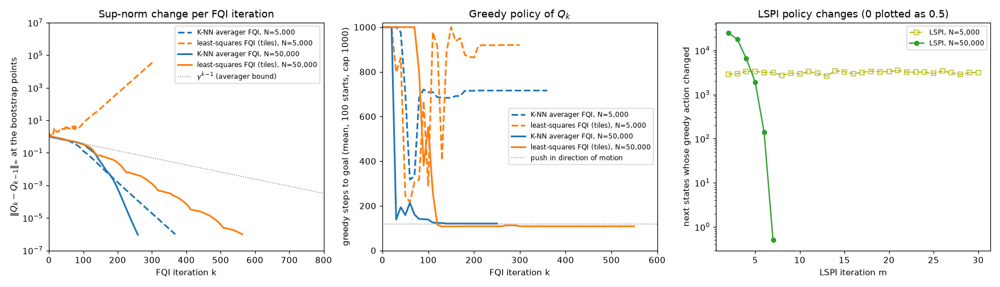

*Left: sup-norm change per FQI iteration on the first batch of size 5,000 (dashed) and of size 50,000 (solid); dotted: the averager's worst-case rate $\gamma^{k-1}$. Middle: greedy steps to goal from the 100 held-out starts, evaluated every 10 iterations up to iteration 400 and every 50 after that. Right: next states whose greedy action changed in each LSPI iteration (0 is plotted as 0.5).*

* **The averager converged on every batch, as the theory says it must.** No sup-norm change ever exceeded $\gamma = 0.99$ times the previous one (the script asserts this). Convergence took 259–381 iterations, far fewer than the worst-case rate $\gamma^{k-1}$ implies (about 1,400 iterations to shrink a unit change below $10^{-6}$), because termination at the goal adds its own contraction. Convergence says nothing about quality, though: with 5,000 samples the converged policy reached the goal within 200 steps from only 10% of the starts.
* **Least-squares FQI diverged on all five 5,000-sample batches and converged on all ten larger ones.** Even when it converged it was not a non-expansion. Single iterations *increased* the sup-norm change by up to 18% ($N = 20{,}000$) and 12.5% ($N = 50{,}000$). The linear map $\mathbf{H}$ from targets to fitted values at the bootstrap points had sup-norm gain $\max_i\sum_j\lvert H_{ij}\rvert\ge21.6$ on the first 50,000-sample batch and $\ge33.5$ on the first 5,000-sample batch (lower bounds from 2,000 sampled bootstrap points). An averager's gain is at most 1. Non-expansion is sufficient for convergence, not necessary. With about 1,700 samples per action for 648 overlapping features, the fit overshoots, and the max feeds the overshoots back into the next targets. A stronger ridge ($\lambda = 1$) made all five small-batch runs converge, but their greedy policies still needed $404\pm117$ steps.
* **When least squares converged, it found the best policies of the experiment, but less reliably.** On the first 50,000-sample batch it needed 108 steps, better than the hand-made policy. On two of the five batches it needed 266 and 205 steps, while the averager stayed within 116–139 steps on all five. Converging to a fixed point of $\Pi\mathcal{T}^\ast$ does not make the fixed point a good Q-function.
* **LSPI converged in 7–9 iterations whenever least-squares FQI converged, and it found the same solution.** This is expected: with the same ridge, a converged LSPI weight vector solves the fixed-point equation of least-squares FQI (Exercise 16(b)), so the two could differ only if that equation had several solutions. The largest difference between their Q-values at the bootstrap points was $2.9\times10^{-5}$, the residual that FQI's stopping rule leaves: late in a run each change shrank by only about 3% per iteration, so a final change below $10^{-6}$ still leaves the iterate a few times $10^{-5}$ from its limit. With 5,000 samples LSPI never settled. In its 30th iteration it still changed the greedy action at 2,481–3,324 of about 4,950 next states, and none of its final policies reached the goal from any start within 1,000 steps.
* **Values propagate about one step per iteration**, as in DQN ([Chapter 09](09-deep-q-learning.md), Section 2.3). On the first 50,000-sample batch, the greedy policy of least-squares FQI never reached the goal at iteration 50, needed 553 steps on average at iteration 100 and 108 at iteration 150. Even the best policies of the experiment need about 108 steps from these starts. Batch methods reuse data, but the number of backups still has to cover the horizon.

## 12. Continuing tasks: the average-reward setting

### 12.1 Average reward

For continuing tasks without episodes, there is a third classical objective besides episodic and discounted returns: the **average reward** (S&B §10.3). For an ergodic MDP (every policy induces a chain with a unique stationary distribution $\mu_\pi$ that does not depend on the start state),

$$
r(\pi) \doteq \lim_{h\to\infty}\frac{1}{h}\sum_{t=1}^h\mathbb{E}\big[R_t\mid S_0, A_{0:t-1}\sim\pi\big]
= \sum_s\mu_\pi(s)\sum_a\pi(a\mid s)\sum_{s',r}p(s',r\mid s,a)\,r .
$$

All policies attaining the maximum $r_\ast\doteq\max_\pi r(\pi)$ are optimal. Values are then defined through the **differential return**, which measures rewards relative to the average:

$$
G_t \doteq \big(R_{t+1}-r(\pi)\big)+\big(R_{t+2}-r(\pi)\big)+\big(R_{t+3}-r(\pi)\big)+\cdots
$$

The resulting **differential value functions** satisfy Bellman equations with $\gamma$ removed and $r$ replaced by $r-r(\pi)$:

$$
\begin{aligned}
v_\pi(s) &= \sum_a\pi(a\mid s)\sum_{s',r}p(s',r\mid s,a)\big[r-r(\pi)+v_\pi(s')\big],\\
q_\pi(s,a) &= \sum_{s',r}p(s',r\mid s,a)\Big[r-r(\pi)+\sum_{a'}\pi(a'\mid s')q_\pi(s',a')\Big],\\
q_\ast(s,a) &= \sum_{s',r}p(s',r\mid s,a)\Big[r-r_\ast+\max_{a'}q_\ast(s',a')\Big].
\end{aligned}
$$

(The differential Bellman equations determine the values only up to an additive constant (Exercise 9); it is the differences between states that matter for control.) The **differential TD error** replaces the reward by its deviation from an estimate $\bar R_t$ of the average reward:

$$
\delta_t \doteq R_{t+1}-\bar R_t+\hat q(S_{t+1},A_{t+1},\mathbf{w}_t)-\hat q(S_t,A_t,\mathbf{w}_t).
$$

### 12.2 Differential semi-gradient SARSA

```text
Differential semi-gradient SARSA for estimating q̂ ≈ q_*
------------------------------------------------------------------
Input: a differentiable q̂ : S × A × R^d → R
Parameters: step sizes α, β > 0; small ε > 0
Initialise w ∈ R^d arbitrarily (e.g. w = 0)
Initialise the average-reward estimate R̄ ∈ R arbitrarily (e.g. R̄ = 0)
(β is S&B's name for this secondary step size; it is unrelated to the RLHF β of NOTATION.md)
Initialise state S and action A (ε-greedy)

Loop for each step:
    Take A, observe R, S'
    A' ← ε-greedy action w.r.t. q̂(S', ·, w)
    δ ← R − R̄ + q̂(S', A', w) − q̂(S, A, w)
    R̄ ← R̄ + β δ
    w ← w + α δ ∇q̂(S, A, w)
    S ← S';  A ← A'
```

Updating $\bar R$ with the TD error $\delta$ rather than with $R-\bar R$ is a deliberate choice, which S&B examine in an exercise of §10.3. Both have the same expectation in steady state, because the value terms of $\delta$ average out under the stationary distribution. But once the differential values are accurate, $\delta$ has much lower variance: the value difference $\hat q(S',A')-\hat q(S,A)$ cancels most of the predictable variation in the rewards.

### 12.3 Why discounting is problematic with function approximation

In the tabular case discounting is harmless: the discounted-optimal policy is optimal from *every* state at once. With function approximation, states can no longer be told apart reliably, so a sensible objective for a continuing task must average performance over states. The natural average is weighted by the on-policy distribution. Here is the catch.

**Claim.** For every policy $\pi$ and every $\gamma<1$, $\displaystyle\sum_s\mu_\pi(s)\,v_\pi^\gamma(s) = \frac{r(\pi)}{1-\gamma}$, where $v_\pi^\gamma$ is the discounted value function.

*Proof.* Expanding the discounted Bellman equation as a Neumann series, $v_\pi^\gamma = \sum_{k\ge0}\gamma^k\mathbf{P}_\pi^k r_\pi$. Using stationarity $\mu_\pi^\top\mathbf{P}_\pi^k = \mu_\pi^\top$ and $\mu_\pi^\top r_\pi = r(\pi)$,

$$
\mu_\pi^\top v_\pi^\gamma = \sum_{k\ge0}\gamma^k\mu_\pi^\top\mathbf{P}_\pi^k r_\pi = \sum_{k\ge0}\gamma^k r(\pi) = \frac{r(\pi)}{1-\gamma}.\qquad\square
$$

So the discounted objective, averaged the only sensible way, ranks policies *exactly* as the average reward does, whatever $\gamma$ is. The discount rate has no effect on the problem formulation; it survives only as a parameter of the *solution method*. `linear_td_theory.py` checks the identity numerically on a random 30-state chain: $r(\pi) = 0.0950$, and $\mu^\top v^\gamma$ equals $r(\pi)/(1-\gamma)$ to four decimals for $\gamma = 0.5, 0.9, 0.99$ (0.1899, 0.9496, 9.4963).

A second, more general problem is that with function approximation we lose the **policy improvement theorem** ([Chapter 03](03-dynamic-programming.md)): changing the greedy action at one state can lower the values at others, so greedification no longer guarantees improvement of any averaged objective. S&B (§10.4) stress that this gap is not specific to discounting. It applies equally to the episodic and average-reward settings. For parameterised policies, the policy-gradient theorem ([Chapter 10](10-policy-gradients.md)) plays a similar role in the episodic and average-reward settings; it does not rescue value-based greedification in any setting. What *is* specific to discounting is the futility result above: averaged over $\mu_\pi$, $\gamma$ does not change the ranking of policies. S&B's conclusion: in continuing tasks with function approximation, the average-reward formulation is the principled one, and the discount rate is best viewed as a tool of the solution method, for instance for variance reduction.

### 12.4 The access-control queuing task

**Task** (S&B Example 10.2). There are 10 servers. Customers of priority 1, 2, 4 or 8 arrive at the head of a queue, each priority equally likely. Each step, the agent either *accepts* the head customer (reward equal to the priority, and a free server becomes busy) or *rejects* it (reward 0). With no free server the customer is always rejected. Each busy server becomes free with probability 0.06 per step. It is a continuing task with no natural discount. A good policy must sometimes turn down low-paying customers to keep servers free for high-paying ones.

[`access_control_differential_sarsa.py`](../code/ch08_function_approximation/access_control_differential_sarsa.py) runs differential semi-gradient SARSA with one-hot features over (free servers, priority, action), so this is the tabular special case of the linear method, with $\alpha = \beta = 0.01$, $\varepsilon = 0.1$, for 2 million steps (a few seconds). Because the model is tiny, the script also solves the MDP exactly by relative value iteration and evaluates the learned policies exactly. (As a cross-check of the model, the script also simulates the exact optimal policy for a million steps and gets 2.7490, against the exact 2.7476.)

| quantity | value |
|---|---|
| $\bar R$ at the end / averaged over the second half of training | 2.564 / 2.632 |
| exact $r$ of the learned $\varepsilon$-greedy policy (what $\bar R$ estimates) | 2.630 |
| exact $r$ of the learned greedy policy | 2.733 |
| exact optimal $r_\ast$ (relative value iteration) | 2.748 |
| exact $r$ of "always accept when possible" | 2.181 |

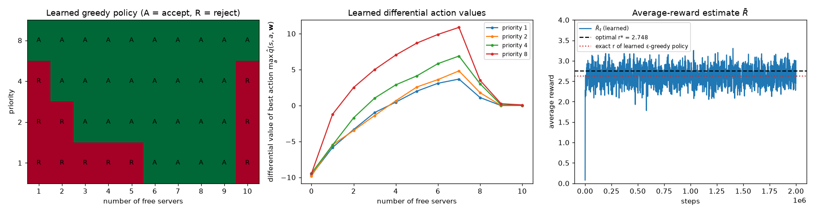

The learned greedy policy earns 99.5% of the optimal average reward, and 25% more than accepting everyone. It always accepts priority 8, accepts priorities 2 and 4 when enough servers are free, and rejects priority 1 whenever 5 or fewer servers are free. The optimal policy *never* accepts priority 1, accepts priority 2 only with at least 4 free servers, and always accepts priority 4. The differences (two frequently visited states and the rarely visited states with 6 or more free servers) cost 0.5% of the optimal reward. States with 8–10 free servers were essentially never visited (at most 0.0001 of the time steps), so their values stay near the initial 0, which explains the sharp drop at the right of the value plot. The noisy $\bar R$ trace (right panel) fluctuates around the exact value of the behaviour policy, as it should; with $\beta = 0.01$ it is a short-memory average.

## 13. Off-policy learning with approximation

### 13.1 Semi-gradient off-policy methods

[Chapter 04](04-monte-carlo.md) (Section 6) and [Chapter 06](06-n-step-and-eligibility-traces.md) (Sections 4–5) handled tabular off-policy learning with importance-sampling ratios, and [Chapter 05](05-temporal-difference.md) (Section 8.2) showed that one-step Q-learning and Expected SARSA need none. With the per-step ratio $\rho_t\doteq\rho_{t:t} = \pi(A_t\mid S_t)/b(A_t\mid S_t)$, the direct extension to function approximation is

$$
\mathbf{w}_{t+1} = \mathbf{w}_t + \alpha\,\rho_t\,\delta_t\,\nabla\hat v(S_t,\mathbf{w}_t),
\qquad \delta_t = R_{t+1}+\gamma\hat v(S_{t+1},\mathbf{w}_t)-\hat v(S_t,\mathbf{w}_t),
$$

and, for action values, semi-gradient Expected SARSA, which needs no ratio in its one-step form:

$$
\mathbf{w}_{t+1} = \mathbf{w}_t + \alpha\,\delta_t\,\nabla\hat q(S_t,A_t,\mathbf{w}_t),
\qquad \delta_t = R_{t+1}+\gamma\sum_a\pi(a\mid S_{t+1})\hat q(S_{t+1},a,\mathbf{w}_t)-\hat q(S_t,A_t,\mathbf{w}_t).
$$

With $\pi$ greedy this is (semi-gradient) Q-learning. The $n$-step versions need products of ratios, as in [Chapter 06](06-n-step-and-eligibility-traces.md).

```text
Semi-gradient off-policy TD(0) for estimating v̂ ≈ v_π
------------------------------------------------------------------
Input: target policy π, behaviour policy b with b(a|s) > 0 wherever π(a|s) > 0
Input: differentiable v̂ with v̂(terminal, ·) = 0;  step size α > 0
Initialise w arbitrarily
Loop for each episode (or forever, for continuing tasks):
    Initialise S
    Loop for each step:
        Choose A ~ b(·|S); take A, observe R, S'
        ρ ← π(A|S) / b(A|S)
        w ← w + α ρ [R + γ v̂(S', w) − v̂(S, w)] ∇v̂(S, w)
        S ← S'
```

These algorithms fix the first problem of off-policy learning, the *targets* (the ratio makes the expected target correct). They do nothing about the second problem, which only exists with function approximation: the **distribution of updates**. States are updated according to the behaviour policy's distribution $d_b$, not the target policy's on-policy distribution $\mu_\pi$, so the matrix that governs stability becomes $\mathbf{A} = \mathbf{X}^\top\mathbf{D}_b(\mathbf{I}-\gamma\mathbf{P}_\pi)\mathbf{X}$. The lemma of Section 5.2 needed $\mathbf{D}$ to be stationary for $\mathbf{P}_\pi$, and here it is not. In the tabular case the distribution of updates doesn't matter (each state has its own parameter, and any distribution that keeps updating every state works). With generalisation it does.

### 13.2 The simplest divergent example

Return to the two-state fragment of Section 4.4: feature values 1 and 2, the transition from the first state to the second with reward 0. Suppose the behaviour policy produces this transition (with ratio $\rho$) but never generates the target policy's transitions out of the second state. In the expected-update form, $\mathbf{D}$ puts all its weight on the first state and

$$
w_{t+1} = w_t + \alpha\rho\big(0 + \gamma\cdot2w_t - w_t\big)\cdot 1 = \big(1+\alpha\rho(2\gamma-1)\big)\,w_t .
$$

For any $\gamma>\tfrac12$ and **any** $\alpha>0$ the factor exceeds 1, so $w$ diverges unless it starts at 0. In matrix terms, the "$A$" of this distribution is $\rho(1-2\gamma)<0$ ($-0.8$ at $\gamma = 0.9$, $\rho = 1$). Each update raises $w$ to move $\hat v(1) = w$ toward its target $2\gamma w$, which raises the target too, and nothing ever pulls back. On-policy, the transitions out of the second state would bring $w$ back down: in Section 4.4 they contributed $+1.1$ to $A$.

### 13.3 Baird's counterexample

The fragment above is not a full MDP. Baird (1995) gave a complete one in which even *expected* (DP-style) updates diverge:

* **Seven states.** The *dashed* action moves to one of the six upper states uniformly; the *solid* action moves to the lower (seventh) state. All rewards are 0, $\gamma = 0.99$, so $v_\pi\equiv0$ for every policy.
* **Behaviour** $b$: dashed with probability 6/7, solid with 1/7. The next state is then uniform, so $d_b$ is uniform. **Target** $\pi$: always solid. Hence $\rho = 0$ after dashed and $\rho = 7$ after solid.
* **Features** (8 weights): upper state $i$ has $\hat v = 2w_i+w_8$; the lower state has $\hat v = w_7+2w_8$. These seven feature vectors are linearly independent, so *every* value function is representable, including $v_\pi = 0$ at $\mathbf{w} = \mathbf{0}$. The problem is not representational power.
* Initial weights $\mathbf{w} = (1,1,1,1,1,1,10,1)$, $\alpha = 0.01$.

[`baird_counterexample.py`](../code/ch08_function_approximation/baird_counterexample.py) computes the matrix $\mathbf{A} = \mathbf{X}^\top\mathbf{D}_b(\mathbf{I}-\gamma\mathbf{P}_\pi)\mathbf{X}$. Its non-zero eigenvalues have real parts $-0.2393, -0.0222$ and $0.5714$ (five times), so by Section 5.1 the expected update diverges for every step size. Simulated:

* **semi-gradient off-policy TD (sample updates)**: $\lVert\mathbf{w}\rVert$ grows from 10.3 to 298 in 1,000 steps ($\sqrt{\overline{VE}} = 396$);
* **semi-gradient DP (expected updates over all states, no sampling at all)**: $\lVert\mathbf{w}\rVert$ grows from 10.3 to 437 in 1,000 sweeps ($\sqrt{\overline{VE}} = 581$).

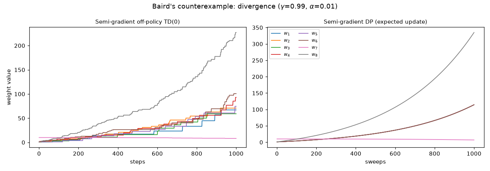

The divergence of the expected version is the important point. It is **not** caused by sampling noise, unlucky step sizes or insufficient features. It is a property of the update rule under this distribution of updates. (S&B also note that there are counterexamples similar to Baird's showing divergence for Q-learning.)

## 14. The deadly triad

Instability arises when we combine all three of:

1. **Function approximation**: generalisation from a parameterisation much smaller than the state space (linear or nonlinear);
2. **Bootstrapping**: targets that include existing estimates (TD, DP), as opposed to complete returns;
3. **Off-policy training**: updates distributed differently from the target policy's on-policy distribution.

Any two without the third are safe in the linear case: on-policy linear TD converges (Section 5), tabular off-policy TD converges, and off-policy Monte Carlo (gradient descent on $\overline{VE}$ under any distribution) is stable. Baird's example lets us remove each ingredient in turn while keeping everything else fixed (expected updates, $\alpha = 0.01$, same initial value function). Since $v = 0$ in every variant, we track the max-norm error $\max_s|\hat v(s)|$:

| variant | smallest real part of an eigenvalue of $\mathbf{A}$ (negative ⇒ divergence; if positive, it sets the slowest decay) | $\max_s\lvert\hat v(s)\rvert$: start → 1,000 → 5,000 sweeps |
|---|---|---|
| all three ingredients | $-0.2393$ | 12 → 677 → $1.1\times10^{7}$ |
| no function approximation (one-hot features) | $+0.0014$ | 12 → 11.8 → 11.2 |
| no bootstrapping (target $v_\pi$, i.e. MC in expectation) | $+0.2857$ | 12 → 0.31 → $3.3\times10^{-6}$ |
| no off-policy (evaluate $b$ itself under $d_b$) | $+0.0162$ | 12 → 1.83 → 0.78 |

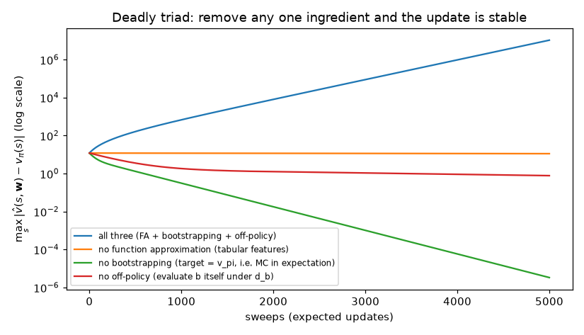

All three safe variants are stable; how *fast* they converge is a separate matter. The tabular one is slowest: its slowest mode decays at rate $\alpha(1-\gamma)/7$ per sweep. Why the max-norm rather than $\sqrt{\overline{VE}}$? For the tabular variant $\sqrt{\overline{VE}}$ actually *rises*, from 5.3 to 10 after 1,000 sweeps and 11.2 after 5,000, because the six upper values (initially 3) move up toward their correct Bellman targets $\gamma\hat v(7)\approx 11.9$. That rise is not instability: the tabular expected update is a max-norm contraction, so the max-norm error can never increase, and it does not.

**Which ingredient should we give up?** None of them comes free.

* *Function approximation* is not optional for large problems.
* *Bootstrapping* buys computational and data efficiency (Chapters 05–06) and is essential when episodes are long or never end. Using $n$-step returns or $\lambda$ close to 1 reduces its role, and with it the instability.
* *Off-policy learning* is what lets an agent learn about the greedy policy while exploring (Q-learning), learn from replayed or logged data ([Chapter 09](09-deep-q-learning.md), [Chapter 16](16-offline-rl-and-imitation.md)), and learn many predictions in parallel from one stream of experience.

Deep Q-networks combine all three. Among the stabilisers of [Chapter 09](09-deep-q-learning.md), target networks and double estimators are best understood as ways of taming the instability of bootstrapping. Experience replay decorrelates updates, but it makes learning *more* off-policy (old data come from older policies), which is why its size and prioritisation interact with divergence. Van Hasselt et al. (2018) studied empirically how often value estimates grow beyond the range of attainable returns ("soft divergence") in deep Q-learning, and which components of the agent make this more or less likely. The rest of this chapter looks at the principled linear solutions.

## 15. The geometry of linear value functions: BE, PBE and TDE

### 15.1 Four objectives

Think of value functions as vectors in $\mathbb{R}^{|\mathcal{S}|}$ with the $\mu$-norm, and of the representable functions $\lbrace\mathbf{X}\mathbf{w}\rbrace$ as a $d$-dimensional subspace. Let $v_{\mathbf{w}} \doteq \mathbf{X}\mathbf{w}$ and define the **Bellman error vector**

$$
\bar\delta_{\mathbf{w}}(s) \doteq \big(\mathcal{T}^\pi v_{\mathbf{w}} - v_{\mathbf{w}}\big)(s) = \mathbb{E}_\pi\big[R_{t+1}+\gamma v_{\mathbf{w}}(S_{t+1}) - v_{\mathbf{w}}(S_t)\,\big|\,S_t = s\big],
$$

the expected TD error at each state. Then:

| objective | definition | minimiser on the random walk |
|---|---|---|
| value error | $\overline{VE}(\mathbf{w}) = \lVert v_{\mathbf{w}}-v_\pi\rVert_\mu^2$ | $\Pi v_\pi$: gradient MC |
| Bellman error | $\overline{BE}(\mathbf{w}) = \lVert\bar\delta_{\mathbf{w}}\rVert_\mu^2$ | residual-gradient algorithm (needs double sampling) |
| projected Bellman error | $\overline{PBE}(\mathbf{w}) = \lVert\Pi\bar\delta_{\mathbf{w}}\rVert_\mu^2$ | 0 at $\mathbf{w}_{TD}$: semi-gradient TD, LSTD, GTD2, TDC |
| TD error | $\overline{TDE}(\mathbf{w}) = \mathbb{E}_b\big[\rho_t\delta_t^2\big]$ | naive residual-gradient algorithm |

In the subspace picture: applying $\mathcal{T}^\pi$ to a representable $v_{\mathbf{w}}$ generally takes it *out* of the subspace; $\overline{BE}$ measures how far it moved, $\overline{PBE}$ measures only the component within the subspace (projecting back). For linear features $\overline{PBE}(\mathbf{w}) = 0$ exactly when $\Pi\mathcal{T}^\pi v_{\mathbf{w}} = v_{\mathbf{w}}$, i.e. at the TD fixed point of Section 4.3. Usually $\overline{BE}$ cannot be driven to zero by any $\mathbf{w}$, while $\overline{PBE}$ can.

The figure below draws this picture exactly for a 3-state MRP ([`linear_td_theory.py`](../code/ch08_function_approximation/linear_td_theory.py), check 6). It has $\gamma = 0.9$, state 1 has $\mathbf{x} = \mathbf{0}$ (its estimate is pinned at 0), and states 2 and 3 have one-hot features, so the representable value functions form a plane in $\mathbb{R}^3$. Coordinates are scaled by $\sqrt{\mu(s)}$ so that the $\mu$-norm becomes the ordinary Euclidean norm and $\Pi$ becomes an ordinary orthogonal projection.

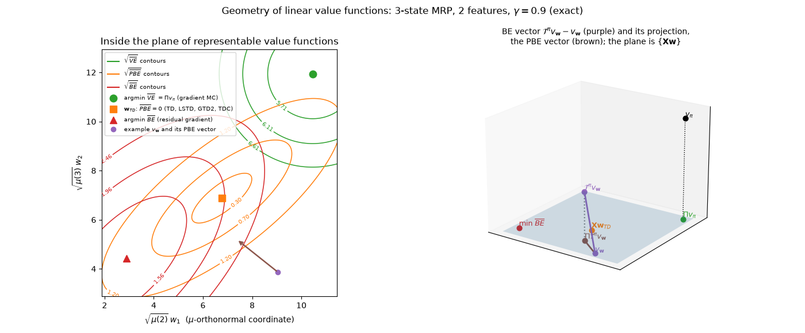

*Left:* inside the plane, each objective's contours are centred on its own minimiser. These are the best fit $\Pi v_\pi$ ($\sqrt{\overline{VE}} = 5.41$), the TD fixed point ($\overline{PBE} = 0$, $\sqrt{\overline{VE}} = 8.28$) and the $\overline{BE}$ minimiser ($\sqrt{\overline{BE}} = 1.26$, but $\sqrt{\overline{VE}} = 11.96$). *Right:* the same plane in 3-D. $v_\pi$ sits above $\Pi v_\pi$. For one example $\mathbf{w}$, applying $\mathcal{T}^\pi$ to $v_{\mathbf{w}}$ leaves the plane. The purple arrow is the Bellman-error vector ($\sqrt{\overline{BE}} = 3.33$ at this $\mathbf{w}$), and the brown arrow is its projection onto the plane, the PBE vector ($\sqrt{\overline{PBE}} = 2.11$). Even at the best fit $\Pi v_\pi$ the projected Bellman error is not zero ($\sqrt{\overline{PBE}} = 1.54$), which is why TD moves away from it.

[`lstd_vs_td.py`](../code/ch08_function_approximation/lstd_vs_td.py) (Part 1) computes the exact minimiser of each objective on the random walk and reports $\sqrt{\overline{VE}}$ at each:

| features | argmin VE | $\mathbf{w}_{TD}$ (PBE = 0) | argmin BE | argmin TDE |
|---|---|---|---|---|
| aggregation, 10 groups | 0.0544 | 0.1167 | 0.2459 | 0.2724 |
| aggregation, 20 groups | 0.0273 | 0.0482 | 0.1673 | 0.2515 |
| polynomial, order 5 | 0.0010 | 0.0010 | 0.0025 | 0.2425 |
| Fourier, order 5 | 0.0079 | 0.0080 | 0.0482 | 0.2347 |
| Fourier, order 10 | 0.0028 | 0.0029 | 0.0154 | 0.2409 |

With rich features the TD fixed point is almost as good as the best fit. The $\overline{BE}$ minimiser is consistently worse than the TD fixed point here, and the $\overline{TDE}$ minimiser is uniformly terrible. The **residual-gradient algorithm** (Baird, 1995) descends $\overline{BE}$; its gradient

$$
\nabla\overline{BE}(\mathbf{w}) = 2\sum_s\mu(s)\,\bar\delta_{\mathbf{w}}(s)\,\Big(\gamma\,\mathbb{E}_\pi\big[\mathbf{x}(S_{t+1})\mid S_t = s\big]-\mathbf{x}(s)\Big)
$$

is a product of two expectations conditioned on the same state, so an unbiased sample needs **two independent next states** from $s$ (double sampling, possible only with a simulator or a deterministic environment). Using one sample for both factors gives $\overline{TDE}$ instead.

```text
Residual-gradient algorithm (double sampling) for v̂ = wᵀx(·) ≈ v_π
------------------------------------------------------------------
Input: π; a simulator that can generate two independent transitions from the same S
Input: features x with x(terminal) = 0;  step size α > 0
Initialise w arbitrarily
Loop for each step (S drawn from μ, e.g. by following π; reset S when an episode ends):
    Choose A ~ π(·|S); take A, observe R, S'                  # sample 1: the TD error
    From the same S, draw A'' ~ π(·|S) and S'' independently  # sample 2: the gradient
    δ ← R + γ wᵀx(S') − wᵀx(S)
    w ← w + α δ (x(S) − γ x(S''))                             # S'' = S' gives naive residual gradient
    S ← S'
```

The residual-gradient algorithm is also slow, and the next subsection shows a deeper problem with $\overline{BE}$.

### 15.2 The Bellman error is not learnable

Call an objective **learnable** if it can be determined, at least in principle, from the distribution of observable data: feature vectors, actions and rewards, but not the hidden states that generated them. Two MDPs that produce the same data distribution are indistinguishable to any learner.

* $\overline{VE}$ is not learnable, but its **minimiser is**. Define the return error $\overline{RE}(\mathbf{w}) = \mathbb{E}\big[(G_t-\hat v(S_t,\mathbf{w}))^2\big]$, which is clearly a function of observable data. Writing $G_t-\hat v = (G_t-v_\pi(S_t)) + (v_\pi(S_t)-\hat v)$ and noting that the cross term has zero mean (because $\mathbb{E}[G_t-v_\pi(S_t)\mid S_t] = 0$), we get $\overline{RE}(\mathbf{w}) = \overline{VE}(\mathbf{w}) + \mathbb{E}\big[(G_t-v_\pi(S_t))^2\big]$. The second term does not depend on $\mathbf{w}$, so both objectives have the same minimiser.
* $\overline{PBE}$ and $\overline{TDE}$ are learnable: both are built from expectations of observable quantities ($\overline{PBE} = \mathbb{E}[\rho\delta\mathbf{x}]^\top\mathbb{E}[\mathbf{x}\mathbf{x}^\top]^{-1}\mathbb{E}[\rho\delta\mathbf{x}]$, Section 16).
* $\overline{BE}$ is **not** learnable, and **neither is its minimiser**.

Here is an example of the last point, computed in [`linear_td_theory.py`](../code/ch08_function_approximation/linear_td_theory.py) (in the spirit of S&B §11.6). Two features, $\gamma = 0.9$:

* **MRP 1** has states A and B with one-hot features. From A, go to A or B with probability ½ each, reward 0. From B, go to A with reward 1, or to B with reward 0, probability ½ each.
* **MRP 2** has states A, B and B′, where B and B′ share the feature of B. From A, go to A (½), B (¼) or B′ (¼), reward 0. From B, always go to A with reward 1. From B′, go to B or B′ (½ each) with reward 0.

Whenever MRP 2 is in a "B-looking" state, it is equally likely to be in B or B′, whatever the history (entering from A: ¼ vs ¼; staying in the B-feature: only possible from B′, which goes to B or B′ with ½ each). So from a B-looking state the next observation is "A with reward 1" or "B-looking with reward 0" with probability ½ each, exactly as in MRP 1. The two produce identical distributions of observable data. The script confirms it empirically: over 200,000 simulated steps of each, the frequencies of all 8 patterns of consecutive (feature, reward, next-feature) pairs agree to within 0.001.

| | argmin VE | $\mathbf{w}_{TD}$ | argmin BE | min BE |
|---|---|---|---|---|
| MRP 1 | (2.25, 2.75) | (2.25, 2.75) | (2.25, 2.75) | 0 |
| MRP 2 | (2.25, 2.75) | (2.25, 2.75) | (2.1619, 2.8381) | 0.0269 |

The VE minimiser and the TD fixed point agree across the two MRPs, as learnability says they must. The BE minimiser differs, although no amount of data can tell the two MRPs apart. Exercise 11 derives the gap in closed form. The conclusion (S&B §11.6): $\overline{BE}$ is a poor objective for learning from data. $\overline{PBE}$ is the objective of choice for linear TD methods, and the next section descends it directly.

## 16. Gradient-TD methods: GTD2 and TDC

Can we do *true* SGD on $\overline{PBE}$, keeping TD's $O(d)$ cost while gaining SGD's robustness off-policy? Yes, by learning one extra vector.

**Rewrite the objective.** For any $\mathbf{y}$, $\lVert\Pi\mathbf{y}\rVert_\mu^2 = \mathbf{y}^\top\Pi^\top\mathbf{D}\Pi\mathbf{y}$, and $\Pi^\top\mathbf{D}\Pi = \mathbf{D}\mathbf{X}(\mathbf{X}^\top\mathbf{D}\mathbf{X})^{-1}\mathbf{X}^\top\mathbf{D}\mathbf{X}(\mathbf{X}^\top\mathbf{D}\mathbf{X})^{-1}\mathbf{X}^\top\mathbf{D} = \mathbf{D}\mathbf{X}(\mathbf{X}^\top\mathbf{D}\mathbf{X})^{-1}\mathbf{X}^\top\mathbf{D}$. Hence

$$
\overline{PBE}(\mathbf{w}) = \big(\mathbf{X}^\top\mathbf{D}\bar\delta_{\mathbf{w}}\big)^\top\big(\mathbf{X}^\top\mathbf{D}\mathbf{X}\big)^{-1}\big(\mathbf{X}^\top\mathbf{D}\bar\delta_{\mathbf{w}}\big).
$$

Now express each factor as an expectation under the behaviour data ($S_t\sim d_b$, $A_t\sim b$, with $\mathbf{D} = \mathbf{D}_b$ and $\mathbf{x}_t = \mathbf{x}(S_t)$). Importance sampling corrects the action in the TD error:

$$
\mathbf{X}^\top\mathbf{D}\bar\delta_{\mathbf{w}} = \sum_s d_b(s)\mathbf{x}(s)\bar\delta_{\mathbf{w}}(s) = \mathbb{E}_b\big[\rho_t\delta_t\mathbf{x}_t\big],
\qquad
\mathbf{X}^\top\mathbf{D}\mathbf{X} = \mathbb{E}_b\big[\mathbf{x}_t\mathbf{x}_t^\top\big],
$$

so $\overline{PBE}(\mathbf{w}) = \mathbb{E}_b[\rho_t\delta_t\mathbf{x}_t]^\top\,\mathbb{E}_b[\mathbf{x}_t\mathbf{x}_t^\top]^{-1}\,\mathbb{E}_b[\rho_t\delta_t\mathbf{x}_t]$.

**The gradient.** With linear features, $\nabla\delta_t = \gamma\mathbf{x}_{t+1}-\mathbf{x}_t$, so $\nabla\mathbb{E}_b[\rho_t\delta_t\mathbf{x}_t]^\top = \mathbb{E}_b[\rho_t(\gamma\mathbf{x}_{t+1}-\mathbf{x}_t)\mathbf{x}_t^\top]$. Since the middle matrix does not depend on $\mathbf{w}$ and is symmetric,

$$
-\tfrac12\nabla\overline{PBE}(\mathbf{w}) = \mathbb{E}_b\big[\rho_t(\mathbf{x}_t-\gamma\mathbf{x}_{t+1})\mathbf{x}_t^\top\big]\;\underbrace{\mathbb{E}_b\big[\mathbf{x}_t\mathbf{x}_t^\top\big]^{-1}\mathbb{E}_b\big[\rho_t\delta_t\mathbf{x}_t\big]}_{\doteq\ \mathbf{v}(\mathbf{w})}.
$$

**The trick.** A product of expectations cannot be sampled from one transition (the double-sampling problem again). But $\mathbf{v}(\mathbf{w})$ (S&B's name for this secondary weight vector; it is not a value function) is exactly the least-squares solution for predicting $\rho_t\delta_t$ from $\mathbf{x}_t$, so we can *learn* it with an LMS rule on a faster timescale and treat it as known in the main update:

$$
\mathbf{v}_{t+1} = \mathbf{v}_t + \beta\,\rho_t\big(\delta_t-\mathbf{v}_t^\top\mathbf{x}_t\big)\mathbf{x}_t .
$$

(Its fixed point solves $\mathbb{E}_b[\rho_t\mathbf{x}_t\mathbf{x}_t^\top]\mathbf{v} = \mathbb{E}_b[\rho_t\delta_t\mathbf{x}_t]$, and $\mathbb{E}_b[\rho_t\mathbf{x}_t\mathbf{x}_t^\top] = \mathbb{E}_b[\mathbf{x}_t\mathbf{x}_t^\top]$ because $\mathbb{E}_b[\rho_t\mid S_t] = 1$.)

**GTD2** samples the first factor directly:

$$
\mathbf{w}_{t+1} = \mathbf{w}_t + \alpha\,\rho_t\big(\mathbf{x}_t-\gamma\mathbf{x}_{t+1}\big)\mathbf{x}_t^\top\mathbf{v}_t .
$$

**TDC** (TD with gradient correction, also called GTD(0)) first expands the product:

$$
\begin{aligned}
\mathbb{E}_b\big[\rho_t(\mathbf{x}_t-\gamma\mathbf{x}_{t+1})\mathbf{x}_t^\top\big]\mathbf{v}
&= \mathbb{E}_b\big[\mathbf{x}_t\mathbf{x}_t^\top\big]\mathbf{v} - \gamma\,\mathbb{E}_b\big[\rho_t\mathbf{x}_{t+1}\mathbf{x}_t^\top\big]\mathbf{v}\\
&= \mathbb{E}_b\big[\rho_t\delta_t\mathbf{x}_t\big] - \gamma\,\mathbb{E}_b\big[\rho_t\mathbf{x}_{t+1}\mathbf{x}_t^\top\big]\mathbf{v}
\end{aligned}
$$

(the first line uses $\mathbb{E}_b[\rho_t\mathbf{x}_t\mathbf{x}_t^\top] = \mathbb{E}_b[\mathbf{x}_t\mathbf{x}_t^\top]$ again; the second uses $\mathbb{E}_b[\mathbf{x}\mathbf{x}^\top]\mathbf{v} = \mathbb{E}_b[\rho\delta\mathbf{x}]$, the definition of $\mathbf{v}$) and samples that:

$$
\mathbf{w}_{t+1} = \mathbf{w}_t + \alpha\,\rho_t\big(\delta_t\mathbf{x}_t - \gamma\,\mathbf{x}_{t+1}\,\mathbf{x}_t^\top\mathbf{v}_t\big).
$$

TDC is the ordinary off-policy TD update plus a correction term that vanishes when $\mathbf{v} = \mathbf{0}$. Both algorithms cost $O(d)$ per step. Sutton et al. (2009) prove that both converge with probability 1 to the TD fixed point off-policy. The conditions are bounded features and rewards, nonsingular $\mathbf{A} = \mathbf{X}^\top\mathbf{D}_b(\mathbf{I}-\gamma\mathbf{P}_\pi)\mathbf{X}$ and $\mathbf{C} = \mathbb{E}_b[\mathbf{x}\mathbf{x}^\top]$, Robbins–Monro step sizes and, in the original analysis, i.i.d. transitions with $S_t\sim d_b$ (later work extends this to samples from a single Markovian trajectory). For TDC the proof uses two timescales, with the secondary weights learning faster ($\alpha_t/\beta_t\to0$).

**Stability, not quality.** Gradient-TD fixes *stability*, not *solution quality*. GTD2 and TDC converge to the off-policy TD fixed point $\mathbf{A}^{-1}\mathbf{b}$ under $d_b$, the same point semi-gradient TD would reach if it converged. Section 5.5 showed that this point can be orders of magnitude worse than $\min\overline{VE}$, because the $\frac{1}{1-\gamma}$ bound needs the on-policy weighting.

```text
TDC (GTD(0)) for estimating v̂ = wᵀx(·) ≈ v_π off-policy
------------------------------------------------------------------
Input: target policy π, behaviour policy b; features x with x(terminal) = 0
Parameters: step sizes α > 0 (main), β > 0 (secondary; typically β > α)
Initialise w arbitrarily; v ← 0
Loop for each step (episodic: reset S at episode starts):
    Choose A ~ b(·|S); take A, observe R, S'
    ρ ← π(A|S) / b(A|S);   x ← x(S);   x' ← x(S')
    δ ← R + γ wᵀx' − wᵀx
    w ← w + α ρ (δ x − γ x' (xᵀv))        # GTD2 instead: w ← w + α ρ (x − γ x') (xᵀv)
    v ← v + β ρ (δ − vᵀx) x
    S ← S'
```

**On Baird's counterexample** ($\alpha = 0.005$, $\beta = 0.05$; middle figure below):

| run | $\sqrt{\overline{VE}}$ | $\sqrt{\overline{PBE}}$ |
|---|---|---|
| TDC, sample updates, 1,000 steps | 1.982 | 0.169 |
| TDC, sample updates, 10 seeds, 1,000 steps | 1.92 – 1.95 | 0.036 – 0.140 |
| TDC, expected updates, 1,000 sweeps | 1.935 | 0.0074 |
| GTD2, expected updates, 1,000 sweeps | 1.935 | 0.0074 |
| TDC, sample updates, 50,000 steps | 1.924 | 0.0073 |
| TDC, expected updates, 50,000 sweeps | 1.924 | 0.0073 |

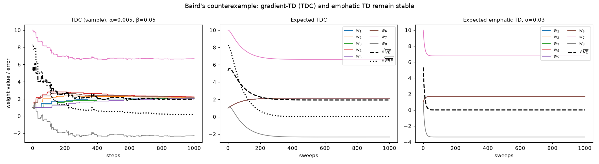

TDC is stable (no weight ever exceeded its initial maximum of 10 in absolute value, across 10 seeds) and drives $\overline{PBE}$ toward zero. But $\sqrt{\overline{VE}}$ stalls at about 1.92, even after 50,000 sweeps. Why, if every value function is representable and $\overline{PBE} = 0$ would force $v_{\mathbf{w}} = v_\pi$ here? The script prints the values learned by expected TDC after 1,000 sweeps: 1.933 at each upper state and 1.952 at the lower state. The upper values are (to rounding) $\gamma$ times the lower one, so their Bellman errors $\gamma\hat v(7)-\hat v(i)$ vanish. Only the lower state keeps an error, $\gamma c - c = -(1-\gamma)c$ with $c = 1.952$, so $\overline{PBE} = \overline{BE} = \tfrac17(1-\gamma)^2c^2$, and $\sqrt{\overline{PBE}} = 0.01\times1.952/\sqrt7 = 0.0074$, exactly the value in the table. Along this one-parameter family of value functions the objective has curvature of order $(1-\gamma)^2/7\approx1.4\times10^{-5}$, so any gradient method crawls along it. **A small PBE does not imply a small value error** when $\gamma$ is close to 1: the PBE identifies the right solution, but its landscape can make that solution very hard to reach.

## 17. Emphatic TD (overview)

Gradient-TD methods change the *update* to make it a true gradient. **Emphatic TD** (Sutton, Mahmood & White, 2016) instead keeps the semi-gradient TD update but *reweights* it, so that the effective distribution of updates once again makes the key matrix positive definite. For one-step TD with interest $i_t\doteq i(S_t)\ge0$ (how much we care about accuracy at $S_t$, usually 1; S&B write $I_t$, which we avoid because $\mathbf{I}$ is the identity matrix):

$$
M_t = \gamma\,\rho_{t-1}M_{t-1} + i_t,\qquad
\mathbf{w}_{t+1} = \mathbf{w}_t + \alpha\,M_t\,\rho_t\,\delta_t\,\mathbf{x}_t,\qquad M_{-1} = 0 .
$$

The order of operations matters: $M_t$ uses the *previous* ratio $\rho_{t-1}$, and the emphasis restarts at the beginning of every episode.

```text
One-step emphatic TD, ETD(0), for estimating v̂ = wᵀx(·) ≈ v_π off-policy
------------------------------------------------------------------
Input: target policy π, behaviour policy b covering π; interest i(s) ≥ 0 (e.g. 1)
Input: features x with x(terminal) = 0;  step size α > 0
Initialise w arbitrarily
Loop for each episode (or once, for a continuing task):
    Initialise S;  M ← 0;  ρ_prev ← 0
    Loop for each step:
        Choose A ~ b(·|S); take A, observe R, S'
        ρ ← π(A|S) / b(A|S)
        M ← γ ρ_prev M + i(S)                    # emphasis, using the previous ratio
        δ ← R + γ wᵀx(S') − wᵀx(S)
        w ← w + α M ρ δ x(S)
        ρ_prev ← ρ;  S ← S'
    until S is terminal
```

The **emphasis** $M_t$ accumulates discounted, importance-weighted interest from the past. Intuitively, if the target policy would have reached $S_t$ from states we care about, $S_t$ receives extra weight, as it would on-policy. In expectation the update is $\mathbf{w}\leftarrow\mathbf{w}+\alpha\mathbf{X}^\top\mathbf{M}(r_\pi+\gamma\mathbf{P}_\pi\mathbf{X}\mathbf{w}-\mathbf{X}\mathbf{w})$ with $\mathbf{M} = \operatorname{diag}(m)$ and $m = (\mathbf{I}-\gamma\mathbf{P}_\pi^\top)^{-1}(d_b\circ i)$ ($\circ$ is the element-wise product), and Sutton et al. prove that the resulting key matrix $\mathbf{X}^\top\mathbf{M}(\mathbf{I}-\gamma\mathbf{P}_\pi)\mathbf{X}$ is positive definite whenever $\gamma<1$, the features are linearly independent and $d_b(s)\,i(s)>0$ for all $s$. That is, the behaviour policy must visit every state and cover $\pi$, and the interest must be positive everywhere. Convergence of ETD($\lambda$) with probability 1 was established by Yu (2015).

On Baird's MDP the script finds emphases $m = (0.143,\dots,0.143, 99.14)$: the lower state, where the target policy always goes, gets almost 700 times more weight than each upper state. The non-zero eigenvalues of the emphatic key matrix are now all positive (0.5714 five times, 0.9977, 3.6908), and **expected** ETD with $\alpha = 0.03$ drives $\sqrt{\overline{VE}}$ to 0.0000 within 1,000 sweeps (right panel above). The **sample** version is another story. The emphasis multiplies by $\gamma\rho = 6.93$ after every solid action, and after 1,000 steps $\sqrt{\overline{VE}}$ was 14,600 on our main seed. Across 10 seeds, the final $\sqrt{\overline{VE}}$ ranged from 262 to 54,600, with emphases up to 2,700. The expectation is fine, but the variance makes plain one-step ETD unusable here without variance-reduction measures, a fact S&B also point out. Variance, not bias, is the main practical obstacle for off-policy methods based on importance sampling.

**Other directions.** Gradient-TD ideas extend to control (Greedy-GQ; Maei et al., 2010), to eligibility traces (GTD($\lambda$), GQ($\lambda$)), and to regularised variants such as TDRC (Ghiassian et al., 2020) that perform close to TD when TD works. In deep RL the practical answers to off-policy instability are different: target networks, truncated importance weights such as Retrace (Munos et al., 2016), and conservative offline objectives. Experience replay is not one of these remedies: it decorrelates updates but supplies more off-policy data. Those are the subjects of Chapters 09, 12 and 16.

## In code

All results above come from the scripts in [`code/ch08_function_approximation/`](../code/ch08_function_approximation/), run from the repository root on one CPU thread with the seeds they print. Each script accepts `--quick` (a smoke test of a few seconds that writes no figures). The [folder README](../code/ch08_function_approximation/README.md) lists the measured runtimes.

| Script | Command | Headline result |
|---|---|---|
| [`random_walk_aggregation.py`](../code/ch08_function_approximation/random_walk_aggregation.py) | `python code/ch08_function_approximation/random_walk_aggregation.py` | MC reaches $\overline{VE} = 0.00300$ (min 0.00296); TD 0.01348 (fixed point 0.01363); best $n$-step: $n = 4$, $\alpha = 0.4$ |
| [`basis_comparison.py`](../code/ch08_function_approximation/basis_comparison.py) | `python code/ch08_function_approximation/basis_comparison.py` | Fourier $\sqrt{\overline{VE}}\approx0.058$ vs polynomial $\approx0.125$ after 5,000 episodes (noise-free: 0.012–0.016 vs 0.085–0.100); 50 tilings 0.068 vs 1 tiling 0.112 |
| [`feature_gallery.py`](../code/ch08_function_approximation/feature_gallery.py) | `python code/ch08_function_approximation/feature_gallery.py` | asymmetric offsets remove diagonal artefacts; coarse-coding widths converge to the same acuity |
| [`tiles.py`](../code/ch08_function_approximation/tiles.py) | `python code/ch08_function_approximation/tiles.py` | self-tests of the tile coder (and IHT hashing) |
| [`mountain_car_sarsa.py`](../code/ch08_function_approximation/mountain_car_sarsa.py) | `python code/ch08_function_approximation/mountain_car_sarsa.py [--hashing-demo]` | 117 steps/episode (last 50 of 300) at $\alpha = 0.5/8$; truncation bug silent here; hash tables of 128 slots break learning, an IHT of 1,024 slots changes nothing |
| [`nstep_sarsa_mountain_car.py`](../code/ch08_function_approximation/nstep_sarsa_mountain_car.py) | `python code/ch08_function_approximation/nstep_sarsa_mountain_car.py` | Exercise 12: over the first 100 episodes, best $n = 4$ (156.7 steps/episode) vs $n = 1$ (166.4) and $n = 8$ (161.9) |
| [`fqi_lspi_mountaincar.py`](../code/ch08_function_approximation/fqi_lspi_mountaincar.py) | `python code/ch08_function_approximation/fqi_lspi_mountaincar.py` | Section 11.4: $K$-NN averager FQI converged on 15/15 batches (121.8 greedy steps at $N = 50{,}000$); least-squares FQI diverged on all five 5,000-sample batches and converged on the ten larger ones; LSPI converged in 7–9 iterations to the same solution as least-squares FQI, and never settled at $N = 5{,}000$ |
| [`linear_td_theory.py`](../code/ch08_function_approximation/linear_td_theory.py) | `python code/ch08_function_approximation/linear_td_theory.py [--dense]` | bound never violated on-policy (1,500 MRPs); off-policy fixed points up to $3\times10^4$ times worse even when expected TD converges; VE/BE/PBE geometry figure |
| [`lstd_vs_td.py`](../code/ch08_function_approximation/lstd_vs_td.py) | `python code/ch08_function_approximation/lstd_vs_td.py` | LSTD 4× more accurate than TD(0) with polynomial features; roughly 600× slower per step at $d = 800$ (machine-dependent); exact TD($\lambda$) fixed points move from $\sqrt{\overline{VE}} = 0.117$ ($\lambda = 0$) to 0.054 ($\lambda = 1$) with 10 groups |
| [`nonlinear_and_kernel.py`](../code/ch08_function_approximation/nonlinear_and_kernel.py) | `python code/ch08_function_approximation/nonlinear_and_kernel.py` | MLP, mean over the last 20% of training: MC 0.042, semi-gradient TD 0.043, full-gradient TD loss 0.248 |
| [`access_control_differential_sarsa.py`](../code/ch08_function_approximation/access_control_differential_sarsa.py) | `python code/ch08_function_approximation/access_control_differential_sarsa.py` | learned greedy policy earns 2.733 vs optimal 2.748 |
| [`baird_counterexample.py`](../code/ch08_function_approximation/baird_counterexample.py) | `python code/ch08_function_approximation/baird_counterexample.py` | semi-gradient TD and DP diverge; TDC and expected ETD are stable; the triad table |

Two helper modules are imported by the scripts: [`rw1000.py`](../code/ch08_function_approximation/rw1000.py) (random walk, exact $v_\pi$, $\mu$, features, exact linear solutions) and `tiles.py`. `nstep_sarsa_mountain_car.py` reuses the agent of `mountain_car_sarsa.py`.

## Common pitfalls and misconceptions

1. **Forgetting to stop the gradient through the TD target.** In PyTorch, omitting `.detach()` (or `torch.no_grad()`) on the target silently turns semi-gradient TD into the naive residual-gradient method, which converges to the wrong values: $\sqrt{\overline{VE}}\approx0.25$ instead of about 0.04 in Section 8.
2. **"TD minimises a loss."** In general it does not (Section 3.3): the expected update is not a gradient field (except for reversible chains). A TD "loss" curve that goes up is not by itself a bug, and one that goes down is no proof of progress. For linear methods, $\overline{PBE}$ is the quantity TD drives to zero.
3. **Treating truncation as termination.** Bootstrap when `truncated`, not when `terminated`. On Mountain Car with $\gamma = 1$ the bug happened to be invisible in our runs (Section 11.3); on tasks where every episode is truncated it biases all values. Silent bugs are the dangerous ones.
4. **Unnormalised inputs.** Polynomial and Fourier features assume states scaled to $[0,1]$; neural networks prefer inputs of order 1. Without scaling, the conditioning, and hence the speed of SGD, collapses (condition numbers of $10^7$–$10^{11}$ for polynomials even *with* scaling).
5. **Step size not scaled by feature norm.** With $n$ tilings the effective step at a state is $\alpha n$. Use $\alpha = 1/(\tau\,\mathbb{E}[\mathbf{x}^\top\mathbf{x}])$, which is why tile-coding step sizes are written as "$0.5/8$".
6. **Comparing metrics that weight states differently.** $\overline{VE}$ is $\mu$-weighted; S&B's Fig. 9.2 uses an unweighted average over states. Off-policy, the fixed point depends on the update distribution. Always say which weighting you report.
7. **Blaming divergence on noise.** Baird's counterexample diverges with *exact expected* updates and features that can represent the true values. Off-policy instability is a property of the update rule and the update distribution.
8. **"Small PBE means good values."** On Baird's MDP TDC reaches $\sqrt{\overline{PBE}} = 0.007$ with $\sqrt{\overline{VE}} = 1.9$: when $\gamma\approx1$ the objective is nearly flat along some directions.
9. **Assuming deterministic tie-breaking is harmless.** With zero-initialised $\hat q$, `np.argmax` always picks the first action; break ties randomly.
10. **Over-trusting final values at a constant step size.** Learned weights fluctuate around the fixed point (Section 3.4). Report averages over the end of training, or decay the step size (Sections 3.4 and 7). Single end-of-training snapshots can mislead (Section 8).
11. **Hash tables that are too small.** Collisions are harmless when the table is much larger than the number of visited tiles, and catastrophic when it is not (128 slots for 648 tiles broke Mountain Car).
12. **LSTD for control without forgetting.** LSTD weighs all past data equally; when the policy changes, old data describe the wrong policy.
13. **"Gradient-TD solves off-policy learning."** GTD2 and TDC make off-policy linear TD *stable*, but they converge to the off-policy TD fixed point, which can be far worse than the best fit (Sections 5.5 and 16).
14. **Thinking on-policy linear SARSA (or any control method) converges like prediction.** The guarantees of Section 5 are for prediction of a fixed policy; control with function approximation can chatter, and off-policy control (Q-learning) can diverge.
15. **Assuming batch FQI converges because the data are fixed.** A fixed batch removes the moving data distribution, not the instability of "backup, then fit". The convergence guarantee of Section 11.4 needs a fit that is a sup-norm non-expansion, such as an averager; least squares on generalising features is not one. On Mountain Car, least-squares FQI on tiles diverged on every 5,000-sample batch, and LSPI on the same data never settled (Section 11.4). Conversely, convergence is not quality: the averager converged on every batch, including those whose greedy policy failed.

## Historical notes and key papers

* **Function approximation in RL is as old as RL.** Samuel's checkers player (1959, *IBM Journal of Research and Development*) adjusted a linear evaluation function toward backed-up values, an early form of semi-gradient bootstrapping. The LMS rule of Widrow & Hoff (1960) underlies all linear SGD updates in this chapter.
* **TD with linear function approximation.** Sutton (1988, *Machine Learning*) introduced TD($\lambda$) and proved convergence in the mean for linear TD(0) under restricted conditions. The definitive analysis of on-policy linear TD($\lambda$), including the projected-Bellman fixed point, the error bound and a nonlinear divergence example, is Tsitsiklis & Van Roy (1997, *IEEE Transactions on Automatic Control*). Bertsekas & Tsitsiklis's *Neuro-Dynamic Programming* (1996) systematised the field.
* **Instability.** Baird (1995, ICML) published the counterexample and proposed residual-gradient algorithms. Gordon (1995, ICML) characterised "averagers" that are safe with DP, and Boyan & Moore (1995, NIPS) showed failures of value iteration with common function approximators. The term **deadly triad** was popularised by Sutton & Barto (2018), and van Hasselt et al. (2018, arXiv) studied it empirically in deep Q-learning.
* **Features.** Tile coding descends from Albus's CMAC (1971, 1975). Its use in RL was popularised by Sutton (1996, NIPS), who solved Mountain Car (introduced by Moore in his 1990 Cambridge PhD thesis) and other tasks with SARSA and sparse coarse coding. Miller & Glanz (1996) recommended asymmetric offsets. The Fourier basis for RL is due to Konidaris, Osentoski & Thomas (2011, AAAI).
* **Least squares.** LSTD was introduced by Bradtke & Barto (1996, *Machine Learning*) and extended to LSTD($\lambda$) by Boyan (1999; 2002, *Machine Learning*). LSPI and LSTDQ are due to Lagoudakis & Parr (2003, *JMLR*).
* **Batch RL.** Fitted Q-iteration in its standard form, with tree-based regressors and a convergence result for trees whose structure does not depend on the targets, is from Ernst, Geurts & Wehenkel (2005, *JMLR*), building on Gordon's averagers and on the kernel-based RL of Ormoneit & Sen. Neural fitted Q-iteration is due to Riedmiller (2005, ECML). Finite-sample analyses of fitted value iteration and of Bellman-residual fitted policy iteration are Munos & Szepesvári (2008, *JMLR*) and Antos, Szepesvári & Munos (2008, *Machine Learning*).
* **Gradient-TD.** Sutton, Szepesvári & Maei (2009, NIPS 2008) introduced GTD. Sutton, Maei, Precup, Bhatnagar, Silver, Szepesvári & Wiewiora (2009, ICML) introduced GTD2 and TDC and the $\overline{PBE}$ objective in this form. Maei's 2011 thesis (University of Alberta) extended the family, and Maei et al. (2010, ICML) gave Greedy-GQ for control.
* **Emphatic TD.** Sutton, Mahmood & White (2016, *JMLR*); convergence of ETD($\lambda$) by Yu (2015, COLT).
* **Average reward.** R-learning (Schwartz, 1993, ICML) was an early average-reward TD control method; Mahadevan (1996, *Machine Learning*) surveyed the area; Tsitsiklis & Van Roy (1999, *Automatica*) analysed average-cost TD with linear approximation. The argument against discounting in continuing tasks with function approximation is presented in Sutton & Barto (2018, §10.4).
* **Neural networks.** Tesauro's TD-Gammon (1992; 1995, *Communications of the ACM*) showed that semi-gradient TD($\lambda$) with a multilayer network could reach expert play at backgammon, long before deep RL ([Chapter 09](09-deep-q-learning.md)).
* **Kernel methods.** Ormoneit & Sen (2002, *Machine Learning*) gave kernel-based RL with consistency guarantees; Atkeson, Moore & Schaal (1997, *Artificial Intelligence Review*) surveyed locally weighted learning.

## Summary

* Function approximation replaces the table by $\hat v(s,\mathbf{w})$ with $d\ll|\mathcal{S}|$ parameters. The point is **generalisation**; the price is **interference**, and the need to say which states matter through a weighting $\mu$ in $\overline{VE}$.
* With states sampled from $\mu$, SGD on the squared error is unbiased; **gradient MC** uses the unbiased target $G_t$ and converges to a (local) optimum of $\overline{VE}$.
* **Semi-gradient TD** plugs in a bootstrapped target and ignores its dependence on $\mathbf{w}$. It is not a gradient method: the expected update is in general not the gradient of any function (reversible chains are the exception), and the "full gradient" alternative minimises $\overline{TDE}$, which gives wrong values on stochastic tasks.
* **Semi-gradient TD($\lambda$)** keeps a trace vector $\mathbf{z}$ over weights. Its fixed point solves $\mathbf{X}\mathbf{w} = \Pi\mathcal{T}^\lambda\mathbf{X}\mathbf{w}$ and moves from the TD(0) solution to the best fit as $\lambda\to1$.
* Linear TD converges on-policy to the **TD fixed point** $\mathbf{w}_{TD} = \mathbf{A}^{-1}\mathbf{b}$, the solution of the projected Bellman equation $\mathbf{X}\mathbf{w} = \Pi\mathcal{T}^\pi\mathbf{X}\mathbf{w}$. $\mathbf{A}$ is positive definite *because* $\mu$ is the on-policy distribution, and $\overline{VE}(\mathbf{w}_{TD})\le\frac{1}{1-\gamma^2}\min\overline{VE}\le\frac{1}{1-\gamma}\min\overline{VE}$.
* **Features** carry the domain knowledge. The Fourier basis is a strong default for low-dimensional smooth problems; **tile coding** is fast, sparse, makes step sizes easy, and scales via hashing. Normalise inputs; conditioning decides learning speed.
* Choose $\alpha\approx1/(\tau\,\mathbb{E}[\mathbf{x}^\top\mathbf{x}])$.
* **LSTD** computes the TD fixed point directly from data: no step size, insensitive to conditioning, but $O(d^2)$ per step.
* **Neural networks** learn their own features; semi-gradient TD still works in practice but loses all guarantees. Memory-based/kernel methods trade parametric compression for growing memory.
* **Semi-gradient SARSA** with tile coding solves Mountain Car with $\varepsilon = 0$ thanks to optimistic initialisation. Bootstrap through truncation.
* **Batch control** learns from a fixed set of transitions. **Fitted Q-iteration** regresses onto $r+\gamma(1-\text{term})\max_{a'}Q_k(s',a')$ at every iteration, i.e. approximate value iteration $Q_{k+1}\approx\Pi_{\mathcal{F}}\mathcal{T}^\ast Q_k$. With an **averager** ($K$-NN, kernel smoothing, aggregation, trees with target-independent splits) the fit is a sup-norm non-expansion and FQI must converge. With least squares on generalising features it need not: on Mountain Car it diverged with 5,000 samples and converged with 20,000 or more. **LSPI** alternates LSTDQ evaluation with greedy improvement on one batch; when it converged it reached the same solution as least-squares FQI, in 7–9 iterations. FQI is the conceptual root of DQN's target network (Chapter 09) and of fitted Q evaluation and offline RL (Chapter 16).
* In continuing tasks with function approximation, the **average-reward** formulation is the principled one: the on-policy-averaged discounted value equals $r(\pi)/(1-\gamma)$ for every $\gamma$. Differential semi-gradient SARSA learns $\bar R$ and differential values.
* **The deadly triad** (function approximation + bootstrapping + off-policy) can diverge even with exact expected updates (Baird). Remove any one ingredient and the linear updates are stable.
* Of the candidate objectives, $\overline{BE}$ is not learnable from data and needs double sampling; $\overline{PBE}$ is learnable and is zero at the TD fixed point. **GTD2/TDC** do true SGD on $\overline{PBE}$ at $O(d)$ cost and are stable off-policy, but they converge to the same off-policy TD fixed point, which can be far worse than the best fit: they fix stability, not solution quality. **Emphatic TD** reweights updates to restore positive definiteness. TDC is stable on Baird's MDP; expected emphatic TD is stable, but one-step sample ETD has such high variance that it failed in all our seeds.

## Key equations

$$
\overline{VE}(\mathbf{w}) = \sum_s\mu(s)\big[v_\pi(s)-\hat v(s,\mathbf{w})\big]^2,\qquad \boldsymbol\eta = \mathbf{h}+\mathbf{P}_\pi^\top\boldsymbol\eta,\quad \mu = \boldsymbol\eta/\textstyle\sum_s\eta(s)
$$

$$
\mathbf{w}\leftarrow\mathbf{w}+\alpha\big[U_t-\hat v(S_t,\mathbf{w})\big]\nabla\hat v(S_t,\mathbf{w}),\qquad U_t = G_t\ \text{(gradient MC)},\quad U_t = R_{t+1}+\gamma\hat v(S_{t+1},\mathbf{w})\ \text{(semi-gradient TD(0))}
$$

$$
\mathbf{A} = \mathbb{E}\big[\mathbf{x}_t(\mathbf{x}_t-\gamma\mathbf{x}_{t+1})^\top\big] = \mathbf{X}^\top\mathbf{D}(\mathbf{I}-\gamma\mathbf{P}_\pi)\mathbf{X},\qquad
\mathbf{b} = \mathbb{E}[R_{t+1}\mathbf{x}_t] = \mathbf{X}^\top\mathbf{D}r_\pi,\qquad
\mathbf{w}_{TD} = \mathbf{A}^{-1}\mathbf{b}
$$

$$
\mathbf{X}\mathbf{w}_{TD} = \Pi\,\mathcal{T}^\pi(\mathbf{X}\mathbf{w}_{TD}),\qquad \Pi = \mathbf{X}(\mathbf{X}^\top\mathbf{D}\mathbf{X})^{-1}\mathbf{X}^\top\mathbf{D}
$$

$$
\text{TD}(\lambda):\quad \mathbf{z}_t = \gamma\lambda\mathbf{z}_{t-1}+\nabla\hat v(S_t,\mathbf{w}),\quad \mathbf{w}\leftarrow\mathbf{w}+\alpha\delta_t\mathbf{z}_t,\qquad
\mathbf{A}_\lambda = \mathbf{X}^\top\mathbf{D}(\mathbf{I}-\gamma\lambda\mathbf{P}_\pi)^{-1}(\mathbf{I}-\gamma\mathbf{P}_\pi)\mathbf{X},\quad
\mathbf{b}_\lambda = \mathbf{X}^\top\mathbf{D}(\mathbf{I}-\gamma\lambda\mathbf{P}_\pi)^{-1}r_\pi
$$

$$
\overline{VE}(\mathbf{w}_{TD})\le\frac{1}{1-\gamma^2}\min_{\mathbf{w}}\overline{VE}(\mathbf{w})\le\frac{1}{1-\gamma}\min_{\mathbf{w}}\overline{VE}(\mathbf{w})\quad\text{(on-policy)}
$$

$$
x_i(\mathbf{s}) = \cos(\pi\,\mathbf{s}^\top\mathbf{c}^i)\ \text{(Fourier)},\qquad \alpha = \big(\tau\,\mathbb{E}[\mathbf{x}^\top\mathbf{x}]\big)^{-1}
$$

$$
\widehat{\mathbf{A}}_{t+1}^{-1} = \widehat{\mathbf{A}}_t^{-1}-\frac{\widehat{\mathbf{A}}_t^{-1}\mathbf{x}_t(\mathbf{x}_t-\gamma\mathbf{x}_{t+1})^\top\widehat{\mathbf{A}}_t^{-1}}{1+(\mathbf{x}_t-\gamma\mathbf{x}_{t+1})^\top\widehat{\mathbf{A}}_t^{-1}\mathbf{x}_t},\qquad \mathbf{w}_t = \widehat{\mathbf{A}}_t^{-1}\widehat{\mathbf{b}}_t\quad\text{(LSTD)}
$$

$$
Q_{k+1} = \arg\min_{f\in\mathcal{F}}\sum_i\Big(f(s_i,a_i)-r_i-\gamma(1-\text{term}_i)\max_{a'}Q_k(s'_i,a')\Big)^2\ \text{(FQI)},\qquad
\hat f(s,a) = \sum_i\kappa_i(s,a)\,y_i,\ \kappa_i\ge0,\ \textstyle\sum_i\kappa_i\le1\ \Rightarrow\ \lVert\hat f-\hat f'\rVert_\infty\le\lVert y-y'\rVert_\infty\ \text{(averager)}
$$

$$
\widehat{\mathbf{A}} = \sum_i\mathbf{x}(s_i,a_i)\big(\mathbf{x}(s_i,a_i)-\gamma\,\mathbf{x}(s'_i,\pi(s'_i))\big)^\top,\quad
\widehat{\mathbf{b}} = \sum_i r_i\,\mathbf{x}(s_i,a_i),\quad
\mathbf{w}_\pi = \widehat{\mathbf{A}}^{-1}\widehat{\mathbf{b}}\ \text{(LSTDQ)},\qquad
\pi_{m+1}(s) = \arg\max_a\mathbf{x}(s,a)^\top\mathbf{w}_{\pi_m}\ \text{(LSPI)}
$$

$$
\delta_t = R_{t+1}-\bar R_t+\hat q(S_{t+1},A_{t+1},\mathbf{w})-\hat q(S_t,A_t,\mathbf{w}),\qquad \bar R\leftarrow\bar R+\beta\delta_t,\qquad \mathbf{w}\leftarrow\mathbf{w}+\alpha\delta_t\nabla\hat q(S_t,A_t,\mathbf{w})
$$

$$
\sum_s\mu_\pi(s)v_\pi^\gamma(s) = \frac{r(\pi)}{1-\gamma}
$$

$$
\overline{BE}(\mathbf{w}) = \lVert\bar\delta_{\mathbf{w}}\rVert_\mu^2,\qquad
\overline{PBE}(\mathbf{w}) = \lVert\Pi\bar\delta_{\mathbf{w}}\rVert_\mu^2 = \mathbb{E}_b[\rho\delta\mathbf{x}]^\top\mathbb{E}_b[\mathbf{x}\mathbf{x}^\top]^{-1}\mathbb{E}_b[\rho\delta\mathbf{x}]
$$

$$
\text{TDC:}\quad \mathbf{w}\leftarrow\mathbf{w}+\alpha\rho_t\big(\delta_t\mathbf{x}_t-\gamma\mathbf{x}_{t+1}\mathbf{x}_t^\top\mathbf{v}\big),\qquad \mathbf{v}\leftarrow\mathbf{v}+\beta\rho_t(\delta_t-\mathbf{v}^\top\mathbf{x}_t)\mathbf{x}_t
$$

$$
\text{ETD(0):}\quad M_t = \gamma\rho_{t-1}M_{t-1}+i_t,\qquad \mathbf{w}\leftarrow\mathbf{w}+\alpha M_t\rho_t\delta_t\mathbf{x}_t
$$

## Exercises

**1. ★ Why weight the error?** (a) Why can $\overline{VE}$ generally not be made zero when $d<|\mathcal{S}|$? (b) For the 1000-state random walk, what would change in the gradient-MC solution with 10 groups if states were sampled uniformly instead of from $\mu$?

<details><summary>Solution</summary>

(a) The approximations $\hat v_{\mathbf{w}} = \mathbf{X}\mathbf{w}$ form (in the linear case) a $d$-dimensional subspace of the $|\mathcal{S}|$-dimensional space of value functions. Unless $v_\pi$ happens to lie in it, some error remains, and lowering it at some states raises it at others. The weighting decides the trade-off.

(b) With aggregation, the gradient-MC fixed point of a group is the weighted average of $v_\pi$ over the group, with weights equal to the sampling distribution (Exercise 2). Uniform sampling gives the plain average: group 1 would move from $-0.830$ to the unweighted mean $-0.846$, and every step would move slightly toward the outer end of its group. In the middle groups the spike at state 500 would no longer matter. The fitted function would be slightly better in the rarely visited outer states and slightly worse where the agent actually spends its time.

</details>

**2. ★★ Aggregation fixed points.** With state aggregation (one-hot group features), show that the minimiser of $\overline{VE}$ has $w_g = \sum_{s\in g}\mu(s)v_\pi(s)\big/\sum_{s\in g}\mu(s)$. Then show that the TD fixed point satisfies $w_g = \sum_{s\in g}\mu(s)\big(r_\pi(s)+\gamma\sum_{s'}\mathbf{P}_\pi(s,s')w_{g(s')}\big)\big/\sum_{s\in g}\mu(s)$, with $w_{g(\text{terminal})} = 0$.

<details><summary>Solution</summary>

With one-hot features, $\mathbf{X}^\top\mathbf{D}\mathbf{X}$ is diagonal with entries $\sum_{s\in g}\mu(s)$, and $(\mathbf{X}^\top\mathbf{D}v_\pi)_g = \sum_{s\in g}\mu(s)v_\pi(s)$. The normal equations $\mathbf{X}^\top\mathbf{D}\mathbf{X}\mathbf{w} = \mathbf{X}^\top\mathbf{D}v_\pi$ decouple into the stated ratio.

For TD, $\mathbf{A}\mathbf{w} = \mathbf{b}$ reads $\mathbf{X}^\top\mathbf{D}\mathbf{X}\mathbf{w} = \mathbf{X}^\top\mathbf{D}(r_\pi+\gamma\mathbf{P}_\pi\mathbf{X}\mathbf{w})$. Component $g$ of the left side is $w_g\sum_{s\in g}\mu(s)$; component $g$ of the right side is $\sum_{s\in g}\mu(s)\big(r_\pi(s)+\gamma\sum_{s'}\mathbf{P}_\pi(s,s')w_{g(s')}\big)$. Divide. So each TD group value is the $\mu$-weighted average of the one-step *bootstrapped* targets of its states, which involve the other groups' approximate values. That is how approximation error leaks between groups and flattens the staircase in Section 3.4.

</details>

**3. ★ The missing `.detach()`.** A colleague's PyTorch value-learning code computes `loss = 0.5 * (r + gamma * net(s2) - net(s)).pow(2).mean()` and calls `loss.backward()`. What algorithm is this, what does it converge to, and how would you fix it?

<details><summary>Solution</summary>

Gradients flow through both $\hat v(S_t)$ and $\hat v(S_{t+1})$, so this is SGD on the mean squared TD error, the naive residual-gradient algorithm. It converges (it is a true gradient method), but to the minimiser of $\overline{TDE} = \mathbb{E}[\delta^2]$, which also penalises the conditional variance of $\delta$ and therefore flattens the values on stochastic tasks. In Section 8 this gave $\sqrt{\overline{VE}}\approx0.25$ on all seeds, against about 0.04 for semi-gradient TD (averaged over the last 20% of training). Fix: `target = (r + gamma * net(s2) * (1 - terminated)).detach()` and `loss = 0.5 * (target - net(s)).pow(2).mean()`. (Also note the missing terminal mask.)

</details>

**4. ★★ How off-policy can you go?** In the two-state chain of Section 4.4 (features 1 and 2, $1\to2$ with reward 0, $2\to1$ with reward 1), suppose updates are made from state 1 with probability $d$ and from state 2 with probability $1-d$. For which $d$ is expected semi-gradient TD stable, as a function of $\gamma$? Evaluate at $\gamma = 0.9$.

<details><summary>Solution</summary>

Each state contributes $d(s)\,x(s)\,(x(s)-\gamma x(s'))$:

$$
A(d) = d\cdot1\cdot(1-2\gamma) + (1-d)\cdot2\cdot(2-\gamma) = 2(2-\gamma) + d\big[(1-2\gamma)-2(2-\gamma)\big] = 4-2\gamma-3d .
$$

(Check: $d = \tfrac12$, $\gamma = 0.9$ gives $0.7$, as in Section 4.4; $d = 1$ gives $-0.8$, as in Section 13.2.) With a single weight, the expected update $w\leftarrow w+\alpha(b-Aw)$ is stable for small $\alpha$ iff $A>0$, i.e.

$$
d < \frac{4-2\gamma}{3}.
$$

At $\gamma = 0.9$: $d<0.733$. The on-policy $d = 0.5$ is safely inside; any distribution that updates the first state more than 73% of the time diverges. As $\gamma\to1$ the threshold drops to $2/3$, and for $\gamma>\tfrac12$ the extreme $d = 1$ (Section 13.2) always diverges.

</details>

**5. ★★ Where the lemma breaks.** Show by example that $\lVert\mathbf{P}v\rVert_d\le\lVert v\rVert_d$ can fail when $d$ is not the stationary distribution of $\mathbf{P}$.

<details><summary>Solution</summary>

Take the two-state chain $\mathbf{P} = \begin{pmatrix}0&1\\1&0\end{pmatrix}$ (stationary distribution $(\tfrac12,\tfrac12)$), $d = (0.9, 0.1)$ and $v = (0,1)$. Then $\mathbf{P}v = (1,0)$, so $\lVert\mathbf{P}v\rVert_d^2 = 0.9 > \lVert v\rVert_d^2 = 0.1$. The step that fails in the proof is $\sum_s d(s)\mathbf{P}(s,s') = d(s')$: here $d^\top\mathbf{P} = (0.1, 0.9)\neq d^\top$. One application of $\mathbf{P}$ moves mass from a lightly weighted state to a heavily weighted one, which the $d$-norm sees as growth.

</details>

**6. ★★ A single constant feature.** Suppose $\mathbf{x}(s) = 1$ for every state of an ergodic continuing MRP (a single weight). Compute $\mathbf{w}_{TD}$ and $\mathbf{w}_{MC}$ under the on-policy distribution, and relate them to the average reward.

<details><summary>Solution</summary>

$A = \sum_s\mu(s)\cdot1\cdot(1-\gamma\cdot1) = 1-\gamma$ and $b = \sum_s\mu(s)r_\pi(s) = r(\pi)$, so $w_{TD} = r(\pi)/(1-\gamma)$. The best fit is $w_{MC} = \sum_s\mu(s)v_\pi(s)/\sum_s\mu(s) = \mu^\top v_\pi$, which by the futility identity of Section 12.3 also equals $r(\pi)/(1-\gamma)$. The two coincide. Check on Section 4.4's chain: $r(\pi) = \tfrac12$, $\gamma = 0.9$, so $w = 5$, the average of $4.737$ and $5.263$. A constant feature can only represent the average, and both methods find it.

</details>

**7. ★★ Sherman–Morrison and LSTD.** Verify the Sherman–Morrison identity $(\mathbf{B}+\mathbf{p}\mathbf{q}^\top)^{-1} = \mathbf{B}^{-1}-\frac{\mathbf{B}^{-1}\mathbf{p}\mathbf{q}^\top\mathbf{B}^{-1}}{1+\mathbf{q}^\top\mathbf{B}^{-1}\mathbf{p}}$ and use it to derive the LSTD update of Section 9. What is the cost per step, and why does LSTD need $\varepsilon>0$?

<details><summary>Solution</summary>

Multiply $(\mathbf{B}+\mathbf{p}\mathbf{q}^\top)$ by the claimed inverse:

$$
\begin{aligned}
&(\mathbf{B}+\mathbf{p}\mathbf{q}^\top)\Big(\mathbf{B}^{-1}-\frac{\mathbf{B}^{-1}\mathbf{p}\mathbf{q}^\top\mathbf{B}^{-1}}{1+\mathbf{q}^\top\mathbf{B}^{-1}\mathbf{p}}\Big)\\
&= \mathbf{I}+\mathbf{p}\mathbf{q}^\top\mathbf{B}^{-1}-\frac{\mathbf{p}\mathbf{q}^\top\mathbf{B}^{-1}+\mathbf{p}(\mathbf{q}^\top\mathbf{B}^{-1}\mathbf{p})\mathbf{q}^\top\mathbf{B}^{-1}}{1+\mathbf{q}^\top\mathbf{B}^{-1}\mathbf{p}}
= \mathbf{I}+\mathbf{p}\mathbf{q}^\top\mathbf{B}^{-1}-\frac{(1+\mathbf{q}^\top\mathbf{B}^{-1}\mathbf{p})\,\mathbf{p}\mathbf{q}^\top\mathbf{B}^{-1}}{1+\mathbf{q}^\top\mathbf{B}^{-1}\mathbf{p}} = \mathbf{I}.
\end{aligned}
$$

(The scalar $\mathbf{q}^\top\mathbf{B}^{-1}\mathbf{p}$ commutes out of the product.) LSTD has $\widehat{\mathbf{A}}_{t+1} = \widehat{\mathbf{A}}_t+\mathbf{x}_t(\mathbf{x}_t-\gamma\mathbf{x}_{t+1})^\top$, a rank-one update with $\mathbf{p} = \mathbf{x}_t$, $\mathbf{q} = \mathbf{x}_t-\gamma\mathbf{x}_{t+1}$, which gives the formula in Section 9. Each step needs two matrix–vector products and one outer product: $O(d^2)$ time, with $O(d^2)$ memory for $\widehat{\mathbf{A}}^{-1}$. Without $\varepsilon\mathbf{I}$, $\widehat{\mathbf{A}}_t$ is a sum of $t$ rank-one matrices and is singular for $t<d$ (and whenever some feature direction has not been excited yet), so the recursion needs an invertible starting point $\widehat{\mathbf{A}}_0 = \varepsilon\mathbf{I}$.

</details>

**8. ★★ Step size for the Fourier basis.** For a 1-D order-$n$ Fourier basis and states distributed uniformly on $[0,1]$, compute $\mathbb{E}[\mathbf{x}^\top\mathbf{x}]$ and the step size that learns "in about $\tau = 100$ experiences" for $n = 5$.

<details><summary>Solution</summary>

$x_0 = 1$, so $\mathbb{E}[x_0^2] = 1$. For $i\ge1$, $\mathbb{E}[\cos^2(i\pi s)] = \int_0^1\cos^2(i\pi s)\,ds = \tfrac12$. Hence $\mathbb{E}[\mathbf{x}^\top\mathbf{x}] = 1+n/2$, and $\alpha = 1/(\tau(1+n/2)) = 1/(100\cdot3.5)\approx0.0029$ for $n = 5$. Two caveats. The on-policy distribution is not uniform (on the random walk it concentrates where $\cos(i\pi s)$ for odd $i$ is small, so the true $\mathbb{E}[\mathbf{x}^\top\mathbf{x}]$ is somewhat different), and this rule says nothing about the *noise* level: the experiments in Section 6.7 used a much smaller $\alpha = 5\times10^{-5}$ because the MC targets ($\pm1$) are very noisy.

</details>

**9. ★ Differential values.** Show that if $\hat q$ satisfies the differential Bellman equation for $q_\pi$, then so does $\hat q + c$ for any constant $c$, and that the differential TD error is unchanged by adding $c$ to all action values. Why is this not a problem for control?

<details><summary>Solution</summary>

In $q(s,a) = \sum_{s',r}p(s',r\mid s,a)\big[r-r(\pi)+\sum_{a'}\pi(a'\mid s')q(s',a')\big]$, replacing $q$ by $q+c$ adds $c$ to the left side and $\sum_{s',r}p(\cdot)\sum_{a'}\pi(a'\mid s')c = c$ to the right side, so equality is preserved. In $\delta_t = R_{t+1}-\bar R+\hat q(S_{t+1},A_{t+1})-\hat q(S_t,A_t)$ the constant cancels. Control only uses *comparisons* between actions in the same state ($\arg\max_a\hat q(s,a)$), which are unaffected by a common shift. The average reward itself is pinned down separately, by $\bar R$.

</details>

**10. ★★ TDC at its fixed point.** Show that at the TD fixed point the secondary weights satisfy $\mathbf{v} = \mathbf{0}$, and conclude that the expected TDC update then coincides with the expected off-policy TD update. Why does TDC nevertheless behave differently from off-policy TD on Baird's MDP?

<details><summary>Solution</summary>

The secondary weights converge (for fixed $\mathbf{w}$) to $\mathbf{v}(\mathbf{w}) = \mathbb{E}_b[\mathbf{x}\mathbf{x}^\top]^{-1}\mathbb{E}_b[\rho\delta\mathbf{x}]$, and $\mathbb{E}_b[\rho\delta\mathbf{x}] = \mathbf{X}^\top\mathbf{D}\bar\delta_{\mathbf{w}} = \mathbf{b}-\mathbf{A}\mathbf{w}$ (with $\mathbf{A}$, $\mathbf{b}$ under the behaviour weighting), which is zero at $\mathbf{w}_{TD}$. So $\mathbf{v} = \mathbf{0}$ there, the correction term $-\gamma\mathbf{x}_{t+1}\mathbf{x}_t^\top\mathbf{v}$ vanishes, and the expected TDC update equals the expected TD update (both zero). The two methods share fixed points but not dynamics. Away from the fixed point the correction term is non-zero, and it is what turns the expected update into $-\tfrac{\alpha}{2}\nabla\overline{PBE}$, a gradient field with a positive semi-definite Hessian. Off-policy TD's expected update $\mathbf{b}-\mathbf{A}\mathbf{w}$ has Jacobian $-\mathbf{A}$, and on Baird's MDP $\mathbf{A}$ has eigenvalues with negative real part ($-0.2393$, $-0.0222$), so $-\mathbf{A}$ has eigenvalues with positive real part: the fixed point repels TD's iterates but attracts TDC's.

</details>

**11. ★★ The Bellman error gap.** For the two MRPs of Section 15.2 (one-hot features $(w_A, w_B)$), show that

$$
\overline{BE}_2(\mathbf{w})-\overline{BE}_1(\mathbf{w}) = \tfrac18\big(1+\gamma(w_A-w_B)\big)^2 .
$$

Conclude that the minimisers coincide when $\gamma = 0$ but not for $\gamma>0$.

<details><summary>Solution</summary>

State A has $\mu = \tfrac12$ in both MRPs and the same expected TD error $\gamma(\tfrac12w_A+\tfrac12w_B)-w_A$, so it contributes equally. In MRP 1, state B ($\mu = \tfrac12$) has $\bar\delta_1(B) = \tfrac12(m_B+m_{B'})$, where $m_B = 1+\gamma w_A-w_B$ (the move to A with reward 1) and $m_{B'} = \gamma w_B-w_B$ (the move to B with reward 0). In MRP 2 these are the Bellman errors of the two hidden states B and B′, each with $\mu = \tfrac14$. Hence

$$
\overline{BE}_2-\overline{BE}_1 = \tfrac14m_B^2+\tfrac14m_{B'}^2-\tfrac12\Big(\frac{m_B+m_{B'}}{2}\Big)^2 = \tfrac18\big(m_B-m_{B'}\big)^2 = \tfrac18\big(1+\gamma w_A-\gamma w_B\big)^2.
$$

At $\gamma = 0$ the difference is the constant $\tfrac18$, so the minimisers coincide. For $\gamma>0$ it depends on $\mathbf{w}$, so adding it moves the minimiser: from $(2.25, 2.75)$ to $(2.1619, 2.8381)$ at $\gamma = 0.9$, as computed by `linear_td_theory.py`. Since the two MRPs generate identical data, no learner can know which of the two minimisers to find.

</details>

**12. ★★★ n-step semi-gradient SARSA on Mountain Car.** Modify `mountain_car_sarsa.py` to implement $n$-step semi-gradient SARSA (S&B §10.2) and compare $n = 1, 4, 8$ over the first 100 episodes, re-tuning $\alpha$ for each $n$. Be careful about truncation.

<details><summary>Solution</summary>

Keep the last $n+1$ feature-index arrays, actions and rewards. At time $t$, after observing $R_{t+1}, S_{t+1}$, set $\tau = t-n+1$ and, if $\tau\ge0$, update with

$$
G = \sum_{i=\tau+1}^{\min(\tau+n,T)}\gamma^{i-\tau-1}R_i\;+\;\gamma^n\,\hat q(S_{\tau+n},A_{\tau+n},\mathbf{w})\,\mathbb{1}[\tau+n<T],
$$

where $T$ is the time the episode ended. On **termination**, flush the remaining $\tau$'s with no bootstrap term. On **truncation** (and *not* termination: Gymnasium sets both flags when the goal is reached on the last allowed step, and then the state is terminal), the state $S_T$ is an ordinary state. Draw $A_T$ from the policy once, and let every remaining $\tau$ bootstrap from $\gamma^{T-\tau}\hat q(S_T,A_T,\mathbf{w})$ evaluated with the *current* weights at the time of its update, since the flush keeps changing $\mathbf{w}$. The core of [`nstep_sarsa_mountain_car.py`](../code/ch08_function_approximation/nstep_sarsa_mountain_car.py) ($\gamma = 1$):

```python
def nstep_episode(env, agent, n, seed=None):
    obs, _ = env.reset(seed=seed)
    idx = [agent.features(obs)]; acts = [agent.act(idx[0])[0]]; rews = [0.0]
    T, t, boot = float("inf"), 0, None
    while True:
        if t < T:
            obs, r, term, trunc, _ = env.step(acts[t])
            rews.append(r)
            if term or trunc:
                T = t + 1
                if trunc and not term:                       # S_T is not terminal: bootstrap from it
                    last_idx = agent.features(obs)
                    boot = (last_idx, agent.act(last_idx)[0])  # A_T drawn once from the policy
            else:
                idx.append(agent.features(obs)); acts.append(agent.act(idx[-1])[0])
        tau = t - n + 1
        if tau >= 0:
            G = sum(rews[tau + 1:int(min(tau + n, T)) + 1])
            if tau + n < T:
                G += agent.q(idx[tau + n])[acts[tau + n]]
            elif boot is not None:                           # evaluated with the CURRENT w
                G += agent.q(boot[0])[boot[1]]
            agent.update(idx[tau], acts[tau], G)
        if tau == T - 1:
            return int(T)
        t += 1
```

(For clarity this keeps whole lists rather than circular buffers.) With Gymnasium's default 200-step limit, $\varepsilon = 0$, 10 runs and $\alpha\times8\in\lbrace0.1, 0.2, 0.4, 0.7, 1.0\rbrace$, the mean steps per episode over the first 100 episodes were:

| $\alpha\times8$ | 0.1 | 0.2 | 0.4 | 0.7 | 1.0 |
|---|---|---|---|---|---|
| $n = 1$ | 199.8 | 194.9 | 183.0 | 170.3 | 166.4 |
| $n = 4$ | 190.5 | 173.0 | 159.1 | 156.7 | 161.6 |
| $n = 8$ | 181.7 | 165.3 | 161.9 | 165.9 | 181.0 |

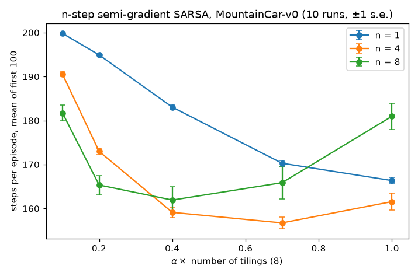

At each $n$'s best step size, $n = 4$ averaged $156.7\pm1.3$ steps (± one standard error over runs), $n = 8$ $161.9\pm3.1$ and $n = 1$ $166.4\pm0.8$. So $n = 4$ clearly beat one-step SARSA, and $n = 8$ was not clearly separated from either. Larger $n$ preferred smaller step sizes: $n = 8$ degraded sharply at $\alpha = 1.0/8$, while $n = 1$ was still improving at the largest $\alpha$ we tried, so its true optimum may lie beyond our grid. Small $\alpha$ hurt one-step SARSA most (99% of episodes truncated at $\alpha = 0.1/8$), because it propagates the $-1$ rewards only one step per update. This matches the qualitative picture of S&B Figs. 10.3–10.4: an intermediate $n$ learns fastest, and larger $n$ needs a smaller $\alpha$. With the 200-step limit, every variant spends roughly its first 10 episodes truncated, which compresses the differences relative to S&B's untruncated runs.

</details>

**13. ★★★ Residual gradient with double sampling.** On the 1000-state random walk with the order-5 Fourier basis, implement the residual-gradient algorithm $\mathbf{w}\leftarrow\mathbf{w}+\alpha\,\delta_t\,(\mathbf{x}(S_t)-\gamma\mathbf{x}(S'_{t+1}))$, where $\delta_t$ uses one next state $S_{t+1}$ and the gradient uses an *independent* second sample $S'_{t+1}$ from $S_t$ (the simulator allows this). Also run the naive version ($S'_{t+1} = S_{t+1}$). Predict where each converges.

<details><summary>Solution</summary>

With independent samples, $\mathbb{E}\big[\delta_t(\mathbf{x}(S_t)-\gamma\mathbf{x}(S'_{t+1}))\mid S_t\big] = \bar\delta_{\mathbf{w}}(S_t)\big(\mathbf{x}(S_t)-\gamma\mathbb{E}[\mathbf{x}(S'_{t+1})\mid S_t]\big)$, which is $-\tfrac12$ times the per-state term of $\nabla\overline{BE}$. So the method is SGD on $\overline{BE}$ and should approach $\arg\min\overline{BE}$, whose $\sqrt{\overline{VE}}$ is $0.0482$ (Section 15.1 table). The naive version is SGD on $\overline{TDE}$ and should approach $\sqrt{\overline{VE}}\approx0.235$. Semi-gradient TD would reach $0.0080$. Implementation (the box in Section 15.1): in `rw1000.generate_episode`, draw a second jump from each visited state; terminal outcomes have $\mathbf{x} = \mathbf{0}$ and reward $\pm1$. Use a small constant $\alpha$ and many episodes (residual-gradient methods are known to be slow), and evaluate with `rw1000.ve`. Comparing your learned weights with `lstd_vs_td.exact_limits(rw1000.fourier_features(5))` tells you exactly how close you got.

</details>

**14. ★ Spot the triad.** For each method, say which of {function approximation, bootstrapping, off-policy} it has, and whether linear-case stability is guaranteed: (a) tabular Q-learning; (b) on-policy linear semi-gradient TD(0) for prediction; (c) DQN; (d) gradient MC with a neural network and importance-weighted returns; (e) LSTD on-policy; (f) linear TDC off-policy.

<details><summary>Solution</summary>

(a) Bootstrapping + off-policy, no FA: converges (tabular theory, [Chapter 05](05-temporal-difference.md)). (b) FA + bootstrapping, on-policy: converges (Section 5). (c) All three: no guarantee. In deep RL, target networks make it workable in practice (they break the fast feedback loop of bootstrapping), and experience replay helps against correlated samples, not against off-policyness, which it increases. Neither removes the triad ([Chapter 09](09-deep-q-learning.md), Sections 1.3 and 2.9). (d) FA + off-policy, no bootstrapping: it is SGD on a weighted squared error, so no triad-type divergence, though the importance weights can have enormous variance and a neural network makes it non-convex. (e) FA + bootstrapping, on-policy: computes the TD fixed point directly, so no iteration to diverge. (f) All three ingredients, but TDC is a true gradient method on $\overline{PBE}$ and is guaranteed to converge with linear features under its conditions (nonsingular $\mathbf{A}$ and $\mathbf{C}$, two-timescale step sizes; Section 16). The triad describes when *semi-gradient* methods can diverge, not a law that no method can overcome. But "converges" is not "converges to something good": TDC's limit is the off-policy TD fixed point, which can be orders of magnitude worse than $\min\overline{VE}$ (Section 5.5). Gradient-TD fixes stability, not solution quality.

</details>

**15. ★★ Averagers make FQI converge.** Let FIT map a target vector $y\in\mathbb{R}^N$ to the function $\hat f_y(s,a) = c(s,a)+\sum_i\kappa_i(s,a)\,y_i$, with $\kappa_i(s,a)\ge0$, $\sum_i\kappa_i(s,a)\le1$, and weights $\kappa_i$ and constants $c$ that do not depend on $y$ (an averager, Section 11.4). (a) Show that $\lVert\hat f_y-\hat f_{y'}\rVert_\infty\le\lVert y-y'\rVert_\infty$. (b) Let $G(y)_i = r_i+\gamma(1-\text{term}_i)\max_{a'}\hat f_y(s'_i,a')$ be one FQI step written on the targets. Show that $G$ is a $\gamma$-contraction in the sup norm, and conclude that FQI converges geometrically to a unique fixed point from any $Q_0$. Show also that the changes $\lVert Q_{k+1}-Q_k\rVert_\infty$, measured at the bootstrap points, shrink by a factor of at most $\gamma$ per iteration, the property `fqi_lspi_mountaincar.py` asserts. (c) Show that ridge least squares (ridge strength $\lambda\ge0$, as in Section 11.4) on one-hot aggregation features is an averager. Then show that least squares on the single feature of Section 13.2 (values 1 and 2) is not, and find the ridge strength that stops FQI from diverging on that example.

<details><summary>Solution</summary>

(a) At any $(s,a)$ the constants cancel: $\lvert\hat f_y(s,a)-\hat f_{y'}(s,a)\rvert = \lvert\sum_i\kappa_i(s,a)(y_i-y'_i)\rvert\le\sum_i\kappa_i(s,a)\lvert y_i-y'_i\rvert\le\big(\sum_i\kappa_i(s,a)\big)\lVert y-y'\rVert_\infty\le\lVert y-y'\rVert_\infty$. Take the supremum over $(s,a)$. Nonnegativity is essential in the first inequality. With a negative weight, the triangle inequality gives only $\sum_i\lvert\kappa_i\rvert$, which can exceed 1.

(b) Using $\lvert\max_a g(a)-\max_a h(a)\rvert\le\max_a\lvert g(a)-h(a)\rvert$ and part (a),

$$
\lvert G(y)_i-G(y')_i\rvert\le\gamma\max_{a'}\lvert\hat f_y(s'_i,a')-\hat f_{y'}(s'_i,a')\rvert\le\gamma\lVert y-y'\rVert_\infty .
$$

So $G$ is a $\gamma$-contraction on $(\mathbb{R}^N,\lVert\cdot\rVert_\infty)$. By Banach's fixed-point theorem ([Chapter 00](00-math-toolkit.md)) it has a unique fixed point $y^\ast$, and $\lVert y_k-y^\ast\rVert_\infty\le\gamma^k\lVert y_0-y^\ast\rVert_\infty$ from any start. By (a), $Q_k = \hat f_{y_k}$ then converges uniformly to $\hat f_{y^\ast}$ at the same rate. For the successive changes, let $E$ be the set of bootstrap points $(s'_i,a')$. Part (a) gives $\max_E\lvert Q_{k+1}-Q_k\rvert\le\lVert y_{k+1}-y_k\rVert_\infty$, and the max inequality gives $\lVert y_{k+1}-y_k\rVert_\infty\le\gamma\max_E\lvert Q_k-Q_{k-1}\rvert$. Together they give a ratio of at most $\gamma$. In the experiment the ratio reached exactly $\gamma = 0.99$, in the early iterations, where every value far from the goal changes by $\gamma^{k-1}$ at iteration $k$.

(c) With one-hot features, the ridge solution for cell $g$ and action $a$ is $w_{g,a} = \sum_{i:\,s_i\in g,\,a_i=a}y_i/(n_{g,a}+\lambda)$, where $n_{g,a}$ counts those samples. So $\hat f(s,a) = w_{g(s),a}$ puts weight $1/(n_{g,a}+\lambda)\ge0$ on each sample in the cell, with total weight $n_{g,a}/(n_{g,a}+\lambda)\le1$ (with $\lambda = 0$, assume every cell has a sample of every action). The ridge shrinks towards the constant 0. Now the single feature: one sample with $x = 1$ and target $y$ gives $w = y/(1+\lambda)$, and the fitted value at the state with $x = 2$ is $2y/(1+\lambda)$. That is a weight of $2/(1+\lambda)$, larger than 1 whenever $\lambda<1$. With the transition $1\to2$ and reward 0, the target is $y = \gamma\cdot2w_k$, so FQI iterates $w_{k+1} = \frac{2\gamma}{1+\lambda}w_k$. From any $w_0\ne0$ this diverges if and only if $2\gamma>1+\lambda$, i.e. when $\lambda<2\gamma-1$ ($\lambda<0.8$ at $\gamma = 0.9$); a ridge $\lambda\ge2\gamma-1$ stops the divergence, and $\lambda>2\gamma-1$ makes $w_k\to0$. At $\lambda = 0$ it is the divergence of Section 13.2. Strong shrinkage can restore convergence, as the ridge $\lambda = 1$ did for the 5,000-sample Mountain Car batches, but only by biasing every value towards 0.

</details>

**16. ★★ LSTDQ is a projected Bellman equation.** Take a finite MDP, a deterministic policy $\pi$ and a data distribution $\nu(s,a)>0$ over state–action pairs. Let $\mathbf{X}$ be the $|\mathcal{S}||\mathcal{A}|\times d$ matrix with rows $\mathbf{x}(s,a)^\top$ (linearly independent columns, $\mathbf{x} = \mathbf{0}$ at terminal states), $\mathbf{D} = \operatorname{diag}(\nu)$, $\mathbf{P}_\pi$ the matrix of transitions $(s,a)\to(s',\pi(s'))$, $r$ the vector of expected rewards and $\mathcal{T}^\pi q = r+\gamma\mathbf{P}_\pi q$. (a) Show that $\mathbf{X}\mathbf{w} = \Pi\mathcal{T}^\pi\mathbf{X}\mathbf{w}$, with $\Pi = \mathbf{X}(\mathbf{X}^\top\mathbf{D}\mathbf{X})^{-1}\mathbf{X}^\top\mathbf{D}$, is equivalent to $\mathbf{A}\mathbf{w} = \mathbf{b}$ (so $\mathbf{w} = \mathbf{A}^{-1}\mathbf{b}$ when $\mathbf{A}$ is invertible), with $\mathbf{A} = \mathbf{X}^\top\mathbf{D}(\mathbf{X}-\gamma\mathbf{P}_\pi\mathbf{X})$ and $\mathbf{b} = \mathbf{X}^\top\mathbf{D}r$. Then show that LSTDQ's $\widehat{\mathbf{A}}/N$ and $\widehat{\mathbf{b}}/N$ (Section 11.4) converge to $\mathbf{A}$ and $\mathbf{b}$ when $(s_i,a_i)\sim\nu$ i.i.d., $s'_i\sim p(\cdot\mid s_i,a_i)$ and $\mathbb{E}[r_i\mid s_i,a_i] = r(s_i,a_i)$. Why is no importance-sampling ratio needed, and what is *not* guaranteed? (b) Show that if LSPI, run with the ridge $\widehat{\mathbf{A}}+\lambda\mathbf{I}$, converges ($\pi_{m+1} = \pi_m$ at every $s'_i$), its weights are a fixed point of least-squares FQI with the same ridge. Why did LSPI need 7–9 iterations on Mountain Car where FQI needed hundreds?

<details><summary>Solution</summary>

(a) Because $\mathbf{X}$ has full column rank, $\mathbf{X}\mathbf{w} = \mathbf{X}\mathbf{u}$ implies $\mathbf{w} = \mathbf{u}$. So the projected equation is equivalent to $\mathbf{w} = (\mathbf{X}^\top\mathbf{D}\mathbf{X})^{-1}\mathbf{X}^\top\mathbf{D}(r+\gamma\mathbf{P}_\pi\mathbf{X}\mathbf{w})$, i.e. $\mathbf{X}^\top\mathbf{D}\mathbf{X}\mathbf{w}-\gamma\mathbf{X}^\top\mathbf{D}\mathbf{P}_\pi\mathbf{X}\mathbf{w} = \mathbf{X}^\top\mathbf{D}r$, which is $\mathbf{A}\mathbf{w} = \mathbf{b}$. (This is Section 4.3's derivation with $q$ in place of $v$.) For the samples, by the law of large numbers,

$$
\frac1N\sum_i\mathbf{x}(s_i,a_i)\mathbf{x}(s_i,a_i)^\top\to\sum_{s,a}\nu(s,a)\,\mathbf{x}(s,a)\mathbf{x}(s,a)^\top = \mathbf{X}^\top\mathbf{D}\mathbf{X},
$$

$$
\frac1N\sum_i\mathbf{x}(s_i,a_i)\,\mathbf{x}(s'_i,\pi(s'_i))^\top\to\sum_{s,a}\nu(s,a)\,\mathbf{x}(s,a)\sum_{s'}p(s'\mid s,a)\,\mathbf{x}(s',\pi(s'))^\top = \mathbf{X}^\top\mathbf{D}\mathbf{P}_\pi\mathbf{X},
$$

and $\frac1N\sum_i r_i\mathbf{x}(s_i,a_i)\to\mathbf{X}^\top\mathbf{D}r$. A terminal $s'_i$ contributes $\mathbf{x} = \mathbf{0}$, exactly as the zero rows of $\mathbf{X}$ at terminal states do in $\mathbf{P}_\pi\mathbf{X}$. The factor $1/N$ cancels in $\widehat{\mathbf{A}}^{-1}\widehat{\mathbf{b}}$. No ratio is needed because the only action after $(s_i,a_i)$ that enters the target is $\pi(s'_i)$, computed from the policy being evaluated, never sampled from the behaviour. The behaviour affects only $\nu$, i.e. *which* errors the projection trades off. That is exactly what is not guaranteed: $\nu$ is arbitrary, not the on-policy distribution of $\pi$, so $\mathbf{A}$ need not be positive definite, or even invertible, and the fixed point can be far from $q_\pi$ (Sections 5.5 and 13). LSTDQ computes the off-policy TD fixed point directly. It cannot diverge, because it does not iterate, but nothing makes that fixed point good.

(b) Write $\mathbf{x}_i = \mathbf{x}(s_i,a_i)$ and $\mathbf{x}'_i = \mathbf{x}(s'_i,\pi(s'_i))$. LSTDQ with ridge solves $\big(\sum_i\mathbf{x}_i(\mathbf{x}_i-\gamma\mathbf{x}'_i)^\top+\lambda\mathbf{I}\big)\mathbf{w} = \sum_ir_i\mathbf{x}_i$, i.e.

$$
\Big(\sum_i\mathbf{x}_i\mathbf{x}_i^\top+\lambda\mathbf{I}\Big)\mathbf{w} = \sum_i\mathbf{x}_i\big(r_i+\gamma\,{\mathbf{x}'_i}^{\top}\mathbf{w}\big).
$$

At convergence $\pi$ is greedy with respect to $\mathbf{w}$ itself, so ${\mathbf{x}'_i}^{\top}\mathbf{w} = (1-\text{term}_i)\max_{a'}\mathbf{x}(s'_i,a')^\top\mathbf{w}$ (both sides are 0 when $s'_i$ is terminal), and the right side becomes $\sum_i\mathbf{x}_iy_i(\mathbf{w})$ with the FQI targets $y_i(\mathbf{w}) = r_i+\gamma(1-\text{term}_i)\max_{a'}Q_{\mathbf{w}}(s'_i,a')$. So $\mathbf{w} = (\sum_i\mathbf{x}_i\mathbf{x}_i^\top+\lambda\mathbf{I})^{-1}\sum_i\mathbf{x}_iy_i(\mathbf{w})$: one ridge-regression step of FQI maps $\mathbf{w}$ to itself. With stacked features, $\mathbf{x}_i$ is non-zero only in the block of $a_i$, so $\sum_i\mathbf{x}_i\mathbf{x}_i^\top$ is block diagonal and the stacked regression is exactly FQI's separate regression per action. Conversely, a fixed point of least-squares FQI, with its greedy policy, is a fixed point of LSPI. So both methods look for solutions of the same equation. Nothing guarantees that it has only one solution, but if it does, every converged run of either method finds it. On Mountain Car the two agreed to $2.9\times10^{-5}$. The difference in speed is that of policy iteration versus value iteration ([Chapter 03](03-dynamic-programming.md)). Each LSTDQ solve jumps straight to the fixed point of $\Pi\mathcal{T}^{\pi_m}$, which repeated projected backups would approach only over many iterations, if at all. FQI performs one backup per iteration, so it needs on the order of the horizon, here hundreds of iterations, to propagate values.

</details>

## Further reading

* **Sutton & Barto, *Reinforcement Learning: An Introduction*, 2nd ed. (2018), Chapters 9–11.** The primary source for this chapter: on-policy prediction, control with approximation (including Mountain Car and access control), and the off-policy chapter with Baird's counterexample, the learnability analysis and gradient/emphatic TD. Chapter 12 covers eligibility traces with function approximation.
* **Tsitsiklis & Van Roy, "An analysis of temporal-difference learning with function approximation" (IEEE TAC, 1997).** The convergence theorem and error bound of Section 5, with the nonlinear counterexample. Worth reading for the ODE-style proof technique; see also [Chapter 19](19-rl-theory.md), Section 3.3.
* **Bertsekas & Tsitsiklis, *Neuro-Dynamic Programming* (1996)**, and **Bertsekas, *Dynamic Programming and Optimal Control*, Vol. II (4th ed., 2012), Ch. 6.** Rigorous treatments of approximate DP, projected equations and their error bounds.
* **Szepesvári, *Algorithms for Reinforcement Learning* (2010).** A compact, mathematically careful tour of value prediction with function approximation, LSTD and gradient TD.
* **Dann, Neumann & Peters, "Policy evaluation with temporal differences: a survey and comparison" (JMLR, 2014).** Side-by-side derivations and experiments for TD, LSTD, GTD/TDC, residual gradient and more; a good place to see the objectives of Section 15 in one framework.
* **Konidaris, Osentoski & Thomas, "Value function approximation in reinforcement learning using the Fourier basis" (AAAI, 2011).** Short and practical.
* **Sutton et al., "Fast gradient-descent methods for temporal-difference learning with linear function approximation" (ICML, 2009)**, and **Maei's PhD thesis (2011).** GTD2/TDC and their convergence proofs.
* **Sutton, Mahmood & White, "An emphatic approach to the problem of off-policy temporal-difference learning" (JMLR, 2016).** The emphatic idea in full, with the positive-definiteness proof.
* **Lagoudakis & Parr, "Least-squares policy iteration" (JMLR, 2003).** How LSTD-style evaluation becomes a control algorithm (Section 11.4).
* **Ernst, Geurts & Wehenkel, "Tree-based batch mode reinforcement learning" (JMLR, 2005).** Fitted Q-iteration in full, with tree ensembles, the convergence condition for regressors whose structure ignores the targets, and many control benchmarks. Read it with Gordon's "Stable function approximation in dynamic programming" (ICML, 1995) for the averager argument of Section 11.4.
* **Munos & Szepesvári, "Finite-time bounds for fitted value iteration" (JMLR, 2008).** How regression error and the data distribution enter the performance of FQI-style algorithms; the bridge to the offline-RL theory of [Chapter 19](19-rl-theory.md), Section 10.
* **van Hasselt et al., "Deep reinforcement learning and the deadly triad" (arXiv, 2018).** An empirical look at which ingredients of DQN-style agents cause value estimates to blow up: the bridge to [Chapter 09](09-deep-q-learning.md).
* **Ghiassian et al., "Gradient temporal-difference learning with regularized corrections" (ICML, 2020).** A modern, practical gradient-TD method and an honest comparison with TD.
