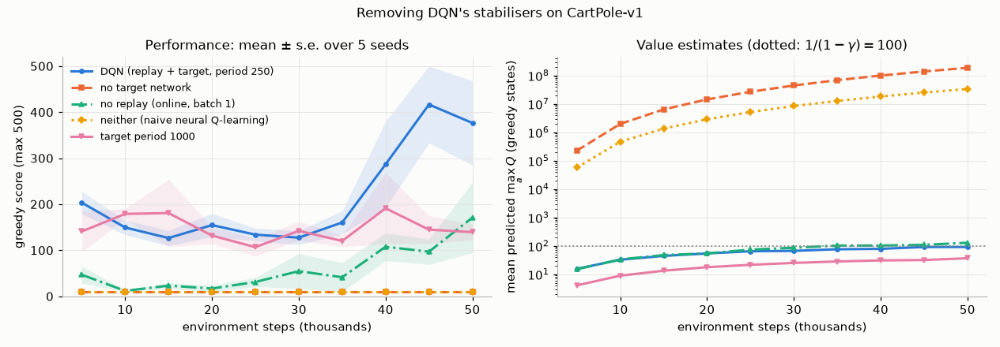
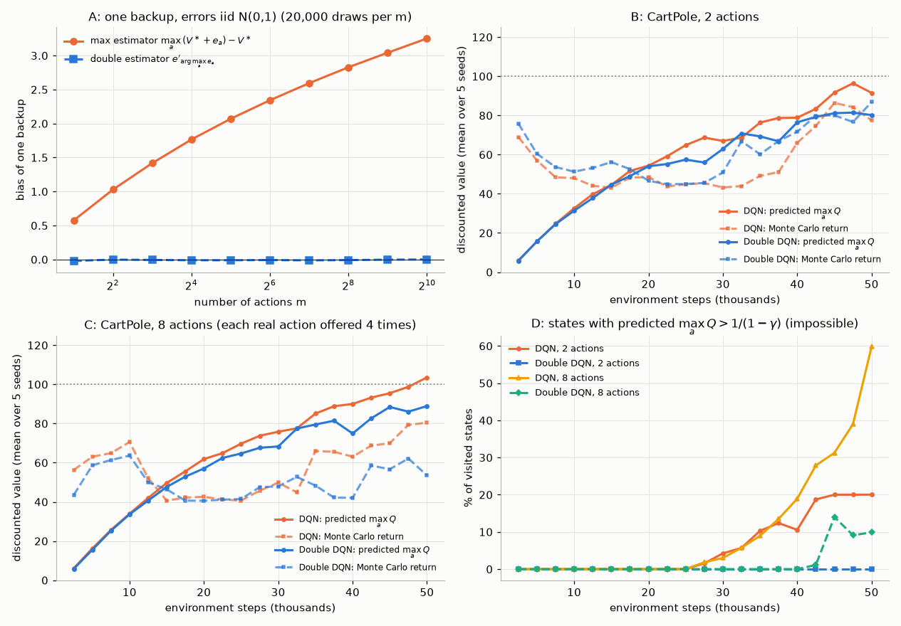
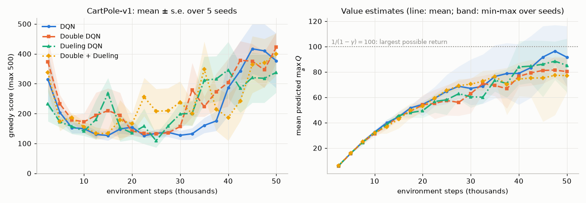
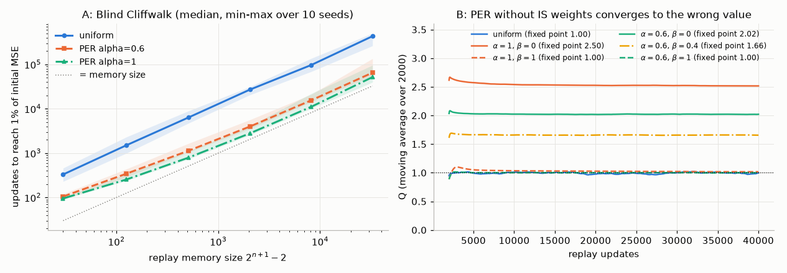
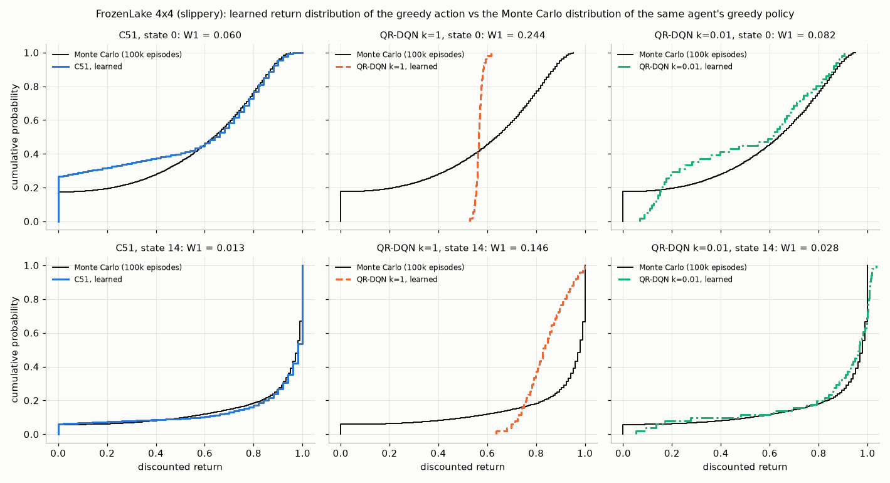
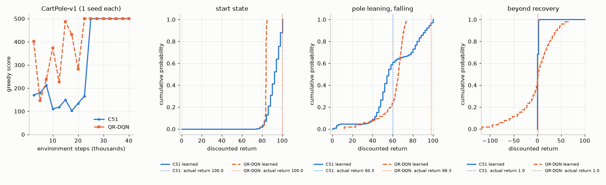
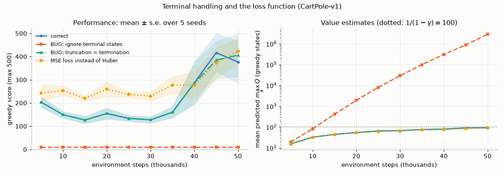
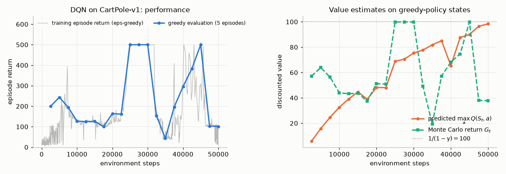

# Chapter 09 — Deep Q-Networks and Value-Based Deep RL

[← Previous: Value Function Approximation: Linear Methods, Features, and the Deadly Triad](08-function-approximation.md) · [Course index](../README.md) · [Next: Policy Gradient Methods: REINFORCE to Actor-Critic](10-policy-gradients.md) →

## At a glance

In 2013 one Q-learning algorithm, trained separately on each game with the same architecture, learned to play seven Atari games from raw pixels. Two years later an improved recipe (adding a target network and error clipping) played 49 games with one set of hyperparameters. The core algorithm was Q-learning from [Chapter 05](05-temporal-difference.md) with a convolutional network as the function approximator. [Chapter 08](08-function-approximation.md) explained why that combination is dangerous: it has all three ingredients of the deadly triad. What made it work was a small set of engineering ideas: a replay memory, a lagged copy of the network for computing targets, a robust loss, and careful preprocessing. Each idea has a clear reason behind it. The decade of research that followed refined every piece. It reduced the systematic overestimation of the max operator (Double DQN), changed the architecture so state values are shared across actions (dueling), chose which memories to replay (prioritized replay), learned the whole distribution of returns instead of its mean (C51, QR-DQN, IQN), combined everything (Rainbow), scaled it to hundreds of actors (Ape-X, R2D2, Agent57), and then made it data-efficient again (DER, SPR, BBF).

This chapter derives each of these ideas, implements the important ones from scratch in PyTorch, and measures what they do on small problems that run on one CPU core in minutes.

**Learning objectives.** After this chapter you should be able to:

1. Explain precisely why naive neural Q-learning is unstable (correlated samples, moving targets, the deadly triad), and what experience replay and target networks do and do not fix.
2. Implement DQN from scratch with correct handling of termination versus truncation, and know every part of the original Atari pipeline (frame preprocessing and stacking, reward clipping, the $\varepsilon$ schedule, the Huber loss).
3. Prove the lower bound on the overestimation of $\max_a$ for noisy estimates, derive Double DQN, and measure overestimation against Monte Carlo returns.
4. Derive the dueling decomposition and explain why mean-subtraction makes it identifiable.
5. Implement proportional prioritized replay with a sum tree, and derive the fixed point that importance-sampling weights correct.
6. State the distributional Bellman equation and its contraction property; implement the C51 projection and the QR-DQN quantile Huber loss; describe IQN.
7. Describe Noisy Nets, multi-step returns, Rainbow and its ablations, the distributed agents (Gorila, Ape-X, R2D2 with burn-in, Agent57, MEME) and the data-efficient line (DER, SPR, BBF).
8. Compute and critique human-normalized scores, and debug a DQN that diverges or does not learn.

**Prerequisites.** Q-learning and Double Q-learning ([Chapter 05](05-temporal-difference.md)); $n$-step returns ([Chapter 06](06-n-step-and-eligibility-traces.md)); Dyna and prioritized sweeping ([Chapter 07](07-planning-and-learning-tabular.md)); semi-gradient methods, neural value functions and the deadly triad ([Chapter 08](08-function-approximation.md)); PyTorch and Adam, cross-entropy and KL divergence, and contraction mappings ([Chapter 00](00-math-toolkit.md)). The Wasserstein distance and quantile functions are introduced here, in Section 9.2.

**Code you will run** (all in [`code/ch09_deep_q_learning/`](../code/ch09_deep_q_learning/); full-mode runtimes measured on one thread of a shared, heavily loaded 4-CPU machine):

| Script | What it shows | Full run |
|---|---|---|
| [`dqn.py`](../code/ch09_deep_q_learning/dqn.py) | DQN from scratch (Algorithm 9.1) with flags for Double, Dueling, $n$-step, prioritized replay and Noisy Nets; trains one agent on CartPole-v1 | 60 s (noisy: 85–98 s) |
| [`dqn_batched.py`](../code/ch09_deep_q_learning/dqn_batched.py) | $K$ independent DQN agents trained in lock-step (for cheap multi-seed experiments), with a numerical check of its update against `dqn.py` | 6 s |
| [`compare_variants.py`](../code/ch09_deep_q_learning/compare_variants.py) | DQN vs Double vs Dueling vs Double+Dueling, 5 seeds each | 8.1 min |
| [`overestimation.py`](../code/ch09_deep_q_learning/overestimation.py) | the max-operator bias; predicted $Q$ vs Monte Carlo returns for DQN and Double DQN | 6.4 min |
| [`ablate_stabilizers.py`](../code/ch09_deep_q_learning/ablate_stabilizers.py) | removing replay and/or the target network; slower target updates | 8.0 min |
| [`pitfalls.py`](../code/ch09_deep_q_learning/pitfalls.py) | terminal-handling bugs; MSE vs Huber | 7.1 min |
| [`prioritized_replay.py`](../code/ch09_deep_q_learning/prioritized_replay.py) | the Blind Cliffwalk; the bias that importance sampling removes | 81 s |
| [`distributional.py`](../code/ch09_deep_q_learning/distributional.py) | C51 and QR-DQN; learned return distributions vs ground truth on FrozenLake and CartPole | 6.2–8.3 min (depending on load) |
| [`exercise_solutions.py`](../code/ch09_deep_q_learning/exercise_solutions.py) | numbers for the exercise solutions, including 3-step DQN and Polyak averaging (5 seeds each) | 4.5 min |

**Study time.** About 12–16 hours: 7–9 for the text and derivations, 2–3 for running and modifying the code, 3–4 for the exercises.

**Notation.** We follow [NOTATION.md](../NOTATION.md). The Q-network is $\hat q(s,a,\mathbf{w})$ with online weights $\mathbf{w}$ and target-network weights $\mathbf{w}^-$. The DQN papers write $Q(s,a;\theta)$; we keep $\boldsymbol\theta$ for policy parameters. A stored transition is $(s,a,r,s')$, meaning $(S_t,A_t,R_{t+1},S_{t+1})$. The following departures are local to this chapter:

* In Section 6, $p_i$ is the **priority** of transition $i$, $P(i)$ its sampling probability and $\omega_i$ its importance-sampling weight. ($\omega$ replaces the paper's $w_i$, which would collide with the network weights.)
* In Section 9, $Z(s,a)$ is the random return, $z_i$ are the fixed atoms of C51 and $p_i(s,a)$ their probabilities. $\theta_i(s,a)$ (not bold) are the **quantile locations** of QR-DQN, as in the original paper, and are not policy parameters. $\tau$ is a **quantile level** in $(0,1)$. The Polyak coefficient of Section 2.3 is also called $\tau$ in the literature; we call it $\tau_{\text{P}}$ there.
* $\kappa$ is the Huber threshold, and $\epsilon_p$ a small constant added to priorities. $\varepsilon$ stays the exploration rate. The scalar $\epsilon$ in Eq. (9.20) is R2D2's rescaling constant, and the bold $\boldsymbol\varepsilon$ of Eq. (9.14) is Noisy-Net weight noise; neither is an exploration rate.
* Some symbols are reused, each time following the paper being described. $\alpha$ is the step size in the algorithm boxes, but in Section 6 it is also the **PER priority exponent** (and in Section 11 Ape-X's exploration exponent). $\beta$ is PER's importance-sampling exponent (not the KL coefficient of NOTATION.md), and $\beta(\tau)$ in Section 9.5 is IQN's distortion function. $\eta$ is a generic step size in Section 6.3, a collection of return distributions in Section 9, IQN's CVaR level and R2D2's priority mix. $C$ is always the target-network period. $N$ denotes, by context, the replay capacity, the number of stored transitions, the number of atoms or quantiles, or the number of Ape-X actors.

---

## 1. From linear to deep Q-functions, and why naive neural Q-learning is unstable

### 1.1 Where Chapter 08 left us

Semi-gradient Q-learning with a parameterized action-value function $\hat q(s,a,\mathbf{w})$ updates, after each transition,

$$
\mathbf{w}_{t+1} = \mathbf{w}_t + \alpha\Big[R_{t+1} + \gamma\max_{a'}\hat q(S_{t+1},a',\mathbf{w}_t) - \hat q(S_t,A_t,\mathbf{w}_t)\Big]\nabla_{\mathbf{w}}\hat q(S_t,A_t,\mathbf{w}_t). \tag{9.1}
$$

It is "semi" gradient because the target $R_{t+1}+\gamma\max_{a'}\hat q(S_{t+1},a',\mathbf{w}_t)$ also depends on $\mathbf{w}$, but we do not differentiate through it ([Chapter 08, Section 3](08-function-approximation.md#3-stochastic-gradient-and-semi-gradient-methods)). With linear features, $\nabla_{\mathbf{w}}\hat q = \mathbf{x}(s,a)$. With tile coding, its on-policy sibling, semi-gradient SARSA, solved Mountain Car in [Chapter 08, Section 11](08-function-approximation.md#11-control-episodic-semi-gradient-sarsa-and-mountain-car); with that chapter's $\varepsilon=0$, SARSA's next action is greedy, so it uses the same bootstrap as Eq. (9.1). Chapter 08 also showed that Eq. (9.1) contains all three ingredients of the **deadly triad**: function approximation, bootstrapping, and off-policy learning (the target evaluates the greedy policy while the data come from an exploratory one). Baird's counterexample diverges with exactly this combination.

### 1.2 Why a neural network, and what shape

Hand-designed features stop scaling once the state is an image. A $210\times160$ RGB Atari frame has $100{,}800$ bytes. The features that matter (where the ball is, how fast it moves) are nonlinear functions of those bytes. A neural network learns them. Everything in Eq. (9.1) carries over, with $\nabla_{\mathbf{w}}\hat q$ computed by backpropagation.

**One output per action.** You could build a network that takes $(s,a)$ as input and returns a scalar. Then $\max_{a'}$ would need $|\mathcal{A}|$ forward passes. DQN instead maps $s$ to the vector $\big(\hat q(s,a_1,\mathbf{w}),\dots,\hat q(s,a_{|\mathcal{A}|},\mathbf{w})\big)$, so one pass gives every action value. This requires a small, discrete action set. Continuous actions need a different design ([Chapter 12](12-continuous-control-actor-critic.md)). In code, the update then uses `q(s).gather(1, a)` to select the output of the action that was taken, and `q(s').max(1)` for the bootstrap.

### 1.3 Why naive neural Q-learning is unstable

Run Eq. (9.1) online with a network, one transition per step, and it usually fails. There are four separate reasons.

1. **Correlated samples.** Stochastic gradient descent assumes roughly independent samples from a fixed distribution. Consecutive states of a trajectory are nearly identical. CartPole's simulator advances 0.02 s per step, and in Atari two consecutive frames differ in a few pixels. A stream of such updates drags the network toward whatever region of the state space it is visiting now. Because the parameters are shared, values in regions it is not visiting get overwritten. This is **catastrophic interference**.
2. **Moving targets.** The target $y = R+\gamma\max_{a'}\hat q(S',a',\mathbf{w})$ moves whenever $\mathbf{w}$ moves. With a table, an update at $(s,a)$ changes only that entry. With a network that generalizes, the step that raises $\hat q(s,a,\mathbf{w})$ also raises $\hat q(s',\cdot,\mathbf{w})$ for the next state $s'$, which is usually very similar to $s$. So the target goes up too, and the next step chases it. This positive feedback can make values grow without bound. It is different from overfitting: the regression problem itself keeps changing.
3. **The deadly triad.** Even with independent samples and a frozen target, the composition "apply the Bellman operator, then project onto the function class under the data distribution" need not be a contraction off-policy ([Chapter 08, Section 14](08-function-approximation.md#14-the-deadly-triad)). Q-learning is off-policy by construction: it evaluates the greedy policy while the data are generated by $\varepsilon$-greedy behaviour.
4. **A non-stationary data distribution.** When the argmax at some state flips, the greedy policy changes discontinuously and so does the distribution of states the agent visits. The network is then trained on a different population than the one it just fitted.

DQN's two signature inventions target the first two problems. **Experience replay** breaks correlations and smooths the data distribution over many past policies, which also helps with problem 4. **The target network** freezes the target for many steps, which breaks the feedback loop of problem 2. Neither one removes the deadly triad. That is why DQN can still diverge, and why later work (Section 4, and van Hasselt et al., 2018) studied when it does. Section 2.9 measures what each invention contributes on CartPole.

---

## 2. DQN in full

### 2.1 The loss

DQN (Mnih et al., 2013; the target network was added in Mnih et al., 2015) turns Q-learning into a sequence of supervised regression problems. At update $i$, sample a minibatch of transitions uniformly from a replay memory $\mathcal{D}$ and take a gradient step on

$$
\mathcal{L}(\mathbf{w}) = \mathbb{E}_{(s,a,r,s')\sim U(\mathcal{D})}\Big[\ell\big(y - \hat q(s,a,\mathbf{w})\big)\Big],
\qquad
y = r + \gamma\,(1-\mathrm{term})\max_{a'}\hat q(s',a',\mathbf{w}^-), \tag{9.2}
$$

where $\ell$ is the squared or Huber loss (Section 2.4), $\mathrm{term}\in\{0,1\}$ says whether $s'$ is a terminal state (Section 2.5), and $\mathbf{w}^-$ are the parameters of the **target network**, an older copy of $\mathbf{w}$. Because $y$ does not depend on $\mathbf{w}$, the gradient is an ordinary regression gradient. For the squared loss $\ell(\delta)=\tfrac12\delta^2$:

$$
\nabla_{\mathbf{w}}\mathcal{L}(\mathbf{w}) = -\,\mathbb{E}_{U(\mathcal{D})}\Big[\big(y-\hat q(s,a,\mathbf{w})\big)\nabla_{\mathbf{w}}\hat q(s,a,\mathbf{w})\Big]. \tag{9.3}
$$

Compare this with Eq. (9.1): it is the same semi-gradient, averaged over a minibatch, with the bootstrap evaluated by $\mathbf{w}^-$ instead of $\mathbf{w}$. In an autodiff framework, "do not differentiate the target" means computing $y$ under `torch.no_grad()` (or calling `.detach()`).

### 2.2 Experience replay

The agent stores every transition $(s,a,r,s',\mathrm{term})$ in a circular buffer of capacity $N$ (one million in the Nature paper) and trains on random minibatches from it. Lin (1992) introduced the idea. It is also a model-free cousin of Dyna ([Chapter 07](07-planning-and-learning-tabular.md)): the buffer acts as a non-parametric model that is "sampled" for planning updates. Replay buys three things:

* **Decorrelation.** A minibatch drawn uniformly from a million transitions mixes many episodes and many parts of the state space, so the gradient looks much more like an i.i.d. gradient.
* **Data efficiency.** Each transition is used about $N_{\text{updates}}\cdot B / N_{\text{stored}}$ times rather than once. The ratio of gradient updates to environment steps is the **replay ratio**. The Nature DQN does one update of 32 samples every 4 steps, so each transition is replayed about 8 times on average.
* **A smoothed behaviour distribution.** The buffer contains data from many past policies. A single change in the greedy policy therefore does not suddenly change what the network trains on.

It also has costs. Replayed data are generated by old policies, so learning is strongly off-policy. For one-step Q-learning the *target* needs no importance-sampling correction, because it does not depend on the behaviour policy ([Chapter 05, Section 8.2](05-temporal-difference.md#82-why-q-learning-needs-no-importance-sampling)). With function approximation, however, the buffer's state-action distribution still decides which errors the network trades off against each other, and this off-policy distribution is the third ingredient of the deadly triad (Section 1.3). The staler the buffer, the larger the mismatch with the current policy. For multi-step targets (Section 7) and recurrent agents (Section 11) the targets themselves become biased as well. Memory grows linearly with $N$. Finally, uniform sampling spends most updates on transitions that are already well predicted, which is the motivation for prioritized replay (Section 6).

### 2.3 Target networks, and how fast values can propagate

The target network $\hat q(\cdot,\cdot,\mathbf{w}^-)$ is a copy of the online network that is refreshed only every $C$ steps ($\mathbf{w}^-\leftarrow\mathbf{w}$). We count $C$ in agent steps. The Nature paper's table gives 10,000 *parameter updates*, which is 40,000 agent steps at one update per 4 steps. Between refreshes, Eq. (9.2) is a fixed regression problem. A popular alternative is the **Polyak (soft) update** $\mathbf{w}^-\leftarrow\tau_{\text{P}}\mathbf{w}+(1-\tau_{\text{P}})\mathbf{w}^-$ at every step. With $\tau_{\text{P}}=0.005$ this is an exponential moving average with a time constant of about $1/\tau_{\text{P}}=200$ steps. It is standard in continuous control ([Chapter 12](12-continuous-control-actor-critic.md)).

**DQN as approximate fitted Q-iteration.** Suppose the online network fitted its target exactly within each period. Then the target network after $k$ refreshes would be $\hat q_k = \mathcal{T}^\ast\hat q_{k-1}$, where $(\mathcal{T}^\ast q)(s,a) = \mathbb{E}[R+\gamma\max_{a'}q(S',a')\mid s,a]$ is the Bellman optimality operator. That is value iteration with one Bellman backup per refresh. This view goes back to neural fitted Q-iteration (Riedmiller, 2005). It also has a sobering consequence: **value information propagates at most about one step per target refresh.** In CartPole the reward is $+1$ per step and a good policy never falls, so starting from $\hat q_0\approx 0$, value iteration gives

$$
\hat q_k(s,a) = \sum_{j=0}^{k-1}\gamma^j = \frac{1-\gamma^k}{1-\gamma} \tag{9.4}
$$

at every state from which the pole can be kept up for at least $k$ steps. With $\gamma=0.99$, reaching 90% of the true value $1/(1-\gamma)=100$ takes $k\ge\ln 0.1/\ln 0.99\approx 229.1$, so 230 refreshes. With $C=250$ that is about 57,500 steps. With the Nature setting of 10,000 updates per refresh it is 2.3 million updates. So the refresh period trades stability (a frozen target) against speed (fewer backups per step). Because rewards are at most 1, exact fitted Q-iteration from $\hat q_0=0$ can never exceed Eq. (9.4), at any state: it is an **upper bound**, attained only at states from which the pole can be kept up for $k$ more steps. Section 2.9 checks Eq. (9.4) against the measured Q-values of our agents.

### 2.4 The Huber loss, alias "error clipping"

Atari rewards differ by orders of magnitude between games, and early in training TD errors can be huge. The Nature paper clipped "the error term from the update" to $[-1,1]$. In gradient terms, this means the squared loss is replaced by the **Huber loss** with threshold $\kappa=1$:

$$
\ell_\kappa(\delta) = \begin{cases}\tfrac12\delta^2 & |\delta|\le\kappa,\\[2pt] \kappa\big(|\delta|-\tfrac12\kappa\big) & |\delta|>\kappa,\end{cases}
\qquad
\frac{d\ell_\kappa}{d\delta} = \mathrm{clip}(\delta,-\kappa,\kappa). \tag{9.5}
$$

It is quadratic near zero and linear in the tails. A single outlier transition therefore pushes the weights with bounded force, which keeps the network from making a huge step on one surprising sample. Two misconceptions are worth killing now. First, clipping the *loss value* ($\min(\delta^2,1)$) is not the same thing: it has zero gradient for large errors, so the network would ignore exactly the transitions it gets most wrong. Second, the Huber loss changes the estimator. In the linear region it behaves like absolute error, which pulls toward a median rather than a mean. With noisy targets and large errors the fixed point is therefore not exactly the expected target. Robustness has a price as well: a large error is not always noise. On CartPole the squared loss did at least as well as Huber (Section 14). In PyTorch, `F.smooth_l1_loss` (default `beta=1`) equals $\ell_\kappa$ with $\kappa=1$. For other thresholds use `F.huber_loss(..., delta=κ)`: `smooth_l1_loss` with `beta=κ` equals $\ell_\kappa/\kappa$, not $\ell_\kappa$.

### 2.5 Termination versus truncation

The factor $(1-\mathrm{term})$ in Eq. (9.2) switches the bootstrap off at **terminal** states, whose value is zero by definition. It must not switch it off when an episode is merely **truncated** by a time limit. CartPole-v1 stops after 500 steps even if the pole is upright. That last state has a perfectly good value (close to 100 for a good policy), and treating it as terminal teaches the network that the same state is worth 0 at time 500 and about 100 at time 499. The state does not contain the time, so these targets contradict each other (Pardo et al., 2018). Gymnasium separates the two signals: `obs, r, terminated, truncated, info = env.step(a)`. Store `terminated` and reset on `terminated or truncated`. When the episode is truncated, $s'$ must be the real last observation (returned by `step`), not the first observation of the next episode. Section 14 measures both possible bugs. Atari practice adds one more twist: during training, DQN implementations commonly treat the **loss of a life** as terminal (for learning only, not for resetting the game). This speeds learning in many games, but Machado et al. (2018) recommend not using it, because it injects game-specific knowledge.

### 2.6 Exploration schedule

DQN acts $\varepsilon$-greedily with a schedule. $\varepsilon$ starts at 1 (a uniformly random policy that fills the buffer), decreases linearly to $0.1$ over the first million agent steps (called "frames" in the paper's table), and stays there. No learning happens until 50,000 transitions are stored ("replay start size"), so the first minibatches are already diverse. Evaluation uses a small fixed $\varepsilon=0.05$ to avoid deterministic loops. Our CartPole runs use 1 → 0.05 over 10,000 steps, learning from step 1,000, and evaluate the greedy policy. During the 1,000-step warm-up $\varepsilon\ge0.9$, so the buffer is filled by a nearly random policy. An agent without $\varepsilon$ (Noisy Nets, Section 8) needs an explicit random warm-up instead.

### 2.7 The Atari pipeline

Hyperparameters matter less than one might fear, but the input pipeline matters a lot. The Nature DQN does the following:

* **Frame preprocessing.** Take the pixel-wise maximum of the last two raw frames. Some Atari games draw sprites only on alternate frames (flicker), and the max shows both. Convert to luminance (greyscale) and rescale to $84\times84$.
* **Action repeat (frame skip) of 4.** The agent picks an action every fourth frame, and the action is repeated in between. Rewards over the skipped frames are summed. This divides the cost of acting by four and gives each decision a visible effect.
* **Frame stacking.** The network input is the last 4 preprocessed frames, $84\times84\times4$. One frame does not reveal velocities (which way is the ball moving?). Four frames make the observation approximately Markov. This is the simplest answer to partial observability. Recurrent agents (Section 11; [Chapter 15](15-beyond-mdps.md)) are the systematic one.
* **Reward clipping.** All positive rewards become $+1$, all negative rewards $-1$, and zero stays zero. One learning rate then works across games whose scores differ by orders of magnitude. The price is that the agent can no longer tell a 10-point reward from a 1,000-point one. R2D2 later replaced clipping with an invertible value rescaling (Section 11).
* **Network.** Three convolutional layers (32 filters $8\times8$ stride 4, 64 filters $4\times4$ stride 2, 64 filters $3\times3$ stride 1), a 512-unit fully connected layer, and $|\mathcal{A}|$ linear outputs (up to 18 for Atari), with a ReLU after every hidden layer.
* **Optimisation.** RMSProp, step size $2.5\times10^{-4}$, minibatch 32, one update every 4 agent steps, $\gamma=0.99$, replay of 1M transitions, target refresh every 10,000 updates, and training for 50 million agent steps, which is 200 million Atari frames. (The paper's text says "50 million frames", but its own figure of about 38 days of play matches 50M agent steps = 200M frames at 60 frames per second.)
* **Evaluation.** Up to 30 random "no-op" actions at the start of each evaluation episode, so a deterministic emulator does not always start in the same state (Section 13).

### 2.8 The algorithm

```text
Algorithm 9.1  Deep Q-Network (DQN), with correct termination handling
-------------------------------------------------------------------------
Inputs:  replay capacity N, minibatch size B, discount γ, step size α,
         target period C (in agent steps; Nature: 10,000 updates = 40,000 agent steps),
         schedule ε(t), learning start t₀, update period F (agent steps per gradient step),
         Huber threshold κ (or squared loss), total steps T
Initialise: online network q̂(·,·,w) with random w; target network w⁻ ← w;
            empty circular replay memory D of capacity N
S ← env.reset()
for t = 1, 2, …, T:
    with probability ε(t): A ← uniform random action;  else A ← argmax_a q̂(S, a, w)
    S', R, terminated, truncated ← env.step(A)
    store (S, A, R, S', terminated) in D             # store TERMINATED, not "done"
    S ← S'
    if terminated or truncated: S ← env.reset()        # reset on either; S' above is the real last obs
    if t ≥ t₀ and t mod F = 0:
        sample B transitions (s_j, a_j, r_j, s'_j, term_j) uniformly from D
        y_j ← r_j + γ (1 − term_j) max_a' q̂(s'_j, a', w⁻)              # no gradient through y_j
        # Double DQN (Section 4.3) replaces the line above by
        #   y_j ← r_j + γ (1 − term_j) q̂(s'_j, argmax_a' q̂(s'_j, a', w), w⁻)
        δ_j ← y_j − q̂(s_j, a_j, w)
        w ← w − α ∇_w (1/B) Σ_j ℓ_κ(δ_j)                              # Adam / RMSProp in practice
    if t mod C = 0:  w⁻ ← w
```

[`dqn.py`](../code/ch09_deep_q_learning/dqn.py) implements exactly this loop in `train()`, with $F=1$, and the update in `DQNAgent.update()`:

```python
q_sa = self.q(s).gather(1, a[:, None]).squeeze(1)              # q̂(s_j, a_j, w)
with torch.no_grad():                                          # the target is a constant
    q_next = self.q_target(s2)                                 # q̂(s'_j, ., w⁻)
    if cfg.double:                                             # Double DQN, Eq. (9.8)
        a_star = self.q(s2).argmax(1, keepdim=True)
        v_next = q_next.gather(1, a_star).squeeze(1)
    else:                                                      # DQN, Eq. (9.2)
        v_next = q_next.max(1).values
    y = g + disc * (1.0 - term) * v_next                       # disc = γ (or γ^n, Section 7)
per_sample = F.smooth_l1_loss(q_sa, y, reduction="none")       # Huber, Eq. (9.5)
loss = (batch["weights"] * per_sample).mean()                  # IS weights = 1 unless PER
```

The CartPole settings are a 4-64-64-2 ReLU MLP, Adam with step size $5\times10^{-4}$, minibatches of 64, a buffer of 50,000, $C=250$ steps, one update per environment step, and 50,000 environment steps per run. They were chosen once, as reasonable defaults, and not tuned per variant. Each evaluation runs 5 greedy episodes. The **score** is the episode length capped at 500, which is CartPole-v1's official limit.

### 2.9 What each stabiliser buys: an ablation

[`ablate_stabilizers.py`](../code/ch09_deep_q_learning/ablate_stabilizers.py) removes the two inventions one at a time and together. "No replay" updates on the newest transition only, once per step, but keeps the target network. "No target network" bootstraps from the online network. The "neither" configuration is Eq. (9.1) with a network, Adam and the Huber loss. A fifth configuration keeps both but refreshes the target 4× less often. Each configuration runs 5 seeds for 50,000 steps:

| configuration | final score (last 10k steps) | mean score over the run | final mean $\max_a\hat q$ | states with $\max_a\hat q>100$ (last 10k) |
|---|---|---|---|---|
| DQN (replay + target, $C=250$) | $396.6\pm193.2$ | $213.5\pm62.1$ | 91.6 | 20.0% |
| no target network | $9.2\pm0.0$ | $9.2\pm0.0$ | $1.6\times10^{8}$ | 100% |
| no replay (online, batch 1) | $133.8\pm57.8$ | $60.0\pm19.2$ | 119.3 | 79.4% |
| neither (naive neural Q-learning) | $9.2\pm0.0$ | $9.2\pm0.0$ | $2.9\times10^{7}$ | 100% |
| target period $C=1000$ | $142.0\pm26.1$ | $147.6\pm33.4$ | 34.3 | 0% |

($\pm$ is the sample standard deviation over the 5 seeds. "Final" averages the greedy evaluations at 45k and 50k steps.)



* **Without a target network the values explode.** Bootstrapping from the online network sends the mean predicted value to about $2\times10^5$ within 5,000 steps and above $10^8$ by the end, on every seed, with or without replay. The greedy policy then degenerates into pushing one way, which drops the pole after about 9 steps (score 9.2). This is the moving-target feedback of Section 1.3: every step that raises $\hat q(s,a)$ also raises the target $\hat q(s',\cdot)$. Here Adam's normalized steps keep pushing at full speed in a consistent direction.
* **Without replay the values stay bounded but learning is poor.** The agent with a target network but online, one-sample updates ends at $133.8$, and its values are *wrong*: 79% of greedy-policy states are valued above 100, which is impossible. Correlated consecutive updates overfit the current region of the state space.
* **Both inventions are needed, and the target network is the indispensable one here.** In Mnih et al.'s (2015) five-game Atari ablation, both components helped and removing replay hurt more. The relative importance depends on the optimizer, the update frequency and the task. The qualitative conclusion is the same.
* **A slower target is stable but slow,** exactly as Eq. (9.4) predicts. Here is the mean predicted value on greedy-policy states against $(1-\gamma^k)/(1-\gamma)$, where $k=(t-1000)/C$ is the number of target periods since learning started at step 1,000:

| steps $t$ | 10,000 | 25,000 | 50,000 |
|---|---|---|---|
| $C=250$: refreshes $k$ / Eq. (9.4) / measured | 36 / 30.4 / 32.6 | 96 / 61.9 / 64.8 | 196 / 86.1 / 91.5 |
| $C=1000$: refreshes $k$ / Eq. (9.4) / measured | 9 / 8.6 / 9.0 | 24 / 21.4 / 21.6 | 49 / 38.9 / 36.7 |

($k$ includes the refresh made at step $t$ itself, so the online network evaluated at step $t$ has just been copied into the target: it is the network that was fitting $\mathcal{T}^\ast\hat q_{k-1}$, that is, $\hat q_k$.) At the points shown the formula is within 1–7% of the measurement. Over all ten evaluations of each run it stays within about 11% (largest gaps: 91.7 measured against 82.9 predicted for $C=250$ at 45,000 steps, and 31.9 against 35.7 for $C=1000$). Because Eq. (9.4) is an upper bound for exact fitted Q-iteration (Section 2.3), the $C=250$ agent sitting *above* it at 8 of the 10 evaluations is not noise around the model. It comes from approximation error and from overestimation, which Section 4.4 measures directly: in the last 10,000 steps, 20% of the states this agent visited were valued above 100. So the late $C=250$ values match the formula partly because overestimation offsets a lag. Still, a one-line value-iteration formula tracks a deep network's average Q-value to within about 10% over the whole run. "DQN ≈ approximate fitted Q-iteration with one backup per refresh" is therefore a quantitatively useful model, not just a metaphor. It also explains the slow start of every learning curve in this chapter. The values, and with them the action gaps that determine the greedy policy, are still far from converged at 50,000 steps. A 500-step task with $\gamma=0.99$ needs hundreds of backups. With $C=1000$ the agent has had only 49 of them by the end.

---

## 3. A worked example: one minibatch by hand

Take $\gamma=0.9$, two actions, Huber threshold $\kappa=1$, and a minibatch of three transitions. All three have reward $r=1$:

| | online $\hat q(s,a,\mathbf{w})$ | flags | target net $\hat q(s',\cdot,\mathbf{w}^-)$ | online net $\hat q(s',\cdot,\mathbf{w})$ |
|---|---|---|---|---|
| $j=1$ | $\hat q(s_1,a{=}0)=6.0$ | ordinary step | $(5.0,\ 6.0)$ | $(5.5,\ 5.2)$ |
| $j=2$ | $\hat q(s_2,a{=}1)=3.0$ | **terminated** | $(2.0,\ 2.5)$ | $(2.2,\ 2.6)$ |
| $j=3$ | $\hat q(s_3,a{=}0)=9.5$ | **truncated** (time limit) | $(8.0,\ 7.5)$ | $(7.0,\ 7.9)$ |

**DQN targets (Eq. 9.2).** $y_1 = 1+0.9\cdot\max(5.0,6.0) = 6.4$. $y_2 = 1$, because the episode terminated, so nothing is bootstrapped. $y_3 = 1+0.9\cdot\max(8.0,7.5)=8.2$: truncation is not termination, so we bootstrap.

**TD errors** $\delta_j = y_j-\hat q(s_j,a_j,\mathbf{w})$: $\delta_1=0.4$, $\delta_2=-2.0$, $\delta_3=-1.3$.

**Losses.** Huber with $\kappa=1$: $\ell_\kappa(0.4)=\tfrac12(0.4)^2=0.08$; $\ell_\kappa(-2.0)=2.0-0.5=1.5$; $\ell_\kappa(-1.3)=1.3-0.5=0.8$. The minibatch loss is $(0.08+1.5+0.8)/3=0.793$. With the squared loss it would be $(0.08+2.0+0.845)/3=0.975$.

**Gradients with respect to the three predicted values** ($\partial\mathcal{L}/\partial\hat q_j = -\tfrac1B\,\ell'(\delta_j)$). For the Huber loss these are $(-0.133,\ +0.333,\ +0.333)$: the two large errors are clipped to magnitude 1. For the squared loss they are $(-0.133,\ +0.667,\ +0.433)$. Backpropagation then distributes these numbers over $\mathbf{w}$.

**Double DQN targets (Section 4).** The online network selects $\arg\max_a\hat q(s'_1,a,\mathbf{w})=0$ (since $5.5>5.2$), and the target network evaluates that action: $y_1 = 1+0.9\cdot5.0=5.5$, below DQN's $6.4$. For $j=3$ the online argmax is action 1 ($7.9>7.0$), so $y_3=1+0.9\cdot7.5=7.75$, below $8.2$. A Double DQN target can never exceed the DQN target computed from the same target network, since $\hat q(s',a^\ast,\mathbf{w}^-)\le\max_a\hat q(s',a,\mathbf{w}^-)$ for any $a^\ast$.

**The two bugs.** If we ignored termination, $y_2 = 1+0.9\cdot2.5 = 3.25$, and failing would look almost as good as continuing. If we treated truncation as termination, $y_3=1$, and the agent would be told that a state worth about 9 is worth 1.

---

## 4. Overestimation and Double DQN

### 4.1 Why max-based targets overestimate

[Chapter 05, Section 11](05-temporal-difference.md) showed the **maximization bias**. If $\hat Q(a)$ are noisy, unbiased estimates of $q(a)$, then $\mathbb{E}[\max_a\hat Q(a)]\ge\max_a q(a)$, with strict inequality whenever, with positive probability, some action's estimate strictly exceeds the estimate of a truly optimal action (for example, independent noise and more than one action that can win). In deep Q-learning the estimates are noisy even if rewards and transitions are deterministic. Approximation error, finite data, and a network that keeps changing all contribute. Thrun and Schwartz (1993) quantified the effect. Suppose all $m$ actions at $s'$ have the same true value, and the errors are i.i.d. uniform on $[-b,b]$. The maximum of $m$ i.i.d. $U(0,1)$ variables has mean $m/(m+1)$, so after rescaling to $[-b,b]$,

$$
\mathbb{E}\Big[\max_a\hat q(s',a)\Big] - q(s') = -b + 2b\,\frac{m}{m+1} = b\,\frac{m-1}{m+1}, \tag{9.6}
$$

and the target $r+\gamma\max_a\hat q(s',a)$ inherits $\gamma$ times this bias. The bias **grows with the number of actions**.

**Bootstrapping compounds it.** Suppose every backup adds an expected upward bias $c$ to the bootstrapped value. Along a chain of states, the error $e$ of the resulting fixed point satisfies $e = \gamma(e + c)$, so

$$
e = \frac{\gamma c}{1-\gamma}.
$$

With $\gamma=0.99$, a per-step bias of $0.1$ becomes an error of about $9.9$. Overestimation would be harmless if it were uniform across actions. It is not. It is largest where estimates are most uncertain, which is usually where data are scarce, and that steers the greedy policy toward poorly explored actions.

### 4.2 A tight lower bound

**Theorem 9.1** (van Hasselt, Guez & Silver, 2016). Consider a state $s$ in which all true optimal action values are equal, $q_\ast(s,a)=v_\ast(s)$ for all $m\ge2$ actions. Let $\hat q(s,a)$ be estimates whose errors $e_a\doteq\hat q(s,a)-v_\ast(s)$ are unbiased on the whole, $\sum_a e_a=0$, but not all zero, with mean square $\frac1m\sum_a e_a^2 = \sigma^2>0$. Then

$$
\max_a \hat q(s,a) \;\ge\; v_\ast(s) + \sqrt{\frac{\sigma^2}{m-1}}, \tag{9.7}
$$

and the bound is tight. Under the same conditions, the error of a double estimator $\hat q'(s,\arg\max_a\hat q(s,a))$, where $\hat q'$ is a second set of estimates, can be zero.

*Proof.* Let $M=\max_a e_a$. Since the $e_a$ sum to zero and are not all zero, some are positive and some negative, so $M>0$. Let $\mathcal{P}=\{a: e_a>0\}$ with $n_+=|\mathcal{P}|$. Because at least one error is negative, $n_+\le m-1$. Write $S=\sum_{a\in\mathcal{P}}e_a$. The zero-sum condition says the negative errors also sum to $-S$.

* Positive part: each $0<e_a\le M$, so $e_a^2\le Me_a$ and $\sum_{a\in\mathcal{P}}e_a^2\le MS\le n_+M^2$.
* Negative part: for non-negative numbers $x_i$, $\sum x_i^2\le(\sum x_i)^2$. Applied to $|e_a|$ over the non-positive errors, this gives $\sum_{a\notin\mathcal{P}}e_a^2\le S^2\le n_+^2M^2$.

Adding the two parts, $m\sigma^2=\sum_a e_a^2\le n_+(n_++1)M^2\le(m-1)m\,M^2$. Dividing by $m(m-1)$ gives $M^2\ge \sigma^2/(m-1)$, which is Eq. (9.7). For tightness, take $e_a=\sqrt{\sigma^2/(m-1)}$ for $m-1$ actions and $e_m=-\sqrt{(m-1)\sigma^2}$. These errors sum to $(m-1)\sqrt{\sigma^2/(m-1)}-\sqrt{(m-1)\sigma^2}=0$, their mean square is $\frac1m\big[\sigma^2+(m-1)\sigma^2\big]=\sigma^2$, and their maximum is exactly $\sqrt{\sigma^2/(m-1)}$. For the double estimator, take any $\hat q$ satisfying the conditions and let $\hat q'(s,a)=v_\ast(s)$ for all $a$. Then the double estimate is exact. $\square$

Two remarks. The *worst-case* bound decreases with $m$, but the *typical* overestimation for i.i.d. errors increases with $m$ (for standard normal errors $\mathbb{E}[\max_a e_a]$ grows like $\sqrt{2\ln m}$). Both facts are checked numerically in Part A of [`overestimation.py`](../code/ch09_deep_q_learning/overestimation.py):

* *The bound.* Among 200,000 random error vectors with zero sum and mean square 1, the smallest maximum was $1.0000$, $0.7071$, $0.5197$, $0.5918$ and $0.8188$ for $m=2,3,5,10,20$. The bounds are $1$, $0.7071$, $0.5$, $0.3333$ and $0.2294$. No vector fell below the bound, and the extremal vector of the proof attains it exactly. For large $m$, random vectors almost never come close: Eq. (9.7) is a worst case, not a typical case.
* *Typical errors.* With i.i.d. $N(0,1)$ errors, one max-backup is biased by $+0.575$, $+1.417$, $+2.070$ and $+3.251$ for $m=2$, $8$, $32$ and $1024$ (20,000 draws each; for $m=2$ the exact value is $1/\sqrt\pi=0.564$). The double estimator's bias stayed between $-0.022$ and $+0.001$ for every $m$ ($\pm0.014$ at two standard errors). The double estimator is exactly unbiased here by construction, because the second estimate is independent of the argmax, so the $m=2$ value of $-0.022$ is a roughly 3-standard-error fluctuation. Panel A of the figure below plots both estimators. It deliberately does not plot Eq. (9.7): i.i.d. errors do not satisfy the zero-sum condition of the theorem, so the bound does not apply to these curves (for $m=2$ the bound is 1, while the typical bias is 0.57).

### 4.3 Double DQN

Double Q-learning ([Chapter 05](05-temporal-difference.md)) removes the bias by decoupling **selection** of the maximizing action from its **evaluation**, using two independent estimators. DQN already has a second network: the target network. **Double DQN** (van Hasselt, Guez & Silver, 2016) selects with the online network and evaluates with the target network:

$$
y^{\text{Double}} = r + \gamma\,(1-\mathrm{term})\;\hat q\Big(s',\ \arg\max_{a'}\hat q(s',a',\mathbf{w}),\ \mathbf{w}^-\Big). \tag{9.8}
$$

It costs one extra forward pass of the online network on $s'$ and no new parameters. It is not exactly Double Q-learning. $\mathbf{w}^-$ is a lagged copy of $\mathbf{w}$, not an independently trained estimator, so their errors are correlated and the bias is reduced rather than removed. For the same reason, the paper's tuned version also refreshed the target network less often, which keeps the two networks less alike. On Atari, Double DQN gave much lower and more accurate value estimates, and better scores on many games. The overestimates of DQN were often associated with collapses in performance.

### 4.4 Measuring overestimation on CartPole

CartPole is a friendly place to measure overestimation because the largest possible discounted return is known: every reward is $+1$, so **no state can be worth more than $1/(1-\gamma)=100$**. Every 2,500 steps, `overestimation.py` runs 5 greedy episodes and compares two quantities on the states they visit:

* the prediction $\max_a\hat q(S_t,a,\mathbf{w})$;
* the discounted **Monte Carlo return** $G_t=\sum_k\gamma^kR_{t+k+1}$ that the same greedy policy actually obtained from $S_t$.

Because we bootstrap through truncation, $\hat q$ estimates values of the task *without* a time limit. The evaluation episodes are therefore allowed to run to 1,000 steps, and only states before step 500 are scored, so the ignored tail is at most $\gamma^{500}/(1-\gamma)=0.66$. The gap $\hat q - G_t$ conflates two things. One is estimation error. The other is that the current greedy policy may be worse than the policy whose value the network has learned (the network was trained on data from many past policies). The fraction of states with $\max_a\hat q>100$ has no such ambiguity: those predictions are impossible. It has its own caveat, though. For a near-optimal policy the true value is about 99.9 at most states, so as the values approach 100 even unbiased approximation noise pushes some predictions above it. The fraction is most informative together with the mean prediction and with $\hat q-G_t$.

To isolate the role of the number of actions (Eq. 9.6), we also run CartPole with **each real action offered four times**: 8 outputs, where action $a$ means real action $a \bmod 2$. The true values do not change, but the max now runs over 8 separately estimated numbers. This mirrors Atari, where many of the 18 actions are equivalent in most states. Each copy is also trained on only about a quarter of the data, so its estimate is noisier. That is part of the same mechanism (more, and noisier, estimates inside the max), not a separate effect we can disentangle here. Results, 5 seeds per configuration, 50,000 steps each:

| configuration | final mean $\max_a\hat q$ (per seed) | MC return $G_t$ | $\hat q-G_t$ | states with $\hat q>100$: last 10k / whole run | final score |
|---|---|---|---|---|---|
| DQN, 2 actions | 90.8 (94.9, 78.9, 91.8, 73.8, 114.4) | 80.7 | $+10.1$ | 19.7% / 6.2% | 386.5 |
| Double DQN, 2 actions | 80.5 (79.6, 89.4, 72.4, 80.2, 81.0) | 80.9 | $-0.3$ | 0.0% / 0.0% | 380.5 |
| DQN, 8 actions | 97.8 (100.4, 103.4, 104.6, 94.1, 86.3) | 74.6 | $+23.1$ | 39.5% / 10.5% | 341.5 |
| Double DQN, 8 actions | 86.5 (93.8, 84.7, 97.9, 86.1, 70.1) | 57.7 | $+28.8$ | 8.5% / 1.7% | 227.5 |

("Final" means the average over the last 4 evaluations, i.e. the last 10,000 steps.)



What the measurements say:

* **DQN overestimates, measurably.** With the standard 2 actions, 19.7% of the states DQN visited in its last 10,000 steps were valued above 100, which is impossible. That is consistent with one seed (final mean $\hat q=114.4$, final score 48) having nearly all of its values above the bound. It is the pattern van Hasselt et al. reported on Atari: inflated values together with a collapsed policy. Panel D shows impossible values appear only after about 25,000 steps, once the estimates approach the bound and noise can push them over.
* **More actions mean more overestimation,** as Eq. (9.6) predicts. Offering each action four times raised DQN's final mean $\hat q$ from 90.8 to 97.8 and doubled the fraction of impossible values to 39.5%. Three of the five seeds ended with a mean prediction above 100.
* **Double DQN lowers the estimates.** In both settings its final values are about 10 lower. With 2 actions it never produced a single impossible value, and its mean prediction matched the Monte Carlo return almost exactly (80.5 vs 80.9). With 8 actions it cut the impossible fraction from 39.5% to 8.5%.
* **Better values did not mean better play.** With 2 actions, the scores are indistinguishable (386.5 vs 380.5, with seed standard deviations of 95 to 196). With 8 actions, Double DQN scored *lower* (227.5 vs 341.5). Five seeds make that difference suggestive at most. In that setting the $\hat q-G_t$ gap of Double DQN is *larger*, because its greedy policies were worse (MC return 57.7). This is the caveat above: $\hat q-G_t$ mixes estimation error with the suboptimality of the current policy. Here Double DQN mainly reduced the first.

---

## 5. Dueling networks

### 5.1 Separating "how good is this state" from "which action"

In many states the choice of action barely matters. When no enemy is on screen, every action of a racing or shooting game leads to about the same return. Yet a standard Q-network must learn each $\hat q(s,a)$ separately, and an update for one action teaches the others only through shared features. Write

$$
q_\pi(s,a) = v_\pi(s) + A_\pi(s,a),\qquad \mathbb{E}_{a\sim\pi(\cdot\mid s)}\big[A_\pi(s,a)\big]=0,
$$

where $A_\pi$ is the advantage. The **dueling architecture** (Wang et al., 2016) builds this decomposition into the network. A shared torso feeds two streams: a **value stream** $V(s,\mathbf{w})$ with one output and an **advantage stream** $A(s,a,\mathbf{w})$ with $|\mathcal{A}|$ outputs. The two are combined into $\hat q$. Every update, whatever action it concerns, trains $V(s)$. That is the hoped-for benefit: the value of the state is learned from all of the agent's experience, and the advantage stream only has to learn the (often small) differences between actions.

### 5.2 Identifiability: why mean-subtraction

The naive combination $\hat q = V + A$ is **unidentifiable**. For any function $c(s)$, the pair $(V+c,\ A-c)$ gives exactly the same $\hat q$. The loss only sees $\hat q$, so nothing pins down how $\hat q$ is split. Training would let $V$ and $A$ drift in opposite directions, and "the value stream" would not mean the value. Wang et al. considered two fixes.

**Max-subtraction.** $\hat q(s,a) = V(s) + \big(A(s,a)-\max_{a'}A(s,a')\big)$. At the greedy action $a^\ast=\arg\max_aA(s,a)$, $\hat q(s,a^\ast)=V(s)$. So $V$ is forced to equal $\max_a\hat q(s,a)$, which is the greedy (optimal) state value, and the centred advantage $A(s,a)-\max_{a'}A(s,a')$ is zero at the best action, matching $A_\ast(s,a^\ast)=0$.

**Mean-subtraction** (used in practice):

$$
\hat q(s,a,\mathbf{w}) = V(s,\mathbf{w}) + A(s,a,\mathbf{w}) - \frac{1}{|\mathcal{A}|}\sum_{a'}A(s,a',\mathbf{w}). \tag{9.9}
$$

Averaging Eq. (9.9) over actions gives $\frac1{|\mathcal{A}|}\sum_a\hat q(s,a)=V(s)$. So **$V$ is uniquely determined by $\hat q$**: it is the action-average of $\hat q$. Likewise the *centred* advantages $A-\bar A$ equal $\hat q-V$ and are uniquely determined. The raw advantage outputs are still determined only up to an additive constant per state, but the head ignores that constant, so it has no effect on anything. The price is semantic. $V$ now estimates the action-average $\frac1{|\mathcal{A}|}\sum_a q(s,a)$ rather than $v_\ast(s)=\max_aq_\ast(s,a)$, and the centred advantages differ from the true advantages by the constant $v_\ast(s)-\frac1{|\mathcal{A}|}\sum_aq_\ast(s,a)$. Wang et al. preferred the mean because it optimizes more stably. With the max, the subtracted term (and its gradient) switches to a different advantage output whenever the argmax changes, so the advantages must compensate every change in the best action's advantage. With the mean, the centring term changes smoothly and the advantages "only need to change as fast as the mean."

**A worked example.** Let $V(s)=10$ and raw advantages $A(s,\cdot)=(3,1,-1)$ for three actions. Their mean is $1$, so Eq. (9.9) gives $\hat q(s,\cdot)=(12,10,8)$. Now add 5 to every raw advantage, $(8,6,4)$ with mean 6: $\hat q$ is still $(12,10,8)$. The constant is invisible. Next, suppose a TD update raises $\hat q(s,a_1)$ through the value stream only, $V\to11$. Then all three values rise to $(13,11,9)$, even though only action 1 appeared in the minibatch. This is the generalization across actions that dueling is designed to provide. With max-subtraction, the same raw advantages would give $\hat q=(10,8,6)$ and $V=\max_a\hat q=10$.

### 5.3 Does it help on CartPole?

On Atari, the dueling architecture improved over single-stream (prioritized) Double DQN on a majority of the 57 games. In a controlled corridor task, its advantage grew with the number of actions (Wang et al., 2016). CartPole has two actions and a small network, so the advantage stream has little to share. The comparison over 5 seeds ([`compare_variants.py`](../code/ch09_deep_q_learning/compare_variants.py)) uses the same seeds and hyperparameters for all four variants. It is not capacity-matched: as in Wang et al., each stream of the dueling head has its own 64-unit hidden layer, so the dueling network has about 8.8k parameters against 4.6k for the plain one.

| variant | final score, mean $\pm$ std (per seed) | median | mean score over the run | evaluations at 500 | final mean $\max_a\hat q$ |
|---|---|---|---|---|---|
| DQN | $386.5\pm195.7$ (500, 384, 500, 500, 48) | 500 | $210.2\pm66.5$ | 18% | $90.8\pm15.9$ |
| Double DQN | $380.5\pm95.0$ (362, 486, 231, 401, 422) | 401 | $242.8\pm39.6$ | 15% | $80.5\pm6.0$ |
| Dueling DQN | $315.1\pm137.9$ (184, 500, 268, 418, 206) | 268 | $224.8\pm54.6$ | 14% | $86.1\pm13.5$ |
| Double + Dueling | $343.7\pm149.8$ (436, 500, 309, 109, 365) | 365 | $235.0\pm69.7$ | 18% | $76.2\pm7.1$ |

("Final" means the mean greedy score over the last 4 evaluations, the last 10,000 steps. $\pm$ is the sample standard deviation over the 5 seeds, and the shaded bands in the figure are $\pm1$ standard error. The runs are deterministic given the seed. Runtime was 481 s for all 20 runs.)



* **No variant is measurably better on CartPole.** The differences between variants (at most about 70 points in final score) are smaller than the spread between seeds of the *same* variant (DQN's final scores range from 48 to 500). With 5 seeds the standard errors are 40 to 90 points, so none of these rankings would survive a replication. That is itself a lesson for Section 13. It is also consistent with Rainbow's ablations, where dueling and double had little effect on the median.
* **What Double DQN changes reliably is the values.** Both "Double" variants end with lower mean Q-values (80.5 and 76.2, against 90.8 and 86.1) and a much smaller spread across seeds (standard deviation 6–7 against 14–16). DQN's worst seed is also its most overestimated one (Section 4.4).
* **All four curves share a shape.** They score 230–370 at the first evaluation, fall to about 130, plateau while the values grow (right panel, which follows Eq. (9.4)), and improve only after about 35,000 steps. The same agent trained with the squared loss avoids the early dip but still plateaus, around 250, and also improves only after about 35,000 steps (Section 14). The 3-step Huber agent of Exercise 9.13 also avoids the dip. So the depth of the dip depends on the loss, and the length of the plateau on how fast values propagate (Eq. 9.4).

---

## 6. Prioritized experience replay

### 6.1 Replay what you can learn from

Uniform replay spends most updates on transitions the network already predicts well. Prioritized experience replay (PER; Schaul et al., 2016) samples transition $i$ more often when its last TD error $\delta_i$ was large. The idea is that this is where there is the most to learn. It is the replay analogue of prioritized sweeping ([Chapter 07](07-planning-and-learning-tabular.md)), which ordered *model-based* backups by the size of the expected change.

Purely greedy prioritization (always replay the largest $|\delta|$) has three problems. Transitions with small first errors may never be replayed. It is very sensitive to noise, because stochastic rewards produce persistently large errors. And errors are stale: they are only recomputed when a transition is replayed. PER therefore samples **stochastically**:

$$
P(i) = \frac{p_i^\alpha}{\sum_k p_k^\alpha}, \qquad p_i = |\delta_i| + \epsilon_p \ \ \text{(proportional)}\quad\text{or}\quad p_i = \frac{1}{\mathrm{rank}(i)}\ \ \text{(rank-based)}, \tag{9.10}
$$

where $\alpha\ge0$ interpolates between uniform ($\alpha=0$) and fully prioritized ($\alpha=1$), and $\epsilon_p>0$ keeps every transition sampleable. A new transition has no TD error yet, so it enters with the **maximum priority seen so far**, which makes it very likely to be replayed soon. (With greedy prioritization this would be a guarantee; with stochastic sampling it is only likely.) On Atari the paper used $\alpha=0.6$, $\beta_0=0.4$ for the proportional variant and $\alpha=0.7$, $\beta_0=0.5$ for rank-based ($\beta$ is introduced in Section 6.3).

### 6.2 Sampling in O(log N): the sum tree

Sampling from Eq. (9.10) naively costs $O(N)$ per draw, which is impossible with $N=10^6$. The proportional variant stores the priorities $p_i^\alpha$ in the leaves of a binary **sum tree**, where every internal node holds the sum of its children and the root holds $\sum_kp_k^\alpha$. To sample, draw $u\sim U(0,\text{root})$ and descend. At each node, if $u<$ (left child's sum), go left; otherwise subtract the left sum from $u$ and go right. The leaf you reach is $i$ with probability exactly $p_i^\alpha/\sum_kp_k^\alpha$, because leaf $i$ "owns" an interval of length $p_i^\alpha$ in $[0,\text{root})$. Updating a priority changes one leaf and the $\log_2N$ sums above it. Both operations are $O(\log N)$. PER also **stratifies** each minibatch. It splits $[0,\text{root})$ into $B$ equal segments and draws one $u$ per segment, which reduces the variance of the minibatch composition. Our `SumTree` in [`dqn.py`](../code/ch09_deep_q_learning/dqn.py) vectorizes the descent over the minibatch:

```python
def find(self, u):                                   # u: array of B prefix-sum targets
    node = np.ones(len(u), np.int64)                 # start at the root (node 1)
    while node[0] < self.n_leaves:                   # all queries are at the same depth
        left = 2 * node
        go_right = u >= self.tree[left]
        u = np.where(go_right, u - self.tree[left], u)
        node = np.where(go_right, left + 1, left)
    return node - self.n_leaves                      # leaf index = transition index
```

**Worked example.** Four transitions have priorities $p^\alpha=(1,3,2,2)$. The leaves are $(1,3,2,2)$, the internal nodes $(4,4)$, and the root $8$. With $u=4.5$: at the root, $4.5\ge4$ (left sum), so go right with $u=0.5$; at node $(2,2)$, $0.5<2$, so go left. The leaf is transition 3, whose interval is $[4,6)$, and $P(3)=2/8$.

### 6.3 Prioritization changes the fixed point: importance sampling

The expected update of Eq. (9.3) is an expectation under the *uniform* distribution over the buffer. Sampling from $P$ instead changes which solution the updates converge to. To correct for it, PER multiplies each sample's loss by an **importance-sampling weight**:

$$
\omega_i = \Big(\frac{1}{N}\cdot\frac{1}{P(i)}\Big)^{\beta} \Big/ \max_j\omega_j, \tag{9.11}
$$

where $\beta\in[0,1]$. With $\beta=1$, $\mathbb{E}_{i\sim P}[\omega_i\,g_i]\propto\sum_iP(i)\frac{1}{NP(i)}g_i=\frac1N\sum_ig_i$ for any per-sample gradient $g_i$. That is exactly the uniform expectation, up to the constant normalization. Dividing by the maximum weight only scales the step size down, for stability. Implementations differ in whether the max is over the minibatch (as in ours, and in many open-source implementations) or over the whole buffer. Early in training the data distribution and targets keep moving anyway, so PER starts with $\beta_0<1$ and anneals $\beta$ linearly to 1 by the end of training, when an unbiased fixed point matters most.

**How large is the bias without correction?** Take a single state-action pair whose transition is terminal, with $N$ stored rewards $r_i$. The update is $Q\leftarrow Q+\eta\,\omega_i\delta_i$ with $\delta_i=r_i-Q$. With proportional priorities $p_i\approx|\delta_i|$ (ignoring $\epsilon_p$ and staleness), $P(i)\propto|r_i-Q|^\alpha$ and $\omega_i\propto P(i)^{-\beta}$. The expected update is zero when

$$
\sum_i |r_i-Q|^{\alpha(1-\beta)}\,(r_i-Q) = 0. \tag{9.12}
$$

So **prioritization with exponent $\alpha$ and correction $\beta$ behaves like uncorrected prioritization with exponent $\alpha(1-\beta)$**, and only $\beta=1$ recovers the mean. Now a hand example. Rewards are 0 with probability 0.9 and 10 with probability 0.1, so the true value is 1. With $\alpha=1$ and $\beta=0$ (and $0<Q<10$), Eq. (9.12) becomes $0.9\cdot Q\cdot(-Q) + 0.1\,(10-Q)(10-Q)=0$, that is $0.9Q^2 = 0.1(10-Q)^2$, so $3Q = 10-Q$ and $Q=2.5$. That is **2.5 times the true value**. The rare large rewards keep large errors, get replayed often, and pull the estimate up. With $\alpha=0.6$: $(Q/(10-Q))^{1.6}=1/9$, so $Q=2.02$. With $\alpha=0.6$ and $\beta=0.4$ the effective exponent is $0.36$, giving $Q=1.66$.

The pieces of Sections 6.1–6.3 fit together as follows. The order matters: new data enter at maximum priority, $\beta$ is annealed, the weights use the *current* number of stored transitions, and the priorities of the replayed transitions are refreshed *after* the update.

```text
Algorithm 9.2  Proportional prioritized replay (replaces storing, sampling and updating in Algorithm 9.1)
-------------------------------------------------------------------------
Inputs: priority exponent α, initial IS exponent β₀, priority constant ε_p, minibatch size B,
        total steps T, step size η (α is taken by the priority exponent here)
Initialise: sum tree over capacity N with all leaves 0;  p_max ← 1
store(transition):
    write it into slot i of the circular memory D (overwriting the oldest)
    leaf(i) ← p_max                                          # new data: maximum priority
at each learning step t:
    β ← β₀ + (1 − β₀) · t / T                                 # anneal β to 1 by the end
    split [0, total) into B equal segments; draw u_j uniformly in segment j
    i_j ← find(u_j)  for j = 1..B                             # sum-tree descent, O(log N)
    P_j ← leaf(i_j) / total;   ω_j ← (|D| · P_j)^(−β);   ω_j ← ω_j / max_k ω_k
    compute y_j and δ_j for transitions i_1..i_B as in Algorithm 9.1 (term_j still switches off the bootstrap)
    w ← w − η ∇_w (1/B) Σ_j ω_j ℓ_κ(δ_j)
    for each j:  leaf(i_j) ← (|δ_j| + ε_p)^α;   p_max ← max(p_max, leaf(i_j))   # refresh priorities
```

Here $|\mathcal{D}|$ is the number of transitions currently stored, and "total" is the root of the sum tree. `PrioritizedReplay` in [`dqn.py`](../code/ch09_deep_q_learning/dqn.py) implements exactly these lines (`add`, `sample`, `update_priorities`), and `train()` anneals $\beta$.

### 6.4 Experiments

[`prioritized_replay.py`](../code/ch09_deep_q_learning/prioritized_replay.py) runs two tabular experiments. Both are cheap and use the same replay classes as the DQN agent.

**The Blind Cliffwalk** (after Schaul et al., 2016) is a chain of $n$ states with two actions. "Wrong" ends the episode with reward 0. "Right" moves on, and in the last state it ends the episode with reward 1. As in the paper, the memory holds the transitions of all $2^n$ action sequences run until termination. That is $2^{n+1}-2$ transitions, of which exactly **one** carries the reward. Tabular Q-learning replays one transition per update, without importance-sampling weights: every target here is deterministic, so there is no bias for them to correct, and the experiment measures only how fast information spreads. Our choices, which are not the paper's: step size $1/4$, $\gamma=1-1/n$, $Q_0=0$, $\epsilon_p=10^{-3}$. We count updates until the mean squared error over all $2n$ state-action pairs falls below 1% of its initial value:

| $n$ | memory size | uniform: median [min, max] | PER $\alpha=0.6$ | PER $\alpha=1$ |
|---|---|---|---|---|
| 4 | 30 | 330 [230, 460] | 105 [90, 120] | 95 [90, 100] |
| 6 | 126 | 1,510 [1,000, 2,320] | 345 [290, 440] | 255 [240, 340] |
| 8 | 510 | 6,350 [4,720, 8,920] | 1,130 [1,040, 1,650] | 790 [730, 1,120] |
| 10 | 2,046 | 26,985 [20,550, 31,220] | 3,975 [3,520, 5,640] | 2,790 [2,540, 4,080] |
| 12 | 8,190 | 96,870 [68,970, 136,480] | 15,500 [14,200, 21,010] | 11,075 [10,060, 21,950] |
| 14 | 32,766 | 433,030 [262,830, 505,130] | 65,115 [55,790, 135,110] | 51,780 [39,550, 96,060] |

(Updates needed, 10 seeds per cell.)

* **Prioritization cuts the work by a factor of about 7 to 8 at the largest size** (6.7× for $\alpha=0.6$, 8.4× for $\alpha=1$). At $n=14$, uniform replay needs a median of 13.2 updates per stored transition, against 2.0 ($\alpha=0.6$) and 1.6 ($\alpha=1$) for PER. In all three cases the cost grows roughly linearly with the memory size (panel A of the figure; the dotted line is "one update per stored transition"). The memory itself grows exponentially in $n$, which is why rare rewards are so expensive for uniform replay.
* **Why the gap?** Uniform replay must first sample the single rewarding transition (probability $1/N$ per update), and then sample each of the rare transitions near the end of the chain *after* its successor has been updated, in order. PER first replays most of the memory, because every transition enters at maximum priority. After that, almost all updates go to the handful of transitions with non-zero TD error, which are exactly the ones carrying the reward backwards along the chain.

Part B checks Eq. (9.12) with the same 0/10 reward distribution as the hand example, replayed in minibatches of 32 through `PrioritizedReplay`. The mean of $Q$ over the second half of 40,000 updates, against the predicted fixed point:

| | uniform | $\alpha=1,\beta=0$ | $\alpha=1,\beta=1$ | $\alpha=0.6,\beta=0$ | $\alpha=0.6,\beta=0.4$ | $\alpha=0.6,\beta=1$ |
|---|---|---|---|---|---|---|
| simulated | 0.994 | 2.522 | 1.021 | 2.022 | 1.659 | 1.001 |
| Eq. (9.12) | 1.000 | 2.500 | 1.000 | 2.021 | 1.658 | 1.000 |

Prioritization without correction converges to the wrong answer, by the amount Eq. (9.12) predicts. Full correction ($\beta=1$) removes the bias, and intermediate $\beta$ gives exactly the predicted intermediate value. This holds even though the normalization uses the minibatch maximum and the priorities are stale.



The PER flag of `dqn.py` (`--prioritized`) wires the same `PrioritizedReplay` class into the DQN agent: `update()` returns $|\delta_j|$, the loss is weighted by $\omega_j$, and $\beta$ is annealed from 0.4 to 1. We did not run a multi-seed PER comparison on CartPole: with tiny networks and dense rewards there is little to prioritize, and our single-agent PER implementation is about three times slower per update than the batched agents.

---

## 7. Multi-step returns

[Chapter 06](06-n-step-and-eligibility-traces.md) introduced the $n$-step return. In DQN form, a stored $n$-step transition $(S_t,A_t,G_{t:t+n},S_{t+n})$ has target

$$
y^{(n)} = \sum_{k=0}^{n-1}\gamma^kR_{t+k+1} \;+\; \gamma^n\,(1-\mathrm{term})\max_{a'}\hat q(S_{t+n},a',\mathbf{w}^-). \tag{9.13}
$$

If the episode ends at step $t+k$ with $k<n$, the sum stops there and the bootstrap uses $\gamma^k$ and the real last state. If that end was a termination, the bootstrap is switched off. Our `NStepAccumulator` stores $\gamma^k$ alongside each transition (`disc` in the update code above) for exactly this reason:

```text
Algorithm 9.3  n-step transitions for DQN (replaces "store" and the target in Algorithm 9.1)
-------------------------------------------------------------------------
Inputs: n ≥ 1, discount γ
Initialise: empty FIFO window W of (state, action, reward) triples
after each env.step(A) taken in S, which returns R, S', terminated, truncated:
    append (S, A, R) to W
    if |W| = n:                                              # a full window
        (S₀, A₀) ← oldest entry of W;  G ← Σ_{j=0}^{n−1} γ^j R_j over W
        store (S₀, A₀, G, S', terminated, γ^n);  drop the oldest entry of W
    if terminated or truncated:                              # flush the shortened windows
        while W is not empty:
            k ← |W|;  (S₀, A₀) ← oldest entry;  G ← Σ_{j=0}^{k−1} γ^j R_j over W
            store (S₀, A₀, G, S', terminated, γ^k)              # S' = the REAL last observation
            drop the oldest entry of W
    if terminated or truncated:  S ← env.reset()
target for a sampled transition (s_j, a_j, G_j, s'_j, term_j, disc_j):
    y_j ← G_j + disc_j (1 − term_j) max_a' q̂(s'_j, a', w⁻)       # disc_j = γ^k, never γ^n by default
```

With $n=1$ this reduces to the "store" line of Algorithm 9.1. Exercise 9.2 traces it by hand on a 4-step episode.

**Why it helps.** Reward information travels $n$ steps per backup instead of one. In the fitted-Q view of Section 2.3, the value grows by $n$ steps per target refresh, so Eq. (9.4) becomes $(1-\gamma^{nk})/(1-\gamma)$. Rainbow's ablations (Section 10) found multi-step targets among the two most important components. Data-efficient agents use even larger $n$ (DER uses 20; BBF anneals from 10 to 3).

**What it costs.** The $n$ rewards come from the *behaviour* policy (old, $\varepsilon$-greedy, from the replay buffer), not the greedy policy. Without importance-sampling or trace-cutting corrections (Retrace, Munos et al., 2016; see [Chapter 06](06-n-step-and-eligibility-traces.md)), Eq. (9.13) estimates the value of a non-stationary policy that follows the (old, $\varepsilon$-greedy) behaviour policy for actions $A_{t+1},\dots,A_{t+n-1}$ and then acts greedily, not $q_\ast$. That bias grows with $n$ and with how off-policy the data are. Rainbow, Ape-X and R2D2 simply accept it, with $n$ between 3 and 5. The variance also grows with $n$, because more random rewards enter the target. In practice small $n$ is a robust win, and large $n$ needs the corrections or very fresh data.

---

## 8. Noisy Nets

$\varepsilon$-greedy explores by dithering: it takes random actions independently at every step, regardless of the state. **Noisy Nets** (Fortunato et al., 2018) instead perturb the *weights* of the network with learned noise. A noisy linear layer computes

$$
\mathbf{y} = (\boldsymbol\mu^W + \boldsymbol\sigma^W\odot\boldsymbol\varepsilon^W)\,\mathbf{x} + \boldsymbol\mu^b + \boldsymbol\sigma^b\odot\boldsymbol\varepsilon^b, \tag{9.14}
$$

where the means $\boldsymbol\mu$ and the noise scales $\boldsymbol\sigma$ are learned by gradient descent along with all other weights, and $\boldsymbol\varepsilon$ is fresh noise. The **factorized Gaussian** version draws one standard normal vector $\boldsymbol\varepsilon_{\text{in}}$ of size $p$ (inputs) and one $\boldsymbol\varepsilon_{\text{out}}$ of size $q$ (outputs). It sets $\varepsilon^W_{ji}=f(\varepsilon_{\text{out},j})f(\varepsilon_{\text{in},i})$ and $\varepsilon^b_j=f(\varepsilon_{\text{out},j})$ with $f(x)=\mathrm{sgn}(x)\sqrt{|x|}$. That is $p+q$ random numbers per layer instead of $pq+q$. The paper initializes $\mu\sim U[-1/\sqrt p,1/\sqrt p]$ and $\sigma=\sigma_0/\sqrt p$ with $\sigma_0=0.5$. Our `NoisyLinear` class follows these choices.

The agent acts greedily with respect to the noisy network, with no $\varepsilon$. One weight sample perturbs the values of all states at once, in a smooth, state-dependent way, unlike $\varepsilon$-greedy's independent coin flips. How long a sample is held is an implementation choice. Implementations typically draw a new one at each optimisation step (every 4 agent steps in the Atari agents), so within that window the perturbation is consistent across consecutive states. Our CartPole code draws a fresh sample before every action, and independent ones for the online and target networks at every gradient step. Longer, temporally extended exploration would need the noise to be held fixed for longer. Because $\boldsymbol\sigma$ is learned, the network can reduce the noise where it has learned enough and keep it where it has not. Nothing *forces* this, though: $\sigma$ is trained only to reduce the TD loss, and it can also grow. In Rainbow, Noisy Nets replace $\varepsilon$-greedy. Their benefit is concentrated on a few games, and they hurt on some others (Hessel et al., 2018). [Chapter 14](14-exploration.md) treats exploration properly, including why neither dithering nor parameter noise solves deep exploration problems.

**A bug we shipped, and what it teaches.** A noisy agent has no $\varepsilon$, so nothing makes it explore unless the noise does. The first version of our code drew new noise only inside the gradient update, which starts at step 1,000, and filled the buffer with the noisy agent's own actions. During the warm-up the behaviour policy was therefore one fixed, deterministic network, and on both seeds we ran, that untrained network preferred the same action in every state it visited. The buffer then held a single action, so the other action's output was never trained. Once learning started, the trained action's value rose to about 5, which matches the Monte Carlo return of always pushing one way (4.99), and the noise never flipped the greedy action, so exploration never recovered. On seeds 0 and 1 the greedy score was 9.2 and 9.4 at all 20 evaluations, and training ran through about 5,340 episodes of 9.4 steps each. (`dqn.py --noisy --noisy-bug` reproduces this.) It is the checklist item "does a random agent fill the buffer before learning starts?" of Section 14, failed. The fix has two parts: act uniformly at random until learning starts, and draw fresh noise before every action.

With the fix, `dqn.py --noisy --seed k` for $k=0,\dots,4$ (single-agent runs of 50,000 steps) learned, but not reliably:

| seed | 0 | 1 | 2 | 3 | 4 |
|---|---|---|---|---|---|
| final score (last 10k steps) | 370.0 | 55.6 | 86.6 | 488.6 | 404.8 |
| final mean $\max_a\hat q$ | 78.0 | **183.6** | **113.1** | 95.7 | 94.8 |

The mean final score is $281.1\pm196.8$ (sample standard deviation over the 5 seeds). Four seeds reached 500 at some point, and three of them ended between 370 and 489. On the other two seeds the values rose past the bound of 100 (to 184 and 113), and their policies collapsed (seed 2 after scoring 500 at 35,000 and 37,500 steps). That is the overestimation-and-collapse pattern of Section 4.4, here on 2 of 5 seeds against 1 of 5 for $\varepsilon$-greedy DQN. Five seeds cannot rank the two methods, but Noisy Nets clearly did not help on CartPole. One plausible contributor, which we have not tested: the target network is evaluated with its own noise sample, so the max in the target runs over noisier estimates, which by Section 4.1 raises the upward bias.

---

## 9. Distributional reinforcement learning

### 9.1 The return is a random variable

Everything so far learns an expectation, $q_\pi(s,a)=\mathbb{E}[G_t\mid S_t=s,A_t=a]$. The return itself is random. On a slippery frozen lake, the same start state can lead to the goal after 7 steps, after 60 steps, or into a hole. **Distributional RL** learns the whole distribution of the random return

$$
Z^\pi(s,a) \doteq \sum_{k=0}^{\infty}\gamma^kR_{t+k+1}\quad\text{given } S_t=s,\ A_t=a,\ \text{then following }\pi.
$$

The recursion $G_t=R_{t+1}+\gamma G_{t+1}$ holds sample by sample. Conditioned on $(S_{t+1},A_{t+1})=(s',a')$, the Markov property says $G_{t+1}$ has the distribution of $Z^\pi(s',a')$, independently of $R_{t+1}$ and of what happened before. That gives the **distributional Bellman equation**:

$$
Z^\pi(s,a) \overset{D}{=} R + \gamma\, Z^\pi(S',A'),\qquad (R,S')\sim p(\cdot,\cdot\mid s,a),\ A'\sim\pi(\cdot\mid S'), \tag{9.15}
$$

where $\overset{D}{=}$ means equality in distribution. On the right, $R$ and $S'$ are drawn jointly from the dynamics, then $A'$ from the policy, and then an independent draw is made from the distribution of $Z^\pi(S',A')$. Taking expectations of both sides recovers the usual Bellman equation for $q_\pi$. The right-hand side defines the **distributional Bellman operator** $\mathcal{T}^\pi$, which maps a collection of return distributions $\eta=\{\eta(s,a)\}$ to the collection of distributions of $R+\gamma G'$ with $G'\sim\eta(S',A')$.

### 9.2 Contraction in the Wasserstein metric

To measure distances between distributions we use the $p$-**Wasserstein distance**. Let $U$ and $V$ be real random variables with cumulative distribution functions $F_U$, $F_V$ and quantile functions $F_U^{-1}(\tau)\doteq\inf\{x:F_U(x)\ge\tau\}$, $F_V^{-1}$, for $\tau\in(0,1)$. Then

$$
d_p(U,V) = \Big(\int_0^1\big|F_U^{-1}(\tau)-F_V^{-1}(\tau)\big|^p d\tau\Big)^{1/p} = \inf_{\text{couplings of }U,V}\Big(\mathbb{E}|U-V|^p\Big)^{1/p},
$$

and its maximal form over state-action pairs is $\bar d_p(\eta_1,\eta_2)=\sup_{s,a}d_p(\eta_1(s,a),\eta_2(s,a))$.

**Theorem 9.2** (Bellemare, Dabney & Munos, 2017). For every $p\ge1$, $\mathcal{T}^\pi$ is a $\gamma$-contraction in $\bar d_p$. Hence, by the Banach fixed-point theorem ([Chapter 00](00-math-toolkit.md)), it has a unique fixed point, the true return distribution $\eta^\pi$, and iterating $\mathcal{T}^\pi$ converges to it (for returns with finite $p$-th moments).

*Proof (coupling).* Fix $(s,a)$. Build one particular coupling of $(\mathcal{T}^\pi\eta_1)(s,a)$ and $(\mathcal{T}^\pi\eta_2)(s,a)$. Draw $R,S',A'$ **once**. Then draw $(G_1,G_2)$ from an optimal coupling of $\eta_1(S',A')$ and $\eta_2(S',A')$, one that attains $d_p$. The variables $X=R+\gamma G_1$ and $Y=R+\gamma G_2$ have the right marginals, so

$$
d_p\big((\mathcal{T}^\pi\eta_1)(s,a),(\mathcal{T}^\pi\eta_2)(s,a)\big)^p \le \mathbb{E}|X-Y|^p = \gamma^p\,\mathbb{E}\Big[\mathbb{E}\big[|G_1-G_2|^p\,\big|\,S',A'\big]\Big] = \gamma^p\,\mathbb{E}\Big[d_p\big(\eta_1(S',A'),\eta_2(S',A')\big)^p\Big] \le \gamma^p\,\bar d_p(\eta_1,\eta_2)^p .
$$

The reward cancels because it is shared. Take $p$-th roots and the supremum over $(s,a)$. $\square$

Three warnings come with this theorem. (i) It is about **policy evaluation**. The control operator, which uses greedy next actions $A'=\arg\max_a\mathbb{E}[Z(S',a)]$, is **not** a contraction in $\bar d_p$ (Bellemare et al., 2017). Its means still behave like ordinary value iteration, because the expectation of the distributional target is the ordinary target. The distributions themselves can fail to converge, for example when several actions are optimal but have different return distributions. (ii) The theorem does **not** survive the choice of loss. Bellemare et al. showed that the gradient of the Wasserstein distance estimated from *samples* is biased, so one cannot simply minimize $d_1$ by SGD. (iii) A network cannot represent arbitrary distributions. The two practical algorithms below differ in how they parameterize distributions and in which projection makes the loss learnable.

### 9.3 C51: categorical distributions on a fixed support

**Representation.** Fix $N$ atoms $z_i=V_{\min}+i\Delta z$, $i=0,\dots,N-1$, with $\Delta z=(V_{\max}-V_{\min})/(N-1)$. The network outputs $N$ logits per action, and a softmax over each action's logits gives the probabilities $p_i(s,a,\mathbf{w})$. The Q-value used for acting is the mean, $\hat q(s,a,\mathbf{w})=\sum_iz_ip_i(s,a,\mathbf{w})$. The Atari agent used $N=51$ atoms on $[-10,10]$ with clipped rewards. This is where the name **C51** comes from.

**Target.** For a transition $(s,a,r,s')$, choose the greedy next action under the target network, $a^\ast=\arg\max_{a'}\sum_iz_ip_i(s',a',\mathbf{w}^-)$. The target distribution puts mass $p_j(s',a^\ast,\mathbf{w}^-)$ on the shifted atom $\hat{\mathcal{T}}z_j=r+\gamma(1-\mathrm{term})z_j$. These shifted atoms no longer lie on the support, so they are **projected** back. Each one's mass is split between its two neighbouring atoms in proportion to closeness:

$$
m_i = \sum_{j=0}^{N-1}\Big[1-\frac{\big|\,\mathrm{clip}(\hat{\mathcal{T}}z_j,V_{\min},V_{\max})-z_i\big|}{\Delta z}\Big]_0^1\,p_j(s',a^\ast,\mathbf{w}^-), \tag{9.16}
$$

where $[x]_0^1$ clips to $[0,1]$. For a point lying between $z_l$ and $z_{l+1}$, the two non-zero weights are $1-f$ and $f$, where $f$ is its fractional position, so mass is conserved. If the point lies *on* an atom, the weight is 1 there and 0 elsewhere. (A common bug in the "floor/ceil" implementation loses this mass.) **Loss.** The cross-entropy

$$
\mathcal{L}(\mathbf{w}) = -\sum_{i=0}^{N-1} m_i\log p_i(s,a,\mathbf{w}), \tag{9.17}
$$

which equals $D_{\mathrm{KL}}(m\,\Vert\,p(s,a,\mathbf{w}))$ up to a constant that does not depend on $\mathbf{w}$. Its sample gradients are unbiased. Rowland et al. (2018) showed that Eq. (9.16) is the orthogonal projection $\Pi_C$ onto the support in the **Cramér distance** ($\ell_2$ between CDFs), and that $\Pi_C\mathcal{T}^\pi$ is a $\sqrt\gamma$-contraction in the maximal Cramér distance. This gave the first convergence analysis of C51-style policy evaluation.

**Worked example.** Atoms $0,1,2,3,4$ ($\Delta z=1$), next-state probabilities $p=(0.1,0.2,0.4,0.2,0.1)$, $r=0.5$, $\gamma=0.9$, non-terminal. The shifted atoms $r+\gamma z_j$ are $0.5, 1.4, 2.3, 3.2, 4.1$.

* $0.5$ lies halfway between atoms 0 and 1, so its mass $0.1$ splits $0.05/0.05$.
* $1.4$ splits $0.6/0.4$ between atoms 1 and 2, giving $0.12$ and $0.08$.
* $2.3$ splits $0.7/0.3$ between 2 and 3, giving $0.28$ and $0.12$.
* $3.2$ splits $0.8/0.2$ between 3 and 4, giving $0.16$ and $0.04$.
* $4.1$ is clipped to $4$, so its $0.1$ goes to atom 4.

Summing per atom, $m=(0.05,\ 0.17,\ 0.36,\ 0.28,\ 0.14)$, which sums to 1. Its mean is $0.17+0.72+0.84+0.56=2.29$, while the true target mean is $0.5+0.9\cdot2=2.3$. The projection preserves the mean of every in-range point, because linear interpolation does. The $0.01$ discrepancy comes from clipping $4.1$ to $4$ (probability $0.1$ times $0.1$). `distributional.py` prints exactly these numbers from the same `project_categorical` function the agent uses.

```text
Algorithm 9.4  C51 update for one minibatch (the rest is Algorithm 9.1)
-------------------------------------------------------------------------
Inputs: atoms z_0..z_{N-1} on [V_min, V_max], spacing Δz; minibatch {(s_j, a_j, r_j, s'_j, term_j)}
for each j:
    a* ← argmax_a Σ_i z_i p_i(s'_j, a, w⁻)                      # greedy on the mean, target net
    for each atom k:  T̂z_k ← clip(r_j + γ (1 − term_j) z_k, V_min, V_max)
    m_i ← Σ_k [1 − |T̂z_k − z_i| / Δz]_0^1 p_k(s'_j, a*, w⁻)     # Eq. (9.16)
    L_j ← − Σ_i m_i log p_i(s_j, a_j, w)                         # Eq. (9.17)
w ← w − α ∇_w (1/B) Σ_j L_j
```

### 9.4 QR-DQN: learn the quantiles instead

C51 needs the support bounds $[V_{\min},V_{\max}]$ to be chosen in advance, and its projection is defined by the Cramér distance rather than the Wasserstein distance of Theorem 9.2. **Quantile regression DQN** (Dabney, Rowland, Bellemare & Munos, 2018) "transposes" the parameterization. It fixes the *probabilities*, $1/N$ each, and learns the *locations*:

$$
Z_{\mathbf{w}}(s,a) = \frac1N\sum_{i=1}^N\delta_{\theta_i(s,a,\mathbf{w})}.
$$

**Which locations are best?** Take a target distribution with quantile function $F^{-1}$, and locations sorted as $\theta_1\le\dots\le\theta_N$ (the optimum below satisfies this). The quantile function of the representation is then $\theta(\tau)=\theta_i$ on $[\tau_{i-1},\tau_i)$ with $\tau_i=i/N$, so the $W_1$ distance is $\int_0^1|F^{-1}(\tau)-\theta(\tau)|\,d\tau$. (For unsorted locations this integral only upper-bounds $W_1$.) The integral splits into $N$ independent pieces. The $i$-th piece, $\int_{\tau_{i-1}}^{\tau_i}|F^{-1}(\tau)-\theta_i|\,d\tau$, is minimized by a median of $F^{-1}(\tau)$ for $\tau$ uniform on the interval. Since $F^{-1}$ is non-decreasing, that median is its value at the midpoint. So the $W_1$-optimal locations are

$$
\theta_i^\ast = F^{-1}(\hat\tau_i),\qquad \hat\tau_i = \frac{\tau_{i-1}+\tau_i}{2}=\frac{2i-1}{2N}.
$$

**How to learn a quantile from samples.** The **quantile regression loss** for level $\tau$ is $\rho_\tau(u)=u\,(\tau-\mathbb{1}[u<0])$, with $u=Y-\theta$. Its expected value is minimized at the $\tau$-quantile of $Y$. Differentiating, $\frac{\partial}{\partial\theta}\mathbb{E}[\rho_\tau(Y-\theta)] = -\tau\Pr\{Y>\theta\}+(1-\tau)\Pr\{Y<\theta\} = F_Y(\theta)-\tau$ (for continuous $Y$). This is zero exactly when $F_Y(\theta)=\tau$. Crucially, the sample gradient $-(\tau-\mathbb{1}[Y<\theta])$ is an **unbiased** estimate of this derivative. So quantile regression lets SGD reach the $W_1$-optimal quantile representation even though $W_1$ itself has biased sample gradients. QR-DQN smooths the kink at zero with the **quantile Huber loss**,

$$
\rho^\kappa_\tau(u) = \big|\tau-\mathbb{1}[u<0]\big|\,\frac{\ell_\kappa(u)}{\kappa}, \tag{9.18}
$$

with $\ell_\kappa$ from Eq. (9.5) and $\kappa=1$ in the paper. The threshold must be small compared with typical TD errors. If every $|u|<\kappa$, Eq. (9.18) reduces to $|\tau-\mathbb{1}[u<0]|\,u^2/(2\kappa)$, whose minimizer is an *expectile* rather than a quantile (Section 9.6 shows the damage). The target samples are $\hat{\mathcal{T}}\theta_j=r+\gamma(1-\mathrm{term})\,\theta_j(s',a^\ast,\mathbf{w}^-)$, with $a^\ast$ greedy on the mean $\frac1N\sum_j\theta_j(s',a',\mathbf{w}^-)$. Every predicted quantile regresses toward every target sample:

$$
\mathcal{L}(\mathbf{w}) = \sum_{i=1}^N\frac1N\sum_{j=1}^N\rho^\kappa_{\hat\tau_i}\big(\hat{\mathcal{T}}\theta_j-\theta_i(s,a,\mathbf{w})\big). \tag{9.19}
$$

In the box, $j$ indexes transitions as in Algorithm 9.1, so the target samples get the index $k$:

```text
Algorithm 9.5  QR-DQN update for one minibatch (the rest is Algorithm 9.1)
-------------------------------------------------------------------------
Inputs: N quantile midpoints τ̂_i = (2i − 1)/(2N), Huber threshold κ (small compared with TD errors);
        minibatch {(s_j, a_j, r_j, s'_j, term_j)}, j = 1..B
for each j:
    a* ← argmax_a (1/N) Σ_k θ_k(s'_j, a, w⁻)                      # greedy on the mean, target net
    T̂θ_k ← r_j + γ (1 − term_j) θ_k(s'_j, a*, w⁻),  k = 1..N     # N target samples, no gradient
    u_ik ← T̂θ_k − θ_i(s_j, a_j, w)  for all pairs (i, k)          # target MINUS prediction
    L_j ← Σ_{i=1..N} (1/N) Σ_{k=1..N} |τ̂_i − 1[u_ik < 0]| · ℓ_κ(u_ik) / κ      # Eq. (9.19)
w ← w − α ∇_w (1/B) Σ_j L_j
```

Dabney et al. proved that the quantile projection composed with $\mathcal{T}^\pi$ is a $\gamma$-contraction in $\bar d_\infty$, which gives a convergence result for policy evaluation. In code ([`distributional.py`](../code/ch09_deep_q_learning/distributional.py)), Eq. (9.19) is a $(B,N,N)$ tensor of pairwise differences:

```python
u = target[:, None, :] - theta[:, :, None]           # u_ij = T theta_j - theta_i   (B, N, N)
huber = F.huber_loss(theta[:, :, None].expand_as(u), target[:, None, :].expand_as(u),
                     reduction="none", delta=k)      # l_k(u_ij), Eq. (9.5)
weight = (self.tau_hat[None, :, None] - (u.detach() < 0).float()).abs()   # |tau_i - 1[u_ij < 0]|
loss = (weight * huber / k).mean(2).sum(1).mean()    # sum over i, mean over j, mean over batch
```

**Worked example.** Let the target be $Y=0$ with probability $0.3$ and $Y=10$ with probability $0.7$, so the true mean is 7. With $N=2$, $\hat\tau=(0.25,0.75)$: $F^{-1}(0.25)=0$ (since $F(0)=0.3\ge0.25$) and $F^{-1}(0.75)=10$, so $\theta^\ast=(0,10)$. The represented mean is 5, not 7. With $N=4$, $\hat\tau=(0.125,0.375,0.625,0.875)$ gives $\theta^\ast=(0,10,10,10)$, with mean 7.5. **A quantile representation does not preserve the mean exactly**, whereas the C51 projection does (for in-range targets). As $N$ grows the error vanishes.

### 9.5 IQN and beyond

**Implicit quantile networks** (IQN; Dabney, Ostrovski, Silver & Munos, 2018) make the quantile level an *input*. Sample $\tau\sim U(0,1)$, embed it with cosine features $\phi_j(\tau)=\mathrm{ReLU}\big(\sum_{i=0}^{n-1}\cos(\pi i\tau)\,w_{ij}+b_j\big)$ (with $n=64$), multiply elementwise with the state embedding $\psi(s)$, and output $Z_\tau(s,a)\approx F^{-1}_{Z(s,a)}(\tau)$ for every action. Training uses Eq. (9.19) with independently sampled $\tau_i$ for the predictions and $\tau'_j$ for the targets. The network thus represents a whole (approximate) quantile function, and its capacity is set by the network rather than by $N$. Acting greedily on a *distorted* expectation $\mathbb{E}_{\tau\sim U}\big[Z_{\beta(\tau)}(s,a)\big]$ gives **risk-sensitive** policies. For example, $\beta(\tau)=\eta\tau$ with $\eta<1$ averages only the lower quantiles and gives a CVaR-style, risk-averse agent. **FQF** (Yang et al., 2019) also learns which quantile fractions to use.

### 9.6 What we learned on FrozenLake and CartPole

FrozenLake (4×4, slippery) has genuinely random returns. Falling into a hole ends with return 0. Reaching the goal after $T$ steps gives $\gamma^{T-1}$, and $T$ varies a lot because two thirds of all moves slip sideways. Three agents, C51 and QR-DQN with two Huber thresholds, train for 20,000 steps each. They use one-hot inputs, $\gamma=0.99$, Adam with step size $10^{-3}$, the same replay and target-network loop as DQN, and $N=51$ atoms or quantiles (C51 on $[0,1]$). We then compare the learned distribution at $(s,\text{greedy action})$ with the return distribution of the agent's own greedy policy, estimated from 100,000 simulated episodes with the known transition model. The comparison uses the Wasserstein-1 distance.

| agent (20k steps) | state 0: learned mean / MC mean / $W_1$ | state 14: learned mean / MC mean / $W_1$ | greedy success rate, last 4 evaluations |
|---|---|---|---|
| C51, 51 atoms on $[0,1]$ | 0.493 / 0.543 / **0.060** | 0.869 / 0.863 / **0.013** | 0.85, 0.75, 0.85, 0.85 |
| QR-DQN, 51 quantiles, $\kappa=1$ | 0.566 / 0.542 / 0.244 | 0.836 / 0.863 / 0.146 | 0.85, 0.85, 0.85, 0.85 |
| QR-DQN, 51 quantiles, $\kappa=0.01$ | 0.501 / 0.542 / 0.082 | 0.854 / 0.864 / 0.028 | 0.85, 0.85, 0.85, 0.85 |

The Monte Carlo distributions put probability $0.17$–$0.18$ on $G=0$ at the start state and about $0.06$ at state 14 (next to the goal). For reference, the Cramér projection of the Monte Carlo distribution onto the same 51 atoms, $\Pi_C(\text{MC})$, which is what C51's projected targets aim at, has $W_1=0.0043$ and $0.0035$ at the two states. This is a reference point, not a lower bound: on each interval between two atoms the Cramér projection matches the *mean* of the CDF, whereas the $W_1$-best distribution on the same atoms would match its median.



* **C51 recovers the bimodal shape.** It has both the spike at zero (falling into a hole) and the spread of successful returns (random-walk durations). Next to the goal it is accurate: $W_1=0.013$, about 4 times that of $\Pi_C(\text{MC})$, with probability 0.061 at $G=0$ against 0.057. At the start state it is less accurate at this budget. It puts 0.27 on $G=0$ against 0.18, so its mean is 0.493 against 0.543 and $W_1=0.060$. That is still the best of the three agents.
* **QR-DQN with the standard $\kappa=1$ gets the mean roughly right and the distribution wrong.** Its means are 0.566 against 0.542 at the start state and 0.836 against 0.863 at state 14. But its 51 "quantiles" at the start state bunch between 0.53 and 0.62 ($W_1=0.244$), with nothing near zero, although 18% of the episodes from there end in a hole. The cause is a scale mismatch. Returns here lie in $[0,1]$, so every pairwise error satisfies $|u|<\kappa=1$, and the quantile Huber loss (9.18) never leaves its quadratic branch: it becomes $|\tau-\mathbb{1}[u<0]|\,u^2/2$. That is asymmetric least squares, whose minimizer is the $\tau$-**expectile**, not the $\tau$-quantile, and expectiles are squeezed toward the mean. With $\kappa=0.01$ the loss is essentially the pure quantile loss, and $W_1$ drops to 0.082 and 0.028. The shape is right, including the low tail, but the atom at zero is smeared. At the start state $P(G=0)=0.18$ exceeds the 9th quantile level $\hat\tau_9=17/102$, so the 9 lowest quantiles should sit exactly at 0. The learned ones start at 0.07 (and at 0.05 at state 14, where the 3 lowest should be 0). **$\kappa$ is not scale-free.** It must be small compared with typical TD errors. Atari's clipped rewards, with returns of order 10, made $\kappa=1$ reasonable there.

On **CartPole** the dynamics are deterministic and the initial-state noise is tiny. The return from a given state under a fixed greedy policy is a single number, so the "true" distribution is a point mass. C51 (on $[0,100]$) and QR-DQN were each trained for 40,000 steps (1 seed each) and probed at three hand-picked states:

| probe state $(x,\dot x,\theta,\dot\theta)$ | C51: learned mean (std) / actual return | QR-DQN: learned mean (std) / actual return |
|---|---|---|
| start state $(0.02,0.01,-0.03,0.02)$ | 92.0 (5.8) / 100.0 | 83.5 (1.0) / 100.0 |
| pole leaning, falling $(0,0,0.12,0.9)$ | 61.5 (22.3) / 60.3 | 61.3 (12.5) / 98.3 |
| beyond recovery $(0,0,0.19,1.6)$ | 0.6 (1.0) / 1.0 | $-2.4$ (37.1) / 1.0 |

("Actual return" is the discounted return of *that agent's own* greedy policy from the state, which is deterministic. The two agents' policies differ, and so do their actual returns. Learning curves, one seed each: C51 reached 500 at 25,000 steps and QR-DQN at 22,500 steps, and both held it to the end. With one seed this says nothing about which is better.)



* **At the start state both distributions are narrow** (std 5.8 and 1.0; QR-DQN's quantiles span 77.5 to 84.8), as they should be for a deterministic return. Their means (92.0 and 83.5) are still below the actual 100: the values are still converging.
* **Where the agent's fate is uncertain to the network, the distribution is wide.** From the "pole leaning" state, C51's own policy drops the pole after a while (actual return 60.3). Its mean, 61.5, is almost exact, but its distribution has a standard deviation of 22.3 and puts mass all the way from 0 to 100. The environment has no randomness, so this spread reflects the approximation: nearby states have very different fates, and the network blurs them. The projection also adds variance (Exercise 9.9). The spread of a learned return distribution is not purely *aleatoric* (environment) uncertainty. QR-DQN's policy actually recovers from this state (98.3), but its distribution says 61.3: the network has not caught up with what its own policy can now do there.
* **Unbounded quantiles extrapolate wildly.** At the "beyond recovery" state, which is rare in the data (only the last step or two of a failing episode look like it), C51 correctly predicts about one more reward, with all its mass between 0 and 4. QR-DQN predicts a mean of $-2.4$, with quantiles from $-117$ to $+65$, although every reward is $+1$, the return cannot be negative, and from this state it is 1. C51's fixed support $[0,100]$ makes such outputs impossible. The same bound also makes it impossible for C51's values to exceed 100, unlike DQN's in Section 4.4.

### 9.7 Why does learning distributions help?

If the agent only acts on means, why should learning the full distribution improve those means? With the same features and tabular or linear representations, distributional and expected updates can produce identical mean estimates (Lyle, Castro & Bellemare, 2019). Whatever helps must therefore come from the interaction with deep networks. The leading hypotheses are these. A richer training signal: $N$ targets per transition instead of one acts like a set of auxiliary tasks that shape the shared representation. Better-behaved gradients. And, for C51, a bounded support that keeps values from exploding (Section 9.6). The empirical case on Atari is strong: C51 and QR-DQN improved substantially on DQN, and distributional learning was one of the most important components of Rainbow (Section 10). The *why* is still an open research question. Distributional value codes have also been reported in the dopamine system (Dabney et al., 2020). Bellemare, Dabney and Rowland (2023) is the book-length treatment.

---

## 10. Rainbow: combining the improvements, and what the ablations say

Hessel et al. (2018) asked whether the extensions above are complementary. **Rainbow** combines six of them with DQN:

1. **Double Q-learning.** The online network selects $a^\ast$ by its mean, and the target network supplies the distribution that is evaluated.
2. **Prioritized replay.** The priority is the KL loss of Eq. (9.17), the distributional analogue of $|\delta|$, with $\alpha=0.5$ and $\beta$ annealed from 0.4 to 1.
3. **Dueling.** The value stream outputs $N$ logits, shared by all actions, and the advantage stream $N$ logits per action. They are combined per atom as in Eq. (9.9) before the softmax over atoms.
4. **Multi-step** returns with $n=3$. The C51 target is built on the atoms $G_{t:t+n}+\gamma^nz_j$.
5. **Distributional** C51 with 51 atoms on $[-10,10]$.
6. **Noisy Nets** instead of $\varepsilon$-greedy.

It is trained with Adam (step size $6.25\times10^{-5}$) on the standard Atari pipeline.

**Results.** Rainbow reached a median human-normalized score (Section 13) of 223% in the no-ops regime and 153% in the human-starts regime. It matched DQN's *final* performance after about 7 million frames, compared with DQN's 200 million. **The ablations**, which remove one component at a time, are more instructive than the headline:

* Removing **prioritized replay** or **multi-step** returns caused the largest drops in median performance. These two were the most important components.
* Removing **distributional** learning came next. The damage appeared mostly later in training.
* Removing **Noisy Nets** hurt a lot on some games and helped on others.
* Removing **dueling** or **Double Q** had little effect on the median. A plausible reason for Double Q is that clipped rewards with a bounded support of $[-10,10]$ already limit how far values can be overestimated. Note that this is the median over 57 games. Per-game effects were larger in both directions.

Two lessons generalize. Components interact: their benefits are not additive, and a component that matters alone (Double DQN does, on DQN) can matter little in combination. Ablations are only as informative as their evaluation protocol. Obando-Ceron and Castro (2021) re-ran the Rainbow ablations on small environments (classic control and MinAtar) at a fraction of the cost and found that much of the qualitative picture survives. That is an argument for the kind of small, cheap, many-seed experiments this chapter runs.

---

## 11. Distributed value-based agents

Replay decouples *acting* from *learning*: a transition can be generated by one process and learned from by another, minutes later. Distributed agents exploit this to use far more data per unit of wall-clock time.

**Gorila** (Nair et al., 2015) spread many actors, many learners, a distributed replay memory and a central parameter server across many machines. With the same hyperparameters across 49 Atari games, it surpassed single-machine DQN on 41 of them and cut wall-clock time by an order of magnitude on most.

**Ape-X** (Horgan et al., 2018) simplified the design: hundreds of CPU actors and **one** GPU learner. Three choices made it work:

* **Actors compute initial priorities.** Each actor computes the $n$-step TD errors of its own transitions (it has a recent copy of the network) and inserts them with those priorities. This replaces PER's "maximum priority for new data", which breaks down when thousands of transitions arrive per second.
* **Each actor explores with a different $\varepsilon$.** Actor $i$ of $N$ uses $\varepsilon_i=\varepsilon^{1+\alpha i/(N-1)}$ with $\varepsilon=0.4$ and $\alpha=7$. A few actors explore a lot, most exploit, and the replay memory mixes them.
* **A strong base learner.** The learner is double, dueling DQN with $n$-step returns and prioritized replay.

Ape-X substantially improved the Atari state of the art in a fraction of the wall-clock time of earlier agents, while consuming far more frames.

**R2D2** (Recurrent Replay Distributed DQN; Kapturowski et al., 2019) adds an LSTM, so the agent can integrate information over time instead of relying on 4 stacked frames ([Chapter 15](15-beyond-mdps.md)). Replaying a recurrent agent raises a new problem: **which hidden state starts a replayed sequence?** R2D2 replays fixed-length sequences of 80 steps, overlapping by 40, and compares two strategies:

* **Zero start state.** Start from zeros. This is simple, but the network must then learn to cope with an atypical initial state, and early steps are learned poorly.
* **Stored state.** Store the LSTM state the actor had when it generated the sequence. The state was produced by an *older* network, though, so it is inconsistent with the current weights. R2D2 calls this **representational drift** and measured it as the discrepancy between Q-values computed from the stored and from the "true" recurrent state.

The fix is **burn-in**. Start from the stored state, run the current network over a prefix of the sequence (40 steps in the paper) *without* computing losses, so the hidden state is refreshed by current weights, and train only on the steps after the prefix. Stored state plus burn-in gave the smallest discrepancy and the best performance.

R2D2 also replaced reward clipping with an **invertible value rescaling** (Pohlen et al., 2018):

$$
h(x) = \mathrm{sign}(x)\big(\sqrt{|x|+1}-1\big)+\epsilon x,\qquad y = h\Big(\sum_{k=0}^{n-1}\gamma^kr_{t+k+1}+\gamma^n\,h^{-1}\big(\hat q(s_{t+n},a^\ast,\mathbf{w}^-)\big)\Big), \tag{9.20}
$$

with $\epsilon=10^{-3}$. The network learns values in the compressed space $h(q)$, so rewards of very different magnitudes can be learned without clipping away the difference between them. $h^{-1}$ is available in closed form (Exercise 9.12). Other choices include a high discount $\gamma=0.997$ and sequence priorities $p=\eta\max_i|\delta_i|+(1-\eta)\overline{|\delta|}$ with $\eta=0.9$. R2D2 quadrupled the previous state of the art on Atari-57 and was the first agent to exceed human performance on 52 of the 57 games.

**NGU, Agent57 and MEME.** The games R2D2 could not solve are the hard-exploration ones (Montezuma's Revenge, Pitfall!) and games that need very long-term credit assignment (Skiing).

* **Never Give Up** (NGU; Badia et al., 2020a) adds an intrinsic reward that combines episodic novelty (nearest neighbours in a learned embedding) with lifelong novelty (Random Network Distillation; [Chapter 14](14-exploration.md)). It trains a *family* of policies with different exploration weights and discounts in one network.
* **Agent57** (Badia et al., 2020b) adds a bandit meta-controller that adaptively chooses which member of the family each actor runs, and separate networks for intrinsic and extrinsic values. It was the first agent to score above the human baseline on **all 57** Atari games. It needed tens of billions of frames.
* **MEME** (Kapturowski et al., 2023) reached the same milestone with roughly **200 times** less experience (about 390M frames), through changes aimed at faster propagation of rare learning signals, stability across value scales, a better architecture, and robustness to a rapidly changing policy.

---

## 12. Data-efficient value-based RL

The opposite direction asks how well an agent can do with very little experience. The **Atari 100k** benchmark (Kaiser et al., 2020) allows 100,000 agent steps (400,000 frames, about two hours of play) on 26 games. Rainbow with its standard settings learns very little in that budget. What changed:

* **DER, data-efficient Rainbow** (van Hasselt, Hessel & Aslanides, 2019). Same algorithm, hyperparameters retuned for the regime: more gradient updates per environment step than Rainbow's one per four, multi-step $n=20$, more frequent target refreshes, and a shorter warm-up. The tuned model-free agent matched or beat a contemporary model-based agent. The paper's framing is that a replay buffer *is* a non-parametric model, which connects back to Dyna ([Chapter 07](07-planning-and-learning-tabular.md)). In our terms (Section 2.3), DER spends its few frames on many more Bellman backups per frame.
* **Data augmentation** (DrQ, Kostrikov et al., 2021; CURL). Random image shifts regularize the encoder and help a lot with little data.
* **SPR, Self-Predictive Representations** (Schwarzer et al., 2021). An auxiliary loss trains a small transition model *in latent space* to predict the agent's own future representations several steps ahead. The targets come from an exponential-moving-average copy of the encoder, and the loss is a cosine similarity. Combined with augmentation and a DER-style learner, it was a large step up on Atari 100k.
* **Replay ratio, plasticity and resets.** Raising the replay ratio should help in this regime. In practice networks lose plasticity and **overfit early data**, a phenomenon called the *primacy bias* (Nikishin et al., 2022). Periodically resetting part of the network (keeping the replay buffer) restores learning ability. With resets the replay ratio can be raised much further (D'Oro et al., 2023).
* **BBF, "Bigger, Better, Faster"** (Schwarzer et al., 2023). Starts from SPR with resets and scales the network: a wider ResNet encoder and a replay ratio of 8. To make the larger network trainable, it anneals the update horizon from $n=10$ to 3 and the discount from $\gamma=0.97$ to 0.997 after each reset, and adds weight decay. It reached a human-normalized interquartile mean above 1 on Atari 100k without planning with a learned model (its only model is SPR's auxiliary latent predictor).

The arc of the field is visible here. The ingredients of this chapter (replay, target networks, multi-step targets, distributional heads, dueling) survive. What changed is how many updates are squeezed out of each sample, and the tricks needed to stop a network from being damaged by doing so.

---

## 13. The Atari benchmark and the human-normalized score

The **Arcade Learning Environment** (ALE; Bellemare et al., 2013) made Atari 2600 games a standard benchmark. Its culture shapes how value-based RL results are reported, so you need to know its conventions and their weaknesses.

**Human-normalized score (HNS).** Raw scores are incomparable across games (Pong runs from $-21$ to 21; some games reach millions). Each game is therefore normalized against a random agent and a human reference:

$$
\mathrm{HNS} = \frac{\text{score}_{\text{agent}}-\text{score}_{\text{random}}}{\text{score}_{\text{human}}-\text{score}_{\text{random}}}, \tag{9.21}
$$

which is 0 for random play and 1 (100%) for the human reference. *Example:* a game with random score 200, human score 7,000 and agent score 10,000 has $\mathrm{HNS}=9{,}800/6{,}800=1.44$, or 144%.

**Aggregates.** Take 8 games with normalized scores $(0.1,0.3,0.6,0.9,1.2,1.8,3.0,25.0)$. The **mean** is $32.9/8=4.11$ (411%). A single game dominates it, and it says almost nothing about the typical game. The **median** is $(0.9+1.2)/2=1.05$ (105%). It is robust, but it ignores half the data and can jump when one game crosses the middle. The **interquartile mean** (IQM; Agarwal et al., 2021) drops the bottom and top 25% (two games each) and averages $(0.6,0.9,1.2,1.8)$, giving $1.125$ (112.5%). The count of games at or above human level is 4 of 8. Agarwal et al. (2021) showed that many published comparisons with 3–5 seeds are not statistically reliable. They recommend IQM with stratified-bootstrap confidence intervals and **performance profiles** (the fraction of runs above each normalized score). [Chapter 20](20-deep-rl-in-practice.md) treats evaluation statistics in depth.

**Protocols matter as much as algorithms.**

* *Frames versus steps.* With action repeat 4, "200M frames" is 50M agent steps. Papers have mixed the two.
* *Start conditions.* No-op starts (up to 30 random no-ops) and human starts (episodes begin from states sampled from human play) give different numbers. Atari emulation is deterministic, so without randomization an agent can memorize action sequences. Machado et al. (2018) proposed **sticky actions**: with probability 0.25 the previous action is repeated. This is now the recommended default, along with reporting the training budget and *not* using life loss as a terminal signal.
* *Which checkpoint.* "Best snapshot during training" inflates scores relative to "final policy".
* *Episode cap.* Caps vary. Nature DQN evaluated episodes of up to 5 minutes (18,000 frames); the common modern default is 108,000 frames (30 minutes). Report the cap you used.
* *The human baseline is weak.* It is a professional games tester after about two hours of practice per game, far below human world records (Toromanoff et al., 2019). "Superhuman" in Atari papers means above this reference.

---

## 14. Debugging DQN in practice

DQN fails in characteristic ways, and most failures are bugs rather than deep algorithmic problems. Here are the checks that catch most of them, followed by measurements of three classic mistakes.

**Log more than the return.** Track, at least: the mean predicted $\max_a\hat q$ on recently visited states; the TD-error magnitude or loss; episode length; $\varepsilon$; the **action gap** $\hat q(s,a_{(1)})-\hat q(s,a_{(2)})$ between the best and second-best actions; and the fraction of replayed transitions that are terminal. Then compare the Q-values with **two reference numbers**. The first is the bound $r_{\max}/(1-\gamma)$ (when rewards are bounded). The second is the discounted Monte Carlo return of the greedy policy from the same states (Section 4.4). A mean $\hat q$ far above both is overestimation or divergence. A $\hat q$ stuck near zero means no learning signal (reward, terminal and indexing bugs).

**Q-value explosion.** Values that grow by orders of magnitude (to $10^8$ in Section 2.9), sometimes until the loss becomes NaN, are the deadly triad made visible. The usual suspects, in rough order of frequency:

1. bootstrapping from the online network (no target network, or a target that is accidentally the same object as the online network);
2. too large a step size or reward scale;
3. too frequent target refreshes;
4. off-policy data far from what the network can represent.

The ablation in Section 2.9 shows the first one directly. A missing `no_grad`/`detach` on the target is a different bug, and it does not belong on this list. If the bootstrap is computed by a separate target network whose parameters are not in the optimizer, the stray gradient lands in $\mathbf{w}^-$'s `.grad`, which is never used: the bug only wastes memory and compute (and in Double DQN the online argmax is not differentiable anyway). If the bootstrap comes from the online network (no target network, or a "target" that aliases the online module), the missing `detach` silently turns the update into the naive residual-gradient method of [Chapter 08, Section 3.3](08-function-approximation.md#33-why-semi-gradient-td-is-not-a-gradient-method). That method converges, but to over-smoothed, wrong values. It does not diverge.

**The silent shape bug.** If `q_sa` has shape `(B, 1)` and `y` has shape `(B,)`, then `y - q_sa` broadcasts to a `(B, B)` matrix. Every prediction is regressed toward every target. The loss is finite, nothing crashes, and the agent learns slowly or not at all. Assert shapes in the update.

**Terminal handling and the loss function, measured.** [`pitfalls.py`](../code/ch09_deep_q_learning/pitfalls.py) runs the correct agent and three modifications, 5 seeds each:

| configuration | final score (last 10k steps) | mean score over the run | final mean $\max_a\hat q$ | states with $\hat q>100$ (last 10k) | $\max_a\hat q$ at fallen states, at 10k / 50k steps |
|---|---|---|---|---|---|
| correct | $396.6\pm193.2$ | $213.5\pm62.1$ | 91.6 | 20.0% | 21.3 / 34.3 |
| BUG: ignore terminal states | $9.2\pm0.0$ | $9.2\pm0.0$ | $1.9\times10^{6}$ | 100% | 104.4 / $4.5\times10^{6}$ |
| BUG: truncation = termination | $395.2\pm193.0$ | $213.1\pm62.2$ | 92.5 | 20.2% | 21.3 / 34.9 |
| MSE loss instead of Huber | $397.7\pm123.9$ | $279.1\pm41.4$ | 88.5 | 23.1% | 5.5 / 3.0 |

($\pm$ is the sample standard deviation over 5 seeds; "final" averages the evaluations at 45k and 50k steps. The last column is a diagnostic added for this section. "Fallen" states are the next states $s'$ of the last 500 transitions that the *environment* marked as terminated, whatever flag the agent stored. No transition ever starts in such a state, so the network is never trained there, and the column shows what a bootstrap from them would see.)



* **Ignoring terminal states is catastrophic.** Without the $(1-\mathrm{term})$ factor, falling is just another transition with reward $+1$. Nothing in the data says that falling is bad, and the policy collapses to a constant action (score 9.2) on every seed. The values do not settle at the naive fixed point $1/(1-\gamma)=100$. They grow to about $3\times10^6$ by 50,000 steps ($1.9\times10^6$ averaged over the last two evaluations). At every evaluation the untrained fallen states are valued *higher* than the states the agent visits (104 against 83 at 10,000 steps), and every bootstrap through a fall reads those values (Exercise 9.15).
* **Treating truncation as termination did no measurable damage here.** The final scores ($395.2$ vs $396.6$) and value curves are identical until about 35,000 steps. The reason is that the bug only affects transitions at the 500-step limit, and those exist only after the agent starts balancing for 500 steps. They are a tiny fraction of the buffer. Chapters 05 and 08 found the same on Taxi and Mountain Car, and [Chapter 05, Section 13.3](05-temporal-difference.md) also built a tiny task where the same bug flips the learned policy. The bug matters when truncation is *frequent*: tasks where every episode is cut by a time limit (Pendulum, most MuJoCo locomotion tasks) or short limits relative to the horizon $1/(1-\gamma)$. "It did not hurt in my experiment" is not evidence that the code is correct.
* **Huber versus MSE: the MSE agent was at least as good here, and better on average over the run** ($279.1\pm41.4$ against $213.5\pm62.1$, a gap of about 2 standard errors). The MSE agent avoids the early dip to about 130 that the 1-step Huber agents show and plateaus around 250 instead (figure, left). Like them, it improves only after about 35,000 steps. The 3-step Huber agent (Exercise 9.13) also avoids the dip, so value propagation matters at least as much as the loss. A plausible mechanism for the dip is the following. The most informative transitions in CartPole are the rare terminal ones. Their target is 1, while a network whose values elsewhere are 30 to 90 tends to predict much more than 1 for them, so their TD errors are large. The squared loss lets them dominate the gradient. The Huber loss clips each of them to unit gradient, the same as the thousands of near-zero-error transitions around them, so where the pole falls is learned slowly. Once the values exceed a few units, every terminal error is clipped. The last column of the table supports this. At the fallen states, which lie just beyond the states whose target is 1, the MSE agent predicts between 2.5 and 5.5 throughout training, while the correct Huber agent predicts 21 to 34 from 10,000 steps on: the Huber agents have not learned that the region where the pole falls is worth almost nothing. We have not shown that this is what *causes* the dip, only that the loss changes what is learned near failure in the predicted direction. Huber's robustness is designed for Atari, where clipped rewards and large, noisy errors make outliers mostly harmful. "Robust" losses treat large errors as noise, and sometimes they are the signal.

**Target refresh period.** Section 2.3 predicted that values grow by about one Bellman backup per refresh, and Section 2.9 measured it. Too-frequent refreshes reintroduce the moving-target feedback. Too-rare refreshes make learning slow, because a 500-step pole-balancing value needs hundreds of backups. The ablation of Section 2.9 used refresh periods of 250 and 1,000.

On CartPole, $C=1$ (no target network) diverged on every seed. $C=250$ learned, with occasional overestimation. $C=1000$ was perfectly stable, with no impossible values at all, but its values had reached only 37% of their asymptote by 50,000 steps (36.7 against 100), and so had its policy. A practical rule: choose $C$ so that the number of refreshes during training, times $n$ for $n$-step targets, is several times the effective horizon $1/(1-\gamma)$. Then lengthen $C$ if the values show instability, or switch to Polyak averaging (Exercise 9.14).

**A short checklist.**

* Does a random agent fill the buffer before learning starts? An agent without $\varepsilon$, such as a Noisy Net, needs an explicit random warm-up (Section 8 shows what happens without one).
* Is $\varepsilon$ actually decaying?
* Is evaluation greedy (or a fixed small $\varepsilon$), and on a separate environment instance?
* Are observations of the right dtype and scale (Atari pixels divided by 255)?
* Does the target use $\gamma^k$ with the correct $k$ for $n$-step transitions?
* With PER, are priorities updated after every replay, and do new transitions get the maximum priority?
* With C51, is the support wide enough for the returns? Check the fraction of target mass clipped at $V_{\min}$ and $V_{\max}$.
* Are results reported over enough seeds (Section 13)?

---

## In code

All scripts are in [`code/ch09_deep_q_learning/`](../code/ch09_deep_q_learning/) and run from the repository root with `python code/ch09_deep_q_learning/<script>.py`. `--quick` is a smoke test that writes no figures. Every script fixes its seeds and prints them along with its settings. The [README](../code/ch09_deep_q_learning/README.md) lists runtimes and headline numbers.

* [`dqn.py`](../code/ch09_deep_q_learning/dqn.py) is the reference implementation of Algorithm 9.1, written to be read. It contains the networks (plain, dueling, noisy), the uniform and prioritized replay memories (with the sum tree; Algorithm 9.2), the $n$-step accumulator (Algorithm 9.3), the agent's update, the training loop, and the evaluation that measures Q-value bias against Monte Carlo returns. Every option is a command-line flag (`--double`, `--dueling`, `--noisy`, `--n-step 3`, `--prioritized`, `--polyak 0.005`, `--no-use-target`, ...). Running it trains one DQN agent on CartPole-v1. With seed 0 (full run 60 s), the agent reached the maximum greedy score of 500 between 25,000 and 30,000 steps. It then collapsed (43 at 35,000 steps), recovered to 500 at 45,000, and collapsed again (102 at 50,000). Meanwhile its predicted values rose, with one dip, to 98. The final gap between predicted value and Monte Carlo return (98.3 vs 37.7) mixes overestimation with a policy that is currently worse than the one the values describe (Section 4.4). This run-to-run and moment-to-moment instability is why every comparison in this chapter uses five seeds and averages several evaluations.



* [`dqn_batched.py`](../code/ch09_deep_q_learning/dqn_batched.py) trains $K$ independent agents in lock-step. On a CPU, a gradient step on a tiny network costs mostly Python and framework overhead, not arithmetic. Stacking $K$ networks' weights into tensors of shape $(K,n_{\text{in}},n_{\text{out}})$ and using batched matrix products makes $K$ updates cost little more than one. The total loss is $\sum_k$ (member $k$'s mean loss), and Adam is elementwise, so the members are $K$ independent agents, not an ensemble: a batched run is equivalent in distribution to $K$ independent runs of `dqn.py` (same algorithm and hyperparameters, independent weights and data). It does not reproduce `dqn.py --seed k` exactly, because the members share one numpy generator, use different environment seeds and draw their initial weights in a different order. The script checks the update numerically: after 200 identical updates, a member's Q-values match `dqn.py`'s to within $4\times10^{-7}$ (exactly 0 for the plain network). On the (loaded) machine used for this chapter, one gradient step cost 0.86 ms for a single `dqn.py` agent, 0.94 ms for five batched agents and 1.30 ms for ten: five seeds for the price of about 1.1. (Timings on a shared machine vary by tens of percent from run to run.) All multi-seed CartPole results in this chapter (`compare_variants.py`, `overestimation.py`, `ablate_stabilizers.py`, `pitfalls.py`, `exercise_solutions.py`) use it. The runs are deterministic: the DQN and Double DQN rows of Section 4.4 reproduce the corresponding rows of Section 5.3 to every printed digit.
* [`compare_variants.py`](../code/ch09_deep_q_learning/compare_variants.py), [`overestimation.py`](../code/ch09_deep_q_learning/overestimation.py), [`ablate_stabilizers.py`](../code/ch09_deep_q_learning/ablate_stabilizers.py) and [`pitfalls.py`](../code/ch09_deep_q_learning/pitfalls.py) produce the tables and figures of Sections 5.3, 4.4, 2.9 and 14.
* [`prioritized_replay.py`](../code/ch09_deep_q_learning/prioritized_replay.py) runs the tabular PER experiments of Section 6.4.
* [`distributional.py`](../code/ch09_deep_q_learning/distributional.py) implements C51 (`C51Agent`, `project_categorical`) and QR-DQN (`QRAgent`) on top of `dqn.train`. It prints the projection example of Section 9.3 and produces Section 9.6.
* [`exercise_solutions.py`](../code/ch09_deep_q_learning/exercise_solutions.py) computes the numbers used in the exercise solutions, including two small training experiments (Exercises 9.13 and 9.14).

---

## Common pitfalls and misconceptions

1. **"Done" in the target.** Using `terminated or truncated` as the terminal flag teaches the network that time-limit states are worthless (Section 2.5). Store `terminated`; reset on either.
2. **The wrong transition at episode end with vectorized environments.** Auto-reset semantics depend on the Gymnasium version and mode. In Gymnasium ≥ 1.0 the default `autoreset_mode` is `NEXT_STEP` (we checked: Gymnasium 1.3.0, `gym.make_vec("CartPole-v1", 1)`). The terminating step returns the true last observation. The *next* `step()` call ignores its action, resets, and returns the first observation of the new episode with reward 0 and `terminated = truncated = False`. That (last obs → reset obs) pair is not a real transition and must not be stored: track a per-environment "just reset" mask. In `SAME_STEP` mode, and in Gymnasium 0.29, the returned observation is already the reset one, and the true last observation is in `info["final_obs"]` (`"final_observation"` in 0.29). Either way, storing the wrong next state is silent and harmful.
3. **Differentiating through the target.** When the bootstrap uses the online weights, omitting `no_grad`/`detach` turns DQN into the naive residual-gradient method, which converges to a different and usually worse solution ([Chapter 08, Section 8](08-function-approximation.md#8-nonlinear-function-approximation-neural-networks)). With a separate target network it is harmless but wasteful. Write the `no_grad` anyway.
4. **Believing that replay and target networks "solve" the deadly triad.** They reduce correlation and break the fast feedback loop. Off-policy bootstrapping with function approximation can still diverge, and DQN occasionally does.
5. **Confusing the Huber loss with clipping the loss.** Huber clips the *gradient* of the squared loss to $[-\kappa,\kappa]$. Clipping the loss value throws away exactly the transitions with the largest errors.
6. **Expecting each published improvement to help on your problem.** On CartPole, neither Double DQN nor dueling improved scores measurably over 5 seeds (Section 5.3). Rainbow's own ablations found both had little effect on the median once the other components were present (Section 10).
7. **Reading Q-values as scores.** $\hat q$ estimates the *discounted* return. A CartPole policy that scores 500 has true values near 100, not 500. Compare $\hat q$ with discounted Monte Carlo returns, never with the score.
8. **Lower Q-values mean a better agent.** Double DQN removed impossible values on CartPole, yet its scores were no better. In the 8-action variant they were worse, though 5 seeds make that only suggestive (Section 4.4). Accurate values and good policies are related but different goals.
9. **Prioritized replay without importance sampling, or without refreshing priorities.** The first converges to the wrong values (Section 6.3: $2.5\times$ the true value in our example). The second degenerates into replaying whatever happened to look surprising long ago.
10. **A C51 support that is too narrow.** All mass beyond $[V_{\min},V_{\max}]$ is piled onto the end atoms, and the mean is silently clipped. The bounded support is also a feature: C51's values cannot explode beyond it.
11. **A quantile Huber threshold that is too large, and sign conventions.** If $\kappa$ exceeds most TD errors, QR-DQN learns expectiles instead of quantiles (Section 9.6: $W_1$ of 0.244 instead of 0.082 on FrozenLake). $u$ must be *target minus prediction*. With the sign flipped, output $i$ learns the $(1-\hat\tau_i)$-quantile. The midpoints are symmetric, so the represented distribution is unchanged and the bug is invisible in the mean. But any code that reads output $i$ as the $\hat\tau_i$-quantile, such as a risk-sensitive (CVaR) policy, silently uses the wrong tail.
12. **Reporting the mean human-normalized score alone, from 3 seeds, with the best checkpoint.** Report IQM or median with confidence intervals, many seeds, and the final policy (Section 13; [Chapter 20](20-deep-rl-in-practice.md)).

---

## Historical notes and key papers

* **Neural value functions before DQN.** TD-Gammon (Tesauro, 1995) learned backgammon evaluation with a neural network and TD($\lambda$). Lin (1992) introduced experience replay and used it with neural Q-learning. Fitted Q-iteration with trees (Ernst, Geurts & Wehenkel, 2005, *JMLR*) and with neural networks (Riedmiller, 2005, *ECML*) established the "regress onto bootstrapped targets" view. Tsitsiklis and Van Roy (1997, *IEEE TAC*) proved that on-policy linear TD($\lambda$) converges, bounded the error of its fixed point, and gave counterexamples showing divergence with nonlinear approximators or off-policy sampling. Baird (1995, *ICML*) gave the classic off-policy counterexample ([Chapter 08](08-function-approximation.md)). Thrun and Schwartz (1993) analysed overestimation caused by approximation error.
* **The ALE and DQN.** Bellemare, Naddaf, Veness and Bowling (2013, *JAIR*) introduced the Arcade Learning Environment. Mnih et al. (2013, NIPS Deep Learning Workshop) presented DQN on 7 games, outperforming previous approaches on 6 and a human expert on 3. Mnih et al. (2015, *Nature*) introduced the target network, used 49 games with one set of hyperparameters, and reached more than 75% of the human tester's score on 29 of them.
* **The improvements.** Double DQN: van Hasselt, Guez and Silver (2016, AAAI), building on Double Q-learning (van Hasselt, 2010, NeurIPS). Prioritized replay: Schaul, Quan, Antonoglou and Silver (2016, ICLR). Dueling networks: Wang, Schaul, Hessel, van Hasselt, Lanctot and de Freitas (2016, ICML). Noisy Nets: Fortunato et al. (2018, ICLR). Rainbow: Hessel et al. (2018, AAAI). Revisiting Rainbow at small scale: Obando-Ceron and Castro (2021, ICML). The empirical study of divergence: van Hasselt et al. (2018, arXiv, "Deep reinforcement learning and the deadly triad"). Time limits: Pardo, Tavakoli, Levdik and Kormushev (2018, ICML).
* **Distributional RL.** The variance of discounted returns was studied by Sobel (1982), and return-distribution estimation by Morimura et al. (2010), among others. The deep-RL line starts with C51 (Bellemare, Dabney & Munos, 2017, ICML), continues with QR-DQN (Dabney, Rowland, Bellemare & Munos, 2018, AAAI), IQN (Dabney, Ostrovski, Silver & Munos, 2018, ICML) and FQF (Yang et al., 2019, NeurIPS), with theory by Rowland et al. (2018, AISTATS) and Lyle, Castro and Bellemare (2019, AAAI). A link to dopamine neurons appeared in Dabney et al. (2020, *Nature*). Bellemare, Dabney and Rowland (2023, MIT Press) is the textbook.
* **Distributed agents.** Gorila: Nair et al. (2015). Ape-X: Horgan et al. (2018, ICLR). R2D2: Kapturowski, Ostrovski, Quan, Munos and Dabney (2019, ICLR). Value rescaling: Pohlen et al. (2018). NGU: Badia et al. (2020, ICLR). Agent57: Badia et al. (2020, ICML). MEME: Kapturowski et al. (2023, ICLR).
* **Data efficiency.** Atari 100k and SimPLe: Kaiser et al. (2020, ICLR). DER: van Hasselt, Hessel and Aslanides (2019, NeurIPS). CURL: Laskin, Srinivas and Abbeel (2020, ICML). DrQ: Kostrikov, Yarats and Fergus (2021, ICLR). SPR: Schwarzer et al. (2021, ICLR). Primacy bias and resets: Nikishin et al. (2022, ICML) and D'Oro et al. (2023, ICLR). BBF: Schwarzer et al. (2023, ICML). Replay fundamentals: Fedus et al. (2020, ICML).
* **Evaluation.** Machado et al. (2018, *JAIR*) on ALE protocols and sticky actions. Agarwal et al. (2021, NeurIPS) on statistical reliability, IQM and performance profiles. Toromanoff, Wirbel and Moutarde (2019, arXiv) on human world records as a baseline.

---

## Summary

* DQN is semi-gradient Q-learning with a neural network, made workable by **experience replay** (decorrelation, data reuse, a smoothed data distribution) and a **target network** (a fixed regression target between refreshes), plus a **Huber loss**, frame stacking, reward clipping and an $\varepsilon$ schedule.
* With a target network, DQN behaves like approximate **fitted Q-iteration**: about one Bellman backup per refresh. On CartPole the mean predicted value tracked $(1-\gamma^k)/(1-\gamma)$ after $k$ refreshes to within about 10% over the whole run, partly helped late in training by overestimation (Section 2.9).
* Removing replay or the target network on CartPole made things much worse. Without a target network the values exploded to about $10^8$ and the policy collapsed on every seed. Without replay the agent scored 134 instead of 397 and predicted impossible values. A 4× slower target was stable, but its values grew about 4× more slowly (one backup per refresh), and its policy stayed poor (final score 142).
* **Termination vs truncation** is one of the most common DQN bugs. On CartPole, ignoring terminal states made the policy collapse on every seed, with values growing to about $3\times10^6$ by 50,000 steps through bootstrapping from untrained "fallen" states, which the network valued even higher than the states it visited. Treating truncation as termination did no measurable damage here only because truncations were rare. The squared loss did at least as well as Huber on CartPole.
* The max operator **overestimates**: by at least $\sqrt{\sigma^2/(m-1)}$ under zero-sum errors with mean square $\sigma^2$, and increasingly with more actions for i.i.d. errors. **Double DQN** selects with the online net and evaluates with the target net. On CartPole it removed all impossible values ($\hat q>100$) with 2 actions and most of them with 8, but did not improve scores.
* **Dueling** heads split $\hat q$ into $V+A$ with mean-subtraction for identifiability. **PER** replays high-error transitions via a sum tree and needs importance weights: without them, priorities with exponent $\alpha$ shift the fixed point (our example: $2.5\times$ the true value). On the Blind Cliffwalk, PER needed about 7–8× fewer updates than uniform replay at the largest size (51,780 and 65,115 vs 433,030).
* **Multi-step** targets propagate value $n$ steps per backup at the price of off-policy bias. 3-step DQN reached a final score of $498.7\pm2.9$ on CartPole, against $396.6\pm193.2$ for 1-step (Exercise 9.13). **Noisy Nets** replace $\varepsilon$-greedy with learned parameter noise. Without $\varepsilon$ they need an explicit random warm-up: our first version had none and never learned (score 9.2 throughout). Fixed, it reached 500 on 3 of 5 CartPole seeds, while the values of the other two rose above the bound of 100 and their policies collapsed.
* **Distributional RL** learns $Z(s,a)$. $\mathcal{T}^\pi$ is a $\gamma$-contraction in Wasserstein distance. C51 projects onto fixed atoms and minimizes cross-entropy. QR-DQN learns quantiles with the quantile Huber loss. IQN learns the whole quantile function. On FrozenLake, C51 recovered the bimodal shape of its own policy's return distribution ($W_1=0.013$ next to the goal, 0.060 at the start state). QR-DQN needed a small Huber threshold: with $\kappa=1$ and returns in $[0,1]$ the quantile Huber loss learns expectiles ($W_1=0.244$ at the start state, against $0.082$ with $\kappa=0.01$).
* **Rainbow** combined six improvements. Prioritized replay and multi-step mattered most. **Ape-X, R2D2, Agent57, MEME** scaled the recipe with many actors, recurrent replay with burn-in, value rescaling and intrinsic motivation. **DER, SPR and BBF** made it data-efficient with high replay ratios, self-prediction and resets.
* Report Atari results as **human-normalized** IQM or median with confidence intervals, over many seeds, under a stated protocol (sticky actions, frame budget, final policy).

## Key equations

| | Equation |
|---|---|
| DQN loss and target | $\mathcal{L}(\mathbf{w})=\mathbb{E}_{U(\mathcal{D})}\big[\ell(y-\hat q(s,a,\mathbf{w}))\big]$, $\ y=r+\gamma(1-\mathrm{term})\max_{a'}\hat q(s',a',\mathbf{w}^-)$ |
| Value after $k$ exact refreshes (reward 1 per step) | $\hat q_k=(1-\gamma^k)/(1-\gamma)$ |
| Huber loss | $\ell_\kappa(\delta)=\tfrac12\delta^2$ if $\lvert\delta\rvert\le\kappa$, else $\kappa(\lvert\delta\rvert-\tfrac12\kappa)$; $\ \ell'_\kappa=\mathrm{clip}(\delta,-\kappa,\kappa)$ |
| Polyak update | $\mathbf{w}^-\leftarrow\tau_{\text{P}}\mathbf{w}+(1-\tau_{\text{P}})\mathbf{w}^-$ |
| Max bias, i.i.d. uniform errors on $[-b,b]$ | $\mathbb{E}[\max_a\hat q]-q=b\,\frac{m-1}{m+1}$ |
| Overestimation lower bound (zero-sum errors, mean square $\sigma^2$) | $\max_a\hat q(s,a)\ge v_\ast(s)+\sqrt{\sigma^2/(m-1)}$ |
| Double DQN target | $y=r+\gamma(1-\mathrm{term})\,\hat q\big(s',\arg\max_{a'}\hat q(s',a',\mathbf{w}),\mathbf{w}^-\big)$ |
| Dueling head | $\hat q(s,a)=V(s)+A(s,a)-\frac1{\lvert\mathcal{A}\rvert}\sum_{a'}A(s,a')$ |
| PER | $P(i)=p_i^\alpha/\sum_kp_k^\alpha$, $\ p_i=\lvert\delta_i\rvert+\epsilon_p$, $\ \omega_i=(NP(i))^{-\beta}/\max_j\omega_j$ |
| PER fixed point | $\sum_i\lvert r_i-Q\rvert^{\alpha(1-\beta)}(r_i-Q)=0$ |
| $n$-step target | $y=\sum_{k=0}^{n-1}\gamma^kR_{t+k+1}+\gamma^n(1-\mathrm{term})\max_{a'}\hat q(S_{t+n},a',\mathbf{w}^-)$ |
| Noisy layer | $\mathbf{y}=(\boldsymbol\mu^W+\boldsymbol\sigma^W\odot\boldsymbol\varepsilon^W)\mathbf{x}+\boldsymbol\mu^b+\boldsymbol\sigma^b\odot\boldsymbol\varepsilon^b$ |
| Distributional Bellman equation | $Z^\pi(s,a)\overset{D}{=}R+\gamma Z^\pi(S',A')$ |
| Contraction | $\bar d_p(\mathcal{T}^\pi\eta_1,\mathcal{T}^\pi\eta_2)\le\gamma\,\bar d_p(\eta_1,\eta_2)$ |
| C51 projection | $m_i=\sum_j\big[1-\lvert\mathrm{clip}(r+\gamma(1-\mathrm{term})z_j)-z_i\rvert/\Delta z\big]_0^1p_j(s',a^\ast)$; loss $-\sum_im_i\log p_i(s,a)$ |
| Quantile midpoints | $\hat\tau_i=(2i-1)/(2N)$, $\ \theta_i^\ast=F^{-1}(\hat\tau_i)$ |
| Quantile Huber loss | $\rho^\kappa_\tau(u)=\lvert\tau-\mathbb{1}[u<0]\rvert\,\ell_\kappa(u)/\kappa$, $\ u=\hat{\mathcal{T}}\theta_j-\theta_i$ |
| Value rescaling (R2D2) | $h(x)=\mathrm{sign}(x)(\sqrt{\lvert x\rvert+1}-1)+\epsilon x$ |
| Human-normalized score | $(\text{agent}-\text{random})/(\text{human}-\text{random})$ |

---

## Exercises

**Exercise 9.1 ★ (What DQN reduces to).** Take Algorithm 9.1 with replay capacity 1, minibatch size 1, target period $C=1$ and plain SGD. Which algorithm from earlier chapters is this? Which single change gives the "no target network" configuration of Section 2.9, and which gives "no replay"?

<details><summary>Solution</summary>

With capacity 1 and minibatch 1, the only transition available is the newest one, so every update uses $(S_t,A_t,R_{t+1},S_{t+1})$ once. With $C=1$, the target network is refreshed after every step, so at the next update it equals the current online network. With plain SGD, the update is $\mathbf{w}\leftarrow\mathbf{w}+\alpha\,\ell'(\delta)\nabla\hat q$. For the squared loss, $\ell'(\delta)=\delta$ and this is exactly semi-gradient Q-learning, Eq. (9.1), from Chapter 08. "No target network" keeps the large buffer but sets $C=1$ (equivalently, bootstraps from $\mathbf{w}$). "No replay" keeps $C=250$ but sets the capacity and the minibatch to 1. Section 2.9 also runs the combination of both, which is Eq. (9.1) with Adam and the Huber loss.

</details>

**Exercise 9.2 ★ (Multi-step targets at the end of an episode).** Rewards are $+1$ per step, $\gamma=0.9$, $n=3$. An episode visits $S_0,S_1,S_2,S_3,S_4$ and ends on the transition into $S_4$. The target network gives $\max_a\hat q(S_3,a,\mathbf{w}^-)=5$ and $\max_a\hat q(S_4,a,\mathbf{w}^-)=4$. List the four stored transitions and their targets (a) if the episode was **truncated** at $S_4$, and (b) if $S_4$ is **terminal**.

<details><summary>Solution</summary>

The 3-step return over three rewards is $1+0.9+0.81=2.71$. At the end of the episode, the windows starting at $S_2$ and $S_3$ are cut short.

| start | rewards summed | bootstrap state, factor | (a) truncated | (b) terminated |
|---|---|---|---|---|
| $S_0$ | $2.71$ | $S_3$, $\gamma^3=0.729$ | $2.71+0.729\cdot5=6.355$ | $6.355$ (the window does not reach the end) |
| $S_1$ | $2.71$ | $S_4$, $0.729$ | $2.71+0.729\cdot4=5.626$ | $2.71$ |
| $S_2$ | $1.9$ | $S_4$, $\gamma^2=0.81$ | $1.9+0.81\cdot4=5.14$ | $1.9$ |
| $S_3$ | $1$ | $S_4$, $\gamma=0.9$ | $1+0.9\cdot4=4.6$ | $1$ |

`exercise_solutions.py` reproduces these numbers with the `NStepAccumulator` used by the agents. The two common bugs are using $\gamma^3$ for the shortened windows and forgetting to flush them at all.

</details>

**Exercise 9.3 ★ (Dueling arithmetic).** A dueling head outputs $V(s)=2$ and raw advantages $A(s,\cdot)=(1,4,-2)$. Compute $\hat q(s,\cdot)$ with mean-subtraction and with max-subtraction. If the true values are $q(s,\cdot)=(2,5,-1)$, what must $V$ equal under each scheme for the head to represent them exactly?

<details><summary>Solution</summary>

Mean-subtraction: $\bar A=1$, so $\hat q=2+(1,4,-2)-1=(2,5,-1)$. Max-subtraction: $\max A=4$, so $\hat q=2+(1,4,-2)-4=(-1,2,-4)$. Under mean-subtraction, $V$ must equal the action-average of $q$, $(2+5-1)/3=2$, which it does. Under max-subtraction, $V$ must equal $\max_aq=5$, with advantages $(-3,0,-6)$ up to a constant. In both cases $V$ is pinned down by $q$. That is the identifiability argument of Section 5.2. The raw advantages are free up to an additive constant in both cases.

</details>

**Exercise 9.4 ★ (Human-normalized scores).** Four games have (random, human, agent) scores $A:(0,100,250)$, $B:(-20,10,-5)$, $C:(100,1100,1300)$, $D:(10,20,9)$. Compute each HNS, the mean and the median. How many games are "superhuman"? What does game D illustrate?

<details><summary>Solution</summary>

$A$: $250/100=2.5$. $B$: $(-5+20)/(10+20)=0.5$. $C$: $1200/1000=1.2$. $D$: $(9-10)/(20-10)=-0.1$. The mean is $4.1/4=1.025$ and the median is $(0.5+1.2)/2=0.85$. Two games ($A$ and $C$) are at or above 1. The mean says "superhuman on average", while the median says the typical game is below human. Game D shows that HNS is negative when the agent is worse than random, and that one bad game barely moves the mean.

</details>

**Exercise 9.5 ★★ (Thrun and Schwartz's bias).** Prove Eq. (9.6): if $e_1,\dots,e_m$ are i.i.d. uniform on $[-b,b]$, then $\mathbb{E}[\max_ae_a]=b(m-1)/(m+1)$. Evaluate it for $m=2$ and $m=18$.

<details><summary>Solution</summary>

Let $U_a=(e_a+b)/(2b)\sim U(0,1)$ and $M=\max_aU_a$. Then $\Pr\{M\le x\}=x^m$ on $[0,1]$, so $M$ has density $mx^{m-1}$ and $\mathbb{E}[M]=\int_0^1x\cdot mx^{m-1}dx=\frac{m}{m+1}$. Since $\max_ae_a=2bM-b$, we get $\mathbb{E}[\max_ae_a]=\frac{2bm}{m+1}-b=b\,\frac{m-1}{m+1}$. For $m=2$ this is $b/3$. For $m=18$ (the full Atari action set) it is $b\cdot17/19\approx0.895\,b$. The simulation in `exercise_solutions.py` gives $0.3330$, $0.6008$ and $0.8944$ for $m=2,4,18$ with $b=1$, against the formula's $0.3333$, $0.6000$, $0.8947$.

</details>

**Exercise 9.6 ★★ (How many target refreshes?).** Using Eq. (9.4), how many refreshes does a reward-1-per-step task with $\gamma=0.99$ need before the values reach 90% and 99% of $1/(1-\gamma)$? How does the answer change with 3-step targets? Translate to environment steps for $C=250$.

<details><summary>Solution</summary>

We need $1-\gamma^k\ge f$, so $k\ge\ln(1-f)/\ln\gamma$. For $f=0.9$, $k\ge\ln0.1/\ln0.99=229.1$, so 230 refreshes, or about 57,500 steps at $C=250$. For $f=0.99$, $k\ge458.2$, or about 114,750 steps. A 3-step target performs a 3-step backup per refresh, so the value after $k$ refreshes is $(1-\gamma^{3k})/(1-\gamma)$ and $k$ shrinks by a factor of 3: 77 refreshes (19,250 steps) for 90% and 153 (38,250 steps) for 99%. Add the learning-start period to each. This is one reason multi-step targets matter so much in practice: they were among Rainbow's most important components, and data-efficient agents use large $n$.

</details>

**Exercise 9.7 ★★ (Polyak versus hard copies).** Show that with Polyak averaging, $\mathbf{w}^-_t=(1-\tau_{\text{P}})^t\mathbf{w}^-_0+\sum_{k=0}^{t-1}\tau_{\text{P}}(1-\tau_{\text{P}})^k\mathbf{w}_{t-k}$, and that the mean lag of the target behind the online weights is $(1-\tau_{\text{P}})/\tau_{\text{P}}$ for large $t$. What is the mean lag of hard copies every $C$ steps? Which $\tau_{\text{P}}$ matches $C=250$?

<details><summary>Solution</summary>

The update is $\mathbf{w}^-_{t}=\tau_{\text{P}}\mathbf{w}_{t}+(1-\tau_{\text{P}})\mathbf{w}^-_{t-1}$. Unrolling gives the stated sum, by induction on $t$. The weights $\tau_{\text{P}}(1-\tau_{\text{P}})^k$ sum to $1-(1-\tau_{\text{P}})^t\to1$. The mean lag is $\sum_kk\,\tau_{\text{P}}(1-\tau_{\text{P}})^k=\tau_{\text{P}}\cdot\frac{(1-\tau_{\text{P}})}{\tau_{\text{P}}^2}=\frac{1-\tau_{\text{P}}}{\tau_{\text{P}}}$, using $\sum_kkx^k=x/(1-x)^2$. With hard copies every $C$ steps, the lag cycles through $0,1,\dots,C-1$, so the mean is $(C-1)/2=124.5$ for $C=250$. Solving $(1-\tau_{\text{P}})/\tau_{\text{P}}=124.5$ gives $\tau_{\text{P}}\approx0.008$, not the tempting $1/C=0.004$, which lags twice as much (mean 249 steps). `exercise_solutions.py` confirms 249.0 and 124.0 numerically. The *shape* also differs: hard copies make the target piecewise constant (a true fixed regression problem between copies), while Polyak averaging makes it drift continuously.

</details>

**Exercise 9.8 ★★ (The fixed point of prioritized replay).** Derive Eq. (9.12) for a single terminal state-action pair with stored rewards $r_1,\dots,r_N$, priorities $p_i=|r_i-Q|$, exponent $\alpha$ and IS exponent $\beta$. Solve it for the 0/10 reward example with $\alpha=1,\beta=0.5$. Why does the uncorrected estimate overshoot?

<details><summary>Solution</summary>

The expected update is $\mathbb{E}_{i\sim P}[\omega_i(r_i-Q)]$ with $P(i)=|r_i-Q|^\alpha/Z$ and $\omega_i=(NP(i))^{-\beta}/\max_j\omega_j$. The normalizer is a positive factor shared by all terms and does not affect where the expectation is zero. (This is exact when the max is taken over the whole buffer. With the minibatch max used in our code, the normalizer varies from batch to batch and is correlated with which transitions were drawn, so the result is approximate; Section 6.4 shows that the approximation is excellent here.) So the condition is $\sum_iP(i)^{1-\beta}(r_i-Q)=0$, that is, $\sum_i|r_i-Q|^{\alpha(1-\beta)}(r_i-Q)=0$. With 90% zeros and 10% tens, and effective exponent $e=0.5$: $0.9\,Q^{0.5}\,Q=0.1\,(10-Q)^{0.5}(10-Q)$, so $(Q/(10-Q))^{1.5}=1/9$. This gives $Q/(10-Q)=9^{-2/3}=0.231$ and $Q=1.877$. `exercise_solutions.py` also gives $2.500$ ($\alpha=1,\beta=0$), $2.021$ ($\alpha=0.6,\beta=0$) and $1.000$ ($\beta=1$). The estimate overshoots because the rare large rewards always have large errors relative to an estimate near the mean. They are therefore oversampled, and the weighted average leans toward them. Section 6.4 confirms the predicted fixed points by simulation.

</details>

**Exercise 9.9 ★★ (The C51 projection preserves the mean).** Show that if every shifted atom $\hat{\mathcal{T}}z_j$ lies in $[V_{\min},V_{\max}]$, the projected distribution of Eq. (9.16) has the same mean as the unprojected one. What happens to the variance?

<details><summary>Solution</summary>

Fix $j$ and let $x=\hat{\mathcal{T}}z_j\in[z_l,z_{l+1}]$ with $f=(x-z_l)/\Delta z$. The kernel gives weight $1-f$ to $z_l$, $f$ to $z_{l+1}$ and 0 elsewhere. The mean of this two-point split is $(1-f)z_l+fz_{l+1}=z_l+f\Delta z=x$. Summing over $j$ with weights $p_j$ gives $\sum_iz_im_i=\sum_jp_j\hat{\mathcal{T}}z_j$, the mean of the unprojected distribution. The variance can only grow. Each point mass at $x$ is replaced by a two-point distribution with the same mean, which adds $\Delta z^2f(1-f)\ge0$ of variance (law of total variance). Coarse supports therefore blur distributions, which is visible in the CartPole results of Section 9.6.

</details>

**Exercise 9.10 ★★ (Quantiles of a discrete distribution).** Let $Y$ be uniform on $\{0,1,2,3\}$. Find all minimizers of $\mathbb{E}[\rho_\tau(Y-\theta)]$ for $\tau=0.375$, $0.5$ and $0.875$. What does QR-DQN with $N=4$ represent for this distribution?

<details><summary>Solution</summary>

The (sub)derivative of $\mathbb{E}[\rho_\tau(Y-\theta)]$ in $\theta$ is $\Pr\{Y<\theta\}-\tau$ from the left and $\Pr\{Y\le\theta\}-\tau$ from the right. A minimizer is any $\theta$ with $\Pr\{Y<\theta\}\le\tau\le\Pr\{Y\le\theta\}$. For $\tau=0.375$: $\Pr\{Y<1\}=0.25\le0.375\le0.5=\Pr\{Y\le1\}$, so $\theta=1$ is unique. For $\tau=0.5$: every $\theta\in[1,2]$ works, since $\Pr\{Y<\theta\}\le0.5\le\Pr\{Y\le\theta\}$ holds on the whole interval. The minimizer is not unique. For $\tau=0.875$: $\theta=3$. With $N=4$ the midpoints are $\hat\tau=(0.125,0.375,0.625,0.875)$, giving $\theta^\ast=(0,1,2,3)$. The representation is exact, including the mean $1.5$. `exercise_solutions.py` finds the same minimizer sets by grid search.

</details>

**Exercise 9.11 ★★ (Why Wasserstein, not KL or total variation?).** Show that the distributional Bellman operator is not a $\gamma$-contraction in total variation, and that the KL divergence between two candidate return distributions can be infinite, while $d_1$ behaves well. Use two point masses.

<details><summary>Solution</summary>

Take a one-state MDP with reward 0 that loops back to itself, and two candidate distributions $\eta_1=\delta_0$ and $\eta_2=\delta_\epsilon$ with $\epsilon>0$. Applying $\mathcal{T}^\pi$ gives $\delta_0$ and $\delta_{\gamma\epsilon}$. Total variation is 1 before and after, since the supports are disjoint, so there is no contraction. $D_{\mathrm{KL}}(\delta_0\Vert\delta_\epsilon)=\infty$ for any $\epsilon>0$. By contrast $d_1(\delta_0,\delta_\epsilon)=\epsilon$ and $d_1(\delta_0,\delta_{\gamma\epsilon})=\gamma\epsilon$: Wasserstein sees *how far* mass moves, which is what discounting shrinks. This is why C51 cannot simply minimize KL to the raw target. The shifted atoms do not lie on the support, so the KL would be infinite or undefined. The projection onto the support (Eq. 9.16) is what makes the cross-entropy loss usable.

</details>

**Exercise 9.12 ★★ (Inverting R2D2's value rescaling).** Show that $h(x)=\mathrm{sign}(x)(\sqrt{|x|+1}-1)+\epsilon x$ is strictly increasing and derive $h^{-1}$ in closed form. Compute $h(1)$, $h(100)$, $h(10^4)$ for $\epsilon=10^{-3}$ and comment.

<details><summary>Solution</summary>

$h$ is odd, and for $x>0$, $h'(x)=\frac{1}{2\sqrt{x+1}}+\epsilon>0$, so $h$ is strictly increasing and invertible. For $y\ge0$, set $u=\sqrt{x+1}\ge1$, so $x=u^2-1$ and $y=u-1+\epsilon(u^2-1)$. This is the quadratic $\epsilon u^2+u-(1+\epsilon+y)=0$, with positive root $u=\frac{\sqrt{1+4\epsilon(1+\epsilon+y)}-1}{2\epsilon}$. Hence

$$
h^{-1}(y)=\mathrm{sign}(y)\left[\left(\frac{\sqrt{1+4\epsilon(|y|+1+\epsilon)}-1}{2\epsilon}\right)^2-1\right].
$$

Numerically, $h(1)=0.415$, $h(100)=9.15$ and $h(10^4)=109.0$: a factor $10^4$ in value becomes a factor of about 260 in the network's output. The $\epsilon x$ term keeps $h^{-1}$ Lipschitz (needed for the contraction argument of Pohlen et al., 2018). `exercise_solutions.py` checks $|h^{-1}(h(x))-x|\le2\times10^{-11}$ on $[-10^4,10^4]$.

</details>

**Exercise 9.13 ★★★ (Implement multi-step DQN).** Start from a 1-step DQN whose replay memory stores $(s,a,r,s',\mathrm{term})$. (a) Predict, using Exercise 9.6, how the mean predicted Q-value of 3-step DQN should grow over training on CartPole with $C=250$. (b) Implement $n$-step transitions yourself, following Algorithm 9.3: a window that emits $(S_t,A_t,G_{t:t+k},S_{t+k},\mathrm{terminated},\gamma^k)$, flushes the shortened windows when an episode terminates *or* is truncated, and a target that uses the stored $\gamma^k$. Test it on the episode of Exercise 9.2. (c) Train 3-step DQN for 5 seeds and compare it with 1-step DQN. Does faster value propagation improve the score?

<details><summary>Solution</summary>

*Prediction.* After $k$ refreshes a 3-step agent has done about $3k$ one-step backups, so the mean value should follow $(1-\gamma^{3k})/(1-\gamma)$ with $k=(t-1000)/250$. That is 38.3 at 5,000 steps, 66.2 at 10,000 and 94.5 at 25,000, about three times faster than 1-step DQN early on.

*Implementation.* Our reference is `NStepAccumulator` in [`dqn.py`](../code/ch09_deep_q_learning/dqn.py), about 25 lines. A `deque` holds the pending $(s,a,r)$ triples. `push` appends the new triple and emits a full window when the deque reaches length $n$; if the episode has ended (either flag), it then emits every remaining, shorter window with the same real last observation $s'$, the episode's `terminated` flag and $\gamma^k$ for its own length $k$. The memory gains a sixth column, `disc`, and the target becomes `y = G + disc * (1 - term) * v_next`. Three bugs to test for, all caught by comparing your targets with the table of Exercise 9.2 (`exercise_solutions.py` prints that table for our implementation): using $\gamma^n$ for the shortened windows, flushing only on `terminated` (so windows leak across a truncation into the next episode), and passing `terminated or truncated` as the flag.

*Experiment.* `train_batched(dataclasses.replace(Config(seed=0, eval_every=5000), n_step=3), K=5)`. `exercise_solutions.py` runs this next to the 1-step reference (86 s and 85 s):

| steps | 5k | 10k | 15k | 25k | 35k | 50k |
|---|---|---|---|---|---|---|
| 3-step: predicted / measured mean $Q$ | 38.3 / 38.4 | 66.2 / 64.4 | 81.5 / 72.8 | 94.5 / 90.1 | 98.3 / 103.6 | 99.7 / 102.1 |
| 1-step: predicted / measured mean $Q$ | 14.9 / 15.6 | 30.4 / 32.6 | 43.0 / 44.5 | 61.9 / 64.8 | 74.5 / 76.4 | 86.1 / 91.5 |
| 3-step mean score | 288 | 248 | 234 | 324 | 419 | 500 |
| 1-step mean score | 203 | 149 | 126 | 134 | 160 | 377 |

The prediction holds early on. Between 15,000 and 25,000 steps the 3-step values lag the formula by 5–14% (72.8 against 81.5 at 15,000 steps, 77.6 against 89.9 at 20,000), and later they overshoot to just above 100, so some overestimation remains. The effect on play is large: the final score (last 10,000 steps) is $498.7\pm2.9$ (sample standard deviation over seeds), with every seed at or near 500, against $396.6\pm193.2$ for 1-step DQN, and the long plateau almost disappears. Faster value propagation made the policy good sooner. The usual caveat applies: 3-step targets built from $\varepsilon$-greedy data are biased toward the behaviour policy's value. With $\varepsilon=0.05$ on CartPole the bias is evidently small, but it grows with $n$ and with $\varepsilon$.

</details>

**Exercise 9.14 ★★★ (Implement soft target updates).** Replace the hard target copy of your DQN by Polyak averaging, $\mathbf{w}^-\leftarrow\tau_{\text{P}}\mathbf{w}+(1-\tau_{\text{P}})\mathbf{w}^-$ after every environment step, and compare $\tau_{\text{P}}=0.008$ with hard copies every 250 steps, which have the same mean lag (Exercise 9.7). What do you expect, and what happens?

<details><summary>Solution</summary>

*Prediction.* Suppose the online network tracks its target, so that $\hat q_{\text{online}}\approx\mathcal{T}^\ast\hat q_{\text{target}}$. With hard copies, the value deficit $100-\hat q$ shrinks by a factor $\gamma$ once per $C$ steps, a rate of $-\ln\gamma/C\approx(1-\gamma)/C$ per step. With Polyak averaging, every step moves the target a fraction $\tau_{\text{P}}$ of the way to $1+\gamma\hat q_{\text{target}}$, so the deficit shrinks by a factor $1-\tau_{\text{P}}(1-\gamma)$ per step:

$$
\hat q(t)\approx\frac{1-e^{-\tau_{\text{P}}(1-\gamma)t}}{1-\gamma}.
$$

With $\tau_{\text{P}}=0.008\approx2/C$ this is **twice as fast** as hard copies, even though the mean lag is the same. Matching the lag does not match the propagation speed. Counting from the start of learning ($t$ = steps − 1,000), the formula predicts 27.4, 51.3 and 85.3 at 5k, 10k and 25k steps.

*Implementation.* Under `torch.no_grad()`, loop over the paired parameter tensors of the two networks and call `p_targ.lerp_(p, tau)` (that is `soft_update` in our `dqn.py` and `dqn_batched.py`). Call it every step, including before learning starts, and remove the hard copy. Two details matter: iterate over `parameters()` in the same order for both networks (they are built by the same constructor), and copy any non-parameter buffers separately if your network has them. In our code the experiment is `Config(polyak=0.008)`.

*Measured* (`exercise_solutions.py`, 5 seeds, 94 s): mean $Q$ of 29.5, 54.7 and 84.7 at 5k, 10k and 25k steps. That is close to the prediction and much faster than hard copies (15.6, 32.6, 64.8). Later the values overshoot to 108.2 and 109.7 at 45k and 50k steps, above the possible maximum of 100. The final score was $257.7\pm199.9$ against $396.6\pm193.2$ for hard copies. With 5 seeds and these standard deviations that difference is not significant, but nothing suggests soft updates helped here. The lesson is that $\tau_{\text{P}}$ and $C$ are not interchangeable knobs. If you switch from one to the other, re-tune; $\tau_{\text{P}}\approx1/C$ matches the *speed* of propagation rather than the lag.

</details>

**Exercise 9.15 ★★ (Explaining the ignore-terminal bug).** In Section 14, the agent that never marks terminal states did not learn. Predict the values it converges to, explain why its policy cannot improve, and check the prediction against the measured Q-values.

<details><summary>Solution</summary>

*Naive prediction.* Without terminal states, every transition has reward $+1$ and a bootstrapped continuation. The Bellman equation then has the unique bounded solution $q(s,a)=1/(1-\gamma)=100$ for every state and action. All actions look equally good, so the greedy policy is arbitrary: there is no signal that falling is bad. In all five seeds the policy collapsed to a constant action (score 9.2, the length of an episode in which the cart is always pushed the same way).

*Measured.* The values did **not** settle at 100. The mean prediction was 19 at 5,000 steps, 83 at 10,000, 412 at 15,000, and $2.9\times10^6$ at 50,000 (`pitfalls.py`). The explanation is where the bootstrap comes from. The "fallen" states $s'$ (pole beyond 12°, or cart beyond 2.4) appear in the buffer *only as next states*, because the environment resets right after them. No transition ever starts there, so the network's values at those states are never trained. They are pure extrapolation, and the max over actions picks the more optimistic extrapolation. `pitfalls.py` measures this directly: the mean of $\max_a\hat q$ over the most recent fallen states was 20.5, 104.4, 621 and $4.5\times10^6$ at 5,000, 10,000, 15,000 and 50,000 steps, above the visited-state values (19.1, 82.8, 412, $2.9\times10^6$) at every evaluation. Every transition into a fall therefore has a target larger than the values the network already predicts, and the shared weights carry the increase to the visited states. The fixed-point argument above applies only to states that have their own equations. Here the targets of the trained states depend on untrained states, whose values in turn move with the shared weights. This is the deadly triad in its offline-RL form: bootstrapping from out-of-distribution inputs ([Chapter 16](16-offline-rl-and-imitation.md)). The correct agent never bootstraps from those states, because $(1-\mathrm{term})=0$ there.

</details>

---

## Further reading

* **Mnih et al. (2015), "Human-level control through deep reinforcement learning", *Nature*.** Read the Methods section and Extended Data tables. Every detail of Section 2.7 is there, and much of DQN folklore comes from it.
* **Hessel et al. (2018), "Rainbow".** The clearest single overview of the improvements, and a model for ablation studies. Pair it with **Obando-Ceron and Castro (2021), "Revisiting Rainbow"** for what can be learned at small scale.
* **Bellemare, Dabney and Rowland (2023), *Distributional Reinforcement Learning* (MIT Press).** The definitive treatment: operators, metrics, projections, and the control case.
* **van Hasselt et al. (2018), "Deep reinforcement learning and the deadly triad".** A large empirical study of when deep Q-learning's values diverge and which components prevent it. Read after Chapter 08, Section 14.
* **Fedus et al. (2020), "Revisiting fundamentals of experience replay".** How replay capacity, replay ratio and $n$-step returns interact. It explains why $n$-step returns benefit from larger buffers.
* **Machado et al. (2018)** and **Agarwal et al. (2021).** How to evaluate on Atari, and how to report results honestly with few seeds.
* **Kapturowski et al. (2019), R2D2.** A careful study of recurrent replay. The burn-in analysis is a model of diagnosing a subtle failure.
* **Schwarzer et al. (2023), BBF.** Where data-efficient value-based RL stands, and a catalogue of the tricks needed to scale networks and replay ratios.
* **Reference implementations.** Dopamine (Castro et al., 2018) and CleanRL (Huang et al., 2022) have readable single-file DQN, C51, QR-DQN and Rainbow implementations to compare with ours. Sutton and Barto (2018), Section 16.5, gives a short textbook account of the Atari DQN.
