# Chapter 10 — Policy Gradient Methods: REINFORCE to Actor-Critic

[← Previous: Deep Q-Networks and Value-Based Deep RL](09-deep-q-learning.md) · [Course index](../README.md) · [Next: Natural Gradients, Trust Regions, TRPO and PPO](11-trust-regions-and-ppo.md) →

## At a glance

Every control method so far has been **value-based**: learn $q_\ast$ (or $q_\pi$), then act greedily or $\varepsilon$-greedily with respect to it. This chapter takes the other road. We write the policy itself as a differentiable function $\pi_{\boldsymbol\theta}(a \mid s)$ and **climb the gradient of its expected return**. The central result, the **policy gradient theorem**, says that this gradient can be estimated from experience alone, without a model and without differentiating the state distribution. From it follow REINFORCE, baselines, actor-critic methods, the advantage function, generalized advantage estimation (GAE), A2C/A3C and IMPALA. For contrast, the last section covers policy search *without* the theorem: finite differences, evolution strategies, the cross-entropy method and random search, which perturb the parameters instead of the actions. The gradient-based methods are the ancestors of PPO ([Chapter 11](11-trust-regions-and-ppo.md)), SAC ([Chapter 12](12-continuous-control-actor-critic.md)) and the RL used to fine-tune large language models ([Chapter 18](18-rl-for-language-models.md)).

**Learning objectives.** After this chapter you should be able to:

- explain when and why optimizing a parameterized policy directly beats acting greedily on a value function, and build softmax, Gaussian and squashed-Gaussian policies together with their score functions;
- define the performance objective for episodic, discounted and average-reward problems, and **prove the policy gradient theorem** in two ways: by unrolling the Bellman equation and by differentiating the trajectory likelihood;
- derive REINFORCE, prove that reward-to-go and state-dependent baselines leave the gradient unbiased, and derive the variance-minimizing baseline;
- explain actor-critic methods as "REINFORCE with a bootstrapped return", show that the TD error is an unbiased estimate of the advantage when the critic is exact, and implement one-step and eligibility-trace actor-critics;
- derive GAE($\gamma,\lambda$) as an exponentially weighted average of $n$-step advantage estimators, and explain its bias–variance trade-off;
- implement A2C with GAE and vectorized environments, handling termination and truncation correctly, and explain what A3C's parallel actors are for;
- explain entropy regularization, the Gaussian policy gradient and its $1/\sigma$ problem, and how the deterministic policy gradient arises as the zero-noise limit;
- state precisely what happens when the $\gamma^t$ factor is dropped (as almost every implementation does), state and prove the compatible function approximation theorem, and describe IMPALA's V-trace correction;
- derive the Gaussian-smoothing (evolution-strategies) gradient as the score function in *parameter* space, show why antithetic sampling removes the $J(\boldsymbol\theta)$ term, and say when finite differences, ES, CEM or ARS are preferable to REINFORCE or PPO.

**Prerequisites.** MDPs, returns, $v_\pi$, $q_\pi$, the advantage and the discounted occupancy matrix $(\mathbf I-\gamma\mathbf P_\pi)^{-1}$ ([Chapter 01](01-the-rl-problem.md)); Monte Carlo returns ([Chapter 04](04-monte-carlo.md)); TD errors ([Chapter 05](05-temporal-difference.md)); $n$-step returns, $\lambda$-returns and eligibility traces ([Chapter 06](06-n-step-and-eligibility-traces.md)); function approximation and semi-gradient TD ([Chapter 08](08-function-approximation.md)); the score-function gradient estimator, baselines and control variates, entropy, and the PyTorch/Gymnasium basics ([Chapter 00](00-math-toolkit.md), Sections 5–8). [Chapter 09](09-deep-q-learning.md) is useful for contrast but not required.

**Code you will run** (all in [`code/ch10_policy_gradients/`](../code/ch10_policy_gradients/); full-mode runtimes measured on one CPU core of a shared machine):

| Script | What it shows | Full run |
|---|---|---|
| [`pg_theorem_check.py`](../code/ch10_policy_gradients/pg_theorem_check.py) | The policy gradient theorem vs finite differences; bias and variance of seven gradient estimators over 200,000 episodes; compatible function approximation | 11 s |
| [`short_corridor.py`](../code/ch10_policy_gradients/short_corridor.py) | Why stochastic policies: the aliased short corridor; REINFORCE with and without a baseline; per-step vs summed updates | 29 s |
| [`reinforce_cartpole.py`](../code/ch10_policy_gradients/reinforce_cartpole.py) | REINFORCE on CartPole-v1: total return vs reward-to-go vs learned baseline; measured gradient variance (`--mean-loss`: the per-episode-mean bug of Pitfall 7) | 114 s |
| [`actor_critic_traces.py`](../code/ch10_policy_gradients/actor_critic_traces.py) | One-step actor-critic vs actor-critic($\lambda$) on FrozenLake, a parameter study | 111 s |
| [`a2c_gae_cartpole.py`](../code/ch10_policy_gradients/a2c_gae_cartpole.py) | A2C + GAE with `SyncVectorEnv`: ablations over $\lambda$, the entropy bonus and gradient clipping | 285 s |
| [`a2c_parallel_actors.py`](../code/ch10_policy_gradients/a2c_parallel_actors.py) | What parallel actors buy: four ways of collecting the same 128-transition batch | 214 s |
| [`gaussian_policy.py`](../code/ch10_policy_gradients/gaussian_policy.py) | Gaussian score formulas, tanh squashing, REINFORCE on a continuous bandit (with a noiseless-reward control), stochastic vs deterministic gradients | 31 s |
| [`discount_bias.py`](../code/ch10_policy_gradients/discount_bias.py) | Dropping $\gamma^t$: an MDP where it drives REINFORCE to the worst policy | 3 s |
| [`vtrace_tabular.py`](../code/ch10_policy_gradients/vtrace_tabular.py) | V-trace converges to the value of the "truncated" policy $\pi_{\bar\rho}$ | 24 s |
| [`black_box_search.py`](../code/ch10_policy_gradients/black_box_search.py) | Policy search without the theorem: finite differences, SPSA, ES, CEM and ARS against REINFORCE on CartPole; ES gradient variance and convergence against $\dim\boldsymbol\theta$ on exact linear-quadratic problems | 360 s |
| [`exercise_solutions.py`](../code/ch10_policy_gradients/exercise_solutions.py) | Coding exercises 10.3, 10.11 and 10.12 | 42 s |

**Study time.** About 9–11 hours for the text and derivations, plus 3–5 hours for the code and exercises.

Notation follows [NOTATION.md](../NOTATION.md). Local conventions and deliberate departures:

* $\eta_\gamma(s)$ denotes expected discounted visit counts and $d^\pi$ normalized state distributions. Sutton & Barto use $\mu(s)$, which this course reserves for deterministic policies.
* $b(s)$ denotes a **baseline** (one argument), while $b(a \mid s)$ remains the **behavior policy** (two arguments, Section 14 only).
* $\boldsymbol\psi(s,a)$ denotes the **score** $\nabla\log\pi(a\mid s)$. NOTATION.md reserves $\boldsymbol\psi$ for the parameters of a learned model, which do not appear in this chapter.
* $\epsilon(s)$ denotes a critic's error $\hat v(s)-v_\pi(s)$ (Sections 7–8). It is not PPO's clipping range.
* $\mu_{\boldsymbol\theta}(s)$ denotes the **mean** of a Gaussian policy (Sections 2 and 11). Its $\sigma\to0$ limit is the deterministic policy $\mu_{\boldsymbol\theta}$ of Section 11.3, so the clash with NOTATION.md is intended.
* Advantage *estimates* are written $\hat A_t$. The plain $A_t$ is always the action at time $t$. $\log$ is the natural logarithm.
* $\tau$ denotes a trajectory (Section 4.3), as in [Chapter 00](00-math-toolkit.md), Section 6.2. It is never a temperature or a Polyak coefficient in this chapter; temperatures are written $\kappa$ (Section 15.3 and Exercise 10.2).
* In Section 15, $d=\dim\boldsymbol\theta$, $\boldsymbol\xi\sim\mathcal N(\mathbf 0,\mathbf I_d)$ is a standard normal vector in *parameter* space (as $\xi$ is in action space in Section 11.1), and $\sigma$ is the scale of the parameter perturbation, not a Gaussian policy's standard deviation. In the linear-quadratic problems of Section 15.6, $F$, $G$ and $K$ are the dynamics, input and feedback-gain matrices of [Chapter 03](03-dynamic-programming.md), Section 11.4 ($G$ is not a return), and $\mathbf H$ is the Hessian of $J$. In the cross-entropy method, $K$ is instead the number of elites. In ARS (Section 15.4), $b$ is the number of directions kept, $M$ the linear policy's matrix, $\boldsymbol\delta_k$ a random search direction and $r_k^\pm$ the returns of the two rollouts along it, following Mania et al.; $b$ is not a baseline or a behaviour policy, and $\boldsymbol\delta_k$ is not a TD error.

---

## 1. Why optimize policies directly?

### 1.1 A corridor where every greedy policy fails

Recall the corridor of [Chapter 01](01-the-rl-problem.md), Exercise 12 (Sutton & Barto's Example 13.1). There are three non-terminal states and a goal to the right of the third. Every step costs $-1$ and $\gamma=1$. In states 0 and 2, *right* moves right and *left* moves left (from state 0, *left* bumps into the wall). In state 1 the two actions are **reversed**. The twist is that the agent's features cannot tell the three states apart. Whatever it does, it must do with the same probabilities in all of them, say $\pi(\text{right})=p$.

[Chapter 01](01-the-rl-problem.md) solved the Bellman equations of this aliased policy:

$$
J(p) \doteq v_\pi(0) = -\frac{2(2-p)}{p(1-p)} .
$$

Both deterministic choices are infinitely bad. With $p=1$ the agent shuttles between states 0 and 1 forever, and with $p=0$ it never leaves state 0. A value-based method with $\varepsilon$-greedy exploration ($\varepsilon=0.1$) can only represent $p=0.95$ or $p=0.05$, which are worth $-44.2$ and $-82.1$. The best policy is **stochastic**: $p^\ast=2-\sqrt2\approx0.586$, with $J(p^\ast)=-11.66$. A method that searches the space of policy *parameters* can find it. A method that derives its policy from action values by a greedy rule cannot represent it at all. The left panel of the figure in Section 5.5 plots $J(p)$.

### 1.2 What we gain

1. **Stochastic optimal policies.** In a fully observed MDP some deterministic policy is always optimal ([Chapter 01](01-the-rl-problem.md)). With function approximation or partial observability, the best policy within the representable class may be stochastic, as in the corridor. Games with mixed equilibria (rock–paper–scissors, poker) need stochastic policies too ([Chapter 17](17-multi-agent-rl.md)).
2. **Continuous and high-dimensional actions.** Acting greedily on $\hat q(s,a,\mathbf w)$ requires solving $\max_a \hat q(s,a,\mathbf w)$ at every step. That is cheap for the 18 joystick actions of Atari and hopeless for a continuous vector of 30 joint torques, where every action choice would itself be a non-convex optimization problem. A policy that outputs the parameters of a distribution, such as the mean and standard deviation of a Gaussian, needs no maximization: it simply samples.
3. **Smooth dependence on the parameters.** A greedy policy changes *discontinuously*: an arbitrarily small change in $\hat q$ can flip the argmax and change the action everywhere that argmax matters. This is one root of the instability of value-based control with function approximation ([Chapter 08](08-function-approximation.md)). Under a parameterized policy, $\pi_{\boldsymbol\theta}$ changes smoothly with $\boldsymbol\theta$, which is what makes convergence guarantees to a stationary point possible (Sections 5.4 and 7.5).
4. **Prior knowledge and simplicity.** Sometimes the policy is a simpler object than the value function. "Push the cart towards the side the pole leans" is one line; the exact value of every cart–pole state is not. The policy class is also a natural place to put structure: action masks, a pretrained language model, a parameterized controller from engineering.

### 1.3 What we pay

1. **Local optima.** $J(\boldsymbol\theta)$ is non-concave in general, so gradient ascent finds a local maximum. (For the *tabular* softmax with exact gradients and a start distribution that covers every state, gradient ascent does converge to a global optimum; see [Chapter 11](11-trust-regions-and-ppo.md) and [Chapter 19](19-rl-theory.md).)
2. **Variance.** The gradient is estimated from returns, which are noisy. Most of this chapter is about reducing that noise: reward-to-go, baselines, critics, GAE.
3. **Sample efficiency.** The basic estimators are **on-policy**: each batch of data is used for one gradient step and then thrown away, because after the step it was generated by the wrong policy. Value-based methods with replay ([Chapter 09](09-deep-q-learning.md)) reuse data many times. Off-policy actor-critics (Section 14 and [Chapter 12](12-continuous-control-actor-critic.md)) and PPO's multiple epochs per batch ([Chapter 11](11-trust-regions-and-ppo.md)) are partial remedies.
4. **Step sizes.** A gradient step that is reasonable in parameter space can be enormous in policy space. Fixing this is the topic of [Chapter 11](11-trust-regions-and-ppo.md).

Section 15 describes the oldest alternative, which needs no policy gradient theorem. Black-box search perturbs the parameters instead of the actions. Its variance grows with the number of parameters rather than with the horizon, and smoothing the objective by the perturbations can step over small local optima.

---

## 2. Policy parameterizations

We need a family $\pi_{\boldsymbol\theta}(a \mid s)$, $\boldsymbol\theta\in\mathbb R^{d}$, from which we can (i) **sample** actions cheaply and (ii) **differentiate** $\log\pi_{\boldsymbol\theta}(a \mid s)$ with respect to $\boldsymbol\theta$. The vector

$$
\boldsymbol\psi(s,a) \doteq \nabla_{\boldsymbol\theta}\log\pi_{\boldsymbol\theta}(a \mid s)
$$

is the **score** of the policy, introduced for general distributions in [Chapter 00](00-math-toolkit.md), Section 6.2. It is the only policy-specific quantity a policy-gradient algorithm needs. Its expectation is always zero, $\sum_a \pi_{\boldsymbol\theta}(a\mid s)\boldsymbol\psi(s,a)=\nabla_{\boldsymbol\theta}\sum_a\pi_{\boldsymbol\theta}(a\mid s)=\mathbf 0$, a fact we will use repeatedly. We usually write $\pi(a\mid s)$ for $\pi_{\boldsymbol\theta}(a\mid s)$ and $\nabla$ for $\nabla_{\boldsymbol\theta}$ when nothing is lost.

### 2.1 Discrete actions: softmax in action preferences

Give every state–action pair a real-valued **preference** $h(s,a,\boldsymbol\theta)$ and turn preferences into probabilities with a softmax:

$$
\pi_{\boldsymbol\theta}(a \mid s) = \frac{e^{h(s,a,\boldsymbol\theta)}}{\sum_{b} e^{h(s,b,\boldsymbol\theta)}} .
\tag{10.1}
$$

The preferences can be a table (one parameter per pair, the **tabular softmax**), linear in features, $h(s,a,\boldsymbol\theta)=\boldsymbol\theta^\top\mathbf x(s,a)$, or the output ("logits") of a neural network. For linear preferences the score is

$$
\boldsymbol\psi(s,a) = \mathbf x(s,a) - \sum_b \pi_{\boldsymbol\theta}(b \mid s)\,\mathbf x(s,b) .
\tag{10.2}
$$

To see this, write $\log\pi(a\mid s)=\boldsymbol\theta^\top\mathbf x(s,a)-\log\sum_b e^{\boldsymbol\theta^\top\mathbf x(s,b)}$. The gradient of the first term is $\mathbf x(s,a)$, and the gradient of the log-sum-exp is $\sum_b \pi(b\mid s)\mathbf x(s,b)$. The score is "the features of the action taken minus the features the policy expects". For the tabular softmax this reduces to $\partial\log\pi(a\mid s)/\partial\theta_{s,b}=\mathbb 1[a=b]-\pi(b\mid s)$, and all other components are zero. For a network, autograd computes $\boldsymbol\psi$ for us.

Two properties distinguish this from the $\varepsilon$-greedy and Boltzmann policies of [Chapter 02](02-multi-armed-bandits.md). First, the preferences are **not** action values. They are free parameters, pushed wherever they need to be to make the best stochastic policy. If the optimal policy is deterministic, the preferences of the best action grow without bound and the policy approaches determinism by itself, with no temperature schedule. If the optimum is stochastic, as in the corridor, the preferences settle at finite values. A softmax over *action values* with a fixed temperature can do neither. Second, the probabilities are a smooth function of $\boldsymbol\theta$.

### 2.2 Continuous actions: Gaussian policies

For $a\in\mathbb R$, let the policy be a normal distribution whose mean and standard deviation are parameterized functions of the state:

$$
\pi_{\boldsymbol\theta}(a \mid s) = \frac{1}{\sigma_{\boldsymbol\theta}(s)\sqrt{2\pi}}\exp\!\left(-\frac{(a-\mu_{\boldsymbol\theta}(s))^2}{2\sigma_{\boldsymbol\theta}(s)^2}\right).
\tag{10.3}
$$

(Here $\pi$ inside the normalizing constant is the number 3.14159…, an unavoidable clash.) The standard deviation must be positive, so in practice we parameterize $\log\sigma$. Differentiating $\log\pi=-\tfrac{(a-\mu)^2}{2\sigma^2}-\log\sigma-\tfrac12\log 2\pi$:

$$
\frac{\partial \log\pi(a\mid s)}{\partial \mu} = \frac{a-\mu}{\sigma^2},
\qquad
\frac{\partial \log\pi(a\mid s)}{\partial \log\sigma} = \frac{(a-\mu)^2}{\sigma^2}-1 ,
\tag{10.4}
$$

and the chain rule gives $\boldsymbol\psi(s,a)=\frac{a-\mu}{\sigma^2}\nabla\mu_{\boldsymbol\theta}(s)+\Big(\frac{(a-\mu)^2}{\sigma^2}-1\Big)\nabla\log\sigma_{\boldsymbol\theta}(s)$. The formulas read naturally. If the sampled action was larger than the mean and turned out well, move the mean up. If it was farther from the mean than one standard deviation ($(a-\mu)^2>\sigma^2$) and turned out well, widen the distribution, and otherwise narrow it.

For a $k$-dimensional action the default is a **diagonal** Gaussian, $\mathcal N(\boldsymbol\mu_{\boldsymbol\theta}(s),\operatorname{diag}(\boldsymbol\sigma^2))$. Its log-density is a sum over dimensions, so the score is a sum of $k$ copies of (10.4). Common choices for $\boldsymbol\sigma$ are a state-independent learned vector ($\log\boldsymbol\sigma$ is a free parameter, as in PPO's default) or a second network head. The script [`gaussian_policy.py`](../code/ch10_policy_gradients/gaussian_policy.py) checks (10.4) against autograd for a 3-dimensional diagonal Gaussian; the largest discrepancy is $6\times10^{-17}$.

### 2.3 Bounded actions: clipping or squashing

Gaussians have unbounded support, and real actuators do not. There are three common fixes.

* **Clip in the environment.** Sample $a\sim\mathcal N(\mu,\sigma^2)$, send $\operatorname{clip}(a,a_{\min},a_{\max})$ to the environment, and use $\log\pi$ of the **unclipped** $a$ in the gradient. Treating the clip as part of the environment keeps the estimator unbiased. It wastes signal, though, because once $\mu$ drifts outside the bounds most samples clip to the same action. Computing $\log\pi$ of the *clipped* action is a bug: the clipped action has a point mass, not the Gaussian density.
* **Squash.** Sample $u\sim\mathcal N(\mu,\sigma^2)$ and act with $a=\tanh(u)\in(-1,1)$, rescaled affinely to the bounds. By the change-of-variables formula, with $\frac{da}{du}=1-\tanh^2(u)$,

  $$
  \log\pi(a\mid s) = \log\mathcal N(u;\mu,\sigma^2) - \sum_{i=1}^{k}\log\big(1-\tanh^2(u_i)\big).
  \tag{10.5}
  $$

  Forgetting the Jacobian term is a classic bug. In [`gaussian_policy.py`](../code/ch10_policy_gradients/gaussian_policy.py), formula (10.5) matches a histogram of $2\times10^6$ squashed samples to within 4.4% in every bin, while the density without the Jacobian term is wrong by up to 86%. SAC ([Chapter 12](12-continuous-control-actor-critic.md)) uses exactly this parameterization.
* **Use a bounded distribution**, such as a Beta distribution rescaled to the action interval (Chou, Maturana & Scherer, 2017).

### 2.4 Other parameterizations

Anything with a tractable, differentiable log-probability works. Examples are a product of independent categoricals for multi-discrete actions, a categorical over discretized torques, a mixture of Gaussians, and an **autoregressive** policy that emits a sequence one token at a time with $\log\pi(\text{sequence})=\sum_i\log\pi(\text{token}_i\mid\text{prefix})$. The last is how a language model is a policy ([Chapter 18](18-rl-for-language-models.md)).

---

## 3. The performance objective

### 3.1 Episodic tasks

In an episodic task the agent starts in $S_0\sim d_0$ and acts until termination at time $T$. The natural objective is the expected return from the start:

$$
J(\boldsymbol\theta) \doteq \mathbb E_{\pi_{\boldsymbol\theta}}\big[G_0\big] = \sum_s d_0(s)\,v_{\pi_{\boldsymbol\theta}}(s),
\qquad G_0=\sum_{t=0}^{T-1}\gamma^t R_{t+1}.
\tag{10.6}
$$

With a single start state, $J(\boldsymbol\theta)=v_{\pi_{\boldsymbol\theta}}(s_0)$. We allow $\gamma\le1$ and assume that episodes terminate with probability 1 under every policy we consider (with $\gamma=1$, this keeps $J$ finite).

### 3.2 Discounted state visitation

The policy gradient theorem weights states by how often, and how early, they are visited. Define the **expected discounted number of visits** to $s$:

$$
\eta_\gamma(s) \doteq \sum_{t=0}^{\infty}\gamma^t\,\Pr\lbrace S_t=s \mid S_0\sim d_0,\pi\rbrace ,
\qquad
d^\pi_\gamma(s) \doteq \frac{\eta_\gamma(s)}{\sum_{s'}\eta_\gamma(s')} .
\tag{10.7}
$$

(Terms after termination are zero.) In vector form $\boldsymbol\eta_\gamma^\top=\mathbf d_0^\top(\mathbf I-\gamma\mathbf P_\pi)^{-1}$, which is exactly the occupancy matrix of [Chapter 01](01-the-rl-problem.md), Section 10, averaged over the start distribution. Two special cases help. With $\gamma=1$, $\eta_1(s)$ is the expected number of visits to $s$ per episode and $\sum_s\eta_1(s)=\mathbb E[T]$. In a continuing task with $\gamma<1$, $\sum_s\eta_\gamma(s)=1/(1-\gamma)$ and $d^\pi_\gamma$ is the normalized discounted occupancy. The distribution $d^\pi_\gamma$ depends on $\boldsymbol\theta$, through the policy and through the unknown dynamics. This is why the theorem below is remarkable.

### 3.3 Continuing tasks

For a continuing task with no start state to privilege, the usual objective is the **average reward** (Sutton & Barto, Section 10.3):

$$
r(\pi) \doteq \lim_{h\to\infty}\frac1h\sum_{t=1}^{h}\mathbb E_\pi[R_t] = \sum_s d^\pi(s)\sum_a\pi(a\mid s)\,r(s,a),
\tag{10.8}
$$

where $d^\pi$ is the stationary distribution of the chain under $\pi$ (assumed ergodic; [Chapter 00](00-math-toolkit.md), Section 1.6). The alternative is the discounted objective $J_\gamma(\boldsymbol\theta)=\sum_s d_0(s)v_\pi(s)$ with $\gamma<1$, which is (10.6) for an infinitely long episode. Section 12 returns to how these objectives relate in practice.

---

## 4. The policy gradient theorem

### 4.1 Statement

We want $\nabla J(\boldsymbol\theta)$. Changing $\boldsymbol\theta$ changes two things: the actions chosen in each state, and the distribution of states the agent visits. The first effect is easy to differentiate, since we know $\pi_{\boldsymbol\theta}$. The second depends on the unknown dynamics $p$. The theorem says that the second effect never needs to be differentiated.

> **Theorem 10.1 (Policy gradient theorem, episodic case).** For a finite MDP, a policy $\pi_{\boldsymbol\theta}$ differentiable in $\boldsymbol\theta$ under which episodes terminate with probability 1 (or $\gamma<1$), and $J$ as in (10.6),
>
> $$
> \nabla J(\boldsymbol\theta) = \sum_s \eta_\gamma(s)\sum_a q_\pi(s,a)\,\nabla\pi(a\mid s)
> = \Big(\sum_{s'}\eta_\gamma(s')\Big)\;\mathbb E_{S\sim d^\pi_\gamma,\,A\sim\pi(\cdot\mid S)}\Big[q_\pi(S,A)\,\nabla\log\pi(A\mid S)\Big].
> \tag{10.9}
> $$

Sutton & Barto state it as $\nabla J(\boldsymbol\theta)\propto\sum_s d^\pi(s)\sum_a q_\pi(s,a)\nabla\pi(a\mid s)$. The constant of proportionality, $\sum_s\eta_\gamma(s)$, is the expected (discounted) episode length. It is positive, so it changes the length of the gradient but not its direction, and it can be absorbed into the step size. The second form uses $\nabla\pi=\pi\nabla\log\pi$ (the **log-derivative trick**) to turn a sum over actions into an expectation over actions *sampled from the policy*, which is what makes sample-based estimation possible.

### 4.2 Proof by unrolling the Bellman equation

Fix $\boldsymbol\theta$ and write $\pi$, $v$, $q$ for $\pi_{\boldsymbol\theta}$, $v_{\pi_{\boldsymbol\theta}}$, $q_{\pi_{\boldsymbol\theta}}$. For a proper policy (or $\gamma<1$), $\mathbf v=(\mathbf I-\gamma\mathbf P_\pi)^{-1}\mathbf r_\pi$ is a differentiable function of the policy's probabilities ([Chapter 01](01-the-rl-problem.md), Section 10), so the gradients below exist. Start from $v(s)=\sum_a\pi(a\mid s)q(s,a)$ and use the product rule:

$$
\begin{aligned}
\nabla v(s) &= \sum_a\Big[\nabla\pi(a\mid s)\,q(s,a) + \pi(a\mid s)\,\nabla q(s,a)\Big] \\
&= \sum_a\Big[\nabla\pi(a\mid s)\,q(s,a) + \pi(a\mid s)\,\nabla\sum_{s',r}p(s',r\mid s,a)\big(r+\gamma v(s')\big)\Big] \\
&= \sum_a\nabla\pi(a\mid s)\,q(s,a) + \gamma\sum_a\pi(a\mid s)\sum_{s'}p(s'\mid s,a)\,\nabla v(s') .
\end{aligned}
$$

The second line is the Bellman equation for $q$. The third holds because neither $p$ nor $r$ depends on $\boldsymbol\theta$, so only $v(s')$ is differentiated. Write $\boldsymbol\phi(s)\doteq\sum_a\nabla\pi(a\mid s)q(s,a)$, the "direct" effect of $\boldsymbol\theta$ at $s$, and $P_\pi(s'\mid s)=\sum_a\pi(a\mid s)p(s'\mid s,a)$. Then

$$
\nabla v(s) = \boldsymbol\phi(s) + \gamma\sum_{s'}P_\pi(s'\mid s)\,\nabla v(s') .
$$

This is a Bellman equation in which the "reward" is $\boldsymbol\phi$ and the "value" is $\nabla v$. Unroll it by substituting the equation into itself $K$ times:

$$
\begin{aligned}
\nabla v(s) &= \boldsymbol\phi(s) + \gamma\sum_{s'}P_\pi(s'\mid s)\Big[\boldsymbol\phi(s') + \gamma\sum_{s''}P_\pi(s''\mid s')\nabla v(s'')\Big] \\
&= \sum_{k=0}^{K}\gamma^k\sum_x\Pr\lbrace S_k=x\mid S_0=s\rbrace\,\boldsymbol\phi(x) \;+\; \gamma^{K+1}\sum_x\Pr\lbrace S_{K+1}=x\mid S_0=s\rbrace\,\nabla v(x),
\end{aligned}
$$

where $\Pr\lbrace S_k=x\mid S_0=s\rbrace=[\mathbf P_\pi^k]_{sx}$ is the $k$-step transition probability under $\pi$, and the terminal state contributes nothing because $v(\text{terminal})=0$ for every $\boldsymbol\theta$. The remainder vanishes as $K\to\infty$. If $\gamma<1$, the factor $\gamma^{K+1}\to0$ multiplies a bounded quantity. If $\gamma=1$, the probability of still being in a non-terminal state after $K$ steps goes to zero, geometrically fast in a finite MDP with a proper policy. Hence

$$
\nabla v(s) = \sum_x\Big(\sum_{k=0}^{\infty}\gamma^k\Pr\lbrace S_k=x\mid S_0=s\rbrace\Big)\boldsymbol\phi(x).
$$

Finally average over the start state:

$$
\nabla J(\boldsymbol\theta) = \sum_s d_0(s)\nabla v(s) = \sum_x\underbrace{\sum_{k=0}^{\infty}\gamma^k\Pr\lbrace S_k=x\rbrace}_{\eta_\gamma(x)}\;\sum_a\nabla\pi(a\mid x)\,q(x,a). \qquad\blacksquare
$$

In matrix form the whole proof is two lines. Stack the gradients as rows of matrices: $\nabla\mathbf v=\boldsymbol\Phi+\gamma\mathbf P_\pi\nabla\mathbf v$, so $\nabla\mathbf v=(\mathbf I-\gamma\mathbf P_\pi)^{-1}\boldsymbol\Phi$ and $\nabla J=\mathbf d_0^\top(\mathbf I-\gamma\mathbf P_\pi)^{-1}\boldsymbol\Phi=\boldsymbol\eta_\gamma^\top\boldsymbol\Phi$. The occupancy matrix that turns rewards into values ([Chapter 01](01-the-rl-problem.md)) also turns direct policy effects into the total gradient.

**What happened to the state distribution?** Changing $\boldsymbol\theta$ certainly changes where the agent goes. That effect is not missing from (10.9). It is accounted for *inside* $q_\pi$: $q_\pi(s,a)$ already includes the value of every state the agent will reach after taking $a$ in $s$. The theorem rearranges the chain rule so that the derivative of the state distribution never appears explicitly.

### 4.3 A second derivation: the trajectory likelihood

The same result follows from the score-function estimator of [Chapter 00](00-math-toolkit.md), Section 6.2, applied to whole trajectories. This derivation is the one that generalizes to POMDPs, to non-Markov rewards and to language models. Let $\tau=(S_0,A_0,R_1,S_1,\dots,S_T)$ and $G(\tau)=\sum_{t=0}^{T-1}\gamma^tR_{t+1}$. The probability of a trajectory factorizes as

$$
p_{\boldsymbol\theta}(\tau)=d_0(S_0)\prod_{t=0}^{T-1}\pi_{\boldsymbol\theta}(A_t\mid S_t)\,p(S_{t+1},R_{t+1}\mid S_t,A_t),
\qquad
\nabla\log p_{\boldsymbol\theta}(\tau)=\sum_{t=0}^{T-1}\nabla\log\pi_{\boldsymbol\theta}(A_t\mid S_t),
\tag{10.10}
$$

because the logarithm turns the product into a sum and the initial-state and dynamics terms do not depend on $\boldsymbol\theta$. The unknown model drops out. The log-derivative trick, $\nabla p_{\boldsymbol\theta}(\tau)=p_{\boldsymbol\theta}(\tau)\nabla\log p_{\boldsymbol\theta}(\tau)$, then gives

$$
\nabla J(\boldsymbol\theta)=\nabla\sum_\tau p_{\boldsymbol\theta}(\tau)G(\tau)=\sum_\tau p_{\boldsymbol\theta}(\tau)\nabla\log p_{\boldsymbol\theta}(\tau)\,G(\tau)
=\mathbb E\Big[G_0\sum_{t=0}^{T-1}\nabla\log\pi(A_t\mid S_t)\Big].
\tag{10.11}
$$

This is already an unbiased gradient estimator: run an episode, multiply its return by the sum of its scores. But it credits every action with every reward, including rewards that arrived *before* the action was taken.

**Causality (reward-to-go).** Let $H_t=(S_0,A_0,R_1,\dots,S_t)$ be the history up to the state at time $t$. For any $k<t$ the reward $R_{k+1}$ is a function of $H_t$, and $A_t\sim\pi(\cdot\mid S_t)$ given $H_t$. By the tower rule ([Chapter 00](00-math-toolkit.md), Section 1.3) and the zero-mean property of the score,

$$
\mathbb E\big[R_{k+1}\nabla\log\pi(A_t\mid S_t)\big]
=\mathbb E\Big[R_{k+1}\;\underbrace{\mathbb E\big[\nabla\log\pi(A_t\mid S_t)\mid H_t\big]}_{=\sum_a\pi(a\mid S_t)\nabla\log\pi(a\mid S_t)=\mathbf 0}\Big]=\mathbf 0
\qquad(k<t).
\tag{10.12}
$$

Past rewards contribute zero in expectation and only add noise, so we drop them. What remains multiplies the score at time $t$ by the rewards from $t$ onwards, $\sum_{k\ge t}\gamma^kR_{k+1}=\gamma^tG_t$:

$$
\nabla J(\boldsymbol\theta)=\mathbb E\Big[\sum_{t=0}^{T-1}\gamma^t\,G_t\,\nabla\log\pi(A_t\mid S_t)\Big].
\tag{10.13}
$$

**Back to the theorem.** By the Markov property, $\mathbb E[G_t\mid H_t,A_t]=q_\pi(S_t,A_t)$. Conditioning each term of (10.13) on $(H_t,A_t)$ and then summing over the possible values of $S_t$ and $A_t$ gives

$$
\nabla J=\sum_{t=0}^{\infty}\gamma^t\sum_s\Pr\lbrace S_t=s\rbrace\sum_a\pi(a\mid s)\,q_\pi(s,a)\nabla\log\pi(a\mid s)=\sum_s\eta_\gamma(s)\sum_a q_\pi(s,a)\nabla\pi(a\mid s),
$$

which is (10.9) again. (Interchanging the infinite sum and the expectations is justified by dominated convergence: with rewards bounded by $R_{\max}$ and scores bounded by $\Psi_{\max}$, the sum inside (10.13) is bounded by $R_{\max}\Psi_{\max}T^2$, and $\mathbb E[T^2]<\infty$ for a proper policy in a finite MDP.)

The two derivations are complementary. The Bellman one shows *what* the gradient is, a visit-weighted sum of $q$-weighted policy changes. The trajectory one shows *how to estimate it*. The trajectory form (10.11), the reward-to-go form (10.13), and (10.13) with $G_t$ replaced by $q_\pi(S_t,A_t)$ are three unbiased estimators of the same vector. Each step either deletes terms with zero conditional mean or replaces a random quantity by its conditional expectation, in the spirit of Rao–Blackwell ([Chapter 00](00-math-toolkit.md), Section 1.3). Strict variance reduction is not guaranteed for every MDP, because the terms of the sum are correlated, but it is the typical outcome. The script [`pg_theorem_check.py`](../code/ch10_policy_gradients/pg_theorem_check.py) measures exactly this ordering (Section 6.4).

### 4.4 A worked example by hand

Take the aliased corridor at $\boldsymbol\theta=0$ with one feature, so that $\pi(\text{right}\mid s)=\sigma(\theta)$ (the logistic sigmoid) in every state. At $\theta=0$, $p=\tfrac12$. We compute $\nabla J$ from the theorem and check it against the closed form.

*Values.* From [Chapter 01](01-the-rl-problem.md), $v(1)=-(3-p)/(p(1-p))=-10$, $v(0)=v(1)-1/p=-12$ and $v(2)=-1+(1-p)v(1)=-6$. The action values follow from $q(s,a)=-1+v(\text{next state})$:

| state | $q(s,\text{R})$ | $q(s,\text{L})$ | $\sum_a q\,\partial_\theta\pi$ |
|---|---|---|---|
| 0 | $-1+v(1)=-11$ | $-1+v(0)=-13$ | $\tfrac14(-11+13)=+0.5$ |
| 1 (reversed) | $-1+v(0)=-13$ | $-1+v(2)=-7$ | $\tfrac14(-13+7)=-1.5$ |
| 2 | $-1+0=-1$ | $-1+v(1)=-11$ | $\tfrac14(-1+11)=+2.5$ |

The last column uses $\partial_\theta\pi(\text{R}\mid s)=p(1-p)=\tfrac14$ and $\partial_\theta\pi(\text{L}\mid s)=-\tfrac14$. Pushing $\theta$ up helps in states 0 and 2 and hurts in the reversed state 1.

*Visits.* The expected visit counts satisfy "visits = start + inflow": $\eta(0)=1+\tfrac12\eta(0)+\tfrac12\eta(1)$ (left from 0, right from 1), $\eta(1)=\tfrac12\eta(0)+\tfrac12\eta(2)$ and $\eta(2)=\tfrac12\eta(1)$. The solution is $\eta=(6,4,2)$, and the total, 12, equals the expected episode length $-J$.

*Theorem.* $\nabla J=6(0.5)+4(-1.5)+2(2.5)=3-6+5=\mathbf 2$.

*Check.* Differentiating $J(p)=-2(2-p)/(p-p^2)$ gives $dJ/dp=8$ at $p=\tfrac12$, and $dp/d\theta=p(1-p)=\tfrac14$, so $dJ/d\theta=2$. ✓ Part A of [`pg_theorem_check.py`](../code/ch10_policy_gradients/pg_theorem_check.py) prints the same table and finds $2.000000$ by the theorem and by finite differences. The gradient is positive, consistent with $p^\ast=0.586>\tfrac12$. In normalized form, $d^\pi=(\tfrac12,\tfrac13,\tfrac16)$ and $\nabla J=12\times\big(\tfrac12\cdot0.5-\tfrac13\cdot1.5+\tfrac16\cdot2.5\big)=12\times\tfrac16=2$, illustrating the proportionality constant of (10.9).

### 4.5 The continuing (average-reward) case

> **Theorem 10.2 (Policy gradient theorem, average reward; Sutton et al., 2000).** For an ergodic finite MDP with objective (10.8), differential action values $q_\pi(s,a)=\mathbb E_\pi\big[\sum_{k\ge1}(R_{t+k}-r(\pi))\mid S_t=s,A_t=a\big]$ and stationary distribution $d^\pi$,
>
> $$
> \nabla r(\pi) = \sum_s d^\pi(s)\sum_a q_\pi(s,a)\nabla\pi(a\mid s).
> \tag{10.14}
> $$

*Proof sketch.* The differential Bellman equation is $q(s,a)=\sum_{s',r}p(s',r\mid s,a)\big(r-r(\pi)+v(s')\big)$. Differentiate $v(s)=\sum_a\pi q$ as in Section 4.2. The term $-\nabla r(\pi)$ now appears explicitly:
$\nabla v(s)=\boldsymbol\phi(s)+\sum_a\pi(a\mid s)\big[-\nabla r(\pi)+\sum_{s'}p(s'\mid s,a)\nabla v(s')\big]$.
Solve for $\nabla r(\pi)$, multiply by $d^\pi(s)$ and sum over $s$. Stationarity, $\sum_sd^\pi(s)P_\pi(s'\mid s)=d^\pi(s')$, makes the two $\nabla v$ terms cancel, leaving (10.14). Here the equality is exact, with no proportionality constant (Sutton & Barto, Section 13.6, give the details). $\square$

### 4.6 What the theorem buys us

Equation (10.9) says that the gradient is an expectation over states the agent visits and actions it takes, of $q_\pi(S,A)\nabla\log\pi(A\mid S)$. Every algorithm in the rest of the chapter is a way of estimating it:

* sample states and actions by running the policy, and weight states by $\gamma^t$ to respect $\eta_\gamma$;
* replace the unknown $q_\pi(S_t,A_t)$ by something with the same conditional expectation or nearly so: a Monte Carlo return (REINFORCE), a return minus a baseline, a TD error, an $n$-step or GAE advantage (actor-critic methods), or a learned critic (Sections 13–14 and [Chapter 12](12-continuous-control-actor-critic.md)).

The remaining question is the variance of each choice, and the bias it introduces.

---

## 5. REINFORCE

### 5.1 From the theorem to an update

Equation (10.13) is an expectation of a quantity we can compute after an episode: the return $G_t$ that followed each action, times the score of that action, discounted by $\gamma^t$. Stochastic gradient ascent on $J$ therefore uses

$$
\boldsymbol\theta \leftarrow \boldsymbol\theta + \alpha\,\gamma^t\,G_t\,\nabla\log\pi_{\boldsymbol\theta}(A_t\mid S_t),\qquad t=0,1,\dots,T-1.
\tag{10.15}
$$

This is **REINFORCE** (Williams, 1992). The name is an acronym from Williams' paper: "REward Increment = Nonnegative Factor × Offset Reinforcement × Characteristic Eligibility". The update has a clean reading. $\nabla\log\pi(A_t\mid S_t)$ is the direction in parameter space that most increases the probability of repeating $A_t$ in $S_t$. The update moves in that direction in proportion to the return that followed, and *inversely* in proportion to the probability of the action. Writing it as $G_t\nabla\pi/\pi$ makes this visible: the division by $\pi$ stops frequently chosen actions from winning merely because they are updated more often.

Because $G_t$ is a Monte Carlo sample of $q_\pi(S_t,A_t)$, REINFORCE is the Monte Carlo member of the policy-gradient family. It inherits MC's virtues and vices from [Chapter 04](04-monte-carlo.md): unbiased, high variance, and usable only for episodic tasks, after the episode ends.

### 5.2 The algorithm

```text
Algorithm 10.1  REINFORCE: Monte Carlo policy-gradient control (episodic)
Input:  a differentiable policy parameterization pi(a|s, theta)
Parameters: step size alpha > 0; discount gamma in [0, 1]
Initialize theta in R^d (e.g. to 0, giving a uniform softmax policy)

Loop forever (for each episode):
    Generate an episode S_0, A_0, R_1, ..., S_{T-1}, A_{T-1}, R_T by following pi(.|., theta)
    Loop for each step of the episode t = 0, 1, ..., T-1:
        G <- sum_{k=t+1}^{T} gamma^(k-t-1) R_k                    # return from step t, G_t
        theta <- theta + alpha * gamma^t * G * grad log pi(A_t | S_t, theta)     # (10.15)
```

Terminal handling is implicit: the return of the last step is $G_{T-1}=R_T$, and nothing is bootstrapped. In Sutton & Barto's version, used in [`short_corridor.py`](../code/ch10_policy_gradients/short_corridor.py), $\boldsymbol\theta$ changes *during* the inner loop, so later steps of an episode use slightly updated parameters. Deep-RL implementations instead accumulate the gradient over the whole episode, or a batch of episodes, with $\boldsymbol\theta$ fixed, and then take one step. The two coincide to first order in $\alpha$. As we will see in Section 12, nearly every implementation also drops the $\gamma^t$.

### 5.3 REINFORCE in PyTorch: the surrogate loss

Autograd differentiates functions, but (10.15) is not the gradient of anything we can write down directly: $G_t$ depends on $\boldsymbol\theta$ through the sampled trajectory, and we must *not* differentiate through the samples. The standard trick is a **surrogate loss** whose gradient equals the policy-gradient estimate, with returns treated as constants:

$$
L(\boldsymbol\theta)=-\frac1C\sum_{t=0}^{T-1}\operatorname{stopgrad}\big(\hat A_t\big)\,\log\pi_{\boldsymbol\theta}(A_t\mid S_t),
\qquad -\nabla L=\frac1C\sum_t \hat A_t\,\nabla\log\pi_{\boldsymbol\theta}(A_t\mid S_t),
$$

where $\hat A_t$ is whatever weight the estimator uses ($G_0$, $G_t$, $G_t-\hat v(S_t,\mathbf w)$, a GAE advantage) and $C>0$ is a **constant** that only sets the scale of the step: the batch size in A2C (Section 9), and CartPole's 500-step time limit in our REINFORCE code. The constant must not be the episode's own length $T$ (Section 5.4). From [`reinforce_cartpole.py`](../code/ch10_policy_gradients/reinforce_cartpole.py):

```python
obs_t = torch.as_tensor(O)                                  # states of one episode, (T, 4)
w = weights_for(variant, R, obs_t, value, gamma)            # G_0, G_t or G_t - v_hat(S_t); no grad
logp = torch.distributions.Categorical(logits=policy(obs_t)).log_prob(torch.as_tensor(A))
loss_pi = -(w * logp).sum() / T_MAX                         # T_MAX = 500, a constant; NOT .mean()
opt_pi.zero_grad(); loss_pi.backward(); opt_pi.step()
```

The value of $L$ means nothing. It is not a loss that should go down, and plotting it is a common source of confusion. Only its gradient matters. (Schulman, Heess, Weber & Abbeel, 2015, formalize this construction for general stochastic computation graphs.)

### 5.4 Properties

* **Unbiased.** For a fixed $\boldsymbol\theta$, the expected total update of an episode, $\sum_t\alpha\gamma^tG_t\nabla\log\pi(A_t\mid S_t)$, is exactly $\alpha\nabla J(\boldsymbol\theta)$ by (10.13). Dividing the sum by a constant only rescales $\alpha$. Dividing each episode's sum by **its own length** $T$ (a `.mean()` over the episode's steps) is *not* a rescaling, because $T$ depends on the actions, so the expected update changes direction. For the total-return weight, writing $\boldsymbol\psi_t=\boldsymbol\psi(S_t,A_t)$, the score-function identity gives exactly $\mathbb E\big[\tfrac{G_0}{T}\sum_t\boldsymbol\psi_t\big]=\nabla_{\boldsymbol\theta}\mathbb E\big[G_0/T\big]$: the gradient of a different objective. With CartPole's $+1$ per step and $\gamma=0.99$, $G_0/T=(1-\gamma^T)/\big((1-\gamma)T\big)$ *decreases* with $T$ (0.96 at $T=10$, 0.20 at $T=500$), so this "average return per step" is maximized by failing as fast as possible. That is exactly what our first CartPole implementation learned (Pitfall 7). With Robbins–Monro step sizes ([Chapter 00](00-math-toolkit.md), Section 3.4), a smooth $J$ and bounded variance, stochastic gradient ascent converges to a stationary point of $J$ ([Chapter 19](19-rl-theory.md) gives precise statements).
* **High variance.** $G_t$ sums many random rewards, and the score multiplies all of them. Section 6 measures how bad this is and fixes much of it.
* **On-policy.** The expectation in (10.13) is over trajectories of the *current* policy, so data must be regenerated after every update. Reusing old trajectories requires importance weights $\prod_t\pi_{\text{new}}/\pi_{\text{old}}$ ([Chapter 04](04-monte-carlo.md)), whose variance explodes with the horizon. PPO's clipped ratio ([Chapter 11](11-trust-regions-and-ppo.md)) is a controlled way of doing a little of this.
* **No value function.** REINFORCE never estimates a value. The policy is learned from returns alone.

### 5.5 REINFORCE on the short corridor

[`short_corridor.py`](../code/ch10_policy_gradients/short_corridor.py) runs Algorithm 10.1 on the aliased corridor of Section 1.1, starting from $p=\pi(\text{right})=0.05$ (close to the "$\varepsilon$-greedy left" policy), for 1000 episodes and 100 independent runs per configuration.

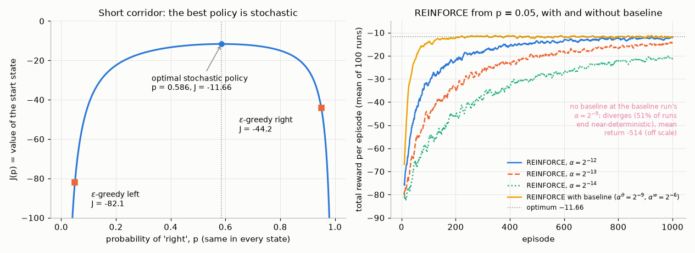

*Left: the exact value of the start state as a function of the probability of "right". The two $\varepsilon$-greedy policies a value-based learner could end up with ($\varepsilon=0.1$) are worth $-82.1$ and $-44.2$. The best stochastic policy, $p^\ast=0.586$, is worth $-11.66$. Right: total reward per episode, averaged over 100 runs (10-episode moving average).*

With $\alpha=2^{-12}$, REINFORCE climbs from about $-80$ to $-12.5$ (mean over the last 100 episodes). Smaller step sizes learn more slowly ($-14.9$ with $2^{-13}$, $-21.1$ with $2^{-14}$), but on average REINFORCE moves towards the stochastic optimum, which no greedy policy can represent. The learned-baseline curve is discussed in Section 6.2.

---

## 6. Baselines

### 6.1 Any action-independent baseline leaves the gradient unbiased

Section 4.3 removed past rewards because their product with the current score has mean zero. The same argument removes anything else that does not depend on the current action. Let $b(S_t)$ be any function of the state, or more generally of the history $H_t$, but **not** of $A_t$ or of anything that happens after it. Then

$$
\mathbb E\big[b(S_t)\,\nabla\log\pi(A_t\mid S_t)\big]
=\mathbb E\Big[b(S_t)\sum_a\pi(a\mid S_t)\nabla\log\pi(a\mid S_t)\Big]
=\mathbb E\Big[b(S_t)\,\nabla\underbrace{\sum_a\pi(a\mid S_t)}_{=1}\Big]=\mathbf 0,
$$

so subtracting it changes nothing in expectation:

$$
\nabla J(\boldsymbol\theta)=\mathbb E\Big[\sum_{t=0}^{T-1}\gamma^t\big(G_t-b(S_t)\big)\nabla\log\pi(A_t\mid S_t)\Big].
\tag{10.16}
$$

At the level of the theorem the same calculation reads $\sum_a b(s)\nabla\pi(a\mid s)=b(s)\nabla 1=\mathbf 0$. A baseline is a **control variate** ([Chapter 00](00-math-toolkit.md), Section 6.3): it subtracts a quantity with known zero mean that is correlated with the estimator, to cancel part of its noise. Why does it help? Without a baseline, in a task where every return is positive (CartPole gives $+1$ per step), every sampled action's probability is pushed *up*. Only the *differences* in how far each is pushed carry information, and they are buried under a large common offset. Subtracting $b(S_t)\approx\mathbb E[G_t\mid S_t]$ centres the weights. Better-than-expected actions are pushed up, worse-than-expected actions are pushed down, and the offset noise disappears.

What may the baseline *not* depend on? Anything correlated with $A_t$ given $H_t$. A baseline that uses the action, $b(S_t,A_t)$, is biased unless its expected effect is added back analytically. Such *action-dependent* control variates exist (Q-Prop, Gu et al., 2017), but Tucker et al. (2018) found that their practical benefit was often much smaller than reported. A baseline computed from the *same* episode's future, such as an average of this episode's returns, is subtly biased as well.

### 6.2 REINFORCE with a learned baseline

The natural baseline is an estimate of the state value, $b(s)=\hat v(s,\mathbf w)$. It is learned alongside the policy by Monte Carlo regression of $\hat v(S_t,\mathbf w)$ on $G_t$, which is gradient MC prediction from [Chapter 08](08-function-approximation.md).

```text
Algorithm 10.2  REINFORCE with baseline (episodic)
Input:  a differentiable policy parameterization pi(a|s, theta)
        a differentiable state-value parameterization v_hat(s, w)
Parameters: step sizes alpha^theta > 0, alpha^w > 0; discount gamma in [0, 1]
Initialize theta in R^d and w in R^d' (e.g. to 0)

Loop forever (for each episode):
    Generate an episode S_0, A_0, R_1, ..., S_{T-1}, A_{T-1}, R_T by following pi(.|., theta)
    Loop for each step of the episode t = 0, 1, ..., T-1:
        G <- sum_{k=t+1}^{T} gamma^(k-t-1) R_k                   # G_t
        delta <- G - v_hat(S_t, w)                                # advantage estimate
        w <- w + alpha^w * delta * grad v_hat(S_t, w)             # MC regression of v_hat on G_t
        theta <- theta + alpha^theta * gamma^t * delta * grad log pi(A_t | S_t, theta)   # (10.16)
```

On the short corridor the baseline is a single number $w$, because the agent cannot tell the states apart. With $\alpha^{\boldsymbol\theta}=2^{-9}$ and $\alpha^{\mathbf w}=2^{-6}$, REINFORCE with baseline averages $-38.1$ over its first 50 episodes, against $-58.7$ for the best plain REINFORCE ($\alpha=2^{-12}$). Over the last 100 episodes it averages $-11.8$, within noise of the optimum $-11.66$, and its final $p$ is $0.578\pm0.059$ (mean $\pm$ s.d. over runs; $p^\ast=0.586$). Plain REINFORCE *cannot* use the larger step size. At $\alpha=2^{-9}$ without a baseline, 51% of the runs end with $p<0.01$ or $p>0.99$, which are near-deterministic policies that loop for hundreds of steps (episodes were capped at 1000 steps; mean return of the last 100 episodes $-514$). The baseline does not make the gradient more correct. It makes it *less noisy*, which is what allows an 8 times larger step size.

### 6.3 The variance-minimizing baseline

Is $v_\pi(s)$ the best baseline? Consider the single-sample estimator at one state, $\mathbf g=(q_\pi(s,A)-b)\boldsymbol\psi(s,A)$ with $A\sim\pi(\cdot\mid s)$. Its mean does not depend on $b$, so minimizing the total variance $\operatorname{tr}\operatorname{Cov}(\mathbf g)$ is the same as minimizing the second moment:

$$
\mathbb E\big[\lVert\mathbf g\rVert^2\big]=\sum_a\pi(a\mid s)\,\big(q_\pi(s,a)-b\big)^2\,\lVert\boldsymbol\psi(s,a)\rVert^2 .
\tag{10.17}
$$

This is a convex quadratic in $b$. Setting its derivative $-2\sum_a\pi(a\mid s)(q_\pi(s,a)-b)\lVert\boldsymbol\psi(s,a)\rVert^2$ to zero gives

$$
b^\ast(s)=\frac{\sum_a\pi(a\mid s)\,\lVert\boldsymbol\psi(s,a)\rVert^2\,q_\pi(s,a)}{\sum_a\pi(a\mid s)\,\lVert\boldsymbol\psi(s,a)\rVert^2},
\tag{10.18}
$$

an average of the action values in which each action is weighted by its probability *times its squared score*. It equals $v_\pi(s)=\sum_a\pi(a\mid s)q_\pi(s,a)$ in particular when $\lVert\boldsymbol\psi(s,a)\rVert$ is the same for all actions (or when $q_\pi(s,\cdot)$ is constant). Otherwise it can differ substantially. In the random MDP of Section 6.4 one state has $v_\pi=0.71$ but $b^\ast=2.06$, and Exercises 10.3 and 10.7 give closed-form gaps. Yet the variance saved by using $b^\ast$ instead of $v_\pi$ is often modest. Three remarks.

* Minimizing each coordinate's variance separately gives a different optimal baseline per parameter, $b_i^\ast(s)=\sum_a\pi\psi_i^2q/\sum_a\pi\psi_i^2$ (compare [Chapter 00](00-math-toolkit.md), Eq. (6.7)). It is rarely worth the trouble.
* For full-trajectory estimators the optimal baseline also involves correlations between time steps. Weaver & Tao (2001) derived the optimal constant reward baseline, and Greensmith, Bartlett & Baxter (2004) analysed optimal baselines and actor-critic variance in general. The gains over $\hat v(s,\mathbf w)$ are usually modest. In the random MDP of the next subsection, using $b^\ast(s)$ instead of $v_\pi(s)$ reduces the variance by only 2.5% (12.25 against 12.57), despite the large gap in one state.
* The real reason to use $v_\pi$ is interpretive. $G_t-v_\pi(S_t)$ is an unbiased estimate of the **advantage** $A_\pi(S_t,A_t)=q_\pi(S_t,A_t)-v_\pi(S_t)$, so REINFORCE with baseline is "push up actions that did better than this state's average". All the methods that follow estimate this same quantity with more bias and less variance.

Baselines also affect the *dynamics* of learning beyond variance. With all-positive weights, sampling noise systematically pushes the policy toward whichever actions happen to be sampled most, which makes it more deterministic ("committal"). Chung, Thomas, Machado & Le Roux (2021) analyse this effect.

### 6.4 What the numbers say

**Exact check on a random MDP.** Part B of [`pg_theorem_check.py`](../code/ch10_policy_gradients/pg_theorem_check.py) builds a random episodic MDP (5 states, 3 actions, $\gamma=0.9$, rewards with mean around $+1$ and Gaussian noise of s.d. 0.5) and a tabular softmax policy with random parameters. It computes $\nabla J$ exactly from (10.9), using linear algebra for $q_\pi$ and $\eta_\gamma$. This agrees with central finite differences of the closed-form $J(\boldsymbol\theta)$ to $4\times10^{-10}$. The script then simulates 200,000 episodes and evaluates seven single-episode estimators, all of the form $\sum_t w_t\boldsymbol\psi(S_t,A_t)$:

| estimator: weight $w_t$ | bias $\lVert\text{mean}-\nabla J\rVert$ | total variance $\operatorname{tr}\operatorname{Cov}$ | variance / $\lVert\nabla J\rVert^2$ |
|---|---|---|---|
| total return $G_0$, trajectory form (10.11) | 0.018 | 71.5 | 81.7 |
| reward-to-go $\gamma^tG_t$ (10.13) | 0.012 | 24.0 | 27.5 |
| $\gamma^t\big(G_t-v_\pi(S_t)\big)$, value baseline (10.16) | 0.005 | 12.57 | 14.4 |
| $\gamma^t\big(G_t-b^\ast(S_t)\big)$, optimal baseline (10.18) | 0.004 | 12.25 | 14.0 |
| $\gamma^t\delta_t$, TD error with the true $v_\pi$ (Section 7.2) | 0.006 | 4.83 | 5.5 |
| $\gamma^tA_\pi(S_t,A_t)$, true advantage | 0.005 | 2.29 | 2.6 |
| $G_t-v_\pi(S_t)$, **no** $\gamma^t$ (Section 12) | **0.465** | 24.2 | 27.7 |

The first six rows are unbiased: every coordinate of their measured means is within 2.7 standard errors of $\nabla J$. Their variance falls by a factor of 5.7 from the trajectory form (10.11) to reward-to-go plus a value baseline, and by another 5.5 when the remaining Monte Carlo noise is replaced by the true advantage (a perfect critic). The TD error with the true $v_\pi$ (Section 7.2) sits between the two, because it still contains the noise of one transition. The last row drops $\gamma^t$ and is **biased**. Its mean matches its own exact expectation, derived in Section 12. To make $\lVert\hat{\mathbf g}_N-\nabla J\rVert$ smaller than $\lVert\nabla J\rVert/10$ with the trajectory estimator takes roughly $100\times$ the normalized variance, about 8,200 episodes (about 1,400 with reward-to-go and a value baseline), for a 15-parameter policy on a 5-state MDP. Policy gradients are expensive.

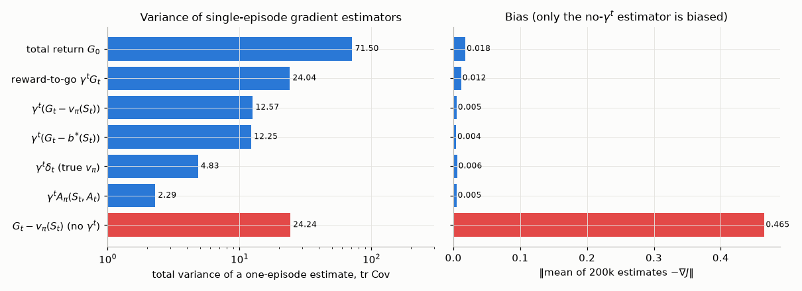

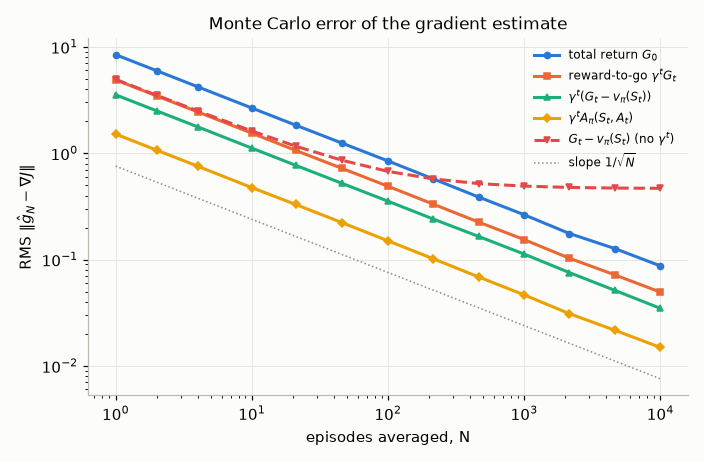

*Top: total variance (log scale) and bias of each one-episode estimator. Bottom: RMS error of the average of $N$ estimates. The unbiased estimators follow $1/\sqrt N$ lines whose heights are set by their variances. The no-$\gamma^t$ estimator levels off at its bias.*

**CartPole.** [`reinforce_cartpole.py`](../code/ch10_policy_gradients/reinforce_cartpole.py) trains a 2×64 tanh policy network on CartPole-v1 with one episode per update (Adam, learning rate $10^{-3}$ for the policy and $5\times10^{-3}$ for the 2×64 value network, $\gamma=0.99$, per-step terms summed and divided by the constant 500), for 1000 episodes and 5 seeds. The three variants differ *only* in the weight $w_t$. Two caveats apply. First, the total-return variant $G_0\sum_t\boldsymbol\psi_t$ is already the exact estimator (10.11) of $\nabla J_\gamma$, while the other two drop $\gamma^t$ (Section 12). So this comparison changes both the variance and, slightly, the estimand. (The random MDP above measures the variance reduction cleanly, with $\gamma^t$ kept, and Exercise 10.11 shows that the baseline variant with $\gamma^t$ kept still learns.) Second, Monte Carlo REINFORCE cannot bootstrap, so a truncated episode's returns stop at step 500. This optimizes the time-limited return that CartPole scores, and the time-unaware baseline simply fits it less well near the limit. A2C (Section 9) bootstraps through truncation.

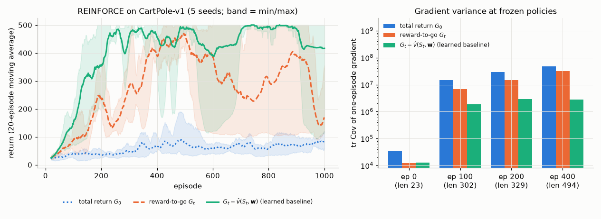

| variant | mean return, last 100 episodes | per seed | mean over all 1000 episodes | first episode at which the 20-episode average reaches 475 |
|---|---|---|---|---|
| total return $G_0$ | 77.1 | 94, 72, 64, 62, 93 | 58.8 | never |
| reward-to-go $G_t$ | 254.4 | 337, 247, 283, 118, 287 | 274.6 | 304, 418, 378, 417, 448 |
| $G_t-\hat v(S_t,\mathbf w)$ | 420.6 | 500, 491, 485, 129, 498 | 404.4 | 244, 182, 246, 220, 253 |

The total-return estimator learns, but slowly: over its last 100 episodes it balances for 62–94 steps on average, against 23 for the random initial policy. It credits every action with the whole episode's return, including rewards that came before the action, so each action's signal is buried under the noise of all the others. Reward-to-go learns much faster and reaches a 20-episode average of 475 on every seed, but does not stay there. Its curves collapse and recover repeatedly, and its last-100 averages range from 118 to 337. The learned baseline reaches 475 on every seed within 182–253 episodes, and four seeds end at 485–500. Seed 3 held about 490 for some 650 episodes and then collapsed to 129 in the last 100. Plain gradient ascent with a fixed step size has no protection against a bad update from a good policy. Limiting how far each update can move the policy is the subject of [Chapter 11](11-trust-regions-and-ppo.md).

The right panel measures variance directly. At four checkpoints of the first baseline run, the policy and its value network are frozen, 100 episodes are sampled, and each estimator's one-episode gradient vector $\sum_tw_t\boldsymbol\psi_t$ is computed (all 4,610 policy parameters). At episode 0 the untrained value network outputs roughly zero, so the "baseline" estimator is no better than reward-to-go ($1.29\times10^4$ vs $1.26\times10^4$): an untrained baseline is no baseline. At episodes 100, 200 and 400 (mean episode lengths 302, 329 and 494), the learned baseline reduces the total variance by factors of 3.6, 5.0 and 11.3 relative to reward-to-go, and 7.8, 9.9 and 17 relative to the total return. Even so, the signal-to-noise ratio $\lVert\mathbb E\mathbf g\rVert^2/\operatorname{tr}\operatorname{Cov}(\mathbf g)$ of a single-episode gradient is at most 0.11 (at episode 0) and at most 0.026 at the later checkpoints, where 100 episodes cannot distinguish it from zero. A one-episode policy gradient is mostly noise, and learning works only because many small steps average it out.

---

## 7. Actor-critic methods

### 7.1 Bootstrapping the return

REINFORCE with baseline learns a value function but uses it only as a baseline, to evaluate the state the agent was in. The next step is to use it also to evaluate the state the agent *moves to*. Replace the Monte Carlo return by the one-step bootstrapped return:

$$
G_t-\hat v(S_t,\mathbf w)\quad\longrightarrow\quad R_{t+1}+\gamma\hat v(S_{t+1},\mathbf w)-\hat v(S_t,\mathbf w)\doteq\delta_t ,
$$

the TD error of [Chapter 05](05-temporal-difference.md). The learned value function now plays the role of a **critic**. It judges each action by the TD error it produced, and the policy, the **actor**, moves in the direction the critic indicates. The trade is the familiar one from [Chapters 05](05-temporal-difference.md)–[06](06-n-step-and-eligibility-traces.md): bootstrapping introduces bias, since $\hat v\neq v_\pi$, in exchange for much lower variance. It also brings three practical benefits. Updates can be made online after every step, they work in continuing tasks, and credit assignment no longer waits for the end of the episode.

Sutton & Barto reserve "actor-critic" for methods whose critic *bootstraps*. REINFORCE with baseline learns a value function too, but it is not an actor-critic method in that sense.

### 7.2 The advantage function and its TD-error estimator

The advantage $A_\pi(s,a)\doteq q_\pi(s,a)-v_\pi(s)$ ([Chapter 01](01-the-rl-problem.md)) measures how much better $a$ is than the policy's average behaviour in $s$, and satisfies $\sum_a\pi(a\mid s)A_\pi(s,a)=0$. Because $v_\pi(s)$ is a valid baseline, the policy gradient theorem can be written with advantages:

$$
\nabla J(\boldsymbol\theta)=\sum_s\eta_\gamma(s)\sum_a\pi(a\mid s)\,A_\pi(s,a)\,\nabla\log\pi(a\mid s).
$$

Suppose the critic is exact, $\hat v=v_\pi$. Then the TD error is an unbiased estimate of the advantage:

$$
\mathbb E_\pi\big[\delta_t\mid S_t=s,A_t=a\big]=\mathbb E\big[R_{t+1}+\gamma v_\pi(S_{t+1})\mid S_t=s,A_t=a\big]-v_\pi(s)=q_\pi(s,a)-v_\pi(s)=A_\pi(s,a).
\tag{10.19}
$$

The middle equality is the Bellman equation for $q_\pi$. By the tower rule, $\mathbb E[\sum_t\gamma^t\delta_t\nabla\log\pi(A_t\mid S_t)]=\nabla J$ exactly. The single-transition TD error is a far less noisy weight than the whole return. In the random MDP of Section 6.4 its variance is 4.83, against 12.57 for $G_t-v_\pi(S_t)$.

With an approximate critic, write $\hat v=v_\pi+\epsilon$. Then $\mathbb E[\delta_t\mid s,a]=A_\pi(s,a)+\gamma\,\mathbb E[\epsilon(S_{t+1})\mid s,a]-\epsilon(s)$. The $-\epsilon(s)$ term does not depend on $a$, so it acts as a baseline and is harmless. The term $\gamma\mathbb E[\epsilon(S_{t+1})\mid s,a]$ does depend on $a$ whenever different actions lead to different next states, so **critic errors at the next state bias the gradient**. This is the price of bootstrapping, and $n$-step and GAE estimators (Section 8) control it by bootstrapping later.

### 7.3 One-step actor-critic

```text
Algorithm 10.3  One-step actor-critic (episodic)
Input:  a differentiable policy parameterization pi(a|s, theta)
        a differentiable state-value parameterization v_hat(s, w)
Parameters: step sizes alpha^theta > 0, alpha^w > 0; discount gamma in [0, 1]
Initialize theta in R^d and w in R^d' (e.g. to 0)

Loop forever (for each episode):
    Initialize S (first state of the episode)
    I <- 1                                                   # gamma^t
    Loop while S is not terminal (for each time step):
        A ~ pi(. | S, theta)
        Take action A, observe S', R
        if S' is terminal: delta <- R - v_hat(S, w)          # v_hat(terminal) = 0
        else:              delta <- R + gamma * v_hat(S', w) - v_hat(S, w)
                           # (on a time-limit truncation S' is NOT terminal: bootstrap, then stop)
        w     <- w + alpha^w * delta * grad v_hat(S, w)                 # semi-gradient TD(0) critic
        theta <- theta + alpha^theta * I * delta * grad log pi(A | S, theta)   # actor
        I <- gamma * I
        S <- S'
```

This is the policy-gradient analogue of SARSA or TD(0). It is fully online and incremental, and it learns from every transition. The critic update is the semi-gradient TD(0) of [Chapter 08](08-function-approximation.md). The factor $I=\gamma^t$ is the discount weighting of the theorem (Section 12).

### 7.4 Actor-critic with eligibility traces

The one-step TD error assigns credit only to the most recent action. As in [Chapter 06](06-n-step-and-eligibility-traces.md), eligibility traces give a backward-view implementation of the $\lambda$-return. Each parameter vector keeps a trace of recent gradients, decaying by $\gamma\lambda$, and every TD error updates all recently eligible parameters at once.

```text
Algorithm 10.4  Actor-critic with eligibility traces (episodic)
Input:  a differentiable policy parameterization pi(a|s, theta)
        a differentiable state-value parameterization v_hat(s, w)
Parameters: trace-decay rates lambda^theta in [0,1], lambda^w in [0,1];
            step sizes alpha^theta > 0, alpha^w > 0; discount gamma in [0, 1]
Initialize theta in R^d and w in R^d' (e.g. to 0)

Loop forever (for each episode):
    Initialize S (first state of the episode)
    z^theta <- 0 (d-component eligibility trace vector)
    z^w     <- 0 (d'-component eligibility trace vector)
    I <- 1
    Loop while S is not terminal (for each time step):
        A ~ pi(. | S, theta)
        Take action A, observe S', R
        delta <- R + gamma * v_hat(S', w) - v_hat(S, w)        # v_hat(S', w) = 0 if S' is terminal
        z^w     <- gamma * lambda^w * z^w + grad v_hat(S, w)
        z^theta <- gamma * lambda^theta * z^theta + I * grad log pi(A | S, theta)
        w     <- w + alpha^w * delta * z^w
        theta <- theta + alpha^theta * delta * z^theta
        I <- gamma * I
        S <- S'
```

With $\lambda=0$ this is exactly Algorithm 10.3. For $\lambda>0$ the actor's trace has a clean offline reading. Unrolled, $\mathbf z^{\boldsymbol\theta}_t=\sum_{k\le t}(\gamma\lambda^{\boldsymbol\theta})^{t-k}\gamma^k\boldsymbol\psi_k$, with $\boldsymbol\psi_k=\nabla\log\pi(A_k\mid S_k)$. If $\boldsymbol\theta$ and $\mathbf w$ are held fixed during the episode (offline updates), swapping the order of summation gives

$$
\sum_t\delta_t\,\mathbf z^{\boldsymbol\theta}_t=\sum_k\gamma^k\boldsymbol\psi_k\sum_{t\ge k}(\gamma\lambda^{\boldsymbol\theta})^{t-k}\delta_t=\sum_k\gamma^k\,\hat A^{\mathrm{GAE}(\gamma,\lambda^{\boldsymbol\theta})}_k\,\boldsymbol\psi_k ,
$$

where the inner sum is exactly the GAE advantage (10.21) of Section 8. So the offline actor-critic($\lambda$) update **is** the GAE($\lambda$) policy gradient, and with $\lambda=1$ it is exactly REINFORCE with baseline, by the telescoping identity of Section 8.1. The traces are the accumulating traces of [Chapter 06](06-n-step-and-eligibility-traces.md), and the same caveats about online versus offline equivalence apply. The tabular softmax score is $\partial\log\pi(a\mid s)/\partial\theta_{s,b}=\mathbb 1[a=b]-\pi(b\mid s)$, so $\mathbf z^{\boldsymbol\theta}$ is a table of the same shape as $\boldsymbol\theta$.

**Continuing tasks.** For the average-reward objective (10.8) the same machinery works with the **differential** TD error of [Chapter 08](08-function-approximation.md): no discounting, no $I$ factor, and a running estimate $\bar R$ of $r(\pi)$ (Sutton & Barto, Section 13.6):

```text
Algorithm 10.4b  Actor-critic with eligibility traces (continuing, average reward)
Input:  a differentiable policy parameterization pi(a|s, theta)
        a differentiable state-value parameterization v_hat(s, w)
Parameters: lambda^w in [0,1], lambda^theta in [0,1]; alpha^w > 0, alpha^theta > 0, alpha^Rbar > 0
Initialize Rbar in R (e.g. to 0), theta in R^d and w in R^d' (e.g. to 0)
Initialize S;  z^w <- 0;  z^theta <- 0

Loop forever (for each time step):
    A ~ pi(. | S, theta)
    Take action A, observe S', R
    delta <- R - Rbar + v_hat(S', w) - v_hat(S, w)            # differential TD error
    Rbar  <- Rbar + alpha^Rbar * delta                         # running estimate of r(pi)
    z^w     <- lambda^w * z^w + grad v_hat(S, w)
    z^theta <- lambda^theta * z^theta + grad log pi(A | S, theta)
    w     <- w + alpha^w * delta * z^w
    theta <- theta + alpha^theta * delta * z^theta
    S <- S'
```

With an exact differential critic, $\mathbb E[\delta_t\mid S_t,A_t]$ is the differential advantage, and states are sampled from the stationary distribution $d^\pi$, which is the weighting Theorem 10.2 requires.

**Results.** [`actor_critic_traces.py`](../code/ch10_policy_gradients/actor_critic_traces.py) runs Algorithm 10.4 with a tabular actor and critic on Gymnasium's FrozenLake-v1 (4×4, `is_slippery=False`, $\gamma=0.99$, uniform initial policy). The reward is $+1$ for reaching the goal and 0 otherwise, falling in a hole ends the episode, and the shortest path has 6 steps, so credit must travel back through several states. The parameter study varies $\lambda$ (with $\lambda^{\boldsymbol\theta}=\lambda^{\mathbf w}=\lambda$) and a common step size $\alpha^{\boldsymbol\theta}=\alpha^{\mathbf w}=\alpha$, and averages the success rate over the first 200 episodes of 50 independent runs.

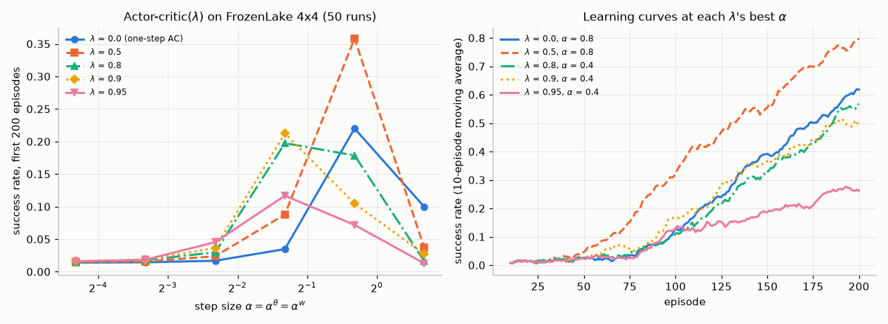

With the best step size for each $\lambda$, the success rate over the first 200 episodes is 0.22 for the one-step actor-critic ($\lambda=0$, $\alpha=0.8$), **0.36** for $\lambda=0.5$ ($\alpha=0.8$), and 0.20, 0.21 and 0.12 for $\lambda=0.8$, 0.9 and 0.95 ($\alpha=0.4$). With the smallest step size every variant stays near the 1.5% success rate of the initial uniform policy. A moderate trace helps: its TD errors update every recent state–action pair, so the first success propagates back several states in one episode instead of one state per episode. More trace is not better, though. Larger $\lambda$ makes each TD error move many parameters, so it tolerates only smaller step sizes, and at $\lambda=0.95$ the best tolerable step size learns slowly. This inverted-U dependence of performance on $\lambda$ (a U in error) is familiar from TD($\lambda$) prediction in Sutton & Barto's random-walk experiments (their Chapter 12). The step-size grid is coarse (factors of 2), so the ranking of $\lambda\in\lbrace0,0.8,0.9\rbrace$ is within the resolution of the study. The robust findings are that $\lambda=0.5$ beats the one-step actor-critic and that $\lambda=0.95$ is worst.

### 7.5 Two time scales and convergence

An actor-critic is two coupled learning processes. The critic chases the value of a moving policy, and the actor follows a gradient estimate whose bias depends on how well the critic has caught up. The classical analyses (Konda & Tsitsiklis, 2000, 2003; Bhatnagar, Sutton, Ghavamzadeh & Lee, 2009) make this rigorous with **two time scales**. The critic's step sizes are chosen so that $\alpha^{\boldsymbol\theta}_k/\alpha^{\mathbf w}_k\to0$, so the critic converges "infinitely faster" than the actor, which therefore sees an essentially converged critic. The critic is linear, and in the strongest results it uses features compatible with the policy (Section 13). Under these conditions the actor converges, with probability 1, to a neighbourhood of a stationary point of $J$ (of the average reward, in their setting). No comparable guarantee exists for deep actor-critics with nonlinear critics, where everything in [Chapter 08](08-function-approximation.md)'s deadly triad except off-policy learning is present. In practice the two-time-scale intuition survives as a rule of thumb: let the critic learn at least as fast as the actor.

---

## 8. Generalized Advantage Estimation

Between the one-step TD error (low variance, biased by critic errors) and the Monte Carlo advantage $G_t-\hat v(S_t)$ (unbiased, high variance) lies a continuum, exactly as $n$-step returns and $\lambda$-returns interpolate between TD and MC in [Chapter 06](06-n-step-and-eligibility-traces.md). GAE (Schulman, Moritz, Levine, Jordan & Abbeel, 2016) is the $\lambda$-return idea applied to advantages. It is the advantage estimator of PPO and of most modern A2C implementations. (The original A3C used $n$-step returns, of which GAE is a generalization.)

### 8.1 n-step advantage estimators

Throughout this section $V$ denotes the critic $\hat v(\cdot,\mathbf w)$ and $\delta_t=R_{t+1}+\gamma V(S_{t+1})-V(S_t)$ its TD error, with $V(\text{terminal})=0$. The $n$-step return of [Chapter 06](06-n-step-and-eligibility-traces.md), $G_{t:t+n}=R_{t+1}+\gamma R_{t+2}+\dots+\gamma^{n-1}R_{t+n}+\gamma^nV(S_{t+n})$, gives the $n$-step advantage estimator

$$
\hat A_t^{(n)}\doteq G_{t:t+n}-V(S_t)=\sum_{l=0}^{n-1}\gamma^l\delta_{t+l}.
\tag{10.20}
$$

The second equality is a telescoping sum. Expanding $\sum_{l=0}^{n-1}\gamma^l\big(R_{t+l+1}+\gamma V(S_{t+l+1})-V(S_{t+l})\big)$, each $+\gamma^{l+1}V(S_{t+l+1})$ cancels the $-\gamma^{l+1}V(S_{t+l+1})$ of the next term. Only the rewards, the final $+\gamma^nV(S_{t+n})$ and the first $-V(S_t)$ survive. For $n=1$ this is $\delta_t$. As $n\to\infty$ (or $t+n\ge T$) it becomes $G_t-V(S_t)$.

### 8.2 GAE as an exponentially weighted average

Instead of choosing one $n$, average all of them with geometric weights $(1-\lambda)\lambda^{n-1}$, which sum to 1:

$$
\begin{aligned}
\hat A_t^{\mathrm{GAE}(\gamma,\lambda)}
&\doteq(1-\lambda)\sum_{n=1}^{\infty}\lambda^{n-1}\hat A_t^{(n)}
=(1-\lambda)\sum_{n=1}^{\infty}\lambda^{n-1}\sum_{l=0}^{n-1}\gamma^l\delta_{t+l}\\
&=(1-\lambda)\sum_{l=0}^{\infty}\gamma^l\delta_{t+l}\sum_{n=l+1}^{\infty}\lambda^{n-1}
=(1-\lambda)\sum_{l=0}^{\infty}\gamma^l\delta_{t+l}\,\frac{\lambda^{l}}{1-\lambda}
=\sum_{l=0}^{\infty}(\gamma\lambda)^l\,\delta_{t+l}.
\end{aligned}
\tag{10.21}
$$

The third step swaps the order of summation: the term $\gamma^l\delta_{t+l}$ appears in every $\hat A^{(n)}_t$ with $n\ge l+1$. The fourth sums a geometric series. In an episode that terminates at $T$, every $\delta_{t+l}$ with $t+l\ge T$ is zero, so the sum is finite. Since $\hat A^{(n)}_t=G_{t:t+n}-V(S_t)$ and the weights sum to one, GAE is the $\lambda$-return of [Chapter 06](06-n-step-and-eligibility-traces.md) minus the baseline. This is that chapter's TD-error form of the $\lambda$-return, its Eq. (6.19), read as an advantage estimate:

$$
\hat A_t^{\mathrm{GAE}(\gamma,\lambda)}=G_t^\lambda-V(S_t).
\tag{10.22}
$$

The two endpoints are the estimators we already know:

* $\lambda=0$: $\hat A_t=\delta_t$, the one-step actor-critic;
* $\lambda=1$: $\hat A_t=\sum_l\gamma^l\delta_{t+l}=G_t-V(S_t)$, REINFORCE with baseline.

### 8.3 Bias and variance

*If the critic is exact* ($V=v_\pi$), every $\hat A_t^{(n)}$, and hence GAE for **every** $\lambda$, is an unbiased estimator of $A_\pi(S_t,A_t)$. The first term satisfies $\mathbb E[\delta_t\mid S_t,A_t]=A_\pi(S_t,A_t)$ by (10.19). Every later term has conditional mean zero: for $l\ge1$, $\mathbb E[\delta_{t+l}\mid S_t,A_t]=\mathbb E\big[\mathbb E[\delta_{t+l}\mid S_{t+l}]\mid S_t,A_t\big]$, and $\mathbb E[\delta_{t+l}\mid S_{t+l}]=\mathbb E[R+\gamma v_\pi(S')\mid S_{t+l}]-v_\pi(S_{t+l})=0$ by the Bellman equation for $v_\pi$. Schulman et al. call such estimators **$\gamma$-just**. The later terms add only noise, so with a perfect critic $\lambda=0$ would have the least variance.

*If the critic is wrong*, $\lambda=1$ is still unbiased when the sum runs to the end of the episode, because $V$ then enters only as a baseline. (With rollouts truncated after $n$ steps, Section 8.4, even $\lambda=1$ bootstraps from $V(S_{t+n})$.) For $\lambda<1$, write $V=v_\pi+\epsilon$. Substituting into (10.21) and collecting terms gives $\hat A_t=\hat A_t^{v_\pi}-\epsilon(S_t)+(1-\lambda)\sum_{l\ge1}\gamma^l\lambda^{l-1}\epsilon(S_{t+l})$. The first error term is a harmless baseline, but the critic's errors at the states $l$ steps ahead enter with weight $(1-\lambda)\gamma^l\lambda^{l-1}$, and those states depend on the action. Roughly, **$\lambda$ trades bias that comes from the critic against variance that comes from the rewards**. The effective horizon of the sum is $1/(1-\gamma\lambda)$ steps. With the common $\gamma=0.99$, $\lambda=0.95$ it is about 17 steps, against 100 steps for $\lambda=1$.

*The role of $\gamma$.* Schulman et al. make a distinction that is easy to miss. Even $\lambda=1$ estimates the advantage of the **discounted** problem. If the quantity we actually care about is the undiscounted return (CartPole's episode length, a game score), then $\gamma<1$ is itself a bias-for-variance device: it down-weights distant rewards that are only weakly attributable to the current action. So $\gamma$ introduces bias *whatever the critic*, while $\lambda$ introduces bias *only through critic errors*. Schulman et al. found the best $\lambda$ to be well below the best $\gamma$ in their experiments, which this analysis explains: with a reasonably accurate critic, $\lambda<1$ costs much less bias than $\gamma<1$. Section 12 returns to the consequences.

### 8.4 Computing GAE: the backward recursion, termination and truncation

The closed form (10.21) satisfies a one-line recursion, computed backwards over a rollout:

$$
\hat A_t=\delta_t+\gamma\lambda\,(1-d_t)\,\hat A_{t+1},
\tag{10.23}
$$

where $d_t=1$ if the episode ended at step $t$ (by termination *or* truncation), so that the sum never crosses into the next episode. The critic is trained towards the corresponding $\lambda$-return target,

$$
\hat G_t^\lambda=\hat A_t+V(S_t),
\tag{10.24}
$$

which by (10.22) is the (truncated) $\lambda$-return. Two details are easy to get wrong.

1. **Termination vs truncation.** If the episode *terminated* at step $t$, then $V(S_{t+1})=0$ in $\delta_t$. If it was *truncated* (a time limit), $S_{t+1}$ is a real state with real value, and $\delta_t$ must bootstrap from $V(S_{t+1})$, with $S_{t+1}$ the true final observation, not the reset observation of the next episode. In both cases the recursion stops at $t$. The time limit of CartPole-v1 (500 steps) makes this matter: an agent that treats truncation as termination is taught that balancing for 500 steps leads to a state worth zero.
2. **The end of the rollout.** A rollout of $n$ steps usually stops mid-episode. The last TD error bootstraps from $V(S_{t+n})$ and the recursion starts from $\hat A_{t+n}=0$, so each $\hat A_t$ is a $\lambda$-return truncated at the end of the rollout. Short rollouts therefore imply more bootstrapping, whatever $\lambda$ is. We will see this effect in the A2C ablations.

```text
Algorithm 10.5  GAE(gamma, lambda) for a rollout of n steps from one environment
Input:  rewards R_1..R_n; values V(S_0)..V(S_{n-1}) of the visited states;
        for each t: V_next_t = V(S_{t+1}) of the SAME episode (the true final observation
                    if the episode ended at t; V(S_n) for the last step if it did not end);
        flags terminated_t, done_t = terminated_t OR truncated_t
Output: advantages A_hat_0..A_hat_{n-1}; critic targets G_hat_0..G_hat_{n-1}

A <- 0
for t = n-1 down to 0:
    delta <- R_{t+1} + gamma * (1 - terminated_t) * V_next_t - V(S_t)   # bootstrap unless terminated
    A <- delta + gamma * lambda * (1 - done_t) * A                       # (10.23): stop at any boundary
    A_hat_t <- A
    G_hat_t <- A_hat_t + V(S_t)                                          # (10.24)
```

The function `compute_gae` in [`a2c_gae_cartpole.py`](../code/ch10_policy_gradients/a2c_gae_cartpole.py) is a line-by-line transcription, vectorized over environments:

```python
for t in range(n - 1, -1, -1):
    delta = rewards[t] + gamma * (1.0 - terminated[t]) * next_values[t] - values[t]
    last = delta + gamma * lam * (1.0 - done[t]) * last
    adv[t] = last
```

### 8.5 A worked example

A 3-step episode that terminates after the third reward, with $\gamma=0.9$, $\lambda=0.5$:

| $t$ | $R_{t+1}$ | $V(S_t)$ | $V(S_{t+1})$ | $\delta_t$ |
|---|---|---|---|---|
| 0 | 1 | 1.0 | 0.5 | $1+0.9(0.5)-1.0=0.45$ |
| 1 | 0 | 0.5 | 1.5 | $0+0.9(1.5)-0.5=0.85$ |
| 2 | 2 | 1.5 | 0 (terminal) | $2+0-1.5=0.50$ |

With $\gamma\lambda=0.45$ the recursion gives $\hat A_2=0.50$, then $\hat A_1=0.85+0.45(0.50)=1.075$, then $\hat A_0=0.45+0.45(1.075)=0.934$ (to three decimals). For comparison, $\lambda=0$ gives $\hat A_0=\delta_0=0.45$, and $\lambda=1$ gives $\hat A_0=0.45+0.9(0.85)+0.81(0.50)=1.62$. That equals $G_0-V(S_0)=(1+0+0.81\cdot2)-1.0=1.62$, as the telescoping identity requires. The critic's target for $S_0$ at $\lambda=0.5$ is $0.934+1.0=1.934$. Now suppose the episode had been *truncated* after the third step at a non-terminal $S_3$ with $V(S_3)=1.0$. Then $\delta_2=2+0.9(1.0)-1.5=1.40$, and the bootstrap value enters every advantage of the episode through the recursion.

---

## 9. A2C and A3C: actor-critics with parallel actors

### 9.1 A3C

In 2016 deep value-based RL relied on experience replay to break the temporal correlations in its training data ([Chapter 09](09-deep-q-learning.md)). Replay requires an off-policy learner, which rules out the on-policy actor-critics of this chapter. Mnih, Badia, Mirza, Graves, Lillicrap, Harley, Silver & Kavukcuoglu (2016) proposed a different decorrelator: run **many actor-learners in parallel**, each with its own copy of the environment, so that at any moment the updates come from many different parts of the state space. Their **asynchronous advantage actor-critic (A3C)** ran 16 CPU threads that each

* copy the shared parameters, act for at most $t_{\max}$ steps (5 in their Atari experiments) or until the episode ends,
* compute $n$-step advantage estimates (10.20) for those steps, bootstrapping from the critic at the last state,
* compute the gradient of an actor loss with an entropy bonus (Section 10) and of a critic loss, and
* apply it to the shared parameters **asynchronously and without locks** (in the style of Hogwild!, Recht, Re, Wright & Niu, 2011), while other threads may be updating them at the same time.

A3C used a shared RMSProp optimizer. The paper writes the actor and critic parameters separately for generality, but in practice always shared them: one network with a shared trunk and two heads, a softmax policy and a linear value output. The paper reported state-of-the-art Atari results "while training for half the time on a single multi-core CPU instead of a GPU". The same paper also applied the asynchronous recipe to one-step Q-learning, one-step SARSA and $n$-step Q-learning.

```text
Algorithm 10.6  A3C: one actor-learner thread (all N threads run this concurrently)
Shared: actor parameters theta, critic parameters w, global step counter T_glob <- 0
Parameters: rollout length t_max; discount gamma; entropy weight c_H; step size alpha; budget T_max
Thread-local: parameters theta', w'; an environment; t <- 0

Get the initial state S_0
repeat
    theta' <- theta;  w' <- w                       # synchronize with the shared parameters
    d_theta <- 0;  d_w <- 0
    t_start <- t
    repeat                                          # act for up to t_max steps
        A_t ~ pi(. | S_t, theta');  take A_t, observe R_{t+1}, S_{t+1}
        t <- t + 1;  T_glob <- T_glob + 1
    until S_t is terminal or the episode was truncated (time limit) or t - t_start = t_max
    G <- 0 if S_t is terminal else v_hat(S_t, w')    # bootstrap; on truncation S_t is the TRUE final state
    for i = t-1 down to t_start:
        G <- R_{i+1} + gamma * G                     # n-step return, n = t - i <= t_max
        d_theta <- d_theta + grad_theta' [ (G - v_hat(S_i, w')) log pi(A_i | S_i, theta')
                                           + c_H * entropy(pi(. | S_i, theta')) ]    # advantage held constant
        d_w     <- d_w + grad_w' (G - v_hat(S_i, w'))^2
    theta <- theta + alpha * d_theta;  w <- w - alpha * d_w    # asynchronous, lock-free (RMSProp in the paper)
    if the episode ended (terminated or truncated): reset the environment, obtaining a new S_t
until T_glob > T_max
```

### 9.2 A2C, the synchronous version

Asynchrony turned out not to matter much. **A2C** replaces the threads by $N_{\text{env}}$ environment copies stepped in lock-step, and makes one batched update from all of them. OpenAI's Baselines release (2017), which popularized the name, reported no evidence that the noise of asynchrony helps performance, and found the synchronous version more cost-effective on a single GPU. Every update uses data from the current policy, so there is no "stale parameters" problem. In modern code the environments are a vectorized environment such as `gymnasium.vector.SyncVectorEnv` ([Chapter 00](00-math-toolkit.md), Section 8.5), and the advantages are usually GAE rather than $n$-step.

```text
Algorithm 10.7  A2C with GAE (synchronous; N_env environments; on-policy)
Input:  policy network pi(a|s, theta); value network v_hat(s, w)
Parameters: N_env; rollout length n; gamma; lambda; step size alpha;
            loss weights c_v, c_H; maximum gradient norm g_max
Initialize theta, w; reset the N_env environments, obtaining S^(1..N_env)

Loop until the budget of environment steps is used:
    for t = 0, ..., n-1:                                   # rollout with a FIXED policy
        for every environment i (in lock-step):
            A ~ pi(. | S^(i), theta);  step: R, S', terminated, truncated
            store (S^(i), A, R, terminated, done = terminated or truncated)
            store the true next state of the SAME episode (the final observation if it ended)
            S^(i) <- S'   (the first state of a new episode if it ended: autoreset)
    compute V(S) and V(next state) for every stored step with the current critic
    compute A_hat and G_hat = A_hat + V(S) with Algorithm 10.5, per environment
    L(theta, w) = - mean[ A_hat * log pi(A | S, theta) ]          # actor (A_hat is a constant)
                  + c_v * mean[ (v_hat(S, w) - G_hat)^2 ]          # critic, towards lambda-returns
                  - c_H * mean[ entropy(pi(. | S, theta)) ]        # exploration bonus
    clip the gradient norm (of actor and critic separately) to g_max; one step of Adam/RMSProp on L
```

The scalar that is differentiated is

$$
L(\boldsymbol\theta,\mathbf w)=-\frac1B\sum_{j}\hat A_j\log\pi_{\boldsymbol\theta}(A_j\mid S_j)+c_v\frac1B\sum_j\big(\hat v(S_j,\mathbf w)-\hat G_j\big)^2-c_{\mathcal H}\frac1B\sum_j\mathcal H\big(\pi_{\boldsymbol\theta}(\cdot\mid S_j)\big),
\tag{10.25}
$$

where $j$ runs over the $B=N_{\text{env}}\,n$ transitions of the batch. The advantages $\hat A_j$ and targets $\hat G_j$ are constants. Differentiating through them is a classic bug that turns the actor loss into something else entirely.

### 9.3 Implementation details that matter

* **Truncation.** Our implementation runs the vector environment in Gymnasium's `SAME_STEP` autoreset mode. When an episode ends, the returned observation is already the first observation of the next episode, and the real final observation is in `info["final_obs"]`. The TD error of the last step bootstraps from $V(\texttt{final\_obs})$ if the episode was truncated and uses 0 if it terminated. The default `NEXT_STEP` mode needs a mask for the fake "reset" transition instead ([Chapter 00](00-math-toolkit.md), Section 8.5).
* **Shared or separate networks.** A shared trunk saves computation and can help representation learning, but then $c_v$ balances two losses on the same features. We use separate networks.
* **Gradient clipping.** A3C/A2C implementations clip the global gradient norm. In a combined loss such as (10.25), the critic's gradient can be far larger than the actor's, since value errors scale with returns (up to $\sim100$ here). Clipping the joint norm then ties the actor's effective step to the critic's current error. We clip the two networks separately, and Section 9.6 measures the difference.
* **Advantage normalization.** Many implementations standardize $\hat A$ within each batch. This rescales the step size and shifts the baseline, so it is not a neutral change. We do not normalize, so that the $\lambda$ ablation compares the estimators themselves.

### 9.4 Results: the GAE λ ablation

[`a2c_gae_cartpole.py`](../code/ch10_policy_gradients/a2c_gae_cartpole.py) trains A2C on CartPole-v1 with $N_{\text{env}}=8$ environments, rollouts of $n=16$ steps (batches of 128 transitions), $\gamma=0.99$, Adam with learning rate $10^{-3}$, $c_v=0.5$, $c_{\mathcal H}=0.01$ and per-network gradient-norm clipping at 0.5. Each run lasts 150,000 environment steps, and there are 5 seeds per setting. "Final" is the mean return of episodes that ended in the last 20% of training. "Mean over training" averages the learning curve and so also rewards learning speed.

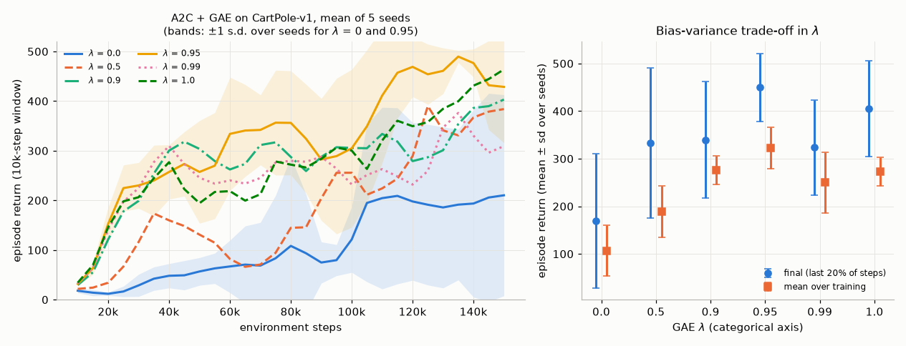

*Left: learning curves, mean of 5 seeds; the bands ($\pm1$ s.d. over seeds) are drawn for $\lambda=0$ and $\lambda=0.95$ only, to keep the plot readable. Right: final return and mean return over training for each $\lambda$ (mean $\pm$ s.d. over seeds); the $\lambda$ axis is categorical.*

| GAE $\lambda$ | final return (mean $\pm$ s.d.) | final return per seed | mean over training |
|---|---|---|---|
| 0 (one-step TD advantage) | $169\pm141$ | 56, 378, 74, 252, 86 | 107 |
| 0.5 | $333\pm158$ | 264, 500, 500, 154, 248 | 189 |
| 0.9 | $340\pm123$ | 224, 372, 478, 425, 200 | 276 |
| **0.95** | $\mathbf{450\pm72}$ | 484, 465, 491, 486, 323 | **323** |
| 0.99 | $323\pm99$ | 417, 372, 310, 159, 359 | 250 |
| 1 (Monte Carlo within the rollout) | $405\pm101$ | 295, 498, 296, 475, 463 | 273 |

The one-step TD advantage ($\lambda=0$) is clearly the worst. Its advantages are only as good as the critic, which is poor early in training (mean return over training 107, against 323 at $\lambda=0.95$). $\lambda=0.95$ is best on both measures, but the ordering among $\lambda\ge0.9$ is within the seed-to-seed spread (standard deviations of 70–120 with 5 seeds). The safe conclusions are that $\lambda=0$ is bad and that a value near 0.95 is a good default, which is also the default of most PPO implementations ([Chapter 11](11-trust-regions-and-ppo.md)). Even $\lambda=1$ is not pure Monte Carlo here: with 16-step rollouts every advantage is bootstrapped at the end of its rollout, which caps the extra variance a large $\lambda$ can add. The learning curves are far from monotone, and the bands show how much seeds differ. Even the best setting has temporary collapses, a reminder that a single A2C run says little ([Chapter 20](20-deep-rl-in-practice.md)).

### 9.5 What are the parallel actors for?

A3C's parallel actors were introduced to *decorrelate* the data, and with them gradient steps behave more like SGD on i.i.d. samples. A2C keeps the parallel environments. Do they matter at a fixed batch size? [`a2c_parallel_actors.py`](../code/ch10_policy_gradients/a2c_parallel_actors.py) keeps the batch at 128 transitions, and every other setting as in Section 9.4, and changes how the batch is collected:

| how each batch of 128 transitions is collected | final return (mean $\pm$ s.d.) | per seed | mean over training |
|---|---|---|---|
| 8 parallel environments × 16 steps (default) | $450\pm72$ | 484, 465, 491, 486, 323 | 323 |
| 1 environment, 8 *consecutive* 16-step segments | $477\pm29$ | 493, 451, 440, 500, 500 | 385 |
| 1 environment × 128 steps | $496\pm10$ | 500, 500, 500, 500, 478 | 421 |
| 32 parallel environments × 4 steps | $338\pm130$ | 462, 195, 296, 488, 251 | 197 |

The second row computes *exactly the same estimator* as the first (GAE truncated every 16 steps, batches of 128), but takes the 8 segments one after another from a single environment, so each batch is strongly correlated. It did slightly better, within noise. **On CartPole, at this scale, we could not measure any benefit from decorrelation.** Rows 2 and 3 isolate the rollout length at $N_{\text{env}}=1$: 128-step rollouts did a little better, a modest gain within noise. Rows 1 and 4 change $N_{\text{env}}$ and $n$ together, so the poor $32\times4$ result cannot be attributed to the rollout length alone, although short rollouts plausibly hurt: every advantage is bootstrapped after at most 4 steps, like a small $\lambda$ (compare the $\lambda$ table). The experiment measures sample efficiency on one small task. It says nothing about wall-clock throughput, the other half of A3C's argument ($N$ environments produce $N$ times as many transitions per second), or about domains such as Atari, where long stretches of one episode look alike and decorrelation may well matter.

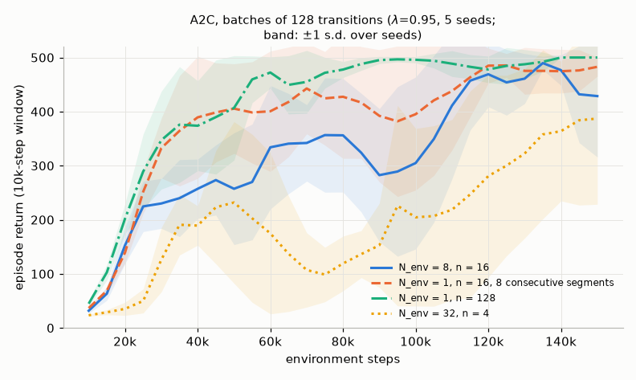

### 9.6 Gradient clipping

With the gradient norm of actor and critic clipped *jointly* at 0.5, A2C ($\lambda=0.95$, 5 seeds) reached a final return of $386\pm128$ (mean over training 284), against $450\pm72$ (323) with separate clipping, a difference within the noise of 5 seeds. The script's diagnostic shows why the choice can matter. In the joint-clipping run with seed 4, the critic's gradient norm before clipping was a median 34 times the actor's (90th percentile 80). The joint clip therefore multiplied the actor's gradient by a median 0.019, against 0.71 if the actor were clipped alone. Adam would undo a *constant* factor, but this one changes from batch to batch with the critic's error, so each actor update is down-weighted by however wrong the critic currently is.

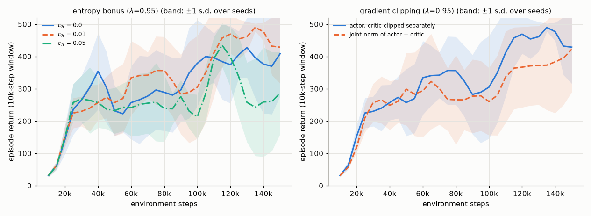

*Left: the entropy bonus (Section 10). Right: clipping the gradient norm of actor and critic separately or jointly. Both panels: $\lambda=0.95$, mean of 5 seeds, with bands of $\pm1$ s.d. over seeds.*

---

## 10. Entropy regularization

Policy gradients have a built-in tendency to become deterministic too early. Every sampled action that turns out better than the baseline gets its probability raised, and a policy that has nearly stopped exploring cannot discover that another action was better. Its scores also shrink, so it cannot easily climb back out. The standard remedy, introduced by Williams & Peng (1991) and made routine by A3C, adds the policy's entropy to the objective:

$$
J_{\mathcal H}(\boldsymbol\theta)=J(\boldsymbol\theta)+c_{\mathcal H}\,\mathbb E_{S\sim d^\pi}\Big[\mathcal H\big(\pi_{\boldsymbol\theta}(\cdot\mid S)\big)\Big],
\qquad \mathcal H(\pi(\cdot\mid s))=-\sum_a\pi(a\mid s)\log\pi(a\mid s).
\tag{10.26}
$$

In practice it appears as the $-c_{\mathcal H}\mathcal H$ term of (10.25), averaged over the states in the batch. Its gradient is therefore taken with the state distribution held fixed, $c_{\mathcal H}\,\mathbb E_{S\sim d^\pi}\big[\nabla_{\boldsymbol\theta}\mathcal H(\pi_{\boldsymbol\theta}(\cdot\mid S))\big]$. That is *not* the full gradient of (10.26), which would also differentiate $d^\pi$, and it is one reason the bonus is myopic (caution (ii) below). For a softmax over preferences $h_a$ (dropping $s$), use $\partial\pi_a/\partial h_b=\pi_a(\mathbb 1[a=b]-\pi_b)$:

$$
\frac{\partial\mathcal H}{\partial h_b}
=-\sum_a\frac{\partial\pi_a}{\partial h_b}\big(\log\pi_a+1\big)
=-\pi_b(\log\pi_b+1)+\pi_b\sum_a\pi_a(\log\pi_a+1)
=-\pi_b\big(\log\pi_b+\mathcal H\big).
\tag{10.27}
$$

The gradient raises the preference of every action whose log-probability is below the average log-probability, $-\mathcal H$, and lowers the others. It is a force towards the uniform policy, proportional to how far each action is from "typical". For a Gaussian, $\mathcal H=\sum_i\log\sigma_i+\tfrac k2\log(2\pi e)$, so $\partial\mathcal H/\partial\log\sigma_i=1$: a constant outward push on every standard deviation, independent of the mean.

Three cautions. (i) The bonus changes the objective. With $c_{\mathcal H}>0$ the optimum is no longer the optimum of $J$, so $c_{\mathcal H}$ must be small (0.01 is the classic default for discrete actions) or annealed. (ii) This bonus is *myopic*: it rewards entropy at the states visited now, not the entropy of future behaviour. Putting entropy *inside* the return gives **maximum-entropy RL** and soft value functions, the basis of SAC ([Chapter 12](12-continuous-control-actor-critic.md)). (iii) Ahmed, Le Roux, Norouzi & Schuurmans (2019) argue that much of the benefit comes from smoothing the optimization landscape, not only from exploration.

**Results.** In the A2C entropy ablation ($\lambda=0.95$, 5 seeds; left panel of the last figure in Section 9), $c_{\mathcal H}=0.01$ gave a final return of $450\pm72$ (mean over training 323). No bonus gave $388\pm124$ (303), and a five times larger bonus, $c_{\mathcal H}=0.05$, gave $253\pm140$ (254). With 5 seeds the first difference is within noise (Welch's $t$-test on the per-seed final returns, $p\approx0.37$). The larger bonus appears to hurt. It is significantly worse than $c_{\mathcal H}=0.01$ ($p\approx0.03$), though not significantly worse than no bonus ($p\approx0.14$), and one of its seeds still reached 475. That direction is what (10.26) predicts: the regularized optimum is a more random policy than the optimum of $J$, and a random CartPole policy drops the pole.

---

## 11. Policy gradients for continuous actions

### 11.1 The Gaussian policy gradient

With a Gaussian policy whose mean is linear in state features, $\mu_{\boldsymbol\theta}(s)=\boldsymbol\theta_\mu^\top\mathbf x(s)$, and a state-independent $\log\sigma$, the score formulas (10.4) give the REINFORCE-with-baseline update

$$
\boldsymbol\theta_\mu\leftarrow\boldsymbol\theta_\mu+\alpha\,\gamma^t\big(G_t-b(S_t)\big)\frac{A_t-\mu(S_t)}{\sigma^2}\,\mathbf x(S_t),
\qquad
\log\sigma\leftarrow\log\sigma+\alpha\,\gamma^t\big(G_t-b(S_t)\big)\Big(\frac{(A_t-\mu(S_t))^2}{\sigma^2}-1\Big).
\tag{10.28}
$$

Write the sampled action as $A=\mu+\sigma\xi$ with $\xi\sim\mathcal N(0,1)$. The mean update is then $(G-b)\,\xi/\sigma$ per unit feature: **the score is of order $1/\sigma$**. Two consequences follow.

* *As the policy becomes precise, its gradient becomes noisy.* Suppose the baseline is off by $e(s)=b(s)-v_\pi(s)$. That error contributes $-e(s)\xi/\sigma$ to the estimate, which has mean zero but variance $e(s)^2/\sigma^2$. If the weight is the exact advantage $q_\pi(s,A)-v_\pi(s)$ and $q_\pi$ is smooth in $a$, a Taylor expansion $q(s,\mu+\sigma\xi)-v(s)\approx\sigma\xi\,\partial_aq(s,\mu)+O(\sigma^2)$ shows that the $1/\sigma$ cancels: the estimate tends to $\xi^2\,\partial_aq(s,\mu)$, which has bounded variance. REINFORCE, however, uses the return $G_t$, not $q_\pi(S_t,A_t)$. The return noise $G_t-q_\pi(S_t,A_t)$ (in a bandit, simply the reward noise) has mean zero, but it too is multiplied by $\xi/\sigma$. It contributes $\operatorname{Var}[G_t\mid S_t,A_t]/\sigma^2$ per unit feature, exactly like a baseline error, and no state-dependent baseline can cancel it. Only replacing $G_t$ by a critic's estimate of $q_\pi$, or using the deterministic gradient of Section 11.3, removes it.
* *In expectation, the Gaussian policy gradient is an averaged action-gradient.* By Stein's lemma, $\mathbb E[f(\mu+\sigma\xi)\,\xi]=\sigma\,\mathbb E[f'(\mu+\sigma\xi)]$ for a standard normal $\xi$. Hence $\mathbb E_A\big[q(s,A)\tfrac{A-\mu}{\sigma^2}\big]=\mathbb E_A\big[\partial_aq(s,A)\big]$: the expected score-function gradient with respect to the mean equals the average slope of $q$ under the exploration noise. As $\sigma\to0$ this is the slope at the mean, which is the deterministic policy gradient of Section 11.3.

**Results.** [`gaussian_policy.py`](../code/ch10_policy_gradients/gaussian_policy.py) studies a continuous **contextual bandit**: a context $s\sim U(-1,1)$, an action $a\in\mathbb R$, and reward $-(a-\sin\pi s)^2$ plus noise of s.d. 0.1. The policy mean is linear in 9 normalized radial-basis features of $s$, with a free $\log\sigma$ initialized at 0. The exact objective is $J=-\mathbb E_s[(\mu(s)-\sin\pi s)^2]-\sigma^2$, maximized by a *deterministic* policy. REINFORCE (Adam, step size 0.05, 64 contexts per update, 1500 updates, 5 seeds) drives the policy towards determinism, as the theory predicts: $\sigma$ falls from 1 to 0.023 (mean over 5 seeds, with or without a learned baseline). As it falls the gradient becomes *noisier*. The norm of the per-update gradient of the mean weights grows from 0.11–0.13 in the first 10% of training to 0.37 in the last 10%, although the policy is by then close to optimal, and the learning curve (left panel) becomes ragged after about 800 updates. Both runs end at $J=-0.0182$, and the learned baseline made no visible difference.

The reason is the **reward noise**, not the small $\sigma$ as such. A zero-mean noise $\zeta$ in the reward enters the estimate as $\zeta(A-\mu)/\sigma^2$, exactly like a baseline error in the first bullet above. At $\sigma\approx0.023$ its variance is about $\operatorname{Var}(\zeta)/\sigma^2\approx0.01/0.023^2\approx19$ per unit feature, and no state baseline can cancel it. A control run with **noiseless** rewards (learned baseline, otherwise identical) shrinks $\sigma$ just as far, to 0.025, yet reaches $J=-0.0008$, and its gradient norm *falls* to 0.009 in the last 10% of training. A small entropy bonus ($c_{\mathcal H}=0.01$) helps the noisy problem because it keeps $\sigma$, and with it the noise amplification, bounded. It stops $\sigma$ at 0.069, keeps the gradient norm at 0.13, and reaches a *better* $J=-0.0098$, even though $J$ charges $\sigma^2\approx0.005$ for the extra exploration. Its mean function is fitted about 3.5 times more accurately (mean squared error about 0.005 against 0.018).

Part 4 of the script fixes an imperfect mean function and measures the per-sample variance of score-function estimators of $\nabla_{\boldsymbol\theta_\mu}J$ as $\sigma$ shrinks from 1 to 0.01. The first three columns use the noise-free weight $q(s,A)-b(s)$. The fourth uses the exact baseline but a sampled reward $r=q(s,A)+\zeta$ with noise $\zeta$ of s.d. 0.1, which is what REINFORCE with a perfect baseline actually computes.

| $\sigma$ | no baseline (noise-free $q$) | $b=v_\pi+0.1$ (noise-free $q$) | $b=v_\pi$ exact (noise-free $q$) | $b=v_\pi$ exact, noisy reward $r-v_\pi$ | deterministic, $\mathbf x(s)\,\partial_aq(s,\mu(s))$ |
|---|---|---|---|---|---|
| 1.0 | 13.5 | 8.81 | 8.61 | 8.61 | 1.08 |
| 0.32 | 10.6 | 4.53 | 4.29 | 4.34 | 1.08 |
| 0.1 | 46.7 | 4.66 | 3.97 | 4.43 | 1.08 |
| 0.032 | 410 | 8.85 | 3.84 | 8.59 | 1.08 |
| 0.01 | 4061 | 52.3 | 3.87 | 52.1 | 1.08 |

(Total variance of a one-sample estimate, 200,000 samples per entry.) Without a baseline the variance grows like $1/\sigma^2$, by a factor of 87 from $\sigma=0.1$ to $0.01$. A baseline that is wrong by only $0.1$ grows the same way once its error dominates (52 at $\sigma=0.01$). With the exact baseline and the noise-free $q$, the variance stays bounded at about 3.9, as the Taylor argument predicts. Add reward noise of the same size as that baseline error, and the $1/\sigma^2$ growth comes back almost exactly (52.1). The deterministic estimator needs no sampled action at all, only $\partial_aq$ at the mean, and its variance of 1.08 comes entirely from sampling states. That estimator needs the action-gradient of $q$, which here we know in closed form; in general it must come from a learned critic.

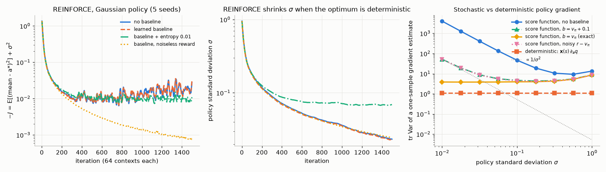

### 11.2 Squashing and clipping in practice

Section 2.3 gave the three options. Two practical points remain. First, when the action is squashed by $\tanh$, the policy's log-probabilities and entropy must include the Jacobian term (10.5). Otherwise an entropy bonus computed for $u$ keeps rewarding a wider $u$, even though the squashed actions then pile up at $\pm1$. Second, a learned state-independent $\log\sigma$ is the usual default for on-policy methods (A2C, PPO). State-dependent $\sigma_{\boldsymbol\theta}(s)$ heads are more common in off-policy maximum-entropy methods (SAC).

### 11.3 Preview: deterministic policy gradients

Section 11.1 suggests a limit: let $\sigma\to0$ and use the action-gradient of $q$ directly. For a **deterministic** policy $a=\mu_{\boldsymbol\theta}(s)$, Silver, Lever, Heess, Degris, Wierstra & Riedmiller (2014) proved the **deterministic policy gradient theorem**:

$$
\nabla J(\boldsymbol\theta)=\sum_s\eta_\gamma(s)\;\nabla_{\boldsymbol\theta}\mu_{\boldsymbol\theta}(s)\;\nabla_aq_{\mu}(s,a)\Big|_{a=\mu_{\boldsymbol\theta}(s)},
\tag{10.29}
$$

where $\nabla_{\boldsymbol\theta}\mu_{\boldsymbol\theta}(s)$ is the Jacobian of the action with respect to the parameters. They also showed that it is the $\sigma\to0$ limit of the stochastic policy gradient under regularity conditions. Comparing (10.9) and (10.29):

| | stochastic PG (10.9) | deterministic PG (10.29) |
|---|---|---|
| expectation over | states **and actions** | states only |
| needs from the critic | values $q$ (or advantages) | the **action-gradient** $\nabla_aq$ |
| gradient estimator type | score function (zeroth order) | pathwise / reparameterization (first order, [Chapter 00](00-math-toolkit.md), Section 6.4) |
| exploration | built into the policy | must be added (noise), so learning is naturally **off-policy** |
| actions | discrete or continuous | continuous only |

The deterministic gradient needs a differentiable critic $\hat q(s,a,\mathbf w)$ trained off-policy, and that is a different set of problems. It is the basis of DDPG and TD3, while SAC uses the reparameterized stochastic analogue; all three are in [Chapter 12](12-continuous-control-actor-critic.md).

---

## 12. The discount factor in practice

Look back at (10.13) and (10.15): the update at time $t$ carries a factor $\gamma^t$. Now look at almost any implementation, including ours in [`reinforce_cartpole.py`](../code/ch10_policy_gradients/reinforce_cartpole.py) and [`a2c_gae_cartpole.py`](../code/ch10_policy_gradients/a2c_gae_cartpole.py), or at the papers behind A3C, TRPO and PPO. The $\gamma^t$ is gone, and every time step in the batch is weighted equally. What does the resulting estimator estimate? Repeat the argument of Section 4.3 without the factor:

$$
\mathbb E\Big[\sum_{t}G_t\,\nabla\log\pi(A_t\mid S_t)\Big]=\sum_s\eta_1(s)\sum_aq_\pi(s,a)\nabla\pi(a\mid s),
\tag{10.30}
$$

where $q_\pi$ is still the **discounted** action value, because $G_t$ is still a discounted return, but the states are weighted by **undiscounted** visit counts $\eta_1$. This hybrid is neither $\nabla J_\gamma$, which would use $\eta_\gamma$, nor the gradient of the undiscounted return, which would use $q$ with $\gamma=1$. Thomas (2014) pointed out the missing factor in several natural actor-critic algorithms. Nota & Thomas (2020) proved that the direction (10.30) is, in general, **not the gradient of any function**, and showed that for some tasks its fixed point is the *pessimal* policy for both the discounted and the undiscounted objective.

**An example.** [`discount_bias.py`](../code/ch10_policy_gradients/discount_bias.py) builds a tiny MDP of our own in that spirit, with $\gamma=0.5$ and one shared parameter, $p=\pi(\text{R})=\sigma(\theta)$ in every decision state. In $s_0$, action R pays $+1$ and L pays 0, and both lead to $s_1$. In $s_1$, L pays $+2.5$ and ends the episode, while R leads through three reward-free corridor states to a final reward of $+8$. Exactly (the script checks these closed forms to $10^{-14}$):

* the discounted objective $J_\gamma(p)=p+\gamma[(1-p)2.5+p\gamma^38]$ has $dJ_\gamma/d\theta=+0.25\,p(1-p)$, so the best policy is $p=1$;
* the undiscounted objective has $dJ_1/d\theta=+6.5\,p(1-p)$, so its best policy is also $p=1$;
* the no-$\gamma^t$ update (10.30) has expectation $-0.5\,p(1-p)$, which pushes towards $p=0$, the **worst** policy under both objectives.

The mechanism is visible in the numbers. In $s_1$ the *discounted* values prefer L ($2.5$ against $\gamma^3\cdot8=1$), and the no-$\gamma^t$ estimator gives $s_1$ full weight, as if it were as important as $s_0$. The true discounted gradient weights $s_1$ by $\gamma=0.5$, and the undiscounted one uses undiscounted values. Sampled REINFORCE (step size 0.05, 20,000 episodes, 100 runs) agrees with the analysis: with $\gamma^t$, all 100 runs end at $p\ge0.989$ (mean 0.996), which is the optimum. Without $\gamma^t$, **94 of the 100 runs end with $p<0.5$** (mean final $p=0.062$), giving $J_\gamma=1.265$ and $J_1=2.90$. The optima are 1.500 and 9.00, and the worst possible values are 1.250 and 2.50. The few runs that drifted towards $p\approx1$ early stay there, because the expected update $-0.5\,p(1-p)$ vanishes at both ends.

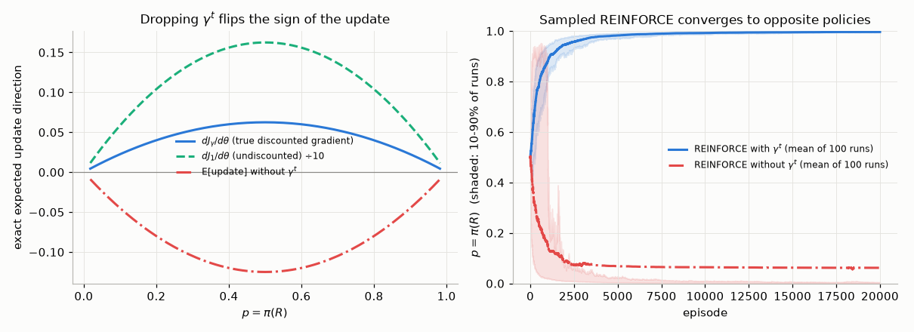

**So why does everyone drop it?** Because the objective people actually care about is usually the undiscounted (or average) return, and $\gamma$ is used as a variance-reduction device (Section 8.3), not as part of the problem definition. With $\gamma^t$ kept, a state reached at step 300 of a CartPole episode would get weight $0.99^{300}\approx0.05$. The agent would barely learn to act late in an episode, although late failures cost as much reward as early ones. Dropping $\gamma^t$ samples states from the on-policy distribution, as the average-reward theorem (10.14) requires, and uses discounted values as a lower-variance, biased stand-in for differential values. As $\gamma\to1$ this approaches the average-reward gradient (Baxter & Bartlett, 2001; Kakade, 2001, "Optimizing average reward using discounted rewards"). The practical lessons:

* Know which objective you are optimizing. With $\gamma^t$ dropped, the honest description is "an approximation to the average-reward or undiscounted gradient, biased by $\gamma<1$", not "the gradient of the discounted return".
* The bias is usually benign when $\gamma$ is close to 1 and the policy class is rich (with a tabular softmax, any positive state weighting points to the same optimal policy). It can bite with shared parameters or aliased states and a small $\gamma$, as above.
* In the random MDP of Section 6.4, the no-$\gamma^t$ direction has cosine 0.998 with the true gradient but a bias of norm 0.46 (with $\lVert\nabla J\rVert=0.94$): close in direction, wrong in detail.

---

## 13. Compatible function approximation

Actor-critic methods replace $q_\pi$ in (10.9) by a learned approximation, and Section 7.2 showed that this biases the gradient in general. Is there a critic that introduces **no** bias, even though it is only approximate? Sutton, McAllester, Singh & Mansour (2000) gave a surprising answer.

> **Theorem 10.3 (Compatible function approximation; Sutton et al., 2000).** Let $f_{\mathbf w}(s,a)$ be an approximation of $q_\pi$ such that
>
> (i) it is **compatible** with the policy parameterization,
>
> $$
> \nabla_{\mathbf w}f_{\mathbf w}(s,a)=\nabla_{\boldsymbol\theta}\log\pi_{\boldsymbol\theta}(a\mid s)=\boldsymbol\psi(s,a),
> \tag{10.31}
> $$
>
> (ii) $\mathbf w$ minimizes the mean-squared error $\mathcal E(\mathbf w)=\mathbb E_{S\sim d^\pi_\gamma,A\sim\pi}\big[(q_\pi(S,A)-f_{\mathbf w}(S,A))^2\big]$ (or is any stationary point of it).
>
> Then
>
> $$
> \nabla J(\boldsymbol\theta)=\Big(\sum_s\eta_\gamma(s)\Big)\,\mathbb E_{S\sim d^\pi_\gamma,A\sim\pi}\big[f_{\mathbf w}(S,A)\,\nabla\log\pi(A\mid S)\big].
> \tag{10.32}
> $$

*Proof.* At a stationary point of $\mathcal E$, $\nabla_{\mathbf w}\mathcal E=-2\,\mathbb E\big[(q_\pi-f_{\mathbf w})\nabla_{\mathbf w}f_{\mathbf w}\big]=\mathbf 0$. By compatibility, $\nabla_{\mathbf w}f_{\mathbf w}=\nabla\log\pi$, so $\mathbb E\big[(q_\pi(S,A)-f_{\mathbf w}(S,A))\nabla\log\pi(A\mid S)\big]=\mathbf 0$, that is, $\mathbb E[q_\pi\nabla\log\pi]=\mathbb E[f_{\mathbf w}\nabla\log\pi]$. Multiply by $\sum_s\eta_\gamma(s)$ and compare with (10.9). $\square$

The error of the critic is orthogonal to the score directions, which are the only directions the gradient "sees". Consequences:

* **The critic is linear in the score features**, $f_{\mathbf w}(s,a)=\mathbf w^\top\boldsymbol\psi(s,a)$, and these features change whenever $\boldsymbol\theta$ changes.
* **It approximates the advantage, not $q$.** Since $\sum_a\pi(a\mid s)\boldsymbol\psi(s,a)=\mathbf 0$, $f_{\mathbf w}$ has zero mean over actions in every state. It can at best represent $A_\pi$, and in practice it is paired with a separate state-value baseline.
* **Its weights are the natural gradient.** The normal equations of (ii) are $\mathbf F\mathbf w=\mathbb E[\boldsymbol\psi q_\pi]$, with the **Fisher information matrix** $\mathbf F\doteq\mathbb E_{d^\pi_\gamma,\pi}[\boldsymbol\psi\boldsymbol\psi^\top]$. By (10.9) the right-hand side is $\nabla J/\sum_s\eta_\gamma(s)$, so

  $$
  \mathbf w=\frac{1}{\sum_s\eta_\gamma(s)}\,\mathbf F^{-1}\nabla J(\boldsymbol\theta),
  \tag{10.33}
  $$

  which is, up to a positive scalar, the **natural policy gradient** of Kakade (2001). Fitting a compatible critic and stepping $\boldsymbol\theta\leftarrow\boldsymbol\theta+\alpha\mathbf w$ is natural-gradient ascent, the idea behind the Natural Actor-Critic of Peters & Schaal (2008). For the tabular softmax the compatible features span all zero-mean functions of the action, so the compatible critic recovers $A_\pi$ exactly and the natural-gradient step adds a multiple of $A_\pi(s,a)$ to every preference $\theta_{s,a}$. [Chapter 11](11-trust-regions-and-ppo.md), Sections 4–5, develops the Fisher geometry, this tabular "soft policy iteration" and why it escapes the plateaus of the vanilla gradient.

**Numerical check** (Parts C and D of [`pg_theorem_check.py`](../code/ch10_policy_gradients/pg_theorem_check.py), exact computation, no sampling). With a 4-feature linear softmax policy on a random MDP, the compatible critic fitted by weighted least squares reproduces $\nabla J$ to $9\times10^{-16}$. Yet it is a poor approximation of the advantage itself: its weighted RMS error is 0.58, against an RMS advantage of 0.98. Its weights equal $\mathbf F^+\nabla J/\sum_s\eta_\gamma(s)$ to $5\times10^{-16}$. Non-compatible linear critics fitted to $q_\pi$ in the same way, with 4, 8 and 12 random features (one of them constant), have RMS errors of 0.87, 0.64 and 0.55. They give gradients with relative errors of 41%, 38% and 13%. Only with 15 = $\lvert\mathcal S\rvert\lvert\mathcal A\rvert$ features, enough to represent $q_\pi$ exactly, does the error vanish. For the tabular softmax (Part D), the compatible critic equals $A_\pi$ to $3\times10^{-15}$.

The theorem is rarely applied literally in deep RL, where the critic is a separate network and $\boldsymbol\psi$ has millions of components. Its lessons are still central: critic errors bias the gradient only through their correlation with the score, advantages are the right thing to learn, and the Fisher matrix is the right geometry.

---

## 14. Off-policy actor-critic at scale: IMPALA and V-trace

### 14.1 The architecture

A2C's synchronous update makes every environment wait for the slowest one, and A3C's threads each need a full copy of the learner. Espeholt, Soyer, Munos, Simonyan, Mnih, Ward, Doron, Firoiu, Harley, Dunning, Legg & Kavukcuoglu (2018) separated the two roles. In **IMPALA** (Importance Weighted Actor-Learner Architecture), many **actors** only generate trajectories, each with a local copy of the policy that is refreshed periodically, and send the trajectories to a central **learner** (on a GPU), which computes large batched updates. Actors never compute gradients. Throughput grows with the number of actors, but the data are now slightly **off-policy**: a trajectory was generated by the actor's stale policy $b$, while the learner's current policy is $\pi$. Ignoring this *policy lag* biases the update. Full importance sampling corrects it, at the cost of products of ratios whose variance grows with the horizon ([Chapter 04](04-monte-carlo.md)). V-trace is the compromise.

### 14.2 V-trace targets

For a trajectory segment $S_s,A_s,R_{s+1},\dots,S_{s+n}$ generated by $b$, define the truncated importance ratios

$$
\rho_t=\min\Big(\bar\rho,\frac{\pi(A_t\mid S_t)}{b(A_t\mid S_t)}\Big),\qquad c_t=\min\Big(\bar c,\frac{\pi(A_t\mid S_t)}{b(A_t\mid S_t)}\Big),\qquad \bar\rho\ge\bar c,
$$

and the **V-trace target** for $V(S_s)$, written with this course's reward index ($R_{t+1}$ follows $A_t$):

$$
v_s\doteq V(S_s)+\sum_{t=s}^{s+n-1}\gamma^{t-s}\Big(\prod_{i=s}^{t-1}c_i\Big)\rho_t\big(R_{t+1}+\gamma V(S_{t+1})-V(S_t)\big),
\tag{10.34}
$$

computed backwards by $v_s-V(S_s)=\rho_s\delta_s+\gamma c_s\big(v_{s+1}-V(S_{s+1})\big)$, with $\delta_s=R_{s+1}+\gamma V(S_{s+1})-V(S_s)$ the plain (unweighted) TD error. Some properties:

* **On-policy** ($\pi=b$, $\bar\rho,\bar c\ge1$): all ratios are 1 and $v_s$ is the $n$-step return $G_{s:s+n}$. V-trace is a generalization of the $n$-step target.
* **The two truncations do different jobs.** $c_i$, as in Retrace (Munos, Stepleton, Harutyunyan & Bellemare, 2016), cuts the traces, which controls the variance of the products and the speed of contraction. $\rho_t$ decides **which policy is evaluated**. Espeholt et al. (2018, Theorem 1) prove that the V-trace operator is a contraction whose unique fixed point is the value function of

  $$
  \pi_{\bar\rho}(a\mid s)=\frac{\min\big(\bar\rho\,b(a\mid s),\,\pi(a\mid s)\big)}{\sum_{a'}\min\big(\bar\rho\,b(a'\mid s),\,\pi(a'\mid s)\big)},
  \tag{10.35}
  $$

  which is $\pi$ when $\bar\rho\ge\max_a\pi(a\mid s)/b(a\mid s)$ (in particular when $\bar\rho=\infty$) and moves towards $b$ as $\bar\rho$ shrinks.

[Chapter 06](06-n-step-and-eligibility-traces.md), Section 14.4, derives this fixed point. In one line: at $V=v_{\pi_{\bar\rho}}$ every correction term has conditional mean $\mathbb E_b[\rho_t\delta_t\mid S_t]\propto\sum_a\pi_{\bar\rho}(a\mid S_t)\big(q_V(S_t,a)-V(S_t)\big)=0$, by the Bellman equation of $\pi_{\bar\rho}$.

Note what V-trace does **not** correct. The importance ratios fix the *action* distribution at each visited state, but the states themselves are still visited with the behavior policy's frequencies. Even with $\bar\rho=\infty$, weighting states by the behavior policy's visitation gives $\sum_sd^b(s)\sum_a\nabla\pi(a\mid s)q_\pi(s,a)$. This is neither $\nabla J$ nor the gradient of the off-policy "excursion" objective $J_b=\sum_sd^b(s)v_\pi(s)$. Degris, White & Sutton (2012) obtained it from $\nabla J_b$ by dropping a term involving $\nabla q_\pi$, and Imani, Graves & White (2018) showed that the exact gradient of $J_b$ needs *emphatic* state weightings, and that the semi-gradient can converge to poor solutions. With small policy lag, $d^b\approx d^\pi$, and IMPALA simply accepts the difference.

### 14.3 The learner's update

The learner regresses $V(S_s)$ on $v_s$ and updates the policy with an importance-weighted advantage that uses the V-trace target of the *next* state:

$$
\rho_s\,\nabla\log\pi(A_s\mid S_s)\,\big(R_{s+1}+\gamma v_{s+1}-V(S_s)\big),
\tag{10.36}
$$

plus an entropy bonus. The single ratio $\rho_s$ corrects for the action having been sampled from $b$. The truncation at $\bar\rho$ (1 in the paper's experiments) keeps the weights bounded, a cousin of PPO's clipped ratio ([Chapter 11](11-trust-regions-and-ppo.md)).

```text
Algorithm 10.8  IMPALA learner step with V-trace (one batch of actor trajectories)
Input:  segments (S_s..S_{s+n}, A, R, and the actor's probabilities b(A_t|S_t)) from many actors;
        current policy pi(.|., theta) and critic V(., w)
Parameters: rho_bar >= c_bar; gamma; step sizes; c_H
for every segment:
    rho_t <- min(rho_bar, pi(A_t|S_t) / b(A_t|S_t));   c_t <- min(c_bar, pi(A_t|S_t) / b(A_t|S_t))
    rho_delta_t <- rho_t * (R_{t+1} + gamma * V(S_{t+1}) - V(S_t))  # V(S_{t+1}) = 0 if S_{t+1} is terminal
    acc <- 0;  v_{s+n} <- V(S_{s+n})
    for t = s+n-1 down to s:
        acc <- rho_delta_t + gamma * c_t * acc                        # (zero acc across episode ends)
        v_t <- V(S_t) + acc                                           # (10.34)
critic:  w <- w + alpha^w * sum_t (v_t - V(S_t)) grad V(S_t)
actor:   theta <- theta + alpha^theta * sum_t [ rho_t (R_{t+1} + gamma v_{t+1} - V(S_t)) grad log pi(A_t|S_t)
                                                 + c_H grad entropy(pi(.|S_t)) ]          # (10.36)
         # v_{t+1} := 0 if S_{t+1} is terminal; if the episode was truncated at t+1, use V(true final obs);
         # never the target of the next episode's first state
send the new theta to the actors (asynchronously)
```

**Numerical check.** Complementing the chain experiment of [Chapter 06](06-n-step-and-eligibility-traces.md), [`vtrace_tabular.py`](../code/ch10_policy_gradients/vtrace_tabular.py) learns a tabular $V$ with V-trace from episodes of a near-uniform behavior policy $b$ in a random 5-state MDP, for a fairly greedy target $\pi$ (largest ratio $\pi/b$ = 2.2). It then compares the result with the exact $v_\pi$, $v_b$ and $v_{\pi_{\bar\rho}}$:

| $\bar\rho$ | $\bar c$ | $\lVert V-v_{\pi_{\bar\rho}}\rVert_\infty$ | $\lVert V-v_\pi\rVert_\infty$ | $\lVert V-v_b\rVert_\infty$ | $\lVert v_{\pi_{\bar\rho}}-v_\pi\rVert_\infty$ (exact) |
|---|---|---|---|---|---|
| $\infty$ | 1 | 0.011 | 0.011 | 0.62 | 0 |
| 2 | 1 | 0.025 | 0.031 | 0.63 | 0.034 |
| 1 | 1 | 0.012 | 0.43 | 0.26 | 0.42 |
| 1 | 0 | 0.006 | 0.42 | 0.25 | 0.42 |
| 0.5 | 0.5 | 0.006 | 0.65 | 0.34 | 0.66 |

(After 400 iterations, each averaging the V-trace targets of 2,000 behavior episodes, with a decaying step size.) In every row the learned values agree with $v_{\pi_{\bar\rho}}$ to within sampling noise (0.006–0.025). Whenever $\bar\rho\le1$ moves the fixed point well away from $v_\pi$, they clearly do *not* agree with $v_\pi$. (At $\bar\rho=\infty$ the two targets coincide, and at $\bar\rho=2$ they are only 0.034 apart, too close for this experiment to tell apart.) With $\bar\rho=1$, IMPALA's setting, V-trace evaluates a policy whose value differs from the target's by 0.42 in the worst state, because here $\pi$ is far from $b$ (ratios up to 2.2). With only a few updates of policy lag the gap is much smaller. Setting $\bar c=0$ leaves the fixed point unchanged, as the theory says: only $\bar\rho$ moves it.

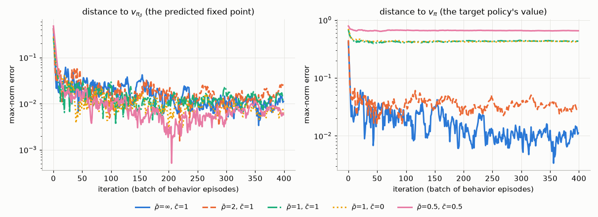

V-trace thus trades a known, controllable bias, towards the behavior policy, for bounded variance. With small policy lag the ratios are near 1 and the bias is small. IMPALA-style learners, and later distributed agents built on them, use this correction routinely.

---

## 15. Policy search without the policy gradient theorem: finite differences, evolution strategies and random search

Every method in this chapter so far injects its exploration noise into the **actions** and uses the score $\nabla\log\pi(A_t\mid S_t)$ to credit each action with what followed. An older family ignores the structure of the MDP altogether. It treats the expected episodic return $J(\boldsymbol\theta)$ as a black-box function of the parameters, perturbs the **parameters** themselves, runs whole episodes and compares their returns. It needs no score function, no backpropagation, no value function and not even the Markov property. The policy may be deterministic and non-differentiable, and the evaluations are independent, so the work parallelizes trivially. The price is a gradient estimate whose variance grows with the number of parameters $d=\dim\boldsymbol\theta$ instead of with the horizon. These methods remain strong baselines: linear policies trained by random search are competitive on the MuJoCo locomotion benchmarks (Section 15.4).

### 15.1 Finite differences and SPSA

The most direct estimator perturbs one coordinate at a time. **Central finite differences** use

$$
\frac{\partial J}{\partial\theta_i}\approx\frac{\hat J(\boldsymbol\theta+h\mathbf e_i)-\hat J(\boldsymbol\theta-h\mathbf e_i)}{2h},\qquad i=1,\dots,d,
$$

where $\hat J$ is the return of one episode (or the mean of a few). Inside a stochastic-approximation loop this is the Kiefer–Wolfowitz (1952) scheme ([Chapter 00](00-math-toolkit.md), Historical notes). Two details matter in RL. First, $\hat J$ is noisy and the noise is divided by $h$. Running both members of a pair with the **same environment seed** (*common random numbers*) cancels most of the noise from the start state and the transitions, as long as the two policies behave alike. Second, one gradient costs $2d$ episodes. That is cheap for CartPole's four parameters and hopeless for a network with $10^5$ weights.

**SPSA** (simultaneous perturbation stochastic approximation; Spall, 1992) perturbs all coordinates at once, along a random direction $\boldsymbol\Delta\in\lbrace-1,+1\rbrace^d$ with independent fair signs:

$$
\hat{\mathbf g}=\frac{\hat J(\boldsymbol\theta+c\boldsymbol\Delta)-\hat J(\boldsymbol\theta-c\boldsymbol\Delta)}{2c}\,\boldsymbol\Delta .
$$

By Taylor expansion the difference quotient is $\boldsymbol\Delta^\top\nabla J+O(c^2)$, and $\mathbb E[\boldsymbol\Delta\boldsymbol\Delta^\top]=\mathbf I$. So $\mathbb E\hat{\mathbf g}=\nabla J+O(c^2)$ from **two** episodes, whatever $d$ is. The components of $\nabla J$ along the other $d-1$ directions do not vanish; they become noise. With exact evaluations and small $c$, $\hat{\mathbf g}\approx(\boldsymbol\Delta^\top\nabla J)\boldsymbol\Delta$, and because $\lVert\boldsymbol\Delta\rVert^2=d$ its total variance is $\mathbb E\lVert\hat{\mathbf g}\rVert^2-\lVert\nabla J\rVert^2=(d-1)\lVert\nabla J\rVert^2$. That trade, fewer evaluations per estimate for more variance per estimate, runs through the rest of this section.

### 15.2 Gaussian smoothing: the score function in parameter space

Replace the random signs by a Gaussian, and the objective by its smoothed version

$$
J_\sigma(\boldsymbol\theta)\doteq\mathbb E_{\boldsymbol\xi}\big[J(\boldsymbol\theta+\sigma\boldsymbol\xi)\big],\qquad\boldsymbol\xi\sim\mathcal N(\mathbf 0,\mathbf I_d).
$$

The perturbed vector $\tilde{\boldsymbol\theta}=\boldsymbol\theta+\sigma\boldsymbol\xi$ is a sample from the **search distribution** $\mathcal N(\boldsymbol\theta,\sigma^2\mathbf I)$. Its score with respect to the mean is $(\tilde{\boldsymbol\theta}-\boldsymbol\theta)/\sigma^2=\boldsymbol\xi/\sigma$. The score-function estimator of [Chapter 00](00-math-toolkit.md), Section 6.2, then gives

$$
\nabla J_\sigma(\boldsymbol\theta)=\frac1\sigma\,\mathbb E\big[J(\boldsymbol\theta+\sigma\boldsymbol\xi)\,\boldsymbol\xi\big]
\tag{10.37}
$$

(Nesterov & Spokoiny, 2017, analyse optimization with this gradient-free oracle). This is REINFORCE with a single "action" per episode. The action is the whole parameter vector, drawn once before the episode starts, and the reward is the episode's return. If $J$ is differentiable, Stein's lemma (Section 11.1) turns (10.37) into $\nabla J_\sigma=\mathbb E[\nabla J(\boldsymbol\theta+\sigma\boldsymbol\xi)]$, an average of true gradients that tends to $\nabla J$ as $\sigma\to0$ (Exercise 10.14). But (10.37) never uses $\nabla J$. It still works when $J$ jumps as $\boldsymbol\theta$ changes, as it does for a deterministic policy with discrete actions, because $J_\sigma$ is smooth even then.

**Baselines and antithetic pairs.** Because $\mathbb E[\boldsymbol\xi]=\mathbf 0$, any constant may be subtracted from $J$ in (10.37) without bias, exactly as in Section 6.1. Not subtracting one is costly. The one-sample estimator $J(\boldsymbol\theta+\sigma\boldsymbol\xi)\boldsymbol\xi/\sigma$ contains the term $J(\boldsymbol\theta)\boldsymbol\xi/\sigma$. It has mean zero and total variance $dJ(\boldsymbol\theta)^2/\sigma^2$: the baseline error of Section 11.1, amplified by $1/\sigma$, now in all $d$ coordinates. The standard cure evaluates each $\boldsymbol\xi$ in both directions:

$$
\nabla J_\sigma(\boldsymbol\theta)=\frac1{2\sigma}\,\mathbb E\Big[\big(J(\boldsymbol\theta+\sigma\boldsymbol\xi)-J(\boldsymbol\theta-\sigma\boldsymbol\xi)\big)\boldsymbol\xi\Big].
\tag{10.38}
$$

The difference cancels $J(\boldsymbol\theta)$ and every even-order term of the Taylor expansion. On a quadratic the antithetic estimator is exactly $(\nabla J^\top\boldsymbol\xi)\boldsymbol\xi$, with total variance $(d+1)\lVert\nabla J\rVert^2$ (Exercise 10.15). That factor, $d+1$ for Gaussian directions and $d-1$ for SPSA's random signs, is the cost of probing a $d$-dimensional gradient along one random direction at a time. It is why black-box methods scale with $\dim\boldsymbol\theta$. The relative variance of REINFORCE has no such explicit factor of $d$. It grows instead with the horizon (a sum of $T$ scores, Section 6) and with the action dimension.

**Fitness shaping.** Following Wierstra et al. (2014), Salimans et al. (2017) replace the $2N$ returns of a batch by their **centred ranks**, evenly spaced values in $[-\tfrac12,\tfrac12]$. The update becomes invariant to any increasing transformation of the returns, and a single outlier episode can no longer dominate a step. Because the ranks sum to zero, they also act as a baseline. The price is that the step no longer estimates (10.37) exactly; it follows a rank-based utility instead.

**What changes when the noise moves into parameter space.** One perturbation is held for a whole episode, so exploration is consistent over time. [Chapter 14](14-exploration.md), Sections 2 and 11, discusses the same idea for gradient-based agents (parameter-space noise; Plappert et al., 2018). Only the total return enters, so, as Salimans et al. stress, ES is invariant to the action frequency (frame-skip) and to delayed rewards, and tolerates very long horizons without discounting. The other side of the same coin is that ES throws away the temporal structure the rest of this chapter exploits. Every action of an episode gets the same credit, as in total-return REINFORCE before reward-to-go (Sections 4.3 and 6.4), and there is no critic to bootstrap from.

```text
Algorithm 10.9  Antithetic evolution strategies with centred-rank fitness shaping (OpenAI-ES style)
Input:  initial theta in R^d; noise scale sigma; pairs N; step size alpha (or an Adam optimizer)
loop:
    for i = 1..N (in parallel, one worker per pair):
        xi_i ~ N(0, I_d);  choose an environment seed s_i
        F_i+ <- return of one episode of the policy theta + sigma*xi_i, seed s_i
        F_i- <- return of one episode of the policy theta - sigma*xi_i, seed s_i    # common random numbers
    u <- centred ranks of the 2N returns (F_1+..F_N+, F_1-..F_N-), spread evenly over [-1/2, 1/2]
    g <- (1 / (2 N sigma)) * sum_i (u_i+ - u_i-) * xi_i                              # (10.38) on ranks
    theta <- theta + alpha * g          (OpenAI-ES: an Adam step on g, plus weight decay)
```

### 15.3 Adapting the search distribution: NES, CMA-ES, PGPE and CEM

Algorithm 10.9 keeps the covariance of the search distribution fixed at $\sigma^2\mathbf I$. **Natural evolution strategies** (NES; Wierstra, Schaul, Glasmachers, Sun, Peters & Schmidhuber, 2014) treat the mean *and* the covariance as parameters $\boldsymbol\phi$ of the search distribution. They estimate $\nabla_{\boldsymbol\phi}\mathbb E_{\tilde{\boldsymbol\theta}\sim p_{\boldsymbol\phi}}[J(\tilde{\boldsymbol\theta})]$ with the score function and follow the **natural gradient** $\mathbf F_{\boldsymbol\phi}^{-1}\nabla_{\boldsymbol\phi}$, the steepest-ascent direction when distances between search distributions are measured by the KL divergence ([Chapter 11](11-trust-regions-and-ppo.md), Section 5). For the mean of $\mathcal N(\boldsymbol\theta,\sigma^2\mathbf I)$ the Fisher matrix is $\mathbf I/\sigma^2$, so the natural gradient is just $\sigma^2$ times (10.37). Fixed-covariance ES is NES with the covariance frozen. Once the covariance adapts, the natural gradient matters, because it makes the update independent of how the covariance is parameterized.

**CMA-ES** (covariance matrix adaptation; Hansen & Ostermeier, 2001) is the heavily engineered practical relative. It uses rank-based weights, a full covariance matrix updated from successful steps and from an "evolution path" of recent mean shifts, and separate step-size control. Its $O(d^2)$ covariance limits it to at most a few thousand parameters, but within that range it is among the most reliable black-box optimizers. It trained the small linear controller of World Models ([Chapter 13](13-model-based-rl.md), Section 7.2). **PGPE** (parameter-exploring policy gradients; Sehnke, Osendorfer, Rückstieß, Graves, Peters & Schmidhuber, 2010) reached the same estimator from the RL side. It is a likelihood-ratio gradient with respect to the mean and per-parameter standard deviations of a Gaussian over policy parameters, with symmetric sampling and a baseline. Its stated motivation is the variance of per-step action noise.

The **cross-entropy method** needs no gradient at all. It samples $N$ parameter vectors from $\mathcal N(\mathbf m,\operatorname{diag}\mathbf v)$, runs an episode with each, and refits $\mathbf m$ and $\mathbf v$ to the $K$ best. This is the elite refit of Algorithm 13.2, applied once per batch of episodes to policy parameters instead of at every time step to action sequences. Left alone, the elite variance can shrink faster than the mean improves, and the search stalls before it reaches a good policy. Szita & Lőrincz (2006) fixed this for Tetris by adding noise to the variance at every refit, decreasing over time. Cross-entropy search over the weights of a linear evaluation function then remained the method to beat on Tetris for years; approximate dynamic programming only caught up later (Gabillon, Ghavamzadeh & Scherrer, NIPS 2013).

Replace the hard elite cut by soft weights and you obtain the **reward-weighted** family that was widely used in episodic robot learning. The new mean is a weighted average of the sampled parameters, $\mathbf m\leftarrow\sum_iw_i\tilde{\boldsymbol\theta}_i/\sum_iw_i$, with weights that increase with the return. RWR (reward-weighted regression; Peters & Schaal, 2007) introduced weights that exponentiate the reward, $e^{R/\kappa}$ with a temperature $\kappa$, inside an expectation-maximization step. It was stated for immediate rewards, as a weighted regression of actions on states ([Chapter 12](12-continuous-control-actor-critic.md), Section 9.3). PoWER (Kober & Peters, NIPS 2008) carried this EM view over to episodic search and learned ball-in-a-cup on a real Barrett WAM arm. PI² (Theodorou, Buchli & Schaal, 2010) derives exponentiated-cost weights $w_i\propto\exp(-\text{cost}_i/\kappa)$ from path-integral stochastic optimal control. The policies were **dynamical movement primitives** (DMPs; Ijspeert, Nakanishi, Hoffmann, Pastor & Schaal, 2013): stable attractor dynamics whose shape is set by a few dozen weights per joint. This keeps $d$ small and makes episodic parameter perturbation efficient. MPPI ([Chapter 13](13-model-based-rl.md), Section 4.3) is the action-sequence counterpart of these updates. [Chapter 12](12-continuous-control-actor-critic.md), Section 9, derives the whole reward-weighted family as KL-regularized policy search over the search distribution (episodic REPS), which also tells you how to choose the temperature $\kappa$ (called $\eta$ there).

### 15.4 Random search with linear policies: ARS

Mania, Guy & Recht (2018) asked how far the plainest version of (10.38) goes. **Basic random search** takes antithetic steps along random directions, without rank shaping. **Augmented random search** (ARS) adds three cheap fixes:

* it divides the step by the standard deviation $\sigma_R$ of the returns used in it, an adaptive step size;
* it normalizes states by a running mean and standard deviation (the "V2" variants);
* it updates only along the $b$ of $N$ directions with the highest $\max(r^+,r^-)$ (the "-t" variants).

With **static linear policies**, ARS matched the sample efficiency of the best deep RL methods of the time on the MuJoCo locomotion benchmarks, at a computational cost at least 15 times lower than the fastest competing model-free methods. The authors' larger point was about evaluation. Across many seeds and hyperparameters the spread of outcomes was large, and a benchmark that random search over linear policies solves says little about deep RL ([Chapter 20](20-deep-rl-in-practice.md)).

```text
Algorithm 10.10  Augmented Random Search, V2-t (Mania, Guy & Recht, 2018)
Input:  step size alpha; noise nu; directions N; top-b <= N
Initialise: M <- 0 (linear policy, dim(A) x dim(S));  mu <- 0, Sigma <- I (running state statistics)
loop:
    sample delta_1..delta_N, each the shape of M with i.i.d. N(0,1) entries
    for k = 1..N (in parallel):
        r_k+ <- return of one episode with a = (M + nu*delta_k) diag(Sigma)^(-1/2) (s - mu)
        r_k- <- return of one episode with a = (M - nu*delta_k) diag(Sigma)^(-1/2) (s - mu)
    keep the b directions with the largest max(r_k+, r_k-)
    sigma_R <- standard deviation of the 2b returns kept
    M <- M + alpha / (b * sigma_R) * sum over kept k of (r_k+ - r_k-) * delta_k
    update mu, Sigma with all states visited in this iteration
```

### 15.5 Scale: OpenAI-ES, deep neuroevolution and quality-diversity

Salimans, Ho, Chen, Sidor & Sutskever (2017) showed that Algorithm 10.9 scales to deep networks and more than a thousand CPU cores. The key is communication. All workers share the random seeds, so each can regenerate every other worker's $\boldsymbol\xi_i$, and they exchange only **scalar returns**, never gradient vectors. With 1,440 workers, ES solved the MuJoCo 3D humanoid task in about 10 minutes. On Atari, one hour of ES on 720 cores used about as much computation as the published one-day A3C runs, and did better on 23 games and worse on 28. Such, Madhavan, Conti, Lehman, Stanley & Clune (2017) dropped the gradient estimate altogether. A simple **genetic algorithm** (Gaussian mutations and truncation selection, without crossover) evolved Atari networks with over four million parameters. It beat DQN, A3C or ES on some games and lost on others, and it stored each individual as a list of seeds.

Populations also make it natural to search for *diversity*, not return alone. **Novelty search** (Lehman & Stanley, 2011) rewards behaviour unlike anything in an archive of past behaviours and ignores the objective entirely. It solves deceptive mazes in which climbing the return leads into a dead end. **MAP-Elites** (Mouret & Clune, 2015) keeps an archive with the best solution found in each cell of a grid over behaviour descriptors. This "quality-diversity" idea of an archive of cells reappears in Go-Explore ([Chapter 14](14-exploration.md), Section 9).

### 15.6 What the numbers say

[`black_box_search.py`](../code/ch10_policy_gradients/black_box_search.py) runs two experiments.

**CartPole with a linear policy.** The deterministic policy $a=\mathbb 1[\boldsymbol\theta^\top s>0]$ has $d=4$ parameters. It starts at $\boldsymbol\theta=\mathbf 0$, which fails after about 9 steps. Each method gets 640 training episodes on each of 5 seeds. The black-box settings were set once, not tuned per method: perturbation scale 0.1 and Adam with step size 0.05 for finite differences, SPSA and ES (8 pairs); 16 samples, 4 elites, initial standard deviation 1 and extra variance 0.01 for CEM; $N=8$, $b=4$, $\nu=0.1$, $\alpha=0.05$ for ARS. Perturbed pairs share an environment seed. For reference, REINFORCE trains a *stochastic* logistic policy $\pi(\text{right}\mid s)=1/(1+e^{-\boldsymbol\theta^\top s})$ with the same 4 parameters (reward-to-go, learned linear baseline, Adam with step size 0.1, the best of 0.01, 0.03, 0.1 and 0.3 on these same seeds, which if anything favours it), and the MLP of Section 6.4. Every 16 training episodes the current policy is evaluated on 10 fixed episodes that do not count towards the budget.

| method | episodes per update | training episodes until the evaluation averages $\ge475$: median (per seed) | env steps until then (median) | final evaluation return (mean of 5 seeds) |
|---|---|---|---|---|
| finite differences | 8 | 32 (48, 32, 32, 32, 32) | 6.4k | 500 |
| SPSA | 2 | 32 (16, 16, 32, 32, 160) | 7.8k | 500 |
| antithetic ES + ranks (Alg. 10.9) | 16 | 144 (112, 144, 192, 304, 112) | 30.2k | 500 |
| CEM | 16 | 80 (48, 176, 112, 48, 80) | 20.9k | 499 |
| ARS V2-t (Alg. 10.10) | 16 | 32 (32, 16, 32, 32, 32) | 2.6k | 500 |
| REINFORCE, linear logistic policy | 1 | 160 (192, 160, 128, 160, 160) | 31.0k | 492 |
| REINFORCE, 2×64 MLP + baseline (Section 6.4) | 1 | 208 (160, 128, 224, 208, 240) | 36.6k | 414 (one seed collapsed to 138) |

(Final return: mean of the last 5 checkpoints. Resolution: 16 episodes.) Every black-box method found a linear policy that balances for the full 500 steps and, apart from brief dips, kept it (CEM, ARS and SPSA fell below 475 at 5%, 2% and 1% of the later checkpoints). Finite differences, SPSA and ARS needed a median of 32 training episodes, against 160 for REINFORCE with the same four parameters. Do not over-read this. CartPole with a linear policy is easy for parameter search: 1.8% of random $\boldsymbol\theta\sim\mathcal N(\mathbf 0,\mathbf I)$ already average $\ge475$ over 5 episodes, so pure random sampling would need about 55 draws (275 episodes at five per draw). This is exactly the kind of benchmark Mania et al. warn about. Two observations do carry over. First, count episodes, not updates. ES needed fewer updates than SPSA (a median of 9 against 16), but each cost 16 episodes against SPSA's 2, so ES, built for many parallel workers, was the slowest of the five black-box methods when episodes are counted one by one. Episodes per update are not the whole story either: ARS also spends 16 episodes per update, yet it needed a median of only 2 updates. Second, the black-box methods optimize a *deterministic* policy, while REINFORCE's stochastic policy still drops below 475 at 37% of the later checkpoints.

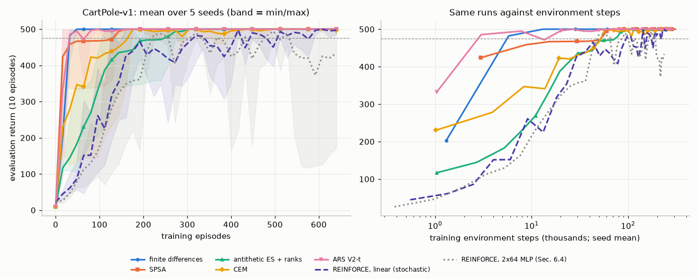

**Scaling with $d$: a family of linear-quadratic problems.** To isolate the estimator, the second experiment uses problems whose $J$ and $\nabla J$ are known exactly. The dynamics are $S_{t+1}=FS_t+GA_t$ with $A_t=-KS_t$, reward $-(S_t^\top S_t+A_t^\top A_t)$, $\gamma=0.9$ and $S_0\sim\mathcal N(\mathbf 0,\mathbf I/n)$, with $F=0.9\times$(a random orthogonal matrix) and $G=\mathbf I$ in $n=2,4,8,16$ dimensions. The parameters are $\boldsymbol\theta=\operatorname{vec}K$, so $d=n^2$ ranges from 4 to 256. $J(K)=-\operatorname{tr}(P_K\Sigma_0)$, where $P_K$ solves a Lyapunov equation, as in the LQR of [Chapter 03](03-dynamic-programming.md), Section 11.4 (and [Chapter 12](12-continuous-control-actor-critic.md), Section 2.6, for the scalar case). Because $J$ is exact, the only randomness is the search noise $\boldsymbol\xi$. By the symmetry of this family, exact gradient ascent behaves identically for every $n$: with its best step it reaches 1% suboptimality in **one** iteration, because the gradient at $K=0$ points straight at $K^\ast$. Every extra iteration below is the price of estimating the gradient.

*Per-sample variance* at $K=0$, $\sigma=0.01$, as $\operatorname{tr}\operatorname{Cov}(\hat{\mathbf g})/\lVert\nabla J\rVert^2$ from 20,000 samples:

| $d$ | plain $J(\boldsymbol\theta+\sigma\boldsymbol\xi)\boldsymbol\xi/\sigma$ | theory, Exercise 10.15(c) | forward, $J(\boldsymbol\theta)$ subtracted | antithetic (10.38) | $d+1$ |
|---|---|---|---|---|---|
| 4 | 2,262 | 2,272 | 5.21 | 5.02 | 5 |
| 16 | 18,090 | 18,070 | 17.9 | 17.5 | 17 |
| 64 | 144,500 | 144,600 | 68.9 | 65.8 | 65 |
| 256 | 1,166,000 | 1,165,000 | 346 | 271 | 257 |

The theory column is the second-order formula of Exercise 10.15(c), $\big[dJ^2/\sigma^2+(d+1)\lVert\nabla J\rVert^2+(d+2)J\operatorname{tr}\mathbf H\big]/\lVert\nabla J\rVert^2$, evaluated with the exact Hessian $\mathbf H$ at $K=0$. The plain estimator matches it to within 0.4%. Without the curvature term $(d+2)J\operatorname{tr}\mathbf H$ the formula would be 0.8–1.7% too low. Subtracting $J(\boldsymbol\theta)$, by one extra evaluation or by antithetic pairs, divides the variance by about $1+\frac{d}{d+1}\frac{J^2}{\sigma^2\lVert\nabla J\rVert^2}$: by 450 at $d=4$ and by 4,300 at $d=256$ in the measurements. The factor grows with $d$ because in this family $J(\mathbf 0)=-3.69$ for every $n$, while $\lVert\nabla J\rVert^2$ halves each time $n$ doubles. What remains grows like $d+1$. At $d=64$, shrinking $\sigma$ from 0.01 to 0.003 and 0.001 multiplies the plain variance by 11 and 99 (to $1.6\times10^6$ and $1.4\times10^7$), as $1/\sigma^2$ predicts, while the antithetic one stays at 65–66.

Two smaller effects show at $d=256$, and both shrink like $\sigma^2$. The forward estimator keeps the curvature term $\frac\sigma2(\boldsymbol\xi^\top\mathbf H\boldsymbol\xi)\boldsymbol\xi$, which antithetic pairs cancel. It adds $\frac{\sigma^2}{4}\mathbb E\big[(\boldsymbol\xi^\top\mathbf H\boldsymbol\xi)^2\lVert\boldsymbol\xi\rVert^2\big]=\frac{\sigma^2}{4}(d+4)\big((\operatorname{tr}\mathbf H)^2+2\lVert\mathbf H\rVert_F^2\big)$, which is $74.8\,\lVert\nabla J\rVert^2$ at $d=256$ (measured: 75.2) and below $3.3\,\lVert\nabla J\rVert^2$ for $d\le64$. And $J$ is not exactly quadratic. Its third-order terms survive the antithetic difference and add about 5% at $\sigma=0.01$. At $d=256$, shrinking $\sigma$ to 0.003 and 0.001 brings the antithetic variance from 270 to 256 and 256, and the forward one from 344 to 262 and 257, both close to $d+1=257$.

*Convergence.* Each method now does gradient ascent with 16 evaluations of $J$ per iteration: 8 antithetic pairs; 15 forward perturbations plus $J(\boldsymbol\theta)$; or 16 plain samples. Each method's step size is the best on a factor-2 grid, tuned on separate seeds (six, or three for plain; the worst tuning seed decides, so that the chosen step does not diverge). The table gives iterations to reach 1% suboptimality, $(J^\ast-J)/(J^\ast-J(0))\le0.01$, median over 5 seeds, with the median suboptimality after 3,000 iterations in parentheses:

| $d$ | exact gradient | antithetic | forward | plain |
|---|---|---|---|---|
| 4 | 1 | 12 ($3\times10^{-8}$) | 7 ($3\times10^{-5}$) | not reached on 3 of 5 seeds (0.039) |
| 16 | 1 | 27 ($4\times10^{-8}$) | 15 ($8\times10^{-5}$) | not reached (0.26) |
| 64 | 1 | 71 ($1\times10^{-7}$) | 43 ($2\times10^{-3}$) | not reached (0.52) |
| 256 | 1 | 277 ($6\times10^{-7}$) | 358 ($6\times10^{-3}$) | not reached (0.93) |

Three lessons follow. (i) The cost of a gradient-free gradient grows with $d$. From $d=64$ to $d=256$ the antithetic method needs 3.9 times as many iterations, close to the factor 4 in $d+1$. (ii) Without a baseline, progress collapses as $d$ grows. Plain ES must take steps small enough to survive its enormous variance. In 48,000 evaluations it closes 96% of the gap at $d=4$ but only 7.5% at $d=256$, where the antithetic method reaches 1% after $277\times16=4{,}432$. (iii) Forward differences spend 15 of their 16 evaluations on new directions, against 8 for antithetic pairs, and with exact $J$ they are faster for $d\le64$. But their curvature term does not cancel. It is of order $\sigma$, while the antithetic estimator's leftover from third-order terms is of order $\sigma^2$, so it dominates the noise near the optimum, where $\nabla J=\mathbf 0$. They stall at a suboptimality of $3\times10^{-5}$ to $6\times10^{-3}$, and at $d=256$ that floor is close enough to the 1% target to make them slower. With noisy episode returns, antithetic pairs that share a seed also cancel most of the episode noise, which a single shared evaluation of $J(\boldsymbol\theta)$ cannot do.

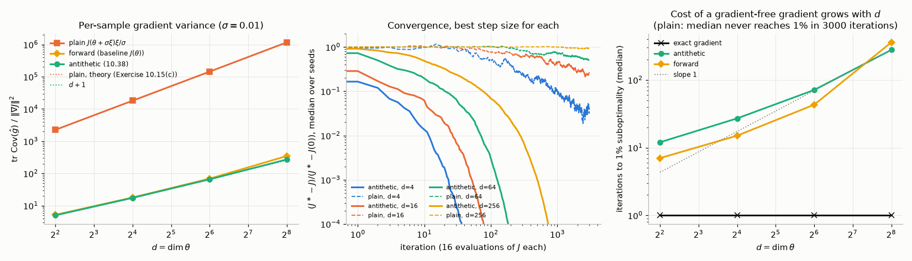

### 15.7 When to use which

| | Black-box search (FD, SPSA, ES, CEM, ARS) | REINFORCE and actor-critic (this chapter) | PPO ([Chapter 11](11-trust-regions-and-ppo.md)) |
|---|---|---|---|
| Noise injected into | parameters, once per episode | actions, at every step | actions, at every step |
| Variance grows with | $d=\dim\boldsymbol\theta$ | horizon, action dimension, return noise | the same, reduced by a critic and GAE |
| Needs | episode returns only | $\nabla\log\pi$ and backpropagation | $\nabla\log\pi$, a critic, backpropagation |
| Policy may be | deterministic, non-differentiable, any program | stochastic and differentiable | stochastic and differentiable |
| Per-step credit assignment | none | reward-to-go; critic in actor-critic | critic with GAE |
| Parallelism | trivial; workers exchange scalars | batches of episodes | vectorized environments, minibatches |
| Reuse of data | none | none (on-policy) | several epochs per batch |
| Good fit | small or structured policies, long horizons, delayed rewards (only the episode total counts), non-differentiable simulators or policies, cheap massive parallelism | small problems, teaching, a baseline | large networks, dense rewards, limited samples |

The approaches also combine. A black-box outer loop can tune a few hyperparameters, or a low-dimensional controller on top of features learned by gradient methods (the World Models controller of [Chapter 13](13-model-based-rl.md) is an example).

---

## In code

All scripts live in [`code/ch10_policy_gradients/`](../code/ch10_policy_gradients/). Each runs from the repository root, fixes its seeds, prints its settings and a results summary, and accepts `--quick` for a smoke test that writes no figures. The folder's [README](../code/ch10_policy_gradients/README.md) lists the same information with the headline numbers.

```bash
python code/ch10_policy_gradients/pg_theorem_check.py       # Sections 4, 6, 12, 13
python code/ch10_policy_gradients/short_corridor.py         # Sections 1, 5, 6
python code/ch10_policy_gradients/reinforce_cartpole.py     # Sections 5, 6
python code/ch10_policy_gradients/actor_critic_traces.py    # Section 7
python code/ch10_policy_gradients/a2c_gae_cartpole.py       # Sections 8, 9, 10
python code/ch10_policy_gradients/a2c_parallel_actors.py    # Section 9.5
python code/ch10_policy_gradients/gaussian_policy.py        # Sections 2, 11
python code/ch10_policy_gradients/discount_bias.py          # Section 12
python code/ch10_policy_gradients/vtrace_tabular.py         # Section 14
python code/ch10_policy_gradients/black_box_search.py       # Section 15
python code/ch10_policy_gradients/exercise_solutions.py     # Exercises 10.3, 10.11, 10.12
```

| Script | Quick | Full | Headline result (full mode) |
|---|---|---|---|
| [`pg_theorem_check.py`](../code/ch10_policy_gradients/pg_theorem_check.py) | 2 s | 11 s | theorem = finite differences to $4\times10^{-10}$; one-episode variance 71.5 (total return) → 24.0 (reward-to-go) → 12.6 (+ baseline) → 2.3 (true advantage); no-$\gamma^t$ bias 0.465; compatible critic exact to $10^{-15}$ |
| [`short_corridor.py`](../code/ch10_policy_gradients/short_corridor.py) | 1 s | 29 s | REINFORCE ($2^{-12}$) last-100 return $-12.5$; with baseline $-11.8$ and $p=0.578\pm0.059$ ($p^\ast=0.586$); no baseline at $2^{-9}$: 51% of runs end near-deterministic; summed per-episode updates: 9/100 runs diverge |
| [`reinforce_cartpole.py`](../code/ch10_policy_gradients/reinforce_cartpole.py) | 3 s | 114 s | last-100 return: total return 77, reward-to-go 254, learned baseline 421 (475 reached on 5/5 seeds within 253 episodes; one late collapse); baseline cuts gradient variance 3.6–11× vs reward-to-go; `--mean-loss` (91 s): total return collapses to 11 |
| [`actor_critic_traces.py`](../code/ch10_policy_gradients/actor_critic_traces.py) | 0.4 s | 111 s | success rate over the first 200 episodes at the best $\alpha$: $\lambda=0$ 0.22, $\lambda=0.5$ 0.36, $\lambda=0.95$ 0.12 |
| [`a2c_gae_cartpole.py`](../code/ch10_policy_gradients/a2c_gae_cartpole.py) | 4 s | 285 s | final return $\lambda=0$: 169, $\lambda=0.95$: 450, $\lambda=1$: 405; $c_{\mathcal H}=0.05$: 253; joint clipping: 386 (critic gradient 34× the actor's) |
| [`a2c_parallel_actors.py`](../code/ch10_policy_gradients/a2c_parallel_actors.py) | 5 s | 214 s | final return 8 envs × 16: 450; 1 env, 8 consecutive segments: 477; 1 env × 128: 496; 32 envs × 4: 338 |
| [`gaussian_policy.py`](../code/ch10_policy_gradients/gaussian_policy.py) | 4 s | 31 s | $\sigma\to0.023$ and gradient norm 0.11→0.37 without entropy bonus; noiseless rewards: $J=-0.0008$, gradient norm 0.009; at $\sigma=0.01$ score-function variance 4061 (no baseline), 3.9 (exact baseline), 52 (exact baseline, noisy reward) vs 1.08 deterministic |
| [`discount_bias.py`](../code/ch10_policy_gradients/discount_bias.py) | 0.4 s | 3 s | with $\gamma^t$: all 100 runs reach $p\ge0.989$ (optimal); without: 94/100 runs end at $p<0.5$ (pessimal side) |
| [`vtrace_tabular.py`](../code/ch10_policy_gradients/vtrace_tabular.py) | 1 s | 24 s | V-trace matches $v_{\pi_{\bar\rho}}$ to 0.006–0.025 in all 5 settings; at $\bar\rho=1$ it is 0.43 away from $v_\pi$ |
| [`black_box_search.py`](../code/ch10_policy_gradients/black_box_search.py) | 23 s | 360 s | linear CartPole policy: FD, SPSA and ARS evaluate $\ge475$ after a median of 32 training episodes, CEM 80, ES 144, REINFORCE 160 (linear) and 208 (MLP); 1.8% of random $\boldsymbol\theta$ already do. Exact LQ, $d=4\to256$: per-sample variance$/\lVert\nabla J\rVert^2$ plain $2262\to1.2\times10^6$ (within 0.4% of second-order theory), antithetic $5.0\to271$ ($\approx d+1$); antithetic ES needs 12→277 iterations to 1%, plain never gets there (median) |
| [`exercise_solutions.py`](../code/ch10_policy_gradients/exercise_solutions.py) | 3 s | 42 s | zero-variance optimal baseline; keeping $\gamma^t$ slows CartPole learning in episodes 201–300 (3/3 seeds); aliased one-step actor-critic drifts to $p=0.986$ |

`tabular_pg.py` is a small shared module (exact $v_\pi$, $q_\pi$, $\eta_\gamma$, the theorem's gradient, finite differences, episode sampling) imported by the tabular scripts. `plot_style.py` holds the figure style. Runtimes were measured on one core of a shared 4-core machine (PyTorch limited to one thread). Expect some variation.

---

## Common pitfalls and misconceptions

1. **"The policy-gradient loss should go down."** The surrogate $-\frac1B\sum\hat A\log\pi$ is constructed so that its *gradient* is the policy-gradient estimate. Its value depends on the sampled batch and has no meaning across iterations. Monitor returns, entropy and the KL divergence between successive policies instead.
2. **Differentiating through the advantage.** $\hat A_t$, $G_t$ and $\hat G_t$ must be constants in the actor loss (`detach()` / `torch.no_grad()`). Otherwise the actor loss also pushes the critic, and the "policy gradient" acquires extra terms with no justification.
3. **Treating truncation as termination**, or bootstrapping from the reset observation. A time limit does not end the MDP. Bootstrap from $V$ of the *true final observation* and stop the GAE recursion. With Gymnasium's vector environments, find out which autoreset mode you are in ([Chapter 00](00-math-toolkit.md), Section 8.5).
4. **Thinking a baseline reduces bias.** A baseline that depends only on the state leaves the gradient exactly unbiased and changes only the variance, and with it the learning dynamics. A baseline that depends on the action, or on the same episode's future, introduces bias.
5. **No baseline when all rewards are positive.** Every sampled action is then reinforced, and only the *differences* in how strongly carry information. On CartPole, total-return REINFORCE still learned, but slowly: a last-100 return of 77 after 1000 episodes, against 421 with reward-to-go and a learned baseline (Section 6.4). All-positive weights also make the policy more committal (Chung et al., 2021).
6. **Believing the code optimizes the discounted return.** Without $\gamma^t$ it does not optimize the discounted return, nor any other objective in general (Section 12). Usually this is what you want, but say so.
7. **Sum vs mean over time steps.** Dividing an episode's (or a batch's) summed update by a constant, such as a fixed batch of $B$ transitions or the time limit, only rescales the step size. Dividing each episode by its *own* length $T$ changes the objective, because $T$ depends on the actions (Section 5.4). Our first CartPole implementation used `.mean()` over each episode. It turned total-return REINFORCE into gradient ascent on $\mathbb E[G_0/T]$, which rewards failing fast: after 1000 episodes all 5 seeds balanced for only 9–16 steps, fewer than the 23 of the random initial policy (`reinforce_cartpole.py --mean-loss`; with the constant normalizer the same seeds reach 62–94). With reward-to-go and a learned baseline the same reweighting happened to do little harm (last-100 return 489, against 421 with the constant normalizer, a gap due mostly to one late collapse), which is how such bugs survive. A related trap is per-step versus per-episode updates. On the corridor, summing a whole episode's baseline updates with $\alpha^{\mathbf w}=2^{-6}$ gives the baseline an effective step of $\alpha^{\mathbf w}T$, which exceeds the stability limit 2 once an episode lasts more than 128 steps. With the step sizes of Section 6.2, 9 of 100 runs diverged this way (`short_corridor.py`), while with Sutton & Barto's per-step updates none of the 100 runs diverged (final $p$ between 0.39 and 0.73).
8. **Reusing on-policy data.** Two gradient steps on the same batch make the second step off-policy. Without an importance-ratio correction and a limit on how far the policy moves (PPO, [Chapter 11](11-trust-regions-and-ppo.md)), this is a silent bias.
9. **Squashed Gaussians without the Jacobian, or log-probabilities of clipped actions** (Section 2.3). Both give wrong log-probabilities, and therefore wrong gradients and entropies.
10. **Letting $\sigma$ collapse.** As a Gaussian policy becomes precise, its score grows like $1/\sigma$. Any error in the baseline, and any noise in the return, is then amplified by $1/\sigma^2$ in variance (Section 11.1). Lower-bound $\log\sigma$, add a small entropy bonus, or use a critic's action-gradient instead.
11. **Joint gradient clipping with a large-gradient critic.** Clipping the combined norm couples the actor's effective step to the critic's error. In our A2C runs the critic's gradient was a median 34 times the actor's (Section 9.6).
12. **Too much entropy.** $c_{\mathcal H}=0.05$ tended to hurt A2C on CartPole (Section 10). The bonus changes the objective, so it should be small or annealed.
13. **Reading one seed.** Policy-gradient learning curves differ enormously between seeds (see the per-seed numbers in Sections 6.4 and 9.4). Use several seeds, report the spread, and compare algorithms at equal numbers of environment steps ([Chapter 20](20-deep-rl-in-practice.md)).
14. **Evolution strategies without a baseline, or compared per iteration.** The one-sample estimator $J(\boldsymbol\theta+\sigma\boldsymbol\xi)\boldsymbol\xi/\sigma$ is unbiased, but it carries a term of variance $dJ^2/\sigma^2$ that has nothing to do with the gradient. On the linear-quadratic problems of Section 15.6 it was 450 to 4,300 times noisier than an antithetic pair, and ascent with it missed the 1% target on at least 3 of 5 seeds at every $d$. Use antithetic pairs that share an environment seed, or centred ranks. And count episodes or environment steps, not updates: one ES or ARS update on CartPole cost 16 episodes, one REINFORCE update cost one.

---

## Historical notes and key papers

* **The score-function idea** predates RL. The likelihood-ratio method for estimating gradients of expectations was developed in the simulation and stochastic-optimization literature, for example by Glynn (1990, *Communications of the ACM*). **Williams (1992, *Machine Learning*)** introduced the REINFORCE family for connectionist RL, including the reinforcement baseline and the characteristic-eligibility interpretation. **Williams & Peng (1991, *Connection Science*)** added an entropy term to keep REINFORCE agents exploring.
* **Actor-critic** architectures are older still. **Barto, Sutton & Anderson (1983, *IEEE Transactions on Systems, Man, and Cybernetics*)** balanced a pole on a cart with an "associative search element" (the actor) and an "adaptive critic element" trained by a TD error. Their pole-balancing task is the ancestor of Gymnasium's CartPole. Sutton's PhD thesis (1984) developed the actor-critic and TD ideas further.
* **The policy gradient theorem** with function approximation was published by **Sutton, McAllester, Singh & Mansour (2000, NIPS 12)**, together with the compatible function approximation theorem, and in parallel by **Konda & Tsitsiklis (2000, NIPS 12; 2003, *SIAM Journal on Control and Optimization*)**, who proved two-time-scale convergence of actor-critic algorithms. **Marbach & Tsitsiklis (2001, *IEEE Transactions on Automatic Control*)** and **Baxter & Bartlett (2001, *JAIR*, GPOMDP)** developed simulation-based gradient estimators for average-reward problems.
* **Natural gradients** for policies were introduced by **Kakade (2001, NIPS 14)**. **Peters & Schaal (2008, *Neurocomputing*)** built the Natural Actor-Critic, and **Bhatnagar, Sutton, Ghavamzadeh & Lee (2009, *Automatica*)** gave convergent incremental natural actor-critic algorithms. Chapter 11 continues this line.
* **Variance reduction** was analysed by **Weaver & Tao (2001, UAI)**, who derived the optimal constant reward baseline, and in general by **Greensmith, Bartlett & Baxter (2004, *JMLR*)**. **Tucker et al. (2018, ICML)** re-examined action-dependent baselines. **Chung, Thomas, Machado & Le Roux (2021, ICML)** showed that baselines affect learning dynamics beyond variance.
* **Deterministic policy gradients**: **Silver, Lever, Heess, Degris, Wierstra & Riedmiller (2014, ICML)**.
* **Deep actor-critics**: **Mnih et al. (2016, ICML)** introduced A3C. **Schulman, Moritz, Levine, Jordan & Abbeel (2016, ICLR)** introduced GAE. The synchronous A2C variant was popularized by OpenAI's Baselines release (2017). **Espeholt et al. (2018, ICML)** introduced IMPALA and V-trace, building on Retrace (**Munos, Stepleton, Harutyunyan & Bellemare, 2016, NIPS**). Off-policy policy gradients go back to the Off-PAC algorithm of **Degris, White & Sutton (2012, ICML)**. **Imani, Graves & White (2018, NeurIPS)** derived the exact off-policy policy gradient theorem, which needs emphatic state weightings.
* **The discount-factor mismatch** was pointed out by **Thomas (2014, ICML)** for natural actor-critics and analysed in general by **Nota & Thomas (2020, AAMAS)**.
* **Theory of policy gradients** advanced quickly after 2019. **Agarwal, Kakade, Lee & Mahajan (2021, *JMLR*)** proved global convergence of exact tabular softmax policy gradient and gave rates for natural policy gradient, and **Mei, Xiao, Szepesvári & Schuurmans (2020, ICML)** proved an $O(1/t)$ rate for softmax policy gradient ([Chapter 11](11-trust-regions-and-ppo.md) compares it with the natural gradient). Empirical studies of what deep policy gradients really do include **Ilyas et al. (2020, ICLR)** and **Andrychowicz et al. (2021, ICLR)**.
* **Black-box policy search** is older than the policy gradient theorem. Gradient-free stochastic approximation goes back to Kiefer & Wolfowitz (1952). Evolution strategies were developed by Rechenberg (1973) and Schwefel in the 1960s and 1970s. **Spall (1992, *IEEE Transactions on Automatic Control*)** introduced SPSA. **Hansen & Ostermeier (2001, *Evolutionary Computation*)** introduced CMA-ES, and **Wierstra, Schaul, Glasmachers, Sun, Peters & Schmidhuber (2014, *JMLR*)** gave natural evolution strategies their definitive form. **Nesterov & Spokoiny (2017, *Foundations of Computational Mathematics*)** analysed Gaussian-smoothing gradient estimators. In RL, **Szita & Lőrincz (2006, *Neural Computation*)** played Tetris with a noisy cross-entropy method, and **Sehnke et al. (2010, *Neural Networks*)** introduced PGPE. Robot learning used reward-weighted episodic search: RWR (**Peters & Schaal, 2007, ICML**), PoWER (**Kober & Peters, NIPS 2008**) and PI² (**Theodorou, Buchli & Schaal, 2010, *JMLR***), over dynamical movement primitives (**Ijspeert, Nakanishi, Hoffmann, Pastor & Schaal, 2013, *Neural Computation***). Deep RL rediscovered the family with OpenAI-ES (**Salimans, Ho, Chen, Sidor & Sutskever, 2017**), the Deep GA (**Such et al., 2017**) and ARS (**Mania, Guy & Recht, 2018, NeurIPS**). **Lehman & Stanley (2011, *Evolutionary Computation*)** introduced novelty search, and **Mouret & Clune (2015)** introduced MAP-Elites.

---

## Summary

* Policy-gradient methods parameterize the policy directly and ascend $J(\boldsymbol\theta)$. They can represent stochastic optima (the aliased corridor), handle continuous and huge action spaces, and change the policy smoothly. The price is local optima, high variance and on-policy sample inefficiency.
* The **policy gradient theorem** expresses $\nabla J$ as a visit-weighted expectation of $q_\pi(S,A)\nabla\log\pi(A\mid S)$. The derivative of the state distribution never appears, so the gradient can be estimated from experience without a model. Two proofs: unroll the Bellman equation for $\nabla v$, or differentiate the trajectory likelihood, in which the dynamics drop out of $\nabla\log p_{\boldsymbol\theta}(\tau)$.
* **REINFORCE** replaces $q_\pi$ by the Monte Carlo return. **Causality** removes past rewards, and **baselines** remove any action-independent offset. Both leave the gradient exactly unbiased (with $\gamma^t$ kept) and cut the variance, by factors of about 3 and 2 in our random MDP. On CartPole, reward-to-go plus a learned baseline turned slow learning (last-100 return 77 with the total return) into reaching 475 within about 250 episodes on every seed. Normalize the per-episode sum by a constant, never by the episode's own length.
* The **variance-minimizing baseline** is a score-weighted average of $q$. In practice $\hat v(s,\mathbf w)$ is used, which turns the weight into an advantage estimate.
* **Actor-critic** methods bootstrap. The TD error is an unbiased advantage estimate when the critic is exact, and is biased by next-state critic errors otherwise. Eligibility traces and **GAE**, $\hat A_t=\sum_l(\gamma\lambda)^l\delta_{t+l}=G^\lambda_t-V(S_t)$, interpolate between TD ($\lambda=0$) and Monte Carlo ($\lambda=1$). $\lambda$ trades critic-induced bias against reward-induced variance, and $\gamma$ is itself a variance-reduction device.
* **A3C/A2C** run many environments in parallel and optimize an actor loss, a critic loss and an entropy bonus. Correct handling of truncation, constant (detached) advantages and sensible clipping matter. On CartPole, $\lambda=0$ was clearly worst, and the parallel environments gave no measurable benefit at a fixed batch size.
* **Entropy regularization** pushes the policy towards uniform, with a softmax gradient of $-\pi_b(\log\pi_b+\mathcal H)$. It changes the objective, so it must be small; in our A2C runs a large bonus tended to hurt.
* **Gaussian policies** have scores of order $1/\sigma$, so baseline errors and return noise are amplified as $\sigma$ shrinks; only a critic or the deterministic gradient removes the return noise. The expected Gaussian gradient is an averaged action-gradient (Stein's lemma), whose $\sigma\to0$ limit is the **deterministic policy gradient**.
* Dropping $\gamma^t$ produces an update that is, in general, not the gradient of any function. It can even converge to the worst policy, though with $\gamma$ near 1 it approximates the average-reward gradient.
* A **compatible** critic, linear in $\nabla\log\pi$, gives the exact gradient, approximates the advantage, and its weights are the **natural gradient**.
* **IMPALA** decouples acting from learning. **V-trace** corrects the resulting policy lag with truncated importance weights, and converges to the value of the truncated policy $\pi_{\bar\rho}\propto\min(\bar\rho b,\pi)$. This policy equals $\pi$ when $\bar\rho\ge\max_a\pi(a\mid s)/b(a\mid s)$ and moves towards $b$ as $\bar\rho$ shrinks. With more than two actions it need not be a mixture of $b$ and $\pi$ ([Chapter 06](06-n-step-and-eligibility-traces.md), Section 14.4).
* **Black-box policy search** perturbs the parameters instead of the actions and needs only episode returns. Gaussian smoothing gives $\nabla J_\sigma=\frac1\sigma\mathbb E[J(\boldsymbol\theta+\sigma\boldsymbol\xi)\boldsymbol\xi]$, the score function of the search distribution. Antithetic pairs remove the $J(\boldsymbol\theta)$ term, whose variance $dJ^2/\sigma^2$ otherwise swamps everything, and leave $(d+1)\lVert\nabla J\rVert^2$ on a quadratic. The cost therefore grows with $\dim\boldsymbol\theta$, not with the horizon. On exact linear-quadratic problems, antithetic ES needed 12 iterations to reach 1% at $d=4$ and 277 at $d=256$, while plain ES, with no baseline, missed 1% at every $d$ (median over seeds). ES, CEM, NES/CMA-ES and ARS allow deterministic, non-differentiable policies and parallelize with scalar communication, but they ignore per-step credit. On CartPole a linear policy found by finite differences, SPSA or ARS averaged at least 475 after a median of 32 training episodes (REINFORCE: 160), a sign of how easy that benchmark is for parameter search.

---

## Key equations

| | Equation |
|---|---|
| Softmax policy and its score | $\pi(a\mid s)=\dfrac{e^{h(s,a,\boldsymbol\theta)}}{\sum_be^{h(s,b,\boldsymbol\theta)}}$, $\quad\nabla\log\pi(a\mid s)=\mathbf x(s,a)-\sum_b\pi(b\mid s)\mathbf x(s,b)$ |
| Gaussian score | $\partial_\mu\log\pi=(a-\mu)/\sigma^2$, $\quad\partial_{\log\sigma}\log\pi=(a-\mu)^2/\sigma^2-1$ |
| tanh-squashed log-density | $\log\pi(a\mid s)=\log\mathcal N(u;\mu,\sigma^2)-\sum_i\log(1-\tanh^2u_i)$ |
| Objective, visits | $J=\mathbb E[G_0]$, $\quad\eta_\gamma(s)=\sum_t\gamma^t\Pr\lbrace S_t=s\rbrace$ |
| Policy gradient theorem | $\nabla J=\sum_s\eta_\gamma(s)\sum_aq_\pi(s,a)\nabla\pi(a\mid s)$ |
| Trajectory form | $\nabla J=\mathbb E\big[G_0\sum_t\nabla\log\pi(A_t\mid S_t)\big]$ |
| Reward-to-go with baseline | $\nabla J=\mathbb E\big[\sum_t\gamma^t(G_t-b(S_t))\nabla\log\pi(A_t\mid S_t)\big]$ |
| Optimal baseline | $b^\ast(s)=\sum_a\pi\lVert\boldsymbol\psi\rVert^2q_\pi\big/\sum_a\pi\lVert\boldsymbol\psi\rVert^2$ |
| TD error estimates advantage | $\mathbb E[\delta_t\mid S_t=s,A_t=a]=A_\pi(s,a)$ if $\hat v=v_\pi$ |
| $n$-step advantage | $\hat A^{(n)}_t=\sum_{l=0}^{n-1}\gamma^l\delta_{t+l}=G_{t:t+n}-V(S_t)$ |
| GAE | $\hat A_t=\sum_{l\ge0}(\gamma\lambda)^l\delta_{t+l}=G^\lambda_t-V(S_t)$, $\quad\hat A_t=\delta_t+\gamma\lambda(1-d_t)\hat A_{t+1}$ |
| A2C loss | $-\overline{\hat A\log\pi}+c_v\overline{(\hat v-\hat G)^2}-c_{\mathcal H}\overline{\mathcal H(\pi)}$ |
| Softmax entropy gradient | $\partial\mathcal H/\partial h_b=-\pi_b(\log\pi_b+\mathcal H)$ |
| Deterministic PG | $\nabla J=\sum_s\eta_\gamma(s)\nabla_{\boldsymbol\theta}\mu_{\boldsymbol\theta}(s)\nabla_aq_\mu(s,a)\vert_{a=\mu_{\boldsymbol\theta}(s)}$ |
| No-$\gamma^t$ estimator's mean | $\sum_s\eta_1(s)\sum_aq_\pi(s,a)\nabla\pi(a\mid s)$ |
| Compatible critic, natural gradient | $\nabla_{\mathbf w}f_{\mathbf w}=\nabla\log\pi\ \Rightarrow\ \nabla J\propto\mathbb E[f_{\mathbf w}\nabla\log\pi]$, $\ \mathbf w\propto\mathbf F^{-1}\nabla J$ |
| V-trace | $v_s=V(S_s)+\sum_{t\ge s}\gamma^{t-s}\big(\prod_{i=s}^{t-1}c_i\big)\rho_t\delta_t$, fixed point $v_{\pi_{\bar\rho}}$, $\ \pi_{\bar\rho}\propto\min(\bar\rho b,\pi)$ |
| SPSA | $\hat{\mathbf g}=\dfrac{\hat J(\boldsymbol\theta+c\boldsymbol\Delta)-\hat J(\boldsymbol\theta-c\boldsymbol\Delta)}{2c}\boldsymbol\Delta$, $\ \boldsymbol\Delta\in\lbrace\pm1\rbrace^d$ |
| Gaussian smoothing (ES) | $J_\sigma(\boldsymbol\theta)=\mathbb E[J(\boldsymbol\theta+\sigma\boldsymbol\xi)]$, $\ \nabla J_\sigma=\frac1\sigma\mathbb E[J(\boldsymbol\theta+\sigma\boldsymbol\xi)\boldsymbol\xi]=\frac1{2\sigma}\mathbb E\big[(J(\boldsymbol\theta+\sigma\boldsymbol\xi)-J(\boldsymbol\theta-\sigma\boldsymbol\xi))\boldsymbol\xi\big]$ |
| ES variance on a quadratic | plain: $\operatorname{tr}\operatorname{Cov}=dJ^2/\sigma^2+(d+1)\lVert\nabla J\rVert^2+(d+2)J\operatorname{tr}\mathbf H+O(\sigma^2)$; $\ $ antithetic: $(d+1)\lVert\nabla J\rVert^2$ |
| ARS step | $M\leftarrow M+\dfrac{\alpha}{b\,\sigma_R}\sum_{k\in\text{top }b}(r_k^+-r_k^-)\boldsymbol\delta_k$ |

---

## Exercises

**Exercise 10.1 ★ (Softmax scores).** (a) Derive (10.2) for linear preferences. (b) Show that $\sum_a\pi(a\mid s)\boldsymbol\psi(s,a)=\mathbf 0$ directly from (10.2). (c) For the tabular softmax with 3 actions and $\pi(\cdot\mid s)=(0.5,0.3,0.2)$, write the score vector of each action and check (b).

<details><summary>Solution</summary>

(a) $\log\pi(a\mid s)=\boldsymbol\theta^\top\mathbf x(s,a)-\log\sum_be^{\boldsymbol\theta^\top\mathbf x(s,b)}$. The gradient of the first term is $\mathbf x(s,a)$. The gradient of the second is $\frac{\sum_be^{\boldsymbol\theta^\top\mathbf x(s,b)}\mathbf x(s,b)}{\sum_ce^{\boldsymbol\theta^\top\mathbf x(s,c)}}=\sum_b\pi(b\mid s)\mathbf x(s,b)$. Subtracting gives (10.2).

(b) $\sum_a\pi(a\mid s)\big[\mathbf x(s,a)-\bar{\mathbf x}(s)\big]=\bar{\mathbf x}(s)-\bar{\mathbf x}(s)\sum_a\pi(a\mid s)=\mathbf 0$, where $\bar{\mathbf x}(s)=\sum_b\pi(b\mid s)\mathbf x(s,b)$.

(c) The tabular score restricted to state $s$ is $\mathbf e_a-\boldsymbol\pi$: $\boldsymbol\psi(s,1)=(0.5,-0.3,-0.2)$, $\boldsymbol\psi(s,2)=(-0.5,0.7,-0.2)$, $\boldsymbol\psi(s,3)=(-0.5,-0.3,0.8)$. Weighted by $(0.5,0.3,0.2)$, the first coordinate is $0.25-0.15-0.1=0$, the second is $-0.15+0.21-0.06=0$ and the third is $-0.1-0.06+0.16=0$. ✓

</details>

**Exercise 10.2 ★ (Why not a softmax over action values?).** In the aliased corridor, an agent uses $\pi(a)\propto e^{\hat q(a)/\kappa}$ with action values $\hat q(\text{R}),\hat q(\text{L})$ learned by Monte Carlo under its own policy, shared across the three look-alike states, and a fixed temperature $\kappa$. Explain why such an agent will in general not converge to $p^\ast=0.586$, while a softmax over *free preferences* trained by REINFORCE does.

<details><summary>Solution</summary>

The action values of the aliased agent are averages, over the three states it cannot distinguish, of what each action led to. They answer "which action is better on average?", not "which probability maximizes $J$?". The resulting probability $p=\sigma\big((\hat q(\text{R})-\hat q(\text{L}))/\kappa\big)$ is determined by the value gap and an arbitrary $\kappa$. Nothing ties it to the stationary point of $J(p)$, and with $\kappa\to0$ the agent becomes deterministic, which is infinitely bad here. In contrast, REINFORCE adjusts the preference $\theta$ along $dJ/d\theta$, whose only zero in $(0,1)$ is $p^\ast$ (Section 4.4 and the short-corridor experiment, where REINFORCE with baseline ends at $p=0.578\pm0.059$). Preferences are free parameters, not estimates of anything, so they can settle wherever the gradient vanishes.

</details>

**Exercise 10.3 ★★ (A zero-variance baseline).** A one-state problem (a two-armed bandit) has deterministic rewards $r_1,r_2$ and a tabular softmax policy with $\pi=(p,1-p)$. (a) Compute $\nabla J$. (b) Show that the optimal baseline (10.18) is $b^\ast=(1-p)r_1+pr_2$, which is *not* $J=pr_1+(1-p)r_2$ unless $p=\tfrac12$ or $r_1=r_2$. (c) Show that with $b^\ast$ the single-sample estimator $(r_A-b)\boldsymbol\psi(A)$ has **zero** variance. (d) For $r=(1,2)$ and $p=0.2$, compute the total variance with $b=0$ and $b=J$.

<details><summary>Solution</summary>

(a) $\partial J/\partial\theta_b=\pi_b(r_b-J)$ for the tabular softmax. With $J=pr_1+(1-p)r_2$: $\nabla J=p(1-p)(r_1-r_2)\,(1,-1)$.

(b) $\boldsymbol\psi(1)=\mathbf e_1-\boldsymbol\pi=(1-p)(1,-1)$, so $\lVert\boldsymbol\psi(1)\rVert^2=2(1-p)^2$. Likewise $\boldsymbol\psi(2)=-p(1,-1)$ and $\lVert\boldsymbol\psi(2)\rVert^2=2p^2$. Then
$b^\ast=\frac{p\cdot2(1-p)^2r_1+(1-p)\cdot2p^2r_2}{p\cdot2(1-p)^2+(1-p)\cdot2p^2}=\frac{2p(1-p)[(1-p)r_1+pr_2]}{2p(1-p)}=(1-p)r_1+pr_2.$
The rarely chosen action has the larger score, so its reward gets the larger weight.

(c) If $A=1$: $(r_1-b^\ast)\boldsymbol\psi(1)=p(r_1-r_2)(1-p)(1,-1)$. If $A=2$: $(r_2-b^\ast)\boldsymbol\psi(2)=(1-p)(r_2-r_1)(-p)(1,-1)=p(1-p)(r_1-r_2)(1,-1)$. Both outcomes give exactly $\nabla J$, so the variance is zero. With two actions, the score directions are collinear, and the optimal baseline cancels the noise completely.

(d) $p=0.2$: $\nabla J=0.16(-1,1)$ and $J=1.8$. With $b=0$: $A=1$ (prob. 0.2) gives $1\cdot0.8(1,-1)$, and $A=2$ gives $2\cdot(-0.2)(1,-1)$. $\mathbb E\lVert\mathbf g\rVert^2=0.2\cdot1.28+0.8\cdot0.32=0.512$, minus $\lVert\nabla J\rVert^2=0.0512$, gives a total variance of $0.4608$. With $b=J=1.8$: the outcomes are $-0.8\cdot0.8(1,-1)$ and $0.2\cdot(-0.2)(1,-1)$, with $\mathbb E\lVert\mathbf g\rVert^2=0.2\cdot0.8192+0.8\cdot0.0032=0.1664$, and total variance $0.1152$. [`exercise_solutions.py`](../code/ch10_policy_gradients/exercise_solutions.py) measures total variances of 0.4622 ($b=0$) and 0.1156 ($b=J$) at $p=0.2$, and $4\times10^{-26}$ (floating-point round-off) with $b^\ast$. At $p=0.5$, where $b^\ast=J$, they are 1.125, 0 and 0 with $2\times10^5$ samples.

</details>

**Exercise 10.4 ★★ (What a baseline may depend on).** (a) Prove that $\mathbb E[b(H_t)\nabla\log\pi(A_t\mid S_t)]=\mathbf 0$ for any function $b$ of the history $H_t$ up to $S_t$. (b) Give a counterexample showing that a baseline $b(S_t,A_t)$ can bias the gradient. (c) Is $b=\frac1N\sum_{i}G^{(i)}_0$, the average return of the $N$ episodes in the *current* batch, a valid baseline for those same episodes?

<details><summary>Solution</summary>

(a) Condition on $H_t$: $\mathbb E[b(H_t)\nabla\log\pi(A_t\mid S_t)\mid H_t]=b(H_t)\sum_a\pi(a\mid S_t)\nabla\log\pi(a\mid S_t)=b(H_t)\nabla\sum_a\pi(a\mid S_t)=\mathbf 0$. Take expectations (tower rule).

(b) One state, $b(s,a)=q(s,a)$. Then every weight $q(S,A)-b(S,A)$ is zero and the "gradient" is $\mathbf 0$ although $\nabla J\neq\mathbf 0$ in general. More generally the bias is $-\sum_a\nabla\pi(a\mid s)b(s,a)$, which is non-zero whenever $b$ varies with $a$.

(c) Not exactly. Episode $i$'s own return is part of the average, so the baseline is correlated with that episode's actions. The bias is $-\frac1N\mathbb E[G^{(i)}_0\nabla\log p(\tau^{(i)})]=-\frac1N\nabla J$, which shrinks the gradient by a factor $(1-\frac1N)$: harmless for the direction. A leave-one-out average $\frac{1}{N-1}\sum_{j\neq i}G^{(j)}_0$ is exactly unbiased. Group-relative baselines in LLM fine-tuning (GRPO, [Chapter 18](18-rl-for-language-models.md)) face exactly this choice.

</details>

**Exercise 10.5 ★★ (GAE identities).** (a) Derive the recursion (10.23) from the closed form (10.21) for an episode without boundaries. (b) Show that for $\lambda=1$, (10.21) equals $G_t-V(S_t)$ exactly, for *any* function $V$, in an episode that terminates at $T$. (c) What is the weight of $\delta_{t+l}$ in $\hat A_t$ for $\gamma=0.99$, $\lambda=0.95$ and $l=20$, $l=100$?

<details><summary>Solution</summary>

(a) $\hat A_t=\sum_{l\ge0}(\gamma\lambda)^l\delta_{t+l}=\delta_t+\gamma\lambda\sum_{l\ge0}(\gamma\lambda)^l\delta_{t+1+l}=\delta_t+\gamma\lambda\hat A_{t+1}$. At an episode boundary the sum stops, which gives the $(1-d_t)$ factor.

(b) $\sum_{l=0}^{T-t-1}\gamma^l\big(R_{t+l+1}+\gamma V(S_{t+l+1})-V(S_{t+l})\big)$ with $V(S_T)=0$. The $V$ terms telescope, leaving $-V(S_t)+\gamma^{T-t}V(S_T)=-V(S_t)$, and the rewards sum to $G_t$.

(c) $(0.99\cdot0.95)^{20}=0.9405^{20}\approx0.293$ and $0.9405^{100}\approx2.2\times10^{-3}$. The effective horizon $1/(1-0.9405)\approx17$ steps.

</details>

**Exercise 10.6 ★★ (Entropy gradients).** (a) Verify (10.27) for two actions with $\pi=(0.9,0.1)$: compute $\mathcal H$ and $\partial\mathcal H/\partial h_b$ for $b=1,2$, and interpret the signs. (b) Show that for a diagonal Gaussian $\partial\mathcal H/\partial\log\sigma_i=1$ and $\partial\mathcal H/\partial\mu=0$.

<details><summary>Solution</summary>

(a) $\mathcal H=-(0.9\log0.9+0.1\log0.1)=0.0948+0.2303=0.3251$ nats. $\partial\mathcal H/\partial h_1=-0.9(\log0.9+0.3251)=-0.9(-0.1054+0.3251)=-0.1977$ and $\partial\mathcal H/\partial h_2=-0.1(\log0.1+0.3251)=-0.1(-2.3026+0.3251)=+0.1977$. The two derivatives sum to zero (adding a constant to all preferences changes nothing). The bonus lowers the preference of the dominant action and raises that of the rare one.

(b) $\mathcal H(\mathcal N(\boldsymbol\mu,\operatorname{diag}\boldsymbol\sigma^2))=\sum_i\big(\log\sigma_i+\tfrac12\log(2\pi e)\big)$ does not involve $\boldsymbol\mu$, and its derivative with respect to $\log\sigma_i$ is 1.

</details>

**Exercise 10.7 ★★ (Optimal baseline for a Gaussian mean).** For a single state with $q(a)=-(a-a^\ast)^2$, a policy $\mathcal N(\mu,\sigma^2)$ and $\boldsymbol\theta=\mu$, compute the variance-minimizing baseline (10.18) and compare it with $v_\pi$.

<details><summary>Solution</summary>

$\psi(a)=(a-\mu)/\sigma^2$, so $\lVert\psi\rVert^2\propto(a-\mu)^2=\sigma^2\xi^2$ with $a=\mu+\sigma\xi$. Write $d=\mu-a^\ast$, so that $q=-(d+\sigma\xi)^2$. Then
$b^\ast=\frac{\mathbb E[\xi^2q]}{\mathbb E[\xi^2]}=-\mathbb E[\xi^2(d^2+2d\sigma\xi+\sigma^2\xi^2)]=-(d^2+3\sigma^2)$,
using $\mathbb E\xi^2=1$, $\mathbb E\xi^3=0$ and $\mathbb E\xi^4=3$. By contrast, $v_\pi=\mathbb E[q]=-(d^2+\sigma^2)$. The optimal baseline is lower by $2\sigma^2$, because actions far from the mean (large $\xi^2$) have large scores *and* low values.

</details>

**Exercise 10.8 ★★ (The average-reward theorem in full).** Fill in the details of the proof sketch of Theorem 10.2: write $\nabla v(s)$, isolate $\nabla r(\pi)$, and use stationarity.

<details><summary>Solution</summary>

From $v(s)=\sum_a\pi(a\mid s)q(s,a)$ and $q(s,a)=\sum_{s',r}p(s',r\mid s,a)\big(r-r(\pi)+v(s')\big)$:
$\nabla v(s)=\sum_a\big[\nabla\pi(a\mid s)q(s,a)+\pi(a\mid s)\big(-\nabla r(\pi)+\sum_{s'}p(s'\mid s,a)\nabla v(s')\big)\big]$.
Since $\sum_a\pi(a\mid s)=1$, this rearranges to
$\nabla r(\pi)=\boldsymbol\phi(s)+\sum_{s'}P_\pi(s'\mid s)\nabla v(s')-\nabla v(s)$, which holds for every $s$.
The left side does not depend on $s$, so multiply by $d^\pi(s)$ and sum:
$\nabla r(\pi)=\sum_sd^\pi(s)\boldsymbol\phi(s)+\sum_{s'}\big[\sum_sd^\pi(s)P_\pi(s'\mid s)\big]\nabla v(s')-\sum_sd^\pi(s)\nabla v(s)$.
By stationarity the bracket is $d^\pi(s')$, so the last two sums cancel, leaving $\nabla r(\pi)=\sum_sd^\pi(s)\sum_aq(s,a)\nabla\pi(a\mid s)$. (The differential $v$ is defined only up to a constant, but its gradient enters only through these cancelling terms.)

</details>

**Exercise 10.9 ★★ (V-trace by hand).** In one state, $\pi=(0.9,0.1)$ and $b=(0.5,0.5)$. (a) Compute $\pi_{\bar\rho}$ for $\bar\rho=1$ and $\bar\rho=1.5$. (b) Show that if $\pi=b$ and $\bar\rho\ge1$, $\bar c\ge1$, the V-trace target (10.34) is the $n$-step return.

<details><summary>Solution</summary>

(a) $\bar\rho=1$: $\min(0.5,0.9)=0.5$ and $\min(0.5,0.1)=0.1$, so $\pi_{\bar\rho}=(0.5,0.1)/0.6=(0.833,0.167)$. $\bar\rho=1.5$: $\min(0.75,0.9)=0.75$ and $\min(0.75,0.1)=0.1$, so $\pi_{\bar\rho}=(0.882,0.118)$. As $\bar\rho\to\infty$ we recover $(0.9,0.1)$. For $\bar\rho\le1$, any action that $\pi$ prefers over $b$ is capped at $\bar\rho b$.

(b) All ratios equal 1, so $\rho_t=c_t=1$ and $v_s=V(S_s)+\sum_{t=s}^{s+n-1}\gamma^{t-s}\delta_t=G_{s:s+n}$ by the telescoping identity (10.20).

</details>

**Exercise 10.10 ★★ (Dropping $\gamma^t$ by hand).** For the MDP of [`discount_bias.py`](../code/ch10_policy_gradients/discount_bias.py) (Section 12), derive the three slopes $dJ_\gamma/d\theta=0.25\,p(1-p)$, $dJ_1/d\theta=6.5\,p(1-p)$ and $\mathbb E[\text{no-}\gamma^t\text{ update}]=-0.5\,p(1-p)$.

<details><summary>Solution</summary>

Let $a=2.5$, $R_{\text{far}}=8$, $\gamma=0.5$, and note $dp/d\theta=p(1-p)$. Discounted: $J_\gamma=p\cdot1+\gamma[(1-p)a+p\gamma^3R_{\text{far}}]$, because the $+R_{\text{far}}$ arrives 4 transitions after $s_1$ and is worth $\gamma^3R_{\text{far}}=1$ from $s_1$. So $dJ_\gamma/dp=1-\gamma a+\gamma^4R_{\text{far}}=1-1.25+0.5=0.25$. Undiscounted: $J_1=p+(1-p)a+pR_{\text{far}}$, so $dJ_1/dp=1-a+R_{\text{far}}=6.5$. No-$\gamma^t$: by (10.30) each decision state is weighted by its undiscounted visit count (1 each, since $s_0$ and $s_1$ are each visited once per episode), and the corridor states contribute nothing because $q(c,\text{R})=q(c,\text{L})$. At $s_0$, $q_\gamma(s_0,\text{R})-q_\gamma(s_0,\text{L})=1$. At $s_1$, $q_\gamma(s_1,\text{R})-q_\gamma(s_1,\text{L})=\gamma^3R_{\text{far}}-a=1-2.5=-1.5$. With $\partial_\theta\pi(\text{R})=p(1-p)=-\partial_\theta\pi(\text{L})$, the expected update is $p(1-p)(1-1.5)=-0.5\,p(1-p)$.

</details>

**Exercise 10.11 ★★★ (Keep the $\gamma^t$).** Modify REINFORCE with baseline on CartPole to weight step $t$ by $0.99^t$, as in (10.15). Predict, then measure, the effect on learning.

<details><summary>Solution</summary>

*Prediction.* CartPole episodes reach 500 steps. With $\gamma^t$ kept, the updates from step 200 onward carry weight below $0.99^{200}=0.13$, and from step 400 onward below $0.018$. The agent learns the early part of each episode well and the late part barely at all. Since the reward does not depend on the time step, the true objective cares about late steps as much as early ones. Expect slower learning once episodes become long.

*Measurement* ([`exercise_solutions.py`](../code/ch10_policy_gradients/exercise_solutions.py), 3 seeds, 600 episodes, same settings as Section 6.4, including the constant normalizer; mean return over episodes 1–100 / 201–300 / last 100):

| seed | $\gamma^t$ dropped (usual) | $\gamma^t$ kept, as in (10.15) |
|---|---|---|
| 0 | 97 / 430 / 500 | 101 / 409 / 478 |
| 1 | 94 / 472 / 435 | 76 / 425 / 485 |
| 2 | 66 / 438 / 493 | 79 / 374 / 466 |

Keeping the factor made learning slower in the middle phase (episodes 201–300) on all three seeds, as predicted. The first 100 episodes, when episodes are still short and $\gamma^t$ is close to 1, show no consistent difference. Over the last 100 episodes keeping $\gamma^t$ was worse on seeds 0 and 2 but better on seed 1, whose usual run had a late dip. On this task the effect is modest, and with 3 seeds it should be read as a tendency, not a precise measurement.

</details>

**Exercise 10.12 ★★★ (A bootstrapping critic that cannot see the state).** Run the one-step actor-critic (Algorithm 10.3) on the aliased short corridor of Section 1.1, with the same single actor parameter and a critic that is aliased too: $\hat v(s,\mathbf w)=w$ for all three states ($\gamma=1$). (a) Show that $\delta_t=-1$ on every transition except the last, where $\delta_{T-1}=-1-w$. (b) Show that for fixed $w$ the expected actor update per episode is $\mathbb E\big[\sum_t\delta_t\psi_t\big]=-w(1-p)$. (c) The critic's TD fixed point is $w=J(p)<0$. What does the actor-critic converge to? Compare with REINFORCE using the same aliased baseline.

<details><summary>Solution</summary>

(a) Every non-terminal next state has the same estimate $w$, so $\delta_t=-1+w-w=-1$. On the final transition the next state is terminal, with value 0, so $\delta_{T-1}=-1-w$.

(b) $\sum_t\delta_t\psi_t=-\sum_t\psi_t-w\,\psi_{T-1}$. The first sum has expectation $-\sum_s\eta_1(s)\sum_a\pi(a\mid s)\psi(s,a)=0$, because the score has zero mean in every state. The episode can only end by moving right from state 2, so $\psi_{T-1}=\psi(\text{right})=1-p$ always, and the expectation is $-w(1-p)$.

(c) At $w=J(p)$ the expected update is $\lvert J(p)\rvert(1-p)>0$ for **every** $p$, including $p^\ast=0.586$, where it equals 4.83 although the true gradient is 0. The actor-critic is pushed towards $p\to1$, a policy that shuttles between states 0 and 1 and whose value tends to $-\infty$. The TD error cannot tell whether the agent moved towards the goal, because the critic gives every state the same value. The only informative error comes at termination, and it credits whichever action ended the episode. This is the next-state critic bias of Section 7.2 in its starkest form. REINFORCE uses the same uninformative $w$ only as a baseline, and stays unbiased.

[`exercise_solutions.py`](../code/ch10_policy_gradients/exercise_solutions.py) confirms the closed form by simulation and runs both methods ($\alpha^{\boldsymbol\theta}=2^{-9}$, $\alpha^{\mathbf w}=2^{-6}$, 30 runs of 1000 episodes from $p=0.05$). The simulated expected update matches $-w(1-p)$: 11.33, 4.82 and 2.44, against the closed-form 11.33, 4.83 and 2.44 at $p=0.3$, 0.586 and 0.9. The true gradient there is $+8.48$, $-0.005$ and $-17.6$. In the learning runs, the one-step actor-critic's mean $p$ climbs past the optimum to 0.862, 0.958 and 0.986 after 333, 666 and 999 episodes, and its mean return over the last 100 episodes is $-125.4$. REINFORCE with the same baseline settles near the optimum (mean $p$ 0.569, 0.585, 0.594; return $-11.6$).

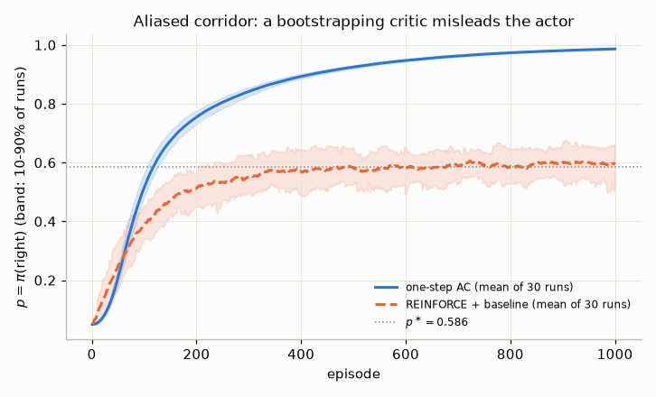

</details>

**Exercise 10.13 ★ (Truncation in GAE).** An A2C implementation computes `delta = r + gamma * (1 - done) * V(next_obs) - V(obs)` with `done = terminated or truncated`, and `next_obs` taken from the vector environment's returned observation. List the two bugs and their effect on CartPole-v1.

<details><summary>Solution</summary>

(1) Using `done` instead of `terminated` in the TD error: at a 500-step truncation the agent is told that the next state is worth 0, so long successful episodes appear to end in disaster. This biases values near the time limit downwards and penalizes the best behaviour. (2) With autoreset, the returned observation after an episode ends is the *first observation of the next episode* (SAME_STEP mode), or the step that follows is a fake transition (NEXT_STEP mode). Bootstrapping from it mixes two unrelated episodes. The fix: use `terminated` for bootstrapping, `terminated or truncated` only to stop the GAE recursion, and `info["final_obs"]` (or the masking scheme of NEXT_STEP mode) for the true final state.

</details>

**Exercise 10.14 ★★ (The smoothed gradient).** Let $J:\mathbb R^d\to\mathbb R$ be bounded and $J_\sigma(\boldsymbol\theta)=\mathbb E[J(\boldsymbol\theta+\sigma\boldsymbol\xi)]$ with $\boldsymbol\xi\sim\mathcal N(\mathbf 0,\mathbf I_d)$. (a) Write $J_\sigma$ as an integral against the density of $\mathcal N(\boldsymbol\theta,\sigma^2\mathbf I)$ and derive (10.37). Where, if anywhere, did you use differentiability of $J$? (b) Suppose $J$ is differentiable with an $L$-Lipschitz gradient. Show that $\nabla J_\sigma(\boldsymbol\theta)=\mathbb E[\nabla J(\boldsymbol\theta+\sigma\boldsymbol\xi)]$ and $\lVert\nabla J_\sigma(\boldsymbol\theta)-\nabla J(\boldsymbol\theta)\rVert\le L\sigma\sqrt d$, so that $\nabla J_\sigma\to\nabla J$ as $\sigma\to0$. (c) In one dimension, take the step $J(\theta)=\mathbb 1[\theta>0]$. Compute $J_\sigma$ and $J_\sigma'(0)$. What happens as $\sigma\to0$, and what does this say about ES with the deterministic CartPole policy of Section 15.6?

<details><summary>Solution</summary>

(a) $J_\sigma(\boldsymbol\theta)=\int J(\mathbf u)\,\varphi_\sigma(\mathbf u-\boldsymbol\theta)\,d\mathbf u$, with $\varphi_\sigma(\mathbf z)=(2\pi\sigma^2)^{-d/2}e^{-\lVert\mathbf z\rVert^2/2\sigma^2}$. Only the density depends on $\boldsymbol\theta$, and $\nabla_{\boldsymbol\theta}\varphi_\sigma(\mathbf u-\boldsymbol\theta)=\varphi_\sigma(\mathbf u-\boldsymbol\theta)\,(\mathbf u-\boldsymbol\theta)/\sigma^2$. Differentiation under the integral is allowed because $J$ is bounded and $\lVert\mathbf u-\boldsymbol\theta\rVert\varphi_\sigma$ is integrable. It gives $\nabla J_\sigma=\mathbb E\big[J(\tilde{\boldsymbol\theta})(\tilde{\boldsymbol\theta}-\boldsymbol\theta)/\sigma^2\big]$ with $\tilde{\boldsymbol\theta}\sim\mathcal N(\boldsymbol\theta,\sigma^2\mathbf I)$. Substituting $\tilde{\boldsymbol\theta}=\boldsymbol\theta+\sigma\boldsymbol\xi$ gives (10.37). Differentiability of $J$ was never used: $J_\sigma$ is infinitely differentiable for any bounded measurable $J$. The smoothness comes from the Gaussian, as in the score-function derivation of REINFORCE, where it came from the policy.

(b) Differentiate $\mathbb E[J(\boldsymbol\theta+\sigma\boldsymbol\xi)]$ inside the expectation. This is allowed because a Lipschitz gradient grows at most linearly, which is integrable against a Gaussian. The result is $\nabla J_\sigma(\boldsymbol\theta)=\mathbb E[\nabla J(\boldsymbol\theta+\sigma\boldsymbol\xi)]$, Stein's lemma of Section 11.1 in $d$ dimensions. Then
$\lVert\nabla J_\sigma-\nabla J\rVert=\big\lVert\mathbb E[\nabla J(\boldsymbol\theta+\sigma\boldsymbol\xi)-\nabla J(\boldsymbol\theta)]\big\rVert\le\mathbb E\big[L\sigma\lVert\boldsymbol\xi\rVert\big]\le L\sigma\sqrt{\mathbb E\lVert\boldsymbol\xi\rVert^2}=L\sigma\sqrt d$,
by Jensen's inequality. The bias grows like $\sqrt d$. In high dimension $\sigma$ must therefore be small to keep the bias small, and a small $\sigma$ is exactly what makes the plain estimator's $dJ^2/\sigma^2$ term explode. This is one more reason for the antithetic form.

(c) $J_\sigma(\theta)=\Pr(\theta+\sigma\xi>0)=\Phi(\theta/\sigma)$, so $J_\sigma'(0)=\phi(0)/\sigma=1/(\sigma\sqrt{2\pi})$, where $\Phi$ and $\phi$ are the standard normal distribution function and density. (10.37) gives the same: $\frac1\sigma\mathbb E[\xi\,\mathbb 1[\xi>0]]=\phi(0)/\sigma$. As $\sigma\to0$ the slope blows up, while $J$ itself has derivative 0 everywhere except at the jump, where it has none. A pathwise gradient through a deterministic step is zero almost everywhere and useless. The smoothed gradient "sees" the jump from a distance of order $\sigma$ and points to the better side. With a fixed start state, the return of the CartPole policy $a=\mathbb 1[\boldsymbol\theta^\top s>0]$ is piecewise constant in $\boldsymbol\theta$. It jumps where $\boldsymbol\theta$ crosses a hyperplane on which some action along the trajectory flips. (Averaging over random start states smooths $J$ a little, but only on the scale of the start-state spread.) A perturbation of finite size, $\sigma$ in (10.37) or $h$ and $c$ in finite differences and SPSA, is therefore what makes gradient-style search on this policy work, and it sets the scale over which the jumps are smoothed.

</details>

**Exercise 10.15 ★★ (Antithetic sampling on a quadratic).** Let $J(\boldsymbol\theta+\mathbf z)=J+\mathbf g^\top\mathbf z+\tfrac12\mathbf z^\top\mathbf H\mathbf z$ exactly, with $J=J(\boldsymbol\theta)$, $\mathbf g=\nabla J(\boldsymbol\theta)$ and $\mathbf H$ symmetric. Consider the plain estimator $\hat{\mathbf g}_1=J(\boldsymbol\theta+\sigma\boldsymbol\xi)\boldsymbol\xi/\sigma$ and the antithetic estimator $\hat{\mathbf g}_2=\big(J(\boldsymbol\theta+\sigma\boldsymbol\xi)-J(\boldsymbol\theta-\sigma\boldsymbol\xi)\big)\boldsymbol\xi/2\sigma$. (a) Show that both are unbiased for $\mathbf g$. (b) Show that $\hat{\mathbf g}_2=(\mathbf g^\top\boldsymbol\xi)\boldsymbol\xi$ and $\operatorname{tr}\operatorname{Cov}(\hat{\mathbf g}_2)=(d+1)\lVert\mathbf g\rVert^2$. Use $\mathbb E[\xi_i\xi_j\lVert\boldsymbol\xi\rVert^2]=(d+2)\delta_{ij}$. (c) Show that $\operatorname{tr}\operatorname{Cov}(\hat{\mathbf g}_1)=dJ^2/\sigma^2+(d+1)\lVert\mathbf g\rVert^2+(d+2)J\operatorname{tr}\mathbf H+O(\sigma^2)$. (d) An antithetic pair costs two evaluations. Compare it with the mean of two plain samples, using the $d=64$ row of the variance table in Section 15.6.

<details><summary>Solution</summary>

(a) $\hat{\mathbf g}_1=\frac J\sigma\boldsymbol\xi+(\mathbf g^\top\boldsymbol\xi)\boldsymbol\xi+\frac\sigma2(\boldsymbol\xi^\top\mathbf H\boldsymbol\xi)\boldsymbol\xi$. The odd moments of $\boldsymbol\xi$ vanish, so $\mathbb E[\boldsymbol\xi]=\mathbf 0$ and $\mathbb E[(\boldsymbol\xi^\top\mathbf H\boldsymbol\xi)\boldsymbol\xi]=\mathbf 0$, while $\mathbb E[(\mathbf g^\top\boldsymbol\xi)\boldsymbol\xi]=\mathbb E[\boldsymbol\xi\boldsymbol\xi^\top]\mathbf g=\mathbf g$. In $\hat{\mathbf g}_2$ the even terms ($J$ and the quadratic) are equal at $\pm\sigma\boldsymbol\xi$ and cancel, which leaves the expression in (b), with mean $\mathbf g$. (For a quadratic, smoothing only adds the constant $\tfrac{\sigma^2}2\operatorname{tr}\mathbf H$, so $\nabla J_\sigma=\nabla J$ and there is no smoothing bias either.)

(b) $\hat{\mathbf g}_2=\frac{2\sigma\,\mathbf g^\top\boldsymbol\xi}{2\sigma}\boldsymbol\xi=(\mathbf g^\top\boldsymbol\xi)\boldsymbol\xi$. The identity holds because $\mathbb E[\xi_i^2\lVert\boldsymbol\xi\rVert^2]=\mathbb E\xi_i^4+\sum_{k\ne i}\mathbb E[\xi_i^2\xi_k^2]=3+(d-1)=d+2$, and the off-diagonal terms are odd. Hence $\mathbb E\lVert\hat{\mathbf g}_2\rVert^2=\sum_{ij}g_ig_j\mathbb E[\xi_i\xi_j\lVert\boldsymbol\xi\rVert^2]=(d+2)\lVert\mathbf g\rVert^2$. Subtracting $\lVert\mathbb E\hat{\mathbf g}_2\rVert^2=\lVert\mathbf g\rVert^2$ gives $(d+1)\lVert\mathbf g\rVert^2$, whatever $\sigma$ and $\mathbf H$ are.

(c) Expand $\mathbb E\lVert\hat{\mathbf g}_1\rVert^2$. The cross terms $2\frac J\sigma\mathbb E[(\mathbf g^\top\boldsymbol\xi)\lVert\boldsymbol\xi\rVert^2]$ and $\sigma\,\mathbb E[(\mathbf g^\top\boldsymbol\xi)(\boldsymbol\xi^\top\mathbf H\boldsymbol\xi)\lVert\boldsymbol\xi\rVert^2]$ are odd and vanish. What remains is
$\frac{J^2}{\sigma^2}\mathbb E\lVert\boldsymbol\xi\rVert^2+\mathbb E[(\mathbf g^\top\boldsymbol\xi)^2\lVert\boldsymbol\xi\rVert^2]+J\,\mathbb E[(\boldsymbol\xi^\top\mathbf H\boldsymbol\xi)\lVert\boldsymbol\xi\rVert^2]+\frac{\sigma^2}4\mathbb E[(\boldsymbol\xi^\top\mathbf H\boldsymbol\xi)^2\lVert\boldsymbol\xi\rVert^2]$
$=\frac{dJ^2}{\sigma^2}+(d+2)\lVert\mathbf g\rVert^2+(d+2)J\operatorname{tr}\mathbf H+O(\sigma^2)$,
using $\mathbb E[(\boldsymbol\xi^\top\mathbf H\boldsymbol\xi)\lVert\boldsymbol\xi\rVert^2]=\sum_{ij}H_{ij}(d+2)\delta_{ij}$. Subtract $\lVert\mathbf g\rVert^2$. For small $\sigma$ the first term dominates: the plain estimator is worse by a factor of about $J^2/(\sigma^2\lVert\mathbf g\rVert^2)$, which has nothing to do with the gradient and everything to do with the missing baseline.

(d) At $d=64$ the measured values, relative to $\lVert\nabla J\rVert^2$, are $1.445\times10^5$ for one plain sample and 65.8 for one antithetic pair. Two plain samples average to $7.2\times10^4$, which is about 1,100 times the antithetic pair's variance at the same cost. The theory gives $\frac{dJ^2/\sigma^2+(d+1)\lVert\nabla J\rVert^2}{2(d+1)\lVert\nabla J\rVert^2}$ with $J=-3.69$, $\lVert\nabla J\rVert^2=60.8$ and $\sigma=0.01$, which is about 1,100 as well.

</details>

---

## Further reading

* **Sutton & Barto (2018), *Reinforcement Learning: An Introduction*, 2nd ed., Chapter 13.** The textbook treatment this chapter follows for the episodic theorem, REINFORCE, baselines and the actor-critic boxes. Section 13.7 covers continuous actions.
* **Williams (1992), "Simple statistical gradient-following algorithms for connectionist reinforcement learning".** Still worth reading for its general view of REINFORCE as a family, with baselines built in from the start.
* **Sutton, McAllester, Singh & Mansour (2000), "Policy gradient methods for reinforcement learning with function approximation".** Short and clear. It contains the theorem in both episodic and average-reward form, compatible features, and the first convergence result for policy iteration with function approximation.
* **Greensmith, Bartlett & Baxter (2004), "Variance reduction techniques for gradient estimates in reinforcement learning".** The definitive analysis of baselines and actor-critic variance.
* **Peters & Schaal (2008), "Reinforcement learning of motor skills with policy gradients" (*Neural Networks*).** A practitioner-friendly survey of likelihood-ratio methods, optimal baselines and natural actor-critic in robotics.
* **Salimans, Ho, Chen, Sidor & Sutskever (2017), "Evolution strategies as a scalable alternative to reinforcement learning" (arXiv:1703.03864).** Antithetic ES with rank shaping, the shared-seed trick, and a clear discussion of when parameter-space noise beats action-space noise (Section 15).
* **Mania, Guy & Recht (2018), "Simple random search of static linear policies is competitive for reinforcement learning" (NeurIPS).** ARS, and a sobering look at seed variance and what the MuJoCo benchmarks measure.
* **Hansen (2016), "The CMA evolution strategy: a tutorial" (arXiv:1604.00772).** The standard reference for CMA-ES, from its author.
* **Schulman, Moritz, Levine, Jordan & Abbeel (2016), "High-dimensional continuous control using generalized advantage estimation".** The GAE paper. Its discussion of $\gamma$ and $\lambda$ as two different bias–variance knobs is essential.
* **Mnih et al. (2016), "Asynchronous methods for deep reinforcement learning", and Espeholt et al. (2018), "IMPALA".** The two architectures of Sections 9 and 14, including V-trace's proofs in IMPALA's appendix.
* **Nota & Thomas (2020), "Is the policy gradient a gradient?"** A careful, readable analysis of the $\gamma^t$ issue of Section 12.
* **Agarwal, Kakade, Lee & Mahajan (2021), "On the theory of policy gradient methods: optimality, approximation, and distribution shift".** Global convergence of policy gradients and natural policy gradients. Read it with [Chapter 19](19-rl-theory.md).
* **Ilyas et al. (2020), "A closer look at deep policy gradients", and Andrychowicz et al. (2021), "What matters in on-policy reinforcement learning?".** How far practical deep policy-gradient estimates are from the true gradient, and which implementation choices actually matter. Good preparation for [Chapters 11](11-trust-regions-and-ppo.md) and [20](20-deep-rl-in-practice.md).
* **OpenAI Spinning Up (Achiam, 2018), "Part 3: Intro to Policy Optimization".** A compact derivation of the trajectory form, reward-to-go and the "expected grad-log-prob lemma", with minimal code.
