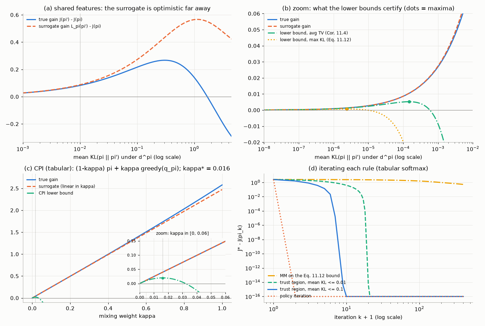
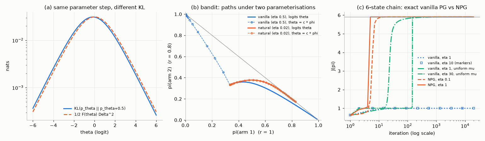
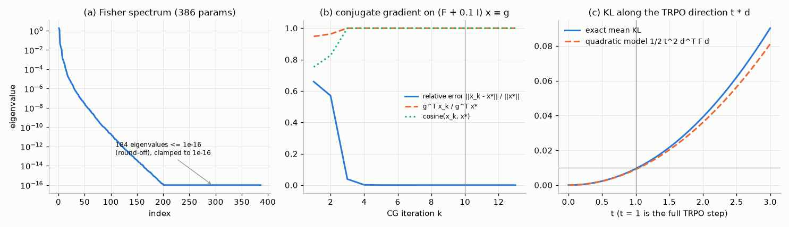
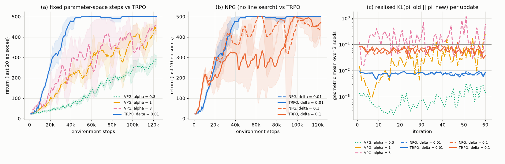
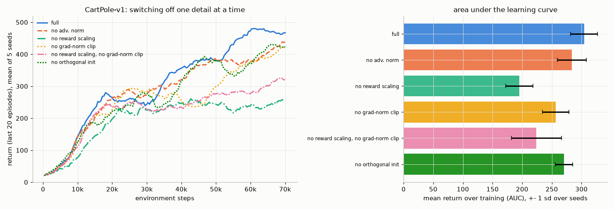
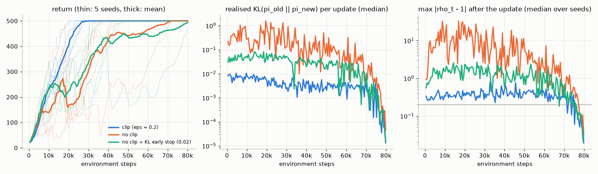
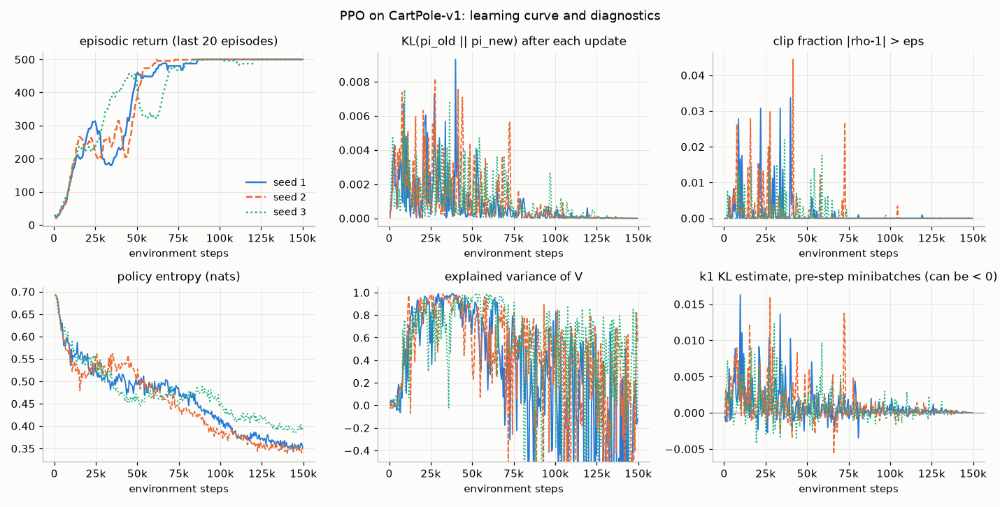
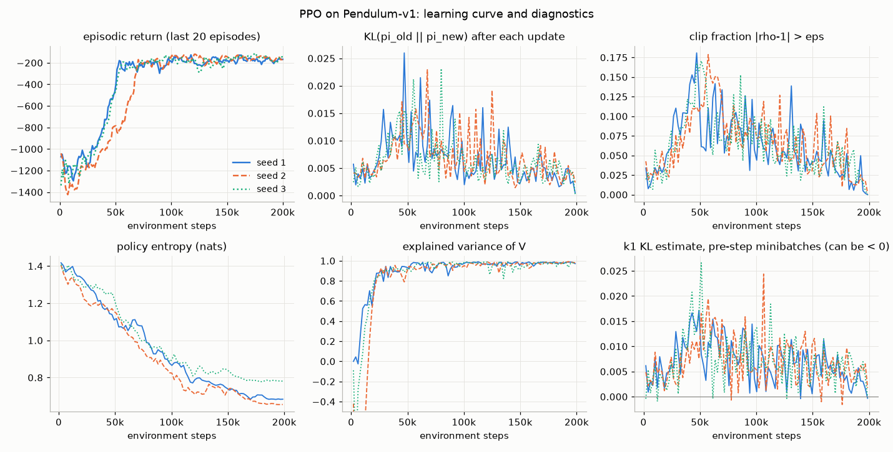

# Chapter 11 — Natural Gradients, Trust Regions, TRPO and PPO

[← Previous: Policy Gradient Methods: REINFORCE to Actor-Critic](10-policy-gradients.md) · [Course index](../README.md) · [Next: Off-Policy Actor-Critic for Continuous Control: DDPG, TD3 and SAC](12-continuous-control-actor-critic.md) →

## At a glance

[Chapter 10](10-policy-gradients.md) gave us ways to estimate the policy gradient, from unbiased REINFORCE to low-variance actor-critic estimators with GAE. It left one question open: **how far should we step?** In supervised learning a step that is too large costs us a few wasted iterations. In reinforcement learning it can be catastrophic, because the next batch of data is collected by the policy we just produced. A bad step yields bad data, and bad data yields the next bad step. This chapter is about controlling the size of policy updates in the space that matters, the space of action *distributions*, rather than the space of network weights.

The story has a theory half and a practice half. The theory starts from an exact identity, the **performance difference lemma**, and turns it into a **surrogate objective** with a **lower bound** guaranteeing monotonic improvement. It then shows that the KL divergence is locally a quadratic form whose matrix is the **Fisher information**, and that the steepest-ascent direction under this metric is the **natural gradient**. **TRPO** makes this practical with conjugate gradient and Fisher-vector products. **PPO** replaces all the second-order machinery with a clipped objective and plain minibatch SGD, and became the default policy-optimization algorithm in deep RL, including RLHF for language models. The practice half takes PPO's "implementation details" seriously, because they matter as much as the core idea.

**Learning objectives.** After this chapter you should be able to:

1. Explain why a fixed step size in parameter space is the wrong knob for policy optimization, with a concrete numerical example.
2. State and prove the performance difference lemma, derive the surrogate objective $L_\pi$, and prove the TRPO lower bound $J(\pi') \ge L_\pi(\pi') - \frac{4\epsilon\gamma}{(1-\gamma)^2}\big(D^{\max}_{\mathrm{TV}}\big)^2$ (with $D^{\max}_{\mathrm{TV}}$ the largest total-variation distance between the two policies' action distributions) step by step.
3. Describe conservative policy iteration and the minorize-maximize argument for monotonic improvement.
4. Derive $D_{\mathrm{KL}}(\pi_{\boldsymbol\theta}\Vert\pi_{\boldsymbol\theta+\boldsymbol\Delta}) \approx \frac12\boldsymbol\Delta^\top\mathbf F\boldsymbol\Delta$, derive the natural gradient as a constrained steepest ascent, and prove its invariance to reparameterization.
5. Implement TRPO: conjugate gradient, Fisher-vector products by double back-propagation, KL-normalized steps and a backtracking line search.
6. Analyse the PPO clipped objective case by case, implement PPO for discrete and continuous actions, and read its diagnostics (approximate KL, clip fraction, entropy, explained variance).
7. Name the implementation details that matter, explain what each one does, and say which ones our own ablations found important.
8. Place PPO among its descendants (ACKTR, PPG, IMPALA, MDPO, GRPO) and explain why it became the default, including in RLHF.

**Prerequisites.** KL divergence and Gibbs' inequality ([Chapter 00, §5.3](00-math-toolkit.md)), the score-function estimator ([Chapter 00, §6.2](00-math-toolkit.md)), importance sampling ([Chapter 00, §2.6](00-math-toolkit.md)), Adam ([Chapter 00, §3.5](00-math-toolkit.md)); MDPs, value functions and the advantage ([Chapter 01](01-the-rl-problem.md)); policy iteration and the policy improvement theorem ([Chapter 03](03-dynamic-programming.md)); the policy gradient theorem, actor-critic and generalized advantage estimation (GAE) ([Chapter 10](10-policy-gradients.md)).

**Code you will run** (all in [`code/ch11_trust_regions_and_ppo/`](../code/ch11_trust_regions_and_ppo/)):

| Script | What it shows |
|---|---|
| `natural_gradient_geometry.py` | the same parameter step gives wildly different KL; natural gradient is invariant to reparameterization; exact vanilla PG gets trapped where NPG does not |
| `surrogate_bound.py` | exact checks of the performance difference lemma, the surrogate, the TRPO bound and CPI on a small MDP; why the theoretical penalty is far too conservative |
| `trpo_cartpole.py` | Fisher-vector products checked against an explicit Fisher matrix; conjugate gradient; VPG vs NPG vs TRPO on CartPole |
| `ppo.py` | single-file PPO (CleanRL style) on CartPole-v1 and Pendulum-v1 with full diagnostics |
| `ppo_clip_ablation.py` | clip vs no clip vs KL early stopping, 5 seeds |
| `ppo_details_ablation.py` | which implementation details matter on CartPole, 5 seeds |

**Study time.** About 12–16 hours: 6–8 for the text and derivations, 3–4 for the code, 3–4 for the exercises.

---

## 1. Why step sizes are hard in policy optimization

### 1.1 Setting and notation

We work with a discounted MDP with initial-state distribution $d_0$ and a parameterized stochastic policy $\pi_{\boldsymbol\theta}(a\mid s)$. When the parameter is clear we write $\pi$ for the current policy and $\pi'$ for a candidate new one. The objective is the expected discounted return from the start,

$$
J(\pi) \doteq \mathbb E_{S_0\sim d_0}\big[v_\pi(S_0)\big] = \mathbb E_\pi\Big[\sum_{t=0}^\infty\gamma^t R_{t+1}\Big],
\tag{11.1}
$$

and we write $J(\boldsymbol\theta)$ for $J(\pi_{\boldsymbol\theta})$. The **normalized discounted state-visitation distribution** of $\pi$ is

$$
d^\pi(s) \doteq (1-\gamma)\sum_{t=0}^\infty\gamma^t\Pr\lbrace S_t=s \mid S_0\sim d_0,\ \pi\rbrace.
\tag{11.2}
$$

The factor $(1-\gamma)$ makes it sum to one. [Chapter 10](10-policy-gradients.md) used the unnormalized visit counts $\eta_\gamma(s)=\sum_t\gamma^t\Pr\lbrace S_t=s\rbrace$, so $d^\pi=(1-\gamma)\eta_\gamma$, and normalized them as $d^\pi_\gamma=\eta_\gamma/\sum_{s'}\eta_\gamma(s')$ (10.7). The two normalizations agree for continuing tasks, or when termination is modelled as entering an absorbing state with zero reward ([Chapter 01](01-the-rl-problem.md), Section 4.4), as we assume here. In an episodic task whose visit counts stop at termination, as Chapter 10's do, $\sum_s\eta_\gamma(s)<1/(1-\gamma)$: then $d^\pi_\gamma$ differs from $(1-\gamma)\eta_\gamma$, which sums to less than one. In this chapter $d^\pi$ always means (11.2). It converts discounted sums along trajectories into expectations over states: for any function $f$ of the state,

$$
\mathbb E_\pi\Big[\sum_{t=0}^\infty\gamma^t f(S_t)\Big] = \sum_s\sum_{t}\gamma^t\Pr\lbrace S_t=s\rbrace f(s) = \frac{1}{1-\gamma}\,\mathbb E_{s\sim d^\pi}\big[f(s)\big].
\tag{11.3}
$$

The advantage is $A_\pi(s,a) \doteq q_\pi(s,a)-v_\pi(s)$, and since $v_\pi(s)=\sum_a\pi(a\mid s)q_\pi(s,a)$ it averages to zero under the policy itself: $\mathbb E_{a\sim\pi(\cdot\mid s)}[A_\pi(s,a)]=0$ for every $s$. In this notation the policy gradient theorem of Chapter 10 (with the advantage as baseline-corrected critic) reads

$$
\nabla_{\boldsymbol\theta}J(\boldsymbol\theta) = \frac{1}{1-\gamma}\,\mathbb E_{s\sim d^{\pi_{\boldsymbol\theta}},\,a\sim\pi_{\boldsymbol\theta}(\cdot\mid s)}\Big[A_{\pi_{\boldsymbol\theta}}(s,a)\,\nabla_{\boldsymbol\theta}\log\pi_{\boldsymbol\theta}(a\mid s)\Big].
\tag{11.4}
$$

We write $\boldsymbol\psi(s,a)\doteq\nabla_{\boldsymbol\theta}\log\pi_{\boldsymbol\theta}(a\mid s)$ for the **score**.

**Local notation.** This chapter follows the TRPO and PPO papers in a few places, which creates some departures from [NOTATION.md](../NOTATION.md):

* $\boldsymbol\psi(s,a)$ is the score, as in [Chapter 10](10-policy-gradients.md). NOTATION.md reserves $\boldsymbol\psi$ for the parameters of a learned model, which do not appear here.
* $\epsilon$ has two meanings. In Section 3 (Theorem 11.3, Proposition 11.5) it bounds the size of advantages, following Schulman et al. (2015). From Section 7 on it is PPO's clipping range, as in NOTATION.md. Neither is the $\varepsilon$ of $\varepsilon$-greedy exploration, and $\epsilon_{\text{Adam}}$ is Adam's numerical constant.
* $\delta$ without a subscript is the KL radius of a trust region, as in the TRPO paper. $\delta_t$ is still the TD error.
* $\lambda$ is only GAE's parameter (and, in Exercise 8, an eigenvalue). The Lagrange multiplier of Section 5.1 is $\nu$, and the damping added to the Fisher matrix is $\zeta$.
* $\alpha$ is a step size. The largest total-variation distance between two policies is $D^{\max}_{\mathrm{TV}}$, the mixture weight of conservative policy iteration is $\kappa$, and TRPO's backtracking factor is $\xi$.
* In Sections 5.3–5.5 (the reparameterization argument, the tabular NPG update (11.22) and the exact-gradient experiments), Section 9 and Exercise 6, the step size is written $\eta$, following Agarwal et al. (2021) and [Chapter 19](19-rl-theory.md). It is unrelated to Chapter 10's visit counts $\eta_\gamma$. (MPO's temperature in Section 9 is also written $\eta$, as in its paper; it plays the role of an inverse step size.)
* $\mu$, and $\boldsymbol\mu_{\boldsymbol\theta}(s)$ in Section 8.6 and Exercise 5, is the mean of a Gaussian policy, as in [Chapter 10](10-policy-gradients.md), not the deterministic policy of NOTATION.md. ([Chapter 12](12-continuous-control-actor-critic.md), which needs both, writes the Gaussian mean $m_{\boldsymbol\theta}(s)$.)
* $\hat A_t$ is an advantage *estimate* for the sample at time $t$. $A_t$ is always the action.

### 1.2 Two ways to fail

Vanilla policy gradient (VPG) estimates $\hat{\mathbf g}\approx\nabla J$ from a batch of on-policy data and takes the step $\boldsymbol\theta\leftarrow\boldsymbol\theta+\alpha\hat{\mathbf g}$. Choosing $\alpha$ is where the trouble starts:

* **Too small**, and learning is slow. Each batch of experience is expensive (it requires running the policy in the environment) and is used for a single small step before being thrown away.
* **Too large**, and the policy can **collapse**. In supervised learning a bad step is corrected by the next gradient step on the same fixed data distribution. In on-policy RL the next batch is collected *by the new policy*. If the step made the policy nearly deterministic on a bad action, the new data contains almost no information about the alternatives, the advantage estimates are poor, and recovery can take a very long time or never happen.

A natural fix is to pick $\alpha$ adaptively so that "the policy changes by a reasonable amount". But how do we measure the change of a policy?

### 1.3 Parameter distance is not policy distance

Take the simplest possible policy: two actions, with $\pi(a_1)=p=\sigma(\theta)$ for a single logit $\theta$ and the sigmoid $\sigma(x)=1/(1+e^{-x})$. Consider the same parameter step $\Delta=0.5$ at two different points. The numbers below are computed by [`natural_gradient_geometry.py`](../code/ch11_trust_regions_and_ppo/natural_gradient_geometry.py), and you can check them with a calculator.

* At $\theta=0$: $p$ moves from $0.5$ to $\sigma(0.5)=0.6225$. The KL divergence is $0.5\log\frac{0.5}{0.6225}+0.5\log\frac{0.5}{0.3775}=0.5(-0.2191)+0.5(0.2809)=0.0309$ nats.
* At $\theta=4$: $p$ moves from $0.9820$ to $0.9890$, and the KL divergence is $0.0019$ nats, **sixteen times smaller**.

The same Euclidean step in $\theta$ is a large change of behaviour in one place and almost nothing in another. Neural network policies make this far worse: the effect of a weight change depends on the layer, on the scale of the activations, on how saturated the output softmax is, and so on. A step size defined in parameter space therefore has no consistent meaning in terms of behaviour.

The parameterization itself is also arbitrary. If we had written the logit as $\theta=4\phi$ and done gradient ascent on $\phi$, the gradient would be multiplied by 4 (chain rule) and the step in $\theta$ by 16. Nothing about the decision problem changed, only our coordinate system, yet vanilla gradient ascent behaves completely differently (Section 5.3 shows it can head for the second-best arm of a bandit and stay stuck there for at least 100,000 steps).

### 1.4 What we want instead, and the road map

We want to limit how much the **action distributions** change, averaged over the states we care about, for example

$$
\mathbb E_{s}\Big[D_{\mathrm{KL}}\big(\pi_{\boldsymbol\theta_{\text{old}}}(\cdot\mid s)\,\Vert\,\pi_{\boldsymbol\theta}(\cdot\mid s)\big)\Big]\le\delta .
$$

The rest of the chapter justifies and implements this idea:

* **Sections 2–3 (theory of improvement).** The performance difference lemma measures exactly how much better $\pi'$ is than $\pi$. It suggests a surrogate objective that we can estimate from data collected with $\pi$, and a lower bound on the true improvement whose penalty grows with the divergence between $\pi$ and $\pi'$. Maximizing the bound gives monotonic improvement.
* **Sections 4–5 (geometry).** To second order the KL divergence is a quadratic form whose matrix is the Fisher information. The steepest-ascent direction under a KL budget is the natural gradient $\mathbf F^{-1}\nabla J$.
* **Section 6 (TRPO)** turns this into a practical algorithm.
* **Sections 7–8 (PPO)** get most of the benefit with first-order optimization and a handful of engineering details.

---

## 2. The performance difference lemma

The central identity of this chapter compares the returns of *any* two policies.

**Lemma 11.1 (performance difference; Kakade & Langford, 2002).** For any two stationary policies $\pi,\pi'$ in a discounted MDP with bounded rewards and $\gamma<1$,

$$
J(\pi')-J(\pi) \;=\; \mathbb E_{\tau\sim\pi'}\Big[\sum_{t=0}^\infty\gamma^t A_\pi(S_t,A_t)\Big] \;=\; \frac{1}{1-\gamma}\,\mathbb E_{s\sim d^{\pi'}}\,\mathbb E_{a\sim\pi'(\cdot\mid s)}\big[A_\pi(s,a)\big],
\tag{11.5}
$$

where $\tau\sim\pi'$ means a trajectory generated by running $\pi'$ from $S_0\sim d_0$.

In words: the new policy's gain is the discounted sum of the *old* policy's advantages along the *new* policy's trajectories.

*Proof.* **Step 1 (advantage as a one-step TD error).** By the definition of $q_\pi$,

$$
A_\pi(s,a) = q_\pi(s,a)-v_\pi(s) = \mathbb E\big[R_{t+1}+\gamma v_\pi(S_{t+1})\,\big|\,S_t=s,A_t=a\big]-v_\pi(s).
$$

The expectation here is over the environment only (the reward and the next state given $(s,a)$). It does not depend on which policy chose $A_t$, because the dynamics $p(s',r\mid s,a)$ do not.

**Step 2 (substitute into the trajectory sum).** Under $\pi'$, condition on $(S_t,A_t)$ and use the tower rule ([Chapter 00, §1.3](00-math-toolkit.md)):

$$
\mathbb E_{\tau\sim\pi'}\big[\gamma^tA_\pi(S_t,A_t)\big] = \mathbb E_{\tau\sim\pi'}\big[\gamma^t\big(R_{t+1}+\gamma v_\pi(S_{t+1})-v_\pi(S_t)\big)\big].
$$

**Step 3 (sum over $t$ and split).**

$$
\begin{aligned}
\mathbb E_{\tau\sim\pi'}\Big[\sum_{t=0}^\infty\gamma^tA_\pi(S_t,A_t)\Big]
&= \mathbb E_{\tau\sim\pi'}\Big[\sum_{t=0}^\infty\gamma^tR_{t+1}\Big] + \mathbb E_{\tau\sim\pi'}\Big[\sum_{t=0}^\infty\big(\gamma^{t+1}v_\pi(S_{t+1})-\gamma^tv_\pi(S_t)\big)\Big].
\end{aligned}
$$

Exchanging sums and expectations is legitimate because every term is bounded by a multiple of $\gamma^t$ (rewards are bounded, so $\lvert v_\pi\rvert\le R_{\max}/(1-\gamma)$).

**Step 4 (telescope).** The partial sums of the second series are $\gamma^{T+1}v_\pi(S_{T+1})-v_\pi(S_0)$, which tend to $-v_\pi(S_0)$ as $T\to\infty$. The first expectation is $J(\pi')$ by (11.1). Hence

$$
\mathbb E_{\tau\sim\pi'}\Big[\sum_{t}\gamma^tA_\pi(S_t,A_t)\Big] = J(\pi') - \mathbb E_{S_0\sim d_0}[v_\pi(S_0)] = J(\pi')-J(\pi).
$$

**Step 5 (state-distribution form).** Apply (11.3) with $f(s)=\mathbb E_{a\sim\pi'(\cdot\mid s)}[A_\pi(s,a)]$; the trajectory is generated by $\pi'$, so the state distribution is $d^{\pi'}$. $\blacksquare$

The trajectory form of the lemma also holds, with the same proof, for episodic tasks with $\gamma=1$, provided both policies terminate: $v_\pi$ must be finite and bounded with $v_\pi(\text{terminal})=0$ (for instance, $\pi$ reaches a terminal state with probability 1 from every state), and episodes under $\pi'$ must have finite expected length.

**Two immediate consequences.**

* **The policy improvement theorem is a special case.** If $\mathbb E_{a\sim\pi'(\cdot\mid s)}[A_\pi(s,a)]\ge0$ in every state, the right side of (11.5) is non-negative, so $J(\pi')\ge J(\pi)$. Greedy improvement $\pi'(s)=\arg\max_aq_\pi(s,a)$ ([Chapter 03](03-dynamic-programming.md)) satisfies this with $\max_aA_\pi(s,a)\ge0$.
* **The difficulty is the state distribution.** The expectation in (11.5) is over $d^{\pi'}$, the states visited by the *new* policy, which we have not run yet. With function approximation we cannot change the policy in one state without changing it in others, so we cannot ensure that the advantage is non-negative everywhere. And we can only estimate $A_\pi$ on states that $\pi$ actually visits.

[`surrogate_bound.py`](../code/ch11_trust_regions_and_ppo/surrogate_bound.py) checks (11.5) on 2000 random pairs of policies in a random 6-state, 3-action MDP with $\gamma=0.9$, solving every Bellman equation exactly. The largest discrepancy between the two sides is $1.2\times10^{-14}$, which is floating-point round-off.

---

## 3. Surrogate objectives, conservative policy iteration and the TRPO bound

### 3.1 The surrogate: freeze the state distribution

The fix suggested by Kakade & Langford (2002), and used by TRPO, is to replace the unknown $d^{\pi'}$ in (11.5) by the known $d^\pi$:

$$
L_\pi(\pi') \doteq J(\pi)+\frac{1}{1-\gamma}\,\mathbb E_{s\sim d^{\pi}}\,\mathbb E_{a\sim\pi'(\cdot\mid s)}\big[A_\pi(s,a)\big].
\tag{11.6}
$$

Everything in $L_\pi$ can be estimated from data collected by $\pi$. The inner expectation over $\pi'$ is rewritten with importance sampling ([Chapter 00, §2.6](00-math-toolkit.md)):

$$
L_\pi(\pi') = J(\pi)+\frac{1}{1-\gamma}\,\mathbb E_{s\sim d^{\pi},\,a\sim\pi(\cdot\mid s)}\Big[\frac{\pi'(a\mid s)}{\pi(a\mid s)}\,A_\pi(s,a)\Big],
\tag{11.7}
$$

which is valid whenever $\pi(a\mid s)>0$ wherever $\pi'(a\mid s)>0$. Only a single-step ratio appears, not the product of ratios along a trajectory that off-policy Monte Carlo needs ([Chapter 04](04-monte-carlo.md)), because we have deliberately ignored the change in the state distribution.

**$L_\pi$ agrees with $J$ to first order at $\pi$.** Let $\pi=\pi_{\boldsymbol\theta_0}$ and $\pi'=\pi_{\boldsymbol\theta}$. Then

$$
L_{\pi_{\boldsymbol\theta_0}}(\pi_{\boldsymbol\theta_0}) = J(\boldsymbol\theta_0),\qquad \nabla_{\boldsymbol\theta}L_{\pi_{\boldsymbol\theta_0}}(\pi_{\boldsymbol\theta})\Big|_{\boldsymbol\theta=\boldsymbol\theta_0} = \nabla_{\boldsymbol\theta}J(\boldsymbol\theta)\Big|_{\boldsymbol\theta=\boldsymbol\theta_0}.
\tag{11.8}
$$

*Proof.* The first identity holds because $\mathbb E_{a\sim\pi}[A_\pi(s,a)]=0$ for every $s$. For the second, only $\pi'=\pi_{\boldsymbol\theta}$ depends on $\boldsymbol\theta$ in (11.6):

$$
\nabla_{\boldsymbol\theta}L_{\pi_{\boldsymbol\theta_0}}(\pi_{\boldsymbol\theta}) = \frac{1}{1-\gamma}\sum_sd^{\pi_{\boldsymbol\theta_0}}(s)\sum_a\nabla_{\boldsymbol\theta}\pi_{\boldsymbol\theta}(a\mid s)\,A_{\pi_{\boldsymbol\theta_0}}(s,a).
$$

At $\boldsymbol\theta=\boldsymbol\theta_0$, write $\nabla\pi=\pi\nabla\log\pi$ to get exactly (11.4). $\blacksquare$

So a small enough step that increases $L_\pi$ also increases $J$. The question is how small "small enough" is. The script confirms (11.8) numerically: with tabular softmax parameters, finite-difference gradients of $L$ and of $J$ agree to $2.2\times10^{-10}$ (the largest gradient component is $0.31$).

### 3.2 How wrong can the surrogate be?

Subtracting (11.6) from (11.5) isolates the error. Write $\bar a(s)\doteq\mathbb E_{a\sim\pi'(\cdot\mid s)}[A_\pi(s,a)]$ for the expected advantage of the new policy in state $s$. Then

$$
J(\pi')-L_\pi(\pi') = \frac{1}{1-\gamma}\sum_s\big(d^{\pi'}(s)-d^{\pi}(s)\big)\,\bar a(s).
\tag{11.9}
$$

The error is a product of two things that are both small when $\pi'$ is close to $\pi$: the shift in the state distribution, and $\bar a(s)$ (which is exactly zero when $\pi'=\pi$). Their product is therefore *second order* in the size of the policy change. To make "close" precise we use the **total variation distance** $D_{\mathrm{TV}}(p,q)\doteq\frac12\sum_x\lvert p(x)-q(x)\rvert$, and write $D_{\mathrm{TV}}(s)$ for $D_{\mathrm{TV}}\big(\pi(\cdot\mid s),\pi'(\cdot\mid s)\big)$.

**Lemma 11.2 (state-distribution shift; cf. Achiam et al., 2017, Lemma 3).**

$$
\big\lVert d^{\pi'}-d^{\pi}\big\rVert_1 \;\le\; \frac{2\gamma}{1-\gamma}\,\mathbb E_{s\sim d^\pi}\big[D_{\mathrm{TV}}(s)\big].
\tag{11.10}
$$

*Proof.* Treat distributions as row vectors and let $\mathbf P_\pi(s,s')=\sum_a\pi(a\mid s)p(s'\mid s,a)$. From (11.2), $d^\pi=(1-\gamma)\,d_0^\top\mathbf G$ with $\mathbf G\doteq(\mathbf I-\gamma\mathbf P_\pi)^{-1}=\sum_k\gamma^k\mathbf P_\pi^k$, and likewise $d^{\pi'}=(1-\gamma)d_0^\top\mathbf G'$. For any invertible matrices, $\mathbf G'-\mathbf G=\mathbf G(\mathbf G^{-1}-\mathbf G'^{-1})\mathbf G'$, and here $\mathbf G^{-1}-\mathbf G'^{-1}=\gamma(\mathbf P_{\pi'}-\mathbf P_\pi)$. Therefore

$$
d^{\pi'}-d^{\pi} = (1-\gamma)\,\gamma\, d_0^\top\mathbf G(\mathbf P_{\pi'}-\mathbf P_\pi)\mathbf G' = \gamma\, d^\pi(\mathbf P_{\pi'}-\mathbf P_\pi)\,\mathbf G'.
$$

$\mathbf G'$ has non-negative entries and every row sums to $\sum_k\gamma^k=1/(1-\gamma)$, so $\lVert\mathbf x\mathbf G'\rVert_1\le\lVert\mathbf x\rVert_1/(1-\gamma)$ for every row vector $\mathbf x$. It remains to bound

$$
\begin{aligned}
\big\lVert d^\pi(\mathbf P_{\pi'}-\mathbf P_\pi)\big\rVert_1
&= \sum_{s'}\Big\lvert\sum_sd^\pi(s)\sum_ap(s'\mid s,a)\big(\pi'(a\mid s)-\pi(a\mid s)\big)\Big\rvert\\
&\le \sum_sd^\pi(s)\sum_a\big\lvert\pi'(a\mid s)-\pi(a\mid s)\big\rvert\sum_{s'}p(s'\mid s,a)
= \sum_sd^\pi(s)\,2D_{\mathrm{TV}}(s).
\end{aligned}
$$

Multiplying the three factors $\gamma$, $1/(1-\gamma)$ and $2\,\mathbb E_{d^\pi}[D_{\mathrm{TV}}]$ gives (11.10). $\blacksquare$

### 3.3 The TRPO lower bound

**Theorem 11.3 (Schulman et al., 2015, Theorem 1).** Let $D^{\max}_{\mathrm{TV}}\doteq\max_sD_{\mathrm{TV}}(s)$ and $\epsilon\doteq\max_{s,a}\lvert A_\pi(s,a)\rvert$. Then

$$
\big\lvert J(\pi')-L_\pi(\pi')\big\rvert \le \frac{4\epsilon\gamma}{(1-\gamma)^2}\,\big(D^{\max}_{\mathrm{TV}}\big)^2,
\qquad\text{so}\qquad
J(\pi') \ge L_\pi(\pi')-\frac{4\epsilon\gamma}{(1-\gamma)^2}\,\big(D^{\max}_{\mathrm{TV}}\big)^2 .
\tag{11.11}
$$

*Proof.* Bound (11.9) by Hölder's inequality: $\lvert J(\pi')-L_\pi(\pi')\rvert\le\frac{1}{1-\gamma}\lVert d^{\pi'}-d^\pi\rVert_1\max_s\lvert\bar a(s)\rvert$.

* Since $\sum_a\pi(a\mid s)A_\pi(s,a)=0$, we can subtract it for free: $\bar a(s)=\sum_a\big(\pi'(a\mid s)-\pi(a\mid s)\big)A_\pi(s,a)$, so $\lvert\bar a(s)\rvert\le\epsilon\sum_a\lvert\pi'-\pi\rvert=2\epsilon D_{\mathrm{TV}}(s)\le2\epsilon D^{\max}_{\mathrm{TV}}$.
* By Lemma 11.2, $\lVert d^{\pi'}-d^\pi\rVert_1\le\frac{2\gamma}{1-\gamma}D^{\max}_{\mathrm{TV}}$.

Multiplying, $\frac{1}{1-\gamma}\cdot\frac{2\gamma D^{\max}_{\mathrm{TV}}}{1-\gamma}\cdot2\epsilon D^{\max}_{\mathrm{TV}}=\frac{4\epsilon\gamma}{(1-\gamma)^2}\big(D^{\max}_{\mathrm{TV}}\big)^2$. $\blacksquare$

The original paper proves the same constant with a coupling argument; the matrix route above is shorter. Because Pinsker's inequality gives $D_{\mathrm{TV}}(p,q)^2\le\frac12D_{\mathrm{KL}}(p\Vert q)\le D_{\mathrm{KL}}(p\Vert q)$, we can replace $\big(D^{\max}_{\mathrm{TV}}\big)^2$ by the largest KL divergence $D^{\max}_{\mathrm{KL}}(\pi,\pi')\doteq\max_sD_{\mathrm{KL}}\big(\pi(\cdot\mid s)\Vert\pi'(\cdot\mid s)\big)$:

$$
J(\pi') \;\ge\; L_\pi(\pi') - C\,D^{\max}_{\mathrm{KL}}(\pi,\pi'),\qquad C\doteq\frac{4\epsilon\gamma}{(1-\gamma)^2}.
\tag{11.12}
$$

(Using Pinsker's factor $\frac12$ would halve $C$; we keep the paper's form.) A remark on the **direction** of the KL. Total variation is symmetric and Pinsker's inequality holds in both directions, so (11.12) is valid with either $D_{\mathrm{KL}}(\pi_{\text{old}}\Vert\pi_{\text{new}})$ or $D_{\mathrm{KL}}(\pi_{\text{new}}\Vert\pi_{\text{old}})$. We choose old-first because it is an expectation under the old policy, which we can estimate from our samples.

**Corollary 11.4 (an average-divergence bound; Achiam et al., 2017).** Keep the expectation in Lemma 11.2 instead of taking a maximum, and let $\epsilon'\doteq\max_s\lvert\bar a(s)\rvert$. The same Hölder step gives

$$
J(\pi')-J(\pi) \;\ge\; \frac{1}{1-\gamma}\,\mathbb E_{s\sim d^\pi,\,a\sim\pi'}\big[A_\pi(s,a)\big] - \frac{2\gamma\epsilon'}{(1-\gamma)^2}\,\mathbb E_{s\sim d^\pi}\big[D_{\mathrm{TV}}(s)\big],
\tag{11.13}
$$

and by Pinsker and Jensen, $\mathbb E[D_{\mathrm{TV}}(s)]\le\mathbb E\big[\sqrt{D_{\mathrm{KL}}(s)/2}\big]\le\sqrt{\mathbb E[D_{\mathrm{KL}}(s)]/2}$. The penalty therefore depends only on the **average** KL under the states the old policy visits. TRPO constrains exactly this average, and before Achiam et al. this choice was justified only as a heuristic.

### 3.4 Conservative policy iteration

Kakade & Langford's original use of these ideas was **conservative policy iteration (CPI)**. Policy iteration jumps straight to the greedy policy $\pi'$, which is safe with exact values (Chapter 03) but not with estimated ones. CPI moves only part of the way, to a **mixture** $\pi_\kappa\doteq(1-\kappa)\pi+\kappa\pi'$ (in each state, follow $\pi'$ with probability $\kappa$).

**Proposition 11.5 (CPI improvement bound).** Let $\mathbb A_\pi(\pi')\doteq\mathbb E_{s\sim d^\pi}\mathbb E_{a\sim\pi'}[A_\pi(s,a)]$ be the **policy advantage** of $\pi'$ over $\pi$, and $\epsilon\doteq\max_s\lvert\mathbb E_{a\sim\pi'(\cdot\mid s)}A_\pi(s,a)\rvert$. For $\kappa\in[0,1]$,

$$
J(\pi_\kappa)-J(\pi) \;\ge\; \frac{\kappa\,\mathbb A_\pi(\pi')}{1-\gamma}-\frac{2\gamma\epsilon}{(1-\gamma)^2}\,\kappa^2 .
\tag{11.14}
$$

*Proof.* For the mixture, $D_{\mathrm{TV}}(\pi_\kappa(\cdot\mid s),\pi(\cdot\mid s))=\kappa D_{\mathrm{TV}}(\pi'(\cdot\mid s),\pi(\cdot\mid s))\le\kappa$, and $\bar a(s)=\mathbb E_{a\sim\pi_\kappa}[A_\pi(s,a)]=\kappa\,\mathbb E_{a\sim\pi'}[A_\pi(s,a)]$, so $\lvert\bar a(s)\rvert\le\kappa\epsilon$. Plug both into the Hölder bound of the previous proof: $\lvert J(\pi_\kappa)-L_\pi(\pi_\kappa)\rvert\le\frac{1}{1-\gamma}\cdot\frac{2\gamma\kappa}{1-\gamma}\cdot\kappa\epsilon$. Finally, $L_\pi(\pi_\kappa)=J(\pi)+\kappa\mathbb A_\pi(\pi')/(1-\gamma)$ because $\bar a$ is linear in $\kappa$. $\blacksquare$

The right side of (11.14) is a concave quadratic in $\kappa$, maximized at $\kappa^\ast=\frac{(1-\gamma)\mathbb A_\pi(\pi')}{4\gamma\epsilon}$ (clipped to 1), where it guarantees an improvement of at least $\mathbb A_\pi(\pi')^2/(8\gamma\epsilon)$. This is Kakade and Langford's bound as restated in the TRPO paper, in our normalization.

```text
Algorithm 11.1  Conservative policy iteration (idealized: exact advantages)
--------------------------------------------------------------------------
Input: MDP with discount gamma < 1, initial policy pi_0, tolerance tol > 0
for k = 0, 1, 2, ...:
    evaluate pi_k: compute A_{pi_k}(s, a) for all s, a        (in practice: estimate by rollouts)
    pi'_k <- greedy policy: pi'_k(s) = argmax_a A_{pi_k}(s, a)
    A_pol <- E_{s ~ d^{pi_k}} E_{a ~ pi'_k}[ A_{pi_k}(s, a) ]       # policy advantage
    if A_pol <= tol: return pi_k                               # no direction improves much
    eps   <- max_s | E_{a ~ pi'_k}[ A_{pi_k}(s, a) ] |
    kappa <- min(1, (1 - gamma) * A_pol / (4 * gamma * eps))   # maximizer of (11.14)
    pi_{k+1} <- (1 - kappa) * pi_k + kappa * pi'_k             # mixture in every state
```

CPI was proposed with sampled advantage estimates, a restart distribution and an approximately greedy policy chooser, and comes with guarantees on the quality of the final policy; we show the idealized version only to make the step size rule concrete. Its weakness is visible in our numbers: the certified $\kappa^\ast$ is tiny.

### 3.5 Monotonic improvement by minorize-maximize

The bound (11.12) suggests an algorithm. Define the **minorizer**

$$
M_k(\pi) \doteq L_{\pi_k}(\pi)-C\,D^{\max}_{\mathrm{KL}}(\pi_k,\pi).
$$

It satisfies $J(\pi)\ge M_k(\pi)$ for every $\pi$ (by (11.12)) and $J(\pi_k)=M_k(\pi_k)$ (both $L_{\pi_k}(\pi_k)-J(\pi_k)$ and the KL vanish). If we set $\pi_{k+1}=\arg\max_\pi M_k(\pi)$, then

$$
J(\pi_{k+1}) \;\ge\; M_k(\pi_{k+1}) \;\ge\; M_k(\pi_k) \;=\; J(\pi_k).
\tag{11.15}
$$

The first inequality is the bound, the second holds because $\pi_{k+1}$ maximizes $M_k$ and $\pi_k$ is a candidate. This is the **minorize-maximize** (MM) principle, the same argument that makes EM monotone. Any $\pi_{k+1}$ with $M_k(\pi_{k+1})\ge M_k(\pi_k)$ is enough; exact maximization is not needed.

```text
Algorithm 11.2  Policy iteration with guaranteed improvement (Schulman et al., 2015, Algorithm 1)
-------------------------------------------------------------------------------------------------
Input: MDP with discount gamma < 1, initial policy pi_0
for k = 0, 1, 2, ... until J(pi_k) stops changing:
    evaluate pi_k exactly: A_{pi_k}(s, a) for all s, a, and d^{pi_k}
    eps <- max_{s,a} |A_{pi_k}(s, a)|;   C <- 4 eps gamma / (1 - gamma)^2
    pi_{k+1} <- argmax_pi [ L_{pi_k}(pi) - C * max_s KL(pi_k(.|s) || pi(.|s)) ]     # = argmax M_k (Sec. 3.5)
    # any pi with M_k(pi) >= M_k(pi_k) also works, e.g. the best point on a line search
```

`surrogate_bound.py` runs this with the maximization restricted to the exponentiated-advantage path of Section 5.4 (a line search over one scalar), which keeps the guarantee.

### 3.6 The theory is far too conservative, which is why TRPO uses a constraint

The penalty coefficient $C=4\epsilon\gamma/(1-\gamma)^2$ is enormous: with $\gamma=0.9$ it is $360\epsilon$, and with $\gamma=0.99$ it is $39{,}600\epsilon$. Steps that maximize the penalized objective are microscopic. `surrogate_bound.py` quantifies this on its 6-state MDP ($\gamma=0.9$, $J^\ast=7.916$):

* **The bounds are valid.** On 3000 random nearby policy pairs, none of the three bounds (11.11), (11.12), (11.13) is ever violated. They are also loose: the average-TV penalty is a median **193 times** larger than the actual gap $\lvert J-L\rvert$.
* **They certify only microscopic steps.** For a log-linear policy with 3 shared features, stepped along its natural-gradient direction, the KL-penalty bound (11.12) is maximized at a mean KL of $2.4\times10^{-6}$, where it certifies a gain of $0.00066$ (the true gain there is $0.0013$). The average-TV bound (11.13) does better, $0.0052$ at mean KL $1.5\times10^{-4}$. But simply taking the step with mean KL $=0.01$ gives a true gain of $0.083$, and the best step along the line gains $0.267$ at mean KL $0.31$.
* **Iterated, the theory is slow.** Starting from a random tabular policy and moving along the exponentiated-advantage path (Section 5.4), choosing the point on that path that maximizes the bound (11.12) at every iteration is monotone as promised, but after 400 iterations it reaches only $J=7.39$. A trust region with mean KL $\le0.01$ reaches $J^\ast$ to machine precision in about 20 iterations, one with mean KL $\le0.1$ in about 10, and policy iteration in a single iteration. All of them improve monotonically here.



Panel (a) shows why we still need *some* constraint. With shared features, a step that improves the policy at the states $\pi$ visits can hurt it elsewhere. The surrogate keeps promising more improvement as the step grows (up to $+0.57$ at mean KL $\approx1.2$), while the true gain peaks at $+0.27$ and is **negative** ($-0.05$) by mean KL $2$. For mean KL up to about $0.01$ the two agree closely ($+0.083$ true vs $+0.088$ surrogate). Panel (b) zooms in on the tiny region where the bounds are positive. Panel (c) shows CPI on the tabular problem: the true gain is almost linear in $\kappa$ all the way to $\kappa=1$ (policy iteration, gain $2.58$), yet the CPI bound certifies only $\kappa^\ast=0.016$ (guaranteed gain $0.020$, actual $0.040$); the inset zooms in on $\kappa\le0.06$, the only region where the bound is positive. Panel (d) iterates each rule.

The practical lesson, which TRPO draws, is to keep the *shape* of the theory (maximize the surrogate while keeping the average KL small) and to replace the hopeless penalty coefficient by a **constraint** with a tunable radius $\delta$:

$$
\max_{\pi'}\;L_\pi(\pi')\qquad\text{subject to}\qquad \mathbb E_{s\sim d^\pi}\Big[D_{\mathrm{KL}}\big(\pi(\cdot\mid s)\Vert\pi'(\cdot\mid s)\big)\Big]\le\delta .
\tag{11.16}
$$

A constraint is also easier to tune than a penalty: the right step length changes by orders of magnitude during training, while a good $\delta$ (around $0.01$) stays the same.

---

## 4. KL divergence as a local metric: the Fisher information

### 4.1 The KL divergence is locally a quadratic form

Let $p_{\boldsymbol\theta}(x)$ be any smooth parametric family of distributions. For a small parameter change $\boldsymbol\Delta$,

$$
D_{\mathrm{KL}}\big(p_{\boldsymbol\theta}\,\Vert\,p_{\boldsymbol\theta+\boldsymbol\Delta}\big) = \frac12\,\boldsymbol\Delta^\top\mathbf F(\boldsymbol\theta)\,\boldsymbol\Delta + O\big(\lVert\boldsymbol\Delta\rVert^3\big),
\qquad
\mathbf F(\boldsymbol\theta)\doteq\mathbb E_{x\sim p_{\boldsymbol\theta}}\Big[\nabla_{\boldsymbol\theta}\log p_{\boldsymbol\theta}(x)\,\nabla_{\boldsymbol\theta}\log p_{\boldsymbol\theta}(x)^\top\Big].
\tag{11.17}
$$

$\mathbf F$ is the **Fisher information matrix**.

*Derivation.* Let $f(\boldsymbol\Delta)\doteq\mathbb E_{x\sim p_{\boldsymbol\theta}}\big[\log p_{\boldsymbol\theta}(x)-\log p_{\boldsymbol\theta+\boldsymbol\Delta}(x)\big]$ and expand it around $\boldsymbol\Delta=\mathbf 0$ (we write sums; for densities replace them by integrals, assuming we may differentiate under the integral sign).

* **Zeroth order:** $f(\mathbf 0)=0$.
* **First order:** $\nabla f(\mathbf 0)=-\mathbb E_{p_{\boldsymbol\theta}}[\nabla\log p_{\boldsymbol\theta}(x)]=-\sum_x p_{\boldsymbol\theta}(x)\frac{\nabla p_{\boldsymbol\theta}(x)}{p_{\boldsymbol\theta}(x)}=-\nabla\sum_xp_{\boldsymbol\theta}(x)=-\nabla1=\mathbf 0$. The score has mean zero ([Chapter 00, §6.2](00-math-toolkit.md)), so the KL has no linear term: it is flat at its minimum, as it must be.
* **Second order:** $\nabla^2f(\mathbf 0)=-\mathbb E_{p_{\boldsymbol\theta}}[\nabla^2\log p_{\boldsymbol\theta}(x)]$. Differentiate $\nabla\log p=\nabla p/p$ once more: $\nabla^2\log p=\frac{\nabla^2p}{p}-\frac{\nabla p\,\nabla p^\top}{p^2}$. The first term has expectation $\sum_x\nabla^2p_{\boldsymbol\theta}(x)=\nabla^2\sum_xp_{\boldsymbol\theta}(x)=\mathbf 0$. Hence the **information equality**

$$
-\mathbb E\big[\nabla^2\log p_{\boldsymbol\theta}(x)\big]=\mathbb E\big[\nabla\log p_{\boldsymbol\theta}(x)\nabla\log p_{\boldsymbol\theta}(x)^\top\big]=\mathbf F(\boldsymbol\theta),
\tag{11.18}
$$

and Taylor's theorem gives (11.17). $\blacksquare$

$\mathbf F$ is positive semi-definite, since $\mathbf v^\top\mathbf F\mathbf v=\mathbb E[(\mathbf v^\top\nabla\log p)^2]\ge0$. It is singular exactly along directions $\mathbf v$ that do not change the distribution to first order. For example, adding the same constant to all logits of a softmax leaves the probabilities unchanged. So (11.17) says that, locally, the KL divergence is a squared length $\frac12\lVert\boldsymbol\Delta\rVert_{\mathbf F}^2$ measured with a position-dependent metric $\mathbf F(\boldsymbol\theta)$. This is the **Fisher–Rao metric** of information geometry (Rao, 1945; Amari, 1998). To second order the KL is symmetric: $D_{\mathrm{KL}}(p_{\boldsymbol\theta+\boldsymbol\Delta}\Vert p_{\boldsymbol\theta})$ has the same quadratic term.

### 4.2 The Fisher matrix of a policy

A policy is a *family* of distributions, one per state. The trust-region constraint (11.16) averages the KL over states drawn from the old policy's state distribution. Holding that distribution fixed and differentiating only the action probabilities, (11.17) applies state by state, so

$$
\bar D_{\mathrm{KL}}(\boldsymbol\theta_{\text{old}},\boldsymbol\theta)\doteq\mathbb E_{s\sim d^{\pi_{\text{old}}}}\Big[D_{\mathrm{KL}}\big(\pi_{\boldsymbol\theta_{\text{old}}}(\cdot\mid s)\Vert\pi_{\boldsymbol\theta}(\cdot\mid s)\big)\Big]\approx\frac12(\boldsymbol\theta-\boldsymbol\theta_{\text{old}})^\top\mathbf F(\boldsymbol\theta_{\text{old}})(\boldsymbol\theta-\boldsymbol\theta_{\text{old}}),
$$

$$
\mathbf F(\boldsymbol\theta)\doteq\mathbb E_{s\sim d^{\pi_{\boldsymbol\theta}}}\,\mathbb E_{a\sim\pi_{\boldsymbol\theta}(\cdot\mid s)}\Big[\boldsymbol\psi(s,a)\,\boldsymbol\psi(s,a)^\top\Big],\qquad\boldsymbol\psi(s,a)=\nabla_{\boldsymbol\theta}\log\pi_{\boldsymbol\theta}(a\mid s).
\tag{11.19}
$$

This **policy Fisher** is what Kakade (2001) used. It is closely related to the Fisher information of the whole trajectory distribution: the log-probability of a trajectory is $\sum_t\log\pi_{\boldsymbol\theta}(A_t\mid S_t)$ plus dynamics terms that do not depend on $\boldsymbol\theta$, and the cross terms $\mathbb E[\boldsymbol\psi_t\boldsymbol\psi_{t'}^\top]$ vanish for $t\neq t'$ because each score has conditional mean zero. The trajectory Fisher therefore reduces to a sum of per-state Fishers weighted by the *undiscounted* expected state-visitation counts. Per time step, and in the stationary (average-reward) limit studied by Bagnell & Schneider (2003) and Peters & Schaal (2008), it is the policy Fisher (11.19) with $d^\pi$ replaced by the stationary state distribution.

**Three families you should know by heart.**

* **Bernoulli** $p=\sigma(\theta)$: the score is $1-p$ for action 1 and $-p$ for action 0, so $F=p(1-p)^2+(1-p)p^2=p(1-p)$. At $\theta=0$, $F=0.25$ and $\frac12F\Delta^2=0.03125$ for $\Delta=0.5$, against the exact $0.0309$ of Section 1.3. At $\theta=4$, $F=0.0177$ and $\frac12F\Delta^2=0.0022$ (exact $0.0019$). The ratio of the two Fishers, $0.25/0.0177\approx14$, accounts for most of the factor 16 between the exact KLs; the rest comes from third-order terms.
* **Softmax over logits** (one state, $\pi=\mathrm{softmax}(\boldsymbol\theta)$): $\boldsymbol\psi(a)=\mathbf e_a-\boldsymbol\pi$, where $\mathbf e_a$ is the one-hot vector for $a$. So $\mathbf F=\sum_a\pi_a(\mathbf e_a-\boldsymbol\pi)(\mathbf e_a-\boldsymbol\pi)^\top=\mathrm{diag}(\boldsymbol\pi)-\boldsymbol\pi\boldsymbol\pi^\top$. Its null space contains $\mathbf 1$, the shift of all logits.
* **Gaussian** $\mathcal N(\mu,\sigma^2)$ with parameters $(\mu,\log\sigma)$: with $z=(x-\mu)/\sigma$ the scores are $z/\sigma$ and $z^2-1$, and using $\mathbb E[z^2]=1,\ \mathbb E[z^3]=0,\ \mathbb E[z^4]=3$, $\mathbf F=\mathrm{diag}(1/\sigma^2,\ 2)$. A mean shift $\Delta\mu$ costs $\Delta\mu^2/(2\sigma^2)$ nats, exactly (compare [Chapter 00, eq. 5.8](00-math-toolkit.md)). When the policy is confident (small $\sigma$), the same mean step is a much bigger change in behaviour.

---

## 5. The natural policy gradient

### 5.1 Steepest ascent in distribution space

"The gradient is the direction of steepest ascent" is only true for the Euclidean metric: $\nabla J/\lVert\nabla J\rVert_2$ solves $\max_{\boldsymbol\Delta}\nabla J^\top\boldsymbol\Delta$ subject to $\lVert\boldsymbol\Delta\rVert_2\le1$. Section 1 argued that Euclidean length in parameter space is meaningless. Measure the step by the KL it causes instead, using the local quadratic (11.17). With $\mathbf g\doteq\nabla_{\boldsymbol\theta}J(\boldsymbol\theta)$ and $\mathbf F=\mathbf F(\boldsymbol\theta)$ (assumed invertible for now), solve

$$
\max_{\boldsymbol\Delta}\ \mathbf g^\top\boldsymbol\Delta\qquad\text{subject to}\qquad\frac12\boldsymbol\Delta^\top\mathbf F\boldsymbol\Delta\le\delta .
$$

The Lagrangian is $\mathcal L(\boldsymbol\Delta,\nu)=\mathbf g^\top\boldsymbol\Delta-\nu\big(\frac12\boldsymbol\Delta^\top\mathbf F\boldsymbol\Delta-\delta\big)$ with multiplier $\nu\ge0$.

$$
\begin{aligned}
\nabla_{\boldsymbol\Delta}\mathcal L=\mathbf g-\nu\mathbf F\boldsymbol\Delta=\mathbf 0
&\quad\Longrightarrow\quad \boldsymbol\Delta=\tfrac1\nu\,\mathbf F^{-1}\mathbf g,\\
\text{constraint active }(\mathbf g\ne\mathbf 0):\ \ \tfrac12\cdot\tfrac{1}{\nu^2}\,\mathbf g^\top\mathbf F^{-1}\mathbf F\mathbf F^{-1}\mathbf g=\delta
&\quad\Longrightarrow\quad \tfrac1\nu=\sqrt{\frac{2\delta}{\mathbf g^\top\mathbf F^{-1}\mathbf g}},\\
\text{so}\qquad \boldsymbol\Delta^\ast=\sqrt{\frac{2\delta}{\mathbf g^\top\mathbf F^{-1}\mathbf g}}\;\mathbf F^{-1}\mathbf g .&
\end{aligned}
\tag{11.20}
$$

The constraint is active because the objective is linear: if the solution were strictly inside the ellipsoid, scaling it up would increase $\mathbf g^\top\boldsymbol\Delta$. The direction

$$
\tilde{\mathbf g}\doteq\mathbf F(\boldsymbol\theta)^{-1}\nabla_{\boldsymbol\theta}J(\boldsymbol\theta)
\tag{11.21}
$$

is the **natural gradient** (Amari, 1998), and $\boldsymbol\theta\leftarrow\boldsymbol\theta+\alpha\tilde{\mathbf g}$ is the **natural policy gradient (NPG)** update (Kakade, 2001). Equation (11.20) also tells us how long the step should be for a given KL budget, a fact TRPO uses directly. Its predicted improvement is $\mathbf g^\top\boldsymbol\Delta^\ast=\sqrt{2\delta\,\mathbf g^\top\mathbf F^{-1}\mathbf g}$.

For the Gaussian of Section 4.2 the natural gradient of the mean is $\sigma^2\,\partial J/\partial\mu$. As the policy becomes confident, its mean moves in smaller and smaller absolute steps, which is exactly what keeps the KL per update constant.

### 5.2 When the Fisher is singular

For softmax policies $\mathbf F$ is never invertible (Section 4.2), and for neural networks it is typically extremely ill-conditioned (in Section 6.7 only 4 of 386 eigenvalues are within a factor 100 of the largest). Two standard remedies:

* Use the **pseudo-inverse**: $\tilde{\mathbf g}=\mathbf F^{+}\mathbf g$ is the minimum-norm solution of $\mathbf F\tilde{\mathbf g}=\mathbf g$. Any solution works, since null-space components do not change the policy to first order. The system $\mathbf F\mathbf x=\mathbf g$ is always consistent, because $\mathbf g=\mathbb E[A\boldsymbol\psi]$ lies in the span of the scores, which is the range of $\mathbf F$.
* Add **damping**: solve $(\mathbf F+\zeta\mathbf I)\mathbf x=\mathbf g$ with a small $\zeta>0$ (TRPO implementations typically use $\zeta$ between $0.01$ and $0.1$: OpenAI Baselines' `trpo_mpi` uses $0.01$, Spinning Up and our code $0.1$). This interpolates between the natural gradient ($\zeta\to0$) and the vanilla gradient ($\zeta\to\infty$, up to scale).

### 5.3 Invariance to reparameterization

**Proposition 11.6.** Let $\boldsymbol\theta=h(\boldsymbol\phi)$ be a smooth reparameterization with invertible Jacobian $\mathbf J_h=\partial\boldsymbol\theta/\partial\boldsymbol\phi$. To first order in the step size, natural gradient ascent produces the same change of policy whether it is run in $\boldsymbol\theta$ or in $\boldsymbol\phi$. Vanilla gradient ascent does not.

*Proof.* By the chain rule the scores transform as $\boldsymbol\psi_{\boldsymbol\phi}=\mathbf J_h^\top\boldsymbol\psi_{\boldsymbol\theta}$, so

$$
\mathbf g_{\boldsymbol\phi}=\mathbf J_h^\top\mathbf g_{\boldsymbol\theta},\qquad
\mathbf F_{\boldsymbol\phi}=\mathbb E\big[\mathbf J_h^\top\boldsymbol\psi_{\boldsymbol\theta}\boldsymbol\psi_{\boldsymbol\theta}^\top\mathbf J_h\big]=\mathbf J_h^\top\mathbf F_{\boldsymbol\theta}\mathbf J_h .
$$

A natural step in $\boldsymbol\phi$ is $\Delta\boldsymbol\phi=\eta\mathbf F_{\boldsymbol\phi}^{-1}\mathbf g_{\boldsymbol\phi}=\eta\mathbf J_h^{-1}\mathbf F_{\boldsymbol\theta}^{-1}\mathbf J_h^{-\top}\mathbf J_h^\top\mathbf g_{\boldsymbol\theta}=\eta\mathbf J_h^{-1}\mathbf F_{\boldsymbol\theta}^{-1}\mathbf g_{\boldsymbol\theta}$. The induced change in $\boldsymbol\theta$ is $\mathbf J_h\Delta\boldsymbol\phi+O(\eta^2)=\eta\mathbf F_{\boldsymbol\theta}^{-1}\mathbf g_{\boldsymbol\theta}+O(\eta^2)$, the natural step in $\boldsymbol\theta$. A vanilla step in $\boldsymbol\phi$ induces $\mathbf J_h\Delta\boldsymbol\phi=\eta\mathbf J_h\mathbf J_h^\top\mathbf g_{\boldsymbol\theta}$, which differs from $\eta\mathbf g_{\boldsymbol\theta}$ unless $\mathbf J_h$ is orthogonal. $\blacksquare$

If $h$ is *linear*, $\mathbf J_h\Delta\boldsymbol\phi$ is the exact change in $\boldsymbol\theta$, and natural gradient ascent is invariant even with finite steps. `natural_gradient_geometry.py` tests this on a 3-armed softmax bandit with rewards $\mathbf r=(1,0.8,0)$, starting from the uniform policy, with logits $\boldsymbol\theta$ or with $\boldsymbol\theta=\mathbf c\odot\boldsymbol\phi$ for $\mathbf c=(1,4,0.25)$. Over 400 exact-gradient steps, the two natural-gradient trajectories of $\boldsymbol\pi$ agree to $1.0\times10^{-15}$ (both end at $\boldsymbol\pi=(0.831,0.168,0.000)$). The two vanilla trajectories differ by up to $0.99$ in probability. In $\boldsymbol\theta$, vanilla ascent ends at $\boldsymbol\pi=(0.989,0.009,0.002)$, next to the best arm. In $\boldsymbol\phi$, the 16-fold amplified step on arm 2 drives it to $\boldsymbol\pi=(0.001,0.998,0.001)$, committed to the *second-best* arm, where the gradient toward arm 1 is tiny (panel (b) of the figure below). This is a plateau, not a spurious optimum: the gradient on $\phi_1$ is $c_1\pi_1(r_1-J)>0$ at every step, because $J<1$. But it is a long one. Continued to 100,000 steps, the $\boldsymbol\phi$-run still has $\pi_2=0.99999$, and the gradient toward arm 1 has shrunk to $1.2\times10^{-6}$. (The natural-gradient runs use step size $\eta=0.02$ and the vanilla runs $\eta=0.5$, so in panel (b) compare the shapes of the paths, not their lengths.)

### 5.4 Compatible function approximation and the tabular softmax

Kakade (2001) noticed a striking connection with the **compatible function approximation** theorem of Sutton et al. (2000), which [Chapter 10](10-policy-gradients.md) proves (Section 13, Theorem 10.3). Eq. (10.33) there already shows that the compatible critic's weights are the natural gradient. Proposition 11.7 restates that result in this chapter's normalization $d^\pi=(1-\gamma)\eta_\gamma$. Whenever the two normalizations of Section 1.1 agree, $\sum_s\eta_\gamma(s)=1/(1-\gamma)$, so the factor $1/\sum_s\eta_\gamma(s)$ of (10.33) becomes $1-\gamma$. It also uses the advantage rather than $q_\pi$ as the regression target, which gives the same $\mathbf w^\ast$: because $\mathbb E_{a\sim\pi(\cdot\mid s)}[\boldsymbol\psi(s,a)]=\mathbf 0$, $\mathbb E[\boldsymbol\psi\,q_\pi]=\mathbb E[\boldsymbol\psi\,A_\pi]$, so the two fits have the same normal equations.

**Proposition 11.7.** Let $\mathbf w^\ast$ minimize the squared error of a linear fit to the advantage in the score features,

$$
\mathbf w^\ast\in\arg\min_{\mathbf w}\ \mathbb E_{s\sim d^\pi,\,a\sim\pi}\Big[\big(\mathbf w^\top\boldsymbol\psi(s,a)-A_\pi(s,a)\big)^2\Big].
$$

Then $\mathbf F\mathbf w^\ast=(1-\gamma)\nabla J$, so (for invertible $\mathbf F$) $\mathbf w^\ast=(1-\gamma)\,\mathbf F^{-1}\nabla J$: the natural gradient is, up to the constant $1-\gamma$, **the weight vector of the best linear advantage model**.

*Proof.* Set the gradient of the quadratic to zero: $\mathbb E[\boldsymbol\psi\boldsymbol\psi^\top]\mathbf w^\ast=\mathbb E[\boldsymbol\psi A_\pi]$. The left side is $\mathbf F\mathbf w^\ast$ by (11.19), and the right side is $(1-\gamma)\nabla J$ by (11.4). $\blacksquare$

**The tabular softmax.** Let $\pi(a\mid s)\propto\exp\theta_{s,a}$ with one parameter per state–action pair. The score has components $\partial\log\pi(a\mid s)/\partial\theta_{s',b}=\mathbb 1[s'=s]\big(\mathbb 1[b=a]-\pi(b\mid s)\big)$, so a linear model in the score features is

$$
\mathbf w^\top\boldsymbol\psi(s,a)=w_{s,a}-\sum_b\pi(b\mid s)\,w_{s,b}.
$$

Choose $w_{s,a}=A_\pi(s,a)$. Because $\sum_b\pi(b\mid s)A_\pi(s,b)=0$, the model reproduces $A_\pi$ *exactly*, with zero error. So, if $d^\pi(s)>0$ for every $s$, $\mathbf w^\ast=A_\pi$ up to per-state constants, which lie in the null space of $\mathbf F$ and do not affect the policy. The NPG update $\boldsymbol\theta\leftarrow\boldsymbol\theta+\eta\,\mathbf F^{+}\nabla J$ is therefore

$$
\theta_{s,a}\leftarrow\theta_{s,a}+\frac{\eta}{1-\gamma}A_\pi(s,a)
\qquad\Longleftrightarrow\qquad
\pi_{k+1}(a\mid s)\propto\pi_k(a\mid s)\,\exp\Big(\frac{\eta}{1-\gamma}A_{\pi_k}(s,a)\Big).
\tag{11.22}
$$

This is the **exponentiated-advantage** (multiplicative-weights, or mirror-descent) update used in Section 3.6. Compare it with the vanilla gradient of the same parameterization, which follows from (11.4) and the score above:

$$
\frac{\partial J}{\partial\theta_{s,a}}=\frac{1}{1-\gamma}\,d^\pi(s)\,\pi(a\mid s)\,A_\pi(s,a).
\tag{11.23}
$$

Three observations:

* The natural gradient divides out both $d^\pi(s)$ and $\pi(a\mid s)$. Rarely visited states and unlikely actions get updates of full size.
* As $\eta\to\infty$, (11.22) becomes greedy **policy iteration**: all probability goes to $\arg\max_aA_{\pi_k}(s,a)$. Small $\eta$ is a "soft" policy iteration that moves a controlled distance toward the greedy policy.
* With exact advantages each state's update has non-negative expected advantage, so by the performance difference lemma (11.5) every NPG step improves $J$, for any $\eta>0$ (Exercise 6).

**Worked example (by hand).** A one-state problem (a 3-armed bandit) with rewards $\mathbf r=(1,\,0.8,\,0)$ and current policy $\boldsymbol\pi=(0.5,\,0.3,\,0.2)$. Here $J=\boldsymbol\pi^\top\mathbf r=0.5+0.24+0=0.74$ and $A(a)=r_a-J$.

* **Vanilla gradient** (11.23) without the state factor: $g_a=\pi_a(r_a-J)$, so $\mathbf g=(0.5\cdot0.26,\ 0.3\cdot0.06,\ 0.2\cdot(-0.74))=(0.13,\ 0.018,\ -0.148)$.
* **Fisher:** $\mathbf F=\mathrm{diag}(\boldsymbol\pi)-\boldsymbol\pi\boldsymbol\pi^\top$. Notice that $\mathbf F\mathbf r=\boldsymbol\pi\odot\mathbf r-\boldsymbol\pi(\boldsymbol\pi^\top\mathbf r)=\boldsymbol\pi\odot(\mathbf r-J\mathbf 1)=\mathbf g$. So $\mathbf r$ solves $\mathbf F\mathbf x=\mathbf g$, and the minimum-norm solution is its projection orthogonal to $\mathbf 1$: $\tilde{\mathbf g}=\mathbf r-\bar r\mathbf 1=(0.4,\ 0.2,\ -0.6)$ with $\bar r=0.6$.
* **Interpretation.** The vanilla gradient barely touches arm 2 ($0.018$): it is only slightly better than average, and the factor $\pi_a$ shrinks it further. The natural gradient is the advantage $A=(0.26,\ 0.06,\ -0.74)$ shifted by the constant $0.14$ ($=J-\bar r$), and a common shift of all logits does not change the policy. So, up to that shift, the natural gradient moves each logit by its advantage, however small $\pi_a$ is: arm 1 gains $0.2$ relative to arm 2 and $1.0$ relative to arm 3. It is the vanilla gradient's extra factor $\pi_a$ that makes arm 2's update almost vanish. One natural step $\boldsymbol\theta\leftarrow\boldsymbol\theta+\eta\tilde{\mathbf g}$ with $\eta=1$ gives $\boldsymbol\pi'\propto\boldsymbol\pi\odot e^{\mathbf r}=(1.359,\ 0.668,\ 0.200)$, i.e. $\boldsymbol\pi'=(0.610,\ 0.300,\ 0.090)$, with $D_{\mathrm{KL}}(\boldsymbol\pi\Vert\boldsymbol\pi')=0.061$ nats.

The script prints exactly these numbers.

### 5.5 Natural gradients escape traps that vanilla gradients fall into

The factor $d^\pi(s)\pi(a\mid s)$ in (11.23) is the source of the well-known **plateaus** of softmax policy gradient (Mei et al., 2020; Li et al., 2021). `natural_gradient_geometry.py` builds a 6-state chain with $\gamma=0.9$, start state 0, actions LEFT and RIGHT. LEFT in state 0 pays $0.1$ and stays; RIGHT in state 5 pays $1$ and stays; all other transitions pay 0. The optimal policy always goes right ($J^\ast=0.9^5/0.1=5.905$), but the initial policy prefers LEFT with probability $0.8$ everywhere, so the agent mostly sits in state 0 collecting $0.1$ per step. With exact gradients:

| update | iterations to reach $0.9J^\ast$ | $J$ after 20,000 iterations |
|---|---|---|
| vanilla PG, $\eta=1$ | never | 1.000 |
| vanilla PG, $\eta=10$ | never | 1.000 |
| vanilla PG, $\eta=1$, gradient under a uniform start distribution | 31 | 5.905 |
| vanilla PG, $\eta=30$, gradient under a uniform start distribution | 146 | 5.905 |
| NPG (11.22), $\eta=0.1$ | 6 | 5.905 |
| NPG (11.22), $\eta=1$ | 4 | 5.905 |



Vanilla PG converges to the "always LEFT" policy ($J=0.1/(1-0.9)=1.0$); in panel (c) the $\eta=1$ and $\eta=10$ curves lie on top of each other at $J=1$, so the latter is drawn with markers. Given that the other states go left, RIGHT in state 0 really is worse, so its gradient pushes away from RIGHT. That makes the far states rarer, which shrinks their $d^\pi(s)$ and hence their updates, a vicious circle. The guarantee that softmax PG finds the global optimum (Agarwal et al., 2021) assumes the gradient is computed under a start distribution that covers every state. With such a distribution the trap disappears, but a large step ($\eta=30$) first drives the policy to almost always LEFT ($J\approx1.00$) and then sits on that plateau for over a hundred iterations (the green curve that rises last in panel (c)). NPG ignores $d^\pi$ altogether and solves the problem in a handful of steps.

Be careful about what this does and does not show. The exact-gradient setting hides *exploration*: a sample-based NPG still needs data from the far states to estimate their advantages ([Chapter 14](14-exploration.md)). What the natural gradient fixes is the *conditioning* of the update, not the coverage of the data. On the theory side (details in [Chapter 19](19-rl-theory.md)), Agarwal et al. (2021) show that tabular softmax NPG (11.22) with exact gradients and rewards in $[0,1]$, started from the uniform policy with step size $\eta$, satisfies $J^\ast-J(\pi_T)\le\frac{\log\lvert\mathcal A\rvert}{\eta T}+\frac{1}{(1-\gamma)^2T}$ after $T$ iterations, for any initial-state distribution $d_0$ in (11.1). ([Chapter 19](19-rl-theory.md), Theorem 19.13, states it as $v_\ast(\rho)-v_{\pi_T}(\rho)$, writing $\rho$ for the start distribution; in this chapter $\rho$ is the probability ratio (11.28).) With $\eta\ge(1-\gamma)^2\log\lvert\mathcal A\rvert$ this is at most $\frac{2}{(1-\gamma)^2T}$, independent of the numbers of states and actions and of distribution-mismatch coefficients. In contrast, Li et al. (2021) construct MDPs on which vanilla softmax PG needs $\frac1\eta\lvert\mathcal S\rvert^{2^{\Omega(1/(1-\gamma))}}$ iterations, exponential (indeed doubly exponential) in the effective horizon $1/(1-\gamma)$ ([Chapter 19](19-rl-theory.md), §8.3).

### 5.6 The natural policy gradient in practice

In deep RL we cannot form $\mathbf F$ (a 100,000-parameter network has a $10^{10}$-entry Fisher), let alone invert it. Section 6 shows how to solve $\mathbf F\mathbf x=\mathbf g$ without forming $\mathbf F$. The resulting algorithm normalizes the step to a fixed KL, as in (11.20):

```text
Algorithm 11.3  Natural policy gradient with a KL-normalized step
----------------------------------------------------------------
Input: policy pi_theta, critic v_hat(s, w), KL radius delta, batch size B, damping zeta,
       discount gamma, GAE lambda
loop:
    run pi_theta for B steps, storing S_t, A_t, R_{t+1};
        on termination: no bootstrap (the next state has value 0);
        on time-limit truncation: bootstrap with v_hat(S_final), as in Alg. 11.5
    compute advantage estimates Ahat_t (e.g. GAE, Chapter 10) and value targets G^lambda_t
    g  <- (1/B) sum_t Ahat_t * grad_theta log pi_theta(A_t | S_t)    # policy gradient estimate
    x  <- approx. solution of (F + zeta I) x = g                     # conjugate gradient, Alg. 11.4
    theta <- theta + sqrt(2 delta / (x^T (F + zeta I) x)) * x        # step with 1/2 d^T F d ~ delta
    fit v_hat(., w) to the targets G^lambda_t of the batch (regression)
```

Kakade's original NPG used a fixed step $\alpha$ on $\tilde{\mathbf g}$; the **natural actor-critic** of Peters & Schaal (2008) estimated $\tilde{\mathbf g}$ as the weights $\mathbf w^\ast$ of a compatible critic (Proposition 11.7). The KL-normalized variant above is TRPO without the line search; the benchmark of Duan et al. (2016) includes it under the name **truncated natural policy gradient (TNPG)**.

---

## 6. Trust Region Policy Optimization (TRPO)

### 6.1 From the theory to a sample-based problem

TRPO (Schulman et al., 2015) solves, at every iteration, an estimate of (11.16):

$$
\max_{\boldsymbol\theta}\ \hat L(\boldsymbol\theta)\doteq\frac1B\sum_{t=1}^B\frac{\pi_{\boldsymbol\theta}(A_t\mid S_t)}{\pi_{\boldsymbol\theta_{\text{old}}}(A_t\mid S_t)}\hat A_t
\qquad\text{subject to}\qquad
\hat D_{\mathrm{KL}}(\boldsymbol\theta)\doteq\frac1B\sum_{t=1}^BD_{\mathrm{KL}}\big(\pi_{\boldsymbol\theta_{\text{old}}}(\cdot\mid S_t)\Vert\pi_{\boldsymbol\theta}(\cdot\mid S_t)\big)\le\delta,
\tag{11.24}
$$

where $(S_t,A_t)$ are $B$ samples collected by running $\pi_{\boldsymbol\theta_{\text{old}}}$. Compared with the theory, four approximations have been made:

1. The penalty $C\,D^{\max}_{\mathrm{KL}}$ is replaced by a **constraint** with radius $\delta$ (typically $0.01$).
2. The **maximum** KL over states is replaced by the **average** (justified after the fact by Corollary 11.4).
3. Expectations over $d^\pi$ are replaced by averages over the states actually visited. These are *undiscounted* on-policy samples, not samples from the discounted $d^\pi$ of (11.2), a standard and slightly biased practice discussed in [Chapter 10](10-policy-gradients.md), Section 12 (dropping $\gamma^t$). The constants $J(\pi)$ and $1/(1-\gamma)$ are dropped, since they do not change the maximizer.
4. The true advantage $A_\pi$ is replaced by an estimate $\hat A_t$, usually GAE, normalized to zero mean and unit variance in the batch. (The shift acts like a baseline and leaves the expected gradient unchanged up to an $O(1/B)$ term, which appears because each sample's own advantage enters the batch mean. The rescaling changes nothing for TRPO, because the step length is set by the KL, not by the size of the gradient.)

For a categorical policy the KL in the constraint is computed **exactly** from the action probabilities, $\sum_a\pi_{\text{old}}(a\mid S_t)\log\frac{\pi_{\text{old}}(a\mid S_t)}{\pi_{\boldsymbol\theta}(a\mid S_t)}$, rather than from the sampled action alone. For diagonal Gaussians use the closed form of [Chapter 00, eq. 5.8](00-math-toolkit.md).

### 6.2 Linear objective, quadratic constraint

Expand around $\boldsymbol\theta_{\text{old}}$: $\hat L(\boldsymbol\theta)\approx\hat L(\boldsymbol\theta_{\text{old}})+\mathbf g^\top\boldsymbol\Delta$ with $\mathbf g=\nabla\hat L(\boldsymbol\theta_{\text{old}})$ (the usual policy-gradient estimate, since the ratio is 1 at $\boldsymbol\theta_{\text{old}}$), and $\hat D_{\mathrm{KL}}\approx\frac12\boldsymbol\Delta^\top\mathbf F\boldsymbol\Delta$, where $\mathbf F$ is the Hessian of $\hat D_{\mathrm{KL}}$ at $\boldsymbol\theta_{\text{old}}$, i.e. the sample-average Fisher. The approximate problem is exactly the one solved in (11.20):

$$
\boldsymbol\Delta_{\text{full}}=\sqrt{\frac{2\delta}{\mathbf x^\top\mathbf F\mathbf x}}\;\mathbf x,\qquad\mathbf x\approx\mathbf F^{-1}\mathbf g .
\tag{11.25}
$$

Writing the step with $\mathbf x$ rather than $\mathbf F^{-1}\mathbf g$ matters in practice: $\mathbf x$ comes from an iterative solver, and $\mathbf x^\top\mathbf F\mathbf x$ is computed with one extra Fisher-vector product, so the KL of the quadratic model is exactly $\delta$ even if $\mathbf x$ is only approximate.

### 6.3 Conjugate gradient

We need $\mathbf x$ with $\mathbf F\mathbf x=\mathbf g$, where $\mathbf F$ is symmetric positive (semi-)definite, too large to form, but cheap to multiply by a vector (Section 6.4). **Conjugate gradient** (CG; Hestenes & Stiefel, 1952) is designed for exactly this case. It minimizes the quadratic $\frac12\mathbf x^\top\mathbf F\mathbf x-\mathbf g^\top\mathbf x$, whose minimizer solves $\mathbf F\mathbf x=\mathbf g$, over the growing **Krylov subspaces** $\mathrm{span}\lbrace \mathbf g,\mathbf F\mathbf g,\dots,\mathbf F^{k-1}\mathbf g\rbrace$. It does so with one matrix-vector product per iteration, by choosing each new search direction to be $\mathbf F$-conjugate ($\mathbf p_i^\top\mathbf F\mathbf p_j=0$) to all previous ones, so that progress along earlier directions is never undone.

```text
Algorithm 11.4  Conjugate gradient for F x = g   (F symmetric positive definite)
---------------------------------------------------------------------------------
Input: a routine v -> F v; right-hand side g; max iterations K_cg (TRPO: 10); tolerance tol
x <- 0;  r <- g;  p <- g;  rr <- r^T r          # residual r = g - F x, first direction = residual
for k = 1, ..., K_cg:
    z     <- F p                                # the only access to F
    alpha <- rr / (p^T z)                       # step size: exact line minimization along p
    x     <- x + alpha p
    r     <- r - alpha z
    rr_new <- r^T r
    if rr_new < tol: break
    p     <- r + (rr_new / rr) p                # new direction, F-conjugate to all previous ones
    rr    <- rr_new
return x
```

In exact arithmetic CG terminates in at most $n$ iterations for an $n\times n$ system. More usefully, after $k$ iterations it has resolved the components of the solution along the directions of the $k$ or so largest (or most separated) eigenvalues. A Fisher matrix with a few dominant eigenvalues, which is what we observe in practice, is solved accurately in very few iterations.

**Worked example (by hand).** Let

$$
\mathbf F=\begin{pmatrix}4&1\\1&2\end{pmatrix},\qquad\mathbf g=\begin{pmatrix}1\\1\end{pmatrix}.
$$

The exact solution is

$$
\mathbf F^{-1}\mathbf g=\frac17\begin{pmatrix}2&-1\\-1&4\end{pmatrix}\begin{pmatrix}1\\1\end{pmatrix}=\begin{pmatrix}1/7\\3/7\end{pmatrix}\approx\begin{pmatrix}0.1429\\0.4286\end{pmatrix}.
$$

* Start: $\mathbf x_0=\mathbf 0$, $\mathbf r_0=\mathbf p_0=(1,1)$, $\mathbf r_0^\top\mathbf r_0=2$.
* Iteration 1: $\mathbf F\mathbf p_0=(5,3)$, $\mathbf p_0^\top\mathbf F\mathbf p_0=8$, $\alpha_0=2/8=0.25$. Then $\mathbf x_1=(0.25,\,0.25)$ and $\mathbf r_1=(1,1)-0.25(5,3)=(-0.25,\,0.25)$, with $\mathbf r_1^\top\mathbf r_1=0.125$. The new direction is $\mathbf p_1=\mathbf r_1+\frac{0.125}{2}\mathbf p_0=(-0.1875,\,0.3125)$. Check conjugacy: $\mathbf p_1^\top\mathbf F\mathbf p_0=-0.1875\cdot5+0.3125\cdot3=0$.
* Iteration 2: $\mathbf F\mathbf p_1=(-0.4375,\,0.4375)$, $\mathbf p_1^\top\mathbf F\mathbf p_1=0.08203+0.13672=0.21875$, $\alpha_1=0.125/0.21875=4/7$. Then $\mathbf x_2=(0.25,0.25)+\frac47(-0.1875,\,0.3125)=(0.1429,\ 0.4286)$, the exact solution, and $\mathbf r_2=\mathbf 0$.

The TRPO step for $\delta=0.01$: $\mathbf x^\top\mathbf F\mathbf x=\mathbf x^\top\mathbf g=4/7$, so the scale is $\sqrt{2(0.01)/(4/7)}=0.1871$ and $\boldsymbol\Delta_{\text{full}}=(0.0267,\ 0.0802)$. Check: $\frac12\boldsymbol\Delta^\top\mathbf F\boldsymbol\Delta=\frac12(0.1871)^2(4/7)=0.0100$. The predicted improvement of the surrogate is $\mathbf g^\top\boldsymbol\Delta=0.1069$.

### 6.4 Fisher-vector products without the Fisher matrix

We never form $\mathbf F$. Since $\mathbf F$ is the Hessian of the average KL at $\boldsymbol\theta_{\text{old}}$ (Section 4.2), a Fisher-vector product is a **Hessian-vector product**, and automatic differentiation computes it with two backward passes (Pearlmutter, 1994):

$$
\mathbf F\mathbf v=\nabla_{\boldsymbol\theta}\Big[\big(\nabla_{\boldsymbol\theta}\hat D_{\mathrm{KL}}(\boldsymbol\theta)\big)^\top\mathbf v\Big]_{\boldsymbol\theta=\boldsymbol\theta_{\text{old}}},
\tag{11.26}
$$

with $\mathbf v$ held constant. In PyTorch ([`trpo_cartpole.py`](../code/ch11_trust_regions_and_ppo/trpo_cartpole.py)):

```python
def fisher_vector_product(policy, obs, old_logits, v, damping):
    kl = mean_kl(policy, obs, old_logits)            # KL(pi_old || pi_theta), old logits detached
    g = flat_grad(kl, policy, create_graph=True)     # = 0 at theta_old, but keep its graph
    return flat_grad((g * v).sum(), policy) + damping * v
```

The first gradient is exactly zero at $\boldsymbol\theta_{\text{old}}$ (the KL is at its minimum), which confuses people. Its *graph* is not zero, and differentiating $\mathbf g^\top\mathbf v$ through that graph gives the Hessian-vector product. Each product costs about as much as two or three gradient evaluations, so ten CG iterations cost a few dozen backward passes on the batch: cheap compared with collecting the data. The **damping** $\zeta\mathbf v$ makes the system positive definite (Section 5.2).

A practical subtlety: the Hessian of the analytic KL gives $\mathbb E_s\sum_a\pi(a\mid s)\boldsymbol\psi\boldsymbol\psi^\top$, an exact expectation over actions. This has lower variance than the sampled-action (Monte Carlo) Fisher $\frac1B\sum_t\boldsymbol\psi(S_t,A_t)\boldsymbol\psi(S_t,A_t)^\top$ built from the actions actually taken. Because those actions are drawn from $\pi_{\text{old}}$ itself, the sampled version is still an *unbiased* estimate of the Fisher, unlike the "empirical Fisher" of supervised learning discussed by Martens (2020), which plugs in the observed labels instead of samples from the model.

### 6.5 Backtracking line search

The step (11.25) is optimal for the *model*: linear objective, quadratic KL. The true surrogate may improve less, or even decrease, and the true KL may exceed $\delta$. TRPO therefore tries $\boldsymbol\theta_{\text{old}}+\xi^j\boldsymbol\Delta_{\text{full}}$ for $j=0,1,2,\dots$ with a backtracking factor $\xi\in(0,1)$ and accepts the first candidate that satisfies

$$
\hat D_{\mathrm{KL}}(\boldsymbol\theta)\le\delta\qquad\text{and}\qquad\hat L(\boldsymbol\theta)-\hat L(\boldsymbol\theta_{\text{old}})>0 .
\tag{11.27}
$$

If no candidate passes within $n_{\text{bt}}$ tries, the update is rejected and $\boldsymbol\theta$ is left unchanged. Both checks need only forward passes on the batch. (Some implementations also require the actual improvement to be at least a fraction, e.g. 10%, of the predicted $\mathbf g^\top\boldsymbol\Delta$.)

### 6.6 The algorithm

```text
Algorithm 11.5  TRPO (with GAE and a learned value function)
-------------------------------------------------------------
Input: policy pi_theta, value net v_hat(s, w), KL radius delta (0.01), damping zeta (0.1),
       CG iterations K_cg (10), backtracking factor xi (0.8), max backtracks n_bt (10),
       gamma, GAE lambda, batch size B, value-function epochs and step size
loop over iterations:
    # 1. data
    run pi_theta in N parallel environments for T steps (B = N T transitions);
        on termination: no bootstrap; on time-limit truncation: bootstrap with v_hat(S_final)
    compute GAE advantages Ahat_t and value targets G^lambda_t = Ahat_t + v_hat(S_t)   (Chapter 10)
    normalize Ahat_t to zero mean, unit variance over the batch (a copy; targets use the raw ones)
    store old action distributions pi_old(. | S_t) and log pi_old(A_t | S_t)
    # 2. natural-gradient direction
    g <- grad_theta of (1/B) sum_t rho_t(theta) Ahat_t at theta_old  # rho_t = pi_theta/pi_old
    x <- ConjugateGradient(v -> F v + zeta v, g, K_cg)                # Alg. 11.4 with (11.26)
    Delta <- sqrt(2 delta / (x^T (F + zeta I) x)) * x                 # (11.25)
    # 3. line search on the true surrogate and KL
    for j = 0, ..., n_bt - 1:
        theta_new <- theta_old + xi^j Delta
        if KL_hat(theta_new) <= delta and L_hat(theta_new) > L_hat(theta_old): accept; break
    if no j accepted: theta_new <- theta_old
    # 4. critic
    update w by several epochs of minibatch regression of v_hat(S_t, w) on G^lambda_t
```

### 6.7 TRPO in code: the Fisher machinery and the step-size problem

[`trpo_cartpole.py`](../code/ch11_trust_regions_and_ppo/trpo_cartpole.py) has two parts.

**Part A: checks** (float64, a small 16–16 tanh policy so that the Fisher matrix can be built explicitly from per-sample scores via (11.19); 512 CartPole states visited by a random policy):

* Fisher-vector products by double back-propagation (11.26) agree with $\mathbf F\mathbf v$ for the explicit $\mathbf F$ to a relative error of $4.6\times10^{-15}$, confirming that the Hessian of the KL *is* the Fisher (11.18).
* The spectrum of $\mathbf F$ ($P=386$ parameters) is extremely skewed: largest eigenvalue $1.82$, 10th $6.4\times10^{-4}$, 50th $2.9\times10^{-8}$. Only 4 eigenvalues exceed 1% of the largest, and 184 are zero up to round-off (drawn at $10^{-16}$ in panel (a)).
* As a result, CG on $(\mathbf F+0.1\mathbf I)\mathbf x=\mathbf g$ converges in a handful of iterations. After 1, 3 and 5 iterations the relative error to the exact solution is $0.66$, $0.038$ and below $10^{-3}$, and the cosine with the exact direction is $0.75$, $0.999$ and $1.000$. The standard choice of 10 iterations is more than enough here.
* Along the TRPO direction, the exact mean KL at the full step ($\delta=0.01$) is $0.0094$, against $0.0090$ for the quadratic model $\frac12\mathbf d^\top\mathbf F\mathbf d$ with the *undamped* $\mathbf F$. Both are below $\delta$ because damping spent part of the budget: the step was scaled so that $\frac12\mathbf d^\top(\mathbf F+\zeta\mathbf I)\mathbf d=\delta$. At three times the step, the exact KL is $0.090$ and the model says $0.081$; the quadratic model degrades as the step grows.



**Part B: learning.** CartPole-v1, 64–64 tanh policy and value networks, 60 iterations of 2048 steps (4 environments × 512 steps), $\gamma=0.99$, GAE $\lambda=0.97$, normalized advantages, value network refit with Adam ($10^{-3}$, 10 epochs) after every policy update, 3 seeds. Every method uses the *same* estimator of $\mathbf g$; they differ only in how they turn it into a step. VPG takes $\boldsymbol\theta\leftarrow\boldsymbol\theta+\alpha\mathbf g$ with a fixed $\alpha$, NPG takes the KL-normalized step (11.25) without line search, and TRPO adds the line search (11.27).

| method | final return per seed | mean return over training | realized KL per update: median (min – max) |
|---|---|---|---|
| VPG, $\alpha=0.3$ | 311, 301, 267 | 139 | $6.6\times10^{-4}$ ($5.5\times10^{-5}$ – $0.013$) |
| VPG, $\alpha=1$ | 402, 377, 489 | 250 | $0.019$ ($5.5\times10^{-4}$ – $0.76$) |
| VPG, $\alpha=3$ | 463, 500, 413 | 285 | $0.15$ ($0.0028$ – $3.2$) |
| NPG, $\delta=0.01$ | 500, 500, 500 | 414 | $0.0080$ ($0.0028$ – $0.010$) |
| TRPO, $\delta=0.01$ | 500, 500, 500 | 414 | $0.0079$ ($0.0028$ – $0.0099$) |
| NPG, $\delta=0.1$ | 500, 352, 434 | 379 | $0.068$ ($0.016$ – $0.34$) |
| TRPO, $\delta=0.1$ | 500, 413, 500 | 316 | $0.065$ ($0.013$ – $0.10$) |



What to take from this:

* **A fixed parameter-space step gives an uncontrolled change of policy.** With $\alpha=1$ the KL per update spans more than three orders of magnitude (panel (c)). A small $\alpha$ is safe but slow; a large one reaches KLs of 1–3 nats and the learning curves collapse repeatedly (panel (a)).
* **Normalizing the step by KL fixes this.** NPG and TRPO with $\delta=0.01$ keep the realized KL between $0.003$ and $0.010$ on every update (median $0.008$, a little below $\delta$ because of damping), reach 500 on all three seeds within about 60,000 steps, and have the best area under the curve.
* **The line search hardly matters here.** At $\delta=0.01$ the full step was accepted on 178 of 180 updates. At $\delta=0.1$ it backtracked on 25 of 180 updates and capped the realized KL at $0.10$ where NPG overshot to $0.34$, but the capped runs did not learn faster (mean return 316 vs 379 over 3 seeds). It is a cheap safety net against bad quadratic models, not what makes TRPO work.

### 6.8 Why TRPO is not the end of the story

TRPO is robust and has a clean derivation, but it has practical drawbacks, which the PPO paper lists as motivation:

* **Complexity.** CG, Fisher-vector products, damping and line search are a lot of machinery that must interact correctly with the network code.
* **Architectures.** The KL-Hessian machinery is awkward when the policy shares parameters with the value function or with auxiliary losses (the constraint concerns only the policy's output, but the step moves shared parameters), and when the network contains noise such as dropout.
* **Poor sample reuse.** Each batch produces a *single* policy step. First-order methods can take many minibatch steps per batch.

The question PPO asks: can we get TRPO-like reliability with nothing but first-order SGD on a cleverly shaped objective?

---

## 7. Proximal Policy Optimization (PPO)

### 7.1 The idea

PPO (Schulman et al., 2017) keeps the importance-weighted surrogate of TRPO but changes two things:

1. Instead of a hard KL constraint solved with second-order methods, it modifies the objective so that there is **no incentive** to move the probability ratio of any sample far from 1.
2. It optimizes that objective with **several epochs of minibatch SGD** (Adam) over the same batch, reusing each sample $K$ times instead of once.

Write the probability ratio of sample $t$ as

$$
\rho_t(\boldsymbol\theta)\doteq\frac{\pi_{\boldsymbol\theta}(A_t\mid S_t)}{\pi_{\boldsymbol\theta_{\text{old}}}(A_t\mid S_t)},\qquad\rho_t(\boldsymbol\theta_{\text{old}})=1 .
\tag{11.28}
$$

*Notation:* the PPO paper writes $r_t(\boldsymbol\theta)$; we use $\rho$, the course's symbol for importance ratios ([NOTATION.md](../NOTATION.md)), to avoid a clash with rewards. The TRPO surrogate, which the PPO paper calls $L^{CPI}$ after conservative policy iteration, is

$$
L^{CPI}(\boldsymbol\theta)\doteq\hat{\mathbb E}_t\big[\rho_t(\boldsymbol\theta)\hat A_t\big],
\tag{11.29}
$$

where $\hat{\mathbb E}_t$ is the average over the batch. Maximizing $L^{CPI}$ without a constraint is a bad idea: wherever $\hat A_t>0$ it pays to push $\rho_t\to\infty$, and the surrogate is only trustworthy near $\rho=1$ (Section 3.6, panel (a)). PPO's **clipped surrogate** is

$$
L^{CLIP}(\boldsymbol\theta)\doteq\hat{\mathbb E}_t\Big[\min\Big(\rho_t(\boldsymbol\theta)\hat A_t,\ \mathrm{clip}\big(\rho_t(\boldsymbol\theta),1-\epsilon,1+\epsilon\big)\hat A_t\Big)\Big],
\tag{11.30}
$$

with $\mathrm{clip}(x,a,b)=\min(\max(x,a),b)$ and clip range $\epsilon$ (typically $0.1$–$0.3$; $0.2$ is the default). As in NOTATION.md, $\epsilon$ here is PPO's clipping range; it is unrelated to the $\epsilon$ of Theorem 11.3 and to $\varepsilon$-greedy exploration.

### 7.2 The clip, case by case

Look at a single sample and drop the index $t$. The function $\ell(\rho)=\min\big(\rho\hat A,\ \mathrm{clip}(\rho,1-\epsilon,1+\epsilon)\hat A\big)$ simplifies differently depending on the sign of $\hat A$.

* **$\hat A>0$.** Factor out $\hat A$: $\ell=\hat A\min\big(\rho,\mathrm{clip}(\rho)\big)$. If $\rho<1-\epsilon$, then $\mathrm{clip}(\rho)=1-\epsilon>\rho$ and the minimum is $\rho$. If $\rho$ is inside the range, both are $\rho$. If $\rho>1+\epsilon$, then $\mathrm{clip}(\rho)=1+\epsilon<\rho$ and the minimum is $1+\epsilon$. So $\ell=\hat A\min(\rho,1+\epsilon)$.
* **$\hat A<0$.** Factoring out a negative number turns the minimum into a maximum: $\ell=\hat A\max\big(\rho,\mathrm{clip}(\rho)\big)=\hat A\max(\rho,1-\epsilon)$ by the same three-way check.

Hence

$$
\ell(\rho)=\begin{cases}\hat A\,\min(\rho,\,1+\epsilon) & \hat A\ge0,\\[2pt] \hat A\,\max(\rho,\,1-\epsilon) & \hat A<0.\end{cases}
\tag{11.31}
$$

The six cases, with the gradient with respect to $\boldsymbol\theta$ (using $\nabla\rho=\rho\nabla\log\pi_{\boldsymbol\theta}(A\mid S)$):

| | $\rho<1-\epsilon$ | $1-\epsilon\le\rho\le1+\epsilon$ | $\rho>1+\epsilon$ |
|---|---|---|---|
| $\hat A>0$ (good action) | $\ell=\rho\hat A$; gradient $\hat A\nabla\rho$: the good action became *less* likely, so push it back up | $\ell=\rho\hat A$; gradient $\hat A\nabla\rho$ | $\ell=(1+\epsilon)\hat A$; **gradient 0**: already made much more likely, stop |
| $\hat A<0$ (bad action) | $\ell=(1-\epsilon)\hat A$; **gradient 0**: already made much less likely, stop | $\ell=\rho\hat A$; gradient $\hat A\nabla\rho$ | $\ell=\rho\hat A$; gradient $\hat A\nabla\rho$: the bad action became *more* likely, so undo it |

So the batch gradient is

$$
\nabla_{\boldsymbol\theta}L^{CLIP}=\hat{\mathbb E}_t\Big[\mathbb 1_t\,\hat A_t\,\rho_t\,\nabla_{\boldsymbol\theta}\log\pi_{\boldsymbol\theta}(A_t\mid S_t)\Big],\qquad
\mathbb 1_t=0\iff\big(\hat A_t>0,\ \rho_t>1+\epsilon\big)\ \text{or}\ \big(\hat A_t<0,\ \rho_t<1-\epsilon\big).
\tag{11.32}
$$

Four properties follow directly from (11.31):

1. **Pessimism.** $\ell(\rho)\le\rho\hat A$ for every $\rho$ (for $\hat A\ge0$, $\min(\rho,1+\epsilon)\le\rho$; for $\hat A<0$, $\max(\rho,1-\epsilon)\ge\rho$ and multiplying by $\hat A<0$ reverses the inequality). $L^{CLIP}$ is a lower bound on $L^{CPI}$, in the spirit of the minorizer of Section 3.5, though not a provable bound on $J$.
2. **First-order agreement.** At $\boldsymbol\theta=\boldsymbol\theta_{\text{old}}$ every $\rho_t=1$ lies strictly inside the range, so $L^{CLIP}$ and $L^{CPI}$ have the same value and gradient there, which is the ordinary policy gradient. The first minibatch step of the first epoch is a plain policy-gradient step.
3. **The clip only removes incentives.** It switches a sample's gradient *off* when moving further would make the objective more optimistic. It never adds a force that pulls $\rho$ back into the range. In the two "undo it" cells the gradient is the unclipped one.
4. **It is per sample and one-sided.** A sample is "frozen" only in the direction its advantage was pushing it. Nothing directly limits the KL between the old and new policies: other samples' gradients move the shared parameters and can carry a frozen sample's ratio further out.

The PPO paper's Figure 2 plots $L^{CLIP}$ along the update direction and shows it as a lower bound on $L^{CPI}$ that peaks near a KL of about $0.02$.

### 7.3 Worked example (by hand)

Take $\epsilon=0.2$ and a minibatch of four samples after a few gradient steps:

| sample | $\hat A$ | $\rho$ | case | $\rho\hat A$ | $\ell$ (11.31) | gradient on? |
|---|---|---|---|---|---|---|
| 1 | $+2$ | $1.1$ | inside | $2.2$ | $2.2$ | yes, weight $\hat A\rho=2.2$ on $\nabla\log\pi$ |
| 2 | $+2$ | $1.5$ | $\hat A>0,\ \rho>1.2$ | $3.0$ | $2\cdot1.2=2.4$ | no |
| 3 | $-1$ | $0.7$ | $\hat A<0,\ \rho<0.8$ | $-0.7$ | $-1\cdot0.8=-0.8$ | no |
| 4 | $-1$ | $1.4$ | $\hat A<0,\ \rho>1.2$ | $-1.4$ | $-1\cdot1.4=-1.4$ | yes, weight $-1.4$ |

So $L^{CLIP}=(2.2+2.4-0.8-1.4)/4=0.6$, below $L^{CPI}=(2.2+3.0-0.7-1.4)/4=0.775$. Two of the four samples still contribute gradients. Sample 4 is outside the range but *not* frozen, because its bad action became more likely and the gradient works to reverse that. This is why the commonly logged **clip fraction**, the fraction with $\lvert\rho-1\rvert>\epsilon$ (here $3/4$), is not the fraction of samples with zero gradient (here $2/4$).

### 7.4 What the clip does and does not buy

Clipping makes it safe to take *many* gradient steps on one batch, but it does not enforce a trust region. Whether the policy stays close to $\pi_{\text{old}}$ depends jointly on $\epsilon$, the number of epochs $K$, the minibatch size, the learning rate and the optimizer. Engstrom et al. (2020) found that PPO's ratios routinely leave $[1-\epsilon,1+\epsilon]$, and that how well the "trust region" is maintained depends heavily on the implementation details of Section 8.

Our clip ablation (Section 8.4) shows both sides. In an aggressive regime ($K=10$ epochs, learning rate $10^{-3}$), the unclipped surrogate drifts to a median realized KL of $0.10$ per update (and up to $3.5$ nats), while the clipped one stays at $0.0035$. The clipped run's ratios still leave the range: after each update, the largest $\lvert\rho_t-1\rvert$ in the batch has median $0.34$ (against $\epsilon=0.2$) and reaches $2.1$.

### 7.5 The adaptive KL-penalty variant

The PPO paper also proposed a penalty version, closer to the theory of Section 3:

$$
L^{KLPEN}(\boldsymbol\theta)\doteq\hat{\mathbb E}_t\Big[\rho_t(\boldsymbol\theta)\hat A_t-\beta\,D_{\mathrm{KL}}\big(\pi_{\boldsymbol\theta_{\text{old}}}(\cdot\mid S_t)\,\Vert\,\pi_{\boldsymbol\theta}(\cdot\mid S_t)\big)\Big],
\tag{11.33}
$$

with the coefficient $\beta$ adapted after every policy update so that the realized KL tracks a target $d_{\text{targ}}$:

```text
Algorithm 11.6  PPO with adaptive KL penalty (the beta update; everything else as in Alg. 11.7)
-----------------------------------------------------------------------------------------------
Input: target KL d_targ (e.g. 0.01), initial beta (e.g. 1)
after the K epochs of minibatch SGD on L^KLPEN:
    d <- (1/B) sum_t KL( pi_old(. | S_t) || pi_theta(. | S_t) )      # exact KL per state, averaged
    if d < d_targ / 1.5:  beta <- beta / 2        # policy moved too little: weaken the penalty
    if d > d_targ * 1.5:  beta <- beta * 2        # moved too much: strengthen it
```

The constants $1.5$ and $2$ are heuristic, and the paper reports that the algorithm is not very sensitive to them or to the initial $\beta$. In the paper's MuJoCo comparison the clipped objective did better than the adaptive penalty and than fixed penalties. The penalty form matters for later chapters anyway: RLHF penalizes the KL to a *fixed reference* policy rather than to the previous iterate ([Chapter 18](18-rl-for-language-models.md)).

### 7.6 The full objective: value function and entropy

PPO trains the critic at the same time as the actor, and often adds an entropy bonus to discourage premature determinism ([Chapter 00, §5.1](00-math-toolkit.md)). The paper's combined objective, to be *maximized*, is

$$
L^{CLIP+VF+S}(\boldsymbol\theta)=\hat{\mathbb E}_t\Big[\ell_t^{CLIP}(\boldsymbol\theta)-c_1\big(\hat v(S_t,\boldsymbol\theta)-G_t^{\text{targ}}\big)^2+c_2\,\mathcal H\big(\pi_{\boldsymbol\theta}(\cdot\mid S_t)\big)\Big],
\tag{11.34}
$$

where $\ell^{CLIP}_t$ is the summand of (11.30), $G_t^{\text{targ}}=\hat A_t+\hat v(S_t,\mathbf w_{\text{old}})$ is the GAE $\lambda$-return computed during the rollout, and $c_1,c_2\ge0$. The single parameter vector $\boldsymbol\theta$ reflects the case of a network shared by actor and critic, which is when the two losses *must* be combined. With separate networks (our code, and the PPO paper's MuJoCo setup) the three terms have gradients with respect to disjoint parameters, so the sum decouples, except through anything applied to the joint gradient. Our code clips the global gradient norm of both networks together, which couples them (Section 8.3). In code we minimize the negative, $\text{loss}=-\ell^{CLIP}+c_1\cdot\frac12(\hat v-G^{\text{targ}})^2-c_2\mathcal H$. CleanRL puts the $\frac12$ in the value loss and uses $c_1=0.5$; the PPO paper used $c_1=1$ and $c_2=0.01$ on Atari, and no entropy bonus on MuJoCo.

### 7.7 The PPO algorithm

```text
Algorithm 11.7  PPO-clip (actor-critic, N parallel environments)
-----------------------------------------------------------------
Input: policy pi_theta, value net v_hat(s, w), clip range eps, epochs K, minibatches M,
       rollout length T, number of environments N, gamma, GAE lambda, coefficients c1, c2,
       Adam with initial step size alpha_0, gradient-norm limit, optional target KL d_stop
Initialize theta, w (orthogonal init; small policy output layer); reset the N environments
for update u = 1, ..., U:
    alpha <- alpha_0 * (1 - (u - 1) / U)                                    # linear annealing
    # ---- 1. rollout with the current policy (it becomes pi_old) ----
    for t = 0, ..., T-1, in each environment i:
        A_t ~ pi_theta(. | S_t);  store S_t, A_t, log pi_theta(A_t | S_t), v_hat(S_t)
        step; store reward R_{t+1} and done_t = terminated or truncated
        if truncated (time limit) and not terminated: R_{t+1} <- R_{t+1} + gamma v_hat(S_final)
        if done_t: reset environment i
    # ---- 2. advantages (Chapter 10, GAE) ----
    delta_t <- R_{t+1} + gamma (1 - done_t) v_hat(S_{t+1}) - v_hat(S_t)    # TD error
    Ahat_t  <- delta_t + gamma lambda (1 - done_t) Ahat_{t+1}    (backwards from t = T-1;
                                                                bootstrap v_hat(S_T) at the end)
    G^lambda_t <- Ahat_t + v_hat(S_t)                            # value targets (raw Ahat_t)
    # ---- 3. K epochs of minibatch optimization on the fixed batch of B = N T samples ----
    for epoch = 1, ..., K:
        shuffle the batch; split into M minibatches
        for each minibatch:
            rho_t <- exp(log pi_theta(A_t | S_t) - log pi_old(A_t | S_t))
            Abar_t <- Ahat_t normalized within the minibatch (zero mean, unit std)
            L_pi  <- mean( max(-Abar_t rho_t, -Abar_t clip(rho_t, 1 - eps, 1 + eps)) )   # = -L^CLIP
            L_v   <- mean( 1/2 (v_hat(S_t) - G^lambda_t)^2 )      (optionally clipped, Sec. 8.2)
            H     <- mean entropy of pi_theta(. | S_t)
            loss  <- L_pi + c1 L_v - c2 H
            gradient step with Adam; clip the global gradient norm first
        if d_stop is set and the approximate KL of this epoch exceeds it: break   # early stop
```

`ppo.py` implements exactly this; the whole algorithm is one commented function, `train`, of about 200 lines. The update loop is the heart of it (lightly simplified):

```python
logratio = new_logp - f_logp[mb]
ratio = logratio.exp()                                   # rho_t(theta), Eq. 11.28
mb_adv = (mb_adv - mb_adv.mean()) / (mb_adv.std() + 1e-8)
pg_loss = torch.max(-mb_adv * ratio,
                    -mb_adv * torch.clamp(ratio, 1 - eps, 1 + eps)).mean()   # -L^CLIP, Eq. 11.30
loss = pg_loss - ent_coef * entropy.mean() + vf_coef * v_loss              # Eq. 11.34
```

The default hyperparameters of the paper were, for MuJoCo, $T=2048$ steps of a single environment, Adam with step size $3\times10^{-4}$, $K=10$ epochs, minibatch size 64, $\gamma=0.99$, $\lambda=0.95$, $\epsilon=0.2$. For Atari they were 8 environments with $T=128$, $K=3$, minibatch size $32\times8$, clip range $0.1f$ and step size $2.5\times10^{-4}f$, with a factor $f$ annealed linearly from 1 to 0.

---

## 8. Implementation details that matter

### 8.1 The evidence

PPO's paper describes the clipped objective and a few hyperparameters. The reference implementations (OpenAI Baselines' `ppo2`, and later CleanRL and Stable-Baselines3) contain much more, and several careful studies have shown that the "much more" matters:

* **Engstrom et al. (2020)**, *Implementation Matters in Deep RL: A Case Study on PPO and TRPO* (ICLR), isolated nine **code-level optimizations** in the reference PPO code: value-function clipping, reward scaling, orthogonal initialization with layer scaling, learning-rate annealing, reward clipping, observation normalization, observation clipping, tanh activations and global gradient clipping. On MuJoCo tasks they found that these, not the clipped objective, account for most of PPO's improvement over TRPO. TRPO with the same optimizations ("TRPO+") performed comparably to PPO, and PPO without them ("PPO-M") did not keep its ratios inside the clip range.
* **Andrychowicz et al. (2021)**, *What Matters for On-Policy Deep Actor-Critic Methods? A Large-Scale Study* (ICLR), implemented over 50 design choices in one framework and trained over 250,000 agents on five continuous-control tasks. Among their recommendations: always normalize observations, initialize the last policy layer with much smaller weights, and use the PPO-clip loss. Value-function clipping did not help in their experiments.
* **Huang et al. (2022)**, *The 37 Implementation Details of Proximal Policy Optimization* (ICLR Blog Track), reproduced `ppo2` line by line in single-file CleanRL scripts: 13 core details, 9 for Atari, 9 for continuous actions, 5 for LSTM policies and 1 for multi-discrete actions. If you want to know why a PPO implementation differs from the paper, start there.

The lesson is not that the core idea is irrelevant (Section 8.4 shows the clip matters when the update is aggressive). It is that a PPO "result" is a result about an algorithm *plus* its implementation, and comparisons that change both at once are uninterpretable.

### 8.2 The details, one by one

All of the following are in [`ppo.py`](../code/ch11_trust_regions_and_ppo/ppo.py) and can be switched by a field of `PPOConfig`.

1. **Parallel environments and the batch.** $N$ environments are stepped in lock-step for $T$ steps, giving a batch of $B=NT$ decorrelated transitions. We step a plain Python list of environments and reset each by hand, which makes the truncation logic explicit; Gymnasium's vector environments have an autoreset convention you must read carefully ([Chapter 00, §8.5](00-math-toolkit.md)).
2. **Termination vs truncation.** When an episode ends because of a time limit (`truncated`), the last state still has value. We add $\gamma\,\hat v(S_{\text{final}})$ to the last reward and then cut the GAE recursion. When it ends because of `terminated`, nothing is added. (Many PPO implementations, including the original, treat both as terminal. That is wrong for Pendulum, whose episodes *always* end by truncation after 200 steps; in our runs the bug alone makes PPO fail on Pendulum, see Exercise 12.)
3. **Advantage normalization.** Within each minibatch, $\hat A\leftarrow(\hat A-\mathrm{mean})/(\mathrm{std}+10^{-8})$. This fixes the scale of the policy gradient regardless of the reward scale, and centers the advantages so that the pushes up and down balance within every minibatch (the shift acts like a baseline).
4. **Observation normalization.** Keep a running mean and variance of observations (merged batch by batch with Chan et al.'s parallel formula), standardize every observation and clip the result to $[-10,10]$. Networks with tanh units saturate on unnormalized inputs. The statistics are part of the policy, so they must be saved with the weights and used, frozen, at evaluation time.
5. **Reward scaling.** Divide each reward by the running standard deviation of the *discounted return* $G\leftarrow\gamma G+R$, and clip to $[-10,10]$. This keeps value targets of order 1. The rewards are only scaled, never shifted: subtracting a constant from every reward changes the optimal policy in episodic tasks, since it makes episodes more or less attractive to prolong (a CartPole agent paid $-0.5$ per step would learn to fall over).
6. **Value-function clipping.** $L^{V}=\frac12\max\big((\hat v-G^{\text{targ}})^2,\ (\hat v_{\text{old}}+\mathrm{clip}(\hat v-\hat v_{\text{old}},-\epsilon_v,\epsilon_v)-G^{\text{targ}})^2\big)$, a PPO-like trust region for the critic. The reference implementation sets $\epsilon_v=\epsilon$; our code has a separate setting (`vclip_coef`, $0.2$), so that removing the policy clip in Section 8.4 leaves the critic unchanged. The evidence for value clipping is weak (Engstrom et al.; Andrychowicz et al.), and it makes the critic's step depend on the reward scale; we keep it to match the reference.
7. **Orthogonal initialization.** Weight matrices are initialized orthogonally with gain $\sqrt2$ in hidden layers, $0.01$ for the policy output (the initial policy is nearly uniform, or nearly zero-mean for Gaussians) and $1$ for the value output; biases are 0.
8. **Adam and learning-rate annealing.** Adam with $\epsilon_{\text{Adam}}=10^{-5}$ (not the PyTorch default $10^{-8}$), and a learning rate that decays linearly to 0 over training. Annealing shrinks the update, and hence the KL, late in training: in our CartPole runs both the KL and the clip fraction fall to almost zero by the end.
9. **Global gradient-norm clipping.** Rescale the full gradient so its norm is at most $0.5$. Note the word *global*: with one optimizer for actor and critic, the critic's gradient enters the same norm. Section 8.3 shows how that can starve the actor.
10. **Early stopping on KL.** After each epoch, if the approximate KL between $\pi_{\text{old}}$ and the current policy exceeds a target (e.g. $0.01$–$0.05$), skip the remaining epochs. OpenAI's Spinning Up uses it on top of clipping. (Our code checks the mean $k_3$ estimate of Section 8.5 over the epoch's minibatches, each measured before that minibatch's step, so the check lags slightly.)
11. **Entropy bonus.** $c_2=0.01$ for discrete actions, typically $0$ for continuous control.
12. **Separate actor and critic networks with tanh activations** (64–64) for low-dimensional control. Shared torsos are standard for pixels; they couple the two losses through $c_1$.

### 8.3 Measuring the details on CartPole

[`ppo_details_ablation.py`](../code/ch11_trust_regions_and_ppo/ppo_details_ablation.py) starts from our CartPole preset (CleanRL's defaults: 4 environments × 128 steps, $K=4$ epochs of 4 minibatches, learning rate $2.5\times10^{-4}$ annealed, $\epsilon=0.2$, $c_1=0.5$, $c_2=0.01$, value clipping, gradient-norm clip $0.5$, orthogonal initialization, plus reward scaling) and switches off **one detail at a time**, 5 seeds × 70,000 steps each. "Final" is the mean return of the last 20 episodes at the end of training; "mean over training" is the area under the learning curve (AUC), which rewards learning fast. The KL column is the median over updates of the realized $D_{\mathrm{KL}}(\pi_{\text{old}}\Vert\pi_{\text{new}})$ (exact, whole batch, after the epochs). The "grad. norm" column is the median over updates of the per-update mean gradient norm of the actor and of the critic, *before* the global clip.

| switched off | final return: mean $\pm$ sd (per seed) | mean return over training | median KL per update | grad. norm actor / critic | explained variance, last quarter |
|---|---|---|---|---|---|
| nothing (full preset) | $467\pm47$ (487, 385, 500, 488, 475) | $304\pm23$ | $4.7\times10^{-4}$ | $0.24$ / $0.16$ | $0.81$ |
| advantage normalization | $437\pm27$ (470, 409, 414, 436, 458) | $284\pm25$ | $2.2\times10^{-4}$ | $0.055$ / $0.15$ | $0.92$ |
| reward scaling | $258\pm51$ (325, 216, 284, 262, 200) | $195\pm23$ | $7.5\times10^{-6}$ | $0.24$ / $34$ | $0.05$ |
| gradient-norm clipping | $421\pm80$ (284, 456, 479, 466, 422) | $257\pm22$ | $4.4\times10^{-4}$ | $0.26$ / $0.17$ | $0.91$ |
| reward scaling and gradient clipping | $320\pm96$ (401, 237, 424, 328, 210) | $224\pm42$ | $3.0\times10^{-4}$ | $0.25$ / $32$ | $0.01$ |
| reward scaling and value clipping $^\dagger$ | $318\pm44$ (336, 372, 251, 309, 321) | $203\pm28$ | $1.4\times10^{-4}$ | $0.23$ / $37$ | $0.01$ |
| orthogonal initialization | $423\pm42$ (456, 415, 475, 376, 393) | $270\pm14$ | $1.0\times10^{-3}$ | $0.23$ / $0.11$ | $0.87$ |

(5 seeds × 70,000 steps per row; standard deviations over seeds with $n-1$ in the denominator. The standard error of a row's mean AUC is about $\mathrm{sd}/\sqrt5\approx10$, and that of the *difference* between two rows about 14. $^\dagger$ Run separately with `--extra`, same seeds and code, to keep the default run within budget.)



**Reward scaling matters most here.** Without it the AUC falls from 304 to 195, 7.6 standard errors of the difference. CartPole's value targets then grow to about 100 (a return of $\sum_t0.99^t$ over up to 500 steps), and three things go wrong at once:

1. **The critic cannot fit the targets.** Its explained variance over the last quarter of training is about 0, against $0.81$ with scaling. A value network whose last layer starts with unit-norm weights on 64 tanh features, trained for about 2,200 Adam steps at a learning rate of at most $2.5\times10^{-4}$, cannot even produce outputs near 100 within this budget (the arithmetic is in the [code README](../code/ch11_trust_regions_and_ppo/README.md)), so the advantages built from it are poor.
2. **The critic's gradient swamps the global gradient-norm clip.** Its norm is about 34 against the actor's 0.24, so each step is rescaled by a fluctuating factor of roughly $0.5/34\approx1/70$. The net effect is a realized KL per update about **60 times smaller** ($7.5\times10^{-6}$ vs $4.7\times10^{-4}$): the actor is starved. Removing the gradient clip as well restores the actor's KL to $3.0\times10^{-4}$ and lifts the final return from 258 to 320, though the AUC gain (195 to 224) is only 1.4 standard errors. We have not isolated why Adam, which would undo a *constant* rescaling, does not compensate. Plausible contributors are the minibatch-to-minibatch fluctuation of the factor (Adam's second-moment estimate averages over about a thousand steps) and $\epsilon_{\text{Adam}}=10^{-5}$, which is not negligible next to the rescaled per-parameter gradients.
3. **Value clipping might add a third brake,** limiting how far each prediction can move per batch ($\pm0.2$, in reward units). The evidence here is weak. Removing it (the $^\dagger$ row) raises the final return to 318 and the actor's KL to $1.4\times10^{-4}$, but the AUC does not change measurably (203 vs 195, half a standard error) and the critic's explained variance stays at 0.01.

Neither removal fixes mechanism 1, and both rows remain far below the scaled preset. Reward scaling fixes the problem at the source. Reference implementations use it for continuous control, and it is why we added it to our CartPole preset: the third row is essentially CleanRL's discrete `ppo.py` configuration, which does not scale rewards.

**The other details matter less on this task.** Switching off gradient-norm clipping *with* scaled rewards (where the clip only catches occasional spikes, since the total norm is typically about 0.3) lowered the AUC from 304 to 257, 3.3 standard errors of the difference; one seed ended at 284. Without orthogonal initialization the AUC fell to 270 (2.8 standard errors) and the KL per update doubled. Without advantage normalization the policy gradient was about 4 times smaller and its KL halved, but the AUC drop (304 to 284) is only 1.4 standard errors, within noise.

These are results on one easy task with five seeds, so read them as a demonstration of *mechanisms*, not as a ranking of the details in general. Engstrom et al. and Andrychowicz et al. found different details to matter most on MuJoCo, and the honest summary of the literature is that the important details depend on the task, the network and the other details.

### 8.4 What the clip buys: an ablation

[`ppo_clip_ablation.py`](../code/ch11_trust_regions_and_ppo/ppo_clip_ablation.py) asks what happens without the clip. In the standard regime the question is almost moot: the clip fraction stays at a few percent or less (Section 8.5), so the clip rarely engages. We therefore use an **aggressive sample-reuse regime**, $K=10$ epochs and learning rate $10^{-3}$ (annealed), on CartPole with reward scaling, 5 seeds × 80,000 steps, and compare:

* **clip**: PPO-clip with $\epsilon=0.2$;
* **no clip**: the plain importance-weighted surrogate $L^{CPI}$ (11.29), same epochs and learning rate;
* **no clip + KL early stop**: $L^{CPI}$, but the epoch loop stops once the pre-step $k_3$ estimate of the KL, averaged over the epoch's minibatches, exceeds $0.02$.

All three keep value clipping with its own range $0.2$ (Section 8.2, item 6), so only the policy objective differs. The KL and ratio columns describe the policy each update *produced*: the exact $D_{\mathrm{KL}}(\pi_{\text{old}}\Vert\pi_{\text{new}})$ and $\max_t\lvert\rho_t-1\rvert$ on the whole batch after the epochs, as in TRPO's Section 6.7.

| variant | final return per seed | mean return over training | seeds with a collapse | realized KL per update: median / 90th pct. / max | $\max_t\lvert\rho_t-1\rvert$ after the update: median / max | epochs run (mean) |
|---|---|---|---|---|---|---|
| clip ($\epsilon=0.2$) | 500, 500, 500, 500, 500 | $426\pm10$ | 0/5 | $0.0035$ / $0.0083$ / $0.030$ | $0.34$ / $2.1$ | 10 |
| no clip | 500, 500, 500, 500, 500 | $348\pm60$ | 2/5 | $0.10$ / $0.90$ / $3.5$ | $3.9$ / $10^3$ | 10 |
| no clip + KL early stop | 500, 500, 470, 500, 500 | $354\pm48$ | 2/5 | $0.030$ / $0.066$ / $0.21$ | $1.1$ / $6.5$ | 6.8 |

("Mean return over training" is the area under the learning curve, $\pm$ one standard deviation over seeds. A "collapse" is a fall of the smoothed return by more than 200 below its running maximum.)



What the numbers say:

* **Without the clip the policy changes far more per update.** The median realized KL is about 30 times larger ($0.10$ vs $0.0035$), single updates reach $3.5$ nats, and individual ratios move by up to $\lvert\rho-1\rvert\approx1000$. Two seeds collapse (their smoothed returns fall by 404 and 340), and the area under the curve drops from $426$ to $348$ with a sixfold larger spread. CartPole is forgiving: all unclipped runs recover and finish at 500, but they first reach it after 33,700–71,900 steps, against 20,600–30,700 with the clip.
* **KL early stopping, as configured here, is a weak substitute.** It stops after 6.8 of the 10 epochs on average and cuts the median realized KL to $0.030$, but its area under the curve ($354\pm48$) is no better than without it, and two seeds still collapse. The check acts only between epochs, on lagging pre-step estimates, so one epoch of four steps at learning rate $10^{-3}$ can overshoot the $0.02$ target tenfold (largest realized KL $0.21$). It also limits only the *batch-average* KL and lets individual samples drift (median $\max_t\lvert\rho_t-1\rvert=1.1$), whereas the clip freezes exactly the samples that have already moved in their advantage's direction.
* **The clipped run is not a hard trust region either.** After an update the largest ratio deviation has median $0.34$ and reaches $2.1$; the median fraction of samples outside $[0.8,1.2]$ is only 4%, though, and that keeps the KL small.

The lesson matches Section 7.4: in this experiment the clip is what made aggressive sample reuse stable, but it is not a guarantee. Monitoring the KL is cheap and always worthwhile. Early stopping on it is a second safety net whose strength depends on how often and how accurately the KL is checked (a tighter target or a per-minibatch check would make it stricter), and in practice the two are often combined. Five seeds on one easy task cannot settle finer rankings.

### 8.5 Estimating the KL, and the diagnostics to watch

PPO implementations monitor the KL between the policy that collected the data and the current one, $D_{\mathrm{KL}}(\pi_{\text{old}}\Vert\pi_{\boldsymbol\theta})$, using only the stored log-probabilities of the sampled actions. With $\rho=\pi_{\boldsymbol\theta}(a\mid s)/\pi_{\text{old}}(a\mid s)$ and $a\sim\pi_{\text{old}}$, Schulman (2020) discusses three per-sample estimators:

$$
k_1=-\log\rho,\qquad k_2=\tfrac12(\log\rho)^2,\qquad k_3=(\rho-1)-\log\rho .
\tag{11.35}
$$

* $k_1$ is unbiased because $\mathbb E_{\pi_{\text{old}}}[\log\frac{\pi_{\text{old}}}{\pi_{\boldsymbol\theta}}]$ *is* the KL, but it is negative whenever $\rho>1$ and has high variance (CleanRL logs it as `old_approx_kl`).
* $k_3$ adds the zero-mean control variate $\rho-1$ (its expectation under $\pi_{\text{old}}$ is $\sum_a\pi_{\boldsymbol\theta}(a\mid s)-1=0$). It stays unbiased, is always non-negative because $\log x\le x-1$, and its first-order fluctuations cancel (Exercise 4). It is the standard `approx_kl`.
* $k_2$ is biased (at third order in $\rho-1$) but non-negative and low-variance.

In the worked example of Section 7.3, $k_1=-0.120$ (a negative "KL"), $k_2=0.052$ and $k_3=0.055$. For categorical and Gaussian policies you can instead compute the exact KL of each state's action distribution, as TRPO does, which removes the action-sampling noise entirely.

The diagnostics worth plotting, with what we observed in [`ppo.py`](../code/ch11_trust_regions_and_ppo/ppo.py) (3 seeds per environment). Two KL measurements appear. The **realized KL** is the exact $D_{\mathrm{KL}}(\pi_{\text{old}}\Vert\pi_{\text{new}})$ of the policy each update produced, averaged over the whole batch after the $K$ epochs: the same quantity TRPO controls in Section 6.7. The cheap $k_1$ and $k_3$ estimates that reference implementations log (and that early stopping uses) are computed on each minibatch *before* its own gradient step, so they lag slightly behind the final policy.

| diagnostic | healthy behaviour | warning signs | CartPole (preset) | Pendulum (preset) |
|---|---|---|---|---|
| realized KL per update | small, roughly steady; falls as the LR anneals | spikes of 0.1 or more, or steady growth: too large LR or too many epochs | $1.7\times10^{-3}\to1.1\times10^{-5}$ (max $0.0093$) | $6.5\times10^{-3}\to4.0\times10^{-3}$ (max $0.026$) |
| clip fraction | a few % up to a few tens of % | above about 0.3: updates too aggressive; exactly 0: the clip never engages | $0.000\to0.000$ (max $0.044$) | $0.057\to0.034$ (max $0.18$) |
| entropy (batch mean, after the update) | decreases slowly | collapses early: premature convergence; never moves: not learning | $0.69\to0.35$ nats | $1.41\to0.68$ nats |
| explained variance | rises toward 1 | stays near 0 or below: critic not learning (but see below) | $0.73\to0.14$ (target std $0.62\to0.02$) | $0.84\to0.98$ |
| $k_1$ (pre-step minibatch estimate) | — | negative values are normal, not a bug | negative on 32% of updates | negative on 3% |

Arrows show the median over the first quarter of the updates → the median over the last quarter (3 seeds pooled); "max" is over all updates; entropy is first → last update. The pre-step $k_3$ estimate tells the same story a little lower (CartPole $1.1\times10^{-3}\to7.8\times10^{-6}$, Pendulum $6.5\times10^{-3}\to4.4\times10^{-3}$).



On CartPole all three seeds reach the maximum return of 500 (mean of the last 20 episodes), after about 62,000, 87,000 and 92,000 steps, and the deterministic (argmax) policy scores 500 in all 10 evaluation episodes for every seed. Three things in the diagnostics are worth noticing:

* **In this standard regime the clip barely engages.** The realized KL per update never exceeds $0.0093$ and the clip fraction never exceeds $0.044$. Both decay to essentially zero as the learning rate anneals. The step size here is set by Adam's learning rate, not by the clip, which is why the clip ablation of Section 8.4 used a more aggressive regime.
* **$k_1$ is negative on 32% of the updates.** When the true KL is around $10^{-3}$ or below, $k_1$'s first-order noise dominates; $k_3$ is never negative.
* **Explained variance collapses late, and that is fine.** It reaches 0.9–1.0 by about 25,000 steps and becomes erratic, often negative, once the agent survives to the 500-step limit, because the standard deviation of the value targets in a batch falls from $0.62$ to $0.02$. When an agent never fails, every state has nearly the same value, the denominator $\mathrm{Var}[G]$ is nearly zero, and tiny absolute errors make the ratio meaningless. Look at the scale of the targets before blaming the critic.

### 8.6 Continuous actions

For continuous control PPO uses a **diagonal Gaussian** policy: a network outputs the mean $\boldsymbol\mu_{\boldsymbol\theta}(s)$, and the log standard deviations are a **state-independent parameter vector** $\boldsymbol\ell$ (initialized to 0, so $\sigma=1$), as in the PPO paper and the reference implementations. Then

$$
\log\pi_{\boldsymbol\theta}(\mathbf a\mid s)=\sum_{j}\Big[-\frac{(a_j-\mu_j(s))^2}{2e^{2\ell_j}}-\ell_j-\tfrac12\log2\pi\Big],\qquad\mathcal H=\sum_j\big(\ell_j+\tfrac12\log(2\pi e)\big).
$$

A state-independent $\boldsymbol\ell$ is simpler than a learned $\boldsymbol\sigma(s)$ and is the standard choice for PPO (the paper and the reference implementations use it): exploration noise shrinks globally as the policy improves, and the entropy depends only on $\boldsymbol\ell$ (Exercise 5). The practical points:

* **Sample from the unbounded Gaussian, clip only what you send to the environment.** Store the *unclipped* action and use its log-density in the ratio. Clipping the stored action would make $\rho$ wrong for every action beyond the bounds. Squashing with $\tanh$, with the Jacobian correction, is the alternative (used by SAC, [Chapter 12](12-continuous-control-actor-critic.md)).
* **Sum log-probabilities and entropies over action dimensions.**
* **Normalize observations and scale rewards** (Section 8.2). Continuous-control observations have very different scales, and Pendulum's rewards range from about $-16$ to $0$ per step.
* **No entropy bonus** ($c_2=0$), longer rollouts and more epochs: our Pendulum preset uses 4 environments × 512 steps, $K=10$ epochs of 16 minibatches (minibatch size 128), learning rate $10^{-3}$ annealed (higher than MuJoCo's $3\times10^{-4}$ because the budget is only 200,000 steps), $\gamma=0.99$ and $\lambda=0.95$.
* **Bootstrap through truncation.** Every Pendulum episode is truncated at 200 steps (Exercise 12).

Results with 3 seeds × 200,000 steps (60–85 s per seed on our shared machine). "Train return" is the mean over the last 20 training episodes, with the stochastic policy; "deterministic eval" runs the Gaussian mean for 10 episodes with fresh seeds.

| seed | train return (last 20 episodes) | deterministic eval (10 episodes) |
|---|---|---|
| 1 | $-167.8$ | $-122.0$ |
| 2 | $-170.9$ | $-132.0$ |
| 3 | $-144.5$ | $-110.2$ |



All three seeds go from about $-1200$ (a random policy) to about $-150$ to $-200$ per episode, two of them by about 55,000 steps and the third by about 75,000. The diagnostics look different from CartPole's. With 10 epochs and a learning rate of $10^{-3}$ the updates are more aggressive, and the clip does engage: the clip fraction peaks at $0.18$ near the steepest part of the learning curve and the realized KL per update at $0.026$. The entropy falls steadily from $1.41$ nats (one-dimensional Gaussian with $\sigma=1$: $\frac12\log(2\pi e)=1.42$) to $0.68$ nats, i.e. $\sigma\approx e^{0.68-1.42}\approx0.48$. Explained variance climbs to $0.98$; Pendulum's targets keep a healthy spread because every episode starts from a random angle. The deterministic policy scores 34–46 points better than the stochastic one, a reminder to say which one you are reporting.

---

## 9. Descendants and relatives of PPO

The ideas of this chapter (stay close to the data-collecting policy, measure closeness by KL, prefer the natural geometry) run through much of modern policy optimization. A map, with pointers to where each thread is developed:

* **Cheaper natural gradients.** **ACKTR** (Wu et al., 2017) approximates the Fisher of each layer by a Kronecker product of two small matrices (K-FAC; Martens & Grosse, 2015), which can be inverted cheaply, and combines it with a KL-based trust region for an actor-critic. It improved sample efficiency over A2C on Atari and MuJoCo at a modest computational cost.
* **The mirror-descent view.** Update (11.22), $\pi_{k+1}\propto\pi_k\exp\big(\eta A_{\pi_k}/(1-\gamma)\big)$, is mirror descent with the KL divergence as Bregman divergence. This view unifies NPG, TRPO and PPO with regularized MDPs (Geist et al., 2019) and yields convergence proofs and new algorithms such as **MDPO** (Tomar et al., 2022), which takes several SGD steps on $\mathbb E[\rho A]-\frac1\eta\mathrm{KL}$ instead of clipping ([Chapter 19](19-rl-theory.md) covers the theory).
* **EM-style relatives.** **MPO** (Abdolmaleki et al., 2018) first computes a non-parametric improved policy $q(a\mid s)\propto\pi(a\mid s)\exp(Q(s,a)/\eta)$ under a KL constraint, the same exponentiated update, and then fits the parametric policy to $q$ under a second KL trust region. It uses an off-policy critic, so it reuses data far more than PPO. [Chapter 12](12-continuous-control-actor-critic.md), Section 9, derives MPO, its on-policy version V-MPO and their ancestor REPS from one KL-regularized template.
* **Better use of the critic.** **Phasic Policy Gradient (PPG)** (Cobbe et al., 2021) alternates a policy phase (PPO) with an auxiliary phase that trains the value function harder and distills value features into the policy network, while a behavioural-cloning KL term to the pre-phase policy keeps the policy itself approximately unchanged. On the Procgen benchmark it was substantially more sample-efficient than PPO. (Procgen is a test of generalization to unseen levels; [Chapter 15](15-beyond-mdps.md), Section 10.2, explains why a value function that shares the policy's encoder can hurt generalization there.)
* **Distributed and slightly off-policy.** At scale, actors lag behind the learner, so the data is not quite on-policy. **IMPALA** (Espeholt et al., 2018) corrects for this with truncated importance weights, V-trace ([Chapter 10](10-policy-gradients.md), Section 14; the V-trace fixed point is derived in [Chapter 06](06-n-step-and-eligibility-traces.md), Section 14.4); asynchronous PPO variants simply rely on the clip to tolerate small lags.
* **Constraints and multiple agents.** **CPO** (Achiam et al., 2017) adds cost constraints to the trust-region problem using the bound of Corollary 11.4 ([Chapter 20](20-deep-rl-in-practice.md)). **MAPPO** (Yu et al., 2022) showed that PPO with a centralized critic is a strong baseline in cooperative multi-agent games ([Chapter 17](17-multi-agent-rl.md)).
* **Language models.** PPO is the classic optimizer of RLHF (Section 10). Its most influential simplification for LLMs is **GRPO** (Shao et al., 2024), which drops the learned critic and uses as advantage the reward of each sampled response standardized within a *group* of responses to the same prompt. It keeps the clipped ratio and a KL penalty to a reference policy, often estimated with the k3 estimator of Section 8.5. Related critic-free methods (RLOO, a REINFORCE estimator with a leave-one-out baseline and no ratio clipping; Kool et al., 2019; Ahmadian et al., 2024) and later GRPO variants (for example DAPO, which modifies GRPO's clipping and normalization) adjust the baseline, the clipping and the normalization ([Chapter 18](18-rl-for-language-models.md)).
* **Off-policy actor-critics.** If sample efficiency matters more than simplicity, off-policy methods such as SAC and TD3 usually beat PPO on continuous control ([Chapter 12](12-continuous-control-actor-critic.md)). SAC's policy step is again a KL projection onto a Boltzmann distribution of the critic's values.

---

## 10. Why PPO became the default

By the late 2010s PPO was the first algorithm most practitioners reached for, and it remains the reference on-policy method. The reasons are mostly practical:

* **Simplicity.** PPO is A2C (Chapter 10) plus a stored log-probability per sample, a ratio, a clamp and a loop over epochs. No conjugate gradient, no line search, no Hessian-vector products.
* **Compatibility.** It is plain first-order optimization of a loss, so it works with shared actor-critic torsos, recurrent policies, auxiliary losses, mixed precision, data and model parallelism, anything that SGD works with.
* **Sample reuse with a safety margin.** $K$ epochs per batch extract more from expensive on-policy data than one TRPO step, and the clip (with KL monitoring or early stopping) keeps that reuse from blowing up.
* **Scalability and robustness.** On-policy rollouts parallelize trivially, and with the details of Section 8 the default hyperparameters work across a wide range of tasks. PPO was the workhorse behind OpenAI Five for Dota 2 (Berner et al., 2019) and the dexterous Rubik's-cube hand (OpenAI et al., 2019).

Its weaknesses are just as real. It is **on-policy**, so it needs far more environment interaction than off-policy or model-based methods ([Chapter 12](12-continuous-control-actor-critic.md), [Chapter 13](13-model-based-rl.md)). Its trust region is only implicit (Section 7.4). And, as Section 8 shows, its behaviour depends on implementation details that the paper did not describe.

**PPO in RLHF (a preview of Chapter 18).** In reinforcement learning from human feedback (Ziegler et al., 2019; Stiennon et al., 2020; Ouyang et al., 2022), the policy is a language model $\pi_{\boldsymbol\theta}(y\mid x)$ that generates a response $y=(y_1,\dots,y_L)$ to a prompt $x$ token by token. The MDP has state $(x,y_{<t})$, action $y_t$, and deterministic transitions (append the token). A learned reward model $r_\phi(x,y)$ scores the finished response, and a per-token KL penalty to the supervised reference policy $\pi_{\mathrm{ref}}$ is subtracted:

$$
R(x,y) = r_\phi(x,y)-\beta\sum_{t=1}^{L}\log\frac{\pi_{\boldsymbol\theta}(y_t\mid x,y_{<t})}{\pi_{\mathrm{ref}}(y_t\mid x,y_{<t})} .
\tag{11.36}
$$

In expectation the penalty is $\beta\,D_{\mathrm{KL}}\big(\pi_{\boldsymbol\theta}(\cdot\mid x)\Vert\pi_{\mathrm{ref}}(\cdot\mid x)\big)$ over whole responses (Exercise 10). It keeps the fine-tuned model close to fluent, sensible text and limits "reward hacking" of the imperfect reward model. The optimizer is the PPO of Algorithm 11.7, essentially unchanged: a value model estimates per-token values (in InstructGPT a separate network initialized from the reward model; many implementations use a value head on the policy's own trunk, see [Chapter 18](18-rl-for-language-models.md), §4.2), GAE computes per-token advantages, and the clipped ratio is applied per token. Two KL constraints coexist here and should not be confused: PPO's implicit trust region toward the *previous iterate* $\pi_{\boldsymbol\theta_{\text{old}}}$ (step-size control), and the penalty toward the *fixed reference* $\pi_{\mathrm{ref}}$ (a regularizer that changes the objective). Why PPO? Because a language model has billions of parameters, a single bad update can destroy its fluency, the data (sampled responses scored by a reward model) is expensive, and the method had to work at that scale with a simple first-order optimizer. Chapter 18 develops RLHF fully, along with the methods that later simplified or replaced PPO there: DPO, which removes RL altogether for preference data, and GRPO/RLOO, which remove the critic.

---

## In code: index of scripts

All scripts run from the repository root, print their seeds and settings, support `--quick` (a smoke test that writes no figures), and pin PyTorch and BLAS to one thread. Full-mode runtimes were measured on one CPU thread of a shared 4-CPU machine; see the [code README](../code/ch11_trust_regions_and_ppo/README.md) for details.

| Script | Section | Full run | Headline result |
|---|---|---|---|
| [`natural_gradient_geometry.py`](../code/ch11_trust_regions_and_ppo/natural_gradient_geometry.py) | 1, 4, 5 | 15 s | KL of a 0.5-logit step: 0.0309 at $\theta=0$ vs 0.0019 at $\theta=4$; natural-gradient paths invariant to $10^{-15}$; vanilla ascent in $\boldsymbol\phi$ still on the second-best arm after 100,000 steps; NPG solves the chain in 4–6 iterations, vanilla PG never does |
| [`surrogate_bound.py`](../code/ch11_trust_regions_and_ppo/surrogate_bound.py) | 2, 3 | 21 s | PDL exact to $10^{-14}$; 0 bound violations in 3000 pairs; bounds certify steps with mean KL $\sim10^{-4}$ |
| [`trpo_cartpole.py`](../code/ch11_trust_regions_and_ppo/trpo_cartpole.py) | 5, 6 | 5.6 min | FVP = explicit $\mathbf F\mathbf v$ to $4.6\times10^{-15}$; TRPO/NPG ($\delta=0.01$) solve CartPole on 3/3 seeds; VPG's per-update KL spans almost 5 orders of magnitude (5.5e-5 to 3.2) |
| [`ppo.py`](../code/ch11_trust_regions_and_ppo/ppo.py) | 7, 8 | 5.5 min | CartPole: 500 on 3/3 seeds (training and deterministic evaluation); Pendulum: training return $-145$ to $-171$, deterministic evaluation $-110$ to $-132$ (3 seeds) |
| [`ppo_clip_ablation.py`](../code/ch11_trust_regions_and_ppo/ppo_clip_ablation.py) | 7.4, 8.4 | 6.2 min | clip: mean return over training $426\pm10$, no collapse; no clip: $348\pm60$, median realized KL $0.10$ per update; KL early stopping at $0.02$: $354\pm48$ |
| [`ppo_details_ablation.py`](../code/ch11_trust_regions_and_ppo/ppo_details_ablation.py) | 8.3 | 6.1 min (+2.1 min with `--extra`) | without reward scaling: mean return over training $195\pm23$ vs $304\pm23$, critic explained variance $\approx0$, realized KL per update about 60× smaller |

---

## Common pitfalls and misconceptions

* **"PPO enforces a trust region."** It does not. The clip removes the incentive to move a sample's ratio further in the direction its advantage pushes, nothing more. Ratios regularly leave $[1-\epsilon,1+\epsilon]$ (Section 7.4), and with enough epochs or a large learning rate the KL can explode. Log the approximate KL. If it is large or growing, reduce the learning rate or the epochs, or add early stopping.
* **Treating time-limit truncation as termination.** This silently assigns zero value to the state where the clock ran out. It is wrong whenever episodes are cut by a time limit, and worst when they always are: on Pendulum, this bug alone kept PPO at a return of about $-1000$ on all three seeds instead of about $-150$ (Exercise 12; Pardo et al., 2018). Bootstrap with $\gamma\hat v(S_{\text{final}})$.
* **Recomputing the "old" log-probabilities.** $\log\pi_{\text{old}}(A_t\mid S_t)$ must be stored at collection time (or computed once, before the first update). Recomputing it after some updates makes $\rho\equiv1$, and the clip does nothing. With observation normalization, compute and store everything with the *same* normalized observation the policy actually saw.
* **Normalizing advantages before computing value targets.** The targets are $G_t=\hat A_t+\hat v(S_t)$ with the *raw* GAE advantages. Normalize only the copy used in the policy loss.
* **Continuous actions: log-probabilities and clipping.** Sum the log-densities over action dimensions. Compute the log-probability of the *sampled, unclipped* action; clip only the copy sent to the environment (or use a squashed distribution with the change-of-variables correction, as SAC does in Chapter 12).
* **Getting the KL direction or estimator wrong.** TRPO/PPO constrain $D_{\mathrm{KL}}(\pi_{\text{old}}\Vert\pi_{\boldsymbol\theta})$ with samples from $\pi_{\text{old}}$. The naive estimator $k_1=-\log\rho$ is unbiased but often negative on a single batch (Section 8.5); prefer $k_3$ for monitoring and early stopping.
* **Forgetting `create_graph=True` or failing to detach the old distribution in Fisher-vector products.** The gradient of the KL is zero at $\boldsymbol\theta_{\text{old}}$, but its graph is what you differentiate. The old logits must be constants, or you differentiate through both arguments of the KL.
* **"The natural gradient is Newton's method."** It is not: $\mathbf F$ is the curvature of the KL (of the *policy*), not the Hessian of $J$. Natural gradient is a preconditioner that makes steps parameterization-invariant; it does not use the curvature of the return.
* **Reading explained variance without looking at the target spread.** Explained variance is relative to the variance of the targets. When every state in the batch has nearly the same value (a CartPole agent that never falls), it swings wildly and even goes negative although the critic's absolute errors are tiny (Section 8.5).
* **One global gradient-norm clip for actor and critic with unscaled rewards.** The critic's large gradient sets the global norm, the clip then shrinks the actor's step, and the policy learns much more slowly (Section 8.3). Scale rewards, use separate norms or optimizers, or check the per-network gradient norms.
* **Comparing PPO numbers across code bases.** Two "PPO" implementations can differ in a dozen details. Compare algorithms within one implementation, over several seeds, and report the details.
* **Entropy bonus with a free log-std.** For Gaussian policies with a state-independent log-std, the entropy bonus pushes every $\log\sigma$ up at a constant rate $c_2$, regardless of the state (Exercise 5). This is one reason why continuous-control PPO usually uses $c_2=0$.

---

## Historical notes and key papers

* **Natural gradient.** Amari (1998), *Natural Gradient Works Efficiently in Learning* (Neural Computation), introduced steepest descent under the Fisher–Rao metric for statistical models.
* **Natural policy gradient.** Kakade (2001), *A Natural Policy Gradient* (NIPS 2001), applied it to policies, defined the policy Fisher (11.19) and showed the link to compatible function approximation (Sutton, McAllester, Singh & Mansour, 2000). Bagnell & Schneider (2003), *Covariant Policy Search* (IJCAI), derived the metric from trajectory distributions. Peters & Schaal (2008), *Natural Actor-Critic* (Neurocomputing; earlier version with Vijayakumar, ECML 2005), made NPG practical with compatible critics and applied it to robot learning.
* **Conservative policy iteration.** Kakade & Langford (2002), *Approximately Optimal Approximate Reinforcement Learning* (ICML), proved the performance difference lemma, introduced mixture updates with guaranteed improvement, and analysed the role of the state distribution.
* **TRPO.** Schulman, Levine, Moritz, Jordan & Abbeel (2015), *Trust Region Policy Optimization* (ICML), proved the KL-penalized lower bound, turned it into a KL-constrained problem solved with conjugate gradient and a line search, and showed robust learning of simulated locomotion and Atari from pixels. GAE (Schulman et al., 2016, ICLR; Chapter 10) was developed alongside it. Duan et al. (2016), *Benchmarking Deep RL for Continuous Control* (ICML), found TRPO and its relatives among the most reliable methods.
* **PPO.** Schulman, Wolski, Dhariwal, Radford & Klimov (2017), *Proximal Policy Optimization Algorithms* (arXiv:1707.06347), introduced the clipped and adaptive-KL objectives. Heess et al. (2017), *Emergence of Locomotion Behaviours in Rich Environments*, used a distributed PPO variant at about the same time.
* **Theory of policy optimization.** Achiam, Held, Tamar & Abbeel (2017), *Constrained Policy Optimization* (ICML), gave the average-divergence bound (Corollary 11.4). Agarwal, Kakade, Lee & Mahajan (2021), *On the Theory of Policy Gradient Methods* (JMLR), proved global convergence of tabular PG and NPG and NPG's dimension-free rate. Mei, Xiao, Szepesvári & Schuurmans (2020, ICML) analysed softmax PG rates and plateaus. Li, Wei, Chi, Gu & Chen (2021, COLT) showed that softmax PG can take time exponential in the effective horizon.
* **Time limits.** Pardo, Tavakoli, Levdik & Kormushev (2018, ICML), *Time Limits in Reinforcement Learning*, showed how treating time-outs as terminal states causes state aliasing, and proposed partial-episode bootstrapping.
* **Implementation matters.** Engstrom, Ilyas, Santurkar, Tsipras, Janoos, Rudolph & Mądry (2020, ICLR) and Ilyas et al. (2020, ICLR, *A Closer Look at Deep Policy Gradients*) showed that code-level details drive PPO's performance and that its gradient estimates and trust region behave differently from what the theory assumes. Andrychowicz et al. (2021, ICLR) ran the large-scale study. Huang, Dossa, Raffin, Kanervisto & Wang (2022, ICLR Blog Track) catalogued the 37 details.
* **Descendants.** Wu et al. (2017, NeurIPS), ACKTR; Espeholt et al. (2018, ICML), IMPALA; Abdolmaleki et al. (2018, ICLR), MPO; Cobbe, Hilton, Klimov & Schulman (2021, ICML), PPG; Tomar et al. (2022, ICLR), MDPO; Yu et al. (2022, NeurIPS Datasets and Benchmarks), MAPPO; Shao et al. (2024, arXiv, *DeepSeekMath*), GRPO.
* **PPO at scale and in RLHF.** Berner et al. (2019), OpenAI Five; OpenAI et al. (2019), *Solving Rubik's Cube with a Robot Hand*; Ziegler et al. (2019), *Fine-Tuning Language Models from Human Preferences*; Stiennon et al. (2020, NeurIPS), *Learning to Summarize from Human Feedback*; Ouyang et al. (2022, NeurIPS), InstructGPT.

---

## Summary

* A fixed step size in parameter space produces wildly varying changes of behaviour. In on-policy RL a too-large step corrupts the next batch of data, so step size must be controlled in **distribution space**.
* The **performance difference lemma** (11.5) is exact: $J(\pi')-J(\pi)$ is the expected old-policy advantage along the new policy's trajectories. Replacing the new state distribution by the old gives the **surrogate** $L_\pi$, which matches $J$ to first order and can be estimated with importance ratios.
* The error of the surrogate is second order in the policy change, giving the **TRPO bound** $J(\pi')\ge L_\pi(\pi')-\frac{4\epsilon\gamma}{(1-\gamma)^2}\big(D^{\max}_{\mathrm{TV}}\big)^2$ and, through Pinsker, a KL version. Maximizing it gives **monotonic improvement** (minorize-maximize). CPI does the same with mixtures. The theoretical penalty is far too conservative, so practice uses a **KL constraint** with radius $\delta\approx0.01$ on the **average** KL, which Corollary 11.4 justifies.
* Locally, $D_{\mathrm{KL}}(\pi_{\boldsymbol\theta}\Vert\pi_{\boldsymbol\theta+\boldsymbol\Delta})\approx\frac12\boldsymbol\Delta^\top\mathbf F\boldsymbol\Delta$ with the **Fisher information** $\mathbf F=\mathbb E[\boldsymbol\psi\boldsymbol\psi^\top]$. The steepest ascent under a KL budget is the **natural gradient** $\mathbf F^{-1}\nabla J$, which is invariant to reparameterization. For tabular softmax it is the exponentiated-advantage update, which does not suffer from the $d^\pi(s)\pi(a\mid s)$ damping that traps vanilla PG.
* **TRPO** = natural gradient direction by **conjugate gradient** with **Fisher-vector products** (double backprop through the KL) + step scaled to KL $\delta$ + **backtracking line search**. In our CartPole runs it kept the per-update KL near $0.008$ and solved the task on every seed, while fixed-step VPG's KL varied over almost five orders of magnitude.
* **PPO** maximizes the **clipped surrogate** with several epochs of minibatch SGD. Case analysis: a sample's gradient is switched off only when its ratio has already moved past $1\pm\epsilon$ in the direction its advantage favours. The clip is a pessimistic surrogate, not a hard trust region. The combined loss adds value regression and an entropy bonus. An adaptive-KL penalty variant exists and is the ancestor of RLHF's KL penalty.
* **Implementation details matter**: advantage, observation and reward normalization, orthogonal initialization, learning-rate annealing, gradient clipping, truncation handling, KL monitoring and early stopping. Our ablations found that reward scaling mattered most on CartPole, through its interplay with the critic and the global gradient clip, and that the clip is what kept aggressive sample reuse stable (KL early stopping, as we configured it, was a weak substitute).
* PPO became the default because it is simple, first-order, compatible with any architecture and robust at scale, which is also why it was the original optimizer of **RLHF** (Chapter 18).

## Key equations

| | |
|---|---|
| Discounted state distribution | $d^\pi(s)=(1-\gamma)\sum_t\gamma^t\Pr\lbrace S_t=s\rbrace$ (11.2) |
| Performance difference lemma | $J(\pi')-J(\pi)=\frac{1}{1-\gamma}\mathbb E_{s\sim d^{\pi'},a\sim\pi'}[A_\pi(s,a)]$ (11.5) |
| Surrogate | $L_\pi(\pi')=J(\pi)+\frac{1}{1-\gamma}\mathbb E_{s\sim d^\pi,a\sim\pi}\big[\frac{\pi'(a\mid s)}{\pi(a\mid s)}A_\pi(s,a)\big]$ (11.7) |
| TRPO bound | $J(\pi')\ge L_\pi(\pi')-\frac{4\epsilon\gamma}{(1-\gamma)^2}\big(D^{\max}_{\mathrm{TV}}\big)^2\ge L_\pi(\pi')-\frac{4\epsilon\gamma}{(1-\gamma)^2}D^{\max}_{\mathrm{KL}}$ (11.11–11.12) |
| CPI bound | $J(\pi_\kappa)-J(\pi)\ge\frac{\kappa\mathbb A_\pi(\pi')}{1-\gamma}-\frac{2\gamma\epsilon\kappa^2}{(1-\gamma)^2}$ (11.14) |
| KL as a metric | $D_{\mathrm{KL}}(\pi_{\boldsymbol\theta}\Vert\pi_{\boldsymbol\theta+\boldsymbol\Delta})\approx\frac12\boldsymbol\Delta^\top\mathbf F\boldsymbol\Delta$, $\mathbf F=\mathbb E_{s,a}[\boldsymbol\psi\boldsymbol\psi^\top]$ (11.17, 11.19) |
| Natural gradient step | $\boldsymbol\Delta^\ast=\sqrt{2\delta/(\mathbf g^\top\mathbf F^{-1}\mathbf g)}\,\mathbf F^{-1}\mathbf g$ (11.20) |
| Tabular NPG | $\pi_{k+1}(a\mid s)\propto\pi_k(a\mid s)\exp\big(\eta A_{\pi_k}(s,a)/(1-\gamma)\big)$ (11.22) |
| TRPO problem | $\max\hat{\mathbb E}[\rho_t\hat A_t]$ s.t. $\hat{\mathbb E}[D_{\mathrm{KL}}(\pi_{\text{old}}\Vert\pi_{\boldsymbol\theta})]\le\delta$ (11.24) |
| Fisher-vector product | $\mathbf F\mathbf v=\nabla_{\boldsymbol\theta}\big[(\nabla_{\boldsymbol\theta}\bar D_{\mathrm{KL}})^\top\mathbf v\big]$ (11.26) |
| PPO clipped objective | $L^{CLIP}=\hat{\mathbb E}_t[\min(\rho_t\hat A_t,\mathrm{clip}(\rho_t,1-\epsilon,1+\epsilon)\hat A_t)]$ (11.30) |
| Clip, per case | $\hat A\min(\rho,1+\epsilon)$ if $\hat A\ge0$; $\hat A\max(\rho,1-\epsilon)$ if $\hat A<0$ (11.31) |
| PPO-penalty | $\hat{\mathbb E}_t[\rho_t\hat A_t-\beta D_{\mathrm{KL}}(\pi_{\text{old}}\Vert\pi_{\boldsymbol\theta})]$, $\beta$ halved/doubled to track $d_{\text{targ}}$ (11.33) |
| Full PPO loss | $\hat{\mathbb E}_t[\ell^{CLIP}_t-c_1(\hat v-G^{\text{targ}})^2+c_2\mathcal H(\pi_{\boldsymbol\theta}(\cdot\mid S_t))]$ (11.34) |
| KL estimators ($\rho=\pi_{\boldsymbol\theta}/\pi_{\text{old}}$, samples from $\pi_{\text{old}}$) | $k_1=-\log\rho$, $k_2=\frac12(\log\rho)^2$, $k_3=(\rho-1)-\log\rho$ (11.35) |
| RLHF reward | $r_\phi(x,y)-\beta\sum_t\log\frac{\pi_{\boldsymbol\theta}(y_t\mid x,y_{<t})}{\pi_{\mathrm{ref}}(y_t\mid x,y_{<t})}$ (11.36) |

---

## Exercises

**Exercise 1 ★ (Fisher information of a Bernoulli policy).** For $p=\sigma(\theta)$ at $\theta=2$ and a step $\Delta=0.5$: (a) compute $D_{\mathrm{KL}}(p_\theta\Vert p_{\theta+\Delta})$ exactly and its quadratic approximation $\frac12F\Delta^2$; (b) find the step that changes the policy by a KL of $0.01$ according to the quadratic model, and compare with the steps at $\theta=0$ and $\theta=4$ from Section 1.3.

<details><summary>Solution</summary>

(a) $p=\sigma(2)=0.88080$, $p'=\sigma(2.5)=0.92414$.
$D_{\mathrm{KL}}=0.88080\log\frac{0.88080}{0.92414}+0.11920\log\frac{0.11920}{0.07586}=0.88080(-0.04803)+0.11920(0.45190)=-0.04231+0.05387=0.01156$.
$F=p(1-p)=0.10499$, so $\frac12F\Delta^2=0.5\times0.10499\times0.25=0.01312$. The quadratic model overestimates by about 13%, because $\Delta=0.5$ is not small here.

(b) $\Delta=\sqrt{2\times0.01/F}=\sqrt{0.19049}=0.436$. At $\theta=0$ ($F=0.25$) the same KL needs $\Delta=0.283$; at $\theta=4$ ($F=0.0177$), $\Delta=1.064$. The more confident the policy, the larger the parameter step for the same change in behaviour. `natural_gradient_geometry.py` prints all three.

</details>

**Exercise 2 ★ (the clip, case by case).** With $\epsilon=0.2$, compute $\ell(\rho)$ from (11.31) and say whether the sample contributes a gradient for: (a) $\hat A=+1,\rho=0.5$; (b) $\hat A=-2,\rho=1.3$; (c) $\hat A=+1,\rho=1.25$; (d) $\hat A=-1,\rho=0.85$; (e) $\hat A=-1,\rho=0.75$. What are the clip fraction and the zero-gradient fraction of this minibatch?

<details><summary>Solution</summary>

* (a) $\hat A>0$, $\rho<0.8$: $\ell=1\cdot\min(0.5,1.2)=0.5$; gradient **on** (the good action became less likely; push it back up).
* (b) $\hat A<0$, $\rho>1.2$: $\ell=-2\max(1.3,0.8)=-2.6$; gradient **on** (the bad action became more likely; undo it).
* (c) $\hat A>0$, $\rho>1.2$: $\ell=\min(1.25,1.2)=1.2$; gradient **off**.
* (d) $\hat A<0$, inside the range: $\ell=-0.85$; gradient **on**.
* (e) $\hat A<0$, $\rho<0.8$: $\ell=-\max(0.75,0.8)=-0.8$; gradient **off**.

Clip fraction ($\lvert\rho-1\rvert>0.2$): (a), (b), (c), (e), i.e. $4/5$. Zero-gradient fraction: (c), (e), i.e. $2/5$. The logged "clip fraction" overstates how many samples are frozen.

</details>

**Exercise 3 ★ (the adaptive-KL schedule).** Suppose that, for a given batch, the KL realized after optimizing $L^{KLPEN}$ is roughly inversely proportional to the penalty, $d\approx c/\beta$, with $c=0.05$. Run Algorithm 11.6 with $d_{\text{targ}}=0.01$ and $\beta_0=1$. Why does the band $[d_{\text{targ}}/1.5,\ 1.5\,d_{\text{targ}}]$ combined with factor-2 updates of $\beta$ not oscillate in this model?

<details><summary>Solution</summary>

$\beta=1$: $d=0.05>0.015$, so $\beta\leftarrow2$. Then $d=0.025>0.015$, so $\beta\leftarrow4$. Then $d=0.0125\in[0.00667,0.015]$: no change, and $\beta$ stays at 4.

In this model, doubling or halving $\beta$ halves or doubles $d$, a factor of 2 in $d$. The accepted band spans a factor of $1.5^2=2.25>2$, so a factor-2 jump cannot skip over the whole band: from above the band, halving $d$ either lands inside it or still above it, and the same holds from below. The schedule therefore settles after finitely many updates instead of bouncing between "too small" and "too large". In reality $d$ depends on $\beta$ only roughly, and $\beta$ keeps drifting as the batches change, which is the point of making it adaptive.

</details>

**Exercise 4 ★★ (approximate KL estimators).** Let $a\sim q=\pi_{\text{old}}(\cdot\mid s)$, $p=\pi_{\boldsymbol\theta}(\cdot\mid s)$ and $\rho=p(a)/q(a)$. (a) Show that $k_1=-\log\rho$ and $k_3=(\rho-1)-\log\rho$ are both unbiased for $D_{\mathrm{KL}}(q\Vert p)$, and that $k_3\ge0$. (b) With $\rho=1+u$ and $u$ small, expand $k_1,k_2,k_3$ to second order and explain why $k_3$ has much lower variance than $k_1$ when $p\approx q$. (c) Compute the three estimates for the four ratios of Section 7.3, treating them as samples. (d) Show that $\nabla_{\boldsymbol\theta}k_3$ is an unbiased estimate of $\nabla_{\boldsymbol\theta}D_{\mathrm{KL}}(q\Vert p_{\boldsymbol\theta})$.

<details><summary>Solution</summary>

(a) $\mathbb E_q[-\log\rho]=\mathbb E_q[\log\frac qp]=D_{\mathrm{KL}}(q\Vert p)$. Also $\mathbb E_q[\rho-1]=\sum_aq(a)\frac{p(a)}{q(a)}-1=0$, so $\mathbb E[k_3]=\mathbb E[k_1]$. Non-negativity: $\log x\le x-1$ for all $x>0$ (the logarithm lies below its tangent at 1), so $(\rho-1)-\log\rho\ge0$, with equality iff $\rho=1$.

(b) $\log(1+u)=u-\frac{u^2}2+O(u^3)$. So $k_1=-u+\frac{u^2}{2}+O(u^3)$, $k_2=\frac12(\log\rho)^2=\frac{u^2}{2}+O(u^3)$ and $k_3=u-\log(1+u)=\frac{u^2}{2}+O(u^3)$. Since $\mathbb E_q[u]=0$, all three have mean $\approx\frac12\mathbb E[u^2]$. But $k_1$ carries the first-order term $-u$, whose standard deviation $\sqrt{\mathbb E[u^2]}$ is much larger than the quantity being estimated ($\approx\frac12\mathbb E[u^2]$). That is why it is frequently negative. $k_3$ is $k_1$ plus the zero-mean control variate $\rho-1=u$, which cancels the first-order term exactly ([Chapter 00, §6.3](00-math-toolkit.md)). $k_2$ is biased at third order but also has no first-order term.

(c) $\log\rho=(0.0953,\ 0.4055,\ -0.3567,\ 0.3365)$. Then $k_1=-0.4806/4=-0.120$, which is **negative**. $k_2=\frac12(0.00908+0.16441+0.12721+0.11321)/4=0.052$ and $k_3=(0.0047+0.0945+0.0567+0.0635)/4=0.055$.

(d) $\nabla_{\boldsymbol\theta}k_3=\nabla\rho-\nabla\log\rho=(\rho-1)\nabla_{\boldsymbol\theta}\log p_{\boldsymbol\theta}(a)$, since $q$ does not depend on $\boldsymbol\theta$. Its expectation is $\sum_aq(a)\big(\frac{p(a)}{q(a)}-1\big)\nabla\log p(a)=\sum_a\nabla p(a)-\sum_aq(a)\nabla\log p(a)=0-\mathbb E_q[\nabla\log p]$, which equals $\nabla_{\boldsymbol\theta}D_{\mathrm{KL}}(q\Vert p_{\boldsymbol\theta})=-\nabla\mathbb E_q[\log p_{\boldsymbol\theta}]$. This is why `ppo.py`'s KL-penalty option can use $k_3$ as a loss term.

</details>

**Exercise 5 ★★ (diagonal Gaussian policies).** Let $\pi(\mathbf a\mid s)=\mathcal N\big(\boldsymbol\mu_{\boldsymbol\theta}(s),\mathrm{diag}(\boldsymbol\sigma^2)\big)$ with a state-independent parameter vector $\boldsymbol\ell=\log\boldsymbol\sigma$ (Section 8.6). (a) Write $\log\pi(\mathbf a\mid s)$ and the entropy. (b) Give the Fisher information for $(\mu_j,\ell_j)$ of one state and the natural-gradient rescaling of each. (c) What does the entropy bonus $c_2\mathcal H$ do to $\boldsymbol\ell$?

<details><summary>Solution</summary>

(a) $\log\pi(\mathbf a\mid s)=\sum_j\Big[-\frac{(a_j-\mu_j(s))^2}{2\sigma_j^2}-\ell_j-\frac12\log2\pi\Big]$ and $\mathcal H=\sum_j\big(\ell_j+\frac12\log(2\pi e)\big)$. The entropy depends neither on the state nor on the mean.

(b) With $z_j=(a_j-\mu_j)/\sigma_j$, the scores are $\partial\log\pi/\partial\mu_j=z_j/\sigma_j$ and $\partial\log\pi/\partial\ell_j=z_j^2-1$. Using $\mathbb E[z]=\mathbb E[z^3]=0$, $\mathbb E[z^2]=1$ and $\mathbb E[z^4]=3$, the Fisher is diagonal with entries $1/\sigma_j^2$ (mean) and $\mathbb E[(z^2-1)^2]=3-2+1=2$ (log-std). The natural gradient multiplies the mean gradient by $\sigma_j^2$ and the log-std gradient by $\frac12$. For the network parameters, the mean block becomes $\mathbb E_s[\mathbf J_\mu^\top\mathrm{diag}(\boldsymbol\sigma^{-2})\mathbf J_\mu]$ with $\mathbf J_\mu=\partial\boldsymbol\mu/\partial\boldsymbol\theta$.

(c) $\partial(c_2\mathcal H)/\partial\ell_j=c_2$: a constant upward push on every log-std, independent of states and advantages. The policy-gradient term for $\ell_j$ is $\hat{\mathbb E}[\hat A\,(z_j^2-1)]$ (times the ratio), which is positive when actions far from the mean have positive advantages. With normalized advantages and a policy near a local optimum this term is small, so a sizeable $c_2$ makes $\sigma$ grow. That is one reason continuous-control PPO typically uses $c_2=0$, as our Pendulum preset does.

</details>

**Exercise 6 ★★ (exact NPG never makes things worse).** Let $\pi_\eta(a\mid s)\propto\pi(a\mid s)\exp(\eta A_\pi(s,a))$. Show that $f_s(\eta)\doteq\mathbb E_{a\sim\pi_\eta(\cdot\mid s)}[A_\pi(s,a)]$ is non-decreasing in $\eta$ with $f_s(0)=0$, and conclude with the performance difference lemma that $J(\pi_\eta)\ge J(\pi)$ for every $\eta\ge0$.

<details><summary>Solution</summary>

Let $Z_s(\eta)=\sum_a\pi(a\mid s)e^{\eta A_\pi(s,a)}$. Then $f_s(\eta)=\frac{d}{d\eta}\log Z_s(\eta)$ and

$$
f_s'(\eta)=\frac{d^2}{d\eta^2}\log Z_s(\eta)=\mathbb E_{\pi_\eta}[A^2]-\big(\mathbb E_{\pi_\eta}[A]\big)^2=\mathrm{Var}_{a\sim\pi_\eta(\cdot\mid s)}\big(A_\pi(s,a)\big)\ge0 .
$$

Also $f_s(0)=\mathbb E_{\pi}[A_\pi(s,\cdot)]=0$. Hence $f_s(\eta)\ge0$ for all $s$ and $\eta\ge0$, and by (11.5), $J(\pi_\eta)-J(\pi)=\frac{1}{1-\gamma}\mathbb E_{s\sim d^{\pi_\eta}}[f_s(\eta)]\ge0$. This explains the monotone curves in panel (d) of the surrogate figure and in the chain experiment, for every step size. With *estimated* advantages or shared parameters (Section 3.6, panel (a)) the guarantee is lost.

</details>

**Exercise 7 ★★ (how conservative is CPI?).** (a) Maximize the CPI bound (11.14) over $\kappa\in[0,1]$. (b) Evaluate it with the numbers printed by `surrogate_bound.py`: $\mathbb A_\pi(\pi')=0.2471$, $\epsilon=0.4275$, $\gamma=0.9$. (c) Show that $\mathbb A_\pi(\pi')\le\epsilon$ always, and deduce an upper bound on the step $\kappa^\ast$ that the bound can ever recommend.

<details><summary>Solution</summary>

(a) $f(\kappa)=a\kappa-b\kappa^2$ with $a=\mathbb A/(1-\gamma)$ and $b=2\gamma\epsilon/(1-\gamma)^2$. Setting $f'=0$ gives $\kappa^\ast=a/(2b)=\frac{(1-\gamma)\mathbb A}{4\gamma\epsilon}$ (clipped to $[0,1]$), with $f(\kappa^\ast)=a^2/(4b)=\frac{\mathbb A^2}{8\gamma\epsilon}$.

(b) $\kappa^\ast=\frac{0.1\times0.2471}{4\times0.9\times0.4275}=0.0161$ and the guaranteed gain is $\frac{0.2471^2}{8\times0.9\times0.4275}=0.0198$, matching the script. The true gain at $\kappa^\ast$ is $0.0397$, and at $\kappa=1$ (policy iteration) it is $2.577$.

(c) $\mathbb A_\pi(\pi')=\mathbb E_{s\sim d^\pi}[\bar a(s)]\le\max_s\lvert\bar a(s)\rvert=\epsilon$. Therefore $\kappa^\ast\le\frac{1-\gamma}{4\gamma}$, which is $0.028$ for $\gamma=0.9$ and $0.0025$ for $\gamma=0.99$. A bound-driven CPI can never move more than a few percent of the way to the greedy policy per iteration, however good that policy is. This is the conservativeness that TRPO's constraint, and then PPO, set out to avoid.

</details>

**Exercise 8 ★★ (conjugate gradient).** (a) Show that if $\mathbf g$ is an eigenvector of $\mathbf F$, CG (Algorithm 11.4) converges in one iteration. (b) In the worked example of Section 6.3, verify that $\mathbf r_1\perp\mathbf r_0$. (c) Sketch why CG converges in at most $k$ iterations when $\mathbf F$ has only $k$ distinct eigenvalues, and relate this to the Fisher spectrum measured in Section 6.7.

<details><summary>Solution</summary>

(a) If $\mathbf F\mathbf g=\lambda\mathbf g$ (here $\lambda$ is an eigenvalue), then $\alpha_0=\frac{\mathbf g^\top\mathbf g}{\mathbf g^\top\mathbf F\mathbf g}=\frac1\lambda$, $\mathbf x_1=\mathbf g/\lambda=\mathbf F^{-1}\mathbf g$ and $\mathbf r_1=\mathbf g-\frac1\lambda\lambda\mathbf g=\mathbf 0$.

(b) $\mathbf r_0^\top\mathbf r_1=(1,1)\cdot(-0.25,0.25)=0$. CG residuals are always mutually orthogonal.

(c) CG's iterate $\mathbf x_k$ minimizes the $\mathbf F$-norm of the error over $\mathbf x_0+\mathrm{span}\lbrace \mathbf g,\mathbf F\mathbf g,\dots,\mathbf F^{k-1}\mathbf g\rbrace$. Equivalently, the error is $\mathbf e_k=P_k(\mathbf F)\mathbf e_0$ for the best polynomial $P_k$ of degree $k$ with $P_k(0)=1$. If $\mathbf F$ has distinct eigenvalues $\lambda_1,\dots,\lambda_k$, the polynomial $P(t)=\prod_{i=1}^k(1-t/\lambda_i)$ vanishes on all of them, so $\mathbf e_k=\mathbf 0$. More generally, if a few eigenvalues are large and the rest are tiny (and damping lifts the tiny ones to about $\zeta$), a low-degree polynomial is already small on the whole spectrum, and CG is accurate after a few iterations. That is what Section 6.7 measured: only a handful of the 386 Fisher eigenvalues exceed 1% of the largest, and CG reached a relative error below $10^{-3}$ within about 5 iterations.

</details>

**Exercise 9 ★★ (what kind of objective is the clipped surrogate?).** (a) Show that $\ell(\rho)$ in (11.31) is concave in $\rho$ for either sign of $\hat A$. (b) Show that $L^{CLIP}\le L^{CPI}$ with equality, and equal gradients, at $\boldsymbol\theta_{\text{old}}$. (c) Is $L^{CLIP}$ a lower bound on the true improvement $J(\pi_{\boldsymbol\theta})-J(\pi_{\text{old}})$? Explain.

<details><summary>Solution</summary>

(a) For $\hat A\ge0$, $\ell=\hat A\min(\rho,1+\epsilon)$: a minimum of linear functions is concave, and so is a non-negative multiple of it. For $\hat A<0$, $\ell=-\lvert\hat A\rvert\max(\rho,1-\epsilon)$: a maximum of linear functions is convex, and a negative multiple of a convex function is concave. Concavity in $\rho$ does *not* make $L^{CLIP}$ concave in $\boldsymbol\theta$, because $\rho$ is a nonlinear function of the network weights.

(b) Pointwise $\ell(\rho)\le\rho\hat A$ (Section 7.2, property 1); average over the batch. At $\boldsymbol\theta_{\text{old}}$ all $\rho_t=1\in(1-\epsilon,1+\epsilon)$, so on a neighbourhood every term is $\rho_t\hat A_t$: same value and gradient.

(c) No. $L^{CLIP}$ is pessimistic only relative to the surrogate $L^{CPI}$, which is the sample version of $L_\pi-J(\pi)$ (up to the factor $1/(1-\gamma)$). The surrogate itself ignores the change in state distribution and can be optimistic: in Section 3.6, panel (a), it promises $+0.54$ where the true change is $-0.05$. The advantages are also estimates. Clipping limits how far the optimizer exploits the surrogate; it does not certify improvement.

</details>

**Exercise 10 ★★ (the per-token KL penalty of RLHF).** Show that the expected value of the penalty term in (11.36) equals $\beta\,D_{\mathrm{KL}}\big(\pi_{\boldsymbol\theta}(\cdot\mid x)\Vert\pi_{\mathrm{ref}}(\cdot\mid x)\big)$, where both are distributions over complete responses $y$. Which direction of KL is this, which estimator of Section 8.5 does the per-sequence sum correspond to, and what does that imply for individual samples?

<details><summary>Solution</summary>

By the chain rule of probability, $\log\pi_{\boldsymbol\theta}(y\mid x)=\sum_t\log\pi_{\boldsymbol\theta}(y_t\mid x,y_{<t})$, and likewise for $\pi_{\mathrm{ref}}$. So the sum of per-token log-ratios is $\log\frac{\pi_{\boldsymbol\theta}(y\mid x)}{\pi_{\mathrm{ref}}(y\mid x)}$, and its expectation under $y\sim\pi_{\boldsymbol\theta}(\cdot\mid x)$ is $D_{\mathrm{KL}}\big(\pi_{\boldsymbol\theta}(\cdot\mid x)\Vert\pi_{\mathrm{ref}}(\cdot\mid x)\big)$. This is the **reverse** KL (expectation under the trained policy), which is mode-seeking ([Chapter 00, §5.4](00-math-toolkit.md)): the fine-tuned model may drop modes of the reference but is penalized for putting mass where the reference has little. The per-sequence sum is the $k_1$ estimator with samples from $\pi_{\boldsymbol\theta}$. It is unbiased but can be negative for an individual response, so the "penalty" sometimes acts as a bonus; some implementations therefore use $k_3$ (Exercise 4).

</details>

**Exercise 11 ★★★ (coding: implement PPO with an adaptive KL penalty).** Implement the PPO-penalty variant of Section 7.5 in your own copy of `train` in `ppo.py`, without looking at the option `kl_penalty_target`, which already implements it. (a) Replace the clipped policy loss by $-\hat{\mathbb E}_t[\rho_t\hat A_t]+\beta\,\hat{\mathbb E}_t[k_3]$, with $k_3$ the per-sample KL estimate (11.35). Why may $k_3$ be used inside a *loss*, not only as a diagnostic? (b) After the $K$ epochs, measure the KL of the new policy on the whole batch and update $\beta$ with Algorithm 11.6 ($\beta_0=1$, kept across updates). (c) Run your version in the aggressive regime of the clip ablation (no policy clip, $K=10$, learning rate $10^{-3}$, 80,000 steps, 5 seeds) with $d_{\text{targ}}=0.01$, and compare it with the three variants of Section 8.4. (d) Check your code against the provided option: with the same choices the numbers should agree, to the last digit if you compute the same quantities in the same order.

<details><summary>Solution</summary>

(a) Inside the minibatch loop, replace the clipped loss:

```python
k3 = (ratio - 1.0) - logratio                          # per-sample KL estimate, a ~ pi_old
pg_loss = (-mb_adv * ratio).mean() + kl_beta * k3.mean()   # -rho*A + beta*k3   (Eq. 11.33)
```

$k_3$ may sit inside a loss because its *gradient* is an unbiased estimate of $\nabla_{\boldsymbol\theta}D_{\mathrm{KL}}(\pi_{\text{old}}\Vert\pi_{\boldsymbol\theta})$ (Exercise 4(d)), not only its value. With $k_1=-\log\rho$ the same is true, but its value is often negative and noisier.

(b) After the epoch loop, measure the KL on the whole batch with the new policy and apply Algorithm 11.6. `kl_beta` is a plain Python float initialized to 1 before the first update and kept across updates:

```python
with torch.no_grad():
    lp = agent.dist(f_obs).log_prob(f_act)              # add .sum(-1) for Gaussian policies
    d = float(((lp - f_logp).exp() - 1.0 - (lp - f_logp)).mean())   # k3 on the whole batch
if d < target / 1.5:
    kl_beta /= 2.0
elif d > target * 1.5:
    kl_beta *= 2.0
```

Everything else (normalized advantages, value loss with value clipping, entropy bonus, global gradient clip) stays as in Algorithm 11.7.

(c) and (d). The provided option makes exactly these choices, so your version should reproduce its output:

```bash
python code/ch11_trust_regions_and_ppo/ppo.py --env CartPole-v1 --seeds 5 --no-figures \
    --set update_epochs=10 lr=1e-3 total_steps=80000 clip_coef=inf kl_penalty_target=0.01
```

(`clip_coef=inf` removes the policy clip only; value clipping keeps its own range, as in the "no clip" ablation.) Our run took 144 s. The output:

* **Final performance.** All five seeds reach a training return of 500 and the deterministic policy scores 500 on every seed. The smoothed return first reaches 500 after 25,200–35,200 steps, and it never falls by more than 79 below its running maximum, so by the definition of Section 8.4 no seed collapses.
* **KL control.** The median realized KL per update is $0.0087$ over the first quarter of training and $0.0027$ over the last. Individual updates still overshoot, up to $0.26$, because $\beta$ reacts only *after* an update has moved too far. Late in training the annealed learning rate keeps the KL below $d_{\text{targ}}/1.5$ whatever $\beta$ is, so $\beta$ is halved again and again (median $0.016$ over the last quarter, minimum $6\times10^{-8}$): the penalty switches itself off and would need many doublings to come back if the KL suddenly rose.
* **Comparison with Section 8.4.** The penalty version behaves much more like the clipped surrogate than like the unclipped one: no collapse, all seeds at 500, median realized KLs of a few thousandths. The clipped runs reached 500 a little sooner on average (after 20,600–30,700 steps, mean 25,200, against 25,200–35,200, mean 31,200), and their largest realized KL was $0.030$ against $0.26$. The ranges overlap: with five seeds on one easy task this is consistent with the PPO paper's ranking (clip ahead of adaptive KL), not evidence for it.
* **A side effect worth noticing.** The final explained variance is about $-4.8$, because the value targets have almost no spread once every episode lasts 500 steps (standard deviation $0.002$), the pitfall of Section 8.5.

</details>

**Exercise 12 ★★★ (coding: the truncation bug).** Rerun the Pendulum experiment of Section 8.6 with time-limit truncation treated as termination (`--set bootstrap_truncation=False`) and compare with the correct version. Explain the result, using the fact that Pendulum's observation does not include the time step.

<details><summary>Solution</summary>

```bash
python code/ch11_trust_regions_and_ppo/ppo.py --env Pendulum-v1 --seeds 3 --no-figures --set bootstrap_truncation=False
```

Our run took 228 s. Compared with the correct runs of Section 8.6 (same seeds, same everything else):

| | training return per seed (last 20 episodes) | deterministic evaluation per seed | explained variance (first → last quarter) |
|---|---|---|---|
| bootstrap through truncation | $-167.8$, $-170.9$, $-144.5$ | $-122.0$, $-132.0$, $-110.2$ | $0.84\to0.98$ |
| truncation treated as termination | $-1153.4$, $-982.4$, $-1147.3$ | $-1167.8$, $-965.1$, $-1113.0$ | $0.47\to0.33$ |

The bug is fatal here: none of the three seeds learns to swing the pendulum up, and the returns stay around $-1000$, about where training starts. The policy's entropy still falls (from $1.41$ to $0.38$ nats), so the agent becomes confident in a bad behaviour. Meanwhile the critic's explained variance stays low and erratic: its median is $0.47$ over the first quarter of training and $0.33$ over the last (against $0.84\to0.98$ for the correct version), and only 24% of the updates exceed 0.5, although individual updates occasionally reach about $0.8$.

Why it matters: every Pendulum episode is cut at 200 steps and none terminates. With the bug, the value target at step 199 is the last reward alone, as if the world ended there, so the critic is asked to predict roughly $r$ for the last states of every episode and roughly $r/(1-\gamma)$ elsewhere. But the observation $(\cos\vartheta,\sin\vartheta,\dot\vartheta)$ contains no clock, so identical observations receive targets that differ by up to a factor of 100. The critic cannot fit this, its errors leak into the GAE advantages of the last $\sim1/(1-\gamma\lambda)$ steps of every episode, and since Pendulum's rewards are negative, the fake terminal value of 0 is *optimistic*. Bootstrapping with $\gamma\hat v(S_{\text{final}})$ removes the inconsistency. The alternative fix, adding the remaining time to the observation, makes the time limit part of the MDP. Pardo et al. (2018), *Time Limits in Reinforcement Learning* (ICML), analyse both options and call the first *partial-episode bootstrapping*.

</details>

---

## Further reading

* **Schulman, Levine, Moritz, Jordan & Abbeel (2015), *Trust Region Policy Optimization*.** Sections 2–3 and the appendix: the bound, the approximations from theory to practice, and the conjugate-gradient implementation. Short and still the best statement of the idea.
* **Schulman, Wolski, Dhariwal, Radford & Klimov (2017), *Proximal Policy Optimization Algorithms*.** Eight pages. Read Section 3 with the case analysis of Section 7.2 at hand.
* **Kakade (2001), *A Natural Policy Gradient*, and Kakade & Langford (2002), *Approximately Optimal Approximate RL*.** The origins of the natural policy gradient, the performance difference lemma and conservative policy iteration.
* **Agarwal, Jiang, Kakade & Sun, *Reinforcement Learning: Theory and Algorithms*** (monograph, freely available online). Its policy-gradient chapters prove the convergence results quoted in Section 5.5 with clean, modern proofs. A natural companion to [Chapter 19](19-rl-theory.md).
* **Martens (2020), *New Insights and Perspectives on the Natural Gradient Method* (JMLR).** Natural gradient vs Gauss–Newton vs empirical Fisher, damping, and why "second-order" is a misleading description.
* **Shewchuk (1994), *An Introduction to the Conjugate Gradient Method Without the Agonizing Pain*;** Nocedal & Wright, *Numerical Optimization*, chapters 4 (trust regions) and 5 (CG). Everything about CG you might want, with pictures.
* **Engstrom et al. (2020) and Andrychowicz et al. (2021).** Read them before trusting any comparison of policy-gradient algorithms, including your own.
* **Huang et al. (2022), *The 37 Implementation Details of PPO*,** with the CleanRL single-file implementations. The most practical PPO reference there is.
* **Achiam (2018), *Spinning Up in Deep RL*** (OpenAI documentation): concise derivations and clean reference implementations of VPG, TRPO and PPO, with early stopping on KL.
* **Schulman (2020), *Approximating KL Divergence*** (blog post): the $k_1,k_2,k_3$ estimators of Section 8.5, now used throughout RLHF and GRPO code.
