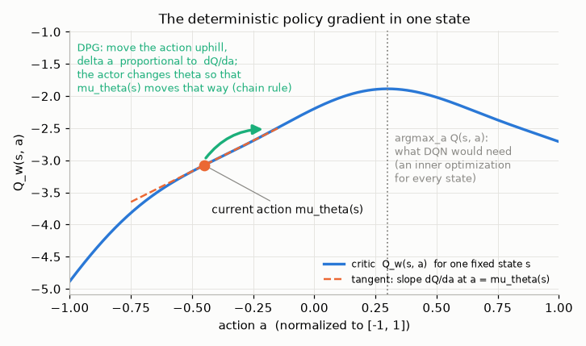
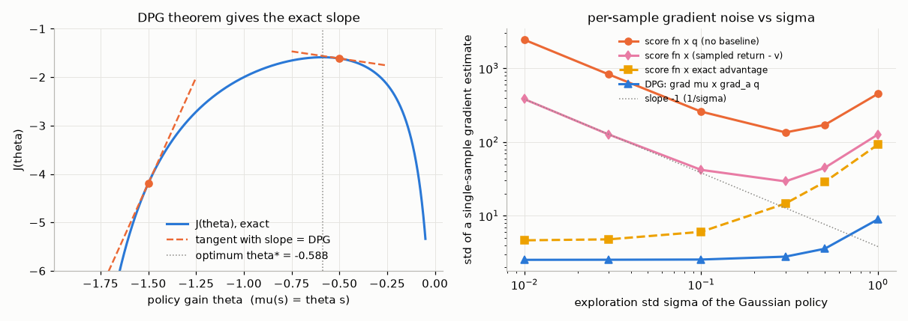
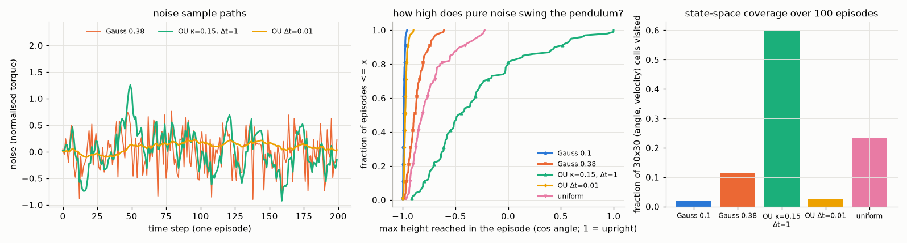
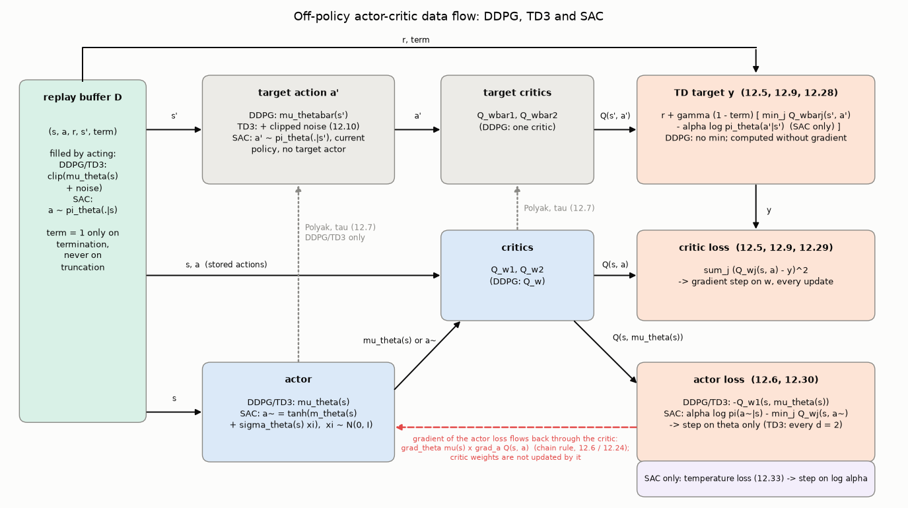
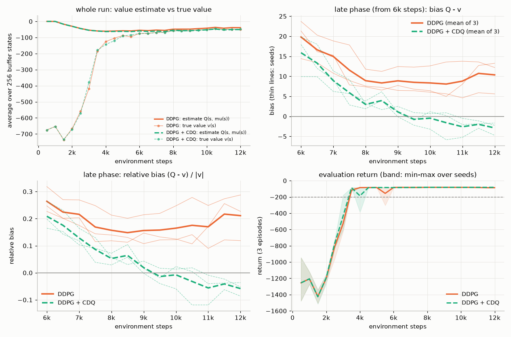
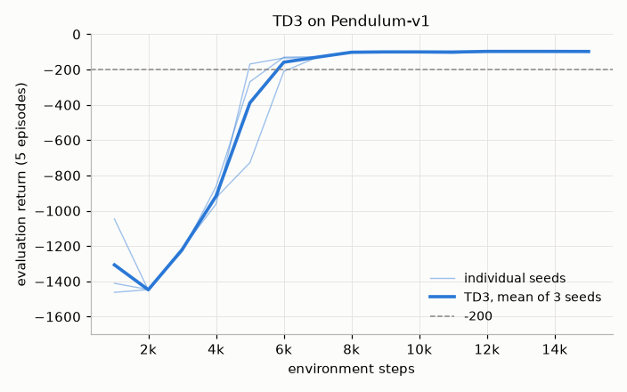
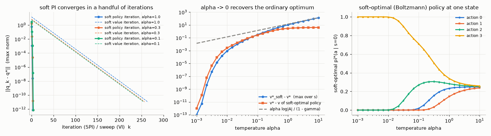
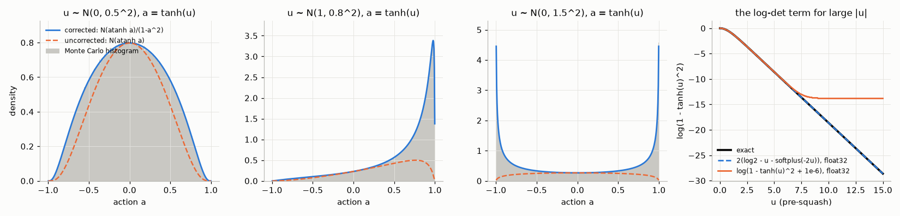
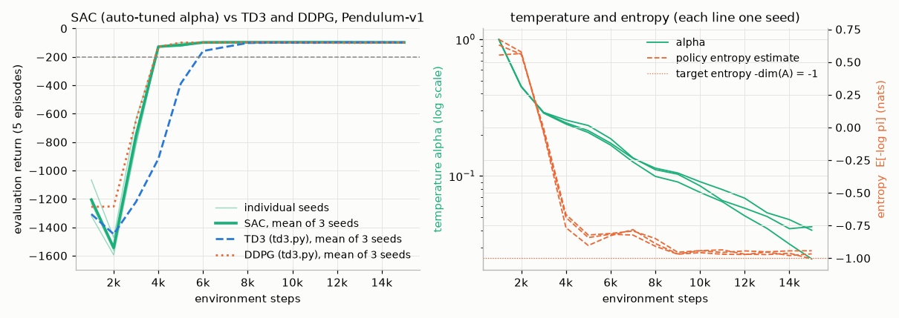
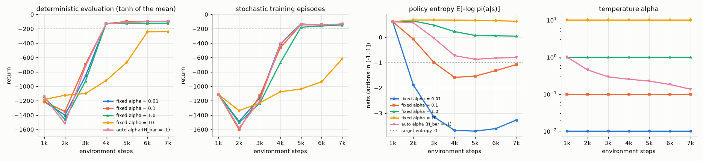

# Chapter 12 — Off-Policy Actor-Critic for Continuous Control: DDPG, TD3 and SAC

[← Previous: Natural Gradients, Trust Regions, TRPO and PPO](11-trust-regions-and-ppo.md) · [Course index](../README.md) · [Next: Model-Based Deep RL, World Models and AlphaZero/MuZero](13-model-based-rl.md) →

## At a glance

Robots, vehicles and simulated bodies act with torques, forces and steering angles, which are real numbers. A deep Q-network ([Chapter 09](09-deep-q-learning.md)) cannot handle them directly: its target and its greedy policy both need $\max_a Q(s,a)$, and over a continuum of actions that maximization is an optimization problem in its own right, solved afresh for every state and every target. The policy-gradient methods of [Chapters 10](10-policy-gradients.md) and [11](11-trust-regions-and-ppo.md) handle continuous actions without difficulty, but they are on-policy. They discard their data after one or a few updates, so they need many environment steps.

This chapter is about the family that gets both: **off-policy actor-critic methods**. The actor *amortizes* the argmax, meaning that a network learns to output a good action in one forward pass. The critic is learned from a replay buffer, as in DQN. Three algorithms carry the story:

* **DDPG** (2016) uses a deterministic actor trained by the **deterministic policy gradient** (DPG): push the action uphill on the critic.
* **TD3** (2018) diagnoses DDPG's main disease, **overestimation** of $Q$ that the actor then exploits, and fixes it with three small changes.
* **SAC** (2018) changes the objective to **maximum-entropy RL**. The policy becomes a stochastic, reparameterized tanh-Gaussian, and a temperature is tuned automatically. SAC became the default off-policy algorithm for continuous control.

**Learning objectives.** After this chapter you should be able to:

1. Explain why $\max_a Q(s,a)$ is the obstacle in continuous action spaces, and list the four ways around it.
2. State the deterministic policy gradient theorem, derive it step by step, explain why it needs no importance sampling off-policy, and relate it to the stochastic policy gradient as the exploration noise goes to zero.
3. Implement DDPG: replay, target networks, Polyak averaging, exploration noise (Ornstein–Uhlenbeck vs Gaussian), and name its failure modes.
4. Explain the overestimation argument for actor-critic methods and how each of TD3's three changes (clipped double-Q, delayed policy updates, target policy smoothing) addresses it. Measure overestimation in code.
5. Define the maximum-entropy objective, soft value functions and the soft Bellman equations; prove soft policy evaluation, soft policy improvement and the convergence of soft policy iteration; derive the Boltzmann form of the soft-optimal policy.
6. Derive SAC's losses, including the reparameterized actor gradient, the tanh change-of-variables correction and the dual objective for automatic temperature tuning.
7. Compare DDPG, TD3, SAC and PPO, and place the recent high-update-ratio methods (REDQ, DroQ, CrossQ, TD7, resets, BRO, SimBa) in context.

**Prerequisites.** The reparameterization and score-function estimators ([Chapter 00, §6](00-math-toolkit.md)); KL divergence, Gibbs' inequality, forward vs reverse KL ([Chapter 00, §5](00-math-toolkit.md)); terminated vs truncated ([Chapter 00, §8.2](00-math-toolkit.md)); Bellman equations and contractions ([Chapters 01](01-the-rl-problem.md) and [03](03-dynamic-programming.md)); maximization bias and Double Q-learning ([Chapter 05, §11](05-temporal-difference.md)); the deadly triad ([Chapter 08](08-function-approximation.md)); DQN's replay buffer and target network ([Chapter 09](09-deep-q-learning.md)); the policy gradient theorem and actor-critic ([Chapter 10](10-policy-gradients.md)); PPO for comparison ([Chapter 11](11-trust-regions-and-ppo.md)).

**Code you will run** (all in [`code/ch12_continuous_control_actor_critic/`](../code/ch12_continuous_control_actor_critic/); runtimes are on one CPU thread of a shared machine; every script also has a `--quick` smoke test of a few seconds to about 20 s):

| Script | What it shows | Full run |
|---|---|---|
| `diagrams.py` | the DPG in one picture (§2) and the data flow of DDPG/TD3/SAC (§3.5) | 2–4 s |
| `dpg_lqr_check.py` | the DPG theorem checked exactly on a linear-quadratic problem; stochastic PG → DPG as noise → 0; estimator noise; Exercise 2's variances | 11–15 s |
| `exploration_noise.py` | Ornstein–Uhlenbeck vs Gaussian noise: how far pure noise swings a pendulum | 7–8 s |
| `td3.py` | DDPG and TD3 from scratch in PyTorch; TD3 (or DDPG with `--algo ddpg`) on Pendulum-v1, 3 seeds; noise and $n$-step variants for Exercises 9 and 15 | 3–4 min per run |
| `overestimation.py` | $Q$ estimate vs true value: single critic (DDPG) vs clipped double-Q | 5.4–7 min |
| `soft_policy_iteration.py` | exact soft policy evaluation/improvement on a random MDP; the $\alpha\to0$ limit | 5–6 s |
| `tanh_squash_check.py` | the tanh log-prob correction against a Monte Carlo density estimate | 9–11 s |
| `sac.py` | SAC from scratch (twin Q, tanh-Gaussian, automatic temperature) on Pendulum-v1, 3 seeds; overlays TD3 and DDPG | 4.5–5.5 min |
| `sac_temperature.py` | fixed $\alpha\in\{0.01,0.1,1,10\}$ vs automatic tuning | 6–7 min |

**Notation for this chapter.** We follow [NOTATION.md](../NOTATION.md), with the departures flagged here, all made to match the deep-RL papers. A deterministic policy is $\mu_{\boldsymbol\theta}(s)$. The critic is written $Q_{\mathbf w}(s,a)$ rather than $\hat q(s,a,\mathbf w)$, and target-network weights carry a bar: $\bar{\mathbf w}$, $\bar{\boldsymbol\theta}$. States lie in $\mathbb R^{d_{\mathcal S}}$, actions in $\mathbb R^{d_{\mathcal A}}$, and $\boldsymbol\theta\in\mathbb R^{d_\theta}$. $\Pi$ denotes a *class of policies*, not the projection operator of NOTATION.md. Several symbols need care. **$\tau$ is the Polyak averaging coefficient** throughout, never a temperature. **$\alpha$ is the entropy temperature** of maximum-entropy RL, as in the SAC papers and NOTATION.md. Because $\alpha$ is taken, learning rates in this chapter are written $\eta$ ($\eta_Q$, $\eta_\pi$, $\eta_\alpha$), a deliberate departure from the course-wide $\alpha$. Soft (entropy-augmented) value functions are written $q^{\mathrm{soft}}_\pi$ and $v^{\mathrm{soft}}_\pi$. Standard-normal noise for reparameterization is $\xi$ (as in Chapter 00). The mean and standard deviation of a Gaussian policy are $m_{\boldsymbol\theta}(s)$ and $\sigma_{\boldsymbol\theta}(s)$, because $\mu$ is reserved for the deterministic policy. $d^\mu$ is the **normalized** discounted state distribution, as in Chapter 11. A baseline is $b(s)$ (one argument, as in [Chapter 10](10-policy-gradients.md)), while $b(a\mid s)$ (two arguments) is the behaviour policy. $c$ is TD3's noise clip and $\kappa_r$ a reward scale.

**Study time.** About 12–15 hours: 6–8 for the text and derivations, 3–4 for the code, 3 for the exercises.

---

## 1. Continuous actions and the argmax problem

### 1.1 Where the max hides in value-based methods

Recall Q-learning and DQN ([Chapters 05](05-temporal-difference.md) and [09](09-deep-q-learning.md)). The TD target and the greedy policy are

$$
y = r + \gamma \max_{a'} Q_{\bar{\mathbf w}}(s',a'), \qquad \pi(s) = \arg\max_a Q_{\mathbf w}(s,a).
$$

With $|\mathcal A|$ discrete actions, a DQN has one output per action and both operations cost one forward pass. Now let $\mathcal A=[-1,1]^{d_{\mathcal A}}$, for example the $d_{\mathcal A}=7$ joint torques of a robot arm. The maximization is over a continuum. The function $a\mapsto Q_{\mathbf w}(s,a)$ is a nonconcave neural network, and we would have to maximize it for every state we act in and for every next state $s'$ in every minibatch.

### 1.2 Four ways around the max

1. **Discretize.** Use $k$ values per dimension. A 7-joint arm with $k=10$ needs $10^7$ outputs, and fine control is lost. This works for small $d_{\mathcal A}$, and factorized variants that discretize each dimension separately exist. It does not scale in general.
2. **Optimize at decision time.** Maximize $Q_{\mathbf w}(s,\cdot)$ numerically for every query, for instance with a few iterations of the cross-entropy method, as in QT-Opt (Kalashnikov et al., 2018) for robot grasping. This is flexible but expensive, and the inner optimizer is approximate.
3. **Restrict $Q$ so the max is analytic.** Normalized advantage functions (NAF; Gu et al., 2016) use $Q(s,a)=V(s)-\tfrac12(a-\mu(s))^\top\mathbf P(s)(a-\mu(s))$ with $\mathbf P(s)$ positive definite, so $\arg\max_a Q=\mu(s)$ exactly. The price is a quadratic, unimodal shape in $a$.
4. **Amortize the max with an actor.** Train a policy network to output (approximately) the maximizing action. The network is updated by gradient ascent on the critic, so it tracks the argmax as the critic changes. A deterministic actor gives DPG/DDPG/TD3 (§2–4). A stochastic actor trained to match a Boltzmann distribution $\propto\exp(Q/\alpha)$ gives SAC (§5–6).

Option 4 is the subject of this chapter. It turns "find the best action" into "learn a function that finds the best action", the same trade that the policy-gradient chapters made, but now driven by a learned critic and off-policy data.

### 1.3 The running example: Pendulum-v1

All experiments use Gymnasium's `Pendulum-v1`. The state is the angle $\vartheta$ (with $\vartheta=0$ upright) and the angular velocity $\dot\vartheta\in[-8,8]$. The observation is $(\cos\vartheta,\sin\vartheta,\dot\vartheta)$. The action is a torque $u\in[-2,2]$, and the reward is

$$
R_{t+1} = -\big(\vartheta_t^2 + 0.1\,\dot\vartheta_t^2 + 0.001\,u_t^2\big),\qquad \vartheta_t\in[-\pi,\pi),
$$

so it lies in $[-16.27,0]$. Episodes start at a uniformly random angle with $\dot\vartheta\in[-1,1]$ and are **truncated** after 200 steps. They never terminate. The torque is too weak to lift the pendulum directly. The angular acceleration is $15\sin\vartheta+3u$, so the torque term (at most 6) can hold the pendulum still only within $\arcsin(6/15)\approx24^\circ$ of upright. The agent must swing back and forth to pump in energy and then balance. Well-trained agents average about $-140$ to $-150$ over random starts, and $-200$ or better means the pendulum is swung up and held from most starts. All our agents see actions rescaled to $[-1,1]$ (the environment multiplies by 2). Because every episode ends by truncation, the TD target must **always bootstrap** at the 200-step boundary; treating truncation as termination is a classic bug here ([Chapter 00, §8.2](00-math-toolkit.md)).

---

## 2. The deterministic policy gradient

**The idea in one picture.** Fix a state $s$ and look at the critic $Q(s,\cdot)$ as a curve over actions. A deterministic actor proposes one action, $\mu_{\boldsymbol\theta}(s)$, somewhere on that curve. DQN would search the curve for its peak. The deterministic policy gradient (DPG) instead asks the critic which way is uphill at the current action, $\partial_aQ(s,a)$, and asks the actor how to change $\boldsymbol\theta$ so that its action moves that way, $\nabla_{\boldsymbol\theta}\mu_{\boldsymbol\theta}(s)$. The product of the two is the chain rule through the critic, averaged over the states the policy visits. The rest of this section makes this exact.



### 2.1 Setting

Let $\mathcal S\subseteq\mathbb R^{d_{\mathcal S}}$ and $\mathcal A\subseteq\mathbb R^{d_{\mathcal A}}$. A **deterministic policy** $\mu_{\boldsymbol\theta}:\mathcal S\to\mathcal A$ has parameters $\boldsymbol\theta\in\mathbb R^{d_\theta}$. Its value functions satisfy

$$
q_\mu(s,a) = r(s,a) + \gamma\int_{\mathcal S}p(s'\mid s,a)\,v_\mu(s')\,ds', \qquad v_\mu(s) = q_\mu\big(s,\mu_{\boldsymbol\theta}(s)\big).
\tag{12.1}
$$

The objective is the expected return from the start distribution $d_0$, $J(\boldsymbol\theta)\doteq\int d_0(s)\,v_\mu(s)\,ds$. We write $p_t^\mu(s)$ for the density of $S_t$ when $S_0\sim d_0$ and actions follow $\mu_{\boldsymbol\theta}$, and define the **normalized discounted state distribution**

$$
d^\mu(s) \doteq (1-\gamma)\sum_{t=0}^\infty\gamma^t p_t^\mu(s).
\tag{12.2}
$$

Silver et al. (2014) use the unnormalized $\rho^\mu = d^\mu/(1-\gamma)$; the two differ only by the constant factor. Two derivatives appear. $\nabla_{\boldsymbol\theta}\mu_{\boldsymbol\theta}(s)$ is the $d_\theta\times d_{\mathcal A}$ matrix with entries $\partial\mu_j/\partial\theta_i$, and $\nabla_a q_\mu(s,a)$ is the $d_{\mathcal A}$-vector of partial derivatives of $q_\mu$ with respect to its **action argument**, with the policy (and hence $v_\mu$ inside it) held fixed.

### 2.2 The theorem and its proof

> **Theorem 12.1 (deterministic policy gradient; Silver et al., 2014).** Suppose $p(s'\mid s,a)$, $\nabla_ap(s'\mid s,a)$, $r(s,a)$, $\nabla_ar(s,a)$, $\mu_{\boldsymbol\theta}(s)$, $\nabla_{\boldsymbol\theta}\mu_{\boldsymbol\theta}(s)$ and $d_0(s)$ are continuous in all their arguments, and that they and $v_\mu$, $\nabla_{\boldsymbol\theta}v_\mu$ are bounded. (These are the regularity conditions that let us exchange derivatives, integrals and infinite sums.) Then
>
> $$
> \nabla_{\boldsymbol\theta}J(\boldsymbol\theta) = \sum_{t=0}^\infty\gamma^t\,\mathbb E\Big[\nabla_{\boldsymbol\theta}\mu_{\boldsymbol\theta}(S_t)\,\nabla_aq_\mu(S_t,a)\big|_{a=\mu_{\boldsymbol\theta}(S_t)}\Big] = \frac{1}{1-\gamma}\,\mathbb E_{S\sim d^\mu}\Big[\nabla_{\boldsymbol\theta}\mu_{\boldsymbol\theta}(S)\,\nabla_aq_\mu(S,a)\big|_{a=\mu_{\boldsymbol\theta}(S)}\Big].
> \tag{12.3}
> $$

*Proof.* Write the Bellman equation (12.1) for $v_\mu$ with the action substituted:

$$
v_\mu(s) = r\big(s,\mu_{\boldsymbol\theta}(s)\big) + \gamma\int p\big(s'\mid s,\mu_{\boldsymbol\theta}(s)\big)\,v_\mu(s')\,ds'.
$$

The parameter $\boldsymbol\theta$ enters in three places: the action in $r$, the action in $p$, and the function $v_\mu$ itself. Differentiate each, using the chain rule for the first two and moving $\nabla_{\boldsymbol\theta}$ inside the integral (allowed by the regularity conditions):

$$
\begin{aligned}
\nabla_{\boldsymbol\theta}v_\mu(s)
&= \nabla_{\boldsymbol\theta}\mu_{\boldsymbol\theta}(s)\,\nabla_ar(s,a)\big|_{a=\mu_{\boldsymbol\theta}(s)}
 + \gamma\int\nabla_{\boldsymbol\theta}\mu_{\boldsymbol\theta}(s)\,\nabla_ap(s'\mid s,a)\big|_{a=\mu_{\boldsymbol\theta}(s)}\,v_\mu(s')\,ds'
 + \gamma\int p\big(s'\mid s,\mu_{\boldsymbol\theta}(s)\big)\,\nabla_{\boldsymbol\theta}v_\mu(s')\,ds' \\
&= \nabla_{\boldsymbol\theta}\mu_{\boldsymbol\theta}(s)\,\nabla_a\Big[r(s,a)+\gamma\int p(s'\mid s,a)\,v_\mu(s')\,ds'\Big]_{a=\mu_{\boldsymbol\theta}(s)}
 + \gamma\int p\big(s'\mid s,\mu_{\boldsymbol\theta}(s)\big)\,\nabla_{\boldsymbol\theta}v_\mu(s')\,ds' \\
&= \underbrace{\nabla_{\boldsymbol\theta}\mu_{\boldsymbol\theta}(s)\,\nabla_aq_\mu(s,a)\big|_{a=\mu_{\boldsymbol\theta}(s)}}_{\doteq\,g(s)}
 + \gamma\,\mathbb E\big[\nabla_{\boldsymbol\theta}v_\mu(S_1)\mid S_0=s\big].
\end{aligned}
$$

The second line collects the two terms that carry $\nabla_{\boldsymbol\theta}\mu_{\boldsymbol\theta}(s)$. The bracket is exactly $q_\mu(s,a)$ from (12.1), seen as a function of $a$ with $v_\mu$ fixed, which gives the third line. We now have a recursion of the form "gradient = immediate term + discounted expected next gradient". Substitute it into itself $k$ times:

$$
\nabla_{\boldsymbol\theta}v_\mu(s) = \sum_{t=0}^{k-1}\gamma^t\,\mathbb E\big[g(S_t)\mid S_0=s\big] + \gamma^k\,\mathbb E\big[\nabla_{\boldsymbol\theta}v_\mu(S_k)\mid S_0=s\big].
$$

The remainder is at most $\gamma^k\sup\lVert\nabla_{\boldsymbol\theta}v_\mu\rVert\to0$. Let $k\to\infty$, then average over $S_0\sim d_0$ (another exchange of integral and gradient):

$$
\nabla_{\boldsymbol\theta}J = \int d_0(s)\nabla_{\boldsymbol\theta}v_\mu(s)\,ds = \sum_{t=0}^\infty\gamma^t\int p_t^\mu(s)\,g(s)\,ds = \frac1{1-\gamma}\int d^\mu(s)\,g(s)\,ds. \qquad\blacksquare
$$

The structure is the same as the proof of the stochastic policy gradient theorem in [Chapter 10](10-policy-gradients.md). The difference is the inner step: there we differentiated $\sum_a\pi_{\boldsymbol\theta}(a\mid s)q_\pi(s,a)$ and got $\nabla\pi\cdot q$; here we differentiate $q_\mu(s,\mu_{\boldsymbol\theta}(s))$ and get the chain rule $\nabla_{\boldsymbol\theta}\mu\cdot\nabla_aq$.

### 2.3 What the theorem says, and why it suits off-policy learning

**It is the chain rule through the critic**, exactly as in the picture at the start of this section. With a learned critic $Q_{\mathbf w}\approx q_\mu$, (12.3) is just back-propagation through the composition $s\mapsto Q_{\mathbf w}(s,\mu_{\boldsymbol\theta}(s))$. In code it is one line: minimize $-Q_{\mathbf w}(s,\mu_{\boldsymbol\theta}(s))$ with respect to $\boldsymbol\theta$ only.

**There is no integral over actions.** The stochastic gradient $\mathbb E_{s,a}[\nabla\log\pi(a\mid s)\,q(s,a)]$ must discover the uphill direction by correlating random action perturbations with value differences. That costs samples, more of them as $d_{\mathcal A}$ grows. The DPG uses the critic's gradient directly, which is first-order information about the action ([Chapter 00, §6.4](00-math-toolkit.md) makes the same point for the reparameterization estimator).

**Off-policy learning without importance sampling.** Suppose the data come from a behaviour policy $b$, for example $\mu_{\boldsymbol\theta}$ plus noise, or old versions of it stored in a replay buffer. Following Degris, White and Sutton (2012), take the off-policy objective $J_b(\boldsymbol\theta)=\int d^b(s)\,v_\mu(s)\,ds$ (the target policy's value, averaged over the states that $b$ visits) and use the approximate gradient

$$
\nabla_{\boldsymbol\theta}J_b(\boldsymbol\theta) \approx \mathbb E_{S\sim d^b}\Big[\nabla_{\boldsymbol\theta}\mu_{\boldsymbol\theta}(S)\,\nabla_aq_\mu(S,a)\big|_{a=\mu_{\boldsymbol\theta}(S)}\Big].
\tag{12.4}
$$

The approximation drops the dependence of $q_\mu$ on $\boldsymbol\theta$ through future actions. Two properties make (12.4) convenient. First, it contains no expectation over actions, so there is no action-probability ratio $\pi/b$ to correct. Second, the critic can be learned off-policy by Q-learning-style targets $r+\gamma Q(s',\mu_{\boldsymbol\theta}(s'))$, which also contain no ratio, because the next action is computed by $\mu$ rather than sampled. What (12.4) does *not* correct is the mismatch between the state distributions $d^b$ and $d^\mu$. Like the replay buffer in DQN, this is accepted as a heuristic. It works when the buffer covers the states the current policy visits. The more damaging failure, when data are fixed, is in the actions. The target and the actor query $Q$ at actions $\mu_{\boldsymbol\theta}(s')$ that the data may never have tried. There the critic's errors go unchecked, and, as §4 shows, the actor seeks out the optimistic ones. This *extrapolation error* is the central problem of offline RL ([Chapter 16](16-offline-rl-and-imitation.md)). Online, new data at the actor's actions keep correcting it.

### 2.4 DPG is the zero-noise limit of the stochastic policy gradient

It is natural to ask whether DPG is a new principle or a special case. Silver et al. answer it.

> **Theorem 12.2 (Silver et al., 2014, Theorem 2; informal).** Let $\pi_{\boldsymbol\theta,\sigma}(a\mid s)=\nu_\sigma\big(\mu_{\boldsymbol\theta}(s),a\big)$, where $\nu_\sigma(\mu,\cdot)$ is a family of distributions centred at $\mu$ that converges to a point mass as $\sigma\to0$ (for example $\mathcal N(\mu,\sigma^2\mathbf I)$), and suppose regularity conditions like those of Theorem 12.1 hold. Then
>
> $$
> \lim_{\sigma\downarrow0}\nabla_{\boldsymbol\theta}J(\pi_{\boldsymbol\theta,\sigma}) = \nabla_{\boldsymbol\theta}J(\mu_{\boldsymbol\theta}).
> $$

So the familiar stochastic policy-gradient machinery, including compatible features and actor-critic, carries over to deterministic policies. The *estimators*, however, behave very differently as $\sigma$ shrinks. Take a Gaussian policy $a=\mu_{\boldsymbol\theta}(s)+\sigma\xi$ with scalar action. Its score is $\nabla_{\boldsymbol\theta}\log\pi=\nabla_{\boldsymbol\theta}\mu\,\xi/\sigma$. The single-sample estimator multiplies this by a value signal $\hat q$ minus a baseline $b(s)$. Expand the true action value around the mean action: $q(s,a)\approx q(s,\mu)+\sigma\xi\,\partial_aq(s,\mu)$. Write $\hat q=q(s,a)+\zeta$, where $\zeta$ is the noise of a sampled return. Then

$$
\nabla_{\boldsymbol\theta}\mu\,\frac{\xi}{\sigma}\,\big(\hat q - b(s)\big) \approx \underbrace{\xi^2\,\nabla_{\boldsymbol\theta}\mu\,\partial_aq(s,\mu)}_{\text{DPG sample}\,\times\,\xi^2} + \underbrace{\nabla_{\boldsymbol\theta}\mu\,\frac{\xi}{\sigma}\big(q(s,\mu)-b(s)\big)}_{\text{baseline error}} + \underbrace{\nabla_{\boldsymbol\theta}\mu\,\frac{\xi\,\zeta}{\sigma}}_{\text{return noise}}.
$$

With a perfect baseline ($b(s)=v(s)=q(s,\mu)+O(\sigma^2)$) and noise-free values, only the first term remains. It has the DPG's mean, because $\mathbb E[\xi^2]=1$, and bounded variance. Any baseline error or return noise is divided by $\sigma$, however, so its standard deviation grows like $1/\sigma$ unless the advantage is known exactly. A deterministic policy has no exploration noise of its own, so it needs an estimator that does not divide by $\sigma$. That is (12.3).

### 2.5 Compatible function approximation (brief)

Silver et al. also give the deterministic analogue of compatible features ([Chapter 10, §13](10-policy-gradients.md); see also [Chapter 11, §5.4](11-trust-regions-and-ppo.md) for the natural-gradient link). A critic $Q_{\mathbf w}(s,a)=(a-\mu_{\boldsymbol\theta}(s))^\top\nabla_{\boldsymbol\theta}\mu_{\boldsymbol\theta}(s)^\top\mathbf w+V(s)$ has action-gradient $\nabla_{\boldsymbol\theta}\mu_{\boldsymbol\theta}(s)^\top\mathbf w$ at $a=\mu_{\boldsymbol\theta}(s)$. If $\mathbf w$ minimizes the mean squared error between this and the true $\nabla_aq_\mu$ over $d^\mu$, plugging $Q_{\mathbf w}$ into (12.3) gives the exact gradient. Such a critic is linear in $a$, so it is accurate only near the policy's own actions. Deep actor-critics use a general neural critic instead, which is a source of bias and of the problems in §3.6 and §4.

### 2.6 Worked example: a scalar linear-quadratic problem

To see (12.3) produce a number, take scalar states and actions, dynamics $S_{t+1}=FS_t+GA_t$ ($F$ and $G$ are scalar constants here, not returns) and reward $R_{t+1}=-(c_sS_t^2+c_aA_t^2)$, with $F=G=c_s=c_a=1$, $\gamma=0.9$ and $S_0\sim\mathcal N(0,1)$. Use the linear policy $\mu_\theta(s)=\theta s$ at $\theta=-0.5$.

*Value function.* Under the policy the closed loop is $S_{t+1}=kS_t$ with $k=F+G\theta=0.5$. Guess $v_\mu(s)=-Ps^2$ and substitute into $v_\mu(s)=-(c_s+c_a\theta^2)s^2+\gamma v_\mu(ks)$:

$$
-Ps^2 = -(1+0.25)s^2 - 0.9\,P\,(0.25)s^2 \;\Rightarrow\; P=\frac{1.25}{1-0.225}=1.6129.
$$

*Action-value and its action-gradient.* $q_\mu(s,a)=-(s^2+a^2)+\gamma v_\mu(s+a)=-s^2-a^2-1.4516\,(s+a)^2$, so

$$
\partial_aq_\mu(s,a) = -2a-2.9032\,(s+a), \qquad \partial_aq_\mu(s,\theta s)=s-2.9032\,(0.5\,s) = -0.4516\,s.
$$

At a positive state the critic says "a smaller action would be better". The policy-parameter derivative is $\partial_\theta\mu_\theta(s)=s$, so $g(s)=-0.4516\,s^2$.

*Discounted state moments.* $\mathbb E[S_t^2]=k^{2t}\,\mathbb E[S_0^2]=0.25^t$, so $\sum_t\gamma^t\mathbb E[S_t^2]=\sum_t0.225^t=1/0.775=1.2903$.

*Gradient.* $\partial_\theta J=-0.4516\times1.2903=-0.5827$.

*Check.* Here $J(\theta)=-P(\theta)\,\mathbb E[S_0^2]=-(1+\theta^2)/\big(1-0.9(1+\theta)^2\big)$. With $N=1+\theta^2$ and $D=1-0.9(1+\theta)^2$ we get $N'=2\theta=-1$, $D'=-1.8(1+\theta)=-0.9$, $N=1.25$, $D=0.775$, and $J'=-(N'D-ND')/D^2=-(-0.775+1.125)/0.6006=-0.5827$. The two agree. The gradient is negative, so ascent makes $\theta$ more negative (stronger feedback), towards the optimum $\theta^\ast\approx-0.588$.

[`dpg_lqr_check.py`](../code/ch12_continuous_control_actor_critic/dpg_lqr_check.py) automates this. It also handles process noise $W_t\sim\mathcal N(0,\sigma_w^2)$ with $\sigma_w=0.3$, for which $J=-P\,\mathbb E[S_0^2]-\gamma P\sigma_w^2/(1-\gamma)$ with $\mathbb E[S_0^2]=1$ (Exercise 3). Its output:

* **Formula vs finite differences.** At $\theta\in\{-1.5,-1,-0.8,-0.5,-0.2\}$ and both noise levels, (12.3) matches central differences of $J$ to within $2.3\times10^{-8}$ (the largest of the 10 cases). At $\theta=-0.5$ without noise both give $-0.582726$.
* **Monte Carlo.** Averaging $\sum_t\gamma^tS_t\,\partial_aq_\mu(S_t,\theta S_t)$ over 200,000 sampled trajectories gives $-0.5841\pm0.0019$, 0.76 standard errors from the exact value.
* **The limit $\sigma\to0$** (with process noise 0.3). The exact gradient of the Gaussian policy $\mathcal N(\theta s,\sigma^2)$ goes $-6.299,\,-2.366,\,-1.527,\,-1.107,\,-1.059,\,-1.055$ for $\sigma=1,0.5,0.3,0.1,0.03,0.01$, approaching the DPG value $-1.0547$, as Theorem 12.2 says.



*Left:* $J(\theta)$ with tangent lines whose slopes are the DPG values; they touch the curve exactly. *Right:* the standard deviation of a *single-sample* gradient estimate, as a function of the exploration noise $\sigma$ (2,000,000 states from $d^\pi$; 200,000 for sampled returns). The score-function estimator with the raw $q$ grows from 136 at $\sigma=0.3$ to 2,448 at $\sigma=0.01$, because the large common value $q(s,\mu(s))$ is multiplied by $\xi/\sigma$. With the *exact* advantage $q-v$ it stays bounded (4.66 at $\sigma=0.01$), as the expansion in §2.4 predicts. With a *sampled* return minus the exact $v(s)$, which is what REINFORCE with a perfect baseline would see, it grows like $1/\sigma$ again (383 at $\sigma=0.01$), because the return noise is divided by $\sigma$. The DPG estimator stays at about 2.5. A deterministic actor therefore needs the DPG estimator. It also needs a critic whose action-gradient is accurate, which is what the rest of the chapter is about.

---

## 3. DDPG: deep deterministic policy gradient

### 3.1 From DPG to deep DPG

Silver et al. (2014) tested DPG with linear function approximation. Lillicrap et al. (2016) made it work with deep networks on raw states and pixels by borrowing DQN's two stabilizers ([Chapter 09](09-deep-q-learning.md)):

* a **replay buffer** $\mathcal D$ of transitions $(s,a,r,s',\text{term})$ sampled uniformly in minibatches. This breaks temporal correlations and reuses data. It is legitimate here because both the critic target and the actor gradient (12.4) are off-policy without importance ratios;
* **target networks** $Q_{\bar{\mathbf w}}$ and $\mu_{\bar{\boldsymbol\theta}}$ that change slowly and are used only to compute TD targets.

The original paper also used batch normalization (states in different physical units), a critic weight decay of $10^{-2}$ and Ornstein–Uhlenbeck exploration noise. Modern reimplementations drop batch normalization and weight decay. We follow Fujimoto et al.'s (2018) "our DDPG" variant, which uses the same networks and learning rates as TD3, so that any difference from TD3 comes from TD3's changes alone.

### 3.2 The two updates

**Critic.** Minimize the squared TD error to a target computed by the *target* actor and critic:

$$
y = r + \gamma\,(1-\text{term})\,Q_{\bar{\mathbf w}}\big(s',\mu_{\bar{\boldsymbol\theta}}(s')\big),\qquad
L(\mathbf w) = \frac1B\sum_{i=1}^B\big(Q_{\mathbf w}(s_i,a_i)-y_i\big)^2.
\tag{12.5}
$$

Here $\text{term}$ is 1 only if the episode *terminated* at $s'$. A time-limit truncation keeps $\text{term}=0$, so the target bootstraps (Pendulum is always truncated, never terminated). The target is the DQN target with $\max_{a'}$ replaced by "the action the target actor would take". The actor is the amortized argmax.

**Actor.** Ascend the sample version of (12.4) on the same minibatch:

$$
\widehat{\nabla_{\boldsymbol\theta}J} = \frac1B\sum_{i=1}^B\nabla_{\boldsymbol\theta}\mu_{\boldsymbol\theta}(s_i)\,\nabla_aQ_{\mathbf w}(s_i,a)\big|_{a=\mu_{\boldsymbol\theta}(s_i)}
= \nabla_{\boldsymbol\theta}\Big[\frac1B\sum_i Q_{\mathbf w}\big(s_i,\mu_{\boldsymbol\theta}(s_i)\big)\Big].
\tag{12.6}
$$

The second form is how it is implemented: the actor loss is $-\frac1B\sum_iQ_{\mathbf w}(s_i,\mu_{\boldsymbol\theta}(s_i))$, back-propagated *through the critic into the actor*, with only the actor's optimizer taking a step. From [`td3.py`](../code/ch12_continuous_control_actor_critic/td3.py):

```python
actor_loss = -self.q[0](s, self.actor(s)).mean()   # Eq. 12.6 via autograd's chain rule
self.actor_opt.zero_grad(set_to_none=True)
actor_loss.backward()
self.actor_opt.step()                               # critic grads from this backward are discarded
```

The actor's output layer is a $\tanh$, so actions stay inside $[-1,1]^{d_{\mathcal A}}$.

### 3.3 Target networks and Polyak averaging

DQN copies the online weights into the target network every $C$ steps. DDPG instead lets the targets trail the online weights continuously:

$$
\bar{\mathbf w} \leftarrow \tau\,\mathbf w + (1-\tau)\,\bar{\mathbf w},\qquad \bar{\boldsymbol\theta} \leftarrow \tau\,\boldsymbol\theta + (1-\tau)\,\bar{\boldsymbol\theta},\qquad 0<\tau\ll1,
\tag{12.7}
$$

after every update. This is **Polyak averaging** (an exponential moving average). Unrolling it, $\bar{\mathbf w}_k=(1-\tau)^k\bar{\mathbf w}_0+\tau\sum_{j=0}^{k-1}(1-\tau)^{k-1-j}\mathbf w_j$: the target is a weighted average of past online weights with time constant $1/\tau$ updates. With $\tau=0.005$ (TD3/SAC default; DDPG used $0.001$) the weight of a given update halves after $\ln2/(-\ln(1-\tau))\approx138$ updates ($\approx\ln2/\tau$). The target therefore moves smoothly instead of jumping every $C$ steps. In an actor-critic this matters because the target value $Q_{\bar{\mathbf w}}(s',\mu_{\bar{\boldsymbol\theta}}(s'))$ depends on two networks. With hard copies both would jump at the same moment, so the target would change its function and its argument at once. Polyak averaging makes both drift smoothly. Target networks slow the feedback loop "critic → actor → critic target", which aggravates the instability of the deadly triad ([Chapter 08](08-function-approximation.md)). The cost is slower propagation of value information.

### 3.4 Exploration: Ornstein–Uhlenbeck vs Gaussian noise

A deterministic policy does not explore. DDPG explores by acting with $a_t=\mathrm{clip}\big(\mu_{\boldsymbol\theta}(s_t)+\mathcal N_t,-1,1\big)$, and because the method is off-policy, this behaviour policy can be anything. Lillicrap et al. chose temporally correlated noise from an **Ornstein–Uhlenbeck (OU) process**, the continuous-time model of a particle with friction in a heat bath. Discretized with step $\Delta t$:

$$
x_{t+1} = x_t - \kappa\,x_t\,\Delta t + \sigma_{\mathrm{OU}}\sqrt{\Delta t}\;\xi_t,\qquad \xi_t\sim\mathcal N(0,1),\quad x_0=0.
\tag{12.8}
$$

(We write $\kappa$ for the mean-reversion rate that is usually called $\theta$, to avoid a clash with the policy parameters.) Its lag-$k$ autocorrelation at stationarity is $(1-\kappa\Delta t)^k$, its correlation time is about $1/(\kappa\Delta t)$ steps, and its stationary variance solves $\mathrm{Var}=(1-\kappa\Delta t)^2\mathrm{Var}+\sigma_{\mathrm{OU}}^2\Delta t$:

$$
\mathrm{Var}_\infty = \frac{\sigma_{\mathrm{OU}}^2\,\Delta t}{1-(1-\kappa\Delta t)^2}\approx\frac{\sigma_{\mathrm{OU}}^2}{2\kappa}\quad(\kappa\Delta t\ll1).
$$

With DDPG's $\kappa=0.15$, $\sigma_{\mathrm{OU}}=0.2$, $\Delta t=1$, the stationary standard deviation is $0.2/\sqrt{0.2775}=0.380$ and the correlation time is about 6.7 steps. The motivation is physical. A torque that persists for several steps moves a body with inertia much further than independent kicks that cancel out.

[`exploration_noise.py`](../code/ch12_continuous_control_actor_critic/exploration_noise.py) isolates the noise process. The policy outputs zero, the action is the noise alone, and each of 100 episodes starts with the pendulum hanging at rest:

| noise (normalized torque) | lag-1 corr. | rises above horizontal | mean max height ($\cos\vartheta$) | (angle, velocity) cells visited |
|---|---|---|---|---|
| Gaussian, std 0.1 (TD3's default) | 0.00 | 0% | −0.988 | 2.1% |
| Gaussian, std 0.38 | 0.00 | 0% | −0.870 | 11.4% |
| OU, $\kappa=0.15$, $\sigma=0.2$, $\Delta t=1$ (std 0.38) | 0.85 | 19% | −0.311 | 59.9% |
| OU, same, $\Delta t=0.01$ | 0.99 | 0% | −0.972 | 2.4% |
| uniform on $[-1,1]$ (std 0.58) | −0.02 | 0% | −0.750 | 23.3% |



At equal marginal standard deviation, OU noise swings the pendulum to a mean maximum height of $\cos\vartheta=-0.31$ against $-0.87$, and visits five times as many cells of the (angle, velocity) grid. Correlation in time, not size, is what pumps in energy. The fourth row is a common implementation trap. Some popular libraries use $\Delta t=10^{-2}$. The correlation time is then about 667 steps, longer than an episode, so the process barely leaves zero before it is reset (its empirical std within episodes is 0.18) and it explores *less* than small white noise.

Does this matter for learning? Much less than the table suggests. Once the actor has learned to pump energy, the noise only perturbs a purposeful trajectory, and all our agents start with 1,000 uniformly random steps. Fujimoto et al. (2018) found no benefit from OU noise on their benchmarks, and TD3 and SAC dropped it. Our TD3 (§4.7) solves Pendulum with Gaussian noise of std 0.1, the row with the *least* coverage, and Exercise 9 is consistent with this: TD3 learned about equally fast with OU noise as with Gaussian noise of the same std or of std 0.1 (3 seeds each). Correlated noise is still worth remembering for systems with inertia, low control authority and sparse rewards.

### 3.5 The algorithm

The diagram shows what flows where in one update, for DDPG and for the two algorithms that follow (TD3 in §4, SAC in §6), with the equation numbers.



```
Algorithm 12.1  DDPG (with modern defaults)
Input: actor mu_theta (tanh output), critic Q_w, discount gamma, Polyak tau (e.g. 0.005),
       learning rates eta_pi, eta_Q, batch size B, noise process N (OU or Gaussian), warm-up steps K
Initialise theta, w at random; target weights theta_bar <- theta, w_bar <- w; empty replay buffer D
Observe s ~ d0;  reset the noise process
for t = 1, 2, ..., T_total:
    if t <= K:  a <- uniform random action                      # warm-up: fill the buffer
    else:       a <- clip(mu_theta(s) + N_t, -1, 1)
    Execute a; observe r, s', terminated, truncated
    Store (s, a, r, s', terminated) in D                           # NOT 'terminated or truncated'
    s <- s'
    if terminated or truncated: s ~ d0; reset the noise process
    if t >= K:
        Sample a minibatch {(s_i, a_i, r_i, s'_i, term_i)}_{i=1..B} from D
        y_i <- r_i + gamma (1 - term_i) Q_wbar(s'_i, mu_thetabar(s'_i))          # Eq. 12.5
        w <- w - eta_Q grad_w (1/B) sum_i (Q_w(s_i, a_i) - y_i)^2
        theta <- theta + eta_pi grad_theta (1/B) sum_i Q_w(s_i, mu_theta(s_i))   # Eq. 12.6
        w_bar <- tau w + (1 - tau) w_bar;   theta_bar <- tau theta + (1 - tau) theta_bar   # Eq. 12.7
```

In practice both gradient steps use Adam ([Chapter 00, §3.5](00-math-toolkit.md)). In our code, DDPG is `TD3Agent` with the three TD3 switches turned off (`ddpg_config()` in `td3.py`).

### 3.6 Failure modes

DDPG can be very sample-efficient. On Pendulum, evaluated exactly like TD3 and SAC (§4.7), our DDPG first reached $-200$ at 4,000 steps on all three seeds. It is also known for brittleness. Henderson et al. (2018) and Islam et al. (2017) documented large variation across seeds, hyperparameters and even implementations. The recurring causes:

* **Overestimation that the actor exploits.** Critic errors are not symmetric in their effect. The actor climbs $Q_{\mathbf w}$, so it seeks out actions where the critic is *too high*, and bootstrapping then copies those errors into the targets. This is the subject of §4.
* **Narrow critic peaks.** A deterministic actor can sit on a sharp, spurious ridge of $Q_{\mathbf w}(s,\cdot)$ that a slightly perturbed action would fall off. The policy's estimated value is then much higher than its true value.
* **Divergence.** Off-policy bootstrapping with nonlinear function approximation is the deadly triad ([Chapter 08](08-function-approximation.md)). Large learning rates, a large $\tau$ or no target networks can make $Q$ blow up.
* **Actor saturation.** If the pre-tanh activation of the actor grows large, $\tanh'\approx0$ and the actor gradient vanishes. Actions stick at the bounds even when the critic disagrees.
* **Reward-scale sensitivity.** Rescaling the rewards by a factor $\kappa_r$ rescales $Q$ and the actor's gradient (12.6). With plain SGD this rescales the actor's step. With Adam the step is roughly scale-invariant, but the critic must still fit values $\kappa_r$ times larger from an initialization near 0, which changes the early learning dynamics. Henderson et al. (2018) report large reward-scale effects for DDPG.
* **Exploration.** State-independent additive noise explores locally. It fails on sparse-reward tasks such as MountainCarContinuous, where the reward requires a long coordinated sequence of actions ([Chapter 14](14-exploration.md)).
* **Truncation handled as termination.** If time-limit truncation is treated as termination, the value of the last state is forced to zero. In Pendulum every episode would end on a falsely terminal state.

---

## 4. TD3: twin delayed DDPG

Fujimoto, van Hoof and Meger (2018) asked why DDPG is brittle and traced much of it to **function-approximation error in the critic**, specifically overestimation and the variance it injects into the actor's updates. Their algorithm, Twin Delayed DDPG (TD3), makes three changes, one for each mechanism they identified.

### 4.1 Maximization bias, revisited

[Chapter 05, §11](05-temporal-difference.md) showed that $\max$ over noisy estimates is biased upward: for unbiased estimates $Q(a)$ of $q(a)$, $\mathbb E[\max_aQ(a)]\ge\max_aq(a)$, by Jensen's inequality for the convex function $\max$.

**Worked example (by hand).** Two actions, both with true value 0. Each estimate is $0\pm1$ with probability $\tfrac12$ each, independently.

* *Single estimator.* The four equally likely outcomes $(+1,+1),(+1,-1),(-1,+1),(-1,-1)$ give $\max=1,1,1,-1$, so $\mathbb E[\max_aQ(a)]=\tfrac{1+1+1-1}{4}=0.5$. The true maximum is 0.
* *Double estimator* (Double Q-learning). Select $\hat a=\arg\max_aQ^A(a)$ with one estimate and evaluate it with an independent one, $Q^B(\hat a)$. Since $Q^B$ is independent of the selection, $\mathbb E[Q^B(\hat a)]=0$. It is unbiased here.
* *Clipped double estimator* (TD3). Use $\min\{Q^A(\hat a),Q^B(\hat a)\}$. With probability $\tfrac34$ we have $Q^A(\hat a)=+1$, and the min is $Q^B(\hat a)=\pm1$ with mean 0. With probability $\tfrac14$ we have $Q^A(\hat a)=-1$, and the min is $-1$. So $\mathbb E=\tfrac34\cdot0+\tfrac14\cdot(-1)=-0.25$. It is biased *downward*.

The clipped estimator trades a positive bias for a smaller negative one. §4.3 explains why that is a good trade in actor-critic methods.

**Why bootstrapping makes it worse.** A bias in the target does not stay local. If every TD target carries an upward error $\mathbf e$ (a vector over state–action pairs), the fixed point of $Q=\mathbf r+\gamma\mathbf P^\pi Q+\mathbf e$ is $q_\pi+(\mathbf I-\gamma\mathbf P^\pi)^{-1}\mathbf e$. A constant error $e$ is amplified to $e/(1-\gamma)$, a factor of 100 at $\gamma=0.99$.

### 4.2 Overestimation in actor-critic methods

DDPG has no explicit $\max$, so it is not obvious that it overestimates. Fujimoto et al. show that the actor update plays the role of the max.

> **Proposition 12.3 (Fujimoto et al., 2018, §4.1; they write $\phi$ for the actor parameters).** Fix a deterministic policy $\mu_{\boldsymbol\theta}$ and an approximate critic $Q_{\mathbf w}$. Let $\boldsymbol\theta_{\text{approx}}$ be the parameters after one actor step along $\mathbb E_s[\nabla_{\boldsymbol\theta}\mu_{\boldsymbol\theta}(s)\nabla_aQ_{\mathbf w}(s,a)]$, and $\boldsymbol\theta_{\text{true}}$ those after a step along the same expression with the true $q_\mu$. Both steps are normalized and of size $\eta$. Write $\mu_{\text{approx}}$ and $\mu_{\text{true}}$ for the resulting policies. If the critic is unbiased-or-optimistic at the true update, $\mathbb E_s[Q_{\mathbf w}(s,\mu_{\text{true}}(s))]\ge\mathbb E_s[q_\mu(s,\mu_{\text{true}}(s))]$, then for all sufficiently small $\eta$
>
> $$
> \mathbb E_s\big[Q_{\mathbf w}(s,\mu_{\text{approx}}(s))\big] \;\ge\; \mathbb E_s\big[q_\mu(s,\mu_{\text{approx}}(s))\big].
> $$

*Proof sketch.* A step of size $\eta$ in a unit direction $\mathbf u$ changes a smooth function $f$ by $\eta\langle\nabla f,\mathbf u\rangle+O(\eta^2)$, and the first-order term is largest when $\mathbf u$ is the normalized gradient of $f$. Apply this to $f=\mathbb E_s[Q_{\mathbf w}(s,\mu_{\boldsymbol\theta}(s))]$, whose gradient is the approximate update direction (by Theorem 12.1's chain rule). There is $\eta_1>0$ such that for $\eta\le\eta_1$, $\mathbb E[Q_{\mathbf w}(s,\mu_{\text{approx}}(s))]\ge\mathbb E[Q_{\mathbf w}(s,\mu_{\text{true}}(s))]$: the approximate step is the best direction for $Q_{\mathbf w}$. Applying the same fact to $f=\mathbb E_s[q_\mu(s,\mu_{\boldsymbol\theta}(s))]$ gives $\eta_2$ such that for $\eta\le\eta_2$, $\mathbb E[q_\mu(s,\mu_{\text{true}}(s))]\ge\mathbb E[q_\mu(s,\mu_{\text{approx}}(s))]$: the true step is the best direction for $q_\mu$. For $\eta\le\min(\eta_1,\eta_2)$, chain the three inequalities:

$$
\mathbb E\,Q_{\mathbf w}(s,\mu_{\text{approx}}) \ge \mathbb E\,Q_{\mathbf w}(s,\mu_{\text{true}}) \ge \mathbb E\,q_\mu(s,\mu_{\text{true}}) \ge \mathbb E\,q_\mu(s,\mu_{\text{approx}}).\qquad\blacksquare
$$

In words, the actor moves to wherever the critic is most flattering. After the update, the critic overestimates the new policy at least as much as it would overestimate the policy produced by a true-gradient step. In particular, it overestimates the new policy whenever it was not pessimistic at that other policy. Each such error then enters the targets of the next critic update and is amplified by bootstrapping (§4.1). The proposition says only that the bias is non-negative under its assumption. Whether it is large is an empirical question, which §4.6 measures.

### 4.3 Clipped double-Q learning

The tabular fix for maximization bias is to decouple selection from evaluation. Fujimoto et al. tried the two direct translations. (i) Double-DQN style: evaluate the current actor's action with the target critic. In an actor-critic the current and target actors are so similar that this decouples almost nothing. (ii) Double Q-learning style: two actors and two critics, each critic evaluating the other actor's action. The two critics are trained on the same replay buffer with targets that depend on each other, so they are far from independent, and overestimation remained.

Their solution is **clipped double-Q**. Train two critics $Q_{\mathbf w_1},Q_{\mathbf w_2}$ with their own target copies, and regress *both* onto a single target that uses the smaller of the two target values:

$$
y = r + \gamma\,(1-\text{term})\min_{j=1,2}Q_{\bar{\mathbf w}_j}\big(s',\tilde a'\big),\qquad L(\mathbf w_j)=\frac1B\sum_i\big(Q_{\mathbf w_j}(s_i,a_i)-y_i\big)^2,\ j=1,2,
\tag{12.9}
$$

where $\tilde a'$ is the (smoothed, §4.5) target action. The actor is trained on $Q_{\mathbf w_1}$ only. Three arguments support the min:

1. **It caps the bias.** If one critic overestimates at $(s',\tilde a')$ and the other does not, the min ignores the optimistic one. As the worked example shows, it can underestimate.
2. **Underestimation is self-limiting, overestimation is self-reinforcing.** The actor seeks high-$Q$ actions, so an overestimated action gets chosen, its error propagates, and the error grows. An underestimated action is simply avoided. Its error stays where it is and is corrected if the action is ever tried again. The min's own downward bias at the *selected* action ($-0.25$ in the example of §4.1) is still propagated by bootstrapping, like any target error (§4.1). What is self-limiting is that the policy update does not select for it, whereas it actively seeks out overestimation.
3. **It prefers low-variance estimates.** Where the two critics disagree a lot, the min is pulled down more. States with uncertain values receive more conservative targets, so the actor gets more stable learning signals.

### 4.4 Delayed policy updates

**Why per-update error matters: the variance argument.** Fujimoto et al. (their §5.1) motivate the last two changes with a short calculation. Suppose each critic update leaves a residual TD error $\delta(s,a)=y-Q(s,a)$, so that $Q(s,a)=r(s,a)+\gamma\,\mathbb E[Q(S',A')]-\delta(s,a)$, with $S'\sim p(\cdot\mid s,a)$ and $A'$ the policy's action. Start from $(S_t,A_t)=(s,a)$, write $\delta_i=\delta(S_i,A_i)$, and substitute the same identity for $Q(S_{t+1},A_{t+1})$, then for $Q(S_{t+2},A_{t+2})$, and so on:

$$
\begin{aligned}
Q(s,a) &= r(s,a)-\delta_t+\gamma\,\mathbb E\big[Q(S_{t+1},A_{t+1})\big]\\
&= r(s,a)-\delta_t+\gamma\,\mathbb E\Big[r(S_{t+1},A_{t+1})-\delta_{t+1}+\gamma\,\mathbb E\big[Q(S_{t+2},A_{t+2})\big]\Big]\\
&= \cdots = \mathbb E\Big[\sum_{i\ge t}\gamma^{i-t}\big(R_{i+1}-\delta_i\big)\,\Big|\,S_t=s,A_t=a\Big],
\end{aligned}
$$

where the remainder $\gamma^k\,\mathbb E[Q(S_{t+k},A_{t+k})]$ vanishes for a bounded $Q$. The estimate is the expected return *minus a discounted sum of all future residual errors*. If those errors were independent with variance $\sigma_\delta^2$, their discounted sum would have variance $\sigma_\delta^2/(1-\gamma^2)$, about $50\,\sigma_\delta^2$ at $\gamma=0.99$. So anything that reduces the error left by each update reduces the variance of the value estimate, and hence of the actor's gradient. Slow targets, letting the critic converge before the actor moves (this subsection) and smoothing the target (§4.5) all do that.

Target networks reduce the error in the critic only if the policy that defines the target stays put long enough for the critic to catch up. Fujimoto et al. showed on Hopper that with a *fixed* policy, value estimates converge whether or not the targets are slow (only more slowly with small $\tau$). With a *learning* policy and no target network ($\tau=1$), the estimates became unstable and diverged. The feedback loop is the issue. A poor critic gives a poor actor update, which changes the targets, which makes the critic poorer. TD3's remedy is to update the actor, and both target networks, only once every $d$ critic updates ($d=2$):

```python
if self.n_updates % cfg.policy_delay == 0:     # actor and targets: every d = 2 critic updates
    actor_loss = -self.q[0](s, self.actor(s)).mean()
    ...
    polyak_update(self.actor_targ, self.actor, cfg.tau)
    polyak_update(self.q_targ, self.q, cfg.tau)
```

The critic gets $d$ steps to reduce its error on the current policy before the policy moves again, which reduces the variance of the actor's gradient. It also halves the cost of the actor updates.

### 4.5 Target policy smoothing

The last change addresses narrow peaks (§3.6). Instead of evaluating the target critic at exactly $\mu_{\bar{\boldsymbol\theta}}(s')$, evaluate it at a slightly perturbed action:

$$
\tilde a' = \mathrm{clip}\Big(\mu_{\bar{\boldsymbol\theta}}(s')+\mathrm{clip}(\tilde\sigma\xi,-c,c),\,-1,\,1\Big),\qquad \xi\sim\mathcal N(\mathbf 0,\mathbf I),
\tag{12.10}
$$

with $\tilde\sigma=0.2$ and $c=0.5$ for actions in $[-1,1]$, and a fresh $\xi$ for every next state. In expectation, the target now estimates $\mathbb E_\xi\big[Q(s',\mu_{\bar{\boldsymbol\theta}}(s')+\tilde\sigma\xi)\big]$ (ignoring the clips), the value of a small neighbourhood of the target action. That is the target of Expected SARSA ([Chapter 05](05-temporal-difference.md)) for a slightly noisy policy, and it regularizes the critic to be smooth in $a$. "Similar actions should have similar values" is a sensible prior for physical control. It also leaves the actor fewer sharp spurious peaks to exploit. The clip $c$ keeps the target close to the original action. SAC gets the same effect for free, because its target action is sampled from a stochastic policy (§6.4).

### 4.6 Measuring overestimation

[`overestimation.py`](../code/ch12_continuous_control_actor_critic/overestimation.py) repeats the measurement behind Figure 1 of the TD3 paper on Pendulum. Two learners share *everything*: networks (two hidden layers of 128 ReLU units), Adam with learning rate $10^{-3}$, batch 256, $\tau=0.005$, Gaussian exploration noise 0.1, 1,000 warm-up steps and seeds. They differ only in the target:

* **DDPG:** one critic, target (12.5);
* **DDPG + CDQ:** two critics, target (12.9) without smoothing and without delay.

Every 500 steps we draw 256 states from the replay buffer and compute the critic's estimate $Q_{\mathbf w_1}(s,\mu_{\boldsymbol\theta}(s))$, which is what the actor climbs. We compare it with the **true** discounted value $v_\mu(s)$ of the current deterministic policy. Pendulum is deterministic, so a single 1,000-step rollout of $\mu_{\boldsymbol\theta}$ from $s$ gives $v_\mu(s)$ up to a neglected tail below 0.1. We roll out with a batched NumPy copy of the Pendulum dynamics. At the start of every run the script checks it against step-by-step Gymnasium rollouts: over 20 episodes the 200-step discounted returns differ by at most $6\times10^{-5}$. Note that this is the infinite-horizon value: the 200-step time limit is not part of the MDP the critic learns, because we bootstrap through truncation.



The results (three seeds, 12,000 steps each):

* **A transient unrelated to the max.** The whole-run panel (top left) is dominated by something else. True values start around $-700$, but both critics start near 0, so early on both "overestimate" by about 700 simply because value information has not propagated yet. The min cannot remove this *optimistic initialization*, because both critics start at the same place. It largely decays by about 6,000 steps.
* **After the transient, the single critic stays optimistic on every seed.** Over the late phase (steps 6,000–12,000), the mean bias of the DDPG critic is $+10.3$, $+14.9$ and $+7.9$ on the three seeds, that is $17\%$, $25\%$ and $14\%$ of $|v_\mu|$. With clipped double-Q it is $+1.8$, $+4.9$ and $+2.9$ ($1\%$, $7\%$ and $5\%$). (The relative bias is the mean over the late measurements of $(Q-v_\mu)/|v_\mu|$. Dividing the mean bias by the mean $|v_\mu|$ instead gives 17, 25 and 15% for DDPG and 3, 8 and 5% with clipped double-Q, because $|v_\mu|$ varies between measurements.) At the final measurement the seed-averaged bias is $+10.3$ for DDPG and $-2.9$ for DDPG + CDQ. The min removes most of the persistent overestimation and slightly overshoots into underestimation, as the worked example of §4.1 predicts. In the top-right and bottom-left panels, the DDPG critic levels off about 8–11 above the truth (15–22% of $|v_\mu|$) from 8,000 steps on. The clipped critic keeps falling, crosses zero between 9,000 and 9,500 steps and ends slightly pessimistic.
* **On this easy task the bias does not hurt the return.** Both learners first reach $-200$ at the 3,000- or 3,500-step evaluation and end at $-84$ and $-82$ (mean of the last five 3-episode evaluations; these 3 start states are easy ones, so compare these returns only with each other). A 15–25% optimism is not enough to derail a one-dimensional swing-up. Fujimoto et al. measured the same mechanism on MuJoCo locomotion, where DDPG's estimates ended far above the true values. Pendulum shows the *sign* and the *cure* cleanly, not the damage. Exercise 13 asks what a higher update-to-data ratio does to this bias.

One more detail from the run: the average of $\min(Q_1,Q_2)$ over the 256 states is almost identical to that of $Q_1$ (they never differed by more than 0.99 at any measurement). The two critics of DDPG + CDQ stay very close to each other, because they see the same data and the same targets. The min still matters, because it is applied to the *target* at every update, and small per-step corrections accumulate through bootstrapping (§4.1).

### 4.7 The algorithm, and TD3 on Pendulum

```
Algorithm 12.2  TD3 (Twin Delayed DDPG)
Input: actor mu_theta (tanh output), critics Q_w1, Q_w2, gamma, tau, eta_pi, eta_Q, batch size B,
       exploration std sigma (0.1), target noise std sigma_tilde (0.2), noise clip c (0.5),
       policy delay d (2), warm-up steps K
Initialise theta, w1, w2; targets theta_bar <- theta, w1_bar <- w1, w2_bar <- w2; empty buffer D
Observe s ~ d0
for t = 1, 2, ..., T_total:
    if t <= K:  a <- uniform random action
    else:       a <- clip(mu_theta(s) + eps, -1, 1),   eps ~ N(0, sigma^2 I)
    Execute a; observe r, s', terminated, truncated;  store (s, a, r, s', terminated) in D
    s <- s';  if terminated or truncated: s ~ d0
    if t >= K:
        Sample a minibatch {(s_i, a_i, r_i, s'_i, term_i)}_{i=1..B} from D
        eps_i <- clip(N(0, sigma_tilde^2 I), -c, c)
        a~'_i <- clip(mu_thetabar(s'_i) + eps_i, -1, 1)                        # smoothing, Eq. 12.10
        y_i <- r_i + gamma (1 - term_i) min_{j=1,2} Q_wjbar(s'_i, a~'_i)       # clipped double-Q, Eq. 12.9
        for j = 1, 2:  w_j <- w_j - eta_Q grad (1/B) sum_i (Q_wj(s_i, a_i) - y_i)^2
        if t mod d == 0:                                                        # delayed updates
            theta <- theta + eta_pi grad_theta (1/B) sum_i Q_w1(s_i, mu_theta(s_i))
            theta_bar <- tau theta + (1 - tau) theta_bar
            wj_bar <- tau wj + (1 - tau) wj_bar,  j = 1, 2
```

[`td3.py`](../code/ch12_continuous_control_actor_critic/td3.py) implements this with the hyperparameters of §4.6 and 15,000 environment steps. Every 1,000 steps the deterministic policy is evaluated on 5 fixed start states, and at the end on 20 fresh ones. `td3.py --algo ddpg` runs the DDPG configuration of §4.6 under exactly this protocol, and SAC (§6.7) uses it too.



On three seeds the 5-episode evaluation return first reaches $-200$ after 6,000, 7,000 and 5,000 steps. The final 20-episode returns are $-140.5$, $-140.5$ and $-142.2$ (mean $-141.1$), which is near optimal for Pendulum. Each run takes 58–72 s, depending on how busy our shared machine was. The curves are tightly grouped after 7,000 steps. With the same protocol, DDPG first reaches $-200$ at 4,000 steps on all three seeds and ends at $-142.9$, $-137.5$ and $-137.4$ (mean $-139.3$; 63 s per seed). So on this easy task, TD3's three changes cost 1,000–3,000 steps of early speed and buy nothing in final return. Their benefit is robustness on harder tasks, where overestimation does real damage. We did not ablate which of the three changes costs the speed here. The plateau of the 5-episode curve (mean of the last five evaluations: $-98.1$ for TD3, $-100.2$ for DDPG) is higher than the 20-episode final number only because its five fixed start states happen to be easy ones.

---

## 5. Maximum-entropy reinforcement learning

TD3 patches the symptoms of a deterministic actor: it smooths the target action by hand and decorrelates errors with a min. A different route is to change the objective so that the optimal policy is *stochastic*, and to derive the algorithm from that objective. This is maximum-entropy RL, and SAC is its practical form.

### 5.1 The entropy-augmented objective

Fix a **temperature** $\alpha>0$. The maximum-entropy objective adds the entropy of the policy at every visited state to the reward:

$$
J_\alpha(\pi) \doteq \mathbb E_\pi\Big[\sum_{t=0}^\infty\gamma^t\Big(R_{t+1}+\alpha\,\mathcal H\big(\pi(\cdot\mid S_t)\big)\Big)\Big],\qquad
\mathcal H\big(\pi(\cdot\mid s)\big)=-\mathbb E_{a\sim\pi(\cdot\mid s)}\big[\log\pi(a\mid s)\big].
\tag{12.11}
$$

For continuous actions $\mathcal H$ is the *differential* entropy, which can be negative: a policy concentrated on a small interval has very negative entropy. The temperature sets the exchange rate between reward and randomness. As $\alpha\to0$ we recover the ordinary objective. Why would we want this?

* **Exploration that follows the value landscape.** The optimal policy (§5.4) puts probability on actions in proportion to $\exp(q/\alpha)$. It keeps trying actions that look almost as good as the best, and quickly stops trying clearly bad ones. Unlike additive noise, this exploration is state-dependent and learned.
* **Robustness and multimodality.** When several actions are nearly optimal, the max-ent policy keeps all of them, which helps under perturbations and model error. It also gives a good starting point for fine-tuning.
* **Smooth, stable optimization.** The hard $\max$ in the Bellman equation becomes a smooth log-sum-exp, and policy improvement becomes a KL projection rather than an argmax that can jump.
* **A probabilistic interpretation.** The soft Bellman equations are the message-passing equations of inference in a graphical model in which "optimality" is an observed variable (Levine, 2018). We will not need this view, but it explains where the equations come from.

The entropy bonus in (12.11) is different from the entropy *regularizer* in A2C/PPO ([Chapters 10](10-policy-gradients.md)–[11](11-trust-regions-and-ppo.md)). There, an entropy term is added to the loss at the current state only. Here, the entropy of *future* states is part of the return, so the agent also values *reaching* states where it can afford to be random.

### 5.2 Soft value functions and soft Bellman equations

Define the **soft action-value** and **soft state-value** of a policy $\pi$ by the pair of equations

$$
q^{\mathrm{soft}}_\pi(s,a) = r(s,a) + \gamma\,\mathbb E_{S'\sim p(\cdot\mid s,a)}\big[v^{\mathrm{soft}}_\pi(S')\big],
\tag{12.12}
$$

$$
v^{\mathrm{soft}}_\pi(s) = \mathbb E_{A\sim\pi(\cdot\mid s)}\big[q^{\mathrm{soft}}_\pi(s,A)-\alpha\log\pi(A\mid s)\big] = \mathbb E_{A\sim\pi}\big[q^{\mathrm{soft}}_\pi(s,A)\big]+\alpha\,\mathcal H\big(\pi(\cdot\mid s)\big).
\tag{12.13}
$$

The bookkeeping matters. $v^{\mathrm{soft}}_\pi(s)$ includes the entropy at $s$. $q^{\mathrm{soft}}_\pi(s,a)$ does not, because $a$ is already chosen, but it includes all future entropies through $v^{\mathrm{soft}}_\pi(S')$. Unrolling the two equations gives $v^{\mathrm{soft}}_\pi(s)=\mathbb E_\pi\big[\sum_t\gamma^t(R_{t+1}+\alpha\mathcal H(\pi(\cdot\mid S_t)))\mid S_0=s\big]$, so $J_\alpha(\pi)=\mathbb E_{S_0\sim d_0}[v^{\mathrm{soft}}_\pi(S_0)]$. Substituting (12.13) into (12.12) gives the **soft Bellman expectation equation**

$$
q^{\mathrm{soft}}_\pi(s,a) = r(s,a) + \gamma\,\mathbb E_{S'\sim p,\,A'\sim\pi}\big[q^{\mathrm{soft}}_\pi(S',A')-\alpha\log\pi(A'\mid S')\big].
\tag{12.14}
$$

It is the ordinary Bellman equation with an entropy "reward" collected at every next state.

### 5.3 Soft policy evaluation

For tabular analysis take $|\mathcal A|<\infty$, so entropies are bounded by $\log|\mathcal A|$. Define the **soft Bellman operator** of $\pi$ on functions $Q:\mathcal S\times\mathcal A\to\mathbb R$:

$$
(\mathcal T^\pi Q)(s,a) \doteq r(s,a) + \gamma\,\mathbb E_{S'\sim p,\,A'\sim\pi}\big[Q(S',A')-\alpha\log\pi(A'\mid S')\big].
\tag{12.15}
$$

> **Lemma 12.4 (soft policy evaluation; Haarnoja et al., 2018a, Lemma 1).** $\mathcal T^\pi$ is a $\gamma$-contraction in the max norm. Hence for any bounded $Q_0$, the sequence $Q_{k+1}=\mathcal T^\pi Q_k$ converges to $q^{\mathrm{soft}}_\pi$, its unique fixed point.

*Proof.* For two functions $Q_1,Q_2$ the reward and the $-\alpha\log\pi$ terms are identical and cancel:

$$
\big|(\mathcal T^\pi Q_1-\mathcal T^\pi Q_2)(s,a)\big| = \gamma\,\Big|\mathbb E_{S',A'}\big[Q_1(S',A')-Q_2(S',A')\big]\Big| \le \gamma\,\lVert Q_1-Q_2\rVert_\infty.
\tag{12.16}
$$

Take the max over $(s,a)$ and apply the Banach fixed-point theorem ([Chapter 00, §4.3](00-math-toolkit.md)). The fixed point is $q^{\mathrm{soft}}_\pi$ by (12.14). Equivalently, $\mathcal T^\pi$ is the ordinary Bellman operator for the bounded reward $r_\pi(s,a)=r(s,a)+\gamma\alpha\,\mathbb E_{S'}[\mathcal H(\pi(\cdot\mid S'))]$, so everything from [Chapter 03](03-dynamic-programming.md) applies. $\blacksquare$

In a finite MDP the fixed point can be computed in one linear solve. With the per-state vectors $\mathbf r^\pi(s)=\sum_a\pi(a\mid s)r(s,a)$ and $\mathbf h^\pi(s)=\mathcal H(\pi(\cdot\mid s))$ and the state-transition matrix $\mathbf P^\pi(s,s')=\sum_a\pi(a\mid s)p(s'\mid s,a)$: $v^{\mathrm{soft}}_\pi=(\mathbf I-\gamma\mathbf P^\pi)^{-1}(\mathbf r^\pi+\alpha\mathbf h^\pi)$, and then $q^{\mathrm{soft}}_\pi(s,a)=r(s,a)+\gamma\sum_{s'}p(s'\mid s,a)\,v^{\mathrm{soft}}_\pi(s')$.

### 5.4 Soft policy improvement and Boltzmann policies

Everything in this section rests on one identity, the **Gibbs variational principle**. For a fixed state, a function $f(a)$ on a finite action set and any distribution $p$ over actions, define the Boltzmann distribution $g(a)=\exp(f(a)/\alpha)/Z$ with $Z=\sum_b\exp(f(b)/\alpha)$. Since $\log g(a) = f(a)/\alpha-\log Z$,

$$
\mathbb E_{a\sim p}\big[f(a)-\alpha\log p(a)\big] = \alpha\,\mathbb E_{a\sim p}\big[\log g(a)+\log Z-\log p(a)\big] = \alpha\log Z-\alpha\,D_{\mathrm{KL}}(p\,\Vert\,g).
\tag{12.17}
$$

By Gibbs' inequality, $D_{\mathrm{KL}}\ge0$ with equality iff $p=g$ ([Chapter 00, §5.3](00-math-toolkit.md)). So

$$
\max_p\ \mathbb E_{a\sim p}\big[f(a)-\alpha\log p(a)\big] = \alpha\log\sum_a e^{f(a)/\alpha},\quad\text{attained uniquely at}\quad p^\ast(a)=\frac{e^{f(a)/\alpha}}{\sum_be^{f(b)/\alpha}}.
\tag{12.18}
$$

The "soft max" $\alpha\log\sum_ae^{f(a)/\alpha}$ lies between $\max_af(a)$ and $\max_af(a)+\alpha\log|\mathcal A|$, and tends to $\max_af$ as $\alpha\to0$. Maximizing "value plus entropy" at a single state therefore has a closed-form answer: the Boltzmann (softmax) distribution of the values at temperature $\alpha$. Soft policy improvement applies this at every state. To allow restricted policy classes $\Pi$ (Gaussians, say), it is written as a KL projection:

$$
\pi_{\text{new}}(\cdot\mid s) = \arg\min_{\pi'\in\Pi}\ D_{\mathrm{KL}}\Big(\pi'(\cdot\mid s)\,\Big\Vert\,\frac{\exp\big(q^{\mathrm{soft}}_{\pi_{\text{old}}}(s,\cdot)/\alpha\big)}{Z_{\text{old}}(s)}\Big)\qquad\text{for every }s.
\tag{12.19}
$$

When $\Pi$ contains all policies, (12.19) is just $\pi_{\text{new}}(a\mid s)\propto\exp\big(q^{\mathrm{soft}}_{\pi_{\text{old}}}(s,a)/\alpha\big)$.

> **Lemma 12.5 (soft policy improvement; Haarnoja et al., 2018a, Lemma 2).** Let $\pi_{\text{old}}\in\Pi$ and let $\pi_{\text{new}}$ be defined by (12.19). Then $q^{\mathrm{soft}}_{\pi_{\text{new}}}(s,a)\ge q^{\mathrm{soft}}_{\pi_{\text{old}}}(s,a)$ for all $(s,a)$.

*Proof.* Abbreviate $q_{\text{old}}=q^{\mathrm{soft}}_{\pi_{\text{old}}}$ and $v_{\text{old}}=v^{\mathrm{soft}}_{\pi_{\text{old}}}$. Fix $s$ and apply (12.17) with $f=q_{\text{old}}(s,\cdot)$. For any $p$, $\mathbb E_p[q_{\text{old}}(s,\cdot)-\alpha\log p]=\alpha\log Z_{\text{old}}(s)-\alpha D_{\mathrm{KL}}(p\Vert g_s)$. Since $\pi_{\text{old}}\in\Pi$ and $\pi_{\text{new}}$ minimizes the KL over $\Pi$, $D_{\mathrm{KL}}(\pi_{\text{new}}\Vert g_s)\le D_{\mathrm{KL}}(\pi_{\text{old}}\Vert g_s)$, hence

$$
\mathbb E_{A\sim\pi_{\text{new}}}\big[q_{\text{old}}(s,A)-\alpha\log\pi_{\text{new}}(A\mid s)\big] \ge \mathbb E_{A\sim\pi_{\text{old}}}\big[q_{\text{old}}(s,A)-\alpha\log\pi_{\text{old}}(A\mid s)\big] = v_{\text{old}}(s).
$$

Use this inequality at every next state inside the soft Bellman equation of $\pi_{\text{old}}$:

$$
q_{\text{old}}(s,a) = r(s,a)+\gamma\,\mathbb E_{S'}\big[v_{\text{old}}(S')\big] \le r(s,a)+\gamma\,\mathbb E_{S'}\mathbb E_{A'\sim\pi_{\text{new}}}\big[q_{\text{old}}(S',A')-\alpha\log\pi_{\text{new}}(A'\mid S')\big] = (\mathcal T^{\pi_{\text{new}}}q_{\text{old}})(s,a).
$$

So $q_{\text{old}}\le\mathcal T^{\pi_{\text{new}}}q_{\text{old}}$. The operator $\mathcal T^{\pi_{\text{new}}}$ is monotone (if $Q_1\le Q_2$ pointwise then $\mathcal T Q_1\le\mathcal T Q_2$, because the expectation has non-negative weights). Applying it repeatedly gives $q_{\text{old}}\le\mathcal T^{\pi_{\text{new}}}q_{\text{old}}\le(\mathcal T^{\pi_{\text{new}}})^2q_{\text{old}}\le\cdots\to q^{\mathrm{soft}}_{\pi_{\text{new}}}$, using Lemma 12.4 for the limit. $\blacksquare$

The structure is that of the policy improvement theorem in [Chapter 03](03-dynamic-programming.md). The "greedy" step has become a Boltzmann step, and the one-step improvement at each state comes from Gibbs' inequality instead of the definition of max.

### 5.5 Soft policy iteration and its convergence

```
Algorithm 12.3  Soft policy iteration (tabular, finite actions)
Input: finite MDP (p, r), discount gamma < 1, temperature alpha > 0, policy class Pi (here: all policies)
Initialise pi_0 in Pi (e.g. uniform); k <- 0
repeat
    Soft policy evaluation:  q_k <- q^soft_{pi_k}
        (solve v = (I - gamma P_pi)^{-1}(r_pi + alpha h_pi) and set q = r + gamma P v,  or iterate T^{pi_k})
    Soft policy improvement: for every s:
        pi_{k+1}(. | s) <- argmin_{pi' in Pi} KL( pi'(.|s) || exp(q_k(s, .)/alpha) / Z_k(s) )
        (for Pi = all policies:  pi_{k+1}(a|s) = exp(q_k(s,a)/alpha) / sum_b exp(q_k(s,b)/alpha))
    k <- k + 1
until q_k stops changing
Output: pi_k, q_k
```

> **Theorem 12.6 (soft policy iteration; Haarnoja et al., 2018a, Theorem 1).** For finite $\mathcal A$, repeated soft policy evaluation and soft policy improvement from any $\pi_0\in\Pi$ converge to a policy $\pi^\ast\in\Pi$ such that $q^{\mathrm{soft}}_{\pi^\ast}(s,a)\ge q^{\mathrm{soft}}_\pi(s,a)$ for all $\pi\in\Pi$ and all $(s,a)$.

*Proof sketch.* By Lemma 12.5 the sequence $q^{\mathrm{soft}}_{\pi_k}$ is pointwise non-decreasing. It is bounded above by $(r_{\max}+\gamma\alpha\log|\mathcal A|)/(1-\gamma)$, so it converges. Its limit determines a limit policy $\pi^\ast$ through (12.19). At the limit, $\pi^\ast$ is its own KL projection: with $q^\ast=q^{\mathrm{soft}}_{\pi^\ast}$ and $g^\ast_s\propto\exp(q^\ast(s,\cdot)/\alpha)$, $D_{\mathrm{KL}}(\pi^\ast\Vert g^\ast_s)\le D_{\mathrm{KL}}(\pi\Vert g^\ast_s)$ for every $\pi\in\Pi$ and every $s$. By (12.17) this says $v^{\mathrm{soft}}_{\pi^\ast}(s)=\mathbb E_{\pi^\ast}[q^\ast(s,\cdot)-\alpha\log\pi^\ast]\ge\mathbb E_{\pi}[q^\ast(s,\cdot)-\alpha\log\pi]$. Substituting into (12.15) gives $\mathcal T^\pi q^\ast\le r+\gamma\,\mathbb E_{S'}[v^{\mathrm{soft}}_{\pi^\ast}(S')]=q^\ast$. By monotonicity, $(\mathcal T^\pi)^kq^\ast\le q^\ast$ for all $k$, and letting $k\to\infty$ (Lemma 12.4) gives $q^{\mathrm{soft}}_\pi\le q^\ast$ for every $\pi\in\Pi$. (Haarnoja et al.'s proof is at this level of detail. A fully rigorous version also needs the KL projection to be well defined and continuous in $q$, which holds for the unrestricted tabular class.) $\blacksquare$

**The soft-optimal policy and the soft Bellman optimality equation.** When $\Pi$ is unrestricted, the fixed point satisfies $\pi^\ast(a\mid s)\propto\exp(q^\ast(s,a)/\alpha)$ with $q^\ast=q^{\mathrm{soft}}_{\pi^\ast}$. Plugging this Boltzmann policy into (12.13) and using (12.18) gives

$$
q^\ast(s,a)=r(s,a)+\gamma\,\mathbb E_{S'}\big[v^\ast(S')\big],\qquad v^\ast(s)=\alpha\log\sum_a\exp\big(q^\ast(s,a)/\alpha\big),\qquad \pi^\ast(a\mid s)=\exp\Big(\frac{q^\ast(s,a)-v^\ast(s)}{\alpha}\Big).
\tag{12.20}
$$

This is the **soft Bellman optimality equation**, with the hard max replaced by a log-sum-exp (with integrals for continuous actions). Iterating it is **soft value iteration**. It is again a $\gamma$-contraction, because log-sum-exp is a non-expansion. Soft Q-learning (Haarnoja et al., 2017) is its sample-based, deep version. The policy is a function of the soft Q-values alone, so $\pi^\ast\propto\exp(q^\ast/\alpha)$ is an *energy-based* policy with energy $-q^\ast/\alpha$.

**Worked example (by hand).** One state, two actions, $q=(1,0)$.

* $\alpha=1$: $v=\log(e^1+e^0)=\log3.7183=1.3133$ and $\pi=(e/3.7183,\ 1/3.7183)=(0.7311,0.2689)$. Check with (12.13): $0.7311\,(1-\log0.7311)+0.2689\,(0-\log0.2689)=0.7311\times1.3133+0.2689\times1.3133=1.3133$. Every action has the same "value minus $\alpha\log\pi$", namely $v$. That is the characteristic property of the Boltzmann policy.
* $\alpha=0.1$: $v=0.1\log(e^{10}+1)=1+0.1\log(1+e^{-10})=1.0000045$ and $\pi=(0.999955,\,0.000045)$. Nearly greedy, and the soft value is nearly the max.

**The temperature limit.** For any policy, the soft value is the ordinary value plus $\alpha$ times the discounted entropy, which lies in $[0,\log|\mathcal A|/(1-\gamma)]$. Let $v_\ast$ be the ordinary optimal value and $\pi_\alpha$ the soft-optimal policy. Then, for every state,

$$
v_\ast \;\le\; v^{\mathrm{soft}}_{\pi_\alpha} \;\le\; v_\ast + \frac{\alpha\log|\mathcal A|}{1-\gamma},\qquad\quad v_\ast - v_{\pi_\alpha} \;\le\; \frac{\alpha\log|\mathcal A|}{1-\gamma}.
\tag{12.21}
$$

(Left: the soft optimum is at least the soft value of the ordinary optimal policy, which is at least $v_\ast$, and at most $\max_\pi$ [ordinary value + maximal entropy bonus]. Right: $v_{\pi_\alpha}=v^{\mathrm{soft}}_{\pi_\alpha}-\alpha\cdot\text{entropy}\ge v_\ast-\alpha\log|\mathcal A|/(1-\gamma)$.) So a soft-optimal policy is near-optimal for the original task when $\alpha$ is small relative to the reward scale. That "relative" is the reason SAC tunes $\alpha$ automatically (§6.5).

### 5.6 Checking the theory exactly

[`soft_policy_iteration.py`](../code/ch12_continuous_control_actor_critic/soft_policy_iteration.py) runs Algorithm 12.3 with exact linear algebra on a random MDP with 10 states, 4 actions and $\gamma=0.9$.

* **Soft policy evaluation (Lemma 12.4).** Over 2,000 random pairs $(Q_1,Q_2)$, the largest ratio $\lVert\mathcal T^\pi Q_1-\mathcal T^\pi Q_2\rVert_\infty/\lVert Q_1-Q_2\rVert_\infty$ was 0.549. For $Q_2=Q_1+1$ it is exactly $0.900=\gamma$, so the bound (12.16) is tight. The linear solve satisfies the soft Bellman equation to $3.6\times10^{-15}$.
* **Monotone improvement (Lemma 12.5).** For $\alpha\in\{1,0.3,0.1\}$, the smallest increment $q_{k+1}(s,a)-q_k(s,a)$ over all iterations, states and actions was positive in every case (at least $1.3\times10^{-11}$).
* **Convergence (Theorem 12.6).** From the uniform policy, soft policy iteration reached $\lVert q_k-q^\ast\rVert_\infty<10^{-12}$ in 3, 4 and 4 iterations. Here $q^\ast$ is computed independently by soft value iteration (12.20), which needed 290, 283 and 281 sweeps to converge.
* **The temperature limit (12.21).** For 25 temperatures from $10^{-3}$ to 10, both gaps stay below $\alpha\log|\mathcal A|/(1-\gamma)$. At $\alpha=0.01$: $v^{\mathrm{soft}}_{\pi_\alpha}-v_\ast=0.0009$ and $v_\ast-v_{\pi_\alpha}=0.0026$, against a bound of 0.139. At $\alpha=1$: 10.78 and 2.97 against 13.86. The script also reproduces the worked example above (1.313262 and $(0.731059,0.268941)$).



*Left:* the error $\lVert q_k-q^\ast\rVert_\infty$ of both methods. Soft policy iteration (solid) needs a handful of iterations, while soft value iteration (dashed) falls on a straight line in this log plot, contracting by a factor of at most $\gamma=0.9$ per sweep (Exercise 8). It is drawn down to $10^{-11}$, the accuracy of the reference $q^\ast$. *Middle:* as $\alpha\to0$, the soft optimum and the ordinary optimum coincide, faster than the linear bound. *Right:* the soft-optimal policy at one state. It is greedy below $\alpha\approx0.01$ and approaches uniform for large $\alpha$, but not monotonically for every action: action 2 gains probability and then loses it again, because the soft $Q$-values themselves change with $\alpha$.

---

## 6. Soft Actor-Critic (SAC)

Soft policy iteration needs exact evaluation, an exact KL projection at every state, and finite actions. SAC (Haarnoja et al., 2018a) replaces each of these with a stochastic-gradient step on a neural network and interleaves them, like DDPG. The version used today is the "applications" version (Haarnoja et al., 2018b). It drops the separate state-value network of the first paper and adds automatic temperature tuning. That is the version described and implemented here.

### 6.1 From soft policy iteration to function approximation

SAC has two critics $Q_{\mathbf w_1},Q_{\mathbf w_2}$ with Polyak-averaged targets $Q_{\bar{\mathbf w}_1},Q_{\bar{\mathbf w}_2}$, and a stochastic actor $\pi_{\boldsymbol\theta}$. There is no target actor.

* **Soft policy evaluation → critic regression** onto sampled soft Bellman targets (12.14) (§6.4).
* **Soft policy improvement → actor step.** Replace the exact projection (12.19) by a few gradient steps on the expected KL over states from the replay buffer:

$$
J_\pi(\boldsymbol\theta) = \mathbb E_{s\sim\mathcal D}\Big[D_{\mathrm{KL}}\Big(\pi_{\boldsymbol\theta}(\cdot\mid s)\,\Big\Vert\,\frac{\exp(Q(s,\cdot)/\alpha)}{Z(s)}\Big)\Big]
= \frac1\alpha\,\mathbb E_{s\sim\mathcal D}\,\mathbb E_{a\sim\pi_{\boldsymbol\theta}(\cdot\mid s)}\big[\alpha\log\pi_{\boldsymbol\theta}(a\mid s)-Q(s,a)\big] + \mathbb E_{s\sim\mathcal D}\big[\log Z(s)\big].
\tag{12.22}
$$

The intractable partition function $Z(s)=\int\exp(Q(s,a)/\alpha)\,da$ does not depend on $\boldsymbol\theta$, so it drops out of the gradient. That is why the method needs no normalizing constants. Multiplying by $\alpha$ gives the actor loss $\mathbb E[\alpha\log\pi_{\boldsymbol\theta}(a\mid s)-Q(s,a)]$: maximize $Q$ plus entropy. The KL in (12.22) is the **reverse** KL, $D_{\mathrm{KL}}(\pi_{\boldsymbol\theta}\Vert\text{target})$. It is mode-seeking ([Chapter 00, §5.4](00-math-toolkit.md)). A unimodal Gaussian fitted to a bimodal $\exp(Q/\alpha)$ picks one mode instead of averaging them into a bad action between the modes.

### 6.2 The reparameterized policy gradient

The expectation in (12.22) is over actions drawn from the policy being optimized. A score-function estimator would work, but it would not use the critic's gradient. SAC uses the **reparameterization trick** ([Chapter 00, §6.4](00-math-toolkit.md)). Write the action as a deterministic function of the state and independent noise:

$$
a = f_{\boldsymbol\theta}(\xi;s) = \tanh\big(m_{\boldsymbol\theta}(s)+\sigma_{\boldsymbol\theta}(s)\odot\xi\big),\qquad \xi\sim\mathcal N(\mathbf 0,\mathbf I_{d_{\mathcal A}}).
\tag{12.23}
$$

The network outputs the mean $m_{\boldsymbol\theta}(s)$ and $\log\sigma_{\boldsymbol\theta}(s)$ (clamped to $[-5,2]$ in our code). Now the distribution of $\xi$ does not depend on $\boldsymbol\theta$, so the gradient passes inside the expectation:

$$
\nabla_{\boldsymbol\theta}J_\pi = \frac1\alpha\,\mathbb E_{s\sim\mathcal D,\,\xi}\Big[\nabla_{\boldsymbol\theta}\alpha\log\pi_{\boldsymbol\theta}(a\mid s) + \nabla_{\boldsymbol\theta}f_{\boldsymbol\theta}(\xi;s)\big(\nabla_a\alpha\log\pi_{\boldsymbol\theta}(a\mid s)-\nabla_aQ(s,a)\big)\Big]_{a=f_{\boldsymbol\theta}(\xi;s)}.
\tag{12.24}
$$

The first term is the explicit dependence of $\log\pi_{\boldsymbol\theta}(a\mid s)$ on $\boldsymbol\theta$ at fixed $a$. The second is the path through the sampled action. Here $\nabla_{\boldsymbol\theta}f_{\boldsymbol\theta}$ is the $d_\theta\times d_{\mathcal A}$ Jacobian, as $\nabla_{\boldsymbol\theta}\mu_{\boldsymbol\theta}$ was in (12.3). The $-\nabla_{\boldsymbol\theta}f\,\nabla_aQ$ part is exactly the DPG term (12.6), with the sign flipped for minimization and evaluated at a *noisy* action. SAC's actor update is a deterministic policy gradient averaged over the policy's own noise, plus an entropy term. In code, autograd computes all of (12.24) from the scalar loss `(alpha * logp - q_new).mean()`.

### 6.3 The tanh-Gaussian policy and the log-probability correction

Actions must lie in $[-1,1]^{d_{\mathcal A}}$, but a Gaussian has unbounded support. Clipping a Gaussian sample makes the density at the bounds a point mass, and the log-probability becomes ill-defined. SAC instead squashes: $u\sim\mathcal N(m,\mathrm{diag}\,\sigma^2)$, $a=\tanh(u)$ elementwise. The entropy term needs $\log\pi(a\mid s)$, the log-density of $a$, not of $u$.

**Change of variables.** If $u$ has density $p_U$ and $a=h(u)$ for a smooth invertible $h$, then $p_A(a)=p_U(u)\,\lvert\det\partial h/\partial u\rvert^{-1}$ with $u=h^{-1}(a)$. In one dimension this is the familiar $p_A(a)=p_U(u)/|h'(u)|$: probability mass in a small interval is conserved, and an interval of width $du$ is mapped to one of width $|h'(u)|du$. For the elementwise tanh the Jacobian is diagonal, with entries $\tanh'(u_i)=1-\tanh^2(u_i)$, so

$$
\pi(a\mid s) = \mathcal N\big(u;\,m_{\boldsymbol\theta}(s),\mathrm{diag}\,\sigma^2_{\boldsymbol\theta}(s)\big)\prod_{i=1}^{d_{\mathcal A}}\frac{1}{1-\tanh^2(u_i)},\qquad u=\operatorname{artanh}(a),
\tag{12.25}
$$

$$
\log\pi(a\mid s) = \log\mathcal N\big(u;\,m_{\boldsymbol\theta}(s),\mathrm{diag}\,\sigma^2_{\boldsymbol\theta}(s)\big) - \sum_{i=1}^{d_{\mathcal A}}\log\big(1-\tanh^2(u_i)\big).
\tag{12.26}
$$

When the action is sampled through (12.23) we already *have* $u$, so we never need the numerically fragile $\operatorname{artanh}$. One more numerical detail matters. For $|u|\gtrsim9$, $\tanh(u)$ rounds to exactly $\pm1$ in float32, so $1-\tanh^2(u)$ evaluates to 0 by cancellation, and it is already inaccurate for $|u|\gtrsim7$ (at $u=8$ the naive float32 log gives $-14.556$ instead of $-14.614$). The common fix $\log(1-\tanh^2u+10^{-6})$ is badly wrong for large $|u|$. An exact, stable form follows from $1-\tanh^2u=\operatorname{sech}^2u=4e^{-2u}/(1+e^{-2u})^2$:

$$
\log\big(1-\tanh^2(u)\big) = 2\big(\log2 - u - \operatorname{softplus}(-2u)\big),\qquad \operatorname{softplus}(x)=\log(1+e^x).
\tag{12.27}
$$

(Taking logs gives $\log4-2u-2\log(1+e^{-2u})$; for large negative $u$, $\operatorname{softplus}(-2u)\approx-2u$ and the formula correctly gives $2\log2-2|u|$.) From [`sac.py`](../code/ch12_continuous_control_actor_critic/sac.py):

```python
u = mean + std * torch.randn_like(mean)            # reparameterisation (Eq. 12.23)
a = torch.tanh(u)
logp_u = (-0.5 * ((u - mean) / std) ** 2 - log_std - 0.5 * math.log(2 * math.pi)).sum(-1, keepdim=True)
logp = logp_u - (2.0 * (math.log(2.0) - u - F.softplus(-2.0 * u))).sum(-1, keepdim=True)   # Eqs. 12.26-12.27
```

**Worked example (by hand).** Let $m=0$, $\sigma=1$ and the sample $u=0.5$. Then $\log\mathcal N(0.5;0,1)=-\tfrac12\log(2\pi)-\tfrac12(0.5)^2=-0.91894-0.125=-1.04394$. Next, $a=\tanh0.5=0.46212$ and $1-a^2=0.78645$, so $\log(1-a^2)=-0.24023$. The stable form gives the same: $\operatorname{softplus}(-1)=\log(1+e^{-1})=0.31326$ and $2(0.69315-0.5-0.31326)=-0.24023$. Hence $\log\pi(a)=-1.04394-(-0.24023)=-0.80371$ at $a=0.46212$. The squashed density is *higher* than the Gaussian's at the corresponding $u$, because tanh compresses intervals near 0 by the factor $0.786$.

**Rescaled actions.** If the environment's action is $h\cdot a$ (Pendulum: $h=2$), its log-density is lower by $d_{\mathcal A}\log h$, and its entropy is higher by $d_{\mathcal A}\log h$. We keep the policy's actions in $[-1,1]^{d_{\mathcal A}}$ and let a wrapper rescale, so all entropies and the target entropy below refer to the normalized box. Implementations that include the $\log h$ term are not wrong, but their entropy numbers are not comparable with ours.

**The check.** [`tanh_squash_check.py`](../code/ch12_continuous_control_actor_critic/tanh_squash_check.py) draws 4,000,000 samples for each of three $(m,\sigma)$ settings and histograms them into 400 bins. It compares the counts with the probabilities obtained by integrating each formula over each bin (adaptive quadrature), using a chi-square statistic:

| $(m,\sigma)$ | $\chi^2$/dof, corrected (12.25) | total mass, corrected | total mass, *uncorrected* $\mathcal N(\operatorname{artanh}a)$ | $\chi^2$/dof, uncorrected |
|---|---|---|---|---|
| $(0,0.5)$ | 1.058 | 1.00000 | 0.8265 | 1,560 |
| $(1,0.8)$ | 1.136 | 1.00000 | 0.4653 | 54,761 |
| $(0,1.5)$ | 0.987 | 1.00000 | 0.4594 | 160,007 |



With the correction the histogram is statistically indistinguishable from the formula ($\chi^2/\text{dof}\approx1$). Without it the "density" does not even integrate to 1. The script also confirms that `sac.py`'s log-probability agrees with PyTorch's `TransformedDistribution(Normal, TanhTransform)` to within $3.3\times10^{-5}$ (for $|a|<0.999$), and that the Monte Carlo entropy estimate $-\frac1N\sum\log\pi(a_i)$ (what SAC uses) matches quadrature, for example $0.5000$ vs $0.5000$ at $(0,0.5)$. The right panel shows the float32 problem. At $u=10$ the exact value is $-18.61$, the stable form gives $-18.61$, and the $+10^{-6}$ version gives $-13.82$.

Two facts from the figure are worth remembering. (i) A *wide* tanh-Gaussian ($\sigma=1.5$, third panel) is not "nearly uniform": it piles mass at the bounds and is bimodal. The most entropic tanh-Gaussian (with $m=0$) has $\sigma=0.874$ and entropy $0.6836$ nats, just below the uniform distribution's $\log2=0.6931$. (ii) SAC's default target entropy $-\dim\mathcal A=-1$ for a one-dimensional action corresponds, for a centred policy ($m=0$), to a pre-squash $\sigma\approx0.090$. Off-centre the same entropy allows a larger pre-squash $\sigma$ (0.114 at $m=0.5$, 0.216 at $m=1$), because tanh compresses intervals near the bounds. In action space the spread stays at about 4.5–5% of the range for $|m|\le1$: fairly concentrated.

### 6.4 The critics

Each critic regresses onto a shared soft target, built from a **fresh sample of the current policy at $s'$**:

$$
y = r + \gamma\,(1-\text{term})\Big(\min_{j=1,2}Q_{\bar{\mathbf w}_j}(s',a') - \alpha\log\pi_{\boldsymbol\theta}(a'\mid s')\Big),\qquad a'\sim\pi_{\boldsymbol\theta}(\cdot\mid s'),
\tag{12.28}
$$

$$
L(\mathbf w_j) = \frac1B\sum_{i=1}^B\big(Q_{\mathbf w_j}(s_i,a_i)-y_i\big)^2,\qquad j=1,2.
\tag{12.29}
$$

This is a one-sample estimate of the soft Bellman backup (12.14), with TD3's clipped double-Q inside it. (The min of two critics appears in both 2018 SAC papers as well as in TD3.) Comparing with TD3 (Algorithm 12.2):

* the target action comes from the *current* stochastic policy, not a target actor. The sampling noise gives a learned, state-dependent version of target policy smoothing;
* the target includes the entropy term $-\alpha\log\pi(a'\mid s')$;
* there is no policy delay. The actor and the critic are updated at every step.

The actor minimizes the reparameterized version of (12.22) with the clipped critic:

$$
L_\pi(\boldsymbol\theta) = \frac1B\sum_{i=1}^B\Big[\alpha\log\pi_{\boldsymbol\theta}\big(\tilde a_i\mid s_i\big)-\min_{j=1,2}Q_{\mathbf w_j}(s_i,\tilde a_i)\Big],\qquad\tilde a_i=f_{\boldsymbol\theta}(\xi_i;s_i).
\tag{12.30}
$$

### 6.5 Automatic temperature tuning

The soft-optimal policy depends on rewards only through $r/\alpha$: multiplying all rewards by $\kappa_r$ is the same as dividing $\alpha$ by $\kappa_r$. So a good $\alpha$ for one task (or one reward scale) can be far off for another, and the first SAC paper indeed tuned a reward scale per environment. Worse, a good $\alpha$ early in training (explore) is not a good $\alpha$ late in training (exploit). Haarnoja et al. (2018b) instead impose a lower bound on the expected *entropy* and let $\alpha$ adapt. Consider the constrained problem

$$
\max_{\pi_0,\ldots,\pi_T}\ \mathbb E\Big[\sum_{t=0}^T r(S_t,A_t)\Big]\quad\text{subject to}\quad \mathbb E_{(S_t,A_t)}\big[-\log\pi_t(A_t\mid S_t)\big]\ge\bar{\mathcal H}\quad\text{for all }t,
\tag{12.31}
$$

with a target entropy $\bar{\mathcal H}$. Solve it backwards in time, as in dynamic programming. At the last step, introduce a Lagrange multiplier $\alpha_T\ge0$:

$$
\max_{\pi_T}\ \mathbb E\big[r(S_T,A_T)\big] = \min_{\alpha_T\ge0}\ \max_{\pi_T}\ \mathbb E\big[r(S_T,A_T)-\alpha_T\log\pi_T(A_T\mid S_T)\big]-\alpha_T\bar{\mathcal H}.
\tag{12.32}
$$

The objective is linear in $\pi_T$ and the entropy constraint is concave, so strong duality holds and the min and max can be exchanged (given Slater's condition: some policy has entropy strictly above $\bar{\mathcal H}$, which fails if $\bar{\mathcal H}$ is unattainable, Exercise 11). When the constraint is not active, the optimal $\alpha_T$ is 0. The inner maximization is exactly the max-ent problem at temperature $\alpha_T$, solved by the Boltzmann policy. The outer minimization picks the temperature at which the constraint is just satisfied. The same argument applies at earlier time steps with soft $Q$-functions in place of $r$. This derivation gives a separate $\alpha_t$ for each time step of a finite-horizon, undiscounted problem. SAC uses a single $\alpha$ for the discounted infinite-horizon case and averages the constraint over replay states, a heuristic transfer of the argument. In practice SAC does approximate dual gradient descent. It alternates a policy step for the current $\alpha$ with a gradient step on

$$
J(\alpha) = \mathbb E_{s\sim\mathcal D,\,a\sim\pi_{\boldsymbol\theta}(\cdot\mid s)}\big[-\alpha\log\pi_{\boldsymbol\theta}(a\mid s)-\alpha\bar{\mathcal H}\big],\qquad
\frac{\partial J}{\partial\alpha} = \underbrace{\mathbb E\big[-\log\pi_{\boldsymbol\theta}(a\mid s)\big]}_{\text{current entropy}}-\bar{\mathcal H}.
\tag{12.33}
$$

The sign logic is simple. If the policy is more random than the target, $\partial J/\partial\alpha>0$ and gradient descent *lowers* $\alpha$, which shrinks the entropy bonus. If it is less random, $\alpha$ rises. We optimize $\log\alpha$ so that $\alpha$ stays positive. The default target is $\bar{\mathcal H}=-\dim\mathcal A$, a heuristic from the paper. As computed in §6.3, it means "fairly concentrated" for actions in $[-1,1]$.

```python
alpha_loss = -(self.log_alpha.exp() * (logp.detach() + self.target_entropy)).mean()   # Eq. 12.33
```

### 6.6 The algorithm

```
Algorithm 12.4  Soft Actor-Critic (applications version, with automatic temperature)
Input: policy pi_theta (tanh-Gaussian, Eq. 12.23), critics Q_w1, Q_w2, gamma, tau,
       learning rates eta_Q, eta_pi, eta_alpha, batch size B, target entropy H_bar (default -dim A),
       initial temperature alpha_0, warm-up steps K
Initialise theta, w1, w2; w1_bar <- w1, w2_bar <- w2; log_alpha <- log alpha_0; empty buffer D
Observe s ~ d0
for t = 1, 2, ..., T_total:
    if t <= K:  a <- uniform random action
    else:       a ~ pi_theta(. | s)                          # the policy's own noise is the exploration
    Execute a; observe r, s', terminated, truncated;  store (s, a, r, s', terminated) in D
    s <- s';  if terminated or truncated: s ~ d0
    if t >= K:
        Sample a minibatch {(s_i, a_i, r_i, s'_i, term_i)}_{i=1..B} from D;  alpha <- exp(log_alpha)
        a'_i ~ pi_theta(. | s'_i), with log-prob l'_i from Eq. 12.26-12.27
        y_i <- r_i + gamma (1 - term_i) ( min_j Q_wjbar(s'_i, a'_i) - alpha l'_i )               # Eq. 12.28
        w_j <- w_j - eta_Q grad (1/B) sum_i (Q_wj(s_i, a_i) - y_i)^2,  j = 1, 2                 # Eq. 12.29
        a~_i <- f_theta(xi_i; s_i) with xi_i ~ N(0, I); l_i <- log pi_theta(a~_i | s_i)
        theta <- theta - eta_pi grad_theta (1/B) sum_i [ alpha l_i - min_j Q_wj(s_i, a~_i) ]   # Eq. 12.30
        log_alpha <- log_alpha - eta_alpha grad (1/B) sum_i [ -exp(log_alpha) (l_i + H_bar) ]   # Eq. 12.33
        wj_bar <- tau wj + (1 - tau) wj_bar,  j = 1, 2
For evaluation, act with the mean action tanh(m_theta(s)).
```

### 6.7 SAC on Pendulum, and fixed vs automatic temperature

[`sac.py`](../code/ch12_continuous_control_actor_critic/sac.py) uses exactly the settings of our TD3 (two hidden layers of 128 units, Adam at $10^{-3}$ for actor, critics and $\log\alpha$, batch 256, $\tau=0.005$, 1,000 warm-up steps, 15,000 steps, same seeds and evaluation protocol), with $\alpha_0=1$ and $\bar{\mathcal H}=-1$.



All three seeds first reach $-200$ at the 4,000-step evaluation, compared with 5,000–7,000 for TD3 (dashed line) and 4,000 for DDPG (dotted line). The final 20-episode returns are $-140.2$, $-137.2$ and $-136.9$ (mean $-138.1$; TD3 $-141.1$, DDPG $-139.3$). With three seeds and near-optimal final returns, the differences in final performance are not meaningful. SAC's lead over TD3 in *speed* is consistent across seeds, but plain DDPG is just as fast. So on this task the gap reflects TD3's conservatism, not an advantage of the maximum-entropy objective. The right panel shows the temperature at work. The policy entropy starts at about $+0.6$ to $+0.68$ nats (a freshly initialized policy, near the 0.684 maximum of a one-dimensional tanh-Gaussian) and drops fast. Once it nears the target, $\alpha$ keeps falling, from 1 to between 0.025 and 0.043 by 15,000 steps, to hold it there. Each run takes 96–115 s, slower than TD3 per step because the actor is updated at every step and the target needs a policy sample.

[`sac_temperature.py`](../code/ch12_continuous_control_actor_critic/sac_temperature.py) runs SAC with $\alpha$ fixed at 0.01, 0.1, 1 and 10, and with automatic tuning (starting at $\alpha_0=1$), for 7,000 steps on two seeds each. Everything else is identical. We report the deterministic evaluation return (action $\tanh(m_{\boldsymbol\theta}(s))$) and the return of the *stochastic* training episodes, because a large $\alpha$ can hide behind a reasonable mean action.

| temperature | deterministic eval return (last 3 evaluations) | stochastic training return (last 10 episodes) | policy entropy at 7k steps (nats) |
|---|---|---|---|
| fixed $\alpha=0.01$ | $-99.1$ | $-140.8$ | $-3.27$ |
| fixed $\alpha=0.1$ | $-98.1$ | $-139.7$ | $-1.08$ |
| fixed $\alpha=1$ | $-122.7$ | $-153.5$ | $0.04$ |
| fixed $\alpha=10$ | $-383.0$ | $-777.5$ | $0.63$ |
| automatic ($\bar{\mathcal H}=-1$; $\alpha=0.135$ at 7k steps) | $-102.7$ | $-139.6$ | $-0.80$ |



(Means over two seeds. Within a seed, every configuration sees the same sequence of start states, so the stochastic returns are paired. Their absolute level depends on which start states happened to come up.)

* **The temperature sets the entropy.** At 7,000 steps the policy entropy is $-3.3$ nats for $\alpha=0.01$, about $-1$ for $\alpha=0.1$, about $0$ for $\alpha=1$, and $0.63$ for $\alpha=10$. The last is close to the 0.684 maximum a one-dimensional tanh-Gaussian can reach (§6.3). An entropy of $-3.27$ nats means an action-space standard deviation of about 0.009 whatever the mean; that is a pre-squash $\sigma$ of about 0.009 if the mean action is near 0, and larger near the bounds (0.022 at $m=1$; `tanh_squash_check.py`, section 4). We did not log $\sigma_{\boldsymbol\theta}(s)$ itself.
* **Too large a temperature ruins the behaviour.** With $\alpha=10$ the entropy bonus (up to $10\times0.68=6.8$ per step) is comparable to the cost of hanging down (about 9.9 per step). The policy stays almost maximally random (entropy 0.63 nats at 7,000 steps; the maximum is 0.68), so the *stochastic* policy cannot balance: its last 10 training episodes average $-778$. Its *mean* action learns more slowly but does learn to swing up. The deterministic evaluation goes from $-982$ and $-858$ at 4,000 steps to $-241$ and $-240$ at 7,000 steps; the table's $-383$ averages the evaluations at 5,000, 6,000 and 7,000 steps. With $\alpha=1$ the task is solved, but about 25 points worse in deterministic evaluation.
* **Too small a temperature was harmless here.** Pendulum needs little exploration beyond the 1,000 warm-up steps, so a nearly deterministic SAC does as well as any. On sparse-reward tasks, a policy that collapses its entropy early can stop exploring. This experiment does not test that, and we do not claim it.
* **Automatic tuning needed no tuning.** Started at $\alpha=1$, it lowered $\alpha$ to 0.135 by 7,000 steps (0.025–0.043 by 15,000 steps in the longer runs above). The gap to the best fixed values in the table comes from one evaluation, seed 0 at 5,000 steps ($-125$, while $\alpha$ was still 0.23). At 7,000 steps both seeds score $-97$ and $-98$, like the best fixed temperatures, with the entropy ($-0.8$) still above the target and $\alpha$ still falling.
* **The reward-scale reading.** By Exercise 12, fixed $\alpha=10$ here is *the same problem* as fixed $\alpha=0.1$ with all rewards divided by 100, and $\alpha=0.01$ is $\alpha=0.1$ with rewards multiplied by 10. A fixed temperature that works on one reward scale can fail on another. Specifying the entropy target in nats avoids this.

### 6.8 Why SAC is stable and sample-efficient

* **Off-policy reuse.** Like DDPG and TD3, every transition is reused for many gradient steps. This is the main source of the order-of-magnitude sample-efficiency advantage over PPO (§7).
* **Stochastic targets smooth the critic.** The target action $a'\sim\pi(\cdot\mid s')$ averages the critic over a learned neighbourhood, as TD3's hand-tuned smoothing does. The actor optimizes the *expected* $Q$ under its own noise (12.24), so it cannot sit on a narrow spurious peak.
* **Clipped double-Q** controls overestimation, as in TD3.
* **Entropy prevents premature collapse.** A deterministic actor can lock onto a bad action early and stop exploring. A max-ent policy keeps probability on near-optimal alternatives until the critic can tell them apart. With automatic tuning, the amount of randomness is set in nats, which carries over across tasks, rather than in reward units, which do not.
* **A well-posed objective.** SAC's updates approximate soft policy iteration, which provably improves the soft value when evaluation and projection are exact (Lemma 12.5). With function approximation neither SAC nor DDPG has such a guarantee (DPG, too, has an exact policy-improvement reading with exact critics). But SAC's objective is smooth in the policy, and its improvement step is a KL projection rather than a pointwise argmax.
* **Robust hyperparameters.** Haarnoja et al. (2018b) used one set of hyperparameters across their benchmark tasks. In our runs, SAC with the TD3 settings worked unchanged.

The costs: three networks plus a temperature, a sampled log-probability at every update, and a policy class (a unimodal tanh-Gaussian) that cannot represent the multimodal Boltzmann policies the theory prefers.

---

## 7. Comparison: DDPG, TD3, SAC and PPO

| | DDPG | TD3 | SAC | PPO ([Ch. 11](11-trust-regions-and-ppo.md)) |
|---|---|---|---|---|
| Policy | deterministic $\mu_{\boldsymbol\theta}(s)$ | deterministic | stochastic tanh-Gaussian | stochastic (Gaussian, softmax) |
| Data | off-policy, replay | off-policy, replay | off-policy, replay | on-policy, discards each batch after a few epochs |
| Actor gradient | DPG through $Q$ (12.6) | DPG through $Q_1$, every $d=2$ steps | reparameterized, through $\min Q$ (12.24) | score function with GAE advantages, clipped ratio |
| Critic(s) | one $Q$ | two $Q$, min in target | two $Q$, min in target, entropy term | state value $V$ |
| Target networks | actor + critic, Polyak | actor + critics, Polyak (delayed) | critics only, Polyak | none |
| Exploration | additive OU/Gaussian noise | additive Gaussian noise | the policy's own learned, state-dependent noise; $\alpha$ auto-tuned | the policy's own noise (+ optional entropy bonus) |
| Overestimation control | none | clipped double-Q + target smoothing | clipped double-Q + stochastic target | not applicable (no bootstrapped max) |
| Discrete actions | no | no | with a categorical variant | yes |
| Sample efficiency (continuous control) | high, but brittle | high | high | low (needs many more environment steps) |
| Wall-clock / compute per environment step | moderate (1 update/step) | lower than SAC (delayed actor) | highest of the off-policy three | lowest; parallelizes trivially over many environments |
| Hyperparameter sensitivity | high | moderate | low (with auto-$\alpha$) | moderate; implementation details matter |
| Our Pendulum result (3 seeds) | first $\ge-200$ at 4k steps; final $-139.3$ on 20 episodes (15k steps) | first $\ge-200$ at 5k–7k steps; final $-141.1$ on 20 episodes (15k steps) | first $\ge-200$ at 4k steps; final $-138.1$ on 20 episodes (15k steps) | $-150$ to $-200$ by 55k–75k steps; deterministic eval $-110$ to $-132$ after 200k steps (Chapter 11, §8.6) |

The DDPG, TD3 and SAC entries share one protocol (5 fixed start states every 1,000 steps, then 20 fresh episodes). The PPO entry comes from [Chapter 11, §8.6](11-trust-regions-and-ppo.md) (3 seeds, 200,000-step budget, its own evaluation episodes): PPO needs roughly an order of magnitude more environment steps. It is not a contest on equal terms, though. Per environment step, that PPO configuration computes about 10 per-sample gradients (10 epochs over each batch) with 64-unit networks, while ours computes 256 (one minibatch) for each of three 128-unit networks. PPO can also run thousands of simulators in parallel and needs no replay buffer. **Rules of thumb:** when environment samples are expensive (real robots, slow simulators), use SAC or TD3. When simulation is cheap and massively parallel, or the action space is discrete or structured (games, language models, [Chapter 18](18-rl-for-language-models.md)), PPO is usually the better choice.

---

## 8. Later developments: more updates per sample

By about 2019, SAC and TD3 were the standard continuous-control baselines. Much of the progress since has come from one question: if data is the bottleneck, why perform only *one* gradient step per environment step? The **update-to-data ratio** (UTD, also called the replay ratio) $G$ is the number of critic updates per environment step. Raising $G$ naively gives diminishing and often negative returns: the critic overfits early data, its bias grows and becomes more variable (Chen et al., 2021), and the networks lose plasticity (Nikishin et al., 2022). The methods below are different answers to "how do we make large $G$ (or large networks) work?". The details change quickly. Read this section as a map and the papers for the specifics.

* **REDQ** (Chen, Wang, Zhou & Ross, ICLR 2021): an ensemble of $N=10$ critics. Each target takes the min over a *random subset* of $M=2$ of them, the actor uses the ensemble average, and $G=20$. The random subset controls overestimation finely enough to allow a high UTD, which REDQ showed matches model-based sample efficiency on MuJoCo with a model-free method.
* **DroQ** (Hiraoka et al., ICLR 2022): replaces the large ensemble by a small one (two critics) with **dropout and layer normalization**. Similar sample efficiency to REDQ at much lower compute.
* **Primacy bias and resets** (Nikishin et al., ICML 2022): deep RL agents overfit their earliest experience and lose the ability to learn from later data. Periodically **resetting** the last layers (or all layers) of the networks, while keeping the replay buffer, restores plasticity. D'Oro et al. (ICLR 2023) showed that full or partial resets let agents keep improving as the replay ratio is pushed far higher than usual ("breaking the replay ratio barrier").
* **CrossQ** (Bhatt et al., ICLR 2024): goes the other way. It *removes* target networks and uses batch normalization (batch renormalization) in the critic, with the batches of $(s,a)$ and $(s',a')$ passed jointly so that both see the same normalization statistics. It reaches state-of-the-art sample efficiency at UTD 1, with far less compute than REDQ or DroQ.
* **TD7** (Fujimoto et al., NeurIPS 2023, "For SALE"): TD3 plus learned state and state–action embeddings (SALE), loss-adjusted prioritized replay, and policy checkpoints that evaluate a policy over several episodes before committing to it. It works both online and offline.
* **BRO** (Nauman et al., NeurIPS 2024, "Bigger, Regularized, Optimistic"): scales the critic up to millions of parameters. This works only with strong regularization (layer-normalized residual blocks), alongside resets, distributional critics, high UTD and optimistic exploration. It was reported to be the first model-free method to reach near-optimal policies on the hardest DeepMind Control tasks (Dog, Humanoid).
* **SimBa** (Lee et al., ICLR 2025): an architecture rather than an algorithm. Running observation normalization, residual MLP blocks and layer normalization add a "simplicity bias" that lets parameters scale up. Plugged into SAC, it matched or beat the state of the art at modest compute.

Two lessons recur. First, **normalization layers** (layer norm, batch renorm) and **plasticity** (resets) proved as important as the RL algorithm itself. Second, the clipped min of TD3/SAC turned out to be a blunt instrument. REDQ's subsets, distributional critics (for example TQC; Kuznetsov et al., 2020) and BRO's optimism all tune *how pessimistic* the target should be. Model-based methods that pursue the same goal of sample efficiency are the subject of [Chapter 13](13-model-based-rl.md); learning from fixed datasets, where overestimation becomes the central problem, is [Chapter 16](16-offline-rl-and-imitation.md).

---

## In code

The results are interleaved with the text above, and the script table under "At a glance" lists runtimes; [the folder's README](../code/ch12_continuous_control_actor_critic/README.md) has the commands and headline numbers. All scripts run from the repository root, use one CPU thread, print their seed and settings, and accept `--quick` (a smoke test that writes no figures). Shared pieces live in [`common.py`](../code/ch12_continuous_control_actor_critic/common.py): the environment with actions rescaled to $[-1,1]$, the replay buffer (which stores `terminated`, never `truncated`), MLPs, Polyak averaging, evaluation, and the batched exact-value rollout for Pendulum with its check against Gymnasium.

* [`diagrams.py`](../code/ch12_continuous_control_actor_critic/diagrams.py): the two explanatory figures of §2 and §3.5.
* [`dpg_lqr_check.py`](../code/ch12_continuous_control_actor_critic/dpg_lqr_check.py): §2.6 and Exercise 2.
* [`exploration_noise.py`](../code/ch12_continuous_control_actor_critic/exploration_noise.py): §3.4.
* [`td3.py`](../code/ch12_continuous_control_actor_critic/td3.py): DDPG and TD3, §3–§4.7; flags for Exercises 9 (`--noise ou`, `--expl-noise`) and 15 (`--nstep`).
* [`overestimation.py`](../code/ch12_continuous_control_actor_critic/overestimation.py): §4.6 and Exercise 13 (`--utd`).
* [`soft_policy_iteration.py`](../code/ch12_continuous_control_actor_critic/soft_policy_iteration.py): §5.6.
* [`tanh_squash_check.py`](../code/ch12_continuous_control_actor_critic/tanh_squash_check.py): §6.3.
* [`sac.py`](../code/ch12_continuous_control_actor_critic/sac.py) and [`sac_temperature.py`](../code/ch12_continuous_control_actor_critic/sac_temperature.py): §6.7.

---

## Common pitfalls and misconceptions

* **Treating truncation as termination.** Pendulum episodes always end by the 200-step time limit. If the buffer stores `done = terminated or truncated`, the critic learns that whatever state the 200th step lands in is worth 0, although it is an ordinary state with an ordinary future (and a different one in every episode). Store `terminated` only and bootstrap through truncation.
* **"The actor maximizes the return."** The actor maximizes the *critic*. Every bias of the critic, especially optimistic ones, is something the actor will find and exploit (Proposition 12.3). Always check estimated values against real returns (§4.6) when debugging.
* **Forgetting the tanh correction**, or using $\log(1-\tanh^2u+\epsilon)$. Without the correction, $\log\pi$ is not a log-density (it integrates to 0.46–0.83 in our check), the entropy estimate is wrong, and the temperature is tuned to the wrong quantity. The $+\epsilon$ version is off by nearly 5 nats at $u=10$. Use (12.27).
* **Computing $\log\pi$ from a clipped or re-derived action.** Compute it from the pre-squash $u$ that produced the action. Recovering $u=\operatorname{artanh}(a)$ from a float32 $a$ that rounded to $\pm1$ gives infinities.
* **Comparing entropies or target entropies across action scalings.** Entropy depends on units: rescaling actions by $h$ shifts it by $d_{\mathcal A}\log h$ (Exercise 10). $\bar{\mathcal H}=-\dim\mathcal A$ is meant for actions in $[-1,1]^{d_{\mathcal A}}$.
* **An unattainable target entropy.** A one-dimensional tanh-Gaussian cannot exceed 0.6836 nats. A larger target makes $\alpha$ grow without bound (Exercise 11).
* **Letting the actor update the critic, or the critic update the actor.** The actor loss back-propagates through $Q$, so the critic accumulates gradients from it. Either zero them before the critic step (as we do) or freeze the critic's parameters during the actor step. Conversely, the critic target must be computed under `no_grad`.
* **Using the target actor in SAC, or the current actor in TD3's target.** SAC's target action is sampled from the *current* policy (there is no target actor). TD3's target action comes from the *target* actor plus clipped noise.
* **Evaluating with the stochastic policy and calling it "the" performance.** SAC is usually evaluated with the mean action $\tanh(m_{\boldsymbol\theta}(s))$, which can be much better than the stochastic policy when $\alpha$ is large (§6.7). State which you report.
* **"Clipped double-Q is unbiased."** It is biased *downward* (−0.25 in the worked example of §4.1). The claim is only that this bias is less harmful than the upward one, because the actor does not seek it out.
* **"OU noise is necessary for DDPG."** It helps pure noise travel further in systems with inertia (§3.4), but for a learning agent it made no clear difference in Fujimoto et al.'s experiments or in ours (TD3 on Pendulum against Gaussian noise of the same std, Exercise 9). Beware $\Delta t=0.01$ implementations, whose noise barely moves within an episode.
* **Comparing across evaluation protocols, or concluding from one seed.** Our 5-episode TD3 curve plateaus near $-98$ while the 20-episode final number is $-141$ for the same policies, because the start states differ; fix the evaluation seeds, report the number of episodes, and compare algorithms only under one protocol (§4.7). Off-policy actor-critics also vary a lot across seeds on harder tasks (Henderson et al., 2018); our tight Pendulum curves reflect an easy task. See [Chapter 20](20-deep-rl-in-practice.md).

---

## Historical notes and key papers

* **Action-gradient actor-critics before DPG.** The idea of improving an actor by back-propagating through a learned critic's action-gradient goes back to the adaptive-critic literature in control. It is surveyed in Prokhorov & Wunsch, "Adaptive critic designs" (*IEEE Transactions on Neural Networks*, 1997), and was used in Hafner & Riedmiller, "Reinforcement learning in feedback control" (*Machine Learning*, 2011).
* **DPG.** Silver, Lever, Heess, Degris, Wierstra & Riedmiller, "Deterministic Policy Gradient Algorithms" (ICML 2014). It stated and proved the deterministic policy gradient theorem, the zero-variance limit of the stochastic one, compatible function approximation, and the off-policy actor-critic COPDAC. It builds on Degris, White & Sutton, "Off-Policy Actor-Critic" (ICML 2012).
* **DDPG.** Lillicrap, Hunt, Pritzel, Heess, Erez, Tassa, Silver & Wierstra, "Continuous control with deep reinforcement learning" (ICLR 2016). It combined DPG with DQN's replay and target networks (with soft, Polyak updates), batch normalization and Ornstein–Uhlenbeck exploration (Uhlenbeck & Ornstein, *Physical Review*, 1930), and learned some tasks from pixels.
* **Other continuous-action Q-learners.** NAF: Gu, Lillicrap, Sutskever & Levine, "Continuous Deep Q-Learning with Model-based Acceleration" (ICML 2016). QT-Opt: Kalashnikov et al. (CoRL 2018). D4PG, which added a distributional critic, $n$-step returns and distributed actors to DDPG: Barth-Maron et al. (ICLR 2018).
* **Overestimation.** Thrun & Schwartz, "Issues in using function approximation for reinforcement learning" (1993), identified the upward bias that function-approximation noise causes through the max. Double Q-learning (van Hasselt, NeurIPS 2010) and Double DQN (van Hasselt, Guez & Silver, AAAI 2016) are the value-based fixes.
* **TD3.** Fujimoto, van Hoof & Meger, "Addressing Function Approximation Error in Actor-Critic Methods" (ICML 2018). It gave the overestimation argument for actor-critic methods, clipped double-Q, delayed policy updates and target policy smoothing, and a careful re-tuned DDPG baseline. Henderson et al., "Deep Reinforcement Learning that Matters" (AAAI 2018), documented the sensitivity of these methods to seeds and implementation details at the same time, following Islam, Henderson, Gomrokchi & Precup, "Reproducibility of Benchmarked Deep Reinforcement Learning Tasks for Continuous Control" (ICML 2017 Reproducibility in Machine Learning workshop).
* **Maximum-entropy RL.** Its roots are in maximum-entropy inverse RL (Ziebart, Maas, Bagnell & Dey, AAAI 2008; Ziebart's PhD thesis, CMU, 2010), linearly solvable control (Todorov, "Linearly-solvable Markov decision problems", NIPS 2006, published in *Advances in Neural Information Processing Systems 19*, 2007), and control as inference (Toussaint, ICML 2009; Rawlik, Toussaint & Vijayakumar, RSS 2012). Soft (entropy-regularized) Q-learning appeared as G-learning (Fox, Pakman & Tishby, UAI 2016) and in deep form as Soft Q-learning (Haarnoja, Tang, Abbeel & Levine, "Reinforcement Learning with Deep Energy-Based Policies", ICML 2017). Its links to policy gradients were worked out by Nachum, Norouzi, Xu & Schuurmans (PCL, NeurIPS 2017) and by Schulman, Chen & Abbeel ("Equivalence between policy gradients and soft Q-learning", 2017). Levine's tutorial (2018) unified the inference view.
* **SAC.** Haarnoja, Zhou, Abbeel & Levine, "Soft Actor-Critic: Off-Policy Maximum Entropy Deep Reinforcement Learning with a Stochastic Actor" (ICML 2018) gave soft policy iteration with its convergence proof, and the first SAC (with a value network and a fixed temperature). Haarnoja, Zhou, Hartikainen, Tucker, Ha, Tan, Kumar, Zhu, Gupta, Abbeel & Levine, "Soft Actor-Critic Algorithms and Applications" (arXiv 2018) introduced automatic temperature tuning, dropped the value network and reported real-robot results. The quadruped learning-to-walk results also appear in Haarnoja et al., "Learning to Walk via Deep Reinforcement Learning" (RSS 2019).
* **High update-to-data ratios.** REDQ (Chen, Wang, Zhou & Ross, ICLR 2021); DroQ (Hiraoka, Imagawa, Hashimoto, Onishi & Tsuruoka, ICLR 2022); primacy bias and resets (Nikishin, Schwarzer, D'Oro, Bacon & Courville, ICML 2022); replay-ratio scaling with resets (D'Oro et al., ICLR 2023); TQC (Kuznetsov, Shvechikov, Grishin & Vetrov, ICML 2020); TD7 (Fujimoto, Chang, Smith, Gu, Precup & Meger, NeurIPS 2023); CrossQ (Bhatt et al., ICLR 2024); BRO (Nauman, Ostaszewski, Jankowski, Miłoś & Cygan, NeurIPS 2024); SimBa (Lee et al., ICLR 2025).

---

## Summary

* In continuous action spaces, $\max_aQ(s,a)$ is an optimization problem. Off-policy actor-critics **amortize** it with an actor network trained by gradient ascent on the critic.
* The **deterministic policy gradient** $\nabla J=\frac1{1-\gamma}\mathbb E_{d^\mu}[\nabla_{\boldsymbol\theta}\mu\,\nabla_aq_\mu]$ is the chain rule through the critic. It integrates over states only, so off-policy use needs no importance ratios. It is the $\sigma\to0$ limit of the stochastic policy gradient, whose score-function estimator degrades in that limit: any error in the value signal (an imperfect baseline, sampled-return noise) is multiplied by $\xi/\sigma$, so its noise grows like $1/\sigma$ unless the advantage is known exactly.
* **DDPG** = DPG + replay + target networks with Polyak averaging + exploration noise. It is sample-efficient but brittle, mainly because the actor exploits critic overestimation and bootstrapping amplifies it.
* **TD3** adds **clipped double-Q** (min over two critics in the target), **delayed policy updates** (actor and targets every 2 critic steps) and **target policy smoothing** (clipped noise on the target action). In our measurement, clipped double-Q reduced the late-phase overestimation from between $+8$ and $+15$ (14–25% of the true value, every seed) to between $+2$ and $+5$, ending slightly negative. On easy Pendulum, TD3's changes cost 1,000–3,000 steps of early speed relative to DDPG and changed the final return by nothing measurable.
* **Maximum-entropy RL** adds $\alpha\mathcal H(\pi(\cdot\mid s))$ to every reward. Soft policy evaluation is a $\gamma$-contraction. Soft policy improvement replaces argmax by the **Boltzmann** policy $\propto\exp(q/\alpha)$ (via Gibbs' variational principle). Soft policy iteration converges to the soft optimum, which tends to the ordinary optimum as $\alpha\to0$ with error at most $\alpha\log|\mathcal A|/(1-\gamma)$.
* **SAC** = soft policy iteration with networks: twin Q critics with soft targets, a **reparameterized tanh-Gaussian** actor (with the $-\sum\log(1-\tanh^2u_i)$ log-density correction), and **automatic temperature tuning** by dual gradient descent towards a target entropy. On Pendulum it reached $-200$ within 4,000 steps on every seed with no tuning, faster than our TD3 but no faster than our DDPG.
* Off-policy actor-critics need about an order of magnitude fewer environment steps than PPO on continuous control, but much more computation per step. Recent work (REDQ, DroQ, CrossQ, resets, BRO, SimBa) pushes sample efficiency further, mainly through architecture, normalization and plasticity.

## Key equations

| Name | Equation |
|---|---|
| DPG theorem (12.3) | $\nabla_{\boldsymbol\theta}J=\frac{1}{1-\gamma}\mathbb E_{S\sim d^\mu}\big[\nabla_{\boldsymbol\theta}\mu_{\boldsymbol\theta}(S)\,\nabla_aq_\mu(S,a)\vert_{a=\mu_{\boldsymbol\theta}(S)}\big]$ |
| DDPG critic target (12.5) | $y=r+\gamma(1-\text{term})\,Q_{\bar{\mathbf w}}(s',\mu_{\bar{\boldsymbol\theta}}(s'))$ |
| DDPG actor (12.6) | $\nabla_{\boldsymbol\theta}\frac1B\sum_iQ_{\mathbf w}(s_i,\mu_{\boldsymbol\theta}(s_i))$ |
| Polyak averaging (12.7) | $\bar{\mathbf w}\leftarrow\tau\mathbf w+(1-\tau)\bar{\mathbf w}$ |
| OU noise (12.8) | $x_{t+1}=x_t-\kappa x_t\Delta t+\sigma_{\mathrm{OU}}\sqrt{\Delta t}\,\xi_t$; $\mathrm{Var}_\infty=\sigma_{\mathrm{OU}}^2\Delta t/(1-(1-\kappa\Delta t)^2)$ |
| Clipped double-Q (12.9) | $y=r+\gamma(1-\text{term})\min_{j=1,2}Q_{\bar{\mathbf w}_j}(s',\tilde a')$ |
| Target smoothing (12.10) | $\tilde a'=\mathrm{clip}(\mu_{\bar{\boldsymbol\theta}}(s')+\mathrm{clip}(\tilde\sigma\xi,-c,c),-1,1)$, $\xi\sim\mathcal N(\mathbf 0,\mathbf I)$ |
| Max-ent objective (12.11) | $J_\alpha(\pi)=\mathbb E_\pi\big[\sum_t\gamma^t(R_{t+1}+\alpha\mathcal H(\pi(\cdot\mid S_t)))\big]$ |
| Soft values (12.12–12.13) | $q^{\mathrm{soft}}_\pi=r+\gamma\mathbb E[v^{\mathrm{soft}}_\pi(S')]$, $v^{\mathrm{soft}}_\pi(s)=\mathbb E_{A\sim\pi}[q^{\mathrm{soft}}_\pi(s,A)-\alpha\log\pi(A\mid s)]$ |
| Gibbs variational principle (12.17–12.18) | $\mathbb E_p[f-\alpha\log p]=\alpha\log Z-\alpha D_{\mathrm{KL}}(p\Vert e^{f/\alpha}/Z)$; max at the Boltzmann distribution |
| Soft policy improvement (12.19) | $\pi_{\text{new}}(\cdot\mid s)=\arg\min_{\pi'\in\Pi}D_{\mathrm{KL}}(\pi'(\cdot\mid s)\Vert\exp(q^{\mathrm{soft}}_{\pi_{\text{old}}}(s,\cdot)/\alpha)/Z)$ |
| Soft Bellman optimality (12.20) | $v^\ast(s)=\alpha\log\sum_a e^{q^\ast(s,a)/\alpha}$, $\pi^\ast(a\mid s)=e^{(q^\ast(s,a)-v^\ast(s))/\alpha}$ |
| Temperature limit (12.21) | $v_\ast-v_{\pi_\alpha}\le\alpha\log\lvert\mathcal A\rvert/(1-\gamma)$ |
| tanh-Gaussian log-density (12.26–12.27) | $\log\pi(a\mid s)=\log\mathcal N(u;m,\sigma^2)-\sum_i2(\log2-u_i-\operatorname{softplus}(-2u_i))$ |
| SAC critic target (12.28) | $y=r+\gamma(1-\text{term})\big(\min_jQ_{\bar{\mathbf w}_j}(s',a')-\alpha\log\pi_{\boldsymbol\theta}(a'\mid s')\big)$, $a'\sim\pi_{\boldsymbol\theta}(\cdot\mid s')$ |
| SAC actor (12.30) | $\min_{\boldsymbol\theta}\ \mathbb E_{s,\xi}\big[\alpha\log\pi_{\boldsymbol\theta}(f_{\boldsymbol\theta}(\xi;s)\mid s)-\min_jQ_{\mathbf w_j}(s,f_{\boldsymbol\theta}(\xi;s))\big]$ |
| Temperature objective (12.33) | $J(\alpha)=\mathbb E[-\alpha\log\pi(a\mid s)-\alpha\bar{\mathcal H}]$, $\partial J/\partial\alpha=\mathcal H(\pi)-\bar{\mathcal H}$ |

---

## Exercises

**1. ★ Why not discretize?** A robot has a 6-dimensional action space. (a) How many outputs does a DQN need with 11 values per dimension? (b) Give two further reasons, besides the size of the output layer, why this is a poor idea. (c) How many outputs does a DDPG actor need?

<details><summary>Solution</summary>

(a) $11^6=1{,}771{,}561$ outputs, one $Q$-value per joint action.

(b) Each joint action is visited extremely rarely, so most outputs are trained on almost no data. The output layer does not share information between neighbouring actions unless we build that structure in, while for physical control "similar torques have similar values" is the most useful prior there is. The resolution (a step of 0.2 in normalized units, i.e. 10% of the range) may also be too coarse for precise control, and refining it multiplies the size again. There is also no obvious way to represent smooth, small corrections.

(c) Six outputs (one per action dimension, through a tanh), plus a critic with a 6-dimensional action input. The actor *amortizes* the argmax over the continuum.

</details>

**2. ★★ DPG vs the score function on a one-step problem.** A single state, scalar action and reward $r(a)=-(a-a^\ast)^2$. (a) For the deterministic policy $\mu_\theta=\theta$, compute $\nabla J$ by the DPG theorem. (b) For the Gaussian policy $a=\theta+\sigma\xi$, compute $J_\sigma(\theta)$ and its gradient, and confirm Theorem 12.2. (c) Show that the single-sample score-function estimator $g=\frac{\xi}{\sigma}r(a)$ is unbiased with variance $\delta^4/\sigma^2+14\delta^2+15\sigma^2$, where $\delta=\theta-a^\ast$. (d) With the baseline $b=J_\sigma(\theta)$, show the variance becomes $8\delta^2+10\sigma^2$. What does the DPG estimator's variance equal? Relate this to Figure `dpg_lqr_check.png`.

<details><summary>Solution</summary>

(a) There is no future, so $q_\mu(a)=r(a)$ and (12.3) with $\gamma=0$ gives $\nabla J=\partial_\theta\mu\cdot r'(\theta)=-2(\theta-a^\ast)=-2\delta$.

(b) $J_\sigma=\mathbb E[-(\delta+\sigma\xi)^2]=-\delta^2-\sigma^2$, so $\nabla J_\sigma=-2\delta$ for every $\sigma$. It equals the DPG, trivially in the limit.

(c) $g=-\frac{\xi}{\sigma}(\delta^2+2\delta\sigma\xi+\sigma^2\xi^2)=-\frac{\delta^2}{\sigma}\xi-2\delta\xi^2-\sigma\xi^3$. With $\mathbb E\xi=\mathbb E\xi^3=\mathbb E\xi^5=0$, $\mathbb E\xi^2=1$, $\mathbb E\xi^4=3$, $\mathbb E\xi^6=15$: $\mathbb Eg=-2\delta$ (unbiased), and
$\mathbb Eg^2=\frac{\delta^4}{\sigma^2}+4\delta^2\cdot3+\sigma^2\cdot15+2\cdot\frac{\delta^2}{\sigma}\cdot\sigma\cdot3=\frac{\delta^4}{\sigma^2}+18\delta^2+15\sigma^2$ (the cross terms with odd moments vanish). Hence $\mathrm{Var}\,g=\delta^4/\sigma^2+14\delta^2+15\sigma^2$, which diverges as $\sigma\to0$.

(d) $r-b=-(2\delta\sigma\xi+\sigma^2(\xi^2-1))$, so $g_b=\frac\xi\sigma(r-b)=-2\delta\xi^2-\sigma(\xi^3-\xi)$. Then $\mathbb Eg_b^2=12\delta^2+\sigma^2\,\mathbb E(\xi^3-\xi)^2=12\delta^2+\sigma^2(15-6+1)=12\delta^2+10\sigma^2$, and $\mathrm{Var}\,g_b=8\delta^2+10\sigma^2$, which stays bounded. The DPG estimator $-2\delta$ is deterministic here, with variance 0. (Section 4 of `dpg_lqr_check.py` checks this with $\delta=0.7$ and $4\times10^6$ samples: 22.00 against the formula's 22.10 at $\sigma=1$ without a baseline, and 4.017 against 4.020 with the baseline at $\sigma=0.1$. The sample variance of this heavy-tailed estimator is itself noisy, hence the larger relative gap in the first case.) This is the pattern of the figure. With a perfect baseline the score-function noise is bounded (the "exact advantage" curve). Any error in the value signal (here the $\delta^2$ offset when $b=0$) is multiplied by $\xi/\sigma$ and explodes.

</details>

**3. ★★ The linear-quadratic problem with noise.** In the setting of §2.6, add process noise $W_t\sim\mathcal N(0,\sigma_w^2)$. (a) Show $v_\mu(s)=-Ps^2-c$ with the same $P$ and the constant $c=\gamma P\sigma_w^2/(1-\gamma)$ (local to this exercise, unrelated to TD3's noise clip). (b) For the Gaussian policy $A=\theta S+\sigma\xi$, show that $P$ is unchanged and $c_\sigma=\big(c_a\sigma^2+\gamma P(G^2\sigma^2+\sigma_w^2)\big)/(1-\gamma)$. (c) With $\sigma_0^2\doteq\mathbb E[S_0^2]$ ($=1$ here), show $\nabla J_\sigma-\nabla J=-P'(\theta)\,\gamma G^2\sigma^2/(1-\gamma)$, so the stochastic gradient converges to the DPG at rate $O(\sigma^2)$. Check the value $-6.2993$ at $\sigma=1$ printed by `dpg_lqr_check.py`.

<details><summary>Solution</summary>

(a) Substitute the guess into $v(s)=-(c_s+c_a\theta^2)s^2+\gamma\mathbb E[v(ks+W)]$: $-Ps^2-c=-(c_s+c_a\theta^2)s^2-\gamma P(k^2s^2+\sigma_w^2)-\gamma c$. Matching the $s^2$ terms gives $P(1-\gamma k^2)=c_s+c_a\theta^2$, the same $P$. Matching constants gives $c(1-\gamma)=\gamma P\sigma_w^2$.

(b) Now $\mathbb E[r]=-c_ss^2-c_a(\theta^2s^2+\sigma^2)$, and the next state is $ks+G\sigma\xi+W$ with noise variance $G^2\sigma^2+\sigma_w^2$. The $s^2$ coefficients are as before, so $P$ is unchanged, and the constants give $c_\sigma(1-\gamma)=c_a\sigma^2+\gamma P(G^2\sigma^2+\sigma_w^2)$.

(c) $J_\sigma=-P\sigma_0^2-c_\sigma$. Only $P$ depends on $\theta$, so $\nabla J_\sigma=-P'\big(\sigma_0^2+\gamma(G^2\sigma^2+\sigma_w^2)/(1-\gamma)\big)$ and $\nabla J=-P'\big(\sigma_0^2+\gamma\sigma_w^2/(1-\gamma)\big)$. Their difference is $-P'\gamma G^2\sigma^2/(1-\gamma)$. Differentiating $P(1-\gamma k^2)=c_s+c_a\theta^2$ gives $P'=2(c_a\theta+\gamma PGk)/(1-\gamma k^2)$, which equals $0.58273$ at $\theta=-0.5$. With $\sigma_w=0.3$, $\sigma=1$: $\nabla J_\sigma=-0.58273\,(1+0.9\cdot1.09/0.1)=-0.58273\times10.81=-6.2993$, and $\nabla J=-0.58273\times1.81=-1.0547$. Both match the script. (This also confirms (12.3) with noise: the DPG value $-2(c_a\theta+\gamma PGk)\sum_t\gamma^t\mathbb E S_t^2$ equals $-P'(\sigma_0^2+\gamma\sigma_w^2/(1-\gamma))$.)

</details>

**4. ★ Polyak averaging.** (a) Show that the weights on past online parameters in $\bar{\mathbf w}_k$ sum to 1 (as $k\to\infty$). (b) For $\tau=0.005$, compute the half-life and the mean age (in updates) of the information in the target. (c) DQN copies the online network every $C$ updates. What $\tau$ gives the same mean age for $C=1000$?

<details><summary>Solution</summary>

(a) $\bar{\mathbf w}_k=(1-\tau)^k\bar{\mathbf w}_0+\sum_{j=0}^{k-1}\tau(1-\tau)^{k-1-j}\mathbf w_j$. The weights are $(1-\tau)^k+\tau\sum_{i=0}^{k-1}(1-\tau)^i=(1-\tau)^k+1-(1-\tau)^k=1$, and the initial weight vanishes as $k\to\infty$.

(b) The half-life is $\ln2/(-\ln(1-\tau))=138.3$ updates. The mean age is $\sum_{i\ge0}i\,\tau(1-\tau)^i=(1-\tau)/\tau=199$ updates.

(c) With hard copies the age of the target cycles uniformly through $0,\dots,C-1$, with mean $(C-1)/2=499.5$. Setting $(1-\tau)/\tau=499.5$ gives $\tau\approx0.0020$. Polyak averaging with $\tau=0.005$ is therefore a *faster*-moving target than a DQN hard update with $C=1000$ (Nature DQN used $C=10{,}000$, an even slower target), but a smooth one.

</details>

**5. ★★ Ornstein–Uhlenbeck statistics.** For (12.8) with $\rho=1-\kappa\Delta t$: (a) derive $\mathrm{Var}(x_n)$ for $x_0=0$, its limit, and the stationary lag-$k$ autocorrelation. (b) Evaluate for $\kappa=0.15$, $\sigma_{\mathrm{OU}}=0.2$ and $\Delta t\in\{1,0.01\}$. (c) Explain why the $\Delta t=0.01$ process in `exploration_noise.py` has an empirical standard deviation of 0.18, not 0.365.

<details><summary>Solution</summary>

(a) $x_n=\rho x_{n-1}+\sigma_{\mathrm{OU}}\sqrt{\Delta t}\,\xi_n$, so $\mathrm{Var}(x_n)=\rho^2\mathrm{Var}(x_{n-1})+\sigma_{\mathrm{OU}}^2\Delta t$. With $\mathrm{Var}(x_0)=0$ this gives $\mathrm{Var}(x_n)=\sigma_{\mathrm{OU}}^2\Delta t\,(1-\rho^{2n})/(1-\rho^2)\to\sigma_{\mathrm{OU}}^2\Delta t/(1-\rho^2)$. At stationarity $\mathrm{Cov}(x_n,x_{n+k})=\rho^k\mathrm{Var}$, so the correlation is $\rho^k$.

(b) $\Delta t=1$: $\rho=0.85$, stationary std $0.2/\sqrt{1-0.7225}=0.380$, lag-1 correlation 0.85, correlation time $\approx1/0.15=6.7$ steps. $\Delta t=0.01$: $\rho=0.9985$, stationary std $\sqrt{4\times10^{-4}/0.0029978}=0.365$, lag-1 correlation 0.9985, correlation time $\approx667$ steps.

(c) The noise is reset to 0 at every episode, and an episode has only 200 steps, far shorter than the 667-step correlation time. Averaging $\mathrm{Var}(x_n)$ over $n=1,\dots,200$ gives $0.13343\times\big(1-\frac1{200}\sum_n\rho^{2n}\big)=0.13343\times0.2493=0.0333$, a standard deviation of $0.182$, matching the empirical 0.182 (full run). The process never reaches stationarity. That is why the "$\Delta t=0.01$" setting explores *less* than small white noise in our table.

</details>

**6. ★ Maximization bias with more actions.** Generalize the worked example of §4.1 to $N$ actions, all with true value 0, each estimate independently $\pm1$. Compute the expected single, double and clipped double estimates, and their limits as $N\to\infty$.

<details><summary>Solution</summary>

*Single:* $\max=-1$ only if all $N$ estimates are $-1$ (probability $2^{-N}$), otherwise $+1$. So $\mathbb E=1-2^{1-N}$, which tends to 1, the full noise amplitude.

*Double:* $Q^B(\hat a)$ is independent of the selection, so $\mathbb E=0$ for every $N$.

*Clipped double:* if $\max_aQ^A=+1$ (probability $1-2^{-N}$), the min is $Q^B(\hat a)$, with mean 0. If $\max_aQ^A=-1$ (probability $2^{-N}$), the min is $-1$. So $\mathbb E=-2^{-N}$, which tends to 0.

For $N=2$ these are $0.5$, $0$ and $-0.25$, as in the text. The positive bias of the single estimator grows with the number of competing actions, and a continuous action space is effectively infinitely many actions. The pessimism of the clipped estimator shrinks in this example.

</details>

**7. ★ The truncation bug.** Suppose a Pendulum agent stores `done = terminated or truncated` and uses $y=r+\gamma(1-\text{done})Q(s',a')$. (a) What does the critic learn about the last transition of each episode? (b) Why is this not just "a slightly different MDP" the agent could still solve well? (c) Give a quick numerical sense of the error for a balancing policy with per-step reward $\approx-0.1$, and for a policy still hanging down (per-step reward $\approx-9.9$), with $\gamma=0.99$.

<details><summary>Solution</summary>

(a) It learns that the value after the 200th step is 0, so $Q(s_{199},a_{199})\approx r$.

(b) The time step is not part of the observation, so the agent cannot know that a state is the 200th one. The same state appears mid-episode with a large negative continuation value and at the time limit with continuation 0. The critic sees inconsistent targets, a form of partial observability it cannot resolve, and the values of all states are pulled towards 0. That makes the true remaining cost of a bad situation look smaller than it is.

(c) The true continuation is $\gamma v(s')$. For balancing, $v\approx-0.1/(1-\gamma)=-10$, so each truncated target is wrong by about $+10$. Hanging down, $v\approx-990$, so the error is about $+980$, on 1 in 200 transitions, with a large effect on the regression. [Chapter 00, §8.2](00-math-toolkit.md) measures the same effect on CartPole: there the truncated state is worth about 100, and the bug puts 0 into the target.

</details>

**8. ★★ Soft value iteration is a contraction.** Let $f_\alpha(\mathbf x)=\alpha\log\sum_ie^{x_i/\alpha}$. (a) Show $\max_ix_i\le f_\alpha(\mathbf x)\le\max_ix_i+\alpha\log n$. (b) Show $|f_\alpha(\mathbf x)-f_\alpha(\mathbf y)|\le\lVert\mathbf x-\mathbf y\rVert_\infty$. (c) Conclude that the soft Bellman optimality operator $(\mathcal T^\ast Q)(s,a)=r(s,a)+\gamma\mathbb E_{S'}[f_\alpha(Q(S',\cdot))]$ is a $\gamma$-contraction. Why does soft value iteration in `soft_policy_iteration.py` need about 285 sweeps while soft policy iteration needs 3–4?

<details><summary>Solution</summary>

(a) $e^{\max/\alpha}\le\sum_ie^{x_i/\alpha}\le n\,e^{\max/\alpha}$; take $\alpha\log$.

(b) $\nabla f_\alpha(\mathbf x)=\mathrm{softmax}(\mathbf x/\alpha)=\mathbf p$, a probability vector. By the mean value theorem, $f_\alpha(\mathbf x)-f_\alpha(\mathbf y)=\mathbf p(\mathbf z)^\top(\mathbf x-\mathbf y)$ for some $\mathbf z$ on the segment, and $|\mathbf p^\top(\mathbf x-\mathbf y)|\le\sum_ip_i|x_i-y_i|\le\lVert\mathbf x-\mathbf y\rVert_\infty$.

(c) $|(\mathcal T^\ast Q_1-\mathcal T^\ast Q_2)(s,a)|\le\gamma\,\mathbb E_{S'}|f_\alpha(Q_1(S',\cdot))-f_\alpha(Q_2(S',\cdot))|\le\gamma\lVert Q_1-Q_2\rVert_\infty$. Value iteration shrinks the error by at most a factor $\gamma=0.9$ per sweep, so reaching $10^{-13}$ from an error of order 10 takes about $\log(10^{-14})/\log0.9\approx300$ sweeps. Soft policy iteration evaluates each policy *exactly* and then jumps to the Boltzmann policy of the exact values. Like ordinary policy iteration (and like Newton's method), it converges in very few iterations once it is close.

</details>

**9. ★★★ OU vs Gaussian noise when learning.** (a) Implement the OU process (12.8) as a small class with `reset()` and `__call__()`, and plug it into the TD3 training loop of Algorithm 12.2 so that the process is reset at the start of every episode. (b) Train TD3 on Pendulum (3 seeds × 15,000 steps each) with three exploration processes: Gaussian noise of std 0.1 (§4.7), Gaussian noise of std 0.38, and OU noise with $\kappa=0.15$, $\sigma_{\mathrm{OU}}=0.2$, $\Delta t=1$ (stationary std 0.38). Which comparison isolates the effect of temporal correlation? Does the 5× larger state coverage of §3.4 translate into faster learning? Explain.

<details><summary>Solution</summary>

(a) The class in [`td3.py`](../code/ch12_continuous_control_actor_critic/td3.py) follows (12.8) line by line (the code calls $\kappa$ `theta`, as the DDPG paper does):

```python
class OUNoise:
    def __init__(self, dim, theta, sigma, rng, dt=1.0):
        self.dim, self.theta, self.sigma, self.dt, self.rng = dim, theta, sigma, dt, rng
        self.x = np.zeros(dim)
    def reset(self):
        self.x = np.zeros(self.dim)
    def __call__(self):            # x <- x - kappa x dt + sigma sqrt(dt) xi       (Eq. 12.8)
        self.x = self.x - self.theta * self.x * self.dt + \
            self.sigma * np.sqrt(self.dt) * self.rng.standard_normal(self.dim)
        return self.x
```

In the loop, the action is `clip(actor(s) + ou(), -1, 1)`, and `ou.reset()` is called whenever an episode ends (terminated *or* truncated: the noise process restarts with the episode even though the critic still bootstraps through the truncation). The runs are `td3.py --noise ou` and `td3.py --expl-noise 0.38` (3–4 min each on our shared machine):

| exploration noise | first evaluation $\ge-200$ (steps) | final return, 20 episodes per seed |
|---|---|---|
| Gaussian, std 0.1 (§4.7) | 6k, 7k, 5k | $-140.5$, $-140.5$, $-142.2$ (mean $-141.1$) |
| Gaussian, std 0.38 | 6k, 6k, 5k | $-139.8$, $-140.9$, $-141.2$ (mean $-140.6$) |
| OU, $\kappa=0.15$, $\sigma_{\mathrm{OU}}=0.2$, $\Delta t=1$ (std 0.38) | 5k, 6k, 6k | $-140.2$, $-150.1$, $-139.3$ (mean $-143.2$) |

(b) The second and third rows have the same marginal standard deviation, so they differ only in temporal correlation. They are indistinguishable: both first reach $-200$ after 5,667 steps on average, and their final returns differ by less than the seed-to-seed spread. The first two rows isolate magnitude, which does not matter either. The large coverage gap of §3.4 does not translate into faster learning, for three reasons.

1. **Pendulum's start states already cover the circle.** Episodes start at a uniformly random angle, so upright states are seen from the first episodes (including the 1,000 uniform warm-up steps) without any exploration effort. §3.4 started every episode hanging down, precisely to remove this effect.
2. **The actor does the energy pumping.** Once the critic has learned that swinging is valuable, the deterministic actor produces purposeful swings, and the noise only perturbs them. Coverage then comes from the policy, not from the noise.
3. **The reward is dense.** Every step gives graded feedback on angle and velocity, so local perturbations are informative.

Correlated noise should matter most when rewards are sparse and reaching informative states requires *persistent* action, as in MountainCarContinuous. We did not test that.

</details>

**10. ★★ Rescaled squashed actions.** The environment receives $a_{\text{env}}=\mathbf h\odot\tanh(u)+\mathbf g$ with scales $h_i>0$ and shifts $g_i$. (a) Derive $\log\pi(a_{\text{env}}\mid s)$. (b) How does the entropy change? What target entropy in torque units corresponds to SAC's $-1$ on Pendulum ($h=2$)? (c) Show that (12.27) is correct for large negative $u$ too.

<details><summary>Solution</summary>

(a) The map $u\mapsto\mathbf h\odot\tanh(u)+\mathbf g$ has diagonal Jacobian with entries $h_i(1-\tanh^2u_i)$, so $\log\pi(a_{\text{env}}\mid s)=\log\mathcal N(u;m,\sigma^2)-\sum_i\log(1-\tanh^2u_i)-\sum_i\log h_i$.

(b) $\mathcal H(a_{\text{env}})=-\mathbb E\log\pi(a_{\text{env}})=\mathcal H(\tanh u)+\sum_i\log h_i$. On Pendulum, $-1$ nat in the normalized box is $-1+\log2=-0.307$ nats in torque units. The shift $\mathbf g$ does not matter.

(c) For $u\to-\infty$: $\operatorname{softplus}(-2u)=\log(1+e^{-2u})=-2u+\log(1+e^{2u})\approx-2u$, so $2(\log2-u-\operatorname{softplus}(-2u))\approx2(\log2+u)=2\log2-2|u|$. This equals the large-$u$ behaviour of the exact $\log(4e^{-2|u|}/(1+e^{-2|u|})^2)$. There is no cancellation of large numbers: softplus is evaluated stably by `F.softplus` for both signs.

</details>

**11. ★★ The temperature update.** (a) Derive $\partial J/\partial\alpha$ for (12.33) and explain the sign logic. (b) Some implementations use the loss $-\log\alpha\,(\log\pi+\bar{\mathcal H})$ instead of $-\alpha(\log\pi+\bar{\mathcal H})$. Show that both have the same stationary condition and compare their steps in $\lambda=\log\alpha$. (c) Using `tanh_squash_check.py`'s output, what happens with a one-dimensional action and $\bar{\mathcal H}=0.69$?

<details><summary>Solution</summary>

(a) $J(\alpha)=\alpha\big(\mathbb E[-\log\pi]-\bar{\mathcal H}\big)=\alpha(\mathcal H-\bar{\mathcal H})$, linear in $\alpha$ for a fixed policy, so $\partial J/\partial\alpha=\mathcal H-\bar{\mathcal H}$. If the entropy is above the target, the gradient is positive and descent lowers $\alpha$ (less reward for randomness). If below, $\alpha$ rises. The policy then responds to the new $\alpha$: approximate dual gradient descent.

(b) With $\alpha=e^\lambda$: the first loss gives $\partial/\partial\lambda=e^\lambda(\mathcal H-\bar{\mathcal H})$, the second $\partial/\partial\lambda=\mathcal H-\bar{\mathcal H}$. Both vanish exactly when $\mathcal H=\bar{\mathcal H}$. The first takes steps in $\log\alpha$ proportional to $\alpha$, so a small $\alpha$ changes slowly in relative terms. The second changes $\log\alpha$ at a rate independent of $\alpha$, so it can move $\alpha$ across orders of magnitude faster. With Adam, which divides each gradient by a running root-mean-square of past gradients, the two variants take steps of similar size in $\lambda$ once that average has adapted. They differ mainly while $\alpha$ is changing quickly, because the first variant's gradient shrinks along with $\alpha$.

(c) The most entropic one-dimensional tanh-Gaussian has entropy $0.6836<0.69$. The target is unattainable, $\mathcal H-\bar{\mathcal H}<0$ forever, and $\alpha$ increases without bound. The entropy bonus eventually dominates the reward, and the policy becomes as random as the tanh-Gaussian allows. Targets must be attainable by the policy class. $-\dim\mathcal A$ is safely inside the range.

</details>

**12. ★★ Reward scale and temperature.** (a) Show that SAC with fixed $\alpha$ on rewards $\kappa_r\,r$ ($\kappa_r>0$) has the same optimal policy as SAC with $\alpha/\kappa_r$ on rewards $r$. What happens to the soft Q-values? (b) Is *training* exactly equivalent with Adam and standard initialization? (c) Why does automatic tuning remove most of this sensitivity?

<details><summary>Solution</summary>

(a) $J^{(\kappa_rr)}_\alpha(\pi)=\mathbb E\big[\sum\gamma^t(\kappa_rR+\alpha\mathcal H)\big]=\kappa_r\,J^{(r)}_{\alpha/\kappa_r}(\pi)$. Scaling by $\kappa_r>0$ does not change the maximizer, and $q^{\mathrm{soft},(\kappa_rr)}_\alpha=\kappa_r\,q^{\mathrm{soft},(r)}_{\alpha/\kappa_r}$. So our fixed $\alpha=0.01$ on Pendulum is the same problem as $\alpha=0.1$ with rewards multiplied by 10.

(b) No. The critics must represent values $\kappa_r$ times larger, starting from the same initialization near 0. Adam's update size is roughly invariant to the gradient scale, so it takes longer (in steps) to grow the weights. The early transient therefore differs. Only the optimum is the same.

(c) The target entropy is measured in nats, which do not depend on the reward scale. The dual variable finds whichever $\alpha$ achieves the target, and the optimal $\alpha^\ast$ simply scales with $\kappa_r$. The remaining sensitivity is in how fast $\alpha$ can move from its initial value (Exercise 11b).

</details>

**13. ★★★ Overestimation at a higher update-to-data ratio.** Run `overestimation.py --utd 3 --seeds 2 --total-steps 8000`, which does three critic (and actor) updates per environment step, and compare the late-phase bias with the UTD = 1 run of §4.6. Relate your findings to REDQ (§8).

<details><summary>Solution</summary>

Our run (2 seeds × 8,000 steps, 7.8 min). To compare like with like, we take the UTD = 1 numbers for the same seeds and the same window (steps 6,000–8,000) from the logs of §4.6:

| | DDPG bias (seeds 0, 1) | DDPG + CDQ bias | DDPG relative bias $(Q-v)/\lvert v\rvert$ | DDPG + CDQ relative bias |
|---|---|---|---|---|
| UTD = 1 | $+13.6$, $+18.5$ | $+8.8$, $+12.3$ | 0.177, 0.264 | 0.105, 0.169 |
| UTD = 3 | $+11.4$, $+9.6$ | $-2.2$, $+0.3$ | 0.247, 0.243 | $-0.050$, $0.008$ |

DDPG's own bias did not grow. In absolute terms it fell (13.6 → 11.4 and 18.5 → 9.6), and its relative bias stayed at about 25% (it rose on seed 0 and fell slightly on seed 1). What changed is the clipped critic.

1. **The optimistic-initialization transient disappears faster.** With three times as many updates per sample, value information propagates sooner. The clipped critic is already essentially unbiased in this window at UTD 3, while at UTD 1 it is still working off the transient (+9 to +12).
2. **So the gap between the two critics grows.** The part of the bias that the min removes, DDPG minus CDQ, grows from about 5–6 (7–10% of $\lvert v\rvert$: $0.177-0.105$ and $0.264-0.169$) at UTD 1 to about 9–14 (24–30%) at UTD 3. It grows mainly because the clipped critic works off its initial optimism faster, not because the single critic becomes more optimistic.

Returns are unaffected on this easy task (last five evaluations: $-83.7$ for DDPG, $-82.0$ with CDQ). REDQ's observation (§8), large and variable $Q$ bias for SAC at UTD 20 on MuJoCo, concerns much higher ratios and harder tasks. At UTD 3 on Pendulum, with two seeds, we see no clear increase in the single critic's bias. To probe it, try `--utd 10` with more seeds (budget about 3× the UTD 3 run per seed).

</details>

**14. ★ Target actors and smoothing.** (a) Why does SAC not need a target actor, while DDPG/TD3 use one? (b) Why does SAC not need TD3's target policy smoothing? (c) Why does SAC not need exploration noise added to its actions?

<details><summary>Solution</summary>

(a) In DDPG/TD3 the target action $\mu_{\bar{\boldsymbol\theta}}(s')$ is a deterministic, sharp function of the actor. A fast-changing actor would make the target jump, so a slowly moving copy stabilizes it. In SAC the target is an expectation over $a'\sim\pi(\cdot\mid s')$ that is estimated by sampling. Moderate changes in $\pi$ change this expectation smoothly, and the target critics already slow the feedback loop. SAC as published uses no target policy, and our runs work without one.

(b) Sampling $a'$ from a stochastic policy already evaluates the critic over a neighbourhood of the mean action, a learned, state-dependent version of smoothing. Its width is controlled by the entropy (temperature) rather than a hand-set $\tilde\sigma$.

(c) The policy is stochastic. Acting with samples from it explores, and the temperature controls how much. Additive noise would only make the behaviour policy differ from the policy whose entropy is being regulated.

</details>

**15. ★★★ n-step targets with time limits.** Extend TD3 to $n$-step targets ([Chapter 06](06-n-step-and-eligibility-traces.md); [Chapter 09, §7](09-deep-q-learning.md) for DQN)

$$
y=\sum_{k=0}^{n-1}\gamma^kR_{t+k+1}+\gamma^n(1-\text{term})\min_{j=1,2}Q_{\bar{\mathbf w}_j}(S_{t+n},\tilde a'_{t+n}).
$$

(a) Write an accumulator that turns the stream of one-step transitions into $n$-step ones. Windows must not cross episode boundaries, and both termination and truncation must be handled correctly. What must each stored transition carry in addition to $(s,a,r,s',\text{term})$? Check your accumulator by hand on a 5-step episode with rewards $1,2,3,4,5$, $\gamma=0.5$, $n=3$, ending by truncation. (b) Train $n=3$ TD3 on Pendulum with 3 seeds and compare with one-step TD3 (§4.7). (c) Is the $n$-step target unbiased for the current policy? Why is it used anyway?

<details><summary>Solution</summary>

(a) Keep a queue of the last $n$ one-step transitions. When it is full, emit $(S_t,A_t,\sum_{k<n}\gamma^kR_{t+k+1},S_{t+n},0,\gamma^n)$ and drop the oldest entry. When the episode ends, *flush*: every pending start state gets a shorter window of length $k<n$ that ends at the last next-state, with bootstrap discount $\gamma^k$. So each transition must also store its own **bootstrap discount** $\gamma^k$. On termination the flushed windows get $\text{term}=1$ (no bootstrap). On truncation they get $\text{term}=0$ and still bootstrap from the final next-state. Treating truncation as termination here would reintroduce the bug of §1.3 for the last $n$ transitions of every episode. From [`td3.py`](../code/ch12_continuous_control_actor_critic/td3.py):

```python
def push(self, s, a, r, s2, terminated, truncated):
    self.window.append((s, a, float(r)))
    out = []
    if terminated or truncated:
        while self.window:                       # flush: windows of length n-1, ..., 1
            out.append(self._make(s2, terminated))
            self.window.popleft()
    elif len(self.window) == self.n:
        out.append(self._make(s2, False))
        self.window.popleft()
    return out

def _make(self, s_last, terminated):
    ret = sum(self.gamma ** k * r for k, (_, _, r) in enumerate(self.window))
    s0, a0, _ = self.window[0]
    return s0, a0, ret, s_last, terminated, self.gamma ** len(self.window)
```

The critic target becomes `y = r + disc * (1 - term) * q_next`. In the hand check, the first emitted transition is $(s_0,a_0,1+0.5\cdot2+0.25\cdot3=2.75,s_3,0,0.125)$. At the truncation the flush emits $(s_2,a_2,6.25,s_5,0,0.125)$, $(s_3,a_3,4+0.5\cdot5=6.5,s_5,0,0.25)$ and $(s_4,a_4,5,s_5,0,0.5)$. All three bootstrap from $s_5$.

(b) `td3.py --nstep 3` (3 seeds × 15,000 steps, about 3 min):

| target | first evaluation $\ge-200$ (steps) | evaluation return at 4,000 steps | final return, 20 episodes per seed |
|---|---|---|---|
| one-step (§4.7) | 6k, 7k, 5k | $-863$, $-926$, $-962$ | $-140.5$, $-140.5$, $-142.2$ (mean $-141.1$) |
| 3-step | 4k, 3k, 4k | $-99.3$, $-98.8$, $-99.5$ | $-138.5$, $-145.2$, $-145.9$ (mean $-143.2$) |

Three-step targets bring the swing-up forward by 2,000–4,000 steps on every seed, which makes TD3 at least as fast as DDPG and SAC here. Reward information travels three steps per backup instead of one. That matters most early, while the critics are still working off their optimistic initialization (§4.6). The final returns are within the seed-to-seed spread: two seeds end about 4–5 points lower, which could be the bias of (c) or noise; three seeds cannot tell.

(c) No. $R_{t+2},\dots,R_{t+n}$ were produced by the *behaviour* actions stored in the buffer (an older actor plus exploration noise), not by the current $\mu_{\boldsymbol\theta}$. The target therefore estimates the value of "follow the old behaviour for $n-1$ steps, then $\mu_{\boldsymbol\theta}$", a bias that grows with $n$ and with the age of the data. Importance weighting does not help for a deterministic target policy: the behaviour's continuous noise never reproduces $\mu_{\boldsymbol\theta}(s)$ exactly, so the weights would be zero almost surely. In practice small $n$ (3 to 5) is accepted, because faster propagation and less reliance on a biased bootstrap usually outweigh the off-policy bias. Rainbow ([Chapter 09, §7](09-deep-q-learning.md)) and D4PG made the same trade.

</details>

---

## Further reading

* **Silver et al., "Deterministic Policy Gradient Algorithms" (ICML 2014).** The theorem, the limit theorem and compatible features. The supplementary material has the proofs. Read after §2.
* **Lillicrap et al., "Continuous control with deep reinforcement learning" (ICLR 2016).** Short and readable. Note the many engineering choices (batch norm, weight decay, OU noise) that later work removed.
* **Fujimoto, van Hoof & Meger (ICML 2018).** The best single paper for understanding why actor-critics fail. The value-estimate plots and ablation tables are the template for §4.6.
* **Haarnoja et al. (ICML 2018) and "Soft Actor-Critic Algorithms and Applications" (2018).** The first for the theory (soft policy iteration, with proofs in the appendix), the second for the algorithm people use (automatic $\alpha$) and robot results.
* **Levine, "Reinforcement Learning and Control as Probabilistic Inference: Tutorial and Review" (2018).** Where the soft Bellman equations come from, and why the max-ent objective is natural.
* **OpenAI Spinning Up (Achiam, 2018)** documentation for DDPG, TD3 and SAC: concise derivations with clean pseudocode. **CleanRL** (Huang et al., *JMLR* 2022): single-file reference implementations close in spirit to ours.
* **Henderson et al., "Deep Reinforcement Learning that Matters" (AAAI 2018).** Seeds, implementations and evaluation protocols. Read before trusting any comparison, including ours. Continued in [Chapter 20](20-deep-rl-in-practice.md).
* **Chen et al. (REDQ, ICLR 2021), Nikishin et al. (ICML 2022) and D'Oro et al. (ICLR 2023).** The high-UTD line of work and why plasticity matters. **Bhatt et al. (CrossQ, ICLR 2024)** for the opposite trade-off: no target networks, batch renormalization, UTD 1.
* **Mohamed, Rosca, Figurnov & Mnih, "Monte Carlo Gradient Estimation in Machine Learning" (*JMLR* 2020).** The general theory behind §2.4 and §6.2: score-function vs pathwise estimators.
