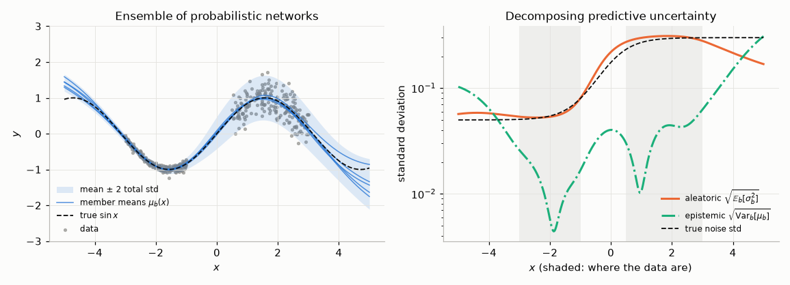
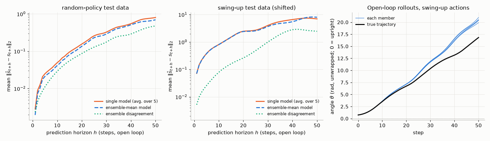

# Chapter 13 — Model-Based Deep RL, World Models and AlphaZero/MuZero

[← Previous: Off-Policy Actor-Critic for Continuous Control: DDPG, TD3 and SAC](12-continuous-control-actor-critic.md) · [Course index](../README.md) · [Next: Exploration in Deep and Tabular RL](14-exploration.md) →

## At a glance

Every deep RL agent in Chapters 09–12 was **model-free**. It learned values and policies directly from experience and threw each transition away (or replayed it) without ever asking *what will happen if I do this?* This chapter builds agents that do ask. They learn a **model** of the environment: a function that predicts the next state (or a compressed version of it) and the reward. They then use the model to plan, to generate synthetic experience, or to compute better learning targets. [Chapter 07](07-planning-and-learning-tabular.md) introduced the same ideas with tables: Dyna, prioritized sweeping and Monte Carlo Tree Search. Here we scale them up with neural networks, and confront the problem that tables never had: **a learned model is wrong, and a planner will find and exploit its errors.**

The chapter has three parts. Sections 1–6 cover models of the *state* in low-dimensional control problems: why model errors compound, how probabilistic ensembles quantify uncertainty, and how three families of algorithms (MPC as in PETS, short synthetic rollouts as in MBPO, value expansion as in MVE/STEVE) live with imperfect models. Sections 7–8 move to **latent world models** learned from pixels: World Models, PlaNet, Dreamer V1–V3, TD-MPC and the idea of *value-equivalent* models. Sections 9–10 cover decision-time search with learned networks: AlphaGo, AlphaZero in depth, MuZero and its descendants. Section 11 asks when model-based RL actually wins, and Section 12 looks at the video "foundation world models" at the frontier.

**Learning objectives.** After this chapter you should be able to:

1. Explain what a learned model buys (sample efficiency, planning, transfer) and why it is hard to use (model bias, compounding error, exploitation of model errors by the optimizer).
2. State and prove the simulation lemma, and use it to bound the loss of a policy that is optimal in a wrong model.
3. Train an ensemble of Gaussian-output networks by maximum likelihood, and split its predictive variance into aleatoric and epistemic parts.
4. Implement model-predictive control with random shooting and the cross-entropy method, and PETS' trajectory sampling.
5. Explain MBPO's branched short rollouts, and MVE/STEVE's model-based value targets, including why short horizons are used.
6. Describe latent world models (RSSM, Dreamer V1–V3, TD-MPC2): their losses, how they train an actor-critic in imagination, and what DreamerV3 changed to work across domains with fixed hyperparameters.
7. Implement AlphaZero: the PUCT rule, self-play, and the policy and value targets, and explain why search acts as a policy-improvement operator.
8. Explain MuZero's value-equivalent model and its unrolled training, and what EfficientZero, Gumbel MuZero and Sampled MuZero add.
9. Judge, for a given problem, whether a model-based method is likely to help.

**Prerequisites.** MDPs, Bellman equations and the discounted state distribution ([Chapter 01](01-the-rl-problem.md)); policy evaluation as a linear system ([Chapter 03](03-dynamic-programming.md)); λ-returns ([Chapter 06](06-n-step-and-eligibility-traces.md)); Dyna and MCTS/UCT ([Chapter 07](07-planning-and-learning-tabular.md), which this chapter builds on directly); DQN-style replay and target networks ([Chapter 09](09-deep-q-learning.md)); actor-critic methods ([Chapter 10](10-policy-gradients.md)) and SAC ([Chapter 12](12-continuous-control-actor-critic.md)). Maximum likelihood, KL divergence and Jensen's inequality are in [Chapter 00](00-math-toolkit.md); the ELBO is derived from them in Section 7.3.

**Code you will run** (all in [`code/ch13_model_based_rl/`](../code/ch13_model_based_rl/); PyTorch on one CPU thread; full runs take from about 2 seconds to about 7 minutes):

| Script | What it shows |
|---|---|
| [`simulation_lemma.py`](../code/ch13_model_based_rl/simulation_lemma.py) | The simulation lemma checked on tabular MDPs: exact identity, a tight example, how loose the bound is in practice |
| [`compounding_error.py`](../code/ch13_model_based_rl/compounding_error.py) | Aleatoric vs epistemic uncertainty on a toy problem; multi-step prediction error vs horizon on Pendulum for a single model and an ensemble |
| [`pets_pendulum.py`](../code/ch13_model_based_rl/pets_pendulum.py) | PETS-lite: probabilistic ensemble + CEM model-predictive control on Pendulum-v1, compared with planning on the true dynamics; random-shooting and deterministic-model ablations |
| [`model_exploitation.py`](../code/ch13_model_based_rl/model_exploitation.py) | A planner exploiting a learned model (the optimizer's curse), measured as predicted minus realised return; what ensembles, a disagreement penalty and on-policy data do about it |
| [`sac_pendulum_baseline.py`](../code/ch13_model_based_rl/sac_pendulum_baseline.py) | A minimal SAC on Pendulum-v1, the model-free reference for the sample-efficiency comparison |
| [`alphazero_tictactoe.py`](../code/ch13_model_based_rl/alphazero_tictactoe.py) | AlphaZero-lite: PUCT search + policy/value network + self-play, exhaustively verified never to lose at tic-tac-toe |
| [`mbrl_common.py`](../code/ch13_model_based_rl/mbrl_common.py) | Shared module: Gaussian ensemble, maximum-likelihood training, MPC planner (random shooting / CEM), Pendulum reward |

**Study time.** About 12–14 hours: 6–7 for the text and derivations, 2 to run and modify the code, 4–5 for the exercises.

**Notation.** We follow [NOTATION.md](../NOTATION.md): $\boldsymbol\psi$ are the parameters of a learned model, and a hat marks anything that comes from the model ($\hat p$, $\hat r$, $\hat s$, $\hat V$). Departures, all local to this chapter, are flagged where they occur. The most important ones: $B$ is the **ensemble size** and $i$ indexes ensemble members; $H$ is a **planning or imagination horizon** and $k$ the number of model steps in a rollout or unroll; in Section 7, $h_t$ and $z_t$ are the deterministic and stochastic parts of a latent state, as in the Dreamer papers; in Sections 9–10, $z$ is the **game outcome** and $\tau$ the move-selection **temperature**, as in the AlphaZero papers; MuZero's latent states carry superscripts $s^k$ to distinguish them from environment states $S_t$. A few letters carry more than one local meaning, because each sub-literature has its own conventions: $P$ is a transition matrix in Section 2 (plain, not bold, and $V$, $\hat V$ there are *exact* values of a policy in $M$ and $\hat M$), the number of particles in Section 5 and the PUCT prior $P(s,a)$ in Section 9; $M$ is an MDP but also a count of simulations or rollouts in Algorithms 13.4, 13.8 and 13.9; $N$ is a CEM population size and a visit count $N(s,a)$; $K$ is the number of CEM elites, the TD-MPC training rollout length, the MuZero unroll length and the number of actions sampled by Sampled MuZero; $\tau$ indexes imagined time steps in Dreamer (Algorithm 13.6) before it becomes the AlphaZero temperature; $\alpha$ is the CEM smoothing coefficient (not a step size); $\lambda$ is the trace parameter of λ-returns in Section 7, but a perturbation weight in Section 2.4, a mixing weight in AlphaGo and a Lagrange multiplier in Section 6.3; and the deterministic actor of MVE is $\mu_{\boldsymbol\theta}$, as in [Chapter 12](12-continuous-control-actor-critic.md).

---

## 1. Why learn a model?

### 1.1 What a model buys

A **model** of an MDP is anything an agent can use to predict how the environment will respond to its actions ([Chapter 07](07-planning-and-learning-tabular.md), Section 1). In this chapter it is usually a parameterised conditional distribution $\hat p_{\boldsymbol\psi}(s' \mid s, a)$ together with a reward predictor $\hat r_{\boldsymbol\psi}(s,a)$, fitted to the transitions the agent has seen. Fitting it is **supervised learning**: every transition $(S_t, A_t, R_{t+1}, S_{t+1})$ is a labelled example, so the model can be trained with all the tools of regression and density estimation, and every transition provides a full vector of targets, not a single scalar reward.

Three things make this attractive.

1. **Sample efficiency.** A model turns data into many more learning updates. After 200 random transitions on the Pendulum swing-up task, the PETS-lite agent of Section 5 already swings the pendulum up about as well as the same planner using the *true* equations of motion. The model-free SAC baseline needs about 4,000 environment steps to reach comparable returns, and keeps fluctuating afterwards (Section 5.2). When real experience is expensive (robots, chemistry, clinical decisions), this is the main reason to use a model.
2. **Planning: trading computation for data.** With a model, an agent can think before acting: search over action sequences (MPC), grow a search tree (MCTS), or evaluate many candidate policies in simulation. Planning at decision time also gives **feedback**: the plan is recomputed from the state actually reached, which corrects errors as they arise. In our tic-tac-toe experiment (Section 9.6), the same search made an untrained network's player lose 14 to 20 times fewer lines of play.
3. **Transfer and reuse.** Dynamics do not depend on the task's reward. A model learned while pursuing one goal can be reused to plan for a different reward with no new data, and a model learned from videos or other agents can be used by a new agent. This is the long-term motivation for large "world models" (Section 12).

### 1.2 Why it is hard: model bias, compounding errors, exploitation

If models are so useful, why did model-free methods dominate deep RL benchmarks for years? Because the model is learned from limited data, and three problems feed each other.

- **Model bias.** The model is wrong in places, systematically: wherever there are few data, wherever the function class cannot represent the dynamics (contacts, discontinuities), and wherever the observation does not determine the next observation (partial observability, Chapter 15). A policy derived from a biased model inherits the bias, and unlike the variance of model-free estimates, more planning does not average it away.
- **Compounding errors.** A one-step model is applied to its own predictions when it rolls out a trajectory. Small one-step errors move the predicted state off the distribution the model was trained on, where its errors are larger, and so on (Section 2.1). Errors that are negligible at one step can be enormous after 50.
- **Exploitation by the optimizer.** This is the subtle one (Section 5.3 measures it). A planner or policy optimizer *maximises* predicted return. Among all the action sequences it considers, the ones whose predicted return is highest are disproportionately those where the model errs in the agent's favour, for example a model that wrongly believes a joint can be pushed past its limit or that a wall can be walked through. The planner seeks those errors out. This is a form of the **optimizer's curse**: if $\hat J(\pi)$ is an unbiased but noisy estimate of the true return $J(\pi)$ for each $\pi$, then $\mathbb{E}[\max_\pi \hat J(\pi)] \ge \max_\pi \mathbb{E}[\hat J(\pi)] = \max_\pi J(\pi)$ (the expectation of a maximum exceeds the maximum of expectations, by Jensen's inequality, since $\max$ is convex). The selected plan's predicted return is biased upwards, and the selected plan is biased towards model errors.

Every method in this chapter is, at bottom, a strategy for living with these three problems. The main strategies are: represent **uncertainty** and avoid (or penalise) what the model does not know (ensembles, Section 3); keep model rollouts **short** (MBPO, MVE, Section 6); **re-plan** at every step so that errors are corrected by feedback (MPC, MCTS); collect new data **where the current planner goes**, so the model is corrected exactly where it was exploited (every algorithm here iterates data collection and model fitting); and learn models that are accurate only in the ways that matter for **value** (MuZero, TD-MPC, Sections 7.6 and 10).

### 1.3 A taxonomy

Model-based methods differ in *what* they learn and *how* they use it. The two axes are largely independent.

**What is learned.**

| Model type | Predicts | Examples |
|---|---|---|
| State-space dynamics | $\hat p_{\boldsymbol\psi}(s' \mid s, a)$ (often a Gaussian over $s' - s$) and $\hat r_{\boldsymbol\psi}(s,a)$ | PILCO, PETS, MBPO, MVE/STEVE |
| Latent world model | an encoder $o \mapsto$ latent state, latent dynamics, and decoders for observations and rewards | World Models, PlaNet, Dreamer V1–V3, IRIS, DIAMOND |
| Decoder-free (self-predictive) latent model | latent dynamics trained to agree with the encoder's embedding of the next observation, plus reward and value heads | TD-MPC/TD-MPC2, EfficientZero |
| Value-equivalent model | only quantities needed for planning: rewards, values, policies along imagined action sequences | Predictron, VPN, MuZero |
| Known model (rules given) | exact simulator; nothing learned about dynamics | AlphaGo, AlphaGo Zero, AlphaZero |

**How it is used.**

| Usage | Idea | Examples |
|---|---|---|
| Background planning (Dyna-style) | generate synthetic transitions and train a model-free learner on them | Dyna-Q (Ch. 07), ME-TRPO, MBPO, Dreamer (imagined actor-critic) |
| Decision-time planning | search at each step from the current state, act, re-plan | MPC with random shooting/CEM/MPPI (PETS, PlaNet, TD-MPC), MCTS (AlphaZero, MuZero) |
| Gradients through the model | differentiate predicted return with respect to policy parameters through the model's dynamics | PILCO, SVG, Dreamer V1 |
| Value expansion | use short model rollouts to build better targets for a value function | MVE, STEVE, TD-MPC's terminal value, MuZero's search value targets |

Many systems mix several. Dreamer uses background planning *and* gradients through the model; TD-MPC uses decision-time planning *and* a learned terminal value; AlphaZero uses decision-time search *and* trains its networks on the search results, so the search also improves the policy in the background.

---

## 2. From model error to value error

### 2.1 Compounding errors in multi-step prediction

Take deterministic dynamics $s_{t+1} = f(s_t, a_t)$ and a learned model $\hat f$. An **open-loop rollout** feeds the model its own predictions: $\hat s_0 = s_0$ and $\hat s_{k+1} = \hat f(\hat s_k, a_k)$ for a fixed action sequence $a_0, a_1, \dots$. Suppose the model's one-step error is at most $\varepsilon_f$, i.e. $\lVert \hat f(s,a) - f(s,a) \rVert \le \varepsilon_f$ for all $(s,a)$, and that $\hat f$ is $L$-Lipschitz in the state: $\lVert \hat f(s,a) - \hat f(s',a) \rVert \le L \lVert s - s' \rVert$. Let $e_k \doteq \lVert \hat s_k - s_k \rVert$. Adding and subtracting $\hat f(s_k, a_k)$ and using the triangle inequality,

$$
\begin{aligned}
e_{k+1} &= \lVert \hat f(\hat s_k, a_k) - f(s_k, a_k) \rVert \\
&\le \lVert \hat f(\hat s_k, a_k) - \hat f(s_k, a_k) \rVert + \lVert \hat f(s_k, a_k) - f(s_k, a_k) \rVert \\
&\le L\, e_k + \varepsilon_f .
\end{aligned}
$$

Unrolling from $e_0 = 0$ gives $e_1 \le \varepsilon_f$, $e_2 \le L\varepsilon_f + \varepsilon_f$, and in general

$$
e_k \;\le\; \varepsilon_f \sum_{j=0}^{k-1} L^j \;=\;
\begin{cases}
\varepsilon_f \,\dfrac{L^k - 1}{L - 1}, & L \ne 1,\\[2mm]
k\,\varepsilon_f, & L = 1.
\end{cases}
\qquad (13.1)
$$

The bound has three regimes. If the model is **contracting** ($L < 1$, e.g. a heavily damped system), errors saturate at $\varepsilon_f/(1-L)$. If $L = 1$ (e.g. a frictionless oscillator), they grow linearly. If it is **expanding** ($L > 1$, an unstable or chaotic system), they grow geometrically. (A good model inherits these properties from the true dynamics.) The inverted pendulum is the textbook expanding system. Linearising Pendulum-v1's update (Section 5) around the upright position gives, in $(\theta, \dot\theta)$ coordinates, a Jacobian $\mathbf{J}$ with rows $(1.0375,\ 0.05)$ and $(0.75,\ 1)$, whose largest eigenvalue is $1.213$ (the update, as coded in `TruePendulumDynamics` in [`mbrl_common.py`](../code/ch13_model_based_rl/mbrl_common.py), is $\dot\theta' = \dot\theta + 0.05(15\sin\theta + 3u)$, $\theta' = \theta + 0.05\,\dot\theta'$). Errors along the unstable direction therefore grow asymptotically by about 21% per step and double every 3.6 steps ($\ln 2/\ln 1.213 = 3.6$). The (local, Euclidean) Lipschitz constant that (13.1) needs near the top is larger, the spectral norm $\lVert\mathbf{J}\rVert_2 \approx 1.48$, because $\lVert\mathbf{J}\rVert_2 \ge \rho(\mathbf{J})$ for any matrix ([Chapter 00](00-math-toolkit.md)), so the worst-case bound is more pessimistic still. The bound is also worst-case in another way: it assumes the one-step error $\varepsilon_f$ holds everywhere, but a learned model's error is small only *on the data distribution*, and the rollout's errors push $\hat s_k$ off it. The experiment in Section 3.4 measures all of this.

### 2.2 The simulation lemma

How do model errors translate into errors in **value**? The cleanest answer is the **simulation lemma**, which goes back to Kearns & Singh's analysis of $E^3$ (2002). Consider a finite MDP $M$ with transition probabilities $p(s' \mid s,a)$ and expected rewards $r(s,a)$, and a model $\hat M$ with $\hat p$ and $\hat r$, sharing $\mathcal{S}$, $\mathcal{A}$ and the discount $\gamma$, with $0 \le \gamma < 1$ (the series below need $\gamma < 1$). For a policy $\pi$, write $P_\pi(s' \mid s) \doteq \sum_a \pi(a\mid s)\,p(s'\mid s,a)$ and $r_\pi(s) \doteq \sum_a \pi(a \mid s)\,r(s,a)$, and similarly $\hat P_\pi$, $\hat r_\pi$. Let $V \doteq v_\pi^{M}$ and $\hat V \doteq v_\pi^{\hat M}$ be the values of $\pi$ in the two MDPs. (Two local departures from NOTATION.md in this section: $V$ and $\hat V$ are *exact* values of $\pi$ in $M$ and $\hat M$, not estimates, and the matrices $P_\pi$, $\hat P_\pi$ are written in plain rather than bold capitals.) In vector form ([Chapter 03](03-dynamic-programming.md)), they satisfy the Bellman equations $V = r_\pi + \gamma P_\pi V$ and $\hat V = \hat r_\pi + \gamma \hat P_\pi \hat V$.

**Exact identity.** Subtract the two Bellman equations and add and subtract $\gamma \hat P_\pi V$:

$$
\begin{aligned}
\hat V - V &= (\hat r_\pi - r_\pi) + \gamma \hat P_\pi \hat V - \gamma P_\pi V \\
&= (\hat r_\pi - r_\pi) + \gamma \hat P_\pi (\hat V - V) + \gamma (\hat P_\pi - P_\pi) V .
\end{aligned}
$$

Move the middle term to the left: $(I - \gamma \hat P_\pi)(\hat V - V) = (\hat r_\pi - r_\pi) + \gamma (\hat P_\pi - P_\pi)V$. The matrix $I - \gamma \hat P_\pi$ is invertible with $(I-\gamma\hat P_\pi)^{-1} = \sum_{t\ge 0} \gamma^t \hat P_\pi^t$, so

$$
\hat V - V \;=\; (I - \gamma \hat P_\pi)^{-1}\Bigl[(\hat r_\pi - r_\pi) + \gamma (\hat P_\pi - P_\pi)\, V\Bigr]. \qquad (13.2)
$$

Read it as: *at every step of a trajectory simulated in the model, the model makes a one-step error in reward, $\hat r_\pi - r_\pi$, and a one-step error in where it sends you, valued by the true value function; the value error is the discounted sum of these one-step errors along the model's trajectories.*

**Occupancy form.** Let $d_0$ be an initial-state distribution and define the normalised discounted state occupancy of $\pi$ *in the model*, $\hat d^\pi(s) \doteq (1-\gamma)\sum_{t\ge0}\gamma^t \Pr_{\hat M}\lbrace S_t = s \mid S_0 \sim d_0, \pi\rbrace$. As a row vector, $\hat d^\pi = (1-\gamma)\, d_0^\top (I - \gamma \hat P_\pi)^{-1}$. Multiplying (13.2) on the left by $d_0^\top$:

$$
\hat V(d_0) - V(d_0) \;=\; \frac{1}{1-\gamma}\; \mathbb{E}_{s \sim \hat d^\pi}\Bigl[\,(\hat r_\pi - r_\pi)(s) + \gamma\, \bigl((\hat P_\pi - P_\pi)V\bigr)(s)\Bigr], \qquad (13.3)
$$

where $V(d_0) \doteq \sum_s d_0(s) V(s)$. This version says **which** errors matter: model errors in states that $\pi$ visits *in the model*. This is precisely where an optimizer can cheat. When we choose $\pi$ to maximise $\hat V(d_0)$, we also choose $\hat d^\pi$, and we may steer it towards states where the bracket is large and positive, i.e. where the model is optimistic.

**The bound.** Suppose rewards lie in $[0, R_{\max}]$, and define the worst-case model errors

$$
\varepsilon_r \doteq \max_{s,a}\lvert \hat r(s,a) - r(s,a)\rvert, \qquad
\varepsilon_P \doteq \max_{s,a}\bigl\lVert \hat p(\cdot \mid s,a) - p(\cdot \mid s,a)\bigr\rVert_1 .
$$

Two facts bound the two terms of (13.2). First, every row of $(I-\gamma\hat P_\pi)^{-1} = \sum_t\gamma^t\hat P_\pi^t$ is non-negative and sums to $\sum_t \gamma^t = 1/(1-\gamma)$, so $\lVert (I-\gamma\hat P_\pi)^{-1}x\rVert_\infty \le \lVert x \rVert_\infty/(1-\gamma)$ for any vector $x$. Second, because the rows of $\hat P_\pi - P_\pi$ sum to zero, we may subtract any constant $c$ from $V$ without changing $(\hat P_\pi - P_\pi)V$; choosing $c$ halfway between $\min V$ and $\max V$,

$$
\bigl\lvert \bigl((\hat P_\pi - P_\pi)V\bigr)(s) \bigr\rvert
= \Bigl\lvert \sum_{s'}\bigl(\hat P_\pi - P_\pi\bigr)(s' \mid s)\,\bigl(V(s') - c\bigr)\Bigr\rvert
\le \bigl\lVert \hat P_\pi(\cdot\mid s) - P_\pi(\cdot \mid s)\bigr\rVert_1 \cdot \frac{\max V - \min V}{2}
\le \varepsilon_P\,\frac{R_{\max}}{2(1-\gamma)},
$$

using $0 \le V \le R_{\max}/(1-\gamma)$ and, for a stochastic $\pi$, the triangle inequality $\lVert \hat P_\pi(\cdot\mid s) - P_\pi(\cdot\mid s)\rVert_1 \le \sum_a \pi(a \mid s)\lVert \hat p(\cdot\mid s,a) - p(\cdot\mid s,a)\rVert_1 \le \varepsilon_P$. Putting the pieces into (13.2):

> **Simulation lemma.** Let $0 \le \gamma < 1$ and rewards lie in $[0, R_{\max}]$. For every stationary policy $\pi$,
>
> $$
> \bigl\lVert v_\pi^{\hat M} - v_\pi^{M} \bigr\rVert_\infty \;\le\; \frac{\varepsilon_r}{1-\gamma} \;+\; \frac{\gamma\,\varepsilon_P\,R_{\max}}{2(1-\gamma)^2}. \qquad (13.4)
> $$

Many texts state it with rewards in $[-R_{\max}, R_{\max}]$, where the span of $V$ is up to $2R_{\max}/(1-\gamma)$ and the factor $\tfrac12$ disappears. Either way the message is the same: **reward errors cost a factor $1/(1-\gamma)$ (the horizon), but transition errors cost $1/(1-\gamma)^2$**, because a wrong transition at one step corrupts all the rewards after it. This is the value-level counterpart of compounding errors.

**Corollary: the cost of acting optimally in the wrong model.** Let $\hat\pi$ be optimal in $\hat M$ and $\pi_\ast$ optimal in $M$, and let $\epsilon_V$ bound $\lVert v^{\hat M}_\pi - v^M_\pi \rVert_\infty$ for $\pi \in \lbrace\pi_\ast, \hat\pi\rbrace$. For every state $s$,

$$
\begin{aligned}
v^{M}_{\pi_\ast}(s) - v^{M}_{\hat\pi}(s)
&= \underbrace{\bigl[v^{M}_{\pi_\ast}(s) - v^{\hat M}_{\pi_\ast}(s)\bigr]}_{\le\, \epsilon_V}
+ \underbrace{\bigl[v^{\hat M}_{\pi_\ast}(s) - v^{\hat M}_{\hat \pi}(s)\bigr]}_{\le\, 0 \text{ since } \hat\pi \text{ is optimal in } \hat M}
+ \underbrace{\bigl[v^{\hat M}_{\hat\pi}(s) - v^{M}_{\hat\pi}(s)\bigr]}_{\le\, \epsilon_V} \\
&\le 2\epsilon_V . \qquad (13.5)
\end{aligned}
$$

Notice that the bound needs the model to be accurate for **both** policies: for $\pi_\ast$, so the model does not undervalue the optimal behaviour, and for $\hat\pi$, the policy the planner actually picked. The second requirement is the formal version of "the planner exploits model errors": $\hat\pi$ is chosen *because* it looks good in $\hat M$, so the model must be right about what $\hat\pi$ does. Data collected by running $\hat\pi$ is exactly the data that fixes that error.

### 2.3 A worked example by hand

Take two states, one action. In both $M$ and $\hat M$, state $B$ is absorbing with reward $0$. State $A$ pays reward $1$ at every step and, in the true MDP, always returns to itself, so $B$ is unreachable from $A$ in $M$. The model is slightly wrong: from $A$ it predicts a transition to $B$ with probability $\epsilon$. So $\varepsilon_r = 0$, $R_{\max} = 1$ and $\varepsilon_P = \lVert (1-\epsilon, \epsilon) - (1, 0)\rVert_1 = 2\epsilon$. The true values are $V(A) = 1/(1-\gamma)$ and $V(B) = 0$, so $\mathrm{span}(V) = R_{\max}/(1-\gamma)$, the largest possible. In the model, $\hat V(A) = 1 + \gamma(1-\epsilon)\hat V(A)$, so $\hat V(A) = 1/(1-\gamma(1-\epsilon))$. With $\gamma = 0.9$ and $\epsilon = 0.01$:

$$
V(A) = \frac{1}{0.1} = 10, \qquad \hat V(A) = \frac{1}{1 - 0.9 \times 0.99} = \frac{1}{0.109} = 9.174, \qquad V(A) - \hat V(A) = 0.826 .
$$

The bound (13.4) is $\gamma \varepsilon_P R_{\max}/(2(1-\gamma)^2) = 0.9 \times 0.02/(2 \times 0.01) = 0.9$. A 1% error in one transition probability produced an 8% error in value, and the bound is nearly attained. In general $V(A) - \hat V(A) = \gamma\epsilon/\bigl((1-\gamma)(1-\gamma+\gamma\epsilon)\bigr)$, which tends to the bound $\gamma\epsilon/(1-\gamma)^2$ as $\epsilon \to 0$: **the $1/(1-\gamma)^2$ dependence cannot be improved in the worst case.** For $\gamma = 0.99$ the same 1% error gives $\hat V(A) = 50.25$ against $V(A) = 100$: the model halves the value.

### 2.4 How loose is the bound in practice?

[`simulation_lemma.py`](../code/ch13_model_based_rl/simulation_lemma.py) checks all of the above numerically. It verifies the identity (13.2) and the occupancy form (13.3) to machine precision (residuals around $10^{-15}$), reproduces the two-state example, and then measures the bound on random MDPs ($|\mathcal{S}| = 20$, $|\mathcal{A}| = 4$, sparse random transitions, rewards uniform in $[0,1]$). The model is $\hat P = (1-\lambda)P + \lambda U$ for a random transition kernel $U$, with exact rewards ($\lambda$ is a perturbation weight here, not a trace parameter). Optimal policies are computed exactly by policy iteration ([Chapter 03](03-dynamic-programming.md)). For the bound (13.4), "max over $\pi$" is taken over the optimal policies of $M$ and $\hat M$ plus 30 random deterministic policies. For the corollary (13.5), $\epsilon_V$ is the error over $\pi_\ast$ and $\hat\pi$ only, which is all that (13.5) needs.

Averaged over 20 random MDPs and three perturbation sizes $\lambda \in \lbrace0.01, 0.03, 0.1\rbrace$ (mean $\varepsilon_P = 0.085$), the full run (about 2 s) gives:

| $\gamma$ | $1/(1-\gamma)$ | observed $\max_\pi\lVert\hat V^\pi - V^\pi\rVert_\infty$ | bound (13.4) | observed / bound: mean (max) | $\hat\pi$ suboptimal in $M$ | mean loss of $\hat\pi$ | max of loss / $2\epsilon_V$ |
|---|---|---|---|---|---|---|---|
| 0.50 | 2 | 0.0136 | 0.09 | 0.158 (0.215) | 5% of cases | 0.0003 | 0.55 |
| 0.80 | 5 | 0.0346 | 0.85 | 0.040 (0.064) | 15% | 0.0010 | 0.24 |
| 0.90 | 10 | 0.0590 | 3.83 | 0.016 (0.026) | 20% | 0.0019 | 0.51 |
| 0.95 | 20 | 0.1049 | 16.17 | 0.0066 (0.011) | 18% | 0.0020 | 0.23 |
| 0.98 | 50 | 0.2299 | 104.26 | 0.0022 (0.0035) | 40% | 0.0050 | 0.14 |
| 0.99 | 100 | 0.4865 | 421.30 | 0.0012 (0.0020) | 33% | 0.0103 | 0.25 |

Three lessons. First, the bound held in all 360 cases, and the two-state example attains it (error/bound $= 0.917$ at $\epsilon = 0.01$ and $0.991$ at $\epsilon = 0.001$, for $\gamma = 0.9$). On random MDPs, though, it was loose by a factor of about 6 at $\gamma = 0.5$, growing to about 800 at $\gamma = 0.99$. The observed error grew roughly *linearly* in the horizon (36-fold from $\gamma = 0.5$ to $\gamma = 0.99$, while $1/(1-\gamma)$ grew 50-fold and the bound about 5,000-fold). The reason is visible in the derivation: the transition term is really $\lVert \hat P - P\rVert_1 \cdot \mathrm{span}(V)/2$, and in a well-mixed random MDP all states have nearly the same value, so $\mathrm{span}(V)$ stays of order $R_{\max}$ instead of $R_{\max}/(1-\gamma)$. The worst case needs a model error that sends the agent to a state with a very different value, as in the two-state example. Second, the loss from acting optimally in the model was always below the $2\epsilon_V$ of (13.5), reaching at most 55% of it (at $\gamma = 0.5$), and it was usually zero: a value error only costs return when it *reorders* actions. Corollary (13.5) is therefore much less loose than the bound (13.4) it is usually combined with. Third, the fraction of cases where the model's optimal policy was suboptimal grew with the horizon, from 5% at $\gamma = 0.5$ to 33–40% at $\gamma \ge 0.98$: long horizons give small transition errors more room to reorder actions.


---

## 3. Learning dynamics models that know what they don't know

### 3.1 Predict the change, and predict a distribution

The state-space models in Sections 3–6 are small multilayer perceptrons. Two design choices matter more than the architecture.

**Predict the state change.** Consecutive states are usually close, so instead of $s'$ the network predicts $\Delta s = s' - s$:

$$
\hat s' = s + \mu_{\boldsymbol\psi}(s,a) + \sigma_{\boldsymbol\psi}(s,a)\odot\xi,\qquad \xi \sim \mathcal{N}(\mathbf{0}, \mathbf{I}), \qquad (13.6)
$$

with inputs $(s,a)$ and targets $\Delta s$ each normalised to zero mean and unit variance per dimension. Predicting the change makes the identity map the zero-weight default, keeps the targets on a sensible scale, and stops the network from wasting capacity on copying $s$.

**Predict a Gaussian, trained by maximum likelihood.** The network outputs both a mean $\mu_{\boldsymbol\psi}(s,a)$ and a diagonal variance $\sigma^2_{\boldsymbol\psi}(s,a)$ (in practice the log-variance). For one example $(x, y) = ((s,a), \Delta s)$ with $d$ output dimensions, the negative log-likelihood of the target under $\mathcal{N}(\mu, \mathrm{diag}\,\sigma^2)$ is

$$
-\log \hat p_{\boldsymbol\psi}(y \mid x) = \frac12\sum_{j=1}^{d}\Bigl[\frac{(y_j - \mu_j(x))^2}{\sigma_j^2(x)} + \log \sigma_j^2(x)\Bigr] + \frac d2 \log 2\pi ,
$$

so the training loss over a data set $\mathcal{D}$ is

$$
\mathcal{L}(\boldsymbol\psi) = \sum_{(x,y)\in\mathcal{D}}\ \sum_{j=1}^{d}\Bigl[\frac{(y_j - \mu_j(x))^2}{\sigma_j^2(x)} + \log \sigma_j^2(x)\Bigr]. \qquad (13.7)
$$

If $\sigma$ is held fixed, this is the mean-squared error, so the usual "deterministic" model is the special case of a Gaussian with a constant variance. Why does (13.7) learn the *right* variance? Look at its expected value for one input $x$ and one dimension, with $Y$ drawn from the true conditional distribution with mean $m(x)$ and variance $v(x)$. Since $\mathbb{E}[(Y-\mu)^2] = v + (m - \mu)^2$,

$$
\mathbb{E}\Bigl[\frac{(Y-\mu)^2}{\sigma^2} + \log\sigma^2\Bigr] = \frac{v + (m-\mu)^2}{\sigma^2} + \log \sigma^2 .
$$

For any $\sigma^2$, this is minimised over $\mu$ by $\mu = m$. Then setting the derivative with respect to $\sigma^2$, $-v/\sigma^4 + 1/\sigma^2$, to zero gives $\sigma^2 = v$. So, with enough capacity and data, the mean head learns the conditional mean and the variance head learns the conditional variance: the noise that remains *even if we knew the true dynamics*. Two practical details from PETS: the log-variance is softly clamped between learned bounds, $\log\sigma^2 \leftarrow \ell_{\max} - \mathrm{softplus}(\ell_{\max} - \log\sigma^2)$ and $\log\sigma^2 \leftarrow \ell_{\min} + \mathrm{softplus}(\log\sigma^2 - \ell_{\min})$, with a small penalty $0.01(\ell_{\max} - \ell_{\min})$ in the loss. Without the clamp the network can drive $\sigma^2 \to 0$ on training points (an infinite likelihood) or predict absurd variances away from the data.

### 3.2 Two kinds of uncertainty

A model of the dynamics can be uncertain for two different reasons, and they call for different responses.

- **Aleatoric uncertainty** is randomness in the environment itself: a dice roll, sensor noise, a slippery surface. It does not shrink with more data. A planner should **average over it** (plan for the expected outcome, or a risk measure of it).
- **Epistemic uncertainty** is the model's ignorance: the dynamics are deterministic, but we have not seen enough data in this region to know them. It shrinks with more data. A planner should **not trust** the model there: avoid such regions (pessimism), or visit them deliberately to learn (optimism; [Chapter 14](14-exploration.md)).

A single Gaussian network captures aleatoric uncertainty through $\sigma^2$. It has no way to express epistemic uncertainty: away from the data, its $\mu$ and $\sigma$ are extrapolations, often confidently wrong. The standard practical fix is an **ensemble**. Train $B$ networks $\boldsymbol\psi_1, \dots, \boldsymbol\psi_B$ (typically $B = 5$–$7$) from different random initialisations, each on a **bootstrap** resample of the data (draw $|\mathcal{D}|$ transitions with replacement). On the data the members agree, because they all fit the same targets. Away from it, nothing forces them to agree, so their disagreement measures how much the prediction depends on arbitrary choices. That is a proxy for epistemic uncertainty.

The ensemble's predictive distribution is the uniform mixture $\frac1B\sum_i \mathcal{N}(\mu_i(x), \sigma_i^2(x))$. Its variance splits cleanly. For one output dimension, with $\bar\mu \doteq \frac1B\sum_i\mu_i$:

$$
\begin{aligned}
\mathrm{Var}[Y] &= \mathbb{E}[Y^2] - \bar\mu^2 = \frac1B\sum_{i=1}^{B}\bigl(\sigma_i^2 + \mu_i^2\bigr) - \bar\mu^2 \\
&= \underbrace{\frac1B\sum_{i=1}^{B}\sigma_i^2}_{\text{aleatoric}} \;+\; \underbrace{\frac1B\sum_{i=1}^{B}\mu_i^2 - \bar\mu^2}_{\text{epistemic: } \mathrm{Var}_i[\mu_i]} . \qquad (13.8)
\end{aligned}
$$

This is the law of total variance, with the member index $i$ playing the role of an unknown "true model". Two caveats. Ensembles are a heuristic, not a posterior: their disagreement has no guaranteed calibration and can be too small far from the data if all members extrapolate the same way. And for deep networks, bootstrapping matters less than random initialisation and minibatch order; many later implementations train all members on the same data.

### 3.3 Seeing both kinds of uncertainty

Part A of [`compounding_error.py`](../code/ch13_model_based_rl/compounding_error.py) fits an ensemble of five Gaussian networks (two hidden layers of 64 SiLU units, bootstrap resamples, 4,000 Adam steps) to 400 noisy samples of $y = \sin x$, with noise standard deviation rising from 0.05 on the left to 0.30 on the right, and inputs only in $[-3, -1] \cup [0.5, 3]$.

Averaged over regions of the input space, the full run gives:

| region | aleatoric $\sqrt{\mathbb{E}_i[\sigma_i^2]}$ | epistemic $\sqrt{\mathrm{Var}_i[\mu_i]}$ | true noise std |
|---|---|---|---|
| on the data ($[-3,-1] \cup [0.5, 3]$) | 0.192 | 0.026 | 0.184 |
| in the gap ($(-1, 0.5)$) | 0.179 | 0.033 | 0.149 |
| outside ($\lvert x\rvert > 3.5$) | 0.130 | 0.134 | 0.175 |

On the data, the aleatoric estimate matches the true noise level (0.192 against 0.184, and it follows the rise from left to right in the figure) and the members agree. Outside the data range the members fan out and the epistemic part grows five-fold. Two results were *not* what the textbook picture promises, and both are worth remembering. In the narrow gap the five members interpolate the same smooth curve and barely disagree (0.033 against 0.026 on the data): an ensemble cannot be uncertain about something all its members get the same way. And outside the data, the aleatoric estimate is pure extrapolation; on the right it decays towards 0.17 while the true noise stays at 0.30. The variance head is a function approximator like any other.



### 3.4 Compounding error on Pendulum

Part B of the same script trains five Gaussian networks on 1,000 transitions (five episodes) of Pendulum-v1 under a uniformly random policy. Each member is trained on *all* the data from its own random initialisation (no bootstrap), so a member on its own is exactly "a single model trained the normal way". We then roll the models out open-loop for up to 50 steps from many start states, using the recorded actions, and measure the error $\lVert \hat s_{t+k} - s_{t+k}\rVert_2$ in observation space, $(\cos\theta, \sin\theta, \dot\theta)$. We compare a single member (averaged over the five), the **ensemble-mean model** $\hat s \leftarrow \hat s + \frac1B\sum_i \mu_i(\hat s, a)$, and the ensemble's disagreement (standard deviation of the members' own rollouts). Test trajectories come either from the same random policy, or from a hand-written energy-pumping swing-up controller that drives the pendulum through fast, high-energy states. The second set mimics what happens when a planner takes the system somewhere new.

Training on the 1,000 transitions took 7–10 s. Mean open-loop error $\lVert\hat s_{t+k} - s_{t+k}\rVert_2$ over 150 rollouts per test set:

| horizon $k$ | 1 | 5 | 10 | 25 | 50 |
|---|---|---|---|---|---|
| random-policy test data: single model | 0.0028 | 0.025 | 0.050 | 0.259 | 0.802 |
| random-policy test data: ensemble-mean model | 0.0020 | 0.021 | 0.042 | 0.231 | 0.695 |
| random-policy test data: ensemble disagreement | 0.0024 | 0.011 | 0.029 | 0.129 | 0.479 |
| swing-up test data: single model | 0.0718 | 0.378 | 0.810 | 2.704 | 6.980 |
| swing-up test data: ensemble-mean model | 0.0706 | 0.375 | 0.802 | 2.567 | 8.012 |
| swing-up test data: ensemble disagreement | 0.0052 | 0.026 | 0.079 | 0.484 | 2.455 |

What the experiment shows:

- **Errors compound.** On test data like the training data, the error grows about 290-fold from 1 step to 50 steps, and nine-fold in the first five steps alone: faster than linear, as (13.1) predicts for a system that is expanding in places.
- **Distribution shift is worse than compounding.** On the swing-up trajectories the *one-step* error is already 26 times larger than on random-policy data, and after 25 steps the predicted state is off by 2.7 in a space where $\lvert\dot\theta\rvert \le 8$. The script locates the cause. Pendulum clips the angular velocity at $\pm 8$, a non-smooth effect that none of the 1,000 random-policy training transitions ever triggered. On the swing-up data, 14.9% of transitions hit the limit, and the one-step error there is 0.54, against 0.0085 elsewhere. The model has simply never seen that part of the dynamics.
- **Ensembling helps a little, on-distribution only.** The ensemble-mean model reduces the error by 11–29% on random-policy data, and not at all under the shift (at 50 steps it is 15% worse).
- **Disagreement tracks the error on-distribution but badly underestimates it off-distribution.** On random-policy data, the disagreement is within a factor of two of the ensemble-mean model's actual error. On the swing-up data at one step it is 0.005 against an error of 0.07: all five members extrapolate the unclipped dynamics in the same way, so they agree with each other and are all wrong. The right panel shows exactly this. Ensemble disagreement is a useful warning signal, not a measurement of the model's error.

A note on the metric. The Euclidean error in $(\cos\theta, \sin\theta, \dot\theta)$ is dominated by the angular velocity, whose range is $\pm 8$ while $\cos\theta$ and $\sin\theta$ are bounded by 1. The script therefore also reports a single model's errors in the two physical coordinates. On random-policy data the wrapped angle error $\lvert\mathrm{wrap}(\hat\theta - \theta)\rvert$ is 0.0012, 0.076 and 0.25 rad at 1, 25 and 50 steps, and the velocity error 0.0017, 0.24 and 0.74 rad/s. On the swing-up data the angle error reaches 0.87 rad at 25 steps and 1.36 rad at 50 (a uniformly random guess would be off by $\pi/2 \approx 1.57$ on average), and the velocity error 2.5 and 6.7 rad/s. The picture is the same in every coordinate: errors compound, and distribution shift makes them far worse.



---

## 4. Decision-time planning with a learned model: MPC

### 4.1 Model-predictive control

The simplest way to use a dynamics model is the oldest one in control engineering: **model-predictive control** (MPC), also called **receding-horizon control**. At every time step $t$, from the current state $S_t$:

1. **Plan:** find an action sequence $a_{t:t+H-1} = (a_t, \dots, a_{t+H-1})$ that maximises the predicted return over a horizon $H$,

$$
a^\ast_{t:t+H-1} \in \arg\max_{a_{t:t+H-1}}\ \mathbb{E}_{\hat p_{\boldsymbol\psi}}\Bigl[\sum_{k=0}^{H-1} \gamma^k\, \hat r(\hat s_{t+k}, a_{t+k}) \Bigm| \hat s_t = S_t\Bigr], \qquad (13.9)
$$

2. **Act:** execute only the first action $a^\ast_t$,
3. **Re-plan** at $t+1$ from the state actually reached.

Re-planning makes MPC a **closed-loop** controller even though each plan is open-loop: whatever the model got wrong about step $t$ is observed at $t+1$ and the plan adapts. MPC also needs no value function and no policy network. The price is computation at every step, and myopia: nothing beyond the horizon $H$ counts unless a terminal value $\hat v(\hat s_{t+H})$ is added (as TD-MPC does, Section 7.6). In our experiments $\gamma = 1$ inside the horizon; PETS, and the reward functions of most continuous-control benchmarks, use the undiscounted sum.

Solving (13.9) with a neural-network model is a non-convex optimisation in $H \cdot \dim(\mathcal{A})$ dimensions, where $\dim(\mathcal{A})$ is the number of action coordinates. Gradient-based trajectory optimisation is possible but gets stuck in poor local optima and exploits sharp model artefacts. (With a known, smooth model, the classical gradient-based planners are iLQR and DDP, often run inside MPC; they too find only local optima, as [Chapter 03](03-dynamic-programming.md), Section 11.5, shows on a pendulum swing-up.) Most deep MBRL systems use **sampling-based, derivative-free** optimisers instead.

### 4.2 Random shooting

The crudest optimiser samples many action sequences at random and keeps the best.

```
Algorithm 13.1  MPC with random shooting
Input: model p_hat (sample or mean prediction), reward function r_hat, horizon H,
       number of candidate sequences N, action bounds [a_low, a_high]
At each time step t, in state s_t:
    Sample N sequences A^(n) = (a_0^(n), ..., a_{H-1}^(n)), every entry uniform in [a_low, a_high]
    For n = 1..N:
        s_hat <- s_t;  J^(n) <- 0
        For k = 0..H-1:
            J^(n) <- J^(n) + r_hat(s_hat, a_k^(n))
            s_hat <- sample from (or mean of) p_hat(. | s_hat, a_k^(n))
    n* <- argmax_n J^(n)
    Execute a_0^(n*); observe s_{t+1}             # then re-plan from s_{t+1}
```

Random shooting works when the action space is small and short horizons suffice. Its weakness is dimensionality: the chance that a uniformly random sequence is near-optimal in all $H \cdot \dim(\mathcal{A})$ coordinates falls exponentially. It also throws away everything learned at the previous time step.

### 4.3 The cross-entropy method

The **cross-entropy method** (CEM; Rubinstein, 1997 for rare-event simulation and 1999 for optimisation) refines a sampling distribution iteratively. Keep a diagonal Gaussian $\mathcal{N}(\mathbf{m}, \mathrm{diag}\,\mathbf{v})$ over action sequences. Sample $N$ sequences from it, score them, keep the $K$ best (the **elites**), and refit the Gaussian to the elites. The refit is a maximum-likelihood step: with elite set $\mathcal{E}$,

$$
\max_{\mathbf{m}, \mathbf{v}} \sum_{x\in\mathcal{E}} \log \mathcal{N}(x; \mathbf{m}, \mathrm{diag}\,\mathbf{v})
\;\Longrightarrow\;
\mathbf{m} = \frac1K\sum_{x\in\mathcal{E}} x,\qquad \mathbf{v} = \frac1K\sum_{x\in\mathcal{E}}(x - \mathbf{m})^2 ,
$$

which minimises the cross-entropy from the empirical elite distribution to the Gaussian (hence the name). Each iteration concentrates the Gaussian on the region where returns are highest. A smoothing step $\mathbf{m} \leftarrow \alpha\,\mathbf{m}_{\text{old}} + (1-\alpha)\,\mathbf{m}_{\text{new}}$ (and likewise for $\mathbf{v}$) stabilises it; PETS uses $\alpha = 0.1$.

```
Algorithm 13.2  MPC with the cross-entropy method (CEM)
Input: model, reward function r_hat, horizon H, population N, elites K, iterations I,
       smoothing alpha in [0,1), action bounds [a_low, a_high]
Initialise: m <- 0 (length H*dim(A))                                  # warm-start buffer
At each time step t, in state s_t:
    v <- ((a_high - a_low)/4)^2 in every coordinate                  # reset the spread each step
    Repeat I times:
        Sample N sequences A^(n) ~ N(m, diag v), clipped to [a_low, a_high]
        J^(n) <- predicted return of A^(n) from s_t (as in Alg. 13.1, or Alg. 13.3 below)
        E <- the K sequences with the largest J
        m <- alpha*m + (1-alpha)*mean(E);  v <- alpha*v + (1-alpha)*var(E)
    Execute the first action of m;  observe s_{t+1}
    m <- (m shifted left by one step, last step filled with 0)       # warm start for t+1
```

The warm start matters: the plan at $t+1$ is usually close to the remainder of the plan at $t$. A popular relative of CEM is **MPPI** (model-predictive path integral control; Williams et al., 2016, with an information-theoretic version in 2017), which replaces the hard elite cut by exponential weights $w^{(n)} \propto \exp(J^{(n)}/\lambda_{\text{MPPI}})$ for a temperature $\lambda_{\text{MPPI}}$; TD-MPC uses an MPPI-style update. Applied once per batch of episodes to policy parameters, instead of at every time step to action sequences, the same elite refit is a black-box policy-search method, and MPPI's weights are the action-sequence counterpart of the reward-weighted updates (RWR, PoWER, PI²) of episodic robot learning ([Chapter 10](10-policy-gradients.md), Section 15.3).

---

## 5. PETS: probabilistic ensembles with trajectory sampling

### 5.1 The algorithm

**PETS** (Chua, Calandra, McAllister & Levine, 2018) combines the three ingredients so far: a **p**robabilistic **e**nsemble of dynamics models (Section 3), **t**rajectory **s**ampling to propagate uncertainty through the horizon, and CEM-based MPC. Chua et al. compared deterministic and probabilistic single networks and ensembles (D, P, DE, PE) and several ways to propagate uncertainty, and found the probabilistic ensemble with trajectory sampling the most reliable combination. With it, PETS approached the asymptotic performance of the model-free algorithms of the time on several MuJoCo tasks with far fewer samples.

How should a planner evaluate an action sequence under an ensemble of stochastic models? **Trajectory sampling** simulates $P$ particles per candidate sequence. Each particle is assigned to an ensemble member and, at each step, samples its next state from that member's Gaussian, (13.6). PETS considered two assignments:

- **TS-1**: re-draw each particle's member uniformly at every time step;
- **TS-∞**: draw each particle's member once and keep it for the whole horizon.

TS-∞ keeps the two kinds of uncertainty separate along the trajectory: the spread *within* one member's particles is aleatoric, and the spread *between* members is epistemic. The candidate's score is the average return over particles (other choices, such as a pessimistic lower quantile, are possible).

```
Algorithm 13.3  PETS (probabilistic ensemble + trajectory sampling + CEM-MPC)
Input: ensemble size B, particles P (a multiple of B), horizon H, CEM settings (N, K, I, alpha),
       reward function r(s, a) (known or learned), number of random episodes, training steps
Initialise: data set D <- transitions from episodes with uniformly random actions
Loop over episodes:
    Train each member i = 1..B by minimising (13.7) on a bootstrap resample of D
          (inputs (s, a), targets s' - s, both normalised)
    s <- reset the environment
    Repeat until the episode ends (terminated or truncated):
        Plan with CEM (Alg. 13.2), scoring each candidate sequence A = (a_0..a_{H-1}) by:
            For each particle p = 1..P:  member i(p) <- p mod B         # TS-infinity
                s_hat <- s;  J_p <- 0
                For k = 0..H-1:
                    J_p <- J_p + r(s_hat, a_k)
                    Delta ~ N(mu_{i(p)}(s_hat, a_k), sigma^2_{i(p)}(s_hat, a_k))
                    s_hat <- s_hat + Delta
            J(A) <- (1/P) * sum_p J_p
        Execute the first action a; observe s', r, terminated, truncated
        Add (s, a, r, s') to D;  s <- s'
```

We assign particle $p$ to member $p \bmod B$ rather than at random, which removes one source of noise and does not change the expectation. Note that PETS has no value function, so there is nothing to bootstrap: the time-limit truncation of Pendulum needs no special handling.

### 5.2 PETS-lite on Pendulum-v1

Pendulum-v1 is a torque-limited swing-up task. The observation is $(\cos\theta, \sin\theta, \dot\theta)$ with $\theta = 0$ upright, the action is a torque in $[-2, 2]$, and the reward is $-(\theta^2 + 0.1\dot\theta^2 + 0.001u^2)$, so the best possible return per 200-step episode is $0$. The torque is too weak to lift the pendulum directly from hanging down, so the agent must swing back and forth to build up energy. Our three episodes of uniformly random torques scored $-876$, $-966$ and $-1{,}072$; planning with the true dynamics averaged $-133$ over its 30 episodes (range $-1$ to $-359$).

[`pets_pendulum.py`](../code/ch13_model_based_rl/pets_pendulum.py) implements Algorithm 13.3 with $B = 5$ members (two hidden layers of 64 SiLU units), $P = 5$ particles (one per member, TS-∞), horizon $H = 25$ (1.25 s of simulated time), and CEM with $N = 100$ candidates, $K = 10$ elites and $I = 4$ iterations. The reward function is assumed known, as in the PETS paper; only the dynamics are learned. The agent collects one episode (200 steps) of random torques, then alternates between refitting the ensemble (2,000 Adam steps the first time, then 600 warm-started steps per episode) and running one MPC episode. The heart of the code is the particle evaluation inside the planner, a direct transcription of the inner loops of Algorithm 13.3:

```python
# mbrl_common.py, MPCPlanner.evaluate: average predicted return of n candidate sequences
k = self.P // B                                        # particles per member per candidate
s = torch.as_tensor(obs, dtype=torch.float32).expand(B, n * k, -1).clone()
acts = seqs.repeat_interleave(k, dim=0)                # row j of member b belongs to candidate j // k
ret = torch.zeros(B, n * k)
for t in range(self.H):
    a = acts[:, t].view(1, n * k, 1).expand(B, -1, -1)
    ret += self.reward_fn(s, a)                        # r(s_t, a_t)
    s = self.model.step(s, a, sample=True)             # s + mu_b + sigma_b * noise, member b per row
return ret.view(B, n, k).mean(dim=(0, 2))              # average over all P particles
```

To separate model error from planner error, the script also runs the *same* CEM planner with the **true** Pendulum equations as its model ("oracle MPC") on the same sequence of initial states. Any gap between PETS and the oracle is the cost of the learned model.

Results of the full run (3 seeds, 10 episodes each, plus the oracle and two ablations on seed 0; 6–7 minutes on one core; repeated full runs gave identical numbers). Returns of each 200-step episode; episode 0 is random torques for PETS-lite, while the oracle plans from the start:

| episode | 0 | 1 | 2 | 3 | 4 | 5 | 6 | 7 | 8 | 9 |
|---|---|---|---|---|---|---|---|---|---|---|
| PETS-lite, seed 0 | −1072 | −224 | −117 | −126 | −128 | −125 | −254 | −123 | −247 | −123 |
| oracle MPC, seed 0 | −123 | −225 | −115 | −124 | −126 | −123 | −252 | −119 | −243 | −119 |
| PETS-lite, seed 1 | −876 | −250 | −127 | −254 | −1 | −121 | −129 | −129 | −248 | −123 |
| oracle MPC, seed 1 | −1 | −253 | −120 | −122 | −1 | −118 | −122 | −119 | −240 | −116 |
| PETS-lite, seed 2 | −966 | −125 | −125 | −119 | −125 | −2 | −3 | −131 | −340 | −127 |
| oracle MPC, seed 2 | −117 | −123 | −124 | −116 | −119 | −2 | −3 | −128 | −359 | −124 |

How to read it:

- **The initial state dominates the return.** Even the oracle scores between −1 (starting near upright) and −359 (starting hanging down, nearly at rest, which needs several swings). That is why the right panel of the figure plots the **gap** to the oracle on the same initial state.
- **One random episode is enough.** After 200 random transitions, PETS-lite's first MPC episode was within 3.1 return units of the oracle in all three seeds. Over all 27 MPC episodes the median gap was −2.1 and 25 of 27 were within 10. One episode lost 132 relative to the oracle (seed 1, episode 3: −254 against −122), and in one the agent beat the oracle by 19 (CEM is a stochastic optimiser, so the oracle is not optimal either). Over the last five episodes PETS-lite averaged −148.2 and the oracle −145.9.
- **About ten times fewer samples than SAC.** The SAC baseline's deterministic-policy evaluation (mean of three seeds, five episodes each) was −959 after 3,000 steps, −409 after 3,500 and −109 after 4,000, counting its 1,000 random warm-up steps. Afterwards it fluctuated: the mean over all evaluations from 4,000 to 10,000 steps was −201, with dips such as −593 at 7,500 steps (one seed scored −930 there). PETS-lite reached oracle-level control after 400 steps. At the time of writing, [Chapter 12](12-continuous-control-actor-critic.md) reports the same picture for its more carefully engineered off-policy agents on this task: its SAC and DDPG first reached $-200$ after about 4,000 steps and its TD3 after 5,000–7,000. The protocols differ: PETS-lite is scored on its own training episodes, SAC on separate evaluation episodes, although each PETS-lite episode is an honest test of its current controller. More importantly, PETS-lite is *given* the exact reward function (including the mapping from observation to angle), which SAC must learn about from sampled rewards; with a learned reward model the gap would likely narrow.
- **CEM matters; the ensemble did not, here.** Random shooting with the same 400 candidate sequences per step lost 244 and 233 to the oracle in its first two MPC episodes and about 125 in two later ones (mean gap −82): one round of uniform sampling often misses the swing-up sequence that CEM's refinement and warm start find. A single *deterministic* network with CEM did as well as the probabilistic ensemble (mean gap −0.1). Pendulum is deterministic and low-dimensional, and after one episode the data cover the states the controller visits, so there is no aleatoric noise to model and little epistemic uncertainty to protect against. PETS' ensemble earns its keep on harder, higher-dimensional tasks, and when data are scarce relative to where the planner wants to go. Section 3.4 showed how quickly that situation arises, and Section 5.3 shows a planner exploiting it.


### 5.3 Watching a planner exploit its model

On Pendulum, PETS-lite never showed the problem of Section 1.2: in closed loop, re-planning every step, with data that covered the states it visited, the learned model was as good as the true one. To see the optimizer's curse at work, [`model_exploitation.py`](../code/ch13_model_based_rl/model_exploitation.py) builds the situation of Section 1.2's example, a model that believes a joint can be pushed past its limit. Pendulum-v1's motor saturates: the environment clips every commanded torque to $[-2, 2]$. The script fits a single deterministic network (D) and a probabilistic ensemble (PE) to 1,000 transitions of random torques in $[-2, 2]$, as in Section 3.4, so the data never show the saturation. From each of 40 start states near the bottom, CEM then optimises one open-loop sequence of 50 commanded torques against the model. The planner may command torques in $[-4, 4]$, as happens when a controller's bounds are set wider than the hardware's; a control run keeps it to $[-2, 2]$. Each chosen sequence is executed in the true dynamics. We call predicted minus realised return the plan's **optimism**. As a second control, the same model scores 100 *unselected* random sequences from each start state; their optimism is the model's bias without any search.

Full run (seed 0, about 70 s; returns are sums of 50 rewards, mean over the 40 start states):

| planner | predicted | realised | optimism: mean (median) | plans over-predicted | optimism of random sequences |
|---|---|---|---|---|---|
| D, torques in $[-2, 2]$ (control) | −319.6 | −319.1 | −0.4 (0.5) | 65% | 0.2 |
| PE mean, $[-2, 2]$ (control) | −317.5 | −318.2 | 0.7 (0.6) | 88% | 0.4 |
| D, $[-4, 4]$ | −251.8 | −287.1 | **35.3** (21.0) | 98% | 8.0 |
| PE mean, $[-4, 4]$ | −252.8 | −286.0 | **33.2** (21.7) | 92% | 7.6 |
| PE mean − 1 std, $[-4, 4]$ | −253.6 | −285.1 | 31.5 (19.8) | 98% | 7.6 |
| D after adding on-policy data, $[-4, 4]$ | −286.9 | −301.9 | 15.0 (9.2) | 80% | −0.3 |
| PE mean after adding on-policy data, $[-4, 4]$ | −279.4 | −291.0 | 11.6 (6.1) | 85% | −0.1 |

With the true dynamics, the same CEM planner's plans scored −318.3 in $[-2, 2]$ and −303.9 in $[-4, 4]$.

- **Inside the data's range there is nothing to exploit.** In the control runs the predictions were within one return unit of reality.
- **Outside it, the planner goes straight for the error.** On random sequences in $[-4, 4]$ the models over-predict by about 8: the bias is there for every sequence. The sequences CEM *selects* are over-predicted by 33–35, and 92–98% of them are over-predicted at all. The planner favours large torques precisely because the model overrates them; on the start states used for data collection below, 23% of the torques D's planner commanded exceeded the motor's limit.
- **The ensemble did not help, and the reason is the one from Section 3.3.** At the chosen plans, the members' predicted returns had a standard deviation of only 1.2, against an optimism of 33. All five members extrapolate the effect of the torque linearly (the true dynamics *are* linear in the torque below the limit), so they agree, and penalising disagreement ($\kappa = 1$) reduced the optimism only from 33.2 to 31.5. An ensemble protects only against errors its members disagree about.
- **Data from where the planner goes is the remedy that worked.** The script executed each model's plans from 40 other start states (2,000 transitions, saturated commands included) and refitted. One round halved the optimism of the chosen plans (35 → 15 for D, 33 → 12 for PE) and removed the bias on random sequences. This is the loop that PETS and every other algorithm in this chapter run, and the formal point after (13.5): data collected by the planner's own policy is exactly the data that corrects the errors it exploits.
- **The exploitation did not cost return here, and the reason is worth understanding.** The plans chosen in the over-optimistic models realised −286 to −287, better than CEM with the true dynamics (−304). The model was wrong about the *size* of a torque's effect, not its direction. Clipped to $\pm 2$, the oversized commands became full-strength pushes in the right direction, which suits a swing-up, and CEM with six iterations in 50 dimensions is far from optimal even with the true dynamics. As with the value errors of Section 2.4, a model error costs return only when it changes which actions the planner prefers. It always corrupts the planner's *predictions*, though, and those are used for many decisions: comparing plans across regions of the state space, value targets (Section 6.3), deciding when the model is good enough to stop collecting data, safety checks.


### 5.4 What PETS costs

PETS buys its sample efficiency with computation at every step. Each action here requires $I \times H = 100$ sequential batched model evaluations of $N \times P = 500$ particles, about 35 ms on one CPU core; a 200-step episode took about 7.5 s, against well under a millisecond per action for a policy network. (On this tiny problem PETS-lite was nevertheless cheaper in total: 70–96 s per seed for 2,000 steps, against 117–146 s for SAC's 10,000 steps. That does not survive scaling: SAC's cost per step is fixed, while MPC pays for planning at every step forever.) PETS on harder tasks used larger networks and populations. Two further limits are structural. First, the horizon caps what the agent can "see": a task whose payoff lies beyond $H$ steps needs a value function (Sections 6–7). Second, sampling-based planners scale poorly with action dimension. These motivated the methods that **distil** planning into a policy and a value function, which we turn to next.

---

## 6. Background planning with short model rollouts: MBPO, MVE and STEVE

### 6.1 Dyna with a neural model, and why long rollouts fail

[Chapter 07](07-planning-and-learning-tabular.md) introduced **Dyna**: learn a model from real transitions, generate simulated transitions from it, and feed both to a model-free learner. Replace the table by a neural ensemble and Q-learning by SAC, and you have the skeleton of deep "Dyna-style" methods. The obvious version generates whole episodes in the model and trains the policy on them. ME-TRPO (Kurutach et al., 2018) did this with TRPO as the learner, and already fought model exploitation: it used an ensemble, sampled a random member at each imagined step, and stopped policy optimisation early when the members no longer agreed that the policy was improving. Long model rollouts still compound errors (Section 2), and the policy optimiser still exploits them, which limited the asymptotic performance of such methods.

### 6.2 MBPO: branched short rollouts

**Model-Based Policy Optimization** (MBPO; Janner, Fu, Zhang & Levine, 2019) makes one change with large consequences: start model rollouts from **real states** sampled from the replay buffer, and run them for only $k$ steps, with $k$ small (a few steps, increased slowly during training on some tasks). These **branched rollouts** branch off the real data distribution, so the model is only ever queried a few steps away from states it was trained on. Because the branches start everywhere along real trajectories, short rollouts still cover the whole state distribution: they replace the *depth* of long rollouts with *breadth*.

```
Algorithm 13.4  MBPO (Model-Based Policy Optimization)
Input: ensemble size B, rollout length k, rollouts per env step M, policy updates per env step G,
       fraction of real data in each policy batch (e.g. 5%), model retraining period
Initialise: policy pi_theta and twin critics (SAC, Chapter 12); empty buffers D_env and D_model
Loop over environment steps:
    Every few steps: train the ensemble {p_hat_psi_i} on D_env by maximum likelihood (13.7)
    Take one action a ~ pi_theta(.|s) in the real environment; add (s, a, r, s', terminated) to D_env
    For m = 1..M:                                            # branched rollouts
        s_hat <- a state sampled uniformly from D_env
        For j = 1..k:
            a_hat ~ pi_theta(.|s_hat)
            i <- uniform member index in 1..B
            (s_hat', r_hat, d_hat) ~ p_hat_psi_i(.|s_hat, a_hat)  # d_hat: predicted (or known) termination
            Add (s_hat, a_hat, r_hat, s_hat', d_hat) to D_model
            If d_hat: break                                   # a terminated branch stops here
            s_hat <- s_hat'
    For g = 1..G:
        Update the SAC critic and actor on a minibatch drawn mostly from D_model
              (plus a small fraction from D_env); critic targets use (1 - d_hat) (or 1 - terminated
              for real data) to mask the bootstrap: no bootstrap after a termination, but branches
              that merely end after k steps are truncations and are bootstrapped
```

MBPO typically performs many more gradient updates per environment step than model-free SAC (the **update-to-data ratio**), which is affordable only because most of those updates use cheap synthetic data. On the MuJoCo benchmarks of the time it matched the asymptotic performance of the best model-free methods while needing far fewer environment steps.

**Why short rollouts? The theory, in outline.** Janner et al. bound the true return $\eta[\pi]$ of a policy by the return it achieves in model rollouts, using quantities like the simulation lemma's. Let $\epsilon_\pi$ bound the divergence (in total variation) between the current policy and the policy that collected the data, and $\epsilon_m$ the model's one-step error (in total variation) on the data distribution. For full-length rollouts in the model, with rewards bounded by $\lvert r\rvert \le R_{\max}$ (their $r_{\max}$), their Theorem 4.1 is a lower bound on the true return,

$$
\eta[\pi] \;\ge\; \hat\eta[\pi] - \Bigl[\frac{2\gamma R_{\max}(\epsilon_m + 2\epsilon_\pi)}{(1-\gamma)^2} + \frac{4R_{\max}\,\epsilon_\pi}{1-\gamma}\Bigr],
$$

where $\hat\eta[\pi]$ is the return predicted by full model rollouts: it limits how far the model can *overestimate* the return, and the model error enters with a $1/(1-\gamma)^2$ horizon factor, as in (13.4). For $k$-step branched rollouts (their Theorem 4.3), with $\epsilon_{m'}$ the model error measured under the *current* policy's distribution, the bound becomes

$$
\eta[\pi] \;\ge\; \eta^{\text{branch}}[\pi] \;-\; 2 R_{\max}\Bigl[\frac{\gamma^{k+1}\epsilon_\pi}{(1-\gamma)^2} + \frac{\gamma^{k}\epsilon_\pi}{1-\gamma} + \frac{k}{1-\gamma}\,\epsilon_{m'}\Bigr]. \qquad (13.10)
$$

The model-error term grows **linearly in $k$** with only a $1/(1-\gamma)$ factor, while the policy-shift terms (which reflect that the branches start from states collected by older policies) shrink like $\gamma^k$. If the model's error under the new policy grows slowly as the policy drifts (Janner et al. measured it empirically and found it roughly linear in $\epsilon_\pi$ with a small slope), the minimum over $k$ is at a small positive $k$: some model rollout helps, long rollouts hurt. The constants are loose, and in practice $k$ is tuned, but the bound explains the design.

### 6.3 Model-based value expansion: MVE and STEVE

Instead of feeding synthetic transitions to the learner, one can use the model to make the learner's **targets** better. **Model-based value expansion** (MVE; Feinberg et al., 2018) does this for a critic $\hat q(s,a,\mathbf{w})$. For a real transition $(S_t, A_t, R_{t+1}, S_{t+1})$, roll the model forward $H-1$ steps from $\hat s_{t+1} = S_{t+1}$, choosing actions $\hat a_{t+j} = \mu_{\boldsymbol\theta}(\hat s_{t+j})$ with the current deterministic actor (MVE was built on DDPG, [Chapter 12](12-continuous-control-actor-critic.md); with a stochastic policy, sample the actions instead), and form the $H$-step target

$$
\hat G^{(H)}_t \;=\; R_{t+1} + \sum_{j=1}^{H-1}\gamma^j\, \hat r(\hat s_{t+j}, \hat a_{t+j}) \;+\; \gamma^H\, \hat q\bigl(\hat s_{t+H}, \mu_{\boldsymbol\theta}(\hat s_{t+H}), \mathbf{w}^-\bigr), \qquad (13.11)
$$

where $\mathbf{w}^-$ are target-network weights and $\hat r$ is the learned reward. With $H = 1$ this is the usual one-step TD target. It is an $n$-step return ([Chapter 06](06-n-step-and-eligibility-traces.md)) whose intermediate steps come from the model rather than from the (off-policy, stale) replay data, so no importance correction is needed. Larger $H$ relies less on the bootstrapped critic but more on the model: the bias/variance trade-off of $n$-step returns becomes a **model-error/critic-error** trade-off. (If a model-predicted state is terminal, the remaining terms are zero: bootstrap through truncation, never through termination.)

The best $H$ varies across tasks, across training, and even across states. **STEVE** (stochastic ensemble value expansion; Buckman et al., 2018) chooses it adaptively. With ensembles of dynamics models, reward models and Q-functions, it computes, for every number of model steps $h \in \lbrace0, \dots, h_{\max}\rbrace$ (target (13.11) with $H = h + 1$, so $h = 0$ is the ordinary TD target), many versions of the target, one per combination of ensemble members, giving a mean $\mu_h$ and a variance $\sigma_h^2$. It then combines the horizons with weights inversely proportional to their variances:

$$
\hat G^{\text{STEVE}}_t = \sum_{h=0}^{h_{\max}} w_h\,\mu_h, \qquad w_h = \frac{\sigma_h^{-2}}{\sum_{h'}\sigma_{h'}^{-2}} . \qquad (13.12)
$$

The weights are the minimum-variance way to combine independent unbiased estimates: minimising $\mathrm{Var}[\sum_h w_h \mu_h] = \sum_h w_h^2\sigma_h^2$ subject to $\sum_h w_h = 1$ with a Lagrange multiplier $\lambda$ gives $2 w_h \sigma_h^2 = \lambda$, so $w_h \propto 1/\sigma_h^2$. (The estimates are neither independent nor unbiased, so this is a heuristic, but a well-motivated one.) Where the ensemble disagrees about long rollouts, STEVE falls back to short ones automatically.

```
Algorithm 13.5  MVE and STEVE critic targets (one minibatch, DDPG-style learner)
Input: minibatch of real transitions (s, a, r, s', terminated) from the replay buffer;
       actor mu_theta; dynamics models f_hat_i, reward models r_hat_j, target critics q_hat(., ., w^-_l)
       (MVE: one of each; STEVE: ensembles); maximum number of model steps h_max; gamma
For each transition in the minibatch:
    For every combination c = (i, j, l) of ensemble members (MVE: the single combination):
        G <- r;  disc <- gamma;  alive <- 1 - terminated;  s_hat <- s'
        T_c[0] <- G + disc * alive * q_hat(s_hat, mu_theta(s_hat), w^-_l)    # h = 0: the TD target
        For h = 1..h_max:                                                    # h model steps
            a_hat <- mu_theta(s_hat)
            G <- G + disc * alive * r_hat_j(s_hat, a_hat)
            d_hat <- predicted (or known) termination of this step;  s_hat <- f_hat_i(s_hat, a_hat)
            disc <- gamma * disc;  alive <- alive * (1 - d_hat)              # no bootstrap after termination
            T_c[h] <- G + disc * alive * q_hat(s_hat, mu_theta(s_hat), w^-_l)  # = (13.11) with H = h + 1
    MVE:   target <- T[h_max]
    STEVE: mu_h <- mean over c of T_c[h];  sigma2_h <- variance over c of T_c[h],  h = 0..h_max
           target <- sum_h w_h * mu_h,   w_h = (1/sigma2_h) / sum_h' (1/sigma2_h')                 # (13.12)
Critic: minimise (q_hat(s, a, w) - stop_gradient(target))^2 over the minibatch
Actor: DDPG update (Chapter 12);  target networks: Polyak-average w^- towards w (Chapter 12)
```

---

## 7. Latent world models

### 7.1 Why learn in a latent space?

From pixels, "predict the next state" means "predict the next image". That is expensive, mostly irrelevant to the task (the exact texture of the background does not matter), and impossible to do exactly when the image does not determine the next image (a ball hidden behind an occluder; partial observability, [Chapter 15](15-beyond-mdps.md)). **Latent world models** instead learn an encoder that compresses the history of observations into a compact **latent state**, and a dynamics model that predicts the next latent state. Planning, or learning a policy, then happens entirely in the latent space, where a rollout of thousands of steps costs little.

### 7.2 World Models (Ha & Schmidhuber, 2018)

The paper that popularised the term had three parts. **V** is a variational autoencoder that compresses each frame into a small latent vector $z_t$ (32 dimensions for the car-racing task). **M** is a recurrent network with a mixture-density output (an MDN-RNN) that predicts a distribution over $z_{t+1}$ given $z_t$, $a_t$ and its hidden state. **C** is a tiny linear controller from $(z_t, \text{RNN state})$ to actions, trained by the evolution strategy CMA-ES ([Chapter 10](10-policy-gradients.md), Section 15.3). V and M are trained on data from random rollouts; then C is optimised. On CarRacing the full agent averaged 906 ± 21 over 100 trials, above the 900 that defines "solved". On a VizDoom task, the controller was trained **entirely inside the model's "dream"** and then transferred to the real game. The authors also observed the exploitation problem of Section 1.2 in vivid form: the controller found ways to exploit imperfections of the dream. Raising the sampling temperature of M, which makes the dream more stochastic and harder to exploit, helped the dream-trained policy transfer.

### 7.3 PlaNet and the recurrent state-space model

**PlaNet** (Hafner et al., 2019) learned a latent dynamics model from pixels and planned in its latent space with CEM-based MPC (Section 4.3), on continuous-control tasks from the DeepMind Control Suite. Its model, the **recurrent state-space model (RSSM)**, is the backbone of all later Dreamer agents. Its latent state has two parts (notation departure: as in the Dreamer papers, $h_t$ and $z_t$ here are a deterministic and a stochastic latent, not the MuZero functions or the game outcome):

$$
\begin{aligned}
&\text{deterministic path:} && h_t = f_{\boldsymbol\psi}(h_{t-1}, z_{t-1}, a_{t-1}) \quad\text{(a GRU)}\\
&\text{prior (dynamics):} && \hat z_t \sim p_{\boldsymbol\psi}(\hat z_t \mid h_t)\\
&\text{posterior (encoder):} && z_t \sim q_{\boldsymbol\psi}(z_t \mid h_t, o_t)\\
&\text{decoders:} && \hat o_t \sim p_{\boldsymbol\psi}(o_t \mid h_t, z_t), \qquad \hat r_t \sim p_{\boldsymbol\psi}(r_t \mid h_t, z_t).
\end{aligned}
$$

The reward decoder predicts the reward that arrived together with $o_t$, i.e. $R_t$ in our indexing, the reward for the step from $t-1$ to $t$. The deterministic path lets information persist reliably over many steps; the stochastic part represents what cannot be predicted. Imagination uses only the prior, which never sees observations; learning uses the posterior, which does.

**The training objective is an evidence lower bound (ELBO).** To see where it comes from, abbreviate the latent state as $x_t = (h_t, z_t)$. The generative model is $p(o_{1:T}, x_{1:T} \mid a_{1:T}) = \prod_t p(x_t \mid x_{t-1}, a_{t-1})\,p(o_t \mid x_t)$, and the posterior is $q(x_{1:T} \mid o_{1:T}, a_{1:T}) = \prod_t q(x_t \mid x_{t-1}, a_{t-1}, o_t)$. For any such $q$,

$$
\begin{aligned}
\log p(o_{1:T} \mid a_{1:T}) &= \log \mathbb{E}_{q}\Bigl[\frac{p(o_{1:T}, x_{1:T} \mid a_{1:T})}{q(x_{1:T} \mid o_{1:T}, a_{1:T})}\Bigr]
\;\ge\; \mathbb{E}_{q}\Bigl[\log \frac{p(o_{1:T}, x_{1:T} \mid a_{1:T})}{q(x_{1:T} \mid o_{1:T}, a_{1:T})}\Bigr] \\
&= \sum_{t=1}^{T}\Bigl(\mathbb{E}_q\bigl[\log p(o_t \mid x_t)\bigr] - \mathbb{E}_q\Bigl[\log\frac{q(x_t \mid x_{t-1}, a_{t-1}, o_t)}{p(x_t \mid x_{t-1}, a_{t-1})}\Bigr]\Bigr) \\
&= \sum_{t=1}^{T}\Bigl(\underbrace{\mathbb{E}_q\bigl[\log p(o_t \mid x_t)\bigr]}_{\text{reconstruction}} - \underbrace{\mathbb{E}_{q}\Bigl[D_{\mathrm{KL}}\bigl(q(x_t \mid x_{t-1}, a_{t-1}, o_t)\,\Vert\, p(x_t \mid x_{t-1}, a_{t-1})\bigr)\Bigr]}_{\text{posterior must stay predictable}}\Bigr). \qquad (13.13)
\end{aligned}
$$

The first line is Jensen's inequality ($\log$ is concave). The second substitutes the two factorisations, so the log of products becomes a sum. The third takes, inside each term, the expectation over $x_t$ given $x_{t-1}$, which turns the log-ratio into a KL divergence. In the RSSM, $h_t$ is deterministic, so the KL is between $q(z_t \mid h_t, o_t)$ and $p(z_t \mid h_t)$. A reward-prediction term $\mathbb{E}_q[\log p(r_t \mid x_t)]$ is added. The KL term is what makes the model useful for imagination: it trains the prior to predict what the encoder will see, *before* seeing it. PlaNet also proposed "latent overshooting", a multi-step version of the KL term.

### 7.4 Dreamer: actor-critic in imagination

PlaNet planned with CEM at every step, which is slow and limited by the horizon. **Dreamer** (Hafner et al., 2020) instead learns an actor $\pi_{\boldsymbol\theta}(a \mid x)$ and a critic $v_{\mathbf{w}}(x)$ **entirely from imagined trajectories** in the RSSM: background planning in latent space.

```
Algorithm 13.6  Dreamer (V1 structure; V2/V3 change the losses, not the loop)
Input: imagination horizon H (e.g. 15), lambda, gamma, sequence batch size, sequence length
Initialise: world model psi, actor theta, critic w; replay buffer D with a few random episodes
Loop:
    # 1. World-model learning
    Sample a batch of sequences (o, a, r) from D
    Run the posterior along each sequence to get latent states x_t; update psi by maximising (13.13)
          plus the reward log-likelihood
    # 2. Behaviour learning in imagination
    From every posterior state x_t of the batch (relabelled tau = 0), imagine H steps with the PRIOR:
        a_tau ~ pi_theta(.|x_tau),  x_{tau+1} ~ p_psi(.|x_tau, a_tau),
        r_hat_{tau+1} <- reward head applied to x_{tau+1}   # the reward that arrives with x_{tau+1}
    Compute lambda-returns backwards from tau = H:
        V^lambda_H = v_w(x_H)
        V^lambda_tau = r_hat_{tau+1} + gamma*((1-lambda)*v_w(x_{tau+1}) + lambda*V^lambda_{tau+1})
    Critic: regress v_w(x_tau) towards stop_gradient(V^lambda_tau), tau = 0..H-1
    Actor:  maximise sum_tau V^lambda_tau
            V1: by backpropagating through the reparameterised samples of the dynamics and the actor
            V2: REINFORCE gradients of the lambda-return advantage for discrete actions (Atari),
                backpropagation through the dynamics for continuous actions
            V3: REINFORCE-style gradients of percentile-normalised advantages (implementations
                have differed on whether continuous actions backpropagate through the dynamics instead)
            V2 and V3 add an entropy bonus
    # 3. Environment interaction
    Act in the real environment with the actor (posterior state as input); add the episode to D
```

The reward index follows NOTATION.md: $\hat r_{\tau+1}$ is the reward for the step from $x_\tau$, which the Dreamer papers predict from the latent state it arrives with ($x_{\tau+1}$), so that the recursion is the usual $v(s) = \mathbb{E}[R_{t+1} + \gamma\,v(S_{t+1})]$ form. The λ-return ([Chapter 06](06-n-step-and-eligibility-traces.md)) lets the critic see beyond the imagination horizon, so short imagined rollouts suffice. In Dreamer V1, the actor gradient is an **analytic value gradient**: because imagined states are reparameterised functions of the actor's outputs, $\nabla_{\boldsymbol\theta}\sum_\tau V^\lambda_\tau$ flows back through the learned dynamics, a deep-learning descendant of PILCO (Deisenroth & Rasmussen, 2011) and SVG (Heess et al., 2015). This is the "gradients through the model" usage of Section 1.3, and it is exploitable in the same way as planning: the actor follows the model's gradient, which can be wrong.

### 7.5 DreamerV2 and DreamerV3: discrete latents and robustness

**DreamerV2** (Hafner et al., 2021) made the approach work on Atari. Its key changes:

- **Discrete latents.** $z_t$ is a vector of 32 categorical variables with 32 classes each, sampled with **straight-through** gradients (forward pass: a one-hot sample; backward pass: the gradient of the softmax probabilities). Categorical latents can represent multi-modal futures (the enemy goes left *or* right) that a single Gaussian cannot.
- **KL balancing.** The KL term of (13.13) trains two things: the prior (to predict the posterior) and the posterior (to be predictable). DreamerV2 weights these differently, using stop-gradients, so that the prior is trained more strongly than the posterior is regularised towards it (a weight of 0.8 on the prior side). This avoids posteriors that are uninformative merely to be easy to predict.

It was the first agent built on a learned world model to reach human-level performance on the Atari benchmark of 55 games, trained on a single GPU.

**DreamerV3** (Hafner, Pasukonis, Ba & Lillicrap; arXiv 2023, Nature 2025) aimed at something different: **one set of hyperparameters** for very different domains (continuous control from states and pixels, Atari, procedurally generated games, DMLab, Minecraft). With a single configuration it outperformed specialised methods across more than 150 tasks, and it was the first algorithm to collect **diamonds in Minecraft from scratch**, without human data or curricula. The changes are mostly about making every loss scale-free:

- **Symlog predictions.** Vector inputs to the encoder and regression targets are squashed by $\mathrm{symlog}(x) = \mathrm{sign}(x)\ln(\lvert x\rvert + 1)$, whose inverse is $\mathrm{symexp}(x) = \mathrm{sign}(x)(e^{\lvert x\rvert} - 1)$: a network $f$ is trained with $\tfrac12\bigl(f(x) - \mathrm{symlog}(y)\bigr)^2$ and read out as $\mathrm{symexp}(f(x))$. Symlog is close to the identity near zero (slope $1$ at $0$) and logarithmic for large $\lvert x\rvert$ ($\mathrm{symlog}(10^4) \approx 9.2$), so targets spanning many orders of magnitude fit one loss scale; unlike $\log$, it is defined and symmetric for negative values.
- **Two-hot regression for rewards and values.** The reward head and the critic output a softmax over a fixed grid of bins, spaced uniformly in symlog space. A scalar target is encoded as a "two-hot" vector that splits its mass between the two nearest bins in proportion to proximity (so its expectation is exact), and the loss is the cross-entropy. Gradient sizes then no longer depend on the scale of rewards. The same trick appears in MuZero (Section 10) and TD-MPC2.
- **Return normalisation by percentiles.** The actor's advantages are divided by $\max(1, S)$, where $S$ is a running estimate of the range between the 5th and 95th percentiles of the λ-returns. Large returns are scaled down, but small returns (sparse rewards) are *not* scaled up, which would amplify noise.
- **Free bits and KL balancing.** The KL losses are clipped below 1 nat: below that the KL term stops pushing, so the representation is not over-regularised into discarding useful information. The dynamics and representation sides of the KL get separate weights, as in V2.
- **Unimix categoricals.** Every categorical distribution (latents, actor) mixes in 1% of the uniform distribution, which keeps log-probabilities and KLs finite.

The lesson of DreamerV3 is that **robustness is an engineering problem with general solutions**: most of the fragility of deep RL across domains comes from the scale of signals (rewards, returns, observations), and normalising each scale in a principled way removes most per-domain tuning.

A world model can also be used to *explore*. **Plan2Explore** (Sekar et al., ICML 2020) trains an ensemble of one-step latent predictors on top of a Dreamer world model and uses their disagreement, an epistemic-uncertainty signal as in Section 3.2, as an intrinsic reward. The agent then learns, in imagination, a policy that seeks out what the model does not yet know, before any task reward is given; afterwards the world model can be reused for downstream tasks ([Chapter 14](14-exploration.md)).

### 7.6 TD-MPC and TD-MPC2: planning with a decoder-free latent model

Reconstruction losses force a world model to explain every pixel. **TD-MPC** (Hansen, Wang & Su, 2022) drops the decoder entirely. Its model ("task-oriented latent dynamics") has an encoder $e = \mathrm{enc}_{\boldsymbol\psi}(s)$ (the paper writes $h$; we rename it to keep $h$ for the RSSM state and the MuZero representation function), latent dynamics $e' = d_{\boldsymbol\psi}(e, a)$, a reward head $\hat r_{\boldsymbol\psi}(e,a)$, a Q-function $\hat q(e, a)$ and a policy prior $\pi_{\boldsymbol\theta}(e)$. On a sub-trajectory $s_0, a_0, r_1, s_1, \dots, s_K$ from the replay buffer it rolls the latent dynamics forward from the encoded first state with the recorded actions, $e_0 = \mathrm{enc}_{\boldsymbol\psi}(s_0)$ and $e_{j+1} = d_{\boldsymbol\psi}(e_j, a_j)$, and minimises, at each step $j$ (with weights decaying in $j$):

$$
\underbrace{\bigl\lVert d_{\boldsymbol\psi}(e_j, a_j) - \mathrm{enc}_{\boldsymbol\psi^-}(s_{j+1})\bigr\rVert^2}_{\text{latent consistency}}
+ \underbrace{\bigl(\hat r_{\boldsymbol\psi}(e_j, a_j) - r_{j+1}\bigr)^2}_{\text{reward}}
+ \underbrace{\bigl(\hat q(e_j, a_j) - r_{j+1} - \gamma\, \hat q^-(\tilde e_{j+1}, \pi_{\boldsymbol\theta}(\tilde e_{j+1}))\bigr)^2}_{\text{TD learning}},
$$

where $\tilde e_{j+1} = \mathrm{enc}_{\boldsymbol\psi}(s_{j+1})$ encodes the real next state and the minus superscripts mark slowly updated (Polyak-averaged) target networks. There is no reconstruction: the latent space only has to support predicting rewards, values and its own future. To act, TD-MPC plans in latent space with an MPPI variant over a short horizon $H$ and adds the learned Q-function as a terminal value,

$$
\text{score}(a_{0:H-1}) = \sum_{j=0}^{H-1}\gamma^j\,\hat r_{\boldsymbol\psi}(e_j, a_j) + \gamma^{H}\,\hat q\bigl(e_H, \pi_{\boldsymbol\theta}(e_H)\bigr),
$$

seeding part of the candidate population with samples from the policy prior. This fixes MPC's myopia (Section 4.1) with value expansion (Section 6.3). Algorithm 13.7 puts acting and learning together.

```
Algorithm 13.7  TD-MPC (one environment step and one update)
Input: encoder enc_psi, latent dynamics d_psi, reward head r_hat_psi, Q-function q_hat, policy prior pi_theta,
       target copies enc_psi^-, q_hat^-; planning horizon H; N candidate sequences per iteration,
       N_pi of them from the policy prior; K_e elites; J iterations; MPPI temperature;
       training rollout length K; loss weights rho^j (rho < 1); gamma; Polyak coefficient
Acting, in state s_t:
    e_0 <- enc_psi(s_t)
    Gaussian over a_{0:H-1}: mean <- previous step's mean shifted by one step, std <- broad
    Repeat J times:
        Sample N - N_pi sequences from the Gaussian; generate N_pi more by running pi_theta in the latent model
        For each sequence: e_{j+1} <- d_psi(e_j, a_j) for j < H, and
            score <- sum_{j<H} gamma^j r_hat_psi(e_j, a_j) + gamma^H q_hat(e_H, pi_theta(e_H))   # terminal value
        Keep the K_e best; refit mean and std to them with weights proportional to exp(score / temperature)
    Execute the first action of the mean (plus exploration noise during training); observe r_{t+1}, s_{t+1}
    Add (s_t, a_t, r_{t+1}, s_{t+1}, terminated) to the replay buffer
Update:
    Sample a sub-trajectory s_0, a_0, r_1, s_1, ..., a_{K-1}, r_K, s_K from the buffer
    e_0 <- enc_psi(s_0);  loss <- 0
    For j = 0..K-1:
        e_{j+1} <- d_psi(e_j, a_j)                              # latent rollout with the recorded actions
        e~ <- enc_psi(s_{j+1})                                  # encoding of the real next state
        y <- r_{j+1} + gamma * q_hat^-(e~, pi_theta(e~))        # y <- r_{j+1} if s_{j+1} is terminal
        loss <- loss + rho^j * [ ||e_{j+1} - stop_grad(enc_psi^-(s_{j+1}))||^2      # latent consistency
                                 + (r_hat_psi(e_j, a_j) - r_{j+1})^2                # reward
                                 + (q_hat(e_j, a_j) - stop_grad(y))^2 ]             # TD
    Gradient step on loss (encoder, dynamics, reward head, Q-function)
    Policy prior: gradient step that maximises q_hat(e_j, pi_theta(e_j)) on the detached latents e_j
    Polyak-average enc_psi^- and q_hat^- towards enc_psi and q_hat
```

**TD-MPC2** (Hansen, Su & Wang, 2024) made it robust and scalable: latent states are normalised by "SimNorm" (the latent vector is split into groups and each group is passed through a softmax, keeping latents bounded), rewards and values are learned by discrete two-hot regression in a log-transformed space, Q-values come from an ensemble, and the policy prior is trained with maximum entropy. One set of hyperparameters worked across 104 continuous-control tasks, and a single 317M-parameter agent was trained to perform 80 tasks across several domains, embodiments and action spaces.

---

## 8. Value-equivalent models

Sections 3–7 learned models that predict observations or latent states that are tied to observations. But an agent only needs a model to **plan**, and planning only needs rewards and values. A model can therefore be wrong about almost everything, as long as it is right about what matters for value.

Grimm, Barreto, Singh & Silver (2020) made this precise. Let $\Pi$ be a set of policies and $\mathcal{V}$ a set of functions. A model $\hat M$ is **value equivalent** to the environment $M$ with respect to $(\Pi, \mathcal{V})$ if its Bellman operators agree on them:

$$
\hat{\mathcal{T}}^{\pi} v = \mathcal{T}^{\pi} v \qquad \text{for all } \pi \in \Pi,\ v \in \mathcal{V}, \qquad (13.14)
$$

where $(\mathcal{T}^\pi v)(s) = \sum_a \pi(a\mid s)\bigl[r(s,a) + \gamma \sum_{s'}p(s'\mid s,a)v(s')\bigr]$ and $\hat{\mathcal T}^\pi$ is the same with the model's $\hat r$, $\hat p$. If $\Pi$ contains all policies and $\mathcal{V}$ all functions, only the true model qualifies; the smaller the sets, the larger the class of value-equivalent models, and the simpler the model can be. If $\Pi$ and $\mathcal{V}$ contain the policies and value functions the agent will actually use, planning in any value-equivalent model gives the same answers as planning in the real environment. Earlier systems had already exploited the idea: the **Predictron** (Silver et al., 2017) learned an abstract model trained only to make its multi-step value predictions accurate, and **Value Prediction Networks** (Oh, Singh & Lee, 2017) learned abstract dynamics trained on rewards and values along real action sequences and planned with them. MuZero (Section 10) is the most successful instance.

---

## 9. Decision-time search with learned networks: from AlphaGo to AlphaZero

Board games are the opposite of the problems in Sections 3–7: the model is **known exactly** (the rules), so there is no model error at all. What is hard is that the search space is astronomically large. The AlphaGo line of work showed how learned networks make search tractable, and how search in turn makes the networks better. [Chapter 07](07-planning-and-learning-tabular.md) (Sections 11–12) covered MCTS, UCT, negamax backups and transpositions, and previewed the PUCT rule. Here we develop the full system.

### 9.1 AlphaGo (2016)

AlphaGo (Silver et al., 2016) combined four networks with MCTS:

1. a **supervised policy network** trained to predict expert moves from about 30 million positions of human games (57% move-prediction accuracy);
2. a small, fast **rollout policy** for playing out games quickly;
3. a **reinforcement-learning policy network**, initialised from the supervised one and improved by policy-gradient self-play against earlier versions of itself ([Chapter 10](10-policy-gradients.md));
4. a **value network** trained by regression to predict the winner of self-play games played by the RL policy, using one position from each of about 30 million distinct games to avoid overfitting to strongly correlated positions within a game.

In the search, the supervised policy (not the RL one, which made the search *worse*, presumably because it is too sharply peaked to propose a diverse set of candidate moves) supplied prior probabilities for the PUCT-style selection rule, and each leaf was evaluated by mixing the value network with the outcome of a fast rollout, $V(s_L) = (1-\lambda)\,v(s_L) + \lambda\, z_L$ with $\lambda = 0.5$. AlphaGo beat the European champion Fan Hui 5–0 in October 2015 and Lee Sedol 4–1 in March 2016.

### 9.2 AlphaGo Zero (2017)

AlphaGo Zero (Silver et al., 2017) removed the human data, the rollouts and the separate networks. A single residual network $f_{\boldsymbol\theta}(s) = (\mathbf{p}, v)$ with a policy head and a value head is trained **from random play, purely by self-play**. MCTS (1,600 simulations per move) uses $\mathbf{p}$ as the prior and $v$ as the leaf evaluation, with no rollouts. The games generated by search are the training data, and the targets are the search's own output. After 3 days of training it beat the version of AlphaGo that had defeated Lee Sedol by 100 games to 0. Two further details: training data were augmented with the 8 symmetries of the Go board, and each new network had to beat the current best one in an evaluation match (55% of 400 games) before it was used to generate data.

### 9.3 AlphaZero in depth

AlphaZero (Silver et al., 2018) applied the AlphaGo Zero algorithm, nearly unchanged, to chess, shogi and Go, beating the strongest existing programs in each (Stockfish in chess, Elmo in shogi, and the 3-day version of AlphaGo Zero in Go). The differences from AlphaGo Zero were simplifications: no symmetry augmentation (chess and shogi are not symmetric), draws as a possible outcome, and **no evaluation gate**: a single network is trained continually and the latest parameters are always used for self-play. We now describe the algorithm completely; Exercises 9, 10 and 14 and the code make every piece concrete.

**The network.** $f_{\boldsymbol\theta}(s) = (\mathbf{p}, v)$, where $\mathbf{p}$ is a probability distribution over moves (illegal moves masked) and $v \in [-1, 1]$ estimates the expected outcome **for the player to move**. Encoding the position from the mover's point of view lets one network play both sides.

**Tree statistics.** Every edge $(s,a)$ in the search tree stores a visit count $N(s,a)$, a total value $W(s,a)$, a mean value $Q(s,a) = W(s,a)/N(s,a)$ (both from the point of view of the player to move at $s$), and the prior $P(s,a) = p_a$ from the network evaluation of $s$. Write $N(s) = \sum_b N(s,b)$.

**Selection: the PUCT rule.** Starting at the root, each simulation descends by choosing

$$
a = \arg\max_a \Bigl[\, Q(s,a) + U(s,a) \Bigr], \qquad U(s,a) = c(s)\, P(s,a)\,\frac{\sqrt{N(s)}}{1 + N(s,a)} . \qquad (13.15)
$$

In AlphaGo Zero $c(s) = c_{\text{puct}}$ was a constant; the AlphaZero pseudocode grows it slowly with the visit count, $c(s) = \log\bigl((1 + N(s) + c_{\text{base}})/c_{\text{base}}\bigr) + c_{\text{init}}$ with $c_{\text{base}} = 19{,}652$ and $c_{\text{init}} = 1.25$, which is essentially $1.25$ for the visit counts of a typical move. The exploration bonus $U$ is large for moves the network likes ($P$ large) and that have been tried little ($N(s,a)$ small), and it decays as $1/(1+N(s,a))$. As $N(s)$ grows, $\sqrt{N(s)}$ makes every move's bonus grow slowly, so no move is abandoned forever. Compared with UCT's $\sqrt{\ln N(s) / N(s,a)}$, PUCT explores much more narrowly around the prior: a move with $P(s,a) \approx 0$ is essentially never tried unless every other move looks bad. What $Q$ is for an unvisited edge ("first-play urgency") is a design choice: $0$ (neutral on a $[-1,1]$ scale) in our code, a loss in some implementations, the parent's value minus a margin in others.

**Expansion and evaluation.** When the descent reaches an edge whose child is not yet in the tree, the child $s_L$ is added and evaluated once by the network: $(\mathbf{p}, v) = f_{\boldsymbol\theta}(s_L)$. Its edges are initialised with $N = W = 0$ and $P = \mathbf{p}$. If $s_L$ is terminal, the true game result replaces $v$. **There are no rollouts.**

**Backup (negamax).** $v$ is the value for the player to move at $s_L$. Walking back up the path, each edge $(s, a)$ gets $N(s,a) \leftarrow N(s,a)+1$ and $W(s,a) \leftarrow W(s,a) + v_s$, where $v_s$ is the leaf value from the point of view of the player to move at $s$: in a two-player alternating game the sign flips at every ply (Chapter 07, Section 12.1).

**Acting.** After a fixed number of simulations (800 per move in AlphaZero), the search returns the **visit-count distribution** at the root,

$$
\pi(a \mid s_0) = \frac{N(s_0, a)^{1/\tau}}{\sum_b N(s_0, b)^{1/\tau}}, \qquad (13.16)
$$

with temperature $\tau$ (notation departure: $\tau$ is the AlphaZero temperature here, not a Polyak coefficient). In self-play, moves are sampled from $\pi$ with $\tau = 1$ for the first moves of each game (30 in AlphaZero's chess configuration) and chosen greedily ($\tau \to 0$) afterwards. In evaluation games, play is greedy. Visit counts, not $Q$ values, are used because they are robust: a move with a high $Q$ from few visits may be a lucky estimate, while a move that has received most of the search effort has survived scrutiny.

**Exploration noise.** At the root of each self-play search, the prior is mixed with Dirichlet noise, $P(s_0, a) = (1-\varepsilon_{\text{D}})\,p_a + \varepsilon_{\text{D}}\,\eta_a$ with $\boldsymbol\eta \sim \mathrm{Dir}(\alpha_{\text{D}})$ and $\varepsilon_{\text{D}} = 0.25$. The concentration $\alpha_{\text{D}}$ was set inversely proportional to the typical number of legal moves: 0.3 for chess, 0.15 for shogi, 0.03 for Go. The noise guarantees that every move at the root is occasionally tried, even if the network has learned to assign it zero probability.

**Training targets.** A self-play game produces, at each position $s_t$, the search policy $\pi_t$ and, at the end, the outcome $z_t \in \lbrace-1, 0, +1\rbrace$ from the point of view of the player to move at $s_t$ (notation departure: $z$ is the game outcome, as in the papers). The network is trained by stochastic gradient descent on

$$
\ell(\boldsymbol\theta) = \bigl(z_t - v_{\boldsymbol\theta}(s_t)\bigr)^2 \;-\; \boldsymbol\pi_t^\top \log \mathbf{p}_{\boldsymbol\theta}(s_t) \;+\; c\,\lVert\boldsymbol\theta\rVert^2 , \qquad (13.17)
$$

over positions sampled from recent self-play games: a squared error for the value, a cross-entropy pulling the network's policy towards the search's policy, and L2 regularisation.

```
Algorithm 13.8  PUCT Monte Carlo tree search (AlphaZero), two-player zero-sum game
Input: root position s0; network f_theta; number of simulations M; c_puct;
       (self-play only) Dirichlet parameters alpha_D, eps_D
(p, v) <- f_theta(s0);  create root node with P(s0, a) <- p_a for legal a; N, W <- 0
If self-play: P(s0, .) <- (1 - eps_D) * P(s0, .) + eps_D * Dirichlet(alpha_D)
Repeat M times:
    s <- s0;  path <- []
    Loop:                                                    # 1. selection
        a <- argmax_a [ Q(s,a) + c_puct * P(s,a) * sqrt(N(s)) / (1 + N(s,a)) ]
             (Q(s,a) = W(s,a)/N(s,a), or 0 if N(s,a) = 0; our code uses sqrt(max(N(s), 1))
              so that at a fresh node the prior, not the tie-breaking order, picks the first move)
        append (s, a) to path;  s' <- result of playing a in s
        If s' is terminal:  v <- game result for the player to move at s';  break
        If s' is not in the tree:                              # 2. expansion + evaluation
            (p, v) <- f_theta(s');  add s' with P(s', b) <- p_b, N = W = 0;  break
        s <- s'
    For (s, a) in path, from the leaf back to the root:      # 3. backup (negamax)
        v <- -v                                              # value for the player to move at s
        N(s,a) <- N(s,a) + 1;  W(s,a) <- W(s,a) + v
Return the root visit counts N(s0, .)
```

```
Algorithm 13.9  AlphaZero training by self-play
Input: network f_theta; simulations per move M; temperature-sampling plies T_tau; replay size;
       batch size; regularisation c; learning rate
Loop (in AlphaZero, many self-play workers and one trainer run in parallel):
    # Self-play with the latest network
    s <- initial position;  history <- []
    While s is not terminal:
        N <- Alg. 13.8 from s with Dirichlet noise at the root
        pi <- N / sum(N)
        a <- sample from pi if fewer than T_tau plies have been played, else argmax N
        append (s, pi) to history;  s <- play a in s
    For each (s_t, pi_t) in history:  z_t <- final result from the viewpoint of the player to move at s_t
    Add all (s_t, pi_t, z_t) to the replay buffer
    # Training
    Sample minibatches from the buffer; take gradient steps on (13.17)
```

### 9.4 Why search is a policy-improvement operator

Why does training the network on its own search results make it better, rather than just confirming its own beliefs? Because the search policy $\pi$ is, in general, **better than the raw network policy** $\mathbf{p}$ that guided it. The search looks ahead: its $Q$ values average the network's value estimates over many future positions, which corrects errors in both $\mathbf{p}$ and $v$, and the visit counts concentrate on moves whose look-ahead values are high. Training $\mathbf{p}$ towards $\pi$ distils this improvement into the network; training $v$ towards $z$ evaluates the improved policy by Monte Carlo ([Chapter 04](04-monte-carlo.md)). The next search starts from a better network and improves on it again. This is **approximate policy iteration** ([Chapter 03](03-dynamic-programming.md)): search is the improvement step, self-play outcomes are the evaluation step, and the network is the function approximator that generalises both to positions never searched. Anthony, Tian & Barber (2017) independently proposed the same loop as **expert iteration**, with the search as the expert and the network as its apprentice. With rejection sampling against a verifier as the expert, the same loop fine-tunes language models on their own correct answers ([Chapter 18](18-rl-for-language-models.md), Section 9.5).

This can be made more precise. Grill et al. (2020) showed that the visit distribution of PUCT tracks the solution of a **regularised policy-optimisation** problem,

$$
\bar\pi = \arg\max_{y \in \Delta(\mathcal{A})}\Bigl[\mathbf{q}^\top y \;-\; \lambda_N\, D_{\mathrm{KL}}\bigl(\mathbf{p} \,\Vert\, y\bigr)\Bigr], \qquad \lambda_N = c_{\text{puct}}\,\frac{\sqrt{N(s)}}{|\mathcal{A}| + N(s)},
$$

where $\mathbf{q}$ is the vector of search $Q$ values: maximise the look-ahead value while staying close to the prior. As $N(s)$ grows, $\lambda_N \to 0$ and the search policy becomes greedy with respect to $\mathbf{q}$. With few simulations it stays close to the prior. This view also explains a known weakness: with very few simulations, the visit counts mostly reflect the prior and the noise, not the values, so the "improved" policy may not be improved at all. Gumbel AlphaZero (Section 10.3) fixes exactly this.

### 9.5 A worked example by hand

Take a node $s$ with $N(s) = 19$ and three legal moves, with $c_{\text{puct}} = 1.5$ and $\sqrt{19} = 4.3589$:

| move | prior $P$ | $N(s,a)$ | $W(s,a)$ | $Q = W/N$ | $U = 1.5\,P\sqrt{19}/(1+N)$ | $Q + U$ |
|---|---|---|---|---|---|---|
| $a$ | 0.5 | 12 | 6.0 | 0.500 | $3.2692/13 = 0.2515$ | 0.7515 |
| $b$ | 0.3 | 7 | 2.8 | 0.400 | $1.9615/8 = 0.2452$ | 0.6452 |
| $c$ | 0.2 | 0 | 0 | 0 (unvisited) | $1.3077/1 = 1.3077$ | **1.3077** |

The simulation selects the unvisited move $c$, whose bonus has grown with $N(s)$ although its prior is the smallest. Suppose the child $s' = $ "$s$ after $c$" is new; the network evaluates it as $v = +0.6$ **for the player to move at $s'$**, i.e. for the opponent. Backing up, the edge $(s, c)$ gets $N = 1$ and $W = -0.6$, so $Q(s,c) = -0.6$. At the next simulation, $N(s) = 20$ and $\sqrt{20} = 4.4721$: the scores become $0.5 + 0.2580 = 0.7580$ for $a$, $0.4 + 0.2516 = 0.6516$ for $b$, and $-0.6 + 0.6708 = 0.0708$ for $c$. Move $c$ is now unattractive, and $a$ is selected. If the search stopped after 20 simulations, the visit counts $(12, 7, 1)$ would give the training target $\pi = (0.60, 0.35, 0.05)$ against the prior $(0.5, 0.3, 0.2)$: the search moved probability from the move that looked bad on inspection to the move that looked best.

### 9.6 AlphaZero-lite on tic-tac-toe

[`alphazero_tictactoe.py`](../code/ch13_model_based_rl/alphazero_tictactoe.py) implements Algorithms 13.8–13.9 for tic-tac-toe. The network is an MLP with two hidden layers of 128 ReLU units; its input is the board from the mover's point of view (two $3 \times 3$ planes: own stones, opponent's stones), and its outputs are 9 masked policy logits and a $\tanh$ value. Self-play uses 100 PUCT simulations per move with $c_{\text{puct}} = 1.5$, Dirichlet noise with $\alpha_{\text{D}} = 1.0$ (about 10 divided by the 9 legal moves of the empty board, following AlphaZero's inverse-proportional rule) and $\varepsilon_{\text{D}} = 0.25$, and temperature 1 for the first 4 plies, greedy afterwards. Each of 60 iterations plays 40 self-play games and then takes 150 Adam steps (batch 128, learning rate $10^{-3}$, weight decay $10^{-4}$ as the $c\lVert\boldsymbol\theta\rVert^2$ term) on (13.17), sampling from the most recent 40,000 stored positions. As in AlphaZero there is no evaluation gate; as in AlphaGo Zero, each stored position is augmented with the 8 symmetries of the board (Exercise 14 shows what happens without them). The search loop is a line-by-line transcription of Algorithm 13.8:

```python
# alphazero_tictactoe.py, inside mcts(): one simulation
node, board, path = root, root_board, []
while True:                                   # 1. selection by PUCT (Eq. 13.15)
    a = select(node, c_puct)
    path.append((node, a))
    board = play(board, a)
    w = winner(board)
    if w is not None:                         # terminal: exact value for the player to move there
        value = 0.0 if w == 0 else -1.0
        break
    child = node.children.get(a)
    if child is None:                         # 2. expansion + evaluation by the network (no rollout)
        p, value = evaluator(board)
        node.children[a] = Node(p, legal(board))
        break
    node = child
for node, a in reversed(path):                # 3. backup, negamax: flip the sign at every ply
    value = -value
    node.N[a] += 1
    node.W[a] += value
    node.total += 1
```

One trick is specific to tiny games: tic-tac-toe has only 4,520 non-terminal reachable positions, so after each training phase the script evaluates the network on all of them in one batch and caches the results. Self-play then reads the cache, exactly as AlphaZero's self-play workers use a recent snapshot of the network. The algorithm is unchanged; it just runs faster. `--bench 40` times 40 self-play games (100 simulations per move, about 16,000 evaluator calls) both ways: in three runs the cache took 0.26–0.35 s, including building the snapshot, against 1.8–2.1 s for a network call at every expanded node (about 110–130 µs per call), a 6- to 7-fold speed-up.

Because the game is small, we can evaluate **exactly**. A negamax solver gives the minimax value of every position. **Move accuracy** is the fraction of the 3,191 *non-trivial* positions (those where at least one legal move is a mistake) on which a player picks a minimax-optimal move. For **exhaustive verification**, the evaluation player is deterministic (no noise, greedy, fixed tie-breaking), so we can enumerate *every* possible sequence of opponent moves, with the agent playing X and then O, and count the lines the agent loses. Zero losing lines means the agent never loses against any opponent whatsoever, a stronger statement than "never loses to a perfect player".

**Results** (full run: 3 seeds × 2,400 self-play games, 60–90 s per seed including the per-iteration verification; 3–4.5 minutes in total, depending on the machine's load; two full runs gave identical numbers):

- **It never loses.** With 100 simulations per move, the final player of every seed had **zero losing lines** against all possible opponents, both as X and as O. For seed 0, the enumeration found (wins, draws, losses) = (105, 16, 0) opponent lines as X and (486, 111, 0) as O. Against the perfect player that picks uniformly among minimax-optimal moves, all 1,200 games (200 per side per seed) were draws. Even the raw policy network, playing greedily with no search, had zero losing lines at the end in all three seeds.
- **Search is a large multiplier early on.** With the *untrained* network, 100-simulation PUCT already had only 24–36 losing lines, against 477–517 for the raw untrained network: with an uninformative prior, the search still finds forced wins and losses through terminal positions. After the first 40 self-play games, the search player had zero losing lines, with a single relapse (one line, seed 1, at 320 games), while the raw networks it was built on still lost 92–300 lines. The raw policy network first reached zero after 160–360 games and relapsed occasionally (at most four lines; the last time at 1,040 games, two lines, seed 2).
- **The networks are good, not perfect.** The policy network's accuracy on the 3,191 non-trivial positions rose from 0.40–0.46 to 0.93–0.96. The value network's mean squared error against the minimax value fell from 0.56–0.70 to only 0.23–0.44: the value head learns the outcomes of *self-play* from positions that self-play visits, and many non-trivial positions arise only after blunders that self-play rarely makes. Search covers for these errors, which is exactly its job.

**Search with and without learned guidance** (seed 0's final network; fraction of 600 random non-trivial positions on which the move is optimal):

| simulations per move | 1 | 2 | 4 | 8 | 16 | 32 | 64 | 128 |
|---|---|---|---|---|---|---|---|---|
| AlphaZero-lite (prior + value network) | 0.952 | 0.952 | 0.955 | 0.967 | 0.972 | 0.983 | 0.998 | **1.000** |
| pure MCTS (uniform prior, one random rollout per leaf) | 0.453 | 0.453 | 0.652 | 0.783 | 0.892 | 0.940 | 0.970 | 0.978 |

With one or two simulations, PUCT simply plays the move with the highest prior, so the first column is the raw network. Each doubling of the search budget then removes errors, reaching 100% at 128 simulations. Without learned guidance, the same search with random rollouts needs 64 simulations to beat the accuracy the network has with one, and is still at 97.8% at 128. (Chapter 07's UCT, measured on a different set of positions, reached 96.4% at 100 simulations and 100% at 3,000.)

The final configuration was not our first. With 50 simulations per move, 3 temperature plies and no symmetry augmentation, one seed in three still had losing lines after 4,000 games, and keeping 100 simulations and 4 temperature plies but dropping the augmentation left one losing line in two of three seeds. The failures sit in rarely visited lines, where the network's prior is confidently wrong and the search has too few simulations to overrule it; augmentation shares what is learned in one orientation with the other seven. Exercise 14 reproduces both failures and diagnoses them with the solver.


---

## 10. MuZero and its descendants

### 10.1 MuZero: planning with a learned, value-equivalent model

AlphaZero needs the rules: the search calls a simulator to compute successor positions, legal moves and terminal outcomes. **MuZero** (Schrittwieser et al., 2020) learns everything it needs to search. It matched AlphaZero's performance in Go, chess and shogi without being given the rules, and set a new state of the art on the 57-game Atari benchmark, where no simulator is available to the agent.

MuZero's model has three learned functions, all parts of one network with parameters $\boldsymbol\theta$ (notation departure: we keep the paper's letters $h$, $g$, $f$ and write latent states with a superscript, $s^k$, to distinguish them from environment states $S_t$):

$$
\begin{aligned}
&\text{representation:} && s^0 = h_{\boldsymbol\theta}(o_1, \dots, o_t),\\
&\text{dynamics:} && (\hat r^{k}, s^{k}) = g_{\boldsymbol\theta}(s^{k-1}, a^{k}),\\
&\text{prediction:} && (\mathbf{p}^k, v^k) = f_{\boldsymbol\theta}(s^k).
\end{aligned}
$$

Here $a^k$ is the $k$-th action of a hypothetical action sequence starting at time $t$. The latent states $s^k$ have **no semantics imposed on them**: nothing asks them to reconstruct observations. They are trained only so that, for every $k$ along *real* action sequences, $\hat r^k$, $v^k$ and $\mathbf{p}^k$ match the reward, value and policy targets. It is a value-equivalent model in the sense of Section 8: right about rewards, values and search policies, and free to be wrong about everything else.

**Unrolled training.** Sample a position $t$ from a stored trajectory with actions $A_t, A_{t+1}, \dots$. Compute $s^0 = h_{\boldsymbol\theta}(\text{observations up to } t)$, then unroll the dynamics $K$ steps (MuZero used $K = 5$) with the **actions actually taken**: $(\hat r^k, s^k) = g_{\boldsymbol\theta}(s^{k-1}, A_{t+k-1})$ for $k = 1, \dots, K$. In this chapter's S&B indexing, $\hat r^k$ predicts $R_{t+k}$, and $(\mathbf{p}^k, v^k) = f_{\boldsymbol\theta}(s^k)$ predict the targets for time $t+k$ (the paper indexes rewards differently). The loss is

$$
\ell_t(\boldsymbol\theta) = \sum_{k=0}^{K}\Bigl[\ell^{p}\bigl(\boldsymbol\pi_{t+k}, \mathbf{p}^k\bigr) + \ell^{v}\bigl(z_{t+k}, v^k\bigr)\Bigr] + \sum_{k=1}^{K}\ell^{r}\bigl(R_{t+k}, \hat r^k\bigr) + c\,\lVert\boldsymbol\theta\rVert^2 , \qquad (13.18)
$$

where $\boldsymbol\pi_{t+k}$ is the MCTS visit distribution recorded when the agent acted at time $t+k$, and the value target $z_{t+k}$ is the final game outcome in board games and, in Atari, an $n$-step return bootstrapped from the search value $\nu$ stored with the trajectory ($n = 10$):

$$
z_{t} = R_{t+1} + \gamma R_{t+2} + \dots + \gamma^{n-1}R_{t+n} + \gamma^{n}\,\nu_{t+n} . \qquad (13.19)
$$

In Atari, rewards and values are represented as categorical distributions over a fixed support after the invertible transform $x \mapsto \mathrm{sign}(x)\bigl(\sqrt{\lvert x\rvert + 1} - 1\bigr) + \epsilon x$ (a relative of DreamerV3's symlog), and $\ell^v$, $\ell^r$ are cross-entropies; in board games $\ell^v$ is a squared error as in AlphaZero. Two stabilisers: the gradient entering the dynamics function at each unroll step is scaled by $\tfrac12$, and each unroll step's loss by $1/K$, so the total gradient does not grow with $K$. Gradients flow through the whole unroll, so the representation and dynamics functions learn whatever latent features make the $K$-step predictions accurate.

**Search in the latent space.** MCTS proceeds as in Algorithm 13.8, except that expanding an edge calls $g_{\boldsymbol\theta}$ instead of a simulator, and nodes store the predicted reward. Because rewards are intermediate and discounted, the backup accumulates the discounted return: a leaf at depth $l$ with value $v^l$ contributes $G^k = \sum_{j=0}^{l-1-k}\gamma^{j}\,\hat r^{k+1+j} + \gamma^{l-k}v^l$ to the edge at depth $k$. Since the value scale is unknown in Atari, $Q$ values are normalised to $[0,1]$ by the minimum and maximum $Q$ seen in the current tree before entering the PUCT rule. Legal moves are masked only at the root; inside the tree, the network simply learns that illegal actions have low prior. And there are no terminal states inside the tree: the model learns to predict values consistent with "game over", absorbing states.

```
Algorithm 13.10  MuZero training (one learner step)
Input: replay buffer of trajectories (observations, actions A, rewards R, search policies pi,
       search values nu); unroll steps K; n-step horizon n; gamma; regularisation c
Sample a trajectory and a position t (in practice, with prioritised replay)
s^0 <- h_theta(observations up to time t)
loss <- l^p(pi_t, p^0) + l^v(z_t, v^0)   where (p^0, v^0) = f_theta(s^0), z_t from (13.19)
For k = 1..K:
    (r_hat^k, s^k) <- g_theta(s^{k-1}, A_{t+k-1});  scale the gradient into s^{k-1} by 1/2
    (p^k, v^k) <- f_theta(s^k)
    loss <- loss + (1/K) * [ l^r(R_{t+k}, r_hat^k) + l^v(z_{t+k}, v^k) + l^p(pi_{t+k}, p^k) ]
    (beyond the end of the episode: absorbing-state targets, value 0 and reward 0, and no policy loss;
     some reimplementations use a uniform policy target instead)
Take a gradient step on loss + c * ||theta||^2
(Acting, run separately: from the current observation, run MCTS in latent space with h, g, f;
 sample/choose the action from the root visit counts; store pi_t and nu_t = root value with the data)
```

**Reanalyse.** The stored targets $\boldsymbol\pi$ and $\nu$ were produced by an older network. *MuZero Reanalyse* re-runs the search on stored positions with the latest network to refresh them. Pushed to the limit, this lets MuZero learn from a fixed data set with no new interaction (MuZero Unplugged; Schrittwieser et al., 2021), connecting it to offline RL ([Chapter 16](16-offline-rl-and-imitation.md)).

### 10.2 EfficientZero: MuZero for small data

MuZero was data-hungry on Atari. **EfficientZero** (Ye et al., 2021) targeted the **Atari 100k** benchmark (100,000 agent steps, about two hours of game play per game; introduced with SimPLe by Kaiser et al., 2020), with three changes:

1. **Self-supervised temporal consistency.** MuZero's latent states receive learning signal only through rewards, values and policies, which are sparse early in training. EfficientZero adds a SimSiam-style loss making the predicted latent $g_{\boldsymbol\theta}(s^{k-1}, a)$ agree (after a projection, with a stop-gradient on the target branch) with the representation of the *actual* next observation, $h_{\boldsymbol\theta}(o_{t+k})$. This is the same "latent consistency" idea as TD-MPC (Section 7.6).
2. **Value prefix.** Predicting the reward at exactly step $k$ is hard when it is uncertain *when* a reward will arrive. EfficientZero instead predicts the cumulative discounted reward up to step $k$ with a recurrent network, which is easier to predict and is what the search actually needs.
3. **Model-based off-policy correction.** Value targets from old trajectories use a shorter $n$ in (13.19) the older the data are, and the bootstrap value $\nu$ is recomputed by a fresh search with the current model.

EfficientZero was the first method to exceed human performance on both the mean and median human-normalised scores of Atari 100k (a mean of roughly 190% and a median above 100%; the exact figures differ slightly between versions of the paper).

### 10.3 Gumbel AlphaZero and Gumbel MuZero: improvement with few simulations

Section 9.4 noted that with few simulations, PUCT's visit counts may not improve on the prior, and a move that is never visited at the root cannot gain probability at all. **Gumbel AlphaZero/MuZero** (Danihelka, Guez, Schrittwieser & Silver, 2022) redesigns the root search around a guarantee. Let $\mathrm{logits}(a)$ be the network's policy logits, so that $\pi(a) \propto \exp(\mathrm{logits}(a))$, and draw independent Gumbel variables $g(a) \sim \mathrm{Gumbel}(0, 1)$.

- **The Gumbel-max trick:** $\arg\max_a\,[g(a) + \mathrm{logits}(a)]$ is an exact sample from $\pi$. The **Gumbel-top-$m$ trick** extends this: the $m$ actions with the largest $g(a) + \mathrm{logits}(a)$ are a sample of $m$ actions *without replacement* from $\pi$.

**The algorithm.** Sample $m$ root actions with Gumbel-top-$m$. Allocate the simulation budget among them by **Sequential Halving**, the fixed-budget best-arm-identification algorithm of [Chapter 02](02-multi-armed-bandits.md) (Section 15, Algorithm 15.2), with the $m$ candidates as arms and a simulation as a pull. Split the $n$ simulations evenly over $\lceil \log_2 m \rceil$ phases. In each phase, simulate every remaining candidate equally, then discard the worse half according to $g(a) + \mathrm{logits}(a) + \sigma(\hat q(a))$. Repeat until the budget is spent. The one change from the bandit version is the ranking score: the bandit version ranks arms by their sample means alone, while this score keeps the Gumbel noise and the prior in play. Choosing the root move is a **simple-regret** problem, not a cumulative-regret one: only the quality of the move finally played counts, not the value of the simulations spent finding it. This is why a UCB-style rule such as PUCT, which descends from rules built to keep cumulative regret low, is a poor fit when simulations are scarce. Such a rule keeps spending visits on the move that currently looks best instead of using them to separate the leading candidates. Chapter 02 shows that methods that minimise cumulative regret identify the best arm more slowly in the limit. After the $n$ simulations, play

$$
A_{n+1} = \arg\max_{a \in \text{remaining}}\bigl[g(a) + \mathrm{logits}(a) + \sigma(\hat q(a))\bigr],
$$

where "remaining" are the actions that survived Sequential Halving, $\hat q(a)$ is the search's estimate of the action's value, and $\sigma$ is a monotonically increasing transformation (the paper's notation $A_{n+1}$ marks the action chosen after $n$ simulations). The paper's choice is $\sigma(\hat q(a)) = \bigl(c_{\text{visit}} + \max_b N(b)\bigr)\, c_{\text{scale}}\, \hat q(a)$, with $\hat q$ normalised to $[0, 1]$, $c_{\text{visit}} = 50$ and $c_{\text{scale}} = 1$, so the values count for more as the search gathers more visits. Restricting the final argmax to the survivors does not hurt the guarantee below. With exact $q$, let $A_0$ be the candidate with the largest $g + \mathrm{logits}$. An action is eliminated only when surviving actions score higher; a survivor that outscores $A_0$ must have a higher $q$ (its $g + \mathrm{logits}$ is no larger), so it keeps outscoring $A_0$ as the scale of $\sigma$ grows from phase to phase. Hence the action finally selected scores at least as high as $A_0$ under the final $\sigma$, which is all the proof uses.

**Why this is a policy improvement.** Fix a draw of the Gumbels and suppose $\hat q = q$ is exact. Let $A_0 = \arg\max_{a \in \text{candidates}}[g(a) + \mathrm{logits}(a)]$; since the candidates are the top-$m$ of $g + \mathrm{logits}$, $A_0$ is also the argmax over *all* actions, so $A_0 \sim \pi$. By the argument above and the definition of $A_0$,

$$
g(A_{n+1}) + \mathrm{logits}(A_{n+1}) + \sigma(q(A_{n+1})) \;\ge\; g(A_0) + \mathrm{logits}(A_0) + \sigma(q(A_0)), \qquad
g(A_0) + \mathrm{logits}(A_0) \;\ge\; g(A_{n+1}) + \mathrm{logits}(A_{n+1}).
$$

Adding the two inequalities gives $\sigma(q(A_{n+1})) \ge \sigma(q(A_0))$, so $q(A_{n+1}) \ge q(A_0)$ for every draw. Taking expectations, $\mathbb{E}[q(A_{n+1})] \ge \mathbb{E}[q(A_0)] = \mathbb{E}_{a\sim\pi}[q(a)]$: **the selected action is at least as good, in expectation, as a sample from the prior policy**, however few simulations were used. (Sequential Halving's elimination uses estimated $\hat q$, so in practice the guarantee holds approximately.)

The policy target is also changed, from visit counts to $\pi'(a) = \mathrm{softmax}\bigl(\mathrm{logits} + \sigma(\text{completedQ})\bigr)(a)$. The **completed Q-values** are $\text{completedQ}(a) = \hat q(a)$ if $N(a) > 0$, and otherwise an estimate $v_{\text{mix}}$ that mixes the network's value at the root with the $\pi$-weighted average of the visited actions' $\hat q$ values, so every action, visited or not, gets a value. This target is also an improvement on $\pi$, for a different reason than the argument above. It reweights $\pi$ by $w(a) = e^{\sigma(q(a))}$, an increasing function of $q$: $\pi'(a) = \pi(a)w(a)/\mathbb{E}_\pi[w]$. A quantity and an increasing function of it are non-negatively correlated (Chebyshev's sum inequality), so $\mathrm{Cov}_\pi(q, w) \ge 0$ and, when $q$ is exact,

$$
\mathbb{E}_{\pi'}[q] = \frac{\mathbb{E}_\pi[q\,w]}{\mathbb{E}_\pi[w]} = \mathbb{E}_\pi[q] + \frac{\mathrm{Cov}_\pi(q, w)}{\mathbb{E}_\pi[w]} \;\ge\; \mathbb{E}_\pi[q] .
$$

Gumbel MuZero matched MuZero with large budgets and kept learning with very few simulations per move, where PUCT-based MuZero degraded.

### 10.4 Sampled MuZero: large and continuous action spaces

PUCT needs a prior over **all** actions, which is impossible when actions are continuous or combinatorial. **Sampled MuZero** (Hubert et al., 2021) searches over a **sample** of $K$ actions drawn from a proposal distribution $\beta$ (typically the network policy, possibly flattened by a temperature). The key is to correct the prior for the sampling: with $\hat\beta$ the empirical distribution of the samples, the search uses the prior $(\hat\beta / \beta)\,\pi$ on the sampled actions instead of $\pi$. Hubert et al. show that expectations under $\pi$ estimated with the corrected prior $(\hat\beta/\beta)\,\pi$ on the sampled actions are unbiased, and that the resulting sample-based policy-improvement operator converges to the full operator as the number of sampled actions $K$ grows. With a handful of samples it is an approximation, but one that still produces useful improvement targets in practice. Sampled MuZero worked in Go with sampled moves and on continuous-control benchmarks from states and pixels.

### 10.5 Stochastic environments

MuZero's dynamics function is deterministic, which is wrong for games with dice or random tile placement. **Stochastic MuZero** (Antonoglou et al., 2022) splits each transition into a deterministic step to an **afterstate** (the state after the agent's action but before the environment's random event) and a **chance node** whose outcomes are learned discrete codes, and searches over both. It reached strong play in backgammon and 2048.

---

## 11. When does model-based RL win, and when does it lose?

There is no universal winner. The evidence of this chapter and of the literature suggests the following rules of thumb.

**Model-based methods tend to win when:**

- **Data are expensive and compute is cheap.** Robots, physical experiments, and benchmarks like Atari 100k. PETS-lite needed about a tenth of the environment steps SAC needed on Pendulum (Section 5.2; it was also given the reward function), but about three times more computation per step during training (about 35 ms against SAC's 13 ms), and it keeps paying for planning at every step after training, where a policy network needs one forward pass.
- **The dynamics are simpler than the policy or the value function.** Smooth, low-dimensional physics can be learned from a few hundred transitions, while the optimal swing-up policy is a complicated function of the state. Conversely, a game whose rules are simple but whose strategy is deep (Go) is the ideal case for search with a *known* model.
- **Decisions benefit from look-ahead.** Tactical games, where a single move changes the outcome and a few plies of search catch errors that no static evaluation would, are where AlphaZero-style search shines. In Section 9.6, after 40 self-play games the raw networks still lost 92–300 lines of play, while search on top of the same networks lost none.
- **The same dynamics serve many tasks.** A model can be reused for new reward functions, and offline data from other agents can train it.

**Model-based methods tend to lose (or not help) when:**

- **Asymptotic performance matters more than sample efficiency.** Model bias is not averaged away by more planning. On many dense-reward benchmarks with plentiful data, well-tuned model-free methods have historically matched or exceeded model-based ones in final performance, although DreamerV3 and TD-MPC2 have narrowed or reversed this gap on many suites.
- **Predicting observations is harder than acting.** High-dimensional observations full of task-irrelevant detail (textures, other agents, video backgrounds) waste a reconstruction-based model's capacity. Decoder-free and value-equivalent models (TD-MPC, MuZero) are the response.
- **The environment is highly stochastic, partially observable or discontinuous.** Contact-rich manipulation, chaotic dynamics and long-delayed effects all make multi-step prediction unreliable, and the compounding of Section 2 dominates.
- **The planner can exploit errors and data cannot correct them.** Offline settings, where the agent cannot collect data where its model is wrong, need explicit pessimism (MOPO, MOReL; [Chapter 16](16-offline-rl-and-imitation.md)).
- **Wall-clock time is the budget.** Decision-time planning costs computation at every step; background planning costs many more gradient updates per environment step.

A subtle general issue is **objective mismatch** (Lambert et al., 2020): the model is trained for one-step likelihood, but what we want is high return. Lower model loss does not always mean higher return, because the model may be accurate where it does not matter and wrong where it does. Value-equivalent models, decision-aware model learning and simply collecting data with the current planner are all responses to this mismatch.

---

## 12. Frontier: video and "foundation" world models

Since about 2023, a different line of work has trained very large generative models of video that can be **controlled**: given past frames and an action, they generate the next frames. They are world models in the sense of this chapter, but trained mostly on passive data at internet scale. Some examples, stated as carefully as the published evidence allows:

- **Transformer and diffusion world models for RL.** IRIS (Micheli, Alonso & Fleuret, 2023) tokenised Atari frames with a discrete autoencoder and modelled the token sequence with a transformer, training the agent entirely in imagination on Atari 100k. DIAMOND (Alonso et al., 2024) used a diffusion model as the world model and reported a mean human-normalised score of 1.46 on Atari 100k, the best at the time for agents trained entirely inside a world model, arguing that visual details lost by discrete compression matter for control. In offline RL, diffusion models of whole trajectory segments have also been used directly as planners, and diffusion models of actions as behaviour models ([Chapter 16](16-offline-rl-and-imitation.md), Section 11.3).
- **Game engines learned from play.** GameNGen (Valevski et al., 2024) trained a diffusion model on an agent's play of the game DOOM and ran it interactively in real time as a neural "game engine".
- **Generative interactive environments.** Genie (Bruce et al., 2024) is an 11-billion-parameter model trained on unlabelled internet videos of 2D platformer games, without action labels. A latent action model infers a small discrete set of "actions" that explain the change between frames, and a dynamics model generates the next frame given a latent action. Users can then "play" generated worlds, prompted by an image or sketch, frame by frame. Its successors Genie 2 (December 2024) and Genie 3 (August 2025) were announced by DeepMind for 3D environments, Genie 3 as generating navigable worlds from text prompts in real time. Both were described in blog posts rather than full papers at the time of writing, so their details are less well documented.
- **Interactive simulators for robotics.** UniSim (Yang et al., 2024) learned an action-conditioned video simulator from diverse data sources and used it to train policies that were then deployed on real robots, and several companies have released "world foundation models" aimed at driving and robotics.

What these models have and have not shown should be stated carefully. They show that action-conditioned prediction scales with data and compute, and that a learned model can produce long, visually coherent, controllable rollouts. They have **not** yet shown that planning or policy learning inside such models reliably beats simpler approaches on control tasks with measured outcomes; their errors (objects appearing or vanishing, violated physics, drift over long horizons) are exactly the kind that Section 2 says an optimizer will exploit, and their uncertainty is rarely quantified. Whether "train the world model on everything, then plan or imagine in it" becomes the route to general agents, as the World Models and Dreamer lines suggest, is an open research question rather than an established result.

---

## In code

All scripts run from the repository root on one CPU thread; `--quick` is a smoke test that writes no figures. Runtimes are wall-clock on a shared 4-CPU machine. [The folder README](../code/ch13_model_based_rl/README.md) lists the commands.

| Script | Section | Quick / full runtime | Headline result |
|---|---|---|---|
| [`simulation_lemma.py`](../code/ch13_model_based_rl/simulation_lemma.py) | 2.2–2.4 | 0.2 s / 2 s | Identity (13.2) verified to $10^{-15}$; bound nearly attained by the two-state example, held in all 360 random-MDP cases but loose by a factor of about 6 ($\gamma = 0.5$) to 800 ($\gamma = 0.99$); the model-optimal policy lost at most 55% of the $2\epsilon_V$ of (13.5) |
| [`compounding_error.py`](../code/ch13_model_based_rl/compounding_error.py) | 3.3–3.4 | 2–5 s / 21–28 s | Error grows 290-fold over 50 steps on-distribution; one-step error 26× larger off-distribution, where disagreement underestimates it by more than 10× |
| [`sac_pendulum_baseline.py`](../code/ch13_model_based_rl/sac_pendulum_baseline.py) | 5.2 | 10 s / 6.6 min | SAC reaches good returns after about 4,000 steps, then fluctuates |
| [`pets_pendulum.py`](../code/ch13_model_based_rl/pets_pendulum.py) | 4–5 | 4 s / 6–7 min | Matches oracle MPC after 200 random transitions (median gap −2.1); CEM ≫ random shooting; ensemble = single model on this deterministic task |
| [`model_exploitation.py`](../code/ch13_model_based_rl/model_exploitation.py) | 5.3 | 3 s / 70 s | Plans that may command torques beyond the motor's limit are over-predicted by 33–35 (random sequences: 8); a disagreement penalty barely helps (members agree); one round of on-policy data halves the optimism |
| [`alphazero_tictactoe.py`](../code/ch13_model_based_rl/alphazero_tictactoe.py) | 9.6 | 2–4 s / 3–4.5 min | Zero losing lines against all opponents in 3 of 3 seeds; 100% optimal moves at 128 simulations |

Run `sac_pendulum_baseline.py` before `pets_pendulum.py`: the PETS figure overlays the SAC curve from `results/sac_pendulum.json` if it exists. The shared module [`mbrl_common.py`](../code/ch13_model_based_rl/mbrl_common.py) contains the ensemble (Section 3), the training loop (Eq. 13.7) and the MPC planner (Algorithms 13.1–13.3). Its core is short enough to read in one sitting; the soft log-variance bounds and the batched evaluation of all members are the parts most worth studying:

```python
# mbrl_common.py, GaussianEnsemble.forward: B members at once, weights of shape (B, in, out)
for i in range(n_layers):
    h = torch.baddbmm(self.biases[i], h, self.weights[i])
    if i < n_layers - 1:
        h = F.silu(h)
mean, logvar = h[..., : self.out_dim], h[..., self.out_dim:]
logvar = self.max_logvar - F.softplus(self.max_logvar - logvar)   # soft upper bound
logvar = self.min_logvar + F.softplus(logvar - self.min_logvar)   # soft lower bound
```

Things to try: change the PETS horizon (Exercise 13) or the number of particles (`--set particles=10`); raise `kappa` or lower `plan_bound` in the `Config` of `model_exploitation.py` and see how much optimism pessimism or a correct action range removes; remove augmentation or reduce simulations in AlphaZero-lite (Exercise 14); or edit `cfg_b` in `compounding_error.py` to train the Pendulum models on fewer transitions, and watch the compounding-error curves move up.

---

## Common pitfalls and misconceptions

- **"Lower model loss means better control."** One-step likelihood is not return (objective mismatch, Section 11). Always evaluate a model by what the planner does with it, and by multi-step error along the trajectories the planner actually produces (Section 3.4).
- **Evaluating the model on the training distribution only.** In our Pendulum experiment, the error after 25 steps was ten times larger on swing-up trajectories than on random-policy trajectories (Section 3.4). Planners go where the data are not.
- **Treating ensemble disagreement as a calibrated probability.** It is a useful signal, not a posterior. In our toy problem it grew outside the data but barely rose in the gap between the data clusters; on Pendulum it underestimated the off-distribution one-step error more than tenfold, and a disagreement penalty did almost nothing against a planner exploiting the torque limit, because all members extrapolated alike (Sections 3.3, 3.4 and 5.3).
- **Predicting $s'$ instead of $\Delta s$, or forgetting to normalise inputs and targets.** Both make small dynamics models train badly. Predicting angles directly is another trap: predict $(\cos\theta, \sin\theta)$, or wrap angle differences.
- **Letting the predicted variance collapse.** Without the soft log-variance bounds of Section 3.1, Gaussian NLL training can drive $\sigma \to 0$ on training points and blow up the loss elsewhere.
- **Using long model rollouts for policy training.** Error compounds with horizon (Eq. 13.1) and value error with $1/(1-\gamma)^2$ (Eq. 13.4). Start branches from real states and keep them short (MBPO, MVE).
- **Bootstrapping a model-based target through a predicted termination incorrectly.** The usual rule holds inside the model too: no bootstrap after a (predicted) terminal state, bootstrap after a truncation.
- **Forgetting that MPC is myopic.** A horizon that is shorter than the time needed to see the payoff gives a greedy, often useless controller: with $H = 5$, PETS-lite on Pendulum did no better than random torques on the same initial states, and neither did planning with the true dynamics (Exercise 13). Add a terminal value (TD-MPC) or lengthen $H$.
- **MCTS sign errors.** In two-player games, values must be negated at each ply; storing everything from one player's viewpoint while maximising at every level makes the search help the opponent half the time (Chapter 07, Section 12.1).
- **Using raw $Q$ instead of visit counts as the policy target, or no root noise.** Without Dirichlet noise, a move the network assigns near-zero prior is almost never searched (only when every alternative looks bad, Section 9.3), so its value is almost never learned; with $Q$ as the target, a single lucky simulation can dominate.
- **Expecting PUCT search to improve the policy with very few simulations.** With a handful of simulations, visit counts reflect the prior; Gumbel-style root search is designed for that regime.
- **Thinking AlphaZero "learned a model".** AlphaZero's model is the given rules. MuZero learns a model, and it is value-equivalent, not a simulator of observations.

---

## Historical notes and key papers

- **Dyna and planning with learned models.** Sutton (1990, ICML) introduced Dyna, integrating learning, planning and acting; [Chapter 07](07-planning-and-learning-tabular.md) tells the tabular story. Kearns & Singh (2002, *Machine Learning*) used the simulation lemma in the analysis of $E^3$, one of the first polynomial-sample exploration algorithms.
- **Gaussian processes and gradients through models.** PILCO (Deisenroth & Rasmussen, ICML 2011) learned Gaussian-process dynamics and propagated uncertainty analytically, solving cart-pole swing-up from very little data. SVG (Heess et al., NeurIPS 2015) computed policy gradients through learned stochastic models with reparameterisation.
- **Neural dynamics and MPC.** Nagabandi et al. (ICRA 2018) combined neural-network dynamics with random-shooting MPC and model-free fine-tuning. Chua et al. (NeurIPS 2018) introduced PETS. The cross-entropy method is due to Rubinstein (1997, rare-event simulation; 1999, optimisation); MPPI to Williams et al. (ICRA 2016, "Aggressive driving with model predictive path integral control"; information-theoretic MPC, ICRA 2017).
- **Short rollouts and value expansion.** ME-TRPO (Kurutach et al., ICLR 2018) used model ensembles with TRPO; SLBO (Luo et al., ICLR 2019) gave a monotonic-improvement framework; MVE (Feinberg et al., 2018) and STEVE (Buckman et al., NeurIPS 2018) used models for value targets; MBPO (Janner et al., NeurIPS 2019) made short branched rollouts with SAC the standard Dyna-style recipe.
- **Latent world models.** Ha & Schmidhuber (2018; NeurIPS 2018 as "Recurrent World Models Facilitate Policy Evolution") popularised the term; PlaNet (Hafner et al., ICML 2019) introduced the RSSM; Dreamer (Hafner et al., ICLR 2020), DreamerV2 (ICLR 2021) and DreamerV3 (arXiv 2023 as "Mastering Diverse Domains through World Models"; *Nature* 2025, with Pasukonis, Ba and Lillicrap, as "Mastering diverse control tasks through world models"). SimPLe (Kaiser et al., ICLR 2020) brought video-prediction world models to Atari and defined Atari 100k. TD-MPC (Hansen, Wang & Su, ICML 2022) and TD-MPC2 (Hansen, Su & Wang, ICLR 2024). Plan2Explore (Sekar, Rybkin, Daniilidis, Abbeel, Hafner & Pathak, ICML 2020) used a world model's ensemble disagreement to explore before any task reward.
- **Value-equivalent models.** The Predictron (Silver et al., ICML 2017), Value Prediction Networks (Oh, Singh & Lee, NeurIPS 2017), TreeQN (Farquhar et al., ICLR 2018) and the value-equivalence principle (Grimm et al., NeurIPS 2020).
- **Search with learned networks.** MCTS (Coulom, 2006), UCT (Kocsis & Szepesvári, 2006) and the PUCB bandit (Rosin, 2011) are covered in Chapter 07. AlphaGo (Silver et al., *Nature* 2016), AlphaGo Zero (Silver et al., *Nature* 2017), AlphaZero (Silver et al., *Science* 2018; arXiv preprint 2017). Expert Iteration (Anthony, Tian & Barber, NeurIPS 2017) independently proposed the same search-distillation loop for the game Hex. MuZero (Schrittwieser et al., *Nature* 2020; arXiv 2019), Sampled MuZero (Hubert et al., ICML 2021), MuZero Unplugged (Schrittwieser et al., NeurIPS 2021), EfficientZero (Ye et al., NeurIPS 2021), Gumbel AlphaZero/MuZero (Danihelka et al., ICLR 2022), Stochastic MuZero (Antonoglou et al., ICLR 2022), and MCTS as regularised policy optimisation (Grill et al., ICML 2020).
- **Generative world models.** IRIS (Micheli et al., ICLR 2023), DIAMOND (Alonso et al., NeurIPS 2024), Genie (Bruce et al., ICML 2024), UniSim (Yang et al., ICLR 2024), GameNGen (Valevski et al., 2024).

---

## Summary

- A learned model turns each real transition into many learning updates and enables planning; its cost is **model bias**, which planning does not average away.
- One-step errors **compound** over a rollout (Eq. 13.1); in value terms, transition errors cost $1/(1-\gamma)^2$ (simulation lemma, Eq. 13.4), and a policy optimal in the model loses at most twice the value error (Eq. 13.5). The occupancy form (Eq. 13.3) shows why optimizers find and **exploit** model errors.
- **Probabilistic ensembles** model aleatoric noise with a Gaussian head trained by NLL and epistemic uncertainty with member disagreement; the predictive variance splits as in Eq. 13.8.
- **MPC** re-plans at every step, which corrects model errors by feedback. Random shooting is simple; **CEM** refits a Gaussian to elite sequences and is much better in practice. **PETS** = ensemble + trajectory sampling + CEM. In our runs it matched planning with the true dynamics after 200 random transitions.
- A planner **seeks out** model errors. On Pendulum, plans allowed to command torques beyond the motor's limit, which the data never showed, were over-predicted by 33–35 return units, against about 8 for unselected sequences. The ensemble did not notice (its members agreed), and one round of data from the planner's own plans halved the optimism.
- **MBPO** trains a model-free learner on short model rollouts **branched from real states**; **MVE/STEVE** use short model rollouts to build value targets, STEVE weighting horizons by inverse variance.
- **Latent world models** (World Models, PlaNet's RSSM, Dreamer V1–V3) learn compact latent dynamics with an ELBO (Eq. 13.13) and train actor-critics **in imagination**. DreamerV3's normalisations (symlog, two-hot, percentile return scaling, free bits, unimix) made one configuration work across domains. **TD-MPC2** plans in a decoder-free latent space with a learned terminal value.
- **AlphaZero** = PUCT search (Eq. 13.15) guided by a policy/value network + self-play + training the network towards the search policy and the game outcome (Eq. 13.17). Search is a **policy-improvement operator**; the loop is approximate policy iteration.
- **MuZero** learns a **value-equivalent** model by unrolling it $K$ steps along real actions and matching rewards, values and search policies (Eq. 13.18); EfficientZero adds consistency losses for data efficiency, Gumbel search guarantees improvement with few simulations, and Sampled MuZero handles large action spaces.
- Model-based RL wins when data are expensive, dynamics are simpler than policies, and look-ahead pays; it loses when prediction is harder than acting, the world is highly stochastic, or final performance and wall-clock time dominate.

## Key equations

- Compounding error (Lipschitz $L$, one-step error $\varepsilon_f$): $e_k \le \varepsilon_f\,(L^k - 1)/(L - 1)$. (13.1)
- Value-difference identity: $\hat V - V = (I - \gamma\hat P_\pi)^{-1}\bigl[(\hat r_\pi - r_\pi) + \gamma(\hat P_\pi - P_\pi)V\bigr]$. (13.2)
- Occupancy form: $\hat V(d_0) - V(d_0) = \frac{1}{1-\gamma}\mathbb{E}_{s\sim\hat d^\pi}\bigl[(\hat r_\pi - r_\pi)(s) + \gamma((\hat P_\pi - P_\pi)V)(s)\bigr]$. (13.3)
- Simulation lemma: $\lVert \hat V^\pi - V^\pi\rVert_\infty \le \frac{\varepsilon_r}{1-\gamma} + \frac{\gamma\varepsilon_P R_{\max}}{2(1-\gamma)^2}$ (rewards in $[0,R_{\max}]$). (13.4)
- Policy loss: $v^M_{\pi_\ast} - v^M_{\hat\pi} \le 2\epsilon_V$. (13.5)
- Gaussian NLL: $\sum\bigl[(y-\mu)^2/\sigma^2 + \log\sigma^2\bigr]$; ensemble variance $= \frac1B\sum_i\sigma_i^2 + \mathrm{Var}_i[\mu_i]$. (13.7), (13.8)
- MPC objective: $\max_{a_{t:t+H-1}}\mathbb{E}\bigl[\sum_{k=0}^{H-1}\gamma^k\hat r(\hat s_{t+k}, a_{t+k})\bigr]$. (13.9)
- MBPO branched bound: $\eta[\pi] \ge \eta^{\text{branch}}[\pi] - 2R_{\max}\bigl[\frac{\gamma^{k+1}\epsilon_\pi}{(1-\gamma)^2} + \frac{\gamma^k\epsilon_\pi}{1-\gamma} + \frac{k\,\epsilon_{m'}}{1-\gamma}\bigr]$. (13.10)
- MVE target: $R_{t+1} + \sum_{j=1}^{H-1}\gamma^j\hat r_{t+j} + \gamma^H\hat q(\hat s_{t+H}, \mu_{\boldsymbol\theta}(\hat s_{t+H}), \mathbf{w}^-)$; STEVE weights $w_h \propto \sigma_h^{-2}$ over the number of model steps $h$. (13.11), (13.12)
- RSSM ELBO: $\sum_t\bigl(\mathbb{E}_q[\log p(o_t\mid x_t)] - \mathbb{E}_q[D_{\mathrm{KL}}(q(x_t\mid\cdot)\,\Vert\,p(x_t\mid x_{t-1},a_{t-1}))]\bigr)$. (13.13)
- Value equivalence: $\hat{\mathcal T}^\pi v = \mathcal T^\pi v$ for all $\pi\in\Pi$, $v\in\mathcal V$. (13.14)
- PUCT: $a = \arg\max_a\bigl[Q(s,a) + c(s)P(s,a)\sqrt{N(s)}/(1+N(s,a))\bigr]$. (13.15)
- Search policy: $\pi(a\mid s_0) \propto N(s_0,a)^{1/\tau}$. (13.16)
- AlphaZero loss: $(z - v)^2 - \boldsymbol\pi^\top\log\mathbf{p} + c\lVert\boldsymbol\theta\rVert^2$. (13.17)
- MuZero loss: $\sum_{k=0}^{K}\bigl[\ell^p(\boldsymbol\pi_{t+k},\mathbf p^k) + \ell^v(z_{t+k}, v^k)\bigr] + \sum_{k=1}^{K}\ell^r(R_{t+k}, \hat r^k) + c\lVert\boldsymbol\theta\rVert^2$, with $z_t = \sum_{j=0}^{n-1}\gamma^j R_{t+j+1} + \gamma^n\nu_{t+n}$. (13.18), (13.19)

---

## Exercises

**Exercise 1 (★).** Classify each source of uncertainty as aleatoric or epistemic, and say what a planner should do about it: (a) the dice in backgammon; (b) the dynamics of a robot arm in a joint configuration it has never visited; (c) Gaussian noise on a position sensor; (d) how a new opponent in a card game will play, the first time you meet them.

<details><summary>Solution</summary>

(a) **Aleatoric**: the dice are random no matter how much data we have. The planner should average over outcomes (expectimax, chance nodes as in Stochastic MuZero). (b) **Epistemic**: the dynamics there are presumably deterministic, but unknown. The planner should either avoid the region (pessimism, if failure is costly) or explore it deliberately to learn (optimism; Chapter 14). Ensemble disagreement is the usual signal. (c) **Aleatoric** (observation noise): it does not shrink with more data; the agent should filter it (a belief state, Chapter 15) and plan for the resulting spread of outcomes. (d) **Epistemic** at first: it shrinks as you observe the opponent. If the opponent itself randomises, part of it is aleatoric even after you know their strategy. Separating the two matters because only the epistemic part is worth paying to reduce.

</details>

**Exercise 2 (★).** MPC computes a 25-step plan and then executes only its first action. Why not execute the whole plan and re-plan every 25 steps, which would be 25 times cheaper? When would executing several actions per plan be acceptable?

<details><summary>Solution</summary>

An open-loop plan is only as good as the model's multi-step predictions, and Section 2.1 showed that prediction error grows quickly with the horizon (geometrically near the upright pendulum, where the unstable eigenvalue of the linearised dynamics is about $1.21$ per step). Executing the whole plan ignores everything observed along the way; re-planning after each step turns the controller into a feedback controller, so the error of each prediction only matters for one step before the real state is observed and the plan is corrected. Executing a few actions per plan (sometimes called action repeat or a replanning interval) is acceptable when the model is accurate over that many steps and the dynamics are stable, or when computation is the binding constraint; it trades control quality for computation. On Pendulum near the top, where errors double roughly every 3.6 steps, long open-loop segments are a bad idea.

</details>

**Exercise 3 (★★).** Using the bound (13.1), compute the worst-case open-loop error after $k = 25$ steps for a one-step error $\varepsilon_f = 0.01$ when the model's Lipschitz constant is (a) $L = 0.9$, (b) $L = 1$, (c) $L = 1.2$. How many steps does it take in case (c) for the bound to exceed $1$?

<details><summary>Solution</summary>

(a) $e_{25} \le 0.01\,(1 - 0.9^{25})/(1 - 0.9) = 0.01 \times (1 - 0.0718)/0.1 = 0.0928$; it saturates at $0.01/0.1 = 0.1$. (b) $e_{25} \le 25 \times 0.01 = 0.25$. (c) $1.2^{25} = e^{25\ln 1.2} = e^{4.558} = 95.40$, so $e_{25} \le 0.01 \times (95.40 - 1)/0.2 = 4.72$. For the bound to exceed 1 we need $0.01(1.2^k - 1)/0.2 > 1$, i.e. $1.2^k > 21$, i.e. $k > \ln 21/\ln 1.2 = 3.045/0.1823 = 16.7$, so from $k = 17$ steps. The same one-step accuracy gives a model that is trustworthy for the whole horizon in a contracting system and useless after 17 steps in an expanding one.

</details>

**Exercise 4 (★★).** (a) Show that if $\hat P = P$ and $\lvert\hat r(s,a) - r(s,a)\rvert \le \varepsilon_r$ for all $(s,a)$, then $\lVert \hat V^\pi - V^\pi\rVert_\infty \le \varepsilon_r/(1-\gamma)$ for every $\pi$, and give an example where equality holds. (b) Explain in one sentence why transition errors cost an extra factor $1/(1-\gamma)$.

<details><summary>Solution</summary>

(a) With $\hat P_\pi = P_\pi$, identity (13.2) becomes $\hat V - V = (I - \gamma P_\pi)^{-1}(\hat r_\pi - r_\pi)$. Each row of $(I-\gamma P_\pi)^{-1} = \sum_t \gamma^t P_\pi^t$ is non-negative and sums to $1/(1-\gamma)$, so each entry of $\hat V - V$ is a weighted average of entries of $\hat r_\pi - r_\pi$ (all of absolute value at most $\varepsilon_r$) multiplied by $1/(1-\gamma)$. Hence $\lVert\hat V - V\rVert_\infty \le \varepsilon_r/(1-\gamma)$. Equality: take $\hat r = r + \varepsilon_r$ everywhere; then $\hat V = V + \varepsilon_r\sum_t\gamma^t = V + \varepsilon_r/(1-\gamma)$ exactly. (b) A reward error affects one step's reward, but a transition error puts the agent in the wrong state and so corrupts all future rewards, worth up to $R_{\max}/(1-\gamma)$; summing these per-step consequences over a horizon of $1/(1-\gamma)$ steps gives $1/(1-\gamma)^2$.

</details>

**Exercise 5 (★★).** For one output dimension, write the per-example Gaussian NLL loss as $\ell = (y-\mu)^2 e^{-u} + u$ with $u = \log\sigma^2$. (a) Compute $\partial\ell/\partial\mu$ and $\partial\ell/\partial u$, and find the minimiser in $u$ for fixed $\mu$. (b) Use the gradient with respect to $\mu$ to explain a known failure mode of NLL training: the mean can fit poorly in regions where the network has (perhaps wrongly) predicted a large variance.

<details><summary>Solution</summary>

(a) $\partial\ell/\partial\mu = -2(y-\mu)e^{-u} = -2(y-\mu)/\sigma^2$ and $\partial\ell/\partial u = -(y-\mu)^2e^{-u} + 1$. Setting the latter to zero gives $e^{u} = (y-\mu)^2$, i.e. $\sigma^2 = (y-\mu)^2$ for a single example, and $\sigma^2 = \mathbb{E}[(Y-\mu)^2 \mid x]$ in expectation (Section 3.1); the second derivative $(y-\mu)^2 e^{-u} > 0$ confirms a minimum. (b) The gradient for the mean is the squared-error gradient divided by $\sigma^2$: each example is weighted by its *predicted* precision. If, early in training, the network predicts a large variance somewhere, the mean there receives a small gradient, fits slowly, the residuals stay large, and the large residuals in turn justify the large variance. The network can settle for "I am uncertain here" instead of learning the mean. Remedies include training the mean with a plain MSE term for a while, bounding the log-variance (Section 3.1), or rescaling the NLL gradient by a power of $\sigma^2$ (the "β-NLL" loss of Seitzer et al., 2022).

</details>

**Exercise 6 (★★).** (a) Derive the CEM update ($\mathbf{m}$ = elite mean, $\mathbf{v}$ = elite variance) as maximum likelihood. (b) A one-step problem has return $J(a) = \max\bigl(1 - (a-1)^2,\ 1 - (a+1)^2,\ 0\bigr)$ for $a \in [-2, 2]$: two equally good optima at $a = \pm1$. Explain what one CEM iteration with $\alpha = 0$ tends to do if the elites are split between the two modes, and why random shooting does not have this problem.

<details><summary>Solution</summary>

(a) For a diagonal Gaussian, $\sum_{x\in\mathcal{E}}\log\mathcal{N}(x;\mathbf{m},\mathrm{diag}\,\mathbf{v}) = \sum_j\sum_{x\in\mathcal{E}}\bigl[-\tfrac{(x_j-m_j)^2}{2v_j} - \tfrac12\log(2\pi v_j)\bigr]$. Setting the derivative with respect to $m_j$, $\sum_x (x_j - m_j)/v_j$, to zero gives $m_j = \frac1K\sum_x x_j$. Setting the derivative with respect to $v_j$, $\sum_x\bigl[\tfrac{(x_j-m_j)^2}{2v_j^2} - \tfrac{1}{2v_j}\bigr]$, to zero gives $v_j = \frac1K\sum_x(x_j-m_j)^2$. (b) If the elites contain samples near $+1$ and near $-1$ in similar numbers, their mean is near $0$, where $J(0) = 0$: the worst point between the modes. The variance stays large (about 1), so the next iteration again samples both modes; CEM can oscillate or be slow to break the symmetry, and executing the *mean* action after a fixed number of iterations can be bad. Random shooting returns the single best sample, which is near one of the optima, never an average of them. This is one reason some CEM implementations execute the best sampled sequence rather than the mean, and why MPPI-style weighting and mixture models are used for multimodal problems. In practice the warm start from the previous step usually breaks the symmetry.

</details>

**Exercise 7 (★★).** Generalise (13.8) to a mixture with weights $w_i \ge 0$, $\sum_i w_i = 1$: show that $\mathrm{Var}[Y] = \sum_i w_i\sigma_i^2 + \sum_i w_i(\mu_i - \bar\mu)^2$ with $\bar\mu = \sum_i w_i\mu_i$.

<details><summary>Solution</summary>

$\mathbb{E}[Y] = \sum_i w_i\mu_i = \bar\mu$ and $\mathbb{E}[Y^2] = \sum_i w_i(\sigma_i^2 + \mu_i^2)$. So $\mathrm{Var}[Y] = \sum_i w_i\sigma_i^2 + \sum_i w_i\mu_i^2 - \bar\mu^2$. Finally $\sum_i w_i(\mu_i - \bar\mu)^2 = \sum_i w_i\mu_i^2 - 2\bar\mu\sum_i w_i\mu_i + \bar\mu^2\sum_i w_i = \sum_i w_i\mu_i^2 - \bar\mu^2$, which proves the claim. With $w_i = 1/B$ it is (13.8).

</details>

**Exercise 8 (★★).** STEVE has three candidate targets with means $\mu_0 = 10.0$, $\mu_1 = 11.0$, $\mu_2 = 14.0$ and variances $\sigma_0^2 = 1.0$, $\sigma_1^2 = 0.25$, $\sigma_2^2 = 4.0$. Compute the weights and the combined target, and the variance of the combined target if the estimates were independent.

<details><summary>Solution</summary>

Inverse variances: $1, 4, 0.25$, summing to $5.25$. Weights: $w_0 = 1/5.25 = 0.1905$, $w_1 = 4/5.25 = 0.7619$, $w_2 = 0.25/5.25 = 0.0476$. Combined target: $0.1905 \times 10 + 0.7619 \times 11 + 0.0476 \times 14 = 1.905 + 8.381 + 0.667 = 10.95$. Variance: $\sum_h w_h^2\sigma_h^2 = 1/\sum_h\sigma_h^{-2} = 1/5.25 = 0.190$, smaller than the best single estimate's $0.25$. The long, uncertain horizon contributes little, as intended.

</details>

**Exercise 9 (★).** A node has $N(s) = 9$, priors $P = (0.6, 0.3, 0.1)$, visit counts $(6, 3, 0)$ and total values $W = (1.2, 1.5, 0)$, with $Q = 0$ for unvisited edges. Which move does PUCT select for $c_{\text{puct}} = 1$, $4$ and $10$? What does this say about the role of $c_{\text{puct}}$?

<details><summary>Solution</summary>

$\sqrt{9} = 3$ and $Q = (0.2, 0.5, 0)$. The bonuses are $c \cdot (0.6\cdot3/7,\ 0.3\cdot3/4,\ 0.1\cdot3/1) = c\cdot(0.2571, 0.2250, 0.3000)$. For $c = 1$: scores $(0.457, 0.725, 0.300)$, so move 2. For $c = 4$: $(1.229, 1.400, 1.200)$, still move 2. For $c = 10$: $(2.771, 2.750, 3.000)$, so move 3, the unvisited, low-prior move. Small $c_{\text{puct}}$ trusts the value estimates $Q$ (exploitation); large $c_{\text{puct}}$ lets the prior and the visit counts dominate (exploration, eventually trying even low-prior moves). Because $Q$ lives on the scale of the values, $c_{\text{puct}}$ must be chosen relative to that scale, which is why MuZero normalises $Q$ to $[0,1]$.

</details>

**Exercise 10 (★★).** AlphaZero trains the value head on the final game outcome $z$, while MuZero in Atari uses the $n$-step bootstrapped target (13.19). Discuss the bias and variance of each choice, and why the choice differs between board games and Atari.

<details><summary>Solution</summary>

The outcome $z$ is a Monte Carlo return ([Chapter 04](04-monte-carlo.md)): unbiased for the value of the self-play policy (including its exploration noise), but with variance from every later move. In board games episodes are short (tens to hundreds of moves), rewards occur only at the end, there is no discounting, and the self-play policy is strong, so the variance is tolerable and an unbiased target is valuable. In Atari, episodes can last tens of thousands of steps with many intermediate rewards, so a Monte Carlo target would be extremely noisy and would require waiting until the end of the episode; it would also evaluate the old, exploring behaviour policy. The $n$-step target with $n = 10$ trades some bias (from the bootstrap value $\nu_{t+n}$, which comes from a search with an older network) for much lower variance, exactly the trade-off of $n$-step returns in [Chapter 06](06-n-step-and-eligibility-traces.md). Reanalyse reduces the bias by recomputing $\nu$ with the latest network.

</details>

**Exercise 11 (★★).** Prove the Gumbel-max trick: if $g(a)$ are i.i.d. standard Gumbel (CDF $F(x) = \exp(-e^{-x})$) and $\ell(a)$ are logits, then $\Pr\lbrace\arg\max_a[g(a) + \ell(a)] = a^\star\rbrace = e^{\ell(a^\star)}/\sum_b e^{\ell(b)}$.

<details><summary>Solution</summary>

Let $X_b = g(b) + \ell(b)$, so $X_b$ has CDF $F(x - \ell(b))$ and density $f(x - \ell(b))$ with $f(x) = e^{-x}\exp(-e^{-x})$. Action $a^\star$ wins if $X_{a^\star} = x$ and every other $X_b < x$:

$$
\begin{aligned}
\Pr\lbrace a^\star\rbrace &= \int_{-\infty}^{\infty} f(x - \ell(a^\star))\prod_{b\ne a^\star}F(x - \ell(b))\,dx
= \int e^{\ell(a^\star)}e^{-x}\exp\bigl(-e^{-x}e^{\ell(a^\star)}\bigr)\prod_{b\ne a^\star}\exp\bigl(-e^{-x}e^{\ell(b)}\bigr)dx \\
&= e^{\ell(a^\star)}\int e^{-x}\exp\bigl(-e^{-x}Z\bigr)\,dx, \qquad Z \doteq \sum_b e^{\ell(b)} .
\end{aligned}
$$

Substitute $u = e^{-x}$, $du = -e^{-x}dx$ (as $x$ goes from $-\infty$ to $\infty$, $u$ goes from $\infty$ to $0$): the integral is $\int_0^\infty e^{-uZ}du = 1/Z$. Hence $\Pr\lbrace a^\star\rbrace = e^{\ell(a^\star)}/Z$. Together with the argument in Section 10.3, this shows that Gumbel search selects an action at least as good in expectation as a sample from the prior policy.

</details>

**Exercise 12 (★★).** Value equivalence and the role of $\Pi$. Take two states $s_1, s_2$ and two actions, *stay* and *swap*. In the true MDP $M$, *stay* keeps the state and *swap* moves to the other state, and the reward is $r(s_1, \cdot) = 1$, $r(s_2, \cdot) = 0$. A model $\hat M$ has the same rewards but relabels the transitions: in $\hat M$, *stay* moves to the other state and *swap* keeps the state. (a) Show that $\hat M$ is value equivalent (13.14) to $M$ for $\Pi$ = all policies and $\mathcal{V}$ = the constant functions, but not for $\mathcal{V}$ = all functions. (b) Show that $\hat M$ is value equivalent for $\Pi = \lbrace\pi_{\text{unif}}\rbrace$, the uniformly random policy, and *every* function $v$. (c) An agent finds the optimal policy of $\hat M$ and executes it in $M$. What happens, and what does this say about what a MuZero-style model must get right?

<details><summary>Solution</summary>

(a) If $v \equiv c$ is constant, $(\mathcal{T}^\pi v)(s) = \sum_a \pi(a \mid s)\,r(s,a) + \gamma c$ whatever the transitions, and the same holds for $\hat{\mathcal{T}}^\pi$, so the two operators agree for every $\pi$. For $v = (1, 0)$, i.e. $v(s_1) = 1$, $v(s_2) = 0$, and $\pi$ = always *stay*: $(\mathcal{T}^\pi v)(s_1) = 1 + \gamma \cdot 1$, but $(\hat{\mathcal{T}}^\pi v)(s_1) = 1 + \gamma \cdot 0$. So equivalence fails once $\mathcal{V}$ contains non-constant functions.

(b) Under $\pi_{\text{unif}}$, from either state the next state is $s_1$ or $s_2$ with probability $\tfrac12$ each, in $M$ and in $\hat M$ alike: the two state-transition matrices $P_{\pi_{\text{unif}}}$ and $\hat P_{\pi_{\text{unif}}}$ are both the matrix with all entries $\tfrac12$. The expected rewards agree too, so $\hat{\mathcal{T}}^{\pi_{\text{unif}}} v = \mathcal{T}^{\pi_{\text{unif}}} v$ for every $v$. In particular $\hat M$ evaluates $\pi_{\text{unif}}$ exactly: $v(s_1) = 1 + \gamma/(2(1-\gamma))$, $v(s_2) = \gamma/(2(1-\gamma))$ in both.

(c) Because $\hat M$ is $M$ with the action labels swapped, the Bellman optimality operators agree ($\max_a$ ranges over the same two outcomes), so $\hat M$ even gets the optimal values right: $v_\ast(s_1) = 1/(1-\gamma)$, $v_\ast(s_2) = \gamma/(1-\gamma)$. But its optimal policy is "*swap* in $s_1$, *stay* in $s_2$", the true optimal policy with the labels exchanged. Executed in $M$, it leaves $s_1$ after one reward and then stays in $s_2$ forever: return $1$ from $s_1$ instead of $1/(1-\gamma)$. The model was value equivalent for the policy it was checked on, and even for the optimal value function, yet useless for choosing actions. A planning model must be value equivalent for the policies the planner *considers and executes*: here, for the deterministic policies that the improvement step compares. MuZero addresses this by training its dynamics along the actions actually taken and its policy head on the search's own choices, so the model is pushed to be right about the actions the search uses. It is free to be wrong about everything else, which is why such a model carries little information for other tasks.

</details>

**Exercise 13 (★★★).** Planning horizon in PETS. Run `pets_pendulum.py` with horizons $H = 5$ and $H = 10$ (one seed, six episodes, no oracle or ablations) and compare with the main run's $H = 25$ on the same initial states. Before running, predict what happens and why. Then decide whether a failure is caused by model error or by the planner, using planning with the true dynamics (`oracle=true`) and random torques (`method=random`) on the same initial states.

<details><summary>Solution</summary>

Commands:

```bash
python code/ch13_model_based_rl/pets_pendulum.py --seeds 0 --no-oracle --no-ablations --set horizon=5 n_episodes=6
python code/ch13_model_based_rl/pets_pendulum.py --seeds 0 --no-oracle --no-ablations --set horizon=10 n_episodes=6
# the same planner with the TRUE dynamics, and random torques, on the same initial states:
python code/ch13_model_based_rl/pets_pendulum.py --seeds 0 --no-oracle --no-ablations --set horizon=5 n_episodes=6 oracle=true
python code/ch13_model_based_rl/pets_pendulum.py --seeds 0 --no-oracle --no-ablations --set horizon=10 n_episodes=6 oracle=true
python code/ch13_model_based_rl/pets_pendulum.py --seeds 0 --no-oracle --no-ablations --set method=random n_episodes=6
```

*Prediction.* With $H = 5$ (0.25 s) the planner cannot see that swinging *away* from the top first, to build energy, pays off later; it will greedily push towards the top and fail to swing up from the bottom. $H = 10$ (0.5 s) is borderline. $H = 25$ worked (Section 5.2).

*Results* (seed 0, so episodes 1–5 start from the same states as the main run; returns per episode):

| controller | episode 1 | 2 | 3 | 4 | 5 |
|---|---|---|---|---|---|
| PETS-lite, $H = 5$ | −1506 | −1279 | −1213 | −1140 | −1186 |
| oracle MPC, $H = 5$ | −1501 | −1145 | −1112 | −1030 | −1149 |
| PETS-lite, $H = 10$ | −507 | −393 | −133 | −135 | −413 |
| oracle MPC, $H = 10$ | −376 | −259 | −129 | −130 | −278 |
| PETS-lite, $H = 25$ (main run) | −224 | −117 | −126 | −128 | −125 |
| oracle MPC, $H = 25$ (main run) | −225 | −115 | −124 | −126 | −123 |
| random torques | −1812 | −1175 | −947 | −908 | −1293 |

With $H = 5$ the controller was no better than random torques on the same initial states (mean −1,265 against −1,227; worse on three of the five): it greedily fights gravity, keeps the pendulum low with a large angle cost and never builds up the energy needed to swing up. With $H = 10$ it sometimes found the swing-up (−133, −135) and sometimes not (−393 to −507). Planning with the true dynamics at the same horizons fails in the same way (mean −1,187 at $H = 5$; −376, −259 and −278 in three of the five episodes at $H = 10$), so the failure is the planner's myopia, not model error: a longer horizon (or a terminal value function, as in TD-MPC) is what fixes it. The learned model did add to the damage at $H = 10$ (PETS-lite lost 131–135 to the oracle in episodes 1, 2 and 5), but the oracle's own failures at both short horizons show that the horizon is the main cause. The flip side is that longer horizons compound model error, so $H$ trades myopia against model error, and the best value depends on both the task and the model.

</details>

**Exercise 14 (★★★).** AlphaZero design choices. (a) Turn off the symmetry augmentation (`--set augment=false`) and train three seeds. (b) Go back further, to 50 simulations per move in self-play and evaluation, 3 temperature plies and no augmentation, and train 100 iterations. Report the exhaustive-verification results, and explain any failures with the solver.

<details><summary>Solution</summary>

Commands:

```bash
python code/ch13_model_based_rl/alphazero_tictactoe.py --set augment=false                      # (a), seeds 0-2
python code/ch13_model_based_rl/alphazero_tictactoe.py --seeds 1 --show-mistakes \
       --set augment=false sims=50 eval_sims=50 temp_plies=3 iterations=100 buffer_positions=10000  # (b)
```

*(a) No augmentation, otherwise the final settings.* Losing lines against all opponents for the 100-simulation player: seed 0: 1 (as O), seed 1: 1 (as O), seed 2: 0. Against the perfect player, seed 0 lost 31 and seed 1 lost 26 of their 200 games as O; seed 2 drew everything. One losing line can cost many games, because a perfect opponent that picks uniformly among optimal moves walks into the same line again and again. The raw policy networks had 9, 1 and 0 losing lines.

*(b) The earlier configuration, seed 1, 4,000 games.* The raw network had 12 losing lines and the 50-simulation search 7, all as O; against the perfect player the agent lost 46 of 200 games as O. The `--show-mistakes` option lists the first six positions (in enumeration order) where the search player errs, all with O to move after X openings involving edge squares (minimax-equivalent to the other openings, but rarely chosen in self-play). In five of the six, the network's prior favoured the wrong move, and 50 simulations did not overrule it. Two of them miss an immediate win: in `O X X / X O . / . . .` the prior puts 0.96 on cell 6 although cell 8 completes O's diagonal, and in `O X . / X O . / X . .` it puts 0.87 on cell 2 although cell 8 again wins on the spot. In the sixth, `. . . / X . . / O X .`, the prior's favourite (cell 4) was correct but the search chose cell 8. Increasing the simulations to 100 and the temperature plies to 4 helped but was not enough on its own (part (a)); augmentation, which turns every visited position into eight, closed the remaining gaps in all three seeds.

*Lesson.* AlphaZero's guarantees are asymptotic. With a finite budget, the network is only as good as the coverage of self-play, and the search can only correct the prior where it has enough simulations and the value network is roughly right. Exhaustive verification is possible only in toy games, which is why the course uses one: in real games such blind spots are found by adversarial testing, not by enumeration.

</details>

**Exercise 15 (★★★, open-ended).** Design an "MBPO-lite" for Pendulum-v1 using the pieces in this chapter's code: the ensemble and training function of `mbrl_common.py` and the SAC of `sac_pendulum_baseline.py`. Specify the data flow, the rollout length schedule, the real/model data mix and the update-to-data ratio, and say what you would measure to show that the model helps, and what would show that it hurts.

<details><summary>Solution</summary>

*Design.* (1) Keep two buffers: `D_env` (real transitions, with the `terminated` flag, which is always false on Pendulum) and `D_model` (synthetic, a FIFO holding the last few thousand rollouts' worth of transitions, so stale model data are discarded as the policy changes). (2) Every 250 real steps, refit the ensemble with `train_ensemble` on all of `D_env` (warm start), using the known reward, or add a reward output. (3) After each real step, start $M = 100$–$400$ branched rollouts from states sampled from `D_env`; at each rollout step pick a random member, sample $\hat s' = s + \mu_i + \sigma_i\xi$, choose $\hat a \sim \pi_{\boldsymbol\theta}(\cdot\mid\hat s)$ and store $(\hat s, \hat a, r(\hat s,\hat a), \hat s')$ in `D_model`. (4) Use rollout length $k = 1$ at the start, increasing linearly to $k = 5$–$10$ over the first few thousand steps (Pendulum's model is accurate, Section 3.4, so moderate $k$ is safe; Section 2.1 says errors grow quickly near the top, so not 50). (5) Do $G = 10$–$20$ SAC updates per real step, each on a batch with about 95% model data and 5% real data. Bootstrap the critic in model transitions exactly as in real ones (no termination on Pendulum). (6) Evaluate the deterministic policy every 500 steps as in the SAC baseline.

*What to measure.* (i) Evaluation return against environment steps, against SAC with the same UTD ratio but only real data. Comparing at equal UTD matters: a higher UTD with real data alone can also speed SAC up, so this comparison isolates the model's contribution. (ii) Model error along model rollouts: $k$-step error of the ensemble on held-out *recent* real trajectories (Section 3.4's metric), and ensemble disagreement on the states actually used to start rollouts. (iii) Q-value overestimation: the critic's prediction at the start state against the realised discounted return of evaluation episodes. *Signs that the model helps:* faster rise of return than the equal-UTD SAC, with Q-estimates tracking realised returns. *Signs that it hurts:* Q-values rising above realised returns (the policy exploiting model errors), returns that improve then collapse as $k$ grows, and model error on recent trajectories growing as the policy improves (the shift that the $\epsilon_{m'}$ term of (13.10) describes). The fix is shorter $k$, more frequent model refits, or penalising rewards by ensemble disagreement (as MOPO does offline).

</details>

---

## Further reading

- **Moerland, Broekens, Plaat & Jonker, "Model-based Reinforcement Learning: A Survey"** (*Foundations and Trends in Machine Learning*, 2023). The most complete map of the field; read its taxonomy alongside Section 1.3.
- **Sutton & Barto, *Reinforcement Learning: An Introduction*, 2nd ed., Chapter 8.** The tabular foundations: Dyna, prioritized sweeping, trajectory sampling, MCTS (our Chapter 07).
- **Chua, Calandra, McAllister & Levine, "Deep Reinforcement Learning in a Handful of Trials using Probabilistic Dynamics Models"** (NeurIPS 2018). PETS; its ablations over model types and propagation methods are a model of careful empirical work.
- **Janner, Fu, Zhang & Levine, "When to Trust Your Model: Model-Based Policy Optimization"** (NeurIPS 2019). MBPO; read Section 4 for the branched-rollout analysis behind (13.10).
- **Hafner, Pasukonis, Ba & Lillicrap, DreamerV3** (arXiv 2023 as "Mastering Diverse Domains through World Models"; published in *Nature* in 2025 as "Mastering diverse control tasks through world models"). The best single paper on making a world-model agent robust; the appendix lists every normalisation trick.
- **Hansen, Su & Wang, "TD-MPC2: Scalable, Robust World Models for Continuous Control"** (ICLR 2024). Decoder-free latent planning with a learned value, scaled to many tasks.
- **Silver et al., "Mastering the game of Go without human knowledge"** (*Nature* 2017) and **"A general reinforcement learning algorithm that masters chess, shogi, and Go through self-play"** (*Science* 2018). AlphaGo Zero and AlphaZero; the supplementary pseudocode of the latter is short and precise.
- **Schrittwieser et al., "Mastering Atari, Go, chess and shogi by planning with a learned model"** (*Nature* 2020). MuZero; its appendix has the complete training and search details used in Section 10.1.
- **Grimm, Barreto, Singh & Silver, "The Value Equivalence Principle for Model-Based Reinforcement Learning"** (NeurIPS 2020). The theory behind Section 8.
- **Grill et al., "Monte-Carlo Tree Search as Regularized Policy Optimization"** (ICML 2020) and **Danihelka, Guez, Schrittwieser & Silver, "Policy improvement by planning with Gumbel"** (ICLR 2022). Two complementary answers to "why, and when, does search improve the policy?"
- **Agarwal, Jiang, Kakade & Sun, *Reinforcement Learning: Theory and Algorithms*** (online monograph). Rigorous treatments of the simulation lemma and model-based sample complexity; continue with [Chapter 19](19-rl-theory.md).
- **Lambert, Amos, Yadan & Calandra, "Objective Mismatch in Model-based Reinforcement Learning"** (L4DC 2020). Why better models do not always give better control.

