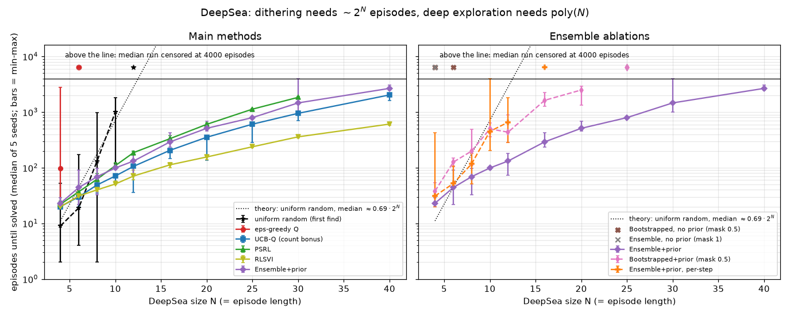
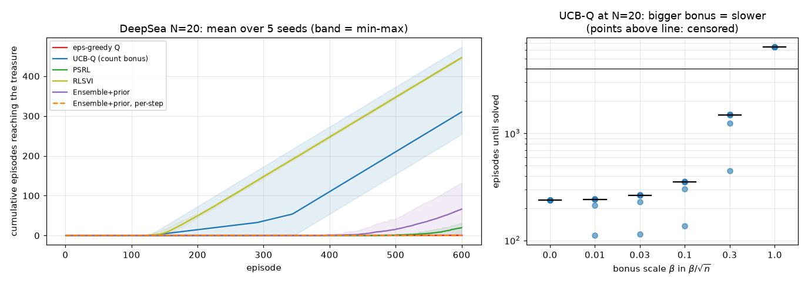
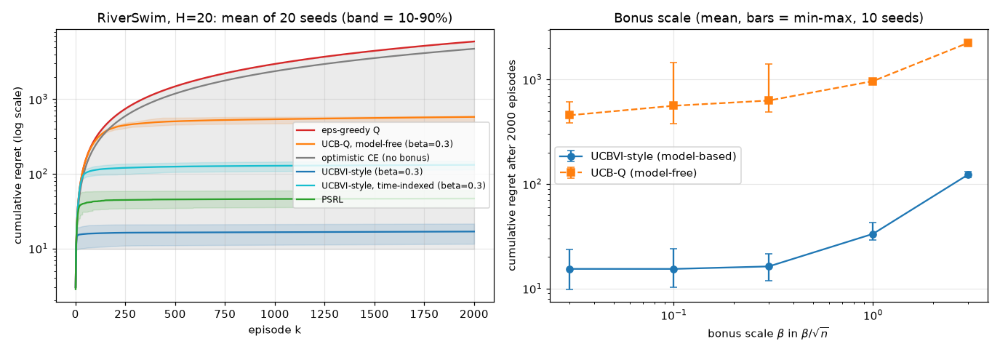
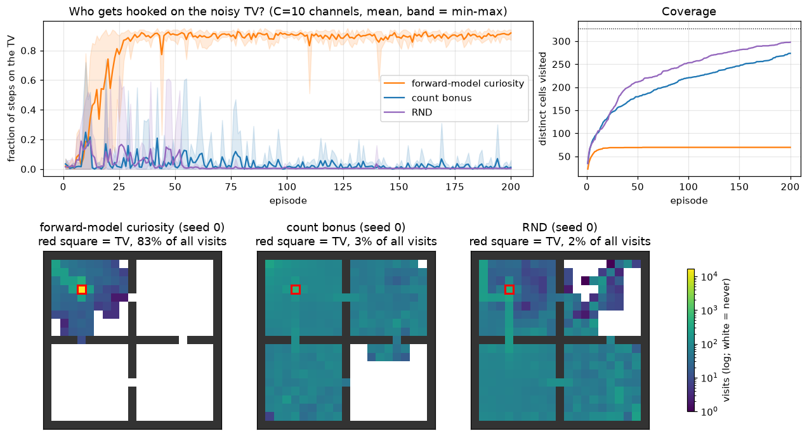
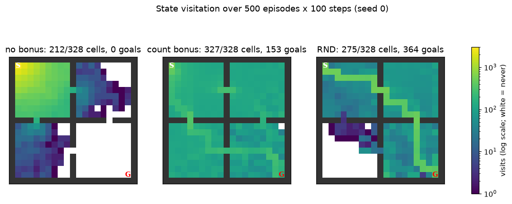
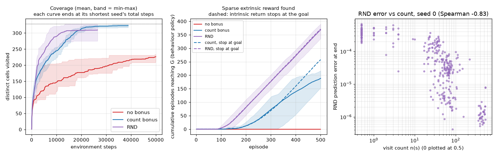

# Chapter 14 — Exploration in Deep and Tabular RL

[← Previous: Model-Based Deep RL, World Models and AlphaZero/MuZero](13-model-based-rl.md) · [Course index](../README.md) · [Next: Beyond the Standard MDP](15-beyond-mdps.md) →

## At a glance

Every algorithm in this course learns from the data its own behaviour produces. If the behaviour never visits the part of the world where the reward is, no amount of clever value fitting will find it. [Chapter 02](02-multi-armed-bandits.md) studied this exploration–exploitation dilemma when every action can be tried at any moment. In an MDP the problem gets qualitatively harder: to learn about a state you must first *travel* there, and travelling takes a plan. This chapter is about exploring *deeply*: committing to multi-step journeys into the unknown because of what you might learn there, not because of local randomness.

The chapter has two halves. The first is about principled, mostly tabular methods with guarantees: optimism in the face of uncertainty (R-MAX, E3, UCRL2, UCB bonuses in Q-learning) and posterior sampling (PSRL, randomized value functions, Bootstrapped DQN with randomized priors). The second is about the deep-RL heuristics that scale those ideas to pixels: pseudo-counts, hashing, curiosity, Random Network Distillation (RND), episodic novelty (NGU, Agent57), Go-Explore, information gain and empowerment, exploration in continuous control, reward-free skill discovery, and exploration in RL for language models.

**Learning objectives.** After this chapter you should be able to:

1. Explain why exploration in an MDP differs from exploration in a bandit, and prove that dithering strategies such as $\varepsilon$-greedy need a number of episodes exponential in the horizon on a combination lock.
2. Distinguish undirected exploration (dithering: $\varepsilon$-greedy, Boltzmann, entropy bonuses, action and parameter noise) from directed exploration, and say when each is adequate.
3. State and explain R-MAX, E3, UCRL2 and UCB-Q-learning, and derive, step by step, why an optimistic planner with a $1/\sqrt{n}$ bonus has regret that grows like $\sqrt{T}$.
4. Explain posterior sampling for RL (PSRL), derive its key Bayesian-regret identity, say why it is not the Bayes-optimal policy, and explain how RLSVI, Bootstrapped DQN and randomized prior functions approximate it. Show why a random *prior*, and *per-episode* commitment, are essential.
5. Derive pseudo-counts from a density model, and explain count-based bonuses with hashing.
6. Explain prediction-error curiosity (ICM), the noisy-TV problem, and why RND avoids it for stochastic transitions; implement RND and make it work with a tabular learner.
7. Describe NGU, Agent57 and Go-Explore, including what "detachment" and "derailment" mean.
8. Describe information-gain (VIME), empowerment and skill-discovery (DIAYN) objectives, reward-free RL, exploration in continuous control, and the exploration problem in RL for language models.

**Prerequisites.** Bandits, UCB and Thompson sampling ([Chapter 02](02-multi-armed-bandits.md)); finite-horizon Bellman equations and backward induction ([Chapters 01](01-the-rl-problem.md) and [03](03-dynamic-programming.md)); Q-learning ([Chapter 05](05-temporal-difference.md)); Dyna and optimistic models ([Chapter 07](07-planning-and-learning-tabular.md)); DQN ([Chapter 09](09-deep-q-learning.md)); policy gradients and entropy bonuses ([Chapters 10](10-policy-gradients.md)–[11](11-trust-regions-and-ppo.md)); SAC ([Chapter 12](12-continuous-control-actor-critic.md)). Hoeffding's inequality is derived in [Chapter 02](02-multi-armed-bandits.md) §6.2 and KL divergence is in [Chapter 00](00-math-toolkit.md) §5.3. The Azuma–Hoeffding inequality is stated where it is used (Section 3.3) and collected with the other concentration tools in [Chapter 19](19-rl-theory.md) §5.1.

**Code you will run** (all in [`code/ch14_exploration/`](../code/ch14_exploration/); NumPy, plus small PyTorch networks for RND; every full run takes under two and a half minutes on one CPU core):

| Script | What it shows |
|---|---|
| [`deep_sea.py`](../code/ch14_exploration/deep_sea.py) | DeepSea of size $N = 4 \dots 40$: $\varepsilon$-greedy and uniform random need $\sim 2^N$ episodes; UCB-Q, PSRL, RLSVI and an ensemble with randomized priors need polynomially many. Ablations: no prior, no commitment, bootstrap masks; bonus scale |
| [`riverswim.py`](../code/ch14_exploration/riverswim.py) | RiverSwim (stochastic): optimism only for untried actions gets stuck in 16/20 runs, a $\beta/\sqrt{n}$ bonus never does; model-based vs model-free optimism, with pooled and step-indexed counts; PSRL; the integer-table bug |
| [`rnd_gridworld.py`](../code/ch14_exploration/rnd_gridworld.py) | Sparse-reward four-rooms gridworld: coverage maps without a bonus, with a count bonus and with RND; centring; procrastination next to the goal; greedy evaluation |
| [`noisy_tv.py`](../code/ch14_exploration/noisy_tv.py) | The noisy-TV trap: forward-model curiosity spends 90% of its time watching TV; RND and counts do not |
| [`explore_lib.py`](../code/ch14_exploration/explore_lib.py) | Shared library: gridworld, count bonus, tabular forward-model curiosity, RND, two-stream Q-learner, greedy evaluation |
| [`exercise_solutions.py`](../code/ch14_exploration/exercise_solutions.py) | Numerical checks for the exercises: exact success probability of a trained $\varepsilon$-greedy agent, combination-lock hitting times, pseudo-counts, Boltzmann exploration, SimHash, Go-Explore on DeepSea |

**Study time.** About 10–12 hours: 6 for the text and derivations, 2 to run and modify the code, 3–4 for the exercises.

**Notation.** We follow [NOTATION.md](../NOTATION.md), with these local departures.

- **Finite horizon.** The theory sections use the **finite-horizon episodic** setting: each episode has $H$ steps indexed $h = 0, 1, \dots, H-1$, with $V_H \equiv 0$. Episodes are indexed $k = 1, \dots, K$, and $T \doteq KH$ is the **total number of steps** (not the last step of an episode, as in the rest of the course).
- **Values and rewards in the theory sections.** $V^\ast_h, Q^\ast_h$ and $V^\pi_h, Q^\pi_h$ denote the *true* finite-horizon optimal and policy values (the theory literature's capitals, in place of the course's $v_\ast, q_\ast, v_\pi, q_\pi$). Estimates carry a hat or a tilde, or are plain table entries in pseudocode. $r_h(s,a)$ is the (expected) reward for acting at step $h$, and in pseudocode $r_h$ is the reward received after $a_h$: this is the course's $R_{t+1}$, indexed by the step at which the action was taken.
- **Counts and sizes.** $S$ and $A$ also denote the **numbers** $|\mathcal{S}|$ and $|\mathcal{A}|$ inside bounds. $n(s,a)$ is a visit count and $n_k(s,a)$ the count before episode $k$. $N$ alone is the size of the DeepSea and chain environments. $N_t(a)$ (bandit recap) and $N_{s,a,h}$ (total visits in a proof) are counts, and $\hat N$ is a pseudo-count.
- **Exploration quantities.** $\beta$ is an **exploration-bonus scale** (not the RLHF KL coefficient). $r^e$ and $r^i$ are extrinsic and intrinsic rewards. A tilde ($\tilde Q$, $\tilde V$, $\tilde M$) marks an optimistic or a sampled quantity. $\rho$ is a **density model** (not an importance ratio). $M$ denotes an MDP and $M^\ast$ the true one. $\mathcal{D}_k$ is the data (history) observed before episode $k$. $\mathcal{H}$ is always an entropy.
- **Overloaded letters.** $\varepsilon$ is the exploration rate and, in PAC statements, an accuracy, while $\delta$ is always a failure probability. $\tau$ is a Boltzmann temperature, as in the tabular chapters. $B$ is an ensemble size, with members indexed by $j$. $C$ is the number of noisy-TV channels. $p$ is a probability whose meaning is local: the right-digit probability (Section 1.2), the bootstrap-mask probability $p_{\text{mask}}$, the prior functions $p_j$ (Section 4.3) and the skill prior $p(z)$ (Section 12).

---

## 1. Why exploration is hard in MDPs

### 1.1 From bandits to MDPs

In a $k$-armed bandit ([Chapter 02](02-multi-armed-bandits.md)) every arm is available at every step. Exploration costs at most one suboptimal pull, and its reward is immediate information about that arm. Three ideas solved the problem well. $\varepsilon$-greedy tries a random arm occasionally. UCB adds to each estimate a bonus that shrinks with the count, $Q_t(a) + c\sqrt{\ln t / N_t(a)}$, and acts greedily on the sum. Thompson sampling samples a mean for every arm from the posterior and pulls the best sampled arm. UCB and Thompson sampling both achieve logarithmic (gap-dependent) regret, or $\sqrt{kT}$ worst-case regret up to logarithmic factors; $\varepsilon$-greedy with a fixed $\varepsilon$ has linear regret.

In an MDP four things change.

1. **Information lives in places.** You learn about $(s,a)$ only by being in $s$. If $s$ is ten steps away, gathering one sample costs ten steps of a deliberate plan, and the plan itself must be learned.
2. **The value of information propagates.** An action is worth exploring if it leads to states *from which* something can be learned. That value has to be backed up through the Bellman equation just like reward. This is why exploration needs planning, not just a per-state rule.
3. **Rewards are often sparse or deceptive.** Before the first reward there is no gradient to follow. Worse, a small local cost (an energy penalty, a step cost) can actively push a learner away from the rewarding region.
4. **The data distribution is your own doing.** What you can learn depends on the states you visit, which depends on your current estimates. Errors can be self-reinforcing: if you believe a region is bad you never go there, so you never find out you were wrong.

Osband and colleagues call exploration that accounts for points 1 and 2 **deep exploration**: choosing actions for the information they may yield *several steps later*. An agent explores deeply when it is willing to commit to a multi-step journey whose payoff is only informational.

### 1.2 The combination lock: dithering needs exponential time

The cleanest illustration is a chain of $N$ states, sometimes called a *combination lock*. In state $i \in \{0, \dots, N-1\}$, one of the two actions (the "right digit") moves to $i+1$; the other resets the agent to state $0$. Reaching state $N$ opens the lock and pays the only reward. Which action is the right digit differs from state to state, so a learner cannot know it in advance.

Consider the best-case undirected explorer, the **uniformly random policy**. Let $E_i$ be the expected number of steps to reach $N$ from state $i$, with $E_N = 0$. One step from $i < N$ either advances (probability $\tfrac12$) or resets:

$$
E_i = 1 + \tfrac12 E_{i+1} + \tfrac12 E_0, \qquad i = 0, \dots, N-1 .
$$

Rearranging gives $E_{i+1} = 2E_i - 2 - E_0$. Starting from $E_0$:

$$
\begin{aligned}
E_1 &= 2E_0 - 2 - E_0 = E_0 - 2,\\
E_2 &= 2(E_0 - 2) - 2 - E_0 = E_0 - 6,\\
E_3 &= 2(E_0 - 6) - 2 - E_0 = E_0 - 14 .
\end{aligned}
$$

The pattern is $E_i = E_0 - (2^{i+1} - 2)$. Induction confirms it: $E_{i+1} = 2\bigl(E_0 - 2^{i+1} + 2\bigr) - 2 - E_0 = E_0 - (2^{i+2} - 2)$. The boundary condition $E_N = 0$ then gives

$$
E_0 = 2^{N+1} - 2 .
$$

**Worked example ($N = 3$).** The formula gives $E_0 = 14$, hence $E_1 = 12$, $E_2 = 8$, $E_3 = 0$. Check each equation by hand: $E_2 = 1 + \tfrac12\cdot 0 + \tfrac12 \cdot 14 = 8$, $E_1 = 1 + \tfrac12 \cdot 8 + \tfrac12\cdot 14 = 12$, $E_0 = 1 + \tfrac12\cdot 12 + \tfrac12 \cdot 14 = 14$. A random walker needs 14 steps on average to open a 3-digit lock, 2,046 for 10 digits and about $2 \times 10^{6}$ for 20 digits. The script `exercise_solutions.py` confirms the formula by a linear solve and by simulating 100,000 random walkers: 509.8 ± 1.6 steps for $N = 8$ (formula 510) and 2,048.5 ± 6.5 for $N = 10$ (formula 2,046).

If the per-step probability of the right digit is $p$ instead of $\tfrac12$, the same argument gives $E_0 = (p^{-N} - 1)/(1 - p)$ (Exercise 2). This matters because a *learning* dithering agent is usually worse than uniform. Once $\varepsilon$-greedy has learned that the wrong digit is cheaper (for instance, because the right one has a small cost, or because the reset leads somewhere mildly rewarding), its greedy action is wrong in every state, and the right digit is chosen only with probability $p = \varepsilon/2$.

### 1.3 DeepSea

The experiments of this chapter use **DeepSea** (Osband et al., 2019), a combination lock with a built-in temptation. It is an $N \times N$ grid. The agent starts in the top-left cell; every step moves it one row *down* and one column left or right, so an episode lasts exactly $N$ steps. Moving right costs $0.01/N$; moving right from the bottom-right cell pays $+1$, the "treasure". The optimal return is $1 - 0.01 = 0.99$; every policy that misses the treasure earns at most $0$. As in the bsuite version, the meaning of the two action indices is shuffled independently in each cell, so no fixed tie-breaking rule or action bias solves it by luck.

- A **uniformly random** policy reaches the treasure with probability $2^{-N}$ per episode, so the first success takes on average $2^N$ episodes (median about $0.69 \cdot 2^N$).
- An **$\varepsilon$-greedy** Q-learner quickly learns that "right" costs something and "left" costs nothing, so its greedy action becomes "left" on every diagonal cell where it has tried "right". It goes right there only with probability $\varepsilon/2$. Deeper diagonal cells, which it has rarely or never reached, still have tied Q-values and go right with probability $1/2$. If "left" has been learned on $d$ of the $N$ diagonal cells, the per-episode success probability is about $(\varepsilon/2)^d\,(1/2)^{N-d}$. That falls further with every cell learned, towards $(\varepsilon/2)^N$, which for $N = 10$ and $\varepsilon = 0.1$ is $0.05^{10} \approx 9.8 \times 10^{-14}$. We trained $\varepsilon$-greedy Q-learning for 4,000 episodes at $N = 10$ (five seeds; `exercise_solutions.py`, Exercise 1) and computed the behaviour policy's exact success probability. "Left" had been learned on only 3–4 of the 10 diagonal cells, and the probability was $10^{-7}$ to $10^{-6}$ per episode. That is far from $10^{-13}$, but still $10^3$ to $10^4$ times worse than the random walk's $1/2^{10} \approx 10^{-3}$, and it keeps falling as learning proceeds. The temptation (a tiny cost) has made learning *strictly worse* than not learning.

The fix is not more randomness. The agent needs a reason to go right *ten times in a row*, and that reason can only come from reasoning about what it does not yet know. Section 5 shows the measured gap: $\varepsilon$-greedy fails already at $N = 6$, while directed methods solve $N = 40$.

### 1.4 A map of the chapter

| Family | Mechanism | Deep? | Sections |
|---|---|---|---|
| Dithering ($\varepsilon$-greedy, Boltzmann, entropy, action noise) | per-step randomness around the greedy action | no | 2 |
| Optimism (R-MAX, E3, UCRL2, UCBVI, UCB-Q, count bonuses) | act greedily on an upper confidence bound | yes, via planning | 3, 5, 6 |
| Posterior sampling (PSRL, RLSVI, ensembles + priors) | act greedily on one plausible world for a whole episode | yes, via commitment | 4, 5 |
| Intrinsic motivation (curiosity, RND, NGU) | add a novelty or surprise reward, then do ordinary RL | yes if the bonus is planned for | 7, 8 |
| Archive-based (Go-Explore) | remember frontier states, return, then explore | yes, via explicit return | 9 |
| Information-theoretic (VIME, empowerment, DIAYN) | maximise an information quantity | depends | 10, 12 |

---

## 2. Undirected exploration: dithering and its limits

Thrun (1992) called exploration **undirected** when it injects randomness without using any knowledge about what is unknown, and **directed** when it uses such knowledge (counts, uncertainty, models). Undirected methods remain the default in deep RL because they are free and need no extra machinery. It is worth knowing exactly what they can and cannot do.

**$\varepsilon$-greedy.** With probability $\varepsilon$ take a uniformly random action, otherwise the greedy one ([Chapter 02](02-multi-armed-bandits.md), [Chapter 05](05-temporal-difference.md)). Decaying $\varepsilon$ to 0 gives a GLIE schedule only if every state–action pair is still tried infinitely often. In an MDP a global schedule with $\sum_k \varepsilon_k = \infty$ (the bandit condition) does not ensure this. On a depth-$N$ lock whose greedy action is wrong, the chance of reaching the end in episode $k$ is about $(\varepsilon_k/2)^N$, and $\sum_k (c/k)^N < \infty$ for $N \ge 2$. By the Borel–Cantelli lemma the deep states are then reached only finitely often. The standard GLIE choice is state-dependent, $\varepsilon_t(s) = c/n_t(s)$ (Singh et al., 2000; [Chapter 05](05-temporal-difference.md), Section 7.3). Together with Robbins–Monro step sizes it gives asymptotic convergence of SARSA, but it says nothing about how long that takes. DQN used $\varepsilon$ annealed from 1 to 0.1 ([Chapter 09](09-deep-q-learning.md)).

**Boltzmann (softmax) exploration.** Choose $a$ with probability $\pi(a \mid s) = \exp(Q(s,a)/\tau) / \sum_b \exp(Q(s,b)/\tau)$. Unlike $\varepsilon$-greedy, it explores bad actions less than nearly-optimal ones. Its weakness is scale: the right temperature depends on the size of the Q-value gaps, which vary across states and over training. In DeepSea the gaps are of order $0.01/N$. Our exercise run (Exercise 11) found that every $\tau \ge 0.01$ behaves like the uniform random walk (median first success after 8, 93, 327 and 1,094 episodes for $N = 4, 6, 8, 10$, close to $0.69\cdot 2^N$), With $\tau = 0.001$ it is strongly biased towards the cheaper action. At a visited cell $P(\text{right}) = 1/(1 + e^{0.01/(N\tau)})$, from about $0.08$ ($N = 4$) to $0.27$ ($N = 10$), so success per episode is still exponentially small, and the median run never found the treasure for $N \ge 6$. Either way the cost is exponential.

**Entropy bonuses.** Policy-gradient methods add $\lambda_{\mathcal{H}}\,\mathcal{H}(\pi(\cdot \mid s))$ to the objective to keep the policy stochastic ([Chapters 10](10-policy-gradients.md)–[11](11-trust-regions-and-ppo.md)); maximum-entropy RL builds it into the return (SAC, [Chapter 12](12-continuous-control-actor-critic.md)). Entropy prevents premature collapse of the policy, which is valuable, but the randomness is still per step and blind to what is unknown.

**Action noise and parameter noise.** In continuous control, DDPG adds Ornstein–Uhlenbeck noise and TD3 adds Gaussian noise to a deterministic action ([Chapter 12](12-continuous-control-actor-critic.md)). **Parameter-space noise** (Plappert et al., 2018) and **NoisyNets** (Fortunato et al., 2018; [Chapter 09](09-deep-q-learning.md), Section 8) instead perturb the *weights* of the policy or Q-network, and keep the perturbation fixed for a while (an episode, or a number of steps). That makes behaviour *temporally consistent*: one perturbed network tends to make the same "mistake" in similar states, so it can wander coherently. This is a first step towards the commitment of Section 4, but the size of the perturbation is not calibrated to epistemic uncertainty. NoisyNets learn their noise scales by gradient descent on the TD loss, and parameter noise adapts its scale to a target distance in action space. Neither shrinks specifically where the agent already knows the answer.

**When dithering is enough.** Dithering works when the reward signal is dense or well shaped, when many paths lead to reward, and when the horizon of the "decisions that matter" is short. Most continuous-control benchmarks and many Atari games fall in this category. It fails when reward requires a long specific sequence (the combination lock), and when local signals point the wrong way (DeepSea's cost). Montezuma's Revenge, where the first reward needs dozens of precise actions and death is everywhere, is the famous example: DQN scored zero on it.

The probability argument of Section 1.2 is general. Under any per-step randomization that picks the "right" action with probability at most $p < 1$ independently of the past, the probability of an $N$-step specific sequence is at most $p^N$. Breaking this bound requires correlations across time: a policy that *decides* to go right and keeps doing so.

---

## 3. Optimism in the face of uncertainty

### 3.1 The principle, and why it explores deeply

**Optimism in the face of uncertainty (OFU)**: among all worlds consistent with your data, assume the best one, and act optimally in it. In a bandit this is UCB. In an MDP the "best plausible world" is defined over *transitions and rewards everywhere*, so the optimistic value of an action already includes the value of reaching uncertain states several steps later. **Planning carries the optimism backwards.** That is what makes optimism deep. An optimistic DeepSea agent believes that unexplored cells at the bottom right may hold a fortune. Its plan therefore steers right for $N$ steps, and it keeps doing so until the data say otherwise.

Optimism also corrects itself, which is the heart of every proof in this section. After acting greedily on an optimistic value $\tilde Q \ge Q^\ast$, one of two things happens:

- **Exploit.** The episode stays in well-known territory. There the optimistic model is accurate, so the agent's real value is close to its optimistic value, which is at least $V^\ast$. The agent did nearly optimally.
- **Explore.** The episode visits poorly known states. The agent may have done badly, but it collected data exactly where the model was uncertain, and this can happen only a bounded number of times before everything relevant is known.

You have already seen two weak forms of optimism. **Optimistic initial values** (e.g. $Q_0 = 1$ when no return exceeds 1, used in [Chapter 07](07-planning-and-learning-tabular.md) for prioritized sweeping) make every untried action attractive. **Dyna-Q+** ([Chapter 07](07-planning-and-learning-tabular.md)) adds a bonus $\kappa\sqrt{\tau}$ for actions not tried for $\tau$ steps. This is Sutton & Barto's notation, used only in this sentence: here $\tau$ counts steps and is not a temperature. The algorithms below make the optimism *calibrated*: large exactly where the data are thin, and shrinking at the rate at which estimates become reliable.

Optimistic initial values alone are not enough when transitions are stochastic. After one visit an action no longer looks optimistic, only *estimated*, and an unlucky first sample (the river current pushed you back) can make a good action look bad forever. Section 5.3 measures this: on RiverSwim, optimism only for untried actions gets stuck in 16 of 20 runs.

### 3.2 R-MAX and E3: known and unknown states

**R-MAX** (Brafman & Tennenholtz, 2002) splits state–action pairs into **known** (visited at least $m$ times) and **unknown**. It plans in an optimistic model in which known pairs use their empirical transitions and rewards, and every unknown pair leads to a fictitious "paradise" that pays the maximum reward $r_{\max}$ forever. Here is a finite-horizon version (rewards in $[0,1]$, so $r_{\max} = 1$ and paradise is worth $H - h$ at step $h$).

```
Algorithm: R-MAX (finite-horizon, tabular)
Input: non-terminal states S, terminal states S+ \ S, actions A, horizon H,
       known-threshold m, rewards in [0, 1]
Initialise: n(s,a) <- 0, n(s,a,s') <- 0, Rsum(s,a) <- 0 for all s in S, a, s' in S+
For each episode k = 1, 2, ...:
    # Plan by backward induction in the optimistic model
    Ṽ_H(s) <- 0 for all s in S+
    Ṽ_h(s) <- 0 for every terminal s and every h   # absorbing, pays nothing: never "unknown"
    for h = H-1, H-2, ..., 0:
        for each s in S (non-terminal) and each a:
            if n(s,a) >= m:                                   # known pair
                Q̃_h(s,a) <- Rsum(s,a)/n(s,a) + Σ_s' [n(s,a,s')/n(s,a)] Ṽ_{h+1}(s')
            else:                                             # unknown pair
                Q̃_h(s,a) <- H - h                            # "paradise": reward 1 per step
        Ṽ_h(s) <- max_a Q̃_h(s,a) for each s in S
    # Act greedily for the whole episode
    observe s_0
    for h = 0, 1, ..., H-1:
        a_h <- argmax_a Q̃_h(s_h, a)   (ties broken at random)
        take a_h, observe r_h and s_{h+1}
        if n(s_h,a_h) < m:                  # the model of a known pair is frozen
            n(s_h,a_h) += 1;  n(s_h,a_h,s_{h+1}) += 1;  Rsum(s_h,a_h) += r_h
        if s_{h+1} is terminal: stop the episode
```

Terminal states must be excluded from the "unknown" test. No action is ever taken in a terminal state, so its pairs would stay unknown forever, and a planner that included them would believe that dying leads to paradise.

How large must $m$ be? The model of a known pair must be accurate enough that values computed in it are within $\varepsilon$ of the truth. For a single fixed function $V$ with values in $[0, V_{\max}]$, Hoeffding's inequality says the empirical next-state average is within $\varepsilon$ of its mean with probability at least $1 - \delta$ once $m \ge V_{\max}^2 \ln(2/\delta)/(2\varepsilon^2)$ (for $V_{\max} = 1$, $\varepsilon = 0.1$, $\delta = 0.05$: $m \ge 184.4$, so 185 visits; Exercise 10). Since the planner applies the model to many value functions, the real analyses use stronger, uniform bounds, and $m$ grows with $S$ too.

**Theorem (R-MAX is PAC-MDP; Brafman & Tennenholtz, 2002; refined by Kakade, 2003, and Strehl, Li & Littman, 2009; stated informally).** In a discounted MDP, with probability at least $1-\delta$, R-MAX follows a policy that is not $\varepsilon$-optimal from its current state on at most a number of time steps polynomial in $S$, $A$, $1/\varepsilon$, $\ln(1/\delta)$ and $1/(1-\gamma)$. Strehl, Li & Littman (2009) give $\tilde O\bigl(S^2 A / (\varepsilon^3 (1-\gamma)^6)\bigr)$.

*Proof idea.* This is the explore-or-exploit argument of Section 3.1 made quantitative. Over the next "effective horizon" of about $1/(1-\gamma)$ steps, either the greedy policy reaches an unknown pair with probability at least $\varepsilon$ (in which case a visit to an unknown pair happens; there can be only $SAm$ such visits before everything is known), or it does not, and then (by the *simulation lemma* of [Chapter 13](13-model-based-rl.md) §2.2, Eqs. 13.3–13.4, which bounds value differences between two MDPs that agree up to small errors on the states a policy visits) its true value is within $O(\varepsilon)$ of its optimistic value, which is at least the optimal value.

**E3** (Explicit Explore or Exploit; Kearns & Singh, 2002, first presented in 1998) was the first algorithm with a polynomial bound for general MDPs. It makes the dichotomy explicit. In a "known" state it computes two policies in the known-state model: an *exploitation* policy (unknown states worth 0) and an *exploration* policy (rewarded only for reaching unknown states). If the exploitation policy is near-optimal it exploits; otherwise the exploration policy is guaranteed to reach an unknown state quickly, and it explores. In unknown states it performs "balanced wandering" (tries the least-tried action). R-MAX gets the same effect implicitly: the paradise assumption makes "reach an unknown state" and "collect reward" the same objective.

**Theorem (E3; Kearns & Singh, 2002; stated informally).** Let $T^\varepsilon$ be the $\varepsilon$-return mixing time of the comparison policies: the number of steps after which their average undiscounted return is within $\varepsilon$ of its asymptotic value. In the discounted case it is replaced by the horizon time, of order $\frac{1}{1-\gamma}\ln\frac{R_{\max}}{\varepsilon(1-\gamma)}$. With probability at least $1-\delta$, E3 attains an average return within $\varepsilon$ of the best return achievable by policies with mixing time $T^\varepsilon$. It uses a number of actions and of computation steps polynomial in $S$, $A$, $T^\varepsilon$, $1/\varepsilon$, $1/\delta$ and $R_{\max}$. The dependence on $T^\varepsilon$ is unavoidable, because any algorithm needs about $T^\varepsilon$ steps just to observe the optimal return.

### 3.3 Calibrated bonuses: UCRL2, MBIE-EB, UCBVI, and why the regret is sublinear

R-MAX switches abruptly from "paradise" to "trust the data" at $m$ visits. Confidence-interval methods shrink the optimism gradually. **MBIE-EB** (Strehl & Littman, 2008) solves the empirical Bellman equation with an *exploration bonus*:

$$
\tilde Q(s,a) = \hat r(s,a) + \gamma \sum_{s'} \hat p(s' \mid s,a) \max_{a'} \tilde Q(s',a') + \frac{\beta}{\sqrt{n(s,a)}} .
$$

**UCRL2** (Jaksch, Ortner & Auer, 2010) works in the average-reward setting. It keeps an $L_1$ confidence ball around each empirical transition distribution and a confidence interval around each empirical reward. It computes the policy that is optimal in the *best MDP inside these sets*, using "extended value iteration" (an inner maximization over the transition ball, solvable greedily by moving probability mass to the best next state). It recomputes the policy only when some count has doubled.

**Theorem (Jaksch, Ortner & Auer, 2010).** For any communicating MDP with $S$ states, $A$ actions and diameter $D$ (the largest, over pairs of states, of the minimal expected time to go from one to the other), with probability at least $1-\delta$, the regret of UCRL2 after $T$ steps is at most $34\, D S \sqrt{A T \ln(T/\delta)}$, for every $T > 1$. Every algorithm suffers regret $\Omega(\sqrt{DSAT})$ on some MDP.

Rather than reproduce that proof, we derive the same kind of guarantee in the finite-horizon setting, where it is shorter. Every step is elementary, and the structure (optimism, then decomposition, then pigeonhole) is the template of nearly all regret proofs in RL ([Chapter 19](19-rl-theory.md) has more).

**Setting.** Episodic MDP with horizon $H$, transitions $P_h(\cdot \mid s,a)$ that may depend on the step $h$, and *known* rewards $r_h(s,a) \in [0,1]$ (unknown rewards add a similar, smaller bonus). In episode $k$ the agent starts in $s_0^k$ (chosen by the environment), and $n_k(s,a,h) \ge 0$ counts the visits to $(s,a)$ at step $h$ in episodes $1, \dots, k-1$. $\hat P_{k,h}(\cdot \mid s,a)$ is the empirical distribution of the observed next states. Regret over $K$ episodes is

$$
\mathrm{Reg}(K) \doteq \sum_{k=1}^K \bigl( V^\ast_0(s_0^k) - V^{\pi_k}_0(s_0^k) \bigr) .
$$

**Algorithm (optimistic value iteration with an $L_1$ bonus, UCRL2/UCBVI-style).** Before episode $k$, set $\tilde V_{k,H} \equiv 0$ and for $h = H-1, \dots, 0$:

$$
\tilde Q_{k,h}(s,a) =
\begin{cases}
H - h & \text{if } n_k(s,a,h) = 0,\\[2pt]
\min\Bigl\{H - h,\; r_h(s,a) + b_k(s,a,h) + \hat P_{k,h}(\cdot \mid s,a)^{\top} \tilde V_{k,h+1}\Bigr\} & \text{otherwise,}
\end{cases}
\qquad \tilde V_{k,h}(s) = \max_a \tilde Q_{k,h}(s,a),
$$

with bonus $b_k(s,a,h) = H\sqrt{L/(2\,n_k(s,a,h))}$ and $L \doteq S\ln 2 + \ln(2SAHK/\delta)$. Act greedily: $\pi_k(s, h) = \arg\max_a \tilde Q_{k,h}(s,a)$. As a box:

```
Algorithm: optimistic value iteration with count bonuses (UCRL2/UCBVI-style), finite horizon
Input: non-terminal states S, actions A, horizon H, known rewards r_h(s,a) in [0,1],
       episodes K, failure probability delta
Initialise: n(s,a,h) <- 0, n(s,a,h,s') <- 0 for all s, a, h, s';  L <- S ln 2 + ln(2 S A H K / delta)
For each episode k = 1, ..., K:
    # Plan: backward induction in the empirical model, plus a bonus
    Ṽ_H(s) <- 0 for all s;  Ṽ_h(s) <- 0 for every terminal s and every h
    for h = H-1, ..., 0:
        for each s in S, a in A:
            if n(s,a,h) = 0:
                Q̃_h(s,a) <- H - h                                    # untried: maximal value
            else:
                P̂(s') <- n(s,a,h,s') / n(s,a,h) for all s'
                b <- H * sqrt( L / (2 n(s,a,h)) )
                Q̃_h(s,a) <- min{ H - h,  r_h(s,a) + b + Σ_s' P̂(s') Ṽ_{h+1}(s') }
        Ṽ_h(s) <- max_a Q̃_h(s,a) for each s in S
    # Act greedily on the optimistic values for the whole episode
    observe s_0
    for h = 0, ..., H-1:
        a_h <- argmax_a Q̃_h(s_h, a);  take a_h;  observe r_h, s_{h+1}
        n(s_h,a_h,h) += 1;  n(s_h,a_h,h,s_{h+1}) += 1
        if s_{h+1} is terminal: stop the episode
```

(The counts may be updated during the episode because the plan is recomputed only at the start of the next one.) Our RiverSwim code (Section 5.3) runs this planner with the bonus $\beta/\sqrt{n}$, in two versions: with step-indexed counts $n(s,a,h)$ as here, and with counts $n(s,a)$ pooled over $h$, which is valid when the dynamics do not depend on $h$.

**Step 1: a confidence event.** Weissman et al. (2003) showed that the empirical distribution $\hat P$ of $n$ i.i.d. draws from a distribution $P$ on $S$ outcomes satisfies $\Pr\{\lVert \hat P - P \rVert_1 \ge u\} \le (2^S - 2)\,e^{-nu^2/2}$ for every $u > 0$. Here the count is random and depends on the data, so Weissman's fixed-$n$ bound cannot be applied directly. Instead, imagine for each $(s,a,h)$ a stack of i.i.d. next-state draws, of which the $j$-th visit reveals the $j$-th. Apply Weissman's bound to the first $n$ draws of each stack, for every fixed $n \in \{1, \dots, K\}$. That is why the union bound runs over the possible count values as well as over the triples. Set the right side to $\delta' = \delta/(2SAHK)$ and take a union bound over all $SAH$ triples $(s,a,h)$ and all $K$ count values. Then, with probability at least $1 - \delta/2$, the following **good event** holds simultaneously for all $k, h, s, a$ with $n_k(s,a,h) \ge 1$:

$$
\bigl\lVert \hat P_{k,h}(\cdot \mid s,a) - P_h(\cdot \mid s,a) \bigr\rVert_1 \le \sqrt{\frac{2L}{n_k(s,a,h)}} .
$$

On this event, for *every* vector $V \in [0, H]^S$ (including data-dependent ones), since both distributions sum to one we may subtract the constant $H/2$ from $V$ without changing the inner product, so

$$
\bigl|(\hat P_{k,h} - P_h)^{\top} V\bigr| = \bigl|(\hat P_{k,h} - P_h)^{\top} (V - \tfrac H2 \mathbf{1})\bigr| \le \lVert \hat P_{k,h} - P_h \rVert_1 \cdot \frac H2 \le H\sqrt{\frac{L}{2n_k}} = b_k(s,a,h).
$$

The uniformity over all $V$ is what we pay $\sqrt{S}$ for (through $L \approx S \ln 2$), and it is exactly what Step 3 needs.

**Step 2: optimism.** On the good event, $\tilde Q_{k,h} \ge Q^\ast_h$ for all $k, h$. Backward induction on $h$: at $h = H$ both sides are 0. Suppose $\tilde V_{k,h+1} \ge V^\ast_{h+1}$. If $n_k = 0$ or the minimum is attained at $H - h$, then $\tilde Q_{k,h}(s,a) = H - h \ge Q^\ast_h(s,a)$ because no return over $H - h$ steps exceeds $H - h$. Otherwise

$$
\begin{aligned}
\tilde Q_{k,h}(s,a) &= r_h(s,a) + b_k + \hat P_{k,h}^{\top} \tilde V_{k,h+1}\\
&\ge r_h(s,a) + b_k + \hat P_{k,h}^{\top} V^\ast_{h+1} && (\hat P \ge 0 \text{ and induction hypothesis})\\
&= r_h(s,a) + P_h^{\top} V^\ast_{h+1} + \bigl[b_k + (\hat P_{k,h} - P_h)^{\top} V^\ast_{h+1}\bigr]\\
&\ge r_h(s,a) + P_h^{\top} V^\ast_{h+1} = Q^\ast_h(s,a) && (\text{Step 1: the bracket is} \ge 0).
\end{aligned}
$$

Taking the maximum over $a$ gives $\tilde V_{k,h} \ge V^\ast_h$, completing the induction.

**Step 3: decomposition along the trajectory.** Fix episode $k$ and write $s_h, a_h$ for the visited pairs and $\pi = \pi_k$. Let $\Delta_{k,h} \doteq \tilde V_{k,h}(s_h) - V^{\pi}_h(s_h)$, which is $\ge 0$ because $\tilde V \ge V^\ast \ge V^\pi$. Because $a_h$ is greedy for $\tilde Q_{k,h}$, $\Delta_{k,h} = \tilde Q_{k,h}(s_h,a_h) - Q^{\pi}_h(s_h,a_h)$. If $n_k(s_h,a_h,h) \ge 1$:

$$
\begin{aligned}
\Delta_{k,h} &\le r_h + b_k + \hat P_{k,h}^{\top}\tilde V_{k,h+1} - \bigl(r_h + P_h^{\top} V^{\pi}_{h+1}\bigr)\\
&= b_k + (\hat P_{k,h} - P_h)^{\top}\tilde V_{k,h+1} + P_h^{\top}\bigl(\tilde V_{k,h+1} - V^{\pi}_{h+1}\bigr)\\
&\le 2 b_k + P_h^{\top}\bigl(\tilde V_{k,h+1} - V^{\pi}_{h+1}\bigr) && (\text{Step 1 with } V = \tilde V_{k,h+1})\\
&= 2 b_k + \Delta_{k,h+1} + \xi_{k,h+1},
\end{aligned}
$$

where the transition probabilities are evaluated at $(s_h,a_h)$ and

$$
\xi_{k,h+1} \doteq P_h(\cdot \mid s_h,a_h)^{\top}\bigl(\tilde V_{k,h+1} - V^{\pi}_{h+1}\bigr) - \bigl(\tilde V_{k,h+1} - V^{\pi}_{h+1}\bigr)(s_{h+1})
$$

is the difference between an expectation over the next state and its realized value. Given everything up to $(s_h, a_h)$, $\xi_{k,h+1}$ has mean zero and lies in $[-H, H]$: it is a **martingale difference**. If instead $n_k(s_h,a_h,h) = 0$, then $\Delta_{k,h} \le H$, and since $\Delta_{k,h+1} + \xi_{k,h+1} = P_h^{\top}(\tilde V_{k,h+1} - V^\pi_{h+1}) \ge 0$ we may still write $\Delta_{k,h} \le H + \Delta_{k,h+1} + \xi_{k,h+1}$. Unrolling from $h = 0$ to $H-1$ (with $\Delta_{k,H} = 0$):

$$
\Delta_{k,0} \le \sum_{h=0}^{H-1}\Bigl( H\,\mathbb{1}[n_k(s_h,a_h,h) = 0] + 2b_k(s_h,a_h,h)\,\mathbb{1}[n_k(s_h,a_h,h) \ge 1] + \xi_{k,h+1}\Bigr).
$$

**Step 4: sum over episodes.** By optimism, $V^\ast_0(s_0^k) \le \tilde V_{k,0}(s_0^k)$, so $\mathrm{Reg}(K) \le \sum_k \Delta_{k,0}$, and we bound the three sums.

1. *First visits.* Each triple $(s,a,h)$ has $n_k = 0$ in at most one episode in which it is visited, so the first sum is at most $H \cdot SAH = H^2SA$.
2. *Bonuses (the pigeonhole argument).* Each triple is visited at most once per episode, so on its $j$-th visit its count is $j-1$. If the triple is visited $N_{s,a,h}$ times in total,

   $$
   \sum_{j=2}^{N_{s,a,h}} \frac{1}{\sqrt{j-1}} \le \int_0^{N_{s,a,h}} \frac{dx}{\sqrt{x}} = 2\sqrt{N_{s,a,h}} .
   $$

   Summing over the $SAH$ triples and using Cauchy–Schwarz together with $\sum_{s,a,h} N_{s,a,h} = KH = T$:

   $$
   \sum_{s,a,h} 2\sqrt{N_{s,a,h}} \le 2\sqrt{SAH \sum_{s,a,h} N_{s,a,h}} = 2\sqrt{SAHT}.
   $$

   So the second sum is at most $2H\sqrt{L/2}\cdot 2\sqrt{SAHT} = 2\sqrt{2}\, H\sqrt{SAHT\,L}$.
3. *Martingale.* The **Azuma–Hoeffding inequality** extends Hoeffding's inequality from independent variables to martingale differences: if $\xi_1, \dots, \xi_n$ is a martingale difference sequence with $|\xi_i| \le c$, then $\Pr\{\sum_i \xi_i \ge t\} \le \exp\bigl(-t^2/(2nc^2)\bigr)$ (see [Chapter 19](19-rl-theory.md) §5.1). Here $c = H$ and $n = KH = T$ (if an episode ends early, pad it with zero terms). Setting the right side to $\delta/2$ gives $t = H\sqrt{2T\ln(2/\delta)}$, so with probability at least $1 - \delta/2$, $\sum_{k,h}\xi_{k,h+1} \le H\sqrt{2T\ln(2/\delta)}$.

**Result.** With probability at least $1 - \delta$,

$$
\mathrm{Reg}(K) \le H^2 SA + 2\sqrt{2}\,H\sqrt{SAHT\,L} + H\sqrt{2T\ln(2/\delta)} = \tilde O\bigl(\sqrt{H^3 S^2 A T}\bigr),
$$

using $L = O(S + \ln(SAHK/\delta))$. The regret grows like $\sqrt{T}$, so the average regret per episode, $\mathrm{Reg}(K)/K$, goes to 0 like $1/\sqrt{K}$. The ingredients are worth memorizing. **Optimism** turns regret into "optimistic value minus real value". **Bellman decomposition** turns that into a sum of bonuses along the trajectories actually followed. The **pigeonhole** argument shows that you cannot keep visiting pairs with large bonuses forever, because visiting shrinks them.

The bound is not tight. The $\sqrt S$ from the $L_1$ ball can be removed by applying Hoeffding or Bernstein inequalities to the *fixed* vector $V^\ast_{h+1}$ and controlling the leftover term $(\hat P - P)^{\top}(\tilde V - V^\ast)$ separately. With Bernstein–Freedman bonuses this gives **UCBVI-BF** (Azar, Osband & Munos, 2017), whose regret is $\tilde O(\sqrt{HSAT})$ for time-homogeneous transitions (plus lower-order terms), matching the lower bound $\Omega(\sqrt{HSAT})$ up to logarithmic factors once $T$ is large. The Hoeffding variant, UCBVI-CH, gets $\tilde O(H\sqrt{SAT})$ (see [Chapter 19](19-rl-theory.md)). Our code uses the shape of these bonuses ($\beta/\sqrt{n}$) with $\beta$ chosen empirically, because the constants that make the proofs work are far too conservative in practice (Section 5).

### 3.4 Optimism without a model: UCB-Q-learning

Model-based optimism needs to store and plan in $\hat P$, which costs $O(S^2 A)$ memory. Can plain Q-learning be made provably efficient? Jin, Allen-Zhu, Bubeck & Jordan (2018) showed that it can, with two changes to the textbook algorithm: an optimistic bonus, and a specific step size.

```
Algorithm: Q-learning with UCB-Hoeffding bonus (Jin et al., 2018), finite horizon
Input: S, A, horizon H, number of episodes K, failure probability delta, constant c > 0
Initialise: Q_h(s,a) <- H and n_h(s,a) <- 0 for all s, a and h < H
            V_h(s) <- H for all s and h < H      # optimistic, also for never-visited states
            V_H(s) <- 0 for all s;  V_h(s) <- 0 for terminal s and every h
iota <- ln(S A K H / delta)
For each episode k = 1, ..., K:
    observe s_0
    for h = 0, ..., H-1:
        a_h <- argmax_a Q_h(s_h, a)            (greedy: no epsilon!)
        take a_h, observe r_h, s_{h+1}
        t <- n_h(s_h,a_h) <- n_h(s_h,a_h) + 1
        alpha_t <- (H + 1) / (H + t)
        b_t <- c * sqrt(H^3 * iota / t)
        Q_h(s_h,a_h) <- (1 - alpha_t) Q_h(s_h,a_h) + alpha_t [ r_h + V_{h+1}(s_{h+1}) + b_t ]
        V_h(s_h) <- min(H, max_a Q_h(s_h, a))
        if s_{h+1} is terminal: stop the episode
```

The initialisation $V_h \equiv H$ matters. A never-visited next state must look optimistic, and that optimism is what propagates backwards and drives deep exploration. A default of 0 (an array of zeros, or a `defaultdict`) would make unexplored states look *pessimistic*. Equivalently, one can drop the $V$ table and use $\min\{H, \max_{a'} Q_{h+1}(s_{h+1}, a')\}$ directly, as Algorithm 19.3 in [Chapter 19](19-rl-theory.md) does.

**Theorem (Jin et al., 2018).** There is an absolute constant $c$ such that, with probability at least $1-\delta$, the regret of this algorithm after $T = KH$ steps is $O\bigl(\sqrt{H^4 SAT\iota}\bigr)$ with $\iota = \ln(SAT/\delta)$, i.e. $\tilde O(\sqrt{H^4SAT})$. With Bernstein-style bonuses (which use the empirical variance of the next-state values) it is $\tilde O(\sqrt{H^3SAT})$. The lower bound for this time-inhomogeneous setting is $\Omega(\sqrt{H^2SAT})$, so model-free Q-learning is within a $\sqrt{H}$ factor of the best possible.

**Why $\alpha_t = (H+1)/(H+t)$, not $1/t$?** After $t$ visits, unrolling the update shows that $Q_h(s,a)$ is a weighted average of the $t$ targets: $Q = \sum_{i=1}^t \alpha_t^i\,[r + V(s'_i) + b_i]$, with weights $\alpha_t^i = \alpha_i \prod_{j=i+1}^{t}(1 - \alpha_j)$. (The initial value gets weight $\prod_{j=1}^t (1-\alpha_j) = 0$ because $\alpha_1 = 1$.) Early targets are computed from very optimistic, wrong values of $V_{h+1}$. With $1/t$ they would keep weight $1/t$ forever, and Jin et al. explain that this choice leads to regret bounds exponential in $H$, because the bias compounds across the $H$ steps. The rate $(H+1)/(H+t)$ puts most weight on the most recent $O(t/H)$ targets, and yields the facts the proof needs: $\sum_i \alpha_t^i = 1$, $\sum_i (\alpha_t^i)^2 \le 2H/t$, and $\sum_{t \ge i}\alpha_t^i = 1 + 1/H$, so that each target's total influence across all future updates is only $(1+1/H)$, and $(1 + 1/H)^H \le e$ keeps the errors from blowing up over the horizon.

**Worked example: the weights.** Take $H = 3$, so $\alpha_1 = 1$, $\alpha_2 = 4/5 = 0.8$, $\alpha_3 = 4/6 \approx 0.667$, $\alpha_4 = 4/7 \approx 0.571$. After $t = 4$ visits the weights of the four targets are

$$
\begin{aligned}
\alpha_4^4 &= 0.571, & \alpha_4^3 &= 0.667 \times (1 - 0.571) = 0.286,\\
\alpha_4^2 &= 0.8 \times 0.333 \times 0.429 = 0.114, & \alpha_4^1 &= 1 \times 0.2 \times 0.333 \times 0.429 = 0.029,
\end{aligned}
$$

which sum to $1.000$. Plain averaging would give each target $0.25$; here the first, most optimistic target has been almost forgotten. One update by hand: suppose before the 2nd visit $Q_1(s,a) = 1.9$, the reward is $r = 0.5$, the next state has $\max_{a'} Q_2(s',a') = 1.2$ but at step $h = 1$ of a 3-step episode only $H - h - 1 = 1$ step remains, so the clipped value is $V_2(s') = 1.0$, and the bonus scale is $\beta = 0.5$ (in place of $c\sqrt{H^3\iota}$), so $b_2 = 0.5/\sqrt2 = 0.354$. The target is $0.5 + 0.354 + 1.0 = 1.854$ and the new value is $0.2 \times 1.9 + 0.8 \times 1.854 = 1.863$.

**In practice.** The theoretical bonus $c\sqrt{H^3\iota/t}$ is enormous (for $H = 20$, $\sqrt{H^3} \approx 89$). Our experiments use $\beta/\sqrt{t}$ with small $\beta$. Clipping $V_{h+1}$ at the remaining horizon, as in our RiverSwim code, is a harmless refinement. Model-free optimism uses each sample for a single stochastic-approximation update, while a model keeps every observed transition and reuses it for every planning query, so UCB-Q learns much more slowly. On RiverSwim (Section 5.3) UCB-Q accumulated about 34 times the regret of the model-based variant. Part of that gap, though, comes from how the data are pooled rather than from the model itself, as Section 5.3 shows.

---

## 4. Posterior sampling and randomized value functions

### 4.1 PSRL: Thompson sampling for MDPs

Thompson sampling for bandits ([Chapter 02](02-multi-armed-bandits.md)) samples one plausible mean per arm from the posterior and pulls the arm that is best *for that sample*. **Posterior sampling for reinforcement learning** (PSRL; Strens, 2000, under the name "Bayesian DP"; analysed by Osband, Russo & Van Roy, 2013) does the same with whole MDPs, and, crucially, keeps the sample for a whole episode.

```
Algorithm: Posterior Sampling for RL (PSRL), finite horizon
Input: prior over MDPs (transition kernels and mean rewards of the non-terminal states S),
       horizon H
Initialise: data D <- empty
For each episode k = 1, 2, ...:
    sample one MDP  M_k = (P_k, r_k) ~ p(M | D)               # one plausible world
    solve M_k exactly by backward induction:
        V_H(s) <- 0 for all s;  V_h(s) <- 0 for every terminal s and every h
        for h = H-1, ..., 0:
            Q_h(s,a) <- r_k(s,a) + Σ_s' P_k(s' | s,a) V_{h+1}(s')   for all s in S, a
            V_h(s)   <- max_a Q_h(s,a)                              for all s in S
    observe s_0
    for h = 0, ..., H-1:                                       # commit for the whole episode
        a_h <- argmax_a Q_h(s_h, a);  take a_h;  observe r_h, s_{h+1}
        add (s_h, a_h, r_h, s_{h+1}) to D
        if s_{h+1} is terminal: stop the episode
    update the posterior p(M | D)
```

For tabular problems the posterior is cheap with conjugate priors. Our code puts a Dirichlet prior on each next-state distribution. The Dirichlet–categorical pair is the multi-outcome generalization of the Beta–Bernoulli update of [Chapter 02](02-multi-armed-bandits.md) §7.3: with prior parameters $a_0$ and observed next-state counts, the posterior is $\mathrm{Dirichlet}(a_0 + \text{counts})$. Each mean reward gets a Gaussian prior $\mathcal{N}(0, \sigma_0^2)$ with assumed observation noise $\sigma_r^2$, so after $n$ observations with sum $\Sigma r$ the posterior is Gaussian with precision $1/\sigma_0^2 + n/\sigma_r^2$ and mean $(\Sigma r/\sigma_r^2)/(1/\sigma_0^2 + n/\sigma_r^2)$.

**Why it explores deeply.** In a state–action pair with little data, the posterior is wide, so some samples make it look very good. A sampled world in which the bottom-right corner of DeepSea is rich yields a plan that goes right $N$ times, and the agent *follows that plan for the whole episode*, because it does not resample until the episode ends. Probability matching does the rest: the agent goes right with exactly the posterior probability that going right is optimal.

PSRL is not the **Bayes-optimal** policy. That policy maximizes expected return averaged over the prior by planning in the belief MDP of [Chapter 02](02-multi-armed-bandits.md) §7.1 (the Bayes-adaptive MDP of [Chapter 15](15-beyond-mdps.md) §7.2), and it is intractable beyond tiny problems. PSRL ignores how many episodes remain, and it only ever plays a policy that is optimal for *some* plausible world. So it never takes an action that is suboptimal in every plausible world, even when that action would be the quickest way to find out which world it is in (Section 10.1 returns to this). That second gap matters mainly when the prior links what different actions reveal, as in the "revealing action" example of Russo et al.'s Thompson-sampling tutorial (2018; see Further reading). Under our independent Gaussian reward priors every action is optimal in some plausible world, so it does not arise in our DeepSea and RiverSwim runs. In exchange for these gaps PSRL is tractable (one sample and one planning problem per episode), and its Bayesian regret still grows only like $\sqrt{T}$ up to a logarithmic factor, as the next theorem shows.

**Theorem (Osband, Russo & Van Roy, 2013).** For episodic MDPs with $S$ states, $A$ actions, episode length $H$ and rewards in $[0,1]$, and for any prior, the **Bayesian regret** of PSRL after $T$ steps satisfies $\mathbb{E}[\mathrm{Reg}(T)] = O\bigl(HS\sqrt{AT\ln(SAT)}\bigr)$, where the expectation is over the prior on the true MDP and over all randomness.

The proof rests on a short identity that you should be able to reproduce. Let $\mathcal{D}_k$ be the data (history) observed before episode $k$, and assume the start state $s_0^k$ is determined by $\mathcal{D}_k$ (or independent of everything else). By construction, *given $\mathcal{D}_k$, the sample $M_k$ and the true MDP $M^\ast$ have the same distribution*: both are distributed according to the posterior. So for any function $g$ of an MDP, $\mathbb{E}[g(M^\ast) \mid \mathcal{D}_k] = \mathbb{E}[g(M_k) \mid \mathcal{D}_k]$. Apply this with $g(M) = V^\ast_M(s_0^k)$, the optimal value of $M$:

$$
\begin{aligned}
\mathbb{E}\bigl[V^\ast_{M^\ast}(s_0^k) - V^{\pi_k}_{M^\ast}(s_0^k)\bigr]
&= \mathbb{E}\bigl[V^\ast_{M_k}(s_0^k) - V^{\pi_k}_{M^\ast}(s_0^k)\bigr] && \text{(posterior sampling identity)}\\
&= \mathbb{E}\bigl[V^{\pi_k}_{M_k}(s_0^k) - V^{\pi_k}_{M^\ast}(s_0^k)\bigr] && (\pi_k \text{ is optimal for } M_k).
\end{aligned}
$$

The regret of episode $k$ is thus, in expectation, the difference between the value of the policy actually played *in the sampled world* and *in the real world*. This is exactly the quantity that Steps 3–4 of Section 3.3 bound for an optimistic algorithm. With high probability both $M_k$ and $M^\ast$ lie in the same confidence set, so the same decomposition and pigeonhole argument apply. The difference is that the confidence set is used only in the analysis: the algorithm never computes a bonus. Note that this is a *Bayesian* guarantee, averaged over problems drawn from the prior, which is weaker than the worst-case guarantees of Section 3. Osband & Van Roy (2017) argue that posterior sampling's implicit confidence sets are statistically tighter than the rectangular sets optimistic algorithms must use, which is one reason PSRL often beats them in practice.

**Two practical facts.** First, PSRL is only as good as its prior. Our DeepSea prior puts $\mathcal{N}(0,1)$ rewards on every unvisited pair, so a path through many unvisited cells has sampled value with variance proportional to their number. The agent therefore keeps exploring long after it has found the treasure. In Section 5 PSRL found the treasure somewhat later than UCB-Q (median 502 vs 344 episodes at $N = 20$) and then took longer still to *settle* on it. Second, exact posterior sampling and exact planning are intractable for large problems. The rest of this section approximates them.

### 4.2 RLSVI: randomize the value function, not the model

**Randomized least-squares value iteration** (RLSVI; Osband, Van Roy & Wen, 2016) skips the model. It treats the Bellman backup as a Bayesian linear regression and samples the *value function* from the regression posterior, backwards in $h$. With features $\mathbf{x}(s,a)$ and targets $y_i = r_i + \max_{a'} \tilde Q_{h+1}(s'_i, a')$ computed from the already-sampled next-step values, the posterior over the weights $\mathbf{w}_h$ under a prior $\mathcal{N}(\mathbf{0}, \sigma_p^2\mathbf{I})$ and noise variance $\sigma^2$ is $\mathcal{N}(\boldsymbol\mu_h, \boldsymbol\Sigma_h)$, with $\boldsymbol\Sigma_h = (\mathbf{X}^{\top}\mathbf{X}/\sigma^2 + \mathbf{I}/\sigma_p^2)^{-1}$ and $\boldsymbol\mu_h = \boldsymbol\Sigma_h \mathbf{X}^{\top}\mathbf{y}/\sigma^2$, where $\mathbf{X}$ stacks the feature vectors of the observed $(s_i,a_i)$ at step $h$. RLSVI samples $\tilde{\mathbf{w}}_h$ from it and sets $\tilde Q_h = \mathbf{x}^{\top}\tilde{\mathbf{w}}_h$.

In the tabular case (one-hot features) the regression decouples into one scalar problem per pair. With $n$ visits and target sum $\sum_i y_i$,

$$
\tilde Q_h(s,a) \sim \mathcal{N}\!\left(\frac{v}{\sigma^2}\sum_{i=1}^{n} y_i,\; v\right), \qquad v = \Bigl(\frac{1}{\sigma_p^2} + \frac{n}{\sigma^2}\Bigr)^{-1},
$$

which is what `deep_sea.py` implements, using the empirical reward sum and empirical next-state counts to compute $\sum_i y_i$. An unvisited pair gets a draw from the prior, $\mathcal{N}(0, \sigma_p^2)$: a random optimistic or pessimistic guess that propagates backwards through the max in the targets.

```
Algorithm: tabular RLSVI (one-hot features), finite horizon
Input: non-terminal states S, actions A, horizon H, prior s.d. sigma_p, noise s.d. sigma
Initialise: n_h(s,a) <- 0, Rsum_h(s,a) <- 0, n_h(s,a,s') <- 0 for all h, s, a, s'
For each episode k = 1, 2, ...:
    # Sample a value function backwards in h (no model is sampled)
    Ṽ_H(s) <- 0 for all s;  Ṽ_h(s) <- 0 for every terminal s and every h
    for h = H-1, ..., 0:
        for each s in S, a in A:
            v <- 1 / (1/sigma_p^2 + n_h(s,a)/sigma^2)                # posterior variance
            ysum <- Rsum_h(s,a) + Σ_s' n_h(s,a,s') Ṽ_{h+1}(s')       # Σ_i (r_i + Ṽ_{h+1}(s'_i))
            Q̃_h(s,a) ~ N( v * ysum / sigma^2,  v )                    # one posterior draw
        Ṽ_h(s) <- max_a Q̃_h(s,a) for each s in S
    # Commit to the sampled value function for the whole episode
    observe s_0
    for h = 0, ..., H-1:
        a_h <- argmax_a Q̃_h(s_h, a);  take a_h;  observe r_h, s_{h+1}
        n_h(s_h,a_h) += 1;  Rsum_h(s_h,a_h) += r_h;  n_h(s_h,a_h,s_{h+1}) += 1
        if s_{h+1} is terminal: stop the episode
```

Writing the target sum through counts, $\sum_{s'} n_h(s,a,s')\tilde V_{h+1}(s')$, is exact for one-hot features: it re-evaluates every stored target with the *current* sample $\tilde V_{h+1}$, as RLSVI's regression on the whole data set does. In DeepSea the row is the step, so "per $h$" is automatic. A frequentist worst-case regret bound for tabular RLSVI was later proved by Russo (2019). RLSVI was the most sample-efficient method in our DeepSea runs.

### 4.3 Bootstrapped DQN and randomized prior functions

Deep networks have no conjugate posterior. **Bootstrapped DQN** (Osband, Blundell, Pritzel & Van Roy, 2016) approximates one with an ensemble: $B$ Q-value "heads" on a shared torso, each trained on its own bootstrap resample of the replay data (each transition carries a mask $m \in \{0,1\}^B$ with independent $\mathrm{Bernoulli}(p_{\text{mask}})$ entries saying which heads may train on it), each with its own target network. At the start of every episode one head is drawn uniformly and followed greedily for the whole episode. The ensemble disagreement plays the role of posterior uncertainty, and the per-episode choice of head gives commitment.

Osband, Aslanides & Cassirer (2018) pointed out a hole in this approximation. Bootstrapping creates diversity only through the *data*. Where there are no data, nothing forces the heads to disagree, and in practice they often agree, so the ensemble is confident precisely where it should be most uncertain. Their fix, **randomized prior functions**, gives each member $j = 1, \dots, B$ a fixed, untrainable random function $p_j$ (a randomly initialized network) and trains only the additive part:

$$
Q_j(s,a) = f_{\boldsymbol\theta_j}(s,a) + \beta_p\, p_j(s,a), \qquad \boldsymbol\theta_j \leftarrow \text{fit } Q_j \text{ to member } j\text{'s (bootstrapped or noise-perturbed) targets.}
$$

Away from the data, $Q_j \approx \beta_p p_j$ (if $f$ stays small there), so the members disagree by construction. Near the data, $f$ learns to cancel the prior.

**Why this is a posterior sample (the Gaussian case).** Take the scalar model $y_i = \theta + \epsilon_i$ with prior $\theta \sim \mathcal{N}(0,\sigma_p^2)$ and noise $\epsilon_i \sim \mathcal{N}(0,\sigma^2)$. The posterior after $n$ observations is $\mathcal{N}(\mu_n, v_n)$ with $v_n = (1/\sigma_p^2 + n/\sigma^2)^{-1}$ and $\mu_n = v_n\sum_i y_i/\sigma^2$. Now perform the randomized procedure: draw a prior sample $\tilde p \sim \mathcal{N}(0,\sigma_p^2)$ and target noise $z_i \sim \mathcal{N}(0,\sigma^2)$, and solve the regularized least-squares problem

$$
\tilde\theta = \arg\min_\theta\; \frac{(\theta - \tilde p)^2}{\sigma_p^2} + \sum_{i=1}^n \frac{(y_i + z_i - \theta)^2}{\sigma^2}.
$$

Setting the derivative to zero gives $\tilde\theta = v_n\bigl(\tilde p/\sigma_p^2 + \sum_i (y_i + z_i)/\sigma^2\bigr)$. It is Gaussian (a linear function of Gaussians), with mean

$$
\mathbb{E}[\tilde\theta] = v_n \sum_i y_i/\sigma^2 = \mu_n
$$

and variance

$$
\mathrm{Var}[\tilde\theta] = v_n^2\Bigl(\frac{\sigma_p^2}{\sigma_p^4} + \frac{n\sigma^2}{\sigma^4}\Bigr) = v_n^2\Bigl(\frac{1}{\sigma_p^2} + \frac{n}{\sigma^2}\Bigr) = v_n .
$$

So $\tilde\theta$ is an **exact posterior sample**. The same calculation works for Bayesian linear regression in any dimension (Osband et al., 2018). Writing $\theta = \theta_f + \tilde p$ and regularizing $\theta_f$ towards 0 is the same as regularizing $\theta$ towards $\tilde p$, which is exactly the "additive untrainable prior plus weight decay" architecture. Fitting to perturbed targets *and* a random prior samples the posterior; fitting to perturbed targets alone would sample from a distribution that is too narrow wherever data are scarce.

`deep_sea.py` implements a tabular version: $B = 10$ Q-tables (`K` in the code), each initialized to an independent $\mathcal{N}(0,1)$ prior, all trained by Q-learning on the same transitions (mask probability 1) with the step size $(H+1)/(H+n)$. With $\alpha_1 = 1$ a table fits its first target exactly, as a flexible network would, so the prior survives only at pairs that table has never updated.

```
Algorithm: ensemble Q-learning with randomized priors (tabular; deep_sea.py "Ensemble+prior")
Input: horizon H, ensemble size B, prior scale sigma_p, mask probability p_mask
Initialise: for j = 1..B: Q_j(s,a) ~ N(0, sigma_p^2) independently;  n_j(s,a) <- 0
For each episode:
    draw a member j ~ Uniform{1..B}                     # commit to one member for the episode
    run the episode greedily w.r.t. Q_j, storing (s_h, a_h, r_h, s_{h+1}, terminal_h)
    for each stored transition (s, a, r, s', terminal), in reverse order:
        for each member i = 1..B whose mask m_i ~ Bernoulli(p_mask) equals 1:
            n_i(s,a) += 1;  alpha <- (H + 1) / (H + n_i(s,a))
            y <- r if terminal else r + max_a' Q_i(s', a')
            Q_i(s,a) <- Q_i(s,a) + alpha (y - Q_i(s,a))
```

The ablations isolate the two ingredients. **"Bootstrapped, no prior"** is Bootstrapped DQN without priors: every table starts at 0, and diversity comes only from the bootstrap masks ($p_{\text{mask}} = 0.5$). This is the real test of Osband et al.'s point. Where there are no data, all members agree on 0, and in DeepSea they tend to learn to go left together. (With zero initialization and *no* masks, all members receive identical updates and stay bit-identical; the script checks this. That ensemble is just greedy Q-learning.) **"Ensemble+prior, per-step"** redraws the member at every step. The member that "believes" in the right side of the grid controls only a few steps before another member takes over, so the agent dithers among beliefs instead of acting on one. Both fail (Section 5.1).

### 4.4 Optimism or sampling?

Both families explore deeply, and both have $\sqrt{T}$-type regret in tabular MDPs. Their differences are practical.

| | Optimism (UCRL2, UCBVI, UCB-Q, bonuses) | Posterior sampling (PSRL, RLSVI, ensembles) |
|---|---|---|
| Needs | a confidence width (concentration inequality) | a prior and a way to sample from the posterior |
| Computation | one optimistic planning problem per episode (sometimes an inner max over models) | one sample plus one ordinary planning problem per episode |
| Worst-case guarantees | yes (frequentist) | Bayesian for PSRL; frequentist for some variants (e.g. tabular RLSVI) |
| Typical behaviour | conservative constants over-explore; tuning $\beta$ matters | uses the problem's structure if the prior does; misspecified priors over- or under-explore |
| Deep-RL version | count and novelty bonuses (Sections 6–8) | Bootstrapped DQN + randomized priors, NoisyNets-like randomization |

---

## 5. Deep exploration in practice: DeepSea and RiverSwim

This section reports what happened when we ran the algorithms of Sections 2–4. All numbers come from `deep_sea.py` and `riverswim.py` with their default settings (5 seeds for DeepSea, 20 for RiverSwim).

### 5.1 DeepSea: exponential versus polynomial

**Setup.** DeepSea of size $N \in \{4, 6, 8, 10, 12, 16, 20, 25, 30, 40\}$, five seeds per size; the seed also fixes the random action mapping. For each run we record $T_{\text{first}}$, the first episode that reaches the treasure, and $T_{\text{solve}}$, the first episode at which at least 10 of the last 20 episodes reached it. Runs stop at $T_{\text{solve}}$ or at 4,000 episodes (censored). An agent stops being scaled up once its median run never found the treasure within the cap. Hyperparameters: $\varepsilon$-greedy $\varepsilon = 0.1$; UCB-Q $\beta = 0.1$ with $\tilde Q_0 = 1$; PSRL with $\mathcal{N}(0,1)$ reward prior, assumed noise s.d. $0.1$ and Dirichlet prior $1/N$ per next column; RLSVI with $\sigma_p = 1$, $\sigma = 0.1$; ensembles with $B = 10$ members and prior s.d. 1. All Q-learners use the step size $(H+1)/(H+n)$ and update at the end of each episode in reverse order (each DeepSea state is visited at most once per episode, so this is ordinary Q-learning that propagates the treasure's value along the whole path at once). PSRL samples $O(N^3)$ Dirichlet variables per episode and was run only up to $N = 30$ to keep the script under three minutes.



**Results** (median over 5 seeds; $T_{\text{first}}$ / $T_{\text{solve}}$; "—" = median run censored at 4,000 episodes):

| $N$ | uniform random ($T_{\text{first}}$) | $\varepsilon$-greedy | UCB-Q | PSRL | RLSVI | Ensemble + prior |
|---|---|---|---|---|---|---|
| 4 | 9 | 89 / 98 | 8 / 20 | 9 / 22 | 9 / 20 | 11 / 23 |
| 6 | 19 | — | 21 / 30 | 25 / 37 | 20 / 31 | 35 / 44 |
| 8 | 131 | | 40 / 49 | 31 / 62 | 29 / 40 | 57 / 69 |
| 10 | 999 | | 62 / 71 | 76 / 109 | 38 / 51 | 84 / 99 |
| 12 | — | | 97 / 106 | 128 / 187 | 59 / 71 | 114 / 132 |
| 20 | | | 344 / 353 | 502 / 602 | 141 / 156 | 467 / 511 |
| 30 | | | 941 / 950 | 1,582 / 1,840 | 344 / 359 | 1,396 / 1,462 |
| 40 | | | 2,025 / 2,034 | (not run) | 555 / 609 | 2,622 / 2,667 |

What the numbers say:

- **Dithering is exponential.** The simulated uniform random policy follows the $0.69\cdot 2^N$ curve (median first success at 9, 19, 131 and 999 episodes for $N = 4, 6, 8, 10$; theory 11, 44, 177 and 710, and five seeds of a geometric variable are noisy). $\varepsilon$-greedy is *worse than random*: it solved $N = 4$ (median 98 episodes) but no seed found the treasure even once in 4,000 episodes at $N = 6$, for the reason computed in Section 1.3.
- **Directed exploration is polynomial.** Fitting $T_{\text{solve}} \approx cN^p$ for $N \ge 10$ gives $p = 2.41$ (UCB-Q), $2.53$ (PSRL, $N \le 30$), $1.77$ (RLSVI) and $2.44$ (ensemble + prior). At $N = 40$ a uniform random policy would need about $10^{12}$ episodes; UCB-Q needed about 2,000.
- **The ablations fail for the predicted reasons.** Bootstrapping without a prior (masks 0.5) found the treasure in 3 of 5 runs at $N = 4$, and in only 1 of 5 at $N = 6$. The no-prior, no-mask ensemble (identical members, i.e. greedy Q-learning) found it in 1 of 5 runs even at $N = 4$. With a prior but redrawing the member *every step*, the ensemble was already 4–5 times slower than per-episode commitment from $N = 10$ (median $T_{\text{solve}}$ 450 vs 99, with one run censored at $N = 10$; 657 vs 132 at $N = 12$). It then collapsed: at $N = 16$ four of five runs never found the treasure. Bootstrap masks with $p_{\text{mask}} = 0.5$ (each member sees half the data) still scaled but more slowly (median $T_{\text{solve}}$ 2,495 at $N = 20$ versus 511 with mask probability 1) and the median run was censored at $N = 25$. In a deterministic tabular problem the prior provides all the diversity the ensemble needs, and masks only throw data away.
- **Ranking is problem- and prior-specific.** RLSVI was best here. PSRL, with its deliberately broad prior, found the treasure later than UCB-Q and needed even longer to commit to it ($T_{\text{solve}} - T_{\text{first}}$ was 100 episodes at $N = 20$, against 9 for UCB-Q). Do not read these numbers as a general league table.



The left panel shows, at $N = 20$ and without early stopping, how many of the first 600 episodes reached the treasure: RLSVI 446 (range 444–450), UCB-Q 310 (254–473), ensemble + prior 66 (0–133), PSRL 20 (5–32), and 0 for $\varepsilon$-greedy and the per-step ensemble.

### 5.2 How big should the bonus be?

The right panel sweeps the UCB-Q bonus $\beta/\sqrt{n}$ at $N = 20$. The median $T_{\text{solve}}$ was 238, 241, 263, 353 and 1,487 episodes for $\beta = 0, 0.01, 0.03, 0.1, 0.3$, and every run was censored for $\beta = 1$. A larger $\beta$ keeps poorly visited actions attractive for longer. An action's bonus $\beta/\sqrt{n}$ must shrink below the value gaps that separate it from the treasure path before the agent settles, and that takes a number of visits growing like $\beta^2/\text{gap}^2$. This is a heuristic for a single action, not a law for $T_{\text{solve}}$: the measured time grew by a factor of 1.3 from $\beta = 0.03$ to $0.1$, and of 4.2 from $0.1$ to $0.3$. In our implementation the bootstrapped values are also capped at $v_{\max} = 1$, so with a large $\beta$ most values sit at the cap and the choice in each cell is made by the local bonus alone: a slow, balanced-wandering kind of exploration. The theory's bonus scale ($\propto H^{3/2}$) would be hopeless here.

$\beta = 0$ was best because **DeepSea is deterministic**. One visit reveals a transition exactly, so optimism about *untried* actions (the optimistic initial value, propagated by the clipped bootstrap $\min\{1, \max_{a'} Q\}$) is all the exploration needed. That is R-MAX with $m = 1$. The bonus earns its keep only when outcomes are random, which is what RiverSwim tests.

### 5.3 RiverSwim: why stochasticity needs a decaying bonus

**Setup.** A RiverSwim-style chain (after Strehl & Littman, 2008) with 6 states. "Left" (downstream) always works and pays 0.005 in the leftmost state $s_0$. "Right" (upstream) succeeds with probability 0.35 (0.4 from $s_0$), leaves the agent in place with probability 0.6, and pushes it back with probability 0.05 (0.4 from $s_5$). "Right" in the rightmost state $s_5$ pays 1. Episodes start in $s_0$ and last $H = 20$ steps. The optimal value is $V^\ast_0(s_0) = 3.0645$; "always left" earns $0.1$. Six agents run for 2,000 episodes, with 20 seeds. Regret is computed exactly from each episode's policy. The optimistic variants assume only that rewards lie in $[0,1]$.



| Agent | Cumulative regret after 2,000 episodes (mean [min, max]) | Runs stuck at the end |
|---|---|---|
| $\varepsilon$-greedy Q-learning | 5,944 [5,940, 5,947] | 20/20 |
| optimistic certainty-equivalence (untried pair worth $H - h$, no bonus) | 4,745 [7.9, 5,929] | 16/20 |
| UCB-Q, model-free, step-indexed $Q_h$ and $n_h$ ($\beta = 0.3$) | 579 [480, 1,405] | 0/20 |
| UCBVI-style, model-based, step-indexed counts $n_h(s,a,s')$ ($\beta = 0.3$) | 132.0 [108.0, 154.7] | 0/20 |
| UCBVI-style, model-based, counts pooled over $h$ ($\beta = 0.3$) | 16.9 [8.9, 36.0] | 0/20 |
| PSRL (pooled over $h$) | 46.7 [29.7, 67.5] | 0/20 |

("Stuck" = average regret over the last 200 episodes above half the maximum possible.)

- **Optimism only for the untried is fragile.** Optimistic certainty-equivalence plans in the empirical model and treats an untried pair as paradise. Once every pair has been tried, it trusts single noisy samples. In 16 runs of 20, an early unlucky swim (pushed back, or stuck in place) convinced it that upstream was hopeless, and it settled on "always left" for good. In the other 4 runs it was lucky, and its best run had the lowest regret of any run in the table (7.9).
- **A decaying bonus fixes it.** The same planner with a bonus $\beta/\sqrt{n}$ never got stuck, for any $\beta$ in $\{0.03, \dots, 3\}$ (10-seed sweep). The bonus keeps re-trying an action until its estimate is trustworthy. Regret was $15.4$, $15.4$, $16.3$, $33.4$ and $123.0$ for $\beta = 0.03, 0.1, 0.3, 1, 3$: too little bonus risks getting stuck (not observed here even at $0.03$), too much wastes episodes.
- **Model-based beats model-free, but part of the gap is data pooling.** UCB-Q learns, but its regret was about 34 times that of the pooled model-based agent with the same $\beta$ (579 vs 16.9), and it ranged from 455 to 2,242 across the sweep. That ratio mixes two effects. Our UCB-Q, like Jin et al.'s, learns a separate $Q_h(s,a)$ for each of the 20 steps. The pooled model-based agent and PSRL assume time-homogeneous dynamics and pool every transition of $(s,a)$ into one model, so each UCB-Q entry sees about 1/20 of the data, and its bonus is correspondingly larger. The same planner with step-indexed counts $n_h(s,a,s')$, as in the analysis of Section 3.3, had regret 132.0. So the 34× gap splits into about 7.8× from pooling data across steps and about 4.4× from having a model. The model reuses each observed transition in every planning query, while Q-learning uses it for one update. (Our UCB-Q replays each episode in reverse order, so information does travel along the whole visited path within one episode; the slowness is not about propagation distance.)
- **An integer table is a silent killer.** `np.full(shape, H)` with an integer `H` creates an *integer* Q-table, and every update is truncated towards zero. Our UCB-Q with such a table (`riverswim.py` runs this demo) had regret 5,971.5 over 5 seeds, against 723.5 for the float table on the same seeds. That is worse than $\varepsilon$-greedy, and even worse than always swimming left (regret 5,929): the truncation erodes the values until the agent earns almost nothing.
- **PSRL** had low regret with no tuning beyond its prior.

---

## 6. Count-based exploration at scale

### 6.1 Count bonuses

The deep-RL descendants of Section 3 keep the shape of the bonus and drop the planning. The agent adds an **intrinsic reward** to the environment's (extrinsic) reward and runs any RL algorithm on the sum:

$$
r_t = r^e_t + \beta\, r^i_t, \qquad r^i_t = \frac{1}{\sqrt{n(s_{t+1})}} \quad\text{(or } 1/\sqrt{n(s_t,a_t)}\text{)} .
$$

The value function then learns to *plan* towards states with large bonuses, so the bonus propagates backwards through the Bellman equation exactly as optimism did in Section 3. This is the MBIE-EB bonus applied to the reward. Kolter & Ng (2009) analysed a faster-decaying $\beta/(1+n)$ bonus that is "near-Bayesian" rather than PAC. The $1/\sqrt{n}$ rate matches the standard error of an average of $n$ samples, which is why it recurs.

Counting fails in large state spaces: in Atari every frame is new, so every count is 0 or 1. Two families of fixes generalize the count to similar states.

### 6.2 Pseudo-counts from a density model

Bellemare, Srinivasan, Ostrovski, Schaul, Saxton & Munos (2016) derived a count from any **density model** $\rho_n(x)$, the probability that a sequential model trained on the first $n$ observations assigns to $x$. Define the **recoding probability** $\rho'_n(x)$: the probability the model would assign to $x$ *after one more update on $x$*. For the empirical distribution, $\rho_n(x) = n(x)/n$ and $\rho'_n(x) = (n(x)+1)/(n+1)$. For a general model, *define* a pseudo-count $\hat N_n(x)$ and pseudo-total $\hat n$ by requiring that the model's two probabilities look like an empirical distribution:

$$
\rho_n(x) = \frac{\hat N_n(x)}{\hat n}, \qquad \rho'_n(x) = \frac{\hat N_n(x) + 1}{\hat n + 1}.
$$

Solve the first for $\hat N_n = \rho_n \hat n$ and substitute into the second: $\rho'_n(\hat n + 1) = \rho_n\hat n + 1$, so $\hat n(\rho'_n - \rho_n) = 1 - \rho'_n$. Therefore

$$
\hat n = \frac{1 - \rho'_n(x)}{\rho'_n(x) - \rho_n(x)}, \qquad \hat N_n(x) = \frac{\rho_n(x)\bigl(1 - \rho'_n(x)\bigr)}{\rho'_n(x) - \rho_n(x)} .
$$

The model must be *learning-positive* ($\rho' \ge \rho$: seeing $x$ makes $x$ more likely) for this to be non-negative. Write the **prediction gain** as $\mathrm{PG}_n(x) = \ln\rho'_n(x) - \ln\rho_n(x)$. When $\rho_n(x), \rho'_n(x) \ll 1$, $\hat N_n(x) \approx \rho_n/(\rho'_n - \rho_n) = 1/(e^{\mathrm{PG}_n(x)} - 1) \approx 1/\mathrm{PG}_n(x)$. In fact $\hat N_n(x) \le (e^{\mathrm{PG}_n(x)} - 1)^{-1}$ always holds for a learning-positive model, because the dropped factor $1 - \rho'_n$ is at most 1. A pseudo-count is the inverse of how much one more look at $x$ surprises the model. Bellemare et al. used the bonus $\beta/\sqrt{\hat N_n(x) + 0.01}$ with a simple pixel-level density model (CTS), and Ostrovski et al. (2017) replaced it with a PixelCNN. On Montezuma's Revenge the pseudo-count agents explored far more rooms than any previous agent and scored where DQN had scored zero.

**Worked example.** After $n = 10$ observations with counts $(2, 5, 0, 3)$ over four symbols, an empirical model gives, for the first symbol, $\rho = 2/10 = 0.2$ and $\rho' = 3/11 = 0.2727$, hence $\hat N = 0.2 \times 0.7273 / 0.0727 = 2.0$: the true count. A Laplace (add-one) model gives $\rho = 3/14 = 0.2143$ and $\rho' = 4/15 = 0.2667$, hence $\hat N = 0.2143 \times 0.7333 / 0.0524 = 3.0$: the count *plus the prior pseudo-observation*. `exercise_solutions.py` reproduces $(2, 5, 0, 3)$ and $(3, 6, 1, 4)$ exactly (Exercise 3).

```
Algorithm: exploration with a pseudo-count bonus (Bellemare et al., 2016), any base learner
Input: sequential density model rho (e.g. CTS, PixelCNN), bonus scale beta, base RL
       algorithm (e.g. DQN, or the two-stream learner of Section 7.3)
For each step t, after observing x_{t+1}:
    rho  <- rho(x_{t+1})                          # probability before the update
    update the density model on x_{t+1}
    rho' <- rho(x_{t+1})                          # recoding probability, after the update
    PG   <- max(0, ln rho' - ln rho)              # prediction gain (clip if not learning-positive)
    N_hat <- 1 / (exp(PG) - 1)                    # pseudo-count (Section 6.2); +inf if PG = 0
    r_t <- r^e_t + beta / sqrt(N_hat + 0.01)      # the bonus Bellemare et al. used
    give (x_t, a_t, r_t, x_{t+1}) to the base learner, which backs up the bonus like reward
```

With exact counts (the `CountBonus` of our code) the first four lines collapse to $n(x_{t+1}) \mathrel{+}= 1$, and the bonus is $\beta/\sqrt{n(x_{t+1})}$.

### 6.3 Counting hashes

Tang et al. (2017) count **hash codes** instead of states. With SimHash, a state's preprocessed features $g(s) \in \mathbb{R}^D$ are mapped to $k$ bits,

$$
\phi(s) = \operatorname{sgn}\bigl(\mathbf{A}\, g(s)\bigr) \in \{-1, 1\}^k, \qquad \mathbf{A} \in \mathbb{R}^{k \times D},\; A_{ij} \sim \mathcal{N}(0,1),
$$

and the bonus is $\beta/\sqrt{n(\phi(s))}$. Nearby features share a code with high probability. The number of bits $k$ sets the granularity: too few and different rooms collide, too many and every state is new. Tang et al. also learned the hash with an autoencoder whose binary bottleneck makes codes semantically meaningful. Exercise 12 shows how much the input representation matters. Hashing the 328 cells of our four-rooms grid from the 2-D input $g(s) = (\text{row}, \text{col})$ scaled to $[-1, 1]^2$ with $k$ hyperplanes through the origin yields at most $2k$ codes (16 for $k = 8$), because $k$ lines through the origin cut the plane into $2k$ sectors. (With raw, non-negative coordinates it is worse still: all cells lie in one quadrant, which at most $k+1$ of the sectors meet.) Even with $k = 128$ there were only 133 distinct codes on average, and 292 after adding a bias feature. SimHash needs rich, high-dimensional features.

A third route derives counts from learned representations. For example, Machado, Bellemare & Bowling (2020) used the norm of a learned successor representation, which behaves like a visit count.

---

## 7. Curiosity, the noisy TV, and Random Network Distillation

### 7.1 Prediction-error curiosity

Schmidhuber (1991) proposed rewarding an agent for the errors of its own world model: go where your predictions fail. Stadie, Levine & Abbeel (2015) scaled this up with a learned encoder. The best-known version is the **Intrinsic Curiosity Module** (ICM; Pathak, Agrawal, Efros & Darrell, 2017). An encoder $\phi$ maps observations to features, and two heads are trained on transitions $(s_t, a_t, s_{t+1})$:

- an **inverse model** predicts the action from consecutive features, $\hat a_t = g(\phi(s_t), \phi(s_{t+1}))$, trained with a classification loss $L_I(\hat a_t, a_t)$;
- a **forward model** predicts the next features, $\hat\phi(s_{t+1}) = f(\phi(s_t), a_t)$, trained with $L_F = \tfrac12\lVert \hat\phi(s_{t+1}) - \phi(s_{t+1})\rVert^2$.

The intrinsic reward is the forward error, $r^i_t = \tfrac{\eta}{2}\lVert\hat\phi(s_{t+1}) - \phi(s_{t+1})\rVert^2$, and the overall objective is $\min\; \bigl[-\lambda\,\mathbb{E}_\pi[\textstyle\sum_t r_t] + (1-w)L_I + w L_F\bigr]$ (the paper calls our weight $w$ "$\beta$"; it is not our bonus scale). The inverse loss is what shapes the features (the forward loss alone would be minimized by collapsing them to a constant), so the encoder learns features of things the agent can influence, and ignores, say, leaves blowing in the wind, which are unpredictable but irrelevant to action. With no extrinsic reward at all, ICM learned to explore VizDoom mazes and to make substantial progress in Super Mario Bros. In box form:

```
Algorithm: Intrinsic Curiosity Module (Pathak et al., 2017), on top of an actor-critic
Input: encoder phi, inverse model g, forward model f, weights eta, w, lambda; policy pi
Repeat (each rollout of the policy pi):
    for each transition (s_t, a_t, s_{t+1}, r^e_t) in the rollout:
        r^i_t <- (eta / 2) || f(phi(s_t), a_t) - phi(s_{t+1}) ||^2    # forward-model surprise
        r_t   <- r^e_t + r^i_t
    update pi on the rewards r_t (A3C in the paper)          # gradient of -lambda * return
    update phi, g, f on the rollout's transitions by minimizing
        (1 - w) L_I( g(phi(s_t), phi(s_{t+1})), a_t )  +  w L_F       # the inverse loss L_I is
                                                                       # what shapes phi
```

Burda, Edwards, Pathak, Storkey, Darrell & Efros (2019a) ran a large-scale study of purely curiosity-driven agents across 54 environments. They found that curiosity alone often produces competent play, and that even fixed *random* features work surprisingly well.

### 7.2 The noisy TV

Prediction error has four sources (Burda et al., 2019b):

1. **Novelty (epistemic):** too little training data near this input. *This* is what we want to reward.
2. **Stochasticity (aleatoric):** the target is random, so even the best predictor errs.
3. **Model misspecification:** the predictor's class cannot represent the target.
4. **Learning dynamics:** the optimizer has not (yet) found the best predictor in its class.

Sources 2–4 are traps. The classic thought experiment is a **noisy TV**: a screen showing random static, or a TV with a remote that switches to a random channel. A forward model can never predict the next frame, so its error stays high forever, and a prediction-error agent will sit in front of the TV.

The size of the trap is easy to compute. Suppose pressing the remote shows one of $C$ channels uniformly at random, and the forward model outputs a vector $\mathbf{q}$ to predict the one-hot encoding $\mathbf{e}_{S'}$ of the next screen. With $\mathbf{p}$ the vector of channel probabilities, the expected squared error is

$$
\mathbb{E}\lVert \mathbf{e}_{S'} - \mathbf{q}\rVert^2 = \sum_{j=1}^C p_j\bigl(1 - 2q_j + \lVert\mathbf{q}\rVert^2\bigr) = 1 - 2\,\mathbf{p}^{\top}\mathbf{q} + \lVert\mathbf{q}\rVert^2 ,
$$

which is minimized at $\mathbf{q} = \mathbf{p}$ with value $1 - \lVert\mathbf{p}\rVert^2 = 1 - 1/C$. With $C = 10$ channels the *best possible* forward model earns a curiosity reward of $0.9$ per press, forever, while every deterministic transition's error decays to $0$.

Our `noisy_tv.py` builds exactly this. The reward-free four-rooms world has a TV at cell (4, 4), three cells diagonally from the start (1, 1), which is six moves away. On the TV cell the agent sees one of $C = 10$ channels, and a fifth action "press" switches to a random one. Three agents share one tabular Q-learner (the two-stream learner of Section 7.3 with only the intrinsic stream in use) and differ only in the intrinsic reward:

- a tabular forward model: an exponential moving average, with step 0.1, of one-hot next states. It tracks the MSE-optimal predictor $\mathbf{p}$ but keeps fluctuating around it, so its expected error at the TV is $(1 - 1/C)(1 + 0.1/1.9) \approx 0.947$ rather than the minimum $0.9$. We measured $0.947$ on "press" transitions in the second half of each run;
- a count bonus $1/\sqrt{n(s')}$;
- RND (Section 7.3).

Over the last 50 of 200 episodes (5 seeds):

| Intrinsic reward | Share of steps on the TV | Cells visited (of 328) |
|---|---|---|
| forward-model curiosity | 0.899 [0.889, 0.906] | 69.4 [62, 81] |
| count bonus | 0.017 [0.008, 0.026] | 273.4 [256, 292] |
| RND | 0.004 [0.000, 0.011] | 297.6 [260, 316] |



The curiosity agent became a couch potato within about 25 episodes and barely left its first room (69 cells visited on average; the room has 81). The count and RND agents treat the ten screens as ten more states: once each has been seen often, they are boring. Note what this does and does not show. Novelty-based bonuses are robust to stochastic *transitions among a bounded set of observations*. If the TV produced a never-repeating stream of new images, every screen would be novel, and counts and RND would be attracted too. ICM's inverse-model features do not help here either, because the remote is under the agent's control, so the channel *is* relevant to predicting the action. Burda et al. (2019a) observed exactly this failure in a 3-D maze with a remote-controlled TV. Principled answers to the noisy TV reward the *reduction* of uncertainty rather than its level: **learning progress** (Oudeyer, Kaplan & Hafner, 2007) rewards the *decrease* in prediction error, and **information gain** (Section 10) rewards change in beliefs about the dynamics. Neither is fooled by noise it has already modelled as noise.

### 7.3 Random Network Distillation

**RND** (Burda, Edwards, Storkey & Klimov, 2019b) turns novelty detection into a deterministic regression problem. A **target network** $f: \mathcal{O} \to \mathbb{R}^k$ is initialized randomly and frozen. A **predictor network** $\hat f(\cdot;\boldsymbol\psi)$ is trained to match it on observations the agent visits:

$$
\min_{\boldsymbol\psi}\; \mathbb{E}_{x \sim \text{visited}}\bigl\lVert \hat f(x;\boldsymbol\psi) - f(x)\bigr\rVert^2, \qquad r^i_t = \bigl\lVert \hat f(x_{t+1};\boldsymbol\psi) - f(x_{t+1})\bigr\rVert^2 .
$$

On frequently visited observations the predictor has been trained and the error is small. On novel ones it has not, and the error is large. Because $f$ is a deterministic function of the observation, there is no aleatoric noise (source 2), and if $\hat f$ has at least the capacity of $f$, there is no misspecification (source 3). What remains is novelty, plus optimization noise.

Several details mattered in the paper:

- **Normalization.** Observations are whitened with running statistics and clipped before entering both networks. The intrinsic reward is divided by a running estimate of the standard deviation of the intrinsic *return*, so that its scale is stable across games and over training.
- **Two value heads.** Extrinsic and intrinsic rewards get separate value functions with separate discount factors, combined in the advantage. The intrinsic stream is treated as **non-episodic**: an episode's end (for example a game over) does not cut off the intrinsic return. Exploration then plans across episode boundaries, and the agent is not deterred from risky exploratory moves merely because an early game over would truncate its future novelty. The extrinsic stream stays episodic.
- **Results.** RND was the first method to exceed average human performance on Montezuma's Revenge without demonstrations or access to the game's internal state, and it occasionally completed the first level.

**Our implementation.** `rnd_gridworld.py` puts RND next to an exact count bonus, on a four-rooms grid of 328 cells with a single $+1$ in the far corner, 36 steps from the start, and a 100-step time limit. The RND target network has one hidden layer of 64 units, the predictor two hidden layers of 128, and both have 32 outputs. The inputs are a one-hot row code concatenated with a one-hot column code. Our normalization is simpler than the paper's. One-hot inputs need no whitening, and we divide each raw error by a running standard deviation of the raw per-step errors (not of the intrinsic return), clip the result to $[0, 10]$, and centre it by its running mean (see below). The clip never triggered in our runs. The learner is tabular two-stream Q-learning, mirroring RND's two value heads:

```
Algorithm: two-stream tabular Q-learning with an intrinsic bonus (explore_lib.train; RND or counts)
Input: bonus module (RND: target f, predictor f_hat; or exact counts), beta, eps, step size alpha,
       gamma_E, gamma_I, predictor batch size and period train_every
Initialise: Q_E(s,a) <- 0, Q_I(s,a) <- 0;  running mean m <- 0 of the raw bonus;
            RND only: running mean/sd of raw errors warm-started from the errors of ALL states
            under the initial predictor (never from zero; see Pitfall 4)
s_restart <- the start state
For each episode:
    s <- reset();  trajectory <- []
    repeat for each step:
        a <- eps-greedy w.r.t. Q_E(s,.) + beta * Q_I(s,.)   (random tie-breaking)
        take a; observe r_e, s', terminated, truncated
        raw <- ||f_hat(x(s')) - f(x(s'))||^2 / running sd, clipped to [0, 10]   (RND)
               or 1/sqrt(n(s')) after n(s') += 1                               (counts)
        update m with raw;  r_i <- raw - m                    # centred intrinsic reward
        RND only: every train_every steps, one SGD step of f_hat on a minibatch of recent x(s')
        # extrinsic stream: episodic; no bootstrap at termination, bootstrap through truncation
        y_E <- r_e if terminated else r_e + gamma_E max_a' Q_E(s', a')
        # intrinsic stream: non-episodic; after a termination the stream continues from the
        # restart state; a truncation (time limit, not part of the state) bootstraps from s'
        y_I <- r_i + gamma_I max_a' Q_I(s_restart if terminated else s', a')
        #   (variant "intrinsic return stops at the goal": y_I <- r_i if terminated)
        Q_E(s,a) += alpha (y_E - Q_E(s,a));  Q_I(s,a) += alpha (y_I - Q_I(s,a))
        append (s, a, r_e, r_i, s', terminated) to trajectory
        if terminated or truncated: break
        s <- s'
    replay the trajectory once in reverse order with the same two updates (stored r_i)
```

We use $\beta = 0.1$, $\varepsilon = 0.05$, $\alpha = 0.2$ and $\gamma_E = \gamma_I = 0.99$. The asymmetric treatment of the two kinds of episode end in the intrinsic stream is deliberate. A termination happens exactly at the goal cell, so "goal, then restart" is a Markov transition. A timeout is not part of the state, so treating it as a jump to the start would make the stream non-Markov. We therefore use partial-episode bootstrapping for truncation in both streams.

**Two tabular pitfalls.** First, a strictly positive bonus with $Q_I$ initialized at 0 makes the agent explore *less* than a random walk. Any action the agent has tried has positive intrinsic value, while an untried action keeps value 0, so the agent repeats familiar actions. (In deep RL the network's generalization hides this, because an untried action's value is whatever nearby states suggest.) With the count bonus not centred, our agents visited only 91.0 cells (range 75–109) in 500 episodes, against 226.4 for the random walk, and never found the goal (`--no-centre`, or the row "count, not centred" below). The fix is to **centre** the bonus, $r^i - \bar r^i$, using its running mean. In a non-episodic stream, subtracting a constant $c$ from every reward lowers every value by $c/(1-\gamma_I)$ and leaves the greedy policy unchanged. What it changes is the meaning of an untried action's 0: it now means "as good as an average step", which is optimistic relative to well-trodden actions. We also update online (after every step), and not only at the end of each episode. A greedy policy that stays frozen for a 100-step episode in a deterministic world can cycle, because the bonuses on the cycle do not fall until the episode ends.

Second, the running statistics that normalize the RND reward must not start from zero. Our first version started its running variance at 0. When the first two observed errors were equal (the agent bumped into a wall and stayed on the same cell), the standard deviation was 0, and the "normalized" reward hit the $10^{-8}$ floor and became about $10^6$. That one spike then dominated the running mean used for centring for the whole run, so every later step got a large negative intrinsic reward, and $Q_I$ diverged to about $-2\times 10^5$. On one seed the agent reached the goal only 4 times in 500 episodes. The fix is to warm-start the statistics from the errors of all states under the initial predictor, and to clip the normalized reward.



Results over 500 episodes (50,000 steps), five seeds. "Behaviour" is the $\varepsilon$-greedy policy on $Q_E + \beta Q_I$ that explores. "Greedy $Q_E$" is a separate evaluation episode every 5 episodes, greedy on the extrinsic values alone ($\beta = 0$, $\varepsilon = 0$), which measures what the agent has learned to exploit.

| Agent | Cells visited after 83 / 500 episodes | First episode reaching the goal | Goal rate, last 50 episodes: behaviour | ... greedy $Q_E$ |
|---|---|---|---|---|
| no bonus (random walk until the goal is found) | 143.0 / 226.4 | never (0/5 runs) | 0.00 | 0.00 |
| count bonus | 235.2 / 323.4 | 97–326 (5/5 runs) | 0.44 [0.16, 0.98] | 1.00 |
| RND | 280.0 / 310.4 | 83–134 (5/5 runs) | 0.96 [0.92, 1.00] | 1.00 |
| count bonus, intrinsic return stops at the goal | 235.2 / 324.4 | 97–326 (5/5 runs) | 0.97 [0.88, 1.00] | 1.00 |
| RND, intrinsic return stops at the goal | 280.0 / 310.4 | 83–134 (5/5 runs) | 0.96 [0.92, 1.00] | 1.00 |
| count bonus, not centred | 40.2 / 91.0 | never (0/5 runs) | 0.00 | 0.00 |



The maps tell most of the story. Without a bonus the random walk piles up near the start, covers 212 to 233 of the 328 cells, and never reaches the goal. With either bonus the agents swept all four rooms and found the goal in every run. RND covered ground faster early on (280 vs 235 cells after 83 episodes), presumably because its error generalizes along rows and columns, and it found the goal earlier (episodes 83–134 vs 97–326). The count bonus was more thorough in the end: every count run found at least 319 cells, while two RND runs stopped at 275 and 294. The left panel's curves end at each method's shortest seed, because episodes that reach the goal are shorter than 100 steps.

**Procrastination: a pitfall of non-episodic intrinsic returns.** Every run, once it had found the goal, *knew* how to reach it: greedy evaluation on $Q_E$ succeeded in 100% of the last 50 episodes for every bonus agent. Yet the count-bonus agents' own behaviour reached the goal in only 44% of the last 50 episodes. They were not exploring elsewhere. In four of the five count runs the most-visited cell of the whole run was (18, 19), the cell directly above the goal, with 1,864 to 4,957 visits (up to 12% of all steps). The agents were loitering next to the goal and bumping into the wall. The mechanism is the non-episodic intrinsic stream. Entering G terminates the episode, so its intrinsic target bootstraps from the start state. The start region has been visited thousands of times, so its centred intrinsic value is strongly negative. In the four loitering runs, the start state's best $\beta Q_I$ was between $-0.17$ and $-0.13$. At (18, 19) the action that enters G had $Q_E = 1.0$ but $\beta Q_I$ between $-0.17$ and $-0.14$. Bumping into the wall or stepping sideways had $Q_E = 0.98$ to $0.99$ and $\beta Q_I$ between $-0.002$ and $+0.04$, so the greedy choice on $Q_E + \beta Q_I$ was to stay. (`rnd_gridworld.py` prints these values.) Staying put costs only the discount on the extrinsic reward, $1 - \gamma_E = 0.01$ per step. So the agent procrastinates until $\varepsilon$-noise pushes it in or the episode times out. Ending the intrinsic return at the goal (target $r^i$ alone at termination) removes the incentive. With that change the count agents' behaviour reached the goal in 97% of the final 50 episodes, with the same coverage. Our RND runs did not fall into this trap (the stop-at-goal variant changed one seed's goal count, from 336 to 350, and nothing else). Nothing in RND prevents it, though: whether a run gets stuck depends on whether it happens to learn the value of a dawdling action next to the goal. The general lesson is that a non-episodic intrinsic stream makes *reaching a terminal goal* look like a loss of future novelty. Burda et al. used it in games where a game over is a failure, and that is exactly where it helps. In goal-reaching tasks it can backfire. Either way, report exploitation with a separate greedy evaluation, not with the exploratory behaviour.

The right panel checks that RND behaves like a count. At the end of training the RND error decreased with the visit count (Spearman rank correlation between $-0.54$ and $-0.83$ across seeds). Unvisited cells had errors of about $4\times 10^{-4}$, against $3\times 10^{-7}$ to $2\times 10^{-6}$ for the 10% most-visited ones. The relation is noisy because the predictor generalizes across cells that share a row or column, which is the price, and the point, of a learned novelty measure.

### 7.4 Other novelty signals

- **Ensemble disagreement** (Pathak, Gandhi & Gupta, 2019): train several forward models and reward their *variance*. Disagreement measures epistemic uncertainty and vanishes for pure noise once every model has learned the mean. **Plan2Explore** (Sekar et al., 2020) uses the same signal *inside a world model* to plan exploratory behaviour ([Chapter 13](13-model-based-rl.md), Section 7.5; ensemble disagreement as epistemic uncertainty is Section 3.2 there).
- **Episodic curiosity through reachability** (Savinov et al., 2019): an observation is novel if it is not reachable within a few steps from anything in the current episode's memory.
- **RIDE** (Raileanu & Rocktäschel, 2020): reward large changes in a learned state embedding, discounted by an episodic count, so that agents favour actions with real impact.

---

## 8. Episodic novelty: Never Give Up and Agent57

RND's novelty is **life-long**: once a region is familiar, it stays boring forever. That is a problem whenever the reward requires *returning* to a familiar region and then doing something new there, and it means the exploration incentive eventually vanishes everywhere. **Never Give Up** (NGU; Badia et al., 2020a) combines two novelty signals:

$$
r^i_t = r^{\text{episodic}}_t \cdot \min\bigl\{\max\{\zeta_t, 1\},\, L\bigr\}, \qquad L = 5 .
$$

**Episodic novelty** is a pseudo-count over the *current episode only*. The agent stores a controllable-state embedding $f(x)$ of every observation in the episode, trained like ICM's inverse model so that it ignores what the agent cannot affect. It then sets

$$
r^{\text{episodic}}_t = \frac{1}{\sqrt{\sum_{f_i \in \mathcal{N}(f(x_t))} \kappa\bigl(f(x_t), f_i\bigr)} + c},
$$

where $\mathcal{N}(f(x_t))$ is the set of the $k_{\text{nn}}$ nearest neighbours of $f(x_t)$ in the episodic memory ($k_{\text{nn}} = 10$ in the paper), $\kappa(x,y) = c_\kappa/\bigl(d^2(x,y)/d_m^2 + c_\kappa\bigr)$ is a kernel that approximates "is the same state" ($d_m^2$ is a running average of squared neighbour distances), and $c$ and $c_\kappa$ are small constants. The sum of kernel values acts as a soft count of how often a similar state has been seen *this episode*. The memory is wiped at the start of each episode, so in every episode the agent is motivated to visit many different states. It never gives up.

**Life-long novelty** is an RND error, normalized to $\zeta_t = 1 + (\mathrm{err}(x_t) - \mu_e)/\sigma_e$ with a running mean and standard deviation, and used only as a *multiplier* clipped to $[1, L]$. Globally novel states get up to five times the episodic bonus. Familiar ones still get the episodic bonus.

```
Algorithm: NGU intrinsic reward for one step (Badia et al., 2020a)
Input: embedding f (trained like ICM's inverse model), RND networks, episodic memory M,
       k_nn, constants c, c_kappa, L = 5; running mean d_m^2, running mean/sd mu_e, sigma_e
At the start of every episode:  M <- empty
At step t, after observing x_t:
    e <- f(x_t)
    find the k_nn nearest neighbours of e in M, with squared distances d_1^2, ..., d_knn^2
    update the running mean d_m^2 with these squared distances
    soft_count <- Σ_i c_kappa / (d_i^2 / d_m^2 + c_kappa)         # kernel kappa
    r_episodic <- 1 / (sqrt(soft_count) + c)
    err <- RND error of x_t;  update mu_e, sigma_e;  zeta <- 1 + (err - mu_e) / sigma_e
    r^i_t <- r_episodic * min(max(zeta, 1), L)
    add e to M;  train the RND predictor (and f) on recent data as usual
```

NGU then learns a **family of policies** in one network, a universal value function approximator $Q(x, a, j)$ (UVFA: one network that takes an extra conditioning input; see [Chapter 15](15-beyond-mdps.md) §4.2) whose extra input, the index $j$, selects a pair $(\beta_j, \gamma_j)$: from purely exploitative ($\beta = 0$, large $\gamma$) to strongly exploratory (large $\beta$, smaller $\gamma$). All of them are trained off-policy from shared experience on a distributed recurrent replay agent (R2D2). The exploratory policies gather the data, and the exploitative one benefits from it. NGU was the first algorithm to achieve non-zero reward on Pitfall! (mean score 8,400) without demonstrations or hand-crafted features, while staying competitive on dense-reward games.

**Agent57** (Badia et al., 2020b) made two changes and became the first deep RL agent to exceed the standard human benchmark on all 57 Atari games. First, it parameterizes the extrinsic and intrinsic action values separately ($Q = Q^e + \beta_j Q^i$, each with its own network), which stabilizes learning when the two rewards have very different scales. Second, a **meta-controller**, a sliding-window UCB bandit run by each actor, chooses which $(\beta_j,\gamma_j)$ to act with. That lets the agent spend most of its time exploiting on easy games and exploring on hard ones. It is a bandit choosing how to explore in an MDP, a nice recursion of this chapter's ideas.

---

## 9. Go-Explore: detachment and derailment

Ecoffet, Huizinga, Lehman, Stanley & Clune (2019; Nature 2021, "First return, then explore") diagnosed two failure modes of intrinsic-motivation agents.

- **Detachment.** An agent driven by a bonus explores one frontier, consumes the bonus there, and wanders off to another frontier. The bonus near the first frontier is now depleted, and the agent has "forgotten" that something promising lay beyond it. Nothing pulls it back.
- **Derailment.** Even when the agent wants to return to a promising state, the exploration noise it applies *on the way* (e.g. $\varepsilon$-greedy over hundreds of steps in a game where one wrong move kills you) knocks it off course before it arrives. This is Section 1.2's $p^N$ argument applied to the journey back.

Go-Explore separates the two activities: **first return, then explore**.

```
Algorithm: Go-Explore, exploration phase (resettable/deterministic simulator)
Input: cell representation cell(s) (e.g. a coarse downscaled frame, or (room, x, y)),
       selection weights, exploration length L_explore
Initialise: archive <- { cell(s_0): (trajectory = [], simulator state of s_0, score = 0,
                                     times_chosen = 0, times_seen = 0) }
Repeat:
    choose a cell c from the archive with probability increasing in its promise
        (e.g. proportional to 1 / sqrt(1 + times_chosen) and 1 / sqrt(1 + times_seen))
    times_chosen(c) += 1
    GO:      return to c without exploring: restore c's saved simulator state,
             or replay c's stored action sequence (deterministic environments),
             or run a goal-conditioned policy pi(a | s, g) trained to reach g = c
    EXPLORE: take random (or policy) actions for up to L_explore steps or until the episode ends;
             for every state s' reached:
                 if cell(s') is new, or reached with a higher score / shorter trajectory:
                     store cell(s') with the trajectory (and simulator state) that reached it,
                     and its score; for a new cell set times_chosen = times_seen = 0
                 increment times_seen(cell(s'))
```

Because the archive remembers every frontier cell and how to get there, nothing is forgotten (no detachment). Because the return is exact, no noise is applied before the frontier (no derailment). The resulting trajectories are brittle in stochastic environments, so a second **robustification** phase trains a neural policy to imitate the best trajectories under stochasticity (the original work used the "backward algorithm" of Salimans & Chen, 2018, which starts imitation from late states of a demonstration and moves the start earlier). A later "policy-based" variant replaces state restoration with a goal-conditioned policy (a policy $\pi(a \mid s, g)$ that takes the target cell as an input; goal-conditioned RL is developed in [Chapter 15](15-beyond-mdps.md) §4). Without domain knowledge (cells = downscaled frames), Go-Explore scored about four times the previous state of the art on Montezuma's Revenge. With a hand-designed, domain-knowledge cell representation (room, level, position, keys) it scored orders of magnitude higher, and it achieved the first non-zero scores on Pitfall!. In the Nature version it solved all Atari games that were still "unsolved" when the work began, in 2018 (those on which no algorithm had beaten humans under the standard evaluation), and it surpassed the state of the art on all hard-exploration games. (Agent57, Section 8, was published in between, in 2020.)

Its limits are as instructive as its successes. It needs a good **cell representation** (too fine and the archive explodes, too coarse and distinct situations merge), and its pure form needs a resettable or deterministic simulator. Exercise 13 runs a minimal Go-Explore on DeepSea, with cells equal to grid states, return by replaying actions, then random exploration. It found the treasure after a median of 251, 1,676 and 3,632 episodes for $N = 10, 20, 30$. That is polynomial, but with a larger constant than UCB-Q (62, 344, 941 to the first find), because uniform random exploration from a uniformly chosen cell spends most of its effort on cells far from the diagonal.

---

## 10. Information gain, empowerment and VIME

### 10.1 Exploring to learn: information gain

The Bayes-optimal explorer of Section 4.1 plans in the belief MDP and values information only for the reward it will later bring, which is intractable beyond tiny problems. A tractable heuristic is to reward the **information gained about the unknown world** directly. With parameters $\Theta$ of the dynamics and data $\mathcal{D}$, the expected information gain of taking $a$ in $s$ is the mutual information between the next state and the parameters,

$$
I\bigl(S'; \Theta \mid \mathcal{D}, s, a\bigr) = \mathbb{E}_{s' \sim p(\cdot \mid \mathcal{D}, s, a)}\Bigl[ D_{\mathrm{KL}}\bigl(p(\theta \mid \mathcal{D} \cup \{(s,a,s')\}) \,\Vert\, p(\theta \mid \mathcal{D})\bigr) \Bigr],
$$

the expected change in beliefs. Unlike prediction error, it is **zero for noise the agent has already modelled**: if the posterior already knows the TV is uniform over $C$ channels, a new random channel changes nothing. **VIME** (Houthooft et al., 2016) approximates this with a Bayesian neural network dynamics model trained by variational inference. Its intrinsic reward for a transition is the KL divergence between the variational posterior over weights after and before an update on that transition, $r^i_t = \eta\, D_{\mathrm{KL}}\bigl(q(\theta;\boldsymbol\phi_{t+1}) \,\Vert\, q(\theta;\boldsymbol\phi_t)\bigr)$, normalized by a running median. It improved exploration on sparse-reward continuous-control tasks.

Information gain alone is not the goal, because some information is useless for reward. **Information-directed sampling** (Russo & Van Roy, 2014, 2018) trades the two off. In bandits it picks the action distribution minimizing the *information ratio*, $(\text{expected regret})^2 / (\text{expected information gain about the optimal action})$, and the ratio also drives the regret analyses of Thompson sampling. Unlike Thompson sampling (and PSRL, Section 4.1), it can play an action that is optimal in no plausible world when the information that action yields is worth its cost. Extensions to RL exist but remain mostly theoretical.

### 10.2 Empowerment

**Empowerment** (Klyubin, Polani & Nehaniv, 2005) is a reward-free measure of how much *control* an agent has. It is the channel capacity from $n$-step action sequences to the resulting state:

$$
\mathcal{E}_n(s) = \max_{\omega(a_{0:n-1} \mid s)} I\bigl(A_{0:n-1};\, S_n \mid S_0 = s\bigr).
$$

Maximizing empowerment drives an agent to states with many reachable futures: the centre of a room rather than a corner, standing rather than lying down. In a **deterministic** environment the next state is a function of the action sequence, so $I(A; S_n) = \mathcal{H}(S_n)$, which is maximized by spreading probability evenly over distinct reachable states: $\mathcal{E}_n(s) = \log_2(\text{number of distinct states reachable in } n \text{ steps})$ bits. **Worked example** (our gridworld, four moves, walls block): with $n = 1$, an interior cell reaches 4 distinct cells, so $\mathcal{E}_1 = \log_2 4 = 2$ bits. A cell along a wall reaches 3 neighbours plus itself (bumping into the wall), again 4 outcomes and 2 bits. A corner reaches 2 neighbours plus itself, $\log_2 3 \approx 1.58$ bits. Mohamed & Rezende (2015) made empowerment trainable with a variational lower bound $I(A;S_n) \ge \mathbb{E}[\log q(a \mid s_0, s_n) - \log\omega(a \mid s_0)]$, the same Barber–Agakov bound that DIAYN uses below.

---

## 11. Exploration in continuous control

With continuous actions, "try a random action" is replaced by noise around the policy's action, and most of Section 2 applies.

- **Gaussian action noise** (TD3) and **Ornstein–Uhlenbeck noise** (DDPG) are dithering. OU noise is temporally correlated ("red"), which makes motion more persistent. Eberhard, Hollenstein, Pinneri & Martius (2023) compared colored noises and found that **pink noise**, halfway between white (uncorrelated) and red, was a strong default for SAC and MPO across many environments.
- **Maximum-entropy RL** (SAC, [Chapter 12](12-continuous-control-actor-critic.md)) keeps the policy as random as the return allows, and automatic temperature tuning targets a fixed entropy level. This prevents premature collapse, but it is still undirected.
- **Parameter-space noise** (Plappert et al., 2018) perturbs the actor's weights once per episode, giving state-dependent but consistent exploration. **Temporally extended $\varepsilon$-greedy** ("$\varepsilon z$-greedy", Dabney, Ostrovski & Barreto, 2021) repeats a random action for a random, heavy-tailed duration. Both buy some commitment cheaply.
- **Optimism with critics.** TD3 and SAC use the *minimum* of two critics to fight overestimation ([Chapter 12](12-continuous-control-actor-critic.md)), and that pessimism discourages exploration. **Optimistic Actor-Critic** (Ciosek et al., 2019) shifts the exploration action in the direction that increases an upper bound (mean plus a multiple of the critics' disagreement), staying within a KL trust region of the policy.
- **Directed bonuses** transfer directly. RND, ensemble disagreement and VIME all work with continuous states and actions, and model-based agents can plan to explore inside a learned world model (Plan2Explore; [Chapter 13](13-model-based-rl.md), Section 7.5).

In practice, standard locomotion benchmarks have dense, shaped rewards, and dithering is adequate. Sparse-reward manipulation ("push the block to a goal") usually needs a directed bonus, demonstrations ([Chapter 16](16-offline-rl-and-imitation.md)), or goal relabelling (HER, [Chapter 15](15-beyond-mdps.md)).

---

## 12. Reward-free exploration and skill discovery

### 12.1 Exploring before knowing the task

In **reward-free RL** (Jin, Krishnamurthy, Simchowitz & Yu, 2020) the agent first explores an MDP *without any reward*. Afterwards it is given reward functions and must output near-optimal policies for them without further interaction. The exploration phase must therefore visit every state that *any* reward could make important, with enough samples to estimate its transitions. Jin et al. gave an algorithm that needs $\tilde O(S^2A\,\mathrm{poly}(H)/\varepsilon^2)$ exploration episodes to be $\varepsilon$-optimal for *all* reward functions simultaneously, and a nearly matching lower bound $\Omega(S^2AH^2/\varepsilon^2)$. The $S^2$ (against $S$ for a single known reward) is the price of preparing for every task at once.

A natural heuristic objective is **state coverage**: maximize the entropy of the state-visitation distribution, $\mathcal{H}(d^\pi) = -\sum_s d^\pi(s)\ln d^\pi(s)$. Its gradient with respect to $d(s)$ is $-\ln d(s) - 1$, so a policy that ascends it is a policy that collects the *reward* $r(s) = -\ln d^{\pi}(s)$: rare states pay. Hazan, Kakade, Singh & Van Soest (2019) turned this into a provably efficient Frank–Wolfe procedure. Each iteration computes a policy that is optimal for $r(s) = -\ln d^{\pi_{\mathrm{mix}}}(s)$ under the current mixture of policies and adds it to the mixture. In deep RL, APT (Liu & Abbeel, 2021) estimates the entropy with $k$-nearest-neighbour distances in a learned representation, and rewards states far from their neighbours.

### 12.2 Skill discovery: DIAYN

Instead of one exploratory policy, learn **many distinguishable behaviours** ("skills") without reward, and later pick or combine them for a task. **DIAYN** ("Diversity is all you need"; Eysenbach, Gupta, Ibarz & Levine, 2019) conditions a policy $\pi(a \mid s, z)$ on a skill $z \sim p(z)$ (uniform over, say, 20 discrete skills) and maximizes

$$
\mathcal{F} = I(S; Z) + \mathcal{H}(A \mid S) - I(A; Z \mid S) = \mathcal{H}(Z) - \mathcal{H}(Z \mid S) + \mathcal{H}(A \mid S, Z).
$$

The first term asks that the *states* visited reveal the skill (skills must differ in where they go, not merely in which actions they take). The last asks that each skill act as randomly as possible given that constraint. The identity on the right uses $I(S;Z) = \mathcal{H}(Z) - \mathcal{H}(Z \mid S)$ and $I(A;Z \mid S) = \mathcal{H}(A \mid S) - \mathcal{H}(A \mid S, Z)$. The posterior $p(z \mid s)$ is unknown, so introduce a learned **discriminator** $q_\phi(z \mid s)$. Because $\mathbb{E}_{s}\bigl[D_{\mathrm{KL}}(p(\cdot \mid s)\,\Vert\, q_\phi(\cdot \mid s))\bigr] \ge 0$,

$$
-\mathcal{H}(Z \mid S) = \mathbb{E}_{z, s}\bigl[\log p(z \mid s)\bigr] \ge \mathbb{E}_{z, s}\bigl[\log q_\phi(z \mid s)\bigr],
$$

so $\mathcal{F} \ge \mathbb{E}_{z \sim p,\, s \sim \pi_z}\bigl[\log q_\phi(z \mid s) - \log p(z)\bigr] + \mathcal{H}(A \mid S, Z)$. DIAYN maximizes this bound: the discriminator is trained by classification to predict $z$ from $s$, and the policy is trained with SAC (which supplies the entropy term) on the pseudo-reward

$$
r_z(s, a) = \log q_\phi(z \mid s) - \log p(z).
$$

```
Algorithm: DIAYN
Input: number of skills m, prior p(z) = Uniform{1..m}, SAC hyperparameters
Initialise: policy π_θ(a | s, z), discriminator q_φ(z | s), SAC critics, replay buffer
Repeat:
    sample a skill z ~ p(z); reset the environment, observe s_0
    for each step t until the episode ends (termination or time limit):
        a_t ~ π_θ(· | s_t, z); step; observe s_{t+1}
        r_t <- log q_φ(z | s_{t+1}) - log p(z)               # ignore any environment reward
        store (s_t, a_t, r_t, s_{t+1}, z, terminated) in the buffer
        update q_φ: one gradient step on the cross-entropy  -log q_φ(z | s)  over a minibatch
        update π_θ and the critics: one SAC step on the skill-conditioned pseudo-reward
```

On MuJoCo locomotion, DIAYN discovered running, jumping and flipping skills with no reward. Its predecessor, **variational intrinsic control** (Gregor, Rezende & Wierstra, 2016), optimizes a similar mutual information between skills and final states. Because a skill is rewarded for being *recognizable*, mutual-information methods prefer behaviours that are easy to tell apart, which are not necessarily far-reaching: a known weakness, addressed by later work that rewards distances travelled. The Unsupervised RL Benchmark (URLB; Laskin et al., 2021) compares such pre-training methods by how fast they then fine-tune to downstream tasks. Learned skills are natural building blocks for hierarchical RL ([Chapter 15](15-beyond-mdps.md)).

---

## 13. Exploration in the LLM era

In RL for language models ([Chapter 18](18-rl-for-language-models.md)), an "action" is a token and an episode is a whole response, so the action space has tens of thousands of tokens and the horizon is thousands of steps. Uninformed exploration is hopeless at that scale. Exploration is instead inherited from **pre-training**: the base model is a strong prior over sensible responses, and RL mostly re-weights what the model can already sample. Exploration happens through **sampling temperature**, through drawing **several responses per prompt** (GRPO's groups, best-of-$n$), and sometimes through search over partial solutions. The core exploration questions then reappear in new clothes.

- **Entropy collapse.** As RL with verifiable rewards (RLVR) trains, the policy's token entropy typically drops quickly and performance saturates with it. Cui et al. (2025) analysed the mechanism: under softmax policy gradients, the change in entropy is driven by the covariance between a token's log-probability and its advantage, so confidently correct tokens keep sharpening the policy. They fitted an empirical relation $R = -a\,e^{\mathcal{H}} + b$ between performance $R$ and entropy $\mathcal{H}$, and proposed restricting updates on high-covariance tokens (Clip-Cov, KL-Cov). DAPO (Yu et al., 2025) uses an asymmetric "clip-higher" PPO range, which lets low-probability tokens grow, to keep entropy up. It also uses "dynamic sampling", which drops prompts whose sampled responses are all correct or all wrong because their group-relative advantages are zero and carry no learning signal: the same "no information, no learning" lesson as sparse rewards.
- **Does RL discover anything new?** Yue et al. (2025) compared base and RLVR-trained models with pass@$k$ for large $k$, the probability that at least one of $k$ samples is correct. RL-trained models win at small $k$, but base models often match or beat them at large $k$. This suggests that RLVR mostly sharpens the sampling distribution towards solutions the base model could already find, rather than expanding what is reachable. Liu et al. (2025, ProRL; NeurIPS 2025) reported that much longer RL training, with KL control and periodic resets of the reference policy, does expand pass@$k$ on some tasks, including ones where the base model fails at any $k$. The question of how much genuinely new behaviour RL can find in a language model is open, and it is an exploration question.
- **Old ideas, new place.** Count-like novelty over reasoning traces, diversity bonuses across a group of samples, optimistic value estimates for partial solutions in tree search, and posterior-sampling-style prompt selection are all being tried. The tension of this chapter carries over intact: sharpen on what works (exploit), or keep probability mass on what might work (explore).

---

## In code

The experiments were reported where they belong (Sections 5, 7 and 9). This section collects the scripts, shows the lines that matter, and lists runtimes. Every script runs from the repository root, prints its seeds and hyperparameters, and supports `--quick` (a smoke test that writes no figures). Runtimes were measured on one core of a shared 4-CPU machine.

| Script | Command | Quick | Full | Headline result |
|---|---|---|---|---|
| [`deep_sea.py`](../code/ch14_exploration/deep_sea.py) | `python code/ch14_exploration/deep_sea.py` | 1.3 s | 124 s | $\varepsilon$-greedy fails at $N = 6$; UCB-Q, RLSVI and ensemble + prior solve $N = 40$ (median 2,034, 609, 2,667 episodes); without a prior, or without commitment, the ensemble fails |
| [`riverswim.py`](../code/ch14_exploration/riverswim.py) | `python code/ch14_exploration/riverswim.py` | 2.0 s | 139 s | no-bonus optimism stuck in 16/20 runs; $\beta/\sqrt{n}$ bonus 0/20; regret 579 (model-free, step-indexed) vs 132 (model-based, step-indexed) vs 16.9 (model-based, pooled) |
| [`rnd_gridworld.py`](../code/ch14_exploration/rnd_gridworld.py) | `python code/ch14_exploration/rnd_gridworld.py` | 5.8 s | 136 s | no bonus: 226 of 328 cells, goal never found; count: 323 cells; RND: 310 cells; goal found in every bonus run; count agents procrastinate next to the goal (behaviour 0.44 vs greedy 1.00) |
| [`noisy_tv.py`](../code/ch14_exploration/noisy_tv.py) | `python code/ch14_exploration/noisy_tv.py` | 4.2 s | 46 s | forward-model curiosity spends 90% of steps on the TV; counts 1.7%, RND 0.4% |
| [`exercise_solutions.py`](../code/ch14_exploration/exercise_solutions.py) | `python code/ch14_exploration/exercise_solutions.py` | 2.8 s | 50 s | checks for Exercises 1, 2, 3, 5, 8, 10, 11, 12, 13 |

**Optimistic Q-learning** (`deep_sea.py`, class `UCBQ`) is a few lines inside the reverse-order episode update. The optimism lives in the initial value $\tilde Q_0 = v_{\max}$ and the bonus, and the clipped bootstrap carries it backwards:

```python
self.n[s, a] += 1
t = self.n[s, a]
alpha = (H + 1) / (H + t)                                  # Jin et al. step size (Sec. 3.4)
bonus = self.beta / np.sqrt(t)
v_next = 0.0 if term else min(self.v_max, self.Q[s2].max())
self.Q[s, a] += alpha * (r + bonus + v_next - self.Q[s, a])
```

**PSRL** (class `PSRL`) samples a whole MDP from conjugate posteriors once per episode and solves it by backward induction over the rows of DeepSea:

```python
prec = 1.0 / self.sigma0 ** 2 + self.n / self.sigma_r ** 2          # Gaussian reward posterior
R = (self.r_sum / self.sigma_r ** 2) / prec + rng.standard_normal((N, N, 2)) / np.sqrt(prec)
G = rng.gamma(self.a0 + self.trans)                                 # Dirichlet sample via gammas
P = G / G.sum(axis=-1, keepdims=True)
Q[N - 1] = R[N - 1]
for h in range(N - 2, -1, -1):
    Q[h] = R[h] + P[h] @ Q[h + 1].max(axis=1)
```

**RND** (`explore_lib.py`, class `RND`): the target network is frozen, and the reward is the predictor's error on the *next* observation, divided by a running standard deviation of the errors and clipped. The running statistics are warm-started from the initial errors of all states (Pitfall 4). The predictor is then trained on recently visited observations:

```python
# in __init__: warm-start Welford's running mean/variance (NOT count = mean = m2 = 0)
e0 = self.err_cache.astype(np.float64)
self.count, self.mean, self.m2 = len(e0), float(e0.mean()), float(e0.var() * len(e0))

# in reward(s, a, s2):
e = float(self.err_cache[s2])                 # ||f_hat(x') - f(x')||^2, refreshed after each SGD step
...                                           # Welford update of mean, m2; std = sqrt(m2 / count)
if self.steps % self.train_every == 0:
    b = torch.tensor(self.rng.choice(self.recent, size=min(self.batch, len(self.recent))))
    loss = ((self.pred(self.feat[b]) - self.y[b]) ** 2).mean()
    self.opt.zero_grad(); loss.backward(); self.opt.step()
return min(e / max(std, 1e-8), self.r_clip)   # r_clip = 10
```

**Centring the bonus** (`explore_lib.train`) is the one-line fix that made the tabular intrinsic-reward agents work (Section 7.3; `--no-centre` switches it off):

```python
raw = bonus.reward(s, a, s2)
n_int += 1
mean_int += (raw - mean_int) / n_int
r_i = raw - mean_int if centre else raw   # untried actions (Q_I = 0) now beat familiar ones
```

**The intrinsic stream at episode ends** (`explore_lib.TwoStreamQ.update`) is where the procrastination of Section 7.3 comes from, and where the "stop at goal" variant differs:

```python
if terminated and self.intrinsic_at_goal == "stop":
    target_i = r_i                                 # episodic intrinsic stream
else:
    s_next_i = s_restart if terminated else s2     # non-episodic: continue from the restart
    target_i = r_i + self.gamma_i * self.QI[s_next_i].max()
```

**Things to try.** Make DeepSea stochastic (e.g. "right" fails with probability 0.1) and rerun the $\beta$ sweep: the best $\beta$ should move away from 0. Give PSRL a tighter reward prior ($\sigma_0 = 0.3$) and watch it commit earlier. Give the RND networks coordinate inputs $(\text{row}, \text{col})$ instead of one-hot codes and see how generalization changes the coverage maps. Raise the TV's number of channels in `noisy_tv.py --channels 1000` and check whether the count and RND agents stay immune.

---

## Common pitfalls and misconceptions

1. **"More randomness means more exploration."** Per-step randomness explores only locally. Any scheme that picks the right action with probability at most $p$ per step reaches a specific $N$-step sequence with probability at most $p^N$. Deep exploration needs *temporally consistent* behaviour driven by uncertainty.
2. **A bonus that is never planned for.** An exploration bonus must enter the reward that the value function backs up (or the planner's model). Acting greedily on "current Q plus bonus at this state" is myopic and will not cross a corridor of familiar states to reach a novel region.
3. **Positive bonuses with zero-initialized tabular values.** Tried actions then look better than untried ones, and the agent circles. With an uncentred count bonus our gridworld agents covered 91 cells, against 226 for a random walk. Initialize optimistically or centre the bonus. Also update often enough: a policy frozen for a whole episode in a deterministic world can loop.
4. **Running statistics that start at zero.** A normalizer whose running variance starts at 0 divides by (almost) zero the first time two equal values arrive. In our first RND version, rewards of about $10^6$ in steps 2–4 poisoned the centring mean for the whole run, and on one seed the agent reached the goal 4 times in 500 episodes instead of about 390. Warm-start running statistics (here, from the errors of all states under the initial predictor), floor the standard deviation sensibly, and clip normalized rewards.
5. **Optimism only at initialization in a stochastic world.** One unlucky sample can make a good action look bad forever (RiverSwim: 16/20 runs stuck). The bonus must keep shrinking with the count, not vanish after the first visit.
6. **Bonus scale.** Theoretical constants are far too large in practice. The visits an action needs before its bonus $\beta/\sqrt{n}$ drops below the value gap grow like $\beta^2/\text{gap}^2$, and in practice the time to settle grows quickly with $\beta$ (DeepSea, $N = 20$: 263, 353 and 1,487 episodes for $\beta = 0.03$, $0.1$ and $0.3$; every run censored at $\beta = 1$). Tune $\beta$ relative to the reward scale. Normalize intrinsic rewards (RND).
7. **Silent integer truncation.** `np.full(shape, H)` with an integer `H` creates an integer array, so every Q-update is truncated. On RiverSwim our UCB-Q with such a table had regret 5,971.5, worse than always swimming left, against 723.5 with a float table (Section 5.3).
8. **Ensembles without priors, and without commitment.** Bootstrapping diversifies only through data, so the ensemble is overconfident exactly where there are no data. Without priors our bootstrapped ensemble found the DeepSea treasure in 3 of 5 runs at $N = 4$ and 1 of 5 at $N = 6$. Add a randomized prior. And beware that zero-initialized members trained on identical data are not an ensemble at all. Also *commit*: resampling the member every step turns posterior sampling back into dithering (DeepSea: 4–5 times slower from $N = 10$, failure from $N = 16$).
9. **Bootstrap masks are not free.** With $p_{\text{mask}} = 0.5$ each member sees half the data. In our deterministic problem that slowed the ensemble about fivefold at $N = 20$.
10. **Prediction error is not novelty.** Prediction-error curiosity is attracted to stochasticity (noisy TV), to unlearnable targets and to model misspecification. Use a deterministic target (RND), disagreement, information gain or learning progress. And remember that *any* novelty bonus is attracted to a source of endlessly new observations.
11. **Stale intrinsic rewards in replay.** Bonuses change as the agent learns. A transition stored with yesterday's large bonus keeps teaching the value function that a now-familiar state is exciting. Recompute bonuses when sampling, or use separate intrinsic value heads with fast learning rates.
12. **Episodic vs non-episodic intrinsic returns cut both ways.** Cutting the intrinsic return at episode ends makes an agent shy away from risky exploratory moves, because an early game over would end its stream of novelty. RND therefore treats the intrinsic stream as non-episodic and the extrinsic one as episodic. But when an episode ends by *success*, a non-episodic intrinsic stream makes reaching the goal look like a loss: the stream continues from the familiar start region, whose centred novelty is low. Our count-bonus agents therefore loitered next to the goal (most-visited cell in 4 of 5 runs) and entered it in only 44% of the final episodes, against 97% when the intrinsic return stopped at the goal (Section 7.3).
13. **Bayesian regret is not worst-case regret.** PSRL's guarantee averages over the prior. With a misspecified prior it can over-explore (our DeepSea PSRL kept exploring after finding the treasure) or under-explore.
14. **Judging exploration by final return alone, or exploitation by exploratory behaviour.** Also report coverage, time to first success, and the fraction of runs that never succeed, with enough seeds. Measure what the agent has learned with separate greedy evaluation episodes ($\beta = 0$, no $\varepsilon$). In our gridworld those succeeded 100% of the time while the exploratory behaviour reached the goal 44% of the time. A mean over five seeds can hide a bimodal "solved or stuck" outcome (RiverSwim's certainty-equivalence agent had regret from 7.9 to 5,929).

---

## Historical notes and key papers

- **Directed versus undirected exploration.** Whitehead (1991) showed that undirected exploration can need time exponential in the size of the state space, and Thrun (1992, CMU technical report "Efficient exploration in reinforcement learning") argued for directed methods and named the two families. Schmidhuber (1991) proposed curiosity as a reward for model prediction errors.
- **PAC exploration.** Kearns & Singh's E3 (ICML 1998; *Machine Learning* 2002) gave the first polynomial-time guarantee for near-optimal RL in general MDPs. Brafman & Tennenholtz's R-MAX (*JMLR* 2002) simplified it through optimism. Kakade's PhD thesis (2003) and Strehl, Li & Littman (*JMLR* 2009) refined the PAC-MDP analysis. Strehl & Littman (*JCSS* 2008) analysed MBIE and MBIE-EB and introduced RiverSwim. Kolter & Ng (ICML 2009) studied near-Bayesian exploration.
- **Regret.** Auer & Ortner (NeurIPS 2006) introduced UCRL with logarithmic (gap-dependent) regret. Jaksch, Ortner & Auer (*JMLR* 2010) introduced UCRL2 with $\tilde O(DS\sqrt{AT})$ regret and an $\Omega(\sqrt{DSAT})$ lower bound. Azar, Osband & Munos (ICML 2017) gave UCBVI, whose Bernstein–Freedman variant is minimax-optimal for large $T$. Jin, Allen-Zhu, Bubeck & Jordan (NeurIPS 2018) proved that Q-learning with UCB bonuses is efficient.
- **Posterior sampling.** Strens (ICML 2000) proposed sampling an MDP per episode. Osband, Russo & Van Roy (NeurIPS 2013) proved PSRL's Bayesian regret bound. Osband, Van Roy & Wen (ICML 2016) introduced RLSVI. Osband, Blundell, Pritzel & Van Roy (NeurIPS 2016) introduced Bootstrapped DQN, and Osband, Aslanides & Cassirer (NeurIPS 2018) randomized prior functions. Osband, Van Roy, Russo & Wen (*JMLR* 2019) synthesized "deep exploration via randomized value functions" and popularized DeepSea, later part of bsuite (Osband et al., ICLR 2020).
- **Deep-RL bonuses.** Stadie, Levine & Abbeel (2015) used model-prediction bonuses with learned encoders. Bellemare et al. (NeurIPS 2016) introduced pseudo-counts, and Ostrovski et al. (ICML 2017) used PixelCNN density models. Tang et al. (NeurIPS 2017) used hash counts. Houthooft et al. (NeurIPS 2016) introduced VIME, and Pathak et al. (ICML 2017) ICM. Burda et al. published both the large-scale curiosity study and RND at ICLR 2019. Plappert et al. and Fortunato et al. introduced parameter noise and NoisyNets at ICLR 2018.
- **Hard-exploration Atari.** Ecoffet et al. introduced Go-Explore (arXiv 2019; *Nature* 2021). Badia et al. introduced NGU (2020a; ICLR 2020) and Agent57 (2020b; ICML 2020), the first agent above the human benchmark on all 57 Atari games.
- **Reward-free and skills.** Klyubin, Polani & Nehaniv (2005) defined empowerment, and Mohamed & Rezende (NeurIPS 2015) made it trainable. Gregor, Rezende & Wierstra (2016) proposed variational intrinsic control, and Eysenbach et al. (ICLR 2019) DIAYN. Hazan et al. (ICML 2019) gave provably efficient maximum-entropy exploration, and Jin, Krishnamurthy, Simchowitz & Yu (ICML 2020) formalized reward-free exploration.
- **LLMs.** DAPO (Yu et al., 2025), Cui et al. (2025) on entropy, Yue et al. (2025) and Liu et al. (2025, ProRL; NeurIPS 2025, arXiv:2505.24864) brought the exploration question into RL with verifiable rewards.

---

## Summary

- Exploration in MDPs is harder than in bandits because information is located in states that must be reached by a plan, and because the value of information must be propagated through the Bellman equation. **Deep exploration** means committing to multi-step behaviour for the information it may yield.
- **Dithering** ($\varepsilon$-greedy, Boltzmann, entropy, action noise) needs time exponential in the horizon on combination locks: $2^{N+1} - 2$ steps for a random walk, and far more for a learner tempted by a small cost. In DeepSea, $\varepsilon$-greedy failed from $N = 6$.
- **Optimism** (R-MAX, E3, UCRL2, UCBVI, UCB-Q) acts greedily on an upper bound. Planning carries the optimism to distant uncertain states. Optimism, Bellman decomposition and pigeonhole give regret of order $\sqrt{T}$. In stochastic worlds optimism must persist beyond the first visit and shrink as the counts grow, typically like $1/\sqrt{n}$, matching concentration (RiverSwim: no bonus, stuck 16/20; bonus, 0/20).
- **Posterior sampling** (PSRL) acts optimally for one sampled world per episode. Its Bayesian regret follows from $\mathbb{E}[V^\ast_{M^\ast}] = \mathbb{E}[V^\ast_{M_k}]$. It is not **Bayes-optimal** (that policy plans in the belief MDP and is intractable): it never plays an action that is optimal in no plausible world, however informative. RLSVI samples value functions instead, and ensembles with **randomized priors** approximate it in deep RL. Both the prior and the per-episode commitment are essential.
- **Counts** generalize to large spaces through **pseudo-counts** $\hat N = \rho(1-\rho')/(\rho'-\rho)$ and **hashing**.
- **Prediction-error curiosity** is trapped by noise (our TV agent spent 90% of its time watching). **RND** predicts a fixed random function, removing aleatoric error. On a sparse-reward gridworld it covered ground faster than exact counts early on and found the goal sooner (episodes 83–134 vs 97–326), though less thoroughly by the end (310 vs 323 of 328 cells), and its error tracked visit counts. Normalizing and centring intrinsic rewards needs care in practice (warm-started statistics), and a non-episodic intrinsic stream can make agents procrastinate next to a terminal goal.
- **NGU and Agent57** combine episodic and life-long novelty with a family of exploration–exploitation trade-offs chosen by a bandit. **Go-Explore** avoids detachment and derailment by remembering frontier states and returning to them before exploring.
- **Information gain** (VIME) rewards learning rather than surprise. It is a tractable heuristic in place of the Bayes-optimal explorer, which values information only for the reward it brings later. **Empowerment** and **DIAYN** are information-theoretic, reward-free objectives. **Reward-free RL** costs $\tilde O(S^2A\,\mathrm{poly}(H)/\varepsilon^2)$ episodes.
- In **LLM RL**, exploration is inherited from pre-training and controlled through sampling, entropy and prompt selection. Whether RL expands what a model can find is an open exploration question.

## Key equations

$$
E_0 = 2^{N+1} - 2 \quad\text{(random walk on an } N\text{-digit combination lock)}, \qquad \Pr\{\text{DeepSea treasure} \mid \text{uniform}\} = 2^{-N}
$$

$$
\tilde Q_{k,h}(s,a) = \min\Bigl\{H-h,\; r_h(s,a) + b_k(s,a,h) + \hat P_{k,h}(\cdot\mid s,a)^{\top}\tilde V_{k,h+1}\Bigr\}, \qquad b_k = H\sqrt{\frac{L}{2\,n_k(s,a,h)}}
$$

$$
\mathrm{Reg}(K) \le \sum_{k,h}\Bigl(H\,\mathbb{1}[n_k = 0] + 2b_k\,\mathbb{1}[n_k \ge 1]\Bigr) + \sum_{k,h}\xi_{k,h+1} = \tilde O\bigl(\sqrt{H^3S^2AT}\bigr), \qquad \sum_{s,a,h}\sqrt{N_{s,a,h}} \le \sqrt{SAH\,T}
$$

$$
\text{UCRL2: } \mathrm{Reg}(T) \le 34\,DS\sqrt{AT\ln(T/\delta)}; \qquad \text{UCB-Q: } \alpha_t = \frac{H+1}{H+t},\; b_t = c\sqrt{H^3\iota/t},\; \mathrm{Reg} = \tilde O\bigl(\sqrt{H^4SAT}\bigr)
$$

$$
\mathbb{E}\bigl[V^\ast_{M^\ast} - V^{\pi_k}_{M^\ast}\bigr] = \mathbb{E}\bigl[V^{\pi_k}_{M_k} - V^{\pi_k}_{M^\ast}\bigr] \quad\text{(PSRL)}, \qquad \mathbb{E}[\mathrm{Reg}(T)] = \tilde O\bigl(HS\sqrt{AT}\bigr)
$$

$$
\tilde Q_h(s,a) \sim \mathcal{N}\Bigl(\frac{v}{\sigma^2}\sum_i y_i,\, v\Bigr),\quad v = \Bigl(\frac{1}{\sigma_p^2} + \frac{n}{\sigma^2}\Bigr)^{-1}\ \text{(tabular RLSVI)}; \qquad Q_j = f_{\boldsymbol\theta_j} + \beta_p\,p_j\ \text{(randomized prior)}
$$

$$
\hat N_n(x) = \frac{\rho_n(x)\bigl(1 - \rho'_n(x)\bigr)}{\rho'_n(x) - \rho_n(x)} \approx \frac{1}{e^{\mathrm{PG}_n(x)} - 1}, \qquad r^i = \frac{\beta}{\sqrt{n(\phi(s))}},\ \phi(s) = \operatorname{sgn}(\mathbf{A}g(s))
$$

$$
r^i_{\text{ICM}} = \tfrac{\eta}{2}\bigl\lVert \hat\phi(s_{t+1}) - \phi(s_{t+1})\bigr\rVert^2, \qquad r^i_{\text{RND}} = \bigl\lVert \hat f(x_{t+1};\boldsymbol\psi) - f(x_{t+1})\bigr\rVert^2, \qquad \min_{\mathbf{q}}\mathbb{E}\lVert \mathbf{e}_{S'} - \mathbf{q}\rVert^2 = 1 - \lVert\mathbf{p}\rVert^2
$$

$$
r^i_{\text{NGU}} = r^{\text{episodic}}_t\cdot\min\{\max\{\zeta_t,1\},L\}, \qquad r^{\text{episodic}}_t = \Bigl(\sqrt{\textstyle\sum_{f_i\in\mathcal{N}(f(x_t))}\kappa(f(x_t),f_i)} + c\Bigr)^{-1}
$$

$$
I(S';\Theta \mid \mathcal{D},s,a) = \mathbb{E}_{s'}\bigl[D_{\mathrm{KL}}(p(\theta\mid\mathcal{D}\cup\{(s,a,s')\})\,\Vert\,p(\theta\mid\mathcal{D}))\bigr], \qquad \mathcal{E}_n(s) = \max_\omega I(A_{0:n-1};S_n\mid s)
$$

$$
\text{DIAYN: } \mathcal{F} = \mathcal{H}(Z) - \mathcal{H}(Z\mid S) + \mathcal{H}(A\mid S,Z) \ge \mathbb{E}\bigl[\log q_\phi(z\mid s) - \log p(z)\bigr] + \mathcal{H}(A\mid S,Z)
$$

---

## Exercises

Numerical checks for Exercises 1, 2, 3, 5, 8, 10, 11, 12 and 13 are in [`exercise_solutions.py`](../code/ch14_exploration/exercise_solutions.py) (50 s full run, 2.8 s with `--quick`).

**Exercise 1 ★ (how bad is dithering?).** In DeepSea with $N = 10$: (a) what is the expected number of episodes until a uniformly random policy first reaches the treasure? (b) An $\varepsilon$-greedy agent with $\varepsilon = 0.1$ has learned to go left everywhere. What is its per-episode success probability and the expected waiting time, in years, at 1,000 episodes per second? (c) Would decaying $\varepsilon$ help?

<details><summary>Solution</summary>

(a) Success needs the right action in each of 10 independent steps: probability $2^{-10} = 1/1024$, so the waiting time is geometric with mean $1024$ episodes.

(b) The right action is taken only on an exploratory step that happens to pick it: probability $\varepsilon/2 = 0.05$ per step, so $0.05^{10} \approx 9.8\times 10^{-14}$ per episode, with a mean wait of about $1.02 \times 10^{13}$ episodes. At $10^3$ episodes per second that is $1.02\times 10^{10}$ seconds, about 324 years.

(c) No. Decaying $\varepsilon$ makes $\varepsilon/2$ smaller and the wait longer. The best any per-step dithering can do is $\varepsilon = 1$, case (a), which is still exponential in $N$. In our runs $\varepsilon$-greedy never found the treasure in 4,000 episodes at $N = 6$.

The premise of (b), "left" learned *everywhere* on the diagonal, is the worst case. After 4,000 real training episodes at $N = 10$, our agents had learned "left" on only 3–4 diagonal cells, because the deeper ones are rarely reached. The script computes their exact success probability as $10^{-7}$ to $10^{-6}$ per episode (Section 1.3). That is still exponentially worse than (a).

</details>

**Exercise 2 ★★ (combination lock with a biased walker).** In the $N$-state combination lock of Section 1.2, suppose the right digit is chosen with probability $p$ in every state (and the reset with probability $1-p$). Show that the expected time to open the lock from state 0 is $E_0 = (p^{-N} - 1)/(1 - p)$, and check that $p = \tfrac12$ gives $2^{N+1} - 2$. Evaluate it for $p = 0.05$, $N = 10$.

<details><summary>Solution</summary>

For $i < N$: $E_i = 1 + pE_{i+1} + (1-p)E_0$, with $E_N = 0$. Write $E_i = E_0 - c_i$ with $c_0 = 0$. Substituting, $E_0 - c_i = 1 + p(E_0 - c_{i+1}) + (1-p)E_0 = 1 + E_0 - pc_{i+1}$, so

$$
c_{i+1} = \frac{1 + c_i}{p}.
$$

Hence $c_1 = 1/p$, $c_2 = 1/p + 1/p^2$, and by induction $c_i = \sum_{j=1}^i p^{-j}$. With $r = 1/p$, $\sum_{j=1}^i r^j = r(r^i - 1)/(r-1) = (p^{-i}-1)/(1-p)$. The condition $E_N = 0$ means $E_0 = c_N = (p^{-N} - 1)/(1-p)$.

For $p = \tfrac12$: $(2^N - 1)/\tfrac12 = 2^{N+1} - 2$. For $p = 0.05$, $N = 10$: $(20^{10} - 1)/0.95 \approx 1.08 \times 10^{13}$ steps. The script confirms the $p = \tfrac12$ formula by a linear solve and by simulating 100,000 walkers (e.g. 2,048.5 ± 6.5 for $N = 10$, against 2,046).

</details>

**Exercise 3 ★★ (pseudo-counts).** (a) Show that the empirical density $\rho_n(x) = n(x)/n$ gives pseudo-count $\hat N_n(x) = n(x)$ and pseudo-total $\hat n = n$. (b) Show that the Laplace estimator $\rho_n(x) = (n(x)+1)/(n+M)$ over $M$ symbols gives $\hat N_n(x) = n(x) + 1$ and $\hat n = n + M$. (c) Derive $\hat N \approx 1/(e^{\mathrm{PG}} - 1)$ for small $\rho$.

<details><summary>Solution</summary>

Write $c = n(x)$.

(a) $\rho = c/n$ and $\rho' = (c+1)/(n+1)$. Then $\rho' - \rho = \dfrac{n(c+1) - c(n+1)}{n(n+1)} = \dfrac{n - c}{n(n+1)}$ and $1 - \rho' = \dfrac{n - c}{n+1}$. So $\hat n = (1-\rho')/(\rho'-\rho) = n$ and $\hat N = \rho\hat n = c$.

(b) $\rho = (c+1)/(n+M)$ and $\rho' = (c+2)/(n+1+M)$. Then

$$
\rho' - \rho = \frac{(c+2)(n+M) - (c+1)(n+M+1)}{(n+M)(n+M+1)} = \frac{n + M - c - 1}{(n+M)(n+M+1)}, \qquad 1 - \rho' = \frac{n + M - c - 1}{n + M + 1}.
$$

So $\hat n = n + M$ and $\hat N = \rho\,\hat n = c + 1$. The pseudo-count includes the prior's pseudo-observation. The script reproduces $(2,5,0,3) \mapsto (3,6,1,4)$.

(c) $\hat N = \rho(1-\rho')/(\rho'-\rho)$. If $\rho, \rho' \ll 1$ then $1 - \rho' \approx 1$ and $\hat N \approx \rho/(\rho' - \rho) = 1/(\rho'/\rho - 1) = 1/(e^{\mathrm{PG}} - 1)$, since $\mathrm{PG} = \ln(\rho'/\rho)$. For small $\mathrm{PG}$, $e^{\mathrm{PG}} - 1 \approx \mathrm{PG}$, so $\hat N \approx 1/\mathrm{PG}$.

</details>

**Exercise 4 ★★ (the UCB-Q step size).** For $H = 1$ the step size is $\alpha_t = 2/(t+1)$. Show that the weight of the $i$-th target after $t$ updates is $\alpha_t^i = 2i/(t(t+1))$, that the weights sum to 1, and that $\sum_{t \ge i}\alpha_t^i = 1 + 1/H$. Compare with $\alpha_t = 1/t$.

<details><summary>Solution</summary>

$1 - \alpha_j = (j-1)/(j+1)$, so

$$
\prod_{j=i+1}^{t}\frac{j-1}{j+1} = \frac{i\,(i+1)\cdots(t-1)}{(i+2)(i+3)\cdots(t+1)} = \frac{i(i+1)}{t(t+1)}
$$

(the product telescopes). Multiplying by $\alpha_i = 2/(i+1)$ gives $\alpha_t^i = 2i/(t(t+1))$. The weights sum to $\frac{2}{t(t+1)}\sum_{i=1}^t i = 1$, and

$$
\sum_{t\ge i}\alpha_t^i = 2i\sum_{t \ge i}\Bigl(\frac1t - \frac1{t+1}\Bigr) = 2i\cdot\frac1i = 2 = 1 + \frac1H.
$$

With $1/t$ every target keeps weight $1/t$: the first, most optimistic target never fades faster than the others. With $(H+1)/(H+t)$ its weight is $2/(t(t+1)) = O(1/t^2)$ and the weights grow linearly towards the most recent targets. For larger $H$ the emphasis on recent targets is *stronger*. At $t = 4$ the newest target has weight $0.4$ when $H = 1$ but $0.571$ when $H = 3$ (Section 3.4), and as $H \to \infty$, $\alpha_t \to 1$ for $t \ll H$. In general most of the weight sits on the last $O(t/H)$ targets. That is what lets early, over-optimistic targets be forgotten fast enough for the $(1+1/H)^H \le e$ argument.

</details>

**Exercise 5 ★★ (pigeonhole).** A learner visits state–action pairs $(s_t, a_t)$, $t = 1, \dots, T$, in any order, and $n_t$ denotes the count of $(s_t,a_t)$ *including* visit $t$. Prove $\sum_{t=1}^T 1/\sqrt{n_t} \le 2\sqrt{SAT}$. When is it nearly tight?

<details><summary>Solution</summary>

Group the sum by pair. A pair visited $N_{s,a}$ times contributes $\sum_{j=1}^{N_{s,a}} j^{-1/2} \le \int_0^{N_{s,a}} x^{-1/2}\,dx = 2\sqrt{N_{s,a}}$. By Cauchy–Schwarz, $\sum_{s,a}\sqrt{N_{s,a}} \le \sqrt{SA\sum_{s,a}N_{s,a}} = \sqrt{SAT}$. Cauchy–Schwarz is an equality when all $N_{s,a}$ are equal, so the bound is nearly tight for uniform visitation. In the script, uniform visits with $SA = 100$, $T = 10{,}000$ give 1,856.5 against the bound 2,000, while a skewed visitation gives 1,198.1. A learner that concentrates on few pairs pays much less total bonus. That is why optimistic algorithms stop exploring pairs that do not matter.

</details>

**Exercise 6 ★★ (why the bonus needs a growing confidence level).** Two actions in a one-state problem: action 1 always pays 0.5; action 2 pays 1 with probability 0.6 and 0 otherwise. (a) Certainty equivalence tries each action once, then acts greedily on the empirical means. Show that it gets stuck on action 1 forever with probability at least 0.4. (b) Now use the index $\hat\mu_a + \beta/\sqrt{n_a}$. Show that it still gets stuck with positive probability, and compute a lower bound for $\beta = 1$ and $\beta = 0.3$. (c) How do UCB1 and the bonus of Section 3.3 avoid this?

<details><summary>Solution</summary>

(a) With probability 0.4 the first payoff of action 2 is 0. Its estimate is then 0 and action 1's is 0.5, so action 2 is never chosen again and the estimates never change. The regret is $0.1$ per step forever, which is linear.

(b) Action 1's index is always above 0.5. Let $m$ be the smallest integer with $\beta/\sqrt{m} < 0.5$. On the event that action 2's first $m$ payoffs are all 0 (probability $0.4^m$), either action 2 is pulled fewer than $m$ times in total (then it is pulled finitely often and the agent is stuck), or after its $m$-th pull its index is $\beta/\sqrt{m} < 0.5$ and stays there forever, below action 1's. Either way it is stuck. For $\beta = 1$: $m = 5$ ($1/\sqrt 5 \approx 0.447$), probability $\ge 0.4^5 \approx 0.010$. For $\beta = 0.3$: $m = 1$, probability $\ge 0.4$, no better than certainty equivalence. A bonus that depends only on $n$ reduces the risk but cannot remove it.

(c) UCB1's bonus $\sqrt{2\ln t/n_a}$ *grows* with time for an action that is not being tried, so every action is eventually retried, infinitely often but only logarithmically often if it is bad. In Section 3.3 the confidence level enters through $L = S\ln 2 + \ln(2SAHK/\delta)$, which grows with the total number of episodes $K$. That makes the failure probability at most $\delta$ over the whole run. Our RiverSwim runs used a constant $\beta$, and none of the bonus runs got stuck, but the argument in (b) shows that this is not guaranteed.

</details>

**Exercise 7 ★ (noisy TVs).** (a) A TV shows channel 1 with probability 0.7 and channels 2–4 with probability 0.1 each. What is the smallest achievable expected squared error of a forward model predicting the one-hot channel? (b) Under a count bonus $1/\sqrt{n(s')}$, roughly how large is the bonus for watching this TV after $m$ presses? (c) What if every press shows a never-seen-before random image?

<details><summary>Solution</summary>

(a) $1 - \lVert\mathbf{p}\rVert^2 = 1 - (0.49 + 3\times 0.01) = 0.48$, attained by predicting $\mathbf{q} = \mathbf{p}$. A prediction-error agent collects this forever.

(b) Channel $j$ has been seen about $mp_j$ times, so the bonus is about $1/\sqrt{mp_j}$: about $1.2/\sqrt{m}$ for channel 1 and $3.2/\sqrt m$ for the others. It vanishes as $m$ grows. The TV becomes boring.

(c) Now every screen is a new observation. Exact counts give bonus 1 on every press forever, so the count agent is trapped too. RND's error on a fresh noise image shrinks only as fast as the predictor learns to generalize the target function over the *whole noise distribution*, which for high-dimensional noise can be very slow. Novelty bonuses are robust to *repeated* randomness, not to an endless supply of new observations. Information-gain and learning-progress bonuses are the principled answer: once the agent's model says "this is uniform noise", a new noise image teaches it nothing.

</details>

**Exercise 8 ★★ (RND as a count).** Let the RND predictor be linear, $\hat f(x) = \mathbf{W}x$, with one-hot inputs, trained by gradient steps on $\lVert\mathbf{W}x - f(x)\rVert^2$ with step size $\eta/2$. Show that after $n$ visits to $x$ the error is $(1-\eta)^{2n}$ times its initial value. What does this suggest about RND versus a $1/\sqrt{n}$ count bonus?

<details><summary>Solution</summary>

Let $\mathbf{e} = \mathbf{W}x - f(x)$. The gradient is $2\mathbf{e}x^{\top}$, so the update $\mathbf{W} \leftarrow \mathbf{W} - \tfrac{\eta}{2}\cdot 2\mathbf{e}x^{\top}$ changes the prediction at $x$ by $-\eta\,\mathbf{e}\,(x^{\top}x) = -\eta\mathbf{e}$ (one-hot: $x^{\top}x = 1$). Hence $\mathbf{e} \leftarrow (1-\eta)\mathbf{e}$ and $\lVert\mathbf{e}\rVert^2 \leftarrow (1-\eta)^2\lVert\mathbf{e}\rVert^2$. Other inputs are unaffected, because their one-hot coordinates differ. After $n$ visits the squared error is $(1-\eta)^{2n}$ of its initial value; the script prints $0.81, 0.6561, 0.5314, \dots$ for $\eta = 0.1$, matching exactly.

So with tabular inputs RND is a count-based bonus with **exponential** decay, closer to R-MAX's "known after a few visits" than to $1/\sqrt n$. Normalizing by a running standard deviation then rescales these tiny numbers. Our trained RND showed errors of about $5\times 10^{-4}$ on unvisited cells against about $10^{-6}$ on the most visited ones. With shared features and nonlinear networks, a visit also reduces the error on *similar* inputs. That generalization is RND's point, and also why its error-versus-count relation was noisy in our gridworld.

</details>

**Exercise 9 ★★ (commitment).** A posterior puts probability $q$ on a world in which the treasure is at the end of the "always right" path in DeepSea($N$) and $1-q$ on a world with no treasure (where "left" is optimal). Assuming the treasure really is there, compare the probability of reaching it in one episode under (a) posterior sampling once per episode and (b) posterior sampling at every step. Evaluate for $q = 0.5$, $N = 20$. What are the unconditional (Bayesian) probabilities?

<details><summary>Solution</summary>

(a) With probability $q$ the sampled world has the treasure, and its optimal policy goes right for all $N$ steps: success probability $q = 0.5$.

(b) Each step independently samples a world and takes its optimal action, which is "right" with probability $q$. Success needs $N$ "rights" in a row: $q^N = 2^{-20} \approx 9.5\times 10^{-7}$.

Unconditionally, the treasure exists with prior probability $q$, so the Bayesian success probabilities are $q\cdot q = q^2 = 0.25$ and $q\cdot q^N = 2^{-21}$.

Per-step resampling turns posterior sampling into dithering, and the cost becomes exponential again. Our "Ensemble+prior, per-step" ablation fits this picture. It was already 4–5 times slower than the per-episode version at $N = 10$ and $12$ (one run censored at $N = 10$), and it failed in four of five runs from $N = 16$, while the per-episode version solved $N = 40$.

</details>

**Exercise 10 ★★ (the R-MAX threshold).** Using Hoeffding's inequality, find the number of visits $m$ after which the empirical average of a fixed function $V(s') \in [0, V_{\max}]$ over next states is within $\varepsilon$ of its expectation with probability at least $1-\delta$. Evaluate for $(V_{\max},\varepsilon,\delta) = (1, 0.1, 0.05)$, $(1, 0.05, 0.05)$ and $(10, 0.1, 0.01)$. Why do real R-MAX analyses need even more?

<details><summary>Solution</summary>

Hoeffding gives $\Pr\{|\bar V_m - \mathbb{E}V| \ge \varepsilon\} \le 2\exp(-2m\varepsilon^2/V_{\max}^2)$. Requiring this to be at most $\delta$ gives $m \ge V_{\max}^2\ln(2/\delta)/(2\varepsilon^2)$. The numbers are $184.4 \to 185$, $737.8 \to 738$ and $26{,}491.6 \to 26{,}492$ (the script prints the same). Halving $\varepsilon$ quadruples $m$, and $V_{\max}$ enters squared.

Real analyses need more because (i) the planner applies the model to *many* value functions, including ones computed from the same data, so a bound for one fixed $V$ is not enough. One needs either a union bound or an $L_1$ bound on $\hat P - P$, which brings in a factor $S$. (ii) The bound must hold simultaneously for all $SA$ pairs (a union bound adds $\ln(SA)$), and (iii) errors compound over the effective horizon $1/(1-\gamma)$ through the simulation lemma ([Chapter 13](13-model-based-rl.md) §2.2, Eq. 13.4, whose transition term carries a factor $1/(1-\gamma)^2$), which forces $\varepsilon$ to be scaled down by a power of $(1-\gamma)$.

</details>

**Exercise 11 ★★★ (Boltzmann exploration on DeepSea).** Implement Q-learning with softmax exploration $\pi(a\mid s) \propto \exp(Q(s,a)/\tau)$ on DeepSea for $N \in \{4,6,8,10\}$ and $\tau \in \{0.001, 0.01, 0.1, 1\}$, and measure the episodes until the treasure is first found. Explain the result.

<details><summary>Solution</summary>

`exercise_solutions.py` (class `Boltzmann`, 5 seeds, cap 4,000 episodes) found median first-success times of 8, 93–96, 327 and 1,094 episodes for $N = 4, 6, 8, 10$ for *every* $\tau \ge 0.01$. That is essentially the uniform random walk ($0.69\cdot 2^N = 11, 44, 177, 710$, with seed-to-seed noise). With $\tau = 0.001$ the median run never found the treasure for $N \ge 6$.

Explanation: the learned Q-value gap between left and right is about the move cost $0.01/N$. When $\tau \gg 0.01/N$ the softmax is nearly uniform, so we get the random walk and its $2^N$ cost. At $\tau = 0.001$ the gap is only 1 to 2.5 temperatures, so the policy is not greedy but strongly biased towards "left": at a visited cell $P(\text{right}) = 1/(1 + e^{0.01/(N\tau)})$, about $0.08$ for $N = 4$ and $0.27$ for $N = 10$. Success per episode is a product of such factors, still exponentially small in $N$. Boltzmann exploration explores *less where values differ*, but in DeepSea the values carry no information about the treasure. The temperature cannot create the information that only a deliberate journey can collect. No $\tau$ escapes the exponential.

</details>

**Exercise 12 ★★★ (SimHash granularity).** Hash the 328 cells of the four-rooms grid with SimHash, using as input the 2-D vector $g(s) = (\text{row}, \text{col})$ scaled to $[-1,1]^2$, for $k \in \{4, \dots, 128\}$ bits. How many distinct codes do you get? Repeat with a constant bias feature appended. Explain.

<details><summary>Solution</summary>

From the script (5 random projection matrices per $k$), the average number of distinct codes was 8, 16, 30.8, 55.2, 91.6 and 132.8 for $k = 4, 8, 16, 32, 64, 128$, and with a bias feature 6.2, 16.2, 39.4, 99.0, 194.6 and 292.4.

Without a bias each bit is $\operatorname{sgn}(\mathbf{a}_j^{\top}g)$, a half-plane through the origin. $k$ such lines cut the plane into at most $2k$ sectors, so there are at most $2k$ codes: exactly 8 and 16 for $k = 4, 8$, and fewer than $2k$ for larger $k$, because thin sectors contain no cell centre. With a bias the lines are in general position and $k$ lines create up to $1 + k + k(k-1)/2$ regions, so the codes approach one per cell. The lesson: SimHash's granularity depends on the *input representation* as much as on $k$. Tang et al. applied it to high-dimensional preprocessed frames, or to learned autoencoder features, not to 2-D coordinates. With too coarse a hash, a whole room shares one count and exploration within it gets no bonus.

</details>

**Exercise 13 ★★★ (Go-Explore on DeepSea).** Implement Go-Explore on DeepSea with cells equal to states, returning by replaying the stored action sequence and exploring with uniform random actions until the episode ends; choose cells with probability proportional to $1/\sqrt{1 + \text{times chosen}}$. Measure the episodes until the treasure is first found for $N = 10, 20, 30$ and explain the scaling.

<details><summary>Solution</summary>

The script's `go_explore_deep_sea` (5 seeds) gave medians of 251, 1,676 and 3,632 episodes for $N = 10, 20, 30$ (individual runs 181–364, 551–2,087 and 2,713–6,708). The fitted exponent between $N = 10$ and $30$ is $\ln(3632/251)/\ln 3 \approx 2.4$: polynomial, unlike the random walk.

Why polynomial: the archive always contains the deepest cell reached on the diagonal $(r, r)$ (column $r$ at row $r$ can only be reached by going right every time). Returning to it is exact, so there is no derailment. From it, one random step goes right with probability $\tfrac12$ and extends the diagonal. The archive has at most $N(N+1)/2$ cells and the selection is roughly uniform over them, so each extension takes about $O(N^2)$ iterations, and $N$ extensions take $O(N^3)$, a pessimistic bound consistent with the measured $N^{2.4}$. It is slower than UCB-Q (median first finds 62, 344 and 941) because selection ignores which cells are promising and exploration from them is undirected. The original Go-Explore used domain-informed cell representations and selection heuristics for exactly this reason.

</details>

**Exercise 14 ★★ (DIAYN's reward).** With a uniform prior over $m$ skills, show that the DIAYN pseudo-reward is $r_z(s) = \log m + \log q_\phi(z\mid s)$. When is it positive, what is its maximum, and what reward do skills receive if they all visit the same states?

<details><summary>Solution</summary>

$p(z) = 1/m$, so $-\log p(z) = \log m$ and $r_z(s) = \log q_\phi(z\mid s) + \log m = \log\bigl(m\,q_\phi(z\mid s)\bigr)$. It is positive exactly when the discriminator assigns the true skill more than chance probability $1/m$, and it is at most $\log m$, attained when $q_\phi(z \mid s) = 1$, i.e. the state identifies the skill perfectly. If all skills visit the same state distribution, the best discriminator outputs $1/m$ for every skill and the reward is $0$: indistinguishable skills earn nothing, so the policy is pushed to make skills visit different states. Summed over a trajectory and averaged, the reward estimates $I(S;Z)$ from below (Section 12.2).

</details>

**Exercise 15 ★ (empowerment by counting).** In our gridworld (four moves, walls block), compute the 2-step empowerment $\mathcal{E}_2$ of an interior cell far from walls and of a corner cell.

<details><summary>Solution</summary>

The world is deterministic, so $\mathcal{E}_2 = \log_2(\text{number of distinct cells reachable with exactly two moves})$. From an interior cell, two moves can end at Manhattan distance 0 (go and come back), at distance 2 in a straight line (4 cells), or diagonally (4 cells): $1 + 4 + 4 = 9$ distinct cells, so $\mathcal{E}_2 = \log_2 9 \approx 3.17$ bits, although there are $4^2 = 16$ action sequences. From the top-left corner $(0,0)$: after one move the agent is at $(0,0)$ (up or left bump), $(1,0)$ or $(0,1)$. After two it can be at $(0,0)$, $(1,0)$, $(0,1)$, $(2,0)$, $(1,1)$ or $(0,2)$: 6 cells, $\log_2 6 \approx 2.58$ bits. An empowerment-maximizing agent prefers open space to corners.

</details>

---

## Further reading

- **Osband, Van Roy, Russo & Wen, "Deep exploration via randomized value functions" (*JMLR* 2019).** The best single treatment of deep exploration: why dithering fails, why randomized value functions work, DeepSea, and many experiments. Read Sections 1–3 first.
- **Jaksch, Ortner & Auer (*JMLR* 2010) and Azar, Osband & Munos (ICML 2017).** UCRL2 and UCBVI, the canonical optimistic algorithms. Their proofs follow the optimism–decomposition–pigeonhole template of Section 3.3.
- **Jin, Allen-Zhu, Bubeck & Jordan, "Is Q-learning provably efficient?" (NeurIPS 2018).** Short and readable, with the learning-rate lemma of Section 3.4.
- **Agarwal, Jiang, Kakade & Sun, *Reinforcement Learning: Theory and Algorithms* (monograph, freely available online).** Chapters on exploration in tabular and linear MDPs, written for this course's level after [Chapter 19](19-rl-theory.md).
- **Russo, Van Roy, Kazerouni, Osband & Wen, "A tutorial on Thompson sampling" (*Foundations and Trends in Machine Learning*, 2018).** Posterior sampling from bandits to RL, with clear examples of when it beats optimism.
- **Lattimore & Szepesvári, *Bandit Algorithms* (Cambridge, 2020).** The rigorous foundation for everything in [Chapter 02](02-multi-armed-bandits.md) and the bandit parts of this chapter.
- **Bellemare et al. (NeurIPS 2016), Tang et al. (NeurIPS 2017), Burda et al. (ICLR 2019, both papers).** The pseudo-count, hashing, curiosity-study and RND papers: short, well written, and full of practical detail on normalization and architectures.
- **Badia et al., NGU and Agent57 (2020a, 2020b), and Ecoffet et al., "First return, then explore" (*Nature* 2021).** The state of the art on hard-exploration Atari, and two contrasting philosophies (learned novelty versus archives).
- **Oudeyer & Kaplan, "What is intrinsic motivation? A typology of computational approaches" (*Frontiers in Neurorobotics*, 2007).** The developmental-robotics view: knowledge-based versus competence-based motivation, learning progress.
- **Eysenbach et al., DIAYN (ICLR 2019), and Laskin et al., URLB (2021).** Unsupervised skill discovery and how to benchmark it.
- **Yue et al. (2025) and Liu et al. (2025, ProRL; NeurIPS 2025, arXiv:2505.24864).** Two sides of the current debate on whether RL with verifiable rewards explores beyond the base model; read them with [Chapter 18](18-rl-for-language-models.md).
