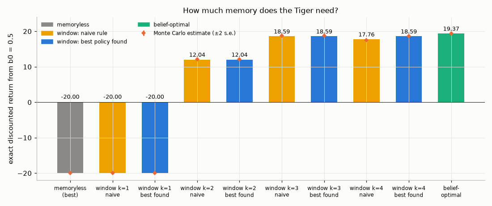
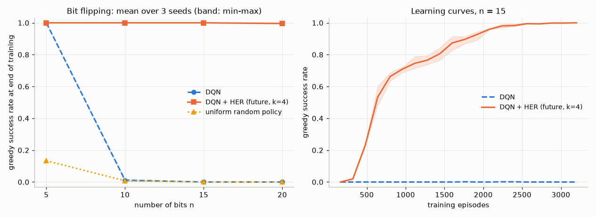
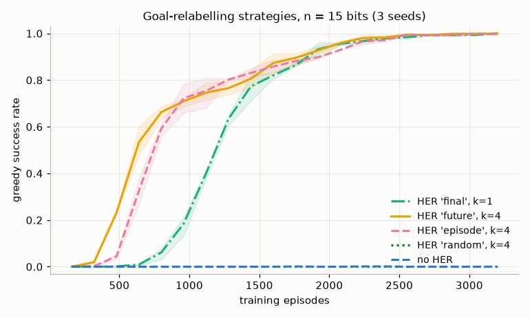
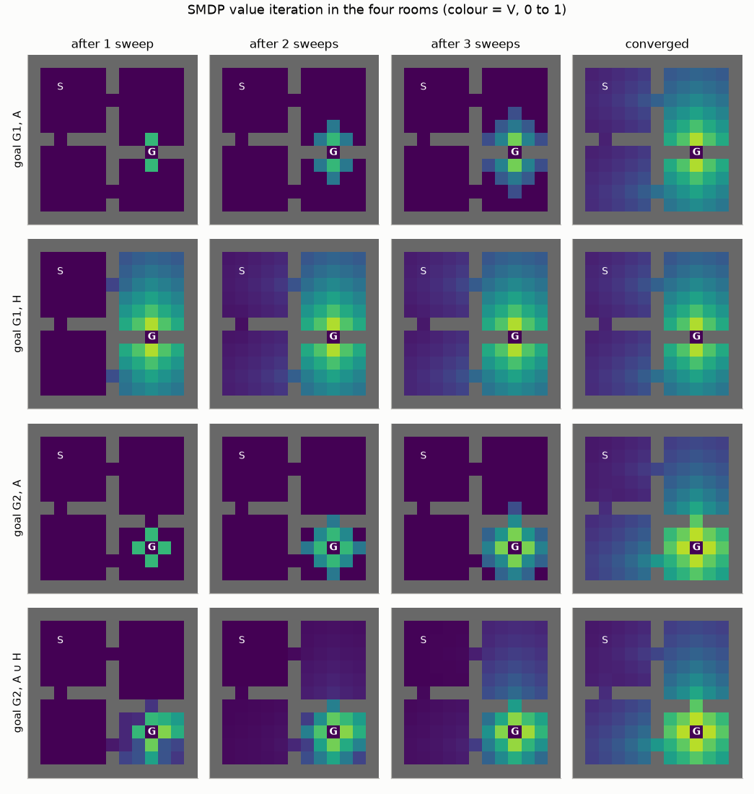
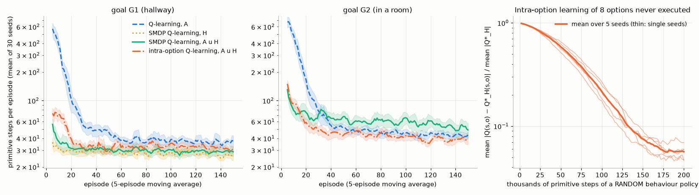
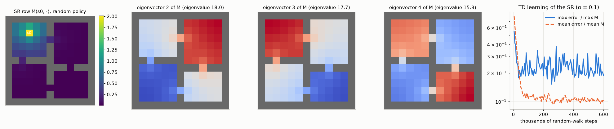
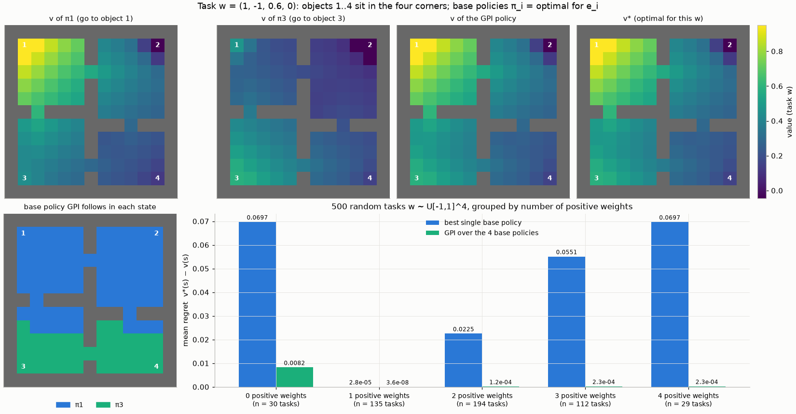
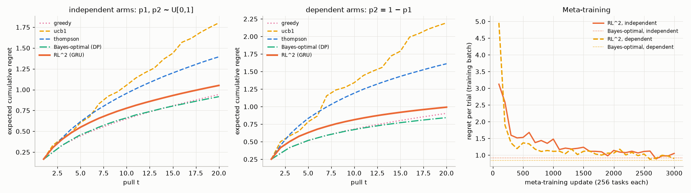
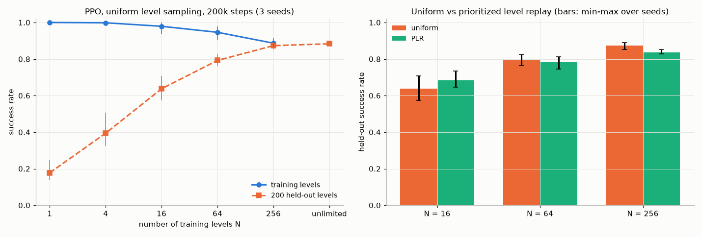

# Chapter 15 — Beyond the Standard MDP: Partial Observability, Goals, Hierarchy and Meta-RL

[← Previous: Exploration in Deep and Tabular RL](14-exploration.md) · [Course index](../README.md) · [Next: Imitation Learning, Inverse RL and Offline RL](16-offline-rl-and-imitation.md) →

## At a glance

Every algorithm so far has assumed the same contract. The agent sees a Markov state, it optimizes one fixed reward, it acts one primitive step at a time, and it faces one fixed MDP. Real problems break each clause. A robot's camera does not show what is behind it. A household robot is asked to fetch a *different* object every day. Nobody plans a trip to another city in muscle twitches. A recommender system meets a new user every second and has to adapt within a handful of interactions. This chapter relaxes these assumptions one at a time, and two more besides: that the task is specified by one scalar, Markov reward, and that the environments seen in training are the ones met at test time. Each relaxation turns out to be a small change to the MDP tuple, and the solution in each case reuses the machinery of earlier chapters on a cleverly enlarged state, action or task space.

| Assumption of the standard MDP | Relaxation | Key object | Section |
|---|---|---|---|
| the agent observes the state | **POMDP**: it sees an observation $O_t$ drawn from $\mathcal{O}(o \mid s', a)$ | belief $b_t$; memory | 2–3 |
| one fixed reward | **goal-conditioned RL**: a family of rewards $r_g$ | UVFA $Q(s,a,g)$; hindsight relabelling | 4 |
| one scalar, Markov reward | **multi-objective RL**; non-Markov task specifications | Pareto front, convex coverage set; reward machines | 6.7 |
| one primitive step per decision | **hierarchy**: temporally extended actions | options $\omega = (\mathcal{I}_\omega, \pi_\omega, \beta_\omega)$; semi-MDPs | 5 |
| one task | **transfer and meta-RL**: a distribution over MDPs | successor features and GPI; forward-backward representations; RL², MAML, PEARL; Bayes-adaptive MDPs | 6–8 |
| a stationary world | **continual RL** | plasticity | 9 |
| training MDPs = test MDPs | **generalization across environments**: contextual MDPs, environment design | generalization gap; epistemic POMDP; minimax regret, PLR, PAIRED | 10 |

**Learning objectives.** After this chapter you should be able to:

1. Define a POMDP, derive the belief update (the Bayes filter) step by step, prove that the belief is a sufficient statistic of the history, and write the Bellman equation of the belief MDP.
2. Derive why the optimal finite-horizon POMDP value function is piecewise linear and convex, run exact alpha-vector value iteration by hand on a small problem, and explain why exact planning is intractable in general.
3. Explain when frame stacking suffices and when it does not; describe recurrent value-based and policy-based agents (DRQN, R2D2's stored-state and burn-in tricks) and transformer memories.
4. Formulate goal-conditioned RL with universal value function approximators, implement Hindsight Experience Replay, and explain precisely why goal relabelling needs an off-policy learner.
5. Define semi-MDPs and options; derive the multi-time option models and the SMDP Bellman equations; implement SMDP Q-learning and intra-option Q-learning; state the option-critic gradient theorems; describe FeUdal Networks, HIRO and MAXQ, and why discovering good options is hard.
6. Derive successor representations and successor features, prove the generalized policy improvement (GPI) theorem, and use SFs + GPI for zero-shot transfer; explain what a representation for transfer should preserve (bisimulation, self-prediction, successor measures) and how forward-backward representations generalize SFs.
7. Set up meta-RL as learning over a task distribution; explain RL², MAML for RL and PEARL and how they relate to the Bayes-adaptive (Bayes-optimal) policy; describe in-context RL (Algorithm Distillation), continual RL and loss of plasticity.
8. Define multi-objective MDPs, Pareto fronts and convex coverage sets; explain why linear scalarization misses unsupported policies, how SER and ESR differ, and how reward machines make non-Markov task specifications Markov.
9. Define contextual MDPs and the generalization gap; explain the epistemic POMDP, domain randomization and minimax-regret environment design (PAIRED, PLR, ACCEL), and measure a generalization gap.

**Prerequisites.** MDPs, Bellman equations and the optimality of Markov policies ([Chapter 01](01-the-rl-problem.md)); value iteration and the contraction argument ([Chapter 03](03-dynamic-programming.md)); Q-learning and off-policy learning ([Chapter 05](05-temporal-difference.md)); DQN and replay ([Chapter 09](09-deep-q-learning.md)); policy gradients and actor-critic ([Chapter 10](10-policy-gradients.md)); bandits and Bayesian (Thompson) reasoning ([Chapter 02](02-multi-armed-bandits.md)); exploration ([Chapter 14](14-exploration.md)). World models that track hidden state (Dreamer's recurrent state-space model) are in [Chapter 13](13-model-based-rl.md); we only point to them here.

**Code you will run** (all in [`code/ch15_beyond_mdps/`](../code/ch15_beyond_mdps/); NumPy, plus small PyTorch networks for HER, FB, RL² and the maze agent; one CPU thread):

| Script | What it shows | Full run |
|---|---|---|
| [`tiger_pomdp.py`](../code/ch15_beyond_mdps/tiger_pomdp.py) | Tiger POMDP: belief update checked against brute-force Bayes and Monte Carlo; exact alpha-vector value iteration; memoryless vs frame-stacking vs belief-based controllers, evaluated exactly | 16 s |
| [`her_bitflip.py`](../code/ch15_beyond_mdps/her_bitflip.py) | DQN with and without HER on bit flipping, $n = 5 \dots 20$; relabelling strategies | 5.5 min |
| [`four_rooms_options.py`](../code/ch15_beyond_mdps/four_rooms_options.py) | Four-rooms with hallway options: exact option models, SMDP value iteration, SMDP and intra-option Q-learning, learning about options that are never executed | 45 s |
| [`successor_features_gpi.py`](../code/ch15_beyond_mdps/successor_features_gpi.py) | Successor representation and its eigenvectors; successor features + GPI transfer on 500 new tasks | 13 s |
| [`fb_zero_shot.py`](../code/ch15_beyond_mdps/fb_zero_shot.py) | Forward-backward representations learned without reward vs SF + GPI, zero-shot on unseen rewards | 5.1 min |
| [`deep_sea_treasure.py`](../code/ch15_beyond_mdps/deep_sea_treasure.py) | Deep Sea Treasure: Pareto front, linear scalarization, OLS + SFs + GPI, mixture policies under SER and ESR | 7 s |
| [`rl2_bandits.py`](../code/ch15_beyond_mdps/rl2_bandits.py) | RL²: a GRU meta-learned on bandit tasks, compared with UCB, Thompson sampling and the exact Bayes-optimal policy | 3.9 min |
| [`procgen_lite.py`](../code/ch15_beyond_mdps/procgen_lite.py) | PPO on procedurally generated mazes: generalization gap against the number of training levels; uniform vs prioritized level replay | 6 min |
| [`exercise_solutions.py`](../code/ch15_beyond_mdps/exercise_solutions.py) | Numerical checks of the exercise solutions | 61 s |

**Study time.** About 15–17 hours: 9 for the text and derivations, 2.5 to run and modify the code, 5–6 for the exercises.

**Notation.** We follow [NOTATION.md](../NOTATION.md). Chapter-specific symbols: $O_t$ is the observation emitted with $S_t$, $\mathcal{O}(o \mid s', a)$ the observation kernel, and $\mathcal{Z}$ the **set** of observations (we do not use $\mathcal{O}$ for the set, because it names the kernel). $b_t(s)$ is the belief (here, never the behaviour policy; when we need a behaviour policy we write $\mu$, and $\mu$ means nothing else in this chapter). $\Delta(\mathcal{S})$ is the probability simplex over $\mathcal{S}$. $g \in \mathcal{G}$ is a goal. An option is $\omega = (\mathcal{I}_\omega, \pi_\omega, \beta_\omega)$, $\Omega$ is a set of options, $\Omega(s)$ those available in $s$, and $\pi_\Omega(\omega \mid s)$ a policy over options (following Bacon et al., 2017; Sutton, Precup & Singh write $\mathcal{O}$ for the option set and $\mu$ for the policy over options). $\boldsymbol\phi$ and $\boldsymbol\psi$ are features and successor features, and $\mathbf{M}$ the successor-representation matrix. A task (an MDP drawn from a distribution) is $\mathcal{M}$, the task distribution is $p(\mathcal{M})$.

Departures from NOTATION.md and local meanings, flagged once here:

* $H_t$, with a time index, is a history. Without an index, $H$ is the length of a meta-RL trial in Section 7, and in Section 5 it names the set of hallway options ($A$ is then the set of primitive actions).
* The belief MDP's reward and transition kernel are $\bar r(b, a)$ and $\bar p(b' \mid b, a)$. $\Pr(o \mid b, a)$, with parentheses, is the observation likelihood viewed as a function of $(o, b, a)$; braces, $\Pr\lbrace\cdot\rbrace$, denote the probability of an event.
* $\tau$ is only the Polyak coefficient (Algorithm 15.3), as in NOTATION.md's deep-RL convention.
* $\boldsymbol\psi$ is reserved for successor features (NOTATION.md uses it for the parameters of a learned model, which this chapter never needs to name). In Section 6, $\mathbf{w}$ is the task vector of successor features (following Barreto et al., 2017); elsewhere it is a set of network weights.
* $\epsilon$ (not $\varepsilon$) is a tolerance: the goal-achievement tolerance in (15.13), the pruning tolerance of $\epsilon$-pruning (Section 2.5) and the value-approximation error in the GPI theorem (Section 6.3). $\varepsilon$ remains the exploration rate (NOTATION.md reserves $\epsilon$ for PPO's clipping range, which this chapter never uses).
* Sections 6.6, 6.7 and 10 add local symbols. $d_{\mathrm{bis}}$ is the bisimulation metric and $W_1$ the Wasserstein-1 distance. $F$, $B$ and $\mathbf{z}$ are the forward embedding, backward embedding and task vector of FB representations (as in Touati & Ollivier, 2021), $d$ their dimension, and $\nu$ their data distribution (the paper's $\rho$, which NOTATION.md reserves for importance ratios). In multi-objective RL, $\mathbf{r}$ (random version $\mathbf{R}_{t+1}$), $\mathbf{G}$ and $\mathbf{V}^\pi$ are the vector reward, return and value (these bold capitals are vectors of objective values, not matrices), $U$ is a utility, $m$ the number of objectives, $u$ a reward-machine state and $L(s, a, s')$ its labelling function. In Section 10, $c$ is the context of a contextual MDP, $\Delta(\hat\pi)$ the generalization gap (unrelated to the simplex $\Delta(\mathcal{S})$), and $\beta_{\text{PLR}}$, $\rho_{\text{PLR}}$ are PLR's temperature and staleness weight.
* $\beta_\omega$ is a termination function. MAML's outer step size is $\eta$ and PEARL's KL weight is $\kappa$ (not $\beta$ and $\lambda$, which NOTATION.md uses for other things).
* A few symbols are reused locally and redefined where they appear: $k$ (relabelled goals per transition, an option's duration, a window length), $K$ (an option's random duration, trajectories per task in MAML), $L$ (a context length), $c$ (the net growl count, the manager's horizon in FuN and HIRO, the optimum of a quadratic task), $m$ (the achieved-goal map, R2D2's sequence length, a posterior mean), and $\boldsymbol\phi$ (features in Section 6, the parameters of PEARL's encoder in Section 7.5, as in the paper).

---

## 1. Four ways the standard MDP falls short

[Chapter 01](01-the-rl-problem.md) defined an MDP by states, actions, dynamics $p(s', r \mid s, a)$ and a discount $\gamma$, and showed that some deterministic **Markov** policy $\pi(s)$ is optimal. Four tacit assumptions make that theorem useful in practice:

1. **The agent knows $S_t$.** The policy is a function of the state, so the state must be available. If the sensor shows only part of the world, the theorem is true but useless: you cannot implement $\pi(s)$ without $s$.
2. **The reward is fixed.** One MDP, one value function. If tomorrow's task is "go to the kitchen" instead of "go to the door", today's $q_\ast$ is irrelevant, even though the world has not changed.
3. **Decisions happen at the finest time scale.** Planning over sequences of a thousand primitive steps is hard because credit, and value, must travel a thousand backups.
4. **There is one MDP.** A learner that faces a stream of related tasks should get faster at learning them. An agent that solves each from scratch never does.

The fixes all share one move: **enlarge something until the standard theory applies again.**

* Partial observability: enlarge the state to the *history*, or compress it to the *belief*, a probability distribution over hidden states. The belief process is an MDP (Section 2.4), so everything in Chapters 01–03 applies, at the price of a continuous state space.
* Goals: enlarge the state to the pair $(s, g)$. The goal-augmented process is an ordinary MDP whose reward depends on part of the state that never changes. Hindsight relabelling exploits the fact that one trajectory is valid data for many goals (Section 4).
* Hierarchy: enlarge the action set with temporally extended **options**. The resulting decision process is a semi-MDP, which has its own Bellman equations (Section 5).
* Transfer and meta-learning: treat the *task identity* as an unobserved part of the state. A distribution over MDPs is then a single POMDP, the Bayes-adaptive MDP, and fast adaptation is just acting well under uncertainty about this hidden variable (Section 7). This closes the loop with Section 2, and it is why the chapter starts with POMDPs.

Two more clauses of the contract are relaxed later, by the same move. A task that no Markov scalar reward expresses becomes Markov on the product of the state and the state of a *reward machine*, and a vector of objectives is handled by a set of policies, one for each trade-off (Section 6.7). When test environments differ from training ones, the unobserved context of the environment becomes part of the hidden state, and generalizing means acting well in what is then a POMDP, the *epistemic POMDP* (Section 10).

---

## 2. Partial observability: POMDPs and belief states

### 2.1 Definition

A **partially observable Markov decision process** (POMDP) is a tuple $(\mathcal{S}, \mathcal{A}, \mathcal{Z}, p, \mathcal{O}, r, \gamma, d_0)$:

* $\mathcal{S}, \mathcal{A}, p(s' \mid s, a), r(s,a), \gamma$ define an ordinary MDP, the **underlying** or **hidden** MDP;
* $\mathcal{Z}$ is a set of observations, and the **observation kernel**
  $\mathcal{O}(o \mid s', a) \doteq \Pr\lbrace O_{t+1} = o \mid S_{t+1} = s', A_t = a\rbrace$
  gives the probability of seeing $o$ when action $a$ has just led to state $s'$;
* $d_0$ is the initial-state distribution.

The time line is: the hidden state $S_t$ is drawn; the agent, which does not see it, chooses $A_t$ from what it has seen so far; the world moves to $S_{t+1} \sim p(\cdot \mid S_t, A_t)$, pays $R_{t+1}$ and emits $O_{t+1} \sim \mathcal{O}(\cdot \mid S_{t+1}, A_t)$. What the agent *knows* at time $t$ is the **history**

$$
H_t \doteq (A_0, O_1, A_1, O_2, \dots, A_{t-1}, O_t),
\tag{15.1}
$$

(plus an initial observation $O_0$ if there is one, and plus the rewards if they are observed; if a reward carries information about the hidden state, treat it as part of the observation). A general policy is a map from histories to action distributions, $\pi(a \mid h_t)$. An MDP is the special case $\mathcal{Z} = \mathcal{S}$ and $\mathcal{O}(o \mid s', a) = \mathbb{1}[o = s']$.

**The running example: the Tiger problem** (Cassandra, Kaelbling & Littman, 1994). A tiger sits behind one of two doors, with equal probability: $\mathcal{S} = \lbrace\text{TL}, \text{TR}\rbrace$ (tiger left, tiger right). The agent can LISTEN, OPEN-LEFT or OPEN-RIGHT.

* LISTEN costs $-1$, does not move the tiger, and produces a growl: HEAR-LEFT (HL) or HEAR-RIGHT (HR), on the correct side with probability $0.85$.
* Opening the door with the tiger pays $-100$; opening the other door pays $+10$. Either way the problem resets: the tiger is re-placed uniformly at random, and the next observation is pure noise (HL or HR with probability $\tfrac12$ each).

We use $\gamma = 0.95$ and an infinite horizon, the standard benchmark setting (the "tiger.95" problem file in Cassandra's widely used collection of POMDP models). In matrix form, with states ordered (TL, TR):

$$
r(\cdot, \text{listen}) = (-1, -1), \quad r(\cdot, \text{open-left}) = (-100, +10), \quad r(\cdot, \text{open-right}) = (+10, -100),
$$

$$
\mathcal{O}(\text{HL} \mid \text{TL}, \text{listen}) = \mathcal{O}(\text{HR} \mid \text{TR}, \text{listen}) = 0.85, \qquad \mathcal{O}(o \mid s', \text{open}) = 0.5 .
$$

The problem is tiny, but it contains the whole POMDP story: acting to *gather information* (listening has negative reward and is worth doing only for what it reveals), the danger of acting on too little evidence, and the need to remember.

### 2.2 Why memory matters

In an MDP, conditioning on more history than the current state never helps ([Chapter 01](01-the-rl-problem.md)). In a POMDP the last observation is usually not Markov, and two things go wrong for **memoryless** (reactive) policies $\pi(a \mid o_t)$:

1. **Aliasing.** Different hidden states that produce the same observation must be treated identically. [Chapter 01](01-the-rl-problem.md) (Exercise 12) showed a corridor where three aliased states force the best memoryless policy to be *stochastic* and cost about 8.7 extra steps. Singh, Jaakkola & Jordan (1994) showed that the best memoryless policy may need randomization (it can be arbitrarily better than the best deterministic memoryless policy), and that it can be arbitrarily worse than the optimal policy of the underlying, fully observed MDP.
2. **Evidence accumulation.** In the Tiger problem one growl is not enough to act on, and a memoryless agent cannot add up growls.

We can make the second point concrete. The memoryless agent's controller has three memory states: "start" (before the first growl), HL and HR, the last growl heard. Right after a first listen, opening the door opposite the growl hits the tiger with probability $0.15$, an expected reward of $0.85 \cdot 10 - 0.15 \cdot 100 = -6.5$, worse than listening. Worse still, right after any door opening the next growl is noise, and a memoryless agent that opens on a growl will also open on that noise, at an expected reward of $\tfrac12(10) + \tfrac12(-100) = -45$. `tiger_pomdp.py` searches the memoryless policies three ways, evaluating each *exactly* by a linear solve (Section 2.7): all 27 deterministic maps from $\lbrace\text{start}, \text{HL}, \text{HR}\rbrace$ to actions; every pair $\pi(\cdot \mid \text{HL}), \pi(\cdot \mid \text{HR})$ on a grid of step $0.1$ over the probability simplex, with the start action fixed to LISTEN; and a continuous local search (L-BFGS-B from 200 random starting points) over all three action distributions, the start one included. All three find "always listen", with value $-1/(1-\gamma) = -20$. Randomizing does not help here: opening the door opposite the growl with probability $q$ gives values $-20.00, -26.96, -37.40, -51.31, -68.70$ for $q = 0, 0.05, 0.10, 0.15, 0.20$. The intuition is the noise problem above: whatever probability the agent gives to opening on a growl, it also gives to opening on the uninformative growl that follows every opening, so openings breed more badly informed openings. This is a numerical finding for this problem, not a general theorem. The optimal policy *with* memory earns $+19.37$ (Section 2.5). Memory is worth 39 units of discounted reward.

What should the agent remember? The full history grows without bound, and two histories that lead to the same conclusions about the world should be treated the same. The right summary is the belief.

### 2.3 The belief state and the Bayes filter

The **belief** is the posterior distribution of the hidden state given the history:

$$
b_t(s) \doteq \Pr\lbrace S_t = s \mid H_t\rbrace, \qquad b_0 = d_0 .
\tag{15.2}
$$

It is a point in the simplex $\Delta(\mathcal{S})$: a vector of $|\mathcal{S}|$ non-negative numbers that sum to one. The key fact is that $b_{t+1}$ can be computed from $b_t$, $A_t$ and $O_{t+1}$ alone.

**Derivation of the belief update.** Let $H_{t+1} = (H_t, A_t = a, O_{t+1} = o)$. By the definition of conditional probability,

$$
\begin{aligned}
b_{t+1}(s') &= \Pr\lbrace S_{t+1} = s' \mid H_t, A_t = a, O_{t+1} = o\rbrace \\
&= \frac{\Pr\lbrace S_{t+1} = s', O_{t+1} = o \mid H_t, A_t = a\rbrace}{\Pr\lbrace O_{t+1} = o \mid H_t, A_t = a\rbrace} .
\end{aligned}
$$

Expand the numerator by summing over the previous hidden state $S_t$ and applying the chain rule:

$$
\begin{aligned}
\Pr\lbrace S_{t+1} = s', O_{t+1} = o \mid H_t, a\rbrace
&= \sum_{s} \Pr\lbrace S_t = s \mid H_t, a\rbrace\, \Pr\lbrace S_{t+1} = s' \mid S_t = s, H_t, a\rbrace\, \Pr\lbrace O_{t+1} = o \mid S_{t+1} = s', S_t = s, H_t, a\rbrace \\
&= \sum_{s} b_t(s)\, p(s' \mid s, a)\, \mathcal{O}(o \mid s', a) .
\end{aligned}
$$

Three assumptions were used, one per factor. (i) $\Pr\lbrace S_t = s \mid H_t, A_t = a\rbrace = b_t(s)$: the action is chosen from the history alone, so it carries no extra information about $S_t$ (this fails if, say, a human operator who can see the state chooses the actions). (ii) Given $(S_t, A_t)$, the next state is independent of the past: the hidden process is Markov. (iii) Given $(S_{t+1}, A_t)$, the observation is independent of everything else. The denominator is the numerator summed over $s'$. Putting it together gives the **Bayes filter**:

$$
b_{t+1}(s') = \frac{\mathcal{O}(o \mid s', a) \sum_{s} p(s' \mid s, a)\, b_t(s)}{\Pr(o \mid b_t, a)}, \qquad
\Pr(o \mid b, a) = \sum_{s'} \mathcal{O}(o \mid s', a) \sum_{s} p(s' \mid s, a)\, b(s).
\tag{15.3}
$$

Read it as **predict, then correct**: push the belief through the dynamics ($\sum_s p(s' \mid s,a) b(s)$), multiply by the likelihood of what was seen, and renormalize. We write $b' = \mathrm{SE}(b, a, o)$ ("state estimator") for this map. The Kalman filter is the same recursion for linear-Gaussian models, and the particle filter approximates it with samples.

```
Algorithm 15.1a  Bayes filter (belief update) for a finite POMDP
Input: belief b (vector over S), action a, observation o; model p(s'|s,a), O(o|s',a)
1. predicted(s') <- Σ_s p(s'|s,a) b(s)            for every s'     # prediction
2. unnorm(s')    <- O(o|s',a) · predicted(s')      for every s'     # correction
3. Pr(o|b,a)     <- Σ_s' unnorm(s')
4. if Pr(o|b,a) = 0: o was impossible under b; report an inconsistent model
5. return b'(s') = unnorm(s') / Pr(o|b,a)  and  Pr(o|b,a)
Cost: O(|S|^2) per step (O(|S|) per step if transitions are sparse)
```

**Worked example (by hand).** Start from $b_0(\text{TL}) = 0.5$ and LISTEN. Listening does not move the tiger, so the prediction step leaves $b$ unchanged. Suppose we hear HL:

$$
b_1(\text{TL}) = \frac{0.85 \cdot 0.5}{0.85 \cdot 0.5 + 0.15 \cdot 0.5} = 0.85 .
$$

Listen again and hear HL:

$$
b_2(\text{TL}) = \frac{0.85 \cdot 0.85}{0.85 \cdot 0.85 + 0.15 \cdot 0.15} = \frac{0.7225}{0.745} = 0.9698 .
$$

A third listen that hears HR brings it back to $\frac{0.15 \cdot 0.9698}{0.15 \cdot 0.9698 + 0.85 \cdot 0.0302} = 0.85$, and another HL to $0.9698$ again. In log-odds, $\ell = \log\frac{b(\text{TL})}{b(\text{TR})}$, each HL adds $\log\frac{0.85}{0.15} = 1.735$ and each HR subtracts it. So after listens the belief depends only on the **net count** $c = \#\text{HL} - \#\text{HR}$ since the last reset: $b(\text{TL}) = 1/(1 + (0.15/0.85)^{c})$. Opening a door resets $b$ to $0.5$ whatever the growl. The script reproduces the four numbers above ($0.5 \to 0.85 \to 0.9698 \to 0.85 \to 0.9698$) and checks Eq. (15.3) two ways:

* against a **brute-force posterior** that sums the joint probability over every hidden-state path $s_0, \dots, s_T$, for 300 random histories of length up to 8 that include door openings: the largest difference is $1.1 \times 10^{-16}$;
* against **Monte Carlo**: 400,000 simulated runs of a random policy (listen with probability 0.75, otherwise open a random door) for 4 steps, grouped by their action-observation history. For the 36 histories seen at least 2,000 times, the fraction of runs with the tiger on the left differs from $b(\text{TL})$ by at most $0.0235$; the largest $z$-score is $2.96$ and 94% are below 2, as they should be for 36 honest comparisons.


### 2.4 The belief MDP

Define a new decision process whose *state* is the belief $b \in \Delta(\mathcal{S})$ and whose actions are $\mathcal{A}$. Its expected reward is

$$
\bar r(b, a) \doteq \sum_{s} b(s)\, r(s, a),
\tag{15.4}
$$

and its transitions are deterministic given the observation: from $b$ under $a$, observation $o$ occurs with probability $\Pr(o \mid b, a)$ and the next belief is $\mathrm{SE}(b, a, o)$, so

$$
\bar p(b' \mid b, a) \doteq \sum_{o \in \mathcal{Z}} \Pr(o \mid b, a)\, \mathbb{1}\big[b' = \mathrm{SE}(b, a, o)\big].
\tag{15.5}
$$

**Theorem 15.1 (the belief is a sufficient statistic; Åström, 1965; Smallwood & Sondik, 1973).** For every history-dependent policy, the expected discounted return equals the expected return of the same behaviour in the belief MDP; the belief process is Markov; and there is an optimal policy of the POMDP that is a deterministic function of the current belief. Its value $V^\ast$ satisfies the **belief-space Bellman optimality equation**

$$
V^\ast(b) = \max_{a \in \mathcal{A}} \Big[ \bar r(b, a) + \gamma \sum_{o \in \mathcal{Z}} \Pr(o \mid b, a)\, V^\ast\big(\mathrm{SE}(b, a, o)\big) \Big].
\tag{15.6}
$$

*Proof sketch.* (a) Rewards: by the tower rule and assumption (i) above, $\mathbb{E}[R_{t+1} \mid H_t, A_t = a] = \sum_s \Pr\lbrace S_t = s \mid H_t\rbrace r(s, a) = \bar r(b_t, a)$. (b) Transitions: by Eq. (15.3), the distribution of $O_{t+1}$ given $(H_t, A_t = a)$ is $\Pr(\cdot \mid b_t, a)$, which depends on $H_t$ only through $b_t$, and $b_{t+1}$ is a deterministic function of $(b_t, a, O_{t+1})$. Hence, under any policy, $b_{t+1}$ given the whole past depends only on $(b_t, A_t)$: the belief process is a (continuous-state) MDP with rewards $\bar r$ and kernel $\bar p$. (c) The expected return of a history-dependent policy is therefore the expected return of a history-dependent policy in this MDP, and the MDP theory of [Chapter 01](01-the-rl-problem.md) says a deterministic stationary Markov policy, here $\pi(b)$, does at least as well. With finite $\mathcal{S}$ the belief space is compact and $\bar r$ is bounded and continuous, which takes care of the measure-theoretic details. $\square$

The Bellman operator on the right of Eq. (15.6) is a $\gamma$-contraction in the sup norm for exactly the reason given in [Chapter 03](03-dynamic-programming.md), so value iteration on beliefs converges. The difficulty is purely computational: the state space is a continuum.

### 2.5 Exact planning: piecewise-linear convex value functions

Value iteration on beliefs, $V_{n+1} = \mathcal{T} V_n$ with $V_0 = 0$, computes the optimal $n$-step (horizon-$n$) value. Smallwood & Sondik (1973) discovered that every $V_n$ has a finite representation.

**Theorem 15.2 (PWLC).** For every $n$ there is a finite set $\Gamma_n$ of vectors $\boldsymbol\alpha \in \mathbb{R}^{|\mathcal{S}|}$ ("alpha vectors") such that

$$
V_n(b) = \max_{\boldsymbol\alpha \in \Gamma_n} \sum_{s} \alpha(s)\, b(s) = \max_{\boldsymbol\alpha \in \Gamma_n} \boldsymbol\alpha^\top \mathbf{b} .
\tag{15.7}
$$

So $V_n$ is **piecewise linear and convex** (a maximum of linear functions of $\mathbf{b}$).

*Proof (by induction, every step).* For $n = 0$, $\Gamma_0 = \lbrace\mathbf{0}\rbrace$. Assume Eq. (15.7) for $n$. The Bellman backup is

$$
V_{n+1}(b) = \max_a \Big[ \sum_s b(s) r(s,a) + \gamma \sum_o \Pr(o \mid b, a) \max_{\boldsymbol\alpha \in \Gamma_n} \sum_{s'} \alpha(s')\, \mathrm{SE}(b,a,o)(s') \Big].
$$

Substitute Eq. (15.3) for $\mathrm{SE}(b, a, o)(s')$. The normalizer $\Pr(o \mid b, a)$ **cancels** (when it is zero both sides are zero):

$$
\Pr(o \mid b, a) \max_{\boldsymbol\alpha} \sum_{s'} \alpha(s') \frac{\mathcal{O}(o \mid s', a) \sum_s p(s' \mid s, a) b(s)}{\Pr(o \mid b, a)}
= \max_{\boldsymbol\alpha \in \Gamma_n} \sum_s b(s) \underbrace{\sum_{s'} p(s' \mid s, a)\, \mathcal{O}(o \mid s', a)\, \alpha(s')}_{\doteq\, u^{\boldsymbol\alpha}_{a,o}(s)} .
\tag{15.8}
$$

The vector $\mathbf{u}^{\boldsymbol\alpha}_{a,o}$ is the old vector $\boldsymbol\alpha$ **back-projected** through action $a$ and observation $o$. It does not depend on $b$:

$$
u^{\boldsymbol\alpha}_{a,o}(s) = \sum_{s'} p(s' \mid s, a)\, \mathcal{O}(o \mid s', a)\, \alpha(s') .
\tag{15.9}
$$

For a fixed $b$ and $a$, choose for each observation $o$ the maximizing vector $\boldsymbol\alpha_o \in \Gamma_n$. Then

$$
V_{n+1}(b) = \max_a \sum_s b(s) \Big[ r(s, a) + \gamma \sum_o u^{\boldsymbol\alpha_o}_{a,o}(s) \Big],
$$

which is $\boldsymbol\alpha^\top \mathbf{b}$ for one vector out of the finite set

$$
\Gamma_{n+1} = \bigcup_{a \in \mathcal{A}} \Big\lbrace \mathbf{r}_a + \gamma \sum_{o \in \mathcal{Z}} \mathbf{u}^{\boldsymbol\alpha_o}_{a,o} \;:\; \boldsymbol\alpha_o \in \Gamma_n \text{ for each } o \Big\rbrace,
\tag{15.10}
$$

and conversely every vector in this set is a lower bound on $V_{n+1}$ (it is the value of a particular conditional plan). So $V_{n+1}(b) = \max_{\boldsymbol\alpha \in \Gamma_{n+1}} \boldsymbol\alpha^\top \mathbf{b}$. $\square$

Every alpha vector is the value, as a function of the hidden state, of a **conditional plan**: "do $a$ first; then, if you see $o$, continue with the plan of $\boldsymbol\alpha_o$". Its root action is the action to take whenever this vector is the maximum at the current belief. The construction also shows the cost. The set (15.10) has

$$
|\mathcal{A}|\,|\Gamma_n|^{|\mathcal{Z}|}
\tag{15.11}
$$

members (a "cross-sum" over observations). Most of them are **dominated**: below the upper envelope everywhere. Exact algorithms prune them by solving a small linear program per vector (find a belief where the vector beats all others, or prove there is none). *Incremental pruning* (Cassandra, Littman & Zhang, 1997) prunes after adding each observation's term, which keeps intermediate sets small.

```
Algorithm 15.1b  Exact value iteration for a finite POMDP (alpha vectors, incremental pruning)
Input: POMDP (S, A, Z, p, O, r, γ); tolerance θ; (optional) pruning slack ε >= 0
Initialise: Γ <- { 0-vector }                         # V_0 = 0
Repeat:
    Γ_new <- ∅
    for each action a:
        C <- { r_a }                                  # r_a(s) = r(s,a)
        for each observation o:
            U_ao <- { u^α_{a,o} : α ∈ Γ }  with u^α_{a,o}(s) = Σ_s' p(s'|s,a) O(o|s',a) α(s')
            C <- PRUNE( { c + γ u : c ∈ C, u ∈ U_ao } , ε)          # cross-sum, then prune
        Γ_new <- Γ_new ∪ { (c, root action a) : c ∈ C }
    Γ_new <- PRUNE(Γ_new, ε)
    residual <- max_b | max_{α∈Γ_new} α·b − max_{α∈Γ} α·b |
    Γ <- Γ_new
until residual < θ
Policy: π(b) = root action of argmax_{α∈Γ} α·b
PRUNE(C, ε): keep α only if some belief b has α·b > max_{α'∈C, α'≠α} α'·b + ε
             (an LP per vector in general; an exact upper envelope of lines when |S| = 2)
```

**Worked example: horizon 1 and 2 by hand.** With one step to go there is no future, so $\Gamma_1 = \lbrace\mathbf{r}_{\text{listen}}, \mathbf{r}_{\text{open-left}}, \mathbf{r}_{\text{open-right}}\rbrace = \lbrace(-1,-1), (-100, 10), (10, -100)\rbrace$, written as $(\alpha(\text{TL}), \alpha(\text{TR}))$. With $b = b(\text{TL})$,

$$
V_1(b) = \max\lbrace-1,\; 10 - 110\, b,\; -100 + 110\, b\rbrace.
$$

OPEN-RIGHT beats LISTEN when $-100 + 110 b > -1$, that is $b > 99/110 = 0.9$; symmetrically OPEN-LEFT is best for $b < 0.1$. With one step left, a single growl ($b = 0.85$) is not enough to open a door. For $n = 2$ there are $3 \cdot 3^2 = 27$ candidate vectors (Eq. 15.11 with $|\Gamma_1| = 3$, $|\mathcal{Z}| = 2$); for example LISTEN followed by "open right after HL, listen after HR" gives, with $\gamma = 0.95$ and listening leaving the tiger in place,

$$
\alpha(\text{TL}) = -1 + 0.95\,[0.85 \cdot 10 + 0.15 \cdot (-1)] = 6.93, \qquad
\alpha(\text{TR}) = -1 + 0.95\,[0.15 \cdot (-100) + 0.85 \cdot (-1)] = -16.06 .
$$

Exact pruning keeps 5 of the 27.

**What the script finds.** The figure below shows the results of `tiger_pomdp.py`, whose `prune` computes an exact upper envelope of lines (with two hidden states each $\boldsymbol\alpha^\top\mathbf{b}$ is a line in $b(\text{TL})$). With exact pruning, $|\Gamma_n|$ for $n = 1, \dots, 10$ is $3, 5, 9, 7, 13, 15, 19, 25, 27, 27$, and it keeps growing, to 190 vectors at $n = 40$, where one unpruned backup would create 96,123. The vectors that accumulate differ only in what they plan to do dozens of steps ahead, so their values differ by tiny amounts. Practical solvers therefore use **$\epsilon$-pruning**: drop a vector if removing it lowers the envelope by less than $\epsilon$ anywhere. With $\epsilon = 10^{-6}$, value iteration converges (residual $9.9 \times 10^{-11}$) after 451 backups, with never more than 65 vectors, to exactly **9** vectors:

| $\alpha(\text{TL})$ | $\alpha(\text{TR})$ | root action |
|---|---|---|
| $-81.5972$ | $28.4028$ | open-left |
| $0.6909$ | $25.0050$ | listen |
| $3.0148$ | $24.6957$ | listen |
| $16.4935$ | $21.5418$ | listen |
| $19.3714$ | $19.3714$ | listen |
| $21.5418$ | $16.4935$ | listen |
| $24.6957$ | $3.0148$ | listen |
| $25.0050$ | $0.6909$ | listen |
| $28.4028$ | $-81.5972$ | open-right |

You can check two of them by hand. Opening resets the belief to $0.5$, so the OPEN-LEFT vector must be $(-100 + \gamma V^\ast(0.5),\; 10 + \gamma V^\ast(0.5))$; with $V^\ast(0.5) = 19.3714$ this is $(-81.5972, 28.4028)$, exactly as found. And the flat vector $(19.3714, 19.3714)$ is the plan "listen now and continue optimally", whose value at $b = 0.5$ is $V^\ast(0.5)$. The optimal policy listens while $b(\text{TL}) \in [0.0397, 0.9603]$ and opens otherwise. Since one growl gives $0.85$ and two net growls give $0.9698$, **the optimal agent opens the door opposite the growls as soon as the net count reaches $\pm 2$**. The infinite-horizon listen region is wider than the horizon-1 region $[0.1, 0.9]$: when there is a future, information is worth paying for.


**Worked example: the value of the optimal policy in closed form.** Because the optimal policy depends only on the net count $c \in \lbrace-2, \dots, 2\rbrace$, its value satisfies three linear equations (by symmetry $V_c = V_{-c}$). At $c = 0$ the agent listens and moves to $c = \pm 1$: $V_0 = -1 + \gamma V_1$. At $c = 1$ ($b = 0.85$) the next growl is HL with probability $0.85 \cdot 0.85 + 0.15 \cdot 0.15 = 0.745$: $V_1 = -1 + \gamma(0.745\, V_2 + 0.255\, V_0)$. At $c = 2$ ($b = 0.9698$) it opens the safe-looking door, earning $10 \cdot 0.9698 - 100 \cdot 0.0302 = 6.678$ in expectation, and the belief resets: $V_2 = 6.678 + \gamma V_0$. Solving (Exercise 2) gives $V_0 = 19.3714$, $V_1 = 21.4435$, $V_2 = 25.0807$, matching the alpha vectors to four decimals.

### 2.6 How hard is POMDP planning?

The cross-sum count (15.11) makes the worst-case number of vectors grow doubly exponentially with the horizon, and that is not an artefact of a naive algorithm:

* Deciding whether a finite-horizon POMDP has a policy achieving a given value is **PSPACE-complete** (Papadimitriou & Tsitsiklis, 1987), whereas the same question for a fully observed MDP is P-complete.
* For infinite-horizon problems, several natural questions about optimal POMDP policies are **undecidable** (Madani, Hanks & Condon, 1999).

Practical solvers therefore approximate. **Point-based value iteration** (PBVI; Pineau, Gordon & Thrun, 2003) and its descendants (Perseus, HSVI, SARSOP) back up alpha vectors only at a finite set of beliefs that are reachable from $b_0$, which keeps $|\Gamma|$ bounded by the number of points. **Online search** plans only from the current belief: POMCP (Silver & Veness, 2010) runs Monte Carlo tree search ([Chapter 07](07-planning-and-learning-tabular.md)) over histories and represents beliefs with particles. Both exploit the fact that the beliefs a good policy actually visits form a tiny part of the simplex: in Tiger the optimal policy only ever visits **five** beliefs, $\lbrace0.0302, 0.15, 0.5, 0.85, 0.9698\rbrace$.

### 2.7 Finite memory and the Tiger experiment

Planning is not the only route. A **finite-state controller** (FSC) is a policy with a finite memory: a set of nodes, an action rule $\pi(a \mid n)$ and a deterministic memory update $n' = \delta(n, a, o)$. Memoryless policies (node = last observation), "the last $k$ observations" and the belief-optimal policy above (node = net count) are all FSCs. An FSC is evaluated exactly by noticing that the pair (hidden state, node) is Markov:

$$
V(n, s) = \sum_a \pi(a \mid n) \Big[ r(s, a) + \gamma \sum_{s'} \sum_{o} p(s' \mid s, a)\, \mathcal{O}(o \mid s', a)\, V\big(\delta(n, a, o), s'\big) \Big],
\tag{15.12}
$$

a linear system with $|\mathcal{S}| \times (\text{number of nodes})$ unknowns, solved exactly as policy evaluation was in [Chapter 03](03-dynamic-programming.md). The value from the initial belief is $\sum_s d_0(s) V(n_0, s)$.

`tiger_pomdp.py` evaluates four kinds of controller this way, and checks each against a 40,000-episode Monte Carlo estimate. The **window-$k$** controllers mimic frame stacking (Section 3.1): their memory is the last $k$ (action, observation) pairs and nothing else. The "naive" rule acts greedily on the belief obtained by filtering only those $k$ pairs from the uniform prior. The "best found" policy is the result of coordinate ascent over the action of every reachable window, with exact evaluation, started both from the naive rule and from the best window-$(k-1)$ policy (so the best value found can only increase with $k$). Choosing the best finite-memory policy is NP-hard in general, so this is a local optimum.

| controller (memory) | memory nodes | exact $V(b_0)$ | Monte Carlo (± s.e.) | openings at net count $\le 1$ / $= 2$ / $\ge 3$ |
|---|---|---|---|---|
| best memoryless (last growl) | 3 | $-20.000$ | $-20.000 \pm 0.000$ | never opens |
| window $k=1$, naive = best found | 3 | $-20.000$ | $-20.000 \pm 0.000$ | never opens |
| window $k=2$, naive = best found | 19 | $12.044$ | $12.153 \pm 0.190$ | 0.145 / 0.855 / 0.000 |
| window $k=3$, naive = best found | 43 | $18.586$ | $18.824 \pm 0.141$ | 0.003 / 0.877 / 0.120 |
| window $k=4$, naive | 103 | $17.758$ | $17.527 \pm 0.160$ | 0.036 / 0.964 / 0.000 |
| window $k=4$, best found | 87 | $18.586$ | $18.710 \pm 0.142$ | 0.003 / 0.878 / 0.119 |
| belief-optimal (net count) | 5 | $19.371$ | $19.374 \pm 0.150$ | 0.000 / 1.000 / 0.000 |



Four lessons:

1. **Memory is decisive.** Memoryless and one-step-window agents can only listen forever ($-20$). Two steps of memory already yield $+12.0$, three yield $+18.6$.
2. **Raw windows are a wasteful memory.** The window-3 controller has 43 reachable memory states and still loses $0.8$ against the 5-node belief controller. The belief compresses everything relevant into a *sufficient statistic* (here, one integer).
3. **A longer window is not automatically better.** The naive window-4 rule is *worse* than window-3. With four growls in view, "three of one, one of the other" looks like net count 2, and the rule opens; but if an older growl has slid out of the window, the true net count is 1 and the opened door is safe only with probability 0.85. The last column shows it: 3.6% of the window-4 agent's openings are premature, against 0.3% for window-3, which instead waits too long in 12% of its openings. Policy search fixes it: the best window-4 policy found (18.586) is exactly as good as the window-3 one, which a window-4 controller can always imitate by ignoring its oldest pair. A learned agent with a window input faces exactly this problem: its memory is fixed by the architecture, not by what is relevant.
4. **The column of tiger hits** (printed by the script) is 4.8% for window-2, 2.8% for window-3 and 3.0% for the belief-optimal policy: the optimal agent does not minimize mistakes. It trades a few more mistakes for fewer costly listens.

---

## 3. Learning with memory in practice

Exact belief tracking needs a model ($p$ and $\mathcal{O}$), and exact planning is hopeless beyond toy problems. Deep RL agents in partially observable environments instead **learn** a memory, $\mathbf{h}_t = f_{\boldsymbol\theta}(\mathbf{h}_{t-1}, O_t, A_{t-1}, R_t)$, and condition their value function or policy on it. Three architectures dominate.

### 3.1 Frame stacking

The simplest memory is a fixed window: feed the last $k$ observations (and possibly actions) as the input. DQN stacks the last 4 Atari frames (Mnih et al., 2015) because a single frame does not show which way the ball is moving: velocity is a difference of two positions, and acceleration needs three. Frame stacking works when **the missing information is recoverable from the recent past** and the window is long enough. The Tiger table in Section 2.7 shows the two failure modes: a window that is too short cannot accumulate evidence at all ($k = 1$ is no better than no memory), and a window keeps raw history rather than its relevant summary, so a learner must discover that, for example, evidence older than the last reset is irrelevant. The input grows linearly with $k$, and anything older than $k$ steps is lost for good: a key picked up 100 steps ago cannot be remembered with a 4-frame stack.

### 3.2 Recurrent agents

A recurrent network replaces the window with a learned state of fixed size that can, in principle, keep information indefinitely. An LSTM or GRU reads one observation per step and outputs $\hat q(\mathbf{h}_t, a)$ or $\pi(a \mid \mathbf{h}_t)$.

* **Recurrent policy gradient and actor-critic.** On-policy methods are the easy case: roll out $T$ steps from a stored initial state $\mathbf{h}_{t_0}$, compute the losses of [Chapters 10](10-policy-gradients.md)–[11](11-trust-regions-and-ppo.md) on the sequence, and backpropagate through time (BPTT), usually truncated to the rollout length. A3C/IMPALA-style agents and PPO with an LSTM do this; the only extra bookkeeping is to store the hidden state at the start of each rollout segment and to reset it at episode boundaries. Our RL² agent (Section 7.3) is trained exactly this way.
* **DRQN** (Hausknecht & Stone, 2015) replaced DQN's first fully connected layer with an LSTM and fed it one frame at a time. On a "flickering" variant of Pong, in which each frame is blanked with probability $0.5$, DRQN learned from single-frame inputs to integrate information across time. Replay is the complication: the buffer must store **sequences**, and the network must be unrolled over them to produce the hidden states that the Q-values depend on. Hausknecht & Stone compared replaying whole episodes from their start with replaying random sub-sequences from a **zero** initial state; the latter is simpler but gives the network a hidden state it would never have had at that point of the episode.

### 3.3 Recurrent replay: R2D2

R2D2 (Kapturowski et al., 2019) analysed the replay problem in a large-scale distributed DQN. The hidden state the network *would* have at the start of a replayed sequence depends on the current parameters, which differ from the parameters that produced the data: **representational drift** makes the stored or the zero state stale. Two remedies, used together:

* **Stored state**: store the recurrent state produced during acting with each sequence, and use it to initialize the unroll in training. It is stale, but much closer than zero.
* **Burn-in**: unroll the network over a prefix of the sequence (40 steps in the paper) *without* computing losses, purely to let the stored state relax towards what the current network would produce; then compute TD errors on the remaining steps (80, with consecutive sequences overlapping by 40).

```
Algorithm 15.2  Recurrent Q-learning with sequence replay (R2D2-style; one learner, simplified)
Input: recurrent Q-network q̂(h, ·; w) with state update h' = f(h, o, a_prev, r; w); target weights w⁻
       sequence length m, burn-in length l, n-step return n, discount γ, batch size B
Acting (any number of actors):
    h <- 0 at the start of each episode
    at each step: h <- f(h, o_t, a_{t-1}, r_t; w); choose a_t ε-greedily from q̂(h, ·; w); act
    every m/2 steps: store the segment of the last l + m steps (obs, actions, rewards, terminated
                     flags) together with the hidden state h at the segment's first step
Learning:
    sample B segments (uniformly or by priority)
    for each segment:
        h <- stored state (or 0 for a "zero-state" agent); h⁻ <- the same stored state
        burn-in: for k = 1..l: h <- f(h, ·; w), h⁻ <- f(h⁻, ·; w⁻)     # no gradient
        unroll both networks over the remaining m steps, producing q̂(h_t, ·; w) and q̂(h⁻_t, ·; w⁻)
        n-step targets: y_t = Σ_{i<n} γ^i r_{t+i+1} + γ^n q̂(h⁻_{t+n}, argmax_a q̂(h_{t+n}, a; w); w⁻)
                        (if the episode TERMINATES at step t+k ≤ t+n: stop the sum there, no bootstrap;
                         if it is TRUNCATED by a time limit at step t+k ≤ t+n: stop the sum there and
                         bootstrap with γ^k q̂(h⁻_{t+k}, argmax_a q̂(h_{t+k}, a; w); w⁻) from the
                         truncated state; never sum rewards across an episode boundary, and
                         never store a segment that crosses one)
    take a gradient step on Σ_t ℓ(y_t − q̂(h_t, a_t; w)) over the m training steps (BPTT)
    periodically w⁻ <- w
```

The paper's diagnostics showed that the Q-values computed from zero states disagreed much more with those computed from the "true" states than burn-in + stored-state ones did, and that the combination gave the best scores. R2D2 also uses the double-DQN target, $n$-step returns and prioritized replay of [Chapter 09](09-deep-q-learning.md), and it was the backbone of later agents such as Agent57 ([Chapter 14](14-exploration.md)).

### 3.4 Transformers as memory

A transformer over the last $L$ steps is a *learned, content-addressable* window: each step can attend directly to any earlier step, so it does not need to squeeze everything through a fixed-size state the way an RNN does. That makes it good at recalling a specific past event ("which colour was the cue 300 steps ago?") but costs $O(L^2)$ attention per segment and still forgets everything older than $L$ (caching earlier segments, as in Transformer-XL, extends the reach). Plain transformers proved unstable to train with RL; GTrXL (Parisotto et al., 2020) added gating layers in place of residual connections and moved layer normalization so that the network starts close to an identity map, and then outperformed LSTMs on memory-heavy 3-D tasks. Two cautions from later work: well-tuned recurrent model-free agents are strong baselines on many POMDP benchmarks (Ni, Eysenbach & Salakhutdinov, 2022), and transformers help with *memory length* but not with long-term *credit assignment*, which is a different problem (Ni et al., 2023). Return-conditioned transformers trained offline (Decision Transformer) belong to [Chapter 16](16-offline-rl-and-imitation.md); transformers that learn *across* episodes are the subject of Section 8.

### 3.5 What should the memory represent?

A recurrent state trained only by the RL loss is pushed to keep whatever helps reduce that loss, which with sparse rewards may be very little. Three ideas make memory more belief-like:

* **Auxiliary prediction.** Train the state to predict future observations and rewards. A state that predicts all future observations is a sufficient statistic; this is the idea of predictive state representations (Littman, Sutton & Singh, 2001), and it is what world models such as Dreamer's recurrent state-space model do ([Chapter 13](13-model-based-rl.md)). Predicting the agent's own next *latent* state instead of the next observation is cheaper and works too; Section 6.6 explains why such self-predictive objectives do not collapse and when they recover a Markov state.
* **Asymmetric actor-critic.** In simulation the true state is available during training. A critic that sees $S_t$ while the actor sees only observations gives the actor a lower-variance learning signal without making the deployed policy depend on privileged information (Pinto et al., 2018). Caveat: a critic $V(s_t)$ of the state alone is not the value of a policy that acts on histories, so in genuinely partially observable tasks (Tiger, where the right action depends on the belief) it biases the policy gradient. Conditioning the critic on both the history (or recurrent state) and the true state, $V(h_t, s_t)$, removes the bias (Baisero & Amato, 2022).
* **Less bootstrapping.** TD targets bootstrap from the value of the next *observation* (or recurrent state); if that is aliased, the target is biased. Monte Carlo or $\lambda$-returns depend less on the Markov property ([Chapter 06](06-n-step-and-eligibility-traces.md)).

---

## 4. Goal-conditioned RL and Hindsight Experience Replay

### 4.1 Goal-conditioned MDPs

Many tasks are "reach a configuration": put the block *there*, navigate *there*, set these bits. A **goal-conditioned MDP** adds a goal space $\mathcal{G}$, a goal distribution $p(g)$ and a goal-dependent reward $r(s, a, s', g)$. Usually there is an **achieved-goal map** $m: \mathcal{S} \to \mathcal{G}$ (the block's position, the bit string itself) and a sparse reward

$$
r(s, a, s', g) = -\mathbb{1}\big[\, d(m(s'), g) > \epsilon \,\big],
\tag{15.13}
$$

which is $0$ when the next state achieves the goal (to tolerance $\epsilon$) and $-1$ otherwise. The objective averages over goals: $J(\pi) = \mathbb{E}_{g \sim p(g)}\, \mathbb{E}_{\pi}\big[\sum_t \gamma^t R_{t+1} \mid g\big]$. Formally nothing is new: the pair $(s, g)$ is the state of an ordinary MDP whose $g$-component never changes during an episode, so all of Chapters 01–12 applies to $Q(s, a, g)$ and $\pi(a \mid s, g)$.

What *is* new is a practical disaster. With reward (15.13), every episode that fails to reach its goal returns exactly $-\sum_t \gamma^t$, whatever the agent did. There is no gradient towards the goal until the goal is hit, and in large goal spaces random behaviour essentially never hits it. In the bit-flipping environment below, a uniformly random policy reaches a random goal within $n$ steps in 13% of episodes for $n = 5$, 0.8% for $n = 10$, 0.04% for $n = 15$ and in none of 20,000 episodes for $n = 20$.

### 4.2 Universal value function approximators

A **universal value function approximator** (UVFA; Schaul, Horgan, Gregor & Silver, 2015) is a single network $\hat q(s, a, g; \mathbf{w})$ that takes the goal as an input. Two architectures are common: concatenating $(s, g)$ at the input, or a two-stream factorization $\hat q(s, a, g) = \boldsymbol\phi(s, a)^\top \boldsymbol\psi(g)$, which Schaul et al. trained by first factorizing a table of values and then regressing each stream on its factor. The point is **generalization across goals**: a network trained on some goals can predict values for goals it has never been trained on, because nearby goals have similar values. The idea of learning about all goals at once is older: Kaelbling (1993) showed that in a tabular world *every* transition can update the value of *every* goal at once, since the dynamics do not depend on the goal. HER is the deep, sample-based version of that observation.

### 4.3 Hindsight Experience Replay

The insight of Andrychowicz et al. (2017) is a human one. If you aim at a target and miss, you have still learned how to hit the spot you *did* hit. A failed trajectory for goal $g$ is a successful trajectory for the goal $g' = m(s_T)$ it actually reached, and for every state it passed through. HER stores each transition twice or more: once with the original goal, and again with goals **relabelled in hindsight**, recomputing the reward for the new goal.

```
Algorithm 15.3  DQN + Hindsight Experience Replay (episodic, discrete actions)
Input: goal-conditioned Q-network q̂(s, a, g; w) (a UVFA), target weights w⁻; reward function r(s, a, s', g)
       and achieved-goal map m; relabelling strategy S ∈ {final, future, episode, random}; k relabels
       per transition; ε; episode length T; batch size B; Polyak coefficient τ; discount γ
Initialise: replay buffer D <- ∅; w arbitrary; w⁻ <- w
For each cycle:
    Collect episodes:
        sample a goal g ~ p(g) and an initial state s_0
        for t = 0, ..., T-1:
            a_t <- ε-greedy w.r.t. q̂(s_t, ·, g; w); execute; observe s_{t+1}
            if s_{t+1} achieves g: terminated <- true; stop the episode
        (an episode that runs T steps without success is TRUNCATED, not terminated)
        for t = 0, ..., (last step):
            store (s_t, a_t, s_{t+1}, g) in D
            G' <- relabelled goals according to S:
                final:   { m(s_last) }
                future:  k goals m(s_t'), t' uniform in {t+1, ..., last}       (states reached after t)
                episode: k goals m(s_t'), t' uniform over the episode
                random:  k goals m(s) for states s sampled from the whole buffer D
            for each g' in G': store (s_t, a_t, s_{t+1}, g') in D
    Learn (repeat N times):
        sample B tuples (s, a, s', g) from D
        recompute r <- r(s, a, s', g) and done <- [s' achieves g]          # rewards depend on g
        y <- r + γ (1 − done) max_a' q̂(s', a', g; w⁻)
        clip y to the range of possible returns, [−1/(1−γ), 0]
        gradient step on (y − q̂(s, a, g; w))²
    w⁻ <- τ w + (1 − τ) w⁻
```

Our implementation (`her_bitflip.py`) follows this box. Its setup follows the HER paper: one hidden layer of 256 units for bit flipping and, from the paper's general training details, cycles of 16 episodes followed by 40 optimization steps, batch 128, Adam with step size $10^{-3}$, a target network Polyak-averaged with coefficient 0.95 after each cycle ($\mathbf{w}^- \leftarrow 0.05\,\mathbf{w} + 0.95\,\mathbf{w}^-$, i.e. $\tau = 0.05$ in the box), $\gamma = 0.98$, targets clipped to $[-1/(1-\gamma), 0]$, and 20% random actions, which for our discrete-action DQN means $\varepsilon = 0.2$. Our own choices are the replay capacity (300,000 transitions), the much shorter training budgets, and the episode boundaries: reaching the goal **terminates** the episode, because every action flips a bit and the agent could not stay there anyway; an episode that runs out of time is **truncated**, so the target still bootstraps (NOTATION.md).

### 4.4 Why HER needs an off-policy learner

The relabelled tuple $(s_t, a_t, s_{t+1}, g')$ was not generated by an agent pursuing $g'$. Why is it legitimate data for $g'$? Look at the Q-learning target, where $\mathrm{done}(s', g') = 1$ if $s'$ achieves $g'$:

$$
y = r(s_t, a_t, s_{t+1}, g') + \gamma\, \big(1 - \mathrm{done}(s_{t+1}, g')\big) \max_{a'} \hat q(s_{t+1}, a', g'; \mathbf{w}^-) .
\tag{15.14}
$$

Its expectation, as a function of $(s_t, a_t)$, is the Bellman optimality backup $(\mathcal{T}^\ast \hat q)(s_t, a_t, g')$ **provided $s_{t+1}$ is distributed as $p(\cdot \mid s_t, a_t)$**. Neither the dynamics nor the target involves the policy that chose $a_t$ or the goal it was pursuing: the goal only enters through the reward, which we recompute, and through the $\max$, which refers to the greedy policy for $g'$. So relabelled tuples are just more samples of the same Bellman equation at other points $(s, a, g')$, exactly as Q-learning can learn $q_\ast$ from any behaviour ([Chapter 05](05-temporal-difference.md)).

An **on-policy** method has no such escape. The policy-gradient estimator for goal $g'$,

$$
\nabla_{\boldsymbol\theta} J(g') = \mathbb{E}_{\pi_{\boldsymbol\theta}(\cdot \mid \cdot, g')} \Big[ \sum_t \nabla_{\boldsymbol\theta} \log \pi_{\boldsymbol\theta}(A_t \mid S_t, g')\, G_t(g') \Big],
\tag{15.15}
$$

needs trajectories drawn from $\pi_{\boldsymbol\theta}(\cdot \mid \cdot, g')$ (that is what the subscript of the expectation says), but the trajectory came from $\pi_{\boldsymbol\theta}(\cdot \mid \cdot, g)$. Using it requires the importance weight $\prod_t \pi_{\boldsymbol\theta}(A_t \mid S_t, g') / \pi_{\boldsymbol\theta}(A_t \mid S_t, g)$ ([Chapter 04](04-monte-carlo.md)), which is what *hindsight policy gradients* do (Rauber et al., 2019), with the variance problems you would expect from a product of ratios. The same objection rules out some *value* targets. SARSA targets, which use the next action actually chosen in pursuit of $g$, and uncorrected $n$-step or $\lambda$-returns, whose intermediate actions were also chosen for $g$, are biased for $g'$: they would evaluate "pursue $g$" while claiming to evaluate "pursue $g'$". What is valid is a **one-step** target that maximizes or averages over the *target* policy conditioned on $g'$: the Q-learning target (15.14), Expected SARSA with $\pi(\cdot \mid s', g')$, and the critics of DDPG, TD3 and SAC, which evaluate their current actor at $(s', g')$ (multi-step returns become valid again only with importance corrections). This is why HER is used with DQN, DDPG, TD3 and SAC ([Chapters 09](09-deep-q-learning.md) and [12](12-continuous-control-actor-critic.md)).

One caveat survives even for off-policy learners. The proviso above, "$s_{t+1} \sim p(\cdot \mid s_t, a_t)$", fails subtly when the relabelled goal is chosen **using** the future of the trajectory. Given $g' = m(s_{t'})$ with $t' > t$, the next state $s_{t+1}$ is no longer an unbiased draw: we picked $g'$ *because* this particular trajectory reached it. In deterministic environments (like bit flipping) this does not matter; in stochastic ones relabelled data over-represent lucky transitions, and the learned values are biased upward. Later work has proposed corrections, but the basic algorithm ignores the issue.

### 4.5 Experiment: bit flipping

The environment (Andrychowicz et al., 2017): states and goals are random strings in $\lbrace0,1\rbrace^n$, action $i$ flips bit $i$, the reward is $-1$ until the state equals the goal, and an episode lasts at most $n$ steps. Every goal is reachable in at most $n$ steps, so this is trivial for a planner and nearly impossible for a learner that never sees a reward. We train DQN with and without HER ("future", $k = 4$) for $n = 5, 10, 15, 20$ with 50, 120, 200 and 300 cycles of 16 episodes, 3 seeds each, and report the greedy success rate on 256 fresh $(s_0, g)$ pairs at the end.

| $n$ | episodes | random policy | DQN | DQN + HER (future, $k=4$) |
|---|---|---|---|---|
| 5 | 800 | 0.133 | 1.000 (1.00, 1.00, 1.00) | 1.000 (1.00, 1.00, 1.00) |
| 10 | 1,920 | 0.008 | 0.012 (0.02, 0.00, 0.02) | 1.000 (1.00, 1.00, 1.00) |
| 15 | 3,200 | 0.0004 | 0.000 (0.00, 0.00, 0.00) | 1.000 (1.00, 1.00, 1.00) |
| 20 | 4,800 | 0.000 | 0.000 (0.00, 0.00, 0.00) | 0.996 (1.00, 0.99, 1.00) |



Plain DQN solves $n = 5$, where random exploration succeeds 13% of the time, and fails from $n = 10$ on: its success rate there (1.2%) is close to that of the random policy (0.8%). With HER every seed solves every size we tried. The paper, with larger budgets, reports DQN alone succeeding only up to $n = 13$ and DQN + HER up to $n = 50$; the qualitative picture is the same.

Which goals to relabel with? At $n = 15$ (3 seeds, 200 cycles each) the three strategies that take goals from the same episode all end at 0.997–1.000, and the first evaluation (every 10 cycles) with success $\ge 0.9$ came at cycles 100, 110, 110 for "future" ($k = 4$), 120, 120, 120 for "final" and 130, 120, 130 for "episode" ($k = 4$). That threshold hides the main difference, which is how early each strategy gets going:

| strategy | mean success after 40 cycles (640 episodes) | after 60 cycles (960 episodes) | after 80 cycles (1,280 episodes) | mean over all 20 evaluations |
|---|---|---|---|---|
| future, $k = 4$ | 0.534 | 0.710 | 0.766 | 0.754 |
| episode, $k = 4$ | 0.326 | 0.723 | 0.802 | 0.728 |
| final ($k = 1$) | 0.009 | 0.185 | 0.634 | 0.628 |
| random, $k = 4$ | 0.000 | 0.000 | 0.000 | 0.000 |

"Future" and "episode" are far ahead of "final" early on and still slightly ahead after 100 cycles (0.874 and 0.858 against 0.820 at 1,600 episodes); "final" catches up only near the end. Part of this gap is the number of relabelled goals ("final" adds one per transition, the others four), and part is their distance: for early transitions the last state is many flips away, whereas "future" and "episode" also propose states only a few flips away, which produce reward-0 targets much more often. The **"random"** strategy, which relabels with achieved states drawn from the whole buffer, **never** succeeds (0.000 for all seeds). This is instructive rather than surprising. In bit flipping the achieved states are uniformly random strings, so a goal drawn from the buffer is unrelated to the transition, and the relabelled reward is again almost always $-1$. Relabelling helps only when the new goals are **correlated with what the transition actually did**: the future states of the same trajectory are the best such goals because they are reachable from $s_{t+1}$ by the behaviour that was actually executed. The HER paper likewise found "future" with $k = 4$ or $8$ to work best on its robotics tasks.



### 4.6 Beyond HER

HER works best when goals are states or simple functions of states and success is cheap to check. Several lines of work extend it. **Goal curricula** choose training goals at the frontier of what the agent can achieve, for example by generating goals of intermediate difficulty (Florensa et al., 2018) or by asymmetric self-play, where one agent proposes goals that another must reach (Sukhbaatar et al., 2018). **Goal-conditioned supervised learning** (Ghosh et al., 2021) relabels and then simply imitates: any trajectory is a demonstration of how to reach the states it reached. The same "condition on what was achieved" idea, applied to returns instead of goals, underlies Decision Transformer ([Chapter 16](16-offline-rl-and-imitation.md)). Finally, a goal-conditioned agent is a natural building block for hierarchies: a high-level policy that outputs goals and a low-level UVFA that reaches them (HIRO, Section 5.8).

---

## 5. Hierarchical RL: semi-MDPs and options

### 5.1 Why temporal abstraction

People plan at many time scales at once: "drive to the airport" expands into "leave the parking space", which expands into muscle commands. Temporal abstraction promises four things:

* **Faster planning and value propagation.** One backup through a ten-step option moves value ten steps. In the four-rooms experiment below, value iteration with room-to-room options gives every state a positive value after 2 sweeps instead of 14.
* **Deeper exploration.** A random choice among *options* commits to a multi-step behaviour and travels far; a random choice among primitive actions dithers ([Chapter 14](14-exploration.md)).
* **Transfer.** "Go to the door" is useful for many tasks in the same building.
* **Easier credit assignment.** Fewer decisions per episode means shorter chains of credit.

It can also hurt: restricting the agent to a fixed set of options may exclude the optimal policy (Section 5.5 shows a case), and bad options make exploration worse, not better.

### 5.2 Semi-Markov decision processes

A **semi-MDP** (SMDP) is a decision process in which each decision lasts a random number of steps $K \ge 1$. In discrete time, choosing a temporally extended action $\omega \in \Omega(s)$ in state $s$ leads, after $K$ primitive steps, to state $s'$ (we use the option symbols from the start; Section 5.3 builds such actions out of the MDP itself), and the rewards collected meanwhile are discounted as usual. Define the expected discounted reward and the joint distribution of next state and duration:

$$
r(s, \omega) \doteq \mathbb{E}\Big[\sum_{i=0}^{K-1} \gamma^{i} R_{t+i+1} \;\Big|\; S_t = s, \omega \Big],
\qquad
p(s', k \mid s, \omega) \doteq \Pr\lbrace S_{t+K} = s', K = k \mid S_t = s, \omega\rbrace.
$$

**Derivation of the SMDP Bellman equations.** Split the return at the end of the decision: $G_t = \sum_{i=0}^{K-1} \gamma^i R_{t+i+1} + \gamma^K G_{t+K}$. Take expectations given $S_t = s$ and decision $\omega$, and condition the second term on $(S_{t+K}, K)$. Because the process is Markov at decision epochs, $\mathbb{E}[G_{t+K} \mid S_{t+K} = s', K = k] = v_{\pi_\Omega}(s')$ for a policy $\pi_\Omega$ over decisions, so

$$
\mathbb{E}[G_t \mid S_t = s, \omega] = r(s, \omega) + \sum_{s'} \sum_{k \ge 1} \gamma^k p(s', k \mid s, \omega)\, v_{\pi_\Omega}(s') = r(s, \omega) + \sum_{s'} P(s' \mid s, \omega)\, v_{\pi_\Omega}(s'),
$$

where the **discounted multi-time transition model**

$$
P(s' \mid s, \omega) \doteq \sum_{k=1}^{\infty} \gamma^k\, p(s', k \mid s, \omega)
\tag{15.16}
$$

folds the random duration into the transition. Its rows sum to $\mathbb{E}[\gamma^K \mid s, \omega] \le \gamma < 1$: it is a "sub-stochastic" matrix that already contains the discounting. The optimality equations follow exactly as in [Chapter 01](01-the-rl-problem.md):

$$
v_\ast(s) = \max_{\omega \in \Omega(s)} \Big[ r(s, \omega) + \sum_{s'} P(s' \mid s, \omega)\, v_\ast(s') \Big], \qquad
q_\ast(s, \omega) = r(s, \omega) + \sum_{s'} P(s' \mid s, \omega) \max_{\omega' \in \Omega(s')} q_\ast(s', \omega').
\tag{15.17}
$$

The Bellman operator is a contraction with modulus $\max_{s,\omega} \mathbb{E}[\gamma^K] \le \gamma$, so value iteration converges. The sample-based version is **SMDP Q-learning** (Bradtke & Duff, 1995): after a decision that started in $s$, lasted $k$ steps, collected discounted reward $\bar R = \sum_{i=0}^{k-1}\gamma^i R_{t+i+1}$ and ended in $s'$,

$$
Q(s, \omega) \leftarrow Q(s, \omega) + \alpha \Big[ \bar R + \gamma^{k} \max_{\omega' \in \Omega(s')} Q(s', \omega') - Q(s, \omega) \Big].
\tag{15.18}
$$

### 5.3 Options

Sutton, Precup & Singh (1999) made SMDPs useful for RL by building the temporally extended actions out of the MDP itself. An **option** is a triple

$$
\omega = (\mathcal{I}_\omega, \pi_\omega, \beta_\omega):
$$

an **initiation set** $\mathcal{I}_\omega \subseteq \mathcal{S}$ of states where it may be started, an **intra-option policy** $\pi_\omega(a \mid s)$ that it follows while running, and a **termination function** $\beta_\omega(s) \in [0, 1]$, the probability of stopping on arrival in $s$. An option is **Markov** if $\pi_\omega$ and $\beta_\omega$ depend only on the current state; *semi-Markov* options may depend on the history since they started (for example, a time-out). Every primitive action $a$ is an option: $\mathcal{I} = \lbrace s : a \in \mathcal{A}(s)\rbrace$, $\pi(s) = a$, $\beta \equiv 1$. A **policy over options** $\pi_\Omega(\omega \mid s)$ chooses an option whenever the previous one terminates.

**Theorem 15.3 (MDP + options = SMDP; Sutton, Precup & Singh, 1999).** For any MDP and any set of options, the decision process that chooses among the options and executes each to termination is an SMDP. Hence Eqs. (15.16)–(15.18), and every SMDP planning and learning method, apply to options.

**Option models.** For a Markov option, $r(s, \omega)$ and $P(\cdot \mid s, \omega)$ satisfy their own Bellman equations. Condition on the first primitive step: from $s$ the option takes $a \sim \pi_\omega(\cdot \mid s)$, earns $r(s,a)$ and moves to $s'$; there it stops with probability $\beta_\omega(s')$ (duration 1, end state $s'$) or continues as if started in $s'$. Hence

$$
r(s, \omega) = \sum_a \pi_\omega(a \mid s) \Big[ r(s, a) + \gamma \sum_{s'} p(s' \mid s, a)\, \big(1 - \beta_\omega(s')\big)\, r(s', \omega) \Big],
\tag{15.19}
$$

$$
P(x \mid s, \omega) = \sum_a \pi_\omega(a \mid s) \sum_{s'} p(s' \mid s, a)\, \gamma \Big[ \beta_\omega(s')\, \mathbb{1}[s' = x] + \big(1 - \beta_\omega(s')\big)\, P(x \mid s', \omega) \Big].
\tag{15.20}
$$

Both are linear systems over the states where the option can be running, solved exactly like policy evaluation. `four_rooms_options.py` solves them for every option and checks them against Monte Carlo rollouts of the option.

**SMDP value iteration with options** is then Eq. (15.17) as an update:

$$
V_{k+1}(s) = \max_{\omega \in \Omega(s)} \Big[ r(s, \omega) + \sum_{x} P(x \mid s, \omega)\, V_k(x) \Big].
\tag{15.21}
$$

### 5.4 Learning with options: SMDP and intra-option Q-learning

```
Algorithm 15.4  SMDP Q-learning with options
Input: set of options Ω (primitive actions included if desired), step size α, ε, discount γ
Initialise: Q(s, ω) <- 0 for all s and all ω with s ∈ I_ω
For each episode:
    S <- initial state
    while S is not terminal:
        choose ω among Ω(S) = {ω : S ∈ I_ω}, ε-greedy w.r.t. Q(S, ·)
        R̄ <- 0; k <- 0; s <- S
        repeat:                                              # run the option to termination
            take a ~ π_ω(·|s); observe r, s'
            R̄ <- R̄ + γ^k r;  k <- k + 1;  s <- s'
        until s is terminal or (with probability β_ω(s)) the option stops
        target <- R̄ if s is terminal else R̄ + γ^k max_{ω'∈Ω(s)} Q(s, ω')
        Q(S, ω) <- Q(S, ω) + α (target − Q(S, ω))           # Eq. (15.18)
        S <- s
```

SMDP Q-learning treats options as black boxes: it learns about an option only from the states where it was *started*, and only when it is *executed* to the end. For Markov options we can do much better, because the option-value function satisfies a one-step Bellman equation. Condition on the first step of $\omega$: after taking $a$ and arriving in $s'$, the option either continues (probability $1 - \beta_\omega(s')$, value $Q_\Omega(s', \omega)$) or stops and the agent picks the best option from $s'$ (value $\max_{\omega'} Q_\Omega(s', \omega')$):

$$
Q_\Omega(s, \omega) = \sum_a \pi_\omega(a \mid s) \Big[ r(s, a) + \gamma \sum_{s'} p(s' \mid s, a)\, U(s', \omega) \Big],
\quad
U(s', \omega) \doteq \big(1 - \beta_\omega(s')\big) Q_\Omega(s', \omega) + \beta_\omega(s') \max_{\omega' \in \Omega(s')} Q_\Omega(s', \omega').
\tag{15.22}
$$

**Intra-option Q-learning** (Sutton, Precup & Singh, 1998) samples this equation after *every primitive step*, for *every* option whose policy would have taken the same action:

```
Algorithm 15.5  Intra-option Q-learning (Markov options with deterministic policies)
Input: set of Markov options Ω (primitives = options with β ≡ 1), step size α, ε, discount γ
Initialise: Q(s, ω) <- 0 for all s and all ω with s ∈ I_ω
For each episode:
    s <- initial state; choose an option ω ε-greedily from Ω(s)
    while s is not terminal:
        a <- π_ω(s); take a; observe r, s'
        for every option ω' with s ∈ I_ω' and π_ω'(s) = a:          # consistent with what happened
            U <- 0 if s' is terminal else (1 − β_ω'(s')) Q(s', ω') + β_ω'(s') max_{ω''∈Ω(s')} Q(s', ω'')
            Q(s, ω') <- Q(s, ω') + α (r + γ U − Q(s, ω'))             # Eq. (15.22), sampled
        if s' is terminal or ω terminates in s' (probability β_ω(s')):
            choose a new ω ε-greedily from Ω(s')
        s <- s'
```

For a primitive action, $\beta \equiv 1$ and $U = \max_{\omega''} Q(s', \omega'')$: the update is ordinary Q-learning. Intra-option learning is **off-policy** in a strong sense: it learns about options that were never executed, whenever their policy agrees with the behaviour. For deterministic option policies no importance weights are needed: an option either would have taken action $a$ (update) or would not (skip). For stochastic $\pi_\omega$ one weights the update by $\pi_\omega(a \mid s) / \mu(a \mid s)$, where $\mu$ is the behaviour probability. Sutton, Precup & Singh (1998) prove convergence to $Q^\ast_\Omega$ under the usual step-size and visitation conditions.

### 5.5 Experiment: the four rooms

We re-implement the rooms example of Sutton, Precup & Singh (1999). There are 104 free cells in four rooms connected by four one-cell hallways. The four primitive actions move in the intended direction with probability 2/3 and in each other direction with probability 1/9; walls block. Rewards are zero except $+1$ on entering the goal, which ends the episode; $\gamma = 0.9$. The **hallway options** $H$ are eight Markov options, two per room: each starts anywhere in its room (or in the room's other hallway), follows the fastest route to one of the room's two hallways (computed by value iteration inside the room), and terminates on leaving the room. We consider a goal in a hallway (G1, the east hallway) and a goal inside the south-east room (G2), and three option sets: primitives $A$, hallway options $H$, and $A \cup H$.

The exact option models pass the Monte Carlo check: with 3,000 rollouts at 2 initiation states of each option, the largest errors are 0.0047 in $r(s, \omega)$ and 0.0055 in $P(x \mid s, \omega)$. For instance, the option "north-west room to north hallway" started at cell (2, 2) takes 10.14 steps on average, and its model puts $P = 0.3847$ on the north hallway and $0.0004$ on the west hallway (slipping out of the wrong door); the total $0.3850 = \mathbb{E}[\gamma^K]$, consistent with a duration of about ten steps ($0.9^{10} = 0.35$).

**Planning.** SMDP value iteration (15.21) from $V_0 = 0$:

| goal | option set | $V(\text{start})$ at convergence | sweeps to $\lVert V_k - V_\infty \rVert_\infty < 10^{-4}$ | states with $V > 0$ after 1 / 2 / 3 sweeps | sweeps until all 103 non-goal states have $V > 0$ |
|---|---|---|---|---|---|
| G1 (hallway) | $A$ | 0.1196 | 46 | 2 / 8 / 18 | 14 |
| G1 (hallway) | $H$ | 0.1191 | 11 | 52 / 103 / 103 | 2 |
| G1 (hallway) | $A \cup H$ | 0.1196 | 16 | 52 / 103 / 103 | 2 |
| G2 (in a room) | $A$ | 0.0804 | 49 | 4 / 12 / 19 | 16 |
| G2 (in a room) | $H$ | 0.0289 | 15 | 21 / 78 / 103 | 3 |
| G2 (in a room) | $A \cup H$ | 0.0804 | 28 | 21 / 78 / 103 | 3 |



With primitives, value creeps outward one cell per sweep. With hallway options it jumps a whole room per sweep: after one sweep, every cell of the two rooms adjacent to G1 already has a value, and after two sweeps every cell does. For the hallway goal, $H$ alone is almost optimal ($0.1191$ vs $0.1196$ at the start state). For the goal inside a room, $H$ alone is poor ($0.0289$ vs $0.0804$): no option *targets* G2, which is reached only by accident while executing hallway options. Adding the primitives back ($A \cup H$) recovers the optimal value, since the optimal policy is still available, while keeping the fast propagation through the rooms: convergence takes 28 sweeps instead of 49. This is the general recipe: **options should augment, not replace, the primitive actions**, unless you know the options suffice.

**Learning.** Steps per episode from the start cell (2, 2), averaged over 30 seeds, with $\varepsilon = 0.1$ and $\alpha = 0.125$:

| goal | method | episodes 1–10 | episodes 11–50 | last 20 of 150 |
|---|---|---|---|---|
| G1 | Q-learning, $A$ | 477.3 | 78.0 | 36.8 |
| G1 | SMDP Q-learning, $H$ | 33.7 | 29.6 | 26.9 |
| G1 | SMDP Q-learning, $A \cup H$ | 46.7 | 31.6 | 29.1 |
| G1 | intra-option Q-learning, $A \cup H$ | 72.7 | 36.3 | 31.7 |
| G2 | Q-learning, $A$ | 580.8 | 105.8 | 43.0 |
| G2 | SMDP Q-learning, $A \cup H$ | 104.6 | 69.4 | 52.2 |
| G2 | intra-option Q-learning, $A \cup H$ | 122.0 | 51.6 | 38.5 |



Options make the first ten episodes between 4.8 and 14 times shorter (e.g. 33.7 against 477.3 steps for G1), because even a random choice among hallway options moves purposefully between rooms. Two results deserve honesty. First, SMDP Q-learning with $A \cup H$ is not the best learner for G2 in the long run: after 150 episodes it takes 52.2 steps against 43.0 for plain Q-learning. A plausible reason is that it updates an option only where it was started and a primitive only when it is taken, so while its greedy policy relies on hallway options, the primitive-action values that matter near G2 are learned slowly. Second, intra-option Q-learning is slower than SMDP Q-learning at the very start. Its updates are one-step backups (15.22), so value travels back through an option one cell per update, whereas one SMDP update spans the whole option. It catches up quickly because every primitive step updates every consistent option and primitive, and it ends best for G2 (38.5 steps).

The right panel shows what SMDP methods cannot do at all. The agent behaves **uniformly at random over primitive actions** and never executes an option, yet intra-option Q-learning learns all eight hallway options' values: the mean error $|Q(s,\omega) - Q^\ast_H(s, \omega)|$ falls from 0.2137 (after 2,000 steps; the mean of $|Q^\ast_H|$ is 0.2158) to 0.0469 after 100,000 steps and 0.0122 after 200,000 (5 seeds).

### 5.6 Interrupting options

Executing an option to termination can be wasteful: if halfway along the corridor a better option becomes available, why continue? Sutton, Precup & Singh (1999, Theorem 2) prove an **interruption theorem**. Given a policy $\pi_\Omega$ over options and its option values $Q_{\pi_\Omega}$, modify the execution so that whenever the running option's value is lower than the value of choosing afresh, $Q_{\pi_\Omega}(s, \omega) < V_{\pi_\Omega}(s)$, the option is interrupted and $\pi_\Omega$ chooses again. The interrupted policy $\pi'_\Omega$ satisfies $V_{\pi'_\Omega}(s) \ge V_{\pi_\Omega}(s)$ for all $s$, with strict improvement wherever an interruption happens with positive probability. It is policy improvement ([Chapter 03](03-dynamic-programming.md)) applied at every step, and the termination gradient of option-critic (next) can be read as a smooth version of it.

### 5.7 Learning the options: option-critic

So far the options were designed by hand. **Option-critic** (Bacon, Harb & Precup, 2017) learns the intra-option policies $\pi_{\omega, \boldsymbol\theta}(a \mid s)$ and the terminations $\beta_{\omega, \boldsymbol\vartheta}(s)$ by gradient ascent, with a policy over options $\pi_\Omega$ (e.g., $\varepsilon$-greedy on $Q_\Omega$). Define, as in Eq. (15.22),

$$
Q_\Omega(s, \omega) = \sum_a \pi_{\omega,\boldsymbol\theta}(a \mid s)\, Q_U(s, \omega, a), \qquad
Q_U(s, \omega, a) = r(s, a) + \gamma \sum_{s'} p(s' \mid s, a)\, U(s', \omega),
$$

$$
U(s', \omega) = \big(1 - \beta_{\omega,\boldsymbol\vartheta}(s')\big) Q_\Omega(s', \omega) + \beta_{\omega,\boldsymbol\vartheta}(s')\, V_\Omega(s'), \qquad V_\Omega(s') = \sum_{\omega'} \pi_\Omega(\omega' \mid s')\, Q_\Omega(s', \omega').
$$

(Bacon et al. write $U(\omega, s')$; we keep the argument order of Eq. 15.22. For a greedy policy over options, $V_\Omega(s') = \max_{\omega'} Q_\Omega(s', \omega')$, which is what Algorithm 15.6 uses.) The pair (state, option) evolves as a Markov chain. Let

$$
d_\Omega(s, \omega \mid s_0, \omega_0) \doteq \sum_{t \ge 0} \gamma^t \Pr\lbrace S_t = s, \omega_t = \omega \mid S_0 = s_0, \omega_0\rbrace
$$

be its discounted occupancy, where $\omega_t$ is the option in control when the action $A_t$ is chosen. Repeating the proof of the policy gradient theorem ([Chapter 10](10-policy-gradients.md)) on this augmented chain gives two theorems.

**Intra-option policy gradient.**

$$
\frac{\partial Q_\Omega(s_0, \omega_0)}{\partial \boldsymbol\theta} = \sum_{s, \omega} d_\Omega(s, \omega \mid s_0, \omega_0) \sum_a \frac{\partial \pi_{\omega,\boldsymbol\theta}(a \mid s)}{\partial \boldsymbol\theta}\, Q_U(s, \omega, a).
\tag{15.23}
$$

**Termination gradient.** The termination decision in $s'$ is taken *on arrival*, by the option that was running when $s'$ was reached, so the relevant occupancy pairs the option in control at time $t$ with the state reached at $t+1$:

$$
d^{\beta}_\Omega(s', \omega \mid s_1, \omega_0) \doteq \sum_{t \ge 0} \gamma^t \Pr\lbrace S_{t+1} = s', \omega_t = \omega \mid S_1 = s_1, \omega_0\rbrace .
$$

With the option advantage $A_\Omega(s', \omega) \doteq Q_\Omega(s', \omega) - V_\Omega(s')$,

$$
\frac{\partial U(s_1, \omega_0)}{\partial \boldsymbol\vartheta} = - \sum_{s', \omega} d^{\beta}_\Omega(s', \omega \mid s_1, \omega_0)\, \frac{\partial \beta_{\omega,\boldsymbol\vartheta}(s')}{\partial \boldsymbol\vartheta}\, A_\Omega(s', \omega).
\tag{15.24}
$$

*Where the termination gradient comes from.* Differentiating $U(s', \omega)$ with respect to $\boldsymbol\vartheta$ gives $-\frac{\partial \beta_\omega(s')}{\partial \boldsymbol\vartheta}\big(Q_\Omega(s', \omega) - V_\Omega(s')\big)$ plus terms in $\partial Q_\Omega/\partial\boldsymbol\vartheta$ and $\partial V_\Omega/\partial\boldsymbol\vartheta$ at $s'$, which recursively involve $U$ at the following states; unrolling the recursion sums the first term over the occupancy $d^{\beta}_\Omega$ of (option running, state reached). The sign is intuitive: **if the current option is worse than the average option here ($A_\Omega < 0$), increase its probability of terminating**, which is the smooth analogue of the interruption theorem.

```
Algorithm 15.6  Option-critic (one-step, online; tabular or linear critics)
Input: number of options; intra-option policies π_{ω,θ}(a|s) (e.g. softmax); terminations β_{ω,ϑ}(s) (sigmoid);
       step sizes α_Q, α_θ, α_ϑ; ε for the policy over options; termination regularizer ξ >= 0; discount γ
Initialise: critic Q_U(s, ω, a) arbitrary; throughout, Q_Ω(s, ω) = Σ_a π_{ω,θ}(a|s) Q_U(s, ω, a)
           and V_Ω(s) = max_ω Q_Ω(s, ω)   (the value of the greedy policy over options)
For each episode:
    s <- initial state; choose ω ε-greedily w.r.t. Q_Ω(s, ·)
    while s is not terminal:
        a ~ π_{ω,θ}(·|s); take a; observe r, s'
        # critic: sample Eq. (15.22) with the current option
        δ <- r − Q_U(s, ω, a)
        if s' is not terminal:
            δ <- δ + γ [ (1 − β_{ω,ϑ}(s')) Q_Ω(s', ω) + β_{ω,ϑ}(s') max_ω' Q_Ω(s', ω') ]
        Q_U(s, ω, a) <- Q_U(s, ω, a) + α_Q δ
        # actor: Eq. (15.23), with Q_U as the critic (a baseline such as Q_Ω(s, ω) may be subtracted)
        θ <- θ + α_θ ∇_θ log π_{ω,θ}(a|s) · Q_U(s, ω, a)
        # terminations: Eq. (15.24); ξ > 0 makes terminating slightly costly
        if s' is not terminal:
            ϑ <- ϑ − α_ϑ ∇_ϑ β_{ω,ϑ}(s') · ( Q_Ω(s', ω) − V_Ω(s') + ξ )
        if s' is terminal: break
        if ω terminates in s' (probability β_{ω,ϑ}(s')): choose a new ω ε-greedily w.r.t. Q_Ω(s', ·)
        s <- s'
```

Bacon et al. showed option-critic learning useful options on the four rooms (with transfer when the goal moved) and on Atari games with a deep version. Its main weakness is **degeneracy**: nothing in the return rewards options for being temporally extended. Options often shrink to single steps (terminate everywhere) or one option takes over everything. The regularizer $\xi$, interpreted by Harb et al. (2018) as a **deliberation cost** paid at every switch, together with entropy bonuses and minimum durations, is the standard counter-measure.

### 5.8 Feudal approaches: FeUdal Networks and HIRO

A different decomposition lets a higher level communicate a **goal** to a lower level, which is rewarded for achieving it. The idea goes back to **feudal RL** (Dayan & Hinton, 1993): managers give orders to sub-managers, sub-managers are rewarded for obeying their manager whatever the manager's own reward ("reward hiding"), and each level sees the world only at its own resolution ("information hiding").

**FeUdal Networks** (FuN; Vezhnevets et al., 2017) implement this with two recurrent networks. The Manager works in a learned latent space $\mathbf{s}_t$, at a slower time scale (a dilated LSTM), and emits a unit-length goal *direction* $\mathbf{g}_t$. The Worker acts every step; its policy is modulated by the recent goals, and it receives an intrinsic reward for moving the latent state in the commanded direction, $r^I_t = \frac1c \sum_{i=1}^{c} \cos\big(\mathbf{s}_t - \mathbf{s}_{t-i},\, \mathbf{g}_{t-i}\big)$. The Manager is trained with a "transition policy gradient", $A^M_t \nabla_{\boldsymbol\theta} \cos\big(\mathbf{s}_{t+c} - \mathbf{s}_t,\, \mathbf{g}_t(\boldsymbol\theta)\big)$, which rewards goals pointing where the state actually went when the outcome was good. No gradient flows from the Worker into the Manager's goals: the goal is a genuine message, not a hidden activation.

```
Algorithm 15.7  FeUdal Networks (simplified: one actor, n-step actor-critic at both levels)
Input: perception z_t = f(x_t); manager state map s_t = f^M(z_t); dilated-LSTM manager producing ĝ_t,
       goal g_t = ĝ_t / ||ĝ_t||; worker LSTM producing a matrix U_t (|A| × k); linear map φ (no bias) from
       goals to R^k; horizon c; intrinsic-reward weight α_I; discounts γ_M, γ_W; value heads V^M, V^D
For each rollout segment of T steps (recurrent states carried over, reset at episode boundaries):
    for t in the segment:
        z_t <- f(x_t);  s_t <- f^M(z_t);  g_t <- manager(s_t)                # unit-length goal direction
        w_t <- φ( Σ_{i=t−c}^{t} g_i )                    # pooled recent goals; no gradient into the manager
        π(·|x_t) = softmax(U_t w_t);  sample a_t;  observe r_{t+1}, terminated / truncated
        r^I_t <- (1/c) Σ_{i=1}^{c} cos(s_t − s_{t−i}, g_{t−i})               # did the state move as commanded?
    Manager ("transition policy gradient"):
        A^M_t <- R^M_t − V^M(x_t)            # R^M_t: n-step γ_M-discounted environment return
        ascend Σ_t A^M_t ∇ cos(s_{t+c} − s_t, g_t)       # gradient through g_t only
    Worker (actor-critic on environment plus intrinsic reward):
        A^D_t <- R^D_t − V^D(x_t)            # R^D_t: n-step γ_W-discounted return of r + α_I r^I
        ascend Σ_t A^D_t ∇ log π(a_t | x_t)
    regress V^M and V^D on their returns (no bootstrap after termination; bootstrap after truncation)
```

**HIRO** (Nachum, Gu, Lee & Levine, 2018) uses raw state-space goals and makes both levels off-policy (TD3, [Chapter 12](12-continuous-control-actor-critic.md)), which made it much more sample-efficient than earlier hierarchical methods on the simulated-ant navigation tasks it was evaluated on. Every $c$ steps the high-level policy outputs a desired state change $\mathbf{g}_t$. In between, the goal is re-expressed so that the absolute target stays fixed, $\mathbf{g}_{t+1} = \mathbf{s}_t + \mathbf{g}_t - \mathbf{s}_{t+1}$, and the low-level policy $\pi^{\text{lo}}(\mathbf{s}, \mathbf{g})$ is a goal-conditioned (deterministic, TD3) actor, trained with a goal-conditioned critic (a UVFA) and rewarded by $-\lVert \mathbf{s}_t + \mathbf{g}_t - \mathbf{s}_{t+1} \rVert_2$. The subtle problem is **non-stationarity of the lower level**: a high-level transition $(\mathbf{s}_t, \mathbf{g}_t, \sum R, \mathbf{s}_{t+c})$ stored in replay was produced by an *old* low-level policy; under the current one, the same $\mathbf{g}_t$ would produce different behaviour, so the stored transition is wrong data for the high level. HIRO's **off-policy correction** relabels the high-level action with the goal $\tilde{\mathbf{g}}_t$ that best explains the low-level actions actually taken under the *current* low-level policy, maximizing $-\tfrac12 \sum_{i=t}^{t+c-1} \lVert \mathbf{a}_i - \pi^{\text{lo}}(\mathbf{s}_i, \tilde{\mathbf{g}}_i) \rVert^2$ (the log-likelihood of the stored actions under a Gaussian around the current low-level policy, up to constants) over a few candidates: the original goal, $\mathbf{s}_{t+c} - \mathbf{s}_t$, and samples around the latter. It is hindsight relabelling (Section 4) applied to the higher level. **Hierarchical Actor-Critic** (Levy et al., 2019) stacks several such levels and uses HER-style relabelling at each.

```
Algorithm 15.8  HIRO (data collection and off-policy goal relabelling; both levels learn with TD3)
Input: low-level actor π^lo(s, g) with a goal-conditioned critic; high-level actor π^hi(s) with a critic
       whose "actions" are goals; goal period c; number of Gaussian candidate goals; buffers D^lo, D^hi
For each episode:
    s_0 <- initial state
    for t = 0, 1, 2, ... until the episode terminates or is truncated:
        if t mod c = 0:  g_t <- π^hi(s_t) + noise;  t_0 <- t                 # a new high-level action
        else:            g_t <- s_{t−1} + g_{t−1} − s_t                       # goal transition: same absolute target
        a_t <- π^lo(s_t, g_t) + noise;  execute;  observe R_{t+1}, s_{t+1}
        g_{t+1} <- s_t + g_t − s_{t+1}  (or a fresh π^hi goal if t+1 mod c = 0)
        store (s_t, g_t, a_t, r^lo = −||s_t + g_t − s_{t+1}||, s_{t+1}, g_{t+1}) in D^lo
        if t + 1 − t_0 = c or the episode ended:
            store the segment (s_{t_0..t+1}, a_{t_0..t}, g_{t_0}, Σ_{i=t_0}^{t} R_{i+1}) in D^hi
        TD3 updates for both levels from D^lo and D^hi (no bootstrap after termination; bootstrap
            after truncation)
Off-policy correction, applied to a high-level segment each time it is sampled for training
(s_end = the segment's last state, s_{t_0+c} unless the episode ended earlier):
    candidates G̃ <- { g_{t_0},  s_end − s_{t_0},  Gaussian samples centred on s_end − s_{t_0} }
    for each g̃ in G̃: roll the goal transition forward (g̃_{i+1} = s_i + g̃_i − s_{i+1}) and score
        L(g̃) = −½ Σ_i ||a_i − π^lo(s_i, g̃_i)||²             # current low-level policy, stored actions
    train the high level on (s_{t_0}, argmax_{g̃ ∈ G̃} L(g̃), Σ R, s_end)
```

### 5.9 MAXQ and other decompositions

**MAXQ** (Dietterich, 2000) decomposes a task into a hierarchy of subtasks, each with its own termination condition, children (subtasks or primitives) and optional pseudo-reward; the classic example is the Taxi domain, with subtasks "get passenger", "put down passenger" and "navigate to $x$". Its key equation splits the value of invoking child $a$ inside parent task $i$:

$$
Q^\pi(i, s, a) = V^\pi(a, s) + C^\pi(i, s, a),
$$

where $V^\pi(a, s)$ is the expected reward accumulated *while* child $a$ runs (for a primitive, its expected immediate reward) and the **completion function** $C^\pi(i, s, a)$ is the expected (discounted) reward for finishing task $i$ *after* $a$ terminates. Applying the decomposition recursively writes the root value as the expected reward of a primitive action plus the completion values of all the subtasks on the path from the root down to it. The payoffs are **state abstraction** (the completion function of "navigate" ignores where the passenger wants to go, so it can be learned in a much smaller table) and **reuse** of subtasks. The price is a weaker notion of optimality: MAXQ-Q learning converges to a **recursively optimal** policy, in which each subtask is optimal given its children but ignores the context in which it was called; that can be worse than the **hierarchically optimal** policy (the best policy consistent with the hierarchy), which in turn can be worse than the unrestricted optimum. Hierarchies of abstract machines (HAMs; Parr & Russell, 1998) constrain the policy with partial programs and also yield an SMDP. These designs need the hierarchy to be given; the deep-RL methods above try to learn it.

### 5.10 The option-discovery problem

Given good options, hierarchical RL works, as the four rooms show. Finding them automatically is the hard, still largely open part. Proposals include:

* **Bottlenecks and subgoals**: states that many successful trajectories pass through, or that have high betweenness in the state graph (McGovern & Barto, 2001; Şimşek & Barto, 2009); hallways are the canonical example.
* **Spectral methods**: options that follow the eigenvectors of the graph Laplacian ("eigenoptions"; Machado, Bellemare & Bowling, 2017) or of the successor representation (Machado et al., 2018). Section 6.1 shows that the slow SR eigenvectors of the four rooms are nearly constant within rooms and vary most across the hallways.
* **Mutual-information skill discovery** (DIAYN and relatives, [Chapter 14](14-exploration.md)): skills that are diverse and distinguishable.
* **End-to-end gradients** (option-critic, FuN, HIRO).

Why is it hard? There is no agreed objective: options that speed up planning, exploration and transfer are not the same options, and the return of a *single* task often does not need options at all, so end-to-end methods drift to degenerate solutions. The higher level faces a non-stationary environment while lower levels learn. And the benefits are only visible across many tasks or under hard exploration. An empirical study by Nachum et al. (2019) found that much of the benefit of hierarchy on their benchmark tasks came from better exploration, and that non-hierarchical agents given similar temporally extended exploration recovered much of the gain.

---

## 6. Successor representation, successor features and GPI

Goal-conditioned agents and options reuse *behaviour*. This section reuses *predictions*: if the world stays the same and only the reward changes, a value function can be split into a reward-independent part ("where will I go?") and the reward ("what is it worth?").

### 6.1 The successor representation

For a policy $\pi$, the **successor representation** (SR; Dayan, 1993) of state $s$ is the expected discounted number of future visits to each state $s'$:

$$
M^\pi(s, s') \doteq \mathbb{E}_\pi\Big[\sum_{k=0}^{\infty} \gamma^k\, \mathbb{1}[S_{t+k} = s'] \;\Big|\; S_t = s\Big],
\qquad
\mathbf{M}^\pi = \sum_{k=0}^{\infty} \gamma^k \mathbf{P}_\pi^k = (\mathbf{I} - \gamma \mathbf{P}_\pi)^{-1},
\tag{15.25}
$$

where $\mathbf{P}_\pi(s, s') = \sum_a \pi(a \mid s) p(s' \mid s, a)$. Each row sums to $1/(1-\gamma)$. Because $\mathbb{E}[R_{t+k+1} \mid S_{t+k} = s'] = r_\pi(s') \doteq \sum_a \pi(a \mid s') r(s', a)$, linearity of expectation gives, for **every** reward function,

$$
v_\pi(s) = \sum_{s'} M^\pi(s, s')\, r_\pi(s'), \qquad \mathbf{v}_\pi = \mathbf{M}^\pi \mathbf{r}_\pi .
$$

The SR is the matrix form of policy evaluation of [Chapter 03](03-dynamic-programming.md), $\mathbf{v}_\pi = (\mathbf{I} - \gamma\mathbf{P}_\pi)^{-1}\mathbf{r}_\pi$, with the inverse stored instead of recomputed. If the reward changes, the new values cost one matrix-vector product. The SR satisfies its own Bellman equation, $\mathbf{M}^\pi(s, \cdot) = \mathbf{e}_s + \gamma \sum_{s'} \mathbf{P}_\pi(s, s') \mathbf{M}^\pi(s', \cdot)$, so it can be learned by TD from experience, one row per visited state:

$$
\mathbf{M}(S_t, \cdot) \leftarrow \mathbf{M}(S_t, \cdot) + \alpha\big[\mathbf{e}_{S_t} + \gamma \mathbf{M}(S_{t+1}, \cdot) - \mathbf{M}(S_t, \cdot)\big],
\tag{15.26}
$$

with $\mathbf{e}_s$ the one-hot vector of $s$. `successor_features_gpi.py` computes the SR of the uniform random policy in the four rooms ($\gamma = 0.95$, slippery dynamics). The row sums equal $1/(1-\gamma) = 20$ to within $1.1 \times 10^{-14}$, and $\mathbf{M}\mathbf{r}$ matches direct policy evaluation for a random reward to $3.6 \times 10^{-15}$. TD learning (15.26) with $\alpha = 0.1$ on a 600,000-step random walk brings the mean absolute error to 0.0196 (about 10% of the mean entry of $\mathbf{M}$); with a constant step size it then fluctuates around that level instead of converging.

The SR also exposes the *geometry* of the environment. For the random walk, $\mathbf{P}_\pi$ is symmetric here (each move and its reverse are equally likely), so $\mathbf{M}$ is symmetric (the largest asymmetry is $8.9 \times 10^{-16}$) and has real eigenvectors, the same as those of $\mathbf{P}_\pi$ and of the graph Laplacian ("proto-value functions"). The top eigenvalues are $20.00, 18.04, 17.71, 15.79, 8.50$: one constant eigenvector (eigenvalue $1/(1-\gamma)$), three slow modes, then a gap. Four eigenvalues near the top for four weakly connected rooms is exactly what spectral clustering predicts, and the slow eigenvectors vary smoothly inside each room and change most sharply across the hallways. The script prints, for each eigenvector, the fraction of each room's cells where it is positive. Eigenvectors 2 and 3 (an almost degenerate pair, $18.04$ and $17.71$) each separate a pair of diagonally opposite rooms: eigenvector 2 is positive on all of the north-east room and negative on all of the south-west room, while it passes through zero inside the other two (positive on 8% of the north-west cells and 35% of the south-east cells, with its sign fixed so that it sums to a positive number); eigenvector 3 does the same for the north-west/south-east pair. Eigenvector 4 has one sign per room (north-west and south-east positive, north-east and south-west negative) and is small at all four hallways ($|v| \le 0.035$, against a root-mean-square entry of $1/\sqrt{104} \approx 0.1$), across which it changes sign. This is the basis of eigenoption discovery (Section 5.10), and the SR has been proposed as a model of hippocampal place-cell activity (Stachenfeld, Botvinick & Gershman, 2017).



### 6.2 Successor features

Tabular SRs do not scale. **Successor features** (SFs; Barreto et al., 2017) generalize them by assuming that rewards are linear in some features $\boldsymbol\phi(s, a, s') \in \mathbb{R}^d$:

$$
r_{\mathbf{w}}(s, a, s') = \boldsymbol\phi(s, a, s')^\top \mathbf{w} .
$$

A task is then a weight vector $\mathbf{w}$. The SFs of $\pi$ are the expected discounted sum of future features,

$$
\boldsymbol\psi^\pi(s, a) \doteq \mathbb{E}_\pi\Big[\sum_{k=0}^{\infty} \gamma^k \boldsymbol\phi_{t+k+1} \;\Big|\; S_t = s, A_t = a\Big], \qquad \boldsymbol\phi_{t+1} \doteq \boldsymbol\phi(S_t, A_t, S_{t+1}),
\tag{15.27}
$$

and by linearity of expectation, **for every task**,

$$
q^\pi_{\mathbf{w}}(s, a) = \mathbb{E}_\pi\Big[\sum_k \gamma^k \boldsymbol\phi_{t+k+1}^\top \mathbf{w} \;\Big|\; s, a\Big] = \boldsymbol\psi^\pi(s, a)^\top \mathbf{w} .
\tag{15.28}
$$

SFs satisfy a vector Bellman equation, $\boldsymbol\psi^\pi(s, a) = \mathbb{E}_\pi[\boldsymbol\phi_{t+1} + \gamma \boldsymbol\psi^\pi(S_{t+1}, A_{t+1}) \mid S_t = s, A_t = a]$ with $A_{t+1} \sim \pi(\cdot \mid S_{t+1})$, and are learned by vector-valued TD exactly like Q-values ($d$ outputs instead of one). With $\boldsymbol\phi(s, a, s') = \mathbf{e}_s$, the one-hot vector of the *current* state, $\boldsymbol\psi^\pi(s, a) = \mathbb{E}_\pi[\sum_{k \ge 0} \gamma^k \mathbf{e}_{S_{t+k}} \mid S_t = s, A_t = a]$ is the state-action version of the SR (15.25); with $\mathbf{e}_{s'}$, the one-hot vector of the next state, it is the SR shifted by one step (the $k = 0$ term is missing).

### 6.3 Generalized policy improvement

Suppose we already have policies $\pi_1, \dots, \pi_n$ and can evaluate each on the current task. Policy improvement ([Chapter 03](03-dynamic-programming.md)) acts greedily with respect to *one* policy's values. **Generalized policy improvement** acts greedily with respect to the best of them, state by state:

$$
\pi_{\text{GPI}}(s) \in \mathop{\mathrm{arg\,max}}_{a} \max_{i \in \lbrace1, \dots, n\rbrace} q^{\pi_i}(s, a).
\tag{15.29}
$$

**Theorem 15.4 (GPI; Barreto et al., 2017).** $q^{\pi_{\text{GPI}}}(s, a) \ge \max_i q^{\pi_i}(s, a)$ for all $s, a$. If only approximations $\tilde q_i$ with $|\tilde q_i - q^{\pi_i}| \le \epsilon$ are available and $\pi_{\text{GPI}}$ is greedy with respect to $\max_i \tilde q_i$, then $q^{\pi_{\text{GPI}}} \ge \max_i q^{\pi_i} - \frac{2\epsilon}{1-\gamma}$.

*Proof (exact case).* Let $q_{\max}(s, a) \doteq \max_i q^{\pi_i}(s, a)$ and let $\mathcal{T}^{\pi}$ be the Bellman expectation operator of $\pi = \pi_{\text{GPI}}$. For any $i$,

$$
\begin{aligned}
(\mathcal{T}^{\pi} q_{\max})(s, a) &= r(s, a) + \gamma \sum_{s'} p(s' \mid s, a)\, q_{\max}\big(s', \pi(s')\big) \\
&= r(s, a) + \gamma \sum_{s'} p(s' \mid s, a) \max_{a'} q_{\max}(s', a') && \text{($\pi$ is greedy w.r.t. $q_{\max}$)} \\
&\ge r(s, a) + \gamma \sum_{s'} p(s' \mid s, a) \sum_{a'} \pi_i(a' \mid s')\, q^{\pi_i}(s', a') && \text{(a max dominates any average of smaller numbers)} \\
&= q^{\pi_i}(s, a) && \text{(Bellman equation of $\pi_i$).}
\end{aligned}
$$

Since this holds for every $i$, $\mathcal{T}^\pi q_{\max} \ge q_{\max}$. The operator $\mathcal{T}^\pi$ is monotone ($q \ge q'$ implies $\mathcal{T}^\pi q \ge \mathcal{T}^\pi q'$), so applying it repeatedly gives $q_{\max} \le \mathcal{T}^\pi q_{\max} \le (\mathcal{T}^\pi)^2 q_{\max} \le \cdots \to q^\pi$, the unique fixed point. $\square$

With $n = 1$ this is the policy improvement theorem. Combined with SFs it becomes a **zero-shot transfer** algorithm: store $\boldsymbol\psi^{\pi_i}$ for the policies learned on earlier tasks; when a new task $\mathbf{w}'$ arrives, Eq. (15.28) evaluates every old policy on it for free, and Eq. (15.29) combines them. Barreto et al. (2017, Theorem 2) also bound how far the result can be from optimal: by $\frac{2}{1-\gamma}$ times a term that grows with the distance $\min_j \lVert \mathbf{w}' - \mathbf{w}_j \rVert$ from the new task to the nearest solved task (scaled by $\max \lVert \boldsymbol\phi \rVert$) plus the SF approximation error.

```
Algorithm 15.9  Transfer with successor features and GPI
Input: features φ(s, a, s') ∈ R^d; base tasks w_1, ..., w_n; a new task w'
Phase 1 (once per base task i):
    learn an (approximately) optimal policy π_i for reward φᵀw_i  (any RL method)
    learn its successor features ψ_i(s, a) by TD on  φ_{t+1} + γ ψ_i(S_{t+1}, π_i(S_{t+1}))
        (stop the bootstrap at termination; bootstrap through time-limit truncation)
Phase 2 (new task w', no learning needed):
    at each state s:  a <- argmax_a max_i ψ_i(s, a)ᵀ w'                       # Eqs. (15.28)-(15.29)
Optional Phase 3: keep learning a new policy π_{n+1} (and ψ_{n+1}) for w', still acting by GPI over all n+1
```

### 6.4 Experiment: zero-shot transfer in the four rooms

Four objects sit in the four outer corners of the four rooms. Entering an object's cell ends the episode and produces the feature $\boldsymbol\phi = \mathbf{e}_i$ for object type $i$, so a task $\mathbf{w} \in \mathbb{R}^4$ assigns a value to each object. The base tasks are $\mathbf{w}_i = \mathbf{e}_i$ ("go to object $i$, ignore the others"); we compute each optimal base policy $\pi_i$ and its SFs exactly. As a check, $\boldsymbol\psi^{\pi_i\top}\mathbf{w}$ reproduces direct policy evaluation for both base and unrelated rewards to within $4.4 \times 10^{-16}$. We then evaluate, exactly, the GPI policy on new tasks and compare it with the best single base policy and with the optimal policy for the new task (values averaged over all non-object states).

| new task $\mathbf{w}$ | $v^\ast$ | best single base policy | GPI | GPI $\ge \max_i v^{\pi_i}$ everywhere? |
|---|---|---|---|---|
| $(1, 1, 0, 0)$ | 0.5584 | 0.4365 | 0.5584 (optimal in every state) | yes |
| $(1, -1, 0.6, 0)$ | 0.4545 | 0.4308 | 0.4544 | yes |
| $(-1, -1, -1, -1)$ | $-0.0155$ | $-0.4370$ | $-0.0988$ | yes |

Over 500 random tasks $\mathbf{w} \sim U[-1, 1]^4$, GPI was at least as good as every base policy in every state in 100% of tasks, as Theorem 15.4 guarantees. Its mean regret against the optimal policy, grouped by how many objects are attractive:

| positive weights | tasks | regret of best single base policy | regret of GPI |
|---|---|---|---|
| 0 | 30 | 0.0697 | 0.0082 |
| 1 | 135 | $2.8 \times 10^{-5}$ | $3.6 \times 10^{-8}$ |
| 2 | 194 | 0.0225 | $1.2 \times 10^{-4}$ |
| 3 | 112 | 0.0551 | $2.3 \times 10^{-4}$ |
| 4 | 29 | 0.0697 | $2.3 \times 10^{-4}$ |



When exactly one object is attractive, its base policy is essentially optimal (mean regret $2.8 \times 10^{-5}$). It already avoids the other objects, because for it they end the episode for nothing, but it weighs the risk of slipping into a now-penalized object slightly differently from the true optimum; GPI, which can borrow from the other base policies, comes within $4 \times 10^{-8}$. With several attractive objects, each base policy heads for its own object, and GPI stitches them together state by state into "go to whichever attractive object is best from here": nearly optimal, with no learning on the new task. For $\mathbf{w} = (1, -1, 0.6, 0)$ the GPI policy follows $\pi_1$ in the upper rooms and $\pi_3$ in most of the lower ones (bottom-left map). The failure case is instructive: when every object is repellent, the optimal policy avoids all of them forever ($v^\ast \approx 0$), a behaviour that no base policy contains. GPI does far better than any base policy ($-0.099$ against $-0.437$), because switching between them postpones reaching an object, but it stays well short of the optimum ($-0.016$): in the slippery four rooms, state-by-state switching between "go to object $i$" policies only approximates "stay away from everything" (Exercise 10 shows a deterministic corridor where switching achieves it exactly). GPI's guarantee is relative to the policy library.

### 6.5 Limits and extensions

SFs require rewards (approximately) linear in known features, and they are policy-specific: a library must contain good policies for the kinds of tasks that will come. Deep versions learn $\boldsymbol\phi$ and $\boldsymbol\psi$ with neural networks (Barreto et al., 2018), and universal successor feature approximators condition $\boldsymbol\psi$ on the task vector itself, $\boldsymbol\psi(s, a, \mathbf{w})$, combining SFs with the UVFA idea of Section 4 (Borsa et al., 2019).

### 6.6 Learned representations for transfer: from successor features to zero-shot RL

Successor features work when someone supplies features $\boldsymbol\phi$ in which every future reward is linear. In Section 6.4 we chose "which object was touched" because we knew the tasks. What should a *learned* representation keep when the tasks are not known in advance? There are three answers, in increasing order of ambition.

**Keep what determines rewards and dynamics: bisimulation.** Two states are *bisimilar* if they earn the same rewards and move, with the same probabilities, into equivalent states (Givan, Dean & Greig, 2003). Ferns, Panangaden & Precup (2004) relaxed this equivalence to a metric. With the weighting used here (they allow others), it is the fixed point of

$$
d_{\mathrm{bis}}(s, t) = \max_a \Big[\, |r(s, a) - r(t, a)| + \gamma\, W_1\big(p(\cdot \mid s, a),\, p(\cdot \mid t, a);\, d_{\mathrm{bis}}\big) \Big],
\tag{15.29a}
$$

where $W_1(\cdot, \cdot\,; d)$ is the Wasserstein-1 (earth mover's) distance with ground metric $d$. The right-hand side is a $\gamma$-contraction in $d$, so the fixed point exists and is unique. It bounds value differences, $|v_\ast(s) - v_\ast(t)| \le d_{\mathrm{bis}}(s, t)$ (Exercise 16), so states that are close can be merged at little cost in value. DeepMDP (Gelada et al., 2019) learns a latent space by predicting rewards and next latent states, and bounds the value lost by acting on the latent with these two losses. Deep bisimulation for control (DBC; Zhang et al., 2021) trains an encoder so that $\ell_1$ distances between embeddings match an on-policy version of (15.29a), estimated with a learned latent model. Both discard detail that affects neither rewards nor dynamics, such as a video playing in the background, which a pixel-reconstruction objective must keep. The price is that the metric depends on the reward, so the representation is tailored to one task.

**Keep what predicts itself: self-predictive representations.** SPR ([Chapter 09](09-deep-q-learning.md), Section 12) and TD-MPC ([Chapter 13](13-model-based-rl.md), Section 7.6) train an encoder and a latent transition model so that the prediction made from $(s_t, a_t)$ matches the embedding of $s_{t+1}$. That embedding is computed by a slowly moving (exponential-moving-average) copy of the encoder, with the gradient stopped. A constant encoder predicts itself perfectly, so why does the representation not collapse? Tang et al. (2023) analysed the learning dynamics in an idealized linear setting. The semi-gradient (stop-gradient) update and a predictor that is optimized faster than the encoder prevent collapse, and the dynamics then perform a spectral decomposition of the transition matrix, the structure that the SR eigenvectors of Section 6.1 exposed. Ni et al. (2024) showed that many state and history abstractions rest on the same self-predictive condition. An encoder that predicts the reward and its own next latent is sufficient to represent the optimal values, and applied to histories it yields a Markov, belief-like state. This is the formal version of the auxiliary-prediction advice of Section 3.5.

**Keep what evaluates every reward: successor measures.** The most ambitious answer generalizes the SR to large state spaces. The **successor measure** of $\pi$, $M^\pi(s, a, X) = \sum_{t \ge 0} \gamma^t \Pr\lbrace S_{t+1} \in X \mid S_0 = s, A_0 = a, \pi\rbrace$, gives $q^\pi_r(s, a) = \int M^\pi(s, a, \mathrm{d}s')\, r(s')$ for *every* reward $r(s')$ that depends on the next state. It is the shifted SR of Section 6.2, conditioned on the first action. Two methods learn it from reward-free data.

*Contrastive RL* (Eysenbach, Zhang, Salakhutdinov & Levine, 2022) trains a two-stream critic $f(s, a, g) = \boldsymbol\phi(s, a)^\top \boldsymbol\psi(g)$, the UVFA factorization of Section 4.2, on a classification task. A positive pair is $(s, a)$ with a state $g$ visited later in the same trajectory, after a geometrically distributed delay; a negative pair takes $g$ from the marginal $p(g)$ of the data. With a binary cross-entropy loss and equally many positives and negatives, the optimal critic is $f(s, a, g) = \log\big[p^\pi_\gamma(g \mid s, a) / p(g)\big]$, where $p^\pi_\gamma = (1 - \gamma) M^\pi$ is the normalized discounted occupancy. The value of "reach $g$" is proportional to $p^\pi_\gamma(g \mid s, a)$, so $f$ is a goal-conditioned Q-function learned without ever writing down a reward, and the actor maximizes $f(s, a, g)$.

*Forward-backward representations* (FB; Touati & Ollivier, 2021) learn successor measures for a whole family of policies at once. FB learns a backward embedding $B(s') \in \mathbb{R}^d$ and, for every task vector $\mathbf{z} \in \mathbb{R}^d$, a forward embedding $F(s, a, \mathbf{z}) \in \mathbb{R}^d$, such that

$$
M^{\pi_{\mathbf{z}}}(s, a, \mathrm{d}s') \approx F(s, a, \mathbf{z})^\top B(s')\, \nu(\mathrm{d}s'), \qquad \pi_{\mathbf{z}}(s) = \mathop{\mathrm{arg\,max}}_a F(s, a, \mathbf{z})^\top \mathbf{z},
\tag{15.29b}
$$

where $\nu$ is the distribution of the training data. Training needs no reward. For randomly drawn $\mathbf{z}$, it minimizes the residual of the successor measure's own Bellman equation, $M^\pi(s, a, \cdot) = p(\cdot \mid s, a) + \gamma\, \mathbb{E}_{S' \sim p(\cdot \mid s, a)}\big[M^\pi(S', \pi(S'), \cdot)\big]$, with target networks as in DQN, plus a penalty that keeps $\mathbb{E}_\nu[B B^\top] \approx \mathbf{I}$. When a reward is revealed, through samples of $r(s)$ at states $s \sim \nu$, the agent computes

$$
\mathbf{z}_r = \mathbb{E}_{s \sim \nu}\big[B(s)\, r(s)\big], \qquad\text{so that}\qquad q^{\pi_{\mathbf{z}}}_r(s, a) \approx F(s, a, \mathbf{z})^\top \mathbf{z}_r \ \text{ for every } \mathbf{z},
\tag{15.29c}
$$

and acts with $\pi_{\mathbf{z}_r}$, which is greedy with respect to its own Q-function. If (15.29b) is exact, $\pi_{\mathbf{z}_r}$ is therefore optimal for $r$ (Exercise 17). This is **zero-shot RL**: no planning and no fine-tuning. FB generalizes successor features, with $B$ in the role of $\boldsymbol\phi$ and $\mathbf{z}_r$ in that of $\mathbf{w}$. Instead of hand-picked features and a finite library combined by GPI, both the features and a continuum of policies are learned from the dynamics. Universal SFs (Section 6.5) also index policies by a task vector, but they still need $\boldsymbol\phi$. Skill discovery ([Chapter 14](14-exploration.md), Section 12.2) also pre-trains without reward, but it produces skills, not a map from rewards to policies. On reward-free data from standard continuous-control domains, Touati, Rapin & Ollivier (2023) found that FB performed best and most consistently, reaching about 85% of the performance of offline RL trained with each task's reward when the replay buffer was good, whereas SFs depended on the choice of base features (Laplacian eigenfunctions worked well, most other choices inconsistently).

**Experiment.** `fb_zero_shot.py` compares FB with SF + GPI in a continuing version of the four rooms of Section 6.4: no terminal states, a reward $r(s')$ on the next state, $\gamma = 0.95$ and $\nu$ uniform over the 104 cells. $B$ is a table and $F$ a small MLP of (state, $\mathbf{z}$), trained for 4,000 Adam steps with the known transition kernel (exact expectations instead of sampled transitions). Each step uses 16 task vectors on the sphere of radius $\sqrt d$, half drawn uniformly and half the rescaled $B(s)$ of a random cell (the $\mathbf{z}$ of "reach $s$"), the mixture Touati & Ollivier use. At test time $\mathbf{z}_r$ is rescaled to that sphere, which does not change the optimal policy. The SF + GPI baseline uses the four object indicators as $\boldsymbol\phi$ and the four "go to object $i$" policies of the continuing task; for a new reward it fits $\mathbf{w}$ by least squares and acts by GPI. Test rewards come from three families never used in training: *objects* ($r = \boldsymbol\phi^\top \mathbf{w}$ with $\mathbf{w} \sim U[-1, 1]^4$, linear in the SF features), *goals* (1 on one random cell) and *rooms* (a random weight on every cell of each room). Every policy is evaluated exactly. The score is the normalized regret $\sum_s (v_\ast - v^\pi) / \sum_s (v_\ast - v^{\text{random}})$, which is 0 for an optimal policy and 1 for one that does only as well as the uniform random policy (worse ones score above 1). Means over 100 rewards per family (FB: 2 seeds, range in brackets):

| method | objects (linear in $\boldsymbol\phi$) | goals | rooms |
|---|---|---|---|
| SF + GPI, hand-picked features | 0.0004 | 0.968 | 0.102 |
| FB, $d = 4$ | 0.834 [0.828, 0.841] | 0.908 [0.907, 0.909] | 0.259 [0.211, 0.308] |
| FB, $d = 16$ | 0.385 [0.373, 0.397] | 0.793 [0.792, 0.793] | 0.171 [0.164, 0.178] |
| FB, $d = 64$ | 0.271 [0.263, 0.279] | 0.404 [0.403, 0.405] | 0.154 [0.150, 0.158] |


Three lessons. First, hand-picked features win where they fit and fail where they do not. SF + GPI is essentially optimal on rewards linear in its features, and good on room rewards because each room contains one object, whose corner the least-squares $\mathbf{w}$ points to. A reward on a single cell without an object projects to $\mathbf{w} = 0$, and GPI has nothing to go on (0.968, close to random). Second, FB learns its features from the dynamics alone, and its regret falls with the rank on every family. Smooth room rewards are handled reasonably even at $d = 4$, while point goals need $d = 64$, because a low-rank $F^\top B$ can only represent smooth successor measures. (With $d \ge |\mathcal{S}|$ an exact fit is possible in principle, and Exercise 17 applies.) Third, FB's *policies* are much better than its *values*. At $d = 64$ the relative ($L_2$) error of $F(s, a, \mathbf{z})^\top \mathbf{z}_r$ against the exact $q^{\pi_{\mathbf{z}}}_r$, averaged over 10 rewards per family, is between 0.49 and 0.79, depending on the family and seed, yet the greedy policies are good, because only the argmax over actions has to be right. Do not read FB's value estimates as calibrated.

### 6.7 Multiple objectives and non-Markov task specifications

Successor features handle a family of rewards $\boldsymbol\phi^\top \mathbf{w}$ that differ in how they weigh a few quantities. Often that weighting is itself the open question. A robot trades speed against energy, a recommender trades engagement against diversity, an assistant trades helpfulness against harmlessness, and the reward hypothesis ([Chapter 01](01-the-rl-problem.md), Section 3.3) hides the trade-off inside one number. **Multi-objective RL** keeps the objectives apart.

A **multi-objective MDP** has a vector reward $\mathbf{r}(s, a) \in \mathbb{R}^m$, so each policy has a vector value $\mathbf{V}^\pi(s) = \mathbb{E}_\pi[\mathbf{G} \mid S_0 = s]$, with vector return $\mathbf{G} = \sum_t \gamma^t \mathbf{R}_{t+1}$. Policies are now only partially ordered. $\pi$ **Pareto-dominates** $\pi'$ if $\mathbf{V}^\pi \ge \mathbf{V}^{\pi'}$ in every component and $>$ in at least one, and the **Pareto front** is the set of undominated value vectors at the start state. If the user's preferences are a *linear* utility $U_{\mathbf{w}}(\mathbf{V}) = \mathbf{w}^\top \mathbf{V}$ with unknown $\mathbf{w} \ge 0$, a smaller set suffices: the **convex coverage set** (CCS) holds, for every $\mathbf{w}$, a policy that maximizes $\mathbf{w}^\top \mathbf{V}^\pi$ (Roijers, Vamplew, Whiteson & Dazeley, 2013). With $\boldsymbol\phi = \mathbf{r}$, $\mathbf{w}^\top \mathbf{V}^\pi$ is exactly the SF value (15.28): linearly scalarized multi-objective RL *is* the SF setting. For a nonlinear utility $U$ it matters where the utility is applied:

$$
\text{SER:}\ \max_\pi\, U\big(\mathbb{E}_\pi[\mathbf{G}]\big) \qquad\text{versus}\qquad \text{ESR:}\ \max_\pi\, \mathbb{E}_\pi\big[U(\mathbf{G})\big].
\tag{15.29d}
$$

The *scalarized expected return* (SER) fits a user who cares about averages over many episodes; the *expected scalarized return* (ESR) fits one who lives with each episode's outcome (Hayes et al., 2022).

**What linear scalarization misses.** A maximizer of $\mathbf{w}^\top \mathbf{V}$ lies on the boundary of the convex hull of the achievable value vectors (Exercise 18). Pareto-optimal points in the "dents" of the front, the **unsupported** points, are therefore never optimal for any weight. Deep Sea Treasure (DST; Vamplew, Yearwood, Dazeley & Berry, 2008, who introduced it to show exactly this limitation; Vamplew et al., 2011, made it a standard benchmark) makes this concrete. A submarine starts in the top-left corner of an $11 \times 10$ grid. Ten treasures worth 1, 2, 3, 5, 8, 16, 24, 50, 74 and 124 lie on a sea floor that gets deeper, and further away, to the right; reaching one ends the episode. The reward is (treasure, $-1$ per step) and $\gamma = 1$. `deep_sea_treasure.py` computes the front from shortest paths: $(1, -1)$, $(2, -3)$, $(3, -5)$, $(5, -7)$, $(8, -8)$, $(16, -9)$, $(24, -13)$, $(50, -14)$, $(74, -17)$ and $(124, -19)$. All ten points are Pareto-optimal, but the front is so concave that only the two extremes, $(1, -1)$ and $(124, -19)$, are supported. Exact value iteration on the scalarized MDP, over 1,001 weights $\mathbf{w} = (w_1, 1 - w_1)$, returns $(1, -1)$ for $w_1 \le 0.127$ and $(124, -19)$ for $w_1 \ge 0.128$, and nothing else; the two lines $\mathbf{w}^\top\mathbf{V}$ cross at $w_1 = 18/141 \approx 0.128$. Tabular Q-learning with optimistic initial values (3,000 episodes per weight, 101 weights) agrees with the exact optimum at every one of the 101 weights, and so it too finds only the two supported points. With zero initial values, Q-learning "finds" $(2, -3)$ at 22 weights and $(3, -5)$ at 2, and it is wrong at 88 of the 101. Scalarization did not reach these points: $\varepsilon$-greedy never discovered the far treasures, the deep-exploration failure of [Chapter 14](14-exploration.md). A weight sweep that returns unsupported points signals failed optimization, not a richer front.


**Does it matter?** That depends on the utility and on which policies are acceptable (Vamplew, Dazeley, Barker & Kelarev, 2009; Hayes et al., 2022). Under SER, a **mixture policy** that picks one of two CCS policies at random at the start of each episode attains every point of the segment between them. Choosing $(124, -19)$ with probability $p$ and $(1, -1)$ otherwise gives $(1 + 123p,\, -1 - 18p)$, which Pareto-dominates the unsupported $(24, -13)$ for every $p \in [0.187, 0.667]$; at $p = 0.249$, the expected return is $(31.63, -5.48)$, and 100,000 simulated episodes average $(31.65, -5.48)$. So under SER with stochastic policies, the CCS plus mixtures suffices. Unsupported deterministic policies matter when only deterministic policies are acceptable (a treatment protocol should not flip a coin), and under ESR. With $U(\mathbf{G}) = \mathbb{1}[\text{treasure} \ge 24 \text{ and time} \le 13]$, the deterministic $(24, -13)$ policy has $\mathbb{E}[U(\mathbf{G})] = 1$, while the mixture has $\mathbb{E}[U(\mathbf{G})] = 0$, although $U$ of its *expected* return is 1: every single episode either collects 1 quickly or 124 slowly. Under ESR the optimal policy may even have to be non-stationary, since what is worth doing next depends on the reward accumulated so far.

**Algorithms.** *Outer-loop* methods solve a sequence of scalarized problems. **Optimistic Linear Support** (OLS; Roijers, Whiteson & Oliehoek, 2015) solves only at the *corner weights*, where the upper envelope of the partial CCS changes slope, and stops when no corner improves; on DST it needs 3 solves ($w_1 = 0$, $w_1 = 1$ and the corner 0.128). The envelope is piecewise linear and convex in $\mathbf{w}$, like a POMDP value function in the belief (Section 2.5), and OLS is a descendant of a POMDP algorithm, Cheng's linear support. *Inner-loop* methods learn many policies at once. Pareto Q-learning (Van Moffaert & Nowé, 2014) propagates sets of vector values. Envelope Q-learning (Yang, Sun & Narasimhan, 2019) learns a preference-conditioned $Q(s, a, \mathbf{w})$, a UVFA (Section 4.2) whose "goal" is a weight vector, with a target that maximizes over actions *and* preferences. SFs + GPI build the CCS from few policies, because $\boldsymbol\psi^{\pi_i\top} \mathbf{w}$ evaluates every library policy for every weight (Alegre, Bazzan & da Silva, 2022, who combined SFs with OLS; Alegre et al., 2023). In the script, GPI over the SFs of the two CCS policies, with $\boldsymbol\phi = \mathbf{r}$, attains the optimal scalarized value for all 1,001 weights to within $1.4 \times 10^{-13}$. Constrained MDPs ([Chapter 20](20-deep-rl-in-practice.md), Section 11) encode a different preference, "maximize one objective subject to bounds on the others"; their Lagrangian (Section 11.2) is a linear scalarization whose weights, the Lagrange multipliers, are adapted by primal-dual updates. For language models, *rewarded soups* (Ramé et al., 2023) fine-tune one model per reward and interpolate their weights to trace an approximate front at deployment, and Safe RLHF (Dai et al., 2024) trains separate helpfulness-reward and harmlessness-cost models and combines them with a Lagrangian (RLHF itself is in [Chapter 18](18-rl-for-language-models.md)).

**Non-Markov task specifications.** Some tasks cannot be written as a Markov reward on the given state at all, such as "fetch the coffee, then bring it to the office, without entering the kitchen while carrying it" (Abel et al., 2021, characterize which tasks a Markov reward can express; [Chapter 01](01-the-rl-problem.md), Section 3.3). A **reward machine** (Toro Icarte, Klassen, Valenzano & McIlraith, 2018, 2022) is a finite automaton over high-level events $L(s, a, s')$ ("picked up coffee", "entered kitchen"). Its state $u$ records progress through the task, and its transitions emit the rewards. The **product MDP** on $(s, u)$ is Markov again, the same "enlarge the state" move as goals (Section 4) and beliefs (Section 2), so any RL method applies. Because the machine is known, one environment transition $(s, a, s')$ can update the values of *every* machine state at once, much as hindsight relabels one trajectory for many goals. Specifications in linear temporal logic (LTL) and related formal languages can be compiled into such automata (Camacho et al., 2019). Exercise 19 shows that the automaton state is needed: on a four-cell corridor, the task "visit cell 0, then cell 3" is worth 0.729 on the product MDP, while the best policy of the cell alone that a numerical search finds is worth 0.382.

---

## 7. Meta-reinforcement learning

### 7.1 The problem

**Meta-RL** asks an agent to *get good at learning* from a family of tasks. A **task distribution** $p(\mathcal{M})$ over MDPs that share state and action spaces (they may differ in rewards, dynamics or both) is given. A **trial** consists of drawing $\mathcal{M} \sim p$ and letting the agent interact with it for a fixed budget (here $H$ steps; often $K$ episodes). The meta-objective is the expected return over the whole trial:

$$
J(\boldsymbol\theta) = \mathbb{E}_{\mathcal{M} \sim p(\mathcal{M})}\, \mathbb{E}\Big[\sum_{t=0}^{H-1} R_{t+1} \;\Big|\; \text{agent } \boldsymbol\theta \text{ interacting with } \mathcal{M}\Big].
\tag{15.30}
$$

Meta-training optimizes $\boldsymbol\theta$ on tasks from $p$; meta-testing measures (15.30) on fresh tasks from the same distribution. Because rewards collected *during* adaptation count, the agent must balance exploration and exploitation within the trial: on bandit tasks, (15.30) equals the constant $H\,\mathbb{E}_{\mathcal{M} \sim p}[\max_a p_a]$ minus the **Bayesian regret** $\mathbb{E}_{\mathcal{M} \sim p}[\mathrm{Reg}_{\mathcal{M}}(H)]$, which is the (pseudo-)regret of [Chapter 02](02-multi-armed-bandits.md) averaged over the prior (here $p_a$ is the success probability of arm $a$ in task $\mathcal{M}$). Maximizing one minimizes the other. Methods differ in what carries the adaptation:

* **black-box** (RL², Section 7.3): the hidden state of a recurrent policy;
* **gradient-based** (MAML, Section 7.4): a few policy-gradient steps from a meta-learned initialization;
* **inference-based** (PEARL, VariBAD, Section 7.5): a posterior over a latent task variable.

### 7.2 The Bayes-adaptive view

Treat the unknown task as a hidden part of the state: the pair $(s, \mathcal{M})$ evolves as an MDP in which $\mathcal{M}$ never changes, and the agent observes $s$ and $r$ but not $\mathcal{M}$. This is a POMDP (Section 2), and its belief is the posterior over tasks given the trial so far, $b_t(\mathcal{M}) = \Pr\lbrace\mathcal{M} \mid H_t\rbrace$. The belief MDP on the **hyper-state** $(s, b)$ is the **Bayes-adaptive MDP** (BAMDP). Treating adaptive control as a Markov decision problem on the pair (state, posterior) goes back to Bellman's adaptive control processes (Bellman, 1961) and to Martin (1967); Duff (2002) developed computational procedures for it in reinforcement learning. Its optimal policy is the **Bayes-optimal** policy for the prior $p(\mathcal{M})$. By Theorem 15.1, no agent, however clever, achieves a larger value of (15.30) than the Bayes-optimal policy. The Bayes-optimal policy explores exactly as much as the information is worth over the remaining trial. Meta-RL can therefore be read as **learning to approximate the Bayes-optimal policy of the training distribution** (Duff, 2002; Ortega et al., 2019; Zintgraf et al., 2020). Computing it exactly is intractable except in tiny cases, which is why we learn it.

**A case we can solve exactly.** Two-armed Bernoulli bandits with $p_1, p_2 \sim U[0, 1]$ and a horizon of $H = 20$ pulls. With uniform priors, the posterior of arm $a$ after $s_a$ successes and $f_a$ failures is $\mathrm{Beta}(1 + s_a, 1 + f_a)$, with mean $m_a = \frac{1 + s_a}{2 + s_a + f_a}$, so the belief is the count vector $(s_1, f_1, s_2, f_2)$ and the finite-horizon, undiscounted version of Eq. (15.6) becomes a dynamic program over counts (the number of pulls so far is $s_1 + f_1 + s_2 + f_2$):

$$
V(s_1, f_1, s_2, f_2) = \max_{a \in \lbrace1, 2\rbrace} \Big[ m_a\big(1 + V(\dots, s_a + 1, \dots)\big) + (1 - m_a)\, V(\dots, f_a + 1, \dots) \Big], \qquad V = 0 \text{ after } H \text{ pulls}.
\tag{15.31}
$$

`rl2_bandits.py` solves it by backward induction over the number of pulls: the expected total reward of the Bayes-optimal policy is 12.4313, against $H\,\mathbb{E}[\max(p_1, p_2)] = 20 \cdot \tfrac23 = 13.33$ for an oracle that knows the better arm, so the Bayes-optimal (Bayesian) regret is $13.3333 - 12.4313 = 0.902$. In the **dependent** version, $p_2 = 1 - p_1$, a success on arm 1 and a failure on arm 2 are the same evidence, both arms move the belief identically, and Eq. (15.31) collapses to "pull the arm with the higher posterior mean"; its expected reward is 14.1715 against an oracle's $20 \cdot \tfrac34 = 15$, a Bayes-optimal regret of 0.829.

### 7.3 RL²: the agent's memory is the learning algorithm

**RL²** (Duan et al., 2016; concurrently, Wang et al., 2016) is the most direct implementation of the Bayes-adaptive view. A recurrent policy receives, at every step, the observation together with the previous action, reward and termination flag, and its hidden state is **not reset between episodes of the same trial**. Trained by ordinary RL on the trial objective (15.30), its weights encode an exploration-exploitation strategy for the task family, and its hidden state plays the role of the belief.

```
Algorithm 15.10  RL² (black-box meta-RL)
Input: task distribution p(M); recurrent policy π_θ(a | h) with state update h' = f_θ(h, x); value head v_θ(h)
       trial length H steps (or K episodes); any policy-gradient RL algorithm (A2C, PPO, TRPO)
Repeat (meta-training):
    sample a batch of tasks M_1, ..., M_B ~ p(M)
    for each task (in parallel):
        h <- 0;  x_0 <- (o_0, a = none, r = 0, done = 0)
        for t = 0, ..., H-1:
            h <- f_θ(h, x_t);  a_t ~ π_θ(· | h);  act in M_b; observe r_{t+1}, o_{t+1}, done flag d_{t+1}
            if an episode of M_b ended: reset the ENVIRONMENT (not h); o_{t+1} <- new initial observation
            x_{t+1} <- (o_{t+1}, a_t, r_{t+1}, d_{t+1})          # the next input carries the feedback
    compute advantages from the trial returns (rewards of ALL episodes in the trial count)
    update θ with the policy-gradient loss + value loss − entropy bonus, backpropagating through time
Meta-test: on a new task, run the same loop with θ fixed; all adaptation happens in h
```

**Experiment.** `rl2_bandits.py` meta-trains a GRU with 64 hidden units, input (previous action one-hot, previous reward, $t/H$), by A2C on batches of 256 tasks for 3,000 updates (undiscounted trial return, normalized advantages, an entropy bonus annealed from 0.05 to 0, Adam with a step size decayed linearly from $2 \times 10^{-3}$). One implementation detail mattered a lot: the scale of the value target. In a controlled comparison with the same 1,500-update schedule (`--updates 1500 --no-figures`, which compresses the step-size decay and entropy annealing accordingly), predicting $G/H$ gives test regret 1.140 on independent arms and 1.068 on dependent arms, whereas regressing the raw return, up to 20, through the shared GRU (`--raw-value-target --updates 1500`) gives 3.010 and 4.991, hardly better than random (3.318 and 5.008). The script measures the likely mechanism. With the raw target, the norm of the value loss's gradient on the GRU weights is a median 122 (independent) and 146 (dependent) times that of the policy-gradient loss, against 0.10 with $G/H$ under the same schedule (0.11 in the full 3,000-update run). The shared recurrent state is then shaped almost entirely by value regression, and Adam, which scales each parameter's step by the running magnitude of its total gradient, leaves the policy signal almost no room. Gradient-norm clipping is not the main culprit: it was active in only 6.1% and 2.5% of the raw-target updates, and never with $G/H$. We evaluate expected regret, $\sum_t (\max_a p_a - p_{A_t})$, on 10,000 fresh tasks per distribution.

| method | regret, independent arms (± s.e.) | pulls 11–20 | regret, dependent arms (± s.e.) | pulls 11–20 |
|---|---|---|---|---|
| uniform random | 3.318 ± 0.025 | 1.664 | 5.008 ± 0.032 | 2.505 |
| UCB1 | 1.802 ± 0.010 | 0.747 | 2.194 ± 0.010 | 0.851 |
| Thompson sampling (independent Beta(1,1)) | 1.395 ± 0.011 | 0.439 | 1.612 ± 0.012 | 0.419 |
| greedy on independent posterior means | 0.942 ± 0.014 | 0.292 | 0.905 ± 0.014 | 0.224 |
| **RL² (GRU, meta-learned)** | **1.051 ± 0.012** | **0.273** | **0.993 ± 0.012** | **0.179** |
| Bayes-optimal (exact DP, Eq. 15.31) | 0.916 ± 0.012 | 0.255 | 0.844 ± 0.012 | 0.170 |

All rows, the Bayes-optimal one included, are Monte Carlo estimates on the same 10,000 test tasks. The exact expected regret of the Bayes-optimal policy under the prior is 0.902 (independent) and 0.829 (dependent), as computed in Section 7.2; the estimates lie within about 1.2 standard errors of them. The relative gaps quoted below are computed on the common test tasks.



What the meta-learned agent achieved, and what it did not:

* Starting from random weights, and seeing only rewards, it learned a bandit algorithm that beats UCB1 and Thompson sampling by a wide margin at this horizon (1.05 against 1.40 and 1.80 on independent arms), and it comes within 15% (independent) and 18% (dependent) of the Bayes-optimal regret.
* It learned the **structure of the task distribution**. On dependent arms, Thompson sampling and UCB1, which assume independent arms, explore an arm that is already known to be bad; in the second half of the trial RL²'s regret (0.179) is close to Bayes-optimal (0.170) and well below any structure-blind method, including greedy (0.224).
* It did **not** beat the simple greedy rule over the whole trial. With only 20 pulls, little exploration is worth doing, and greedy-on-posterior-means is nearly Bayes-optimal (0.942 against 0.916). RL² pays more regret than greedy early in the trial (pulls 1–10: 0.778 against 0.650 on independent arms) and less later (0.273 against 0.292), and the trade does not quite pay off. More training, a larger batch or a better optimizer may close the gap; we report what this CPU-sized run produced. The honest summary: a black-box meta-learner finds a good algorithm for its distribution, but it is an approximation of the Bayes-optimal policy, not the policy itself.

RL² inherits the strengths and weaknesses of recurrent RL. Adaptation can be very fast (within a single episode) and can use any structure in $p(\mathcal{M})$. But meta-training is on-policy and slow, long trials stress recurrent credit assignment, and the learned algorithm can fail badly on tasks outside the training distribution, where nothing forces it to keep improving.

### 7.4 MAML for RL: meta-learning an initialization

**Model-agnostic meta-learning** (MAML; Finn, Abbeel & Levine, 2017) meta-learns parameters $\boldsymbol\theta$ such that **one or a few gradient steps** on a new task produce a good policy. For task $\mathcal{M}$, the inner update is a policy-gradient step on trajectories collected with $\pi_{\boldsymbol\theta}$,

$$
\boldsymbol\theta'_{\mathcal{M}} = \boldsymbol\theta + \alpha\, \nabla_{\boldsymbol\theta} \hat J_{\mathcal{M}}(\boldsymbol\theta),
$$

and the meta-objective is the return *after* adaptation, $\max_{\boldsymbol\theta} \mathbb{E}_{\mathcal{M}}\big[J_{\mathcal{M}}(\boldsymbol\theta'_{\mathcal{M}})\big]$. By the chain rule, with the Jacobian $\partial\boldsymbol\theta'/\partial\boldsymbol\theta = \mathbf{I} + \alpha \nabla^2_{\boldsymbol\theta} \hat J_{\mathcal{M}}(\boldsymbol\theta)$,

$$
\nabla_{\boldsymbol\theta} J_{\mathcal{M}}(\boldsymbol\theta'_{\mathcal{M}}) = \big(\mathbf{I} + \alpha \nabla^2_{\boldsymbol\theta} \hat J_{\mathcal{M}}(\boldsymbol\theta)\big)\, \nabla_{\boldsymbol\theta'} J_{\mathcal{M}}(\boldsymbol\theta')\Big|_{\boldsymbol\theta' = \boldsymbol\theta'_{\mathcal{M}}} .
\tag{15.32}
$$

"First-order MAML" drops the Hessian term. Two RL-specific complications: the inner gradient is itself a Monte Carlo estimate whose sampling distribution depends on $\boldsymbol\theta$, so a correct meta-gradient must also differentiate through *which trajectories were sampled*; the original estimator handled this incompletely, which later work analysed and corrected (E-MAML, Stadie et al., 2018; ProMP, Rothfuss et al., 2019). Second, the pre-update policy should *explore* to produce informative data for the update, and the plain MAML objective rewards that only indirectly.

```
Algorithm 15.11  MAML for RL (one inner step)
Input: task distribution p(M); policy π_θ; inner step size α; outer step size η; trajectories per task K
Repeat:
    sample tasks M_1, ..., M_B ~ p(M)
    for each task M_i:
        collect K trajectories D_i with π_θ in M_i                       # pre-update (exploration) data
        θ'_i <- θ + α ∇_θ Ĵ_{M_i}(θ; D_i)                             # policy-gradient inner step, kept differentiable
        collect K trajectories D'_i with π_{θ'_i} in M_i                 # post-update (evaluation) data
    θ <- θ + η Σ_i ∇_θ Ĵ_{M_i}(θ'_i; D'_i)       # Eq. (15.32): differentiate through the inner step
                                                 # (TRPO/PPO-style outer updates are common)
Meta-test: from θ, collect K trajectories on the new task and take the same inner step(s)
```

Compared with RL², MAML is **consistent**: on a task far outside $p(\mathcal{M})$ it still performs gradient ascent, so it keeps improving with more data, whereas a black-box learner may not. The price is slower adaptation (whole trajectories per step) and expensive, high-variance second-order meta-gradients.

### 7.5 Inference-based meta-RL: PEARL and VariBAD

The Bayes-adaptive view suggests making the belief explicit. **PEARL** (Rakelly et al., 2019) introduces a latent task variable $\mathbf{z}$ and an inference network $q_{\boldsymbol\phi}(\mathbf{z} \mid \mathbf{c})$ over a **context** $\mathbf{c}$ of transitions $(s, a, r, s')$ from the current task. The posterior is a product of Gaussian factors, one per transition, so it does not depend on their order. The policy $\pi_{\boldsymbol\theta}(a \mid s, \mathbf{z})$ and critic $Q(s, a, \mathbf{z})$ are trained **off-policy** with SAC ([Chapter 12](12-continuous-control-actor-critic.md)) from a replay buffer per task; the encoder is trained through the critic's Bellman loss plus a KL penalty $D_{\mathrm{KL}}\big(q_{\boldsymbol\phi}(\mathbf{z} \mid \mathbf{c}) \,\Vert\, \mathcal{N}(\mathbf{0}, \mathbf{I})\big)$ that keeps $\mathbf{z}$ an information bottleneck. At meta-test time PEARL explores by **posterior sampling** (Thompson sampling over tasks, [Chapter 02](02-multi-armed-bandits.md); holding the sample for a whole episode is PSRL, [Chapter 14](14-exploration.md) Section 4.1, which shows why per-episode rather than per-step resampling is essential for deep exploration): sample $\mathbf{z}$ from the prior, act for an episode as if it were the true task, add the transitions to the context, resample from the updated posterior, and so on. Off-policy meta-training made PEARL far more sample-efficient than on-policy RL² and MAML on the continuous-control benchmarks of the time.

```
Algorithm 15.12  PEARL (meta-training, simplified)
Input: training tasks {M_i}; encoder q_φ(z|c); SAC actor π_θ(a|s,z), critics Q_w(s,a,z); KL weight κ
Initialise: a replay buffer B_i per task
Repeat:
    Data collection: for some tasks M_i:
        c <- ∅; for each of a few episodes: sample z ~ q_φ(z|c) (prior N(0, I) if c = ∅);
        roll out π_θ(·|s, z) in M_i; add transitions to B_i and (for posterior-sampling episodes) to c
    Training: for a batch of tasks M_i:
        draw a context batch c_i from (recent data in) B_i and an RL batch b_i from B_i
        z ~ q_φ(z | c_i)          (reparameterized)
        critic loss: SAC Bellman error on b_i with z appended to the state (gradients flow into φ)
        actor loss:  SAC policy loss on b_i with z treated as a constant
        encoder loss: critic loss + κ D_KL( q_φ(z|c_i) || N(0, I) )
Meta-test: posterior sampling as described in the text, with no gradient updates
```

Posterior sampling is a good but not Bayes-optimal exploration strategy: it never takes an action purely to gain information, because each episode acts as if the sampled task were true. **VariBAD** (Zintgraf et al., 2020) instead conditions the policy on the full approximate belief (the mean and variance of $q(\mathbf{z} \mid \text{history})$, learned by a VAE that reconstructs past and future transitions) and trains it on the trial return, approximating the Bayes-adaptive policy itself; it can therefore plan to explore within an episode.

### 7.6 Comparison

| | RL² (black box) | MAML (gradient) | PEARL / VariBAD (inference) |
|---|---|---|---|
| what adapts | recurrent hidden state | policy parameters | posterior over a latent $\mathbf{z}$ |
| speed of adaptation | within an episode | after whole trajectories | after a few transitions or episodes |
| exploration | learned; can approach Bayes-optimal | not directly optimized | posterior sampling (PEARL); belief-conditioned (VariBAD) |
| meta-training data | on-policy | on-policy, second-order | off-policy (PEARL) |
| outside the training distribution | can fail badly | keeps improving (gradient ascent) | degrades with the quality of the inference |

---

## 8. In-context reinforcement learning

RL² is an instance of a broader phenomenon: a sequence model that improves its behaviour *by conditioning on more of its own experience*, with frozen weights. Large language models do something similar with prompts ([Chapter 18](18-rl-for-language-models.md)), and the question for RL is how to train such models.

**Algorithm Distillation** (AD; Laskin et al., 2023) trains them by supervised learning instead of meta-RL. Run a standard RL algorithm (the "source") on many tasks and record its entire **learning histories**, many episodes long, from clumsy beginnings to competence. Then train a causal transformer to predict the source's next action given the preceding multi-episode history. Because the history shows a policy *getting better*, the cheapest way for the model to predict it is to internalize the improvement operator itself.

```
Algorithm 15.13  Algorithm Distillation
Input: training tasks {M_i}; a source RL algorithm; causal transformer f_θ with context length L spanning
       several episodes
Phase 1 (data): for each task M_i, run the source algorithm from scratch for many episodes and save the whole
                learning history h_i = (o_0, a_0, r_1, o_1, a_1, r_2, ...), across episode boundaries
Phase 2 (distillation): train f_θ by maximum likelihood to predict a_t from the previous L tokens of h_i
Phase 3 (in-context RL on a new task): with θ frozen, act a_t ~ f_θ(· | last L tokens of the agent's OWN
         history), append (a_t, r_{t+1}, o_{t+1}), never reset the context between episodes
```

Laskin et al. found that the distilled model improved its return over successive episodes on held-out tasks without any weight update, including sparse-reward and pixel-based tasks, and that it could be **more data-efficient than the source algorithm** it imitated. Two ingredients were essential: the context had to span several episodes (a context shorter than an episode cannot see improvement), and the training data had to be learning histories, because a model trained only on expert behaviour has nothing to learn about how to improve. Related approaches train a transformer to predict the *optimal* action from an in-context dataset of interactions (Decision-Pretrained Transformer; Lee et al., 2023), which then behaves much like posterior sampling, or scale black-box meta-RL itself to very large task spaces (the Adaptive Agent; Adaptive Agent Team, 2023). In-context RL is young: whether such models learn genuinely general RL algorithms, or mostly recognise which of their training tasks they face, depends heavily on the breadth of the training distribution.

---

## 9. Continual RL and loss of plasticity

All of the above assumed that the task distribution is fixed. In **continual** (lifelong) RL the agent faces a non-stationary stream: tasks change, sometimes without announced boundaries, and the agent must keep learning forever (Khetarpal et al., 2022, survey the field; Abel et al., 2023, give a formal definition in which the best agents never stop learning). Two failure modes pull in opposite directions.

* **Catastrophic forgetting** (too little stability). Training on the current task overwrites what was learned on earlier ones. Remedies: keep replaying old data (CLEAR; Rolnick et al., 2019), penalize changes to weights that were important for old tasks (elastic weight consolidation; Kirkpatrick et al., 2017), or add new capacity per task while freezing old columns (progressive networks; Rusu et al., 2016).
* **Loss of plasticity** (too little plasticity). A network trained for a long time on a sequence of targets becomes progressively *worse at fitting new ones*: it cannot reach the accuracy a freshly initialized network would reach. This is not exotic to continual learning; deep RL is already non-stationary, since the targets move as the policy and the value function change. Documented symptoms include growing weight norms, many "dormant" ReLU units that never activate (Sokar et al., 2023), collapse of the rank of the learned features (Kumar et al., 2021) and of the network's capacity to fit new targets (Lyle, Rowland & Dabney, 2022), and agents that overfit their earliest experience, the **primacy bias** (Nikishin et al., 2022). Dohare et al. (2024) demonstrated large plasticity loss across supervised and RL settings.

Remedies for plasticity loss are mostly simple and surprisingly effective: periodically **reset** the last layers (or the whole network) while keeping the replay buffer, which Nikishin et al. found especially helpful at high replay ratios; **shrink and perturb** the weights (Ash & Adams, 2020); re-initialize dormant or low-utility units (Sokar et al., 2023; "continual backpropagation" in Dohare et al., 2024); and normalization layers or activation functions that keep units alive (e.g., concatenated ReLUs; Abbas et al., 2023). [Chapter 20](20-deep-rl-in-practice.md) returns to resets and replay ratios as practical tools.

---

## 10. Generalization across environments

Section 7 trained on a task distribution and tested on fresh draws from it, and it assumed that training tasks could be sampled at will. In practice the training set is often a fixed, finite collection of levels, simulator settings or scenes, and deep RL agents are very good at memorizing it. This section asks when a policy trained on some environments works on others, and how to choose the environments to train on.

### 10.1 Contextual MDPs and the generalization gap

A **contextual MDP** (Hallak, Di Castro & Mannor, 2015) is a family $\lbrace\mathcal{M}_c\rbrace_{c \in \mathcal{C}}$ of MDPs with common states and actions. The context $c \sim p(c)$ (a level seed, physical parameters, a layout) fixes the dynamics, the reward and the initial-state distribution. (These are not the *constrained* MDPs, or CMDPs, of [Chapter 20](20-deep-rl-in-practice.md).) The objective is the average over the whole distribution, $J(\pi) = \mathbb{E}_{c \sim p(c)}[J_c(\pi)]$, but training sees only $N$ contexts $C_{\text{train}} = \lbrace c_1, \dots, c_N\rbrace$. The **generalization gap** of a policy $\hat\pi$ trained on them is

$$
\Delta(\hat\pi) = J_{C_{\text{train}}}(\hat\pi) - J(\hat\pi), \qquad J_{C_{\text{train}}}(\pi) \doteq \frac{1}{N} \sum_{i=1}^{N} J_{c_i}(\pi),
\tag{15.33}
$$

the RL counterpart of the train/test gap of supervised learning (Kirk, Zhang, Grefenstette & Rocktäschel, 2023, survey the area). The agent usually does not observe $c$, so this is also a problem of partial observability. Meta-RL (Section 7) is the variant in which the agent may adapt during a test trial. Here we ask for *zero-shot* generalization: the trained policy is simply run on the new context.

### 10.2 Evidence, remedies and an experiment

Zhang, Vinyals, Munos & Bengio (2018) trained deep RL agents on fixed sets of random gridworld mazes and found near-perfect training performance alongside failure on new mazes, with a gap that shrank as the training set grew. Cobbe, Klimov, Hesse, Kim & Schulman (2019) built **CoinRun**, a procedurally generated platformer, and measured test success against the number of training levels, from 100 to 16,000. Agents overfit to surprisingly large training sets: the gap was substantial below about 4,000 levels and still visible at 16,000, and agents trained on an unbounded supply of levels generalized best. **Procgen** (Cobbe, Hesse, Hilton & Schulman, 2020), sixteen procedurally generated games, made the protocol standard: train on 200 levels per game, test on the full distribution.

Cobbe et al. (2019) found that deeper convolutional encoders, $L_2$ regularization, dropout, batch normalization and data augmentation all narrowed the gap. Augmentation is now standard for pixel inputs: random crops, translations and colour jitter in RAD (Laskin et al., 2020), random shifts in DrQ ([Chapter 09](09-deep-q-learning.md), Section 12). A subtler culprit is the encoder shared by policy and value. The value must predict how much return is left, which depends on level-specific details such as the layout and the elapsed time, and a shared encoder hands those details to the policy. IDAAC (Raileanu & Fergus, 2021) separates the two networks and makes the policy's features predict advantages while an adversarial loss strips them of information about episode progress; phasic policy gradient ([Chapter 11](11-trust-regions-and-ppo.md)) also trains the value function separately.

**Experiment.** `procgen_lite.py` is a CPU-sized version of the Procgen protocol. A level is a random maze ($7 \times 7$ to $9 \times 9$, each cell a wall with probability 0.25, start and goal at least half the side length apart in Manhattan distance, goal reachable). The agent sees only an egocentric $5 \times 5$ window and the signs of the goal's row and column offsets, so nothing in its input names the level. It has separate $2 \times 64$ MLPs for policy and value (no shared encoder) and is trained by PPO ([Chapter 11](11-trust-regions-and-ppo.md); 32 parallel environments, rollouts of 32 steps) for a fixed budget of 200,000 environment steps. Reward 1 for reaching the goal within 60 steps, $\gamma = 0.99$. We train on $N$ levels and measure success of the sampled policy on the training levels (at most 200 of them, about 200 episodes in all) and on 200 held-out levels (two episodes each), with 3 seeds:

| training levels $N$ | 1 | 4 | 16 | 64 | 256 | unlimited |
|---|---|---|---|---|---|---|
| success on training levels | 1.000 | 0.998 | 0.979 | 0.946 | 0.887 | (= held-out) |
| success on held-out levels | 0.177 | 0.394 | 0.638 | 0.792 | 0.873 | 0.883 |
| generalization gap (15.33) | 0.822 | 0.604 | 0.342 | 0.154 | 0.013 | 0 |



The single-level agent solves its own maze every time and only 18% of new ones (0.14 to 0.25 across seeds). Nothing forced it to use the goal bits: a chain of local views that leads along one route is enough on one maze. More levels force it to use the goal direction. Held-out success climbs steadily with $N$, while training success *falls*, because a varied training set can no longer be memorized. The gap has closed by $N = 256$ (0.013): training and held-out success, 0.887 and 0.873, both match the unlimited-level result, 0.883. The plateau near 0.88 probably reflects the limits of a memoryless policy with a $5 \times 5$ view, which can be trapped in dead ends (we did not test a recurrent agent). The pattern is the same as in CoinRun, at a scale that runs in minutes.

### 10.3 Why generalization is hard: the epistemic POMDP

Why does a policy that is optimal on every training level fail on new ones, even when each level is fully observed? Ghosh, Rahme, Kumar, Zhang, Adams & Levine (2021) answered with the **epistemic POMDP**. After training on finitely many contexts, the agent does not know which MDP it faces at test time, even if each MDP is fully observed: its observation of the state does not identify the context, and the training data leave several contexts consistent with what it sees. The test problem is then a POMDP whose hidden state includes the context (exactly the Bayes-adaptive construction of Section 7.2, with a posterior over $c$ given the training data). Its Bayes-optimal policy is in general *history-dependent*: it acts to find out which context it is in, and changes behaviour when it learns. A memoryless policy commits to one behaviour per observation, which is right in some contexts and fatal in others, and even the best memoryless policy can be far from Bayes-optimal (Exercise 20: in a two-context corridor, 0.527 against 0.745). Two consequences follow. Memory and history-dependent policies (Section 3) help generalization even in fully observed tasks, and deterministic policies that are greedy with respect to one point estimate are the most fragile. Ghosh et al. approximate the epistemic POMDP with an ensemble (LEEP): several policies, each trained on a different subset of the training levels and kept close to one another, are combined at test time; on three of the four Procgen games they tested this generalized better than PPO, and it matched PPO on the fourth.

### 10.4 Choosing the training environments: from domain randomization to UED

If $p(c)$ is ours to design, which distribution of training contexts gives the best test performance? **Domain randomization** ([Chapter 20](20-deep-rl-in-practice.md), Section 12, Eq. 20.22) samples simulator parameters from a fixed, usually uniform, distribution. A uniform $p(c)$ wastes most samples on levels that are trivial or impossible for the current agent, which motivates **unsupervised environment design** (UED): adapt the distribution of training contexts to the agent. One principled target is the policy with the smallest worst-case **regret**,

$$
\pi^\ast_{\text{MMR}} \in \mathop{\mathrm{arg\,min}}_\pi\, \max_{c \in \mathcal{C}}\, \big[J_c(\pi^\ast_c) - J_c(\pi)\big],
\tag{15.34}
$$

where $\pi^\ast_c$ is optimal for context $c$. Minimax *return*, $\max_\pi \min_c J_c(\pi)$, is dominated by impossible levels, on which every policy scores zero; minimax *regret* ignores them, because their regret is zero too, and concentrates on levels that are solvable but not yet solved. **PAIRED** (Dennis et al., 2020) estimates the regret with a second, *antagonist* agent: an adversary proposes levels, the regret estimate is the antagonist's return minus the protagonist's, the adversary maximizes it and both agents learn. At equilibrium the protagonist is minimax-regret optimal, and the levels grow in complexity as the agents improve.

**Prioritized level replay** (PLR; Jiang, Grefenstette & Rocktäschel, 2021) is a simpler curator that reuses levels the agent has already seen. It scores each level by how much the agent can still learn there. The original paper's default score is the **L1 value loss**, the average of $|\hat A_t|$ over the level's last episode, with GAE advantages $\hat A_t$ ([Chapter 11](11-trust-regions-and-ppo.md)). Levels at the edge of the agent's ability have changing returns and large value errors, while levels far beyond it have steady zero returns and small errors. Robust PLR (below) scores by the **positive value loss**, the average of $\max(\hat A_t, 0)$, as an estimate of regret, and our implementation does the same. PLR replays high-scoring levels, mixed with a *staleness* term so that old scores are refreshed:

```
Algorithm 15.14  Prioritized Level Replay (PLR)
Input: training levels C_train (or a level generator); temperature β_PLR; staleness weight ρ_PLR;
       probability p_new of trying an unseen level; any on-policy learner (PPO)
Initialise: no level seen; episode counter n <- 0
            (each seen level i keeps a score score_i and the episode count last_i when it was last played)
Repeat:
    n <- n + 1
    with probability p_new (always, if no level has been seen; never, once all have): pick an unseen level i
    otherwise pick a seen level i ~ P_replay:
        P_S(i) ∝ (1 / rank(score_i))^(1/β_PLR)      # rank 1 = highest score
        P_C(i) ∝ n - last_i                           # staleness
        P_replay = (1 - ρ_PLR) P_S + ρ_PLR P_C
    last_i <- n; play an episode (or a rollout segment) on level i; update the learner
    score_i <- (1/T) Σ_t max(Â_t, 0)   # positive value loss (robust PLR); original PLR: (1/T) Σ_t |Â_t|
```

A fixed $p_{\text{new}}$ is our simplification: the original PLR replays a seen level with a probability equal to the fraction of the training levels already seen, so that it explores new levels less and less.

Robust PLR (Jiang, Dennis, Parker-Holder, Foerster, Grefenstette & Rocktäschel, 2021) updates the policy *only* on replayed levels, using fresh random levels just to score them. This turns PLR into a minimax-regret method with a random level generator, and in their experiments it generalized better than the original. **ACCEL** (Parker-Holder et al., 2022) adds a second source of new levels to robust PLR, small *edits* of high-regret replayed levels, so that complexity grows gradually, and **POET** (Wang, Lehman, Clune & Stanley, 2019) co-evolves a population of environments together with agents that solve them, transferring agents between environments. At much larger scale, **XLand** (Open-Ended Learning Team et al., 2021) trained agents on a vast procedurally generated space of 3D games with a dynamically adapted task distribution, and the **Adaptive Agent** (AdA; Adaptive Agent Team et al., 2023) combined such an automatic curriculum with a large memory-based (RL²-style) agent that adapts in-context to new tasks within a few trials, connecting this section to Sections 7 and 8.

Our toy mazes are a sobering check. With $\beta_{\text{PLR}} = 0.1$, $\rho_{\text{PLR}} = 0.1$ and $p_{\text{new}} = 0.5$, PLR's held-out success at $N = 16, 64, 256$ was 0.684, 0.783 and 0.838, against 0.638, 0.792 and 0.873 for uniform sampling (3 seeds each; the seed ranges overlap at $N = 16$ and 64, and at 256 they only touch: the best PLR seed and the worst uniform seed both scored 0.853). It may have helped slightly at $N = 16$, made no clear difference at 64 and probably hurt at 256; three seeds cannot settle differences this small. A plausible reason is concentration: under PLR, 16%, 34% and 46% of the training episodes went to the most-played 10% of the levels, against 7%, 10% and 12% under uniform sampling. On a family where all levels are similar in difficulty and diversity is what drives generalization, focusing on a few high-score levels costs more than it gains. Curricula should pay off most when levels differ widely in difficulty, as in Procgen and in the mazes PAIRED and ACCEL generate, which is where their benefits were demonstrated; measure before assuming.

### 10.5 The failure mode: goal misgeneralization

A small generalization gap in *success rate* is not the only thing that can go wrong. An agent can generalize its *capabilities* while generalizing the wrong *goal*. In a CoinRun variant in which the coin always sat at the right end of the level during training, agents learned "go right" rather than "get the coin", and they competently ran past a coin moved elsewhere (Langosco et al., 2022; [Chapter 20](20-deep-rl-in-practice.md), Section 2.1). Our single-level maze agent shows the precondition but not the full phenomenon. Reaching the goal and following one memorized route were indistinguishable on its training level, and on new mazes it mostly fails, consistent with having learned the route; but it simply fails rather than competently pursuing something else (we did not check what it does instead). In both cases the learned behaviour was perfectly consistent with the training data. The remedy is the one this section has argued for: training distributions diverse enough that only the intended goal explains success on all of them, and held-out evaluation that checks the goal, not just the return.

---

## In code

The experiments are interleaved with the sections above; this is the map. Run every script from the repository root; `--quick` is a smoke test (a few seconds, no figures), and [`code/ch15_beyond_mdps/README.md`](../code/ch15_beyond_mdps/README.md) lists options, measured runtimes and headline numbers.

| Script | Sections | Command | What to look at |
|---|---|---|---|
| [`tiger_pomdp.py`](../code/ch15_beyond_mdps/tiger_pomdp.py) | 2.3–2.7, 3.1 | `python code/ch15_beyond_mdps/tiger_pomdp.py` | `belief_update` (Eq. 15.3), `alpha_backup` and `prune` (Algorithm 15.1b), `evaluate` (Eq. 15.12), `optimise_window`, `local_search_memoryless` |
| [`her_bitflip.py`](../code/ch15_beyond_mdps/her_bitflip.py) | 4 | `python code/ch15_beyond_mdps/her_bitflip.py` | `relabel` (the four strategies), the target computation in `train` (Eq. 15.14) |
| [`four_rooms_options.py`](../code/ch15_beyond_mdps/four_rooms_options.py) | 5.3–5.5 | `python code/ch15_beyond_mdps/four_rooms_options.py` | `option_model` (Eqs. 15.19–15.20), `smdp_value_iteration` (15.21), `learn` (Algorithms 15.4–15.5), `intra_option_offpolicy` |
| [`successor_features_gpi.py`](../code/ch15_beyond_mdps/successor_features_gpi.py) | 6 | `python code/ch15_beyond_mdps/successor_features_gpi.py` | `td_learn_sr` (15.26), `ObjectTasks.policy_sf` (15.27), `gpi_policy` (15.29) |
| [`fb_zero_shot.py`](../code/ch15_beyond_mdps/fb_zero_shot.py) | 6.6 | `python code/ch15_beyond_mdps/fb_zero_shot.py` | `train_fb` (the FB Bellman loss behind Eq. 15.29b, expanded so that the $N \times N$ density is never formed), `fb_policy` (Eq. 15.29c), `sf_gpi_policy` |
| [`deep_sea_treasure.py`](../code/ch15_beyond_mdps/deep_sea_treasure.py) | 6.7 | `python code/ch15_beyond_mdps/deep_sea_treasure.py` | `DST.shortest_times` (the Pareto front), `q_learning_sweep` (scalarized Q-learning; `optimistic=False` reproduces the exploration failure), `ols_full` (OLS), `DST.sf` (SFs with $\boldsymbol\phi = \mathbf{r}$) |
| [`rl2_bandits.py`](../code/ch15_beyond_mdps/rl2_bandits.py) | 7 | `python code/ch15_beyond_mdps/rl2_bandits.py` | `bayes_optimal_independent` (Eq. 15.31), `rollout` and `train_rl2` (Algorithm 15.10; it also prints the gradient-norm diagnostic of Section 7.3) |
| [`procgen_lite.py`](../code/ch15_beyond_mdps/procgen_lite.py) | 10 | `python code/ch15_beyond_mdps/procgen_lite.py` | `make_level`, `train` (PPO with GAE; time-outs bootstrap), `PLRSampler` (Algorithm 15.14) |
| [`exercise_solutions.py`](../code/ch15_beyond_mdps/exercise_solutions.py) | Exercises | `python code/ch15_beyond_mdps/exercise_solutions.py` | numerical checks for Exercises 2–4, 7, 9–16 and 19–21 |

A small piece of the alpha-vector backup shows how directly Eqs. (15.9)–(15.10) translate into code (with two hidden states, `prune` is an exact upper envelope of lines):

```python
for a in range(3):
    cross = R[:, a][None, :].copy()                  # start from r(., a)
    for o in range(2):
        M = P[a] * Z[a][:, o][None, :]               # M[s, s'] = p(s'|s,a) O(o|s',a)
        u = GAMMA * G @ M.T                          # gamma * u_{a,o}^alpha for every alpha in Gamma
        cross = (cross[:, None, :] + u[None, :, :]).reshape(-1, 2)   # cross-sum over this o
        cross, _ = prune(cross, ..., eps=eps)        # incremental pruning
```

and the heart of hindsight relabelling with the "future" strategy is three lines:

```python
for _ in range(k):
    tp = np.array([rng.integers(t + 1, T + 1) for t in range(T)])   # t' uniform in {t+1, ..., T}
    g_new = states[tp]                                              # goals the episode actually reached
    out_s.append(S); out_a.append(A); out_s2.append(S2); out_g.append(g_new)
```

(the reward and the termination flag are recomputed from $(s', g)$ when a batch is sampled, so they are always consistent with the stored goal).

---

## Common pitfalls and misconceptions

1. **"The observation is the state."** Feeding a single observation to a value-based learner in a POMDP bootstraps from aliased values. Symptoms: values that oscillate, policies that dither. Check whether TD and Monte Carlo estimates disagree ([Chapter 05](05-temporal-difference.md)), and add memory.
2. **Wrong timing in the belief update.** The observation kernel is $\mathcal{O}(o \mid s', a)$: it scores the state *after* the transition. Applying the likelihood before the prediction step, or to the old state, is a common bug; brute-force checks like those in `tiger_pomdp.py` catch it.
3. **More memory is not automatically better.** A longer window gives a learner more raw history to misinterpret (the naive window-4 controller in Section 2.7 lost to window-3). What matters is a *sufficient statistic*, not length.
4. **Recurrent-state bookkeeping.** Reset the hidden state at episode boundaries in ordinary RL; do **not** reset it between episodes of the same meta-RL trial (that deletes what the agent has learned about the task); when replaying sequences, use stored states and burn-in rather than zero states.
5. **HER with an on-policy learner**, or with stale rewards. Relabelled data are valid only for one-step off-policy targets (Q-learning, Expected SARSA under the target policy for the new goal, the critics of DDPG/TD3/SAC) or for properly importance-corrected multi-step ones; SARSA targets and uncorrected $n$-step returns are biased for the new goal. The reward *and the termination flag* must be recomputed for the new goal.
6. **Termination versus truncation in goal-reaching tasks.** Reaching the goal terminates (no bootstrap); running out of time truncates (bootstrap). Treating a time-out as terminal makes the target depend on how much time was left, which is not part of the state, and biases the values (with $-1$ per step, upwards: the cut-off future penalties are simply forgotten).
7. **HER is optimistic in stochastic environments**: relabelled goals are chosen using the outcome (Exercise 7).
8. **Replacing primitives with options.** Options restrict the policy class; with hallway options alone the in-room goal G2 is worth 0.0289 instead of 0.0804. Augment, do not replace, unless the options are known to suffice.
9. **Forgetting $\gamma^k$.** In SMDP Q-learning the bootstrap is discounted by $\gamma^k$, where $k$ is the option's duration, and the rewards inside the option are discounted too. Using $\gamma$ instead of $\gamma^k$ over-weights the value reached at the option's end: long options look too good when values are positive (as in the $+1$ rooms task) and too bad when they are negative (cost-to-go tasks).
10. **Degenerate learned options.** Option-critic and friends happily learn options that terminate every step or never. Monitor option durations, and use deliberation costs or minimum durations.
11. **Expecting GPI to be optimal on any new task.** GPI is only guaranteed to beat every policy in its library. Switching between them can create new behaviour (Exercise 10), but not necessarily the optimal one (all-negative tasks in Section 6.4); and SFs assume rewards linear in the features.
12. **Weak baselines in meta-RL.** A meta-learner that beats UCB and Thompson sampling can still lose to a simple greedy rule at short horizons (Section 7.3). Compare against the Bayes-optimal policy when it is computable, and against strong simple heuristics when it is not. Also evaluate on held-out tasks.
13. **Badly scaled losses in shared recurrent networks.** In our RL² run, an unscaled value loss starved the policy gradient: its gradient on the shared GRU weights was over 100 times larger than the policy loss's (Section 7.3). Log the per-term gradient norms on shared parameters.
14. **Notation clash.** In this chapter $b$ is a belief; in the off-policy chapters it is a behaviour policy. Here the behaviour policy is $\mu$, and the policy over options is $\pi_\Omega$ (Sutton, Precup & Singh write $\mu$ for it).
15. **Reading training-level success as generalization.** The single-level maze agent of Section 10.2 succeeds every time on its own level and 18% of the time on new ones, and even with 64 training levels the gap is 0.15. Report held-out levels, and check that the agent pursues the intended goal (Section 10.5).
16. **Sweeping weights to map a Pareto front.** Linear scalarization finds only supported points: 2 of 10 on Deep Sea Treasure (Section 6.7). Unsupported points that do appear in a sweep usually signal failed optimization (Q-learning without optimistic initialization "found" two). Decide first whether the utility is linear, whether stochastic mixtures are acceptable, and whether SER or ESR applies.
17. **Trusting zero-shot value estimates.** At $d = 64$, FB's policies were good on room rewards (normalized regret 0.15), yet its own Q-value estimates for those rewards had relative errors of about 0.5 (0.49–0.79 across the three reward families; Section 6.6). Evaluate zero-shot policies by running them.

---

## Historical notes and key papers

**Partial observability.** Åström (1965) showed that the conditional distribution of the hidden state is a sufficient statistic for optimal control with incomplete state information. Smallwood & Sondik (1973, *Operations Research*) proved that finite-horizon POMDP value functions are piecewise linear and convex and gave the first exact algorithm; Sondik (1978) treated the infinite-horizon discounted case. Surveys by Monahan (1982, *Management Science*) and Lovejoy (1991, *Annals of Operations Research*) summarized the operations-research literature. Papadimitriou & Tsitsiklis (1987, *Mathematics of Operations Research*) proved PSPACE-completeness of finite-horizon POMDPs, and Madani, Hanks & Condon (1999, AAAI) undecidability results for infinite-horizon problems. The AI community adopted POMDPs in the 1990s: Cassandra, Kaelbling & Littman (1994, AAAI) introduced the Witness algorithm and the Tiger problem, and Kaelbling, Littman & Cassandra (1998, *Artificial Intelligence*) wrote the standard introduction; incremental pruning is due to Cassandra, Littman & Zhang (1997, UAI). Point-based methods began with PBVI (Pineau, Gordon & Thrun, 2003, IJCAI), followed by HSVI (Smith & Simmons, 2004, UAI), Perseus (Spaan & Vlassis, 2005, JAIR) and SARSOP (Kurniawati, Hsu & Lee, 2008, RSS); POMCP (Silver & Veness, 2010, NeurIPS) brought Monte Carlo tree search to POMDPs. Singh, Jaakkola & Jordan (1994, ICML) analysed memoryless policies, and predictive state representations were introduced by Littman, Sutton & Singh (2001, NeurIPS). For learned memory: Bakker (2002, NeurIPS) trained LSTMs with RL, Wierstra et al. (2007) recurrent policy gradients, Hausknecht & Stone (2015, AAAI Fall Symposium) DRQN, Kapturowski et al. (2019, ICLR) R2D2, and Parisotto et al. (2020, ICML) GTrXL. Asymmetric actor-critic training with privileged state was proposed by Pinto et al. (2018), and Baisero & Amato (2022, AAMAS) showed how to make the asymmetric critic unbiased under partial observability.

**Goals.** Kaelbling (1993, IJCAI) learned to achieve all goals at once in tabular worlds. The Horde architecture (Sutton et al., 2011, AAMAS) learned many "general value functions" in parallel from one stream of experience. Schaul, Horgan, Gregor & Silver (2015, ICML) introduced UVFAs, and Andrychowicz et al. (2017, NeurIPS) Hindsight Experience Replay; Rauber et al. (2019, ICLR) derived hindsight policy gradients with importance weights.

**Hierarchy.** Feudal RL (Dayan & Hinton, 1993, NeurIPS), SMDP Q-learning (Bradtke & Duff, 1995, NeurIPS), hierarchies of abstract machines (Parr & Russell, 1998, NeurIPS), the options framework (Sutton, Precup & Singh, 1999, *Artificial Intelligence*; intra-option learning: Sutton, Precup & Singh, 1998, ICML; Precup's 2000 PhD thesis) and MAXQ (Dietterich, 2000, JAIR) were developed within a few years of each other; Barto & Mahadevan (2003, *Discrete Event Dynamic Systems*) surveyed them. The deep-RL era brought h-DQN (Kulkarni et al., 2016, NeurIPS), option-critic (Bacon, Harb & Precup, 2017, AAAI), FeUdal Networks (Vezhnevets et al., 2017, ICML), HIRO (Nachum, Gu, Lee & Levine, 2018, NeurIPS), deliberation costs (Harb et al., 2018, AAAI) and Hierarchical Actor-Critic (Levy et al., 2019, ICLR). Option discovery from bottlenecks goes back to McGovern & Barto (2001, ICML) and Şimşek & Barto (2009, NeurIPS); eigenoptions to Machado, Bellemare & Bowling (2017, ICML), who used the graph Laplacian, and to Machado, Rosenbaum, Guo, Liu, Tesauro & Campbell (2018, ICLR), who derived them from the successor representation.

**Successor representations.** Dayan (1993, *Neural Computation*) introduced the SR; Mahadevan & Maggioni (2007, JMLR) developed the related proto-value functions; Stachenfeld, Botvinick & Gershman (2017, *Nature Neuroscience*) proposed the SR as a model of hippocampal coding. Barreto et al. (2017, NeurIPS) introduced successor features and GPI, followed by deep versions (Barreto et al., 2018, ICML) and universal SF approximators (Borsa et al., 2019, ICLR).

**Representations and zero-shot RL.** Givan, Dean & Greig (2003, *Artificial Intelligence*) formalized bisimulation for MDPs, and Ferns, Panangaden & Precup (2004, UAI) introduced bisimulation metrics. DeepMDP (Gelada et al., 2019, ICML) and DBC (Zhang, McAllister, Calandra, Gal & Levine, 2021, ICLR) carried these ideas into deep RL. SPR (Schwarzer et al., 2021, ICLR) popularized self-predictive representations, which Tang et al. (2023, ICML) and Ni et al. (2024, ICLR) analysed. Contrastive RL is due to Eysenbach, Zhang, Salakhutdinov & Levine (2022, NeurIPS), and forward-backward representations to Touati & Ollivier (2021, NeurIPS), evaluated across domains by Touati, Rapin & Ollivier (2023, ICLR).

**Multiple objectives and task specifications.** Roijers, Vamplew, Whiteson & Dazeley (2013, JAIR) surveyed multi-objective sequential decision-making from the utility-based perspective, and Hayes et al. (2022, *Autonomous Agents and Multi-Agent Systems*) wrote a practical guide that distinguishes SER from ESR. Vamplew, Yearwood, Dazeley & Berry (2008, Australasian Joint Conference on AI) introduced Deep Sea Treasure to expose the limits of scalarization, Vamplew, Dazeley, Barker & Kelarev (2009, same conference) showed how to build stochastic mixture policies from scalarized solutions, and Vamplew et al. (2011, *Machine Learning*) made Deep Sea Treasure part of a standard benchmark suite. Optimistic Linear Support is due to Roijers, Whiteson & Oliehoek (2015, JAIR), building on Cheng's (1988, PhD thesis) linear support for POMDPs; Pareto Q-learning to Van Moffaert & Nowé (2014, JMLR); envelope Q-learning to Yang, Sun & Narasimhan (2019, NeurIPS); and SF-based OLS to Alegre, Bazzan & da Silva (2022, ICML). Reward machines were introduced by Toro Icarte, Klassen, Valenzano & McIlraith (2018, ICML; journal version 2022, JAIR), and Camacho et al. (2019, IJCAI) compiled LTL and other formal languages into them.

**Meta-learning.** Schmidhuber's 1987 diploma thesis and the volume edited by Thrun & Pratt (1998) framed "learning to learn"; Hochreiter, Younger & Conwell (2001, ICANN) meta-learned with recurrent networks. Treating adaptive control as a Markov problem on the pair (state, posterior) goes back to Bellman's *Adaptive Control Processes: A Guided Tour* (1961) and to Martin's *Bayesian Decision Problems and Markov Chains* (1967); Duff (2002, PhD thesis, UMass Amherst) developed computational procedures for Bayes-adaptive MDPs. RL² (Duan et al., 2016) and "learning to reinforcement learn" (Wang et al., 2016) appeared as arXiv preprints within weeks of each other; MAML (Finn, Abbeel & Levine, 2017, ICML), PEARL (Rakelly et al., 2019, ICML) and VariBAD (Zintgraf et al., 2020, ICLR) followed. Ortega et al. (2019) connected meta-learned sequential strategies with Bayes-optimality. Algorithm Distillation (Laskin et al., 2023, ICLR) and the Decision-Pretrained Transformer (Lee et al., 2023, NeurIPS) launched supervised in-context RL.

**Continual RL.** Ring's 1994 PhD thesis used the term "continual learning" for RL agents. Elastic weight consolidation (Kirkpatrick et al., 2017, PNAS), progressive networks (Rusu et al., 2016) and CLEAR (Rolnick et al., 2019, NeurIPS) address forgetting; loss of plasticity was studied by Kumar et al. (2021, ICLR), Lyle, Rowland & Dabney (2022, ICLR), Nikishin et al. (2022, ICML), Sokar et al. (2023, ICML), Abbas et al. (2023, CoLLAs) and Dohare et al. (2024, *Nature*).

**Generalization across environments.** Hallak, Di Castro & Mannor (2015, arXiv) defined contextual MDPs. Zhang, Vinyals, Munos & Bengio (2018, arXiv) and Cobbe, Klimov, Hesse, Kim & Schulman (2019, ICML) documented overfitting in deep RL, Procgen (Cobbe, Hesse, Hilton & Schulman, 2020, ICML) became the standard benchmark, and Kirk, Zhang, Grefenstette & Rocktäschel (2023, JAIR) surveyed the field. RAD (Laskin et al., 2020, NeurIPS), IDAAC (Raileanu & Fergus, 2021, ICML) and PPG (Cobbe, Hilton, Klimov & Schulman, 2021, ICML) are representative remedies, and Ghosh et al. (2021, NeurIPS) introduced the epistemic POMDP. Adaptive environment design for generalization took shape with POET (Wang, Lehman, Clune & Stanley, 2019, arXiv) and PAIRED (Dennis et al., 2020, NeurIPS), which named unsupervised environment design, followed by PLR (Jiang, Grefenstette & Rocktäschel, 2021, ICML), robust PLR (Jiang et al., 2021, NeurIPS) and ACCEL (Parker-Holder et al., 2022, ICML). XLand (Open-Ended Learning Team et al., 2021, arXiv) and AdA (Adaptive Agent Team et al., 2023, ICML) scaled open-ended training, and Langosco et al. (2022, ICML) described goal misgeneralization.

---

## Summary

* A **POMDP** adds an observation kernel $\mathcal{O}(o \mid s', a)$ to an MDP. The **belief** $b_t$, updated by the Bayes filter (15.3), is a sufficient statistic of the history, and the belief process is an MDP with Bellman equation (15.6).
* Finite-horizon POMDP values are **piecewise linear and convex**: maxima of alpha vectors, each the value of a conditional plan. Exact backups create $|\mathcal{A}||\Gamma|^{|\mathcal{Z}|}$ vectors, and exact planning is PSPACE-complete (finite horizon) or undecidable (some infinite-horizon questions); point-based and online search methods approximate.
* In the **Tiger** problem, memoryless agents can do no better than $-20$; the belief-optimal agent earns $19.37$ with a 5-node memory (the net growl count). Frame stacking with $k = 2, 3$ recovers 12.0 and 18.6; a naive longer window can be *worse*.
* Learned memory: **frame stacking** for short-range information, **recurrent** agents (DRQN; R2D2 with stored state and burn-in for replay), **transformers** for long-range recall. Memory works best when it is trained to be belief-like.
* **Goal-conditioned RL** learns $Q(s, a, g)$ (UVFAs). **HER** relabels failed trajectories with goals they did achieve; it works because a one-step Q-learning target does not depend on the behaviour policy, so it needs an **off-policy** learner (and no uncorrected multi-step returns). In bit flipping, DQN fails from 10 bits on, DQN + HER solves 20 bits; "future" and "episode" relabelling learn much faster than "final", and buffer-random relabelling fails completely.
* **Options** $(\mathcal{I}, \pi, \beta)$ turn an MDP into a **semi-MDP**; their multi-time models fold duration into discounting. Hallway options let SMDP value iteration propagate value a room per sweep and make the first episodes of learning 4.8–14 times shorter, but options should augment primitives. **Intra-option learning** learns about options it never executes.
* **Option-critic** learns options by gradients (intra-option policy gradient and termination gradient), **FeUdal Networks** and **HIRO** by having a manager set goals for a worker (HIRO with an off-policy relabelling correction), and **MAXQ** decomposes values with completion functions. Discovering good options remains open.
* The **successor representation** $\mathbf{M} = (\mathbf{I} - \gamma\mathbf{P}_\pi)^{-1}$ separates dynamics from reward; **successor features** do so for rewards linear in features, and **GPI** combines a library of policies into one that is at least as good as each, giving near-optimal zero-shot transfer when the library covers the new task.
* A representation for transfer can keep what determines rewards and dynamics (**bisimulation** metrics, which bound value differences), what predicts itself (**self-predictive** latents, kept from collapsing by stop-gradients and fast predictors) or what evaluates every reward (**successor measures**). **Forward-backward** representations learn successor measures for a family of policies without reward and are zero-shot optimal when exact. In the four rooms, FB's regret on unseen single-cell goals fell from 0.91 to 0.40 as its rank grew from 4 to 64, while SF + GPI was near-optimal on rewards linear in its hand-picked features, good on room rewards (one object per room) and close to random on single-cell goals.
* **Multi-objective RL** replaces the reward by a vector. Linear scalarization finds only the **supported** points of the Pareto front (2 of 10 on Deep Sea Treasure). Under SER, mixtures of convex-coverage-set policies dominate the unsupported points; under ESR, or when only deterministic policies are acceptable, they need not. OLS, envelope Q-learning and SFs + GPI compute the CCS. **Reward machines** make non-Markov task specifications Markov on a product state.
* **Meta-RL** optimizes the return of a whole adaptation trial over a task distribution; its ideal is the **Bayes-optimal** policy of the Bayes-adaptive MDP. RL² (recurrent), MAML (gradient) and PEARL/VariBAD (inference) approximate it differently. Our RL² agent beat UCB1 and Thompson sampling on bandit tasks and came within 15–18% of the exact Bayes-optimal regret, without beating a simple greedy rule.
* **In-context RL** (Algorithm Distillation) distills learning histories into a transformer that improves without weight updates. **Continual RL** must balance forgetting against **loss of plasticity**, which resets and re-initialization of dormant units mitigate.
* **Generalization across environments**: a policy trained on few levels of a **contextual MDP** memorizes them. Our maze agent succeeded on its single training level every time and on 18% of new ones; the gap closed by 256 levels. The **epistemic POMDP** explains why memoryless policies generalize poorly even in fully observed tasks. **Environment design** (domain randomization, PAIRED, PLR, ACCEL) shapes the training distribution, ideally toward minimax regret, but on our homogeneous mazes PLR did not reliably beat uniform sampling.

## Key equations

$$
\text{Belief update:}\quad b'(s') = \frac{\mathcal{O}(o \mid s', a) \sum_s p(s' \mid s, a)\, b(s)}{\Pr(o \mid b, a)}
$$

$$
\text{Belief-MDP Bellman equation:}\quad V^\ast(b) = \max_a \Big[\sum_s b(s) r(s,a) + \gamma \sum_o \Pr(o \mid b, a)\, V^\ast\big(\mathrm{SE}(b,a,o)\big)\Big]
$$

$$
\text{Alpha-vector backup:}\quad \Gamma_{n+1} = \bigcup_a \Big\lbrace\mathbf{r}_a + \gamma \sum_o \mathbf{u}^{\boldsymbol\alpha_o}_{a,o}\Big\rbrace, \quad u^{\boldsymbol\alpha}_{a,o}(s) = \sum_{s'} p(s' \mid s,a)\, \mathcal{O}(o \mid s',a)\, \alpha(s')
$$

$$
\text{HER target (relabelled goal } g'\text{):}\quad y = r(s, a, s', g') + \gamma\, (1 - \text{done}(s', g')) \max_{a'} \hat q(s', a', g'; \mathbf{w}^-)
$$

$$
\text{SMDP / option optimality:}\quad q_\ast(s, \omega) = r(s, \omega) + \sum_{s'} P(s' \mid s, \omega) \max_{\omega'} q_\ast(s', \omega'), \quad P(s' \mid s, \omega) = \sum_k \gamma^k p(s', k \mid s, \omega)
$$

$$
\text{SMDP Q-learning:}\quad Q(s, \omega) \leftarrow Q(s, \omega) + \alpha\Big[\textstyle\sum_{i<k} \gamma^i R_{t+i+1} + \gamma^k \max_{\omega'} Q(s', \omega') - Q(s, \omega)\Big]
$$

$$
\text{Intra-option target:}\quad r + \gamma \Big[(1 - \beta_\omega(s'))\, Q(s', \omega) + \beta_\omega(s') \max_{\omega'} Q(s', \omega')\Big]
$$

$$
\text{Option-critic:}\quad \nabla_{\boldsymbol\theta} \propto \mathbb{E}\big[\nabla_{\boldsymbol\theta} \log \pi_{\omega,\boldsymbol\theta}(a \mid s)\, Q_U(s, \omega, a)\big], \qquad \nabla_{\boldsymbol\vartheta} \propto -\mathbb{E}\big[\nabla_{\boldsymbol\vartheta}\beta_{\omega,\boldsymbol\vartheta}(s')\, A_\Omega(s', \omega)\big]
$$

$$
\text{SR, SF and GPI:}\quad \mathbf{M}^\pi = (\mathbf{I} - \gamma \mathbf{P}_\pi)^{-1}, \quad q^\pi_{\mathbf{w}}(s,a) = \boldsymbol\psi^\pi(s,a)^\top \mathbf{w}, \quad \pi_{\text{GPI}}(s) \in \mathop{\mathrm{arg\,max}}_a \max_i q^{\pi_i}(s,a)
$$

$$
\text{Bisimulation metric:}\quad d_{\mathrm{bis}}(s, t) = \max_a \big[|r(s, a) - r(t, a)| + \gamma W_1\big(p(\cdot \mid s, a), p(\cdot \mid t, a); d_{\mathrm{bis}}\big)\big], \qquad |v_\ast(s) - v_\ast(t)| \le d_{\mathrm{bis}}(s, t)
$$

$$
\text{Forward-backward:}\quad M^{\pi_{\mathbf{z}}}(s, a, \mathrm{d}s') \approx F(s, a, \mathbf{z})^\top B(s')\, \nu(\mathrm{d}s'), \quad \pi_{\mathbf{z}}(s) = \mathop{\mathrm{arg\,max}}_a F(s, a, \mathbf{z})^\top \mathbf{z}, \quad \mathbf{z}_r = \mathbb{E}_{s \sim \nu}[B(s)\, r(s)]
$$

$$
\text{Multi-objective:}\quad \text{linear: } \max_\pi \mathbf{w}^\top \mathbf{V}^\pi, \qquad \text{SER: } \max_\pi U\big(\mathbb{E}_\pi[\mathbf{G}]\big), \qquad \text{ESR: } \max_\pi \mathbb{E}_\pi\big[U(\mathbf{G})\big]
$$

$$
\text{Meta-RL objective and MAML meta-gradient:}\quad J(\boldsymbol\theta) = \mathbb{E}_{\mathcal{M}}\, \mathbb{E}\Big[\sum_{t<H} R_{t+1}\Big], \quad \nabla_{\boldsymbol\theta} J_{\mathcal{M}}(\boldsymbol\theta') = \big(\mathbf{I} + \alpha \nabla^2_{\boldsymbol\theta} \hat J_{\mathcal{M}}(\boldsymbol\theta)\big) \nabla_{\boldsymbol\theta'} J_{\mathcal{M}}(\boldsymbol\theta')
$$

$$
\text{Generalization gap and minimax regret:}\quad \Delta(\hat\pi) = J_{C_{\text{train}}}(\hat\pi) - \mathbb{E}_{c \sim p(c)}\big[J_c(\hat\pi)\big], \qquad \pi^\ast_{\text{MMR}} \in \mathop{\mathrm{arg\,min}}_\pi \max_{c}\big[J_c(\pi^\ast_c) - J_c(\pi)\big]
$$

---

## Exercises

**Exercise 1 ★ (belief updates by hand).** In the Tiger problem, start from $b(\text{TL}) = 0.5$. (a) The agent listens three times and hears HL, HR, HL. Give the belief after each growl. (b) It now opens the right door. What is the belief afterwards, whatever it hears? (c) From $b(\text{TL}) = 0.85$, what is the probability that the next listen produces HL? (d) What is the belief after one more HL starting from $0.9698$?

<details><summary>Solution</summary>

(a) Listening leaves the state unchanged, so each update multiplies by the likelihood and renormalizes. HL: $0.5 \to \frac{0.85 \cdot 0.5}{0.85 \cdot 0.5 + 0.15 \cdot 0.5} = 0.85$. HR: $\frac{0.15 \cdot 0.85}{0.15 \cdot 0.85 + 0.85 \cdot 0.15} = 0.5$ (one HL and one HR cancel exactly). HL: $0.85$ again. In general the belief depends only on the net count $c = \#\text{HL} - \#\text{HR}$: $b = 1/(1 + (0.15/0.85)^c)$.

(b) Opening re-places the tiger uniformly, so the prediction step gives $(0.5, 0.5)$; the observation after opening has likelihood $0.5$ under both states, so the correction step changes nothing: $b = 0.5$.

(c) $\Pr(\text{HL} \mid b, \text{listen}) = 0.85\, b + 0.15\,(1 - b) = 0.85 \cdot 0.85 + 0.15 \cdot 0.15 = 0.745$.

(d) $\frac{0.85 \cdot 0.9698}{0.85 \cdot 0.9698 + 0.15 \cdot 0.0302} = \frac{0.82433}{0.82886} = 0.9945$, the belief at net count 3.

</details>

**Exercise 2 ★★ (the value of the optimal Tiger policy in closed form).** The optimal policy listens until the net count reaches $\pm 2$, then opens the door opposite the growls. Write the linear equations for $V_0, V_1, V_2$ (values at net count $0, \pm1, \pm2$) and solve them for $\gamma = 0.95$. Check against $V^\ast(0.5) = 19.3714$ from alpha-vector value iteration.

<details><summary>Solution</summary>

By symmetry $V_c = V_{-c}$. At $c = 0$ the agent listens and moves to $c = \pm 1$ for sure: $V_0 = -1 + \gamma V_1$. At $c = 1$ ($b = 0.85$), $\Pr(\text{HL}) = 0.745$ (Exercise 1c), leading to $c = 2$, otherwise back to $0$: $V_1 = -1 + \gamma(0.745\, V_2 + 0.255\, V_0)$. At $c = 2$, $b = 0.7225/0.745 = 0.969799$, and opening the right door earns $10 \cdot 0.969799 - 100 \cdot 0.030201 = 6.677852$ in expectation, after which the belief is $0.5$: $V_2 = 6.677852 + \gamma V_0$.

Substitute $V_2$ into $V_1$: $V_1 = -1 + 0.95\,[0.745(6.677852 + 0.95 V_0) + 0.255 V_0] = -1 + 0.95\,[4.975000 + 0.962750\, V_0] = 3.726250 + 0.914613\, V_0$. Then $V_0 = -1 + 0.95\, V_1 = 2.539938 + 0.868882\, V_0$, so $V_0 = 2.539938/0.131118 = 19.3714$. Back-substituting, $V_1 = 21.4435$ and $V_2 = 25.0807$. `exercise_solutions.py` solves the same system and prints $V_0, V_1, V_2 = 19.371368, 21.443546, 25.080652$, identical to the alpha-vector value $19.371368$.

</details>

**Exercise 3 ★★ (horizon-2 alpha vectors and pruning).** For the Tiger problem with $\gamma = 0.95$, compute the alpha vectors $(\alpha(\text{TL}), \alpha(\text{TR}))$ of these horizon-2 conditional plans: (a) listen, then listen; (b) listen, then open the door opposite the growl; (c) listen, then open right after HL and listen after HR. Which of them can be pruned? Then explain why OPEN-LEFT followed by the best horizon-1 action at $b = 0.5$ gives the vector $(-100.95, 9.05)$.

<details><summary>Solution</summary>

Listening does not move the tiger, so the second-step reward is averaged over the growl given the *same* state. (a) $(-1 - 0.95, -1 - 0.95) = (-1.95, -1.95)$. (b) In TL, the growl is HL with probability 0.85, after which the agent opens right ($+10$); with probability 0.15 it hears HR and opens left ($-100$): $\alpha(\text{TL}) = -1 + 0.95(0.85 \cdot 10 - 0.15 \cdot 100) = -1 + 0.95(-6.5) = -7.175$, and by symmetry $\alpha(\text{TR}) = -7.175$. (c) $\alpha(\text{TL}) = -1 + 0.95(0.85 \cdot 10 + 0.15 \cdot (-1)) = 6.9325$ and $\alpha(\text{TR}) = -1 + 0.95(0.15 \cdot (-100) + 0.85 \cdot (-1)) = -16.0575$.

Plan (b) is dominated everywhere by (a), since $-7.175 < -1.95$ for every belief: acting on a single growl is never worth it. Plans (a) and (c) both survive. After OPEN-LEFT the belief is $0.5$ whatever is heard, and the best horizon-1 action at $0.5$ is LISTEN ($-1$), so the vector is $\mathbf{r}_{\text{open-left}} + \gamma(-1, -1) = (-100.95, 9.05)$. The script's exact backup returns exactly five vectors for $\Gamma_2$: $(-100.95, 9.05)$ open-left, $(-16.0575, 6.9325)$, $(-1.95, -1.95)$ and $(6.9325, -16.0575)$ listen, $(9.05, -100.95)$ open-right. The other 22 of the 27 candidates are dominated.

</details>

**Exercise 4 ★ (a bad memoryless policy).** A memoryless Tiger agent listens at the start and afterwards always opens the door opposite the last growl it heard. Compute its value from $b_0 = 0.5$.

<details><summary>Solution</summary>

Step 0: listen, $-1$. Step 1: the growl is informative, and opening the opposite door gains $0.85 \cdot 10 - 0.15 \cdot 100 = -6.5$ in expectation. From then on every observation follows a door opening and is pure noise, so the agent opens a random door each step: $\tfrac12 \cdot 10 - \tfrac12 \cdot 100 = -45$ in expectation. Hence $V = -1 + 0.95(-6.5) + \sum_{t \ge 2} 0.95^t(-45) = -1 - 6.175 - 45 \cdot 0.9025/0.05 = -819.425$. The exact controller evaluation in `exercise_solutions.py` gives $-819.425$. The lesson: a memoryless agent cannot tell an informative growl from noise, because whether a growl is informative depends on the *previous action*.

</details>

**Exercise 5 ★★ (convexity and the value of information).** (a) Prove that $V^\ast(b)$ is convex in $b$ without using alpha vectors. (b) Prove that $V^\ast(b) \le \sum_s b(s)\, v^{\text{MDP}}_\ast(s)$, where $v^{\text{MDP}}_\ast$ is the optimal value when the state is observed. (c) Evaluate both sides for the Tiger problem at $b = 0.5$.

<details><summary>Solution</summary>

(a) Fix any history-dependent policy $\pi$. Its expected return from initial belief $b$ is $\sum_s b(s)\, V^\pi(s)$, where $V^\pi(s)$ is its expected return when the initial hidden state is $s$: linear in $b$. $V^\ast(b) = \sup_\pi \sum_s b(s) V^\pi(s)$ is a supremum of linear functions, hence convex. Interpretation: if $b = \lambda b_1 + (1 - \lambda) b_2$, then $V^\ast(b) \le \lambda V^\ast(b_1) + (1-\lambda) V^\ast(b_2)$: being told *which* of $b_1$ or $b_2$ is true (more information) can never hurt.

(b) A POMDP policy can be executed in the fully observed MDP by an agent that ignores the state and simulates the observations from $\mathcal{O}$; so for every $s$, $V^\pi(s) \le v^{\text{MDP}}_\ast(s)$. Average over $b$ and take the supremum over $\pi$.

(c) With the state observed, the agent opens the safe door every step and earns $10/(1 - 0.95) = 200$. The POMDP value is $V^\ast(0.5) = 19.37$. The gap of about 180 is what the uncertainty costs: listening, and occasional tiger encounters.

</details>

**Exercise 6 ★ (understanding HER).** (a) Why does the "final" strategy guarantee at least one reward-0 transition per stored episode? (b) Why did the "random" strategy (achieved goals from the whole buffer) fail completely in bit flipping? In what kind of task could it still help? (c) Write the correction a REINFORCE learner would need to use a relabelled trajectory, and say why it is problematic.

<details><summary>Solution</summary>

(a) With $g' = m(s_T)$, the last transition $(s_{T-1}, a_{T-1}, s_T, g')$ ends exactly at the goal, so its reward is $0$ and it is terminal. Every episode therefore teaches the network at least one "how to reach a goal" example, and through bootstrapping, the transitions before it.

(b) Relabelling helps only if the relabelled goal is reachable from the transition's next state in a way the agent can learn about. In bit flipping, states are uniform random strings, so a goal drawn from the buffer differs from $s_{t+1}$ in about $n/2$ bits; the recomputed reward is almost always $-1$ and no signal is gained. It can still help when achieved goals are concentrated (for example, an object that rests in the same few places most of the time) and success has a tolerance $\epsilon$: then a goal drawn from the buffer coincides with the transition's outcome often enough to produce rewards.

(c) The trajectory was sampled from $\pi_{\boldsymbol\theta}(\cdot \mid \cdot, g)$, so an unbiased gradient for goal $g'$ needs the per-trajectory weight $\prod_{t} \frac{\pi_{\boldsymbol\theta}(A_t \mid S_t, g')}{\pi_{\boldsymbol\theta}(A_t \mid S_t, g)}$ (or per-decision versions). For a policy that is good at its goal, actions taken for $g$ are unlikely under $g'$, so the product is tiny or huge, and its variance grows exponentially with the horizon ([Chapter 04](04-monte-carlo.md)).

</details>

**Exercise 7 ★★ (HER is optimistic in stochastic environments).** From $s_0$ the only action leads to $s_1$ or $s_2$ with probability $\tfrac12$ each, and the episode ends. The goal $g \in \lbrace s_1, s_2\rbrace$ is drawn uniformly; the reward is $0$ if $s' = g$ and $-1$ otherwise. (a) What is the true $Q(s_0, a, g = s_1)$? (b) Each episode stores the original tuple and one "final" relabelled tuple. What is the average target among stored tuples with goal $s_1$?

<details><summary>Solution</summary>

(a) $Q = \tfrac12 \cdot 0 + \tfrac12 \cdot (-1) = -0.5$.

(b) Per episode, the original tuple has goal $s_1$ with probability $\tfrac12$, and its reward is then $0$ or $-1$ with probability $\tfrac12$ each: expected count $\tfrac12$, expected reward sum $-\tfrac14$. The relabelled tuple has goal $s'$, so it has goal $s_1$ exactly when $s' = s_1$ (probability $\tfrac12$), always with reward $0$. Average target $= \frac{-1/4 + 0}{1/2 + 1/2} = -0.25$, half the true magnitude. Relabelling selects goals *because* the outcome hit them. `exercise_solutions.py` simulates a million episodes: $-0.5007$ without relabelling and $-0.2505$ with it. In deterministic environments this bias disappears, because the outcome of $(s, a)$ is not random.

</details>

**Exercise 8 ★ (SMDPs and primitive actions).** (a) Show that if every option is a primitive action, SMDP Q-learning (15.18) is ordinary Q-learning. (b) Show that the rows of $P(\cdot \mid s, \omega)$ sum to $\mathbb{E}[\gamma^K]$. (c) An option always lasts exactly $k$ steps. What is its effective discount, and what does this imply for the contraction modulus of SMDP value iteration?

<details><summary>Solution</summary>

(a) A primitive option lasts $k = 1$ step, so $\bar R = R_{t+1}$ and $\gamma^k = \gamma$: Eq. (15.18) becomes $Q(s,a) \leftarrow Q(s,a) + \alpha[R_{t+1} + \gamma \max_{a'} Q(s', a') - Q(s,a)]$.

(b) $\sum_{s'} P(s' \mid s, \omega) = \sum_{s'} \sum_k \gamma^k p(s', k \mid s, \omega) = \sum_k \gamma^k \Pr\lbrace K = k \mid s, \omega\rbrace = \mathbb{E}[\gamma^K \mid s, \omega]$.

(c) $\gamma^k$. The SMDP Bellman operator is a contraction with modulus $\max_{s, \omega} \mathbb{E}[\gamma^K] \le \gamma$, a worst case over *all* available (state, option) pairs, so a single short option, or including the primitives, brings it back to $\gamma$. `four_rooms_options.py` prints it: $0.9$ for $A$ and for $A \cup H$, and $0.796$ for the hallway options alone. For $H$ the smaller modulus explains part of the planning speed-up (on its own it would turn 46 sweeps into roughly $46 \ln 0.9 / \ln 0.796 \approx 21$, against the 11 observed for G1). The speed-up of $A \cup H$ (16 sweeps against 46 for G1), whose modulus is exactly $\gamma$, cannot come from the contraction factor at all. It comes from value jumping a whole room per backup, so that far fewer backups are needed to carry the goal's value to every state (Section 5.5).

</details>

**Exercise 9 ★★ (an option model by hand).** A corridor has states $0, 1, 2, 3$. An option starts in 0, always moves right, and terminates on reaching 3; every step costs $-1$; $\gamma = 0.9$. (a) Compute $r(0, \omega)$ and $P(3 \mid 0, \omega)$ directly and from Eqs. (15.19)–(15.20). (b) Now "right" succeeds only with probability 0.8 (otherwise the agent stays). Compute $P(3 \mid 0, \omega)$ and show that $r(0, \omega) = -(1 - \mathbb{E}[\gamma^K])/(1 - \gamma)$.

<details><summary>Solution</summary>

(a) Three deterministic steps: $r(0, \omega) = -(1 + 0.9 + 0.81) = -2.71$ and $P(3 \mid 0, \omega) = 0.9^3 = 0.729$. Equations (15.19)–(15.20) give the same: $r(2) = -1$, $r(1) = -1 + 0.9\, r(2) = -1.9$, $r(0) = -1 + 0.9\, r(1) = -2.71$; $P(3 \mid 2) = 0.9$, $P(3 \mid 1) = 0.9\, P(3 \mid 2) = 0.81$, $P(3 \mid 0) = 0.729$.

(b) Each advance takes a geometric number of steps $K_i$ with $\mathbb{E}[\gamma^{K_i}] = \sum_{j \ge 1} 0.2^{j-1} 0.8\, \gamma^j = \frac{0.8\gamma}{1 - 0.2\gamma} = \frac{0.72}{0.82} = 0.8780$; the three advances are independent, so $P(3 \mid 0, \omega) = \mathbb{E}[\gamma^K] = 0.8780^3 = 0.6769$. With reward $-1$ per step, $r = -\mathbb{E}[\sum_{i=0}^{K-1} \gamma^i] = -\mathbb{E}\big[\frac{1 - \gamma^K}{1 - \gamma}\big] = -\frac{1 - 0.6769}{0.1} = -3.231$. `exercise_solutions.py` solves Eqs. (15.19)–(15.20) and prints $-3.2305$ and $0.6769$.

</details>

**Exercise 10 ★★ (GPI on a corridor).** Cells $0, \dots, 6$ in a row; entering cell 0 pays $w_1$ and entering cell 6 pays $w_2$, and both end the episode; moves are deterministic; $\gamma = 0.9$. Base policies: $\pi_L$ (always left) and $\pi_R$ (always right). For $\mathbf{w} = (1, 1)$, compute $v^{\pi_L}$, $v^{\pi_R}$ and the GPI policy and its value on cells 1–5. Is GPI optimal here? Then repeat for $\mathbf{w} = (-1, -1)$, where every base policy runs into a penalty.

<details><summary>Solution</summary>

From cell $i$, $\pi_L$ needs $i$ steps: $v^{\pi_L}(i) = 0.9^{i-1}$, giving $1, 0.9, 0.81, 0.729, 0.656$ on cells 1–5; $\pi_R$ is the mirror image, $0.656, 0.729, 0.81, 0.9, 1$. GPI compares $q^{\pi_L}(i, a)$ and $q^{\pi_R}(i, a)$ for both actions and moves towards the nearer end (actions L, L, L, R, R; the tie in the middle cell goes to L). Its value is $1, 0.9, 0.81, 0.9, 1$, the pointwise maximum of the two, as `exercise_solutions.py` confirms. That is optimal: with both ends worth 1, going to the nearer end is best.

For $\mathbf{w} = (-1, -1)$ the base values are the negatives of the above, and the optimal policy is to stay away from both ends forever (value 0). Neither base policy does that, yet GPI does. At cell 1, for example, $q^{\pi_R}(1, R) = 0.9\, v^{\pi_R}(2) = -0.656$ is the largest of the four numbers $q^{\pi_i}(1, a)$, so GPI moves right; at cell 2, $q^{\pi_R}(2, L) = 0.9\, v^{\pi_R}(1) = -0.590$ is the largest, so it moves back left. GPI's actions on cells 1–5 are R, L, L, R, L: it oscillates in the middle and its value is $0$ everywhere, as the script confirms. Switching between policies at every step can create behaviour that none of them contains. (In the four-rooms experiment of Section 6.4 the slippery dynamics make such dodging imperfect, which is why GPI reached $-0.099$ there rather than the optimal $\approx -0.016$.)

</details>

**Exercise 11 ★★ (the SR of a two-state chain).** Under policy $\pi$ the agent switches between two states with probability $p$ per step. Show that $\mathbf{M} = \frac12\begin{pmatrix} a + c & a - c \\ a - c & a + c\end{pmatrix}$ with $a = \frac{1}{1-\gamma}$ and $c = \frac{1}{1 - \gamma(1 - 2p)}$. Evaluate for $\gamma = 0.9$, $p = 0.2$, and interpret the two eigenvalues.

<details><summary>Solution</summary>

$\mathbf{P}_\pi = \begin{pmatrix} 1-p & p \\ p & 1-p \end{pmatrix}$ has eigenvectors $(1, 1)/\sqrt2$ (eigenvalue 1) and $(1, -1)/\sqrt2$ (eigenvalue $1 - 2p$). $\mathbf{M} = (\mathbf{I} - \gamma\mathbf{P}_\pi)^{-1}$ has the same eigenvectors with eigenvalues $a = 1/(1-\gamma)$ and $c = 1/(1 - \gamma(1-2p))$. Writing $\mathbf{M} = a\,\mathbf{u}\mathbf{u}^\top + c\,\mathbf{v}\mathbf{v}^\top$ with $\mathbf{u} = (1,1)/\sqrt2$, $\mathbf{v} = (1,-1)/\sqrt2$ gives the stated matrix. For $\gamma = 0.9$, $p = 0.2$: $a = 10$, $c = 1/0.46 = 2.1739$, and $\mathbf{M} = \begin{pmatrix} 6.087 & 3.913 \\ 3.913 & 6.087\end{pmatrix}$ (the script agrees to $4 \times 10^{-15}$). The constant eigenvector with eigenvalue $1/(1-\gamma)$ says that rows sum to the total discounted time; the second eigenvalue measures how long the chain "remembers" which state it started in. Slow mixing between regions (small $p$) makes $c$ large, which is why SR eigenvectors reveal rooms and bottlenecks.

</details>

**Exercise 12 ★★ (the smallest Bayes-adaptive problem).** Two Bernoulli arms with independent $U[0,1]$ priors. Compute the Bayes-optimal expected total reward for horizons $H = 1$ and $H = 2$ by hand, and the corresponding Bayesian regret against an oracle that knows the better arm. Does the Bayes-optimal agent ever "explore" at $H = 2$?

<details><summary>Solution</summary>

$H = 1$: both arms have posterior mean $\tfrac12$: value $0.5$. The oracle earns $\mathbb{E}[\max(p_1, p_2)] = \tfrac23$, so the regret is $\tfrac16$.

$H = 2$: by symmetry pull arm 1 first; it succeeds with probability $\tfrac12$. After a success, arm 1's posterior is $\mathrm{Beta}(2,1)$ with mean $\tfrac23 > \tfrac12$: pull it again. After a failure its mean is $\tfrac13 < \tfrac12$: switch to arm 2 (mean $\tfrac12$). Value $= \tfrac12 + \tfrac12 \cdot \tfrac23 + \tfrac12 \cdot \tfrac12 = 1.0833$; oracle $\tfrac43$; regret $0.25$. `exercise_solutions.py` runs the DP of Eq. (15.31) and gets $0.5000$, $1.0833$, and for $H = 3$, $1.6667$ (regret $0.3333$). At $H = 2$ the second pull is the last, so it is purely greedy; the first pull is a forced choice between identical arms. Information gathering only starts to matter when there is time to use it: with longer horizons the optimal agent sometimes pulls an arm with the lower posterior mean because its posterior is wider.

</details>

**Exercise 13 ★★★ (learning with frame stacking).** Implement tabular Q-learning for the Tiger problem in which the "state" is the window of the last $k$ (action, observation) pairs, for $k = 1, \dots, 4$, and also with the net growl count since the last reset as input. Use $\varepsilon = 0.1$, step size $1/n(x, a)^{0.8}$, $\gamma = 0.95$, and 500,000 steps cut into episodes of 50 steps (bootstrap through these truncations). Evaluate each greedy policy exactly with the controller evaluator of `tiger_pomdp.py` and compare with Section 2.7.

<details><summary>Solution</summary>

`exercise_solutions.py` (`ex13`) implements this. Exact values of the greedy policies for three seeds:

| input | Q-learning (3 seeds) | best policy for this input (Section 2.7) |
|---|---|---|
| net count (a Markov summary) | 17.607, 19.371, 19.371 | 19.371 |
| window $k=1$ | $-20.000$ ×3 | $-20.000$ |
| window $k=2$ | 12.044 ×3 | 12.044 |
| window $k=3$ | 16.784, 18.138, 17.654 | 18.586 |
| window $k=4$ | 16.910, 17.202, 16.163 | 18.586 |

With a Markov input, Q-learning finds the optimal policy in two of three seeds. With windows of length 1 and 2 it finds the best window policy; with $k = 3$ and $4$ it falls short of the best window policy found by search, and $k = 4$ is not better than $k = 3$. The window is not a Markov state, so Q-learning's fixed point, if it converges at all, depends on how often the behaviour visits the aliased underlying situations and need not be the value of any policy (Singh, Jaakkola & Jordan, 1994); greedy improvement on it need not find the best window policy.

Two implementation details mattered, and the script prints both variants. With a constant step size of 0.05, even the Markov input gives too-cautious policies (17.607, 16.259, 12.759), because the true Q-values of "open" and "listen" at net count 2 differ by only about 0.7 while single rewards are as large as 100 in magnitude, so a constant step size never averages the noise away. And without the periodic resets, the padded start window is visited once, its untried actions keep $Q = 0 > -1$, and the greedy policy opens a door at the very first step: value $-45 + 0.95 \cdot (-20) = -64.000$ for all three seeds.

</details>

**Exercise 14 ★★★ (interrupting options).** Using `four_rooms_options.py`, compute $Q_H$ (SMDP-optimal values with hallway options only) for goals G1 and G2. Then evaluate exactly the policy that follows the greedy option but **interrupts** it whenever $Q_H(s, \omega) < V_H(s)$ (Section 5.6). Compare $V(\text{start})$ with and without interruption, and explain the difference between G1 and G2.

<details><summary>Solution</summary>

Interrupted execution is a Markov chain on (state, running option), so its value solves a linear system (`ex14` in `exercise_solutions.py`): at $(s, \omega)$, switch to $\operatorname{arg\,max}_{\omega'} Q_H(s, \omega')$ if $\omega$ has terminated or if $Q_H(s, \omega) < V_H(s)$, then take $\pi_\omega(s)$. Results: for G1 the value at the start is $0.1191$ with and without interruption (mean over states $0.3289$ in both cases): the greedy hallway options already lead straight to the goal hallway, so there is nothing to interrupt. For G2, interruption raises $V(\text{start})$ from $0.0289$ to $0.0391$ and the mean over states from $0.1423$ to $0.1871$, as the interruption theorem guarantees ($V_{\pi'_\Omega} \ge V_{\pi_\Omega}$). Switching between the two options of the goal's room at every step, whenever the other one looks better, produces paths that neither option follows on its own, as with GPI in Exercise 10. It still cannot match the primitive-action optimum $0.0804$: interruption only recombines existing options.

</details>

**Exercise 15 ★★ (MAML on a quadratic).** Each task $\mathcal{M}$ has objective $J_{\mathcal{M}}(\theta) = -(\theta - c_{\mathcal{M}})^2$ for a scalar $\theta$, with $c_{\mathcal{M}} \sim \mathcal{N}(\bar c, \sigma^2)$. With one exact inner gradient step of size $\alpha$, (a) compute $\theta'$ and the meta-objective $\mathbb{E}[J_{\mathcal{M}}(\theta')]$; (b) check Eq. (15.32); (c) find the optimal $\theta$, and discuss $\alpha = \tfrac12$.

<details><summary>Solution</summary>

(a) $\nabla J = -2(\theta - c)$, so $\theta' = \theta - 2\alpha(\theta - c)$ and $\theta' - c = (1 - 2\alpha)(\theta - c)$. Then $\mathbb{E}[J(\theta')] = -(1-2\alpha)^2\, \mathbb{E}[(\theta - c)^2] = -(1-2\alpha)^2\big[(\theta - \bar c)^2 + \sigma^2\big]$.

(b) $\nabla^2 J = -2$, so $\mathbf{I} + \alpha \nabla^2 J = 1 - 2\alpha$, and $\nabla_{\theta'} J(\theta') = -2(\theta' - c) = -2(1-2\alpha)(\theta - c)$. Their product is $-2(1-2\alpha)^2(\theta - c)$, which is indeed $\frac{d}{d\theta}\big[-(1-2\alpha)^2(\theta - c)^2\big]$.

(c) The meta-objective is maximized at $\theta = \bar c$, the mean task, for any $\alpha \ne \tfrac12$. With $\alpha = \tfrac12$ the inner step jumps straight to $c$ from any $\theta$, so every initialization is optimal and the meta-gradient is zero: the inner learner is already perfect and there is nothing to meta-learn.

First-order MAML drops the Hessian term and uses $\mathbb{E}[\nabla_{\theta'} J(\theta')] = -2(1-2\alpha)(\theta - \bar c)$ instead of the exact $-2(1-2\alpha)^2(\theta - \bar c)$. For $\alpha < \tfrac12$ both point toward $\bar c$: same sign, same optimum, and the factor $1 - 2\alpha$ only rescales the step. For $\alpha > \tfrac12$, however, $1 - 2\alpha < 0$. The inner step overshoots $c$, the first-order direction points *away* from $\bar c$, the fixed point $\theta = \bar c$ becomes a repeller, and first-order MAML diverges while exact MAML still converges. The second-order term can change the *direction* of the meta-update, not just its length; dropping it is harmless only when the inner step does not overshoot. `exercise_solutions.py` (`ex15`) checks Eq. (15.32) against a finite difference (error below $10^{-10}$) and runs 200 meta-gradient ascent steps (outer step size $\eta = 0.05$, batches of 32 tasks, $\bar c = 1$, $\sigma = 0.5$) from $\theta = 0$. For $\alpha = 0.25$ both versions end near $1$ ($0.998$ exact, $1.002$ first-order). For $\alpha = 0.75$ exact MAML ends at $1.006$ and first-order MAML at $-1.7 \times 10^{4}$.

In RL the inner gradient is a stochastic estimate that also depends on $\theta$ through which trajectories are sampled, which is where the extra terms of Section 7.4 come from.

</details>

**Exercise 16 ★ (the bisimulation bound).** Let $d_{\mathrm{bis}}$ be the fixed point of (15.29a). (a) Use the Kantorovich–Rubinstein duality, $W_1(p, q; d) = \sup\lbrace \mathbb{E}_p[f] - \mathbb{E}_q[f] : |f(x) - f(y)| \le d(x, y) \text{ for all } x, y\rbrace$, to show that if $v$ is 1-Lipschitz with respect to $d_{\mathrm{bis}}$, then so is its Bellman optimality backup $\mathcal{T}^\ast v$. (b) Conclude that $|v_\ast(s) - v_\ast(t)| \le d_{\mathrm{bis}}(s, t)$. (c) What is $d_{\mathrm{bis}}(s, t)$ for two states with the same expected rewards and the same next-state distribution under every action?

<details><summary>Solution</summary>

(a) Fix an action $a$ and write $p = p(\cdot \mid s, a)$, $q = p(\cdot \mid t, a)$. Since $v$ and $-v$ are both 1-Lipschitz, duality gives $|\mathbb{E}_p[v] - \mathbb{E}_q[v]| \le W_1(p, q; d_{\mathrm{bis}})$, so

$$
\big|\,[r(s, a) + \gamma \mathbb{E}_p v] - [r(t, a) + \gamma \mathbb{E}_q v]\,\big| \le |r(s, a) - r(t, a)| + \gamma\, W_1(p, q; d_{\mathrm{bis}}).
$$

Because $|\max_a x_a - \max_a y_a| \le \max_a |x_a - y_a|$, taking the maximum over actions gives $|(\mathcal{T}^\ast v)(s) - (\mathcal{T}^\ast v)(t)| \le d_{\mathrm{bis}}(s, t)$ by (15.29a).

(b) $v_0 = 0$ is 1-Lipschitz, so by (a) every value-iteration iterate $v_k = (\mathcal{T}^\ast)^k v_0$ is too. Since $v_k \to v_\ast$ ([Chapter 03](03-dynamic-programming.md)), the inequality $|v_k(s) - v_k(t)| \le d_{\mathrm{bis}}(s, t)$ passes to the limit.

(c) Zero: the fixed-point equation reads $d_{\mathrm{bis}}(s, t) = \max_a \gamma\, W_1(p, p; d_{\mathrm{bis}}) = 0$. Such states are bisimilar and can be merged without losing any value. `exercise_solutions.py` (`ex16`) computes $d_{\mathrm{bis}}$ for three random MDPs with 5 states and 2 actions by fixed-point iteration (each $W_1$ is a small transport linear program) and finds $\max_{s \ne t} |v_\ast(s) - v_\ast(t)| / d_{\mathrm{bis}}(s, t) = 0.895$, within the bound.

</details>

**Exercise 17 ★★ (exact FB is zero-shot optimal).** Assume that (15.29b) holds with equality for every $\mathbf{z}$ and that the reward depends on the next state only. (a) Show that $q^{\pi_{\mathbf{z}}}_r(s, a) = F(s, a, \mathbf{z})^\top \mathbf{z}_r$ for every $\mathbf{z}$. (b) Show that $\pi_{\mathbf{z}_r}$ is optimal for $r$. (c) In `fb_zero_shot.py`, the regret on single-cell goals falls from 0.91 to 0.40 as $d$ grows from 4 to 64, while room rewards are handled reasonably well already at $d = 4$ (0.26). Explain.

<details><summary>Solution</summary>

(a) $q^{\pi_{\mathbf{z}}}_r(s, a) = \sum_{s'} M^{\pi_{\mathbf{z}}}(s, a, s')\, r(s') = \sum_{s'} F(s, a, \mathbf{z})^\top B(s')\, \nu(s')\, r(s') = F(s, a, \mathbf{z})^\top \mathbb{E}_{s \sim \nu}[B(s)\, r(s)] = F(s, a, \mathbf{z})^\top \mathbf{z}_r$.

(b) Put $\mathbf{z} = \mathbf{z}_r$ in (a): $q^{\pi_{\mathbf{z}_r}}_r(s, a) = F(s, a, \mathbf{z}_r)^\top \mathbf{z}_r$, and by definition $\pi_{\mathbf{z}_r}(s)$ maximizes this same expression over $a$. So $\pi_{\mathbf{z}_r}$ is greedy with respect to its own action values, $v^{\pi_{\mathbf{z}_r}}(s) = q^{\pi_{\mathbf{z}_r}}_r(s, \pi_{\mathbf{z}_r}(s)) = \max_a q^{\pi_{\mathbf{z}_r}}_r(s, a)$. Its value function therefore satisfies the Bellman optimality equation, whose only solution is $v_\ast$: policy improvement has nothing left to improve.

(c) For a fixed $\mathbf{z}$, $F(s, a, \mathbf{z})^\top B(s')$ is a matrix over $(s, a) \times s'$ of rank at most $d$. The true density $M^\pi(s, a, s')/\nu(s')$ contains the one-step term $p(s' \mid s, a)/\nu(s')$, a sparse matrix of rank up to $|\mathcal{S}| = 104$. A rank-$d$ fit keeps the smooth, slowly varying part of the successor measure, much as the leading SR eigenvectors of Section 6.1 do: enough to tell rooms apart, not enough to single out one cell. Room rewards are smooth, so a few dimensions suffice; a reward on one cell needs many. With $d = |\mathcal{S}|$ an exact solution exists, namely $B(s') = \mathbf{e}_{s'}/\nu(s')$ and $F(s, a, \mathbf{z})$ equal to the row $M^{\pi}(s, a, \cdot)$ of the optimal policy $\pi$ for the reward $\mathbf{z}$, but training still has to find it.

</details>

**Exercise 18 ★ (what linear scalarization can find).** (a) Show that if $\pi$ maximizes $\mathbf{w}^\top \mathbf{V}^\pi(s_0)$ for some $\mathbf{w}$ with all components positive, then $\mathbf{V}^\pi(s_0)$ is Pareto-optimal and lies on the boundary of the convex hull of the achievable value vectors. (b) In Deep Sea Treasure, show that $(24, -13)$ is optimal for no $\mathbf{w} = (w_1, 1 - w_1)$ with $w_1 \in [0, 1]$, and find the weight at which $(1, -1)$ and $(124, -19)$ tie. (c) Why does `deep_sea_treasure.py` give the time objective a weight of at least $10^{-6}$?

<details><summary>Solution</summary>

(a) If some $\pi'$ dominated $\pi$, then $\mathbf{w}^\top \mathbf{V}^{\pi'} - \mathbf{w}^\top \mathbf{V}^\pi = \sum_i w_i (V^{\pi'}_i - V^\pi_i) > 0$, because every term is non-negative and at least one is positive. That contradicts optimality. The maximum of a linear function over a convex hull equals its maximum over the points, so $\mathbf{V}^\pi$ lies on the supporting hyperplane $\lbrace \mathbf{x} : \mathbf{w}^\top \mathbf{x} = \mathbf{w}^\top \mathbf{V}^\pi \rbrace$, which meets the hull only on its boundary.

(b) The mixture point with treasure 24 on the segment from $(1, -1)$ to $(124, -19)$ has $p = 23/123 = 0.187$ and value $\mathbf{m} = (24, -1 - 18p) = (24, -4.37)$: the same treasure in far less time. For every $\mathbf{w} \ge 0$, $\mathbf{w}^\top (24, -13) \le \mathbf{w}^\top \mathbf{m} = (1 - p)\, \mathbf{w}^\top (1, -1) + p\, \mathbf{w}^\top (124, -19) \le \max\lbrace \mathbf{w}^\top (1, -1), \mathbf{w}^\top (124, -19)\rbrace$, with strict first inequality whenever the time weight is positive; for $\mathbf{w} = (1, 0)$ simply $24 < 124$. The tie solves $w_1 - (1 - w_1) = 124 w_1 - 19(1 - w_1)$, that is $141 w_1 = 18$, $w_1 = 0.1277$, which is where the script's exact sweep switches (between $w_1 = 0.127$ and $0.128$).

(c) With $\mathbf{w} = (1, 0)$ time is free. Every policy that eventually reaches the 124 treasure is optimal, including dominated ones such as a 25-step path worth $(124, -25)$, and a greedy policy may even wander forever among equally valued actions. With zero weights allowed, scalarized optima are only *weakly* Pareto-optimal; a tiny positive weight on every objective breaks the ties in favour of the Pareto-optimal policy.

</details>

**Exercise 19 ★★ (a reward machine and its product MDP).** A corridor has cells 0, 1, 2, 3. The agent starts in cell 1 and moves left or right deterministically (a move into an end wall leaves it in place), and $\gamma = 0.9$. The task is "visit cell 0, then reach cell 3": entering cell 3 after cell 0 has been visited pays 1 and ends the episode, and entering cell 3 earlier pays nothing. (a) Write the task as a two-state reward machine and describe the product MDP. (b) Find the optimal value from the start. (c) Show that every deterministic policy that sees only the cell has value 0. (d) Can a stochastic policy of the cell alone do better, and can it reach the optimum?

<details><summary>Solution</summary>

(a) Machine states $u_0$ ("cell 0 not yet visited") and $u_1$ ("visited"). The event "entered cell 0" moves $u_0 \to u_1$; in $u_1$ the event "entered cell 3" emits reward 1 and ends the episode; every other transition keeps $u$ and pays 0. The product has the 8 states $(c, u)$, and its rewards and transitions depend only on $(c, u)$ and the action, so it is an MDP.

(b) From $(1, u_0)$: left to $(0, u_1)$, then right three times. The reward arrives on the fourth transition, so the optimal value is $\gamma^3 = 0.729$.

(c) A deterministic policy of the cell chooses one action in cell 1, and both choices fail. If it goes right in cell 1, it can never pass cell 1 leftwards, so it never visits cell 0. If it goes left in cell 1, it reaches cell 0 but can never pass cell 1 rightwards, so it never reaches cell 3. Either way the value is 0.

(d) Randomizing in cell 1 lets the agent eventually do both. It cannot reach the optimum: the only way to collect the reward on the fourth transition is left, right, right, right, which goes left from cell 1 at the first visit and right at the second, with probability 1 each time, and a policy of the cell must use the same probabilities at both visits. `exercise_solutions.py` (`ex19`) finds the best stochastic memoryless policy numerically: it is worth 0.382 (the uniform random policy 0.284), far below 0.729. The machine state is exactly the one bit of memory the task needs.

</details>

**Exercise 20 ★★ (an epistemic POMDP).** A corridor has cells $-2, \dots, 2$; the agent starts in cell 0, and $\gamma = 0.9$. There are two equally likely contexts. In context L the goal is cell $-2$, in context R it is cell $+2$. Entering the goal pays 1 and ends the episode; entering the other end pays nothing. The agent observes its cell, never the context. (a) What is the optimal value in each context, and what is the Bayes-optimal value when the context is unknown? (b) Show that the best deterministic memoryless policy is worth 0.45. (c) Why must the Bayes-optimal policy depend on the history? Compare with the best stochastic memoryless policy.

<details><summary>Solution</summary>

(a) With the context known, the goal is two steps away and the reward comes on the second transition: $\gamma = 0.9$. With the context unknown, go left. With probability $\tfrac12$ the goal is there (value $\gamma$); otherwise the agent has learned that the context is R and walks four cells right, so the reward comes on the sixth transition ($\gamma^5 = 0.590$). The value is $\tfrac12(0.9 + 0.590) = 0.745$, and by symmetry going right first is no better.

(b) A deterministic memoryless policy that reaches cell $-2$ must go left in cells 0 and $-1$. In context R it must then pass cell $-1$ going right, but the policy sends it left again, so it shuttles between $-2$ and $-1$ forever. Its value is $\tfrac12 \gamma = 0.45$ (and symmetrically for the mirror policy); policies that reach neither end are worth 0.

(c) In cell $-1$ the right action is "left" before the agent has seen cell $-2$ and "right" afterwards: one observation, two required actions, so the optimal policy needs one bit of memory. `exercise_solutions.py` (`ex20`) finds the best stochastic memoryless policy numerically: value 0.527, with $\Pr\lbrace\text{right}\rbrace = 1, 0.277, 0.5, 0.723, 0$ in cells $-2, \dots, 2$. Randomization buys part of the value of memory, not all of it. This is Ghosh et al.'s point (Section 10.3): each context is a fully observed MDP, and the memoryless policy optimal for either one alone scores 0.45 here, yet uncertainty about *which* context the agent is in makes the test problem a POMDP.

</details>

**Exercise 21 ★★ (prioritized level replay by hand).** Four seen levels have scores $(0.5, 0.2, 0.05, 0.3)$, and it has been $(1, 10, 30, 4)$ episodes since each was last played. (a) With $\beta_{\text{PLR}} = 1$ and $\rho_{\text{PLR}} = 0.1$, compute $P_S$, $P_C$ and $P_{\text{replay}}$ of Algorithm 15.14. (b) Repeat for $\beta_{\text{PLR}} = 0.1$, the value used in the PLR paper and in `procgen_lite.py`. (c) Why score levels by a value loss rather than by the return, and what happens to a level the agent can never solve? (d) What would go wrong without the staleness term?

<details><summary>Solution</summary>

(a) The ranks are $(1, 3, 4, 2)$, so $h = (1, \tfrac13, \tfrac14, \tfrac12)$, with sum $2.083$, and $P_S = (0.48, 0.16, 0.12, 0.24)$. The staleness distribution is $P_C = (1, 10, 30, 4)/45 = (0.022, 0.222, 0.667, 0.089)$. Then $P_{\text{replay}} = 0.9\, P_S + 0.1\, P_C = (0.434, 0.166, 0.175, 0.225)$.

(b) Now $h^{1/\beta_{\text{PLR}}} = h^{10} = (1, 1.7 \times 10^{-5}, 9.5 \times 10^{-7}, 9.8 \times 10^{-4})$, so $P_S$ is essentially one-hot on the top-ranked level, and $P_{\text{replay}} = (0.901, 0.022, 0.067, 0.010)$. The staleness term is almost all that keeps the other levels in play. `exercise_solutions.py` (`ex21`) reproduces both rows with `procgen_lite.PLRSampler`.

(c) The return measures how good the agent is on a level, not how much it can still learn there. A level it always solves and a level it never solves both have stable returns. A value loss is large where returns are still changing, at the edge of the agent's ability. On a level the agent can never solve, every return is 0, the critic learns to predict 0, and the advantages vanish, so the score is near 0 and the level is rarely replayed. The positive value loss counts only outcomes that were *better* than the critic expected, which estimates how much better the agent could do, its regret; it ignores bad surprises that may be pure noise.

(d) Scores are measured under an old policy. A level that scored low long ago may be learnable now, and a high score may be obsolete. Without staleness, a few levels with high recorded scores would absorb nearly all the replay, as (b) shows. Even with it, in `procgen_lite.py` PLR spent 34% of its training episodes on the most-played 10% of 64 levels, and 46% for 256 levels (uniform sampling: 10% and 12%).

</details>

---

## Further reading

* **L. P. Kaelbling, M. L. Littman and A. R. Cassandra (1998), "Planning and acting in partially observable stochastic domains", *Artificial Intelligence* 101.** The classic introduction to POMDPs for AI readers: beliefs, alpha vectors, the Witness algorithm and the Tiger problem.
* **R. S. Sutton and A. G. Barto (2018), *Reinforcement Learning: An Introduction*, 2nd ed., Chapter 17.** Short, clear treatments of general value functions, options and partial observability, by the people who developed several of them.
* **M. J. Kochenderfer, T. A. Wheeler and K. H. Wray (2022), *Algorithms for Decision Making*, MIT Press.** Several chapters on beliefs, exact and approximate POMDP solvers, with code; the best bridge from this chapter to practical POMDP planning.
* **R. S. Sutton, D. Precup and S. Singh (1999), "Between MDPs and semi-MDPs", *Artificial Intelligence* 112.** The options paper: read Sections 1–5 and compare with our four-rooms figures.
* **A. G. Barto and S. Mahadevan (2003), "Recent advances in hierarchical reinforcement learning", *Discrete Event Dynamic Systems* 13.** A compact comparison of options, HAMs and MAXQ in one SMDP language.
* **M. Andrychowicz et al. (2017), "Hindsight Experience Replay", NeurIPS.** Short and readable; the bit-flipping experiment is in Section 3.
* **A. Barreto, S. Hou, D. Borsa, D. Silver and D. Precup (2020), "Fast reinforcement learning with generalized policy updates", *PNAS*.** An accessible overview of successor features and GPI by their authors.
* **J. Beck et al. (2023), "A survey of meta-reinforcement learning", arXiv.** A thorough map of black-box, gradient and inference methods, task distributions and benchmarks.
* **M. Ghavamzadeh, S. Mannor, J. Pineau and A. Tamar (2015), "Bayesian reinforcement learning: a survey", *Foundations and Trends in Machine Learning*.** The Bayes-adaptive view of Section 7.2 in depth.
* **A. Touati and Y. Ollivier (2021), "Learning one representation to optimize all rewards", NeurIPS.** Forward-backward representations; read it with Touati, Rapin & Ollivier (2023), "Does zero-shot reinforcement learning exist?", ICLR, which compares them with successor features on many feature maps.
* **C. F. Hayes et al. (2022), "A practical guide to multi-objective reinforcement learning and planning", *Autonomous Agents and Multi-Agent Systems* 36.** Utility functions, SER versus ESR, and when a convex coverage set is enough.
* **K. Khetarpal, M. Riemer, I. Rish and D. Precup (2022), "Towards continual reinforcement learning: a review and perspectives", JAIR.** Definitions, settings and open problems for continual RL.
* **M. Laskin et al. (2023), "In-context reinforcement learning with algorithm distillation", ICLR.** Where to start on in-context RL.
* **R. Kirk, A. Zhang, E. Grefenstette and T. Rocktäschel (2023), "A survey of zero-shot generalisation in deep reinforcement learning", JAIR 76.** Contextual MDPs, benchmarks and methods for generalizing across environments.
