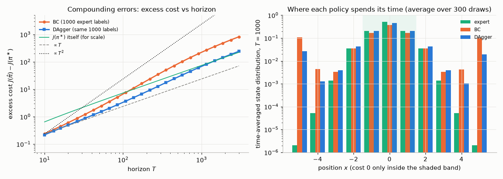
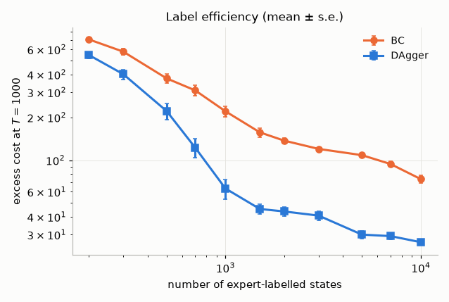
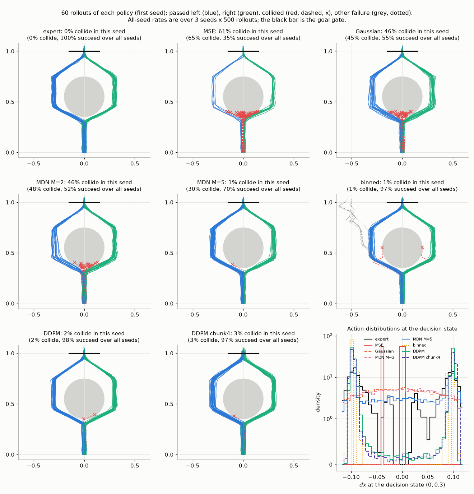
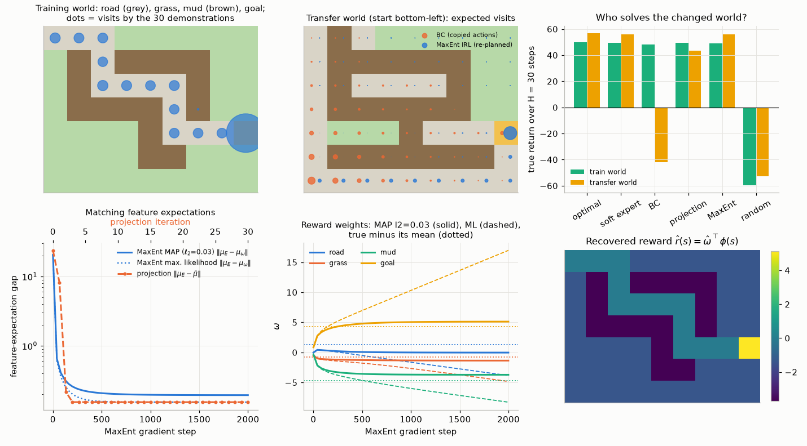
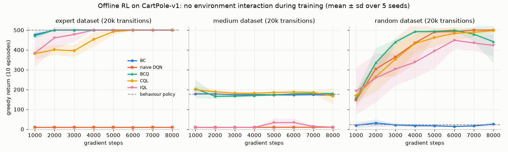
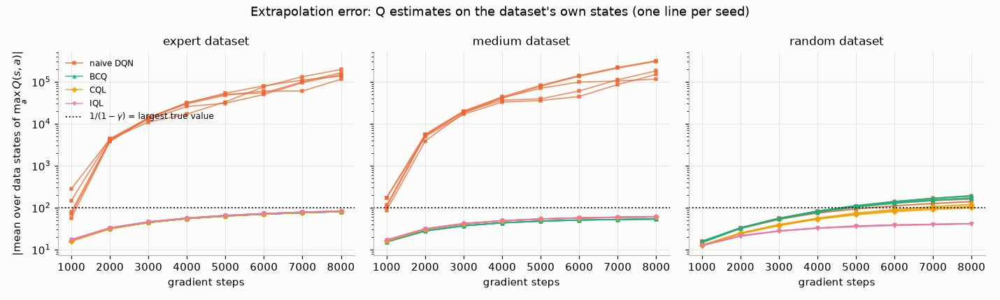
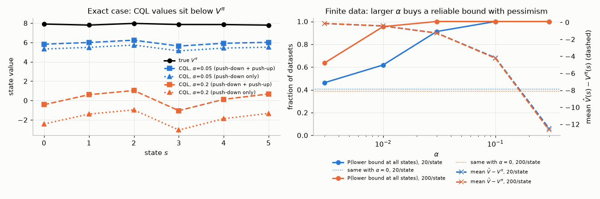
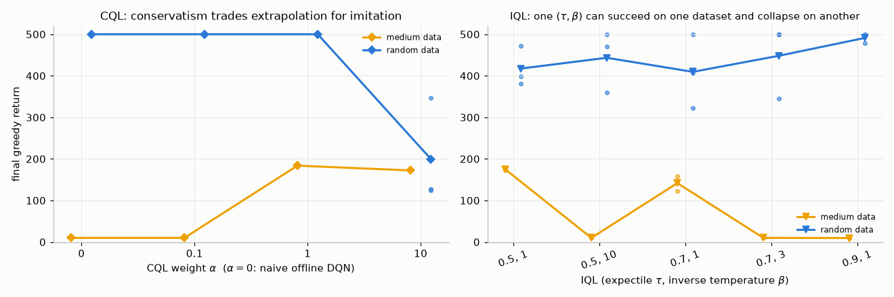
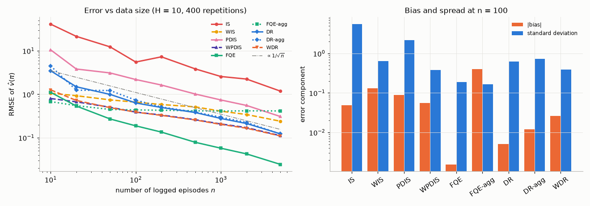
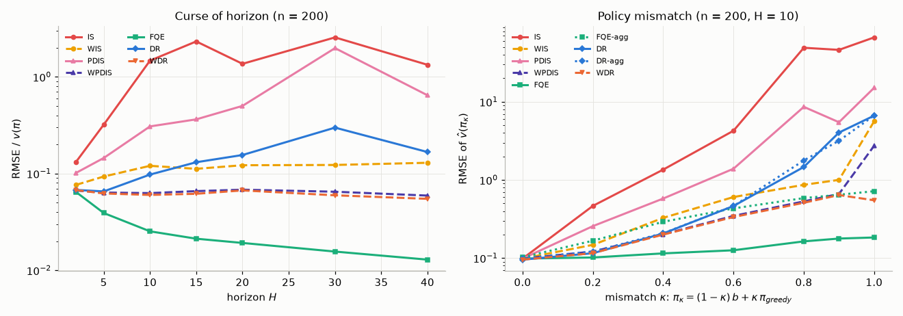

# Chapter 16 — Imitation Learning, Inverse RL and Offline RL

[← Previous: Beyond the Standard MDP: Partial Observability, Goals, Hierarchy and Meta-RL](15-beyond-mdps.md) · [Course index](../README.md) · [Next: Multi-Agent RL and Games](17-multi-agent-rl.md) →

## At a glance

Every algorithm so far assumed two luxuries: a **reward function** that tells the agent how well it is doing, and the freedom to **interact** with the environment as often as it likes. Take either away and you are in the territory of this chapter.

* **No reward, but demonstrations.** A surgeon, a driver or a chess master can *show* you what to do far more easily than they can write down a reward function. *Imitation learning* copies their behaviour; *inverse reinforcement learning* (IRL) infers the reward that explains it.
* **No interaction, but a log.** A hospital has years of treatment records; a recommender has billions of logged clicks. Trying a new policy on real patients or users "to see what happens" is unacceptable. *Offline* (or *batch*) RL learns a policy from a fixed dataset, and *off-policy evaluation* (OPE) estimates how good a policy is before anyone deploys it.

The two halves share one enemy: **distribution shift**. A learned policy visits states, or takes actions, that the data never showed. There its estimates are guesses, and the errors compound. Most of the chapter is about where that shift comes from and the different ways algorithms keep it under control.

**Learning objectives.** After this chapter you should be able to:

1. Treat behaviour cloning (BC) as supervised learning, prove that its excess cost can grow as $\epsilon T^2$ with the horizon $T$, and prove that training on the learner's own state distribution, as DAgger does, brings this down to $u T \epsilon$.
2. Explain why BC with a unimodal policy averages the modes of multimodal demonstrations, and how mixture, tokenised, energy-based, diffusion and flow-matching policies and action chunking avoid it. State the diffusion-policy training loss and sampler and explain why training them is still behaviour cloning, and describe the generalist robot policies trained mainly by BC (RT-2, Octo, OpenVLA, $\pi_0$).
3. Explain why reward recovery is ill-posed. Derive apprenticeship learning by feature matching and maximum-entropy IRL, including the gradient "expert feature counts minus model feature counts".
4. Derive GAIL's objective as a Jensen–Shannon divergence between occupancy measures, and explain what AIRL adds.
5. State the offline RL problem and explain, with a worked example and an experiment, why off-policy algorithms such as DQN fail on fixed data (extrapolation error).
6. Derive and compare the main families of offline RL: policy constraints (BCQ, BEAR, BRAC, TD3+BC), conservative values (CQL, including its lower-bound theorem), in-sample learning (IQL via expectile regression, AWR/AWAC), uncertainty penalties, and model-based methods (MOPO, MOReL). Implement discrete BCQ, CQL and IQL.
7. Explain offline RL as sequence modelling (Decision Transformer, Trajectory Transformer, diffusion planners) and show on small examples why it cannot stitch trajectories and is fooled by luck.
8. Derive and compare off-policy evaluation estimators: importance sampling and its weighted and per-decision variants, fitted Q evaluation, and doubly robust estimators.
9. Describe the D4RL benchmark, offline-to-online fine-tuning, and how these ideas reappear in RLHF ([Chapter 18](18-rl-for-language-models.md)).

**Prerequisites.** MDPs, Bellman equations and the occupancy-measure (dual LP) view ([Chapters 01](01-the-rl-problem.md), [03](03-dynamic-programming.md)); importance sampling, weighted and per-decision IS ([Chapter 04](04-monte-carlo.md)); Q-learning ([Chapter 05](05-temporal-difference.md)); the deadly triad ([Chapter 08](08-function-approximation.md)); DQN ([Chapter 09](09-deep-q-learning.md)); policy gradients and the performance-difference lemma ([Chapters 10](10-policy-gradients.md)–[11](11-trust-regions-and-ppo.md)); TD3 and soft (maximum-entropy) RL ([Chapter 12](12-continuous-control-actor-critic.md)); learned models ([Chapter 13](13-model-based-rl.md)). Maximum likelihood, cross-entropy and KL divergence are reviewed in [Chapter 00](00-math-toolkit.md).

**Code you will run** (all in [`code/ch16_offline_rl_and_imitation/`](../code/ch16_offline_rl_and_imitation/); NumPy for the tabular demos, small PyTorch networks for CartPole; times are full runs on one CPU thread):

| Script | What it shows | Full run |
|---|---|---|
| [`dagger_vs_bc.py`](../code/ch16_offline_rl_and_imitation/dagger_vs_bc.py) | Compounding errors on an unstable "tightrope": BC's excess cost grows much faster with the horizon $T$ than DAgger's, and DAgger needs about ten times fewer expert labels | ~2–2.5 min |
| [`multimodal_bc.py`](../code/ch16_offline_rl_and_imitation/multimodal_bc.py) | Bimodal demonstrations around an obstacle: MSE-BC and a Gaussian average the modes and collide; mixtures can collapse to one broad component; binned actions and a diffusion policy (with and without action chunks) pass on both sides; equal-budget controls show how much the mixture and the diffusion policy depend on training length | ~6 min |
| [`irl_gridworld.py`](../code/ch16_offline_rl_and_imitation/irl_gridworld.py) | Apprenticeship learning (projection method) and MaxEnt IRL on a terrain gridworld; the recovered reward transfers to a changed world where BC fails | ~20 s |
| [`offline_cartpole.py`](../code/ch16_offline_rl_and_imitation/offline_cartpole.py) | Expert, medium and random datasets on CartPole-v1; BC, naive offline DQN (Q-values blow up past $10^5$), discrete BCQ, CQL and IQL | ~5–6 min |
| [`offline_sensitivity.py`](../code/ch16_offline_rl_and_imitation/offline_sensitivity.py) | CQL's $\alpha$ and IQL's $(\tau, \beta)$ swept on two datasets: the safe settings shift with the data, and IQL's upper expectile inflates values even on expert data | ~7 min |
| [`cql_tabular.py`](../code/ch16_offline_rl_and_imitation/cql_tabular.py) | Numerical check of the CQL lower-bound theorems in a table, exact and with finite data | ~5 s |
| [`sequence_vs_dp.py`](../code/ch16_offline_rl_and_imitation/sequence_vs_dp.py) | Return-conditioned supervised learning (the idea behind Decision Transformer) vs dynamic programming: stitching and luck | <1 s |
| [`ope_tabular.py`](../code/ch16_offline_rl_and_imitation/ope_tabular.py) | IS, WIS, PDIS, WPDIS, FQE, DR and WDR against the true value of a target policy; data size, horizon and policy mismatch | ~1 min |
| [`exercise_solutions.py`](../code/ch16_offline_rl_and_imitation/exercise_solutions.py) | Numerical checks for the exercises, including tabular GAIL and a policy gradient through a denoising chain | ~17 s |

**Study time.** About 13–15 hours: 8 for the text and derivations, 2–3 to run and modify the code, 3–4 for the exercises.

**Notation.** We follow [NOTATION.md](../NOTATION.md), with these local departures, each repeated where it first matters.

* In the imitation-learning analysis (Section 2) we use **costs** $C(s,a) \in [0,1]$ to be minimised, and a horizon of $T$ steps indexed $t = 1, \dots, T$, as in the papers we follow. Elsewhere $H$ is a fixed horizon with $t = 0, \dots, H-1$.
* $\pi^\ast$ or $\pi_E$ is the expert, $\hat\pi$ the learner. $b$ is the behaviour (data-collecting) policy, which offline RL papers write $\pi_\beta$; $\hat b$ is its empirical estimate from the data. $\mathcal{D}$ is a dataset.
* $\boldsymbol\phi(s)$ is a **reward-feature** vector and $\boldsymbol\omega$ the reward weights in IRL, $r_{\boldsymbol\omega}(s) = \boldsymbol\omega^\top\boldsymbol\phi(s)$. Papers often write $\theta$ for $\boldsymbol\omega$; we keep $\boldsymbol\theta$ for policy parameters. $\boldsymbol\mu(\pi)$ is a vector of feature expectations.
* $d^\pi(s,a)$ is the normalised discounted **occupancy measure** $(1-\gamma)\sum_t \gamma^t \Pr\{S_t = s, A_t = a\}$. GAIL papers write $\rho_\pi$; we keep $\rho$ for importance-sampling ratios.
* $\tau$ is the **expectile** in IQL (Section 9), as in the IQL paper. Target networks use Polyak averaging with a coefficient we call `polyak` in the code.
* $\beta$ is an **inverse temperature** in advantage-weighted regression and IQL (Section 9). It is the reciprocal of the KL coefficient that NOTATION.md calls $\beta$ in RLHF; Section 14 makes the link explicit.
* $\nu(a \mid s)$ is the action distribution CQL pushes values down on (Kumar et al. write $\mu$).
* $\epsilon$ in Section 2 is a learner's *classification error rate* (as in Ross & Bagnell), not an exploration rate. In Section 2.5, $N$ is the number of DAgger iterations and $\beta_i$ its mixing weights, as in Ross, Gordon and Bagnell; elsewhere $N$ is a dataset size and $\beta$ an inverse temperature.
* $Q^\ast_t, V^\ast_t$ in Section 2.5 are the **expert's** cost-to-go, not the optimal values $q_\ast, v_\ast$. In Sections 8–12, $Q^\pi, V^\pi, A^b$ (capitals) are *true* values of $\pi$ or $b$, as in the offline-RL papers; NOTATION.md writes $q_\pi, v_\pi$.
* $\psi$ is used only for GAIL's cost regulariser (Section 5.1, as in Ho and Ermon), not for model parameters. Discriminator parameters are $\boldsymbol\xi$, and IQL's value network has weights $\mathbf{w}_V$.
* Section 2.8 keeps the diffusion literature's symbols, flagged again there: $k = 1, \dots, K$ counts *denoising* steps (as a superscript, $a^k$), $\beta_k$, $\alpha_k = 1 - \beta_k$ and $\bar\alpha_k$ are the noise schedule, $\boldsymbol\epsilon$ (bold) and $\mathbf z$ are Gaussian noise (not an eligibility trace), $\sigma_k$ is the sampler's noise level, $u \in [0, 1]$ is flow matching's interpolation time (not the recoverability constant $u$ of (16.7)), $M$ is the number of mixture components and $H_c$ the length of an action chunk.
* $\alpha$ is a step size up to Section 7 and CQL's conservatism weight in Sections 8–9, where pseudocode writes the step size as `lr`. $\lambda$ names several scalar weights (GAIL's entropy weight, TD3+BC's $Q$ scale, MOPO's penalty, Lagrange multipliers), each defined where it is used; it is never a trace-decay parameter.

---

## 1. Three problems without the usual luxuries

Here is the map of the chapter. Each setting changes what is given and what must be learned.

| Setting | Given | Learn | Can interact? | Key difficulty |
|---|---|---|---|---|
| Behaviour cloning | expert state–action pairs | policy | no | errors compound off the expert's states |
| Interactive imitation (DAgger) | an expert you can query | policy | yes, and ask the expert | labelling cost |
| Inverse RL | expert trajectories, a model or simulator | reward (then a policy) | usually yes, in a simulator | many rewards explain the same behaviour |
| Adversarial imitation (GAIL, AIRL) | expert trajectories, simulator | policy (AIRL: also reward) | yes | unstable min–max optimisation |
| Offline RL | logged transitions $(s,a,r,s')$ from some $b$ | a better policy | no | values of actions the data never tried |
| Off-policy evaluation | logged data, a candidate policy $\pi$ | the number $v(\pi)$ | no | variance, or model bias |

Two observations organise everything that follows.

1. **Imitation is supervised learning on a non-i.i.d. test distribution.** The learner is trained on the expert's states and tested on its own. When the two diverge, a classifier that is 99% accurate can still drive off the road.
2. **Offline RL is off-policy RL without the corrective feedback.** In online Q-learning, an overestimated action gets tried and its estimate corrected. Offline, nobody ever tries it. The bootstrap target $\max_{a'} Q(s', a')$ keeps querying exactly those untested actions.

---

## 2. Behaviour cloning and compounding errors

### 2.1 Behaviour cloning is supervised learning

We are given a dataset $\mathcal{D} = \{(s_i, a_i)\}_{i=1}^N$ of states visited by an expert $\pi^\ast$ and the actions it chose there. **Behaviour cloning** fits a policy by maximum likelihood:

$$
\hat\pi = \arg\max_{\boldsymbol\theta}\ \frac{1}{N}\sum_{i=1}^N \log \pi_{\boldsymbol\theta}(a_i \mid s_i).
\tag{16.1}
$$

For discrete actions this is the cross-entropy loss of a classifier. For a Gaussian policy with fixed variance it is mean-squared error on the actions. As [Chapter 00](00-math-toolkit.md) showed, maximum likelihood minimises the *forward* KL divergence $\mathbb{E}_{s}\big[D_{\mathrm{KL}}(\pi^\ast(\cdot\mid s)\,\Vert\,\pi_{\boldsymbol\theta}(\cdot \mid s))\big]$ over the data's states. Forward KL is mode-covering. A unimodal policy fitted to an expert who passes an obstacle sometimes on the left and sometimes on the right averages the two and drives into it. Mixture, discretised, energy-based or diffusion policies avoid this (Section 2.8).

```
Algorithm 16.1: Behaviour cloning
Input: expert dataset D = {(s_i, a_i)}, policy class pi_theta, step size alpha, batch size B
Initialise theta
repeat until the validation loss stops improving:
    sample a minibatch {(s_j, a_j)}_{j=1}^B from D
    theta <- theta + alpha * grad_theta (1/B) sum_j log pi_theta(a_j | s_j)
return pi_theta   (act greedily, a = argmax_a pi_theta(a|s), or sample from it)
```

BC is simple, stable and often a strong baseline. In our CartPole experiments (Section 6) it matches the expert exactly from 40 expert episodes. So why does it have a bad reputation?

### 2.2 Covariate shift

Supervised learning promises small error *on the training distribution*. BC trains on states drawn from the expert's state distribution $d^{\pi^\ast}$ but is tested on its *own* distribution $d^{\hat\pi}$. The two differ as soon as the learner makes its first mistake: it lands in a state the expert would never have reached, where it has no training data, where it is more likely to make another mistake, which takes it further away. The errors **compound**.

Pomerleau's ALVINN (1989), a neural network that steered a van from camera images, and its successors ran into exactly this. When ALVINN was later trained by watching a human drive (Pomerleau, 1991), the network never saw recoveries: a human driver stays in the middle of the lane, so the network never sees images of the van drifting towards the kerb and never learns to recover. Pomerleau's fix was to synthesise shifted views labelled with corrective steering. That is a hand-crafted version of the idea that DAgger later made general.

### 2.3 The quadratic bound

Ross and Bagnell (2010) made the argument precise. Consider a finite horizon of $T$ steps, $t = 1, \dots, T$, and a cost $C(s,a) \in [0,1]$ per step. (We switch to costs because the imitation-learning literature uses them.) Let $d_t^\pi$ be the distribution of $S_t$ under policy $\pi$, and

$$
J(\pi) \doteq \sum_{t=1}^T \mathbb{E}_{S_t \sim d_t^\pi,\ A_t \sim \pi(\cdot\mid S_t)}\big[C(S_t, A_t)\big]
\tag{16.2}
$$

the expected total cost. The expert $\pi^\ast$ is deterministic. Measure the learner's quality the way a supervised learner would, by its probability of disagreeing with the expert *on the expert's own states*:

$$
\epsilon_t \doteq \Pr_{S \sim d_t^{\pi^\ast}}\big\{\hat\pi(S) \neq \pi^\ast(S)\big\}, \qquad \epsilon \doteq \frac{1}{T}\sum_{t=1}^T \epsilon_t .
\tag{16.3}
$$

> **Theorem 16.1 (Ross & Bagnell, 2010).** For any learner $\hat\pi$,
>
> $$J(\hat\pi) \le J(\pi^\ast) + T^2 \epsilon. \tag{16.4}$$

*Proof.* We take $\hat\pi$ deterministic; the stochastic case is identical with "disagree" replaced by its probability. The key observation is that **as long as the learner agrees with the expert, the two processes are identical**. Let $p_t$ be the probability that $\hat\pi$ chose the expert's action at every step $1, \dots, t-1$ (so $p_1 = 1$). Let $d_t$ be the distribution of $S_t$ under $\hat\pi$ *given* no mistake so far, and $d'_t$ the distribution given at least one mistake. Then

$$
d_t^{\hat\pi} = p_t\, d_t + (1 - p_t)\, d'_t .
$$

Now run the *expert* instead. The event "$\hat\pi$ would have agreed with the expert at every state so far" has the same probability $p_t$ under the expert's process, and on that event the states have the same distribution $d_t$. (Up to the first disagreement the two policies take the same actions, so the transition probabilities coincide.) Hence

$$
d_t^{\pi^\ast} = p_t\, d_t + (1-p_t)\, d''_t \quad\text{for some distribution } d''_t .
$$

Let $e_t \doteq \Pr_{S\sim d_t}\{\hat\pi(S) \ne \pi^\ast(S)\}$ be the learner's error rate on $d_t$. The second decomposition gives $\epsilon_t \ge p_t e_t$. A first mistake at step $t$ happens with probability $p_t e_t$, so $p_{t+1} = p_t(1 - e_t)$, and

$$
1 - p_t = \sum_{i=1}^{t-1}(p_i - p_{i+1}) = \sum_{i=1}^{t-1} p_i e_i \le \sum_{i=1}^{t-1} \epsilon_i .
$$

Write $C_\pi(s) \doteq C(s, \pi(s))$. Where the two policies agree, $C_{\hat\pi} = C_{\pi^\ast}$; elsewhere they differ by at most 1. So $\mathbb{E}_{d_t}[C_{\hat\pi}] \le \mathbb{E}_{d_t}[C_{\pi^\ast}] + e_t$. Using $0 \le C \le 1$,

$$
\begin{aligned}
\mathbb{E}_{d^{\hat\pi}_t}[C_{\hat\pi}] &= p_t\,\mathbb{E}_{d_t}[C_{\hat\pi}] + (1-p_t)\,\mathbb{E}_{d'_t}[C_{\hat\pi}]
\le p_t\,\mathbb{E}_{d_t}[C_{\pi^\ast}] + p_t e_t + (1-p_t), \\
\mathbb{E}_{d^{\pi^\ast}_t}[C_{\pi^\ast}] &= p_t\,\mathbb{E}_{d_t}[C_{\pi^\ast}] + (1-p_t)\,\mathbb{E}_{d''_t}[C_{\pi^\ast}] \ge p_t\,\mathbb{E}_{d_t}[C_{\pi^\ast}] .
\end{aligned}
$$

Subtracting, the per-step excess cost is at most $p_t e_t + (1 - p_t) \le \epsilon_t + \sum_{i<t}\epsilon_i = \sum_{i \le t} \epsilon_i$. Summing over $t$:

$$
J(\hat\pi) - J(\pi^\ast) \le \sum_{t=1}^T \sum_{i=1}^{t} \epsilon_i \le T \sum_{i=1}^T \epsilon_i = T^2 \epsilon. \qquad\blacksquare
$$

Read the proof backwards to see where the $T^2$ comes from. A mistake at step $i$ may cost up to 1 at *every* later step, because the learner can be lost for good. That is up to $T - i$ for one mistake, and summing over the $T$ steps where mistakes can occur gives $T^2$. A supervised learner with error $\epsilon$ is *not* an imitator with cost $\epsilon T$.

### 2.4 Worked example: the bound is tight

Take two states. In the "good" state the expert's action keeps you there at zero cost. Any other action moves you to an absorbing "bad" state that costs 1 per step. The expert never leaves the good state, so its training data contain only good states, and the learner has no idea what to do in the bad one. Suppose the learner errs with probability $\epsilon$ in the good state. Its error on the expert's distribution is exactly $\epsilon$. Let $q_t$ be the probability of being in the bad state at step $t = 1, \dots, T$; then $q_1 = 0$ and $q_t = 1 - (1-\epsilon)^{t-1}$. The expected cost over $T$ steps is

$$
J(\hat\pi) - J(\pi^\ast) = \sum_{t=1}^{T}\big(1 - (1-\epsilon)^{t-1}\big) = T - \frac{1 - (1-\epsilon)^T}{\epsilon} = \epsilon\frac{T(T-1)}{2} + O(\epsilon^2 T^3).
\tag{16.5}
$$

By hand, with $\epsilon = 0.01$ and $T = 10$: $(0.99)^{10} = 0.90438$, so the excess cost is $10 - (1 - 0.90438)/0.01 = 10 - 9.562 = 0.438$, close to $\epsilon T(T-1)/2 = 0.45$. The bound $\epsilon T^2 = 1$ is off only by about a factor of 2, which settles the question of tightness. For $\epsilon T \gg 1$ the learner is almost surely lost early, the excess saturates near $T - 1/\epsilon$ and grows only linearly. [`exercise_solutions.py`](../code/ch16_offline_rl_and_imitation/exercise_solutions.py) confirms the closed form: 0.438, 3.970, 36.60 and 204.9 for $T = 10, 30, 100, 300$.

### 2.5 DAgger: train on the states you will actually visit

The cure is to train on the learner's own distribution. That needs labels for states the expert would never visit, so it needs an expert we can *query*. **DAgger** (Dataset Aggregation; Ross, Gordon & Bagnell, 2011) does this iteratively:

```
Algorithm 16.2: DAgger
Input: expert pi* that can be queried for an action in any state, policy class Pi,
       number of iterations N, rollouts per iteration m, mixing weights beta_1, ..., beta_N
       (typically beta_1 = 1 and beta_i = 0 for i > 1, or beta_i = p^(i-1))
Initialise D <- empty set; pi_hat_1 <- any policy
for i = 1, ..., N:
    pi_i <- beta_i * pi* + (1 - beta_i) * pi_hat_i       (at each step: expert's action w.p. beta_i)
    roll out pi_i for m episodes; collect the visited states S_i = {s}
    D_i <- {(s, pi*(s)) : s in S_i}                          (ask the expert to label them)
    D <- D union D_i                                         (aggregate)
    pi_hat_{i+1} <- the classifier in Pi trained on D        (supervised learning, Eq. 16.1)
return the best pi_hat_i on validation (in practice often the last)
```

The learner drives; the expert only labels. Iteration 1 with $\beta_1 = 1$ is plain behaviour cloning. From then on, the states in the dataset are increasingly the states the *learner* visits, including the ones it reaches after its own mistakes, where the expert's label teaches it to recover.

**Why this gives a linear bound.** The analysis uses the finite-horizon, cost version of the performance-difference lemma ([Chapter 11](11-trust-regions-and-ppo.md) proves the discounted version). Let $Q^\ast_t(s,a)$ (the *expert's*, not the optimal, cost-to-go) be the expected cost of steps $t, \dots, T$ when we take $a$ in $s$ at step $t$ and follow $\pi^\ast$ afterwards, and $V^\ast_t(s) = Q^\ast_t(s, \pi^\ast(s))$, with $V^\ast_{T+1} \equiv 0$. Then for any policy $\pi$,

$$
J(\pi) - J(\pi^\ast) = \sum_{t=1}^{T} \mathbb{E}_{S_t \sim d_t^\pi,\ A_t\sim\pi}\Big[Q^\ast_t(S_t,A_t) - V^\ast_t(S_t)\Big].
\tag{16.6}
$$

*Proof.* Along a trajectory of $\pi$, $Q^\ast_t(S_t, A_t) = C(S_t,A_t) + \mathbb{E}[V^\ast_{t+1}(S_{t+1}) \mid S_t, A_t]$. Taking expectations under $\pi$, the right side of (16.6) becomes $\mathbb{E}_\pi\big[\sum_t C(S_t,A_t)\big] + \sum_{t=1}^T\big(\mathbb{E}_\pi[V^\ast_{t+1}(S_{t+1})] - \mathbb{E}_\pi[V^\ast_t(S_t)]\big)$. The sum telescopes to $\mathbb{E}[V^\ast_{T+1}] - \mathbb{E}[V^\ast_1(S_1)] = 0 - J(\pi^\ast)$. $\blacksquare$

The bracket in (16.6) is zero whenever $\pi$ agrees with the expert. Suppose a single deviation from the expert increases the expert's cost-to-go by at most $u$: $Q^\ast_t(s,a) - V^\ast_t(s) \le u$ for all $s, a, t$. Then

$$
J(\pi) \le J(\pi^\ast) + u \sum_{t=1}^T \Pr_{S\sim d^\pi_t}\{\pi(S) \neq \pi^\ast(S)\} = J(\pi^\ast) + u\,T\,\epsilon_{\text{own}}(\pi),
\tag{16.7}
$$

where $\epsilon_{\text{own}}(\pi)$ is the error rate on the policy's **own** state distribution. If the task is *recoverable* (the expert can undo a mistake at bounded cost, so $u$ does not grow with $T$), the bound is linear in $T$. All that remains is to make the classifier accurate on $d^{\pi}$, and that is exactly what DAgger's data are drawn from. Ross, Gordon and Bagnell view each iteration as a round of online learning and the aggregated-data classifier as a *follow-the-leader* (no-regret) learner. They show that, for any number of iterations $N$, some policy in the sequence has error on its own distribution at most $\epsilon_N + \mathrm{Reg}_N/N$ plus a term of order $1/N$ that comes from the iterations in which the expert still drives (for $\beta_1 = 1$, $\beta_i = 0$ afterwards, or any $\beta_i$ that decays fast enough). Here $\epsilon_N$ is the error of the best policy in the class on the aggregated distributions, and $\mathrm{Reg}_N/N$ is the learner's average regret, which is $\tilde O(1/N)$ for strongly convex losses. With $N = \tilde O(uT)$ iterations the last two terms, multiplied by $uT$ in (16.7), are $O(1)$, so $J(\hat\pi) \le J(\pi^\ast) + uT\epsilon_N + O(1)$. The price is an expert that can be queried online, which is not available for logged human demonstrations.

When there is no interactive expert at all, the horizon dependence of BC cannot be avoided in the worst case. In tabular MDPs, Rajaraman, Yang, Jiao and Ramchandran (2020) showed that BC's suboptimality of order $|\mathcal{S}|H^2\log N / N$ (horizon $H$, $N$ expert trajectories) matches a lower bound of order $|\mathcal{S}|H^2/N$ for learners that cannot interact. They also showed that knowing the transition model improves the horizon dependence to $H^{3/2}$.

### 2.6 Experiment: an unstable tightrope

[`dagger_vs_bc.py`](../code/ch16_offline_rl_and_imitation/dagger_vs_bc.py) builds a small environment in which compounding errors are visible and every quantity can be computed exactly.

* **World.** A walker stands at position $x \in \{-5, \dots, 5\}$ and starts at $0$. The cost is 1 per step when $|x| \ge 2$ ("off balance") and 0 otherwise. Actions push sideways by $a \in \{-2, \dots, 2\}$. Off balance, gravity adds a drift of $\operatorname{sign}(x)$, and wind $w \in \{-2,\dots,2\}$ with probabilities $(0.03, 0.2, 0.54, 0.2, 0.03)$ blows every step: $x' = \mathrm{clip}(x + a + \text{drift}(x) + w)$.
* **Expert.** $a^\ast = \mathrm{clip}(-(x + \text{drift}(x)), -2, 2)$. It recovers from every position.
* **Learner.** The expert sees the true position; the learner sees a noisy sensor ($o = x \pm 1$ with probability 0.1). Its observation is a one-hot "image", so knowing what to do at one position tells it nothing about another. It is a classifier from $o$ to the expert's label: a majority vote per observation, falling back on the overall majority label ("stand still") where it has no data. The sensor noise makes it err now and then even in familiar states; that is the $\epsilon$ of Theorem 16.1.

Both methods get the same budget of 1,000 expert labels. BC gets ten expert trajectories of 100 steps. DAgger gets ten iterations of one 100-step trajectory each, the first driven by the expert. The script computes expected costs *exactly*, by propagating state distributions through each policy's Markov chain, and averages over 300 independent draws of the training data.



*Figure 16.1. Left: excess cost $J(\hat\pi) - J(\pi^\ast)$ against the horizon $T$, mean over 300 draws of the training data. The grey and black guide lines have slopes 1 and 2. Right: where each policy spends its time over $T = 1000$ steps (log scale; the shaded band costs nothing).*

What the run printed:

| $T$ | $J(\pi^\ast)$ | excess, BC | excess, DAgger | BC excess per step | DAgger excess per step |
|---|---|---|---|---|---|
| 10 | 0.65 | 0.24 | 0.22 | 0.024 | 0.022 |
| 108 | 7.92 | 7.58 | 3.69 | 0.070 | 0.034 |
| 1159 | 85.87 | 269.96 | 81.87 | 0.233 | 0.071 |
| 3000 | 222.43 | 822.96 | 242.97 | 0.274 | 0.081 |

* **BC's excess cost grows faster than linearly.** Its fitted log–log slope is 1.44 for $10 \le T \le 100$ and 1.54 for $100 \le T \le 1000$, against 1.17 and 1.32 for DAgger. Per step, BC's excess grows elevenfold between $T = 10$ and $T = 3000$, DAgger's less than fourfold. The slope is below the worst case of 2 for two reasons. Many of the learner's errors are harmless sensor misreadings near the centre, which add a *linear* component. And both learners are fixed stationary policies, so for $T$ well beyond the time it takes to reach the walls both curves must become linear: the per-step columns already saturate (BC about 0.27, DAgger about 0.08). The quadratic regime is a transient, as in the cliff example of Section 2.4 once $\epsilon T \gg 1$. (Also unlike Theorem 16.1, the demonstrations here have a fixed length of 100 rather than $T$.) The right panel shows the failure mode: averaged over draws, BC spends 10–11% of its time pinned against each wall. Its data almost never contain observations of $\pm4$ or $\pm5$, so there it "stands still" while gravity pulls it over.
* **The bound is valid but very loose here.** BC's error under the expert's distribution, averaged over the first $T$ steps as Theorem 16.1 requires, is $\epsilon = 0.097$ at every horizon from 10 to 3,000 (the expert's state distribution settles within a few steps). These errors are almost entirely harmless misreadings, so $\epsilon T^2$ is $9.7$ at $T = 10$ against an actual 0.24. Theorem 16.1 charges every error as if it were catastrophic.
* **DAgger is not perfect either.** Ten 100-step rollouts do not always push the learner over *both* edges. When a far position was never visited, DAgger has the same hole as BC, which is why its curve still bends upward: averaged over draws, it spends 2–3% of its time at each wall. DAgger can only fix the mistakes it gets to see.



*Figure 16.2. Excess cost at $T = 1000$ against the number of expert labels (mean ± standard error over 100 draws).*

Label efficiency is the practical argument. With 1,000 labels DAgger reaches an excess cost of 63; BC needs about 10,000 labels to get to 74. DAgger then flattens out (30 at 5,000 labels, 27 at 10,000) as it approaches the excess cost that sensor noise makes unavoidable for this learner; BC is still well above it.

### 2.7 Beyond DAgger

* **When the expert is a human,** labelling every visited state is tedious and labels given without being in control are unreliable. Variants let the expert intervene only when the learner is about to fail (for example HG-DAgger, Kelly et al., 2019), or inject noise into the *expert's* demonstrations so that the data contain recoveries (DART, Laskey et al., 2017).
* **Causal confusion.** More information can hurt BC. If the observation shows the brake light, a cloned driver learns "brake when the brake light is on", a perfect predictor of the expert's action that is useless as a policy (de Haan, Jayaraman & Levine, 2019).
* **Privileged experts.** In simulation an expert with access to the true state can label a student that sees only sensors, as in our tightrope, an approach used for autonomous driving under the name "learning by cheating" (Chen et al., 2019).
* **Modern BC.** With expressive policy classes and plenty of data, BC is the workhorse of robot learning, and it is the first stage of every large language model's training (supervised fine-tuning, [Chapter 18](18-rl-for-language-models.md)). Section 2.8 covers the policy classes, action chunking and the generalist robot policies trained this way.

### 2.8 Expressive and generalist policies

**Mode averaging.** Go back to the obstacle of Section 2.1. Suppose that in some state the expert steers left half the time and right half the time. MSE regression, which is (16.1) with a fixed-variance Gaussian, learns the conditional mean of the action, so it steers straight ahead. Learning the variance as well does not help. Maximum likelihood minimises the forward KL divergence, and for a single Gaussian that means matching the mean and variance of the expert's actions ([Chapter 00](00-math-toolkit.md) §5.4). The fitted Gaussian sits between the two modes and is wide enough to cover both, so many of its samples land where the expert never acts (Exercise 16.15 computes how many). Maximum likelihood is still the right objective. What fails is a model class that cannot represent the answer. And human demonstrations are routinely multimodal: different demonstrators, or the same one on different days, solve a task in different ways, and the state rarely records which way was chosen. Several policy classes can represent more than one mode.

* **Mixtures.** A mixture density network (MDN; Bishop, 1994) outputs the weights $w_j(s)$, means $\mathbf m_j(s)$ and covariances $\mathbf S_j(s)$ of $M$ Gaussians, $\pi_{\boldsymbol\theta}(a\mid s) = \sum_{j=1}^{M} w_j(s)\,\mathcal N\big(a;\mathbf m_j(s),\mathbf S_j(s)\big)$, and is trained by (16.1). It is cheap to train and to sample. Its likelihood has poor stationary points, though, in which one broad component covers several modes, and training can stay near one for a long time; the experiment below runs into this.
* **Discretised (tokenised) actions.** Divide each action dimension into bins and predict a categorical distribution over them, which can put mass on any number of modes. RT-1 and RT-2 use 256 bins per dimension. RT-1 predicts every dimension at once, with an independent softmax for each; its authors tried generating the dimensions one at a time and found that this slowed inference about twofold without changing performance significantly. RT-2 writes the dimensions as a sequence of text tokens, so each is predicted conditioned on those already chosen. That keeps the correlations between dimensions that independent softmaxes lose. Behavior Transformers (Shafiullah, Cui, Altanzaya & Pinto, 2022) cluster the dataset's actions with $k$-means, predict the cluster with a categorical head and add a predicted continuous offset within the cluster.
* **Implicit (energy-based) policies.** Implicit BC (Florence et al., 2021) learns an energy $E_{\boldsymbol\theta}(s,a)$ with $\pi(a\mid s)\propto e^{-E_{\boldsymbol\theta}(s,a)}$, trained with a contrastive loss against sampled counter-example actions, and acts by minimising the energy over actions. It can represent discontinuous and multi-valued maps, but both training and acting need a search over actions.
* **Diffusion and flow-matching policies** turn a sample of noise into an action by a learned iterative refinement. They are among the most widely used expressive classes in robot learning today, so we derive them.

**Diffusion policies.** A denoising diffusion probabilistic model (DDPM; Sohl-Dickstein, Weiss, Maheswaranathan & Ganguli, 2015; Ho, Jain & Abbeel, 2020) learns to reverse a process that adds Gaussian noise to the data a little at a time. In a diffusion policy (Chi et al., 2023) the data are expert actions $a^0 = a$, and every network is conditioned on the state. Choose a noise schedule $0 < \beta_k < 1$ for $k = 1, \dots, K$, and write $\alpha_k \doteq 1 - \beta_k$ and $\bar\alpha_k \doteq \prod_{j\le k}\alpha_j$. (These are DDPM's symbols, kept because every paper uses them. In this subsection only, $\alpha_k$, $\bar\alpha_k$ and $\beta_k$ are the noise schedule, not a step size, CQL's weight or an inverse temperature; the superscript $k$ counts denoising steps, not time; and the bold $\boldsymbol\epsilon$ is Gaussian noise, not the error rate of Section 2.3.) After $k$ noising steps the action can be sampled in one shot,

$$
a^k = \sqrt{\bar\alpha_k}\,a^0 + \sqrt{1-\bar\alpha_k}\;\boldsymbol\epsilon, \qquad \boldsymbol\epsilon\sim\mathcal N(\mathbf 0,\mathbf I),
\tag{16.43}
$$

and the schedule makes $\bar\alpha_K \approx 0$, so $a^K$ is almost pure noise. A network $\boldsymbol\epsilon_{\boldsymbol\theta}(a^k, k, s)$ learns to predict the noise that was added:

$$
L(\boldsymbol\theta) = \mathbb E_{(s,a^0)\sim\mathcal D,\ k\sim\mathcal U\{1,\dots,K\},\ \boldsymbol\epsilon\sim\mathcal N(\mathbf 0,\mathbf I)}\Big[\big\lVert\boldsymbol\epsilon - \boldsymbol\epsilon_{\boldsymbol\theta}\big(\sqrt{\bar\alpha_k}\,a^0 + \sqrt{1-\bar\alpha_k}\,\boldsymbol\epsilon,\ k,\ s\big)\big\rVert^2\Big].
\tag{16.44}
$$

To act, start from noise and denoise $K$ times:

$$
a^K\sim\mathcal N(\mathbf 0,\mathbf I), \qquad a^{k-1} = \frac{1}{\sqrt{\alpha_k}}\Big(a^k - \frac{\beta_k}{\sqrt{1-\bar\alpha_k}}\,\boldsymbol\epsilon_{\boldsymbol\theta}(a^k,k,s)\Big) + \sigma_k\mathbf z, \quad \mathbf z\sim\mathcal N(\mathbf 0,\mathbf I),
\tag{16.45}
$$

with $\sigma_k^2 = \beta_k(1-\bar\alpha_{k-1})/(1-\bar\alpha_k)$, which is 0 at $k = 1$ (where $\bar\alpha_0 \doteq 1$). Implementations usually also clip the implied estimate of $a^0$ to the action range at every step, as ours does.

```
Algorithm 16.18: Diffusion policy (DDPM; after Chi et al., 2023)
Input: demonstrations D = {(s_i, a_i)} (each a_i may be a chunk of H_c future actions),
       noise schedule beta_1, ..., beta_K, noise-prediction network eps_theta(a, k, s)
alpha_k <- 1 - beta_k;  abar_k <- alpha_1 * ... * alpha_k;  sigma_k^2 <- beta_k (1 - abar_{k-1}) / (1 - abar_k)
Training: repeat
    sample (s, a0) from D, k uniformly from {1, ..., K}, eps ~ N(0, I)
    a_k <- sqrt(abar_k) a0 + sqrt(1 - abar_k) eps                                   (Eq. 16.43)
    theta <- theta - lr * grad_theta || eps - eps_theta(a_k, k, s) ||^2              (Eq. 16.44)
Acting in state s:
    a <- sample from N(0, I)
    for k = K, ..., 1:
        a <- (a - beta_k / sqrt(1 - abar_k) * eps_theta(a, k, s)) / sqrt(alpha_k) + sigma_k z,   z ~ N(0, I)   (Eq. 16.45)
    execute a (for a chunk: execute some or all of its actions, then act again)
```

Why is this still behaviour cloning? Ho et al. showed that (16.44) is a reweighted form of a variational lower bound on $\log\pi_{\boldsymbol\theta}(a\mid s)$, so training is approximately maximum likelihood, (16.1) again. It is also *denoising score matching* (Vincent, 2011): the best noise predictor is a scaled score, $\boldsymbol\epsilon_{\boldsymbol\theta}(a^k,k,s) \approx -\sqrt{1-\bar\alpha_k}\,\nabla_{a^k}\log q_k(a^k\mid s)$, where $q_k$ is the distribution of noised expert actions. Each reverse step (16.45) moves a little uphill on the log-density of the noised actions and adds fresh noise. None of this assumes a single mode. The score of a bimodal density points towards the nearer mode, and the initial noise, together with the noise injected in the early, very noisy steps, decides which mode a sample ends up in. The price is $K$ network evaluations per action; deterministic samplers such as DDIM (Song, Meng & Ermon, 2021) need far fewer steps.

**Flow matching** (Lipman, Chen, Ben-Hamu, Nickel & Le, 2023; rectified flow, Liu, Gong & Liu, 2023) replaces the stochastic chain by an ordinary differential equation. Join a noise sample $\mathbf z$ to an expert action by a straight line, $a^u = u\,a + (1-u)\,\mathbf z$ for an interpolation time $u \in [0, 1]$ (not the $u$ of (16.7)), and regress a velocity field onto the direction of that line:

$$
L(\boldsymbol\theta) = \mathbb E_{(s,a)\sim\mathcal D,\ u\sim\mathcal U[0,1],\ \mathbf z\sim\mathcal N(\mathbf 0,\mathbf I)}\big\lVert \mathbf v_{\boldsymbol\theta}(a^u, u, s) - (a - \mathbf z)\big\rVert^2 .
\tag{16.46}
$$

To act, draw $\mathbf z$ and integrate $da^u/du = \mathbf v_{\boldsymbol\theta}(a^u, u, s)$ from $u = 0$ to $u = 1$ with a few Euler steps. The $\pi_0$ model below generates its actions this way.

**Action chunking.** Diffusion Policy and ACT (Action Chunking with Transformers; Zhao, Kumar, Levine & Finn, 2023) predict a *chunk* of the next $H_c$ actions, $a_{t:t+H_c-1}$, and execute several of them before asking the policy again. This has three effects.

1. *Commitment.* A multimodal policy sampled afresh at every step can switch modes from one step to the next when the state does not reveal which mode it is following, and the zig-zag can average the modes after all. A chunk commits to one mode for $H_c$ steps.
2. *Fewer decisions.* The argument of Theorem 16.1 counts decisions. If the policy decides once per chunk and a whole chunk is wrong with probability $\epsilon_{\text{chunk}}$, the same proof gives an excess cost of at most $T\cdot(T/H_c)\cdot\epsilon_{\text{chunk}}$, against $T\cdot T\cdot\epsilon$ for a policy that decides every step with error rate $\epsilon$. Chunking helps when $\epsilon_{\text{chunk}}$ is well below $H_c\,\epsilon$. That is the value it would take if the per-step errors were rare and independent, and it is not reached when most per-step errors are mode switches, which a chunk avoids by construction.
3. *Pauses and other non-Markovian habits* of human demonstrators are easier to imitate across a chunk than one step at a time.

The cost is that nothing that happens inside a chunk can change the actions already committed to: within a chunk the policy runs open loop. ACT's *temporal ensembling* recovers some reactivity. It queries the policy at every step and executes an exponentially weighted average of the actions that the overlapping chunks predict for the current step.

**Experiment.** [`multimodal_bc.py`](../code/ch16_offline_rl_and_imitation/multimodal_bc.py) builds the obstacle of Exercise 16.1(c) in two dimensions. A point starts at $(x_0, 0)$ with $x_0\sim\mathcal U(-0.02, 0.02)$ and must reach $y = 1$ through a gate $|x| \le 0.15$ without touching a disk of radius 0.2 centred at $(0, 0.55)$. An action is a displacement $(dx, dy)$ with $|dx|, |dy| \le 0.12$, and each move adds Gaussian noise with standard deviation 0.004. The expert moves up by 0.05 per step. At the start of each episode it flips a coin, which the learner never sees, and at $y = 0.3$, just below the obstacle, it detours 0.3 to the left or to the right in three steps of 0.1. At the decision state $(0, 0.3)$ its action is therefore $dx = \pm0.1$, and the average, $dx = 0$, leads into the obstacle. Seven learners see only the state $(x, y)$, all small MLPs (two hidden layers of 128 units, on $(x,y)$ plus Fourier features of it) trained on the same 200 demonstrations: MSE regression; a Gaussian with learned variance; MDNs with 2 and 5 components; 41 bins per action dimension; a DDPM with $K = 20$ and a cosine noise schedule (Algorithm 16.18); and the same DDPM predicting chunks of $H_c = 4$ actions that are executed open loop. Stochastic policies are sampled. The two DDPMs are trained for 16,000 gradient steps, the others for 4,000, so two controls swap these budgets: a DDPM trained for 4,000 steps and a five-component MDN trained for 16,000. Each learner is rolled out 500 times for each of 3 seeds (new data and initialisation per seed).



*Figure 16.10. Sixty rollouts of the expert and of each learner (first seed), coloured by the side on which they passed the obstacle; collisions are red, other failures grey. The two equal-budget controls are not shown. Bottom right: the distribution of $dx$ at the decision state $(0, 0.3)$, pooled over the three seeds (symmetric-log scale).*

| policy | collisions | success | passed left (of successes) | policy queries per episode | samples with $\lvert dx\rvert < 0.05$ at the decision state |
|---|---|---|---|---|---|
| expert | 0% | 100% | 49% | 20.5 | 12% |
| MSE | **65%** (59–74%) | 35% | 60% | 12.1 | 100% |
| Gaussian | 45% (41–48%) | 55% | 57% | 14.7 | 37% |
| MDN, 2 components | 48% (46–50%) | 52% | 50% | 14.4 | 36% |
| MDN, 5 components | 30% (1–45%) | 70% | 54% | 16.7 | 24% |
| 41 bins per dimension | **0.5%** (0.4–0.8%) | 97% | 55% | 21.3 | 0% |
| DDPM (16,000 steps) | **1.7%** (1.4–2.0%) | 98% | 53% | 20.3 | 2% |
| DDPM, chunks of 4 (16,000 steps) | 3.2% (2.8–3.4%) | 97% | 53% | **5.4** | 1% |
| *control:* DDPM, 4,000 steps | 16.5% (13.6–18.4%) | 83.5% | 54% | 18.3 | 13% |
| *control:* MDN, 5 components, 16,000 steps | **0%** (0–0%) | 100% | 52% | 20.5 | 0% |

*Means over 3 seeds × 500 rollouts; the range over seeds is in brackets. Unless stated otherwise, learners are trained for 4,000 gradient steps. An episode ends at a collision, which is why the failing policies are queried fewer times. The expert's 12% are steps taken slightly below $y = 0.3$, where its detour has only partly begun.*

* **Averaging is fatal, but not always.** MSE-BC's action at the decision state is the mean of the two modes: $dx = -0.003$ and $+0.001$ in two seeds, and $-0.037$ in the seed whose demonstrations went left 60% of the time. It collides in 65% of rollouts. The other 35% escape because the noise breaks the symmetry. An agent that drifts slightly to one side enters the gap between the two branches of the data, where the fitted mean interpolates between $-0.1$ and $+0.1$ and pushes it further out. The middle is an unstable equilibrium, and luck decides who escapes.
* **A unimodal Gaussian is not much better.** The maximum-likelihood Gaussian matches the mean and variance of the two modes. 37% of its samples at the decision state fall between them, close to the 38% that Exercise 16.15 predicts for an idealised version of this state, and it collides in 45% of rollouts.
* **Mixtures can represent the answer but may not find it.** After 4,000 steps the two-component MDN was stuck at the poor solution mentioned above in every seed. At the decision state one component carries 99–100% of the weight, centred within 0.015 of zero with a standard deviation of 0.10–0.11: a single broad Gaussian again, with 36% of its samples between the modes. Five components found both modes in one seed (weights 0.52 and 0.48 on means $\pm0.1$, 1% collisions) and collapsed in the same way in the other two (44–45% collisions).
* **Bins and diffusion get it right.** The binned policy and the DDPM put almost no mass between the modes, collide in 0.5% and 1.7% of rollouts, and split roughly evenly between left and right (55% and 53%), as the expert does. (The binned policy's other failures, 2.1%, are runs that passed the obstacle, drifted out beyond the demonstrated paths and reached $y = 1$ outside the gate.)
* **Equal budgets narrow the gap.** The DDPMs were given four times as many gradient steps because they needed them. With the other learners' 4,000 steps, 13% of the DDPM's samples fell between the modes and it collided in 16.5% of rollouts. Conversely, with 16,000 steps the five-component MDN found both modes in all three seeds and did not collide once in 1,500 rollouts. Its collapse after 4,000 steps was a failure of optimisation, not of the model class. Both classes can represent two modes, and on this small problem neither is clearly ahead once both are trained long enough. The binned policy needed only 4,000 steps.
* **Chunks cut the queries almost fourfold.** The chunked DDPM asks for an action 5.4 times per episode instead of 20.3, at a slightly higher collision rate (3.2% against 1.7%). On this task the state reveals the mode one step after the decision, so there is nothing for commitment to fix, and executing four steps open loop only costs a little reactivity.

On a two-dimensional action space, 41 bins per dimension are the easiest option. Diffusion and flow models earn their cost in high-dimensional action spaces, such as chunks of many joint commands, where the number of joint bins grows exponentially with the dimension and per-dimension bins lose the correlations between dimensions.

**Generalist policies.** The largest policies in robot learning are trained mainly by behaviour cloning, on demonstrations pooled across many tasks, scenes and sometimes robots. Some are then fine-tuned with RL (Section 13). Everything in this section applies to them: compounding errors, multimodal demonstrations, and the remedies above.

* **Gato** (Reed et al., 2022) is a 1.2-billion-parameter transformer trained by supervised learning on 604 tasks, from Atari and simulated control (using trajectories of expert RL agents) to captioning, chat and stacking blocks with a real arm. Every modality, actions included, is serialised into tokens.
* **RT-1** (Brohan et al., 2023) is a transformer trained on 130,000 robot episodes covering more than 700 tasks, collected with 13 robots over 17 months; each action dimension is discretised into 256 bins. **RT-2** (Brohan et al., 2023, published at CoRL 2023) starts from large vision-language models and co-fine-tunes them on web vision-language data and robot trajectories, with actions written as text tokens. It coined the term *vision-language-action* (VLA) model and showed semantic generalisation that the robot data alone did not teach.
* **Open X-Embodiment** (Open X-Embodiment Collaboration, 2024) pooled more than a million real-robot trajectories from 22 robot types and 21 institutions. Models trained on the pool (RT-X) transferred skills between robots. **Octo** (Octo Model Team, 2024) is an open-source transformer policy with a diffusion action head, trained on 800,000 of those trajectories and designed to be fine-tuned to new robots. **OpenVLA** (Kim et al., 2024) is a 7-billion-parameter open VLA (a Llama 2 language model with DINOv2 and SigLIP visual features) trained on 970,000 demonstrations. It emits discretised action tokens and outperformed the 55-billion-parameter RT-2-X by 16.5 percentage points of absolute success rate across 29 tasks. **$\pi_0$** (Black et al., 2024) adds a flow-matching "action expert" (16.46) to a pretrained vision-language model and generates chunks of 50 actions.
* **Learning from action-free video.** Most video of people acting has no action labels. VPT (Video PreTraining; Baker et al., 2022) trained an *inverse dynamics model*, which predicts the action taken at time $t$ from frames before *and after* $t$, on a small set of Minecraft gameplay recorded with keyboard and mouse actions. Seeing the future makes this a much easier problem than BC. The model then labelled about 70,000 hours of online video, BC on those pseudo-labels produced a capable prior policy, and RL fine-tuning took it to crafting diamond tools.
* **Multi-game Decision Transformer** (Lee et al., 2022) trained one return-conditioned transformer (Section 11) offline on 41 Atari games, holding out 5 more to test fine-tuning, and played by conditioning on high returns.

These models are the robot-learning counterpart of a pretrained language model, and the analogy runs further. As for language models ([Chapter 18](18-rl-for-language-models.md)), BC (supervised fine-tuning) is the first stage, and RL fine-tuning, when it is used, comes second.

---

## 3. Inverse reinforcement learning

### 3.1 Why recover a reward?

Behaviour cloning copies *what* the expert did. IRL asks *why*. Given demonstrations from a (near-)optimal policy $\pi_E$ in an MDP *without* a reward, $(\mathcal{S}, \mathcal{A}, p, \gamma, d_0)$, find a reward $r$ under which $\pi_E$ is optimal (Russell, 1998; Ng & Russell, 2000). There are three reasons to want one.

1. **Transfer.** A reward ("roads are cheap, mud is expensive, reach the goal") still means the same thing when the map, the start or the dynamics change. A copied policy does not. Section 4.4 shows this.
2. **Succinctness.** A reward is often far simpler than the policy it induces.
3. **Understanding.** In economics, biology and human–robot interaction, the reward is the object of interest.

The cost is that IRL needs to solve an RL problem in its inner loop, so it needs a model or a simulator.

### 3.2 The problem is ill-posed

Many rewards make the same policy optimal.

* **Degenerate solutions.** $r \equiv 0$ (or any constant) makes *every* policy optimal, the expert's included.
* **Scaling.** If $\pi_E$ is optimal for $r$, it is optimal for $c\,r$ with any $c > 0$.
* **Potential-based shaping.** For any function $\Phi: \mathcal{S}\to\mathbb{R}$, the reward $r'(s,a,s') = r(s,a,s') + \gamma\Phi(s') - \Phi(s)$ has exactly the same optimal policies (Ng, Harada & Russell, 1999). The proof is one line: along any trajectory the extra terms telescope, $\sum_t \gamma^t(\gamma\Phi(S_{t+1}) - \Phi(S_t)) = -\Phi(S_0)$. This holds in a continuing task with $\gamma < 1$ and bounded $\Phi$. In an episodic task $\Phi$ must also be 0 at terminal states, since otherwise the sum leaves an extra $\gamma^{T}\Phi(S_T)$ that depends on where and when the episode ends. So $q'_\pi(s,a) = q_\pi(s,a) - \Phi(s)$ for *every* policy, and the argmax over actions is unchanged. [Chapter 20](20-deep-rl-in-practice.md) §2.3 proves the full theorem, including the converse (only potential-based shaping is safe for every MDP), and shows an agent that learns to jump into a pit when the terminal potential is not zeroed.

For finite MDPs, Ng and Russell (2000) characterised the whole solution set. Write $\mathbf{P}_a$ for the transition matrix of action $a$ and $\mathbf{r}$ for a state-reward vector. Suppose the expert plays $a_1$ in every state (relabel the actions so that this is true). Then $\pi_E$ is optimal if and only if

$$
(\mathbf{P}_{a_1} - \mathbf{P}_{a})(\mathbf{I} - \gamma \mathbf{P}_{a_1})^{-1}\mathbf{r} \succeq \mathbf{0} \quad \text{for all } a,
\tag{16.8}
$$

which is a polyhedral cone of rewards containing $\mathbf{r} = \mathbf{0}$. To select one they proposed heuristics such as maximising the margin by which the expert's action beats the second-best action, with an $\ell_1$ penalty that favours simple rewards. Every IRL method must make some choice of this kind, and different choices give different algorithms: a margin (Ng & Russell; Ratliff, Bagnell & Zinkevich's *maximum margin planning*, 2006), feature matching (Section 3.3) or maximum entropy (Section 4).

### 3.3 Apprenticeship learning by feature matching

Abbeel and Ng (2004) changed the goal. Instead of recovering the "true" reward, find a policy that performs as well as the expert *for every reward in a class*. Assume the reward is linear in known features, $r_{\boldsymbol\omega}(s) = \boldsymbol\omega^\top\boldsymbol\phi(s)$ with $\lVert\boldsymbol\omega\rVert_2 \le 1$. Define the **feature expectations** of a policy,

$$
\boldsymbol\mu(\pi) \doteq \mathbb{E}_\pi\Big[\sum_{t=0}^\infty \gamma^t \boldsymbol\phi(S_t)\Big] \in \mathbb{R}^k .
\tag{16.9}
$$

The value of $\pi$ under reward $\boldsymbol\omega$ is linear in them, $v_{\boldsymbol\omega}(\pi) = \boldsymbol\omega^\top\boldsymbol\mu(\pi)$. So by Cauchy–Schwarz,

$$
\big|v_{\boldsymbol\omega}(\pi) - v_{\boldsymbol\omega}(\pi_E)\big| = \big|\boldsymbol\omega^\top(\boldsymbol\mu(\pi) - \boldsymbol\mu_E)\big| \le \lVert\boldsymbol\omega\rVert_2\,\lVert\boldsymbol\mu(\pi) - \boldsymbol\mu_E\rVert_2 \le \lVert\boldsymbol\mu(\pi) - \boldsymbol\mu_E\rVert_2 .
\tag{16.10}
$$

**Matching feature expectations guarantees matching performance under every reward in the class**, including the unknown true one. We never need to identify $\boldsymbol\omega$. The expert's feature expectations are estimated from $m$ demonstrations, $\hat{\boldsymbol\mu}_E = \frac{1}{m}\sum_{i}\sum_t\gamma^t\boldsymbol\phi(s_t^{(i)})$.

Abbeel and Ng's algorithm alternates two steps. A "reward step" finds the direction $\boldsymbol\omega$ in which the expert still beats all policies found so far. An "RL step" finds the optimal policy for that reward and adds it to the collection. The **projection** version avoids a quadratic program:

```
Algorithm 16.3: Apprenticeship learning, projection method (Abbeel & Ng, 2004)
Input: MDP without reward, features phi, expert estimate mu_E, tolerance eps, an RL solver
pi^(0) <- any policy;  mu_bar^(0) <- mu(pi^(0))
for i = 1, 2, ...:
    omega^(i) <- mu_E - mu_bar^(i-1)                         (direction of the remaining gap)
    if ||omega^(i)|| <= eps: stop
    pi^(i) <- optimal policy for reward r(s) = omega^(i)^T phi(s)          (RL step)
    mu^(i) <- mu(pi^(i))                                     (by simulation or exact computation)
    # project mu_E onto the segment from mu_bar^(i-1) to mu^(i)
    lambda <- clip( (mu^(i) - mu_bar^(i-1))^T (mu_E - mu_bar^(i-1)) / ||mu^(i) - mu_bar^(i-1)||^2, 0, 1 )
    mu_bar^(i) <- mu_bar^(i-1) + lambda (mu^(i) - mu_bar^(i-1))
return a mixture of pi^(0..i) whose feature expectations equal mu_bar (or the closest single pi^(j))
```

Abbeel and Ng prove that the algorithm stops after at most $O\big(\frac{k}{(1-\gamma)^2\epsilon^2}\log\frac{k}{(1-\gamma)\epsilon}\big)$ iterations for $k$ features. The output is a *mixture* of policies (pick policy $j$ with probability $\lambda_j$ at the start of an episode), because a single deterministic policy may not be able to match $\hat{\boldsymbol\mu}_E$. Note what the algorithm does *not* produce: a reward estimate. The final $\boldsymbol\omega^{(i)}$ is a residual direction, not a reward. In the experiment of Section 4.4 its length stalls at 0.154 from the fifth iteration on, the same irreducible gap that MaxEnt IRL reaches: $\hat{\boldsymbol\mu}_E$ lies outside the set of feature expectations that any policy, or mixture of policies, can reach (its 16.80 expected goal visits exceed the 16.67 that any policy can achieve), so with a tolerance $\epsilon < 0.154$ the loop never stops. The convergence guarantee assumes an achievable target, as the expert's true $\boldsymbol\mu_E$ always is; an estimate from a few noisy demonstrations need not be. Syed and Schapire (2007) later recast the problem as a zero-sum game, which can even *outperform* the expert when the signs of the reward weights are known.

---

## 4. Maximum-entropy IRL

### 4.1 The principle

Feature matching leaves ambiguity: many policies, or mixtures, match $\boldsymbol\mu_E$. Ziebart, Maas, Bagnell and Dey (2008) resolved it with Jaynes's **principle of maximum entropy**: among all distributions over behaviour that match the observed feature expectations, choose the one that is otherwise *least committed*, the one with maximum entropy. This also gives a principled model of *suboptimal*, noisy demonstrators, and it turns IRL into maximum-likelihood estimation.

### 4.2 Deterministic dynamics: an exponential family over trajectories

Start with deterministic dynamics and finite trajectories $\zeta = (s_0, a_0, s_1, \dots)$ with path features $\boldsymbol\phi(\zeta) = \sum_t \boldsymbol\phi(s_t)$. Maximise the entropy $-\sum_\zeta P(\zeta)\log P(\zeta)$ subject to $\sum_\zeta P(\zeta)\boldsymbol\phi(\zeta) = \hat{\boldsymbol\mu}_E$ and $\sum_\zeta P(\zeta) = 1$. Setting the derivative of the Lagrangian with respect to $P(\zeta)$ to zero gives $-\log P(\zeta) - 1 + \boldsymbol\omega^\top\boldsymbol\phi(\zeta) + \lambda_0 = 0$, where $\boldsymbol\omega$ is the multiplier vector of the feature constraints. So the solution is an exponential family:

$$
P_{\boldsymbol\omega}(\zeta) = \frac{\exp\big(\boldsymbol\omega^\top\boldsymbol\phi(\zeta)\big)}{Z(\boldsymbol\omega)}, \qquad Z(\boldsymbol\omega) = \sum_{\zeta}\exp\big(\boldsymbol\omega^\top\boldsymbol\phi(\zeta)\big).
\tag{16.11}
$$

Trajectories with equal reward are equally likely, and higher-reward trajectories are exponentially more likely. The multipliers $\boldsymbol\omega$ are the reward weights. By convex duality they are found by maximising the log-likelihood of the demonstrations:

$$
L(\boldsymbol\omega) = \frac{1}{m}\sum_{i=1}^m \log P_{\boldsymbol\omega}(\zeta_i) = \boldsymbol\omega^\top \hat{\boldsymbol\mu}_E - \log Z(\boldsymbol\omega).
\tag{16.12}
$$

Its gradient follows from $\nabla \log Z = \frac{1}{Z}\sum_\zeta e^{\boldsymbol\omega^\top\boldsymbol\phi(\zeta)}\boldsymbol\phi(\zeta) = \mathbb{E}_{P_{\boldsymbol\omega}}[\boldsymbol\phi(\zeta)]$:

$$
\nabla_{\boldsymbol\omega} L = \hat{\boldsymbol\mu}_E - \mathbb{E}_{\zeta\sim P_{\boldsymbol\omega}}\big[\boldsymbol\phi(\zeta)\big].
\tag{16.13}
$$

The gradient is "expert feature counts minus model feature counts". It is zero exactly when the features are matched, which recovers Abbeel and Ng's condition as the optimality condition. $L$ is concave, because $\log Z$ is a log-sum-exp of linear functions and hence convex, so gradient ascent finds the global maximum *if one exists*. With deterministic dynamics $\hat{\boldsymbol\mu}_E$ is an average of the path features of real trajectories, so it always lies in the convex hull of achievable $\boldsymbol\phi(\zeta)$. If it lies on the *boundary* of that hull (for example, when a feature that some trajectories have is never observed), the supremum is approached only as $\lVert\boldsymbol\omega\rVert\to\infty$. With stochastic dynamics (Section 4.3) it can be worse: the empirical $\hat{\boldsymbol\mu}_E$ of a finite sample can lie *outside* the set of feature expectations that any policy achieves. Then no $\boldsymbol\omega$ matches the features, the objective grows without bound along a fixed direction, and the feature gap never closes. A Gaussian prior on $\boldsymbol\omega$ (an $\ell_2$ penalty) gives a finite maximiser in both cases. Our experiment in Section 4.4 hits the second case.

### 4.3 Stochastic dynamics: soft value iteration

With stochastic transitions, (16.11) is no longer right, because the agent cannot choose its trajectory, only its actions. The principled fix is **maximum causal entropy** (Ziebart, Bagnell & Dey, 2010): maximise the entropy of actions *conditioned on the information available when they are chosen*. Its solution is a stochastic policy given by a "soft" Bellman recursion. For a finite horizon $H$, $t = H-1, \dots, 0$ and $V_H \equiv 0$:

$$
Q^{\text{soft}}_t(s,a) = r_{\boldsymbol\omega}(s) + \sum_{s'}p(s'\mid s,a)\,V^{\text{soft}}_{t+1}(s'), \qquad V^{\text{soft}}_t(s) = \log\sum_{a}\exp Q^{\text{soft}}_t(s,a),
\tag{16.14}
$$

$$
\pi_{\boldsymbol\omega,t}(a\mid s) = \exp\big(Q^{\text{soft}}_t(s,a) - V^{\text{soft}}_t(s)\big).
\tag{16.15}
$$

This is value iteration with the max replaced by a log-sum-exp (a soft maximum), the same soft Bellman equation that SAC uses with temperature 1 ([Chapter 12](12-continuous-control-actor-critic.md)). The demonstrator is modelled as **Boltzmann-rational**: it takes better actions exponentially more often. The gradient keeps its form,

$$
\nabla_{\boldsymbol\omega} L = \hat{\boldsymbol\mu}_E - \boldsymbol\mu(\pi_{\boldsymbol\omega}), \qquad \boldsymbol\mu(\pi_{\boldsymbol\omega}) = \sum_{t=0}^{H-1}\sum_s D_t(s)\,\boldsymbol\phi(s),
\tag{16.16}
$$

where $D_t(s) = \Pr\{S_t = s\}$ under $\pi_{\boldsymbol\omega}$. To see why, write the log-likelihood of one demonstration's actions as $\sum_t[Q^{\text{soft}}_t(s_t,a_t) - V^{\text{soft}}_t(s_t)]$. Substitute (16.14) for $Q^{\text{soft}}_t$ and telescope: it equals $\sum_t r_{\boldsymbol\omega}(s_t) - V^{\text{soft}}_0(s_0)$ plus terms $\mathbb{E}[V^{\text{soft}}_{t+1}(S') \mid s_t,a_t] - V^{\text{soft}}_{t+1}(s_{t+1})$ that have mean zero under the true dynamics for every $\boldsymbol\omega$. Differentiating (16.14) gives $\nabla V^{\text{soft}}_t(s) = \sum_a \pi_t(a\mid s)\big(\boldsymbol\phi(s) + \mathbb{E}[\nabla V^{\text{soft}}_{t+1}(S')]\big)$. By induction, $\nabla V^{\text{soft}}_0(s_0)$ is the expected feature count of $\pi_{\boldsymbol\omega}$ from $s_0$. Hence the *expected* gradient is $\boldsymbol\mu_E - \boldsymbol\mu(\pi_{\boldsymbol\omega})$. Equation (16.16) uses the empirical $\hat{\boldsymbol\mu}_E$; it is the exact gradient of the dual of the maximum-causal-entropy program.

```
Algorithm 16.4: Maximum-entropy IRL (maximum-causal-entropy version, finite horizon)
Input: dynamics p, features phi, demonstrations {zeta_i}, horizon H, step size alpha, prior strength l2 >= 0
mu_E <- (1/m) sum_i sum_t phi(s_t^(i))                      (empirical feature counts)
omega <- 0
repeat until ||gradient|| is small:
    # backward pass: soft value iteration (Eqs. 16.14-16.15)
    V_H <- 0
    for t = H-1, ..., 0:
        Q_t(s,a) <- omega^T phi(s) + sum_s' p(s'|s,a) V_{t+1}(s')
        V_t(s)   <- log sum_a exp Q_t(s,a);    pi_t(a|s) <- exp(Q_t(s,a) - V_t(s))
    # forward pass: state visitation
    D_0 <- initial-state distribution
    for t = 0, ..., H-2:   D_{t+1}(s') <- sum_{s,a} D_t(s) pi_t(a|s) p(s'|s,a)
    mu_omega <- sum_t sum_s D_t(s) phi(s)
    omega <- omega + alpha (mu_E - mu_omega - l2 * omega)    (Eq. 16.16, plus a Gaussian prior)
return omega and the policy pi_omega
```

Each iteration solves a soft RL problem exactly, which is affordable in a small tabular world. Scaling MaxEnt IRL to large problems needs sampled approximations of the partition function. Guided cost learning (Finn, Levine & Abbeel, 2016) does this with importance sampling, and it leads directly to the adversarial methods of Section 5.

### 4.4 Experiment: recovering a reward, and transferring it

[`irl_gridworld.py`](../code/ch16_offline_rl_and_imitation/irl_gridworld.py) uses a finite horizon without discounting, so all feature expectations here, for the projection method too, are (16.9) with $\gamma = 1$ and the sum truncated at $H$. The world is a 7 × 9 grid of terrain types: road, grass, mud and a goal. The reward depends only on the terrain, $r(s) = \boldsymbol\omega^\top\boldsymbol\phi(s)$ with one-hot $\boldsymbol\phi$ and true weights $\boldsymbol\omega = (\text{road } 0, \text{grass } {-2}, \text{mud } {-6}, \text{goal } {+3})$. Moves succeed with probability 0.9; the goal is absorbing; $H = 30$. We sample 30 demonstrations from the soft-optimal policy of the true reward, exactly the behaviour model MaxEnt assumes. BC (per-state action frequencies), the projection method and MaxEnt IRL learn from them. Then we change the world: the old road is cut by mud, a new road runs along the bottom, and the start moves to the bottom-left corner.



*Figure 16.3. Top: training world with the demonstrations; transfer world with the expected visits of BC and of MaxEnt IRL; true returns of all methods in both worlds. Bottom: feature-expectation gap during learning, for MAP MaxEnt ($\ell_2 = 0.03$, solid; levels off at 0.1945), plain maximum-likelihood MaxEnt (dotted) and the projection method (dashed, top axis), both of which level off at 0.154, the distance from $\hat{\boldsymbol\mu}_E$ to the achievable set; recovered weights (solid: MAP with $\ell_2 = 0.03$; dashed: plain maximum likelihood; dotted: the true weights minus their mean); recovered reward map.*

True returns over $H = 30$ steps (higher is better):

| world | optimal | soft expert | BC | projection | MaxEnt IRL | random |
|---|---|---|---|---|---|---|
| training | 50.00 | 49.38 | 48.01 | 49.44 | 48.99 | −59.62 |
| transfer | 56.67 | 55.85 | **−42.16** | 43.33 | **55.93** | −52.69 |

* **In the training world everyone imitates well.** BC, projection and MaxEnt all come within about 1.5 of the demonstrator.
* **In the changed world BC collapses** to −42, closer to the random policy (−53) than to the expert (56). The demonstrations covered only 14 of the 63 cells; BC acts uniformly at random elsewhere, including at the new start, and its copied actions lead into the new mud. **MaxEnt IRL re-plans with the reward it recovered and scores 55.93**, as well as the true soft-optimal policy (55.85). This is the point of IRL.
* **The projection method's weights are not a reward.** Its final $\boldsymbol\omega = (-0.044, -0.044, -0.044, 0.133)$ (the unreachable goal excess of the last bullet below) says "the goal is good" and nothing about mud versus road, because those features never needed separating in the training world. Re-planning with it in the new world gives 43.33, crossing mud the true reward would avoid.
* **Ill-posedness, measured.** The recovered weights are not the true ones. The sum of the weights is not identifiable at all: every policy spends exactly $H$ steps on some terrain, so adding a constant to every weight changes nothing, and the gradient (16.16) always sums to zero. Even after removing that, MAP estimation recovers differences from road of $(-1.33, -3.69, +5.15)$ for grass, mud and goal, against the true $(-2, -6, +3)$. These weights explain the 30 demonstrations about as well, and they transfer.
* **The maximum-likelihood estimate does not exist here.** With stochastic moves, the empirical $\hat{\boldsymbol\mu}_E$ can lie outside the set of feature expectations that any policy can achieve, and here it does. By luck the 30 demonstrations spent 16.80 steps at the goal, but no policy can average more than 16.67, because the slip probability delays everyone; the exact soft expert itself averages 16.48. (The script finds the achievable range of each feature by planning for the rewards $\pm\phi_j$. Grass at 0 and mud at 0.03 lie within their ranges; only the goal count falls outside its range.) No reward matches the features. Gradient ascent keeps raising the goal weight (dashed lines; 17 after 2,000 steps, still climbing), and the feature gap stalls at 0.154. That is the distance from $\hat{\boldsymbol\mu}_E$ to the achievable set. Maximum likelihood and the projection method both end at $\boldsymbol\mu = (13.21, 0.04, 0.08, 16.67)$, and the residual $\hat{\boldsymbol\mu}_E - \boldsymbol\mu = (-0.044, -0.044, -0.045, +0.133)$ is just the goal excess, spread evenly over the other three features by the sum-to-$H$ constraint. A small Gaussian prior ($\ell_2 = 0.03$) gives a finite estimate at the cost of a slightly larger gap (0.1945). It does not give better behaviour: maximum likelihood stopped after 2,000 steps transfers just as well (56.34, against MAP's 55.93). What the prior buys is a finite, identifiable estimate.

---

## 5. Adversarial imitation: GAIL and AIRL

### 5.1 IRL followed by RL is occupancy-measure matching

Ho and Ermon (2016) asked what happens when you run IRL and then RL on the recovered reward, and only care about the final policy. Define the normalised discounted **occupancy measure** of a policy,

$$
d^\pi(s,a) \doteq (1-\gamma)\sum_{t=0}^\infty \gamma^t \Pr\{S_t = s, A_t = a \mid \pi\}.
\tag{16.17}
$$

It is a probability distribution over state–action pairs, and policies and occupancy measures are in one-to-one correspondence: $\pi(a\mid s) = d^\pi(s,a)/\sum_{a'}d^\pi(s,a')$. (This is the dual linear program of [Chapter 03](03-dynamic-programming.md).) Ho and Ermon showed that maximum-causal-entropy IRL with a cost regulariser $\psi$, followed by entropy-regularised RL, returns

$$
\arg\min_\pi\ -\lambda\mathcal{H}(\pi) + \psi^\ast\big(d^\pi - d^{\pi_E}\big),
$$

where $\psi^\ast$ is the convex conjugate of $\psi$ and $\mathcal{H}(\pi)$ is the policy's causal entropy, defined after (16.18). The choice of $\psi$ picks the *distance* between occupancy measures being minimised. With no regulariser one gets exact occupancy matching, which is hopeless from finite data. With costs restricted to a linear class one gets back feature matching.

### 5.2 GAIL

GAIL chooses a regulariser whose conjugate is the Jensen–Shannon divergence, estimated by a classifier. Let $D_{\boldsymbol\xi}(s,a) \in (0,1)$ be a **discriminator** with parameters $\boldsymbol\xi$ that outputs the probability that $(s,a)$ came from the expert. (Ho and Ermon use the opposite convention: their $D$ is the probability of coming from the *policy*.) The objective is

$$
\min_{\pi}\ \max_{\boldsymbol\xi}\ \ \mathbb{E}_{d^{\pi_E}}\big[\log D_{\boldsymbol\xi}(s,a)\big] + \mathbb{E}_{d^{\pi}}\big[\log\big(1 - D_{\boldsymbol\xi}(s,a)\big)\big] - \lambda\,\mathcal{H}(\pi),
\tag{16.18}
$$

where $\mathcal{H}(\pi) \doteq \mathbb{E}_\pi\big[\sum_t\gamma^t\big(-\log\pi(A_t\mid S_t)\big)\big]$ is the discounted *causal* entropy of the policy and $\lambda \ge 0$ its weight.

For a fixed policy, maximising pointwise over $D \in (0,1)$ gives (set the derivative of $d^{\pi_E}\log D + d^\pi\log(1-D)$ to zero)

$$
D^\ast(s,a) = \frac{d^{\pi_E}(s,a)}{d^{\pi_E}(s,a) + d^\pi(s,a)} .
\tag{16.19}
$$

Substitute it back, writing $m = \tfrac12(d^{\pi_E} + d^\pi)$:

$$
\begin{aligned}
\mathbb{E}_{d^{\pi_E}}\Big[\log\frac{d^{\pi_E}}{2m}\Big] + \mathbb{E}_{d^{\pi}}\Big[\log\frac{d^{\pi}}{2m}\Big]
&= D_{\mathrm{KL}}(d^{\pi_E}\Vert m) + D_{\mathrm{KL}}(d^{\pi}\Vert m) - 2\log 2 \\
&= 2\,D_{\mathrm{JS}}\big(d^{\pi_E}\,\Vert\,d^{\pi}\big) - \log 4 .
\end{aligned}
\tag{16.20}
$$

So the policy minimises the Jensen–Shannon divergence between its occupancy measure and the expert's, minus an entropy bonus. For a fixed discriminator, the policy's problem is ordinary entropy-regularised RL with reward $r(s,a) = -\log(1 - D_{\boldsymbol\xi}(s,a))$, which is large where the discriminator thinks the pair looks expert-like. This is a generative adversarial network in which the "generator" is a policy acting in an environment.

```
Algorithm 16.5: GAIL (Ho & Ermon, 2016)
Input: expert trajectories, simulator, policy pi_theta, discriminator D_xi, entropy weight lambda
Initialise theta, xi
repeat:
    roll out pi_theta to collect state-action pairs
    update xi by a few gradient-ascent steps on
        mean over expert pairs of log D_xi(s,a) + mean over policy pairs of log(1 - D_xi(s,a))
    update theta with a policy-gradient step (TRPO or PPO, Chapter 11) on
        reward r(s,a) = -log(1 - D_xi(s,a)) and entropy bonus lambda * H(pi_theta)
```

GAIL needs environment interaction but no expert queries. Because it trains on its *own* rollouts, it learns what to do in states the expert never visited, so it avoids BC's compounding errors without DAgger's interactive expert. It typically needs far fewer demonstrations than BC, and far more environment steps. Its weaknesses are those of GANs: unstable min–max training and a discriminator that can overpower the policy. There is also a subtle **reward bias**: $-\log(1 - D) \ge 0$ rewards surviving longer, while the alternative $\log D \le 0$ rewards ending episodes early, and either can be exploited when episodes have variable length (Kostrikov et al., 2019).

At the exact equilibrium, $d^\pi = d^{\pi_E}$ and $D^\ast \equiv \tfrac12$ on their support. **The discriminator then carries no information**, so GAIL does not, in general, recover a reward that can be reused. Exercise 16.13 runs a tabular GAIL on the gridworld of Section 4 and looks at what its discriminator does and does not transfer.

### 5.3 AIRL: a discriminator with a reward inside

Adversarial IRL (Fu, Luo & Levine, 2018) builds on guided cost learning (Finn et al., 2016) and on the observation that a particular discriminator *structure* makes the GAN objective equivalent to maximum-entropy IRL. It uses

$$
D_{\boldsymbol\omega,\boldsymbol\varphi}(s,a,s') = \frac{\exp f_{\boldsymbol\omega,\boldsymbol\varphi}(s,a,s')}{\exp f_{\boldsymbol\omega,\boldsymbol\varphi}(s,a,s') + \pi(a\mid s)}, \qquad f_{\boldsymbol\omega,\boldsymbol\varphi}(s,a,s') = g_{\boldsymbol\omega}(s) + \gamma h_{\boldsymbol\varphi}(s') - h_{\boldsymbol\varphi}(s).
\tag{16.21}
$$

With this form, $\log D - \log(1-D) = f(s,a,s') - \log\pi(a\mid s)$. So the policy's reward is $f$ plus an entropy bonus: the policy is doing maximum-entropy RL on $f$. The shaping term $\gamma h(s') - h(s)$ absorbs exactly the ambiguity of Section 3.2. Fu et al. show that, for deterministic dynamics and a state-only reward model, at optimality $g$ recovers the true reward up to a constant and $h$ the optimal value function up to a constant. Because $g$ is *disentangled* from the dynamics, it can be re-optimised when the dynamics change, which is the transfer that GAIL's discriminator cannot promise.

```
Algorithm 16.6: AIRL (Fu, Luo & Levine, 2018)
Input: expert transitions {(s, a, s')}, simulator, policy pi_theta,
       reward network g_omega(s), shaping network h_varphi(s), gamma
Initialise theta, omega, varphi
repeat:
    roll out pi_theta to collect transitions (s, a, s'); record pi_theta(a|s) for each
    f(s,a,s') <- g_omega(s) + gamma h_varphi(s') - h_varphi(s)
    D(s,a,s') <- exp f / (exp f + pi_theta(a|s))                                  (Eq. 16.21)
    update (omega, varphi) by a few gradient-ascent steps on
        mean over expert transitions of log D + mean over policy transitions of log(1 - D)
    update theta with a policy-gradient step (TRPO or PPO, Chapter 11) on the reward
        log D - log(1 - D) = f(s,a,s') - log pi_theta(a|s)                        (f plus an entropy bonus)
return pi_theta and the learned reward g_omega (re-optimise it if the dynamics change)
```

**Summary of imitation.** BC is cheapest and needs no simulator, but compounds errors. DAgger fixes this with a queryable expert. GAIL fixes it with a simulator, and AIRL and MaxEnt IRL also return a reward that transfers. All of them, however, assume someone can *show* you good behaviour. The rest of the chapter assumes only a log of *some* behaviour, good or bad, together with its rewards.

---

## 6. Offline reinforcement learning

### 6.1 The problem

We are given a fixed dataset of transitions

$$
\mathcal{D} = \{(s_i, a_i, r_i, s'_i)\}_{i=1}^N,
$$

collected by one or more unknown behaviour policies, collectively $b$. (In the episodic case each tuple also records whether $s'_i$ is terminal.) We want a policy $\pi$ with the largest return $J(\pi) = \mathbb{E}_\pi\big[\sum_t \gamma^t R_{t+1}\big]$, **without any further interaction**. The setting goes back to batch RL and fitted Q iteration (Ernst, Geurts & Wehenkel, 2005; Riedmiller, 2005; Lange, Gabel & Riedmiller, 2012). Its modern deep form was surveyed by Levine, Kumar, Tucker and Fu (2020). It matters wherever exploration is dangerous, slow or expensive: healthcare, autonomous driving, robotics with large logged datasets, recommendation, dialogue.

Offline RL differs from imitation in one important way. The data need not be good. They come with rewards, and the hope is to do *better* than the behaviour that produced them, for example by combining the good parts of many mediocre trajectories. It differs from off-policy RL ([Chapters 05](05-temporal-difference.md), [09](09-deep-q-learning.md), [12](12-continuous-control-actor-critic.md)) in only one way: the replay buffer is frozen. That turns out to be decisive.

### 6.2 Why off-policy algorithms fail offline: extrapolation error

Every Q-learning variant bootstraps from

$$
y = r + \gamma \max_{a'} Q(s', a').
$$

The maximum ranges over *all* actions, including actions the data never took in $s'$ or anywhere near it. With function approximation, $Q(s',a')$ at such an action is whatever the network happens to extrapolate. The max preferentially selects the actions whose values are overestimated, and bootstrapping copies those errors into the values of the actions that *are* in the data. Online, an overestimated action would soon be tried, its real outcome observed, and its estimate corrected. Offline, it never is. Fujimoto, Meger and Precup (2019) called this **extrapolation error**. It is the deadly triad of [Chapter 08](08-function-approximation.md) with the one escape route, new data, removed.

**Worked example.** Two states $s$ and $s'$, two actions $a_1$ and $a_2$, all rewards 0, so every true action value is 0. The dataset contains only action $a_1$: the transitions $(s, a_1, 0, s')$ and $(s', a_1, 0, s)$. We use a linear function approximator with one weight $w$ and features $x(\cdot, a_1) = 1$, $x(\cdot, a_2) = 2$. So $Q(\cdot, a_1) = w$ and $Q(\cdot, a_2) = 2w$; the unseen action's value is tied to the seen one by the features, as it would be in a neural network. With $\gamma = 0.9$, step size $\alpha = 0.1$ and $w_0 = 1$, the Q-learning update on either transition is

$$
w \leftarrow w + \alpha\big(0 + \gamma\max(w, 2w) - w\big)\cdot 1 = \big(1 + \alpha(2\gamma - 1)\big)w = 1.08\,w \qquad (w>0).
$$

After 100 updates $w = 1.08^{100} \approx 2.2\times10^3$, and it keeps growing. The max picks the action the data never contain, whose value is twice the current estimate, and nothing ever corrects it. Replace the max by the action actually logged in $s'$ (a SARSA-style, *in-sample* target) and the update becomes $w \leftarrow (1 - \alpha(1-\gamma))w = 0.99\,w$, which converges to the true value 0. The two ideas of the rest of the chapter are already visible: keep the max away from unseen actions (Sections 7 and 9), or make their values pessimistic (Sections 8 and 10).

### 6.3 Distribution shift, coverage and pessimism

Extrapolation error is one face of a broader problem. Any policy we learn will visit a state–action distribution $d^\pi$ that differs from the data distribution $d^{\mathcal{D}}$. Classical analyses of fitted Q iteration bound the error of the learned policy by the Bellman errors on $d^{\mathcal{D}}$, multiplied by a **concentrability coefficient** such as $\max_\pi \lVert d^\pi / d^{\mathcal{D}}\rVert_\infty$. This is finite only if the data cover what *every* candidate policy might do (Munos, 2003; Chen & Jiang, 2019). Real datasets do not.

The modern theory replaces optimism ([Chapter 14](14-exploration.md)) by its mirror image, **pessimism in the face of uncertainty**. Act as if poorly covered state–actions are bad, by subtracting a bonus $\Gamma(s,a)$ that is large where the data are thin (for example $\propto 1/\sqrt{n(s,a)}$). Then the suboptimality is bounded by the uncertainty *along the optimal policy's own trajectories* (Jin, Yang & Wang, 2021; Rashidinejad, Zhu, Ma, Jiao & Russell, 2021). Offline RL can then compete with any policy that the data cover well, without needing coverage of everything. [Chapter 19](19-rl-theory.md) states these results precisely. The families of methods in this chapter differ mainly in how they implement pessimism (the last row is a different idea altogether):

| Family | Mechanism | Examples (Section) |
|---|---|---|
| Policy constraints | keep $\pi$ close to $b$, so the max only ranges over supported actions | BCQ, BEAR, BRAC, TD3+BC (7) |
| Conservative values | add a regulariser that makes $Q$ a lower bound away from the data | CQL (8) |
| In-sample learning | never evaluate $Q$ at an action outside the data | IQL, AWR, one-step RL (9); AWAC and CRR share the advantage-weighted policy update but train their critic off-policy |
| Uncertainty penalties | subtract an estimate of epistemic uncertainty | ensembles: SAC-N/EDAC, lower-confidence-bound targets (10) |
| Pessimistic models | penalise or truncate model rollouts where the model is uncertain | MOPO, MOReL, COMBO (10) |
| Sequence modelling | condition a supervised policy on the desired return | Decision Transformer, Trajectory Transformer (11) |

### 6.4 The CartPole testbed

[`offline_cartpole.py`](../code/ch16_offline_rl_and_imitation/offline_cartpole.py) logs three datasets of 20,000 transitions each on CartPole-v1 (reward +1 per step, termination when the pole falls or the cart leaves the track, truncation at 500 steps), with three behaviour policies.

* **expert.** A bang-bang LQR controller. We linearised the CartPole equations about the upright position, solved the Riccati equation with `scipy`, and push right whenever $-\mathbf{K}s > 0$. It balances for all 500 steps from every start we tried (40 complete episodes, return 500). It is *deterministic*, so the dataset contains exactly one action in each state.
* **medium.** A consistently mediocre controller, "push right if $\theta + 0.3\dot\theta + 0.05 > 0$". The constant bias makes the cart drift off the track after about 170 steps. A random action replaces its choice 20% of the time, so about 10% of logged actions differ from the controller's. Mean return $176.7 \pm 31.1$ over 113 episodes.
* **random.** Uniformly random actions. Mean return $22.5 \pm 12.3$ over 890 short episodes, so the data cover only states near the start, but both actions everywhere.

Five learners use the same architecture and budget: MLPs with two hidden layers of 64 units, Adam with step size $3\times10^{-4}$, batch 128, 8,000 gradient steps, $\gamma = 0.99$, and target networks with Polyak coefficient 0.02. Because the reward is +1 per step, no true action value can exceed $\tfrac{1}{1-\gamma} = 100$. We train five seeds of every learner at once. Each network is an *ensemble* whose members never share parameters or minibatches, so this is exactly five independent runs, computed with batched matrix products at a fraction of the cost of five separate runs. Datasets store `terminated` only, so the targets bootstrap through the 500-step truncation, as in [Chapter 09](09-deep-q-learning.md). The greedy policy is evaluated online every 1,000 steps on 10 fixed start states. That evaluation is the only time the environment is touched, and it is never used for training or for selecting checkpoints.

### 6.5 Naive offline DQN

The first learner is DQN's update on the frozen data:

```
Algorithm 16.7: Naive offline DQN (what NOT to do)
Input: dataset D of (s, a, r, s', terminated), Q-network Q_w, target network Q_wbar, gamma, polyak
Initialise w randomly; wbar <- w
for each gradient step:
    sample a minibatch {(s, a, r, s', term)} from D
    y <- r + gamma * (1 - term) * max_a' Q_wbar(s', a')        # queries actions absent from D
    w <- w - alpha * grad_w (1/2) mean (Q_w(s, a) - y)^2
    wbar <- (1 - polyak) wbar + polyak w
return the greedy policy argmax_a Q_w(s, a)
```



*Figure 16.4. Greedy return during training (mean ± sd over 5 seeds; the dashed line is the behaviour policy's return). The environment is used only for these evaluations.*



*Figure 16.5. Absolute value of the mean over 2,000 dataset states of $\max_a Q(s,a)$, one line per seed (log scale). No true value can exceed $1/(1-\gamma) = 100$ (dotted line).*

| dataset | behaviour | BC | naive DQN | BCQ | CQL | IQL |
|---|---|---|---|---|---|---|
| expert | 500.0 | 500.0 (0) | **9.3** (0) | 500.0 (0) | 500.0 (0) | 500.0 (0) |
| medium | 176.7 | 171.4 (0) | **9.9** (0) | 180.0 (1) | 166.9 (40) | **10.2** (1) |
| random | 22.5 | 25.6 (10) | 500.0 (0) | 441.1 (109) | 497.1 (6) | 422.4 (56) |

*Final greedy return, mean (sd) over 5 seeds, 10 evaluation episodes per seed. The sd covers training seeds on a single dataset per behaviour; dataset-to-dataset sampling variability is not included. Averaged over the last three evaluations instead of the last one, CQL's medium score is 180.0 and IQL's random score 435.3.*

The naive DQN column tells the story of Section 6.2.

* **Expert data:** the mean $\max_a Q$ on dataset states exceeds 100 within 2,000 steps and ends at $1.5\times10^5$ (largest seed $2.0\times 10^5$), over a thousand times too large. The greedy policy pushes the same way every step and falls in 9 steps. The deterministic expert never shows the alternative action anywhere, so its value is pure extrapolation.
* **Medium data:** the same blow-up ($2.1\times10^5$), even though about 10% of the logged actions *are* the alternative one. Thin coverage is not enough when the max keeps hunting for overestimates.
* **Random data:** naive DQN works and reaches 500 with every seed. Both actions are logged equally often in every state the data cover, so the max rarely leaves the data. Even here the estimates end at 160, above the possible maximum of 100: overestimation is creeping in, held back by plentiful coverage.

The same algorithm is the best or the worst method depending only on the *coverage* of the data. BC shows the mirror image. It is perfect on expert data, copies the medium policy (171 vs 177), and copies random behaviour (26) on random data. Offline RL methods try to be BC where the data are narrow and DQN where they are broad. The next three sections show how.

---

## 7. Policy-constraint methods

### 7.1 Keep the policy near the data

The most direct fix is to forbid the policy, and therefore the max in the target, from straying from the behaviour policy:

$$
\pi_{k+1} = \arg\max_{\pi}\ \mathbb{E}_{s\sim\mathcal{D}}\Big[\mathbb{E}_{a\sim\pi(\cdot\mid s)}Q_k(s,a)\Big] \quad \text{subject to}\quad \mathrm{dist}\big(\pi(\cdot\mid s), \hat b(\cdot\mid s)\big) \le \eta\ \ \text{for all } s,
\tag{16.22}
$$

with the Bellman target computed under $\pi_{k+1}$. The design choices are which distance, whether it is enforced as a hard constraint or a penalty, and whether $\hat b$ is modelled explicitly. A key distinction is between **distribution** constraints, such as a KL divergence that keeps $\pi$ close to $b$ everywhere, and **support** constraints, which only forbid actions $b$ would not take. A support constraint lets the policy concentrate on the best action within the data's support, even if $b$ rarely took it. A distribution constraint pulls it towards $b$'s average behaviour.

### 7.2 BCQ: batch-constrained Q-learning

Fujimoto, Meger and Precup (2019) introduced the term *batch-constrained*: only consider actions that appear in the batch for the state at hand. For continuous actions, BCQ trains a conditional variational autoencoder $G(a \mid s)$ on the data's actions. In each state it samples $n$ candidate actions from $G$, lets a small perturbation network shift each within $[-\Phi, \Phi]$, and picks the candidate with the highest $Q$, both to act and to form targets. Its targets also use a soft clipped double-Q estimate over two critics.

The discrete version (Fujimoto, Conti, Ghavamzadeh & Pineau, 2019) is simpler. Train a behaviour-cloned classifier $\hat b(a\mid s)$ alongside $Q$, and allow only actions that are not too unlikely relative to the most likely one:

$$
\mathcal{A}_{\text{ok}}(s) = \Big\{a : \frac{\hat b(a\mid s)}{\max_{a'}\hat b(a'\mid s)} > \tau_{\text{BCQ}}\Big\}, \qquad \pi(s) = \arg\max_{a\in\mathcal{A}_{\text{ok}}(s)} Q(s,a).
\tag{16.23}
$$

```
Algorithm 16.8: Discrete BCQ
Input: dataset D, Q-network Q_w, target Q_wbar, behaviour classifier bhat with parameters theta_b,
       threshold tau_BCQ (e.g. 0.3), step size lr, gamma, polyak
Initialise w, theta_b randomly; wbar <- w
repeat for each minibatch {(s, a, r, s', term)} from D:
    theta_b <- theta_b + lr grad mean log bhat(a | s; theta_b)           (behaviour cloning)
    A_ok(s') <- {a' : bhat(a'|s') / max_a'' bhat(a''|s') > tau_BCQ}
    a* <- argmax_{a' in A_ok(s')} Q_w(s', a')                            (choose with online net)
    y  <- r + gamma (1 - term) Q_wbar(s', a*)                            (evaluate with target net)
    w  <- w - lr grad_w (1/2) mean (Q_w(s,a) - y)^2;  update wbar by Polyak averaging
act with pi(s) = argmax_{a in A_ok(s)} Q_w(s, a)
```

With $\tau_{\text{BCQ}} \to 1$ BCQ becomes behaviour cloning, and with $\tau_{\text{BCQ}} = 0$ it becomes double DQN.

### 7.3 BEAR, BRAC and TD3+BC

* **BEAR** (Kumar, Fu, Tucker & Levine, 2019) enforces an approximate *support* constraint: the maximum mean discrepancy (MMD) between a few samples of $\pi(\cdot\mid s)$ and of $\hat b(\cdot\mid s)$ must stay below a threshold, enforced by a Lagrange multiplier. It also takes the minimum over an ensemble of critics.
* **BRAC** (Wu, Tucker & Nachum, 2019) studied the design space systematically, with penalties on the policy objective, on the value target or both, and with several divergences. Their finding was that simple choices, such as a KL penalty, tuned well, match the more elaborate methods.
* **TD3+BC** (Fujimoto & Gu, 2021) is the minimalist endpoint. Take TD3 ([Chapter 12](12-continuous-control-actor-critic.md)) and add a behaviour-cloning term to the actor's loss:

$$
\pi = \arg\max_{\pi}\ \mathbb{E}_{(s,a)\sim\mathcal{D}}\Big[\lambda\,Q\big(s, \pi(s)\big) - \big\lVert\pi(s) - a\big\rVert^2\Big], \qquad \lambda = \frac{\alpha_{\text{BC}}}{\frac{1}{N}\sum_{(s_i,a_i)}|Q(s_i,a_i)|},
\tag{16.24}
$$

with $\alpha_{\text{BC}} = 2.5$, $N$ the minibatch size, and normalised states. The normalisation of $\lambda$ makes the trade-off independent of the reward scale. A few lines of code turned a state-of-the-art online algorithm into a competitive offline one. The lesson is how much of the benefit comes simply from *staying near the data*.

```
Algorithm 16.9: TD3+BC (Fujimoto & Gu, 2021)
Input: dataset D with states normalised by the data's mean and std; critics Q_w1, Q_w2; actor pi_theta;
       target copies; alpha_BC = 2.5; policy delay d = 2; target noise sigma, noise clip c; gamma; polyak
Initialise w1, w2, theta; set the target copies equal to them
for k = 1, 2, ...:
    sample a minibatch {(s, a, r, s', term)} of size N from D
    a' <- clip(pi_thetabar(s') + clip(Normal(0, sigma^2), -c, c), a_min, a_max)   (target smoothing, Ch. 12)
    y  <- r + gamma (1 - term) min_j Q_wbar_j(s', a')                             (clipped double Q)
    w_j <- w_j - lr grad mean (Q_wj(s, a) - y)^2   for j = 1, 2
    if k mod d = 0:
        lambda <- alpha_BC / mean over the minibatch of |Q_w1|   (treated as a constant)   (Eq. 16.24)
        theta <- theta + lr grad_theta mean [ lambda Q_w1(s, pi_theta(s)) - ||pi_theta(s) - a||^2 ]
        update all target copies by Polyak averaging
return pi_theta
```

**Results.** Discrete BCQ with $\tau_{\text{BCQ}} = 0.3$ (the value used by its authors) solves the expert data (500 for every seed). On medium data it has the best final score, $180.0 \pm 0.7$ against the behaviour policy's 176.7, a small improvement. The alternative action makes up only about 10% of the logged actions, and after training the filter lets both actions through in only 2.4% of the medium dataset's states (2.9% on expert data), so BCQ is close to cloning the controller. On random data both actions pass the filter in every dataset state (100% for all five seeds), and BCQ is essentially double DQN. Its estimates overshoot 100 as DQN's do (182), and its return is erratic: $441 \pm 109$, with one seed at 224.

---

## 8. Conservative Q-learning

### 8.1 Learn a lower bound instead

Policy constraints fix the *policy* and leave the value function free to be wrong outside the data. **Conservative Q-learning** (Kumar, Zhou, Tucker & Levine, 2020) fixes the *values*. It learns a $Q$ that is, by construction, too low wherever the data are thin. A policy that maximises such a $Q$ has no incentive to wander off the data, because nothing out there looks attractive.

We first analyse **policy evaluation** of a fixed $\pi$, where everything can be derived exactly. Let $\hat{\mathcal{T}}^\pi$ be the empirical Bellman operator, $(\hat{\mathcal{T}}^\pi Q)(s,a) = \hat r(s,a) + \gamma\sum_{s'}\hat p(s'\mid s,a)\sum_{a'}\pi(a'\mid s')Q(s',a')$, built from the counts in $\mathcal{D}$. Let $\hat b(a \mid s)$ be the empirical behaviour policy and $\nu(a\mid s)$ any distribution over actions (Kumar et al. write $\mu$).

### 8.2 Pushing values down: a pointwise lower bound

The first CQL objective adds a penalty on the values of actions drawn from $\nu$ to the usual TD regression:

$$
\hat Q_{k+1} = \arg\min_Q\ \ \alpha\,\mathbb{E}_{s\sim\mathcal{D},\,a\sim\nu}\big[Q(s,a)\big] + \frac{1}{2}\,\mathbb{E}_{(s,a)\sim\mathcal{D}}\Big[\big(Q(s,a) - \hat{\mathcal{T}}^\pi\hat Q_k(s,a)\big)^2\Big].
\tag{16.25}
$$

In a table, write $d(s)$ for the fraction of the data at state $s$. The objective is $\sum_s d(s)\big[\alpha\sum_a \nu(a\mid s)Q(s,a) + \tfrac12\sum_a \hat b(a\mid s)\big(Q(s,a) - \hat{\mathcal{T}}^\pi\hat Q_k(s,a)\big)^2\big]$, since the pair $(s,a)$ occurs with frequency $d(s)\hat b(a\mid s)$. Setting the derivative with respect to $Q(s,a)$ to zero gives $\alpha\,\nu(a \mid s) + \hat b(a\mid s)\big(Q(s,a) - \hat{\mathcal{T}}^\pi\hat Q_k(s,a)\big) = 0$, that is

$$
\hat Q_{k+1}(s,a) = \hat{\mathcal{T}}^\pi\hat Q_k(s,a) - \alpha\,\frac{\nu(a\mid s)}{\hat b(a\mid s)} .
\tag{16.26}
$$

This is ordinary policy evaluation with the reward lowered by $\alpha\nu/\hat b$. The penalty is largest for actions that $\nu$ likes and the data rarely contain. It is infinite for actions never seen, which is why CQL needs $\nu$'s support inside the data's support, or function approximation, to keep it finite. The fixed point is

$$
\hat Q^\pi = (\mathbf{I} - \gamma\hat{\mathbf{P}}^\pi)^{-1}\Big(\hat{\mathbf{r}} - \alpha\frac{\nu}{\hat b}\Big) = \hat Q^\pi_{\alpha=0} - \alpha\,(\mathbf{I} - \gamma\hat{\mathbf{P}}^\pi)^{-1}\Big[\frac{\nu}{\hat b}\Big],
$$

where $\hat{\mathbf{P}}^\pi$ is the state–action transition matrix under $\pi$. Since $(\mathbf{I} - \gamma\hat{\mathbf{P}}^\pi)^{-1} = \sum_k \gamma^k(\hat{\mathbf{P}}^\pi)^k$ has non-negative entries and $\nu/\hat b \ge 0$, every entry of $\hat Q^\pi$ lies below the unpenalised estimate.

> **Theorem 16.2 (pointwise lower bound; Kumar et al., 2020, Thm. 3.1).** Without sampling error ($\hat p = p$, $\hat r = r$), the fixed point of (16.26) satisfies $\hat Q^\pi(s,a) \le Q^\pi(s,a)$ for all $(s,a)$, with gap $\alpha\big[(\mathbf{I}-\gamma\mathbf{P}^\pi)^{-1}(\nu/b)\big]_{(s,a)}$. With sampling error, the unpenalised estimate deviates from $Q^\pi$ by a term of order $1/\sqrt{n(s,a)}$ with high probability. For $\alpha$ larger than a threshold of that order, the bound holds with high probability.

### 8.3 Pushing data values back up: a tighter bound on V

A pointwise lower bound is more pessimistic than needed. What a policy-improvement step needs is a lower bound on $V^\pi(s) = \mathbb{E}_{a\sim\pi}Q^\pi(s,a)$. CQL therefore adds a term that *raises* the values of the actions in the data:

$$
\hat Q_{k+1} = \arg\min_Q\ \ \alpha\Big(\mathbb{E}_{s\sim\mathcal{D},\,a\sim\nu}\big[Q(s,a)\big] - \mathbb{E}_{(s,a)\sim\mathcal{D}}\big[Q(s,a)\big]\Big) + \frac{1}{2}\,\mathbb{E}_{(s,a)\sim\mathcal{D}}\Big[\big(Q(s,a) - \hat{\mathcal{T}}^\pi\hat Q_k(s,a)\big)^2\Big].
\tag{16.27}
$$

The same calculation gives the closed form

$$
\hat Q_{k+1}(s,a) = \hat{\mathcal{T}}^\pi\hat Q_k(s,a) - \alpha\,\frac{\nu(a\mid s) - \hat b(a\mid s)}{\hat b(a\mid s)} .
\tag{16.28}
$$

Now the penalty is *negative*, that is a bonus, for actions that are more frequent in the data than under $\nu$. Individual $Q$-values can therefore end up above $Q^\pi$. But take $\nu = \pi$ and look at state values. Write $c(s,a) = (\pi(a\mid s) - \hat b(a\mid s))/\hat b(a\mid s)$ and work in the exact case. The fixed points satisfy

$$
\hat Q = \mathbf{r} - \alpha c + \gamma\mathbf{P}\hat V, \qquad Q^\pi = \mathbf{r} + \gamma\mathbf{P}V^\pi,
$$

where $(\mathbf{P}V)(s,a) = \sum_{s'}p(s'\mid s,a)V(s')$ and $\hat V(s) = \sum_a\pi(a\mid s)\hat Q(s,a)$. Subtract the two and average over $a\sim\pi(\cdot\mid s)$. With $\Delta V = \hat V - V^\pi$ and $\mathbf{P}^\pi_{\mathcal S}$ the state-to-state transition matrix under $\pi$:

$$
\Delta V(s) = -\alpha\sum_a\pi(a\mid s)c(s,a) + \gamma\sum_{s'}\mathbf{P}^\pi_{\mathcal S}(s,s')\Delta V(s') \ \ \Longrightarrow\ \ \hat V = V^\pi - \alpha\big(\mathbf{I} - \gamma\mathbf{P}^\pi_{\mathcal S}\big)^{-1} D_{\text{CQL}},
\tag{16.29}
$$

with

$$
D_{\text{CQL}}(s) = \sum_a \pi(a\mid s)\,\frac{\pi(a\mid s) - \hat b(a\mid s)}{\hat b(a\mid s)} = \sum_a\frac{\pi(a\mid s)^2}{\hat b(a\mid s)} - 1 = \sum_a \frac{\big(\pi(a\mid s) - \hat b(a\mid s)\big)^2}{\hat b(a\mid s)} \ \ge\ 0.
\tag{16.30}
$$

(The last equality expands the square: $\sum_a(\pi-\hat b)^2/\hat b = \sum_a\pi^2/\hat b - 2\sum_a\pi + \sum_a\hat b$.) So $D_{\text{CQL}}(s)$ is the $\chi^2$-divergence between $\pi(\cdot\mid s)$ and $\hat b(\cdot\mid s)$.

> **Theorem 16.3 (value lower bound; Kumar et al., 2020, Thm. 3.2).** With $\nu = \pi$ and no sampling error, $\hat V^\pi(s) \le V^\pi(s)$ at every state. The gap $\alpha\big[(\mathbf{I} - \gamma\mathbf{P}^\pi_{\mathcal S})^{-1}D_{\text{CQL}}\big]_{s}$ is zero when $\pi = \hat b$ and grows with the $\chi^2$-divergence of $\pi$ from the data. With sampling error, the bound holds with high probability once $\alpha$ exceeds a threshold that shrinks like $1/\sqrt{n}$.

The pessimism is **selective**: a policy that stays on the data's actions is barely penalised; one that leaves them is penalised in proportion to how far it goes. That is what makes the value usable for policy improvement.

### 8.4 From evaluation to control: CQL(H)

For control, $\pi$ is not fixed. Kumar et al. let $\nu$ be chosen adversarially, maximising the penalty subject to a regulariser $\mathcal{R}(\nu)$ ("CQL($\mathcal{R}$)"). With an entropy regulariser, the inner maximisation has a closed form, by the Gibbs variational principle:

$$
\max_{\nu(\cdot\mid s)}\ \mathbb{E}_{a\sim\nu}\big[Q(s,a)\big] + \mathcal{H}(\nu) = \log\sum_a\exp Q(s,a), \quad\text{attained at } \nu(a\mid s) \propto \exp Q(s,a).
$$

(Proof: $\mathbb{E}_\nu[Q] + \mathcal{H}(\nu) = \log\sum_a e^{Q(s,a)} - D_{\mathrm{KL}}(\nu\,\Vert\,\mathrm{softmax}(Q))$, and the KL is non-negative.) This gives **CQL(H)**: a soft maximum of $Q$ is pushed down and the data's actions are pushed up. For discrete actions it is a one-line addition to DQN:

$$
\mathcal{L}(\mathbf{w}) = \alpha\,\mathbb{E}_{s\sim\mathcal{D}}\Big[\log\sum_a \exp Q_{\mathbf{w}}(s,a) - \mathbb{E}_{a\sim\mathcal{D}(\cdot\mid s)}Q_{\mathbf{w}}(s,a)\Big] + \frac{1}{2}\,\mathbb{E}_{\mathcal{D}}\Big[\big(Q_{\mathbf{w}}(s,a) - r - \gamma(1-\text{term})\max_{a'}Q_{\bar{\mathbf{w}}}(s',a')\big)^2\Big].
\tag{16.31}
$$

The penalty is non-negative, because a log-sum-exp is at least any single term, and it approaches zero only as the other actions' values fall far below the logged action's. For continuous actions the log-sum-exp is estimated by importance sampling with actions drawn from the current policy and from a uniform distribution.

```
Algorithm 16.10: Discrete CQL(H)
Input: dataset D, Q-network Q_w, target network Q_wbar, conservatism weight alpha, gamma, polyak
repeat for each minibatch {(s, a, r, s', term)} from D:
    y       <- r + gamma (1 - term) max_a' Q_wbar(s', a')
    td      <- (1/2) mean (Q_w(s, a) - y)^2
    penalty <- mean ( logsumexp_a Q_w(s, a) - Q_w(s, a_logged) )            (Eq. 16.31)
    w <- w - lr * grad_w (td + alpha * penalty);   wbar <- (1 - polyak) wbar + polyak w
act with pi(s) = argmax_a Q_w(s, a)
```

### 8.5 Checking the theorems in a table

[`cql_tabular.py`](../code/ch16_offline_rl_and_imitation/cql_tabular.py) builds a random MDP with 6 states, 3 actions and $\gamma = 0.9$, a behaviour policy whose action probabilities range from 0.03 to 0.92, and a target policy $\pi$ that puts 0.8 on the optimal action. $D_{\text{CQL}}(s)$ ranges from 0.24 to 11.6 across states.

*Exact case.* The closed form (16.28) and the literal iteration agree to $5\times10^{-15}$, and $\hat V$ agrees with formula (16.29) to $6\times10^{-15}$. With $\alpha = 0.05$, the push-down-only version (16.26) lowers every $Q(s,a)$ (by at least 2.07), and the full version lowers every $V(s)$ (by at least 1.73). In this example even the individual $Q$-values all end up below $Q^\pi$ (0 of 18 above), but Theorem 16.3 does not promise that.

*Finite data.* We draw datasets with $n$ transitions per state ($n = 20$ or 200), estimate $\hat p, \hat r, \hat b$ (reward noise sd 0.3), and solve (16.28) with $\nu = \pi$. Tabular CQL's penalty is infinite for an unseen $(s,a)$, so we keep only datasets in which every $(s,a)$ occurs at least once, until we have 1,000. With $n = 20$ that discards 83% of the draws (4,881 re-draws for 1,000 datasets), because some behaviour probabilities are as small as 0.033; with $n = 200$ only 2 draws were discarded. The $n = 20$ results are therefore *conditional on full coverage*, which keeps $\hat b$ at least $1/20 = 0.05$ for the rarest actions:



*Figure 16.6. Left: exact case, CQL state values below $V^\pi$. Right: fraction of datasets for which $\hat V(s) \le V^\pi(s)$ at all six states (solid), and the average pessimism $\hat V - V^\pi$ (dashed, right axis), as a function of $\alpha$.*

| $\alpha$ | P(bound holds at all states), $n=20$ | $n = 200$ | mean $\hat V - V^\pi$, $n = 20$ | $n=200$ |
|---|---|---|---|---|
| 0 | 0.405 | 0.387 | −0.02 | −0.00 |
| 0.003 | 0.462 | 0.635 | −0.15 | −0.13 |
| 0.01 | 0.618 | 0.955 | −0.44 | −0.43 |
| 0.03 | 0.912 | 1.000 | −1.27 | −1.27 |
| 0.1 | 1.000 | 1.000 | −4.17 | −4.23 |

Without the penalty, the estimate is too high at some state in about 60% of datasets, whatever the data size. Sampling error makes some states look better than they are, and these are precisely the errors a maximising policy would exploit. The value of $\alpha$ that makes the bound reliable shrinks with more data (0.01 suffices for $n = 200$, 0.03–0.1 is needed for $n=20$, even in the coverage-conditioned sample), while the pessimism paid at a given $\alpha$ does not depend on $n$. Too large an $\alpha$ is pure loss: at $\alpha = 0.3$ the values are about 12.5 too low, more than the true values (about 7.9) themselves.

### 8.6 CQL on CartPole, and choosing alpha

With $\alpha = 1$, CQL solves the expert data (500 for every seed) and nearly matches naive DQN on the random data ($497 \pm 6$ against 500). On medium data it ends at $166.9 \pm 40.1$ because one seed dropped to 87 at the very last evaluation; averaged over the last three evaluations it scores 180.0, slightly above the behaviour policy. Its estimates in Figure 16.5 never blow up. On random data, though, they finish at 109, slightly above the true maximum of 100. With near-uniform data the CQL(H) penalty barely constrains the values. Its gradient with respect to $Q(s,\cdot)$, $\mathrm{softmax}(Q)(\cdot\mid s) - \hat b(\cdot\mid s)$, is close to zero when $\hat b$ is near uniform and the two actions' values are close: that is the reward shift $\alpha(\nu - \hat b)/\hat b$ of (16.28) with $\nu \approx \hat b$. (The penalty itself is not small; with two actions, log-sum-exp exceeds the mean of the two values by at least $\log 2$.) And the theorems are about tables, not networks.

The estimates of the three constrained methods on the expert data (80 to 83) are well below the expert's true value of about 100. That is not conservatism. With Polyak coefficient 0.02, 8,000 steps amount to roughly 160 effective Bellman backups, and $100\,(1 - 0.99^{160}) \approx 80$: the values are still rising.

[`offline_sensitivity.py`](../code/ch16_offline_rl_and_imitation/offline_sensitivity.py) sweeps $\alpha$ (3 seeds each):

| $\alpha$ | medium: return | medium: mean $\max Q$ | random: return | random: mean $\max Q$ |
|---|---|---|---|---|
| 0 (naive DQN) | 9.9 | 195,385 | 500.0 | 171.0 |
| 0.1 | 9.9 | 160,905 | 500.0 | 161.2 |
| 1 | 183.8 | 60.2 | 500.0 | 108.4 |
| 10 | 172.2 | 63.5 | **199.8** | 16.2 |



*Figure 16.7. Final greedy return for each hyperparameter setting (dots: seeds; line: mean). Left: CQL's $\alpha$. Right: IQL's $(\tau, \beta)$.*

The trade-off is plain. Too little conservatism and the medium data's values diverge. Too much, and on random data CQL clings to the random behaviour (its values, 16, are close to the behaviour policy's own, about 13), throwing away the policy that $\alpha \le 1$ found. The acceptable range depends on the dataset: medium data need $\alpha \ge 1$, random data $\alpha \le 1$. Here $\alpha = 1$ happens to sit in both ranges, but you could only learn that by online evaluation, which a real offline problem does not allow: every entry of this sweep needed it. Section 13 returns to this.

---

## 9. In-sample learning: IQL and advantage-weighted regression

### 9.1 Never ask about actions you have not seen

Policy constraints and CQL still evaluate $Q$ at actions chosen by the learned policy, and then work hard to make those evaluations safe. A third family avoids the question entirely: **use only the actions in the dataset**. The simplest version is SARSA on the data, $y = r + \gamma Q(s', a'_{\text{logged}})$. It evaluates the behaviour policy $b$ with no extrapolation at all, as in the worked example of Section 6.2. A single step of policy improvement on top of it, "one-step RL" (Brandfonbrener, Whitney, Ranganath & Bruna, 2021), is already a strong baseline. To do *better* than one step, we need something between $Q^b$ and $Q^\ast$ that still never leaves the data's actions.

### 9.2 Expectiles: a max that stays inside the data

For a random variable $X$ and $\tau \in (0,1)$, the **$\tau$-expectile** $m_\tau$ minimises an asymmetric squared loss:

$$
m_\tau = \arg\min_m\ \mathbb{E}\big[L^\tau_2(X - m)\big], \qquad L^\tau_2(u) = \big|\tau - \mathbb{1}[u < 0]\big|\,u^2 .
\tag{16.32}
$$

Errors above $m$ are weighted by $\tau$, errors below by $1 - \tau$. For $\tau = 0.5$ this is ordinary least squares, so $m_{0.5} = \mathbb{E}[X]$. Setting the derivative to zero gives the first-order condition

$$
\tau\,\mathbb{E}\big[(X - m_\tau)_+\big] = (1-\tau)\,\mathbb{E}\big[(m_\tau - X)_+\big], \qquad\text{that is}\qquad \frac{\mathbb{E}[(X-m_\tau)_+]}{\mathbb{E}[(m_\tau - X)_+]} = \frac{1-\tau}{\tau} .
$$

As $\tau \to 1$ the right side goes to 0, so the mass of $X$ above $m_\tau$ must vanish: $m_\tau$ rises to the **largest value $X$ can take** (its essential supremum). Expectiles interpolate between the mean and the maximum.

*Worked example.* Let $X = 1$ with probability $p = 0.2$ and $X = 0$ otherwise. For $m \in (0,1)$ the loss is $(1-p)(1-\tau)m^2 + p\tau(1-m)^2$. Its minimiser is

$$
m_\tau = \frac{\tau p}{\tau p + (1-\tau)(1-p)} .
$$

For $\tau = 0.5, 0.7, 0.9, 0.99$ this gives $0.2, 0.368, 0.692, 0.961$, sliding from the mean towards the maximum 1. [`exercise_solutions.py`](../code/ch16_offline_rl_and_imitation/exercise_solutions.py) confirms the values by direct numerical minimisation.

**Implicit Q-learning** (IQL; Kostrikov, Nair & Levine, 2022) applies this to $X = Q(s, a)$ with $a$ drawn from the *data* at $s$. Then $V(s) \approx m_\tau$ approaches $\max_{a \in \operatorname{supp}\hat b(\cdot\mid s)} Q(s,a)$, a maximum over the actions that were actually taken. Two regressions implement it, with $\bar Q$ a target network:

$$
\mathcal{L}_V(\mathbf{w}_V) = \mathbb{E}_{(s,a)\sim\mathcal{D}}\Big[L^\tau_2\big(\bar Q(s,a) - V_{\mathbf{w}_V}(s)\big)\Big],
\tag{16.33}
$$

$$
\mathcal{L}_Q(\mathbf{w}) = \mathbb{E}_{(s,a,r,s')\sim\mathcal{D}}\Big[\big(r + \gamma(1-\text{term})V_{\mathbf{w}_V}(s') - Q_{\mathbf{w}}(s,a)\big)^2\Big].
\tag{16.34}
$$

Every quantity is evaluated at logged states and actions only. Why two losses? The single-loss alternative is an expectile regression of $Q(s,a)$ on the SARSA-style target $r + \gamma\bar Q(s', a')$, with $a'$ the next action in the data. That target is random for two reasons: the next action $a'$ *and* the stochastic transition $(r, s')$. An upper expectile over both would reward lucky transitions, an optimism about luck that Section 11 shows is fatal. The separate $V$-step takes the expectile over actions only (of $\bar Q(s,a)$, with $a$ drawn from the data at $s$), and the $Q$-step (16.34) then averages over transitions with an ordinary squared loss. That separation is exact in a table. With continuous states, each state appears about once in the data, so the $V$-regression's expectile is taken over *nearby* samples and also absorbs function-approximation noise between neighbouring states. Section 9.4 shows the consequence.

### 9.3 Extracting a policy: advantage-weighted regression

IQL learns values but no policy. To get one without querying unseen actions, we solve a KL-regularised improvement problem in each state:

$$
\max_{\pi(\cdot\mid s)}\ \mathbb{E}_{a\sim\pi}\big[A(s,a)\big] - \frac{1}{\beta}D_{\mathrm{KL}}\big(\pi(\cdot\mid s)\,\Vert\,\hat b(\cdot\mid s)\big),
$$

where $A = Q - V$ and $\beta > 0$ is an inverse temperature. Adding a multiplier $\lambda$ for $\sum_a\pi(a) = 1$ and differentiating with respect to $\pi(a)$ gives $A(s,a) - \frac{1}{\beta}\big(\log\pi(a) - \log\hat b(a\mid s) + 1\big) + \lambda = 0$, so

$$
\pi^\ast(a\mid s) = \frac{1}{Z(s)}\,\hat b(a\mid s)\,\exp\big(\beta A(s,a)\big).
\tag{16.35}
$$

The data's behaviour is reweighted towards actions with positive advantage, and $\beta$ sets how sharply. A parametric policy is fitted by minimising $\mathbb{E}_s\big[D_{\mathrm{KL}}(\pi^\ast(\cdot\mid s)\,\Vert\,\pi_{\boldsymbol\theta}(\cdot\mid s))\big]$, which up to constants is

$$
\max_{\boldsymbol\theta}\ \mathbb{E}_{(s,a)\sim\mathcal{D}}\Big[\exp\big(\beta A(s,a)\big)\,\log\pi_{\boldsymbol\theta}(a\mid s)\Big],
\tag{16.36}
$$

after dropping $1/Z(s)$, which only reweights states. This is **weighted behaviour cloning**, which uses only logged actions. Implementations clip the weights (IQL: at 100) because exponentials of noisy advantages have heavy tails. This one idea has several names, depending on where $A$ comes from: reward-weighted regression (Peters & Schaal, 2007) and AWR (Peng, Kumar, Zhang & Levine, 2019) use Monte Carlo returns; AWAC (Nair, Gupta, Dalal & Levine, 2020) and CRR (Wang et al., 2020) use a critic trained off-policy, whose targets *do* query the learned policy's actions; IQL uses its expectile critic.

```
Algorithm 16.11: Advantage-weighted regression on a fixed dataset (AWR / AWAC variants)
Input: dataset D of transitions (s, a, r, s', term) with logged discounted returns-to-go G (for AWR),
       policy pi_theta, inverse temperature beta, weight cap (e.g. 20 or 100), step size lr, gamma
Initialise theta and the critic (AWR: V with weights w_V; AWAC: Q_w and a target copy Q_wbar)
repeat for each minibatch {(s, a, r, s', term, G)} from D:
    critic step and advantage estimate:
      AWR:   w_V <- w_V - lr grad mean (G - V(s))^2;                       A_hat <- G - V(s)
      AWAC:  y <- r + gamma (1 - term) sum_a' pi_theta(a'|s') Q_wbar(s', a')   (queries pi's actions)
             w <- w - lr grad mean (Q_w(s, a) - y)^2;    A_hat <- Q_w(s, a) - sum_a' pi_theta(a'|s) Q_w(s, a')
    weight <- min(exp(beta A_hat), cap)                    (no gradient through the weight)
    theta  <- theta + lr grad_theta mean weight * log pi_theta(a | s)      (Eq. 16.36)
    (AWAC: update Q_wbar by Polyak averaging)
return pi_theta
```

*Worked example.* With $\hat b = (0.6, 0.3, 0.1)$, $A = (0, 0.5, 1)$ and $\beta = 2$, (16.35) gives $\pi^\ast \propto (0.6,\ 0.3e^{1},\ 0.1e^{2}) = (0.600, 0.815, 0.739)$, which normalises to $(0.279, 0.379, 0.343)$. The rarely logged but best action goes from 10% to 34%. A numerical optimisation of the regularised objective gives the same answer.

If $\hat b = b$ and $A$ were the *exact* advantage $A^b$, this step could never hurt. Under $\pi^\ast$, the advantage and the weight $e^{\beta A}$ increase together, so $\mathbb{E}_{\pi^\ast}[A^b(s,\cdot)] \ge \mathbb{E}_{\hat b}[A^b(s,\cdot)] = 0$ in every state, and the performance-difference lemma gives $J(\pi^\ast) \ge J(b)$ (Exercise 16.10). The guarantee is for the *stochastic* $\pi^\ast$, with exact $A^b$ and $\hat b = b$. In practice it can fail for three reasons: estimated advantages (and $\hat b \ne b$); the projection (16.36) onto a parametric class; and greedy action selection, $a = \arg\max_a\pi_{\boldsymbol\theta}(a\mid s)$, which Algorithm 16.12 and our code use. The argmax of $\hat b\,e^{\beta A^b}$ need not have positive advantage. In a one-step problem with $b = (0.9, 0.1)$ and rewards $(0, 1)$, so that $A^b = (-0.1, 0.9)$, and $\beta = 1$, $\pi^\ast = (0.77, 0.23)$ earns $0.23 > 0.1 = J(b)$, but its argmax picks the first action and earns 0.

```
Algorithm 16.12: Implicit Q-learning (discrete actions)
Input: dataset D, networks Q_w (target Q_wbar), V_wV, pi_theta, expectile tau, inverse temperature beta
repeat for each minibatch {(s, a, r, s', term)} from D:
    u      <- Q_wbar(s, a) - V_wV(s)
    wV     <- wV - lr grad_wV mean |tau - 1(u < 0)| u^2                        (Eq. 16.33)
    y      <- r + gamma (1 - term) V_wV(s')
    w      <- w - lr grad_w mean (Q_w(s, a) - y)^2                              (Eq. 16.34)
    weight <- min(exp(beta (Q_wbar(s, a) - V_wV(s))), 100)
    theta  <- theta + lr grad_theta mean weight * log pi_theta(a | s)          (Eq. 16.36)
    wbar   <- (1 - polyak) wbar + polyak w
act with pi(s) = argmax_a pi_theta(a | s)
```

### 9.4 IQL on CartPole: a success and an instructive failure

We used the IQL paper's locomotion defaults, $\tau = 0.7$ and $\beta = 3$. IQL solves the expert data (500 for every seed) and learns a good policy from the random data ($422 \pm 56$; 435 averaged over the last three evaluations). Its value estimates there (41) sit between the behaviour policy's value (about 13) and the optimal one (about 100), as an expectile between mean and max should. On the **medium** data, however, IQL collapses to 10.2, as badly as naive DQN, although its values never blow up. The sensitivity sweep (3 seeds per setting) adds diagnostics:

| $(\tau, \beta)$ | medium: return | agreement with controller | preference for the other action: mean (sd) | medium: mean $\max Q$ | random: return | random: mean $\max Q$ |
|---|---|---|---|---|---|---|
| (0.5, 1) | 174.9 | 0.99 | −0.03 (0.77) | 54.0 | 417.4 | 15.1 |
| (0.5, 10) | **9.9** | 0.60 | −0.03 (0.77) | 54.0 | 443.4 | 15.1 |
| (0.7, 1) | 141.7 | 0.94 | +0.39 (1.23) | 60.7 | 409.5 | 41.5 |
| (0.7, 3) | **9.9** | 0.62 | +0.39 (1.23) | 60.7 | 448.2 | 41.5 |
| (0.9, 1) | **9.6** | 0.37 | +14.9 (40.3) | **501.0** | 491.1 | **161.6** |

"Agreement" is the fraction of the medium dataset's states where the learned policy picks the medium controller's action. The "preference" is the critic's $Q(s, \text{other}) - Q(s, \text{controller's action})$ over those states: its mean and, in brackets, its standard deviation across states. $\beta$ affects only the policy, so rows with the same $\tau$ share their critic.

Three things go wrong, all rooted in the medium data's *narrow state coverage* with a sprinkling of random actions.

1. **Noise amplified by $\beta$.** At $\tau = 0.5$ the critic evaluates the behaviour policy. On average it finds a deviation slightly harmful ($-0.03$), but per state the preference has a standard deviation of 0.77 and is positive in half the states: the signal is buried in noise. With $\beta = 10$ the weights $e^{\beta A}$ are almost pure noise, the policy imitates the random actions in 40% of states, and it falls in 10 steps. With $\beta = 1$ it stays a near-copy of the controller (175).
2. **Advantages that are right on average are not right everywhere.** At $\tau = 0.7$ the critic no longer evaluates $b$: the expectile backup shifts the comparison by about $+0.4$ in favour of the rare action (positive in 55% of states), and advantage weighting switches action in 38% of states. If these were the exact $A^b$ at every state the new policy visits, the argument of Exercise 16.10 would guarantee no loss, even for a policy that deviates everywhere. They are not exact. They are expectile advantages, fitted only on the controller's narrow state distribution, and a policy that deviates in 38% of states soon reaches states the data never contain, where the estimates mean nothing. Errors compound along the new policy's own trajectories: the covariate shift of Section 2, now inside offline RL.
3. **Expectiles chasing noise.** At $\tau = 0.9$, $V$ tracks the upper tail of $\bar Q$ over *nearby* logged samples. With continuous states that tail contains approximation noise as well as the other action (Section 9.2), and the optimism compounds through the bootstrap $Q \leftarrow r + \gamma V(s')$. The values exceed the possible maximum of 100 on the random data (162), where both actions are logged equally often, and reach 501 on the medium data. Even on the expert data, which contain exactly one action per state, so that a tabular expectile would change nothing, $\tau = 0.9$ inflates the values: after 8,000 steps they are 99.5 and still rising, against 79.8 for $\tau = 0.5$ with the same seeds. Both are still climbing towards the true value of about 100 (Section 8.6), and the extra 20 can only come from the expectile.

On the random data the same settings work, and the most aggressive one works best ($\tau = 0.9$: 491) despite its inflated values: with broad coverage the advantages carry signal, and the ranking of the two actions survives the bias. No $(\tau, \beta)$ is best on both datasets. The best on medium data, $(0.5, 1)$, merely copies the controller (175) and is fourth of five on random data (417); the best on random data, $\tau = 0.9$, collapses on medium data. CQL's $\alpha$ only just escapes (Section 8.6): one value out of four works on both. Choosing the conservatism of an offline method without online evaluation is the central practical difficulty of offline RL.

---

## 10. Uncertainty-based and model-based offline RL

### 10.1 Penalising epistemic uncertainty

Pessimism needs a measure of how unsure we are. An ensemble of $K$ Q-functions trained on the same data (with different initialisations, and possibly different bootstrap resamples) agrees where data are plentiful and disagrees where it extrapolates. Two common pessimistic targets are the ensemble minimum and a lower confidence bound:

$$
Q_{\text{LCB}}(s,a) = \frac{1}{K}\sum_{j=1}^K Q_j(s,a) - c_{\text{LCB}}\,\mathrm{std}_j\big[Q_j(s,a)\big],
$$

with a multiplier $c_{\text{LCB}} > 0$ that sets the degree of pessimism.

REM (Agarwal, Schuurmans & Norouzi, 2020) is an ensemble method *without* a penalty: it trains random convex combinations of Q-heads with ordinary off-policy targets. It showed that on large and diverse datasets (all the replay data of a DQN training run on Atari) plain off-policy methods with ensembles can work offline, which highlights how much coverage matters. SAC-N and EDAC (An, Moon, Kim & Song, 2021) take the minimum over many SAC critics and add a term that keeps the critics' gradients diverse, so that the ensemble actually disagrees out of distribution. The weakness of this family is that deep ensembles are not guaranteed to be uncertain where they should be, and getting them to be often needs many members.

### 10.2 Model-based offline RL

A learned dynamics model ([Chapter 13](13-model-based-rl.md)) can generate synthetic experience. Offline, though, the policy optimiser will happily exploit the model's errors in regions without data, the model-based version of extrapolation error. The fixes again use pessimism.

* **MOPO** (Yu, Thomas, Yu, Ermon, Zou, Levine, Finn & Ma, 2020) runs short model rollouts, MBPO-style, with a penalised reward

$$
\tilde r(s,a) = \hat r(s,a) - \lambda\,u(s,a),
\tag{16.37}
$$

where $u$ estimates the model's error. In practice it is the largest predicted standard deviation among an ensemble of $K$ Gaussian models $\mathcal{N}(\hat\mu_i(s,a), \hat\Sigma_i(s,a))$, $u(s,a) = \max_i\lVert\hat\Sigma_i(s,a)\rVert_F$. Their theorem: if $u$ upper-bounds a measure of model error (an integral probability metric between the true and the learned next-state distributions, times a constant), then the return of any policy in the penalised model is a lower bound on its true return. Optimising a lower bound is pessimism.
* **MOReL** (Kidambi, Rajeswaran, Netrapalli & Joachims, 2020) builds a *pessimistic MDP*. Where ensemble members disagree by more than a threshold, it sends the agent to an absorbing HALT state with a large negative reward. The policy learns to stay where the model is trusted.
* **COMBO** (Yu et al., 2021) applies CQL's push-down penalty to model-generated state–actions instead of using an explicit uncertainty estimate.

```
Algorithm 16.13: MOPO (Yu et al., 2020), practical version
Input: dataset D; ensemble size K; rollout length h (e.g. 1-5); penalty weight lambda;
       an off-policy actor-critic (SAC, Chapter 12) with policy pi and its critics; real-data fraction f
Train K Gaussian models p_i(s', r | s, a) = N(mu_i(s,a), Sigma_i(s,a)) on D by maximum likelihood (Ch. 13)
D_model <- empty
repeat:
    sample a batch of start states s from D                      (branched rollouts from data states)
    for k = 1, ..., h:
        a ~ pi(.|s);  pick a model i uniformly;  (s', r) ~ p_i(.|s, a)
        r_tilde <- r - lambda * max_j ||Sigma_j(s, a)||_F        (Eq. 16.37)
        add (s, a, r_tilde, s') to D_model;  s <- s'             (stop the rollout if s' is terminal)
    for several gradient steps:
        update pi and its critics with SAC on minibatches drawn from D (fraction f) and D_model (1 - f)
return pi
```

MOReL differs in one line: instead of penalising the reward, a rollout step at which the ensemble members disagree by more than a threshold moves to the absorbing HALT state with a large negative reward, and any policy optimiser is run in that pessimistic MDP.

Model-based methods can generalise beyond the data's exact state–actions, which helps with narrow datasets. They inherit the difficulty of calibrating uncertainty for inputs no model has seen.

---

## 11. Offline RL as sequence modelling

### 11.1 Conditioning on the return

A different line of work drops value functions altogether. **Return-conditioned supervised learning** (RCSL), also called "upside-down RL" (Schmidhuber, 2019; Srivastava et al., 2019) or reward-conditioned policies (Kumar, Peng & Levine, 2019), learns $\pi(a \mid s, g)$ by supervised learning, where $g$ is the return that *followed* action $a$ in the data. At test time we ask for a high return and act accordingly. It is the return-valued cousin of goal-conditioned supervised learning ([Chapter 15](15-beyond-mdps.md)), which conditions on the state that was reached instead.

**Decision Transformer** (Chen, Lu, Rajeswaran, Lee, Grover, Laskin, Abbeel, Srinivas & Mordatch, 2021) implements this with a GPT-style causal transformer over the last $K$ timesteps of the token sequence

$$
\big(\hat G_1, s_1, a_1,\ \hat G_2, s_2, a_2,\ \dots\big), \qquad \hat G_t = \sum_{t'=t}^{T} r_{t'},
\tag{16.38}
$$

where $r_{t'}$ is the reward received after action $a_{t'}$ (the Decision Transformer paper's indexing) and $\hat G_t$ is the *return-to-go*. It is trained to predict each $a_t$ from the tokens up to $s_t$, with cross-entropy or squared error. At test time one sets $\hat G_1$ to the desired return, acts, and decrements the return-to-go by every reward received. There is no Bellman backup and no bootstrapping. Training is as stable as language modelling, and the method was competitive on D4RL locomotion.

```
Algorithm 16.14: Decision Transformer (Chen et al., 2021)
Input: dataset of trajectories (s_1, a_1, r_1, ..., s_T, a_T, r_T); context length K;
       causal transformer pi_theta; target return G_target for test time
Training:
    for every trajectory and step t: G_hat_t <- sum_{t' = t}^{T} r_t'                 (returns-to-go, Eq. 16.38)
    Initialise theta
    repeat:
        sample a trajectory and a window of K consecutive steps j, ..., j + K - 1
        tokens: (G_hat_j, s_j, a_j, ..., G_hat_{j+K-1}, s_{j+K-1}, a_{j+K-1}), plus timestep embeddings
        predict every a_t from the tokens up to and including s_t (causal attention mask)
        theta <- theta - lr grad (cross-entropy for discrete a_t, or squared error for continuous a_t)
Acting:
    G_hat <- G_target; observe s_1; context <- (G_hat, s_1)
    for t = 1, 2, ... until the episode terminates or is truncated:
        a_t <- action predicted by pi_theta from the last K steps of the context
        take a_t; observe r_t and s_{t+1}
        G_hat <- G_hat - r_t                                       (decrement the return-to-go)
        append (a_t, G_hat, s_{t+1}) to the context
```

**Trajectory Transformer** (Janner, Li & Levine, 2021) models the whole trajectory distribution autoregressively. It discretises every dimension of states, actions and rewards, and then *plans* with beam search, ranking candidate sequences by predicted reward plus return-to-go. It can imitate, reach goals, or maximise reward, depending on how the beam is scored.

### 11.2 What sequence models cannot do: stitch, or ignore luck

A value function does something supervised learning cannot. Through the Bellman equation it combines pieces of *different* trajectories. Return-conditioning only ever imitates actions that were followed by the requested return *in a single logged trajectory*. [`sequence_vs_dp.py`](../code/ch16_offline_rl_and_imitation/sequence_vs_dp.py) shows the two consequences on problems small enough to check by hand. RCSL there is tabular: at state $s$ it plays the logged action whose return-to-go is closest to the commanded one. Offline DP is value iteration on the empirical MDP over the logged actions only, an in-sample method that never queries an unseen action.

**Stitching.** From the start $A$ the data contain two kinds of trajectory: $A \xrightarrow{\text{up}} U \to M \xrightarrow{\text{left}} \text{end}$ with return 0, and $A \xrightarrow{\text{down}} D \to \text{end}$ with return 3. From a different start $B$ they contain $B \to M \xrightarrow{\text{right}} \text{end}$ with return 10. The best plan from $A$, up then right, appears in no trajectory.

| method | return from $A$ | path |
|---|---|---|
| offline DP (in-sample value iteration) | **10** | A up U go M right |
| behaviour cloning (ties broken by first occurrence) | 0 | A up U go M left |
| behaviour cloning, sampling the empirical action frequencies | 4 (expected) | up or down at random, then left or right at random |
| RCSL asked for $g_0 = 0$ | 0 | A up U go M left |
| RCSL asked for $g_0 = 3, 5, 10$ or $20$ | 3 | A down D go |

DP learns $Q(M, \text{right}) = 10$ from $B$'s trajectories and propagates it back to $Q(A, \text{up}) = 10$. RCSL at $A$ has only seen returns of 0 and 3, so asking for 10 gets the nearest thing it has seen. No conditioning value makes it go up and then right. The two BC rows show that the data are balanced (5 trajectories of each kind): deterministic BC's 0 is an artefact of tie-breaking, while stochastic BC earns $\tfrac12(\tfrac12\cdot 0 + \tfrac12\cdot 10) + \tfrac12\cdot 3 = 4$ because it stitches *by chance* a quarter of the time. That beats every RCSL command. Only dynamic programming stitches deliberately.

**Luck.** One decision: "safe" pays 5, "gamble" pays 10 with probability 0.3 and 0 otherwise (mean 3), logged 2,000 times by a uniform policy. Every trajectory that achieved 10 gambled. Conditioned on $g_0 = 10$, RCSL gambles, for an expected return of 3. Offline DP's empirical values (safe 5.00, gamble 3.24) choose safe. In stochastic environments, conditioning on a high return conditions on *good luck*, which the policy cannot control (Paster, McIlraith & Ba, 2022). Brandfonbrener, Bietti, Buckman, Laroche and Bruna (2022) characterised when RCSL does work: near-deterministic dynamics, and data that already cover the conditioned return. In those conditions it is a strong and simple method. Otherwise, use dynamic programming.

### 11.3 Diffusion models as planners and as behaviour models

The diffusion models of Section 2.8 entered offline RL in two roles.

**As planners.** Diffuser (Janner, Du, Tenenbaum & Levine, 2022) trains a diffusion model on whole trajectory segments from the dataset, states and actions together, $\boldsymbol\tau = (s_0, a_0, \dots, s_{H-1}, a_{H-1})$. Planning is sampling. To prefer good trajectories it samples from the tilted distribution $\tilde p(\boldsymbol\tau)\propto p(\boldsymbol\tau)\,h(\boldsymbol\tau)$ with $h(\boldsymbol\tau) = \exp\big(\hat J(\boldsymbol\tau)\big)$, where $\hat J$ is a return model trained on noised trajectories. In the sampler the tilt becomes *classifier guidance*: each denoising step's mean is shifted along the gradient of $\hat J$, $\boldsymbol\mu \leftarrow \boldsymbol\mu + c\,\sigma_k^2\nabla\hat J(\boldsymbol\mu)$, with a guidance scale $c > 0$. Start states and goals are imposed by *inpainting*: the known entries of $\boldsymbol\tau$ are overwritten after every denoising step. The agent executes the first action of the sampled plan and plans again. Decision Diffuser (Ajay, Du, Gupta, Tenenbaum, Jaakkola & Agrawal, 2023) instead conditions the diffusion model on the return (classifier-free guidance), which makes it a diffusion version of the return-conditioned models of Section 11.1. Both share the caveat of Section 11.2. Tilting a model of logged trajectories towards high return favours trajectories that were lucky as well as those that were well played, and in a stochastic environment the agent cannot reproduce the luck.

**As behaviour models.** Section 9.3 extracted a policy by fitting $\pi^\ast\propto\hat b\,e^{\beta A}$ (16.35) with a weighted maximum-likelihood step (16.36). With a Gaussian policy that step averages the modes of the weighted target, exactly as MSE-BC averages the modes of the expert. Two remedies keep a diffusion model as the policy class.

* *Diffusion-QL* (Wang, Hunt & Zhou, 2023) trains a diffusion policy on the BC loss (16.44) plus a term that maximises $Q(s,a)$ at the policy's sampled actions, back-propagating through the denoising chain, with the $Q$ term normalised by the average $\lvert Q\rvert$. It is TD3+BC (16.24) with the diffusion loss in place of the squared error to the logged action.
* *IDQL* (Hansen-Estruch, Kostrikov, Janner, Kuba & Levine, 2023) leaves IQL's critic (Section 9) unchanged and separately trains a diffusion model of the behaviour policy by plain BC. To act, it samples $N$ candidate actions from the behaviour model and resamples among them with weights computed from the critic, or takes the candidate with the largest $Q$. Resampling with weights proportional to $e^{\beta(Q(s,a) - V(s))}$ would target (16.35) exactly as $N\to\infty$. Every candidate is an action the behaviour model considers plausible, so the critic is rarely asked about actions the data do not support (only when the behaviour model itself generalises badly), and the resampled policy can be as multimodal as $\pi^\ast$. SfBC (Chen, Lu, Ying, Su & Zhu, 2023) had already separated a generative behaviour model from an action evaluator in this way.

---

## 12. Off-policy evaluation

### 12.1 Why estimate a value without running the policy

Before deploying a policy learned offline, or choosing among the dozen policies a hyperparameter sweep produced, we would like to know how good it is, using only the logged data. **Off-policy evaluation** (OPE) estimates $v(\pi) = \mathbb{E}_\pi\big[\sum_{t=0}^{H-1}\gamma^t R_{t+1}\big]$ from $n$ episodes generated by $b$, with known (logged) action probabilities $b(a\mid s)$. We use a fixed horizon $H$ and write $\rho_{t:h} = \prod_{k=t}^h \pi(A_k\mid S_k)/b(A_k\mid S_k)$, with $\rho_{0:-1} \doteq 1$. Coverage is required: $b(a\mid s) > 0$ wherever $\pi(a\mid s) > 0$.

### 12.2 The importance-sampling family

[Chapter 04](04-monte-carlo.md) derived ordinary IS, weighted IS and per-decision IS for Monte Carlo prediction; the weighted per-decision estimator WPDIS is new here. Side by side:

$$
\hat v_{\text{IS}} = \frac{1}{n}\sum_{i=1}^n \rho^{(i)}_{0:H-1}\,G^{(i)}, \qquad
\hat v_{\text{WIS}} = \frac{\sum_i \rho^{(i)}_{0:H-1}G^{(i)}}{\sum_i\rho^{(i)}_{0:H-1}},
\tag{16.39}
$$

$$
\hat v_{\text{PDIS}} = \frac{1}{n}\sum_{i=1}^n\sum_{t=0}^{H-1}\gamma^t\rho^{(i)}_{0:t}R^{(i)}_{t+1}, \qquad
\hat v_{\text{WPDIS}} = \sum_{t=0}^{H-1}\gamma^t\,\frac{\sum_i\rho^{(i)}_{0:t}R^{(i)}_{t+1}}{\sum_i\rho^{(i)}_{0:t}} .
\tag{16.40}
$$

IS and PDIS are unbiased. PDIS (Precup, Sutton & Singh, 2000) weights each reward only by the ratios of the actions that preceded it, since later actions cannot have caused it. The weighted versions trade a small bias, which vanishes as $n \to \infty$, for a large variance reduction, and WIS never leaves the range of observed returns.

Which weighted per-decision estimator one means matters. WPDIS as written in (16.40) normalises *each time step separately*, by $\sum_i\rho^{(i)}_{0:t}$; Thomas (2015) calls it *consistent* weighted per-decision IS (CWPDIS). Dividing numerator and denominator by $n$, each term is a ratio of two sample means. The numerator tends to $\mathbb{E}_b[\rho_{0:t}R_{t+1}] = \mathbb{E}_\pi[R_{t+1}]$ and the denominator to $\mathbb{E}_b[\rho_{0:t}] = 1$, so by the strong law of large numbers WPDIS converges to $v(\pi)$ with probability 1. [Chapter 04](04-monte-carlo.md) §9.2, following S&B §5.9, warns that weighted per-decision estimators are delicate and that the versions S&B knew of are not consistent. Both statements hold: consistency depends on the normalisation, and (16.40) is a consistent choice. It relies on every denominator having mean 1. Here is a variant that breaks this. Suppose episodes can end early, and terminated episodes are dropped from the step-$t$ sums. The denominator then tends to $\mathbb{E}_b[\rho_{0:t}\mathbb{1}\{T > t\}] = \Pr_\pi\{T > t\}$, and the step-$t$ term converges to $\mathbb{E}_\pi[R_{t+1}\mid T > t]$ instead of $\mathbb{E}_\pi[R_{t+1}\mathbb{1}\{T > t\}]$. Our episodes all have length $H$, so the problem does not arise here.

```
Algorithm 16.15: Importance-sampling OPE estimators
Input: n episodes {(S_t, A_t, R_{t+1}), t = 0..H-1} logged by b, with b(A_t | S_t) recorded; target pi; gamma
for each episode i and t = 0, ..., H-1:
    rho_{0:t}^(i) <- prod_{k=0}^{t} pi(A_k^(i) | S_k^(i)) / b(A_k^(i) | S_k^(i))
G^(i) <- sum_t gamma^t R_{t+1}^(i)
IS    <- (1/n) sum_i rho_{0:H-1}^(i) G^(i)
WIS   <- sum_i rho_{0:H-1}^(i) G^(i) / sum_i rho_{0:H-1}^(i)          (undefined, 0/0, if every weight is 0)
PDIS  <- (1/n) sum_i sum_t gamma^t rho_{0:t}^(i) R_{t+1}^(i)
WPDIS <- sum_t gamma^t [sum_i rho_{0:t}^(i) R_{t+1}^(i)] / [sum_i rho_{0:t}^(i)]
```

**The curse of horizon.** Suppose, for simplicity, that every state has the same per-step $\chi^2$-divergence $\chi^2 = \sum_a (\pi(a\mid s) - b(a\mid s))^2/b(a\mid s)$. Then $\mathbb{E}_b[\rho_t^2 \mid S_t] = \sum_a b\,(\pi/b)^2 = \sum_a\pi^2/b = 1 + \chi^2$. Conditioning on the history one step at a time,

$$
\mathbb{E}_b\big[\rho_{0:H-1}^2\big] = \mathbb{E}_b\Big[\rho^2_{0:H-2}\ \mathbb{E}_b\big[\rho^2_{H-1}\mid S_{H-1}\big]\Big] = (1+\chi^2)\,\mathbb{E}_b\big[\rho^2_{0:H-2}\big] = \dots = (1 + \chi^2)^H .
\tag{16.41}
$$

The second moment of the trajectory weight, which drives the variance of IS, grows *exponentially* in the horizon. In our test MDP the per-step factor $\mathbb{E}_b[\rho_t^2\mid s]$ ranges from 1.26 to 2.60 across states. Over $H = 10$ steps that is a factor between 10 and about 14,000.

### 12.3 The direct method: fitted Q evaluation

The alternative is to learn $Q^\pi$ from the data and read off the value. **Fitted Q evaluation** (FQE; Le, Voloshin & Yue, 2019) is fitted Q iteration with the max replaced by an expectation under $\pi$, which is a supervised regression at every step:

```
Algorithm 16.16: Fitted Q evaluation (finite horizon)
Input: logged transitions {(s, a, r, s', term)}, target policy pi, function class F, horizon H
Q_H <- 0
for t = H-1, ..., 0:
    targets: y_i <- r_i + gamma * sum_a' pi(a'|s'_i) Q_{t+1}(s'_i, a')     (y_i <- r_i at t = H-1,
             or whenever s'_i is terminal)
    Q_t <- argmin_{f in F} sum_i (f(s_i, a_i) - y_i)^2                       (regression)
v_hat_FQE <- (1/n) sum_i sum_a pi(a | s_0^(i)) Q_0(s_0^(i), a)
```

(For infinite-horizon problems the same regression is iterated to a fixed point with a single $Q$.) With a lookup table, the least-squares fit at each $(s,a)$ is the average of its targets, $\hat r(s,a) + \gamma\sum_{s'}\hat p(s'\mid s,a)V_{t+1}(s')$. **Tabular FQE is exactly model-based evaluation in the maximum-likelihood model.** In the tabular case FQE has low variance and, given coverage, no exponential dependence on $H$. With function approximation this is no longer guaranteed. Errors from distribution shift accumulate across the $H$ backups, and Wang, Foster and Kakade (2021) show that even with a realizable linear $Q^\pi$ and well-conditioned feature coverage, offline evaluation can require a number of samples exponential in $H$. FQE is also biased when $\mathcal{F}$ cannot represent $Q^\pi$, and that bias does not go away with more data. It also needs coverage: state–actions that $\pi$ visits and the data never contain get arbitrary values.

### 12.4 Doubly robust estimators

The **doubly robust** (DR) estimator (Jiang & Li, 2016; for bandits, Dudík, Langford & Li, 2011) uses a model $\hat Q$ as a *control variate* inside PDIS. With $\hat V_t(s) = \sum_a\pi(a\mid s)\hat Q_t(s,a)$:

$$
\hat v_{\text{DR}} = \frac{1}{n}\sum_{i=1}^n\sum_{t=0}^{H-1}\gamma^t\Big[\rho^{(i)}_{0:t}\big(R^{(i)}_{t+1} - \hat Q_t(S^{(i)}_t,A^{(i)}_t)\big) + \rho^{(i)}_{0:t-1}\,\hat V_t(S^{(i)}_t)\Big].
\tag{16.42}
$$

Read it as "the model's prediction $\hat V_0(S_0)$, plus importance-weighted corrections of the model's errors". (Unrolling the sum makes this precise: it also equals the recursion $\hat v^{(t)} = \hat V_t(S_t) + \rho_t\big(R_{t+1} + \gamma\hat v^{(t+1)} - \hat Q_t(S_t, A_t)\big)$, with $\hat v^{(H)} = 0$ and $\rho_t = \pi(A_t\mid S_t)/b(A_t\mid S_t)$.)

```
Algorithm 16.17: Doubly robust (DR) and weighted doubly robust (WDR) OPE
Input: logged episodes as in Algorithm 16.15; target pi; a model Q_hat_t(s, a), t = 0..H-1
       (e.g. from FQE, ideally fitted on separate data); gamma
V_hat_t(s) <- sum_a pi(a|s) Q_hat_t(s, a)
for each episode i:                                                  (DR, recursive form)
    v <- 0
    for t = H-1, ..., 0:
        v <- V_hat_t(S_t) + rho_t (R_{t+1} + gamma v - Q_hat_t(S_t, A_t))      rho_t = pi(A_t|S_t) / b(A_t|S_t)
    DR^(i) <- v
DR  <- (1/n) sum_i DR^(i)                                             (= Eq. 16.42)
WDR <- sum_t gamma^t sum_i [ w_t^(i) (R_{t+1}^(i) - Q_hat_t(S_t^(i), A_t^(i))) + w_{t-1}^(i) V_hat_t(S_t^(i)) ]
       with w_t^(i) = rho_{0:t}^(i) / sum_j rho_{0:t}^(j) and w_{-1}^(i) = 1/n
```

*DR is unbiased for any model.* Write $\hat v_{\text{DR}} = \hat v_{\text{PDIS}} - \frac{1}{n}\sum_i\sum_t\gamma^t\big[\rho_{0:t}\hat Q_t(S_t,A_t) - \rho_{0:t-1}\hat V_t(S_t)\big]$. Condition on the history up to $S_t$. Then

$$
\mathbb{E}_b\big[\rho_{0:t}\hat Q_t(S_t,A_t)\mid \text{history}, S_t\big] = \rho_{0:t-1}\sum_a b(a\mid S_t)\frac{\pi(a\mid S_t)}{b(a\mid S_t)}\hat Q_t(S_t, a) = \rho_{0:t-1}\hat V_t(S_t),
$$

so every subtracted bracket has mean zero, and $\mathbb{E}[\hat v_{\text{DR}}] = \mathbb{E}[\hat v_{\text{PDIS}}] = v(\pi)$. (This assumes $\hat Q$ does not depend on the episodes being averaged; when it is fitted to the same data, a small bias appears, which cross-fitting on separate halves removes.) If $\hat Q = Q^\pi$ exactly, each correction term cancels the randomness of the actions, and only the randomness of rewards and transitions remains. The name comes from statistics: when $b$ must itself be estimated, DR is consistent if *either* the model of $b$ or the model of $Q$ is correct. **Weighted DR** (WDR; Thomas & Brunskill, 2016) normalises $\rho_{0:t}/n$ to $\rho_{0:t}/\sum_j\rho^{(j)}_{0:t}$, as WPDIS does. Thomas and Brunskill's MAGIC blends estimators of different horizons.

A newer family attacks the curse of horizon directly. It estimates the *ratio of state–action distributions* $d^\pi(s,a)/d^b(s,a)$, which does not grow with $H$, instead of the product of action ratios (Liu, Li, Tang & Zhou, 2018; the DICE estimators such as DualDICE, Nachum, Chow, Dai & Li, 2019).

### 12.5 Worked example by hand

One state, two actions, $H = 2$, $\gamma = 1$. Action L pays 1 and R pays 0. The target is $\pi = (0.8, 0.2)$ and the behaviour $b = (0.5, 0.5)$, so the ratios are 1.6 for L and 0.4 for R, and the true value is $v(\pi) = 2\times0.8 = 1.6$. Two logged episodes: (L, 1), (R, 0) and (R, 0), (L, 1). Each has $G = 1$ and $\rho_{0:1} = 1.6\times0.4 = 0.64$.

* IS: $(0.64 + 0.64)/2 = 0.64$. WIS: $(0.64+0.64)/(0.64+0.64) = 1.0$.
* PDIS: episode 1 gives $1.6\cdot1 + 0.64\cdot 0 = 1.6$, episode 2 gives $0.4\cdot 0 + 0.64\cdot1 = 0.64$, average 1.12.
* WPDIS: at $t = 0$ the weights $(1.6, 0.4)$ normalise to $(0.8, 0.2)$, giving $0.8$. At $t=1$ they are equal, giving $0.5$. Total 1.3.
* DR with the **correct** model, $\hat Q_0 = (1.8, 0.8)$, $\hat V_0 = 1.6$, $\hat Q_1 = (1, 0)$, $\hat V_1 = 0.8$. Episode 1: $[1.6(1 - 1.8) + 1.6] + [0.64(0 - 0) + 1.6\cdot0.8] = 0.32 + 1.28 = 1.6$. Episode 2: $[0.4(0 - 0.8) + 1.6] + [0.64(1-1) + 0.4\cdot 0.8] = 1.28 + 0.32 = 1.6$. **DR is exact on every episode**: with a perfect model in a deterministic world, the control variate removes all the variance.
* DR with a **wrong** model that predicts 0.5 per remaining step for both actions ($\hat Q_0 = \hat V_0 = 1$, $\hat Q_1 = \hat V_1 = 0.5$): the model alone says 1.0. DR gives $[1.6(1-1) + 1] + [0.64(0 - 0.5) + 1.6\cdot0.5] = 1.48$ for episode 1 and $[0.4(0-1)+1] + [0.64(1 - 0.5) + 0.4\cdot0.5] = 1.12$ for episode 2. The average, 1.30, is closer to the truth than the model's 1.0, and unbiased over repeated datasets.

Here $\mathbb{E}_b[\rho_t^2] = 0.5(1.6^2 + 0.4^2) = 1.36 = 1 + \chi^2$, with $\chi^2 = (0.3^2 + 0.3^2)/0.5 = 0.36$, as in (16.41).

### 12.6 Experiment

[`ope_tabular.py`](../code/ch16_offline_rl_and_imitation/ope_tabular.py) uses a random MDP with 8 states, 3 actions, $H = 10$, $\gamma = 0.95$ and Gaussian reward noise (sd 0.5). The behaviour policy is a fixed random softmax (smallest action probability 0.11). The target puts 0.7 on the optimal action, so $v(\pi) = 5.099$ against $v(b) = 4.431$. We compare all estimators over 400 independent datasets per setting. *FQE-agg* is FQE with a deliberately misspecified class: states 0–3 share one value per action, and so do states 4–7. *DR-agg* is DR built on it.



*Figure 16.8. Left: RMSE against the number of logged episodes (log–log). Right: |bias| and standard deviation at $n = 100$.*

| $n$ | IS | WIS | PDIS | WPDIS | FQE | FQE-agg | DR | DR-agg | WDR |
|---|---|---|---|---|---|---|---|---|---|
| 10 | 41.1 | 1.06 | 10.5 | 0.80 | 1.11 | 0.68 | 3.48 | 4.50 | 1.27 |
| 100 | 5.52 | 0.66 | 2.19 | 0.39 | **0.19** | 0.44 | 0.63 | 0.73 | 0.39 |
| 1000 | 2.57 | 0.41 | 0.74 | 0.21 | **0.06** | 0.41 | 0.28 | 0.30 | 0.20 |
| 5000 | 1.18 | 0.24 | 0.31 | 0.11 | **0.02** | 0.41 | 0.12 | 0.12 | 0.11 |

*RMSE of $\hat v(\pi)$; the true value is 5.10.*

* **Ordinary IS is unusable** at this horizon: an RMSE of 5.5 at $n = 100$, larger than the value itself. Its error is not even monotone in $n$ (7.28 at $n = 200$), because rare enormous weights dominate it. PDIS cuts the error by a factor of 2–4, and self-normalisation cuts it much further: WIS is about 8 times better than IS at $n = 100$, WPDIS about 14 times.
* **Correctly specified FQE wins outright** (0.19 at $n = 100$, essentially unbiased). In a small tabular problem, model-based evaluation is hard to beat, and this matches large empirical studies (Voloshin, Le, Jiang & Yue, 2021).
* **Misspecified FQE hits a floor.** FQE-agg's bias is −0.40 at every $n$, so its RMSE stalls at 0.41. DR-agg uses the same bad model but is unbiased (+0.01 at $n = 100$). It is worse than FQE-agg for small $n$ (0.73 vs 0.44 at $n = 100$), overtakes it between $n = 200$ and $n = 500$, and is more than three times better at $n = 5000$ (0.12 vs 0.41). That is double robustness in action.
* **DR is not a free lunch.** Even with the *correct* tabular model, DR's error (0.63 at $n = 100$) is more than three times FQE's, because the importance weights multiply the reward noise and the transition randomness that no model can remove. The weighted versions WDR and WPDIS are the best of the importance-weighted estimators here (0.39).



*Figure 16.9. Left: relative RMSE against the horizon $H$ at $n = 200$. Right: RMSE as the target moves from $b$ ($\kappa = 0$) to the deterministic greedy policy ($\kappa = 1$).*

As $H$ grows from 2 to 40, the relative RMSE of IS rises from 0.13 to between 1.3 and 2.6 for $H \ge 10$, erratically because of heavy tails. PDIS rises from 0.10 to between 0.5 and 2.0 for $H \ge 20$, and DR from 0.07 to 0.16–0.30. WPDIS and WDR stay near 0.06, WIS near 0.12, and FQE improves (0.065 to 0.013). As the target becomes deterministic ($\kappa = 1$), almost no logged 10-step trajectory follows it exactly. IS then returns 0 for most datasets and an enormous number for the few that contain a matching trajectory (RMSE 66.7). WIS is then 0/0, undefined; our implementation reports 0 (RMSE 5.62, the value itself). Only FQE (0.18), WDR (0.55) and FQE-agg (0.72) remain usable. Exercise 16.14 uses these estimators for the job they matter most for in practice: picking the best of several candidate policies.

---

## 13. Benchmarks, model selection and offline-to-online

**D4RL.** The standard benchmark (Fu, Kumar, Nachum, Tucker & Levine, 2020) provides fixed datasets for MuJoCo locomotion (HalfCheetah, Hopper, Walker2d) at several quality levels: *random*; *medium* (a policy trained to roughly a third of expert performance); *medium-replay* (the replay buffer of that training run); *medium-expert* (a mixture); and *expert*. It adds sparse-reward AntMaze navigation, whose datasets require stitching. It also has dexterous manipulation (Adroit: human, cloned and expert data), Franka Kitchen and others. Results are reported as **normalised scores**, $100 \times \frac{\text{score} - \text{random score}}{\text{expert score} - \text{random score}}$. RL Unplugged (Gulcehre et al., 2020) offers Atari and DeepMind Control datasets. The datasets are now maintained in the Farama Foundation's Minari library. Our CartPole datasets mimic the D4RL quality levels on a problem small enough for a laptop.

**Offline model selection.** In Sections 8.6 and 9.4 we chose hyperparameters by *looking at online returns*. A true offline practitioner cannot. Common practice, and a common sin in papers, is to tune on the online evaluation anyway. The honest alternatives are OPE (FQE is often a good ranker in practice; Paine et al., 2020), conservative defaults known to be robust, and validation losses (BC-style or TD errors on held-out data), which correlate only weakly with return. Exercise 16.14 shows the stakes. Choosing among seven candidate policies in the OPE testbed, FQE picked the best one in every dataset. WIS never did: for the deterministic best policy it is almost always 0/0, undefined, our code then scores it 0, and so it is never chosen.

**Offline-to-online fine-tuning.** Often a little online interaction *is* possible after offline pre-training. Two things go wrong when switching. Conservative methods stay too conservative and improve slowly. And methods that relax their constraints suddenly can suffer an initial collapse, as the critic meets new state–actions and the replay data shift. Remedies include AWAC (Nair et al., 2020), which uses the same advantage-weighted update offline and online; IQL, which fine-tunes well because it is in-sample; balanced replay of offline and online data with a pessimistic ensemble (Lee, Seo, Lee, Abbeel & Shin, 2021); Cal-QL (Nakamoto et al., 2023), which calibrates CQL's values so that they never fall below a reference policy's value; and RLPD (Ball, Smith, Kostrikov & Levine, 2023), which skips pre-training and simply mixes offline data into an online SAC agent with layer normalisation and large critic ensembles.

**RL fine-tuning of generative policies.** A policy pre-trained by BC (Section 2.8) can be improved with RL once interaction is possible. A diffusion or flow policy, however, has no tractable $\log\pi_{\boldsymbol\theta}(a\mid s)$ to put in a policy gradient: the marginal of the final action over the denoising chain has no closed form. DPPO (Diffusion Policy Policy Optimization; Ren et al., 2025) avoids it by treating the $K$ denoising steps as an *inner MDP*. Its states are $(s, a^k, k)$ and its actions are the next iterates $a^{k-1}$, each drawn from the Gaussian of (16.45), whose log-likelihood is tractable; the environment's reward arrives after the last denoising step. The policy gradient of this inner MDP, which sums the gradients of the per-step Gaussian log-likelihoods, is an unbiased estimate of the gradient of the return (Exercise 16.16). DPPO optimises it with PPO ([Chapter 11](11-trust-regions-and-ppo.md)), treating every denoising step as an action with its own probability ratio and its own clipping, discounting the advantage over the denoising steps so that the early, noisy steps count for less, and keeping the denoising noise above a floor. The same construction fine-tunes text-to-image diffusion models on a reward (DDPO, Black, Janner, Du, Kostrikov & Levine, 2024; DPOK, Fan et al., 2023). Two other recipes leave the BC policy intact. *Residual RL* freezes the base policy, often a chunked diffusion policy executed open loop, and trains a small closed-loop policy by RL to add corrections to its actions (ResiP, Ankile et al., 2024; the idea goes back to Silver, Allen, Tenenbaum & Kaelbling, 2018, and Johannink et al., 2019). *Critics over action chunks* learn $Q(s_t, a_{t:t+H_c-1})$ with $H_c$-step backups, so that TD learning and the policy work in the same chunked action space as the pre-trained policy (Q-chunking; Li, Zhou & Levine, 2025). Diffusion models also serve as world models for planning ([Chapter 13](13-model-based-rl.md) §12).

---

## 14. From offline RL to RLHF

[Chapter 18](18-rl-for-language-models.md) trains language models with human feedback. Almost every ingredient of this chapter reappears there.

* **Supervised fine-tuning is behaviour cloning** (16.1) on human demonstrations, with the same exposure to distribution shift. A model that has generated a few unusual tokens is in a state its training data never contained.
* **Reward modelling is inverse RL from preferences.** Instead of demonstrations, humans compare two responses, and a Bradley–Terry model, a close cousin of MaxEnt IRL's Boltzmann rationality, turns comparisons into a reward.
* **The KL penalty to the reference policy is a behaviour constraint.** RLHF maximises $\mathbb{E}[r_\phi(x,y)] - \beta_{\text{RLHF}}D_{\mathrm{KL}}(\pi\,\Vert\,\pi_{\mathrm{ref}})$. Its closed-form solution is (16.35) with $\hat b = \pi_{\mathrm{ref}}$ and inverse temperature $1/\beta_{\text{RLHF}}$: $\pi^\ast \propto \pi_{\mathrm{ref}}\exp(r/\beta_{\text{RLHF}})$. DPO is built on exactly this closed form.
* **Reward over-optimisation is extrapolation error.** A learned reward model is accurate near the responses it was trained on. A policy that maximises it drifts to responses where it is wrong and too optimistic, and true quality falls while the proxy reward rises (Gao, Schulman & Hilton, 2023). The KL penalty, ensembles of reward models and pessimism are the offline-RL remedies, renamed.
* **Offline vs online preference optimisation.** DPO trains on a fixed dataset of preference pairs, which makes it an offline method. PPO-based RLHF samples fresh responses, so it is online. The trade-offs mirror Sections 6–13.
* **Evaluating a new model** on logged user interactions is an OPE problem with an astronomically large action space, which is why importance weights over whole responses are rarely usable and model-based judges dominate.

---

## In code

All scripts run from the repository root, accept `--quick` (a smoke test of a few seconds that writes no figures), fix their seeds and print their settings. [`code/ch16_offline_rl_and_imitation/README.md`](../code/ch16_offline_rl_and_imitation/README.md) lists commands, measured run times and headline numbers. A few implementation notes complement the sections above.

**Termination vs truncation.** CartPole datasets store `terminated`, never `terminated or truncated`, so every TD target bootstraps through the 500-step time limit:

```python
# offline_cartpole.py, DQN.update (Algorithm 16.7); subclasses change next_value or add a penalty
with torch.no_grad():
    y = b["r"] + GAMMA * (1.0 - b["term"]) * self.next_value(b["s2"])
q_all = self.q(self.norm(b["s"]))                             # [E, B, 2]: E seeds at once
td = 0.5 * (pick(q_all, b["a"]) - y).pow(2).mean(1).sum()     # summed over ensemble members
```

**The whole of CQL is one extra loss term** (Eq. 16.31):

```python
class CQL(DQN):
    def extra_loss(self, q_all, b):
        gap = torch.logsumexp(q_all, dim=2) - pick(q_all, b["a"])    # >= 0
        return CQL_ALPHA * gap.mean(1).sum()
```

**IQL's three regressions** (Eqs. 16.33, 16.34, 16.36) touch disjoint parameters, so one optimiser step on their sum equals three simultaneous steps:

```python
u = q_t - v                                                   # q_t = Q_target(s, a_logged)
w = torch.where(u < 0, 1.0 - IQL_EXPECTILE, IQL_EXPECTILE)
v_loss = (w * u.pow(2)).mean(1).sum()                         # expectile regression
q_loss = 0.5 * (pick(self.q(s), b["a"]) - y).pow(2).mean(1).sum()   # y = r + gamma (1-term) V(s')
weight = torch.exp(IQL_BETA * (q_t - v)).clamp(max=100.0)     # computed under no_grad
pi_loss = -(weight * logp).mean(1).sum()                      # advantage-weighted BC
```

**Seeds as an ensemble.** On one CPU thread, a small network's training step is dominated by per-call overhead, so five independent sets of weights trained together cost far less than five separate runs. `offline_lib.EnsembleMLP` stores weights of shape `[E, in, out]` and uses `torch.baddbmm`. Each member draws its own minibatches and has its own initialisation, and Adam acts elementwise. Training on the *sum* of the members' losses is therefore exactly $E$ independent runs.

**A diffusion policy's training step** (Eqs. 16.43–16.44) is as short as BC's; all the work is in sampling, which runs the network $K = 20$ times per action:

```python
# multimodal_bc.py, DDPMPolicy.loss (Algorithm 16.18)
a0 = a.reshape(len(a), -1)                                  # expert action (or chunk), scaled to [-1, 1]
k = torch.randint(1, self.K + 1, (len(a0),))
ab = self.abar[k][:, None]                                  # abar_k
noise = torch.randn_like(a0)
a_k = ab.sqrt() * a0 + (1 - ab).sqrt() * noise              # (16.43)
return (noise - self.eps(a_k, k, s)).pow(2).sum(1).mean()   # (16.44)
```

**Exact evaluation in tabular demos.** `dagger_vs_bc.py`, `irl_gridworld.py`, `cql_tabular.py` and `ope_tabular.py` compute expected costs, returns and values by propagating distributions or solving linear systems, not by sampling. The only randomness left is in the training data, averaged over hundreds of draws.

| Script | Results in | Quick run | Full run |
|---|---|---|---|
| `dagger_vs_bc.py` | Section 2.6 | 2–3 s | 112–141 s |
| `multimodal_bc.py` | Section 2.8 | 8–10 s | 370–375 s |
| `irl_gridworld.py` | Section 4.4 | 1 s | 17–23 s |
| `offline_cartpole.py` | Sections 6.5, 7.3, 8.6, 9.4 | 12–15 s | 300–372 s |
| `offline_sensitivity.py` | Sections 8.6, 9.4 | 5–7 s | 415 s |
| `cql_tabular.py` | Section 8.5 | <1 s | 3–4 s |
| `sequence_vs_dp.py` | Section 11.2 | <1 s | <1 s |
| `ope_tabular.py` | Section 12.6 | <1 s | 58–61 s |
| `exercise_solutions.py` | Exercises 16.2, 16.9, 16.10, 16.13–16.16 | 2 s | 16–18 s |

(Wall-clock times on a shared 4-CPU machine, one thread per script; the ranges span runs at different machine loads.)

---

## Common pitfalls and misconceptions

* **"My BC policy has 99% validation accuracy, so it will work."** Validation states come from the expert's distribution. What matters is the error on the learner's own states (Theorem 16.1 vs Eq. 16.7). Evaluate imitation policies by rolling them out.
* **Cloning multimodal demonstrations with MSE or a single Gaussian.** The mean of two good actions can be a bad one, and a Gaussian fitted by maximum likelihood is broad enough to sample between the modes (65% and 45% collisions in Section 2.8). Use a policy class that can represent several modes, and check that it does: a mixture can quietly collapse to one broad component, and its training loss barely shows it. On the whole dataset, the two collapsed five-component MDNs of Section 2.8 reached $-8.05$ and $-8.04$, the one that found both modes $-8.16$, and a single Gaussian $-8.03$ to $-8.05$. The demonstrators disagree only near the decision state, where about 5% of the training pairs lie, so the rest of the data dominate the loss. Look at the action distribution in states where demonstrators disagree.
* **Running an off-policy algorithm on a fixed dataset and calling it offline RL.** DQN, DDPG and SAC rely on new data to correct overestimates. Offline they can diverge spectacularly ($10^5$ instead of 100 in Figure 16.5). Always plot Q estimates against an upper bound such as $R_{\max}/(1-\gamma)$, or against Monte Carlo returns of the data.
* **Assuming that both actions appearing in the data means coverage is fine.** On the medium dataset the alternative action was logged 10% of the time, and DQN still diverged. What matters is coverage relative to what the *learned* policy will do, in the states it will visit. In-sample methods are not immune either: IQL's upper expectile ($\tau = 0.9$) inflated its values on every dataset, even the expert data with one action per state, and most of all on the narrow medium data (501, against a possible maximum of 100).
* **Constraining actions but not states.** Support constraints act per state. A policy that deviates a little in every state can still drive into states the data never contain (Section 9.4).
* **Reporting offline RL results tuned on online returns.** If every hyperparameter was chosen by evaluating in the environment, the method was not offline. Say so, or select with OPE.
* **Expecting conservative methods to be safe at any $\alpha$.** Too much conservatism makes CQL imitate the data, and on random data that throws away a 500-return policy (200 at $\alpha = 10$).
* **Using trajectory-wise IS over long horizons.** Its variance grows like $(1+\chi^2)^H$. Prefer per-decision and self-normalised versions, model-based estimates (FQE), or DR, and report confidence intervals.
* **Forgetting coverage in OPE.** If $\pi$ takes actions $b$ never takes, IS is silently biased, and with a deterministic $\pi$ it may return 0 or nothing at all. Log behaviour probabilities and keep them bounded away from 0.
* **Believing DR always beats the direct method.** When the model is good and rewards are noisy, FQE can be several times better (0.19 vs 0.63 at $n = 100$). DR's advantage is robustness to a *bad* model.
* **Treating a recovered IRL reward as the true reward.** It is one member of an equivalence class (shaping, scaling, constant shifts), fitted to finite data. Check it by what it induces, especially under changed conditions.
* **Asking a Decision Transformer for a return no single trajectory achieved,** or using it in stochastic environments. Return-conditioning can neither stitch nor tell skill from luck (Section 11.2).
* **Confusing GAIL's discriminator with a reward.** At equilibrium it is constant on the expert's support. Use AIRL or MaxEnt IRL if you need a transferable reward.

---

## Historical notes and key papers

* **Behaviour cloning.** Pomerleau's ALVINN (NIPS 1988, published 1989) learned to steer a vehicle from camera images, at first trained on simulated road images. When Pomerleau later trained it by watching a human drive (*Neural Computation*, 1991), he met covariate shift head-on and addressed it by synthesising shifted views labelled with corrective steering. The name *behavioural cloning* comes from early work on capturing human operators' control skills (Michie, Sammut and colleagues, around 1990). Ross and Bagnell (AISTATS 2010) proved the $\epsilon T^2$ bound and its tightness. Ross, Gordon and Bagnell (AISTATS 2011) introduced DAgger and its reduction to no-regret online learning. Rajaraman, Yang, Jiao and Ramchandran (NeurIPS 2020) gave near-matching upper and lower bounds for tabular imitation without interaction.
* **Expressive and generalist policies.** Mixture density networks go back to Bishop (1994). Expressive BC took off around 2021–2023: implicit (energy-based) BC (Florence et al., CoRL 2021), Behavior Transformers (Shafiullah et al., NeurIPS 2022), ACT and action chunking (Zhao, Kumar, Levine & Finn, RSS 2023) and Diffusion Policy (Chi et al., RSS 2023). Diffusion Policy built on denoising diffusion models (Sohl-Dickstein et al., ICML 2015; Ho, Jain & Abbeel, NeurIPS 2020); flow-matching policies such as $\pi_0$ later built on flow matching (Lipman et al., ICLR 2023). Generalist policies trained mainly by BC include Gato (Reed et al., TMLR 2022), RT-1 (Brohan et al., RSS 2023), RT-2 (CoRL 2023), the Open X-Embodiment collaboration (ICRA 2024), Octo (RSS 2024), OpenVLA (Kim et al., CoRL 2024) and $\pi_0$ (Black et al., 2024). VPT (Baker et al., NeurIPS 2022) learned from unlabelled video through an inverse dynamics model, and Multi-Game Decision Transformers (Lee et al., NeurIPS 2022) trained one return-conditioned model on 41 Atari games. In offline RL, Diffuser (Janner, Du, Tenenbaum & Levine, ICML 2022) planned by guided sampling, Diffusion-QL (Wang, Hunt & Zhou, ICLR 2023) and SfBC (Chen et al., ICLR 2023) used diffusion policies and behaviour models, and IDQL (Hansen-Estruch et al., 2023) combined them with IQL. DPPO (Ren et al., ICLR 2025) fine-tuned diffusion policies with PPO, following DDPO (Black et al., ICLR 2024) and DPOK (Fan et al., NeurIPS 2023) for image models.
* **Inverse RL.** Russell (COLT 1998) posed the problem; Ng and Russell (ICML 2000) characterised its solution set and its degeneracy. Ng, Harada and Russell (ICML 1999) proved the shaping theorem. Abbeel and Ng (ICML 2004) introduced apprenticeship learning by feature matching. Ratliff, Bagnell and Zinkevich (ICML 2006) introduced maximum margin planning, and Syed and Schapire (NIPS 2007) the game-theoretic view. Ziebart, Maas, Bagnell and Dey (AAAI 2008) introduced maximum-entropy IRL, and Ziebart, Bagnell and Dey (ICML 2010) the maximum-causal-entropy formulation for stochastic dynamics. Finn, Levine and Abbeel (ICML 2016) scaled it with guided cost learning.
* **Adversarial imitation.** Ho and Ermon (NIPS 2016) introduced GAIL and the occupancy-measure view. Fu, Luo and Levine (ICLR 2018) introduced AIRL. Kostrikov et al. (ICLR 2019) analysed reward bias in adversarial imitation (Discriminator-Actor-Critic).
* **Batch and offline RL.** Batch RL predates deep RL: Ernst, Geurts and Wehenkel (JMLR 2005) introduced tree-based fitted Q iteration, and Riedmiller (ECML 2005) neural fitted Q iteration; Lange, Gabel and Riedmiller (2012) surveyed the field. The deep offline RL wave began with BCQ (Fujimoto, Meger & Precup, ICML 2019), which named extrapolation error; discrete BCQ (Fujimoto, Conti, Ghavamzadeh & Pineau, 2019); BEAR (Kumar, Fu, Tucker & Levine, NeurIPS 2019); BRAC (Wu, Tucker & Nachum, 2019); and REM (Agarwal, Schuurmans & Norouzi, ICML 2020). CQL (Kumar, Zhou, Tucker & Levine, NeurIPS 2020), MOPO (Yu et al., NeurIPS 2020) and MOReL (Kidambi et al., NeurIPS 2020) followed. TD3+BC (Fujimoto & Gu, NeurIPS 2021), IQL (Kostrikov, Nair & Levine, ICLR 2022) and SAC-N/EDAC (An et al., NeurIPS 2021) showed how far simple ideas go. Advantage-weighted policy updates go back to reward-weighted regression (Peters & Schaal, ICML 2007), followed by AWR (Peng et al., 2019), AWAC (Nair et al., 2020) and CRR (Wang et al., NeurIPS 2020). The theory of pessimism was developed by Jin, Yang and Wang (ICML 2021) and Rashidinejad et al. (NeurIPS 2021). Levine, Kumar, Tucker and Fu's tutorial (2020) and the D4RL benchmark (Fu et al., 2020) shaped the field.
* **Sequence modelling.** Upside-down RL (Schmidhuber, 2019; Srivastava et al., 2019) and reward-conditioned policies (Kumar, Peng & Levine, 2019) preceded Decision Transformer (Chen et al., NeurIPS 2021) and Trajectory Transformer (Janner, Li & Levine, NeurIPS 2021). RvS (Emmons, Eysenbach, Kostrikov & Levine, ICLR 2022) showed that simple conditioned MLP policies match them on many benchmarks. Brandfonbrener et al. (NeurIPS 2022) and Paster, McIlraith and Ba (NeurIPS 2022) analysed the limits.
* **Off-policy evaluation.** Precup, Sutton and Singh (ICML 2000) introduced per-decision importance sampling. Dudík, Langford and Li (ICML 2011) brought doubly robust estimation to contextual bandits, and Jiang and Li (ICML 2016) to sequential decisions. Thomas's PhD thesis (*Safe Reinforcement Learning*, University of Massachusetts Amherst, 2015) introduced the per-time-step normalised, consistent form of weighted per-decision IS used in (16.40), and Thomas and Brunskill (ICML 2016) introduced weighted DR and MAGIC. Le, Voloshin and Yue (ICML 2019) introduced fitted Q evaluation. Liu, Li, Tang and Zhou (NeurIPS 2018) and Nachum, Chow, Dai and Li (NeurIPS 2019, DualDICE) estimated state–action distribution ratios to break the curse of horizon. Wang, Foster and Kakade (ICLR 2021) showed that with linear function approximation even a realizable, well-covered evaluation problem can need a number of samples exponential in the horizon.

---

## Summary

* **Imitation is supervised learning on the wrong distribution.** BC minimises error on the expert's states, but errors compound on the learner's own states: the excess cost can grow as $\epsilon T^2$, and that bound is tight.
* **DAgger** trains on the learner's own states, labelled by a queryable expert, and turns the bound into $uT\epsilon$ for recoverable tasks. In our tightrope it needed about ten times fewer labels than BC.
* **Multimodal demonstrations need an expressive policy class.** MSE-BC and a maximum-likelihood Gaussian average the modes (65% and 45% collisions in our obstacle task); a mixture can collapse to one broad component (30% collisions after 4,000 gradient steps, none after 16,000); binned actions and a diffusion policy kept both modes (0.5% and 1.7% collisions), the diffusion policy only with the longer training. Diffusion policies are trained by predicting the noise added to expert actions and act by iterative denoising; action chunks commit to a mode and cut the number of decisions. The generalist robot policies (RT-2, Octo, OpenVLA, $\pi_0$) are trained mainly this way, by BC at scale.
* **IRL** recovers a reward that explains behaviour. It is ill-posed (constants, scaling, shaping, degenerate solutions), so every method adds a selection principle: margins, feature matching, or maximum entropy. A recovered reward can **transfer** to changed dynamics, where cloned policies fail.
* **MaxEnt IRL** is maximum likelihood in an exponential family. Its gradient is expert feature counts minus model feature counts, computed with soft value iteration. **GAIL** minimises the Jensen–Shannon divergence between occupancy measures; **AIRL** structures the discriminator to return a disentangled reward.
* **Offline RL fails naively because of extrapolation error.** The Bellman max queries actions the data never contain, and nothing corrects the resulting overestimates. Coverage, not quantity, decides whether naive Q-learning works.
* **Pessimism is the cure, in several guises:** constrain the policy to the data (BCQ, BEAR, BRAC, TD3+BC), learn a value that lower-bounds the truth (CQL, with a $\chi^2$-shaped gap), stay in-sample (IQL's expectiles plus advantage-weighted regression), penalise uncertainty (ensembles), or penalise model rollouts (MOPO, MOReL).
* **Every method needs a conservatism knob,** and its safe range depends on the dataset. Choosing it offline is itself an OPE problem.
* **Return-conditioned sequence models** turn RL into supervised learning but cannot stitch sub-trajectories and confuse luck with skill in stochastic environments. Diffusion models serve offline RL as trajectory planners (Diffuser) and as expressive behaviour models whose samples a critic reweights (IDQL), and can be fine-tuned by policy gradients through their denoising chains (DPPO).
* **OPE estimators trade bias for variance:** IS is unbiased but its variance grows exponentially in the horizon; weighting and per-decision ratios help; FQE is low-variance but biased under misspecification; DR is unbiased with any model and benefits from a good one.
* **RLHF** (Chapter 18) is these ideas at scale: SFT is BC, reward modelling is IRL from preferences, the KL penalty is a behaviour constraint with an AWR-shaped solution, and reward over-optimisation is extrapolation error.

## Key equations

| | Equation |
|---|---|
| BC (maximum likelihood) | $\max_{\boldsymbol\theta}\frac1N\sum_i\log\pi_{\boldsymbol\theta}(a_i\mid s_i)$ (16.1) |
| BC compounding bound | $J(\hat\pi) \le J(\pi^\ast) + T^2\epsilon$, $\epsilon$ = error on $d^{\pi^\ast}$ (16.4) |
| Cliff example | $J(\hat\pi) - J(\pi^\ast) = T - \frac{1 - (1-\epsilon)^T}{\epsilon} \approx \epsilon\frac{T(T-1)}{2}$ (16.5) |
| Performance difference (costs) | $J(\pi) - J(\pi^\ast) = \sum_t\mathbb{E}_{d^\pi_t}\big[Q^\ast_t(S_t,A_t) - V^\ast_t(S_t)\big]$ (16.6) |
| DAgger-type bound | $J(\pi) \le J(\pi^\ast) + uT\epsilon_{\text{own}}(\pi)$ (16.7) |
| Diffusion policy: noising, loss, sampling | $a^k = \sqrt{\bar\alpha_k}a^0 + \sqrt{1-\bar\alpha_k}\boldsymbol\epsilon$; $\ \min_{\boldsymbol\theta}\mathbb E\lVert\boldsymbol\epsilon - \boldsymbol\epsilon_{\boldsymbol\theta}(a^k,k,s)\rVert^2$; $\ a^{k-1} = \frac{1}{\sqrt{\alpha_k}}\big(a^k - \frac{\beta_k}{\sqrt{1-\bar\alpha_k}}\boldsymbol\epsilon_{\boldsymbol\theta}\big) + \sigma_k\mathbf z$ (16.43–16.45) |
| Flow-matching policy | $\min_{\boldsymbol\theta}\mathbb E\lVert\mathbf v_{\boldsymbol\theta}(u a + (1-u)\mathbf z, u, s) - (a - \mathbf z)\rVert^2$ (16.46) |
| Feature matching | $\lvert v_{\boldsymbol\omega}(\pi) - v_{\boldsymbol\omega}(\pi_E)\rvert \le \lVert\boldsymbol\mu(\pi) - \boldsymbol\mu_E\rVert_2$ for $\lVert\boldsymbol\omega\rVert_2\le1$ (16.10) |
| MaxEnt model / gradient | $P_{\boldsymbol\omega}(\zeta)\propto e^{\boldsymbol\omega^\top\boldsymbol\phi(\zeta)}$; $\nabla L = \hat{\boldsymbol\mu}_E - \boldsymbol\mu(\pi_{\boldsymbol\omega})$ (16.11, 16.16) |
| Soft value iteration | $Q_t = r + \mathbf{P}V_{t+1}$, $V_t = \log\sum_a e^{Q_t}$, $\pi_t = e^{Q_t - V_t}$ (16.14–16.15) |
| GAIL | $D^\ast = \frac{d^{\pi_E}}{d^{\pi_E}+d^\pi}$; objective $= 2D_{\mathrm{JS}}(d^{\pi_E}\Vert d^\pi) - \log 4$ (16.19–16.20) |
| AIRL discriminator | $D = \frac{e^{f}}{e^{f}+\pi(a\mid s)}$, $f = g(s) + \gamma h(s') - h(s)$ (16.21) |
| Discrete BCQ | $\pi(s) = \arg\max_{a:\ \hat b(a\mid s)/\max_{a'}\hat b(a'\mid s) > \tau_{\text{BCQ}}}Q(s,a)$ (16.23) |
| TD3+BC | $\max_\pi \mathbb{E}_{\mathcal{D}}\big[\lambda Q(s,\pi(s)) - \lVert\pi(s) - a\rVert^2\big]$ (16.24) |
| CQL, tabular | $\hat Q_{k+1} = \hat{\mathcal{T}}^\pi\hat Q_k - \alpha\frac{\nu - \hat b}{\hat b}$ (16.28) |
| CQL value gap | $\hat V = V^\pi - \alpha(\mathbf{I} - \gamma\mathbf{P}^\pi_{\mathcal S})^{-1}D_{\text{CQL}}$, $D_{\text{CQL}}(s) = \sum_a\frac{(\pi - \hat b)^2}{\hat b}$ (16.29–16.30) |
| CQL(H), discrete | $\alpha\,\mathbb{E}_s\big[\log\sum_a e^{Q(s,a)} - \mathbb{E}_{a\sim\mathcal{D}}Q(s,a)\big] + \text{TD loss}$ (16.31) |
| Expectile loss | $L^\tau_2(u) = \lvert\tau - \mathbb{1}[u<0]\rvert u^2$ (16.32) |
| IQL | $V \leftarrow$ expectile of $\bar Q(s,a_{\mathcal D})$; $Q \leftarrow r + \gamma V(s')$ (16.33–16.34) |
| AWR | $\pi^\ast \propto \hat b\,e^{\beta A}$; fit by $\max\mathbb{E}_{\mathcal{D}}[e^{\beta A}\log\pi_{\boldsymbol\theta}]$ (16.35–16.36) |
| MOPO | $\tilde r = \hat r - \lambda u(s,a)$ (16.37) |
| IS / WIS / PDIS / WPDIS | (16.39)–(16.40) |
| Curse of horizon | $\mathbb{E}_b[\rho^2_{0:H-1}] = (1+\chi^2)^H$ (16.41) |
| Doubly robust | $\frac1n\sum_i\sum_t\gamma^t\big[\rho_{0:t}(R_{t+1} - \hat Q_t) + \rho_{0:t-1}\hat V_t\big]$ (16.42) |

---

## Exercises

**Exercise 16.1 ★ (BC objectives).** (a) Show that the BC loss (16.1) for a discrete-action policy equals, up to a constant, the average forward KL divergence $\mathbb{E}_{s}\big[D_{\mathrm{KL}}(\pi^\ast(\cdot\mid s)\,\Vert\,\pi_{\boldsymbol\theta}(\cdot\mid s))\big]$ over the data's states. (b) For a Gaussian policy $\mathcal{N}(\mu_{\boldsymbol\theta}(s), \sigma^2)$ with fixed $\sigma$, show it is mean-squared error. (c) An expert passes an obstacle on the left half of the time and on the right half of the time. What does a BC-trained Gaussian policy do, and name two policy classes that avoid the problem.

<details><summary>Solution</summary>

(a) $D_{\mathrm{KL}}(\pi^\ast\Vert\pi_{\boldsymbol\theta}) = \sum_a\pi^\ast(a\mid s)\log\pi^\ast(a\mid s) - \sum_a\pi^\ast(a\mid s)\log\pi_{\boldsymbol\theta}(a\mid s)$. The first term does not depend on $\boldsymbol\theta$. The second, averaged over states and with the expectation over $a\sim\pi^\ast$ replaced by the data's actions, is $-\frac1N\sum_i\log\pi_{\boldsymbol\theta}(a_i\mid s_i)$, the negative of (16.1).

(b) $\log\mathcal{N}(a; \mu_{\boldsymbol\theta}(s), \sigma^2) = -\frac{(a - \mu_{\boldsymbol\theta}(s))^2}{2\sigma^2} - \frac12\log(2\pi\sigma^2)$. Maximising its average is minimising $\frac1N\sum_i(a_i - \mu_{\boldsymbol\theta}(s_i))^2$.

(c) MSE is minimised by the conditional mean, so the policy steers straight ahead, between the two modes, into the obstacle. Forward KL is mode-covering: a unimodal model must spread over both modes. Mixture-density (e.g. Gaussian mixture) policies, discretised actions with a categorical output, energy-based (implicit) policies and diffusion policies can all represent both modes. Section 2.8 compares them on exactly this problem, and Exercise 16.15 computes how often the Gaussian collides.

</details>

**Exercise 16.2 ★★ (the bound is tight).** For the two-state "cliff" of Section 2.4, (a) derive (16.5) exactly; (b) show that the excess cost is $\epsilon T(T-1)/2 + O(\epsilon^2T^3)$; (c) compute it for $\epsilon = 0.01$ and $T = 30, 100, 300, 1000$, compare with $\epsilon T^2$, and explain the regime $\epsilon T \gg 1$.

<details><summary>Solution</summary>

(a) The learner leaves the good state with probability $\epsilon$ per step and never returns, so the probability of being in the bad state at step $t$ (starting at $t = 1$ in the good state) is $q_t = 1 - (1-\epsilon)^{t-1}$, and the bad state costs 1 per step. The expert's cost is 0. So the excess is $\sum_{t=1}^{T}q_t = T - \sum_{k=0}^{T-1}(1-\epsilon)^k = T - \frac{1 - (1-\epsilon)^T}{\epsilon}$.

(b) Expand $(1-\epsilon)^T = 1 - T\epsilon + \binom{T}{2}\epsilon^2 - \binom{T}{3}\epsilon^3 + \dots$. Then $\frac{1 - (1-\epsilon)^T}{\epsilon} = T - \binom{T}{2}\epsilon + O(\epsilon^2T^3)$, and the excess is $\binom{T}{2}\epsilon + O(\epsilon^2T^3) = \epsilon\frac{T(T-1)}{2} + O(\epsilon^2 T^3)$.

(c) `exercise_solutions.py` prints 3.970, 36.60, 204.9 and 900.0, against $\epsilon T(T-1)/2$ = 4.35, 49.5, 448.5, 4995 and $\epsilon T^2$ = 9, 100, 900, 10000. For $\epsilon T \ll 1$ the quadratic law holds and the bound is within a factor of 2. For $\epsilon T \gg 1$ the learner is almost surely lost after about $1/\epsilon = 100$ steps, so the excess approaches $T - 1/\epsilon$ and grows only linearly. The cost per step cannot exceed 1.

</details>

**Exercise 16.3 ★★ (recoverability).** (a) Prove (16.6) for a *stochastic* learner $\pi$. (b) In the cliff example, compute $u = \max_{s,a,t}[Q^\ast_t(s,a) - V^\ast_t(s)]$ and explain why DAgger cannot help there. (c) In the tightrope, why is $u$ bounded independently of $T$?

<details><summary>Solution</summary>

(a) For any trajectory of $\pi$, $\mathbb{E}[Q^\ast_t(S_t,A_t)\mid S_t, A_t] = C(S_t,A_t) + \mathbb{E}[V^\ast_{t+1}(S_{t+1})\mid S_t, A_t]$, by the definition of $Q^\ast_t$. Take the expectation over $\pi$'s trajectory distribution (now including the randomness of $A_t\sim\pi$) and sum over $t$: $\sum_t\mathbb{E}_\pi[Q^\ast_t - V^\ast_t] = \mathbb{E}_\pi\sum_tC + \sum_t(\mathbb{E}_\pi V^\ast_{t+1}(S_{t+1}) - \mathbb{E}_\pi V^\ast_t(S_t)) = J(\pi) + 0 - \mathbb{E}V^\ast_1(S_1) = J(\pi) - J(\pi^\ast)$. Nothing used determinism.

(b) A wrong action at step $t$ moves to the bad state forever, costing $T - t$ more than the expert (who pays 0), so $u = T - 1$ (at $t = 1$, counting the remaining steps). The bound (16.7) becomes $T^2\epsilon$, no better than BC. DAgger would collect expert labels in the bad state, but no action leads out of it. When errors are irrecoverable, no learner can do better than avoiding them in the first place.

(c) From any position the expert's push of 2 beats the drift of 1, and the wind has mean zero, so the expert moves inwards by about one cell per step. From the wall ($|x| = 5$) it is back inside the safe band $|x| \le 1$ in about 4 steps on average, plus delays from the wind. The return time is random and not bounded, but its expectation is bounded independently of $T$. One deviation therefore costs a bounded expected number of extra off-balance steps, whatever $T$ is.

</details>

**Exercise 16.4 ★ (ill-posedness).** (a) Show that $r \equiv c$ (a constant) makes every policy optimal in a continuing discounted MDP. (b) Prove the shaping theorem: with $r' = r + \gamma\Phi(s') - \Phi(s)$, $q'_\pi(s,a) = q_\pi(s,a) - \Phi(s)$ for every policy. (c) In the gridworld of Section 4.4, why can the *sum* of the reward weights not be recovered?

<details><summary>Solution</summary>

(a) Every policy has value $c/(1-\gamma)$ in every state, so all are optimal.

(b) The shaped return from $(s,a)$ is $\sum_t\gamma^t(R_{t+1} + \gamma\Phi(S_{t+1}) - \Phi(S_t))$ with $S_0 = s$. The shaping terms telescope: $\sum_{t=0}^{K-1}(\gamma^{t+1}\Phi(S_{t+1}) - \gamma^t\Phi(S_t)) = \gamma^K\Phi(S_K) - \Phi(S_0) \to -\Phi(s)$ for bounded $\Phi$ and $\gamma < 1$. (In an episodic task the sum stops at the terminal time $T$ and leaves $\gamma^{T}\Phi(S_T) - \Phi(s)$, which is why $\Phi$ must be 0 at terminal states; see Section 3.2 and Chapter 20 §2.3.) Taking expectations, $q'_\pi(s,a) = q_\pi(s,a) - \Phi(s)$. The shift does not depend on $a$, so the greedy actions, and hence the optimal policies, are the same.

(c) The features are one-hot and every state has exactly one terrain, so $\sum_j\phi_j(s) = 1$ and every $H$-step trajectory has total feature count summing to $H$. Adding $c$ to every weight adds $cH$ to the return of every trajectory, which changes no policy's ranking and no soft-optimal policy (all soft Q-values at time $t$ shift by $c(H-t)$, independently of the action). Accordingly the MaxEnt gradient $\hat{\boldsymbol\mu}_E - \boldsymbol\mu(\pi_{\boldsymbol\omega})$ always has components summing to $H - H = 0$, and the sum of the weights never moves from its initial value.

</details>

**Exercise 16.5 ★★ (MaxEnt likelihood).** For deterministic dynamics, show that $L(\boldsymbol\omega)$ in (16.12) is concave, with Hessian $-\mathrm{Cov}_{P_{\boldsymbol\omega}}[\boldsymbol\phi(\zeta)]$, and derive (16.13). When is the maximiser not unique, and when does it not exist?

<details><summary>Solution</summary>

$\nabla\log Z = \frac{1}{Z}\sum_\zeta e^{\boldsymbol\omega^\top\boldsymbol\phi(\zeta)}\boldsymbol\phi(\zeta) = \mathbb{E}_{P_{\boldsymbol\omega}}[\boldsymbol\phi]$, which gives (16.13). Differentiating again, $\nabla^2\log Z = \mathbb{E}_{P_{\boldsymbol\omega}}[\boldsymbol\phi\boldsymbol\phi^\top] - \mathbb{E}[\boldsymbol\phi]\mathbb{E}[\boldsymbol\phi]^\top = \mathrm{Cov}_{P_{\boldsymbol\omega}}[\boldsymbol\phi]$, which is positive semidefinite. Hence $\nabla^2L = -\mathrm{Cov}[\boldsymbol\phi] \preceq 0$ and $L$ is concave. The maximiser is not unique along directions $\mathbf{v}$ with $\mathbf{v}^\top\boldsymbol\phi(\zeta)$ constant over all trajectories, where the covariance is singular; the all-ones direction in Exercise 16.4(c) is an example. It does not exist when $\hat{\boldsymbol\mu}_E$ lies on the boundary of the convex hull of achievable $\boldsymbol\phi(\zeta)$, for example when a feature that some trajectories have is never observed. Then the likelihood keeps rising towards its supremum as $\boldsymbol\omega$ moves to infinity along the outward normal of that face. With deterministic dynamics $\hat{\boldsymbol\mu}_E$ can never lie *outside* the hull, because it is an average of observed $\boldsymbol\phi(\zeta_i)$.

The stochastic gridworld of Section 4.4 fails in a different way. There $\hat{\boldsymbol\mu}_E$ lies outside the achievable set $\mathcal{M}$ of feature expectations, because its goal count of 16.80 exceeds the maximum of 16.67. Let $\bar{\boldsymbol\mu}$ be the closest point of the convex set $\mathcal{M}$ and $\mathbf d = \hat{\boldsymbol\mu}_E - \bar{\boldsymbol\mu}$, so that $\max_{\boldsymbol\mu\in\mathcal{M}}\mathbf d^\top\boldsymbol\mu = \mathbf d^\top\bar{\boldsymbol\mu}$. The dual objective is $\boldsymbol\omega^\top\hat{\boldsymbol\mu}_E - V^{\text{soft}}_0(s_0;\boldsymbol\omega)$, and $V^{\text{soft}}_0 = \max_\pi[\boldsymbol\omega^\top\boldsymbol\mu(\pi) + \text{causal entropy}]$, where the entropy lies between 0 and $H\log|\mathcal{A}|$. So moving $\boldsymbol\omega$ by $c\,\mathbf d$ raises the objective by at least $c\lVert\mathbf d\rVert^2 - H\log|\mathcal{A}|$. The objective is unbounded above, and the gradient (16.16) never vanishes. A Gaussian prior adds $-\frac{\ell_2}{2}\lVert\boldsymbol\omega\rVert^2$, making $L$ strictly concave and the maximiser unique and finite.

</details>

**Exercise 16.6 ★★ (GAIL).** (a) Derive the optimal discriminator (16.19) and the Jensen–Shannon form (16.20). (b) Show that, for a fixed discriminator, the policy step is RL with reward $-\log(1 - D(s,a))$, and explain why the alternative reward $\log D(s,a)$ behaves differently in tasks with variable-length episodes.

<details><summary>Solution</summary>

(a) Pointwise in $(s,a)$, maximise $f(D) = p\log D + q\log(1-D)$ with $p = d^{\pi_E}(s,a)$ and $q = d^\pi(s,a)$. Setting $f'(D) = p/D - q/(1-D) = 0$ gives $D^\ast = p/(p+q)$; $f$ is concave, so this is the maximum. Substituting, $\mathbb{E}_p[\log\frac{p}{p+q}] + \mathbb{E}_q[\log\frac{q}{p+q}] = \mathbb{E}_p[\log\frac{p}{2m}] + \mathbb{E}_q[\log\frac{q}{2m}]$ with $m = (p+q)/2$, which is $D_{\mathrm{KL}}(p\Vert m) + D_{\mathrm{KL}}(q\Vert m) - 2\log 2 = 2D_{\mathrm{JS}}(p\Vert q) - \log 4$.

(b) For fixed $D$, the policy-dependent part of (16.18) is $\mathbb{E}_{d^\pi}[\log(1 - D)] - \lambda\mathcal{H}(\pi)$. Minimising it is maximising $\mathbb{E}_{d^\pi}[-\log(1-D)] + \lambda\mathcal{H}(\pi)$, which is entropy-regularised RL with reward $-\log(1 - D(s,a)) \ge 0$. A reward that is always positive makes longer episodes better, whatever the expert did. The alternative $\log D \le 0$ is always negative, which makes ending episodes early attractive. With fixed-length episodes neither sign favours longer or shorter episodes; with termination, one biases the agent away from terminal states and the other towards them, whatever the expert did. Kostrikov et al. (2019) fix this by treating absorbing states explicitly.

</details>

**Exercise 16.7 ★★ (extrapolation error).** Generalise the worked example of Section 6.2: the unseen action has feature value $c > 0$ (instead of 2). (a) For which $c$ and $\gamma$ does Q-learning on the dataset diverge from $w_0 > 0$? (b) What happens from $w_0 < 0$? (c) Explain informally why adding *online* data for $a_2$ removes the divergence.

<details><summary>Solution</summary>

(a) For $w > 0$, $\max(w, cw) = \max(1, c)w$. The update is $w \leftarrow (1 + \alpha(\gamma\max(1,c) - 1))w$, which diverges if and only if $\gamma\max(1, c) > 1$, that is $c > 1/\gamma$. With $\gamma = 0.9$, any $c > 1.11$ diverges; the text's $c = 2$ gives the factor 1.08 per step with $\alpha = 0.1$.

(b) For $w < 0$, $\max(w, cw) = \min(1,c)\,w$, the less negative of the two. The factor is $1 + \alpha(\gamma\min(1,c) - 1) < 1$ (for $\alpha$ small), so $w \to 0$. Whether the estimate diverges depends on the sign of the initial error. The max always picks the *over*estimate.

(c) With samples of $(s, a_2)$ the regression also includes the target for $Q(s,a_2) = cw$, whose observed reward is 0. Each such update moves $w$ by $\alpha c(\gamma\max(1,c)w - cw)$, which for $c > 1$ is $\alpha c^2(\gamma - 1)w$, a contraction. With enough $a_2$ samples, the combined update shrinks $w$. That corrective feedback is exactly what an offline dataset cannot provide.

</details>

**Exercise 16.8 ★★ (CQL by hand).** One state, which transitions to itself, two actions, reward $r(s,a_1) = 1$, $r(s,a_2) = 0$, $\gamma = 0.9$. The data come from $b = (0.5, 0.5)$; the target policy is $\pi = (1, 0)$. (a) Compute $V^\pi$. (b) Compute $D_{\text{CQL}}$ and the CQL value $\hat V$ from (16.29) for $\alpha = 0.1$. (c) Compute $\hat Q(s,a_1)$ and $\hat Q(s,a_2)$ from (16.28), and check which of them lies below $Q^\pi$.

<details><summary>Solution</summary>

(a) $V^\pi = 1/(1 - 0.9) = 10$. Also $Q^\pi(a_1) = 10$ and $Q^\pi(a_2) = 0 + 0.9\cdot10 = 9$.

(b) $D_{\text{CQL}} = \sum_a\pi^2/b - 1 = 1/0.5 - 1 = 1$, equivalently $\sum_a(\pi - b)^2/b = (0.25 + 0.25)/0.5 = 1$. With one state, $\mathbf{P}^\pi_{\mathcal S} = 1$, so $\hat V = 10 - 0.1\cdot\frac{1}{1-0.9}\cdot 1 = 10 - 1 = 9$.

(c) $c(a_1) = (1 - 0.5)/0.5 = 1$ and $c(a_2) = (0 - 0.5)/0.5 = -1$. The fixed point satisfies $\hat Q(a) = r(a) - \alpha c(a) + \gamma\hat V$ with $\hat V = \hat Q(a_1)$. So $\hat Q(a_1) = 1 - 0.1 + 0.9\hat Q(a_1)$, giving $\hat Q(a_1) = 9 = \hat V$, consistent with (b). And $\hat Q(a_2) = 0 + 0.1 + 0.9\cdot9 = 8.2$. Both happen to lie below $Q^\pi$ (10 and 9), but the *penalty* on $a_2$ is a bonus of $+0.1$. With a smaller $\gamma$ or a smaller value gap, $\hat Q(a_2)$ can exceed $Q^\pi(a_2)$. For example with $\gamma = 0$: $\hat Q(a_2) = 0.1 > 0 = Q^\pi(a_2)$, while $\hat V = 0.9 < 1 = V^\pi$. Only the value under $\pi$ is guaranteed to be a lower bound.

</details>

**Exercise 16.9 ★★ (expectiles).** (a) Derive the closed form of the $\tau$-expectile of the two-point distribution of Section 9.2 and check the numbers $0.2, 0.368, 0.692, 0.961$. (b) Show that $m_{0.5} = \mathbb{E}X$ and that $m_\tau \to \operatorname{ess\,sup}X$ as $\tau \to 1$ for a bounded $X$. (c) Why does IQL fit a separate $V$ by expectile regression over actions, instead of a single expectile regression of $Q(s,a)$ on $r + \gamma\bar Q(s', a')$ with $a'$ the next logged action?

<details><summary>Solution</summary>

(a) For $m \in (0,1)$: $X = 0$ gives $u = -m < 0$, with weight $1-\tau$; $X = 1$ gives $u = 1 - m > 0$, with weight $\tau$. So the loss is $(1-p)(1-\tau)m^2 + p\tau(1-m)^2$. Setting the derivative $2(1-p)(1-\tau)m - 2p\tau(1-m)$ to zero gives $m = \frac{p\tau}{p\tau + (1-p)(1-\tau)}$. With $p = 0.2$: $\tau = 0.5$ gives $0.1/0.5 = 0.2$; $\tau = 0.7$ gives $0.14/0.38 = 0.368$; $\tau = 0.9$ gives $0.18/0.26 = 0.692$; $\tau = 0.99$ gives $0.198/0.206 = 0.961$. The script's numerical minimiser agrees to four decimals.

(b) At $\tau = 0.5$ the loss is $\frac12\mathbb{E}(X - m)^2$, minimised by the mean. For general $\tau$ the first-order condition is $\tau\mathbb{E}(X - m)_+ = (1-\tau)\mathbb{E}(m - X)_+$. Let $M = \operatorname{ess\,sup}X$ and suppose $m_\tau \le M - \delta$ for some $\delta > 0$ along a sequence $\tau\to1$. Then $\mathbb{E}(X - m_\tau)_+ \ge \mathbb{E}(X - M + \delta)_+ > 0$, a fixed positive number, while $(1-\tau)\mathbb{E}(m_\tau - X)_+ \to 0$ because $X$ is bounded. That contradicts the first-order condition, so $m_\tau \to M$.

(c) $r + \gamma\bar Q(s', a')$ is random because of the transition $(r, s')$ as well as the next action $a'$. An upper expectile over it would value $(s,a)$ by its *lucky* outcomes, which are not under the agent's control: the luck problem of Section 11.2, inside a value function. Taking the expectile of $\bar Q(s,a)$ over actions only, then averaging over transitions with the squared loss (16.34), confines the optimism to the choice of action, which the agent does control. (Exactly so in a table; with function approximation the $V$-step also absorbs noise between neighbouring states, Section 9.4.)

</details>

**Exercise 16.10 ★★ (advantage-weighted regression).** (a) Derive (16.35). (b) Check the worked example of Section 9.3. (c) Show that if $A = A^b$ is the exact advantage of the behaviour policy, then $\mathbb{E}_{a\sim\pi^\ast}[A^b(s,a)] \ge 0$ in every state, and conclude $J(\pi^\ast) \ge J(b)$.

<details><summary>Solution</summary>

(a) The Lagrangian is $\sum_a\pi(a)A(a) - \frac1\beta\sum_a\pi(a)(\log\pi(a) - \log\hat b(a)) + \lambda(\sum_a\pi(a) - 1)$. Its derivative with respect to $\pi(a)$ is $A(a) - \frac1\beta(\log\pi(a) - \log\hat b(a) + 1) + \lambda = 0$, so $\log\pi(a) = \log\hat b(a) + \beta A(a) + \text{const}$, which gives (16.35). The objective is strictly concave (negative KL plus linear), so this is the unique maximiser.

(b) $\hat b e^{\beta A} = (0.6, 0.3e, 0.1e^2) = (0.6, 0.8155, 0.7389)$, with sum 2.1544, giving $(0.2785, 0.3785, 0.3430)$. `exercise_solutions.py` finds the same optimum numerically.

(c) $\mathbb{E}_{\pi^\ast}[A^b] = \mathbb{E}_{b}[A^be^{\beta A^b}]/\mathbb{E}_b[e^{\beta A^b}]$. The functions $A$ and $e^{\beta A}$ are both increasing in $A$, so they are positively correlated under $b$ (Chebyshev's association inequality): $\mathbb{E}_b[Ae^{\beta A}] \ge \mathbb{E}_b[A]\,\mathbb{E}_b[e^{\beta A}] = 0$, since $\mathbb{E}_{b}[A^b(s,\cdot)] = 0$. The (discounted) performance-difference lemma ([Chapter 11](11-trust-regions-and-ppo.md)) gives $J(\pi^\ast) - J(b) = \frac{1}{1-\gamma}\mathbb{E}_{s\sim d^{\pi^\ast}}\mathbb{E}_{a\sim\pi^\ast}[A^b(s,a)] \ge 0$. With exact advantages, *sampling* from $\pi^\ast$ never hurts. The failures in Section 9.4 come from estimated advantages used off the data distribution, and from greedy extraction (Section 9.3 gives a one-step example in which the argmax of $\pi^\ast$ is worse than $b$).

</details>

**Exercise 16.11 ★★ (DR and the curse of horizon).** (a) Show that DR (16.42) with $\hat Q \equiv 0$ is PDIS, and that DR with $\hat Q = Q^\pi$ in a deterministic MDP with deterministic rewards has no variance beyond that of $V^\pi(S_0)$ (zero variance with a fixed start state, as in Section 12.5). (b) Verify (16.41) for the worked example of Section 12.5, and compute $\mathbb{E}_b[\rho^2_{0:H-1}]$ for $H = 10$ and $H = 40$.

<details><summary>Solution</summary>

(a) With $\hat Q = \hat V = 0$, (16.42) reduces to $\frac1n\sum_i\sum_t\gamma^t\rho_{0:t}R_{t+1}$, which is PDIS. With $\hat Q = Q^\pi$, the recursive form is $\hat v^{(t)} = V^\pi(S_t) + \rho_t(R_{t+1} + \gamma\hat v^{(t+1)} - Q^\pi(S_t,A_t))$. In a deterministic MDP, $R_{t+1} + \gamma V^\pi(S_{t+1}) = Q^\pi(S_t,A_t)$ exactly. By backward induction $\hat v^{(t+1)} = V^\pi(S_{t+1})$, and then $\hat v^{(t)} = V^\pi(S_t) + \rho_t\cdot 0 = V^\pi(S_t)$ whatever action was taken. The estimate equals $V^\pi(S_0)$ on every episode, so its variance is $\mathrm{Var}_{d_0}[V^\pi(S_0)]/n$, which comes only from the random start and is zero with a fixed start state, as in the worked example (1.6 for both episodes).

(b) $\mathbb{E}_b[\rho_t^2] = 0.5\cdot1.6^2 + 0.5\cdot0.4^2 = 1.36 = 1 + 0.36$, with $\chi^2 = \sum_a(\pi - b)^2/b = 2\cdot0.09/0.5 = 0.36$. With one state the per-step factors are equal and independent, so $\mathbb{E}[\rho^2_{0:H-1}] = 1.36^H$: $1.36^{10} \approx 21.6$ and $1.36^{40} \approx 2.2\times10^{5}$. Even a mild mismatch makes trajectory-wise IS useless at long horizons.

</details>

**Exercise 16.12 ★ (sequence models).** (a) In the stitching problem of Section 11.2, what is the largest return RCSL can obtain from $A$, and why can no conditioning value do better? (b) Would IQL with $\tau \to 1$ solve it? (c) Give a situation in which a Decision Transformer conditioned on a high return should be expected to work well.

<details><summary>Solution</summary>

(a) 3. At $A$ the logged returns-to-go are 0 (after "up") and 3 (after "down"). Any command closer to 3 picks "down", which ends with return 3. A command closer to 0 picks "up", but then at $M$ the remaining command is still close to 0, and the logged action with return-to-go 0 at $M$ is "left". No trajectory in the data pairs "up at $A$" with "right at $M$", and RCSL only reproduces action–return pairs that occurred together.

(b) Yes. IQL's $V(M)$ approaches $\max(Q(M,\text{left}), Q(M,\text{right})) = 10$ as $\tau \to 1$, so $Q(U,\text{go}) \to 10$ and $Q(A,\text{up}) \to 10 > 3 = Q(A,\text{down})$, and advantage weighting prefers "up" at $A$ and "right" at $M$. Value functions stitch through shared states; this is exactly what in-sample DP did in the script.

(c) Near-deterministic dynamics, and a dataset that contains complete trajectories achieving returns close to the commanded one, for instance an expert or medium-expert mixture. Then conditioning on a high return selects the good trajectories, and the method acts as filtered behaviour cloning.

</details>

**Exercise 16.13 ★★★ (tabular GAIL).** Implement GAIL (Algorithm 16.5) in the gridworld of `irl_gridworld.py` with *exact* occupancy measures: a tabular discriminator updated by gradient ascent on (16.18), and a time-dependent softmax policy updated by a natural-gradient (soft policy iteration) step on the reward $-\log(1 - D)$ with entropy weight 0.1. (a) How close does the occupancy measure get to the expert's empirical one? (b) What are the discriminator's values on the expert's support? (c) Replay the GAIL policy in the transfer world, and re-optimise the discriminator reward there. Explain the results.

<details><summary>Solution</summary>

`exercise_solutions.py` (function `tabular_gail`) implements it with 3,000 iterations of five discriminator steps and one policy step. The discriminator's step size matters more than one might expect, so the script runs it twice: with a stable step size, `lr_d = 0.2` (the main run), and with one that is too large, `lr_d = 1`.

(a) With `lr_d = 0.2` the Jensen–Shannon divergence to the empirical expert occupancy falls from 0.589 to 0.0013 within 300 iterations and to 0.0007 by the end (L1 distance 0.035). The training-world return is 48.7, against the soft expert's 49.4. The match cannot be perfect, because the empirical occupancy is not achievable; see (b). With `lr_d = 1` the divergence only falls to about 0.03 and then oscillates (L1 distance 0.30–0.39). That oscillation is the instability described in (b), not an inherent property of the min–max game.

(b) With `lr_d = 0.2`: mean 0.48, range 0.41–0.62. At the goal $D$ is 0.50–0.51, slightly above $\tfrac12$ as it should be. The demonstrations spent 16.80 steps at the goal, more than any policy can achieve (16.67; Section 4.4), and the GAIL policy, slowed a little by its entropy bonus, spends 16.38. Elsewhere, too, the policy cannot reproduce an occupancy that lies outside the achievable set, and the entropy bonus trades some matching for entropy, so $D$ stays near $\tfrac12$ without equalling it.

With `lr_d = 1`, $D$ ranges from 0.011 to 0.912, and both extremes sit at the goal; elsewhere on the support it stays within 0.41–0.62. The cause is the step size, not the data. Per pair, the gradient of the discriminator objective with respect to the logit $z$ of $D = \sigma(z)$ is $d^{\pi_E}(1 - D) - d^\pi D$, with $d^{\pi_E}, d^\pi$ the normalised (here undiscounted, finite-horizon) occupancies and fixed point $D^\ast = d^{\pi_E}/(d^{\pi_E} + d^\pi)$, which is (16.19). Linearised, one step of size $\eta$ multiplies the error in $z$ by $1 - \eta(d^{\pi_E} + d^\pi)D^\ast(1 - D^\ast)$, so the step is stable only if $\eta(d^{\pi_E} + d^\pi)D^\ast(1 - D^\ast) < 2$. The script uses $\eta = 63\,$`lr_d` (the step is scaled by $|\mathcal{S}| = 63$). The absorbing goal holds more than half of all time steps, so its five pairs have by far the largest occupancies. The script reports the bound $\eta(d^{\pi_E} + d^\pi)/4$ (tight when $D^\ast \approx \tfrac12$): with `lr_d = 1` it is 5.89 at the goal, unstable, and at most 1.18 elsewhere. $D$ at the goal then flips from one iteration to the next. For the action "south" it is 0.937, 0.032 and 0.912 at iterations 2,997, 2,998 and 2,999. With `lr_d = 0.2` the bound is 0.82 at the goal, and $D$ settles. This is a tabular miniature of a familiar GAN failure: a discriminator updated too aggressively oscillates instead of tracking its best response.

(c) With the stable discriminator, the GAIL policy replayed in the transfer world scores 17.4. That beats BC's −42.2 but is far below MaxEnt IRL's 55.9. Re-optimising the discriminator reward $-\log(1 - D)$ there gives 50.0, against the optimum 56.7. The re-planned policy reaches the goal as fast as the optimal one (18.89 expected goal visits). But instead of following the new bottom road all the way, it cuts up through the mud cell (5,5) onto the old road, with 1.11 expected mud visits at −6 each. The script lists the cells it uses. The mud cell's reward (0.646) is no lower than that of the bottom-road cells (0.638–0.646), because no demonstration ever entered it, and the goal's (0.721) is only slightly higher.

Two lessons follow. First, near equilibrium $D \approx \tfrac12$ wherever the expert went, and away from the data its values are leftovers of training. So $-\log(1-D)$ says roughly "be where the expert was" and nothing about *why*, which is the point of Section 5.2: the discriminator carries no reusable reward. Second, our tabular discriminator is indexed by cells, not terrain types, so it cannot know that a cell's terrain has changed. MaxEnt IRL's reward is a function of terrain features, which is why it transfers.

The unstable run looks better in transfer (replay 47.3, re-optimised 56.7). That is only because its oscillating discriminator ends with rewards of up to 2.43 on some goal actions and different leftover values in undemonstrated cells, so the planner happens to keep to the bottom road; neither outcome is a property of GAIL. A further caveat applies to both runs. Our *exact* natural-gradient update improves the policy in *every* state, including states no rollout ever visits; sample-based GAIL only learns where it goes. AIRL's structured discriminator (Section 5.3) is designed to recover a reward that is not tied to the expert's state distribution in this way.

</details>

**Exercise 16.14 ★★★ (offline policy selection).** In the OPE testbed of Section 12.6, seven candidate policies are mixtures of $b$ with the greedy policy ($\kappa = 0, 0.25, 0.5, 0.75, 1$) or with the *worst* policy ($\kappa = 0.5, 1$). Using 300 datasets of $n = 200$ behaviour episodes, select the candidate with the highest estimated value under each of WIS, WPDIS, FQE, DR and WDR, and report the true value of the selected policy. Explain the failures.

<details><summary>Solution</summary>

`exercise_solutions.py` (function `policy_selection`) gives true values $(4.431, 4.728, 5.030, 5.330, 5.628, 3.769, 3.044)$, so the best candidate is the deterministic greedy policy (5.628). Mean true value of the selected policy, and how often the best one was chosen:

| estimator | mean true value selected | best chosen |
|---|---|---|
| WIS | 5.200 | 0% |
| WPDIS | 5.273 | 1% |
| FQE | **5.628** | 100% |
| DR | 5.476 | 76% |
| WDR | 5.520 | 68% |

WIS never chooses the best policy. That policy is deterministic and almost no 10-step behaviour trajectory matches it, so WIS is 0/0, undefined, for it in almost every dataset; our code scores it 0, so it is never chosen. WPDIS has a milder version of the same problem at later time steps. The correctly specified FQE is near perfect in this small tabular problem. DR and WDR usually pick the best policy, but their variance for the deterministic candidate sometimes lets a near-greedy mixture win. Policy selection is less demanding than value estimation, since only the ranking matters, but estimators that collapse for deterministic targets are dangerous for it, and most learned policies are near-deterministic.

</details>

**Exercise 16.15 ★★ (mode averaging, by hand).** In one state an expert's lateral action is $a = +m + \xi$ or $a = -m + \xi$, each with probability $\tfrac12$, where $\xi\sim\mathcal N(0, s^2)$. Any action with $\lvert a\rvert < c$ hits an obstacle. (a) What does MSE-BC do, and how often does it collide? (b) Show that the maximum-likelihood Gaussian policy is $\mathcal N(0, m^2 + s^2)$, and find its collision probability when actions are sampled from it. (c) What is the expert's collision probability, and that of a two-component Gaussian mixture fitted exactly? (d) Evaluate (a)–(c) for $m = 0.1$, $s = 0.01$, $c = 0.05$, an idealisation of the decision state in Section 2.8's experiment, and compare with the experiment.

<details><summary>Solution</summary>

(a) MSE is minimised by the conditional mean, $\mathbb E[a] = \tfrac12 m - \tfrac12 m + \mathbb E[\xi] = 0$. The cloned policy plays $a = 0$, and since $\lvert 0\rvert < c$ it collides with probability 1, whatever $m$, $s$ and $c > 0$.

(b) For a Gaussian $\mathcal N(\mu,\sigma^2)$, maximising the expected log-likelihood is minimising the forward KL divergence, which is solved by moment matching ([Chapter 00](00-math-toolkit.md), Eq. 5.9): $\mu = \mathbb E[a] = 0$ and $\sigma^2 = \mathrm{Var}(a)$. By the law of total variance, $\mathrm{Var}(a)$ is the variance of the mode, $m^2$, plus the variance of the noise, $s^2$. So $\Pr\{\lvert a\rvert < c\} = 2\Phi\big(c/\sqrt{m^2+s^2}\big) - 1$, with $\Phi$ the standard normal distribution function.

(c) For either mode, $\Pr\{\lvert \pm m + \xi\rvert < c\} = \Phi\big((c-m)/s\big) - \Phi\big((-c-m)/s\big)$, so that is the expert's collision probability. The mixture $\tfrac12\mathcal N(m, s^2) + \tfrac12\mathcal N(-m, s^2)$ *is* the expert's action distribution, so it collides equally rarely.

(d) `exercise_solutions.py` prints: MSE-BC 1; the Gaussian, with standard deviation 0.1005, $2\Phi(0.4975) - 1 = 0.381$ (Monte Carlo 0.381); the expert $\Phi(-5) - \Phi(-15) = 2.9\times10^{-7}$. In the experiment the Gaussian put 37% of its samples at the decision state within 0.05 of zero, close to 38%. It collided in 45% of rollouts rather than 38% because the sharp threshold $c$ is an idealisation: whether an agent clears the obstacle also depends on its later actions. MSE-BC collided in 65% rather than 100% for the same reason, in its favour: noise and the fitted mean between the branches let some agents escape. The mixture's "equally rarely" assumes it is fitted exactly; Section 2.8's two-component MDN never was.

</details>

**Exercise 16.16 ★★ (the denoising chain as an MDP).** A diffusion policy samples $a^K\sim\mathcal N(\mathbf 0,\mathbf I)$, then $a^{k-1}\sim p_{\boldsymbol\theta}(\cdot\mid a^k, s) = \mathcal N\big(\boldsymbol\mu_{\boldsymbol\theta}(a^k,k,s),\ \sigma_k^2\mathbf I\big)$ for $k = K, \dots, 1$, where $\boldsymbol\mu_{\boldsymbol\theta}$ is the deterministic part of (16.45), and executes $a^0$. Assume $\sigma_k > 0$ for every $k$, including $k = 1$. (With $\sigma_1 = 0$, as in (16.45), the last step is deterministic and has no density.) Take a one-step problem with reward $r(s, a^0)$ and objective $J(\boldsymbol\theta) = \mathbb E_s\,\mathbb E\big[r(s, a^0)\big]$. (a) Write the log-likelihood of a sampled chain $a^{K:0}$ and its gradient. (b) Show that $\nabla_{\boldsymbol\theta}J = \mathbb E\big[r(s,a^0)\sum_{k=1}^{K}\nabla_{\boldsymbol\theta}\log p_{\boldsymbol\theta}(a^{k-1}\mid a^k, s)\big]$, and that a baseline $b(s)$ may be subtracted from $r$. (c) Why not use $\nabla_{\boldsymbol\theta}\log\pi_{\boldsymbol\theta}(a^0\mid s)$, as REINFORCE would? (d) How does this become DPPO's inner MDP in a sequential task, and what happens to the per-step probability ratios as $\sigma_k \to 0$?

<details><summary>Solution</summary>

(a) $\log p_{\boldsymbol\theta}(a^{K:0}\mid s) = \log\mathcal N(a^K;\mathbf 0,\mathbf I) - \sum_{k=1}^{K}\frac{\lVert a^{k-1} - \boldsymbol\mu_{\boldsymbol\theta}(a^k,k,s)\rVert^2}{2\sigma_k^2} + \text{const}$, where neither the first term nor the constant depends on $\boldsymbol\theta$. Its gradient is $\sum_{k}\sigma_k^{-2}\big(\partial\boldsymbol\mu_{\boldsymbol\theta}(a^k,k,s)/\partial\boldsymbol\theta\big)^{\top}\big(a^{k-1} - \boldsymbol\mu_{\boldsymbol\theta}(a^k,k,s)\big)$, which backpropagation computes for a sampled chain, holding the sampled iterates fixed.

(b) The chain's density factorises, $p_{\boldsymbol\theta}(a^{K:0}\mid s) = \mathcal N(a^K;\mathbf 0,\mathbf I)\prod_{k}p_{\boldsymbol\theta}(a^{k-1}\mid a^k, s)$, and the reward depends on the chain only through $a^0$, whose marginal is $\pi_{\boldsymbol\theta}(\cdot\mid s)$. So $J = \mathbb E_s\int p_{\boldsymbol\theta}(a^{K:0}\mid s)\,r(s,a^0)\,da^{K:0}$, and the log-derivative trick of [Chapter 10](10-policy-gradients.md), applied to the joint density, gives $\nabla J = \mathbb E\big[r\,\nabla\log p_{\boldsymbol\theta}(a^{K:0}\mid s)\big]$, which is the claimed sum because the first factor does not depend on $\boldsymbol\theta$. A baseline adds $\mathbb E\big[b(s)\nabla\log p_{\boldsymbol\theta}(a^{K:0}\mid s)\big] = \mathbb E_s\big[b(s)\nabla\!\int p_{\boldsymbol\theta}(a^{K:0}\mid s)\,da^{K:0}\big] = \mathbb E_s[b(s)\nabla 1] = 0$. `exercise_solutions.py` checks this on a two-step linear-Gaussian chain whose $\nabla J$ is known in closed form: exact $(3.8, 1.9)$, estimated from 2,000,000 chains with a constant baseline $(3.790, 1.899)$, with standard errors $(0.005, 0.003)$.

(c) $\pi_{\boldsymbol\theta}(a^0\mid s) = \int p_{\boldsymbol\theta}(a^{K:0}\mid s)\,da^{K:1}$ integrates over every chain that ends at $a^0$. It has no closed form, so neither it nor its gradient can be evaluated. The joint log-likelihood can, and (b) shows that it suffices. The price is variance: every denoising step is credited with the same reward, as every action of an episode is in REINFORCE.

(d) In a sequential task each environment step $t$ contains a chain. Take the states of an augmented MDP to be $(s_t, a_t^k, k)$, its actions the iterates $a_t^{k-1}$, its rewards 0 except after the last denoising step, where the environment pays $r(s_t, a_t^0)$ and moves to $s_{t+1}$. Policy-gradient theory applies unchanged; without discounting inside a chain, every denoising step of environment step $t$ shares that step's advantage. The likelihood ratio of a whole chain is the product of the $K$ per-step ratios $p_{\boldsymbol\theta}(a^{k-1}\mid a^k,s)/p_{\boldsymbol\theta_{\text{old}}}(a^{k-1}\mid a^k,s)$. DPPO does not clip that product: it treats each denoising step as an action of the inner MDP and clips each per-step ratio, as PPO clips the ratio of each environment action. As $\sigma_k\to 0$ each Gaussian becomes very narrow: a small change in $\boldsymbol\mu_{\boldsymbol\theta}$ changes $\lVert a^{k-1} - \boldsymbol\mu_{\boldsymbol\theta}\rVert^2/(2\sigma_k^2)$ a lot, so the ratios swing wildly, and the score $\sigma_k^{-2}(\partial\boldsymbol\mu_{\boldsymbol\theta}/\partial\boldsymbol\theta)^\top(a^{k-1} - \boldsymbol\mu_{\boldsymbol\theta})$, whose second factor has size $\sigma_k$, grows like $1/\sigma_k$, and with it the gradient's variance. Clipping limits the damage, and practical fine-tuning keeps the denoising noise above a floor (in DPPO's code the default minimum standard deviation is 0.1, on normalised actions).

</details>

---

## Further reading

* **Levine, Kumar, Tucker & Fu (2020), *Offline Reinforcement Learning: Tutorial, Review, and Perspectives on Open Problems*.** The best single entry point to offline RL: distribution shift, the main families, OPE and open problems.
* **Ross, Gordon & Bagnell (2011), *A Reduction of Imitation Learning and Structured Prediction to No-Regret Online Learning*.** DAgger and the cleanest statement of why imitation is not i.i.d. supervised learning.
* **Osa, Pajarinen, Neumann, Bagnell, Abbeel & Peters (2018), *An Algorithmic Perspective on Imitation Learning* (Foundations and Trends in Robotics).** A broad survey of BC, IRL and their use in robotics.
* **Ziebart (2010), PhD thesis, *Modeling Purposeful Adaptive Behavior with the Principle of Maximum Causal Entropy* (Carnegie Mellon).** The full maximum-entropy and maximum-causal-entropy story, with derivations.
* **Ho & Ermon (2016), *Generative Adversarial Imitation Learning*.** Short and illuminating: the occupancy-measure view of IRL followed by RL, and how GAIL drops out of it.
* **Chi, Feng, Du, Xu, Cousineau, Burchfiel & Song (2023), *Diffusion Policy: Visuomotor Policy Learning via Action Diffusion*.** Why diffusion suits multimodal demonstrations and action chunks, with careful ablations on simulated and real robots; read alongside Section 2.8.
* **Kumar, Zhou, Tucker & Levine (2020), *Conservative Q-Learning for Offline Reinforcement Learning*.** Read Section 3 alongside our Section 8; the theorems are the ones we verified numerically.
* **Kostrikov, Nair & Levine (2022), *Offline Reinforcement Learning with Implicit Q-Learning*.** Expectiles, in-sample learning and AWR extraction in a few pages.
* **Fujimoto & Gu (2021), *A Minimalist Approach to Offline Reinforcement Learning*.** TD3+BC, and a useful discussion of which implementation details matter.
* **Brandfonbrener, Bietti, Buckman, Laroche & Bruna (2022), *When does return-conditioned supervised learning work for offline RL?*** The conditions under which Decision-Transformer-style methods are sound.
* **Jiang & Li (2016), *Doubly Robust Off-policy Value Evaluation for Reinforcement Learning*,** and **Thomas & Brunskill (2016), *Data-Efficient Off-Policy Policy Evaluation for Reinforcement Learning*.** The foundations of modern OPE; Voloshin, Le, Jiang & Yue (2021) compare the estimators empirically.
* **Fu, Kumar, Nachum, Tucker & Levine (2020), *D4RL: Datasets for Deep Data-Driven Reinforcement Learning*.** How the benchmark datasets were built, and why AntMaze tests stitching.
