# Chapter 17 — Multi-Agent RL and Games

[← Previous: Imitation Learning, Inverse RL and Offline RL](16-offline-rl-and-imitation.md) · [Course index](../README.md) · [Next: RL for Language Models: RLHF, DPO, GRPO and Verifiable Rewards](18-rl-for-language-models.md) →

## At a glance

Every chapter so far had one learner and an environment that did not care what the learner did. That assumption fails as soon as the world contains other decision makers: opponents in Go, poker or StarCraft, teammates in a robot warehouse, other drivers, other trading algorithms, other copies of a language model. Each of them is adapting too. The environment that agent 1 sees now contains agent 2's policy, and that policy changes because agent 2 is learning. Most of what made single-agent RL work assumed this could not happen: the Markov property, a fixed optimal value function, and convergence proofs built on a stationary MDP.

This chapter builds multi-agent RL (MARL) from game theory up. We first learn to say what "solving" a multi-agent problem means: best responses, Nash equilibria, the minimax theorem, correlated equilibria and exploitability. We then study how learning agents behave when they face each other. No-regret learners provably reach coarse correlated equilibria *on average* (and Nash equilibria in two-player zero-sum games), as does fictitious play in zero-sum and potential games, yet their actual strategies can cycle forever. Next come the deep-MARL toolkits for cooperative teams: independent learners and their pathologies, centralised training with decentralised execution, value decomposition (VDN, QMIX) and multi-agent policy gradients (MADDPG, COMA, MAPPO). For competitive games we cover self-play, fictitious self-play, PSRO and league training (AlphaStar, OpenAI Five). For imperfect-information games we cover counterfactual regret minimisation (CFR), the engine behind superhuman poker. The chapter ends with emergent communication and social dilemmas.

**Learning objectives.** After this chapter you should be able to:

1. Formalise multi-agent problems as normal-form games, Markov (stochastic) games, Dec-POMDPs and extensive-form games, and classify them as cooperative, competitive or mixed.
2. Define and compute best responses, Nash equilibria, minimax solutions, correlated and coarse correlated equilibria, Pareto optimality and exploitability, and prove the minimax theorem (twice: by LP duality and by no-regret learning).
3. Explain the four core difficulties of MARL (nonstationarity, credit assignment, equilibrium selection, scalability) and show each one on a small game.
4. Derive why regret matching has $O(\sqrt{T})$ regret, why no-regret play converges to coarse correlated equilibria, and why in zero-sum games the *time averages* converge to Nash while the *iterates* may cycle.
5. Implement Shapley value iteration and minimax-Q for zero-sum Markov games, and explain Nash-Q and its limits.
6. Explain centralised training with decentralised execution (CTDE), the IGM principle, VDN, QMIX's monotonicity constraint and what it cannot represent, and the ideas behind QTRAN, QPLEX and Weighted QMIX; train them with TD targets on a small sequential game.
7. Derive the multi-agent policy gradient with a centralised critic, COMA's counterfactual baseline and its variance reduction, and describe MADDPG and MAPPO.
8. Describe self-play, fictitious self-play, PSRO/double oracle, population-based training and league training, and say when naive self-play fails.
9. Define counterfactual values and regrets in extensive-form games, implement CFR and CFR+, compute exploitability exactly with a best response, and describe how Libratus, DeepStack and Pluribus scaled these ideas.

**Prerequisites.** MDPs and Bellman equations ([Chapter 01](01-the-rl-problem.md)); value iteration and contractions ([Chapter 03](03-dynamic-programming.md)); Q-learning ([Chapter 05](05-temporal-difference.md)); DQN ([Chapter 09](09-deep-q-learning.md)); policy gradients and baselines ([Chapter 10](10-policy-gradients.md)); PPO ([Chapter 11](11-trust-regions-and-ppo.md)); DDPG ([Chapter 12](12-continuous-control-actor-critic.md)); AlphaZero-style self-play ([Chapter 13](13-model-based-rl.md)); POMDPs ([Chapter 15](15-beyond-mdps.md)). Regret, Hedge and EXP3 from [Chapter 02 §12](02-multi-armed-bandits.md) are used throughout §5. Basic linear programming: strong duality is stated where it is used in §3.2, and §5.5 gives a second proof of the same result that needs no LP theory.

**Code you will run** (all in [`code/ch17_multi_agent_rl/`](../code/ch17_multi_agent_rl/); NumPy and SciPy, plus a few tiny PyTorch networks; every full run takes under 2.5 minutes on one CPU core):

| Script | What it shows | Section |
|---|---|---|
| [`games.py`](../code/ch17_multi_agent_rl/games.py) | Game catalogue; best responses, NashConv, zero-sum LP and a fast pivoting solver, all Nash equilibria by support enumeration, CE/CCE by LP, Pareto optimality | §2–3 |
| [`no_regret_dynamics.py`](../code/ch17_multi_agent_rl/no_regret_dynamics.py) | Fictitious play, regret matching, RM+, Hedge and optimistic Hedge in self-play: averages converge to Nash, last iterates cycle; Shapley's game reaches the CCE set but not Nash | §5 |
| [`markov_soccer.py`](../code/ch17_multi_agent_rl/markov_soccer.py) | A small grid-soccer Markov game: Shapley value iteration, minimax-Q vs independent Q-learning, exploitability by exact best response | §4 |
| [`cooperative_matrix_games.py`](../code/ch17_multi_agent_rl/cooperative_matrix_games.py) | Independent learners vs a centralised learner on the climbing and penalty games; joint-action learners; hysteretic learners and their failure under stochastic rewards | §6 |
| [`value_decomposition.py`](../code/ch17_multi_agent_rl/value_decomposition.py) | What VDN, QMIX and optimistically weighted QMIX learn on two one-step games, compared with the exact best monotonic fit | §7 |
| [`two_step_game.py`](../code/ch17_multi_agent_rl/two_step_game.py) | IQL, VDN, QMIX and a central learner trained with TD targets, replay and target networks on the two-step game of the QMIX paper | §7 |
| [`credit_assignment_pg.py`](../code/ch17_multi_agent_rl/credit_assignment_pg.py) | Variance of multi-agent policy-gradient estimators vs the number of agents; COMA's counterfactual baseline | §8 |
| [`psro_kuhn.py`](../code/ch17_multi_agent_rl/psro_kuhn.py) | Naive self-play cycles, fictitious play crawls, PSRO-Nash (double oracle) converges in a few iterations on Kuhn poker | §9 |
| [`kuhn.py`](../code/ch17_multi_agent_rl/kuhn.py), [`cfr_kuhn.py`](../code/ch17_multi_agent_rl/cfr_kuhn.py) | Kuhn poker; exact best response and exploitability; the sequence-form LP; CFR, CFR+ and Monte Carlo CFR converging to the game value $-1/18$ | §10 |
| [`lewis_signaling.py`](../code/ch17_multi_agent_rl/lewis_signaling.py) | Emergent communication in the Lewis signalling game; partial-pooling traps | §11 |
| [`exercise_solutions.py`](../code/ch17_multi_agent_rl/exercise_solutions.py) | Numerical checks for the exercises | Exercises |

The deep-MARL methods of §7–8 are illustrated only on these toy problems (one- and two-step games, a bandit-style credit-assignment model); no script trains a recurrent CTDE learner on a long-horizon task, so the claims about benchmarks such as SMAC rest on the cited papers.

**Study time.** About 12–15 hours: 7–8 for the text and derivations, 2 to run and modify the code, 3–5 for the exercises.

**Notation.** We follow [NOTATION.md](../NOTATION.md): agents are $i \in \{1,\dots,N\}$, superscripts index agents, $\mathbf a = (a^1,\dots,a^N)$ is a joint action and $a^{-i}$ the actions of everyone except $i$. Local conventions and deliberate departures:

* $\mathcal A^i$ is agent $i$'s action set and $\Delta(\mathcal X)$ the set of probability distributions over a finite set $\mathcal X$ (the *simplex*); $\Delta_m \doteq \Delta(\{1,\dots,m\})$. A **mixed strategy** of agent $i$ in a one-shot game is $x^i \in \Delta(\mathcal A^i)$; $\mathbf x = (x^1,\dots,x^N)$ is a strategy profile.
* $u^i(\mathbf a)$ is agent $i$'s **payoff** (utility) in a one-shot game; $u^i(\mathbf x)$ its expectation under $\mathbf x$. In Markov games we keep the course's $R^i_{t+1}$, $r^i(s,\mathbf a)$, $v^i_{\boldsymbol\pi}$ and $q^i_{\boldsymbol\pi}$.
* In two-player games, $\mathbf A$ and $\mathbf B$ are the **payoff matrices** of the row and column player, and $\mathbf x$, $\mathbf y$ their mixed strategies. Bold $\mathbf A$ is a matrix, not the advantage $A_\pi$.
* $T$ is the **number of rounds or iterations** of a learning process (not the final step of an episode), and $t$ indexes them.
* $\mathrm{Reg}^i_T$ is agent $i$'s cumulative (external) regret after $T$ rounds and $\mathrm{Reg}^i_T(a)$ its regret against the fixed action $a$. This is [Chapter 02](02-multi-armed-bandits.md)'s $\mathrm{Reg}(T)$ with an agent index and a comparator added (a departure from NOTATION.md); we drop the agent index when only one learner is in view (§5.2–5.3). $L$ bounds the magnitude of payoffs or instantaneous regrets.
* $\tau^i_t = (O^i_0, A^i_0, \dots, O^i_t)$ is agent $i$'s **action–observation history** and $\boldsymbol\tau_t$ the joint history. This departs from NOTATION.md, where $\tau$ is a temperature or a Polyak coefficient. In this chapter the Boltzmann temperature is written $T_B$ (§6.6); the Polyak coefficient keeps the name $\tau$ only inside Algorithm 8.1, where no history appears.
* $\eta$ is a step size in §5 (Hedge, optimistic Hedge, gradient play), as is usual in online learning, and a reach probability in §10 (see below).
* In §4 only, following Littman (1994), $o$ is the action of the opponent (player B); elsewhere $o^i$ is agent $i$'s observation.
* $\epsilon$ (not $\varepsilon$) is the tolerance in "$\epsilon$-Nash equilibrium" and, in (8.6) only, PPO's clipping range; $\varepsilon$ remains the exploration rate.
* In §10, following the CFR literature, $\sigma$ denotes a strategy profile in an extensive-form game and players are *subscripts* ($\sigma_i(a \mid I)$ is player $i$'s policy over information sets). The CFR papers write $\pi$ for *reach probabilities*; we write $\eta$ instead, to keep $\pi$ for policies. Overall regrets keep the notation $\mathrm{Reg}^i_T$ of §5, and $R_T(I,a)$ is the cumulative counterfactual regret at information set $I$.

---

## 1. Why more than one learner changes everything

Consider two robots that must carry a table through a door. Each robot learns with Q-learning, observes the shared reward, and treats everything else, including the other robot, as "the environment". Early in training both explore randomly. A robot that tries to lift its end while its partner pulls the other way gets a bad reward, so it learns that lifting is bad. But lifting is only bad *given how the partner behaves right now*. Once the partner improves, the robot's estimates are stale. Worse, the robot never collected evidence about lifting together with a competent partner, because such a partner did not yet exist. Single-agent RL has no vocabulary for this situation, because it assumes the transition and reward probabilities are fixed.

The same structure appears everywhere. In poker, the best way to play a hand depends on how often the opponent bluffs. In StarCraft, a strategy that beats today's opponent loses to tomorrow's counter-strategy. In traffic, the best route depends on everyone else's routes. In a team of language-model agents, what one agent should write depends on what the others will do with it. Three things change at once:

1. **The objective is no longer a single number.** Each agent has its own return, and these returns may agree (a team), oppose (zero-sum), or partly conflict (general sum). "Optimal" must be replaced by an *equilibrium* or another solution concept, and there may be many of them.
2. **The environment is nonstationary from each agent's point of view**, because it contains other learners.
3. **Information is distributed.** Agents usually see only part of the state and do not see each other's private information, which in poker is the whole point of the game.

The chapter is organised around these three facts. §2–3 give the models and the solution concepts. §4–5 study learning in the two settings where theory is cleanest: zero-sum Markov games and repeated matrix games. §6–8 turn to cooperative deep MARL. §9–10 turn to competitive games at scale: self-play populations and CFR. §11–12 cover communication and social dilemmas.

---

## 2. Settings: from matrix games to Dec-POMDPs

### 2.1 Normal-form games

A **normal-form** (strategic-form, matrix) game is a one-shot interaction $G = \big(\{1,\dots,N\}, \{\mathcal A^i\}_{i}, \{u^i\}_{i}\big)$. Every agent $i$ simultaneously picks $a^i \in \mathcal A^i$, and agent $i$ receives $u^i(\mathbf a)$. A **pure strategy** is an action; a **mixed strategy** $x^i \in \Delta(\mathcal A^i)$ is a probability distribution over actions, and agents randomise independently. The expected payoff of a profile $\mathbf x$ is

$$
u^i(\mathbf x) \doteq \sum_{\mathbf a \in \mathcal A^1\times\cdots\times\mathcal A^N} \Big(\prod_{j=1}^N x^j(a^j)\Big)\, u^i(\mathbf a).
\tag{2.1}
$$

With two players this is bilinear: $u^1(\mathbf x, \mathbf y) = \mathbf x^\top \mathbf A \mathbf y$ and $u^2(\mathbf x, \mathbf y) = \mathbf x^\top \mathbf B\mathbf y$, where row $i$ of $\mathbf A$ lists the row player's payoffs when it plays action $i$. The games used in this chapter, written as (row payoff, column payoff):

| Game | Matrix | Type |
|---|---|---|
| Matching pennies | H: (1, −1) (−1, 1); T: (−1, 1) (1, −1) | zero-sum |
| Rock–paper–scissors (RPS) | win 1, lose −1, tie 0 | zero-sum |
| Weighted RPS | as RPS, but Rock beating Scissors pays 2 | zero-sum |
| Prisoner's dilemma | C: (3, 3) (0, 5); D: (5, 0) (1, 1) | general sum |
| Stag hunt | Stag: (4, 4) (0, 3); Hare: (3, 0) (3, 3) | general sum (coordination) |
| Chicken | C: (6, 6) (2, 7); D: (7, 2) (0, 0) | general sum (anti-coordination) |
| Climbing game | rows a, b, c: (11, −30, 0), (−30, 7, 6), (0, 0, 5) | fully cooperative |
| Penalty game ($k \le 0$) | (10, 0, $k$), (0, 2, 0), ($k$, 0, 10) | fully cooperative |

All of them are in [`games.py`](../code/ch17_multi_agent_rl/games.py), whose self-test prints every solution concept quoted in §3.

### 2.2 Cooperative, competitive and mixed

The relation between the payoff functions decides almost everything about how learning behaves.

* **Fully cooperative (common-payoff, team) games**: $u^1 = u^2 = \dots = u^N$. The agents want the same thing; the difficulty is *coordination*. The climbing and penalty games are the classic small examples. In deep MARL the StarCraft Multi-Agent Challenge (SMAC; Samvelyan et al., 2019) and Hanabi (Bard et al., 2020) are cooperative.
* **Fully competitive**: two-player **zero-sum** games, $u^1 = -u^2$, or constant-sum games, $u^1 + u^2 = c$, which are strategically identical. Chess, Go, heads-up poker and matching pennies belong here. As §3.2 shows, this is the one multi-player setting with a clean, unique notion of "optimal play".
* **Mixed (general-sum)**: everything else. Partly aligned interests: the prisoner's dilemma, markets, negotiation, team games with an opponent team (StarCraft 1v1 between teams of units is zero-sum between the teams, cooperative within each).

A useful intermediate class is **potential games** (Monderer & Shapley, 1996), where a single function $\Phi(\mathbf a)$ tracks every agent's incentive to deviate: $u^i(a'^i, a^{-i}) - u^i(a^i, a^{-i}) = \Phi(a'^i, a^{-i}) - \Phi(a^i, a^{-i})$. Team games are potential games with $\Phi = u$, and many learning dynamics converge in them.

### 2.3 Markov (stochastic) games

A **Markov game** (Shapley, 1953), also called a **stochastic game**, extends an MDP to $N$ agents: $\mathcal G = \big(N, \mathcal S, \{\mathcal A^i\}, p, \{r^i\}, \gamma, d_0\big)$. In state $S_t$ every agent picks $A^i_t$; the joint action $\mathbf A_t$ moves the state according to $p(s' \mid s, \mathbf a)$, and agent $i$ receives reward $R^i_{t+1}$ with mean $r^i(s, \mathbf a)$. Agent $i$ follows a policy $\pi^i(a^i \mid s)$, and $\boldsymbol\pi = (\pi^1,\dots,\pi^N)$ is the joint policy. Each agent has its own value function:

$$
v^i_{\boldsymbol\pi}(s) \doteq \mathbb E_{\boldsymbol\pi}\Big[\sum_{k=0}^\infty \gamma^k R^i_{t+k+1} \,\Big|\, S_t = s\Big],
\qquad
q^i_{\boldsymbol\pi}(s, \mathbf a) = r^i(s,\mathbf a) + \gamma\sum_{s'}p(s'\mid s,\mathbf a)\,v^i_{\boldsymbol\pi}(s').
\tag{2.2}
$$

Note that $q^i$ takes the **joint** action. With $N = 1$ a Markov game is an MDP; with $|\mathcal S| = 1$ it is a repeated normal-form game. Team Markov games ($r^1 = \dots = r^N$) are sometimes called *multi-agent MDPs*.

The single most important observation of the chapter follows from (2.2). **Fix the policies $\pi^{-i}$ of all other agents.** Then agent $i$ faces an ordinary MDP with transition and reward functions

$$
p^{\pi^{-i}}(s' \mid s, a^i) = \sum_{a^{-i}} \pi^{-i}(a^{-i}\mid s)\, p(s' \mid s, a^i, a^{-i}),
\qquad
r^{i,\pi^{-i}}(s, a^i) = \sum_{a^{-i}} \pi^{-i}(a^{-i}\mid s)\, r^i(s, a^i, a^{-i}).
\tag{2.3}
$$

Everything from Chapters 01–12 applies to this induced MDP, and an optimal policy for it is a **best response** to $\pi^{-i}$. But when the other agents learn, $\pi^{-i}$ changes, and so does the MDP that agent $i$ is trying to solve. That is the precise meaning of "nonstationarity" in MARL.

### 2.4 Partial observability: POSGs and Dec-POMDPs

If each agent receives only a private observation $O^i_t$ drawn from an observation kernel, the model is a **partially observable stochastic game** (POSG). With a common reward it is a **decentralised POMDP** (Dec-POMDP; Bernstein et al., 2002; see Oliehoek & Amato, 2016). Agent $i$'s policy maps its own action–observation history $\tau^i_t = (O^i_0, A^i_0, \dots, O^i_t)$ to actions. In a single-agent POMDP ([Chapter 15](15-beyond-mdps.md)) the belief state is a sufficient statistic. In a Dec-POMDP there is no such compact statistic, because what agent 1 should do depends on what agent 2 believes, which depends on what agent 2 thinks agent 1 believes, and so on. Bernstein et al. (2002) proved that finite-horizon Dec-POMDPs with two or more agents are NEXP-complete, against PSPACE-complete for POMDPs (Papadimitriou & Tsitsiklis, 1987). Because P is strictly contained in NEXP (by the time-hierarchy theorem), finite-horizon Dec-POMDPs provably have no polynomial-time algorithm, which for POMDPs is only conjectured. And unless PSPACE = NEXP (believed false but unproven), a Dec-POMDP cannot be reduced in polynomial time to a single-agent POMDP: decentralised control is, in all likelihood, much harder than centralised control. In practice deep MARL gives each agent a recurrent network over $\tau^i$ (as in DRQN, [Chapter 15](15-beyond-mdps.md)) and accepts approximate solutions.

### 2.5 Extensive-form games

Turn-taking games with hidden information, such as poker, are more naturally described as trees: who moves at each history, what each player can observe, and what each terminal history pays. These **extensive-form games** are the subject of §10. Every extensive-form game can be converted to a (huge) normal-form game whose pure strategies are complete contingency plans, so the solution concepts of §3 apply to them as well.

---

## 3. Solution concepts: what does "solving" a game mean?

### 3.1 Best responses and Nash equilibrium

Agent $i$'s **best-response set** against the others' strategies $\mathbf x^{-i}$ is

$$
\mathrm{BR}^i(\mathbf x^{-i}) \doteq \arg\max_{x^i \in \Delta(\mathcal A^i)} u^i(x^i, \mathbf x^{-i}).
\tag{3.1}
$$

Because $u^i(x^i, \mathbf x^{-i}) = \sum_{a} x^i(a)\,u^i(a, \mathbf x^{-i})$ is *linear* in $x^i$, its maximum over the simplex is attained at a vertex, that is, at a pure action. The best-response set consists of all mixtures of the pure actions that achieve $\max_a u^i(a, \mathbf x^{-i})$. A **Nash equilibrium** is a profile in which every agent is best-responding:

$$
x^i \in \mathrm{BR}^i(\mathbf x^{-i}) \quad \text{for all } i
\quad\Longleftrightarrow\quad
u^i(\mathbf x) \ge u^i(a'^i, \mathbf x^{-i}) \;\; \text{for all } i \text{ and all } a'^i \in \mathcal A^i.
\tag{3.2}
$$

An **$\epsilon$-Nash equilibrium** relaxes the inequality to $u^i(\mathbf x) \ge u^i(a'^i,\mathbf x^{-i}) - \epsilon$. No agent can gain by deviating *unilaterally*: a Nash equilibrium is a stable point, not necessarily a good one.

**Theorem (Nash, 1950).** Every finite game has at least one Nash equilibrium in mixed strategies.

*Proof sketch.* The best-response correspondence $\mathbf x \mapsto \prod_i \mathrm{BR}^i(\mathbf x^{-i})$ maps the compact convex set $\prod_i \Delta(\mathcal A^i)$ into its non-empty convex subsets and has a closed graph, because payoffs are continuous. Kakutani's fixed-point theorem then gives a profile with $\mathbf x \in \mathrm{BR}(\mathbf x)$, which is a Nash equilibrium. (Nash's 1951 paper gave a proof with Brouwer's theorem instead.) $\square$

Existence is non-constructive, and that matters. Computing a Nash equilibrium is PPAD-complete even for two-player general-sum games (Daskalakis, Goldberg & Papadimitriou, 2009; Chen, Deng & Teng, 2009), so no polynomial-time algorithm is expected. Learning dynamics cannot be expected to find Nash equilibria efficiently in general games either.

**The indifference principle.** In a mixed equilibrium, *every action in the support of $x^i$ earns the same expected payoff*, equal to $\max_a u^i(a, \mathbf x^{-i})$. Otherwise moving probability from a worse action to a better one would raise $u^i$, contradicting (3.2). This gives a practical recipe for small games: guess the supports, then choose each player's mixture so as to make the *other* player indifferent across its support.

**Worked example: chicken.** Two drivers race toward each other; each either chickens out (C) or dares (D). The payoffs are $(6,6)$ for (C, C), $(2,7)$ for (C, D), $(7,2)$ for (D, C) and $(0,0)$ for (D, D). (C, D) and (D, C) are pure equilibria: the player who chickens out would get 0 instead of 2 by daring, and the dare-devil would get 6 instead of 7 by chickening out. For a mixed equilibrium, let the column player chicken out with probability $q$. The row player is indifferent when

$$
\underbrace{6q + 2(1-q)}_{u(\mathrm C)} = \underbrace{7q + 0\cdot(1-q)}_{u(\mathrm D)}
\;\Longrightarrow\; 4q + 2 = 7q \;\Longrightarrow\; q = \tfrac23 ,
$$

and by symmetry the row player also chickens out with probability $2/3$. Each earns $7 \cdot \tfrac23 = \tfrac{14}{3} \approx 4.667$. The support-enumeration routine in `games.py` finds exactly these three equilibria: payoffs $(2,7)$, $(7,2)$ and $(4.667, 4.667)$. Notice that in the mixed equilibrium both drivers crash with probability $1/9$. Three equilibria, with three different payoff vectors, already raise the **equilibrium-selection** problem: which one will learners reach, and which one *should* they reach?

### 3.2 Two-player zero-sum games and the minimax theorem

In a two-player zero-sum game ($\mathbf B = -\mathbf A$) the row player maximises $\mathbf x^\top\mathbf A\mathbf y$ and the column player minimises it. A cautious row player can *guarantee* $\max_{\mathbf x}\min_{\mathbf y}\mathbf x^\top\mathbf A\mathbf y$, and a cautious column player can hold the row player to $\min_{\mathbf y}\max_{\mathbf x}\mathbf x^\top\mathbf A\mathbf y$.

**Weak duality** is easy. For any fixed $\mathbf x'$ and $\mathbf y'$,

$$
\min_{\mathbf y}\mathbf x'^\top\mathbf A\mathbf y \;\le\; \mathbf x'^\top\mathbf A\mathbf y' \;\le\; \max_{\mathbf x}\mathbf x^\top\mathbf A\mathbf y'.
$$

The left side does not depend on $\mathbf y'$ and the right side does not depend on $\mathbf x'$, so maximising the left over $\mathbf x'$ and minimising the right over $\mathbf y'$ gives $\max_{\mathbf x}\min_{\mathbf y} \le \min_{\mathbf y}\max_{\mathbf x}$.

**Theorem (von Neumann's minimax theorem, 1928).** For every matrix $\mathbf A$,

$$
\max_{\mathbf x \in \Delta_m}\min_{\mathbf y \in \Delta_n}\mathbf x^\top\mathbf A\mathbf y \;=\; \min_{\mathbf y \in \Delta_n}\max_{\mathbf x \in \Delta_m}\mathbf x^\top\mathbf A\mathbf y \;\doteq\; v,
\tag{3.3}
$$

the **value** of the game. A pair $(\mathbf x^\ast, \mathbf y^\ast)$ attaining the outer optimisations is a Nash equilibrium, and conversely every Nash equilibrium consists of a maximin and a minimax strategy.

*Proof via linear programming.* For fixed $\mathbf x$, the inner minimum of the linear function $\mathbf y \mapsto \mathbf x^\top\mathbf A\mathbf y$ over the simplex is attained at a vertex, so $\min_{\mathbf y}\mathbf x^\top\mathbf A\mathbf y = \min_j (\mathbf x^\top\mathbf A)_j$. The row player's problem is therefore the linear program

$$
\begin{aligned}
\text{(P)}\quad \max_{\mathbf x,\, w}\;\; & w \\
\text{s.t.}\;\; & (\mathbf A^\top\mathbf x)_j \ge w \quad (j = 1,\dots,n),\qquad \textstyle\sum_i x_i = 1,\qquad \mathbf x \ge 0 .
\end{aligned}
$$

Attach multipliers $y_j \ge 0$ to the $n$ inequality constraints and a free multiplier $z$ to the equality. The Lagrangian is $w + \sum_j y_j\big((\mathbf A^\top\mathbf x)_j - w\big) + z\big(1 - \sum_i x_i\big)$. Its supremum over the free variable $w$ is finite only if $\sum_j y_j = 1$. Its supremum over $\mathbf x \ge 0$ is finite only if $(\mathbf A\mathbf y)_i \le z$ for every $i$. The dual is therefore

$$
\begin{aligned}
\text{(D)}\quad \min_{\mathbf y,\, z}\;\; & z \\
\text{s.t.}\;\; & (\mathbf A\mathbf y)_i \le z \quad (i = 1,\dots,m),\qquad \textstyle\sum_j y_j = 1,\qquad \mathbf y \ge 0 ,
\end{aligned}
$$

which is exactly the column player's problem $\min_{\mathbf y}\max_i(\mathbf A\mathbf y)_i$. We now use **strong LP duality**: if a linear program and its dual are both feasible, both have optimal solutions and their optimal values are equal (e.g. Boyd & Vandenberghe, 2004, §5.2). (P) is feasible (any $\mathbf x$ with $w = \min_j(\mathbf A^\top\mathbf x)_j$) and so is (D) (any $\mathbf y$ with $z = \max_i(\mathbf A\mathbf y)_i$), so their optimal values coincide, which is (3.3). $\square$

§5.5 gives a second, self-contained proof that needs no LP theory: the existence of no-regret learners implies the minimax theorem.

Three consequences make zero-sum games special.

1. **Guarantees.** Playing $\mathbf x^\ast$ earns at least $v$ *against every opponent*. There is no need to predict the opponent.
2. **Interchangeability.** If $(\mathbf x, \mathbf y)$ and $(\mathbf x', \mathbf y')$ are both equilibria, so are $(\mathbf x, \mathbf y')$ and $(\mathbf x',\mathbf y)$, and all four have value $v$ (Exercise 17.3). The equilibrium-selection problem disappears: each player can pick any of its equilibrium strategies independently.
3. **Computability.** An equilibrium is found by one LP, in time polynomial in the size of the matrix. `games.solve_zero_sum` solves (P) and (D) with SciPy. `games.solve_zero_sum_pivot` is a 40-line tableau simplex for tiny games, which we need thousands of times inside §4's algorithms. On 500 random integer games up to $5\times5$ the two agree to $2\times10^{-15}$, and the pivoting solver takes 0.29 ms per game against 4.8 ms for SciPy's general-purpose LP.

What the minimax solution does **not** do is exploit weak opponents. If your opponent in RPS always plays Rock, the equilibrium (uniform) still earns only 0, while Paper would earn 1 per round. Equilibrium play is a *safety* concept. Exploiting an opponent requires modelling it, and a model can itself be exploited.

**Worked example: weighted RPS.** Make Rock beating Scissors pay 2 (and Scissors losing to Rock cost 2). Intuition says "play more Rock". Let us solve it. The matrix is antisymmetric ($\mathbf A^\top = -\mathbf A$), so the game is symmetric and $v = 0$. Guess full support and use the indifference principle: the column mix $\mathbf y = (y_R, y_P, y_S)$ must give every row the payoff $0$,

$$
\begin{aligned}
\text{Rock:}\quad & -y_P + 2y_S = 0,\\
\text{Paper:}\quad & y_R - y_S = 0,\\
\text{Scissors:}\quad & -2y_R + y_P = 0,
\end{aligned}
$$

so $y_R = y_S$ and $y_P = 2y_S$, which gives $\mathbf y = (\tfrac14, \tfrac12, \tfrac14)$. By symmetry $\mathbf x^\ast = (\tfrac14,\tfrac12,\tfrac14)$ too. The equilibrium plays *Paper* most often, not Rock. A player's equilibrium mixture is pinned down by the *opponent's* payoffs, which must be made indifferent. Raising Rock's prize makes Scissors costly to play, so Scissors becomes rarer; Paper, which loses only to Scissors, then becomes the safest choice and absorbs the extra weight. The LP in `games.py` returns exactly $(0.250, 0.500, 0.250)$.

### 3.3 Correlated and coarse correlated equilibria

In chicken, the mixed equilibrium crashes with probability $1/9$ and both pure equilibria are unfair. A traffic light does better. Suppose a trusted device draws a joint action $\mathbf a$ from a distribution $P$ over $\mathcal A^1 \times\dots\times\mathcal A^N$ and privately tells each agent its own component $a^i$ (its *recommendation*). $P$ is a **correlated equilibrium** (CE; Aumann, 1974) if no agent can gain by deviating from its recommendation, *after* seeing it:

$$
\sum_{a^{-i}} P(a^i, a^{-i})\,\big[u^i(a^i, a^{-i}) - u^i(a'^i, a^{-i})\big] \ge 0
\qquad \text{for all } i,\; a^i,\; a'^i .
\tag{3.4}
$$

Dividing by $P(a^i)$ shows this is the condition "given that I was told $a^i$, obeying is a best response to my posterior over the others' recommendations". A **coarse correlated equilibrium** (CCE; Moulin & Vial, 1978; Hannan's earlier work on repeated play has the same condition) requires only that no agent prefers to *ignore the device altogether* and commit to a fixed action in advance:

$$
\sum_{\mathbf a} P(\mathbf a)\,\big[u^i(\mathbf a) - u^i(a'^i, a^{-i})\big] \ge 0 \qquad \text{for all } i,\; a'^i .
\tag{3.5}
$$

Summing (3.4) over $a^i$ with $a'^i$ fixed gives (3.5), so every CE is a CCE. A Nash equilibrium is a CE in which $P$ is a product of independent marginals. Hence

$$
\text{Nash} \;\subseteq\; \text{CE} \;\subseteq\; \text{CCE}.
$$

Both CE and CCE are sets of distributions defined by *linear* inequalities, so they are convex polytopes, and optimising any linear objective (such as welfare) over them is a linear program whose size is polynomial in the size of the payoff tables. This is a striking contrast with Nash equilibria, and it is why no-regret learning, which reaches these sets, is so useful (§5.4).

**Worked example: Aumann's chicken example (a traffic light).** Let $P$ put probability $1/3$ on each of (C, C), (C, D) and (D, C). Check (3.4) for the row player. If told D, the row player knows the column player was told C, so D earns 7 against C's 6: obey. If told C, the column player was told C or D with probability $1/2$ each. C earns $(6+2)/2 = 4$ and D earns $(7+0)/2 = 3.5$: obey. By symmetry the column player obeys too, so $P$ is a CE. It pays each player $(6+2+7)/3 = 5$, more than the symmetric Nash equilibrium's 4.667, and nobody ever crashes. Maximising welfare over (3.4) by LP (`games.correlated_equilibrium`) gives an even better CE: $P = (\tfrac12, \tfrac14, \tfrac14, 0)$ on (C, C), (C, D), (D, C), (D, D), worth 5.25 to each player. Told C, a player now faces C with probability $\tfrac{1/2}{3/4} = \tfrac23$, so C earns $6\cdot\tfrac23 + 2\cdot\tfrac13 = \tfrac{14}{3}$ and D earns $7 \cdot \tfrac23 = \tfrac{14}{3}$: the constraint is tight, which is typical of an LP optimum.

**A CCE that is not a CE.** In RPS, let $P$ be uniform over the six outcomes where the players differ. Each marginal is uniform, so committing to any fixed action earns 0, the same as following $P$ (half wins, half losses): $P$ is a CCE. But a player told "Rock" knows the opponent plays Paper or Scissors with probability $1/2$ each. Switching to Scissors then earns $(1 + 0)/2 = 1/2$ instead of $0$. The script reports a CCE gap of 0.000 and a CE gap of 0.500. The CE gap adds up the best swap gain over the three possible recommendations, $3\times\tfrac13\times\tfrac12$.

### 3.4 Pareto optimality and social welfare

An outcome Pareto-dominates another if it is at least as good for every agent and strictly better for at least one. It is **Pareto optimal** if nothing dominates it. The **prisoner's dilemma** is the canonical clash between stability and efficiency. Defecting is a *strictly dominant* action ($5 > 3$ and $1 > 0$), so (D, D) is the unique Nash equilibrium. Because any CE must also put zero weight on strictly dominated actions, (D, D) is also the only CE. Yet (C, C) Pareto-dominates it, and `games.py` lists (C, C), (C, D) and (D, C) as the Pareto-optimal pure outcomes, which excludes the equilibrium. In the **stag hunt** both (Stag, Stag) and (Hare, Hare) are equilibria, as is a mixed one that hunts the stag with probability $3/4$. (Stag, Stag) is *payoff-dominant* (Pareto optimal). (Hare, Hare) is *risk-dominant* in the sense of Harsanyi & Selten (1988): it is the best response to a 50/50 belief about the partner. Learning dynamics often find the risk-dominant one. The **price of anarchy** (Koutsoupias & Papadimitriou, 1999), the ratio of the optimal welfare to the welfare of the worst equilibrium (at least 1; for costs, the worst equilibrium's cost over the optimal cost), measures how much decentralisation can cost.

For cooperative MARL the relevant target is the Pareto-optimal (team-optimal) joint policy. Since $u^i = u$ for all $i$ in a team game, this is simply the joint action maximising $u$. Every team-optimal profile is a Nash equilibrium, but not every Nash equilibrium is team-optimal: in the climbing game, (b, b) is a Nash equilibrium worth 7 while (a, a) is worth 11. Learners that "converge to a Nash equilibrium" can therefore still fail a team.

### 3.5 Exploitability and NashConv

To measure how far a profile is from equilibrium, sum the agents' incentives to deviate:

$$
\mathrm{NashConv}(\mathbf x) \doteq \sum_{i=1}^N \Big[\max_{a'^i} u^i(a'^i, \mathbf x^{-i}) - u^i(\mathbf x)\Big] \;\ge\; 0,
\tag{3.6}
$$

which is zero exactly at Nash equilibria. In a two-player zero-sum game the $u^i(\mathbf x)$ terms cancel:

$$
\mathrm{NashConv}(\mathbf x, \mathbf y) = \max_i(\mathbf A\mathbf y)_i - \min_j(\mathbf x^\top\mathbf A)_j
= \underbrace{\big[\max_i (\mathbf A \mathbf y)_i - v\big]}_{\text{how much a best responder beats } \mathbf y} + \underbrace{\big[v - \min_j(\mathbf x^\top \mathbf A)_j\big]}_{\text{how much a best responder beats } \mathbf x} .
\tag{3.7}
$$

Each bracket is non-negative by (3.3) and is the **exploitability** of one player's strategy: how much worse than the game value it does against an opponent who knows it. Poker papers usually report the **exploitability of a profile** as $\mathrm{NashConv}/2$, the average over the two seats, in chips (or milli-big-blinds) per hand. We follow that convention in §9–10. Two cautions. First, exploitability needs an exact **best response**, which is a full RL problem in large games, so in practice it is approximated from below by training an "exploiter" agent. Second, outside zero-sum games a small NashConv says nothing about welfare: the prisoner's dilemma's (D, D) has NashConv 0.

### 3.6 Equilibria in Markov games

In a Markov game a **(stationary Markov) Nash equilibrium** is a joint policy $\boldsymbol\pi$ in which every $\pi^i$ is an optimal policy of the induced MDP (2.3), from *every* state:

$$
v^i_{(\pi^i, \pi^{-i})}(s) \ge v^i_{(\pi'^i, \pi^{-i})}(s) \qquad\text{for all } i,\; s,\; \pi'^i .
\tag{3.8}
$$

Fink (1964) proved that every finite discounted Markov game has such an equilibrium in stationary stochastic policies. For two-player zero-sum Markov games, Shapley (1953) proved far more: there is a unique value function $v_\ast(s)$, both players have stationary minimax policies, and the value can be computed by a contraction (§4.1). In general-sum Markov games all the difficulties of §3.1 return, multiplied by the number of states.

---

## 4. Zero-sum Markov games: Shapley's value iteration and minimax-Q

### 4.1 Shapley's operator is a contraction

Take a two-player zero-sum Markov game. The row player ("A") chooses $a$, the column player ("B") chooses $o$ (for *opponent*), A receives $r(s,a,o)$ and B receives $-r$. Write $\mathrm{val}[\mathbf M] \doteq \max_{\mathbf x}\min_{\mathbf y}\mathbf x^\top\mathbf M\mathbf y$ for the value of a matrix game. Given a value function $V$, every state defines a **stage game** with matrix

$$
Q_V(s,a,o) \doteq r(s,a,o) + \gamma\sum_{s'}p(s'\mid s,a,o)\,V(s'),
\tag{4.1}
$$

and Shapley's operator solves every stage game:

$$
(\mathcal T V)(s) \doteq \mathrm{val}\big[Q_V(s,\cdot,\cdot)\big].
\tag{4.2}
$$

For a single agent, $\mathrm{val}$ reduces to $\max_a$ and $\mathcal T$ is the Bellman optimality operator of [Chapter 03](03-dynamic-programming.md). The contraction proof carries over almost unchanged, thanks to one lemma.

**Lemma (val is non-expansive).** For matrices of the same shape, $|\mathrm{val}[\mathbf M] - \mathrm{val}[\mathbf M']| \le \max_{a,o}|M_{ao} - M'_{ao}| \doteq \delta$.

*Proof.* For all mixed $\mathbf x, \mathbf y$, $\mathbf x^\top\mathbf M\mathbf y = \mathbf x^\top\mathbf M'\mathbf y + \mathbf x^\top(\mathbf M - \mathbf M')\mathbf y \le \mathbf x^\top\mathbf M'\mathbf y + \delta$, because $\mathbf x^\top(\mathbf M - \mathbf M')\mathbf y$ is an average of entries bounded by $\delta$. Taking $\min_{\mathbf y}$ and then $\max_{\mathbf x}$ on both sides gives $\mathrm{val}[\mathbf M] \le \mathrm{val}[\mathbf M'] + \delta$. Exchanging the roles of $\mathbf M$ and $\mathbf M'$ gives the other direction. $\square$

**Theorem (Shapley, 1953).** $\mathcal T$ is a $\gamma$-contraction in the max norm. Hence it has a unique fixed point $v_\ast$, the **value** of the game, and value iteration $V_{k+1} = \mathcal T V_k$ converges to it geometrically. A stationary policy that plays, in every state, a maximin strategy of the stage game $Q_{v_\ast}(s,\cdot,\cdot)$ guarantees A an expected return of at least $v_\ast(s)$ from every state, whatever B does.

*Proof of the contraction.* By the lemma, for every $s$,

$$
\begin{aligned}
|(\mathcal T V)(s) - (\mathcal T V')(s)| &\le \max_{a,o}\big|Q_V(s,a,o) - Q_{V'}(s,a,o)\big| \\
&= \gamma\max_{a,o}\Big|\sum_{s'}p(s'\mid s,a,o)\big(V(s') - V'(s')\big)\Big| \\
&\le \gamma\,\lVert V - V'\rVert_\infty .
\end{aligned}
$$

Banach's fixed-point theorem ([Chapter 00](00-math-toolkit.md), [Chapter 03](03-dynamic-programming.md)) finishes the proof. For the guarantee, fix A's stationary maximin policy $\pi^\ast$. B then faces an MDP (2.3) in which it *minimises* A's return, with Bellman optimality operator $(\mathcal B V)(s) = \min_o\sum_a\pi^\ast(a\mid s)\,Q_V(s,a,o)$, also a $\gamma$-contraction. Because $\pi^\ast(\cdot\mid s)$ is maximin in the stage game $Q_{v_\ast}(s,\cdot,\cdot)$, $(\mathcal B v_\ast)(s) = \mathrm{val}\big[Q_{v_\ast}(s,\cdot,\cdot)\big] = v_\ast(s)$. So $v_\ast$ is the fixed point of $\mathcal B$: even B's best response holds A to exactly $v_\ast$, and every other B policy does no better for B. $\square$

```text
Algorithm 4.1  Shapley value iteration (two-player zero-sum Markov game, model known)
Input:   states S (terminal states have value 0), actions a ∈ A for player A and o ∈ O for player B,
         model p(s'|s,a,o), rewards r(s,a,o) for player A, discount γ < 1, tolerance θ > 0
Initialise: V(s) <- 0 for all s
Loop:
    for each non-terminal s:
        for each a, o:  Q(s,a,o) <- r(s,a,o) + γ Σ_s' p(s'|s,a,o) V(s')        # Eq. (4.1)
        (x_s, y_s, v_s) <- maximin x, minimax y and value of matrix game Q(s,·,·)   # LP of §3.2
    change <- max_s |v_s - V(s)|;   V(s) <- v_s for all s
until change < θ
Output: V ≈ v_*, minimax policies π^A(·|s) = x_s and π^B(·|s) = y_s
```

### 4.2 Minimax-Q

When the model is unknown, replace the expected backup by a sampled one, exactly as Q-learning replaces value iteration ([Chapter 05](05-temporal-difference.md)). This is **minimax-Q** (Littman, 1994). The agent keeps a table $Q(s,a,o)$ over *joint* actions, observes the opponent's action, and re-solves the stage game in the visited state after each update:

```text
Algorithm 4.2  Minimax-Q (Littman, 1994), learning for player A
Input:   step sizes α (e.g. α = 1 / n(s,a,o)^0.6, with n the visit count), exploration rate ε, discount γ
Initialise: Q(s,a,o) <- 0, V(s) <- 0, π(·|s) <- uniform, for all s, a, o
Loop for each step:
    observe state s
    with probability ε choose a uniformly at random, otherwise sample a ~ π(·|s)
    execute a; observe B's action o, reward r and next state s'
    target <- r                      if s' is terminal
              r + γ V(s')            otherwise (including when the episode is cut off by a time limit)
    Q(s,a,o) <- Q(s,a,o) + α (target − Q(s,a,o))
    (π(·|s), V(s)) <- maximin strategy and value of the matrix game Q(s,·,·)        # one small LP
    if the episode ended: reset s
```

Because $\mathrm{val}$ is a non-expansion, the stochastic-approximation argument for Q-learning goes through: with Robbins–Monro step sizes and every $(s,a,o)$ visited infinitely often, minimax-Q converges to the minimax action values with probability 1 (Littman & Szepesvári, 1996). Notice what minimax-Q learns: the *minimax* policy, whatever the opponent actually does. It is safe, but against a weak opponent it leaves reward on the table. A Q-learner that best-responds to the actual opponent would earn more against that opponent, and be exploitable by a different one.

### 4.3 General-sum Markov games: Nash-Q and why value-based methods struggle

The obvious generalisation keeps one Q-table per agent, $Q^i(s,\mathbf a)$, and replaces $\mathrm{val}$ by "the payoff of agent $i$ in a Nash equilibrium of the stage game $(Q^1(s,\cdot),\dots,Q^N(s,\cdot))$". This is **Nash-Q** (Hu & Wellman, 1998, 2003). Its convergence proof requires that every stage game met during learning has a global optimum or a saddle point, and that all agents pick the same one. These assumptions almost never hold, and the stage games may have several equilibria with different values, so the update is not even well defined without a selection rule. **Friend-or-foe Q** (Littman, 2001) asks the user to label every other agent as a friend (use $\max$ over the joint action) or a foe (use minimax). It always converges, and the learned values are those of a Nash equilibrium when every stage game has a coordination equilibrium (for friends) or an adversarial equilibrium (for foes), as in team games and two-player zero-sum games, but rarely otherwise. **Correlated-Q** (Greenwald & Hall, 2003) uses a correlated equilibrium of the stage game, which an LP can compute. There is also a negative result. Zinkevich, Greenwald & Littman (2005) built general-sum Markov games in which the equilibrium Q-values do not determine the stationary equilibrium policies, so no method that works only from Q-values can find them. This is one reason that modern MARL for general-sum games relies on policy-based methods, populations and game-theoretic meta-solvers (§8–9) rather than on "Nash value iteration".

### 4.4 Experiment: grid soccer

[`markov_soccer.py`](../code/ch17_multi_agent_rl/markov_soccer.py) implements a small soccer game in the style of Littman (1994), on a field with 2 rows and 4 columns. Player A scores by carrying the ball off the West edge, B off the East edge. The actions are N, S, E, W and stay. Each step a fair coin decides who moves first. A player that tries to move into the other's square stays put, and if it was carrying the ball, the ball passes to the stationary player. A goal pays $\pm1$, $\gamma = 0.9$, and at kick-off A stands at (row 0, column 2) and B at (0, 1), with the ball given to a random player. There are 112 non-terminal states.

**Exact solution.** Shapley value iteration (with the pivoting LP solver) converges in 52 sweeps to a change below $10^{-8}$, in 0.4 s. By symmetry the value at kick-off is 0. Conditional on possession it is $+0.2316$ for A when A has the ball and $-0.2316$ when B has it.

**Worked example: the kick-off stage game.** With A in possession, the stage game $Q_{v_\ast}(s,\cdot,\cdot)$ printed by the script has a $2\times2$ core. A either stays (N has the same effect in the top row) or dodges S into the bottom row. B either steps S to block the bottom row or retreats W to the goal line:

$$
\begin{array}{c|cc}
 & \text{B: S (block low)} & \text{B: W (retreat)} \\ \hline
\text{A: stay} & 0.2707 & 0.2078 \\
\text{A: S (dodge)} & 0.2084 & 0.2456
\end{array}
$$

No entry is a saddle point: each row's minimum is not its column's maximum. So both players must mix. Let A stay with probability $p$. Making B indifferent gives

$$
0.2707p + 0.2084(1-p) = 0.2078p + 0.2456(1-p)
\;\Longrightarrow\; 0.1001\,p = 0.0372
\;\Longrightarrow\; p = 0.372 ,
$$

and the value is $0.2084 + 0.372\times0.0623 = 0.2316$. Making A indifferent gives B's probability of blocking low, $q = 0.0378/0.1001 = 0.378$. These match the LP's output ($p = 0.372$, $q = 0.378$). The other actions do worse for whoever would choose them. For instance, B standing still (N or stay) gives A $0.372\times0.2084 + 0.628\times0.2707 = 0.248 > 0.2316$. A *deterministic* policy cannot be optimal here. If A always dodged, B would always block low and hold A to 0.2084.

**Learning.** Both players learn in self-play for 300,000 steps, with $\varepsilon = 0.2$ exploration and episodes cut off after 100 steps (bootstrapping through the cut-off). We compare minimax-Q, with step size $1/n(s,a,o)^{0.6}$, against independent Q-learning (IQL, §6.5), where each player learns $Q^i(s,a^i)$ with step size $1/n(s,a^i)^{0.6}$ from its own visit counts, ignores the other's action, and acts greedily. In minimax-Q self-play both players use the same table: B plays the minimax strategy of $Q$, which is what a second minimax-Q learner given the same data would compute. To measure what A has learned, the script freezes A's policy and computes B's *exact* best response by value iteration in the induced MDP (2.3). The reported number is A's value at kick-off against that best response: its worst-case value, $v_\ast = 0$ for a perfect player.

| A's policy | worst-case value at kick-off | value against B's equilibrium policy |
|---|---|---|
| minimax solution (Shapley VI) | 0.000 | 0.000 |
| minimax-Q, 3 seeds | −0.046, −0.032, −0.053 | −0.008, −0.009, −0.007 |
| IQL (greedy), 3 seeds | −0.182, −0.182, −0.600 | −0.011, −0.003, −0.024 |
| equilibrium policy made deterministic (argmax per state) | −0.182 | — |
| uniformly random | −0.560 | — |

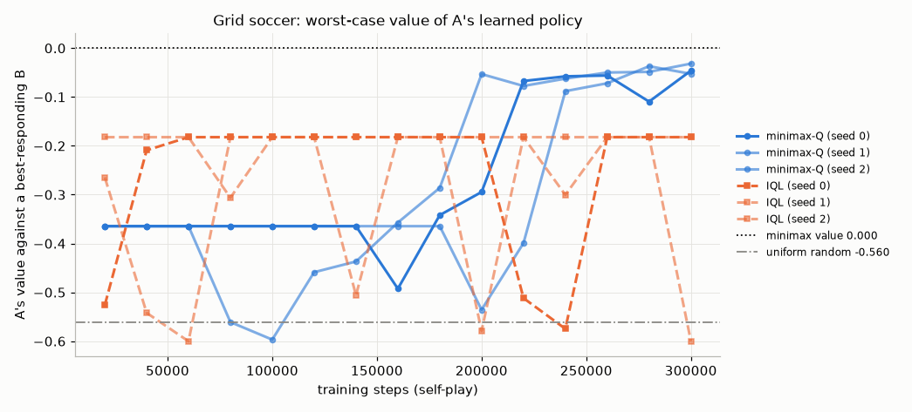

Two lessons. First, **performance against a fixed reasonable opponent hides exploitability.** Against B's equilibrium policy, IQL looks about as good as minimax-Q (−0.003 to −0.024 against −0.007 to −0.009). Against an opponent that knows its policy, it loses 0.18–0.60 goals per kick-off. Its deterministic greedy policy can be read and countered; at best it matches the deterministic version of the equilibrium policy, whose worst case is also −0.182. Second, **minimax-Q is slow but heads to the right place.** Its worst-case value hovers between −0.6 and −0.36 for the first 150k–200k steps, while many joint-action entries are still rarely visited. It then climbs to within 0.03–0.05 of the game value. IQL never does better than −0.18: its worst-case value jumps between −0.18 and −0.60 as its greedy policy changes, and at 300k steps one seed is more exploitable than uniformly random play (−0.60 against −0.56). The price of minimax-Q is its joint-action table, which grows as $|\mathcal S||\mathcal A|^2$: the first sign of the scalability problem of §6.

---

## 5. Learning in games: fictitious play, regret and the equilibria they reach

§4 assumed we could solve a matrix game exactly at every state. What if the players simply *learn*, each adapting to the other's past play? This question, older than RL itself, tells us what to expect from self-play, and it is the foundation of CFR (§10).

### 5.1 Fictitious play

Brown (1951) proposed that each player should best-respond to the *empirical frequency* of its opponent's past actions, as if the opponent were playing a fixed mixed strategy:

```text
Algorithm 5.1  Fictitious play (two players, simultaneous updates)
Input:   payoff matrices A, B (m × n); number of rounds T; initial beliefs x̄_0 ∈ Δ_m, ȳ_0 ∈ Δ_n
Initialise: counts c¹ <- x̄_0, c² <- ȳ_0 (one fictitious round of play)
for t = 1, ..., T:
    a_t <- argmax_i (A ȳ_{t-1})_i               # pure best response to the opponent's empirical mix
    o_t <- argmax_j (x̄_{t-1}ᵀ B)_j              # ties: lowest index
    c¹[a_t] += 1;  c²[o_t] += 1
    x̄_t <- c¹ / Σ c¹;   ȳ_t <- c² / Σ c²
Output: empirical frequencies (x̄_T, ȳ_T); the current play (a_T, o_T) is always pure
```

Robinson (1951) proved that in two-player zero-sum games the empirical frequencies converge to the set of equilibria. Fictitious play also converges in $2\times2$ games (Miyasawa, 1961) and in potential games (Monderer & Shapley, 1996), so it converges in team games. It does **not** converge in general. In Shapley's (1964) $3\times3$ general-sum game it cycles through the off-diagonal cells, and each cycle lasts longer than the one before. Even in zero-sum games convergence can be very slow when ties are broken adversarially (Daskalakis & Pan, 2014). Note that the *current* play of fictitious play is always a pure action, so it never "converges" in the sense of the strategy actually played. Only the averages do.

### 5.2 Regret

Take player $i$'s point of view in a repeated game. At round $t$ it plays $x_t \in \Delta(\mathcal A^i)$, and afterwards it learns the payoff $u_t(a) \doteq u^i(a, \mathbf x_t^{-i})$ that each of its actions would have earned (full-information feedback; [Chapter 02 §12](02-multi-armed-bandits.md) treats bandit feedback with EXP3). The **instantaneous regret** of action $a$ and the **cumulative external regret** are

$$
r_t(a) \doteq u_t(a) - x_t^\top u_t,
\qquad
\mathrm{Reg}_T(a) \doteq \sum_{t=1}^T r_t(a),
\qquad
\mathrm{Reg}_T \doteq \max_a \mathrm{Reg}_T(a).
\tag{5.1}
$$

$\mathrm{Reg}_T$ compares the payoff actually collected with the best *fixed* action in hindsight, against the same opponent behaviour. An algorithm is **no-regret** (Hannan-consistent; Hannan, 1957) if $\limsup_{T\to\infty} \mathrm{Reg}_T/T \le 0$ for *every* sequence of opponent play. Hedge achieves $\mathrm{Reg}_T = O(\sqrt{T\ln|\mathcal A^i|})$ ([Chapter 02](02-multi-armed-bandits.md)). Fictitious play is not no-regret: it is deterministic, and an adversary who simulates it can make it lose every round (Exercise 17.6). Randomisation is essential.

### 5.3 Regret matching and its bound

**Regret matching** (Hart & Mas-Colell, 2000) plays each action with probability proportional to its positive cumulative regret:

$$
x_{t+1}(a) = \frac{[\mathrm{Reg}_t(a)]^+}{\sum_b [\mathrm{Reg}_t(b)]^+}
\quad\text{if the denominator is positive, otherwise uniform},
\tag{5.2}
$$

where $[z]^+ = \max(z, 0)$. It has no step size to tune. **Regret matching+** (RM+; Tammelin, 2014) keeps a clipped regret vector $\mathbf Q_t = [\mathbf Q_{t-1} + \mathbf r_t]^+$ instead, so that it never accumulates "negative regret" that would later have to be paid off, and plays proportionally to $\mathbf Q_t$.

```text
Algorithm 5.2  Regret matching (RM) and regret matching+ (RM+), one player
Input:   action set of size K; regret bound L with |r_t(a)| ≤ L
Initialise: R(a) <- 0 for all a; x_1 arbitrary (e.g. uniform)
for t = 1, 2, ...:
    play x_t; observe the payoff vector u_t (u_t(a) = expected payoff of action a this round)
    r(a) <- u_t(a) - x_tᵀu_t for all a                    # instantaneous regrets, Eq. (5.1)
    R(a) <- R(a) + r(a)                                    # RM+:  R(a) <- max(R(a) + r(a), 0)
    x_{t+1}(a) <- [R(a)]⁺ / Σ_b [R(b)]⁺  (uniform if all R(b) ≤ 0)      # Eq. (5.2)
Output: the time-averaged strategy x̄_T = (1/T) Σ_t x_t
```

**Theorem (regret-matching bound).** If $|r_t(a)| \le L$ for all $t$ and $a$, regret matching guarantees, against any opponent behaviour,

$$
\mathrm{Reg}_T \le L\sqrt{|\mathcal A^i|\,T},
\qquad\text{so}\qquad
\frac{\mathrm{Reg}_T}{T} \le L\sqrt{\frac{|\mathcal A^i|}{T}} \to 0 .
\tag{5.3}
$$

*Proof.* Let $\mathbf R_t$ be the vector of cumulative regrets, so $\mathbf R_t = \mathbf R_{t-1} + \mathbf r_t$, and let $\mathbf R_t^+$ be its positive part. We track the potential $\lVert\mathbf R_t^+\rVert_2^2$.

1. *Clipping can only help.* $\mathbf R_{t-1} \le \mathbf R^+_{t-1}$ componentwise and $z \mapsto [z]^+$ is monotone, so $0 \le \mathbf R_t^+ = [\mathbf R_{t-1} + \mathbf r_t]^+ \le [\mathbf R^+_{t-1} + \mathbf r_t]^+$. Since $\lVert[\mathbf z]^+\rVert \le \lVert\mathbf z\rVert$,

$$
\lVert\mathbf R_t^+\rVert^2 \le \lVert\mathbf R^+_{t-1} + \mathbf r_t\rVert^2 = \lVert\mathbf R^+_{t-1}\rVert^2 + 2\,\mathbf R^+_{t-1}\cdot\mathbf r_t + \lVert\mathbf r_t\rVert^2 .
$$

2. *The cross term vanishes* (this is Blackwell's approachability condition, and it is the whole point of (5.2)). Let $W = \sum_b [\mathrm{Reg}_{t-1}(b)]^+$. If $W = 0$ then $\mathbf R^+_{t-1} = \mathbf 0$. Otherwise $x_t = \mathbf R^+_{t-1}/W$, and

$$
\mathbf R^+_{t-1}\cdot\mathbf r_t = \sum_a [\mathrm{Reg}_{t-1}(a)]^+\big(u_t(a) - x_t^\top u_t\big) = W\,x_t^\top u_t - W\,x_t^\top u_t = 0 .
$$

3. *Telescope.* Hence $\lVert\mathbf R_t^+\rVert^2 \le \lVert\mathbf R_{t-1}^+\rVert^2 + \lVert\mathbf r_t\rVert^2$, and summing from $\mathbf R^+_0 = \mathbf 0$ gives $\lVert\mathbf R_T^+\rVert^2 \le \sum_t\lVert\mathbf r_t\rVert^2 \le T\,|\mathcal A^i|\,L^2$.

4. *Conclude.* $\mathrm{Reg}_T = \max_a \mathrm{Reg}_T(a) \le \max_a [\mathrm{Reg}_T(a)]^+ \le \lVert\mathbf R^+_T\rVert_2 \le L\sqrt{|\mathcal A^i|T}$. $\square$

For RM+, the same steps apply to $\mathbf Q_t$. Step 2 holds because $x_t \propto \mathbf Q_{t-1}$, and $\lVert\mathbf Q_t\rVert^2 \le \lVert\mathbf Q_{t-1} + \mathbf r_t\rVert^2$ because clipping shrinks the norm. Finally $\mathbf Q_T \ge \mathbf R_T$ componentwise, because clipping only ever adds. So RM+ satisfies the same bound (5.3).

### 5.4 No-regret play converges to coarse correlated equilibria

Suppose all $N$ players use no-regret algorithms against each other. Let

$$
P_T \doteq \frac1T\sum_{t=1}^T x^1_t\otimes x^2_t\otimes\cdots\otimes x^N_t
\tag{5.4}
$$

be the empirical distribution of joint play: the time average of the product distributions actually used. For any player $i$ and any fixed deviation $a'$, the definition of regret and the linearity of expectation give

$$
\begin{aligned}
\frac1T\mathrm{Reg}^i_T(a') &= \frac1T\sum_{t=1}^T\Big[u^i(a', \mathbf x^{-i}_t) - u^i(\mathbf x_t)\Big] \\
&= \frac1T\sum_{t=1}^T\;\mathbb E_{\mathbf a\sim\otimes_j x^j_t}\Big[u^i(a', a^{-i}) - u^i(\mathbf a)\Big] \\
&= \mathbb E_{\mathbf a\sim P_T}\big[u^i(a', a^{-i})\big] - \mathbb E_{\mathbf a\sim P_T}\big[u^i(\mathbf a)\big] .
\end{aligned}
\tag{5.5}
$$

The last line is exactly the gain from the deviation $a'$ in the CCE condition (3.5). Hence:

**Theorem.** If every player's average regret is at most $\epsilon_T$, then $P_T$ is an $\epsilon_T$-coarse correlated equilibrium. If all players are no-regret, $P_T$ converges to the set of CCE.

If players sample actions instead of playing expectations, the empirical frequency of the sampled joint actions satisfies the same statement up to an extra $O(1/\sqrt T)$ martingale term. Two things are worth noticing. First, it is the **joint** distribution $P_T$ that converges, not the strategies $x^i_t$ or their marginal averages. Second, the guarantee is *uncoupled*: no player needs to know the others' payoffs. The same argument with **swap (internal) regret** gives correlated equilibria. Swap regret compares with the best *swap function* $\phi:\mathcal A^i\to\mathcal A^i$ ("whenever I played $a$, I should have played $\phi(a)$"). Algorithms with vanishing swap regret exist (Foster & Vohra, 1997; Hart & Mas-Colell, 2000, whose original procedure regret-matched on such conditional regrets; Blum & Mansour, 2007, give a general reduction from external regret), and under them $P_T$ converges to the set of CE.

### 5.5 In zero-sum games the averages converge to Nash, which proves the minimax theorem again

In a two-player zero-sum game, let both players be no-regret, with $\bar{\mathbf x}_T = \frac1T\sum_t\mathbf x_t$ and $\bar{\mathbf y}_T = \frac1T\sum_t\mathbf y_t$. Write out each player's regret. The row player receives $\mathbf x_t^\top\mathbf A\mathbf y_t$, and the column player receives $-\mathbf x_t^\top\mathbf A\mathbf y_t$:

$$
\begin{aligned}
\mathrm{Reg}^1_T &= \max_i\sum_t(\mathbf A\mathbf y_t)_i - \sum_t\mathbf x_t^\top\mathbf A\mathbf y_t = T\max_i(\mathbf A\bar{\mathbf y}_T)_i - \sum_t\mathbf x_t^\top\mathbf A\mathbf y_t ,\\
\mathrm{Reg}^2_T &= \max_j\sum_t\big(-\mathbf x_t^\top\mathbf A\big)_j + \sum_t\mathbf x_t^\top\mathbf A\mathbf y_t = -T\min_j(\bar{\mathbf x}_T^\top\mathbf A)_j + \sum_t\mathbf x_t^\top\mathbf A\mathbf y_t .
\end{aligned}
$$

Adding the two lines cancels the realised payoffs. By (3.7),

$$
\mathrm{NashConv}(\bar{\mathbf x}_T, \bar{\mathbf y}_T) = \max_i(\mathbf A\bar{\mathbf y}_T)_i - \min_j(\bar{\mathbf x}_T^\top\mathbf A)_j = \frac{\mathrm{Reg}^1_T + \mathrm{Reg}^2_T}{T}.
\tag{5.6}
$$

So **the time-averaged strategies of no-regret learners form an $\epsilon$-Nash equilibrium with $\epsilon = (\mathrm{Reg}^1_T + \mathrm{Reg}^2_T)/T$**. With regret matching, (5.3) gives $\mathrm{NashConv} \le 2L\sqrt{|\mathcal A|/T}$, where $|\mathcal A|$ is the larger action set.

*The minimax theorem as a corollary* (Freund & Schapire, 1999). For every $T$,

$$
\min_{\mathbf y}\max_{\mathbf x}\mathbf x^\top\mathbf A\mathbf y \;\le\; \max_i(\mathbf A\bar{\mathbf y}_T)_i \;\overset{(5.6)}{\le}\; \min_j(\bar{\mathbf x}_T^\top\mathbf A)_j + \epsilon_T \;\le\; \max_{\mathbf x}\min_{\mathbf y}\mathbf x^\top\mathbf A\mathbf y + \epsilon_T .
$$

The existence of no-regret algorithms (§5.3) was proved without the minimax theorem, so letting $T\to\infty$ gives $\min\max \le \max\min$. Weak duality gives the reverse inequality. $\square$

This is the theoretical backbone of game solving by self-play: **run no-regret learners against each other and output the average.** CFR (§10) does precisely this in extensive-form games.

### 5.6 The iterates themselves cycle, and optimism fixes it

The theorem says nothing about the strategies actually played, $(\mathbf x_t, \mathbf y_t)$. They typically **do not converge**. The cleanest example is gradient play on the bilinear game $f(x,y) = xy$ ($x$ maximises, $y$ minimises; the equilibrium is $(0,0)$). Simultaneous gradient ascent–descent with step $\eta$,

$$
x_{t+1} = x_t + \eta y_t,\qquad y_{t+1} = y_t - \eta x_t ,
$$

satisfies

$$
x_{t+1}^2 + y_{t+1}^2 = (x_t + \eta y_t)^2 + (y_t - \eta x_t)^2 = (1+\eta^2)(x_t^2 + y_t^2),
$$

so it spirals *outward* for every $\eta > 0$. In the probability simplex, the continuous-time limit of Hedge is the **replicator dynamics** $\dot x_i = x_i[(\mathbf A\mathbf y)_i - \mathbf x^\top\mathbf A\mathbf y]$, $\dot y_j = y_j[\mathbf x^\top\mathbf A\mathbf y - (\mathbf x^\top\mathbf A)_j]$. Suppose the equilibrium $(\mathbf x^\ast, \mathbf y^\ast)$ has full support, so that $\mathbf A\mathbf y^\ast = v\mathbf 1$ and $\mathbf x^{\ast\top}\mathbf A = v\mathbf 1^\top$. Then the "distance" $H = D_{\mathrm{KL}}(\mathbf x^\ast\Vert\mathbf x) + D_{\mathrm{KL}}(\mathbf y^\ast\Vert\mathbf y)$ is conserved:

$$
\begin{aligned}
\frac{dH}{dt} &= -\sum_i x^\ast_i\frac{\dot x_i}{x_i} - \sum_j y^\ast_j\frac{\dot y_j}{y_j}
= -\big(\mathbf x^{\ast\top}\mathbf A\mathbf y - \mathbf x^\top\mathbf A\mathbf y\big) - \big(\mathbf x^\top\mathbf A\mathbf y - \mathbf x^\top\mathbf A\mathbf y^\ast\big) \\
&= \mathbf x^\top\mathbf A\mathbf y^\ast - \mathbf x^{\ast\top}\mathbf A\mathbf y = v - v = 0 .
\end{aligned}
$$

Trajectories therefore orbit the equilibrium on closed level sets and never approach it. This conservation is the reason behind the recurrence results of Mertikopoulos, Papadimitriou & Piliouras (2018). Discretisation adds a little energy at every step, so discrete multiplicative weights drifts *away* from interior equilibria (Bailey & Piliouras, 2018), just as gradient play did above.

**Optimism** cures this. Optimistic Hedge (OMWU; Algorithm 5.3) plays as if the next payoff will equal the last one: $x_{t+1} \propto \exp\big(\eta(\sum_{s\le t}u_s + u_t)\big)$, which counts the most recent payoff twice. In two-player zero-sum games its average converges at rate $O(1/T)$ rather than $O(1/\sqrt T)$ (Rakhlin & Sridharan, 2013; Syrgkanis et al., 2015). Its *last iterate* converges too, when the equilibrium is unique (Daskalakis & Panageas, 2019). The same trick, optimistic gradient descent–ascent, stabilises GAN training (Daskalakis et al., 2018). Exercise 17.7 works through the bilinear case.

```text
Algorithm 5.3  Hedge (multiplicative weights) and optimistic Hedge (OMWU), one player
Input:   action set of size K; prior x_1 with full support (e.g. uniform);
         step sizes η_t > 0 (Hedge: e.g. η_t = 1/√t; OMWU: a constant η)
Initialise: U(a) <- 0 for all a                          # cumulative payoff of each action
for t = 1, 2, ...:
    play x_t; observe the payoff vector u_t
    U(a) <- U(a) + u_t(a) for all a
    Hedge:  x_{t+1}(a) <- x_1(a) exp(η_t U(a))           / Σ_b x_1(b) exp(η_t U(b))
    OMWU:   x_{t+1}(a) <- x_1(a) exp(η (U(a) + u_t(a)))  / Σ_b x_1(b) exp(η (U(b) + u_t(b)))
Output: Hedge: the average x̄_T.  OMWU: the average, or the last iterate when the game is
        two-player zero-sum with a unique equilibrium
```

### 5.7 Experiment: averages converge, iterates cycle

[`no_regret_dynamics.py`](../code/ch17_multi_agent_rl/no_regret_dynamics.py) runs each algorithm in self-play for $T = 10^5$ rounds with full-information feedback, from the non-equilibrium starts $\mathbf x_1 = (0.6, 0.3, 0.1)$ and $\mathbf y_1 = (0.2, 0.2, 0.6)$ (in matching pennies, $(0.8, 0.2)$ and $(0.3, 0.7)$). Hedge uses $\eta_t = 1/\sqrt t$ and OMWU a constant $\eta = 0.1$.

| | NashConv of averages at $T = 10^5$ (MP / RPS / weighted RPS) | log–log slope | NashConv of current iterates (median of last 10%) |
|---|---|---|---|
| Fictitious play | 4.5e−3 / 6.1e−3 / 7.0e−3 | −0.48 to −0.50 | 2.00 / 2.00 / 2.00 (pure strategies) |
| Regret matching | 5.0e−3 / 5.8e−3 / 7.4e−3 | −0.50 | 1.96 / 1.66 / 1.92 |
| RM+ | 2.4e−3 / 1.6e−3 / 3.3e−3 | −0.51 | 1.19 / 0.97 / 0.96 |
| Hedge ($\eta_t = 1/\sqrt t$) | 2.8e−3 / 4.2e−3 / 3.8e−3 | −0.50 to −0.51 | 0.48 / 0.018 / 0.074 |
| Optimistic Hedge ($\eta = 0.1$) | 1.1e−4 / 1.3e−4 / 1.3e−4 | −1.00 | $<2\times10^{-15}$ (converged) |

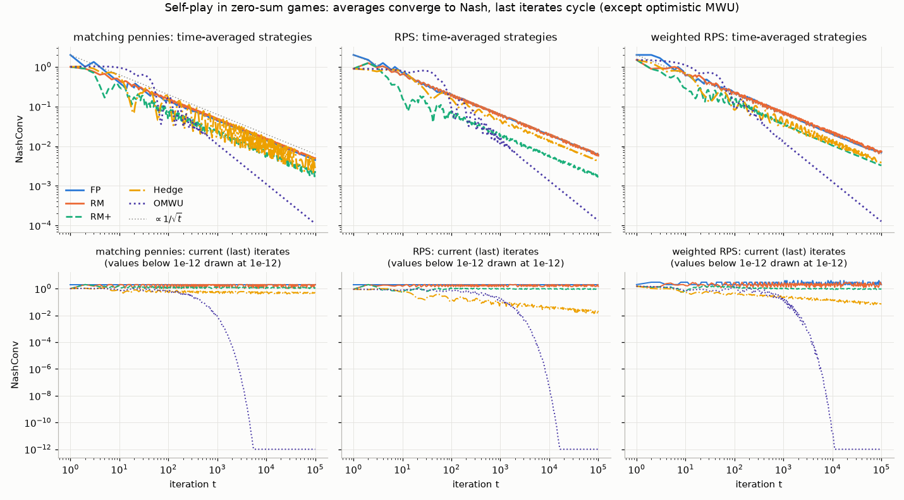

The no-regret learners' averages converge at the $1/\sqrt t$ rate guaranteed by (5.3) and (5.6), except OMWU's, which converge at rate $1/t$. Fictitious play has no such guarantee; it happens to show the same rate here. That it always does so in zero-sum games is Karlin's conjecture, and with adversarial tie-breaking it can be much slower (Daskalakis & Pan, 2014). (Our fictitious play counts the starting strategies as one fictitious round of prior play, as in Algorithm 5.1, so even its first move is a pure best response.) The measured average regret of the RM row player in RPS, $3.2\times10^{-3}$, is well inside the bound $L\sqrt{|\mathcal A|/T} = 2\sqrt{3/10^5} = 1.1\times10^{-2}$. The current iterates tell a different story. Fictitious play's are pure, and RM's keep jumping between faces of the simplex. Hedge's, with a decreasing step, drift slowly toward the equilibrium in the RPS games (NashConv 0.018 and 0.074 after $10^5$ rounds) but not in matching pennies (0.48). This does not contradict §5.6: Bailey & Piliouras analyse a constant step size, whereas here $\eta_t = 1/\sqrt t$ shrinks the effective step, so the energy injected per step decays, and whether the iterate then drifts in or out depends on the game. Hedge has no general last-iterate guarantee. OMWU's iterates converge to machine precision within about $10^4$ rounds. The simplex picture for weighted RPS shows the same thing geometrically: the thick average curves home in on $(\tfrac14, \tfrac12, \tfrac14)$ while the thin current-iterate curves orbit.

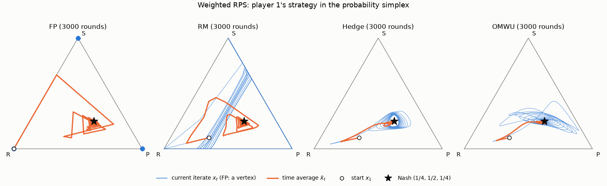

**Shapley's game: CCE, not Nash.** In Shapley's $3\times3$ general-sum game the unique Nash equilibrium is uniform and pays each player $1/3$. After $10^5$ rounds of self-play the CCE gap of $P_T$ (the largest gain from a fixed deviation) is $8.5\times10^{-5}$ for RM and $9.0\times10^{-5}$ for fictitious play, still falling roughly like $t^{-0.9}$ (fitted log–log slopes −0.88 and −0.89 over $t\in[10^3, 10^5]$), much faster in this run than the $O(1/\sqrt t)$ worst-case guarantee of §5.4; for Hedge it is $3.0\times10^{-3}$. Yet the marginal averages stay far from Nash (NashConv 0.28–0.29 for all three methods), and $P_T$ is not a CE either (CE gaps 0.12–0.15). Play concentrates on the off-diagonal cells, where the payoffs sum to 1, so each player earns 0.44–0.56 against $1/3$ at the Nash equilibrium. The "equilibrium" that no-regret play reaches can be better than Nash for everyone, and it is not a product of independent strategies.

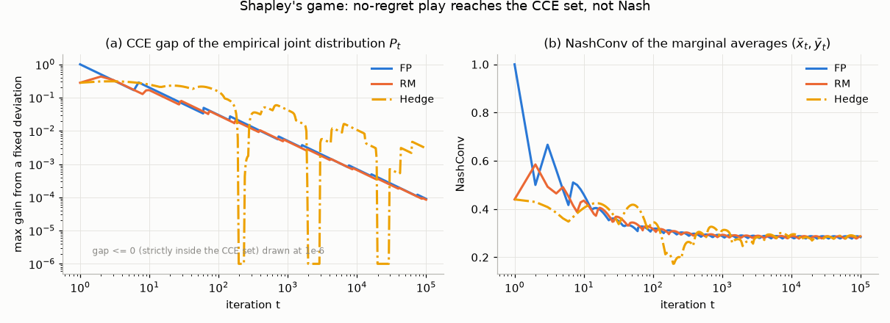

---

## 6. The four challenges of MARL, and independent learners

### 6.1 Nonstationarity

Equation (2.3) said it: to agent $i$, the other agents are part of the transition and reward functions. If they learn, agent $i$'s MDP drifts. Q-learning's convergence proof ([Chapter 05](05-temporal-difference.md), [Chapter 19](19-rl-theory.md)) needs a fixed MDP, so it no longer applies. Even the target of learning is unclear, because the best response keeps moving. Experience replay ([Chapter 09](09-deep-q-learning.md)) makes this worse: the buffer holds transitions generated by the *old* partners, so it describes an environment that no longer exists. Foerster et al. (2017) addressed this by conditioning each agent's value network on a "fingerprint" of the other agents' training stage, such as the training iteration and exploration rate, or by importance-weighting old samples.

### 6.2 Credit assignment

In a team game every agent receives the same reward $R_{t+1}$. If the team scores, who deserves credit? From agent $i$'s point of view, the reward is the sum of its own contribution and the noise generated by everyone else's actions and exploration. §8.3 shows that the variance of agent $i$'s policy-gradient estimate grows at least linearly with the number of agents (quadratically without a baseline), while its signal stays constant. Methods that assign credit, such as difference rewards $R(\mathbf a) - R(c^i, a^{-i})$ with a default action $c^i$ (Wolpert & Tumer, 2001), counterfactual baselines (COMA, §8.3) and learned value decompositions (§7), all try to isolate agent $i$'s contribution.

### 6.3 Equilibrium selection and miscoordination

Even when every agent knows the payoff matrix, coordination can fail. In the **penalty game** (§2.1) both (a, a) and (c, c) are optimal, but if agent 1 settles on a and agent 2 on c, they receive $k = -100$. Nothing in the payoffs breaks the symmetry. Conventions, communication (§11), a shared random seed, or centralised training are needed. In the **climbing game** the difficulty is subtler. Learners are attracted to a *suboptimal* equilibrium because, while the partner is still exploring, the optimal action looks bad on average. This is called **relative overgeneralisation** (a term from cooperative coevolution; see Panait, Luke & Wiegand, 2006) or **shadowed equilibria**. We work through it by hand below.

### 6.4 Scalability

The joint action space has $\prod_i|\mathcal A^i|$ elements, exponential in $N$. A centralised Q-table or Q-network output layer over joint actions, and the $\max$ in a centralised TD target, become intractable beyond a handful of agents. Minimax-Q in §4 already paid $|\mathcal A|^2$ per state. Value factorisation (§7) and per-agent policies (§8) are the standard escapes: they keep per-agent objects whose size is linear in $N$.

### 6.5 Independent Q-learning

The simplest approach ignores all four problems. **Independent Q-learning** (IQL; Tan, 1993) gives each agent its own Q-learner over its own observations and actions, treating the others as part of the environment. After a transition in which agent $i$ observed $o^i$, took $a^i$, received $R^i_{t+1}$ and then observed $o'^i$, it updates

$$
Q^i(o^i,a^i) \leftarrow Q^i(o^i,a^i) + \alpha\Big(R^i_{t+1} + \gamma\max_b Q^i(o'^i,b) - Q^i(o^i,a^i)\Big),
\tag{6.1}
$$

with the target $R^i_{t+1}$ alone if the episode terminated (but not if it was merely cut off by a time limit).

```text
Algorithm 6.1  Independent Q-learning (IQL), N agents
Input:   step size α, exploration schedule ε_t, discount γ
Initialise: Q^i(o, a) <- 0 for every agent i (tables; or one network per agent,
            or one shared network that also receives the agent's index)
Loop for each step:
    each agent i observes o^i and chooses a^i ε-greedily from Q^i(o^i, ·)
    execute the joint action; agent i receives r^i and next observation o'^i
    for each agent i:
        target^i <- r^i                                 if the episode terminated
                    r^i + γ max_b Q^i(o'^i, b)          otherwise (also on time-limit truncation)
        Q^i(o^i, a^i) <- Q^i(o^i, a^i) + α (target^i − Q^i(o^i, a^i))            # Eq. (6.1)
        # hysteretic variant (§6.6): use step α if target^i ≥ Q^i(o^i, a^i), else a smaller β < α
```

IQL often works surprisingly well, and with deep networks it can learn cooperative and competitive behaviour in Pong (Tampuu et al., 2017). It is also the baseline that every MARL method must beat. Its pathologies are easiest to see in a one-step game. There (6.1) becomes $Q^i(a^i) \leftarrow Q^i(a^i) + \alpha\big(r - Q^i(a^i)\big)$, so $Q^i(a^i)$ tracks $\mathbb E[r \mid a^i]$ *under the partner's current behaviour*, the induced reward $r^{i,\pi^{-i}}(a^i)$ of (2.3).

**Worked example: why independent learners climb to the wrong peak.** In the climbing game (rows: agent 1; columns: agent 2)

$$
\begin{array}{c|ccc}
 & a & b & c\\ \hline
a & 11 & -30 & 0\\
b & -30 & 7 & 6\\
c & 0 & 0 & 5
\end{array}
$$

suppose both agents start by exploring uniformly. Agent 1's action values approach the row means:

$$
Q^1(a) \to \tfrac{11 - 30 + 0}{3} = -6.33,\qquad Q^1(b) \to \tfrac{-30 + 7 + 6}{3} = -5.67,\qquad Q^1(c) \to \tfrac{0+0+5}{3} = 1.67 .
$$

Agent 2's approach the column means: $Q^2(a) \to -6.33$, $Q^2(b) \to -7.67$, $Q^2(c) \to 3.67$. Both agents prefer $c$, because $c$ is *safe* against a random partner, and the pair settles on (c, c), worth 5. From there, best-response dynamics "climb". Against $c$, agent 1 prefers $b$ ($6 > 5$), reaching (b, c). Against $b$, agent 2 prefers $b$ ($7 > 6$), reaching (b, b), a Nash equilibrium worth 7, where the climb stops. The optimum (a, a), worth 11, is surrounded by $-30$ penalties. It is reachable only if *both* agents try $a$ at the same time, often enough to outweigh what they learned while the partner explored. The optimal action is "shadowed" by miscoordination penalties.

### 6.6 Experiment: centralised and independent learners on cooperative matrix games

[`cooperative_matrix_games.py`](../code/ch17_multi_agent_rl/cooperative_matrix_games.py) runs 1000 independent runs of 5000 steps per learner and game. All learners use stateless Q-learning with $\alpha = 0.1$. ε-greedy learners use $\varepsilon_t = \max(0.01, 0.998^t)$, and the Boltzmann learners a temperature $T_{B,t} = \max(0.05, 20\times0.997^t)$. *Central* is one learner over the 9 joint actions. *JAL* are Claus & Boutilier's (1998) joint-action learners: each agent learns $Q^i(a^1, a^2)$ from observed joint actions, models the partner by its empirical action frequencies, and acts on the expected value. *Hysteretic* learners (Matignon, Laurent & Le Fort-Piat, 2007) use step size 0.1 for positive TD errors and 0.01 for negative ones. The partially stochastic climbing game (Kapetanakis & Kudenko, 2002) pays 14 or 0 with equal probability for (b, b), so the mean is still 7.

| Learner | climbing: P(optimal) | penalty ($k = -100$): P(optimal) | stochastic climbing: P(optimal) |
|---|---|---|---|
| central (joint actions) | 1.000 | 1.000 (aa 48.5%, cc 51.5%) | 1.000 |
| JAL | 0.000 (bc 96.6%) | 0.000 (bb 100%) | 0.000 (bc 94.2%) |
| IQL, ε-greedy | 0.000 (cc 89.8%, bc 10.2%) | 0.000 (bb 100%) | 0.000 (cc 89.8%) |
| IQL, Boltzmann | 0.130 (bb 78.3%) | 0.892 | 0.152 (bc 84.2%) |
| hysteretic IQL | 0.891 (bb 10.9%) | 0.941 | 0.617 (bb 38.3%) |

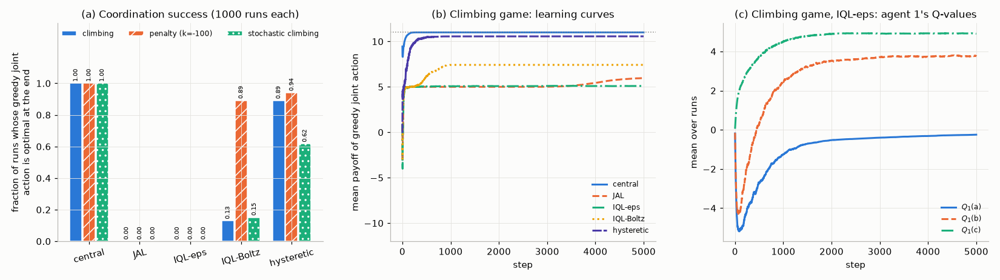

* **The centralised learner always succeeds.** It is just a 9-armed bandit, and in the penalty game its joint choice of (a, a) or (c, c) is automatically consistent.
* **Independent ε-greedy learners reproduce the worked example.** Panel (c) shows agent 1's average $Q^1(a)$ dropping to about $-5$ during early exploration while $Q^1(c)$ rises toward 5. At the end 89.8% of the runs sit at (c, c) and 10.2% have started the climb to (b, c); the climb is slow because $Q^1(b)$ was learned while the partner explored, and with $\varepsilon = 0.01$ it is revisited only about once every 300 steps. In the penalty game, $a$ and $c$ are worth $(10 + 0 - 100)/3 = -30$ against a random partner, against $2/3$ for $b$, so every run settles on the safe, poor (b, b).
* **Observing the partner's action is not enough.** Joint-action learners have *exact* joint Q-values, but they best-respond to the partner's empirical frequencies, which are dominated by early exploration.
* **Optimism helps until rewards are noisy.** Hysteretic learners mostly ignore the low rewards caused by the partner's exploration and find (a, a) in 89% of the climbing runs and 94% of the penalty runs. But optimism cannot tell bad luck from bad coordination: in the stochastic climbing game the lucky 14s from (b, b) look better than (a, a)'s 11, and success falls to 62%. Exercise 17.12 pushes this to the extreme with fully optimistic distributed Q-learning (Lauer & Riedmiller, 2000).

---

## 7. Centralised training with decentralised execution: value decomposition

### 7.1 The CTDE paradigm

Training usually happens in a simulator, where we can see everything: the global state, every agent's observations and actions, and the team reward. Execution must be decentralised: at test time each agent acts on its own action–observation history $\tau^i$, often without communication. **Centralised training with decentralised execution** (CTDE; articulated in the Dec-POMDP planning literature by Oliehoek, Spaan & Vlassis, 2008, and popularised for deep MARL by Foerster et al. and Lowe et al. in 2016–2018) exploits this asymmetry. Anything may be used to *train*, including critics or mixing networks that see the global state $s$ and the joint action. But the *policies* that are deployed take only local inputs. Two practical ingredients appear almost everywhere. **Parameter sharing**: all agents use one network, with the agent's index as an extra input, which multiplies the data per parameter by $N$. **Recurrent agent networks** over $\tau^i$, because of partial observability.

### 7.2 Factorisation and the IGM principle

For value-based CTDE we want a joint action-value $Q_{tot}(\boldsymbol\tau, \mathbf a)$ for training and per-agent utilities $Q_i(\tau^i, a^i)$ for execution, consistent in the following sense (**Individual-Global-Max**, IGM; named by Son et al., 2019): the joint action formed from the agents' individual greedy actions maximises $Q_{tot}$,

$$
\big(\bar a^1,\dots,\bar a^N\big) \in \arg\max_{\mathbf a} Q_{tot}(\boldsymbol\tau, \mathbf a)
\qquad\text{whenever}\qquad \bar a^i \in \arg\max_{a^i}Q_i(\tau^i, a^i)\;\text{ for every } i .
\tag{7.1}
$$

Son et al. state IGM as an equality of arg max sets. With unique maximisers the two statements coincide; with ties the inclusion (7.1) is what decentralised greedy execution needs.

IGM buys two things. Each agent can act greedily on its own utility and the team still takes the joint greedy action. And the maximisation in the TD target, $\max_{\mathbf a'}Q_{tot}(\boldsymbol\tau', \mathbf a')$, costs $O(N|\mathcal A|)$ instead of $O(|\mathcal A|^N)$. Note that the $Q_i$ are *utilities*, not action values of any well-defined individual MDP. Their scale has no meaning by itself.

### 7.3 VDN

**Value-decomposition networks** (VDN; Sunehag et al., 2018) use the simplest factorisation that satisfies IGM, a sum:

$$
Q_{tot}(\boldsymbol\tau, \mathbf a) = \sum_{i=1}^N Q_i(\tau^i, a^i).
\tag{7.2}
$$

The sum is trained end to end with the DQN loss on the *team* reward. The gradient of the TD error flows back through the sum into every agent's network, so credit is assigned implicitly. IGM holds because the maximum of a sum of functions of separate variables is attained by maximising each term.

**Worked example: VDN on the climbing game.** Fit (7.2) to a one-step game by least squares, with every joint action weighted equally (uniform exploration). Write $R(a^1,a^2)$ for the payoff, $n = 3$ actions, $\bar R_{a^1\cdot}$ and $\bar R_{\cdot a^2}$ for row and column means, and $\bar R$ for the grand mean. Setting the derivative of $\sum_{a^1, a^2}\big(q_1(a^1) + q_2(a^2) - R(a^1,a^2)\big)^2$ with respect to $q_1(a^1)$ to zero gives $q_1(a^1) = \bar R_{a^1\cdot} - \frac1n\sum_{b}q_2(b)$, and similarly for $q_2$. Substituting,

$$
Q_{tot}(a^1, a^2) = \bar R_{a^1\cdot} + \bar R_{\cdot a^2} - \bar R .
\tag{7.3}
$$

This is the "main effects" model of a two-way ANOVA. Each agent's greedy action is the arg max of its row or column means, which is exactly what independent learners facing a uniformly random partner compute (§6.5). For the climbing game the row means are $(-6.33, -5.67, 1.67)$, the column means $(-6.33, -7.67, 3.67)$ and $\bar R = -3.44$. VDN therefore picks (c, c) and predicts $Q_{tot}(c,c) = 1.67 + 3.67 + 3.44 = 8.78$ (true value 5) and $Q_{tot}(a,a) = -9.22$ (true value 11). [`value_decomposition.py`](../code/ch17_multi_agent_rl/value_decomposition.py) reproduces these numbers by gradient descent in all 6 seeds.

### 7.4 QMIX

**QMIX** (Rashid et al., 2018) replaces the sum by a learned, state-dependent **monotonic** mixing function:

$$
Q_{tot}(\boldsymbol\tau, \mathbf a) = f_{mix}\big(Q_1(\tau^1,a^1),\dots,Q_N(\tau^N,a^N);\, s\big),
\qquad
\frac{\partial Q_{tot}}{\partial Q_i} \ge 0 \;\;\text{for all } i .
\tag{7.4}
$$

*Monotonicity implies IGM.* Let $\bar a^i$ maximise $Q_i$. For any joint action $\mathbf a$, $Q_i(\tau^i, \bar a^i) \ge Q_i(\tau^i, a^i)$ for every $i$. Since $f_{mix}$ is non-decreasing in each argument, raising the arguments one at a time gives $f_{mix}(Q_1(\bar a^1), \dots, Q_N(\bar a^N)) \ge f_{mix}(Q_1(a^1),\dots,Q_N(a^N))$. So $(\bar a^1,\dots,\bar a^N) \in \arg\max_{\mathbf a} Q_{tot}$, which is (7.1). (Because the monotonicity is not strict, $Q_{tot}$ may have further maximisers; that is why (7.1) is an inclusion.) $\square$

In the architecture, each agent network is a GRU over $\tau^i$ (with the previous action and agent index as inputs, and shared parameters) that outputs $Q_i(\tau^i,\cdot)$. The mixing network is a two-layer network applied to the vector $(Q_1,\dots,Q_N)$. Its weights are produced by **hypernetworks** that take the global state $s$, and they pass through an absolute value to make them non-negative. Its biases are unconstrained (the last one is a small state-value network). Non-negative weights and a monotone activation (ELU) give (7.4). The global state enters only through the hypernetworks, so it can shape the mixing arbitrarily without ever being needed at execution time.

```text
Algorithm 7.1  QMIX (Rashid et al., 2018)
Input:   agent network Q_θ(τ^i, ·) (GRU, parameters shared across agents); mixing network f_ψ
         whose weights are |hypernet_ψ(s)|; replay buffer D of episodes; target parameters θ⁻, ψ⁻;
         exploration ε; discount γ; target update period C
Loop for each episode:
    reset hidden states; for t = 0, 1, ... until the episode ends:
        each agent i picks a^i ε-greedily from Q_θ(τ^i_t, ·) using only its own history τ^i_t
        execute the joint action; record (s_t, o_t, a_t, r_{t+1}, s_{t+1}, o_{t+1}, terminated)
    store the episode in D
    sample a batch of episodes from D; unroll the agent networks over each episode
    for every step t in the batch:
        y_t <- r_{t+1}                                                       if terminated
               r_{t+1} + γ f_ψ⁻( max_b Q_θ⁻(τ^1_{t+1}, b), ..., max_b Q_θ⁻(τ^N_{t+1}, b); s_{t+1} )   otherwise
        Q_tot,t <- f_ψ( Q_θ(τ^1_t, a^1_t), ..., Q_θ(τ^N_t, a^N_t); s_t )
    take a gradient step on Σ_t (y_t − Q_tot,t)² with respect to θ and ψ               # Eq. (7.5)
    every C updates: θ⁻ <- θ, ψ⁻ <- ψ
```

The loss is the ordinary TD loss on the mixed value,

$$
\mathcal L(\theta, \psi) = \mathbb E_{\mathcal D}\Big[\big(y_t - Q_{tot}(\boldsymbol\tau_t, \mathbf a_t; \theta, \psi)\big)^2\Big].
\tag{7.5}
$$

The max over joint actions in $y_t$ decomposes into per-agent maxima, by IGM. QMIX became the standard baseline on the StarCraft Multi-Agent Challenge (Samvelyan et al., 2019), and later re-implementations with careful tuning found it still very competitive (Hu et al., 2021).

**What monotonic mixing cannot represent.** Monotonicity forces every agent to rank its own actions the same way *whatever the others do*. Suppose $Q_{tot}(a^1, a^2) = f(q_1(a^1), q_2(a^2))$ with $f$ non-decreasing reproduced the climbing game exactly. In row $a$, $Q_{tot}(a,a) = 11 > Q_{tot}(a,b) = -30$ requires $q_2(a) > q_2(b)$, since otherwise monotonicity would give $f(q_1(a), q_2(a)) \le f(q_1(a), q_2(b))$. In row $b$, $Q_{tot}(b,a) = -30 < Q_{tot}(b,b) = 7$ requires $q_2(a) < q_2(b)$. This is a contradiction, so no monotonic factorisation fits the climbing game. The same argument applies to the non-monotonic game used to motivate QTRAN, with payoff 8 on (A, A), $-12$ elsewhere in row A and column A, and 0 elsewhere (Exercise 17.9). This is the fully cooperative analogue of relative overgeneralisation: whether agent 2's action A is good depends on agent 1's action.

### 7.5 Beyond monotonicity: QTRAN, QPLEX and Weighted QMIX

* **QTRAN** (Son et al., 2019) learns an *unrestricted* joint $Q_{jt}$ alongside the sum $\sum_iQ_i$ and a state-value correction $V_{jt}$. It proves that the $Q_i$ satisfy IGM for $Q_{jt}$ if $\sum_iQ_i(\tau^i,a^i) - Q_{jt}(\boldsymbol\tau,\mathbf a) + V_{jt}(\boldsymbol\tau)$ is zero at the greedy joint action and non-negative everywhere else. These conditions are imposed as soft penalties. The function class is the full IGM class, but the penalties are hard to optimise, and QTRAN has been reported to perform poorly on complex SMAC maps.
* **QPLEX** (Wang et al., 2021) writes IGM in *advantage* form with a "duplex dueling" architecture. The individual utilities are first transformed with positive weights and biases that depend on the joint history, $Q_i(\boldsymbol\tau, a^i) = w_i(\boldsymbol\tau)Q_i(\tau^i,a^i) + b_i(\boldsymbol\tau)$ with $w_i > 0$, and split into $V_i(\boldsymbol\tau) = \max_b Q_i(\boldsymbol\tau, b)$ and advantages $A_i(\boldsymbol\tau, a^i) = Q_i(\boldsymbol\tau, a^i) - V_i(\boldsymbol\tau) \le 0$, which vanish at agent $i$'s greedy action. Then $Q_{tot}(\boldsymbol\tau,\mathbf a) = \sum_i V_i(\boldsymbol\tau) + \sum_i\lambda_i(\boldsymbol\tau,\mathbf a)\,A_i(\boldsymbol\tau, a^i)$, with weights $\lambda_i > 0$ computed by attention over the joint action. IGM then holds by construction, and the architecture can represent the whole IGM class.
* **Weighted QMIX** (Rashid et al., 2020) keeps the monotonic mixer but changes *which* errors it cares about. It learns an unrestricted centralised $\hat Q^\ast$ to compute targets, and it projects onto the monotonic class with a weighted loss that stresses the (estimated) best joint actions. The optimistic variant (OW-QMIX) uses weight 1 where $Q_{tot}$ underestimates its target and a small weight $\alpha$ elsewhere.

**Experiment 1: one-step games.** [`value_decomposition.py`](../code/ch17_multi_agent_rl/value_decomposition.py) fits each model by full-batch Adam (2500 steps, learning rate 0.03) to the exact payoffs, with uniform weight on all 9 joint actions, for 6 seeds. It then reads off each agent's greedy action. Our OW-QMIX simply regresses on the true payoffs with the optimistic weighting ($\alpha = 0.1$); it does not train the separate $\hat Q^\ast$ network of the paper. As a reference, the script also computes the **best monotonic fit** exactly. By Exercise 17.9(c), a matrix can be produced by a monotonic mixer if and only if its rows and columns can be ordered so that it is non-decreasing in both directions. For each of the $3!\times3! = 36$ orderings this is a convex cone, and least squares onto it is a small quadratic program; the best of the 36 projections is the global optimum.

| Method | climbing game: greedy joint action (6 seeds) | fit MSE | non-monotonic game: greedy joint action | fit MSE |
|---|---|---|---|---|
| central table | aa ×6 (optimal) | 0.00 | AA ×6 (optimal) | 0.00 |
| VDN | cc ×6 | 175.1 | BB ×5, CB ×1 | 50.6 |
| QMIX | bc ×5, cc ×1 | 155.7 | BB, BC, CB, CC (none optimal) | 35.6 |
| OW-QMIX | aa ×6 (optimal) | 286.0 | AA ×6 (optimal) | 53.4 |
| best monotonic fit (exact) | cc | 110.8 | AA (optimal) | 32.0 |

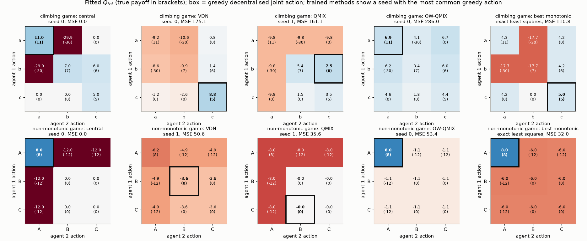

**QMIX's trained fits are not the best monotonic fits.** On the non-monotonic game every QMIX seed converges to the same fit: every entry involving A is −8, which underestimates the optimal joint action by 16 and overestimates the four −12 entries by 4 (MSE $(16^2 + 4\times4^2)/9 = 35.6$), and the greedy agents avoid A. This is a local optimum of training, not a representational limit. Ranking A first for both agents and fitting 8 on (A, A) and −6 elsewhere is also monotonic, has a lower MSE (32.0), and its greedy joint action is optimal. The script checks that every QMIX seed sits exactly at the best fit *for the action ordering it learned* (A ranked last), so what fails is the choice of basin. Uniform-weight monotonic projection is a non-convex problem, a union of 36 convex pieces, and gradient descent from a small random initialisation commits to a piece early. On the climbing game the best monotonic fit (MSE 110.8) also beats what QMIX finds (152–161; the best fits within the orderings QMIX learned are 127–147), but there even the global optimum picks (c, c): the least-squares projection itself gets the arg max wrong. OW-QMIX has the *largest* squared error, yet it is the only factorised method that recovers the optimal joint action in both games. It deliberately fits the best joint action (8.00 exactly in the non-monotonic game) and lets the others be wrong. This is the point of Weighted QMIX: for control we need the arg max to be right, not the regression, and uniform least squares does not care about the arg max even when it is solved exactly.

**Experiment 2: a sequential game with TD learning.** One-step regression leaves out what makes value decomposition hard in practice: bootstrapped targets, replay, target networks, and a data distribution that follows the current policy. [`two_step_game.py`](../code/ch17_multi_agent_rl/two_step_game.py) trains each method on the two-step game of the QMIX paper (Rashid et al., 2018). In state 1 the reward is 0 and agent 1's action chooses the next state (agent 2's action has no effect). In state 2A every joint action pays 7; in state 2B the payoffs are $\begin{pmatrix}0&1\\1&8\end{pmatrix}$; then the episode ends ($\gamma = 1$). Going to 2B and coordinating on (B, B) earns 8; going to 2A is a safe 7. Each learner follows Algorithm 7.1 on a toy scale: per-agent utility tables $Q_i(s, a^i)$ (here the agents observe the state), a replay buffer, one Adam step per episode, a target copy every 100 updates, and a TD target built from the decentralised greedy actions. QMIX's mixer is a one-hidden-layer ELU network whose non-negative weights come from hypernetworks of the one-hot state. We train 10 seeds for 1500 episodes under two data regimes:

| Learner | uniform exploration ($\varepsilon = 1$): seeds reaching return 8 | ε-greedy ($\varepsilon$: 1 → 0.05 over the first half) |
|---|---|---|
| central (joint table) | 10/10 | 10/10 |
| IQL | 0/10 (all return 7) | 1/10 |
| VDN | 0/10 (all return 7) | 10/10 |
| QMIX | 10/10 | 10/10 |

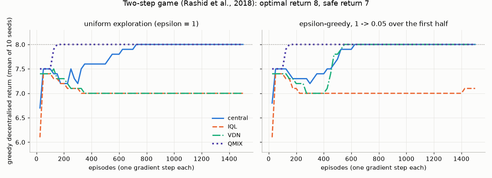

Under uniform data VDN's values in state 2B are the additive fit (7.3): row and column means 0.5 and 4.5, grand mean 2.5, so its best joint action there is worth $4.5 + 4.5 - 2.5 = 6.5 < 7$, and the bootstrapped target in state 1 sends agent 1 to the safe 7 (seed 0 learns $Q_{tot}(\mathrm{2B}, \mathrm B, \mathrm B) = 6.36$ and values going to 2B at 6.28). QMIX can represent the monotonic 2B matrix exactly, and in seed 0 every printed $Q_{tot}$ entry is within 0.01 of its true value. With ε-greedy data the picture changes. Once the agents' greedy actions in 2B are (B, B), most 2B samples are (B, B), the fit puts $Q_{tot}(\mathrm{2B}, \mathrm B, \mathrm B)$ near 8 (7.99 in seed 0), and VDN switches to state 2B in every seed: the same factorisation, fitted to different data, has a different arg max. IQL fails in both regimes (one ε-greedy seed in ten succeeds), because each agent's utilities average over its partner's exploration and lag behind; in seed 0, agent 1 values going to 2B at 6.82 under ε-greedy data. The learning curves also show QMIX converging within about 150 episodes, while the central table needs about 700 under uniform data. These are still toys: full observability, two agents, tables instead of recurrent networks. QMIX's strong SMAC results suggest that many benchmark tasks are close enough to monotonic, or are made so by the data the agents collect.

---

## 8. Multi-agent policy gradients

### 8.1 The multi-agent policy gradient

Let each agent have a stochastic policy $\pi^i_{\boldsymbol\theta^i}(a^i\mid\tau^i)$, with agents randomising independently, so the joint policy factorises: $\boldsymbol\pi(\mathbf a\mid\boldsymbol\tau) = \prod_i\pi^i(a^i\mid\tau^i)$. Because the policies condition on histories, the state $S_t$ alone is not Markov for the joint process, but the pair $(S_t,\boldsymbol\tau_t)$ is: the joint action depends on $\boldsymbol\tau_t$, the next state on $(S_t,\mathbf A_t)$, and the next joint history on $\boldsymbol\tau_t$, $\mathbf A_t$ and the new observations. Let $q_{\boldsymbol\pi}(s,\boldsymbol\tau,\mathbf a)$ be the expected team return after taking $\mathbf a$ in $(s,\boldsymbol\tau)$ and following $\boldsymbol\pi$ thereafter. For a team reward, the policy gradient theorem ([Chapter 10](10-policy-gradients.md)) applied to the joint policy on this Markov process gives $\mathbb E\big[\sum_t\gamma^t q_{\boldsymbol\pi}(S_t,\boldsymbol\tau_t,\mathbf A_t)\nabla\log\boldsymbol\pi(\mathbf A_t\mid\boldsymbol\tau_t)\big]$. Since $\log\boldsymbol\pi = \sum_j\log\pi^j$ and only the $j = i$ term depends on $\boldsymbol\theta^i$ (without parameter sharing),

$$
\nabla_{\boldsymbol\theta^i}J = \mathbb E_{\boldsymbol\pi}\Big[\sum_t\gamma^t\, q_{\boldsymbol\pi}(S_t,\boldsymbol\tau_t,\mathbf A_t)\,\nabla_{\boldsymbol\theta^i}\log\pi^i(A^i_t\mid\tau^i_t)\Big].
\tag{8.1}
$$

(With parameter sharing the gradient is the sum of (8.1) over agents.) The critic is a function of the *global* state, the *joint* history and the *joint* action, which is exactly what CTDE allows during training. Under full observability, with policies $\pi^i(a^i\mid s)$, the histories add nothing and the critic reduces to $q_{\boldsymbol\pi}(s,\mathbf a)$. In practice COMA and MAPPO feed their critics the global state $s$ (sometimes with agent-specific features) instead of the joint history. That is a convenient approximation, but under partial observability a purely state-based critic can bias the gradient, and Lyu, Baisero, Xiao & Amato (2022) show that this is a real effect, not a technicality; history-based or state-plus-history critics avoid it. Below we write the critic's arguments as $(s,\mathbf a)$ for brevity.

As in the single-agent case, a baseline can be subtracted, and here the baseline may depend on the **other agents' actions**. For any $b(s, a^{-i})$ that does not depend on $a^i$ (it may also depend on the histories),

$$
\mathbb E_{A^i\sim\pi^i}\big[b(s, a^{-i})\nabla\log\pi^i(A^i\mid\tau^i)\big] = b(s,a^{-i})\sum_{a^i}\pi^i(a^i\mid\tau^i)\frac{\nabla\pi^i(a^i\mid\tau^i)}{\pi^i(a^i\mid\tau^i)} = b(s,a^{-i})\,\nabla\!\sum_{a^i}\pi^i(a^i\mid\tau^i) = 0 .
\tag{8.2}
$$

The first step uses the independence of $A^i$ from $a^{-i}$ given the histories. This freedom is what COMA exploits. Note what (8.2) does and does not say: subtracting such a baseline leaves the expected gradient unchanged *whatever critic is used*, but the estimator as a whole is unbiased only if the critic is $q_{\boldsymbol\pi}$ itself, which under partial observability means conditioning on $(s,\boldsymbol\tau)$.

### 8.2 MADDPG: centralised critics for mixed games

**MADDPG** (Lowe et al., 2017) extends DDPG ([Chapter 12](12-continuous-control-actor-critic.md)) to $N$ agents with deterministic policies $\mu^i_{\boldsymbol\theta^i}(o^i)$. Each agent has its *own* centralised critic $Q^i_{\mathbf w^i}(s, a^1,\dots,a^N)$, where $s$ is the global state or the concatenation of all agents' observations. Because every agent has its own critic, agents may have different rewards, so MADDPG handles cooperative, competitive and mixed games. The deterministic policy gradient becomes

$$
\nabla_{\boldsymbol\theta^i}J^i = \mathbb E_{(s,\mathbf o,\mathbf a)\sim\mathcal D}\Big[\nabla_{\boldsymbol\theta^i}\mu^i(o^i)\;\nabla_{a^i}Q^i_{\mathbf w^i}(s, a^1,\dots,a^N)\Big|_{a^i=\mu^i(o^i)}\Big].
\tag{8.3}
$$

The critic conditions on everyone's actions, so from the critic's point of view the transition and reward functions *are* stationary: given $(s, \mathbf a)$, the next-state distribution no longer depends on the other agents' changing policies. This is the main argument for centralised critics. The critic's target still moves, because $Q^i$ evaluates the agents' current, changing policies (its TD target uses every agent's $\mu'^j(o'^j)$), exactly as in single-agent actor-critic. What centralisation removes is the hidden dependence of the transition and reward on the other agents' unobserved actions.

```text
Algorithm 8.1  MADDPG (Lowe et al., 2017)
Input:   actors μ^i(o^i; θ^i) and critics Q^i(s, a^1..a^N; w^i) for i = 1..N; target copies θ^{i-}, w^{i-};
         replay buffer D; exploration noise N_t; discount γ; Polyak coefficient τ (deep-RL meaning)
Loop for each episode:
    receive initial observations o = (o^1..o^N) and the global state s
    for each step:
        a^i <- μ^i(o^i) + N_t for each agent;  execute a; observe r = (r^1..r^N), o', s', terminated
        store (s, o, a, r, s', o', terminated) in D
        for each agent i:
            sample a minibatch from D
            y <- r^i + γ (1 − terminated) Q^i(s', μ^{1-}(o'^1), ..., μ^{N-}(o'^N); w^{i-})   # truncation: bootstrap
            update w^i by minimising (Q^i(s, a^1..a^N; w^i) − y)²
            update θ^i along Eq. (8.3), with the other agents' actions taken from the minibatch
        θ^{i-} <- τ θ^i + (1 − τ) θ^{i-};  w^{i-} <- τ w^i + (1 − τ) w^{i-}   for all i
```

Lowe et al. also proposed training an *ensemble* of policies per agent, so that agents do not overfit to their partners' current behaviour, and learning approximate models of the other agents' policies when those cannot be observed. These ideas recur in population-based training (§9).

### 8.3 COMA: counterfactual baselines

In a team game, **COMA** (Foerster et al., 2018) uses a single centralised critic $Q(s,\mathbf a)$ and gives each agent the counterfactual advantage (written $\mathrm{Adv}^i$ to avoid a clash with the action $A^i_t$)

$$
\mathrm{Adv}^i(s,\mathbf a) = Q(s,\mathbf a) - \sum_{a'^i}\pi^i(a'^i\mid\tau^i)\,Q\big(s,(a'^i, a^{-i})\big).
\tag{8.4}
$$

The baseline asks: *what would the team have earned, on average, if I alone had acted differently, with everyone else's actions held fixed?* It depends only on $a^{-i}$ (and the state and histories), so by (8.2) it leaves the expected gradient unchanged relative to the critic in use; with an exact critic $q_{\boldsymbol\pi}$ the estimator is unbiased. It is the expected-value version of Wolpert and Tumer's difference rewards, with the default action replaced by an average over agent $i$'s own policy, so no default action has to be chosen. For efficiency, the critic network takes $a^{-i}$ as input and outputs $Q(s,(a'^i, a^{-i}))$ for all $a'^i$ at once, so the baseline costs one forward pass.

```text
Algorithm 8.2  COMA (Foerster et al., 2018), N agents, team reward
Input:   actor π_θ(a^i | τ^i) (recurrent, parameters shared, agent index as input);
         centralised critic Q_w(s, a^{-i}, ·) that outputs Q(s, (a'^i, a^{-i})) for every a'^i;
         target critic w⁻; discount γ; trace parameter λ; step sizes α^w, α^θ; period C
Loop for each batch of on-policy episodes:
    run the current policies; record s_t, τ^i_t, a_t = (a^1_t..a^N_t), r_{t+1}, terminated, truncated
    critic: for every step t, form the TD(λ) target G^λ_t from the target critic, with
            Q_w⁻(s_{t+1}, a_{t+1}) as the bootstrap value; after termination the bootstrap is 0,
            after truncation it is kept; update w by descending Σ_t (G^λ_t − Q_w(s_t, a_t))²
    actors: for every step t and agent i:
        q(a'^i) <- Q_w(s_t, (a'^i, a^{-i}_t)) for all a'^i                # one forward pass
        Adv^i_t <- q(a^i_t) − Σ_{a'^i} π_θ(a'^i | τ^i_t) q(a'^i)          # Eq. (8.4)
    θ <- θ + α^θ Σ_t Σ_i Adv^i_t ∇_θ log π_θ(a^i_t | τ^i_t)              # Eq. (8.1) with baseline (8.2)
    every C critic updates: w⁻ <- w
```

**Worked example: how much variance does the counterfactual baseline remove?** Let $N$ agents each choose $a_j\in\{0,1\}$ with $\pi^j(1) = p_j = 1/(1 + e^{-\theta_j})$, so the score is $\partial_{\theta_i}\log\pi^i(a_i) = a_i - p_i \doteq \psi_i$. The team reward is $R = \sum_ja_j + \sigma_R\,\xi$ with $\xi\sim\mathcal N(0,1)$, so the exact critic is $Q(\mathbf a) = \sum_ja_j$. Take $p_j = \tfrac12$, so that $\psi_j = \pm\tfrac12$, $\psi_j^2 = \tfrac14$, $\mathbb E[\psi_j] = 0$, and the true gradient for agent $i$ is $\mathbb E[\psi_i^2] = \tfrac14$ for every $N$. Write $X = \sum_j \psi_j + \sigma_R\xi$, so that $R = N/2 + X$, with $\mathbb E[X] = 0$ and $\mathrm{Var}(X) = N/4 + \sigma_R^2$. Because $\psi_i^2 = \frac14$ is constant, $\mathbb E[X^2 \psi_i^2] = \frac14\mathbb E[X^2]$. Then:

* **REINFORCE**, $g = R\,\psi_i$: $\mathbb E[g^2] = \tfrac14\,\mathbb E[(N/2 + X)^2] = \tfrac14\big(\tfrac{N^2}4 + \tfrac N4 + \sigma_R^2\big)$.
* **Value baseline** $V = \mathbb E[R] = N/2$, $g = (R - V)\psi_i = X \psi_i$: $\mathbb E[g^2] = \tfrac14\big(\tfrac N4 + \sigma_R^2\big)$.
* **Central critic without counterfactual**, $g = (Q(\mathbf a) - V)\psi_i = \big(\sum_j\psi_j\big)\psi_i$: $\mathbb E[g^2] = \tfrac14\cdot\tfrac N4$.
* **COMA**: $Q(0,a^{-i}) = \sum_{j\ne i}a_j$ and $Q(1,a^{-i}) = 1 + \sum_{j\ne i}a_j$, so the baseline is $\sum_{j\ne i}a_j + p_i$ and $\mathrm{Adv}^i = a_i - p_i = \psi_i$. Then $g = \psi_i^2 = \tfrac14$ exactly.

Subtracting $(\mathbb E g)^2 = \tfrac1{16}$ from each second moment gives the variances

$$
\mathrm{Var}_{\text{REINFORCE}} = \frac{N^2 + N - 1}{16} + \frac{\sigma_R^2}{4},\qquad
\mathrm{Var}_{V} = \frac{N-1}{16} + \frac{\sigma_R^2}{4},\qquad
\mathrm{Var}_{Q} = \frac{N-1}{16},\qquad
\mathrm{Var}_{\text{COMA}} = 0 .
\tag{8.5}
$$

The signal is $\tfrac14$ for every $N$, but without the counterfactual baseline the noise grows with $N$, because every other agent's exploration lands in agent $i$'s gradient. The value baseline removes the $N^2$ term (the mean), the critic removes the reward noise, and only the counterfactual baseline removes the other agents' contributions. (At $p\neq\tfrac12$ COMA's variance is $p(1-p)(1-2p)^2$, still independent of $N$; Exercise 17.10.)

**Experiment.** [`credit_assignment_pg.py`](../code/ch17_multi_agent_rl/credit_assignment_pg.py) checks (8.5) by Monte Carlo with $2\times10^5$ samples and $\sigma_R = 1$. All measured variances match the formula to within 1%. At $N = 64$ they are 260.2 (REINFORCE), 4.19 (value baseline), 3.94 (critic) and 0 (COMA). It then trains all agents with each estimator, using the same step size 0.5 and 500 runs:

| $N$ | updates until mean $P(a_i=1) > 0.9$: REINFORCE | value baseline | central critic | COMA |
|---|---|---|---|---|
| 2 | 44 | 32 | 28 | 28 |
| 8 | never (0.72 after 400) | 38 | 32 | 27 |
| 32 | never (0.53) | 72 | 59 | 28 |
| 64 | never (0.51) | 128 | 109 | 28 |

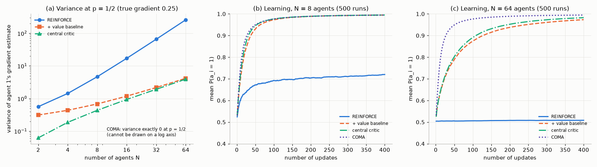

COMA's learning speed is the same for 2 and 64 agents. The baseline-free REINFORCE learner fails in an instructive way. Because every reward is positive, whichever action an agent happens to take first gets reinforced. With a large step size half the agents lock onto $a = 0$ and half onto $a = 1$: at $N = 64$ the script finds 49.2% of the agents ending with $p < 0.01$ and 50.8% with $p > 0.99$. The caveat is the same as in §7. Here the critic is exact. In COMA it is learned, it must model the joint action (which brings back the scalability problem), and its errors add bias. In practice COMA was later outperformed on SMAC by value-decomposition methods and by well-tuned PPO.

### 8.4 MAPPO and the surprising strength of PPO

For years the conventional wisdom held that on-policy methods are too sample-hungry for MARL, and that off-policy value decomposition (QMIX and successors) was the method of choice on SMAC. Yu et al. (2022) showed otherwise. **MAPPO** is PPO ([Chapter 11](11-trust-regions-and-ppo.md)) with parameter sharing across agents, decentralised actors $\pi_{\boldsymbol\theta}(a^i\mid o^i)$ (recurrent over $\tau^i$ when needed) and a centralised value function $V_\phi(s)$. One team advantage $\hat A_t$ is computed by GAE from the team reward and $V_\phi$ and shared by all agents, while each agent keeps its own probability ratio, so each agent's update is clipped separately:

$$
\mathcal L^{\text{CLIP}}(\boldsymbol\theta) = \mathbb E_t\Big[\frac1N\sum_{i=1}^N\min\Big(\rho^i_t\hat A_t,\;\mathrm{clip}\big(\rho^i_t, 1-\epsilon, 1+\epsilon\big)\hat A_t\Big)\Big],
\qquad
\rho^i_t = \frac{\pi_{\boldsymbol\theta}(A^i_t\mid o^i_t)}{\pi_{\boldsymbol\theta_{\text{old}}}(A^i_t\mid o^i_t)} ,
\tag{8.6}
$$

maximised together with an entropy bonus, while $V_\phi$ is regressed onto (normalised) return targets. As noted in §8.1, a critic on $s$ alone is an approximation under partial observability. With careful implementation, MAPPO matched or beat off-policy baselines on several cooperative benchmarks, including the particle environments, SMAC and Hanabi. The ingredients they found important are worth remembering because they transfer: value normalisation; giving the critic an agent-specific *global* state, rather than just concatenated observations; using few PPO epochs and few mini-batches, so that samples are not over-reused; a small clipping range; large batches; and masking "dead" agents. In the same spirit, de Witt et al. (2020) found that *independent* PPO (IPPO), whose critics see only local observations, was already competitive on many SMAC maps.

```text
Algorithm 8.3  MAPPO (Yu et al., 2022), N agents, team reward
Input:   shared actor π_θ(a^i | o^i) (recurrent over τ^i if needed, agent index as input);
         centralised critic V_φ(s^i) on an agent-specific global state; clip range ε; entropy
         weight c_H; GAE parameters γ, λ; few epochs K; few minibatches M; a value normaliser
Loop for each iteration:
    run π_θ in parallel environments for a fixed number of steps; record s^i_t, o^i_t, a^i_t,
        log π_θ(a^i_t | o^i_t), r_{t+1}, terminated, truncated, and mask^i_t = 0 once agent i is dead
    team TD errors δ_t <- r_{t+1} + γ V_φ(s_{t+1}) − V_φ(s_t), with V_φ(s_{t+1}) <- 0 after
        termination (kept after truncation); Â_t <- GAE(δ, γ, λ); targets Ĝ_t <- Â_t + V_φ(s_t)
    θ_old <- θ
    for K epochs, for each of M minibatches:
        ρ^i_t <- π_θ(a^i_t | o^i_t) / π_θold(a^i_t | o^i_t)
        actor:  ascend Σ_{t,i} mask^i_t [min(ρ^i_t Â_t, clip(ρ^i_t, 1−ε, 1+ε) Â_t) + c_H H(π_θ(·|o^i_t))]   # Eq. (8.6)
        critic: descend Σ_{t,i} mask^i_t (V_φ(s^i_t) − normalise(Ĝ_t))²  (optionally clipped, as in PPO)
```

Why might PPO work so well here? Its trust region limits how much each agent's policy changes per update. That limits how fast every teammate's environment (2.3) drifts, a direct handle on nonstationarity that value-based methods with $\max$ targets lack. Massive parallel simulation makes on-policy data cheap. And shared parameters let all agents' experience train one network. The broader lesson is about evaluation. Many claimed MARL improvements shrank once strong, well-tuned baselines were used (Yu et al., 2022; Hu et al., 2021). Later work such as HAPPO/HATRPO (Kuba et al., 2022) updates agents *sequentially*, each one against the already-updated others, and recovers a monotonic-improvement guarantee in the style of TRPO for the joint policy.

---

## 9. Self-play, populations and leagues

### 9.1 Self-play and why it can chase its own tail

In a symmetric two-player zero-sum game, the simplest curriculum is to play against yourself. The opponent is always exactly as strong as you are, so the training signal never becomes trivially easy or impossibly hard. Self-play has a long and successful history, from Samuel's checkers program (1959) through TD-Gammon (Tesauro, 1995) to AlphaGo Zero and AlphaZero ([Chapter 13](13-model-based-rl.md)). But **naive self-play**, always training a best response to your *latest* self, is iterated best response, and in games with *intransitive* (rock–paper–scissors-like) structure it cycles. A policy that beats the current version is beaten by the next one, and nothing accumulates. Real games mix a transitive component (skill) with intransitive cycles (styles that counter each other). Balduzzi et al. (2019) decompose games into transitive and cyclic components, and Czarnecki et al. (2020) argue that the strategy spaces of real games look like "spinning tops": a long transitive axis with large cycles in the middle range of skill. Self-play must climb the transitive axis without being trapped in the cycles.

The remedy follows from §5. Instead of the last iterate, best-respond to an *average* over past policies (fictitious play), or to an *equilibrium* of the population.

* **Fictitious self-play** (FSP; Heinrich, Lanctot & Silver, 2015) is fictitious play in extensive-form games with learned approximate best responses. **Neural fictitious self-play** (NFSP; Heinrich & Silver, 2016) gives each agent two networks. A DQN learns a best response to the opponents' *average* behaviour. A second network learns, by supervised learning on a reservoir of the agent's own past best-response actions, to imitate the agent's *average* policy. The agent acts with a mixture of the two. With exact (or increasingly accurate) best responses, extensive-form fictitious play provably converges to a Nash equilibrium in two-player zero-sum games (Heinrich et al., 2015). NFSP inherits this only approximately: empirically its average policies reach low exploitability in poker games, but with function approximation there is no guarantee.
* **Population-based self-play** keeps a pool of past and current policies and samples opponents from it, as in OpenAI Five and AlphaStar below.

### 9.2 Policy-Space Response Oracles (PSRO) and double oracle

**PSRO** (Lanctot et al., 2017) turns these ideas into one algorithm with a pluggable **meta-solver**. It maintains a population of policies per player, estimates the **meta-game**, the normal-form game whose "actions" are the population members, and adds a best response to the meta-solver's mixture:

```text
Algorithm 9.1  Policy-Space Response Oracles (PSRO), two players
Input:   initial populations Π_1 = {π_1^0}, Π_2 = {π_2^0}; meta-solver M; best-response oracle BR_i
         (exact, or a full RL training run against a fixed mixture of opponents); iterations K; tolerance ε
for k = 1, ..., K:
    U[j, l] <- u_1(π_1^j, π_2^l) for all pairs in Π_1 × Π_2      # evaluate new rows/columns (simulation)
    (w_1, w_2) <- M(U)                                          # meta-strategies over the populations
    β_1 <- BR_1(Π_2 mixed by w_2);   β_2 <- BR_2(Π_1 mixed by w_1)
    if u_1(β_1, w_2) ≤ w_1ᵀUw_2 + ε and u_2(w_1, β_2) ≤ −w_1ᵀUw_2 + ε:  stop    # ε-Nash reached (M = Nash)
    Π_1 <- Π_1 ∪ {β_1};   Π_2 <- Π_2 ∪ {β_2}
Output: populations and meta-strategies (w_1, w_2)
```

With **M = last** (all weight on the newest policy), PSRO is naive self-play. With **M = uniform** it is fictitious play over policies. With **M = Nash** it is the **double oracle** algorithm (McMahan, Gordon & Blum, 2003). If the game has finitely many pure strategies and the oracle is exact, double oracle stops at a Nash equilibrium after finitely many iterations (Exercise 17.11). The stopping test is exactly the exploitability (3.7) of the meta-Nash mixture in the *full* game. In deep-RL PSRO each oracle call is an RL training run, so the expense is in the number of iterations, and the hope is that a small population spans the strategically relevant part of the policy space. Later variants change the meta-solver (α-Rank, Omidshafiei et al., 2019, used as the meta-solver of α-PSRO by Muller et al., 2020; correlated-equilibrium solvers, Marris et al., 2021), or parallelise the oracle calls (Pipeline PSRO, McAleer et al., 2020).

**Experiment: meta-solvers on Kuhn poker.** [`psro_kuhn.py`](../code/ch17_multi_agent_rl/psro_kuhn.py) runs PSRO on Kuhn poker (rules in §10.2) with an *exact* best-response oracle, starting from the uniformly random policy. To evaluate a meta-strategy, a mixture over a population of behavioural policies, the script converts it into the equivalent behavioural strategy. This uses reach-weighted averaging, which is Kuhn's theorem in action (Eq. 10.6). It then computes the exploitability exactly.

| Meta-solver | exploitability after 0, 1, 2, 5, 10, 60 iterations | final population (distinct policies, P1) |
|---|---|---|
| last (naive self-play) | 0.458, 0.417, 0.167, 0.500, 0.167, 1.167 | 5 |
| uniform (fictitious play) | 0.458, 0.313, 0.208, 0.132, 0.076, 0.031 | 7 |
| Nash (double oracle) | 0.458, 0.417, 0.167, 0.068, 0.000, 0.000 | 8 |

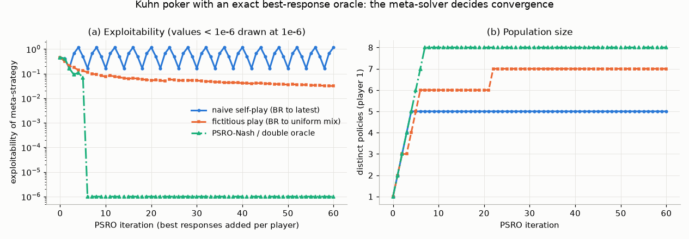

Naive self-play falls into a 4-cycle of strategies with exploitabilities 0.500, 0.167, 0.667, 1.167 and repeats it forever. Its exploitability at iteration 60, 1.167 chips per hand, is *worse* than playing uniformly at random (0.458). Fictitious play improves steadily but slowly. Double oracle reaches exploitability below $10^{-9}$ at iteration 6, after adding six best responses per player, and the meta-game value there is $-0.055556 = -1/18$, the exact value of the game. After convergence it keeps adding best responses (8 distinct policies), because many pure strategies tie as best responses to an equilibrium. They do not change the meta-Nash.

### 9.3 Population-based training

**Population-based training** (PBT; Jaderberg et al., 2017) trains a population of agents in parallel. Periodically it *exploits*, copying the weights of a better-performing member over a worse one, and *explores*, perturbing the copied member's hyperparameters. It was introduced as hyperparameter optimisation, but in multi-agent settings the population also serves as a diverse pool of training partners. In the Capture-the-Flag "For The Win" agents (Jaderberg et al., 2019), a population of agents learned their own internal reward signals and were matched by Elo-based matchmaking. They reached human-level play in a first-person 3D team game from pixels.

### 9.4 League training: AlphaStar

AlphaStar (Vinyals et al., 2019) reached Grandmaster level in StarCraft II for all three races, ranking above 99.8% of active players on the official ladder. It combined supervised learning from human replays with multi-agent RL in a **league** of three kinds of agents.

* **Main agents**, the ones finally deployed, train against all past players in the league and against themselves. Opponents are sampled by **prioritised fictitious self-play** (PFSP): an opponent is chosen with probability that increases with how hard it is for the learner, for instance with weight $(1 - P[\text{win}])^p$.
* **Main exploiters** train only against the current main agents, to expose their weaknesses.
* **League exploiters** train against the whole league, to find strategies that no one handles. They are not meant to be robust themselves.

Frozen snapshots are added to the league over time. In PSRO terms the league is a population, PFSP a meta-solver that emphasises hard opponents, and the exploiters are oracles aimed at specific populations: a direct, expensive answer to the cycling problem of §9.1.

### 9.5 OpenAI Five

OpenAI Five (OpenAI et al., 2019) played Dota 2, a five-versus-five team game with long horizons, partial observability and a huge action space. Its recipe was simple but enormous in scale: each hero was controlled by a copy of one LSTM policy trained with PPO ([Chapter 11](11-trust-regions-and-ppo.md)) for about ten months; 80% of games were self-play against the latest parameters and 20% against past versions, to avoid strategy collapse; a "team spirit" coefficient interpolated each hero's reward between its individual reward and the team average; and "surgery" transferred weights across architecture changes instead of restarting. In April 2019 it beat OG, the reigning world champions, in a best-of-three exhibition match. It needed little of §6–8's cooperative machinery beyond parameter sharing, a shared reward, a strong on-policy learner and scale, the same lesson as MAPPO.

---

## 10. Imperfect-information games and counterfactual regret minimisation

### 10.1 Extensive-form games

An **extensive-form game** is a tree. Its nodes are **histories** $h$ (sequences of actions from the root). A player function assigns each non-terminal history to a player $i$ or to **chance** $c$, which acts with fixed known probabilities (dealing cards). Terminal histories $z\in\mathcal Z$ carry utilities $u_i(z)$. Hidden information is modelled by **information sets**: player $i$'s histories are partitioned into sets $I\in\mathcal I_i$ that the player cannot tell apart, because they differ only in things the player has not observed, like the opponent's cards. The available actions $\mathcal A(I)$ are the same at every history in $I$. We assume **perfect recall**: players never forget their own past actions or observations. A **behavioural strategy** $\sigma_i(a\mid I)$ is a policy over information sets, and $\sigma = (\sigma_1, \sigma_2)$ is a profile. (§10 follows the CFR literature in writing $\sigma$ for strategies and subscripts for players.)

The **reach probability** of $h$ under $\sigma$ is the product of all action probabilities along $h$, including chance's. It factorises into each player's contribution:

$$
\eta^\sigma(h) = \prod_{h'a\,\sqsubseteq\, h}\sigma_{P(h')}(a\mid h') = \eta^\sigma_i(h)\,\eta^\sigma_{-i}(h),
\tag{10.1}
$$

where $\eta^\sigma_i(h)$ multiplies only player $i$'s own action probabilities, $\eta^\sigma_{-i}(h)$ multiplies everyone else's *and chance's*, and $h'a \sqsubseteq h$ ranges over the prefixes $h'$ of $h$ together with the action $a$ taken there. With perfect recall, $\eta^\sigma_i(h)$ is the same for every $h \in I$, and we write $\eta^\sigma_i(I)$.

Why are such games harder than MDPs? In an MDP the optimal action in a state depends only on the future. In poker, the right action at an information set depends on the opponent's *beliefs* about your cards, and those beliefs depend on your strategy at *other* information sets. Bluffing with a jack is good only if you also bet your kings, and how often you should bluff depends on how often you bet for value. A subgame cannot be solved in isolation, which is why the AlphaZero recipe ([Chapter 13](13-model-based-rl.md)) does not transfer directly.

Two classical facts make these games tractable. **Kuhn's theorem** (1953): under perfect recall, every mixed strategy (a distribution over complete plans) has an outcome-equivalent behavioural strategy, and vice versa. **The sequence form** (Koller, Megiddo & von Stengel, 1994; von Stengel, 1996): describe a strategy by its *realisation plan* $x(\text{sequence}) = \eta_i^\sigma(\text{sequence})$, one variable per (information set, action) pair. Realisation plans satisfy linear constraints, $x(\varnothing) = 1$ and $\sum_a x(I,a) = x(\text{parent}(I))$, and the expected payoff is *bilinear* in the two players' plans. A two-player zero-sum extensive-form game is therefore an LP of size linear in the game tree, rather than exponential as the normal form would be. [`kuhn.py`](../code/ch17_multi_agent_rl/kuhn.py) builds this LP for Kuhn poker and solves it with SciPy. It is an independent check on everything below.

### 10.2 Kuhn poker

Kuhn poker (Kuhn, 1950) is the "hello world" of imperfect-information games. The deck has three cards, J < Q < K. Both players ante 1 chip and each receives one card. Player 1 checks or bets 1. If player 1 checks, player 2 checks (showdown for the antes) or bets, and then player 1 folds or calls. If player 1 bets, player 2 folds or calls (showdown for 2 chips each). Each player has 6 information sets (3 cards × 2 decision points) with 2 actions each.

Kuhn solved it by hand. Player 2 has a unique equilibrium strategy: with K always bet or call; with Q check after a check and call a bet with probability $\tfrac13$; with J bet after a check (a bluff) with probability $\tfrac13$ and fold to a bet. Player 1 has a one-parameter family: for any $\alpha\in[0,\tfrac13]$, bet J with probability $\alpha$, bet K with probability $3\alpha$, never bet Q, and when facing a bet after checking, fold J, call K, and call Q with probability $\alpha + \tfrac13$. The value of the game for player 1 is $-\tfrac1{18}$: moving first is a disadvantage. The sequence-form LP in `kuhn.py` returns the value $-0.055556$ and the $\alpha = 0$ member, and the script checks that seven members across $\alpha\in[0,\tfrac13]$ all have exploitability below $10^{-16}$ against the LP's player-2 strategy. Exercise 17.8 recovers $-1/18$ by hand.

**Worked example: why player 2 calls with Q exactly one third of the time.** Suppose player 1 holds J. If it checks, player 2 with Q checks and wins the showdown, and player 2 with K bets and player 1 folds: player 1 loses 1 either way. If player 1 bluffs, player 2 with K calls (player 1 loses 2), and player 2 with Q calls with some probability $c$ (player 1 loses 2) or folds (player 1 wins 1). The two cards are equally likely, so

$$
u_1(\text{bet J}) = \tfrac12\big[c(-2) + (1-c)(+1)\big] + \tfrac12(-2) = -\tfrac12 - \tfrac32 c,
\qquad u_1(\text{check J}) = -1 .
$$

Player 1 is indifferent, and so willing to mix its bluffs, exactly when $-\tfrac12 - \tfrac32c = -1$, that is, $c = \tfrac13$. If player 2 called more often, player 1 would never bluff, and then calling with Q would be a mistake. If it called less often, player 1 would always bluff.

**And why player 1 bets K three times as often as it bluffs J.** Player 2 holds Q and faces a bet. Player 1 holds J or K with prior probability $\tfrac12$ each and bets them with probabilities $\alpha$ and $3\alpha$, so by Bayes' rule $\Pr(\mathrm J\mid\text{bet}) = \frac{\alpha}{\alpha + 3\alpha} = \tfrac14$. Calling wins 2 against J and loses 2 against K, $\tfrac14(2) + \tfrac34(-2) = -1$. Folding forfeits the ante, $-1$. Player 2 is indifferent. **The bluff-to-value ratio of 1 : 3 is what makes the bluff catcher indifferent.** That is the logic of poker in two lines.

### 10.3 Counterfactual values and regret

CFR (Zinkevich, Johanson, Bowling & Piccione, 2007) runs a regret minimiser at *every information set*, fed with a special payoff signal. The **counterfactual value** of information set $I$ for player $i$ under $\sigma$ is

$$
v_i^\sigma(I) = \sum_{h\in I}\eta^\sigma_{-i}(h)\sum_{z\in\mathcal Z,\;h\sqsubseteq z}\eta^\sigma(h, z)\,u_i(z),
\tag{10.2}
$$

where $\eta^\sigma(h,z)$ is the probability of going from $h$ to $z$ under $\sigma$. It is player $i$'s expected payoff from $I$ onward, weighted by the probability that *chance and the opponent* bring play to $I$. Player $i$'s own reach probability is left out, as if $i$ had played to reach $I$; that is the "counterfactual". Define $v_i^\sigma(I,a)$ in the same way but with $i$ playing $a$ at $I$. The cumulative **counterfactual regret** and the regret-matching rule are

$$
R_T(I,a) = \sum_{t=1}^T\Big[v_i^{\sigma_t}(I,a) - v_i^{\sigma_t}(I)\Big],
\tag{10.3}
$$

$$
\sigma_{T+1}(a\mid I) = \frac{[R_T(I,a)]^+}{\sum_{b}[R_T(I,b)]^+}\quad(\text{uniform if all } R_T(I,b)\le 0).
\tag{10.4}
$$

**Theorem (Zinkevich et al., 2007).** Player $i$'s overall regret, $\mathrm{Reg}^i_T = \max_{\sigma'_i}\sum_t\big[u_i(\sigma'_i,\sigma_{t,-i}) - u_i(\sigma_t)\big]$, is bounded by the sum of the positive counterfactual regrets:

$$
\mathrm{Reg}^i_T \le \sum_{I\in\mathcal I_i}\max_a\,[R_T(I,a)]^+ .
\tag{10.5}
$$

*Proof sketch.* Order player $i$'s information sets as a tree, the "sequence tree": $I'$ follows $I$ if $i$ can reach $I'$ after acting at $I$. Define the *full* counterfactual regret at $I$ as the regret for deviating at $I$ **and** at all its successors. The counterfactual value of action $a$ at $I$ is the sum of the payoffs of terminal histories reached directly and the counterfactual values of the successor information sets reached through $a$, weighted by player $i$'s own action probabilities in between. This additivity holds because counterfactual values are weighted only by opponent and chance reach. So the full regret at $I$ splits into the regret of the action chosen at $I$, plus the full regrets of the successors reached by that action. Each successor term is bounded by the successor's own full regret. Inducting from the leaves gives $R_{\mathrm{full}}(I) \le \sum_{I'\text{ in the subtree of } I}\max_a[R^T(I',a)]^+$. At the root, the full regret is the overall regret. $\square$

Combining (10.5) with the regret-matching bound (5.3) at each information set gives $\mathrm{Reg}^i_T/T \le L\,|\mathcal I_i|\sqrt{\max_I|\mathcal A(I)|}\big/\sqrt T$, where $L$ bounds the instantaneous counterfactual regrets. By the argument of §5.5 applied to realisation plans, the **average** strategy profile is then an $\epsilon$-Nash equilibrium with $\epsilon = O(1/\sqrt T)$. The average must be taken with **reach weights**:

$$
\bar\sigma^T_i(a\mid I) = \frac{\sum_{t=1}^T\eta_i^{\sigma_t}(I)\,\sigma_t(a\mid I)}{\sum_{t=1}^T\eta_i^{\sigma_t}(I)} .
\tag{10.6}
$$

The reason is that averaging must happen in the space of realisation plans, where the expected payoff is linear. The realisation plan of the average, $\bar x(I,a) = \frac1T\sum_t\eta_i^{\sigma_t}(I)\sigma_t(a\mid I)$, converted back to a behavioural strategy, is (10.6). A plain average of $\sigma_t(a\mid I)$ would over-weight iterations in which $I$ was rarely reached. The exploitability bound is

$$
\text{exploitability}(\bar\sigma^T) = \tfrac12\mathrm{NashConv}(\bar\sigma^T) \le \frac{\mathrm{Reg}^1_T + \mathrm{Reg}^2_T}{2T} = O\Big(\frac1{\sqrt T}\Big).
\tag{10.7}
$$

```text
Algorithm 10.1  Vanilla CFR (two-player zero-sum; simultaneous updates)
Input:   extensive-form game (histories, chance probabilities, information sets I with actions A(I),
         terminal utilities u_1(z) = −u_2(z)); number of iterations T
Initialise: R(I,a) <- 0 and σ_sum(I,a) <- 0 for all I and a ∈ A(I)
for t = 1, ..., T:
    σ_t(·|I) <- regret matching on R(I,·) for every I          # Eq. (10.4); held fixed for this iteration
    CFR(root, η_1 = 1, η_2 = 1, η_c = 1)
Output: average strategy σ̄_T(a|I) = σ_sum(I,a) / Σ_b σ_sum(I,b)    # Eq. (10.6)

function CFR(h, η_1, η_2, η_c):            # returns player 1's expected utility below h under σ_t
    if h is terminal:      return u_1(h)
    if chance acts at h:   return Σ_c p(c|h) · CFR(hc, η_1, η_2, η_c · p(c|h))
    i <- player to act at h;  I <- information set containing h
    for each a ∈ A(I):
        v(a) <- CFR(ha, η's with η_i replaced by η_i · σ_t(a|I), η_c)
    v <- Σ_a σ_t(a|I) v(a)
    κ <- +1 if i = 1, −1 if i = 2           # convert player-1 utilities to player i's
    for each a ∈ A(I):
        R(I,a) <- R(I,a) + η_{−i} · η_c · κ · (v(a) − v)          # counterfactual regret, Eq. (10.3)
        σ_sum(I,a) <- σ_sum(I,a) + η_i · σ_t(a|I)                # reach-weighted average, Eq. (10.6)
    return v
```

**Worked example: the first iteration of CFR.** Start from the uniform profile and look at player 1 holding K at the root, the information set $I_{\mathrm K}$ (`K:` in the code). It contains the deals (K, J) and (K, Q), each reached by chance with probability $\tfrac16$; player 2 has not acted yet, so $\eta_{-1}(h) = \tfrac16$ for both histories. Against a uniform player 2, betting wins 1 when player 2 folds and 2 when it calls, worth $\tfrac12(1) + \tfrac12(2) = 1.5$. Checking leads to a showdown for 1 if player 2 checks; if player 2 bets, player 1 folds ($-1$) or calls ($+2$) with probability $\tfrac12$ each, worth $0.5$. So checking is worth $\tfrac12(1) + \tfrac12(0.5) = 0.75$, and the counterfactual values (10.2) are

$$
v_1(I_{\mathrm K},\text{bet}) = 2\cdot\tfrac16\cdot1.5 = 0.5,\qquad
v_1(I_{\mathrm K},\text{check}) = 2\cdot\tfrac16\cdot0.75 = 0.25,\qquad
v_1(I_{\mathrm K}) = \tfrac12(0.5 + 0.25) = 0.375 .
$$

The regrets (10.3) after one iteration are $(-0.125, +0.125)$ for (check, bet), so regret matching (10.4) bets K with probability 1 at iteration 2. Deeper in the tree, at $I_{\mathrm K}'$ (`K:pb`: holding K and facing a bet after checking), the opponent-and-chance reach of each history is $\tfrac16\cdot\tfrac12 = \tfrac1{12}$, because player 2 bet with probability $\tfrac12$. Folding is worth $-1$ and calling $+2$, so $v_1(I'_{\mathrm K},\text{fold}) = 2\cdot\tfrac1{12}(-1) = -\tfrac16$, $v_1(I'_{\mathrm K},\text{call}) = 2\cdot\tfrac1{12}(2) = \tfrac13$, $v_1(I'_{\mathrm K}) = \tfrac1{12}$, and the regrets are $(-0.25, +0.25)$. Player 1's own probability of having checked ($\tfrac12$) appears nowhere: that omission is the "counterfactual" in counterfactual value. One call of `CFRSolver("cfr").iterate()` (run in `exercise_solutions.py`) prints exactly these regrets. Exercise 17.15 does the same for player 2.

### 10.4 CFR+, Monte Carlo CFR and discounting

* **CFR+** (Tammelin, 2014) makes three changes. It uses regret matching+ at every information set, it **alternates** updates (player 1 traverses and updates, then player 2 traverses against player 1's *new* strategy), and it **weights the average** by iteration number, with weight $t$ (Tammelin used a short delay before averaging starts). Empirically it converges much faster than $1/\sqrt T$, and its *current* strategy is often already good in practice, although no theorem guarantees that it converges (§10.5). It was used to essentially solve heads-up limit Texas hold'em (Bowling, Burch, Johanson & Tammelin, 2015).
* **Monte Carlo CFR** (MCCFR; Lanctot, Waugh, Zinkevich & Bowling, 2009) traverses only a sampled part of the tree per iteration and corrects with importance weights. If terminal history $z$ is sampled with probability $q(z)$, the sampled counterfactual value

  $$
  \tilde v_i^\sigma(I) = \sum_{h\in I}\;\sum_{z\text{ sampled},\;h\sqsubseteq z}\frac{\eta^\sigma_{-i}(h)\,\eta^\sigma(h,z)\,u_i(z)}{q(z)}
  \tag{10.8}
  $$

  is an unbiased estimate of (10.2). *Chance sampling* draws one deal per iteration. *External sampling* also samples the opponent's actions, and *outcome sampling* samples a single trajectory. Iterations become much cheaper and noisier, which pays off in games with large chance branching.
* **Linear and Discounted CFR** (Brown & Sandholm, 2019) down-weight early iterations, in both the regrets and the average. They are among the fastest tabular variants in practice.
* **Deep CFR** (Brown, Lerer, Gross & Sandholm, 2019) replaces the regret tables by neural networks trained on MCCFR samples.

The two variants implemented in `cfr_kuhn.py` differ from Algorithm 10.1 in a few lines (they mirror `CFRSolver.iterate`):

```text
Algorithm 10.2  CFR+ and chance-sampled MCCFR, as changes to Algorithm 10.1
CFR+ (Tammelin, 2014):
  1. alternate: in iteration t, for i = 1 then i = 2: recompute σ_t from R by regret matching,
     then traverse all deals updating only player i's tables (player 2 sees player 1's new strategy)
  2. RM+ floor: after player i's traversal, R(I,a) <- max(R(I,a), 0) at all of i's information sets
  3. linear averaging: σ_sum(I,a) <- σ_sum(I,a) + t · η_i · σ_t(a|I)       (weight t instead of 1)
Chance-sampled MCCFR (Lanctot et al., 2009):
  1. in each iteration sample ONE chance outcome (one deal) instead of summing over all of them
  2. traverse that deal with η_c = 1 in place of its probability, i.e. divide by the sampling
     probability: the regret increments are the sampled counterfactual values of Eq. (10.8)
  3. everything else as in Algorithm 10.1 (regret matching, simultaneous updates, weight 1)
```

### 10.5 Experiment: CFR on Kuhn poker

[`cfr_kuhn.py`](../code/ch17_multi_agent_rl/cfr_kuhn.py) implements Algorithm 10.1, CFR+ and chance-sampled MCCFR, and measures exploitability *exactly* after each checkpoint with the best response of `kuhn.py`. The best response computes, at each of the best responder's information sets from the deepest up, the action maximising $\sum_{h\in I}\eta_{-i}(h)\,u_i(h\cdot a)$.

| Iterations $T$ | CFR: exploitability of average | CFR: of current strategy | CFR+: of average | CFR+: of current |
|---|---|---|---|---|
| 10 | 9.6e−2 | 0.19 | 3.3e−2 | 3.9e−2 |
| 100 | 2.6e−2 | 0.23 | 1.2e−3 | 4.1e−2 |
| 1,000 | 7.3e−3 | 0.22 | 8.7e−5 | 1.9e−2 |
| 10,000 | 2.3e−3 | 0.15 | 9.6e−6 | 8.5e−3 |
| 20,000 | 1.6e−3 | 0.33 | 6.7e−6 | 1.0e−2 |

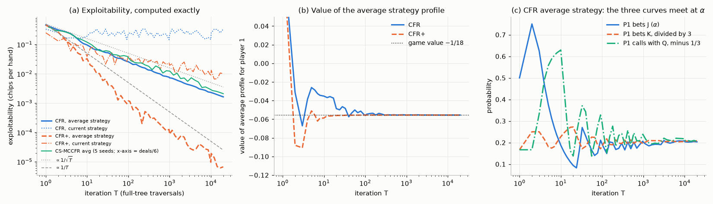

* **Vanilla CFR's average converges like $1/\sqrt T$** (fitted log–log slope $-0.51$ over the last two decades), as (10.7) predicts. The value of the average profile reaches $-0.055536$, against $-1/18 = -0.055556$.
* **Its current strategy does not converge.** Its exploitability is still 0.15–0.33 chips per hand after thousands of iterations, the same average-vs-iterate phenomenon as in §5.7. *Deploying the last iterate of vanilla CFR would be a mistake.*
* **CFR+ is about 250 times less exploitable** after 20,000 iterations ($6.7\times10^{-6}$ against $1.6\times10^{-3}$; fitted slope $-0.89$). Its current strategy is decent (about $10^{-2}$) but still far worse than its average.
* **The solutions land in Kuhn's family.** CFR's average has $\alpha = 0.203$; it bets K with probability 0.624 (vs $3\alpha = 0.610$) and calls with Q with probability 0.539 (vs $\alpha + \tfrac13 = 0.537$). CFR+ gives $\alpha = 0.225$, with $3\alpha = 0.674$ against 0.674 and $\alpha+\tfrac13 = 0.558$ against 0.558. Player 2's strategy matches the unique equilibrium: it bluffs J after a check with probability 0.3333 and calls with Q with probability 0.3334. Which $\alpha$ is reached depends on the dynamics. Every member of the family is an equilibrium.
* **Chance-sampled MCCFR**, given the same number of dealt hands (6 sampled iterations per vanilla iteration), reaches mean exploitability $2.1\times10^{-3}$ over 5 seeds (range $0.9$–$3.0\times10^{-3}$), against vanilla CFR's $1.6\times10^{-3}$. In a game with only 6 deals, sampling buys nothing. Its advantage appears in games with huge chance branching, such as hold'em with its millions of card combinations.

For calibration, the uniformly random strategy pair has exploitability 0.458. A best response to uniform player 2 wins 0.5 per hand as player 1.

### 10.6 From Kuhn poker to superhuman Texas hold'em

Heads-up no-limit Texas hold'em has more than $10^{160}$ decision points, so tabular CFR cannot even store a strategy. The successful systems combine four ideas: **abstraction** (bucket similar hands, restrict bet sizes, and solve the smaller game with (MC)CFR to obtain a **blueprint** strategy); **safe subgame solving** (re-solve the part of the game actually reached, in finer detail, without becoming more exploitable than the blueprint, which needs care because subgames are not independent, §10.1); **depth-limited search** with estimated values at the depth limit; and **self-improvement** where opponents probe weaknesses.

**Libratus** (Brown & Sandholm, 2018) combined an MCCFR blueprint, nested safe subgame solving (which also handles bets outside the abstraction) and a self-improver; in January 2017 it defeated four top specialist professionals over 120,000 hands of heads-up no-limit. **DeepStack** (Moravčík et al., 2017) used no blueprint for the full game: it *continually re-solved* from the current public state with depth-limited lookahead, estimating values at the depth limit with deep **counterfactual value networks** trained on randomly generated poker situations, and it also beat professional players. **Pluribus** (Brown & Sandholm, 2019) reached superhuman performance in **six-player** no-limit hold'em, which is not two-player zero-sum, so none of the guarantees of §3.2 apply. Its blueprint came from self-play MCCFR and cost about 12,400 CPU core-hours on a single 64-core server, and at the depth limit its search assumed that every player could switch among a few continuation strategies. ReBeL (Brown, Bakhtin, Lerer & Gong, 2020) and Student of Games (Schmid et al., 2023) later unified this line with AlphaZero-style search over *public belief states*, and DeepNash (Perolat et al., 2022) reached expert human level in Stratego with regularised Nash dynamics and no search.

---

## 11. Emergent communication

If agents can send each other messages, can they invent a language? The simplest model is the **Lewis signalling game** (Lewis, 1969; studied in depth by Skyrms, 2010). A *sender* observes a state $s$, drawn uniformly from $N$ states, and sends a message $m$ from a vocabulary of size $M$. A *receiver* sees only $m$ and picks an action. Both get reward 1 if the action equals $s$. The messages have no meaning at the start; a *signalling system* (a bijection between states and messages, decoded correctly) is an optimal equilibrium. But there are also **partial-pooling** equilibria, in which the sender uses one message for several states and the receiver guesses among them. These are stable for gradient learning: to escape, both agents would have to change at once.

Deep MARL studies the same question with neural agents. **RIAL** and **DIAL** (Foerster, Assael, de Freitas & Whiteson, 2016) learned communication protocols: RIAL by treating messages as actions learned with independent DQN, DIAL by letting gradients flow through a differentiable channel during centralised training. **CommNet** (Sukhbaatar, Szlam & Fergus, 2016) learned continuous communication between cooperating agents. Referential games with images (Lazaridou, Peysakhovich & Baroni, 2017) and grounded compositional languages in simulated worlds (Mordatch & Abbeel, 2018) followed. One persistent lesson is that emergent "languages" need careful evaluation. Agents may obtain the reward while their messages carry little information, and measures such as message entropy or speaker consistency can mislead. Lowe et al. (2019) proposed causal tests: does a message actually change the listener's behaviour?

**Experiment.** [`lewis_signaling.py`](../code/ch17_multi_agent_rl/lewis_signaling.py) trains independent softmax sender and receiver policies with REINFORCE (step size 0.5) and a running-average baseline, from the shared reward only, for 10,000 games, with 1000 runs per setting. It reports the fraction of states that the final *greedy* protocol communicates correctly.

| States $N$ | Messages $M$ | runs with a perfect protocol | other outcomes |
|---|---|---|---|
| 2 | 2 | 100% | — |
| 3 | 3 | 98.6% | 1.4% communicate 2 of 3 states |
| 4 | 4 | 95.1% | 4.9% communicate 3 of 4 |
| 8 | 8 | 55.1% | 44.1% communicate 7 of 8; 0.8% 6 of 8 |
| 3 | 6 | 100% | — |
| 4 | 8 | 100% | — |
| 8 | 16 | 99.1% | 0.9% communicate 7 of 8 |

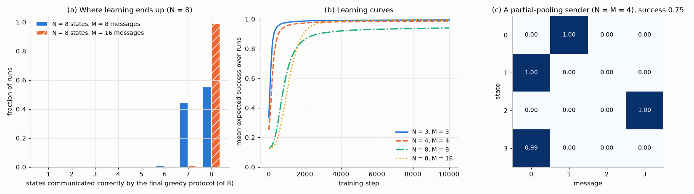

A protocol emerges, but as the number of states grows, independent gradient learners increasingly get stuck in partial pooling. In panel (c) the sender has learned to send message 0 for both states 1 and 3, and leaves message 2 unused. Escaping would require the sender to try message 2 for one of the pooled states *and* the receiver to decode it correctly. The sender's probability of sending message 2 has collapsed to nearly zero, so the gradient almost never discovers this. **Doubling the vocabulary almost removes the problem** (99.1% perfect for $N = 8$, $M = 16$). We did not analyse why; one plausible reason is that with spare messages two states are less likely to drift early toward the same message. Over-parameterising the channel is a cheap trick widely used in emergent-communication work.

---

## 12. General-sum games and social dilemmas, briefly

In general-sum games, individually rational learning can produce collectively bad outcomes. The prisoner's dilemma (§3.4) is the one-shot version: defection is dominant and mutual defection is the only equilibrium, though both players prefer mutual cooperation. Two things change the picture.

* **Repetition.** In the *iterated* game, future consequences make cooperation sustainable. Strategies like **tit-for-tat** (cooperate first, then copy the opponent's last move) did very well in Axelrod's tournaments (Axelrod, 1984). The **folk theorems** of repeated games say that, with patient enough players, *any* feasible payoff vector that gives each player more than its minimax payoff can be sustained by an equilibrium. Repetition thus makes equilibrium selection, not existence, the main problem. Exercise 17.13 shows learning dynamics at work. A Q-learner whose state is the previous joint action learns to cooperate against a fixed tit-for-tat opponent in all 500 of our runs. Two such learners trained against each other end in mutual cooperation in only 21% of runs.
* **Opponent shaping.** **LOLA** (Learning with Opponent-Learning Awareness; Foerster et al., 2018) differentiates through the opponent's *anticipated learning step*: agent 1 takes into account how its current policy will change agent 2's next update. Two LOLA agents discover tit-for-tat-like reciprocity in the iterated prisoner's dilemma, where naive independent gradient learners defect.

**Sequential social dilemmas** (Leibo et al., 2017) embed these tensions in Markov games: gathering apples that regrow only if some are left, or hunting prey that requires a partner. Whether deep RL agents cooperate there depends on resource scarcity and on the agents' capacity to plan. Proposed remedies give agents intrinsic social motivations, such as **inequity aversion** (Hughes et al., 2018) or rewards for **social influence** on others' actions (Jaques et al., 2019). Melting Pot (Leibo et al., 2021) evaluates agents against *unseen* co-players, which is the right test for agents meant to live among others. The same questions now arise for agents built on large language models, whose training is the subject of [Chapter 18](18-rl-for-language-models.md). Cicero (Meta FAIR Diplomacy Team et al., 2022) combined a language model with strategic planning and regularisation toward human-like play to reach human-level performance in the negotiation game Diplomacy.

---

## In code

All scripts live in [`code/ch17_multi_agent_rl/`](../code/ch17_multi_agent_rl/) and run from the repository root. Every script prints its seed and settings, accepts `--quick` (a smoke test that writes no figures), and in full mode writes its figures to `code/ch17_multi_agent_rl/figures/`. The experiments are described where they are used, in §4.4, §5.7, §6.6, §7.5, §8.3, §9.2, §10.5 and §11.

```bash
python code/ch17_multi_agent_rl/games.py                     # solution concepts of every catalogue game (§2-3)
python code/ch17_multi_agent_rl/no_regret_dynamics.py        # §5.7
python code/ch17_multi_agent_rl/markov_soccer.py             # §4.4
python code/ch17_multi_agent_rl/cooperative_matrix_games.py  # §6.6
python code/ch17_multi_agent_rl/value_decomposition.py       # §7.5 (PyTorch)
python code/ch17_multi_agent_rl/two_step_game.py             # §7.5 (PyTorch)
python code/ch17_multi_agent_rl/credit_assignment_pg.py      # §8.3
python code/ch17_multi_agent_rl/psro_kuhn.py                 # §9.2
python code/ch17_multi_agent_rl/kuhn.py                      # Kuhn poker self-test + sequence-form LP (§10.1-10.2)
python code/ch17_multi_agent_rl/cfr_kuhn.py                  # §10.5
python code/ch17_multi_agent_rl/lewis_signaling.py           # §11
python code/ch17_multi_agent_rl/exercise_solutions.py        # numerical checks for the exercises
```

The [README](../code/ch17_multi_agent_rl/README.md) lists the measured runtimes (`--quick` and full) and the headline numbers of every script; the largest full runs (`no_regret_dynamics.py`, `markov_soccer.py`, `two_step_game.py`) take about two minutes each on one core.

A short excerpt shows how little code the central algorithm of §10 needs. This is the heart of `CFRSolver._traverse` in [`cfr_kuhn.py`](../code/ch17_multi_agent_rl/cfr_kuhn.py), mirroring Algorithm 10.1:

```python
I = infoset_key(c1 if p == 1 else c2, h)
s = sigma[I]
child = np.empty(2)
for k, a in enumerate(ACTIONS):
    new_reach = reach.copy()
    new_reach[p - 1] *= s[k]
    child[k] = self._traverse(c1, c2, h + a, new_reach, sigma, update, chance, avg_weight)
v = s @ child
if p in update:
    sign = 1.0 if p == 1 else -1.0                # utilities are stored for player 1
    cf_reach = chance * reach[2 - p]              # eta_{-i}(h): chance x opponent
    self.regret[I] += cf_reach * sign * (child - v)   # Eq. (10.3) increment
    self.strat_sum[I] += avg_weight * reach[p - 1] * s  # Eq. (10.6) increment
return v
```

The regret-matching update of §5.3 is a single line inside `run_dynamics` in [`no_regret_dynamics.py`](../code/ch17_multi_agent_rl/no_regret_dynamics.py): `x = p1 / p1.sum() if p1.sum() > 0 else uniform`, where `p1 = np.maximum(R1, 0)` is the positive part of the cumulative regret.

---

## Common pitfalls and misconceptions

* **"The other agents are just part of the environment."** True for *fixed* other agents. When they learn, the environment is nonstationary, Q-learning's convergence guarantee no longer applies, and replayed experience describes partners that no longer exist (§6.1).
* **Confusing average-strategy convergence with iterate convergence.** Fictitious play, regret matching, Hedge and vanilla CFR guarantee that the *time average* converges to Nash in zero-sum games. Their current strategies can cycle forever (§5.7, §10.5). Deploy the (correctly weighted) average. If you need a good current strategy, use methods with proven last-iterate convergence: optimistic MWU or optimistic gradient methods when the equilibrium is unique, or regularised dynamics such as R-NaD, the algorithm behind DeepNash (§10.6). CFR+'s current strategy is often decent in practice, but nothing guarantees it (§10.5: about $10^{-2}$ against $6.7\times10^{-6}$ for its average).
* **Averaging behavioural strategies naively.** In extensive-form games the average strategy must be weighted by the player's own reach probability (10.6). The unweighted average of $\sigma_t(a\mid I)$ is not the strategy whose payoff is the average payoff, and it can be badly exploitable.
* **Evaluating self-play agents only against themselves or their training partners.** Win rate against the population you trained with says little. In §4.4, independent Q-learning looked as good as minimax-Q against the equilibrium opponent but was far more exploitable (worst case −0.18 to −0.60 against −0.03 to −0.05). Measure exploitability exactly when possible, train exploiters when not, and evaluate against held-out opponents.
* **Treating Elo as a complete summary.** Elo assumes transitivity. With rock–paper–scissors structure a single rating hides who beats whom.
* **Thinking a Nash strategy maximises winnings.** In zero-sum games it guarantees the value against everyone. It does not exploit weak opponents. Exploiting requires an opponent model and opens you to counter-exploitation.
* **Thinking Nash equilibrium is the right goal in every game.** In general-sum games equilibria can be inefficient (prisoner's dilemma), numerous (coordination games), and non-interchangeable. In team games, "converged to a Nash equilibrium" can mean "stuck at (b, b) in the climbing game".
* **Deterministic policies in games that require mixing.** Greedy value-based policies are deterministic. In competitive games they can be read and exploited (§4.4). Use stochastic policies (policy gradients, minimax-Q, average strategies).
* **Assuming QMIX can represent any cooperative task, or that it finds the best fit it can represent.** Monotonic mixing forces each agent to rank its actions the same way whatever the others do (§7.4). And the monotonic projection is non-convex, so training can settle on a worse fit than the best monotonic one (§7.5). Tasks with strong action interdependence need QPLEX-style or weighted methods, or communication.
* **Optimism as a universal fix for miscoordination.** Hysteretic, lenient and distributed learners mistake lucky rewards for good coordination when rewards are stochastic (§6.6, Exercise 17.12).
* **Using information at execution time that only existed during training.** In CTDE the critic and mixer may see the global state; the deployed policies must not.
* **Comparing algorithms with unequal tuning.** MAPPO's "surprising" strength was largely a matter of implementation details (§8.4). Compare against strong, well-tuned baselines with several seeds ([Chapter 20](20-deep-rl-in-practice.md)).
* **Mixing up NashConv and exploitability.** Conventions differ by a factor of 2 (the sum of the two best-response gains vs their average) and by units (chips, milli-big-blinds per hand). State which you report.
* **Carrying zero-sum intuitions into multiplayer games.** With three or more players, or in general-sum games, equilibrium strategies carry no safety guarantee, and independently chosen equilibrium strategies need not form an equilibrium. Pluribus's success in six-player poker is empirical, not a consequence of §3.2.

---

## Historical notes and key papers

**Foundations of game theory.** Von Neumann proved the minimax theorem in 1928 ("Zur Theorie der Gesellschaftsspiele", *Mathematische Annalen*). Von Neumann and Morgenstern's *Theory of Games and Economic Behavior* (1944) founded the field. Nash proved the existence of equilibria in *n*-player games in *PNAS* (1950) and *Annals of Mathematics* (1951). Kuhn introduced his three-card poker in 1950 (*Contributions to the Theory of Games I*), and in 1953 proved the equivalence of mixed and behavioural strategies under perfect recall. Shapley defined stochastic games and proved the existence of their value in *PNAS* (1953). Fink (1964) proved the existence of stationary equilibria in discounted *n*-player stochastic games. Aumann introduced correlated equilibrium in 1974 (*Journal of Mathematical Economics*), using a chicken-like example in which a correlation device beats every Nash equilibrium; the traffic-light story is a later popular gloss.

**Learning in games.** Brown (1951) proposed fictitious play, and Robinson (1951, *Annals of Mathematics*) proved its convergence in zero-sum games. Shapley (1964) gave the non-convergence example. Hannan (1957) and Blackwell (1956, approachability) laid the foundations of no-regret learning. Foster and Vohra (1997) and Hart and Mas-Colell (2000, *Econometrica*) connected regret to correlated equilibrium. Freund and Schapire (1999) gave the multiplicative-weights proof of the minimax theorem. Fudenberg and Levine's *The Theory of Learning in Games* (1998) and Cesa-Bianchi and Lugosi's *Prediction, Learning, and Games* (2006) are the standard references. Optimism and last-iterate convergence developed in the 2010s: Rakhlin and Sridharan (2013), Syrgkanis et al. (2015), Daskalakis et al. (2018), Daskalakis and Panageas (2019).

**Multi-agent RL.** Tan (1993, ICML) compared independent and cooperative Q-learners. Littman (1994, ICML) framed MARL as learning in Markov games and introduced minimax-Q; Littman and Szepesvári (1996) proved its convergence. Claus and Boutilier (1998, AAAI) analysed independent and joint-action learners in cooperative games, including the climbing and penalty games; Kapetanakis and Kudenko (2002, AAAI) added the partially stochastic climbing game. Hu and Wellman proposed Nash-Q (1998; *JMLR* 2003); Littman proposed friend-or-foe Q (2001); Greenwald and Hall proposed correlated-Q (2003). Lauer and Riedmiller (2000) introduced distributed Q-learning. Bowling and Veloso (2002, *AIJ*) introduced WoLF, a variable learning rate that makes gradient learners converge in self-play in 2×2 games. Bernstein et al. (2002, *Mathematics of Operations Research*) proved Dec-POMDPs NEXP-complete. Shoham, Powers and Grenager (2007, *AIJ*) asked "If multi-agent learning is the answer, what is the question?", which sharpened the field's goals.

**Deep MARL.** Foerster et al. (2016) learned communication (RIAL/DIAL). Lowe et al. (2017, NeurIPS) introduced MADDPG and the particle environments. Foerster et al. (2018, AAAI) introduced COMA. Sunehag et al. (2018, AAMAS) introduced VDN and Rashid et al. (2018, ICML) QMIX. Son et al. (2019, ICML) introduced QTRAN, Rashid et al. (2020, NeurIPS) Weighted QMIX and Wang et al. (2021, ICLR) QPLEX. Samvelyan et al. (2019) released SMAC. De Witt et al. (2020) studied IPPO, and Yu et al. (2022, NeurIPS Datasets and Benchmarks) showed MAPPO's strength. Lyu, Baisero, Xiao and Amato (2022, AAAI) analysed when state-based centralised critics bias the policy gradient.

**Self-play and populations.** Samuel (1959) and Tesauro (1995, *CACM*) pioneered learning by self-play. Heinrich, Lanctot and Silver (2015, ICML) introduced fictitious self-play, and Heinrich and Silver (2016) NFSP. McMahan, Gordon and Blum (2003, ICML) introduced the double oracle algorithm, and Lanctot et al. (2017, NeurIPS) PSRO. Jaderberg et al. introduced PBT (2017) and reached human-level Capture the Flag (2019, *Science*). Vinyals et al. (2019, *Nature*) presented AlphaStar, and OpenAI et al. (2019, arXiv) OpenAI Five.

**Imperfect-information games.** Koller, Megiddo and von Stengel (1994, STOC) introduced the sequence form. Zinkevich, Johanson, Bowling and Piccione (2007, NeurIPS) introduced CFR, and Lanctot et al. (2009, NeurIPS) MCCFR. Tammelin (2014) introduced CFR+, which Bowling et al. (2015, *Science*) used to essentially solve heads-up limit hold'em. Moravčík et al. (2017, *Science*) presented DeepStack. Brown and Sandholm presented Libratus (2018, *Science*), discounted CFR (2019, AAAI) and Pluribus (2019, *Science*). Brown et al. (2019, ICML) introduced Deep CFR, and Brown et al. (2020, NeurIPS) ReBeL. Perolat et al. (2022, *Science*) presented DeepNash and Schmid et al. (2023, *Science Advances*) Student of Games.

---

## Summary

* Multi-agent problems are **normal-form games**, **Markov games** (one reward per agent), **Dec-POMDPs** (team reward, private observations; NEXP-complete) or **extensive-form games** (trees with information sets). Whether they are cooperative, zero-sum or general-sum decides almost everything.
* With the others' policies fixed, each agent faces an ordinary MDP (2.3) whose optimal policies are **best responses**. A **Nash equilibrium**, a profile of mutual best responses, always exists, is PPAD-complete to compute in general, and need not be unique.
* **Two-player zero-sum games are special**: the value is unique, equilibrium strategies are interchangeable and guarantee it, and an LP computes them. Shapley's contraction extends this to Markov games, and minimax-Q learns it.
* **Correlated and coarse correlated equilibria** are LP-computable polytopes containing the Nash equilibria, and can be better for everyone (chicken: 5.25 each vs 4.67).
* **No-regret learning** (regret matching, Hedge) has $O(\sqrt T)$ regret. In self-play the empirical joint play converges to the CCE set (the CE set under no-swap-regret learners), and in zero-sum games the *time averages* converge to Nash, which proves the minimax theorem again. The *iterates* can cycle; optimism fixes this when the equilibrium is unique.
* **Cooperative MARL** fights nonstationarity, credit assignment, equilibrium selection and exponentially large joint action spaces. Independent learners fall into shadowed equilibria; optimistic learners escape them but break under stochastic rewards.
* **Value decomposition** (VDN, QMIX) satisfies IGM, so decentralised greedy action is jointly greedy, but cannot represent payoffs in which agents' action rankings depend on each other; training can also stop at a poor monotonic fit, and which arg max the fit gets right depends on the data. QTRAN, QPLEX and Weighted QMIX relax or reweight the factorisation.
* **Multi-agent policy gradients** use centralised critics, which must condition on histories as well as the state to be exact under partial observability. COMA's counterfactual baseline removes the other agents' noise from each agent's gradient; well-tuned MAPPO and IPPO are very strong baselines.
* **Self-play** cycles in intransitive games. Fictitious self-play, PSRO/double oracle and league training best-respond to mixtures and populations instead.
* **CFR** minimises counterfactual regret at every information set; its reach-weighted average converges to Nash in two-player zero-sum games. CFR+, MCCFR, abstraction, safe subgame solving and learned values produced Libratus, DeepStack and Pluribus.
* **Communication** can emerge from shared reward, but independent learners get trapped in partial-pooling equilibria. In **social dilemmas** individually rational learners defect, while repetition, reciprocity and opponent shaping can sustain cooperation.

---

## Key equations

| | Equation |
|---|---|
| Induced MDP of agent $i$ | $p^{\pi^{-i}}(s'\mid s,a^i) = \sum_{a^{-i}}\pi^{-i}(a^{-i}\mid s)\,p(s'\mid s,a^i,a^{-i})$ |
| Nash equilibrium | $u^i(\mathbf x) \ge u^i(a'^i,\mathbf x^{-i})$ for all $i, a'^i$ |
| Minimax theorem | $\max_{\mathbf x}\min_{\mathbf y}\mathbf x^\top\mathbf A\mathbf y = \min_{\mathbf y}\max_{\mathbf x}\mathbf x^\top\mathbf A\mathbf y = v$ |
| Correlated equilibrium | $\sum_{a^{-i}}P(a^i,a^{-i})[u^i(a^i,a^{-i}) - u^i(a'^i,a^{-i})] \ge 0$ for all $i, a^i, a'^i$ |
| Coarse correlated equilibrium | $\sum_{\mathbf a}P(\mathbf a)[u^i(\mathbf a) - u^i(a'^i,a^{-i})] \ge 0$ for all $i, a'^i$ |
| NashConv (zero-sum) | $\max_i(\mathbf A\mathbf y)_i - \min_j(\mathbf x^\top\mathbf A)_j$; exploitability $= \mathrm{NashConv}/2$ |
| Shapley operator | $(\mathcal TV)(s) = \mathrm{val}\big[r(s,\cdot,\cdot) + \gamma\sum_{s'}p(s'\mid s,\cdot,\cdot)V(s')\big]$, a $\gamma$-contraction |
| Minimax-Q | $Q(s,a,o) \leftarrow Q(s,a,o) + \alpha[r + \gamma\,\mathrm{val}\,Q(s',\cdot,\cdot) - Q(s,a,o)]$ |
| Regret matching | $x_{t+1}(a) \propto [\mathrm{Reg}_t(a)]^+$, with $\mathrm{Reg}_T \le L\sqrt{\lvert\mathcal A\rvert T}$ |
| No-regret ⇒ CCE | $\frac1T\mathrm{Reg}^i_T(a') = \mathbb E_{P_T}[u^i(a',a^{-i}) - u^i(\mathbf a)]$ |
| Zero-sum averages | $\mathrm{NashConv}(\bar{\mathbf x}_T,\bar{\mathbf y}_T) = (\mathrm{Reg}^1_T + \mathrm{Reg}^2_T)/T$ |
| IGM | $(\bar a^1,\dots,\bar a^N) \in \arg\max_{\mathbf a}Q_{tot}$ whenever $\bar a^i \in \arg\max_{a^i}Q_i$ |
| VDN / QMIX | $Q_{tot} = \sum_iQ_i$ / $Q_{tot} = f_{mix}(Q_1,\dots,Q_N;s)$ with $\partial Q_{tot}/\partial Q_i \ge 0$ |
| Multi-agent policy gradient | $\nabla_{\boldsymbol\theta^i}J = \mathbb E[\sum_t\gamma^t q_{\boldsymbol\pi}(S_t,\boldsymbol\tau_t,\mathbf A_t)\nabla\log\pi^i(A^i_t\mid\tau^i_t)]$; $q_{\boldsymbol\pi}(s,\mathbf a)$ only under full observability |
| COMA advantage | $\mathrm{Adv}^i = Q(s,\mathbf a) - \sum_{a'^i}\pi^i(a'^i\mid\tau^i)Q(s,(a'^i,a^{-i}))$ |
| MAPPO surrogate | $\mathbb E_t[\frac1N\sum_i\min(\rho^i_t\hat A_t, \mathrm{clip}(\rho^i_t,1-\epsilon,1+\epsilon)\hat A_t)]$ with per-agent ratios $\rho^i_t$ |
| Counterfactual value | $v_i^\sigma(I) = \sum_{h\in I}\eta^\sigma_{-i}(h)\sum_{z\sqsupseteq h}\eta^\sigma(h,z)u_i(z)$ |
| CFR regret bound | $\mathrm{Reg}^i_T \le \sum_{I\in\mathcal I_i}\max_a[R_T(I,a)]^+$ |
| CFR average strategy | $\bar\sigma^T_i(a\mid I) \propto \sum_t\eta_i^{\sigma_t}(I)\,\sigma_t(a\mid I)$ |

---

## Exercises

**Exercise 17.1 ★ (Stag hunt.)** Find all Nash equilibria of the stag hunt (§2.1), including mixed ones. Which equilibrium is payoff-dominant and which is risk-dominant? Which would you expect independent learners with initially uniform exploration to find, and why?

<details><summary>Solution</summary>

**Pure equilibria.** At (Stag, Stag), deviating to Hare gives 3 < 4, so it is an equilibrium. At (Hare, Hare), deviating to Stag gives 0 < 3, so it is an equilibrium. At (Stag, Hare), the stag hunter gets 0 and would rather get 3 by hunting hare, so it is not one, and neither is (Hare, Stag).

**Mixed equilibrium.** Let the partner hunt the stag with probability $q$. Stag earns $4q$ and Hare earns 3 whatever the partner does. Indifference gives $q = 3/4$, and by symmetry both players hunt the stag with probability $3/4$, each earning 3. `games.py` finds the same three equilibria.

**Selection.** (Stag, Stag) is payoff-dominant: it gives both players 4, more than any other equilibrium. Risk dominance (Harsanyi & Selten, 1988) compares the products of the players' losses from unilateral deviation. At (Stag, Stag) each would lose $4 - 3 = 1$; at (Hare, Hare) each would lose $3 - 0 = 3$. Since $3\times3 > 1\times1$, (Hare, Hare) is risk-dominant. Equivalently, Hare is the best response to a 50/50 belief: it earns 3, against $4\times\tfrac12 = 2$ for Stag.

**Learners.** During uniform exploration, a stateless Q-learner estimates $Q(\text{Stag}) \approx 2$ and $Q(\text{Hare}) = 3$, so it drifts to Hare. Its partner then hunts the hare even more often, which makes Stag look even worse. Independent learners therefore tend toward the risk-dominant (Hare, Hare). This is the same mechanism as the climbing game in §6.5.

</details>

**Exercise 17.2 ★ (Weighted RPS.)** In RPS, let Rock beating Scissors pay $w > 0$ (and cost the loser $w$); every other win pays 1. Find the Nash equilibrium as a function of $w$. What happens as $w\to\infty$, and why is the intuition "play more Rock" wrong?

<details><summary>Solution</summary>

The matrix is $\mathbf A = \begin{pmatrix}0&-1&w\\1&0&-1\\-w&1&0\end{pmatrix}$. It is antisymmetric, so the game is symmetric and has value 0. Guess full support. The column player's mix must make every row earn 0: Rock $-y_P + wy_S = 0$, Paper $y_R - y_S = 0$, Scissors $-wy_R + y_P = 0$. So $y_R = y_S$ and $y_P = wy_S$, which gives

$$
\mathbf y^\ast = \mathbf x^\ast = \frac{1}{w+2}(1,\; w,\; 1).
$$

For $w = 2$ this is $(\tfrac14,\tfrac12,\tfrac14)$, which the LP confirms. As $w\to\infty$, Paper's probability tends to 1, while Rock and Scissors each get $1/(w+2)\to0$. But $w$ times that probability stays near 1, so the threat of the big payoff still matters. The intuition fails because a player's equilibrium mix is chosen to make the *opponent* indifferent. A bigger prize for Rock-beats-Scissors makes Scissors dangerous for the opponent. The equilibrium answer is to play Paper, which beats Rock, more often, and to keep Rock and Scissors rare but present.

</details>

**Exercise 17.3 ★★ (Interchangeability.)** In a two-player zero-sum game, let $(\mathbf x, \mathbf y)$ and $(\mathbf x',\mathbf y')$ be Nash equilibria. Prove that $(\mathbf x,\mathbf y')$ is also a Nash equilibrium and that all four profiles have the same payoff. Show by example that this fails in general-sum games.

<details><summary>Solution</summary>

Let $f(\mathbf x,\mathbf y) = \mathbf x^\top\mathbf A\mathbf y$. In an equilibrium $(\mathbf x,\mathbf y)$, the row player cannot gain, so $f(\mathbf x'',\mathbf y) \le f(\mathbf x,\mathbf y)$ for all $\mathbf x''$, and the column player (who minimises) cannot gain, so $f(\mathbf x,\mathbf y) \le f(\mathbf x,\mathbf y'')$ for all $\mathbf y''$. The same holds for $(\mathbf x',\mathbf y')$. Chain the four inequalities:

$$
f(\mathbf x,\mathbf y) \le f(\mathbf x,\mathbf y') \le f(\mathbf x',\mathbf y') \le f(\mathbf x',\mathbf y) \le f(\mathbf x,\mathbf y).
$$

The steps use, in order: the column player's condition at $(\mathbf x,\mathbf y)$ with deviation $\mathbf y'$; the row player's condition at $(\mathbf x',\mathbf y')$ with deviation $\mathbf x$; the column player's condition at $(\mathbf x',\mathbf y')$ with deviation $\mathbf y$; the row player's condition at $(\mathbf x,\mathbf y)$ with deviation $\mathbf x'$. All four values are therefore equal, to $v$. Now $(\mathbf x,\mathbf y')$ is an equilibrium. For any $\mathbf x''$, $f(\mathbf x'',\mathbf y') \le f(\mathbf x',\mathbf y') = v = f(\mathbf x,\mathbf y')$. For any $\mathbf y''$, $f(\mathbf x,\mathbf y'') \ge f(\mathbf x,\mathbf y) = v = f(\mathbf x,\mathbf y')$.

**Counterexample in general sum.** In the penalty game both (a, a) and (c, c) are equilibria, but (a, c) pays $-100$. In chicken, (C, D) and (D, C) are equilibria, but mixing their components gives (C, C) or (D, D), neither of which is an equilibrium.

</details>

**Exercise 17.4 ★★ (CCE in zero-sum games.)** Let $P$ be a coarse correlated equilibrium of a two-player zero-sum game with marginals $\bar{\mathbf x}$ and $\bar{\mathbf y}$. Prove that $\bar{\mathbf x}$ and $\bar{\mathbf y}$ are minimax strategies and that the row player's expected payoff under $P$ equals the value $v$. Explain how this gives another proof that no-regret self-play reaches Nash on average.

<details><summary>Solution</summary>

Let $w = \sum_{ij}P_{ij}A_{ij}$ be the row player's payoff under $P$. For a fixed deviation $i'$, the CCE condition for the row player reads $\sum_{ij}P_{ij}A_{i'j} = (\mathbf A\bar{\mathbf y})_{i'} \le w$, so $\max_{i'}(\mathbf A\bar{\mathbf y})_{i'} \le w$. The column player's payoff is $-A$, so its condition reads $-\sum_{ij}P_{ij}A_{ij'} \le -w$, that is, $\min_{j'}(\bar{\mathbf x}^\top\mathbf A)_{j'} \ge w$. Combined with the trivial chain,

$$
w \le \min_j(\bar{\mathbf x}^\top\mathbf A)_j \le \bar{\mathbf x}^\top\mathbf A\bar{\mathbf y} \le \max_i(\mathbf A\bar{\mathbf y})_i \le w .
$$

All terms are therefore equal. $\bar{\mathbf x}$ guarantees $w$ against every column and $\bar{\mathbf y}$ holds every row to $w$, so $w = v$ and both are minimax strategies (NashConv $= 0$).

**Connection.** By (5.5), no-regret self-play makes $P_T$ an $\epsilon_T$-CCE. Its marginals are exactly the time averages $\bar{\mathbf x}_T$, $\bar{\mathbf y}_T$. Repeating the argument with $\epsilon_T$ slack gives $\mathrm{NashConv}(\bar{\mathbf x}_T,\bar{\mathbf y}_T) \le 2\epsilon_T$, which is (5.6) up to how the slack is counted. In general-sum games the marginals of a CCE carry no such guarantee, as Shapley's game in §5.7 shows.

</details>

**Exercise 17.5 ★ (The prisoner's dilemma has a unique CCE.)** Show that in the prisoner's dilemma of §2.1, the only CE, and even the only CCE, is (D, D) with probability 1. Conclude that no-regret learners that play the PD repeatedly, without conditioning on the history, learn to defect.

<details><summary>Solution</summary>

The CCE condition (3.5) for the row player with the fixed deviation D reads

$$
\sum_{\mathbf a}P(\mathbf a)\big[u^1(\mathbf a) - u^1(\mathrm D, a^2)\big] = P(\mathrm{C,C})(3-5) + P(\mathrm{C,D})(0-1) + P(\mathrm{D},\cdot)\cdot0 \ge 0 ,
$$

which forces $P(\mathrm{C,C}) = P(\mathrm{C,D}) = 0$. The column player's condition forces $P(\mathrm{C,C}) = P(\mathrm{D,C}) = 0$. Only (D, D) remains. Every CE is a CCE, so the CE is unique too. `games.py` reports the max-welfare CE and CCE as (D, D), with payoffs (1, 1). By §5.4, the empirical joint play of no-regret learners approaches this set, so they defect. Defection is strictly dominant, and no-regret algorithms never keep playing dominated actions. Cooperation needs repeated-game strategies that condition on history (Exercise 17.13), which a memoryless no-regret learner over {C, D} cannot express.

</details>

**Exercise 17.6 ★★ (Fictitious play is not no-regret.)** In matching pennies, let the row player use fictitious play (best response to the column player's empirical frequency, ties broken toward H). Construct a column-player sequence that gives FP linear regret. Then show that regret matching does not suffer the same fate against an adversary who sees its mixed strategy (but not its coin flip). Check both with `exercise_solutions.py`.

<details><summary>Solution</summary>

FP is a deterministic function of the history, so the adversary can compute the row player's next action $a_t$ and play the mismatching column. Then the row player earns $-1$ every round. Which column does the adversary end up playing? When FP plays H the adversary plays T, which tilts the empirical frequency toward T, so FP switches to T and the adversary plays H, and so on. The column frequencies stay within one count of $(\tfrac12,\tfrac12)$, so the best fixed action in hindsight earns about 0. The regret is about $T$: linear. The script confirms this. With $T = 10^5$, FP's average payoff is $-1.000$, the best fixed action's is $0.0000$, and the average regret is $1.000$.

Regret matching randomises. The adversary sees $\mathbf x_t$ and plays the column that minimises $\mathbf x_t^\top\mathbf A\mathbf e_o$, but this costs RM only its expected payoff against that column. The bound (5.3) holds against *any* sequence of payoff vectors, including adaptively chosen ones, because the proof never used where $u_t$ came from. With $L = 2$ and two actions, the average regret is at most $2\sqrt{2/T} = 8.9\times10^{-3}$ at $T = 10^5$. The script measures $3.2\times10^{-3}$, and an average payoff of $-0.0032$ against a best fixed action worth $0.0000$. The lesson is that randomisation is what makes no-regret possible against adversaries.

</details>

**Exercise 17.7 ★★ (Gradient play on a bilinear game.)** For $f(x,y) = xy$, where $x$ maximises and $y$ minimises, with step $\eta$: (a) show that simultaneous gradient descent–ascent multiplies $x^2 + y^2$ by $1 + \eta^2$ per step; (b) show that *alternating* updates ($x$ first, then $y$ using the new $x$) conserve $x^2 + \eta xy + y^2$; (c) show that optimistic GDA, $x_{t+1} = x_t + 2\eta y_t - \eta y_{t-1}$ and $y_{t+1} = y_t - 2\eta x_t + \eta x_{t-1}$, converges for $0 < \eta < \tfrac12$, and find its rate.

<details><summary>Solution</summary>

(a) This is derived in §5.6: $(x + \eta y)^2 + (y - \eta x)^2 = (1+\eta^2)(x^2 + y^2)$, because the cross terms $\pm2\eta xy$ cancel.

(b) Let $x' = x + \eta y$ and $y' = y - \eta x' = (1-\eta^2)y - \eta x$. Expand, writing $Q = x^2 + \eta xy + y^2$:
$x'^2 = x^2 + 2\eta xy + \eta^2y^2$;
$y'^2 = (1-\eta^2)^2y^2 - 2\eta(1-\eta^2)xy + \eta^2x^2$;
$\eta x'y' = \eta(1-2\eta^2)xy - \eta^2x^2 + \eta^2(1-\eta^2)y^2$.
Summing: the $x^2$ coefficient is $1 + \eta^2 - \eta^2 = 1$. The $y^2$ coefficient is $\eta^2 + (1-\eta^2)^2 + \eta^2(1-\eta^2) = 1$. The $xy$ coefficient is $2\eta - 2\eta(1-\eta^2) + \eta(1-2\eta^2) = \eta$. So $Q(x',y') = Q(x,y)$. For $\eta < 2$, $Q$ is positive definite, so the iterates stay on an ellipse: bounded cycles, never convergence.

(c) Let $w_t = x_t + iy_t$. The update becomes $w_{t+1} = (1 - 2i\eta)w_t + i\eta w_{t-1}$, a linear recursion with characteristic equation $\lambda^2 - (1-2i\eta)\lambda - i\eta = 0$. Its discriminant is $(1-2i\eta)^2 + 4i\eta = 1 - 4\eta^2$, so with $s = \sqrt{1-4\eta^2}$ the roots are $\lambda_\pm = \tfrac12(1 \pm s) - i\eta$, and

$$
|\lambda_\pm|^2 = \tfrac14(1\pm s)^2 + \eta^2 = \tfrac14(1 \pm 2s + s^2) + \eta^2 = \tfrac14(2 \pm 2s) = \tfrac{1\pm s}{2} < 1 .
$$

So the iterates converge linearly, at rate $\sqrt{(1+s)/2}$. For $\eta = 0.1$ this is $0.99494$. `exercise_solutions.py` (starting at $(1,1)$, $\eta = 0.1$) measures, after 1000 steps: simultaneous $|(x,y)| = 204.7$ (predicted $\sqrt2\times1.01^{500} = 204.7$); alternating $1.43$, with invariant $2.1000 = 1 + 0.1 + 1$ throughout; optimistic $8.9\times10^{-3}$, consistent with $0.99494^{1000}\times\sqrt2 \approx 8.9\times10^{-3}$.

</details>

**Exercise 17.8 ★★ (The value of Kuhn poker.)** Using the $\alpha = 0$ equilibrium of §10.2 for player 1 and the unique equilibrium strategy of player 2, compute player 1's expected payoff deal by deal and verify that the game value is $-1/18$.

<details><summary>Solution</summary>

With $\alpha = 0$, player 1 always checks first. After a bet it folds J, calls with Q with probability $\tfrac13$, and calls K. After a check, player 2 bets J with probability $\tfrac13$, checks Q and bets K. Each deal has probability $\tfrac16$.

| P1, P2 | play | P1's expected payoff |
|---|---|---|
| J, Q | check, check, showdown lost | $-1$ |
| J, K | check, bet, fold | $-1$ |
| Q, J | P2 bets w.p. $\tfrac13$: P1 calls w.p. $\tfrac13$ (+2) or folds ($-1$); else showdown won (+1) | $\tfrac13\big[\tfrac13(2) + \tfrac23(-1)\big] + \tfrac23(1) = \tfrac23$ |
| Q, K | check, bet: call w.p. $\tfrac13$ ($-2$) or fold ($-1$) | $\tfrac13(-2) + \tfrac23(-1) = -\tfrac43$ |
| K, J | P2 bets w.p. $\tfrac13$: call (+2); else showdown (+1) | $\tfrac13(2) + \tfrac23(1) = \tfrac43$ |
| K, Q | check, check, showdown won | $+1$ |

The sum is $-1 - 1 + \tfrac23 - \tfrac43 + \tfrac43 + 1 = -\tfrac13$, so the value is $\tfrac16\times(-\tfrac13) = -\tfrac1{18}$. `exercise_solutions.py` prints the same six numbers (−1, −1, +0.6667, −1.3333, +1.3333, +1) and the average $-0.055556$.

</details>

**Exercise 17.9 ★★ (What VDN and QMIX can represent.)** (a) For the non-monotonic game (8 on (A, A), −12 elsewhere in row A and column A, 0 elsewhere), compute VDN's least-squares fit (7.3) and the greedy joint action. (b) Prove that no monotonic mixing $f(q_1(a^1), q_2(a^2))$ represents this game exactly. (c) Characterise exactly the $n\times n$ payoff matrices that a monotonic mixing can represent.

<details><summary>Solution</summary>

(a) The row means are $(-\tfrac{16}3, -4, -4)$, the column means are the same, and the grand mean is $-\tfrac{40}9 \approx -4.44$. By (7.3), $Q_{tot}(\mathrm A,\mathrm A) = -5.33 - 5.33 + 4.44 = -6.22$ and $Q_{tot}(\mathrm B,\mathrm B) = -4 - 4 + 4.44 = -3.56$, matching the script. Both agents prefer B or C (tied), never A, so the decentralised greedy joint action is worth 0 instead of 8.

(b) Row A has $f(q_1(\mathrm A), q_2(\mathrm A)) = 8 > -12 = f(q_1(\mathrm A), q_2(\mathrm B))$. Since $f$ is non-decreasing in its second argument, this forces $q_2(\mathrm A) > q_2(\mathrm B)$. Row B has $f(q_1(\mathrm B), q_2(\mathrm A)) = -12 < 0 = f(q_1(\mathrm B), q_2(\mathrm B))$, which forces $q_2(\mathrm A) < q_2(\mathrm B)$. This is a contradiction.

(c) A matrix $R$ is representable if and only if its rows and columns can be permuted so that the entries are non-decreasing along every row and down every column. *Necessity*: sort the rows by $q_1$ and the columns by $q_2$; monotonicity of $f$ makes the sorted matrix non-decreasing in both directions. (Rows with equal $q_1$ are identical, so ties do not matter.) *Sufficiency*: given such permutations, let $q_1(i)$ be row $i$'s rank and $q_2(j)$ column $j$'s rank, define $f$ on the integer grid by the sorted matrix, and extend it to a monotone function, for instance piecewise constant. In words, every agent must rank its own actions the same way whatever the other agent does. The climbing game fails, because agent 2 prefers $a$ to $b$ when agent 1 plays $a$ and the reverse when agent 1 plays $b$.

</details>

**Exercise 17.10 ★★ (COMA's variance at general $p$.)** In the credit-assignment example of §8.3 (sum reward, exact critic, all $p_j = p$), show that the COMA estimator has mean $p(1-p)$ and variance $p(1-p)(1-2p)^2$, and that the central-critic estimator without a counterfactual baseline has variance $p(1-p)(1-2p)^2 + (N-1)p^2(1-p)^2$. Check with $p = 0.8$, $N = 8$.

<details><summary>Solution</summary>

Let $\psi = a - p$, which equals $1-p$ with probability $p$ and $-p$ with probability $1-p$. COMA gives $g = \psi_i^2$, so $\mathbb E[g] = \mathrm{Var}(a_i) = p(1-p)$. Next,

$$
\mathbb E[\psi^4] = p(1-p)^4 + (1-p)p^4 = p(1-p)\big[(1-p)^3 + p^3\big] = p(1-p)\big[1 - 3p(1-p)\big],
$$

so $\mathrm{Var}(g) = \mathbb E[\psi^4] - p^2(1-p)^2 = p(1-p)[1 - 4p(1-p)] = p(1-p)(1-2p)^2$. This does not depend on $N$, and it vanishes at $p = \tfrac12$.

The central critic gives $g = (\psi_i + \Psi_{-i})\psi_i$ with $\Psi_{-i} = \sum_{j\ne i}\psi_j$, which is independent of $\psi_i$ and has mean 0 and variance $(N-1)p(1-p)$. Then $\mathbb E[g] = \mathbb E[\psi_i^2]$, and

$$
\mathbb E[g^2] = \mathbb E[\psi_i^4] + 2\,\mathbb E[\psi_i^3]\,\mathbb E[\Psi_{-i}] + \mathbb E[\Psi_{-i}^2]\,\mathbb E[\psi_i^2] = \mathbb E[\psi_i^4] + (N-1)p^2(1-p)^2,
$$

so $\mathrm{Var}(g) = \mathrm{Var}_{\text{COMA}} + (N-1)p^2(1-p)^2$. The extra term grows linearly in the number of other agents. For $p = 0.8$, $N = 8$, the formulas give $0.16\times0.36 = 0.0576$ and $0.0576 + 7\times0.0256 = 0.2368$. The script measures 0.0575 and 0.2360 with $10^6$ samples, and means 0.1596 and 0.1595 (true 0.16).

</details>

**Exercise 17.11 ★★ (Double oracle terminates at a Nash equilibrium.)** Prove that PSRO with a Nash meta-solver and an exact best-response oracle, in a two-player zero-sum game with finitely many pure strategies, stops after finitely many iterations at a Nash equilibrium of the full game. What is the worst case?

<details><summary>Solution</summary>

Let $(\mathbf w_1,\mathbf w_2)$ be a Nash equilibrium of the restricted game on the current populations $\Pi_1,\Pi_2$, with value $v_R$. Suppose neither best response is new: $\beta_1 \in \Pi_1$ and $\beta_2\in\Pi_2$. Because $\mathbf w_2$ is minimax in the restricted game, no member of $\Pi_1$ earns more than $v_R$ against it. So $\max_{\text{all }\pi_1}u_1(\pi_1, \mathbf w_2) = u_1(\beta_1,\mathbf w_2) \le v_R$. Symmetrically, $\min_{\text{all }\pi_2}u_1(\mathbf w_1,\pi_2) \ge v_R$. By (3.7) the NashConv of $(\mathbf w_1,\mathbf w_2)$ in the full game is at most $v_R - v_R = 0$, so it is a Nash equilibrium. The stopping test of Algorithm 9.1 detects this.

Every iteration that does not stop adds at least one pure strategy not yet in a population. Since there are $|S_1| + |S_2|$ pure strategies in total, at most $|S_1| + |S_2| - 2$ such iterations can occur. In the worst case double oracle enumerates the whole strategy space. Its practical value lies in the typical case, where equilibria have small support. In Kuhn poker (64 pure strategies per player) it took 6 iterations.

</details>

**Exercise 17.12 ★★★ (Distributed Q-learning.)** Implement Lauer and Riedmiller's (2000) distributed Q-learning for the stateless cooperative games of §6.6: $Q^i(a^i)\leftarrow\max(Q^i(a^i), r)$, and an agent changes its greedy action only when $\max_aQ^i(a)$ strictly increases. Lauer and Riedmiller assume non-negative rewards and initialise at 0; with the negative payoffs here, initialise at $-\infty$ (equivalently, at the first observed reward), a small generalisation of their algorithm. Run it on the climbing, penalty ($k = -100$) and partially stochastic climbing games with ε = 0.2. Explain the results, in particular why the agents coordinate in the penalty game.

<details><summary>Solution</summary>

`distributed_q` in [`exercise_solutions.py`](../code/ch17_multi_agent_rl/exercise_solutions.py) implements it, vectorised over 1000 runs of 3000 steps each. The results are: climbing game, 100% of runs at (a, a); penalty game, 100% optimal (50.3% at (a, a), 49.7% at (c, c), never mixed); stochastic climbing game, 0% (all runs at (b, b)).

*Why it works on deterministic games.* $Q^i(a^i)$ becomes the best payoff ever seen with $a^i$, which is $\max_{a^{-i}}r(a^i,a^{-i})$ once the right partner action has been tried. That is the value of $a^i$ *assuming the partner coordinates*, which is exactly what relative overgeneralisation lacks. *Why the agents coordinate.* The policy-update rule switches an agent's greedy action only when its maximum strictly increases. Both agents see the *same* reward at the *same* time. The first time either optimal joint action is played, say (c, c) with reward 10, both maxima rise to 10 together, and both agents switch to their own component of that joint action. A later (a, a) also pays 10, which is not a strict increase, so neither agent switches, and miscoordination on (a, c) never happens. *Why it fails with noise.* Lauer and Riedmiller's guarantee is for deterministic games, and that is exactly the assumption the stochastic variant breaks. In the stochastic game, (b, b) occasionally pays 14. A max-based estimate keeps the 14 forever, so $b$ looks better than $a$ (11) to both agents. Pure optimism assumes that any reward ever observed is achievable. Hysteretic learning (§6.6) softens this assumption and partially survives (62%), and FMQ- or leniency-based methods trade off between the two.

</details>

**Exercise 17.13 ★★★ (Learning in the iterated prisoner's dilemma.)** Let tabular Q-learners play the iterated PD of §2.1 with discount $\gamma = 0.9$. The state is the previous joint action (4 states plus a start state). Train (a) one learner against a fixed tit-for-tat opponent and (b) two independent learners against each other. Predict the outcome of (a) analytically, then run both with `exercise_solutions.py` and interpret.

<details><summary>Solution</summary>

**Prediction for (a).** Against tit-for-tat (TFT), the learner faces a stationary MDP, in which TFT's next action is the learner's last action. The candidate policies have returns: always cooperate, $3/(1-\gamma) = 30$; always defect, $5 + \gamma\cdot1/(1-\gamma) = 5 + 9 = 14$; alternate D and C, $(5 + \gamma\cdot0)/(1-\gamma^2) = 5/0.19 = 26.3$. Defecting once and then returning to cooperation gives $5 + 0.9\times0 + 0.81\times30 = 29.3 < 30$. Cooperation is optimal. Q-learning on a stationary MDP converges to the optimal policy (with decaying step sizes and GLIE exploration; with our constant $\alpha = 0.1$ and $\varepsilon \ge 0.01$, only approximately), so the learner should learn to cooperate.

**Results** (500 runs of 30,000 rounds; ε decays linearly from 1 to 0.01 over the first half; α = 0.1). (a) Against TFT, in 100% of the runs the greedy policy, played from the start state, is in mutual cooperation throughout rounds 11–20, and the learner cooperated in 99.5% of its last 1000 training rounds. (b) Two independent learners reach mutual cooperation under greedy play in only 21.4% of the runs. The mean cooperation rate in greedy play is 0.29, and the training-time cooperation rate in the final rounds is 0.47.

**Interpretation.** In (b) each learner's MDP is nonstationary. While the partner explores or is still learning, cooperating is punished at random, which pushes the values toward defection. Mutual defection is self-reinforcing, because against a defector, defecting is the best response. Reciprocity has to be *learned by both sides at once*. This is the situation that motivates opponent-shaping methods such as LOLA (§12), which take the partner's learning into account. Note also the gap between the training-time and greedy cooperation rates: the greedy policy from the start state can differ from the behaviour along the exploring training trajectory, another reminder to evaluate the policy you will deploy.

</details>

**Exercise 17.14 ★★ (Shapley value iteration by hand.)** A two-player zero-sum Markov game (payoffs to player A, $\gamma = 0.9$) has two non-terminal states. In state 2 the players play the one-shot game $\begin{pmatrix}3&0\\0&1\end{pmatrix}$ (rows: A's actions $a_1, a_2$; columns: B's actions $o_1, o_2$), and then the game ends. In state 1 every reward is 0; the joint action $(a_1, o_1)$ moves to state 2, $(a_2, o_2)$ stays in state 1, and $(a_1, o_2)$ and $(a_2, o_1)$ end the game with reward $+1$ for A. (a) Find $v_\ast(2)$ and both players' strategies in state 2. (b) Starting from $V \equiv 0$, carry out three sweeps of Algorithm 4.1 by hand. (c) Find $v_\ast(1)$ exactly, and the equilibrium strategies in state 1. (d) The contraction theorem promises that the error shrinks at least by the factor $\gamma = 0.9$ per sweep. How fast does it actually shrink here, and why?

<details><summary>Solution</summary>

(a) Neither state-2 entry is a saddle point (the row minima are 0 and 0, the column maxima 3 and 1). A's probability $x$ of $a_1$ must make B indifferent: $3x = 1 - x$, so $x = \tfrac14$; symmetrically B plays $o_1$ with probability $\tfrac14$. The value is $3\cdot\tfrac14 = \tfrac34$.

(b) State 1's stage game is $Q_V(1,\cdot,\cdot) = \begin{pmatrix}\gamma V(2) & 1\\ 1 & \gamma V(1)\end{pmatrix}$, and state 2's does not depend on $V$. Whenever a $2\times2$ game $\begin{pmatrix}a&b\\c&d\end{pmatrix}$ has no saddle point, the indifference conditions give the value $(ad - bc)/(a + d - b - c)$. None of the matrices below has a saddle point (both column maxima are 1, and both row minima are below 1).

* Sweep 1 ($V = 0$): $\mathrm{val}\begin{pmatrix}0&1\\1&0\end{pmatrix} = \tfrac12$, so $V_1 = (0.5,\ 0.75)$.
* Sweep 2: $\mathrm{val}\begin{pmatrix}0.675&1\\1&0.45\end{pmatrix} = \frac{0.675\cdot0.45 - 1}{0.675 + 0.45 - 2} = \frac{-0.69625}{-0.875} = 0.79571$.
* Sweep 3: $\mathrm{val}\begin{pmatrix}0.675&1\\1&0.71614\end{pmatrix} = \frac{0.48340 - 1}{1.39114 - 2} = 0.84848$.

(c) At the fixed point $v = v_\ast(1)$ satisfies $v = \frac{0.675\cdot0.9v - 1}{0.675 + 0.9v - 2}$, that is, $0.9v^2 - 1.9325v + 1 = 0$. The roots are $v = (1.9325 \pm \sqrt{0.13455625})/1.8$, i.e. $0.869823$ and $1.2774$. The second exceeds the largest payoff in the game and is spurious, so $v_\ast(1) = 0.869823$. The $(a_2, o_2)$ entry is then $0.9v = 0.78284$, and A's probability $x$ of $a_1$ makes B indifferent: $0.675x + (1-x) = x + 0.78284(1-x)$, so $x = 0.21716/0.54216 = 0.4005$. The matrix is symmetric, so B also plays $o_1$ with probability $0.4005$.

(d) The errors in state 1 after sweeps 1–4 are $0.370, 0.074, 0.021, 0.0067$, and the ratio of successive errors settles at $0.323$, far below $\gamma$. Only the $(a_2, o_2)$ entry of state 1's stage game depends on $V(1)$, through $\gamma V(1)$. Near the fixed point, the value of a $2\times2$ game with a unique, completely mixed equilibrium changes with entry $(i,j)$ at rate $x_iy_j$ (the payoff $\mathbf x^\top\mathbf M\mathbf y$ is linear in $M_{ij}$, and by an envelope argument the change in the equilibrium strategies has no first-order effect). The local contraction factor is therefore $\gamma\,x(a_2)\,y(o_2) = 0.9\times0.5995^2 = 0.323$: the game returns to state 1 only with probability $0.36$ per step. The bound $\gamma$ is a worst case over all games and value functions. `exercise_solutions.py` prints the sweeps, the fixed point and the error ratios.

</details>

**Exercise 17.15 ★★ (One iteration of CFR, for player 2.)** Run the first iteration of vanilla CFR (Algorithm 10.1) on Kuhn poker from the uniform profile. Compute player 2's counterfactual values and regrets at (a) `Q:b`, holding Q and facing a bet, and (b) `J:p`, holding J after player 1 checked. What does regret matching play at these information sets in iteration 2, and how does that compare with player 2's equilibrium strategy (§10.2)?

<details><summary>Solution</summary>

(a) `Q:b` contains the deals (J, Q) and (K, Q), each followed by player 1's bet. Chance deals each with probability $\tfrac16$ and player 1 bets with probability $\tfrac12$, so $\eta_{-2}(h) = \tfrac1{12}$ for both histories. In player 2's utilities, folding loses the ante ($-1$) in both, and calling wins 2 against J and loses 2 against K:

$$
v_2(\text{fold}) = \tfrac1{12}(-1) + \tfrac1{12}(-1) = -\tfrac16,\qquad
v_2(\text{call}) = \tfrac1{12}(2) + \tfrac1{12}(-2) = 0,\qquad
v_2(I) = \tfrac12\big(-\tfrac16\big) + \tfrac12(0) = -\tfrac1{12}.
$$

The regrets are $(-\tfrac1{12}, +\tfrac1{12}) \approx (-0.0833, +0.0833)$, so in iteration 2 player 2 calls with Q with probability 1.

(b) `J:p` contains the deals (Q, J) and (K, J), each followed by player 1's check, again with $\eta_{-2}(h) = \tfrac1{12}$. Checking leads to a lost showdown ($-1$). Betting makes the uniform player 1 fold (player 2 wins 1) or call (player 2 loses 2) with probability $\tfrac12$ each, worth $-\tfrac12$. So $v_2(\text{check}) = 2\cdot\tfrac1{12}(-1) = -\tfrac16$, $v_2(\text{bet}) = 2\cdot\tfrac1{12}(-\tfrac12) = -\tfrac1{12}$, $v_2(I) = -\tfrac18$, and the regrets are $(-\tfrac1{24}, +\tfrac1{24}) \approx (-0.0417, +0.0417)$: in iteration 2 player 2 bluffs with J with probability 1.

**Comparison.** In equilibrium player 2 calls with Q and bluffs with J each with probability $\tfrac13$. After one iteration regret matching has jumped to pure actions, because only one action has positive regret at each information set. Player 1's regret minimisers then react (against a player 2 who always calls with Q, bluffing with J becomes bad), and the current strategies keep overshooting around the mixed equilibrium. This is why CFR's current strategy was still 0.15–0.33 chips per hand exploitable in §10.5 and only the reach-weighted average converges. `exercise_solutions.py` prints these regrets after one call of `CFRSolver("cfr").iterate()`.

</details>

---

## Further reading

* **S. V. Albrecht, F. Christianos, L. Schäfer, *Multi-Agent Reinforcement Learning: Foundations and Modern Approaches* (MIT Press, 2024).** The textbook for this chapter's material: game models, solution concepts, learning dynamics and deep MARL, with code. Read it next.
* **Y. Shoham, K. Leyton-Brown, *Multiagent Systems: Algorithmic, Game-Theoretic, and Logical Foundations* (Cambridge, 2009).** Rigorous game theory for computer scientists, including extensive-form games, the sequence form and learning in games.
* **N. Cesa-Bianchi, G. Lugosi, *Prediction, Learning, and Games* (Cambridge, 2006).** The reference for regret, Blackwell approachability and the connection to equilibria (§5).
* **N. Nisan, T. Roughgarden, É. Tardos, V. Vazirani (eds.), *Algorithmic Game Theory* (Cambridge, 2007).** Complexity of equilibria, the price of anarchy, and Blum and Mansour's chapter on learning, regret and equilibria.
* **F. A. Oliehoek, C. Amato, *A Concise Introduction to Decentralized POMDPs* (Springer, 2016).** The Dec-POMDP model, its complexity and planning algorithms, and the origin of the CTDE viewpoint.
* **T. W. Neller, M. Lanctot, "An Introduction to Counterfactual Regret Minimization" (2013).** A short, hands-on tutorial on CFR with Kuhn poker. Pair it with `cfr_kuhn.py`.
* **M. Zinkevich, M. Johanson, M. Bowling, C. Piccione, "Regret Minimization in Games with Incomplete Information" (NeurIPS 2007).** The CFR paper. Its proof of (10.5) is short and worth reading in full.
* **M. Lanctot et al., "A Unified Game-Theoretic Approach to Multiagent Reinforcement Learning" (NeurIPS 2017).** PSRO, with the joint-policy-correlation metric that shows how independent RL overfits to its training partners.
* **T. Rashid et al., "QMIX" (ICML 2018; extended in *JMLR* 2020)** and **C. Yu et al., "The Surprising Effectiveness of PPO in Cooperative Multi-Agent Games" (NeurIPS 2022).** The two strongest baseline families in cooperative deep MARL. Read them together.
* **O. Vinyals et al., "Grandmaster level in StarCraft II using multi-agent reinforcement learning" (*Nature*, 2019)** and **N. Brown, T. Sandholm, "Superhuman AI for multiplayer poker" (*Science*, 2019).** Case studies of league training and of CFR-based search at scale.
* **Y. Shoham, R. Powers, T. Grenager, "If multi-agent learning is the answer, what is the question?" (*AIJ*, 2007).** A short, sharp essay on what MARL should aim for. It is still relevant.
* **K. Zhang, Z. Yang, T. Başar, "Multi-Agent Reinforcement Learning: A Selective Overview of Theories and Algorithms" (2021).** A survey of the theory: Markov games, convergence results and sample complexity. It connects to [Chapter 19](19-rl-theory.md).
* **M. Lanctot et al., "OpenSpiel: A Framework for Reinforcement Learning in Games" (2019).** Reference implementations of CFR variants, PSRO, NFSP and many games, useful once you move beyond this chapter's toy problems.
