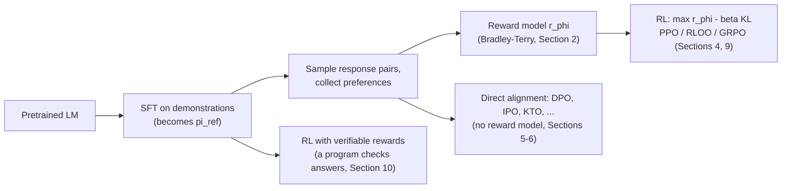
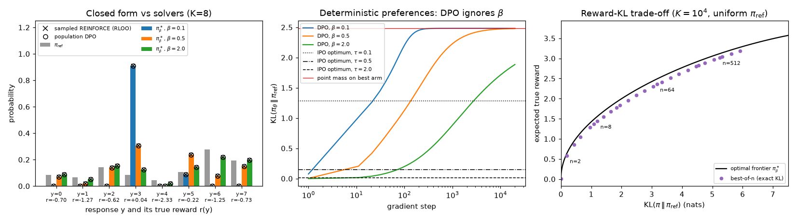
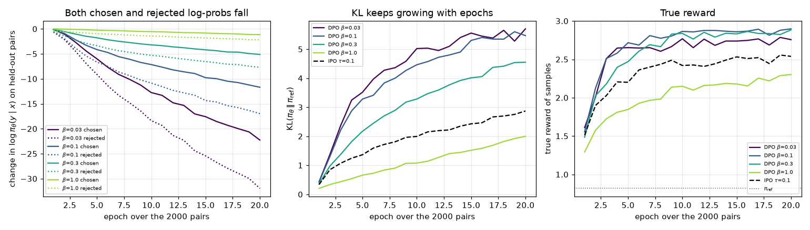
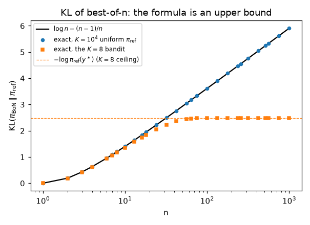
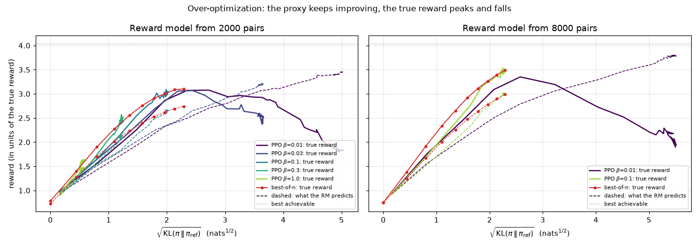
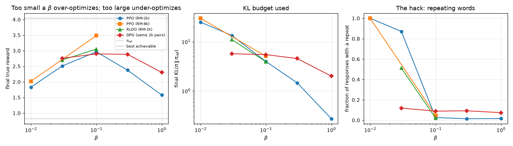
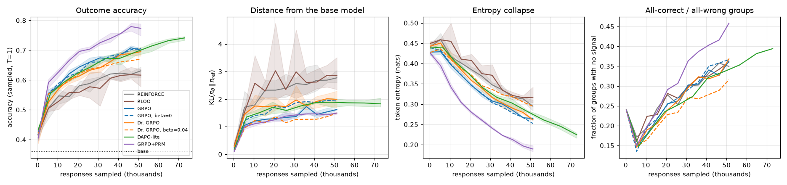
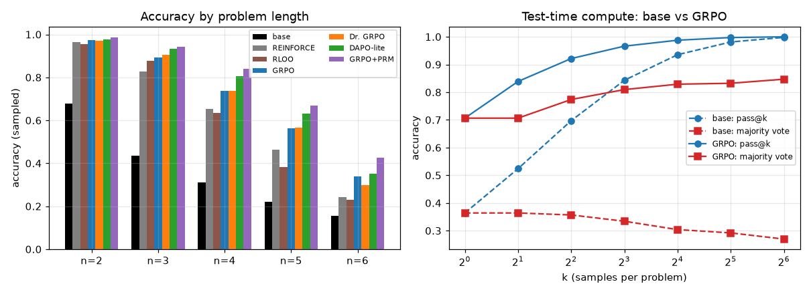
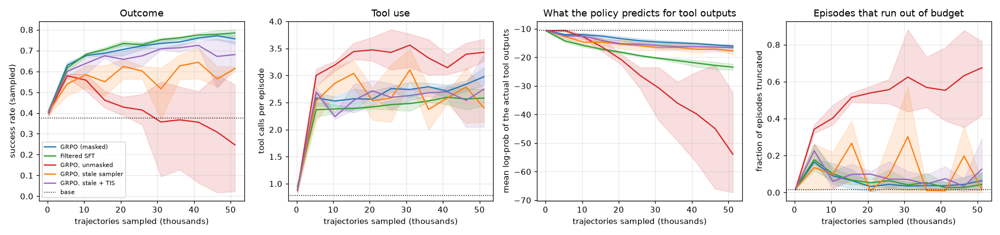

# Chapter 18 — RL for Language Models: RLHF, DPO, GRPO and Verifiable Rewards

[← Previous: Multi-Agent RL and Games](17-multi-agent-rl.md) · [Course index](../README.md) · [Next: Theory of RL: Convergence, Sample Complexity and Regret](19-rl-theory.md) →

## At a glance

A pretrained language model can continue any text, but it does not know which continuation you *want*. Reinforcement learning is how the field turned such models into assistants that follow instructions, and, since 2024, into "reasoning models" that think at length before they answer maths and coding problems. The policy is the language model itself. An action is a token, and an episode is a response. The reward comes from one of three sources: a neural network trained on human comparisons (RLHF), an AI judge following written principles (RLAIF, Constitutional AI), or a program that checks the answer (RL with verifiable rewards, RLVR).

This chapter builds that machinery from first principles and runs every piece of it on a toy language model small enough to train on one CPU core in seconds. We start with the KL-regularized objective that almost every method optimizes, and derive its closed-form solution $\pi^\ast_\beta \propto \pi_{\mathrm{ref}}\exp(r/\beta)$. That one formula explains why RLHF needs a KL penalty, gives Direct Preference Optimization (DPO) in three lines, and tells us what best-of-$n$ sampling is approximating. We then go through the InstructGPT pipeline (supervised fine-tuning, a Bradley–Terry reward model, PPO with a per-token KL penalty), the critic-free methods now widely used instead of PPO (RLOO, GRPO and its 2025 corrections Dr. GRPO and DAPO), expert iteration (fine-tuning on the samples a verifier accepts), reward hacking and the scaling laws of reward-model over-optimization, process versus outcome rewards, test-time compute, what is publicly known about o1 and DeepSeek-R1, and multi-turn agents that call tools.

**Learning objectives.** After this chapter you should be able to:

1. Write language generation both as a contextual bandit over whole responses and as a token-level MDP with deterministic transitions, and say which algorithms use which view and why.
2. Derive the Bradley–Terry preference model from a random-utility model, derive the reward-model loss and its gradient, and explain what label noise does to reward-model accuracy.
3. Prove that the KL-regularized objective $\mathbb E_\pi[r]-\beta D_{\mathrm{KL}}(\pi\Vert\pi_{\mathrm{ref}})$ is maximized by $\pi^\ast_\beta\propto\pi_{\mathrm{ref}}e^{r/\beta}$ with value $\beta\log Z$, and use it to explain the support constraint, the reward–KL frontier and the token-level soft Bellman equation.
4. Implement PPO for RLHF at the token level (per-token KL penalty, value head, GAE) and REINFORCE with a leave-one-out baseline at the sequence level, and derive why folding the KL into the reward gives an exact gradient.
5. Derive DPO from the closed form, state precisely when its minimizer equals $\pi^\ast_\beta$, and explain its failure modes (deterministic preferences, likelihood displacement, off-policy data), with IPO, KTO, SimPO and ORPO as responses to them.
6. Explain reward hacking and over-optimization (Goodhart's law, Gao et al.'s scaling laws), derive the KL of best-of-$n$ sampling, and choose a KL coefficient.
7. Implement GRPO and state carefully what the Dr. GRPO and DAPO analyses changed and why (length and difficulty biases, zero-advantage groups, clipping asymmetry), and derive expert iteration as EM on the log-probability of success.
8. Describe RL with verifiable rewards and reasoning models (o1, DeepSeek-R1), process versus outcome reward models, test-time compute (pass@$k$, majority voting, reranking) and the main open problems, and formalize multi-turn agentic RL (observation masks, budgets, stale samplers).

**Prerequisites.** Contextual bandits and the softmax as an entropy-regularized maximizer ([Chapter 02](02-multi-armed-bandits.md)); MDPs, returns and episodes ([Chapter 01](01-the-rl-problem.md)); REINFORCE, baselines and GAE ([Chapter 10](10-policy-gradients.md)); PPO, the KL estimators $k_1,k_3$ and the RLHF preview in Section 10 ([Chapter 11](11-trust-regions-and-ppo.md)); maximum-entropy RL ([Chapter 12](12-continuous-control-actor-critic.md)) for Section 3.5; exploration in the LLM era ([Chapter 14](14-exploration.md), Section 13). KL divergence, its direction and the cross-entropy loss are in [Chapter 00](00-math-toolkit.md). Inverse RL and offline RL ([Chapter 16](16-offline-rl-and-imitation.md)) are close relatives of reward modelling and DPO.

**Code you will run** (all in [`code/ch18_rl_for_language_models/`](../code/ch18_rl_for_language_models/); PyTorch and NumPy on one CPU thread; full runtimes measured on a shared machine):

| Script | What it shows | Sections | Full run |
|---|---|---|---|
| [`kl_bandit.py`](../code/ch18_rl_for_language_models/kl_bandit.py) | The closed form $\pi^\ast_\beta$ checked against three independent solvers; population DPO recovers $\pi^\ast_\beta$; with deterministic preferences DPO collapses whatever $\beta$ is, IPO does not; exact best-of-$n$ KL vs the $\log n-(n-1)/n$ formula, and a check of the sample-based estimator of that KL used in Section 8.4; best-of-$n$ vs the optimal reward–KL frontier | 3, 5, 6, 8 | 15 s |
| [`toy_lm.py`](../code/ch18_rl_for_language_models/toy_lm.py) | Library: a conditional GRU language model, sampling with masks, per-token log-probabilities and exact KLs, a scalar-head GRU for reward and value models | 1 | — |
| [`rlhf_toy.py`](../code/ch18_rl_for_language_models/rlhf_toy.py) | The whole pipeline: SFT → preferences from a hidden true reward → Bradley–Terry reward model → PPO with a per-token KL (value model, GAE), RLOO, DPO, IPO and best-of-$n$; a $\beta$ sweep showing over-optimization; replications with `--seed` | 2–8 | 5.2 min |
| [`grpo_rlvr.py`](../code/ch18_rl_for_language_models/grpo_rlvr.py) | RL with a verifier on a "chain-of-thought arithmetic" task: REINFORCE, RLOO, GRPO, Dr. GRPO, DAPO-style and process-reward GRPO, two ablations of the KL term, filtered SFT (expert iteration); pass@$k$ and majority voting | 9–12 | 8.1 min |
| [`multiturn_tool_toy.py`](../code/ch18_rl_for_language_models/multiturn_tool_toy.py) | The same task with a calculator tool: masked GRPO, filtered SFT, GRPO without observation masks, a stale sampler with and without truncated importance weights | 13 | 4.1 min |
| [`exercise_solutions.py`](../code/ch18_rl_for_language_models/exercise_solutions.py) | Numerical checks for the exercises; adaptive KL control, SimPO and iterated RLHF on the toy | Exercises | 2.4 min |

**Study time.** About 13–16 hours: 8–9 for the text and derivations, 2 to run and modify the code, 3–5 for the exercises.

**Notation.** We follow [NOTATION.md](../NOTATION.md): $x$ is a prompt, $y$ a response, $\pi_{\mathrm{ref}}$ the reference (usually supervised fine-tuned) policy, $r_\phi(x,y)$ a learned reward model and $\beta$ the KL coefficient. Local conventions and departures:

* $y=(y_1,\dots,y_L)$ is a response of length $L=\lvert y\rvert$ tokens, drawn from a vocabulary $\mathcal V$; $y_{<t}=(y_1,\dots,y_{t-1})$. The last token is usually the end-of-sequence token EOS. $L$ plays the role of NOTATION.md's final time step; we reserve $T$ for the *generation budget*, the largest allowed $L$. $\mathcal D$ is the distribution of prompts.
* $\pi_{\boldsymbol\theta}(y\mid x)$ is the probability of a whole response; $\pi_{\boldsymbol\theta}(y_t\mid x,y_{<t})$ the next-token probability. We often drop $\boldsymbol\theta$ and the prompt when they are clear.
* $r(x,y)$ is a generic reward on whole responses. $r_{\mathrm{true}}$ is the reward we actually care about (human judgement, or the hidden reward of our toys), called the *gold* reward in the over-optimization literature; $r_\phi$ is a learned proxy for it.
* $\sigma(z)=1/(1+e^{-z})$ is the logistic function. $(x,y_w,y_l)$ is a preference triple: $y_w$ was preferred ("won") over $y_l$.
* $h_{\boldsymbol\theta}(x,y)\doteq\log\frac{\pi_{\boldsymbol\theta}(y\mid x)}{\pi_{\mathrm{ref}}(y\mid x)}$ is the log-ratio to the reference. $Z_\beta(x)$ is a partition function.
* $G$ is the number of responses sampled per prompt (the *group*); only in (18.3) does $G_1$ denote a return, as in NOTATION.md. $k$ plays the same role as $G$ for RLOO in Section 4.3 and for expert iteration in Section 9.5, and is also the $k$ of pass@$k$; $n$ is the number of samples in best-of-$n$, and in the toy of Section 9.4 also the number of digits in a problem (the two are unrelated). In this chapter $n$ is not the $n$ of $n$-step returns.
* $\epsilon$ is PPO's clipping range, as in [Chapter 11](11-trust-regions-and-ppo.md). The token-level MDP uses the course's indexing $S_t, A_t, R_{t+1}$ (Section 1.2): $A_t$ is the token chosen at step $t$, and $\hat A_t$ (with a hat) an advantage estimate.
* Some symbols are reused as loss coefficients. $\gamma_{\mathrm{ptx}}$ (PPO-ptx) and SimPO's margin $\gamma$ are not discount factors; the discount is $\gamma=1$ throughout. IPO's $\tau$ is a regularization strength, a departure from NOTATION.md, where $\tau$ is a temperature or a Polyak coefficient. The $\lambda$'s of Section 6 are loss weights, not the GAE parameter. The $\varepsilon_i$ of Section 2.2 are Gumbel noise variables and $\varepsilon_{\mathrm{KL}}$ in Section 3.3 a KL budget, not exploration rates.
* $\mu(\cdot\mid x)$ is the distribution that generated the responses in a preference dataset (Sections 5.2 and 6), following Azar et al. (2024). It is not the deterministic policy $\mu_{\boldsymbol\theta}$ of NOTATION.md and [Chapter 12](12-continuous-control-actor-critic.md).
* $p$ denotes a generic probability: a preference probability in Sections 5–6 and a success rate in Section 9 ($p_{\boldsymbol\theta}(x)$ in Section 9.5). The soft values of Section 3.5 are written $q^\ast_\beta,v^\ast_\beta$, lower-case as NOTATION.md prescribes for true (not estimated) value functions.
* In Section 13, a multi-turn trajectory alternates policy segments $y_j$ and observations $o_j$ (tool outputs), $j=1,\dots,J$ (here $J$ counts turns; the objective is always written $J(\boldsymbol\theta)$). $P_{\mathrm{env}}$ is the environment's distribution of observations, $h_j$ the history before turn $j$, $z_t$ the $t$-th token of the whole trajectory, $m_t$ the observation mask, and $\pi_{\text{samp}}$ the policy that generated a batch when it differs from the trainer's $\pi_{\boldsymbol\theta_{\text{old}}}$. The segments $y_j$ are not the tokens $y_t$ of a single response, and the observations $o_j$ are not the outputs $o_i$ of the DeepSeekMath paper (Section 9.2).

---

## 1. Language generation as a decision problem

### 1.1 A language model is a policy

A language model assigns a probability to every string, one token at a time:

$$
\pi_{\boldsymbol\theta}(y\mid x)=\prod_{t=1}^{L}\pi_{\boldsymbol\theta}(y_t\mid x,y_{<t}).
\tag{18.1}
$$

Pretraining fits $\boldsymbol\theta$ by maximum likelihood on internet text. *Supervised fine-tuning* (SFT) continues the same maximum-likelihood training on curated demonstrations, such as prompts paired with answers written by people. Both are imitation: they make the model reproduce a data distribution. That is not the same as making it good at a task, for four reasons.

1. **Many tasks have no single correct output.** "Write a polite reply to this email" has thousands of good answers and many bad ones. What we can provide is a judgement of quality, which is a reward, not a target.
2. **Judging is easier than demonstrating.** Most people cannot write an excellent sonnet, but they can tell which of two sonnets is better. Feedback in the form of comparisons scales to tasks beyond the labellers' own ability to produce answers.
3. **Imitation never says "don't".** A model trained only on good examples has never been told that a particular confident falsehood is bad. A reward can push probability *away* from behaviour.
4. **The model should learn from its own outputs.** At deployment the model conditions on text it generated itself, which drifts from the training data (the *exposure bias* of maximum-likelihood training). RL trains on the model's own samples and their consequences, which is the same distribution-shift argument that motivated DAgger in [Chapter 16](16-offline-rl-and-imitation.md).

So we keep the model as it is and change the training signal: sample a response, score it, and make high-scoring responses more likely. That is policy optimization, and the language model is the policy.

### 1.2 Two views: one big bandit, or a token-level MDP

**The sequence-level (bandit) view.** A prompt $x\sim\mathcal D$ is a context, a whole response $y\sim\pi_{\boldsymbol\theta}(\cdot\mid x)$ is a single action, and the reward $r(x,y)$ arrives at once. The objective is that of a contextual bandit ([Chapter 02](02-multi-armed-bandits.md)):

$$
J(\boldsymbol\theta)=\mathbb E_{x\sim\mathcal D}\,\mathbb E_{y\sim\pi_{\boldsymbol\theta}(\cdot\mid x)}\big[r(x,y)\big].
\tag{18.2}
$$

The action space is the set of all strings, astronomically large, but it is *structured*: sampling is easy, and $\log\pi_{\boldsymbol\theta}(y\mid x)$ is a sum of per-token terms that we can differentiate.

**The token-level (MDP) view.** The state before token $t$ is everything so far, $S_t=(x,y_{<t})$. The action is the next token, $A_t=y_t\in\mathcal V$. The transition is deterministic: $S_{t+1}=(x,y_{\le t})$. The episode ends after EOS, or when the generation budget of $T$ tokens is used up. With the course's convention that the reward following $A_t$ is $R_{t+1}$, the reward is zero until the response is complete:

$$
R_{t+1}=\begin{cases}0 & t<L,\\ r(x,y) & t=L,\end{cases}
\qquad\gamma=1,\qquad G_1=\sum_{t=1}^{L}R_{t+1}=r(x,y).
\tag{18.3}
$$

The return from the first state is exactly the sequence reward, so the two views have the same objective. They differ in what an algorithm may exploit:

| | bandit view | token-MDP view |
|---|---|---|
| action | the whole response | one token |
| credit assignment | none: every token of a response shares its reward | value function $V(S_t)$ and TD/GAE can assign credit to individual tokens |
| natural algorithms | REINFORCE with group baselines (RLOO, GRPO), DPO, best-of-$n$ | PPO with a value head |
| what is special | huge, structured action space | deterministic, known transitions; sparse terminal reward; horizon of up to tens of thousands of tokens; state = full history, so the Markov property holds trivially |

Two features of this MDP are unusual compared with the control problems of earlier chapters. The dynamics are deterministic and *known* (appending a token), so the "model" of model-based RL is free and tree search over continuations is possible ([Chapter 13](13-model-based-rl.md)). And the environment's only randomness is the choice of prompt; everything else that is random in an episode comes from the policy itself.

The budget $T$ is part of the task. A response that is cut off at $T$ tokens is scored as it stands, so reaching the budget is a genuine termination and nothing is bootstrapped past it. This differs from a Gymnasium time limit, where the episode is truncated but the environment would have continued (NOTATION.md, "Code conventions"). Implementations differ in how they score truncated responses: some give them the reward model's score, others a fixed penalty.

### 1.3 The KL-regularized objective

Almost every method in this chapter optimizes not (18.2) but a regularized version. Let $\pi_{\mathrm{ref}}$ be a fixed reference policy, usually the SFT model. Then

$$
J_\beta(\boldsymbol\theta)=\mathbb E_{x\sim\mathcal D}\Big[\mathbb E_{y\sim\pi_{\boldsymbol\theta}(\cdot\mid x)}\big[r(x,y)\big]-\beta\,D_{\mathrm{KL}}\big(\pi_{\boldsymbol\theta}(\cdot\mid x)\,\Vert\,\pi_{\mathrm{ref}}(\cdot\mid x)\big)\Big],
\tag{18.4}
$$

with $\beta>0$. Section 3 explains why we want the penalty. Here we only need to see how the KL between two distributions over *sequences* decomposes into per-token quantities, because that is how it is computed.

By (18.1), the log-ratio of two autoregressive models is a sum over tokens:

$$
\log\frac{\pi(y\mid x)}{\pi_{\mathrm{ref}}(y\mid x)}=\sum_{t=1}^{L}\log\frac{\pi(y_t\mid S_t)}{\pi_{\mathrm{ref}}(y_t\mid S_t)} .
$$

Taking the expectation over $y\sim\pi(\cdot\mid x)$ gives the first form of the sequence KL. For the second, condition on the prefix. Given $S_t$, the expected value of the $t$-th term over $y_t\sim\pi(\cdot\mid S_t)$ is the KL between the two next-token distributions at $S_t$. By the tower property,

$$
\begin{aligned}
D_{\mathrm{KL}}\big(\pi(\cdot\mid x)\Vert\pi_{\mathrm{ref}}(\cdot\mid x)\big)
&=\mathbb E_{y\sim\pi}\Big[\sum_{t=1}^{L}\log\frac{\pi(y_t\mid S_t)}{\pi_{\mathrm{ref}}(y_t\mid S_t)}\Big]\\
&=\mathbb E_{y\sim\pi}\Big[\sum_{t=1}^{L}D_{\mathrm{KL}}\big(\pi(\cdot\mid S_t)\,\Vert\,\pi_{\mathrm{ref}}(\cdot\mid S_t)\big)\Big].
\end{aligned}
\tag{18.5}
$$

(When the length $L$ is random, the second line still holds because the event "the response has not ended before $t$" is determined by $S_t$; Exercise 1 checks (18.5) numerically on a small tree.) The first line gives the cheap estimator used inside PPO-RLHF: sum the sampled per-token log-ratios. The second gives the estimator we use for every KL we *report*: sum the exact next-token KLs along sampled responses. It costs one extra forward pass, removes the per-step sampling noise of each term and is never negative. It is usually, though not always, the lower-variance of the two (Exercise 1).

The KL in (18.4) is the *reverse* KL, $D_{\mathrm{KL}}(\pi_{\boldsymbol\theta}\Vert\pi_{\mathrm{ref}})$, whose direction matters ([Chapter 00](00-math-toolkit.md)). It is infinite if $\pi_{\boldsymbol\theta}$ puts mass where $\pi_{\mathrm{ref}}$ has none, and it allows $\pi_{\boldsymbol\theta}$ to drop modes of $\pi_{\mathrm{ref}}$. So the regularized policy may become *narrower* than the reference, but its support can never extend beyond the reference's.

### 1.4 The pipeline at a glance



The rest of the chapter follows this diagram. We run each box on a toy task, introduced next.

**The running example.** Our "language model" is a single-layer GRU with 26,539 parameters ([`toy_lm.py`](../code/ch18_rl_for_language_models/toy_lm.py)). There are 4 prompts ("topics") and a vocabulary of 10 words plus EOS, and responses have at most $T=10$ tokens. Each topic $x$ has a hidden weight $w_x(v)$ for every word $v$, drawn from $\mathcal N(0,1)$. The hidden true reward is

$$
r_{\mathrm{true}}(x,y)=\sum_{v\,\in\,\mathrm{distinct}(y)}w_x(v)\;-\;0.6\times(\text{number of repeated words in }y),
$$

so a good response uses each relevant word once and stops. The best achievable true reward, averaged over the four topics, is $4.04$. The "human demonstrations" used for SFT draw distinct words (without replacement) from a topic-specific distribution and stop after each word with probability 0.3: humans in this world never repeat themselves. Two properties make this toy a faithful miniature of RLHF. First, the reward model will be trained on comparisons of SFT samples, and only 1.2% of those contain a repeated word. Second, the true reward punishes repetition. A reward model that has hardly ever seen repetition has no reason to know that it is bad, which is the situation of a real reward model facing a degenerate, repetitive or overly long output it was never trained on.

---

## 2. Learning a reward model from preferences

### 2.1 Why comparisons

Ask ten people to rate a response on a 1–7 scale and you get ten different calibrations. One person's 5 is another's 3, and the same person drifts during a session. Ask them which of two responses is better and they agree much more often. Comparisons also allow feedback on tasks the labeller could not solve themselves. RLHF therefore collects data of the form: for prompt $x$, responses $y_1,y_2$ sampled from the current model, and a human label saying which is better. InstructGPT (Ouyang et al., 2022) asked labellers to *rank* between 4 and 9 responses at once, which yields up to $\binom{9}{2}=36$ comparisons per prompt.

### 2.2 The Bradley–Terry model

We need a probabilistic model linking a scalar reward to comparisons. The Bradley–Terry model (Bradley & Terry, 1952) says

$$
\Pr\{y_1\succ y_2\mid x\}=\sigma\big(r(x,y_1)-r(x,y_2)\big)=\frac{e^{r(x,y_1)}}{e^{r(x,y_1)}+e^{r(x,y_2)}} .
\tag{18.6}
$$

**Where it comes from: a random-utility derivation.** Suppose the labeller's momentary utility for response $i$ is $U_i=r(x,y_i)+\varepsilon_i$, where the noise terms $\varepsilon_1,\varepsilon_2$ are independent standard Gumbel variables, with CDF $F(\varepsilon)=\exp(-e^{-\varepsilon})$ and density $f(\varepsilon)=e^{-\varepsilon}\exp(-e^{-\varepsilon})$. The labeller reports the response with the larger utility. Write $\Delta=r(x,y_1)-r(x,y_2)$. Then

$$
\begin{aligned}
\Pr\{U_1>U_2\}&=\Pr\{\varepsilon_2<\Delta+\varepsilon_1\}=\int_{-\infty}^{\infty}f(\varepsilon_1)\,F(\Delta+\varepsilon_1)\,d\varepsilon_1\\
&=\int_{-\infty}^{\infty}e^{-\varepsilon}\exp\!\big(-e^{-\varepsilon}\big)\exp\!\big(-e^{-\Delta}e^{-\varepsilon}\big)\,d\varepsilon
=\int_{-\infty}^{\infty}e^{-\varepsilon}\exp\!\big(-e^{-\varepsilon}(1+e^{-\Delta})\big)\,d\varepsilon\\
&=\int_{0}^{\infty}\exp\!\big(-u(1+e^{-\Delta})\big)\,du\qquad(u=e^{-\varepsilon},\;du=-e^{-\varepsilon}d\varepsilon)\\
&=\frac{1}{1+e^{-\Delta}}=\sigma(\Delta).
\end{aligned}
$$

So Bradley–Terry is what you get if people pick the better response up to Gumbel-distributed noise. (Exercise 3 checks this by Monte Carlo.) The same assumption with $K$ options gives the softmax choice rule, and applied repeatedly to a ranking it gives the **Plackett–Luce** model: the probability of the ranking $y_{\tau(1)}\succ\dots\succ y_{\tau(K)}$ is $\prod_{j=1}^{K}e^{r(y_{\tau(j)})}/\sum_{k\ge j}e^{r(y_{\tau(k)})}$.

Two consequences matter in practice.

* **Rewards are identified only up to a prompt-dependent constant.** Replacing $r(x,y)$ by $r(x,y)+c(x)$ leaves (18.6) unchanged. A trained reward model therefore has an arbitrary offset per prompt, and implementations normalize it. InstructGPT, for example, shifted its reward model so that the labellers' demonstrations scored 0 on average.
* **The scale is set by the noise.** A reward difference of 1 means "preferred 73% of the time" ($\sigma(1)=0.731$). There is no other unit.

### 2.3 The reward-model loss

Given a dataset of preference triples $(x,y_w,y_l)$, fit a parametric reward $r_\phi$ by maximum likelihood under (18.6):

$$
\mathcal L_{\mathrm{RM}}(\phi)=-\mathbb E_{(x,y_w,y_l)}\Big[\log\sigma\big(r_\phi(x,y_w)-r_\phi(x,y_l)\big)\Big].
\tag{18.7}
$$

This is binary cross-entropy with the reward *difference* as the logit. Write $\Delta_\phi=r_\phi(x,y_w)-r_\phi(x,y_l)$. Using $\frac{d}{dz}\log\sigma(z)=1-\sigma(z)=\sigma(-z)$,

$$
\nabla_\phi\mathcal L_{\mathrm{RM}}=-\mathbb E\Big[\sigma(-\Delta_\phi)\,\big(\nabla_\phi r_\phi(x,y_w)-\nabla_\phi r_\phi(x,y_l)\big)\Big].
\tag{18.8}
$$

Each pair pushes the winner's score up and the loser's down, weighted by $\sigma(-\Delta_\phi)$, the probability the current model assigns to the *wrong* ordering. Pairs the model already ranks confidently contribute little. InstructGPT put all $\binom{K}{2}$ comparisons from one ranking into the same batch element. Treating them as independent samples made the reward model overfit within one epoch, because each response appears in $K-1$ comparisons.

**The accuracy ceiling.** If labels really are Bradley–Terry with the true reward, then even the true reward predicts a label correctly only with probability $\mathbb E[\max(\sigma(\Delta),1-\sigma(\Delta))]<1$. Human preference data is noisy in exactly this way, and agreement between labellers is far from perfect, so reward-model accuracies around 70% are normal, not a sign of a bug.

**Architecture.** A reward model is usually the SFT model with its next-token head replaced by a linear layer that outputs one number, read off at the final token of the response. Our toy uses the same recipe at small scale: a GRU of the same shape as the policy, with a scalar head applied after the last token ([`ScalarModel`](../code/ch18_rl_for_language_models/toy_lm.py)).

```text
Algorithm 18.1  Reward model training (Bradley–Terry)
Input: SFT policy pi_ref; prompts D; a labeller (human, AI judge, or here a hidden r_true)
       number of pairs N; epochs E; validation fraction
Output: reward model r_phi (normalized)

1. For i = 1..N:
       x ~ D;  y1, y2 ~ pi_ref(. | x)                    # pairs of model samples
       ask the labeller which is better -> (x, y_w, y_l)
2. Split the pairs into train / validation.
3. Initialise r_phi from the SFT model with a scalar head (or randomly, in the toy).
4. For epoch = 1..E:
       for each minibatch B of train pairs:
           Delta = r_phi(x, y_w) - r_phi(x, y_l)
           loss = mean over B of  -log sigma(Delta)       # eq. (18.7)
           take a gradient step on phi
       keep the parameters with the lowest validation loss (early stopping)
5. Normalize: mu, s = mean and std of r_phi(x, y) over fresh samples y ~ pi_ref
   and use (r_phi - mu) / s from now on.
```

### 2.4 Worked example by hand

A reward model scores two responses $r_\phi(x,y_A)=1.2$ and $r_\phi(x,y_B)=0.4$, so $\Delta=0.8$ and the model predicts $\Pr\{A\succ B\}=\sigma(0.8)=0.690$.

* If the label says $A$ won, the loss is $-\log 0.690=0.371$, and the gradient weight is $\sigma(-0.8)=0.310$: a modest push, because the model was already right.
* If the label says $B$ won, the roles swap: $\Delta=-0.8$, the loss is $-\log\sigma(-0.8)=1.171$, and the weight is $\sigma(0.8)=0.690$, more than twice as large. Surprising labels drive learning.

### 2.5 The toy reward models

[`rlhf_toy.py`](../code/ch18_rl_for_language_models/rlhf_toy.py) samples pairs from the SFT policy and labels them by drawing from (18.6) with $r_{\mathrm{true}}$. We train two reward models: one on 2,000 pairs (RM-2k) and one on 8,000 pairs (RM-8k). Both are validated on the same 1,000 held-out pairs.

| | val. accuracy | ceiling (true reward) | corr. with $r_{\mathrm{true}}$ on SFT samples |
|---|---|---|---|
| RM-2k (2,000 pairs; lowest validation loss after epoch 7 of 12) | 0.717 | 0.744 | 0.826 |
| RM-8k (8,000 pairs; lowest validation loss after epoch 4 of 6) | 0.709 | 0.744 | 0.835 |

On the distribution it was trained on, each reward model is close to the label-noise ceiling, and four times more data hardly changes that. Now ask both models about something they have almost never seen: the best word for a topic, repeated $1,2,3,5,9$ times. For topic 0, in standardized reward-model units:

| repetitions of the best word | 1 | 2 | 3 | 5 | 9 |
|---|---|---|---|---|---|
| RM-2k | $+0.68$ | $+1.28$ | $+1.58$ | $+1.87$ | $+2.07$ |
| RM-8k | $+0.68$ | $+1.09$ | $+1.36$ | $+1.66$ | $+1.88$ |
| true reward | $+1.20$ | $+0.60$ | $0.00$ | $-1.20$ | $-3.60$ |

Both reward models say "more is better" and the truth says the opposite. The same pattern holds for all four topics. Validation accuracy cannot reveal this: the failure lives where the data is not. Section 8 shows what an optimizer does with it.

---

## 3. Why a KL penalty, and the closed-form optimal policy

### 3.1 Three reasons to stay close to the reference

Why not simply maximize $\mathbb E[r_\phi]$? There are three reasons.

1. **The reward model is only trustworthy where it was trained.** It was fitted on samples from $\pi_{\mathrm{ref}}$. Far from that distribution its outputs are extrapolations, and an optimizer actively searches for the places where the extrapolation is too optimistic, as the table above suggests. The KL term keeps the policy where the reward model has data.
2. **The reward does not capture everything we value.** Fluency, factual knowledge, diversity and the absence of degenerate text are largely inherited from pretraining. They are present in $\pi_{\mathrm{ref}}$ but not in the reward. Without a KL anchor nothing in the objective protects them, and the policy is free to trade them away for reward, drifting toward text that exploits the reward model. Stiennon et al. (2020) described their penalty as serving two purposes: it acts like an entropy bonus that keeps the policy from collapsing to a single mode, and it keeps the policy's outputs close to those the reward model saw in training (reason 1 above).
3. **It turns the problem into a well-posed one with a unique answer.** As we now show, the regularized problem has a closed-form solution that is a smooth reweighting of the reference policy, not a point mass.

### 3.2 The closed form

Fix a prompt $x$ and drop it from the notation. Consider the objective over *all* distributions $\pi$ on responses (no parameterization yet):

$$
J_\beta(\pi)=\sum_y\pi(y)\,r(y)-\beta\sum_y\pi(y)\log\frac{\pi(y)}{\pi_{\mathrm{ref}}(y)} .
$$

**Theorem 18.1 (KL-regularized optimal policy).** Assume $Z_\beta\doteq\sum_y\pi_{\mathrm{ref}}(y)\exp(r(y)/\beta)<\infty$ (true for any bounded reward). Then $J_\beta$ has the unique maximizer

$$
\pi^\ast_\beta(y)=\frac{1}{Z_\beta}\,\pi_{\mathrm{ref}}(y)\exp\!\Big(\frac{r(y)}{\beta}\Big),
\tag{18.9}
$$

and for every distribution $\pi$,

$$
J_\beta(\pi)=\beta\log Z_\beta-\beta\,D_{\mathrm{KL}}\big(\pi\,\Vert\,\pi^\ast_\beta\big),
\tag{18.10}
$$

so the optimal value is

$$
J_\beta(\pi^\ast_\beta)=\beta\log Z_\beta=\beta\log\mathbb E_{y\sim\pi_{\mathrm{ref}}}\big[e^{r(y)/\beta}\big].
\tag{18.11}
$$

*Proof.* Take the logarithm of (18.9) and solve for the reward: $r(y)=\beta\log\frac{\pi^\ast_\beta(y)}{\pi_{\mathrm{ref}}(y)}+\beta\log Z_\beta$. Substitute this into the summand of $J_\beta$:

$$
\begin{aligned}
r(y)-\beta\log\frac{\pi(y)}{\pi_{\mathrm{ref}}(y)}
&=\beta\log\frac{\pi^\ast_\beta(y)}{\pi_{\mathrm{ref}}(y)}+\beta\log Z_\beta-\beta\log\frac{\pi(y)}{\pi_{\mathrm{ref}}(y)}\\
&=\beta\log Z_\beta-\beta\log\frac{\pi(y)}{\pi^\ast_\beta(y)} .
\end{aligned}
$$

Average over $y\sim\pi$. The first term is a constant and the second averages to $\beta D_{\mathrm{KL}}(\pi\Vert\pi^\ast_\beta)$, which proves (18.10). Since $D_{\mathrm{KL}}\ge 0$, with equality if and only if $\pi=\pi^\ast_\beta$, the maximizer is unique and the maximum is $\beta\log Z_\beta$. $\square$

Identity (18.11) is the *Gibbs variational principle* (the Donsker–Varadhan formula): the log-partition function is the convex conjugate of the KL divergence. The softmax policy of [Chapter 02](02-multi-armed-bandits.md), which maximizes expected value plus entropy, is the special case of a uniform $\pi_{\mathrm{ref}}$.

With prompts put back, $\pi^\ast_\beta(y\mid x)=\pi_{\mathrm{ref}}(y\mid x)e^{r(x,y)/\beta}/Z_\beta(x)$, one partition function per prompt. The objective (18.4) is an average over prompts of per-prompt objectives, so this policy maximizes it as well, provided the policy class is rich enough to represent it.

### 3.3 What the closed form tells us

* **$\beta$ interpolates between imitation and greed.** As $\beta\to\infty$, $\pi^\ast_\beta\to\pi_{\mathrm{ref}}$. As $\beta\to0$, $\pi^\ast_\beta$ concentrates on the responses of maximal reward *within the support of* $\pi_{\mathrm{ref}}$.
* **The support constraint.** If $\pi_{\mathrm{ref}}(y)=0$ then $\pi^\ast_\beta(y)=0$ for every $\beta$. KL-regularized RL can only *reweight* what the reference can already produce. In practice no token has probability exactly zero, but a response with reference probability $10^{-30}$ needs an enormous reward to get any mass: by (18.9) its probability is multiplied by $e^{r/\beta}/Z_\beta$. This simple fact sits at the centre of the 2025 debate on whether RL with verifiable rewards teaches models anything new (Section 10.4).
* **The reward–KL frontier.** Consider the constrained problem: maximize $\mathbb E_\pi[r]$ subject to $D_{\mathrm{KL}}(\pi\Vert\pi_{\mathrm{ref}})\le\varepsilon_{\mathrm{KL}}$. Its Lagrangian is $J_\beta$ with $\beta$ as the multiplier, so the solution is $\pi^\ast_\beta$ for the $\beta$ at which the constraint is tight. As $\beta$ varies, $(D_{\mathrm{KL}}(\pi^\ast_\beta\Vert\pi_{\mathrm{ref}}),\,\mathbb E_{\pi^\ast_\beta}[r])$ traces the **optimal frontier**: no policy gets more reward for the same KL. The slope of the frontier at $\pi^\ast_\beta$ is exactly $\beta$. To see this, write $f(\beta')$ and $g(\beta')$ for the expected reward and the KL of $\pi^\ast_{\beta'}$. Since $\pi^\ast_\beta$ maximizes $\mathbb E_\pi[r]-\beta D_{\mathrm{KL}}(\pi\Vert\pi_{\mathrm{ref}})$ over *all* policies, the function $\beta'\mapsto f(\beta')-\beta g(\beta')$ is maximized at $\beta'=\beta$. Its derivative vanishes there, $f'(\beta)-\beta g'(\beta)=0$, which gives $df/dg=\beta$. A small $\beta$ means the frontier has flattened: each extra nat of KL buys little reward.
* **A Bayesian reading.** Korbak, Perez and Buckley (2022) observed that (18.9) is a posterior: prior $\pi_{\mathrm{ref}}$, likelihood $e^{r/\beta}$ of an "output is good" event. KL-regularized RL is then variational inference toward that posterior, which explains why it avoids the collapse that unregularized reward maximization causes.

### 3.4 Worked example by hand

Three responses with $\pi_{\mathrm{ref}}=(0.5,\,0.3,\,0.2)$ and rewards $r=(0,\,1,\,2)$.

* $\beta=1$. The unnormalized weights are $\pi_{\mathrm{ref}}e^{r}=(0.5,\;0.3e,\;0.2e^2)=(0.5,\;0.8155,\;1.4778)$, so $Z=2.7933$ and $\pi^\ast_1=(0.179,\;0.292,\;0.529)$. Then $\mathbb E[r]=1.350$, $D_{\mathrm{KL}}(\pi^\ast_1\Vert\pi_{\mathrm{ref}})=0.323$, and $\mathbb E[r]-\beta D_{\mathrm{KL}}=1.027=\log 2.7933=\beta\log Z$, as (18.11) promises.
* $\beta=0.5$. The weights are $(0.5,\;0.3e^{2},\;0.2e^{4})=(0.5,\;2.217,\;10.920)$, $Z=13.636$, $\pi^\ast_{0.5}=(0.037,\;0.163,\;0.801)$, $\mathbb E[r]=1.764$ and $D_{\mathrm{KL}}=0.916$. Halving $\beta$ bought $0.41$ more reward for $0.59$ more nats of KL.

The reference's favourite response (probability 0.5, reward 0) keeps some mass even at $\beta=0.5$: the policy hedges in proportion to the prior. ([`exercise_solutions.py`](../code/ch18_rl_for_language_models/exercise_solutions.py) reproduces these numbers.)

### 3.5 The token-level view: a soft Bellman equation

The closed form is over whole responses. What does $\pi^\ast_\beta$ do *token by token*? Use the token MDP of Section 1.2, with per-token reward $0$ except $r(x,y)$ at the end. Define the soft values backwards from the end of the response:

$$
\begin{aligned}
q^\ast_\beta(S_t,a)&=\begin{cases}r(x,y_{<t}a) & \text{if } a \text{ ends the response (EOS, or the budget is reached)},\\ v^\ast_\beta(S_{t+1}) & \text{otherwise, where } S_{t+1}=(x,y_{<t}a),\end{cases}\\
v^\ast_\beta(S_t)&=\beta\log\sum_{a\in\mathcal V}\pi_{\mathrm{ref}}(a\mid S_t)\exp\!\big(q^\ast_\beta(S_t,a)/\beta\big),
\end{aligned}
\tag{18.12}
$$

and the token policy $\pi^\ast(a\mid S_t)=\pi_{\mathrm{ref}}(a\mid S_t)\exp\big((q^\ast_\beta(S_t,a)-v^\ast_\beta(S_t))/\beta\big)$, which is normalized by the definition of $v^\ast_\beta$. Multiply these token probabilities along a response $y$ of length $L$. The exponents telescope, because $q^\ast_\beta(S_t,y_t)=v^\ast_\beta(S_{t+1})$ for $t<L$ and $q^\ast_\beta(S_L,y_L)=r(x,y)$:

$$
\sum_{t=1}^{L}\big(q^\ast_\beta(S_t,y_t)-v^\ast_\beta(S_t)\big)=r(x,y)-v^\ast_\beta(S_1),
\qquad\text{so}\qquad
\prod_{t=1}^{L}\pi^\ast(y_t\mid S_t)=\pi_{\mathrm{ref}}(y\mid x)\,e^{(r(x,y)-v^\ast_\beta(S_1))/\beta}.
$$

This is (18.9) with $\beta\log Z_\beta(x)=v^\ast_\beta(S_1)$. So the sequence-level optimum is generated, token by token, by a softmax over soft action values with the reference as a prior. This is the soft Bellman equation of maximum-entropy RL ([Chapter 12](12-continuous-control-actor-critic.md)), with entropy replaced by KL to $\pi_{\mathrm{ref}}$. Rafailov et al. (2024a, "From $r$ to $Q^\ast$") used this to argue that a DPO-trained model's per-token log-ratios behave like a soft advantage, which provides some token-level credit assignment.

### 3.6 Checking it numerically

[`kl_bandit.py`](../code/ch18_rl_for_language_models/kl_bandit.py) takes a bandit with $K=8$ responses, a non-uniform $\pi_{\mathrm{ref}}$ and Gaussian rewards, and solves the regularized problem three ways that know nothing of (18.9): a generic constrained optimizer on the simplex (SLSQP), exact gradient ascent on softmax logits, and *sampled* REINFORCE with the KL folded into the reward and a leave-one-out baseline (Section 4). The largest absolute difference from the closed form, over the 8 probabilities:

| $\beta$ | SLSQP | exact gradient | sampled REINFORCE (60k iterations, 4 samples each) | $D_{\mathrm{KL}}(\pi^\ast_\beta\Vert\pi_{\mathrm{ref}})$ |
|---|---|---|---|---|
| 0.1 | $2.8\times10^{-7}$ | $2.1\times10^{-4}$ | $7.8\times10^{-4}$ | 2.136 |
| 0.5 | $1.2\times10^{-8}$ | $7.1\times10^{-11}$ | $4.3\times10^{-5}$ | 0.402 |
| 2.0 | $6.5\times10^{-9}$ | $4.5\times10^{-16}$ | $5.6\times10^{-17}$ | 0.031 |

In every case $J_\beta(\pi^\ast_\beta)$ equals $\beta\log Z_\beta$ to the printed precision, all 1,000 random perturbations of $\pi^\ast_{0.5}$ score lower, and identity (18.10) holds to six decimals on a random policy.

The sampled REINFORCE converges to machine precision at $\beta=2$, which needs an explanation. At the optimum, the KL-shaped reward $r(y)-\beta\log\frac{\pi^\ast_\beta(y)}{\pi_{\mathrm{ref}}(y)}$ equals $\beta\log Z_\beta$ for *every* $y$ (it is the first line of the proof of Theorem 18.1). With a leave-one-out baseline, every advantage is then exactly zero. The gradient estimator has zero variance at the solution, so the stochastic iteration settles exactly instead of jittering. At $\beta=0.1$ the iterate is still approaching the optimum when the decaying step size has become small. The exact-gradient error of $2.1\times10^{-4}$ at $\beta=0.1$ is also an optimization effect, not a flaw in the closed form. In logit coordinates the curvature of $J_\beta$ along response $y$ is roughly $\beta\,\pi(y)$, and $\pi^\ast_{0.1}$ gives some responses probabilities as small as $2.5\times10^{-11}$. The problem is therefore badly conditioned, and plain gradient ascent converges slowly: 100,000 steps instead of 20,000 bring the error down to $3.0\times10^{-5}$. The left panel of the figure below shows the three solutions next to $\pi_{\mathrm{ref}}$. The other two panels belong to Sections 5.4 (with 6) and 8.3.



---

## 4. RLHF with policy gradients: the InstructGPT recipe

### 4.1 The gradient of the KL-regularized objective

We now optimize a parameterized policy. Fix a prompt and differentiate $J_\beta(\boldsymbol\theta)=\sum_y\pi_{\boldsymbol\theta}(y)\big[r(y)-\beta\log\pi_{\boldsymbol\theta}(y)+\beta\log\pi_{\mathrm{ref}}(y)\big]$. The product rule gives two sums:

$$
\nabla_{\boldsymbol\theta}J_\beta=\sum_y\nabla_{\boldsymbol\theta}\pi_{\boldsymbol\theta}(y)\Big[r(y)-\beta\log\frac{\pi_{\boldsymbol\theta}(y)}{\pi_{\mathrm{ref}}(y)}\Big]\;-\;\beta\sum_y\pi_{\boldsymbol\theta}(y)\,\nabla_{\boldsymbol\theta}\log\pi_{\boldsymbol\theta}(y).
$$

The second sum vanishes: $\sum_y\pi_{\boldsymbol\theta}\nabla\log\pi_{\boldsymbol\theta}=\sum_y\nabla\pi_{\boldsymbol\theta}=\nabla\sum_y\pi_{\boldsymbol\theta}(y)=\nabla 1=0$. Writing $\nabla\pi_{\boldsymbol\theta}=\pi_{\boldsymbol\theta}\nabla\log\pi_{\boldsymbol\theta}$ in the first sum and restoring the prompts,

$$
\nabla_{\boldsymbol\theta}J_\beta=\mathbb E_{x\sim\mathcal D}\,\mathbb E_{y\sim\pi_{\boldsymbol\theta}}\Big[\Big(r(x,y)-\beta\log\frac{\pi_{\boldsymbol\theta}(y\mid x)}{\pi_{\mathrm{ref}}(y\mid x)}\Big)\nabla_{\boldsymbol\theta}\log\pi_{\boldsymbol\theta}(y\mid x)\Big].
\tag{18.13}
$$

This is REINFORCE ([Chapter 10](10-policy-gradients.md)) applied to the **KL-shaped reward** $\tilde r(x,y)=r(x,y)-\beta\log\frac{\pi_{\boldsymbol\theta}(y\mid x)}{\pi_{\mathrm{ref}}(y\mid x)}$, which is treated as a constant (no gradient flows through it). The exact gradient needs no extra term for the dependence of the KL on $\boldsymbol\theta$. As always, any baseline $b(x)$ that does not depend on $y$ may be subtracted from $\tilde r$ without introducing bias.

### 4.2 PPO at the token level

InstructGPT (Ouyang et al., 2022), following Ziegler et al. (2019) and Stiennon et al. (2020), optimized (18.4) with PPO in the token-level MDP. The KL-shaped reward is spread over the tokens. With $\pi_{\boldsymbol\theta_{\text{old}}}$ the policy that generated the batch,

$$
R_{t+1}=-\beta\log\frac{\pi_{\boldsymbol\theta_{\text{old}}}(A_t\mid S_t)}{\pi_{\mathrm{ref}}(A_t\mid S_t)}\;+\;\mathbb 1[t=L]\;r_\phi(x,y),\qquad t=1,\dots,L .
\tag{18.14}
$$

By (18.5) the undiscounted return $\sum_t R_{t+1}=r_\phi(x,y)-\beta\log\frac{\pi_{\boldsymbol\theta_{\text{old}}}(y\mid x)}{\pi_{\mathrm{ref}}(y\mid x)}$ has expectation $\mathbb E[r_\phi]-\beta D_{\mathrm{KL}}$, which is the objective. This is equation (11.36) of [Chapter 11](11-trust-regions-and-ppo.md), with the log-ratio evaluated once, at the policy $\pi_{\boldsymbol\theta_{\text{old}}}$ that generated the batch (in (11.36) $\pi_{\boldsymbol\theta}$ denotes that sampling policy); its expectation is checked in Exercise 10 there. Recomputing the penalty with the changing $\pi_{\boldsymbol\theta}$ inside PPO's epochs would make the rewards, and hence the advantages, drift from one epoch to the next. A **value model** $\hat v(S_t,\mathbf w)$ estimates the expected remaining shaped reward from each prefix, and **GAE** ([Chapter 10](10-policy-gradients.md), Section 8) with $\gamma=1$ turns the per-token rewards into per-token advantages:

$$
\delta_t=R_{t+1}+\hat v(S_{t+1},\mathbf w)-\hat v(S_t,\mathbf w),\qquad \hat v(S_{L+1},\mathbf w)\doteq0,\qquad \hat A_t=\sum_{l=0}^{L-t}\lambda^{l}\,\delta_{t+l}.
\tag{18.15}
$$

The policy then takes several minibatch steps on PPO's clipped surrogate, applied per token, with $\rho_t(\boldsymbol\theta)=\pi_{\boldsymbol\theta}(A_t\mid S_t)/\pi_{\boldsymbol\theta_{\text{old}}}(A_t\mid S_t)$:

$$
\mathcal L^{\mathrm{CLIP}}(\boldsymbol\theta)=-\frac{1}{\sum_i L_i}\sum_{i}\sum_{t=1}^{L_i}\min\Big(\rho_{i,t}(\boldsymbol\theta)\hat A_{i,t},\;\mathrm{clip}\big(\rho_{i,t}(\boldsymbol\theta),1-\epsilon,1+\epsilon\big)\hat A_{i,t}\Big),
\tag{18.16}
$$

together with a squared-error loss for the value model toward the targets $\hat A_t+\hat v(S_t,\mathbf w_{\text{old}})$. [Chapter 11](11-trust-regions-and-ppo.md) derives the clipped surrogate and lists the implementation details. The ones specific to RLHF are:

* **Two different KL terms.** The penalty in (18.14) pulls toward the *fixed* reference and changes the objective. PPO's clip keeps each update close to the *previous iterate* and only controls the step size. Confusing the two is a common bug.
* **The value model** in InstructGPT is a separate network, initialized from the reward model, which already "reads" responses; our toy does the same. Many implementations instead attach a scalar **value head** to the policy's own transformer trunk. This saves a whole network's memory and compute, but couples the two losses: value-loss gradients flow into the shared representation and can interfere with the policy, so the value-loss coefficient needs tuning. A separate value model avoids the interference at the cost of memory. (In our toy the critic starts from the *raw* reward model, while the rewards it predicts use the standardized score minus the KL penalty, so its initial values are off by an affine map that the value loss must correct first. Folding the normalization into the head's weight and bias would remove the mismatch from the start.)
* **Advantage whitening** (normalizing $\hat A$ to zero mean and unit variance per batch), small learning rates and few epochs per batch are standard.
* **Adaptive $\beta$.** Ziegler et al. (2019) adjusted $\beta$ with a proportional controller to hit a target KL. Exercise 11 implements one on the toy.
* **PPO-ptx.** InstructGPT added the pretraining log-likelihood $\gamma_{\mathrm{ptx}}\mathbb E_{x\sim\mathcal D_{\mathrm{pretrain}}}[\log\pi_{\boldsymbol\theta}(x)]$ to the objective. RLHF had degraded performance on some standard NLP benchmarks, which the paper called an "alignment tax", and this term reduced the regression.

Why put the KL penalty on every token instead of adding $-\beta\log\frac{\pi(y)}{\pi_{\mathrm{ref}}(y)}$ at the end? The expected return is the same. But the return from token $t$ should only contain the penalties of tokens at or after $t$. Charging the whole-sequence penalty at the end adds the penalties of earlier tokens, which are already decided, to every token's return. That is harmless in expectation but adds variance, the same argument as for reward-to-go in REINFORCE ([Chapter 10](10-policy-gradients.md)). With $\lambda<1$ the per-token placement also lets GAE credit each token's own divergence immediately.

```text
Algorithm 18.2  PPO for RLHF (token level; InstructGPT style)
Input: reference policy pi_ref (SFT); reward model r_phi (normalized); prompts D
       KL coefficient beta; clip eps; GAE lambda; epochs K; batch size B; minibatch size M
Init:  policy theta <- pi_ref's parameters;  value model w <- r_phi's parameters (scalar head)

repeat for each iteration:
    # 1. rollouts with the current policy
    sample B prompts x_i ~ D;  generate y_i ~ pi_theta(. | x_i) until EOS or the budget T
    theta_old <- theta
    for every token t of every response i:                         (no gradients here)
        logp_old[i,t] = log pi_theta_old(y_it | S_it);  logp_ref[i,t] = log pi_ref(y_it | S_it)
        V[i,t] = v_hat(S_it, w)
        R[i,t] = -beta * (logp_old[i,t] - logp_ref[i,t])            # eq. (18.14)
    R[i, L_i] += r_phi(x_i, y_i)                                    # task reward at the last token
    # 2. advantages: GAE with gamma = 1; the end of the response is terminal (V = 0 after it)
    for t = L_i down to 1:  delta = R[i,t] + V[i,t+1] - V[i,t];  A[i,t] = delta + lambda * A[i,t+1]
    targets = A + V;   A <- (A - mean(A)) / std(A)                  # whitening over all tokens
    # 3. K epochs of minibatch PPO on the tokens
    for epoch = 1..K:  for each minibatch of M responses:
        rho = exp(log pi_theta(y_it | S_it) - logp_old[i,t])
        policy loss = - token-mean of min(rho * A, clip(rho, 1-eps, 1+eps) * A)   # eq. (18.16)
        value loss  = token-mean of (v_hat(S_it, w) - targets[i,t])^2
        gradient steps on theta and w (with gradient-norm clipping)
    (optional) adapt beta toward a target KL
```

### 4.3 Dropping the critic: REINFORCE with a leave-one-out baseline

PPO-RLHF holds four large networks in memory (policy, reference, reward model and value model) and trains two of them, the policy and the value model. The value model is the one that is easiest to remove. Draw $k$ responses $y_{i1},\dots,y_{ik}$ for each prompt $x_i$, compute their shaped rewards $\tilde r_{ij}$, and use the average of the *other* responses' rewards as the baseline:

$$
\hat{\mathbf g}=\frac{1}{Bk}\sum_{i=1}^{B}\sum_{j=1}^{k}\big(\tilde r_{ij}-b_{ij}\big)\nabla_{\boldsymbol\theta}\log\pi_{\boldsymbol\theta}(y_{ij}\mid x_i),\qquad b_{ij}=\frac{1}{k-1}\sum_{l\ne j}\tilde r_{il}.
\tag{18.17}
$$

The baseline $b_{ij}$ is computed from samples that are independent of $y_{ij}$ given $x_i$, so the estimator is unbiased. A plain group mean that includes $y_{ij}$ would shrink the gradient by a factor $(1-1/k)$, as [Chapter 10](10-policy-gradients.md) shows in its exercises. This is **RLOO** (REINFORCE leave-one-out), proposed as a general estimator by Kool, van Hoof and Welling (2019) and advocated for RLHF by Ahmadian et al. (2024). Their argument, roughly, is that PPO's machinery was designed for high-variance control problems learned from scratch, whereas RLHF starts from a strong pretrained policy, has deterministic dynamics and a single terminal reward, so a whole-sequence REINFORCE with a good baseline is enough. They reported RLOO matching or beating PPO on their RLHF benchmarks with less memory and compute. ReMax (Li et al., 2024) is a close relative whose baseline is the reward of the greedy response.

```text
Algorithm 18.3  REINFORCE with a leave-one-out baseline for RLHF (RLOO)
Input: pi_ref; reward model r_phi; prompts D; beta; samples per prompt k >= 2; prompts per batch B
Init:  theta <- pi_ref's parameters
repeat:
    sample B prompts; for each, sample k responses y_i1..y_ik ~ pi_theta(. | x_i)
    r_tilde_ij = r_phi(x_i, y_ij) - beta * sum_t [log pi_theta(y_ijt|S) - log pi_ref(y_ijt|S)]   (no grad)
    b_ij = mean of r_tilde_il over l != j                           # leave-one-out baseline
    loss = - (1/(B k)) sum_ij (r_tilde_ij - b_ij) * log pi_theta(y_ij | x_i)   # sum of token log-probs
    one gradient step on theta
```

### 4.4 Worked example: token rewards and GAE

A three-token response has per-token log-ratios $\log\frac{\pi_{\text{old}}}{\pi_{\mathrm{ref}}}=(0.5,\,-0.2,\,1.0)$ and reward-model score $r_\phi=2.0$, with $\beta=0.1$. By (18.14) the token rewards are $R_2=-0.05$, $R_3=+0.02$ and $R_4=-0.10+2.0=1.90$. Their sum, $1.87$, equals $r_\phi-\beta\sum_t\log\frac{\pi_{\text{old}}}{\pi_{\mathrm{ref}}}=2.0-0.1\times1.3$.

Let the value model predict $\hat v(S_1)=1.5$, $\hat v(S_2)=1.6$ and $\hat v(S_3)=1.8$. Then $\delta_1=-0.05+1.6-1.5=0.05$, $\delta_2=0.02+1.8-1.6=0.22$ and $\delta_3=1.90+0-1.8=0.10$.

* With $\lambda=1$ the advantages are Monte Carlo returns minus values: $\hat A_3=0.10$, $\hat A_2=0.32$, $\hat A_1=0.37$.
* With $\lambda=0.95$: $\hat A_3=0.10$, $\hat A_2=0.22+0.95\times0.10=0.315$, $\hat A_1=0.05+0.95\times0.315=0.349$.

The second token gets a larger advantage than the third because the critic was pessimistic about $S_2$, the state in which that token was chosen: it predicted 1.6 and the realized return was $G_2=1.92$. It was much less pessimistic about $S_3$ (1.8 predicted, 1.90 realized). In TD terms, the predicted value rises from 1.6 to 1.8 after the second token, and GAE credits that rise to it.

### 4.5 The toy: PPO and RLOO at the same KL coefficient

We start both methods from the SFT policy and optimize RM-2k with $\beta=0.1$. PPO uses 120 iterations of 256 responses, 4 epochs of 64-response minibatches, learning rate $3\times10^{-4}$, $\epsilon=0.2$, $\lambda=0.95$ and a value model initialized from the reward model. RLOO uses 400 iterations of 64 prompts × $k=4$ responses with one gradient step each, at learning rate $10^{-3}$. Evaluation uses 1,024 fresh samples; KL is the exact per-token sum (18.5). All numbers are from one seed.

| policy | true reward | RM score (std. units) | $D_{\mathrm{KL}}(\pi\Vert\pi_{\mathrm{ref}})$ (nats) | responses with a repeat | mean length (words) | wall-clock |
|---|---|---|---|---|---|---|
| $\pi_{\mathrm{ref}}$ (SFT) | 0.818 | 0.08 | 0 | 1.1% | 3.23 | — |
| PPO, $\beta=0.1$ | 2.963 | 1.66 | 3.96 | 3% | 4.95 | 23 s |
| RLOO, $\beta=0.1$ | 3.052 | 1.64 | 3.92 | 2% | 4.85 | 10 s |
| best achievable | 4.039 | | | | | |

The two methods land at almost the same point, consistent with the theory, since both optimize the same regularized objective (with one seed and finite training, this is consistency, not a test of convergence). Two replications on fresh instances of the toy agree: there PPO and RLOO at $\beta=0.1$ finished within 0.01 of each other (Section 8.4). The true reward rises from 0.82 to about 3.0, roughly two thirds of the way to the optimum, at a cost of 4 nats of KL. RLOO used 102,400 samples with one gradient step per batch, while PPO used 30,720 samples with 16 minibatch steps per batch. PPO extracts more from each sample, and RLOO is simpler and cheaper per step.

---

## 5. Direct Preference Optimization

### 5.1 Derivation

PPO-RLHF fits a reward model and then runs RL to find the policy that maximizes it under a KL penalty. But Theorem 18.1 already tells us what that policy is. Rafailov et al. (2023) turned this around. For *any* reward function $r$, the optimal policy $\pi_r$ of (18.9) determines the reward up to a prompt-dependent constant. Take logarithms and solve:

$$
r(x,y)=\beta\log\frac{\pi_r(y\mid x)}{\pi_{\mathrm{ref}}(y\mid x)}+\beta\log Z_r(x).
\tag{18.18}
$$

Substitute (18.18) into the Bradley–Terry model (18.6). The two responses share the prompt, so $\beta\log Z_r(x)$ cancels:

$$
\Pr\{y_1\succ y_2\mid x\}=\sigma\Big(\beta\log\frac{\pi_r(y_1\mid x)}{\pi_{\mathrm{ref}}(y_1\mid x)}-\beta\log\frac{\pi_r(y_2\mid x)}{\pi_{\mathrm{ref}}(y_2\mid x)}\Big).
$$

The preference probability is now a function of the *optimal policy* alone, with no intractable partition function. So parameterize the policy directly and fit it to the preference data by maximum likelihood. With $h_{\boldsymbol\theta}=\log\frac{\pi_{\boldsymbol\theta}}{\pi_{\mathrm{ref}}}$, the **DPO loss** is

$$
\mathcal L_{\mathrm{DPO}}(\boldsymbol\theta)=-\mathbb E_{(x,y_w,y_l)}\Big[\log\sigma\big(\beta\,h_{\boldsymbol\theta}(x,y_w)-\beta\,h_{\boldsymbol\theta}(x,y_l)\big)\Big].
\tag{18.19}
$$

This is the reward-model loss (18.7) with the reward model replaced by the **implicit reward**

$$
\hat r_{\boldsymbol\theta}(x,y)=\beta\log\frac{\pi_{\boldsymbol\theta}(y\mid x)}{\pi_{\mathrm{ref}}(y\mid x)},
\tag{18.20}
$$

hence the paper's subtitle, "Your language model is secretly a reward model". Training is a supervised loss on a fixed dataset. There is no sampling, no reward model and no value function, and only two networks are needed, of which $\pi_{\mathrm{ref}}$ is frozen and its log-probabilities can be precomputed.

Rafailov et al. also showed that nothing is lost by this parameterization. Call two rewards equivalent if they differ by a function of $x$ alone, since such rewards induce the same preferences and the same optimal policy. Every equivalence class contains exactly one reward of the form $\beta\log\frac{\pi(y\mid x)}{\pi_{\mathrm{ref}}(y\mid x)}$, namely the one with $\pi=\pi_r$ (it is (18.18) without the $\log Z$ term). Searching over policies is therefore the same as searching over reward equivalence classes.

### 5.2 When does DPO find the RLHF solution?

**Proposition 18.2.** Suppose preferences follow Bradley–Terry with reward $r_{\mathrm{true}}$, and for each prompt the compared pairs $(y,y')$ are drawn from a distribution $\mu(\cdot\mid x)\times\mu(\cdot\mid x)$ whose support is the whole (finite) response set, and that $\pi_{\mathrm{ref}}(y\mid x)>0$ for all $y$ (otherwise $h$ is undefined and $\pi^\ast_\beta$ lacks full support). Then the policies with full support that minimize the population DPO loss are exactly $\pi^\ast_\beta$ of (18.9) for $r_{\mathrm{true}}$.

*Proof.* Fix $x$ and an unordered pair $\{y,y'\}$. The label says $y$ wins with probability $p=\sigma(\Delta)$, where $\Delta=r_{\mathrm{true}}(x,y)-r_{\mathrm{true}}(x,y')$. The expected DPO loss on this pair is the cross-entropy $-p\log\sigma(\Delta_{\boldsymbol\theta})-(1-p)\log\sigma(-\Delta_{\boldsymbol\theta})$ with $\Delta_{\boldsymbol\theta}=\beta h_{\boldsymbol\theta}(x,y)-\beta h_{\boldsymbol\theta}(x,y')$. As a function of $\Delta_{\boldsymbol\theta}$, it is uniquely minimized at $\sigma(\Delta_{\boldsymbol\theta})=p$, that is, at $\Delta_{\boldsymbol\theta}=\Delta$, because cross-entropy exceeds entropy unless the two distributions agree. All pairs can attain their minimum simultaneously: take $\beta h(x,y)=r_{\mathrm{true}}(x,y)-c(x)$. Then $\pi(y\mid x)=\pi_{\mathrm{ref}}(y\mid x)e^{r_{\mathrm{true}}(x,y)/\beta}e^{-c(x)/\beta}$, and normalization forces $e^{c(x)/\beta}=Z_\beta(x)$, which gives $\pi^\ast_\beta$. Conversely, any minimizer must match every pairwise difference, so it has this form. $\square$

The assumptions are doing real work. With finite data, only the pairs in the dataset constrain the policy, and if a pair's empirical preference is 0 or 1 the minimum is at $\Delta_{\boldsymbol\theta}=\pm\infty$ (Section 5.4).

In the bandit of [`kl_bandit.py`](../code/ch18_rl_for_language_models/kl_bandit.py), we minimize the population DPO loss, with pairs drawn from $\pi_{\mathrm{ref}}\times\pi_{\mathrm{ref}}$ and exact Bradley–Terry probabilities, by L-BFGS. The loss is convex in the logits because $h_a-h_b$ is linear in them. The minimizer matches $\pi^\ast_\beta$ to within $1.6\times10^{-8}$, $2.1\times10^{-8}$ and $1.0\times10^{-10}$ for $\beta=0.1,0.5,2$ (the circles in the left panel of the bandit figure).

### 5.3 What the DPO gradient does

Let $z=\beta(h_{\boldsymbol\theta}(x,y_w)-h_{\boldsymbol\theta}(x,y_l))$. Then $\frac{d}{dz}[-\log\sigma(z)]=-\sigma(-z)$ and $\nabla_{\boldsymbol\theta}z=\beta\big(\nabla\log\pi_{\boldsymbol\theta}(y_w\mid x)-\nabla\log\pi_{\boldsymbol\theta}(y_l\mid x)\big)$, since $\pi_{\mathrm{ref}}$ does not depend on $\boldsymbol\theta$. Therefore

$$
\nabla_{\boldsymbol\theta}\mathcal L_{\mathrm{DPO}}=-\beta\,\mathbb E\Big[\underbrace{\sigma\big(\hat r_{\boldsymbol\theta}(x,y_l)-\hat r_{\boldsymbol\theta}(x,y_w)\big)}_{\text{weight: how wrong the implicit reward is}}\Big(\nabla_{\boldsymbol\theta}\log\pi_{\boldsymbol\theta}(y_w\mid x)-\nabla_{\boldsymbol\theta}\log\pi_{\boldsymbol\theta}(y_l\mid x)\Big)\Big].
\tag{18.21}
$$

A gradient *descent* step raises the log-probability of the preferred response and lowers that of the rejected one, weighted by the probability that the implicit reward currently ranks the pair the wrong way. Compare SFT on $y_w$ alone: it raises $\log\pi(y_w)$ with weight 1 on every example, never lowers anything, and keeps going on examples it already handles. For example, with $\beta=0.1$:

* at initialization ($h_w=h_l=0$) the loss is $\log 2=0.693$ and the weight is $0.5$;
* for a pair the model gets wrong ($h_w=-2$, $h_l=+3$) the loss is $0.974$ and the weight $0.622$;
* for a pair it gets very right ($h_w=10$, $h_l=-10$) the loss is $0.127$ and the weight $0.119$, still not zero. The loss keeps pushing the margin up for ever, which is the root of the failure modes below.

Notice what (18.21) does *not* contain: anything that fixes the absolute values of $\log\pi(y_w)$ and $\log\pi(y_l)$. Only their difference matters.

```text
Algorithm 18.4  Direct Preference Optimization (DPO)
Input: preference data {(x, y_w, y_l)}; reference policy pi_ref; beta; epochs E; batch size M
Init:  theta <- pi_ref's parameters
Precompute for every triple: logref_w = log pi_ref(y_w | x),  logref_l = log pi_ref(y_l | x)
for epoch = 1..E:
    for each minibatch of M triples:
        h_w = log pi_theta(y_w | x) - logref_w           # sums of token log-probs
        h_l = log pi_theta(y_l | x) - logref_l
        loss = mean of  -log sigma(beta * (h_w - h_l))     # eq. (18.19)
        gradient step on theta
    monitor: implicit-reward accuracy on held-out pairs (h_w > h_l), the changes in
             log pi(y_w) and log pi(y_l), and the KL to pi_ref of fresh samples
```

### 5.4 Failure modes

**(a) Deterministic preferences: $\beta$ stops regularizing.** Suppose that, in the data, $y_w$ always beats $y_l$. This happens when the annotator is noiseless, and also when a pair appears only once, which a finite dataset treats as certainty. The Bradley–Terry likelihood is then maximized only as $h(y_w)-h(y_l)\to\infty$. Azar et al. (2024) pointed out that DPO's minimizer then ignores $\beta$ and drives $\pi(y_l)\to0$. The middle panel of the bandit figure shows this exactly. Preferences are $\mathbb 1[r_a>r_b]$, and plain gradient descent is run with step size $1/\beta^2$, so that $\beta(h_a-h_b)$ moves at the same speed for all $\beta$. For $\beta=0.1$, $0.5$ and $2$, the policy converges to the point mass on the best response, whose KL is $-\log\pi_{\mathrm{ref}}(y^\ast)=2.483$. After 20,000 steps the KLs are 2.483, 2.479 and 1.885, the last still rising, and L-BFGS run to convergence gives a probability of 1.0000 on the best arm for all three. The KL "regularizer" only changes how fast the collapse happens.

**(b) Off-policy data: what the KL really constrains.** The DPO loss sees only the responses in the dataset. The KL to $\pi_{\mathrm{ref}}$ appears in the derivation, not in the loss, so probability can move freely among responses that are not in the data. In our toy we train DPO for 20 epochs on the same 2,000 pairs that trained RM-2k, at a learning rate of $10^{-3}$:

| | true reward | KL (nats) | repeats | implicit-RM val. acc. | $\Delta\log\pi(y_w)$ | $\Delta\log\pi(y_l)$ |
|---|---|---|---|---|---|---|
| DPO $\beta=0.03$ | 2.757 | 5.70 | 12% | 0.680 | $-22.3$ | $-32.0$ |
| DPO $\beta=0.1$ | 2.897 | 5.47 | 9% | 0.689 | $-11.7$ | $-17.0$ |
| DPO $\beta=0.3$ | 2.884 | 4.55 | 9% | 0.687 | $-5.1$ | $-7.7$ |
| DPO $\beta=1.0$ | 2.302 | 2.00 | 7% | 0.689 | $-1.1$ | $-2.2$ |
| IPO $\tau=0.1$ | 2.539 | 2.87 | 11% | 0.685 | $-2.0$ | $-3.4$ |

(The last two columns are average changes in log-probability, in nats, on the 1,000 held-out pairs.) Under PPO, the final KL ranges from 0.27 to 24.9 nats as $\beta$ goes from 1 to 0.01 (Section 8), because $\beta$ sets the solution. Under DPO, the KL is between 4.5 and 5.7 nats for every $\beta\le0.3$ in this run (3.6 to 5.1 in the two replications of Section 8.4) and keeps growing with the number of epochs (middle panel below). How long you train matters about as much as $\beta$.

**(c) Likelihood displacement.** The log-probability of the *chosen* responses falls, by 11.7 nats on average at $\beta=0.1$, while the rejected ones fall faster. The loss is satisfied, since the margin grows, but the probability mass goes to responses that are in neither column of the dataset. In this toy the displaced mass happened to land on better responses: the true reward of samples rose from 0.82 to 2.90. Nothing in the loss guarantees that, and Razin et al. (2025) analysed cases where it moves to undesirable outputs. Common remedies add a likelihood term on $y_w$ (as ORPO does, Section 6) or penalize decreases of $\log\pi(y_w)$ (DPOP; Pal et al., 2024).

**(d) No exploration.** DPO can only rank the responses someone else generated. It never collapsed onto the repetition hack in our toy (7–12% repeats, up from 1.1% for $\pi_{\mathrm{ref}}$, versus 100% for PPO at small $\beta$), but for the same reason it can never find anything better than what is in the data. **Online** or **iterative** DPO samples new pairs from the current policy and labels them with a reward model or a judge, which restores some of RL's on-policy character. Controlled comparisons disagree about which family is better. Xu et al. (2024) found carefully tuned PPO ahead of DPO on several benchmarks, while DPO and its variants remain popular because they are simple and cheap. In this toy, at $\beta=0.1$, DPO reached a true reward of 2.90, against 2.96 for PPO and 3.05 for RLOO. That small gap did not replicate: in two more seeds DPO finished 0.34 and 0.56 below PPO, and even its best $\beta$ fell short of PPO at $\beta=0.1$ (Section 8.4). In this toy, offline DPO on 2,000 pairs finished behind the online methods in every seed, by 0.07 to 0.56.

**(e) Direct methods over-optimize too.** No explicit reward model means no explicit reward model to hack, but the implicit reward can still be exploited, for example through length. Rafailov et al. (2024b) found over-optimization curves for direct alignment algorithms similar to those of Section 8.



---

## 6. Beyond DPO: IPO, KTO, SimPO and ORPO

DPO started a family of "direct alignment" losses. Each fits an implicit reward on a fixed dataset. They differ in four choices: the *link* between reward margin and loss, whether a *reference model* is used, how *length* is normalized, and what *kind of feedback* is needed.

| method | data | loss for one example | reference model? |
|---|---|---|---|
| DPO (Rafailov et al., 2023) | pairs | $-\log\sigma\big(\beta h_{\boldsymbol\theta}(x,y_w)-\beta h_{\boldsymbol\theta}(x,y_l)\big)$ | yes |
| IPO (Azar et al., 2024) | pairs | $\big(h_{\boldsymbol\theta}(x,y_w)-h_{\boldsymbol\theta}(x,y_l)-\tfrac{1}{2\tau}\big)^2$ | yes |
| KTO (Ethayarajh et al., 2024) | single responses labelled desirable / undesirable | $\lambda_y-v(x,y)$, with $v=\lambda_D\,\sigma\big(\beta(h_{\boldsymbol\theta}(x,y)-z_0)\big)$ if desirable and $v=\lambda_U\,\sigma\big(\beta(z_0-h_{\boldsymbol\theta}(x,y))\big)$ if undesirable, where $\lambda_y=\lambda_D$ for desirable and $\lambda_U$ for undesirable responses | yes |
| SimPO (Meng, Xia & Chen, 2024) | pairs | $-\log\sigma\Big(\frac{\beta}{\lvert y_w\rvert}\log\pi_{\boldsymbol\theta}(y_w\mid x)-\frac{\beta}{\lvert y_l\rvert}\log\pi_{\boldsymbol\theta}(y_l\mid x)-\gamma\Big)$ | no |
| ORPO (Hong, Lee & Thorne, 2024) | pairs | $-\frac{1}{\lvert y_w\rvert}\log\pi_{\boldsymbol\theta}(y_w\mid x)-\lambda\log\sigma\Big(\log\frac{\mathrm{odds}_{\boldsymbol\theta}(y_w\mid x)}{\mathrm{odds}_{\boldsymbol\theta}(y_l\mid x)}\Big)$ | no |

**IPO** (Identity Preference Optimization) comes from a general framework, $\Psi$PO, which maximizes

$$
\mathbb E_{x\sim\mathcal D,\;y\sim\pi(\cdot\mid x),\;y'\sim\mu(\cdot\mid x)}\big[\Psi\big(p(y\succ y'\mid x)\big)\big]-\tau\,D_{\mathrm{KL}}(\pi\Vert\pi_{\mathrm{ref}}),
$$

where $p(y\succ y'\mid x)$ is the probability that $y$ is preferred to $y'$, $\mu$ is the distribution that generated the compared responses, and $\Psi$ is a non-decreasing function applied *inside* the expectation over $y'$. By Theorem 18.1 with reward $\mathbb E_{y'\sim\mu}[\Psi(p(y\succ y'))]$, the optimum is $\pi(y)\propto\pi_{\mathrm{ref}}(y)\exp\big(\mathbb E_{y'\sim\mu}[\Psi(p(y\succ y'))]/\tau\big)$. Under Bradley–Terry, $\Psi(p)=\log\frac{p}{1-p}$ gives $\Psi(p(y\succ y'))=r(y)-r(y')$, whose average over $y'$ is $r(y)+\text{const}$: this recovers RLHF and DPO. Because this $\Psi$ is unbounded, deterministic preferences ($p\in\{0,1\}$) drive the margin to infinity. IPO takes $\Psi$ to be the identity, which is bounded, so the exponent becomes $p(y\succ\mu)\doteq\mathbb E_{y'\sim\mu}[p(y\succ y')]$, the probability that $y$ beats a draw from $\mu$. Its optimum is $\pi(y)\propto\pi_{\mathrm{ref}}(y)\exp\big(p(y\succ\mu)/\tau\big)$, and the sampled loss in the table regresses each margin toward the finite target $1/(2\tau)$. To see why the regression gives this optimum, consider a pair labelled $y\succ y'$ with probability $p$. The expected squared loss as a function of the margin $m=h(y)-h(y')$ is $p(m-c)^2+(1-p)(-m-c)^2$ with $c=1/(2\tau)$, which is minimized at $m=(2p-1)c$. Averaging these targets over $y'\sim\mu$ gives $h(y)=p(y\succ\mu)/\tau+\text{const}$. In the deterministic-preference bandit, IPO's minimizer matches $\pi_{\mathrm{ref}}\exp(p(y\succ\pi_{\mathrm{ref}})/\tau)$ to within $10^{-9}$, with finite, $\tau$-dependent KLs of 1.281, 0.149 and 0.010 for $\tau=0.1,0.5,2$ (horizontal lines in the middle panel of the bandit figure). On the toy LM, IPO with $\tau=0.1$ moved the log-probabilities far less than DPO did (table above) and stayed closer to $\pi_{\mathrm{ref}}$, at some cost in true reward.

**KTO** (Kahneman–Tversky Optimization) needs only a thumbs-up or thumbs-down per response, which is cheaper to collect than pairs. Its value function borrows the shape of prospect theory: outcomes are judged relative to a reference point $z_0$ (an estimate of the current KL to $\pi_{\mathrm{ref}}$, through which no gradient flows), with separate weights $\lambda_D,\lambda_U$ for gains and losses.

**SimPO** drops the reference model and uses the *average* per-token log-probability as the implicit reward, plus a target margin $\gamma$. The length normalization counters DPO's tendency to favour long responses, whose summed log-ratios can be large. Without a reference, nothing anchors the policy except the data and early stopping. Exercise 12 runs SimPO on the toy. It ended close to DPO, with a smaller drop in the chosen responses' log-probability (4.3 versus 11.1 nats for DPO in the same run) but no clear advantage in true reward.

**ORPO** (odds-ratio preference optimization) folds alignment into SFT. It adds to the usual negative log-likelihood of $y_w$ (averaged over tokens, as in standard causal-LM training) a term that raises the odds of $y_w$ relative to $y_l$, where $\mathrm{odds}(y\mid x)=\frac{P(y\mid x)}{1-P(y\mid x)}$ and $P$ is the length-normalized likelihood $\exp\big(\frac{1}{\lvert y\rvert}\log\pi_{\boldsymbol\theta}(y\mid x)\big)$. A single stage and a single model are needed.

(The $\lambda$'s in the table are loss weights, not the GAE parameter.) None of these losses is uniformly best. Reported comparisons depend heavily on the base model, the data and the tuning. The useful question to ask of a new variant is which of the four choices it changes, and which failure mode of Section 5.4 that change addresses.

---

## 7. Feedback from AI: RLAIF and Constitutional AI

Human preference labels are slow, expensive and inconsistent, and for some behaviours, such as harmful requests, collecting them exposes labellers to unpleasant content. The alternative is to let a language model produce the labels. Everything downstream (the reward model, the RL step, DPO) is unchanged: only the labeller in Algorithm 18.1 is replaced.

**Constitutional AI** (Bai et al., 2022b) trained a harmless but non-evasive assistant with no human labels for harmlessness. The only human input on that axis was a short list of natural-language principles, the "constitution", for example a principle asking which of two responses is less harmful or offensive. There are two stages.

```text
Algorithm 18.5  Constitutional AI (high-level)
Input: a helpful (not yet harmless) RLHF model M; red-team prompts P_harm; helpfulness
       preference data from humans; a constitution C = list of principles
Stage 1 (supervised, "SL-CAI"):
    for each x in P_harm:
        y <- M(x)
        repeat a few times:
            c ~ uniform(C)
            critique <- M("Critique this response according to principle c: ...")
            y <- M("Revise the response to address the critique: ...")
        add (x, y) to the revision dataset
    fine-tune a pretrained LM on the revisions (plus helpful responses sampled from M)  ->  M_SL
Stage 2 (RL from AI feedback, "RL-CAI"):
    for prompts x: sample y1, y2 ~ M_SL(. | x); draw a principle c ~ C
        ask a feedback model which of y1, y2 better satisfies c (multiple choice; the
        normalized probabilities of the two answers are used as soft labels;
        chain-of-thought prompting can improve them)
    train a preference model on the AI-labelled harmlessness pairs + human helpfulness pairs
    run RL (PPO with a KL penalty, as in Algorithm 18.2) from M_SL against that preference model
```

**RLAIF** has since become a general term for RL with AI-generated preference labels. Lee et al. (2024) compared it with RLHF on summarization and dialogue tasks and found AI labels from an off-the-shelf LLM to give comparable results. They also tested asking the LLM for a score and using it directly as the reward, without training a reward model ("direct RLAIF"). The use of LLMs as judges is now pervasive, in training and in evaluation. Its known weaknesses are worth remembering, because a policy optimized against a judge will find them: preference for the first-shown answer (position bias), for longer answers (verbosity bias), and for answers resembling the judge's own outputs (Zheng et al., 2023). An AI labeller is a learned reward model with a different set of blind spots, so everything in the next section applies to it.

---

## 8. Over-optimization, reward hacking and best-of-n

### 8.1 Goodhart's law

"When a measure becomes a target, it ceases to be a good measure" (Goodhart's law, in Strathern's phrasing). A reward model is a measure of quality fitted on one distribution of responses. Optimizing it moves the policy to another distribution, where the proxy and the real objective can come apart. Manheim and Garrabrant (2018) distinguished several mechanisms, two of which are visible in our toy:

* **Regressional Goodhart.** The proxy is the true value plus noise, so selecting the very top of the proxy also selects for noise. Even a reward model that is unbiased in the sense $\mathbb E[\text{proxy}\mid\text{true}]=\text{true}$ over-rates the responses it ranks highest, because the top of the proxy distribution is enriched for positive noise (the winner's curse, or regression to the mean). (A proxy that is *calibrated* in the other direction, $\mathbb E[\text{true}\mid\text{proxy}]=\text{proxy}$, does not over-rate its selections on average, but nothing guarantees that a learned reward model has either property.)
* **Extremal Goodhart.** Optimization pushes into regions where the proxy–truth relationship learned on the training distribution no longer holds, as with repeated words in our toy.

The resulting behaviour is called **reward hacking** (Skalse et al., 2022, give a formal definition). Documented cases in language models include responses that grow longer because reward models prefer length (Singhal et al., 2023), sycophancy, meaning agreement with the user's stated views (Sharma et al., 2024), and, in RL on coding tasks, special-casing or editing unit tests instead of fixing the code (Baker et al., 2025). [Chapter 20](20-deep-rl-in-practice.md), Section 2.1, collects the classic non-LLM examples ([Chapter 01](01-the-rl-problem.md) gives one).

### 8.2 Scaling laws for over-optimization

Gao, Schulman and Hilton (2023) measured the effect at scale without paying for human labels. A large "gold" reward model played the role of humans. It labelled data for smaller "proxy" reward models, and policies were optimized against a proxy while the gold model kept score. With $d=\sqrt{D_{\mathrm{KL}}(\pi\Vert\pi_{\mathrm{ref}})}$, the gold score as a function of distance was well fitted by

$$
R_{\mathrm{bon}}(d)=d\,(\alpha_{\mathrm{bon}}-\beta_{\mathrm{bon}}\,d),\qquad R_{\mathrm{RL}}(d)=d\,(\alpha_{\mathrm{RL}}-\beta_{\mathrm{RL}}\log d),
\tag{18.22}
$$

for best-of-$n$ and RL respectively, measured relative to the initial policy. Here $\alpha$ and $\beta$ are fitted coefficients (this $\beta$ is not the KL coefficient). Both curves rise, peak and fall. The coefficients varied smoothly with the proxy reward model's size, and larger proxy models reached higher gold scores before over-optimization set in. RL used far more KL than best-of-$n$ to reach the same gold score. They also reported that, in their setup, adding a KL penalty to RL did not improve the gold-score-versus-KL frontier. It behaved like early stopping. Our toy shows the same thing (Section 8.4).

### 8.3 Best-of-n sampling

The simplest way to optimize a reward is not to train at all. Draw $n$ samples from $\pi_{\mathrm{ref}}$ and return the one the reward model likes best:

```text
Algorithm 18.6  Best-of-n sampling (rejection sampling with a reward model)
Input: prompt x; policy pi_ref; reward model r_phi; number of samples n >= 1
    draw y_1, ..., y_n ~ pi_ref(. | x) independently
    return y_j with j = argmax_i r_phi(x, y_i)              (ties broken at random)
```

Best-of-$n$ costs $n$ times more inference and no training. It is used for evaluation, as a baseline, and to produce data for further fine-tuning: training on the selected samples ("rejection-sampling fine-tuning") was part of Llama 2's post-training, for example (Touvron et al., 2023). Repeated over several rounds, this is *expert iteration*, which Section 9.5 analyses.

**Its distribution.** Suppose first that rewards have no ties and order the responses by reward. Let $F(y)=\Pr_{y'\sim\pi_{\mathrm{ref}}}\{r(y')\le r(y)\}$ and let $F(y^-)$ be the same probability with a strict inequality. The best of $n$ is $y$ exactly when all $n$ samples score at most $r(y)$, minus the event that they all score strictly less:

$$
\pi_{\mathrm{BoN}}(y)=F(y)^n-F(y^-)^n .
\tag{18.23}
$$

With ties, the right side of (18.23) is the probability that the largest reward among the $n$ samples equals $r(y)$, that is, that the winner is *some* member of the tied class of $y$. Random tie-breaking then splits this probability within the class in proportion to $\pi_{\mathrm{ref}}$.

**Its KL.** In the continuous limit, where every response has negligible probability, (18.23) has density $nF^{n-1}$ with respect to $\pi_{\mathrm{ref}}$. Then $D_{\mathrm{KL}}=\mathbb E_{\mathrm{BoN}}[\log(nF^{n-1})]=\log n+(n-1)\mathbb E[\log U]$, where $U=F(Y)$ for $Y\sim\pi_{\mathrm{BoN}}$ is distributed as the maximum of $n$ uniforms, with density $nu^{n-1}$ on $[0,1]$. Since $\mathbb E[\log U]=\int_0^1 nu^{n-1}\log u\,du=-1/n$,

$$
D_{\mathrm{KL}}\big(\pi_{\mathrm{BoN}}\Vert\pi_{\mathrm{ref}}\big)=\log n-\frac{n-1}{n}.
\tag{18.24}
$$

This formula has long been quoted as *the* KL of best-of-$n$. Beirami et al. (2025) proved that in general it is only an **upper bound**, attained in the continuous limit. When some responses carry substantial probability, the true KL is smaller and saturates at $-\log\pi_{\mathrm{ref}}(y^\ast)$, the KL of always returning the single best response $y^\ast$. Our exact computation with [`kl_bandit.py`](../code/ch18_rl_for_language_models/kl_bandit.py) shows both regimes:

| $n$ | 2 | 4 | 16 | 64 | 256 | 1000 |
|---|---|---|---|---|---|---|
| $\log n-(n-1)/n$ | 0.193 | 0.636 | 1.835 | 3.175 | 4.549 | 5.909 |
| exact, $K=10^4$ equiprobable responses | 0.193 | 0.636 | 1.835 | 3.175 | 4.549 | 5.908 |
| exact, the $K=8$ bandit | 0.183 | 0.617 | 1.746 | 2.457 | 2.483 | 2.483 |



**How good is best-of-$n$?** It cannot beat the optimal reward–KL frontier of Section 3.3, but it comes close. On the $K=10^4$ problem with Gaussian rewards (right panel of the bandit figure), best-of-$n$ reaches expected rewards of $1.044$, $1.778$, $2.356$ and $2.823$ for $n=4,16,64,256$ (KL $0.636$, $1.835$, $3.175$ and $4.549$). At the same KL, $\pi^\ast_\beta$ reaches $1.140$, $1.916$, $2.490$ and $2.934$. So best-of-$n$ gets between 91% and 96% of the optimal reward at each of these KL budgets (91.5%, 92.8%, 94.6% and 96.2%), with no training at all.

### 8.4 Over-optimization in the toy

Now the main experiment of [`rlhf_toy.py`](../code/ch18_rl_for_language_models/rlhf_toy.py) (seed 0, which produces the figures; the end of this section checks which conclusions survive two more seeds). We run PPO against RM-2k for $\beta\in\{0.01,0.03,0.1,0.3,1\}$, PPO against RM-8k for $\beta\in\{0.01,0.1\}$, and best-of-$n$ with both reward models, and track three quantities: the true reward, the reward-model score, and what the reward model *predicts* the true reward to be. The prediction uses a linear map from RM score to true reward, fitted on $\pi_{\mathrm{ref}}$ samples. It is the reward model's own forecast, and its gap to the true reward is the over-optimization.



| PPO against RM-2k | $\beta=0.01$ | $\beta=0.03$ | $\beta=0.1$ | $\beta=0.3$ | $\beta=1$ |
|---|---|---|---|---|---|
| final true reward | 1.830 | 2.508 | **2.963** | 2.375 | 1.578 |
| best true reward along the run | 3.076 | 3.068 | 3.089 | 2.571 | 1.640 |
| final RM score (std. units) | 2.35 | 2.15 | 1.66 | 1.22 | 0.60 |
| RM's forecast of the true reward | 3.44 | 3.21 | 2.65 | 2.13 | 1.42 |
| final $D_{\mathrm{KL}}(\pi\Vert\pi_{\mathrm{ref}})$ | 24.9 | 13.4 | 3.96 | 1.46 | 0.27 |
| responses with a repeated word | 100% | 87% | 3% | 1% | 2% |
| mean length (words) | 7.55 | 6.04 | 4.95 | 4.73 | 3.86 |

Read the table together with the left panel of the figure.

* **The proxy improves monotonically, the truth does not.** As $\beta$ falls, the reward-model score rises from 0.60 to 2.35 standard deviations. In this seed the true reward rises until $\beta=0.1$ and then falls. At $\beta=0.01$ the reward model forecasts a true reward of 3.44 while the policy actually earns 1.83.
* **The hack is the blind spot of Section 2.5.** Every response of the $\beta=0.01$ policy repeats words, and responses get longer: exactly the behaviour the reward model never saw and over-rates.
* **Too large a $\beta$ under-optimizes.** At $\beta=1$ the policy barely moves (0.27 nats) and gains little.
* **Along a single run, the true reward peaks and falls.** For $\beta=0.01$ the true reward reaches 3.08 at iteration 20, at a KL of 7.4 nats, in this seed as good as the best point of any run. It then decays to 1.83 while the KL climbs to 24.9. All trajectories lie on roughly the same curve of true reward versus $\sqrt{\mathrm{KL}}$ until they peel off. As in Gao et al., the KL penalty acts here much like early stopping: its value is that you do not need to know *when* to stop, because the regularized objective has its optimum near the peak.

**More data does not fix a blind spot.** With RM-8k (right panel), PPO at $\beta=0.1$ reaches a true reward of 3.482, against 2.963 with RM-2k, at a KL of 5.07. In this seed the bigger reward model is better where the policy actually goes, even though its validation accuracy on $\pi_{\mathrm{ref}}$ pairs was no higher (that advantage did not replicate in every seed; see below). But at $\beta=0.01$ it collapses just the same: the true reward peaks at 3.35 (at a KL of 6.6) and ends at 2.02, with 100% repeats and a KL of 29.9. Four times more data drawn from the same distribution still contains almost no repetition.

**Best-of-$n$ did not over-optimize here.** With RM-2k, the true reward of the selected sample rises monotonically: 0.78, 1.90, 2.55, 2.91, 3.09 and 3.10 for $n=1,4,16,64,256,512$, at KLs of at most 5.24 nats. With RM-8k it reaches 3.49 at $n=512$. Picking the best of 512 samples by the true reward itself gives 3.79. Since $\log n-(n-1)/n$ is only an upper bound (Section 8.3), the script also estimates the exact KL of best-of-$n$: by (18.23), $\pi_{\mathrm{BoN}}(y)/\pi_{\mathrm{ref}}(y)=\big((F(y^-)+\pi_{\mathrm{ref}}(y))^n-F(y^-)^n\big)/\pi_{\mathrm{ref}}(y)$, with $\pi_{\mathrm{ref}}(y)$ computed exactly from the model and $F(y^-)$ estimated from the roughly 65,000 reference samples drawn per prompt. (On the $K=8$ bandit, [`kl_bandit.py`](../code/ch18_rl_for_language_models/kl_bandit.py) applies the same estimator with pools of 65,536 reference samples. Over 20 independent pools it gives $2.43\pm0.04$ (mean $\pm$ standard deviation) at $n=64$, range 2.28–2.47, against the exact 2.457 and the bound's 3.175. It converges to the exact value as the pool grows, but at large $n$ it is sensitive to the error in $\hat F(y^-)$ for the best responses: at this pool size it is slightly low on average (by 0.03 nats), and a single estimate can be off by 0.04 nats or, occasionally, more (one pool gave 0.18 too little).) In this run the estimate agrees with the bound to within 0.06 nats at every $n$ (the largest gaps in seeds 1 and 2 below are 0.09 and 0.30 nats, both at $n=512$): the responses the reward model ranks highest are individually rare, so the continuous-limit formula is nearly exact here. The figure plots best-of-$n$ at the estimated KL, with the bound as open circles, which almost coincide. At comparable KL, best-of-$n$ is as good as PPO: $n=128$ (KL 3.85) gives 3.00 versus 2.96 for PPO at $\beta=0.1$ (KL 3.96). Best-of-$n$ cannot reach the hack, because it only ever returns samples that $\pi_{\mathrm{ref}}$ itself produces, and $\pi_{\mathrm{ref}}$ rarely repeats words. Gao et al. did see best-of-$n$ over-optimize, at larger $n$. Whether and when it happens depends on how often $\pi_{\mathrm{ref}}$ samples the responses that the proxy over-rates.



**Which of these conclusions survive other seeds?** Everything above comes from one run. `python code/ch18_rl_for_language_models/rlhf_toy.py --seed 1` (and `--seed 2`) repeats the whole pipeline on a fresh instance of the toy: new hidden reward weights and demonstration distribution, new SFT model, new preference data, new reward models, new training noise. Final true rewards:

| | seed 0 (above) | seed 1 | seed 2 |
|---|---|---|---|
| $\pi_{\mathrm{ref}}$ / best achievable | 0.818 / 4.039 | $-0.098$ / 3.657 | 0.196 / 3.604 |
| PPO (RM-2k), $\beta=0.01$ | 1.830 | 1.713 | 1.242 |
| PPO (RM-2k), $\beta=0.03$ | 2.508 | **2.635** | 2.277 |
| PPO (RM-2k), $\beta=0.1$ | **2.963** | 2.597 | **2.912** |
| PPO (RM-2k), $\beta=0.3$ | 2.375 | 1.672 | 2.439 |
| PPO (RM-2k), $\beta=1$ | 1.578 | 0.555 | 1.075 |
| PPO $\beta=0.01$: peak along the run → final (repeats at the end) | 3.076 → 1.830 (100%) | 2.243 → 1.713 (100%) | 2.553 → 1.242 (100%) |
| PPO $\beta=0.01$: RM's forecast of the final true reward | 3.44 | 2.00 | 4.14 |
| RLOO, $\beta=0.1$ | 3.052 | 2.607 | 2.902 |
| DPO, $\beta=0.1$ (best $\beta$ in the sweep) | 2.897 (2.897 at 0.1) | 2.254 (2.338 at 0.3) | 2.353 (2.459 at 0.3) |
| PPO with RM-8k, $\beta=0.1$ | 3.482 | 2.972 | 2.865 |
| PPO with RM-8k, $\beta=0.01$ (repeats at the end) | 2.020 (100%) | 2.212 (83%) | 1.847 (100%) |
| best-of-128 with RM-2k (estimated KL) | 3.001 (3.85) | 2.730 (3.82) | 2.788 (3.82) |

What replicated in all three seeds: at $\beta=0.01$ the policy ends up repeating words in every response, its true reward peaks and then falls while the reward model forecasts more than the policy earns; the final true reward is highest at $\beta=0.1$ or $0.03$ (so "the peak is at $\beta\approx0.03$–$0.1$", not exactly at 0.1); $\beta=1$ under-optimizes; PPO and RLOO at $\beta=0.1$ finish within 0.09 of each other; best-of-128 is within 0.15 of PPO at $\beta=0.1$ at a similar KL; and RM-8k still collapses at $\beta=0.01$ (83–100% repeats). What did not replicate: the $\beta=0.01$ peak was as good as the best run only in seed 0. RM-8k beat RM-2k at $\beta=0.1$ by 0.52 and 0.38 in seeds 0 and 1 but not in seed 2 ($-0.05$), where early stopping kept RM-8k after only 3 of its 6 epochs and it correlated less with the true reward on $\pi_{\mathrm{ref}}$ samples than RM-2k did (0.686 against 0.787). And DPO's gap to PPO, 0.07 at $\beta=0.1$ in seed 0, was 0.34 and 0.56 in seeds 1 and 2: DPO finished below PPO and RLOO in all three, and even its best $\beta$ fell short of PPO at $\beta=0.1$.

### 8.5 What to do about it

* **Keep a KL budget and choose $\beta$ empirically.** Track a held-out estimate of the true objective (human evaluation, a stronger judge, or a gold reward model) against KL, and stop or raise $\beta$ when it turns down. An adaptive controller (Exercise 11) targets a KL value instead of fixing $\beta$.
* **Improve the reward model where the policy goes.** Iterated or online RLHF periodically labels samples from the *current* policy and retrains the reward model; Bai et al. (2022a) did this repeatedly with fresh human comparisons ("iterated online RLHF"). Exercise 13 runs one such round on the toy. It is the RLHF analogue of DAgger ([Chapter 16](16-offline-rl-and-imitation.md)).
* **Be pessimistic about uncertain rewards.** Ensembles of reward models, combined conservatively (mean minus a multiple of the standard deviation, or the worst member), reduce over-optimization (Coste et al., 2024). This is the same pessimism-under-uncertainty principle as in offline RL.
* **Constrain known exploits directly**, for example by normalizing for length or penalizing it, and inspect samples, not just curves. Each of the hacks listed in Section 8.1 was found by people reading model outputs.
* **Use rewards that cannot be fooled**, where possible. That is the appeal of verifiable rewards (Section 10), although verifiers can be gamed too.

---

## 9. Critic-free policy optimization: GRPO and its descendants

### 9.1 Groups, baselines and the zero-signal problem

Section 4.3 dropped the critic in favour of a baseline computed from several samples of the same prompt. This idea took over reasoning-model training, where the reward is usually binary: the verifier says right (1) or wrong (0). Sample a **group** of $G$ responses to a prompt whose success probability under the current policy is $p$. Two facts shape everything that follows.

* **Leave-one-out and mean-centring are the same up to scale.** Since $\sum_{j\ne i}r_j=G\bar r-r_i$ with $\bar r$ the group mean,

  $$
  r_i-\frac{1}{G-1}\sum_{j\ne i}r_j=r_i-\frac{G\bar r-r_i}{G-1}=\frac{G}{G-1}\,(r_i-\bar r).
  $$

  So RLOO's advantage is the mean-centred advantage times the constant $G/(G-1)$. With an adaptive optimizer like Adam, such a constant barely matters.
* **A group with identical rewards carries no signal.** If all $G$ responses are right, or all are wrong, every centred advantage is zero and the prompt contributes nothing to the gradient. This happens with probability

  $$
  p^G+(1-p)^G,
  $$

  which for $G=8$ is $0.43$ when $p=0.1$ or $p=0.9$, but only $0.008$ when $p=0.5$. Training is most efficient on prompts of intermediate difficulty, and as a policy improves, more and more of its batch is wasted on prompts it has mastered.

### 9.2 GRPO

**Group Relative Policy Optimization** (Shao et al., 2024, in the DeepSeekMath paper) combines group baselines with PPO's clipped update and a KL penalty. The paper writes $q$ for the question and $o_i$ for the outputs. We keep $x$ and $y_i$. For each prompt $x$, sample $y_1,\dots,y_G\sim\pi_{\boldsymbol\theta_{\text{old}}}(\cdot\mid x)$, score them, and give every token of response $i$ the same standardized advantage:

$$
\hat A_{i,t}=\frac{r_i-\mathrm{mean}(r_1,\dots,r_G)}{\mathrm{std}(r_1,\dots,r_G)} .
\tag{18.25}
$$

(Implementations differ on whether the standard deviation is the population or the sample one, and add a small constant to avoid division by zero.) The objective to *maximize* is

$$
\mathcal J_{\mathrm{GRPO}}(\boldsymbol\theta)=\mathbb E\Bigg[\frac1G\sum_{i=1}^{G}\frac{1}{\lvert y_i\rvert}\sum_{t=1}^{\lvert y_i\rvert}\Big(\min\big(\rho_{i,t}\hat A_{i,t},\;\mathrm{clip}(\rho_{i,t},1-\epsilon,1+\epsilon)\hat A_{i,t}\big)-\beta\,\hat D_{i,t}\Big)\Bigg],
\tag{18.26}
$$

with $\rho_{i,t}=\pi_{\boldsymbol\theta}(y_{i,t}\mid S_{i,t})/\pi_{\boldsymbol\theta_{\text{old}}}(y_{i,t}\mid S_{i,t})$ and the per-token KL estimate

$$
\hat D_{i,t}=\frac{\pi_{\mathrm{ref}}(y_{i,t}\mid S_{i,t})}{\pi_{\boldsymbol\theta}(y_{i,t}\mid S_{i,t})}-\log\frac{\pi_{\mathrm{ref}}(y_{i,t}\mid S_{i,t})}{\pi_{\boldsymbol\theta}(y_{i,t}\mid S_{i,t})}-1 ,
\tag{18.27}
$$

which is the non-negative $k_3$ estimator of [Chapter 11](11-trust-regions-and-ppo.md), Section 8.5. It is unbiased for $D_{\mathrm{KL}}(\pi_{\boldsymbol\theta}\Vert\pi_{\mathrm{ref}})$ when the tokens are sampled from $\pi_{\boldsymbol\theta}$; here they come from $\pi_{\boldsymbol\theta_{\text{old}}}$, so it is exact only at the first update on a batch. Compared with PPO-RLHF there are three differences: no value model, a group-standardized advantage, and the KL as a separate term in the loss rather than inside the reward. Keeping the KL out of the reward keeps it out of the advantage normalization. DeepSeekMath used $G=64$, a learning rate of $10^{-6}$, $\beta=0.04$ and one policy update per batch of samples (with a single update, $\rho=1$ and the clip is never active). Its rewards came from a learned reward model, with both outcome and process variants (Section 11). GRPO raised the instruction-tuned DeepSeekMath-7B from 82.9% to 88.2% on GSM8K and from 46.8% to 51.7% on MATH.

**A subtlety about the KL term.** Differentiate (18.27) with respect to $\boldsymbol\theta$ at a fixed state $S$, writing $\pi_a=\pi_{\boldsymbol\theta}(a\mid S)$ and $\bar\pi_a=\pi_{\mathrm{ref}}(a\mid S)$. Then $\nabla_{\boldsymbol\theta}\hat D=(1-\bar\pi_a/\pi_a)\nabla\log\pi_a$, and the expectation over $a\sim\pi_{\boldsymbol\theta}(\cdot\mid S)$ is

$$
\sum_a \pi_a\Big(1-\frac{\bar\pi_a}{\pi_a}\Big)\nabla\log\pi_a=\sum_a(\pi_a-\bar\pi_a)\nabla\log\pi_a=-\sum_a \bar\pi_a\,\nabla\log\pi_a=\nabla_{\boldsymbol\theta}D_{\mathrm{KL}}(\pi_{\mathrm{ref}}\Vert\pi_{\boldsymbol\theta}),
$$

using $\sum_a \pi_a\nabla\log\pi_a=0$. Differentiating the $k_3$ *value estimate* as a loss therefore gives, in expectation, the gradient of the *forward* KL $D_{\mathrm{KL}}(\pi_{\mathrm{ref}}\Vert\pi_{\boldsymbol\theta})$ at each visited state, and it ignores how $\boldsymbol\theta$ changes which states are visited. The reverse KL that (18.4) is written with is what the KL-in-reward form (18.13) optimizes. Both are reasonable regularizers, but they are not the same one. An estimator that is unbiased for a quantity does not, in general, have a gradient that is unbiased for that quantity's gradient. Exercise 10 asks you to verify this.

This does not contradict [Chapter 11](11-trust-regions-and-ppo.md) (Exercise 11), where $k_3$ sits inside PPO's KL-penalty loss. There the samples come from the fixed $\pi_{\text{old}}$, which is also the first argument of $D_{\mathrm{KL}}(\pi_{\text{old}}\Vert\pi_{\boldsymbol\theta})$, so the gradient of $k_3=(\rho-1)-\log\rho$ is an unbiased estimate of $\nabla_{\boldsymbol\theta}D_{\mathrm{KL}}(\pi_{\text{old}}\Vert\pi_{\boldsymbol\theta})$. Here the samples come from (approximately) $\pi_{\boldsymbol\theta}$, which is the first argument of the reverse KL $D_{\mathrm{KL}}(\pi_{\boldsymbol\theta}\Vert\pi_{\mathrm{ref}})$, and differentiating the per-sample estimate ignores how $\boldsymbol\theta$ changes the sampling distribution.

```text
Algorithm 18.7  Group-relative policy optimization and its variants
Input: policy pi_theta (initialised from pi_ref); verifier or reward model r; prompts D
       group size G; prompts per batch P; clip (eps_low, eps_high); KL coefficient beta;
       epochs K and minibatches per epoch; knobs: ADV in {grpo, mean, rloo, none, process},
       NORM in {seq_mean, token, const, seq_sum}, DYNAMIC_SAMPLING in {true, false}
repeat:
    sample P prompts; for each, sample G responses from pi_theta_old = pi_theta; score them: r_i
    if DYNAMIC_SAMPLING:                                   # DAPO
        drop groups whose rewards are all equal
        while fewer than P groups remain:     # expected cost P*G/(1-f), f = no-signal fraction
            sample (P - #groups) new prompts, G responses each; keep their groups with signal
    advantages per response i (copied to all its tokens):
        grpo: (r_i - mean) / std     mean: r_i - mean     rloo: r_i - mean of the others
        none: r_i                    process: reward-to-go of normalized step rewards (eq. 18.30)
    for epoch = 1..K, for each minibatch of whole groups:
        rho_it = pi_theta(y_it | S_it) / pi_theta_old(y_it | S_it)
        l_it = - min(rho_it A_it, clip(rho_it, 1 - eps_low, 1 + eps_high) A_it) + beta * D_hat_it  (18.27)
        loss = aggregate l over tokens:
            seq_mean: (1/#responses) sum_i (1/|y_i|) sum_t l_it        # GRPO (18.26)
            token:    sum_{i,t} l_it / sum_i |y_i|                      # DAPO (18.29)
            const:    sum_{i,t} l_it / (#responses * T_max)             # Dr. GRPO (18.28)
            seq_sum:  (1/#responses) sum_i sum_t l_it                   # REINFORCE (with no clip)
        gradient step on theta
    # with no clip and K * minibatches > 1 steps per batch, only the first step is REINFORCE;
    # later steps use per-token ratios, a biased off-policy surrogate (Section 9.4)
```

### 9.3 What the 2025 analyses changed

GRPO became the default algorithm for reasoning RL after DeepSeek-R1 (Section 10). Within months, several groups pointed out that some of its normalizations change the objective in unintended ways. Two analyses are especially clear.

**Dr. GRPO** (Liu et al., 2025, "Understanding R1-Zero-Like Training: A Critical Perspective") identified two biases in (18.26).

1. **Length normalization.** Every token of response $i$ is weighted by $\hat A_i/\lvert y_i\rvert$. For a correct response ($\hat A_i>0$), shorter responses get larger per-token updates, so brevity is favoured among correct answers. For an incorrect response ($\hat A_i<0$), *longer* responses receive a *smaller* per-token penalty, so long wrong answers are discouraged less than short ones. The authors argue that this bias contributes to the growth in response length seen in R1-Zero-style training, particularly among incorrect responses. This is the same mistake that [Chapter 10](10-policy-gradients.md) (Section 5.4 and Pitfall 7) found in REINFORCE: dividing an episode's summed update by its own length is not a rescaling, because the length depends on the actions. With a fixed weight $w$ per response, the expected update becomes the gradient of $\mathbb E[w/\lvert y\rvert]$, not of $\mathbb E[w]$.
2. **Standard-deviation normalization.** Dividing by the group's standard deviation weights each prompt by $1/\mathrm{std}$. With binary rewards and success rate $p$, the standard deviation is about $\sqrt{p(1-p)}$, so prompts that are nearly always solved or nearly never solved get the most weight: $1/\sqrt{p(1-p)}=4.6$ at $p=0.05$ or $0.95$, versus $2.0$ at $p=0.5$. This is a question-level difficulty bias that is not part of the expected-reward objective.

Their fix, **Dr. GRPO** ("GRPO done right"), removes both normalizations. The advantage is $\tilde A_i=r_i-\mathrm{mean}(r_1,\dots,r_G)$, and token losses are summed and divided by a constant, such as the generation budget, instead of by $\lvert y_i\rvert$:

$$
\mathcal J_{\mathrm{Dr.GRPO}}(\boldsymbol\theta)=\mathbb E\Bigg[\frac{1}{G}\sum_{i=1}^{G}\sum_{t=1}^{\lvert y_i\rvert}\min\big(\rho_{i,t}\tilde A_{i},\;\mathrm{clip}(\rho_{i,t},1-\epsilon,1+\epsilon)\tilde A_{i}\big)\Bigg]\Big/\,\text{const}.
\tag{18.28}
$$

At the first minibatch step ($\rho=1$) its gradient is the REINFORCE gradient of expected reward with a group-mean baseline, up to a constant. They reported comparable accuracy with fewer tokens wasted on incorrect responses, and a minimalist recipe that reached 43.3% on AIME 2024 with a 7B base model. The same paper made a point about base models. DeepSeek-V3-Base already showed the self-reflection ("aha moment") behaviour credited to RL in R1-Zero, and Qwen2.5 base models reasoned well even without a prompt template. Some of what RL "elicits" was therefore put there by pretraining.

**DAPO** (Yu et al., 2025, "Decoupled Clip and Dynamic sAmpling Policy Optimization") is an open recipe for long chain-of-thought RL built from four changes to GRPO.

1. **Clip-higher.** Use asymmetric clipping, $\mathrm{clip}(\rho,1-\epsilon_{\mathrm{low}},1+\epsilon_{\mathrm{high}})$ with $\epsilon_{\mathrm{high}}>\epsilon_{\mathrm{low}}$ (0.28 and 0.2 in the paper). With a symmetric clip, a token of probability 0.01 can grow by at most 20% per step, while a token of probability 0.9 is barely constrained. Raising the upper bound lets unlikely "exploration" tokens with positive advantage grow, which counteracts entropy collapse ([Chapter 14](14-exploration.md), Section 13).
2. **Dynamic sampling.** Oversample prompts and discard groups whose rewards are all equal, until the batch is full of groups with signal. This addresses the zero-signal problem of Section 9.1.
3. **Token-level loss.** Divide by the total number of tokens in the batch, so every token weighs the same:

   $$
   \mathcal J_{\mathrm{DAPO}}(\boldsymbol\theta)=\mathbb E\Bigg[\frac{1}{\sum_{i}\lvert y_i\rvert}\sum_{i=1}^{G}\sum_{t=1}^{\lvert y_i\rvert}\min\big(\rho_{i,t}\hat A_{i,t},\;\mathrm{clip}(\rho_{i,t},1-\epsilon_{\mathrm{low}},1+\epsilon_{\mathrm{high}})\hat A_{i,t}\big)\Bigg]\quad\text{subject to}\quad 0<\#\{i:\ y_i\ \text{is correct}\}<G .
   \tag{18.29}
   $$

   Long responses now carry weight in proportion to their length, which removes the per-sequence asymmetry of (18.26). The advantage is still GRPO's standardized one.
4. **Overlong reward shaping.** Apply a graded penalty to responses that approach the length limit, and do not train on truncated samples as if they were ordinary failures.

DAPO also drops the KL penalty, arguing that a long chain-of-thought model is *supposed* to move far from its initialization. With Qwen2.5-32B as the base model, it reported 50 points on AIME 2024, above the 47 of DeepSeek-R1-Zero-Qwen-32B, in half the training steps.

Many more variants followed, adjusting importance ratios, baselines, normalizations and clipping. One example is GSPO (Zheng et al., 2025), which uses a sequence-level, length-normalized importance ratio instead of per-token ratios. The lesson of this section is not any particular variant. It is that *each normalization constant in a policy-gradient loss is a weighting of samples, and therefore part of the objective*. When you read a new variant, ask which samples it up-weights and whether that weighting is intended.

### 9.4 The toy: RL with a verifier

[`grpo_rlvr.py`](../code/ch18_rl_for_language_models/grpo_rlvr.py) builds a miniature reasoning task. The prompt is $n\in\{2,\dots,6\}$ digits $d_1,\dots,d_n$. The response must write the running sums modulo 10, one per step, and then stop. The last number written is the answer:

```text
prompt  3 9 4 7    ->    response  3 2 6 3 EOS     (3; 3+9=12 -> 2; 2+4=6; 6+7=13 -> 3)
```

The **verifier** returns 1 if the response ends with EOS and its last digit equals $(d_1+\dots+d_n)\bmod 10$, and 0 otherwise. It never looks at the intermediate steps.

The base model (an 87,019-parameter GRU) is trained by maximum likelihood on noisy demonstrations. The noise has two parts. A *systematic* "carry bug": when a running sum exceeds 9, the demonstrator writes the units digit plus one with probability 0.6 ($7+5=12\to3$). And *random* slips: otherwise, the digit is off by $\pm1$ with probability 0.05. Errors propagate to later steps. The base model learns this distribution faithfully. Its sampled accuracy is 0.360, against 0.372 for the demonstrations themselves, falling from 0.68 for $n=2$ to 0.15 for $n=6$. Its greedy accuracy is only 0.218, because at a carry step the most likely digit is the *wrong* one. This is the setting of a pretrained model before RLVR: it can produce correct solutions, but not reliably, and its most likely answer is often wrong.

We compare six update rules (Algorithm 18.7) that differ only in their knobs, plus two ablations. All use $G=8$, 32 prompts per batch, learning rate $10^{-3}$, 2 epochs of 2 minibatches per batch and 200 iterations, with 3 seeds each. REINFORCE and RLOO run without clipping or KL; GRPO and GRPO+PRM use $\epsilon=0.2$ and $\beta=0.04$; Dr. GRPO uses $\epsilon=0.2$ and no KL term, as in (18.28); DAPO-lite is DAPO without overlong shaping, which our short responses never need. The two ablations separate the KL term from the normalizations: GRPO with $\beta=0$, and Dr. GRPO with GRPO's $\beta=0.04$. Accuracy is measured on 500 fixed problems (100 per length), with 4 samples each at temperature 1 (16 for the base model).

| method | sampled accuracy (mean, min–max over 3 seeds) | greedy acc. | acc. at $n=6$ | KL to base | token entropy | valid chain among correct | responses sampled |
|---|---|---|---|---|---|---|---|
| base model | 0.360 | 0.218 | 0.154 | 0 | 0.407 | 0.857 | — |
| REINFORCE (no baseline) | 0.631 (0.609–0.643) | 0.743 | 0.243 | 2.77 | 0.295 | 0.862 | 51,200 |
| RLOO | 0.616 (0.578–0.635) | 0.731 | 0.231 | 2.85 | 0.317 | 0.870 | 51,200 |
| GRPO | 0.700 (0.694–0.707) | 0.851 | 0.340 | 1.62 | 0.264 | 0.915 | 51,200 |
| GRPO, $\beta=0$ (ablation) | 0.707 (0.688–0.718) | 0.825 | 0.333 | 1.93 | 0.252 | 0.905 | 51,200 |
| Dr. GRPO ($\beta=0$) | 0.695 (0.680–0.710) | 0.814 | 0.297 | 1.99 | 0.261 | 0.893 | 51,200 |
| Dr. GRPO, $\beta=0.04$ (ablation) | 0.670 (0.663–0.684) | 0.833 | 0.294 | 1.49 | 0.295 | 0.904 | 51,200 |
| DAPO-lite | 0.741 (0.734–0.746) | 0.866 | 0.367 | 1.83 | 0.225 | 0.904 | 72,946 (mean) |
| GRPO + process reward | **0.773** (0.749–0.788) | 0.905 | 0.427 | 1.49 | 0.189 | 0.951 | 51,200 |



What the experiment shows, and what it does not:

* **RL fixes the systematic error.** Every method raises sampled accuracy from 0.36 to between 0.62 and 0.77 within 51,200 samples, and greedy accuracy jumps from 0.22 to 0.73–0.91. The policy has learned to prefer the correct digit at carry steps, the step where the base model's mode was wrong. That was possible because the correct digit already had probability of about 0.4 under the base model: RL could sample it and reinforce it.
* **The clipped updates did better here, and the KL term is not why.** GRPO, Dr. GRPO and their relatives reached higher accuracy at lower KL than REINFORCE and RLOO. Those two take the same four minibatch steps per batch with an unclipped per-token importance ratio and no KL term. After the first minibatch step this is a (biased) off-policy surrogate rather than REINFORCE proper, and with no trust region they drift further (2.8 nats) for less gain. Removing the KL term from GRPO did not hurt: GRPO with $\beta=0$ reached 0.707, against 0.700 with it, at a higher KL (1.93 against 1.62). Dr. GRPO, which has no KL term, reached 0.695. What separates these from RLOO is the clipped ratio and the loss normalization (RLOO sums token losses per response; Dr. GRPO divides the same sum by a constant). We did not ablate the two separately. With Adam a constant rescaling of the loss matters little (although it interacts with our gradient-norm clipping), so the clip is the more likely cause. RLOO's baseline did not help over REINFORCE with 0/1 rewards here.
* **GRPO against Dr. GRPO: a confounded comparison, then a tie.** With the same $\beta=0.04$, GRPO finished 0.03 above Dr. GRPO (0.700 against 0.670), and all three GRPO seeds above all three Dr. GRPO seeds. But that comparison is confounded. Without std normalization, Dr. GRPO's advantages are 2–3 times smaller ($\lvert r_i-\bar r\rvert$ is about 0.3–0.5 for binary rewards, against about 1 after standardization), while the $k_3$ penalty is added per token with the same $\beta$. So the same $\beta$ regularizes Dr. GRPO relatively more, and indeed its KL (1.49) is the lowest of the outcome-reward methods (GRPO+PRM's is also 1.49). With $\beta=0$ for both, as in (18.28), the gap shrinks to 0.012 (0.707 against 0.695) and the seed ranges overlap (0.688–0.718 and 0.680–0.710). Three seeds cannot resolve a difference that small. None of this bears on Liu et al.'s main point: response lengths in this task are fixed by the problem, so the length bias has nothing to act on, and their main reported benefit was token efficiency. The lesson for reading such comparisons is that a penalty coefficient tuned for one advantage scale is not equivalent under another.
* **DAPO-lite is better per update, not per sample.** Each refill of its dynamic sampling draws exactly as many new prompts as groups are still missing, so an update costs on average $256/(1-f)$ responses when a fraction $f$ of groups has no signal (Exercise 7). As $f$ rose from 0.15 (iterations 1–20) to 0.39 (the last 20), the cost rose from 302 to 426 responses per update, 365 on average, so 200 updates drew 72,946 responses instead of 51,200. At the others' budget of 51,200 responses DAPO-lite stood at 0.700, the same as GRPO; with the extra samples it reached 0.741. That is plausible: a no-signal group has zero advantage and adds nothing to the policy-gradient term, so filtering it out adds no information per response drawn. What filtering buys is a constant 32 informative groups in every update, which is worth paying for when gradient steps rather than generation are the bottleneck. (DAPO-lite also differs from GRPO in its loss normalization, clip and KL term, so this comparison does not isolate dynamic sampling.) Its final entropy is the *lowest* of the outcome-reward methods, but at equal sample counts it is close to GRPO's (third panel): in this toy clip-higher did not visibly slow the fall of entropy.
* **Zero-signal groups first become rarer, then more common** (right panel). At the start, 24% of the groups are all-wrong or all-right. That share first drops to about 15%, as hard problems stop being all-wrong, and then climbs to 36% over the last 20 iterations for GRPO (32–39% for the other outcome-reward methods), as short problems become "always solved" and stop contributing. (For GRPO+PRM the fraction, 46%, counts groups with identical *outcomes*; their step rewards still differ, so they still carry signal.)
* **Process rewards helped most**, which is the subject of Section 11.

### 9.5 Expert iteration and rejection-sampling fine-tuning

The simplest way to learn from a verifier needs no policy-gradient machinery: sample several responses per prompt, keep those that pass, fine-tune on them by maximum likelihood, and repeat. The scheme is usually called **expert iteration**, after the ExIt framework of Anthony, Tian and Barber (2017): an "expert" (there, tree search) decides better than the "apprentice" network guiding it, and the apprentice imitates it, as in AlphaZero ([Chapter 13](13-model-based-rl.md), Section 9.4). Here the expert is rejection sampling against a verifier or reward model. Variants include STaR (Zelikman et al., 2022), rejection-sampling fine-tuning or RFT (Yuan et al., 2023; the Llama 2 step of Section 8.3), RAFT (Dong et al., 2023), ReST (Gulcehre et al., 2023) and ReST$^{EM}$ (Singh et al., 2024).

```text
Algorithm 18.8  Expert iteration with a verifier (filtered SFT, ReST-EM style)
Input: base policy pi_0; verifier r in {0, 1}; prompts D; samples per prompt k; rounds N
for round j = 1..N:
    for each prompt x in a batch from D:
        sample y_1..y_k ~ pi_{j-1}(. | x);  keep C_x = {y_i : r(x, y_i) = 1}
    D_j = all pairs (x, y) with y in C_x          (optionally at most c_max per prompt, deduplicated)
    pi_j <- maximum-likelihood fine-tuning on D_j, starting from pi_{j-1}
            (or from pi_0 in every round, as in STaR and ReST-EM)
```

**The idealized objective is the log-probability of success.** With a 0/1 reward, let $p_{\boldsymbol\theta}(x)=\sum_y\pi_{\boldsymbol\theta}(y\mid x)\,r(x,y)$ be the probability that a sample solves $x$. Expected reward (18.2) maximizes $\mathbb E_x[p_{\boldsymbol\theta}(x)]$. In its idealized form, with every prompt weighted equally, expert iteration maximizes instead

$$
\mathbb E_{x\sim\mathcal D}\big[\log p_{\boldsymbol\theta}(x)\big],\qquad \log p_{\boldsymbol\theta}(x)=\log\sum_y\pi_{\boldsymbol\theta}(y\mid x)\,\mathbb 1[r(x,y)=1],
\tag{18.32}
$$

the log-likelihood of "the answer is right" with the response as a latent variable. This is expectation–maximization. By Jensen's inequality, $\log p_{\boldsymbol\theta}(x)\ge\sum_y q(y)\log\frac{\pi_{\boldsymbol\theta}(y\mid x)}{q(y)}$ for any $q$ supported on correct responses, with equality at the posterior $q=\pi_{\boldsymbol\theta_j}(\cdot\mid x,\,r=1)$. Rejection sampling draws exact samples of that posterior (the E-step), and SFT on them maximizes $\mathbb E_q[\log\pi_{\boldsymbol\theta}]$ (the M-step), hence the name ReST$^{EM}$. An exact M-step cannot decrease (18.32). Because the bound touches $\log p_{\boldsymbol\theta}(x)$ at $\boldsymbol\theta_j$, the M-step objective has the same gradient there as (18.32):

$$
\nabla_{\boldsymbol\theta}\log p_{\boldsymbol\theta}(x)=\frac{\nabla_{\boldsymbol\theta}p_{\boldsymbol\theta}(x)}{p_{\boldsymbol\theta}(x)}=\mathbb E_{y\sim\pi_{\boldsymbol\theta}(\cdot\mid x)}\big[\nabla_{\boldsymbol\theta}\log\pi_{\boldsymbol\theta}(y\mid x)\;\big|\;r(x,y)=1\big].
\tag{18.33}
$$

**The averaging decides the objective** (Exercise 14 has the proofs). *Averaging the kept samples within each prompt* (exact EM, or keeping one correct sample per prompt; a cap of a few per prompt lies between this and plain SFT) gives, conditional on at least one success, the expected gradient (18.33): weight $1/p$ on the expected-reward gradient $\nabla p$, or $(1-(1-p)^k)/p\le k$ once the chance of no success among $k$ samples is included. *Plain SFT on all kept samples*, divided by a constant, has expected gradient $\mathbb E\big[\sum_i r_i\nabla\log\pi_{\boldsymbol\theta}(y_i\mid x)\big]=k\,\nabla p$: REINFORCE with a 0/1 reward and zero baseline, which optimizes expected reward. In DeepSeekMath's classification (Shao et al., 2024, Section 5.2) its gradient coefficient is $\mathbb 1[\text{correct}]$. At $p=0.05$, $0.5$ and $0.95$, the weights relative to expected reward are 20, 2 and 1.05 for the EM weighting and 4.6, 2 and 4.6 for GRPO's $1/\sqrt{p(1-p)}$ (Section 9.3). The EM weighting concentrates on the hardest prompts that are solved at all.

**What is thrown away.** Failed samples get zero weight: the summed version is still an unbiased estimate of $k\,\nabla p$, but with no baseline at all (the `none` advantage of Algorithm 18.7), and wrong answers lose probability only through the softmax normalization. All-correct groups, useless to GRPO, keep sharpening what the policy already does. DeepSeekMath found *online* RFT (sampling from the current policy) better than RFT on SFT samples, and GRPO, which also pushes down wrong answers, better than both. STaR and ReST$^{EM}$ fine-tune the *base* model afresh in every round, which limits drift much as a KL anchor would. **STaR's rationalization** shows a failed problem's answer as a hint and keeps rationales that reach it as if unhinted: in EM terms, samples from another proposal with no importance weight, a biased E-step that buys coverage of hard problems, possibly with rationales written backwards from the answer.

**In the toy.** [`grpo_rlvr.py`](../code/ch18_rl_for_language_models/grpo_rlvr.py) also runs two filtered-SFT variants with the budget and update schedule of Section 9.4: "summed" divides the log-likelihood of the correct responses by the number drawn, and "per prompt" weights each correct response by $G/c_x$, with $c_x$ its prompt's number of correct responses:

| method | sampled accuracy (mean, min–max) | greedy acc. | acc. at $n=6$ | KL to base | token entropy | valid chain among correct |
|---|---|---|---|---|---|---|
| REINFORCE (Section 9.4) | 0.631 (0.609–0.643) | 0.743 | 0.243 | 2.77 | 0.295 | 0.862 |
| filtered SFT, summed | 0.683 (0.678–0.688) | 0.808 | 0.298 | 1.94 | 0.258 | 0.897 |
| filtered SFT, per prompt | 0.640 (0.632–0.644) | 0.765 | 0.258 | 2.27 | 0.318 | 0.871 |
| GRPO (Section 9.4) | 0.700 (0.694–0.707) | 0.851 | 0.340 | 1.62 | 0.264 | 0.915 |

Summed filtered SFT came close to GRPO with no baseline, ratio or clip; GRPO was a little better (the seed ranges do not overlap), as in DeepSeekMath. On the first minibatch step of each batch its gradient is exactly REINFORCE's without a baseline, so its lead over REINFORCE comes from the later steps, where REINFORCE's unclipped per-token ratios drift (Section 9.4). Per-prompt averaging did worse, even on the long problems it up-weights (0.258 against 0.298 at $n=6$). A plausible reading, not tested further: a rare success on a hard problem is more often a lucky one, reached through cancelling errors, and $1/p$ amplifies exactly those; its lower fraction of valid chains (0.871 against 0.897) fits.

---

## 10. RL with verifiable rewards and reasoning models

### 10.1 Verifiable rewards

When the task has a checkable answer, the reward model can be replaced by a program. The Tülu 3 report (Lambert et al., 2024) named this **reinforcement learning with verifiable rewards (RLVR)**: the RLHF objective (18.4) with $r(x,y)$ given by a verification function. Typical verifiers are:

* **Mathematics**: extract the final answer, for example from a box or a fixed format, and compare it with the reference after normalization or a symbolic-equivalence check.
* **Code**: run the program against unit tests, with a time limit and a sandbox.
* **Instruction-following constraints**: check that the response has three paragraphs, avoids a certain word, or is valid JSON.
* **Format**: check that reasoning appears between designated tags, or that exactly one final answer is given.

A verifier cannot be over-optimized in the sense of Section 8 as long as it is *correct*: a response either passes or fails. That is the main attraction. The caveats are real, though. Verifiers have false positives (answer-extraction bugs, weak tests), and RL finds them; special-casing unit tests is a documented instance (Section 8.1). Rewards are sparse and binary, so prompts must be chosen at the right difficulty (Section 9.1). And only tasks with checkable answers qualify. Most of what people want from an assistant (helpfulness, honesty, good writing) still needs learned or AI-generated rewards.

### 10.2 OpenAI o1: what is public

In September 2024 OpenAI announced o1, a model trained with large-scale reinforcement learning to produce a long chain of thought before answering. The announcement ("Learning to reason with LLMs") reported two scaling trends: performance improved steadily with more RL training compute *and* with more time spent thinking at test time. The chain of thought is hidden from users. The algorithm, the reward design and the data were not published. Claims about o1's internals beyond these statements are speculation, and we make none.

### 10.3 DeepSeek-R1: an open account

DeepSeek-AI's R1 report (arXiv, January 2025; peer-reviewed version in *Nature*, September 2025) described an open recipe in detail.

* **DeepSeek-R1-Zero** applied GRPO directly to the pretrained DeepSeek-V3-Base, with **no** supervised fine-tuning first. The rewards were rule-based: an accuracy reward (answer checking for mathematics, test cases for code) and a format reward for putting the reasoning between designated thinking tags. Neural reward models were deliberately avoided because of reward hacking at scale. During training the average response length grew steadily, and behaviours such as re-checking and backtracking ("wait, ...") emerged. The paper highlights an "aha moment" in which the model re-evaluated its own approach mid-solution. R1-Zero's outputs suffered from poor readability and language mixing.
* **DeepSeek-R1** added stages around RL: a small "cold-start" SFT set of long chain-of-thought examples; reasoning-focused RL with an additional language-consistency reward; rejection sampling from the RL checkpoint to build a new SFT set of roughly 600k reasoning and 200k non-reasoning examples; SFT of DeepSeek-V3-Base (not of the RL checkpoint) on that ~800k set; and a final RL stage covering all scenarios, with rule-based rewards for reasoning and reward models for helpfulness and harmlessness.
* **Distillation.** Fine-tuning smaller open models (Qwen and Llama families) on R1's outputs produced strong small reasoning models. The paper reports that this worked better than running large-scale RL on the small models directly.
* **Negative results.** The report lists process reward models and Monte Carlo tree search as attempts that did not pay off at their scale (Section 11).

### 10.4 What does RLVR actually teach?

Theorem 18.1's support constraint says that KL-regularized RL reweights what the reference can already produce. RLVR as practised (sometimes with no KL at all, and with long training) is not bound by the theorem exactly, but the question it raises is empirical: does RL *discover* reasoning strategies, or does it *sharpen* the model's distribution toward solutions it could already sample?

[Chapter 14](14-exploration.md), Section 13, reviews the evidence on both sides, which we only summarize. Yue et al. (2025) found that RLVR-trained models win in pass@$k$ (the probability that at least one of $k$ samples is correct) at small $k$, while base models match or beat them at large $k$: RL mostly concentrates probability on solutions that were already reachable. Liu et al. (2025, ProRL) found that much longer training, with KL control and periodic resets of the reference policy, does expand pass@$k$ on some tasks. Cui et al. (2025) analysed the early collapse of token entropy that accompanies the sharpening. A further caution is specific to language models. Shao et al. (2025) reported that some base models (in the Qwen2.5-Math family) improved under RLVR even with random or incorrect rewards, while other model families did not. Their analysis suggests that the gains come from amplifying behaviours the base model already has (for Qwen2.5-Math, reasoning written as code), in part through the clipping bias of GRPO, so the gain says more about the base model than about the reward.

Our toy is a clean instance of sharpening. The base model solves 99.8% of the problems within 64 samples (only 1 problem in 500 is never solved), and RL brings pass@1 from 0.36 to about 0.70–0.77 (Section 12 has the full pass@$k$ curves). What RL fixed, the carry bug, was a matter of which digit was *most* likely, not of which digits were possible. An honest summary of the evidence is: RLVR reliably converts "can sometimes" into "usually does"; whether and when it goes beyond the base model's reach at practical $k$ is an open question.

---

## 11. Process versus outcome rewards

An **outcome reward model** (ORM) or verifier scores only the final answer. A **process reward model** (PRM) scores each intermediate step of a solution. Outcome rewards are cheaper to obtain and harder to game, but they assign the same credit to every step of a long chain: a solution with nine correct steps and one wrong step gets the same zero as nonsense. That is the credit-assignment problem of RL ([Chapter 01](01-the-rl-problem.md)) in its purest form.

**Evidence for process supervision.** Uesato et al. (2022) compared the two on grade-school maths (GSM8K). Final-answer accuracy was similar, but process-based feedback (or a reward model trained to emulate it) was needed to reduce *reasoning* errors, meaning correct answers reached by faulty steps. Lightman et al. (2024, "Let's Verify Step by Step") collected PRM800K, about 800,000 human step-level labels on solutions to MATH problems, and found that a process-supervised reward model selected correct solutions from many candidates substantially better than an outcome-supervised one.

**Process rewards without humans.** Labelling steps by hand is expensive. Math-Shepherd (Wang et al., 2024) labels a step by *rolling out* several completions from it and checking which of them reach the correct answer. Its *soft* label, the fraction of rollouts that succeed, is a Monte Carlo estimate of the value $v_\pi(S_t)$ of the partial solution under the rollout policy. Its *hard* label (1 if any rollout succeeds) is an optimistic, pass@$k$-like variant. A PRM trained on soft labels is a learned value function, and the "progress" a step makes, the change in that value, is an advantage. Setlur et al. (2025) developed this view into process *advantage* verifiers. The circle closes back to actor-critic methods ([Chapter 10](10-policy-gradients.md)).

**Using step rewards in GRPO.** DeepSeekMath's process-supervision variant gives step $j$ of response $i$ a reward $r_i^{(j)}$ and normalizes all step rewards in the group together: $\tilde r_i^{(j)}=(r_i^{(j)}-\mathrm{mean}(\mathbf R))/\mathrm{std}(\mathbf R)$, where $\mathbf R$ is the set of all step rewards of all $G$ responses. The advantage of a token is the sum of the normalized rewards of the steps that end at or after it:

$$
\hat A_{i,t}=\sum_{j:\;\mathrm{end}(j)\ge t}\tilde r_i^{(j)} ,
\tag{18.30}
$$

a reward-to-go, as in REINFORCE with causality ([Chapter 10](10-policy-gradients.md)).

**The toy.** Our verifier knows the problem, so it can check every step *locally*: is $s_k=s_{k-1}+d_k \bmod 10$, given the digit the model actually wrote at step $k-1$? GRPO+PRM uses these 0/1 step rewards, plus a step reward for placing EOS correctly, in (18.30). It was the best method in Section 9.4: 0.773 sampled accuracy against 0.700 for outcome-reward GRPO, and 0.427 against 0.340 on the longest problems, where credit assignment is hardest. It also produced the most valid chains among correct answers (0.951, against 0.915 for GRPO and 0.857 for the base model). With outcome rewards, correct answers reached through mutually cancelling errors are rewarded like any other. Two cautions keep this from being a general conclusion. Our step checker is *exact*, whereas a learned PRM has its own errors, which RL will exploit like any reward model's. And defining a "step" is easy for running sums but not for free-form reasoning. Those are the reasons DeepSeek-R1's report gives for abandoning PRMs at scale: steps are hard to delimit, intermediate correctness is hard to judge, and a model-based PRM invites reward hacking and must be retrained.

---

## 12. Test-time compute

A model can also be improved without changing its weights, by spending more computation per question at inference.

* **Best-of-$n$ with a verifier or reward model** (Algorithm 18.6). Cobbe et al. (2021) trained verifiers for GSM8K and showed that sampling many solutions and picking the verifier's favourite beat fine-tuning alone.
* **Majority voting**, also called self-consistency (Wang et al., 2023): sample $k$ chains of thought and return the most common final answer. It needs no reward model, only answers that can be compared.
* **Search** over partial solutions guided by a PRM or value function (beam search, MCTS; see [Chapter 13](13-model-based-rl.md)), and **sequential revision**, where the model critiques and rewrites its own answer.
* **Longer thinking.** Reasoning models trained with RLVR learn to spend more tokens on harder problems. Test-time compute becomes a behaviour of the policy itself.

Snell et al. (2025) studied how to allocate a fixed inference budget between these strategies. The best choice depends on the difficulty of the question. They reported FLOPs-matched settings in which extra test-time compute for a smaller model beat a roughly 14 times larger model. On questions the base model essentially cannot solve, however, more pretraining compute was the better investment.

Two measures appear throughout this literature. **pass@$k$** is the probability that at least one of $k$ samples is correct. It measures the *reach* of a model when a perfect verifier is available at test time. From $N\ge k$ samples per problem, $c$ of them correct, the unbiased estimator (Chen et al., 2021) is

$$
\widehat{\text{pass@}k}=1-\binom{N-c}{k}\Big/\binom{N}{k} .
\tag{18.31}
$$

**maj@$k$** is the accuracy of majority voting over $k$ samples. It needs no verifier, but it can only work if the correct answer is the most common one.

**The toy, at test time.** We evaluate the base model and the GRPO model (seed 0) with $N=64$ samples per problem:

| $k$ | 1 | 2 | 4 | 8 | 16 | 32 | 64 |
|---|---|---|---|---|---|---|---|
| base: pass@$k$ | 0.364 | 0.524 | 0.697 | 0.843 | 0.935 | 0.981 | 0.998 |
| base: maj@$k$ | 0.364 | 0.364 | 0.357 | 0.334 | 0.304 | 0.292 | 0.270 |
| GRPO: pass@$k$ | 0.706 | 0.839 | 0.922 | 0.966 | 0.988 | 0.997 | 1.000 |
| GRPO: maj@$k$ | 0.706 | 0.706 | 0.774 | 0.809 | 0.829 | 0.832 | 0.847 |



Three lessons, each a general one:

1. **Majority voting amplifies systematic errors.** For the base model, maj@$k$ *falls* as $k$ grows, from 0.364 to 0.270. On problems with a carry, the most common answer is the wrong one, and more votes only make the plurality more certain. Voting fixes random errors, not systematic ones.
2. **RL fixed the mode, so voting now helps.** After GRPO the correct answer is usually the most common, and maj@$k$ climbs from 0.706 to 0.847.
3. **With a perfect verifier, the base model's reach is nearly complete.** pass@64 is 0.998 for the base model and 1.000 after RL. The gains of RL in this toy are gains in pass@1, consistent with the sharpening view of Section 10.4. In this toy, a verifier available at test time could substitute for much of the training. RL's value is to make one sample good enough, which matters whenever verification at test time is impossible or expensive.

---

## 13. Agentic and multi-turn RL for language models

So far an episode was one response. In **agentic** settings the model acts over many turns: it calls tools (search, a code interpreter, a shell), reads their outputs, and continues until a task is done or a budget runs out. WebGPT (Nakano et al., 2021) answered questions by browsing, trained with behaviour cloning, a reward model, best-of-$n$ and RL; more recent work applies RLVR-style training to interleaved reasoning and search (Search-R1; Jin et al., 2025) and to software engineering (SWE-RL; Wei et al., 2025, rewarded by similarity to the developers' actual patch rather than by running tests). With several interacting agents, the game-theoretic issues of [Chapter 17](17-multi-agent-rl.md) appear too.

### 13.1 Actions, observations and masks

A multi-turn trajectory alternates text the policy writes with text the environment returns:

$$
\tau=(x,\,y_1,\,o_1,\,y_2,\,o_2,\,\dots,\,y_J),\qquad
P_{\boldsymbol\theta}(\tau\mid x)=\prod_{j=1}^{J}\pi_{\boldsymbol\theta}(y_j\mid h_j)\prod_{j=1}^{J-1}P_{\mathrm{env}}(o_j\mid h_j,y_j),
\tag{18.34}
$$

where $y_j$ is the $j$-th segment generated by the policy (ending, say, in a tool call), $o_j$ the observation that follows (a tool output, a web page, a user's reply), and $h_1=x$, $h_{j+1}=(h_j,y_j,o_j)$ the history. The environment's factor does not depend on $\boldsymbol\theta$, so $\nabla_{\boldsymbol\theta}\log P_{\boldsymbol\theta}(\tau\mid x)=\sum_j\nabla_{\boldsymbol\theta}\log\pi_{\boldsymbol\theta}(y_j\mid h_j)$. On the token sequence $z_1,z_2,\dots$ this is $\sum_t m_t\nabla_{\boldsymbol\theta}\log\pi_{\boldsymbol\theta}(z_t\mid z_{<t})$, with the **observation mask** $m_t=1$ if the policy chose token $t$ and $0$ if the environment wrote it. Losses, KL terms and their normalizers must all use $m_t$ (Pitfall 5). Leaving observations in adds an advantage-weighted gradient of the model's own log-likelihood of text it never chose, which is not part of $\nabla_{\boldsymbol\theta}J(\boldsymbol\theta)$ (Exercise 15); Search-R1 masks retrieved tokens for this reason.

The token-level MDP of Section 1.2 survives, except that the transition after a turn-ending token is random; at the **turn level**, states are histories $h_j$ and actions whole segments $y_j$. With hidden environment state (a file system, a user's intent) the problem is a POMDP ([Chapter 15](15-beyond-mdps.md)). Budgets limit turns and tokens (generated plus returned). A trajectory that runs out can be scored as a failure, scored on its partial result, or dropped from the loss as DAPO does with overlong responses; bootstrapping is right only if the budget is not part of the task (Pitfall 13).

### 13.2 Credit assignment across turns

The reward ("the tests pass", "the issue is resolved") usually arrives at the end.

* **Trajectory-level group baselines.** Standardize the outcome rewards of $G$ trajectories per task, as in GRPO, and give every policy token of a trajectory the same advantage, as Search-R1's GRPO variant does. No critic is needed, but a good tool call in a failed trajectory is discouraged along with the bad ones.
* **Turn-level values.** A critic over histories gives turn-level TD errors $\delta_j=R_{j+1}+\hat v(h_{j+1})-\hat v(h_j)$, with $R_{j+1}$ the reward that follows turn $j$, as GAE does per token (Section 4.2). ArCHer (Zhou et al., 2024) trains such a critic off-policy by TD learning over turns and uses its turn-level advantages to train the token-level policy.
* **Process signals from the environment.** A compiler error, a failing test or an empty search result is a cheap intermediate signal, like the step rewards of Section 11 but given by the environment, and just as open to gaming. Shaping terms should be potential-based or small ([Chapter 20](20-deep-rl-in-practice.md), Section 2.3).

### 13.3 Asynchrony and sampler–trainer mismatch

Tool-using rollouts take long and variable times, and a synchronous system waits for the slowest. Asynchronous systems let samplers keep generating with weights a few updates old (Noukhovitch et al., 2025; Fu et al., 2025, AReaL), so the data come from a stale policy $\pi_{\text{samp}}$, not from $\pi_{\boldsymbol\theta_{\text{old}}}$. Even with no lag the two can differ, because inference engines and training code compute slightly different probabilities from the same weights (Pitfall 6; F. Yao et al., 2025, documented this for vLLM and FSDP). The fix is the one IMPALA uses for policy lag ([Chapter 10](10-policy-gradients.md), Section 14): multiply each token's surrogate by a truncated importance weight $w_t=\min\big(\pi_{\boldsymbol\theta_{\text{old}}}(z_t\mid z_{<t})/\pi_{\text{samp}}(z_t\mid z_{<t}),\,C\big)$, trading a little bias for bounded variance as V-trace's $\bar\rho$ does. PPO's clip still anchors the update at the "proximal" policy $\pi_{\boldsymbol\theta_{\text{old}}}$; this decoupling goes back to Hilton, Cobbe and Schulman (2022), and AReaL uses it. With masks, trajectory-level GRPO on the $G$ trajectories of a task minimizes

$$
\mathcal L(\boldsymbol\theta)=-\frac1G\sum_{i=1}^{G}\frac{1}{\sum_t m_{i,t}}\sum_{t}m_{i,t}\,w_{i,t}\min\Big(\rho_{i,t}\hat A_i,\;\mathrm{clip}(\rho_{i,t},1-\epsilon,1+\epsilon)\,\hat A_i\Big),
\tag{18.35}
$$

with $\rho_{i,t}=\pi_{\boldsymbol\theta}(z_{i,t}\mid z_{i,<t})/\pi_{\boldsymbol\theta_{\text{old}}}(z_{i,t}\mid z_{i,<t})$, $\hat A_i$ the standardized outcome reward of trajectory $i$, and $w_{i,t}=1$ for an up-to-date sampler. The normalizer $1/\sum_t m_{i,t}$ is GRPO's per-response one, so the length bias of Section 9.3 applies whenever the number of policy tokens varies with how many turns an agent takes; Dr. GRPO's constant normalizer or DAPO's token-level one avoids it. Importance weights correct (up to truncation) the bias of the gradient, not the delay: stale data still show what the policy did several updates ago.

### 13.4 Environments and rewards

Code agents run in sandboxes and are usually rewarded by unit tests. Tests the agent can modify are a reward channel it can tamper with (Section 8.1; [Chapter 20](20-deep-rl-in-practice.md), Section 2.1), so hidden or read-only tests and checks on the diff are standard, and once an agent acts on real systems the safety of its actions becomes part of the problem. Where nothing can be executed, a judge scores the response against a task-specific checklist ("rubrics as rewards"; Gunjal et al., 2025), and a language model can play the user, as in τ-bench (S. Yao et al., 2025), where the reward then checks the final state of a database. Either way a language model sits inside the reward or the environment, with blind spots of its own (Section 7). Some systems let the model propose its own problems, checked by an executor; Absolute Zero (Zhao et al., 2025) reported gains in coding and mathematics without human-written training problems, and whether such loops keep improving is open.

### 13.5 An algorithm, and a toy with a calculator

```text
Algorithm 18.9  Multi-turn GRPO with observation masks (and optional truncated IS)
Input: policy pi_theta; environment with tools and a budget; outcome reward r; group size G;
       clip eps; truncation level C
repeat:
    for each task x in a batch, sample G trajectories with the sampler pi_samp:
        repeat until EOS or the budget is used up:
            generate a segment y with pi_samp                      (m = 1 on its tokens)
            if y ends in a tool call: append o = environment(history) (m = 0 on its tokens)
        record log pi_samp of each policy token; r_i = r(trajectory), e.g. 0 if truncated
    A_i = (r_i - mean) / std within each group
    logp_old <- log pi_theta(z_t | z_<t) (no gradient);  w_t = min(exp(logp_old - log pi_samp), C)
    for a few epochs of minibatches: gradient step on the loss (18.35)
```

[`multiturn_tool_toy.py`](../code/ch18_rl_for_language_models/multiturn_tool_toy.py) gives the arithmetic task of Section 9.4 a calculator. At any step the policy may emit CALL instead of a digit, and the environment appends an observation token $R_v$ holding the next running sum, computed correctly from the last value written: `3 9 4 7 -> 3 CALL R2 6 CALL R3 EOS`. The policy could also write an $R$ token itself, a fabricated tool output. Responses may use at most 9 tokens, tool outputs included, which leaves room for $8-n$ calls: all steps can be delegated for $n\le4$, only 2 of 6 for $n=6$. Running out of budget scores 0. The base model imitates the noisy demonstrator of Section 9.4, who also calls the tool at a random 20% of steps, so it can use the tool but does not know when it helps. All runs use $G=8$, 32 tasks per batch, 2 epochs of 2 minibatches, 200 iterations and 3 seeds:

| method | success (mean, min–max) | tool calls | tokens | truncated | mean log-prob of the actual tool output | $P(\mathrm{EOS})$ after a tool output |
|---|---|---|---|---|---|---|
| base model | 0.375 | 0.79 | 5.8 | 1.4% | $-10.6$ | 0.24 |
| GRPO, masked (18.35) | 0.756 (0.733–0.775) | 2.98 | 8.3 | 6.4% | $-16.1$ | 0.32 |
| filtered SFT (Section 9.5) | 0.784 (0.765–0.801) | 2.58 | 7.7 | 4.4% | $-23.4$ | 0.37 |
| GRPO, unmasked | 0.247 (0.022–0.536) | 3.43 | 8.3 | 67.5% | $-53.9$ | 0.11 |
| GRPO, sampler 8 updates stale | 0.613 (0.600–0.623) | 2.40 | 7.1 | 1.7% | $-17.7$ | 0.41 |
| same, with truncated IS ($C=2$) | 0.680 (0.622–0.744) | 2.75 | 8.0 | 12.6% | $-16.6$ | 0.35 |



* **Masked GRPO learned to use the tool, but not selectively.** Success doubled and the share of carry steps handed to the calculator rose from 0.20 to 0.75, but only 34% of calls fell on carry steps (36% for the base model, which calls at random steps). It handed most steps to the tool, carry or not, and even called 0.47 times per episode *after* the last digit, where a call changes nothing: calls were free. At $n=6$, where only two calls fit and choosing *which* steps to delegate matters, success rose only from 0.12 to 0.16; an outcome reward shared by all turns did not solve that credit-assignment problem (Section 13.2) in 200 iterations. Filtered SFT did as well as masked GRPO.
* **Not masking the observations broke training.** We expected a model that writes tool outputs itself, and fabricated outputs did rise (0.8% of episodes, against 0.1% for the base model and 0.2% with masks), but success fell to 0.25, with one seed at 0.02. The unmasked loss contains an advantage-weighted log-likelihood of the tool outputs (Exercise 15), which pushed the model's mean log-probability of the outputs the calculator actually returned from $-10.6$ nats (base model) to $-53.9$, through the policy's own weights. The policy stopped ending its responses (after a tool output, EOS with probability 0.11 instead of 0.32, another CALL with 0.88), and 68% of episodes were truncated. We did not trace the exact path, but the remedy is not in doubt.
* **Staleness cost accuracy; truncated IS recovered part of it.** With samples from a policy 8 updates (32 optimizer steps) old, success fell from 0.756 to 0.613 at the same number of samples (the mean absolute log-ratio between trainer and sampler, measured in the run with importance weights, was 0.41 nats per policy token). Weighting by $\min(\pi_{\boldsymbol\theta_{\text{old}}}/\pi_{\text{samp}},2)$ (1.9% of weights truncated) recovered about half the gap on average, 0.680, but with a wide seed spread (0.622–0.744): its worst seed was level with the best seed without weights (0.623), so three seeds make the gain likely, not certain. A real system would be compared at equal wall-clock time, where asynchrony buys more samples.

---

## 14. Open problems

* **Exploration in language space.** Exploration is inherited from pretraining and controlled by temperature and group sampling ([Chapter 14](14-exploration.md), Section 13). How to make RL find solutions the base model would essentially never sample, at practical cost, is open (Section 10.4).
* **Credit assignment over long chains.** With reasoning traces of tens of thousands of tokens and a single binary reward, every token gets the same advantage. Process rewards help when steps can be checked (Section 11), and learned critics have had mixed success at this scale. Efficient token-, step- or turn-level credit assignment remains an active research topic; in the agent toy of Section 13.5, an outcome reward did not teach the policy, within 200 iterations, *which* steps to hand to the tool.
* **Reward specification beyond verifiable domains.** Most valuable behaviour has no verifier. Reward models over-optimize, AI judges have biases, and humans cannot reliably evaluate superhuman outputs. *Scalable oversight* asks how to supervise models on tasks the supervisor cannot check.
* **Evaluation.** Benchmarks saturate and leak into training data. pass@$k$, maj@$k$ and pass@1 tell different stories (Section 12). Reward-model accuracy on held-out comparisons says little about robustness to optimization (Section 2.5). Human preference evaluations are noisy and gameable.
* **Faithful and monitorable reasoning.** If the chain of thought is used to check what a model is doing, optimizing rewards that depend on it may teach the model to hide its intent rather than change it (Baker et al., 2025).
* **Theory.** We understand the KL-regularized optimum (Section 3) but little about the optimization dynamics of RL on pretrained transformers: why so few RL steps change behaviour so much, when entropy collapses, and what generalizes beyond the training distribution. [Chapter 19](19-rl-theory.md) develops the theory that exists for simpler settings.

---

## In code

All scripts live in [`code/ch18_rl_for_language_models/`](../code/ch18_rl_for_language_models/), run from the repository root, print their seeds and settings, and accept `--quick` for a smoke test that writes no figures. The results above were reported in the sections where they belong. This section collects the scripts, shows the lines that matter, and lists runtimes. Runtimes were measured on one core of a shared 4-CPU machine.

| Script | Command | Quick | Full | Headline result |
|---|---|---|---|---|
| [`kl_bandit.py`](../code/ch18_rl_for_language_models/kl_bandit.py) | `python code/ch18_rl_for_language_models/kl_bandit.py` | 2 s | 15 s | closed form matches SLSQP to $3\times10^{-7}$; population DPO = $\pi^\ast_\beta$ to $2\times10^{-8}$; deterministic preferences: DPO → point mass for every $\beta$; best-of-$n$ KL formula is an upper bound; the sample-based estimator of the exact KL gives $2.43\pm0.04$ against 2.457 at $n=64$ |
| [`rlhf_toy.py`](../code/ch18_rl_for_language_models/rlhf_toy.py) | `python code/ch18_rl_for_language_models/rlhf_toy.py` (add `--seed 1`, `--seed 2` for the replications, which write no figures) | 17 s | 5.2 min per seed | final true reward peaks at $\beta\approx0.03$–$0.1$ (2.96 at $\beta=0.1$ in seed 0); at $\beta=0.01$ RM score ↑, true reward ↓ with 100% repetition in all 3 seeds; DPO's KL grows with epochs; best-of-512 reaches 3.10; exact best-of-$n$ KL ≈ the bound here |
| [`grpo_rlvr.py`](../code/ch18_rl_for_language_models/grpo_rlvr.py) | `python code/ch18_rl_for_language_models/grpo_rlvr.py` | 11 s | 8.1 min | base 0.36 → GRPO 0.70, GRPO+PRM 0.77; GRPO vs Dr. GRPO a tie once both drop the KL term (0.707 vs 0.695); filtered SFT 0.68; base maj@$k$ falls with $k$ (systematic error), base pass@64 = 0.998 |
| [`multiturn_tool_toy.py`](../code/ch18_rl_for_language_models/multiturn_tool_toy.py) | `python code/ch18_rl_for_language_models/multiturn_tool_toy.py` | 12 s | 4.1 min | with a calculator: base 0.375 → masked GRPO 0.756, filtered SFT 0.784; without observation masks 0.247 (68% of episodes truncated); stale sampler 0.613, with truncated IS 0.680 |
| [`exercise_solutions.py`](../code/ch18_rl_for_language_models/exercise_solutions.py) | `python code/ch18_rl_for_language_models/exercise_solutions.py` | 14 s | 2.4 min | numbers quoted in the exercise solutions |

[`toy_lm.py`](../code/ch18_rl_for_language_models/toy_lm.py) holds the shared model code. The policy is a GRU whose input at each step is the previous token's embedding concatenated with an embedding of the prompt. Sampling carries the hidden state forward, and every sequence quantity is a masked sum over the real decisions (tokens up to and including the first EOS). The exact per-token KL used for all reported KLs is (18.5):

```python
def token_kl_exact(model, ref, cond, tokens, mask):
    lp = F.log_softmax(model.logits(cond, tokens), dim=-1)
    with torch.no_grad():
        lq = F.log_softmax(ref.logits(cond, tokens), dim=-1)
    return (lp.exp() * (lp - lq)).sum(-1) * mask      # KL at each visited prefix
```

The heart of PPO-RLHF in [`rlhf_toy.py`](../code/ch18_rl_for_language_models/rlhf_toy.py) is the per-token reward (18.14) and GAE with a terminal end of response (18.15):

```python
rew = -beta * (logp_old - logp_ref)                 # KL penalty on every token
last = (m.sum(1) - 1).long()
rew[torch.arange(B), last] += score                 # reward-model score on the last token
adv = gae(rew, values, m, 1.0, cfg["lam"])          # gamma = 1; V = 0 after the last token
```

DPO is three lines once the reference log-probabilities are cached:

```python
hw, hl = lw - ref_w[idx], ll - ref_l[idx]           # log-ratios h = log pi_theta / pi_ref
loss = F.softplus(-beta * (hw - hl)).mean()         # -log sigma(beta (h_w - h_l)), eq. (18.19)
```

In [`grpo_rlvr.py`](../code/ch18_rl_for_language_models/grpo_rlvr.py), all update rules share one loop. The methods differ only in the advantage, in how token losses are aggregated, in the clip and in the KL coefficient (the two filtered-SFT runs also replace the ratio by a plain log-likelihood):

```python
METHODS = {
    "REINFORCE": dict(adv="none", norm="seq_sum",  clip=None,        beta=0.0,  dyn=False),
    "RLOO":      dict(adv="rloo", norm="seq_sum",  clip=None,        beta=0.0,  dyn=False),
    "GRPO":      dict(adv="grpo", norm="seq_mean", clip=(0.2, 0.2),  beta=0.04, dyn=False),
    "GRPO, beta=0": dict(adv="grpo", norm="seq_mean", clip=(0.2, 0.2), beta=0.0, dyn=False),
    "Dr. GRPO":  dict(adv="mean", norm="const",    clip=(0.2, 0.2),  beta=0.0,  dyn=False),
    "Dr. GRPO, beta=0.04": dict(adv="mean", norm="const", clip=(0.2, 0.2), beta=0.04, dyn=False),
    "DAPO-lite": dict(adv="grpo", norm="token",    clip=(0.2, 0.28), beta=0.0,  dyn=True),
    "Filtered SFT": dict(adv="sft", norm="seq_sum", clip=None, beta=0.0, dyn=False),  # Section 9.5
    "Filtered SFT, per prompt": dict(adv="sft_prompt", norm="seq_sum", clip=None, beta=0.0, dyn=False),
    "GRPO+PRM":  dict(adv="process", norm="seq_mean", clip=(0.2, 0.2), beta=0.04, dyn=False),
}
```

In [`multiturn_tool_toy.py`](../code/ch18_rl_for_language_models/multiturn_tool_toy.py), the loss (18.35) is a masked mean over the policy's own tokens (`mi` is the action mask; the unmasked ablation uses all real tokens):

```python
ratio = torch.exp(logp - logp_old[idx])
surr = torch.min(ratio * ai, torch.clamp(ratio, 0.8, 1.2) * ai)
if knobs["tis"]:   # truncated importance weight pi_old / pi_sampler, no gradient
    surr = w_all[idx] * surr
loss = ((-surr * mi).sum(1) / mi.sum(1).clamp(min=1.0)).mean()   # eq. 18.35
```

**Things to try** (we have not run these; predict the outcome first, then check). Set `LAMBDA_REP` in `rlhf_toy.py` to 0, so that repetition is no longer penalized by the true reward. Does the peak-and-fall of Section 8.4 disappear, or only weaken? (The reward model still over-rates repetition, and repeating a word still adds nothing to the true reward.) Raise `STOP_PROB` so that demonstrations get shorter and reward-model coverage of long responses shrinks. In `grpo_rlvr.py`, set `P_WRAP = 0` (random errors only) and check whether maj@$k$ for the base model now rises with $k$. Change the group size `G` and compare the fraction of no-signal groups with Exercise 7. In `multiturn_tool_toy.py`, subtract a small cost per tool call from the reward: does the policy learn to call the calculator only at carry steps, and at $n=6$ does it learn which two steps to delegate?

---

## Common pitfalls and misconceptions

1. **Confusing the two KLs.** PPO-RLHF has a trust region toward the *previous iterate* (the clip) and a penalty toward the *fixed reference* (the KL term). The first controls step size. The second changes the objective, and it is the one $\beta$ refers to.
2. **Trusting a rising reward-model score.** The proxy improves monotonically while the true reward peaks and falls (Section 8.4). Always track an independent estimate of quality (held-out human or judge evaluations, a gold model in research settings) against KL, and read samples.
3. **Believing held-out reward-model accuracy measures robustness.** Our RM-8k was no more accurate than RM-2k on held-out pairs, yet led to a much better policy at $\beta=0.1$ in two of three seeds (and a slightly worse one in the third); both were blind to repetition (Sections 2.5 and 8.4). Accuracy on the reference distribution says nothing about the regions the optimizer will visit.
4. **Off-by-one errors in token log-probabilities.** The logits at position $t$ predict token $t+1$. Shifting wrongly gives plausible-looking but meaningless ratios and KLs. Check that the sequence log-probability under teacher forcing matches the sum of the log-probabilities recorded during sampling.
5. **Not masking what the policy did not choose.** Prompt tokens, padding after EOS and, in agentic RL, tool outputs must be excluded from the policy loss and from KL sums. Leaving tool outputs in adds a gradient term that is not part of $\nabla_{\boldsymbol\theta}J(\boldsymbol\theta)$ (Exercise 15); in the calculator toy of Section 13.5 it cut success from 0.756 to 0.247.
6. **Mismatched sampling and training distributions.** If responses are sampled at temperature 0.7 but log-probabilities are computed at temperature 1, the importance ratios are wrong from the first step. The same happens silently when a fast inference engine and the training code compute slightly different log-probabilities, or when an asynchronous sampler runs on stale weights. Compare them, and correct with truncated importance weights (Section 13.3).
7. **Reporting KL with a few $k_1$ samples.** Per-sample $k_1$ is often negative ([Chapter 11](11-trust-regions-and-ppo.md), Section 8.5). Report the exact per-token KL (18.5), or at least $k_3$.
8. **Treating $\beta$ as a fixed property of a method.** The effective strength of the penalty depends on the reward scale: standardizing the reward model changes it, and so does adding a reward term. In DPO the KL actually reached depends as much on the number of epochs as on $\beta$ (Section 5.4).
9. **Assuming DPO solves the same problem as PPO-RLHF.** Only in the population limit with full coverage (Proposition 18.2). On finite data DPO is an offline method, with the offline failure modes: no exploration, unconstrained mass outside the data, and divergence on deterministic preferences.
10. **Ignoring the normalizations in a GRPO-style loss.** Dividing by response length or by the group's standard deviation re-weights samples and therefore changes the objective (Section 9.3). Monitor the fraction of groups with identical rewards: they contribute nothing, and with std normalization they require a guard against division by zero.
11. **Mistaking sharpening for new capability.** Higher pass@1 after RLVR with unchanged pass@$k$ at large $k$ means the model became more reliable, not that it learned to solve new problems (Sections 10.4 and 12).
12. **Using majority voting as a universal fix.** Voting helps when errors are random and hurts when they are systematic (Section 12).
13. **Bootstrapping past the generation budget.** Running out of tokens ends the episode: nothing is bootstrapped past it. Decide explicitly how truncated responses are scored instead of letting the reward model score a half-finished answer by accident.

---

## Historical notes and key papers

* **Preference models.** Bradley and Terry (1952, *Biometrika*) introduced the paired-comparison model; Luce (1959, *Individual Choice Behavior*) and Plackett (1975, *Applied Statistics*) gave the choice and ranking generalizations. The Gumbel random-utility derivation is standard in discrete-choice econometrics.
* **KL-regularized control.** Optimal policies of the form "reference times exponentiated reward" appear in linearly-solvable MDPs (Todorov, 2007, NeurIPS), relative entropy policy search (Peters, Mülling & Altün, 2010, AAAI) and maximum-entropy RL ([Chapter 12](12-continuous-control-actor-critic.md)). Jaques et al. (2017, ICML, "Sequence Tutor") fine-tuned sequence models with RL under a KL penalty to a pretrained prior. Korbak, Perez and Buckley (2022, Findings of EMNLP) gave the Bayesian-inference reading.
* **RL from human preferences.** Christiano et al. (2017, NeurIPS) learned reward models from human comparisons of trajectory segments for Atari and MuJoCo. Ziegler et al. (2019, arXiv) applied the approach to GPT-2 with a KL penalty and an adaptive coefficient. Stiennon et al. (2020, NeurIPS) scaled it to summarization. Ouyang et al. (2022, NeurIPS, InstructGPT) established the SFT → reward model → PPO pipeline for instruction following and reported that a 1.3B InstructGPT model was preferred to the 175B GPT-3. Bai et al. (2022a, arXiv) trained a helpful and harmless assistant with iterated online RLHF; Bai et al. (2022b, arXiv) introduced Constitutional AI and RL from AI feedback. Lee et al. (2024, ICML) compared RLAIF with RLHF.
* **Critic-free estimators.** REINFORCE is due to Williams (1992, *Machine Learning*). Kool, van Hoof and Welling (2019, ICLR workshop) proposed the leave-one-out baseline ("Buy 4 REINFORCE samples, get a baseline for free!"). Ahmadian et al. (2024, ACL) and Li et al. (2024, ICML, ReMax) argued for REINFORCE-style RLHF. Shao et al. (2024, arXiv, DeepSeekMath) introduced GRPO.
* **Expert iteration and self-training.** Anthony, Tian and Barber (2017, NeurIPS) introduced expert iteration (ExIt) for tree search and games. For language models, Zelikman et al. (2022, NeurIPS) introduced STaR, Yuan et al. (2023, arXiv) studied rejection-sampling fine-tuning (RFT) for mathematics, Dong et al. (2023, TMLR) introduced RAFT, Gulcehre et al. (2023, arXiv) ReST, and Singh et al. (2024, TMLR) ReST$^{EM}$, which made the EM reading explicit.
* **Direct alignment.** Rafailov et al. (2023, NeurIPS) introduced DPO. Azar et al. (2024, AISTATS) introduced the $\Psi$PO framework and IPO; Ethayarajh et al. (2024, ICML) KTO; Meng, Xia and Chen (2024, NeurIPS) SimPO; Hong, Lee and Thorne (2024, EMNLP) ORPO. Xu et al. (2024, ICML) compared DPO and PPO.
* **Over-optimization.** Gao, Schulman and Hilton (2023, ICML) measured the scaling laws of reward-model over-optimization. Beirami et al. (2025, ICML) proved that $\log n-(n-1)/n$ is an upper bound on the KL of best-of-$n$. Coste et al. (2024, ICLR) studied reward-model ensembles as a mitigation.
* **Reasoning, verifiers and process supervision.** Cobbe et al. (2021, arXiv) introduced GSM8K and trained verifiers; Wang et al. (2023, ICLR) introduced self-consistency; Uesato et al. (2022, arXiv) and Lightman et al. (2024, ICLR) compared process and outcome supervision; Wang et al. (2024, ACL, Math-Shepherd) automated process labels. OpenAI announced o1 in September 2024. Lambert et al. (2024, arXiv, Tülu 3) named RLVR. DeepSeek-AI (2025; arXiv in January, *Nature* 645 in September) described R1-Zero and R1. Liu et al. (2025, COLM, Dr. GRPO) and Yu et al. (2025, NeurIPS; arXiv:2503.14476, DAPO) analysed and modified GRPO. Snell et al. (2025, ICLR) studied compute-optimal test-time scaling.
* **Other works cited.** On reward hacking and evaluation: Manheim and Garrabrant (2018, arXiv) on variants of Goodhart's law; Skalse et al. (2022, NeurIPS) on defining reward hacking; Singhal et al. (2023, arXiv) on length correlations in RLHF; Sharma et al. (2024, ICLR) on sycophancy; Zheng et al. (2023, NeurIPS Datasets and Benchmarks track) on LLM-as-a-judge; Baker et al. (2025, arXiv) on monitoring reasoning models and obfuscated reward hacking; Casper et al. (2023, TMLR) on the open problems of RLHF. On direct alignment: Rafailov et al. (2024a, "From $r$ to $Q^\ast$") and (2024b, over-optimization in direct alignment algorithms); Razin et al. (2025) on likelihood displacement; Pal et al. (2024, arXiv) on DPOP. On practice and recipes: Touvron et al. (2023, arXiv, Llama 2); Huang et al. (2024) on PPO-RLHF implementation details; Chen et al. (2021, arXiv) for the pass@$k$ estimator; Zheng et al. (2025, GSPO). On reasoning RL: Yue et al. (2025) and Liu et al. (2025, NeurIPS; arXiv:2505.24864, ProRL) on whether RLVR expands capability; Cui et al. (2025) on entropy collapse; Shao et al. (2025) on spurious rewards; Setlur et al. (2025, ICLR) on process advantage verifiers. On agents: Nakano et al. (2021, arXiv, WebGPT); Zhou et al. (2024, ICML, ArCHer); Jin et al. (2025, COLM, Search-R1); Wei et al. (2025, NeurIPS, SWE-RL); S. Yao et al. (2025, ICLR, τ-bench); Gunjal et al. (2025, arXiv:2507.17746, rubrics as rewards); Zhao et al. (2025, NeurIPS, Absolute Zero); Hilton, Cobbe and Schulman (2022, NeurIPS), Noukhovitch et al. (2025, ICLR) and Fu et al. (2025, NeurIPS, AReaL) on asynchronous and decoupled updates; F. Yao et al. (2025, blog post, "Your efficient RL framework secretly brings you off-policy RL training") on sampler–trainer mismatch.

---

## Summary

* A language model is an autoregressive policy. Generation is a contextual bandit over whole responses, or equivalently a token-level MDP with deterministic transitions and a terminal reward.
* Almost every method optimizes $\mathbb E[r]-\beta D_{\mathrm{KL}}(\pi\Vert\pi_{\mathrm{ref}})$. Its unique optimum is $\pi^\ast_\beta\propto\pi_{\mathrm{ref}}e^{r/\beta}$, with value $\beta\log Z$. This implies a support constraint (RL reweights what the reference can do), an optimal reward–KL frontier with slope $\beta$, and a token-level soft Bellman equation.
* Reward models are fitted to comparisons with the Bradley–Terry loss. They are identified only up to a per-prompt constant, they top out at the label-noise ceiling, and validation accuracy says nothing about their behaviour where the policy will go.
* PPO-RLHF puts a per-token KL penalty in the reward and uses a value model and GAE. RLOO drops the critic and uses a leave-one-out baseline; folding the KL into the reward gives an exact gradient.
* DPO inverts the closed form, so the partition function cancels in the Bradley–Terry likelihood. With infinite, noisy data it recovers $\pi^\ast_\beta$. With finite or deterministic preferences it can diverge, lose likelihood on chosen responses, and drift in KL with the number of epochs. IPO, KTO, SimPO and ORPO change the link function, the reference, the length normalization or the feedback type.
* Optimizing a learned reward eventually hurts the true objective (Goodhart). The KL penalty acts much like early stopping, and $\beta$ must be chosen against an independent measure of quality. Best-of-$n$ is a strong, KL-efficient baseline whose KL is at most $\log n-(n-1)/n$.
* GRPO uses group-standardized advantages, a clipped ratio and a $k_3$ KL term in the loss. Its per-response length normalization and per-prompt std normalization bias the objective (Dr. GRPO), and DAPO adds clip-higher, dynamic sampling, a token-level loss and overlong shaping. Every normalization is a sample weighting.
* Expert iteration (RFT, STaR, ReST$^{EM}$) fine-tunes on the samples a verifier accepts: averaged per prompt it is EM on $\log p_{\boldsymbol\theta}(\text{success}\mid x)$, summed it is REINFORCE with a 0/1 reward. In our toy the summed version came within 0.02 of GRPO.
* RLVR replaces the reward model with a checker. Reasoning models (o1, DeepSeek-R1) are trained this way at scale, and much of the measured gain is sharpening of what the base model can already sample.
* Process rewards give step-level credit and helped most in our toy, but learned PRMs are hard to build and can be hacked. Test-time compute (best-of-$n$, voting, search, longer thinking) trades inference cost for accuracy, and voting fails on systematic errors.
* In multi-turn agentic RL only the policy's own tokens enter the gradient; leaving tool outputs in broke training in our toy. Budgets must be scored deliberately, credit assignment across turns is still an open problem, and stale samplers call for truncated importance weights, as in V-trace.

## Key equations

| | equation |
|---|---|
| autoregressive policy | $\pi_{\boldsymbol\theta}(y\mid x)=\prod_t\pi_{\boldsymbol\theta}(y_t\mid x,y_{<t})$ (18.1) |
| sequence KL | $D_{\mathrm{KL}}(\pi\Vert\pi_{\mathrm{ref}})=\mathbb E_{y\sim\pi}\big[\sum_t D_{\mathrm{KL}}(\pi(\cdot\mid S_t)\Vert\pi_{\mathrm{ref}}(\cdot\mid S_t))\big]$ (18.5) |
| objective | $J_\beta=\mathbb E_x\big[\mathbb E_{y\sim\pi}[r(x,y)]-\beta D_{\mathrm{KL}}(\pi(\cdot\mid x)\Vert\pi_{\mathrm{ref}}(\cdot\mid x))\big]$ (18.4) |
| Bradley–Terry | $\Pr\{y_1\succ y_2\mid x\}=\sigma\big(r(x,y_1)-r(x,y_2)\big)$ (18.6) |
| reward-model loss | $-\mathbb E\big[\log\sigma(r_\phi(x,y_w)-r_\phi(x,y_l))\big]$ (18.7) |
| optimal policy | $\pi^\ast_\beta(y\mid x)=\pi_{\mathrm{ref}}(y\mid x)\,e^{r(x,y)/\beta}/Z_\beta(x)$ (18.9) |
| value identity | $J_\beta(\pi)=\beta\log Z_\beta-\beta D_{\mathrm{KL}}(\pi\Vert\pi^\ast_\beta)$ (18.10) |
| KL-shaped policy gradient | $\nabla J_\beta=\mathbb E\big[(r-\beta\log\frac{\pi_{\boldsymbol\theta}}{\pi_{\mathrm{ref}}})\nabla\log\pi_{\boldsymbol\theta}(y\mid x)\big]$ (18.13) |
| per-token RLHF reward | $R_{t+1}=-\beta\log\frac{\pi_{\text{old}}(A_t\mid S_t)}{\pi_{\mathrm{ref}}(A_t\mid S_t)}+\mathbb 1[t=L]\,r_\phi(x,y)$ (18.14) |
| RLOO baseline | $b_{ij}=\frac{1}{k-1}\sum_{l\ne j}\tilde r_{il}$ (18.17) |
| DPO | $-\mathbb E\big[\log\sigma\big(\beta\log\frac{\pi_{\boldsymbol\theta}(y_w\mid x)}{\pi_{\mathrm{ref}}(y_w\mid x)}-\beta\log\frac{\pi_{\boldsymbol\theta}(y_l\mid x)}{\pi_{\mathrm{ref}}(y_l\mid x)}\big)\big]$ (18.19) |
| implicit reward | $\hat r_{\boldsymbol\theta}(x,y)=\beta\log\frac{\pi_{\boldsymbol\theta}(y\mid x)}{\pi_{\mathrm{ref}}(y\mid x)}$ (18.20) |
| best-of-$n$ KL | $D_{\mathrm{KL}}(\pi_{\mathrm{BoN}}\Vert\pi_{\mathrm{ref}})\le\log n-\frac{n-1}{n}$ (18.24) |
| GRPO advantage | $\hat A_i=\frac{r_i-\mathrm{mean}(\mathbf r)}{\mathrm{std}(\mathbf r)}$ (18.25) |
| $k_3$ estimator | $\frac{\pi_{\mathrm{ref}}}{\pi_{\boldsymbol\theta}}-\log\frac{\pi_{\mathrm{ref}}}{\pi_{\boldsymbol\theta}}-1$ (18.27) |
| no-signal probability | $p^G+(1-p)^G$ (Section 9.1) |
| pass@$k$ | $1-\binom{N-c}{k}/\binom{N}{k}$ (18.31) |
| expert iteration (EM) | $\max_{\boldsymbol\theta}\mathbb E_x[\log p_{\boldsymbol\theta}(x)]$, $\nabla\log p_{\boldsymbol\theta}(x)=\mathbb E_{y\sim\pi_{\boldsymbol\theta}}[\nabla\log\pi_{\boldsymbol\theta}(y\mid x)\mid r=1]$ (18.32), (18.33) |
| multi-turn trajectory | $P_{\boldsymbol\theta}(\tau\mid x)=\prod_j\pi_{\boldsymbol\theta}(y_j\mid h_j)\prod_j P_{\mathrm{env}}(o_j\mid h_j,y_j)$ (18.34) |
| masked multi-turn GRPO | $-\frac1G\sum_i\frac{1}{\sum_t m_{i,t}}\sum_t m_{i,t}w_{i,t}\min\big(\rho_{i,t}\hat A_i,\mathrm{clip}(\rho_{i,t})\hat A_i\big)$, $w=\min(\pi_{\text{old}}/\pi_{\text{samp}},C)$ (18.35) |

---

## Exercises

Numerical answers come from [`exercise_solutions.py`](../code/ch18_rl_for_language_models/exercise_solutions.py) unless stated otherwise.

**Exercise 1 ★ (The sequence KL is a sum of token KLs).** Prove both lines of (18.5) for an autoregressive policy with responses of a fixed length $L$. Then compare two estimators of the sequence KL from one sampled response: the sum of sampled log-ratios, and the sum of exact next-token KLs along it. Show that replacing each term by its conditional expectation given $S_t$ removes that term's conditional variance. Is the variance of the whole sum guaranteed to fall?

<details><summary>Solution</summary>

By (18.1), $\log\frac{\pi(y\mid x)}{\pi_{\mathrm{ref}}(y\mid x)}=\sum_{t=1}^{L}\log\frac{\pi(y_t\mid S_t)}{\pi_{\mathrm{ref}}(y_t\mid S_t)}$. Taking $\mathbb E_{y\sim\pi}$ of both sides gives the first line, since the left side's expectation is the definition of the KL. For the second line, apply the tower property to each term: $\mathbb E_{y\sim\pi}\big[\log\frac{\pi(y_t\mid S_t)}{\pi_{\mathrm{ref}}(y_t\mid S_t)}\big]=\mathbb E_{S_t}\Big[\mathbb E_{y_t\sim\pi(\cdot\mid S_t)}\big[\log\frac{\pi(y_t\mid S_t)}{\pi_{\mathrm{ref}}(y_t\mid S_t)}\big]\Big]=\mathbb E_{S_t}\big[D_{\mathrm{KL}}(\pi(\cdot\mid S_t)\Vert\pi_{\mathrm{ref}}(\cdot\mid S_t))\big]$, where $S_t$ is distributed as under $\pi$. Summing over $t$ gives the second line. With EOS, define every term after the end to be 0; the event "not yet ended" is a function of $S_t$, so the same argument applies.

Write $\ell_t=\log\frac{\pi(y_t\mid S_t)}{\pi_{\mathrm{ref}}(y_t\mid S_t)}$ for the sampled log-ratio and $\mathrm{KL}_t(S_t)=\mathbb E[\ell_t\mid S_t]$ for the exact next-token KL. *Term by term*, the law of total variance gives $\mathrm{Var}(\ell_t)=\mathbb E[\mathrm{Var}(\ell_t\mid S_t)]+\mathrm{Var}(\mathrm{KL}_t(S_t))\ge\mathrm{Var}(\mathrm{KL}_t(S_t))$, so each replaced term is no noisier than the original, and it is never negative. For the *sum* the guarantee fails, because each term is conditioned on a different $S_t$: a later $\mathrm{KL}_s(S_s)$, $s>t$, depends on the sampled $y_t$ and can be anti-correlated with $\ell_t-\mathrm{KL}_t$, so removing the noise of $\ell_t$ can remove a cancellation. A counterexample with two steps: at step 1, $\pi=(0.5,0.5)$ and $\pi_{\mathrm{ref}}=(0.25,0.75)$, so $\ell_1\in\{\log2,\log\frac23\}$ and $\mathrm{KL}_1=0.144$. At step 2 the policy emits one token deterministically, chosen so that its reference probability is $e^{-(1-\ell_1)}$ (0.736 or 0.245). Then $\ell_2=\mathrm{KL}_2=1-\ell_1$. The sampled sum $\ell_1+\ell_2$ is identically 1, with variance 0, while the exact-KL sum $0.144+1-\ell_1$ takes the values 0.451 and 1.549 with variance 0.302. Both have mean 1, the true KL. In practice the exact sum is usually much less noisy, and its non-negativity is what makes it a reliable diagnostic.

On a random 3-token tree with a 3-word vocabulary, the script computes the sequence KL by enumerating all 27 responses (1.278089), and the expected sum of token KLs gives the same 1.278089. On this tree the variance of a single response's estimate is 2.764 for the sum of sampled log-ratios and 0.098 for the sum of exact KLs, and the sampled estimate is negative with probability 0.171. The script also reproduces the counterexample (variances 0.000 and 0.302).

</details>

**Exercise 2 ★ (What a reward model can and cannot know).** (a) Show that rewards $r$ and $r+c(x)$ induce identical Bradley–Terry likelihoods. What does this imply for comparing reward-model scores across prompts? (b) In Section 2.5, RM-2k reached 0.717 validation accuracy and a perfect model of the true reward 0.744. Is RM-2k "nearly perfect"? (c) Why could no amount of validation accuracy reveal the repetition blind spot?

<details><summary>Solution</summary>

(a) Bradley–Terry depends only on $r(x,y_1)-r(x,y_2)$, in which $c(x)$ cancels. Raw scores are therefore not comparable across prompts: a high score on one prompt may only reflect that prompt's arbitrary offset. Within a prompt, differences are meaningful. This is why implementations normalize scores (per batch, or against reference samples) and why group baselines, which subtract a per-prompt mean, are natural.

(b) It is nearly perfect *at ranking pairs drawn from $\pi_{\mathrm{ref}}$*, and only there. The ceiling of 0.744 comes from label noise: even the true reward predicts a Bradley–Terry label correctly with probability $\mathbb E[\max(\sigma(\Delta),1-\sigma(\Delta))]$, which is below 1 whenever pairs have similar rewards.

(c) Accuracy is an average over the validation distribution, which consists of pairs of SFT samples, of which about 1% contain a repeated word. Errors on repetitive responses barely move the average. To detect the blind spot one must evaluate where the *optimized* policy goes, for example by probing (Section 2.5) or by labelling the policy's own samples (Exercise 13).

</details>

**Exercise 3 ★★ (Bradley–Terry from Gumbel noise).** Derive (18.6) from the random-utility model $U_i=r_i+\varepsilon_i$ with i.i.d. standard Gumbel noise. What model would i.i.d. Gaussian noise $\mathcal N(0,s^2)$ give instead?

<details><summary>Solution</summary>

The derivation is the one in Section 2.2: $\Pr\{U_1>U_2\}=\int f(\varepsilon)F(\Delta+\varepsilon)\,d\varepsilon$. Substituting the Gumbel density and CDF and then $u=e^{-\varepsilon}$ gives $\int_0^\infty e^{-u(1+e^{-\Delta})}du=1/(1+e^{-\Delta})=\sigma(\Delta)$. Equivalently, the difference of two independent standard Gumbel variables has a standard logistic distribution.

With Gaussian noise, $\varepsilon_2-\varepsilon_1\sim\mathcal N(0,2s^2)$, so $\Pr\{U_1>U_2\}=\Phi\big(\Delta/(\sqrt2\,s)\big)$, where $\Phi$ is the standard normal CDF. This is the Thurstone (probit) model. Logistic and probit curves are very close after rescaling; the logistic is used because its log-likelihood is simple.

A Monte Carlo check with $2\times10^6$ draws gives $\Pr\{U_1>U_2\}=0.7308, 0.4505, 0.9524$ for $(r_1,r_2)=(1,0),(0.3,0.5),(2,-1)$, against $\sigma(\Delta)=0.7311, 0.4502, 0.9526$ (the quick mode uses fewer draws).

</details>

**Exercise 4 ★★ (The closed form by Lagrange multipliers).** Maximize $J_\beta(\pi)=\sum_y\pi(y)r(y)-\beta\sum_y\pi(y)\log\frac{\pi(y)}{\pi_{\mathrm{ref}}(y)}$ over the probability simplex using a Lagrange multiplier for $\sum_y\pi(y)=1$. Show that the stationary point is the global maximum. Then recompute the worked example of Section 3.4.

<details><summary>Solution</summary>

The Lagrangian is $\mathcal L=\sum_y\pi(y)r(y)-\beta\sum_y\pi(y)\log\frac{\pi(y)}{\pi_{\mathrm{ref}}(y)}+\lambda\big(\sum_y\pi(y)-1\big)$. Setting $\partial\mathcal L/\partial\pi(y)=r(y)-\beta\log\frac{\pi(y)}{\pi_{\mathrm{ref}}(y)}-\beta+\lambda=0$ gives $\pi(y)=\pi_{\mathrm{ref}}(y)e^{r(y)/\beta}e^{(\lambda-\beta)/\beta}$. The constraint fixes $e^{(\lambda-\beta)/\beta}=1/Z_\beta$, which is (18.9). The non-negativity constraints are inactive because the solution is positive wherever $\pi_{\mathrm{ref}}$ is. (The derivative of $-\pi\log\pi$ tends to $+\infty$ as $\pi\to0$, so no maximizer sits on the boundary.)

$J_\beta$ is a linear function minus $\beta$ times the strictly convex function $\pi\mapsto D_{\mathrm{KL}}(\pi\Vert\pi_{\mathrm{ref}})$, so it is strictly concave on the simplex. A stationary point of a strictly concave function on a convex set is its unique global maximum.

For $\pi_{\mathrm{ref}}=(0.5,0.3,0.2)$ and $r=(0,1,2)$: with $\beta=1$, the weights are $(0.5,0.8155,1.4778)$, $Z=2.7933$, $\pi^\ast=(0.179,0.2919,0.5291)$, $\mathbb E[r]=1.3501$, KL $=0.3228$ and $J=1.0272=\log Z$. With $\beta=0.5$, the weights are $(0.5,2.2167,10.9196)$, $Z=13.6363$, $\pi^\ast=(0.0367,0.1626,0.8008)$, $\mathbb E[r]=1.7641$, KL $=0.9155$ and $J=1.3064=0.5\log Z$.

</details>

**Exercise 5 ★★ (The DPO gradient).** Derive (18.21). For $\beta=0.1$, compute the loss and the weight $\sigma(\beta(h_l-h_w))$ for $(h_w,h_l)=(0,0)$, $(-2,3)$ and $(10,-10)$. Explain why, with deterministic preferences, the population DPO loss has no minimizer.

<details><summary>Solution</summary>

The derivation is in Section 5.3: with $z=\beta(h_w-h_l)$, $\frac{d}{dz}[-\log\sigma(z)]=-(1-\sigma(z))=-\sigma(-z)$, and $\nabla z=\beta(\nabla\log\pi_{\boldsymbol\theta}(y_w\mid x)-\nabla\log\pi_{\boldsymbol\theta}(y_l\mid x))$ because $\pi_{\mathrm{ref}}$ is constant.

| $(h_w,h_l)$ | loss | weight | $\partial\,\mathrm{loss}/\partial h_w$ |
|---|---|---|---|
| $(0,0)$ | 0.6931 | 0.5000 | $-0.0500$ |
| $(-2,3)$ | 0.9741 | 0.6225 | $-0.0622$ |
| $(10,-10)$ | 0.1269 | 0.1192 | $-0.0119$ |

The weight is never zero, because $\sigma$ never reaches 1. With deterministic preferences, every pair $(a,b)$ in the data has $a$ winning with probability 1, so its population loss is $-\log\sigma(\beta(h_a-h_b))$, which is strictly decreasing in $h_a-h_b$ and tends to 0 only as $h_a-h_b\to\infty$. The infimum is not attained by any policy with finite log-ratios, and gradient descent keeps pushing the losers' probabilities toward 0, whatever $\beta$ is. Section 5.4 and the bandit figure show this.

</details>

**Exercise 6 ★★ (The KL of best-of-$n$).** Derive (18.24) for a continuous reward distribution. Then take two responses, with $\pi_{\mathrm{ref}}=(1-q,\,q)$ where the second is better, and compute the exact KL of best-of-$n$. Compare with the formula for $q=0.5$, $n=2$, and as $n\to\infty$.

<details><summary>Solution</summary>

The best of $n$ i.i.d. draws has CDF $F^n$ in reward order, hence density $nF^{n-1}$ relative to $\pi_{\mathrm{ref}}$. Therefore $D_{\mathrm{KL}}=\mathbb E_{\mathrm{BoN}}[\log(nF(Y)^{n-1})]$. Under best-of-$n$, $U=F(Y)$ is the maximum of $n$ uniforms, with density $nu^{n-1}$, so $\mathbb E[\log U]=\int_0^1nu^{n-1}\log u\,du=-1/n$ (integrate by parts). This gives $\log n-(n-1)/n$. Numerical integration in the script gives 0.19315, 0.63629, 1.83509 and 3.17451 for $n=2,4,16,64$, matching the formula to all digits.

With two responses, best-of-$n$ returns the better one unless all $n$ draws are the worse one: $P=1-(1-q)^n$. The KL is $P\log\frac{P}{q}+(1-P)\log\frac{1-P}{1-q}$. For $q=0.5$ and $n=2$: $P=0.75$ and KL $=0.75\log1.5+0.25\log0.5=0.304-0.173=0.131$, below the formula's 0.193. As $n\to\infty$, $P\to1$ and the KL tends to $\log(1/q)=0.693$, while the formula grows like $\log n$. Atoms are where the formula overestimates: the best-of-$n$ distribution cannot put more than all of its mass on the best response. This is the regime of the $K=8$ bandit in Section 8.3.

</details>

**Exercise 7 ★ (Groups without signal).** With group size $G$ and success probability $p$, show that the probability that a group has identical binary rewards is $p^G+(1-p)^G$. Evaluate it for $G=8$ and $p\in\{0.1,0.5,0.9,0.99\}$. Under DAPO's dynamic sampling, how many responses are needed on average to fill a batch of 32 informative groups when $p=0.9$?

<details><summary>Solution</summary>

All $G$ independent rewards are 1 with probability $p^G$ and all are 0 with probability $(1-p)^G$; these events are disjoint. For $G=8$: 0.430, 0.008, 0.430 and 0.923 for $p=0.1,0.5,0.9,0.99$. At $p=0.9$, a group is informative with probability $0.570$, so filling 32 informative groups takes on average $32/0.570=56.2$ groups, or 449 responses instead of 256. This is the overhead that dynamic sampling must pay, and it grows sharply as the policy masters the training set. DAPO-lite in Section 9.4 refills with exactly as many prompts as groups are missing, and its measured cost followed $256/(1-f)$: 302 responses per update in iterations 1–20, when the no-signal fraction was $f=0.15$ ($256/0.85=301$), and 426 in the last 20, at $f=0.39$ ($256/0.61=420$). Larger groups help: for $G=16$ and $p=0.9$, the no-signal probability is 0.185.

</details>

**Exercise 8 ★★ (GRPO's length bias).** Under (18.26), what is the weight multiplying $\nabla\log\pi_{\boldsymbol\theta}(y_{i,t}\mid S_{i,t})$ for a token of response $i$ (at $\rho=1$, ignoring clipping and KL)? What is it under the token-level loss (18.29) and under Dr. GRPO's (18.28)? Explain the consequence for long incorrect responses.

<details><summary>Solution</summary>

* **GRPO (18.26):** $\frac{1}{G}\frac{\hat A_i}{\lvert y_i\rvert}$. The total push on $\log\pi(y_i\mid x)$, summed over its tokens, is $\hat A_i/G$ whatever the length, so each token of a long response gets a small share. For an incorrect response ($\hat A_i<0$), a response of 1,000 tokens has a per-token penalty of $-0.001$ (for $\hat A_i=-1$), against $-0.1$ for a 10-token response. Long wrong answers are discouraged *per token* a hundred times less, so lengthening a wrong answer is cheap. For correct answers the effect reverses and brevity is favoured.
* **DAPO (18.29):** $\hat A_i/\sum_j\lvert y_j\rvert$. Every token in the batch has the same weight per unit of advantage, so a response's total influence is proportional to its length, and long wrong answers are penalized in full.
* **Dr. GRPO (18.28):** $\tilde A_i/(G\cdot\mathrm{const})$, again equal per token. This is the REINFORCE gradient of the expected reward with a mean baseline.

</details>

**Exercise 9 ★★ (Baselines and the std weighting).** (a) Prove that the leave-one-out advantage equals $\frac{G}{G-1}(r_i-\bar r)$. (b) Show that using $r_i-\bar r$, with $\bar r$ including $r_i$, gives $(1-\frac1G)$ times the true gradient in expectation. (c) For binary rewards with success rate $p$, by what factor does GRPO's std normalization weight a prompt relative to Dr. GRPO? Evaluate for $p=0.05,0.2,0.5$.

<details><summary>Solution</summary>

(a) Section 9.1: $\sum_{j\ne i}r_j=G\bar r-r_i$, so $r_i-\frac{G\bar r-r_i}{G-1}=\frac{G(r_i-\bar r)}{G-1}$. The script checks the ratio on a random group of 8 binary rewards: it is $8/7=1.142857$ for every member.

(b) Write $\mathbf g_i=\nabla\log\pi(y_i\mid x)$, so that $\mathbb E[\mathbf g_i]=\mathbf 0$ and the samples are independent given $x$. Then $\mathbb E[(r_i-\bar r)\mathbf g_i]=\mathbb E[r_i\mathbf g_i]-\frac1G\mathbb E[r_i\mathbf g_i]-\frac1G\sum_{j\ne i}\mathbb E[r_j]\,\mathbb E[\mathbf g_i]=(1-\frac1G)\nabla J$. The direction is right, and only the magnitude shrinks.

(c) The group's standard deviation is about $\sqrt{p(1-p)}$, so GRPO multiplies the prompt's gradient by $1/\sqrt{p(1-p)}$: 4.59 at $p=0.05$ (and at 0.95), 2.50 at $p=0.2$ (and at 0.8), 2.00 at $p=0.5$. Nearly-solved and nearly-unsolved prompts get more than twice the weight of balanced ones. This is the difficulty bias identified by Liu et al. (2025).

</details>

**Exercise 10 ★★ (Which KL does GRPO's penalty optimize?).** (a) Show that, at a fixed state, $\mathbb E_{a\sim\pi_{\boldsymbol\theta}}[\nabla_{\boldsymbol\theta}\hat D(a)]=\nabla_{\boldsymbol\theta}D_{\mathrm{KL}}(\pi_{\mathrm{ref}}\Vert\pi_{\boldsymbol\theta})$ for the $k_3$ estimator (18.27). (b) Show that putting $-\beta\log\frac{\pi_{\boldsymbol\theta}}{\pi_{\mathrm{ref}}}$ into the reward and using the score-function gradient, as in (18.13), gives the gradient of the reverse KL $D_{\mathrm{KL}}(\pi_{\boldsymbol\theta}\Vert\pi_{\mathrm{ref}})$.

<details><summary>Solution</summary>

Write $\pi_a=\pi_{\boldsymbol\theta}(a\mid S)$ and $\bar\pi_a=\pi_{\mathrm{ref}}(a\mid S)$, as in Section 9.2.

(a) $\nabla\hat D=(1-\bar\pi_a/\pi_a)\nabla\log\pi_a$, and $\sum_a \pi_a(1-\bar\pi_a/\pi_a)\nabla\log\pi_a=\sum_a(\pi_a-\bar\pi_a)\nabla\log\pi_a=-\sum_a\bar\pi_a\nabla\log\pi_a=\nabla\sum_a\bar\pi_a\log\frac{\bar\pi_a}{\pi_a}=\nabla D_{\mathrm{KL}}(\pi_{\mathrm{ref}}\Vert\pi_{\boldsymbol\theta})$.

(b) $\nabla D_{\mathrm{KL}}(\pi_{\boldsymbol\theta}\Vert\pi_{\mathrm{ref}})=\nabla\sum_a\pi_a\log\frac{\pi_a}{\bar\pi_a}=\sum_a\nabla \pi_a\,\log\frac{\pi_a}{\bar\pi_a}+\sum_a \pi_a\,\nabla\log\pi_a=\mathbb E_{a\sim\pi_{\boldsymbol\theta}}\big[\log\frac{\pi_a}{\bar\pi_a}\,\nabla\log\pi_a\big]$, since the second sum is zero. This is exactly the score-function term produced by the KL-shaped reward in (18.13), with the sign giving descent on the KL.

For a softmax over 6 actions with random logits and a random $\pi_{\mathrm{ref}}$, the script computes $\mathbb E[\nabla\hat D]=(0.3697,-0.2497,-0.0582,0.1246,-0.0391,-0.1473)$, which equals $\nabla D_{\mathrm{KL}}(\pi_{\mathrm{ref}}\Vert\pi_{\boldsymbol\theta})$ to all printed digits and differs from $\nabla D_{\mathrm{KL}}(\pi_{\boldsymbol\theta}\Vert\pi_{\mathrm{ref}})=(0.2633,-0.1727,-0.0309,0.0624,-0.0507,-0.0713)$. Both gradients vanish at $\pi_{\boldsymbol\theta}=\pi_{\mathrm{ref}}$ and both pull toward it, but they weight the actions differently.

</details>

**Exercise 11 ★★★ (Adaptive KL control).** Add to PPO-RLHF a proportional controller in the style of Ziegler et al. (2019): after each batch, $e=\mathrm{clip}(\widehat{\mathrm{KL}}/\mathrm{KL}_{\text{target}}-1,-0.2,0.2)$ and $\beta\leftarrow\beta(1+0.1e)$. Start from $\beta=0.01$ with a target of 4 nats and compare with fixed $\beta=0.01$ on the toy.

<details><summary>Solution</summary>

The controller is the `kl_target` option of `run_ppo` in [`rlhf_toy.py`](../code/ch18_rl_for_language_models/rlhf_toy.py). The batch KL estimate is the mean over responses of the summed sampled log-ratios ($k_1$, which is unbiased for the sequence KL). Results after 120 iterations (one seed, a fresh SFT model and reward model with the same settings as the main run):

| run | final $\beta$ | true reward | RM score | KL | responses with a repeat |
|---|---|---|---|---|---|
| fixed $\beta=0.01$ | 0.010 | 0.814 | 2.83 | 43.9 | 100% |
| adaptive, target 4 nats | 0.068 | 3.364 | 1.93 | 8.1 | 27% |

The adaptive run's trajectory of (iteration, $\beta$, KL, true reward) was $(0,0.010,0.0,0.94)$, $(20,0.010,17.6,2.21)$, $(40,0.014,37.7,0.92)$, $(60,0.021,36.3,1.11)$, $(80,0.031,21.7,2.36)$, $(100,0.046,11.3,3.11)$, $(119,0.068,8.1,3.36)$.

The controller rescued the run: it finished with a true reward of 3.36 instead of 0.81. But it was far too slow for this toy. The clip limits each change of $\beta$ to 2% per batch, so $\beta$ needed about 100 batches to grow sevenfold. Meanwhile the KL overshot to 38 nats, the policy hacked the reward (true reward 0.92 at iteration 40), and the KL had still not come down to its target of 4 by the end. Controller gains must be matched to the speed at which the policy moves. With a fast-moving policy, a larger gain or a $\beta$ that starts high and is lowered is safer. (This exercise trains a fresh SFT model and reward model, so its numbers differ from the main run: here fixed $\beta=0.01$ ended at a KL of 43.9.)

</details>

**Exercise 12 ★★★ (SimPO on the toy).** Implement the SimPO loss of Section 6 (length-normalized log-probabilities, no reference model, margin $\gamma$) and compare it with DPO on the 2,000 toy preference pairs: true reward, KL, repetition, length, and the change in chosen and rejected log-probabilities.

<details><summary>Solution</summary>

The implementation is the `simpo` branch of `run_dpo` in [`rlhf_toy.py`](../code/ch18_rl_for_language_models/rlhf_toy.py):

```python
margin = beta * (lw / b["mw"].sum(1) - ll / b["ml"].sum(1)) - cfg.get("simpo_gamma", 0.5)
loss = F.softplus(-margin).mean()
```

The mask sums count tokens including EOS. With $\beta=2$, $\gamma=0.5$ and 20 epochs (DPO with $\beta=0.1$ for comparison):

| loss | true reward | RM score | KL | repeats | mean length (words) | $\Delta\log\pi(y_w)$ | $\Delta\log\pi(y_l)$ |
|---|---|---|---|---|---|---|---|
| DPO, $\beta=0.1$ | 3.049 | 1.44 | 5.76 | 9% | 5.58 | $-11.13$ | $-16.19$ |
| SimPO, $\beta=2$, $\gamma=0.5$ | 2.895 | 1.42 | 5.55 | 20% | 5.84 | $-4.31$ | $-5.48$ |

($\pi_{\mathrm{ref}}$ has mean length 3.08 words. The log-probability changes are measured on held-out pairs. Like Exercise 11, this exercise trains its own SFT model, reward model and preference set with the same settings as the main run, so its DPO numbers differ from those of Section 5.4: true reward 3.05 here against 2.90 there, and $-11.1$ against $-11.7$ nats for the chosen responses. The difference is a direct measure of run-to-run variation in this toy.)

The two losses ended up in similar places. SimPO lowered the chosen responses' log-probability much less (by 4.3 instead of 11.1 nats), since it optimizes average per-token log-probabilities against a fixed margin instead of an unbounded log-ratio margin. It drifted just as far from $\pi_{\mathrm{ref}}$ even though it never looks at $\pi_{\mathrm{ref}}$, produced more repetitions, and earned a slightly lower true reward. Length normalization did not shorten responses here (5.84 words, against 5.58 for DPO). With one seed and one setting of $(\beta,\gamma)$, no ranking of the two should be read into this.

</details>

**Exercise 13 ★★★ (One round of iterated RLHF).** Train PPO with $\beta=0.01$ against RM-2k until it hacks the reward. Then sample 2,000 new pairs from *that* policy, label them with the true reward, retrain the reward model on the old and new pairs, and run PPO with $\beta=0.01$ again from $\pi_{\mathrm{ref}}$. Does the hack survive? What does the repeat probe of Section 2.5 say about the new reward model?

<details><summary>Solution</summary>

Results (a fresh SFT model and RM-1 trained on 2,000 reference pairs, as in Exercise 11):

| | true reward | RM score | KL | responses with a repeat |
|---|---|---|---|---|
| round 1: PPO $\beta=0.01$ against RM-1 | 0.626 | 2.83 | 44.7 | 100% |
| round 2: PPO $\beta=0.01$ against RM-2 (RM-1's pairs + 2,000 pairs from the round-1 policy) | 3.108 | 2.43 | 22.9 | 100% |

The repeat probe (best word repeated 1, 2, 3, 5, 9 times; over that range the true reward falls by $8\times0.6=4.8$ on every topic, from $+1.20$ to $-3.60$ for topic 0) gives a mixed picture for RM-1 and RM-2, in standardized units:

| topic | RM-1 | RM-2 |
|---|---|---|
| 0 | $+0.00,\,+0.66,\,+1.12,\,+1.63,\,+1.96$ | $-0.73,\,-0.48,\,-0.29,\,-0.04,\,+0.23$ |
| 1 | $+0.53,\,+1.50,\,+2.06,\,+2.58,\,+2.81$ | $+0.23,\,+1.17,\,+1.92,\,+2.77,\,+3.21$ |
| 2 | $+0.93,\,+1.42,\,+1.63,\,+1.75,\,+1.69$ | $+1.32,\,+1.85,\,+2.15,\,+2.39,\,+2.43$ |
| 3 | $+0.24,\,+1.07,\,+1.61,\,+2.21,\,+2.66$ | $+0.42,\,+1.17,\,+1.61,\,+2.01,\,+2.11$ |

For topic 0, RM-2's curve starts lower and is much flatter, and for topic 3 it flattens at the top. For topics 1 and 2 it is *steeper* than RM-1's. Both reward models still say "more repetition is better" on every topic. The new pairs taught RM-2 about the repetitive responses the round-1 policy actually produced, which need not be the ones this probe tests (a possible explanation that we did not check further).

One round of on-policy labels raised the true reward at the same aggressive $\beta$ from 0.63 to 3.11, comparable to the best results of the main run. It did not remove repetition: every response still repeats some word, at a smaller cost than before, and the KL is still 22.9 nats. The new reward model has closed part of its blind spot, and the policy has found the edge of the part that remains. Note that RM-2 was also trained on twice as many pairs as RM-1. Section 8.4 has the control for "more data, but from $\pi_{\mathrm{ref}}$": RM-8k, trained on four times as many reference pairs, still let PPO at $\beta=0.01$ collapse onto repetition. What matters is *where* the extra labels come from. This is why iterated RLHF is run for several rounds, and why a moderate $\beta$ remains useful even with a better reward model. It is also the reason RLHF is best thought of as an interactive process between policy and reward model, not a one-shot pipeline.

</details>

**Exercise 14 ★★ (The gradient of expert iteration).** A prompt has success probability $p=p_{\boldsymbol\theta}(x)$ under a 0/1 reward. Draw $k$ responses, $c$ of them correct. (a) Show that the per-prompt average $\bar{\mathbf g}=\frac1c\sum_{i:r_i=1}\nabla\log\pi_{\boldsymbol\theta}(y_i\mid x)$ ($\mathbf 0$ if $c=0$) has $\mathbb E[\bar{\mathbf g}\mid c\ge1]=\nabla\log p$ and $\mathbb E[\bar{\mathbf g}]=(1-(1-p)^k)\nabla p/p$. (b) Show that the sum $\mathbf g_\Sigma=\sum_i r_i\nabla\log\pi_{\boldsymbol\theta}(y_i\mid x)$ has $\mathbb E[\mathbf g_\Sigma]=k\nabla p$. (c) For $k=8$, compare the weights on $\nabla p$ of (a), of (b)$/k$ and of GRPO at $p=0.05,0.5,0.95$. (d) Can (a) be written as REINFORCE on expected reward with some baseline?

<details><summary>Solution</summary>

(a) Given $c\ge1$ and which samples are correct, each correct $y_i$ is an independent draw from the posterior $\pi_{\boldsymbol\theta}(y\mid x)r(x,y)/p$. So $\mathbb E[\bar{\mathbf g}\mid c]=\sum_y\frac{\pi_{\boldsymbol\theta}(y\mid x)r(x,y)}{p}\nabla\log\pi_{\boldsymbol\theta}(y\mid x)=\nabla p/p$ for every $c\ge1$, which is (18.33); multiply by $\Pr\{c\ge1\}=1-(1-p)^k$.

(b) $\mathbb E[r_i\nabla\log\pi_{\boldsymbol\theta}(y_i\mid x)]=\sum_y r(x,y)\nabla\pi_{\boldsymbol\theta}(y\mid x)=\nabla p$, for each of the $k$ terms: REINFORCE with a 0/1 reward and baseline 0.

(c) (a): $(1-(1-p)^8)/p=6.73$, 1.99 and 1.05 (the exact-EM limit $1/p$ gives 20, 2 and 1.05). (b)$/k$: 1. GRPO: $1/\sqrt{p(1-p)}=4.59$, 2.00 and 4.59. A Monte Carlo check with a softmax policy over six responses and 400,000 groups of 8 matches (a) and (b) to within 3.3% ([`exercise_solutions.py`](../code/ch18_rl_for_language_models/exercise_solutions.py)). Per-prompt averaging up-weights the hardest solved prompts (by at most $k$), GRPO both extremes, plain filtered SFT none.

(d) No. A baseline never changes the expected gradient, which for expected reward is a constant multiple of $\nabla p$, whereas (a) multiplies $\nabla p$ by a prompt-dependent factor. It ascends a different objective, $\mathbb E_x[f(p_{\boldsymbol\theta}(x))]$ with $f'(p)=(1-(1-p)^k)/p$, which is approximately $\mathbb E_x[\log p_{\boldsymbol\theta}(x)]$ once $(1-p)^k\approx0$, that is, when $kp\gg1$.

</details>

**Exercise 15 ★★ (Why tool outputs must be masked).** In (18.34), let $q_{\boldsymbol\theta}(o_j\mid h_j,y_j)$ be the probability the language model itself assigns to the tokens of $o_j$ (which the environment draws from $P_{\mathrm{env}}$). Let $R(\tau)$ be the trajectory's reward and $J(\boldsymbol\theta)=\mathbb E[R(\tau)]$ the objective (not the number of turns $J$). (a) Show that the policy gradient involves only tokens with $m_t=1$. (b) Take an advantage $\hat A$ for which the masked estimator $\hat A\sum_t m_t\nabla\log\pi_{\boldsymbol\theta}(z_t\mid z_{<t})$ is unbiased, for example $\hat A=R(\tau)$. Show that the "unmasked" estimator $\hat A\sum_t\nabla\log\pi_{\boldsymbol\theta}(z_t\mid z_{<t})$, summed over all tokens, has expectation $\nabla_{\boldsymbol\theta}J(\boldsymbol\theta)+\mathbb E\big[\hat A\sum_j\nabla\log q_{\boldsymbol\theta}(o_j\mid h_j,y_j)\big]$. (c) Why does the extra term not vanish like a baseline term? What is it when $\hat A$ is a constant $a$?

<details><summary>Solution</summary>

(a) $P_{\mathrm{env}}$ in (18.34) does not depend on $\boldsymbol\theta$, so $\nabla\log P_{\boldsymbol\theta}(\tau\mid x)=\sum_j\nabla\log\pi_{\boldsymbol\theta}(y_j\mid h_j)$ and $\nabla_{\boldsymbol\theta}J(\boldsymbol\theta)=\mathbb E\big[R(\tau)\sum_j\nabla\log\pi_{\boldsymbol\theta}(y_j\mid h_j)\big]$, a sum over the tokens with $m_t=1$.

(b) The unmasked sum is the masked one plus the observation terms $\sum_j\nabla\log q_{\boldsymbol\theta}(o_j\mid h_j,y_j)$; take expectations, using that the masked part has expectation $\nabla_{\boldsymbol\theta}J(\boldsymbol\theta)$.

(c) A score term vanishes in expectation only under its own sampling distribution, $\mathbb E_{o\sim q_{\boldsymbol\theta}}[\nabla\log q_{\boldsymbol\theta}(o)]=\mathbf 0$. Here $o\sim P_{\mathrm{env}}$, and $\mathbb E_{o\sim P_{\mathrm{env}}}[\nabla\log q_{\boldsymbol\theta}(o)]$ is the gradient of the log-likelihood the model gives the environment's outputs, nonzero in general. With $\hat A=a$ the extra term is $a$ times supervised training on the tool outputs (un-training for $a<0$). With group-normalized advantages the constant part cancels, leaving an advantage-weighted log-likelihood of the observations, which acts on the same weights as the policy. In the calculator toy it drove the mean log-probability of the actual tool outputs from $-10.6$ nats (base model) to $-53.9$, and success fell from 0.756 (masked) to 0.247 (Section 13.5).

</details>

---

## Further reading

* **N. Lambert, *Reinforcement Learning from Human Feedback*** (online book, 2024–2025). A practitioner-oriented book on the whole post-training stack, including reward modelling, regularization, direct alignment and RLVR. Read it after this chapter for the engineering detail we skipped.
* **Ouyang et al. (2022), "Training language models to follow instructions with human feedback."** The canonical RLHF recipe. The appendices on data collection, labeller agreement and hyperparameters are as instructive as the main text. Read with **Stiennon et al. (2020)**, which already shows reward-model over-optimization in summarization.
* **Huang et al. (2024), "The N+ implementation details of RLHF with PPO."** A careful reproduction of OpenAI's early RLHF code, listing the details (reward normalization, EOS handling, padding, KL estimators) that decide whether PPO-RLHF works.
* **Rafailov et al. (2023)** and **Azar et al. (2024).** Read together: the first derives DPO from the closed form, and the second places it in a general family and explains when it fails.
* **Gao, Schulman and Hilton (2023), "Scaling laws for reward model overoptimization."** The cleanest quantitative study of Goodhart's law in RLHF, using a synthetic gold reward model as in our toy.
* **Casper et al. (2023), "Open problems and fundamental limitations of reinforcement learning from human feedback."** A survey of what RLHF cannot do, from human feedback quality to reward misspecification.
* **Shao et al. (2024), DeepSeekMath.** Section 4 introduces GRPO, and Section 5.2 ("Insights of Reinforcement Learning") writes SFT, rejection-sampling fine-tuning, DPO, PPO and GRPO as different choices of data source and gradient coefficient. That is a useful way to compare all the methods in this chapter.
* **DeepSeek-AI (2025), DeepSeek-R1.** The most detailed public account of training a reasoning model with RLVR, including the unsuccessful attempts.
* **Liu et al. (2025), "Understanding R1-Zero-like training"** and **Yu et al. (2025), DAPO** (NeurIPS 2025). Short, concrete papers on what GRPO's normalizations do and how to fix them for long chain-of-thought training.
* **Lightman et al. (2024), "Let's verify step by step,"** and **Snell et al. (2025)** on process supervision and test-time compute.
* **Singh et al. (2024), "Beyond human data."** ReST$^{EM}$: expert iteration on mathematics and code, presented as EM, with experiments on model scale and on the number of rounds. Read with Section 9.5.
* **Yue et al. (2025)** and **Liu et al. (2025, ProRL; NeurIPS 2025).** The two sides of the debate on whether RLVR expands what a model can do. Read them with Section 3.3's support constraint and [Chapter 14](14-exploration.md) in mind.
