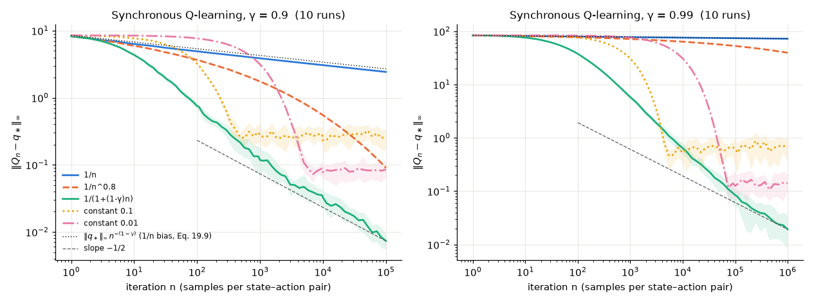
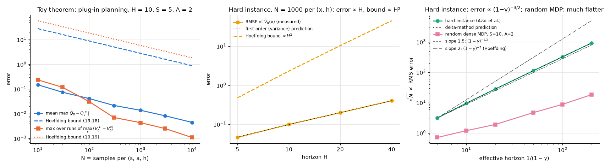
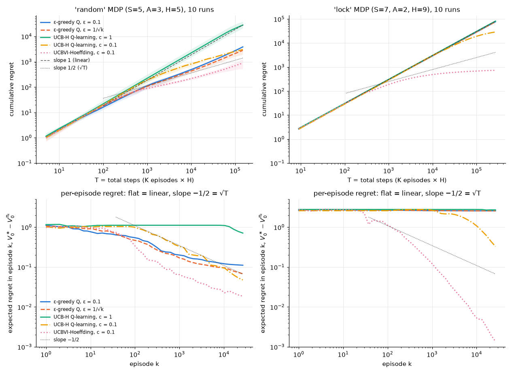
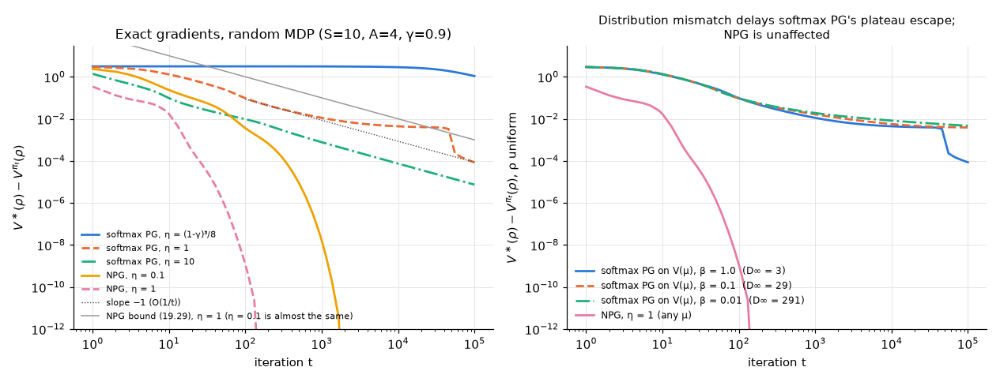
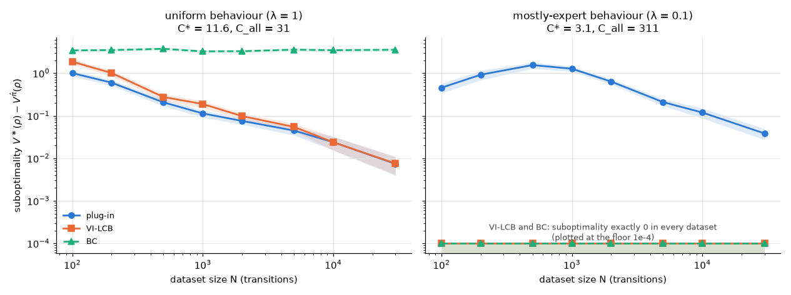

# Chapter 19 — Theory of RL: Convergence, Sample Complexity and Regret

[← Previous: RL for Language Models: RLHF, DPO, GRPO and Verifiable Rewards](18-rl-for-language-models.md) · [Course index](../README.md) · [Next: Deep RL in Practice: Engineering, Debugging, Evaluation and Safety](20-deep-rl-in-practice.md) →

## At a glance

Most of this course has asked "does this algorithm work?" and answered with experiments. This chapter asks the questions a theorist asks. Does the algorithm converge, and to what? How many samples does it need before it is nearly optimal? How much reward does it lose while it learns? Which problems can be learned efficiently at all, and which cannot? The answers rest on a small set of tools that recur in almost every proof in the field: contraction, stochastic approximation, concentration inequalities, the simulation and performance-difference lemmas, optimism and pessimism. We build each tool, prove a representative theorem with it, check the theorem numerically, and then state the strongest known results precisely, with their assumptions.

**Learning objectives.** After this chapter you should be able to:

1. Distinguish the three kinds of guarantee (asymptotic convergence, sample complexity, regret) and the access model each assumes (generative model, online interaction, offline data).
2. Use contraction arguments to bound the loss of a greedy policy and the error of approximate value iteration.
3. Explain the ODE method of stochastic approximation, use it to sketch why linear TD(0) and tabular Q-learning converge, and predict from the step-size schedule how fast Q-learning converges.
4. State and prove the simulation lemma and the performance difference lemma, use Hoeffding's inequality and the union bound to prove a sample-complexity theorem from scratch, and explain how Bernstein's inequality and the law of total variance sharpen it.
5. Explain why the minimax sample complexity with a generative model scales as $(1-\gamma)^{-3}$, why R-MAX is PAC-MDP and why $\varepsilon$-greedy is not.
6. Quote the main regret bounds for tabular RL (UCRL2 in the average-reward setting; UCBVI, Q-learning with UCB bonuses and the lower bounds in the episodic setting) with their assumptions, and reproduce the structure of their proofs.
7. Prove gradient domination and the $O(1/T)$ convergence of the natural policy gradient, and explain the distribution mismatch coefficient.
8. Describe linear MDPs, Bellman rank and Bellman–eluder dimension, the exponential lower bounds for linearly realizable $q_\ast$, and the concentrability and pessimism theory of offline RL.
9. Say precisely what this theory does and does not explain about deep RL.

**Prerequisites.** [Chapter 00](00-math-toolkit.md) (probability, stochastic approximation, contractions), [Chapter 01](01-the-rl-problem.md) (MDPs, Bellman equations), [Chapter 02](02-multi-armed-bandits.md) (UCB and regret), [Chapter 03](03-dynamic-programming.md) (value iteration and the contraction proof), [Chapter 05](05-temporal-difference.md) (TD and Q-learning, and the convergence lemma of §5.1 there), [Chapter 08](08-function-approximation.md) (linear TD and the TD fixed point), [Chapters 10](10-policy-gradients.md) and [11](11-trust-regions-and-ppo.md) (policy gradients, natural gradients, the performance difference lemma), [Chapter 13](13-model-based-rl.md) (the discounted simulation lemma) and [Chapter 14](14-exploration.md) (optimism, R-MAX, and a complete UCBVI-style regret proof). You should be comfortable with conditional expectations and big-O notation.

**Code you will run** (all in [`code/ch19_rl_theory/`](../code/ch19_rl_theory/), pure NumPy, every number in this chapter comes from these scripts):

| script | what it checks | full run |
|---|---|---|
| [`q_learning_rates.py`](../code/ch19_rl_theory/q_learning_rates.py) | mean estimation with $\alpha_n=c/n$ (§3.2); Q-learning with step sizes $1/n$, $1/n^{0.8}$, $1/(1+(1-\gamma)n)$ and constants (§3.5) | 80 s |
| [`lemmas_check.py`](../code/ch19_rl_theory/lemmas_check.py) | performance difference and simulation lemmas, greedy-loss and approximate-VI bounds (§§2, 4) | 2 s |
| [`concentration_generative.py`](../code/ch19_rl_theory/concentration_generative.py) | Hoeffding vs Bernstein, the union bound, a sample-complexity theorem, the $(1-\gamma)^{-3/2}$ error scaling (§5) | 19 s |
| [`regret_experiment.py`](../code/ch19_rl_theory/regret_experiment.py) | regret of $\varepsilon$-greedy vs UCB-Hoeffding Q-learning vs UCBVI, on a log-log plot, with lock diagnostics (§7) | 137 s |
| [`pg_convergence.py`](../code/ch19_rl_theory/pg_convergence.py) | softmax PG vs natural PG with exact gradients, gradient domination, distribution mismatch (§8) | 41 s |
| [`offline_pessimism.py`](../code/ch19_rl_theory/offline_pessimism.py) | plug-in vs pessimistic (VI-LCB) vs behaviour cloning on offline data (§10) | 13 s |
| [`exercise_solutions.py`](../code/ch19_rl_theory/exercise_solutions.py) | numerical parts of Exercises 2, 5, 7, 10, 13, 14 | 70 s |

**Study time.** About 12–16 hours: 8–10 for the text with pen and paper, the rest for exercises. Sections 9–11 are an overview of the research frontier and can be read more quickly.

**Map of the chapter.**

| section | question | main tool |
|---|---|---|
| 2 | How do small value errors turn into policy loss? | contraction |
| 3 | Do TD and Q-learning converge, and how fast? | stochastic approximation, the ODE method |
| 4 | How do model errors and policy changes move the value? | the simulation and performance-difference lemmas |
| 5 | How many samples with a simulator? | concentration (Hoeffding, Bernstein, union bound), variance |
| 6 | How do we explore with guarantees? | optimism, PAC-MDP, R-MAX |
| 7 | How much do we lose while learning? | regret, optimism + pigeonhole, lower bounds |
| 8 | Why do policy gradients find global optima? | gradient domination, mirror descent |
| 9 | When are huge state spaces learnable? | linear MDPs, Bellman rank and eluder dimension, lower bounds |
| 10 | What can we learn from a fixed dataset? | concentrability, pessimism |
| 11 | What does all this say about deep RL? | |

---

## 1. What theory promises, and in which setting

### 1.1 Three kinds of guarantee

A theorem about an RL algorithm says something about one of three quantities.

**Asymptotic convergence.** Does the algorithm's estimate converge, for example $Q_t\to q_\ast$ with probability 1, and to what does it converge when it cannot reach the truth (the TD fixed point of [Chapter 08](08-function-approximation.md))? These results tell you that an algorithm is *sound*, but nothing about how long it takes.

**Sample complexity.** How many samples $n(\varepsilon,\delta)$ suffice so that, with probability at least $1-\delta$, the algorithm outputs an $\varepsilon$-optimal policy (or an $\varepsilon$-accurate value function)? This is the reinforcement-learning version of PAC ("probably approximately correct") learning. The answer depends heavily on how the agent may collect data:

| protocol | what the agent can do | typical guarantee | here |
|---|---|---|---|
| generative model (simulator) | query any $(s,a)$ and receive a sample $s'\sim p(\cdot\mid s,a)$, $r$ | samples to an $\varepsilon$-optimal policy | §5 |
| online, episodic or continuing | act, observe; reaches states only through its own actions | PAC-MDP sample complexity, or regret | §§6–7 |
| offline (batch) | a fixed dataset, no further interaction | suboptimality as a function of dataset size and coverage | §10 |

The generative model removes the exploration problem: every state is one query away. Online learning has to discover how to reach the states that matter, which is why exploration (Chapters [02](02-multi-armed-bandits.md) and [14](14-exploration.md)) is a theoretical problem as well as a practical one. Offline learning cannot explore at all and must cope with whatever the data cover.

**Regret.** An online agent plays $K$ episodes with policies $\pi_1,\dots,\pi_K$. Its regret is the total shortfall relative to an optimal policy,

$$
\mathrm{Reg}(K) \doteq \sum_{k=1}^K\Big(V^\ast_0(s_0^k)-V^{\pi_k}_0(s_0^k)\Big),
\tag{19.1}
$$

where $s_0^k$ is the initial state of episode $k$ and $V_0$ is the value of the whole episode (notation in §1.2). Sublinear regret, $\mathrm{Reg}(K)=o(K)$, means that the average per-episode loss tends to zero. Regret is the natural extension of the bandit regret of [Chapter 02](02-multi-armed-bandits.md), and it charges the agent for every mistake it makes *while* learning, not only for the quality of its final answer. A regret bound implies a PAC bound (Exercise 8), but not conversely.

### 1.2 Conventions used in this chapter

This chapter follows [NOTATION.md](../NOTATION.md) with the following deliberate departures, all standard in the theory literature:

* $S\doteq|\mathcal S|$ and $A\doteq|\mathcal A|$ denote the *numbers* of states and actions.
* **Episodic (finite-horizon) MDPs.** Steps are $h=0,1,\dots,H-1$; the transition kernel $P_h(\cdot\mid s,a)$ and the mean reward $r_h(s,a)\in[0,1]$ may depend on $h$ ("time-inhomogeneous"). The reward collected at step $h$ is written $R_h$ (not $R_{h+1}$ as in the $R_{t+1}$ convention of NOTATION.md), with mean $r_h(S_h,A_h)$. $V^\pi_h(s)$ and $Q^\pi_h(s,a)$ are the *true* values of the remaining $H-h$ steps, with $V^\pi_H\equiv0$; $V^\ast_h,Q^\ast_h$ are the optimal ones. In NOTATION.md capitals denote estimates; here they are exact values, as in [Chapter 14](14-exploration.md), and estimates carry hats ($\hat Q$) or tildes (optimistic $\tilde Q$). For a vector $V\in\mathbb R^S$ we write $P_hV(s,a)\doteq\sum_{s'}P_h(s'\mid s,a)V(s')$. With $K$ episodes, $T\doteq KH$ is the *total number of steps*, not the final step of an episode as in NOTATION.md.
* **Discounted MDPs** keep $v_\pi,q_\pi,v_\ast,q_\ast$, rewards in $[0,1]$ (so $0\le v_\pi\le 1/(1-\gamma)$), and $v_\pi(\rho)\doteq\sum_s\rho(s)v_\pi(s)$ for a start distribution $\rho$. NOTATION.md calls the start distribution $d_0$; we use $\rho$, as the policy-gradient papers of §8 do, and $\rho$ never denotes an importance-sampling ratio here. The normalized discounted occupancy is $d^\pi_\rho(s)\doteq(1-\gamma)\sum_{t\ge0}\gamma^t\Pr\lbrace S_t=s\mid S_0\sim\rho,\pi\rbrace$ and $d^\pi_\rho(s,a)\doteq d^\pi_\rho(s)\pi(a\mid s)$.
* **Accuracy and confidence.** $\varepsilon$ denotes a target accuracy and $\delta$ a failure probability. NOTATION.md reserves $\varepsilon$ for the exploration rate of $\varepsilon$-greedy; here that meaning appears only in the name "$\varepsilon$-greedy" and in §§6.2 and 7.6 and the exercises on them, where it is called the exploration rate. $\epsilon$ denotes the size of a value error in §2.
* $\tilde O(\cdot)$ hides factors polylogarithmic in $S,A,H,T,1/\varepsilon,1/\delta$; $\lesssim$ means "at most a universal constant times".

**Symbols reused locally.** We keep the literature's letters inside each section, so a few are reused. $\mu$ is the stationary distribution of a Markov chain in §3 ($\mu_{\min}$ its smallest entry), a mean in §5.1, the optimization distribution of policy gradients in §8, and $\boldsymbol\mu_h$ the measures of a linear MDP in §9 (NOTATION.md's deterministic policy $\mu_{\boldsymbol\theta}$ does not appear); the offline data distribution is $\nu_D$ (§10). $\mathbf D$ (bold) is a diagonal matrix in §3.1, $D$ a box radius in §3.4 and the diameter of an MDP in §7.5, and $D_\infty$ the distribution mismatch coefficient in §8. $c$ is a step-size constant in §3.2, a bonus constant in §7 and a penalty constant in §10. $\Delta$ is an action gap in §2.1, the error $Q_t-q_\ast$ in §3.4 and a suboptimality in §8.3. $L$ is a logarithmic factor in §5 and the length of a combination lock in §§6.2 and 7.6.

### 1.3 The two scales to keep in mind

Values are of size $1/(1-\gamma)$ in a discounted problem and $H$ in an episodic one, and $1/(1-\gamma)$ plays the role of $H$ (the *effective horizon*). Every bound in this chapter is a polynomial in $S$, $A$, $1/(1-\gamma)$ (or $H$), $1/\varepsilon$ and $\log(1/\delta)$, and the exponents matter: at $\gamma=0.99$ a bound proportional to $(1-\gamma)^{-4}$ asks for 100 times more data than one proportional to $(1-\gamma)^{-3}$. Much of the progress of the last decade has been about shaving exactly these exponents to their optimal values. Equally important are the *problem-dependent* quantities that worst-case bounds hide (the variance of the next-state value, the span of $v_\ast$, gaps between actions), which our experiments will keep running into.

---

## 2. Contraction arguments revisited

[Chapter 03](03-dynamic-programming.md) proved that the Bellman optimality operator

$$
(\mathcal T^\ast Q)(s,a)\doteq r(s,a)+\gamma\sum_{s'}p(s'\mid s,a)\max_{a'}Q(s',a'),\qquad
\lVert\mathcal T^\ast Q-\mathcal T^\ast Q'\rVert_\infty\le\gamma\lVert Q-Q'\rVert_\infty,
\tag{19.2}
$$

is a $\gamma$-contraction in the max norm, using $|\max_af(a)-\max_ag(a)|\le\max_a|f(a)-g(a)|$. Contraction gives existence and uniqueness of $q_\ast$ and the geometric convergence of value iteration. In theory it is used for two more things: to turn *value* errors into *policy* losses, and to track how errors accumulate in approximate dynamic programming.

### 2.1 From value error to policy loss

**Theorem 19.1 (greedy-policy loss; Singh & Yee, 1994).** Let $Q$ be any function with $\lVert Q-q_\ast\rVert_\infty\le\epsilon$, and let $\pi$ be greedy with respect to $Q$. Then for every state $s$,

$$
0\le v_\ast(s)-v_\pi(s)\le\frac{2\epsilon}{1-\gamma}.
\tag{19.3}
$$

*Proof.* Fix $s$, let $a=\pi(s)$ and $a^\ast=\pi_\ast(s)$. Because $a$ maximizes $Q(s,\cdot)$,

$$
q_\ast(s,a^\ast)-q_\ast(s,a)\le\big(Q(s,a^\ast)+\epsilon\big)-\big(Q(s,a)-\epsilon\big)\le 2\epsilon .
$$

Now split the loss into "a worse first action" and "the consequences of following $\pi$ afterwards":

$$
\begin{aligned}
v_\ast(s)-v_\pi(s)&=\big[q_\ast(s,a^\ast)-q_\ast(s,a)\big]+\big[q_\ast(s,a)-q_\pi(s,a)\big]\\
&\le 2\epsilon+\gamma\sum_{s'}p(s'\mid s,a)\big(v_\ast(s')-v_\pi(s')\big)\le 2\epsilon+\gamma\lVert v_\ast-v_\pi\rVert_\infty .
\end{aligned}
$$

The second line uses $q_\ast(s,a)-q_\pi(s,a)=\gamma\sum_{s'}p(s'\mid s,a)(v_\ast(s')-v_\pi(s'))$, since both $q$'s share the reward $r(s,a)$. Taking the maximum over $s$ (the left side is non-negative because $v_\ast\ge v_\pi$) gives $\lVert v_\ast-v_\pi\rVert_\infty\le2\epsilon+\gamma\lVert v_\ast-v_\pi\rVert_\infty$, and rearranging gives (19.3). $\square$

**The bound is tight (worked example).** One state $x$ with two self-loop actions: $\mathsf{left}$ pays 1 per step and $\mathsf{right}$ pays $1-\Delta$. Then $v_\ast(x)=1/(1-\gamma)$, $q_\ast(x,\mathsf{left})=1+\gamma/(1-\gamma)$ and $q_\ast(x,\mathsf{right})=1-\Delta+\gamma/(1-\gamma)$: the actions differ by only the gap $\Delta$. If $\Delta<2\epsilon$, the perturbation $Q=q_\ast+(-\epsilon,+\epsilon)$ (within $\epsilon$ of $q_\ast$) makes $\mathsf{right}$ greedy, and the loss is $v_\ast(x)-v_{\mathsf{right}}(x)=\Delta/(1-\gamma)$, which tends to $2\epsilon/(1-\gamma)$ as $\Delta\to2\epsilon$. With $\gamma=0.9$, $\epsilon=0.05$ and $\Delta=1.99\epsilon$, [`lemmas_check.py`](../code/ch19_rl_theory/lemmas_check.py) prints a loss of $0.995$ against the bound $1.000$. The factor $1/(1-\gamma)$ is the price of a small per-step mistake repeated forever. On a random 10-state MDP with 2,000 random perturbations of $q_\ast$, the worst observed loss was only $0.27$ of the bound: the worst case needs actions whose values nearly tie.

### 2.2 Approximate value iteration

Suppose each value-iteration step is computed with an error, $Q_{k+1}=\mathcal T^\ast Q_k+e_k$ with $\lVert e_k\rVert_\infty\le\epsilon$ (sampling noise, regression error). Then

$$
\lVert Q_k-q_\ast\rVert_\infty\le\gamma^k\lVert Q_0-q_\ast\rVert_\infty+\frac{1-\gamma^k}{1-\gamma}\,\epsilon .
\tag{19.4}
$$

*Proof.* $\lVert Q_{k+1}-q_\ast\rVert_\infty=\lVert\mathcal T^\ast Q_k-\mathcal T^\ast q_\ast+e_k\rVert_\infty\le\gamma\lVert Q_k-q_\ast\rVert_\infty+\epsilon$; unroll the recursion. $\square$

Combined with Theorem 19.1, the greedy policy after many iterations loses at most $2\epsilon/(1-\gamma)^2$: the classical error-propagation bound of approximate dynamic programming (Bertsekas & Tsitsiklis, 1996). A constant error $e_k\equiv+\epsilon$ started from $Q_0=q_\ast$ attains (19.4) with equality, and from any $Q_0$ it attains the limit $\epsilon/(1-\gamma)$. In `lemmas_check.py`, with $\epsilon=0.01$, $\gamma=0.9$ and $Q_0=0$, 400 iterations with constant errors give a final error of $0.1000=\epsilon/(1-\gamma)$, while independent errors uniform in $[-\epsilon,\epsilon]$ give only $0.021$, because random errors partly cancel. Errors that are *systematically* biased, such as the overestimation caused by maximizing over noisy estimates ([Chapter 05](05-temporal-difference.md)), are the dangerous ones.

Two remarks connect this to later sections. First, with function approximation a regression step controls a weighted $L_2$ error, not the max norm. Munos (2003, 2005) redid this analysis in weighted $L_p$ norms, at the price of *concentrability coefficients* that measure how the state distributions of the policies being evaluated differ from the data distribution; they are the backbone of offline RL theory (§10). Second, (19.4) also gives the iteration complexity of exact value iteration: from $Q_0=0$, $k\ge\log\!\big(1/(\epsilon(1-\gamma))\big)/(1-\gamma)$ iterations give $\lVert Q_k-q_\ast\rVert_\infty\le\epsilon$, because $\lVert q_\ast\rVert_\infty\le1/(1-\gamma)$ and $\gamma^k\le e^{-(1-\gamma)k}$.

---

## 3. Stochastic approximation: why TD and Q-learning converge

### 3.1 The general iteration

[Chapter 00](00-math-toolkit.md) introduced the Robbins–Monro iteration and the step-size conditions $\sum_n\alpha_n=\infty$, $\sum_n\alpha_n^2<\infty$. The form used in RL theory is

$$
\boldsymbol\theta_{n+1}=\boldsymbol\theta_n+\alpha_n\big[h(\boldsymbol\theta_n)+\mathbf M_{n+1}\big],
\tag{19.5}
$$

where $h$ is the *mean field* (the expected update direction) and $\mathbf M_{n+1}$ is noise with $\mathbb E[\mathbf M_{n+1}\mid\mathcal F_n]=\mathbf 0$ and $\mathbb E[\lVert\mathbf M_{n+1}\rVert^2\mid\mathcal F_n]\le K(1+\lVert\boldsymbol\theta_n\rVert^2)$, with $\mathcal F_n$ the history up to step $n$. Three examples:

* **Mean estimation:** $h(\theta)=\mu-\theta$, $M_{n+1}=X_{n+1}-\mu$.
* **Synchronous Q-learning with a generative model** (Algorithm 19.1 below): $h(Q)=\mathcal T^\ast Q-Q$, and $\mathbf M_{n+1}$ is the difference between the sampled target $R+\gamma\max_{a'}Q(S',a')$ and its conditional expectation $(\mathcal T^\ast Q)(s,a)$.
* **Linear TD(0)** ([Chapter 08](08-function-approximation.md)): $h(\mathbf w)=\mathbf b-\mathbf A\mathbf w$ with $\mathbf A=\mathbf X^\top\mathbf D(\mathbf I-\gamma\mathbf P_\pi)\mathbf X$ and $\mathbf b=\mathbf X^\top\mathbf D\,r_\pi$, where $\mathbf D$ is the diagonal matrix of the on-policy state distribution $\mu$. Along a single trajectory the noise is *Markovian* rather than a martingale difference; §3.3 returns to this.

### 3.2 The ODE method

**Intuition.** Measure progress in "ODE time" $t_n\doteq\sum_{k<n}\alpha_k$. Over a stretch of iterations $n,\dots,m$ in which the ODE time advances by a fixed amount $\Delta=t_m-t_n$,

$$
\boldsymbol\theta_m=\boldsymbol\theta_n+\underbrace{\sum_{k=n}^{m-1}\alpha_k h(\boldsymbol\theta_k)}_{\text{Euler steps of }\dot{\boldsymbol\theta}=h(\boldsymbol\theta)}+\underbrace{\sum_{k=n}^{m-1}\alpha_k\mathbf M_{k+1}}_{\text{martingale noise}} .
$$

The first sum is an Euler discretization of the ODE

$$
\dot{\boldsymbol\theta}(t)=h\big(\boldsymbol\theta(t)\big)
\tag{19.6}
$$

with step sizes $\alpha_k\to0$. The second is a martingale whose variance is at most $K(1+\sup\lVert\boldsymbol\theta\rVert^2)\sum_{k\ge n}\alpha_k^2$, which tends to zero because $\sum\alpha_k^2<\infty$. So, once the iterates are bounded, they asymptotically follow trajectories of the ODE, and $\sum\alpha_k=\infty$ guarantees that the ODE time runs to infinity, so the iterates reach wherever the ODE goes. This picture goes back to Ljung (1977) and Kushner & Clark (1978).

**Theorem 19.2 (the ODE method; Borkar & Meyn, 2000).** Consider (19.5) and assume: (i) $h$ is Lipschitz; (ii) $\sum_n\alpha_n=\infty$ and $\sum_n\alpha_n^2<\infty$; (iii) the noise condition above; (iv) the ODE (19.6) has a unique globally asymptotically stable equilibrium $\boldsymbol\theta^\ast$; (v) the limit $h_\infty(\boldsymbol\theta)\doteq\lim_{c\to\infty}h(c\boldsymbol\theta)/c$ exists (uniformly on compact sets) and the origin is the globally asymptotically stable equilibrium of $\dot{\boldsymbol\theta}=h_\infty(\boldsymbol\theta)$. Then $\sup_n\lVert\boldsymbol\theta_n\rVert<\infty$ and $\boldsymbol\theta_n\to\boldsymbol\theta^\ast$ almost surely.

Condition (v) is a "stability at infinity" test: far from the origin the dynamics look like the scaled ODE, and if that ODE pulls everything back, the iterates cannot escape. For linear iterations ($h(\boldsymbol\theta)=\mathbf b-\mathbf A\boldsymbol\theta$), $h_\infty(\boldsymbol\theta)=-\mathbf A\boldsymbol\theta$, so (iv) and (v) both reduce to "every eigenvalue of $\mathbf A$ has positive real part".

**Worked example: why the step-size *constant* matters.** For mean estimation with $\alpha_n=c/n$, the ODE $\dot\theta=\mu-\theta$ has solution $\theta(t)-\mu=e^{-t}(\theta(0)-\mu)$, and the ODE time after $n$ steps is $t_n\approx c\ln n$. The deterministic part of the error therefore decays like $e^{-c\ln n}=n^{-c}$. The noise behaves differently depending on $c$. Unrolling the recursion, the noise part of the error is $\sum_{k\le n}\frac ck\prod_{k<j\le n}\big(1-\frac cj\big)M_k\approx\sum_{k\le n}\frac ck\big(\frac kn\big)^cM_k$, whose variance is about $c^2\sigma^2n^{-2c}\sum_{k\le n}k^{2c-2}$ for noise variance $\sigma^2$. When $c>\frac12$ the sum grows like $n^{2c-1}/(2c-1)$, and the standard deviation is of order $n^{-1/2}$. When $c<\frac12$ the sum converges, and the standard deviation is only of order $n^{-c}$: early noise is then forgotten as slowly as the initial error. (At $c=\frac12$ it is of order $\sqrt{\log n/n}$.) With $c=1$ both terms are $O(n^{-1/2})$; with $c=0.1$ both decay like $n^{-0.1}$. Part 0 of [`q_learning_rates.py`](../code/ch19_rl_theory/q_learning_rates.py) measures the noise alone, starting at the mean with Gaussian noise (4,000 runs): over $n=10^2$ to $10^5$ the log-log slopes of the RMSE are $-0.099$ ($c=0.1$), $-0.293$ ($c=0.3$), $-0.444$ ($c=0.5$, where the $\sqrt{\log n}$ factor flattens the slope) and $-0.501$ ($c=1$). Keep this in mind: in Q-learning the ODE contracts at rate $1-\gamma$, not 1, which plays exactly the role of $c$ (§3.5).

### 3.3 Linear TD(0): Tsitsiklis and Van Roy (1997)

For linear TD(0) the ODE is $\dot{\mathbf w}=\mathbf b-\mathbf A\mathbf w$. Its equilibrium is the TD fixed point $\mathbf w_{TD}=\mathbf A^{-1}\mathbf b$ ([Chapter 08](08-function-approximation.md)). Take the Lyapunov function $L(\mathbf w)=\lVert\mathbf w-\mathbf w_{TD}\rVert^2$. Along the ODE, with $\mathbf e=\mathbf w-\mathbf w_{TD}$,

$$
\frac{d}{dt}L=2\mathbf e^\top(\mathbf b-\mathbf A\mathbf w)=-2\,\mathbf e^\top\mathbf A\mathbf e\le-2(1-\gamma)\lVert\mathbf X\mathbf e\rVert_\mu^2\le-2(1-\gamma)\lambda_{\min}(\mathbf X^\top\mathbf D\mathbf X)\,L,
\tag{19.7}
$$

where the first inequality is the on-policy positive-definiteness bound $\mathbf y^\top\mathbf A\mathbf y\ge(1-\gamma)\lVert\mathbf X\mathbf y\rVert_\mu^2$ proved in [Chapter 08](08-function-approximation.md), §5.2 (it uses $\lVert\mathbf P_\pi v\rVert_\mu\le\lVert v\rVert_\mu$, which holds because $\mu$ is the *stationary* distribution). So the ODE converges exponentially fast to $\mathbf w_{TD}$, and the same computation with $\mathbf b=\mathbf 0$ verifies condition (v).

**Theorem 19.3 (Tsitsiklis & Van Roy, 1997; finite-state version).** Let the states be generated by an irreducible aperiodic Markov chain under $\pi$ with stationary distribution $\mu$, let the feature matrix $\mathbf X$ have linearly independent columns, $\gamma\in[0,1)$, let the step sizes be deterministic (fixed before the run), positive and nonincreasing with $\sum_t\alpha_t=\infty$ and $\sum_t\alpha_t^2<\infty$, and let the rewards have a finite second moment under $\mu$. Then linear TD($\lambda$) converges with probability 1 to the unique $\mathbf w_\lambda$ with $\mathbf X\mathbf w_\lambda=\Pi\mathcal T^{(\lambda)}\mathbf X\mathbf w_\lambda$, and $\lVert\mathbf X\mathbf w_\lambda-v_\pi\rVert_\mu\le\frac{1-\gamma\lambda}{1-\gamma}\lVert\Pi v_\pi-v_\pi\rVert_\mu$.

Two technical points separate the proof from the ODE sketch above. The noise is Markovian: the update at time $t$ depends on $(S_t,R_{t+1},S_{t+1})$, which are correlated across $t$. Tsitsiklis and Van Roy use a stochastic-approximation theorem for Markov noise (from Benveniste, Métivier & Priouret, 1990), in which the mean field is the expectation under the stationary distribution and fast mixing makes the correlated noise average out. The paper also covers general state spaces, and it gives an example in which TD with a *nonlinear* approximator diverges even on-policy. Off-policy, $\mathbf A$ can have eigenvalues with negative real part (it need not); then the ODE is unstable, and TD can diverge ([Chapter 08](08-function-approximation.md), the deadly triad).

*Finite-time results.* Asymptotic convergence says nothing about rates. Bhandari, Russo & Singal (2018) gave a simple finite-time analysis of linear TD (contemporaneous with Dalal, Szörényi, Thoppe & Mannor, 2018, and Lakshminarayanan & Szepesvári, 2018), treating it like stochastic gradient descent: for i.i.d. samples from $\mu$ the mean-squared error decays at the $O(1/T)$ rate of SGD, and along a single Markov trajectory similar bounds hold with a mixing-time factor (their analysis uses a projection step). Srikant & Ying (2019) analysed constant step sizes through a Lyapunov drift argument.

### 3.4 Tabular Q-learning

**Theorem 19.4 (Watkins & Dayan, 1992; Jaakkola, Jordan & Singh, 1994; Tsitsiklis, 1994).** In a finite MDP with $\gamma<1$ and rewards of bounded variance, let Q-learning update the visited pair with step size $\alpha_t(s,a)\in[0,1]$, measurable with respect to the history up to time $t$ ($\alpha_t(s,a)=0$ for pairs not updated at time $t$). If with probability 1, for every $(s,a)$,

$$
\sum_t\alpha_t(s,a)=\infty\qquad\text{and}\qquad\sum_t\alpha_t(s,a)^2<\infty,
$$

then $Q_t\to q_\ast$ with probability 1. The first condition forces every pair to be updated infinitely often; nothing else is required of the behaviour policy.

[Chapter 05](05-temporal-difference.md), §8.4 (Theorem 5.4), proved this from the stochastic-approximation lemma of its §5.1 (Jaakkola, Jordan & Singh, 1994; Singh et al., 2000). Here is the idea of Tsitsiklis's proof, because the "shrinking box" argument is the template for every max-norm contraction proved by stochastic approximation. Write $\Delta_t\doteq Q_t-q_\ast$. When pair $x=(s,a)$ is updated,

$$
\Delta_{t+1}(x)=\big(1-\alpha_t(x)\big)\Delta_t(x)+\alpha_t(x)\Big[\underbrace{(\mathcal T^\ast Q_t)(x)-q_\ast(x)}_{|\cdot|\le\gamma\lVert\Delta_t\rVert_\infty}+w_t(x)\Big],
\tag{19.8}
$$

where $w_t(x)$ is the sampled target minus its conditional mean: martingale noise. The bound on the bracket is the contraction (19.2), because $q_\ast=\mathcal T^\ast q_\ast$.

1. *Boundedness.* First show $\sup_t\lVert Q_t\rVert_\infty<\infty$ almost surely (Tsitsiklis proves this directly; in the ODE language it is condition (v) of Theorem 19.2).
2. *One box shrinks.* Suppose $\lVert\Delta_t\rVert_\infty\le D$ for all $t\ge\tau$. Define two auxiliary sequences for each $x$, started at $\tau$: the noise average $W_{t+1}(x)=(1-\alpha_t(x))W_t(x)+\alpha_t(x)w_t(x)$ with $W_\tau=0$, and the deterministic envelope $Y_{t+1}(x)=(1-\alpha_t(x))Y_t(x)+\alpha_t(x)\gamma D$ with $Y_\tau=D$. By induction on $t$, using (19.8), $-Y_t(x)+W_t(x)\le\Delta_t(x)\le Y_t(x)+W_t(x)$. Now $W_t(x)\to0$ almost surely: it is a Robbins–Monro estimate of the mean of zero-mean noise, whose variance is bounded because $Q_t$ is. And $Y_t(x)-\gamma D=(1-\gamma)D\prod_k(1-\alpha_k(x))\to0$ because $\sum_k\alpha_k(x)=\infty$. Hence $\limsup_t\lVert\Delta_t\rVert_\infty\le\gamma D$.
3. *Iterate.* For any $\epsilon>0$ with $\beta\doteq\gamma+\epsilon<1$, the box of radius $D$ is eventually replaced by one of radius $\beta D$, then $\beta^2D$, and so on, so $\Delta_t\to0$. $\square$

Watkins and Dayan's original proof used a different construction, the "action-replay process". The stochastic-approximation proof extends to SARSA, Expected SARSA and Double Q-learning, and Theorem 19.2 gives an ODE version of the same argument (Borkar & Meyn, 2000).

### 3.5 How fast? The step-size trap

Convergence with probability 1 is silent about speed, and here the step-size schedule matters enormously. Consider the **one-state example**: a single state, a single action, reward 1, self-loop, so $q_\ast=1/(1-\gamma)$. Q-learning (with exact rewards, so there is no noise) updates $Q_{n}=(1-\alpha_n)Q_{n-1}+\alpha_n(1+\gamma Q_{n-1})$, so the error $e_n\doteq q_\ast-Q_n$ obeys

$$
e_n=\big(1-\alpha_n(1-\gamma)\big)e_{n-1}=e_0\prod_{k=1}^n\big(1-\alpha_k(1-\gamma)\big).
\tag{19.9}
$$

Each update moves $Q$ only a fraction $1-\gamma$ of the way, because the target itself contains $\gamma Q$. Three schedules, worked by hand:

* **$\alpha_k=1/k$.** $\prod_{k=1}^n(1-c/k)=\frac{\Gamma(n+1-c)}{\Gamma(1-c)\Gamma(n+1)}\sim\frac{n^{-c}}{\Gamma(1-c)}$ with $c=1-\gamma$. The error decays like $n^{-(1-\gamma)}$: **for $\gamma=0.99$, after a million updates 86.6% of the initial error remains** ($10^{-0.06}/\Gamma(0.99)=0.871/1.006=0.866$), and halving the error takes about $(2/\Gamma(0.99))^{100}\approx7\times10^{29}$ updates (Exercise 2). In the language of §3.2, $1/k$ applied to a mean field that contracts at rate $1-\gamma$ behaves like $c/k$ with $c=1-\gamma$.
* **$\alpha_k=1/(1+(1-\gamma)k)$ ("rescaled linear").** The product telescopes: $1-\frac{1-\gamma}{1+(1-\gamma)k}=\frac{1+(1-\gamma)(k-1)}{1+(1-\gamma)k}$, so $e_n=e_0/(1+(1-\gamma)n)$. The error halves after $1/(1-\gamma)=100$ updates. This schedule is among those covered by the sharp $\ell_\infty$ finite-sample analysis of Q-learning by Wainwright (2019a).
* **$\alpha_k=k^{-\omega}$ with $\omega\in(\frac12,1)$.** $\log\prod_k(1-(1-\gamma)k^{-\omega})\approx-(1-\gamma)\frac{n^{1-\omega}}{1-\omega}$: a stretched exponential, polynomial in $1/(1-\gamma)$, as Even-Dar & Mansour (2003) showed in general.

With noise, the deterministic error above is only half the story. By the analysis of §3.2, the noise term decays like $n^{-1/2}$ for the rescaled linear schedule (its effective constant is $(1-\gamma)\cdot\frac{1}{1-\gamma}=1>\frac12$) and like $n^{-\omega/2}$ for $\alpha=n^{-\omega}$; with $\alpha=1/n$ the effective constant is $1-\gamma<\frac12$, so the noise decays only like $n^{-(1-\gamma)}$, as slowly as the bias; and a constant $\alpha$ leaves a noise floor of order $\sqrt\alpha$ that never vanishes.

**What is known about rates.** Szepesvári (1997) showed that for $\gamma>1/2$ and $\alpha=1/n$, with the pairs sampled from a fixed distribution, the asymptotic rate of Q-learning is $O(1/t^{R(1-\gamma)})$ when $R(1-\gamma)<\frac12$ and $O(\sqrt{\log\log t/t})$ otherwise, where $R$ is the ratio of the smallest to the largest sampling probability of a pair: exactly the dichotomy of §3.2, with $R(1-\gamma)$ in the role of $c$. Even-Dar & Mansour (2003) showed that linear step sizes can need time exponential in $1/(1-\gamma)$ while polynomial ones need only polynomial time. The sharpest modern results, all for the $\ell_\infty$ error with rewards in $[0,1]$ and $\varepsilon\in(0,1]$:

* *Synchronous Q-learning* (generative model, all pairs updated each iteration) needs $\tilde\Theta\big(SA/((1-\gamma)^4\varepsilon^2)\big)$ samples, and this is tight *for Q-learning* (Li, Cai, Chen, Wei & Chi, 2024). TD learning (a single action) needs $\tilde\Theta\big(S/((1-\gamma)^3\varepsilon^2)\big)$, which is minimax optimal.
* *Asynchronous Q-learning* along one trajectory needs $\tilde O\big(\frac{1}{\mu_{\min}(1-\gamma)^4\varepsilon^2}+\frac{t_{\mathrm{mix}}}{\mu_{\min}(1-\gamma)}\big)$ steps (Li, Cai, Chen, Wei & Chi, 2024), improving the $(1-\gamma)^{-5}$ of Li, Wei, Chi, Gu & Chen (2020a). Here $\mu_{\min}$ is the smallest stationary state–action probability of the behaviour chain and $t_{\mathrm{mix}}$ its mixing time.
* The minimax rate for estimating $q_\ast$ is $(1-\gamma)^{-3}$ (§5.3). Q-learning misses it by one factor of $1/(1-\gamma)$; variance-reduced Q-learning attains it up to logarithmic factors (Wainwright, 2019b).

```text
Algorithm 19.1  Synchronous Q-learning with a generative model
-------------------------------------------------------------
Input: generative model returning (R, S') ~ p(., . | s, a) for any queried (s, a);
       discount gamma < 1; step-size schedule alpha_n; number of iterations N
Initialise: Q_0(s, a) <- 0 for all s, a
for n = 1, 2, ..., N:
    for every pair (s, a):                                   # one sample per pair per iteration
        draw (R, S') from the generative model at (s, a)
        y(s, a) <- R + gamma * max_a' Q_{n-1}(S', a')        # sampled Bellman target
    for every pair (s, a):
        Q_n(s, a) <- Q_{n-1}(s, a) + alpha_n * ( y(s, a) - Q_{n-1}(s, a) )    # Eq. (19.5) with h = T*Q - Q
return Q_N  (and the greedy policy w.r.t. Q_N)
```

There are no terminal states here because the problem is discounted and continuing; with terminal states the target is $R$ alone when $S'$ is terminal.

**Experiment.** [`q_learning_rates.py`](../code/ch19_rl_theory/q_learning_rates.py) runs Algorithm 19.1 on a random MDP with 8 states, 3 actions, dense Dirichlet(1) transitions and Bernoulli rewards (means uniform in $[0,1]$), with $Q_0=0$, for five schedules and 10 independent runs that share their samples across schedules. Excerpt of the core update, vectorized over schedules and runs:

```python
s_next = (u[..., None] > cumP[None]).sum(axis=-1)            # S' ~ p(.|s,a) for every pair
rew = (rng.random((n_runs, S, A)) < r[None]).astype(float)   # R ~ Bernoulli(r(s,a))
v_next = Q.max(axis=-1)[:, ridx, s_next]                     # max_a' Q(S', a')
Q += alpha * (rew[None] + gamma * v_next - Q)                # Algorithm 19.1
```



Mean $\lVert Q_n-q_\ast\rVert_\infty$ over 10 runs, at exactly the iteration counts shown ($\lVert q_\ast\rVert_\infty=8.52$ for $\gamma=0.9$ and $83.9$ for $\gamma=0.99$; the last column is the log-log slope over the last decade of $n$):

| $\gamma$ | schedule | $n=10^2$ | $n=10^3$ | $n=10^4$ | $n=10^5$ | $n=10^6$ | slope |
|---|---|---|---|---|---|---|---|
| 0.9 | $1/n$ | 4.924 | 3.870 | 3.061 | 2.426 | | $-0.101$ |
| 0.9 | $1/n^{0.8}$ | 3.670 | 1.747 | 0.551 | 0.090 | | $-0.779$ |
| 0.9 | $1/(1+(1-\gamma)n)$ | 0.754 | 0.118 | 0.033 | 0.0073 | | $-0.613$ |
| 0.9 | constant 0.1 | 3.218 | 0.277 | 0.230 | 0.260 | | $+0.045$ |
| 0.9 | constant 0.01 | 7.663 | 3.134 | 0.077 | 0.086 | | $+0.013$ |
| 0.99 | $1/n$ | 79.47 | 77.60 | 75.81 | 74.08 | 72.39 | $-0.010$ |
| 0.99 | $1/n^{0.8}$ | 77.13 | 71.60 | 63.72 | 52.97 | 39.54 | $-0.126$ |
| 0.99 | $1/(1+(1-\gamma)n)$ | 37.80 | 5.828 | 0.643 | 0.085 | 0.019 | $-0.618$ |
| 0.99 | constant 0.1 | 75.92 | 30.72 | 0.531 | 0.628 | 0.654 | $+0.031$ |
| 0.99 | constant 0.01 | 83.03 | 75.85 | 30.88 | 0.126 | 0.141 | $-0.023$ |

Read the table against the theory:

* **$1/n$ satisfies Robbins–Monro and is useless at $\gamma=0.99$.** Its error follows the one-state prediction: the dotted line $\lVert q_\ast\rVert_\infty n^{-(1-\gamma)}$ in the figure lies right on top of the curve, the fitted slopes are $-0.101$ and $-0.010$, i.e. $-(1-\gamma)$ (bias and noise alike, as §3.2 predicts for an effective constant $1-\gamma<\frac12$), and the script's product (19.9) at $n=10^6$ is $0.866$ against a measured ratio $72.39/83.92=0.863$.
* **$1/n^{0.8}$ converges, slowly.** At $\gamma=0.99$ its deterministic error $\exp(-(1-\gamma)n^{0.2}/0.2)$ is still $0.45$ of the initial error after $10^6$ iterations, matching the measured $39.5/83.9=0.47$.
* **The rescaled linear schedule wins by orders of magnitude.** Its slope of about $-0.6$ lies between the $-1$ of its bias, $e_0/(1+(1-\gamma)n)$, and the $-1/2$ of its noise, and the noise term is taking over (the dashed slope $-1/2$ line). For $1/n^{0.8}$ the noise decays only like $n^{-0.4}$ once the bias has died out; at $\gamma=0.99$ the slowly decaying bias still dominates within our budget (previous bullet).
* **Constant step sizes plateau**, at a floor 3 to 4.6 times lower for $\alpha=0.01$ than for $\alpha=0.1$ (the $\sqrt\alpha$ scaling predicts $\sqrt{10}\approx3.2$), and they reach it only after a few multiples of $1/(\alpha(1-\gamma))$ iterations, because their bias decays like $e^{-\alpha(1-\gamma)n}$. Deep RL uses constant steps anyway, because its targets keep moving and tracking matters more than exact convergence.

The same ordering holds for asynchronous Q-learning along a single trajectory with a uniformly random behaviour policy, where each pair uses its own visit count (Exercise 13, `exercise_solutions.py`): after $10^6$ steps at $\gamma=0.9$ the errors are $2.31$ ($1/n$), $0.172$ ($1/n^{0.8}$), $0.014$ (rescaled linear) and $0.248$ (constant 0.1).

---

## 4. Two workhorse lemmas: simulation and performance difference

Almost every analysis in this chapter compares two value functions: the value of a policy in the true MDP and in an estimated model, or the values of two policies in the same MDP. Both comparisons follow from a single telescoping identity. [Chapter 11](11-trust-regions-and-ppo.md) proved the discounted performance difference lemma and [Chapter 13](13-model-based-rl.md) the discounted simulation lemma; here we derive the finite-horizon versions that regret and PAC proofs use, from one identity.

### 4.1 One identity

**Lemma 19.5 (value-difference identity).** Let $M=(P,r)$ be an episodic MDP, $\pi$ any (possibly stochastic, step-dependent) policy, and $U_0,U_1,\dots,U_H:\mathcal S\to\mathbb R$ any functions with $U_H\equiv0$. Then for every initial state $s_0$,

$$
U_0(s_0)-V^\pi_0(s_0)=\mathbb E^{\pi}_{M}\Big[\sum_{h=0}^{H-1}\Big(U_h(S_h)-r_h(S_h,A_h)-P_hU_{h+1}(S_h,A_h)\Big)\,\Big|\,S_0=s_0\Big],
\tag{19.10}
$$

where $\mathbb E^\pi_M$ is over trajectories generated by running $\pi$ in $M$.

*Proof.* The sum $\sum_{h=0}^{H-1}\big(U_h(S_h)-U_{h+1}(S_{h+1})\big)$ telescopes to $U_0(S_0)-U_H(S_H)=U_0(s_0)$. Take expectations and use the tower rule: $\mathbb E[U_{h+1}(S_{h+1})\mid S_h,A_h]=P_hU_{h+1}(S_h,A_h)$. So $U_0(s_0)=\mathbb E^\pi_M\big[\sum_h\big(U_h(S_h)-P_hU_{h+1}(S_h,A_h)\big)\big]$. Subtract $V^\pi_0(s_0)=\mathbb E^\pi_M\big[\sum_hr_h(S_h,A_h)\big]$. $\square$

In words: **the gap between any guess $U$ and the true value of $\pi$ is the sum of the Bellman residuals of $U$ along $\pi$'s own trajectories.** Each lemma below is a choice of $U$ and of the MDP in which the trajectories run.

### 4.2 The simulation lemma

Let $\hat M=(\hat P,\hat r)$ be a model with the same $\mathcal S,\mathcal A,H$, and write $\hat V^\pi$ for values computed in $\hat M$.

**Corollary 19.6 (simulation lemma, finite horizon).** For every policy $\pi$ and state $s_0$,

$$
\hat V^\pi_0(s_0)-V^\pi_0(s_0)=\mathbb E^\pi_{M}\Big[\sum_{h=0}^{H-1}\Big((\hat r_h-r_h)+(\hat P_h-P_h)\hat V^\pi_{h+1}\Big)(S_h,A_h)\Big]
\tag{19.11}
$$

and, with the roles of the two MDPs exchanged,

$$
\hat V^\pi_0(s_0)-V^\pi_0(s_0)=\mathbb E^\pi_{\hat M}\Big[\sum_{h=0}^{H-1}\Big((\hat r_h-r_h)+(\hat P_h-P_h)V^\pi_{h+1}\Big)(S_h,A_h)\Big],
\tag{19.12}
$$

and consequently, with $\varepsilon_r\doteq\max|\hat r_h-r_h|$ and $\varepsilon_P\doteq\max_{h,s,a}\lVert\hat P_h(\cdot\mid s,a)-P_h(\cdot\mid s,a)\rVert_1$,

$$
\big|\hat V^\pi_0(s_0)-V^\pi_0(s_0)\big|\le H\varepsilon_r+\frac{H(H-1)}{4}\,\varepsilon_P .
\tag{19.13}
$$

*Proof.* For (19.11), apply (19.10) in $M$ with $U_h=\hat V^\pi_h$. Because $\hat V^\pi_h(s)=\sum_a\pi(a\mid s)\big(\hat r_h+\hat P_h\hat V^\pi_{h+1}\big)(s,a)$, the summand's conditional expectation given $S_h$ is $\sum_a\pi(a\mid S_h)\big((\hat r_h-r_h)+(\hat P_h-P_h)\hat V^\pi_{h+1}\big)(S_h,a)$. For (19.12), apply (19.10) in $\hat M$ with $U_h=V^\pi_h$ (the roles of the two MDPs swap) and negate. For (19.13), use (19.12): because $\hat P_h(\cdot\mid s,a)-P_h(\cdot\mid s,a)$ sums to zero, we may subtract any constant $c$ from $V^\pi_{h+1}$; choosing $c$ halfway between its minimum and maximum gives $|(\hat P_h-P_h)V^\pi_{h+1}|\le\varepsilon_P\cdot\mathrm{span}(V^\pi_{h+1})/2\le\varepsilon_P(H-h-1)/2$, since $H-h-1$ steps of rewards in $[0,1]$ remain. Summing $(H-h-1)/2$ over $h$ gives $H(H-1)/4$. $\square$

The two forms are not redundant. **Form (19.12) has the *true* value $V^\pi_{h+1}$ inside**: when $\pi$ is fixed in advance, this is a fixed vector, and $(\hat P_h-P_h)V^\pi_{h+1}$ is an average of independent bounded random variables, ready for a concentration inequality (§5). **Form (19.11) runs over *real* trajectories**, which is what an online agent observes; it is the form behind optimism proofs (§7). The discounted analogue ([Chapter 13](13-model-based-rl.md), Eq. 13.4) is $\lVert\hat v_\pi-v_\pi\rVert_\infty\le\varepsilon_r/(1-\gamma)+\gamma\varepsilon_P/(2(1-\gamma)^2)$: in both settings a transition error costs one more power of the horizon than a reward error, because a wrong transition corrupts every reward after it.

### 4.3 The performance difference lemma

**Corollary 19.7 (performance difference lemma, finite horizon).** For any two policies $\pi,\pi'$ in the same MDP,

$$
V^{\pi'}_0(s_0)-V^{\pi}_0(s_0)=\mathbb E^{\pi'}_M\Big[\sum_{h=0}^{H-1}A^\pi_h(S_h,A_h)\Big],\qquad A^\pi_h\doteq Q^\pi_h-V^\pi_h .
\tag{19.14}
$$

*Proof.* Apply (19.10) to the policy $\pi'$ with $U_h=V^\pi_h$: the residual is $V^\pi_h(S_h)-r_h(S_h,A_h)-P_hV^\pi_{h+1}(S_h,A_h)=V^\pi_h(S_h)-Q^\pi_h(S_h,A_h)=-A^\pi_h(S_h,A_h)$. So $V^\pi_0(s_0)-V^{\pi'}_0(s_0)=-\mathbb E^{\pi'}\big[\sum_hA^\pi_h\big]$. $\square$

The discounted version, proved in [Chapter 11](11-trust-regions-and-ppo.md) (Lemma 11.1), is

$$
v_{\pi'}(\rho)-v_\pi(\rho)=\frac{1}{1-\gamma}\,\mathbb E_{s\sim d^{\pi'}_\rho}\,\mathbb E_{a\sim\pi'(\cdot\mid s)}\big[A_\pi(s,a)\big].
\tag{19.15}
$$

The new policy's gain is the old policy's advantage, accumulated along the *new* policy's state distribution. The policy improvement theorem is the special case in which $\pi'$ has non-negative expected advantage in every state; TRPO and PPO approximate (19.15) by freezing the state distribution ([Chapter 11](11-trust-regions-and-ppo.md)); and §8 uses it to prove that policy gradients find global optima.

**A third use: optimism.** Take $U=\tilde V$, an optimistic value estimate, and let $\pi$ be greedy for the corresponding $\tilde Q$. Then (19.10) says that the optimistic value minus the true value of the policy we actually run equals the expected sum of *Bellman surpluses* $\tilde Q_h-r_h-P_h\tilde V_{h+1}$ along real trajectories. If the surplus at $(s,a,h)$ is at most a bonus that shrinks with the visit count, the regret is at most the sum of bonuses along the visited pairs. That is the whole skeleton of §7.

### 4.4 Numerical check

[`lemmas_check.py`](../code/ch19_rl_theory/lemmas_check.py) computes every quantity exactly (linear solves and backward induction) on random MDPs:

| check | instances | result |
|---|---|---|
| PDL, discounted (19.15), $S=6$, $A=3$, $\gamma=0.9$ | 2,000 random policy pairs | max residual $9.4\times10^{-15}$ |
| PDL, finite horizon (19.14), $H=8$, $S=5$, $A=3$ | 2,000 pairs | max residual $2.2\times10^{-15}$ |
| simulation lemma, both forms (19.11)–(19.12) | 2,000 perturbed models | max residual $1.6\times10^{-15}$ |
| simulation bound (19.13) | same | actual / bound $\le0.117$ |
| discounted simulation bound (Ch. 13) | 2,000 models | actual / bound $\le0.011$ |

The identities hold to round-off; the bounds hold with a lot of room, because they assume that every error points in the same direction along the whole trajectory.

---

## 5. Concentration and sample complexity with a generative model

### 5.1 The concentration toolkit

Let $X_1,\dots,X_n$ be independent with mean $\mu$ and $\bar X=\frac1n\sum_iX_i$.

* **Hoeffding.** If $X_i\in[a,b]$, then $\Pr\lbrace|\bar X-\mu|\ge t\rbrace\le2e^{-2nt^2/(b-a)^2}$. Equivalently, with probability at least $1-\delta$,

$$
|\bar X-\mu|\le(b-a)\sqrt{\frac{\ln(2/\delta)}{2n}} .
\tag{19.16}
$$

* **Bernstein.** If $|X_i-\mu|\le b$ and $\mathrm{Var}(X_i)=\sigma^2$, then $\Pr\lbrace|\bar X-\mu|\ge t\rbrace\le2\exp\!\big(-\frac{nt^2}{2\sigma^2+2bt/3}\big)$. Setting the right side to $\delta$, with $L=\ln(2/\delta)$, means solving $nt^2=L(2\sigma^2+2bt/3)$. Its positive root is $t=\frac{bL}{3n}+\sqrt{\big(\frac{bL}{3n}\big)^2+\frac{2\sigma^2L}{n}}\le\frac{2bL}{3n}+\sqrt{\frac{2\sigma^2L}{n}}$, so with probability at least $1-\delta$,

$$
|\bar X-\mu|\le\sqrt{\frac{2\sigma^2\ln(2/\delta)}{n}}+\frac{2b\ln(2/\delta)}{3n} .
\tag{19.17}
$$

  When $\sigma^2\ll(b-a)^2$ this is much smaller than (19.16). The *empirical* Bernstein inequality (Audibert, Munos & Szepesvári, 2009; Maurer & Pontil, 2009) replaces $\sigma^2$ by the sample variance at the cost of slightly larger constants; it is what "Bernstein bonuses" use in practice.
* **Azuma–Hoeffding.** If $\xi_1,\dots,\xi_n$ is a martingale difference sequence with $|\xi_i|\le c$, then $\Pr\lbrace|\sum_i\xi_i|\ge t\rbrace\le2e^{-t^2/(2nc^2)}$. It controls the gap between what an episode actually did and what was expected (the term $\xi_{k,h+1}$ in [Chapter 14](14-exploration.md)'s regret proof).
* **Union bound.** $\Pr\lbrace\cup_iE_i\rbrace\le\sum_i\Pr\lbrace E_i\rbrace$. To make $m$ confidence statements hold *simultaneously* with probability $1-\delta$, prove each at level $\delta/m$. The Hoeffding radius grows only from $\sqrt{\ln(2/\delta)/(2n)}$ to $\sqrt{\ln(2m/\delta)/(2n)}$, which is why every bound below carries a factor like $\ln(SAH/\delta)$.

**A trap.** Hoeffding's inequality concerns a *fixed* function of the samples. In RL we constantly need $(\hat P-P)V$ where $V$ was itself computed from the same samples, and then the summands are no longer independent of $V$. There are three ways out: arrange independence by construction (the toy theorem below), take a union bound over a finite net of possible $V$'s (a covering argument, which costs factors of $S$), or bound $\lVert\hat P-P\rVert_1$, which controls $(\hat P-P)V$ for every $V$ at once but also costs a factor $\sqrt S$ ([Chapter 14](14-exploration.md), §3.3).

**Numerical check** (Part A of [`concentration_generative.py`](../code/ch19_rl_theory/concentration_generative.py); $n=100$ Bernoulli($p$) samples, $\delta=0.05$, 200,000 trials; the Bernstein radius (19.17) uses the exact variance $p(1-p)$ and $b=\max(p,1-p)$, the smallest valid bound on $|X_i-p|$):

| $p$ | Hoeffding radius | failure frequency | Bernstein radius | failure frequency |
|---|---|---|---|---|
| 0.5 | 0.136 | 0.0067 | 0.148 | 0.0037 |
| 0.1 | 0.136 | 0.0000 | 0.104 | 0.0008 |
| 0.01 | 0.136 | 0.0000 | 0.051 | 0.0000 |

Both bounds are conservative (failure frequencies far below $0.05$). Bernstein is 2.6 times tighter when the variance is small ($p=0.01$) and slightly looser at maximal variance ($p=0.5$), because of its second term $2bL/(3n)$, which Hoeffding does not have. For the union bound, the script draws 50 independent arms with $p=0.5$: all 50 Hoeffding intervals at per-arm level $\delta=0.05$ hold simultaneously in only 72.1% of trials, while with per-arm level $\delta/50$ (radius 0.195 instead of 0.136) they hold in 99.6%.

### 5.2 A sample-complexity theorem, proved end to end

Here is a complete proof that uses every tool so far. The setting is **planning with a generative model in an episodic MDP**: rewards $r_h(s,a)\in[0,1]$ are known, the transitions are not, and for every triple $(s,a,h)$ we draw $N$ independent next states $s'\sim P_h(\cdot\mid s,a)$, *fresh for each $h$*. Let $\hat P_h$ be the empirical distributions, compute $\hat Q_h,\hat V_h$ by backward induction in $\hat M=(\hat P,r)$, and let $\hat\pi$ be greedy for $\hat Q$.

**Theorem 19.8 (plug-in planning with a generative model).** For every $\delta\in(0,1)$, each of the following holds with probability at least $1-\delta$:

$$
\max_{s,a}\big|\hat Q_0(s,a)-Q^\ast_0(s,a)\big|\le\frac{H(H-1)}{2}\sqrt{\frac{\ln(2SAH/\delta)}{2N}},
\tag{19.18}
$$

$$
\max_s\big(V^\ast_0(s)-V^{\hat\pi}_0(s)\big)\le H(H-1)\sqrt{\frac{\ln(4SAH/\delta)}{2N}} .
\tag{19.19}
$$

Hence $N\ge H^2(H-1)^2\ln(4SAH/\delta)/(2\varepsilon^2)$ samples per triple, $\tilde O(H^5SA/\varepsilon^2)$ in total, give an $\varepsilon$-optimal policy.

*Proof.* **Step 0 (independence by construction).** $\hat V_{h+1}$ is computed by backward induction from the samples at steps $h+1,\dots,H-1$ only, so it is independent of the samples at step $h$. The same is true of the greedy policy's later decisions $\hat\pi_{h+1},\dots,\hat\pi_{H-1}$, hence of the true value $V^{\hat\pi}_{h+1}$ of the policy that follows them; and $V^\ast_{h+1}$ is not random at all.

**Step 1 (Hoeffding plus union bound).** Fix $(s,a,h)$ and condition on the samples at later steps, so that $V\in\lbrace\hat V_{h+1},V^{\hat\pi}_{h+1},V^\ast_{h+1}\rbrace$ is a fixed vector with entries in $[0,H-h-1]$. Then $\hat P_h(\cdot\mid s,a)^\top V=\frac1N\sum_{i=1}^NV(s'_i)$ is an average of $N$ independent variables in $[0,H-h-1]$ with mean $P_h(\cdot\mid s,a)^\top V$, so by (19.16), with probability at least $1-\delta'$,

$$
\big|(\hat P_h-P_h)V(s,a)\big|\le(H-h-1)\beta,\qquad\beta\doteq\sqrt{\ln(2/\delta')/(2N)} .
$$

For (19.18) we need this for $V=\hat V_{h+1}$ at all $SAH$ triples: take $\delta'=\delta/(SAH)$. For (19.19) we need it for $V^\ast_{h+1}$ and $V^{\hat\pi}_{h+1}$ at all triples: take $\delta'=\delta/(2SAH)$. By the union bound, all the required inequalities hold simultaneously with probability at least $1-\delta$.

**Step 2 (proof of 19.18).** Let $e_h\doteq\max_{s,a}|\hat Q_h(s,a)-Q^\ast_h(s,a)|$. Since $\hat Q_h=r_h+\hat P_h\hat V_{h+1}$ and $Q^\ast_h=r_h+P_hV^\ast_{h+1}$,

$$
\hat Q_h-Q^\ast_h=(\hat P_h-P_h)\hat V_{h+1}+P_h\big(\hat V_{h+1}-V^\ast_{h+1}\big).
$$

The first term is at most $(H-h-1)\beta$ by Step 1. For the second, $|\hat V_{h+1}(s')-V^\ast_{h+1}(s')|=|\max_a\hat Q_{h+1}(s',a)-\max_aQ^\ast_{h+1}(s',a)|\le e_{h+1}$. So $e_h\le(H-h-1)\beta+e_{h+1}$ with $e_H=0$, and $e_0\le\beta\sum_{h=0}^{H-1}(H-h-1)=\beta H(H-1)/2$.

**Step 3 (proof of 19.19).** Decompose the loss with the model's values $\hat V^\pi$ of each policy:

$$
V^\ast_0-V^{\hat\pi}_0=\underbrace{\big(V^{\pi_\ast}_0-\hat V^{\pi_\ast}_0\big)}_{\text{simulation lemma}}+\underbrace{\big(\hat V^{\pi_\ast}_0-\hat V^{\hat\pi}_0\big)}_{\le0:\ \hat\pi\text{ is optimal in }\hat M}+\underbrace{\big(\hat V^{\hat\pi}_0-V^{\hat\pi}_0\big)}_{\text{simulation lemma}} .
$$

Apply form (19.12) of the simulation lemma, whose integrand involves the *true* values $V^{\pi_\ast}_{h+1}=V^\ast_{h+1}$ and $V^{\hat\pi}_{h+1}$, exactly the vectors controlled in Step 1 at *every* $(s,a,h)$ (the model's trajectories may visit any pair). Each outer term is at most $\sum_h(H-h-1)\beta=\beta H(H-1)/2$, and the two together give (19.19). $\square$

Notice what made the proof easy: fresh samples for every step $h$ made the data-dependent vector $\hat V_{h+1}$ independent of the step-$h$ samples. In a discounted problem one estimated $\hat P$ is used at every step and this independence is lost. Agarwal, Kakade & Yang (2020) recover it with an "absorbing MDP" construction that decouples one state's samples from the value function; covering arguments are the other standard route.

**How good is the bound?** Part B of `concentration_generative.py` runs the theorem on a random MDP with $S=5$, $A=2$, $H=10$, $\delta=0.1$, 100 repetitions per $N$:

| $N$ per triple | mean $\max\lvert\hat Q_0-Q^\ast_0\rvert$ | bound (19.18) | mean loss | max loss | bound (19.19) |
|---|---|---|---|---|---|
| 10 | 0.148 | 27.7 | 0.064 | 0.234 | 58.0 |
| 100 | 0.041 | 8.77 | 0.0032 | 0.031 | 18.3 |
| 1,000 | 0.0137 | 2.77 | 0.0007 | 0.0043 | 5.80 |
| 10,000 | 0.0044 | 0.877 | $<10^{-4}$ | 0.0011 | 1.83 |

The bounds held in all 700 runs; the measured error falls with slope $-0.497$ against $\log N$, as the $N^{-1/2}$ in the theorem predicts; but bound (19.18) is about 200 times (190 to 230 times) too large for $\hat Q$ at every $N$, and bound (19.19) is 250 ($N=10$) to 1,700 ($N=10^4$) times larger than the worst policy loss observed. For $\varepsilon=0.1$ the theorem asks for $N=3{,}359{,}091$ samples per triple (Exercise 5), while 1,000 samples already gave a worst-case loss of $0.0043$ in our runs. Two sources of slack dominate: Hoeffding uses the *range* $H-h-1$ of the next-state value where its *standard deviation* matters, and the proof assumes that the errors at different steps add up in the worst direction. The policy loss is smaller still because an action error only matters when two actions nearly tie (the worked example of §2.1).

### 5.3 Variance, not range: why the minimax rate has a cubic horizon factor

**A hard instance, by hand.** Take a state $x$ that pays reward 1 and stays in $x$ with probability $p$, and otherwise moves to an absorbing state $z$ that pays 0. Then $v(x)=1/(1-\gamma p)$. The plug-in estimate from $N$ samples of the self-loop is $\hat v(x)=1/(1-\gamma\hat p)$ with $\hat p\sim\mathrm{Binomial}(N,p)/N$. A first-order (delta-method) expansion, with $dv/dp=\gamma/(1-\gamma p)^2$ and $\mathrm{sd}(\hat p)=\sqrt{p(1-p)/N}$, gives

$$
\mathrm{sd}\big(\hat v(x)\big)\approx\frac{\gamma\sqrt{p(1-p)/N}}{(1-\gamma p)^2} .
\tag{19.20}
$$

The lower-bound construction of Azar, Munos & Kappen (2013) uses this gadget with $p=(4\gamma-1)/(3\gamma)$, for which $1-\gamma p=\frac43(1-\gamma)$ and $1-p=\frac{1-\gamma}{3\gamma}$. As $\gamma\to1$, $p(1-p)\approx(1-\gamma)/3$, and (19.20) becomes

$$
\mathrm{sd}\big(\hat v(x)\big)\approx\frac{9\gamma}{16\sqrt3}\,(1-\gamma)^{-3/2}N^{-1/2}.
$$

For $\gamma=0.99$ and $N=10^6$: $p=0.996633$, $1-\gamma p=0.013333$, $p(1-p)=0.003356$, and (19.20) gives $0.99\times5.793\times10^{-5}/1.778\times10^{-4}=0.3226$. Over 200,000 simulated datasets the measured RMSE is $0.3227$.

Compare a range-based argument: $(\hat p-p)\,(v(x)-v(z))$ is controlled by Hoeffding with the range $v(x)\approx(1-\gamma)^{-1}$, and propagating through the effective horizon multiplies by another $(1-\gamma)^{-1}$, which predicts an error of order $(1-\gamma)^{-2}N^{-1/2}$. The truth is better by $\sqrt{1-\gamma}$, because a transition that is almost deterministic has variance $p(1-p)\approx(1-\gamma)/3$, not $1/4$. Squaring, the number of samples needed for accuracy $\varepsilon$ scales as $(1-\gamma)^{-3}\varepsilon^{-2}$, not $(1-\gamma)^{-4}\varepsilon^{-2}$.

**The general principle: the law of total variance.** In an episodic MDP, fix a deterministic policy $\pi$ and deterministic rewards, and let $G=\sum_hr_h(S_h,A_h)$ be the return. Since $V^\pi_h(S_h)=r_h(S_h,A_h)+P_hV^\pi_{h+1}(S_h,A_h)$,

$$
G-V^\pi_0(S_0)=\sum_{h=0}^{H-1}\big(r_h+V^\pi_{h+1}(S_{h+1})-V^\pi_h(S_h)\big)=\sum_{h=0}^{H-1}\underbrace{\big(V^\pi_{h+1}(S_{h+1})-P_hV^\pi_{h+1}(S_h,A_h)\big)}_{Z_{h+1}} .
$$

The $Z_{h+1}$ are martingale differences ($\mathbb E[Z_{h+1}\mid S_0,\dots,S_h]=0$), hence uncorrelated, so

$$
\sum_{h=0}^{H-1}\mathbb E\big[\sigma^2_h(S_h,A_h)\big]=\mathrm{Var}(G\mid S_0)\le\frac{H^2}{4},\qquad\sigma^2_h(s,a)\doteq\mathrm{Var}_{s'\sim P_h(\cdot\mid s,a)}\big[V^\pi_{h+1}(s')\big],
\tag{19.21}
$$

where the inequality holds because $G\in[0,H]$. Each $\sigma^2_h$ can be as large as $H^2/4$, so the naive bound on the sum is $H^3/4$; (19.21) says that along a trajectory the total is only $H^2/4$. Now redo Step 3 of the toy theorem with Bernstein (19.17) instead of Hoeffding: the step-$h$ error is about $\sigma_h\sqrt{2L/N}$, and by Cauchy–Schwarz and Jensen,

$$
\sum_h\mathbb E\Big[\sigma_h\sqrt{2L/N}\Big]\le\sqrt{H\sum_h\mathbb E[\sigma^2_h]}\sqrt{2L/N}\le\sqrt{\frac{H^3L}{2N}},
$$

instead of the Hoeffding total $\sum_h(H-h-1)\sqrt{L/(2N)}\approx H^2\sqrt{L/(8N)}$: a factor $\sqrt H$ smaller error, a factor $H$ fewer samples. (Making this rigorous takes care, because in (19.12) the variances are taken along the *model's* trajectories, and elsewhere they involve data-dependent value functions; this is where the technical work in the papers below goes.) The discounted analogue replaces $H$ by $1/(1-\gamma)$ and produces exactly the $(1-\gamma)^{-3/2}$ of the hard instance.

**Theorem 19.9 (minimax sample complexity with a generative model).** For a discounted MDP with rewards in $[0,1]$:

* *Upper bound* (Azar, Munos & Kappen, 2013). Model-based Q-value iteration on the empirical model built from $n$ samples per pair satisfies $\lVert\hat Q_\ast-q_\ast\rVert_\infty\le\varepsilon$ with probability at least $1-\delta$ using a total of $SA\cdot n=O\big(\frac{SA\log(SA/\delta)}{(1-\gamma)^3\varepsilon^2}\big)$ samples, for $\varepsilon$ below a threshold.
* *Lower bound* (same paper). Every algorithm needs $\Omega\big(\frac{SA\log(SA/\delta)}{(1-\gamma)^3\varepsilon^2}\big)$ samples to estimate $q_\ast$ to accuracy $\varepsilon$ with probability $1-\delta$ (for small enough $\varepsilon,\delta$).
* *Policies.* Obtaining an $\varepsilon$-optimal *policy* with $\tilde O\big(SA/((1-\gamma)^3\varepsilon^2)\big)$ samples was shown by Sidford, Wang, Wu, Yang & Ye (2018) for $\varepsilon\in(0,1]$ with a variance-reduced algorithm, by Agarwal, Kakade & Yang (2020) for the plain plug-in approach with $\varepsilon\in(0,(1-\gamma)^{-1/2}]$, and over the full range $\varepsilon\in(0,(1-\gamma)^{-1}]$ by Li, Wei, Chi, Gu & Chen (2020b, "Breaking the sample size barrier in model-based reinforcement learning with a generative model"; journal version 2024) with a reward-perturbed plug-in method.

So the "dumb" model-based approach (estimate $\hat P$, plan in it) is minimax optimal, and plain Q-learning is not (it needs $(1-\gamma)^{-4}$, §3.5).

**Experiment.** Part C of `concentration_generative.py` measures the plug-in error as the effective horizon grows:

| $\gamma$ | $1/(1-\gamma)$ | hard instance: RMSE of $\hat v(x)$, $N=10^6$ | prediction (19.20) | random MDP: RMS of $\lVert\hat q_\ast-q_\ast\rVert_\infty$, $N=1000$ |
|---|---|---|---|---|
| 0.8 | 5 | 0.0031 | 0.0031 | 0.0225 |
| 0.9 | 10 | 0.0096 | 0.0096 | 0.0377 |
| 0.95 | 20 | 0.0280 | 0.0281 | 0.0602 |
| 0.98 | 50 | 0.1129 | 0.1133 | 0.1487 |
| 0.99 | 100 | 0.3227 | 0.3226 | 0.2776 |
| 0.995 | 200 | 0.9158 | 0.9155 | 0.5761 |



On the hard instance the fitted exponent of $1/(1-\gamma)$ is $1.54$ (theory: $1.5$ asymptotically), and the delta method matches the simulation to three digits. On a random dense MDP ($S=10$, $A=2$, Dirichlet(1) transitions, 200 datasets) the exponent is only $0.88$: there $v_\ast$ is nearly constant across states ($\mathrm{span}(v_\ast)\approx0.93$ for every $\gamma$), so the next-state values have tiny variance, and the error grows with the horizon mainly through the error in the estimated long-run average reward, which the value multiplies by $1/(1-\gamma)$. Minimax rates describe the hardest MDP in the class; the instance-dependent quantities (here the variance of $v_\ast$ under $P$) decide what you actually see. The middle panel makes the same point for the episodic version of the hard instance ($p=1-1/H$, $N=1000$ per step): the RMSE grows like $H^{1.04}$ (from $0.046$ at $H=5$ to $0.403$ at $H=40$), the variance-based first-order prediction matches it, and the Hoeffding bound grows like $H^2$, ending 112 times too large. (The exponent is 1 here rather than 1.5 because fresh samples at each step make the per-step errors independent, so they partly cancel; in the discounted instance one estimate $\hat p$ is reused at every step and the errors add up coherently.)

---

## 6. Exploration with guarantees: PAC-MDP and R-MAX

### 6.1 Sample complexity of exploration

Without a generative model, the agent must *reach* informative states by acting. Kakade (2003) defined the **sample complexity of exploration**: run the agent in a discounted MDP for one infinite trajectory; at each time $t$ its future behaviour is some non-stationary policy $\pi^{\mathrm{alg}}_t$; count the time steps at which $\pi^{\mathrm{alg}}_t$ is not $\varepsilon$-optimal from the current state, $V^{\pi^{\mathrm{alg}}_t}(S_t)<v_\ast(S_t)-\varepsilon$. An algorithm is **PAC-MDP** if, with probability at least $1-\delta$, this count is bounded by a polynomial in $S$, $A$, $1/\varepsilon$, $1/\delta$ and $1/(1-\gamma)$ (and its per-step computation is polynomial). There is no reset and no simulator, and the agent is charged for every step at which it behaves badly.

### 6.2 Why dithering is not PAC: the combination lock

Consider the combination lock used in §7: lock states $0,1,\dots,L-1$, one hidden "correct" action in each that moves one state to the right with reward 0, while the other action returns to state 0 with a Bernoulli "distractor" reward of mean $0.05$; state $L$ is absorbing and pays 1 per step. (All rewards in our experiments are Bernoulli with the stated means.) Suppose a Q-learner has learned that the distractor pays, so that its greedy policy takes the wrong action in *every* lock state. With $\varepsilon$-greedy exploration, each step then picks the correct action with probability $q=\varepsilon/A$, and reaching the goal needs $L$ consecutive correct choices. For $L=6$, $A=2$, $\varepsilon=0.1$ and $H=9$ steps per episode, an exact dynamic program over (step, lock position) gives a success probability of $6.0\times10^{-8}$ per episode (the approximation $(H-L+1)q^L$ gives $6.25\times10^{-8}$; Exercise 7): about $1.7\times10^7$ episodes before the first success. This is the idealized worst case; the agents of §7.6 are luckier, because their step-indexed tables leave some lock entries untouched and tied, and ties are broken at random, so they do stumble on the goal now and then (§7.6). The cost grows like $(A/\varepsilon)^L$, exponentially in the depth of the lock. The best case for dithering is uniformly random actions ($\varepsilon=1$), which need about $A^L/(H-L+1)$ episodes per success: only 16 here, but about $2.7\times10^8$ for a lock of length $L=30$ with $A=2$ and $H=33$. Optimism does not have this problem: an untried action looks maximally valuable, so the agent tries it *deliberately*. In our experiments (§7.6), UCBVI's expected per-episode regret, averaged over 10 runs, falls below half of the optimal value by episode 32.

### 6.3 R-MAX: the analysis idea

R-MAX (Brafman & Tennenholtz, 2002; pseudocode in [Chapter 14](14-exploration.md), §3.2) calls a pair *known* after $m$ visits, plans in a model whose known pairs use empirical transitions and whose unknown pairs lead to a fictitious "paradise" paying the maximal reward, and acts greedily. We sketch why it is PAC-MDP, in the episodic setting for readability. At the start of episode $k$ let $\mathcal K$ be the set of known pairs, and define two auxiliary MDPs:

* $M_{\mathcal K}$: the true MDP with every unknown pair redirected to paradise;
* $\hat M_{\mathcal K}$: the same with the *empirical* transitions on known pairs. R-MAX plays $\pi_k$, an optimal policy of $\hat M_{\mathcal K}$.

Three facts combine:

1. **Optimism.** $V^\ast_{M_{\mathcal K}}\ge V^\ast_M$, because paradise is worth at least as much as anything the true MDP could offer.
2. **Accuracy** (rewards known, for simplicity). If $m$ is large enough that every known pair has $\lVert\hat P(\cdot\mid s,a)-P(\cdot\mid s,a)\rVert_1\le2\varepsilon/H^2$, the simulation-lemma bound (19.13) gives $|V^\pi_{\hat M_{\mathcal K}}-V^\pi_{M_{\mathcal K}}|\le\varepsilon/2$ for every $\pi$. By the $L_1$ concentration bound of Weissman et al. (2003), $m=\tilde O(SH^4/\varepsilon^2)$ visits suffice.
3. **Explore or exploit.** For every policy $\pi$,

$$
V^\pi_M(s_0)\ge V^\pi_{M_{\mathcal K}}(s_0)-H\cdot\Pr{}^\pi_M\lbrace\text{an unknown pair is visited in the episode}\rbrace.
\tag{19.22}
$$

   *Proof.* $M$ and $M_{\mathcal K}$ agree until the first visit to an unknown pair, so on the event that no unknown pair is visited the two returns coincide (couple the two processes); on the complementary "escape" event the returns differ by at most $H$. $\square$

Chaining them, with $p_{\mathrm{esc}}$ the escape probability of $\pi_k$:

$$
V^{\pi_k}_M\ge V^{\pi_k}_{M_{\mathcal K}}-Hp_{\mathrm{esc}}\ge V^{\pi_k}_{\hat M_{\mathcal K}}-\tfrac\varepsilon2-Hp_{\mathrm{esc}}=V^\ast_{\hat M_{\mathcal K}}-\tfrac\varepsilon2-Hp_{\mathrm{esc}}\ge V^\ast_{M_{\mathcal K}}-\varepsilon-Hp_{\mathrm{esc}}\ge V^\ast_M-\varepsilon-Hp_{\mathrm{esc}} .
$$

(The third inequality applies accuracy to the optimal policy of $M_{\mathcal K}$.) So **either** $p_{\mathrm{esc}}\le\varepsilon/H$ and the episode is $2\varepsilon$-optimal (*exploit*), **or** the episode visits an unknown pair with probability more than $\varepsilon/H$ (*explore*). Each pair can be visited while unknown at most $m$ times, so there are at most $SAm$ such visits in total ($SAHm$ if the transitions, and hence the counts, depend on $h$), and by a concentration argument the number of "explore" episodes is at most about $(H/\varepsilon)\,SAm$, a polynomial of order $S^2A\,\mathrm{poly}(H)/\varepsilon^3$. The discounted analysis of Strehl, Li & Littman (2009) gives a sample complexity of exploration of $\tilde O\big(S^2A/(\varepsilon^3(1-\gamma)^6)\big)$ for R-MAX. E3 (Kearns & Singh, 2002) was the first algorithm with such a guarantee; Delayed Q-learning (Strehl, Li, Wiewiora, Langford & Littman, 2006) was the first model-free PAC-MDP algorithm.

**How far from optimal?** Lattimore & Hutter (2012) proved a lower bound of $\Omega\big(\frac{SA}{\varepsilon^2(1-\gamma)^3}\log\frac1\delta\big)$ on the sample complexity of exploration, and matched it, up to logarithmic factors, with an optimistic algorithm (UCRL$\gamma$) under the assumption that each action leads to at most two next states. The $1/\varepsilon^3$ of R-MAX comes from its all-or-nothing "known" threshold; algorithms whose optimism shrinks gradually with the counts (§7) do better.

---

## 7. Regret in episodic tabular MDPs

### 7.1 Setting

The agent plays $K$ episodes of length $H$ in an unknown episodic MDP with $S$ states, $A$ actions, step-dependent transitions $P_h$ and rewards in $[0,1]$; the initial state $s_0^k$ of each episode may be chosen by the environment. Its regret after $T=KH$ steps is (19.1). Two normalizations cause endless confusion when reading papers, so fix them now: with per-step rewards in $[0,1]$, values lie in $[0,H]$, and a bound written as $\sqrt{H^2SAT}$ in steps is the same as $\sqrt{H^3SAK}$ in episodes. Some papers instead assume that the *total* reward of an episode is at most 1, which divides everything by $H$.

Regret bounds convert into PAC bounds (Exercise 8): if $\mathbb E[\mathrm{Reg}(K)]\le C\sqrt K$, then playing the policy of a uniformly random episode is $C/\sqrt K$-suboptimal in expectation, so $K\approx C^2/\varepsilon^2$ episodes give a policy that is $\varepsilon$-optimal in expectation (and $2\varepsilon$-optimal with probability at least $\frac12$, by Markov's inequality; a high-probability guarantee needs an extra selection step). Dann, Lattimore & Brunskill (2017) introduced *uniform-PAC* guarantees, which imply both regret and PAC bounds.

### 7.2 The template: optimism, decomposition, pigeonhole

[Chapter 14](14-exploration.md), §3.3, proved a complete regret bound for optimistic value iteration with Hoeffding-type bonuses. With Lemma 19.5 in hand, the structure fits in three lines. Suppose that on a "good event" of probability at least $1-\delta$, the optimistic values satisfy $\tilde Q_{k,h}\ge Q^\ast_h$ (*optimism*) and the Bellman surplus is at most twice a bonus, $\tilde Q_{k,h}-r_h-P_h\tilde V_{k,h+1}\le2b_{k,h}$ (*confidence*). Then, since $\pi_k$ is greedy for $\tilde Q_k$,

$$
\begin{aligned}
\mathrm{Reg}(K)&\le\sum_{k=1}^K\big(\tilde V_{k,0}-V^{\pi_k}_0\big)(s_0^k) &&\text{(optimism: } V^\ast_0\le\tilde V_{k,0})\\
&=\sum_{k=1}^K\mathbb E^{\pi_k}\Big[\sum_{h=0}^{H-1}\big(\tilde Q_{k,h}-r_h-P_h\tilde V_{k,h+1}\big)(S_h,A_h)\Big] &&\text{(Lemma 19.5 with }U=\tilde V_k)\\
&\le\sum_{k=1}^K\sum_{h=0}^{H-1}2\,b_{k,h}(s^k_h,a^k_h)+\underbrace{\textstyle\sum_{k,h}\xi_{k,h}}_{\text{martingale}} &&\text{(confidence; real trajectories)},
\end{aligned}
\tag{19.23}
$$

where the martingale term replaces each expectation by the trajectory actually observed and is $O(H\sqrt{T\log(1/\delta)})$ by Azuma–Hoeffding. Finally, the **pigeonhole** step: with $b=c/\sqrt{n}$, where $n\ge1$ is the number of earlier visits to the triple, a triple visited $N_{s,a,h}$ times contributes at most $H$ for its first visit (where $\tilde Q=H-h$ and no bonus is needed) plus $c\sum_{j=1}^{N_{s,a,h}-1}j^{-1/2}\le2c\sqrt{N_{s,a,h}}$. The first visits add at most $H\cdot SAH$ in total, and by Cauchy–Schwarz with $\sum_{s,a,h}N_{s,a,h}=T$,

$$
\sum_{k,h}b_{k,h}(s^k_h,a^k_h)\le2c\sum_{s,a,h}\sqrt{N_{s,a,h}}\le2c\sqrt{SAH\cdot T}.
$$

Bonuses are large only where data are scarce, and you cannot keep visiting scarce places without making them plentiful. With the $L_1$ confidence sets of [Chapter 14](14-exploration.md), the bonus scale is $c\approx H\sqrt{S\log(SAHK/\delta)}$ (the $\sqrt S$ pays for uniformity over all value functions) and the regret is $\tilde O(\sqrt{H^3S^2AT})$.

```text
Algorithm 19.2  UCBVI: optimistic value iteration (episodic, step-dependent counts)
--------------------------------------------------------------------------------
Input: numbers of states S and actions A, horizon H, episodes K, failure probability delta,
       bonus function b(n, h)
Initialise: n_h(s,a) <- 0, n_h(s,a,s') <- 0, Rsum_h(s,a) <- 0 for all h, s, a, s'
for episode k = 1, ..., K:
    Vt_H(s) <- 0 for all s
    for h = H-1, H-2, ..., 0:                           # optimistic backward induction
        for each (s, a):
            if n_h(s,a) = 0:
                Qt_h(s,a) <- H - h                       # untried: maximal possible value
            else:
                rhat <- Rsum_h(s,a) / n_h(s,a);   Phat(.) <- n_h(s,a,.) / n_h(s,a)
                Qt_h(s,a) <- min( H - h,  rhat + sum_s' Phat(s') Vt_{h+1}(s') + b(n_h(s,a), h) )
        Vt_h(s) <- max_a Qt_h(s,a) for all s
    observe s_0
    for h = 0, ..., H-1:
        a_h <- argmax_a Qt_h(s_h, a)                     # act greedily: no dithering
        take a_h; observe r_h and s_{h+1}
        n_h(s_h,a_h) += 1;  n_h(s_h,a_h,s_{h+1}) += 1;  Rsum_h(s_h,a_h) += r_h
Hoeffding bonus:  b(n, h) = c (H - h) sqrt( iota / n ),   iota = ln(S A H K / delta)
Bernstein bonus:  b(n, h) = c1 sqrt( Var_{s'~Phat}[Vt_{h+1}(s')] iota / n ) + c2 (H - h) iota / n  (+ a correction term)
```

Azar, Osband & Munos (2017) state UCBVI for time-homogeneous transitions, pooling counts across $h$; the version above keeps step-dependent counts, matching the inhomogeneous setting and our code.

### 7.3 Removing the extra square-root factors of S and H

Two refinements bring optimistic model-based algorithms down to the lower bound.

* **Concentrate on $V^\ast$, not on every $V$.** The confidence step only needs $(\hat P-P)V^\ast_{h+1}$ to be small, and $V^\ast_{h+1}$ is a *fixed* vector: Hoeffding without any union over value functions, so no $\sqrt S$. The leftover term $(\hat P-P)(\tilde V_{k,h+1}-V^\ast_{h+1})$ is bounded next-state by next-state with Bernstein's inequality and turns out to be of lower order, because $\tilde V_k-V^\ast$ itself shrinks as data accumulate.
* **Use variances, not ranges.** A Bernstein bonus scales with the empirical variance of the next-state value, and by the law of total variance (19.21) these variances sum to $O(H^2)$ along a trajectory, not $O(H^3)$. The same Cauchy–Schwarz step as in §5.3 then saves a factor $\sqrt H$.

**Theorem 19.10 (UCBVI; Azar, Osband & Munos, 2017).** For episodic MDPs with time-homogeneous transitions and $T=KH$ steps, with probability at least $1-\delta$: UCBVI with Hoeffding ("Chernoff–Hoeffding") bonuses has regret $\tilde O(H\sqrt{SAT})$ plus a lower-order term; with Bernstein–Freedman bonuses it has regret $\tilde O\big(\sqrt{HSAT}+H^2S^2A+H\sqrt T\big)$, which is $\tilde O(\sqrt{HSAT})$ when $T\ge H^3S^3A$ and $SA\ge H$, matching the lower bound $\Omega(\sqrt{HSAT})$ up to logarithmic factors.

The condition $T\ge H^3S^3A$ is a **burn-in**: the bound is minimax optimal only after that many steps. Zhang, Chen, Lee & Du (2024) finally removed all burn-in: a modified version of the MVP algorithm achieves regret $\tilde O\big(\min\lbrace\sqrt{SAH^3K},HK\rbrace\big)$ for *every* $K\ge1$ in the inhomogeneous setting, which matches the lower bound for the whole range.

### 7.4 Optimism without a model: Q-learning with UCB bonuses

Model-based optimism stores $\hat P$ ($O(S^2AH)$ memory) and replans every episode. Jin, Allen-Zhu, Bubeck & Jordan (2018) showed that plain Q-learning becomes provably efficient with two changes: an optimistic bonus and a specific step size. [Chapter 14](14-exploration.md), §3.4, has the full pseudocode and a worked example of the step-size weights; here is the version our code runs.

```text
Algorithm 19.3  Q-learning with UCB-Hoeffding bonus (Jin et al., 2018), episodic
-------------------------------------------------------------------------------
Input: S, A, horizon H, episodes K, failure probability p, bonus constant c > 0
Initialise: Q_h(s,a) <- H - h and n_h(s,a) <- 0 for all h, s, a;  iota <- ln(S A K H / p)
for episode k = 1, ..., K:
    observe s_0
    for h = 0, ..., H-1:
        a_h <- argmax_a Q_h(s_h, a)                         # greedy w.r.t. the optimistic Q
        take a_h; observe r_h and s_{h+1}
        t <- n_h(s_h, a_h) <- n_h(s_h, a_h) + 1
        alpha_t <- (H + 1) / (H + t)
        b_t <- c * sqrt( H^3 * iota / t )
        V_next <- min( H - h - 1, max_a' Q_{h+1}(s_{h+1}, a') )  if h < H-1, else 0
        Q_h(s_h, a_h) <- (1 - alpha_t) Q_h(s_h, a_h) + alpha_t * ( r_h + V_next + b_t )
```

Jin et al. clip $V$ at $H$; clipping at the remaining horizon $H-h-1$ is a harmless refinement (it keeps optimism, since $V^\ast_{h+1}\le H-h-1$). Only the next-state value is clipped: $Q_h$ itself may exceed $H-h$, which matters when the bonus constant is large (§7.6).

**Theorem 19.11 (Jin, Allen-Zhu, Bubeck & Jordan, 2018).** In the episodic, time-inhomogeneous setting, there is an absolute constant $c>0$ such that, with probability at least $1-p$, Algorithm 19.3 has regret $O\big(\sqrt{H^4SAT\iota}\big)$ with $\iota=\ln(SAT/p)$. With Bernstein-type bonuses the regret is $\tilde O\big(\sqrt{H^3SAT}\big)$ plus a lower-order term. For this setting, every algorithm suffers regret $\Omega\big(\sqrt{H^2SAT}\big)$ on some MDP (for $T$ large enough).

*Why the step size $(H+1)/(H+t)$* ([Chapter 14](14-exploration.md), §3.4, works through the weights). After $t$ visits, $Q_h(s,a)$ is a weighted average of the $t$ targets with weights $\alpha_t^i=\alpha_i\prod_{j=i+1}^t(1-\alpha_j)$. Three facts drive the proof: the squared weights satisfy $\sum_i(\alpha_t^i)^2\le2H/t$, so a bonus of order $\sqrt{H^3\iota/t}$ dominates the weighted noise (whose range is $H$); each target's total influence on all later estimates is $\sum_{t\ge i}\alpha_t^i=1+1/H$, so the regret recursion multiplies errors by at most $(1+1/H)^H\le e$ over the horizon; and with $\alpha_t=1/t$ the early, wildly optimistic targets would keep weight $1/t$, which Jin et al. show leads to regret exponential in $H$.

Model-free algorithms have since closed the gap: UCB-Advantage (Zhang, Zhou & Ji, 2020), which learns a "reference" value function and applies the bonus only to the advantage relative to it, achieves $\tilde O(\sqrt{H^2SAT})$ for large $T$, matching the lower bound.

### 7.5 Lower bounds, and a table of rates

**Idea of the lower bounds.** Hide a bandit problem in the MDP. A short tree of states lets the agent reach any of about $S$ "decision" states; at one of them one action leads to a rewarding state (worth up to $H$ for the rest of the episode) with probability $\frac12+\epsilon'$ and every other action with probability $\frac12$. Distinguishing $\frac12+\epsilon'$ from $\frac12$ takes about $1/\epsilon'^2$ trials of that action, and there are about $SA$ candidates. The bandit lower bound $\Omega(\sqrt{(\#\text{arms})\times(\#\text{rounds})})$ of [Chapter 02](02-multi-armed-bandits.md), scaled by the value range $H$, gives $\Omega(H\sqrt{SAK})=\Omega(\sqrt{HSAT})$ when transitions do not depend on $h$; when they do, there are $SAH$ independent bandits and the bound becomes $\Omega(H\sqrt{SAHK})=\Omega(\sqrt{H^2SAT})$. Jaksch et al. (2010) proved the average-reward bound $\Omega(\sqrt{DSAT})$ (below). For episodic MDPs, Osband & Van Roy (2016) and Jin et al. (2018) sketched the adaptations, and Domingues, Ménard, Kaufmann & Valko (2021) gave complete proofs for both stage-independent ($\Omega(\sqrt{HSAT})$) and stage-dependent ($\Omega(\sqrt{H^2SAT})=\Omega(\sqrt{H^3SAK})$) transitions. They also proved the PAC (best-policy identification) lower bound $\Omega\big(\frac{H^3SA}{\varepsilon^2}\log\frac1\delta\big)$ episodes for the stage-dependent setting.

**UCRL2 and the average-reward setting.** UCRL2 (Jaksch, Ortner & Auer, 2010; [Chapter 14](14-exploration.md), §3.3) works in a different setting: one infinite trajectory, no resets, undiscounted average reward. Its regret after $T$ steps is $\mathrm{Reg}(T)\doteq Tg^\ast-\sum_{t=0}^{T-1}R_{t+1}$, where $g^\ast$ is the optimal long-run average reward (the optimal *gain*). The MDP must be *communicating*, and the role of $H$ is played by its **diameter** $D\doteq\max_{s\ne s'}\min_\pi\mathbb E[\text{time to reach }s'\text{ from }s\text{ under }\pi]$: the optimal bias function spans at most $D$, just as episodic values span at most $H$. UCRL2 keeps $L_1$ confidence sets $\lVert\tilde P(\cdot\mid s,a)-\hat P(\cdot\mid s,a)\rVert_1\le\sqrt{14S\ln(2At_k/\delta)/\max(1,n(s,a))}$ around the empirical transitions (and similar intervals for the rewards), where $t_k$ is the time at which the current episode started. It plans with *extended value iteration*, which finds the best policy in the most optimistic MDP of the set, and it starts a new episode (and replans) when the number of visits to some pair within the current episode reaches its count at the episode's start, i.e. when a count doubles. With probability at least $1-\delta$, for every $T>1$, its regret is at most $34DS\sqrt{AT\ln(T/\delta)}$. This has the shape of the $L_1$-bonus analysis of §7.2 with counts pooled over steps ($c\approx H\sqrt S$ times $\sqrt{SAT}$ gives $HS\sqrt{AT}$), with $D$ in place of $H$, and it is a factor of about $\sqrt{DS}$ above the lower bound $\Omega(\sqrt{DSAT})$.

**Table 19.1: regret in tabular MDPs** (rewards in $[0,1]$ per step; $T$ total steps, $K$ episodes; high-probability bounds; $\tilde O$ hides logarithms).

| algorithm | setting | regret | notes |
|---|---|---|---|
| UCRL2 (Jaksch, Ortner & Auer, 2010) | average reward, communicating MDP, diameter $D$ | $\le34DS\sqrt{AT\ln(T/\delta)}$ for all $T>1$ | model-based, $L_1$ confidence sets, extended VI |
| lower bound (Jaksch et al., 2010) | same | $\Omega(\sqrt{DSAT})$ | |
| UCBVI-CH (Azar et al., 2017) | episodic, homogeneous | $\tilde O(H\sqrt{SAT})$ | Hoeffding bonus on $V^\ast$ |
| UCBVI-BF (Azar et al., 2017) | episodic, homogeneous | $\tilde O(\sqrt{HSAT}+H^2S^2A+H\sqrt T)$ | Bernstein–Freedman bonus |
| lower bound (proved by Domingues et al., 2021) | episodic, homogeneous | $\Omega(\sqrt{HSAT})$ | |
| Q-learning + UCB-Hoeffding (Jin et al., 2018) | episodic, inhomogeneous | $O(\sqrt{H^4SAT\iota})$ | model-free, $O(SAH)$ memory |
| Q-learning + UCB-Bernstein (Jin et al., 2018) | episodic, inhomogeneous | $\tilde O(\sqrt{H^3SAT})$ + lower order | |
| UCB-Advantage (Zhang, Zhou & Ji, 2020) | episodic, inhomogeneous | $\tilde O(\sqrt{H^2SAT})$ for large $T$ | model-free, reference-advantage |
| modified MVP (Zhang, Chen, Lee & Du, 2024) | episodic, inhomogeneous | $\tilde O(\min\lbrace\sqrt{SAH^3K},HK\rbrace)$, all $K$ | no burn-in |
| lower bound (sketched by Jin et al., 2018; proved by Domingues et al., 2021) | episodic, inhomogeneous | $\Omega(\sqrt{H^2SAT})=\Omega(\sqrt{H^3SAK})$ | |
| MVP (Zhang, Ji & Du, 2021) | homogeneous, total reward $\le1$ | $\tilde O(\sqrt{SAK}+S^2A)$ | "horizon-free": only polylog in $H$ |
| gap-dependent analyses (Simchowitz & Jamieson, 2019; Yang, Yang & Du, 2021) | a fixed MDP with positive action gaps | $O(\log T)$, constants depending on the gaps | optimistic algorithms adapt to easy instances |

Two lessons from the table. First, the minimax rate $\sqrt{T}$ is a statement about the *worst* MDP; on a fixed MDP whose suboptimal actions are worse by a positive gap, optimistic algorithms have logarithmic regret, as in bandits. Second, the asymptotic rates hide burn-in terms such as $H^2S^2A$, which dominate for any realistic $T$ when $S$ is large.

### 7.6 Experiment: linear versus sublinear regret

[`regret_experiment.py`](../code/ch19_rl_theory/regret_experiment.py) runs five agents for $K=30{,}000$ episodes (10 runs each) on two small episodic MDPs:

* **"random"**: $S=5$, $A=3$, $H=5$, transitions Dirichlet(0.5), Bernoulli rewards with means uniform in $[0,1]$, uniform initial state; $\mathbb E\,V^\ast_0=3.664$.
* **"lock"**: the combination lock of §6.2 with $L=6$ lock states plus the goal ($S=7$), $A=2$, $H=9$, start in state 0, Bernoulli distractor reward of mean 0.05; $V^\ast_0=3$, while the distractor policy earns only $0.45$.

The agents are $\varepsilon$-greedy Q-learning with constant exploration rate $\varepsilon=0.1$ and with decaying $\varepsilon_k=1/\sqrt k$ (this is Algorithm 19.3 with $c=0$, $Q_0=0$ instead of $H-h$, and $\varepsilon$-greedy action selection; ties in the greedy action are broken at random afresh in every episode); Algorithm 19.3 with bonus constants $c=1$ and $c=0.1$; and Algorithm 19.2 with Hoeffding bonus $c\,(H-h)\sqrt{\iota/n}$, $c=0.1$. All Q-learners use the step size $(H+1)/(H+t)$, so only the exploration mechanism differs. On the lock the script also counts the episodes in which each run reaches the goal, and computes exactly, by forward dynamic programming, the probability that $\pi_k$ reaches it. **Regret is computed exactly**: each agent's policy $\pi_k$ is fixed during episode $k$ (step $h$ is visited once per episode and $Q_h$ is updated only after it is used), so the script evaluates $\pi_k$ by backward induction in the true MDP:

```python
greedy_a = argmax_random_ties(Q, rng)                        # pi_k, fixed for episode k
regret[:, k - 1] = v_star - eval_policies(P, r, d0, greedy_a, eps)   # exact E[V*_0 - V^{pi_k}_0]
```



On a log-log plot, regret proportional to $T^\beta$ is a straight line of slope $\beta$. The bottom row shows the same information as per-episode regret: flat means linear regret, slope $-1/2$ means $\sqrt T$. The ratio $\mathrm{Reg}(K)/\mathrm{Reg}(K/2)$ is a compact summary: 2 for linear regret, $\sqrt2\approx1.41$ for $\sqrt T$, close to 1 for logarithmic regret.

| MDP | agent | $\mathrm{Reg}(K)$ | $\mathrm{Reg}(K)/\mathrm{Reg}(K/2)$ | regret per episode, last 10% |
|---|---|---|---|---|
| random | $\varepsilon$-greedy, $\varepsilon=0.1$ | 3,864 | 1.78 | 0.111 |
| random | $\varepsilon$-greedy, $\varepsilon_k=1/\sqrt k$ | 2,814 | 1.63 | 0.066 |
| random | UCB-H Q-learning, $c=1$ | 28,088 | 1.71 | 0.707 |
| random | UCB-H Q-learning, $c=0.1$ | 3,055 | 1.36 | 0.044 |
| random | UCBVI-Hoeffding, $c=0.1$ | 892 | 1.51 | 0.019 |
| lock | $\varepsilon$-greedy, $\varepsilon=0.1$ | 77,279 | 2.00 | 2.573 |
| lock | $\varepsilon$-greedy, $\varepsilon_k=1/\sqrt k$ | 77,073 | 1.99 | 2.556 |
| lock | UCB-H Q-learning, $c=1$ | 82,325 | 1.98 | 2.709 |
| lock | UCB-H Q-learning, $c=0.1$ | 28,991 | 1.29 | 0.304 |
| lock | UCBVI-Hoeffding, $c=0.1$ | 732 | 1.04 | 0.001 |

What the theory predicted, and what it did not:

* **Dithering fails, though not quite as §6.2 idealized it.** In the lock, both $\varepsilon$-greedy agents have linear regret (ratio 2.00 and 1.99, per-episode regret 2.57 of a possible 3), and no run learns to open the lock. They do stumble on the goal: 8 of the 10 constant-$\varepsilon$ runs and 5 of the 10 decaying-$\varepsilon$ runs reach it once or twice in 30,000 episodes. That beats the $6\times10^{-8}$ per episode of §6.2 because the agents violate its premise: their step-indexed tables leave lock entries untouched, and at the end 17% (constant $\varepsilon$) and 31% (decaying $\varepsilon$) of the reachable entries $(h,s)$, $h\ge s$, still have two exactly tied actions, broken at random in each episode. But one-step Q-learning learns almost nothing from a few successes: the update at step $h$ reads $Q_{h+1}$ before that entry is updated in the same episode, so each success moves the goal's value back by only one lock state, and about $L=6$ successes at compatible steps are needed (multi-step returns, [Chapter 06](06-n-step-and-eligibility-traces.md), propagate faster). Meanwhile the exact probability that $\pi_k$ reaches the goal is $5.0\times10^{-4}$, $3.0\times10^{-5}$ and $5.9\times10^{-6}$ at $k=100$, $1{,}000$ and $30{,}000$ (constant $\varepsilon$, mean over runs). The decaying schedule starts at $\varepsilon=1$, where a success costs only about 16 episodes, and its successful runs first reached the goal within 55 episodes; then the success probability collapses ($1.9\times10^{-8}$ at $k=30{,}000$). Linear regret is typical, not certain: `--lock-seed-check` (seeds 0–2, i.e. three locks and random streams) found 1 of 60 $\varepsilon$-greedy runs that learned the lock (decaying $\varepsilon$, seed 2: 28,937 goal episodes out of 30,000); the other 59 reached the goal 0 to 4 times each. Optimistic agents with a moderate bonus open the lock in every run, UCBVI quickly and UCB-H with $c=0.1$ slowly.
* **On the benign random MDP, dithering is not catastrophic.** Constant-$\varepsilon$ regret approaches linear growth (its per-episode regret levels off at about 0.11, the price of a random action 10% of the time; the ratio 1.78 still includes the cost of early learning), and the decaying schedule grows more slowly still (ratio 1.63), because its forced exploration costs only about $\sum_k\varepsilon_k\approx2\sqrt K$ random-action episodes and no deep exploration is needed. Minimax theory is about the hardest MDP, not this one.
* **Model-free optimism works but is slow**, and its regret bends only after a long burn-in: UCB-H with $c=0.1$ has ratio 1.36 on the random MDP and 1.29 on the lock, its mean per-episode regret on the lock first drops below half of $V^\ast_0$ at episode 1,625 (UCBVI: episode 32), and late in the run its per-episode regret falls at least as fast as $k^{-1/2}$. Part of the burn-in is the effect explained in the next bullet: in the start state the second action is first tried only around episode 150 (148 to 175 across runs), and 9 of the 10 runs first reach the goal between episodes 604 and 1,261 (the tenth by a lucky tie-break in episode 1). Model-based optimism learns far faster (regret 892 and 732), with an almost flat cumulative regret on the lock (ratio 1.04), consistent with the logarithmic regret that gap-dependent analyses predict on an MDP with clear gaps.
* **Proof-scale constants are too conservative, and can even stop exploration.** With $c=1$ (a proof-scale choice; Theorem 19.11 only guarantees that *some* absolute constant works), the bonus $\sqrt{H^3\iota/t}$ is about 47 (random MDP) and 115 (lock) at a pair's first visit. Because Algorithm 19.3 clips the next-state value but not $Q$ itself, a tried action's estimate $r+V+b$ stays above an untried action's initial value $H-h$ until its bonus falls to about 1, after roughly $115^2\approx13{,}000$ visits on the lock. Each entry therefore sticks to the first action it tried: in the start state the second action was first tried only at episode 14,655 to 16,477, and no run ever reached the goal (linear regret). Uniformly huge optimism stops discriminating between tried and untried actions; UCBVI clips its optimistic $Q$ at $H-h$, so there they tie and both get explored. On the random MDP, UCB-H with $c=1$ only starts to exploit near the end of the budget. Proofs need worst-case constants; practice tunes them, as in [Chapter 14](14-exploration.md), where UCB-Q needed about 34 times the regret of a model-based variant on RiverSwim.

---

## 8. Policy-gradient theory: why local search finds global optima

### 8.1 Setting

Return to discounted MDPs with rewards in $[0,1]$. We care about $v_\pi(\rho)$ for a start distribution $\rho$, but the gradient may be computed under a different distribution $\mu$ (which, as we will see, should cover every state). Three policy classes appear: the **direct** parameterization $\pi_{\boldsymbol\theta}(a\mid s)=\theta_{s,a}$ with $\boldsymbol\theta$ in a product of simplices; the tabular **softmax** $\pi_{\boldsymbol\theta}(a\mid s)\propto\exp\theta_{s,a}$; and **log-linear** policies $\pi_{\boldsymbol\theta}(a\mid s)\propto\exp(\boldsymbol\theta^\top\boldsymbol\phi(s,a))$ ([Chapter 10](10-policy-gradients.md)). The objective $v_{\pi_{\boldsymbol\theta}}(\mu)$ is *not* concave in $\boldsymbol\theta$ for any of them (Agarwal, Kakade, Lee & Mahajan, 2021, give an explicit example), so gradient ascent comes with no off-the-shelf global guarantee. Yet in the tabular case it finds a global optimum. The reason is a "gradient domination" property, a cousin of the Polyak–Łojasiewicz inequality of optimization, which follows from the performance difference lemma.

### 8.2 Gradient domination and the distribution mismatch coefficient

For the direct parameterization, the policy gradient theorem ([Chapter 10](10-policy-gradients.md)) reads $\partial v_\pi(\mu)/\partial\pi(a\mid s)=\frac1{1-\gamma}d^\pi_\mu(s)\,q_\pi(s,a)$.

**Lemma 19.12 (gradient domination; Agarwal, Kakade, Lee & Mahajan, 2021).** For the direct parameterization and any $\pi$, $\rho$, and $\mu$ with full support,

$$
v_\ast(\rho)-v_\pi(\rho)\le\Big\lVert\frac{d^{\pi_\ast}_\rho}{d^\pi_\mu}\Big\rVert_\infty\max_{\bar\pi}\,(\bar\pi-\pi)^\top\nabla_\pi v_\pi(\mu)\le\frac{1}{1-\gamma}\Big\lVert\frac{d^{\pi_\ast}_\rho}{\mu}\Big\rVert_\infty\max_{\bar\pi}\,(\bar\pi-\pi)^\top\nabla_\pi v_\pi(\mu),
\tag{19.24}
$$

where the maximum is over all policies $\bar\pi$ and $D_\infty\doteq\lVert d^{\pi_\ast}_\rho/\mu\rVert_\infty=\max_sd^{\pi_\ast}_\rho(s)/\mu(s)$ is the **distribution mismatch coefficient**.

*Proof.* First compute the right-hand maximization. With the gradient above, and $\sum_a\pi(a\mid s)q_\pi(s,a)=v_\pi(s)$,

$$
(\bar\pi-\pi)^\top\nabla_\pi v_\pi(\mu)=\frac{1}{1-\gamma}\sum_sd^\pi_\mu(s)\sum_a\big(\bar\pi(a\mid s)-\pi(a\mid s)\big)q_\pi(s,a)=\frac{1}{1-\gamma}\sum_sd^\pi_\mu(s)\sum_a\bar\pi(a\mid s)A_\pi(s,a),
$$

which is maximized by putting all of $\bar\pi(\cdot\mid s)$ on $\arg\max_aA_\pi(s,a)$, giving $\frac1{1-\gamma}\sum_sd^\pi_\mu(s)\max_aA_\pi(s,a)$. Now apply the performance difference lemma (19.15) with $\pi'=\pi_\ast$:

$$
\begin{aligned}
v_\ast(\rho)-v_\pi(\rho)&=\frac{1}{1-\gamma}\sum_sd^{\pi_\ast}_\rho(s)\sum_a\pi_\ast(a\mid s)A_\pi(s,a)\le\frac{1}{1-\gamma}\sum_sd^{\pi_\ast}_\rho(s)\max_aA_\pi(s,a)\\
&\le\frac{1}{1-\gamma}\Big\lVert\frac{d^{\pi_\ast}_\rho}{d^\pi_\mu}\Big\rVert_\infty\sum_sd^\pi_\mu(s)\max_aA_\pi(s,a)=\Big\lVert\frac{d^{\pi_\ast}_\rho}{d^\pi_\mu}\Big\rVert_\infty\max_{\bar\pi}(\bar\pi-\pi)^\top\nabla_\pi v_\pi(\mu).
\end{aligned}
$$

The second inequality uses $\max_aA_\pi(s,a)\ge0$ (the average of $A_\pi(s,\cdot)$ under $\pi$ is zero), so reweighting from $d^{\pi_\ast}_\rho$ to $d^\pi_\mu$ costs at most the maximal ratio. The last step of (19.24) uses $d^\pi_\mu\ge(1-\gamma)\mu$, true because the occupancy includes the $t=0$ term $(1-\gamma)\mu$. $\square$

**Reading it.** If the gradient admits no ascent direction within the simplex (a first-order stationary point of projected gradient ascent), the right side is zero, so $\pi$ is globally optimal, *provided $\mu$ covers every state that $\pi_\ast$ visits*. The coefficient $D_\infty$ measures how badly the optimization distribution $\mu$ misses the states that matter. It is an exploration quantity in disguise: policy gradients improve a state only in proportion to how often it is visited. Agarwal et al. (2021) turn (19.24) into a rate: projected gradient ascent with step size $(1-\gamma)^3/(2\gamma A)$ reaches $\min_{t<T}\lbrace v_\ast(\rho)-v_{\pi_t}(\rho)\rbrace\le\varepsilon$ after $T=O\big(\frac{SA\,D_\infty^2}{(1-\gamma)^6\varepsilon^2}\big)$ iterations (Algorithm 19.5 below shows the loop). `pg_convergence.py` checks (19.24) on 1,000 random pairs $(\pi,\mu)$: the ratio of left to right side never exceeded $0.656$ for the first form and $0.054$ for the looser second form.

### 8.3 Softmax policy gradient: global convergence, but at a price

For the tabular softmax, ([Chapter 11](11-trust-regions-and-ppo.md), Eq. 11.23)

$$
\frac{\partial v_{\pi_{\boldsymbol\theta}}(\mu)}{\partial\theta_{s,a}}=\frac{1}{1-\gamma}\,d^{\pi_{\boldsymbol\theta}}_\mu(s)\,\pi_{\boldsymbol\theta}(a\mid s)\,A_{\pi_{\boldsymbol\theta}}(s,a).
\tag{19.25}
$$

The extra factor $\pi_{\boldsymbol\theta}(a\mid s)$ is the problem: if the optimal action's probability becomes tiny, so does its gradient, even when its advantage is large. Agarwal et al. (2021) proved that softmax PG with exact gradients, step size $\eta\le(1-\gamma)^3/8$ (the inverse of the smoothness constant $L_{\mathrm{sm}}=8/(1-\gamma)^3$) and a full-support $\mu$ converges to a global optimum, but without a rate. Mei, Xiao, Szepesvári & Schuurmans (2020) supplied one through a *non-uniform* Łojasiewicz inequality, which we now derive. Let $a^\ast(s)$ be an optimal action. Keeping only the coordinates $(s,a^\ast(s))$ of the gradient and using Cauchy–Schwarz,

$$
\begin{aligned}
\lVert\nabla_{\boldsymbol\theta} v_{\pi_{\boldsymbol\theta}}(\mu)\rVert_2&\ge\Big(\sum_s\Big(\frac{\partial v}{\partial\theta_{s,a^\ast(s)}}\Big)^2\Big)^{1/2}\ge\frac{1}{\sqrt S}\sum_s\Big|\frac{\partial v}{\partial\theta_{s,a^\ast(s)}}\Big|
=\frac{1}{\sqrt S}\,\frac{1}{1-\gamma}\sum_sd^{\pi}_\mu(s)\,\pi(a^\ast(s)\mid s)\,\big|A_\pi(s,a^\ast(s))\big|\\
&\ge\frac{\min_s\pi(a^\ast(s)\mid s)}{\sqrt S}\,\frac{1}{1-\gamma}\sum_sd^\pi_\mu(s)\big|A_\pi(s,a^\ast(s))\big|
\ge\frac{\min_s\pi(a^\ast(s)\mid s)}{\sqrt S\,\lVert d^{\pi_\ast}_\rho/d^\pi_\mu\rVert_\infty}\big(v_\ast(\rho)-v_\pi(\rho)\big),
\end{aligned}
\tag{19.26}
$$

where the last step is the performance difference lemma, $v_\ast(\rho)-v_\pi(\rho)=\frac1{1-\gamma}\sum_sd^{\pi_\ast}_\rho(s)A_\pi(s,a^\ast(s))$, followed by the same reweighting as in Lemma 19.12. Now take $\rho=\mu$ and the step size $\eta=1/L_{\mathrm{sm}}$ with $L_{\mathrm{sm}}=8/(1-\gamma)^3$. The ascent lemma for $L_{\mathrm{sm}}$-smooth functions gives $v_{t+1}\ge v_t+\frac{1}{2L_{\mathrm{sm}}}\lVert\nabla v_t\rVert^2$. Write $\Delta_t\doteq v_\ast(\mu)-v_{\pi_t}(\mu)$ for the suboptimality, $p_{\min}\doteq\inf_t\min_s\pi_t(a^\ast(s)\mid s)$ for the smallest probability that any iterate gives an optimal action, and $D_\infty\doteq\lVert d^{\pi_\ast}_\mu/\mu\rVert_\infty$, so that $\lVert d^{\pi_\ast}_\mu/d^{\pi_t}_\mu\rVert_\infty\le D_\infty/(1-\gamma)$. Combining with (19.26),

$$
\Delta_{t+1}\le\Delta_t-\kappa\,\Delta_t^2,\qquad\kappa\doteq\frac{p_{\min}^2(1-\gamma)^2}{2L_{\mathrm{sm}}SD_\infty^2}=\frac{p_{\min}^2(1-\gamma)^5}{16SD_\infty^2}.
$$

Dividing, $\frac1{\Delta_{t+1}}\ge\frac{1}{\Delta_t(1-\kappa\Delta_t)}\ge\frac{1+\kappa\Delta_t}{\Delta_t}=\frac1{\Delta_t}+\kappa$, so $1/\Delta_t\ge\kappa t$ and

$$
v_\ast(\mu)-v_{\pi_t}(\mu)\le\frac{16\,S\,D_\infty^2}{p_{\min}^2(1-\gamma)^5\,t}.
\tag{19.27}
$$

Mei et al. (2020, Theorem 4) prove a bound of this form, for a general evaluation distribution $\rho$, and show that $p_{\min}>0$. They also prove that the $1/t$ rate cannot be improved for softmax PG, and that adding entropy regularization gives *linear* convergence to the regularized optimum.

The catch is $p_{\min}$: it depends on the MDP and on the initialization, and can be astronomically small. Li, Wei, Chi & Chen (2021) constructed MDPs on which softmax PG with step size $\eta$, uniform initialization and an exploratory $\mu$ needs $\frac1\eta|\mathcal S|^{2^{\Omega(1/(1-\gamma))}}$ iterations: exponential in the effective horizon. The plateaus of [Chapter 11](11-trust-regions-and-ppo.md), §5.5, are the everyday version.

### 8.4 Natural policy gradient: dimension-free convergence

For the tabular softmax, the natural policy gradient step $\boldsymbol\theta\leftarrow\boldsymbol\theta+\eta\mathbf F^{+}\nabla_{\boldsymbol\theta} v(\mu)$ has the closed form derived in [Chapter 11](11-trust-regions-and-ppo.md) (Eq. 11.22):

$$
\pi_{t+1}(a\mid s)=\frac{\pi_t(a\mid s)\exp\big(\eta A^{(t)}(s,a)/(1-\gamma)\big)}{Z_t(s)},\qquad Z_t(s)\doteq\sum_a\pi_t(a\mid s)\exp\big(\eta A^{(t)}(s,a)/(1-\gamma)\big),
\tag{19.28}
$$

with $A^{(t)}\doteq A_{\pi_t}$ (the advantage of the current policy, not the action at time $t$). For any $\mu$ with full support, so that $d^{\pi_t}_\mu(s)\ge(1-\gamma)\mu(s)>0$ everywhere, the update (19.28) does not involve $\mu$ or $d^{\pi_t}_\mu$ at all: the natural gradient divides out exactly the factors that slowed softmax PG down. (In a state with $d^{\pi_t}_\mu(s)=0$ the Fisher pseudo-inverse would leave $\theta_{s,\cdot}$ unchanged.)

**Theorem 19.13 (NPG; Agarwal, Kakade, Lee & Mahajan, 2021).** Run (19.28) from the uniform policy $\pi_0$ with any $\eta>0$. Then for every start distribution $\rho$ and every $T\ge1$,

$$
v_\ast(\rho)-v_{\pi_T}(\rho)\le\frac{\log A}{\eta T}+\frac{1}{(1-\gamma)^2T}.
\tag{19.29}
$$

*Proof.* **Step 1 (monotone improvement).** For any start distribution $\nu$, the performance difference lemma and (19.28) give

$$
\begin{aligned}
v_{\pi_{t+1}}(\nu)-v_{\pi_t}(\nu)&=\frac{1}{1-\gamma}\mathbb E_{s\sim d^{\pi_{t+1}}_\nu}\sum_a\pi_{t+1}(a\mid s)A^{(t)}(s,a)
=\frac1\eta\mathbb E_{s\sim d^{\pi_{t+1}}_\nu}\sum_a\pi_{t+1}(a\mid s)\log\frac{\pi_{t+1}(a\mid s)Z_t(s)}{\pi_t(a\mid s)}\\
&=\frac1\eta\mathbb E_{s\sim d^{\pi_{t+1}}_\nu}\Big[D_{\mathrm{KL}}\big(\pi_{t+1}(\cdot\mid s)\,\Vert\,\pi_t(\cdot\mid s)\big)+\log Z_t(s)\Big]\ge\frac{1-\gamma}{\eta}\,\mathbb E_{s\sim\nu}\log Z_t(s)\ge0 .
\end{aligned}
$$

The second equality solves (19.28) for $\eta A^{(t)}/(1-\gamma)=\log(\pi_{t+1}Z_t/\pi_t)$. The first inequality drops the KL term and uses $d^{\pi_{t+1}}_\nu\ge(1-\gamma)\nu$ together with $\log Z_t(s)\ge0$, which holds by Jensen's inequality: $\log Z_t(s)\ge\sum_a\pi_t(a\mid s)\,\eta A^{(t)}(s,a)/(1-\gamma)=0$. Taking $\nu$ to be a point mass shows that $v_{\pi_t}(s)$ is non-decreasing in $t$ for every state.

**Step 2 (mirror-descent telescoping).** Let $d^\ast\doteq d^{\pi_\ast}_\rho$. By the performance difference lemma and the same substitution,

$$
v_\ast(\rho)-v_{\pi_t}(\rho)=\frac{1}{1-\gamma}\mathbb E_{s\sim d^\ast}\sum_a\pi_\ast(a\mid s)A^{(t)}(s,a)=\frac1\eta\mathbb E_{s\sim d^\ast}\Big[D_{\mathrm{KL}}(\pi_\ast\Vert\pi_t)-D_{\mathrm{KL}}(\pi_\ast\Vert\pi_{t+1})+\log Z_t(s)\Big],
$$

using $\sum_a\pi_\ast\log(\pi_{t+1}/\pi_t)=D_{\mathrm{KL}}(\pi_\ast\Vert\pi_t)-D_{\mathrm{KL}}(\pi_\ast\Vert\pi_{t+1})$ at each state. Step 1 with $\nu=d^\ast$ bounds the last term: $\frac1\eta\mathbb E_{d^\ast}\log Z_t\le\frac1{1-\gamma}\big(v_{\pi_{t+1}}(d^\ast)-v_{\pi_t}(d^\ast)\big)$. Sum over $t=0,\dots,T-1$; both the KL terms and the value terms telescope:

$$
\sum_{t=0}^{T-1}\big(v_\ast(\rho)-v_{\pi_t}(\rho)\big)\le\frac{\mathbb E_{d^\ast}D_{\mathrm{KL}}(\pi_\ast\Vert\pi_0)}{\eta}+\frac{v_{\pi_T}(d^\ast)-v_{\pi_0}(d^\ast)}{1-\gamma}\le\frac{\log A}{\eta}+\frac{1}{(1-\gamma)^2},
$$

since $D_{\mathrm{KL}}(\pi_\ast\Vert\text{uniform})\le\log A$ and values lie in $[0,1/(1-\gamma)]$. By Step 1 the summands are non-increasing in $t$, so $T\big(v_\ast(\rho)-v_{\pi_T}(\rho)\big)$ is at most the sum. Divide by $T$. $\square$

Compare with softmax PG: no dependence on $S$, no distribution mismatch coefficient, no $c$, and $\log A$ only through the initialization. This is the theoretical case for trust-region methods ([Chapter 11](11-trust-regions-and-ppo.md)): mirror ascent with a KL geometry adapts to the policy's own scale. With step sizes that grow geometrically, NPG and policy mirror descent converge *linearly* (Lan, 2023; Xiao, 2022); with entropy regularization NPG converges linearly to the regularized optimum at a dimension-free rate (Cen, Cheng, Chen, Wei & Chi, 2022). With function approximation (log-linear policies, sampled advantages), Agarwal et al. (2021) bound the suboptimality of NPG by a statistical error, an approximation ("transfer") error, and a relative condition number that measures how well the data distribution covers the feature directions the comparison policy uses: the distribution mismatch returns, now in feature space.

### 8.5 Experiment: exact gradients on a random MDP

The three methods of this section differ only in their update line. With exact gradients the loop is:

```text
Algorithm 19.5  Exact policy-gradient methods (tabular, discounted)
-------------------------------------------------------------------
Input: transitions p(s'|s,a), rewards r(s,a), discount gamma < 1,
       optimization distribution mu (full support), evaluation distribution rho,
       step size eta > 0, number of iterations T, method in {softmax PG, NPG, projected GA}
Initialise: theta(s,a) <- 0 for all s, a       (softmax PG, NPG: pi_0 is the uniform policy)
            pi(a|s) <- 1/A                      (projected GA, direct parameterization)
for t = 0, 1, ..., T-1:
    if softmax PG or NPG:  pi(a|s) <- exp(theta(s,a)) / sum_b exp(theta(s,b))
    solve v_pi = r_pi + gamma P_pi v_pi  (linear system);  q_pi(s,a) <- r(s,a) + gamma sum_s' p(s'|s,a) v_pi(s')
    adv(s,a) <- q_pi(s,a) - v_pi(s)
    d(s) <- (1-gamma) [ mu^T (I - gamma P_pi)^{-1} ](s)          # occupancy d^pi_mu
    softmax PG:    theta(s,a) <- theta(s,a) + eta * d(s) * pi(a|s) * adv(s,a) / (1-gamma)      # Eq. (19.25)
    NPG:           theta(s,a) <- theta(s,a) + eta * adv(s,a) / (1-gamma)                       # Eq. (19.28)
    projected GA:  pi(.|s) <- Proj_simplex( pi(.|s) + eta * d(s) * q_pi(s,.) / (1-gamma) )     # gradient of Sec. 8.2
report v_pi(rho) for the final policy (or at checkpoints)
```

NPG never needs $d$, which is why it is unaffected by $\mu$; there are no terminal states because the problem is discounted and continuing. [`pg_convergence.py`](../code/ch19_rl_theory/pg_convergence.py) runs the first two methods (no sampling) on a random MDP with $S=10$, $A=4$, $\gamma=0.9$ (sparse transitions with 3 successors), from the uniform policy, with $\mu=\rho$ uniform; $v_\ast(\rho)=9.040$.



| method | gap at $t=10$ | $t=10^2$ | $t=10^3$ | $t=10^4$ | $t=10^5$ |
|---|---|---|---|---|---|
| softmax PG, $\eta=(1-\gamma)^3/8=1.25\times10^{-4}$ | 3.18 | 3.18 | 3.15 | 2.90 | 1.10 |
| softmax PG, $\eta=1$ | 1.31 | $9.8\times10^{-2}$ | $1.1\times10^{-2}$ | $4.5\times10^{-3}$ | $8.7\times10^{-5}$ |
| softmax PG, $\eta=10$ | $9.8\times10^{-2}$ | $9.7\times10^{-3}$ | $7.8\times10^{-4}$ | $7.5\times10^{-5}$ | $7.5\times10^{-6}$ |
| NPG, $\eta=0.1$ | 0.239 | $3.6\times10^{-3}$ | $1.6\times10^{-8}$ | $<10^{-12}$ | $<10^{-12}$ |
| NPG, $\eta=1$ | $1.7\times10^{-2}$ | $1.2\times10^{-9}$ | $<10^{-12}$ | $<10^{-12}$ | $<10^{-12}$ |

The gap in column $t$ is that of $\pi_t$, the policy after exactly $t$ updates.

* **The $O(1/t)$ rate is visible**: for $\eta=10$, $t\cdot\Delta_t$ stays between 0.75 and 0.98 over four decades ($t=10$ to $10^5$). For $\eta=1$, $t\cdot\Delta_t$ is 9.8 and 11.3 at $t=10^2$ and $10^3$, rises to 44.7 at $t=10^4$, and returns to 8.7 at $t=10^5$: a plateau. Along this run the smallest optimal-action probability was $p_{\min}=0.009$ (for $\eta=10$ it never fell below $0.18$), and $p_{\min}$ enters (19.27) as $1/p_{\min}^2$. The non-uniform Łojasiewicz inequality (19.26), checked every 10 iterations, held along all three PG trajectories (worst ratio 1.155, where it must be at least 1).
* **The step size that the smoothness proof licenses is useless in practice.** With $\eta=(1-\gamma)^3/8$, the gap after $10^5$ iterations is still 1.10. Steps 8,000 and 80,000 times larger converge fine here, though they lose the monotone-improvement guarantee.
* **In this run NPG converges linearly**, far faster than its $O(1/T)$ guarantee (19.29), which held at every checkpoint (for example, at $T=100$ the bound is $1.01$ for $\eta=1$ while the gap is $1.2\times10^{-9}$). Global linear rates are proved only for geometrically increasing step sizes or with entropy regularization (§8.4); with a constant $\eta$, Theorem 19.13 guarantees $O(1/T)$.
* **Distribution mismatch** (right panel). Softmax PG ($\eta=1$) optimizes $v(\mu_\beta)$ with $\mu_\beta=(1-\beta)\mathbf e_{s_1}+\beta\cdot\text{uniform}$, and we measure the gap on uniform $\rho$. The three curves stay within a factor of 2 of each other up to $t=10^4$ (gaps $4.5$, $5.7$ and $8.4\times10^{-3}$ for $\beta=1$, $0.1$, $0.01$, i.e. $D_\infty=2.9$, $29$, $291$). Then the $\beta=1$ run leaves its plateau (its gap first drops below $10^{-3}$ at $t=47{,}784$), while the other two have not left theirs within the budget (final gaps $3.9\times10^{-3}$ and $4.75\times10^{-3}$); with a larger budget they may follow. So the evidence here is a *delayed plateau escape* on one MDP, and the effect is much milder than the $D_\infty^2$ in the bounds, because this random MDP mixes well and $d^\pi_\mu$ is far from its worst case $(1-\gamma)\mu$. NPG's update does not involve $\mu$, so its curve is the same for every $\beta$.

---

## 9. Function approximation: when are huge state spaces learnable?

### 9.1 What changes

Every bound so far grows with $S$. With function approximation we want guarantees polynomial in a measure of the *complexity of the function class* (a dimension $d$, or $\log|\mathcal F|$ for a finite class $\mathcal F$) instead. Three kinds of assumption appear, and keeping them apart is most of the battle:

* **Realizability**: the target is in the class, for example $q_\ast\in\mathcal F$ (or $q_\pi\in\mathcal F$ for every policy $\pi$).
* **Completeness**: the class is closed under Bellman backups, $\mathcal T^\ast f\in\mathcal F$ for every $f\in\mathcal F$. Fitted Q-iteration regresses onto $\mathcal T^\ast f_k$; if that target leaves the class, the regression error is not small even with infinite data, and errors compound as in §2.2. Completeness is much stronger than realizability, and adding functions to $\mathcal F$ can destroy it.
* **Coverage or exploration**: the data reach the parts of the state space that matter (online, through the algorithm's own exploration; offline, through the dataset, §10).

A useful baseline: with a generative model, the *sparse sampling* algorithm of Kearns, Mansour & Ng (2002) plans near-optimally at a given state with a number of samples independent of $S$ but exponential in the horizon (it builds a lookahead tree with a fixed number of samples per action at every node). The research question is when the exponential dependence on $H$ can be avoided.

### 9.2 Linear MDPs and LSVI-UCB

**Definition (linear MDP; Yang & Wang, 2019; Jin, Yang, Wang & Jordan, 2020).** An episodic MDP is linear with a known feature map $\boldsymbol\phi:\mathcal S\times\mathcal A\to\mathbb R^d$ if, for every $h$, there are $d$ unknown (signed) measures $\boldsymbol\mu_h=(\mu_h^{(1)},\dots,\mu_h^{(d)})$ over $\mathcal S$ and an unknown vector $\boldsymbol\theta_h\in\mathbb R^d$ such that

$$
P_h(s'\mid s,a)=\big\langle\boldsymbol\phi(s,a),\boldsymbol\mu_h(s')\big\rangle,\qquad r_h(s,a)=\big\langle\boldsymbol\phi(s,a),\boldsymbol\theta_h\big\rangle,
\tag{19.30}
$$

normalized so that $\lVert\boldsymbol\phi(s,a)\rVert_2\le1$, $\lVert\boldsymbol\theta_h\rVert_2\le\sqrt d$, and $\big\lVert\int v(s')\,d\boldsymbol\mu_h(s')\big\rVert_2\le\sqrt d$ for every function $v:\mathcal S\to[0,1]$ (the form of the normalization that the analysis uses; for signed measures it is clearer than a bound on "$\lVert\boldsymbol\mu_h(\mathcal S)\rVert$"). The key consequence (Exercise 11): for *every* function $V$, the backup $r_h+P_hV$ is linear in $\boldsymbol\phi$, with weights $\boldsymbol\theta_h+\int V(s')\,d\boldsymbol\mu_h(s')$. So $Q^\pi_h$ is linear for every policy $\pi$, and the linear class is complete. A tabular MDP is the special case of one-hot features with $d=SA$.

```text
Algorithm 19.4  LSVI-UCB (Jin, Yang, Wang & Jordan, 2020)
---------------------------------------------------------
Input: feature map phi(s, a) in R^d, horizon H, episodes K, ridge parameter lambda > 0, bonus scale beta
for episode k = 1, ..., K:
    V_H(.) <- 0
    for h = H-1, H-2, ..., 0:                                   # optimistic least-squares value iteration
        Lambda_h <- lambda I + sum_{tau < k} phi(s^tau_h, a^tau_h) phi(s^tau_h, a^tau_h)^T
        w_h      <- Lambda_h^{-1} sum_{tau < k} phi(s^tau_h, a^tau_h) [ r^tau_h + V_{h+1}(s^tau_{h+1}) ]
        Q_h(., .) <- min( w_h^T phi(., .) + beta * sqrt( phi(., .)^T Lambda_h^{-1} phi(., .) ),  H - h )
        V_h(.)   <- max_a Q_h(., a)                              # evaluated only where needed
    observe s^k_0
    for h = 0, ..., H-1:
        take a^k_h <- argmax_a Q_h(s^k_h, a); observe r^k_h and s^k_{h+1}
```

The bonus $\beta\lVert\boldsymbol\phi\rVert_{\Lambda_h^{-1}}$ is the linear-bandit confidence width of [Chapter 02](02-multi-armed-bandits.md) (LinUCB): large in feature directions the data have not explored, whatever the number of states. Jin et al. clip at $H$; clipping at $H-h$ is again a harmless refinement.

**Theorem 19.14 (Jin, Yang, Wang & Jordan, 2020).** In a linear MDP, there is an absolute constant $c$ such that LSVI-UCB with $\lambda=1$ and $\beta=c\,dH\sqrt{\iota}$, $\iota=\log(2dT/p)$, has regret $\tilde O\big(\sqrt{d^3H^3T}\big)$ with probability at least $1-p$, independent of $S$ and $A$.

The proof follows the template of §7.2 with two linear-algebra substitutes. Confidence comes from the *self-normalized* concentration inequality for vector-valued martingales (Abbasi-Yadkori, Pál & Szepesvári, 2011), applied uniformly over a covering of the class of optimistic value functions, which costs one extra $\sqrt d$. The pigeonhole step becomes the **elliptical potential lemma**: $\sum_{k=1}^K\min\lbrace1,\lVert\boldsymbol\phi_k\rVert^2_{\Lambda_k^{-1}}\rbrace\le2d\log\big(1+K/(d\lambda)\big)$ for unit-norm features. Later work sharpened the rate to $\tilde O(d\sqrt{H^3K})$, nearly minimax optimal (He, Zhao, Zhou & Gu, 2023). In *linear mixture* MDPs, where $P=\sum_i\theta_iP_i$ for known kernels $P_i$, value-targeted regression (Ayoub, Jia, Szepesvári, Wang & Yang, 2020) and its Bernstein refinement (Zhou, Gu & Szepesvári, 2021) play the same role.

Generality has a price: with one-hot features ($d=SA$), Theorem 19.14 gives $\tilde O(\sqrt{S^3A^3H^3T})$, far worse than the tabular bounds of §7. Exercise 14 runs LSVI-UCB with one-hot features and finds that the theoretical $\beta$ (305 and 520 on our two MDPs) explores for the whole budget, and that the ridge parameter $\lambda$ matters: the regression shrinks the values of rarely visited pairs towards zero, which can cancel the optimism of a small bonus.

### 9.3 Beyond linear: structural complexity measures

Several measures identify classes in which exploration with general function approximation is statistically efficient:

* **Bellman rank** (Jiang, Krishnamurthy, Agarwal, Langford & Schapire, 2017). For candidate functions $f,f'\in\mathcal F$, let $\mathcal E_h(f,f')$ be the average Bellman error of $f$ at step $h$ on the state distribution reached by the greedy policy of $f'$. If the matrices $[\mathcal E_h(f,f')]_{f,f'}$ have rank at most $M$, the problem has Bellman rank $M$. The algorithm OLIVE then learns an $\varepsilon$-optimal policy with a number of episodes polynomial in $M$, $A$, $H$, $1/\varepsilon$ and $\log(|\mathcal F|/\delta)$, assuming only realizability ($q_\ast\in\mathcal F$). Tabular MDPs, linear MDPs and reactive POMDPs have low Bellman rank. OLIVE is not computationally efficient in general.
* **Eluder dimension** (Russo & Van Roy, 2013): roughly, the length of the longest sequence of inputs each of which can be "surprising" given the previous ones, for some pair of functions in the class that agree on those previous inputs. It controls optimistic exploration with general classes (Wang, Salakhutdinov & Yang, 2020, for RL).
* **Bellman–eluder dimension** (Jin, Liu & Miryoosefi, 2021): the eluder dimension of the class of Bellman residuals $f_h-\mathcal T_hf_{h+1}$ with respect to a family of distributions. It contains low Bellman rank and low eluder dimension as special cases. The optimistic algorithm GOLF, which keeps every function whose empirical Bellman error is small and acts greedily with respect to the most optimistic one, has regret $\tilde O\big(H\sqrt{d_{\mathrm{BE}}K\log\mathcal N_{\mathcal F}}\big)$ under realizability and completeness, with $\mathcal N_{\mathcal F}$ a covering number of the class.
* **Bilinear classes** (Du, Kakade, Lee, Lovett, Mahajan, Sun & Wang, 2021), **witness rank** for model-based learning (Sun, Jiang, Krishnamurthy, Agarwal & Langford, 2019), and the **decision–estimation coefficient** (Foster, Kakade, Qian & Rakhlin, 2021), which gives lower *and* upper bounds for interactive decision making in a single framework.

### 9.4 Hardness: realizability of the optimal action-value function is not enough

A natural hope is that if $q_\ast$ is linear in known $d$-dimensional features, learning should take $\mathrm{poly}(d,H,1/\varepsilon)$ samples, as in linear bandits (which are the case $H=1$). It is false.

* **With a generative model** (Weisz, Amortila & Szepesvári, 2021): even if $q_\ast$ is exactly linear in the given features at every step, any planner that is guaranteed to output a near-optimal action needs at least $\min\lbrace e^{\Omega(d)},\Omega(2^H)\rbrace$ queries in the fixed-horizon setting, and $e^{\Omega(d)}$ in the discounted setting. (They also show that least-squares value iteration with $\tilde O(H^5d^{H+1}/\varepsilon^2)$ queries suffices for accuracy $\varepsilon$, polynomial in $d$ for fixed $H$.)
* **Online** (Wang, Wang & Kakade, 2021): an exponential lower bound holds even if, in addition, every suboptimal action is worse by a constant gap. With a generative model, the gap assumption makes the problem tractable, so online RL can be exponentially harder than RL with a simulator.
* **With misspecification** (Du, Kakade, Wang & Yang, 2020): if $q_\pi$ is only *approximately* linear for every $\pi$, with error $\Omega(\sqrt{H/d})$, exponentially many trajectories are needed.

The positive results always assume something more: completeness (linear MDPs, GOLF), low-rank structure in the Bellman errors (Bellman rank), or realizability of $q_\pi$ for *every* policy together with a generative model (Lattimore, Szepesvári & Weisz, 2020, who also show that a misspecification $\epsilon$ is amplified to about $\epsilon\sqrt d$ in the policy's suboptimality). The lesson for deep RL is uncomfortable: a network expressive enough to represent $q_\ast$ is not, by itself, a reason to expect sample-efficient learning. What makes the target learnable is how the function class interacts with the Bellman operator and with the data.

---

## 10. Offline RL theory: coverage and pessimism

### 10.1 Setting and concentrability

In offline RL ([Chapter 16](16-offline-rl-and-imitation.md)) the agent receives a dataset of $N$ transitions $(s_i,a_i,r_i,s'_i)$ with $(s_i,a_i)$ drawn from a data distribution $\nu_D$ and $s'_i\sim p(\cdot\mid s_i,a_i)$, and may not interact further. Whether a good policy can be found depends on **coverage**, measured by concentrability coefficients:

$$
C_{\mathrm{all}}\doteq\max_\pi\max_{s,a}\frac{d^\pi_\rho(s,a)}{\nu_D(s,a)},\qquad C^\ast\doteq\max_{s,a}\frac{d^{\pi_\ast}_\rho(s,a)}{\nu_D(s,a)} .
\tag{19.31}
$$

$C_{\mathrm{all}}$ (*all-policy* concentrability) is small only if the data cover everything any policy might do. $C^\ast$ (*single-policy* concentrability) only asks that the data cover what the *optimal* policy does. For the random MDP of our experiment ($S=10$, $A=4$, $\gamma=0.9$, uniform state sampling), uniform-random actions give $C^\ast=11.6$ and $C_{\mathrm{all}}=31.1$, while mostly-expert data ($\pi_b=0.9\,\pi_\ast+0.1\cdot\text{uniform}$, so 92.5% optimal actions) give $C^\ast=3.1$ but $C_{\mathrm{all}}=311$.

### 10.2 Without pessimism you need all-policy coverage

Fitted Q-iteration and certainty-equivalence planning come with guarantees of the form "error proportional to (a power of) $C_{\mathrm{all}}$ times the statistical error of regression" under completeness (Munos, 2003, 2005; Munos & Szepesvári, 2008; Antos, Szepesvári & Munos, 2008; Chen & Jiang, 2019). The all-policy coefficient is not an artefact of the proofs. The greedy step can select *any* policy, and it preferentially selects actions whose values were overestimated, which are typically the rarely seen ones (the maximization bias of [Chapter 05](05-temporal-difference.md), now with no new data to correct it). So the estimate must be accurate under every policy the algorithm might choose.

### 10.3 Pessimism needs only single-policy coverage

The fix is the mirror image of §7: subtract a bonus instead of adding one, and act greedily with respect to a *lower* confidence bound.

```text
Algorithm 19.6  Pessimistic value iteration (VI-LCB), tabular, discounted
-------------------------------------------------------------------------
Input: dataset D = {(s_i, a_i, r_i, s'_i)}_{i=1..N}; discount gamma; penalty constant c >= 0; delta
Initialise: n(s,a) <- number of samples at (s,a); rhat(s,a) <- their mean reward;
            Phat(s'|s,a) <- fraction of them with next state s';  V(s) <- 0 for all s
            b(s,a) <- c * (1/(1-gamma)) * sqrt( ln(S A N / delta) / max(n(s,a), 1) )
repeat until V stops changing:
    for each (s,a) with n(s,a) > 0:  Q(s,a) <- rhat(s,a) + gamma * sum_s' Phat(s'|s,a) V(s') - b(s,a)
    for each (s,a) with n(s,a) = 0:  Q(s,a) <- -infinity          # never pick an action with no data
    V(s) <- max( 0, max_a Q(s,a) ) for all s                       # true values are >= 0, so V stays a lower bound
return pihat(s) = argmax_a Q(s,a)   (any action in a state with no data)
With c = 0 this is plug-in (certainty-equivalence) planning restricted to the observed pairs.
```

**Theorem 19.15 (the pessimism bound; Jin, Yang & Wang, 2021; Rashidinejad, Zhu, Ma, Jiao & Russell, 2021).** Episodic version: let $\hat Q_h=\hat r_h+\hat P_h\hat V_{h+1}-b_h$, $\hat V_h=\max_a\hat Q_h$, $\hat\pi$ greedy, and suppose the penalty is a valid uncertainty quantifier, $\big|(\hat r_h-r_h)+(\hat P_h-P_h)\hat V_{h+1}\big|(s,a)\le b_h(s,a)$ for all $(s,a,h)$. Then for *every* comparator policy $\pi$, and in particular for $\pi_\ast$,

$$
V^\pi_0(s)-V^{\hat\pi}_0(s)\le2\sum_{h=0}^{H-1}\mathbb E^\pi\big[b_h(S_h,A_h)\,\big|\,S_0=s\big].
\tag{19.32}
$$

The proof (Exercise 12) has two steps: pessimism gives $\hat V\le V^{\hat\pi}$, and Lemma 19.5 along the *comparator's* trajectories gives $V^\pi-\hat V\le2\sum_h\mathbb E^\pi[b_h]$. The discounted analogue, by the same argument, is $v_\ast(\rho)-v_{\hat\pi}(\rho)\le\frac{2}{1-\gamma}\mathbb E_{(s,a)\sim d^{\pi_\ast}_\rho}[b(s,a)]$.

The penalty is only charged **along the comparator's distribution**. In the tabular discounted case, $b(s,a)\approx\frac{c}{1-\gamma}\sqrt{\iota/(N\nu_D(s,a))}$, and for a deterministic $\pi_\ast$ (so $d^{\pi_\ast}_\rho$ is supported on at most $S$ pairs) Cauchy–Schwarz gives

$$
\mathbb E_{d^{\pi_\ast}_\rho}\Big[\frac{1}{\sqrt{N\nu_D}}\Big]=\frac{1}{\sqrt N}\sum_{s,a}\sqrt{d^{\pi_\ast}_\rho(s,a)}\sqrt{\frac{d^{\pi_\ast}_\rho(s,a)}{\nu_D(s,a)}}\le\sqrt{\frac{C^\ast}{N}}\sum_{s,a}\sqrt{d^{\pi_\ast}_\rho(s,a)}\le\sqrt{\frac{SC^\ast}{N}},
$$

so the suboptimality is $O\big(\frac{c}{(1-\gamma)^2}\sqrt{SC^\ast\iota/N}\big)$: only $C^\ast$ appears. (Making the "valid uncertainty quantifier" event hold for the data-dependent $\hat V$ needs the same care as in §5.) With variance-aware penalties, Li, Shi, Chen, Chi & Wei (2024) proved that model-based pessimism needs $\tilde O\big(SC^\ast_{\mathrm{clipped}}/((1-\gamma)^3\varepsilon^2)\big)$ samples, minimax optimal with no burn-in, where $C^\ast_{\mathrm{clipped}}$ is a slightly refined version of $C^\ast$. Rashidinejad et al. (2021) emphasized that the same algorithm interpolates between imitation learning (expert data, $C^\ast\approx1$) and offline RL (diverse data). For general function classes, Bellman-consistent pessimism (Xie, Cheng, Jiang, Mineiro & Agarwal, 2021) gives single-policy guarantees under completeness. Among deep offline RL methods ([Chapter 16](16-offline-rl-and-imitation.md)), CQL implements value pessimism directly, by pushing down the values of actions the data do not support; IQL achieves a related conservatism differently, by never evaluating out-of-distribution actions at all (in-sample expectile regression) rather than subtracting an uncertainty penalty.

### 10.4 Lower bounds

Offline RL with function approximation is hard in ways online RL is not. Wang, Foster & Kakade (2021) showed that even when $q_\pi$ is linear in known features for *every* policy and the data's feature covariance is well conditioned, offline policy evaluation can require a number of samples exponential in $H$. Zanette (2021) gave exponential lower bounds showing that batch RL can be exponentially harder than online RL, and Foster, Krishnamurthy, Simchi-Levi & Xu (2022) proved that realizability together with all-policy concentrability is not sufficient for offline RL with value-function approximation: something like completeness is needed. (Xie & Jiang, 2021, show that realizability alone can suffice under a stronger form of concentrability.)

### 10.5 Experiment: when does pessimism help?

[`offline_pessimism.py`](../code/ch19_rl_theory/offline_pessimism.py) samples datasets from the random MDP of §10.1 (states uniform, actions from $\pi_b=(1-\lambda)\pi_\ast+\lambda\cdot\text{uniform}$, Bernoulli rewards) and compares plug-in planning, VI-LCB (Algorithm 19.6 with $c=0.1$, $\delta=0.1$) and behaviour cloning (the most frequent action in each state), averaging the suboptimality $v_\ast(\rho)-v_{\hat\pi}(\rho)$ over 100 datasets per point ($v_\ast(\rho)=9.040$, uniform policy $5.859$).



| $N$ | uniform data: plug-in | VI-LCB | BC | mostly-expert data: plug-in | VI-LCB | BC |
|---|---|---|---|---|---|---|
| 100 | 1.005 | 1.860 | 3.43 | 0.455 | 0 | 0 |
| 500 | 0.206 | 0.275 | 3.74 | 1.551 | 0 | 0 |
| 1,000 | 0.113 | 0.189 | 3.25 | 1.273 | 0 | 0 |
| 5,000 | 0.045 | 0.055 | 3.57 | 0.209 | 0 | 0 |
| 30,000 | 0.0074 | 0.0075 | 3.55 | 0.038 | 0 | 0 |

* **Partial coverage (mostly-expert data):** plug-in planning fails, and at first gets *worse* with more data (0.455 at $N=100$, 1.551 at $N=500$): more data means more rarely-tried actions observed once or twice, and the greedy step picks whichever of them got lucky rewards. VI-LCB found an exactly optimal policy in all 800 datasets, as did BC, because 92.5% of the data in each state comes from $\pi_\ast$.
* **Full coverage (uniform data):** pessimism costs a little (VI-LCB 0.189 vs plug-in 0.113 at $N=1000$) because it also penalizes good but less-sampled actions; the gap closes as $N$ grows. BC imitates the uniform behaviour policy and stays bad (about 3.5) at every $N$.
* **The penalty constant matters.** At $N=1000$, the mean suboptimality for $c=0,0.03,0.1,0.3,1$ is $0.109,0.134,0.195,0.325,1.896$ on uniform data and $0.994,0,0,0,0$ on mostly-expert data. Any amount of pessimism fixes partial coverage here; too much pessimism wastes good data.

Pessimism adapts to the data: it behaves like imitation when the data are expert and like RL when the data are diverse, which is exactly the interpolation Rashidinejad et al. (2021) argued for.

---

## 11. What theory does and does not explain about deep RL

**What it explains.**

* **Why the deadly triad diverges** and why target networks and fitted Q-iteration help: the ODE for off-policy TD with function approximation can be unstable (§3.3, [Chapter 08](08-function-approximation.md)), and fitted Q-iteration is approximate value iteration whose error propagation (§2.2) needs completeness and coverage.
* **Why dithering fails on sparse-reward tasks** and why bonuses work: the combination-lock argument (§6.2) and the optimism template (§7) are the theory behind count-based and curiosity bonuses ([Chapter 14](14-exploration.md)).
* **Why offline RL needs conservatism**: concentrability and pessimism (§10) are the theory behind CQL's value penalty, and behind the in-sample learning of IQL, which avoids querying out-of-distribution actions.
* **Why trust regions and natural gradients work**: the performance difference lemma and the mirror-descent analysis of NPG (§§4, 8) explain the surrogate objectives of TRPO and PPO and why KL-regularized updates are robust to bad conditioning.
* **Why the effective horizon is so expensive**: powers of $1/(1-\gamma)$ appear in every bound, which is why a smaller $\gamma$ often speeds up learning even when it changes the objective (Jiang, Kulesza, Singh & Lewis, 2015, show that a lower discount factor can give better policies when the model is estimated from limited data).
* **Why overestimation happens**: the maximum of noisy estimates is biased upwards (Thrun & Schwartz, 1993), which motivates Double Q-learning and clipped double-Q critics.

**What it does not (yet) explain.**

* **Generalization by neural networks.** Positive results need linear structure, completeness, or a low-dimensional complexity measure; there is no satisfactory account of why the representations learned by deep networks on Atari or MuJoCo behave as if they had such structure. Analyses of overparameterized networks (for example neural TD in the "lazy training" regime; Cai, Yang, Lee & Wang, 2019) apply far from how networks are used in practice.
* **Optimization with moving targets.** Loss of plasticity, the primacy bias and implicit under-parameterization (Kumar et al., 2021; Lyle et al., 2022; Nikishin et al., 2022) are empirical phenomena without a predictive theory.
* **Implementation details.** Which of the dozens of choices in PPO or SAC matter (Engstrom et al., 2020; Andrychowicz et al., 2021) is decided by experiment ([Chapter 20](20-deep-rl-in-practice.md)).
* **Quantitative sample efficiency.** Worst-case bounds are vacuous at Atari scale, and instance-dependent theory is still limited. Our own experiments showed the gap between proofs and practice repeatedly: Hoeffding bounds about 200 times too large for the value error and 250 to 1,700 times too large for the policy loss (§5.2), proof-scale bonus constants that never reach the goal of a small lock (§7.6), a provably safe step size 8,000 times too small (§8.5), and LSVI-UCB's theoretical bonus exploring for the whole budget (Exercise 14).
* **RL for language models.** RLHF and RL with verifiable rewards ([Chapter 18](18-rl-for-language-models.md)) are mostly KL-regularized bandit problems over an astronomically large action space, warm-started from a pretrained policy. Theory exists for parts of the pipeline (for example, statistical guarantees for learning from pairwise preferences; Zhu, Jordan & Jiao, 2023), but not for why it works as well as it does.

Theory's most practical role is diagnostic: when something fails, it tells you which assumption to suspect (coverage, completeness, step size, exploration, horizon), and it tells you which "obvious" fixes cannot work.

---

## In code

Every script lives in [`code/ch19_rl_theory/`](../code/ch19_rl_theory/) and runs from the repository root, e.g. `python code/ch19_rl_theory/q_learning_rates.py` (add `--quick` for a smoke test that writes no figures). Seeds are fixed and printed. [`theory_lib.py`](../code/ch19_rl_theory/theory_lib.py) holds the shared exact tabular routines (value iteration, policy evaluation, occupancy measures, finite-horizon backward induction). The [README](../code/ch19_rl_theory/README.md) lists runtimes and headline numbers. The results are discussed where they belong; in summary:

| script | section | headline result |
|---|---|---|
| `q_learning_rates.py` | §§3.2, 3.5 | noise slope $-0.099$ for $\alpha_n=0.1/n$ vs $-0.501$ for $1/n$; at $\gamma=0.99$ after $10^6$ iterations: $1/n$ error 72.4 (from 83.9), rescaled linear 0.019 |
| `lemmas_check.py` | §§2, 4 | PDL and simulation identities to $10^{-14}$; greedy-loss bound tight in the two-action example (0.995 vs 1.000) |
| `concentration_generative.py` | §5 | toy theorem holds in 700/700 runs but is about 200× loose for $\hat Q$ and 250–1,700× for the policy loss; plug-in error $\propto(1-\gamma)^{-1.54}$ on the hard instance |
| `regret_experiment.py` | §7.6 | lock: $\varepsilon$-greedy regret 77,279 (linear; the goal is reached only 0–2 times per run), UCB-H ($c=0.1$) 28,991, UCBVI 732; `--lock-seed-check`: 1 of 60 $\varepsilon$-greedy runs learns the lock |
| `pg_convergence.py` | §8.5 | softmax PG $O(1/t)$ with plateaus; NPG linear in this run, bound (19.29) always satisfied |
| `offline_pessimism.py` | §10.5 | mostly-expert data: plug-in 1.27 suboptimal at $N=1000$, VI-LCB exactly optimal |
| `exercise_solutions.py` | Exercises | asynchronous Q-learning, combination-lock probabilities, LSVI-UCB with one-hot features |

---

## Common pitfalls and misconceptions

1. **"Robbins–Monro step sizes are good step sizes."** They are sufficient for convergence, not for speed. $\alpha_n=1/n$ satisfies them and needs about $7\times10^{29}$ updates to halve Q-learning's error at $\gamma=0.99$ (§3.5); the rescaled linear schedule needs 100.
2. **"Convergence with probability 1 means it works."** Asymptotic results say nothing about time. Use finite-sample results, or measure.
3. **Mixing up sample-complexity notions.** Generative-model sample complexity (§5), PAC-MDP sample complexity of exploration (§6) and regret (§7) answer different questions under different access models; their bounds are not comparable without conversion.
4. **Misreading regret bounds.** Check the normalization (per-step rewards in $[0,1]$ or total reward at most 1), the unit ($T$ steps or $K$ episodes: $\sqrt{H^2SAT}=\sqrt{H^3SAK}$), and whether transitions may depend on $h$ (this changes the lower bound by $\sqrt H$).
5. **Ignoring burn-in and constants.** $\tilde O$ hides logarithms and lower-order terms, and "minimax optimal" bounds may only apply after $T\ge H^3S^3A$. Constants used in proofs are worst-case; in our experiments they produced linear regret for the whole budget.
6. **Applying Hoeffding to data-dependent quantities.** $(\hat P-P)\hat V$, with $\hat V$ computed from the same samples, is not an average of independent terms. You need independence by construction, a union bound over a net, or an $L_1$ bound (§5.1).
7. **"$\sqrt T$ regret means every algorithm without a guarantee is bad."** Lower bounds are about the hardest MDP. On our benign random MDP, decaying $\varepsilon$-greedy had lower regret than UCB-H with the proof-scale constant $c=1$ (and slightly lower than with $c=0.1$); on the combination lock, $\varepsilon$-greedy failed to learn in 59 of 60 runs (§7.6). Know which regime you are in.
8. **"Gradient domination means the objective is concave."** It does not; it means stationary points are global optima *when the optimization distribution covers the optimal policy's states*. Exact-gradient convergence also says nothing about how to estimate the gradient in states you never visit.
9. **Treating concentrability coefficients as constants.** They can be infinite (an action never in the data) or exponentially large. Ask which policy the data must cover: all of them (no pessimism) or the comparator only (with pessimism).
10. **"If the network can represent $q_\ast$, learning is easy."** Linear realizability of $q_\ast$ allows exponential lower bounds (§9.4). Completeness, low-rank structure or coverage is what makes problems tractable.
11. **Reading a bound as a prediction.** Bounds are upper limits for the worst case. Instance-dependent quantities (the variance of $v_\ast$ under $P$, the span of $v_\ast$, action gaps) often decide the actual behaviour, as in our random-MDP experiment where the plug-in error grew like $(1-\gamma)^{-0.88}$ instead of $(1-\gamma)^{-1.5}$.

---

## Historical notes and key papers

* **Stochastic approximation.** Robbins & Monro (1951, *Annals of Mathematical Statistics*) introduced the root-finding iteration; Ljung (1977, *IEEE Transactions on Automatic Control*) and Kushner & Clark (1978, Springer) developed the ODE method; Benveniste, Métivier & Priouret (1990, Springer) treated Markov noise; Borkar & Meyn (2000, *SIAM Journal on Control and Optimization*) gave the stability criterion of Theorem 19.2.
* **Convergence of TD and Q-learning.** Sutton (1988, *Machine Learning*) proved convergence in the mean of TD(0) with linear features under conditions; Watkins (1989, PhD thesis, Cambridge) introduced Q-learning, and Watkins & Dayan (1992, *Machine Learning*) proved its convergence. Jaakkola, Jordan & Singh (1994, *Neural Computation*) and Tsitsiklis (1994, *Machine Learning*) connected TD and Q-learning to stochastic approximation, and Singh, Jaakkola, Littman & Szepesvári (2000, *Machine Learning*) stated the convergence lemma used in Chapter 05. Tsitsiklis & Van Roy (1997, *IEEE Transactions on Automatic Control*) settled linear TD($\lambda$). Finite-time analyses of linear TD appeared in 2018 from Bhandari, Russo & Singal (COLT), Dalal, Szörényi, Thoppe & Mannor (AAAI) and Lakshminarayanan & Szepesvári (AISTATS), followed by Srikant & Ying (2019, COLT). Bertsekas & Tsitsiklis's *Neuro-Dynamic Programming* (1996, Athena Scientific) collected the theory of the period.
* **Rates for Q-learning.** Szepesvári (1997, NeurIPS), Kearns & Singh (1999, NeurIPS), Even-Dar & Mansour (2003, JMLR); modern sharp analyses by Wainwright (2019a, 2019b; arXiv), Li, Wei, Chi, Gu & Chen (2020a, NeurIPS, "Sample complexity of asynchronous Q-learning") and Li, Cai, Chen, Wei & Chi (2024, *Operations Research*, "Is Q-learning minimax optimal? A tight sample complexity analysis").
* **Error propagation and policy loss.** Singh & Yee (1994, *Machine Learning*); Munos (2003, ICML; 2005, AAAI) and Munos & Szepesvári (2008, JMLR) for weighted-norm analyses of approximate dynamic programming; Kakade & Langford (2002, ICML) for the performance difference lemma and conservative policy iteration.
* **Generative model.** Kearns, Mansour & Ng (2002, *Machine Learning*) for sparse sampling; Kearns & Singh (1999) for phased Q-learning; Azar, Munos & Kappen (2013, *Machine Learning*) for the minimax $(1-\gamma)^{-3}$ rate; Sidford, Wang, Wu, Yang & Ye (2018, NeurIPS), Agarwal, Kakade & Yang (2020, COLT) and Li, Wei, Chi, Gu & Chen (2020b, NeurIPS, "Breaking the sample size barrier in model-based reinforcement learning with a generative model"; journal version 2024, *Operations Research*) for policies.
* **PAC exploration.** Kearns & Singh (2002, *Machine Learning*; ICML 1998) for E3; Brafman & Tennenholtz (2002, JMLR) for R-MAX; Kakade (2003, PhD thesis, UCL) for the sample complexity of exploration; Strehl, Li, Wiewiora, Langford & Littman (2006, ICML) for Delayed Q-learning; Strehl, Li & Littman (2009, JMLR) for unified PAC-MDP analyses; Lattimore & Hutter (2012, ALT) for matching bounds in the discounted setting.
* **Regret.** Jaksch, Ortner & Auer (2010, JMLR) for UCRL2; Azar, Osband & Munos (2017, ICML) for UCBVI; Dann, Lattimore & Brunskill (2017, NeurIPS) for uniform-PAC; Jin, Allen-Zhu, Bubeck & Jordan (2018, NeurIPS) for provably efficient Q-learning; Simchowitz & Jamieson (2019, NeurIPS) for gap-dependent bounds; Zhang, Zhou & Ji (2020, NeurIPS) for UCB-Advantage; Domingues, Ménard, Kaufmann & Valko (2021, ALT) for complete proofs of the episodic regret and PAC lower bounds; Zhang, Ji & Du (2021, COLT) for horizon-free regret; Zhang, Chen, Lee & Du (2024, COLT) for minimax regret without burn-in.
* **Policy gradients.** Agarwal, Kakade, Lee & Mahajan (COLT 2020; JMLR 2021); Mei, Xiao, Szepesvári & Schuurmans (2020, ICML); Li, Wei, Chi & Chen (2021, COLT) for the exponential lower bound; Cen, Cheng, Chen, Wei & Chi (2022, *Operations Research*); Lan (2023, *Mathematical Programming*); Xiao (2022, JMLR).
* **Function approximation.** Jiang et al. (2017, ICML) for Bellman rank; Russo & Van Roy (2013, NeurIPS) for the eluder dimension; Yang & Wang (2019, ICML) and Jin, Yang, Wang & Jordan (2020, COLT) for linear MDPs; Du, Kakade, Wang & Yang (2020, ICLR), Weisz, Amortila & Szepesvári (2021, ALT) and Wang, Wang & Kakade (2021, NeurIPS) for lower bounds; Jin, Liu & Miryoosefi (2021, NeurIPS) for Bellman–eluder dimension; Du et al. (2021, ICML) for bilinear classes; Foster, Kakade, Qian & Rakhlin (2021, arXiv) for the decision–estimation coefficient; He, Zhao, Zhou & Gu (2023, ICML) for nearly minimax linear-MDP regret.
* **Offline RL.** Chen & Jiang (2019, ICML); Rashidinejad, Zhu, Ma, Jiao & Russell (2021, NeurIPS); Jin, Yang & Wang (2021, ICML); Xie, Cheng, Jiang, Mineiro & Agarwal (2021, NeurIPS); Wang, Foster & Kakade (2021, ICLR); Zanette (2021, ICML); Foster, Krishnamurthy, Simchi-Levi & Xu (2022, COLT); Li, Shi, Chen, Chi & Wei (2024, *Annals of Statistics*).

---

## Summary

* RL theory asks three questions: does it converge (asymptotics), how many samples (PAC sample complexity, under a generative model, online, or offline), and how much is lost while learning (regret).
* **Contraction** turns an $\epsilon$-accurate $Q$ into a $2\epsilon/(1-\gamma)$-optimal greedy policy and gives the $\epsilon/(1-\gamma)$ error propagation of approximate value iteration; both are tight.
* **Stochastic approximation and the ODE method** explain why TD and Q-learning converge: the noisy iterates track $\dot\theta=h(\theta)$. Linear TD's ODE is stable on-policy because $\mathbf A$ is positive definite; Q-learning converges by a max-norm "shrinking box" argument. The rate depends on the step size: $1/n$ gives error $n^{-(1-\gamma)}$, the rescaled linear schedule $1/(1+(1-\gamma)n)$ removes the trap, and constant steps leave a noise floor.
* The **simulation lemma** and the **performance difference lemma** are two instances of one telescoping identity: a value gap equals the sum of Bellman residuals along one policy's trajectories.
* **Hoeffding + union bound + simulation lemma** prove sample-complexity bounds; **Bernstein + the law of total variance** remove a factor of the horizon, giving the minimax $\tilde\Theta\big(SA/((1-\gamma)^3\varepsilon^2)\big)$ with a generative model. Plain Q-learning needs $(1-\gamma)^{-4}$.
* **Optimism** gives PAC-MDP (R-MAX) and $\sqrt T$ regret (UCRL2, UCBVI, UCB-Q-learning) through "optimism, decomposition, pigeonhole"; the minimax regret for inhomogeneous episodic MDPs is $\tilde\Theta(\sqrt{H^2SAT})$. $\varepsilon$-greedy can need exponentially many episodes.
* **Policy gradients** find global optima because of gradient domination, with a distribution mismatch coefficient; softmax PG converges at $O(1/t)$ with problem-dependent and possibly enormous constants; **NPG** converges at a dimension-free rate $\log A/(\eta T)+1/((1-\gamma)^2T)$.
* With **function approximation**, linear MDPs (LSVI-UCB, $\tilde O(\sqrt{d^3H^3T})$), low Bellman rank and low Bellman–eluder dimension are learnable, but linear realizability of $q_\ast$ alone is not enough.
* **Offline**, plug-in methods need all-policy coverage; **pessimism** needs only coverage of the comparator policy.
* Theory explains the failure modes of deep RL better than its successes; its constants are worst-case and usually far too conservative.

---

## Key equations

| name | equation |
|---|---|
| Regret | $\mathrm{Reg}(K)=\sum_{k=1}^K\big(V^\ast_0(s_0^k)-V^{\pi_k}_0(s_0^k)\big)$ (19.1) |
| Greedy-policy loss | $\lVert Q-q_\ast\rVert_\infty\le\epsilon\Rightarrow v_\ast-v_{\pi_Q}\le2\epsilon/(1-\gamma)$ (19.3) |
| Approximate VI | $\lVert Q_k-q_\ast\rVert_\infty\le\gamma^k\lVert Q_0-q_\ast\rVert_\infty+\epsilon(1-\gamma^k)/(1-\gamma)$ (19.4) |
| Stochastic approximation | $\boldsymbol\theta_{n+1}=\boldsymbol\theta_n+\alpha_n[h(\boldsymbol\theta_n)+\mathbf M_{n+1}]$, tracks $\dot{\boldsymbol\theta}=h(\boldsymbol\theta)$ (19.5–19.6) |
| One-state Q-learning error | $e_n=e_0\prod_{k\le n}(1-\alpha_k(1-\gamma))$; $1/k\Rightarrow n^{-(1-\gamma)}$, $\frac{1}{1+(1-\gamma)k}\Rightarrow\frac{1}{1+(1-\gamma)n}$ (19.9) |
| Value-difference identity | $U_0(s_0)-V^\pi_0(s_0)=\mathbb E^\pi\big[\sum_h(U_h-r_h-P_hU_{h+1})(S_h,A_h)\big]$ (19.10) |
| Simulation lemma | $\hat V^\pi_0-V^\pi_0=\mathbb E^\pi_{\hat M}\big[\sum_h(\hat r_h-r_h)+(\hat P_h-P_h)V^\pi_{h+1}\big]$; $\lvert\cdot\rvert\le H\varepsilon_r+\frac{H(H-1)}4\varepsilon_P$ (19.12–19.13) |
| Performance difference | $V^{\pi'}_0-V^\pi_0=\mathbb E^{\pi'}\big[\sum_hA^\pi_h\big]$; $v_{\pi'}(\rho)-v_\pi(\rho)=\frac1{1-\gamma}\mathbb E_{d^{\pi'}_\rho,\pi'}[A_\pi]$ (19.14–19.15) |
| Hoeffding / Bernstein | $(b-a)\sqrt{\ln(2/\delta)/(2n)}$; $\sqrt{2\sigma^2\ln(2/\delta)/n}+2b\ln(2/\delta)/(3n)$ (19.16–19.17) |
| Toy theorem | $V^\ast_0-V^{\hat\pi}_0\le H(H-1)\sqrt{\ln(4SAH/\delta)/(2N)}$ (19.19) |
| Law of total variance | $\sum_h\mathbb E[\mathrm{Var}_{P_h}(V^\pi_{h+1})]=\mathrm{Var}(G)\le H^2/4$ (19.21) |
| Minimax generative-model rate | $\tilde\Theta\big(SA/((1-\gamma)^3\varepsilon^2)\big)$ samples (Theorem 19.9) |
| Explore or exploit | $V^\pi_M\ge V^\pi_{M_{\mathcal K}}-H\Pr\lbrace\text{escape}\rbrace$ (19.22) |
| Regret decomposition | $\mathrm{Reg}\le\sum_{k,h}2b_{k,h}+\text{martingale}$, $\sum b\le2c\sqrt{SAHT}$ (19.23) |
| Gradient domination | $v_\ast(\rho)-v_\pi(\rho)\le\frac{D_\infty}{1-\gamma}\max_{\bar\pi}(\bar\pi-\pi)^\top\nabla_\pi v_\pi(\mu)$, $D_\infty=\lVert d^{\pi_\ast}_\rho/\mu\rVert_\infty$ (19.24) |
| Softmax PG rate | $v_\ast(\mu)-v_{\pi_t}(\mu)\le16S D_\infty^2/(p_{\min}^2(1-\gamma)^5t)$, $D_\infty=\lVert d^{\pi_\ast}_\mu/\mu\rVert_\infty$ (19.27) |
| NPG | $\pi_{t+1}\propto\pi_t\exp(\eta A^{(t)}/(1-\gamma))$; $v_\ast(\rho)-v_{\pi_T}(\rho)\le\frac{\log A}{\eta T}+\frac{1}{(1-\gamma)^2T}$ (19.28–19.29) |
| Linear MDP | $P_h(s'\mid s,a)=\langle\boldsymbol\phi(s,a),\boldsymbol\mu_h(s')\rangle$, $r_h=\langle\boldsymbol\phi,\boldsymbol\theta_h\rangle$; LSVI-UCB $\tilde O(\sqrt{d^3H^3T})$ (19.30) |
| Concentrability | $C_{\mathrm{all}}=\max_\pi\lVert d^\pi_\rho/\nu_D\rVert_\infty$, $C^\ast=\lVert d^{\pi_\ast}_\rho/\nu_D\rVert_\infty$ (19.31) |
| Pessimism | $V^\pi_0-V^{\hat\pi}_0\le2\sum_h\mathbb E^\pi[b_h(S_h,A_h)]$ for every comparator $\pi$ (19.32) |

---

## Exercises

**Exercise 1 ★ (step-size conditions).** Which of these schedules satisfy $\sum_n\alpha_n=\infty$ and $\sum_n\alpha_n^2<\infty$: (a) $1/n$; (b) $1/\sqrt n$; (c) $1/(n\ln(n+1))$; (d) $1/(1+(1-\gamma)n)$; (e) $0.01$; (f) $1/n^2$? For which does Theorem 19.4 guarantee that tabular Q-learning converges, and which of those would you actually use?

<details><summary>Solution</summary>

(a) Yes: the harmonic series diverges and $\sum1/n^2=\pi^2/6$. (b) No: $\sum\alpha_n^2=\sum1/n=\infty$. (c) Yes: $\sum1/(n\ln(n+1))$ diverges (integral test: $\int dx/(x\ln x)=\ln\ln x\to\infty$), while $\sum\alpha_n^2\le\sum1/(n^2\ln^22)<\infty$. (d) Yes: $\alpha_n$ lies between $\frac{1}{(2-\gamma)n}$ and $\frac{1}{(1-\gamma)n}$ for $n\ge1$, so it behaves like $1/n$. (e) No: $\sum\alpha^2=\infty$; the iterates keep fluctuating with a noise floor. (f) No: $\sum\alpha_n<\infty$; the iterates stall before reaching $q_\ast$.

Theorem 19.4 covers (a), (c) and (d). Only (d) is a good choice. In the one-state example (19.9), (a) gives error $\sim n^{-(1-\gamma)}$ and (c) is even worse: $\prod_k\big(1-\frac{1-\gamma}{k\ln(k+1)}\big)\approx\exp\big(-(1-\gamma)\ln\ln n\big)=(\ln n)^{-(1-\gamma)}$. Schedule (b) is outside the theorem; the Chapter 00 experiment showed that schedules with $\alpha_n\to0$ and $\sum\alpha_n=\infty$ can still converge in practice, but the almost-sure argument of §3.4 does not apply.

</details>

**Exercise 2 ★★ (the $1/n$ trap).** (a) Derive (19.9) for the one-state example and show that with $\alpha_k=1/k$ the error is $e_0\,\Gamma(n+\gamma)/(\Gamma(\gamma)\Gamma(n+1))\sim e_0\,n^{-(1-\gamma)}/\Gamma(\gamma)$. (b) How many updates halve the error for $\gamma=0.9$ and $\gamma=0.99$? (c) Repeat (b) for $\alpha_k=1/(1+(1-\gamma)k)$.

<details><summary>Solution</summary>

(a) The target is $1+\gamma Q_{n-1}$ and $q_\ast=1+\gamma q_\ast$, so $q_\ast-Q_n=(1-\alpha_n)(q_\ast-Q_{n-1})+\alpha_n\gamma(q_\ast-Q_{n-1})=(1-\alpha_n(1-\gamma))(q_\ast-Q_{n-1})$. With $c=1-\gamma$, $\prod_{k=1}^n(1-c/k)=\prod_{k=1}^n\frac{k-c}{k}=\frac{\Gamma(n+1-c)}{\Gamma(1-c)\,\Gamma(n+1)}$, and $\Gamma(n+1-c)/\Gamma(n+1)\sim n^{-c}$. Since $1-c=\gamma$ this is $\Gamma(n+\gamma)/(\Gamma(\gamma)\Gamma(n+1))\sim n^{-(1-\gamma)}/\Gamma(\gamma)$.

(b) Solve $n^{-(1-\gamma)}/\Gamma(\gamma)=\frac12$: $n_{1/2}=(2/\Gamma(\gamma))^{1/(1-\gamma)}$. For $\gamma=0.9$, $\Gamma(0.9)=1.0686$ and $n_{1/2}=1.8716^{10}\approx527$; `exercise_solutions.py` confirms by direct multiplication that the product first drops below $\frac12$ at $n=527$. For $\gamma=0.99$, $n_{1/2}=(2/1.00587)^{100}\approx7.1\times10^{29}$.

(c) The product telescopes to $1/(1+(1-\gamma)n)$, which equals $\frac12$ at $n=1/(1-\gamma)$: 10 updates for $\gamma=0.9$ and 100 for $\gamma=0.99$.

</details>

**Exercise 3 ★★ (greedy with respect to a state-value estimate).** Let $\lVert V-v_\ast\rVert_\infty\le\epsilon$ and let $\pi$ be greedy with one-step lookahead, $\pi(s)\in\arg\max_a\big[r(s,a)+\gamma\sum_{s'}p(s'\mid s,a)V(s')\big]$. Show that $v_\ast-v_\pi\le2\gamma\epsilon/(1-\gamma)$.

<details><summary>Solution</summary>

Write $\mathcal T^\pi$ for the Bellman expectation operator of $\pi$. Greediness means $\mathcal T^\pi V=\mathcal T^\ast V$. Using $v_\ast=\mathcal T^\ast v_\ast$ and $v_\pi=\mathcal T^\pi v_\pi$,

$$
v_\ast-v_\pi=\big(\mathcal T^\ast v_\ast-\mathcal T^\ast V\big)+\big(\mathcal T^\pi V-\mathcal T^\pi v_\pi\big).
$$

The first term is at most $\gamma\epsilon$ in max norm (contraction). The second is $\gamma\mathbf P_\pi(V-v_\pi)=\gamma\mathbf P_\pi(V-v_\ast)+\gamma\mathbf P_\pi(v_\ast-v_\pi)\le\gamma\epsilon+\gamma\lVert v_\ast-v_\pi\rVert_\infty$. Hence $\lVert v_\ast-v_\pi\rVert_\infty\le2\gamma\epsilon+\gamma\lVert v_\ast-v_\pi\rVert_\infty$, which rearranges to the claim. Compared with Theorem 19.1 the extra factor $\gamma$ appears because the first action is chosen with the exact model and only the next-state values are wrong.

</details>

**Exercise 4 ★★ (the discounted value-difference identity).** For a discounted MDP, bounded $U:\mathcal S\to\mathbb R$ and a policy $\pi$, show that $U(s_0)-v_\pi(s_0)=\sum_{t\ge0}\gamma^t\,\mathbb E^\pi\big[U(S_t)-r(S_t,A_t)-\gamma PU(S_t,A_t)\big]$. Use it to derive the simulation identity of [Chapter 13](13-model-based-rl.md), $\hat v_\pi-v_\pi=(\mathbf I-\gamma\hat{\mathbf P}_\pi)^{-1}\big[(\hat r_\pi-r_\pi)+\gamma(\hat{\mathbf P}_\pi-\mathbf P_\pi)v_\pi\big]$.

<details><summary>Solution</summary>

The partial sums $\sum_{t=0}^{T-1}\gamma^t\big(U(S_t)-\gamma U(S_{t+1})\big)$ telescope to $U(S_0)-\gamma^TU(S_T)\to U(s_0)$ since $U$ is bounded. Taking expectations with $\mathbb E[U(S_{t+1})\mid S_t,A_t]=PU(S_t,A_t)$ (dominated convergence justifies exchanging sum and expectation) gives $U(s_0)=\sum_t\gamma^t\mathbb E^\pi[U(S_t)-\gamma PU(S_t,A_t)]$; subtract $v_\pi(s_0)=\sum_t\gamma^t\mathbb E^\pi[r(S_t,A_t)]$.

Now run the trajectories in the model $\hat M$ and take $U=v_\pi$, the *true* value. Conditioning on $S_t$ and averaging over $A_t\sim\pi$, the summand is $v_\pi(S_t)-\hat r_\pi(S_t)-\gamma(\hat{\mathbf P}_\pi v_\pi)(S_t)$, which equals the vector $(r_\pi-\hat r_\pi)+\gamma(\mathbf P_\pi-\hat{\mathbf P}_\pi)v_\pi$ evaluated at $S_t$, using $v_\pi=r_\pi+\gamma\mathbf P_\pi v_\pi$. The distribution of $S_t$ in the model is the row $s_0$ of $\hat{\mathbf P}_\pi^t$, so $v_\pi-\hat v_\pi=\sum_t\gamma^t\hat{\mathbf P}_\pi^t\big[(r_\pi-\hat r_\pi)+\gamma(\mathbf P_\pi-\hat{\mathbf P}_\pi)v_\pi\big]$, and $\sum_t\gamma^t\hat{\mathbf P}_\pi^t=(\mathbf I-\gamma\hat{\mathbf P}_\pi)^{-1}$. Negating gives the identity.

</details>

**Exercise 5 ★★ (what the toy theorem asks for).** (a) For $S=5$, $A=2$, $H=10$, $\varepsilon=0.1$ and $\delta=0.1$, how many samples per triple does (19.19) require? Compare with the measured errors of §5.2. (b) Suppose instead that one set of $N$ samples per $(s,a)$ is reused at every step $h$ (time-homogeneous transitions). Which step of the proof breaks, and what are the standard repairs?

<details><summary>Solution</summary>

(a) $N\ge H^2(H-1)^2\ln(4SAH/\delta)/(2\varepsilon^2)=100\cdot81\cdot\ln(4000)/0.02=3{,}359{,}090.1$, i.e. $N=3{,}359{,}091$ per triple, about $3.4\times10^8$ in total (`exercise_solutions.py`). The experiment of §5.2 found a worst-case loss of $0.0043$ over 100 runs with only $N=1000$: the bound is conservative by orders of magnitude, mainly because it uses the range of $V$ instead of its standard deviation and lets errors add up in the worst direction at every step.

(b) Step 0 breaks: $\hat V_{h+1}$ and $V^{\hat\pi}_{h+1}$ are now computed from the same samples that define $\hat P_h$, so $(\hat P_h-P_h)\hat V_{h+1}$ is not an average of independent terms. Repairs: (i) a union bound over a finite $\epsilon$-net of value vectors in $[0,H]^S$, whose size is about $(H/\epsilon)^S$, which puts $S\ln(H/\epsilon)$ inside the square root (an extra $\sqrt S$); (ii) the $L_1$ bound on $\hat P-P$ (Weissman et al.), also an extra $\sqrt S$; (iii) concentrate only on the fixed vectors $V^\ast$ (and $V^{\pi_\ast}$) and handle the data-dependent remainder separately, or use the "absorbing MDP" decoupling of Agarwal, Kakade & Yang (2020), which avoids the $\sqrt S$.

</details>

**Exercise 6 ★★ (law of total variance, general form).** Let rewards be random, $R_h\in[0,1]$ with mean $r_h(S_h,A_h)$, and let $\pi$ be stochastic. Show that $\mathrm{Var}(G\mid S_0)=\sum_h\mathbb E\big[\mathrm{Var}\big(R_h+V^\pi_{h+1}(S_{h+1})\mid S_h\big)\mid S_0\big]\le H^2/4$, where the inner variance is over $(A_h,R_h,S_{h+1})$. What is the discounted analogue, and why does it matter for the $(1-\gamma)^{-3}$ rate?

<details><summary>Solution</summary>

(Recall from §1.2 that $R_h$ is the reward collected at step $h$, with mean $r_h(S_h,A_h)$.) Let $Z_{h+1}=R_h+V^\pi_{h+1}(S_{h+1})-V^\pi_h(S_h)$, and let $\mathcal F_h\doteq\sigma(S_0,A_0,R_0,\dots,S_{h-1},A_{h-1},R_{h-1},S_h)$ be the full history up to and including $S_h$. By the Markov property (the policy may depend on $h$ but not on the past), $\mathbb E[Z_{h+1}\mid\mathcal F_h]=\mathbb E[Z_{h+1}\mid S_h]=0$, because the Bellman equation says $\mathbb E[R_h+V^\pi_{h+1}(S_{h+1})\mid S_h]=V^\pi_h(S_h)$ (averaging over $A_h\sim\pi$, the reward and the next state). Likewise $\mathbb E[Z_{h+1}^2\mid\mathcal F_h]=\mathrm{Var}(R_h+V^\pi_{h+1}(S_{h+1})\mid S_h)$. The sum telescopes: $\sum_hZ_{h+1}=G-V^\pi_0(S_0)$ because $V^\pi_H=0$. For $i<j$, $Z_i$ is $\mathcal F_{j-1}$-measurable (it depends on $R_{i-1}$ and $S_i$, both observed by time $j-1$), so $\mathbb E[Z_iZ_j\mid S_0]=\mathbb E\big[Z_i\,\mathbb E[Z_j\mid\mathcal F_{j-1}]\mid S_0\big]=0$. (Conditioning on the states alone would not do: $Z_i$ also depends on actions and rewards.) Hence the variance of the sum is the sum of the second moments, which is the claimed formula. Since $G\in[0,H]$, Popoviciu's inequality gives $\mathrm{Var}(G\mid S_0)\le H^2/4$.

Discounted: with $Z_t=\gamma^t\big(R_{t+1}+\gamma v_\pi(S_{t+1})-v_\pi(S_t)\big)$, $\mathrm{Var}(G\mid S_0)=\sum_t\gamma^{2t}\mathbb E\big[\mathrm{Var}(R_{t+1}+\gamma v_\pi(S_{t+1})\mid S_t)\big]\le\frac{1}{4(1-\gamma)^2}$. Bounding each conditional variance by its maximum $\frac{1}{4(1-\gamma)^2}$ instead would give $\sum_t\gamma^{2t}\frac{1}{4(1-\gamma)^2}\approx\frac{1}{8(1-\gamma)^3}$. The identity shows the per-step variances are small *on average along trajectories*, which is what lets Bernstein-based analyses save a factor $1/(1-\gamma)$ in the sample complexity (§5.3).

</details>

**Exercise 7 ★★ (the combination lock).** In the lock of §6.2, suppose the greedy action is wrong in every lock state and the agent uses $\varepsilon$-greedy over $A$ actions. (a) Show that the probability of reaching the goal within $H$ steps satisfies $q^L\le P\le(H-L+1)q^L$ with $q=\varepsilon/A$. (b) Evaluate it for $L=6$, $A=2$, $\varepsilon=0.1$, $H=9$. (c) Why does optimism not suffer from this?

<details><summary>Solution</summary>

(a) At every step the action is correct with probability exactly $q=\varepsilon/A$ (only an exploratory step can pick it, and then with probability $1/A$), independently across steps. A wrong action returns the agent to state 0, so the goal is reached by step $H$ if and only if some block of $L$ consecutive correct actions starts from state 0 at a time $t\le H-L$. The lower bound is the probability that the first $L$ actions are all correct. For the upper bound, take a union over the $H-L+1$ possible starting times, each block of $L$ correct actions having probability $q^L$.

(b) $q=0.05$, $q^6=1.5625\times10^{-8}$, so $P\le4q^6=6.25\times10^{-8}$; the exact dynamic program over (step, position) in `exercise_solutions.py` gives $6.016\times10^{-8}$, about $1.7\times10^7$ episodes per success. The cost grows like $(A/\varepsilon)^L$.

(c) An optimistic agent assigns an untried triple the largest possible value $H-h$, so its plan *deliberately* goes to untried actions instead of waiting for a lucky sequence of random ones; the number of episodes it needs scales polynomially with the number of state–action–step triples. In §7.6, UCBVI's mean regret per episode fell below half of $V^\ast_0$ by episode 32, while no run of either $\varepsilon$-greedy agent learned to open the lock in 30,000 episodes. (Those agents do not satisfy this exercise's premise exactly, so they reached the goal a few times by luck, but never often enough for one-step Q-learning to learn from it; see §7.6.)

</details>

**Exercise 8 ★★ (from regret to PAC).** (a) Let $\kappa$ be uniform on $\lbrace1,\dots,K\rbrace$, independent of everything else, and let all episodes start in the same state $s_0$. Show that $\mathbb E_\kappa\big[V^\ast_0(s_0)-V^{\pi_\kappa}_0(s_0)\big]=\mathrm{Reg}(K)/K$. (b) If $\mathrm{Reg}(K)\le C\sqrt K$ with probability $1-\delta$, how many episodes give an $\varepsilon$-optimal policy (in expectation over $\kappa$)? (c) Apply this to the minimax regret $\tilde O(\sqrt{H^3SAK})$ of the inhomogeneous setting and compare with the PAC lower bound of §7.5.

<details><summary>Solution</summary>

(a) $\mathbb E_\kappa[\cdot]=\frac1K\sum_{k=1}^K\big(V^\ast_0(s_0)-V^{\pi_k}_0(s_0)\big)=\mathrm{Reg}(K)/K$ by the definition (19.1).

(b) On the event of probability $1-\delta$, the expected suboptimality is at most $C/\sqrt K$, so $K\ge C^2/\varepsilon^2$ suffices. (By Markov's inequality, the randomly chosen policy is then $2\varepsilon$-optimal with probability at least $\frac12$ over $\kappa$; repeating and selecting by evaluation boosts this.)

(c) $C=\tilde O(\sqrt{H^3SA})$ gives $K=\tilde O(H^3SA/\varepsilon^2)$ episodes, which matches the lower bound $\Omega\big(\frac{H^3SA}{\varepsilon^2}\log\frac1\delta\big)$ of Domingues et al. (2021) up to logarithmic factors. Minimax regret and minimax PAC complexity agree here. (Matching the lower bound with probability $1-\delta$ requires the boosting step of (b), and a regret bound without burn-in such as that of Zhang, Chen, Lee & Du (2024); otherwise the conversion applies only once $K$ exceeds the burn-in.)

</details>

**Exercise 9 ★★ (why softmax PG plateaus).** A two-armed bandit ($\gamma=0$, one state) with rewards $r=(1,0)$ and softmax policy $p\doteq\pi(a_1)=\sigma(\theta_1-\theta_2)$. (a) Compute the gradient of $J=p$ and compare its norm with the suboptimality $1-p$. Is there a constant $\kappa>0$ with $\lVert\nabla J\rVert\ge\kappa(1-p)$ for all $\theta$? Check (19.26). (b) Under gradient flow $\dot{\boldsymbol\theta}=\nabla J$, how long does it take to go from $p_0\ll1$ to $p=\frac12$? (c) How many NPG steps (19.28) does the same take?

<details><summary>Solution</summary>

(a) By (19.25), $\partial J/\partial\theta_1=p(1-p)$ and $\partial J/\partial\theta_2=(1-p)(0-p)=-p(1-p)$, so $\lVert\nabla J\rVert_2=\sqrt2\,p(1-p)$. The ratio $\lVert\nabla J\rVert/(1-p)=\sqrt2p\to0$ as $p\to0$: no uniform $\kappa$ exists, which is why the objective is not "PL" and why convergence can stall. Inequality (19.26) with $S=1$ and $\lVert d^{\pi_\ast}_\rho/d^\pi_\mu\rVert_\infty=1$ (one state) reads $\lVert\nabla J\rVert\ge p\,(1-p)$, which holds; its constant is the optimal action's probability, exactly the quantity that vanishes.

(b) With $z=\theta_1-\theta_2$, $\dot z=2p(1-p)$ and $\dot p=p(1-p)\dot z=2p^2(1-p)^2$. The time from $p_0$ to $\frac12$ is $\int_{p_0}^{1/2}\frac{dp}{2p^2(1-p)^2}\ge\int_{p_0}^{1/2}\frac{dp}{2p^2}=\frac{1}{2p_0}-1$: proportional to $1/p_0$. Starting from $z_0=-10$ ($p_0\approx4.5\times10^{-5}$) this is more than 11,000 time units.

(c) With $\gamma=0$ the NPG update multiplies $\pi(a_1)/\pi(a_2)$ by $\exp(\eta(1-p)+\eta p)=e^\eta$, so $z$ grows by exactly $\eta$ per step: $10/\eta$ steps from $z_0=-10$, independent of how small $p_0$ is.

</details>

**Exercise 10 ★ (one NPG step by hand).** A 3-armed bandit ($\gamma=0$) with $r=(1,0.5,0)$, starting from the uniform policy. Compute $\pi_1$ after one NPG step (19.28) with $\eta=1$ and with $\eta=5$, the resulting suboptimality, and the bound (19.29) for $T=1$.

<details><summary>Solution</summary>

$J_0=\frac13(1+0.5+0)=0.5$, so the advantages are $(0.5,0,-0.5)$. With $\eta=1$: $\pi_1\propto(e^{0.5},1,e^{-0.5})=(1.6487,1,0.6065)$, normalized $(0.5065,0.3072,0.1863)$. Then $J_1=0.5065+0.5\cdot0.3072=0.6601$ and the gap is $0.3399$. The bound is $\ln3/1+1/(1\cdot1)=2.0986$. With $\eta=5$: $\pi_1\propto(e^{2.5},1,e^{-2.5})$, normalized $(0.9184,0.0754,0.0062)$, gap $0.0439$, bound $\ln3/5+1=1.2197$. (`exercise_solutions.py` prints these numbers.) The bound is loose for a single step because of the $1/((1-\gamma)^2T)$ term, which does not shrink with $\eta$.

</details>

**Exercise 11 ★★ (linear MDPs).** (a) Prove that in a linear MDP (19.30), $Q^\pi_h(s,a)=\langle\boldsymbol\phi(s,a),\mathbf w^\pi_h\rangle$ for every policy $\pi$, and find $\mathbf w^\pi_h$. (b) Show that every tabular MDP is a linear MDP with $d=SA$ and check the normalization conditions.

<details><summary>Solution</summary>

(a) $Q^\pi_h(s,a)=r_h(s,a)+\sum_{s'}P_h(s'\mid s,a)V^\pi_{h+1}(s')=\langle\boldsymbol\phi(s,a),\boldsymbol\theta_h\rangle+\sum_{s'}\langle\boldsymbol\phi(s,a),\boldsymbol\mu_h(s')\rangle V^\pi_{h+1}(s')=\langle\boldsymbol\phi(s,a),\mathbf w^\pi_h\rangle$ with $\mathbf w^\pi_h=\boldsymbol\theta_h+\sum_{s'}\boldsymbol\mu_h(s')V^\pi_{h+1}(s')$ (an integral for continuous states). Nothing about $\pi$ was used except through $V^\pi_{h+1}$, so the same holds for any function in place of $V^\pi_{h+1}$: the linear class is closed under Bellman backups (complete).

(b) Take $\boldsymbol\phi(s,a)=\mathbf e_{(s,a)}\in\mathbb R^{SA}$, $\boldsymbol\theta_h$ the vector of rewards $r_h(s,a)$, and $\boldsymbol\mu_h(s')$ the vector with entries $P_h(s'\mid s,a)$. Then $\langle\boldsymbol\phi(s,a),\boldsymbol\mu_h(s')\rangle=P_h(s'\mid s,a)$. Norms: $\lVert\boldsymbol\phi\rVert_2=1$; $\lVert\boldsymbol\theta_h\rVert_2\le\sqrt{SA}=\sqrt d$ because rewards lie in $[0,1]$; and for any $v:\mathcal S\to[0,1]$, $\sum_{s'}v(s')\boldsymbol\mu_h(s')$ is the vector with entries $(P_hv)(s,a)\in[0,1]$, so $\big\lVert\sum_{s'}v(s')\boldsymbol\mu_h(s')\big\rVert_2=\lVert(P_hv)(\cdot,\cdot)\rVert_2\le\sqrt{SA}=\sqrt d$.

</details>

**Exercise 12 ★★ (proof of the pessimism bound).** Prove Theorem 19.15: (a) show that $\hat V_h\le V^{\hat\pi}_h$ for all $h$; (b) show that $V^\pi_0-\hat V_0\le2\sum_h\mathbb E^\pi[b_h(S_h,A_h)]$ for any policy $\pi$; (c) conclude (19.32).

<details><summary>Solution</summary>

Let $\Delta_h\doteq(\hat r_h-r_h)+(\hat P_h-P_h)\hat V_{h+1}$, so that $|\Delta_h|\le b_h$ and $\hat Q_h=r_h+P_h\hat V_{h+1}+\Delta_h-b_h$.

(a) Since $\Delta_h-b_h\le0$, $\hat Q_h\le r_h+P_h\hat V_{h+1}$. Backward induction: $\hat V_H=V^{\hat\pi}_H=0$; if $\hat V_{h+1}\le V^{\hat\pi}_{h+1}$, then $\hat V_h(s)=\hat Q_h(s,\hat\pi(s))\le r_h(s,\hat\pi(s))+P_h\hat V_{h+1}(s,\hat\pi(s))\le r_h(s,\hat\pi(s))+P_hV^{\hat\pi}_{h+1}(s,\hat\pi(s))=V^{\hat\pi}_h(s)$.

(b) Apply Lemma 19.5 to the policy $\pi$ with $U=\hat V$: $\hat V_0(s)-V^\pi_0(s)=\mathbb E^\pi\big[\sum_h\big(\hat V_h(S_h)-r_h-P_h\hat V_{h+1}\big)(S_h,A_h)\big]$. Because $\hat V_h(S_h)=\max_a\hat Q_h(S_h,a)\ge\hat Q_h(S_h,A_h)$, each summand is at least $\Delta_h-b_h\ge-2b_h$ at $(S_h,A_h)$. Hence $V^\pi_0(s)-\hat V_0(s)\le2\sum_h\mathbb E^\pi[b_h(S_h,A_h)]$.

(c) $V^\pi_0-V^{\hat\pi}_0=(V^\pi_0-\hat V_0)+(\hat V_0-V^{\hat\pi}_0)\le2\sum_h\mathbb E^\pi[b_h]+0$. Note where each assumption was used: validity of $b$ on *all* pairs for (a), and only *along $\pi$'s trajectories* for (b). That asymmetry is why only the comparator needs to be covered.

</details>

**Exercise 13 ★★★ (asynchronous Q-learning).** Modify Algorithm 19.1 so that Q-learning runs along a single trajectory with a uniformly random behaviour policy, each pair using its own visit count $n$ in the step size. On the MDP of `q_learning_rates.py` ($\gamma=0.9$), compare $1/n$, $1/n^{0.8}$, $1/(1+(1-\gamma)n)$ and a constant $0.1$ over $10^6$ steps. Do the conclusions of §3.5 survive?

<details><summary>Solution</summary>

The core loop of `exercise_solutions.py` (function `ex13`) is

```python
a = rng.integers(0, A, size=runs)                                # uniform behaviour policy
rew = (rng.random(runs) < r[s, a]).astype(float)
s2 = (rng.random(runs)[:, None] > cumP[s, a]).sum(axis=1)
N[ridx, s, a] += 1;  n = N[ridx, s, a]                          # per-pair visit counts
target = rew[None] + g * Q[:, ridx, s2].max(axis=-1)
for k, (_, f) in enumerate(SCHEDULES_ASYNC):
    Q[k, ridx, s, a] += f(n, g) * (target[k] - Q[k, ridx, s, a])
s = s2
```

Measured mean $\lVert Q_t-q_\ast\rVert_\infty$ over 10 runs:

| $t$ | $1/n$ | $1/n^{0.8}$ | $1/(1+(1-\gamma)n)$ | constant 0.1 |
|---|---|---|---|---|
| $10^4$ | 3.726 | 2.099 | 0.206 | 0.329 |
| $10^5$ | 2.924 | 0.786 | 0.047 | 0.275 |
| $10^6$ | 2.313 | 0.172 | 0.014 | 0.248 |

The ordering is the same as in the synchronous experiment. Each pair is visited about $t/(SA)=t/24$ times, so $t=10^6$ corresponds to roughly $4\times10^4$ synchronous iterations, and the errors are comparable to the synchronous ones at that $n$. Asynchrony adds a new effect, uneven visit rates: in Szepesvári's (1997) analysis the $1/n$ rate becomes $t^{-R(1-\gamma)}$, with $R$ the ratio of the smallest to the largest visit frequency. With uniform behaviour on this dense MDP the rates are similar, so the effect is mild; with a skewed behaviour policy it would be stronger.

</details>

**Exercise 14 ★★★ (LSVI-UCB with one-hot features).** (a) Show that with one-hot features $\boldsymbol\phi(s,a)=\mathbf e_{(s,a)}$, LSVI-UCB (Algorithm 19.4) becomes optimistic tabular value iteration with a shrunken estimate and a bonus $\beta/\sqrt{\lambda+n_h(s,a)}$. (b) Run it on the two MDPs of §7.6 for 5,000 episodes with $(\beta,\lambda)\in\lbrace(0.5,1),(2,1),(2,0.01)\rbrace$ and with the theoretical $\beta=dH\sqrt\iota$. Explain the results.

<details><summary>Solution</summary>

(a) With one-hot features, $\Lambda_h=\lambda\mathbf I+\mathrm{diag}(n_h(s,a))$, so $\mathbf w_h(s,a)=\frac{1}{\lambda+n_h(s,a)}\sum_{\tau:(s^\tau_h,a^\tau_h)=(s,a)}\big(r^\tau_h+V_{h+1}(s^\tau_{h+1})\big)=\frac{n_h(s,a)}{\lambda+n_h(s,a)}\big(\hat r_h+\hat P_hV_{h+1}\big)(s,a)$ and $\lVert\boldsymbol\phi\rVert_{\Lambda_h^{-1}}=1/\sqrt{\lambda+n_h(s,a)}$. This is UCBVI (Algorithm 19.2) with the estimate shrunk towards 0 by the factor $n/(\lambda+n)$ and bonus $\beta/\sqrt{\lambda+n}$. `exercise_solutions.py` (function `lsvi_ucb_onehot`) implements exactly this.

(b) Measured regret after 5,000 episodes (5 runs):

| MDP | $\beta=0.5$, $\lambda=1$ | $\beta=2$, $\lambda=1$ | $\beta=2$, $\lambda=0.01$ | $\beta=dH\sqrt\iota$, $\lambda=1$ |
|---|---|---|---|---|
| random ($d=15$, $H=5$) | 4,108 ± 584 | 2,551 ± 430 | 452 ± 15 | 5,310 ± 6 ($\beta=305$) |
| lock ($d=14$, $H=9$) | 5,393 ± 1,347 | 3,571 ± 1,113 | 740 ± 6 | 13,530 ± 17 ($\beta=520$) |

The theoretical bonus is so large that the agent explores for the whole run: on the lock its regret per episode in the last 10% is $2.70$ of a possible 3. With small $\beta$ and $\lambda=1$, the large standard errors reveal that some runs get stuck, for two reasons. After one visit the estimate is only half of the observed target, a downward bias of up to $(H-h)/2$, larger than the bonus $\beta/\sqrt2$, so optimism fails for rarely visited pairs and they are abandoned. And an untried pair is valued at only $\min(\beta/\sqrt\lambda,H-h)$ (0.5 or 2), far below the $H-h$ that UCBVI assigns, so the agent has little reason to try it in the first place. With $\lambda=0.01$ the bias disappears, untried pairs are valued at the full $H-h$, and LSVI-UCB behaves like UCBVI (regret 452 and 740). In the theory, $\beta\propto dH$ dominates the regularization bias by design, at the cost of very slow exploration.

</details>

**Exercise 15 ★ (reading a guarantee).** (a) A paper proves regret $\tilde O(\sqrt{H^2SAT})$ with per-step rewards in $[0,1]$ and $T$ the number of steps. Rewrite the bound in terms of the number of episodes $K$, and under the normalization in which the total reward of an episode is at most 1. (b) Which access model (generative model, online, offline) does each of Theorems 19.8, 19.11 and 19.15 assume? (c) Is $\varepsilon$-greedy Q-learning, with a fixed exploration rate $\varepsilon_{\mathrm x}$, PAC-MDP? Answer in one or two sentences.

<details><summary>Solution</summary>

(a) With $T=KH$, $\sqrt{H^2SAT}=\sqrt{H^3SAK}$. If the total reward of an episode is at most 1, all values, and hence the regret, shrink by a factor $H$: the same bound reads $\sqrt{SAT}=\sqrt{HSAK}$. Always check both conventions before comparing two papers (pitfall 4).

(b) Theorem 19.8: a generative model (the planner draws $N$ fresh next states for every triple $(s,a,h)$). Theorem 19.11: online episodic interaction (the agent only sees the states its own actions reach). Theorem 19.15: offline data (a fixed dataset, no interaction; the penalty must be a valid uncertainty quantifier for that dataset).

(c) No. On a combination lock with $S=L+1$ states (§6.2), once the greedy action is wrong in every lock state, the expected time to reach the rewarding state grows like $(A/\varepsilon_{\mathrm x})^L$, exponentially in $S$, and the agent is suboptimal throughout, so its number of $\varepsilon$-suboptimal steps cannot be bounded by a polynomial in $S$, $A$, $1/\varepsilon$, $1/\delta$ and $1/(1-\gamma)$ (here $\varepsilon$ is the accuracy).

</details>

---

## Further reading

* **Agarwal, Jiang, Kakade & Sun, *Reinforcement Learning: Theory and Algorithms*** (monograph, freely available online). The best single source for this chapter: generative-model sample complexity, the simulation and performance difference lemmas, UCBVI, linear MDPs, Bellman rank, policy-gradient theory and offline RL, with clean modern proofs.
* **Szepesvári, *Algorithms for Reinforcement Learning* (Morgan & Claypool, 2010).** A compact, rigorous survey of the classical theory: stochastic approximation, TD with function approximation, and early sample-complexity results.
* **Bertsekas & Tsitsiklis, *Neuro-Dynamic Programming* (Athena Scientific, 1996).** The classical convergence theory of TD, Q-learning and approximate dynamic programming, including the asynchronous stochastic-approximation framework of §3.4.
* **Borkar, *Stochastic Approximation: A Dynamical Systems Viewpoint* (Cambridge University Press, 2008).** The ODE method, including Markov noise, two-timescale algorithms (the basis of actor-critic convergence proofs) and the Borkar–Meyn stability theorem.
* **Lattimore & Szepesvári, *Bandit Algorithms* (Cambridge University Press, 2020).** Concentration inequalities, optimism and information-theoretic lower bounds in their simplest setting; the lower-bound techniques of §7.5 come from here.
* **Foster & Rakhlin, *Foundations of Reinforcement Learning and Interactive Decision Making* (lecture notes, 2023).** A unified treatment of bandits, tabular and function-approximation RL through the decision–estimation coefficient.
* **Jin, Allen-Zhu, Bubeck & Jordan (2018), "Is Q-learning provably efficient?"** A short, readable regret proof for a model-free algorithm; read it after §7.4 to see how the step-size weights are used.
* **Agarwal, Kakade, Lee & Mahajan (2021), "On the theory of policy gradient methods: optimality, approximation, and distribution shift" (JMLR).** The source of §8: gradient domination, softmax and log-barrier PG, the NPG proof, and NPG with function approximation.
* **Jin, Yang & Wang (2021), "Is pessimism provably efficient for offline RL?" and Rashidinejad et al. (2021), "Bridging offline reinforcement learning and imitation learning: a tale of pessimism."** Two complementary introductions to pessimism; continue with Xie et al. (2021) for general function classes.
* **Weisz, Amortila & Szepesvári (2021), "Exponential lower bounds for planning in MDPs with linearly-realizable optimal action-value functions."** The construction behind §9.4; a good way to understand why the horizon makes function approximation hard.
