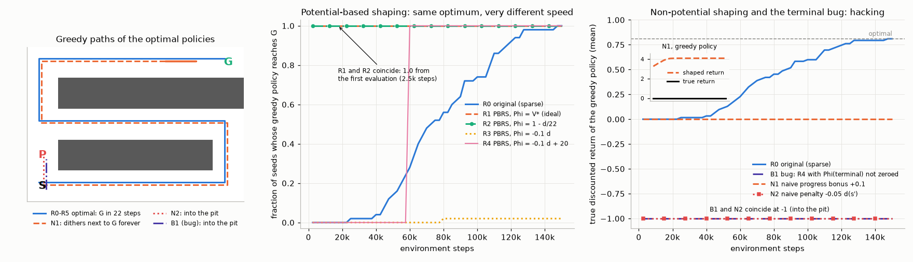
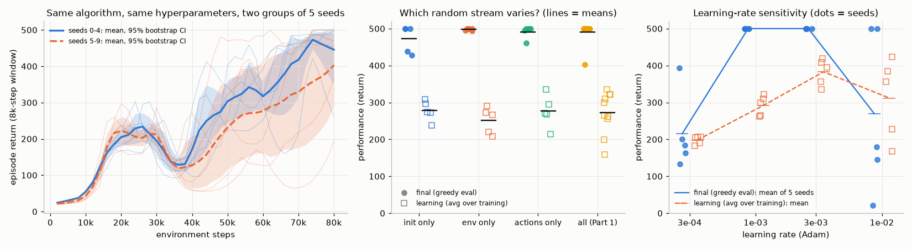
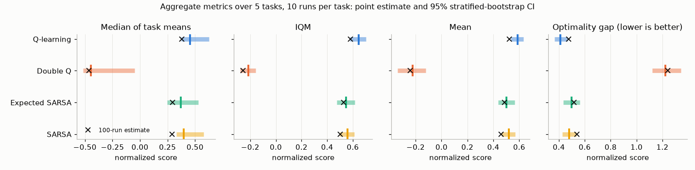
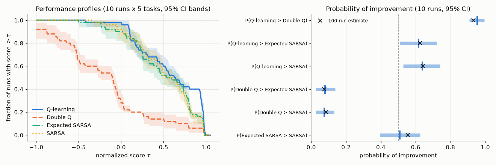
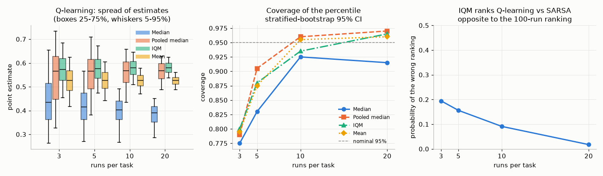
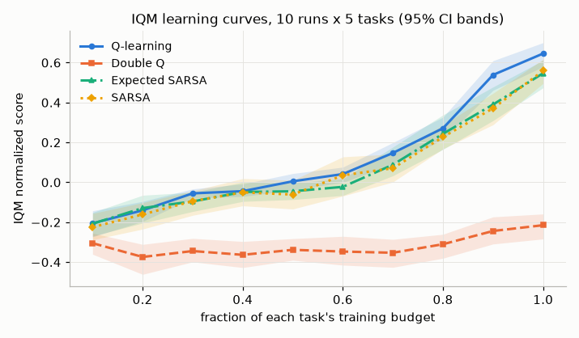
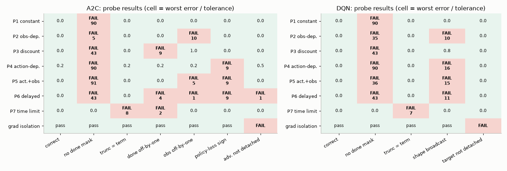
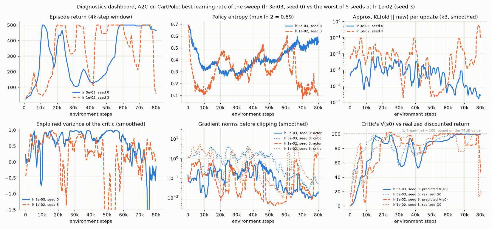
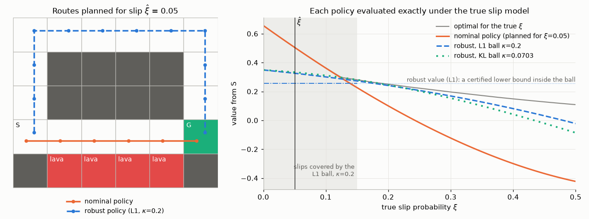

# Chapter 20 — Deep RL in Practice: Engineering, Debugging, Evaluation and Safety

[← Previous: Theory of RL: Convergence, Sample Complexity and Regret](19-rl-theory.md) · [Course index](../README.md)

## At a glance

The previous nineteen chapters taught algorithms. This chapter is about everything else that decides whether they work on a problem you care about: the reward you write down, what the agent observes and controls, how you know your code is correct, how many seeds you need before you believe a result and how to report it, how to make training fast, and how to keep an agent from doing damage. Henderson et al. (2018) found that changing only the random seed can produce learning curves that look like two different algorithms. Agarwal et al. (2021) found that, on a popular benchmark, the uncertainty in published results was often large enough to make claimed improvements unreliable.

The chapter has a running theme: **make every claim checkable**. A reward function is checked by asking which policies it makes optimal. An implementation is checked against environments whose answers you know in advance. A comparison is checked with confidence intervals. A safety requirement is checked by writing it as a constraint instead of hoping a penalty term will do.

**Learning objectives.** After this chapter you should be able to:

1. Recognize specification gaming and design rewards that resist it (sparse vs dense rewards, step penalties, termination as an implicit reward).
2. State and prove the potential-based shaping theorem of Ng, Harada & Russell (1999), and explain why terminal potentials must be zero.
3. Make sound choices for observations, actions, frame skipping, normalization, architecture, initialization and the update-to-data ratio, and recognize plasticity loss.
4. Tune hyperparameters with a stated budget (including population-based training), control randomness, and report variance across runs.
5. Evaluate agents with the IQM, stratified bootstrap CIs, performance profiles and the probability of improvement, implemented from scratch.
6. Debug an implementation with probe environments, sanity checks and a dashboard of diagnostics, and recognize common bugs from their symptoms.
7. Explain where wall-clock time goes and how vectorized, asynchronous and accelerator-based simulation help; choose libraries and benchmarks that measure what you care about.
8. Formulate safety requirements as constrained MDPs, solve them with Lagrangian methods, and describe CPO, shielding and CVaR; formulate robustness to model error as a robust MDP and solve it with robust value iteration.
9. Explain domain randomization for sim-to-real transfer, and describe landmark real-world applications accurately, including their caveats.

**Prerequisites.** MDPs, returns and the Bellman equations ([Chapter 01](01-the-rl-problem.md)); Q-learning, SARSA, Expected SARSA and Double Q-learning ([Chapter 05](05-temporal-difference.md)); DQN and its debugging ([Chapter 09](09-deep-q-learning.md), Section 14); actor-critic and GAE ([Chapter 10](10-policy-gradients.md)); PPO, its implementation details and its diagnostics ([Chapter 11](11-trust-regions-and-ppo.md), Section 8); the terminated/truncated distinction and the Gymnasium API ([Chapter 00](00-math-toolkit.md), Section 8). The bootstrap and basic hypothesis testing are used in Section 6 and are explained there.

**Code you will run** (all in [`code/ch20_deep_rl_in_practice/`](../code/ch20_deep_rl_in_practice/)):

| Script | What it shows |
|---|---|
| `reward_shaping.py` | potential-based shaping preserves the optimal policy exactly; a naive progress bonus creates a reward-hacking loop; a dense distance penalty and a terminal-potential bug both make the agent jump into a pit |
| `rl_stats.py` | IQM, stratified bootstrap CIs, performance profiles and probability of improvement from scratch, checked against scipy and the worked example of Section 6.3 |
| `evaluate_agents.py` (+ `tabular_suite.py`) | 4 TD agents × 5 tasks × 100 runs, reported properly (including the choice of normalization); how unreliable 3 runs are |
| `probe_envs.py` | seven probe environments that unit-test an A2C and a DQN, and the ten planted bugs they catch (or miss) |
| `seed_variance.py` (+ `cartpole_a2c.py`) | same algorithm, different seeds; final vs learning performance; which random stream matters; learning-rate sensitivity; a diagnostics dashboard |
| `robust_vi.py` | robust value iteration with $L_1$ and KL uncertainty sets on a slippery gridworld: the nominal policy hugs the lava, the robust one takes a detour, and the robust value is a certified lower bound over every slip model in the set |

**Study time.** About 12–15 hours: 6–7 for the text, 3–4 for running and modifying the code, 3–4 for the exercises.

**Notation.** We follow [NOTATION.md](../NOTATION.md). Local departures, each restated where used:

* Section 2: $\Phi$ is a shaping potential and $F$ a shaping function; $\mathcal M,\mathcal M'$ denote MDPs; $d(s)$ is a grid distance; $c$ is a constant reward.
* Section 3.2: $k$ is the action-repeat count and $\tau$ indexes decisions in (20.6).
* Section 4: $G$ (without a time index) is the update-to-data ratio, as in [Chapter 12](12-continuous-control-actor-critic.md), unrelated to the return $G_t$; $B$ is a minibatch size and $N$ a buffer capacity.
* Section 6: $N$ and $M$ count runs and tasks; $\tau$ is a score threshold (not a temperature or Polyak coefficient); $c$ in (20.10) is the number of trimmed scores; $\gamma_{\text{target}}$ is the target score of the optimality gap (not a discount); $\hat F$ is a performance profile.
* Section 9.1: $N$ is the number of parallel environments.
* Section 11: $\lambda_i$ are Lagrange multipliers (not the trace-decay or GAE $\lambda$), $k$ counts constraints and $d_i$ are cost budgets; bold $\mathbf F$ in (20.19) is the Fisher matrix; in 11.5, $\alpha$ is the CVaR probability level (not a step size) and $\beta$ a risk parameter (not a KL coefficient). In 11.6, $\hat p$ is a nominal transition kernel, $\mathcal U_{s,a}$ an uncertainty set of next-state distributions, $\kappa$ its radius, $u(s')$ the value of landing in $s'$, $\eta>0$ the dual variable of a KL ball, and $\xi$ a slip probability (a simulator parameter, as in Section 12).
* Exercises: $c$ is a value-loss coefficient in 20.9, $\beta$ the type-II error rate in 20.11, and $\beta$ an exploration-bonus scale (as in [Chapter 14](14-exploration.md)) in 20.15.

---

## 1. The practitioner's loop

A deep RL project is a loop, not a pipeline:

1. **Specify** the problem: the reward, the termination conditions, what the agent observes, what it controls and how often (Sections 2 and 3).
2. **Implement** or pick an implementation (Section 10), and make it fast enough to iterate (Section 9).
3. **Verify** that the implementation is correct on problems with known answers before trusting it on the real one (Sections 7 and 8).
4. **Tune** the few hyperparameters that matter, on seeds you will not use for the final evaluation (Sections 4 and 5).
5. **Evaluate** with enough runs and honest uncertainty estimates (Section 6).
6. **Inspect** what the agent actually does: watch episodes and look for reward hacking. Return to step 1 when the behaviour is not what you meant.
7. **Deploy** under constraints and safeguards, often after training in simulation (Sections 11 and 12).

Reinforcement learning makes each step harder than its supervised-learning counterpart, for three reasons. First, **there is no label to check against**. A classifier's errors are visible on a held-out set, but an RL agent's suboptimality is invisible unless you know the optimal return. Second, **the data depend on the model**. A bug in the policy changes which states are visited, which changes what the critic learns, which changes the policy again. Effects are delayed and entangled. Third, **failures are silent**. A wrong sign, a missing mask or a misaligned index rarely crashes anything. The agent usually still learns *something*, just less, or something else. Most of this chapter is about turning silent failures into loud ones.

---

## 2. Reward design

### 2.1 The reward is the specification, and agents exploit it

[Chapter 01](01-the-rl-problem.md) stated the reward hypothesis: whatever we want can be expressed as the maximization of expected cumulative reward. The hypothesis says nothing about whether *we* will write down the right reward. An RL agent is an optimizer, and optimizers find the cheapest way to make the number go up. **Specification gaming** (or **reward hacking**) is behaviour that achieves a high reward through a loophole in the reward function rather than by doing the intended task. Classic, well-documented examples:

* **The circling bicycle.** Randløv & Alstrøm (1998) rewarded a simulated bicycle for progress toward a goal, with no penalty for moving away. The agent learned to ride in circles: every lap contains a stretch of "progress", so circling collects reward forever. This example motivated the theory in Section 2.3.
* **The looping boat.** In OpenAI's 2016 report "Faulty reward functions in the wild" (Clark & Amodei), an agent in the boat-racing game CoastRunners was rewarded by the game score, which counts hitting targets along the course. It found a lagoon where three targets respawn, and it circled there indefinitely, repeatedly catching fire and crashing, while earning a higher score than completing the course would have.
* **The flipped block.** In a robotic stacking task (Popov et al., 2017), an early reward based on the height of the bottom face of the red block was maximized by flipping the block over instead of stacking it.
* **Reward-model overoptimization.** When the reward is itself a learned model, as in RLHF ([Chapter 18](18-rl-for-language-models.md)), optimizing it too hard increases the proxy reward while the true quality (measured by a "gold" reward model or by humans) first rises and then falls. Gao, Schulman & Hilton (2023) measured how the gold reward depends on the KL distance from the initial policy and on the size of the reward model.

Krakovna et al. maintain a public list of specification-gaming examples. Reading it is the fastest way to develop an instinct for loopholes. Two related ideas:

* **Goodhart's law**: "when a measure becomes a target, it ceases to be a good measure." Every reward is a measure of what we want, and RL turns it into a target. Goodhart's law is the general principle, and specification gaming is an instance of it. [Chapter 18](18-rl-for-language-models.md), Section 8.1, separates two of its mechanisms. In *regressional* Goodhart, selecting the top of a noisy proxy also selects the noise. In *extremal* Goodhart, optimization pushes into regions where the proxy and the true objective no longer agree. Reward-model over-optimization shows both.
* **Goal misgeneralization** (Langosco et al., 2022; Shah et al., 2022) is genuinely different. Here the reward is *correct* on the training distribution, but the agent learns a goal that coincides with it only there. In a CoinRun variant where the coin was always at the right end of the level during training, agents learned "go right", and they ignored the coin when it was moved. No reward fix helps. Diverse training environments do.

Practical defenses: (i) **watch the agent**, because videos reveal loopholes that curves never show; (ii) track the *intended* success metric separately from the reward, and alarm when they diverge (Section 2.5 shows this signature); (iii) prefer rewards defined by outcomes (task success) over rewards defined by behaviour you think leads to success; (iv) when you must add dense terms, make them potential-based (Section 2.3) or keep them small and bounded; (v) red-team the reward: before training, ask "what is the laziest policy that scores well?"

### 2.2 Sparse vs dense rewards, and the hidden reward in termination

A **sparse** reward is nonzero only on rare events, for example $+1$ on reaching the goal. It specifies the task precisely, but the agent may never see a nonzero reward under random exploration. For a gridworld goal $L$ steps away, a random walk needs a number of steps that grows quickly with $L$ before the first success, and until then every TD target is zero. [Chapter 14](14-exploration.md) covers exploration methods for exactly this situation (their bonuses are themselves reward terms; Section 2.3 explains what that implies). A **dense** reward gives feedback on every step (distance to the goal, forward velocity, an energy penalty). Learning is much faster, but every dense term is a new opportunity for hacking. Most practical reward functions are a weighted sum of a sparse success term and a few dense terms, and the weights are hyperparameters that need tuning like any other.

A subtle and very common trap is the **constant per-step reward**. Add a constant $c$ to every reward of an episodic task in which the agent influences when the episode ends. An episode of length $T$ starting from step $t$ then gains

$$
c\sum_{k=0}^{T-t-1}\gamma^k = c\,\frac{1-\gamma^{T-t}}{1-\gamma},
\tag{20.1}
$$

which grows with the episode length. A positive $c$ (an "alive bonus", common in locomotion) rewards survival for its own sake. A negative $c$ (a "step penalty", common in navigation) rewards ending the episode, and if a pit, lava cell or self-destruct action can end it, the agent will learn to use it. In a **continuing** task, by contrast, a constant shifts every return by $c/(1-\gamma)$ and changes nothing. Section 2.3 explains the difference: a constant is a potential-based shaping term whose potential is not zero at terminal states. Termination conditions are therefore part of the reward. "End the episode when the robot falls" is a strong *negative* signal under an alive bonus and a *positive* one under a step penalty.

### 2.3 Reward shaping and the potential-based shaping theorem

**Shaping** means adding a term to the reward to guide learning:

$$
R'_{t+1} = R_{t+1} + F(S_t, A_t, S_{t+1}),
\tag{20.2}
$$

where $F:\mathcal S\times\mathcal A\times\mathcal S^+\to\mathbb R$ is the **shaping function**. Write $\mathcal M=(\mathcal S,\mathcal A,p,\gamma)$ for the MDP with the original reward and $\mathcal M'$ for the same MDP with reward (20.2). The question is when $\mathcal M'$ has the same optimal policies as $\mathcal M$. The answer, due to Ng, Harada & Russell (1999), is: when $F$ is a difference of potentials.

**Definition.** $F$ is **potential-based** if there is a bounded function $\Phi:\mathcal S^+\to\mathbb R$, the **potential**, such that

$$
F(s,a,s') = \gamma\,\Phi(s') - \Phi(s)\quad\text{for all } s, a, s',
\tag{20.3}
$$

where the class of MDPs matters, as in Ng et al. (i) In a **continuing** task ($\gamma<1$, no terminal states), $\Phi$ is arbitrary and (20.3) must hold for all $s,s'$. (ii) In an **episodic** task, (20.3) is required for every non-terminal $s$, with $\Phi(s)=0$ for every terminal state; no shaping is paid after termination. The $\gamma$ in (20.3) must be the same discount factor as the task's.

**Theorem (potential-based shaping; Ng, Harada & Russell, 1999).**

Assume bounded rewards, and either $\gamma<1$, or $\gamma=1$ with every policy reaching a terminal state with probability 1 (all policies **proper**), so that every return is well defined.

*(a) Sufficiency.* If $F$ is potential-based, then for every policy $\pi$, every state $s$ and action $a$,

$$
q^{\mathcal M'}_\pi(s,a) = q^{\mathcal M}_\pi(s,a) - \Phi(s),\qquad v^{\mathcal M'}_\pi(s) = v^{\mathcal M}_\pi(s) - \Phi(s),
\tag{20.4}
$$

and in particular $q^{\mathcal M'}_\ast(s,a) = q^{\mathcal M}_\ast(s,a) - \Phi(s)$. Hence every optimal policy of $\mathcal M'$ is optimal in $\mathcal M$ and vice versa, and more generally the ranking of *all* policies from any start state is unchanged.

*(b) Necessity.* If $F$ is not potential-based, then there exist transition probabilities and a reward function (for the same state and action sets and $\gamma$, within the same class, continuing or episodic) such that no optimal policy of $\mathcal M'$ is optimal in $\mathcal M$.

**Proof of (a), via returns.** Fix a policy $\pi$ and a trajectory $S_t, A_t, R_{t+1}, S_{t+1},\dots$ generated by it. The shaped discounted reward over the first $K$ steps (a partial sum, not the bootstrapped $n$-step return of NOTATION.md) is

$$
\begin{aligned}
\sum_{k=0}^{K-1}\gamma^k R'_{t+k+1} &= \sum_{k=0}^{K-1}\gamma^k\Big(R_{t+k+1} + \gamma\Phi(S_{t+k+1}) - \Phi(S_{t+k})\Big)\\
&= \sum_{k=0}^{K-1}\gamma^k R_{t+k+1} + \sum_{k=0}^{K-1}\Big(\gamma^{k+1}\Phi(S_{t+k+1}) - \gamma^{k}\Phi(S_{t+k})\Big)\\
&= \sum_{k=0}^{K-1}\gamma^k R_{t+k+1} + \gamma^{K}\Phi(S_{t+K}) - \Phi(S_t).
\end{aligned}
$$

The second sum **telescopes**: each $\gamma^{j}\Phi(S_{t+j})$ for $1\le j\le K-1$ appears once with a plus sign (from $k=j-1$) and once with a minus sign (from $k=j$), leaving only the last and first terms. Now let $K\to\infty$. If $\gamma<1$ and $\Phi$ is bounded, $\gamma^K\Phi(S_{t+K})\to0$. If the episode terminates at time $T$ (with probability 1 when $\gamma=1$, by the proper-policy assumption), the terminal state is absorbing with zero reward and $\Phi(S_T)=0$, so all terms after $T$ vanish. Either way,

$$
G'_t = G_t - \Phi(S_t).
\tag{20.5}
$$

Take the expectation conditional on $S_t=s$ (and $A_t=a$), under $\pi$; bounded rewards and potentials justify exchanging the limit and the expectation (dominated convergence). Because $\Phi(S_t)=\Phi(s)$ is a constant under this conditioning, (20.4) follows. Since $\Phi(s)$ does not depend on the action, $\arg\max_a q^{\mathcal M'}_\pi(s,a) = \arg\max_a q^{\mathcal M}_\pi(s,a)$ for every $\pi$. Since $v^{\mathcal M'}_\pi(s)-v^{\mathcal M'}_{\pi'}(s) = v^{\mathcal M}_\pi(s)-v^{\mathcal M}_{\pi'}(s)$ for any two policies, $\pi$ is optimal in $\mathcal M'$ (from every state) if and only if it is optimal in $\mathcal M$. $\square$

**Proof of the optimal-value identity, via the Bellman equation** (the route Ng et al. took, worth knowing because it does not need trajectories). $q^{\mathcal M}_\ast$ is the unique fixed point of

$$
q^{\mathcal M}_\ast(s,a) = \mathbb E\Big[R_{t+1} + \gamma\max_{a'}q^{\mathcal M}_\ast(S_{t+1},a')\ \Big|\ S_t=s,A_t=a\Big].
$$

Subtract $\Phi(s)$ from both sides, and add and subtract $\gamma\Phi(S_{t+1})$ inside the expectation:

$$
\underbrace{q^{\mathcal M}_\ast(s,a)-\Phi(s)}_{\hat q(s,a)} = \mathbb E\Big[R_{t+1} + \underbrace{\gamma\Phi(S_{t+1})-\Phi(s)}_{F} + \gamma\max_{a'}\underbrace{\big(q^{\mathcal M}_\ast(S_{t+1},a')-\Phi(S_{t+1})\big)}_{\hat q(S_{t+1},a')}\ \Big|\ s,a\Big].
$$

So $\hat q$ satisfies the Bellman optimality equation of $\mathcal M'$. That equation has a unique solution (its operator is a $\gamma$-contraction for $\gamma<1$, [Chapter 03](03-dynamic-programming.md); for $\gamma=1$, uniqueness holds when all policies are proper), so $\hat q = q^{\mathcal M'}_\ast$. For terminal transitions, consistency requires $\hat q(\text{terminal},\cdot)=0$, that is, $\Phi(\text{terminal})=0$. $\square$

**Idea of the proof of (b)** (a construction in the spirit of Ng et al.'s). Two cases. *If $F$ depends on the action*, say $F(s,a_1,s')\ne F(s,a_2,s')$, build an MDP in which $a_1$ and $a_2$ both lead from $s$ to $s'$ with equal rewards. They tie in $\mathcal M$, and $F$ breaks the tie in $\mathcal M'$, so we can perturb $R$ slightly to make the preferences opposite. *If $F$ does not depend on the action*, designate a state $s_0$. In the episodic case make it terminal and set $\Phi(s_0)=0$. In the continuing case make it absorbing (every action returns to $s_0$) and set $\Phi(s_0)\doteq F(s_0,\cdot,s_0)/(\gamma-1)$, so that the self-loop's shaping equals $\gamma\Phi(s_0)-\Phi(s_0)$ and the shaping collected after arriving at $s_0$ at time $j$ is $\sum_{i\ge j}\gamma^iF(s_0,\cdot,s_0)=-\gamma^j\Phi(s_0)$. In both cases *define* $\Phi(s)\doteq\gamma\Phi(s_0)-F(s,\cdot,s_0)$ for $s\ne s_0$. Then $F$ agrees with $\gamma\Phi(s')-\Phi(s)$ on every transition into $s_0$, and this $\Phi$ is the only candidate potential. Since $F$ is not potential-based, some pair has $\Delta\doteq F(s_1,\cdot,s_2)-\big(\gamma\Phi(s_2)-\Phi(s_1)\big)\ne0$, with $s_1,s_2\ne s_0$. (In the continuing case, if the only violations are transitions *out of* $s_0$, designate another state instead; with at least three states this always works.) Build an MDP where, from $s_1$, one action goes to $s_0$ directly and another goes to $s_2$ and then to $s_0$. The total shaping is $\gamma\Phi(s_0)-\Phi(s_1)-\gamma\Phi(s_0)=-\Phi(s_1)$ along the direct route and $F(s_1,\cdot,s_2)+\gamma\big(\gamma\Phi(s_0)-\Phi(s_2)\big)-\gamma^2\Phi(s_0)=\Delta-\Phi(s_1)$ along the other (in the episodic case drop the post-arrival terms, which are zero). The two routes differ by exactly $\Delta$. Choose the true rewards so that the route through $s_2$ is better in $\mathcal M$ by $\lvert\Delta\rvert/2$ when $\Delta<0$ (worse by $\lvert\Delta\rvert/2$ when $\Delta>0$). Then $\mathcal M'$ prefers the other route, and no optimal policy of $\mathcal M'$ is optimal in $\mathcal M$. Note what (b) does and does not say. A particular non-potential $F$ may happen to preserve the optimal policy of a particular MDP. What fails is the *guarantee*: only potential-based shaping is safe for every MDP. The construction also shows why a constant $F\equiv c$ is safe in continuing tasks but not in episodic ones. In the continuing case it gives $\Phi\equiv-c/(1-\gamma)$ and $\Delta=0$. In the episodic case it gives $\Phi(s)=-c$ for non-terminal $s$ and $\Delta=c-\big(\gamma(-c)+c\big)=\gamma c\ne0$.

**Consequences that matter in practice.**

* **Loops gain nothing.** Around any cycle $s_0\to s_1\to\dots\to s_k=s_0$ the discounted shaping sum is $\gamma^k\Phi(s_0)-\Phi(s_0)=-(1-\gamma^k)\Phi(s_0)$. Repeating the cycle forever collects $-\Phi(s_0)$, exactly what (20.5) says *every* trajectory from $s_0$ collects. Circling cannot be profitable, which is precisely the bicycle's loophole closed.
* **Terminal potentials must be zero, but truncation is not termination.** If code computes $\Phi(s')$ from the terminal observation without zeroing it, then (20.5) becomes $G'_t = G_t + \gamma^{T-t}\Phi(S_T) - \Phi(S_t)$. The extra term depends on *where* and *when* the episode ends, and that can change the optimal policy (Section 2.5 shows a case). At a **time-limit truncation**, however, the state is not terminal. Keep $\Phi(s')$, and bootstrap as usual.
* **Constants revisited.** For $\gamma<1$, a constant reward $c$ is (20.3) with $\Phi\equiv-c/(1-\gamma)$ everywhere. In a continuing task that is a legitimate potential, which is why constants are harmless there. In an episodic task it violates $\Phi(\text{terminal})=0$, which is why (20.1) changes behaviour. With $\gamma=1$ a nonzero constant is never potential-based: a step into a terminal state forces $\Phi(s)=-c$, and a step $s\to s'$ between two such states would then need $\Phi(s')-\Phi(s)=c\ne0$ (and around any cycle the required increments $c$ cannot sum to zero).
* **The best potential is the optimal value.** With $\Phi=v^{\mathcal M}_\ast$, (20.4) gives $q^{\mathcal M'}_\ast(s,a) = q^{\mathcal M}_\ast(s,a)-v^{\mathcal M}_\ast(s)$, the optimal *advantage*. It is $0$ for optimal actions and negative otherwise, so a greedy agent with zero-initialized $Q$ is already nearly right. Any heuristic estimate of "how good is this state" (closeness to the goal, progress along a track) is a candidate potential. A bad potential cannot change the optimal policy. It can only slow learning down, and Section 2.5 shows that even a sensible-looking one can slow it down a lot.
* **Shaping is initialization.** Wiewiora (2003) proved that tabular Q-learning with potential-based shaping and zero initialization makes exactly the same updates, and therefore the same action choices, as Q-learning without shaping whose table is initialized to $Q_0(s,a)=\Phi(s)$ (Exercise 20.3). Shaping is thus a form of prior knowledge about values. With function approximation the equivalence is lost, but the intuition remains.
* **Exploration bonuses are shaping too, and they are not potential-based.** The count, curiosity and RND bonuses of [Chapter 14](14-exploration.md) (Sections 6–7) add $\beta r^i$ to the reward, where $r^i$ depends on visit counts or prediction errors rather than on a difference of potentials. By part (b) of the theorem nothing guarantees that they preserve the optimal policy, and a fixed bonus can change it: a rarely visited dead end can be worth more than the goal (Exercise 20.15). Chapter 14 copes in three ways. The bonus shrinks as counts grow, so in the limit the agent optimizes $r^e$ again. The intrinsic return is learned in a separate value stream. And exploitation is measured by acting greedily on the extrinsic values $Q_E$ alone, with the intrinsic stream dropped. Its "procrastination" pitfall (Chapter 14, Section 7.3) is the termination effect of Section 2.2 in another guise: a non-episodic intrinsic stream makes reaching a terminal goal look like a loss of future novelty, so the agents loiter next to it. Finally, by Wiewiora's result above, shaping with $\Phi$ and optimistic initialization (Chapter 14, Section 3.1) are two forms of the same prior on values: a potential that is high in unexplored states *is* an optimistic initial $Q$.
* **Extensions.** Potentials may depend on time (Devlin & Kudenko, 2012) or on the action ("potential-based advice"; Wiewiora, Cottrell & Elkan, 2003), with correspondingly modified invariance results.

```text
Algorithm 20.1: Q-learning with potential-based reward shaping
Input: potential Phi(s) (bounded); step size alpha; epsilon; discount gamma (the task's own)
Initialize Q(s, a) = 0 for all s, a
Loop for each episode:
    S <- reset()
    Loop for each step:
        A <- epsilon-greedy(Q, S)
        S', R, terminated, truncated <- env.step(A)
        if terminated:  phi' <- 0                      # absorbing terminal state: potential 0
        else:           phi' <- Phi(S')                # includes truncation: S' is a real state
        R' <- R + gamma * phi' - Phi(S)                # Eq. (20.3)
        target <- R'                         if terminated
                  R' + gamma * max_a Q(S', a)  otherwise   # bootstrap through truncation
        Q(S, A) <- Q(S, A) + alpha * (target - Q(S, A))
        if terminated or truncated: break
        S <- S'
```

### 2.4 A worked example by hand

Take a three-state chain $A \to B \to G$, where $G$ is terminal. Two actions: *right* moves $A\to B$ and $B\to G$; *left* moves $B\to A$ and leaves $A$ in place (a wall). The reward is $+1$ on entering $G$ and $0$ otherwise, and $\gamma=0.9$.

**Original values.** $v_\ast(B)=1$ (go right). $v_\ast(A)=\gamma\cdot1=0.9$. Then $q_\ast(A,\text{left})=\gamma v_\ast(A)=0.81$ and $q_\ast(B,\text{left})=\gamma v_\ast(A)=0.81$.

**Potential-based shaping** with $\Phi=-(\text{steps to goal})$: $\Phi(A)=-2$, $\Phi(B)=-1$, $\Phi(G)=0$. By (20.3):

| transition | $F=\gamma\Phi(s')-\Phi(s)$ | shaped reward $R'$ |
|---|---|---|
| $A\xrightarrow{\text{right}}B$ | $0.9(-1)+2 = 1.1$ | $1.1$ |
| $A\xrightarrow{\text{left}}A$ | $0.9(-2)+2=0.2$ | $0.2$ |
| $B\xrightarrow{\text{right}}G$ | $0-(-1)=1$ | $1+1=2$ |
| $B\xrightarrow{\text{left}}A$ | $0.9(-2)+1=-0.8$ | $-0.8$ |

The theorem predicts $q'_\ast = q_\ast-\Phi$: $q'_\ast(A,\text{right})=0.9+2=2.9$, $q'_\ast(A,\text{left})=0.81+2=2.81$, $q'_\ast(B,\text{right})=1+1=2$ and $q'_\ast(B,\text{left})=0.81+1=1.81$. Check these against the Bellman optimality equation of $\mathcal M'$, with $v'_\ast(A)=2.9$ and $v'_\ast(B)=2$:

* $q'(B,\text{right}) = 2 + 0 = 2$ and $q'(B,\text{left}) = -0.8+0.9\cdot2.9 = 1.81$. ✓
* $q'(A,\text{right}) = 1.1+0.9\cdot2 = 2.9$ and $q'(A,\text{left}) = 0.2+0.9\cdot2.9=2.81$. ✓

The greedy actions are unchanged (right, right). Notice that staying at $A$ forever earns $0.2$ per step, $0.2/(1-0.9)=2=-\Phi(A)$ in total, exactly the "loops gain nothing" amount, and less than $2.9$.

**Naive shaping.** Now pay a bonus $b=0.5$ for every move to the right ("progress") and nothing for moving left. Consider the loop at $B$: left (reward 0), right ($+0.5$), left, right, and so on. Its value from $B$ is $\gamma b+\gamma^3b+\dots=\gamma b/(1-\gamma^2)=0.45/0.19=2.37$. Entering the goal from $B$ is worth $1+b=1.5$. The loop wins. Solving the Bellman equations confirms that the agent never reaches $G$: $v(A)=b/(1-\gamma^2)=2.63$ and $v(B)=\gamma v(A)=2.37>1.5$. In this chain the loop beats the goal whenever $\gamma b/(1-\gamma^2)>1+b$, that is, $b>0.268$ for $\gamma=0.9$, and for $\gamma=0.99$ the threshold falls to $b>0.0205$ (Exercise 20.13). A bonus that looks "small" relative to the goal reward is not small relative to an infinite stream of it.

### 2.5 Experiment: shaping on a zig-zag gridworld

[`reward_shaping.py`](../code/ch20_deep_rl_in_practice/reward_shaping.py) makes these points on a gridworld where the shortest path from $S$ to the goal $G$ zig-zags through 22 cells, and a pit $P$ (terminal, reward $-1$) sits next to the start:

```text
        col 0 1 2 3 4 5 6
    row 0   . . . . . . G        reward +1 for entering G, -1 for entering P,
    row 1   . # # # # # #        0 otherwise; gamma = 0.99; walls block moves
    row 2   . . . . . . .
    row 3   P # # # # # .
    row 4   S . . . . . .
```

Let $d(s)$ be the true shortest-path distance from $s$ to $G$ (paths may not pass through the pit; the pit itself is assigned $d(P)=9$, its distance via the cell $(2,0)$). We compare nine rewards. **R0** is the original sparse reward. **R1–R5** add potential-based shaping with five potentials: the ideal one, $\Phi=v_\ast=\gamma^{d(s)-1}$; a normalized progress potential $\Phi=1-d(s)/22$; the common "negative distance" $\Phi=-0.1\,d(s)$; the same plus a constant, $\Phi=-0.1\,d(s)+20$; and $\Phi=-0.1\times$ Manhattan distance, a misleading heuristic because the walls force the path away from the goal. **B1** uses R4's potential but the code forgets to zero $\Phi$ at terminal states. **N1** is a naive progress bonus, $+0.1$ whenever $d$ decreases (nothing when it increases). **N2** is a naive dense penalty, $-0.05\,d(s')$ per step, charged only on transitions into non-terminal states. Part 1 solves each MDP exactly by value iteration.

| reward | potential-based? | states (of 22) whose set of optimal actions changes | greedy optimal policy from $S$ |
|---|---|---|---|
| R0 original (sparse) | – | – | reaches $G$ in 22 steps |
| R1 $\Phi=v_\ast$ ($\gamma^{d(s)-1}$) | yes | 0 | reaches $G$ in 22 steps |
| R2 $\Phi=1-d(s)/22$ | yes | 0 | reaches $G$ in 22 steps |
| R3 $\Phi=-0.1\,d(s)$ | yes | 0 | reaches $G$ in 22 steps |
| R4 $\Phi=-0.1\,d(s)+20$ | yes | 0 | reaches $G$ in 22 steps |
| R5 $\Phi=-0.1\times$Manhattan | yes | 0 | reaches $G$ in 22 steps |
| B1 R4 with $\Phi(\text{terminal})$ not zeroed | no (bug) | 4 | **jumps into the pit** at step 1 |
| N1 progress bonus $+0.1$ | no | 1 | walks to the cell next to $G$, then **oscillates** between $(0,4)$ and $(0,5)$ forever |
| N2 penalty $-0.05\,d(s')$ | no | 5 | **jumps into the pit** at step 1 |

For every potential-based reward, the computed $q'_\ast$ equals $q_\ast-\Phi$ to within $7.1\times10^{-15}$, as (20.4) says. Each failure is explained by a line of arithmetic:

* **N1** pays $+0.1$ per step of progress, so the agent walks toward the goal, but on the doorstep it compares entering $G$ (worth $1+0.1$) with the loop "step back, step forward" (worth $0.1\gamma/(1-\gamma^2)=4.975$). It loops. Only *one* state's optimal action changed, and that was enough to destroy the task. Counting "how many states behave differently" is a poor measure of how much a reward change matters.
* **N2** makes the 22-step walk cost $0.05\times(21+20+\dots+1)=11.55$ in penalties (before discounting), against $1$ for jumping into the pit. Suicide is optimal (Section 2.2).
* **B1** adds $\gamma^{T}\Phi(S_T)$ to every shaped return (Section 2.3). For the pit at $T=1$ that is $0.99\times19.1=18.91$, and for the goal at $T=22$ it is $0.99^{22}\times20=16.03$. The shaped returns from $S$ become $-1+18.91-17.8=0.11$ for the pit and $0.81+16.03-17.8=-0.96$ for the goal.

Part 2 trains tabular Q-learning ($\alpha=0.5$, $\varepsilon=0.1$, zero initialization, time limit 100 steps with bootstrapping through truncation) on each reward, with 50 seeds and 150,000 steps, and measures the *true* performance of the greedy policy:

| reward | seeds whose greedy policy reaches $G$, after 25k / 50k / 100k / 150k steps | 90% of seeds succeed from |
|---|---|---|
| R0 original (sparse) | 0.02 / 0.14 / 0.74 / 1.00 | 117,500 steps |
| R1 $\Phi=v_\ast$ | 1.00 / 1.00 / 1.00 / 1.00 | the first evaluation (2,500 steps) |
| R2 $\Phi=1-d/22$ | 1.00 / 1.00 / 1.00 / 1.00 | the first evaluation (2,500 steps) |
| R3 $\Phi=-0.1\,d$ | 0.00 / 0.00 / 0.02 / 0.02 | never (within 150k) |
| R4 $\Phi=-0.1\,d+20$ | 0.00 / 0.00 / 1.00 / 1.00 | 60,000 steps |
| B1 (bug), N1, N2 | 0 throughout | never: B1 and N2 end in the pit (true return $-1$), N1 loops (true return 0) |



*Left: greedy paths of the optimal policies (R0–R5 share one; N1 dithers next to the goal; N2 and B1 jump into the pit). Middle: fraction of the 50 seeds whose greedy policy reaches the goal, for the potential-based variants (R1 and R2 coincide at 1.0). Right: true discounted return of the greedy policy for the non-potential rewards and the bug (B1 and N2 coincide at −1). The inset shows N1's reward-hacking signature: the greedy policy's shaped return rises while its true return stays at 0.*

Three lessons, the last of which surprised us when we first ran the experiment:

1. **Non-potential shaping is a specification change, and agents find it.** Under N1, the greedy policy's *shaped* return rose from 3.26 to 4.09 during training while its *true* return stayed at exactly 0. Reward going up while the task metric stays flat (or falls) is the signature of reward hacking. It can only be seen if the task metric is logged separately.
2. **A good potential is a huge accelerator.** With $\Phi\approx v_\ast$, every seed solved the task by the first evaluation, against 117,500 steps for the sparse reward.
3. **Potential-based shaping guarantees the destination, not the journey.** R3 and R4 differ only by a constant and have the same optimal policy, yet R3 was much *slower* than no shaping and R4 twice as fast. The reason is the rule $\Phi(\text{terminal})=0$. With $\Phi=-0.1\,d<0$, every terminal transition pays the bonus $-\Phi(s)=0.1\,d(s)>0$: from $S$, jumping into the pit pays $-1+2.2=+1.2$ at once, while walking pays about $+0.12$ per step. Wiewiora's equivalence makes this precise: R3 *is* Q-learning initialized to $Q_0(s,\cdot)=-0.1\,d(s)$, pessimistic everywhere except at terminal states. R4 is an optimistic initialization ($Q_0\approx18$–$20$ against true values below 1), so the agent avoids terminating and explores systematically until the optimism is unlearned, at about 60,000 steps in all seeds. Part 3 of the script confirms the equivalence numerically: over 20 seeds × 20,000 steps, Q-learning with R3 and Q-learning on R0 initialized to $\Phi$ chose *identical* actions at every step, with $\max\lvert Q_{\text{shaped}}+\Phi-Q_{\text{init}}\rvert = 3.3\times10^{-14}$. The practical rule: choose $\Phi$ to approximate $v_\ast$ *including its level*, with terminal states at 0. Then entering a terminal state is neither artificially attractive nor artificially repulsive.

---

## 3. Designing the environment interface

The environment you train on is a design decision, even when the physical task is fixed. This section collects the decisions that most often separate a working agent from a non-working one.

### 3.1 Observations

* **Make it Markov, or give the agent memory.** If the optimal action depends on something the observation omits, no amount of training fixes it ([Chapter 15](15-beyond-mdps.md)). Common omissions are velocities (positions alone do not determine the next state), the previous action, contact states and the **time remaining** in time-limited tasks. Pardo et al. (2018) showed that if episodes end at a fixed time limit that the agent cannot see, the task is non-Markov for it. Either add the remaining time to the observation (when the deadline is part of the task) or bootstrap through truncation (when it is not).
* **Frame stacking** gives a feed-forward network short-term memory, for example the last 4 Atari frames (Mnih et al., 2015), so that velocities can be inferred. A recurrent network is the general solution.
* **Choose the frame of reference.** Egocentric coordinates (relative to the agent) generalize better than absolute ones for locomotion and navigation.
* **Privileged information** that is available in simulation but not at deployment (exact friction, true positions of objects) may be fed to the *critic* but not to the *actor*. This is the **asymmetric actor-critic** (Pinto et al., 2018), and it is used in sim-to-real (Section 12) and in the tokamak controller (Section 13).
* **Keep it small and clean.** Remove features that are constant or pure noise, and scale every feature to order 1 (Section 3.4).

### 3.2 Actions

* **Discrete vs continuous.** Continuous control usually uses a Gaussian (PPO) or tanh-squashed Gaussian (SAC) policy ([Chapter 12](12-continuous-control-actor-critic.md)). Coarse discretization, even down to "bang-bang" extremes, is often surprisingly competitive (Seyde et al., 2021). It is worth trying when the continuous agent struggles.
* **Normalize the action range.** Let the policy act in $[-1,1]^d$ and rescale inside the environment wrapper: $a_{\text{env}}=\text{low}+\tfrac12(a+1)(\text{high}-\text{low})$. Rescaling bugs are in the catalogue of Section 8.
* **Squash or clip?** Clipping a Gaussian sample at the bounds treats the clip as part of the environment. Using $\log\pi$ of the *unclipped* sample in the gradient is then correct and unbiased ([Chapter 10](10-policy-gradients.md), Section 2.3). The cost is wasted signal: once the mean drifts past a bound, most samples clip to the same action. Squashing with tanh keeps every sample inside the bounds but requires the change-of-variables correction to the log-probability ([Chapter 12](12-continuous-control-actor-critic.md)).
* **Action repeat (frame skipping).** Repeating each action for $k$ environment steps shortens the decision horizon, reduces compute per environment step, and makes exploration more temporally coherent. In the agent's view, the reward of one decision is the discounted sum over the $k$ underlying steps and the discount per decision is $\gamma^k$:

$$
\tilde R_{\tau+1} = \sum_{j=0}^{k-1}\gamma^j R_{t+j+1},\qquad \tilde\gamma = \gamma^k,\qquad t = k\tau .
\tag{20.6}
$$

Most implementations, including the standard Atari wrappers, sum the $k$ rewards without discounting, a negligible difference when $(1-\gamma)k\ll1$. Here $\tau$ indexes decisions. The effective horizon measured in decisions shrinks from $1/(1-\gamma)$ to $1/(1-\gamma^k)\approx 1/(k(1-\gamma))$. If you change $k$, keep the horizon in *environment time* fixed by adjusting $\gamma$. DQN on Atari used $k=4$ with a max over the last two frames to remove flicker (Mnih et al., 2015). Machado et al. (2018) recommend **sticky actions** (with probability 0.25 the previous action is repeated) so that a deterministic emulator cannot be beaten by memorizing an action sequence.

### 3.3 Episodes, termination and time

* **Termination** must mean that the task is over (success, failure, an absorbing state). **Truncation** means only that we stopped watching. The distinction decides whether the TD target bootstraps ([Chapter 00](00-math-toolkit.md), Section 8.2), and Section 8 lists the ways to get it wrong.
* **Early termination is a design tool.** Ending locomotion episodes when the robot falls removes useless data from the buffer. As Section 2.2 showed, it also acts as a reward of its own, whose sign depends on the sign of the per-step reward.
* **Time limits shape exploration.** Short episodes reset the agent often and diversify the start states, while long episodes let it reach distant states. Too short a limit makes far-away goals unreachable.

### 3.4 Normalization of observations, rewards, advantages and targets

Neural networks train best when inputs and targets are of order 1. Deep RL adds a twist: the statistics change during training, because the policy changes.

**Observation normalization.** Keep running estimates of the per-feature mean $\boldsymbol\mu$ and variance $\boldsymbol\sigma^2$ over all observations seen so far, and feed the network $\operatorname{clip}\big((\mathbf o-\boldsymbol\mu)/\sqrt{\boldsymbol\sigma^2+\epsilon},-c,c\big)$, for example with $c=5$ or $10$. When a batch of $n_B$ new observations with mean $\boldsymbol\mu_B$ and variance $\boldsymbol\sigma_B^2$ arrives, merge it with the running statistics (count $n$) exactly (Chan, Golub & LeVeque's parallel formula):

$$
\begin{aligned}
\boldsymbol\delta &= \boldsymbol\mu_B-\boldsymbol\mu,\qquad n' = n+n_B,\\
\boldsymbol\mu' &= \boldsymbol\mu + \boldsymbol\delta\,\frac{n_B}{n'},\\
\boldsymbol\sigma'^2 &= \frac{n\,\boldsymbol\sigma^2 + n_B\,\boldsymbol\sigma_B^2 + \boldsymbol\delta^{2}\,\frac{n\,n_B}{n'}}{n'} .
\end{aligned}
\tag{20.7}
$$

The statistics are **part of the model**. Save them with the weights, freeze them at evaluation, and use the same ones at deployment (Section 8, bug 3).

**Reward scaling.** Divide rewards (do not shift them, because shifting changes the problem, Section 2.2) by a running estimate of the standard deviation of the *discounted return*. Maintain $\tilde G_t = \gamma\tilde G_{t-1}+R_t$ (reset at episode starts) and use $R_t/\sqrt{\operatorname{Var}[\tilde G]+\epsilon}$. This makes value targets of order 1. [Chapter 11](11-trust-regions-and-ppo.md) (Section 8.3) measured that removing it was the most damaging single ablation of PPO on CartPole. Our A2C in Section 5 uses a fixed scale of 0.1, for the same reason. **Reward clipping** to $[-1,1]$, as in DQN on Atari, is a different and stronger intervention: it changes the objective, because the agent can no longer tell a reward of 10 from a reward of 1.

**Advantage normalization.** In policy-gradient methods, standardize the advantages within each minibatch: $\hat A\leftarrow(\hat A-\operatorname{mean})/(\operatorname{std}+\epsilon)$. This fixes the scale of the policy gradient across tasks and over training. Subtracting the batch mean adds a tiny bias, which is usually harmless. With very small batches it is noisy. With a batch of one, every normalized advantage is 0 (or NaN, since the unbiased standard deviation of one sample is undefined).

**Value-target normalization.** When return scales drift by orders of magnitude (Atari across games, or a single task as the agent improves), **PopArt** (van Hasselt et al., 2016) normalizes value targets adaptively, and it rescales the last layer so that the unnormalized predictions are preserved whenever the statistics change.

### 3.5 Network architecture and initialization

Defaults that work and why:

* **Size.** Small MLPs (two hidden layers of 64 units with tanh) are standard for on-policy methods on low-dimensional control. Off-policy actor-critics typically use 256-256 ReLU networks. Image inputs use the DQN "Nature" CNN or the larger IMPALA ResNet (Espeholt et al., 2018). Recent work shows that much larger networks help *if* they are regularized and normalized appropriately. Examples are layer normalization in the critic and residual blocks (SimBa, BRO; [Chapter 12](12-continuous-control-actor-critic.md), Section 8).
* **Separate or shared torso.** Sharing a torso between actor and critic saves compute, but couples their gradients (and their scales: [Chapter 11](11-trust-regions-and-ppo.md) Section 8.3). Separate networks are the safer default for low-dimensional inputs.
* **Initialization.** Orthogonal initialization with gain $\sqrt2$ for hidden layers, and a final policy layer scaled down (gain about $0.01$) so that the initial policy is close to uniform (or to zero mean for a Gaussian). Andrychowicz et al. (2021) found this last-layer choice among the more important on-policy design decisions. The value head uses gain 1.
* **Optimizer.** Adam with a learning rate around $3\times10^{-4}$ is the common default. Some implementations raise Adam's $\epsilon$ to around $10^{-5}$ or anneal the learning rate linearly to zero. Gradient-norm clipping (for example at $0.5$) prevents rare huge updates. Clip actor and critic separately unless rewards are scaled.

---

## 4. Sample reuse: update-to-data ratio, replay ratio and plasticity loss

Off-policy agents decide how many gradient updates to make per environment step. Let $G$ be the **update-to-data (UTD) ratio**, the number of gradient updates per environment step (written $G$ as in [Chapter 12](12-continuous-control-actor-critic.md); it has nothing to do with the return $G_t$), and $B$ the minibatch size. The terminology varies: some papers call $G$ the **replay ratio**, others reserve that name for $G\cdot B$, the number of transitions sampled per transition collected. With uniform replay and a full buffer of capacity $N$ (here $N$ is a buffer size), each update draws a given stored transition $B/N$ times in expectation ($B$ uniform draws, each hitting it with probability $1/N$). A transition stays in the buffer for $N$ environment steps, during which $GN$ updates happen. The expected number of times each transition is replayed is therefore

$$
GN\cdot\frac{B}{N} = G\,B .
\tag{20.8}
$$

The Nature DQN ($G=1/4$, $B=32$) replays each transition 8 times on average ([Chapter 09](09-deep-q-learning.md), Section 2). SAC ($G=1$, $B=256$) replays each transition 256 times.

Raising $G$ is the cheapest way to make an agent more sample-efficient, and it works up to a point. Beyond it, performance *falls*, for reasons that are now fairly well understood:

* **Overfitting to early data and value overestimation.** With many updates on a small buffer, the critic fits noise in the targets. Maximization over noisy estimates then compounds it ([Chapter 09](09-deep-q-learning.md), Section 4; [Chapter 12](12-continuous-control-actor-critic.md), Section 8).
* **Loss of plasticity.** Networks trained for a long time on a nonstationary stream of targets gradually lose the ability to fit *new* targets. This happens even when they could easily fit those targets from a fresh initialization. Nikishin et al. (2022) called the RL version the **primacy bias**: the agent overfits its earliest experience and then fails to learn from later, better data. Observed correlates include growing numbers of inactive ("dormant") ReLU units (Sokar et al., 2023), growing weight norms, and loss of curvature in the loss landscape (Lyle et al., 2023). Dohare et al. (2024) documented the phenomenon in continual supervised and reinforcement learning at large scale.

Remedies that have worked: **periodic resets** of the last layers or the whole network while keeping the replay buffer (Nikishin et al., 2022; D'Oro et al., 2023, who pushed the replay ratio much higher this way); **reinitializing dormant units** (ReDo; Sokar et al., 2023); **shrink-and-perturb** of the weights (Ash & Adams, 2020); **ensembles with subset targets** (REDQ; Chen et al., 2021); and **normalization layers** in the critic (layer normalization in BRO and SimBa; batch renormalization without target networks in CrossQ, which reaches high sample efficiency at a UTD ratio of 1; [Chapter 12](12-continuous-control-actor-critic.md), Section 8). The practical rule is to treat $G$ as a hyperparameter with an optimum. If you increase it, watch the Q-values against Monte Carlo returns (Section 7.4) and consider resets.

---

## 5. Hyperparameters, seeds and reproducibility

### 5.1 Sensitivity

Deep RL algorithms have many hyperparameters. A handful usually dominate: the learning rate, the discount $\gamma$, the GAE $\lambda$ or $n$-step length, the entropy coefficient, the rollout or batch size, the number of epochs or the UTD ratio, the target-update period or Polyak $\tau$, and the reward scale. The best values interact with each other and with the environment. A setting tuned on one task is a starting point on another, not an answer. Andrychowicz et al. (2021) trained about 250,000 agents to map which on-policy choices matter. Eimer, Lindauer & Raileanu (2023) showed that hyperparameter choices and tuning protocols can change the conclusions of algorithm comparisons, and recommended separating tuning seeds from evaluation seeds. Our own sweep (Section 5.4) finds a factor of 2.3 between the best and worst mean final performance, and 1.9 in learning performance, across a 33-fold range of learning rates.

### 5.2 Tuning, and population-based training

Grid search wastes evaluations on unimportant dimensions. **Random search** samples each hyperparameter independently (log-uniformly for scale parameters) and covers the important dimensions better for the same budget (Bergstra & Bengio, 2012). **Successive halving** and **Hyperband** stop the worst configurations early and give their compute to the survivors. **Bayesian optimization** fits a surrogate model of performance as a function of the hyperparameters.

**Population-based training** (PBT; Jaderberg et al., 2017) treats tuning as part of training. A population of agents trains in parallel. Periodically the worst members copy the weights and hyperparameters of the best ones (*exploit*) and then perturb the hyperparameters (*explore*). The result is a hyperparameter *schedule* (for example a learning rate that decays when needed) found at roughly the cost of a single population-sized run.

```text
Algorithm 20.2: Population-based training (synchronous sketch; Jaderberg et al., 2017)
Input: population size P; hyperparameter distribution H; ready interval K steps;
       truncation fraction q (e.g. 0.2); perturbation factors {0.8, 1.2}
Initialize members p = 1..P: weights theta_p (fresh init), hyperparameters h_p ~ H
Loop until the compute budget is spent:
    for each member p (in parallel):
        train theta_p for K steps using h_p
        score_p <- mean return of recent episodes (or an evaluation run)
    rank members by score
    for each member p in the bottom q-fraction:
        j <- uniformly random member of the top q-fraction
        theta_p <- copy(theta_j);  h_p <- copy(h_j)                 # exploit
        each hyperparameter in h_p *= random choice of {0.8, 1.2}  # explore
            (or, with small probability, resample it from H)
Return the best member, together with its hyperparameter history (the schedule)
```

Three caveats apply to any tuning procedure. First, **report the tuning budget**: an algorithm tuned with 100 configurations is being compared with one tuned with 5. Second, **tune and evaluate on different seeds**. A configuration selected as the best of many on seeds 0–4 is optimistically biased on those seeds, for the same reason as a model selected on its test set. Third, PBT's greedy exploitation optimizes short-term progress and can prefer hyperparameters that look good over the next $K$ steps but hurt later. PBT variants with Bayesian-optimization-style exploration (for example PB2; Parker-Holder et al., 2020) and the AutoRL survey of Parker-Holder et al. (2022) discuss the alternatives.

### 5.3 Seeds and nondeterminism

A "seed" usually stands for several random streams: network initialization, environment resets, action sampling, minibatch sampling and exploration noise. On a CPU, with one thread and fixed seeds for every stream, PyTorch and NumPy runs are reproducible bit for bit (Section 5.4 checks this). Determinism breaks easily, though:

* **GPU kernels**: some CUDA operations use non-deterministic atomic additions (scatter-add, some convolution backward passes). `torch.use_deterministic_algorithms(True)` forces deterministic kernels where they exist, and errors where they do not.
* **Thread scheduling**: multithreaded BLAS reductions, asynchronous environment workers and actor-learner architectures make the order of operations depend on timing.
* **Library versions and hardware**: a different BLAS or CPU instruction set changes rounding, and RL amplifies rounding differences into different trajectories.
* **Unseeded components**: an environment wrapper that calls the global RNG, or vectorized environments all given the *same* seed (then every copy plays the same episode).

Bitwise reproducibility is useful for debugging, because a recurring failure can be bisected. Scientific reproducibility asks whether the *conclusion* survives new seeds, implementations and hardware. Henderson et al. (2018) showed how fragile that can be: 10 runs of TRPO on HalfCheetah, differing only in their seeds, split into two groups of 5 whose average learning curves were significantly different. Implementations of the same algorithm from different codebases also differed widely, as did results under different architectures and reward scales.

### 5.4 Experiment: one algorithm, many seeds

[`seed_variance.py`](../code/ch20_deep_rl_in_practice/seed_variance.py) runs an A2C ([`cartpole_a2c.py`](../code/ch20_deep_rl_in_practice/cartpole_a2c.py): 8 environments × 16 steps, GAE $\lambda=0.95$, $\gamma=0.99$, Adam learning rate $10^{-3}$, entropy coefficient $0.01$, rewards scaled by $0.1$) on CartPole-v1 for 80,000 steps per run. It summarizes each run in two ways, which answer different questions (Section 6.1):

* **final performance**: the mean return of the final policy, acting greedily, on 10 episodes of a separately seeded evaluation environment (what was learned);
* **learning performance**: the average, over all training steps, of the return of the episode that step belongs to, a step-weighted area under the learning curve (how fast and how stably it learned).

**Ten seeds, two groups.** Final performance saturates. The greedy policies of 9 of the 10 seeds scored the maximum 500 on every evaluation episode, and seed 7 scored 402.6. At the end of training this configuration is reliable. Learning performance tells a different story. It ranged from 158.4 to 334.8 across the ten seeds (IQM 285.7, 95% bootstrap CI [236.2, 315.8]; sd 57.6), because the runs learned at different speeds and collapsed and recovered at different times (figure, left). Seeds 0–4 averaged 291.7 and seeds 5–9 averaged 253.8. A paper that ran "our method" on one group and "the baseline" on the other would report a 15% improvement in learning speed. Over all 126 ways to split the ten runs into two groups of five, the difference between group means had a median of 25.0 and a maximum of 89.7. Welch's $t$-test called the natural split insignificant ($p=0.34$), but 4 of the 126 splits (3%) reached $p<0.05$, although every run comes from the same algorithm. In Henderson et al.'s TRPO experiment, the two groups did test as significantly different. The robust lesson is that 5 seeds per group can show large differences between identical algorithms, and the honest conclusion such data support is usually "we cannot tell". (The $t$-test also assumes roughly normal data. The rank-based tools of Section 6 do not.)

**The metric matters as much as the seeds.** A common report, the mean return of the training episodes that ended in the last 10,000 steps, ranged from 158.9 to 500.0 for the same ten runs. It mostly measures where each run happened to be in its cycle of collapse and recovery. It also over-weights short, failed episodes, because every episode counts once however short it is. For the run at learning rate $10^{-2}$ and seed 3 below, it gave 104.5, the step-weighted average over the same window gave 390.8, and the final greedy policy scored 20.8.

**Determinism.** Re-running seed 0 reproduced every episode return and every logged KL value bit for bit (CPU, one thread).

**One random stream at a time** (5 runs each, the other two streams held at seed 0):

| what varies | final performance | sd | learning performance | sd |
|---|---|---|---|---|
| network initialization only | 500, 437.9, 500, 500, 427.9 | 36.9 | 271.9, 274.1, 297.0, 308.8, 237.9 | 27.3 |
| environment resets only | 500, 500, 495.3, 494.4, 500 | 2.8 | 220.2, 266.9, 272.4, 208.4, 289.8 | 35.3 |
| action sampling only | 460.2, 500, 500, 495.8, 500 | 17.4 | 334.8, 268.0, 214.4, 271.5, 295.5 | 43.9 |
| everything (the 10 runs above) | | 30.8 | | 57.6 |

Any single source of randomness produces a large part of the total spread in learning performance. Training is chaotic: changing any one random stream changes the data from the first steps on, so the updates differ and the runs drift apart. Fixing one seed does not make a result robust to seeds. (With 5 runs per row, the differences *between* the standard deviations are themselves not reliable.)

**Learning-rate sensitivity** (seeds 0–4):

| learning rate | final performance | mean | mean learning performance |
|---|---|---|---|
| $3\times10^{-4}$ | 163.1, 133.5, 183.8, 394.2, 200.9 | 215.1 | 198.1 |
| $10^{-3}$ (our default) | 500, 500, 500, 500, 500 | 500.0 | 291.7 |
| $3\times10^{-3}$ | 500, 500, 500, 500, 500 | 500.0 | 383.0 |
| $10^{-2}$ | 500, 145.9, 179.7, 20.8, 500 | 269.3 | 311.9 |

The final greedy policies cannot distinguish $10^{-3}$ from $3\times10^{-3}$, but learning performance can: the larger rate learns faster (383 against 292). The *spread* also depends on the hyperparameter. Too small a rate gives slow learning and mediocre final policies. Too large a rate is bimodal: two seeds end at 500, and three end with poor final policies (146, 180 and 21), so the mean of 269 describes none of the runs. Seed 3 had a high learning performance (384) and collapsed in its last few thousand steps, so its final score depends on exactly when training stopped.



*Left: training returns of the two groups of five seeds (thin lines: individual runs; thick: group mean with 95% bootstrap band over seeds). Most runs collapse around 30k–40k steps and recover at different times. Middle: final (filled) and learning (hollow) performance when only one random stream varies. Right: learning-rate sensitivity, final (filled) and learning (hollow) performance of each seed.*

---

## 6. Statistically sound evaluation

### 6.1 What exactly are we measuring?

Before any statistics, fix the **protocol**, and report it:

* **Which policy is evaluated.** The final policy, not the best checkpoint. Picking the maximum over checkpoints is selection on noise and inflates results. Specify whether the evaluated policy is deterministic (greedy/mean action) or stochastic, and give its exploration rate if there is one. Training returns of a stochastic, still-changing policy are a different quantity. If you report them, say so, and weight them by steps rather than by episodes, because an average over the episodes that ended in a window over-weights short, failed ones (Section 5.4).
* **Which environment.** A separate evaluation instance with its own seeds. With sticky actions or other benchmark-specific settings (Atari: Machado et al., 2018). For generalization benchmarks, held-out levels (Procgen).
* **How many evaluation episodes per run**, and the training budget (environment steps or frames, and the number of gradient updates).
* **What is aggregated.** Usually each run's score on each task, normalized per task, gives a matrix $x_{n,m}$ for runs $n=1,\dots,N$ and tasks $m=1,\dots,M$. On Atari the normalization is human-normalized: $(\text{score}-\text{random})/(\text{human}-\text{random})$ ([Chapter 09](09-deep-q-learning.md), Section 13). In general

$$
x_{n,m} = \frac{\text{score}_{n,m}-\text{lo}_m}{\text{hi}_m-\text{lo}_m},
\tag{20.9}
$$

for task-specific reference scores $\text{lo}_m$ (for example a random policy) and $\text{hi}_m$ (for example an expert, a human or the optimum).

The randomness that matters for a comparison is **across runs** (independent trainings), not across evaluation episodes of one run. Ten evaluation episodes of one agent tell you about that agent. Ten independent training runs tell you about the *algorithm*.

### 6.2 Aggregate metrics: mean, median, IQM, optimality gap

Given the $N\times M$ matrix of normalized scores, we need a single number per algorithm with an honest uncertainty.

* The **mean** over all runs and tasks is efficient but dominated by outliers. One task with normalized score 25 swamps twenty tasks around 1.
* The **median** of the $M$ per-task mean scores (the traditional Atari summary, and the definition used by Agarwal et al. and `rliable`) is robust to outlying tasks but statistically inefficient. With few tasks it *is* the mean of one task (or the average of two), so it ignores most of the data and needs many runs to be stable. Some reports instead take the **pooled median** of all $NM$ run-task scores, which is a different statistic. It can stick to a mass point: if many runs on one task score exactly the same value (for example a policy that never fails and never succeeds), the pooled median can sit on that value and barely move.
* The **interquartile mean** (IQM; Agarwal et al., 2021) pools all $NM$ scores, sorts them, discards the bottom and top 25% and averages the rest:

$$
\mathrm{IQM}(x) = \frac{1}{NM-2c}\sum_{i=c+1}^{NM-c} x_{(i)},\qquad c = \lfloor 0.25\,NM\rfloor,
\tag{20.10}
$$

where $x_{(1)}\le\dots\le x_{(NM)}$ are the sorted scores. (With $NM$ not divisible by 4 this cuts slightly less than 25% from each side. This is the convention of `scipy.stats.trim_mean`, used by the `rliable` library, and our `rl_stats.py` reproduces it exactly.) The IQM is robust to outliers like the median, but averages half of the data like the mean, so for many score distributions it has a much smaller variance than the median. Agarwal et al. found this on Atari 100k, and Section 6.7 finds it on our suite.
* The **optimality gap** measures how far below a target $\gamma_{\text{target}}$ (usually 1, "human level" or "optimal") the runs fall on average. Scores above the target count as exactly the target:

$$
\mathrm{OG}(x) = \gamma_{\text{target}} - \frac{1}{NM}\sum_{n,m}\min\big(x_{n,m},\gamma_{\text{target}}\big).
\tag{20.11}
$$

Lower is better. Unlike the mean, it cannot be inflated by superhuman scores on a few tasks.

### 6.3 A worked example by hand

Two algorithms, $X$ and $Y$, two tasks (A, B), four runs each, scores already normalized:

| | task A runs | task B runs |
|---|---|---|
| $X$ | 0.1, 0.4, 0.5, 0.8 | 0.3, 0.5, 0.7, 1.6 |
| $Y$ | 0.2, 0.3, 0.6, 0.7 | 0.2, 0.5, 0.5, 0.9 |

**$X$.** The 8 pooled scores, sorted: 0.1, 0.3, 0.4, 0.5, 0.5, 0.7, 0.8, 1.6. The mean is $4.9/8=0.6125$, pulled up by the single 1.6. The task means are 0.45 (A) and 0.775 (B), so the median of task means is $0.6125$. With two tasks it is just the average of the two task means, here equal to the overall mean, which shows how little a median of very few tasks summarizes. The pooled median of the 8 scores is $(0.5+0.5)/2 = 0.5$. For the IQM, $c=\lfloor0.25\cdot8\rfloor=2$, so we drop 0.1, 0.3 and 0.8, 1.6 and average the rest: $(0.4+0.5+0.5+0.7)/4=0.525$. The optimality gap with target 1 caps 1.6 at 1, giving $1-(4.9-0.6)/8 = 1-0.5375=0.4625$.

**$Y$.** Sorted: 0.2, 0.2, 0.3, 0.5, 0.5, 0.6, 0.7, 0.9. The task means are 0.45 and 0.525 (median of task means 0.4875). The IQM is $(0.3+0.5+0.5+0.6)/4 = 0.475$ and the optimality gap is $1-3.9/8=0.5125$.

**Probability of improvement** (Section 6.6). On task A, compare each of the 4 $X$ runs with each of the 4 $Y$ runs and count wins (ties count $\tfrac12$): $x=0.1$ beats none, $0.4$ beats two (0.2, 0.3), $0.5$ beats two, and $0.8$ beats all four. That is $8/16=0.5$. On task B: $0.3$ beats one (0.2). $0.5$ beats 0.2 and ties 0.5 twice, $1+2\cdot\tfrac12 = 2$. $0.7$ beats three and $1.6$ beats four, for $10/16=0.625$. Averaging over tasks, $P(X>Y) = (0.5+0.625)/2 = 0.5625$.

**Performance profile at $\tau=0.5$** (Section 6.5): the fraction of $X$'s runs scoring above 0.5 is $1/4$ on A and $2/4$ on B, average $0.375$. For $Y$ it is $2/4$ and $1/4$, also $0.375$.

`python code/ch20_deep_rl_in_practice/rl_stats.py` recomputes every number in this example and asserts equality.

### 6.4 Confidence intervals by the stratified bootstrap

A point estimate from a handful of runs is a random variable, and we want its sampling distribution. The **bootstrap** (Efron, 1979) approximates it by resampling the data we have. The **stratified** bootstrap respects the structure of the problem. Runs on different tasks are not exchangeable, so we resample runs *within each task*, independently across tasks, and recompute the aggregate:

```text
Algorithm 20.3: Stratified bootstrap confidence interval for an aggregate metric
Input: normalized scores x[n, m], runs n = 1..N, tasks m = 1..M;
       aggregate f (IQM, median, mean, optimality gap, ...);
       number of resamples n_boot (e.g. 2000); level alpha (e.g. 0.05)
point <- f(x)
for b = 1..n_boot:
    for m = 1..M:                                   # stratify by task
        draw run indices i_1, ..., i_N uniformly WITH replacement from {1..N}
        x*_b[:, m] <- (x[i_1, m], ..., x[i_N, m])
    f_b <- f(x*_b)
lower <- (alpha/2)-quantile of {f_1..f_n_boot};  upper <- (1 - alpha/2)-quantile
return point, [lower, upper]                        # the "percentile" interval
```

This is the percentile interval. Other constructions exist: the basic (reverse-percentile) interval, BCa (which adjusts for bias and skewness) and studentized intervals. With very few runs none of them is reliable, partly because the bootstrap's plug-in variance is too small by the factor $(n-1)/n$ for $n$ runs. One property is worth measuring rather than assuming: with $N=3$ runs per task, each resampled task column contains on average only about 2.1 distinct values, and the percentile interval is too narrow. `rl_stats.py` checks this on synthetic Gaussian scores (5 tasks; 1,000 trials, so the Monte Carlo standard error is about 1 point): the nominal 95% interval for the mean covered the true mean in only 84.8% of trials with 3 runs per task, against 92.0% with 10. Section 6.7 finds the same on real agents.

### 6.5 Performance profiles

An aggregate hides the *distribution*. The **performance profile** (or run-score distribution; Agarwal et al., 2021, adapting Dolan & Moré's 2002 profiles for optimization software) plots, for every threshold $\tau$, the fraction of runs scoring above $\tau$, averaged over tasks:

$$
\hat F_X(\tau) = \frac1M\sum_{m=1}^M\frac1N\sum_{n=1}^N\mathbb 1\big[x_{n,m}>\tau\big].
\tag{20.12}
$$

If $X$'s profile lies above $Y$'s everywhere, $X$ **stochastically dominates** $Y$: for every threshold, more of $X$'s runs exceed it. The area under the profile equals the mean score (for scores in $[0,\infty)$), and the IQM is the average of the quantile function (the inverse of $1-\hat F$) between levels 0.25 and 0.75. Crossing profiles reveal trade-offs that no aggregate shows. For example, one algorithm can be more reliable at moderate scores while the other reaches high scores more often. Bands from the stratified bootstrap give pointwise uncertainty.

### 6.6 Probability of improvement

The **probability of improvement** of $X$ over $Y$ is the probability that a random run of $X$ beats a random run of $Y$ on a random task:

$$
P(X>Y) = \frac1M\sum_{m=1}^M\ \frac{1}{NK}\sum_{i=1}^N\sum_{j=1}^K S\big(x_{i,m},y_{j,m}\big),\qquad S(a,b)=\begin{cases}1&a>b\\ \tfrac12&a=b\\0&a<b\end{cases}
\tag{20.13}
$$

with $N$ runs of $X$ and $K$ runs of $Y$. The inner double sum is the Mann–Whitney $U$ statistic of task $m$, divided by $NK$. It can be computed from ranks in $O((N+K)\log(N+K))$ time: $U=R_X - N(N+1)/2$, where $R_X$ is the sum of $X$'s ranks in the pooled sample (with average ranks for ties). $P(X>Y)$ answers a question practitioners actually ask ("if I switch, how likely am I to do better?"), it is invariant to monotone transformations of the scores, and a single outlier cannot dominate it. It does *not* say how much better. A natural criterion is to call an improvement statistically significant when the lower end of the 95% CI of $P(X>Y)$ is above 0.5, and to judge separately whether the effect is large enough to matter: $P(X>Y)=0.55$ is a small effect even when it is significant.

### 6.7 Experiment: four TD agents, five tasks, one hundred runs each

[`evaluate_agents.py`](../code/ch20_deep_rl_in_practice/evaluate_agents.py) trains Q-learning, Double Q-learning, Expected SARSA and SARSA ([Chapter 05](05-temporal-difference.md)) with the same hyperparameters ($\alpha=0.1$, $\varepsilon=0.1$, $\gamma=0.99$, zero initialization) on five toy-text tasks: FrozenLake 4×4 and 8×8 (slippery), a random 6×6 FrozenLake map, Taxi, and the slippery Cliff Walking, with fixed budgets of 40k, 100k, 40k, 110k and 40k environment steps. Three choices make this a clean testbed:

* **Exact scores.** [`tabular_suite.py`](../code/ch20_deep_rl_in_practice/tabular_suite.py) reads each task's transition tables, so the score of a learned greedy policy is its *exact* expected undiscounted return over the time limit $H$, computed by finite-horizon policy evaluation. All variability comes from training, none from evaluation.
* **Normalization** (20.9) with $\text{hi}_m$ = the optimal $H$-step policy and $\text{lo}_m$ = the best *trivial* policy, that is, the better of the uniformly random policy and the best constant-action policy, all computed exactly. A score of 0 means "no better than always pressing the same button", and negative scores are possible. The choice of $\text{lo}_m$ is part of the protocol (Section 6.1), and the obvious choice is a trap here. With the random policy as $\text{lo}_m$, a Taxi policy that only moves and never delivers would score 0.733, because random play also collects $-10$ penalties for illegal pick-ups and drop-offs. "Always left" would score 0.964 on slippery Cliff Walking, and "always right" 0.353 on FrozenLake 8×8. Aggregates would then mostly measure penalty avoidance.
* **A pool of 100 runs** per (agent, task), vectorized over runs so that it all takes about three minutes on one core. We report results from the first 10 runs, as a careful practitioner might, and use the full pool as a near-truth reference.

**Aggregates from 10 runs per task** (95% stratified-bootstrap CIs, 2,000 resamples; in the last column the IQM from all 100 runs):

| agent | median of task means | IQM | mean | optimality gap | IQM, 100 runs |
|---|---|---|---|---|---|
| Q-learning | 0.454 [0.374, 0.626] | 0.646 [0.577, 0.704] | 0.586 [0.536, 0.633] | 0.414 [0.367, 0.467] | 0.580 |
| Double Q-learning | −0.444 [−0.518, −0.051] | −0.215 [−0.279, −0.159] | −0.222 [−0.341, −0.122] | 1.222 [1.121, 1.341] | −0.257 |
| Expected SARSA | 0.371 [0.246, 0.531] | 0.547 [0.474, 0.617] | 0.501 [0.437, 0.563] | 0.499 [0.435, 0.562] | 0.528 |
| SARSA | 0.395 [0.330, 0.580] | 0.559 [0.498, 0.613] | 0.520 [0.462, 0.569] | 0.480 [0.428, 0.534] | 0.500 |



Double Q-learning is clearly worst at this budget. It splits its experience between two tables, each learning from about half the data, and its 100-run mean is below the trivial policy on four of the five tasks (on Taxi, −0.776). The CIs of the median of task means are two to four times as wide as those of the IQM. The 10-run point estimates of the three good agents all lie above their 100-run values, and some 100-run values fall at or just outside the edge of a 10-run CI (Q-learning's mean 0.525 against [0.536, 0.633]; SARSA's median of task means 0.291 against [0.330, 0.580]). The first ten runs happened to be lucky. That is not a bug in the bootstrap, and the subsampling experiment below measures how often it happens.

**Probability of improvement and performance profiles** (10 runs; 100-run value in parentheses):

| comparison | $P(X>Y)$ [95% CI] | 100 runs | verdict from 10 runs |
|---|---|---|---|
| Q-learning > Double Q | 0.954 [0.908, 0.994] | 0.932 | better |
| Q-learning > Expected SARSA | 0.616 [0.510, 0.720] | 0.625 | better (lower bound > 0.5) |
| Q-learning > SARSA | 0.639 [0.529, 0.740] | 0.641 | better |
| Expected SARSA > SARSA | 0.508 [0.394, 0.625] | 0.554 | inconclusive |
| Double Q > Expected SARSA | 0.079 [0.026, 0.137] | 0.076 | worse |
| Double Q > SARSA | 0.074 [0.025, 0.132] | 0.085 | worse |



The profiles (left) show *where* the differences are. Double Q's profile lies below the others everywhere (stochastic dominance), and only 28% of its runs beat the trivial policy, against 90–98% for the others. Q-learning has many more runs above 0.9 (40% against 16% for both SARSA variants), and the three good agents are otherwise close. $P(\text{Q-learning}>\text{Expected SARSA})=0.62$ means that a randomly chosen Q-learning run beats or ties (ties counted ½) a randomly chosen Expected SARSA run, on a random task, 62% of the time: a real but moderate effect. The 10-run test cannot separate the two SARSA variants. With 100 runs the point estimate is 0.554, a small effect that 10 runs could not resolve.

**The statistical precipice.** Subsampling $n$ runs per task (without replacement) from Q-learning's pool of 100, 2,000 times:

| runs per task | 5–95% range of the IQM | of the median of task means | of the pooled median | of the mean | coverage of the 95% CI for the IQM | P(IQM ranks Q-learning below SARSA) |
|---|---|---|---|---|---|---|
| 3 | [0.453, 0.684] | [0.262, 0.655] | [0.327, 0.734] | [0.417, 0.625] | 0.80 | 0.19 |
| 5 | [0.474, 0.671] | [0.270, 0.565] | [0.381, 0.709] | [0.442, 0.604] | 0.88 | 0.16 |
| 10 | [0.509, 0.645] | [0.266, 0.491] | [0.435, 0.658] | [0.470, 0.578] | 0.94 | 0.09 |
| 20 | [0.536, 0.624] | [0.285, 0.450] | [0.488, 0.627] | [0.487, 0.560] | 0.96 | 0.02 |

(100-run values: IQM 0.580, median of task means 0.379, pooled median 0.568, mean 0.525. Coverage is measured over 200 subsets with 500 bootstrap resamples each, so its Monte Carlo standard error is 1.5–3 points. The coverage of the median of task means was 0.78, 0.83, 0.93 and 0.92, and that of the mean 0.80, 0.88, 0.95 and 0.96.)



Four findings. (i) With 3 runs per task, the IQM of the *same* algorithm ranged over 0.45–0.68 (5–95%), a spread larger than the differences between the three good agents, whose 100-run IQMs are 0.580, 0.528 and 0.500. (ii) The IQM is far more stable than either median: its standard deviation across 3-run subsets was 0.069, against 0.121 for the median of task means and 0.127 for the pooled median, as Agarwal et al. found on Atari. The median of task means of Q-learning is the third-ranked of five task means (Cliff Walking's, 0.379), so it rests on one task, and which task lands in the middle changes from sample to sample. With 3 runs it is also biased: its estimates averaged 0.441. FrozenLake 4×4 and Taxi are almost always the top two tasks, so the median is (almost always) the *largest* of the three other task means, and the expected maximum of noisy estimates exceeds the largest true mean. The IQM's estimates averaged 0.572. The mean was slightly more stable still (0.063), because no task here has extreme outliers, but it offers no protection when one does. (iii) The percentile bootstrap undercovers with 3 runs (80% instead of 95% for the IQM) and is roughly calibrated from 10. A CI computed from 3 runs is better than none, but it is too narrow. Two caveats apply to these coverages. At $n=20$ the subset is a fifth of the reference pool, which makes coverage optimistic. At $n=3$, $\lfloor0.25\cdot15\rfloor=3$ trims only 20% of each side, so the 3-run IQM estimates a slightly different quantity. (iv) Q-learning's IQM over 100 runs exceeds SARSA's by 0.080. With 3 runs per task, the IQMs rank them the wrong way 19% of the time, with 10 runs 9%, and with 20 runs 2%.

**IQM learning curves** (10 runs, 95% CI bands) show that the three good agents stay below the trivial policy (IQM below 0) until about half of each budget and are indistinguishable for most of training. They separate only at the end, with Q-learning ahead:



```python
# rl_stats.py: the stratified bootstrap, vectorized over all resamples at once
def stratified_resample(scores, reps, rng):
    n, m = scores.shape
    idx = rng.integers(0, n, size=(reps, n, m))       # independent draws for every task
    return scores[idx, np.arange(m)[None, None, :]]

def agg_iqm(x):                                        # Eq. (20.10); x: (..., runs, tasks)
    flat = x.reshape(*x.shape[:-2], -1)                # pool the N*M scores
    n = flat.shape[-1]
    cut = int(0.25 * n)
    return np.sort(flat, axis=-1)[..., cut:n - cut].mean(axis=-1)

def agg_median(x):                                     # rliable's median: of the M task means
    return np.median(x.mean(axis=-2), axis=-1)
```

### 6.8 A reporting checklist

* State the protocol (Section 6.1), the training budget and the tuning budget (Section 5.2).
* Use at least 10 runs per task where possible, more for close comparisons. Choose $N$ in advance; do not keep adding seeds until the result is "significant".
* Choose the normalization references deliberately, and check where trivial policies (random, constant action, "do nothing") land on the normalized scale. If a trivial policy already scores near 1, the scale measures the wrong thing.
* Report IQM (and the mean or median if you like) with 95% stratified-bootstrap CIs, performance profiles, and $P(X>Y)$ with CIs for the comparisons you claim. Say which median you report (of task means, or pooled).
* Show learning curves of the IQM with CI bands. A final score hides sample-efficiency differences.
* Re-run baselines yourself with the same protocol rather than copying numbers from papers that used different protocols.
* Release code, configurations, seeds and raw per-run scores, so that others can recompute any statistic.

Patterson et al. (2024) give a much longer treatment of empirical design in RL. Jordan et al. (2020) and Chan et al. (2020) discuss performance and reliability metrics. Colas et al. (2018) work through statistical power: how many seeds are needed to detect a given difference.

---

## 7. A systematic debugging methodology

### 7.1 Principles

1. **Start from something that works.** Reproduce a reference implementation's result on a standard task (CleanRL's single-file implementations are designed for reading). Then change one thing at a time toward your setting.
2. **Test the pieces in isolation before the whole.** Value learning, credit assignment over time, policy improvement and termination handling can each be tested on environments where they are the *only* thing that matters (Section 7.2).
3. **Make the problem smaller until it must work.** An agent that cannot solve a 2-state problem in seconds will not solve your 10,000-state problem in a day.
4. **Measure more than the return** (Section 7.4). The return is the last thing to move and the least informative about *why*.
5. **Write assertions.** Check tensor shapes, the absence of gradients where there should be none, value bounds ($|v|\le r_{\max}/(1-\gamma)$), the probabilities summing to 1, and finite losses.
6. **Fix seeds while debugging, vary them while evaluating.** A deterministic failure can be bisected. A conclusion needs many seeds.
7. **Look at the agent.** Render episodes at several points in training. Many reward bugs are obvious on video and invisible in plots.

### 7.2 Probe environments

**Probe environments** (popularized by Andy L. Jones's blog post on debugging RL systems, andyljones.com/posts/rl-debugging.html) are tiny MDPs with known answers, each designed so that exactly one capability of the agent is exercised. A correct agent solves each in seconds. When one fails, the failure localizes the bug. Our suite ($\gamma=0.9$):

| probe | actions | observations | dynamics and reward | correct answer | isolates |
|---|---|---|---|---|---|
| P1 constant | 1 | 0 | one step, $r=+1$ | $v(0)=1$ | value loss, optimizer, terminal handling |
| P2 obs-dependent | 1 | $\pm1$ random | one step, $r=$ obs | $v(\pm1)=\pm1$ | that the value net uses its input (backprop, shapes) |
| P3 discounting | 1 | 0 then 1 | two steps, $r=0$ then $+1$ | $v(0)=\gamma$, $v(1)=1$ | discounting, bootstrapping, return alignment |
| P4 action-dependent | 2 | 0 | one step, $r=+1$ if $a=0$ else $-1$ | $\pi(0\mid0)\to1$; $q(0,\cdot)=(1,-1)$ | policy gradient sign, advantages, $Q(s,a)$ indexing |
| P5 action and obs | 2 | $\pm1$ random | one step, $r=+1$ if $a=\mathbb 1[\text{obs}>0]$, else $-1$ | correct action in both states | policy conditioning on observations |
| P6 delayed credit | 2 | 0, then $1+a_0$ | two steps, $r=+1$ at the end if $a_0=0$, else $-1$ | $\pi(0\mid0)\to1$; $q(0,\cdot)=(\gamma,-\gamma)$ | credit assignment across a step |
| P7 time limit | 1 | 0 | $r=+1$ forever, **truncated** after 3 steps | $v(0)=1/(1-\gamma)=10$ | bootstrapping through truncation |

```text
Algorithm 20.4: Testing an agent with probe environments
Input: agent constructor; probes P1..P7 with analytic answers; training steps K per probe;
       tolerances (values: 10% or 0.1, whichever is larger; policies: probability >= 0.9)
for each probe P:
    env <- P(seed); agent <- new agent(seed)        # fresh agent per probe
    train agent on env for K steps
    for each checked quantity (V(s), Q(s, a) or pi(a | s)) with answer y:
        compare the learned value with y; record the error in units of the tolerance
    PASS if every error <= 1
also run static checks (no gradient from the actor loss into the critic; no gradient
     through the TD target; shape assertions)
Debug the FIRST failing probe in the order P1, P2, ..., P7.
```

Two design rules matter. First, a probe may only check what the agent actually experiences. An on-policy agent that has learned to avoid an observation never trains its value there, so our P6 check for the actor-critic tests $v(1)$ only when $\pi(0\mid0)\ge0.5$ (obs 1 is visited) and $v(2)=-1$ otherwise. Second, probes catch only bugs that change the *fixed point* the agent converges to, or prevent convergence. A bug that merely biases or slows learning slightly can pass every probe, so static checks complement them.

[`probe_envs.py`](../code/ch20_deep_rl_in_practice/probe_envs.py) tests a small A2C (separate 32-32 tanh actor and critic, $n$-step returns over 16-step segments, 6,000 steps per probe) and a DQN (replay, target network synced every 25 steps, $\varepsilon=0.2$, 3,000 steps per probe), each in a correct version and with planted bugs. The core of the A2C's return computation shows where the masking bugs live:

```python
# probe_envs.py, A2C.returns: n-step returns backwards over one rollout segment
for t in reversed(range(Tn)):
    ends = term[t] or trunc[t] or t == Tn - 1
    if ends:
        bootstrap = 0.0 if term[t] else v_next[t]   # truncated or segment end: bootstrap from s_{t+1}
    else:
        bootstrap = g                              # same episode continues: use G_{t+1}
    g = rew[t] + GAMMA * bootstrap
    G[t] = g
```

The static check calls the *same* loss function that training uses (`A2C.losses`, `DQN.target`) on a hand-made batch with a terminal and a truncated transition, back-propagates only the actor loss, and asserts that no critic parameter receives a gradient (for DQN: that the target does not require a gradient). A check that re-implemented the loss would only test its own copy.

Results (each cell is the worst error in units of the tolerance; FAIL means above 1):

| A2C variant | P1 | P2 | P3 | P4 | P5 | P6 | P7 | gradient check | caught? |
|---|---|---|---|---|---|---|---|---|---|
| correct | ok | ok | ok | ok | ok | ok | ok | ok | – |
| no done mask (returns cross episode boundaries) | **FAIL** $v(0)=10.0$ | **FAIL** | **FAIL** | **FAIL** | **FAIL** | **FAIL** | ok | ok | yes |
| truncation treated as termination | ok | ok | ok | ok | ok | ok | **FAIL** $v(0)=1.90$ | ok | yes, only by P7 |
| done flag off by one step | ok | ok | **FAIL** $v(0)=0.00$ | ok | ok | **FAIL** | **FAIL** | ok | yes |
| observation off by one step | ok | **FAIL** $v(+1)=0.02$ | ok (1.0) | ok | **FAIL** | **FAIL** (1.0, marginal) | ok | ok | yes |
| policy-loss sign flipped | ok | ok | ok | **FAIL** $\pi(0\mid0)=0.00$ | **FAIL** | **FAIL** | ok | ok | yes |
| advantage not detached | ok | ok | ok | ok (0.5) | ok | **FAIL** (1.3) | ok | **FAIL** | marginally by P6; reliably by the gradient check |

| DQN variant | P1 | P2 | P3 | P4 | P5 | P6 | P7 | gradient check | caught? |
|---|---|---|---|---|---|---|---|---|---|
| correct | ok | ok | ok | ok | ok | ok | ok | ok | – |
| no done mask | **FAIL** $q=10.0$ | **FAIL** | **FAIL** | **FAIL** | **FAIL** | **FAIL** | ok | ok | yes |
| truncation treated as termination | ok | ok | ok | ok | ok | ok | **FAIL** $q=2.56$ | ok | yes, only by P7 |
| shape broadcast `(B,1)-(B,)` | ok | **FAIL** $q(+1)=-0.01$ | ok (0.8) | **FAIL** | **FAIL** | **FAIL** | ok | ok | yes |
| target from the online net, with gradients | ok | ok | ok | ok | ok | ok | ok | **FAIL** | only by the gradient check |



Reading the table the way you would read a debugging session:

* **Missing done mask**: P1 learns $v(0)=10.0=1/(1-\gamma)$ instead of 1, the value of a reward that never ends. One probe and one number identify the bug.
* **Truncation as termination** passes every probe except P7, where $v(0)$ comes out at 1.90 (A2C) or 2.56 (DQN) instead of 10. It is the most common bug in practice and the one most often missing from test suites, so a time-limit probe is essential. The *missing-mask* bug passes P7, because there continuing into the next episode, the same infinite stream, happens to be exactly right.
* **Done flag off by one** passes P1, because in a one-step episode every flag is true, so shifting them changes nothing. Multi-step probes are needed: P3 gives $v(0)=0$ instead of $\gamma=0.9$.
* **Observation off by one** (storing $s_{t+1}$ where $s_t$ belongs) is caught by the probes with random observations: in P2 the critic only ever trains on the terminal observation 0 and learns the average reward, so $v(+1)=0.02$ instead of 1. In the two-step probes it only grazes the tolerance (P3 passes at 1.0 units, P6 fails at just over 1.0), a reminder that a single borderline probe proves little.
* **The shape broadcast** collapses obs-dependent values to the batch mean ($q(+1)\approx0$ in P2), exactly the signature described in [Chapter 09](09-deep-q-learning.md).
* **Missing detaches.** Our DQN bug variant computes the target with the *online* network and keeps its gradient, as a DQN without a target network would. (With a separate target network a missing detach would be harmless, since that network is not optimized.) It passes *every* probe: in these problems every transition is either terminal or deterministic, so the Bellman residual can be driven to zero and the naive residual-gradient fixed point coincides with the TD fixed point. In general it does not, but the probes cannot tell. The A2C whose advantage is not detached biases $v$ upward by an amount that shrinks with the policy's entropy (Exercise 20.9). It failed P6 only marginally. `probe_envs.py --long-p6` shows the details: at 6,000 steps the policy at obs 1 was already nearly deterministic (entropy 0.023), but the critic still carried bias accumulated earlier ($v(1)=1.129$ against 1, and $v(0)=0.967$ against 0.900). By 30,000 steps it had decayed ($v(1)=0.999$), and the probe would have passed. Both bugs are caught immediately by the static check. Probes and unit tests are complements, not substitutes.

### 7.3 Sanity checks and overfitting a tiny problem

Beyond probes, a short list of experiments that each take minutes:

* **The random and trivial baselines.** Measure the return of a uniformly random policy and of every constant action. An agent that does not beat all of them has learned nothing, whatever its curve looks like (Section 6.7 shows how high a trivial policy can score).
* **Overfit one deterministic episode.** With a fixed start state and deterministic dynamics, a correct value-based agent drives its TD error to near zero on that trajectory, and a policy-gradient agent's return on it goes to the maximum. If not, look for bugs before tuning.
* **Zero learning rate.** With $\alpha=0$ the entropy, value predictions and returns must stay flat. If they move, something other than the optimizer is changing the agent (legitimately, such as running normalization statistics, or a bug).
* **Known-good hyperparameters on a standard task** (CartPole, Pendulum, a MinAtar game) from a reference implementation. If your code is much worse, find the difference by swapping components one at a time.
* **Zero-reward check.** Replace the reward by zero (not by a constant, which can be learned from, Section 2.2). The entropy should stay near its maximum and the values near 0. Any learned preference comes from a leak, such as a bootstrapping or normalization bug.
* **Unit tests for the math.** Compare GAE with a direct $n$-step sum on random data, log-probabilities with `torch.distributions`, and the Bellman target with a hand computation on a batch containing a terminal and a truncated transition.

### 7.4 What to log, and how to read it

Log every quantity below against environment steps, for every run, and keep the logs.

| quantity | healthy behaviour | warning signs and usual causes |
|---|---|---|
| episode return (train and eval) | rises, then plateaus; eval with a deterministic policy is usually at least as good as train | flat at the random baseline: reward, observation or termination bug. Rises then collapses: step size too large, value divergence, plasticity loss |
| episode length | consistent with the task | lengths that jump to the time limit or to 1: termination exploits (Section 2.2), a "do nothing" or "die fast" policy |
| policy entropy | declines gradually | collapse to near zero early: learning rate or advantage scale too large, entropy coefficient too small or of the wrong sign. Stuck at the maximum: no policy gradient (sign bug, advantages all zero) |
| approximate KL between consecutive policies | small, with no sudden spikes; for PPO typically $10^{-4}$–$10^{-2}$ per update, falling toward 0 as the learning rate anneals ([Chapter 11](11-trust-regions-and-ppo.md), Section 8.5, measured a median realized KL of $1.7\times10^{-3}$ over the first quarter of updates and $1.1\times10^{-5}$ over the last, on three healthy CartPole runs pooled) | spikes of $0.1$ or more, or steady growth: destructive updates (too large a learning rate, too many epochs). Exactly zero from the start: the actor is not being updated |
| clip fraction (PPO) | a few percent up to a few tens of percent; near zero late in training with an annealed learning rate is normal (the same CartPole runs had a median of 0.000 over both the first and the last quarter of updates and a maximum of 0.044, and all three solved the task) | above about 0.3: too many epochs, too large a learning rate. Exactly zero throughout: the clip never engages, so the step size, not the clip, is controlling the update ([Chapter 11](11-trust-regions-and-ppo.md), Section 8.5) |
| explained variance of the critic | rises toward 1 | stays at or below 0: critic broken, reward scale too large for the learning rate, wrong targets. Unreliable when targets are nearly constant (a task the agent has mastered) |
| Q-values or $v(s_0)$ vs Monte Carlo returns | prediction tracks the realized discounted return, below $r_{\max}/(1-\gamma)$ | far above returns: overestimation, divergence, missing terminal mask. Stuck near 0: no reward signal reaches the critic |
| gradient norms (actor and critic separately, before clipping) | stable within an order of magnitude | explosions: learning rate or reward scale. Steady decline toward 0: saturation, dead units, loss of plasticity |
| action statistics (mean, std, fraction at the bounds) | spread inside the bounds | everything at the bounds: action-scaling bug or exploding mean |
| observation statistics (running mean and std) | stable | drift between training and evaluation: normalization leakage (Section 8) |
| throughput (steps per second) | constant | slows down over time: memory leak, growing buffer, logging overhead |

The two quantities that are cheap to compute and most often skipped are the approximate KL and the explained variance:

$$
\widehat{D}_{\mathrm{KL}}\big(\pi_{\text{old}}\,\Vert\,\pi_{\text{new}}\big) = \frac1B\sum_{t}\Big[(\rho_t-1)-\log\rho_t\Big],\qquad \rho_t = \frac{\pi_{\text{new}}(A_t\mid S_t)}{\pi_{\text{old}}(A_t\mid S_t)},
\tag{20.14}
$$

the "k3" estimator, which is unbiased and nonnegative for samples from $\pi_{\text{old}}$ ([Chapter 11](11-trust-regions-and-ppo.md), Section 8.5), and

$$
\mathrm{EV} = 1-\frac{\operatorname{Var}\big[G^{\text{target}}-\hat v(S)\big]}{\operatorname{Var}\big[G^{\text{target}}\big]},
\tag{20.15}
$$

computed over a batch with the value predictions made *before* the update. $\mathrm{EV}=1$ is a perfect critic. $\mathrm{EV}=0$ means the critic does no better than predicting the batch mean, and negative values mean it does worse.



The dashboard ([`seed_variance.py`](../code/ch20_deep_rl_in_practice/seed_variance.py), Part 5) compares two A2C runs on CartPole. Blue is seed 0 at the best learning rate of the sweep ($3\times10^{-3}$; final performance 500, learning performance 335.8). Orange is the *worst* of the five seeds at $10^{-2}$ (seed 3; final performance 20.8), chosen deliberately to show what a failure looks like. Neither run is monotone. The blue run reached 500 by about 12,000 steps, collapsed to about 105 by 32,000 and recovered by 60,000, so "healthy" here means "recovered and finished well". How to read it:

* **Entropy** (top middle): the large learning rate drives the entropy from $\ln2=0.69$ to 0.11 within 10,000 steps and to a minimum of 0.07 later. The policy becomes nearly deterministic long before it is good, which is premature convergence. The blue run's entropy falls to about 0.34 by 10,000 steps, stays roughly between 0.26 and 0.45 through the middle of training, and drifts back up to about 0.55 at the end.
* **Approximate KL** (top right, log scale): the orange run's updates are about two orders of magnitude larger (median $5.9\times10^{-3}$ over the last 20% of updates, maximum 1.8 nats), and its large spikes coincide with drops in return. The blue run's median over the same period is $6.2\times10^{-5}$ (maximum 0.019). A2C has no trust region, so nothing stops a single update from changing the policy drastically ([Chapter 11](11-trust-regions-and-ppo.md)).
* **Explained variance** (bottom left) is noisy for both runs, and it becomes meaningless (even negative) whenever a run sits at the 500-step cap. Every episode then has nearly the same return, so $\operatorname{Var}[G^{\text{target}}]$ is tiny, exactly the caveat in the table above.
* **$v(s_0)$ vs the realized discounted return** (bottom right): the *true* values cannot exceed $1/(1-\gamma)=100$ in original units (dashed line), but the critic's estimates can, and both critics overshoot. Single episode starts reach $v(s_0)\approx106$ (21 of 370 episodes above 100 for blue, 53 of 451 for orange), and the batch-mean value peaks at 110 and 115. This is mild overestimation of exactly the kind the table warns about, and an estimate above $r_{\max}/(1-\gamma)$ is worth an assertion (Section 7.1, rule 5). When the orange run collapses at the end, its realized return drops within a few thousand steps (19.0 on average over its last 5 episodes), while the critic's prediction falls more slowly (38.4). The critic lags the policy. A persistent gap of this kind is how overestimation and stale critics show up.
* **Gradient norms** (bottom middle): both runs show isolated spikes. The largest raw actor-gradient norm was 2.8 for blue and 6.8 for orange, the latter during its final collapse at 77,000 steps, against medians of 0.05 and 0.02. The KL separates the runs throughout training, and the gradient norm only at isolated moments, a reminder to log all of them.

---

## 8. A catalogue of common bugs

Each entry gives the symptom, how to detect it and the fix. Most of them have appeared in published code.

**1. Terminated vs truncated.** Treating a time-limit truncation as termination sets the bootstrap target to $R_{t+1}$ alone, which teaches the agent that the world ends at the time limit. Symptoms: values that decrease toward the end of episodes in tasks that should not care about time, and worse performance when truncation is frequent (every episode in Pendulum or MuJoCo locomotion). The opposite error, bootstrapping through true termination, is far worse: values grow toward $r/(1-\gamma)$ for an event that should end everything. Detection: probes P1 and P7. Fix: use `terminated` for the mask and `truncated` only to reset ([Chapter 00](00-math-toolkit.md), Section 8.2; Pardo et al., 2018).

**2. Wrong done masking with vectorized environments.** Vectorized environments reset finished sub-environments automatically, and the conventions differ by library and version. With Gymnasium 1.x's default ("next-step") autoreset, the step *after* an episode ends ignores the action and returns the reset observation, so the pair (last observation of the old episode, first observation of the new one) is not a real transition and must be masked ([Chapter 00](00-math-toolkit.md), Section 8.5). The "same-step" mode instead returns the reset observation immediately and puts the true final observation in `info["final_obs"]`, and older Gym versions used yet another convention. Symptoms: returns that flow across episode boundaries (in our probes, $v(0)=10$ instead of 1), or a value of the last state that is computed from the next episode's first state. Fix: read your library's autoreset documentation, write a unit test with a hand-made episode boundary, and store the true final observation for truncation bootstrapping.

**3. Normalization leakage at evaluation.** Running observation statistics that keep updating during evaluation (the agent is evaluated on inputs normalized with statistics that include the evaluation data), statistics that are not saved with the model (the deployed agent sees unnormalized inputs), or a *separate* normalizer for the evaluation environment that starts from scratch. Symptoms: evaluation returns much worse than training returns, or evaluation results that depend on how long evaluation runs. Fix: treat the statistics as model parameters. Update them only from training data, freeze them at evaluation, and save and load them with the weights. The same applies to reward-scaling statistics if anything at evaluation depends on them.

**4. A missing detach.** Two kinds. (a) A TD target computed from the *online* parameters with gradients enabled (a DQN without a target network, or an actor-critic target $r+\gamma\hat v(s')$ from the same critic). This turns semi-gradient TD into the naive residual-gradient method ([Chapter 08](08-function-approximation.md), Section 3.3), which minimizes the mean squared TD error and has a different fixed point under stochastic transitions. With a separate target network, forgetting `no_grad` changes nothing, because the target network is not in the optimizer. (b) The advantage in the policy loss not detached, so that minimizing the actor loss also moves the critic. In expectation that pushes $v$ upward by an amount proportional to the policy entropy (Exercise 20.9). Both can pass behavioural tests on small problems, as our probes show. Detection: assert `target.requires_grad == False`, and check that the actor loss produces zero gradient in the critic's parameters. Fix: `with torch.no_grad()` or `.detach()`.

**5. Off-by-one returns and misaligned flags.** Under the convention used in this course, the reward of transition $t$ is $R_{t+1}$, while code arrays index it as `rew[t]`. Mixing conventions shifts rewards or done flags by one step. Typical forms: using `dones[t+1]` where `dones[t]` was meant (or vice versa), storing $s_{t+1}$ in place of $s_t$, and bootstrapping from $v(s_t)$ instead of $v(s_{t+1})$. Symptoms are mild on dense-reward tasks and catastrophic on sparse ones. Detection: probes P3 and P6, and a unit test of the return computation on a hand-made segment that contains an episode boundary.

**6. Action scaling.** The policy outputs actions in $[-1,1]$ and the environment expects $[\text{low},\text{high}]$, or the reverse; the log-probability is computed for the *clipped* action, or the clipped action is stored and its log-probability recomputed during the update (the clipped action has a point mass, not the Gaussian density: store the unclipped sample and clip only the copy sent to the environment, Section 3.2); a tanh-squashed policy is used without the log-determinant correction; or an environment silently clips out-of-range actions, so the agent learns to output huge values. Symptoms: actions saturated at the bounds, a Gaussian standard deviation that grows without bound, poor performance on tasks whose action range is not $[-1,1]$. Detection: log action statistics, and assert that actions sent to the environment are inside the action space.

**7. The silent shape broadcast.** `q_sa` of shape `(B, 1)` minus a target of shape `(B,)` broadcasts to `(B, B)`, so every prediction is regressed toward every target in the batch ([Chapter 09](09-deep-q-learning.md), Section 14). Symptom: values collapse toward the batch mean. Probe P2 catches it.

**8. Identical seeds in parallel environments.** All $N$ copies of the environment seeded with the same value play identical episodes, which reduces the effective batch size by a factor $N$. Detection: print the first observations of each copy.

**9. Stale or wrong log-probabilities.** PPO's ratio needs the log-probabilities of the *behaviour* policy at collection time. Recomputing them with the current policy (at each epoch or minibatch) measures the ratio against the wrong reference: the clip then limits the change since the last recomputation, not since data collection, so the total drift can reach several times the clip range. In the extreme (`old_logp = new_logp.detach()` for every minibatch) every ratio is exactly 1 and the clip never engages. Symptom: a clip fraction near 0 and a KL to the behaviour policy that grows with the number of epochs.

**10. Evaluation in training mode.** Dropout or batch normalization layers left in training mode, $\varepsilon$-greedy exploration left on, or a stochastic policy evaluated when the protocol says deterministic. Detection: evaluate the same checkpoint twice with different settings.

**11. Precision and dtype.** Atari frames stored as `uint8` and summed or differenced before conversion (overflow); observations stored in float16 in a replay buffer; integer division in a normalization.

**12. Inconsistent discount factors.** One $\gamma$ in GAE and another in the value target or the reward-scaling filter, or a $\gamma$ that does not account for action repeat (20.6).

---

## 9. Throughput engineering

### 9.1 Where the time goes

A training step has three costs: stepping the environments, running the policy to choose actions, and the learner's gradient updates. Per environment step, roughly

$$
t_{\text{step}} \approx t_{\text{env}} + \frac{t_{\text{policy}}(N)}{N} + G\,t_{\text{update}},
$$

where $N$ environments share one batched forward pass and $G$ is the UTD ratio. The first rule of throughput engineering is to **measure** steps per second (SPS) and the split between these terms before optimizing anything. Our CartPole A2C (Section 5.4) runs at roughly 10,000–16,000 environment steps per second on one CPU thread of our shared machine, including learning. CartPole's physics costs microseconds per step. At this scale Python overhead and the per-call cost of the network dominate, and batching over 8 environments is what makes the second term small. For a MuJoCo or Atari environment, $t_{\text{env}}$ dominates and parallelism across CPU cores is the main lever.

### 9.2 Vectorized and asynchronous collection

* **Synchronous vectorization** steps $N$ copies in lock-step and batches inference (Gymnasium's `SyncVectorEnv` in one process, `AsyncVectorEnv` in subprocesses). The slowest copy sets the pace.
* **EnvPool** (Weng et al., 2022) runs environments in a C++ thread pool behind a batched API; its asynchronous mode returns whichever environments are ready first.
* **Actor-learner architectures** decouple acting from learning: A3C (Mnih et al., 2016) applied gradients asynchronously; **IMPALA** (Espeholt et al., 2018) corrects the **policy lag** of its many actors with V-trace ([Chapter 10](10-policy-gradients.md), Section 14); **Ape-X** (Horgan et al., 2018) and **R2D2** (Kapturowski et al., 2019) distribute prioritized replay; **SEED RL** (Espeholt et al., 2020) moves inference onto the learner's accelerator; **Sample Factory** (Petrenko et al., 2020) maximizes single-machine throughput. Every asynchronous design trades throughput for off-policyness, which the algorithm must tolerate or correct.

### 9.3 Simulation on accelerators

The largest recent speedups come from running the *environment itself* on the GPU or TPU, next to the network, so that nothing crosses the host-device boundary:

* **Isaac Gym** (Makoviychuk et al., 2021) simulates thousands of robots in parallel on one GPU. Rudin et al. (CoRL 2021, proceedings published 2022) trained quadruped locomotion policies in minutes this way.
* **Brax** (Freeman et al., 2021) is a physics engine written in JAX. **MJX** is MuJoCo reimplemented in JAX/XLA (released with MuJoCo 3, 2023). **Gymnax** (Lange, 2022) provides JAX versions of classic control, bsuite and MinAtar environments.
* **PureJaxRL** (Chris Lu and colleagues; public release and blog post in 2023, building on the JAX code of Lu et al.'s "Discovered Policy Optimisation", NeurIPS 2022) writes the *whole training loop* (environment steps, rollouts, PPO updates) as one JAX function. `jit` compiles it, `vmap` vectorizes it over environments *and over random seeds*, and `scan` loops over time. The authors reported speedups of more than three orders of magnitude over a pipeline that steps CPU environments, for small environments. Training dozens of seeds in parallel becomes as cheap as training one, which makes the statistics of Section 6 affordable.

The price is that environments must be written as pure functions in JAX (no Python side effects, fixed shapes). Simulator fidelity and features lag behind mature CPU simulators, and debugging inside compiled code is harder. A sensible workflow is to debug on the CPU with small $N$ (probes, Section 7) and scale up only once the algorithm is verified.

---

## 10. The library and benchmark ecosystem

### 10.1 Libraries

| library | framework | character | good for |
|---|---|---|---|
| Stable-Baselines3 (Raffin et al., JMLR 2021) | PyTorch | reliable, documented implementations of standard algorithms (PPO, A2C, DQN, SAC, TD3, ...) behind a common API | applying standard algorithms; trustworthy baselines |
| CleanRL (Huang et al., JMLR 2022) | PyTorch (some JAX) | one file per algorithm, every detail visible, benchmarked with tracked experiments | learning, reading, research prototypes |
| RLlib (Liang et al., ICML 2018) | on Ray | distributed and multi-agent training at scale, production features | scaling out across machines; industry |
| TorchRL (Bou et al., ICLR 2024) | PyTorch | modular components (TensorDict, collectors, losses, replay buffers) | assembling new algorithms from tested parts |
| Tianshou (Weng et al., JMLR 2022) | PyTorch | modular, broad coverage including offline and multi-agent RL | research code with many algorithms |
| Dopamine (Castro et al., 2018) | JAX (originally TensorFlow) | compact value-based agents (DQN, Rainbow, IQN) for Atari | research on value-based Atari agents |
| Acme (Hoffman et al., 2020) | JAX / TensorFlow | DeepMind's research framework; actor-learner abstractions that scale from one process to many | research at scale |

Two pieces of advice. Use a library for its *tested* algorithms when the algorithm is not your contribution. And read at least one single-file implementation end to end, because it makes the implementation details of [Chapter 11](11-trust-regions-and-ppo.md) concrete.

### 10.2 Benchmarks, and what each one measures

| benchmark | what it is | what it measures |
|---|---|---|
| Arcade Learning Environment (Bellemare et al., JAIR 2013) | Atari 2600 games from pixels (57 in the standard set) | generality across very different games under one set of hyperparameters; sample efficiency in the **Atari 100k** setting (100k agent steps, 400k frames; Kaiser et al., 2020); hard exploration (Montezuma's Revenge, Pitfall!) |
| MuJoCo (Todorov, Erez & Tassa, 2012) tasks in Gymnasium; DeepMind Control Suite (Tassa et al., 2018) | continuous control of simulated bodies, from proprioceptive states or pixels | continuous-action optimization and sample efficiency; DMC rewards lie in $[0,1]$ per step, so episode returns are on a common 0–1000 scale |
| Procgen (Cobbe et al., ICML 2020) | 16 procedurally generated arcade-style games | **generalization**: train on a limited set of levels (200 in the standard "easy" protocol), test on unseen ones |
| MiniGrid (Chevalier-Boisvert et al.; NeurIPS Datasets & Benchmarks 2023) | procedurally generated, partially observed gridworlds (keys, doors, objects), including language-instruction tasks (BabyAI) | exploration, memory, instruction following; fast enough for many seeds |
| Crafter (Hafner, ICLR 2022) | a 2-D open world inspired by Minecraft, with 22 achievements | breadth of capabilities and long-horizon exploration; the score aggregates per-achievement success rates with a geometric mean |
| NetHack Learning Environment (Küttler et al., NeurIPS 2020) | the roguelike game NetHack | extremely long horizons, procedural generation, partial observability and the need for knowledge; still far from solved |

Other useful suites: **MinAtar** (Young & Tian, 2019) for miniature Atari games that train in minutes; **bsuite** (Osband et al., ICLR 2020), a systematic set of diagnostic tasks in the spirit of probe environments; Meta-World for multi-task manipulation; D4RL for offline RL ([Chapter 16](16-offline-rl-and-imitation.md)); Safety-Gymnasium for constrained RL (Section 11). Pick the benchmark that measures the claim you want to make. A generalization claim needs held-out levels. A sample-efficiency claim needs a fixed, small interaction budget. An exploration claim needs sparse-reward tasks.

---

## 11. Safe reinforcement learning

"Safe" can mean several things: constraints that must hold *during* learning (a robot must not fall off a table while exploring), constraints on the *deployed* policy (average power below a limit), robustness to model error (Section 11.6), or aversion to bad outcomes in the tail. This section covers the main formal tools. Garcia & Fernández (2015) survey the field.

### 11.1 Constrained MDPs

A **constrained MDP** (CMDP; Altman, 1999) adds cost signals $C_{i,t+1}\ge0$, $i=1,\dots,k$, with budgets $d_i$:

$$
\max_\pi\ J_R(\pi)\doteq\mathbb E_\pi\Big[\sum_{t}\gamma^tR_{t+1}\Big]\quad\text{subject to}\quad J_{C_i}(\pi)\doteq\mathbb E_\pi\Big[\sum_t\gamma^tC_{i,t+1}\Big]\le d_i,\quad i=1,\dots,k.
\tag{20.16}
$$

Why not just subtract $\lambda C$ from the reward with a fixed $\lambda$? Because the right $\lambda$ is unknown, depends on the task, and changes as the policy improves. Too small a $\lambda$ violates the constraint, and too large a $\lambda$ gives up reward needlessly. A constraint states the requirement directly ("at most 0.3 expected collisions per episode") and lets the algorithm find the price. Two facts distinguish CMDPs from MDPs. First, optimal policies may need to be **stochastic** (see the example below); with $k$ constraints, randomizing in at most $k$ states suffices (Altman, 1999). Second, dynamic programming does not apply directly: there is no Bellman optimality equation for the constrained problem, and the optimal policy depends on the initial distribution. A finite CMDP is instead solved exactly by a **linear program over discounted occupancy measures** (Altman, 1999), and strong LP duality means the Lagrangian has no duality gap. Paternain et al. (2019) showed that the gap is also zero over the (non-convex) space of all policies, and small for sufficiently expressive parameterizations.

### 11.2 Lagrangian methods

The Lagrangian of (20.16), with multipliers $\lambda_i\ge0$, is

$$
\mathcal L(\pi,\boldsymbol\lambda) = J_R(\pi) - \sum_i\lambda_i\big(J_{C_i}(\pi)-d_i\big),
\tag{20.17}
$$

and the CMDP is solved by the saddle point $\max_\pi\min_{\boldsymbol\lambda\ge0}\mathcal L$. Primal-dual methods alternate a policy-gradient step on $\mathcal L$ with a projected gradient step on $\boldsymbol\lambda$. The derivative of $\mathcal L$ with respect to $\lambda_i$ is $-(J_{C_i}-d_i)$, so *descent* in $\lambda_i$ means

$$
\lambda_i \leftarrow \max\Big(0,\ \lambda_i + \alpha_\lambda\big(\hat J_{C_i}(\pi)-d_i\big)\Big).
\tag{20.18}
$$

The multiplier grows while the constraint is violated and decays toward zero while it is satisfied with slack. The policy step uses the policy gradient of $J_R-\sum_i\lambda_iJ_{C_i}$, which needs an advantage estimate for the reward and one for each cost:

```text
Algorithm 20.5: Primal-dual (Lagrangian) policy optimization for a CMDP
Input: policy pi_theta; reward critic v_R and cost critic v_C; cost budget d;
       policy optimizer (e.g. PPO, Chapter 11); dual step size alpha_lambda
lambda <- 0
Loop:
    collect trajectories with pi_theta; record rewards R and costs C
    J_C_hat <- average discounted (or per-episode) cost of the batch
    compute advantages A_R (from v_R) and A_C (from v_C), e.g. with GAE
    update theta with the policy optimizer on the combined advantage
         A = (A_R - lambda * A_C) / (1 + lambda)          # rescaling keeps the step size stable
    update v_R and v_C by regression on their returns
    lambda <- max(0, lambda + alpha_lambda * (J_C_hat - d))  # Eq. (20.18)
```

**A worked example: why the optimal policy is stochastic and why the multiplier oscillates.** Take a one-step problem with two actions: $a_1$ gives reward 1 and cost 1, and $a_2$ gives reward 0 and cost 0. The budget is $d=0.3$. A policy is a probability $p=\pi(a_1)$, with $J_R=p$ and $J_C=p$. The feasible set is $p\le0.3$, so the optimum is $p^\ast=0.3$, a *stochastic* policy. Neither deterministic policy is both feasible and optimal: $p=1$ violates the constraint and $p=0$ earns nothing. The Lagrangian is $\mathcal L(p,\lambda)=p-\lambda(p-0.3) = p(1-\lambda)+0.3\lambda$. For fixed $\lambda$ the maximizing $p$ is 1 if $\lambda<1$ and 0 if $\lambda>1$, which gives the dual function

$$
g(\lambda)=\max_p\mathcal L(p,\lambda)=\begin{cases}1-0.7\lambda & \lambda\le1\\ 0.3\lambda & \lambda\ge1,\end{cases}
$$

minimized at $\lambda^\ast=1$ with $g(\lambda^\ast)=0.3=J_R(p^\ast)$: no duality gap. But at $\lambda^\ast$ *every* $p$ maximizes $\mathcal L$, so the inner maximization does not identify $p^\ast$. A primal-dual method that best-responds overshoots ($p=1$ while $\lambda<1$, which raises $\lambda$ past 1, which sends $p$ to 0, which lowers $\lambda$, and so on). Only the *time average* of its policies converges to $p^\ast$. With small policy steps, gradient methods oscillate around the saddle in the same way. This is a real phenomenon in safe RL training curves. PID Lagrangian methods (Stooke, Achiam & Abbeel, 2020) damp it by adding proportional and derivative terms of the constraint violation to the multiplier update.

### 11.3 Constrained Policy Optimization (CPO)

**CPO** (Achiam, Held, Tamar & Abbeel, 2017) brings the trust-region machinery of TRPO ([Chapter 11](11-trust-regions-and-ppo.md)) to CMDPs. Each update linearizes the reward objective and the cost constraint around the current parameters $\boldsymbol\theta_k$ and keeps the KL quadratic model:

$$
\begin{aligned}
\boldsymbol\theta_{k+1} = \arg\max_{\boldsymbol\theta}\ & \mathbf g^\top(\boldsymbol\theta-\boldsymbol\theta_k)\\
\text{s.t.}\ & c_k + \mathbf b^\top(\boldsymbol\theta-\boldsymbol\theta_k)\le 0,\qquad \tfrac12(\boldsymbol\theta-\boldsymbol\theta_k)^\top\mathbf F(\boldsymbol\theta-\boldsymbol\theta_k)\le\delta,
\end{aligned}
\tag{20.19}
$$

where $\mathbf g$ and $\mathbf b$ are the gradients of the reward and cost surrogates, $c_k=J_C(\pi_k)-d$, and $\mathbf F$ is the Fisher matrix. This small convex problem has an analytic solution through its dual, computed with conjugate gradients as in TRPO. When the current policy is infeasible and the linearized problem has no solution, CPO takes a recovery step that purely decreases the cost. The paper proves TRPO-style bounds on the worst-case reward degradation and constraint violation per update. In practice, Lagrangian versions of PPO are simpler and often competitive (Ray, Achiam & Amodei, 2019, the Safety Gym benchmark).

### 11.4 Shielding and safety layers

Lagrangian methods satisfy constraints *on average* and *eventually*, and they violate them while learning. When some actions must never be taken, intervene on the action itself:

* **Shielding** (Alshiekh et al., 2018): a *shield* is synthesized ahead of time from a formal safety specification (in temporal logic) and a model, possibly abstract, of the environment's safety-relevant dynamics. It sits between the agent and the environment and replaces any action that could lead to a violation by a safe one (or restricts the action set before the agent chooses). If the model is correct, safety holds throughout learning.
* **Action masking** removes forbidden actions from a discrete policy's support (set their logits to $-\infty$). It is the simplest shield.
* **Safety layers** project a continuous action onto a set that satisfies linearized constraints (Dalal et al., 2018). **Control barrier functions** do this with guarantees from control theory, given a model.

These methods move the burden from the reward to a model of what is unsafe. That model is a specification too, and it can be wrong.

### 11.5 Risk-sensitive objectives and CVaR

The expected return is risk-neutral. Two policies with the same mean are equally good even if one occasionally crashes. Risk-sensitive objectives replace the mean of the return $Z$ (the random total reward) by a functional that weights bad outcomes more. The most used is the **conditional value at risk** at level $\alpha\in(0,1]$ (a probability here, not a step size), the expected return in the worst $\alpha$-fraction of outcomes. For a continuous distribution,

$$
\mathrm{CVaR}_\alpha(Z) = \mathbb E\big[Z \mid Z\le \mathrm{VaR}_\alpha(Z)\big],\qquad \mathrm{VaR}_\alpha(Z) = \text{the }\alpha\text{-quantile of }Z,
\tag{20.20}
$$

with $\mathrm{CVaR}_1(Z)=\mathbb E[Z]$, and $\mathrm{CVaR}_\alpha\to$ the worst case as $\alpha\to0$. A variational formula (Rockafellar & Uryasev, 2000), stated here for rewards (larger is better), makes CVaR optimizable:

$$
\mathrm{CVaR}_\alpha(Z) = \max_{\nu\in\mathbb R}\Big\{\nu - \frac1\alpha\,\mathbb E\big[(\nu-Z)^+\big]\Big\},\qquad (x)^+\doteq\max(x,0).
\tag{20.21}
$$

*Derivation for a continuous distribution.* The objective $h(\nu)=\nu-\frac1\alpha\mathbb E[(\nu-Z)^+]$ is concave in $\nu$. Its derivative is $h'(\nu)=1-\frac1\alpha\Pr\{Z\le\nu\}$, which vanishes at $\Pr\{Z\le\nu\}=\alpha$, that is, at $\nu=\mathrm{VaR}_\alpha$. There,

$$
h(\mathrm{VaR}_\alpha) = \nu - \frac1\alpha\Big(\nu\Pr\{Z\le\nu\} - \mathbb E\big[Z\,\mathbb 1[Z\le\nu]\big]\Big) = \nu-\nu+\frac{\mathbb E\big[Z\,\mathbb 1[Z\le\nu]\big]}{\alpha} = \mathbb E[Z\mid Z\le\nu].
$$

**Worked example.** Policy B's return is $-10, 0, 10$ or $20$ with probability $\tfrac14$ each, and policy A's return is always 5. Both have mean 5. At $\alpha=0.25$, $\mathrm{CVaR}(B)=-10$ (the worst quarter), and at $\alpha=0.5$, $\mathrm{CVaR}(B)=(-10+0)/2=-5$. For A, CVaR is 5 at every level. A risk-averse agent prefers A. Checking (20.21) for B at $\alpha=0.5$ with $\nu=0$: $0-\frac1{0.5}\cdot\frac14\cdot(0-(-10)) = -5$. ✓

Optimizing CVaR of the *total* return is not time-consistent. The optimal policy generally depends on the reward accumulated so far, and the standard construction augments the state with it, or with the threshold $\nu$ (Bäuerle & Ott, 2011). Gradient methods include Chow & Ghavamzadeh (2014) and Tamar, Glassner & Mannor (2015). Distributional RL ([Chapter 09](09-deep-q-learning.md), Section 9) gives a convenient approximation: act greedily on the mean of the lowest quantiles of the learned return distribution. Exponential utility $\frac1\beta\log\mathbb E[e^{\beta Z}]$ (risk-averse for $\beta<0$) and mean-variance criteria are older alternatives.

### 11.6 Robust MDPs and adversarial robustness

Every model is wrong somewhere. A transition model estimated from data, or a simulator with guessed friction, gives a **nominal** kernel $\hat p(s'\mid s,a)$, and a policy that is optimal for $\hat p$ can do badly on the real system. Domain randomization (Section 12) responds with an *average* over plausible models. A **robust MDP** responds with the *worst case* (Satia & Lave, 1973; Iyengar, 2005; Nilim & El Ghaoui, 2005). Each state–action pair gets an **uncertainty set** $\mathcal U_{s,a}$ of next-state distributions around $\hat p(\cdot\mid s,a)$. The agent maximizes the value it would obtain if an adversary picked the transitions from these sets. The **robust Bellman optimality operator** is

$$
(\mathcal T_{\mathcal U}v)(s)=\max_a\ \min_{p\in\mathcal U_{s,a}}\ \sum_{s'}p(s')\big[r(s,a,s')+\gamma v(s')\big],
\tag{20.21a}
$$

with $v=0$ at terminal states. The reward sits inside the inner sum because it may depend on where the agent lands. When it does not, the inner problem is $r(s,a)+\gamma\min_{p}p^\top v$.

**Rectangularity is what makes dynamic programming work.** The set of models is **$(s,a)$-rectangular** if it is the product of the sets $\mathcal U_{s,a}$, so that the adversary's choice at one state–action pair does not constrain its choice anywhere else. For rectangular, compact sets, Iyengar and Nilim & El Ghaoui proved the following. $\mathcal T_{\mathcal U}$ is a $\gamma$-contraction in $\lVert\cdot\rVert_\infty$ (Exercise 20.16), so robust value iteration converges to a unique fixed point $v_{\mathcal U}$ at the familiar geometric rate, and robust policy iteration works too. A deterministic stationary policy that is greedy with respect to $v_{\mathcal U}$ is optimal for the max–min objective. Rectangularity is exactly what lets the worst case decompose state by state, as the expectation does in the ordinary Bellman equation. Weaker structure costs more. If the adversary chooses the distributions of all actions at a state jointly (**$s$-rectangular** sets), robust value iteration still works, but optimal policies may need to randomize. Without rectangularity, the uncertainty is coupled across states (one unknown friction coefficient shared by all states is the typical example), and computing an optimal robust policy for general sets of this kind is strongly NP-hard (Wiesemann, Kuhn & Rustem, 2013). A rectangular set is therefore usually an outer approximation of the real uncertainty. It buys tractability at the price of conservatism, because the adversary can combine worst cases that no single physical model would produce together.

**The inner problems.** The inner minimization is a small convex program for each $(s,a)$. Write $u(s')=r(s,a,s')+\gamma v(s')$ for the value of landing in $s'$. Two common sets have closed-form or one-dimensional solutions.

* **$L_1$ ball**, $\mathcal U_{s,a}=\{p:\lVert p-\hat p\rVert_1\le\kappa\}$. Moving mass $\delta$ from one successor to another changes the $L_1$ distance by $2\delta$. The adversary therefore moves $\min(\kappa/2,\,1-\hat p(s_{\min}))$ of probability to the worst successor $s_{\min}=\arg\min u$, taking it from the best successors first. Sorting the successors by $u$ solves the problem. UCRL2's extended value iteration ([Chapter 14](14-exploration.md), Section 3.3) performs the same computation with the sign reversed, moving mass to the *best* successor. By Hölder's inequality,

$$
\min_{\lVert p-\hat p\rVert_1\le\kappa}p^\top u\ \ge\ \hat p^\top u-\tfrac{\kappa}{2}\big(\max_{s'}u(s')-\min_{s'}u(s')\big),
\tag{20.21b}
$$

with equality when $\kappa/2$ is at most both $\hat p$ of the best successor and $1-\hat p$ of the worst. (For the set restricted to $\operatorname{supp}\hat p$, as in Algorithm 20.6, the bound holds with the max and min taken over that support.) This is the link to **pessimism in offline RL** ([Chapter 16](16-offline-rl-and-imitation.md), Section 6.3; [Chapter 19](19-rl-theory.md), Section 10). With an $L_1$ confidence ball of radius $\kappa\propto1/\sqrt{n(s,a)}$ around the empirical kernel, the right side of (20.21b) is the plug-in value minus a penalty of order $\operatorname{span}(u)/\sqrt{n(s,a)}$, where $\operatorname{span}(u)=\max u-\min u$ (at most the range of the rewards plus $\gamma$ times the range of $v$). That has the form of VI-LCB's penalty (Algorithm 19.6), which uses the value range $1/(1-\gamma)$ in place of the span. The constants differ: an $L_1$ ball that contains the true kernel with high probability needs a radius of order $\sqrt{S/n(s,a)}$, while VI-LCB's Hoeffding-style penalty avoids the factor $\sqrt S$. In this sense pessimistic value iteration is robust value iteration over a data-driven uncertainty set, with the inner problem replaced by a bound.
* **KL ball**, $\mathcal U_{s,a}=\{p:D_{\mathrm{KL}}(p\Vert\hat p)\le\kappa\}$. The minimizer is an exponential tilt, $p_\eta(s')\propto\hat p(s')e^{-u(s')/\eta}$, with $\eta>0$ chosen so that the constraint is tight. (If $\kappa\ge-\log\hat p(\arg\min u)$, the ball is large enough to put all the mass on the worst successors, and the minimum is $\min u$.) Convex duality turns the problem into a one-dimensional concave maximization (Hu & Hong, 2012; Exercise 20.17):

$$
\min_{p:\,D_{\mathrm{KL}}(p\Vert\hat p)\le\kappa}\mathbb E_{p}[u]\ =\ \sup_{\eta>0}\Big\{-\eta\log\mathbb E_{\hat p}\big[e^{-u/\eta}\big]-\eta\kappa\Big\}.
\tag{20.21c}
$$

The term $-\eta\log\mathbb E_{\hat p}[e^{-u/\eta}]$ is the exponential utility of Section 11.5 with risk parameter $\beta=-1/\eta<0$. At the optimal $\eta^\ast$ the worst case equals this exponential utility minus $\eta^\ast\kappa$, so robustness to a KL ball behaves like risk aversion with an exponential utility whose risk parameter is set by the radius: the smaller $\kappa$, the larger $\eta^\ast$ and the milder the risk aversion ($\eta^\ast$ also depends on $u$, so the correspondence holds state by state, not with one fixed $\beta$). CVaR has the same double life. $\mathrm{CVaR}_\alpha(Z)$ is the smallest expectation of $Z$ over all reweightings of its distribution whose density ratio is at most $1/\alpha$, and Chow, Tamar, Mannor & Pavone (2015) used this to read CVaR MDPs as robustness to modelling errors. Maximum-entropy RL ([Chapter 12](12-continuous-control-actor-critic.md)) also has a robust reading. Eysenbach & Levine (2022) proved that it maximizes a lower bound on a robust objective for certain sets of rewards and dynamics.

```text
Algorithm 20.6: Robust value iteration with (s,a)-rectangular L1 balls (restricted to supp p_hat)
Input: nominal kernel p_hat(s'|s,a); rewards r(s,a,s'); radius kappa; discount gamma; tolerance tol
v(s) <- 0 for all s                                   # v stays 0 at terminal states
repeat:
    for each non-terminal s and each a:
        u(s') <- r(s,a,s') + gamma * v(s')  for s' in supp p_hat(.|s,a)
        p <- copy of p_hat(.|s,a)
        sort supp p by u ascending: s_1 (worst), ..., s_m (best)
        delta <- min(kappa/2, 1 - p(s_1));  p(s_1) <- p(s_1) + delta
        for j = m, m-1, ..., 2:                       # take delta from the best successors first
            take <- min(delta, p(s_j));  p(s_j) <- p(s_j) - take;  delta <- delta - take
        Q(s, a) <- sum_s' p(s') u(s')
    v_new(s) <- max_a Q(s, a);  change <- max_s |v_new(s) - v(s)|;  v <- v_new
until change < tol
return pi(s) = argmax_a Q(s, a)                       # deterministic and stationary
```

**Experiment.** [`robust_vi.py`](../code/ch20_deep_rl_in_practice/robust_vi.py) uses a $5\times6$ gridworld with a short route from the start S to the goal G (5 steps, along a row of four lava cells) and a detour over the top (11 steps). A move succeeds with probability $1-\xi$ and slips to each of the two perpendicular directions with probability $\xi/2$, so each of the last four steps of the short route falls into the lava with probability $\xi/2$. The detour comes near the lava only if its first step, up from S, slips to the right onto the short route. The slip probability $\xi$ is a simulator parameter, as in Section 12. Entering G pays $+1$ and the lava $-1$, $\gamma=0.9$, and the nominal model has $\hat\xi=0.05$. The uncertainty sets are restricted to the support of $\hat p$, so the adversary can make slips likelier and steer them, but it cannot teleport the agent.

* **Nominal VI** takes the short route, with value $0.505$ from S at $\hat\xi$.
* **Robust VI** with an $L_1$ ball of radius $\kappa=0.2$ takes the detour. This ball contains every slip model with $\xi\in[0,0.15]$. Its robust value is $0.255$. At a lava-edge cell the adversary raises the probability of falling in from $0.025$ to $0.125$. A KL ball with $\kappa=0.0703$, which contains the same slip models, raises it to $0.102$ and gives the same route. Smaller radii ($L_1$ $\kappa\le0.05$, KL $\kappa\le0.02$) keep the short route. Successive changes of $v$ shrank by a factor of at most $0.898\le\gamma$ per sweep, and every run converged to $10^{-10}$ within 43 sweeps.
* **The inner solvers are exact.** On 2,000 random instances, sorting matched a linear program to $5.6\times10^{-16}$, and the exponential tilt matched the dual (20.21c) to $1.6\times10^{-15}$.



The right panel evaluates each policy exactly under the true slip probability. The nominal policy's value falls from $0.656$ at $\xi=0$ to $0.226$ at $\xi=0.15$ and to $-0.123$ at $\xi=0.3$. The robust policy starts lower ($0.349$), loses slowly ($0.272$ at $0.15$, $0.169$ at $0.3$), and is ahead for every $\xi\ge0.13$ on our grid of step $0.005$. That is also where the optimal policy for the true $\xi$ switches routes. Robustness has a price at the nominal model: $0.326$ against $0.505$, about a third of the value. In return it gives a **guarantee**. Over all slip models in the ball ($\xi\in[0,0.15]$) the robust policy's true value never fell below $0.272$, above its robust value of $0.255$, while the nominal policy's fell to $0.226$. The gap of $0.017$ ($0.011$ for the KL ball) is the conservatism of the uncertainty set, and the script takes it apart. Letting the adversary choose a different symmetric slip probability $\xi(s)\in[0,0.15]$ in every state still gives $0.272$, so rectangularity alone costs nothing here. A single slip model inside the ball that drifts to one side of the heading gives $0.270$ (KL ball: $0.274$ against $0.281$). The rest of the gap needs both freedoms at once. The adversary sends the extra slip mass to the worse side, and it chooses that side separately in every state, which no single physical slip model does.

**Robustness in deep RL.** Without a model the inner problem cannot be solved exactly, and deep RL approximates the adversary instead.

* **Adversarial training on the dynamics.** In RARL (Pinto, Davidson, Sukthankar & Gupta, 2017) a second agent learns to apply disturbance forces to the robot, and the two are trained alternately on the resulting zero-sum game. The adversary's force budget plays the role of $\kappa$.
* **Worst case versus average case.** Domain randomization (20.22) maximizes $\mathbb E_\xi J(\pi;\xi)$, and a robust method maximizes $\min_\xi J(\pi;\xi)$. The average can ignore rare bad models, while the minimum gives up performance on every model for the sake of one. EPOpt (Rajeswaran, Ghotra, Ravindran & Levine, 2017) sits in between. It draws a simulator for each trajectory and trains only on the worst-performing fraction of the trajectories, which approximately maximizes a CVaR of the return over models (Section 11.5). The size of the set, like the width of $P_\xi$, is a hyperparameter that trades nominal performance for safety.
* **Attacks on observations.** Huang et al. (2017) showed that imperceptible perturbations of Atari frames, computed with the fast gradient sign method, can sharply reduce a trained policy's score. Zhang et al. (2020) formalized this as a **state-adversarial MDP (SA-MDP)**: the adversary perturbs what the agent *observes* within a set around the true state, while the true state evolves normally. They showed that under an optimal adversary a stationary Markov optimal policy may not exist. Their training regularizer penalizes how much the action distribution can change within the perturbation set, which bounds the loss of value.
* **Adversarial policies.** Gleave et al. (2020) trained opponents against frozen self-play victims in two-player simulated-robot games. The opponents won reliably with seemingly random, uncoordinated behaviour that made the victims' observations adversarial. Robustness to other agents is part of robustness to the environment ([Chapter 17](17-multi-agent-rl.md)).

---

## 12. Sim-to-real transfer and domain randomization

Real-world interaction is slow, expensive and risky, so most RL controllers for physical systems are trained in simulation and then transferred. The **reality gap** comes from wrong physical parameters (masses, friction, motor constants), unmodelled effects (actuator dynamics, latency, cable forces, deformation), and sensing differences (noise, delays, rendering). The main tools:

* **System identification** calibrates the simulator to the real system. Hwangbo et al. (2019) learned an **actuator network** from real motor data and used it inside the simulator, which made policies for the ANYmal quadruped transfer.
* **Domain randomization** trains a single policy on a *distribution* of simulators, with parameters $\xi\sim P_\xi$:

$$
\max_{\boldsymbol\theta}\ \mathbb E_{\xi\sim P_\xi}\big[J(\pi_{\boldsymbol\theta};\xi)\big].
\tag{20.22}
$$

If reality looks like one more sample from $P_\xi$, the policy should work on it. Tobin et al. (2017) randomized textures, lighting and camera positions so that an object detector trained only on simulated images worked on real ones. Peng et al. (2018) randomized dynamics (masses, friction, damping, latency) for a robot-arm pushing task and used a *recurrent* policy. OpenAI et al. (2019) introduced **automatic domain randomization**, which widens the randomization ranges whenever the policy masters the current ones, to train a robot hand to manipulate a Rubik's cube.
* **Adaptation through memory.** A policy that sees only its current observation must be robust to every $\xi$ at once, which makes it conservative. A policy with memory (or with an explicit module that estimates $\xi$ from recent history, such as RMA; Kumar et al., 2021) can *identify* the environment online and adapt. This is meta-RL ([Chapter 15](15-beyond-mdps.md)) in disguise.
* **Privileged teacher, deployable student.** Train a teacher with privileged simulator state (terrain heights, contact forces, true parameters), then distill it into a student that uses only the sensors available on the robot (Chen et al., CoRL 2019, "Learning by cheating"; Lee et al., 2020).
* **Fine-tuning in the real world.** Sample-efficient off-policy methods can sometimes learn or adapt directly on hardware (for example Smith, Kostrikov & Levine, 2022, who trained a quadruped to walk in about twenty minutes of real-world experience).

The central trade-off is the width of $P_\xi$. Too narrow, and reality falls outside it. Too wide, and the policy becomes conservative or fails to learn at all. Randomize what you are uncertain about, measure what you can, and validate on hardware early. Domain randomization optimizes the *average* over $P_\xi$. Robust MDPs (Section 11.6) optimize the *worst case* over a set of models, and CVaR-style methods such as EPOpt sit between the two.

---

## 13. RL in the real world: landmark applications

Each application below is described as its authors reported it. Note the common pattern: a high-fidelity simulator or a large log of data, a carefully engineered reward and observation space, and explicit safety mechanisms around the learned controller.

* **Legged locomotion.** At ETH Zurich, policies trained in simulation transferred to the ANYmal quadruped for agile locomotion and fall recovery, helped by a learned actuator model (Hwangbo et al., *Science Robotics* 2019). Later work walked blind over rough natural terrain using a privileged teacher, a student policy and a terrain curriculum (Lee et al., *Science Robotics* 2020), then added exteroceptive perception (Miki et al., *Science Robotics* 2022). Massively parallel GPU simulation cut training to minutes (Rudin et al., CoRL 2021).
* **Data-center cooling.** In 2016 DeepMind and Google reported that neural networks trained on historical sensor data, used to recommend cooling actions to operators, reduced the energy used for cooling by up to 40% in tests. A 2018 autonomous version predicts, every five minutes, how candidate actions will affect future energy use and picks actions that minimize it subject to safety constraints, under operator oversight; it delivered about 30% savings on average (DeepMind and Google blog posts). Methodologically this is closer to model-based control with learned models than to model-free deep RL (compare Lazic et al., NeurIPS 2018, who used model-predictive control on a learned linear model).
* **Chip floorplanning, and its controversy.** Mirhoseini et al. (*Nature*, 2021) trained an RL agent with a graph-neural-network encoder to place macro blocks, rewarding a proxy of wirelength, congestion and density, with pre-training across chips. They reported placements comparable or superior to human experts' in under six hours, used in Google TPU designs. Cheng, Kahng and colleagues (ISPD 2023) re-implemented the method on public benchmarks and found that it did not outperform a commercial placer or simulated annealing, and Markov's analysis in *Communications of the ACM* questioned the methodology. The original authors responded ("That Chip Has Sailed", Goldie, Mirhoseini & Dean, 2024) that the re-evaluations did not pre-train, used far less compute and did not train to convergence, and a 2024 addendum to the *Nature* paper (naming the method AlphaChip) clarified details. The lesson is not who is right: claims of real-world superiority need public benchmarks, strong baselines run independently, and full disclosure of the protocol (Section 6).
* **Plasma control in a tokamak.** Degrave et al. (*Nature*, 2022; DeepMind with EPFL's Swiss Plasma Center) trained a controller entirely in a free-boundary plasma simulator and deployed it zero-shot on the TCV tokamak, mapping about 100 magnetic measurements to 19 coil-voltage commands at 10 kHz. It produced and held a variety of plasma shapes, including two separate "droplets" at once. An asymmetric actor-critic (Section 3.1) used a large critic in training and a small actor fast enough for real-time control.
* **Stratospheric balloons.** Bellemare et al. (*Nature*, 2020) trained a station-keeping controller for Loon's superpressure balloons with distributional deep RL (QR-DQN) in simulations built from data-augmented historical wind fields. The balloon steers only by changing altitude. The controller outperformed Loon's previous one in a 39-day controlled experiment over the Pacific Ocean.
* **Recommender systems.** Chen et al. (WSDM 2019) trained a REINFORCE-based recommender for YouTube with an off-policy correction for learning from logged recommendations, and SlateQ (Ie et al., IJCAI 2019) decomposed slate values into item-level Q-values; both reported live-experiment gains. Most production recommenders remain supervised or bandit-based, because of the obstacles of [Chapter 16](16-offline-rl-and-imitation.md): off-policy learning and evaluation from logs, delayed and noisy feedback, and hard-to-measure long-term effects.
* **LLM post-training.** Reinforcement learning from human feedback, introduced for deep RL by Christiano et al. (2017) on Atari and simulated robotics and applied to language models by Ziegler et al. (2019), Stiennon et al. (2020) and Ouyang et al. (2022), fine-tunes language models with PPO against a learned reward model and a KL penalty to a reference model. Since 2024, RL with *verifiable* rewards (a correct math answer, passing unit tests) has trained reasoning models, with GRPO among the popular algorithms (DeepSeek-R1, 2025). [Chapter 18](18-rl-for-language-models.md) covers all of this, and every topic of this chapter reappears there: reward hacking, KL constraints, evaluation noise and hyperparameter sensitivity.

RL has also produced discoveries, with planning-based agents in the AlphaZero family ([Chapter 13](13-model-based-rl.md)). Examples are faster matrix-multiplication algorithms (AlphaTensor; Fawzi et al., *Nature* 2022) and faster sorting routines (AlphaDev; Mankowitz et al., *Nature* 2023). Dulac-Arnold et al. (2021) catalogue the challenges that separate benchmark RL from real-world RL: limited samples, delays, high-dimensional actions, constraints, partial observability, multiple objectives, explainability and the need for offline training.

---

## 14. How to keep learning, and the research frontier

**Habits that compound.**

* **Re-implement.** Take a paper, write the algorithm from its pseudocode, and reproduce one figure. Compare with a reference implementation, and treat every discrepancy as a lesson about an implementation detail.
* **Read code.** CleanRL and PureJaxRL implementations are short. Reading one PPO end to end is worth a dozen blog posts.
* **Keep a lab notebook.** For every experiment record the hypothesis, the configuration (commit hash, seeds), the outcome, and what you concluded. Most wasted time in RL is spent re-running experiments whose results were forgotten.
* **Use the statistics.** Ten seeds, IQM with confidence intervals, and a performance profile (Section 6). Be most skeptical of your own positive results.
* **Watch the agent.** Every few experiments, render episodes.

**Where the field is moving** (as of this writing; check recent proceedings of NeurIPS, ICML, ICLR, RLC and CoRL):

* **RL for foundation models**: RL with verifiable rewards for reasoning, process supervision, learned verifiers, multi-turn and tool-using agents, and the reward-hacking and evaluation problems that come with them ([Chapter 18](18-rl-for-language-models.md)).
* **World models and planning at scale**: general agents that learn models of their environment (DreamerV3, MuZero-style search; [Chapter 13](13-model-based-rl.md)) and video-based world models used as simulators.
* **Scaling deep RL**: larger networks made trainable by normalization and regularization (BBF, BRO, SimBa), high replay ratios with resets, and the question of whether RL has scaling laws like those of supervised learning.
* **Plasticity and continual RL**: agents that keep learning indefinitely without losing the ability to learn (Section 4).
* **Offline-to-online RL and generalist policies**: pre-training on large datasets, then fine-tuning with interaction ([Chapter 16](16-offline-rl-and-imitation.md)); robot foundation models.
* **Generalization and open-endedness**: procedurally generated and unbounded task distributions, automatic curricula, and agents that set their own goals ([Chapters 14](14-exploration.md) and [15](15-beyond-mdps.md)).
* **Multi-agent learning** in mixed cooperative-competitive settings and with humans ([Chapter 17](17-multi-agent-rl.md)).
* **Safety and alignment**: specification gaming, goal misgeneralization, constrained and risk-sensitive learning, and scalable oversight of agents whose behaviour is hard to evaluate.
* **Closing the theory-practice gap**: explaining why deep RL works when it does ([Chapter 19](19-rl-theory.md)).

---

## In code: index of scripts

All scripts run from the repository root, print their seed and settings, accept `--quick` (a smoke test that writes no figures), and in full mode write figures to `code/ch20_deep_rl_in_practice/figures/`. Runtimes are wall-clock on one CPU thread of a shared machine.

| script | sections | full run | headline result |
|---|---|---|---|
| [`reward_shaping.py`](../code/ch20_deep_rl_in_practice/reward_shaping.py) | 2.3–2.5 | 63–77 s | all five potentials leave the optimal policy unchanged ($\lvert q'_\ast-(q_\ast-\Phi)\rvert\le7.1\times10^{-15}$); the progress bonus loops, the dense penalty and the terminal-potential bug jump into the pit; $\Phi\approx v_\ast$ solves the task by 2,500 steps vs 117,500 without shaping, while $\Phi=-0.1d$ reaches only 2% success by 150k steps; shaping and Q-initialization choose identical actions |
| [`rl_stats.py`](../code/ch20_deep_rl_in_practice/rl_stats.py) | 6.2–6.6 | 2 s | from-scratch IQM, both medians, stratified bootstrap, profiles, $P(X>Y)$; matches scipy and the worked example; percentile-CI coverage 84.8% with 3 runs, 92.0% with 10 |
| [`evaluate_agents.py`](../code/ch20_deep_rl_in_practice/evaluate_agents.py), [`tabular_suite.py`](../code/ch20_deep_rl_in_practice/tabular_suite.py) | 6.7 | 170–175 s | 4 agents × 5 tasks × 100 runs, normalized against the best trivial policy; 10-run IQMs 0.646 / −0.215 / 0.547 / 0.559; with 3 runs, the IQM CI covers 80% and the ranking of Q-learning vs SARSA is wrong 19% of the time |
| [`probe_envs.py`](../code/ch20_deep_rl_in_practice/probe_envs.py) | 7.2, 8 | 166 s (177 s with `--long-p6`) | 7 probes; all 10 planted bugs caught by at least one check, the two missing-detach bugs (essentially) only by the static gradient check, truncation-as-termination only by the time-limit probe |
| [`seed_variance.py`](../code/ch20_deep_rl_in_practice/seed_variance.py), [`cartpole_a2c.py`](../code/ch20_deep_rl_in_practice/cartpole_a2c.py) | 5.4, 7.4 | 233–239 s | final greedy policies of 9 of 10 seeds score 500; learning performance spans 158–335 and two groups of 5 differ by 15%; any single random stream gives much of the spread; learning-rate means (final) 215 / 500 / 500 / 269; bit-for-bit reproducible |
| [`robust_vi.py`](../code/ch20_deep_rl_in_practice/robust_vi.py) | 11.6 | 16–17 s | nominal policy (slip 0.05) takes the lava route, $v(S)=0.505$; robust policies ($L_1$ $\kappa\ge0.1$, KL $\kappa\ge0.05$) take the detour; robust value 0.255 ($L_1$, $\kappa=0.2$) vs worst true value 0.272 over the covered slips $[0,0.15]$ (0.272 again with a different symmetric slip in every state, 0.270 for the worst one-sided slip model); robust policy ahead for slip $\ge0.13$, $0.169$ vs $-0.123$ at 0.3; sort = LP and KL primal = dual to about $10^{-15}$ |

---

## Common pitfalls and misconceptions

* **"Shaping that speeds up learning is safe."** Only potential-based shaping is guaranteed to preserve the optimal policy. A progress bonus with no penalty for regress creates profitable loops (Section 2.5).
* **"Any potential is as good as any other."** All potentials preserve the optimum, but their *level* relative to terminal states acts like an initialization. $\Phi=-0.1d$ made learning much slower than no shaping at all, and $\Phi=-0.1d+20$ made it twice as fast.
* **Computing $\Phi(s')$ from the terminal observation**, or zeroing it at a truncation. Terminal potentials must be zero, and truncated states keep their potential.
* **Treating a constant reward offset as harmless in episodic tasks.** It is an incentive to prolong or end episodes (20.1).
* **"Three seeds with non-overlapping standard-deviation bands is a significant result."** Such bands describe the spread of runs, not the uncertainty of a mean, and three runs estimate either poorly. Use bootstrap CIs with enough runs.
* **Reporting the best checkpoint or the best seed.** Both are selection on noise.
* **Normalizing with a reference that trivial policies already beat.** With the random policy as the lower reference, a Taxi policy that never delivers scores 0.733 (Section 6.7). Check where trivial policies land.
* **Using training returns as "performance".** Averaging the returns of episodes that ended in a window over-weights short, failed episodes, and a stochastic training policy is not the final policy. Evaluate the final policy separately (Sections 5.4 and 6.1).
* **Tuning on the seeds you evaluate on, or not reporting the tuning budget.**
* **Confusing variability across evaluation episodes with variability across training runs.** Only the latter tells you about the algorithm.
* **Equating determinism with reproducibility.** A bit-for-bit reproducible run is one sample.
* **"The agent learned something, so the code is correct."** Most RL bugs degrade learning without stopping it. Use probes and static checks.
* **Reading explained variance or the return alone.** Explained variance is meaningless when targets are nearly constant, and the return moves last. Log the KL, entropy, Q-values against Monte Carlo returns, and gradient norms.
* **Raising the update-to-data ratio without watching for overestimation and plasticity loss.**
* **Encoding a hard safety requirement as a fixed reward penalty.** Use a constraint (with a learned multiplier) or a shield.
* **Treating the nominal model as the truth.** A policy optimal for the nominal model can collapse under a small model error. In Section 11.6, raising the slip probability from 0.05 to 0.15 cut the nominal policy's value from 0.505 to 0.226. Plan against an uncertainty set, or at least evaluate across plausible models. The opposite error is to think robustness is free: the robust policy gave up about a third of the nominal value.
* **Assuming exploration bonuses leave the task unchanged.** Count and novelty bonuses are not potential-based shaping. Let them decay, keep them in a separate value stream, and evaluate greedily on the extrinsic values (Section 2.3).
* **Randomizing everything as widely as possible in sim-to-real.** Overly wide randomization gives conservative or untrainable policies. Randomize what is uncertain, and identify what can be measured.

---

## Historical notes and key papers

* **Shaping.** The term comes from behavioural psychology (Skinner's shaping of animal behaviour by rewarding successive approximations). In RL, Randløv & Alstrøm (ICML 1998) reported the circling bicycle, and Ng, Harada & Russell (ICML 1999) proved the potential-based shaping theorem. Wiewiora (JAIR 2003) showed its equivalence with Q-value initialization. Wiewiora, Cottrell & Elkan (ICML 2003) extended it to state-action potentials ("advice"), and Devlin & Kudenko (AAMAS 2012) to time-varying potentials.
* **Specification gaming and safety.** Amodei, Olah, Steinhardt, Christiano, Schulman & Mané, "Concrete Problems in AI Safety" (arXiv 2016), named reward hacking as a core problem. Clark & Amodei's OpenAI post "Faulty reward functions in the wild" (2016) described the CoastRunners boat. Krakovna et al. collected examples ("Specification gaming: the flip side of AI ingenuity", DeepMind blog, 2020). Gao, Schulman & Hilton (ICML 2023) measured reward-model overoptimization. Langosco et al. (ICML 2022) and Shah et al. (2022) described goal misgeneralization.
* **Constrained and risk-sensitive RL.** Altman's monograph *Constrained Markov Decision Processes* (1999) laid the foundations. Rockafellar & Uryasev (*Journal of Risk*, 2000) gave the variational form of CVaR. Chow & Ghavamzadeh (NeurIPS 2014) and Tamar, Glassner & Mannor (AAAI 2015) gave CVaR policy-gradient methods. Achiam, Held, Tamar & Abbeel introduced CPO (ICML 2017). Alshiekh et al. introduced shielding (AAAI 2018), Dalal et al. safety layers (2018), and Ray, Achiam & Amodei the Safety Gym benchmark (2019). Stooke, Achiam & Abbeel proposed PID Lagrangian methods (ICML 2020). Garcia & Fernández (JMLR 2015) survey safe RL.
* **Robust MDPs and adversarial robustness.** Satia & Lave (*Operations Research*, 1973) studied max–min policies for MDPs with uncertain transition probabilities. Iyengar ("Robust Dynamic Programming", *Mathematics of Operations Research*, 2005) and Nilim & El Ghaoui (*Operations Research*, 2005) established robust dynamic programming for rectangular sets, including $L_1$ and KL balls. Wiesemann, Kuhn & Rustem (*Mathematics of Operations Research*, 2013) analysed $s$-rectangular sets and proved the general problem strongly NP-hard. Hu & Hong (Optimization Online, 2012) derived the KL-ball duality used in (20.21c) for distributionally robust optimization, and Chow, Tamar, Mannor & Pavone (NeurIPS 2015) connected CVaR MDPs with robustness. In deep RL, Pinto et al. (ICML 2017) introduced robust adversarial RL (RARL), Rajeswaran et al. (ICLR 2017) EPOpt, Huang et al. (arXiv 2017) adversarial observation attacks, Zhang et al. (NeurIPS 2020) the SA-MDP, Gleave et al. (ICLR 2020) adversarial policies, and Eysenbach & Levine (ICLR 2022) the robust interpretation of maximum-entropy RL.
* **Reproducibility and evaluation.** Henderson, Islam, Bachman, Pineau, Precup & Meger, "Deep Reinforcement Learning that Matters" (AAAI 2018), documented the effects of seeds, hyperparameters and codebases. Machado et al. (JAIR 2018) revised the Atari evaluation protocol (sticky actions). Colas, Sigaud & Oudeyer (2018) addressed statistical power. Jordan et al. (ICML 2020) and Chan et al. (ICLR 2020) proposed performance and reliability metrics. Agarwal, Schwarzer, Castro, Courville & Bellemare, "Deep Reinforcement Learning at the Edge of the Statistical Precipice" (NeurIPS 2021, Outstanding Paper Award), introduced the IQM, stratified-bootstrap and profile methodology and the `rliable` library, building on Dolan & Moré's performance profiles (*Mathematical Programming*, 2002) and Efron's bootstrap (1979). Patterson, Neumann, White & White (JMLR 2024) give a comprehensive guide to empirical design.
* **Implementation details.** Engstrom et al., "Implementation Matters in Deep Policy Gradients" (ICLR 2020), showed that PPO's code-level optimizations explain much of its advantage over TRPO. Andrychowicz et al. (ICLR 2021) ran a large-scale study of on-policy design choices. Huang et al. documented "The 37 Implementation Details of PPO" (ICLR Blog Track 2022).
* **Plasticity and replay.** Fedus et al. (ICML 2020) studied replay capacity and ratio. Nikishin et al. (ICML 2022) introduced the primacy bias and resets, and D'Oro et al. (ICLR 2023) scaled the replay ratio with resets. Lyle et al. (ICLR 2022; ICML 2023) and Sokar et al. (ICML 2023) analysed capacity and plasticity loss. Dohare et al. (*Nature* 2024) demonstrated loss of plasticity in deep continual learning.
* **Hyperparameters.** Bergstra & Bengio (JMLR 2012) advocated random search. Jaderberg et al. introduced population-based training (arXiv 2017). Parker-Holder et al. surveyed AutoRL (JAIR 2022), and Eimer, Lindauer & Raileanu (ICML 2023) studied hyperparameter tuning in RL.
* **Infrastructure.** A3C (ICML 2016), IMPALA (ICML 2018), Ape-X (ICLR 2018), R2D2 (ICLR 2019), SEED RL (ICLR 2020) and Sample Factory (ICML 2020) scaled collection; Isaac Gym (2021), Brax (2021), EnvPool (NeurIPS 2022 Datasets & Benchmarks) and PureJaxRL (2023) moved simulation onto accelerators or into fast native code (authors in Section 9).
* **Sim-to-real.** Tobin et al. (IROS 2017) and Peng et al. (ICRA 2018) established visual and dynamics randomization. OpenAI et al. (arXiv 2019) introduced automatic domain randomization. Hwangbo et al. (2019), Lee et al. (2020) and Miki et al. (2022), all in *Science Robotics*, brought sim-to-real RL to quadruped locomotion.

---

## Summary

* **The reward is the specification**, and optimizers exploit loopholes in it. Track the intended task metric separately from the reward, and watch the agent.
* **Termination is part of the reward.** A constant per-step reward changes behaviour in episodic tasks: an alive bonus rewards survival, a step penalty rewards ending the episode.
* **Potential-based shaping** $F=\gamma\Phi(s')-\Phi(s)$, with $\Phi(\text{terminal})=0$, shifts every policy's values by $-\Phi(s)$, so it cannot change which policy is best. Loops cannot gain from it. It equals Q-initialization with $\Phi$, so its effect on learning depends on how well $\Phi$, including its level, approximates $v_\ast$. Non-potential shaping can and does change the optimal policy, and exploration bonuses are non-potential shaping.
* **Engineering choices** (observations, action spaces and repeats, time limits, normalization, architecture, initialization, UTD ratio) often matter as much as the algorithm. Keep normalization statistics with the model.
* **Results vary enormously across seeds**, and what you measure decides how much. Our A2C's final greedy policies agreed on 9 of 10 seeds while their learning curves differed widely. Any single random stream is enough to change a run. Use many seeds, evaluate the final policy separately from training, report the tuning budget, and separate tuning seeds from evaluation seeds.
* **Report the IQM with stratified-bootstrap CIs, performance profiles and the probability of improvement**, on scores normalized against references that trivial policies do not already reach. With 3 runs per task, estimates are unstable, CIs undercover and rankings flip often. Ten or more runs are a reasonable minimum.
* **Debug bottom-up.** Probe environments localize bugs in value learning, discounting, policy updates and truncation handling. Static checks catch missing detaches. A dashboard of entropy, KL, explained variance, Q-values against returns and gradient norms explains *why* a curve looks the way it does.
* **Speed** comes from batching inference over vectorized environments, decoupling actors from learners (and correcting for policy lag), and running simulation on accelerators.
* **Safety** is best stated as constraints (CMDPs, solved with Lagrangian or trust-region methods), shields for hard requirements, and risk measures such as CVaR for tail outcomes.
* **Robustness to model error** is a max–min problem. With $(s,a)$-rectangular uncertainty sets the robust Bellman operator is a $\gamma$-contraction, and robust value iteration finds a deterministic stationary policy whose robust value is a certified lower bound for every model in the set. $L_1$ balls are solved by sorting, KL balls through a one-dimensional dual built on an exponential utility. Pessimism in offline RL is the same idea with a data-driven set. Robustness costs nominal performance (a third of the value in our gridworld), and the set adds conservatism of its own: a rectangular ball lets the adversary combine per-state worst cases that no single physical model produces. Deep RL approximates the adversary (RARL, EPOpt, SA-MDP training).
* **Sim-to-real** relies on system identification, domain randomization, memory or adaptation modules, and privileged teachers. Landmark applications (locomotion, plasma control, balloons, data centres, chips, recommenders, LLMs) all combine a simulator or large logged dataset, careful engineering and explicit safeguards. Their claims deserve the same statistical scrutiny as benchmark results.

## Key equations

$$
c\sum_{k=0}^{T-t-1}\gamma^k = c\,\frac{1-\gamma^{T-t}}{1-\gamma}\qquad\text{(effect of a constant per-step reward, 20.1)}
$$

$$
F(s,a,s')=\gamma\Phi(s')-\Phi(s),\ \ \Phi(\text{terminal})=0\qquad\text{(potential-based shaping, 20.3)}
$$

$$
G'_t = G_t-\Phi(S_t),\qquad q^{\mathcal M'}_\pi(s,a)=q^{\mathcal M}_\pi(s,a)-\Phi(s),\qquad q^{\mathcal M'}_\ast=q^{\mathcal M}_\ast-\Phi\qquad\text{(20.4–20.5)}
$$

$$
\tilde R_{\tau+1}=\sum_{j=0}^{k-1}\gamma^jR_{t+j+1},\qquad\tilde\gamma=\gamma^k\qquad\text{(action repeat, 20.6)}
$$

$$
\mathbb E[\text{replays per transition}] = G\,B\qquad\text{(20.8)}
$$

$$
\mathrm{IQM}=\frac{1}{NM-2c}\sum_{i=c+1}^{NM-c}x_{(i)},\ c=\lfloor NM/4\rfloor;\qquad \mathrm{OG}=\gamma_{\text{target}}-\frac{1}{NM}\sum\min(x,\gamma_{\text{target}})\qquad\text{(20.10–20.11)}
$$

$$
\hat F(\tau)=\frac1M\sum_m\frac1N\sum_n\mathbb 1[x_{n,m}>\tau];\qquad P(X>Y)=\frac1M\sum_m\frac{1}{NK}\sum_{i,j}S(x_{i,m},y_{j,m})\qquad\text{(20.12–20.13)}
$$

$$
\widehat D_{\mathrm{KL}}=\frac1B\sum_t\big[(\rho_t-1)-\log\rho_t\big];\qquad \mathrm{EV}=1-\frac{\operatorname{Var}[G^{\text{target}}-\hat v]}{\operatorname{Var}[G^{\text{target}}]}\qquad\text{(20.14–20.15)}
$$

$$
\mathcal L(\pi,\boldsymbol\lambda)=J_R(\pi)-\sum_i\lambda_i\big(J_{C_i}(\pi)-d_i\big),\qquad \lambda_i\leftarrow\max\big(0,\lambda_i+\alpha_\lambda(\hat J_{C_i}-d_i)\big)\qquad\text{(20.17–20.18)}
$$

$$
\mathrm{CVaR}_\alpha(Z)=\max_\nu\Big\{\nu-\tfrac1\alpha\mathbb E[(\nu-Z)^+]\Big\}\qquad\text{(20.21)}
$$

$$
(\mathcal T_{\mathcal U}v)(s)=\max_a\min_{p\in\mathcal U_{s,a}}\sum_{s'}p(s')\big[r(s,a,s')+\gamma v(s')\big]\qquad\text{(robust Bellman operator, 20.21a)}
$$

$$
\min_{D_{\mathrm{KL}}(p\Vert\hat p)\le\kappa}\mathbb E_p[u]=\sup_{\eta>0}\Big\{-\eta\log\mathbb E_{\hat p}\big[e^{-u/\eta}\big]-\eta\kappa\Big\}\qquad\text{(KL-ball dual, 20.21c)}
$$

$$
\max_{\boldsymbol\theta}\ \mathbb E_{\xi\sim P_\xi}\big[J(\pi_{\boldsymbol\theta};\xi)\big]\qquad\text{(domain randomization, 20.22)}
$$

---

## Exercises

**20.1 ★ Alive bonus or step penalty?** In an episodic task, success takes 20 steps and pays $+10$ on the last step, in addition to the per-step reward $c$. At any time the agent can instead take a "self-destruct" action that pays $c$ and ends the episode. Let $\gamma=0.99$. Which does an optimal agent prefer when (a) $c=-1$, (b) $c=+1$ (and the episode can otherwise continue indefinitely)?

<details><summary>Solution</summary>

By (20.1), succeeding is worth $c\,(1-\gamma^{20})/(1-\gamma)+10\gamma^{19}$. Numerically $0.99^{20}=0.8179$ and $0.99^{19}=0.8262$, so $(1-\gamma^{20})/(1-\gamma)=18.21$.

(a) $c=-1$: success is worth $-18.21+8.26=-9.95$, and self-destructing immediately is worth $-1$. The agent self-destructs.

(b) $c=+1$: success is worth $18.21+8.26=26.47$. Never finishing (and never self-destructing) is worth $1/(1-\gamma)=100$. The agent avoids completing the task.

Both behaviours are optimal for the rewards as written. Fixes: set $c=0$ and add a potential-based shaping term if dense feedback is needed, or make termination impossible to trigger early, or remove the alive bonus once the agent can stand.

</details>

**20.2 ★ Potential-based or not?** For each shaping term say whether it is potential-based, and if not, whether it can change optimal policies. (a) $F=\gamma h(s')-h(s)$ with $h(s)=-\text{dist}(s,\text{goal})$ and $h(\text{goal})=0$. (b) $F=h(s')-h(s)$ (no $\gamma$) with $\gamma<1$. (c) $F\equiv c$ in a continuing task. (d) $F=0.1\cdot\mathbb 1[a=\text{"move toward goal"}]$. (e) $F=\gamma\Phi(s')-\Phi(s)$ where $\Phi(s')$ is computed from the terminal observation without zeroing.

<details><summary>Solution</summary>

(a) Yes, with $\Phi=h$, provided every terminal state has $h=0$ (here only the goal is terminal).

(b) Not in general. $h(s')-h(s) = [\gamma h(s')-h(s)] + (1-\gamma)h(s')$. The first part is potential-based, and the second is an extra reward $(1-\gamma)h(s')$ for *arriving in* $s'$. With $h=-\text{dist}$ it is a per-step penalty proportional to the distance from the goal, a version of N2 in Section 2.5, and like N2 it can make ending the episode early (in a pit, say) optimal.

(c) Yes: $\Phi\equiv-c/(1-\gamma)$ gives $\gamma\Phi-\Phi=c$. In a continuing task there are no terminal states, so the zero-terminal condition is vacuous.

(d) No. It depends on the action and pays for a behaviour, not for progress. The agent can, for example, earn it repeatedly in places where "toward the goal" is blocked. Potential-based *advice* (Wiewiora, Cottrell & Elkan, 2003) uses $\gamma\Phi(s',a')-\Phi(s,a)$ with a modified learning rule to make action-dependent shaping safe.

(e) No: it is the B1 bug of Section 2.5. The shaped return gains $\gamma^{T-t}\Phi(S_T)$, which depends on where and when the episode ends, and in our gridworld it made jumping into the pit optimal.

</details>

**20.3 ★★ Shaping is initialization.** Prove Wiewiora's result. Tabular Q-learner 1 uses the shaped reward (20.3) and $Q_1\equiv0$ initially. Learner 2 uses the original reward and $Q_2(s,a)=\Phi(s)$ initially (with value 0 at terminal states). Both use the same step sizes and see the same experience. Show that $Q_2=Q_1+\Phi$ at all times, and conclude that the two learners behave identically under $\varepsilon$-greedy exploration.

<details><summary>Solution</summary>

Induction on the number of updates. Initially $Q_2(s,a)=0+\Phi(s)$. Suppose $Q_2=Q_1+\Phi$ before an update of $(s,a)$ with observed $(r,s')$.

*Non-terminal $s'$:* learner 1's target is $r+\gamma\Phi(s')-\Phi(s)+\gamma\max_{a'}Q_1(s',a') = r+\gamma\Phi(s')-\Phi(s)+\gamma\max_{a'}\big(Q_2(s',a')-\Phi(s')\big) = \big[r+\gamma\max_{a'}Q_2(s',a')\big]-\Phi(s)$, which is learner 2's target minus $\Phi(s)$. (A truncated $s'$ is non-terminal, so this case covers it.)

*Terminal $s'$:* $\Phi(s')=0$, so learner 1's target is $r-\Phi(s)$, again learner 2's target $r$ minus $\Phi(s)$.

The updates are $Q_1\leftarrow Q_1+\alpha(y_1-Q_1)$ and $Q_2\leftarrow Q_2+\alpha(y_2-Q_2)$. With $Q_1=Q_2-\Phi(s)$ and $y_1=y_2-\Phi(s)$, the new $Q_1$ is $Q_2-\Phi(s)+\alpha\big(y_2-\Phi(s)-Q_2+\Phi(s)\big) = \big[Q_2+\alpha(y_2-Q_2)\big]-\Phi(s)$, which is the new $Q_2$ minus $\Phi(s)$. Other entries are unchanged, so the invariant holds.

Within any state $s$ the two learners' action values differ by the same constant $\Phi(s)$, so their greedy actions, and therefore their $\varepsilon$-greedy (or softmax) action distributions, are identical. Given the same random numbers they take the same actions, see the same experience, and the induction continues. In floating point, exact ties in one learner can become near-ties in the other, which is why `reward_shaping.py` breaks ties with a tolerance. It then observed identical actions at every step and $\max\lvert Q_1+\Phi-Q_2\rvert=3.3\times10^{-14}$.

</details>

**20.4 ★★ Shaping and time limits.** An episode is truncated (not terminated) at state $s'$. Show that the shaped TD target that keeps $\Phi(s')$ is consistent with $q'=q-\Phi$, and compute the error made by a wrapper that sets $\Phi(s')=0$ on truncation. With $\Phi=-0.1\,d$ (distance to goal), what does the bug teach the agent?

<details><summary>Solution</summary>

Correct target: $r+\gamma\Phi(s')-\Phi(s)+\gamma\max_{a'}q'(s',a') = r+\gamma\Phi(s')-\Phi(s)+\gamma\max_{a'}\big(q(s',a')-\Phi(s')\big) = \big[r+\gamma\max_{a'}q(s',a')\big]-\Phi(s)$, the unshaped target shifted by $-\Phi(s)$, as (20.4) requires.

Buggy target: $r-\Phi(s)+\gamma\max_{a'}q'(s',a')$, which is the correct one plus $-\gamma\Phi(s')$. Every transition into a truncation therefore receives an extra reward $-\gamma\Phi(s')$. With $\Phi=-0.1\,d$ that is $+0.1\gamma\,d(s')$, a bonus for being *far* from the goal when time runs out. If the observation does not include the time, this bias leaks into the values of all states from which truncation is likely. It is a perverse incentive, created by code that "treats the end of an episode as terminal" in one place but not another.

</details>

**20.5 ★★ Frame skipping and the horizon.** Derive (20.6). With $\gamma=0.99$ per frame and $k=4$, what is the per-decision discount and the horizon in frames? DQN instead used $\gamma=0.99$ *per decision* with $k=4$. What per-frame discount and horizon in frames does that correspond to?

<details><summary>Solution</summary>

Group the frame-level return into blocks of $k$: $G_t=\sum_{\tau\ge0}\gamma^{k\tau}\sum_{j=0}^{k-1}\gamma^jR_{t+k\tau+j+1}$. The inner sum is the reward of decision $\tau$, and $\gamma^{k\tau}=(\gamma^k)^\tau$ is its discount, which gives (20.6).

With $\gamma=0.99$ per frame: $\tilde\gamma=0.99^4=0.9606$, a horizon of $1/(1-0.9606)=25.4$ decisions, or about 101 frames, the same as the frame-level horizon of 100.

With $\gamma=0.99$ per decision: the per-frame discount is $0.99^{1/4}=0.99749$, a horizon of $1/(1-0.99749)\approx399$ frames, four times longer (about 6.6 seconds of Atari play at 60 frames per second).

</details>

**20.6 ★★ Early transitions are replayed more.** Derive (20.8). Then consider a FIFO buffer of capacity $N$ that starts empty, with $G$ updates of minibatch size $B$ per step, starting at the first step. Show that the very first transition is replayed $G\,B\,H_N$ times in expectation, where $H_N=\sum_{t=1}^N 1/t$, and evaluate the ratio to a late transition for $N=10^6$.

<details><summary>Solution</summary>

With a full buffer, a stored transition is drawn in each of the $B$ uniform samples of an update with probability $1/N$, so it is drawn $B/N$ times per update in expectation. It survives $N$ steps, during which there are $GN$ updates, for $GN\cdot B/N=GB$ replays.

At step $t\le N$ the buffer holds $t$ transitions, so the first transition is drawn $GB/t$ times in expectation at step $t$. It is evicted after step $N$, for a total of $GB\sum_{t=1}^{N}1/t=GB\,H_N$. A transition inserted after the buffer is full gets $GB$. The ratio is $H_N\approx\ln N+0.5772$, which is $14.39$ for $N=10^6$. The earliest data, collected by the worst policies, is replayed about 14 times more often than later data. This is one mechanical contributor to the primacy bias of Section 4, on top of the loss of plasticity of the network itself.

</details>

**20.7 ★ Aggregates by hand.** Three tasks, four runs each, normalized scores: A: 0.2, 0.9, 1.1, 0.6; B: 0.0, 0.3, 0.4, 0.5; C: 2.0, 0.8, 0.7, 0.9. Compute the mean, the median of task means, the pooled median, the IQM and the optimality gap (target 1). Which of them change if the 2.0 becomes 20.0?

<details><summary>Solution</summary>

Sorted pooled scores: 0.0, 0.2, 0.3, 0.4, 0.5, 0.6, 0.7, 0.8, 0.9, 0.9, 1.1, 2.0 (sum 8.4).

* Mean: $8.4/12=0.70$.
* Median of task means: the task means are $2.8/4=0.7$ (A), $1.2/4=0.3$ (B) and $4.4/4=1.1$ (C), so the median is $0.7$.
* Pooled median: $(0.6+0.7)/2=0.65$.
* IQM: $c=\lfloor12/4\rfloor=3$. Drop 0.0, 0.2, 0.3 and 0.9, 1.1, 2.0, then average 0.4, 0.5, 0.6, 0.7, 0.8, 0.9 to get $3.9/6=0.65$.
* Optimality gap: capping gives $8.4-0.1-1.0=7.3$, so the gap is $1-7.3/12=1-0.6083=0.392$.

With 20.0 in place of 2.0 the mean becomes $26.4/12=2.2$, more than three times larger, driven by one run. Task C's mean becomes 5.6, but the median of task means is still A's 0.7. Neither median, nor the IQM, nor the optimality gap changes.

</details>

**20.8 ★★ The probability of improvement is not a ranking.** On a single task, algorithm A's three runs scored 2, 4, 9; B's scored 1, 6, 8; C's scored 3, 5, 7. Compute $P(A>B)$, $P(B>C)$ and $P(C>A)$. What does this imply for using $P(X>Y)$ to rank many algorithms?

<details><summary>Solution</summary>

$P(A>B)$: 2 beats 1; 4 beats 1; 9 beats 1, 6 and 8. That is 5 wins of 9 pairs, so $5/9$.

$P(B>C)$: 1 beats nothing; 6 beats 3 and 5; 8 beats 3, 5 and 7. Also $5/9$.

$P(C>A)$: 3 beats 2; 5 beats 2 and 4; 7 beats 2 and 4. Also $5/9$.

Each algorithm is "probably better" than the next, in a cycle, like Efron's non-transitive dice. $P(X>Y)$ is a pairwise statement. It is well suited to "is the new method better than this baseline?", but it does not induce a consistent ordering of several methods. To rank methods, use an aggregate such as the IQM (with CIs), and use $P(X>Y)$ for specific claims.

</details>

**20.9 ★★ The bias of an undetached advantage.** Consider one state $s$, a fixed policy $\pi(\cdot\mid s)$, and a free value parameter $v=v(s)$. The loss is $L=-\mathbb E[\log\pi(A\mid s)(G-v)] + c\cdot\tfrac12\mathbb E[(G-v)^2]$ with the advantage *not* detached. Find the stationary point of gradient descent in $v$. What is the bias with our A2C's coefficients, and why did the probe in Section 7.2 barely detect it?

<details><summary>Solution</summary>

$\partial L/\partial v = \mathbb E[\log\pi(A\mid s)] - c\,\mathbb E[G-v] = -\mathcal H(\pi(\cdot\mid s)) - c\,(\mathbb E[G]-v)$. Setting this to zero gives

$$
v = \mathbb E[G\mid s] + \frac{\mathcal H(\pi(\cdot\mid s))}{c}.
$$

The value is biased *upward* by the policy entropy divided by the value-loss coefficient. Our A2C uses $0.5\cdot\tfrac12(G-v)^2$, so $c=0.5$ and the bias is $2\mathcal H$. That is up to $2\ln2=1.39$ for a uniform two-action policy, but it vanishes as the policy becomes deterministic. With a shared network trained by Adam, this per-state stationary point holds only approximately: the states are coupled through the parameters, and the critic lags behind a changing policy. `probe_envs.py --long-p6` measured, at 6,000 steps on P6, an entropy of 0.023 at obs 1 but biases of $+0.13$ at obs 1 and $+0.07$ at obs 0, much larger than $2\mathcal H$ predicts at that moment. By 30,000 steps the bias at obs 1 had fallen to $-0.001$ (and the policy there had flipped to the other, equally good action, so its value carries no meaning for the task). The point is that the bias shrinks as the entropy falls, so behavioural tests see it only transiently. Bugs whose effect decays during training are exactly the ones behavioural tests miss, so check gradient flow directly.

</details>

**20.10 ★★ CVaR by hand.** A return $Z$ takes the values $-20, 0, 10, 30$ with probabilities $0.1, 0.2, 0.4, 0.3$. Compute $\mathbb E[Z]$, $\mathrm{CVaR}_{0.1}$, $\mathrm{CVaR}_{0.3}$ and $\mathrm{CVaR}_{0.5}$, and verify $\mathrm{CVaR}_{0.5}$ with (20.21).

<details><summary>Solution</summary>

$\mathbb E[Z]=-2+0+4+9=11$. CVaR averages the lowest $\alpha$ of probability mass, splitting an atom if necessary:

* $\mathrm{CVaR}_{0.1}=-20$.
* $\mathrm{CVaR}_{0.3}=(0.1\cdot(-20)+0.2\cdot0)/0.3=-6.67$.
* $\mathrm{CVaR}_{0.5}=(0.1\cdot(-20)+0.2\cdot0+0.2\cdot10)/0.5=0$. The last $0.2$ of mass is taken from the atom at 10.

Check with (20.21) at $\alpha=0.5$, $h(\nu)=\nu-2\,\mathbb E[(\nu-Z)^+]$. At $\nu=10$: $\mathbb E[(10-Z)^+]=0.1\cdot30+0.2\cdot10=5$, so $h=10-10=0$. At $\nu=0$: $\mathbb E[(0-Z)^+]=0.1\cdot20=2$, so $h=-4$. At $\nu=12$: $\mathbb E[(12-Z)^+]=0.1\cdot32+0.2\cdot12+0.4\cdot2=6.4$, so $h=-0.8$. $h$ is concave and piecewise linear with slope $1-2\Pr\{Z\le\nu\}$. That slope is positive for $\nu<10$ ($\Pr\{Z\le\nu\}\le0.3$) and negative for $\nu>10$ ($\Pr=0.7$). So the maximum is at $\nu=10=\mathrm{VaR}_{0.5}$, with value 0. ✓

</details>

**20.11 ★★ How many seeds?** From Section 5.4, the learning performance of ten seeds of our A2C had a standard deviation of about 57.6 around a mean of about 272.8. Using the normal approximation $n\approx2(z_{1-\alpha/2}+z_{1-\beta})^2\sigma^2/\Delta^2$ per group (here $\alpha$ is the test's significance level and $\beta$ its type-II error rate, so the power is $1-\beta$), how many seeds per group are needed to detect a 10% improvement ($\Delta\approx27.3$) with power 0.8 at two-sided $\alpha=0.05$? What would you do instead?

<details><summary>Solution</summary>

$z_{0.975}=1.960$ and $z_{0.8}=0.842$, so $(1.960+0.842)^2=7.85$. Then $n\approx2\cdot7.85\cdot57.6^2/27.3^2=2\cdot7.85\cdot3{,}318/744\approx70$ seeds per group. The approximation is rough here: ten runs give a poor estimate of $\sigma$, and the distribution is skewed (one seed at 158), so a rank-based test or the bootstrap would be more appropriate. The order of magnitude is the point. Options: accept that a 10% difference on this task is not resolvable with a small budget and claim only large effects; reduce *across-run* variance (longer training, learning-rate annealing, a more stable algorithm; more evaluation episodes per run do not help); evaluate on many tasks, where IQM-style pooling increases the effective sample size; or use cheaper, vectorized-over-seeds training (Section 9.3) to afford the seeds.

</details>

**20.12 ★★★ A discount bug that slips through.** Modify the A2C in `probe_envs.py` so that its $n$-step returns use $\gamma^2$ instead of $\gamma$, for example by subclassing `A2C` and overriding `returns`. Predict which probes fail with the default tolerance, then run them. What does this say about choosing tolerances and probes?

<details><summary>Solution</summary>

Prediction: P1, P2, P4 and P5 have one-step episodes, so $\gamma$ never enters and they pass. P3 should learn $v(0)=\gamma^2=0.81$ instead of 0.9, an error of 0.09, which is 0.9 tolerance units: a *pass*. P6 is similar ($v(0)\approx0.81$). P7 should learn $1/(1-\gamma^2)=5.26$ instead of 10: a clear fail.

We ran it (seed as in the script, 6,000 steps). P1 passed with $v(0)=1.00$, P3 passed with $v(0)=0.81$ (0.90 tolerance units), P6 passed with $v(0)=0.81$ (0.86 units), and P7 failed with $v(0)=5.26$ (4.7 units).

Lessons: a 10% relative tolerance cannot resolve a 10% discount error at $\gamma=0.9$. Either tighten the tolerance where the answer is exact (P3's answer is exactly $\gamma$, and a well-trained agent gets within 0.01), or use a smaller $\gamma$ in the discounting probe (with $\gamma=0.5$, $\gamma^2=0.25$ is unmistakable), or add long-horizon probes like P7 where discounting errors are amplified by $1/(1-\gamma)$.

```python
import sys; sys.path.insert(0, "code/ch20_deep_rl_in_practice")   # run from the repository root
import probe_envs as pe

class A2CGamma2(pe.A2C):
    def returns(self, rew, term, trunc, next_obs):
        old, pe.GAMMA = pe.GAMMA, pe.GAMMA ** 2      # planted bug
        try:
            return super().returns(rew, term, trunc, next_obs)
        finally:
            pe.GAMMA = old

for k, p in enumerate(pe.PROBES):
    env = pe.PROBES[p](k); agent = A2CGamma2(env.n_actions, seed=k)
    agent.train(env, 6000); print(p, pe.check(agent, p, "a2c"))
```

</details>

**20.13 ★★ When does a progress bonus start to loop?** For the naive progress bonus $b$ of Section 2.5 (paid whenever the distance to the goal decreases), find the smallest $b$ for which the optimal policy never reaches the goal, as a function of $\gamma$. Evaluate it for $\gamma=0.99$ and $\gamma=0.9$, and check the first with value iteration using `reward_shaping.py`.

<details><summary>Solution</summary>

Walking toward the goal earns $b$ on every step, while the loop "step back, step forward" earns $b$ every other step, so walking dominates looping everywhere except on the doorstep, where the comparison is between entering the goal, worth $1+b$, and the loop, worth $\gamma b/(1-\gamma^2)$ (Section 2.4). The loop wins when

$$
\frac{\gamma b}{1-\gamma^2} > 1+b \iff b\big(\gamma-(1-\gamma^2)\big) > 1-\gamma^2 \iff b > b^\ast=\frac{1-\gamma^2}{\gamma+\gamma^2-1}.
$$

For $\gamma=0.99$: $b^\ast=0.0199/0.9701=0.0205$. For $\gamma=0.9$: $b^\ast=0.19/0.71=0.268$, matching the three-state example of Section 2.4. Value iteration on the gridworld confirms it: the greedy optimal policy reaches the goal in 22 steps for $b=0.0205$ and loops between $(0,4)$ and $(0,5)$ for $b=0.0206$. With $\gamma$ close to 1, a bonus of about 2% of the goal reward is enough to break the task.

```python
import sys; sys.path.insert(0, "code/ch20_deep_rl_in_practice")   # run from the repository root
import numpy as np, reward_shaping as rs
g = rs.Grid()
for b in (0.0205, 0.0206):
    R = g.r_env + b * (g.d[g.nxt] < g.d[:, None])
    print(b, rs.greedy_outcome(g, rs.value_iteration(g, R))[0])
```

</details>

**20.14 ★★★ Design and red-team a reward.** You are asked to train a simulated warehouse robot to deliver packages from shelves to a packing station quickly and without collisions. Write a reward function, termination conditions and an observation space. Then red-team your design: list at least four ways an optimizer could score well without doing the job, and revise.

<details><summary>Solution</summary>

A reasonable first design is $+10$ per package delivered to the station, $-0.01$ per step, $-1$ per collision, an episode that ends after a fixed time (truncation) or when all packages are delivered (termination), and observations of the robot's pose and velocity, nearby obstacles (lidar), the target shelf and station positions, whether a package is held, and the time remaining.

Red-team findings, with fixes:

1. **Package cycling.** If "delivered" is detected by a package entering the station zone, the robot may push a package in and out repeatedly. Fix: pay once per package ID, and remove delivered packages.
2. **Collision avoidance by inaction.** With $-1$ per collision and small time pressure, standing still may beat working in a crowded aisle. Fix: make delivery pay enough, or express collisions as a constraint (a CMDP with a collision budget, Section 11) rather than a penalty with an arbitrary weight.
3. **Ending episodes early.** If collisions with walls terminate the episode, the step penalty makes crashing attractive when deliveries are hard (Section 2.2). Fix: do not terminate on minor collisions, or remove the step penalty and use a discount for urgency.
4. **Exploiting the simulator.** High-speed corner cutting that clips through geometry, or pushing packages instead of carrying them, if the physics allows it. Fix: penalize or constrain speed and contact forces, check against a more accurate simulator, and watch the videos.
5. **Dense shaping loops.** If you add "progress toward the target shelf", make it potential-based, with $\Phi(\text{terminal})=0$, and choose the level of $\Phi$ near the true value scale (Section 2.5).

Revision: sparse delivery reward paid once per package ID; potential-based shaping on the remaining path length; a collision-cost constraint with a Lagrange multiplier; truncation only by time, with the remaining time in the observation; and a separately logged task metric (packages delivered per hour, collisions per hour) that is compared with the reward during training.

</details>

**20.15 ★★ A count bonus is shaping, but not potential-based.** From the start state $s_0$ an agent can take *goal*, which pays $+1$ and ends the episode, or *explore*, which enters a dead-end room $D$. Every action in $D$ leads back to $D$, the extrinsic reward there is 0, and only a time limit ends the episode. The agent adds a count bonus $\beta\,r^i$ with $r^i=1/\sqrt{n(D)}$ to every step that lands in $D$ ([Chapter 14](14-exploration.md), Section 6.1). Let $\gamma=0.99$ and $\beta=0.1$. (a) Freeze the count at $n(D)=n$, as a learner effectively does between updates of its bonus. For which $n$ is *explore* optimal for $r^e+\beta r^i$? (b) Show that this bonus is not potential-based. (c) Chapter 14's agents learn $Q_E$ with the target $r^e+\gamma\max_{a'}Q_E(s',a')$ and act on $Q_E+\beta Q_I$. Why does acting greedily on $Q_E$ alone still give the optimal extrinsic policy?

<details><summary>Solution</summary>

(a) Treat $D$ as non-terminal, because only truncation ends the episode there. *Explore* then collects $\beta/\sqrt n$ on every step forever, worth $\sum_{k\ge0}\gamma^k\beta/\sqrt n=\beta/\big((1-\gamma)\sqrt n\big)=10/\sqrt n$ from $s_0$. *Goal* is worth 1. The dead end is preferred whenever $n<\big(\beta/(1-\gamma)\big)^2=100$. The bonus vanishes as $n\to\infty$, so the distortion is temporary. But it lasts for a number of visits that grows with the *square* of the horizon $1/(1-\gamma)$.

(b) Quick argument: by part (a) of the shaping theorem, a potential-based term cannot change the optimal policy, and this one does for $n<100$. Direct argument: suppose $\beta/\sqrt n\cdot\mathbb 1[s'=D]=\gamma\Phi(s')-\Phi(s)$. The self-loop at $D$ forces $\Phi(D)=-\beta/\big((1-\gamma)\sqrt n\big)$. The step $s_0\to D$ then forces $\Phi(s_0)=\gamma\Phi(D)-\beta/\sqrt n=-\beta/\big((1-\gamma)\sqrt n\big)$. But the step from $s_0$ into the terminal goal state has $F=0=\gamma\cdot0-\Phi(s_0)$, which forces $\Phi(s_0)=0$, a contradiction for $\beta>0$.

(c) The target of $Q_E$ contains no bonus and maximizes over $Q_E$ itself. So $Q_E$ is ordinary off-policy Q-learning on the extrinsic reward, and it converges to $q_\ast$ of the original task as long as the behaviour keeps visiting the relevant state–action pairs. The bonus changes *which data are collected*, not *what $Q_E$ estimates*. That is why Chapter 14 measures exploitation by acting greedily on $Q_E$. Its procrastination pitfall (Section 7.3) shows that the behaviour on $Q_E+\beta Q_I$ can stay poor even when $Q_E$ is right.

</details>

**20.16 ★★ The robust Bellman operator.** (a) Show that for $(s,a)$-rectangular sets the operator (20.21a) is a $\gamma$-contraction in $\lVert\cdot\rVert_\infty$, and say where rectangularity is used. (b) Show that the sorting rule of Algorithm 20.6 solves $\min\{p^\top u:\lVert p-\hat p\rVert_1\le\kappa,\ p\ \text{a distribution on}\ \operatorname{supp}\hat p\}$. (c) In the gridworld of Section 11.6, cells are (row, column), counted from 0 at the top left, so S is $(3,0)$ and the lava occupies $(4,1)$ to $(4,4)$. Moving right from the lava-edge cell $(3,2)$ has nominal successors $(3,3)$ with probability 0.95, $(3,2)$ (a slip into the wall) with 0.025 and the lava with 0.025. At the robust fixed point for $\kappa=0.2$ their landing values are $u=0.4073$, $0.2037$ and $-1$. Find the worst-case distribution and check (20.21b).

<details><summary>Solution</summary>

(a) Fix $(s,a)$ and two value functions $v,w$. Let $f(p)=\sum_{s'}p(s')[r(s,a,s')+\gamma v(s')]$, and define $g$ in the same way with $w$. If $p_g$ attains $\min g$, then $\min f\le f(p_g)\le g(p_g)+\max_p\lvert f(p)-g(p)\rvert$. By symmetry, $\lvert\min f-\min g\rvert\le\max_p\lvert f(p)-g(p)\rvert=\gamma\max_p\big\lvert\sum_{s'}p(s')(v-w)(s')\big\rvert\le\gamma\lVert v-w\rVert_\infty$. A max over actions is also non-expansive, so $\lVert\mathcal T_{\mathcal U}v-\mathcal T_{\mathcal U}w\rVert_\infty\le\gamma\lVert v-w\rVert_\infty$. Rectangularity is what allows the operator to be written state by state in the first place. Because the adversary's choices at different $(s,a)$ are independent, the minimization over the whole model splits into one minimization per $(s,a)$, nested inside that state's max. For a coupled set, such as one slip probability shared by all states, the per-state minimizers need not combine into any single model of the set. (20.21a) applied to the smallest rectangular set containing it then computes the value against a stronger, "rectangularized" adversary, a lower bound on the true worst case. Section 11.6 shows that this is one ingredient of the conservatism there: per-state choices alone cost nothing in that gridworld, but per-state choices combined with asymmetric slips cost $0.017$.

(b) Write $p=\hat p+d$ with $\sum d=0$, and split $d$ into its positive part $d^+$ and negative part $d^-$, each of total mass $m\le\kappa/2$. Then $p^\top u=\hat p^\top u+\sum d^+u-\sum d^-u$. For a given $m$, $\sum d^+u$ is smallest when all the added mass goes to $s_{\min}=\arg\min u$, which can absorb up to $1-\hat p(s_{\min})$. $\sum d^-u$ is largest when mass is removed from the highest $u$ first, capped by $\hat p$ at each successor (a fractional knapsack, solved greedily). Each unit moved from $s_j$ to $s_{\min}$ changes the value by $u(s_{\min})-u(s_j)\le0$, so the optimum uses the largest allowed $m=\min(\kappa/2,1-\hat p(s_{\min}))$. That is the sorting rule.

(c) The lava is the worst successor and receives $\kappa/2=0.1$, rising to $0.125$. The mass comes from the best successor, $(3,3)$, which falls to $0.85$. The wall-slip keeps $0.025$. The nominal expectation is $0.95\cdot0.4073+0.025\cdot0.2037-0.025=0.3670$, and the worst case is $0.85\cdot0.4073+0.025\cdot0.2037-0.125=0.2263$. The bound (20.21b) gives $0.3670-0.1\,(0.4073+1)=0.2263$, with equality, because $0.1$ is less than both $\hat p(3,3)=0.95$ and $1-\hat p(\text{lava})=0.975$. `robust_vi.py` prints the same lava probability, $0.125$.

</details>

**20.17 ★★ The KL-ball dual.** Derive (20.21c). (a) For $\eta>0$, let $Z_\eta=\mathbb E_{\hat p}[e^{-u/\eta}]$ and $p_\eta=\hat p\,e^{-u/\eta}/Z_\eta$. Show that $\mathbb E_p[u]+\eta D_{\mathrm{KL}}(p\Vert\hat p)=\eta D_{\mathrm{KL}}(p\Vert p_\eta)-\eta\log Z_\eta$ for every $p$ with $\operatorname{supp}p\subseteq\operatorname{supp}\hat p$, and deduce weak duality ("$\ge$" in 20.21c). (b) Show equality. (c) What happens as $\kappa\to0$, and for $\kappa\ge-\log\hat p(\arg\min u)$? (d) Evaluate the worst case for $\hat p=(0.5,0.3,0.2)$, $u=(1,0,-1)$ and $\kappa=0.1$.

<details><summary>Solution</summary>

(a) $\eta D_{\mathrm{KL}}(p\Vert p_\eta)=\eta\sum p\log\frac{p\,Z_\eta}{\hat p\,e^{-u/\eta}}=\eta D_{\mathrm{KL}}(p\Vert\hat p)+\mathbb E_p[u]+\eta\log Z_\eta$, which rearranges to the identity. Since $D_{\mathrm{KL}}(p\Vert p_\eta)\ge0$, every $p$ in the ball satisfies $\mathbb E_p[u]\ge-\eta\log Z_\eta-\eta D_{\mathrm{KL}}(p\Vert\hat p)\ge-\eta\log Z_\eta-\eta\kappa$. This holds for every $\eta>0$, so the minimum over the ball is at least the supremum over $\eta$ (weak duality). This is the Gibbs (Donsker–Varadhan) variational principle.

(b) Let $\theta=1/\eta$. Then $D_{\mathrm{KL}}(p_\eta\Vert\hat p)=-\theta\,\mathbb E_{p_\eta}[u]-\log Z_\eta$, and its derivative with respect to $\theta$ is $\theta\operatorname{Var}_{p_\eta}(u)\ge0$. So the divergence of the tilt *decreases* in $\eta$, continuously, from $-\log\hat p(M)$ as $\eta\to0$ (where $M=\arg\min u$ and the tilt concentrates on $M$) to 0 as $\eta\to\infty$. For $0<\kappa<-\log\hat p(M)$, choose $\eta^\ast$ with $D_{\mathrm{KL}}(p_{\eta^\ast}\Vert\hat p)=\kappa$. Then $p_{\eta^\ast}$ is feasible, and the identity of (a) with $p=p_{\eta^\ast}$ gives $\mathbb E_{p_{\eta^\ast}}[u]=-\eta^\ast\log Z_{\eta^\ast}-\eta^\ast\kappa$. A feasible primal value equals a dual value, so with weak duality both equal the optimum, and $p_{\eta^\ast}$ is the worst case.

(c) As $\kappa\to0$ only $\hat p$ is feasible. The dual tends to $\mathbb E_{\hat p}[u]$, because $-\eta\log Z_\eta\to\mathbb E_{\hat p}[u]$ as $\eta\to\infty$ (and is below it by Jensen's inequality). For $\kappa\ge-\log\hat p(M)$, the distribution $\hat p$ conditioned on $M$ is feasible and attains $\min u$, the smallest possible value. The dual approaches $\min u$ as $\eta\to0$. In words, a ball that large lets the adversary put all the mass on the worst successor that $\hat p$ allows.

(d) The nominal value is $0.5-0.2=0.3$. Here $-\log\hat p(M)=-\log0.2=1.609>0.1$, so the constraint is tight. Solving $D_{\mathrm{KL}}(p_\eta\Vert\hat p)=0.1$ numerically gives $\eta^\ast=1.830$ and $p_{\eta^\ast}=(0.310,\,0.321,\,0.369)$, with worst-case value $-0.0599$. The dual objective is smaller at every other $\eta$: $-0.127$ at $\eta=1$, $-0.0613$ at $\eta=2$ and $-0.263$ at $\eta=5$. `robust_vi.kl_inner` and `robust_vi.kl_dual` reproduce the value. As the radius grows, the worst case falls from $0.3$ (at $\kappa=0$) to $0.0471$ at $\kappa=0.05$, $-0.0599$ at $\kappa=0.1$ and $-0.505$ at $\kappa=0.5$, and it reaches $\min u=-1$ for $\kappa\ge1.609$.

```python
import sys; sys.path.insert(0, "code/ch20_deep_rl_in_practice")   # run from the repository root
import numpy as np, robust_vi as rv
p, u = np.array([0.5, 0.3, 0.2]), np.array([1.0, 0.0, -1.0])
for kappa in (0.05, 0.1, 0.5, 1.7):
    val, q = rv.kl_inner(p[None], u, kappa)
    print(kappa, val[0], rv.kl_dual(p, u, kappa), q[0].round(3))
```

</details>

---

## Further reading

* **Henderson et al. (2018), "Deep Reinforcement Learning that Matters"** (AAAI). The paper that made the field take seeds, codebases and hyperparameters seriously. Read the figures.
* **Agarwal et al. (2021), "Deep Reinforcement Learning at the Edge of the Statistical Precipice"** (NeurIPS), and the `rliable` library. The basis of Section 6, with a re-analysis of Atari 100k results.
* **Patterson, Neumann, White & White (2024), "Empirical Design in Reinforcement Learning"** (JMLR). A long, practical guide to designing experiments that support their conclusions, including hyperparameter selection and the pitfalls of common practice.
* **Ng, Harada & Russell (1999), "Policy Invariance under Reward Transformations"** (ICML), and **Wiewiora (2003)** (JAIR). Short papers. Read the original proofs, and the equivalence to initialization that explains our R3/R4 surprise.
* **Krakovna et al., the specification-gaming examples list**, and **Amodei et al. (2016), "Concrete Problems in AI Safety"**. For an instinct about loopholes, and the research agenda on avoiding them.
* **Engstrom et al. (2020)**, **Andrychowicz et al. (2021)** and **Huang et al. (2022), "The 37 Implementation Details of PPO"**. Why implementations of "the same" algorithm differ, and which details matter.
* **Andy L. Jones's blog post on debugging RL** (andyljones.com/posts/rl-debugging.html), **John Schulman's lecture "The Nuts and Bolts of Deep RL Experimentation"** (Deep RL Bootcamp, 2017), and **Alex Irpan's essay "Deep Reinforcement Learning Doesn't Work Yet"** (2018). Practitioners' wisdom: probes, what to log, and an honest account of why deep RL is hard.
* **OpenAI Spinning Up** (Achiam, 2018). Concise algorithm write-ups, clean reference code and advice on doing RL research.
* **Garcia & Fernández (2015), "A Comprehensive Survey on Safe Reinforcement Learning"** (JMLR), **Altman (1999)** and **Achiam et al. (2017), CPO**. The foundations of Section 11.
* **Iyengar (2005), "Robust Dynamic Programming"** (*Mathematics of Operations Research*), **Nilim & El Ghaoui (2005)** (*Operations Research*) and **Wiesemann, Kuhn & Rustem (2013), "Robust Markov Decision Processes"** (*Mathematics of Operations Research*). The theory of Section 11.6: rectangularity, inner problems and complexity.
* **Dulac-Arnold et al. (2021), "Challenges of Real-World Reinforcement Learning"** (*Machine Learning*). What separates benchmarks from deployments, with a suite of perturbations to test against.
* **Eimer, Lindauer & Raileanu (2023)** and **Parker-Holder et al. (2022), AutoRL survey**. How to tune RL hyperparameters with an honest budget.
* **The papers behind Section 13**: Hwangbo et al. (2019), Lee et al. (2020), Degrave et al. (2022), Bellemare et al. (2020), Mirhoseini et al. (2021) together with Cheng et al. (2023) and the authors' response, Chen et al. (2019). Read each with the questions of this chapter in mind: what was the reward, what was the simulator, what were the baselines, and how many runs?
